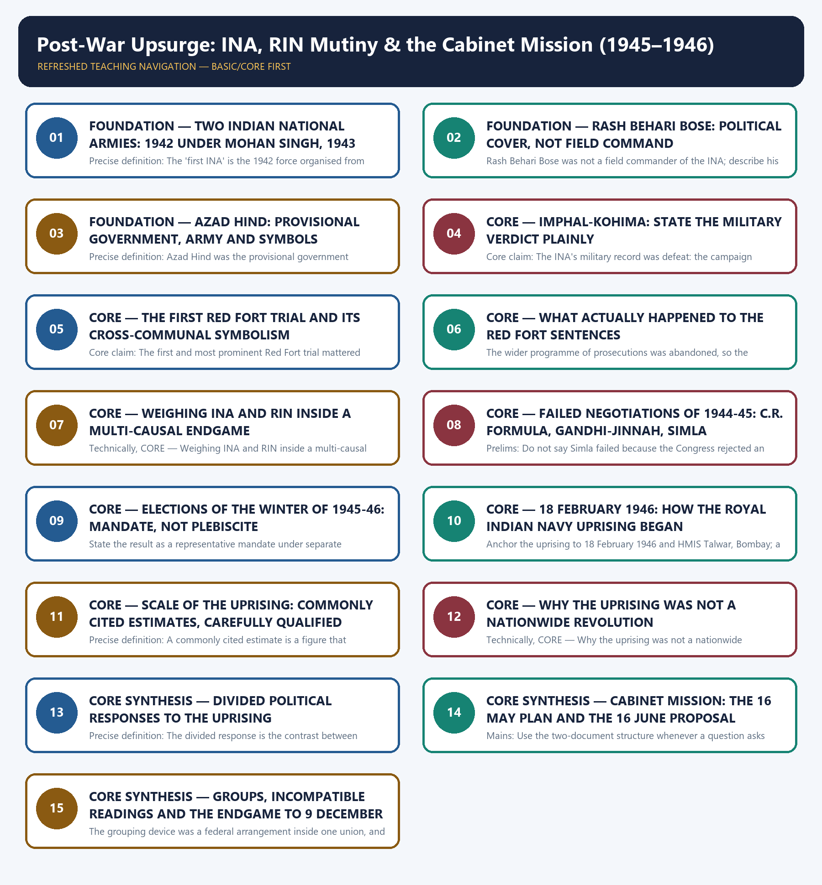

# Post-War Upsurge: INA, RIN Mutiny & the Cabinet Mission (1945–1946) - Learner-v2 Complete Learning Session

### SOURCE, PROGRESSION AND CURRENT-LINKAGE AUDIT

- **Repository owners queried:** Basic and Advanced Markdown for this topic, the master chronology, syllabus map and linked Modern History owners.
- **OCR book evidence queried:** The Basic and Advanced owner files were reconciled with the repository's Modern History OCR sources — Bipan Chandra's *Modern India*, *India's Struggle for Independence, 1857–1947* and *From Plassey to Partition* — for the INA, the Red Fort trials, the post-war upsurge, the 1944–45 negotiations, the 1945–46 elections and the Cabinet Mission. INA recruitment strength is retained only as an attributed estimate, and the RIN scale figures are carried strictly as commonly cited estimates because the local Basic owner explicitly cautions against asserting ship numbers as settled fact. The local Bipan Chandra text of *India's Struggle for Independence* (book PDF page 512) states expressly that the decision to send the Cabinet Mission was taken by the British Cabinet on 22 January 1946 and that the announcement of 19 February 1946 had been slated a week earlier, and it rejects R.P. Dutt's attribution of the mission's dispatch to the RIN revolt as untenable; that finding is carried into this package as a non-negotiable safeguard. The same text (book PDF pages 511 and 514) records that the Congress lauded the spirit of the people and condemned the repression but did not officially support these struggles because it felt their tactics and timing were wrong, that Vallabhbhai Patel asked the ratings to surrender because he saw the British mobilisation for repression in Bombay and wrote to Nehru on 22 February 1946 about the overpowering naval and military force gathered there, and that Jinnah's advice to surrender was addressed to Muslim ratings alone while the remaining ratings turned to the Congress and the Socialists; leadership responses are therefore presented as differentiated and never flattened into uniform support or one identical appeal.
- **Qdrant:** not used; Markdown plus searchable local PDFs were sufficient.
- **PYQ integrity:** No verbatim official stem is asserted for this topic. The 2019 Prelims GS-I Q15 and 2021 Prelims GS-I Q47 entries are routed demand summaries taken from `_PYQ-ROUTING-PRELIMS-2018-2023.md`; the local 2021 Prelims paper export is an unusable OCR scan and no official 2018–2023 Prelims key is held, so no answer letter is asserted. The 2019 Mains GS-I Q12 entry is a routed demand summary with directive metadata from `_PYQ-ROUTING-MAINS-GS1-GS2-ESSAY-2018-2023.md` and is not presented as a verbatim official stem.
- **Bounded live linkage:** A VisionIAS daily-news summary dated 17 August 2026, summarising an Indian Express article on the Royal Indian Navy uprising in the eightieth year since February 1946, is used only as a non-official study and current-affairs bridge. It is a private study-portal summary of a newspaper article, not a government commemoration, and this package makes no claim that any official or governmental commemoration of the RIN uprising took place in 2026. The scale figures that summary repeats — roughly 20,000 ratings, 78 ships and 20 shore establishments — are carried strictly as commonly cited estimates, and the popular attribution of a decisive judgement to Clement Attlee that appears there is recorded as a claim of that summary rather than as independently verified evidence. The headline framing of that article, that a naval mutiny hastened India's independence, is likewise a journalistic formulation and must never be converted into a claim of dispatch causation, because the uprising did not cause or trigger the dispatch of the Cabinet Mission, a decision the British Cabinet had already taken on 22 January 1946.
- **Fact/inference rule:** historical claims are source-backed; analytical judgements are explicitly framed as interpretation and do not invent figures.

## BASIC LEARNING SESSION

### DEEP-REVIEW LEARNING CONTRACT

| Control | Binding rule for this package |
|---|---|
| Syllabus boundary | Complete Modern History Core is taught chronologically and causally before optional enrichment. |
| Evidence method | Claim → named Act/treaty/record/organisation/person/region or scholarly evidence → analysis → qualification. |
| Date discipline | Event, proposal, enactment, commencement, official policy, implementation and later interpretation remain distinct. |
| Historiography | Colonial, nationalist, Marxist, subaltern, Cambridge, feminist and other relevant arguments are attributed and tested, never used as labels alone. |
| Practice contract | Every solved item has demand decoding, an examiner-grade model, an executable answer/compression plan, marks rationale and answer-specific improvement. |
| Approval | This immutable successor remains `approved: false` pending explicit approval. |

**Canonical Basic/Core owner:** `upsc-ai-kit\knowledge\Modern-Indian-History\basic\26_Post-War-Upsurge-INA-RIN-Mutiny-Cabinet-Mission.md`  
**Canonical topic owner:** `upsc-ai-kit\knowledge\Modern-Indian-History\basic\26_Post-War-Upsurge-INA-RIN-Mutiny-Cabinet-Mission.md`  
**Optional Advanced owner:** `upsc-ai-kit\knowledge\Modern-Indian-History\advanced\26_Post-War-Upsurge-INA-RIN-Mutiny-Cabinet-Mission.md`  
**Official syllabus mapping:** `upsc-ai-kit\knowledge\Modern-Indian-History\OFFICIAL-UPSC-SYLLABUS-MAPPING.md`

### EVIDENCE, PYQ AND CURRENT-STATUS CONTROL

- **Official and primary evidence:** Acts, charters, treaties, proclamations, committee reports, proceedings, organisational resolutions, speeches and contemporary records are dated and read for authorship and purpose.
- **Regional and social evidence:** petitions, newspapers, memoirs, local studies and material geography qualify elite or all-India generalisation.
- **Economic and quantitative evidence:** revenue, trade, price, wage, craft and mortality claims retain unit, region, period and uncertainty; statistics are never invented.
- **Scholarly interpretation:** historian schools are competing explanations tied to named evidence, not memorised verdicts.
- **PYQ discipline:** repository ledgers and locally held official papers control wording and metadata; reconstructed wording and unavailable official keys remain explicitly labelled.
- **Current-status note, rechecked 2026-08-31:** A VisionIAS daily-news summary dated 17 August 2026, summarising an Indian Express article on the Royal Indian Navy uprising in the eightieth year since February 1946, is used only as a non-official study and current-affairs bridge. It is a private study-portal summary of a newspaper article, not a government commemoration, and this package makes no claim that any official or governmental commemoration of the RIN uprising took place in 2026. The scale figures that summary repeats — roughly 20,000 ratings, 78 ships and 20 shore establishments — are carried strictly as commonly cited estimates, and the popular attribution of a decisive judgement to Clement Attlee that appears there is recorded as a claim of that summary rather than as independently verified evidence. The headline framing of that article, that a naval mutiny hastened India's independence, is likewise a journalistic formulation and must never be converted into a claim of dispatch causation, because the uprising did not cause or trigger the dispatch of the Cabinet Mission, a decision the British Cabinet had already taken on 22 January 1946.

**Live/primary context sources recorded by the predecessor generation:**

- `https://dce.visionias.in/upsc-daily-news-summary/article/2026-08-17/the-indian-express/history/how-a-naval-mutiny-hastened-indias-independence`




*Distinct embedded teaching-navigation image. The separate continuous Cārvāka-style flowchart package remains an independent at-a-glance artifact.*

### SESSION 1 — FOUNDATION — TWO INDIAN NATIONAL ARMIES: 1942 UNDER MOHAN SINGH, 1943 UNDER BOSE

#### DEFINITION / WHAT THIS IS CALLED

**Plain-language definition:** There were two successive Indian National Armies, and confusing them is the commonest factual error in this topic: the first was raised in 1942 under Mohan Singh and had effectively collapsed by early 1943, while the second was reorganised by Subhas Chandra Bose from May 1943 on a wholly different political footing.

**Technical definition:** Precise definition: The 'first INA' is the 1942 force organised from Indian prisoners of war under Mohan Singh, a formation distinct from the second INA that Subhas Chandra Bose reorganised from May 1943.

#### ANSWER-GRABBING OPENING — WRITE/ADAPT IN THE EXAM

> There were two successive Indian National Armies, and confusing them is the commonest factual error in this topic: the first was raised in 1942 under Mohan Singh and had effectively collapsed by early 1943, while the second was reorganised by Subhas Chandra Bose from May 1943 on a wholly different political footing.

#### MUST-WRITE KEYWORDS

- **FOUNDATION**
- **Two Indian National Armies**
- **Precise definition**
- **Topic boundary**
- **1942 under Mohan Singh**
- **1943 under Bose**

**How to use them:** Frame the answer through FOUNDATION; define Two Indian National Armies, connect Precise definition with Topic boundary to explain the mechanism, and use 1942 under Mohan Singh for the decisive comparison or qualification.

##### VISUAL FIRST

```text
TWO INDIAN NATIONAL ARMIES: 1942 UNDER MOHAN SINGH, 1943 UNDER BOSE
1942 -> FIRST INA -> Mohan Singh + Indian POWs (Malaya, Singapore) + Japanese support
EARLY 1943 -> first INA collapses; Mohan Singh removed and arrested over subsidiary status
MAY 1943 -> Subhas Chandra Bose reaches Southeast Asia
OCT 1943 -> SECOND INA under Azad Hind -> larger, politically directed, claimant government
RULE -> two armies, two dates, two leaderships; never one continuous force.
```

*The visual fixes this subtopic's chronology, mechanism or boundary before the evidence.*

##### CONCEPT DEFINITIONS

- **Precise definition:** The 'first INA' is the 1942 force organised from Indian prisoners of war under Mohan Singh, a formation distinct from the second INA that Subhas Chandra Bose reorganised from May 1943.
- **Topic boundary:** Apply this definition only within Post-War Upsurge: INA, RIN Mutiny & the Cabinet Mission (1945–1946); retain the named actor, institution, date and chronological role.

##### CORE EXPLANATION

There were two successive Indian National Armies, and confusing them is the commonest factual error in this topic: the first was raised in 1942 under Mohan Singh and had effectively collapsed by early 1943, while the second was reorganised by Subhas Chandra Bose from May 1943 on a wholly different political footing.

##### EVIDENCE AND MECHANISM

- The first INA was raised in 1942 from Indian prisoners of war captured in Malaya and Singapore, with Japanese support and Mohan Singh as its military organiser.
- Mohan Singh pressed for allied rather than subsidiary status for the force and was removed and arrested, so the first experiment had effectively collapsed by early 1943.
- Subhas Chandra Bose reached Southeast Asia in May 1943 and reorganised a second, larger and politically directed army under a claimant government.
- The two formations differ in date, leadership, size and political purpose, so a single continuous account of 'the INA' is factually wrong.

##### EXAMINER CAUTION

- Never merge the 1942 army under Mohan Singh with the 1943 army reorganised by Subhas Chandra Bose; name the year and the leader every time you use the abbreviation INA.

##### EXAM LINK

- **Prelims:** Never merge the 1942 army under Mohan Singh with the 1943 army reorganised by Subhas Chandra Bose; name the year and the leader every time you use the abbreviation INA.
- **Mains:** Open any INA answer by separating the 1942 and 1943 formations before you discuss the Imphal campaign or the Red Fort trials.

##### MINI RECAP

- **Core claim:** There were two successive Indian National Armies, and confusing them is the commonest factual error in this topic: the first was raised in 1942 under Mohan Singh and had effectively collapsed by early 1943, while the second was reorganised by Subhas Chandra Bose from May 1943 on a wholly different political footing.
- **Use:** Open any INA answer by separating the 1942 and 1943 formations before you discuss the Imphal campaign or the Red Fort trials.

#### CLOSING RECALL FLOW — FOUNDATION — TWO INDIAN NATIONAL ARMIES: 1942 UNDER MOHAN SINGH, 1943 UNDER BOSE

```text
START / CONCEPT: FOUNDATION — Two Indian National Armies: 1942 under Mohan Singh, 1943 under Bose
        |
        v
EXACT TERMS: FOUNDATION · Two Indian National Armies · Precise definition · Topic boundary · 1942 under Mohan Singh · 1943 under Bose
        |
        v
MECHANISM / ARGUMENT: Never merge the 1942 army under Mohan Singh with the 1943 army reorganised by Subhas Chandra Bose; name the year and the leader every time you use the abbreviation INA.
        |
        v
CONSEQUENCE / CONTRAST: Precise definition: The 'first INA' is the 1942 force organised from Indian prisoners of war under Mohan Singh, a formation distinct from the second INA that Subhas Chandra Bose reorganised from May 1943.
        |
        v
UPSC TRAP / ANSWER-USE: Do not miss this limiting distinction: the first INA was raised in 1942 from Indian prisoners of war captured in...
        |
        v
ANSWER-GRABBING FORMULATION: There were two successive Indian National Armies, and confusing them is the commonest factual error in this topic: the first was raised in 1942 under Mohan Singh and had effectively collapsed by early 1943, while the second was reorganised by Subhas Chandra Bose from May 1943 on a wholly different political footing.
```
### SESSION 2 — FOUNDATION — RASH BEHARI BOSE: POLITICAL COVER, NOT FIELD COMMAND

#### DEFINITION / WHAT THIS IS CALLED

**Plain-language definition:** Precise definition: Rash Behari Bose's role was the political and organisational sponsorship of the INA through the Indian Independence League, and not field command of its troops.

**Technical definition:** Rash Behari Bose was not a field commander of the INA; describe his role as political and organisational leadership of the Indian Independence League.

#### ANSWER-GRABBING OPENING — WRITE/ADAPT IN THE EXAM

> Precise definition: Rash Behari Bose's role was the political and organisational sponsorship of the INA through the Indian Independence League, and not field command of its troops.

#### MUST-WRITE KEYWORDS

- **FOUNDATION**
- **Rash Behari Bose**
- **political cover**
- **not field command**
- **Precise definition**
- **Topic boundary**

**How to use them:** Frame the answer through FOUNDATION; define Rash Behari Bose, connect political cover with not field command to explain the mechanism, and use Precise definition for the decisive comparison or qualification.

##### VISUAL FIRST

```text
RASH BEHARI BOSE: POLITICAL COVER, NOT FIELD COMMAND
INDIAN INDEPENDENCE LEAGUE  (political roof over the POW army)
|-- RASH BEHARI BOSE -> convenes Tokyo and Bangkok conferences; negotiates with Japan
|-- HANDOVER 1943 -> League and INA leadership pass to Subhas Chandra Bose
`-- FIELD COMMAND -> Mohan Singh (1942), then Bose's INA officers (1943-45)
RULE -> political sponsorship and field command are two different offices.
```

*The visual fixes this subtopic's chronology, mechanism or boundary before the evidence.*

##### CONCEPT DEFINITIONS

- **Precise definition:** Rash Behari Bose's role was the political and organisational sponsorship of the INA through the Indian Independence League, and not field command of its troops.
- **Topic boundary:** Apply this definition only within Post-War Upsurge: INA, RIN Mutiny & the Cabinet Mission (1945–1946); retain the named actor, institution, date and chronological role.

##### CORE EXPLANATION

Rash Behari Bose supplied the first INA's political legitimacy and civilian umbrella through the Indian Independence League, and flattening him into a battlefield commander erases the difference between the movement's political and military wings.

##### EVIDENCE AND MECHANISM

- Rash Behari Bose was a veteran revolutionary of the Ghadr-era conspiracies who had lived in Japan since the First World War years.
- He convened and presided over the Indian Independence League's Tokyo and Bangkok conferences, which gave the prisoner-of-war army a civilian political roof.
- He handed the leadership of the Indian Independence League and of the INA to Subhas Chandra Bose in 1943.
- His contribution was political sponsorship, organisation and negotiation with the Japanese authorities, not command of troops in Burma or Manipur.

##### EXAMINER CAUTION

- Rash Behari Bose was not a field commander of the INA; describe his role as political and organisational leadership of the Indian Independence League.

##### EXAM LINK

- **Prelims:** Rash Behari Bose was not a field commander of the INA; describe his role as political and organisational leadership of the Indian Independence League.
- **Mains:** Use this distinction whenever a question asks who 'led' the INA, because the accurate answer separates political sponsorship from military command.

##### MINI RECAP

- **Core claim:** Rash Behari Bose supplied the first INA's political legitimacy and civilian umbrella through the Indian Independence League, and flattening him into a battlefield commander erases the difference between the movement's political and military wings.
- **Use:** Use this distinction whenever a question asks who 'led' the INA, because the accurate answer separates political sponsorship from military command.

#### CLOSING RECALL FLOW — FOUNDATION — RASH BEHARI BOSE: POLITICAL COVER, NOT FIELD COMMAND

```text
START / CONCEPT: FOUNDATION — Rash Behari Bose: political cover, not field command
        |
        v
EXACT TERMS: FOUNDATION · Rash Behari Bose · political cover · not field command · Precise definition · Topic boundary
        |
        v
MECHANISM / ARGUMENT: Rash Behari Bose was not a field commander of the INA; describe his role as political and organisational leadership of the Indian Independence League.
        |
        v
CONSEQUENCE / CONTRAST: His contribution was political sponsorship, organisation and negotiation with the Japanese authorities, not command of troops in Burma or Manipur.
        |
        v
UPSC TRAP / ANSWER-USE: Do not miss this limiting distinction: rash Behari Bose was a veteran revolutionary of the Ghadr-era conspiracies who had lived...
        |
        v
ANSWER-GRABBING FORMULATION: Precise definition: Rash Behari Bose's role was the political and organisational sponsorship of the INA through the Indian Independence League, and not field command of its troops.
```
### SESSION 3 — FOUNDATION — AZAD HIND: PROVISIONAL GOVERNMENT, ARMY AND SYMBOLS

#### DEFINITION / WHAT THIS IS CALLED

**Plain-language definition:** Bose's real achievement was to convert a body of prisoners into a claimant government with an army, a cabinet, foreign recognition and a territorial claim, and the symbols that follow from that are examinable in their own right.

**Technical definition:** Precise definition: Azad Hind was the provisional government proclaimed by Subhas Chandra Bose at Singapore in October 1943, with its own supreme commander, army, symbols and claimed territory.

#### ANSWER-GRABBING OPENING — WRITE/ADAPT IN THE EXAM

> Precise definition: Azad Hind was the provisional government proclaimed by Subhas Chandra Bose at Singapore in October 1943, with its own supreme commander, army, symbols and claimed territory.

#### MUST-WRITE KEYWORDS

- **FOUNDATION**
- **Azad Hind**
- **provisional government**
- **army**
- **symbols**
- **Precise definition**

**How to use them:** Frame the answer through FOUNDATION; define Azad Hind, connect provisional government with army to explain the mechanism, and use symbols for the decisive comparison or qualification.

##### VISUAL FIRST

```text
AZAD HIND: PROVISIONAL GOVERNMENT, ARMY AND SYMBOLS
PROVISIONAL GOVERNMENT OF AZAD HIND (Singapore, October 1943)
|-- SUPREME COMMANDER -> Subhas Chandra Bose | SLOGANS -> "Dilli Chalo"
|-- ARMY -> reorganised INA | WOMEN'S UNIT -> Rani of Jhansi Regiment (Lakshmi Sahgal)
|-- TERRITORY CLAIMED -> Andaman and Nicobar renamed Shaheed and Swaraj
RULE -> a claimant government's symbols, not a record of battlefield success.
```

*The visual fixes this subtopic's chronology, mechanism or boundary before the evidence.*

##### CONCEPT DEFINITIONS

- **Precise definition:** Azad Hind was the provisional government proclaimed by Subhas Chandra Bose at Singapore in October 1943, with its own supreme commander, army, symbols and claimed territory.
- **Topic boundary:** Apply this definition only within Post-War Upsurge: INA, RIN Mutiny & the Cabinet Mission (1945–1946); retain the named actor, institution, date and chronological role.

##### CORE EXPLANATION

Bose's real achievement was to convert a body of prisoners into a claimant government with an army, a cabinet, foreign recognition and a territorial claim, and the symbols that follow from that are examinable in their own right.

##### EVIDENCE AND MECHANISM

- In October 1943 Bose proclaimed the Provisional Government of Azad Hind at Singapore and became its supreme commander.
- The slogans 'Dilli Chalo' and 'Give me blood and I will give you freedom' belong to this reorganised phase, not to the 1942 force.
- The Rani of Jhansi Regiment, associated with Lakshmi Sahgal, marked women's participation in militant nationalism.
- The Andaman and Nicobar islands were renamed Shaheed and Swaraj under the Azad Hind setup.

##### EXAMINER CAUTION

- Treat these as symbolic and organisational facts about a claimant government; recognition came from Japan and its allies, and none of them is evidence of military success.

##### EXAM LINK

- **Prelims:** Treat these as symbolic and organisational facts about a claimant government; recognition came from Japan and its allies, and none of them is evidence of military success.
- **Mains:** Use the Azad Hind symbols to explain why the post-war trials could not be treated as ordinary courts-martial.

##### MINI RECAP

- **Core claim:** Bose's real achievement was to convert a body of prisoners into a claimant government with an army, a cabinet, foreign recognition and a territorial claim, and the symbols that follow from that are examinable in their own right.
- **Use:** Use the Azad Hind symbols to explain why the post-war trials could not be treated as ordinary courts-martial.

#### CLOSING RECALL FLOW — FOUNDATION — AZAD HIND: PROVISIONAL GOVERNMENT, ARMY AND SYMBOLS

```text
START / CONCEPT: FOUNDATION — Azad Hind: provisional government, army and symbols
        |
        v
EXACT TERMS: FOUNDATION · Azad Hind · provisional government · army · symbols · Precise definition
        |
        v
MECHANISM / ARGUMENT: Bose's real achievement was to convert a body of prisoners into a claimant government with an army, a cabinet, foreign recognition and a territorial claim, and the symbols that follow from that are examinable in their own right.
        |
        v
CONSEQUENCE / CONTRAST: Mains: Use the Azad Hind symbols to explain why the post-war trials could not be treated as ordinary courts-martial.
        |
        v
UPSC TRAP / ANSWER-USE: The slogans 'Dilli Chalo' and 'Give me blood and I will give you freedom' belong to this reorganised phase, not to the 1942 force.
        |
        v
ANSWER-GRABBING FORMULATION: Precise definition: Azad Hind was the provisional government proclaimed by Subhas Chandra Bose at Singapore in October 1943, with its own supreme commander, army, symbols and claimed territory.
```
### SESSION 4 — CORE — IMPHAL-KOHIMA: STATE THE MILITARY VERDICT PLAINLY

#### DEFINITION / WHAT THIS IS CALLED

**Plain-language definition:** Precise definition: Imphal-Kohima names the 1944 battles at which the INA's advance into India was broken, fixing the army's military record as one of defeat.

**Technical definition:** Core claim: The INA's military record was defeat: the campaign launched on 8 March 1944 was broken at Imphal-Kohima, and an answer that softens this loses the very contrast on which the topic's argument depends.

#### ANSWER-GRABBING OPENING — WRITE/ADAPT IN THE EXAM

> Supply failure, monsoon conditions and Allied air power decided the campaign; the outcome was military, not a verdict on Indian nationalism.

#### MUST-WRITE KEYWORDS

- **Imphal-Kohima**
- **Precise definition**
- **Topic boundary**
- **Core claim**
- **Precise**
- **1945–1946**

**How to use them:** Frame the answer through Imphal-Kohima; define Precise definition, connect Topic boundary with Core claim to explain the mechanism, and use Precise for the decisive comparison or qualification.

##### VISUAL FIRST

```text
IMPHAL-KOHIMA: STATE THE MILITARY VERDICT PLAINLY
8 MAR 1944 -> Imphal campaign launched with Japanese forces -> objective: Delhi
IMPHAL + KOHIMA -> advance broken; retreat through Burma destroys the formation
CAUSES -> supply failure + monsoon + Allied air power (military, not political)
AUG 1945 -> Bose officially reported dead in an air crash; nothing beyond the report
RULE -> the military verdict is defeat; the political verdict comes later.
```

*The visual fixes this subtopic's chronology, mechanism or boundary before the evidence.*

##### CONCEPT DEFINITIONS

- **Precise definition:** Imphal-Kohima names the 1944 battles at which the INA's advance into India was broken, fixing the army's military record as one of defeat.
- **Topic boundary:** Apply this definition only within Post-War Upsurge: INA, RIN Mutiny & the Cabinet Mission (1945–1946); retain the named actor, institution, date and chronological role.

##### CORE EXPLANATION

The INA's military record was defeat: the campaign launched on 8 March 1944 was broken at Imphal-Kohima, and an answer that softens this loses the very contrast on which the topic's argument depends.

##### EVIDENCE AND MECHANISM

- The Imphal campaign was launched on 8 March 1944 alongside Japanese forces, with Delhi as its declared objective.
- The advance was broken at Imphal and Kohima, and the retreat through Burma destroyed the force as a fighting formation.
- Supply failure, monsoon conditions and Allied air power decided the campaign; the outcome was military, not a verdict on Indian nationalism.
- Bose was officially reported to have died in an air crash in August 1945, and no account of his death beyond that official report may be asserted.

##### EXAMINER CAUTION

- Do not soften the military verdict; the INA lost its campaign, and its political effect must be argued from the trials rather than from the battlefield.

##### EXAM LINK

- **Prelims:** Do not soften the military verdict; the INA lost its campaign, and its political effect must be argued from the trials rather than from the battlefield.
- **Mains:** Use the plain statement of defeat as the opening premise of the 'defeat produced political victory' argument.

##### MINI RECAP

- **Core claim:** The INA's military record was defeat: the campaign launched on 8 March 1944 was broken at Imphal-Kohima, and an answer that softens this loses the very contrast on which the topic's argument depends.
- **Use:** Use the plain statement of defeat as the opening premise of the 'defeat produced political victory' argument.

#### CLOSING RECALL FLOW — CORE — IMPHAL-KOHIMA: STATE THE MILITARY VERDICT PLAINLY

```text
START / CONCEPT: CORE — Imphal-Kohima: state the military verdict plainly
        |
        v
EXACT TERMS: Imphal-Kohima · Precise definition · Topic boundary · Core claim · Precise · 1945–1946
        |
        v
MECHANISM / ARGUMENT: Core claim: The INA's military record was defeat: the campaign launched on 8 March 1944 was broken at Imphal-Kohima, and an answer that softens this loses the very contrast on which the topic's argument depends.
        |
        v
CONSEQUENCE / CONTRAST: Do not soften the military verdict; the INA lost its campaign, and its political effect must be argued from the trials rather than from the battlefield.
        |
        v
UPSC TRAP / ANSWER-USE: Do not miss this limiting distinction: imphal-Kohima names the 1944 battles at which the INA's advance into India was broken...
        |
        v
ANSWER-GRABBING FORMULATION: Supply failure, monsoon conditions and Allied air power decided the campaign; the outcome was military, not a verdict on Indian nationalism.
```
### SESSION 5 — CORE — THE FIRST RED FORT TRIAL AND ITS CROSS-COMMUNAL SYMBOLISM

#### DEFINITION / WHAT THIS IS CALLED

**Plain-language definition:** Precise definition: The first Red Fort trial is the 1945-46 joint court-martial of Shah Nawaz Khan, Prem Sahgal (Sehgal) and Gurbaksh Singh Dhillon for waging war against the King.

**Technical definition:** Core claim: The first and most prominent Red Fort trial mattered because of who was in the dock: a Muslim, a Hindu and a Sikh tried together turned a prosecution into an unintended demonstration of national unity at the exact moment communal politics was hardening.

#### ANSWER-GRABBING OPENING — WRITE/ADAPT IN THE EXAM

> Precise definition: The first Red Fort trial is the 1945-46 joint court-martial of Shah Nawaz Khan, Prem Sahgal (Sehgal) and Gurbaksh Singh Dhillon for waging war against the King.

#### MUST-WRITE KEYWORDS

- **The first Red Fort trial**
- **its cross-communal symbolism**
- **Precise definition**
- **Topic boundary**
- **Core claim**
- **1945-46**

**How to use them:** Frame the answer through The first Red Fort trial; define its cross-communal symbolism, connect Precise definition with Topic boundary to explain the mechanism, and use Core claim for the decisive comparison or qualification.

##### VISUAL FIRST

```text
THE FIRST RED FORT TRIAL AND ITS CROSS-COMMUNAL SYMBOLISM
RED FORT TRIAL (1945-46) -> three officers tried together
|-- SHAH NAWAZ KHAN (Muslim) | PREM SAHGAL / SEHGAL (Hindu) | G.S. DHILLON (Sikh)
|-- DEFENCE -> Bhulabhai Desai, Tej Bahadur Sapru, K.N. Katju, Nehru, Asaf Ali
|-- CONGRESS -> INA Relief and Enquiry Committee; INA becomes an election plank
EFFECT -> prosecution reads as punishment of patriotism across three communities.
```

*The visual fixes this subtopic's chronology, mechanism or boundary before the evidence.*

##### CONCEPT DEFINITIONS

- **Precise definition:** The first Red Fort trial is the 1945-46 joint court-martial of Shah Nawaz Khan, Prem Sahgal (Sehgal) and Gurbaksh Singh Dhillon for waging war against the King.
- **Topic boundary:** Apply this definition only within Post-War Upsurge: INA, RIN Mutiny & the Cabinet Mission (1945–1946); retain the named actor, institution, date and chronological role.

##### CORE EXPLANATION

The first and most prominent Red Fort trial mattered because of who was in the dock: a Muslim, a Hindu and a Sikh tried together turned a prosecution into an unintended demonstration of national unity at the exact moment communal politics was hardening.

##### EVIDENCE AND MECHANISM

- The trial in 1945-46 tried Shah Nawaz Khan, Prem Sahgal (also spelt Sehgal) and Gurbaksh Singh Dhillon together.
- Their cross-communal composition was seized on by nationalist opinion precisely because communal negotiation had just failed at Simla.
- The defence was conducted by Bhulabhai Desai, Tej Bahadur Sapru, K.N. Katju, Jawaharlal Nehru and Asaf Ali.
- The Congress organised an INA Relief and Enquiry Committee and made the INA cause an election plank in the winter campaign.

##### EXAMINER CAUTION

- Name all three defendants and record the spelling variant Prem Sahgal or Sehgal; the cross-communal point collapses if only one or two names are given.

##### EXAM LINK

- **Prelims:** Name all three defendants and record the spelling variant Prem Sahgal or Sehgal; the cross-communal point collapses if only one or two names are given.
- **Mains:** Use the composition of the accused as the evidence that supports any claim about the trials producing brief cross-communal solidarity.

##### MINI RECAP

- **Core claim:** The first and most prominent Red Fort trial mattered because of who was in the dock: a Muslim, a Hindu and a Sikh tried together turned a prosecution into an unintended demonstration of national unity at the exact moment communal politics was hardening.
- **Use:** Use the composition of the accused as the evidence that supports any claim about the trials producing brief cross-communal solidarity.

#### CLOSING RECALL FLOW — CORE — THE FIRST RED FORT TRIAL AND ITS CROSS-COMMUNAL SYMBOLISM

```text
START / CONCEPT: CORE — The first Red Fort trial and its cross-communal symbolism
        |
        v
EXACT TERMS: The first Red Fort trial · its cross-communal symbolism · Precise definition · Topic boundary · Core claim · 1945-46
        |
        v
MECHANISM / ARGUMENT: Core claim: The first and most prominent Red Fort trial mattered because of who was in the dock: a Muslim, a Hindu and a Sikh tried together turned a prosecution into an unintended demonstration of national unity at the exact moment communal politics was hardening.
        |
        v
CONSEQUENCE / CONTRAST: Mains: Use the composition of the accused as the evidence that supports any claim about the trials producing brief cross-communal solidarity.
        |
        v
UPSC TRAP / ANSWER-USE: Do not miss this limiting distinction: their cross-communal composition was seized on by nationalist opinion precisely because communal negotiation had...
        |
        v
ANSWER-GRABBING FORMULATION: Precise definition: The first Red Fort trial is the 1945-46 joint court-martial of Shah Nawaz Khan, Prem Sahgal (Sehgal) and Gurbaksh Singh Dhillon for waging war against the King.
```
### SESSION 6 — CORE — WHAT ACTUALLY HAPPENED TO THE RED FORT SENTENCES

#### DEFINITION / WHAT THIS IS CALLED

**Plain-language definition:** Precise definition: Remission here means the Commander-in-Chief's cancellation of the transportation sentences imposed in the first Red Fort trial, leaving the convictions on record but the officers free.

**Technical definition:** The wider programme of prosecutions was abandoned, so the sentences of the first Red Fort trial were not carried out and no officer tried in that case was executed.

#### ANSWER-GRABBING OPENING — WRITE/ADAPT IN THE EXAM

> Precise definition: Remission here means the Commander-in-Chief's cancellation of the transportation sentences imposed in the first Red Fort trial, leaving the convictions on record but the officers free.

#### MUST-WRITE KEYWORDS

- **What actually happened to the Red Fort sentences**
- **Precise definition**
- **Topic boundary**
- **Core claim**
- **Precise definition: Remission here**
- **1945–1946**

**How to use them:** Frame the answer through What actually happened to the Red Fort sentences; define Precise definition, connect Topic boundary with Core claim to explain the mechanism, and use Precise definition: Remission here for the decisive comparison or qualification.

##### VISUAL FIRST

```text
WHAT ACTUALLY HAPPENED TO THE RED FORT SENTENCES
CONVICTION -> waging war against the King -> transportation for life
REMISSION -> Commander-in-Chief remits the sentences -> officers released
PRESSURE -> army opinion favours leniency; NWFP Governor urges abandonment
RESULT -> wider prosecutions abandoned; the sentences were not carried out
RULE -> a government retreat, not an execution.
```

*The visual fixes this subtopic's chronology, mechanism or boundary before the evidence.*

##### CONCEPT DEFINITIONS

- **Precise definition:** Remission here means the Commander-in-Chief's cancellation of the transportation sentences imposed in the first Red Fort trial, leaving the convictions on record but the officers free.
- **Topic boundary:** Apply this definition only within Post-War Upsurge: INA, RIN Mutiny & the Cabinet Mission (1945–1946); retain the named actor, institution, date and chronological role.

##### CORE EXPLANATION

The outcome is a precise fact that candidates routinely get wrong: the convictions stood, but the sentences were remitted and the officers walked free, which is exactly why the trials count as a government retreat.

##### EVIDENCE AND MECHANISM

- The three officers were convicted of waging war against the King and sentenced to transportation for life.
- The Commander-in-Chief remitted those sentences and the officers were released.
- The Commander-in-Chief recorded that general opinion in the army favoured leniency, and the Governor of the North-West Frontier Province urged abandoning the trials.
- The wider programme of prosecutions was abandoned, so the sentences of the first Red Fort trial were not carried out and no officer tried in that case was executed.

##### EXAMINER CAUTION

- Never write that the Red Fort defendants were executed; the convictions were recorded, the sentences remitted and the prosecutions abandoned.

##### EXAM LINK

- **Prelims:** Never write that the Red Fort defendants were executed; the convictions were recorded, the sentences remitted and the prosecutions abandoned.
- **Mains:** Use the remission as the concrete evidence that the state could no longer enforce military discipline against national opinion.

##### MINI RECAP

- **Core claim:** The outcome is a precise fact that candidates routinely get wrong: the convictions stood, but the sentences were remitted and the officers walked free, which is exactly why the trials count as a government retreat.
- **Use:** Use the remission as the concrete evidence that the state could no longer enforce military discipline against national opinion.

#### CLOSING RECALL FLOW — CORE — WHAT ACTUALLY HAPPENED TO THE RED FORT SENTENCES

```text
START / CONCEPT: CORE — What actually happened to the Red Fort sentences
        |
        v
EXACT TERMS: What actually happened to the Red Fort sentences · Precise definition · Topic boundary · Core claim · Precise definition: Remission here · 1945–1946
        |
        v
MECHANISM / ARGUMENT: The wider programme of prosecutions was abandoned, so the sentences of the first Red Fort trial were not carried out and no officer tried in that case was executed.
        |
        v
CONSEQUENCE / CONTRAST: Core claim: The outcome is a precise fact that candidates routinely get wrong: the convictions stood, but the sentences were remitted and the officers walked free, which is exactly why the trials count as a government retreat.
        |
        v
UPSC TRAP / ANSWER-USE: Never write that the Red Fort defendants were executed; the convictions were recorded, the sentences remitted and the prosecutions abandoned.
        |
        v
ANSWER-GRABBING FORMULATION: Precise definition: Remission here means the Commander-in-Chief's cancellation of the transportation sentences imposed in the first Red Fort trial, leaving the convictions on record but the officers free.
```
### SESSION 7 — CORE — WEIGHING INA AND RIN INSIDE A MULTI-CAUSAL ENDGAME

#### DEFINITION / WHAT THIS IS CALLED

**Plain-language definition:** Precise definition: The multi-causal endgame is the ranked explanation of British withdrawal in which collaboration collapse, wartime exhaustion, mass nationalism, international pressure and constitutional deadlock all operate together.

**Technical definition:** Technically, CORE — Weighing INA and RIN inside a multi-causal endgame is analysed by relating Weighing INA to RIN inside a multi-causal endgame, then testing the relationship through Precise definition and Topic boundary.

#### ANSWER-GRABBING OPENING — WRITE/ADAPT IN THE EXAM

> Precise definition: The multi-causal endgame is the ranked explanation of British withdrawal in which collaboration collapse, wartime exhaustion, mass nationalism, international pressure and constitutional deadlock all operate together.

#### MUST-WRITE KEYWORDS

- **Weighing INA**
- **RIN inside a multi-causal endgame**
- **Precise definition**
- **Topic boundary**
- **Core claim**
- **1920-22**

**How to use them:** Frame the answer through Weighing INA; define RIN inside a multi-causal endgame, connect Precise definition with Topic boundary to explain the mechanism, and use Core claim for the decisive comparison or qualification.

##### VISUAL FIRST

```text
WEIGHING INA AND RIN INSIDE A MULTI-CAUSAL ENDGAME
WHY THE BRITISH LEFT -> ranked, not listed
|-- COLLABORATION COLLAPSE -> services, police, armed forces no longer reliable
|-- WARTIME EXHAUSTION -> economic depletion, demobilisation, Labour government
|-- MASS NATIONALISM -> 1920-22, 1930-34, 1942 -> consent already impossible
|-- INTERNATIONAL + DEADLOCK -> decolonisation climate; 1946 constitutional impasse
CHRONOLOGY GUARD -> Mission dispatch decided 22 Jan 1946, before the 18 Feb strike
RULE -> INA and RIN sharpen the timing; they do not replace the other causes.
```

*The visual fixes this subtopic's chronology, mechanism or boundary before the evidence.*

##### CONCEPT DEFINITIONS

- **Precise definition:** The multi-causal endgame is the ranked explanation of British withdrawal in which collaboration collapse, wartime exhaustion, mass nationalism, international pressure and constitutional deadlock all operate together.
- **Topic boundary:** Apply this definition only within Post-War Upsurge: INA, RIN Mutiny & the Cabinet Mission (1945–1946); retain the named actor, institution, date and chronological role.

##### CORE EXPLANATION

INA and RIN pressure mattered because they put the loyalty of the coercive apparatus in question at the decisive moment, but they must be weighed alongside other causes rather than substituted for them.

##### EVIDENCE AND MECHANISM

- The Raj had always governed through Indian soldiers, police and officials, so doubt about their reliability struck at the basis of rule itself.
- Post-war British wartime exhaustion, economic depletion and a Labour government made a long coercive campaign unaffordable.
- Four decades of mass nationalism, from 1920-22 through 1930-34 to 1942, had already made government by consent impossible.
- International decolonisation pressure and the constitutional deadlock of 1946 completed the picture, so the upsurge sharpened the endgame without deciding it alone.

##### EXAMINER CAUTION

- Do not claim that the INA, the RIN uprising or the two together won India's freedom; rank the causes explicitly, give the collaboration collapse its weight without inflating it, and never convert influence on British confidence into a claim that the uprising produced a specific constitutional initiative such as the Cabinet Mission.

##### EXAM LINK

- **Prelims:** Do not claim that the INA, the RIN uprising or the two together won India's freedom; rank the causes explicitly, give the collaboration collapse its weight without inflating it, and never convert influence on British confidence into a claim that the uprising produced a specific constitutional initiative such as the Cabinet Mission.
- **Mains:** Use this weighting paragraph in any 'why did the British leave' answer, and state your ranking before you list evidence.

##### MINI RECAP

- **Core claim:** INA and RIN pressure mattered because they put the loyalty of the coercive apparatus in question at the decisive moment, but they must be weighed alongside other causes rather than substituted for them.
- **Use:** Use this weighting paragraph in any 'why did the British leave' answer, and state your ranking before you list evidence.

#### CLOSING RECALL FLOW — CORE — WEIGHING INA AND RIN INSIDE A MULTI-CAUSAL ENDGAME

```text
START / CONCEPT: CORE — Weighing INA and RIN inside a multi-causal endgame
        |
        v
EXACT TERMS: Weighing INA · RIN inside a multi-causal endgame · Precise definition · Topic boundary · Core claim · 1920-22
        |
        v
MECHANISM / ARGUMENT: Four decades of mass nationalism, from 1920-22 through 1930-34 to 1942, had already made government by consent impossible.
        |
        v
CONSEQUENCE / CONTRAST: Core claim: INA and RIN pressure mattered because they put the loyalty of the coercive apparatus in question at the decisive moment, but they must be weighed alongside other causes rather than substituted for them.
        |
        v
UPSC TRAP / ANSWER-USE: Do not claim that the INA, the RIN uprising or the two together won India's freedom; rank the causes explicitly, give the collaboration collapse its weight without inflating it, and never convert influence on British confidence into a claim that the uprising produced a specific constitutional initiative such as the Cabinet Mission.
        |
        v
ANSWER-GRABBING FORMULATION: Precise definition: The multi-causal endgame is the ranked explanation of British withdrawal in which collaboration collapse, wartime exhaustion, mass nationalism, international pressure and constitutional deadlock all operate together.
```
### SESSION 8 — CORE — FAILED NEGOTIATIONS OF 1944-45: C.R. FORMULA, GANDHI-JINNAH, SIMLA

#### DEFINITION / WHAT THIS IS CALLED

**Plain-language definition:** Precise definition: The 1944-45 negotiations are the linked failures of the C.R.

**Technical definition:** Prelims: Do not say Simla failed because the Congress rejected an Indian executive; it accepted the framework and refused a monopoly of Muslim nominations.

#### ANSWER-GRABBING OPENING — WRITE/ADAPT IN THE EXAM

> Do not say Simla failed because the Congress rejected an Indian executive; it accepted the framework and refused a monopoly of Muslim nominations.

#### MUST-WRITE KEYWORDS

- **Failed negotiations of 1944-45**
- **C.R. Formula**
- **Gandhi-Jinnah**
- **Simla**
- **Precise definition**
- **Topic boundary**

**How to use them:** Frame the answer through Failed negotiations of 1944-45; define C.R. Formula, connect Gandhi-Jinnah with Simla to explain the mechanism, and use Precise definition for the decisive comparison or qualification.

##### VISUAL FIRST

```text
FAILED NEGOTIATIONS OF 1944-45: C.R. FORMULA, GANDHI-JINNAH, SIMLA
APR 1944 -> C.R. FORMULA -> plebiscite in contiguous Muslim-majority districts
             -> deferred until after transfer of power; not an official Congress offer
SEP 1944 -> GANDHI-JINNAH TALKS BREAK DOWN -> separation within the family vs sovereignty
25 JUN - 14 JUL 1945 -> SIMLA CONFERENCE (Wavell) -> all-Indian Executive Council
BREAKDOWN -> League claims a monopoly of Muslim nominations; Azad is Congress president.
```

*The visual fixes this subtopic's chronology, mechanism or boundary before the evidence.*

##### CONCEPT DEFINITIONS

- **Precise definition:** The 1944-45 negotiations are the linked failures of the C.R. Formula, the Gandhi-Jinnah talks and the Simla Conference, all of which foundered on the question of Muslim representation.
- **Topic boundary:** Apply this definition only within Post-War Upsurge: INA, RIN Mutiny & the Cabinet Mission (1945–1946); retain the named actor, institution, date and chronological role.

##### CORE EXPLANATION

Every scheme between 1944 and 1945 failed at the same point, which was not the quantum of self-government but the question of who was entitled to represent Indian Muslims.

##### EVIDENCE AND MECHANISM

- The C.R. Formula of April 1944 offered a plebiscite of the adult population in contiguous Muslim-majority districts after the transfer of power, with joint essential services.
- It was C. Rajagopalachari's personal initiative and not an official Congress offer, and the Gandhi-Jinnah talks on that basis broke down in September 1944.
- The Simla Conference of 25 June - 14 July 1945, convened by Wavell, offered an entirely Indian Executive Council with parity between caste Hindus and Muslims.
- Simla collapsed on Jinnah's claim that the Muslim League alone could nominate every Muslim member, which the Congress refused while Maulana Abul Kalam Azad was its president.

##### EXAMINER CAUTION

- Do not say Simla failed because the Congress rejected an Indian executive; it accepted the framework and refused a monopoly of Muslim nominations.

##### EXAM LINK

- **Prelims:** Do not say Simla failed because the Congress rejected an Indian executive; it accepted the framework and refused a monopoly of Muslim nominations.
- **Mains:** Use this three-stage failure to explain why the electoral verdict of 1945-46 mattered so much to the bargaining that followed.

##### MINI RECAP

- **Core claim:** Every scheme between 1944 and 1945 failed at the same point, which was not the quantum of self-government but the question of who was entitled to represent Indian Muslims.
- **Use:** Use this three-stage failure to explain why the electoral verdict of 1945-46 mattered so much to the bargaining that followed.

#### CLOSING RECALL FLOW — CORE — FAILED NEGOTIATIONS OF 1944-45: C.R. FORMULA, GANDHI-JINNAH, SIMLA

```text
START / CONCEPT: CORE — Failed negotiations of 1944-45: C.R. Formula, Gandhi-Jinnah, Simla
        |
        v
EXACT TERMS: Failed negotiations of 1944-45 · C.R. Formula · Gandhi-Jinnah · Simla · Precise definition · Topic boundary
        |
        v
MECHANISM / ARGUMENT: Precise definition: The 1944-45 negotiations are the linked failures of the C.R.
        |
        v
CONSEQUENCE / CONTRAST: Simla collapsed on Jinnah's claim that the Muslim League alone could nominate every Muslim member, which the Congress refused while Maulana Abul Kalam Azad was its president.
        |
        v
UPSC TRAP / ANSWER-USE: Every scheme between 1944 and 1945 failed at the same point, which was not the quantum of self-government but the question of who was entitled to represent Indian Muslims.
        |
        v
ANSWER-GRABBING FORMULATION: Do not say Simla failed because the Congress rejected an Indian executive; it accepted the framework and refused a monopoly of Muslim nominations.
```
### SESSION 9 — CORE — ELECTIONS OF THE WINTER OF 1945-46: MANDATE, NOT PLEBISCITE

#### DEFINITION / WHAT THIS IS CALLED

**Plain-language definition:** Precise definition: The 1945-46 verdict is the pair of electoral mandates won by the Congress in general constituencies and by the Muslim League in Muslim constituencies under separate electorates.

**Technical definition:** State the result as a representative mandate under separate electorates and a restricted franchise; it was not a plebiscite that made Partition automatically inevitable.

#### ANSWER-GRABBING OPENING — WRITE/ADAPT IN THE EXAM

> State the result as a representative mandate under separate electorates and a restricted franchise; it was not a plebiscite that made Partition automatically inevitable.

#### MUST-WRITE KEYWORDS

- **Elections of the winter of 1945-46**
- **mandate**
- **not plebiscite**
- **Precise definition**
- **Topic boundary**
- **Core claim**

**How to use them:** Frame the answer through Elections of the winter of 1945-46; define mandate, connect not plebiscite with Precise definition to explain the mechanism, and use Topic boundary for the decisive comparison or qualification.

##### VISUAL FIRST

```text
ELECTIONS OF THE WINTER OF 1945-46: MANDATE, NOT PLEBISCITE
WINTER 1945-46 ELECTIONS -> two mandates in two separate electorates
|-- CONGRESS -> over 90% of general seats; 80.9% of general-constituency votes
|-- MUSLIM LEAGUE -> 74.7% of votes cast in Muslim constituencies
|-- FRANCHISE -> about 10% of the population; separate electorates
LIMIT -> no boundary, constitution or population question was on any ballot
RULE -> mandate, not plebiscite; representation was settled, territory was not.
```

*The visual fixes this subtopic's chronology, mechanism or boundary before the evidence.*

##### CONCEPT DEFINITIONS

- **Precise definition:** The 1945-46 verdict is the pair of electoral mandates won by the Congress in general constituencies and by the Muslim League in Muslim constituencies under separate electorates.
- **Topic boundary:** Apply this definition only within Post-War Upsurge: INA, RIN Mutiny & the Cabinet Mission (1945–1946); retain the named actor, institution, date and chronological role.

##### CORE EXPLANATION

The elections converted the Pakistan demand from a contested elite assertion into a certified representative mandate, and they did so under separate electorates and a restricted franchise that make the word plebiscite inaccurate.

##### EVIDENCE AND MECHANISM

- The Congress won over 90 per cent of the general seats provincially and 80.9 per cent of the general-constituency votes across India.
- The Muslim League took 74.7 per cent of the votes cast in Muslim constituencies, sweeping the separate Muslim seats.
- The electorate was heavily restricted, at about 10 per cent of the population, and voting was by separate electorates.
- No boundary, constitution or population arrangement appeared on any ballot, so the verdict certified representation without settling territory.

##### EXAMINER CAUTION

- State the result as a representative mandate under separate electorates and a restricted franchise; it was not a plebiscite that made Partition automatically inevitable.

##### EXAM LINK

- **Prelims:** State the result as a representative mandate under separate electorates and a restricted franchise; it was not a plebiscite that made Partition automatically inevitable.
- **Mains:** Use the mandate-not-inevitability formulation whenever a question asks whether the 1945-46 elections made Partition certain.

##### MINI RECAP

- **Core claim:** The elections converted the Pakistan demand from a contested elite assertion into a certified representative mandate, and they did so under separate electorates and a restricted franchise that make the word plebiscite inaccurate.
- **Use:** Use the mandate-not-inevitability formulation whenever a question asks whether the 1945-46 elections made Partition certain.

#### CLOSING RECALL FLOW — CORE — ELECTIONS OF THE WINTER OF 1945-46: MANDATE, NOT PLEBISCITE

```text
START / CONCEPT: CORE — Elections of the winter of 1945-46: mandate, not plebiscite
        |
        v
EXACT TERMS: Elections of the winter of 1945-46 · mandate · not plebiscite · Precise definition · Topic boundary · Core claim
        |
        v
MECHANISM / ARGUMENT: Precise definition: The 1945-46 verdict is the pair of electoral mandates won by the Congress in general constituencies and by the Muslim League in Muslim constituencies under separate electorates.
        |
        v
CONSEQUENCE / CONTRAST: Mains: Use the mandate-not-inevitability formulation whenever a question asks whether the 1945-46 elections made Partition certain.
        |
        v
UPSC TRAP / ANSWER-USE: Do not miss this limiting distinction: the electorate was heavily restricted, at about 10 per cent of the population.
        |
        v
ANSWER-GRABBING FORMULATION: State the result as a representative mandate under separate electorates and a restricted franchise; it was not a plebiscite that made Partition automatically inevitable.
```
### SESSION 10 — CORE — 18 FEBRUARY 1946: HOW THE ROYAL INDIAN NAVY UPRISING BEGAN

#### DEFINITION / WHAT THIS IS CALLED

**Plain-language definition:** Precise definition: The Royal Indian Navy uprising is the ratings' revolt that began on 18 February 1946 at HMIS Talwar in Bombay over service grievances and INA-related demands.

**Technical definition:** Anchor the uprising to 18 February 1946 and HMIS Talwar, Bombay; a vague 'February 1946 in Bombay' loses the examinable detail, and the exact date also matters because the Cabinet Mission's dispatch had already been decided on 22 January 1946.

#### ANSWER-GRABBING OPENING — WRITE/ADAPT IN THE EXAM

> Precise definition: The Royal Indian Navy uprising is the ratings' revolt that began on 18 February 1946 at HMIS Talwar in Bombay over service grievances and INA-related demands.

#### MUST-WRITE KEYWORDS

- **how the Royal Indian Navy uprising began**
- **Precise definition**
- **Topic boundary**
- **Core claim**
- **18 February 1946**
- **1945–1946**

**How to use them:** Frame the answer through how the Royal Indian Navy uprising began; define Precise definition, connect Topic boundary with Core claim to explain the mechanism, and use 18 February 1946 for the decisive comparison or qualification.

##### VISUAL FIRST

```text
18 FEBRUARY 1946: HOW THE ROYAL INDIAN NAVY UPRISING BEGAN
18 FEB 1946 -> HMIS TALWAR, BOMBAY -> ratings' uprising begins
GRIEVANCES -> demobilisation anxiety | rations and service conditions | racial insult
DEMANDS -> better conditions | non-victimisation of strikers | free trials for INA men
LINK -> naval grievance meets the political charge of the Red Fort trials
ALREADY DECIDED -> 22 JAN 1946 Cabinet resolves to send the Cabinet Mission
RULE -> fix the date and the establishment before any interpretation.
```

*The visual fixes this subtopic's chronology, mechanism or boundary before the evidence.*

##### CONCEPT DEFINITIONS

- **Precise definition:** The Royal Indian Navy uprising is the ratings' revolt that began on 18 February 1946 at HMIS Talwar in Bombay over service grievances and INA-related demands.
- **Topic boundary:** Apply this definition only within Post-War Upsurge: INA, RIN Mutiny & the Cabinet Mission (1945–1946); retain the named actor, institution, date and chronological role.

##### CORE EXPLANATION

The uprising had a precise date, a precise place and concrete service grievances, and an answer that begins with generalities about nationalism loses the evidence that makes it persuasive.

##### EVIDENCE AND MECHANISM

- The uprising began on 18 February 1946 at HMIS Talwar in Bombay, a signals training establishment.
- Its immediate grievances were demobilisation anxiety, poor rations and service conditions, and racial insult by officers.
- The ratings' demands included better conditions, non-victimisation of strikers, and free trials for INA detainees.
- The naval demands therefore ran directly into the political atmosphere created by the Red Fort trials of the previous months.

##### EXAMINER CAUTION

- Anchor the uprising to 18 February 1946 and HMIS Talwar, Bombay; a vague 'February 1946 in Bombay' loses the examinable detail, and the exact date also matters because the Cabinet Mission's dispatch had already been decided on 22 January 1946.

##### EXAM LINK

- **Prelims:** Anchor the uprising to 18 February 1946 and HMIS Talwar, Bombay; a vague 'February 1946 in Bombay' loses the examinable detail, and the exact date also matters because the Cabinet Mission's dispatch had already been decided on 22 January 1946.
- **Mains:** Use the demand for free INA trials to connect this session directly to the Red Fort sessions rather than treating the two episodes as unrelated.

##### MINI RECAP

- **Core claim:** The uprising had a precise date, a precise place and concrete service grievances, and an answer that begins with generalities about nationalism loses the evidence that makes it persuasive.
- **Use:** Use the demand for free INA trials to connect this session directly to the Red Fort sessions rather than treating the two episodes as unrelated.

#### CLOSING RECALL FLOW — CORE — 18 FEBRUARY 1946: HOW THE ROYAL INDIAN NAVY UPRISING BEGAN

```text
START / CONCEPT: CORE — 18 February 1946: how the Royal Indian Navy uprising began
        |
        v
EXACT TERMS: how the Royal Indian Navy uprising began · Precise definition · Topic boundary · Core claim · 18 February 1946 · 1945–1946
        |
        v
MECHANISM / ARGUMENT: Anchor the uprising to 18 February 1946 and HMIS Talwar, Bombay; a vague 'February 1946 in Bombay' loses the examinable detail, and the exact date also matters because the Cabinet Mission's dispatch had already been decided on 22 January 1946.
        |
        v
CONSEQUENCE / CONTRAST: The naval demands therefore ran directly into the political atmosphere created by the Red Fort trials of the previous months.
        |
        v
UPSC TRAP / ANSWER-USE: Do not miss this limiting distinction: the uprising had a precise date, a precise place and concrete service grievances.
        |
        v
ANSWER-GRABBING FORMULATION: Precise definition: The Royal Indian Navy uprising is the ratings' revolt that began on 18 February 1946 at HMIS Talwar in Bombay over service grievances and INA-related demands.
```
### SESSION 11 — CORE — SCALE OF THE UPRISING: COMMONLY CITED ESTIMATES, CAREFULLY QUALIFIED

#### DEFINITION / WHAT THIS IS CALLED

**Plain-language definition:** Core claim: The familiar scale figures are useful but must be presented honestly as commonly cited estimates, because the repository's own Basic owner warns against asserting ship numbers as settled fact.

**Technical definition:** Precise definition: A commonly cited estimate is a figure that circulates widely across secondary summaries without a single authoritative count behind it, and which must therefore be labelled when used.

#### ANSWER-GRABBING OPENING — WRITE/ADAPT IN THE EXAM

> Core claim: The familiar scale figures are useful but must be presented honestly as commonly cited estimates, because the repository's own Basic owner warns against asserting ship numbers as settled fact.

#### MUST-WRITE KEYWORDS

- **Scale of the uprising**
- **commonly cited estimates**
- **carefully qualified**
- **Precise definition**
- **Topic boundary**
- **Core claim**

**How to use them:** Frame the answer through Scale of the uprising; define commonly cited estimates, connect carefully qualified with Precise definition to explain the mechanism, and use Topic boundary for the decisive comparison or qualification.

##### VISUAL FIRST

```text
SCALE OF THE UPRISING: COMMONLY CITED ESTIMATES, CAREFULLY QUALIFIED
COMMONLY CITED ESTIMATES (source-dependent, not a verified count)
|-- RATINGS -> roughly 20,000        |-- SHIPS -> roughly 78
|-- SHORE ESTABLISHMENTS -> roughly 20
OWNER CAUTION -> the local Basic owner warns against asserting ship numbers
RULE -> attach the qualifier or describe the spread qualitatively instead.
```

*The visual fixes this subtopic's chronology, mechanism or boundary before the evidence.*

##### CONCEPT DEFINITIONS

- **Precise definition:** A commonly cited estimate is a figure that circulates widely across secondary summaries without a single authoritative count behind it, and which must therefore be labelled when used.
- **Topic boundary:** Apply this definition only within Post-War Upsurge: INA, RIN Mutiny & the Cabinet Mission (1945–1946); retain the named actor, institution, date and chronological role.

##### CORE EXPLANATION

The familiar scale figures are useful but must be presented honestly as commonly cited estimates, because the repository's own Basic owner warns against asserting ship numbers as settled fact.

##### EVIDENCE AND MECHANISM

- Commonly cited estimates place the uprising's spread at roughly 20,000 ratings, 78 ships and 20 shore establishments.
- These figures are source-dependent and circulate mainly through study summaries rather than through a single authoritative count.
- The local Basic owner explicitly cautions against stating the number of ships involved as a fixed fact.
- The safe formulation is to give the figures with the phrase 'commonly cited estimates' attached, or to describe the spread qualitatively instead.

##### EXAMINER CAUTION

- Never present roughly 20,000 ratings, 78 ships or 20 shore establishments as a verified count; always mark them as commonly cited estimates.

##### EXAM LINK

- **Prelims:** Never present roughly 20,000 ratings, 78 ships or 20 shore establishments as a verified count; always mark them as commonly cited estimates.
- **Mains:** Use the qualified figures to demonstrate scale in a Mains answer while showing the examiner that you know the evidential status of your numbers.

##### MINI RECAP

- **Core claim:** The familiar scale figures are useful but must be presented honestly as commonly cited estimates, because the repository's own Basic owner warns against asserting ship numbers as settled fact.
- **Use:** Use the qualified figures to demonstrate scale in a Mains answer while showing the examiner that you know the evidential status of your numbers.

#### CLOSING RECALL FLOW — CORE — SCALE OF THE UPRISING: COMMONLY CITED ESTIMATES, CAREFULLY QUALIFIED

```text
START / CONCEPT: CORE — Scale of the uprising: commonly cited estimates, carefully qualified
        |
        v
EXACT TERMS: Scale of the uprising · commonly cited estimates · carefully qualified · Precise definition · Topic boundary · Core claim
        |
        v
MECHANISM / ARGUMENT: Precise definition: A commonly cited estimate is a figure that circulates widely across secondary summaries without a single authoritative count behind it, and which must therefore be labelled when used.
        |
        v
CONSEQUENCE / CONTRAST: Mains: Use the qualified figures to demonstrate scale in a Mains answer while showing the examiner that you know the evidential status of your numbers.
        |
        v
UPSC TRAP / ANSWER-USE: Do not miss this limiting distinction: the safe formulation is to give the figures with the phrase 'commonly cited estimates'...
        |
        v
ANSWER-GRABBING FORMULATION: Core claim: The familiar scale figures are useful but must be presented honestly as commonly cited estimates, because the repository's own Basic owner warns against asserting ship numbers as settled fact.
```
### SESSION 12 — CORE — WHY THE UPRISING WAS NOT A NATIONWIDE REVOLUTION

#### DEFINITION / WHAT THIS IS CALLED

**Plain-language definition:** Prelims: Do not describe the uprising as a nationalist-directed insurrection, as the immediate cause of British withdrawal, or as the reason the Cabinet Mission was sent; the dispatch decision of 22 January 1946 predates the uprising, so the dispatch-causation claim is explicitly untenable, and the separate suggestion attributed to P.S.

**Technical definition:** Technically, CORE — Why the uprising was not a nationwide revolution is analysed by relating Precise definition to Topic boundary, then testing the relationship through Core claim and Precise definition: Service-centred.

#### ANSWER-GRABBING OPENING — WRITE/ADAPT IN THE EXAM

> Core claim: The uprising was serious and alarming to the government, but it was bounded in time, place and social base, and describing it as a revolution misstates both its character and its outcome.

#### MUST-WRITE KEYWORDS

- **Precise definition**
- **Topic boundary**
- **Core claim**
- **Precise definition: Service-centred**
- **1945–1946**
- **1945-46**

**How to use them:** Frame the answer through Precise definition; define Topic boundary, connect Core claim with Precise definition: Service-centred to explain the mechanism, and use 1945–1946 for the decisive comparison or qualification.

##### VISUAL FIRST

```text
WHY THE UPRISING WAS NOT A NATIONWIDE REVOLUTION
WHAT IT REVEALED                | WHAT IT ACHIEVED
--------------------------------|-----------------------------------------------
loyalty of services in doubt    | no constitutional settlement
security doctrine of 1858 failing | surrender within days
urban solidarity with servicemen | no rural or nationwide extension
CHRONOLOGY TEST -> 22 JAN 1946 decision -> 18 FEB 1946 strike -> 19 FEB 1946 statement
RULE -> serious and revealing, but short-lived, urban and service-centred, and
        it did not cause or trigger the dispatch of the Cabinet Mission.
```

*The visual fixes this subtopic's chronology, mechanism or boundary before the evidence.*

##### CONCEPT DEFINITIONS

- **Precise definition:** Service-centred means confined largely to serving naval personnel and their urban sympathisers, in contrast to the cross-class and rural reach of the earlier mass movements.
- **Topic boundary:** Apply this definition only within Post-War Upsurge: INA, RIN Mutiny & the Cabinet Mission (1945–1946); retain the named actor, institution, date and chronological role.

##### CORE EXPLANATION

The uprising was serious and alarming to the government, but it was bounded in time, place and social base, and describing it as a revolution misstates both its character and its outcome.

##### EVIDENCE AND MECHANISM

- It was short-lived and was surrendered within days rather than developing into a sustained campaign.
- It was concentrated in urban naval stations and the service population, with no rural base comparable to earlier mass movements.
- It was not directed by the Congress and it was not a Congress-led nationwide revolution.
- It did not by itself end British rule, and it did not cause or trigger the dispatch of the Cabinet Mission: the British Cabinet decided to send the mission on 22 January 1946 and Attlee's Commons announcement of 19 February 1946 had been slated a week earlier, so the decision preceded the strike that began on 18 February 1946.

##### EXAMINER CAUTION

- Do not describe the uprising as a nationalist-directed insurrection, as the immediate cause of British withdrawal, or as the reason the Cabinet Mission was sent; the dispatch decision of 22 January 1946 predates the uprising, so the dispatch-causation claim is explicitly untenable, and the separate suggestion attributed to P.S. Gupta in the Advanced owner concerns the wider INA agitation of 1945-46 and is recorded there as an attributed position rather than as settled fact.

##### EXAM LINK

- **Prelims:** Do not describe the uprising as a nationalist-directed insurrection, as the immediate cause of British withdrawal, or as the reason the Cabinet Mission was sent; the dispatch decision of 22 January 1946 predates the uprising, so the dispatch-causation claim is explicitly untenable, and the separate suggestion attributed to P.S. Gupta in the Advanced owner concerns the wider INA agitation of 1945-46 and is recorded there as an attributed position rather than as settled fact.
- **Mains:** Use the what-it-revealed versus what-it-achieved split as the structural spine of any RIN significance answer, and use the 22 January chronology as the sentence that shows an examiner you can date a decision rather than assume a causal link.

##### MINI RECAP

- **Core claim:** The uprising was serious and alarming to the government, but it was bounded in time, place and social base, and describing it as a revolution misstates both its character and its outcome.
- **Use:** Use the what-it-revealed versus what-it-achieved split as the structural spine of any RIN significance answer, and use the 22 January chronology as the sentence that shows an examiner you can date a decision rather than assume a causal link.

#### CLOSING RECALL FLOW — CORE — WHY THE UPRISING WAS NOT A NATIONWIDE REVOLUTION

```text
START / CONCEPT: CORE — Why the uprising was not a nationwide revolution
        |
        v
EXACT TERMS: Precise definition · Topic boundary · Core claim · Precise definition: Service-centred · 1945–1946 · 1945-46
        |
        v
MECHANISM / ARGUMENT: It was not directed by the Congress and it was not a Congress-led nationwide revolution.
        |
        v
CONSEQUENCE / CONTRAST: Precise definition: Service-centred means confined largely to serving naval personnel and their urban sympathisers, in contrast to the cross-class and rural reach of the earlier mass movements.
        |
        v
UPSC TRAP / ANSWER-USE: Do not describe the uprising as a nationalist-directed insurrection, as the immediate cause of British withdrawal, or as the reason the Cabinet Mission was sent; the dispatch decision of 22 January 1946 predates the uprising, so the dispatch-causation claim is explicitly untenable, and the separate suggestion attributed to P.S.
        |
        v
ANSWER-GRABBING FORMULATION: Core claim: The uprising was serious and alarming to the government, but it was bounded in time, place and social base, and describing it as a revolution misstates both its character and its outcome.
```
### SESSION 13 — CORE SYNTHESIS — DIVIDED POLITICAL RESPONSES TO THE UPRISING

#### DEFINITION / WHAT THIS IS CALLED

**Plain-language definition:** Core claim: Political responses to the uprising were differentiated rather than uniform, and the difference between party leaderships and organised civilian sympathy is itself examinable.

**Technical definition:** Precise definition: The divided response is the contrast between senior party leaders who urged surrender, on different grounds and to different audiences, and the organised workers', student and left support that sustained the uprising's civilian side.

#### ANSWER-GRABBING OPENING — WRITE/ADAPT IN THE EXAM

> Core claim: Political responses to the uprising were differentiated rather than uniform, and the difference between party leaderships and organised civilian sympathy is itself examinable.

#### MUST-WRITE KEYWORDS

- **CORE SYNTHESIS**
- **Divided political responses to the uprising**
- **Precise definition**
- **Topic boundary**
- **Core claim**
- **1945–1946**

**How to use them:** Frame the answer through CORE SYNTHESIS; define Divided political responses to the uprising, connect Precise definition with Topic boundary to explain the mechanism, and use Core claim for the decisive comparison or qualification.

##### VISUAL FIRST

```text
DIVIDED POLITICAL RESPONSES TO THE UPRISING
RESPONSES TO THE UPRISING -> differentiated, not uniform
|-- CONGRESS -> lauds the spirit, condemns repression, withholds official support
|          -> reason given: tactics and timing judged wrong
|-- PATEL -> asks the ratings to surrender before overwhelming British mobilisation
|-- JINNAH -> surrender advice addressed to MUSLIM RATINGS ALONE, not to all ratings
|-- WORKERS and STUDENTS (Bombay) -> sympathy strikes; civilian dimension
|-- COMMUNIST and LEFT GROUPS -> direct support, yet also peace work once troops moved
|-- GOVERNMENT -> force, then negotiation and persuasion
RULE -> record the split and the different audiences; never claim uniform backing
        or one identical appeal to every rating.
```

*The visual fixes this subtopic's chronology, mechanism or boundary before the evidence.*

##### CONCEPT DEFINITIONS

- **Precise definition:** The divided response is the contrast between senior party leaders who urged surrender, on different grounds and to different audiences, and the organised workers', student and left support that sustained the uprising's civilian side.
- **Topic boundary:** Apply this definition only within Post-War Upsurge: INA, RIN Mutiny & the Cabinet Mission (1945–1946); retain the named actor, institution, date and chronological role.

##### CORE EXPLANATION

Political responses to the uprising were differentiated rather than uniform, and the difference between party leaderships and organised civilian sympathy is itself examinable.

##### EVIDENCE AND MECHANISM

- The Congress lauded the spirit of the people and condemned the repression, but it did not officially support the struggle because it judged the tactics and the timing wrong; Vallabhbhai Patel asked the ratings to surrender because he saw the overwhelming British mobilisation for repression in Bombay, writing to Nehru on 22 February 1946 that the naval and military force assembled there could exterminate them altogether.
- Muhammad Ali Jinnah's advice to surrender was addressed to Muslim ratings alone, who had gone to the League for guidance while the rest of the ratings went to the Congress and the Socialists, so the two appeals were neither identical nor addressed to the same audience.
- Organised sympathy strikes by workers and students in Bombay gave the uprising a civilian dimension it did not create for itself, and communist and other left organisations supported the ratings more directly than the major national parties did, although communists also joined Congressmen in urging crowds to disperse once repression was under way.
- The government responded with force, and the episode ended through negotiation and persuasion rather than through victory on either side.

##### EXAMINER CAUTION

- Do not claim that all national leaders supported the uprising, and do not flatten the two surrender appeals into one undifferentiated call to every rating: the Congress withheld official support on grounds of tactics and timing, Patel's appeal answered the scale of British repression in Bombay, and Jinnah's advice in the local book account was addressed to Muslim ratings alone. Differentiate party appeals for surrender, organised civilian and workers' sympathy, and left support.

##### EXAM LINK

- **Prelims:** Do not claim that all national leaders supported the uprising, and do not flatten the two surrender appeals into one undifferentiated call to every rating: the Congress withheld official support on grounds of tactics and timing, Patel's appeal answered the scale of British repression in Bombay, and Jinnah's advice in the local book account was addressed to Muslim ratings alone. Differentiate party appeals for surrender, organised civilian and workers' sympathy, and left support.
- **Mains:** Use the differentiated response to explain why the uprising produced political alarm without producing a political settlement.

##### MINI RECAP

- **Core claim:** Political responses to the uprising were differentiated rather than uniform, and the difference between party leaderships and organised civilian sympathy is itself examinable.
- **Use:** Use the differentiated response to explain why the uprising produced political alarm without producing a political settlement.

#### CLOSING RECALL FLOW — CORE SYNTHESIS — DIVIDED POLITICAL RESPONSES TO THE UPRISING

```text
START / CONCEPT: CORE SYNTHESIS — Divided political responses to the uprising
        |
        v
EXACT TERMS: CORE SYNTHESIS · Divided political responses to the uprising · Precise definition · Topic boundary · Core claim · 1945–1946
        |
        v
MECHANISM / ARGUMENT: Mains: Use the differentiated response to explain why the uprising produced political alarm without producing a political settlement.
        |
        v
CONSEQUENCE / CONTRAST: Precise definition: The divided response is the contrast between senior party leaders who urged surrender, on different grounds and to different audiences, and the organised workers', student and left support that sustained the uprising's civilian side.
        |
        v
UPSC TRAP / ANSWER-USE: Organised sympathy strikes by workers and students in Bombay gave the uprising a civilian dimension it did not create for itself, and communist and other left organisations supported the ratings more directly than the major national parties did, although communists also joined Congressmen in urging crowds to disperse once repression was under way.
        |
        v
ANSWER-GRABBING FORMULATION: Core claim: Political responses to the uprising were differentiated rather than uniform, and the difference between party leaderships and organised civilian sympathy is itself examinable.
```
### SESSION 14 — CORE SYNTHESIS — CABINET MISSION: THE 16 MAY PLAN AND THE 16 JUNE PROPOSAL

#### DEFINITION / WHAT THIS IS CALLED

**Plain-language definition:** Precise definition: The Cabinet Mission's long-term plan is the constitutional scheme of 16 May 1946, distinct from the interim-government proposal it issued separately on 16 June 1946.

**Technical definition:** Mains: Use the two-document structure whenever a question asks what the Cabinet Mission proposed, so that the constitutional and executive offers are not confused.

#### ANSWER-GRABBING OPENING — WRITE/ADAPT IN THE EXAM

> Precise definition: The Cabinet Mission's long-term plan is the constitutional scheme of 16 May 1946, distinct from the interim-government proposal it issued separately on 16 June 1946.

#### MUST-WRITE KEYWORDS

- **CORE SYNTHESIS**
- **Cabinet Mission**
- **the 16 May plan**
- **the 16 June proposal**
- **Precise definition**
- **Topic boundary**

**How to use them:** Frame the answer through CORE SYNTHESIS; define Cabinet Mission, connect the 16 May plan with the 16 June proposal to explain the mechanism, and use Precise definition for the decisive comparison or qualification.

##### VISUAL FIRST

```text
CABINET MISSION: THE 16 MAY PLAN AND THE 16 JUNE PROPOSAL
CABINET MISSION 1946 -> Pethick-Lawrence | Stafford Cripps | A.V. Alexander
16 MAY 1946 -> LONG-TERM PLAN -> sovereign Pakistan rejected; three-tier union
    UNION SUBJECTS -> foreign affairs, defence, communications
                   -> plus power to raise the finances required for those subjects
16 JUN 1946 -> SEPARATE INTERIM-GOVERNMENT PROPOSAL -> a different document
RULE -> one mission, two dated documents; never merge them.
```

*The visual fixes this subtopic's chronology, mechanism or boundary before the evidence.*

##### CONCEPT DEFINITIONS

- **Precise definition:** The Cabinet Mission's long-term plan is the constitutional scheme of 16 May 1946, distinct from the interim-government proposal it issued separately on 16 June 1946.
- **Topic boundary:** Apply this definition only within Post-War Upsurge: INA, RIN Mutiny & the Cabinet Mission (1945–1946); retain the named actor, institution, date and chronological role.

##### CORE EXPLANATION

The Cabinet Mission produced two separate documents a month apart, and merging them destroys the distinction between a long-term constitutional scheme and a short-term interim-government offer.

##### EVIDENCE AND MECHANISM

- The Mission consisted of Pethick-Lawrence, Stafford Cripps and A.V. Alexander.
- Its long-term plan of 16 May 1946 rejected a sovereign Pakistan and proposed a three-tier scheme of Union, groups and provinces.
- The Union was to deal with foreign affairs, defence and communications, and to have the power to raise the finances required for those subjects.
- The separate proposal of 16 June 1946 concerned the composition of an interim government and is a different document with different contents.

##### EXAMINER CAUTION

- Keep 16 May 1946 and 16 June 1946 apart; the first is the long-term constitutional plan and the second is the interim-government proposal.

##### EXAM LINK

- **Prelims:** Keep 16 May 1946 and 16 June 1946 apart; the first is the long-term constitutional plan and the second is the interim-government proposal.
- **Mains:** Use the two-document structure whenever a question asks what the Cabinet Mission proposed, so that the constitutional and executive offers are not confused.

##### MINI RECAP

- **Core claim:** The Cabinet Mission produced two separate documents a month apart, and merging them destroys the distinction between a long-term constitutional scheme and a short-term interim-government offer.
- **Use:** Use the two-document structure whenever a question asks what the Cabinet Mission proposed, so that the constitutional and executive offers are not confused.

#### CLOSING RECALL FLOW — CORE SYNTHESIS — CABINET MISSION: THE 16 MAY PLAN AND THE 16 JUNE PROPOSAL

```text
START / CONCEPT: CORE SYNTHESIS — Cabinet Mission: the 16 May plan and the 16 June proposal
        |
        v
EXACT TERMS: CORE SYNTHESIS · Cabinet Mission · the 16 May plan · the 16 June proposal · Precise definition · Topic boundary
        |
        v
MECHANISM / ARGUMENT: Keep 16 May 1946 and 16 June 1946 apart; the first is the long-term constitutional plan and the second is the interim-government proposal.
        |
        v
CONSEQUENCE / CONTRAST: Mains: Use the two-document structure whenever a question asks what the Cabinet Mission proposed, so that the constitutional and executive offers are not confused.
        |
        v
UPSC TRAP / ANSWER-USE: Do not miss this limiting distinction: the separate proposal of 16 June 1946 concerned the composition of an interim government...
        |
        v
ANSWER-GRABBING FORMULATION: Precise definition: The Cabinet Mission's long-term plan is the constitutional scheme of 16 May 1946, distinct from the interim-government proposal it issued separately on 16 June 1946.
```
### SESSION 15 — CORE SYNTHESIS — GROUPS, INCOMPATIBLE READINGS AND THE ENDGAME TO 9 DECEMBER 1946

#### DEFINITION / WHAT THIS IS CALLED

**Plain-language definition:** Precise definition: Grouping is the Cabinet Mission device placing provinces in Sections A, B and C to settle group constitutions inside one union, and it is not the same thing as Partition.

**Technical definition:** The grouping device was a federal arrangement inside one union, and the scheme collapsed because two parties used the same text on incompatible readings while trust drained away between June and December 1946.

#### ANSWER-GRABBING OPENING — WRITE/ADAPT IN THE EXAM

> The grouping device was a federal arrangement inside one union, and the scheme collapsed because two parties used the same text on incompatible readings while trust drained away between June and December 1946.

#### MUST-WRITE KEYWORDS

- **CORE SYNTHESIS**
- **Groups**
- **incompatible readings**
- **the endgame to 9 December 1946**
- **Precise definition**
- **Topic boundary**

**How to use them:** Frame the answer through CORE SYNTHESIS; define Groups, connect incompatible readings with the endgame to 9 December 1946 to explain the mechanism, and use Precise definition for the decisive comparison or qualification.

##### VISUAL FIRST

```text
GROUPS, INCOMPATIBLE READINGS AND THE ENDGAME TO 9 DECEMBER 1946
SECTIONS -> A: Madras, Bombay, United Provinces, Bihar, Central Provinces, Orissa
          -> B: Punjab, North-West Frontier Province, Sind, British Baluchistan
          -> C: Bengal, Assam        (grouping = federal device inside one union)
6 JUN -> League accepts (grouping read as compulsory) | 7 JUL -> Nehru's AICC statement
29 JUL -> League withdraws | 16 AUG -> Direct Action Day | 2 SEP -> Interim Government
26 OCT -> League joins | 6 DEC -> HMG concedes grouping reading
9 DEC 1946 -> Constituent Assembly first meets; League boycotts
RULE -> incompatible readings plus incompatible goals; no single cause.
```

*The visual fixes this subtopic's chronology, mechanism or boundary before the evidence.*

##### CONCEPT DEFINITIONS

- **Precise definition:** Grouping is the Cabinet Mission device placing provinces in Sections A, B and C to settle group constitutions inside one union, and it is not the same thing as Partition.
- **Topic boundary:** Apply this definition only within Post-War Upsurge: INA, RIN Mutiny & the Cabinet Mission (1945–1946); retain the named actor, institution, date and chronological role.

##### CORE EXPLANATION

The grouping device was a federal arrangement inside one union, and the scheme collapsed because two parties used the same text on incompatible readings while trust drained away between June and December 1946.

##### EVIDENCE AND MECHANISM

- Section A comprised Madras, Bombay, the United Provinces, Bihar, the Central Provinces and Orissa; Section B comprised Punjab, the North-West Frontier Province, Sind and British Baluchistan; Section C comprised Bengal and Assam.
- The League accepted on 6 June 1946 reading grouping as compulsory, while Nehru's statement of 7 July 1946 asserted that the Congress was bound only to enter the Constituent Assembly.
- Jinnah withdrew the League's acceptance on 29 July 1946, Direct Action Day followed on 16 August 1946, and the Interim Government was formed on 2 September 1946 with Congress members alone.
- The League joined the Interim Government on 26 October 1946, His Majesty's Government conceded the compulsory-grouping reading on 6 December 1946, and the Constituent Assembly first met on 9 December 1946 with the League boycotting it.

##### EXAMINER CAUTION

- Record that the local Basic owner lists Section B as Punjab, the North-West Frontier Province and Sind, while the Mission's Section B also included British Baluchistan; and never reduce the collapse to one cause, since the ambiguity was resolved in the League's favour in December 1946 and the scheme still failed.

##### EXAM LINK

- **Prelims:** Record that the local Basic owner lists Section B as Punjab, the North-West Frontier Province and Sind, while the Mission's Section B also included British Baluchistan; and never reduce the collapse to one cause, since the ambiguity was resolved in the League's favour in December 1946 and the scheme still failed.
- **Mains:** Use this dated chain as the causal spine for any question on why the last united-India settlement broke down.

##### MINI RECAP

- **Core claim:** The grouping device was a federal arrangement inside one union, and the scheme collapsed because two parties used the same text on incompatible readings while trust drained away between June and December 1946.
- **Use:** Use this dated chain as the causal spine for any question on why the last united-India settlement broke down.

#### CLOSING RECALL FLOW — CORE SYNTHESIS — GROUPS, INCOMPATIBLE READINGS AND THE ENDGAME TO 9 DECEMBER 1946

```text
START / CONCEPT: CORE SYNTHESIS — Groups, incompatible readings and the endgame to 9 December 1946
        |
        v
EXACT TERMS: CORE SYNTHESIS · Groups · incompatible readings · the endgame to 9 December 1946 · Precise definition · Topic boundary
        |
        v
MECHANISM / ARGUMENT: Record that the local Basic owner lists Section B as Punjab, the North-West Frontier Province and Sind, while the Mission's Section B also included British Baluchistan; and never reduce the collapse to one cause, since the ambiguity was resolved in the League's favour in December 1946 and the scheme still failed.
        |
        v
CONSEQUENCE / CONTRAST: Precise definition: Grouping is the Cabinet Mission device placing provinces in Sections A, B and C to settle group constitutions inside one union, and it is not the same thing as Partition.
        |
        v
UPSC TRAP / ANSWER-USE: The League accepted on 6 June 1946 reading grouping as compulsory, while Nehru's statement of 7 July 1946 asserted that the Congress was bound only to enter the Constituent Assembly.
        |
        v
ANSWER-GRABBING FORMULATION: The grouping device was a federal arrangement inside one union, and the scheme collapsed because two parties used the same text on incompatible readings while trust drained away between June and December 1946.
```
### MODERN HISTORY DEEP-REVIEW CORE CONTROL

- **Must remember:** Mohan Singh's first INA in 1942, Subhas Chandra Bose's 1943 reorganisation and Azad Hind government, Red Fort trials from 1945, RIN revolt of 18-23 February 1946 and Cabinet Mission proposals were distinct.
- **Close distinction:** The Cabinet Mission's 16 May 1946 plan preserved a weak union with provincial groupings; INA/RIN impact on British calculations must not be promoted into a single-cause transfer-of-power claim.
- **Evidence / interpretation limit:** Military intelligence, trial proceedings, service unrest and Cabinet records require attribution alongside labour and public mobilisation; nationalist memory alone cannot settle causal weight.

## BASIC MCQS / REMEDIATION

### Q1. Which statement correctly identifies First INA of 1942 under Mohan Singh?

A. The first Indian National Army was raised in 1942 from Indian prisoners of war captured in Malaya and Singapore, with Mohan Singh as its military organiser and Japanese support behind it; this first experiment had effectively collapsed by early 1943 when Mohan Singh pressed for allied rather than subsidiary status and was removed and arrested.
B. The Rani of Jhansi Regiment, associated with Lakshmi Sahgal, symbolised women's participation in militant nationalism, and the Andaman and Nicobar islands were renamed Shaheed and Swaraj under the Azad Hind setup; these are symbolic and organisational facts about a claimant government, not evidence of military success.
C. Rash Behari Bose, the veteran revolutionary long resident in Japan, supplied the first INA's political cover through the Indian Independence League and its Tokyo and Bangkok conferences; his contribution was political sponsorship, organisation and negotiation, and he was not a field commander of the INA in Burma or Manipur.
D. Subhas Chandra Bose reached Southeast Asia in May 1943, revived and reorganised a second and much larger INA, and in October 1943 proclaimed the Provisional Government of Azad Hind at Singapore as supreme commander with the slogans 'Dilli Chalo' and 'Give me blood and I will give you freedom'; the 1942 army under Mohan Singh and the 1943 army under Bose must never be treated as one continuous force.

**Answer: A.**
**Explanation:** The first Indian National Army was raised in 1942 from Indian prisoners of war captured in Malaya and Singapore, with Mohan Singh as its military organiser and Japanese support behind it; this first experiment had effectively collapsed by early 1943 when Mohan Singh pressed for allied rather than subsidiary status and was removed and arrested. This distinction preserves the source-backed chronology and prevents cross-matching errors in UPSC elimination.

### Q2. Which chronology card should be filed under First INA of 1942 under Mohan Singh?

A. The Imphal campaign was launched on 8 March 1944 alongside Japanese forces and the INA's advance was broken at Imphal-Kohima; the INA's military record was one of defeat, and no answer may claim that the INA defeated British forces in the field or that it secured India's freedom by arms.
B. The first Indian National Army was raised in 1942 from Indian prisoners of war captured in Malaya and Singapore, with Mohan Singh as its military organiser and Japanese support behind it; this first experiment had effectively collapsed by early 1943 when Mohan Singh pressed for allied rather than subsidiary status and was removed and arrested.
C. Subhas Chandra Bose reached Southeast Asia in May 1943, revived and reorganised a second and much larger INA, and in October 1943 proclaimed the Provisional Government of Azad Hind at Singapore as supreme commander with the slogans 'Dilli Chalo' and 'Give me blood and I will give you freedom'; the 1942 army under Mohan Singh and the 1943 army under Bose must never be treated as one continuous force.
D. The Rani of Jhansi Regiment, associated with Lakshmi Sahgal, symbolised women's participation in militant nationalism, and the Andaman and Nicobar islands were renamed Shaheed and Swaraj under the Azad Hind setup; these are symbolic and organisational facts about a claimant government, not evidence of military success.

**Answer: B.**
**Explanation:** The first Indian National Army was raised in 1942 from Indian prisoners of war captured in Malaya and Singapore, with Mohan Singh as its military organiser and Japanese support behind it; this first experiment had effectively collapsed by early 1943 when Mohan Singh pressed for allied rather than subsidiary status and was removed and arrested. This distinction preserves the source-backed chronology and prevents cross-matching errors in UPSC elimination.

### Q3. Which option should a candidate retain when revising First INA of 1942 under Mohan Singh?

A. The Rani of Jhansi Regiment, associated with Lakshmi Sahgal, symbolised women's participation in militant nationalism, and the Andaman and Nicobar islands were renamed Shaheed and Swaraj under the Azad Hind setup; these are symbolic and organisational facts about a claimant government, not evidence of military success.
B. The Imphal campaign was launched on 8 March 1944 alongside Japanese forces and the INA's advance was broken at Imphal-Kohima; the INA's military record was one of defeat, and no answer may claim that the INA defeated British forces in the field or that it secured India's freedom by arms.
C. The first Indian National Army was raised in 1942 from Indian prisoners of war captured in Malaya and Singapore, with Mohan Singh as its military organiser and Japanese support behind it; this first experiment had effectively collapsed by early 1943 when Mohan Singh pressed for allied rather than subsidiary status and was removed and arrested.
D. In April 1944 C. Rajagopalachari proposed the C.R. Formula, under which a post-war commission would demarcate contiguous districts of absolute Muslim majority where a plebiscite of the adult population would decide on Pakistan, with mutual arrangements for essential services and implementation deferred until after the full transfer of power; it was Rajagopalachari's personal initiative and not an official Congress offer.

**Answer: C.**
**Explanation:** The first Indian National Army was raised in 1942 from Indian prisoners of war captured in Malaya and Singapore, with Mohan Singh as its military organiser and Japanese support behind it; this first experiment had effectively collapsed by early 1943 when Mohan Singh pressed for allied rather than subsidiary status and was removed and arrested. This distinction preserves the source-backed chronology and prevents cross-matching errors in UPSC elimination.

### Q4. Which statement avoids a common matching trap about First INA of 1942 under Mohan Singh?

A. In April 1944 C. Rajagopalachari proposed the C.R. Formula, under which a post-war commission would demarcate contiguous districts of absolute Muslim majority where a plebiscite of the adult population would decide on Pakistan, with mutual arrangements for essential services and implementation deferred until after the full transfer of power; it was Rajagopalachari's personal initiative and not an official Congress offer.
B. Gandhi opened talks with Jinnah on the basis of that formula in July 1944, and the Gandhi-Jinnah talks broke down in September 1944 on what Gandhi himself described as a difference of perspective between separation within the family and Jinnah's demand for complete dissolution with sovereignty.
C. The Imphal campaign was launched on 8 March 1944 alongside Japanese forces and the INA's advance was broken at Imphal-Kohima; the INA's military record was one of defeat, and no answer may claim that the INA defeated British forces in the field or that it secured India's freedom by arms.
D. The first Indian National Army was raised in 1942 from Indian prisoners of war captured in Malaya and Singapore, with Mohan Singh as its military organiser and Japanese support behind it; this first experiment had effectively collapsed by early 1943 when Mohan Singh pressed for allied rather than subsidiary status and was removed and arrested.

**Answer: D.**
**Explanation:** The first Indian National Army was raised in 1942 from Indian prisoners of war captured in Malaya and Singapore, with Mohan Singh as its military organiser and Japanese support behind it; this first experiment had effectively collapsed by early 1943 when Mohan Singh pressed for allied rather than subsidiary status and was removed and arrested. This distinction preserves the source-backed chronology and prevents cross-matching errors in UPSC elimination.

### Q5. Which statement correctly identifies Rash Behari Bose's political role?

A. Rash Behari Bose, the veteran revolutionary long resident in Japan, supplied the first INA's political cover through the Indian Independence League and its Tokyo and Bangkok conferences; his contribution was political sponsorship, organisation and negotiation, and he was not a field commander of the INA in Burma or Manipur.
B. The Imphal campaign was launched on 8 March 1944 alongside Japanese forces and the INA's advance was broken at Imphal-Kohima; the INA's military record was one of defeat, and no answer may claim that the INA defeated British forces in the field or that it secured India's freedom by arms.
C. The Rani of Jhansi Regiment, associated with Lakshmi Sahgal, symbolised women's participation in militant nationalism, and the Andaman and Nicobar islands were renamed Shaheed and Swaraj under the Azad Hind setup; these are symbolic and organisational facts about a claimant government, not evidence of military success.
D. Subhas Chandra Bose reached Southeast Asia in May 1943, revived and reorganised a second and much larger INA, and in October 1943 proclaimed the Provisional Government of Azad Hind at Singapore as supreme commander with the slogans 'Dilli Chalo' and 'Give me blood and I will give you freedom'; the 1942 army under Mohan Singh and the 1943 army under Bose must never be treated as one continuous force.

**Answer: A.**
**Explanation:** Rash Behari Bose, the veteran revolutionary long resident in Japan, supplied the first INA's political cover through the Indian Independence League and its Tokyo and Bangkok conferences; his contribution was political sponsorship, organisation and negotiation, and he was not a field commander of the INA in Burma or Manipur. This distinction preserves the source-backed chronology and prevents cross-matching errors in UPSC elimination.

### Q6. Which chronology card should be filed under Rash Behari Bose's political role?

A. The Imphal campaign was launched on 8 March 1944 alongside Japanese forces and the INA's advance was broken at Imphal-Kohima; the INA's military record was one of defeat, and no answer may claim that the INA defeated British forces in the field or that it secured India's freedom by arms.
B. Rash Behari Bose, the veteran revolutionary long resident in Japan, supplied the first INA's political cover through the Indian Independence League and its Tokyo and Bangkok conferences; his contribution was political sponsorship, organisation and negotiation, and he was not a field commander of the INA in Burma or Manipur.
C. In April 1944 C. Rajagopalachari proposed the C.R. Formula, under which a post-war commission would demarcate contiguous districts of absolute Muslim majority where a plebiscite of the adult population would decide on Pakistan, with mutual arrangements for essential services and implementation deferred until after the full transfer of power; it was Rajagopalachari's personal initiative and not an official Congress offer.
D. The Rani of Jhansi Regiment, associated with Lakshmi Sahgal, symbolised women's participation in militant nationalism, and the Andaman and Nicobar islands were renamed Shaheed and Swaraj under the Azad Hind setup; these are symbolic and organisational facts about a claimant government, not evidence of military success.

**Answer: B.**
**Explanation:** Rash Behari Bose, the veteran revolutionary long resident in Japan, supplied the first INA's political cover through the Indian Independence League and its Tokyo and Bangkok conferences; his contribution was political sponsorship, organisation and negotiation, and he was not a field commander of the INA in Burma or Manipur. This distinction preserves the source-backed chronology and prevents cross-matching errors in UPSC elimination.

### Q7. Which option should a candidate retain when revising Rash Behari Bose's political role?

A. Gandhi opened talks with Jinnah on the basis of that formula in July 1944, and the Gandhi-Jinnah talks broke down in September 1944 on what Gandhi himself described as a difference of perspective between separation within the family and Jinnah's demand for complete dissolution with sovereignty.
B. In April 1944 C. Rajagopalachari proposed the C.R. Formula, under which a post-war commission would demarcate contiguous districts of absolute Muslim majority where a plebiscite of the adult population would decide on Pakistan, with mutual arrangements for essential services and implementation deferred until after the full transfer of power; it was Rajagopalachari's personal initiative and not an official Congress offer.
C. Rash Behari Bose, the veteran revolutionary long resident in Japan, supplied the first INA's political cover through the Indian Independence League and its Tokyo and Bangkok conferences; his contribution was political sponsorship, organisation and negotiation, and he was not a field commander of the INA in Burma or Manipur.
D. The Imphal campaign was launched on 8 March 1944 alongside Japanese forces and the INA's advance was broken at Imphal-Kohima; the INA's military record was one of defeat, and no answer may claim that the INA defeated British forces in the field or that it secured India's freedom by arms.

**Answer: C.**
**Explanation:** Rash Behari Bose, the veteran revolutionary long resident in Japan, supplied the first INA's political cover through the Indian Independence League and its Tokyo and Bangkok conferences; his contribution was political sponsorship, organisation and negotiation, and he was not a field commander of the INA in Burma or Manipur. This distinction preserves the source-backed chronology and prevents cross-matching errors in UPSC elimination.

### Q8. Which statement avoids a common matching trap about Rash Behari Bose's political role?

A. Wavell, who had replaced Linlithgow as Viceroy in 1943, convened the Simla Conference of 25 June - 14 July 1945 to create an entirely Indian Executive Council; it broke down on Jinnah's demand for parity and his claim that the Muslim League alone could nominate every Muslim member, a claim the Congress refused while Maulana Abul Kalam Azad was its president.
B. In April 1944 C. Rajagopalachari proposed the C.R. Formula, under which a post-war commission would demarcate contiguous districts of absolute Muslim majority where a plebiscite of the adult population would decide on Pakistan, with mutual arrangements for essential services and implementation deferred until after the full transfer of power; it was Rajagopalachari's personal initiative and not an official Congress offer.
C. Gandhi opened talks with Jinnah on the basis of that formula in July 1944, and the Gandhi-Jinnah talks broke down in September 1944 on what Gandhi himself described as a difference of perspective between separation within the family and Jinnah's demand for complete dissolution with sovereignty.
D. Rash Behari Bose, the veteran revolutionary long resident in Japan, supplied the first INA's political cover through the Indian Independence League and its Tokyo and Bangkok conferences; his contribution was political sponsorship, organisation and negotiation, and he was not a field commander of the INA in Burma or Manipur.

**Answer: D.**
**Explanation:** Rash Behari Bose, the veteran revolutionary long resident in Japan, supplied the first INA's political cover through the Indian Independence League and its Tokyo and Bangkok conferences; his contribution was political sponsorship, organisation and negotiation, and he was not a field commander of the INA in Burma or Manipur. This distinction preserves the source-backed chronology and prevents cross-matching errors in UPSC elimination.

### Q9. Which statement correctly identifies Bose's reorganisation and Azad Hind, 1943?

A. Subhas Chandra Bose reached Southeast Asia in May 1943, revived and reorganised a second and much larger INA, and in October 1943 proclaimed the Provisional Government of Azad Hind at Singapore as supreme commander with the slogans 'Dilli Chalo' and 'Give me blood and I will give you freedom'; the 1942 army under Mohan Singh and the 1943 army under Bose must never be treated as one continuous force.
B. In April 1944 C. Rajagopalachari proposed the C.R. Formula, under which a post-war commission would demarcate contiguous districts of absolute Muslim majority where a plebiscite of the adult population would decide on Pakistan, with mutual arrangements for essential services and implementation deferred until after the full transfer of power; it was Rajagopalachari's personal initiative and not an official Congress offer.
C. The Imphal campaign was launched on 8 March 1944 alongside Japanese forces and the INA's advance was broken at Imphal-Kohima; the INA's military record was one of defeat, and no answer may claim that the INA defeated British forces in the field or that it secured India's freedom by arms.
D. The Rani of Jhansi Regiment, associated with Lakshmi Sahgal, symbolised women's participation in militant nationalism, and the Andaman and Nicobar islands were renamed Shaheed and Swaraj under the Azad Hind setup; these are symbolic and organisational facts about a claimant government, not evidence of military success.

**Answer: A.**
**Explanation:** Subhas Chandra Bose reached Southeast Asia in May 1943, revived and reorganised a second and much larger INA, and in October 1943 proclaimed the Provisional Government of Azad Hind at Singapore as supreme commander with the slogans 'Dilli Chalo' and 'Give me blood and I will give you freedom'; the 1942 army under Mohan Singh and the 1943 army under Bose must never be treated as one continuous force. This distinction preserves the source-backed chronology and prevents cross-matching errors in UPSC elimination.

### Q10. Which chronology card should be filed under Bose's reorganisation and Azad Hind, 1943?

A. Gandhi opened talks with Jinnah on the basis of that formula in July 1944, and the Gandhi-Jinnah talks broke down in September 1944 on what Gandhi himself described as a difference of perspective between separation within the family and Jinnah's demand for complete dissolution with sovereignty.
B. Subhas Chandra Bose reached Southeast Asia in May 1943, revived and reorganised a second and much larger INA, and in October 1943 proclaimed the Provisional Government of Azad Hind at Singapore as supreme commander with the slogans 'Dilli Chalo' and 'Give me blood and I will give you freedom'; the 1942 army under Mohan Singh and the 1943 army under Bose must never be treated as one continuous force.
C. The Imphal campaign was launched on 8 March 1944 alongside Japanese forces and the INA's advance was broken at Imphal-Kohima; the INA's military record was one of defeat, and no answer may claim that the INA defeated British forces in the field or that it secured India's freedom by arms.
D. In April 1944 C. Rajagopalachari proposed the C.R. Formula, under which a post-war commission would demarcate contiguous districts of absolute Muslim majority where a plebiscite of the adult population would decide on Pakistan, with mutual arrangements for essential services and implementation deferred until after the full transfer of power; it was Rajagopalachari's personal initiative and not an official Congress offer.

**Answer: B.**
**Explanation:** Subhas Chandra Bose reached Southeast Asia in May 1943, revived and reorganised a second and much larger INA, and in October 1943 proclaimed the Provisional Government of Azad Hind at Singapore as supreme commander with the slogans 'Dilli Chalo' and 'Give me blood and I will give you freedom'; the 1942 army under Mohan Singh and the 1943 army under Bose must never be treated as one continuous force. This distinction preserves the source-backed chronology and prevents cross-matching errors in UPSC elimination.

### Q11. Which option should a candidate retain when revising Bose's reorganisation and Azad Hind, 1943?

A. Gandhi opened talks with Jinnah on the basis of that formula in July 1944, and the Gandhi-Jinnah talks broke down in September 1944 on what Gandhi himself described as a difference of perspective between separation within the family and Jinnah's demand for complete dissolution with sovereignty.
B. Wavell, who had replaced Linlithgow as Viceroy in 1943, convened the Simla Conference of 25 June - 14 July 1945 to create an entirely Indian Executive Council; it broke down on Jinnah's demand for parity and his claim that the Muslim League alone could nominate every Muslim member, a claim the Congress refused while Maulana Abul Kalam Azad was its president.
C. Subhas Chandra Bose reached Southeast Asia in May 1943, revived and reorganised a second and much larger INA, and in October 1943 proclaimed the Provisional Government of Azad Hind at Singapore as supreme commander with the slogans 'Dilli Chalo' and 'Give me blood and I will give you freedom'; the 1942 army under Mohan Singh and the 1943 army under Bose must never be treated as one continuous force.
D. In April 1944 C. Rajagopalachari proposed the C.R. Formula, under which a post-war commission would demarcate contiguous districts of absolute Muslim majority where a plebiscite of the adult population would decide on Pakistan, with mutual arrangements for essential services and implementation deferred until after the full transfer of power; it was Rajagopalachari's personal initiative and not an official Congress offer.

**Answer: C.**
**Explanation:** Subhas Chandra Bose reached Southeast Asia in May 1943, revived and reorganised a second and much larger INA, and in October 1943 proclaimed the Provisional Government of Azad Hind at Singapore as supreme commander with the slogans 'Dilli Chalo' and 'Give me blood and I will give you freedom'; the 1942 army under Mohan Singh and the 1943 army under Bose must never be treated as one continuous force. This distinction preserves the source-backed chronology and prevents cross-matching errors in UPSC elimination.

### Q12. Which statement avoids a common matching trap about Bose's reorganisation and Azad Hind, 1943?

A. Subhas Chandra Bose was officially reported to have died in an air crash in August 1945, and no account of his death beyond that official report may be asserted; the INA's post-war political impact therefore ran through the Red Fort trials rather than through his continued leadership.
B. Wavell, who had replaced Linlithgow as Viceroy in 1943, convened the Simla Conference of 25 June - 14 July 1945 to create an entirely Indian Executive Council; it broke down on Jinnah's demand for parity and his claim that the Muslim League alone could nominate every Muslim member, a claim the Congress refused while Maulana Abul Kalam Azad was its president.
C. Gandhi opened talks with Jinnah on the basis of that formula in July 1944, and the Gandhi-Jinnah talks broke down in September 1944 on what Gandhi himself described as a difference of perspective between separation within the family and Jinnah's demand for complete dissolution with sovereignty.
D. Subhas Chandra Bose reached Southeast Asia in May 1943, revived and reorganised a second and much larger INA, and in October 1943 proclaimed the Provisional Government of Azad Hind at Singapore as supreme commander with the slogans 'Dilli Chalo' and 'Give me blood and I will give you freedom'; the 1942 army under Mohan Singh and the 1943 army under Bose must never be treated as one continuous force.

**Answer: D.**
**Explanation:** Subhas Chandra Bose reached Southeast Asia in May 1943, revived and reorganised a second and much larger INA, and in October 1943 proclaimed the Provisional Government of Azad Hind at Singapore as supreme commander with the slogans 'Dilli Chalo' and 'Give me blood and I will give you freedom'; the 1942 army under Mohan Singh and the 1943 army under Bose must never be treated as one continuous force. This distinction preserves the source-backed chronology and prevents cross-matching errors in UPSC elimination.

### Q13. Which statement correctly identifies Azad Hind symbols and the Rani of Jhansi Regiment?

A. The Rani of Jhansi Regiment, associated with Lakshmi Sahgal, symbolised women's participation in militant nationalism, and the Andaman and Nicobar islands were renamed Shaheed and Swaraj under the Azad Hind setup; these are symbolic and organisational facts about a claimant government, not evidence of military success.
B. In April 1944 C. Rajagopalachari proposed the C.R. Formula, under which a post-war commission would demarcate contiguous districts of absolute Muslim majority where a plebiscite of the adult population would decide on Pakistan, with mutual arrangements for essential services and implementation deferred until after the full transfer of power; it was Rajagopalachari's personal initiative and not an official Congress offer.
C. The Imphal campaign was launched on 8 March 1944 alongside Japanese forces and the INA's advance was broken at Imphal-Kohima; the INA's military record was one of defeat, and no answer may claim that the INA defeated British forces in the field or that it secured India's freedom by arms.
D. Gandhi opened talks with Jinnah on the basis of that formula in July 1944, and the Gandhi-Jinnah talks broke down in September 1944 on what Gandhi himself described as a difference of perspective between separation within the family and Jinnah's demand for complete dissolution with sovereignty.

**Answer: A.**
**Explanation:** The Rani of Jhansi Regiment, associated with Lakshmi Sahgal, symbolised women's participation in militant nationalism, and the Andaman and Nicobar islands were renamed Shaheed and Swaraj under the Azad Hind setup; these are symbolic and organisational facts about a claimant government, not evidence of military success. This distinction preserves the source-backed chronology and prevents cross-matching errors in UPSC elimination.

### Q14. Which chronology card should be filed under Azad Hind symbols and the Rani of Jhansi Regiment?

A. In April 1944 C. Rajagopalachari proposed the C.R. Formula, under which a post-war commission would demarcate contiguous districts of absolute Muslim majority where a plebiscite of the adult population would decide on Pakistan, with mutual arrangements for essential services and implementation deferred until after the full transfer of power; it was Rajagopalachari's personal initiative and not an official Congress offer.
B. The Rani of Jhansi Regiment, associated with Lakshmi Sahgal, symbolised women's participation in militant nationalism, and the Andaman and Nicobar islands were renamed Shaheed and Swaraj under the Azad Hind setup; these are symbolic and organisational facts about a claimant government, not evidence of military success.
C. Gandhi opened talks with Jinnah on the basis of that formula in July 1944, and the Gandhi-Jinnah talks broke down in September 1944 on what Gandhi himself described as a difference of perspective between separation within the family and Jinnah's demand for complete dissolution with sovereignty.
D. Wavell, who had replaced Linlithgow as Viceroy in 1943, convened the Simla Conference of 25 June - 14 July 1945 to create an entirely Indian Executive Council; it broke down on Jinnah's demand for parity and his claim that the Muslim League alone could nominate every Muslim member, a claim the Congress refused while Maulana Abul Kalam Azad was its president.

**Answer: B.**
**Explanation:** The Rani of Jhansi Regiment, associated with Lakshmi Sahgal, symbolised women's participation in militant nationalism, and the Andaman and Nicobar islands were renamed Shaheed and Swaraj under the Azad Hind setup; these are symbolic and organisational facts about a claimant government, not evidence of military success. This distinction preserves the source-backed chronology and prevents cross-matching errors in UPSC elimination.

### Q15. Which option should a candidate retain when revising Azad Hind symbols and the Rani of Jhansi Regiment?

A. Gandhi opened talks with Jinnah on the basis of that formula in July 1944, and the Gandhi-Jinnah talks broke down in September 1944 on what Gandhi himself described as a difference of perspective between separation within the family and Jinnah's demand for complete dissolution with sovereignty.
B. Wavell, who had replaced Linlithgow as Viceroy in 1943, convened the Simla Conference of 25 June - 14 July 1945 to create an entirely Indian Executive Council; it broke down on Jinnah's demand for parity and his claim that the Muslim League alone could nominate every Muslim member, a claim the Congress refused while Maulana Abul Kalam Azad was its president.
C. The Rani of Jhansi Regiment, associated with Lakshmi Sahgal, symbolised women's participation in militant nationalism, and the Andaman and Nicobar islands were renamed Shaheed and Swaraj under the Azad Hind setup; these are symbolic and organisational facts about a claimant government, not evidence of military success.
D. Subhas Chandra Bose was officially reported to have died in an air crash in August 1945, and no account of his death beyond that official report may be asserted; the INA's post-war political impact therefore ran through the Red Fort trials rather than through his continued leadership.

**Answer: C.**
**Explanation:** The Rani of Jhansi Regiment, associated with Lakshmi Sahgal, symbolised women's participation in militant nationalism, and the Andaman and Nicobar islands were renamed Shaheed and Swaraj under the Azad Hind setup; these are symbolic and organisational facts about a claimant government, not evidence of military success. This distinction preserves the source-backed chronology and prevents cross-matching errors in UPSC elimination.

### Q16. Which statement avoids a common matching trap about Azad Hind symbols and the Rani of Jhansi Regiment?

A. The first and most prominent INA trial at the Red Fort in 1945-46 tried Shah Nawaz Khan, Prem Sahgal (also spelt Sehgal) and Gurbaksh Singh Dhillon together — a Muslim, a Hindu and a Sikh — and the defence was conducted by Bhulabhai Desai, Tej Bahadur Sapru, K.N. Katju, Jawaharlal Nehru and Asaf Ali, with the Congress running an INA Relief and Enquiry Committee.
B. Subhas Chandra Bose was officially reported to have died in an air crash in August 1945, and no account of his death beyond that official report may be asserted; the INA's post-war political impact therefore ran through the Red Fort trials rather than through his continued leadership.
C. Wavell, who had replaced Linlithgow as Viceroy in 1943, convened the Simla Conference of 25 June - 14 July 1945 to create an entirely Indian Executive Council; it broke down on Jinnah's demand for parity and his claim that the Muslim League alone could nominate every Muslim member, a claim the Congress refused while Maulana Abul Kalam Azad was its president.
D. The Rani of Jhansi Regiment, associated with Lakshmi Sahgal, symbolised women's participation in militant nationalism, and the Andaman and Nicobar islands were renamed Shaheed and Swaraj under the Azad Hind setup; these are symbolic and organisational facts about a claimant government, not evidence of military success.

**Answer: D.**
**Explanation:** The Rani of Jhansi Regiment, associated with Lakshmi Sahgal, symbolised women's participation in militant nationalism, and the Andaman and Nicobar islands were renamed Shaheed and Swaraj under the Azad Hind setup; these are symbolic and organisational facts about a claimant government, not evidence of military success. This distinction preserves the source-backed chronology and prevents cross-matching errors in UPSC elimination.

### Q17. Which statement correctly identifies Imphal-Kohima and the military verdict?

A. The Imphal campaign was launched on 8 March 1944 alongside Japanese forces and the INA's advance was broken at Imphal-Kohima; the INA's military record was one of defeat, and no answer may claim that the INA defeated British forces in the field or that it secured India's freedom by arms.
B. Wavell, who had replaced Linlithgow as Viceroy in 1943, convened the Simla Conference of 25 June - 14 July 1945 to create an entirely Indian Executive Council; it broke down on Jinnah's demand for parity and his claim that the Muslim League alone could nominate every Muslim member, a claim the Congress refused while Maulana Abul Kalam Azad was its president.
C. In April 1944 C. Rajagopalachari proposed the C.R. Formula, under which a post-war commission would demarcate contiguous districts of absolute Muslim majority where a plebiscite of the adult population would decide on Pakistan, with mutual arrangements for essential services and implementation deferred until after the full transfer of power; it was Rajagopalachari's personal initiative and not an official Congress offer.
D. Gandhi opened talks with Jinnah on the basis of that formula in July 1944, and the Gandhi-Jinnah talks broke down in September 1944 on what Gandhi himself described as a difference of perspective between separation within the family and Jinnah's demand for complete dissolution with sovereignty.

**Answer: A.**
**Explanation:** The Imphal campaign was launched on 8 March 1944 alongside Japanese forces and the INA's advance was broken at Imphal-Kohima; the INA's military record was one of defeat, and no answer may claim that the INA defeated British forces in the field or that it secured India's freedom by arms. This distinction preserves the source-backed chronology and prevents cross-matching errors in UPSC elimination.

### Q18. Which chronology card should be filed under Imphal-Kohima and the military verdict?

A. Gandhi opened talks with Jinnah on the basis of that formula in July 1944, and the Gandhi-Jinnah talks broke down in September 1944 on what Gandhi himself described as a difference of perspective between separation within the family and Jinnah's demand for complete dissolution with sovereignty.
B. The Imphal campaign was launched on 8 March 1944 alongside Japanese forces and the INA's advance was broken at Imphal-Kohima; the INA's military record was one of defeat, and no answer may claim that the INA defeated British forces in the field or that it secured India's freedom by arms.
C. Wavell, who had replaced Linlithgow as Viceroy in 1943, convened the Simla Conference of 25 June - 14 July 1945 to create an entirely Indian Executive Council; it broke down on Jinnah's demand for parity and his claim that the Muslim League alone could nominate every Muslim member, a claim the Congress refused while Maulana Abul Kalam Azad was its president.
D. Subhas Chandra Bose was officially reported to have died in an air crash in August 1945, and no account of his death beyond that official report may be asserted; the INA's post-war political impact therefore ran through the Red Fort trials rather than through his continued leadership.

**Answer: B.**
**Explanation:** The Imphal campaign was launched on 8 March 1944 alongside Japanese forces and the INA's advance was broken at Imphal-Kohima; the INA's military record was one of defeat, and no answer may claim that the INA defeated British forces in the field or that it secured India's freedom by arms. This distinction preserves the source-backed chronology and prevents cross-matching errors in UPSC elimination.

### Q19. Which option should a candidate retain when revising Imphal-Kohima and the military verdict?

A. Subhas Chandra Bose was officially reported to have died in an air crash in August 1945, and no account of his death beyond that official report may be asserted; the INA's post-war political impact therefore ran through the Red Fort trials rather than through his continued leadership.
B. The first and most prominent INA trial at the Red Fort in 1945-46 tried Shah Nawaz Khan, Prem Sahgal (also spelt Sehgal) and Gurbaksh Singh Dhillon together — a Muslim, a Hindu and a Sikh — and the defence was conducted by Bhulabhai Desai, Tej Bahadur Sapru, K.N. Katju, Jawaharlal Nehru and Asaf Ali, with the Congress running an INA Relief and Enquiry Committee.
C. The Imphal campaign was launched on 8 March 1944 alongside Japanese forces and the INA's advance was broken at Imphal-Kohima; the INA's military record was one of defeat, and no answer may claim that the INA defeated British forces in the field or that it secured India's freedom by arms.
D. Wavell, who had replaced Linlithgow as Viceroy in 1943, convened the Simla Conference of 25 June - 14 July 1945 to create an entirely Indian Executive Council; it broke down on Jinnah's demand for parity and his claim that the Muslim League alone could nominate every Muslim member, a claim the Congress refused while Maulana Abul Kalam Azad was its president.

**Answer: C.**
**Explanation:** The Imphal campaign was launched on 8 March 1944 alongside Japanese forces and the INA's advance was broken at Imphal-Kohima; the INA's military record was one of defeat, and no answer may claim that the INA defeated British forces in the field or that it secured India's freedom by arms. This distinction preserves the source-backed chronology and prevents cross-matching errors in UPSC elimination.

### Q20. Which statement avoids a common matching trap about Imphal-Kohima and the military verdict?

A. Subhas Chandra Bose was officially reported to have died in an air crash in August 1945, and no account of his death beyond that official report may be asserted; the INA's post-war political impact therefore ran through the Red Fort trials rather than through his continued leadership.
B. The three officers were convicted of waging war against the King and sentenced to transportation for life, but the Commander-in-Chief remitted the sentences and the officers were released; the sentences of the first Red Fort trial were not carried out, and no officer tried in that case was executed.
C. The first and most prominent INA trial at the Red Fort in 1945-46 tried Shah Nawaz Khan, Prem Sahgal (also spelt Sehgal) and Gurbaksh Singh Dhillon together — a Muslim, a Hindu and a Sikh — and the defence was conducted by Bhulabhai Desai, Tej Bahadur Sapru, K.N. Katju, Jawaharlal Nehru and Asaf Ali, with the Congress running an INA Relief and Enquiry Committee.
D. The Imphal campaign was launched on 8 March 1944 alongside Japanese forces and the INA's advance was broken at Imphal-Kohima; the INA's military record was one of defeat, and no answer may claim that the INA defeated British forces in the field or that it secured India's freedom by arms.

**Answer: D.**
**Explanation:** The Imphal campaign was launched on 8 March 1944 alongside Japanese forces and the INA's advance was broken at Imphal-Kohima; the INA's military record was one of defeat, and no answer may claim that the INA defeated British forces in the field or that it secured India's freedom by arms. This distinction preserves the source-backed chronology and prevents cross-matching errors in UPSC elimination.

### Q21. Which statement correctly identifies C.R. Formula, April 1944?

A. In April 1944 C. Rajagopalachari proposed the C.R. Formula, under which a post-war commission would demarcate contiguous districts of absolute Muslim majority where a plebiscite of the adult population would decide on Pakistan, with mutual arrangements for essential services and implementation deferred until after the full transfer of power; it was Rajagopalachari's personal initiative and not an official Congress offer.
B. Wavell, who had replaced Linlithgow as Viceroy in 1943, convened the Simla Conference of 25 June - 14 July 1945 to create an entirely Indian Executive Council; it broke down on Jinnah's demand for parity and his claim that the Muslim League alone could nominate every Muslim member, a claim the Congress refused while Maulana Abul Kalam Azad was its president.
C. Gandhi opened talks with Jinnah on the basis of that formula in July 1944, and the Gandhi-Jinnah talks broke down in September 1944 on what Gandhi himself described as a difference of perspective between separation within the family and Jinnah's demand for complete dissolution with sovereignty.
D. Subhas Chandra Bose was officially reported to have died in an air crash in August 1945, and no account of his death beyond that official report may be asserted; the INA's post-war political impact therefore ran through the Red Fort trials rather than through his continued leadership.

**Answer: A.**
**Explanation:** In April 1944 C. Rajagopalachari proposed the C.R. Formula, under which a post-war commission would demarcate contiguous districts of absolute Muslim majority where a plebiscite of the adult population would decide on Pakistan, with mutual arrangements for essential services and implementation deferred until after the full transfer of power; it was Rajagopalachari's personal initiative and not an official Congress offer. This distinction preserves the source-backed chronology and prevents cross-matching errors in UPSC elimination.

### Q22. Which chronology card should be filed under C.R. Formula, April 1944?

A. Wavell, who had replaced Linlithgow as Viceroy in 1943, convened the Simla Conference of 25 June - 14 July 1945 to create an entirely Indian Executive Council; it broke down on Jinnah's demand for parity and his claim that the Muslim League alone could nominate every Muslim member, a claim the Congress refused while Maulana Abul Kalam Azad was its president.
B. In April 1944 C. Rajagopalachari proposed the C.R. Formula, under which a post-war commission would demarcate contiguous districts of absolute Muslim majority where a plebiscite of the adult population would decide on Pakistan, with mutual arrangements for essential services and implementation deferred until after the full transfer of power; it was Rajagopalachari's personal initiative and not an official Congress offer.
C. The first and most prominent INA trial at the Red Fort in 1945-46 tried Shah Nawaz Khan, Prem Sahgal (also spelt Sehgal) and Gurbaksh Singh Dhillon together — a Muslim, a Hindu and a Sikh — and the defence was conducted by Bhulabhai Desai, Tej Bahadur Sapru, K.N. Katju, Jawaharlal Nehru and Asaf Ali, with the Congress running an INA Relief and Enquiry Committee.
D. Subhas Chandra Bose was officially reported to have died in an air crash in August 1945, and no account of his death beyond that official report may be asserted; the INA's post-war political impact therefore ran through the Red Fort trials rather than through his continued leadership.

**Answer: B.**
**Explanation:** In April 1944 C. Rajagopalachari proposed the C.R. Formula, under which a post-war commission would demarcate contiguous districts of absolute Muslim majority where a plebiscite of the adult population would decide on Pakistan, with mutual arrangements for essential services and implementation deferred until after the full transfer of power; it was Rajagopalachari's personal initiative and not an official Congress offer. This distinction preserves the source-backed chronology and prevents cross-matching errors in UPSC elimination.

### Q23. Which option should a candidate retain when revising C.R. Formula, April 1944?

A. The first and most prominent INA trial at the Red Fort in 1945-46 tried Shah Nawaz Khan, Prem Sahgal (also spelt Sehgal) and Gurbaksh Singh Dhillon together — a Muslim, a Hindu and a Sikh — and the defence was conducted by Bhulabhai Desai, Tej Bahadur Sapru, K.N. Katju, Jawaharlal Nehru and Asaf Ali, with the Congress running an INA Relief and Enquiry Committee.
B. The three officers were convicted of waging war against the King and sentenced to transportation for life, but the Commander-in-Chief remitted the sentences and the officers were released; the sentences of the first Red Fort trial were not carried out, and no officer tried in that case was executed.
C. In April 1944 C. Rajagopalachari proposed the C.R. Formula, under which a post-war commission would demarcate contiguous districts of absolute Muslim majority where a plebiscite of the adult population would decide on Pakistan, with mutual arrangements for essential services and implementation deferred until after the full transfer of power; it was Rajagopalachari's personal initiative and not an official Congress offer.
D. Subhas Chandra Bose was officially reported to have died in an air crash in August 1945, and no account of his death beyond that official report may be asserted; the INA's post-war political impact therefore ran through the Red Fort trials rather than through his continued leadership.

**Answer: C.**
**Explanation:** In April 1944 C. Rajagopalachari proposed the C.R. Formula, under which a post-war commission would demarcate contiguous districts of absolute Muslim majority where a plebiscite of the adult population would decide on Pakistan, with mutual arrangements for essential services and implementation deferred until after the full transfer of power; it was Rajagopalachari's personal initiative and not an official Congress offer. This distinction preserves the source-backed chronology and prevents cross-matching errors in UPSC elimination.

### Q24. Which statement avoids a common matching trap about C.R. Formula, April 1944?

A. The first and most prominent INA trial at the Red Fort in 1945-46 tried Shah Nawaz Khan, Prem Sahgal (also spelt Sehgal) and Gurbaksh Singh Dhillon together — a Muslim, a Hindu and a Sikh — and the defence was conducted by Bhulabhai Desai, Tej Bahadur Sapru, K.N. Katju, Jawaharlal Nehru and Asaf Ali, with the Congress running an INA Relief and Enquiry Committee.
B. The INA's decisive effect was political rather than military: the trials made prosecution look like the punishment of patriotism and forced the government to abandon the wider prosecutions, but INA and RIN pressure must be weighed together with post-war British wartime exhaustion, four decades of mass nationalism, economic depletion, international decolonisation pressure and constitutional deadlock.
C. The three officers were convicted of waging war against the King and sentenced to transportation for life, but the Commander-in-Chief remitted the sentences and the officers were released; the sentences of the first Red Fort trial were not carried out, and no officer tried in that case was executed.
D. In April 1944 C. Rajagopalachari proposed the C.R. Formula, under which a post-war commission would demarcate contiguous districts of absolute Muslim majority where a plebiscite of the adult population would decide on Pakistan, with mutual arrangements for essential services and implementation deferred until after the full transfer of power; it was Rajagopalachari's personal initiative and not an official Congress offer.

**Answer: D.**
**Explanation:** In April 1944 C. Rajagopalachari proposed the C.R. Formula, under which a post-war commission would demarcate contiguous districts of absolute Muslim majority where a plebiscite of the adult population would decide on Pakistan, with mutual arrangements for essential services and implementation deferred until after the full transfer of power; it was Rajagopalachari's personal initiative and not an official Congress offer. This distinction preserves the source-backed chronology and prevents cross-matching errors in UPSC elimination.

### Q25. Which statement correctly identifies Gandhi-Jinnah talks, September 1944?

A. Gandhi opened talks with Jinnah on the basis of that formula in July 1944, and the Gandhi-Jinnah talks broke down in September 1944 on what Gandhi himself described as a difference of perspective between separation within the family and Jinnah's demand for complete dissolution with sovereignty.
B. The first and most prominent INA trial at the Red Fort in 1945-46 tried Shah Nawaz Khan, Prem Sahgal (also spelt Sehgal) and Gurbaksh Singh Dhillon together — a Muslim, a Hindu and a Sikh — and the defence was conducted by Bhulabhai Desai, Tej Bahadur Sapru, K.N. Katju, Jawaharlal Nehru and Asaf Ali, with the Congress running an INA Relief and Enquiry Committee.
C. Wavell, who had replaced Linlithgow as Viceroy in 1943, convened the Simla Conference of 25 June - 14 July 1945 to create an entirely Indian Executive Council; it broke down on Jinnah's demand for parity and his claim that the Muslim League alone could nominate every Muslim member, a claim the Congress refused while Maulana Abul Kalam Azad was its president.
D. Subhas Chandra Bose was officially reported to have died in an air crash in August 1945, and no account of his death beyond that official report may be asserted; the INA's post-war political impact therefore ran through the Red Fort trials rather than through his continued leadership.

**Answer: A.**
**Explanation:** Gandhi opened talks with Jinnah on the basis of that formula in July 1944, and the Gandhi-Jinnah talks broke down in September 1944 on what Gandhi himself described as a difference of perspective between separation within the family and Jinnah's demand for complete dissolution with sovereignty. This distinction preserves the source-backed chronology and prevents cross-matching errors in UPSC elimination.

### Q26. Which chronology card should be filed under Gandhi-Jinnah talks, September 1944?

A. The three officers were convicted of waging war against the King and sentenced to transportation for life, but the Commander-in-Chief remitted the sentences and the officers were released; the sentences of the first Red Fort trial were not carried out, and no officer tried in that case was executed.
B. Gandhi opened talks with Jinnah on the basis of that formula in July 1944, and the Gandhi-Jinnah talks broke down in September 1944 on what Gandhi himself described as a difference of perspective between separation within the family and Jinnah's demand for complete dissolution with sovereignty.
C. The first and most prominent INA trial at the Red Fort in 1945-46 tried Shah Nawaz Khan, Prem Sahgal (also spelt Sehgal) and Gurbaksh Singh Dhillon together — a Muslim, a Hindu and a Sikh — and the defence was conducted by Bhulabhai Desai, Tej Bahadur Sapru, K.N. Katju, Jawaharlal Nehru and Asaf Ali, with the Congress running an INA Relief and Enquiry Committee.
D. Subhas Chandra Bose was officially reported to have died in an air crash in August 1945, and no account of his death beyond that official report may be asserted; the INA's post-war political impact therefore ran through the Red Fort trials rather than through his continued leadership.

**Answer: B.**
**Explanation:** Gandhi opened talks with Jinnah on the basis of that formula in July 1944, and the Gandhi-Jinnah talks broke down in September 1944 on what Gandhi himself described as a difference of perspective between separation within the family and Jinnah's demand for complete dissolution with sovereignty. This distinction preserves the source-backed chronology and prevents cross-matching errors in UPSC elimination.

### Q27. Which option should a candidate retain when revising Gandhi-Jinnah talks, September 1944?

A. The first and most prominent INA trial at the Red Fort in 1945-46 tried Shah Nawaz Khan, Prem Sahgal (also spelt Sehgal) and Gurbaksh Singh Dhillon together — a Muslim, a Hindu and a Sikh — and the defence was conducted by Bhulabhai Desai, Tej Bahadur Sapru, K.N. Katju, Jawaharlal Nehru and Asaf Ali, with the Congress running an INA Relief and Enquiry Committee.
B. The INA's decisive effect was political rather than military: the trials made prosecution look like the punishment of patriotism and forced the government to abandon the wider prosecutions, but INA and RIN pressure must be weighed together with post-war British wartime exhaustion, four decades of mass nationalism, economic depletion, international decolonisation pressure and constitutional deadlock.
C. Gandhi opened talks with Jinnah on the basis of that formula in July 1944, and the Gandhi-Jinnah talks broke down in September 1944 on what Gandhi himself described as a difference of perspective between separation within the family and Jinnah's demand for complete dissolution with sovereignty.
D. The three officers were convicted of waging war against the King and sentenced to transportation for life, but the Commander-in-Chief remitted the sentences and the officers were released; the sentences of the first Red Fort trial were not carried out, and no officer tried in that case was executed.

**Answer: C.**
**Explanation:** Gandhi opened talks with Jinnah on the basis of that formula in July 1944, and the Gandhi-Jinnah talks broke down in September 1944 on what Gandhi himself described as a difference of perspective between separation within the family and Jinnah's demand for complete dissolution with sovereignty. This distinction preserves the source-backed chronology and prevents cross-matching errors in UPSC elimination.

### Q28. Which statement avoids a common matching trap about Gandhi-Jinnah talks, September 1944?

A. The three officers were convicted of waging war against the King and sentenced to transportation for life, but the Commander-in-Chief remitted the sentences and the officers were released; the sentences of the first Red Fort trial were not carried out, and no officer tried in that case was executed.
B. In the elections of the winter of 1945-46 the Congress won over 90 per cent of the general seats provincially and 80.9 per cent of the general-constituency votes, while the Muslim League took 74.7 per cent of the votes cast in Muslim constituencies; because the poll was fought on separate electorates with an electorate of about 10 per cent of the population, it produced a representative mandate and was not a plebiscite that made Partition automatically inevitable.
C. The INA's decisive effect was political rather than military: the trials made prosecution look like the punishment of patriotism and forced the government to abandon the wider prosecutions, but INA and RIN pressure must be weighed together with post-war British wartime exhaustion, four decades of mass nationalism, economic depletion, international decolonisation pressure and constitutional deadlock.
D. Gandhi opened talks with Jinnah on the basis of that formula in July 1944, and the Gandhi-Jinnah talks broke down in September 1944 on what Gandhi himself described as a difference of perspective between separation within the family and Jinnah's demand for complete dissolution with sovereignty.

**Answer: D.**
**Explanation:** Gandhi opened talks with Jinnah on the basis of that formula in July 1944, and the Gandhi-Jinnah talks broke down in September 1944 on what Gandhi himself described as a difference of perspective between separation within the family and Jinnah's demand for complete dissolution with sovereignty. This distinction preserves the source-backed chronology and prevents cross-matching errors in UPSC elimination.

### Q29. Which statement correctly identifies Wavell's Simla Conference of 1945?

A. Wavell, who had replaced Linlithgow as Viceroy in 1943, convened the Simla Conference of 25 June - 14 July 1945 to create an entirely Indian Executive Council; it broke down on Jinnah's demand for parity and his claim that the Muslim League alone could nominate every Muslim member, a claim the Congress refused while Maulana Abul Kalam Azad was its president.
B. Subhas Chandra Bose was officially reported to have died in an air crash in August 1945, and no account of his death beyond that official report may be asserted; the INA's post-war political impact therefore ran through the Red Fort trials rather than through his continued leadership.
C. The three officers were convicted of waging war against the King and sentenced to transportation for life, but the Commander-in-Chief remitted the sentences and the officers were released; the sentences of the first Red Fort trial were not carried out, and no officer tried in that case was executed.
D. The first and most prominent INA trial at the Red Fort in 1945-46 tried Shah Nawaz Khan, Prem Sahgal (also spelt Sehgal) and Gurbaksh Singh Dhillon together — a Muslim, a Hindu and a Sikh — and the defence was conducted by Bhulabhai Desai, Tej Bahadur Sapru, K.N. Katju, Jawaharlal Nehru and Asaf Ali, with the Congress running an INA Relief and Enquiry Committee.

**Answer: A.**
**Explanation:** Wavell, who had replaced Linlithgow as Viceroy in 1943, convened the Simla Conference of 25 June - 14 July 1945 to create an entirely Indian Executive Council; it broke down on Jinnah's demand for parity and his claim that the Muslim League alone could nominate every Muslim member, a claim the Congress refused while Maulana Abul Kalam Azad was its president. This distinction preserves the source-backed chronology and prevents cross-matching errors in UPSC elimination.

### Q30. Which chronology card should be filed under Wavell's Simla Conference of 1945?

A. The first and most prominent INA trial at the Red Fort in 1945-46 tried Shah Nawaz Khan, Prem Sahgal (also spelt Sehgal) and Gurbaksh Singh Dhillon together — a Muslim, a Hindu and a Sikh — and the defence was conducted by Bhulabhai Desai, Tej Bahadur Sapru, K.N. Katju, Jawaharlal Nehru and Asaf Ali, with the Congress running an INA Relief and Enquiry Committee.
B. Wavell, who had replaced Linlithgow as Viceroy in 1943, convened the Simla Conference of 25 June - 14 July 1945 to create an entirely Indian Executive Council; it broke down on Jinnah's demand for parity and his claim that the Muslim League alone could nominate every Muslim member, a claim the Congress refused while Maulana Abul Kalam Azad was its president.
C. The three officers were convicted of waging war against the King and sentenced to transportation for life, but the Commander-in-Chief remitted the sentences and the officers were released; the sentences of the first Red Fort trial were not carried out, and no officer tried in that case was executed.
D. The INA's decisive effect was political rather than military: the trials made prosecution look like the punishment of patriotism and forced the government to abandon the wider prosecutions, but INA and RIN pressure must be weighed together with post-war British wartime exhaustion, four decades of mass nationalism, economic depletion, international decolonisation pressure and constitutional deadlock.

**Answer: B.**
**Explanation:** Wavell, who had replaced Linlithgow as Viceroy in 1943, convened the Simla Conference of 25 June - 14 July 1945 to create an entirely Indian Executive Council; it broke down on Jinnah's demand for parity and his claim that the Muslim League alone could nominate every Muslim member, a claim the Congress refused while Maulana Abul Kalam Azad was its president. This distinction preserves the source-backed chronology and prevents cross-matching errors in UPSC elimination.

### Q31. Which option should a candidate retain when revising Wavell's Simla Conference of 1945?

A. The three officers were convicted of waging war against the King and sentenced to transportation for life, but the Commander-in-Chief remitted the sentences and the officers were released; the sentences of the first Red Fort trial were not carried out, and no officer tried in that case was executed.
B. The INA's decisive effect was political rather than military: the trials made prosecution look like the punishment of patriotism and forced the government to abandon the wider prosecutions, but INA and RIN pressure must be weighed together with post-war British wartime exhaustion, four decades of mass nationalism, economic depletion, international decolonisation pressure and constitutional deadlock.
C. Wavell, who had replaced Linlithgow as Viceroy in 1943, convened the Simla Conference of 25 June - 14 July 1945 to create an entirely Indian Executive Council; it broke down on Jinnah's demand for parity and his claim that the Muslim League alone could nominate every Muslim member, a claim the Congress refused while Maulana Abul Kalam Azad was its president.
D. In the elections of the winter of 1945-46 the Congress won over 90 per cent of the general seats provincially and 80.9 per cent of the general-constituency votes, while the Muslim League took 74.7 per cent of the votes cast in Muslim constituencies; because the poll was fought on separate electorates with an electorate of about 10 per cent of the population, it produced a representative mandate and was not a plebiscite that made Partition automatically inevitable.

**Answer: C.**
**Explanation:** Wavell, who had replaced Linlithgow as Viceroy in 1943, convened the Simla Conference of 25 June - 14 July 1945 to create an entirely Indian Executive Council; it broke down on Jinnah's demand for parity and his claim that the Muslim League alone could nominate every Muslim member, a claim the Congress refused while Maulana Abul Kalam Azad was its president. This distinction preserves the source-backed chronology and prevents cross-matching errors in UPSC elimination.

### Q32. Which statement avoids a common matching trap about Wavell's Simla Conference of 1945?

A. In the elections of the winter of 1945-46 the Congress won over 90 per cent of the general seats provincially and 80.9 per cent of the general-constituency votes, while the Muslim League took 74.7 per cent of the votes cast in Muslim constituencies; because the poll was fought on separate electorates with an electorate of about 10 per cent of the population, it produced a representative mandate and was not a plebiscite that made Partition automatically inevitable.
B. The INA's decisive effect was political rather than military: the trials made prosecution look like the punishment of patriotism and forced the government to abandon the wider prosecutions, but INA and RIN pressure must be weighed together with post-war British wartime exhaustion, four decades of mass nationalism, economic depletion, international decolonisation pressure and constitutional deadlock.
C. The British Cabinet took the decision to send the Cabinet Mission on 22 January 1946, almost a month before the Royal Indian Navy uprising began on 18 February 1946 at HMIS Talwar in Bombay out of demobilisation anxiety, poor rations and service conditions, racial insult and a set of demands that included better conditions, non-victimisation of strikers and free trials for INA detainees, and Attlee's House of Commons announcement of 19 February 1946 had already been slated a week earlier; the uprising therefore did not cause or trigger the dispatch of the Cabinet Mission, and on the repository's local Bipan Chandra text the immediate dispatch-causation claim is explicitly untenable even though the uprising remains central to the wider crisis of coercive legitimacy.
D. Wavell, who had replaced Linlithgow as Viceroy in 1943, convened the Simla Conference of 25 June - 14 July 1945 to create an entirely Indian Executive Council; it broke down on Jinnah's demand for parity and his claim that the Muslim League alone could nominate every Muslim member, a claim the Congress refused while Maulana Abul Kalam Azad was its president.

**Answer: D.**
**Explanation:** Wavell, who had replaced Linlithgow as Viceroy in 1943, convened the Simla Conference of 25 June - 14 July 1945 to create an entirely Indian Executive Council; it broke down on Jinnah's demand for parity and his claim that the Muslim League alone could nominate every Muslim member, a claim the Congress refused while Maulana Abul Kalam Azad was its president. This distinction preserves the source-backed chronology and prevents cross-matching errors in UPSC elimination.

### Q33. Which statement correctly identifies Bose's officially reported death, August 1945?

A. Subhas Chandra Bose was officially reported to have died in an air crash in August 1945, and no account of his death beyond that official report may be asserted; the INA's post-war political impact therefore ran through the Red Fort trials rather than through his continued leadership.
B. The INA's decisive effect was political rather than military: the trials made prosecution look like the punishment of patriotism and forced the government to abandon the wider prosecutions, but INA and RIN pressure must be weighed together with post-war British wartime exhaustion, four decades of mass nationalism, economic depletion, international decolonisation pressure and constitutional deadlock.
C. The first and most prominent INA trial at the Red Fort in 1945-46 tried Shah Nawaz Khan, Prem Sahgal (also spelt Sehgal) and Gurbaksh Singh Dhillon together — a Muslim, a Hindu and a Sikh — and the defence was conducted by Bhulabhai Desai, Tej Bahadur Sapru, K.N. Katju, Jawaharlal Nehru and Asaf Ali, with the Congress running an INA Relief and Enquiry Committee.
D. The three officers were convicted of waging war against the King and sentenced to transportation for life, but the Commander-in-Chief remitted the sentences and the officers were released; the sentences of the first Red Fort trial were not carried out, and no officer tried in that case was executed.

**Answer: A.**
**Explanation:** Subhas Chandra Bose was officially reported to have died in an air crash in August 1945, and no account of his death beyond that official report may be asserted; the INA's post-war political impact therefore ran through the Red Fort trials rather than through his continued leadership. This distinction preserves the source-backed chronology and prevents cross-matching errors in UPSC elimination.

### Q34. Which chronology card should be filed under Bose's officially reported death, August 1945?

A. The INA's decisive effect was political rather than military: the trials made prosecution look like the punishment of patriotism and forced the government to abandon the wider prosecutions, but INA and RIN pressure must be weighed together with post-war British wartime exhaustion, four decades of mass nationalism, economic depletion, international decolonisation pressure and constitutional deadlock.
B. Subhas Chandra Bose was officially reported to have died in an air crash in August 1945, and no account of his death beyond that official report may be asserted; the INA's post-war political impact therefore ran through the Red Fort trials rather than through his continued leadership.
C. The three officers were convicted of waging war against the King and sentenced to transportation for life, but the Commander-in-Chief remitted the sentences and the officers were released; the sentences of the first Red Fort trial were not carried out, and no officer tried in that case was executed.
D. In the elections of the winter of 1945-46 the Congress won over 90 per cent of the general seats provincially and 80.9 per cent of the general-constituency votes, while the Muslim League took 74.7 per cent of the votes cast in Muslim constituencies; because the poll was fought on separate electorates with an electorate of about 10 per cent of the population, it produced a representative mandate and was not a plebiscite that made Partition automatically inevitable.

**Answer: B.**
**Explanation:** Subhas Chandra Bose was officially reported to have died in an air crash in August 1945, and no account of his death beyond that official report may be asserted; the INA's post-war political impact therefore ran through the Red Fort trials rather than through his continued leadership. This distinction preserves the source-backed chronology and prevents cross-matching errors in UPSC elimination.

### Q35. Which option should a candidate retain when revising Bose's officially reported death, August 1945?

A. The INA's decisive effect was political rather than military: the trials made prosecution look like the punishment of patriotism and forced the government to abandon the wider prosecutions, but INA and RIN pressure must be weighed together with post-war British wartime exhaustion, four decades of mass nationalism, economic depletion, international decolonisation pressure and constitutional deadlock.
B. The British Cabinet took the decision to send the Cabinet Mission on 22 January 1946, almost a month before the Royal Indian Navy uprising began on 18 February 1946 at HMIS Talwar in Bombay out of demobilisation anxiety, poor rations and service conditions, racial insult and a set of demands that included better conditions, non-victimisation of strikers and free trials for INA detainees, and Attlee's House of Commons announcement of 19 February 1946 had already been slated a week earlier; the uprising therefore did not cause or trigger the dispatch of the Cabinet Mission, and on the repository's local Bipan Chandra text the immediate dispatch-causation claim is explicitly untenable even though the uprising remains central to the wider crisis of coercive legitimacy.
C. Subhas Chandra Bose was officially reported to have died in an air crash in August 1945, and no account of his death beyond that official report may be asserted; the INA's post-war political impact therefore ran through the Red Fort trials rather than through his continued leadership.
D. In the elections of the winter of 1945-46 the Congress won over 90 per cent of the general seats provincially and 80.9 per cent of the general-constituency votes, while the Muslim League took 74.7 per cent of the votes cast in Muslim constituencies; because the poll was fought on separate electorates with an electorate of about 10 per cent of the population, it produced a representative mandate and was not a plebiscite that made Partition automatically inevitable.

**Answer: C.**
**Explanation:** Subhas Chandra Bose was officially reported to have died in an air crash in August 1945, and no account of his death beyond that official report may be asserted; the INA's post-war political impact therefore ran through the Red Fort trials rather than through his continued leadership. This distinction preserves the source-backed chronology and prevents cross-matching errors in UPSC elimination.

### Q36. Which statement avoids a common matching trap about Bose's officially reported death, August 1945?

A. The uprising spread from Bombay to other naval stations and, on commonly cited estimates that are source-dependent rather than settled, involved roughly 20,000 ratings, 78 ships and 20 shore establishments; the repository's own Basic owner cautions against asserting ship numbers as fixed fact, so these figures must always be presented as commonly cited estimates and never as a verified count.
B. The British Cabinet took the decision to send the Cabinet Mission on 22 January 1946, almost a month before the Royal Indian Navy uprising began on 18 February 1946 at HMIS Talwar in Bombay out of demobilisation anxiety, poor rations and service conditions, racial insult and a set of demands that included better conditions, non-victimisation of strikers and free trials for INA detainees, and Attlee's House of Commons announcement of 19 February 1946 had already been slated a week earlier; the uprising therefore did not cause or trigger the dispatch of the Cabinet Mission, and on the repository's local Bipan Chandra text the immediate dispatch-causation claim is explicitly untenable even though the uprising remains central to the wider crisis of coercive legitimacy.
C. In the elections of the winter of 1945-46 the Congress won over 90 per cent of the general seats provincially and 80.9 per cent of the general-constituency votes, while the Muslim League took 74.7 per cent of the votes cast in Muslim constituencies; because the poll was fought on separate electorates with an electorate of about 10 per cent of the population, it produced a representative mandate and was not a plebiscite that made Partition automatically inevitable.
D. Subhas Chandra Bose was officially reported to have died in an air crash in August 1945, and no account of his death beyond that official report may be asserted; the INA's post-war political impact therefore ran through the Red Fort trials rather than through his continued leadership.

**Answer: D.**
**Explanation:** Subhas Chandra Bose was officially reported to have died in an air crash in August 1945, and no account of his death beyond that official report may be asserted; the INA's post-war political impact therefore ran through the Red Fort trials rather than through his continued leadership. This distinction preserves the source-backed chronology and prevents cross-matching errors in UPSC elimination.

### Q37. Which statement correctly identifies The first Red Fort trial and its three defendants?

A. The first and most prominent INA trial at the Red Fort in 1945-46 tried Shah Nawaz Khan, Prem Sahgal (also spelt Sehgal) and Gurbaksh Singh Dhillon together — a Muslim, a Hindu and a Sikh — and the defence was conducted by Bhulabhai Desai, Tej Bahadur Sapru, K.N. Katju, Jawaharlal Nehru and Asaf Ali, with the Congress running an INA Relief and Enquiry Committee.
B. The three officers were convicted of waging war against the King and sentenced to transportation for life, but the Commander-in-Chief remitted the sentences and the officers were released; the sentences of the first Red Fort trial were not carried out, and no officer tried in that case was executed.
C. In the elections of the winter of 1945-46 the Congress won over 90 per cent of the general seats provincially and 80.9 per cent of the general-constituency votes, while the Muslim League took 74.7 per cent of the votes cast in Muslim constituencies; because the poll was fought on separate electorates with an electorate of about 10 per cent of the population, it produced a representative mandate and was not a plebiscite that made Partition automatically inevitable.
D. The INA's decisive effect was political rather than military: the trials made prosecution look like the punishment of patriotism and forced the government to abandon the wider prosecutions, but INA and RIN pressure must be weighed together with post-war British wartime exhaustion, four decades of mass nationalism, economic depletion, international decolonisation pressure and constitutional deadlock.

**Answer: A.**
**Explanation:** The first and most prominent INA trial at the Red Fort in 1945-46 tried Shah Nawaz Khan, Prem Sahgal (also spelt Sehgal) and Gurbaksh Singh Dhillon together — a Muslim, a Hindu and a Sikh — and the defence was conducted by Bhulabhai Desai, Tej Bahadur Sapru, K.N. Katju, Jawaharlal Nehru and Asaf Ali, with the Congress running an INA Relief and Enquiry Committee. This distinction preserves the source-backed chronology and prevents cross-matching errors in UPSC elimination.

### Q38. Which chronology card should be filed under The first Red Fort trial and its three defendants?

A. The INA's decisive effect was political rather than military: the trials made prosecution look like the punishment of patriotism and forced the government to abandon the wider prosecutions, but INA and RIN pressure must be weighed together with post-war British wartime exhaustion, four decades of mass nationalism, economic depletion, international decolonisation pressure and constitutional deadlock.
B. The first and most prominent INA trial at the Red Fort in 1945-46 tried Shah Nawaz Khan, Prem Sahgal (also spelt Sehgal) and Gurbaksh Singh Dhillon together — a Muslim, a Hindu and a Sikh — and the defence was conducted by Bhulabhai Desai, Tej Bahadur Sapru, K.N. Katju, Jawaharlal Nehru and Asaf Ali, with the Congress running an INA Relief and Enquiry Committee.
C. The British Cabinet took the decision to send the Cabinet Mission on 22 January 1946, almost a month before the Royal Indian Navy uprising began on 18 February 1946 at HMIS Talwar in Bombay out of demobilisation anxiety, poor rations and service conditions, racial insult and a set of demands that included better conditions, non-victimisation of strikers and free trials for INA detainees, and Attlee's House of Commons announcement of 19 February 1946 had already been slated a week earlier; the uprising therefore did not cause or trigger the dispatch of the Cabinet Mission, and on the repository's local Bipan Chandra text the immediate dispatch-causation claim is explicitly untenable even though the uprising remains central to the wider crisis of coercive legitimacy.
D. In the elections of the winter of 1945-46 the Congress won over 90 per cent of the general seats provincially and 80.9 per cent of the general-constituency votes, while the Muslim League took 74.7 per cent of the votes cast in Muslim constituencies; because the poll was fought on separate electorates with an electorate of about 10 per cent of the population, it produced a representative mandate and was not a plebiscite that made Partition automatically inevitable.

**Answer: B.**
**Explanation:** The first and most prominent INA trial at the Red Fort in 1945-46 tried Shah Nawaz Khan, Prem Sahgal (also spelt Sehgal) and Gurbaksh Singh Dhillon together — a Muslim, a Hindu and a Sikh — and the defence was conducted by Bhulabhai Desai, Tej Bahadur Sapru, K.N. Katju, Jawaharlal Nehru and Asaf Ali, with the Congress running an INA Relief and Enquiry Committee. This distinction preserves the source-backed chronology and prevents cross-matching errors in UPSC elimination.

### Q39. Which option should a candidate retain when revising The first Red Fort trial and its three defendants?

A. In the elections of the winter of 1945-46 the Congress won over 90 per cent of the general seats provincially and 80.9 per cent of the general-constituency votes, while the Muslim League took 74.7 per cent of the votes cast in Muslim constituencies; because the poll was fought on separate electorates with an electorate of about 10 per cent of the population, it produced a representative mandate and was not a plebiscite that made Partition automatically inevitable.
B. The British Cabinet took the decision to send the Cabinet Mission on 22 January 1946, almost a month before the Royal Indian Navy uprising began on 18 February 1946 at HMIS Talwar in Bombay out of demobilisation anxiety, poor rations and service conditions, racial insult and a set of demands that included better conditions, non-victimisation of strikers and free trials for INA detainees, and Attlee's House of Commons announcement of 19 February 1946 had already been slated a week earlier; the uprising therefore did not cause or trigger the dispatch of the Cabinet Mission, and on the repository's local Bipan Chandra text the immediate dispatch-causation claim is explicitly untenable even though the uprising remains central to the wider crisis of coercive legitimacy.
C. The first and most prominent INA trial at the Red Fort in 1945-46 tried Shah Nawaz Khan, Prem Sahgal (also spelt Sehgal) and Gurbaksh Singh Dhillon together — a Muslim, a Hindu and a Sikh — and the defence was conducted by Bhulabhai Desai, Tej Bahadur Sapru, K.N. Katju, Jawaharlal Nehru and Asaf Ali, with the Congress running an INA Relief and Enquiry Committee.
D. The uprising spread from Bombay to other naval stations and, on commonly cited estimates that are source-dependent rather than settled, involved roughly 20,000 ratings, 78 ships and 20 shore establishments; the repository's own Basic owner cautions against asserting ship numbers as fixed fact, so these figures must always be presented as commonly cited estimates and never as a verified count.

**Answer: C.**
**Explanation:** The first and most prominent INA trial at the Red Fort in 1945-46 tried Shah Nawaz Khan, Prem Sahgal (also spelt Sehgal) and Gurbaksh Singh Dhillon together — a Muslim, a Hindu and a Sikh — and the defence was conducted by Bhulabhai Desai, Tej Bahadur Sapru, K.N. Katju, Jawaharlal Nehru and Asaf Ali, with the Congress running an INA Relief and Enquiry Committee. This distinction preserves the source-backed chronology and prevents cross-matching errors in UPSC elimination.

### Q40. Which statement avoids a common matching trap about The first Red Fort trial and its three defendants?

A. The uprising spread from Bombay to other naval stations and, on commonly cited estimates that are source-dependent rather than settled, involved roughly 20,000 ratings, 78 ships and 20 shore establishments; the repository's own Basic owner cautions against asserting ship numbers as fixed fact, so these figures must always be presented as commonly cited estimates and never as a verified count.
B. The British Cabinet took the decision to send the Cabinet Mission on 22 January 1946, almost a month before the Royal Indian Navy uprising began on 18 February 1946 at HMIS Talwar in Bombay out of demobilisation anxiety, poor rations and service conditions, racial insult and a set of demands that included better conditions, non-victimisation of strikers and free trials for INA detainees, and Attlee's House of Commons announcement of 19 February 1946 had already been slated a week earlier; the uprising therefore did not cause or trigger the dispatch of the Cabinet Mission, and on the repository's local Bipan Chandra text the immediate dispatch-causation claim is explicitly untenable even though the uprising remains central to the wider crisis of coercive legitimacy.
C. The uprising was serious but short-lived, concentrated in urban naval stations and the service population, and it was surrendered within days; it was not a Congress-led nationwide revolution and it did not by itself end British rule in India.
D. The first and most prominent INA trial at the Red Fort in 1945-46 tried Shah Nawaz Khan, Prem Sahgal (also spelt Sehgal) and Gurbaksh Singh Dhillon together — a Muslim, a Hindu and a Sikh — and the defence was conducted by Bhulabhai Desai, Tej Bahadur Sapru, K.N. Katju, Jawaharlal Nehru and Asaf Ali, with the Congress running an INA Relief and Enquiry Committee.

**Answer: D.**
**Explanation:** The first and most prominent INA trial at the Red Fort in 1945-46 tried Shah Nawaz Khan, Prem Sahgal (also spelt Sehgal) and Gurbaksh Singh Dhillon together — a Muslim, a Hindu and a Sikh — and the defence was conducted by Bhulabhai Desai, Tej Bahadur Sapru, K.N. Katju, Jawaharlal Nehru and Asaf Ali, with the Congress running an INA Relief and Enquiry Committee. This distinction preserves the source-backed chronology and prevents cross-matching errors in UPSC elimination.

### Q41. Which statement correctly identifies Sentences remitted, not carried out?

A. The three officers were convicted of waging war against the King and sentenced to transportation for life, but the Commander-in-Chief remitted the sentences and the officers were released; the sentences of the first Red Fort trial were not carried out, and no officer tried in that case was executed.
B. The INA's decisive effect was political rather than military: the trials made prosecution look like the punishment of patriotism and forced the government to abandon the wider prosecutions, but INA and RIN pressure must be weighed together with post-war British wartime exhaustion, four decades of mass nationalism, economic depletion, international decolonisation pressure and constitutional deadlock.
C. In the elections of the winter of 1945-46 the Congress won over 90 per cent of the general seats provincially and 80.9 per cent of the general-constituency votes, while the Muslim League took 74.7 per cent of the votes cast in Muslim constituencies; because the poll was fought on separate electorates with an electorate of about 10 per cent of the population, it produced a representative mandate and was not a plebiscite that made Partition automatically inevitable.
D. The British Cabinet took the decision to send the Cabinet Mission on 22 January 1946, almost a month before the Royal Indian Navy uprising began on 18 February 1946 at HMIS Talwar in Bombay out of demobilisation anxiety, poor rations and service conditions, racial insult and a set of demands that included better conditions, non-victimisation of strikers and free trials for INA detainees, and Attlee's House of Commons announcement of 19 February 1946 had already been slated a week earlier; the uprising therefore did not cause or trigger the dispatch of the Cabinet Mission, and on the repository's local Bipan Chandra text the immediate dispatch-causation claim is explicitly untenable even though the uprising remains central to the wider crisis of coercive legitimacy.

**Answer: A.**
**Explanation:** The three officers were convicted of waging war against the King and sentenced to transportation for life, but the Commander-in-Chief remitted the sentences and the officers were released; the sentences of the first Red Fort trial were not carried out, and no officer tried in that case was executed. This distinction preserves the source-backed chronology and prevents cross-matching errors in UPSC elimination.

### Q42. Which chronology card should be filed under Sentences remitted, not carried out?

A. The uprising spread from Bombay to other naval stations and, on commonly cited estimates that are source-dependent rather than settled, involved roughly 20,000 ratings, 78 ships and 20 shore establishments; the repository's own Basic owner cautions against asserting ship numbers as fixed fact, so these figures must always be presented as commonly cited estimates and never as a verified count.
B. The three officers were convicted of waging war against the King and sentenced to transportation for life, but the Commander-in-Chief remitted the sentences and the officers were released; the sentences of the first Red Fort trial were not carried out, and no officer tried in that case was executed.
C. In the elections of the winter of 1945-46 the Congress won over 90 per cent of the general seats provincially and 80.9 per cent of the general-constituency votes, while the Muslim League took 74.7 per cent of the votes cast in Muslim constituencies; because the poll was fought on separate electorates with an electorate of about 10 per cent of the population, it produced a representative mandate and was not a plebiscite that made Partition automatically inevitable.
D. The British Cabinet took the decision to send the Cabinet Mission on 22 January 1946, almost a month before the Royal Indian Navy uprising began on 18 February 1946 at HMIS Talwar in Bombay out of demobilisation anxiety, poor rations and service conditions, racial insult and a set of demands that included better conditions, non-victimisation of strikers and free trials for INA detainees, and Attlee's House of Commons announcement of 19 February 1946 had already been slated a week earlier; the uprising therefore did not cause or trigger the dispatch of the Cabinet Mission, and on the repository's local Bipan Chandra text the immediate dispatch-causation claim is explicitly untenable even though the uprising remains central to the wider crisis of coercive legitimacy.

**Answer: B.**
**Explanation:** The three officers were convicted of waging war against the King and sentenced to transportation for life, but the Commander-in-Chief remitted the sentences and the officers were released; the sentences of the first Red Fort trial were not carried out, and no officer tried in that case was executed. This distinction preserves the source-backed chronology and prevents cross-matching errors in UPSC elimination.

### Q43. Which option should a candidate retain when revising Sentences remitted, not carried out?

A. The British Cabinet took the decision to send the Cabinet Mission on 22 January 1946, almost a month before the Royal Indian Navy uprising began on 18 February 1946 at HMIS Talwar in Bombay out of demobilisation anxiety, poor rations and service conditions, racial insult and a set of demands that included better conditions, non-victimisation of strikers and free trials for INA detainees, and Attlee's House of Commons announcement of 19 February 1946 had already been slated a week earlier; the uprising therefore did not cause or trigger the dispatch of the Cabinet Mission, and on the repository's local Bipan Chandra text the immediate dispatch-causation claim is explicitly untenable even though the uprising remains central to the wider crisis of coercive legitimacy.
B. The uprising was serious but short-lived, concentrated in urban naval stations and the service population, and it was surrendered within days; it was not a Congress-led nationwide revolution and it did not by itself end British rule in India.
C. The three officers were convicted of waging war against the King and sentenced to transportation for life, but the Commander-in-Chief remitted the sentences and the officers were released; the sentences of the first Red Fort trial were not carried out, and no officer tried in that case was executed.
D. The uprising spread from Bombay to other naval stations and, on commonly cited estimates that are source-dependent rather than settled, involved roughly 20,000 ratings, 78 ships and 20 shore establishments; the repository's own Basic owner cautions against asserting ship numbers as fixed fact, so these figures must always be presented as commonly cited estimates and never as a verified count.

**Answer: C.**
**Explanation:** The three officers were convicted of waging war against the King and sentenced to transportation for life, but the Commander-in-Chief remitted the sentences and the officers were released; the sentences of the first Red Fort trial were not carried out, and no officer tried in that case was executed. This distinction preserves the source-backed chronology and prevents cross-matching errors in UPSC elimination.

### Q44. Which statement avoids a common matching trap about Sentences remitted, not carried out?

A. The uprising was serious but short-lived, concentrated in urban naval stations and the service population, and it was surrendered within days; it was not a Congress-led nationwide revolution and it did not by itself end British rule in India.
B. The uprising spread from Bombay to other naval stations and, on commonly cited estimates that are source-dependent rather than settled, involved roughly 20,000 ratings, 78 ships and 20 shore establishments; the repository's own Basic owner cautions against asserting ship numbers as fixed fact, so these figures must always be presented as commonly cited estimates and never as a verified count.
C. Political responses were differentiated rather than uniform: the Congress lauded the spirit of the people and condemned the government's repression but did not officially support the struggle because it judged the tactics and the timing wrong, Vallabhbhai Patel asked the ratings to surrender because he saw the overwhelming British mobilisation for repression in Bombay and wrote to Nehru on 22 February 1946 that the assembled naval and military force could exterminate them altogether, Muhammad Ali Jinnah's advice to surrender was addressed to Muslim ratings alone rather than to every rating, and organised sympathy strikes by workers and students in Bombay with support from communist and left organisations gave the uprising a civilian dimension, so no answer may claim that every national leader backed it or that one undifferentiated appeal was made to all ratings.
D. The three officers were convicted of waging war against the King and sentenced to transportation for life, but the Commander-in-Chief remitted the sentences and the officers were released; the sentences of the first Red Fort trial were not carried out, and no officer tried in that case was executed.

**Answer: D.**
**Explanation:** The three officers were convicted of waging war against the King and sentenced to transportation for life, but the Commander-in-Chief remitted the sentences and the officers were released; the sentences of the first Red Fort trial were not carried out, and no officer tried in that case was executed. This distinction preserves the source-backed chronology and prevents cross-matching errors in UPSC elimination.

### Q45. Which statement correctly identifies Political effect inside a multi-causal endgame?

A. The INA's decisive effect was political rather than military: the trials made prosecution look like the punishment of patriotism and forced the government to abandon the wider prosecutions, but INA and RIN pressure must be weighed together with post-war British wartime exhaustion, four decades of mass nationalism, economic depletion, international decolonisation pressure and constitutional deadlock.
B. In the elections of the winter of 1945-46 the Congress won over 90 per cent of the general seats provincially and 80.9 per cent of the general-constituency votes, while the Muslim League took 74.7 per cent of the votes cast in Muslim constituencies; because the poll was fought on separate electorates with an electorate of about 10 per cent of the population, it produced a representative mandate and was not a plebiscite that made Partition automatically inevitable.
C. The uprising spread from Bombay to other naval stations and, on commonly cited estimates that are source-dependent rather than settled, involved roughly 20,000 ratings, 78 ships and 20 shore establishments; the repository's own Basic owner cautions against asserting ship numbers as fixed fact, so these figures must always be presented as commonly cited estimates and never as a verified count.
D. The British Cabinet took the decision to send the Cabinet Mission on 22 January 1946, almost a month before the Royal Indian Navy uprising began on 18 February 1946 at HMIS Talwar in Bombay out of demobilisation anxiety, poor rations and service conditions, racial insult and a set of demands that included better conditions, non-victimisation of strikers and free trials for INA detainees, and Attlee's House of Commons announcement of 19 February 1946 had already been slated a week earlier; the uprising therefore did not cause or trigger the dispatch of the Cabinet Mission, and on the repository's local Bipan Chandra text the immediate dispatch-causation claim is explicitly untenable even though the uprising remains central to the wider crisis of coercive legitimacy.

**Answer: A.**
**Explanation:** The INA's decisive effect was political rather than military: the trials made prosecution look like the punishment of patriotism and forced the government to abandon the wider prosecutions, but INA and RIN pressure must be weighed together with post-war British wartime exhaustion, four decades of mass nationalism, economic depletion, international decolonisation pressure and constitutional deadlock. This distinction preserves the source-backed chronology and prevents cross-matching errors in UPSC elimination.

### Q46. Which chronology card should be filed under Political effect inside a multi-causal endgame?

A. The uprising was serious but short-lived, concentrated in urban naval stations and the service population, and it was surrendered within days; it was not a Congress-led nationwide revolution and it did not by itself end British rule in India.
B. The INA's decisive effect was political rather than military: the trials made prosecution look like the punishment of patriotism and forced the government to abandon the wider prosecutions, but INA and RIN pressure must be weighed together with post-war British wartime exhaustion, four decades of mass nationalism, economic depletion, international decolonisation pressure and constitutional deadlock.
C. The uprising spread from Bombay to other naval stations and, on commonly cited estimates that are source-dependent rather than settled, involved roughly 20,000 ratings, 78 ships and 20 shore establishments; the repository's own Basic owner cautions against asserting ship numbers as fixed fact, so these figures must always be presented as commonly cited estimates and never as a verified count.
D. The British Cabinet took the decision to send the Cabinet Mission on 22 January 1946, almost a month before the Royal Indian Navy uprising began on 18 February 1946 at HMIS Talwar in Bombay out of demobilisation anxiety, poor rations and service conditions, racial insult and a set of demands that included better conditions, non-victimisation of strikers and free trials for INA detainees, and Attlee's House of Commons announcement of 19 February 1946 had already been slated a week earlier; the uprising therefore did not cause or trigger the dispatch of the Cabinet Mission, and on the repository's local Bipan Chandra text the immediate dispatch-causation claim is explicitly untenable even though the uprising remains central to the wider crisis of coercive legitimacy.

**Answer: B.**
**Explanation:** The INA's decisive effect was political rather than military: the trials made prosecution look like the punishment of patriotism and forced the government to abandon the wider prosecutions, but INA and RIN pressure must be weighed together with post-war British wartime exhaustion, four decades of mass nationalism, economic depletion, international decolonisation pressure and constitutional deadlock. This distinction preserves the source-backed chronology and prevents cross-matching errors in UPSC elimination.

### Q47. Which option should a candidate retain when revising Political effect inside a multi-causal endgame?

A. The uprising spread from Bombay to other naval stations and, on commonly cited estimates that are source-dependent rather than settled, involved roughly 20,000 ratings, 78 ships and 20 shore establishments; the repository's own Basic owner cautions against asserting ship numbers as fixed fact, so these figures must always be presented as commonly cited estimates and never as a verified count.
B. Political responses were differentiated rather than uniform: the Congress lauded the spirit of the people and condemned the government's repression but did not officially support the struggle because it judged the tactics and the timing wrong, Vallabhbhai Patel asked the ratings to surrender because he saw the overwhelming British mobilisation for repression in Bombay and wrote to Nehru on 22 February 1946 that the assembled naval and military force could exterminate them altogether, Muhammad Ali Jinnah's advice to surrender was addressed to Muslim ratings alone rather than to every rating, and organised sympathy strikes by workers and students in Bombay with support from communist and left organisations gave the uprising a civilian dimension, so no answer may claim that every national leader backed it or that one undifferentiated appeal was made to all ratings.
C. The INA's decisive effect was political rather than military: the trials made prosecution look like the punishment of patriotism and forced the government to abandon the wider prosecutions, but INA and RIN pressure must be weighed together with post-war British wartime exhaustion, four decades of mass nationalism, economic depletion, international decolonisation pressure and constitutional deadlock.
D. The uprising was serious but short-lived, concentrated in urban naval stations and the service population, and it was surrendered within days; it was not a Congress-led nationwide revolution and it did not by itself end British rule in India.

**Answer: C.**
**Explanation:** The INA's decisive effect was political rather than military: the trials made prosecution look like the punishment of patriotism and forced the government to abandon the wider prosecutions, but INA and RIN pressure must be weighed together with post-war British wartime exhaustion, four decades of mass nationalism, economic depletion, international decolonisation pressure and constitutional deadlock. This distinction preserves the source-backed chronology and prevents cross-matching errors in UPSC elimination.

### Q48. Which statement avoids a common matching trap about Political effect inside a multi-causal endgame?

A. The Cabinet Mission of Pethick-Lawrence, Stafford Cripps and A.V. Alexander published its long-term constitutional plan on 16 May 1946: it rejected a sovereign Pakistan and proposed a united three-tier scheme of a Union, groups of provinces and provinces, in which the Union would deal with foreign affairs, defence and communications and would have the power to raise the finances required for those subjects.
B. The uprising was serious but short-lived, concentrated in urban naval stations and the service population, and it was surrendered within days; it was not a Congress-led nationwide revolution and it did not by itself end British rule in India.
C. Political responses were differentiated rather than uniform: the Congress lauded the spirit of the people and condemned the government's repression but did not officially support the struggle because it judged the tactics and the timing wrong, Vallabhbhai Patel asked the ratings to surrender because he saw the overwhelming British mobilisation for repression in Bombay and wrote to Nehru on 22 February 1946 that the assembled naval and military force could exterminate them altogether, Muhammad Ali Jinnah's advice to surrender was addressed to Muslim ratings alone rather than to every rating, and organised sympathy strikes by workers and students in Bombay with support from communist and left organisations gave the uprising a civilian dimension, so no answer may claim that every national leader backed it or that one undifferentiated appeal was made to all ratings.
D. The INA's decisive effect was political rather than military: the trials made prosecution look like the punishment of patriotism and forced the government to abandon the wider prosecutions, but INA and RIN pressure must be weighed together with post-war British wartime exhaustion, four decades of mass nationalism, economic depletion, international decolonisation pressure and constitutional deadlock.

**Answer: D.**
**Explanation:** The INA's decisive effect was political rather than military: the trials made prosecution look like the punishment of patriotism and forced the government to abandon the wider prosecutions, but INA and RIN pressure must be weighed together with post-war British wartime exhaustion, four decades of mass nationalism, economic depletion, international decolonisation pressure and constitutional deadlock. This distinction preserves the source-backed chronology and prevents cross-matching errors in UPSC elimination.

### Q49. Which statement correctly identifies Elections of the winter of 1945-46?

A. In the elections of the winter of 1945-46 the Congress won over 90 per cent of the general seats provincially and 80.9 per cent of the general-constituency votes, while the Muslim League took 74.7 per cent of the votes cast in Muslim constituencies; because the poll was fought on separate electorates with an electorate of about 10 per cent of the population, it produced a representative mandate and was not a plebiscite that made Partition automatically inevitable.
B. The uprising was serious but short-lived, concentrated in urban naval stations and the service population, and it was surrendered within days; it was not a Congress-led nationwide revolution and it did not by itself end British rule in India.
C. The British Cabinet took the decision to send the Cabinet Mission on 22 January 1946, almost a month before the Royal Indian Navy uprising began on 18 February 1946 at HMIS Talwar in Bombay out of demobilisation anxiety, poor rations and service conditions, racial insult and a set of demands that included better conditions, non-victimisation of strikers and free trials for INA detainees, and Attlee's House of Commons announcement of 19 February 1946 had already been slated a week earlier; the uprising therefore did not cause or trigger the dispatch of the Cabinet Mission, and on the repository's local Bipan Chandra text the immediate dispatch-causation claim is explicitly untenable even though the uprising remains central to the wider crisis of coercive legitimacy.
D. The uprising spread from Bombay to other naval stations and, on commonly cited estimates that are source-dependent rather than settled, involved roughly 20,000 ratings, 78 ships and 20 shore establishments; the repository's own Basic owner cautions against asserting ship numbers as fixed fact, so these figures must always be presented as commonly cited estimates and never as a verified count.

**Answer: A.**
**Explanation:** In the elections of the winter of 1945-46 the Congress won over 90 per cent of the general seats provincially and 80.9 per cent of the general-constituency votes, while the Muslim League took 74.7 per cent of the votes cast in Muslim constituencies; because the poll was fought on separate electorates with an electorate of about 10 per cent of the population, it produced a representative mandate and was not a plebiscite that made Partition automatically inevitable. This distinction preserves the source-backed chronology and prevents cross-matching errors in UPSC elimination.

### Q50. Which chronology card should be filed under Elections of the winter of 1945-46?

A. The uprising was serious but short-lived, concentrated in urban naval stations and the service population, and it was surrendered within days; it was not a Congress-led nationwide revolution and it did not by itself end British rule in India.
B. In the elections of the winter of 1945-46 the Congress won over 90 per cent of the general seats provincially and 80.9 per cent of the general-constituency votes, while the Muslim League took 74.7 per cent of the votes cast in Muslim constituencies; because the poll was fought on separate electorates with an electorate of about 10 per cent of the population, it produced a representative mandate and was not a plebiscite that made Partition automatically inevitable.
C. Political responses were differentiated rather than uniform: the Congress lauded the spirit of the people and condemned the government's repression but did not officially support the struggle because it judged the tactics and the timing wrong, Vallabhbhai Patel asked the ratings to surrender because he saw the overwhelming British mobilisation for repression in Bombay and wrote to Nehru on 22 February 1946 that the assembled naval and military force could exterminate them altogether, Muhammad Ali Jinnah's advice to surrender was addressed to Muslim ratings alone rather than to every rating, and organised sympathy strikes by workers and students in Bombay with support from communist and left organisations gave the uprising a civilian dimension, so no answer may claim that every national leader backed it or that one undifferentiated appeal was made to all ratings.
D. The uprising spread from Bombay to other naval stations and, on commonly cited estimates that are source-dependent rather than settled, involved roughly 20,000 ratings, 78 ships and 20 shore establishments; the repository's own Basic owner cautions against asserting ship numbers as fixed fact, so these figures must always be presented as commonly cited estimates and never as a verified count.

**Answer: B.**
**Explanation:** In the elections of the winter of 1945-46 the Congress won over 90 per cent of the general seats provincially and 80.9 per cent of the general-constituency votes, while the Muslim League took 74.7 per cent of the votes cast in Muslim constituencies; because the poll was fought on separate electorates with an electorate of about 10 per cent of the population, it produced a representative mandate and was not a plebiscite that made Partition automatically inevitable. This distinction preserves the source-backed chronology and prevents cross-matching errors in UPSC elimination.

### Q51. Which option should a candidate retain when revising Elections of the winter of 1945-46?

A. The Cabinet Mission of Pethick-Lawrence, Stafford Cripps and A.V. Alexander published its long-term constitutional plan on 16 May 1946: it rejected a sovereign Pakistan and proposed a united three-tier scheme of a Union, groups of provinces and provinces, in which the Union would deal with foreign affairs, defence and communications and would have the power to raise the finances required for those subjects.
B. The uprising was serious but short-lived, concentrated in urban naval stations and the service population, and it was surrendered within days; it was not a Congress-led nationwide revolution and it did not by itself end British rule in India.
C. In the elections of the winter of 1945-46 the Congress won over 90 per cent of the general seats provincially and 80.9 per cent of the general-constituency votes, while the Muslim League took 74.7 per cent of the votes cast in Muslim constituencies; because the poll was fought on separate electorates with an electorate of about 10 per cent of the population, it produced a representative mandate and was not a plebiscite that made Partition automatically inevitable.
D. Political responses were differentiated rather than uniform: the Congress lauded the spirit of the people and condemned the government's repression but did not officially support the struggle because it judged the tactics and the timing wrong, Vallabhbhai Patel asked the ratings to surrender because he saw the overwhelming British mobilisation for repression in Bombay and wrote to Nehru on 22 February 1946 that the assembled naval and military force could exterminate them altogether, Muhammad Ali Jinnah's advice to surrender was addressed to Muslim ratings alone rather than to every rating, and organised sympathy strikes by workers and students in Bombay with support from communist and left organisations gave the uprising a civilian dimension, so no answer may claim that every national leader backed it or that one undifferentiated appeal was made to all ratings.

**Answer: C.**
**Explanation:** In the elections of the winter of 1945-46 the Congress won over 90 per cent of the general seats provincially and 80.9 per cent of the general-constituency votes, while the Muslim League took 74.7 per cent of the votes cast in Muslim constituencies; because the poll was fought on separate electorates with an electorate of about 10 per cent of the population, it produced a representative mandate and was not a plebiscite that made Partition automatically inevitable. This distinction preserves the source-backed chronology and prevents cross-matching errors in UPSC elimination.

### Q52. Which statement avoids a common matching trap about Elections of the winter of 1945-46?

A. Under that plan the provinces were placed in three sections — Section A comprising Madras, Bombay, the United Provinces, Bihar, the Central Provinces and Orissa; Section B comprising Punjab, the North-West Frontier Province, Sind and British Baluchistan; and Section C comprising Bengal and Assam — so grouping was not Partition but a federal device inside a single union, and the Mission's separate interim-government proposal of 16 June 1946 is a different document from the 16 May long-term plan.
B. Political responses were differentiated rather than uniform: the Congress lauded the spirit of the people and condemned the government's repression but did not officially support the struggle because it judged the tactics and the timing wrong, Vallabhbhai Patel asked the ratings to surrender because he saw the overwhelming British mobilisation for repression in Bombay and wrote to Nehru on 22 February 1946 that the assembled naval and military force could exterminate them altogether, Muhammad Ali Jinnah's advice to surrender was addressed to Muslim ratings alone rather than to every rating, and organised sympathy strikes by workers and students in Bombay with support from communist and left organisations gave the uprising a civilian dimension, so no answer may claim that every national leader backed it or that one undifferentiated appeal was made to all ratings.
C. The Cabinet Mission of Pethick-Lawrence, Stafford Cripps and A.V. Alexander published its long-term constitutional plan on 16 May 1946: it rejected a sovereign Pakistan and proposed a united three-tier scheme of a Union, groups of provinces and provinces, in which the Union would deal with foreign affairs, defence and communications and would have the power to raise the finances required for those subjects.
D. In the elections of the winter of 1945-46 the Congress won over 90 per cent of the general seats provincially and 80.9 per cent of the general-constituency votes, while the Muslim League took 74.7 per cent of the votes cast in Muslim constituencies; because the poll was fought on separate electorates with an electorate of about 10 per cent of the population, it produced a representative mandate and was not a plebiscite that made Partition automatically inevitable.

**Answer: D.**
**Explanation:** In the elections of the winter of 1945-46 the Congress won over 90 per cent of the general seats provincially and 80.9 per cent of the general-constituency votes, while the Muslim League took 74.7 per cent of the votes cast in Muslim constituencies; because the poll was fought on separate electorates with an electorate of about 10 per cent of the population, it produced a representative mandate and was not a plebiscite that made Partition automatically inevitable. This distinction preserves the source-backed chronology and prevents cross-matching errors in UPSC elimination.

### Q53. Which statement correctly identifies Mission decided 22 January 1946, uprising began 18 February?

A. The British Cabinet took the decision to send the Cabinet Mission on 22 January 1946, almost a month before the Royal Indian Navy uprising began on 18 February 1946 at HMIS Talwar in Bombay out of demobilisation anxiety, poor rations and service conditions, racial insult and a set of demands that included better conditions, non-victimisation of strikers and free trials for INA detainees, and Attlee's House of Commons announcement of 19 February 1946 had already been slated a week earlier; the uprising therefore did not cause or trigger the dispatch of the Cabinet Mission, and on the repository's local Bipan Chandra text the immediate dispatch-causation claim is explicitly untenable even though the uprising remains central to the wider crisis of coercive legitimacy.
B. The uprising was serious but short-lived, concentrated in urban naval stations and the service population, and it was surrendered within days; it was not a Congress-led nationwide revolution and it did not by itself end British rule in India.
C. The uprising spread from Bombay to other naval stations and, on commonly cited estimates that are source-dependent rather than settled, involved roughly 20,000 ratings, 78 ships and 20 shore establishments; the repository's own Basic owner cautions against asserting ship numbers as fixed fact, so these figures must always be presented as commonly cited estimates and never as a verified count.
D. Political responses were differentiated rather than uniform: the Congress lauded the spirit of the people and condemned the government's repression but did not officially support the struggle because it judged the tactics and the timing wrong, Vallabhbhai Patel asked the ratings to surrender because he saw the overwhelming British mobilisation for repression in Bombay and wrote to Nehru on 22 February 1946 that the assembled naval and military force could exterminate them altogether, Muhammad Ali Jinnah's advice to surrender was addressed to Muslim ratings alone rather than to every rating, and organised sympathy strikes by workers and students in Bombay with support from communist and left organisations gave the uprising a civilian dimension, so no answer may claim that every national leader backed it or that one undifferentiated appeal was made to all ratings.

**Answer: A.**
**Explanation:** The British Cabinet took the decision to send the Cabinet Mission on 22 January 1946, almost a month before the Royal Indian Navy uprising began on 18 February 1946 at HMIS Talwar in Bombay out of demobilisation anxiety, poor rations and service conditions, racial insult and a set of demands that included better conditions, non-victimisation of strikers and free trials for INA detainees, and Attlee's House of Commons announcement of 19 February 1946 had already been slated a week earlier; the uprising therefore did not cause or trigger the dispatch of the Cabinet Mission, and on the repository's local Bipan Chandra text the immediate dispatch-causation claim is explicitly untenable even though the uprising remains central to the wider crisis of coercive legitimacy. This distinction preserves the source-backed chronology and prevents cross-matching errors in UPSC elimination.

### Q54. Which chronology card should be filed under Mission decided 22 January 1946, uprising began 18 February?

A. The uprising was serious but short-lived, concentrated in urban naval stations and the service population, and it was surrendered within days; it was not a Congress-led nationwide revolution and it did not by itself end British rule in India.
B. The British Cabinet took the decision to send the Cabinet Mission on 22 January 1946, almost a month before the Royal Indian Navy uprising began on 18 February 1946 at HMIS Talwar in Bombay out of demobilisation anxiety, poor rations and service conditions, racial insult and a set of demands that included better conditions, non-victimisation of strikers and free trials for INA detainees, and Attlee's House of Commons announcement of 19 February 1946 had already been slated a week earlier; the uprising therefore did not cause or trigger the dispatch of the Cabinet Mission, and on the repository's local Bipan Chandra text the immediate dispatch-causation claim is explicitly untenable even though the uprising remains central to the wider crisis of coercive legitimacy.
C. Political responses were differentiated rather than uniform: the Congress lauded the spirit of the people and condemned the government's repression but did not officially support the struggle because it judged the tactics and the timing wrong, Vallabhbhai Patel asked the ratings to surrender because he saw the overwhelming British mobilisation for repression in Bombay and wrote to Nehru on 22 February 1946 that the assembled naval and military force could exterminate them altogether, Muhammad Ali Jinnah's advice to surrender was addressed to Muslim ratings alone rather than to every rating, and organised sympathy strikes by workers and students in Bombay with support from communist and left organisations gave the uprising a civilian dimension, so no answer may claim that every national leader backed it or that one undifferentiated appeal was made to all ratings.
D. The Cabinet Mission of Pethick-Lawrence, Stafford Cripps and A.V. Alexander published its long-term constitutional plan on 16 May 1946: it rejected a sovereign Pakistan and proposed a united three-tier scheme of a Union, groups of provinces and provinces, in which the Union would deal with foreign affairs, defence and communications and would have the power to raise the finances required for those subjects.

**Answer: B.**
**Explanation:** The British Cabinet took the decision to send the Cabinet Mission on 22 January 1946, almost a month before the Royal Indian Navy uprising began on 18 February 1946 at HMIS Talwar in Bombay out of demobilisation anxiety, poor rations and service conditions, racial insult and a set of demands that included better conditions, non-victimisation of strikers and free trials for INA detainees, and Attlee's House of Commons announcement of 19 February 1946 had already been slated a week earlier; the uprising therefore did not cause or trigger the dispatch of the Cabinet Mission, and on the repository's local Bipan Chandra text the immediate dispatch-causation claim is explicitly untenable even though the uprising remains central to the wider crisis of coercive legitimacy. This distinction preserves the source-backed chronology and prevents cross-matching errors in UPSC elimination.

### Q55. Which option should a candidate retain when revising Mission decided 22 January 1946, uprising began 18 February?

A. The Cabinet Mission of Pethick-Lawrence, Stafford Cripps and A.V. Alexander published its long-term constitutional plan on 16 May 1946: it rejected a sovereign Pakistan and proposed a united three-tier scheme of a Union, groups of provinces and provinces, in which the Union would deal with foreign affairs, defence and communications and would have the power to raise the finances required for those subjects.
B. Political responses were differentiated rather than uniform: the Congress lauded the spirit of the people and condemned the government's repression but did not officially support the struggle because it judged the tactics and the timing wrong, Vallabhbhai Patel asked the ratings to surrender because he saw the overwhelming British mobilisation for repression in Bombay and wrote to Nehru on 22 February 1946 that the assembled naval and military force could exterminate them altogether, Muhammad Ali Jinnah's advice to surrender was addressed to Muslim ratings alone rather than to every rating, and organised sympathy strikes by workers and students in Bombay with support from communist and left organisations gave the uprising a civilian dimension, so no answer may claim that every national leader backed it or that one undifferentiated appeal was made to all ratings.
C. The British Cabinet took the decision to send the Cabinet Mission on 22 January 1946, almost a month before the Royal Indian Navy uprising began on 18 February 1946 at HMIS Talwar in Bombay out of demobilisation anxiety, poor rations and service conditions, racial insult and a set of demands that included better conditions, non-victimisation of strikers and free trials for INA detainees, and Attlee's House of Commons announcement of 19 February 1946 had already been slated a week earlier; the uprising therefore did not cause or trigger the dispatch of the Cabinet Mission, and on the repository's local Bipan Chandra text the immediate dispatch-causation claim is explicitly untenable even though the uprising remains central to the wider crisis of coercive legitimacy.
D. Under that plan the provinces were placed in three sections — Section A comprising Madras, Bombay, the United Provinces, Bihar, the Central Provinces and Orissa; Section B comprising Punjab, the North-West Frontier Province, Sind and British Baluchistan; and Section C comprising Bengal and Assam — so grouping was not Partition but a federal device inside a single union, and the Mission's separate interim-government proposal of 16 June 1946 is a different document from the 16 May long-term plan.

**Answer: C.**
**Explanation:** The British Cabinet took the decision to send the Cabinet Mission on 22 January 1946, almost a month before the Royal Indian Navy uprising began on 18 February 1946 at HMIS Talwar in Bombay out of demobilisation anxiety, poor rations and service conditions, racial insult and a set of demands that included better conditions, non-victimisation of strikers and free trials for INA detainees, and Attlee's House of Commons announcement of 19 February 1946 had already been slated a week earlier; the uprising therefore did not cause or trigger the dispatch of the Cabinet Mission, and on the repository's local Bipan Chandra text the immediate dispatch-causation claim is explicitly untenable even though the uprising remains central to the wider crisis of coercive legitimacy. This distinction preserves the source-backed chronology and prevents cross-matching errors in UPSC elimination.

### Q56. Which statement avoids a common matching trap about Mission decided 22 January 1946, uprising began 18 February?

A. Both parties used the plan on incompatible readings: the League announced acceptance on 6 June 1946 in so far as compulsory grouping implied the basis of Pakistan, Nehru's All-India Congress Committee statement of 7 July 1946 asserted that the Congress was bound only to enter the Constituent Assembly, and Jinnah withdrew the League's acceptance on 29 July 1946 after that constitutional dispute; Direct Action Day followed on 16 August 1946, the Interim Government was formed on 2 September 1946 with Congress members alone, the League joined it on 26 October 1946, His Majesty's Government conceded the League's compulsory-grouping reading on 6 December 1946, and the Constituent Assembly met for the first time on 9 December 1946 with the League boycotting it.
B. Under that plan the provinces were placed in three sections — Section A comprising Madras, Bombay, the United Provinces, Bihar, the Central Provinces and Orissa; Section B comprising Punjab, the North-West Frontier Province, Sind and British Baluchistan; and Section C comprising Bengal and Assam — so grouping was not Partition but a federal device inside a single union, and the Mission's separate interim-government proposal of 16 June 1946 is a different document from the 16 May long-term plan.
C. The Cabinet Mission of Pethick-Lawrence, Stafford Cripps and A.V. Alexander published its long-term constitutional plan on 16 May 1946: it rejected a sovereign Pakistan and proposed a united three-tier scheme of a Union, groups of provinces and provinces, in which the Union would deal with foreign affairs, defence and communications and would have the power to raise the finances required for those subjects.
D. The British Cabinet took the decision to send the Cabinet Mission on 22 January 1946, almost a month before the Royal Indian Navy uprising began on 18 February 1946 at HMIS Talwar in Bombay out of demobilisation anxiety, poor rations and service conditions, racial insult and a set of demands that included better conditions, non-victimisation of strikers and free trials for INA detainees, and Attlee's House of Commons announcement of 19 February 1946 had already been slated a week earlier; the uprising therefore did not cause or trigger the dispatch of the Cabinet Mission, and on the repository's local Bipan Chandra text the immediate dispatch-causation claim is explicitly untenable even though the uprising remains central to the wider crisis of coercive legitimacy.

**Answer: D.**
**Explanation:** The British Cabinet took the decision to send the Cabinet Mission on 22 January 1946, almost a month before the Royal Indian Navy uprising began on 18 February 1946 at HMIS Talwar in Bombay out of demobilisation anxiety, poor rations and service conditions, racial insult and a set of demands that included better conditions, non-victimisation of strikers and free trials for INA detainees, and Attlee's House of Commons announcement of 19 February 1946 had already been slated a week earlier; the uprising therefore did not cause or trigger the dispatch of the Cabinet Mission, and on the repository's local Bipan Chandra text the immediate dispatch-causation claim is explicitly untenable even though the uprising remains central to the wider crisis of coercive legitimacy. This distinction preserves the source-backed chronology and prevents cross-matching errors in UPSC elimination.

### Q57. Which statement correctly identifies Scale of the uprising as commonly cited estimates?

A. The uprising spread from Bombay to other naval stations and, on commonly cited estimates that are source-dependent rather than settled, involved roughly 20,000 ratings, 78 ships and 20 shore establishments; the repository's own Basic owner cautions against asserting ship numbers as fixed fact, so these figures must always be presented as commonly cited estimates and never as a verified count.
B. The Cabinet Mission of Pethick-Lawrence, Stafford Cripps and A.V. Alexander published its long-term constitutional plan on 16 May 1946: it rejected a sovereign Pakistan and proposed a united three-tier scheme of a Union, groups of provinces and provinces, in which the Union would deal with foreign affairs, defence and communications and would have the power to raise the finances required for those subjects.
C. Political responses were differentiated rather than uniform: the Congress lauded the spirit of the people and condemned the government's repression but did not officially support the struggle because it judged the tactics and the timing wrong, Vallabhbhai Patel asked the ratings to surrender because he saw the overwhelming British mobilisation for repression in Bombay and wrote to Nehru on 22 February 1946 that the assembled naval and military force could exterminate them altogether, Muhammad Ali Jinnah's advice to surrender was addressed to Muslim ratings alone rather than to every rating, and organised sympathy strikes by workers and students in Bombay with support from communist and left organisations gave the uprising a civilian dimension, so no answer may claim that every national leader backed it or that one undifferentiated appeal was made to all ratings.
D. The uprising was serious but short-lived, concentrated in urban naval stations and the service population, and it was surrendered within days; it was not a Congress-led nationwide revolution and it did not by itself end British rule in India.

**Answer: A.**
**Explanation:** The uprising spread from Bombay to other naval stations and, on commonly cited estimates that are source-dependent rather than settled, involved roughly 20,000 ratings, 78 ships and 20 shore establishments; the repository's own Basic owner cautions against asserting ship numbers as fixed fact, so these figures must always be presented as commonly cited estimates and never as a verified count. This distinction preserves the source-backed chronology and prevents cross-matching errors in UPSC elimination.

### Q58. Which chronology card should be filed under Scale of the uprising as commonly cited estimates?

A. Under that plan the provinces were placed in three sections — Section A comprising Madras, Bombay, the United Provinces, Bihar, the Central Provinces and Orissa; Section B comprising Punjab, the North-West Frontier Province, Sind and British Baluchistan; and Section C comprising Bengal and Assam — so grouping was not Partition but a federal device inside a single union, and the Mission's separate interim-government proposal of 16 June 1946 is a different document from the 16 May long-term plan.
B. The uprising spread from Bombay to other naval stations and, on commonly cited estimates that are source-dependent rather than settled, involved roughly 20,000 ratings, 78 ships and 20 shore establishments; the repository's own Basic owner cautions against asserting ship numbers as fixed fact, so these figures must always be presented as commonly cited estimates and never as a verified count.
C. The Cabinet Mission of Pethick-Lawrence, Stafford Cripps and A.V. Alexander published its long-term constitutional plan on 16 May 1946: it rejected a sovereign Pakistan and proposed a united three-tier scheme of a Union, groups of provinces and provinces, in which the Union would deal with foreign affairs, defence and communications and would have the power to raise the finances required for those subjects.
D. Political responses were differentiated rather than uniform: the Congress lauded the spirit of the people and condemned the government's repression but did not officially support the struggle because it judged the tactics and the timing wrong, Vallabhbhai Patel asked the ratings to surrender because he saw the overwhelming British mobilisation for repression in Bombay and wrote to Nehru on 22 February 1946 that the assembled naval and military force could exterminate them altogether, Muhammad Ali Jinnah's advice to surrender was addressed to Muslim ratings alone rather than to every rating, and organised sympathy strikes by workers and students in Bombay with support from communist and left organisations gave the uprising a civilian dimension, so no answer may claim that every national leader backed it or that one undifferentiated appeal was made to all ratings.

**Answer: B.**
**Explanation:** The uprising spread from Bombay to other naval stations and, on commonly cited estimates that are source-dependent rather than settled, involved roughly 20,000 ratings, 78 ships and 20 shore establishments; the repository's own Basic owner cautions against asserting ship numbers as fixed fact, so these figures must always be presented as commonly cited estimates and never as a verified count. This distinction preserves the source-backed chronology and prevents cross-matching errors in UPSC elimination.

### Q59. Which option should a candidate retain when revising Scale of the uprising as commonly cited estimates?

A. The Cabinet Mission of Pethick-Lawrence, Stafford Cripps and A.V. Alexander published its long-term constitutional plan on 16 May 1946: it rejected a sovereign Pakistan and proposed a united three-tier scheme of a Union, groups of provinces and provinces, in which the Union would deal with foreign affairs, defence and communications and would have the power to raise the finances required for those subjects.
B. Under that plan the provinces were placed in three sections — Section A comprising Madras, Bombay, the United Provinces, Bihar, the Central Provinces and Orissa; Section B comprising Punjab, the North-West Frontier Province, Sind and British Baluchistan; and Section C comprising Bengal and Assam — so grouping was not Partition but a federal device inside a single union, and the Mission's separate interim-government proposal of 16 June 1946 is a different document from the 16 May long-term plan.
C. The uprising spread from Bombay to other naval stations and, on commonly cited estimates that are source-dependent rather than settled, involved roughly 20,000 ratings, 78 ships and 20 shore establishments; the repository's own Basic owner cautions against asserting ship numbers as fixed fact, so these figures must always be presented as commonly cited estimates and never as a verified count.
D. Both parties used the plan on incompatible readings: the League announced acceptance on 6 June 1946 in so far as compulsory grouping implied the basis of Pakistan, Nehru's All-India Congress Committee statement of 7 July 1946 asserted that the Congress was bound only to enter the Constituent Assembly, and Jinnah withdrew the League's acceptance on 29 July 1946 after that constitutional dispute; Direct Action Day followed on 16 August 1946, the Interim Government was formed on 2 September 1946 with Congress members alone, the League joined it on 26 October 1946, His Majesty's Government conceded the League's compulsory-grouping reading on 6 December 1946, and the Constituent Assembly met for the first time on 9 December 1946 with the League boycotting it.

**Answer: C.**
**Explanation:** The uprising spread from Bombay to other naval stations and, on commonly cited estimates that are source-dependent rather than settled, involved roughly 20,000 ratings, 78 ships and 20 shore establishments; the repository's own Basic owner cautions against asserting ship numbers as fixed fact, so these figures must always be presented as commonly cited estimates and never as a verified count. This distinction preserves the source-backed chronology and prevents cross-matching errors in UPSC elimination.

### Q60. Which statement avoids a common matching trap about Scale of the uprising as commonly cited estimates?

A. Under that plan the provinces were placed in three sections — Section A comprising Madras, Bombay, the United Provinces, Bihar, the Central Provinces and Orissa; Section B comprising Punjab, the North-West Frontier Province, Sind and British Baluchistan; and Section C comprising Bengal and Assam — so grouping was not Partition but a federal device inside a single union, and the Mission's separate interim-government proposal of 16 June 1946 is a different document from the 16 May long-term plan.
B. Both parties used the plan on incompatible readings: the League announced acceptance on 6 June 1946 in so far as compulsory grouping implied the basis of Pakistan, Nehru's All-India Congress Committee statement of 7 July 1946 asserted that the Congress was bound only to enter the Constituent Assembly, and Jinnah withdrew the League's acceptance on 29 July 1946 after that constitutional dispute; Direct Action Day followed on 16 August 1946, the Interim Government was formed on 2 September 1946 with Congress members alone, the League joined it on 26 October 1946, His Majesty's Government conceded the League's compulsory-grouping reading on 6 December 1946, and the Constituent Assembly met for the first time on 9 December 1946 with the League boycotting it.
C. The first Indian National Army was raised in 1942 from Indian prisoners of war captured in Malaya and Singapore, with Mohan Singh as its military organiser and Japanese support behind it; this first experiment had effectively collapsed by early 1943 when Mohan Singh pressed for allied rather than subsidiary status and was removed and arrested.
D. The uprising spread from Bombay to other naval stations and, on commonly cited estimates that are source-dependent rather than settled, involved roughly 20,000 ratings, 78 ships and 20 shore establishments; the repository's own Basic owner cautions against asserting ship numbers as fixed fact, so these figures must always be presented as commonly cited estimates and never as a verified count.

**Answer: D.**
**Explanation:** The uprising spread from Bombay to other naval stations and, on commonly cited estimates that are source-dependent rather than settled, involved roughly 20,000 ratings, 78 ships and 20 shore establishments; the repository's own Basic owner cautions against asserting ship numbers as fixed fact, so these figures must always be presented as commonly cited estimates and never as a verified count. This distinction preserves the source-backed chronology and prevents cross-matching errors in UPSC elimination.

### Q61. Which statement correctly identifies Short-lived, urban and service-centred?

A. The uprising was serious but short-lived, concentrated in urban naval stations and the service population, and it was surrendered within days; it was not a Congress-led nationwide revolution and it did not by itself end British rule in India.
B. Under that plan the provinces were placed in three sections — Section A comprising Madras, Bombay, the United Provinces, Bihar, the Central Provinces and Orissa; Section B comprising Punjab, the North-West Frontier Province, Sind and British Baluchistan; and Section C comprising Bengal and Assam — so grouping was not Partition but a federal device inside a single union, and the Mission's separate interim-government proposal of 16 June 1946 is a different document from the 16 May long-term plan.
C. The Cabinet Mission of Pethick-Lawrence, Stafford Cripps and A.V. Alexander published its long-term constitutional plan on 16 May 1946: it rejected a sovereign Pakistan and proposed a united three-tier scheme of a Union, groups of provinces and provinces, in which the Union would deal with foreign affairs, defence and communications and would have the power to raise the finances required for those subjects.
D. Political responses were differentiated rather than uniform: the Congress lauded the spirit of the people and condemned the government's repression but did not officially support the struggle because it judged the tactics and the timing wrong, Vallabhbhai Patel asked the ratings to surrender because he saw the overwhelming British mobilisation for repression in Bombay and wrote to Nehru on 22 February 1946 that the assembled naval and military force could exterminate them altogether, Muhammad Ali Jinnah's advice to surrender was addressed to Muslim ratings alone rather than to every rating, and organised sympathy strikes by workers and students in Bombay with support from communist and left organisations gave the uprising a civilian dimension, so no answer may claim that every national leader backed it or that one undifferentiated appeal was made to all ratings.

**Answer: A.**
**Explanation:** The uprising was serious but short-lived, concentrated in urban naval stations and the service population, and it was surrendered within days; it was not a Congress-led nationwide revolution and it did not by itself end British rule in India. This distinction preserves the source-backed chronology and prevents cross-matching errors in UPSC elimination.

### Q62. Which chronology card should be filed under Short-lived, urban and service-centred?

A. Both parties used the plan on incompatible readings: the League announced acceptance on 6 June 1946 in so far as compulsory grouping implied the basis of Pakistan, Nehru's All-India Congress Committee statement of 7 July 1946 asserted that the Congress was bound only to enter the Constituent Assembly, and Jinnah withdrew the League's acceptance on 29 July 1946 after that constitutional dispute; Direct Action Day followed on 16 August 1946, the Interim Government was formed on 2 September 1946 with Congress members alone, the League joined it on 26 October 1946, His Majesty's Government conceded the League's compulsory-grouping reading on 6 December 1946, and the Constituent Assembly met for the first time on 9 December 1946 with the League boycotting it.
B. The uprising was serious but short-lived, concentrated in urban naval stations and the service population, and it was surrendered within days; it was not a Congress-led nationwide revolution and it did not by itself end British rule in India.
C. Under that plan the provinces were placed in three sections — Section A comprising Madras, Bombay, the United Provinces, Bihar, the Central Provinces and Orissa; Section B comprising Punjab, the North-West Frontier Province, Sind and British Baluchistan; and Section C comprising Bengal and Assam — so grouping was not Partition but a federal device inside a single union, and the Mission's separate interim-government proposal of 16 June 1946 is a different document from the 16 May long-term plan.
D. The Cabinet Mission of Pethick-Lawrence, Stafford Cripps and A.V. Alexander published its long-term constitutional plan on 16 May 1946: it rejected a sovereign Pakistan and proposed a united three-tier scheme of a Union, groups of provinces and provinces, in which the Union would deal with foreign affairs, defence and communications and would have the power to raise the finances required for those subjects.

**Answer: B.**
**Explanation:** The uprising was serious but short-lived, concentrated in urban naval stations and the service population, and it was surrendered within days; it was not a Congress-led nationwide revolution and it did not by itself end British rule in India. This distinction preserves the source-backed chronology and prevents cross-matching errors in UPSC elimination.

### Q63. Which option should a candidate retain when revising Short-lived, urban and service-centred?

A. The first Indian National Army was raised in 1942 from Indian prisoners of war captured in Malaya and Singapore, with Mohan Singh as its military organiser and Japanese support behind it; this first experiment had effectively collapsed by early 1943 when Mohan Singh pressed for allied rather than subsidiary status and was removed and arrested.
B. Both parties used the plan on incompatible readings: the League announced acceptance on 6 June 1946 in so far as compulsory grouping implied the basis of Pakistan, Nehru's All-India Congress Committee statement of 7 July 1946 asserted that the Congress was bound only to enter the Constituent Assembly, and Jinnah withdrew the League's acceptance on 29 July 1946 after that constitutional dispute; Direct Action Day followed on 16 August 1946, the Interim Government was formed on 2 September 1946 with Congress members alone, the League joined it on 26 October 1946, His Majesty's Government conceded the League's compulsory-grouping reading on 6 December 1946, and the Constituent Assembly met for the first time on 9 December 1946 with the League boycotting it.
C. The uprising was serious but short-lived, concentrated in urban naval stations and the service population, and it was surrendered within days; it was not a Congress-led nationwide revolution and it did not by itself end British rule in India.
D. Under that plan the provinces were placed in three sections — Section A comprising Madras, Bombay, the United Provinces, Bihar, the Central Provinces and Orissa; Section B comprising Punjab, the North-West Frontier Province, Sind and British Baluchistan; and Section C comprising Bengal and Assam — so grouping was not Partition but a federal device inside a single union, and the Mission's separate interim-government proposal of 16 June 1946 is a different document from the 16 May long-term plan.

**Answer: C.**
**Explanation:** The uprising was serious but short-lived, concentrated in urban naval stations and the service population, and it was surrendered within days; it was not a Congress-led nationwide revolution and it did not by itself end British rule in India. This distinction preserves the source-backed chronology and prevents cross-matching errors in UPSC elimination.

### Q64. Which statement avoids a common matching trap about Short-lived, urban and service-centred?

A. Rash Behari Bose, the veteran revolutionary long resident in Japan, supplied the first INA's political cover through the Indian Independence League and its Tokyo and Bangkok conferences; his contribution was political sponsorship, organisation and negotiation, and he was not a field commander of the INA in Burma or Manipur.
B. Both parties used the plan on incompatible readings: the League announced acceptance on 6 June 1946 in so far as compulsory grouping implied the basis of Pakistan, Nehru's All-India Congress Committee statement of 7 July 1946 asserted that the Congress was bound only to enter the Constituent Assembly, and Jinnah withdrew the League's acceptance on 29 July 1946 after that constitutional dispute; Direct Action Day followed on 16 August 1946, the Interim Government was formed on 2 September 1946 with Congress members alone, the League joined it on 26 October 1946, His Majesty's Government conceded the League's compulsory-grouping reading on 6 December 1946, and the Constituent Assembly met for the first time on 9 December 1946 with the League boycotting it.
C. The first Indian National Army was raised in 1942 from Indian prisoners of war captured in Malaya and Singapore, with Mohan Singh as its military organiser and Japanese support behind it; this first experiment had effectively collapsed by early 1943 when Mohan Singh pressed for allied rather than subsidiary status and was removed and arrested.
D. The uprising was serious but short-lived, concentrated in urban naval stations and the service population, and it was surrendered within days; it was not a Congress-led nationwide revolution and it did not by itself end British rule in India.

**Answer: D.**
**Explanation:** The uprising was serious but short-lived, concentrated in urban naval stations and the service population, and it was surrendered within days; it was not a Congress-led nationwide revolution and it did not by itself end British rule in India. This distinction preserves the source-backed chronology and prevents cross-matching errors in UPSC elimination.

### Q65. Which statement correctly identifies Divided political responses to the uprising?

A. Political responses were differentiated rather than uniform: the Congress lauded the spirit of the people and condemned the government's repression but did not officially support the struggle because it judged the tactics and the timing wrong, Vallabhbhai Patel asked the ratings to surrender because he saw the overwhelming British mobilisation for repression in Bombay and wrote to Nehru on 22 February 1946 that the assembled naval and military force could exterminate them altogether, Muhammad Ali Jinnah's advice to surrender was addressed to Muslim ratings alone rather than to every rating, and organised sympathy strikes by workers and students in Bombay with support from communist and left organisations gave the uprising a civilian dimension, so no answer may claim that every national leader backed it or that one undifferentiated appeal was made to all ratings.
B. Both parties used the plan on incompatible readings: the League announced acceptance on 6 June 1946 in so far as compulsory grouping implied the basis of Pakistan, Nehru's All-India Congress Committee statement of 7 July 1946 asserted that the Congress was bound only to enter the Constituent Assembly, and Jinnah withdrew the League's acceptance on 29 July 1946 after that constitutional dispute; Direct Action Day followed on 16 August 1946, the Interim Government was formed on 2 September 1946 with Congress members alone, the League joined it on 26 October 1946, His Majesty's Government conceded the League's compulsory-grouping reading on 6 December 1946, and the Constituent Assembly met for the first time on 9 December 1946 with the League boycotting it.
C. Under that plan the provinces were placed in three sections — Section A comprising Madras, Bombay, the United Provinces, Bihar, the Central Provinces and Orissa; Section B comprising Punjab, the North-West Frontier Province, Sind and British Baluchistan; and Section C comprising Bengal and Assam — so grouping was not Partition but a federal device inside a single union, and the Mission's separate interim-government proposal of 16 June 1946 is a different document from the 16 May long-term plan.
D. The Cabinet Mission of Pethick-Lawrence, Stafford Cripps and A.V. Alexander published its long-term constitutional plan on 16 May 1946: it rejected a sovereign Pakistan and proposed a united three-tier scheme of a Union, groups of provinces and provinces, in which the Union would deal with foreign affairs, defence and communications and would have the power to raise the finances required for those subjects.

**Answer: A.**
**Explanation:** Political responses were differentiated rather than uniform: the Congress lauded the spirit of the people and condemned the government's repression but did not officially support the struggle because it judged the tactics and the timing wrong, Vallabhbhai Patel asked the ratings to surrender because he saw the overwhelming British mobilisation for repression in Bombay and wrote to Nehru on 22 February 1946 that the assembled naval and military force could exterminate them altogether, Muhammad Ali Jinnah's advice to surrender was addressed to Muslim ratings alone rather than to every rating, and organised sympathy strikes by workers and students in Bombay with support from communist and left organisations gave the uprising a civilian dimension, so no answer may claim that every national leader backed it or that one undifferentiated appeal was made to all ratings. This distinction preserves the source-backed chronology and prevents cross-matching errors in UPSC elimination.

### Q66. Which chronology card should be filed under Divided political responses to the uprising?

A. The first Indian National Army was raised in 1942 from Indian prisoners of war captured in Malaya and Singapore, with Mohan Singh as its military organiser and Japanese support behind it; this first experiment had effectively collapsed by early 1943 when Mohan Singh pressed for allied rather than subsidiary status and was removed and arrested.
B. Political responses were differentiated rather than uniform: the Congress lauded the spirit of the people and condemned the government's repression but did not officially support the struggle because it judged the tactics and the timing wrong, Vallabhbhai Patel asked the ratings to surrender because he saw the overwhelming British mobilisation for repression in Bombay and wrote to Nehru on 22 February 1946 that the assembled naval and military force could exterminate them altogether, Muhammad Ali Jinnah's advice to surrender was addressed to Muslim ratings alone rather than to every rating, and organised sympathy strikes by workers and students in Bombay with support from communist and left organisations gave the uprising a civilian dimension, so no answer may claim that every national leader backed it or that one undifferentiated appeal was made to all ratings.
C. Both parties used the plan on incompatible readings: the League announced acceptance on 6 June 1946 in so far as compulsory grouping implied the basis of Pakistan, Nehru's All-India Congress Committee statement of 7 July 1946 asserted that the Congress was bound only to enter the Constituent Assembly, and Jinnah withdrew the League's acceptance on 29 July 1946 after that constitutional dispute; Direct Action Day followed on 16 August 1946, the Interim Government was formed on 2 September 1946 with Congress members alone, the League joined it on 26 October 1946, His Majesty's Government conceded the League's compulsory-grouping reading on 6 December 1946, and the Constituent Assembly met for the first time on 9 December 1946 with the League boycotting it.
D. Under that plan the provinces were placed in three sections — Section A comprising Madras, Bombay, the United Provinces, Bihar, the Central Provinces and Orissa; Section B comprising Punjab, the North-West Frontier Province, Sind and British Baluchistan; and Section C comprising Bengal and Assam — so grouping was not Partition but a federal device inside a single union, and the Mission's separate interim-government proposal of 16 June 1946 is a different document from the 16 May long-term plan.

**Answer: B.**
**Explanation:** Political responses were differentiated rather than uniform: the Congress lauded the spirit of the people and condemned the government's repression but did not officially support the struggle because it judged the tactics and the timing wrong, Vallabhbhai Patel asked the ratings to surrender because he saw the overwhelming British mobilisation for repression in Bombay and wrote to Nehru on 22 February 1946 that the assembled naval and military force could exterminate them altogether, Muhammad Ali Jinnah's advice to surrender was addressed to Muslim ratings alone rather than to every rating, and organised sympathy strikes by workers and students in Bombay with support from communist and left organisations gave the uprising a civilian dimension, so no answer may claim that every national leader backed it or that one undifferentiated appeal was made to all ratings. This distinction preserves the source-backed chronology and prevents cross-matching errors in UPSC elimination.

### Q67. Which option should a candidate retain when revising Divided political responses to the uprising?

A. Rash Behari Bose, the veteran revolutionary long resident in Japan, supplied the first INA's political cover through the Indian Independence League and its Tokyo and Bangkok conferences; his contribution was political sponsorship, organisation and negotiation, and he was not a field commander of the INA in Burma or Manipur.
B. Both parties used the plan on incompatible readings: the League announced acceptance on 6 June 1946 in so far as compulsory grouping implied the basis of Pakistan, Nehru's All-India Congress Committee statement of 7 July 1946 asserted that the Congress was bound only to enter the Constituent Assembly, and Jinnah withdrew the League's acceptance on 29 July 1946 after that constitutional dispute; Direct Action Day followed on 16 August 1946, the Interim Government was formed on 2 September 1946 with Congress members alone, the League joined it on 26 October 1946, His Majesty's Government conceded the League's compulsory-grouping reading on 6 December 1946, and the Constituent Assembly met for the first time on 9 December 1946 with the League boycotting it.
C. Political responses were differentiated rather than uniform: the Congress lauded the spirit of the people and condemned the government's repression but did not officially support the struggle because it judged the tactics and the timing wrong, Vallabhbhai Patel asked the ratings to surrender because he saw the overwhelming British mobilisation for repression in Bombay and wrote to Nehru on 22 February 1946 that the assembled naval and military force could exterminate them altogether, Muhammad Ali Jinnah's advice to surrender was addressed to Muslim ratings alone rather than to every rating, and organised sympathy strikes by workers and students in Bombay with support from communist and left organisations gave the uprising a civilian dimension, so no answer may claim that every national leader backed it or that one undifferentiated appeal was made to all ratings.
D. The first Indian National Army was raised in 1942 from Indian prisoners of war captured in Malaya and Singapore, with Mohan Singh as its military organiser and Japanese support behind it; this first experiment had effectively collapsed by early 1943 when Mohan Singh pressed for allied rather than subsidiary status and was removed and arrested.

**Answer: C.**
**Explanation:** Political responses were differentiated rather than uniform: the Congress lauded the spirit of the people and condemned the government's repression but did not officially support the struggle because it judged the tactics and the timing wrong, Vallabhbhai Patel asked the ratings to surrender because he saw the overwhelming British mobilisation for repression in Bombay and wrote to Nehru on 22 February 1946 that the assembled naval and military force could exterminate them altogether, Muhammad Ali Jinnah's advice to surrender was addressed to Muslim ratings alone rather than to every rating, and organised sympathy strikes by workers and students in Bombay with support from communist and left organisations gave the uprising a civilian dimension, so no answer may claim that every national leader backed it or that one undifferentiated appeal was made to all ratings. This distinction preserves the source-backed chronology and prevents cross-matching errors in UPSC elimination.

### Q68. Which statement avoids a common matching trap about Divided political responses to the uprising?

A. The first Indian National Army was raised in 1942 from Indian prisoners of war captured in Malaya and Singapore, with Mohan Singh as its military organiser and Japanese support behind it; this first experiment had effectively collapsed by early 1943 when Mohan Singh pressed for allied rather than subsidiary status and was removed and arrested.
B. Rash Behari Bose, the veteran revolutionary long resident in Japan, supplied the first INA's political cover through the Indian Independence League and its Tokyo and Bangkok conferences; his contribution was political sponsorship, organisation and negotiation, and he was not a field commander of the INA in Burma or Manipur.
C. Subhas Chandra Bose reached Southeast Asia in May 1943, revived and reorganised a second and much larger INA, and in October 1943 proclaimed the Provisional Government of Azad Hind at Singapore as supreme commander with the slogans 'Dilli Chalo' and 'Give me blood and I will give you freedom'; the 1942 army under Mohan Singh and the 1943 army under Bose must never be treated as one continuous force.
D. Political responses were differentiated rather than uniform: the Congress lauded the spirit of the people and condemned the government's repression but did not officially support the struggle because it judged the tactics and the timing wrong, Vallabhbhai Patel asked the ratings to surrender because he saw the overwhelming British mobilisation for repression in Bombay and wrote to Nehru on 22 February 1946 that the assembled naval and military force could exterminate them altogether, Muhammad Ali Jinnah's advice to surrender was addressed to Muslim ratings alone rather than to every rating, and organised sympathy strikes by workers and students in Bombay with support from communist and left organisations gave the uprising a civilian dimension, so no answer may claim that every national leader backed it or that one undifferentiated appeal was made to all ratings.

**Answer: D.**
**Explanation:** Political responses were differentiated rather than uniform: the Congress lauded the spirit of the people and condemned the government's repression but did not officially support the struggle because it judged the tactics and the timing wrong, Vallabhbhai Patel asked the ratings to surrender because he saw the overwhelming British mobilisation for repression in Bombay and wrote to Nehru on 22 February 1946 that the assembled naval and military force could exterminate them altogether, Muhammad Ali Jinnah's advice to surrender was addressed to Muslim ratings alone rather than to every rating, and organised sympathy strikes by workers and students in Bombay with support from communist and left organisations gave the uprising a civilian dimension, so no answer may claim that every national leader backed it or that one undifferentiated appeal was made to all ratings. This distinction preserves the source-backed chronology and prevents cross-matching errors in UPSC elimination.

### Q69. Which statement correctly identifies Cabinet Mission's long-term plan of 16 May 1946?

A. The Cabinet Mission of Pethick-Lawrence, Stafford Cripps and A.V. Alexander published its long-term constitutional plan on 16 May 1946: it rejected a sovereign Pakistan and proposed a united three-tier scheme of a Union, groups of provinces and provinces, in which the Union would deal with foreign affairs, defence and communications and would have the power to raise the finances required for those subjects.
B. The first Indian National Army was raised in 1942 from Indian prisoners of war captured in Malaya and Singapore, with Mohan Singh as its military organiser and Japanese support behind it; this first experiment had effectively collapsed by early 1943 when Mohan Singh pressed for allied rather than subsidiary status and was removed and arrested.
C. Under that plan the provinces were placed in three sections — Section A comprising Madras, Bombay, the United Provinces, Bihar, the Central Provinces and Orissa; Section B comprising Punjab, the North-West Frontier Province, Sind and British Baluchistan; and Section C comprising Bengal and Assam — so grouping was not Partition but a federal device inside a single union, and the Mission's separate interim-government proposal of 16 June 1946 is a different document from the 16 May long-term plan.
D. Both parties used the plan on incompatible readings: the League announced acceptance on 6 June 1946 in so far as compulsory grouping implied the basis of Pakistan, Nehru's All-India Congress Committee statement of 7 July 1946 asserted that the Congress was bound only to enter the Constituent Assembly, and Jinnah withdrew the League's acceptance on 29 July 1946 after that constitutional dispute; Direct Action Day followed on 16 August 1946, the Interim Government was formed on 2 September 1946 with Congress members alone, the League joined it on 26 October 1946, His Majesty's Government conceded the League's compulsory-grouping reading on 6 December 1946, and the Constituent Assembly met for the first time on 9 December 1946 with the League boycotting it.

**Answer: A.**
**Explanation:** The Cabinet Mission of Pethick-Lawrence, Stafford Cripps and A.V. Alexander published its long-term constitutional plan on 16 May 1946: it rejected a sovereign Pakistan and proposed a united three-tier scheme of a Union, groups of provinces and provinces, in which the Union would deal with foreign affairs, defence and communications and would have the power to raise the finances required for those subjects. This distinction preserves the source-backed chronology and prevents cross-matching errors in UPSC elimination.

### Q70. Which chronology card should be filed under Cabinet Mission's long-term plan of 16 May 1946?

A. The first Indian National Army was raised in 1942 from Indian prisoners of war captured in Malaya and Singapore, with Mohan Singh as its military organiser and Japanese support behind it; this first experiment had effectively collapsed by early 1943 when Mohan Singh pressed for allied rather than subsidiary status and was removed and arrested.
B. The Cabinet Mission of Pethick-Lawrence, Stafford Cripps and A.V. Alexander published its long-term constitutional plan on 16 May 1946: it rejected a sovereign Pakistan and proposed a united three-tier scheme of a Union, groups of provinces and provinces, in which the Union would deal with foreign affairs, defence and communications and would have the power to raise the finances required for those subjects.
C. Rash Behari Bose, the veteran revolutionary long resident in Japan, supplied the first INA's political cover through the Indian Independence League and its Tokyo and Bangkok conferences; his contribution was political sponsorship, organisation and negotiation, and he was not a field commander of the INA in Burma or Manipur.
D. Both parties used the plan on incompatible readings: the League announced acceptance on 6 June 1946 in so far as compulsory grouping implied the basis of Pakistan, Nehru's All-India Congress Committee statement of 7 July 1946 asserted that the Congress was bound only to enter the Constituent Assembly, and Jinnah withdrew the League's acceptance on 29 July 1946 after that constitutional dispute; Direct Action Day followed on 16 August 1946, the Interim Government was formed on 2 September 1946 with Congress members alone, the League joined it on 26 October 1946, His Majesty's Government conceded the League's compulsory-grouping reading on 6 December 1946, and the Constituent Assembly met for the first time on 9 December 1946 with the League boycotting it.

**Answer: B.**
**Explanation:** The Cabinet Mission of Pethick-Lawrence, Stafford Cripps and A.V. Alexander published its long-term constitutional plan on 16 May 1946: it rejected a sovereign Pakistan and proposed a united three-tier scheme of a Union, groups of provinces and provinces, in which the Union would deal with foreign affairs, defence and communications and would have the power to raise the finances required for those subjects. This distinction preserves the source-backed chronology and prevents cross-matching errors in UPSC elimination.

### Q71. Which option should a candidate retain when revising Cabinet Mission's long-term plan of 16 May 1946?

A. Subhas Chandra Bose reached Southeast Asia in May 1943, revived and reorganised a second and much larger INA, and in October 1943 proclaimed the Provisional Government of Azad Hind at Singapore as supreme commander with the slogans 'Dilli Chalo' and 'Give me blood and I will give you freedom'; the 1942 army under Mohan Singh and the 1943 army under Bose must never be treated as one continuous force.
B. Rash Behari Bose, the veteran revolutionary long resident in Japan, supplied the first INA's political cover through the Indian Independence League and its Tokyo and Bangkok conferences; his contribution was political sponsorship, organisation and negotiation, and he was not a field commander of the INA in Burma or Manipur.
C. The Cabinet Mission of Pethick-Lawrence, Stafford Cripps and A.V. Alexander published its long-term constitutional plan on 16 May 1946: it rejected a sovereign Pakistan and proposed a united three-tier scheme of a Union, groups of provinces and provinces, in which the Union would deal with foreign affairs, defence and communications and would have the power to raise the finances required for those subjects.
D. The first Indian National Army was raised in 1942 from Indian prisoners of war captured in Malaya and Singapore, with Mohan Singh as its military organiser and Japanese support behind it; this first experiment had effectively collapsed by early 1943 when Mohan Singh pressed for allied rather than subsidiary status and was removed and arrested.

**Answer: C.**
**Explanation:** The Cabinet Mission of Pethick-Lawrence, Stafford Cripps and A.V. Alexander published its long-term constitutional plan on 16 May 1946: it rejected a sovereign Pakistan and proposed a united three-tier scheme of a Union, groups of provinces and provinces, in which the Union would deal with foreign affairs, defence and communications and would have the power to raise the finances required for those subjects. This distinction preserves the source-backed chronology and prevents cross-matching errors in UPSC elimination.

### Q72. Which statement avoids a common matching trap about Cabinet Mission's long-term plan of 16 May 1946?

A. Rash Behari Bose, the veteran revolutionary long resident in Japan, supplied the first INA's political cover through the Indian Independence League and its Tokyo and Bangkok conferences; his contribution was political sponsorship, organisation and negotiation, and he was not a field commander of the INA in Burma or Manipur.
B. Subhas Chandra Bose reached Southeast Asia in May 1943, revived and reorganised a second and much larger INA, and in October 1943 proclaimed the Provisional Government of Azad Hind at Singapore as supreme commander with the slogans 'Dilli Chalo' and 'Give me blood and I will give you freedom'; the 1942 army under Mohan Singh and the 1943 army under Bose must never be treated as one continuous force.
C. The Rani of Jhansi Regiment, associated with Lakshmi Sahgal, symbolised women's participation in militant nationalism, and the Andaman and Nicobar islands were renamed Shaheed and Swaraj under the Azad Hind setup; these are symbolic and organisational facts about a claimant government, not evidence of military success.
D. The Cabinet Mission of Pethick-Lawrence, Stafford Cripps and A.V. Alexander published its long-term constitutional plan on 16 May 1946: it rejected a sovereign Pakistan and proposed a united three-tier scheme of a Union, groups of provinces and provinces, in which the Union would deal with foreign affairs, defence and communications and would have the power to raise the finances required for those subjects.

**Answer: D.**
**Explanation:** The Cabinet Mission of Pethick-Lawrence, Stafford Cripps and A.V. Alexander published its long-term constitutional plan on 16 May 1946: it rejected a sovereign Pakistan and proposed a united three-tier scheme of a Union, groups of provinces and provinces, in which the Union would deal with foreign affairs, defence and communications and would have the power to raise the finances required for those subjects. This distinction preserves the source-backed chronology and prevents cross-matching errors in UPSC elimination.

### Q73. Which statement correctly identifies Sections A, B and C and the separate 16 June proposal?

A. Under that plan the provinces were placed in three sections — Section A comprising Madras, Bombay, the United Provinces, Bihar, the Central Provinces and Orissa; Section B comprising Punjab, the North-West Frontier Province, Sind and British Baluchistan; and Section C comprising Bengal and Assam — so grouping was not Partition but a federal device inside a single union, and the Mission's separate interim-government proposal of 16 June 1946 is a different document from the 16 May long-term plan.
B. Both parties used the plan on incompatible readings: the League announced acceptance on 6 June 1946 in so far as compulsory grouping implied the basis of Pakistan, Nehru's All-India Congress Committee statement of 7 July 1946 asserted that the Congress was bound only to enter the Constituent Assembly, and Jinnah withdrew the League's acceptance on 29 July 1946 after that constitutional dispute; Direct Action Day followed on 16 August 1946, the Interim Government was formed on 2 September 1946 with Congress members alone, the League joined it on 26 October 1946, His Majesty's Government conceded the League's compulsory-grouping reading on 6 December 1946, and the Constituent Assembly met for the first time on 9 December 1946 with the League boycotting it.
C. The first Indian National Army was raised in 1942 from Indian prisoners of war captured in Malaya and Singapore, with Mohan Singh as its military organiser and Japanese support behind it; this first experiment had effectively collapsed by early 1943 when Mohan Singh pressed for allied rather than subsidiary status and was removed and arrested.
D. Rash Behari Bose, the veteran revolutionary long resident in Japan, supplied the first INA's political cover through the Indian Independence League and its Tokyo and Bangkok conferences; his contribution was political sponsorship, organisation and negotiation, and he was not a field commander of the INA in Burma or Manipur.

**Answer: A.**
**Explanation:** Under that plan the provinces were placed in three sections — Section A comprising Madras, Bombay, the United Provinces, Bihar, the Central Provinces and Orissa; Section B comprising Punjab, the North-West Frontier Province, Sind and British Baluchistan; and Section C comprising Bengal and Assam — so grouping was not Partition but a federal device inside a single union, and the Mission's separate interim-government proposal of 16 June 1946 is a different document from the 16 May long-term plan. This distinction preserves the source-backed chronology and prevents cross-matching errors in UPSC elimination.

### Q74. Which chronology card should be filed under Sections A, B and C and the separate 16 June proposal?

A. Subhas Chandra Bose reached Southeast Asia in May 1943, revived and reorganised a second and much larger INA, and in October 1943 proclaimed the Provisional Government of Azad Hind at Singapore as supreme commander with the slogans 'Dilli Chalo' and 'Give me blood and I will give you freedom'; the 1942 army under Mohan Singh and the 1943 army under Bose must never be treated as one continuous force.
B. Under that plan the provinces were placed in three sections — Section A comprising Madras, Bombay, the United Provinces, Bihar, the Central Provinces and Orissa; Section B comprising Punjab, the North-West Frontier Province, Sind and British Baluchistan; and Section C comprising Bengal and Assam — so grouping was not Partition but a federal device inside a single union, and the Mission's separate interim-government proposal of 16 June 1946 is a different document from the 16 May long-term plan.
C. Rash Behari Bose, the veteran revolutionary long resident in Japan, supplied the first INA's political cover through the Indian Independence League and its Tokyo and Bangkok conferences; his contribution was political sponsorship, organisation and negotiation, and he was not a field commander of the INA in Burma or Manipur.
D. The first Indian National Army was raised in 1942 from Indian prisoners of war captured in Malaya and Singapore, with Mohan Singh as its military organiser and Japanese support behind it; this first experiment had effectively collapsed by early 1943 when Mohan Singh pressed for allied rather than subsidiary status and was removed and arrested.

**Answer: B.**
**Explanation:** Under that plan the provinces were placed in three sections — Section A comprising Madras, Bombay, the United Provinces, Bihar, the Central Provinces and Orissa; Section B comprising Punjab, the North-West Frontier Province, Sind and British Baluchistan; and Section C comprising Bengal and Assam — so grouping was not Partition but a federal device inside a single union, and the Mission's separate interim-government proposal of 16 June 1946 is a different document from the 16 May long-term plan. This distinction preserves the source-backed chronology and prevents cross-matching errors in UPSC elimination.

### Q75. Which option should a candidate retain when revising Sections A, B and C and the separate 16 June proposal?

A. The Rani of Jhansi Regiment, associated with Lakshmi Sahgal, symbolised women's participation in militant nationalism, and the Andaman and Nicobar islands were renamed Shaheed and Swaraj under the Azad Hind setup; these are symbolic and organisational facts about a claimant government, not evidence of military success.
B. Rash Behari Bose, the veteran revolutionary long resident in Japan, supplied the first INA's political cover through the Indian Independence League and its Tokyo and Bangkok conferences; his contribution was political sponsorship, organisation and negotiation, and he was not a field commander of the INA in Burma or Manipur.
C. Under that plan the provinces were placed in three sections — Section A comprising Madras, Bombay, the United Provinces, Bihar, the Central Provinces and Orissa; Section B comprising Punjab, the North-West Frontier Province, Sind and British Baluchistan; and Section C comprising Bengal and Assam — so grouping was not Partition but a federal device inside a single union, and the Mission's separate interim-government proposal of 16 June 1946 is a different document from the 16 May long-term plan.
D. Subhas Chandra Bose reached Southeast Asia in May 1943, revived and reorganised a second and much larger INA, and in October 1943 proclaimed the Provisional Government of Azad Hind at Singapore as supreme commander with the slogans 'Dilli Chalo' and 'Give me blood and I will give you freedom'; the 1942 army under Mohan Singh and the 1943 army under Bose must never be treated as one continuous force.

**Answer: C.**
**Explanation:** Under that plan the provinces were placed in three sections — Section A comprising Madras, Bombay, the United Provinces, Bihar, the Central Provinces and Orissa; Section B comprising Punjab, the North-West Frontier Province, Sind and British Baluchistan; and Section C comprising Bengal and Assam — so grouping was not Partition but a federal device inside a single union, and the Mission's separate interim-government proposal of 16 June 1946 is a different document from the 16 May long-term plan. This distinction preserves the source-backed chronology and prevents cross-matching errors in UPSC elimination.

### Q76. Which statement avoids a common matching trap about Sections A, B and C and the separate 16 June proposal?

A. The Rani of Jhansi Regiment, associated with Lakshmi Sahgal, symbolised women's participation in militant nationalism, and the Andaman and Nicobar islands were renamed Shaheed and Swaraj under the Azad Hind setup; these are symbolic and organisational facts about a claimant government, not evidence of military success.
B. The Imphal campaign was launched on 8 March 1944 alongside Japanese forces and the INA's advance was broken at Imphal-Kohima; the INA's military record was one of defeat, and no answer may claim that the INA defeated British forces in the field or that it secured India's freedom by arms.
C. Subhas Chandra Bose reached Southeast Asia in May 1943, revived and reorganised a second and much larger INA, and in October 1943 proclaimed the Provisional Government of Azad Hind at Singapore as supreme commander with the slogans 'Dilli Chalo' and 'Give me blood and I will give you freedom'; the 1942 army under Mohan Singh and the 1943 army under Bose must never be treated as one continuous force.
D. Under that plan the provinces were placed in three sections — Section A comprising Madras, Bombay, the United Provinces, Bihar, the Central Provinces and Orissa; Section B comprising Punjab, the North-West Frontier Province, Sind and British Baluchistan; and Section C comprising Bengal and Assam — so grouping was not Partition but a federal device inside a single union, and the Mission's separate interim-government proposal of 16 June 1946 is a different document from the 16 May long-term plan.

**Answer: D.**
**Explanation:** Under that plan the provinces were placed in three sections — Section A comprising Madras, Bombay, the United Provinces, Bihar, the Central Provinces and Orissa; Section B comprising Punjab, the North-West Frontier Province, Sind and British Baluchistan; and Section C comprising Bengal and Assam — so grouping was not Partition but a federal device inside a single union, and the Mission's separate interim-government proposal of 16 June 1946 is a different document from the 16 May long-term plan. This distinction preserves the source-backed chronology and prevents cross-matching errors in UPSC elimination.

### Q77. Which statement correctly identifies Incompatible readings and the endgame to December 1946?

A. Both parties used the plan on incompatible readings: the League announced acceptance on 6 June 1946 in so far as compulsory grouping implied the basis of Pakistan, Nehru's All-India Congress Committee statement of 7 July 1946 asserted that the Congress was bound only to enter the Constituent Assembly, and Jinnah withdrew the League's acceptance on 29 July 1946 after that constitutional dispute; Direct Action Day followed on 16 August 1946, the Interim Government was formed on 2 September 1946 with Congress members alone, the League joined it on 26 October 1946, His Majesty's Government conceded the League's compulsory-grouping reading on 6 December 1946, and the Constituent Assembly met for the first time on 9 December 1946 with the League boycotting it.
B. Rash Behari Bose, the veteran revolutionary long resident in Japan, supplied the first INA's political cover through the Indian Independence League and its Tokyo and Bangkok conferences; his contribution was political sponsorship, organisation and negotiation, and he was not a field commander of the INA in Burma or Manipur.
C. Subhas Chandra Bose reached Southeast Asia in May 1943, revived and reorganised a second and much larger INA, and in October 1943 proclaimed the Provisional Government of Azad Hind at Singapore as supreme commander with the slogans 'Dilli Chalo' and 'Give me blood and I will give you freedom'; the 1942 army under Mohan Singh and the 1943 army under Bose must never be treated as one continuous force.
D. The first Indian National Army was raised in 1942 from Indian prisoners of war captured in Malaya and Singapore, with Mohan Singh as its military organiser and Japanese support behind it; this first experiment had effectively collapsed by early 1943 when Mohan Singh pressed for allied rather than subsidiary status and was removed and arrested.

**Answer: A.**
**Explanation:** Both parties used the plan on incompatible readings: the League announced acceptance on 6 June 1946 in so far as compulsory grouping implied the basis of Pakistan, Nehru's All-India Congress Committee statement of 7 July 1946 asserted that the Congress was bound only to enter the Constituent Assembly, and Jinnah withdrew the League's acceptance on 29 July 1946 after that constitutional dispute; Direct Action Day followed on 16 August 1946, the Interim Government was formed on 2 September 1946 with Congress members alone, the League joined it on 26 October 1946, His Majesty's Government conceded the League's compulsory-grouping reading on 6 December 1946, and the Constituent Assembly met for the first time on 9 December 1946 with the League boycotting it. This distinction preserves the source-backed chronology and prevents cross-matching errors in UPSC elimination.

### Q78. Which chronology card should be filed under Incompatible readings and the endgame to December 1946?

A. The Rani of Jhansi Regiment, associated with Lakshmi Sahgal, symbolised women's participation in militant nationalism, and the Andaman and Nicobar islands were renamed Shaheed and Swaraj under the Azad Hind setup; these are symbolic and organisational facts about a claimant government, not evidence of military success.
B. Both parties used the plan on incompatible readings: the League announced acceptance on 6 June 1946 in so far as compulsory grouping implied the basis of Pakistan, Nehru's All-India Congress Committee statement of 7 July 1946 asserted that the Congress was bound only to enter the Constituent Assembly, and Jinnah withdrew the League's acceptance on 29 July 1946 after that constitutional dispute; Direct Action Day followed on 16 August 1946, the Interim Government was formed on 2 September 1946 with Congress members alone, the League joined it on 26 October 1946, His Majesty's Government conceded the League's compulsory-grouping reading on 6 December 1946, and the Constituent Assembly met for the first time on 9 December 1946 with the League boycotting it.
C. Rash Behari Bose, the veteran revolutionary long resident in Japan, supplied the first INA's political cover through the Indian Independence League and its Tokyo and Bangkok conferences; his contribution was political sponsorship, organisation and negotiation, and he was not a field commander of the INA in Burma or Manipur.
D. Subhas Chandra Bose reached Southeast Asia in May 1943, revived and reorganised a second and much larger INA, and in October 1943 proclaimed the Provisional Government of Azad Hind at Singapore as supreme commander with the slogans 'Dilli Chalo' and 'Give me blood and I will give you freedom'; the 1942 army under Mohan Singh and the 1943 army under Bose must never be treated as one continuous force.

**Answer: B.**
**Explanation:** Both parties used the plan on incompatible readings: the League announced acceptance on 6 June 1946 in so far as compulsory grouping implied the basis of Pakistan, Nehru's All-India Congress Committee statement of 7 July 1946 asserted that the Congress was bound only to enter the Constituent Assembly, and Jinnah withdrew the League's acceptance on 29 July 1946 after that constitutional dispute; Direct Action Day followed on 16 August 1946, the Interim Government was formed on 2 September 1946 with Congress members alone, the League joined it on 26 October 1946, His Majesty's Government conceded the League's compulsory-grouping reading on 6 December 1946, and the Constituent Assembly met for the first time on 9 December 1946 with the League boycotting it. This distinction preserves the source-backed chronology and prevents cross-matching errors in UPSC elimination.

### Q79. Which option should a candidate retain when revising Incompatible readings and the endgame to December 1946?

A. The Rani of Jhansi Regiment, associated with Lakshmi Sahgal, symbolised women's participation in militant nationalism, and the Andaman and Nicobar islands were renamed Shaheed and Swaraj under the Azad Hind setup; these are symbolic and organisational facts about a claimant government, not evidence of military success.
B. The Imphal campaign was launched on 8 March 1944 alongside Japanese forces and the INA's advance was broken at Imphal-Kohima; the INA's military record was one of defeat, and no answer may claim that the INA defeated British forces in the field or that it secured India's freedom by arms.
C. Both parties used the plan on incompatible readings: the League announced acceptance on 6 June 1946 in so far as compulsory grouping implied the basis of Pakistan, Nehru's All-India Congress Committee statement of 7 July 1946 asserted that the Congress was bound only to enter the Constituent Assembly, and Jinnah withdrew the League's acceptance on 29 July 1946 after that constitutional dispute; Direct Action Day followed on 16 August 1946, the Interim Government was formed on 2 September 1946 with Congress members alone, the League joined it on 26 October 1946, His Majesty's Government conceded the League's compulsory-grouping reading on 6 December 1946, and the Constituent Assembly met for the first time on 9 December 1946 with the League boycotting it.
D. Subhas Chandra Bose reached Southeast Asia in May 1943, revived and reorganised a second and much larger INA, and in October 1943 proclaimed the Provisional Government of Azad Hind at Singapore as supreme commander with the slogans 'Dilli Chalo' and 'Give me blood and I will give you freedom'; the 1942 army under Mohan Singh and the 1943 army under Bose must never be treated as one continuous force.

**Answer: C.**
**Explanation:** Both parties used the plan on incompatible readings: the League announced acceptance on 6 June 1946 in so far as compulsory grouping implied the basis of Pakistan, Nehru's All-India Congress Committee statement of 7 July 1946 asserted that the Congress was bound only to enter the Constituent Assembly, and Jinnah withdrew the League's acceptance on 29 July 1946 after that constitutional dispute; Direct Action Day followed on 16 August 1946, the Interim Government was formed on 2 September 1946 with Congress members alone, the League joined it on 26 October 1946, His Majesty's Government conceded the League's compulsory-grouping reading on 6 December 1946, and the Constituent Assembly met for the first time on 9 December 1946 with the League boycotting it. This distinction preserves the source-backed chronology and prevents cross-matching errors in UPSC elimination.

### Q80. Which statement avoids a common matching trap about Incompatible readings and the endgame to December 1946?

A. The Rani of Jhansi Regiment, associated with Lakshmi Sahgal, symbolised women's participation in militant nationalism, and the Andaman and Nicobar islands were renamed Shaheed and Swaraj under the Azad Hind setup; these are symbolic and organisational facts about a claimant government, not evidence of military success.
B. In April 1944 C. Rajagopalachari proposed the C.R. Formula, under which a post-war commission would demarcate contiguous districts of absolute Muslim majority where a plebiscite of the adult population would decide on Pakistan, with mutual arrangements for essential services and implementation deferred until after the full transfer of power; it was Rajagopalachari's personal initiative and not an official Congress offer.
C. The Imphal campaign was launched on 8 March 1944 alongside Japanese forces and the INA's advance was broken at Imphal-Kohima; the INA's military record was one of defeat, and no answer may claim that the INA defeated British forces in the field or that it secured India's freedom by arms.
D. Both parties used the plan on incompatible readings: the League announced acceptance on 6 June 1946 in so far as compulsory grouping implied the basis of Pakistan, Nehru's All-India Congress Committee statement of 7 July 1946 asserted that the Congress was bound only to enter the Constituent Assembly, and Jinnah withdrew the League's acceptance on 29 July 1946 after that constitutional dispute; Direct Action Day followed on 16 August 1946, the Interim Government was formed on 2 September 1946 with Congress members alone, the League joined it on 26 October 1946, His Majesty's Government conceded the League's compulsory-grouping reading on 6 December 1946, and the Constituent Assembly met for the first time on 9 December 1946 with the League boycotting it.

**Answer: D.**
**Explanation:** Both parties used the plan on incompatible readings: the League announced acceptance on 6 June 1946 in so far as compulsory grouping implied the basis of Pakistan, Nehru's All-India Congress Committee statement of 7 July 1946 asserted that the Congress was bound only to enter the Constituent Assembly, and Jinnah withdrew the League's acceptance on 29 July 1946 after that constitutional dispute; Direct Action Day followed on 16 August 1946, the Interim Government was formed on 2 September 1946 with Congress members alone, the League joined it on 26 October 1946, His Majesty's Government conceded the League's compulsory-grouping reading on 6 December 1946, and the Constituent Assembly met for the first time on 9 December 1946 with the League boycotting it. This distinction preserves the source-backed chronology and prevents cross-matching errors in UPSC elimination.

## PYQS AND ANSWER PRACTICE

#### Historical PYQ Integration (2018-2023)

> **Status:** Question-level PYQ demand is integrated into this owner.
> **Provenance:** Audited local official-paper routing ledgers: `_PYQ-ROUTING-PRELIMS-2018-2023.md`.
> **Answer-key rule:** The official 2018-2023 Prelims/CSAT keys are not held locally; no option or answer has been inferred.

- **Years represented:** 2019, 2021
- **Paper(s):** Prelims GS-I
- **Routed question demands:** 2

| Year | Paper | Q | PYQ demand (neutral rendering) | Directive / format | Source status | Owner requirement |
|---:|---|---:|---|---|---|---|
| 2019 | Prelims GS-I | 15 | Indian National Movement leaders and organizational positions | Objective question; official key unavailable locally | Routed; key unavailable locally | Cover the named fact/concept and its likely statement-level distinctions. |
| 2021 | Prelims GS-I | 47 | Indian National Army officers colonial India history | Objective question; official key unavailable locally | Routed; key unavailable locally | Cover the named fact/concept and its likely statement-level distinctions. |

##### What this owner must now support

- Indian National Movement leaders and organizational positions
- Indian National Army officers colonial India history

> The table integrates the examinable demand and paper metadata. It does not turn an unkeyed objective question into a solved answer, and it does not claim that lexical presence alone proves full conceptual sufficiency.
<!-- END GENERATED PYQ INTEGRATION: 2018-2023 -->

#### Historical PYQ Integration (2018-2023)

> **Status:** Question-level PYQ demand is integrated into this owner.
> **Provenance:** Audited local official-paper routing ledgers: `_PYQ-ROUTING-MAINS-GS1-GS2-ESSAY-2018-2023.md`.

- **Years represented:** 2019
- **Paper(s):** GS-I
- **Routed question demands:** 1

| Year | Paper | Q | PYQ demand (neutral rendering) | Directive / format | Source status | Owner requirement |
|---:|---|---:|---|---|---|---|
| 2019 | GS-I | 12 | British imperial power and the transfer of power in the 1940s | Assess · 15 marks · 250 words | Routed to owning topic | Prepare context, core dimensions, evidence/examples, counterpoint and a concise conclusion. |

##### What this owner must now support

- British imperial power and the transfer of power in the 1940s

> The table integrates the examinable demand and paper metadata. It does not turn an unkeyed objective question into a solved answer, and it does not claim that lexical presence alone proves full conceptual sufficiency.
<!-- END GENERATED PYQ INTEGRATION: 2018-2023 -->

### PYQ DEMAND CARD 1 - 2019 Prelims GS-I Q15

**Demand:** Indian National Movement leaders and organizational positions — recorded as a routed demand summary from `_PYQ-ROUTING-PRELIMS-2018-2023.md`, not as a verbatim official stem.

**Status:** routed-demand-summary-official-stem-and-key-unavailable

**Model solution / safe handling:** The safe handling is to master leader-to-organisation matching within this owner without asserting an answer letter: Mohan Singh organised the first INA of 1942; Rash Behari Bose led the Indian Independence League and was not a field commander; Subhas Chandra Bose headed the Provisional Government of Azad Hind from October 1943; Lakshmi Sahgal is associated with the Rani of Jhansi Regiment; C. Rajagopalachari authored the C.R. Formula of April 1944; and Maulana Abul Kalam Azad was Congress president at Simla in 1945. No option letter is asserted because no official 2018-2023 Prelims key is held locally.

**Demand decoding:** Treat “PYQ DEMAND CARD 1 - 2019 Prelims GS-I Q15” as a statement-level chronology and attribution problem: verify every date, Act/provision, person, organisation, region and causal claim independently, without inventing an official key.

**Detailed examiner-grade model status:** The solved analysis above is the executable content base. Preserve its exact chronology, named evidence, causal logic, counter-position and qualification.

**Executable exam-length answer / compression plan:** Fix the tested time window; separate event/enactment/commencement; match each actor and provision; eliminate the closest distractor with one named record, treaty, session or regional fact.

**Why this earns marks:** It preserves exact chronology and answer-text mapping, uses named evidence and keeps inferred elimination distinct from an official key.

**How to improve this answer:** For “PYQ DEMAND CARD 1 - 2019 Prelims GS-I Q15”, add one explicit line showing why the nearest distractor fails on date, legal status, geography, attribution or degree.

### PYQ DEMAND CARD 2 - 2021 Prelims GS-I Q47

**Demand:** Indian National Army officers in colonial Indian history — recorded as a routed demand summary from `_PYQ-ROUTING-PRELIMS-2018-2023.md`; the local 2021 paper export is an unusable OCR scan, so no verbatim stem is reproduced.

**Status:** routed-demand-summary-official-stem-and-key-unavailable

**Model solution / safe handling:** The source-backed content this demand requires is the first Red Fort trial of Shah Nawaz Khan, Prem Sahgal (also spelt Sehgal) and Gurbaksh Singh Dhillon, tried together as a Muslim, a Hindu and a Sikh; the defence team of Bhulabhai Desai, Tej Bahadur Sapru, K.N. Katju, Jawaharlal Nehru and Asaf Ali; and the outcome in which the convictions stood but the sentences were remitted and the officers released. No option letter is asserted because no official key is held locally.

**Demand decoding:** Treat “PYQ DEMAND CARD 2 - 2021 Prelims GS-I Q47” as a statement-level chronology and attribution problem: verify every date, Act/provision, person, organisation, region and causal claim independently, without inventing an official key.

**Detailed examiner-grade model status:** The solved analysis above is the executable content base. Preserve its exact chronology, named evidence, causal logic, counter-position and qualification.

**Executable exam-length answer / compression plan:** Fix the tested time window; separate event/enactment/commencement; match each actor and provision; eliminate the closest distractor with one named record, treaty, session or regional fact.

**Why this earns marks:** It preserves exact chronology and answer-text mapping, uses named evidence and keeps inferred elimination distinct from an official key.

**How to improve this answer:** For “PYQ DEMAND CARD 2 - 2021 Prelims GS-I Q47”, add one explicit line showing why the nearest distractor fails on date, legal status, geography, attribution or degree.

### PYQ DEMAND CARD 3 - 2019 Mains GS-I Q12

**Demand:** British imperial power and the transfer of power in the 1940s — Assess, 15 marks, 250 words, recorded as a routed demand summary with directive metadata from `_PYQ-ROUTING-MAINS-GS1-GS2-ESSAY-2018-2023.md` rather than as a verbatim official stem.

**Status:** routed-mains-demand-summary-not-verbatim

**Model solution / safe handling:** A 250-word assessment should open with the claim that the decisive change between 1942 and 1946 lay in the reliability of the instruments of rule rather than in nationalist strength; evidence it with the Red Fort trials of 1945-46, the RIN uprising that began on 18 February 1946 at HMIS Talwar, and the two electoral mandates of the winter of 1945-46; qualify it by recording that the uprising was short-lived and service-centred, that the Congress withheld official support because it judged the tactics and timing wrong while Patel asked the ratings to surrender and Jinnah's surrender advice was addressed to Muslim ratings alone, and by recording that the uprising did not cause or trigger the dispatch of the Cabinet Mission, whose despatch the British Cabinet had settled on 22 January 1946; and close by weighing wartime exhaustion, economic depletion, international decolonisation pressure and the constitutional deadlock of the Cabinet Mission alongside the upsurge.

**Demand decoding:** The directive **answer** requires a direct position on “PYQ DEMAND CARD 3 - 2019 Mains GS-I Q12”, coverage of every clause, chronological-causal analysis, named evidence, a counter-position and a qualified verdict.

**Detailed examiner-grade model status:** The solved analysis above is the executable content base. Preserve its exact chronology, named evidence, causal logic, counter-position and qualification.

**Executable exam-length answer / compression plan:** For a 15-mark answer, open with a two-sentence thesis; organise five named Acts, events, organisations, regions, primary records or scholarly positions as claim → evidence → analysis → qualification; reserve the final lines for a graded conclusion.

**Why this earns marks:** The answer obeys the directive, distinguishes dates and policy stages, connects evidence to mechanism, recognises regional/social variation and avoids teleology or hero worship.

**How to improve this answer:** For “PYQ DEMAND CARD 3 - 2019 Mains GS-I Q12”, replace the weakest generalisation with one additional named primary/official record or attributed scholarly interpretation and state exactly what it cannot prove.

### ORIGINAL MAINS 1 - 10 MARKS

**Question:** Distinguish the first Indian National Army raised in 1942 under Mohan Singh from the army reorganised by Subhas Chandra Bose in 1943, and state precisely what Rash Behari Bose contributed. Answer in about 150 words.

**Model thesis:** Two successive formations with different leaderships, dates and purposes are joined only by a political umbrella that Rash Behari Bose supplied and then handed over, so the INA story is a succession, not a single continuous army.

**Evidence spine:**

- The first Indian National Army was raised in 1942 from Indian prisoners of war captured in Malaya and Singapore, with Mohan Singh as its military organiser and Japanese support behind it; this first experiment had effectively collapsed by early 1943 when Mohan Singh pressed for allied rather than subsidiary status and was removed and arrested.
- Rash Behari Bose, the veteran revolutionary long resident in Japan, supplied the first INA's political cover through the Indian Independence League and its Tokyo and Bangkok conferences; his contribution was political sponsorship, organisation and negotiation, and he was not a field commander of the INA in Burma or Manipur.
- Subhas Chandra Bose reached Southeast Asia in May 1943, revived and reorganised a second and much larger INA, and in October 1943 proclaimed the Provisional Government of Azad Hind at Singapore as supreme commander with the slogans 'Dilli Chalo' and 'Give me blood and I will give you freedom'; the 1942 army under Mohan Singh and the 1943 army under Bose must never be treated as one continuous force.

**Balance:** Distinguish intention from outcome, identify regional or social variation, and avoid treating a formal measure as complete implementation.

**Conclusion:** Two successive formations with different leaderships, dates and purposes are joined only by a political umbrella that Rash Behari Bose supplied and then handed over, so the INA story is a succession, not a single continuous army.

**Demand decoding:** The directive **answer** requires a direct position on “Distinguish the first Indian National Army raised in 1942 under Mohan Singh from the army…”, coverage of every clause, chronological-causal analysis, named evidence, a counter-position and a qualified verdict.

**Detailed examiner-grade model status:** The solved analysis above is the executable content base. Preserve its exact chronology, named evidence, causal logic, counter-position and qualification.

**Executable exam-length answer / compression plan:** For a 10-mark answer, open with a two-sentence thesis; organise three named Acts, events, organisations, regions, primary records or scholarly positions as claim → evidence → analysis → qualification; reserve the final lines for a graded conclusion.

**Why this earns marks:** The answer obeys the directive, distinguishes dates and policy stages, connects evidence to mechanism, recognises regional/social variation and avoids teleology or hero worship.

**How to improve this answer:** For “Distinguish the first Indian National Army raised in 1942 under Mohan Singh from the army…”, replace the weakest generalisation with one additional named primary/official record or attributed scholarly interpretation and state exactly what it cannot prove.

### ORIGINAL MAINS 2 - 10 MARKS

**Question:** Explain why the Indian National Army's military failure at Imphal-Kohima was fully compatible with a major political effect through the Red Fort trials. Answer in about 150 words.

**Model thesis:** A defeated army became politically decisive because the state chose to prosecute its officers, converting a military verdict into a public trial of nationalism that the government could not sustain.

**Evidence spine:**

- The Imphal campaign was launched on 8 March 1944 alongside Japanese forces and the INA's advance was broken at Imphal-Kohima; the INA's military record was one of defeat, and no answer may claim that the INA defeated British forces in the field or that it secured India's freedom by arms.
- The first and most prominent INA trial at the Red Fort in 1945-46 tried Shah Nawaz Khan, Prem Sahgal (also spelt Sehgal) and Gurbaksh Singh Dhillon together — a Muslim, a Hindu and a Sikh — and the defence was conducted by Bhulabhai Desai, Tej Bahadur Sapru, K.N. Katju, Jawaharlal Nehru and Asaf Ali, with the Congress running an INA Relief and Enquiry Committee.
- The three officers were convicted of waging war against the King and sentenced to transportation for life, but the Commander-in-Chief remitted the sentences and the officers were released; the sentences of the first Red Fort trial were not carried out, and no officer tried in that case was executed.

**Balance:** Distinguish intention from outcome, identify regional or social variation, and avoid treating a formal measure as complete implementation.

**Conclusion:** A defeated army became politically decisive because the state chose to prosecute its officers, converting a military verdict into a public trial of nationalism that the government could not sustain.

**Demand decoding:** The directive **explain** requires a direct position on “Explain why the Indian National Army's military failure at Imphal-Kohima was fully…”, coverage of every clause, chronological-causal analysis, named evidence, a counter-position and a qualified verdict.

**Detailed examiner-grade model status:** The solved analysis above is the executable content base. Preserve its exact chronology, named evidence, causal logic, counter-position and qualification.

**Executable exam-length answer / compression plan:** For a 10-mark answer, open with a two-sentence thesis; organise three named Acts, events, organisations, regions, primary records or scholarly positions as claim → evidence → analysis → qualification; reserve the final lines for a graded conclusion.

**Why this earns marks:** The answer obeys the directive, distinguishes dates and policy stages, connects evidence to mechanism, recognises regional/social variation and avoids teleology or hero worship.

**How to improve this answer:** For “Explain why the Indian National Army's military failure at Imphal-Kohima was fully…”, replace the weakest generalisation with one additional named primary/official record or attributed scholarly interpretation and state exactly what it cannot prove.

### ORIGINAL MAINS 3 - 15 MARKS

**Question:** Examine the significance of the Royal Indian Navy uprising of February 1946, distinguishing carefully what it revealed from what it achieved. Answer in about 250 words.

**Model thesis:** The uprising revealed that the loyalty of the armed services could no longer be assumed, but it achieved no political settlement, remained urban and service-centred, was surrendered within days and did not cause or trigger the dispatch of the Cabinet Mission that the British Cabinet had already decided upon on 22 January 1946.

**Evidence spine:**

- The British Cabinet took the decision to send the Cabinet Mission on 22 January 1946, almost a month before the Royal Indian Navy uprising began on 18 February 1946 at HMIS Talwar in Bombay out of demobilisation anxiety, poor rations and service conditions, racial insult and a set of demands that included better conditions, non-victimisation of strikers and free trials for INA detainees, and Attlee's House of Commons announcement of 19 February 1946 had already been slated a week earlier; the uprising therefore did not cause or trigger the dispatch of the Cabinet Mission, and on the repository's local Bipan Chandra text the immediate dispatch-causation claim is explicitly untenable even though the uprising remains central to the wider crisis of coercive legitimacy.
- The uprising spread from Bombay to other naval stations and, on commonly cited estimates that are source-dependent rather than settled, involved roughly 20,000 ratings, 78 ships and 20 shore establishments; the repository's own Basic owner cautions against asserting ship numbers as fixed fact, so these figures must always be presented as commonly cited estimates and never as a verified count.
- The uprising was serious but short-lived, concentrated in urban naval stations and the service population, and it was surrendered within days; it was not a Congress-led nationwide revolution and it did not by itself end British rule in India.
- Political responses were differentiated rather than uniform: the Congress lauded the spirit of the people and condemned the government's repression but did not officially support the struggle because it judged the tactics and the timing wrong, Vallabhbhai Patel asked the ratings to surrender because he saw the overwhelming British mobilisation for repression in Bombay and wrote to Nehru on 22 February 1946 that the assembled naval and military force could exterminate them altogether, Muhammad Ali Jinnah's advice to surrender was addressed to Muslim ratings alone rather than to every rating, and organised sympathy strikes by workers and students in Bombay with support from communist and left organisations gave the uprising a civilian dimension, so no answer may claim that every national leader backed it or that one undifferentiated appeal was made to all ratings.

**Balance:** Distinguish intention from outcome, identify regional or social variation, and avoid treating a formal measure as complete implementation.

**Conclusion:** The uprising revealed that the loyalty of the armed services could no longer be assumed, but it achieved no political settlement, remained urban and service-centred, was surrendered within days and did not cause or trigger the dispatch of the Cabinet Mission that the British Cabinet had already decided upon on 22 January 1946.

**Demand decoding:** The directive **examine** requires a direct position on “Examine the significance of the Royal Indian Navy uprising of February 1946, distinguishing…”, coverage of every clause, chronological-causal analysis, named evidence, a counter-position and a qualified verdict.

**Detailed examiner-grade model status:** The solved analysis above is the executable content base. Preserve its exact chronology, named evidence, causal logic, counter-position and qualification.

**Executable exam-length answer / compression plan:** For a 15-mark answer, open with a two-sentence thesis; organise five named Acts, events, organisations, regions, primary records or scholarly positions as claim → evidence → analysis → qualification; reserve the final lines for a graded conclusion.

**Why this earns marks:** The answer obeys the directive, distinguishes dates and policy stages, connects evidence to mechanism, recognises regional/social variation and avoids teleology or hero worship.

**How to improve this answer:** For “Examine the significance of the Royal Indian Navy uprising of February 1946, distinguishing…”, replace the weakest generalisation with one additional named primary/official record or attributed scholarly interpretation and state exactly what it cannot prove.

### ORIGINAL MAINS 4 - 15 MARKS

**Question:** Distinguish the Cabinet Mission's long-term plan of 16 May 1946 from its interim-government proposal of 16 June 1946, and explain why grouping was not the same thing as Partition. Answer in about 250 words.

**Model thesis:** The Mission produced two separate documents with two separate functions, and its grouping device was a federal arrangement inside one union rather than a route to two sovereign states.

**Evidence spine:**

- The Cabinet Mission of Pethick-Lawrence, Stafford Cripps and A.V. Alexander published its long-term constitutional plan on 16 May 1946: it rejected a sovereign Pakistan and proposed a united three-tier scheme of a Union, groups of provinces and provinces, in which the Union would deal with foreign affairs, defence and communications and would have the power to raise the finances required for those subjects.
- Under that plan the provinces were placed in three sections — Section A comprising Madras, Bombay, the United Provinces, Bihar, the Central Provinces and Orissa; Section B comprising Punjab, the North-West Frontier Province, Sind and British Baluchistan; and Section C comprising Bengal and Assam — so grouping was not Partition but a federal device inside a single union, and the Mission's separate interim-government proposal of 16 June 1946 is a different document from the 16 May long-term plan.
- Both parties used the plan on incompatible readings: the League announced acceptance on 6 June 1946 in so far as compulsory grouping implied the basis of Pakistan, Nehru's All-India Congress Committee statement of 7 July 1946 asserted that the Congress was bound only to enter the Constituent Assembly, and Jinnah withdrew the League's acceptance on 29 July 1946 after that constitutional dispute; Direct Action Day followed on 16 August 1946, the Interim Government was formed on 2 September 1946 with Congress members alone, the League joined it on 26 October 1946, His Majesty's Government conceded the League's compulsory-grouping reading on 6 December 1946, and the Constituent Assembly met for the first time on 9 December 1946 with the League boycotting it.

**Balance:** Distinguish intention from outcome, identify regional or social variation, and avoid treating a formal measure as complete implementation.

**Conclusion:** The Mission produced two separate documents with two separate functions, and its grouping device was a federal arrangement inside one union rather than a route to two sovereign states.

**Demand decoding:** The directive **explain** requires a direct position on “Distinguish the Cabinet Mission's long-term plan of 16 May 1946 from its interim-government…”, coverage of every clause, chronological-causal analysis, named evidence, a counter-position and a qualified verdict.

**Detailed examiner-grade model status:** The solved analysis above is the executable content base. Preserve its exact chronology, named evidence, causal logic, counter-position and qualification.

**Executable exam-length answer / compression plan:** For a 15-mark answer, open with a two-sentence thesis; organise five named Acts, events, organisations, regions, primary records or scholarly positions as claim → evidence → analysis → qualification; reserve the final lines for a graded conclusion.

**Why this earns marks:** The answer obeys the directive, distinguishes dates and policy stages, connects evidence to mechanism, recognises regional/social variation and avoids teleology or hero worship.

**How to improve this answer:** For “Distinguish the Cabinet Mission's long-term plan of 16 May 1946 from its interim-government…”, replace the weakest generalisation with one additional named primary/official record or attributed scholarly interpretation and state exactly what it cannot prove.

### ORIGINAL MAINS 5 - 20 MARKS

**Question:** Critically examine why the Cabinet Mission scheme failed between June and December 1946, avoiding any single-cause explanation of the breakdown. Answer in about 300 words.

**Model thesis:** Failure was produced by a deliberately ambiguous grouping clause, two mandates certified in mutually exclusive electorates, incompatible constitutional goals and a collapse of trust after Direct Action, so no single cause carries the explanation.

**Evidence spine:**

- In the elections of the winter of 1945-46 the Congress won over 90 per cent of the general seats provincially and 80.9 per cent of the general-constituency votes, while the Muslim League took 74.7 per cent of the votes cast in Muslim constituencies; because the poll was fought on separate electorates with an electorate of about 10 per cent of the population, it produced a representative mandate and was not a plebiscite that made Partition automatically inevitable.
- The Cabinet Mission of Pethick-Lawrence, Stafford Cripps and A.V. Alexander published its long-term constitutional plan on 16 May 1946: it rejected a sovereign Pakistan and proposed a united three-tier scheme of a Union, groups of provinces and provinces, in which the Union would deal with foreign affairs, defence and communications and would have the power to raise the finances required for those subjects.
- Under that plan the provinces were placed in three sections — Section A comprising Madras, Bombay, the United Provinces, Bihar, the Central Provinces and Orissa; Section B comprising Punjab, the North-West Frontier Province, Sind and British Baluchistan; and Section C comprising Bengal and Assam — so grouping was not Partition but a federal device inside a single union, and the Mission's separate interim-government proposal of 16 June 1946 is a different document from the 16 May long-term plan.
- Both parties used the plan on incompatible readings: the League announced acceptance on 6 June 1946 in so far as compulsory grouping implied the basis of Pakistan, Nehru's All-India Congress Committee statement of 7 July 1946 asserted that the Congress was bound only to enter the Constituent Assembly, and Jinnah withdrew the League's acceptance on 29 July 1946 after that constitutional dispute; Direct Action Day followed on 16 August 1946, the Interim Government was formed on 2 September 1946 with Congress members alone, the League joined it on 26 October 1946, His Majesty's Government conceded the League's compulsory-grouping reading on 6 December 1946, and the Constituent Assembly met for the first time on 9 December 1946 with the League boycotting it.

**Balance:** Distinguish intention from outcome, identify regional or social variation, and avoid treating a formal measure as complete implementation.

**Conclusion:** Failure was produced by a deliberately ambiguous grouping clause, two mandates certified in mutually exclusive electorates, incompatible constitutional goals and a collapse of trust after Direct Action, so no single cause carries the explanation.

**Demand decoding:** The directive **critically examine** requires a direct position on “Critically examine why the Cabinet Mission scheme failed between June and December 1946,…”, coverage of every clause, chronological-causal analysis, named evidence, a counter-position and a qualified verdict.

**Detailed examiner-grade model status:** The solved analysis above is the executable content base. Preserve its exact chronology, named evidence, causal logic, counter-position and qualification.

**Executable exam-length answer / compression plan:** For a 20-mark answer, open with a two-sentence thesis; organise six to eight named Acts, events, organisations, regions, primary records or scholarly positions as claim → evidence → analysis → qualification; reserve the final lines for a graded conclusion.

**Why this earns marks:** The answer obeys the directive, distinguishes dates and policy stages, connects evidence to mechanism, recognises regional/social variation and avoids teleology or hero worship.

**How to improve this answer:** For “Critically examine why the Cabinet Mission scheme failed between June and December 1946,…”, replace the weakest generalisation with one additional named primary/official record or attributed scholarly interpretation and state exactly what it cannot prove.

### ORIGINAL MAINS 6 - 20 MARKS

**Question:** Assess the contribution of the post-war upsurge of 1945-46 to the British decision to transfer power, weighing it against wartime exhaustion, mass nationalism and constitutional deadlock. Answer in about 300 words.

**Model thesis:** The upsurge mattered because it put the reliability of the coercive apparatus in question at the decisive moment, but it operated alongside exhaustion, decades of mass nationalism and deadlock rather than replacing them.

**Evidence spine:**

- The three officers were convicted of waging war against the King and sentenced to transportation for life, but the Commander-in-Chief remitted the sentences and the officers were released; the sentences of the first Red Fort trial were not carried out, and no officer tried in that case was executed.
- The INA's decisive effect was political rather than military: the trials made prosecution look like the punishment of patriotism and forced the government to abandon the wider prosecutions, but INA and RIN pressure must be weighed together with post-war British wartime exhaustion, four decades of mass nationalism, economic depletion, international decolonisation pressure and constitutional deadlock.
- The uprising was serious but short-lived, concentrated in urban naval stations and the service population, and it was surrendered within days; it was not a Congress-led nationwide revolution and it did not by itself end British rule in India.
- Both parties used the plan on incompatible readings: the League announced acceptance on 6 June 1946 in so far as compulsory grouping implied the basis of Pakistan, Nehru's All-India Congress Committee statement of 7 July 1946 asserted that the Congress was bound only to enter the Constituent Assembly, and Jinnah withdrew the League's acceptance on 29 July 1946 after that constitutional dispute; Direct Action Day followed on 16 August 1946, the Interim Government was formed on 2 September 1946 with Congress members alone, the League joined it on 26 October 1946, His Majesty's Government conceded the League's compulsory-grouping reading on 6 December 1946, and the Constituent Assembly met for the first time on 9 December 1946 with the League boycotting it.

**Balance:** Distinguish intention from outcome, identify regional or social variation, and avoid treating a formal measure as complete implementation.

**Conclusion:** The upsurge mattered because it put the reliability of the coercive apparatus in question at the decisive moment, but it operated alongside exhaustion, decades of mass nationalism and deadlock rather than replacing them.

**Demand decoding:** The directive **assess** requires a direct position on “Assess the contribution of the post-war upsurge of 1945-46 to the British decision to…”, coverage of every clause, chronological-causal analysis, named evidence, a counter-position and a qualified verdict.

**Detailed examiner-grade model status:** The solved analysis above is the executable content base. Preserve its exact chronology, named evidence, causal logic, counter-position and qualification.

**Executable exam-length answer / compression plan:** For a 20-mark answer, open with a two-sentence thesis; organise six to eight named Acts, events, organisations, regions, primary records or scholarly positions as claim → evidence → analysis → qualification; reserve the final lines for a graded conclusion.

**Why this earns marks:** The answer obeys the directive, distinguishes dates and policy stages, connects evidence to mechanism, recognises regional/social variation and avoids teleology or hero worship.

**How to improve this answer:** For “Assess the contribution of the post-war upsurge of 1945-46 to the British decision to…”, replace the weakest generalisation with one additional named primary/official record or attributed scholarly interpretation and state exactly what it cannot prove.

## OPTIONAL ADVANCED DEPTH — NOT REQUIRED FOR A CORE ANSWER

#### Mini-timeline

| Date | Event |
|---|---|
| ✅ 1942 | First INA formed from POWs; Rash Behari Bose helps provide political cover |
| ✅ 1943 | Subhas Bose takes command; Provisional Government of Azad Hind proclaimed |
| ✅ 1944 | Imphal-Kohima campaign fails militarily but keeps INA memory alive |
| ✅ 1945–46 | Red Fort trials turn INA soldiers into national heroes |
| ✅ February 1946 | RIN ratings revolt at Bombay; unrest spreads across ships and shore establishments |
| ✅ 1945–46 | Elections confirm Congress strength in general seats and League strength in Muslim seats |
| ✅ March–June 1946 | Cabinet Mission negotiates constitutional settlement and proposes grouping |
| ✅ September 1946 | Interim Government formed under Nehru; League joins later amid tension |

#### 1. Snapshot & core idea

**Deeper — the post-war upsurge challenged the loyalty of the colonial state apparatus.**

- ✅ *India's Struggle for Independence* treats the INA trials, workers' protests, student demonstrations and RIN Mutiny as a cumulative post-war upsurge rather than isolated incidents.
- ✅ The INA's military defeat was overshadowed by the political power of the Red Fort trials, which made colonial prosecution look like punishment of patriotism.
- ✅ The symbolic Hindu-Muslim-Sikh composition of **Shah Nawaz Khan, Prem Sahgal and Gurbaksh Singh Dhillon** allowed nationalist mobilisation to cut across communal categories for a brief moment.
- ✅ The RIN revolt alarmed officials by exposing disaffection in a coercive arm of the Raj. Chandra nevertheless stresses its limits: it was short-lived, concentrated in a few urban centres and lacked the breadth of earlier mass movements.

**Deeper — Cabinet Mission was a constitutional compromise trapped by communal polarisation.**

- ✅ The Cabinet Mission rejected a sovereign Pakistan because it considered partition administratively, economically and strategically damaging.
- ✅ Its three-tier structure offered a weak Union centre for defence, foreign affairs and communications; groups of provinces; and individual provinces.
- ✅ Congress accepted the Constituent Assembly route but resisted compulsory grouping; the League accepted grouping as a route to parity and later withdrew amid distrust.
- ⚠️ The plan failed because each side read it through incompatible political goals: Congress sought a strong national centre, while the League sought safeguards close to statehood.

#### 2. Key classification / data

| Theme | Advanced significance |
|---|---|
| ✅ INA memory | Converted a defeated army into a nationalist symbol through Red Fort trials |
| ✅ Defence politics | Bhulabhai Desai, Sapru, Nehru, Asaf Ali and Katju gave legal-national legitimacy |
| ✅ Armed-force unrest | RIN Mutiny showed erosion of unquestioned loyalty in the coercive apparatus |
| ✅ Electoral verdict | 1945–46 elections sharpened Congress-League dual claims of representation |
| ✅ Cabinet Mission centre | Weak Union for defence, foreign affairs and communications |
| ✅ Grouping scheme | Sections/groups of provinces created the core Congress-League dispute |
| ✅ Interim Government | Nehru-led government formed September 1946; League participation remained conflictual |
| ⚠️ Transfer-of-power logic | British withdrawal became more urgent when repression seemed costly and politically risky |

#### 3. Study links

> **Study link:** ✅ Quit India as preceding mass refusal → `advanced/25_WWII-Cripps-Mission-and-Quit-India.md`.
> **Study link:** ✅ Cabinet Mission failure and Direct Action lead to Partition → `advanced/27_Independence-and-Partition.md`.
> **Study link:** ⚠️ Compare armed-force loyalty in 1857 and 1946 → `advanced/11_The-Revolt-of-1857.md`.

#### 4. Must-Know Facts (Prelims)

- ✅ **Mohan Singh** and **Rash Behari Bose** are associated with the first INA; **Subhas Bose** revived it in 1943.
- ✅ **Provisional Government of Azad Hind** was proclaimed at Singapore.
- ✅ **"Dilli Chalo"** and **"Give me blood and I will give you freedom"** are associated with Subhas Bose.
- ✅ **INA trials** were held at the **Red Fort** in 1945–46.
- ✅ **RIN Mutiny** began at **HMIS Talwar, Bombay**, in February 1946.
- ✅ **Cabinet Mission** consisted of Pethick-Lawrence, Cripps and A.V. Alexander.
- ✅ Cabinet Mission proposed a **Constituent Assembly** and an **Interim Government** but rejected Pakistan.
- ✅ **Direct Action Day** on 16 August 1946 triggered major communal violence in Calcutta.

#### 5. UPSC Traps

> 🔑 Trap: Do not overstate a single cause for British withdrawal; combine **INA/RIN**, mass politics, economic strain, international context and constitutional deadlock.

- ❌ INA trials alone forced the British to quit. → They were one major psychological-political factor within a wider endgame.
- ❌ RIN Mutiny was a full national revolution. → It was serious armed-force unrest but short-lived and not fully coordinated with national leadership.
- ❌ Congress simply betrayed an otherwise successful revolution in February 1946. → Chandra reads the upsurges as extensions of Congress-created anti-imperialist politics but rejects the claim that they constituted a durable nationwide revolutionary situation.
- ❌ Cabinet Mission grouping was identical to Partition. → Grouping was a federal compromise; Partition created two sovereign dominions.
- ❌ Congress and League interpreted Cabinet Mission similarly. → Congress stressed sovereignty of the Constituent Assembly; League stressed grouping and Muslim safeguards.
- ❌ 1945–46 elections solved the communal issue. → They deepened competing claims of representation.

#### 6. 📰 Current link

- ⚠️ **National memorialisation of INA and military heritage.** INA anniversaries, Red Fort memory and Netaji-related commemorations provide an evergreen GS-1 hook for how independent India remembers armed strands of the freedom struggle. *(Escalate to 📰 when pegged to a verified news item.)*

#### 7. Mains angles

- ⚠️ GS-1: Evaluate Bipin Chandra's view that INA trials and the RIN Mutiny shook British confidence in the loyalty of Indian armed forces.
- ⚠️ GS-1: Discuss why the Cabinet Mission Plan was both the best chance for unity and structurally fragile.
- ⚠️ GS-1: Analyse the post-war upsurge as a bridge between mass nationalism and the final transfer of power.
- ⚠️ GS-1: Explain how communal polarisation after the 1945–46 elections undermined constitutional compromise.

## CONSOLIDATED REGISTER NOTES

### COMPLETE TOPIC ASCII MASTER FLOW DIAGRAM

#### ASCII MASTER FLOW — PANEL 1/12: Two Indian National Armies, 1942 and 1943

```ascii-master
1942 -> FIRST INA -> Mohan Singh + Indian POWs (Malaya, Singapore) + Japanese support
EARLY 1943 -> first INA collapses; Mohan Singh removed and arrested over subsidiary status
MAY 1943 -> Subhas Chandra Bose reaches Southeast Asia and reorganises the force
OCT 1943 -> SECOND INA under Azad Hind -> larger, politically directed, claimant government
RULE -> two armies, two dates, two leaderships; never one continuous force.
MUST REMEMBER: Mohan Singh's first INA in 1942, Subhas Chandra Bose's 1943 reorganisation and
  Azad Hind government, Red Fort trials from 1945, RIN revolt of 18-23 February 1946 and
  Cabinet Mission proposals were distinct.
```

#### ASCII MASTER FLOW — PANEL 2/12: Rash Behari Bose: political cover, not field command

```ascii-master
INDIAN INDEPENDENCE LEAGUE  (political roof over the prisoner-of-war army)
|-- RASH BEHARI BOSE -> convenes Tokyo and Bangkok conferences; negotiates with Japan
|-- HANDOVER 1943 -> League and INA leadership pass to Subhas Chandra Bose
`-- FIELD COMMAND -> Mohan Singh (1942), then Bose's INA officers (1943-45)
RULE -> political sponsorship and field command are two different offices.
```

#### ASCII MASTER FLOW — PANEL 3/12: Azad Hind: government, army and symbols

```ascii-master
PROVISIONAL GOVERNMENT OF AZAD HIND (Singapore, October 1943)
|-- SUPREME COMMANDER -> Subhas Chandra Bose | SLOGAN -> "Dilli Chalo"
|-- ARMY -> reorganised INA | WOMEN'S UNIT -> Rani of Jhansi Regiment (Lakshmi Sahgal)
|-- TERRITORY CLAIMED -> Andaman and Nicobar renamed Shaheed and Swaraj
RULE -> a claimant government's symbols, not a record of battlefield success.
```

#### ASCII MASTER FLOW — PANEL 4/12: Imphal-Kohima and the military verdict

```ascii-master
8 MAR 1944 -> Imphal campaign launched with Japanese forces -> objective: Delhi
IMPHAL + KOHIMA -> advance broken; retreat through Burma destroys the formation
CAUSES -> supply failure + monsoon + Allied air power (military, not political)
AUG 1945 -> Bose officially reported dead in an air crash; nothing beyond the report
RULE -> the military verdict is defeat; the political verdict comes later.
```

#### ASCII MASTER FLOW — PANEL 5/12: Red Fort trial: three defendants, one message

```ascii-master
RED FORT TRIAL (1945-46) -> three officers tried together
|-- SHAH NAWAZ KHAN (Muslim) | PREM SAHGAL / SEHGAL (Hindu) | G.S. DHILLON (Sikh)
|-- DEFENCE -> Bhulabhai Desai, Tej Bahadur Sapru, K.N. Katju, Nehru, Asaf Ali
|-- CONGRESS -> INA Relief and Enquiry Committee; INA becomes an election plank
EFFECT -> prosecution reads as punishment of patriotism across three communities.
```

#### ASCII MASTER FLOW — PANEL 6/12: What actually happened to the sentences

```ascii-master
CONVICTION -> waging war against the King -> transportation for life
REMISSION -> Commander-in-Chief remits the sentences -> officers released
PRESSURE -> army opinion favours leniency; NWFP Governor urges abandonment
RESULT -> wider prosecutions abandoned; the sentences were not carried out
RULE -> a government retreat, not an execution.
```

#### ASCII MASTER FLOW — PANEL 7/12: Weighing INA and RIN inside a multi-causal endgame

```ascii-master
WHY THE BRITISH LEFT -> ranked, not listed
|-- COLLABORATION COLLAPSE -> services, police, armed forces no longer reliable
|-- WARTIME EXHAUSTION -> economic depletion, demobilisation, Labour government
|-- MASS NATIONALISM -> 1920-22, 1930-34, 1942 -> consent already impossible
|-- INTERNATIONAL + DEADLOCK -> decolonisation climate; 1946 constitutional impasse
CHRONOLOGY GUARD -> Mission dispatch decided 22 Jan 1946, before the 18 Feb strike
RULE -> INA and RIN sharpen the timing; they do not replace the other causes.
```

#### ASCII MASTER FLOW — PANEL 8/12: Failed negotiations of 1944-45

```ascii-master
APR 1944 -> C.R. FORMULA -> plebiscite in contiguous Muslim-majority districts
             -> deferred until after transfer of power; not an official Congress offer
SEP 1944 -> GANDHI-JINNAH TALKS BREAK DOWN -> separation within the family vs sovereignty
25 JUN - 14 JUL 1945 -> SIMLA CONFERENCE (Wavell) -> all-Indian Executive Council
BREAKDOWN -> League claims a monopoly of Muslim nominations; Azad is Congress president.
```

#### ASCII MASTER FLOW — PANEL 9/12: Elections of winter 1945-46: mandate, not plebiscite

```ascii-master
WINTER 1945-46 ELECTIONS -> two mandates in two separate electorates
|-- CONGRESS -> over 90% of general seats; 80.9% of general-constituency votes
|-- MUSLIM LEAGUE -> 74.7% of votes cast in Muslim constituencies
|-- FRANCHISE -> about 10% of the population; separate electorates
LIMIT -> no boundary, constitution or population question was on any ballot
RULE -> mandate, not plebiscite; representation was settled, territory was not.
```

#### ASCII MASTER FLOW — PANEL 10/12: RIN uprising: 18 February 1946 and its limits

```ascii-master
18 FEB 1946 -> HMIS TALWAR, BOMBAY -> ratings' uprising begins
GRIEVANCES -> demobilisation anxiety, rations and service conditions, racial insult
DEMANDS -> better conditions, non-victimisation of strikers, free trials for INA men
SCALE -> commonly cited estimates: roughly 20,000 ratings, 78 ships, 20 shore stations
LIMITS -> short-lived, urban, service-centred; surrendered within days
RESPONSES -> Congress withholds official support (tactics and timing judged wrong)
          -> Patel urges surrender before overwhelming British mobilisation in Bombay
          -> Jinnah's surrender advice addressed to Muslim ratings alone
          -> workers, students and the left supply the civilian sympathy
DISPATCH -> 22 JAN 1946 Cabinet decides to send the Mission (before the uprising)
         -> Attlee's 19 FEB 1946 Commons announcement had been slated a week earlier
RULE -> the uprising did not cause or trigger the dispatch of the Cabinet Mission.
CLOSE DISTINCTION: The Cabinet Mission's 16 May 1946 plan preserved a weak union with
  provincial groupings; INA/RIN impact on British calculations must not be promoted into a
  single-cause transfer-of-power claim.
```

#### ASCII MASTER FLOW — PANEL 11/12: Cabinet Mission: 16 May plan and 16 June proposal

```ascii-master
CABINET MISSION 1946 -> Pethick-Lawrence | Stafford Cripps | A.V. Alexander
16 MAY 1946 -> LONG-TERM PLAN -> sovereign Pakistan rejected; three-tier union
    UNION SUBJECTS -> foreign affairs, defence, communications
                   -> plus power to raise the finances required for those subjects
16 JUN 1946 -> SEPARATE INTERIM-GOVERNMENT PROPOSAL -> a different document
RULE -> one mission, two dated documents; never merge them.
EVIDENCE LIMIT: Military intelligence, trial proceedings, service unrest and Cabinet records
  require attribution alongside labour and public mobilisation; nationalist memory alone
  cannot settle causal weight.
```

#### ASCII MASTER FLOW — PANEL 12/12: Sections A, B and C and the endgame to 9 December 1946

```ascii-master
SECTIONS -> A: Madras, Bombay, United Provinces, Bihar, Central Provinces, Orissa
          -> B: Punjab, North-West Frontier Province, Sind, British Baluchistan
          -> C: Bengal, Assam        (grouping = federal device inside one union)
6 JUN -> League accepts (grouping read as compulsory) | 7 JUL -> Nehru's AICC statement
29 JUL -> League withdraws | 16 AUG -> Direct Action Day | 2 SEP -> Interim Government
26 OCT -> League joins | 6 DEC -> HMG concedes the compulsory-grouping reading
9 DEC 1946 -> Constituent Assembly first meets; League boycotts
RULE -> incompatible readings plus incompatible goals; no single cause of failure.
```
