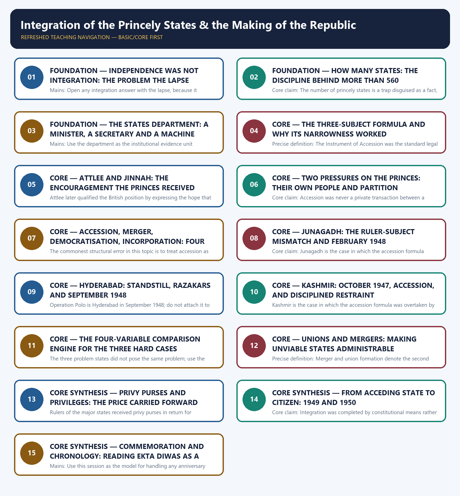

# Integration of the Princely States & the Making of the Republic - Learner-v2 Complete Learning Session

### SOURCE, PROGRESSION AND CURRENT-LINKAGE AUDIT

- **Repository owners queried:** Basic and Advanced Markdown for this topic, the master chronology, syllabus map and linked Modern History owners.
- **OCR book evidence queried:** The Basic and Advanced owner files were reconciled against the repository's OCR-searchable copy of Bipan Chandra, Mridula Mukherjee and Aditya Mukherjee, *India After Independence, 1947-2000*, whose accession chapter is fully text-extractable in the local file. That text supplies Attlee's paramountcy statement of 20 February 1947 and Jinnah's declaration of 18 June 1947 (book PDF pages 94-95), Patel's assumption of additional charge of the newly created States Department on 27 June 1947 with V.P. Menon as Secretary and the earlier accession of some states to the Constituent Assembly in April 1947 (book PDF page 95), the three-subject appeal and the fact that all states except Junagadh, Jammu and Kashmir and Hyderabad acceded by 15 August 1947 together with the Junagadh sequence and the February 1948 plebiscite (book PDF page 96), the Kashmir invasion, the appeal for assistance, the accession and the airlift (book PDF pages 96-97), the reference to the Security Council on 30 December 1947 (book PDF page 98), the Hyderabad standstill agreement of November 1947 and the Razakar mobilisation (book PDF pages 98-99), and the September 1948 army action, the Nizam's surrender and accession, the second stage of integration from December 1947 and the new unions of Madhya Bharat, Rajasthan, the Patiala and East Punjab States Union, Saurashtra and Travancore-Cochin (book PDF page 100). Three deliberate omissions are recorded. The local text carries privy-purse amounts and a specific purse for the Nizam, but the Basic owner's factual-risk caution forbids stating privy-purse amounts and this package obeys the owner rather than the book. The same text describes the Junagadh plebiscite result as overwhelming without a percentage, so no percentage is stated. The local text's numeral for the count of states is corrupted in extraction, which is itself the strongest practical reason for the owner's rule of writing more than 560 rather than 562 or 565.
- **Qdrant:** not used; Markdown plus searchable local PDFs were sufficient.
- **PYQ integrity:** The 2021 Mains GS-I Q3 stem is verbatim and locally verified: the repository export of the official 2021 General Studies Paper I carries the sentence assessing the main administrative issues and socio-cultural problems in the integration process of Indian Princely States, with the instruction to answer in 150 words, and the audited local Mains routing ledger routes it to this owner at 10 marks. No Prelims question in the audited local Prelims routing ledgers for 2018-2023, 2024-2025 or 2026 is routed to this owner, so no Prelims stem, option set or answer letter is asserted anywhere in this package.
- **Bounded live linkage:** Two official Government of India pages were retrieved live on 31 August 2026 and are used only as a bounded commemorative bridge. The Ministry of Culture's commemorations page records that India launched a two-year celebration of Sardar Vallabhbhai Patel's 150th birth anniversary at the Statue of Unity on 31 October 2024, with a commemorative coin and postal stamp, the book *Vallabh*, a documentary on the unification of over 560 princely states, and lectures, exhibitions, youth programmes and a virtual museum organised by the Ministry. A PIB Backgrounder titled *Rashtriya Ekta Diwas: A Pillar of National Cohesion*, posted on 30 October 2025, records that Rashtriya Ekta Diwas is observed annually on 31 October to commemorate Patel's birth anniversary, that it was first celebrated in 2014, that Ek Bharat Shreshtha Bharat was announced on 31 October 2015, and that 2025 marks the 150th birth anniversary. Two disciplined cautions travel with that bridge. First, the Backgrounder's commemorative formulation that Patel integrated the states by 15 August 1947 or shortly thereafter is a commemorative compression and not a chronology, because the Junagadh plebiscite belongs to February 1948 and the Hyderabad Police Action to September 1948; the package teaches the commemorative sentence beside the documented sequence and never substitutes one for the other. Second, the Backgrounder's figure that the states covered nearly 40 per cent of India's territory and population is carried strictly as that page's own attributed estimate alongside the repository owner's phrasing of roughly a third of the subcontinent's territory, and neither proportion is asserted as settled. No claim whatever is made here about any present-day constitutional controversy.
- **Fact/inference rule:** historical claims are source-backed; analytical judgements are explicitly framed as interpretation and do not invent figures.

## BASIC LEARNING SESSION

### DEEP-REVIEW LEARNING CONTRACT

| Control | Binding rule for this package |
|---|---|
| Syllabus boundary | Complete Modern History Core is taught chronologically and causally before optional enrichment. |
| Evidence method | Claim → named Act/treaty/record/organisation/person/region or scholarly evidence → analysis → qualification. |
| Date discipline | Event, proposal, enactment, commencement, official policy, implementation and later interpretation remain distinct. |
| Historiography | Colonial, nationalist, Marxist, subaltern, Cambridge, feminist and other relevant arguments are attributed and tested, never used as labels alone. |
| Practice contract | Every solved item has demand decoding, an examiner-grade model, an executable answer/compression plan, marks rationale and answer-specific improvement. |
| Approval | This immutable successor remains `approved: false` pending explicit approval. |

**Canonical Basic/Core owner:** `upsc-ai-kit\knowledge\Modern-Indian-History\basic\28_Integration-of-Princely-States.md`  
**Canonical topic owner:** `upsc-ai-kit\knowledge\Modern-Indian-History\basic\28_Integration-of-Princely-States.md`  
**Optional Advanced owner:** `upsc-ai-kit\knowledge\Modern-Indian-History\advanced\28_Integration-of-Princely-States.md`  
**Official syllabus mapping:** `upsc-ai-kit\knowledge\Modern-Indian-History\OFFICIAL-UPSC-SYLLABUS-MAPPING.md`

### EVIDENCE, PYQ AND CURRENT-STATUS CONTROL

- **Official and primary evidence:** Acts, charters, treaties, proclamations, committee reports, proceedings, organisational resolutions, speeches and contemporary records are dated and read for authorship and purpose.
- **Regional and social evidence:** petitions, newspapers, memoirs, local studies and material geography qualify elite or all-India generalisation.
- **Economic and quantitative evidence:** revenue, trade, price, wage, craft and mortality claims retain unit, region, period and uncertainty; statistics are never invented.
- **Scholarly interpretation:** historian schools are competing explanations tied to named evidence, not memorised verdicts.
- **PYQ discipline:** repository ledgers and locally held official papers control wording and metadata; reconstructed wording and unavailable official keys remain explicitly labelled.
- **Current-status note, rechecked 2026-08-31:** Two official Government of India pages were retrieved live on 31 August 2026 and are used only as a bounded commemorative bridge. The Ministry of Culture's commemorations page records that India launched a two-year celebration of Sardar Vallabhbhai Patel's 150th birth anniversary at the Statue of Unity on 31 October 2024, with a commemorative coin and postal stamp, the book *Vallabh*, a documentary on the unification of over 560 princely states, and lectures, exhibitions, youth programmes and a virtual museum organised by the Ministry. A PIB Backgrounder titled *Rashtriya Ekta Diwas: A Pillar of National Cohesion*, posted on 30 October 2025, records that Rashtriya Ekta Diwas is observed annually on 31 October to commemorate Patel's birth anniversary, that it was first celebrated in 2014, that Ek Bharat Shreshtha Bharat was announced on 31 October 2015, and that 2025 marks the 150th birth anniversary. Two disciplined cautions travel with that bridge. First, the Backgrounder's commemorative formulation that Patel integrated the states by 15 August 1947 or shortly thereafter is a commemorative compression and not a chronology, because the Junagadh plebiscite belongs to February 1948 and the Hyderabad Police Action to September 1948; the package teaches the commemorative sentence beside the documented sequence and never substitutes one for the other. Second, the Backgrounder's figure that the states covered nearly 40 per cent of India's territory and population is carried strictly as that page's own attributed estimate alongside the repository owner's phrasing of roughly a third of the subcontinent's territory, and neither proportion is asserted as settled. No claim whatever is made here about any present-day constitutional controversy.

**Live/primary context sources recorded by the predecessor generation:**

- `https://www.pib.gov.in/PressReleasePage.aspx?PRID=2184055`
- `https://culture.gov.in/commemorations/150th-birth-anniversary-sardar-vallabhbhai-patel`




*Distinct embedded teaching-navigation image. The separate continuous Cārvāka-style flowchart package remains an independent at-a-glance artifact.*

### SESSION 1 — FOUNDATION — INDEPENDENCE WAS NOT INTEGRATION: THE PROBLEM THE LAPSE CREATED

#### DEFINITION / WHAT THIS IS CALLED

**Plain-language definition:** Precise definition: Lapse of paramountcy means the extinction, at the end of British rule, of the suzerain relationship between the Crown and the princely states, without that relationship passing to India or Pakistan by succession.

**Technical definition:** Mains: Open any integration answer with the lapse, because it converts a narrative of accession into an analysis of state-building under legal vacuum.

#### ANSWER-GRABBING OPENING — WRITE/ADAPT IN THE EXAM

> Never write that paramountcy passed to India; the whole topic exists because it lapsed, and an answer that transfers it has deleted the problem it is meant to analyse.

#### MUST-WRITE KEYWORDS

- **FOUNDATION**
- **Independence was not integration**
- **the problem the lapse created**
- **Precise definition**
- **Topic boundary**
- **Core claim**

**How to use them:** Frame the answer through FOUNDATION; define Independence was not integration, connect the problem the lapse created with Precise definition to explain the mechanism, and use Topic boundary for the decisive comparison or qualification.

##### VISUAL FIRST

```text
INDEPENDENCE WAS NOT INTEGRATION: THE PROBLEM THE LAPSE CREATED
15 AUG 1947 -> BRITISH RULE ENDS
   |-- BRITISH INDIA -> partitioned; successor dominions defined by statute
   `-- PRINCELY INDIA -> PARAMOUNTCY LAPSES -> no successor sovereign in law
CONSEQUENCE -> authority must be CONSTRUCTED (agreement + leverage + force)
RULE -> lapse, not transfer; that single word generates the entire topic.
```

*The visual fixes this subtopic's chronology, mechanism or boundary before the evidence.*

##### CONCEPT DEFINITIONS

- **Precise definition:** Lapse of paramountcy means the extinction, at the end of British rule, of the suzerain relationship between the Crown and the princely states, without that relationship passing to India or Pakistan by succession.
- **Topic boundary:** Apply this definition only within Integration of the Princely States & the Making of the Republic; retain the named actor, institution, date and chronological role.

##### CORE EXPLANATION

The transfer of power solved the question of who ruled British India and left open the question of who ruled princely India, because British paramountcy over the states lapsed instead of passing to a successor, and everything else in this topic is a response to that single legal fact.

##### EVIDENCE AND MECHANISM

- British paramountcy over the princely states lapsed when British rule ended on 15 August 1947 and was never transferred to India or Pakistan.
- Lapse meant that a very large share of the subcontinent's territory and population had, in strict law, no successor sovereign on the morning after independence.
- The Union's authority over princely India therefore had to be constructed by agreement, leverage and, in one case, force, and could not be claimed by legal succession.
- That is why a separate department, a separate instrument and a separate chronology exist for the states at all: they were not covered by the settlement that partitioned British India.

##### EXAMINER CAUTION

- Never write that paramountcy passed to India; the whole topic exists because it lapsed, and an answer that transfers it has deleted the problem it is meant to analyse.

##### EXAM LINK

- **Prelims:** Never write that paramountcy passed to India; the whole topic exists because it lapsed, and an answer that transfers it has deleted the problem it is meant to analyse.
- **Mains:** Open any integration answer with the lapse, because it converts a narrative of accession into an analysis of state-building under legal vacuum.

##### MINI RECAP

- **Core claim:** The transfer of power solved the question of who ruled British India and left open the question of who ruled princely India, because British paramountcy over the states lapsed instead of passing to a successor, and everything else in this topic is a response to that single legal fact.
- **Use:** Open any integration answer with the lapse, because it converts a narrative of accession into an analysis of state-building under legal vacuum.

#### CLOSING RECALL FLOW — FOUNDATION — INDEPENDENCE WAS NOT INTEGRATION: THE PROBLEM THE LAPSE CREATED

```text
START / CONCEPT: FOUNDATION — Independence was not integration: the problem the lapse created
        |
        v
EXACT TERMS: FOUNDATION · Independence was not integration · the problem the lapse created · Precise definition · Topic boundary · Core claim
        |
        v
MECHANISM / ARGUMENT: Mains: Open any integration answer with the lapse, because it converts a narrative of accession into an analysis of state-building under legal vacuum.
        |
        v
CONSEQUENCE / CONTRAST: The Union's authority over princely India therefore had to be constructed by agreement, leverage and, in one case, force, and could not be claimed by legal succession.
        |
        v
UPSC TRAP / ANSWER-USE: That is why a separate department, a separate instrument and a separate chronology exist for the states at all: they were not covered by the settlement that partitioned British India.
        |
        v
ANSWER-GRABBING FORMULATION: Never write that paramountcy passed to India; the whole topic exists because it lapsed, and an answer that transfers it has deleted the problem it is meant to analyse.
```
### SESSION 2 — FOUNDATION — HOW MANY STATES: THE DISCIPLINE BEHIND MORE THAN 560

#### DEFINITION / WHAT THIS IS CALLED

**Plain-language definition:** There were more than 560 princely states at independence, which is the formulation both repository owners require.

**Technical definition:** Core claim: The number of princely states is a trap disguised as a fact, because the familiar totals differ by what an enumerator counts as a state rather than by any disagreement about history, and the disciplined answer refuses to choose between them.

#### ANSWER-GRABBING OPENING — WRITE/ADAPT IN THE EXAM

> There were more than 560 princely states at independence, which is the formulation both repository owners require.

#### MUST-WRITE KEYWORDS

- **FOUNDATION**
- **How many states**
- **the discipline behind more than 560**
- **Precise definition**
- **Topic boundary**
- **Core claim**

**How to use them:** Frame the answer through FOUNDATION; define How many states, connect the discipline behind more than 560 with Precise definition to explain the mechanism, and use Topic boundary for the decisive comparison or qualification.

##### VISUAL FIRST

```text
HOW MANY STATES: THE DISCIPLINE BEHIND MORE THAN 560
COUNTING THE STATES
   |-- SAFE FORM -> "more than 560" (both owners; official commemorative pages)
   |-- 562 / 565 -> different CLASSIFICATION rules (estates, jagirs, minor holdings)
   |-- LOCAL OCR -> numeral corrupted in extraction -> cannot arbitrate
VERDICT -> the disagreement is about counting conventions, not about history.
```

*The visual fixes this subtopic's chronology, mechanism or boundary before the evidence.*

##### CONCEPT DEFINITIONS

- **Precise definition:** The more-than-560 formulation is a deliberate counting discipline that reports the scale of princely India while refusing to arbitrate between enumeration conventions that produce totals such as 562 and 565.
- **Topic boundary:** Apply this definition only within Integration of the Princely States & the Making of the Republic; retain the named actor, institution, date and chronological role.

##### CORE EXPLANATION

The number of princely states is a trap disguised as a fact, because the familiar totals differ by what an enumerator counts as a state rather than by any disagreement about history, and the disciplined answer refuses to choose between them.

##### EVIDENCE AND MECHANISM

- There were more than 560 princely states at independence, which is the formulation both repository owners require.
- The rival totals of 562 and 565 reflect different counting conventions for estates, jagirs and minor holdings, not rival historical claims.
- The repository's local OCR text of *India After Independence* is corrupted at exactly the point where it gives the total, which is a practical demonstration of why the safe formulation exists.
- The Ministry of Culture's commemorations page and the PIB Backgrounder both use the open formulation of over 560 states, so the safe phrasing is also the official one.

##### EXAMINER CAUTION

- Write more than 560 princely states and add that totals vary by classification; never assert 562 or 565 as the single correct figure and never treat the two as competing events.

##### EXAM LINK

- **Prelims:** Write more than 560 princely states and add that totals vary by classification; never assert 562 or 565 as the single correct figure and never treat the two as competing events.
- **Mains:** Use the counting caution as a one-line demonstration of source discipline early in a 15 or 20-mark answer.

##### MINI RECAP

- **Core claim:** The number of princely states is a trap disguised as a fact, because the familiar totals differ by what an enumerator counts as a state rather than by any disagreement about history, and the disciplined answer refuses to choose between them.
- **Use:** Use the counting caution as a one-line demonstration of source discipline early in a 15 or 20-mark answer.

#### CLOSING RECALL FLOW — FOUNDATION — HOW MANY STATES: THE DISCIPLINE BEHIND MORE THAN 560

```text
START / CONCEPT: FOUNDATION — How many states: the discipline behind more than 560
        |
        v
EXACT TERMS: FOUNDATION · How many states · the discipline behind more than 560 · Precise definition · Topic boundary · Core claim
        |
        v
MECHANISM / ARGUMENT: Write more than 560 princely states and add that totals vary by classification; never assert 562 or 565 as the single correct figure and never treat the two as competing events.
        |
        v
CONSEQUENCE / CONTRAST: Precise definition: The more-than-560 formulation is a deliberate counting discipline that reports the scale of princely India while refusing to arbitrate between enumeration conventions that produce totals such as 562 and 565.
        |
        v
UPSC TRAP / ANSWER-USE: The rival totals of 562 and 565 reflect different counting conventions for estates, jagirs and minor holdings, not rival historical claims.
        |
        v
ANSWER-GRABBING FORMULATION: There were more than 560 princely states at independence, which is the formulation both repository owners require.
```
### SESSION 3 — FOUNDATION — THE STATES DEPARTMENT: A MINISTER, A SECRETARY AND A MACHINE

#### DEFINITION / WHAT THIS IS CALLED

**Plain-language definition:** Menon and the States Department is part of the correct answer.

**Technical definition:** Mains: Use the department as the institutional evidence unit whenever the directive is Assess rather than Describe.

#### ANSWER-GRABBING OPENING — WRITE/ADAPT IN THE EXAM

> Menon and the States Department is part of the correct answer.

#### MUST-WRITE KEYWORDS

- **FOUNDATION**
- **The States Department**
- **a minister**
- **a secretary**
- **a machine**
- **Precise definition**

**How to use them:** Frame the answer through FOUNDATION; define The States Department, connect a minister with a secretary to explain the mechanism, and use a machine for the decisive comparison or qualification.

##### VISUAL FIRST

```text
THE STATES DEPARTMENT: A MINISTER, A SECRETARY AND A MACHINE
STATES DEPARTMENT (created 27 June 1947)
   |-- POLITICAL AUTHORITY -> Sardar Vallabhbhai Patel (Home and States Minister)
   |-- OPERATIONAL DRAFTING -> V.P. Menon, Secretary
   |-- METHOD -> appeal to patriotism + narrow legal demand + implied warning
   `-- OUTPUT -> standard Instruments of Accession, standstill arrangements
RULE -> name minister, secretary and department together, or the speed is unexplained.
```

*The visual fixes this subtopic's chronology, mechanism or boundary before the evidence.*

##### CONCEPT DEFINITIONS

- **Precise definition:** The States Department was the Government of India office created on 27 June 1947 under Patel with V.P. Menon as Secretary to negotiate, draft and administer the accession and later merger of the princely states.
- **Topic boundary:** Apply this definition only within Integration of the Princely States & the Making of the Republic; retain the named actor, institution, date and chronological role.

##### CORE EXPLANATION

Integration was institutional before it was heroic, and the correct answer names three things together - Patel's political authority, V.P. Menon's operational drafting and the States Department's machinery - because removing any one of them makes the speed of 1947 inexplicable.

##### EVIDENCE AND MECHANISM

- Sardar Vallabhbhai Patel assumed additional charge of the newly created States Department on 27 June 1947, seven weeks before the transfer of power.
- V.P. Menon served as its Secretary and supplied the drafting, negotiation and administrative sequencing that turned a political appeal into standard instruments.
- Patel warned Menon at the time that the situation held dangerous potentialities and that hard-earned freedom might disappear through the states' door, which fixes the urgency of the exercise.
- The department's method combined appeal to patriotism, a narrow legal demand and an implied warning that terms after the transfer of power would be stiffer.

##### EXAMINER CAUTION

- Do not present integration as one man's achievement; the Advanced owner explicitly rejects that reading, and naming V.P. Menon and the States Department is part of the correct answer.

##### EXAM LINK

- **Prelims:** Do not present integration as one man's achievement; the Advanced owner explicitly rejects that reading, and naming V.P. Menon and the States Department is part of the correct answer.
- **Mains:** Use the department as the institutional evidence unit whenever the directive is Assess rather than Describe.

##### MINI RECAP

- **Core claim:** Integration was institutional before it was heroic, and the correct answer names three things together - Patel's political authority, V.P. Menon's operational drafting and the States Department's machinery - because removing any one of them makes the speed of 1947 inexplicable.
- **Use:** Use the department as the institutional evidence unit whenever the directive is Assess rather than Describe.

#### CLOSING RECALL FLOW — FOUNDATION — THE STATES DEPARTMENT: A MINISTER, A SECRETARY AND A MACHINE

```text
START / CONCEPT: FOUNDATION — The States Department: a minister, a secretary and a machine
        |
        v
EXACT TERMS: FOUNDATION · The States Department · a minister · a secretary · a machine · Precise definition
        |
        v
MECHANISM / ARGUMENT: Precise definition: The States Department was the Government of India office created on 27 June 1947 under Patel with V.P.
        |
        v
CONSEQUENCE / CONTRAST: Do not present integration as one man's achievement; the Advanced owner explicitly rejects that reading, and naming V.P.
        |
        v
UPSC TRAP / ANSWER-USE: Do not miss this limiting distinction: sardar Vallabhbhai Patel assumed additional charge of the newly created States Department on 27...
        |
        v
ANSWER-GRABBING FORMULATION: Menon and the States Department is part of the correct answer.
```
### SESSION 4 — CORE — THE THREE-SUBJECT FORMULA AND WHY ITS NARROWNESS WORKED

#### DEFINITION / WHAT THIS IS CALLED

**Plain-language definition:** Mains: Use the narrowness as the mechanism paragraph in any answer that asks why integration succeeded so quickly.

**Technical definition:** Precise definition: The Instrument of Accession was the standard legal instrument by which a princely state transferred Defence, External Affairs and Communications to the Dominion of India while initially retaining internal administration.

#### ANSWER-GRABBING OPENING — WRITE/ADAPT IN THE EXAM

> Mains: Use the narrowness as the mechanism paragraph in any answer that asks why integration succeeded so quickly.

#### MUST-WRITE KEYWORDS

- **The three-subject formula**
- **why its narrowness worked**
- **Precise definition**
- **Topic boundary**
- **Core claim**
- **Precise**

**How to use them:** Frame the answer through The three-subject formula; define why its narrowness worked, connect Precise definition with Topic boundary to explain the mechanism, and use Core claim for the decisive comparison or qualification.

##### VISUAL FIRST

```text
THE THREE-SUBJECT FORMULA AND WHY ITS NARROWNESS WORKED
INSTRUMENT OF ACCESSION -> three subjects only
   |-- DEFENCE            -> no state could defend itself after British withdrawal
   |-- EXTERNAL AFFAIRS   -> no state could conduct foreign relations alone
   |-- COMMUNICATIONS     -> posts, telegraphs, railways cross every boundary
   `-- LEFT WITH RULER    -> internal administration, revenue, courts, succession
MECHANISM -> ask for the impossible-to-retain; take sovereignty without seeming to.
```

*The visual fixes this subtopic's chronology, mechanism or boundary before the evidence.*

##### CONCEPT DEFINITIONS

- **Precise definition:** The Instrument of Accession was the standard legal instrument by which a princely state transferred Defence, External Affairs and Communications to the Dominion of India while initially retaining internal administration.
- **Topic boundary:** Apply this definition only within Integration of the Princely States & the Making of the Republic; retain the named actor, institution, date and chronological role.

##### CORE EXPLANATION

The Instrument of Accession succeeded because of what it did not ask for: by demanding only Defence, External Affairs and Communications it took everything that constitutes sovereignty in practice while appearing to leave a ruler's internal world intact.

##### EVIDENCE AND MECHANISM

- The instrument asked acceding states to transfer three subjects only - Defence, External Affairs and Communications.
- These were precisely the subjects that no princely state, however large, could actually exercise for itself once British protection was withdrawn.
- Internal administration, revenue, courts and succession were left with the ruler at the moment of accession, which is why signature looked like a small concession.
- Because the demand was uniform and narrow, it could be standardised and executed at speed across hundreds of units in a matter of weeks.

##### EXAMINER CAUTION

- Never claim that every subject passed to the Union at the moment of signature; the instrument initially covered three subjects, and the later transfer of internal authority came through merger and constitutional incorporation rather than through the instrument itself.

##### EXAM LINK

- **Prelims:** Never claim that every subject passed to the Union at the moment of signature; the instrument initially covered three subjects, and the later transfer of internal authority came through merger and constitutional incorporation rather than through the instrument itself.
- **Mains:** Use the narrowness as the mechanism paragraph in any answer that asks why integration succeeded so quickly.

##### MINI RECAP

- **Core claim:** The Instrument of Accession succeeded because of what it did not ask for: by demanding only Defence, External Affairs and Communications it took everything that constitutes sovereignty in practice while appearing to leave a ruler's internal world intact.
- **Use:** Use the narrowness as the mechanism paragraph in any answer that asks why integration succeeded so quickly.

#### CLOSING RECALL FLOW — CORE — THE THREE-SUBJECT FORMULA AND WHY ITS NARROWNESS WORKED

```text
START / CONCEPT: CORE — The three-subject formula and why its narrowness worked
        |
        v
EXACT TERMS: The three-subject formula · why its narrowness worked · Precise definition · Topic boundary · Core claim · Precise
        |
        v
MECHANISM / ARGUMENT: Precise definition: The Instrument of Accession was the standard legal instrument by which a princely state transferred Defence, External Affairs and Communications to the Dominion of India while initially retaining internal administration.
        |
        v
CONSEQUENCE / CONTRAST: These were precisely the subjects that no princely state, however large, could actually exercise for itself once British protection was withdrawn.
        |
        v
UPSC TRAP / ANSWER-USE: Do not miss this limiting distinction: internal administration, revenue, courts and succession were left with the ruler at the moment...
        |
        v
ANSWER-GRABBING FORMULATION: Mains: Use the narrowness as the mechanism paragraph in any answer that asks why integration succeeded so quickly.
```
### SESSION 5 — CORE — ATTLEE AND JINNAH: THE ENCOURAGEMENT THE PRINCES RECEIVED

#### DEFINITION / WHAT THIS IS CALLED

**Plain-language definition:** Jinnah publicly declared on 18 June 1947 that the states would be independent sovereign states on the termination of paramountcy and were free to remain independent if they so desired.

**Technical definition:** Attlee later qualified the British position by expressing the hope that all the states would in due course find their appropriate place with one or the other dominion.

#### ANSWER-GRABBING OPENING — WRITE/ADAPT IN THE EXAM

> Jinnah publicly declared on 18 June 1947 that the states would be independent sovereign states on the termination of paramountcy and were free to remain independent if they so desired.

#### MUST-WRITE KEYWORDS

- **Attlee**
- **Jinnah**
- **the encouragement the princes received**
- **Precise definition**
- **Topic boundary**
- **Core claim**

**How to use them:** Frame the answer through Attlee; define Jinnah, connect the encouragement the princes received with Precise definition to explain the mechanism, and use Topic boundary for the decisive comparison or qualification.

##### VISUAL FIRST

```text
ATTLEE AND JINNAH: THE ENCOURAGEMENT THE PRINCES RECEIVED
WHY THE PRINCES HOPED
20 FEB 1947 -> Attlee: paramountcy will not be handed to any government of British India
18 JUN 1947 -> Jinnah: states become independent sovereign states on termination
LATER -> Attlee hopes all states find a place with one or the other dominion
APR 1947 -> some states join the Constituent Assembly; Travancore, Bhopal, Hyderabad refuse
RESULT -> Indian side treats speed as a security requirement, not a preference.
```

*The visual fixes this subtopic's chronology, mechanism or boundary before the evidence.*

##### CONCEPT DEFINITIONS

- **Precise definition:** The princely independence claim was the contention, encouraged by the statements of February and June 1947, that the lapse of paramountcy restored sovereignty to individual rulers rather than passing it to either dominion.
- **Topic boundary:** Apply this definition only within Integration of the Princely States & the Making of the Republic; retain the named actor, institution, date and chronological role.

##### CORE EXPLANATION

Princely ambition in 1947 was not merely vanity; it rested on two public statements that appeared to license independence, and an answer that names them explains why the Indian side treated speed as a security requirement.

##### EVIDENCE AND MECHANISM

- The local OCR text records Clement Attlee's announcement of 20 February 1947 that His Majesty's Government did not intend to hand over their powers and obligations under paramountcy to any government of British India.
- M.A. Jinnah publicly declared on 18 June 1947 that the states would be independent sovereign states on the termination of paramountcy and were free to remain independent if they so desired.
- Attlee later qualified the British position by expressing the hope that all the states would in due course find their appropriate place with one or the other dominion.
- Some states nonetheless showed realism early, joining the Constituent Assembly in April 1947, while Travancore, Bhopal and Hyderabad publicly announced a desire for independent status.

##### EXAMINER CAUTION

- Present these as encouragements to a claim rather than as legal authority for it; Indian nationalist opinion never accepted that independence was an option open to a princely state.

##### EXAM LINK

- **Prelims:** Present these as encouragements to a claim rather than as legal authority for it; Indian nationalist opinion never accepted that independence was an option open to a princely state.
- **Mains:** Use the two statements to justify the compressed timetable of June to August 1947 in a causal paragraph.

##### MINI RECAP

- **Core claim:** Princely ambition in 1947 was not merely vanity; it rested on two public statements that appeared to license independence, and an answer that names them explains why the Indian side treated speed as a security requirement.
- **Use:** Use the two statements to justify the compressed timetable of June to August 1947 in a causal paragraph.

#### CLOSING RECALL FLOW — CORE — ATTLEE AND JINNAH: THE ENCOURAGEMENT THE PRINCES RECEIVED

```text
START / CONCEPT: CORE — Attlee and Jinnah: the encouragement the princes received
        |
        v
EXACT TERMS: Attlee · Jinnah · the encouragement the princes received · Precise definition · Topic boundary · Core claim
        |
        v
MECHANISM / ARGUMENT: Attlee later qualified the British position by expressing the hope that all the states would in due course find their appropriate place with one or the other dominion.
        |
        v
CONSEQUENCE / CONTRAST: Core claim: Princely ambition in 1947 was not merely vanity; it rested on two public statements that appeared to license independence, and an answer that names them explains why the Indian side treated speed as a security requirement.
        |
        v
UPSC TRAP / ANSWER-USE: Present these as encouragements to a claim rather than as legal authority for it; Indian nationalist opinion never accepted that independence was an option open to a princely state.
        |
        v
ANSWER-GRABBING FORMULATION: Jinnah publicly declared on 18 June 1947 that the states would be independent sovereign states on the termination of paramountcy and were free to remain independent if they so desired.
```
### SESSION 6 — CORE — TWO PRESSURES ON THE PRINCES: THEIR OWN PEOPLE AND PARTITION

#### DEFINITION / WHAT THIS IS CALLED

**Plain-language definition:** The national movement had long held that political power belonged to the people of a state and not to its ruler, which denied a prince the standing to bargain about sovereignty.

**Technical definition:** Core claim: Accession was never a private transaction between a department and a durbar, because rulers were negotiating with New Delhi while facing organised political movements inside their own states and a partitioned subcontinent outside them.

#### ANSWER-GRABBING OPENING — WRITE/ADAPT IN THE EXAM

> The national movement had long held that political power belonged to the people of a state and not to its ruler, which denied a prince the standing to bargain about sovereignty.

#### MUST-WRITE KEYWORDS

- **Two pressures on the princes**
- **their own people**
- **Partition**
- **Precise definition**
- **Topic boundary**
- **Core claim**

**How to use them:** Frame the answer through Two pressures on the princes; define their own people, connect Partition with Precise definition to explain the mechanism, and use Topic boundary for the decisive comparison or qualification.

##### VISUAL FIRST

```text
TWO PRESSURES ON THE PRINCES: THEIR OWN PEOPLE AND PARTITION
THE PRINCE'S POSITION IN 1947 -> squeezed from two sides
   ABOVE -> States Department: narrow demand now, stiffer terms later
   BELOW -> States' Peoples' Conference: democratic order, integration, agitation
   OUTSIDE -> Partition violence -> isolation is exposure, not independence
BARGAIN -> accede on three subjects and retain dignities, or face both pressures alone.
```

*The visual fixes this subtopic's chronology, mechanism or boundary before the evidence.*

##### CONCEPT DEFINITIONS

- **Precise definition:** The two-pressures reading treats accession as the outcome of simultaneous bargaining with the States Department above and organised states' peoples' movements below, rather than as a purely diplomatic transaction.
- **Topic boundary:** Apply this definition only within Integration of the Princely States & the Making of the Republic; retain the named actor, institution, date and chronological role.

##### CORE EXPLANATION

Accession was never a private transaction between a department and a durbar, because rulers were negotiating with New Delhi while facing organised political movements inside their own states and a partitioned subcontinent outside them.

##### EVIDENCE AND MECHANISM

- The people of the states had participated in the making of the nation since the late nineteenth century and were organised under the States' Peoples' Conference, demanding a democratic order and integration with the rest of the country.
- The national movement had long held that political power belonged to the people of a state and not to its ruler, which denied a prince the standing to bargain about sovereignty.
- Patel's implied warning that he might be unable to restrain impatient peoples' movements converted internal agitation into a negotiating instrument.
- Partition violence made isolation dangerous for small and landlocked states, so the alternative to accession was not independence but exposure.

##### EXAMINER CAUTION

- Do not describe the princes as passive; they calculated, and the calculation included the movement in their own capitals as well as the department in Delhi.

##### EXAM LINK

- **Prelims:** Do not describe the princes as passive; they calculated, and the calculation included the movement in their own capitals as well as the department in Delhi.
- **Mains:** Use the two-pressures thesis to add analytical depth to an otherwise chronological accession answer.

##### MINI RECAP

- **Core claim:** Accession was never a private transaction between a department and a durbar, because rulers were negotiating with New Delhi while facing organised political movements inside their own states and a partitioned subcontinent outside them.
- **Use:** Use the two-pressures thesis to add analytical depth to an otherwise chronological accession answer.

#### CLOSING RECALL FLOW — CORE — TWO PRESSURES ON THE PRINCES: THEIR OWN PEOPLE AND PARTITION

```text
START / CONCEPT: CORE — Two pressures on the princes: their own people and Partition
        |
        v
EXACT TERMS: Two pressures on the princes · their own people · Partition · Precise definition · Topic boundary · Core claim
        |
        v
MECHANISM / ARGUMENT: Core claim: Accession was never a private transaction between a department and a durbar, because rulers were negotiating with New Delhi while facing organised political movements inside their own states and a partitioned subcontinent outside them.
        |
        v
CONSEQUENCE / CONTRAST: Do not describe the princes as passive; they calculated, and the calculation included the movement in their own capitals as well as the department in Delhi.
        |
        v
UPSC TRAP / ANSWER-USE: Partition violence made isolation dangerous for small and landlocked states, so the alternative to accession was not independence but exposure.
        |
        v
ANSWER-GRABBING FORMULATION: The national movement had long held that political power belonged to the people of a state and not to its ruler, which denied a prince the standing to bargain about sovereignty.
```
### SESSION 7 — CORE — ACCESSION, MERGER, DEMOCRATISATION, INCORPORATION: FOUR STAGES

#### DEFINITION / WHAT THIS IS CALLED

**Plain-language definition:** Precise definition: Integration in this topic denotes the four-stage passage from accession on three subjects, through merger and democratisation, to constitutional incorporation, and not the signature of an instrument alone.

**Technical definition:** The commonest structural error in this topic is to treat accession as the whole of integration, when the sources present at least four distinct stages, each with its own instrument, date and difficulty.

#### ANSWER-GRABBING OPENING — WRITE/ADAPT IN THE EXAM

> Precise definition: Integration in this topic denotes the four-stage passage from accession on three subjects, through merger and democratisation, to constitutional incorporation, and not the signature of an instrument alone.

#### MUST-WRITE KEYWORDS

- **Accession**
- **merger**
- **democratisation**
- **incorporation**
- **four stages**
- **Precise definition**

**How to use them:** Frame the answer through Accession; define merger, connect democratisation with incorporation to explain the mechanism, and use four stages for the decisive comparison or qualification.

##### VISUAL FIRST

```text
ACCESSION, MERGER, DEMOCRATISATION, INCORPORATION: FOUR STAGES
FOUR STAGES, FOUR INSTRUMENTS
1 ACCESSION      -> Instrument of Accession (three subjects)      -> by 15 Aug 1947
2 MERGER         -> merger agreements, unions, attachments        -> from Dec 1947
3 DEMOCRATISATION-> elections, courts, services inside old states -> uneven, slower
4 INCORPORATION  -> Constitution; single citizenship              -> 26 Jan 1950
RULE -> accession is the first stage, never the finished process.
```

*The visual fixes this subtopic's chronology, mechanism or boundary before the evidence.*

##### CONCEPT DEFINITIONS

- **Precise definition:** Integration in this topic denotes the four-stage passage from accession on three subjects, through merger and democratisation, to constitutional incorporation, and not the signature of an instrument alone.
- **Topic boundary:** Apply this definition only within Integration of the Princely States & the Making of the Republic; retain the named actor, institution, date and chronological role.

##### CORE EXPLANATION

The commonest structural error in this topic is to treat accession as the whole of integration, when the sources present at least four distinct stages, each with its own instrument, date and difficulty.

##### EVIDENCE AND MECHANISM

- Stage one was accession on three subjects, executed at speed and largely complete by 15 August 1947.
- Stage two was merger and consolidation, which began in December 1947 and grouped unviable units into unions or attached them to neighbouring provinces.
- Stage three was democratisation inside the former states, which extended elections, courts, services and revenue administration and proceeded unevenly and often slowly.
- Stage four was constitutional incorporation, completed when the Constitution came into force and a single citizenship dissolved the legal category of a prince's subject.

##### EXAMINER CAUTION

- Never collapse the four stages into one act of accession; the Advanced owner sets out the sequence explicitly and an answer that ignores it cannot explain what happened after 1947.

##### EXAM LINK

- **Prelims:** Never collapse the four stages into one act of accession; the Advanced owner sets out the sequence explicitly and an answer that ignores it cannot explain what happened after 1947.
- **Mains:** Use the four-stage spine as the skeleton of any process-analysis question about how integration was achieved.

##### MINI RECAP

- **Core claim:** The commonest structural error in this topic is to treat accession as the whole of integration, when the sources present at least four distinct stages, each with its own instrument, date and difficulty.
- **Use:** Use the four-stage spine as the skeleton of any process-analysis question about how integration was achieved.

#### CLOSING RECALL FLOW — CORE — ACCESSION, MERGER, DEMOCRATISATION, INCORPORATION: FOUR STAGES

```text
START / CONCEPT: CORE — Accession, merger, democratisation, incorporation: four stages
        |
        v
EXACT TERMS: Accession · merger · democratisation · incorporation · four stages · Precise definition
        |
        v
MECHANISM / ARGUMENT: Stage one was accession on three subjects, executed at speed and largely complete by 15 August 1947.
        |
        v
CONSEQUENCE / CONTRAST: Never collapse the four stages into one act of accession; the Advanced owner sets out the sequence explicitly and an answer that ignores it cannot explain what happened after 1947.
        |
        v
UPSC TRAP / ANSWER-USE: Do not miss this limiting distinction: the commonest structural error in this topic is to treat accession as the whole...
        |
        v
ANSWER-GRABBING FORMULATION: Precise definition: Integration in this topic denotes the four-stage passage from accession on three subjects, through merger and democratisation, to constitutional incorporation, and not the signature of an instrument alone.
```
### SESSION 8 — CORE — JUNAGADH: THE RULER-SUBJECT MISMATCH AND FEBRUARY 1948

#### DEFINITION / WHAT THIS IS CALLED

**Plain-language definition:** Precise definition: The Junagadh case denotes the accession crisis produced when a ruler acceded to Pakistan against the wishes of an overwhelmingly Hindu population in a state not contiguous with Pakistan, resolved by the plebiscite of February 1948.

**Technical definition:** Core claim: Junagadh is the case in which the accession formula failed because the ruler's choice contradicted both his population and his geography, and it was settled by counting people rather than by using force.

#### ANSWER-GRABBING OPENING — WRITE/ADAPT IN THE EXAM

> Precise definition: The Junagadh case denotes the accession crisis produced when a ruler acceded to Pakistan against the wishes of an overwhelmingly Hindu population in a state not contiguous with Pakistan, resolved by the plebiscite of February 1948.

#### MUST-WRITE KEYWORDS

- **Junagadh**
- **the ruler-subject mismatch**
- **February 1948**
- **Precise definition**
- **Topic boundary**
- **Core claim**

**How to use them:** Frame the answer through Junagadh; define the ruler-subject mismatch, connect February 1948 with Precise definition to explain the mechanism, and use Topic boundary for the decisive comparison or qualification.

##### VISUAL FIRST

```text
JUNAGADH: THE RULER-SUBJECT MISMATCH AND FEBRUARY 1948
JUNAGADH -> the formula fails on RULER vs PEOPLE vs GEOGRAPHY
RULER   -> Nawab accedes to Pakistan
PEOPLE  -> overwhelmingly Hindu; popular movement; Nawab flees; provisional government
GEOGRAPHY -> Saurashtra coast, surrounded by Indian territory, non-contiguous with Pakistan
DEWAN   -> Shah Nawaz Bhutto invites Government of India to intervene
INSTRUMENT -> PLEBISCITE, FEBRUARY 1948 -> in favour of India (no percentage asserted)
```

*The visual fixes this subtopic's chronology, mechanism or boundary before the evidence.*

##### CONCEPT DEFINITIONS

- **Precise definition:** The Junagadh case denotes the accession crisis produced when a ruler acceded to Pakistan against the wishes of an overwhelmingly Hindu population in a state not contiguous with Pakistan, resolved by the plebiscite of February 1948.
- **Topic boundary:** Apply this definition only within Integration of the Princely States & the Making of the Republic; retain the named actor, institution, date and chronological role.

##### CORE EXPLANATION

Junagadh is the case in which the accession formula failed because the ruler's choice contradicted both his population and his geography, and it was settled by counting people rather than by using force.

##### EVIDENCE AND MECHANISM

- Junagadh was a small state on the Saurashtra coast, surrounded by Indian territory and without geographical contiguity with Pakistan, yet its Nawab announced accession to Pakistan.
- The state's overwhelmingly Hindu population organised a popular movement, forced the Nawab to flee and established a provisional government.
- The Dewan of Junagadh, Shah Nawaz Bhutto, then invited the Government of India to intervene, and Indian troops thereafter entered the state.
- A plebiscite held in February 1948 went in favour of joining India, and the local source calls the result overwhelming without stating any percentage.

##### EXAMINER CAUTION

- State the February 1948 plebiscite and state no percentage; the repository holds no audited polling figure and inventing one is the exact failure this owner is designed to prevent.

##### EXAM LINK

- **Prelims:** State the February 1948 plebiscite and state no percentage; the repository holds no audited polling figure and inventing one is the exact failure this owner is designed to prevent.
- **Mains:** Use Junagadh as the case where the principle that the people, not the ruler, decide accession was applied and vindicated.

##### MINI RECAP

- **Core claim:** Junagadh is the case in which the accession formula failed because the ruler's choice contradicted both his population and his geography, and it was settled by counting people rather than by using force.
- **Use:** Use Junagadh as the case where the principle that the people, not the ruler, decide accession was applied and vindicated.

#### CLOSING RECALL FLOW — CORE — JUNAGADH: THE RULER-SUBJECT MISMATCH AND FEBRUARY 1948

```text
START / CONCEPT: CORE — Junagadh: the ruler-subject mismatch and February 1948
        |
        v
EXACT TERMS: Junagadh · the ruler-subject mismatch · February 1948 · Precise definition · Topic boundary · Core claim
        |
        v
MECHANISM / ARGUMENT: Core claim: Junagadh is the case in which the accession formula failed because the ruler's choice contradicted both his population and his geography, and it was settled by counting people rather than by using force.
        |
        v
CONSEQUENCE / CONTRAST: Mains: Use Junagadh as the case where the principle that the people, not the ruler, decide accession was applied and vindicated.
        |
        v
UPSC TRAP / ANSWER-USE: Do not miss this limiting distinction: junagadh was a small state on the Saurashtra coast, surrounded by Indian territory and...
        |
        v
ANSWER-GRABBING FORMULATION: Precise definition: The Junagadh case denotes the accession crisis produced when a ruler acceded to Pakistan against the wishes of an overwhelmingly Hindu population in a state not contiguous with Pakistan, resolved by the plebiscite of February 1948.
```
### SESSION 9 — CORE — HYDERABAD: STANDSTILL, RAZAKARS AND SEPTEMBER 1948

#### DEFINITION / WHAT THIS IS CALLED

**Plain-language definition:** Hyderabad is the case in which negotiation was tried longest and failed, and the police action of September 1948 must therefore be presented as the end of a documented process rather than as an opening move.

**Technical definition:** Operation Polo is Hyderabad in September 1948; do not attach it to Kashmir or to Goa, and do not state casualty or troop figures for the operation.

#### ANSWER-GRABBING OPENING — WRITE/ADAPT IN THE EXAM

> Hyderabad is the case in which negotiation was tried longest and failed, and the police action of September 1948 must therefore be presented as the end of a documented process rather than as an opening move.

#### MUST-WRITE KEYWORDS

- **Hyderabad**
- **standstill**
- **Razakars**
- **September 1948**
- **Precise definition**
- **Topic boundary**

**How to use them:** Frame the answer through Hyderabad; define standstill, connect Razakars with September 1948 to explain the mechanism, and use Precise definition for the decisive comparison or qualification.

##### VISUAL FIRST

```text
HYDERABAD: STANDSTILL, RAZAKARS AND SEPTEMBER 1948
HYDERABAD -> negotiation first, force last
NOV 1947 -> STANDSTILL AGREEMENT with the Nizam; hope of representative government
INSIDE   -> Ittihad ul Muslimin + Razakars | State Congress satyagraha | Telangana peasants
STALL    -> Nizam prolongs talks, expands armed forces, seeks sovereignty
SEP 1948 -> OPERATION POLO / POLICE ACTION -> Nizam surrenders -> accedes to the Union
LIMIT    -> no casualty figure and no troop figure is asserted anywhere here.
```

*The visual fixes this subtopic's chronology, mechanism or boundary before the evidence.*

##### CONCEPT DEFINITIONS

- **Precise definition:** Operation Polo, also called the Police Action, is the Indian army operation of September 1948 that ended the Nizam of Hyderabad's claim to independent status and was followed by the state's accession.
- **Topic boundary:** Apply this definition only within Integration of the Princely States & the Making of the Republic; retain the named actor, institution, date and chronological role.

##### CORE EXPLANATION

Hyderabad is the case in which negotiation was tried longest and failed, and the police action of September 1948 must therefore be presented as the end of a documented process rather than as an opening move.

##### EVIDENCE AND MECHANISM

- Hyderabad was the largest state and was completely surrounded by Indian territory, and its Nizam claimed an independent status rather than acceding.
- The Government of India signed a standstill agreement with the Nizam in November 1947, hoping that representative government inside the state would make merger easier.
- Inside the state, the communal organisation Ittihad ul Muslimin and its paramilitary Razakars grew rapidly, the Hyderabad State Congress launched a satyagraha for democratisation, and a Communist-led peasant struggle developed in the Telangana region.
- The Indian army moved into Hyderabad in September 1948 in the operation commonly called Operation Polo or the Police Action, after which the Nizam surrendered and acceded to the Indian Union.

##### EXAMINER CAUTION

- Operation Polo is Hyderabad in September 1948; do not attach it to Kashmir or to Goa, and do not state casualty or troop figures for the operation.

##### EXAM LINK

- **Prelims:** Operation Polo is Hyderabad in September 1948; do not attach it to Kashmir or to Goa, and do not state casualty or troop figures for the operation.
- **Mains:** Use Hyderabad as the case that shows coercion was the residual instrument and not the standard one.

##### MINI RECAP

- **Core claim:** Hyderabad is the case in which negotiation was tried longest and failed, and the police action of September 1948 must therefore be presented as the end of a documented process rather than as an opening move.
- **Use:** Use Hyderabad as the case that shows coercion was the residual instrument and not the standard one.

#### CLOSING RECALL FLOW — CORE — HYDERABAD: STANDSTILL, RAZAKARS AND SEPTEMBER 1948

```text
START / CONCEPT: CORE — Hyderabad: standstill, Razakars and September 1948
        |
        v
EXACT TERMS: Hyderabad · standstill · Razakars · September 1948 · Precise definition · Topic boundary
        |
        v
MECHANISM / ARGUMENT: Precise definition: Operation Polo, also called the Police Action, is the Indian army operation of September 1948 that ended the Nizam of Hyderabad's claim to independent status and was followed by the state's accession.
        |
        v
CONSEQUENCE / CONTRAST: Operation Polo is Hyderabad in September 1948; do not attach it to Kashmir or to Goa, and do not state casualty or troop figures for the operation.
        |
        v
UPSC TRAP / ANSWER-USE: Mains: Use Hyderabad as the case that shows coercion was the residual instrument and not the standard one.
        |
        v
ANSWER-GRABBING FORMULATION: Hyderabad is the case in which negotiation was tried longest and failed, and the police action of September 1948 must therefore be presented as the end of a documented process rather than as an opening move.
```
### SESSION 10 — CORE — KASHMIR: OCTOBER 1947, ACCESSION, AND DISCIPLINED RESTRAINT

#### DEFINITION / WHAT THIS IS CALLED

**Plain-language definition:** Precise definition: The Kashmir accession denotes the signature of the Instrument of Accession by Maharaja Hari Singh in October 1947 following the tribal invasion and preceding the despatch of Indian troops to Srinagar.

**Technical definition:** Kashmir is the case in which the accession formula was overtaken by an invasion, and it is also the case in which examination discipline matters most, because the historical sequence is clear while much of the later argument is contested.

#### ANSWER-GRABBING OPENING — WRITE/ADAPT IN THE EXAM

> Precise definition: The Kashmir accession denotes the signature of the Instrument of Accession by Maharaja Hari Singh in October 1947 following the tribal invasion and preceding the despatch of Indian troops to Srinagar.

#### MUST-WRITE KEYWORDS

- **Kashmir**
- **October 1947**
- **accession**
- **disciplined restraint**
- **Precise definition**
- **Topic boundary**

**How to use them:** Frame the answer through Kashmir; define October 1947, connect accession with disciplined restraint to explain the mechanism, and use Precise definition for the decisive comparison or qualification.

##### VISUAL FIRST

```text
KASHMIR: OCTOBER 1947, ACCESSION, AND DISCIPLINED RESTRAINT
KASHMIR -> strict order of events (do not reorder)
1 RULER UNDECIDED -> Hari Singh accedes to neither dominion
2 POPULAR FORCE   -> National Conference under Sheikh Abdullah favours India
3 OCTOBER 1947    -> tribal invasion advances towards Srinagar
4 APPEAL          -> Maharaja asks India for military assistance
5 ACCESSION       -> Instrument signed; Abdullah heads the administration
6 AIRLIFT         -> troops flown to Srinagar AFTER accession
7 30 DEC 1947     -> reference to the UN Security Council; fighting continues
STOP LINE -> restraint beyond this point; contested later claims are not history here.
```

*The visual fixes this subtopic's chronology, mechanism or boundary before the evidence.*

##### CONCEPT DEFINITIONS

- **Precise definition:** The Kashmir accession denotes the signature of the Instrument of Accession by Maharaja Hari Singh in October 1947 following the tribal invasion and preceding the despatch of Indian troops to Srinagar.
- **Topic boundary:** Apply this definition only within Integration of the Princely States & the Making of the Republic; retain the named actor, institution, date and chronological role.

##### CORE EXPLANATION

Kashmir is the case in which the accession formula was overtaken by an invasion, and it is also the case in which examination discipline matters most, because the historical sequence is clear while much of the later argument is contested.

##### EVIDENCE AND MECHANISM

- Maharaja Hari Singh had acceded to neither dominion, while the National Conference under Sheikh Abdullah, the state's principal popular force, favoured accession to India.
- Tribal invaders entered Kashmir in October 1947 and pushed towards Srinagar, and the Maharaja appealed to India for military assistance.
- Indian troops were flown to Srinagar only after the Instrument of Accession had been signed, and Sheikh Abdullah was installed as head of the state's administration.
- The Government of India referred the Kashmir problem to the Security Council of the United Nations on 30 December 1947, asking for vacation of aggression, and fighting continued thereafter.

##### EXAMINER CAUTION

- Record the invasion, the accession, the airlift and the reference to the United Nations, and stop there; later constitutional and political controversies are outside the historical scope of this owner.

##### EXAM LINK

- **Prelims:** Record the invasion, the accession, the airlift and the reference to the United Nations, and stop there; later constitutional and political controversies are outside the historical scope of this owner.
- **Mains:** Use Kashmir as the case that shows why security, and not only law or demography, belongs in the comparison grid.

##### MINI RECAP

- **Core claim:** Kashmir is the case in which the accession formula was overtaken by an invasion, and it is also the case in which examination discipline matters most, because the historical sequence is clear while much of the later argument is contested.
- **Use:** Use Kashmir as the case that shows why security, and not only law or demography, belongs in the comparison grid.

#### CLOSING RECALL FLOW — CORE — KASHMIR: OCTOBER 1947, ACCESSION, AND DISCIPLINED RESTRAINT

```text
START / CONCEPT: CORE — Kashmir: October 1947, accession, and disciplined restraint
        |
        v
EXACT TERMS: Kashmir · October 1947 · accession · disciplined restraint · Precise definition · Topic boundary
        |
        v
MECHANISM / ARGUMENT: Kashmir is the case in which the accession formula was overtaken by an invasion, and it is also the case in which examination discipline matters most, because the historical sequence is clear while much of the later argument is contested.
        |
        v
CONSEQUENCE / CONTRAST: Maharaja Hari Singh had acceded to neither dominion, while the National Conference under Sheikh Abdullah, the state's principal popular force, favoured accession to India.
        |
        v
UPSC TRAP / ANSWER-USE: Mains: Use Kashmir as the case that shows why security, and not only law or demography, belongs in the comparison grid.
        |
        v
ANSWER-GRABBING FORMULATION: Precise definition: The Kashmir accession denotes the signature of the Instrument of Accession by Maharaja Hari Singh in October 1947 following the tribal invasion and preceding the despatch of Indian troops to Srinagar.
```
### SESSION 11 — CORE — THE FOUR-VARIABLE COMPARISON ENGINE FOR THE THREE HARD CASES

#### DEFINITION / WHAT THIS IS CALLED

**Plain-language definition:** Precise definition: The four-variable comparison engine is the analytical device that separates the three hard accession cases by the ruler's choice, the population's composition, the state's geography and the security situation.

**Technical definition:** The three problem states did not pose the same problem; use the four variables explicitly, because the differences, not the similarities, are what the comparison is testing.

#### ANSWER-GRABBING OPENING — WRITE/ADAPT IN THE EXAM

> Precise definition: The four-variable comparison engine is the analytical device that separates the three hard accession cases by the ruler's choice, the population's composition, the state's geography and the security situation.

#### MUST-WRITE KEYWORDS

- **Precise definition**
- **Topic boundary**
- **Core claim**
- **Precise definition: The four-variable comparison engine**
- **Precise**
- **The three problem states**

**How to use them:** Frame the answer through Precise definition; define Topic boundary, connect Core claim with Precise definition: The four-variable comparison engine to explain the mechanism, and use Precise for the decisive comparison or qualification.

##### VISUAL FIRST

```text
THE FOUR-VARIABLE COMPARISON ENGINE FOR THE THREE HARD CASES
COMPARISON GRID -> four variables, three states, three instruments
VARIABLE      | JUNAGADH            | HYDERABAD             | KASHMIR
RULER         | acceded to Pakistan | sought independence   | hesitated
POPULATION    | overwhelmingly Hindu| largely Hindu         | Muslim-majority
GEOGRAPHY     | non-contiguous      | landlocked in India   | borders both
SECURITY      | internal movement   | Razakars, stalemate   | external invasion
INSTRUMENT    | plebiscite Feb 1948 | police action Sep 1948| accession + troops + UN
```

*The visual fixes this subtopic's chronology, mechanism or boundary before the evidence.*

##### CONCEPT DEFINITIONS

- **Precise definition:** The four-variable comparison engine is the analytical device that separates the three hard accession cases by the ruler's choice, the population's composition, the state's geography and the security situation.
- **Topic boundary:** Apply this definition only within Integration of the Princely States & the Making of the Republic; retain the named actor, institution, date and chronological role.

##### CORE EXPLANATION

The three problem states are examined together so often that the only way to score is to compare them on fixed variables, because an answer that narrates them one after another has produced chronology where the examiner asked for analysis.

##### EVIDENCE AND MECHANISM

- Variable one is the ruler's choice: Junagadh's Nawab acceded to Pakistan, Hyderabad's Nizam sought independence, and Kashmir's Maharaja hesitated between the two dominions.
- Variable two is the population: Junagadh was overwhelmingly Hindu under a Muslim ruler, Hyderabad was largely Hindu under the Nizam, and Kashmir was Muslim-majority under a Hindu Maharaja.
- Variable three is geography: Junagadh was non-contiguous with Pakistan, Hyderabad was landlocked inside India, and Kashmir bordered both dominions.
- Variable four is security: Junagadh faced an internal movement, Hyderabad faced Razakar violence and stalemate, and Kashmir faced an external invasion, which is why three different instruments were used.

##### EXAMINER CAUTION

- The three problem states did not pose the same problem; use the four variables explicitly, because the differences, not the similarities, are what the comparison is testing.

##### EXAM LINK

- **Prelims:** The three problem states did not pose the same problem; use the four variables explicitly, because the differences, not the similarities, are what the comparison is testing.
- **Mains:** Use the grid as the body of any Compare directive and let the instruments follow from the variables.

##### MINI RECAP

- **Core claim:** The three problem states are examined together so often that the only way to score is to compare them on fixed variables, because an answer that narrates them one after another has produced chronology where the examiner asked for analysis.
- **Use:** Use the grid as the body of any Compare directive and let the instruments follow from the variables.

#### CLOSING RECALL FLOW — CORE — THE FOUR-VARIABLE COMPARISON ENGINE FOR THE THREE HARD CASES

```text
START / CONCEPT: CORE — The four-variable comparison engine for the three hard cases
        |
        v
EXACT TERMS: Precise definition · Topic boundary · Core claim · Precise definition: The four-variable comparison engine · Precise · The three problem states
        |
        v
MECHANISM / ARGUMENT: The three problem states did not pose the same problem; use the four variables explicitly, because the differences, not the similarities, are what the comparison is testing.
        |
        v
CONSEQUENCE / CONTRAST: Variable three is geography: Junagadh was non-contiguous with Pakistan, Hyderabad was landlocked inside India, and Kashmir bordered both dominions.
        |
        v
UPSC TRAP / ANSWER-USE: Do not miss this limiting distinction: junagadh faced an internal movement, Hyderabad faced Razakar violence and stalemate.
        |
        v
ANSWER-GRABBING FORMULATION: Precise definition: The four-variable comparison engine is the analytical device that separates the three hard accession cases by the ruler's choice, the population's composition, the state's geography and the security situation.
```
### SESSION 12 — CORE — UNIONS AND MERGERS: MAKING UNVIABLE STATES ADMINISTRABLE

#### DEFINITION / WHAT THIS IS CALLED

**Plain-language definition:** Prelims: Do not describe the process as uniform; large states negotiated individually while small ones were grouped, and this asymmetry is the origin of much later reorganisation.

**Technical definition:** Precise definition: Merger and union formation denote the second stage of integration, in which acceded states were amalgamated into viable administrative units such as Madhya Bharat, Rajasthan, the Patiala and East Punjab States Union, Saurashtra and Travancore-Cochin.

#### ANSWER-GRABBING OPENING — WRITE/ADAPT IN THE EXAM

> Mains: Use the unions as the concrete evidence that accession alone did not produce administrable government.

#### MUST-WRITE KEYWORDS

- **Unions**
- **mergers**
- **making unviable states administrable**
- **Precise definition**
- **Topic boundary**
- **Core claim**

**How to use them:** Frame the answer through Unions; define mergers, connect making unviable states administrable with Precise definition to explain the mechanism, and use Topic boundary for the decisive comparison or qualification.

##### VISUAL FIRST

```text
UNIONS AND MERGERS: MAKING UNVIABLE STATES ADMINISTRABLE
SECOND STAGE (from December 1947) -> making units governable
SMALL STATES -> merged into neighbouring provinces or centrally administered areas
NEW UNIONS   -> Madhya Bharat | Rajasthan | Patiala and East Punjab States Union
             -> Saurashtra | Travancore-Cochin
RETAINED FORM-> Mysore | Hyderabad | Jammu and Kashmir as separate states of the Union
CONSEQUENCE  -> an asymmetrical map that later reorganisation would have to revisit.
```

*The visual fixes this subtopic's chronology, mechanism or boundary before the evidence.*

##### CONCEPT DEFINITIONS

- **Precise definition:** Merger and union formation denote the second stage of integration, in which acceded states were amalgamated into viable administrative units such as Madhya Bharat, Rajasthan, the Patiala and East Punjab States Union, Saurashtra and Travancore-Cochin.
- **Topic boundary:** Apply this definition only within Integration of the Princely States & the Making of the Republic; retain the named actor, institution, date and chronological role.

##### CORE EXPLANATION

The second stage of integration is the one most answers omit, and it is where the map of India was actually redrawn, because hundreds of acceding units had to be turned into provinces capable of carrying a civil service, a judiciary and an election.

##### EVIDENCE AND MECHANISM

- The second stage began in December 1947 and was carried through with speed comparable to the first.
- Smaller states were merged with neighbouring provinces or grouped together into centrally administered areas.
- A large number were consolidated into new unions - Madhya Bharat, Rajasthan, the Patiala and East Punjab States Union, Saurashtra and Travancore-Cochin.
- Mysore, Hyderabad and Jammu and Kashmir retained their original form as separate states of the Union, so the settlement was deliberately asymmetrical rather than uniform.

##### EXAMINER CAUTION

- Do not describe the process as uniform; large states negotiated individually while small ones were grouped, and this asymmetry is the origin of much later reorganisation.

##### EXAM LINK

- **Prelims:** Do not describe the process as uniform; large states negotiated individually while small ones were grouped, and this asymmetry is the origin of much later reorganisation.
- **Mains:** Use the unions as the concrete evidence that accession alone did not produce administrable government.

##### MINI RECAP

- **Core claim:** The second stage of integration is the one most answers omit, and it is where the map of India was actually redrawn, because hundreds of acceding units had to be turned into provinces capable of carrying a civil service, a judiciary and an election.
- **Use:** Use the unions as the concrete evidence that accession alone did not produce administrable government.

#### CLOSING RECALL FLOW — CORE — UNIONS AND MERGERS: MAKING UNVIABLE STATES ADMINISTRABLE

```text
START / CONCEPT: CORE — Unions and mergers: making unviable states administrable
        |
        v
EXACT TERMS: Unions · mergers · making unviable states administrable · Precise definition · Topic boundary · Core claim
        |
        v
MECHANISM / ARGUMENT: Precise definition: Merger and union formation denote the second stage of integration, in which acceded states were amalgamated into viable administrative units such as Madhya Bharat, Rajasthan, the Patiala and East Punjab States Union, Saurashtra and Travancore-Cochin.
        |
        v
CONSEQUENCE / CONTRAST: Do not describe the process as uniform; large states negotiated individually while small ones were grouped, and this asymmetry is the origin of much later reorganisation.
        |
        v
UPSC TRAP / ANSWER-USE: Do not miss this limiting distinction: a large number were consolidated into new unions - Madhya Bharat, Rajasthan, the Patiala...
        |
        v
ANSWER-GRABBING FORMULATION: Mains: Use the unions as the concrete evidence that accession alone did not produce administrable government.
```
### SESSION 13 — CORE SYNTHESIS — PRIVY PURSES AND PRIVILEGES: THE PRICE CARRIED FORWARD

#### DEFINITION / WHAT THIS IS CALLED

**Plain-language definition:** Precise definition: Privy purses were the tax-free payments guaranteed to the rulers of major states in return for the surrender of power, retained alongside titles and ceremonial privileges and not abolished during the initial integration.

**Technical definition:** Rulers of the major states received privy purses in return for surrendering power and authority, and retained titles, succession to the gaddi and ceremonial privileges.

#### ANSWER-GRABBING OPENING — WRITE/ADAPT IN THE EXAM

> Precise definition: Privy purses were the tax-free payments guaranteed to the rulers of major states in return for the surrender of power, retained alongside titles and ceremonial privileges and not abolished during the initial integration.

#### MUST-WRITE KEYWORDS

- **CORE SYNTHESIS**
- **Privy purses**
- **privileges**
- **the price carried forward**
- **Precise definition**
- **Topic boundary**

**How to use them:** Frame the answer through CORE SYNTHESIS; define Privy purses, connect privileges with the price carried forward to explain the mechanism, and use Precise definition for the decisive comparison or qualification.

##### VISUAL FIRST

```text
PRIVY PURSES AND PRIVILEGES: THE PRICE CARRIED FORWARD
THE PRICE OF INTEGRATION
GIVEN TO RULERS -> privy purses | titles | succession to the gaddi | ceremonial privileges
TAKEN FROM RULERS -> all power and authority over the state
DURATION -> retained through the initial integration; abolition dated by the owner to 1971
DISCIPLINE -> criticism recorded; NO amount for any purse is asserted in this package
USE -> the counterpoint that stops a heroic narrative becoming an uncritical one.
```

*The visual fixes this subtopic's chronology, mechanism or boundary before the evidence.*

##### CONCEPT DEFINITIONS

- **Precise definition:** Privy purses were the tax-free payments guaranteed to the rulers of major states in return for the surrender of power, retained alongside titles and ceremonial privileges and not abolished during the initial integration.
- **Topic boundary:** Apply this definition only within Integration of the Princely States & the Making of the Republic; retain the named actor, institution, date and chronological role.

##### CORE EXPLANATION

Integration was purchased, not merely negotiated, and the honest answer records the price: rulers who surrendered power retained income and dignities, and those settlements survived the initial integration entirely intact.

##### EVIDENCE AND MECHANISM

- Rulers of the major states received privy purses in return for surrendering power and authority, and retained titles, succession to the gaddi and ceremonial privileges.
- These concessions were criticised at the time and afterwards, and the Basic owner treats them as a real cost of the settlement rather than as a detail.
- Privy purses were not abolished during the initial integration; the Advanced owner dates their abolition to 1971, decades after accession.
- This package states no amount for any privy purse, because the Basic owner's factual-risk caution forbids it even though the local book text carries figures.

##### EXAMINER CAUTION

- Never date the abolition of the privy purses to the accession itself, and never quote a purse amount; the safe answer names the instrument, notes the criticism and dates the abolition to 1971 on the owner's authority.

##### EXAM LINK

- **Prelims:** Never date the abolition of the privy purses to the accession itself, and never quote a purse amount; the safe answer names the instrument, notes the criticism and dates the abolition to 1971 on the owner's authority.
- **Mains:** Use the privy purses as the counterpoint that prevents a purely heroic reading of integration.

##### MINI RECAP

- **Core claim:** Integration was purchased, not merely negotiated, and the honest answer records the price: rulers who surrendered power retained income and dignities, and those settlements survived the initial integration entirely intact.
- **Use:** Use the privy purses as the counterpoint that prevents a purely heroic reading of integration.

#### CLOSING RECALL FLOW — CORE SYNTHESIS — PRIVY PURSES AND PRIVILEGES: THE PRICE CARRIED FORWARD

```text
START / CONCEPT: CORE SYNTHESIS — Privy purses and privileges: the price carried forward
        |
        v
EXACT TERMS: CORE SYNTHESIS · Privy purses · privileges · the price carried forward · Precise definition · Topic boundary
        |
        v
MECHANISM / ARGUMENT: Rulers of the major states received privy purses in return for surrendering power and authority, and retained titles, succession to the gaddi and ceremonial privileges.
        |
        v
CONSEQUENCE / CONTRAST: Privy purses were not abolished during the initial integration; the Advanced owner dates their abolition to 1971, decades after accession.
        |
        v
UPSC TRAP / ANSWER-USE: Integration was purchased, not merely negotiated, and the honest answer records the price: rulers who surrendered power retained income and dignities, and those settlements survived the initial integration entirely intact.
        |
        v
ANSWER-GRABBING FORMULATION: Precise definition: Privy purses were the tax-free payments guaranteed to the rulers of major states in return for the surrender of power, retained alongside titles and ceremonial privileges and not abolished during the initial integration.
```
### SESSION 14 — CORE SYNTHESIS — FROM ACCEDING STATE TO CITIZEN: 1949 AND 1950

#### DEFINITION / WHAT THIS IS CALLED

**Plain-language definition:** Precise definition: Constitutional incorporation denotes the completion of integration through the adoption of the Constitution on 26 November 1949 and its commencement on 26 January 1950, which replaced princely subjecthood with a single Union citizenship.

**Technical definition:** Core claim: Integration was completed by constitutional means rather than administrative ones, because it was the Constitution, and not any instrument of accession, that abolished the legal category of a prince's subject.

#### ANSWER-GRABBING OPENING — WRITE/ADAPT IN THE EXAM

> Precise definition: Constitutional incorporation denotes the completion of integration through the adoption of the Constitution on 26 November 1949 and its commencement on 26 January 1950, which replaced princely subjecthood with a single Union citizenship.

#### MUST-WRITE KEYWORDS

- **CORE SYNTHESIS**
- **From acceding state to citizen**
- **Precise definition**
- **Topic boundary**
- **Core claim**
- **Precise definition: Constitutional incorporation**

**How to use them:** Frame the answer through CORE SYNTHESIS; define From acceding state to citizen, connect Precise definition with Topic boundary to explain the mechanism, and use Core claim for the decisive comparison or qualification.

##### VISUAL FIRST

```text
FROM ACCEDING STATE TO CITIZEN: 1949 AND 1950
COMPLETION BY CONSTITUTION
CONSTITUENT ASSEMBLY -> President: Dr Rajendra Prasad | Drafting Committee: B.R. Ambedkar
26 NOV 1949 -> Constitution ADOPTED
26 JAN 1950 -> Constitution COMMENCES -> India becomes a republic
EFFECT -> single citizenship + single judicial hierarchy + uniform fundamental rights
         -> the legal category "subject of a prince" ceases to exist
CONTRAST -> INDEPENDENCE 15 Aug 1947 | REPUBLIC 26 Jan 1950 (never interchange).
```

*The visual fixes this subtopic's chronology, mechanism or boundary before the evidence.*

##### CONCEPT DEFINITIONS

- **Precise definition:** Constitutional incorporation denotes the completion of integration through the adoption of the Constitution on 26 November 1949 and its commencement on 26 January 1950, which replaced princely subjecthood with a single Union citizenship.
- **Topic boundary:** Apply this definition only within Integration of the Princely States & the Making of the Republic; retain the named actor, institution, date and chronological role.

##### CORE EXPLANATION

Integration was completed by constitutional means rather than administrative ones, because it was the Constitution, and not any instrument of accession, that abolished the legal category of a prince's subject.

##### EVIDENCE AND MECHANISM

- The Constituent Assembly was presided over by Dr Rajendra Prasad, with B.R. Ambedkar chairing the Drafting Committee.
- The Constitution was adopted on 26 November 1949 and came into force on 26 January 1950.
- A single citizenship, a single judicial hierarchy and uniform fundamental rights dissolved the distinction between the subjects of princes and the citizens of the Union.
- India became independent on 15 August 1947 and a republic on 26 January 1950, so the two dates answer two different questions and can never be interchanged.

##### EXAMINER CAUTION

- India did not become a republic in 1947; independence and the republic are separated by more than two years, and the distinction is examined directly at Prelims level.

##### EXAM LINK

- **Prelims:** India did not become a republic in 1947; independence and the republic are separated by more than two years, and the distinction is examined directly at Prelims level.
- **Mains:** Use the constitutional stage as the closing move of any answer on how accession became nationhood.

##### MINI RECAP

- **Core claim:** Integration was completed by constitutional means rather than administrative ones, because it was the Constitution, and not any instrument of accession, that abolished the legal category of a prince's subject.
- **Use:** Use the constitutional stage as the closing move of any answer on how accession became nationhood.

#### CLOSING RECALL FLOW — CORE SYNTHESIS — FROM ACCEDING STATE TO CITIZEN: 1949 AND 1950

```text
START / CONCEPT: CORE SYNTHESIS — From acceding state to citizen: 1949 and 1950
        |
        v
EXACT TERMS: CORE SYNTHESIS · From acceding state to citizen · Precise definition · Topic boundary · Core claim · Precise definition: Constitutional incorporation
        |
        v
MECHANISM / ARGUMENT: Core claim: Integration was completed by constitutional means rather than administrative ones, because it was the Constitution, and not any instrument of accession, that abolished the legal category of a prince's subject.
        |
        v
CONSEQUENCE / CONTRAST: India did not become a republic in 1947; independence and the republic are separated by more than two years, and the distinction is examined directly at Prelims level.
        |
        v
UPSC TRAP / ANSWER-USE: Do not miss this limiting distinction: the Constituent Assembly was presided over by Dr Rajendra Prasad, with B.R.
        |
        v
ANSWER-GRABBING FORMULATION: Precise definition: Constitutional incorporation denotes the completion of integration through the adoption of the Constitution on 26 November 1949 and its commencement on 26 January 1950, which replaced princely subjecthood with a single Union citizenship.
```
### SESSION 15 — CORE SYNTHESIS — COMMEMORATION AND CHRONOLOGY: READING EKTA DIWAS AS A HISTORIAN

#### DEFINITION / WHAT THIS IS CALLED

**Plain-language definition:** Precise definition: Rashtriya Ekta Diwas is the annual observance on 31 October, first celebrated in 2014, commemorating Sardar Patel's birth anniversary and his role in the political integration of the princely states.

**Technical definition:** Mains: Use this session as the model for handling any anniversary hook in a history answer: cite the source, use the frame, keep the chronology.

#### ANSWER-GRABBING OPENING — WRITE/ADAPT IN THE EXAM

> Precise definition: Rashtriya Ekta Diwas is the annual observance on 31 October, first celebrated in 2014, commemorating Sardar Patel's birth anniversary and his role in the political integration of the princely states.

#### MUST-WRITE KEYWORDS

- **CORE SYNTHESIS**
- **Commemoration**
- **chronology**
- **reading Ekta Diwas as a historian**
- **Precise definition**
- **Topic boundary**

**How to use them:** Frame the answer through CORE SYNTHESIS; define Commemoration, connect chronology with reading Ekta Diwas as a historian to explain the mechanism, and use Precise definition for the decisive comparison or qualification.

##### VISUAL FIRST

```text
COMMEMORATION AND CHRONOLOGY: READING EKTA DIWAS AS A HISTORIAN
COMMEMORATION vs CHRONOLOGY -> use both, confuse neither
OFFICIAL RECORD -> Ministry of Culture: two-year 150th-anniversary programme from 31 Oct 2024
                -> PIB Backgrounder, 30 Oct 2025: Ekta Diwas annually on 31 October, first 2014
COMMEMORATIVE COMPRESSION -> "integrated by 15 August 1947 or shortly thereafter"
DOCUMENTED SEQUENCE       -> Junagadh plebiscite Feb 1948 | Hyderabad Police Action Sep 1948
CONTESTED PROPORTION      -> PIB "nearly 40 per cent" vs owner "roughly a third" (both attributed)
RULE -> the commemoration frames the question; the chronology answers it.
```

*The visual fixes this subtopic's chronology, mechanism or boundary before the evidence.*

##### CONCEPT DEFINITIONS

- **Precise definition:** Rashtriya Ekta Diwas is the annual observance on 31 October, first celebrated in 2014, commemorating Sardar Patel's birth anniversary and his role in the political integration of the princely states.
- **Topic boundary:** Apply this definition only within Integration of the Princely States & the Making of the Republic; retain the named actor, institution, date and chronological role.

##### CORE EXPLANATION

The live commemorative frame around this topic is genuinely useful and genuinely dangerous, and the mature candidate uses the official record for context while holding it to the documented chronology.

##### EVIDENCE AND MECHANISM

- The Ministry of Culture's commemorations page records a two-year celebration of Sardar Patel's 150th birth anniversary launched at the Statue of Unity on 31 October 2024, with a commemorative coin and stamp, a book, a documentary on the unification of over 560 princely states, and lectures, exhibitions and a virtual museum.
- A PIB Backgrounder posted on 30 October 2025 records that Rashtriya Ekta Diwas is observed annually on 31 October, that it was first celebrated in 2014, and that Ek Bharat Shreshtha Bharat was announced on 31 October 2015.
- The same Backgrounder states that Patel integrated the states by 15 August 1947 or shortly thereafter, which is a commemorative compression, because the Junagadh plebiscite belongs to February 1948 and the Hyderabad Police Action to September 1948.
- The Backgrounder's figure that the states covered nearly 40 per cent of India's territory and population is carried strictly as that page's attributed estimate beside the repository owner's phrasing of roughly a third of the subcontinent's territory.

##### EXAMINER CAUTION

- Use official commemorative material for framing only; never let a commemorative sentence overwrite a documented date, and never convert a commemoration into a claim about present-day constitutional controversy.

##### EXAM LINK

- **Prelims:** Use official commemorative material for framing only; never let a commemorative sentence overwrite a documented date, and never convert a commemoration into a claim about present-day constitutional controversy.
- **Mains:** Use this session as the model for handling any anniversary hook in a history answer: cite the source, use the frame, keep the chronology.

##### MINI RECAP

- **Core claim:** The live commemorative frame around this topic is genuinely useful and genuinely dangerous, and the mature candidate uses the official record for context while holding it to the documented chronology.
- **Use:** Use this session as the model for handling any anniversary hook in a history answer: cite the source, use the frame, keep the chronology.

#### CLOSING RECALL FLOW — CORE SYNTHESIS — COMMEMORATION AND CHRONOLOGY: READING EKTA DIWAS AS A HISTORIAN

```text
START / CONCEPT: CORE SYNTHESIS — Commemoration and chronology: reading Ekta Diwas as a historian
        |
        v
EXACT TERMS: CORE SYNTHESIS · Commemoration · chronology · reading Ekta Diwas as a historian · Precise definition · Topic boundary
        |
        v
MECHANISM / ARGUMENT: Use official commemorative material for framing only; never let a commemorative sentence overwrite a documented date, and never convert a commemoration into a claim about present-day constitutional controversy.
        |
        v
CONSEQUENCE / CONTRAST: The live commemorative frame around this topic is genuinely useful and genuinely dangerous, and the mature candidate uses the official record for context while holding it to the documented chronology.
        |
        v
UPSC TRAP / ANSWER-USE: Do not miss this limiting distinction: use this session as the model for handling any anniversary hook in a history...
        |
        v
ANSWER-GRABBING FORMULATION: Precise definition: Rashtriya Ekta Diwas is the annual observance on 31 October, first celebrated in 2014, commemorating Sardar Patel's birth anniversary and his role in the political integration of the princely states.
```
### MODERN HISTORY DEEP-REVIEW CORE CONTROL

- **Must remember:** Accession, administrative integration and constitutional reorganisation were distinct: Junagadh, Hyderabad and Jammu and Kashmir followed different legal, military and political sequences.
- **Close distinction:** The Instrument of Accession transferred specified subjects, not an identical final settlement in every state; Hyderabad's September 1948 action and Kashmir's October 1947 accession cannot be analogised mechanically.
- **Evidence / interpretation limit:** States Ministry papers, accession instruments and regional evidence must qualify triumphalist inevitability and recognise rulers, popular movements, borders and international conflict.

## BASIC MCQS / REMEDIATION

### Q1. Which statement correctly identifies Attlee's paramountcy announcement of 20 February 1947?

A. The local OCR text of *India After Independence* records Clement Attlee's announcement of 20 February 1947 that His Majesty's Government did not intend to hand over their powers and obligations under paramountcy to any government of British India, a statement that several large princes read as a licence to claim sovereignty for themselves.
B. M.A. Jinnah publicly declared on 18 June 1947 that the states would be independent sovereign states on the termination of paramountcy and were free to remain independent if they so desired, which encouraged the largest princes and made speed indispensable on the Indian side.
C. Sardar Vallabhbhai Patel assumed additional charge of the newly created States Department on 27 June 1947 with V.P. Menon as its Secretary, so integration was the work of a named minister, a named secretary and a department, and never of one man acting alone.
D. A minority of states showed realism by joining the Constituent Assembly in April 1947 while the majority stayed away, and Travancore, Bhopal and Hyderabad publicly announced a desire for independent status, so princely opinion was already divided before any instrument was signed.

**Answer: A.**
**Explanation:** The local OCR text of *India After Independence* records Clement Attlee's announcement of 20 February 1947 that His Majesty's Government did not intend to hand over their powers and obligations under paramountcy to any government of British India, a statement that several large princes read as a licence to claim sovereignty for themselves. This distinction preserves the source-backed chronology and prevents cross-matching errors in UPSC elimination.

### Q2. Which chronology card should be filed under Attlee's paramountcy announcement of 20 February 1947?

A. Sardar Vallabhbhai Patel assumed additional charge of the newly created States Department on 27 June 1947 with V.P. Menon as its Secretary, so integration was the work of a named minister, a named secretary and a department, and never of one man acting alone.
B. The local OCR text of *India After Independence* records Clement Attlee's announcement of 20 February 1947 that His Majesty's Government did not intend to hand over their powers and obligations under paramountcy to any government of British India, a statement that several large princes read as a licence to claim sovereignty for themselves.
C. M.A. Jinnah publicly declared on 18 June 1947 that the states would be independent sovereign states on the termination of paramountcy and were free to remain independent if they so desired, which encouraged the largest princes and made speed indispensable on the Indian side.
D. The Instrument of Accession asked acceding states to transfer only three subjects - Defence, External Affairs and Communications - a deliberately narrow demand that covered precisely what no princely state could exercise for itself while leaving internal administration untouched for the moment.

**Answer: B.**
**Explanation:** The local OCR text of *India After Independence* records Clement Attlee's announcement of 20 February 1947 that His Majesty's Government did not intend to hand over their powers and obligations under paramountcy to any government of British India, a statement that several large princes read as a licence to claim sovereignty for themselves. This distinction preserves the source-backed chronology and prevents cross-matching errors in UPSC elimination.

### Q3. Which option should a candidate retain when revising Attlee's paramountcy announcement of 20 February 1947?

A. Sardar Vallabhbhai Patel assumed additional charge of the newly created States Department on 27 June 1947 with V.P. Menon as its Secretary, so integration was the work of a named minister, a named secretary and a department, and never of one man acting alone.
B. The Instrument of Accession asked acceding states to transfer only three subjects - Defence, External Affairs and Communications - a deliberately narrow demand that covered precisely what no princely state could exercise for itself while leaving internal administration untouched for the moment.
C. The local OCR text of *India After Independence* records Clement Attlee's announcement of 20 February 1947 that His Majesty's Government did not intend to hand over their powers and obligations under paramountcy to any government of British India, a statement that several large princes read as a licence to claim sovereignty for themselves.
D. British paramountcy over the princely states lapsed when British rule ended on 15 August 1947 and it was never transferred to India or Pakistan, so the Union's authority over princely India had to be constructed by agreement and pressure rather than inherited by legal succession.

**Answer: C.**
**Explanation:** The local OCR text of *India After Independence* records Clement Attlee's announcement of 20 February 1947 that His Majesty's Government did not intend to hand over their powers and obligations under paramountcy to any government of British India, a statement that several large princes read as a licence to claim sovereignty for themselves. This distinction preserves the source-backed chronology and prevents cross-matching errors in UPSC elimination.

### Q4. Which statement avoids a common matching trap about Attlee's paramountcy announcement of 20 February 1947?

A. There were more than 560 princely states at independence, and the familiar totals of 562 and 565 differ by counting convention rather than by historical fact, so a safe answer writes more than 560 and never asserts either total as the single correct figure.
B. The Instrument of Accession asked acceding states to transfer only three subjects - Defence, External Affairs and Communications - a deliberately narrow demand that covered precisely what no princely state could exercise for itself while leaving internal administration untouched for the moment.
C. British paramountcy over the princely states lapsed when British rule ended on 15 August 1947 and it was never transferred to India or Pakistan, so the Union's authority over princely India had to be constructed by agreement and pressure rather than inherited by legal succession.
D. The local OCR text of *India After Independence* records Clement Attlee's announcement of 20 February 1947 that His Majesty's Government did not intend to hand over their powers and obligations under paramountcy to any government of British India, a statement that several large princes read as a licence to claim sovereignty for themselves.

**Answer: D.**
**Explanation:** The local OCR text of *India After Independence* records Clement Attlee's announcement of 20 February 1947 that His Majesty's Government did not intend to hand over their powers and obligations under paramountcy to any government of British India, a statement that several large princes read as a licence to claim sovereignty for themselves. This distinction preserves the source-backed chronology and prevents cross-matching errors in UPSC elimination.

### Q5. Which statement correctly identifies The divided princely response of April 1947?

A. A minority of states showed realism by joining the Constituent Assembly in April 1947 while the majority stayed away, and Travancore, Bhopal and Hyderabad publicly announced a desire for independent status, so princely opinion was already divided before any instrument was signed.
B. Sardar Vallabhbhai Patel assumed additional charge of the newly created States Department on 27 June 1947 with V.P. Menon as its Secretary, so integration was the work of a named minister, a named secretary and a department, and never of one man acting alone.
C. The Instrument of Accession asked acceding states to transfer only three subjects - Defence, External Affairs and Communications - a deliberately narrow demand that covered precisely what no princely state could exercise for itself while leaving internal administration untouched for the moment.
D. M.A. Jinnah publicly declared on 18 June 1947 that the states would be independent sovereign states on the termination of paramountcy and were free to remain independent if they so desired, which encouraged the largest princes and made speed indispensable on the Indian side.

**Answer: A.**
**Explanation:** A minority of states showed realism by joining the Constituent Assembly in April 1947 while the majority stayed away, and Travancore, Bhopal and Hyderabad publicly announced a desire for independent status, so princely opinion was already divided before any instrument was signed. This distinction preserves the source-backed chronology and prevents cross-matching errors in UPSC elimination.

### Q6. Which chronology card should be filed under The divided princely response of April 1947?

A. British paramountcy over the princely states lapsed when British rule ended on 15 August 1947 and it was never transferred to India or Pakistan, so the Union's authority over princely India had to be constructed by agreement and pressure rather than inherited by legal succession.
B. A minority of states showed realism by joining the Constituent Assembly in April 1947 while the majority stayed away, and Travancore, Bhopal and Hyderabad publicly announced a desire for independent status, so princely opinion was already divided before any instrument was signed.
C. The Instrument of Accession asked acceding states to transfer only three subjects - Defence, External Affairs and Communications - a deliberately narrow demand that covered precisely what no princely state could exercise for itself while leaving internal administration untouched for the moment.
D. Sardar Vallabhbhai Patel assumed additional charge of the newly created States Department on 27 June 1947 with V.P. Menon as its Secretary, so integration was the work of a named minister, a named secretary and a department, and never of one man acting alone.

**Answer: B.**
**Explanation:** A minority of states showed realism by joining the Constituent Assembly in April 1947 while the majority stayed away, and Travancore, Bhopal and Hyderabad publicly announced a desire for independent status, so princely opinion was already divided before any instrument was signed. This distinction preserves the source-backed chronology and prevents cross-matching errors in UPSC elimination.

### Q7. Which option should a candidate retain when revising The divided princely response of April 1947?

A. There were more than 560 princely states at independence, and the familiar totals of 562 and 565 differ by counting convention rather than by historical fact, so a safe answer writes more than 560 and never asserts either total as the single correct figure.
B. British paramountcy over the princely states lapsed when British rule ended on 15 August 1947 and it was never transferred to India or Pakistan, so the Union's authority over princely India had to be constructed by agreement and pressure rather than inherited by legal succession.
C. A minority of states showed realism by joining the Constituent Assembly in April 1947 while the majority stayed away, and Travancore, Bhopal and Hyderabad publicly announced a desire for independent status, so princely opinion was already divided before any instrument was signed.
D. The Instrument of Accession asked acceding states to transfer only three subjects - Defence, External Affairs and Communications - a deliberately narrow demand that covered precisely what no princely state could exercise for itself while leaving internal administration untouched for the moment.

**Answer: C.**
**Explanation:** A minority of states showed realism by joining the Constituent Assembly in April 1947 while the majority stayed away, and Travancore, Bhopal and Hyderabad publicly announced a desire for independent status, so princely opinion was already divided before any instrument was signed. This distinction preserves the source-backed chronology and prevents cross-matching errors in UPSC elimination.

### Q8. Which statement avoids a common matching trap about The divided princely response of April 1947?

A. British paramountcy over the princely states lapsed when British rule ended on 15 August 1947 and it was never transferred to India or Pakistan, so the Union's authority over princely India had to be constructed by agreement and pressure rather than inherited by legal succession.
B. Every state except Junagadh, Jammu and Kashmir and Hyderabad had acceded to India by 15 August 1947, so the three famous crisis cases were exceptions inside an overwhelmingly successful negotiation and not the normal pattern of accession.
C. There were more than 560 princely states at independence, and the familiar totals of 562 and 565 differ by counting convention rather than by historical fact, so a safe answer writes more than 560 and never asserts either total as the single correct figure.
D. A minority of states showed realism by joining the Constituent Assembly in April 1947 while the majority stayed away, and Travancore, Bhopal and Hyderabad publicly announced a desire for independent status, so princely opinion was already divided before any instrument was signed.

**Answer: D.**
**Explanation:** A minority of states showed realism by joining the Constituent Assembly in April 1947 while the majority stayed away, and Travancore, Bhopal and Hyderabad publicly announced a desire for independent status, so princely opinion was already divided before any instrument was signed. This distinction preserves the source-backed chronology and prevents cross-matching errors in UPSC elimination.

### Q9. Which statement correctly identifies Jinnah's declaration of 18 June 1947?

A. M.A. Jinnah publicly declared on 18 June 1947 that the states would be independent sovereign states on the termination of paramountcy and were free to remain independent if they so desired, which encouraged the largest princes and made speed indispensable on the Indian side.
B. The Instrument of Accession asked acceding states to transfer only three subjects - Defence, External Affairs and Communications - a deliberately narrow demand that covered precisely what no princely state could exercise for itself while leaving internal administration untouched for the moment.
C. British paramountcy over the princely states lapsed when British rule ended on 15 August 1947 and it was never transferred to India or Pakistan, so the Union's authority over princely India had to be constructed by agreement and pressure rather than inherited by legal succession.
D. Sardar Vallabhbhai Patel assumed additional charge of the newly created States Department on 27 June 1947 with V.P. Menon as its Secretary, so integration was the work of a named minister, a named secretary and a department, and never of one man acting alone.

**Answer: A.**
**Explanation:** M.A. Jinnah publicly declared on 18 June 1947 that the states would be independent sovereign states on the termination of paramountcy and were free to remain independent if they so desired, which encouraged the largest princes and made speed indispensable on the Indian side. This distinction preserves the source-backed chronology and prevents cross-matching errors in UPSC elimination.

### Q10. Which chronology card should be filed under Jinnah's declaration of 18 June 1947?

A. There were more than 560 princely states at independence, and the familiar totals of 562 and 565 differ by counting convention rather than by historical fact, so a safe answer writes more than 560 and never asserts either total as the single correct figure.
B. M.A. Jinnah publicly declared on 18 June 1947 that the states would be independent sovereign states on the termination of paramountcy and were free to remain independent if they so desired, which encouraged the largest princes and made speed indispensable on the Indian side.
C. British paramountcy over the princely states lapsed when British rule ended on 15 August 1947 and it was never transferred to India or Pakistan, so the Union's authority over princely India had to be constructed by agreement and pressure rather than inherited by legal succession.
D. The Instrument of Accession asked acceding states to transfer only three subjects - Defence, External Affairs and Communications - a deliberately narrow demand that covered precisely what no princely state could exercise for itself while leaving internal administration untouched for the moment.

**Answer: B.**
**Explanation:** M.A. Jinnah publicly declared on 18 June 1947 that the states would be independent sovereign states on the termination of paramountcy and were free to remain independent if they so desired, which encouraged the largest princes and made speed indispensable on the Indian side. This distinction preserves the source-backed chronology and prevents cross-matching errors in UPSC elimination.

### Q11. Which option should a candidate retain when revising Jinnah's declaration of 18 June 1947?

A. There were more than 560 princely states at independence, and the familiar totals of 562 and 565 differ by counting convention rather than by historical fact, so a safe answer writes more than 560 and never asserts either total as the single correct figure.
B. Every state except Junagadh, Jammu and Kashmir and Hyderabad had acceded to India by 15 August 1947, so the three famous crisis cases were exceptions inside an overwhelmingly successful negotiation and not the normal pattern of accession.
C. M.A. Jinnah publicly declared on 18 June 1947 that the states would be independent sovereign states on the termination of paramountcy and were free to remain independent if they so desired, which encouraged the largest princes and made speed indispensable on the Indian side.
D. British paramountcy over the princely states lapsed when British rule ended on 15 August 1947 and it was never transferred to India or Pakistan, so the Union's authority over princely India had to be constructed by agreement and pressure rather than inherited by legal succession.

**Answer: C.**
**Explanation:** M.A. Jinnah publicly declared on 18 June 1947 that the states would be independent sovereign states on the termination of paramountcy and were free to remain independent if they so desired, which encouraged the largest princes and made speed indispensable on the Indian side. This distinction preserves the source-backed chronology and prevents cross-matching errors in UPSC elimination.

### Q12. Which statement avoids a common matching trap about Jinnah's declaration of 18 June 1947?

A. There were more than 560 princely states at independence, and the familiar totals of 562 and 565 differ by counting convention rather than by historical fact, so a safe answer writes more than 560 and never asserts either total as the single correct figure.
B. Junagadh was a small Saurashtra state surrounded by Indian territory and without geographical contiguity with Pakistan, yet its Nawab announced accession to Pakistan, its overwhelmingly Hindu population organised a movement that forced him to flee, and its Dewan Shah Nawaz Bhutto then invited the Government of India to intervene.
C. Every state except Junagadh, Jammu and Kashmir and Hyderabad had acceded to India by 15 August 1947, so the three famous crisis cases were exceptions inside an overwhelmingly successful negotiation and not the normal pattern of accession.
D. M.A. Jinnah publicly declared on 18 June 1947 that the states would be independent sovereign states on the termination of paramountcy and were free to remain independent if they so desired, which encouraged the largest princes and made speed indispensable on the Indian side.

**Answer: D.**
**Explanation:** M.A. Jinnah publicly declared on 18 June 1947 that the states would be independent sovereign states on the termination of paramountcy and were free to remain independent if they so desired, which encouraged the largest princes and made speed indispensable on the Indian side. This distinction preserves the source-backed chronology and prevents cross-matching errors in UPSC elimination.

### Q13. Which statement correctly identifies The States Department created on 27 June 1947?

A. Sardar Vallabhbhai Patel assumed additional charge of the newly created States Department on 27 June 1947 with V.P. Menon as its Secretary, so integration was the work of a named minister, a named secretary and a department, and never of one man acting alone.
B. British paramountcy over the princely states lapsed when British rule ended on 15 August 1947 and it was never transferred to India or Pakistan, so the Union's authority over princely India had to be constructed by agreement and pressure rather than inherited by legal succession.
C. There were more than 560 princely states at independence, and the familiar totals of 562 and 565 differ by counting convention rather than by historical fact, so a safe answer writes more than 560 and never asserts either total as the single correct figure.
D. The Instrument of Accession asked acceding states to transfer only three subjects - Defence, External Affairs and Communications - a deliberately narrow demand that covered precisely what no princely state could exercise for itself while leaving internal administration untouched for the moment.

**Answer: A.**
**Explanation:** Sardar Vallabhbhai Patel assumed additional charge of the newly created States Department on 27 June 1947 with V.P. Menon as its Secretary, so integration was the work of a named minister, a named secretary and a department, and never of one man acting alone. This distinction preserves the source-backed chronology and prevents cross-matching errors in UPSC elimination.

### Q14. Which chronology card should be filed under The States Department created on 27 June 1947?

A. British paramountcy over the princely states lapsed when British rule ended on 15 August 1947 and it was never transferred to India or Pakistan, so the Union's authority over princely India had to be constructed by agreement and pressure rather than inherited by legal succession.
B. Sardar Vallabhbhai Patel assumed additional charge of the newly created States Department on 27 June 1947 with V.P. Menon as its Secretary, so integration was the work of a named minister, a named secretary and a department, and never of one man acting alone.
C. Every state except Junagadh, Jammu and Kashmir and Hyderabad had acceded to India by 15 August 1947, so the three famous crisis cases were exceptions inside an overwhelmingly successful negotiation and not the normal pattern of accession.
D. There were more than 560 princely states at independence, and the familiar totals of 562 and 565 differ by counting convention rather than by historical fact, so a safe answer writes more than 560 and never asserts either total as the single correct figure.

**Answer: B.**
**Explanation:** Sardar Vallabhbhai Patel assumed additional charge of the newly created States Department on 27 June 1947 with V.P. Menon as its Secretary, so integration was the work of a named minister, a named secretary and a department, and never of one man acting alone. This distinction preserves the source-backed chronology and prevents cross-matching errors in UPSC elimination.

### Q15. Which option should a candidate retain when revising The States Department created on 27 June 1947?

A. Every state except Junagadh, Jammu and Kashmir and Hyderabad had acceded to India by 15 August 1947, so the three famous crisis cases were exceptions inside an overwhelmingly successful negotiation and not the normal pattern of accession.
B. There were more than 560 princely states at independence, and the familiar totals of 562 and 565 differ by counting convention rather than by historical fact, so a safe answer writes more than 560 and never asserts either total as the single correct figure.
C. Sardar Vallabhbhai Patel assumed additional charge of the newly created States Department on 27 June 1947 with V.P. Menon as its Secretary, so integration was the work of a named minister, a named secretary and a department, and never of one man acting alone.
D. Junagadh was a small Saurashtra state surrounded by Indian territory and without geographical contiguity with Pakistan, yet its Nawab announced accession to Pakistan, its overwhelmingly Hindu population organised a movement that forced him to flee, and its Dewan Shah Nawaz Bhutto then invited the Government of India to intervene.

**Answer: C.**
**Explanation:** Sardar Vallabhbhai Patel assumed additional charge of the newly created States Department on 27 June 1947 with V.P. Menon as its Secretary, so integration was the work of a named minister, a named secretary and a department, and never of one man acting alone. This distinction preserves the source-backed chronology and prevents cross-matching errors in UPSC elimination.

### Q16. Which statement avoids a common matching trap about The States Department created on 27 June 1947?

A. Every state except Junagadh, Jammu and Kashmir and Hyderabad had acceded to India by 15 August 1947, so the three famous crisis cases were exceptions inside an overwhelmingly successful negotiation and not the normal pattern of accession.
B. Junagadh was a small Saurashtra state surrounded by Indian territory and without geographical contiguity with Pakistan, yet its Nawab announced accession to Pakistan, its overwhelmingly Hindu population organised a movement that forced him to flee, and its Dewan Shah Nawaz Bhutto then invited the Government of India to intervene.
C. Tribal invaders entered Kashmir in October 1947 and pushed towards Srinagar, Maharaja Hari Singh appealed to India for military assistance, and troops were flown in only after the Instrument of Accession had been signed, so invasion preceded accession and accession preceded the airlift.
D. Sardar Vallabhbhai Patel assumed additional charge of the newly created States Department on 27 June 1947 with V.P. Menon as its Secretary, so integration was the work of a named minister, a named secretary and a department, and never of one man acting alone.

**Answer: D.**
**Explanation:** Sardar Vallabhbhai Patel assumed additional charge of the newly created States Department on 27 June 1947 with V.P. Menon as its Secretary, so integration was the work of a named minister, a named secretary and a department, and never of one man acting alone. This distinction preserves the source-backed chronology and prevents cross-matching errors in UPSC elimination.

### Q17. Which statement correctly identifies The three-subject accession formula?

A. The Instrument of Accession asked acceding states to transfer only three subjects - Defence, External Affairs and Communications - a deliberately narrow demand that covered precisely what no princely state could exercise for itself while leaving internal administration untouched for the moment.
B. Every state except Junagadh, Jammu and Kashmir and Hyderabad had acceded to India by 15 August 1947, so the three famous crisis cases were exceptions inside an overwhelmingly successful negotiation and not the normal pattern of accession.
C. There were more than 560 princely states at independence, and the familiar totals of 562 and 565 differ by counting convention rather than by historical fact, so a safe answer writes more than 560 and never asserts either total as the single correct figure.
D. British paramountcy over the princely states lapsed when British rule ended on 15 August 1947 and it was never transferred to India or Pakistan, so the Union's authority over princely India had to be constructed by agreement and pressure rather than inherited by legal succession.

**Answer: A.**
**Explanation:** The Instrument of Accession asked acceding states to transfer only three subjects - Defence, External Affairs and Communications - a deliberately narrow demand that covered precisely what no princely state could exercise for itself while leaving internal administration untouched for the moment. This distinction preserves the source-backed chronology and prevents cross-matching errors in UPSC elimination.

### Q18. Which chronology card should be filed under The three-subject accession formula?

A. Junagadh was a small Saurashtra state surrounded by Indian territory and without geographical contiguity with Pakistan, yet its Nawab announced accession to Pakistan, its overwhelmingly Hindu population organised a movement that forced him to flee, and its Dewan Shah Nawaz Bhutto then invited the Government of India to intervene.
B. The Instrument of Accession asked acceding states to transfer only three subjects - Defence, External Affairs and Communications - a deliberately narrow demand that covered precisely what no princely state could exercise for itself while leaving internal administration untouched for the moment.
C. Every state except Junagadh, Jammu and Kashmir and Hyderabad had acceded to India by 15 August 1947, so the three famous crisis cases were exceptions inside an overwhelmingly successful negotiation and not the normal pattern of accession.
D. There were more than 560 princely states at independence, and the familiar totals of 562 and 565 differ by counting convention rather than by historical fact, so a safe answer writes more than 560 and never asserts either total as the single correct figure.

**Answer: B.**
**Explanation:** The Instrument of Accession asked acceding states to transfer only three subjects - Defence, External Affairs and Communications - a deliberately narrow demand that covered precisely what no princely state could exercise for itself while leaving internal administration untouched for the moment. This distinction preserves the source-backed chronology and prevents cross-matching errors in UPSC elimination.

### Q19. Which option should a candidate retain when revising The three-subject accession formula?

A. Junagadh was a small Saurashtra state surrounded by Indian territory and without geographical contiguity with Pakistan, yet its Nawab announced accession to Pakistan, its overwhelmingly Hindu population organised a movement that forced him to flee, and its Dewan Shah Nawaz Bhutto then invited the Government of India to intervene.
B. Every state except Junagadh, Jammu and Kashmir and Hyderabad had acceded to India by 15 August 1947, so the three famous crisis cases were exceptions inside an overwhelmingly successful negotiation and not the normal pattern of accession.
C. The Instrument of Accession asked acceding states to transfer only three subjects - Defence, External Affairs and Communications - a deliberately narrow demand that covered precisely what no princely state could exercise for itself while leaving internal administration untouched for the moment.
D. Tribal invaders entered Kashmir in October 1947 and pushed towards Srinagar, Maharaja Hari Singh appealed to India for military assistance, and troops were flown in only after the Instrument of Accession had been signed, so invasion preceded accession and accession preceded the airlift.

**Answer: C.**
**Explanation:** The Instrument of Accession asked acceding states to transfer only three subjects - Defence, External Affairs and Communications - a deliberately narrow demand that covered precisely what no princely state could exercise for itself while leaving internal administration untouched for the moment. This distinction preserves the source-backed chronology and prevents cross-matching errors in UPSC elimination.

### Q20. Which statement avoids a common matching trap about The three-subject accession formula?

A. Tribal invaders entered Kashmir in October 1947 and pushed towards Srinagar, Maharaja Hari Singh appealed to India for military assistance, and troops were flown in only after the Instrument of Accession had been signed, so invasion preceded accession and accession preceded the airlift.
B. Junagadh was a small Saurashtra state surrounded by Indian territory and without geographical contiguity with Pakistan, yet its Nawab announced accession to Pakistan, its overwhelmingly Hindu population organised a movement that forced him to flee, and its Dewan Shah Nawaz Bhutto then invited the Government of India to intervene.
C. Kashmir's principal popular political force, the National Conference under Sheikh Abdullah, favoured accession to India and Abdullah was installed as head of the state's administration, which is why the Kashmir case cannot be reduced to a private transaction between a Maharaja and New Delhi.
D. The Instrument of Accession asked acceding states to transfer only three subjects - Defence, External Affairs and Communications - a deliberately narrow demand that covered precisely what no princely state could exercise for itself while leaving internal administration untouched for the moment.

**Answer: D.**
**Explanation:** The Instrument of Accession asked acceding states to transfer only three subjects - Defence, External Affairs and Communications - a deliberately narrow demand that covered precisely what no princely state could exercise for itself while leaving internal administration untouched for the moment. This distinction preserves the source-backed chronology and prevents cross-matching errors in UPSC elimination.

### Q21. Which statement correctly identifies Paramountcy lapsed rather than being transferred?

A. British paramountcy over the princely states lapsed when British rule ended on 15 August 1947 and it was never transferred to India or Pakistan, so the Union's authority over princely India had to be constructed by agreement and pressure rather than inherited by legal succession.
B. There were more than 560 princely states at independence, and the familiar totals of 562 and 565 differ by counting convention rather than by historical fact, so a safe answer writes more than 560 and never asserts either total as the single correct figure.
C. Every state except Junagadh, Jammu and Kashmir and Hyderabad had acceded to India by 15 August 1947, so the three famous crisis cases were exceptions inside an overwhelmingly successful negotiation and not the normal pattern of accession.
D. Junagadh was a small Saurashtra state surrounded by Indian territory and without geographical contiguity with Pakistan, yet its Nawab announced accession to Pakistan, its overwhelmingly Hindu population organised a movement that forced him to flee, and its Dewan Shah Nawaz Bhutto then invited the Government of India to intervene.

**Answer: A.**
**Explanation:** British paramountcy over the princely states lapsed when British rule ended on 15 August 1947 and it was never transferred to India or Pakistan, so the Union's authority over princely India had to be constructed by agreement and pressure rather than inherited by legal succession. This distinction preserves the source-backed chronology and prevents cross-matching errors in UPSC elimination.

### Q22. Which chronology card should be filed under Paramountcy lapsed rather than being transferred?

A. Tribal invaders entered Kashmir in October 1947 and pushed towards Srinagar, Maharaja Hari Singh appealed to India for military assistance, and troops were flown in only after the Instrument of Accession had been signed, so invasion preceded accession and accession preceded the airlift.
B. British paramountcy over the princely states lapsed when British rule ended on 15 August 1947 and it was never transferred to India or Pakistan, so the Union's authority over princely India had to be constructed by agreement and pressure rather than inherited by legal succession.
C. Junagadh was a small Saurashtra state surrounded by Indian territory and without geographical contiguity with Pakistan, yet its Nawab announced accession to Pakistan, its overwhelmingly Hindu population organised a movement that forced him to flee, and its Dewan Shah Nawaz Bhutto then invited the Government of India to intervene.
D. Every state except Junagadh, Jammu and Kashmir and Hyderabad had acceded to India by 15 August 1947, so the three famous crisis cases were exceptions inside an overwhelmingly successful negotiation and not the normal pattern of accession.

**Answer: B.**
**Explanation:** British paramountcy over the princely states lapsed when British rule ended on 15 August 1947 and it was never transferred to India or Pakistan, so the Union's authority over princely India had to be constructed by agreement and pressure rather than inherited by legal succession. This distinction preserves the source-backed chronology and prevents cross-matching errors in UPSC elimination.

### Q23. Which option should a candidate retain when revising Paramountcy lapsed rather than being transferred?

A. Tribal invaders entered Kashmir in October 1947 and pushed towards Srinagar, Maharaja Hari Singh appealed to India for military assistance, and troops were flown in only after the Instrument of Accession had been signed, so invasion preceded accession and accession preceded the airlift.
B. Kashmir's principal popular political force, the National Conference under Sheikh Abdullah, favoured accession to India and Abdullah was installed as head of the state's administration, which is why the Kashmir case cannot be reduced to a private transaction between a Maharaja and New Delhi.
C. British paramountcy over the princely states lapsed when British rule ended on 15 August 1947 and it was never transferred to India or Pakistan, so the Union's authority over princely India had to be constructed by agreement and pressure rather than inherited by legal succession.
D. Junagadh was a small Saurashtra state surrounded by Indian territory and without geographical contiguity with Pakistan, yet its Nawab announced accession to Pakistan, its overwhelmingly Hindu population organised a movement that forced him to flee, and its Dewan Shah Nawaz Bhutto then invited the Government of India to intervene.

**Answer: C.**
**Explanation:** British paramountcy over the princely states lapsed when British rule ended on 15 August 1947 and it was never transferred to India or Pakistan, so the Union's authority over princely India had to be constructed by agreement and pressure rather than inherited by legal succession. This distinction preserves the source-backed chronology and prevents cross-matching errors in UPSC elimination.

### Q24. Which statement avoids a common matching trap about Paramountcy lapsed rather than being transferred?

A. The Government of India signed a standstill agreement with the Nizam of Hyderabad in November 1947 in the hope that negotiation and representative government inside the state would make merger easier, so force in Hyderabad came after, and not instead of, a documented attempt at settlement.
B. Tribal invaders entered Kashmir in October 1947 and pushed towards Srinagar, Maharaja Hari Singh appealed to India for military assistance, and troops were flown in only after the Instrument of Accession had been signed, so invasion preceded accession and accession preceded the airlift.
C. Kashmir's principal popular political force, the National Conference under Sheikh Abdullah, favoured accession to India and Abdullah was installed as head of the state's administration, which is why the Kashmir case cannot be reduced to a private transaction between a Maharaja and New Delhi.
D. British paramountcy over the princely states lapsed when British rule ended on 15 August 1947 and it was never transferred to India or Pakistan, so the Union's authority over princely India had to be constructed by agreement and pressure rather than inherited by legal succession.

**Answer: D.**
**Explanation:** British paramountcy over the princely states lapsed when British rule ended on 15 August 1947 and it was never transferred to India or Pakistan, so the Union's authority over princely India had to be constructed by agreement and pressure rather than inherited by legal succession. This distinction preserves the source-backed chronology and prevents cross-matching errors in UPSC elimination.

### Q25. Which statement correctly identifies The counting discipline of more than 560 states?

A. There were more than 560 princely states at independence, and the familiar totals of 562 and 565 differ by counting convention rather than by historical fact, so a safe answer writes more than 560 and never asserts either total as the single correct figure.
B. Tribal invaders entered Kashmir in October 1947 and pushed towards Srinagar, Maharaja Hari Singh appealed to India for military assistance, and troops were flown in only after the Instrument of Accession had been signed, so invasion preceded accession and accession preceded the airlift.
C. Junagadh was a small Saurashtra state surrounded by Indian territory and without geographical contiguity with Pakistan, yet its Nawab announced accession to Pakistan, its overwhelmingly Hindu population organised a movement that forced him to flee, and its Dewan Shah Nawaz Bhutto then invited the Government of India to intervene.
D. Every state except Junagadh, Jammu and Kashmir and Hyderabad had acceded to India by 15 August 1947, so the three famous crisis cases were exceptions inside an overwhelmingly successful negotiation and not the normal pattern of accession.

**Answer: A.**
**Explanation:** There were more than 560 princely states at independence, and the familiar totals of 562 and 565 differ by counting convention rather than by historical fact, so a safe answer writes more than 560 and never asserts either total as the single correct figure. This distinction preserves the source-backed chronology and prevents cross-matching errors in UPSC elimination.

### Q26. Which chronology card should be filed under The counting discipline of more than 560 states?

A. Tribal invaders entered Kashmir in October 1947 and pushed towards Srinagar, Maharaja Hari Singh appealed to India for military assistance, and troops were flown in only after the Instrument of Accession had been signed, so invasion preceded accession and accession preceded the airlift.
B. There were more than 560 princely states at independence, and the familiar totals of 562 and 565 differ by counting convention rather than by historical fact, so a safe answer writes more than 560 and never asserts either total as the single correct figure.
C. Kashmir's principal popular political force, the National Conference under Sheikh Abdullah, favoured accession to India and Abdullah was installed as head of the state's administration, which is why the Kashmir case cannot be reduced to a private transaction between a Maharaja and New Delhi.
D. Junagadh was a small Saurashtra state surrounded by Indian territory and without geographical contiguity with Pakistan, yet its Nawab announced accession to Pakistan, its overwhelmingly Hindu population organised a movement that forced him to flee, and its Dewan Shah Nawaz Bhutto then invited the Government of India to intervene.

**Answer: B.**
**Explanation:** There were more than 560 princely states at independence, and the familiar totals of 562 and 565 differ by counting convention rather than by historical fact, so a safe answer writes more than 560 and never asserts either total as the single correct figure. This distinction preserves the source-backed chronology and prevents cross-matching errors in UPSC elimination.

### Q27. Which option should a candidate retain when revising The counting discipline of more than 560 states?

A. The Government of India signed a standstill agreement with the Nizam of Hyderabad in November 1947 in the hope that negotiation and representative government inside the state would make merger easier, so force in Hyderabad came after, and not instead of, a documented attempt at settlement.
B. Tribal invaders entered Kashmir in October 1947 and pushed towards Srinagar, Maharaja Hari Singh appealed to India for military assistance, and troops were flown in only after the Instrument of Accession had been signed, so invasion preceded accession and accession preceded the airlift.
C. There were more than 560 princely states at independence, and the familiar totals of 562 and 565 differ by counting convention rather than by historical fact, so a safe answer writes more than 560 and never asserts either total as the single correct figure.
D. Kashmir's principal popular political force, the National Conference under Sheikh Abdullah, favoured accession to India and Abdullah was installed as head of the state's administration, which is why the Kashmir case cannot be reduced to a private transaction between a Maharaja and New Delhi.

**Answer: C.**
**Explanation:** There were more than 560 princely states at independence, and the familiar totals of 562 and 565 differ by counting convention rather than by historical fact, so a safe answer writes more than 560 and never asserts either total as the single correct figure. This distinction preserves the source-backed chronology and prevents cross-matching errors in UPSC elimination.

### Q28. Which statement avoids a common matching trap about The counting discipline of more than 560 states?

A. The Government of India referred the Kashmir problem to the Security Council of the United Nations on 30 December 1947 asking for vacation of aggression, and this package records that referral and the fighting that followed without narrating any later contested political or constitutional claim.
B. Kashmir's principal popular political force, the National Conference under Sheikh Abdullah, favoured accession to India and Abdullah was installed as head of the state's administration, which is why the Kashmir case cannot be reduced to a private transaction between a Maharaja and New Delhi.
C. The Government of India signed a standstill agreement with the Nizam of Hyderabad in November 1947 in the hope that negotiation and representative government inside the state would make merger easier, so force in Hyderabad came after, and not instead of, a documented attempt at settlement.
D. There were more than 560 princely states at independence, and the familiar totals of 562 and 565 differ by counting convention rather than by historical fact, so a safe answer writes more than 560 and never asserts either total as the single correct figure.

**Answer: D.**
**Explanation:** There were more than 560 princely states at independence, and the familiar totals of 562 and 565 differ by counting convention rather than by historical fact, so a safe answer writes more than 560 and never asserts either total as the single correct figure. This distinction preserves the source-backed chronology and prevents cross-matching errors in UPSC elimination.

### Q29. Which statement correctly identifies All but three acceded by the transfer of power?

A. Every state except Junagadh, Jammu and Kashmir and Hyderabad had acceded to India by 15 August 1947, so the three famous crisis cases were exceptions inside an overwhelmingly successful negotiation and not the normal pattern of accession.
B. Junagadh was a small Saurashtra state surrounded by Indian territory and without geographical contiguity with Pakistan, yet its Nawab announced accession to Pakistan, its overwhelmingly Hindu population organised a movement that forced him to flee, and its Dewan Shah Nawaz Bhutto then invited the Government of India to intervene.
C. Kashmir's principal popular political force, the National Conference under Sheikh Abdullah, favoured accession to India and Abdullah was installed as head of the state's administration, which is why the Kashmir case cannot be reduced to a private transaction between a Maharaja and New Delhi.
D. Tribal invaders entered Kashmir in October 1947 and pushed towards Srinagar, Maharaja Hari Singh appealed to India for military assistance, and troops were flown in only after the Instrument of Accession had been signed, so invasion preceded accession and accession preceded the airlift.

**Answer: A.**
**Explanation:** Every state except Junagadh, Jammu and Kashmir and Hyderabad had acceded to India by 15 August 1947, so the three famous crisis cases were exceptions inside an overwhelmingly successful negotiation and not the normal pattern of accession. This distinction preserves the source-backed chronology and prevents cross-matching errors in UPSC elimination.

### Q30. Which chronology card should be filed under All but three acceded by the transfer of power?

A. The Government of India signed a standstill agreement with the Nizam of Hyderabad in November 1947 in the hope that negotiation and representative government inside the state would make merger easier, so force in Hyderabad came after, and not instead of, a documented attempt at settlement.
B. Every state except Junagadh, Jammu and Kashmir and Hyderabad had acceded to India by 15 August 1947, so the three famous crisis cases were exceptions inside an overwhelmingly successful negotiation and not the normal pattern of accession.
C. Kashmir's principal popular political force, the National Conference under Sheikh Abdullah, favoured accession to India and Abdullah was installed as head of the state's administration, which is why the Kashmir case cannot be reduced to a private transaction between a Maharaja and New Delhi.
D. Tribal invaders entered Kashmir in October 1947 and pushed towards Srinagar, Maharaja Hari Singh appealed to India for military assistance, and troops were flown in only after the Instrument of Accession had been signed, so invasion preceded accession and accession preceded the airlift.

**Answer: B.**
**Explanation:** Every state except Junagadh, Jammu and Kashmir and Hyderabad had acceded to India by 15 August 1947, so the three famous crisis cases were exceptions inside an overwhelmingly successful negotiation and not the normal pattern of accession. This distinction preserves the source-backed chronology and prevents cross-matching errors in UPSC elimination.

### Q31. Which option should a candidate retain when revising All but three acceded by the transfer of power?

A. The Government of India signed a standstill agreement with the Nizam of Hyderabad in November 1947 in the hope that negotiation and representative government inside the state would make merger easier, so force in Hyderabad came after, and not instead of, a documented attempt at settlement.
B. Kashmir's principal popular political force, the National Conference under Sheikh Abdullah, favoured accession to India and Abdullah was installed as head of the state's administration, which is why the Kashmir case cannot be reduced to a private transaction between a Maharaja and New Delhi.
C. Every state except Junagadh, Jammu and Kashmir and Hyderabad had acceded to India by 15 August 1947, so the three famous crisis cases were exceptions inside an overwhelmingly successful negotiation and not the normal pattern of accession.
D. The Government of India referred the Kashmir problem to the Security Council of the United Nations on 30 December 1947 asking for vacation of aggression, and this package records that referral and the fighting that followed without narrating any later contested political or constitutional claim.

**Answer: C.**
**Explanation:** Every state except Junagadh, Jammu and Kashmir and Hyderabad had acceded to India by 15 August 1947, so the three famous crisis cases were exceptions inside an overwhelmingly successful negotiation and not the normal pattern of accession. This distinction preserves the source-backed chronology and prevents cross-matching errors in UPSC elimination.

### Q32. Which statement avoids a common matching trap about All but three acceded by the transfer of power?

A. The Government of India referred the Kashmir problem to the Security Council of the United Nations on 30 December 1947 asking for vacation of aggression, and this package records that referral and the fighting that followed without narrating any later contested political or constitutional claim.
B. The Government of India signed a standstill agreement with the Nizam of Hyderabad in November 1947 in the hope that negotiation and representative government inside the state would make merger easier, so force in Hyderabad came after, and not instead of, a documented attempt at settlement.
C. The second and harder stage of full integration began in December 1947, when smaller states were merged with neighbouring provinces or grouped into new unions, so accession was only the first of two distinct achievements and never the whole of integration.
D. Every state except Junagadh, Jammu and Kashmir and Hyderabad had acceded to India by 15 August 1947, so the three famous crisis cases were exceptions inside an overwhelmingly successful negotiation and not the normal pattern of accession.

**Answer: D.**
**Explanation:** Every state except Junagadh, Jammu and Kashmir and Hyderabad had acceded to India by 15 August 1947, so the three famous crisis cases were exceptions inside an overwhelmingly successful negotiation and not the normal pattern of accession. This distinction preserves the source-backed chronology and prevents cross-matching errors in UPSC elimination.

### Q33. Which statement correctly identifies Junagadh: a ruler at odds with his own people?

A. Junagadh was a small Saurashtra state surrounded by Indian territory and without geographical contiguity with Pakistan, yet its Nawab announced accession to Pakistan, its overwhelmingly Hindu population organised a movement that forced him to flee, and its Dewan Shah Nawaz Bhutto then invited the Government of India to intervene.
B. Kashmir's principal popular political force, the National Conference under Sheikh Abdullah, favoured accession to India and Abdullah was installed as head of the state's administration, which is why the Kashmir case cannot be reduced to a private transaction between a Maharaja and New Delhi.
C. Tribal invaders entered Kashmir in October 1947 and pushed towards Srinagar, Maharaja Hari Singh appealed to India for military assistance, and troops were flown in only after the Instrument of Accession had been signed, so invasion preceded accession and accession preceded the airlift.
D. The Government of India signed a standstill agreement with the Nizam of Hyderabad in November 1947 in the hope that negotiation and representative government inside the state would make merger easier, so force in Hyderabad came after, and not instead of, a documented attempt at settlement.

**Answer: A.**
**Explanation:** Junagadh was a small Saurashtra state surrounded by Indian territory and without geographical contiguity with Pakistan, yet its Nawab announced accession to Pakistan, its overwhelmingly Hindu population organised a movement that forced him to flee, and its Dewan Shah Nawaz Bhutto then invited the Government of India to intervene. This distinction preserves the source-backed chronology and prevents cross-matching errors in UPSC elimination.

### Q34. Which chronology card should be filed under Junagadh: a ruler at odds with his own people?

A. The Government of India signed a standstill agreement with the Nizam of Hyderabad in November 1947 in the hope that negotiation and representative government inside the state would make merger easier, so force in Hyderabad came after, and not instead of, a documented attempt at settlement.
B. Junagadh was a small Saurashtra state surrounded by Indian territory and without geographical contiguity with Pakistan, yet its Nawab announced accession to Pakistan, its overwhelmingly Hindu population organised a movement that forced him to flee, and its Dewan Shah Nawaz Bhutto then invited the Government of India to intervene.
C. The Government of India referred the Kashmir problem to the Security Council of the United Nations on 30 December 1947 asking for vacation of aggression, and this package records that referral and the fighting that followed without narrating any later contested political or constitutional claim.
D. Kashmir's principal popular political force, the National Conference under Sheikh Abdullah, favoured accession to India and Abdullah was installed as head of the state's administration, which is why the Kashmir case cannot be reduced to a private transaction between a Maharaja and New Delhi.

**Answer: B.**
**Explanation:** Junagadh was a small Saurashtra state surrounded by Indian territory and without geographical contiguity with Pakistan, yet its Nawab announced accession to Pakistan, its overwhelmingly Hindu population organised a movement that forced him to flee, and its Dewan Shah Nawaz Bhutto then invited the Government of India to intervene. This distinction preserves the source-backed chronology and prevents cross-matching errors in UPSC elimination.

### Q35. Which option should a candidate retain when revising Junagadh: a ruler at odds with his own people?

A. The Government of India referred the Kashmir problem to the Security Council of the United Nations on 30 December 1947 asking for vacation of aggression, and this package records that referral and the fighting that followed without narrating any later contested political or constitutional claim.
B. The Government of India signed a standstill agreement with the Nizam of Hyderabad in November 1947 in the hope that negotiation and representative government inside the state would make merger easier, so force in Hyderabad came after, and not instead of, a documented attempt at settlement.
C. Junagadh was a small Saurashtra state surrounded by Indian territory and without geographical contiguity with Pakistan, yet its Nawab announced accession to Pakistan, its overwhelmingly Hindu population organised a movement that forced him to flee, and its Dewan Shah Nawaz Bhutto then invited the Government of India to intervene.
D. The second and harder stage of full integration began in December 1947, when smaller states were merged with neighbouring provinces or grouped into new unions, so accession was only the first of two distinct achievements and never the whole of integration.

**Answer: C.**
**Explanation:** Junagadh was a small Saurashtra state surrounded by Indian territory and without geographical contiguity with Pakistan, yet its Nawab announced accession to Pakistan, its overwhelmingly Hindu population organised a movement that forced him to flee, and its Dewan Shah Nawaz Bhutto then invited the Government of India to intervene. This distinction preserves the source-backed chronology and prevents cross-matching errors in UPSC elimination.

### Q36. Which statement avoids a common matching trap about Junagadh: a ruler at odds with his own people?

A. A plebiscite held in Junagadh in February 1948 went in favour of joining India, and although the local source describes that result as overwhelming, this package states no percentage because no audited polling figure is held anywhere in the repository.
B. The Government of India referred the Kashmir problem to the Security Council of the United Nations on 30 December 1947 asking for vacation of aggression, and this package records that referral and the fighting that followed without narrating any later contested political or constitutional claim.
C. The second and harder stage of full integration began in December 1947, when smaller states were merged with neighbouring provinces or grouped into new unions, so accession was only the first of two distinct achievements and never the whole of integration.
D. Junagadh was a small Saurashtra state surrounded by Indian territory and without geographical contiguity with Pakistan, yet its Nawab announced accession to Pakistan, its overwhelmingly Hindu population organised a movement that forced him to flee, and its Dewan Shah Nawaz Bhutto then invited the Government of India to intervene.

**Answer: D.**
**Explanation:** Junagadh was a small Saurashtra state surrounded by Indian territory and without geographical contiguity with Pakistan, yet its Nawab announced accession to Pakistan, its overwhelmingly Hindu population organised a movement that forced him to flee, and its Dewan Shah Nawaz Bhutto then invited the Government of India to intervene. This distinction preserves the source-backed chronology and prevents cross-matching errors in UPSC elimination.

### Q37. Which statement correctly identifies Kashmir: invasion in October 1947 before accession?

A. Tribal invaders entered Kashmir in October 1947 and pushed towards Srinagar, Maharaja Hari Singh appealed to India for military assistance, and troops were flown in only after the Instrument of Accession had been signed, so invasion preceded accession and accession preceded the airlift.
B. The Government of India referred the Kashmir problem to the Security Council of the United Nations on 30 December 1947 asking for vacation of aggression, and this package records that referral and the fighting that followed without narrating any later contested political or constitutional claim.
C. The Government of India signed a standstill agreement with the Nizam of Hyderabad in November 1947 in the hope that negotiation and representative government inside the state would make merger easier, so force in Hyderabad came after, and not instead of, a documented attempt at settlement.
D. Kashmir's principal popular political force, the National Conference under Sheikh Abdullah, favoured accession to India and Abdullah was installed as head of the state's administration, which is why the Kashmir case cannot be reduced to a private transaction between a Maharaja and New Delhi.

**Answer: A.**
**Explanation:** Tribal invaders entered Kashmir in October 1947 and pushed towards Srinagar, Maharaja Hari Singh appealed to India for military assistance, and troops were flown in only after the Instrument of Accession had been signed, so invasion preceded accession and accession preceded the airlift. This distinction preserves the source-backed chronology and prevents cross-matching errors in UPSC elimination.

### Q38. Which chronology card should be filed under Kashmir: invasion in October 1947 before accession?

A. The second and harder stage of full integration began in December 1947, when smaller states were merged with neighbouring provinces or grouped into new unions, so accession was only the first of two distinct achievements and never the whole of integration.
B. Tribal invaders entered Kashmir in October 1947 and pushed towards Srinagar, Maharaja Hari Singh appealed to India for military assistance, and troops were flown in only after the Instrument of Accession had been signed, so invasion preceded accession and accession preceded the airlift.
C. The Government of India referred the Kashmir problem to the Security Council of the United Nations on 30 December 1947 asking for vacation of aggression, and this package records that referral and the fighting that followed without narrating any later contested political or constitutional claim.
D. The Government of India signed a standstill agreement with the Nizam of Hyderabad in November 1947 in the hope that negotiation and representative government inside the state would make merger easier, so force in Hyderabad came after, and not instead of, a documented attempt at settlement.

**Answer: B.**
**Explanation:** Tribal invaders entered Kashmir in October 1947 and pushed towards Srinagar, Maharaja Hari Singh appealed to India for military assistance, and troops were flown in only after the Instrument of Accession had been signed, so invasion preceded accession and accession preceded the airlift. This distinction preserves the source-backed chronology and prevents cross-matching errors in UPSC elimination.

### Q39. Which option should a candidate retain when revising Kashmir: invasion in October 1947 before accession?

A. The second and harder stage of full integration began in December 1947, when smaller states were merged with neighbouring provinces or grouped into new unions, so accession was only the first of two distinct achievements and never the whole of integration.
B. A plebiscite held in Junagadh in February 1948 went in favour of joining India, and although the local source describes that result as overwhelming, this package states no percentage because no audited polling figure is held anywhere in the repository.
C. Tribal invaders entered Kashmir in October 1947 and pushed towards Srinagar, Maharaja Hari Singh appealed to India for military assistance, and troops were flown in only after the Instrument of Accession had been signed, so invasion preceded accession and accession preceded the airlift.
D. The Government of India referred the Kashmir problem to the Security Council of the United Nations on 30 December 1947 asking for vacation of aggression, and this package records that referral and the fighting that followed without narrating any later contested political or constitutional claim.

**Answer: C.**
**Explanation:** Tribal invaders entered Kashmir in October 1947 and pushed towards Srinagar, Maharaja Hari Singh appealed to India for military assistance, and troops were flown in only after the Instrument of Accession had been signed, so invasion preceded accession and accession preceded the airlift. This distinction preserves the source-backed chronology and prevents cross-matching errors in UPSC elimination.

### Q40. Which statement avoids a common matching trap about Kashmir: invasion in October 1947 before accession?

A. Hyderabad was integrated in September 1948 through the operation commonly called Operation Polo or the Police Action, after which the Nizam surrendered and acceded to the Indian Union, and no casualty or troop figure for that episode is asserted here.
B. A plebiscite held in Junagadh in February 1948 went in favour of joining India, and although the local source describes that result as overwhelming, this package states no percentage because no audited polling figure is held anywhere in the repository.
C. The second and harder stage of full integration began in December 1947, when smaller states were merged with neighbouring provinces or grouped into new unions, so accession was only the first of two distinct achievements and never the whole of integration.
D. Tribal invaders entered Kashmir in October 1947 and pushed towards Srinagar, Maharaja Hari Singh appealed to India for military assistance, and troops were flown in only after the Instrument of Accession had been signed, so invasion preceded accession and accession preceded the airlift.

**Answer: D.**
**Explanation:** Tribal invaders entered Kashmir in October 1947 and pushed towards Srinagar, Maharaja Hari Singh appealed to India for military assistance, and troops were flown in only after the Instrument of Accession had been signed, so invasion preceded accession and accession preceded the airlift. This distinction preserves the source-backed chronology and prevents cross-matching errors in UPSC elimination.

### Q41. Which statement correctly identifies Sheikh Abdullah and the National Conference?

A. Kashmir's principal popular political force, the National Conference under Sheikh Abdullah, favoured accession to India and Abdullah was installed as head of the state's administration, which is why the Kashmir case cannot be reduced to a private transaction between a Maharaja and New Delhi.
B. The second and harder stage of full integration began in December 1947, when smaller states were merged with neighbouring provinces or grouped into new unions, so accession was only the first of two distinct achievements and never the whole of integration.
C. The Government of India referred the Kashmir problem to the Security Council of the United Nations on 30 December 1947 asking for vacation of aggression, and this package records that referral and the fighting that followed without narrating any later contested political or constitutional claim.
D. The Government of India signed a standstill agreement with the Nizam of Hyderabad in November 1947 in the hope that negotiation and representative government inside the state would make merger easier, so force in Hyderabad came after, and not instead of, a documented attempt at settlement.

**Answer: A.**
**Explanation:** Kashmir's principal popular political force, the National Conference under Sheikh Abdullah, favoured accession to India and Abdullah was installed as head of the state's administration, which is why the Kashmir case cannot be reduced to a private transaction between a Maharaja and New Delhi. This distinction preserves the source-backed chronology and prevents cross-matching errors in UPSC elimination.

### Q42. Which chronology card should be filed under Sheikh Abdullah and the National Conference?

A. The Government of India referred the Kashmir problem to the Security Council of the United Nations on 30 December 1947 asking for vacation of aggression, and this package records that referral and the fighting that followed without narrating any later contested political or constitutional claim.
B. Kashmir's principal popular political force, the National Conference under Sheikh Abdullah, favoured accession to India and Abdullah was installed as head of the state's administration, which is why the Kashmir case cannot be reduced to a private transaction between a Maharaja and New Delhi.
C. The second and harder stage of full integration began in December 1947, when smaller states were merged with neighbouring provinces or grouped into new unions, so accession was only the first of two distinct achievements and never the whole of integration.
D. A plebiscite held in Junagadh in February 1948 went in favour of joining India, and although the local source describes that result as overwhelming, this package states no percentage because no audited polling figure is held anywhere in the repository.

**Answer: B.**
**Explanation:** Kashmir's principal popular political force, the National Conference under Sheikh Abdullah, favoured accession to India and Abdullah was installed as head of the state's administration, which is why the Kashmir case cannot be reduced to a private transaction between a Maharaja and New Delhi. This distinction preserves the source-backed chronology and prevents cross-matching errors in UPSC elimination.

### Q43. Which option should a candidate retain when revising Sheikh Abdullah and the National Conference?

A. The second and harder stage of full integration began in December 1947, when smaller states were merged with neighbouring provinces or grouped into new unions, so accession was only the first of two distinct achievements and never the whole of integration.
B. Hyderabad was integrated in September 1948 through the operation commonly called Operation Polo or the Police Action, after which the Nizam surrendered and acceded to the Indian Union, and no casualty or troop figure for that episode is asserted here.
C. Kashmir's principal popular political force, the National Conference under Sheikh Abdullah, favoured accession to India and Abdullah was installed as head of the state's administration, which is why the Kashmir case cannot be reduced to a private transaction between a Maharaja and New Delhi.
D. A plebiscite held in Junagadh in February 1948 went in favour of joining India, and although the local source describes that result as overwhelming, this package states no percentage because no audited polling figure is held anywhere in the repository.

**Answer: C.**
**Explanation:** Kashmir's principal popular political force, the National Conference under Sheikh Abdullah, favoured accession to India and Abdullah was installed as head of the state's administration, which is why the Kashmir case cannot be reduced to a private transaction between a Maharaja and New Delhi. This distinction preserves the source-backed chronology and prevents cross-matching errors in UPSC elimination.

### Q44. Which statement avoids a common matching trap about Sheikh Abdullah and the National Conference?

A. Hyderabad was integrated in September 1948 through the operation commonly called Operation Polo or the Police Action, after which the Nizam surrendered and acceded to the Indian Union, and no casualty or troop figure for that episode is asserted here.
B. Large numbers of small states were consolidated into new unions such as Madhya Bharat, Rajasthan, the Patiala and East Punjab States Union, Saurashtra and Travancore-Cochin, while Mysore, Hyderabad and Jammu and Kashmir retained their original form as separate states of the Union.
C. A plebiscite held in Junagadh in February 1948 went in favour of joining India, and although the local source describes that result as overwhelming, this package states no percentage because no audited polling figure is held anywhere in the repository.
D. Kashmir's principal popular political force, the National Conference under Sheikh Abdullah, favoured accession to India and Abdullah was installed as head of the state's administration, which is why the Kashmir case cannot be reduced to a private transaction between a Maharaja and New Delhi.

**Answer: D.**
**Explanation:** Kashmir's principal popular political force, the National Conference under Sheikh Abdullah, favoured accession to India and Abdullah was installed as head of the state's administration, which is why the Kashmir case cannot be reduced to a private transaction between a Maharaja and New Delhi. This distinction preserves the source-backed chronology and prevents cross-matching errors in UPSC elimination.

### Q45. Which statement correctly identifies Hyderabad's standstill agreement of November 1947?

A. The Government of India signed a standstill agreement with the Nizam of Hyderabad in November 1947 in the hope that negotiation and representative government inside the state would make merger easier, so force in Hyderabad came after, and not instead of, a documented attempt at settlement.
B. A plebiscite held in Junagadh in February 1948 went in favour of joining India, and although the local source describes that result as overwhelming, this package states no percentage because no audited polling figure is held anywhere in the repository.
C. The second and harder stage of full integration began in December 1947, when smaller states were merged with neighbouring provinces or grouped into new unions, so accession was only the first of two distinct achievements and never the whole of integration.
D. The Government of India referred the Kashmir problem to the Security Council of the United Nations on 30 December 1947 asking for vacation of aggression, and this package records that referral and the fighting that followed without narrating any later contested political or constitutional claim.

**Answer: A.**
**Explanation:** The Government of India signed a standstill agreement with the Nizam of Hyderabad in November 1947 in the hope that negotiation and representative government inside the state would make merger easier, so force in Hyderabad came after, and not instead of, a documented attempt at settlement. This distinction preserves the source-backed chronology and prevents cross-matching errors in UPSC elimination.

### Q46. Which chronology card should be filed under Hyderabad's standstill agreement of November 1947?

A. Hyderabad was integrated in September 1948 through the operation commonly called Operation Polo or the Police Action, after which the Nizam surrendered and acceded to the Indian Union, and no casualty or troop figure for that episode is asserted here.
B. The Government of India signed a standstill agreement with the Nizam of Hyderabad in November 1947 in the hope that negotiation and representative government inside the state would make merger easier, so force in Hyderabad came after, and not instead of, a documented attempt at settlement.
C. The second and harder stage of full integration began in December 1947, when smaller states were merged with neighbouring provinces or grouped into new unions, so accession was only the first of two distinct achievements and never the whole of integration.
D. A plebiscite held in Junagadh in February 1948 went in favour of joining India, and although the local source describes that result as overwhelming, this package states no percentage because no audited polling figure is held anywhere in the repository.

**Answer: B.**
**Explanation:** The Government of India signed a standstill agreement with the Nizam of Hyderabad in November 1947 in the hope that negotiation and representative government inside the state would make merger easier, so force in Hyderabad came after, and not instead of, a documented attempt at settlement. This distinction preserves the source-backed chronology and prevents cross-matching errors in UPSC elimination.

### Q47. Which option should a candidate retain when revising Hyderabad's standstill agreement of November 1947?

A. Large numbers of small states were consolidated into new unions such as Madhya Bharat, Rajasthan, the Patiala and East Punjab States Union, Saurashtra and Travancore-Cochin, while Mysore, Hyderabad and Jammu and Kashmir retained their original form as separate states of the Union.
B. Hyderabad was integrated in September 1948 through the operation commonly called Operation Polo or the Police Action, after which the Nizam surrendered and acceded to the Indian Union, and no casualty or troop figure for that episode is asserted here.
C. The Government of India signed a standstill agreement with the Nizam of Hyderabad in November 1947 in the hope that negotiation and representative government inside the state would make merger easier, so force in Hyderabad came after, and not instead of, a documented attempt at settlement.
D. A plebiscite held in Junagadh in February 1948 went in favour of joining India, and although the local source describes that result as overwhelming, this package states no percentage because no audited polling figure is held anywhere in the repository.

**Answer: C.**
**Explanation:** The Government of India signed a standstill agreement with the Nizam of Hyderabad in November 1947 in the hope that negotiation and representative government inside the state would make merger easier, so force in Hyderabad came after, and not instead of, a documented attempt at settlement. This distinction preserves the source-backed chronology and prevents cross-matching errors in UPSC elimination.

### Q48. Which statement avoids a common matching trap about Hyderabad's standstill agreement of November 1947?

A. Hyderabad was integrated in September 1948 through the operation commonly called Operation Polo or the Police Action, after which the Nizam surrendered and acceded to the Indian Union, and no casualty or troop figure for that episode is asserted here.
B. Rulers who surrendered power received privy purses and retained titles, succession and ceremonial privileges, and these settlements were not abolished during the initial integration; the repository owner dates their abolition to 1971, and this package asserts no amount for any purse.
C. Large numbers of small states were consolidated into new unions such as Madhya Bharat, Rajasthan, the Patiala and East Punjab States Union, Saurashtra and Travancore-Cochin, while Mysore, Hyderabad and Jammu and Kashmir retained their original form as separate states of the Union.
D. The Government of India signed a standstill agreement with the Nizam of Hyderabad in November 1947 in the hope that negotiation and representative government inside the state would make merger easier, so force in Hyderabad came after, and not instead of, a documented attempt at settlement.

**Answer: D.**
**Explanation:** The Government of India signed a standstill agreement with the Nizam of Hyderabad in November 1947 in the hope that negotiation and representative government inside the state would make merger easier, so force in Hyderabad came after, and not instead of, a documented attempt at settlement. This distinction preserves the source-backed chronology and prevents cross-matching errors in UPSC elimination.

### Q49. Which statement correctly identifies The reference to the United Nations on 30 December 1947?

A. The Government of India referred the Kashmir problem to the Security Council of the United Nations on 30 December 1947 asking for vacation of aggression, and this package records that referral and the fighting that followed without narrating any later contested political or constitutional claim.
B. Hyderabad was integrated in September 1948 through the operation commonly called Operation Polo or the Police Action, after which the Nizam surrendered and acceded to the Indian Union, and no casualty or troop figure for that episode is asserted here.
C. The second and harder stage of full integration began in December 1947, when smaller states were merged with neighbouring provinces or grouped into new unions, so accession was only the first of two distinct achievements and never the whole of integration.
D. A plebiscite held in Junagadh in February 1948 went in favour of joining India, and although the local source describes that result as overwhelming, this package states no percentage because no audited polling figure is held anywhere in the repository.

**Answer: A.**
**Explanation:** The Government of India referred the Kashmir problem to the Security Council of the United Nations on 30 December 1947 asking for vacation of aggression, and this package records that referral and the fighting that followed without narrating any later contested political or constitutional claim. This distinction preserves the source-backed chronology and prevents cross-matching errors in UPSC elimination.

### Q50. Which chronology card should be filed under The reference to the United Nations on 30 December 1947?

A. A plebiscite held in Junagadh in February 1948 went in favour of joining India, and although the local source describes that result as overwhelming, this package states no percentage because no audited polling figure is held anywhere in the repository.
B. The Government of India referred the Kashmir problem to the Security Council of the United Nations on 30 December 1947 asking for vacation of aggression, and this package records that referral and the fighting that followed without narrating any later contested political or constitutional claim.
C. Hyderabad was integrated in September 1948 through the operation commonly called Operation Polo or the Police Action, after which the Nizam surrendered and acceded to the Indian Union, and no casualty or troop figure for that episode is asserted here.
D. Large numbers of small states were consolidated into new unions such as Madhya Bharat, Rajasthan, the Patiala and East Punjab States Union, Saurashtra and Travancore-Cochin, while Mysore, Hyderabad and Jammu and Kashmir retained their original form as separate states of the Union.

**Answer: B.**
**Explanation:** The Government of India referred the Kashmir problem to the Security Council of the United Nations on 30 December 1947 asking for vacation of aggression, and this package records that referral and the fighting that followed without narrating any later contested political or constitutional claim. This distinction preserves the source-backed chronology and prevents cross-matching errors in UPSC elimination.

### Q51. Which option should a candidate retain when revising The reference to the United Nations on 30 December 1947?

A. Large numbers of small states were consolidated into new unions such as Madhya Bharat, Rajasthan, the Patiala and East Punjab States Union, Saurashtra and Travancore-Cochin, while Mysore, Hyderabad and Jammu and Kashmir retained their original form as separate states of the Union.
B. Hyderabad was integrated in September 1948 through the operation commonly called Operation Polo or the Police Action, after which the Nizam surrendered and acceded to the Indian Union, and no casualty or troop figure for that episode is asserted here.
C. The Government of India referred the Kashmir problem to the Security Council of the United Nations on 30 December 1947 asking for vacation of aggression, and this package records that referral and the fighting that followed without narrating any later contested political or constitutional claim.
D. Rulers who surrendered power received privy purses and retained titles, succession and ceremonial privileges, and these settlements were not abolished during the initial integration; the repository owner dates their abolition to 1971, and this package asserts no amount for any purse.

**Answer: C.**
**Explanation:** The Government of India referred the Kashmir problem to the Security Council of the United Nations on 30 December 1947 asking for vacation of aggression, and this package records that referral and the fighting that followed without narrating any later contested political or constitutional claim. This distinction preserves the source-backed chronology and prevents cross-matching errors in UPSC elimination.

### Q52. Which statement avoids a common matching trap about The reference to the United Nations on 30 December 1947?

A. Large numbers of small states were consolidated into new unions such as Madhya Bharat, Rajasthan, the Patiala and East Punjab States Union, Saurashtra and Travancore-Cochin, while Mysore, Hyderabad and Jammu and Kashmir retained their original form as separate states of the Union.
B. The Constituent Assembly, presided over by Dr Rajendra Prasad with B.R. Ambedkar chairing the Drafting Committee, adopted the Constitution on 26 November 1949 and it came into force on 26 January 1950, which is the date on which India became a republic and princely subjects became citizens.
C. Rulers who surrendered power received privy purses and retained titles, succession and ceremonial privileges, and these settlements were not abolished during the initial integration; the repository owner dates their abolition to 1971, and this package asserts no amount for any purse.
D. The Government of India referred the Kashmir problem to the Security Council of the United Nations on 30 December 1947 asking for vacation of aggression, and this package records that referral and the fighting that followed without narrating any later contested political or constitutional claim.

**Answer: D.**
**Explanation:** The Government of India referred the Kashmir problem to the Security Council of the United Nations on 30 December 1947 asking for vacation of aggression, and this package records that referral and the fighting that followed without narrating any later contested political or constitutional claim. This distinction preserves the source-backed chronology and prevents cross-matching errors in UPSC elimination.

### Q53. Which statement correctly identifies The second stage of integration from December 1947?

A. The second and harder stage of full integration began in December 1947, when smaller states were merged with neighbouring provinces or grouped into new unions, so accession was only the first of two distinct achievements and never the whole of integration.
B. Large numbers of small states were consolidated into new unions such as Madhya Bharat, Rajasthan, the Patiala and East Punjab States Union, Saurashtra and Travancore-Cochin, while Mysore, Hyderabad and Jammu and Kashmir retained their original form as separate states of the Union.
C. A plebiscite held in Junagadh in February 1948 went in favour of joining India, and although the local source describes that result as overwhelming, this package states no percentage because no audited polling figure is held anywhere in the repository.
D. Hyderabad was integrated in September 1948 through the operation commonly called Operation Polo or the Police Action, after which the Nizam surrendered and acceded to the Indian Union, and no casualty or troop figure for that episode is asserted here.

**Answer: A.**
**Explanation:** The second and harder stage of full integration began in December 1947, when smaller states were merged with neighbouring provinces or grouped into new unions, so accession was only the first of two distinct achievements and never the whole of integration. This distinction preserves the source-backed chronology and prevents cross-matching errors in UPSC elimination.

### Q54. Which chronology card should be filed under The second stage of integration from December 1947?

A. Rulers who surrendered power received privy purses and retained titles, succession and ceremonial privileges, and these settlements were not abolished during the initial integration; the repository owner dates their abolition to 1971, and this package asserts no amount for any purse.
B. The second and harder stage of full integration began in December 1947, when smaller states were merged with neighbouring provinces or grouped into new unions, so accession was only the first of two distinct achievements and never the whole of integration.
C. Hyderabad was integrated in September 1948 through the operation commonly called Operation Polo or the Police Action, after which the Nizam surrendered and acceded to the Indian Union, and no casualty or troop figure for that episode is asserted here.
D. Large numbers of small states were consolidated into new unions such as Madhya Bharat, Rajasthan, the Patiala and East Punjab States Union, Saurashtra and Travancore-Cochin, while Mysore, Hyderabad and Jammu and Kashmir retained their original form as separate states of the Union.

**Answer: B.**
**Explanation:** The second and harder stage of full integration began in December 1947, when smaller states were merged with neighbouring provinces or grouped into new unions, so accession was only the first of two distinct achievements and never the whole of integration. This distinction preserves the source-backed chronology and prevents cross-matching errors in UPSC elimination.

### Q55. Which option should a candidate retain when revising The second stage of integration from December 1947?

A. Rulers who surrendered power received privy purses and retained titles, succession and ceremonial privileges, and these settlements were not abolished during the initial integration; the repository owner dates their abolition to 1971, and this package asserts no amount for any purse.
B. Large numbers of small states were consolidated into new unions such as Madhya Bharat, Rajasthan, the Patiala and East Punjab States Union, Saurashtra and Travancore-Cochin, while Mysore, Hyderabad and Jammu and Kashmir retained their original form as separate states of the Union.
C. The second and harder stage of full integration began in December 1947, when smaller states were merged with neighbouring provinces or grouped into new unions, so accession was only the first of two distinct achievements and never the whole of integration.
D. The Constituent Assembly, presided over by Dr Rajendra Prasad with B.R. Ambedkar chairing the Drafting Committee, adopted the Constitution on 26 November 1949 and it came into force on 26 January 1950, which is the date on which India became a republic and princely subjects became citizens.

**Answer: C.**
**Explanation:** The second and harder stage of full integration began in December 1947, when smaller states were merged with neighbouring provinces or grouped into new unions, so accession was only the first of two distinct achievements and never the whole of integration. This distinction preserves the source-backed chronology and prevents cross-matching errors in UPSC elimination.

### Q56. Which statement avoids a common matching trap about The second stage of integration from December 1947?

A. The Ministry of Culture records a two-year commemoration of Sardar Vallabhbhai Patel's 150th birth anniversary launched at the Statue of Unity on 31 October 2024, and a PIB Backgrounder of 30 October 2025 records that Rashtriya Ekta Diwas is observed annually on 31 October and was first celebrated in 2014.
B. The Constituent Assembly, presided over by Dr Rajendra Prasad with B.R. Ambedkar chairing the Drafting Committee, adopted the Constitution on 26 November 1949 and it came into force on 26 January 1950, which is the date on which India became a republic and princely subjects became citizens.
C. Rulers who surrendered power received privy purses and retained titles, succession and ceremonial privileges, and these settlements were not abolished during the initial integration; the repository owner dates their abolition to 1971, and this package asserts no amount for any purse.
D. The second and harder stage of full integration began in December 1947, when smaller states were merged with neighbouring provinces or grouped into new unions, so accession was only the first of two distinct achievements and never the whole of integration.

**Answer: D.**
**Explanation:** The second and harder stage of full integration began in December 1947, when smaller states were merged with neighbouring provinces or grouped into new unions, so accession was only the first of two distinct achievements and never the whole of integration. This distinction preserves the source-backed chronology and prevents cross-matching errors in UPSC elimination.

### Q57. Which statement correctly identifies The Junagadh plebiscite of February 1948?

A. A plebiscite held in Junagadh in February 1948 went in favour of joining India, and although the local source describes that result as overwhelming, this package states no percentage because no audited polling figure is held anywhere in the repository.
B. Large numbers of small states were consolidated into new unions such as Madhya Bharat, Rajasthan, the Patiala and East Punjab States Union, Saurashtra and Travancore-Cochin, while Mysore, Hyderabad and Jammu and Kashmir retained their original form as separate states of the Union.
C. Rulers who surrendered power received privy purses and retained titles, succession and ceremonial privileges, and these settlements were not abolished during the initial integration; the repository owner dates their abolition to 1971, and this package asserts no amount for any purse.
D. Hyderabad was integrated in September 1948 through the operation commonly called Operation Polo or the Police Action, after which the Nizam surrendered and acceded to the Indian Union, and no casualty or troop figure for that episode is asserted here.

**Answer: A.**
**Explanation:** A plebiscite held in Junagadh in February 1948 went in favour of joining India, and although the local source describes that result as overwhelming, this package states no percentage because no audited polling figure is held anywhere in the repository. This distinction preserves the source-backed chronology and prevents cross-matching errors in UPSC elimination.

### Q58. Which chronology card should be filed under The Junagadh plebiscite of February 1948?

A. The Constituent Assembly, presided over by Dr Rajendra Prasad with B.R. Ambedkar chairing the Drafting Committee, adopted the Constitution on 26 November 1949 and it came into force on 26 January 1950, which is the date on which India became a republic and princely subjects became citizens.
B. A plebiscite held in Junagadh in February 1948 went in favour of joining India, and although the local source describes that result as overwhelming, this package states no percentage because no audited polling figure is held anywhere in the repository.
C. Rulers who surrendered power received privy purses and retained titles, succession and ceremonial privileges, and these settlements were not abolished during the initial integration; the repository owner dates their abolition to 1971, and this package asserts no amount for any purse.
D. Large numbers of small states were consolidated into new unions such as Madhya Bharat, Rajasthan, the Patiala and East Punjab States Union, Saurashtra and Travancore-Cochin, while Mysore, Hyderabad and Jammu and Kashmir retained their original form as separate states of the Union.

**Answer: B.**
**Explanation:** A plebiscite held in Junagadh in February 1948 went in favour of joining India, and although the local source describes that result as overwhelming, this package states no percentage because no audited polling figure is held anywhere in the repository. This distinction preserves the source-backed chronology and prevents cross-matching errors in UPSC elimination.

### Q59. Which option should a candidate retain when revising The Junagadh plebiscite of February 1948?

A. The Ministry of Culture records a two-year commemoration of Sardar Vallabhbhai Patel's 150th birth anniversary launched at the Statue of Unity on 31 October 2024, and a PIB Backgrounder of 30 October 2025 records that Rashtriya Ekta Diwas is observed annually on 31 October and was first celebrated in 2014.
B. Rulers who surrendered power received privy purses and retained titles, succession and ceremonial privileges, and these settlements were not abolished during the initial integration; the repository owner dates their abolition to 1971, and this package asserts no amount for any purse.
C. A plebiscite held in Junagadh in February 1948 went in favour of joining India, and although the local source describes that result as overwhelming, this package states no percentage because no audited polling figure is held anywhere in the repository.
D. The Constituent Assembly, presided over by Dr Rajendra Prasad with B.R. Ambedkar chairing the Drafting Committee, adopted the Constitution on 26 November 1949 and it came into force on 26 January 1950, which is the date on which India became a republic and princely subjects became citizens.

**Answer: C.**
**Explanation:** A plebiscite held in Junagadh in February 1948 went in favour of joining India, and although the local source describes that result as overwhelming, this package states no percentage because no audited polling figure is held anywhere in the repository. This distinction preserves the source-backed chronology and prevents cross-matching errors in UPSC elimination.

### Q60. Which statement avoids a common matching trap about The Junagadh plebiscite of February 1948?

A. The local OCR text of *India After Independence* records Clement Attlee's announcement of 20 February 1947 that His Majesty's Government did not intend to hand over their powers and obligations under paramountcy to any government of British India, a statement that several large princes read as a licence to claim sovereignty for themselves.
B. The Ministry of Culture records a two-year commemoration of Sardar Vallabhbhai Patel's 150th birth anniversary launched at the Statue of Unity on 31 October 2024, and a PIB Backgrounder of 30 October 2025 records that Rashtriya Ekta Diwas is observed annually on 31 October and was first celebrated in 2014.
C. The Constituent Assembly, presided over by Dr Rajendra Prasad with B.R. Ambedkar chairing the Drafting Committee, adopted the Constitution on 26 November 1949 and it came into force on 26 January 1950, which is the date on which India became a republic and princely subjects became citizens.
D. A plebiscite held in Junagadh in February 1948 went in favour of joining India, and although the local source describes that result as overwhelming, this package states no percentage because no audited polling figure is held anywhere in the repository.

**Answer: D.**
**Explanation:** A plebiscite held in Junagadh in February 1948 went in favour of joining India, and although the local source describes that result as overwhelming, this package states no percentage because no audited polling figure is held anywhere in the repository. This distinction preserves the source-backed chronology and prevents cross-matching errors in UPSC elimination.

### Q61. Which statement correctly identifies Operation Polo and Hyderabad in September 1948?

A. Hyderabad was integrated in September 1948 through the operation commonly called Operation Polo or the Police Action, after which the Nizam surrendered and acceded to the Indian Union, and no casualty or troop figure for that episode is asserted here.
B. Rulers who surrendered power received privy purses and retained titles, succession and ceremonial privileges, and these settlements were not abolished during the initial integration; the repository owner dates their abolition to 1971, and this package asserts no amount for any purse.
C. Large numbers of small states were consolidated into new unions such as Madhya Bharat, Rajasthan, the Patiala and East Punjab States Union, Saurashtra and Travancore-Cochin, while Mysore, Hyderabad and Jammu and Kashmir retained their original form as separate states of the Union.
D. The Constituent Assembly, presided over by Dr Rajendra Prasad with B.R. Ambedkar chairing the Drafting Committee, adopted the Constitution on 26 November 1949 and it came into force on 26 January 1950, which is the date on which India became a republic and princely subjects became citizens.

**Answer: A.**
**Explanation:** Hyderabad was integrated in September 1948 through the operation commonly called Operation Polo or the Police Action, after which the Nizam surrendered and acceded to the Indian Union, and no casualty or troop figure for that episode is asserted here. This distinction preserves the source-backed chronology and prevents cross-matching errors in UPSC elimination.

### Q62. Which chronology card should be filed under Operation Polo and Hyderabad in September 1948?

A. The Ministry of Culture records a two-year commemoration of Sardar Vallabhbhai Patel's 150th birth anniversary launched at the Statue of Unity on 31 October 2024, and a PIB Backgrounder of 30 October 2025 records that Rashtriya Ekta Diwas is observed annually on 31 October and was first celebrated in 2014.
B. Hyderabad was integrated in September 1948 through the operation commonly called Operation Polo or the Police Action, after which the Nizam surrendered and acceded to the Indian Union, and no casualty or troop figure for that episode is asserted here.
C. The Constituent Assembly, presided over by Dr Rajendra Prasad with B.R. Ambedkar chairing the Drafting Committee, adopted the Constitution on 26 November 1949 and it came into force on 26 January 1950, which is the date on which India became a republic and princely subjects became citizens.
D. Rulers who surrendered power received privy purses and retained titles, succession and ceremonial privileges, and these settlements were not abolished during the initial integration; the repository owner dates their abolition to 1971, and this package asserts no amount for any purse.

**Answer: B.**
**Explanation:** Hyderabad was integrated in September 1948 through the operation commonly called Operation Polo or the Police Action, after which the Nizam surrendered and acceded to the Indian Union, and no casualty or troop figure for that episode is asserted here. This distinction preserves the source-backed chronology and prevents cross-matching errors in UPSC elimination.

### Q63. Which option should a candidate retain when revising Operation Polo and Hyderabad in September 1948?

A. The Constituent Assembly, presided over by Dr Rajendra Prasad with B.R. Ambedkar chairing the Drafting Committee, adopted the Constitution on 26 November 1949 and it came into force on 26 January 1950, which is the date on which India became a republic and princely subjects became citizens.
B. The local OCR text of *India After Independence* records Clement Attlee's announcement of 20 February 1947 that His Majesty's Government did not intend to hand over their powers and obligations under paramountcy to any government of British India, a statement that several large princes read as a licence to claim sovereignty for themselves.
C. Hyderabad was integrated in September 1948 through the operation commonly called Operation Polo or the Police Action, after which the Nizam surrendered and acceded to the Indian Union, and no casualty or troop figure for that episode is asserted here.
D. The Ministry of Culture records a two-year commemoration of Sardar Vallabhbhai Patel's 150th birth anniversary launched at the Statue of Unity on 31 October 2024, and a PIB Backgrounder of 30 October 2025 records that Rashtriya Ekta Diwas is observed annually on 31 October and was first celebrated in 2014.

**Answer: C.**
**Explanation:** Hyderabad was integrated in September 1948 through the operation commonly called Operation Polo or the Police Action, after which the Nizam surrendered and acceded to the Indian Union, and no casualty or troop figure for that episode is asserted here. This distinction preserves the source-backed chronology and prevents cross-matching errors in UPSC elimination.

### Q64. Which statement avoids a common matching trap about Operation Polo and Hyderabad in September 1948?

A. A minority of states showed realism by joining the Constituent Assembly in April 1947 while the majority stayed away, and Travancore, Bhopal and Hyderabad publicly announced a desire for independent status, so princely opinion was already divided before any instrument was signed.
B. The local OCR text of *India After Independence* records Clement Attlee's announcement of 20 February 1947 that His Majesty's Government did not intend to hand over their powers and obligations under paramountcy to any government of British India, a statement that several large princes read as a licence to claim sovereignty for themselves.
C. The Ministry of Culture records a two-year commemoration of Sardar Vallabhbhai Patel's 150th birth anniversary launched at the Statue of Unity on 31 October 2024, and a PIB Backgrounder of 30 October 2025 records that Rashtriya Ekta Diwas is observed annually on 31 October and was first celebrated in 2014.
D. Hyderabad was integrated in September 1948 through the operation commonly called Operation Polo or the Police Action, after which the Nizam surrendered and acceded to the Indian Union, and no casualty or troop figure for that episode is asserted here.

**Answer: D.**
**Explanation:** Hyderabad was integrated in September 1948 through the operation commonly called Operation Polo or the Police Action, after which the Nizam surrendered and acceded to the Indian Union, and no casualty or troop figure for that episode is asserted here. This distinction preserves the source-backed chronology and prevents cross-matching errors in UPSC elimination.

### Q65. Which statement correctly identifies Unions, mergers and the making of administrable units?

A. Large numbers of small states were consolidated into new unions such as Madhya Bharat, Rajasthan, the Patiala and East Punjab States Union, Saurashtra and Travancore-Cochin, while Mysore, Hyderabad and Jammu and Kashmir retained their original form as separate states of the Union.
B. Rulers who surrendered power received privy purses and retained titles, succession and ceremonial privileges, and these settlements were not abolished during the initial integration; the repository owner dates their abolition to 1971, and this package asserts no amount for any purse.
C. The Ministry of Culture records a two-year commemoration of Sardar Vallabhbhai Patel's 150th birth anniversary launched at the Statue of Unity on 31 October 2024, and a PIB Backgrounder of 30 October 2025 records that Rashtriya Ekta Diwas is observed annually on 31 October and was first celebrated in 2014.
D. The Constituent Assembly, presided over by Dr Rajendra Prasad with B.R. Ambedkar chairing the Drafting Committee, adopted the Constitution on 26 November 1949 and it came into force on 26 January 1950, which is the date on which India became a republic and princely subjects became citizens.

**Answer: A.**
**Explanation:** Large numbers of small states were consolidated into new unions such as Madhya Bharat, Rajasthan, the Patiala and East Punjab States Union, Saurashtra and Travancore-Cochin, while Mysore, Hyderabad and Jammu and Kashmir retained their original form as separate states of the Union. This distinction preserves the source-backed chronology and prevents cross-matching errors in UPSC elimination.

### Q66. Which chronology card should be filed under Unions, mergers and the making of administrable units?

A. The Ministry of Culture records a two-year commemoration of Sardar Vallabhbhai Patel's 150th birth anniversary launched at the Statue of Unity on 31 October 2024, and a PIB Backgrounder of 30 October 2025 records that Rashtriya Ekta Diwas is observed annually on 31 October and was first celebrated in 2014.
B. Large numbers of small states were consolidated into new unions such as Madhya Bharat, Rajasthan, the Patiala and East Punjab States Union, Saurashtra and Travancore-Cochin, while Mysore, Hyderabad and Jammu and Kashmir retained their original form as separate states of the Union.
C. The Constituent Assembly, presided over by Dr Rajendra Prasad with B.R. Ambedkar chairing the Drafting Committee, adopted the Constitution on 26 November 1949 and it came into force on 26 January 1950, which is the date on which India became a republic and princely subjects became citizens.
D. The local OCR text of *India After Independence* records Clement Attlee's announcement of 20 February 1947 that His Majesty's Government did not intend to hand over their powers and obligations under paramountcy to any government of British India, a statement that several large princes read as a licence to claim sovereignty for themselves.

**Answer: B.**
**Explanation:** Large numbers of small states were consolidated into new unions such as Madhya Bharat, Rajasthan, the Patiala and East Punjab States Union, Saurashtra and Travancore-Cochin, while Mysore, Hyderabad and Jammu and Kashmir retained their original form as separate states of the Union. This distinction preserves the source-backed chronology and prevents cross-matching errors in UPSC elimination.

### Q67. Which option should a candidate retain when revising Unions, mergers and the making of administrable units?

A. The Ministry of Culture records a two-year commemoration of Sardar Vallabhbhai Patel's 150th birth anniversary launched at the Statue of Unity on 31 October 2024, and a PIB Backgrounder of 30 October 2025 records that Rashtriya Ekta Diwas is observed annually on 31 October and was first celebrated in 2014.
B. The local OCR text of *India After Independence* records Clement Attlee's announcement of 20 February 1947 that His Majesty's Government did not intend to hand over their powers and obligations under paramountcy to any government of British India, a statement that several large princes read as a licence to claim sovereignty for themselves.
C. Large numbers of small states were consolidated into new unions such as Madhya Bharat, Rajasthan, the Patiala and East Punjab States Union, Saurashtra and Travancore-Cochin, while Mysore, Hyderabad and Jammu and Kashmir retained their original form as separate states of the Union.
D. A minority of states showed realism by joining the Constituent Assembly in April 1947 while the majority stayed away, and Travancore, Bhopal and Hyderabad publicly announced a desire for independent status, so princely opinion was already divided before any instrument was signed.

**Answer: C.**
**Explanation:** Large numbers of small states were consolidated into new unions such as Madhya Bharat, Rajasthan, the Patiala and East Punjab States Union, Saurashtra and Travancore-Cochin, while Mysore, Hyderabad and Jammu and Kashmir retained their original form as separate states of the Union. This distinction preserves the source-backed chronology and prevents cross-matching errors in UPSC elimination.

### Q68. Which statement avoids a common matching trap about Unions, mergers and the making of administrable units?

A. The local OCR text of *India After Independence* records Clement Attlee's announcement of 20 February 1947 that His Majesty's Government did not intend to hand over their powers and obligations under paramountcy to any government of British India, a statement that several large princes read as a licence to claim sovereignty for themselves.
B. A minority of states showed realism by joining the Constituent Assembly in April 1947 while the majority stayed away, and Travancore, Bhopal and Hyderabad publicly announced a desire for independent status, so princely opinion was already divided before any instrument was signed.
C. M.A. Jinnah publicly declared on 18 June 1947 that the states would be independent sovereign states on the termination of paramountcy and were free to remain independent if they so desired, which encouraged the largest princes and made speed indispensable on the Indian side.
D. Large numbers of small states were consolidated into new unions such as Madhya Bharat, Rajasthan, the Patiala and East Punjab States Union, Saurashtra and Travancore-Cochin, while Mysore, Hyderabad and Jammu and Kashmir retained their original form as separate states of the Union.

**Answer: D.**
**Explanation:** Large numbers of small states were consolidated into new unions such as Madhya Bharat, Rajasthan, the Patiala and East Punjab States Union, Saurashtra and Travancore-Cochin, while Mysore, Hyderabad and Jammu and Kashmir retained their original form as separate states of the Union. This distinction preserves the source-backed chronology and prevents cross-matching errors in UPSC elimination.

### Q69. Which statement correctly identifies Privy purses as a continuing cost, not an immediate abolition?

A. Rulers who surrendered power received privy purses and retained titles, succession and ceremonial privileges, and these settlements were not abolished during the initial integration; the repository owner dates their abolition to 1971, and this package asserts no amount for any purse.
B. The local OCR text of *India After Independence* records Clement Attlee's announcement of 20 February 1947 that His Majesty's Government did not intend to hand over their powers and obligations under paramountcy to any government of British India, a statement that several large princes read as a licence to claim sovereignty for themselves.
C. The Constituent Assembly, presided over by Dr Rajendra Prasad with B.R. Ambedkar chairing the Drafting Committee, adopted the Constitution on 26 November 1949 and it came into force on 26 January 1950, which is the date on which India became a republic and princely subjects became citizens.
D. The Ministry of Culture records a two-year commemoration of Sardar Vallabhbhai Patel's 150th birth anniversary launched at the Statue of Unity on 31 October 2024, and a PIB Backgrounder of 30 October 2025 records that Rashtriya Ekta Diwas is observed annually on 31 October and was first celebrated in 2014.

**Answer: A.**
**Explanation:** Rulers who surrendered power received privy purses and retained titles, succession and ceremonial privileges, and these settlements were not abolished during the initial integration; the repository owner dates their abolition to 1971, and this package asserts no amount for any purse. This distinction preserves the source-backed chronology and prevents cross-matching errors in UPSC elimination.

### Q70. Which chronology card should be filed under Privy purses as a continuing cost, not an immediate abolition?

A. The local OCR text of *India After Independence* records Clement Attlee's announcement of 20 February 1947 that His Majesty's Government did not intend to hand over their powers and obligations under paramountcy to any government of British India, a statement that several large princes read as a licence to claim sovereignty for themselves.
B. Rulers who surrendered power received privy purses and retained titles, succession and ceremonial privileges, and these settlements were not abolished during the initial integration; the repository owner dates their abolition to 1971, and this package asserts no amount for any purse.
C. The Ministry of Culture records a two-year commemoration of Sardar Vallabhbhai Patel's 150th birth anniversary launched at the Statue of Unity on 31 October 2024, and a PIB Backgrounder of 30 October 2025 records that Rashtriya Ekta Diwas is observed annually on 31 October and was first celebrated in 2014.
D. A minority of states showed realism by joining the Constituent Assembly in April 1947 while the majority stayed away, and Travancore, Bhopal and Hyderabad publicly announced a desire for independent status, so princely opinion was already divided before any instrument was signed.

**Answer: B.**
**Explanation:** Rulers who surrendered power received privy purses and retained titles, succession and ceremonial privileges, and these settlements were not abolished during the initial integration; the repository owner dates their abolition to 1971, and this package asserts no amount for any purse. This distinction preserves the source-backed chronology and prevents cross-matching errors in UPSC elimination.

### Q71. Which option should a candidate retain when revising Privy purses as a continuing cost, not an immediate abolition?

A. A minority of states showed realism by joining the Constituent Assembly in April 1947 while the majority stayed away, and Travancore, Bhopal and Hyderabad publicly announced a desire for independent status, so princely opinion was already divided before any instrument was signed.
B. M.A. Jinnah publicly declared on 18 June 1947 that the states would be independent sovereign states on the termination of paramountcy and were free to remain independent if they so desired, which encouraged the largest princes and made speed indispensable on the Indian side.
C. Rulers who surrendered power received privy purses and retained titles, succession and ceremonial privileges, and these settlements were not abolished during the initial integration; the repository owner dates their abolition to 1971, and this package asserts no amount for any purse.
D. The local OCR text of *India After Independence* records Clement Attlee's announcement of 20 February 1947 that His Majesty's Government did not intend to hand over their powers and obligations under paramountcy to any government of British India, a statement that several large princes read as a licence to claim sovereignty for themselves.

**Answer: C.**
**Explanation:** Rulers who surrendered power received privy purses and retained titles, succession and ceremonial privileges, and these settlements were not abolished during the initial integration; the repository owner dates their abolition to 1971, and this package asserts no amount for any purse. This distinction preserves the source-backed chronology and prevents cross-matching errors in UPSC elimination.

### Q72. Which statement avoids a common matching trap about Privy purses as a continuing cost, not an immediate abolition?

A. A minority of states showed realism by joining the Constituent Assembly in April 1947 while the majority stayed away, and Travancore, Bhopal and Hyderabad publicly announced a desire for independent status, so princely opinion was already divided before any instrument was signed.
B. Sardar Vallabhbhai Patel assumed additional charge of the newly created States Department on 27 June 1947 with V.P. Menon as its Secretary, so integration was the work of a named minister, a named secretary and a department, and never of one man acting alone.
C. M.A. Jinnah publicly declared on 18 June 1947 that the states would be independent sovereign states on the termination of paramountcy and were free to remain independent if they so desired, which encouraged the largest princes and made speed indispensable on the Indian side.
D. Rulers who surrendered power received privy purses and retained titles, succession and ceremonial privileges, and these settlements were not abolished during the initial integration; the repository owner dates their abolition to 1971, and this package asserts no amount for any purse.

**Answer: D.**
**Explanation:** Rulers who surrendered power received privy purses and retained titles, succession and ceremonial privileges, and these settlements were not abolished during the initial integration; the repository owner dates their abolition to 1971, and this package asserts no amount for any purse. This distinction preserves the source-backed chronology and prevents cross-matching errors in UPSC elimination.

### Q73. Which statement correctly identifies Adoption on 26 November 1949 and commencement on 26 January 1950?

A. The Constituent Assembly, presided over by Dr Rajendra Prasad with B.R. Ambedkar chairing the Drafting Committee, adopted the Constitution on 26 November 1949 and it came into force on 26 January 1950, which is the date on which India became a republic and princely subjects became citizens.
B. The Ministry of Culture records a two-year commemoration of Sardar Vallabhbhai Patel's 150th birth anniversary launched at the Statue of Unity on 31 October 2024, and a PIB Backgrounder of 30 October 2025 records that Rashtriya Ekta Diwas is observed annually on 31 October and was first celebrated in 2014.
C. A minority of states showed realism by joining the Constituent Assembly in April 1947 while the majority stayed away, and Travancore, Bhopal and Hyderabad publicly announced a desire for independent status, so princely opinion was already divided before any instrument was signed.
D. The local OCR text of *India After Independence* records Clement Attlee's announcement of 20 February 1947 that His Majesty's Government did not intend to hand over their powers and obligations under paramountcy to any government of British India, a statement that several large princes read as a licence to claim sovereignty for themselves.

**Answer: A.**
**Explanation:** The Constituent Assembly, presided over by Dr Rajendra Prasad with B.R. Ambedkar chairing the Drafting Committee, adopted the Constitution on 26 November 1949 and it came into force on 26 January 1950, which is the date on which India became a republic and princely subjects became citizens. This distinction preserves the source-backed chronology and prevents cross-matching errors in UPSC elimination.

### Q74. Which chronology card should be filed under Adoption on 26 November 1949 and commencement on 26 January 1950?

A. The local OCR text of *India After Independence* records Clement Attlee's announcement of 20 February 1947 that His Majesty's Government did not intend to hand over their powers and obligations under paramountcy to any government of British India, a statement that several large princes read as a licence to claim sovereignty for themselves.
B. The Constituent Assembly, presided over by Dr Rajendra Prasad with B.R. Ambedkar chairing the Drafting Committee, adopted the Constitution on 26 November 1949 and it came into force on 26 January 1950, which is the date on which India became a republic and princely subjects became citizens.
C. A minority of states showed realism by joining the Constituent Assembly in April 1947 while the majority stayed away, and Travancore, Bhopal and Hyderabad publicly announced a desire for independent status, so princely opinion was already divided before any instrument was signed.
D. M.A. Jinnah publicly declared on 18 June 1947 that the states would be independent sovereign states on the termination of paramountcy and were free to remain independent if they so desired, which encouraged the largest princes and made speed indispensable on the Indian side.

**Answer: B.**
**Explanation:** The Constituent Assembly, presided over by Dr Rajendra Prasad with B.R. Ambedkar chairing the Drafting Committee, adopted the Constitution on 26 November 1949 and it came into force on 26 January 1950, which is the date on which India became a republic and princely subjects became citizens. This distinction preserves the source-backed chronology and prevents cross-matching errors in UPSC elimination.

### Q75. Which option should a candidate retain when revising Adoption on 26 November 1949 and commencement on 26 January 1950?

A. A minority of states showed realism by joining the Constituent Assembly in April 1947 while the majority stayed away, and Travancore, Bhopal and Hyderabad publicly announced a desire for independent status, so princely opinion was already divided before any instrument was signed.
B. M.A. Jinnah publicly declared on 18 June 1947 that the states would be independent sovereign states on the termination of paramountcy and were free to remain independent if they so desired, which encouraged the largest princes and made speed indispensable on the Indian side.
C. The Constituent Assembly, presided over by Dr Rajendra Prasad with B.R. Ambedkar chairing the Drafting Committee, adopted the Constitution on 26 November 1949 and it came into force on 26 January 1950, which is the date on which India became a republic and princely subjects became citizens.
D. Sardar Vallabhbhai Patel assumed additional charge of the newly created States Department on 27 June 1947 with V.P. Menon as its Secretary, so integration was the work of a named minister, a named secretary and a department, and never of one man acting alone.

**Answer: C.**
**Explanation:** The Constituent Assembly, presided over by Dr Rajendra Prasad with B.R. Ambedkar chairing the Drafting Committee, adopted the Constitution on 26 November 1949 and it came into force on 26 January 1950, which is the date on which India became a republic and princely subjects became citizens. This distinction preserves the source-backed chronology and prevents cross-matching errors in UPSC elimination.

### Q76. Which statement avoids a common matching trap about Adoption on 26 November 1949 and commencement on 26 January 1950?

A. Sardar Vallabhbhai Patel assumed additional charge of the newly created States Department on 27 June 1947 with V.P. Menon as its Secretary, so integration was the work of a named minister, a named secretary and a department, and never of one man acting alone.
B. M.A. Jinnah publicly declared on 18 June 1947 that the states would be independent sovereign states on the termination of paramountcy and were free to remain independent if they so desired, which encouraged the largest princes and made speed indispensable on the Indian side.
C. The Instrument of Accession asked acceding states to transfer only three subjects - Defence, External Affairs and Communications - a deliberately narrow demand that covered precisely what no princely state could exercise for itself while leaving internal administration untouched for the moment.
D. The Constituent Assembly, presided over by Dr Rajendra Prasad with B.R. Ambedkar chairing the Drafting Committee, adopted the Constitution on 26 November 1949 and it came into force on 26 January 1950, which is the date on which India became a republic and princely subjects became citizens.

**Answer: D.**
**Explanation:** The Constituent Assembly, presided over by Dr Rajendra Prasad with B.R. Ambedkar chairing the Drafting Committee, adopted the Constitution on 26 November 1949 and it came into force on 26 January 1950, which is the date on which India became a republic and princely subjects became citizens. This distinction preserves the source-backed chronology and prevents cross-matching errors in UPSC elimination.

### Q77. Which statement correctly identifies The Sardar Patel 150th anniversary commemoration?

A. The Ministry of Culture records a two-year commemoration of Sardar Vallabhbhai Patel's 150th birth anniversary launched at the Statue of Unity on 31 October 2024, and a PIB Backgrounder of 30 October 2025 records that Rashtriya Ekta Diwas is observed annually on 31 October and was first celebrated in 2014.
B. The local OCR text of *India After Independence* records Clement Attlee's announcement of 20 February 1947 that His Majesty's Government did not intend to hand over their powers and obligations under paramountcy to any government of British India, a statement that several large princes read as a licence to claim sovereignty for themselves.
C. A minority of states showed realism by joining the Constituent Assembly in April 1947 while the majority stayed away, and Travancore, Bhopal and Hyderabad publicly announced a desire for independent status, so princely opinion was already divided before any instrument was signed.
D. M.A. Jinnah publicly declared on 18 June 1947 that the states would be independent sovereign states on the termination of paramountcy and were free to remain independent if they so desired, which encouraged the largest princes and made speed indispensable on the Indian side.

**Answer: A.**
**Explanation:** The Ministry of Culture records a two-year commemoration of Sardar Vallabhbhai Patel's 150th birth anniversary launched at the Statue of Unity on 31 October 2024, and a PIB Backgrounder of 30 October 2025 records that Rashtriya Ekta Diwas is observed annually on 31 October and was first celebrated in 2014. This distinction preserves the source-backed chronology and prevents cross-matching errors in UPSC elimination.

### Q78. Which chronology card should be filed under The Sardar Patel 150th anniversary commemoration?

A. Sardar Vallabhbhai Patel assumed additional charge of the newly created States Department on 27 June 1947 with V.P. Menon as its Secretary, so integration was the work of a named minister, a named secretary and a department, and never of one man acting alone.
B. The Ministry of Culture records a two-year commemoration of Sardar Vallabhbhai Patel's 150th birth anniversary launched at the Statue of Unity on 31 October 2024, and a PIB Backgrounder of 30 October 2025 records that Rashtriya Ekta Diwas is observed annually on 31 October and was first celebrated in 2014.
C. A minority of states showed realism by joining the Constituent Assembly in April 1947 while the majority stayed away, and Travancore, Bhopal and Hyderabad publicly announced a desire for independent status, so princely opinion was already divided before any instrument was signed.
D. M.A. Jinnah publicly declared on 18 June 1947 that the states would be independent sovereign states on the termination of paramountcy and were free to remain independent if they so desired, which encouraged the largest princes and made speed indispensable on the Indian side.

**Answer: B.**
**Explanation:** The Ministry of Culture records a two-year commemoration of Sardar Vallabhbhai Patel's 150th birth anniversary launched at the Statue of Unity on 31 October 2024, and a PIB Backgrounder of 30 October 2025 records that Rashtriya Ekta Diwas is observed annually on 31 October and was first celebrated in 2014. This distinction preserves the source-backed chronology and prevents cross-matching errors in UPSC elimination.

### Q79. Which option should a candidate retain when revising The Sardar Patel 150th anniversary commemoration?

A. Sardar Vallabhbhai Patel assumed additional charge of the newly created States Department on 27 June 1947 with V.P. Menon as its Secretary, so integration was the work of a named minister, a named secretary and a department, and never of one man acting alone.
B. M.A. Jinnah publicly declared on 18 June 1947 that the states would be independent sovereign states on the termination of paramountcy and were free to remain independent if they so desired, which encouraged the largest princes and made speed indispensable on the Indian side.
C. The Ministry of Culture records a two-year commemoration of Sardar Vallabhbhai Patel's 150th birth anniversary launched at the Statue of Unity on 31 October 2024, and a PIB Backgrounder of 30 October 2025 records that Rashtriya Ekta Diwas is observed annually on 31 October and was first celebrated in 2014.
D. The Instrument of Accession asked acceding states to transfer only three subjects - Defence, External Affairs and Communications - a deliberately narrow demand that covered precisely what no princely state could exercise for itself while leaving internal administration untouched for the moment.

**Answer: C.**
**Explanation:** The Ministry of Culture records a two-year commemoration of Sardar Vallabhbhai Patel's 150th birth anniversary launched at the Statue of Unity on 31 October 2024, and a PIB Backgrounder of 30 October 2025 records that Rashtriya Ekta Diwas is observed annually on 31 October and was first celebrated in 2014. This distinction preserves the source-backed chronology and prevents cross-matching errors in UPSC elimination.

### Q80. Which statement avoids a common matching trap about The Sardar Patel 150th anniversary commemoration?

A. The Instrument of Accession asked acceding states to transfer only three subjects - Defence, External Affairs and Communications - a deliberately narrow demand that covered precisely what no princely state could exercise for itself while leaving internal administration untouched for the moment.
B. Sardar Vallabhbhai Patel assumed additional charge of the newly created States Department on 27 June 1947 with V.P. Menon as its Secretary, so integration was the work of a named minister, a named secretary and a department, and never of one man acting alone.
C. British paramountcy over the princely states lapsed when British rule ended on 15 August 1947 and it was never transferred to India or Pakistan, so the Union's authority over princely India had to be constructed by agreement and pressure rather than inherited by legal succession.
D. The Ministry of Culture records a two-year commemoration of Sardar Vallabhbhai Patel's 150th birth anniversary launched at the Statue of Unity on 31 October 2024, and a PIB Backgrounder of 30 October 2025 records that Rashtriya Ekta Diwas is observed annually on 31 October and was first celebrated in 2014.

**Answer: D.**
**Explanation:** The Ministry of Culture records a two-year commemoration of Sardar Vallabhbhai Patel's 150th birth anniversary launched at the Statue of Unity on 31 October 2024, and a PIB Backgrounder of 30 October 2025 records that Rashtriya Ekta Diwas is observed annually on 31 October and was first celebrated in 2014. This distinction preserves the source-backed chronology and prevents cross-matching errors in UPSC elimination.

## PYQS AND ANSWER PRACTICE

#### Historical PYQ Integration (2018-2023)

> **Status:** Question-level PYQ demand is integrated into this owner.
> **Provenance:** Audited local official-paper routing ledgers: `_PYQ-ROUTING-MAINS-GS1-GS2-ESSAY-2018-2023.md`.

- **Years represented:** 2021
- **Paper(s):** GS-I
- **Routed question demands:** 1

| Year | Paper | Q | PYQ demand (neutral rendering) | Directive / format | Source status | Owner requirement |
|---:|---|---:|---|---|---|---|
| 2021 | GS-I | 3 | Administrative and socio-cultural issues in integrating princely states | Assess · 10 marks · 150 words | Routed to owning topic | Prepare context, core dimensions, evidence/examples, counterpoint and a concise conclusion. |

##### What this owner must now support

- Administrative and socio-cultural issues in integrating princely states

> The table integrates the examinable demand and paper metadata. It does not turn an unkeyed objective question into a solved answer, and it does not claim that lexical presence alone proves full conceptual sufficiency.
<!-- END GENERATED PYQ INTEGRATION: 2018-2023 -->

### PYQ DEMAND CARD 1 - 2021 Mains GS-I Q3

**Demand:** Assess the main administrative issues and socio-cultural problems in the integration process of Indian Princely States. (Answer in 150 words)

**Status:** verbatim-official-stem-verified-locally in the repository export of the 2021 General Studies Paper I question paper, and routed to this owner at 10 marks by the audited local Mains routing ledger

**Model solution / safe handling:** Open by separating the two halves of the demand, because the directive is Assess and the examiner has named administrative issues and socio-cultural problems as distinct heads. On the administrative side, state that paramountcy lapsed rather than being transferred, so a department had to be built from nothing: Patel took additional charge of the States Department on 27 June 1947 with V.P. Menon as Secretary, and the machinery had to standardise instruments, absorb more than 560 units of wildly unequal size, merge unviable states into unions such as Madhya Bharat, Rajasthan, the Patiala and East Punjab States Union, Saurashtra and Travancore-Cochin, and then extend courts, services, revenue systems and elections into territories that had never known them. On the socio-cultural side, note the dynastic legitimacy of rulers, the survival of titles, successions and ceremonial privileges through the privy-purse settlement, the very uneven pace of democratisation inside former states, and the communal and regional sensitivities visible in Junagadh's ruler-subject mismatch and in the Razakar mobilisation in Hyderabad. Add one qualification: the process mixed persuasion, popular pressure, plebiscite and, in September 1948, force, so a single administrative narrative is inadequate. Close by grading the outcome: the administrative problem was solved quickly and the socio-cultural one slowly, which is why the Constitution's grant of a single citizenship on 26 January 1950 mattered more than any individual instrument of accession.

**Demand decoding:** The directive **answer** requires a direct position on “PYQ DEMAND CARD 1 - 2021 Mains GS-I Q3”, coverage of every clause, chronological-causal analysis, named evidence, a counter-position and a qualified verdict.

**Detailed examiner-grade model status:** The solved analysis above is the executable content base. Preserve its exact chronology, named evidence, causal logic, counter-position and qualification.

**Executable exam-length answer / compression plan:** For a 15-mark answer, open with a two-sentence thesis; organise five named Acts, events, organisations, regions, primary records or scholarly positions as claim → evidence → analysis → qualification; reserve the final lines for a graded conclusion.

**Why this earns marks:** The answer obeys the directive, distinguishes dates and policy stages, connects evidence to mechanism, recognises regional/social variation and avoids teleology or hero worship.

**How to improve this answer:** For “PYQ DEMAND CARD 1 - 2021 Mains GS-I Q3”, replace the weakest generalisation with one additional named primary/official record or attributed scholarly interpretation and state exactly what it cannot prove.

### PYQ DEMAND CARD 2 - 2018-2026 Prelims GS-I

**Demand:** No objective question in the audited local Prelims routing ledgers for 2018-2023, 2024-2025 or 2026 is routed to this owner.

**Status:** unresolved-locally; the package asserts no Prelims stem, no option set and no answer letter for this topic

**Model solution / safe handling:** Treat this as a transparent zero-direct-PYQ audit rather than as a gap to be filled with an invented question. The examinable surface is nevertheless dense and matchable: paramountcy lapsed rather than being transferred; the Instrument of Accession covered Defence, External Affairs and Communications; Operation Polo is Hyderabad in September 1948; the Junagadh plebiscite is February 1948; the Kashmir tribal invasion is October 1947; the Constitution was adopted on 26 November 1949 and commenced on 26 January 1950. Revise those as matching pairs of actor, instrument, place and date, and do not relabel any adjacent Polity or International Relations question as a Modern History Prelims PYQ for this owner.

**Demand decoding:** Treat “PYQ DEMAND CARD 2 - 2018-2026 Prelims GS-I” as a statement-level chronology and attribution problem: verify every date, Act/provision, person, organisation, region and causal claim independently, without inventing an official key.

**Detailed examiner-grade model status:** The solved analysis above is the executable content base. Preserve its exact chronology, named evidence, causal logic, counter-position and qualification.

**Executable exam-length answer / compression plan:** Fix the tested time window; separate event/enactment/commencement; match each actor and provision; eliminate the closest distractor with one named record, treaty, session or regional fact.

**Why this earns marks:** It preserves exact chronology and answer-text mapping, uses named evidence and keeps inferred elimination distinct from an official key.

**How to improve this answer:** For “PYQ DEMAND CARD 2 - 2018-2026 Prelims GS-I”, add one explicit line showing why the nearest distractor fails on date, legal status, geography, attribution or degree.

### ORIGINAL MAINS 1 - 10 MARKS

**Question:** Assess the significance of the lapse of British paramountcy for the integration of the princely states. Answer in about 150 words.

**Model thesis:** The lapse of paramountcy converted integration from an inheritance into a construction project, and the speed of the Indian response between June and August 1947 is what prevented that legal vacuum from hardening into a political one.

**Evidence spine:**

- British paramountcy over the princely states lapsed when British rule ended on 15 August 1947 and it was never transferred to India or Pakistan, so the Union's authority over princely India had to be constructed by agreement and pressure rather than inherited by legal succession.
- The local OCR text of *India After Independence* records Clement Attlee's announcement of 20 February 1947 that His Majesty's Government did not intend to hand over their powers and obligations under paramountcy to any government of British India, a statement that several large princes read as a licence to claim sovereignty for themselves.
- M.A. Jinnah publicly declared on 18 June 1947 that the states would be independent sovereign states on the termination of paramountcy and were free to remain independent if they so desired, which encouraged the largest princes and made speed indispensable on the Indian side.
- Sardar Vallabhbhai Patel assumed additional charge of the newly created States Department on 27 June 1947 with V.P. Menon as its Secretary, so integration was the work of a named minister, a named secretary and a department, and never of one man acting alone.

**Balance:** Distinguish intention from outcome, identify regional or social variation, and avoid treating a formal measure as complete implementation.

**Conclusion:** The lapse of paramountcy converted integration from an inheritance into a construction project, and the speed of the Indian response between June and August 1947 is what prevented that legal vacuum from hardening into a political one.

**Demand decoding:** The directive **assess** requires a direct position on “Assess the significance of the lapse of British paramountcy for the integration of the…”, coverage of every clause, chronological-causal analysis, named evidence, a counter-position and a qualified verdict.

**Detailed examiner-grade model status:** The solved analysis above is the executable content base. Preserve its exact chronology, named evidence, causal logic, counter-position and qualification.

**Executable exam-length answer / compression plan:** For a 10-mark answer, open with a two-sentence thesis; organise three named Acts, events, organisations, regions, primary records or scholarly positions as claim → evidence → analysis → qualification; reserve the final lines for a graded conclusion.

**Why this earns marks:** The answer obeys the directive, distinguishes dates and policy stages, connects evidence to mechanism, recognises regional/social variation and avoids teleology or hero worship.

**How to improve this answer:** For “Assess the significance of the lapse of British paramountcy for the integration of the…”, replace the weakest generalisation with one additional named primary/official record or attributed scholarly interpretation and state exactly what it cannot prove.

### ORIGINAL MAINS 2 - 10 MARKS

**Question:** Explain why the Instrument of Accession initially demanded only three subjects from acceding states. Answer in about 150 words.

**Model thesis:** The instrument's narrowness was its strength: by asking only for Defence, External Affairs and Communications it demanded exactly what no state could supply for itself, which made acceptance cheap in appearance and decisive in substance.

**Evidence spine:**

- The Instrument of Accession asked acceding states to transfer only three subjects - Defence, External Affairs and Communications - a deliberately narrow demand that covered precisely what no princely state could exercise for itself while leaving internal administration untouched for the moment.
- Sardar Vallabhbhai Patel assumed additional charge of the newly created States Department on 27 June 1947 with V.P. Menon as its Secretary, so integration was the work of a named minister, a named secretary and a department, and never of one man acting alone.
- Every state except Junagadh, Jammu and Kashmir and Hyderabad had acceded to India by 15 August 1947, so the three famous crisis cases were exceptions inside an overwhelmingly successful negotiation and not the normal pattern of accession.
- The second and harder stage of full integration began in December 1947, when smaller states were merged with neighbouring provinces or grouped into new unions, so accession was only the first of two distinct achievements and never the whole of integration.

**Balance:** Distinguish intention from outcome, identify regional or social variation, and avoid treating a formal measure as complete implementation.

**Conclusion:** The instrument's narrowness was its strength: by asking only for Defence, External Affairs and Communications it demanded exactly what no state could supply for itself, which made acceptance cheap in appearance and decisive in substance.

**Demand decoding:** The directive **explain** requires a direct position on “Explain why the Instrument of Accession initially demanded only three subjects from…”, coverage of every clause, chronological-causal analysis, named evidence, a counter-position and a qualified verdict.

**Detailed examiner-grade model status:** The solved analysis above is the executable content base. Preserve its exact chronology, named evidence, causal logic, counter-position and qualification.

**Executable exam-length answer / compression plan:** For a 10-mark answer, open with a two-sentence thesis; organise three named Acts, events, organisations, regions, primary records or scholarly positions as claim → evidence → analysis → qualification; reserve the final lines for a graded conclusion.

**Why this earns marks:** The answer obeys the directive, distinguishes dates and policy stages, connects evidence to mechanism, recognises regional/social variation and avoids teleology or hero worship.

**How to improve this answer:** For “Explain why the Instrument of Accession initially demanded only three subjects from…”, replace the weakest generalisation with one additional named primary/official record or attributed scholarly interpretation and state exactly what it cannot prove.

### ORIGINAL MAINS 3 - 15 MARKS

**Question:** Compare Junagadh, Hyderabad and Kashmir as three distinct failures of the accession formula rather than three versions of one problem. Answer in about 250 words.

**Model thesis:** The three cases failed the formula in three different ways - a ruler at odds with his people, a ruler seeking sovereignty, and a ruler paralysed between two dominions - which is precisely why three different instruments were used to settle them.

**Evidence spine:**

- Junagadh was a small Saurashtra state surrounded by Indian territory and without geographical contiguity with Pakistan, yet its Nawab announced accession to Pakistan, its overwhelmingly Hindu population organised a movement that forced him to flee, and its Dewan Shah Nawaz Bhutto then invited the Government of India to intervene.
- Tribal invaders entered Kashmir in October 1947 and pushed towards Srinagar, Maharaja Hari Singh appealed to India for military assistance, and troops were flown in only after the Instrument of Accession had been signed, so invasion preceded accession and accession preceded the airlift.
- The Government of India signed a standstill agreement with the Nizam of Hyderabad in November 1947 in the hope that negotiation and representative government inside the state would make merger easier, so force in Hyderabad came after, and not instead of, a documented attempt at settlement.
- A plebiscite held in Junagadh in February 1948 went in favour of joining India, and although the local source describes that result as overwhelming, this package states no percentage because no audited polling figure is held anywhere in the repository.
- Hyderabad was integrated in September 1948 through the operation commonly called Operation Polo or the Police Action, after which the Nizam surrendered and acceded to the Indian Union, and no casualty or troop figure for that episode is asserted here.

**Balance:** Distinguish intention from outcome, identify regional or social variation, and avoid treating a formal measure as complete implementation.

**Conclusion:** The three cases failed the formula in three different ways - a ruler at odds with his people, a ruler seeking sovereignty, and a ruler paralysed between two dominions - which is precisely why three different instruments were used to settle them.

**Demand decoding:** The directive **compare** requires a direct position on “Compare Junagadh, Hyderabad and Kashmir as three distinct failures of the accession formula…”, coverage of every clause, chronological-causal analysis, named evidence, a counter-position and a qualified verdict.

**Detailed examiner-grade model status:** The solved analysis above is the executable content base. Preserve its exact chronology, named evidence, causal logic, counter-position and qualification.

**Executable exam-length answer / compression plan:** For a 15-mark answer, open with a two-sentence thesis; organise five named Acts, events, organisations, regions, primary records or scholarly positions as claim → evidence → analysis → qualification; reserve the final lines for a graded conclusion.

**Why this earns marks:** The answer obeys the directive, distinguishes dates and policy stages, connects evidence to mechanism, recognises regional/social variation and avoids teleology or hero worship.

**How to improve this answer:** For “Compare Junagadh, Hyderabad and Kashmir as three distinct failures of the accession formula…”, replace the weakest generalisation with one additional named primary/official record or attributed scholarly interpretation and state exactly what it cannot prove.

### ORIGINAL MAINS 4 - 15 MARKS

**Question:** Trace the process by which accession in 1947 was converted into administrative and constitutional integration. Answer in about 250 words.

**Model thesis:** Integration was a sequence and not an event: accession on three subjects, then merger and the creation of unions, then democratisation inside the former states, and finally constitutional incorporation that dissolved princely subjecthood into citizenship.

**Evidence spine:**

- The second and harder stage of full integration began in December 1947, when smaller states were merged with neighbouring provinces or grouped into new unions, so accession was only the first of two distinct achievements and never the whole of integration.
- Large numbers of small states were consolidated into new unions such as Madhya Bharat, Rajasthan, the Patiala and East Punjab States Union, Saurashtra and Travancore-Cochin, while Mysore, Hyderabad and Jammu and Kashmir retained their original form as separate states of the Union.
- Rulers who surrendered power received privy purses and retained titles, succession and ceremonial privileges, and these settlements were not abolished during the initial integration; the repository owner dates their abolition to 1971, and this package asserts no amount for any purse.
- The Constituent Assembly, presided over by Dr Rajendra Prasad with B.R. Ambedkar chairing the Drafting Committee, adopted the Constitution on 26 November 1949 and it came into force on 26 January 1950, which is the date on which India became a republic and princely subjects became citizens.

**Balance:** Distinguish intention from outcome, identify regional or social variation, and avoid treating a formal measure as complete implementation.

**Conclusion:** Integration was a sequence and not an event: accession on three subjects, then merger and the creation of unions, then democratisation inside the former states, and finally constitutional incorporation that dissolved princely subjecthood into citizenship.

**Demand decoding:** The directive **trace** requires a direct position on “Trace the process by which accession in 1947 was converted into administrative and…”, coverage of every clause, chronological-causal analysis, named evidence, a counter-position and a qualified verdict.

**Detailed examiner-grade model status:** The solved analysis above is the executable content base. Preserve its exact chronology, named evidence, causal logic, counter-position and qualification.

**Executable exam-length answer / compression plan:** For a 15-mark answer, open with a two-sentence thesis; organise five named Acts, events, organisations, regions, primary records or scholarly positions as claim → evidence → analysis → qualification; reserve the final lines for a graded conclusion.

**Why this earns marks:** The answer obeys the directive, distinguishes dates and policy stages, connects evidence to mechanism, recognises regional/social variation and avoids teleology or hero worship.

**How to improve this answer:** For “Trace the process by which accession in 1947 was converted into administrative and…”, replace the weakest generalisation with one additional named primary/official record or attributed scholarly interpretation and state exactly what it cannot prove.

### ORIGINAL MAINS 5 - 20 MARKS

**Question:** "Integration succeeded because it asked for little at the moment when refusing anything was impossible." Critically examine. Answer in about 300 words.

**Model thesis:** The sequencing thesis explains most of the outcome but not all of it: the narrow demand and the moment of maximum uncertainty carried the great majority of states, while popular movements, financial concessions and, in one case, force carried the remainder.

**Evidence spine:**

- British paramountcy over the princely states lapsed when British rule ended on 15 August 1947 and it was never transferred to India or Pakistan, so the Union's authority over princely India had to be constructed by agreement and pressure rather than inherited by legal succession.
- The Instrument of Accession asked acceding states to transfer only three subjects - Defence, External Affairs and Communications - a deliberately narrow demand that covered precisely what no princely state could exercise for itself while leaving internal administration untouched for the moment.
- Every state except Junagadh, Jammu and Kashmir and Hyderabad had acceded to India by 15 August 1947, so the three famous crisis cases were exceptions inside an overwhelmingly successful negotiation and not the normal pattern of accession.
- The second and harder stage of full integration began in December 1947, when smaller states were merged with neighbouring provinces or grouped into new unions, so accession was only the first of two distinct achievements and never the whole of integration.
- Rulers who surrendered power received privy purses and retained titles, succession and ceremonial privileges, and these settlements were not abolished during the initial integration; the repository owner dates their abolition to 1971, and this package asserts no amount for any purse.
- Hyderabad was integrated in September 1948 through the operation commonly called Operation Polo or the Police Action, after which the Nizam surrendered and acceded to the Indian Union, and no casualty or troop figure for that episode is asserted here.

**Balance:** Distinguish intention from outcome, identify regional or social variation, and avoid treating a formal measure as complete implementation.

**Conclusion:** The sequencing thesis explains most of the outcome but not all of it: the narrow demand and the moment of maximum uncertainty carried the great majority of states, while popular movements, financial concessions and, in one case, force carried the remainder.

**Demand decoding:** The directive **critically examine** requires a direct position on “"Integration succeeded because it asked for little at the moment when refusing anything was…”, coverage of every clause, chronological-causal analysis, named evidence, a counter-position and a qualified verdict.

**Detailed examiner-grade model status:** The solved analysis above is the executable content base. Preserve its exact chronology, named evidence, causal logic, counter-position and qualification.

**Executable exam-length answer / compression plan:** For a 20-mark answer, open with a two-sentence thesis; organise six to eight named Acts, events, organisations, regions, primary records or scholarly positions as claim → evidence → analysis → qualification; reserve the final lines for a graded conclusion.

**Why this earns marks:** The answer obeys the directive, distinguishes dates and policy stages, connects evidence to mechanism, recognises regional/social variation and avoids teleology or hero worship.

**How to improve this answer:** For “"Integration succeeded because it asked for little at the moment when refusing anything was…”, replace the weakest generalisation with one additional named primary/official record or attributed scholarly interpretation and state exactly what it cannot prove.

### ORIGINAL MAINS 6 - 20 MARKS

**Question:** Examine how the territorial accession of 1947 was completed by the constitutional settlement of 1950. Answer in about 300 words.

**Model thesis:** Accession created a Union of acceding states; the Constitution created a republic of citizens, and it is the second event, not the first, that made integration irreversible by removing the legal category of a prince's subject.

**Evidence spine:**

- Sardar Vallabhbhai Patel assumed additional charge of the newly created States Department on 27 June 1947 with V.P. Menon as its Secretary, so integration was the work of a named minister, a named secretary and a department, and never of one man acting alone.
- The second and harder stage of full integration began in December 1947, when smaller states were merged with neighbouring provinces or grouped into new unions, so accession was only the first of two distinct achievements and never the whole of integration.
- Large numbers of small states were consolidated into new unions such as Madhya Bharat, Rajasthan, the Patiala and East Punjab States Union, Saurashtra and Travancore-Cochin, while Mysore, Hyderabad and Jammu and Kashmir retained their original form as separate states of the Union.
- Rulers who surrendered power received privy purses and retained titles, succession and ceremonial privileges, and these settlements were not abolished during the initial integration; the repository owner dates their abolition to 1971, and this package asserts no amount for any purse.
- The Constituent Assembly, presided over by Dr Rajendra Prasad with B.R. Ambedkar chairing the Drafting Committee, adopted the Constitution on 26 November 1949 and it came into force on 26 January 1950, which is the date on which India became a republic and princely subjects became citizens.
- The Ministry of Culture records a two-year commemoration of Sardar Vallabhbhai Patel's 150th birth anniversary launched at the Statue of Unity on 31 October 2024, and a PIB Backgrounder of 30 October 2025 records that Rashtriya Ekta Diwas is observed annually on 31 October and was first celebrated in 2014.

**Balance:** Distinguish intention from outcome, identify regional or social variation, and avoid treating a formal measure as complete implementation.

**Conclusion:** Accession created a Union of acceding states; the Constitution created a republic of citizens, and it is the second event, not the first, that made integration irreversible by removing the legal category of a prince's subject.

**Demand decoding:** The directive **examine** requires a direct position on “Examine how the territorial accession of 1947 was completed by the constitutional…”, coverage of every clause, chronological-causal analysis, named evidence, a counter-position and a qualified verdict.

**Detailed examiner-grade model status:** The solved analysis above is the executable content base. Preserve its exact chronology, named evidence, causal logic, counter-position and qualification.

**Executable exam-length answer / compression plan:** For a 20-mark answer, open with a two-sentence thesis; organise six to eight named Acts, events, organisations, regions, primary records or scholarly positions as claim → evidence → analysis → qualification; reserve the final lines for a graded conclusion.

**Why this earns marks:** The answer obeys the directive, distinguishes dates and policy stages, connects evidence to mechanism, recognises regional/social variation and avoids teleology or hero worship.

**How to improve this answer:** For “Examine how the territorial accession of 1947 was completed by the constitutional…”, replace the weakest generalisation with one additional named primary/official record or attributed scholarly interpretation and state exactly what it cannot prove.

## OPTIONAL ADVANCED DEPTH — NOT REQUIRED FOR A CORE ANSWER

#### Mini-timeline

| Date | Event |
|---|---|
| ✅ July 1947 | Indian Independence Act provides for lapse of British paramountcy |
| ✅ 15 August 1947 | All but Junagadh, Jammu and Kashmir, and Hyderabad among the major hold-outs accede to India |
| ✅ October 1947 | Kashmir signs Instrument of Accession after tribal invasion from Pakistan |
| ✅ February 1948 | Junagadh plebiscite endorses accession to India |
| ✅ September 1948 | Hyderabad integrated through Police Action / Operation Polo |
| ✅ 1948–49 | Merger agreements and unions consolidate states into administrable units |
| ⚠️ 26 November 1949 | Constitution adopted by the Constituent Assembly |
| ⚠️ 26 January 1950 | Republic begins; the Union framework replaces colonial-princely fragmentation |

#### 1. Snapshot & core idea

**Deeper — integration solved the most urgent state-building problem after Partition.**

- ✅ The Indian Independence Act ended British paramountcy, creating a legal vacuum in which princely rulers could not simply be assumed to be part of India.
- ✅ Patel and V.P. Menon combined persuasion, concessions, pressure and the leverage created by peoples' movements in the states.
- ✅ The Instrument of Accession was deliberately limited to Defence, External Affairs and Communications to make accession politically acceptable and administratively quick.
- ✅ Chandra distinguishes two stages: accession on the three common subjects, then merger, democratisation and constitutional integration.

**Deeper — the problem states reveal the range of integration tools.**

- ⚠️ **Junagadh** demonstrated the use of popular will and geography against a ruler's accession to Pakistan.
- ⚠️ **Hyderabad** demonstrated the limits of negotiation when an inland state sought independence and Razakar mobilisation threatened order.
- ⚠️ **Kashmir** demonstrated the security dimension of accession, linking legal accession to war, UN involvement and later constitutional debate.
- ⚠️ The making of the Republic transformed accession into a constitutional Union, but debates over autonomy, federalism and special provisions continued.

#### 2. Key classification / data

| Strategy / case | Advanced takeaway |
|---|---|
| ⚠️ Instrument of Accession | Minimal three-subject transfer used to secure fast political unity |
| ⚠️ Standstill / negotiation | Used to manage transition while final arrangements were worked out |
| ⚠️ Junagadh | Plebiscite and administrative takeover validated accession to India |
| ⚠️ Hyderabad | Police Action followed failed negotiation and internal disorder |
| ⚠️ Kashmir | Accession during invasion produced war, UN reference and later autonomy debate |
| ⚠️ Merger and unions | Small states integrated into viable administrative units after accession |
| ⚠️ Constituent Assembly | Provided the constitutional form of the Union and republic |
| ⚠️ Later privy purses issue | Privy purses were abolished later in 1971, not during initial accession itself |
| ✅ Number issue | "More than 560" is safest; 562/565 totals reflect different counting conventions |

#### 3. Study links

> **Study link:** ✅ Partition and paramountcy lapse → `advanced/27_Independence-and-Partition.md`.
> **Study link:** ⚠️ Federalism and accession instruments → `Polity/advanced/13_Centre-State-and-Inter-State-Relations.md`.
> **Study link:** ⚠️ Linguistic reorganisation as next stage of nation-building → `advanced/30_Linguistic-Reorganisation-and-Regionalism.md`.

#### 4. Must-Know Facts (Prelims)

- ⚠️ **Patel** was Home and States Minister; **V.P. Menon** was central to the States Department's negotiations.
- ⚠️ **Instrument of Accession** initially transferred Defence, External Affairs and Communications.
- ⚠️ **Junagadh** held a plebiscite in February 1948 after the Nawab's accession to Pakistan was rejected in practice.
- ⚠️ **Hyderabad** was integrated through **Operation Polo** in September 1948.
- ⚠️ **Kashmir's accession** followed the October 1947 tribal invasion and led to the first India-Pakistan war.
- ⚠️ **Privy purses** were abolished later, in 1971, not at the moment of accession.
- ⚠️ The **Constituent Assembly** was elected in 1946; **Dr Rajendra Prasad** was president and **B.R. Ambedkar** chaired the Drafting Committee.
- ⚠️ The Constitution was adopted on **26 November 1949** and enforced on **26 January 1950**.

#### 5. UPSC Traps

> 🔑 Trap: Integration was a **process**: accession → merger/unions → democratisation → constitutional incorporation.

- ❌ The same method was used for every state. → India used persuasion, plebiscite, merger agreements, police action and constitutional negotiation depending on the case.
- ❌ Patel alone integrated states without administrative support. → Patel's leadership was crucial, but **V.P. Menon** and the States Department supplied the operational strategy.
- ❌ Kashmir, Hyderabad and Junagadh were all Muslim-majority states. → Their demographic and geographic situations differed sharply.
- ❌ Privy purses were abolished immediately in 1947. → They continued for decades and were abolished in 1971.
- ❌ The Constitution merely copied British institutions. → It also absorbed the territorial integration of princely India into a sovereign republican Union.

#### 6. 📰 Current link

- ⚠️ **Territorial integration and asymmetrical federalism.** Accession history remains an evergreen hook for contemporary debates on special provisions, state reorganisation, Centre-State powers and national integration. *(Escalate to 📰 when pegged to a verified news item.)*

#### 7. Mains angles

- ⚠️ GS-1: "Patel and Menon prevented the Balkanisation of India." Discuss with reference to strategy and problem states.
- ⚠️ GS-1: Compare Junagadh, Hyderabad and Kashmir to show how integration mixed legality, popular will and security.
- ⚠️ GS-1: Explain the relationship between princely-state integration and the making of India as a sovereign democratic republic.
- ⚠️ GS-1: Assess the limits of the integration achievement in light of later federal and autonomy debates.

## CONSOLIDATED REGISTER NOTES

### COMPLETE TOPIC ASCII MASTER FLOW DIAGRAM

#### ASCII MASTER FLOW — PANEL 1/12: Lapse of paramountcy and the constructed Union

```ascii-master
15 AUG 1947 -> BRITISH RULE ENDS -> paramountcy LAPSES (it is not transferred)
BRITISH INDIA -> partitioned by statute; successor dominions defined in law
PRINCELY INDIA -> no successor sovereign in law -> authority must be constructed
INSTRUMENTS USED -> agreement + leverage + popular pressure + force in one case
RULE -> lapse, not transfer; the single word that generates the whole topic.
MUST REMEMBER: Accession, administrative integration and constitutional reorganisation were
  distinct: Junagadh, Hyderabad and Jammu and Kashmir followed different legal, military and
  political sequences.
```

#### ASCII MASTER FLOW — PANEL 2/12: Counting convention: why more than 560 is the safe form

```ascii-master
CLAIM              | STATUS
"more than 560"    | required formulation in both repository owners
562 / 565          | different classification rules for estates, jagirs, minor holdings
"over 560"         | the form used on official commemorative pages
local OCR numeral  | corrupted in extraction; cannot arbitrate between totals
VERDICT -> the disagreement is about enumeration conventions, not about history.
```

#### ASCII MASTER FLOW — PANEL 3/12: The States Department as a working machine

```ascii-master
STATES DEPARTMENT (created 27 June 1947)
|-- MINISTER   -> Sardar Vallabhbhai Patel, Home and States Minister
|-- SECRETARY  -> V.P. Menon, drafting, negotiation, administrative sequencing
|-- METHOD     -> appeal to patriotism + narrow legal demand + warning of stiffer terms
`-- PRODUCT    -> standardised Instruments of Accession and standstill arrangements
NAMING RULE -> minister, secretary and department together, never one man alone.
```

#### ASCII MASTER FLOW — PANEL 4/12: Three subjects taken, everything else left behind

```ascii-master
TRANSFERRED AT ACCESSION      | RETAINED BY THE RULER AT ACCESSION
Defence                       | internal administration
External Affairs              | revenue and taxation inside the state
Communications                | courts and internal justice
                              | succession, titles, ceremonial privilege
WHY IT WORKED -> the three taken were exactly the three no state could exercise alone
WHY IT LOOKED SMALL -> the ruler's visible world was untouched on the day of signature.
```

#### ASCII MASTER FLOW — PANEL 5/12: The accession calendar of 1947

```ascii-master
20 FEB 1947 -> Attlee: paramountcy will not be handed to any government of British India
APR 1947    -> some states join the Constituent Assembly; others announce independence hopes
18 JUN 1947 -> Jinnah: states become independent sovereign states on termination
27 JUN 1947 -> States Department created; Patel takes charge, V.P. Menon as Secretary
15 AUG 1947 -> all states except Junagadh, Jammu and Kashmir, Hyderabad have acceded
READ AS -> a seven-week campaign against a legal vacuum, not a leisurely negotiation.
```

#### ASCII MASTER FLOW — PANEL 6/12: The prince squeezed from above and below

```ascii-master
PRESSURE FROM ABOVE -> States Department: accede narrowly now, or face stiffer terms
PRESSURE FROM BELOW -> States' Peoples' Conference: democratic order and integration
PRESSURE FROM OUTSIDE -> Partition violence makes isolation dangerous, not sovereign
DOCTRINE AGAINST HIM -> political power belongs to the people of a state, not to the ruler
BARGAIN OFFERED -> three subjects surrendered; dignities, succession and income retained
OUTCOME -> the overwhelming majority accede without force being used at all.
```

#### ASCII MASTER FLOW — PANEL 7/12: Four stages, four instruments, four difficulties

```ascii-master
1 ACCESSION       -> Instrument of Accession, three subjects      -> by 15 Aug 1947
2 MERGER          -> merger agreements, unions, attachments        -> from Dec 1947
3 DEMOCRATISATION -> elections, courts, services inside old states -> uneven and slower
4 INCORPORATION   -> Constitution and single citizenship           -> 26 Jan 1950
STRUCTURAL ERROR -> treating stage one as the finished process
CORRECTION -> each stage has its own instrument, its own date and its own difficulty.
```

#### ASCII MASTER FLOW — PANEL 8/12: Junagadh settled by counting people

```ascii-master
NAWAB accedes to Pakistan -> against population and against geography
POPULATION overwhelmingly Hindu -> popular movement -> Nawab flees
PROVISIONAL GOVERNMENT formed inside the state
DEWAN Shah Nawaz Bhutto invites the Government of India to intervene
INDIAN TROOPS enter; PLEBISCITE held FEBRUARY 1948 -> result favours India
DISCIPLINE -> the source calls the result overwhelming; no percentage is asserted here.
```

#### ASCII MASTER FLOW — PANEL 9/12: Hyderabad: negotiation exhausted before force

```ascii-master
PRE-AUG 1947 -> Nizam claims independent status; state landlocked inside India
NOV 1947     -> STANDSTILL AGREEMENT signed; representative government hoped for
1947-48      -> Ittihad ul Muslimin and Razakars grow; State Congress satyagraha
             -> Communist-led peasant struggle continues in the Telangana region
JUN 1948     -> Patel presses for unqualified accession and responsible government
SEP 1948     -> OPERATION POLO / POLICE ACTION -> Nizam surrenders -> accedes to the Union
DISCIPLINE   -> no casualty figure and no troop figure is asserted for this episode.
```

#### ASCII MASTER FLOW — PANEL 10/12: Kashmir: the fixed order of events

```ascii-master
STEP 1 -> Maharaja Hari Singh accedes to neither dominion
STEP 2 -> National Conference under Sheikh Abdullah favours accession to India
STEP 3 -> OCTOBER 1947 tribal invasion advances towards Srinagar
STEP 4 -> Maharaja appeals to India for military assistance
STEP 5 -> Instrument of Accession signed; Sheikh Abdullah heads the administration
STEP 6 -> troops flown to Srinagar only AFTER accession
STEP 7 -> 30 DEC 1947 reference to the UN Security Council; fighting continues
STOP LINE -> restraint beyond step seven; contested later claims are not taught here.
CLOSE DISTINCTION: The Instrument of Accession transferred specified subjects, not an
  identical final settlement in every state; Hyderabad's September 1948 action and Kashmir's
  October 1947 accession cannot be analogised mechanically.
```

#### ASCII MASTER FLOW — PANEL 11/12: The merger map of the second stage

```ascii-master
SECOND STAGE (from December 1947) -> turning acceding units into governable provinces
|-- MERGED    -> small states attached to neighbouring provinces or centrally administered
|-- UNIONS    -> Madhya Bharat | Rajasthan | Patiala and East Punjab States Union
|             -> Saurashtra | Travancore-Cochin
`-- RETAINED  -> Mysore | Hyderabad | Jammu and Kashmir as separate states of the Union
RESULT -> a deliberately asymmetrical map that later reorganisation would revisit.
EVIDENCE LIMIT: States Ministry papers, accession instruments and regional evidence must
  qualify triumphalist inevitability and recognise rulers, popular movements, borders and
  international conflict.
```

#### ASCII MASTER FLOW — PANEL 12/12: Price paid, process completed, commemoration handled

```ascii-master
PRICE     -> privy purses, titles, succession, ceremonial privilege retained by rulers
          -> not abolished during initial integration; owner dates abolition to 1971
          -> no purse amount is asserted anywhere in this package
COMPLETION-> Constitution adopted 26 Nov 1949; in force 26 Jan 1950; single citizenship
          -> independence 15 Aug 1947 and republic 26 Jan 1950 answer different questions
COMMEMORATION -> Ministry of Culture two-year programme from 31 Oct 2024 at the Statue of Unity
              -> PIB Backgrounder 30 Oct 2025: Rashtriya Ekta Diwas annually on 31 October
CAUTION   -> the commemorative phrase "by 15 August 1947 or shortly thereafter" compresses
             a chronology that runs to February and September 1948.
```
