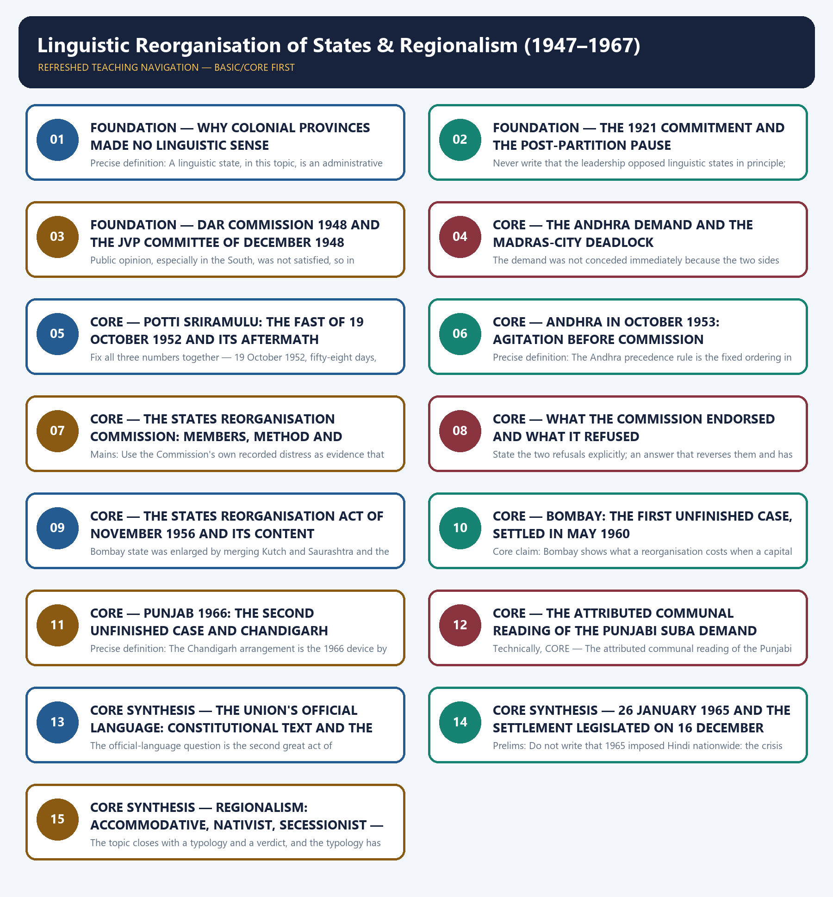

# Linguistic Reorganisation of States & Regionalism (1947–1967) - Learner-v2 Complete Learning Session

### SOURCE, PROGRESSION AND CURRENT-LINKAGE AUDIT

- **Repository owners queried:** Basic and Advanced Markdown for this topic, the master chronology, syllabus map and linked Modern History owners.
- **OCR book evidence queried:** The Basic and Advanced owner files were reconciled with the repository's post-independence OCR source, Bipan Chandra, Mridula Mukherjee and Aditya Mukherjee, *India After Independence, 1947–2000*, chapters 7 to 10, alongside the Modern History OCR sources used by the adjacent packages. The local text (book PDF page 127) records that Congress undertook political mobilisation in the mother tongue after 1919 and in 1921 amended its constitution to reorganise its regional branches on a linguistic basis; (page 128) that the Constituent Assembly appointed the Linguistic Provinces Commission under Justice S.K. Dar in 1948, that the Commission advised against the step, that the Assembly then decided not to incorporate the linguistic principle in the Constitution, and that the JVP Committee of December 1948 comprised Jawaharlal Nehru, Sardar Patel and Pattabhi Sitaramayya; (page 129) that the Andhra demand was held up by the dispute over Madras city, that the fast unto death began on 19 October 1952 and ended in death after fifty-eight days, that Andhra came into existence in October 1953, and that the States Reorganization Commission was appointed in August 1953 with Justice Fazl Ali, K.M. Panikkar and Hridaynath Kunzru; (page 130) that the Commission reported in October 1955, opposed the splitting of Bombay and Punjab, and that the States Reorganization Act was passed in November 1956 providing for fourteen states and six centrally administered territories; (pages 130–131) that eighty people were killed in police firings in Bombay city in January 1956, that sixteen were killed and two hundred injured in Gujarat, that C.D. Deshmukh resigned, and that bifurcation was finally agreed in May 1960; (pages 131–132) that the Punjabi Suba issue assumed communal overtones through Akali Dal and Jan Sangh mobilisation and that Punjab was divided in 1966 with Chandigarh made a Union Territory serving as joint capital; (pages 121–125) that the Presidential order of April 1960 used the phrase 'associate official language', that Nehru gave his assurance in Parliament on 7 August 1959, that the Official Languages Act of 1963 used the permissive word 'may', that the agitation around 26 January 1965 cost over sixty lives, and that the Lok Sabha adopted the amending bill on 16 December 1967 by 205 votes to 41; and (pages 165–166) that the Shiv Sena was founded in 1966 under Bal Thackeray on a 'sons of the soil' platform. The local text renders Potti Sriramulu's name through optical character recognition as 'Patti Sriramalu'; the owner spelling is retained and the OCR variant is recorded rather than silently corrected or silently adopted.
- **Qdrant:** not used; Markdown plus searchable local PDFs were sufficient.
- **PYQ integrity:** Two Mains demands are routed to this owner in the local ledgers, both from `_PYQ-ROUTING-MAINS-GS1-GS2-ESSAY-2018-2023.md`: 2018 GS-I Q12 on the formation of new states and the economy of India, and 2022 GS-I Q11 on the political and administrative reorganization of states and territories. Both are recorded as routed demand summaries with directive metadata rather than as verbatim official stems, and no option letter, mark award or official model answer is asserted for either. No Prelims demand in the local 2018–2026 ledgers is routed to this owner, and no adjacent Polity, Governance or Indian Society question is relabelled as a Modern History PYQ for this topic.
- **Bounded live linkage:** The bounded live linkage for this topic is official. On 31 August 2026 the Department of Official Language of the Ministry of Home Affairs was consulted directly at `rajbhasha.gov.in`, and only claims that its own published pages support are used here. Its reproduction of Part XVII of the Constitution records that Article 343(1) makes Hindi in Devanagari script the official language of the Union, that Article 343(2) allowed English to continue for all official purposes of the Union for fifteen years from the commencement of the Constitution, and that Article 343(3) permits Parliament to provide by law for the use of English after that period; that reproduced constitutional text nowhere uses the phrase 'associate official language'. Its reproduction of the Official Languages Act, 1963 records the Act as Act No. 19 of 1963 dated 10 May 1963, records that section 3 was to come into force on the 26th day of January 1965, and records the operative words that the English language 'may ... continue to be used in addition to Hindi' for all the official purposes of the Union for which it was being used and for the transaction of business in Parliament. Nothing beyond those published pages is asserted: no departmental programme, event, budget, target or contemporary statistic is drawn from the visit, and the living statutory machinery is used only to show that the historical settlement this topic studies is still the operative one.
- **Fact/inference rule:** historical claims are source-backed; analytical judgements are explicitly framed as interpretation and do not invent figures.

## BASIC LEARNING SESSION

### DEEP-REVIEW LEARNING CONTRACT

| Control | Binding rule for this package |
|---|---|
| Syllabus boundary | Complete Modern History Core is taught chronologically and causally before optional enrichment. |
| Evidence method | Claim → named Act/treaty/record/organisation/person/region or scholarly evidence → analysis → qualification. |
| Date discipline | Event, proposal, enactment, commencement, official policy, implementation and later interpretation remain distinct. |
| Historiography | Colonial, nationalist, Marxist, subaltern, Cambridge, feminist and other relevant arguments are attributed and tested, never used as labels alone. |
| Practice contract | Every solved item has demand decoding, an examiner-grade model, an executable answer/compression plan, marks rationale and answer-specific improvement. |
| Approval | This immutable successor remains `approved: false` pending explicit approval. |

**Canonical Basic/Core owner:** `upsc-ai-kit\knowledge\Modern-Indian-History\basic\30_Linguistic-Reorganisation-and-Regionalism.md`  
**Canonical topic owner:** `upsc-ai-kit\knowledge\Modern-Indian-History\basic\30_Linguistic-Reorganisation-and-Regionalism.md`  
**Optional Advanced owner:** `upsc-ai-kit\knowledge\Modern-Indian-History\advanced\30_Linguistic-Reorganisation-and-Regionalism.md`  
**Official syllabus mapping:** `upsc-ai-kit\knowledge\Modern-Indian-History\OFFICIAL-UPSC-SYLLABUS-MAPPING.md`

### EVIDENCE, PYQ AND CURRENT-STATUS CONTROL

- **Official and primary evidence:** Acts, charters, treaties, proclamations, committee reports, proceedings, organisational resolutions, speeches and contemporary records are dated and read for authorship and purpose.
- **Regional and social evidence:** petitions, newspapers, memoirs, local studies and material geography qualify elite or all-India generalisation.
- **Economic and quantitative evidence:** revenue, trade, price, wage, craft and mortality claims retain unit, region, period and uncertainty; statistics are never invented.
- **Scholarly interpretation:** historian schools are competing explanations tied to named evidence, not memorised verdicts.
- **PYQ discipline:** repository ledgers and locally held official papers control wording and metadata; reconstructed wording and unavailable official keys remain explicitly labelled.
- **Current-status note, rechecked 2026-08-31:** The bounded live linkage for this topic is official. On 31 August 2026 the Department of Official Language of the Ministry of Home Affairs was consulted directly at `rajbhasha.gov.in`, and only claims that its own published pages support are used here. Its reproduction of Part XVII of the Constitution records that Article 343(1) makes Hindi in Devanagari script the official language of the Union, that Article 343(2) allowed English to continue for all official purposes of the Union for fifteen years from the commencement of the Constitution, and that Article 343(3) permits Parliament to provide by law for the use of English after that period; that reproduced constitutional text nowhere uses the phrase 'associate official language'. Its reproduction of the Official Languages Act, 1963 records the Act as Act No. 19 of 1963 dated 10 May 1963, records that section 3 was to come into force on the 26th day of January 1965, and records the operative words that the English language 'may ... continue to be used in addition to Hindi' for all the official purposes of the Union for which it was being used and for the transaction of business in Parliament. Nothing beyond those published pages is asserted: no departmental programme, event, budget, target or contemporary statistic is drawn from the visit, and the living statutory machinery is used only to show that the historical settlement this topic studies is still the operative one.

**Live/primary context sources recorded by the predecessor generation:**

- `https://rajbhasha.gov.in/en/constitutional-provisions`
- `https://rajbhasha.gov.in/en/official-languages-act-1963`




*Distinct embedded teaching-navigation image. The separate continuous Cārvāka-style flowchart package remains an independent at-a-glance artifact.*

### SESSION 1 — FOUNDATION — WHY COLONIAL PROVINCES MADE NO LINGUISTIC SENSE

#### DEFINITION / WHAT THIS IS CALLED

**Plain-language definition:** Mains: Use this opening to convert any 'linguistic states' question from a culture question into a state-capacity question, which is what earns analytical marks.

**Technical definition:** Precise definition: A linguistic state, in this topic, is an administrative unit whose boundaries are drawn so that a predominant language can serve as the medium of education, administration and judicial activity; it is not a claim to sovereignty for a language community.

#### ANSWER-GRABBING OPENING — WRITE/ADAPT IN THE EXAM

> Mains: Use this opening to convert any 'linguistic states' question from a culture question into a state-capacity question, which is what earns analytical marks.

#### MUST-WRITE KEYWORDS

- **FOUNDATION**
- **Why colonial provinces made no linguistic sense**
- **Precise definition**
- **Topic boundary**
- **Core claim**
- **1947–1967**

**How to use them:** Frame the answer through FOUNDATION; define Why colonial provinces made no linguistic sense, connect Precise definition with Topic boundary to explain the mechanism, and use Core claim for the decisive comparison or qualification.

##### VISUAL FIRST

```text
WHY COLONIAL PROVINCES MADE NO LINGUISTIC SENSE
INHERITED COLONIAL MAP  ->  drawn over ~100 years of conquest, not designed
|-- NO TEST APPLIED -> linguistic or cultural cohesion never a criterion
|-- RESULT -> most provinces multilingual + multicultural; princely states add heterogeneity
|-- CONSEQUENCE -> education, courts and administration run in a language most people lack
`-- THEREFORE -> the case for linguistic states is ADMINISTRATIVE first, emotive second
```

*The visual fixes this subtopic's chronology, mechanism or boundary before the evidence.*

##### CONCEPT DEFINITIONS

- **Precise definition:** A linguistic state, in this topic, is an administrative unit whose boundaries are drawn so that a predominant language can serve as the medium of education, administration and judicial activity; it is not a claim to sovereignty for a language community.
- **Topic boundary:** Apply this definition only within Linguistic Reorganisation of States & Regionalism (1947–1967); retain the named actor, institution, date and chronological role.

##### CORE EXPLANATION

The starting condition of this topic is an inherited map that nobody had designed: provincial boundaries had accumulated over nearly a hundred years of conquest, so the administrative case for redrawing them on language was practical long before it became emotive.

##### EVIDENCE AND MECHANISM

- Boundaries in pre-1947 India had been drawn haphazardly as the British conquest proceeded, with no heed paid to linguistic or cultural cohesion, so most provinces were multilingual and multicultural.
- The interspersed princely states added a further element of heterogeneity, so the map was not merely untidy but administratively incoherent.
- Language is closely tied to culture and custom, and the spread of mass literacy can occur only through the medium of the mother tongue.
- Democracy becomes real to ordinary people only when politics, administration and judicial activity are conducted in a language they understand, which requires states organised around a predominant language.

##### EXAMINER CAUTION

- Open with the administrative argument, not with sentiment: the colonial map failed a test of governability before it failed a test of identity.

##### EXAM LINK

- **Prelims:** Open with the administrative argument, not with sentiment: the colonial map failed a test of governability before it failed a test of identity.
- **Mains:** Use this opening to convert any 'linguistic states' question from a culture question into a state-capacity question, which is what earns analytical marks.

##### MINI RECAP

- **Core claim:** The starting condition of this topic is an inherited map that nobody had designed: provincial boundaries had accumulated over nearly a hundred years of conquest, so the administrative case for redrawing them on language was practical long before it became emotive.
- **Use:** Use this opening to convert any 'linguistic states' question from a culture question into a state-capacity question, which is what earns analytical marks.

#### CLOSING RECALL FLOW — FOUNDATION — WHY COLONIAL PROVINCES MADE NO LINGUISTIC SENSE

```text
START / CONCEPT: FOUNDATION — Why colonial provinces made no linguistic sense
        |
        v
EXACT TERMS: FOUNDATION · Why colonial provinces made no linguistic sense · Precise definition · Topic boundary · Core claim · 1947–1967
        |
        v
MECHANISM / ARGUMENT: Language is closely tied to culture and custom, and the spread of mass literacy can occur only through the medium of the mother tongue.
        |
        v
CONSEQUENCE / CONTRAST: Precise definition: A linguistic state, in this topic, is an administrative unit whose boundaries are drawn so that a predominant language can serve as the medium of education, administration and judicial activity; it is not a claim to sovereignty for a language community.
        |
        v
UPSC TRAP / ANSWER-USE: The interspersed princely states added a further element of heterogeneity, so the map was not merely untidy but administratively incoherent.
        |
        v
ANSWER-GRABBING FORMULATION: Mains: Use this opening to convert any 'linguistic states' question from a culture question into a state-capacity question, which is what earns analytical marks.
```
### SESSION 2 — FOUNDATION — THE 1921 COMMITMENT AND THE POST-PARTITION PAUSE

#### DEFINITION / WHAT THIS IS CALLED

**Plain-language definition:** Precise definition: The post-Partition pause is the deliberate lowering of priority for boundary redrawing between 1947 and 1952 by a leadership that continued to accept the linguistic principle it had applied to its own organisation in 1921.

**Technical definition:** Never write that the leadership opposed linguistic states in principle; the 1921 commitment stands, and the post-1947 position was a sequencing judgement taken under measurable stress.

#### ANSWER-GRABBING OPENING — WRITE/ADAPT IN THE EXAM

> Precise definition: The post-Partition pause is the deliberate lowering of priority for boundary redrawing between 1947 and 1952 by a leadership that continued to accept the linguistic principle it had applied to its own organisation in 1921.

#### MUST-WRITE KEYWORDS

- **FOUNDATION**
- **The 1921 commitment**
- **the post-Partition pause**
- **Precise definition**
- **Topic boundary**
- **Core claim**

**How to use them:** Frame the answer through FOUNDATION; define The 1921 commitment, connect the post-Partition pause with Precise definition to explain the mechanism, and use Topic boundary for the decisive comparison or qualification.

##### VISUAL FIRST

```text
THE 1921 COMMITMENT AND THE POST-PARTITION PAUSE
1921  ->  CONGRESS AMENDS ITS OWN CONSTITUTION -> regional branches on linguistic basis
      ->  repeated commitments to redraw provincial boundaries on language
1947  ->  PARTITION SHOCK -> dislocation + economic crisis + Kashmir + law and order
27 NOV 1947 -> NEHRU: "First things must come first ... security and stability of India"
NET EFFECT -> PRINCIPLE UNCHANGED, PRIORITY LOWERED -> a timing decision, not a reversal
```

*The visual fixes this subtopic's chronology, mechanism or boundary before the evidence.*

##### CONCEPT DEFINITIONS

- **Precise definition:** The post-Partition pause is the deliberate lowering of priority for boundary redrawing between 1947 and 1952 by a leadership that continued to accept the linguistic principle it had applied to its own organisation in 1921.
- **Topic boundary:** Apply this definition only within Linguistic Reorganisation of States & Regionalism (1947–1967); retain the named actor, institution, date and chronological role.

##### CORE EXPLANATION

The Congress had accepted the linguistic principle for itself in 1921, so what changed after 1947 was not the principle but the leadership's judgement about timing, and reading the pause as a reversal of principle is the commonest analytical error here.

##### EVIDENCE AND MECHANISM

- With mass involvement in the national movement after 1919 the Congress mobilised in the mother tongue and in 1921 amended its own constitution to reorganise its regional branches on a linguistic basis.
- The Congress committed itself repeatedly thereafter to redrawing provincial boundaries on linguistic lines, so free India was widely assumed to be going to do the same.
- Partition produced administrative, economic and political dislocation, and independence arrived immediately after the War with law-and-order and economic emergencies and a war-like situation over Kashmir.
- Nehru stated on 27 November 1947 that 'First things must come first and the first thing is the security and stability of India', and the leadership accordingly gave the redrawing of the map a low priority while remaining committed to it.

##### EXAMINER CAUTION

- Never write that the leadership opposed linguistic states in principle; the 1921 commitment stands, and the post-1947 position was a sequencing judgement taken under measurable stress.

##### EXAM LINK

- **Prelims:** Never write that the leadership opposed linguistic states in principle; the 1921 commitment stands, and the post-1947 position was a sequencing judgement taken under measurable stress.
- **Mains:** This distinction supplies the whole 'why did caution give way to acceptance' answer, because a reversal of timing needs a different explanation from a reversal of belief.

##### MINI RECAP

- **Core claim:** The Congress had accepted the linguistic principle for itself in 1921, so what changed after 1947 was not the principle but the leadership's judgement about timing, and reading the pause as a reversal of principle is the commonest analytical error here.
- **Use:** This distinction supplies the whole 'why did caution give way to acceptance' answer, because a reversal of timing needs a different explanation from a reversal of belief.

#### CLOSING RECALL FLOW — FOUNDATION — THE 1921 COMMITMENT AND THE POST-PARTITION PAUSE

```text
START / CONCEPT: FOUNDATION — The 1921 commitment and the post-Partition pause
        |
        v
EXACT TERMS: FOUNDATION · The 1921 commitment · the post-Partition pause · Precise definition · Topic boundary · Core claim
        |
        v
MECHANISM / ARGUMENT: Mains: This distinction supplies the whole 'why did caution give way to acceptance' answer, because a reversal of timing needs a different explanation from a reversal of belief.
        |
        v
CONSEQUENCE / CONTRAST: Core claim: The Congress had accepted the linguistic principle for itself in 1921, so what changed after 1947 was not the principle but the leadership's judgement about timing, and reading the pause as a reversal of principle is the commonest analytical error here.
        |
        v
UPSC TRAP / ANSWER-USE: Nehru stated on 27 November 1947 that 'First things must come first and the first thing is the security and stability of India', and the leadership accordingly gave the redrawing of the map a low priority while remaining committed to it.
        |
        v
ANSWER-GRABBING FORMULATION: Precise definition: The post-Partition pause is the deliberate lowering of priority for boundary redrawing between 1947 and 1952 by a leadership that continued to accept the linguistic principle it had applied to its own organisation in 1921.
```
### SESSION 3 — FOUNDATION — DAR COMMISSION 1948 AND THE JVP COMMITTEE OF DECEMBER 1948

#### DEFINITION / WHAT THIS IS CALLED

**Plain-language definition:** Precise definition: The JVP proviso is the conditional opening recorded in the December 1948 report that a new state could be created where the demand was insistent and overwhelming and the other language groups involved were agreeable.

**Technical definition:** Public opinion, especially in the South, was not satisfied, so in December 1948 the Congress appointed the JVP Committee of Jawaharlal Nehru, Sardar Patel and Pattabhi Sitaramayya to examine the question afresh.

#### ANSWER-GRABBING OPENING — WRITE/ADAPT IN THE EXAM

> Public opinion, especially in the South, was not satisfied, so in December 1948 the Congress appointed the JVP Committee of Jawaharlal Nehru, Sardar Patel and Pattabhi Sitaramayya to examine the question afresh.

#### MUST-WRITE KEYWORDS

- **FOUNDATION**
- **Dar Commission 1948**
- **the JVP Committee of December 1948**
- **Precise definition**
- **Topic boundary**
- **Core claim**

**How to use them:** Frame the answer through FOUNDATION; define Dar Commission 1948, connect the JVP Committee of December 1948 with Precise definition to explain the mechanism, and use Topic boundary for the decisive comparison or qualification.

##### VISUAL FIRST

```text
DAR COMMISSION 1948 AND THE JVP COMMITTEE OF DECEMBER 1948
1948  CONSTITUENT ASSEMBLY -> LINGUISTIC PROVINCES COMMISSION (Justice S.K. Dar)
      VERDICT -> advise against now: risk to unity + administrative inconvenience
      EFFECT  -> linguistic principle NOT written into the Constitution
DEC 1948  CONGRESS -> JVP COMMITTEE (Nehru | Patel | Pattabhi Sitaramayya)
      VERDICT -> delay again: unity, security, economic development
      PROVISO -> "insistent and overwhelming demand + other groups agreeable" = a state may be made
KEY -> the refusal carried its own escape clause; Andhra later walks through it
```

*The visual fixes this subtopic's chronology, mechanism or boundary before the evidence.*

##### CONCEPT DEFINITIONS

- **Precise definition:** The JVP proviso is the conditional opening recorded in the December 1948 report that a new state could be created where the demand was insistent and overwhelming and the other language groups involved were agreeable.
- **Topic boundary:** Apply this definition only within Linguistic Reorganisation of States & Regionalism (1947–1967); retain the named actor, institution, date and chronological role.

##### CORE EXPLANATION

Two considered bodies advised delay within a single year, and the second of them wrote the opening through which the whole later settlement eventually passed, so these are not two identical refusals.

##### EVIDENCE AND MECHANISM

- The Constituent Assembly appointed in 1948 the Linguistic Provinces Commission headed by Justice S.K. Dar to enquire into the desirability of linguistic provinces.
- The Dar Commission advised against the step at that time because it might threaten national unity and be administratively inconvenient, and the Constituent Assembly then decided not to incorporate the linguistic principle in the Constitution.
- Public opinion, especially in the South, was not satisfied, so in December 1948 the Congress appointed the JVP Committee of Jawaharlal Nehru, Sardar Patel and Pattabhi Sitaramayya to examine the question afresh.
- The JVP Committee also advised against linguistic states for the time being on grounds of unity, national security and economic development, but it laid down that where a demand was insistent and overwhelming and other language groups were agreeable, a new state could be created.

##### EXAMINER CAUTION

- Do not treat the Dar and JVP conclusions as prejudice, and do not miss the JVP proviso: the same report that counselled delay supplied the conditional route later used for Andhra.

##### EXAM LINK

- **Prelims:** Do not treat the Dar and JVP conclusions as prejudice, and do not miss the JVP proviso: the same report that counselled delay supplied the conditional route later used for Andhra.
- **Mains:** In a 15-mark answer this pair proves that the eventual policy was adopted against the considered advice of the founding leadership, which is the strongest available evidence for the accommodation argument.

##### MINI RECAP

- **Core claim:** Two considered bodies advised delay within a single year, and the second of them wrote the opening through which the whole later settlement eventually passed, so these are not two identical refusals.
- **Use:** In a 15-mark answer this pair proves that the eventual policy was adopted against the considered advice of the founding leadership, which is the strongest available evidence for the accommodation argument.

#### CLOSING RECALL FLOW — FOUNDATION — DAR COMMISSION 1948 AND THE JVP COMMITTEE OF DECEMBER 1948

```text
START / CONCEPT: FOUNDATION — Dar Commission 1948 and the JVP Committee of December 1948
        |
        v
EXACT TERMS: FOUNDATION · Dar Commission 1948 · the JVP Committee of December 1948 · Precise definition · Topic boundary · Core claim
        |
        v
MECHANISM / ARGUMENT: Core claim: Two considered bodies advised delay within a single year, and the second of them wrote the opening through which the whole later settlement eventually passed, so these are not two identical refusals.
        |
        v
CONSEQUENCE / CONTRAST: The JVP Committee also advised against linguistic states for the time being on grounds of unity, national security and economic development, but it laid down that where a demand was insistent and overwhelming and other language groups were agreeable, a new state could be created.
        |
        v
UPSC TRAP / ANSWER-USE: Do not treat the Dar and JVP conclusions as prejudice, and do not miss the JVP proviso: the same report that counselled delay supplied the conditional route later used for Andhra.
        |
        v
ANSWER-GRABBING FORMULATION: Public opinion, especially in the South, was not satisfied, so in December 1948 the Congress appointed the JVP Committee of Jawaharlal Nehru, Sardar Patel and Pattabhi Sitaramayya to examine the question afresh.
```
### SESSION 4 — CORE — THE ANDHRA DEMAND AND THE MADRAS-CITY DEADLOCK

#### DEFINITION / WHAT THIS IS CALLED

**Plain-language definition:** Precise definition: The Madras-city deadlock is the unresolved question of which successor state would take the capital city, which held up the Andhra concession although the linguistic conditions laid down by the JVP Committee had been met.

**Technical definition:** The demand was not conceded immediately because the two sides could not agree on which state should take Madras city, with Andhra leaders unwilling to concede it.

#### ANSWER-GRABBING OPENING — WRITE/ADAPT IN THE EXAM

> Precise definition: The Madras-city deadlock is the unresolved question of which successor state would take the capital city, which held up the Andhra concession although the linguistic conditions laid down by the JVP Committee had been met.

#### MUST-WRITE KEYWORDS

- **The Andhra demand**
- **the Madras-city deadlock**
- **Precise definition**
- **Topic boundary**
- **Core claim**
- **1947–1967**

**How to use them:** Frame the answer through The Andhra demand; define the Madras-city deadlock, connect Precise definition with Topic boundary to explain the mechanism, and use Core claim for the decisive comparison or qualification.

##### VISUAL FIRST

```text
THE ANDHRA DEMAND AND THE MADRAS-CITY DEADLOCK
ANDHRA DEMAND  ->  Telugu state out of the Madras Presidency
|-- AGE OF DEMAND -> popular for nearly half a century; all-party support
|-- JVP TEST PART 1 -> demand insistent and overwhelming            .......... PASSED
|-- JVP TEST PART 2 -> other language group agreeable (Tamil Nadu)  .......... PASSED
`-- BLOCKING ISSUE  -> WHICH STATE TAKES MADRAS CITY?               .......... UNRESOLVED
PATTERN TO CARRY FORWARD -> capitals, not languages, are what stall reorganisation
```

*The visual fixes this subtopic's chronology, mechanism or boundary before the evidence.*

##### CONCEPT DEFINITIONS

- **Precise definition:** The Madras-city deadlock is the unresolved question of which successor state would take the capital city, which held up the Andhra concession although the linguistic conditions laid down by the JVP Committee had been met.
- **Topic boundary:** Apply this definition only within Linguistic Reorganisation of States & Regionalism (1947–1967); retain the named actor, institution, date and chronological role.

##### CORE EXPLANATION

Andhra was not blocked by the linguistic principle but by a capital city, and noticing that converts the case from a story about language into a story about territory and assets.

##### EVIDENCE AND MECHANISM

- The demand for a separate Andhra state for Telugu speakers had been popular for nearly half a century and had the support of all political parties.
- The JVP accepted that a strong case existed for forming Andhra out of the Madras Presidency, particularly because the leadership of Tamil Nadu was agreeable to it.
- The demand was not conceded immediately because the two sides could not agree on which state should take Madras city, with Andhra leaders unwilling to concede it.
- The obstacle was therefore a dispute over a city and its assets rather than a dispute about whether Telugu speakers deserved a state.

##### EXAMINER CAUTION

- State the blocking cause precisely: the JVP proviso was satisfied on language and failed on the capital, which is why the concession required an agitation rather than an argument.

##### EXAM LINK

- **Prelims:** State the blocking cause precisely: the JVP proviso was satisfied on language and failed on the capital, which is why the concession required an agitation rather than an argument.
- **Mains:** Use this to explain why later cases such as Bombay in 1960 and Chandigarh in 1966 also turned on capitals, showing a repeated structural obstacle rather than a series of accidents.

##### MINI RECAP

- **Core claim:** Andhra was not blocked by the linguistic principle but by a capital city, and noticing that converts the case from a story about language into a story about territory and assets.
- **Use:** Use this to explain why later cases such as Bombay in 1960 and Chandigarh in 1966 also turned on capitals, showing a repeated structural obstacle rather than a series of accidents.

#### CLOSING RECALL FLOW — CORE — THE ANDHRA DEMAND AND THE MADRAS-CITY DEADLOCK

```text
START / CONCEPT: CORE — The Andhra demand and the Madras-city deadlock
        |
        v
EXACT TERMS: The Andhra demand · the Madras-city deadlock · Precise definition · Topic boundary · Core claim · 1947–1967
        |
        v
MECHANISM / ARGUMENT: The demand was not conceded immediately because the two sides could not agree on which state should take Madras city, with Andhra leaders unwilling to concede it.
        |
        v
CONSEQUENCE / CONTRAST: Core claim: Andhra was not blocked by the linguistic principle but by a capital city, and noticing that converts the case from a story about language into a story about territory and assets.
        |
        v
UPSC TRAP / ANSWER-USE: The obstacle was therefore a dispute over a city and its assets rather than a dispute about whether Telugu speakers deserved a state.
        |
        v
ANSWER-GRABBING FORMULATION: Precise definition: The Madras-city deadlock is the unresolved question of which successor state would take the capital city, which held up the Andhra concession although the linguistic conditions laid down by the JVP Committee had been met.
```
### SESSION 5 — CORE — POTTI SRIRAMULU: THE FAST OF 19 OCTOBER 1952 AND ITS AFTERMATH

#### DEFINITION / WHAT THIS IS CALLED

**Plain-language definition:** Precise definition: Potti Sriramulu is the freedom fighter whose fast unto death from 19 October 1952 and death in December 1952 after fifty-eight days forced the concession of the first linguistic state; the local OCR text renders the name as 'Patti Sriramalu'.

**Technical definition:** Fix all three numbers together — 19 October 1952, fifty-eight days, December 1952 — because partial recall of this sequence is the most common factual failure in the topic.

#### ANSWER-GRABBING OPENING — WRITE/ADAPT IN THE EXAM

> Precise definition: Potti Sriramulu is the freedom fighter whose fast unto death from 19 October 1952 and death in December 1952 after fifty-eight days forced the concession of the first linguistic state; the local OCR text renders the name as 'Patti Sriramalu'.

#### MUST-WRITE KEYWORDS

- **Potti Sriramulu**
- **the fast of 19 October 1952**
- **its aftermath**
- **Precise definition**
- **Topic boundary**
- **Core claim**

**How to use them:** Frame the answer through Potti Sriramulu; define the fast of 19 October 1952, connect its aftermath with Precise definition to explain the mechanism, and use Topic boundary for the decisive comparison or qualification.

##### VISUAL FIRST

```text
POTTI SRIRAMULU: THE FAST OF 19 OCTOBER 1952 AND ITS AFTERMATH
19 OCT 1952  ->  POTTI SRIRAMULU BEGINS FAST UNTO DEATH (separate Andhra)
      |
      v  fifty-eight days
DEC 1952     ->  DEATH
      |
      v
AFTERMATH    ->  three days of rioting, demonstrations, hartals, violence across Andhra
      |
      v
GOVERNMENT   ->  immediately gives in and concedes a separate Andhra state
OCR NOTE     ->  local book text renders the name as "Patti Sriramalu"; owner spelling kept
```

*The visual fixes this subtopic's chronology, mechanism or boundary before the evidence.*

##### CONCEPT DEFINITIONS

- **Precise definition:** Potti Sriramulu is the freedom fighter whose fast unto death from 19 October 1952 and death in December 1952 after fifty-eight days forced the concession of the first linguistic state; the local OCR text renders the name as 'Patti Sriramalu'.
- **Topic boundary:** Apply this definition only within Linguistic Reorganisation of States & Regionalism (1947–1967); retain the named actor, institution, date and chronological role.

##### CORE EXPLANATION

A single fast unto death converted a stalled administrative question into an unavoidable political one, and the exact dates and duration are the examinable core of this session.

##### EVIDENCE AND MECHANISM

- Potti Sriramulu, a popular freedom fighter, undertook a fast unto death on 19 October 1952 over the demand for a separate Andhra state.
- He expired in December 1952 after fifty-eight days of fasting.
- His death was followed by three days of rioting, demonstrations, hartals and violence all over Andhra.
- The government immediately gave in and conceded the demand for a separate state of Andhra, so the causal chain runs martyrdom to disorder to concession.

##### EXAMINER CAUTION

- Fix all three numbers together — 19 October 1952, fifty-eight days, December 1952 — because partial recall of this sequence is the most common factual failure in the topic.

##### EXAM LINK

- **Prelims:** Fix all three numbers together — 19 October 1952, fifty-eight days, December 1952 — because partial recall of this sequence is the most common factual failure in the topic.
- **Mains:** In an answer, use this as the pivot sentence that separates the period of official delay from the period of forced institutionalisation.

##### MINI RECAP

- **Core claim:** A single fast unto death converted a stalled administrative question into an unavoidable political one, and the exact dates and duration are the examinable core of this session.
- **Use:** In an answer, use this as the pivot sentence that separates the period of official delay from the period of forced institutionalisation.

#### CLOSING RECALL FLOW — CORE — POTTI SRIRAMULU: THE FAST OF 19 OCTOBER 1952 AND ITS AFTERMATH

```text
START / CONCEPT: CORE — Potti Sriramulu: the fast of 19 October 1952 and its aftermath
        |
        v
EXACT TERMS: Potti Sriramulu · the fast of 19 October 1952 · its aftermath · Precise definition · Topic boundary · Core claim
        |
        v
MECHANISM / ARGUMENT: Fix all three numbers together — 19 October 1952, fifty-eight days, December 1952 — because partial recall of this sequence is the most common factual failure in the topic.
        |
        v
CONSEQUENCE / CONTRAST: Core claim: A single fast unto death converted a stalled administrative question into an unavoidable political one, and the exact dates and duration are the examinable core of this session.
        |
        v
UPSC TRAP / ANSWER-USE: Do not miss this limiting distinction: his death was followed by three days of rioting, demonstrations, hartals and violence all...
        |
        v
ANSWER-GRABBING FORMULATION: Precise definition: Potti Sriramulu is the freedom fighter whose fast unto death from 19 October 1952 and death in December 1952 after fifty-eight days forced the concession of the first linguistic state; the local OCR text renders the name as 'Patti Sriramalu'.
```
### SESSION 6 — CORE — ANDHRA IN OCTOBER 1953: AGITATION BEFORE COMMISSION

#### DEFINITION / WHAT THIS IS CALLED

**Plain-language definition:** Core claim: Andhra came into existence in October 1953, which means the first linguistic state was created before any commission had generalised the principle and before any general statute existed — the single sequencing fact that most Prelims traps in this topic exploit.

**Technical definition:** Precise definition: The Andhra precedence rule is the fixed ordering in which the creation of Andhra in October 1953 precedes the States Reorganisation Commission's report of October 1955 and the States Reorganisation Act of November 1956.

#### ANSWER-GRABBING OPENING — WRITE/ADAPT IN THE EXAM

> Precise definition: The Andhra precedence rule is the fixed ordering in which the creation of Andhra in October 1953 precedes the States Reorganisation Commission's report of October 1955 and the States Reorganisation Act of November 1956.

#### MUST-WRITE KEYWORDS

- **Andhra in October 1953**
- **agitation before commission**
- **Precise definition**
- **Topic boundary**
- **Core claim**
- **1947–1967**

**How to use them:** Frame the answer through Andhra in October 1953; define agitation before commission, connect Precise definition with Topic boundary to explain the mechanism, and use Core claim for the decisive comparison or qualification.

##### VISUAL FIRST

```text
ANDHRA IN OCTOBER 1953: AGITATION BEFORE COMMISSION
TIMELINE LOCK  ->  read left to right and never reorder
OCT 1953  ANDHRA CREATED .................. first linguistic state
OCT 1955  SRC REPORT ...................... principle generalised
NOV 1956  STATES REORGANISATION ACT ....... settlement enacted
MAY 1960  BOMBAY BIFURCATED ............... first unfinished case closed
1966      PUNJAB REORGANISED .............. second unfinished case closed
TRAP -> any statement placing the Commission before Andhra is factually wrong
```

*The visual fixes this subtopic's chronology, mechanism or boundary before the evidence.*

##### CONCEPT DEFINITIONS

- **Precise definition:** The Andhra precedence rule is the fixed ordering in which the creation of Andhra in October 1953 precedes the States Reorganisation Commission's report of October 1955 and the States Reorganisation Act of November 1956.
- **Topic boundary:** Apply this definition only within Linguistic Reorganisation of States & Regionalism (1947–1967); retain the named actor, institution, date and chronological role.

##### CORE EXPLANATION

Andhra came into existence in October 1953, which means the first linguistic state was created before any commission had generalised the principle and before any general statute existed — the single sequencing fact that most Prelims traps in this topic exploit.

##### EVIDENCE AND MECHANISM

- Andhra finally came into existence in October 1953 as the first linguistic state.
- The States Reorganisation Commission submitted its report only in October 1955, two years later.
- The States Reorganisation Act followed in November 1956, three years after Andhra.
- The success of the Andhra struggle encouraged other linguistic groups to agitate for their own states or for boundary rectification, which is why a general enquiry then became unavoidable.

##### EXAMINER CAUTION

- Never credit the States Reorganisation Commission with creating the first linguistic state; the Commission generalised a principle that agitation had already imposed.

##### EXAM LINK

- **Prelims:** Never credit the States Reorganisation Commission with creating the first linguistic state; the Commission generalised a principle that agitation had already imposed.
- **Mains:** Open any chronology-based answer with this ordering, because an examiner can see immediately whether a candidate has the sequence right.

##### MINI RECAP

- **Core claim:** Andhra came into existence in October 1953, which means the first linguistic state was created before any commission had generalised the principle and before any general statute existed — the single sequencing fact that most Prelims traps in this topic exploit.
- **Use:** Open any chronology-based answer with this ordering, because an examiner can see immediately whether a candidate has the sequence right.

#### CLOSING RECALL FLOW — CORE — ANDHRA IN OCTOBER 1953: AGITATION BEFORE COMMISSION

```text
START / CONCEPT: CORE — Andhra in October 1953: agitation before commission
        |
        v
EXACT TERMS: Andhra in October 1953 · agitation before commission · Precise definition · Topic boundary · Core claim · 1947–1967
        |
        v
MECHANISM / ARGUMENT: Core claim: Andhra came into existence in October 1953, which means the first linguistic state was created before any commission had generalised the principle and before any general statute existed — the single sequencing fact that most Prelims traps in this topic exploit.
        |
        v
CONSEQUENCE / CONTRAST: Never credit the States Reorganisation Commission with creating the first linguistic state; the Commission generalised a principle that agitation had already imposed.
        |
        v
UPSC TRAP / ANSWER-USE: any statement placing the Commission before Andhra is factually wrong.
        |
        v
ANSWER-GRABBING FORMULATION: Precise definition: The Andhra precedence rule is the fixed ordering in which the creation of Andhra in October 1953 precedes the States Reorganisation Commission's report of October 1955 and the States Reorganisation Act of November 1956.
```
### SESSION 7 — CORE — THE STATES REORGANISATION COMMISSION: MEMBERS, METHOD AND REPORT

#### DEFINITION / WHAT THIS IS CALLED

**Plain-language definition:** Precise definition: The States Reorganisation Commission is the three-member body appointed in August 1953 under Justice Fazl Ali with K.M.

**Technical definition:** Mains: Use the Commission's own recorded distress as evidence that the reorganisation process was genuinely dangerous, which strengthens rather than weakens the later accommodation verdict.

#### ANSWER-GRABBING OPENING — WRITE/ADAPT IN THE EXAM

> Precise definition: The States Reorganisation Commission is the three-member body appointed in August 1953 under Justice Fazl Ali with K.M.

#### MUST-WRITE KEYWORDS

- **The States Reorganisation Commission**
- **members**
- **method**
- **report**
- **Precise definition**
- **Topic boundary**

**How to use them:** Frame the answer through The States Reorganisation Commission; define members, connect method with report to explain the mechanism, and use Precise definition for the decisive comparison or qualification.

##### VISUAL FIRST

```text
THE STATES REORGANISATION COMMISSION: MEMBERS, METHOD AND REPORT
STATES REORGANISATION COMMISSION  (appointed August 1953)
+----------------------+--------------------------+----------------------------+
| CHAIRMAN             | MEMBER                   | MEMBER                     |
| Justice Fazl Ali     | K.M. Panikkar            | Hridaynath Kunzru          |
+----------------------+--------------------------+----------------------------+
MANDATE  -> examine "objectively and dispassionately" the whole reorganisation question
CONDITIONS -> two years of meetings, demonstrations, agitations, hunger strikes
COMMISSION'S OWN WORDS -> "a kind of border warfare" among old comrades-in-arms
REPORT   -> submitted OCTOBER 1955
```

*The visual fixes this subtopic's chronology, mechanism or boundary before the evidence.*

##### CONCEPT DEFINITIONS

- **Precise definition:** The States Reorganisation Commission is the three-member body appointed in August 1953 under Justice Fazl Ali with K.M. Panikkar and Hridaynath Kunzru which reported in October 1955 on the whole question of reorganising the states.
- **Topic boundary:** Apply this definition only within Linguistic Reorganisation of States & Regionalism (1947–1967); retain the named actor, institution, date and chronological role.

##### CORE EXPLANATION

Nehru's answer to an agitation he could not stop was to institutionalise the question, and the Commission's composition, working conditions and reporting date are all separately examinable.

##### EVIDENCE AND MECHANISM

- Nehru appointed the States Reorganisation Commission in August 1953 to examine objectively and dispassionately the entire question of the reorganisation of the states of the union.
- Its members were Justice Fazl Ali as chairman with K.M. Panikkar and Hridaynath Kunzru.
- Throughout two years of work the Commission faced meetings, demonstrations, agitations and hunger strikes, and recorded its distress at what it described as a kind of border warfare in which old comrades-in-arms were pitted against one another.
- The Commission submitted its report in October 1955.

##### EXAMINER CAUTION

- Name all three members and both dates; writing 'the SRC' without the chairman, the two members and the October 1955 report date leaves the answer unverifiable.

##### EXAM LINK

- **Prelims:** Name all three members and both dates; writing 'the SRC' without the chairman, the two members and the October 1955 report date leaves the answer unverifiable.
- **Mains:** Use the Commission's own recorded distress as evidence that the reorganisation process was genuinely dangerous, which strengthens rather than weakens the later accommodation verdict.

##### MINI RECAP

- **Core claim:** Nehru's answer to an agitation he could not stop was to institutionalise the question, and the Commission's composition, working conditions and reporting date are all separately examinable.
- **Use:** Use the Commission's own recorded distress as evidence that the reorganisation process was genuinely dangerous, which strengthens rather than weakens the later accommodation verdict.

#### CLOSING RECALL FLOW — CORE — THE STATES REORGANISATION COMMISSION: MEMBERS, METHOD AND REPORT

```text
START / CONCEPT: CORE — The States Reorganisation Commission: members, method and report
        |
        v
EXACT TERMS: The States Reorganisation Commission · members · method · report · Precise definition · Topic boundary
        |
        v
MECHANISM / ARGUMENT: Its members were Justice Fazl Ali as chairman with K.M.
        |
        v
CONSEQUENCE / CONTRAST: Nehru's answer to an agitation he could not stop was to institutionalise the question, and the Commission's composition, working conditions and reporting date are all separately examinable.
        |
        v
UPSC TRAP / ANSWER-USE: Do not miss this limiting distinction: throughout two years of work the Commission faced meetings, demonstrations, agitations and hunger strikes.
        |
        v
ANSWER-GRABBING FORMULATION: Precise definition: The States Reorganisation Commission is the three-member body appointed in August 1953 under Justice Fazl Ali with K.M.
```
### SESSION 8 — CORE — WHAT THE COMMISSION ENDORSED AND WHAT IT REFUSED

#### DEFINITION / WHAT THIS IS CALLED

**Plain-language definition:** The Commission recognised the linguistic principle for the most part while laying down that due consideration should be given to administrative and economic factors.

**Technical definition:** State the two refusals explicitly; an answer that reverses them and has the Commission proposing those two splits has inverted the record.

#### ANSWER-GRABBING OPENING — WRITE/ADAPT IN THE EXAM

> The Commission recognised the linguistic principle for the most part while laying down that due consideration should be given to administrative and economic factors.

#### MUST-WRITE KEYWORDS

- **What the Commission endorsed**
- **what it refused**
- **Precise definition**
- **Topic boundary**
- **Core claim**
- **1947–1967**

**How to use them:** Frame the answer through What the Commission endorsed; define what it refused, connect Precise definition with Topic boundary to explain the mechanism, and use Core claim for the decisive comparison or qualification.

##### VISUAL FIRST

```text
WHAT THE COMMISSION ENDORSED AND WHAT IT REFUSED
COMMISSION'S OUTPUT  ->  one endorsement, three refusals
ENDORSED  -> the linguistic principle "for the most part", with due weight to
             administrative and economic factors
REFUSED 1 -> splitting BOMBAY        -> reopens as agitation -> settled MAY 1960
REFUSED 2 -> splitting PUNJAB        -> reopens as agitation -> settled 1966
REFUSED 3 -> a separate JHARKHAND    -> ground: the region had no common language
LESSON -> a linguistic criterion cannot settle bilingual capitals or tribal demands
```

*The visual fixes this subtopic's chronology, mechanism or boundary before the evidence.*

##### CONCEPT DEFINITIONS

- **Precise definition:** The Commission's refusals are its explicit declines to split the bilingual states of Bombay and Punjab and its rejection of a separate Jharkhand state for want of a common language.
- **Topic boundary:** Apply this definition only within Linguistic Reorganisation of States & Regionalism (1947–1967); retain the named actor, institution, date and chronological role.

##### CORE EXPLANATION

The Commission's refusals matter as much as its endorsement, because the two cases it declined to settle became the two agitations of the next decade and the demand it rejected outright reappears in the tribal-integration owner.

##### EVIDENCE AND MECHANISM

- The Commission recognised the linguistic principle for the most part while laying down that due consideration should be given to administrative and economic factors.
- It opposed the splitting of Bombay and of Punjab, so neither bilingual case was settled by the report.
- It rejected the demand for a separate Jharkhand state on the ground that the region did not have a common language, which is where the linguistic criterion collides with a tribal demand.
- Its recommendations were accepted with certain modifications and were quickly implemented, so the general settlement was adopted while the hard cases were left open.

##### EXAMINER CAUTION

- State the two refusals explicitly; an answer that reverses them and has the Commission proposing those two splits has inverted the record.

##### EXAM LINK

- **Prelims:** State the two refusals explicitly; an answer that reverses them and has the Commission proposing those two splits has inverted the record.
- **Mains:** This session supplies the bridge to Bombay in 1960, to Punjab in 1966 and to the tribal owner, so use it whenever a question asks what reorganisation left unfinished.

##### MINI RECAP

- **Core claim:** The Commission's refusals matter as much as its endorsement, because the two cases it declined to settle became the two agitations of the next decade and the demand it rejected outright reappears in the tribal-integration owner.
- **Use:** This session supplies the bridge to Bombay in 1960, to Punjab in 1966 and to the tribal owner, so use it whenever a question asks what reorganisation left unfinished.

#### CLOSING RECALL FLOW — CORE — WHAT THE COMMISSION ENDORSED AND WHAT IT REFUSED

```text
START / CONCEPT: CORE — What the Commission endorsed and what it refused
        |
        v
EXACT TERMS: What the Commission endorsed · what it refused · Precise definition · Topic boundary · Core claim · 1947–1967
        |
        v
MECHANISM / ARGUMENT: Core claim: The Commission's refusals matter as much as its endorsement, because the two cases it declined to settle became the two agitations of the next decade and the demand it rejected outright reappears in the tribal-integration owner.
        |
        v
CONSEQUENCE / CONTRAST: It rejected the demand for a separate Jharkhand state on the ground that the region did not have a common language, which is where the linguistic criterion collides with a tribal demand.
        |
        v
UPSC TRAP / ANSWER-USE: Its recommendations were accepted with certain modifications and were quickly implemented, so the general settlement was adopted while the hard cases were left open.
        |
        v
ANSWER-GRABBING FORMULATION: The Commission recognised the linguistic principle for the most part while laying down that due consideration should be given to administrative and economic factors.
```
### SESSION 9 — CORE — THE STATES REORGANISATION ACT OF NOVEMBER 1956 AND ITS CONTENT

#### DEFINITION / WHAT THIS IS CALLED

**Plain-language definition:** Precise definition: The States Reorganisation Act, 1956 is the November 1956 statute that generalised the linguistic principle by providing for fourteen states and six centrally administered territories and by executing named territorial transfers.

**Technical definition:** Bombay state was enlarged by merging Kutch and Saurashtra and the Marathi-speaking areas of Hyderabad with it, which is precisely why the Bombay question then exploded.

#### ANSWER-GRABBING OPENING — WRITE/ADAPT IN THE EXAM

> Precise definition: The States Reorganisation Act, 1956 is the November 1956 statute that generalised the linguistic principle by providing for fourteen states and six centrally administered territories and by executing named territorial transfers.

#### MUST-WRITE KEYWORDS

- **The States Reorganisation Act of November 1956**
- **its content**
- **Precise definition**
- **Topic boundary**
- **Core claim**
- **1947–1967**

**How to use them:** Frame the answer through The States Reorganisation Act of November 1956; define its content, connect Precise definition with Topic boundary to explain the mechanism, and use Core claim for the decisive comparison or qualification.

##### VISUAL FIRST

```text
THE STATES REORGANISATION ACT OF NOVEMBER 1956 AND ITS CONTENT
STATES REORGANISATION ACT  ->  passed by Parliament, NOVEMBER 1956
OUTPUT COUNT -> FOURTEEN STATES + SIX CENTRALLY ADMINISTERED TERRITORIES
TRANSFERS ->
  Telangana (Hyderabad) .............................. to ANDHRA
  Malabar (old Madras Presidency) + Travancore-Cochin  = KERALA created
  Kannada areas of Bombay/Madras/Hyderabad/Coorg ..... to MYSORE
  Kutch + Saurashtra + Marathi areas of Hyderabad .... merged INTO BOMBAY (enlarged)
CONSEQUENCE -> enlarging Bombay instead of dividing it detonates the Maharashtra crisis
```

*The visual fixes this subtopic's chronology, mechanism or boundary before the evidence.*

##### CONCEPT DEFINITIONS

- **Precise definition:** The States Reorganisation Act, 1956 is the November 1956 statute that generalised the linguistic principle by providing for fourteen states and six centrally administered territories and by executing named territorial transfers.
- **Topic boundary:** Apply this definition only within Linguistic Reorganisation of States & Regionalism (1947–1967); retain the named actor, institution, date and chronological role.

##### CORE EXPLANATION

The Act is examined not as a slogan but as a list, and the specific transfers it made are what distinguish a prepared answer from a vague one.

##### EVIDENCE AND MECHANISM

- The States Reorganisation Act was passed by Parliament in November 1956 and provided for fourteen states and six centrally administered territories.
- The Telangana area of Hyderabad state was transferred to Andhra.
- Kerala was created by merging the Malabar district of the old Madras Presidency with Travancore-Cochin, and certain Kannada-speaking areas of Bombay, Madras, Hyderabad and Coorg were added to Mysore.
- Bombay state was enlarged by merging Kutch and Saurashtra and the Marathi-speaking areas of Hyderabad with it, which is precisely why the Bombay question then exploded.

##### EXAMINER CAUTION

- Quote the count exactly as fourteen states and six centrally administered territories, and remember that the Act enlarged Bombay rather than dividing it.

##### EXAM LINK

- **Prelims:** Quote the count exactly as fourteen states and six centrally administered territories, and remember that the Act enlarged Bombay rather than dividing it.
- **Mains:** Use the specific transfers as the 'examples' that a 'discuss with examples' directive demands, instead of repeating the headline count twice.

##### MINI RECAP

- **Core claim:** The Act is examined not as a slogan but as a list, and the specific transfers it made are what distinguish a prepared answer from a vague one.
- **Use:** Use the specific transfers as the 'examples' that a 'discuss with examples' directive demands, instead of repeating the headline count twice.

#### CLOSING RECALL FLOW — CORE — THE STATES REORGANISATION ACT OF NOVEMBER 1956 AND ITS CONTENT

```text
START / CONCEPT: CORE — The States Reorganisation Act of November 1956 and its content
        |
        v
EXACT TERMS: The States Reorganisation Act of November 1956 · its content · Precise definition · Topic boundary · Core claim · 1947–1967
        |
        v
MECHANISM / ARGUMENT: The States Reorganisation Act was passed by Parliament in November 1956 and provided for fourteen states and six centrally administered territories.
        |
        v
CONSEQUENCE / CONTRAST: Core claim: The Act is examined not as a slogan but as a list, and the specific transfers it made are what distinguish a prepared answer from a vague one.
        |
        v
UPSC TRAP / ANSWER-USE: Do not miss this limiting distinction: the Telangana area of Hyderabad state was transferred to Andhra.
        |
        v
ANSWER-GRABBING FORMULATION: Precise definition: The States Reorganisation Act, 1956 is the November 1956 statute that generalised the linguistic principle by providing for fourteen states and six centrally administered territories and by executing named territorial transfers.
```
### SESSION 10 — CORE — BOMBAY: THE FIRST UNFINISHED CASE, SETTLED IN MAY 1960

#### DEFINITION / WHAT THIS IS CALLED

**Plain-language definition:** Precise definition: The Bombay case is the four-year contest between the Samyukta Maharashtra Samiti and the Maha Gujarat Janata Parishad over the division of the enlarged bilingual state and the fate of Bombay city, settled by bifurcation in May 1960.

**Technical definition:** Core claim: Bombay shows what a reorganisation costs when a capital city is at stake: four years of agitation, two sets of police firings, a cabinet resignation and a reversal of the government's own decision.

#### ANSWER-GRABBING OPENING — WRITE/ADAPT IN THE EXAM

> Precise definition: The Bombay case is the four-year contest between the Samyukta Maharashtra Samiti and the Maha Gujarat Janata Parishad over the division of the enlarged bilingual state and the fate of Bombay city, settled by bifurcation in May 1960.

#### MUST-WRITE KEYWORDS

- **Bombay**
- **the first unfinished case**
- **settled in May 1960**
- **Precise definition**
- **Topic boundary**
- **Core claim**

**How to use them:** Frame the answer through Bombay; define the first unfinished case, connect settled in May 1960 with Precise definition to explain the mechanism, and use Topic boundary for the decisive comparison or qualification.

##### VISUAL FIRST

```text
BOMBAY: THE FIRST UNFINISHED CASE, SETTLED IN MAY 1960
BOMBAY: FOUR YEARS OF UNSETTLED SETTLEMENT
JAN 1956 -> 80 killed in police firings, Bombay city; Samyukta Maharashtra Samiti and
            Maha Gujarat Janata Parishad lead rival movements; 16 killed, 200 injured in Gujarat
JUN 1956 -> government decides: split, with the city a separate centrally administered unit
JUL 1956 -> government reverts: bilingual greater Bombay        [opposed on BOTH sides]
1956     -> C.D. Deshmukh resigns from the Union Cabinet
1957     -> Bombay Congress scrapes through the elections
1959-60  -> Indira Gandhi as Congress president reopens it; President S. Radhakrishnan supports
MAY 1960 -> BIFURCATION: Maharashtra (with Bombay city) + Gujarat (capital Ahmedabad)
```

*The visual fixes this subtopic's chronology, mechanism or boundary before the evidence.*

##### CONCEPT DEFINITIONS

- **Precise definition:** The Bombay case is the four-year contest between the Samyukta Maharashtra Samiti and the Maha Gujarat Janata Parishad over the division of the enlarged bilingual state and the fate of Bombay city, settled by bifurcation in May 1960.
- **Topic boundary:** Apply this definition only within Linguistic Reorganisation of States & Regionalism (1947–1967); retain the named actor, institution, date and chronological role.

##### CORE EXPLANATION

Bombay shows what a reorganisation costs when a capital city is at stake: four years of agitation, two sets of police firings, a cabinet resignation and a reversal of the government's own decision.

##### EVIDENCE AND MECHANISM

- The strongest reaction against the report and the Act came from Maharashtra, where eighty people were killed in police firings in Bombay city in January 1956.
- The broad-based Samyukta Maharashtra Samiti and the Maha Gujarat Janata Parishad led the movements in the two parts of the state, and C.D. Deshmukh resigned from the Union Cabinet on the question while sixteen persons were killed and two hundred injured in police firings in Gujarat.
- The government first decided in June 1956 to divide Bombay with the city as a separate centrally administered unit, then reverted in July to a bilingual greater Bombay, and both moves were opposed in Maharashtra and Gujarat alike.
- After the Bombay Congress scraped through the 1957 elections and Indira Gandhi as Congress president reopened the question with the support of President S. Radhakrishnan, the government agreed in May 1960 to bifurcate the state, with Bombay city included in Maharashtra and Ahmedabad made the capital of Gujarat.

##### EXAMINER CAUTION

- Bombay was not split in 1956; it was enlarged in 1956 and bifurcated in May 1960 after the government had twice changed its own position.

##### EXAM LINK

- **Prelims:** Bombay was not split in 1956; it was enlarged in 1956 and bifurcated in May 1960 after the government had twice changed its own position.
- **Mains:** Use Bombay as the case that disproves any account of reorganisation as a single tidy 1956 event.

##### MINI RECAP

- **Core claim:** Bombay shows what a reorganisation costs when a capital city is at stake: four years of agitation, two sets of police firings, a cabinet resignation and a reversal of the government's own decision.
- **Use:** Use Bombay as the case that disproves any account of reorganisation as a single tidy 1956 event.

#### CLOSING RECALL FLOW — CORE — BOMBAY: THE FIRST UNFINISHED CASE, SETTLED IN MAY 1960

```text
START / CONCEPT: CORE — Bombay: the first unfinished case, settled in May 1960
        |
        v
EXACT TERMS: Bombay · the first unfinished case · settled in May 1960 · Precise definition · Topic boundary · Core claim
        |
        v
MECHANISM / ARGUMENT: The government first decided in June 1956 to divide Bombay with the city as a separate centrally administered unit, then reverted in July to a bilingual greater Bombay, and both moves were opposed in Maharashtra and Gujarat alike.
        |
        v
CONSEQUENCE / CONTRAST: Bombay was not split in 1956; it was enlarged in 1956 and bifurcated in May 1960 after the government had twice changed its own position.
        |
        v
UPSC TRAP / ANSWER-USE: Deshmukh resigned from the Union Cabinet on the question while sixteen persons were killed and two hundred injured in police firings in Gujarat.
        |
        v
ANSWER-GRABBING FORMULATION: Precise definition: The Bombay case is the four-year contest between the Samyukta Maharashtra Samiti and the Maha Gujarat Janata Parishad over the division of the enlarged bilingual state and the fate of Bombay city, settled by bifurcation in May 1960.
```
### SESSION 11 — CORE — PUNJAB 1966: THE SECOND UNFINISHED CASE AND CHANDIGARH

#### DEFINITION / WHAT THIS IS CALLED

**Plain-language definition:** Core claim: Punjab is the case where the linguistic criterion could not operate on its own, and the shared-capital device adopted in 1966 is the clearest evidence that language alone could not settle it.

**Technical definition:** Precise definition: The Chandigarh arrangement is the 1966 device by which the newly built capital of the undivided state was constituted a Union Territory serving as the joint capital of Punjab and Haryana instead of being allotted to either successor state.

#### ANSWER-GRABBING OPENING — WRITE/ADAPT IN THE EXAM

> Core claim: Punjab is the case where the linguistic criterion could not operate on its own, and the shared-capital device adopted in 1966 is the clearest evidence that language alone could not settle it.

#### MUST-WRITE KEYWORDS

- **Punjab 1966**
- **the second unfinished case**
- **Chandigarh**
- **Precise definition**
- **Topic boundary**
- **Core claim**

**How to use them:** Frame the answer through Punjab 1966; define the second unfinished case, connect Chandigarh with Precise definition to explain the mechanism, and use Topic boundary for the decisive comparison or qualification.

##### VISUAL FIRST

```text
PUNJAB 1966: THE SECOND UNFINISHED CASE AND CHANDIGARH
PUNJAB: WHY LANGUAGE ALONE COULD NOT SETTLE IT
1956  PEPSU merged into Punjab -> TRILINGUAL state: Punjabi | Hindi | Pahari
      SRC refuses a Punjabi Suba -> "solves neither the language nor the communal problem"
1966  DIVISION EXECUTED:
        Punjabi-speaking .................. PUNJAB
        Hindi-speaking .................... HARYANA          (created 1966, NOT 1956)
        Pahari-speaking Kangra + part of Hoshiarpur ... to HIMACHAL PRADESH
        CHANDIGARH ....................... UNION TERRITORY = JOINT capital of both
READ THE DEVICE -> a shared capital is what you build when one criterion cannot decide
```

*The visual fixes this subtopic's chronology, mechanism or boundary before the evidence.*

##### CONCEPT DEFINITIONS

- **Precise definition:** The Chandigarh arrangement is the 1966 device by which the newly built capital of the undivided state was constituted a Union Territory serving as the joint capital of Punjab and Haryana instead of being allotted to either successor state.
- **Topic boundary:** Apply this definition only within Linguistic Reorganisation of States & Regionalism (1947–1967); retain the named actor, institution, date and chronological role.

##### CORE EXPLANATION

Punjab is the case where the linguistic criterion could not operate on its own, and the shared-capital device adopted in 1966 is the clearest evidence that language alone could not settle it.

##### EVIDENCE AND MECHANISM

- The states of PEPSU had been merged with Punjab in 1956, leaving a trilingual state of Punjabi, Hindi and Pahari speakers.
- The demand for a Punjabi Suba was pressed in the Punjabi-speaking part of the state, and the States Reorganisation Commission refused it on the ground that it would solve neither the language nor the communal problem.
- In 1966 Punjab was divided into the Punjabi-speaking state of Punjab and the Hindi-speaking state of Haryana, and the Pahari-speaking district of Kangra and part of Hoshiarpur were merged with Himachal Pradesh.
- Chandigarh, the newly built city and capital of the united state, was made a Union Territory and was to serve as the joint capital of Punjab and Haryana.

##### EXAMINER CAUTION

- Haryana was created in 1966 and not in 1956, and Chandigarh was given to neither state but made a Union Territory serving as the joint capital of both.

##### EXAM LINK

- **Prelims:** Haryana was created in 1966 and not in 1956, and Chandigarh was given to neither state but made a Union Territory serving as the joint capital of both.
- **Mains:** Use the shared-capital device as the concrete proof of the argument that language could not settle a question in which a capital city and an overlapping identity were both at stake.

##### MINI RECAP

- **Core claim:** Punjab is the case where the linguistic criterion could not operate on its own, and the shared-capital device adopted in 1966 is the clearest evidence that language alone could not settle it.
- **Use:** Use the shared-capital device as the concrete proof of the argument that language could not settle a question in which a capital city and an overlapping identity were both at stake.

#### CLOSING RECALL FLOW — CORE — PUNJAB 1966: THE SECOND UNFINISHED CASE AND CHANDIGARH

```text
START / CONCEPT: CORE — Punjab 1966: the second unfinished case and Chandigarh
        |
        v
EXACT TERMS: Punjab 1966 · the second unfinished case · Chandigarh · Precise definition · Topic boundary · Core claim
        |
        v
MECHANISM / ARGUMENT: Precise definition: The Chandigarh arrangement is the 1966 device by which the newly built capital of the undivided state was constituted a Union Territory serving as the joint capital of Punjab and Haryana instead of being allotted to either successor state.
        |
        v
CONSEQUENCE / CONTRAST: Haryana was created in 1966 and not in 1956, and Chandigarh was given to neither state but made a Union Territory serving as the joint capital of both.
        |
        v
UPSC TRAP / ANSWER-USE: Do not miss this limiting distinction: chandigarh, the newly built city and capital of the united state, was made a...
        |
        v
ANSWER-GRABBING FORMULATION: Core claim: Punjab is the case where the linguistic criterion could not operate on its own, and the shared-capital device adopted in 1966 is the clearest evidence that language alone could not settle it.
```
### SESSION 12 — CORE — THE ATTRIBUTED COMMUNAL READING OF THE PUNJABI SUBA DEMAND

#### DEFINITION / WHAT THIS IS CALLED

**Plain-language definition:** Precise definition: The attributed communal reading is the source's analysis that particular Akali Dal and Jan Sangh mobilisations gave the Punjabi Suba demand communal overtones, an analysis that must be reported with its attribution and never generalised.

**Technical definition:** Technically, CORE — The attributed communal reading of the Punjabi Suba demand is analysed by relating Precise definition to Topic boundary, then testing the relationship through Core claim and Precise definition: The attributed communal reading.

#### ANSWER-GRABBING OPENING — WRITE/ADAPT IN THE EXAM

> Precise definition: The attributed communal reading is the source's analysis that particular Akali Dal and Jan Sangh mobilisations gave the Punjabi Suba demand communal overtones, an analysis that must be reported with its attribution and never generalised.

#### MUST-WRITE KEYWORDS

- **Precise definition**
- **Topic boundary**
- **Core claim**
- **Precise definition: The attributed communal reading**
- **Precise**
- **1947–1967**

**How to use them:** Frame the answer through Precise definition; define Topic boundary, connect Core claim with Precise definition: The attributed communal reading to explain the mechanism, and use Precise for the decisive comparison or qualification.

##### VISUAL FIRST

```text
THE ATTRIBUTED COMMUNAL READING OF THE PUNJABI SUBA DEMAND
ATTRIBUTION DISCIPLINE  ->  who says what, about whom
SOURCE CLAIM (local Bipan Chandra text):
   the Punjabi Suba issue "assumed communal overtones"
WHOSE MOBILISATION -> AKALI DAL (demand framed as a Sikh state, Gurmukhi as a Sikh language)
                   -> JAN SANGH (opposition by denying Punjabi as mother tongue)
LEADERSHIP READING -> Nehru + most Punjab Congressmen: a communal demand "dressed up as a
                      language plea"; no state on religious grounds
COUNTER-EVIDENCE   -> Communist Party and a section of Congress supported the demand
RULE -> attribute to named actors; do not generalise to all Punjabi speakers
```

*The visual fixes this subtopic's chronology, mechanism or boundary before the evidence.*

##### CONCEPT DEFINITIONS

- **Precise definition:** The attributed communal reading is the source's analysis that particular Akali Dal and Jan Sangh mobilisations gave the Punjabi Suba demand communal overtones, an analysis that must be reported with its attribution and never generalised.
- **Topic boundary:** Apply this definition only within Linguistic Reorganisation of States & Regionalism (1947–1967); retain the named actor, institution, date and chronological role.

##### CORE EXPLANATION

This session exists to teach attribution discipline: the communal reading of the Punjab demand is a sourced analysis of particular mobilisations, and converting it into a categorical judgement about Punjabi speakers is both unfair and examinationally unsafe.

##### EVIDENCE AND MECHANISM

- In the repository's local Bipan Chandra text the Punjabi Suba issue assumed communal overtones because the Akali Dal and the Jan Sangh used the linguistic question to promote communal politics.
- On that account Hindu communalists opposed the demand by denying that Punjabi was their mother tongue, while Sikh communalists advanced it as a Sikh demand for a Sikh state, claiming Punjabi in Gurmukhi as a Sikh language.
- Nehru and a majority of Punjab Congressmen judged the demand to be a communal demand for a Sikh-majority state dressed up as a language plea, and refused to accept any state created on religious grounds.
- The same account records that the Communist Party and a section of the Congress supported the demand, which is why the analysis must be attributed to particular mobilisations and never generalised to every supporter of Punjabi.

##### EXAMINER CAUTION

- Attribute this analysis to the source and to the named parties; never write a categorical claim that the linguistic demand was itself communal or that every supporter of Punjabi was acting communally.

##### EXAM LINK

- **Prelims:** Attribute this analysis to the source and to the named parties; never write a categorical claim that the linguistic demand was itself communal or that every supporter of Punjabi was acting communally.
- **Mains:** Attribution of contested judgement is a graded skill: in a 20-mark answer, writing 'in Chandra's account' before this claim is worth more than the claim itself.

##### MINI RECAP

- **Core claim:** This session exists to teach attribution discipline: the communal reading of the Punjab demand is a sourced analysis of particular mobilisations, and converting it into a categorical judgement about Punjabi speakers is both unfair and examinationally unsafe.
- **Use:** Attribution of contested judgement is a graded skill: in a 20-mark answer, writing 'in Chandra's account' before this claim is worth more than the claim itself.

#### CLOSING RECALL FLOW — CORE — THE ATTRIBUTED COMMUNAL READING OF THE PUNJABI SUBA DEMAND

```text
START / CONCEPT: CORE — The attributed communal reading of the Punjabi Suba demand
        |
        v
EXACT TERMS: Precise definition · Topic boundary · Core claim · Precise definition: The attributed communal reading · Precise · 1947–1967
        |
        v
MECHANISM / ARGUMENT: On that account Hindu communalists opposed the demand by denying that Punjabi was their mother tongue, while Sikh communalists advanced it as a Sikh demand for a Sikh state, claiming Punjabi in Gurmukhi as a Sikh language.
        |
        v
CONSEQUENCE / CONTRAST: This session exists to teach attribution discipline: the communal reading of the Punjab demand is a sourced analysis of particular mobilisations, and converting it into a categorical judgement about Punjabi speakers is both unfair and examinationally unsafe.
        |
        v
UPSC TRAP / ANSWER-USE: The same account records that the Communist Party and a section of the Congress supported the demand, which is why the analysis must be attributed to particular mobilisations and never generalised to every supporter of Punjabi.
        |
        v
ANSWER-GRABBING FORMULATION: Precise definition: The attributed communal reading is the source's analysis that particular Akali Dal and Jan Sangh mobilisations gave the Punjabi Suba demand communal overtones, an analysis that must be reported with its attribution and never generalised.
```
### SESSION 13 — CORE SYNTHESIS — THE UNION'S OFFICIAL LANGUAGE: CONSTITUTIONAL TEXT AND THE ACT OF 1963

#### DEFINITION / WHAT THIS IS CALLED

**Plain-language definition:** The phrase 'associate official language' entered Indian usage through the Presidential order of April 1960 and the settlement later legislated; it is not a term used in the Constitution's own text, and English must never be described as the Constitution's formally designated associate language.

**Technical definition:** The official-language question is the second great act of accommodation in this topic, and it is decided at three distinct levels — constitutional text, statute and political settlement — which must never be merged.

#### ANSWER-GRABBING OPENING — WRITE/ADAPT IN THE EXAM

> The official-language question is the second great act of accommodation in this topic, and it is decided at three distinct levels — constitutional text, statute and political settlement — which must never be merged.

#### MUST-WRITE KEYWORDS

- **CORE SYNTHESIS**
- **The Union's official language**
- **constitutional text**
- **the Act of 1963**
- **Precise definition**
- **Topic boundary**

**How to use them:** Frame the answer through CORE SYNTHESIS; define The Union's official language, connect constitutional text with the Act of 1963 to explain the mechanism, and use Precise definition for the decisive comparison or qualification.

##### VISUAL FIRST

```text
THE UNION'S OFFICIAL LANGUAGE: CONSTITUTIONAL TEXT AND THE ACT OF 1963
THREE LEVELS OF THE OFFICIAL-LANGUAGE SETTLEMENT  ->  never merge them
LEVEL 1  CONSTITUTIONAL TEXT (Part XVII, as published by the Department of Official Language)
         Art 343(1) Hindi in Devanagari = official language of the Union
         Art 343(2) English continues for ALL Union official purposes for FIFTEEN YEARS
         Art 343(3) Parliament MAY provide by law for English after that period
LEVEL 2  STATUTE -> Official Languages Act, 1963 (Act No. 19 of 1963, 10 May 1963)
         operative words: English "may ... continue to be used in addition to Hindi"
         criticism -> "may" not "shall" -> read as no guarantee by non-Hindi groups
LEVEL 3  POLITICS -> Nehru's assurances of 7 August and 4 September 1959
CAUTION  "associate official language" comes from the April 1960 Presidential order and
         the later settlement; it is NOT a phrase in the Constitution's own text
```

*The visual fixes this subtopic's chronology, mechanism or boundary before the evidence.*

##### CONCEPT DEFINITIONS

- **Precise definition:** The official-language settlement is the three-level arrangement by which Article 343 fixed a fifteen-year horizon and left Parliament free to extend English, the Official Languages Act, 1963 exercised that power in permissive terms, and political assurances supplied the credibility the statute lacked.
- **Topic boundary:** Apply this definition only within Linguistic Reorganisation of States & Regionalism (1947–1967); retain the named actor, institution, date and chronological role.

##### CORE EXPLANATION

The official-language question is the second great act of accommodation in this topic, and it is decided at three distinct levels — constitutional text, statute and political settlement — which must never be merged.

##### EVIDENCE AND MECHANISM

- The Department of Official Language's own reproduction of Part XVII, consulted live on 31 August 2026, records that Article 343(1) makes Hindi in Devanagari script the official language of the Union.
- The same text records that Article 343(2) allowed English to continue for all official purposes of the Union for fifteen years from the commencement of the Constitution, and that Article 343(3) permits Parliament to provide by law for the use of English after that period.
- Nehru assured Parliament on 7 August 1959 that he would have English as an alternate language as long as the people required it and would leave the decision to the non-Hindi-knowing people, and repeated the assurance on 4 September 1959.
- The Official Languages Act, 1963 — Act No. 19 of 1963, dated 10 May 1963 on that department's published text — provided that the English language may continue to be used in addition to Hindi, and non-Hindi groups criticised the permissive 'may' in place of 'shall' as falling short of a statutory guarantee.

##### EXAMINER CAUTION

- The phrase 'associate official language' entered Indian usage through the Presidential order of April 1960 and the settlement later legislated; it is not a term used in the Constitution's own text, and English must never be described as the Constitution's formally designated associate language.

##### EXAM LINK

- **Prelims:** The phrase 'associate official language' entered Indian usage through the Presidential order of April 1960 and the settlement later legislated; it is not a term used in the Constitution's own text, and English must never be described as the Constitution's formally designated associate language.
- **Mains:** Separating the three levels is what makes a language-policy answer analytical: the Constitution set a horizon, the statute extended it, and politics made the extension credible.

##### MINI RECAP

- **Core claim:** The official-language question is the second great act of accommodation in this topic, and it is decided at three distinct levels — constitutional text, statute and political settlement — which must never be merged.
- **Use:** Separating the three levels is what makes a language-policy answer analytical: the Constitution set a horizon, the statute extended it, and politics made the extension credible.

#### CLOSING RECALL FLOW — CORE SYNTHESIS — THE UNION'S OFFICIAL LANGUAGE: CONSTITUTIONAL TEXT AND THE ACT OF 1963

```text
START / CONCEPT: CORE SYNTHESIS — The Union's official language: constitutional text and the Act of 1963
        |
        v
EXACT TERMS: CORE SYNTHESIS · The Union's official language · constitutional text · the Act of 1963 · Precise definition · Topic boundary
        |
        v
MECHANISM / ARGUMENT: The phrase 'associate official language' entered Indian usage through the Presidential order of April 1960 and the settlement later legislated; it is not a term used in the Constitution's own text, and English must never be described as the Constitution's formally designated associate language.
        |
        v
CONSEQUENCE / CONTRAST: Precise definition: The official-language settlement is the three-level arrangement by which Article 343 fixed a fifteen-year horizon and left Parliament free to extend English, the Official Languages Act, 1963 exercised that power in permissive terms, and political assurances supplied the credibility the statute lacked.
        |
        v
UPSC TRAP / ANSWER-USE: Do not miss this limiting distinction: the same text records that Article 343(2) allowed English to continue for all official...
        |
        v
ANSWER-GRABBING FORMULATION: The official-language question is the second great act of accommodation in this topic, and it is decided at three distinct levels — constitutional text, statute and political settlement — which must never be merged.
```
### SESSION 14 — CORE SYNTHESIS — 26 JANUARY 1965 AND THE SETTLEMENT LEGISLATED ON 16 DECEMBER 1967

#### DEFINITION / WHAT THIS IS CALLED

**Plain-language definition:** Precise definition: The settlement of 1967 is the amending Act adopted by the Lok Sabha on 16 December 1967 by 205 votes to 41, which made the continuance of English depend on the will of the non-Hindi states and thereby converted a permissive statute into a credible guarantee.

**Technical definition:** Prelims: Do not write that 1965 imposed Hindi nationwide: the crisis produced the opposite result, and the settlement was legislated unambiguously only on 16 December 1967.

#### ANSWER-GRABBING OPENING — WRITE/ADAPT IN THE EXAM

> Do not write that 1965 imposed Hindi nationwide: the crisis produced the opposite result, and the settlement was legislated unambiguously only on 16 December 1967.

#### MUST-WRITE KEYWORDS

- **CORE SYNTHESIS**
- **the settlement legislated on 16 December 1967**
- **Precise definition**
- **Topic boundary**
- **Core claim**
- **26 January 1965**

**How to use them:** Frame the answer through CORE SYNTHESIS; define the settlement legislated on 16 December 1967, connect Precise definition with Topic boundary to explain the mechanism, and use Core claim for the decisive comparison or qualification.

##### VISUAL FIRST

```text
26 JANUARY 1965 AND THE SETTLEMENT LEGISLATED ON 16 DECEMBER 1967
CRISIS AND SETTLEMENT  ->  1965 to 1967
26 JAN 1965  section 3 of the 1963 Act due to come into force -> fear psychosis, Tamil Nadu
17 JAN 1965  DMK Madras State Anti-Hindi Conference -> "day of mourning"
FEB 1965     student agitation; slogan "Hindi never, English ever"; ~2 months
COST         over sixty lives through police firings
RESIGNATIONS C. Subramaniam and Alagesan leave the Union Cabinet
1965         Congress Working Committee announces the basis of a central enactment
             enactment delayed by the Indo-Pak war of 1965
27 NOV 1967  Indira Gandhi moves the amending bill
16 DEC 1967  LOK SABHA ADOPTS IT, 205 to 41 -> English continues as long as non-Hindi
             states want it -> virtually indefinite bilingualism + three-language formula
```

*The visual fixes this subtopic's chronology, mechanism or boundary before the evidence.*

##### CONCEPT DEFINITIONS

- **Precise definition:** The settlement of 1967 is the amending Act adopted by the Lok Sabha on 16 December 1967 by 205 votes to 41, which made the continuance of English depend on the will of the non-Hindi states and thereby converted a permissive statute into a credible guarantee.
- **Topic boundary:** Apply this definition only within Linguistic Reorganisation of States & Regionalism (1947–1967); retain the named actor, institution, date and chronological role.

##### CORE EXPLANATION

The crisis and its resolution complete the accommodation: an agitation with a measurable human cost forced a settlement that was then given unambiguous statutory form, and the three-language formula dates from that resolution.

##### EVIDENCE AND MECHANISM

- Section 3 of the 1963 Act was to come into force on 26 January 1965 — the 26th day of January 1965 in the Act's own words — and as that date approached a fear psychosis gripped the non-Hindi areas and especially Tamil Nadu.
- The Dravida Munnetra Kazhagam organised the Madras State Anti-Hindi Conference on 17 January calling for the day to be observed as a day of mourning, students raised the slogan 'Hindi never, English ever', the agitation ran about two months and took a toll of over sixty lives through police firings, and the Tamil ministers C. Subramaniam and Alagesan resigned from the Union Cabinet.
- The Congress Working Committee announced the steps that were to form the basis of a central enactment embodying the concessions, and the enactment was delayed by the Indo-Pak war of 1965.
- Indira Gandhi moved the amending bill on 27 November and the Lok Sabha adopted it on 16 December 1967 by 205 votes to 41, providing that English would continue in addition to Hindi for official work at the Centre and for communication with non-Hindi states for as long as the non-Hindi states wanted it; Parliament also resolved that public service examinations be held in Hindi, English and the regional languages, and the states were to adopt a three-language formula.

##### EXAMINER CAUTION

- Do not write that 1965 imposed Hindi nationwide: the crisis produced the opposite result, and the settlement was legislated unambiguously only on 16 December 1967.

##### EXAM LINK

- **Prelims:** Do not write that 1965 imposed Hindi nationwide: the crisis produced the opposite result, and the settlement was legislated unambiguously only on 16 December 1967.
- **Mains:** This is the strongest single piece of evidence for the accommodation thesis, because the Union conceded on the one issue capable of turning language politics into a question of exit.

##### MINI RECAP

- **Core claim:** The crisis and its resolution complete the accommodation: an agitation with a measurable human cost forced a settlement that was then given unambiguous statutory form, and the three-language formula dates from that resolution.
- **Use:** This is the strongest single piece of evidence for the accommodation thesis, because the Union conceded on the one issue capable of turning language politics into a question of exit.

#### CLOSING RECALL FLOW — CORE SYNTHESIS — 26 JANUARY 1965 AND THE SETTLEMENT LEGISLATED ON 16 DECEMBER 1967

```text
START / CONCEPT: CORE SYNTHESIS — 26 January 1965 and the settlement legislated on 16 December 1967
        |
        v
EXACT TERMS: CORE SYNTHESIS · the settlement legislated on 16 December 1967 · Precise definition · Topic boundary · Core claim · 26 January 1965
        |
        v
MECHANISM / ARGUMENT: Precise definition: The settlement of 1967 is the amending Act adopted by the Lok Sabha on 16 December 1967 by 205 votes to 41, which made the continuance of English depend on the will of the non-Hindi states and thereby converted a permissive statute into a credible guarantee.
        |
        v
CONSEQUENCE / CONTRAST: Core claim: The crisis and its resolution complete the accommodation: an agitation with a measurable human cost forced a settlement that was then given unambiguous statutory form, and the three-language formula dates from that resolution.
        |
        v
UPSC TRAP / ANSWER-USE: Do not miss this limiting distinction: section 3 of the 1963 Act was to come into force on 26 January...
        |
        v
ANSWER-GRABBING FORMULATION: Do not write that 1965 imposed Hindi nationwide: the crisis produced the opposite result, and the settlement was legislated unambiguously only on 16 December 1967.
```
### SESSION 15 — CORE SYNTHESIS — REGIONALISM: ACCOMMODATIVE, NATIVIST, SECESSIONIST — AND THE GRADED VERDICT

#### DEFINITION / WHAT THIS IS CALLED

**Plain-language definition:** Precise definition: Accommodative regionalism is a demand addressed to the Union for statehood, recognition or a share of resources, while nativist regionalism is a demand addressed against fellow citizens for their exclusion from jobs, residence or business within a state.

**Technical definition:** The topic closes with a typology and a verdict, and the typology has to be built on a defensible criterion rather than on a list of examples: the decisive question is whom the demand is directed against.

#### ANSWER-GRABBING OPENING — WRITE/ADAPT IN THE EXAM

> Precise definition: Accommodative regionalism is a demand addressed to the Union for statehood, recognition or a share of resources, while nativist regionalism is a demand addressed against fellow citizens for their exclusion from jobs, residence or business within a state.

#### MUST-WRITE KEYWORDS

- **CORE SYNTHESIS**
- **Regionalism**
- **accommodative**
- **nativist**
- **secessionist**
- **the graded verdict**

**How to use them:** Frame the answer through CORE SYNTHESIS; define Regionalism, connect accommodative with nativist to explain the mechanism, and use secessionist for the decisive comparison or qualification.

##### VISUAL FIRST

```text
REGIONALISM: ACCOMMODATIVE, NATIVIST, SECESSIONIST — AND THE GRADED VERDICT
REGIONALISM TYPOLOGY  ->  criterion = WHOM IS THE DEMAND DIRECTED AGAINST?
+---------------------+-------------------------------+-----------------------------+
| DIRECTED AT         | THE UNION                     | FELLOW CITIZENS             |
| CHARACTER           | accommodative                 | nativist / "sons of soil"   |
| DEMAND              | statehood, recognition, share | exclusion of migrants       |
| METHOD              | agitation, elections, statute | coercion against residents  |
| CASES               | Andhra 1953; Maharashtra and  | Shiv Sena 1966, Bombay 1969 |
|                     | Gujarat 1960; Haryana 1966    | anti-migrant movements in   |
|                     |                               | Assam, Telangana, Karnataka,|
|                     |                               | Maharashtra, Orissa         |
| OUTCOME             | absorbed; federal legitimacy  | citizenship guarantees hurt |
+---------------------+-------------------------------+-----------------------------+
ARGUED VERDICT (Kothari) -> language became "a cementing and integrating influence"
RESIDUAL COSTS -> boundary disputes | water, power, surplus food | linguistic minorities
```

*The visual fixes this subtopic's chronology, mechanism or boundary before the evidence.*

##### CONCEPT DEFINITIONS

- **Precise definition:** Accommodative regionalism is a demand addressed to the Union for statehood, recognition or a share of resources, while nativist regionalism is a demand addressed against fellow citizens for their exclusion from jobs, residence or business within a state.
- **Topic boundary:** Apply this definition only within Linguistic Reorganisation of States & Regionalism (1947–1967); retain the named actor, institution, date and chronological role.

##### CORE EXPLANATION

The topic closes with a typology and a verdict, and the typology has to be built on a defensible criterion rather than on a list of examples: the decisive question is whom the demand is directed against.

##### EVIDENCE AND MECHANISM

- Accommodative regionalism directs its demand at the Union and asks for statehood, recognition or a share of resources, as in Andhra in 1953, Maharashtra and Gujarat in 1960 and Haryana in 1966, and the federal system absorbed all of them.
- Nativist regionalism directs its demand against fellow citizens: the Shiv Sena, founded in 1966 under Bal Thackeray, demanded preference in jobs and small businesses for Maharashtrians defined by mother tongue and organised violence against South Indians in Bombay city in 1969, and similar anti-migrant movements were centred in urban Assam, Telangana, Karnataka, Maharashtra and Orissa.
- The source's own verdict, echoing Rajni Kothari, is that language proved a cementing and integrating influence and that reorganisation rationalised the political map without seriously weakening unity, creating units administrable in a medium the population understood.
- The same source records the residual costs: disputes over inter-state boundaries, over the sharing of waters, power and surplus food, the position of linguistic minorities inside the reorganised states, and occasional linguistic chauvinism.

##### EXAMINER CAUTION

- Present the strengthening-of-unity claim as the source's argued and evidenced position rather than as a self-evident fact, and always attach the residual costs before the verdict sentence.

##### EXAM LINK

- **Prelims:** Present the strengthening-of-unity claim as the source's argued and evidenced position rather than as a self-evident fact, and always attach the residual costs before the verdict sentence.
- **Mains:** This session is the closing paragraph of every 20-mark answer on this topic: criterion, cases on each side, argued verdict, residual costs.

##### MINI RECAP

- **Core claim:** The topic closes with a typology and a verdict, and the typology has to be built on a defensible criterion rather than on a list of examples: the decisive question is whom the demand is directed against.
- **Use:** This session is the closing paragraph of every 20-mark answer on this topic: criterion, cases on each side, argued verdict, residual costs.

#### CLOSING RECALL FLOW — CORE SYNTHESIS — REGIONALISM: ACCOMMODATIVE, NATIVIST, SECESSIONIST — AND THE GRADED VERDICT

```text
START / CONCEPT: CORE SYNTHESIS — Regionalism: accommodative, nativist, secessionist — and the graded verdict
        |
        v
EXACT TERMS: CORE SYNTHESIS · Regionalism · accommodative · nativist · secessionist · the graded verdict
        |
        v
MECHANISM / ARGUMENT: Nativist regionalism directs its demand against fellow citizens: the Shiv Sena, founded in 1966 under Bal Thackeray, demanded preference in jobs and small businesses for Maharashtrians defined by mother tongue and organised violence against South Indians in Bombay city in 1969, and similar anti-migrant movements were centred in urban Assam, Telangana, Karnataka, Maharashtra and Orissa.
        |
        v
CONSEQUENCE / CONTRAST: The topic closes with a typology and a verdict, and the typology has to be built on a defensible criterion rather than on a list of examples: the decisive question is whom the demand is directed against.
        |
        v
UPSC TRAP / ANSWER-USE: Do not miss this limiting distinction: the source's own verdict, echoing Rajni Kothari, is that language proved a cementing and...
        |
        v
ANSWER-GRABBING FORMULATION: Precise definition: Accommodative regionalism is a demand addressed to the Union for statehood, recognition or a share of resources, while nativist regionalism is a demand addressed against fellow citizens for their exclusion from jobs, residence or business within a state.
```
### MODERN HISTORY DEEP-REVIEW CORE CONTROL

- **Must remember:** Dar Commission (1948), JVP Committee (1948), Andhra state (1953), States Reorganisation Commission report (1955) and the Act effective 1 November 1956 form the core sequence.
- **Close distinction:** Bombay's bifurcation in 1960, Punjab reorganisation in 1966 and the Official Languages Act 1963 with its 1967 amendment were related accommodation problems, not one linguistic-state event.
- **Evidence / interpretation limit:** Commission reports, parliamentary law and regional movements show that linguistic reorganisation often deepened federal integration, while violence and minority questions qualify a success-only narrative.

## BASIC MCQS / REMEDIATION

### Q1. Which statement correctly identifies Colonial provinces and the administrative case for language?

A. Provincial boundaries in pre-1947 India had been drawn in a haphazard manner as the British conquest proceeded for nearly a hundred years, with no heed paid to linguistic or cultural cohesion, so that most provinces were multilingual and multicultural while the interspersed princely states added a further element of heterogeneity; the case for linguistic states was administrative before it was sentimental, because mass literacy, democratic politics and judicial activity can only reach ordinary people through the mother tongue.
B. With the involvement of the masses in the national movement after 1919 the Congress undertook political mobilisation in the mother tongue and in 1921 amended its own constitution to reorganise its regional branches on a linguistic basis, and it committed itself repeatedly thereafter to redrawing provincial boundaries on linguistic lines, so that the principle was long settled and only its timing became contested after Partition.
C. The Constituent Assembly appointed in 1948 the Linguistic Provinces Commission headed by Justice S.K. Dar to enquire into the desirability of linguistic provinces; the Dar Commission advised against the step at that time because it might threaten national unity and prove administratively inconvenient, and the Constituent Assembly consequently decided not to incorporate the linguistic principle in the Constitution.
D. Speaking on the linguistic question Nehru stated on 27 November 1947 that 'First things must come first and the first thing is the security and stability of India', because Partition had produced administrative, economic and political dislocation alongside a war-like situation over Kashmir; the leadership remained committed to linguistic states in principle and merely accorded the redrawing of the map a low priority, which is a judgement about sequencing and never a repudiation of the principle.

**Answer: A.**
**Explanation:** Provincial boundaries in pre-1947 India had been drawn in a haphazard manner as the British conquest proceeded for nearly a hundred years, with no heed paid to linguistic or cultural cohesion, so that most provinces were multilingual and multicultural while the interspersed princely states added a further element of heterogeneity; the case for linguistic states was administrative before it was sentimental, because mass literacy, democratic politics and judicial activity can only reach ordinary people through the mother tongue. This distinction preserves the source-backed chronology and prevents cross-matching errors in UPSC elimination.

### Q2. Which chronology card should be filed under Colonial provinces and the administrative case for language?

A. To answer continuing public dissatisfaction, especially in the South, the Congress appointed in December 1948 the JVP Committee of Jawaharlal Nehru, Sardar Patel and Pattabhi Sitaramayya, then Congress president; it also advised against creating linguistic states for the time being on grounds of unity, national security and economic development, but it laid down the opening that where a demand was insistent and overwhelming and the other language groups involved were agreeable, a new state could be created.
B. Provincial boundaries in pre-1947 India had been drawn in a haphazard manner as the British conquest proceeded for nearly a hundred years, with no heed paid to linguistic or cultural cohesion, so that most provinces were multilingual and multicultural while the interspersed princely states added a further element of heterogeneity; the case for linguistic states was administrative before it was sentimental, because mass literacy, democratic politics and judicial activity can only reach ordinary people through the mother tongue.
C. The Constituent Assembly appointed in 1948 the Linguistic Provinces Commission headed by Justice S.K. Dar to enquire into the desirability of linguistic provinces; the Dar Commission advised against the step at that time because it might threaten national unity and prove administratively inconvenient, and the Constituent Assembly consequently decided not to incorporate the linguistic principle in the Constitution.
D. Speaking on the linguistic question Nehru stated on 27 November 1947 that 'First things must come first and the first thing is the security and stability of India', because Partition had produced administrative, economic and political dislocation alongside a war-like situation over Kashmir; the leadership remained committed to linguistic states in principle and merely accorded the redrawing of the map a low priority, which is a judgement about sequencing and never a repudiation of the principle.

**Answer: B.**
**Explanation:** Provincial boundaries in pre-1947 India had been drawn in a haphazard manner as the British conquest proceeded for nearly a hundred years, with no heed paid to linguistic or cultural cohesion, so that most provinces were multilingual and multicultural while the interspersed princely states added a further element of heterogeneity; the case for linguistic states was administrative before it was sentimental, because mass literacy, democratic politics and judicial activity can only reach ordinary people through the mother tongue. This distinction preserves the source-backed chronology and prevents cross-matching errors in UPSC elimination.

### Q3. Which option should a candidate retain when revising Colonial provinces and the administrative case for language?

A. To answer continuing public dissatisfaction, especially in the South, the Congress appointed in December 1948 the JVP Committee of Jawaharlal Nehru, Sardar Patel and Pattabhi Sitaramayya, then Congress president; it also advised against creating linguistic states for the time being on grounds of unity, national security and economic development, but it laid down the opening that where a demand was insistent and overwhelming and the other language groups involved were agreeable, a new state could be created.
B. The demand for a separate Andhra state for Telugu speakers had been popular for nearly half a century and enjoyed the support of all political parties, and the JVP accepted that a strong case existed for forming Andhra out of the Madras Presidency because the leadership of Tamil Nadu was agreeable; the demand was nevertheless not conceded immediately because the two sides could not agree on which state should take Madras city, so the obstacle was a territorial capital dispute rather than the linguistic principle itself.
C. Provincial boundaries in pre-1947 India had been drawn in a haphazard manner as the British conquest proceeded for nearly a hundred years, with no heed paid to linguistic or cultural cohesion, so that most provinces were multilingual and multicultural while the interspersed princely states added a further element of heterogeneity; the case for linguistic states was administrative before it was sentimental, because mass literacy, democratic politics and judicial activity can only reach ordinary people through the mother tongue.
D. The Constituent Assembly appointed in 1948 the Linguistic Provinces Commission headed by Justice S.K. Dar to enquire into the desirability of linguistic provinces; the Dar Commission advised against the step at that time because it might threaten national unity and prove administratively inconvenient, and the Constituent Assembly consequently decided not to incorporate the linguistic principle in the Constitution.

**Answer: C.**
**Explanation:** Provincial boundaries in pre-1947 India had been drawn in a haphazard manner as the British conquest proceeded for nearly a hundred years, with no heed paid to linguistic or cultural cohesion, so that most provinces were multilingual and multicultural while the interspersed princely states added a further element of heterogeneity; the case for linguistic states was administrative before it was sentimental, because mass literacy, democratic politics and judicial activity can only reach ordinary people through the mother tongue. This distinction preserves the source-backed chronology and prevents cross-matching errors in UPSC elimination.

### Q4. Which statement avoids a common matching trap about Colonial provinces and the administrative case for language?

A. The demand for a separate Andhra state for Telugu speakers had been popular for nearly half a century and enjoyed the support of all political parties, and the JVP accepted that a strong case existed for forming Andhra out of the Madras Presidency because the leadership of Tamil Nadu was agreeable; the demand was nevertheless not conceded immediately because the two sides could not agree on which state should take Madras city, so the obstacle was a territorial capital dispute rather than the linguistic principle itself.
B. To answer continuing public dissatisfaction, especially in the South, the Congress appointed in December 1948 the JVP Committee of Jawaharlal Nehru, Sardar Patel and Pattabhi Sitaramayya, then Congress president; it also advised against creating linguistic states for the time being on grounds of unity, national security and economic development, but it laid down the opening that where a demand was insistent and overwhelming and the other language groups involved were agreeable, a new state could be created.
C. Potti Sriramulu, a popular freedom fighter, undertook a fast unto death on 19 October 1952 over the demand for a separate Andhra state; the repository's local Bipan Chandra text renders his name through optical character recognition as 'Patti Sriramalu', and that OCR variant is recorded here rather than adopted, with the owner spelling retained.
D. Provincial boundaries in pre-1947 India had been drawn in a haphazard manner as the British conquest proceeded for nearly a hundred years, with no heed paid to linguistic or cultural cohesion, so that most provinces were multilingual and multicultural while the interspersed princely states added a further element of heterogeneity; the case for linguistic states was administrative before it was sentimental, because mass literacy, democratic politics and judicial activity can only reach ordinary people through the mother tongue.

**Answer: D.**
**Explanation:** Provincial boundaries in pre-1947 India had been drawn in a haphazard manner as the British conquest proceeded for nearly a hundred years, with no heed paid to linguistic or cultural cohesion, so that most provinces were multilingual and multicultural while the interspersed princely states added a further element of heterogeneity; the case for linguistic states was administrative before it was sentimental, because mass literacy, democratic politics and judicial activity can only reach ordinary people through the mother tongue. This distinction preserves the source-backed chronology and prevents cross-matching errors in UPSC elimination.

### Q5. Which statement correctly identifies Congress linguistic commitment from 1921?

A. With the involvement of the masses in the national movement after 1919 the Congress undertook political mobilisation in the mother tongue and in 1921 amended its own constitution to reorganise its regional branches on a linguistic basis, and it committed itself repeatedly thereafter to redrawing provincial boundaries on linguistic lines, so that the principle was long settled and only its timing became contested after Partition.
B. To answer continuing public dissatisfaction, especially in the South, the Congress appointed in December 1948 the JVP Committee of Jawaharlal Nehru, Sardar Patel and Pattabhi Sitaramayya, then Congress president; it also advised against creating linguistic states for the time being on grounds of unity, national security and economic development, but it laid down the opening that where a demand was insistent and overwhelming and the other language groups involved were agreeable, a new state could be created.
C. Speaking on the linguistic question Nehru stated on 27 November 1947 that 'First things must come first and the first thing is the security and stability of India', because Partition had produced administrative, economic and political dislocation alongside a war-like situation over Kashmir; the leadership remained committed to linguistic states in principle and merely accorded the redrawing of the map a low priority, which is a judgement about sequencing and never a repudiation of the principle.
D. The Constituent Assembly appointed in 1948 the Linguistic Provinces Commission headed by Justice S.K. Dar to enquire into the desirability of linguistic provinces; the Dar Commission advised against the step at that time because it might threaten national unity and prove administratively inconvenient, and the Constituent Assembly consequently decided not to incorporate the linguistic principle in the Constitution.

**Answer: A.**
**Explanation:** With the involvement of the masses in the national movement after 1919 the Congress undertook political mobilisation in the mother tongue and in 1921 amended its own constitution to reorganise its regional branches on a linguistic basis, and it committed itself repeatedly thereafter to redrawing provincial boundaries on linguistic lines, so that the principle was long settled and only its timing became contested after Partition. This distinction preserves the source-backed chronology and prevents cross-matching errors in UPSC elimination.

### Q6. Which chronology card should be filed under Congress linguistic commitment from 1921?

A. The Constituent Assembly appointed in 1948 the Linguistic Provinces Commission headed by Justice S.K. Dar to enquire into the desirability of linguistic provinces; the Dar Commission advised against the step at that time because it might threaten national unity and prove administratively inconvenient, and the Constituent Assembly consequently decided not to incorporate the linguistic principle in the Constitution.
B. With the involvement of the masses in the national movement after 1919 the Congress undertook political mobilisation in the mother tongue and in 1921 amended its own constitution to reorganise its regional branches on a linguistic basis, and it committed itself repeatedly thereafter to redrawing provincial boundaries on linguistic lines, so that the principle was long settled and only its timing became contested after Partition.
C. The demand for a separate Andhra state for Telugu speakers had been popular for nearly half a century and enjoyed the support of all political parties, and the JVP accepted that a strong case existed for forming Andhra out of the Madras Presidency because the leadership of Tamil Nadu was agreeable; the demand was nevertheless not conceded immediately because the two sides could not agree on which state should take Madras city, so the obstacle was a territorial capital dispute rather than the linguistic principle itself.
D. To answer continuing public dissatisfaction, especially in the South, the Congress appointed in December 1948 the JVP Committee of Jawaharlal Nehru, Sardar Patel and Pattabhi Sitaramayya, then Congress president; it also advised against creating linguistic states for the time being on grounds of unity, national security and economic development, but it laid down the opening that where a demand was insistent and overwhelming and the other language groups involved were agreeable, a new state could be created.

**Answer: B.**
**Explanation:** With the involvement of the masses in the national movement after 1919 the Congress undertook political mobilisation in the mother tongue and in 1921 amended its own constitution to reorganise its regional branches on a linguistic basis, and it committed itself repeatedly thereafter to redrawing provincial boundaries on linguistic lines, so that the principle was long settled and only its timing became contested after Partition. This distinction preserves the source-backed chronology and prevents cross-matching errors in UPSC elimination.

### Q7. Which option should a candidate retain when revising Congress linguistic commitment from 1921?

A. The demand for a separate Andhra state for Telugu speakers had been popular for nearly half a century and enjoyed the support of all political parties, and the JVP accepted that a strong case existed for forming Andhra out of the Madras Presidency because the leadership of Tamil Nadu was agreeable; the demand was nevertheless not conceded immediately because the two sides could not agree on which state should take Madras city, so the obstacle was a territorial capital dispute rather than the linguistic principle itself.
B. Potti Sriramulu, a popular freedom fighter, undertook a fast unto death on 19 October 1952 over the demand for a separate Andhra state; the repository's local Bipan Chandra text renders his name through optical character recognition as 'Patti Sriramalu', and that OCR variant is recorded here rather than adopted, with the owner spelling retained.
C. With the involvement of the masses in the national movement after 1919 the Congress undertook political mobilisation in the mother tongue and in 1921 amended its own constitution to reorganise its regional branches on a linguistic basis, and it committed itself repeatedly thereafter to redrawing provincial boundaries on linguistic lines, so that the principle was long settled and only its timing became contested after Partition.
D. To answer continuing public dissatisfaction, especially in the South, the Congress appointed in December 1948 the JVP Committee of Jawaharlal Nehru, Sardar Patel and Pattabhi Sitaramayya, then Congress president; it also advised against creating linguistic states for the time being on grounds of unity, national security and economic development, but it laid down the opening that where a demand was insistent and overwhelming and the other language groups involved were agreeable, a new state could be created.

**Answer: C.**
**Explanation:** With the involvement of the masses in the national movement after 1919 the Congress undertook political mobilisation in the mother tongue and in 1921 amended its own constitution to reorganise its regional branches on a linguistic basis, and it committed itself repeatedly thereafter to redrawing provincial boundaries on linguistic lines, so that the principle was long settled and only its timing became contested after Partition. This distinction preserves the source-backed chronology and prevents cross-matching errors in UPSC elimination.

### Q8. Which statement avoids a common matching trap about Congress linguistic commitment from 1921?

A. Potti Sriramulu, a popular freedom fighter, undertook a fast unto death on 19 October 1952 over the demand for a separate Andhra state; the repository's local Bipan Chandra text renders his name through optical character recognition as 'Patti Sriramalu', and that OCR variant is recorded here rather than adopted, with the owner spelling retained.
B. The demand for a separate Andhra state for Telugu speakers had been popular for nearly half a century and enjoyed the support of all political parties, and the JVP accepted that a strong case existed for forming Andhra out of the Madras Presidency because the leadership of Tamil Nadu was agreeable; the demand was nevertheless not conceded immediately because the two sides could not agree on which state should take Madras city, so the obstacle was a territorial capital dispute rather than the linguistic principle itself.
C. Sriramulu expired in December 1952 after fifty-eight days of fasting, and his death was followed by three days of rioting, demonstrations, hartals and violence all over Andhra, after which the government immediately gave in and conceded the demand for a separate state.
D. With the involvement of the masses in the national movement after 1919 the Congress undertook political mobilisation in the mother tongue and in 1921 amended its own constitution to reorganise its regional branches on a linguistic basis, and it committed itself repeatedly thereafter to redrawing provincial boundaries on linguistic lines, so that the principle was long settled and only its timing became contested after Partition.

**Answer: D.**
**Explanation:** With the involvement of the masses in the national movement after 1919 the Congress undertook political mobilisation in the mother tongue and in 1921 amended its own constitution to reorganise its regional branches on a linguistic basis, and it committed itself repeatedly thereafter to redrawing provincial boundaries on linguistic lines, so that the principle was long settled and only its timing became contested after Partition. This distinction preserves the source-backed chronology and prevents cross-matching errors in UPSC elimination.

### Q9. Which statement correctly identifies Nehru's post-Partition timing caution?

A. Speaking on the linguistic question Nehru stated on 27 November 1947 that 'First things must come first and the first thing is the security and stability of India', because Partition had produced administrative, economic and political dislocation alongside a war-like situation over Kashmir; the leadership remained committed to linguistic states in principle and merely accorded the redrawing of the map a low priority, which is a judgement about sequencing and never a repudiation of the principle.
B. The Constituent Assembly appointed in 1948 the Linguistic Provinces Commission headed by Justice S.K. Dar to enquire into the desirability of linguistic provinces; the Dar Commission advised against the step at that time because it might threaten national unity and prove administratively inconvenient, and the Constituent Assembly consequently decided not to incorporate the linguistic principle in the Constitution.
C. The demand for a separate Andhra state for Telugu speakers had been popular for nearly half a century and enjoyed the support of all political parties, and the JVP accepted that a strong case existed for forming Andhra out of the Madras Presidency because the leadership of Tamil Nadu was agreeable; the demand was nevertheless not conceded immediately because the two sides could not agree on which state should take Madras city, so the obstacle was a territorial capital dispute rather than the linguistic principle itself.
D. To answer continuing public dissatisfaction, especially in the South, the Congress appointed in December 1948 the JVP Committee of Jawaharlal Nehru, Sardar Patel and Pattabhi Sitaramayya, then Congress president; it also advised against creating linguistic states for the time being on grounds of unity, national security and economic development, but it laid down the opening that where a demand was insistent and overwhelming and the other language groups involved were agreeable, a new state could be created.

**Answer: A.**
**Explanation:** Speaking on the linguistic question Nehru stated on 27 November 1947 that 'First things must come first and the first thing is the security and stability of India', because Partition had produced administrative, economic and political dislocation alongside a war-like situation over Kashmir; the leadership remained committed to linguistic states in principle and merely accorded the redrawing of the map a low priority, which is a judgement about sequencing and never a repudiation of the principle. This distinction preserves the source-backed chronology and prevents cross-matching errors in UPSC elimination.

### Q10. Which chronology card should be filed under Nehru's post-Partition timing caution?

A. The demand for a separate Andhra state for Telugu speakers had been popular for nearly half a century and enjoyed the support of all political parties, and the JVP accepted that a strong case existed for forming Andhra out of the Madras Presidency because the leadership of Tamil Nadu was agreeable; the demand was nevertheless not conceded immediately because the two sides could not agree on which state should take Madras city, so the obstacle was a territorial capital dispute rather than the linguistic principle itself.
B. Speaking on the linguistic question Nehru stated on 27 November 1947 that 'First things must come first and the first thing is the security and stability of India', because Partition had produced administrative, economic and political dislocation alongside a war-like situation over Kashmir; the leadership remained committed to linguistic states in principle and merely accorded the redrawing of the map a low priority, which is a judgement about sequencing and never a repudiation of the principle.
C. Potti Sriramulu, a popular freedom fighter, undertook a fast unto death on 19 October 1952 over the demand for a separate Andhra state; the repository's local Bipan Chandra text renders his name through optical character recognition as 'Patti Sriramalu', and that OCR variant is recorded here rather than adopted, with the owner spelling retained.
D. To answer continuing public dissatisfaction, especially in the South, the Congress appointed in December 1948 the JVP Committee of Jawaharlal Nehru, Sardar Patel and Pattabhi Sitaramayya, then Congress president; it also advised against creating linguistic states for the time being on grounds of unity, national security and economic development, but it laid down the opening that where a demand was insistent and overwhelming and the other language groups involved were agreeable, a new state could be created.

**Answer: B.**
**Explanation:** Speaking on the linguistic question Nehru stated on 27 November 1947 that 'First things must come first and the first thing is the security and stability of India', because Partition had produced administrative, economic and political dislocation alongside a war-like situation over Kashmir; the leadership remained committed to linguistic states in principle and merely accorded the redrawing of the map a low priority, which is a judgement about sequencing and never a repudiation of the principle. This distinction preserves the source-backed chronology and prevents cross-matching errors in UPSC elimination.

### Q11. Which option should a candidate retain when revising Nehru's post-Partition timing caution?

A. The demand for a separate Andhra state for Telugu speakers had been popular for nearly half a century and enjoyed the support of all political parties, and the JVP accepted that a strong case existed for forming Andhra out of the Madras Presidency because the leadership of Tamil Nadu was agreeable; the demand was nevertheless not conceded immediately because the two sides could not agree on which state should take Madras city, so the obstacle was a territorial capital dispute rather than the linguistic principle itself.
B. Sriramulu expired in December 1952 after fifty-eight days of fasting, and his death was followed by three days of rioting, demonstrations, hartals and violence all over Andhra, after which the government immediately gave in and conceded the demand for a separate state.
C. Speaking on the linguistic question Nehru stated on 27 November 1947 that 'First things must come first and the first thing is the security and stability of India', because Partition had produced administrative, economic and political dislocation alongside a war-like situation over Kashmir; the leadership remained committed to linguistic states in principle and merely accorded the redrawing of the map a low priority, which is a judgement about sequencing and never a repudiation of the principle.
D. Potti Sriramulu, a popular freedom fighter, undertook a fast unto death on 19 October 1952 over the demand for a separate Andhra state; the repository's local Bipan Chandra text renders his name through optical character recognition as 'Patti Sriramalu', and that OCR variant is recorded here rather than adopted, with the owner spelling retained.

**Answer: C.**
**Explanation:** Speaking on the linguistic question Nehru stated on 27 November 1947 that 'First things must come first and the first thing is the security and stability of India', because Partition had produced administrative, economic and political dislocation alongside a war-like situation over Kashmir; the leadership remained committed to linguistic states in principle and merely accorded the redrawing of the map a low priority, which is a judgement about sequencing and never a repudiation of the principle. This distinction preserves the source-backed chronology and prevents cross-matching errors in UPSC elimination.

### Q12. Which statement avoids a common matching trap about Nehru's post-Partition timing caution?

A. Sriramulu expired in December 1952 after fifty-eight days of fasting, and his death was followed by three days of rioting, demonstrations, hartals and violence all over Andhra, after which the government immediately gave in and conceded the demand for a separate state.
B. Andhra finally came into existence in October 1953 as the first linguistic state, and this is the topic's decisive sequencing fact: the concession was extracted by agitation and martyrdom before the States Reorganisation Commission had reported and before any general statute existed, so the Commission generalised a principle that popular pressure had already imposed.
C. Potti Sriramulu, a popular freedom fighter, undertook a fast unto death on 19 October 1952 over the demand for a separate Andhra state; the repository's local Bipan Chandra text renders his name through optical character recognition as 'Patti Sriramalu', and that OCR variant is recorded here rather than adopted, with the owner spelling retained.
D. Speaking on the linguistic question Nehru stated on 27 November 1947 that 'First things must come first and the first thing is the security and stability of India', because Partition had produced administrative, economic and political dislocation alongside a war-like situation over Kashmir; the leadership remained committed to linguistic states in principle and merely accorded the redrawing of the map a low priority, which is a judgement about sequencing and never a repudiation of the principle.

**Answer: D.**
**Explanation:** Speaking on the linguistic question Nehru stated on 27 November 1947 that 'First things must come first and the first thing is the security and stability of India', because Partition had produced administrative, economic and political dislocation alongside a war-like situation over Kashmir; the leadership remained committed to linguistic states in principle and merely accorded the redrawing of the map a low priority, which is a judgement about sequencing and never a repudiation of the principle. This distinction preserves the source-backed chronology and prevents cross-matching errors in UPSC elimination.

### Q13. Which statement correctly identifies Dar Commission of 1948 and the Constituent Assembly?

A. The Constituent Assembly appointed in 1948 the Linguistic Provinces Commission headed by Justice S.K. Dar to enquire into the desirability of linguistic provinces; the Dar Commission advised against the step at that time because it might threaten national unity and prove administratively inconvenient, and the Constituent Assembly consequently decided not to incorporate the linguistic principle in the Constitution.
B. To answer continuing public dissatisfaction, especially in the South, the Congress appointed in December 1948 the JVP Committee of Jawaharlal Nehru, Sardar Patel and Pattabhi Sitaramayya, then Congress president; it also advised against creating linguistic states for the time being on grounds of unity, national security and economic development, but it laid down the opening that where a demand was insistent and overwhelming and the other language groups involved were agreeable, a new state could be created.
C. The demand for a separate Andhra state for Telugu speakers had been popular for nearly half a century and enjoyed the support of all political parties, and the JVP accepted that a strong case existed for forming Andhra out of the Madras Presidency because the leadership of Tamil Nadu was agreeable; the demand was nevertheless not conceded immediately because the two sides could not agree on which state should take Madras city, so the obstacle was a territorial capital dispute rather than the linguistic principle itself.
D. Potti Sriramulu, a popular freedom fighter, undertook a fast unto death on 19 October 1952 over the demand for a separate Andhra state; the repository's local Bipan Chandra text renders his name through optical character recognition as 'Patti Sriramalu', and that OCR variant is recorded here rather than adopted, with the owner spelling retained.

**Answer: A.**
**Explanation:** The Constituent Assembly appointed in 1948 the Linguistic Provinces Commission headed by Justice S.K. Dar to enquire into the desirability of linguistic provinces; the Dar Commission advised against the step at that time because it might threaten national unity and prove administratively inconvenient, and the Constituent Assembly consequently decided not to incorporate the linguistic principle in the Constitution. This distinction preserves the source-backed chronology and prevents cross-matching errors in UPSC elimination.

### Q14. Which chronology card should be filed under Dar Commission of 1948 and the Constituent Assembly?

A. The demand for a separate Andhra state for Telugu speakers had been popular for nearly half a century and enjoyed the support of all political parties, and the JVP accepted that a strong case existed for forming Andhra out of the Madras Presidency because the leadership of Tamil Nadu was agreeable; the demand was nevertheless not conceded immediately because the two sides could not agree on which state should take Madras city, so the obstacle was a territorial capital dispute rather than the linguistic principle itself.
B. The Constituent Assembly appointed in 1948 the Linguistic Provinces Commission headed by Justice S.K. Dar to enquire into the desirability of linguistic provinces; the Dar Commission advised against the step at that time because it might threaten national unity and prove administratively inconvenient, and the Constituent Assembly consequently decided not to incorporate the linguistic principle in the Constitution.
C. Potti Sriramulu, a popular freedom fighter, undertook a fast unto death on 19 October 1952 over the demand for a separate Andhra state; the repository's local Bipan Chandra text renders his name through optical character recognition as 'Patti Sriramalu', and that OCR variant is recorded here rather than adopted, with the owner spelling retained.
D. Sriramulu expired in December 1952 after fifty-eight days of fasting, and his death was followed by three days of rioting, demonstrations, hartals and violence all over Andhra, after which the government immediately gave in and conceded the demand for a separate state.

**Answer: B.**
**Explanation:** The Constituent Assembly appointed in 1948 the Linguistic Provinces Commission headed by Justice S.K. Dar to enquire into the desirability of linguistic provinces; the Dar Commission advised against the step at that time because it might threaten national unity and prove administratively inconvenient, and the Constituent Assembly consequently decided not to incorporate the linguistic principle in the Constitution. This distinction preserves the source-backed chronology and prevents cross-matching errors in UPSC elimination.

### Q15. Which option should a candidate retain when revising Dar Commission of 1948 and the Constituent Assembly?

A. Potti Sriramulu, a popular freedom fighter, undertook a fast unto death on 19 October 1952 over the demand for a separate Andhra state; the repository's local Bipan Chandra text renders his name through optical character recognition as 'Patti Sriramalu', and that OCR variant is recorded here rather than adopted, with the owner spelling retained.
B. Sriramulu expired in December 1952 after fifty-eight days of fasting, and his death was followed by three days of rioting, demonstrations, hartals and violence all over Andhra, after which the government immediately gave in and conceded the demand for a separate state.
C. The Constituent Assembly appointed in 1948 the Linguistic Provinces Commission headed by Justice S.K. Dar to enquire into the desirability of linguistic provinces; the Dar Commission advised against the step at that time because it might threaten national unity and prove administratively inconvenient, and the Constituent Assembly consequently decided not to incorporate the linguistic principle in the Constitution.
D. Andhra finally came into existence in October 1953 as the first linguistic state, and this is the topic's decisive sequencing fact: the concession was extracted by agitation and martyrdom before the States Reorganisation Commission had reported and before any general statute existed, so the Commission generalised a principle that popular pressure had already imposed.

**Answer: C.**
**Explanation:** The Constituent Assembly appointed in 1948 the Linguistic Provinces Commission headed by Justice S.K. Dar to enquire into the desirability of linguistic provinces; the Dar Commission advised against the step at that time because it might threaten national unity and prove administratively inconvenient, and the Constituent Assembly consequently decided not to incorporate the linguistic principle in the Constitution. This distinction preserves the source-backed chronology and prevents cross-matching errors in UPSC elimination.

### Q16. Which statement avoids a common matching trap about Dar Commission of 1948 and the Constituent Assembly?

A. Nehru appointed the States Reorganisation Commission in August 1953, with Justice Fazl Ali as chairman and K.M. Panikkar and Hridaynath Kunzru as members, to examine objectively and dispassionately the entire question of the reorganisation of the states; the Commission worked for two years amid meetings, demonstrations, agitations and hunger strikes, recorded its distress at what it called a kind of border warfare between old comrades-in-arms, and submitted its report in October 1955.
B. Sriramulu expired in December 1952 after fifty-eight days of fasting, and his death was followed by three days of rioting, demonstrations, hartals and violence all over Andhra, after which the government immediately gave in and conceded the demand for a separate state.
C. Andhra finally came into existence in October 1953 as the first linguistic state, and this is the topic's decisive sequencing fact: the concession was extracted by agitation and martyrdom before the States Reorganisation Commission had reported and before any general statute existed, so the Commission generalised a principle that popular pressure had already imposed.
D. The Constituent Assembly appointed in 1948 the Linguistic Provinces Commission headed by Justice S.K. Dar to enquire into the desirability of linguistic provinces; the Dar Commission advised against the step at that time because it might threaten national unity and prove administratively inconvenient, and the Constituent Assembly consequently decided not to incorporate the linguistic principle in the Constitution.

**Answer: D.**
**Explanation:** The Constituent Assembly appointed in 1948 the Linguistic Provinces Commission headed by Justice S.K. Dar to enquire into the desirability of linguistic provinces; the Dar Commission advised against the step at that time because it might threaten national unity and prove administratively inconvenient, and the Constituent Assembly consequently decided not to incorporate the linguistic principle in the Constitution. This distinction preserves the source-backed chronology and prevents cross-matching errors in UPSC elimination.

### Q17. Which statement correctly identifies JVP Committee of December 1948 and its conditional opening?

A. To answer continuing public dissatisfaction, especially in the South, the Congress appointed in December 1948 the JVP Committee of Jawaharlal Nehru, Sardar Patel and Pattabhi Sitaramayya, then Congress president; it also advised against creating linguistic states for the time being on grounds of unity, national security and economic development, but it laid down the opening that where a demand was insistent and overwhelming and the other language groups involved were agreeable, a new state could be created.
B. Potti Sriramulu, a popular freedom fighter, undertook a fast unto death on 19 October 1952 over the demand for a separate Andhra state; the repository's local Bipan Chandra text renders his name through optical character recognition as 'Patti Sriramalu', and that OCR variant is recorded here rather than adopted, with the owner spelling retained.
C. The demand for a separate Andhra state for Telugu speakers had been popular for nearly half a century and enjoyed the support of all political parties, and the JVP accepted that a strong case existed for forming Andhra out of the Madras Presidency because the leadership of Tamil Nadu was agreeable; the demand was nevertheless not conceded immediately because the two sides could not agree on which state should take Madras city, so the obstacle was a territorial capital dispute rather than the linguistic principle itself.
D. Sriramulu expired in December 1952 after fifty-eight days of fasting, and his death was followed by three days of rioting, demonstrations, hartals and violence all over Andhra, after which the government immediately gave in and conceded the demand for a separate state.

**Answer: A.**
**Explanation:** To answer continuing public dissatisfaction, especially in the South, the Congress appointed in December 1948 the JVP Committee of Jawaharlal Nehru, Sardar Patel and Pattabhi Sitaramayya, then Congress president; it also advised against creating linguistic states for the time being on grounds of unity, national security and economic development, but it laid down the opening that where a demand was insistent and overwhelming and the other language groups involved were agreeable, a new state could be created. This distinction preserves the source-backed chronology and prevents cross-matching errors in UPSC elimination.

### Q18. Which chronology card should be filed under JVP Committee of December 1948 and its conditional opening?

A. Sriramulu expired in December 1952 after fifty-eight days of fasting, and his death was followed by three days of rioting, demonstrations, hartals and violence all over Andhra, after which the government immediately gave in and conceded the demand for a separate state.
B. To answer continuing public dissatisfaction, especially in the South, the Congress appointed in December 1948 the JVP Committee of Jawaharlal Nehru, Sardar Patel and Pattabhi Sitaramayya, then Congress president; it also advised against creating linguistic states for the time being on grounds of unity, national security and economic development, but it laid down the opening that where a demand was insistent and overwhelming and the other language groups involved were agreeable, a new state could be created.
C. Potti Sriramulu, a popular freedom fighter, undertook a fast unto death on 19 October 1952 over the demand for a separate Andhra state; the repository's local Bipan Chandra text renders his name through optical character recognition as 'Patti Sriramalu', and that OCR variant is recorded here rather than adopted, with the owner spelling retained.
D. Andhra finally came into existence in October 1953 as the first linguistic state, and this is the topic's decisive sequencing fact: the concession was extracted by agitation and martyrdom before the States Reorganisation Commission had reported and before any general statute existed, so the Commission generalised a principle that popular pressure had already imposed.

**Answer: B.**
**Explanation:** To answer continuing public dissatisfaction, especially in the South, the Congress appointed in December 1948 the JVP Committee of Jawaharlal Nehru, Sardar Patel and Pattabhi Sitaramayya, then Congress president; it also advised against creating linguistic states for the time being on grounds of unity, national security and economic development, but it laid down the opening that where a demand was insistent and overwhelming and the other language groups involved were agreeable, a new state could be created. This distinction preserves the source-backed chronology and prevents cross-matching errors in UPSC elimination.

### Q19. Which option should a candidate retain when revising JVP Committee of December 1948 and its conditional opening?

A. Andhra finally came into existence in October 1953 as the first linguistic state, and this is the topic's decisive sequencing fact: the concession was extracted by agitation and martyrdom before the States Reorganisation Commission had reported and before any general statute existed, so the Commission generalised a principle that popular pressure had already imposed.
B. Sriramulu expired in December 1952 after fifty-eight days of fasting, and his death was followed by three days of rioting, demonstrations, hartals and violence all over Andhra, after which the government immediately gave in and conceded the demand for a separate state.
C. To answer continuing public dissatisfaction, especially in the South, the Congress appointed in December 1948 the JVP Committee of Jawaharlal Nehru, Sardar Patel and Pattabhi Sitaramayya, then Congress president; it also advised against creating linguistic states for the time being on grounds of unity, national security and economic development, but it laid down the opening that where a demand was insistent and overwhelming and the other language groups involved were agreeable, a new state could be created.
D. Nehru appointed the States Reorganisation Commission in August 1953, with Justice Fazl Ali as chairman and K.M. Panikkar and Hridaynath Kunzru as members, to examine objectively and dispassionately the entire question of the reorganisation of the states; the Commission worked for two years amid meetings, demonstrations, agitations and hunger strikes, recorded its distress at what it called a kind of border warfare between old comrades-in-arms, and submitted its report in October 1955.

**Answer: C.**
**Explanation:** To answer continuing public dissatisfaction, especially in the South, the Congress appointed in December 1948 the JVP Committee of Jawaharlal Nehru, Sardar Patel and Pattabhi Sitaramayya, then Congress president; it also advised against creating linguistic states for the time being on grounds of unity, national security and economic development, but it laid down the opening that where a demand was insistent and overwhelming and the other language groups involved were agreeable, a new state could be created. This distinction preserves the source-backed chronology and prevents cross-matching errors in UPSC elimination.

### Q20. Which statement avoids a common matching trap about JVP Committee of December 1948 and its conditional opening?

A. Andhra finally came into existence in October 1953 as the first linguistic state, and this is the topic's decisive sequencing fact: the concession was extracted by agitation and martyrdom before the States Reorganisation Commission had reported and before any general statute existed, so the Commission generalised a principle that popular pressure had already imposed.
B. Nehru appointed the States Reorganisation Commission in August 1953, with Justice Fazl Ali as chairman and K.M. Panikkar and Hridaynath Kunzru as members, to examine objectively and dispassionately the entire question of the reorganisation of the states; the Commission worked for two years amid meetings, demonstrations, agitations and hunger strikes, recorded its distress at what it called a kind of border warfare between old comrades-in-arms, and submitted its report in October 1955.
C. The Commission recognised the linguistic principle for the most part while insisting that due consideration be given to administrative and economic factors, but it opposed the splitting of Bombay and Punjab and it rejected the demand for a separate Jharkhand state on the ground that the region did not have a common language, so the settlement it produced was general in scope and deliberately incomplete at its two hardest points.
D. To answer continuing public dissatisfaction, especially in the South, the Congress appointed in December 1948 the JVP Committee of Jawaharlal Nehru, Sardar Patel and Pattabhi Sitaramayya, then Congress president; it also advised against creating linguistic states for the time being on grounds of unity, national security and economic development, but it laid down the opening that where a demand was insistent and overwhelming and the other language groups involved were agreeable, a new state could be created.

**Answer: D.**
**Explanation:** To answer continuing public dissatisfaction, especially in the South, the Congress appointed in December 1948 the JVP Committee of Jawaharlal Nehru, Sardar Patel and Pattabhi Sitaramayya, then Congress president; it also advised against creating linguistic states for the time being on grounds of unity, national security and economic development, but it laid down the opening that where a demand was insistent and overwhelming and the other language groups involved were agreeable, a new state could be created. This distinction preserves the source-backed chronology and prevents cross-matching errors in UPSC elimination.

### Q21. Which statement correctly identifies The Andhra demand and the Madras-city deadlock?

A. The demand for a separate Andhra state for Telugu speakers had been popular for nearly half a century and enjoyed the support of all political parties, and the JVP accepted that a strong case existed for forming Andhra out of the Madras Presidency because the leadership of Tamil Nadu was agreeable; the demand was nevertheless not conceded immediately because the two sides could not agree on which state should take Madras city, so the obstacle was a territorial capital dispute rather than the linguistic principle itself.
B. Potti Sriramulu, a popular freedom fighter, undertook a fast unto death on 19 October 1952 over the demand for a separate Andhra state; the repository's local Bipan Chandra text renders his name through optical character recognition as 'Patti Sriramalu', and that OCR variant is recorded here rather than adopted, with the owner spelling retained.
C. Andhra finally came into existence in October 1953 as the first linguistic state, and this is the topic's decisive sequencing fact: the concession was extracted by agitation and martyrdom before the States Reorganisation Commission had reported and before any general statute existed, so the Commission generalised a principle that popular pressure had already imposed.
D. Sriramulu expired in December 1952 after fifty-eight days of fasting, and his death was followed by three days of rioting, demonstrations, hartals and violence all over Andhra, after which the government immediately gave in and conceded the demand for a separate state.

**Answer: A.**
**Explanation:** The demand for a separate Andhra state for Telugu speakers had been popular for nearly half a century and enjoyed the support of all political parties, and the JVP accepted that a strong case existed for forming Andhra out of the Madras Presidency because the leadership of Tamil Nadu was agreeable; the demand was nevertheless not conceded immediately because the two sides could not agree on which state should take Madras city, so the obstacle was a territorial capital dispute rather than the linguistic principle itself. This distinction preserves the source-backed chronology and prevents cross-matching errors in UPSC elimination.

### Q22. Which chronology card should be filed under The Andhra demand and the Madras-city deadlock?

A. Sriramulu expired in December 1952 after fifty-eight days of fasting, and his death was followed by three days of rioting, demonstrations, hartals and violence all over Andhra, after which the government immediately gave in and conceded the demand for a separate state.
B. The demand for a separate Andhra state for Telugu speakers had been popular for nearly half a century and enjoyed the support of all political parties, and the JVP accepted that a strong case existed for forming Andhra out of the Madras Presidency because the leadership of Tamil Nadu was agreeable; the demand was nevertheless not conceded immediately because the two sides could not agree on which state should take Madras city, so the obstacle was a territorial capital dispute rather than the linguistic principle itself.
C. Andhra finally came into existence in October 1953 as the first linguistic state, and this is the topic's decisive sequencing fact: the concession was extracted by agitation and martyrdom before the States Reorganisation Commission had reported and before any general statute existed, so the Commission generalised a principle that popular pressure had already imposed.
D. Nehru appointed the States Reorganisation Commission in August 1953, with Justice Fazl Ali as chairman and K.M. Panikkar and Hridaynath Kunzru as members, to examine objectively and dispassionately the entire question of the reorganisation of the states; the Commission worked for two years amid meetings, demonstrations, agitations and hunger strikes, recorded its distress at what it called a kind of border warfare between old comrades-in-arms, and submitted its report in October 1955.

**Answer: B.**
**Explanation:** The demand for a separate Andhra state for Telugu speakers had been popular for nearly half a century and enjoyed the support of all political parties, and the JVP accepted that a strong case existed for forming Andhra out of the Madras Presidency because the leadership of Tamil Nadu was agreeable; the demand was nevertheless not conceded immediately because the two sides could not agree on which state should take Madras city, so the obstacle was a territorial capital dispute rather than the linguistic principle itself. This distinction preserves the source-backed chronology and prevents cross-matching errors in UPSC elimination.

### Q23. Which option should a candidate retain when revising The Andhra demand and the Madras-city deadlock?

A. The Commission recognised the linguistic principle for the most part while insisting that due consideration be given to administrative and economic factors, but it opposed the splitting of Bombay and Punjab and it rejected the demand for a separate Jharkhand state on the ground that the region did not have a common language, so the settlement it produced was general in scope and deliberately incomplete at its two hardest points.
B. Andhra finally came into existence in October 1953 as the first linguistic state, and this is the topic's decisive sequencing fact: the concession was extracted by agitation and martyrdom before the States Reorganisation Commission had reported and before any general statute existed, so the Commission generalised a principle that popular pressure had already imposed.
C. The demand for a separate Andhra state for Telugu speakers had been popular for nearly half a century and enjoyed the support of all political parties, and the JVP accepted that a strong case existed for forming Andhra out of the Madras Presidency because the leadership of Tamil Nadu was agreeable; the demand was nevertheless not conceded immediately because the two sides could not agree on which state should take Madras city, so the obstacle was a territorial capital dispute rather than the linguistic principle itself.
D. Nehru appointed the States Reorganisation Commission in August 1953, with Justice Fazl Ali as chairman and K.M. Panikkar and Hridaynath Kunzru as members, to examine objectively and dispassionately the entire question of the reorganisation of the states; the Commission worked for two years amid meetings, demonstrations, agitations and hunger strikes, recorded its distress at what it called a kind of border warfare between old comrades-in-arms, and submitted its report in October 1955.

**Answer: C.**
**Explanation:** The demand for a separate Andhra state for Telugu speakers had been popular for nearly half a century and enjoyed the support of all political parties, and the JVP accepted that a strong case existed for forming Andhra out of the Madras Presidency because the leadership of Tamil Nadu was agreeable; the demand was nevertheless not conceded immediately because the two sides could not agree on which state should take Madras city, so the obstacle was a territorial capital dispute rather than the linguistic principle itself. This distinction preserves the source-backed chronology and prevents cross-matching errors in UPSC elimination.

### Q24. Which statement avoids a common matching trap about The Andhra demand and the Madras-city deadlock?

A. The States Reorganisation Act was passed by Parliament in November 1956 and provided for fourteen states and six centrally administered territories: the Telangana area of Hyderabad state was transferred to Andhra, Kerala was created by merging the Malabar district of the old Madras Presidency with Travancore-Cochin, certain Kannada-speaking areas were added to Mysore, and Bombay state was enlarged by merging Kutch, Saurashtra and the Marathi-speaking areas of Hyderabad with it.
B. Nehru appointed the States Reorganisation Commission in August 1953, with Justice Fazl Ali as chairman and K.M. Panikkar and Hridaynath Kunzru as members, to examine objectively and dispassionately the entire question of the reorganisation of the states; the Commission worked for two years amid meetings, demonstrations, agitations and hunger strikes, recorded its distress at what it called a kind of border warfare between old comrades-in-arms, and submitted its report in October 1955.
C. The Commission recognised the linguistic principle for the most part while insisting that due consideration be given to administrative and economic factors, but it opposed the splitting of Bombay and Punjab and it rejected the demand for a separate Jharkhand state on the ground that the region did not have a common language, so the settlement it produced was general in scope and deliberately incomplete at its two hardest points.
D. The demand for a separate Andhra state for Telugu speakers had been popular for nearly half a century and enjoyed the support of all political parties, and the JVP accepted that a strong case existed for forming Andhra out of the Madras Presidency because the leadership of Tamil Nadu was agreeable; the demand was nevertheless not conceded immediately because the two sides could not agree on which state should take Madras city, so the obstacle was a territorial capital dispute rather than the linguistic principle itself.

**Answer: D.**
**Explanation:** The demand for a separate Andhra state for Telugu speakers had been popular for nearly half a century and enjoyed the support of all political parties, and the JVP accepted that a strong case existed for forming Andhra out of the Madras Presidency because the leadership of Tamil Nadu was agreeable; the demand was nevertheless not conceded immediately because the two sides could not agree on which state should take Madras city, so the obstacle was a territorial capital dispute rather than the linguistic principle itself. This distinction preserves the source-backed chronology and prevents cross-matching errors in UPSC elimination.

### Q25. Which statement correctly identifies Potti Sriramulu's fast from 19 October 1952?

A. Potti Sriramulu, a popular freedom fighter, undertook a fast unto death on 19 October 1952 over the demand for a separate Andhra state; the repository's local Bipan Chandra text renders his name through optical character recognition as 'Patti Sriramalu', and that OCR variant is recorded here rather than adopted, with the owner spelling retained.
B. Nehru appointed the States Reorganisation Commission in August 1953, with Justice Fazl Ali as chairman and K.M. Panikkar and Hridaynath Kunzru as members, to examine objectively and dispassionately the entire question of the reorganisation of the states; the Commission worked for two years amid meetings, demonstrations, agitations and hunger strikes, recorded its distress at what it called a kind of border warfare between old comrades-in-arms, and submitted its report in October 1955.
C. Andhra finally came into existence in October 1953 as the first linguistic state, and this is the topic's decisive sequencing fact: the concession was extracted by agitation and martyrdom before the States Reorganisation Commission had reported and before any general statute existed, so the Commission generalised a principle that popular pressure had already imposed.
D. Sriramulu expired in December 1952 after fifty-eight days of fasting, and his death was followed by three days of rioting, demonstrations, hartals and violence all over Andhra, after which the government immediately gave in and conceded the demand for a separate state.

**Answer: A.**
**Explanation:** Potti Sriramulu, a popular freedom fighter, undertook a fast unto death on 19 October 1952 over the demand for a separate Andhra state; the repository's local Bipan Chandra text renders his name through optical character recognition as 'Patti Sriramalu', and that OCR variant is recorded here rather than adopted, with the owner spelling retained. This distinction preserves the source-backed chronology and prevents cross-matching errors in UPSC elimination.

### Q26. Which chronology card should be filed under Potti Sriramulu's fast from 19 October 1952?

A. The Commission recognised the linguistic principle for the most part while insisting that due consideration be given to administrative and economic factors, but it opposed the splitting of Bombay and Punjab and it rejected the demand for a separate Jharkhand state on the ground that the region did not have a common language, so the settlement it produced was general in scope and deliberately incomplete at its two hardest points.
B. Potti Sriramulu, a popular freedom fighter, undertook a fast unto death on 19 October 1952 over the demand for a separate Andhra state; the repository's local Bipan Chandra text renders his name through optical character recognition as 'Patti Sriramalu', and that OCR variant is recorded here rather than adopted, with the owner spelling retained.
C. Andhra finally came into existence in October 1953 as the first linguistic state, and this is the topic's decisive sequencing fact: the concession was extracted by agitation and martyrdom before the States Reorganisation Commission had reported and before any general statute existed, so the Commission generalised a principle that popular pressure had already imposed.
D. Nehru appointed the States Reorganisation Commission in August 1953, with Justice Fazl Ali as chairman and K.M. Panikkar and Hridaynath Kunzru as members, to examine objectively and dispassionately the entire question of the reorganisation of the states; the Commission worked for two years amid meetings, demonstrations, agitations and hunger strikes, recorded its distress at what it called a kind of border warfare between old comrades-in-arms, and submitted its report in October 1955.

**Answer: B.**
**Explanation:** Potti Sriramulu, a popular freedom fighter, undertook a fast unto death on 19 October 1952 over the demand for a separate Andhra state; the repository's local Bipan Chandra text renders his name through optical character recognition as 'Patti Sriramalu', and that OCR variant is recorded here rather than adopted, with the owner spelling retained. This distinction preserves the source-backed chronology and prevents cross-matching errors in UPSC elimination.

### Q27. Which option should a candidate retain when revising Potti Sriramulu's fast from 19 October 1952?

A. Nehru appointed the States Reorganisation Commission in August 1953, with Justice Fazl Ali as chairman and K.M. Panikkar and Hridaynath Kunzru as members, to examine objectively and dispassionately the entire question of the reorganisation of the states; the Commission worked for two years amid meetings, demonstrations, agitations and hunger strikes, recorded its distress at what it called a kind of border warfare between old comrades-in-arms, and submitted its report in October 1955.
B. The States Reorganisation Act was passed by Parliament in November 1956 and provided for fourteen states and six centrally administered territories: the Telangana area of Hyderabad state was transferred to Andhra, Kerala was created by merging the Malabar district of the old Madras Presidency with Travancore-Cochin, certain Kannada-speaking areas were added to Mysore, and Bombay state was enlarged by merging Kutch, Saurashtra and the Marathi-speaking areas of Hyderabad with it.
C. Potti Sriramulu, a popular freedom fighter, undertook a fast unto death on 19 October 1952 over the demand for a separate Andhra state; the repository's local Bipan Chandra text renders his name through optical character recognition as 'Patti Sriramalu', and that OCR variant is recorded here rather than adopted, with the owner spelling retained.
D. The Commission recognised the linguistic principle for the most part while insisting that due consideration be given to administrative and economic factors, but it opposed the splitting of Bombay and Punjab and it rejected the demand for a separate Jharkhand state on the ground that the region did not have a common language, so the settlement it produced was general in scope and deliberately incomplete at its two hardest points.

**Answer: C.**
**Explanation:** Potti Sriramulu, a popular freedom fighter, undertook a fast unto death on 19 October 1952 over the demand for a separate Andhra state; the repository's local Bipan Chandra text renders his name through optical character recognition as 'Patti Sriramalu', and that OCR variant is recorded here rather than adopted, with the owner spelling retained. This distinction preserves the source-backed chronology and prevents cross-matching errors in UPSC elimination.

### Q28. Which statement avoids a common matching trap about Potti Sriramulu's fast from 19 October 1952?

A. The strongest reaction against the report and the Act came from Maharashtra, where eighty people were killed in police firings in Bombay city in January 1956 while the broad-based Samyukta Maharashtra Samiti and the Maha Gujarat Janata Parishad led rival movements, C.D. Deshmukh resigned from the Union Cabinet and sixteen persons were killed and two hundred injured in police firings in Gujarat; after the Bombay Congress scraped through the 1957 elections and Indira Gandhi as Congress president reopened the question with the support of President S. Radhakrishnan, the government agreed in May 1960 to bifurcate Bombay into Maharashtra and Gujarat, with Bombay city included in Maharashtra and Ahmedabad made the capital of Gujarat.
B. The States Reorganisation Act was passed by Parliament in November 1956 and provided for fourteen states and six centrally administered territories: the Telangana area of Hyderabad state was transferred to Andhra, Kerala was created by merging the Malabar district of the old Madras Presidency with Travancore-Cochin, certain Kannada-speaking areas were added to Mysore, and Bombay state was enlarged by merging Kutch, Saurashtra and the Marathi-speaking areas of Hyderabad with it.
C. The Commission recognised the linguistic principle for the most part while insisting that due consideration be given to administrative and economic factors, but it opposed the splitting of Bombay and Punjab and it rejected the demand for a separate Jharkhand state on the ground that the region did not have a common language, so the settlement it produced was general in scope and deliberately incomplete at its two hardest points.
D. Potti Sriramulu, a popular freedom fighter, undertook a fast unto death on 19 October 1952 over the demand for a separate Andhra state; the repository's local Bipan Chandra text renders his name through optical character recognition as 'Patti Sriramalu', and that OCR variant is recorded here rather than adopted, with the owner spelling retained.

**Answer: D.**
**Explanation:** Potti Sriramulu, a popular freedom fighter, undertook a fast unto death on 19 October 1952 over the demand for a separate Andhra state; the repository's local Bipan Chandra text renders his name through optical character recognition as 'Patti Sriramalu', and that OCR variant is recorded here rather than adopted, with the owner spelling retained. This distinction preserves the source-backed chronology and prevents cross-matching errors in UPSC elimination.

### Q29. Which statement correctly identifies Death in December 1952 after fifty-eight days?

A. Sriramulu expired in December 1952 after fifty-eight days of fasting, and his death was followed by three days of rioting, demonstrations, hartals and violence all over Andhra, after which the government immediately gave in and conceded the demand for a separate state.
B. The Commission recognised the linguistic principle for the most part while insisting that due consideration be given to administrative and economic factors, but it opposed the splitting of Bombay and Punjab and it rejected the demand for a separate Jharkhand state on the ground that the region did not have a common language, so the settlement it produced was general in scope and deliberately incomplete at its two hardest points.
C. Andhra finally came into existence in October 1953 as the first linguistic state, and this is the topic's decisive sequencing fact: the concession was extracted by agitation and martyrdom before the States Reorganisation Commission had reported and before any general statute existed, so the Commission generalised a principle that popular pressure had already imposed.
D. Nehru appointed the States Reorganisation Commission in August 1953, with Justice Fazl Ali as chairman and K.M. Panikkar and Hridaynath Kunzru as members, to examine objectively and dispassionately the entire question of the reorganisation of the states; the Commission worked for two years amid meetings, demonstrations, agitations and hunger strikes, recorded its distress at what it called a kind of border warfare between old comrades-in-arms, and submitted its report in October 1955.

**Answer: A.**
**Explanation:** Sriramulu expired in December 1952 after fifty-eight days of fasting, and his death was followed by three days of rioting, demonstrations, hartals and violence all over Andhra, after which the government immediately gave in and conceded the demand for a separate state. This distinction preserves the source-backed chronology and prevents cross-matching errors in UPSC elimination.

### Q30. Which chronology card should be filed under Death in December 1952 after fifty-eight days?

A. The States Reorganisation Act was passed by Parliament in November 1956 and provided for fourteen states and six centrally administered territories: the Telangana area of Hyderabad state was transferred to Andhra, Kerala was created by merging the Malabar district of the old Madras Presidency with Travancore-Cochin, certain Kannada-speaking areas were added to Mysore, and Bombay state was enlarged by merging Kutch, Saurashtra and the Marathi-speaking areas of Hyderabad with it.
B. Sriramulu expired in December 1952 after fifty-eight days of fasting, and his death was followed by three days of rioting, demonstrations, hartals and violence all over Andhra, after which the government immediately gave in and conceded the demand for a separate state.
C. The Commission recognised the linguistic principle for the most part while insisting that due consideration be given to administrative and economic factors, but it opposed the splitting of Bombay and Punjab and it rejected the demand for a separate Jharkhand state on the ground that the region did not have a common language, so the settlement it produced was general in scope and deliberately incomplete at its two hardest points.
D. Nehru appointed the States Reorganisation Commission in August 1953, with Justice Fazl Ali as chairman and K.M. Panikkar and Hridaynath Kunzru as members, to examine objectively and dispassionately the entire question of the reorganisation of the states; the Commission worked for two years amid meetings, demonstrations, agitations and hunger strikes, recorded its distress at what it called a kind of border warfare between old comrades-in-arms, and submitted its report in October 1955.

**Answer: B.**
**Explanation:** Sriramulu expired in December 1952 after fifty-eight days of fasting, and his death was followed by three days of rioting, demonstrations, hartals and violence all over Andhra, after which the government immediately gave in and conceded the demand for a separate state. This distinction preserves the source-backed chronology and prevents cross-matching errors in UPSC elimination.

### Q31. Which option should a candidate retain when revising Death in December 1952 after fifty-eight days?

A. The strongest reaction against the report and the Act came from Maharashtra, where eighty people were killed in police firings in Bombay city in January 1956 while the broad-based Samyukta Maharashtra Samiti and the Maha Gujarat Janata Parishad led rival movements, C.D. Deshmukh resigned from the Union Cabinet and sixteen persons were killed and two hundred injured in police firings in Gujarat; after the Bombay Congress scraped through the 1957 elections and Indira Gandhi as Congress president reopened the question with the support of President S. Radhakrishnan, the government agreed in May 1960 to bifurcate Bombay into Maharashtra and Gujarat, with Bombay city included in Maharashtra and Ahmedabad made the capital of Gujarat.
B. The Commission recognised the linguistic principle for the most part while insisting that due consideration be given to administrative and economic factors, but it opposed the splitting of Bombay and Punjab and it rejected the demand for a separate Jharkhand state on the ground that the region did not have a common language, so the settlement it produced was general in scope and deliberately incomplete at its two hardest points.
C. Sriramulu expired in December 1952 after fifty-eight days of fasting, and his death was followed by three days of rioting, demonstrations, hartals and violence all over Andhra, after which the government immediately gave in and conceded the demand for a separate state.
D. The States Reorganisation Act was passed by Parliament in November 1956 and provided for fourteen states and six centrally administered territories: the Telangana area of Hyderabad state was transferred to Andhra, Kerala was created by merging the Malabar district of the old Madras Presidency with Travancore-Cochin, certain Kannada-speaking areas were added to Mysore, and Bombay state was enlarged by merging Kutch, Saurashtra and the Marathi-speaking areas of Hyderabad with it.

**Answer: C.**
**Explanation:** Sriramulu expired in December 1952 after fifty-eight days of fasting, and his death was followed by three days of rioting, demonstrations, hartals and violence all over Andhra, after which the government immediately gave in and conceded the demand for a separate state. This distinction preserves the source-backed chronology and prevents cross-matching errors in UPSC elimination.

### Q32. Which statement avoids a common matching trap about Death in December 1952 after fifty-eight days?

A. The Department of Official Language's own reproduction of Part XVII, consulted live on 31 August 2026, records that Article 343(1) makes Hindi in Devanagari script the official language of the Union, that Article 343(2) allowed English to continue for all official purposes of the Union for fifteen years from the commencement of the Constitution, and that Article 343(3) permits Parliament to provide by law for the use of English thereafter; the phrase 'associate official language' entered Indian usage through the Presidential order of April 1960 and the settlement later legislated, and it is not a term used in the Constitution's own text, so English must never be described as the Constitution's formally designated associate language.
B. The strongest reaction against the report and the Act came from Maharashtra, where eighty people were killed in police firings in Bombay city in January 1956 while the broad-based Samyukta Maharashtra Samiti and the Maha Gujarat Janata Parishad led rival movements, C.D. Deshmukh resigned from the Union Cabinet and sixteen persons were killed and two hundred injured in police firings in Gujarat; after the Bombay Congress scraped through the 1957 elections and Indira Gandhi as Congress president reopened the question with the support of President S. Radhakrishnan, the government agreed in May 1960 to bifurcate Bombay into Maharashtra and Gujarat, with Bombay city included in Maharashtra and Ahmedabad made the capital of Gujarat.
C. The States Reorganisation Act was passed by Parliament in November 1956 and provided for fourteen states and six centrally administered territories: the Telangana area of Hyderabad state was transferred to Andhra, Kerala was created by merging the Malabar district of the old Madras Presidency with Travancore-Cochin, certain Kannada-speaking areas were added to Mysore, and Bombay state was enlarged by merging Kutch, Saurashtra and the Marathi-speaking areas of Hyderabad with it.
D. Sriramulu expired in December 1952 after fifty-eight days of fasting, and his death was followed by three days of rioting, demonstrations, hartals and violence all over Andhra, after which the government immediately gave in and conceded the demand for a separate state.

**Answer: D.**
**Explanation:** Sriramulu expired in December 1952 after fifty-eight days of fasting, and his death was followed by three days of rioting, demonstrations, hartals and violence all over Andhra, after which the government immediately gave in and conceded the demand for a separate state. This distinction preserves the source-backed chronology and prevents cross-matching errors in UPSC elimination.

### Q33. Which statement correctly identifies Andhra in October 1953, before any commission generalised the principle?

A. Andhra finally came into existence in October 1953 as the first linguistic state, and this is the topic's decisive sequencing fact: the concession was extracted by agitation and martyrdom before the States Reorganisation Commission had reported and before any general statute existed, so the Commission generalised a principle that popular pressure had already imposed.
B. The States Reorganisation Act was passed by Parliament in November 1956 and provided for fourteen states and six centrally administered territories: the Telangana area of Hyderabad state was transferred to Andhra, Kerala was created by merging the Malabar district of the old Madras Presidency with Travancore-Cochin, certain Kannada-speaking areas were added to Mysore, and Bombay state was enlarged by merging Kutch, Saurashtra and the Marathi-speaking areas of Hyderabad with it.
C. Nehru appointed the States Reorganisation Commission in August 1953, with Justice Fazl Ali as chairman and K.M. Panikkar and Hridaynath Kunzru as members, to examine objectively and dispassionately the entire question of the reorganisation of the states; the Commission worked for two years amid meetings, demonstrations, agitations and hunger strikes, recorded its distress at what it called a kind of border warfare between old comrades-in-arms, and submitted its report in October 1955.
D. The Commission recognised the linguistic principle for the most part while insisting that due consideration be given to administrative and economic factors, but it opposed the splitting of Bombay and Punjab and it rejected the demand for a separate Jharkhand state on the ground that the region did not have a common language, so the settlement it produced was general in scope and deliberately incomplete at its two hardest points.

**Answer: A.**
**Explanation:** Andhra finally came into existence in October 1953 as the first linguistic state, and this is the topic's decisive sequencing fact: the concession was extracted by agitation and martyrdom before the States Reorganisation Commission had reported and before any general statute existed, so the Commission generalised a principle that popular pressure had already imposed. This distinction preserves the source-backed chronology and prevents cross-matching errors in UPSC elimination.

### Q34. Which chronology card should be filed under Andhra in October 1953, before any commission generalised the principle?

A. The strongest reaction against the report and the Act came from Maharashtra, where eighty people were killed in police firings in Bombay city in January 1956 while the broad-based Samyukta Maharashtra Samiti and the Maha Gujarat Janata Parishad led rival movements, C.D. Deshmukh resigned from the Union Cabinet and sixteen persons were killed and two hundred injured in police firings in Gujarat; after the Bombay Congress scraped through the 1957 elections and Indira Gandhi as Congress president reopened the question with the support of President S. Radhakrishnan, the government agreed in May 1960 to bifurcate Bombay into Maharashtra and Gujarat, with Bombay city included in Maharashtra and Ahmedabad made the capital of Gujarat.
B. Andhra finally came into existence in October 1953 as the first linguistic state, and this is the topic's decisive sequencing fact: the concession was extracted by agitation and martyrdom before the States Reorganisation Commission had reported and before any general statute existed, so the Commission generalised a principle that popular pressure had already imposed.
C. The Commission recognised the linguistic principle for the most part while insisting that due consideration be given to administrative and economic factors, but it opposed the splitting of Bombay and Punjab and it rejected the demand for a separate Jharkhand state on the ground that the region did not have a common language, so the settlement it produced was general in scope and deliberately incomplete at its two hardest points.
D. The States Reorganisation Act was passed by Parliament in November 1956 and provided for fourteen states and six centrally administered territories: the Telangana area of Hyderabad state was transferred to Andhra, Kerala was created by merging the Malabar district of the old Madras Presidency with Travancore-Cochin, certain Kannada-speaking areas were added to Mysore, and Bombay state was enlarged by merging Kutch, Saurashtra and the Marathi-speaking areas of Hyderabad with it.

**Answer: B.**
**Explanation:** Andhra finally came into existence in October 1953 as the first linguistic state, and this is the topic's decisive sequencing fact: the concession was extracted by agitation and martyrdom before the States Reorganisation Commission had reported and before any general statute existed, so the Commission generalised a principle that popular pressure had already imposed. This distinction preserves the source-backed chronology and prevents cross-matching errors in UPSC elimination.

### Q35. Which option should a candidate retain when revising Andhra in October 1953, before any commission generalised the principle?

A. The strongest reaction against the report and the Act came from Maharashtra, where eighty people were killed in police firings in Bombay city in January 1956 while the broad-based Samyukta Maharashtra Samiti and the Maha Gujarat Janata Parishad led rival movements, C.D. Deshmukh resigned from the Union Cabinet and sixteen persons were killed and two hundred injured in police firings in Gujarat; after the Bombay Congress scraped through the 1957 elections and Indira Gandhi as Congress president reopened the question with the support of President S. Radhakrishnan, the government agreed in May 1960 to bifurcate Bombay into Maharashtra and Gujarat, with Bombay city included in Maharashtra and Ahmedabad made the capital of Gujarat.
B. The States Reorganisation Act was passed by Parliament in November 1956 and provided for fourteen states and six centrally administered territories: the Telangana area of Hyderabad state was transferred to Andhra, Kerala was created by merging the Malabar district of the old Madras Presidency with Travancore-Cochin, certain Kannada-speaking areas were added to Mysore, and Bombay state was enlarged by merging Kutch, Saurashtra and the Marathi-speaking areas of Hyderabad with it.
C. Andhra finally came into existence in October 1953 as the first linguistic state, and this is the topic's decisive sequencing fact: the concession was extracted by agitation and martyrdom before the States Reorganisation Commission had reported and before any general statute existed, so the Commission generalised a principle that popular pressure had already imposed.
D. The Department of Official Language's own reproduction of Part XVII, consulted live on 31 August 2026, records that Article 343(1) makes Hindi in Devanagari script the official language of the Union, that Article 343(2) allowed English to continue for all official purposes of the Union for fifteen years from the commencement of the Constitution, and that Article 343(3) permits Parliament to provide by law for the use of English thereafter; the phrase 'associate official language' entered Indian usage through the Presidential order of April 1960 and the settlement later legislated, and it is not a term used in the Constitution's own text, so English must never be described as the Constitution's formally designated associate language.

**Answer: C.**
**Explanation:** Andhra finally came into existence in October 1953 as the first linguistic state, and this is the topic's decisive sequencing fact: the concession was extracted by agitation and martyrdom before the States Reorganisation Commission had reported and before any general statute existed, so the Commission generalised a principle that popular pressure had already imposed. This distinction preserves the source-backed chronology and prevents cross-matching errors in UPSC elimination.

### Q36. Which statement avoids a common matching trap about Andhra in October 1953, before any commission generalised the principle?

A. Nehru assured Parliament on 7 August 1959 that he would have English as an alternate language as long as the people required it and would leave the decision to the non-Hindi-knowing people rather than to the Hindi-knowing people, and in pursuance of those assurances the Official Languages Act, 1963 — Act No. 19 of 1963, dated 10 May 1963 on the Department of Official Language's published text — provided that the English language may continue to be used in addition to Hindi for all the official purposes of the Union for which it was being used and for the transaction of business in Parliament; non-Hindi groups criticised the permissive word 'may' in place of 'shall' and did not regard the Act as a statutory guarantee.
B. The strongest reaction against the report and the Act came from Maharashtra, where eighty people were killed in police firings in Bombay city in January 1956 while the broad-based Samyukta Maharashtra Samiti and the Maha Gujarat Janata Parishad led rival movements, C.D. Deshmukh resigned from the Union Cabinet and sixteen persons were killed and two hundred injured in police firings in Gujarat; after the Bombay Congress scraped through the 1957 elections and Indira Gandhi as Congress president reopened the question with the support of President S. Radhakrishnan, the government agreed in May 1960 to bifurcate Bombay into Maharashtra and Gujarat, with Bombay city included in Maharashtra and Ahmedabad made the capital of Gujarat.
C. The Department of Official Language's own reproduction of Part XVII, consulted live on 31 August 2026, records that Article 343(1) makes Hindi in Devanagari script the official language of the Union, that Article 343(2) allowed English to continue for all official purposes of the Union for fifteen years from the commencement of the Constitution, and that Article 343(3) permits Parliament to provide by law for the use of English thereafter; the phrase 'associate official language' entered Indian usage through the Presidential order of April 1960 and the settlement later legislated, and it is not a term used in the Constitution's own text, so English must never be described as the Constitution's formally designated associate language.
D. Andhra finally came into existence in October 1953 as the first linguistic state, and this is the topic's decisive sequencing fact: the concession was extracted by agitation and martyrdom before the States Reorganisation Commission had reported and before any general statute existed, so the Commission generalised a principle that popular pressure had already imposed.

**Answer: D.**
**Explanation:** Andhra finally came into existence in October 1953 as the first linguistic state, and this is the topic's decisive sequencing fact: the concession was extracted by agitation and martyrdom before the States Reorganisation Commission had reported and before any general statute existed, so the Commission generalised a principle that popular pressure had already imposed. This distinction preserves the source-backed chronology and prevents cross-matching errors in UPSC elimination.

### Q37. Which statement correctly identifies The States Reorganisation Commission and its report of October 1955?

A. Nehru appointed the States Reorganisation Commission in August 1953, with Justice Fazl Ali as chairman and K.M. Panikkar and Hridaynath Kunzru as members, to examine objectively and dispassionately the entire question of the reorganisation of the states; the Commission worked for two years amid meetings, demonstrations, agitations and hunger strikes, recorded its distress at what it called a kind of border warfare between old comrades-in-arms, and submitted its report in October 1955.
B. The Commission recognised the linguistic principle for the most part while insisting that due consideration be given to administrative and economic factors, but it opposed the splitting of Bombay and Punjab and it rejected the demand for a separate Jharkhand state on the ground that the region did not have a common language, so the settlement it produced was general in scope and deliberately incomplete at its two hardest points.
C. The strongest reaction against the report and the Act came from Maharashtra, where eighty people were killed in police firings in Bombay city in January 1956 while the broad-based Samyukta Maharashtra Samiti and the Maha Gujarat Janata Parishad led rival movements, C.D. Deshmukh resigned from the Union Cabinet and sixteen persons were killed and two hundred injured in police firings in Gujarat; after the Bombay Congress scraped through the 1957 elections and Indira Gandhi as Congress president reopened the question with the support of President S. Radhakrishnan, the government agreed in May 1960 to bifurcate Bombay into Maharashtra and Gujarat, with Bombay city included in Maharashtra and Ahmedabad made the capital of Gujarat.
D. The States Reorganisation Act was passed by Parliament in November 1956 and provided for fourteen states and six centrally administered territories: the Telangana area of Hyderabad state was transferred to Andhra, Kerala was created by merging the Malabar district of the old Madras Presidency with Travancore-Cochin, certain Kannada-speaking areas were added to Mysore, and Bombay state was enlarged by merging Kutch, Saurashtra and the Marathi-speaking areas of Hyderabad with it.

**Answer: A.**
**Explanation:** Nehru appointed the States Reorganisation Commission in August 1953, with Justice Fazl Ali as chairman and K.M. Panikkar and Hridaynath Kunzru as members, to examine objectively and dispassionately the entire question of the reorganisation of the states; the Commission worked for two years amid meetings, demonstrations, agitations and hunger strikes, recorded its distress at what it called a kind of border warfare between old comrades-in-arms, and submitted its report in October 1955. This distinction preserves the source-backed chronology and prevents cross-matching errors in UPSC elimination.

### Q38. Which chronology card should be filed under The States Reorganisation Commission and its report of October 1955?

A. The strongest reaction against the report and the Act came from Maharashtra, where eighty people were killed in police firings in Bombay city in January 1956 while the broad-based Samyukta Maharashtra Samiti and the Maha Gujarat Janata Parishad led rival movements, C.D. Deshmukh resigned from the Union Cabinet and sixteen persons were killed and two hundred injured in police firings in Gujarat; after the Bombay Congress scraped through the 1957 elections and Indira Gandhi as Congress president reopened the question with the support of President S. Radhakrishnan, the government agreed in May 1960 to bifurcate Bombay into Maharashtra and Gujarat, with Bombay city included in Maharashtra and Ahmedabad made the capital of Gujarat.
B. Nehru appointed the States Reorganisation Commission in August 1953, with Justice Fazl Ali as chairman and K.M. Panikkar and Hridaynath Kunzru as members, to examine objectively and dispassionately the entire question of the reorganisation of the states; the Commission worked for two years amid meetings, demonstrations, agitations and hunger strikes, recorded its distress at what it called a kind of border warfare between old comrades-in-arms, and submitted its report in October 1955.
C. The Department of Official Language's own reproduction of Part XVII, consulted live on 31 August 2026, records that Article 343(1) makes Hindi in Devanagari script the official language of the Union, that Article 343(2) allowed English to continue for all official purposes of the Union for fifteen years from the commencement of the Constitution, and that Article 343(3) permits Parliament to provide by law for the use of English thereafter; the phrase 'associate official language' entered Indian usage through the Presidential order of April 1960 and the settlement later legislated, and it is not a term used in the Constitution's own text, so English must never be described as the Constitution's formally designated associate language.
D. The States Reorganisation Act was passed by Parliament in November 1956 and provided for fourteen states and six centrally administered territories: the Telangana area of Hyderabad state was transferred to Andhra, Kerala was created by merging the Malabar district of the old Madras Presidency with Travancore-Cochin, certain Kannada-speaking areas were added to Mysore, and Bombay state was enlarged by merging Kutch, Saurashtra and the Marathi-speaking areas of Hyderabad with it.

**Answer: B.**
**Explanation:** Nehru appointed the States Reorganisation Commission in August 1953, with Justice Fazl Ali as chairman and K.M. Panikkar and Hridaynath Kunzru as members, to examine objectively and dispassionately the entire question of the reorganisation of the states; the Commission worked for two years amid meetings, demonstrations, agitations and hunger strikes, recorded its distress at what it called a kind of border warfare between old comrades-in-arms, and submitted its report in October 1955. This distinction preserves the source-backed chronology and prevents cross-matching errors in UPSC elimination.

### Q39. Which option should a candidate retain when revising The States Reorganisation Commission and its report of October 1955?

A. The strongest reaction against the report and the Act came from Maharashtra, where eighty people were killed in police firings in Bombay city in January 1956 while the broad-based Samyukta Maharashtra Samiti and the Maha Gujarat Janata Parishad led rival movements, C.D. Deshmukh resigned from the Union Cabinet and sixteen persons were killed and two hundred injured in police firings in Gujarat; after the Bombay Congress scraped through the 1957 elections and Indira Gandhi as Congress president reopened the question with the support of President S. Radhakrishnan, the government agreed in May 1960 to bifurcate Bombay into Maharashtra and Gujarat, with Bombay city included in Maharashtra and Ahmedabad made the capital of Gujarat.
B. Nehru assured Parliament on 7 August 1959 that he would have English as an alternate language as long as the people required it and would leave the decision to the non-Hindi-knowing people rather than to the Hindi-knowing people, and in pursuance of those assurances the Official Languages Act, 1963 — Act No. 19 of 1963, dated 10 May 1963 on the Department of Official Language's published text — provided that the English language may continue to be used in addition to Hindi for all the official purposes of the Union for which it was being used and for the transaction of business in Parliament; non-Hindi groups criticised the permissive word 'may' in place of 'shall' and did not regard the Act as a statutory guarantee.
C. Nehru appointed the States Reorganisation Commission in August 1953, with Justice Fazl Ali as chairman and K.M. Panikkar and Hridaynath Kunzru as members, to examine objectively and dispassionately the entire question of the reorganisation of the states; the Commission worked for two years amid meetings, demonstrations, agitations and hunger strikes, recorded its distress at what it called a kind of border warfare between old comrades-in-arms, and submitted its report in October 1955.
D. The Department of Official Language's own reproduction of Part XVII, consulted live on 31 August 2026, records that Article 343(1) makes Hindi in Devanagari script the official language of the Union, that Article 343(2) allowed English to continue for all official purposes of the Union for fifteen years from the commencement of the Constitution, and that Article 343(3) permits Parliament to provide by law for the use of English thereafter; the phrase 'associate official language' entered Indian usage through the Presidential order of April 1960 and the settlement later legislated, and it is not a term used in the Constitution's own text, so English must never be described as the Constitution's formally designated associate language.

**Answer: C.**
**Explanation:** Nehru appointed the States Reorganisation Commission in August 1953, with Justice Fazl Ali as chairman and K.M. Panikkar and Hridaynath Kunzru as members, to examine objectively and dispassionately the entire question of the reorganisation of the states; the Commission worked for two years amid meetings, demonstrations, agitations and hunger strikes, recorded its distress at what it called a kind of border warfare between old comrades-in-arms, and submitted its report in October 1955. This distinction preserves the source-backed chronology and prevents cross-matching errors in UPSC elimination.

### Q40. Which statement avoids a common matching trap about The States Reorganisation Commission and its report of October 1955?

A. Section 3 of the 1963 Act was to come into force on 26 January 1965, and as that date approached a fear psychosis gripped the non-Hindi areas and especially Tamil Nadu: the Dravida Munnetra Kazhagam organised the Madras State Anti-Hindi Conference on 17 January which called for observing the day as a day of mourning, students apprehensive about the all-India services raised the slogan 'Hindi never, English ever', the agitation ran for about two months and took a toll of over sixty lives through police firings, and the Tamil ministers C. Subramaniam and Alagesan resigned from the Union Cabinet.
B. The Department of Official Language's own reproduction of Part XVII, consulted live on 31 August 2026, records that Article 343(1) makes Hindi in Devanagari script the official language of the Union, that Article 343(2) allowed English to continue for all official purposes of the Union for fifteen years from the commencement of the Constitution, and that Article 343(3) permits Parliament to provide by law for the use of English thereafter; the phrase 'associate official language' entered Indian usage through the Presidential order of April 1960 and the settlement later legislated, and it is not a term used in the Constitution's own text, so English must never be described as the Constitution's formally designated associate language.
C. Nehru assured Parliament on 7 August 1959 that he would have English as an alternate language as long as the people required it and would leave the decision to the non-Hindi-knowing people rather than to the Hindi-knowing people, and in pursuance of those assurances the Official Languages Act, 1963 — Act No. 19 of 1963, dated 10 May 1963 on the Department of Official Language's published text — provided that the English language may continue to be used in addition to Hindi for all the official purposes of the Union for which it was being used and for the transaction of business in Parliament; non-Hindi groups criticised the permissive word 'may' in place of 'shall' and did not regard the Act as a statutory guarantee.
D. Nehru appointed the States Reorganisation Commission in August 1953, with Justice Fazl Ali as chairman and K.M. Panikkar and Hridaynath Kunzru as members, to examine objectively and dispassionately the entire question of the reorganisation of the states; the Commission worked for two years amid meetings, demonstrations, agitations and hunger strikes, recorded its distress at what it called a kind of border warfare between old comrades-in-arms, and submitted its report in October 1955.

**Answer: D.**
**Explanation:** Nehru appointed the States Reorganisation Commission in August 1953, with Justice Fazl Ali as chairman and K.M. Panikkar and Hridaynath Kunzru as members, to examine objectively and dispassionately the entire question of the reorganisation of the states; the Commission worked for two years amid meetings, demonstrations, agitations and hunger strikes, recorded its distress at what it called a kind of border warfare between old comrades-in-arms, and submitted its report in October 1955. This distinction preserves the source-backed chronology and prevents cross-matching errors in UPSC elimination.

### Q41. Which statement correctly identifies What the Commission endorsed and what it refused?

A. The Commission recognised the linguistic principle for the most part while insisting that due consideration be given to administrative and economic factors, but it opposed the splitting of Bombay and Punjab and it rejected the demand for a separate Jharkhand state on the ground that the region did not have a common language, so the settlement it produced was general in scope and deliberately incomplete at its two hardest points.
B. The strongest reaction against the report and the Act came from Maharashtra, where eighty people were killed in police firings in Bombay city in January 1956 while the broad-based Samyukta Maharashtra Samiti and the Maha Gujarat Janata Parishad led rival movements, C.D. Deshmukh resigned from the Union Cabinet and sixteen persons were killed and two hundred injured in police firings in Gujarat; after the Bombay Congress scraped through the 1957 elections and Indira Gandhi as Congress president reopened the question with the support of President S. Radhakrishnan, the government agreed in May 1960 to bifurcate Bombay into Maharashtra and Gujarat, with Bombay city included in Maharashtra and Ahmedabad made the capital of Gujarat.
C. The States Reorganisation Act was passed by Parliament in November 1956 and provided for fourteen states and six centrally administered territories: the Telangana area of Hyderabad state was transferred to Andhra, Kerala was created by merging the Malabar district of the old Madras Presidency with Travancore-Cochin, certain Kannada-speaking areas were added to Mysore, and Bombay state was enlarged by merging Kutch, Saurashtra and the Marathi-speaking areas of Hyderabad with it.
D. The Department of Official Language's own reproduction of Part XVII, consulted live on 31 August 2026, records that Article 343(1) makes Hindi in Devanagari script the official language of the Union, that Article 343(2) allowed English to continue for all official purposes of the Union for fifteen years from the commencement of the Constitution, and that Article 343(3) permits Parliament to provide by law for the use of English thereafter; the phrase 'associate official language' entered Indian usage through the Presidential order of April 1960 and the settlement later legislated, and it is not a term used in the Constitution's own text, so English must never be described as the Constitution's formally designated associate language.

**Answer: A.**
**Explanation:** The Commission recognised the linguistic principle for the most part while insisting that due consideration be given to administrative and economic factors, but it opposed the splitting of Bombay and Punjab and it rejected the demand for a separate Jharkhand state on the ground that the region did not have a common language, so the settlement it produced was general in scope and deliberately incomplete at its two hardest points. This distinction preserves the source-backed chronology and prevents cross-matching errors in UPSC elimination.

### Q42. Which chronology card should be filed under What the Commission endorsed and what it refused?

A. The Department of Official Language's own reproduction of Part XVII, consulted live on 31 August 2026, records that Article 343(1) makes Hindi in Devanagari script the official language of the Union, that Article 343(2) allowed English to continue for all official purposes of the Union for fifteen years from the commencement of the Constitution, and that Article 343(3) permits Parliament to provide by law for the use of English thereafter; the phrase 'associate official language' entered Indian usage through the Presidential order of April 1960 and the settlement later legislated, and it is not a term used in the Constitution's own text, so English must never be described as the Constitution's formally designated associate language.
B. The Commission recognised the linguistic principle for the most part while insisting that due consideration be given to administrative and economic factors, but it opposed the splitting of Bombay and Punjab and it rejected the demand for a separate Jharkhand state on the ground that the region did not have a common language, so the settlement it produced was general in scope and deliberately incomplete at its two hardest points.
C. Nehru assured Parliament on 7 August 1959 that he would have English as an alternate language as long as the people required it and would leave the decision to the non-Hindi-knowing people rather than to the Hindi-knowing people, and in pursuance of those assurances the Official Languages Act, 1963 — Act No. 19 of 1963, dated 10 May 1963 on the Department of Official Language's published text — provided that the English language may continue to be used in addition to Hindi for all the official purposes of the Union for which it was being used and for the transaction of business in Parliament; non-Hindi groups criticised the permissive word 'may' in place of 'shall' and did not regard the Act as a statutory guarantee.
D. The strongest reaction against the report and the Act came from Maharashtra, where eighty people were killed in police firings in Bombay city in January 1956 while the broad-based Samyukta Maharashtra Samiti and the Maha Gujarat Janata Parishad led rival movements, C.D. Deshmukh resigned from the Union Cabinet and sixteen persons were killed and two hundred injured in police firings in Gujarat; after the Bombay Congress scraped through the 1957 elections and Indira Gandhi as Congress president reopened the question with the support of President S. Radhakrishnan, the government agreed in May 1960 to bifurcate Bombay into Maharashtra and Gujarat, with Bombay city included in Maharashtra and Ahmedabad made the capital of Gujarat.

**Answer: B.**
**Explanation:** The Commission recognised the linguistic principle for the most part while insisting that due consideration be given to administrative and economic factors, but it opposed the splitting of Bombay and Punjab and it rejected the demand for a separate Jharkhand state on the ground that the region did not have a common language, so the settlement it produced was general in scope and deliberately incomplete at its two hardest points. This distinction preserves the source-backed chronology and prevents cross-matching errors in UPSC elimination.

### Q43. Which option should a candidate retain when revising What the Commission endorsed and what it refused?

A. The Department of Official Language's own reproduction of Part XVII, consulted live on 31 August 2026, records that Article 343(1) makes Hindi in Devanagari script the official language of the Union, that Article 343(2) allowed English to continue for all official purposes of the Union for fifteen years from the commencement of the Constitution, and that Article 343(3) permits Parliament to provide by law for the use of English thereafter; the phrase 'associate official language' entered Indian usage through the Presidential order of April 1960 and the settlement later legislated, and it is not a term used in the Constitution's own text, so English must never be described as the Constitution's formally designated associate language.
B. Nehru assured Parliament on 7 August 1959 that he would have English as an alternate language as long as the people required it and would leave the decision to the non-Hindi-knowing people rather than to the Hindi-knowing people, and in pursuance of those assurances the Official Languages Act, 1963 — Act No. 19 of 1963, dated 10 May 1963 on the Department of Official Language's published text — provided that the English language may continue to be used in addition to Hindi for all the official purposes of the Union for which it was being used and for the transaction of business in Parliament; non-Hindi groups criticised the permissive word 'may' in place of 'shall' and did not regard the Act as a statutory guarantee.
C. The Commission recognised the linguistic principle for the most part while insisting that due consideration be given to administrative and economic factors, but it opposed the splitting of Bombay and Punjab and it rejected the demand for a separate Jharkhand state on the ground that the region did not have a common language, so the settlement it produced was general in scope and deliberately incomplete at its two hardest points.
D. Section 3 of the 1963 Act was to come into force on 26 January 1965, and as that date approached a fear psychosis gripped the non-Hindi areas and especially Tamil Nadu: the Dravida Munnetra Kazhagam organised the Madras State Anti-Hindi Conference on 17 January which called for observing the day as a day of mourning, students apprehensive about the all-India services raised the slogan 'Hindi never, English ever', the agitation ran for about two months and took a toll of over sixty lives through police firings, and the Tamil ministers C. Subramaniam and Alagesan resigned from the Union Cabinet.

**Answer: C.**
**Explanation:** The Commission recognised the linguistic principle for the most part while insisting that due consideration be given to administrative and economic factors, but it opposed the splitting of Bombay and Punjab and it rejected the demand for a separate Jharkhand state on the ground that the region did not have a common language, so the settlement it produced was general in scope and deliberately incomplete at its two hardest points. This distinction preserves the source-backed chronology and prevents cross-matching errors in UPSC elimination.

### Q44. Which statement avoids a common matching trap about What the Commission endorsed and what it refused?

A. The states of PEPSU had been merged with Punjab in 1956, leaving a trilingual state of Punjabi, Hindi and Pahari speakers in which the demand for a Punjabi Suba was pressed and was refused by the States Reorganisation Commission on the ground that it would solve neither the language nor the communal problem; in 1966 Punjab was divided into the Punjabi-speaking state of Punjab and the Hindi-speaking state of Haryana, the Pahari-speaking district of Kangra and part of Hoshiarpur were merged with Himachal Pradesh, and the newly built city of Chandigarh was made a Union Territory serving as the joint capital of both states.
B. Section 3 of the 1963 Act was to come into force on 26 January 1965, and as that date approached a fear psychosis gripped the non-Hindi areas and especially Tamil Nadu: the Dravida Munnetra Kazhagam organised the Madras State Anti-Hindi Conference on 17 January which called for observing the day as a day of mourning, students apprehensive about the all-India services raised the slogan 'Hindi never, English ever', the agitation ran for about two months and took a toll of over sixty lives through police firings, and the Tamil ministers C. Subramaniam and Alagesan resigned from the Union Cabinet.
C. Nehru assured Parliament on 7 August 1959 that he would have English as an alternate language as long as the people required it and would leave the decision to the non-Hindi-knowing people rather than to the Hindi-knowing people, and in pursuance of those assurances the Official Languages Act, 1963 — Act No. 19 of 1963, dated 10 May 1963 on the Department of Official Language's published text — provided that the English language may continue to be used in addition to Hindi for all the official purposes of the Union for which it was being used and for the transaction of business in Parliament; non-Hindi groups criticised the permissive word 'may' in place of 'shall' and did not regard the Act as a statutory guarantee.
D. The Commission recognised the linguistic principle for the most part while insisting that due consideration be given to administrative and economic factors, but it opposed the splitting of Bombay and Punjab and it rejected the demand for a separate Jharkhand state on the ground that the region did not have a common language, so the settlement it produced was general in scope and deliberately incomplete at its two hardest points.

**Answer: D.**
**Explanation:** The Commission recognised the linguistic principle for the most part while insisting that due consideration be given to administrative and economic factors, but it opposed the splitting of Bombay and Punjab and it rejected the demand for a separate Jharkhand state on the ground that the region did not have a common language, so the settlement it produced was general in scope and deliberately incomplete at its two hardest points. This distinction preserves the source-backed chronology and prevents cross-matching errors in UPSC elimination.

### Q45. Which statement correctly identifies States Reorganisation Act of November 1956?

A. The States Reorganisation Act was passed by Parliament in November 1956 and provided for fourteen states and six centrally administered territories: the Telangana area of Hyderabad state was transferred to Andhra, Kerala was created by merging the Malabar district of the old Madras Presidency with Travancore-Cochin, certain Kannada-speaking areas were added to Mysore, and Bombay state was enlarged by merging Kutch, Saurashtra and the Marathi-speaking areas of Hyderabad with it.
B. Nehru assured Parliament on 7 August 1959 that he would have English as an alternate language as long as the people required it and would leave the decision to the non-Hindi-knowing people rather than to the Hindi-knowing people, and in pursuance of those assurances the Official Languages Act, 1963 — Act No. 19 of 1963, dated 10 May 1963 on the Department of Official Language's published text — provided that the English language may continue to be used in addition to Hindi for all the official purposes of the Union for which it was being used and for the transaction of business in Parliament; non-Hindi groups criticised the permissive word 'may' in place of 'shall' and did not regard the Act as a statutory guarantee.
C. The Department of Official Language's own reproduction of Part XVII, consulted live on 31 August 2026, records that Article 343(1) makes Hindi in Devanagari script the official language of the Union, that Article 343(2) allowed English to continue for all official purposes of the Union for fifteen years from the commencement of the Constitution, and that Article 343(3) permits Parliament to provide by law for the use of English thereafter; the phrase 'associate official language' entered Indian usage through the Presidential order of April 1960 and the settlement later legislated, and it is not a term used in the Constitution's own text, so English must never be described as the Constitution's formally designated associate language.
D. The strongest reaction against the report and the Act came from Maharashtra, where eighty people were killed in police firings in Bombay city in January 1956 while the broad-based Samyukta Maharashtra Samiti and the Maha Gujarat Janata Parishad led rival movements, C.D. Deshmukh resigned from the Union Cabinet and sixteen persons were killed and two hundred injured in police firings in Gujarat; after the Bombay Congress scraped through the 1957 elections and Indira Gandhi as Congress president reopened the question with the support of President S. Radhakrishnan, the government agreed in May 1960 to bifurcate Bombay into Maharashtra and Gujarat, with Bombay city included in Maharashtra and Ahmedabad made the capital of Gujarat.

**Answer: A.**
**Explanation:** The States Reorganisation Act was passed by Parliament in November 1956 and provided for fourteen states and six centrally administered territories: the Telangana area of Hyderabad state was transferred to Andhra, Kerala was created by merging the Malabar district of the old Madras Presidency with Travancore-Cochin, certain Kannada-speaking areas were added to Mysore, and Bombay state was enlarged by merging Kutch, Saurashtra and the Marathi-speaking areas of Hyderabad with it. This distinction preserves the source-backed chronology and prevents cross-matching errors in UPSC elimination.

### Q46. Which chronology card should be filed under States Reorganisation Act of November 1956?

A. The Department of Official Language's own reproduction of Part XVII, consulted live on 31 August 2026, records that Article 343(1) makes Hindi in Devanagari script the official language of the Union, that Article 343(2) allowed English to continue for all official purposes of the Union for fifteen years from the commencement of the Constitution, and that Article 343(3) permits Parliament to provide by law for the use of English thereafter; the phrase 'associate official language' entered Indian usage through the Presidential order of April 1960 and the settlement later legislated, and it is not a term used in the Constitution's own text, so English must never be described as the Constitution's formally designated associate language.
B. The States Reorganisation Act was passed by Parliament in November 1956 and provided for fourteen states and six centrally administered territories: the Telangana area of Hyderabad state was transferred to Andhra, Kerala was created by merging the Malabar district of the old Madras Presidency with Travancore-Cochin, certain Kannada-speaking areas were added to Mysore, and Bombay state was enlarged by merging Kutch, Saurashtra and the Marathi-speaking areas of Hyderabad with it.
C. Nehru assured Parliament on 7 August 1959 that he would have English as an alternate language as long as the people required it and would leave the decision to the non-Hindi-knowing people rather than to the Hindi-knowing people, and in pursuance of those assurances the Official Languages Act, 1963 — Act No. 19 of 1963, dated 10 May 1963 on the Department of Official Language's published text — provided that the English language may continue to be used in addition to Hindi for all the official purposes of the Union for which it was being used and for the transaction of business in Parliament; non-Hindi groups criticised the permissive word 'may' in place of 'shall' and did not regard the Act as a statutory guarantee.
D. Section 3 of the 1963 Act was to come into force on 26 January 1965, and as that date approached a fear psychosis gripped the non-Hindi areas and especially Tamil Nadu: the Dravida Munnetra Kazhagam organised the Madras State Anti-Hindi Conference on 17 January which called for observing the day as a day of mourning, students apprehensive about the all-India services raised the slogan 'Hindi never, English ever', the agitation ran for about two months and took a toll of over sixty lives through police firings, and the Tamil ministers C. Subramaniam and Alagesan resigned from the Union Cabinet.

**Answer: B.**
**Explanation:** The States Reorganisation Act was passed by Parliament in November 1956 and provided for fourteen states and six centrally administered territories: the Telangana area of Hyderabad state was transferred to Andhra, Kerala was created by merging the Malabar district of the old Madras Presidency with Travancore-Cochin, certain Kannada-speaking areas were added to Mysore, and Bombay state was enlarged by merging Kutch, Saurashtra and the Marathi-speaking areas of Hyderabad with it. This distinction preserves the source-backed chronology and prevents cross-matching errors in UPSC elimination.

### Q47. Which option should a candidate retain when revising States Reorganisation Act of November 1956?

A. The states of PEPSU had been merged with Punjab in 1956, leaving a trilingual state of Punjabi, Hindi and Pahari speakers in which the demand for a Punjabi Suba was pressed and was refused by the States Reorganisation Commission on the ground that it would solve neither the language nor the communal problem; in 1966 Punjab was divided into the Punjabi-speaking state of Punjab and the Hindi-speaking state of Haryana, the Pahari-speaking district of Kangra and part of Hoshiarpur were merged with Himachal Pradesh, and the newly built city of Chandigarh was made a Union Territory serving as the joint capital of both states.
B. Nehru assured Parliament on 7 August 1959 that he would have English as an alternate language as long as the people required it and would leave the decision to the non-Hindi-knowing people rather than to the Hindi-knowing people, and in pursuance of those assurances the Official Languages Act, 1963 — Act No. 19 of 1963, dated 10 May 1963 on the Department of Official Language's published text — provided that the English language may continue to be used in addition to Hindi for all the official purposes of the Union for which it was being used and for the transaction of business in Parliament; non-Hindi groups criticised the permissive word 'may' in place of 'shall' and did not regard the Act as a statutory guarantee.
C. The States Reorganisation Act was passed by Parliament in November 1956 and provided for fourteen states and six centrally administered territories: the Telangana area of Hyderabad state was transferred to Andhra, Kerala was created by merging the Malabar district of the old Madras Presidency with Travancore-Cochin, certain Kannada-speaking areas were added to Mysore, and Bombay state was enlarged by merging Kutch, Saurashtra and the Marathi-speaking areas of Hyderabad with it.
D. Section 3 of the 1963 Act was to come into force on 26 January 1965, and as that date approached a fear psychosis gripped the non-Hindi areas and especially Tamil Nadu: the Dravida Munnetra Kazhagam organised the Madras State Anti-Hindi Conference on 17 January which called for observing the day as a day of mourning, students apprehensive about the all-India services raised the slogan 'Hindi never, English ever', the agitation ran for about two months and took a toll of over sixty lives through police firings, and the Tamil ministers C. Subramaniam and Alagesan resigned from the Union Cabinet.

**Answer: C.**
**Explanation:** The States Reorganisation Act was passed by Parliament in November 1956 and provided for fourteen states and six centrally administered territories: the Telangana area of Hyderabad state was transferred to Andhra, Kerala was created by merging the Malabar district of the old Madras Presidency with Travancore-Cochin, certain Kannada-speaking areas were added to Mysore, and Bombay state was enlarged by merging Kutch, Saurashtra and the Marathi-speaking areas of Hyderabad with it. This distinction preserves the source-backed chronology and prevents cross-matching errors in UPSC elimination.

### Q48. Which statement avoids a common matching trap about States Reorganisation Act of November 1956?

A. In the repository's local Bipan Chandra text the Punjabi Suba issue assumed communal overtones because the Akali Dal and the Jan Sangh used the linguistic question to promote communal politics, and Nehru and a majority of Punjab Congressmen judged the demand to be a communal demand for a Sikh-majority state dressed up as a language plea; this reading must always be attributed to the source and never converted into a categorical charge against every supporter of Punjabi or into a claim that the linguistic issue was itself communal, and the Communist Party and a section of the Congress supported the demand.
B. The states of PEPSU had been merged with Punjab in 1956, leaving a trilingual state of Punjabi, Hindi and Pahari speakers in which the demand for a Punjabi Suba was pressed and was refused by the States Reorganisation Commission on the ground that it would solve neither the language nor the communal problem; in 1966 Punjab was divided into the Punjabi-speaking state of Punjab and the Hindi-speaking state of Haryana, the Pahari-speaking district of Kangra and part of Hoshiarpur were merged with Himachal Pradesh, and the newly built city of Chandigarh was made a Union Territory serving as the joint capital of both states.
C. Section 3 of the 1963 Act was to come into force on 26 January 1965, and as that date approached a fear psychosis gripped the non-Hindi areas and especially Tamil Nadu: the Dravida Munnetra Kazhagam organised the Madras State Anti-Hindi Conference on 17 January which called for observing the day as a day of mourning, students apprehensive about the all-India services raised the slogan 'Hindi never, English ever', the agitation ran for about two months and took a toll of over sixty lives through police firings, and the Tamil ministers C. Subramaniam and Alagesan resigned from the Union Cabinet.
D. The States Reorganisation Act was passed by Parliament in November 1956 and provided for fourteen states and six centrally administered territories: the Telangana area of Hyderabad state was transferred to Andhra, Kerala was created by merging the Malabar district of the old Madras Presidency with Travancore-Cochin, certain Kannada-speaking areas were added to Mysore, and Bombay state was enlarged by merging Kutch, Saurashtra and the Marathi-speaking areas of Hyderabad with it.

**Answer: D.**
**Explanation:** The States Reorganisation Act was passed by Parliament in November 1956 and provided for fourteen states and six centrally administered territories: the Telangana area of Hyderabad state was transferred to Andhra, Kerala was created by merging the Malabar district of the old Madras Presidency with Travancore-Cochin, certain Kannada-speaking areas were added to Mysore, and Bombay state was enlarged by merging Kutch, Saurashtra and the Marathi-speaking areas of Hyderabad with it. This distinction preserves the source-backed chronology and prevents cross-matching errors in UPSC elimination.

### Q49. Which statement correctly identifies Bombay: agitation, casualties and bifurcation in May 1960?

A. The strongest reaction against the report and the Act came from Maharashtra, where eighty people were killed in police firings in Bombay city in January 1956 while the broad-based Samyukta Maharashtra Samiti and the Maha Gujarat Janata Parishad led rival movements, C.D. Deshmukh resigned from the Union Cabinet and sixteen persons were killed and two hundred injured in police firings in Gujarat; after the Bombay Congress scraped through the 1957 elections and Indira Gandhi as Congress president reopened the question with the support of President S. Radhakrishnan, the government agreed in May 1960 to bifurcate Bombay into Maharashtra and Gujarat, with Bombay city included in Maharashtra and Ahmedabad made the capital of Gujarat.
B. Nehru assured Parliament on 7 August 1959 that he would have English as an alternate language as long as the people required it and would leave the decision to the non-Hindi-knowing people rather than to the Hindi-knowing people, and in pursuance of those assurances the Official Languages Act, 1963 — Act No. 19 of 1963, dated 10 May 1963 on the Department of Official Language's published text — provided that the English language may continue to be used in addition to Hindi for all the official purposes of the Union for which it was being used and for the transaction of business in Parliament; non-Hindi groups criticised the permissive word 'may' in place of 'shall' and did not regard the Act as a statutory guarantee.
C. The Department of Official Language's own reproduction of Part XVII, consulted live on 31 August 2026, records that Article 343(1) makes Hindi in Devanagari script the official language of the Union, that Article 343(2) allowed English to continue for all official purposes of the Union for fifteen years from the commencement of the Constitution, and that Article 343(3) permits Parliament to provide by law for the use of English thereafter; the phrase 'associate official language' entered Indian usage through the Presidential order of April 1960 and the settlement later legislated, and it is not a term used in the Constitution's own text, so English must never be described as the Constitution's formally designated associate language.
D. Section 3 of the 1963 Act was to come into force on 26 January 1965, and as that date approached a fear psychosis gripped the non-Hindi areas and especially Tamil Nadu: the Dravida Munnetra Kazhagam organised the Madras State Anti-Hindi Conference on 17 January which called for observing the day as a day of mourning, students apprehensive about the all-India services raised the slogan 'Hindi never, English ever', the agitation ran for about two months and took a toll of over sixty lives through police firings, and the Tamil ministers C. Subramaniam and Alagesan resigned from the Union Cabinet.

**Answer: A.**
**Explanation:** The strongest reaction against the report and the Act came from Maharashtra, where eighty people were killed in police firings in Bombay city in January 1956 while the broad-based Samyukta Maharashtra Samiti and the Maha Gujarat Janata Parishad led rival movements, C.D. Deshmukh resigned from the Union Cabinet and sixteen persons were killed and two hundred injured in police firings in Gujarat; after the Bombay Congress scraped through the 1957 elections and Indira Gandhi as Congress president reopened the question with the support of President S. Radhakrishnan, the government agreed in May 1960 to bifurcate Bombay into Maharashtra and Gujarat, with Bombay city included in Maharashtra and Ahmedabad made the capital of Gujarat. This distinction preserves the source-backed chronology and prevents cross-matching errors in UPSC elimination.

### Q50. Which chronology card should be filed under Bombay: agitation, casualties and bifurcation in May 1960?

A. Nehru assured Parliament on 7 August 1959 that he would have English as an alternate language as long as the people required it and would leave the decision to the non-Hindi-knowing people rather than to the Hindi-knowing people, and in pursuance of those assurances the Official Languages Act, 1963 — Act No. 19 of 1963, dated 10 May 1963 on the Department of Official Language's published text — provided that the English language may continue to be used in addition to Hindi for all the official purposes of the Union for which it was being used and for the transaction of business in Parliament; non-Hindi groups criticised the permissive word 'may' in place of 'shall' and did not regard the Act as a statutory guarantee.
B. The strongest reaction against the report and the Act came from Maharashtra, where eighty people were killed in police firings in Bombay city in January 1956 while the broad-based Samyukta Maharashtra Samiti and the Maha Gujarat Janata Parishad led rival movements, C.D. Deshmukh resigned from the Union Cabinet and sixteen persons were killed and two hundred injured in police firings in Gujarat; after the Bombay Congress scraped through the 1957 elections and Indira Gandhi as Congress president reopened the question with the support of President S. Radhakrishnan, the government agreed in May 1960 to bifurcate Bombay into Maharashtra and Gujarat, with Bombay city included in Maharashtra and Ahmedabad made the capital of Gujarat.
C. Section 3 of the 1963 Act was to come into force on 26 January 1965, and as that date approached a fear psychosis gripped the non-Hindi areas and especially Tamil Nadu: the Dravida Munnetra Kazhagam organised the Madras State Anti-Hindi Conference on 17 January which called for observing the day as a day of mourning, students apprehensive about the all-India services raised the slogan 'Hindi never, English ever', the agitation ran for about two months and took a toll of over sixty lives through police firings, and the Tamil ministers C. Subramaniam and Alagesan resigned from the Union Cabinet.
D. The states of PEPSU had been merged with Punjab in 1956, leaving a trilingual state of Punjabi, Hindi and Pahari speakers in which the demand for a Punjabi Suba was pressed and was refused by the States Reorganisation Commission on the ground that it would solve neither the language nor the communal problem; in 1966 Punjab was divided into the Punjabi-speaking state of Punjab and the Hindi-speaking state of Haryana, the Pahari-speaking district of Kangra and part of Hoshiarpur were merged with Himachal Pradesh, and the newly built city of Chandigarh was made a Union Territory serving as the joint capital of both states.

**Answer: B.**
**Explanation:** The strongest reaction against the report and the Act came from Maharashtra, where eighty people were killed in police firings in Bombay city in January 1956 while the broad-based Samyukta Maharashtra Samiti and the Maha Gujarat Janata Parishad led rival movements, C.D. Deshmukh resigned from the Union Cabinet and sixteen persons were killed and two hundred injured in police firings in Gujarat; after the Bombay Congress scraped through the 1957 elections and Indira Gandhi as Congress president reopened the question with the support of President S. Radhakrishnan, the government agreed in May 1960 to bifurcate Bombay into Maharashtra and Gujarat, with Bombay city included in Maharashtra and Ahmedabad made the capital of Gujarat. This distinction preserves the source-backed chronology and prevents cross-matching errors in UPSC elimination.

### Q51. Which option should a candidate retain when revising Bombay: agitation, casualties and bifurcation in May 1960?

A. The states of PEPSU had been merged with Punjab in 1956, leaving a trilingual state of Punjabi, Hindi and Pahari speakers in which the demand for a Punjabi Suba was pressed and was refused by the States Reorganisation Commission on the ground that it would solve neither the language nor the communal problem; in 1966 Punjab was divided into the Punjabi-speaking state of Punjab and the Hindi-speaking state of Haryana, the Pahari-speaking district of Kangra and part of Hoshiarpur were merged with Himachal Pradesh, and the newly built city of Chandigarh was made a Union Territory serving as the joint capital of both states.
B. In the repository's local Bipan Chandra text the Punjabi Suba issue assumed communal overtones because the Akali Dal and the Jan Sangh used the linguistic question to promote communal politics, and Nehru and a majority of Punjab Congressmen judged the demand to be a communal demand for a Sikh-majority state dressed up as a language plea; this reading must always be attributed to the source and never converted into a categorical charge against every supporter of Punjabi or into a claim that the linguistic issue was itself communal, and the Communist Party and a section of the Congress supported the demand.
C. The strongest reaction against the report and the Act came from Maharashtra, where eighty people were killed in police firings in Bombay city in January 1956 while the broad-based Samyukta Maharashtra Samiti and the Maha Gujarat Janata Parishad led rival movements, C.D. Deshmukh resigned from the Union Cabinet and sixteen persons were killed and two hundred injured in police firings in Gujarat; after the Bombay Congress scraped through the 1957 elections and Indira Gandhi as Congress president reopened the question with the support of President S. Radhakrishnan, the government agreed in May 1960 to bifurcate Bombay into Maharashtra and Gujarat, with Bombay city included in Maharashtra and Ahmedabad made the capital of Gujarat.
D. Section 3 of the 1963 Act was to come into force on 26 January 1965, and as that date approached a fear psychosis gripped the non-Hindi areas and especially Tamil Nadu: the Dravida Munnetra Kazhagam organised the Madras State Anti-Hindi Conference on 17 January which called for observing the day as a day of mourning, students apprehensive about the all-India services raised the slogan 'Hindi never, English ever', the agitation ran for about two months and took a toll of over sixty lives through police firings, and the Tamil ministers C. Subramaniam and Alagesan resigned from the Union Cabinet.

**Answer: C.**
**Explanation:** The strongest reaction against the report and the Act came from Maharashtra, where eighty people were killed in police firings in Bombay city in January 1956 while the broad-based Samyukta Maharashtra Samiti and the Maha Gujarat Janata Parishad led rival movements, C.D. Deshmukh resigned from the Union Cabinet and sixteen persons were killed and two hundred injured in police firings in Gujarat; after the Bombay Congress scraped through the 1957 elections and Indira Gandhi as Congress president reopened the question with the support of President S. Radhakrishnan, the government agreed in May 1960 to bifurcate Bombay into Maharashtra and Gujarat, with Bombay city included in Maharashtra and Ahmedabad made the capital of Gujarat. This distinction preserves the source-backed chronology and prevents cross-matching errors in UPSC elimination.

### Q52. Which statement avoids a common matching trap about Bombay: agitation, casualties and bifurcation in May 1960?

A. In the repository's local Bipan Chandra text the Punjabi Suba issue assumed communal overtones because the Akali Dal and the Jan Sangh used the linguistic question to promote communal politics, and Nehru and a majority of Punjab Congressmen judged the demand to be a communal demand for a Sikh-majority state dressed up as a language plea; this reading must always be attributed to the source and never converted into a categorical charge against every supporter of Punjabi or into a claim that the linguistic issue was itself communal, and the Communist Party and a section of the Congress supported the demand.
B. The states of PEPSU had been merged with Punjab in 1956, leaving a trilingual state of Punjabi, Hindi and Pahari speakers in which the demand for a Punjabi Suba was pressed and was refused by the States Reorganisation Commission on the ground that it would solve neither the language nor the communal problem; in 1966 Punjab was divided into the Punjabi-speaking state of Punjab and the Hindi-speaking state of Haryana, the Pahari-speaking district of Kangra and part of Hoshiarpur were merged with Himachal Pradesh, and the newly built city of Chandigarh was made a Union Territory serving as the joint capital of both states.
C. The Shiv Sena was founded in 1966 under the leadership of Bal Thackeray, demanded that preference in jobs and small businesses be given to Maharashtrians defined as those whose mother tongue was Marathi under the slogan 'Maharashtra for the Maharashtrians', and organised violent action against South Indians in Bombay city in 1969 before shifting its ideological base; militant anti-migrant 'sons of the soil' movements were also centred in urban Assam, Telangana, Karnataka, Maharashtra and Orissa, and they mark the exact point at which regional identity turns inward against fellow citizens instead of outward towards the Union.
D. The strongest reaction against the report and the Act came from Maharashtra, where eighty people were killed in police firings in Bombay city in January 1956 while the broad-based Samyukta Maharashtra Samiti and the Maha Gujarat Janata Parishad led rival movements, C.D. Deshmukh resigned from the Union Cabinet and sixteen persons were killed and two hundred injured in police firings in Gujarat; after the Bombay Congress scraped through the 1957 elections and Indira Gandhi as Congress president reopened the question with the support of President S. Radhakrishnan, the government agreed in May 1960 to bifurcate Bombay into Maharashtra and Gujarat, with Bombay city included in Maharashtra and Ahmedabad made the capital of Gujarat.

**Answer: D.**
**Explanation:** The strongest reaction against the report and the Act came from Maharashtra, where eighty people were killed in police firings in Bombay city in January 1956 while the broad-based Samyukta Maharashtra Samiti and the Maha Gujarat Janata Parishad led rival movements, C.D. Deshmukh resigned from the Union Cabinet and sixteen persons were killed and two hundred injured in police firings in Gujarat; after the Bombay Congress scraped through the 1957 elections and Indira Gandhi as Congress president reopened the question with the support of President S. Radhakrishnan, the government agreed in May 1960 to bifurcate Bombay into Maharashtra and Gujarat, with Bombay city included in Maharashtra and Ahmedabad made the capital of Gujarat. This distinction preserves the source-backed chronology and prevents cross-matching errors in UPSC elimination.

### Q53. Which statement correctly identifies The Union's official language and the 'associate official language' caution?

A. The Department of Official Language's own reproduction of Part XVII, consulted live on 31 August 2026, records that Article 343(1) makes Hindi in Devanagari script the official language of the Union, that Article 343(2) allowed English to continue for all official purposes of the Union for fifteen years from the commencement of the Constitution, and that Article 343(3) permits Parliament to provide by law for the use of English thereafter; the phrase 'associate official language' entered Indian usage through the Presidential order of April 1960 and the settlement later legislated, and it is not a term used in the Constitution's own text, so English must never be described as the Constitution's formally designated associate language.
B. Section 3 of the 1963 Act was to come into force on 26 January 1965, and as that date approached a fear psychosis gripped the non-Hindi areas and especially Tamil Nadu: the Dravida Munnetra Kazhagam organised the Madras State Anti-Hindi Conference on 17 January which called for observing the day as a day of mourning, students apprehensive about the all-India services raised the slogan 'Hindi never, English ever', the agitation ran for about two months and took a toll of over sixty lives through police firings, and the Tamil ministers C. Subramaniam and Alagesan resigned from the Union Cabinet.
C. Nehru assured Parliament on 7 August 1959 that he would have English as an alternate language as long as the people required it and would leave the decision to the non-Hindi-knowing people rather than to the Hindi-knowing people, and in pursuance of those assurances the Official Languages Act, 1963 — Act No. 19 of 1963, dated 10 May 1963 on the Department of Official Language's published text — provided that the English language may continue to be used in addition to Hindi for all the official purposes of the Union for which it was being used and for the transaction of business in Parliament; non-Hindi groups criticised the permissive word 'may' in place of 'shall' and did not regard the Act as a statutory guarantee.
D. The states of PEPSU had been merged with Punjab in 1956, leaving a trilingual state of Punjabi, Hindi and Pahari speakers in which the demand for a Punjabi Suba was pressed and was refused by the States Reorganisation Commission on the ground that it would solve neither the language nor the communal problem; in 1966 Punjab was divided into the Punjabi-speaking state of Punjab and the Hindi-speaking state of Haryana, the Pahari-speaking district of Kangra and part of Hoshiarpur were merged with Himachal Pradesh, and the newly built city of Chandigarh was made a Union Territory serving as the joint capital of both states.

**Answer: A.**
**Explanation:** The Department of Official Language's own reproduction of Part XVII, consulted live on 31 August 2026, records that Article 343(1) makes Hindi in Devanagari script the official language of the Union, that Article 343(2) allowed English to continue for all official purposes of the Union for fifteen years from the commencement of the Constitution, and that Article 343(3) permits Parliament to provide by law for the use of English thereafter; the phrase 'associate official language' entered Indian usage through the Presidential order of April 1960 and the settlement later legislated, and it is not a term used in the Constitution's own text, so English must never be described as the Constitution's formally designated associate language. This distinction preserves the source-backed chronology and prevents cross-matching errors in UPSC elimination.

### Q54. Which chronology card should be filed under The Union's official language and the 'associate official language' caution?

A. The states of PEPSU had been merged with Punjab in 1956, leaving a trilingual state of Punjabi, Hindi and Pahari speakers in which the demand for a Punjabi Suba was pressed and was refused by the States Reorganisation Commission on the ground that it would solve neither the language nor the communal problem; in 1966 Punjab was divided into the Punjabi-speaking state of Punjab and the Hindi-speaking state of Haryana, the Pahari-speaking district of Kangra and part of Hoshiarpur were merged with Himachal Pradesh, and the newly built city of Chandigarh was made a Union Territory serving as the joint capital of both states.
B. The Department of Official Language's own reproduction of Part XVII, consulted live on 31 August 2026, records that Article 343(1) makes Hindi in Devanagari script the official language of the Union, that Article 343(2) allowed English to continue for all official purposes of the Union for fifteen years from the commencement of the Constitution, and that Article 343(3) permits Parliament to provide by law for the use of English thereafter; the phrase 'associate official language' entered Indian usage through the Presidential order of April 1960 and the settlement later legislated, and it is not a term used in the Constitution's own text, so English must never be described as the Constitution's formally designated associate language.
C. Section 3 of the 1963 Act was to come into force on 26 January 1965, and as that date approached a fear psychosis gripped the non-Hindi areas and especially Tamil Nadu: the Dravida Munnetra Kazhagam organised the Madras State Anti-Hindi Conference on 17 January which called for observing the day as a day of mourning, students apprehensive about the all-India services raised the slogan 'Hindi never, English ever', the agitation ran for about two months and took a toll of over sixty lives through police firings, and the Tamil ministers C. Subramaniam and Alagesan resigned from the Union Cabinet.
D. In the repository's local Bipan Chandra text the Punjabi Suba issue assumed communal overtones because the Akali Dal and the Jan Sangh used the linguistic question to promote communal politics, and Nehru and a majority of Punjab Congressmen judged the demand to be a communal demand for a Sikh-majority state dressed up as a language plea; this reading must always be attributed to the source and never converted into a categorical charge against every supporter of Punjabi or into a claim that the linguistic issue was itself communal, and the Communist Party and a section of the Congress supported the demand.

**Answer: B.**
**Explanation:** The Department of Official Language's own reproduction of Part XVII, consulted live on 31 August 2026, records that Article 343(1) makes Hindi in Devanagari script the official language of the Union, that Article 343(2) allowed English to continue for all official purposes of the Union for fifteen years from the commencement of the Constitution, and that Article 343(3) permits Parliament to provide by law for the use of English thereafter; the phrase 'associate official language' entered Indian usage through the Presidential order of April 1960 and the settlement later legislated, and it is not a term used in the Constitution's own text, so English must never be described as the Constitution's formally designated associate language. This distinction preserves the source-backed chronology and prevents cross-matching errors in UPSC elimination.

### Q55. Which option should a candidate retain when revising The Union's official language and the 'associate official language' caution?

A. The Shiv Sena was founded in 1966 under the leadership of Bal Thackeray, demanded that preference in jobs and small businesses be given to Maharashtrians defined as those whose mother tongue was Marathi under the slogan 'Maharashtra for the Maharashtrians', and organised violent action against South Indians in Bombay city in 1969 before shifting its ideological base; militant anti-migrant 'sons of the soil' movements were also centred in urban Assam, Telangana, Karnataka, Maharashtra and Orissa, and they mark the exact point at which regional identity turns inward against fellow citizens instead of outward towards the Union.
B. The states of PEPSU had been merged with Punjab in 1956, leaving a trilingual state of Punjabi, Hindi and Pahari speakers in which the demand for a Punjabi Suba was pressed and was refused by the States Reorganisation Commission on the ground that it would solve neither the language nor the communal problem; in 1966 Punjab was divided into the Punjabi-speaking state of Punjab and the Hindi-speaking state of Haryana, the Pahari-speaking district of Kangra and part of Hoshiarpur were merged with Himachal Pradesh, and the newly built city of Chandigarh was made a Union Territory serving as the joint capital of both states.
C. The Department of Official Language's own reproduction of Part XVII, consulted live on 31 August 2026, records that Article 343(1) makes Hindi in Devanagari script the official language of the Union, that Article 343(2) allowed English to continue for all official purposes of the Union for fifteen years from the commencement of the Constitution, and that Article 343(3) permits Parliament to provide by law for the use of English thereafter; the phrase 'associate official language' entered Indian usage through the Presidential order of April 1960 and the settlement later legislated, and it is not a term used in the Constitution's own text, so English must never be described as the Constitution's formally designated associate language.
D. In the repository's local Bipan Chandra text the Punjabi Suba issue assumed communal overtones because the Akali Dal and the Jan Sangh used the linguistic question to promote communal politics, and Nehru and a majority of Punjab Congressmen judged the demand to be a communal demand for a Sikh-majority state dressed up as a language plea; this reading must always be attributed to the source and never converted into a categorical charge against every supporter of Punjabi or into a claim that the linguistic issue was itself communal, and the Communist Party and a section of the Congress supported the demand.

**Answer: C.**
**Explanation:** The Department of Official Language's own reproduction of Part XVII, consulted live on 31 August 2026, records that Article 343(1) makes Hindi in Devanagari script the official language of the Union, that Article 343(2) allowed English to continue for all official purposes of the Union for fifteen years from the commencement of the Constitution, and that Article 343(3) permits Parliament to provide by law for the use of English thereafter; the phrase 'associate official language' entered Indian usage through the Presidential order of April 1960 and the settlement later legislated, and it is not a term used in the Constitution's own text, so English must never be described as the Constitution's formally designated associate language. This distinction preserves the source-backed chronology and prevents cross-matching errors in UPSC elimination.

### Q56. Which statement avoids a common matching trap about The Union's official language and the 'associate official language' caution?

A. In the repository's local Bipan Chandra text the Punjabi Suba issue assumed communal overtones because the Akali Dal and the Jan Sangh used the linguistic question to promote communal politics, and Nehru and a majority of Punjab Congressmen judged the demand to be a communal demand for a Sikh-majority state dressed up as a language plea; this reading must always be attributed to the source and never converted into a categorical charge against every supporter of Punjabi or into a claim that the linguistic issue was itself communal, and the Communist Party and a section of the Congress supported the demand.
B. The Congress Working Committee announced the steps that were to form the basis of a central enactment embodying the agitators' major demands, the enactment was delayed by the Indo-Pak war of 1965, and Indira Gandhi moved the amending bill on 27 November which the Lok Sabha adopted on 16 December 1967 by 205 votes to 41; it gave unambiguous legal fortification to Nehru's assurances by providing that English would continue in addition to Hindi for official work at the Centre and for communication with non-Hindi states for as long as the non-Hindi states wanted it, producing a virtually indefinite bilingualism, while Parliament also resolved that public service examinations be held in Hindi, English and the regional languages and the states were to adopt a three-language formula.
C. The Shiv Sena was founded in 1966 under the leadership of Bal Thackeray, demanded that preference in jobs and small businesses be given to Maharashtrians defined as those whose mother tongue was Marathi under the slogan 'Maharashtra for the Maharashtrians', and organised violent action against South Indians in Bombay city in 1969 before shifting its ideological base; militant anti-migrant 'sons of the soil' movements were also centred in urban Assam, Telangana, Karnataka, Maharashtra and Orissa, and they mark the exact point at which regional identity turns inward against fellow citizens instead of outward towards the Union.
D. The Department of Official Language's own reproduction of Part XVII, consulted live on 31 August 2026, records that Article 343(1) makes Hindi in Devanagari script the official language of the Union, that Article 343(2) allowed English to continue for all official purposes of the Union for fifteen years from the commencement of the Constitution, and that Article 343(3) permits Parliament to provide by law for the use of English thereafter; the phrase 'associate official language' entered Indian usage through the Presidential order of April 1960 and the settlement later legislated, and it is not a term used in the Constitution's own text, so English must never be described as the Constitution's formally designated associate language.

**Answer: D.**
**Explanation:** The Department of Official Language's own reproduction of Part XVII, consulted live on 31 August 2026, records that Article 343(1) makes Hindi in Devanagari script the official language of the Union, that Article 343(2) allowed English to continue for all official purposes of the Union for fifteen years from the commencement of the Constitution, and that Article 343(3) permits Parliament to provide by law for the use of English thereafter; the phrase 'associate official language' entered Indian usage through the Presidential order of April 1960 and the settlement later legislated, and it is not a term used in the Constitution's own text, so English must never be described as the Constitution's formally designated associate language. This distinction preserves the source-backed chronology and prevents cross-matching errors in UPSC elimination.

### Q57. Which statement correctly identifies The Official Languages Act, 1963 and its permissive verb?

A. Nehru assured Parliament on 7 August 1959 that he would have English as an alternate language as long as the people required it and would leave the decision to the non-Hindi-knowing people rather than to the Hindi-knowing people, and in pursuance of those assurances the Official Languages Act, 1963 — Act No. 19 of 1963, dated 10 May 1963 on the Department of Official Language's published text — provided that the English language may continue to be used in addition to Hindi for all the official purposes of the Union for which it was being used and for the transaction of business in Parliament; non-Hindi groups criticised the permissive word 'may' in place of 'shall' and did not regard the Act as a statutory guarantee.
B. The states of PEPSU had been merged with Punjab in 1956, leaving a trilingual state of Punjabi, Hindi and Pahari speakers in which the demand for a Punjabi Suba was pressed and was refused by the States Reorganisation Commission on the ground that it would solve neither the language nor the communal problem; in 1966 Punjab was divided into the Punjabi-speaking state of Punjab and the Hindi-speaking state of Haryana, the Pahari-speaking district of Kangra and part of Hoshiarpur were merged with Himachal Pradesh, and the newly built city of Chandigarh was made a Union Territory serving as the joint capital of both states.
C. Section 3 of the 1963 Act was to come into force on 26 January 1965, and as that date approached a fear psychosis gripped the non-Hindi areas and especially Tamil Nadu: the Dravida Munnetra Kazhagam organised the Madras State Anti-Hindi Conference on 17 January which called for observing the day as a day of mourning, students apprehensive about the all-India services raised the slogan 'Hindi never, English ever', the agitation ran for about two months and took a toll of over sixty lives through police firings, and the Tamil ministers C. Subramaniam and Alagesan resigned from the Union Cabinet.
D. In the repository's local Bipan Chandra text the Punjabi Suba issue assumed communal overtones because the Akali Dal and the Jan Sangh used the linguistic question to promote communal politics, and Nehru and a majority of Punjab Congressmen judged the demand to be a communal demand for a Sikh-majority state dressed up as a language plea; this reading must always be attributed to the source and never converted into a categorical charge against every supporter of Punjabi or into a claim that the linguistic issue was itself communal, and the Communist Party and a section of the Congress supported the demand.

**Answer: A.**
**Explanation:** Nehru assured Parliament on 7 August 1959 that he would have English as an alternate language as long as the people required it and would leave the decision to the non-Hindi-knowing people rather than to the Hindi-knowing people, and in pursuance of those assurances the Official Languages Act, 1963 — Act No. 19 of 1963, dated 10 May 1963 on the Department of Official Language's published text — provided that the English language may continue to be used in addition to Hindi for all the official purposes of the Union for which it was being used and for the transaction of business in Parliament; non-Hindi groups criticised the permissive word 'may' in place of 'shall' and did not regard the Act as a statutory guarantee. This distinction preserves the source-backed chronology and prevents cross-matching errors in UPSC elimination.

### Q58. Which chronology card should be filed under The Official Languages Act, 1963 and its permissive verb?

A. The Shiv Sena was founded in 1966 under the leadership of Bal Thackeray, demanded that preference in jobs and small businesses be given to Maharashtrians defined as those whose mother tongue was Marathi under the slogan 'Maharashtra for the Maharashtrians', and organised violent action against South Indians in Bombay city in 1969 before shifting its ideological base; militant anti-migrant 'sons of the soil' movements were also centred in urban Assam, Telangana, Karnataka, Maharashtra and Orissa, and they mark the exact point at which regional identity turns inward against fellow citizens instead of outward towards the Union.
B. Nehru assured Parliament on 7 August 1959 that he would have English as an alternate language as long as the people required it and would leave the decision to the non-Hindi-knowing people rather than to the Hindi-knowing people, and in pursuance of those assurances the Official Languages Act, 1963 — Act No. 19 of 1963, dated 10 May 1963 on the Department of Official Language's published text — provided that the English language may continue to be used in addition to Hindi for all the official purposes of the Union for which it was being used and for the transaction of business in Parliament; non-Hindi groups criticised the permissive word 'may' in place of 'shall' and did not regard the Act as a statutory guarantee.
C. In the repository's local Bipan Chandra text the Punjabi Suba issue assumed communal overtones because the Akali Dal and the Jan Sangh used the linguistic question to promote communal politics, and Nehru and a majority of Punjab Congressmen judged the demand to be a communal demand for a Sikh-majority state dressed up as a language plea; this reading must always be attributed to the source and never converted into a categorical charge against every supporter of Punjabi or into a claim that the linguistic issue was itself communal, and the Communist Party and a section of the Congress supported the demand.
D. The states of PEPSU had been merged with Punjab in 1956, leaving a trilingual state of Punjabi, Hindi and Pahari speakers in which the demand for a Punjabi Suba was pressed and was refused by the States Reorganisation Commission on the ground that it would solve neither the language nor the communal problem; in 1966 Punjab was divided into the Punjabi-speaking state of Punjab and the Hindi-speaking state of Haryana, the Pahari-speaking district of Kangra and part of Hoshiarpur were merged with Himachal Pradesh, and the newly built city of Chandigarh was made a Union Territory serving as the joint capital of both states.

**Answer: B.**
**Explanation:** Nehru assured Parliament on 7 August 1959 that he would have English as an alternate language as long as the people required it and would leave the decision to the non-Hindi-knowing people rather than to the Hindi-knowing people, and in pursuance of those assurances the Official Languages Act, 1963 — Act No. 19 of 1963, dated 10 May 1963 on the Department of Official Language's published text — provided that the English language may continue to be used in addition to Hindi for all the official purposes of the Union for which it was being used and for the transaction of business in Parliament; non-Hindi groups criticised the permissive word 'may' in place of 'shall' and did not regard the Act as a statutory guarantee. This distinction preserves the source-backed chronology and prevents cross-matching errors in UPSC elimination.

### Q59. Which option should a candidate retain when revising The Official Languages Act, 1963 and its permissive verb?

A. The Shiv Sena was founded in 1966 under the leadership of Bal Thackeray, demanded that preference in jobs and small businesses be given to Maharashtrians defined as those whose mother tongue was Marathi under the slogan 'Maharashtra for the Maharashtrians', and organised violent action against South Indians in Bombay city in 1969 before shifting its ideological base; militant anti-migrant 'sons of the soil' movements were also centred in urban Assam, Telangana, Karnataka, Maharashtra and Orissa, and they mark the exact point at which regional identity turns inward against fellow citizens instead of outward towards the Union.
B. The Congress Working Committee announced the steps that were to form the basis of a central enactment embodying the agitators' major demands, the enactment was delayed by the Indo-Pak war of 1965, and Indira Gandhi moved the amending bill on 27 November which the Lok Sabha adopted on 16 December 1967 by 205 votes to 41; it gave unambiguous legal fortification to Nehru's assurances by providing that English would continue in addition to Hindi for official work at the Centre and for communication with non-Hindi states for as long as the non-Hindi states wanted it, producing a virtually indefinite bilingualism, while Parliament also resolved that public service examinations be held in Hindi, English and the regional languages and the states were to adopt a three-language formula.
C. Nehru assured Parliament on 7 August 1959 that he would have English as an alternate language as long as the people required it and would leave the decision to the non-Hindi-knowing people rather than to the Hindi-knowing people, and in pursuance of those assurances the Official Languages Act, 1963 — Act No. 19 of 1963, dated 10 May 1963 on the Department of Official Language's published text — provided that the English language may continue to be used in addition to Hindi for all the official purposes of the Union for which it was being used and for the transaction of business in Parliament; non-Hindi groups criticised the permissive word 'may' in place of 'shall' and did not regard the Act as a statutory guarantee.
D. In the repository's local Bipan Chandra text the Punjabi Suba issue assumed communal overtones because the Akali Dal and the Jan Sangh used the linguistic question to promote communal politics, and Nehru and a majority of Punjab Congressmen judged the demand to be a communal demand for a Sikh-majority state dressed up as a language plea; this reading must always be attributed to the source and never converted into a categorical charge against every supporter of Punjabi or into a claim that the linguistic issue was itself communal, and the Communist Party and a section of the Congress supported the demand.

**Answer: C.**
**Explanation:** Nehru assured Parliament on 7 August 1959 that he would have English as an alternate language as long as the people required it and would leave the decision to the non-Hindi-knowing people rather than to the Hindi-knowing people, and in pursuance of those assurances the Official Languages Act, 1963 — Act No. 19 of 1963, dated 10 May 1963 on the Department of Official Language's published text — provided that the English language may continue to be used in addition to Hindi for all the official purposes of the Union for which it was being used and for the transaction of business in Parliament; non-Hindi groups criticised the permissive word 'may' in place of 'shall' and did not regard the Act as a statutory guarantee. This distinction preserves the source-backed chronology and prevents cross-matching errors in UPSC elimination.

### Q60. Which statement avoids a common matching trap about The Official Languages Act, 1963 and its permissive verb?

A. The Shiv Sena was founded in 1966 under the leadership of Bal Thackeray, demanded that preference in jobs and small businesses be given to Maharashtrians defined as those whose mother tongue was Marathi under the slogan 'Maharashtra for the Maharashtrians', and organised violent action against South Indians in Bombay city in 1969 before shifting its ideological base; militant anti-migrant 'sons of the soil' movements were also centred in urban Assam, Telangana, Karnataka, Maharashtra and Orissa, and they mark the exact point at which regional identity turns inward against fellow citizens instead of outward towards the Union.
B. Provincial boundaries in pre-1947 India had been drawn in a haphazard manner as the British conquest proceeded for nearly a hundred years, with no heed paid to linguistic or cultural cohesion, so that most provinces were multilingual and multicultural while the interspersed princely states added a further element of heterogeneity; the case for linguistic states was administrative before it was sentimental, because mass literacy, democratic politics and judicial activity can only reach ordinary people through the mother tongue.
C. The Congress Working Committee announced the steps that were to form the basis of a central enactment embodying the agitators' major demands, the enactment was delayed by the Indo-Pak war of 1965, and Indira Gandhi moved the amending bill on 27 November which the Lok Sabha adopted on 16 December 1967 by 205 votes to 41; it gave unambiguous legal fortification to Nehru's assurances by providing that English would continue in addition to Hindi for official work at the Centre and for communication with non-Hindi states for as long as the non-Hindi states wanted it, producing a virtually indefinite bilingualism, while Parliament also resolved that public service examinations be held in Hindi, English and the regional languages and the states were to adopt a three-language formula.
D. Nehru assured Parliament on 7 August 1959 that he would have English as an alternate language as long as the people required it and would leave the decision to the non-Hindi-knowing people rather than to the Hindi-knowing people, and in pursuance of those assurances the Official Languages Act, 1963 — Act No. 19 of 1963, dated 10 May 1963 on the Department of Official Language's published text — provided that the English language may continue to be used in addition to Hindi for all the official purposes of the Union for which it was being used and for the transaction of business in Parliament; non-Hindi groups criticised the permissive word 'may' in place of 'shall' and did not regard the Act as a statutory guarantee.

**Answer: D.**
**Explanation:** Nehru assured Parliament on 7 August 1959 that he would have English as an alternate language as long as the people required it and would leave the decision to the non-Hindi-knowing people rather than to the Hindi-knowing people, and in pursuance of those assurances the Official Languages Act, 1963 — Act No. 19 of 1963, dated 10 May 1963 on the Department of Official Language's published text — provided that the English language may continue to be used in addition to Hindi for all the official purposes of the Union for which it was being used and for the transaction of business in Parliament; non-Hindi groups criticised the permissive word 'may' in place of 'shall' and did not regard the Act as a statutory guarantee. This distinction preserves the source-backed chronology and prevents cross-matching errors in UPSC elimination.

### Q61. Which statement correctly identifies The anti-Hindi agitation of 26 January 1965?

A. Section 3 of the 1963 Act was to come into force on 26 January 1965, and as that date approached a fear psychosis gripped the non-Hindi areas and especially Tamil Nadu: the Dravida Munnetra Kazhagam organised the Madras State Anti-Hindi Conference on 17 January which called for observing the day as a day of mourning, students apprehensive about the all-India services raised the slogan 'Hindi never, English ever', the agitation ran for about two months and took a toll of over sixty lives through police firings, and the Tamil ministers C. Subramaniam and Alagesan resigned from the Union Cabinet.
B. In the repository's local Bipan Chandra text the Punjabi Suba issue assumed communal overtones because the Akali Dal and the Jan Sangh used the linguistic question to promote communal politics, and Nehru and a majority of Punjab Congressmen judged the demand to be a communal demand for a Sikh-majority state dressed up as a language plea; this reading must always be attributed to the source and never converted into a categorical charge against every supporter of Punjabi or into a claim that the linguistic issue was itself communal, and the Communist Party and a section of the Congress supported the demand.
C. The Shiv Sena was founded in 1966 under the leadership of Bal Thackeray, demanded that preference in jobs and small businesses be given to Maharashtrians defined as those whose mother tongue was Marathi under the slogan 'Maharashtra for the Maharashtrians', and organised violent action against South Indians in Bombay city in 1969 before shifting its ideological base; militant anti-migrant 'sons of the soil' movements were also centred in urban Assam, Telangana, Karnataka, Maharashtra and Orissa, and they mark the exact point at which regional identity turns inward against fellow citizens instead of outward towards the Union.
D. The states of PEPSU had been merged with Punjab in 1956, leaving a trilingual state of Punjabi, Hindi and Pahari speakers in which the demand for a Punjabi Suba was pressed and was refused by the States Reorganisation Commission on the ground that it would solve neither the language nor the communal problem; in 1966 Punjab was divided into the Punjabi-speaking state of Punjab and the Hindi-speaking state of Haryana, the Pahari-speaking district of Kangra and part of Hoshiarpur were merged with Himachal Pradesh, and the newly built city of Chandigarh was made a Union Territory serving as the joint capital of both states.

**Answer: A.**
**Explanation:** Section 3 of the 1963 Act was to come into force on 26 January 1965, and as that date approached a fear psychosis gripped the non-Hindi areas and especially Tamil Nadu: the Dravida Munnetra Kazhagam organised the Madras State Anti-Hindi Conference on 17 January which called for observing the day as a day of mourning, students apprehensive about the all-India services raised the slogan 'Hindi never, English ever', the agitation ran for about two months and took a toll of over sixty lives through police firings, and the Tamil ministers C. Subramaniam and Alagesan resigned from the Union Cabinet. This distinction preserves the source-backed chronology and prevents cross-matching errors in UPSC elimination.

### Q62. Which chronology card should be filed under The anti-Hindi agitation of 26 January 1965?

A. In the repository's local Bipan Chandra text the Punjabi Suba issue assumed communal overtones because the Akali Dal and the Jan Sangh used the linguistic question to promote communal politics, and Nehru and a majority of Punjab Congressmen judged the demand to be a communal demand for a Sikh-majority state dressed up as a language plea; this reading must always be attributed to the source and never converted into a categorical charge against every supporter of Punjabi or into a claim that the linguistic issue was itself communal, and the Communist Party and a section of the Congress supported the demand.
B. Section 3 of the 1963 Act was to come into force on 26 January 1965, and as that date approached a fear psychosis gripped the non-Hindi areas and especially Tamil Nadu: the Dravida Munnetra Kazhagam organised the Madras State Anti-Hindi Conference on 17 January which called for observing the day as a day of mourning, students apprehensive about the all-India services raised the slogan 'Hindi never, English ever', the agitation ran for about two months and took a toll of over sixty lives through police firings, and the Tamil ministers C. Subramaniam and Alagesan resigned from the Union Cabinet.
C. The Congress Working Committee announced the steps that were to form the basis of a central enactment embodying the agitators' major demands, the enactment was delayed by the Indo-Pak war of 1965, and Indira Gandhi moved the amending bill on 27 November which the Lok Sabha adopted on 16 December 1967 by 205 votes to 41; it gave unambiguous legal fortification to Nehru's assurances by providing that English would continue in addition to Hindi for official work at the Centre and for communication with non-Hindi states for as long as the non-Hindi states wanted it, producing a virtually indefinite bilingualism, while Parliament also resolved that public service examinations be held in Hindi, English and the regional languages and the states were to adopt a three-language formula.
D. The Shiv Sena was founded in 1966 under the leadership of Bal Thackeray, demanded that preference in jobs and small businesses be given to Maharashtrians defined as those whose mother tongue was Marathi under the slogan 'Maharashtra for the Maharashtrians', and organised violent action against South Indians in Bombay city in 1969 before shifting its ideological base; militant anti-migrant 'sons of the soil' movements were also centred in urban Assam, Telangana, Karnataka, Maharashtra and Orissa, and they mark the exact point at which regional identity turns inward against fellow citizens instead of outward towards the Union.

**Answer: B.**
**Explanation:** Section 3 of the 1963 Act was to come into force on 26 January 1965, and as that date approached a fear psychosis gripped the non-Hindi areas and especially Tamil Nadu: the Dravida Munnetra Kazhagam organised the Madras State Anti-Hindi Conference on 17 January which called for observing the day as a day of mourning, students apprehensive about the all-India services raised the slogan 'Hindi never, English ever', the agitation ran for about two months and took a toll of over sixty lives through police firings, and the Tamil ministers C. Subramaniam and Alagesan resigned from the Union Cabinet. This distinction preserves the source-backed chronology and prevents cross-matching errors in UPSC elimination.

### Q63. Which option should a candidate retain when revising The anti-Hindi agitation of 26 January 1965?

A. The Shiv Sena was founded in 1966 under the leadership of Bal Thackeray, demanded that preference in jobs and small businesses be given to Maharashtrians defined as those whose mother tongue was Marathi under the slogan 'Maharashtra for the Maharashtrians', and organised violent action against South Indians in Bombay city in 1969 before shifting its ideological base; militant anti-migrant 'sons of the soil' movements were also centred in urban Assam, Telangana, Karnataka, Maharashtra and Orissa, and they mark the exact point at which regional identity turns inward against fellow citizens instead of outward towards the Union.
B. The Congress Working Committee announced the steps that were to form the basis of a central enactment embodying the agitators' major demands, the enactment was delayed by the Indo-Pak war of 1965, and Indira Gandhi moved the amending bill on 27 November which the Lok Sabha adopted on 16 December 1967 by 205 votes to 41; it gave unambiguous legal fortification to Nehru's assurances by providing that English would continue in addition to Hindi for official work at the Centre and for communication with non-Hindi states for as long as the non-Hindi states wanted it, producing a virtually indefinite bilingualism, while Parliament also resolved that public service examinations be held in Hindi, English and the regional languages and the states were to adopt a three-language formula.
C. Section 3 of the 1963 Act was to come into force on 26 January 1965, and as that date approached a fear psychosis gripped the non-Hindi areas and especially Tamil Nadu: the Dravida Munnetra Kazhagam organised the Madras State Anti-Hindi Conference on 17 January which called for observing the day as a day of mourning, students apprehensive about the all-India services raised the slogan 'Hindi never, English ever', the agitation ran for about two months and took a toll of over sixty lives through police firings, and the Tamil ministers C. Subramaniam and Alagesan resigned from the Union Cabinet.
D. Provincial boundaries in pre-1947 India had been drawn in a haphazard manner as the British conquest proceeded for nearly a hundred years, with no heed paid to linguistic or cultural cohesion, so that most provinces were multilingual and multicultural while the interspersed princely states added a further element of heterogeneity; the case for linguistic states was administrative before it was sentimental, because mass literacy, democratic politics and judicial activity can only reach ordinary people through the mother tongue.

**Answer: C.**
**Explanation:** Section 3 of the 1963 Act was to come into force on 26 January 1965, and as that date approached a fear psychosis gripped the non-Hindi areas and especially Tamil Nadu: the Dravida Munnetra Kazhagam organised the Madras State Anti-Hindi Conference on 17 January which called for observing the day as a day of mourning, students apprehensive about the all-India services raised the slogan 'Hindi never, English ever', the agitation ran for about two months and took a toll of over sixty lives through police firings, and the Tamil ministers C. Subramaniam and Alagesan resigned from the Union Cabinet. This distinction preserves the source-backed chronology and prevents cross-matching errors in UPSC elimination.

### Q64. Which statement avoids a common matching trap about The anti-Hindi agitation of 26 January 1965?

A. The Congress Working Committee announced the steps that were to form the basis of a central enactment embodying the agitators' major demands, the enactment was delayed by the Indo-Pak war of 1965, and Indira Gandhi moved the amending bill on 27 November which the Lok Sabha adopted on 16 December 1967 by 205 votes to 41; it gave unambiguous legal fortification to Nehru's assurances by providing that English would continue in addition to Hindi for official work at the Centre and for communication with non-Hindi states for as long as the non-Hindi states wanted it, producing a virtually indefinite bilingualism, while Parliament also resolved that public service examinations be held in Hindi, English and the regional languages and the states were to adopt a three-language formula.
B. Provincial boundaries in pre-1947 India had been drawn in a haphazard manner as the British conquest proceeded for nearly a hundred years, with no heed paid to linguistic or cultural cohesion, so that most provinces were multilingual and multicultural while the interspersed princely states added a further element of heterogeneity; the case for linguistic states was administrative before it was sentimental, because mass literacy, democratic politics and judicial activity can only reach ordinary people through the mother tongue.
C. With the involvement of the masses in the national movement after 1919 the Congress undertook political mobilisation in the mother tongue and in 1921 amended its own constitution to reorganise its regional branches on a linguistic basis, and it committed itself repeatedly thereafter to redrawing provincial boundaries on linguistic lines, so that the principle was long settled and only its timing became contested after Partition.
D. Section 3 of the 1963 Act was to come into force on 26 January 1965, and as that date approached a fear psychosis gripped the non-Hindi areas and especially Tamil Nadu: the Dravida Munnetra Kazhagam organised the Madras State Anti-Hindi Conference on 17 January which called for observing the day as a day of mourning, students apprehensive about the all-India services raised the slogan 'Hindi never, English ever', the agitation ran for about two months and took a toll of over sixty lives through police firings, and the Tamil ministers C. Subramaniam and Alagesan resigned from the Union Cabinet.

**Answer: D.**
**Explanation:** Section 3 of the 1963 Act was to come into force on 26 January 1965, and as that date approached a fear psychosis gripped the non-Hindi areas and especially Tamil Nadu: the Dravida Munnetra Kazhagam organised the Madras State Anti-Hindi Conference on 17 January which called for observing the day as a day of mourning, students apprehensive about the all-India services raised the slogan 'Hindi never, English ever', the agitation ran for about two months and took a toll of over sixty lives through police firings, and the Tamil ministers C. Subramaniam and Alagesan resigned from the Union Cabinet. This distinction preserves the source-backed chronology and prevents cross-matching errors in UPSC elimination.

### Q65. Which statement correctly identifies Punjab reorganised in 1966 with Chandigarh as a shared capital?

A. The states of PEPSU had been merged with Punjab in 1956, leaving a trilingual state of Punjabi, Hindi and Pahari speakers in which the demand for a Punjabi Suba was pressed and was refused by the States Reorganisation Commission on the ground that it would solve neither the language nor the communal problem; in 1966 Punjab was divided into the Punjabi-speaking state of Punjab and the Hindi-speaking state of Haryana, the Pahari-speaking district of Kangra and part of Hoshiarpur were merged with Himachal Pradesh, and the newly built city of Chandigarh was made a Union Territory serving as the joint capital of both states.
B. In the repository's local Bipan Chandra text the Punjabi Suba issue assumed communal overtones because the Akali Dal and the Jan Sangh used the linguistic question to promote communal politics, and Nehru and a majority of Punjab Congressmen judged the demand to be a communal demand for a Sikh-majority state dressed up as a language plea; this reading must always be attributed to the source and never converted into a categorical charge against every supporter of Punjabi or into a claim that the linguistic issue was itself communal, and the Communist Party and a section of the Congress supported the demand.
C. The Shiv Sena was founded in 1966 under the leadership of Bal Thackeray, demanded that preference in jobs and small businesses be given to Maharashtrians defined as those whose mother tongue was Marathi under the slogan 'Maharashtra for the Maharashtrians', and organised violent action against South Indians in Bombay city in 1969 before shifting its ideological base; militant anti-migrant 'sons of the soil' movements were also centred in urban Assam, Telangana, Karnataka, Maharashtra and Orissa, and they mark the exact point at which regional identity turns inward against fellow citizens instead of outward towards the Union.
D. The Congress Working Committee announced the steps that were to form the basis of a central enactment embodying the agitators' major demands, the enactment was delayed by the Indo-Pak war of 1965, and Indira Gandhi moved the amending bill on 27 November which the Lok Sabha adopted on 16 December 1967 by 205 votes to 41; it gave unambiguous legal fortification to Nehru's assurances by providing that English would continue in addition to Hindi for official work at the Centre and for communication with non-Hindi states for as long as the non-Hindi states wanted it, producing a virtually indefinite bilingualism, while Parliament also resolved that public service examinations be held in Hindi, English and the regional languages and the states were to adopt a three-language formula.

**Answer: A.**
**Explanation:** The states of PEPSU had been merged with Punjab in 1956, leaving a trilingual state of Punjabi, Hindi and Pahari speakers in which the demand for a Punjabi Suba was pressed and was refused by the States Reorganisation Commission on the ground that it would solve neither the language nor the communal problem; in 1966 Punjab was divided into the Punjabi-speaking state of Punjab and the Hindi-speaking state of Haryana, the Pahari-speaking district of Kangra and part of Hoshiarpur were merged with Himachal Pradesh, and the newly built city of Chandigarh was made a Union Territory serving as the joint capital of both states. This distinction preserves the source-backed chronology and prevents cross-matching errors in UPSC elimination.

### Q66. Which chronology card should be filed under Punjab reorganised in 1966 with Chandigarh as a shared capital?

A. Provincial boundaries in pre-1947 India had been drawn in a haphazard manner as the British conquest proceeded for nearly a hundred years, with no heed paid to linguistic or cultural cohesion, so that most provinces were multilingual and multicultural while the interspersed princely states added a further element of heterogeneity; the case for linguistic states was administrative before it was sentimental, because mass literacy, democratic politics and judicial activity can only reach ordinary people through the mother tongue.
B. The states of PEPSU had been merged with Punjab in 1956, leaving a trilingual state of Punjabi, Hindi and Pahari speakers in which the demand for a Punjabi Suba was pressed and was refused by the States Reorganisation Commission on the ground that it would solve neither the language nor the communal problem; in 1966 Punjab was divided into the Punjabi-speaking state of Punjab and the Hindi-speaking state of Haryana, the Pahari-speaking district of Kangra and part of Hoshiarpur were merged with Himachal Pradesh, and the newly built city of Chandigarh was made a Union Territory serving as the joint capital of both states.
C. The Shiv Sena was founded in 1966 under the leadership of Bal Thackeray, demanded that preference in jobs and small businesses be given to Maharashtrians defined as those whose mother tongue was Marathi under the slogan 'Maharashtra for the Maharashtrians', and organised violent action against South Indians in Bombay city in 1969 before shifting its ideological base; militant anti-migrant 'sons of the soil' movements were also centred in urban Assam, Telangana, Karnataka, Maharashtra and Orissa, and they mark the exact point at which regional identity turns inward against fellow citizens instead of outward towards the Union.
D. The Congress Working Committee announced the steps that were to form the basis of a central enactment embodying the agitators' major demands, the enactment was delayed by the Indo-Pak war of 1965, and Indira Gandhi moved the amending bill on 27 November which the Lok Sabha adopted on 16 December 1967 by 205 votes to 41; it gave unambiguous legal fortification to Nehru's assurances by providing that English would continue in addition to Hindi for official work at the Centre and for communication with non-Hindi states for as long as the non-Hindi states wanted it, producing a virtually indefinite bilingualism, while Parliament also resolved that public service examinations be held in Hindi, English and the regional languages and the states were to adopt a three-language formula.

**Answer: B.**
**Explanation:** The states of PEPSU had been merged with Punjab in 1956, leaving a trilingual state of Punjabi, Hindi and Pahari speakers in which the demand for a Punjabi Suba was pressed and was refused by the States Reorganisation Commission on the ground that it would solve neither the language nor the communal problem; in 1966 Punjab was divided into the Punjabi-speaking state of Punjab and the Hindi-speaking state of Haryana, the Pahari-speaking district of Kangra and part of Hoshiarpur were merged with Himachal Pradesh, and the newly built city of Chandigarh was made a Union Territory serving as the joint capital of both states. This distinction preserves the source-backed chronology and prevents cross-matching errors in UPSC elimination.

### Q67. Which option should a candidate retain when revising Punjab reorganised in 1966 with Chandigarh as a shared capital?

A. The Congress Working Committee announced the steps that were to form the basis of a central enactment embodying the agitators' major demands, the enactment was delayed by the Indo-Pak war of 1965, and Indira Gandhi moved the amending bill on 27 November which the Lok Sabha adopted on 16 December 1967 by 205 votes to 41; it gave unambiguous legal fortification to Nehru's assurances by providing that English would continue in addition to Hindi for official work at the Centre and for communication with non-Hindi states for as long as the non-Hindi states wanted it, producing a virtually indefinite bilingualism, while Parliament also resolved that public service examinations be held in Hindi, English and the regional languages and the states were to adopt a three-language formula.
B. With the involvement of the masses in the national movement after 1919 the Congress undertook political mobilisation in the mother tongue and in 1921 amended its own constitution to reorganise its regional branches on a linguistic basis, and it committed itself repeatedly thereafter to redrawing provincial boundaries on linguistic lines, so that the principle was long settled and only its timing became contested after Partition.
C. The states of PEPSU had been merged with Punjab in 1956, leaving a trilingual state of Punjabi, Hindi and Pahari speakers in which the demand for a Punjabi Suba was pressed and was refused by the States Reorganisation Commission on the ground that it would solve neither the language nor the communal problem; in 1966 Punjab was divided into the Punjabi-speaking state of Punjab and the Hindi-speaking state of Haryana, the Pahari-speaking district of Kangra and part of Hoshiarpur were merged with Himachal Pradesh, and the newly built city of Chandigarh was made a Union Territory serving as the joint capital of both states.
D. Provincial boundaries in pre-1947 India had been drawn in a haphazard manner as the British conquest proceeded for nearly a hundred years, with no heed paid to linguistic or cultural cohesion, so that most provinces were multilingual and multicultural while the interspersed princely states added a further element of heterogeneity; the case for linguistic states was administrative before it was sentimental, because mass literacy, democratic politics and judicial activity can only reach ordinary people through the mother tongue.

**Answer: C.**
**Explanation:** The states of PEPSU had been merged with Punjab in 1956, leaving a trilingual state of Punjabi, Hindi and Pahari speakers in which the demand for a Punjabi Suba was pressed and was refused by the States Reorganisation Commission on the ground that it would solve neither the language nor the communal problem; in 1966 Punjab was divided into the Punjabi-speaking state of Punjab and the Hindi-speaking state of Haryana, the Pahari-speaking district of Kangra and part of Hoshiarpur were merged with Himachal Pradesh, and the newly built city of Chandigarh was made a Union Territory serving as the joint capital of both states. This distinction preserves the source-backed chronology and prevents cross-matching errors in UPSC elimination.

### Q68. Which statement avoids a common matching trap about Punjab reorganised in 1966 with Chandigarh as a shared capital?

A. With the involvement of the masses in the national movement after 1919 the Congress undertook political mobilisation in the mother tongue and in 1921 amended its own constitution to reorganise its regional branches on a linguistic basis, and it committed itself repeatedly thereafter to redrawing provincial boundaries on linguistic lines, so that the principle was long settled and only its timing became contested after Partition.
B. Provincial boundaries in pre-1947 India had been drawn in a haphazard manner as the British conquest proceeded for nearly a hundred years, with no heed paid to linguistic or cultural cohesion, so that most provinces were multilingual and multicultural while the interspersed princely states added a further element of heterogeneity; the case for linguistic states was administrative before it was sentimental, because mass literacy, democratic politics and judicial activity can only reach ordinary people through the mother tongue.
C. Speaking on the linguistic question Nehru stated on 27 November 1947 that 'First things must come first and the first thing is the security and stability of India', because Partition had produced administrative, economic and political dislocation alongside a war-like situation over Kashmir; the leadership remained committed to linguistic states in principle and merely accorded the redrawing of the map a low priority, which is a judgement about sequencing and never a repudiation of the principle.
D. The states of PEPSU had been merged with Punjab in 1956, leaving a trilingual state of Punjabi, Hindi and Pahari speakers in which the demand for a Punjabi Suba was pressed and was refused by the States Reorganisation Commission on the ground that it would solve neither the language nor the communal problem; in 1966 Punjab was divided into the Punjabi-speaking state of Punjab and the Hindi-speaking state of Haryana, the Pahari-speaking district of Kangra and part of Hoshiarpur were merged with Himachal Pradesh, and the newly built city of Chandigarh was made a Union Territory serving as the joint capital of both states.

**Answer: D.**
**Explanation:** The states of PEPSU had been merged with Punjab in 1956, leaving a trilingual state of Punjabi, Hindi and Pahari speakers in which the demand for a Punjabi Suba was pressed and was refused by the States Reorganisation Commission on the ground that it would solve neither the language nor the communal problem; in 1966 Punjab was divided into the Punjabi-speaking state of Punjab and the Hindi-speaking state of Haryana, the Pahari-speaking district of Kangra and part of Hoshiarpur were merged with Himachal Pradesh, and the newly built city of Chandigarh was made a Union Territory serving as the joint capital of both states. This distinction preserves the source-backed chronology and prevents cross-matching errors in UPSC elimination.

### Q69. Which statement correctly identifies The attributed communal reading of the Punjabi Suba demand?

A. In the repository's local Bipan Chandra text the Punjabi Suba issue assumed communal overtones because the Akali Dal and the Jan Sangh used the linguistic question to promote communal politics, and Nehru and a majority of Punjab Congressmen judged the demand to be a communal demand for a Sikh-majority state dressed up as a language plea; this reading must always be attributed to the source and never converted into a categorical charge against every supporter of Punjabi or into a claim that the linguistic issue was itself communal, and the Communist Party and a section of the Congress supported the demand.
B. The Shiv Sena was founded in 1966 under the leadership of Bal Thackeray, demanded that preference in jobs and small businesses be given to Maharashtrians defined as those whose mother tongue was Marathi under the slogan 'Maharashtra for the Maharashtrians', and organised violent action against South Indians in Bombay city in 1969 before shifting its ideological base; militant anti-migrant 'sons of the soil' movements were also centred in urban Assam, Telangana, Karnataka, Maharashtra and Orissa, and they mark the exact point at which regional identity turns inward against fellow citizens instead of outward towards the Union.
C. The Congress Working Committee announced the steps that were to form the basis of a central enactment embodying the agitators' major demands, the enactment was delayed by the Indo-Pak war of 1965, and Indira Gandhi moved the amending bill on 27 November which the Lok Sabha adopted on 16 December 1967 by 205 votes to 41; it gave unambiguous legal fortification to Nehru's assurances by providing that English would continue in addition to Hindi for official work at the Centre and for communication with non-Hindi states for as long as the non-Hindi states wanted it, producing a virtually indefinite bilingualism, while Parliament also resolved that public service examinations be held in Hindi, English and the regional languages and the states were to adopt a three-language formula.
D. Provincial boundaries in pre-1947 India had been drawn in a haphazard manner as the British conquest proceeded for nearly a hundred years, with no heed paid to linguistic or cultural cohesion, so that most provinces were multilingual and multicultural while the interspersed princely states added a further element of heterogeneity; the case for linguistic states was administrative before it was sentimental, because mass literacy, democratic politics and judicial activity can only reach ordinary people through the mother tongue.

**Answer: A.**
**Explanation:** In the repository's local Bipan Chandra text the Punjabi Suba issue assumed communal overtones because the Akali Dal and the Jan Sangh used the linguistic question to promote communal politics, and Nehru and a majority of Punjab Congressmen judged the demand to be a communal demand for a Sikh-majority state dressed up as a language plea; this reading must always be attributed to the source and never converted into a categorical charge against every supporter of Punjabi or into a claim that the linguistic issue was itself communal, and the Communist Party and a section of the Congress supported the demand. This distinction preserves the source-backed chronology and prevents cross-matching errors in UPSC elimination.

### Q70. Which chronology card should be filed under The attributed communal reading of the Punjabi Suba demand?

A. Provincial boundaries in pre-1947 India had been drawn in a haphazard manner as the British conquest proceeded for nearly a hundred years, with no heed paid to linguistic or cultural cohesion, so that most provinces were multilingual and multicultural while the interspersed princely states added a further element of heterogeneity; the case for linguistic states was administrative before it was sentimental, because mass literacy, democratic politics and judicial activity can only reach ordinary people through the mother tongue.
B. In the repository's local Bipan Chandra text the Punjabi Suba issue assumed communal overtones because the Akali Dal and the Jan Sangh used the linguistic question to promote communal politics, and Nehru and a majority of Punjab Congressmen judged the demand to be a communal demand for a Sikh-majority state dressed up as a language plea; this reading must always be attributed to the source and never converted into a categorical charge against every supporter of Punjabi or into a claim that the linguistic issue was itself communal, and the Communist Party and a section of the Congress supported the demand.
C. The Congress Working Committee announced the steps that were to form the basis of a central enactment embodying the agitators' major demands, the enactment was delayed by the Indo-Pak war of 1965, and Indira Gandhi moved the amending bill on 27 November which the Lok Sabha adopted on 16 December 1967 by 205 votes to 41; it gave unambiguous legal fortification to Nehru's assurances by providing that English would continue in addition to Hindi for official work at the Centre and for communication with non-Hindi states for as long as the non-Hindi states wanted it, producing a virtually indefinite bilingualism, while Parliament also resolved that public service examinations be held in Hindi, English and the regional languages and the states were to adopt a three-language formula.
D. With the involvement of the masses in the national movement after 1919 the Congress undertook political mobilisation in the mother tongue and in 1921 amended its own constitution to reorganise its regional branches on a linguistic basis, and it committed itself repeatedly thereafter to redrawing provincial boundaries on linguistic lines, so that the principle was long settled and only its timing became contested after Partition.

**Answer: B.**
**Explanation:** In the repository's local Bipan Chandra text the Punjabi Suba issue assumed communal overtones because the Akali Dal and the Jan Sangh used the linguistic question to promote communal politics, and Nehru and a majority of Punjab Congressmen judged the demand to be a communal demand for a Sikh-majority state dressed up as a language plea; this reading must always be attributed to the source and never converted into a categorical charge against every supporter of Punjabi or into a claim that the linguistic issue was itself communal, and the Communist Party and a section of the Congress supported the demand. This distinction preserves the source-backed chronology and prevents cross-matching errors in UPSC elimination.

### Q71. Which option should a candidate retain when revising The attributed communal reading of the Punjabi Suba demand?

A. With the involvement of the masses in the national movement after 1919 the Congress undertook political mobilisation in the mother tongue and in 1921 amended its own constitution to reorganise its regional branches on a linguistic basis, and it committed itself repeatedly thereafter to redrawing provincial boundaries on linguistic lines, so that the principle was long settled and only its timing became contested after Partition.
B. Speaking on the linguistic question Nehru stated on 27 November 1947 that 'First things must come first and the first thing is the security and stability of India', because Partition had produced administrative, economic and political dislocation alongside a war-like situation over Kashmir; the leadership remained committed to linguistic states in principle and merely accorded the redrawing of the map a low priority, which is a judgement about sequencing and never a repudiation of the principle.
C. In the repository's local Bipan Chandra text the Punjabi Suba issue assumed communal overtones because the Akali Dal and the Jan Sangh used the linguistic question to promote communal politics, and Nehru and a majority of Punjab Congressmen judged the demand to be a communal demand for a Sikh-majority state dressed up as a language plea; this reading must always be attributed to the source and never converted into a categorical charge against every supporter of Punjabi or into a claim that the linguistic issue was itself communal, and the Communist Party and a section of the Congress supported the demand.
D. Provincial boundaries in pre-1947 India had been drawn in a haphazard manner as the British conquest proceeded for nearly a hundred years, with no heed paid to linguistic or cultural cohesion, so that most provinces were multilingual and multicultural while the interspersed princely states added a further element of heterogeneity; the case for linguistic states was administrative before it was sentimental, because mass literacy, democratic politics and judicial activity can only reach ordinary people through the mother tongue.

**Answer: C.**
**Explanation:** In the repository's local Bipan Chandra text the Punjabi Suba issue assumed communal overtones because the Akali Dal and the Jan Sangh used the linguistic question to promote communal politics, and Nehru and a majority of Punjab Congressmen judged the demand to be a communal demand for a Sikh-majority state dressed up as a language plea; this reading must always be attributed to the source and never converted into a categorical charge against every supporter of Punjabi or into a claim that the linguistic issue was itself communal, and the Communist Party and a section of the Congress supported the demand. This distinction preserves the source-backed chronology and prevents cross-matching errors in UPSC elimination.

### Q72. Which statement avoids a common matching trap about The attributed communal reading of the Punjabi Suba demand?

A. With the involvement of the masses in the national movement after 1919 the Congress undertook political mobilisation in the mother tongue and in 1921 amended its own constitution to reorganise its regional branches on a linguistic basis, and it committed itself repeatedly thereafter to redrawing provincial boundaries on linguistic lines, so that the principle was long settled and only its timing became contested after Partition.
B. Speaking on the linguistic question Nehru stated on 27 November 1947 that 'First things must come first and the first thing is the security and stability of India', because Partition had produced administrative, economic and political dislocation alongside a war-like situation over Kashmir; the leadership remained committed to linguistic states in principle and merely accorded the redrawing of the map a low priority, which is a judgement about sequencing and never a repudiation of the principle.
C. The Constituent Assembly appointed in 1948 the Linguistic Provinces Commission headed by Justice S.K. Dar to enquire into the desirability of linguistic provinces; the Dar Commission advised against the step at that time because it might threaten national unity and prove administratively inconvenient, and the Constituent Assembly consequently decided not to incorporate the linguistic principle in the Constitution.
D. In the repository's local Bipan Chandra text the Punjabi Suba issue assumed communal overtones because the Akali Dal and the Jan Sangh used the linguistic question to promote communal politics, and Nehru and a majority of Punjab Congressmen judged the demand to be a communal demand for a Sikh-majority state dressed up as a language plea; this reading must always be attributed to the source and never converted into a categorical charge against every supporter of Punjabi or into a claim that the linguistic issue was itself communal, and the Communist Party and a section of the Congress supported the demand.

**Answer: D.**
**Explanation:** In the repository's local Bipan Chandra text the Punjabi Suba issue assumed communal overtones because the Akali Dal and the Jan Sangh used the linguistic question to promote communal politics, and Nehru and a majority of Punjab Congressmen judged the demand to be a communal demand for a Sikh-majority state dressed up as a language plea; this reading must always be attributed to the source and never converted into a categorical charge against every supporter of Punjabi or into a claim that the linguistic issue was itself communal, and the Communist Party and a section of the Congress supported the demand. This distinction preserves the source-backed chronology and prevents cross-matching errors in UPSC elimination.

### Q73. Which statement correctly identifies The Shiv Sena of 1966 and nativist 'sons of the soil' politics?

A. The Shiv Sena was founded in 1966 under the leadership of Bal Thackeray, demanded that preference in jobs and small businesses be given to Maharashtrians defined as those whose mother tongue was Marathi under the slogan 'Maharashtra for the Maharashtrians', and organised violent action against South Indians in Bombay city in 1969 before shifting its ideological base; militant anti-migrant 'sons of the soil' movements were also centred in urban Assam, Telangana, Karnataka, Maharashtra and Orissa, and they mark the exact point at which regional identity turns inward against fellow citizens instead of outward towards the Union.
B. Provincial boundaries in pre-1947 India had been drawn in a haphazard manner as the British conquest proceeded for nearly a hundred years, with no heed paid to linguistic or cultural cohesion, so that most provinces were multilingual and multicultural while the interspersed princely states added a further element of heterogeneity; the case for linguistic states was administrative before it was sentimental, because mass literacy, democratic politics and judicial activity can only reach ordinary people through the mother tongue.
C. The Congress Working Committee announced the steps that were to form the basis of a central enactment embodying the agitators' major demands, the enactment was delayed by the Indo-Pak war of 1965, and Indira Gandhi moved the amending bill on 27 November which the Lok Sabha adopted on 16 December 1967 by 205 votes to 41; it gave unambiguous legal fortification to Nehru's assurances by providing that English would continue in addition to Hindi for official work at the Centre and for communication with non-Hindi states for as long as the non-Hindi states wanted it, producing a virtually indefinite bilingualism, while Parliament also resolved that public service examinations be held in Hindi, English and the regional languages and the states were to adopt a three-language formula.
D. With the involvement of the masses in the national movement after 1919 the Congress undertook political mobilisation in the mother tongue and in 1921 amended its own constitution to reorganise its regional branches on a linguistic basis, and it committed itself repeatedly thereafter to redrawing provincial boundaries on linguistic lines, so that the principle was long settled and only its timing became contested after Partition.

**Answer: A.**
**Explanation:** The Shiv Sena was founded in 1966 under the leadership of Bal Thackeray, demanded that preference in jobs and small businesses be given to Maharashtrians defined as those whose mother tongue was Marathi under the slogan 'Maharashtra for the Maharashtrians', and organised violent action against South Indians in Bombay city in 1969 before shifting its ideological base; militant anti-migrant 'sons of the soil' movements were also centred in urban Assam, Telangana, Karnataka, Maharashtra and Orissa, and they mark the exact point at which regional identity turns inward against fellow citizens instead of outward towards the Union. This distinction preserves the source-backed chronology and prevents cross-matching errors in UPSC elimination.

### Q74. Which chronology card should be filed under The Shiv Sena of 1966 and nativist 'sons of the soil' politics?

A. Speaking on the linguistic question Nehru stated on 27 November 1947 that 'First things must come first and the first thing is the security and stability of India', because Partition had produced administrative, economic and political dislocation alongside a war-like situation over Kashmir; the leadership remained committed to linguistic states in principle and merely accorded the redrawing of the map a low priority, which is a judgement about sequencing and never a repudiation of the principle.
B. The Shiv Sena was founded in 1966 under the leadership of Bal Thackeray, demanded that preference in jobs and small businesses be given to Maharashtrians defined as those whose mother tongue was Marathi under the slogan 'Maharashtra for the Maharashtrians', and organised violent action against South Indians in Bombay city in 1969 before shifting its ideological base; militant anti-migrant 'sons of the soil' movements were also centred in urban Assam, Telangana, Karnataka, Maharashtra and Orissa, and they mark the exact point at which regional identity turns inward against fellow citizens instead of outward towards the Union.
C. Provincial boundaries in pre-1947 India had been drawn in a haphazard manner as the British conquest proceeded for nearly a hundred years, with no heed paid to linguistic or cultural cohesion, so that most provinces were multilingual and multicultural while the interspersed princely states added a further element of heterogeneity; the case for linguistic states was administrative before it was sentimental, because mass literacy, democratic politics and judicial activity can only reach ordinary people through the mother tongue.
D. With the involvement of the masses in the national movement after 1919 the Congress undertook political mobilisation in the mother tongue and in 1921 amended its own constitution to reorganise its regional branches on a linguistic basis, and it committed itself repeatedly thereafter to redrawing provincial boundaries on linguistic lines, so that the principle was long settled and only its timing became contested after Partition.

**Answer: B.**
**Explanation:** The Shiv Sena was founded in 1966 under the leadership of Bal Thackeray, demanded that preference in jobs and small businesses be given to Maharashtrians defined as those whose mother tongue was Marathi under the slogan 'Maharashtra for the Maharashtrians', and organised violent action against South Indians in Bombay city in 1969 before shifting its ideological base; militant anti-migrant 'sons of the soil' movements were also centred in urban Assam, Telangana, Karnataka, Maharashtra and Orissa, and they mark the exact point at which regional identity turns inward against fellow citizens instead of outward towards the Union. This distinction preserves the source-backed chronology and prevents cross-matching errors in UPSC elimination.

### Q75. Which option should a candidate retain when revising The Shiv Sena of 1966 and nativist 'sons of the soil' politics?

A. Speaking on the linguistic question Nehru stated on 27 November 1947 that 'First things must come first and the first thing is the security and stability of India', because Partition had produced administrative, economic and political dislocation alongside a war-like situation over Kashmir; the leadership remained committed to linguistic states in principle and merely accorded the redrawing of the map a low priority, which is a judgement about sequencing and never a repudiation of the principle.
B. The Constituent Assembly appointed in 1948 the Linguistic Provinces Commission headed by Justice S.K. Dar to enquire into the desirability of linguistic provinces; the Dar Commission advised against the step at that time because it might threaten national unity and prove administratively inconvenient, and the Constituent Assembly consequently decided not to incorporate the linguistic principle in the Constitution.
C. The Shiv Sena was founded in 1966 under the leadership of Bal Thackeray, demanded that preference in jobs and small businesses be given to Maharashtrians defined as those whose mother tongue was Marathi under the slogan 'Maharashtra for the Maharashtrians', and organised violent action against South Indians in Bombay city in 1969 before shifting its ideological base; militant anti-migrant 'sons of the soil' movements were also centred in urban Assam, Telangana, Karnataka, Maharashtra and Orissa, and they mark the exact point at which regional identity turns inward against fellow citizens instead of outward towards the Union.
D. With the involvement of the masses in the national movement after 1919 the Congress undertook political mobilisation in the mother tongue and in 1921 amended its own constitution to reorganise its regional branches on a linguistic basis, and it committed itself repeatedly thereafter to redrawing provincial boundaries on linguistic lines, so that the principle was long settled and only its timing became contested after Partition.

**Answer: C.**
**Explanation:** The Shiv Sena was founded in 1966 under the leadership of Bal Thackeray, demanded that preference in jobs and small businesses be given to Maharashtrians defined as those whose mother tongue was Marathi under the slogan 'Maharashtra for the Maharashtrians', and organised violent action against South Indians in Bombay city in 1969 before shifting its ideological base; militant anti-migrant 'sons of the soil' movements were also centred in urban Assam, Telangana, Karnataka, Maharashtra and Orissa, and they mark the exact point at which regional identity turns inward against fellow citizens instead of outward towards the Union. This distinction preserves the source-backed chronology and prevents cross-matching errors in UPSC elimination.

### Q76. Which statement avoids a common matching trap about The Shiv Sena of 1966 and nativist 'sons of the soil' politics?

A. To answer continuing public dissatisfaction, especially in the South, the Congress appointed in December 1948 the JVP Committee of Jawaharlal Nehru, Sardar Patel and Pattabhi Sitaramayya, then Congress president; it also advised against creating linguistic states for the time being on grounds of unity, national security and economic development, but it laid down the opening that where a demand was insistent and overwhelming and the other language groups involved were agreeable, a new state could be created.
B. The Constituent Assembly appointed in 1948 the Linguistic Provinces Commission headed by Justice S.K. Dar to enquire into the desirability of linguistic provinces; the Dar Commission advised against the step at that time because it might threaten national unity and prove administratively inconvenient, and the Constituent Assembly consequently decided not to incorporate the linguistic principle in the Constitution.
C. Speaking on the linguistic question Nehru stated on 27 November 1947 that 'First things must come first and the first thing is the security and stability of India', because Partition had produced administrative, economic and political dislocation alongside a war-like situation over Kashmir; the leadership remained committed to linguistic states in principle and merely accorded the redrawing of the map a low priority, which is a judgement about sequencing and never a repudiation of the principle.
D. The Shiv Sena was founded in 1966 under the leadership of Bal Thackeray, demanded that preference in jobs and small businesses be given to Maharashtrians defined as those whose mother tongue was Marathi under the slogan 'Maharashtra for the Maharashtrians', and organised violent action against South Indians in Bombay city in 1969 before shifting its ideological base; militant anti-migrant 'sons of the soil' movements were also centred in urban Assam, Telangana, Karnataka, Maharashtra and Orissa, and they mark the exact point at which regional identity turns inward against fellow citizens instead of outward towards the Union.

**Answer: D.**
**Explanation:** The Shiv Sena was founded in 1966 under the leadership of Bal Thackeray, demanded that preference in jobs and small businesses be given to Maharashtrians defined as those whose mother tongue was Marathi under the slogan 'Maharashtra for the Maharashtrians', and organised violent action against South Indians in Bombay city in 1969 before shifting its ideological base; militant anti-migrant 'sons of the soil' movements were also centred in urban Assam, Telangana, Karnataka, Maharashtra and Orissa, and they mark the exact point at which regional identity turns inward against fellow citizens instead of outward towards the Union. This distinction preserves the source-backed chronology and prevents cross-matching errors in UPSC elimination.

### Q77. Which statement correctly identifies The amending Act of 16 December 1967 and indefinite bilingualism?

A. The Congress Working Committee announced the steps that were to form the basis of a central enactment embodying the agitators' major demands, the enactment was delayed by the Indo-Pak war of 1965, and Indira Gandhi moved the amending bill on 27 November which the Lok Sabha adopted on 16 December 1967 by 205 votes to 41; it gave unambiguous legal fortification to Nehru's assurances by providing that English would continue in addition to Hindi for official work at the Centre and for communication with non-Hindi states for as long as the non-Hindi states wanted it, producing a virtually indefinite bilingualism, while Parliament also resolved that public service examinations be held in Hindi, English and the regional languages and the states were to adopt a three-language formula.
B. Speaking on the linguistic question Nehru stated on 27 November 1947 that 'First things must come first and the first thing is the security and stability of India', because Partition had produced administrative, economic and political dislocation alongside a war-like situation over Kashmir; the leadership remained committed to linguistic states in principle and merely accorded the redrawing of the map a low priority, which is a judgement about sequencing and never a repudiation of the principle.
C. Provincial boundaries in pre-1947 India had been drawn in a haphazard manner as the British conquest proceeded for nearly a hundred years, with no heed paid to linguistic or cultural cohesion, so that most provinces were multilingual and multicultural while the interspersed princely states added a further element of heterogeneity; the case for linguistic states was administrative before it was sentimental, because mass literacy, democratic politics and judicial activity can only reach ordinary people through the mother tongue.
D. With the involvement of the masses in the national movement after 1919 the Congress undertook political mobilisation in the mother tongue and in 1921 amended its own constitution to reorganise its regional branches on a linguistic basis, and it committed itself repeatedly thereafter to redrawing provincial boundaries on linguistic lines, so that the principle was long settled and only its timing became contested after Partition.

**Answer: A.**
**Explanation:** The Congress Working Committee announced the steps that were to form the basis of a central enactment embodying the agitators' major demands, the enactment was delayed by the Indo-Pak war of 1965, and Indira Gandhi moved the amending bill on 27 November which the Lok Sabha adopted on 16 December 1967 by 205 votes to 41; it gave unambiguous legal fortification to Nehru's assurances by providing that English would continue in addition to Hindi for official work at the Centre and for communication with non-Hindi states for as long as the non-Hindi states wanted it, producing a virtually indefinite bilingualism, while Parliament also resolved that public service examinations be held in Hindi, English and the regional languages and the states were to adopt a three-language formula. This distinction preserves the source-backed chronology and prevents cross-matching errors in UPSC elimination.

### Q78. Which chronology card should be filed under The amending Act of 16 December 1967 and indefinite bilingualism?

A. With the involvement of the masses in the national movement after 1919 the Congress undertook political mobilisation in the mother tongue and in 1921 amended its own constitution to reorganise its regional branches on a linguistic basis, and it committed itself repeatedly thereafter to redrawing provincial boundaries on linguistic lines, so that the principle was long settled and only its timing became contested after Partition.
B. The Congress Working Committee announced the steps that were to form the basis of a central enactment embodying the agitators' major demands, the enactment was delayed by the Indo-Pak war of 1965, and Indira Gandhi moved the amending bill on 27 November which the Lok Sabha adopted on 16 December 1967 by 205 votes to 41; it gave unambiguous legal fortification to Nehru's assurances by providing that English would continue in addition to Hindi for official work at the Centre and for communication with non-Hindi states for as long as the non-Hindi states wanted it, producing a virtually indefinite bilingualism, while Parliament also resolved that public service examinations be held in Hindi, English and the regional languages and the states were to adopt a three-language formula.
C. Speaking on the linguistic question Nehru stated on 27 November 1947 that 'First things must come first and the first thing is the security and stability of India', because Partition had produced administrative, economic and political dislocation alongside a war-like situation over Kashmir; the leadership remained committed to linguistic states in principle and merely accorded the redrawing of the map a low priority, which is a judgement about sequencing and never a repudiation of the principle.
D. The Constituent Assembly appointed in 1948 the Linguistic Provinces Commission headed by Justice S.K. Dar to enquire into the desirability of linguistic provinces; the Dar Commission advised against the step at that time because it might threaten national unity and prove administratively inconvenient, and the Constituent Assembly consequently decided not to incorporate the linguistic principle in the Constitution.

**Answer: B.**
**Explanation:** The Congress Working Committee announced the steps that were to form the basis of a central enactment embodying the agitators' major demands, the enactment was delayed by the Indo-Pak war of 1965, and Indira Gandhi moved the amending bill on 27 November which the Lok Sabha adopted on 16 December 1967 by 205 votes to 41; it gave unambiguous legal fortification to Nehru's assurances by providing that English would continue in addition to Hindi for official work at the Centre and for communication with non-Hindi states for as long as the non-Hindi states wanted it, producing a virtually indefinite bilingualism, while Parliament also resolved that public service examinations be held in Hindi, English and the regional languages and the states were to adopt a three-language formula. This distinction preserves the source-backed chronology and prevents cross-matching errors in UPSC elimination.

### Q79. Which option should a candidate retain when revising The amending Act of 16 December 1967 and indefinite bilingualism?

A. Speaking on the linguistic question Nehru stated on 27 November 1947 that 'First things must come first and the first thing is the security and stability of India', because Partition had produced administrative, economic and political dislocation alongside a war-like situation over Kashmir; the leadership remained committed to linguistic states in principle and merely accorded the redrawing of the map a low priority, which is a judgement about sequencing and never a repudiation of the principle.
B. To answer continuing public dissatisfaction, especially in the South, the Congress appointed in December 1948 the JVP Committee of Jawaharlal Nehru, Sardar Patel and Pattabhi Sitaramayya, then Congress president; it also advised against creating linguistic states for the time being on grounds of unity, national security and economic development, but it laid down the opening that where a demand was insistent and overwhelming and the other language groups involved were agreeable, a new state could be created.
C. The Congress Working Committee announced the steps that were to form the basis of a central enactment embodying the agitators' major demands, the enactment was delayed by the Indo-Pak war of 1965, and Indira Gandhi moved the amending bill on 27 November which the Lok Sabha adopted on 16 December 1967 by 205 votes to 41; it gave unambiguous legal fortification to Nehru's assurances by providing that English would continue in addition to Hindi for official work at the Centre and for communication with non-Hindi states for as long as the non-Hindi states wanted it, producing a virtually indefinite bilingualism, while Parliament also resolved that public service examinations be held in Hindi, English and the regional languages and the states were to adopt a three-language formula.
D. The Constituent Assembly appointed in 1948 the Linguistic Provinces Commission headed by Justice S.K. Dar to enquire into the desirability of linguistic provinces; the Dar Commission advised against the step at that time because it might threaten national unity and prove administratively inconvenient, and the Constituent Assembly consequently decided not to incorporate the linguistic principle in the Constitution.

**Answer: C.**
**Explanation:** The Congress Working Committee announced the steps that were to form the basis of a central enactment embodying the agitators' major demands, the enactment was delayed by the Indo-Pak war of 1965, and Indira Gandhi moved the amending bill on 27 November which the Lok Sabha adopted on 16 December 1967 by 205 votes to 41; it gave unambiguous legal fortification to Nehru's assurances by providing that English would continue in addition to Hindi for official work at the Centre and for communication with non-Hindi states for as long as the non-Hindi states wanted it, producing a virtually indefinite bilingualism, while Parliament also resolved that public service examinations be held in Hindi, English and the regional languages and the states were to adopt a three-language formula. This distinction preserves the source-backed chronology and prevents cross-matching errors in UPSC elimination.

### Q80. Which statement avoids a common matching trap about The amending Act of 16 December 1967 and indefinite bilingualism?

A. To answer continuing public dissatisfaction, especially in the South, the Congress appointed in December 1948 the JVP Committee of Jawaharlal Nehru, Sardar Patel and Pattabhi Sitaramayya, then Congress president; it also advised against creating linguistic states for the time being on grounds of unity, national security and economic development, but it laid down the opening that where a demand was insistent and overwhelming and the other language groups involved were agreeable, a new state could be created.
B. The demand for a separate Andhra state for Telugu speakers had been popular for nearly half a century and enjoyed the support of all political parties, and the JVP accepted that a strong case existed for forming Andhra out of the Madras Presidency because the leadership of Tamil Nadu was agreeable; the demand was nevertheless not conceded immediately because the two sides could not agree on which state should take Madras city, so the obstacle was a territorial capital dispute rather than the linguistic principle itself.
C. The Constituent Assembly appointed in 1948 the Linguistic Provinces Commission headed by Justice S.K. Dar to enquire into the desirability of linguistic provinces; the Dar Commission advised against the step at that time because it might threaten national unity and prove administratively inconvenient, and the Constituent Assembly consequently decided not to incorporate the linguistic principle in the Constitution.
D. The Congress Working Committee announced the steps that were to form the basis of a central enactment embodying the agitators' major demands, the enactment was delayed by the Indo-Pak war of 1965, and Indira Gandhi moved the amending bill on 27 November which the Lok Sabha adopted on 16 December 1967 by 205 votes to 41; it gave unambiguous legal fortification to Nehru's assurances by providing that English would continue in addition to Hindi for official work at the Centre and for communication with non-Hindi states for as long as the non-Hindi states wanted it, producing a virtually indefinite bilingualism, while Parliament also resolved that public service examinations be held in Hindi, English and the regional languages and the states were to adopt a three-language formula.

**Answer: D.**
**Explanation:** The Congress Working Committee announced the steps that were to form the basis of a central enactment embodying the agitators' major demands, the enactment was delayed by the Indo-Pak war of 1965, and Indira Gandhi moved the amending bill on 27 November which the Lok Sabha adopted on 16 December 1967 by 205 votes to 41; it gave unambiguous legal fortification to Nehru's assurances by providing that English would continue in addition to Hindi for official work at the Centre and for communication with non-Hindi states for as long as the non-Hindi states wanted it, producing a virtually indefinite bilingualism, while Parliament also resolved that public service examinations be held in Hindi, English and the regional languages and the states were to adopt a three-language formula. This distinction preserves the source-backed chronology and prevents cross-matching errors in UPSC elimination.

## PYQS AND ANSWER PRACTICE

#### Historical PYQ Integration (2018-2023)

> **Status:** Question-level PYQ demand is integrated into this owner.
> **Provenance:** Audited local official-paper routing ledgers: `_PYQ-ROUTING-MAINS-GS1-GS2-ESSAY-2018-2023.md`.

- **Years represented:** 2018, 2022
- **Paper(s):** GS-I
- **Routed question demands:** 2

| Year | Paper | Q | PYQ demand (neutral rendering) | Directive / format | Source status | Owner requirement |
|---:|---|---:|---|---|---|---|
| 2018 | GS-I | 12 | Formation of new states and the economy of India | Discuss · 15 marks · 250 words | Routed to owning topic | Prepare context, core dimensions, evidence/examples, counterpoint and a concise conclusion. |
| 2022 | GS-I | 11 | Political and administrative reorganization of states and territories | Discuss with examples · 15 marks · 250 words | Routed to owning topic | Prepare context, core dimensions, evidence/examples, counterpoint and a concise conclusion. |

##### What this owner must now support

- Formation of new states and the economy of India
- Political and administrative reorganization of states and territories

> The table integrates the examinable demand and paper metadata. It does not turn an unkeyed objective question into a solved answer, and it does not claim that lexical presence alone proves full conceptual sufficiency.
<!-- END GENERATED PYQ INTEGRATION: 2018-2023 -->

### PYQ DEMAND CARD 1 - 2018 Mains GS-I Q12

**Demand:** Formation of new states and the economy of India — Discuss, 15 marks, 250 words, recorded as a routed demand summary with directive metadata from `_PYQ-ROUTING-MAINS-GS1-GS2-ESSAY-2018-2023.md` rather than as a verbatim official stem.

**Status:** routed-mains-demand-summary-not-verbatim

**Model solution / safe handling:** A 250-word discussion should open by refusing the easy assumption that new states are primarily an economic instrument: the reorganisation of 1953 to 1966 was driven by language and administrative legibility, and the Commission was expressly required to give due consideration to administrative and economic factors alongside the linguistic principle. Evidence the economic dimension carefully with what this owner supports — the consolidation of coherent state units after November 1956, the creation of homogeneous units that could be administered in a medium the population understood, and the source's finding that reorganisation did not weaken the federal structure or paralyse the Centre and that hardly any complaint of language-based discrimination arose in raising or spending resources. Qualify with the residual problems the same source records: disputes over inter-state boundaries, the sharing of waters, power and surplus food, and the position of linguistic minorities. Conclude that new states served economic development mainly by making administration and participation work, and that no economic figure, growth rate or investment claim may be invented for this demand because this owner supplies none.

**Demand decoding:** The directive **answer** requires a direct position on “PYQ DEMAND CARD 1 - 2018 Mains GS-I Q12”, coverage of every clause, chronological-causal analysis, named evidence, a counter-position and a qualified verdict.

**Detailed examiner-grade model status:** The solved analysis above is the executable content base. Preserve its exact chronology, named evidence, causal logic, counter-position and qualification.

**Executable exam-length answer / compression plan:** For a 15-mark answer, open with a two-sentence thesis; organise five named Acts, events, organisations, regions, primary records or scholarly positions as claim → evidence → analysis → qualification; reserve the final lines for a graded conclusion.

**Why this earns marks:** The answer obeys the directive, distinguishes dates and policy stages, connects evidence to mechanism, recognises regional/social variation and avoids teleology or hero worship.

**How to improve this answer:** For “PYQ DEMAND CARD 1 - 2018 Mains GS-I Q12”, replace the weakest generalisation with one additional named primary/official record or attributed scholarly interpretation and state exactly what it cannot prove.

### PYQ DEMAND CARD 2 - 2022 Mains GS-I Q11

**Demand:** Political and administrative reorganization of states and territories — Discuss with examples, 15 marks, 250 words, recorded as a routed demand summary with directive metadata from `_PYQ-ROUTING-MAINS-GS1-GS2-ESSAY-2018-2023.md` rather than as a verbatim official stem.

**Status:** routed-mains-demand-summary-not-verbatim

**Model solution / safe handling:** The directive asks for examples, so the answer must be a dated sequence rather than a theme: the Dar Commission of 1948 and the JVP Committee of December 1948 advising delay; Potti Sriramulu's fast from 19 October 1952 and his death in December 1952 after fifty-eight days; Andhra in October 1953 as the first linguistic state; the Commission of Justice Fazl Ali, K.M. Panikkar and Hridaynath Kunzru reporting in October 1955; the States Reorganisation Act of November 1956 with fourteen states and six centrally administered territories; the bifurcation of Bombay in May 1960; and the division of Punjab in 1966 with Chandigarh as a Union Territory serving as joint capital. Add the administrative rather than merely political register by noting the transfer of Telangana to Andhra, the merger of Malabar with Travancore-Cochin to create Kerala, and the enlargement of Bombay with Kutch and Saurashtra. Close with the graded verdict that the reorganisation was a process of democratic accommodation completed in stages, not a single 1956 event, and record that the North-East was later reorganised on tribal and ethnic rather than linguistic lines. No mark award, examiner comment or official model answer is asserted.

**Demand decoding:** The directive **answer** requires a direct position on “PYQ DEMAND CARD 2 - 2022 Mains GS-I Q11”, coverage of every clause, chronological-causal analysis, named evidence, a counter-position and a qualified verdict.

**Detailed examiner-grade model status:** The solved analysis above is the executable content base. Preserve its exact chronology, named evidence, causal logic, counter-position and qualification.

**Executable exam-length answer / compression plan:** For a 15-mark answer, open with a two-sentence thesis; organise five named Acts, events, organisations, regions, primary records or scholarly positions as claim → evidence → analysis → qualification; reserve the final lines for a graded conclusion.

**Why this earns marks:** The answer obeys the directive, distinguishes dates and policy stages, connects evidence to mechanism, recognises regional/social variation and avoids teleology or hero worship.

**How to improve this answer:** For “PYQ DEMAND CARD 2 - 2022 Mains GS-I Q11”, replace the weakest generalisation with one additional named primary/official record or attributed scholarly interpretation and state exactly what it cannot prove.

### ORIGINAL MAINS 1 - 10 MARKS

**Question:** Explain why the founding leadership deferred linguistic reorganisation between 1947 and 1948 although the Congress had accepted the linguistic principle since 1921. Answer in about 150 words.

**Model thesis:** The deferral was a judgement about sequencing under post-Partition stress rather than a repudiation of a principle the Congress had already applied to its own organisation in 1921.

**Evidence spine:**

- With the involvement of the masses in the national movement after 1919 the Congress undertook political mobilisation in the mother tongue and in 1921 amended its own constitution to reorganise its regional branches on a linguistic basis, and it committed itself repeatedly thereafter to redrawing provincial boundaries on linguistic lines, so that the principle was long settled and only its timing became contested after Partition.
- Speaking on the linguistic question Nehru stated on 27 November 1947 that 'First things must come first and the first thing is the security and stability of India', because Partition had produced administrative, economic and political dislocation alongside a war-like situation over Kashmir; the leadership remained committed to linguistic states in principle and merely accorded the redrawing of the map a low priority, which is a judgement about sequencing and never a repudiation of the principle.
- The Constituent Assembly appointed in 1948 the Linguistic Provinces Commission headed by Justice S.K. Dar to enquire into the desirability of linguistic provinces; the Dar Commission advised against the step at that time because it might threaten national unity and prove administratively inconvenient, and the Constituent Assembly consequently decided not to incorporate the linguistic principle in the Constitution.
- To answer continuing public dissatisfaction, especially in the South, the Congress appointed in December 1948 the JVP Committee of Jawaharlal Nehru, Sardar Patel and Pattabhi Sitaramayya, then Congress president; it also advised against creating linguistic states for the time being on grounds of unity, national security and economic development, but it laid down the opening that where a demand was insistent and overwhelming and the other language groups involved were agreeable, a new state could be created.

**Balance:** Distinguish intention from outcome, identify regional or social variation, and avoid treating a formal measure as complete implementation.

**Conclusion:** The deferral was a judgement about sequencing under post-Partition stress rather than a repudiation of a principle the Congress had already applied to its own organisation in 1921.

**Demand decoding:** The directive **explain** requires a direct position on “Explain why the founding leadership deferred linguistic reorganisation between 1947 and…”, coverage of every clause, chronological-causal analysis, named evidence, a counter-position and a qualified verdict.

**Detailed examiner-grade model status:** The solved analysis above is the executable content base. Preserve its exact chronology, named evidence, causal logic, counter-position and qualification.

**Executable exam-length answer / compression plan:** For a 10-mark answer, open with a two-sentence thesis; organise three named Acts, events, organisations, regions, primary records or scholarly positions as claim → evidence → analysis → qualification; reserve the final lines for a graded conclusion.

**Why this earns marks:** The answer obeys the directive, distinguishes dates and policy stages, connects evidence to mechanism, recognises regional/social variation and avoids teleology or hero worship.

**How to improve this answer:** For “Explain why the founding leadership deferred linguistic reorganisation between 1947 and…”, replace the weakest generalisation with one additional named primary/official record or attributed scholarly interpretation and state exactly what it cannot prove.

### ORIGINAL MAINS 2 - 10 MARKS

**Question:** State precisely why the creation of Andhra in October 1953 and not the States Reorganisation Act of November 1956 is the decisive sequencing fact of this topic. Answer in about 150 words.

**Model thesis:** Andhra was conceded to agitation and martyrdom before any commission had reported, so the statutory settlement generalised a principle that popular pressure had already imposed.

**Evidence spine:**

- Potti Sriramulu, a popular freedom fighter, undertook a fast unto death on 19 October 1952 over the demand for a separate Andhra state; the repository's local Bipan Chandra text renders his name through optical character recognition as 'Patti Sriramalu', and that OCR variant is recorded here rather than adopted, with the owner spelling retained.
- Sriramulu expired in December 1952 after fifty-eight days of fasting, and his death was followed by three days of rioting, demonstrations, hartals and violence all over Andhra, after which the government immediately gave in and conceded the demand for a separate state.
- Andhra finally came into existence in October 1953 as the first linguistic state, and this is the topic's decisive sequencing fact: the concession was extracted by agitation and martyrdom before the States Reorganisation Commission had reported and before any general statute existed, so the Commission generalised a principle that popular pressure had already imposed.
- Nehru appointed the States Reorganisation Commission in August 1953, with Justice Fazl Ali as chairman and K.M. Panikkar and Hridaynath Kunzru as members, to examine objectively and dispassionately the entire question of the reorganisation of the states; the Commission worked for two years amid meetings, demonstrations, agitations and hunger strikes, recorded its distress at what it called a kind of border warfare between old comrades-in-arms, and submitted its report in October 1955.

**Balance:** Distinguish intention from outcome, identify regional or social variation, and avoid treating a formal measure as complete implementation.

**Conclusion:** Andhra was conceded to agitation and martyrdom before any commission had reported, so the statutory settlement generalised a principle that popular pressure had already imposed.

**Demand decoding:** The directive **answer** requires a direct position on “State precisely why the creation of Andhra in October 1953 and not the States…”, coverage of every clause, chronological-causal analysis, named evidence, a counter-position and a qualified verdict.

**Detailed examiner-grade model status:** The solved analysis above is the executable content base. Preserve its exact chronology, named evidence, causal logic, counter-position and qualification.

**Executable exam-length answer / compression plan:** For a 10-mark answer, open with a two-sentence thesis; organise three named Acts, events, organisations, regions, primary records or scholarly positions as claim → evidence → analysis → qualification; reserve the final lines for a graded conclusion.

**Why this earns marks:** The answer obeys the directive, distinguishes dates and policy stages, connects evidence to mechanism, recognises regional/social variation and avoids teleology or hero worship.

**How to improve this answer:** For “State precisely why the creation of Andhra in October 1953 and not the States…”, replace the weakest generalisation with one additional named primary/official record or attributed scholarly interpretation and state exactly what it cannot prove.

### ORIGINAL MAINS 3 - 15 MARKS

**Question:** Examine how the States Reorganisation Commission converted an agitational victory into a general statutory settlement, and identify what that settlement deliberately left unfinished. Answer in about 250 words.

**Model thesis:** The Commission's achievement was to make a general, commission-based and statutory route available so that no later demand required a death fast, while its refusal to split Bombay and Punjab left the two hardest cases to a further decade of agitation.

**Evidence spine:**

- Nehru appointed the States Reorganisation Commission in August 1953, with Justice Fazl Ali as chairman and K.M. Panikkar and Hridaynath Kunzru as members, to examine objectively and dispassionately the entire question of the reorganisation of the states; the Commission worked for two years amid meetings, demonstrations, agitations and hunger strikes, recorded its distress at what it called a kind of border warfare between old comrades-in-arms, and submitted its report in October 1955.
- The Commission recognised the linguistic principle for the most part while insisting that due consideration be given to administrative and economic factors, but it opposed the splitting of Bombay and Punjab and it rejected the demand for a separate Jharkhand state on the ground that the region did not have a common language, so the settlement it produced was general in scope and deliberately incomplete at its two hardest points.
- The States Reorganisation Act was passed by Parliament in November 1956 and provided for fourteen states and six centrally administered territories: the Telangana area of Hyderabad state was transferred to Andhra, Kerala was created by merging the Malabar district of the old Madras Presidency with Travancore-Cochin, certain Kannada-speaking areas were added to Mysore, and Bombay state was enlarged by merging Kutch, Saurashtra and the Marathi-speaking areas of Hyderabad with it.
- The strongest reaction against the report and the Act came from Maharashtra, where eighty people were killed in police firings in Bombay city in January 1956 while the broad-based Samyukta Maharashtra Samiti and the Maha Gujarat Janata Parishad led rival movements, C.D. Deshmukh resigned from the Union Cabinet and sixteen persons were killed and two hundred injured in police firings in Gujarat; after the Bombay Congress scraped through the 1957 elections and Indira Gandhi as Congress president reopened the question with the support of President S. Radhakrishnan, the government agreed in May 1960 to bifurcate Bombay into Maharashtra and Gujarat, with Bombay city included in Maharashtra and Ahmedabad made the capital of Gujarat.

**Balance:** Distinguish intention from outcome, identify regional or social variation, and avoid treating a formal measure as complete implementation.

**Conclusion:** The Commission's achievement was to make a general, commission-based and statutory route available so that no later demand required a death fast, while its refusal to split Bombay and Punjab left the two hardest cases to a further decade of agitation.

**Demand decoding:** The directive **examine** requires a direct position on “Examine how the States Reorganisation Commission converted an agitational victory into a…”, coverage of every clause, chronological-causal analysis, named evidence, a counter-position and a qualified verdict.

**Detailed examiner-grade model status:** The solved analysis above is the executable content base. Preserve its exact chronology, named evidence, causal logic, counter-position and qualification.

**Executable exam-length answer / compression plan:** For a 15-mark answer, open with a two-sentence thesis; organise five named Acts, events, organisations, regions, primary records or scholarly positions as claim → evidence → analysis → qualification; reserve the final lines for a graded conclusion.

**Why this earns marks:** The answer obeys the directive, distinguishes dates and policy stages, connects evidence to mechanism, recognises regional/social variation and avoids teleology or hero worship.

**How to improve this answer:** For “Examine how the States Reorganisation Commission converted an agitational victory into a…”, replace the weakest generalisation with one additional named primary/official record or attributed scholarly interpretation and state exactly what it cannot prove.

### ORIGINAL MAINS 4 - 15 MARKS

**Question:** Assess India's official-language settlement between 1959 and 1967, distinguishing the constitutional position from the statutory and political settlement. Answer in about 250 words.

**Model thesis:** The Constitution set a fifteen-year horizon and left Parliament free to extend the use of English, and the extension was achieved by statute in 1963, forced into political clarity by the agitation of 26 January 1965, and given unambiguous legal fortification by the amending Act adopted on 16 December 1967.

**Evidence spine:**

- The Department of Official Language's own reproduction of Part XVII, consulted live on 31 August 2026, records that Article 343(1) makes Hindi in Devanagari script the official language of the Union, that Article 343(2) allowed English to continue for all official purposes of the Union for fifteen years from the commencement of the Constitution, and that Article 343(3) permits Parliament to provide by law for the use of English thereafter; the phrase 'associate official language' entered Indian usage through the Presidential order of April 1960 and the settlement later legislated, and it is not a term used in the Constitution's own text, so English must never be described as the Constitution's formally designated associate language.
- Nehru assured Parliament on 7 August 1959 that he would have English as an alternate language as long as the people required it and would leave the decision to the non-Hindi-knowing people rather than to the Hindi-knowing people, and in pursuance of those assurances the Official Languages Act, 1963 — Act No. 19 of 1963, dated 10 May 1963 on the Department of Official Language's published text — provided that the English language may continue to be used in addition to Hindi for all the official purposes of the Union for which it was being used and for the transaction of business in Parliament; non-Hindi groups criticised the permissive word 'may' in place of 'shall' and did not regard the Act as a statutory guarantee.
- Section 3 of the 1963 Act was to come into force on 26 January 1965, and as that date approached a fear psychosis gripped the non-Hindi areas and especially Tamil Nadu: the Dravida Munnetra Kazhagam organised the Madras State Anti-Hindi Conference on 17 January which called for observing the day as a day of mourning, students apprehensive about the all-India services raised the slogan 'Hindi never, English ever', the agitation ran for about two months and took a toll of over sixty lives through police firings, and the Tamil ministers C. Subramaniam and Alagesan resigned from the Union Cabinet.
- The Congress Working Committee announced the steps that were to form the basis of a central enactment embodying the agitators' major demands, the enactment was delayed by the Indo-Pak war of 1965, and Indira Gandhi moved the amending bill on 27 November which the Lok Sabha adopted on 16 December 1967 by 205 votes to 41; it gave unambiguous legal fortification to Nehru's assurances by providing that English would continue in addition to Hindi for official work at the Centre and for communication with non-Hindi states for as long as the non-Hindi states wanted it, producing a virtually indefinite bilingualism, while Parliament also resolved that public service examinations be held in Hindi, English and the regional languages and the states were to adopt a three-language formula.

**Balance:** Distinguish intention from outcome, identify regional or social variation, and avoid treating a formal measure as complete implementation.

**Conclusion:** The Constitution set a fifteen-year horizon and left Parliament free to extend the use of English, and the extension was achieved by statute in 1963, forced into political clarity by the agitation of 26 January 1965, and given unambiguous legal fortification by the amending Act adopted on 16 December 1967.

**Demand decoding:** The directive **assess** requires a direct position on “Assess India's official-language settlement between 1959 and 1967, distinguishing the…”, coverage of every clause, chronological-causal analysis, named evidence, a counter-position and a qualified verdict.

**Detailed examiner-grade model status:** The solved analysis above is the executable content base. Preserve its exact chronology, named evidence, causal logic, counter-position and qualification.

**Executable exam-length answer / compression plan:** For a 15-mark answer, open with a two-sentence thesis; organise five named Acts, events, organisations, regions, primary records or scholarly positions as claim → evidence → analysis → qualification; reserve the final lines for a graded conclusion.

**Why this earns marks:** The answer obeys the directive, distinguishes dates and policy stages, connects evidence to mechanism, recognises regional/social variation and avoids teleology or hero worship.

**How to improve this answer:** For “Assess India's official-language settlement between 1959 and 1967, distinguishing the…”, replace the weakest generalisation with one additional named primary/official record or attributed scholarly interpretation and state exactly what it cannot prove.

### ORIGINAL MAINS 5 - 20 MARKS

**Question:** Critically examine the proposition that linguistic reorganisation strengthened rather than weakened Indian unity, avoiding a celebratory account. Answer in about 300 words.

**Model thesis:** Reorganisation strengthened unity because it separated cultural recognition from political sovereignty and made administration and democracy legible to citizens, but the verdict must be graded because linguistic minorities, boundary disputes and nativist politics survived the settlement.

**Evidence spine:**

- Provincial boundaries in pre-1947 India had been drawn in a haphazard manner as the British conquest proceeded for nearly a hundred years, with no heed paid to linguistic or cultural cohesion, so that most provinces were multilingual and multicultural while the interspersed princely states added a further element of heterogeneity; the case for linguistic states was administrative before it was sentimental, because mass literacy, democratic politics and judicial activity can only reach ordinary people through the mother tongue.
- The States Reorganisation Act was passed by Parliament in November 1956 and provided for fourteen states and six centrally administered territories: the Telangana area of Hyderabad state was transferred to Andhra, Kerala was created by merging the Malabar district of the old Madras Presidency with Travancore-Cochin, certain Kannada-speaking areas were added to Mysore, and Bombay state was enlarged by merging Kutch, Saurashtra and the Marathi-speaking areas of Hyderabad with it.
- The strongest reaction against the report and the Act came from Maharashtra, where eighty people were killed in police firings in Bombay city in January 1956 while the broad-based Samyukta Maharashtra Samiti and the Maha Gujarat Janata Parishad led rival movements, C.D. Deshmukh resigned from the Union Cabinet and sixteen persons were killed and two hundred injured in police firings in Gujarat; after the Bombay Congress scraped through the 1957 elections and Indira Gandhi as Congress president reopened the question with the support of President S. Radhakrishnan, the government agreed in May 1960 to bifurcate Bombay into Maharashtra and Gujarat, with Bombay city included in Maharashtra and Ahmedabad made the capital of Gujarat.
- The Shiv Sena was founded in 1966 under the leadership of Bal Thackeray, demanded that preference in jobs and small businesses be given to Maharashtrians defined as those whose mother tongue was Marathi under the slogan 'Maharashtra for the Maharashtrians', and organised violent action against South Indians in Bombay city in 1969 before shifting its ideological base; militant anti-migrant 'sons of the soil' movements were also centred in urban Assam, Telangana, Karnataka, Maharashtra and Orissa, and they mark the exact point at which regional identity turns inward against fellow citizens instead of outward towards the Union.

**Balance:** Distinguish intention from outcome, identify regional or social variation, and avoid treating a formal measure as complete implementation.

**Conclusion:** Reorganisation strengthened unity because it separated cultural recognition from political sovereignty and made administration and democracy legible to citizens, but the verdict must be graded because linguistic minorities, boundary disputes and nativist politics survived the settlement.

**Demand decoding:** The directive **critically examine** requires a direct position on “Critically examine the proposition that linguistic reorganisation strengthened rather than…”, coverage of every clause, chronological-causal analysis, named evidence, a counter-position and a qualified verdict.

**Detailed examiner-grade model status:** The solved analysis above is the executable content base. Preserve its exact chronology, named evidence, causal logic, counter-position and qualification.

**Executable exam-length answer / compression plan:** For a 20-mark answer, open with a two-sentence thesis; organise six to eight named Acts, events, organisations, regions, primary records or scholarly positions as claim → evidence → analysis → qualification; reserve the final lines for a graded conclusion.

**Why this earns marks:** The answer obeys the directive, distinguishes dates and policy stages, connects evidence to mechanism, recognises regional/social variation and avoids teleology or hero worship.

**How to improve this answer:** For “Critically examine the proposition that linguistic reorganisation strengthened rather than…”, replace the weakest generalisation with one additional named primary/official record or attributed scholarly interpretation and state exactly what it cannot prove.

### ORIGINAL MAINS 6 - 20 MARKS

**Question:** Distinguish accommodative regional identity from nativist and secessionist regionalism with post-1947 evidence, and explain why the criterion you use is the right one. Answer in about 300 words.

**Model thesis:** The decisive criterion is the direction of the demand: claims addressed to the Union for statehood or status were absorbed and became a source of federal legitimacy, while claims addressed against fellow citizens or against the Union itself could not be accommodated on the same terms.

**Evidence spine:**

- The states of PEPSU had been merged with Punjab in 1956, leaving a trilingual state of Punjabi, Hindi and Pahari speakers in which the demand for a Punjabi Suba was pressed and was refused by the States Reorganisation Commission on the ground that it would solve neither the language nor the communal problem; in 1966 Punjab was divided into the Punjabi-speaking state of Punjab and the Hindi-speaking state of Haryana, the Pahari-speaking district of Kangra and part of Hoshiarpur were merged with Himachal Pradesh, and the newly built city of Chandigarh was made a Union Territory serving as the joint capital of both states.
- In the repository's local Bipan Chandra text the Punjabi Suba issue assumed communal overtones because the Akali Dal and the Jan Sangh used the linguistic question to promote communal politics, and Nehru and a majority of Punjab Congressmen judged the demand to be a communal demand for a Sikh-majority state dressed up as a language plea; this reading must always be attributed to the source and never converted into a categorical charge against every supporter of Punjabi or into a claim that the linguistic issue was itself communal, and the Communist Party and a section of the Congress supported the demand.
- The Shiv Sena was founded in 1966 under the leadership of Bal Thackeray, demanded that preference in jobs and small businesses be given to Maharashtrians defined as those whose mother tongue was Marathi under the slogan 'Maharashtra for the Maharashtrians', and organised violent action against South Indians in Bombay city in 1969 before shifting its ideological base; militant anti-migrant 'sons of the soil' movements were also centred in urban Assam, Telangana, Karnataka, Maharashtra and Orissa, and they mark the exact point at which regional identity turns inward against fellow citizens instead of outward towards the Union.
- The Congress Working Committee announced the steps that were to form the basis of a central enactment embodying the agitators' major demands, the enactment was delayed by the Indo-Pak war of 1965, and Indira Gandhi moved the amending bill on 27 November which the Lok Sabha adopted on 16 December 1967 by 205 votes to 41; it gave unambiguous legal fortification to Nehru's assurances by providing that English would continue in addition to Hindi for official work at the Centre and for communication with non-Hindi states for as long as the non-Hindi states wanted it, producing a virtually indefinite bilingualism, while Parliament also resolved that public service examinations be held in Hindi, English and the regional languages and the states were to adopt a three-language formula.

**Balance:** Distinguish intention from outcome, identify regional or social variation, and avoid treating a formal measure as complete implementation.

**Conclusion:** The decisive criterion is the direction of the demand: claims addressed to the Union for statehood or status were absorbed and became a source of federal legitimacy, while claims addressed against fellow citizens or against the Union itself could not be accommodated on the same terms.

**Demand decoding:** The directive **explain** requires a direct position on “Distinguish accommodative regional identity from nativist and secessionist regionalism with…”, coverage of every clause, chronological-causal analysis, named evidence, a counter-position and a qualified verdict.

**Detailed examiner-grade model status:** The solved analysis above is the executable content base. Preserve its exact chronology, named evidence, causal logic, counter-position and qualification.

**Executable exam-length answer / compression plan:** For a 20-mark answer, open with a two-sentence thesis; organise six to eight named Acts, events, organisations, regions, primary records or scholarly positions as claim → evidence → analysis → qualification; reserve the final lines for a graded conclusion.

**Why this earns marks:** The answer obeys the directive, distinguishes dates and policy stages, connects evidence to mechanism, recognises regional/social variation and avoids teleology or hero worship.

**How to improve this answer:** For “Distinguish accommodative regional identity from nativist and secessionist regionalism with…”, replace the weakest generalisation with one additional named primary/official record or attributed scholarly interpretation and state exactly what it cannot prove.

## OPTIONAL ADVANCED DEPTH — NOT REQUIRED FOR A CORE ANSWER

#### Mini-timeline

| Date | Event |
|---|---|
| ✅ 1921 | Congress reorganises its own branches on a linguistic basis — the long-run commitment |
| ✅ 1948 | Dar Commission opposes linguistic states immediately after Partition dislocation |
| ✅ 1952–53 | Sriramulu's death; Andhra conceded — mass agitation overrides elite caution |
| ✅ 1955–56 | SRC report and the States Reorganisation Act generalise the principle |
| ✅ 1960 | Bombay bifurcated after violent Samyukta Maharashtra / Mahagujarat agitations |
| ✅ 1965 | Anti-Hindi agitation in Tamil Nadu; continued use of English for Union official purposes secured politically |
| ✅ 1966 | Punjab reorganised after a language demand that had acquired strong communal overtones |

#### 1. Snapshot & core idea

**Deeper — thesis: India accommodated sub-national identity within, not against, the nation.**

- ✅ The Congress had accepted the linguistic principle since **1921**; the post-1947 hesitation was tactical (Partition, Kashmir, economic crisis), not a reversal of principle.
- ⚠️ Chandra's core argument, echoing Rajni Kothari, is that language became a "**cementing and integrating influence**" — reorganisation defused, rather than fuelled, secession.
- ✅ The **Andhra breakthrough (1953)** shows the causal pattern: elite caution → popular mobilisation → martyrdom (Sriramulu) → concession → generalisation via the SRC.
- ⚠️ The comparative point (against the fears of the 1950s) is that linguistic states made **democracy and administration legible** to citizens, deepening participation.

**Deeper — the exceptions and the limits reveal the model's logic.**

- ✅ The **SRC declined** to split bilingual Bombay and Punjab immediately; both were later reorganised (1960, 1966) only after sustained agitation.
- ✅ In Chandra's account, the **Punjab (1966)** demand had acquired communal overtones through Akali Dal and Jan Sangh mobilisation; this does not make every supporter or the linguistic issue itself "communal".
- ✅ The **official-language settlement** evolved through repeated agitation into **bilingualism** (Hindi + English) and the three-language formula, culminating in the 1965 crisis.
- ⚠️ **Regional inequality** was real but, the author argues, did not generally translate into separatism, because federal transfers, planning and democratic bargaining channelled discontent.

#### 2. Key classification / data

| Dimension | Advanced takeaway |
|---|---|
| ✅ Principle vs timing | Linguistic principle accepted since 1921; only the *timing* was contested after 1947 |
| ✅ Causal mechanism | Mass agitation + martyrdom (Sriramulu) forced concession the elite had deferred |
| ✅ SRC logic | Endorsed language as an organising basis but resisted splitting bilingual units |
| ✅ Punjab exception | Linguistic demand with communalised mobilisation in Chandra's account; not reducible to religion alone |
| ✅ Language settlement | Democratic compromise → bilingualism, not coercive Hindi imposition |
| ⚠️ Regional inequality | Genuine but managed; rarely produced separatism outside special cases |

#### 3. Study links

> **Study link:** ✅ Foundations of consolidation → `advanced/29_Colonial-Legacy-and-Foundations-of-the-Republic.md`.
> **Study link:** ✅ The Punjab crisis that grew from the 1966 settlement → `advanced/36_Janata-Interregnum-Indiras-Return-and-Regional-Crises.md`.
> **Study link:** ⚠️ Official-language provisions and the Eighth Schedule → `Polity/advanced/40_Official-Language.md`.
> **Study link:** ⚠️ Federalism and Article 3 reorganisation power → `Polity/advanced/12_Federal-System.md`.

#### 4. Must-Know Facts (Prelims)

- ✅ Congress reorganised **its own** provincial units on a linguistic basis as early as **1921**.
- ✅ The **JVP Committee (1948)** comprised **Nehru, Patel and Pattabhi Sitaramayya**.
- ✅ **Andhra (1953)** preceded the SRC; the **SRC reported in 1955**; the **Act came in 1956** (14 states, 6 UTs).
- ✅ The **Official Languages Act, 1963** provided for the continued use of English; the **1965 agitation** cemented it.
- ✅ **Punjab's 1966 reorganisation** followed a linguistic demand entangled with Sikh-Hindu political mobilisation; use an attributed, not categorical, communalism claim.
- ✅ Regional inequality is treated as real but generally **not separatist** in its effects.

#### 5. UPSC Traps

> 🔑 Trap: Reorganisation was a **process of democratic accommodation**, not a single 1956 event — Andhra (1953), the Act (1956), Bombay (1960) and Punjab (1966) mark distinct stages.

- ❌ The leadership always favoured linguistic states. → It **deferred** them post-1947 on security grounds, then conceded under pressure.
- ❌ The SRC recommended splitting Bombay and Punjab at once. → It **declined**; both came later after agitation.
- ❌ Punjab's reorganisation was purely linguistic. → It was handled as a **communal-cum-linguistic** special case.
- ❌ The 1965 crisis imposed Hindi nationwide. → It reinforced the **continued statutory use of English for Union official purposes**.
- ❌ Regional inequality drove widespread separatism. → It was largely **managed within** the federal-democratic system.

#### 6. 📰 Current link

- ⚠️ **Federal design and new-state demands.** Contemporary statehood movements, three-language-formula rows and inter-state river/boundary disputes all trace back to the reorganisation template. *(Escalate to 📰 when pegged to a verified news item.)*

#### 7. Mains angles

- ⚠️ GS-1: "Linguistic reorganisation was an exercise in unity through diversity." Critically evaluate.
- ⚠️ GS-1: Why did the leadership's caution give way to acceptance of linguistic states? Analyse the causation.
- ⚠️ GS-1: The Punjab exception (1966) shows the limits of the linguistic principle. Discuss.
- ⚠️ GS-1: Assess whether regional inequality has undermined or been contained by Indian federalism.

## CONSOLIDATED REGISTER NOTES

### COMPLETE TOPIC ASCII MASTER FLOW DIAGRAM

#### ASCII MASTER FLOW — PANEL 1/12: Inherited map, the 1921 commitment and the 1947 pause

```ascii-master
STARTING CONDITION -> a map accumulated over ~100 years of conquest, never designed
|-- NO COHESION TEST -> most provinces multilingual; princely states add heterogeneity
|-- ADMINISTRATIVE COST -> education, courts and politics run in an alien language
1921 -> CONGRESS AMENDS ITS OWN CONSTITUTION: regional branches on a linguistic basis
1947 -> PARTITION DISLOCATION + Kashmir + economic and law-and-order emergencies
27 NOV 1947 -> NEHRU PRIORITY: security and stability of India must come first
READ IT CORRECTLY -> PRINCIPLE UNCHANGED SINCE 1921; ONLY THE PRIORITY WAS LOWERED
MUST REMEMBER: Dar Commission (1948), JVP Committee (1948), Andhra state (1953), States
  Reorganisation Commission report (1955) and the Act effective 1 November 1956 form the core
  sequence.
```

#### ASCII MASTER FLOW — PANEL 2/12: Dar 1948, JVP December 1948 and the escape clause

```ascii-master
1948  CONSTITUENT ASSEMBLY -> LINGUISTIC PROVINCES COMMISSION (Justice S.K. Dar)
      |-- finding -> advise against now: risk to unity, administrative inconvenience
      `-- effect  -> the linguistic principle is NOT written into the Constitution
DEC 1948  CONGRESS -> JVP COMMITTEE
      |-- members -> Jawaharlal Nehru | Sardar Patel | Pattabhi Sitaramayya
      |-- finding -> delay again: unity, national security, economic development
      `-- PROVISO -> demand "insistent and overwhelming" + other language groups agreeable
                     => a new state MAY be created
CONSEQUENCE -> the refusal carries its own escape clause, and Andhra later uses it
```

#### ASCII MASTER FLOW — PANEL 3/12: Andhra: a capital city, not a language, blocks the demand

```ascii-master
DEMAND -> a Telugu state carved out of the Madras Presidency
AGE    -> popular for nearly half a century; supported by all political parties
JVP TEST 1 -> is the demand insistent and overwhelming? -> PASSED
JVP TEST 2 -> are the other language groups agreeable (Tamil Nadu)? -> PASSED
BLOCKER    -> WHICH SUCCESSOR STATE TAKES MADRAS CITY? -> UNRESOLVED
INFERENCE  -> the obstacle is territorial and fiscal, not linguistic
CARRY FORWARD -> Bombay city (1956-60) and Chandigarh (1966) repeat the same obstacle
```

#### ASCII MASTER FLOW — PANEL 4/12: Sriramulu: fast, death and immediate concession

```ascii-master
19 OCT 1952 -> POTTI SRIRAMULU BEGINS A FAST UNTO DEATH for a separate Andhra
      v  (fifty-eight days)
DEC 1952    -> DEATH
      v
AFTERMATH   -> three days of rioting, demonstrations, hartals and violence across Andhra
      v
GOVERNMENT  -> "immediately gave in" and concedes a separate state of Andhra
NUMBERS TO FIX TOGETHER -> 19 October 1952 | fifty-eight days | December 1952
OCR NOTE -> the local book text renders the name "Patti Sriramalu"; owner spelling retained
```

#### ASCII MASTER FLOW — PANEL 5/12: Sequencing lock: agitation precedes commission and statute

```ascii-master
OCT 1953  ANDHRA CREATED -> the FIRST linguistic state
OCT 1955  SRC REPORT SUBMITTED -> the principle generalised
NOV 1956  STATES REORGANISATION ACT -> the settlement enacted
MAY 1960  BOMBAY BIFURCATED -> first refused case closed
1966      PUNJAB DIVIDED; HARYANA CREATED -> second refused case closed
16 DEC 1967  AMENDING ACT ADOPTED -> language settlement legislated
TRAP -> any statement that places the Commission or the Act before Andhra is wrong
```

#### ASCII MASTER FLOW — PANEL 6/12: The Commission: three members, two years, one report

```ascii-master
STATES REORGANISATION COMMISSION -> appointed AUGUST 1953 by Nehru
+---------------------------+---------------------------+---------------------------+
| CHAIRMAN                  | MEMBER                    | MEMBER                    |
| Justice Fazl Ali          | K.M. Panikkar             | Hridaynath Kunzru         |
+---------------------------+---------------------------+---------------------------+
MANDATE    -> examine "objectively and dispassionately" the whole reorganisation question
CONDITIONS -> two years of meetings, demonstrations, agitations and hunger strikes
ITS OWN WORDS -> "a kind of border warfare" among old comrades-in-arms in the freedom struggle
REPORT     -> submitted OCTOBER 1955
```

#### ASCII MASTER FLOW — PANEL 7/12: One endorsement and three refusals

```ascii-master
ENDORSED  -> the linguistic principle "for the most part"
             qualified by due consideration for administrative and economic factors
REFUSED 1 -> splitting BOMBAY -> reopens as agitation -> settled MAY 1960
REFUSED 2 -> splitting PUNJAB -> reopens as agitation -> settled 1966
REFUSED 3 -> separate JHARKHAND -> region lacked one common language
             the Centre adds: a local minority cannot claim a state of its own
IMPLEMENTATION -> recommendations accepted with modifications and quickly implemented
LESSON -> a linguistic criterion cannot settle bilingual capitals or tribal demands
```

#### ASCII MASTER FLOW — PANEL 8/12: The Act of November 1956: the count and the transfers

```ascii-master
STATES REORGANISATION ACT -> passed by Parliament, NOVEMBER 1956
HEADLINE COUNT -> FOURTEEN STATES + SIX CENTRALLY ADMINISTERED TERRITORIES
+----------------------------------------------+--------------------------------------+
| TERRITORY MOVED                              | DESTINATION / RESULT                 |
+----------------------------------------------+--------------------------------------+
| Telangana area of Hyderabad state            | transferred to ANDHRA                |
| Malabar district (old Madras Presidency)     | merged with Travancore-Cochin        |
|   + Travancore-Cochin                        |   => KERALA created                  |
| Kannada areas of Bombay, Madras, Hyderabad,  | added to MYSORE                      |
|   Coorg                                      |                                      |
| Kutch, Saurashtra, Marathi areas of Hyderabad| merged INTO BOMBAY (state enlarged)  |
+----------------------------------------------+--------------------------------------+
CONSEQUENCE -> enlarging Bombay rather than dividing it detonates the Maharashtra crisis
```

#### ASCII MASTER FLOW — PANEL 9/12: Bombay 1956 to 1960: what a capital city costs

```ascii-master
JAN 1956 -> 80 killed in police firings in Bombay city
            Samyukta Maharashtra Samiti and Maha Gujarat Janata Parishad lead rival movements
            16 killed and 200 injured in police firings in Gujarat
1956     -> C.D. Deshmukh resigns from the Union Cabinet on the question
JUN 1956 -> government decides to divide, with the city a separate administered unit
JUL 1956 -> government REVERTS to a bilingual greater Bombay -> opposed on BOTH sides
1957     -> the Bombay Congress scrapes through the elections
1959-60  -> Indira Gandhi as Congress president reopens it; President S. Radhakrishnan supports
MAY 1960 -> BIFURCATION: Maharashtra (with Bombay city) + Gujarat (capital Ahmedabad)
```

#### ASCII MASTER FLOW — PANEL 10/12: Punjab 1966: a shared capital and an attributed reading

```ascii-master
1956 -> PEPSU merged into Punjab -> a TRILINGUAL state: Punjabi | Hindi | Pahari
        SRC refuses a Punjabi Suba: it would solve "neither the language nor the communal problem"
1966 -> DIVISION EXECUTED
        Punjabi-speaking -> PUNJAB
        Hindi-speaking -> HARYANA        (created 1966, NOT 1956)
        Kangra + part of Hoshiarpur . to HIMACHAL PRADESH
        CHANDIGARH -> UNION TERRITORY, JOINT capital of both states
ATTRIBUTED READING (local Bipan Chandra text, report it with its attribution):
        the issue "assumed communal overtones" through AKALI DAL and JAN SANGH mobilisation
        Nehru and most Punjab Congressmen: a communal demand "dressed up as a language plea"
        COUNTER-EVIDENCE -> the Communist Party and a section of Congress supported it
RULE -> never generalise the charge to every supporter of Punjabi
CLOSE DISTINCTION: Bombay's bifurcation in 1960, Punjab reorganisation in 1966 and the
  Official Languages Act 1963 with its 1967 amendment were related accommodation problems, not
  one linguistic-state event.
```

#### ASCII MASTER FLOW — PANEL 11/12: The language settlement at three levels and its 1967 vote

```ascii-master
LEVEL 1 CONSTITUTIONAL TEXT (Part XVII, Department of Official Language publication)
        Art 343(1) Hindi in Devanagari = official language of the Union
        Art 343(2) English continues for ALL Union official purposes for FIFTEEN YEARS
        Art 343(3) Parliament MAY provide by law for English after that period
LEVEL 2 STATUTE -> Official Languages Act, 1963 (Act No. 19 of 1963, 10 May 1963)
        section 3 to come into force on 26 JANUARY 1965
        statutory rule -> English may continue to be used in addition to Hindi
        criticism -> "may", not "shall" -> read as no statutory guarantee
LEVEL 3 POLITICS -> Nehru's assurances, 7 August and 4 September 1959
        26 JAN 1965 crisis -> DMK conference of 17 January; "Hindi never, English ever"
        cost -> over sixty lives; C. Subramaniam and Alagesan resign from the Union Cabinet
        16 DEC 1967 -> Lok Sabha adopts the amending bill 205 to 41 -> indefinite bilingualism
                       + three-language formula for the states
CAUTION -> "associate official language" comes from the April 1960 Presidential order and the
           later settlement; it is not a phrase in the Constitution's own text
EVIDENCE LIMIT: Commission reports, parliamentary law and regional movements show that
  linguistic reorganisation often deepened federal integration, while violence and minority
  questions qualify a success-only narrative.
```

#### ASCII MASTER FLOW — PANEL 12/12: Regionalism typology and the graded verdict

```ascii-master
CRITERION -> WHOM IS THE DEMAND DIRECTED AGAINST?
+---------------------+-------------------------------+------------------------------+
| DIRECTED AT         | THE UNION                     | FELLOW CITIZENS              |
| CHARACTER           | accommodative                 | nativist, "sons of the soil" |
| DEMAND              | statehood, recognition, share | exclusion of migrants        |
| METHOD              | agitation, elections, statute | coercion against residents   |
| CASES               | Andhra 1953; Maharashtra and  | Shiv Sena 1966 (Bal          |
|                     | Gujarat 1960; Haryana 1966    | Thackeray); Bombay 1969;     |
|                     |                               | anti-migrant movements in    |
|                     |                               | Assam, Telangana, Karnataka, |
|                     |                               | Maharashtra, Orissa          |
| OUTCOME             | absorbed; federal legitimacy  | citizenship guarantees hurt  |
+---------------------+-------------------------------+------------------------------+
ARGUED VERDICT (Rajni Kothari) -> language proved "a cementing and integrating influence"
RESIDUAL COSTS -> inter-state boundary disputes | sharing of waters, power, surplus food
               -> linguistic minorities inside the reorganised states | linguistic chauvinism
STATE IT AS -> a defended conclusion supported by evidence, never as a self-evident fact
```
