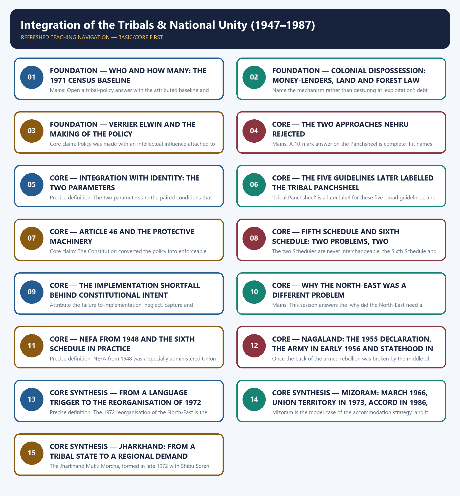

# Integration of the Tribals & National Unity (1947–1987) - Learner-v2 Complete Learning Session

### SOURCE, PROGRESSION AND CURRENT-LINKAGE AUDIT

- **Repository owners queried:** Basic and Advanced Markdown for this topic, the master chronology, syllabus map and linked Modern History owners.
- **OCR book evidence queried:** The Basic and Advanced owner files were reconciled with the repository's post-independence OCR source, Bipan Chandra, Mridula Mukherjee and Aditya Mukherjee, *India After Independence, 1947–2000*, chapters 7 and 9. The local text (book PDF page 137) records that the 1971 census counted over 400 tribal communities numbering nearly 38 million people and constituting nearly 6.9 per cent of the Indian population, that the greatest concentrations were in Madhya Pradesh, Bihar, Orissa, north-eastern India, West Bengal, Maharashtra, Gujarat and Rajasthan, and that except in the North-East tribal communities were minorities in their home states; (pages 137–138) that colonialism eroded tribal isolation through money-lenders, traders, revenue farmers and middlemen and through forest laws that forbade shifting cultivation, producing the Santhal uprising and Birsa Munda's Munda rebellion; (pages 138–140) that Nehru rejected both the museum-specimen and the assimilationist approaches and laid down five broad guidelines — development along the lines of their own genius, respect for tribal rights in land and forest, encouragement of tribal languages, administration through tribal personnel, and no over-administration; (pages 140–141) that Article 46, gubernatorial responsibility, reserved seats, Tribal Advisory Councils and a Commissioner for Scheduled Castes and Scheduled Tribes formed the protective machinery; (pages 141–142) that progress was nevertheless slow and even dismal because of weak execution, ineffective Tribal Advisory Councils, misapplied funds, land alienation, mining and industrial expansion and curtailed forest access; (pages 143–145) that the Sixth Schedule applied to the tribal areas of Assam through autonomous districts and district and regional councils and that NEFA was created in 1948 out of the border areas of Assam as a separately administered Union Territory; (pages 146–148) that the All Party Hill Leaders Conference formed in 1960, that Meghalaya was carved out in 1969 as a state within a state and became a separate state in 1972 when Manipur and Tripura were simultaneously granted statehood, that Naga separatists under A.Z. Phizo declared an independent government in 1955, that the army was sent in early 1956, that the back of the armed rebellion was broken by the middle of 1957, that moderate leaders headed by Dr Imkongliba Ao negotiated, and that the state of Nagaland came into existence in 1963; (pages 148–149) that the Mizo National Front under Laldenga declared independence and proclaimed a military uprising in March 1966, that Mizoram was given Union Territory status in 1973, that a settlement was reached in 1986 and that a government with Laldenga as chief minister was formed in the new state of Mizoram in February 1987; and (pages 149–152) that the Jharkhand Party was founded in 1950 under Jaipal Singh, won 32 seats in 1952 and fell to 25 in 1957 and 20 in 1962, that the States Reorganization Commission of 1955 rejected a Jharkhand state for want of a common language, that Scheduled Tribes were 31.15 per cent of Chota Nagpur and 44.67 per cent of the Santhal Parganas in 1951 and 30.94 and 36.22 per cent respectively in 1971 so that nearly two-thirds of the region was non-tribal, and that the Jharkhand Mukti Morcha formed in late 1972 with Shibu Soren emerging as its leader and recast the demand in regional terms. The local text compresses the Arunachal Pradesh sequence into a single sentence about naming and statehood in 1987; the owner's dating of the renaming to 1972 and statehood to 1987 is retained and the compression in the OCR source is recorded rather than silently reconciled.
- **Qdrant:** not used; Markdown plus searchable local PDFs were sufficient.
- **PYQ integrity:** No Prelims or Mains demand in the local 2018–2026 routing ledgers is routed to this owner. The tribal demands that do appear belong elsewhere and are not relabelled: 2021 Mains GS-I Q9 and 2022 Mains GS-I Q10 are routed to the Indian Society tribe-and-tribal-society owner, 2023 Mains GS-I Q13 on colonial rule and the tribal response is routed to the Modern History owner on Left, peasant, workers' and states' peoples' movements, and the Fifth and Sixth Schedule Prelims demands of 2019, 2022, 2023, 2024, 2025 and 2026 are routed to the Polity scheduled-and-tribal-areas owner. No option letter, official stem or key is asserted for any of them, and no adjacent Polity, Social Justice, Governance or Indian Society question is presented as a direct Modern History PYQ for this topic.
- **Bounded live linkage:** The bounded live linkage for this topic is official and commemorative only. On 31 August 2026 the Ministry of Tribal Affairs' own Janjatiya Gaurav Varsh portal was consulted, and it records that the Government of India designated 15 November as Janjatiya Gaurav Divas in 2021 to commemorate the birth anniversary of the tribal freedom fighter Bhagwan Birsa Munda, and that a year-long Janjatiya Gaurav Varsh ran from 15 November 2024 to 15 November 2025. The Ministry of Culture's commemorations page for the 150th birth anniversary of Birsa Munda, consulted on the same date, records that the anniversary celebrations were inaugurated on 15 November 2024 at Jamui in Bihar and that a commemorative coin and a postal stamp were released. Only those page-supported claims are used. Birsa Munda's rebellion belongs to the colonial period and not to this post-1947 owner, so the observance is carried strictly as evidence of official public remembrance and as a memory-and-recognition hook that must be paired with the post-Independence record of land, forest, autonomy and implementation outcomes. No scheme evaluation, budget figure, beneficiary count, contemporary tribal statistic or current security assessment is drawn from either page, and nothing in this package treats a commemoration as historical evidence about the integration policy of the 1950s to the 1980s.
- **Fact/inference rule:** historical claims are source-backed; analytical judgements are explicitly framed as interpretation and do not invent figures.

## BASIC LEARNING SESSION

### DEEP-REVIEW LEARNING CONTRACT

| Control | Binding rule for this package |
|---|---|
| Syllabus boundary | Complete Modern History Core is taught chronologically and causally before optional enrichment. |
| Evidence method | Claim → named Act/treaty/record/organisation/person/region or scholarly evidence → analysis → qualification. |
| Date discipline | Event, proposal, enactment, commencement, official policy, implementation and later interpretation remain distinct. |
| Historiography | Colonial, nationalist, Marxist, subaltern, Cambridge, feminist and other relevant arguments are attributed and tested, never used as labels alone. |
| Practice contract | Every solved item has demand decoding, an examiner-grade model, an executable answer/compression plan, marks rationale and answer-specific improvement. |
| Approval | This immutable successor remains `approved: false` pending explicit approval. |

**Canonical Basic/Core owner:** `upsc-ai-kit\knowledge\Modern-Indian-History\basic\31_Integration-of-the-Tribals-and-National-Unity.md`  
**Canonical topic owner:** `upsc-ai-kit\knowledge\Modern-Indian-History\basic\31_Integration-of-the-Tribals-and-National-Unity.md`  
**Optional Advanced owner:** `upsc-ai-kit\knowledge\Modern-Indian-History\advanced\31_Integration-of-the-Tribals-and-National-Unity.md`  
**Official syllabus mapping:** `upsc-ai-kit\knowledge\Modern-Indian-History\OFFICIAL-UPSC-SYLLABUS-MAPPING.md`

### EVIDENCE, PYQ AND CURRENT-STATUS CONTROL

- **Official and primary evidence:** Acts, charters, treaties, proclamations, committee reports, proceedings, organisational resolutions, speeches and contemporary records are dated and read for authorship and purpose.
- **Regional and social evidence:** petitions, newspapers, memoirs, local studies and material geography qualify elite or all-India generalisation.
- **Economic and quantitative evidence:** revenue, trade, price, wage, craft and mortality claims retain unit, region, period and uncertainty; statistics are never invented.
- **Scholarly interpretation:** historian schools are competing explanations tied to named evidence, not memorised verdicts.
- **PYQ discipline:** repository ledgers and locally held official papers control wording and metadata; reconstructed wording and unavailable official keys remain explicitly labelled.
- **Current-status note, rechecked 2026-08-31:** The bounded live linkage for this topic is official and commemorative only. On 31 August 2026 the Ministry of Tribal Affairs' own Janjatiya Gaurav Varsh portal was consulted, and it records that the Government of India designated 15 November as Janjatiya Gaurav Divas in 2021 to commemorate the birth anniversary of the tribal freedom fighter Bhagwan Birsa Munda, and that a year-long Janjatiya Gaurav Varsh ran from 15 November 2024 to 15 November 2025. The Ministry of Culture's commemorations page for the 150th birth anniversary of Birsa Munda, consulted on the same date, records that the anniversary celebrations were inaugurated on 15 November 2024 at Jamui in Bihar and that a commemorative coin and a postal stamp were released. Only those page-supported claims are used. Birsa Munda's rebellion belongs to the colonial period and not to this post-1947 owner, so the observance is carried strictly as evidence of official public remembrance and as a memory-and-recognition hook that must be paired with the post-Independence record of land, forest, autonomy and implementation outcomes. No scheme evaluation, budget figure, beneficiary count, contemporary tribal statistic or current security assessment is drawn from either page, and nothing in this package treats a commemoration as historical evidence about the integration policy of the 1950s to the 1980s.

**Live/primary context sources recorded by the predecessor generation:**

- `https://adiprasaran.tribal.gov.in/JJGV/homenew.aspx`
- `https://culture.gov.in/commemorations/150th-birth-anniversary-birsa-munda`




*Distinct embedded teaching-navigation image. The separate continuous Cārvāka-style flowchart package remains an independent at-a-glance artifact.*

### SESSION 1 — FOUNDATION — WHO AND HOW MANY: THE 1971 CENSUS BASELINE

#### DEFINITION / WHAT THIS IS CALLED

**Plain-language definition:** Precise definition: The 1971 Census baseline is the attributed demographic statement of over 400 tribal communities, nearly 38 million people and nearly 6.9 per cent of the population on which this topic's policy analysis rests.

**Technical definition:** Mains: Open a tribal-policy answer with the attributed baseline and the dominance-versus-dispersal asymmetry, because that asymmetry is what the rest of the answer explains.

#### ANSWER-GRABBING OPENING — WRITE/ADAPT IN THE EXAM

> Precise definition: The 1971 Census baseline is the attributed demographic statement of over 400 tribal communities, nearly 38 million people and nearly 6.9 per cent of the population on which this topic's policy analysis rests.

#### MUST-WRITE KEYWORDS

- **FOUNDATION**
- **Who**
- **how many**
- **the 1971 Census baseline**
- **Precise definition**
- **Topic boundary**

**How to use them:** Frame the answer through FOUNDATION; define Who, connect how many with the 1971 Census baseline to explain the mechanism, and use Precise definition for the decisive comparison or qualification.

##### VISUAL FIRST

```text
WHO AND HOW MANY: THE 1971 CENSUS BASELINE
DEMOGRAPHIC BASELINE  ->  ALWAYS ATTRIBUTED TO THE 1971 CENSUS
   over 400 tribal communities | nearly 38 million people | nearly 6.9 per cent of India
CONCENTRATIONS -> Madhya Pradesh | Bihar | Orissa | north-eastern India | West Bengal
                  Maharashtra | Gujarat | Rajasthan
DECISIVE SPLIT ->
   NORTH-EAST ............ tribal communities are the OVERWHELMING MAJORITY locally
   EVERYWHERE ELSE ....... tribal communities are MINORITIES in their own home states
RULE -> never restate these figures as 1951 data, as current data, or without attribution
```

*The visual fixes this subtopic's chronology, mechanism or boundary before the evidence.*

##### CONCEPT DEFINITIONS

- **Precise definition:** The 1971 Census baseline is the attributed demographic statement of over 400 tribal communities, nearly 38 million people and nearly 6.9 per cent of the population on which this topic's policy analysis rests.
- **Topic boundary:** Apply this definition only within Integration of the Tribals & National Unity (1947–1987); retain the named actor, institution, date and chronological role.

##### CORE EXPLANATION

Every claim in this topic rests on a demographic baseline that must be attributed, because the difference between a territorially dominant community and a dispersed minority decides which constitutional instrument applies.

##### EVIDENCE AND MECHANISM

- The 1971 Census recorded over 400 tribal communities numbering nearly 38 million people and constituting nearly 6.9 per cent of the Indian population.
- The greatest concentrations were in Madhya Pradesh, Bihar, Orissa, north-eastern India, West Bengal, Maharashtra, Gujarat and Rajasthan.
- Except in the North-East, tribal communities constituted minorities in their own home states, and they lived mostly in hills and forest areas.
- The task of integration was described as extremely complex precisely because of the varied conditions, languages and distinct cultures involved, so no single policy instrument could serve every case.

##### EXAMINER CAUTION

- Always attach the 1971 Census attribution to these figures; they must never be presented as 1951 figures or as current data, and no contemporary tribal statistic may be substituted for them.

##### EXAM LINK

- **Prelims:** Always attach the 1971 Census attribution to these figures; they must never be presented as 1951 figures or as current data, and no contemporary tribal statistic may be substituted for them.
- **Mains:** Open a tribal-policy answer with the attributed baseline and the dominance-versus-dispersal asymmetry, because that asymmetry is what the rest of the answer explains.

##### MINI RECAP

- **Core claim:** Every claim in this topic rests on a demographic baseline that must be attributed, because the difference between a territorially dominant community and a dispersed minority decides which constitutional instrument applies.
- **Use:** Open a tribal-policy answer with the attributed baseline and the dominance-versus-dispersal asymmetry, because that asymmetry is what the rest of the answer explains.

#### CLOSING RECALL FLOW — FOUNDATION — WHO AND HOW MANY: THE 1971 CENSUS BASELINE

```text
START / CONCEPT: FOUNDATION — Who and how many: the 1971 Census baseline
        |
        v
EXACT TERMS: FOUNDATION · Who · how many · the 1971 Census baseline · Precise definition · Topic boundary
        |
        v
MECHANISM / ARGUMENT: Every claim in this topic rests on a demographic baseline that must be attributed, because the difference between a territorially dominant community and a dispersed minority decides which constitutional instrument applies.
        |
        v
CONSEQUENCE / CONTRAST: Always attach the 1971 Census attribution to these figures; they must never be presented as 1951 figures or as current data, and no contemporary tribal statistic may be substituted for them.
        |
        v
UPSC TRAP / ANSWER-USE: Do not miss this limiting distinction: open a tribal-policy answer with the attributed baseline and the dominance-versus-dispersal asymmetry, because that...
        |
        v
ANSWER-GRABBING FORMULATION: Precise definition: The 1971 Census baseline is the attributed demographic statement of over 400 tribal communities, nearly 38 million people and nearly 6.9 per cent of the population on which this topic's policy analysis rests.
```
### SESSION 2 — FOUNDATION — COLONIAL DISPOSSESSION: MONEY-LENDERS, LAND AND FOREST LAW

#### DEFINITION / WHAT THIS IS CALLED

**Plain-language definition:** Precise definition: Colonial dispossession, in this owner, is the combined operation of market penetration, indebtedness and land alienation, restrictive forest law and official extortion that eroded tribal control of land and forest and produced a century of revolt.

**Technical definition:** Name the mechanism rather than gesturing at 'exploitation': debt, land alienation, forest law and official extortion are four separable causes that each generated a distinct post-independence remedy.

#### ANSWER-GRABBING OPENING — WRITE/ADAPT IN THE EXAM

> Precise definition: Colonial dispossession, in this owner, is the combined operation of market penetration, indebtedness and land alienation, restrictive forest law and official extortion that eroded tribal control of land and forest and produced a century of revolt.

#### MUST-WRITE KEYWORDS

- **FOUNDATION**
- **Colonial dispossession**
- **money-lenders**
- **land**
- **forest law**
- **Precise definition**

**How to use them:** Frame the answer through FOUNDATION; define Colonial dispossession, connect money-lenders with land to explain the mechanism, and use forest law for the decisive comparison or qualification.

##### VISUAL FIRST

```text
COLONIAL DISPOSSESSION: MONEY-LENDERS, LAND AND FOREST LAW
COLONIAL MECHANISM OF DISPOSSESSION  ->  four separable causes
1 MARKET PENETRATION -> money-lenders, traders, revenue farmers, middlemen, petty officials
2 DEBT AND LAND LOSS -> families engulfed in debt -> land passes to outsiders
                     -> status falls to agricultural labourer / sharecropper / rack-rented tenant
3 FOREST LAW         -> large tracts brought under regulation -> shifting cultivation forbidden
                     -> use of forest and access to forest produce severely restricted
4 OFFICIAL EXTORTION -> police, forest officials, other officers
   |
   v
REVOLT TRADITION -> Santhal uprising | Munda rebellion led by Birsa Munda
   -> and participation in national and peasant movements across six provinces
NOTE -> belated anti-alienation legislation did NOT halt the process
```

*The visual fixes this subtopic's chronology, mechanism or boundary before the evidence.*

##### CONCEPT DEFINITIONS

- **Precise definition:** Colonial dispossession, in this owner, is the combined operation of market penetration, indebtedness and land alienation, restrictive forest law and official extortion that eroded tribal control of land and forest and produced a century of revolt.
- **Topic boundary:** Apply this definition only within Integration of the Tribals & National Unity (1947–1987); retain the named actor, institution, date and chronological role.

##### CORE EXPLANATION

Post-independence policy was framed against a specific inherited harm, and naming the mechanism of that harm is what makes the later protective machinery intelligible rather than paternalistic.

##### EVIDENCE AND MECHANISM

- Colonialism brought a radical transformation as relative isolation was eroded by the penetration of market forces and by integration into British and princely administrations.
- Money-lenders, traders, revenue farmers, middlemen and petty officials invaded tribal areas and disrupted the traditional way of life, so families were engulfed in debt and lost land to outsiders, many being reduced to agricultural labourers, sharecroppers and rack-rented tenants, and belated anti-alienation legislation failed to halt the process.
- To conserve forests and to facilitate commercial exploitation the colonial authorities brought large tracts under forest laws that forbade shifting cultivation and severely restricted the use of forests and access to forest products.
- The combination produced a series of nineteenth- and twentieth-century uprisings, including the Santhal uprising and the Munda rebellion led by Birsa Munda, and drew tribal people into the national and peasant movements in Orissa, Bihar, West Bengal, Andhra, Maharashtra and Gujarat.

##### EXAMINER CAUTION

- Name the mechanism rather than gesturing at 'exploitation': debt, land alienation, forest law and official extortion are four separable causes that each generated a distinct post-independence remedy.

##### EXAM LINK

- **Prelims:** Name the mechanism rather than gesturing at 'exploitation': debt, land alienation, forest law and official extortion are four separable causes that each generated a distinct post-independence remedy.
- **Mains:** Use this session whenever a question asks why the republic's instinct towards tribal communities was protective, because it supplies the causal answer instead of a moral one.

##### MINI RECAP

- **Core claim:** Post-independence policy was framed against a specific inherited harm, and naming the mechanism of that harm is what makes the later protective machinery intelligible rather than paternalistic.
- **Use:** Use this session whenever a question asks why the republic's instinct towards tribal communities was protective, because it supplies the causal answer instead of a moral one.

#### CLOSING RECALL FLOW — FOUNDATION — COLONIAL DISPOSSESSION: MONEY-LENDERS, LAND AND FOREST LAW

```text
START / CONCEPT: FOUNDATION — Colonial dispossession: money-lenders, land and forest law
        |
        v
EXACT TERMS: FOUNDATION · Colonial dispossession · money-lenders · land · forest law · Precise definition
        |
        v
MECHANISM / ARGUMENT: Name the mechanism rather than gesturing at 'exploitation': debt, land alienation, forest law and official extortion are four separable causes that each generated a distinct post-independence remedy.
        |
        v
CONSEQUENCE / CONTRAST: To conserve forests and to facilitate commercial exploitation the colonial authorities brought large tracts under forest laws that forbade shifting cultivation and severely restricted the use of forests and access to forest products.
        |
        v
UPSC TRAP / ANSWER-USE: Do not miss this limiting distinction: money-lenders, traders, revenue farmers, middlemen and petty officials invaded tribal areas and disrupted the...
        |
        v
ANSWER-GRABBING FORMULATION: Precise definition: Colonial dispossession, in this owner, is the combined operation of market penetration, indebtedness and land alienation, restrictive forest law and official extortion that eroded tribal control of land and forest and produced a century of revolt.
```
### SESSION 3 — FOUNDATION — VERRIER ELWIN AND THE MAKING OF THE POLICY

#### DEFINITION / WHAT THIS IS CALLED

**Plain-language definition:** Precise definition: Integration without imposition is the policy formula, associated with Verrier Elwin's influence, under which the state accepts responsibility to protect and develop tribal communities while refusing to impose external forms of life upon them.

**Technical definition:** Core claim: Policy was made with an intellectual influence attached to it, and naming that influence is examinable in its own right because it explains why the policy was framed as integration without imposition rather than as rescue.

#### ANSWER-GRABBING OPENING — WRITE/ADAPT IN THE EXAM

> Precise definition: Integration without imposition is the policy formula, associated with Verrier Elwin's influence, under which the state accepts responsibility to protect and develop tribal communities while refusing to impose external forms of life upon them.

#### MUST-WRITE KEYWORDS

- **FOUNDATION**
- **Verrier Elwin**
- **the making of the policy**
- **Precise definition**
- **Topic boundary**
- **Core claim**

**How to use them:** Frame the answer through FOUNDATION; define Verrier Elwin, connect the making of the policy with Precise definition to explain the mechanism, and use Topic boundary for the decisive comparison or qualification.

##### VISUAL FIRST

```text
VERRIER ELWIN AND THE MAKING OF THE POLICY
WHO SHAPED THE POLICY, AND WITH WHAT EVIDENCE
VERRIER ELWIN -> lived nearly all his life among tribal people of central and NE India
              -> "one of the formative influences" on the new government's tribal policy
              -> his testimony: merchants and liquor-vendors "cajoling, tricking, swindling"
                 until "their broad acres dwindled"
JAWAHARLAL NEHRU -> "the main influence in shaping the government's attitude"
              -> first problem: "to inspire them with confidence and to make them feel at
                 one with India ... an honoured place in it"
              -> India must signify "not only a protecting force but a liberating one"
RESULT -> a policy of INTEGRATION WITHOUT IMPOSITION, not rescue and not tutelage
```

*The visual fixes this subtopic's chronology, mechanism or boundary before the evidence.*

##### CONCEPT DEFINITIONS

- **Precise definition:** Integration without imposition is the policy formula, associated with Verrier Elwin's influence, under which the state accepts responsibility to protect and develop tribal communities while refusing to impose external forms of life upon them.
- **Topic boundary:** Apply this definition only within Integration of the Tribals & National Unity (1947–1987); retain the named actor, institution, date and chronological role.

##### CORE EXPLANATION

Policy was made with an intellectual influence attached to it, and naming that influence is examinable in its own right because it explains why the policy was framed as integration without imposition rather than as rescue.

##### EVIDENCE AND MECHANISM

- Verrier Elwin lived nearly all his life among the tribal people of central and north-eastern India and was one of the formative influences in the evolution of the new government's policies towards the tribes.
- He described the colonial record in terms of merchants and liquor-vendors cajoling, tricking and swindling tribal people in their ignorance and simplicity until their broad acres dwindled and they sank into poverty.
- Nehru was himself the main influence in shaping the government's attitude, and framed the first problem as inspiring confidence so that tribal people would feel at one with India and realise they had an honoured place in it.
- On that framing India was to signify not only a protecting force but a liberating one, which is why the resulting policy is described as integration without imposition rather than as protection alone.

##### EXAMINER CAUTION

- Do not reduce Elwin to a slogan: his contribution was ethnographic evidence about what contact had already done, which is what made the isolationist option untenable in practice.

##### EXAM LINK

- **Prelims:** Do not reduce Elwin to a slogan: his contribution was ethnographic evidence about what contact had already done, which is what made the isolationist option untenable in practice.
- **Mains:** Cite Elwin by name whenever an answer explains why the policy avoided both isolation and assimilation, because the attribution shows the policy had an evidentiary basis.

##### MINI RECAP

- **Core claim:** Policy was made with an intellectual influence attached to it, and naming that influence is examinable in its own right because it explains why the policy was framed as integration without imposition rather than as rescue.
- **Use:** Cite Elwin by name whenever an answer explains why the policy avoided both isolation and assimilation, because the attribution shows the policy had an evidentiary basis.

#### CLOSING RECALL FLOW — FOUNDATION — VERRIER ELWIN AND THE MAKING OF THE POLICY

```text
START / CONCEPT: FOUNDATION — Verrier Elwin and the making of the policy
        |
        v
EXACT TERMS: FOUNDATION · Verrier Elwin · the making of the policy · Precise definition · Topic boundary · Core claim
        |
        v
MECHANISM / ARGUMENT: Mains: Cite Elwin by name whenever an answer explains why the policy avoided both isolation and assimilation, because the attribution shows the policy had an evidentiary basis.
        |
        v
CONSEQUENCE / CONTRAST: Verrier Elwin lived nearly all his life among the tribal people of central and north-eastern India and was one of the formative influences in the evolution of the new government's policies towards the tribes.
        |
        v
UPSC TRAP / ANSWER-USE: On that framing India was to signify not only a protecting force but a liberating one, which is why the resulting policy is described as integration without imposition rather than as protection alone.
        |
        v
ANSWER-GRABBING FORMULATION: Precise definition: Integration without imposition is the policy formula, associated with Verrier Elwin's influence, under which the state accepts responsibility to protect and develop tribal communities while refusing to impose external forms of life upon them.
```
### SESSION 4 — CORE — THE TWO APPROACHES NEHRU REJECTED

#### DEFINITION / WHAT THIS IS CALLED

**Plain-language definition:** Precise definition: The rejected extremes are the isolationist no-change position, faulted as insulting and impracticable, and the assimilationist position, faulted for destroying identity and for exposing tribal land and forest to outsiders.

**Technical definition:** Mains: A 10-mark answer on the Panchsheel is complete if it names both rejected options with their defects and then names the replacement, so this session alone can carry that question.

#### ANSWER-GRABBING OPENING — WRITE/ADAPT IN THE EXAM

> Precise definition: The rejected extremes are the isolationist no-change position, faulted as insulting and impracticable, and the assimilationist position, faulted for destroying identity and for exposing tribal land and forest to outsiders.

#### MUST-WRITE KEYWORDS

- **The two approaches Nehru rejected**
- **Precise definition**
- **Topic boundary**
- **Core claim**
- **Precise definition: The rejected extremes**
- **1947–1987**

**How to use them:** Frame the answer through The two approaches Nehru rejected; define Precise definition, connect Topic boundary with Core claim to explain the mechanism, and use Precise definition: The rejected extremes for the decisive comparison or qualification.

##### VISUAL FIRST

```text
THE TWO APPROACHES NEHRU REJECTED
TWO OPTIONS REJECTED, EACH FOR A STATED REASON
OPTION A: LEAVE THEM ALONE (no-change / isolation)
   defect 1 -> treats tribal people "as museum specimens to be observed and written about"
               = "to insult them"
   defect 2 -> impossible in any case: penetration by the outside world had gone too far
OPTION B: ASSIMILATE THEM FAST (disappearance welcomed as "upliftment")
   defect 1 -> "engulfed by the masses of Indian humanity" -> loss of social and cultural identity
   defect 2 -> if normal factors operate, unscrupulous outsiders take tribal land and forest
   |
   v
REPLACEMENT -> INTEGRATION WITH A PRESERVED DISTINCT IDENTITY
```

*The visual fixes this subtopic's chronology, mechanism or boundary before the evidence.*

##### CONCEPT DEFINITIONS

- **Precise definition:** The rejected extremes are the isolationist no-change position, faulted as insulting and impracticable, and the assimilationist position, faulted for destroying identity and for exposing tribal land and forest to outsiders.
- **Topic boundary:** Apply this definition only within Integration of the Tribals & National Unity (1947–1987); retain the named actor, institution, date and chronological role.

##### CORE EXPLANATION

The Panchsheel is best taught as a rejection before it is taught as a list, because both rejected options were live positions with named defects, and stating those defects is what turns a description into an argument.

##### EVIDENCE AND MECHANISM

- The first approach was to leave the tribal people alone, uncontaminated by modern influences, and let them stay more or less as they were.
- Nehru rejected it because treating tribal people as museum specimens to be observed and written about was to insult them, and because isolation was in any case impossible since penetration by the outside world had already gone too far.
- The second approach was to assimilate them completely and as quickly as possible into the surrounding society, treating the disappearance of the tribal way of life as upliftment.
- Nehru rejected that too because being engulfed by the masses of Indian humanity would mean the loss of social and cultural identity, and because if normal factors were allowed to operate unscrupulous outsiders would take possession of tribal lands and forests.

##### EXAMINER CAUTION

- Give each rejected option its own stated defect: the isolationist option fails on insult and impossibility, the assimilationist option fails on identity loss and on the predictable capture of land and forest.

##### EXAM LINK

- **Prelims:** Give each rejected option its own stated defect: the isolationist option fails on insult and impossibility, the assimilationist option fails on identity loss and on the predictable capture of land and forest.
- **Mains:** A 10-mark answer on the Panchsheel is complete if it names both rejected options with their defects and then names the replacement, so this session alone can carry that question.

##### MINI RECAP

- **Core claim:** The Panchsheel is best taught as a rejection before it is taught as a list, because both rejected options were live positions with named defects, and stating those defects is what turns a description into an argument.
- **Use:** A 10-mark answer on the Panchsheel is complete if it names both rejected options with their defects and then names the replacement, so this session alone can carry that question.

#### CLOSING RECALL FLOW — CORE — THE TWO APPROACHES NEHRU REJECTED

```text
START / CONCEPT: CORE — The two approaches Nehru rejected
        |
        v
EXACT TERMS: The two approaches Nehru rejected · Precise definition · Topic boundary · Core claim · Precise definition: The rejected extremes · 1947–1987
        |
        v
MECHANISM / ARGUMENT: Nehru rejected it because treating tribal people as museum specimens to be observed and written about was to insult them, and because isolation was in any case impossible since penetration by the outside world had already gone too far.
        |
        v
CONSEQUENCE / CONTRAST: Nehru rejected that too because being engulfed by the masses of Indian humanity would mean the loss of social and cultural identity, and because if normal factors were allowed to operate unscrupulous outsiders would take possession of tribal lands and forests.
        |
        v
UPSC TRAP / ANSWER-USE: Do not miss this limiting distinction: the Panchsheel is best taught as a rejection before it is taught as a...
        |
        v
ANSWER-GRABBING FORMULATION: Precise definition: The rejected extremes are the isolationist no-change position, faulted as insulting and impracticable, and the assimilationist position, faulted for destroying identity and for exposing tribal land and forest to outsiders.
```
### SESSION 5 — CORE — INTEGRATION WITH IDENTITY: THE TWO PARAMETERS

#### DEFINITION / WHAT THIS IS CALLED

**Plain-language definition:** Never describe the policy as assimilation into a mainstream culture; it is integration with a preserved distinct identity, and the two parameters are joint conditions rather than alternatives.

**Technical definition:** Precise definition: The two parameters are the paired conditions that tribal areas must progress and must progress in their own way, which together define integration with a preserved identity and supply the standard against which the policy's record is judged.

#### ANSWER-GRABBING OPENING — WRITE/ADAPT IN THE EXAM

> Never describe the policy as assimilation into a mainstream culture; it is integration with a preserved distinct identity, and the two parameters are joint conditions rather than alternatives.

#### MUST-WRITE KEYWORDS

- **Integration with identity**
- **the two parameters**
- **Precise definition**
- **Topic boundary**
- **Core claim**
- **PARAMETER 1**

**How to use them:** Frame the answer through Integration with identity; define the two parameters, connect Precise definition with Topic boundary to explain the mechanism, and use Core claim for the decisive comparison or qualification.

##### VISUAL FIRST

```text
INTEGRATION WITH IDENTITY: THE TWO PARAMETERS
THE TWO PARAMETERS  ->  joint conditions, never alternatives
   +-------------------------------+-------------------------------------+
   | PARAMETER 1                   | PARAMETER 2                         |
   | "the tribal areas have to     | "they have to progress in their     |
   |  progress"                    |  own way"                           |
   +-------------------------------+-------------------------------------+
   | rules out museum isolation    | rules out forced assimilation       |
   | tests DEVELOPMENT delivery    | tests IDENTITY preservation         |
   +-------------------------------+-------------------------------------+
QUALIFIERS -> progress is not "merely to duplicate what we have got in other parts of India"
           -> whatever changes are needed are "worked out by the tribals themselves"
USE AS A MARKING SCHEME -> political accommodation satisfies 2; developmental failure breaks 1
```

*The visual fixes this subtopic's chronology, mechanism or boundary before the evidence.*

##### CONCEPT DEFINITIONS

- **Precise definition:** The two parameters are the paired conditions that tribal areas must progress and must progress in their own way, which together define integration with a preserved identity and supply the standard against which the policy's record is judged.
- **Topic boundary:** Apply this definition only within Integration of the Tribals & National Unity (1947–1987); retain the named actor, institution, date and chronological role.

##### CORE EXPLANATION

The replacement policy is stated as two parameters that must be held together, and every later judgement in this topic is a test of whether both were honoured at once.

##### EVIDENCE AND MECHANISM

- Nehru favoured integrating the tribal people in Indian society and making them an integral part of the Indian nation while maintaining their distinct identity and culture.
- The two basic parameters were that the tribal areas have to progress, and that they have to progress in their own way.
- Progress did not mean an attempt merely to duplicate what existed in other parts of India, and whatever was good elsewhere would be adopted by them gradually.
- Whatever changes were needed were to be worked out by the tribals themselves, which converts consultation from a courtesy into a design requirement.

##### EXAMINER CAUTION

- Never describe the policy as assimilation into a mainstream culture; it is integration with a preserved distinct identity, and the two parameters are joint conditions rather than alternatives.

##### EXAM LINK

- **Prelims:** Never describe the policy as assimilation into a mainstream culture; it is integration with a preserved distinct identity, and the two parameters are joint conditions rather than alternatives.
- **Mains:** Use the two parameters as the marking scheme of your own answer: political accommodation satisfies the second parameter, developmental failure violates the first.

##### MINI RECAP

- **Core claim:** The replacement policy is stated as two parameters that must be held together, and every later judgement in this topic is a test of whether both were honoured at once.
- **Use:** Use the two parameters as the marking scheme of your own answer: political accommodation satisfies the second parameter, developmental failure violates the first.

#### CLOSING RECALL FLOW — CORE — INTEGRATION WITH IDENTITY: THE TWO PARAMETERS

```text
START / CONCEPT: CORE — Integration with identity: the two parameters
        |
        v
EXACT TERMS: Integration with identity · the two parameters · Precise definition · Topic boundary · Core claim · PARAMETER 1
        |
        v
MECHANISM / ARGUMENT: Precise definition: The two parameters are the paired conditions that tribal areas must progress and must progress in their own way, which together define integration with a preserved identity and supply the standard against which the policy's record is judged.
        |
        v
CONSEQUENCE / CONTRAST: Progress did not mean an attempt merely to duplicate what existed in other parts of India, and whatever was good elsewhere would be adopted by them gradually.
        |
        v
UPSC TRAP / ANSWER-USE: Do not miss this limiting distinction: use the two parameters as the marking scheme of your own answer.
        |
        v
ANSWER-GRABBING FORMULATION: Never describe the policy as assimilation into a mainstream culture; it is integration with a preserved distinct identity, and the two parameters are joint conditions rather than alternatives.
```
### SESSION 6 — CORE — THE FIVE GUIDELINES LATER LABELLED THE TRIBAL PANCHSHEEL

#### DEFINITION / WHAT THIS IS CALLED

**Plain-language definition:** Precise definition: The Tribal Panchsheel is the later label given to Nehru's five broad guidelines on tribal policy — own genius, land and forest rights, tribal languages, tribal personnel in administration, and no over-administration — and it is not the title of a dated proclamation.

**Technical definition:** 'Tribal Panchsheel' is a later label for these five broad guidelines, and no exact proclamation year may be attached to it or asserted as the date of a dated document.

#### ANSWER-GRABBING OPENING — WRITE/ADAPT IN THE EXAM

> Precise definition: The Tribal Panchsheel is the later label given to Nehru's five broad guidelines on tribal policy — own genius, land and forest rights, tribal languages, tribal personnel in administration, and no over-administration — and it is not the title of a dated proclamation.

#### MUST-WRITE KEYWORDS

- **The five guidelines later labelled the Tribal Panchsheel**
- **Precise definition**
- **Topic boundary**
- **Core claim**
- **Precise definition: The Tribal Panchsheel**
- **1947–1987**

**How to use them:** Frame the answer through The five guidelines later labelled the Tribal Panchsheel; define Precise definition, connect Topic boundary with Core claim to explain the mechanism, and use Precise definition: The Tribal Panchsheel for the decisive comparison or qualification.

##### VISUAL FIRST

```text
THE FIVE GUIDELINES LATER LABELLED THE TRIBAL PANCHSHEEL
FIVE GUIDELINES  ->  later labelled "Tribal Panchsheel" (a LABEL, not a dated decree)
1 OWN GENIUS       -> develop along their own lines; no imposition, no compulsion
                      no superiority complex; an EQUAL contribution to the common culture
2 LAND AND FOREST  -> tribal rights respected; no outsider to take possession of tribal land
                      market incursion strictly controlled and regulated
3 LANGUAGES        -> "all possible support"; conditions for flourishing safeguarded
4 TRIBAL PERSONNEL -> administrators recruited and trained from among the tribal people
                      as few outsiders as possible, and those carefully chosen
5 NO OVER-ADMIN    -> administer and develop through their own social and cultural institutions
ROOTS -> nationalist practice from the 1920s (Gandhi's ashrams, constructive work)
      -> supported after independence by Rajendra Prasad, first President of India
CAUTION -> do NOT assign an exact proclamation year to the label
```

*The visual fixes this subtopic's chronology, mechanism or boundary before the evidence.*

##### CONCEPT DEFINITIONS

- **Precise definition:** The Tribal Panchsheel is the later label given to Nehru's five broad guidelines on tribal policy — own genius, land and forest rights, tribal languages, tribal personnel in administration, and no over-administration — and it is not the title of a dated proclamation.
- **Topic boundary:** Apply this definition only within Integration of the Tribals & National Unity (1947–1987); retain the named actor, institution, date and chronological role.

##### CORE EXPLANATION

The five guidelines are the operational content of the policy, and the label attached to them is a later convenience that must not be converted into a dated proclamation.

##### EVIDENCE AND MECHANISM

- First, tribal people should develop along the lines of their own genius, with no imposition or compulsion from outside and no superiority complex among non-tribals, who were to be understood as having an equal contribution to make.
- Second, tribal rights in land and forests should be respected, no outsider should be able to take possession of tribal land, and the incursion of the market economy had to be strictly controlled and regulated; third, tribal languages must be given all possible support and the conditions in which they can flourish must be safeguarded.
- Fourth, for administration reliance should be placed on the tribal people themselves, with administrators recruited from among them and trained, and as few outsiders as possible introduced and those carefully chosen; fifth, there should be no over-administration of tribal areas, which were to be administered and developed through the tribals' own social and cultural institutions.
- Nehru's approach rested in turn on nationalist practice since the nineteen-twenties, when Gandhi set up ashrams in tribal areas and promoted constructive work, and was supported after independence by Rajendra Prasad, the first President of India.

##### EXAMINER CAUTION

- 'Tribal Panchsheel' is a later label for these five broad guidelines, and no exact proclamation year may be attached to it or asserted as the date of a dated document.

##### EXAM LINK

- **Prelims:** 'Tribal Panchsheel' is a later label for these five broad guidelines, and no exact proclamation year may be attached to it or asserted as the date of a dated document.
- **Mains:** In an answer, list the five guidelines as instruments and then test each against the record, because the guidelines double as an evaluation checklist.

##### MINI RECAP

- **Core claim:** The five guidelines are the operational content of the policy, and the label attached to them is a later convenience that must not be converted into a dated proclamation.
- **Use:** In an answer, list the five guidelines as instruments and then test each against the record, because the guidelines double as an evaluation checklist.

#### CLOSING RECALL FLOW — CORE — THE FIVE GUIDELINES LATER LABELLED THE TRIBAL PANCHSHEEL

```text
START / CONCEPT: CORE — The five guidelines later labelled the Tribal Panchsheel
        |
        v
EXACT TERMS: The five guidelines later labelled the Tribal Panchsheel · Precise definition · Topic boundary · Core claim · Precise definition: The Tribal Panchsheel · 1947–1987
        |
        v
MECHANISM / ARGUMENT: 'Tribal Panchsheel' is a later label for these five broad guidelines, and no exact proclamation year may be attached to it or asserted as the date of a dated document.
        |
        v
CONSEQUENCE / CONTRAST: Core claim: The five guidelines are the operational content of the policy, and the label attached to them is a later convenience that must not be converted into a dated proclamation.
        |
        v
UPSC TRAP / ANSWER-USE: Do not miss this limiting distinction: in an answer, list the five guidelines as instruments and then test each against...
        |
        v
ANSWER-GRABBING FORMULATION: Precise definition: The Tribal Panchsheel is the later label given to Nehru's five broad guidelines on tribal policy — own genius, land and forest rights, tribal languages, tribal personnel in administration, and no over-administration — and it is not the title of a dated proclamation.
```
### SESSION 7 — CORE — ARTICLE 46 AND THE PROTECTIVE MACHINERY

#### DEFINITION / WHAT THIS IS CALLED

**Plain-language definition:** Precise definition: The protective machinery is the constitutional package of the Article 46 directive, special gubernatorial responsibility over tribal areas, reserved seats and services, Tribal Advisory Councils and a Commissioner for Scheduled Castes and Scheduled Tribes.

**Technical definition:** Core claim: The Constitution converted the policy into enforceable machinery, and the machinery has four distinct components that are frequently collapsed into a single vague reference to 'safeguards'.

#### ANSWER-GRABBING OPENING — WRITE/ADAPT IN THE EXAM

> Precise definition: The protective machinery is the constitutional package of the Article 46 directive, special gubernatorial responsibility over tribal areas, reserved seats and services, Tribal Advisory Councils and a Commissioner for Scheduled Castes and Scheduled Tribes.

#### MUST-WRITE KEYWORDS

- **Article 46**
- **the protective machinery**
- **Precise definition**
- **Topic boundary**
- **Core claim**
- **1947–1987**

**How to use them:** Frame the answer through Article 46; define the protective machinery, connect Precise definition with Topic boundary to explain the mechanism, and use Core claim for the decisive comparison or qualification.

##### VISUAL FIRST

```text
ARTICLE 46 AND THE PROTECTIVE MACHINERY
PROTECTIVE MACHINERY  ->  four components, never one word
A DIRECTIVE      -> ARTICLE 46: promote with special care the educational and economic
                    interests of tribal people; protect from social injustice and all
                    forms of exploitation
B GUBERNATORIAL  -> special responsibility of Governors of states with tribal areas
                    power to MODIFY central and state laws in their application there
                    power to frame regulations on land rights and against money-lenders
C POLITICAL      -> full political rights; reserved seats in legislatures
                    reserved positions in the administrative services (as for SCs)
D ADVISORY AND   -> TRIBAL ADVISORY COUNCILS in all states containing tribal areas
  INVESTIGATIVE     COMMISSIONER FOR SCHEDULED CASTES AND SCHEDULED TRIBES, appointed by
                    the President, to investigate whether safeguards were observed
NOTE -> component D is what later DOCUMENTS the failure of components A to C
```

*The visual fixes this subtopic's chronology, mechanism or boundary before the evidence.*

##### CONCEPT DEFINITIONS

- **Precise definition:** The protective machinery is the constitutional package of the Article 46 directive, special gubernatorial responsibility over tribal areas, reserved seats and services, Tribal Advisory Councils and a Commissioner for Scheduled Castes and Scheduled Tribes.
- **Topic boundary:** Apply this definition only within Integration of the Tribals & National Unity (1947–1987); retain the named actor, institution, date and chronological role.

##### CORE EXPLANATION

The Constitution converted the policy into enforceable machinery, and the machinery has four distinct components that are frequently collapsed into a single vague reference to 'safeguards'.

##### EVIDENCE AND MECHANISM

- A beginning was made in the Constitution itself, which directed under Article 46 that the state promote with special care the educational and economic interests of the tribal people and protect them from social injustice and all forms of exploitation.
- Governors of states in which tribal areas were situated were given a special responsibility to protect tribal interests, including the power to modify central and state laws in their application to tribal areas and to frame regulations protecting the right to land and guarding against money-lenders.
- Full political rights were extended, and seats in the legislatures and positions in the administrative services were reserved for the Scheduled Tribes as for the Scheduled Castes.
- Tribal Advisory Councils were provided for in all states containing tribal areas, and a Commissioner for Scheduled Castes and Scheduled Tribes was appointed by the President to investigate whether the safeguards provided were being observed.

##### EXAMINER CAUTION

- Name the four components separately — the directive under Article 46, gubernatorial power, reservation and political rights, and the advisory and investigative bodies — because a single word like 'safeguards' earns nothing.

##### EXAM LINK

- **Prelims:** Name the four components separately — the directive under Article 46, gubernatorial power, reservation and political rights, and the advisory and investigative bodies — because a single word like 'safeguards' earns nothing.
- **Mains:** Use the investigative component when you write the critical paragraph, since it is the Commissioner's own reporting that documents the implementation failure.

##### MINI RECAP

- **Core claim:** The Constitution converted the policy into enforceable machinery, and the machinery has four distinct components that are frequently collapsed into a single vague reference to 'safeguards'.
- **Use:** Use the investigative component when you write the critical paragraph, since it is the Commissioner's own reporting that documents the implementation failure.

#### CLOSING RECALL FLOW — CORE — ARTICLE 46 AND THE PROTECTIVE MACHINERY

```text
START / CONCEPT: CORE — Article 46 and the protective machinery
        |
        v
EXACT TERMS: Article 46 · the protective machinery · Precise definition · Topic boundary · Core claim · 1947–1987
        |
        v
MECHANISM / ARGUMENT: Tribal Advisory Councils were provided for in all states containing tribal areas, and a Commissioner for Scheduled Castes and Scheduled Tribes was appointed by the President to investigate whether the safeguards provided were being observed.
        |
        v
CONSEQUENCE / CONTRAST: Core claim: The Constitution converted the policy into enforceable machinery, and the machinery has four distinct components that are frequently collapsed into a single vague reference to 'safeguards'.
        |
        v
UPSC TRAP / ANSWER-USE: Do not miss this limiting distinction: a beginning was made in the Constitution itself, which directed under Article 46 that...
        |
        v
ANSWER-GRABBING FORMULATION: Precise definition: The protective machinery is the constitutional package of the Article 46 directive, special gubernatorial responsibility over tribal areas, reserved seats and services, Tribal Advisory Councils and a Commissioner for Scheduled Castes and Scheduled Tribes.
```
### SESSION 8 — CORE — FIFTH SCHEDULE AND SIXTH SCHEDULE: TWO PROBLEMS, TWO INSTRUMENTS

#### DEFINITION / WHAT THIS IS CALLED

**Plain-language definition:** Precise definition: The Sixth Schedule is the instrument of tribal self-government through autonomous districts and district and regional councils in the tribal areas of the North-East, while the Fifth Schedule is the instrument of protective regulation in the other Scheduled Areas where tribal communities are dispersed minorities.

**Technical definition:** The two Schedules are never interchangeable, the Sixth Schedule and not the Fifth governs the North-Eastern tribal areas, and the detailed provisions of either belong to the Polity owner rather than to this historical treatment.

#### ANSWER-GRABBING OPENING — WRITE/ADAPT IN THE EXAM

> Precise definition: The Sixth Schedule is the instrument of tribal self-government through autonomous districts and district and regional councils in the tribal areas of the North-East, while the Fifth Schedule is the instrument of protective regulation in the other Scheduled Areas where tribal communities are dispersed minorities.

#### MUST-WRITE KEYWORDS

- **Fifth Schedule**
- **Sixth Schedule**
- **two problems**
- **two instruments**
- **Precise definition**
- **Topic boundary**

**How to use them:** Frame the answer through Fifth Schedule; define Sixth Schedule, connect two problems with two instruments to explain the mechanism, and use Precise definition for the decisive comparison or qualification.

##### VISUAL FIRST

```text
FIFTH SCHEDULE AND SIXTH SCHEDULE: TWO PROBLEMS, TWO INSTRUMENTS
TWO DEMOGRAPHIC SITUATIONS  ->  TWO CONSTITUTIONAL INSTRUMENTS
+----------------------------------+----------------------------------------+
| SITUATION: locally DOMINANT      | SITUATION: dispersed MINORITY          |
| (tribal areas of Assam / NE)     | (other Scheduled Areas)                |
+----------------------------------+----------------------------------------+
| INSTRUMENT: SIXTH SCHEDULE       | INSTRUMENT: FIFTH SCHEDULE + machinery |
| autonomous districts             | Tribal Advisory Councils               |
| district and regional councils   | Article 46 directive                   |
| some legislative and judicial    | reserved seats and services            |
| functions, within the overall    | Commissioner for SCs and STs           |
| jurisdiction of the legislature  |                                        |
| and Parliament                   |                                        |
+----------------------------------+----------------------------------------+
LOGIC -> self-government needs territorial dominance; dispersal leaves only regulation
BOUND -> more autonomy was offered, but NEVER secession, independence, or tolerated violence
```

*The visual fixes this subtopic's chronology, mechanism or boundary before the evidence.*

##### CONCEPT DEFINITIONS

- **Precise definition:** The Sixth Schedule is the instrument of tribal self-government through autonomous districts and district and regional councils in the tribal areas of the North-East, while the Fifth Schedule is the instrument of protective regulation in the other Scheduled Areas where tribal communities are dispersed minorities.
- **Topic boundary:** Apply this definition only within Integration of the Tribals & National Unity (1947–1987); retain the named actor, institution, date and chronological role.

##### CORE EXPLANATION

The two Schedules are not two versions of the same thing; they answer two different demographic situations, and the design insight is that self-government requires territorial dominance while dispersal leaves only protective regulation available.

##### EVIDENCE AND MECHANISM

- The Sixth Schedule applied to the tribal areas of Assam and offered a fair degree of self-government by providing for autonomous districts and for district and regional councils exercising some legislative and judicial functions within the overall jurisdiction of the legislature and Parliament.
- Its stated objective was to enable tribal people to live according to their own ways, and the Government of India expressed willingness to amend the constitutional provisions further to promote autonomy if that were found necessary.
- The Fifth Schedule, together with Tribal Advisory Councils, Article 46, reserved seats and the Commissioner, covered the other Scheduled Areas, where tribal communities were dispersed minorities among non-tribal neighbours.
- The willingness to extend autonomy was expressly bounded: Nehru clarified that it did not mean the government would countenance secession or independence for any area or region, or tolerate violence in the promotion of any demand.

##### EXAMINER CAUTION

- The two Schedules are never interchangeable, the Sixth Schedule and not the Fifth governs the North-Eastern tribal areas, and the detailed provisions of either belong to the Polity owner rather than to this historical treatment.

##### EXAM LINK

- **Prelims:** The two Schedules are never interchangeable, the Sixth Schedule and not the Fifth governs the North-Eastern tribal areas, and the detailed provisions of either belong to the Polity owner rather than to this historical treatment.
- **Mains:** This distinction converts a listing question into a design question, which is exactly what a 'constitutional design' directive rewards.

##### MINI RECAP

- **Core claim:** The two Schedules are not two versions of the same thing; they answer two different demographic situations, and the design insight is that self-government requires territorial dominance while dispersal leaves only protective regulation available.
- **Use:** This distinction converts a listing question into a design question, which is exactly what a 'constitutional design' directive rewards.

#### CLOSING RECALL FLOW — CORE — FIFTH SCHEDULE AND SIXTH SCHEDULE: TWO PROBLEMS, TWO INSTRUMENTS

```text
START / CONCEPT: CORE — Fifth Schedule and Sixth Schedule: two problems, two instruments
        |
        v
EXACT TERMS: Fifth Schedule · Sixth Schedule · two problems · two instruments · Precise definition · Topic boundary
        |
        v
MECHANISM / ARGUMENT: The two Schedules are never interchangeable, the Sixth Schedule and not the Fifth governs the North-Eastern tribal areas, and the detailed provisions of either belong to the Polity owner rather than to this historical treatment.
        |
        v
CONSEQUENCE / CONTRAST: The two Schedules are not two versions of the same thing; they answer two different demographic situations, and the design insight is that self-government requires territorial dominance while dispersal leaves only protective regulation available.
        |
        v
UPSC TRAP / ANSWER-USE: Do not miss this limiting distinction: the Fifth Schedule, together with Tribal Advisory Councils, Article 46, reserved seats and the...
        |
        v
ANSWER-GRABBING FORMULATION: Precise definition: The Sixth Schedule is the instrument of tribal self-government through autonomous districts and district and regional councils in the tribal areas of the North-East, while the Fifth Schedule is the instrument of protective regulation in the other Scheduled Areas where tribal communities are dispersed minorities.
```
### SESSION 9 — CORE — THE IMPLEMENTATION SHORTFALL BEHIND CONSTITUTIONAL INTENT

#### DEFINITION / WHAT THIS IS CALLED

**Plain-language definition:** Precise definition: The implementation shortfall is the documented gap between constitutional intent and material outcome, attributed to weak execution, federal divergence, ineffective advisory bodies, misapplied funds, evaded land law, displacement by projects and elite capture rather than to the constitutional design.

**Technical definition:** Attribute the failure to implementation, neglect, capture and corruption rather than to constitutional design, and keep the verdict split rather than uniformly negative.

#### ANSWER-GRABBING OPENING — WRITE/ADAPT IN THE EXAM

> Precise definition: The implementation shortfall is the documented gap between constitutional intent and material outcome, attributed to weak execution, federal divergence, ineffective advisory bodies, misapplied funds, evaded land law, displacement by projects and elite capture rather than to the constitutional design.

#### MUST-WRITE KEYWORDS

- **The implementation shortfall behind constitutional intent**
- **Precise definition**
- **Topic boundary**
- **Core claim**
- **Precise definition: The implementation shortfall**
- **1947–1987**

**How to use them:** Frame the answer through The implementation shortfall behind constitutional intent; define Precise definition, connect Topic boundary with Core claim to explain the mechanism, and use Precise definition: The implementation shortfall for the decisive comparison or qualification.

##### VISUAL FIRST

```text
THE IMPLEMENTATION SHORTFALL BEHIND CONSTITUTIONAL INTENT
WHERE THE POLICY FAILED  ->  execution, not design
CAUSE 1 EXECUTION -> weak implementation of well-intentioned measures
CAUSE 2 FEDERAL   -> divergence between central policy and state practice
CAUSE 3 BODIES    -> Tribal Advisory Councils did not function effectively
CAUSE 4 MONEY     -> funds unspent | spent without results | misappropriated
CAUSE 5 LAW       -> anti-alienation laws evaded -> land alienation and eviction continue
CAUSE 6 PROJECTS  -> rapid extension of mines and industries; deforestation; forest access curtailed
CAUSE 7 CAPTURE   -> a small tribal elite reaps the gains as class differences emerge
BUT ALSO -> literacy, reservations, Panchayati Raj and repeated elections raised participation
SPLIT VERDICT -> ACCOMMODATION SUCCEEDED | DELIVERY DID NOT
```

*The visual fixes this subtopic's chronology, mechanism or boundary before the evidence.*

##### CONCEPT DEFINITIONS

- **Precise definition:** The implementation shortfall is the documented gap between constitutional intent and material outcome, attributed to weak execution, federal divergence, ineffective advisory bodies, misapplied funds, evaded land law, displacement by projects and elite capture rather than to the constitutional design.
- **Topic boundary:** Apply this definition only within Integration of the Tribals & National Unity (1947–1987); retain the named actor, institution, date and chronological role.

##### CORE EXPLANATION

The mandatory critical paragraph of this topic rests on a specific finding: the design was sound and the execution was not, and the failure had named and separable causes.

##### EVIDENCE AND MECHANISM

- In spite of the constitutional safeguards and the efforts of the central and state governments, progress and welfare were very slow and even dismal, and except in the North-East tribal people remained poor, indebted, landless and often unemployed.
- The problem lay in weak execution of well-intentioned measures, in divergence between central and state policy, in Tribal Advisory Councils that did not function effectively, and in funds that went unspent, produced no corresponding results or were misappropriated.
- Laws preventing transfer of land to outsiders continued to be evaded, the rapid extension of mines and industries worsened conditions, deforestation proceeded through the cooperation of officials with forest contractors, and traditional rights of access to the forest were continuously curtailed.
- Tribal society also developed class differences, and the major gains in education, administrative employment, economy and political patronage were reaped by a small and growing tribal elite, while positive developments in literacy, reservations, Panchayati Raj and repeated elections increased political participation.

##### EXAMINER CAUTION

- Attribute the failure to implementation, neglect, capture and corruption rather than to constitutional design, and keep the verdict split rather than uniformly negative.

##### EXAM LINK

- **Prelims:** Attribute the failure to implementation, neglect, capture and corruption rather than to constitutional design, and keep the verdict split rather than uniformly negative.
- **Mains:** The split verdict — political accommodation succeeded, developmental delivery did not — is the single most reusable conclusion in this topic.

##### MINI RECAP

- **Core claim:** The mandatory critical paragraph of this topic rests on a specific finding: the design was sound and the execution was not, and the failure had named and separable causes.
- **Use:** The split verdict — political accommodation succeeded, developmental delivery did not — is the single most reusable conclusion in this topic.

#### CLOSING RECALL FLOW — CORE — THE IMPLEMENTATION SHORTFALL BEHIND CONSTITUTIONAL INTENT

```text
START / CONCEPT: CORE — The implementation shortfall behind constitutional intent
        |
        v
EXACT TERMS: The implementation shortfall behind constitutional intent · Precise definition · Topic boundary · Core claim · Precise definition: The implementation shortfall · 1947–1987
        |
        v
MECHANISM / ARGUMENT: Core claim: The mandatory critical paragraph of this topic rests on a specific finding: the design was sound and the execution was not, and the failure had named and separable causes.
        |
        v
CONSEQUENCE / CONTRAST: The problem lay in weak execution of well-intentioned measures, in divergence between central and state policy, in Tribal Advisory Councils that did not function effectively, and in funds that went unspent, produced no corresponding results or were misappropriated.
        |
        v
UPSC TRAP / ANSWER-USE: Mains: The split verdict — political accommodation succeeded, developmental delivery did not — is the single most reusable conclusion in this topic.
        |
        v
ANSWER-GRABBING FORMULATION: Precise definition: The implementation shortfall is the documented gap between constitutional intent and material outcome, attributed to weak execution, federal divergence, ineffective advisory bodies, misapplied funds, evaded land law, displacement by projects and elite capture rather than to the constitutional design.
```
### SESSION 10 — CORE — WHY THE NORTH-EAST WAS A DIFFERENT PROBLEM

#### DEFINITION / WHAT THIS IS CALLED

**Plain-language definition:** Core claim: The North-East required a distinct strategy for three cumulative reasons, and stating all three is what separates a prepared answer from a geographical observation.

**Technical definition:** Mains: This session answers the 'why did the North-East need a distinct strategy' demand directly and supplies the premise for both the Naga and Mizo trajectories.

#### ANSWER-GRABBING OPENING — WRITE/ADAPT IN THE EXAM

> Core claim: The North-East required a distinct strategy for three cumulative reasons, and stating all three is what separates a prepared answer from a geographical observation.

#### MUST-WRITE KEYWORDS

- **Precise definition**
- **Topic boundary**
- **Core claim**
- **Precise definition: The North-Eastern distinctiveness**
- **Precise**
- **1947–1987**

**How to use them:** Frame the answer through Precise definition; define Topic boundary, connect Core claim with Precise definition: The North-Eastern distinctiveness to explain the mechanism, and use Precise for the decisive comparison or qualification.

##### VISUAL FIRST

```text
WHY THE NORTH-EAST WAS A DIFFERENT PROBLEM
THREE CUMULATIVE REASONS THE NORTH-EAST WAS DIFFERENT
REASON 1 DEMOGRAPHY -> over a hundred groups, wide variety of languages, hill tracts of Assam
                    -> the OVERWHELMING MAJORITY in most areas they inhabited
                    -> non-tribals had not penetrated to any significant extent
REASON 2 COLONIAL ADMINISTRATION
                    -> separate administrative status inside the Assam province
                    -> socio-political structure left undisturbed
                    -> plainsmen barred from acquiring land -> LITTLE LOSS OF LAND
                    -> missionaries permitted and encouraged: schools, hospitals, churches
REASON 3 DETACHMENT FROM THE NATIONAL MOVEMENT
                    -> "virtual absence of any political or cultural contact"
                    -> the anti-imperialist bond that unified India had little purchase here
                    -> some missionaries and foreigners promoted separatist sentiment after 1947
CONSEQUENCE -> the linguistic template used elsewhere could not be transferred here
```

*The visual fixes this subtopic's chronology, mechanism or boundary before the evidence.*

##### CONCEPT DEFINITIONS

- **Precise definition:** The North-Eastern distinctiveness is the cumulative effect of local tribal demographic dominance, a separate colonial administrative regime that excluded outsiders from acquiring land, and near-total detachment from the national movement.
- **Topic boundary:** Apply this definition only within Integration of the Tribals & National Unity (1947–1987); retain the named actor, institution, date and chronological role.

##### CORE EXPLANATION

The North-East required a distinct strategy for three cumulative reasons, and stating all three is what separates a prepared answer from a geographical observation.

##### EVIDENCE AND MECHANISM

- The tribes of north-eastern India consisted of over a hundred groups speaking a wide variety of languages and living in the hill tracts of Assam.
- They constituted the overwhelming majority of the population in most areas they inhabited, and non-tribals had not penetrated those areas to any significant extent.
- British policy in the late nineteenth century gave the tribal areas a separate administrative status inside the Assam province, left the socio-political structure undisturbed and deliberately excluded outsiders from acquiring land, so tribal communities there suffered little loss of land, while missionaries were permitted and encouraged to establish schools, hospitals and churches.
- There was a virtual absence of political or cultural contact with the political life of the rest of India, so the common bonds forged in the anti-imperialist struggle had little purchase, and some missionaries and other foreigners promoted sentiment for separate and independent states immediately after independence.

##### EXAMINER CAUTION

- Give all three reasons — local demographic dominance, a separate colonial administrative history that prevented land loss, and detachment from the national movement — because any one alone under-explains the difference.

##### EXAM LINK

- **Prelims:** Give all three reasons — local demographic dominance, a separate colonial administrative history that prevented land loss, and detachment from the national movement — because any one alone under-explains the difference.
- **Mains:** This session answers the 'why did the North-East need a distinct strategy' demand directly and supplies the premise for both the Naga and Mizo trajectories.

##### MINI RECAP

- **Core claim:** The North-East required a distinct strategy for three cumulative reasons, and stating all three is what separates a prepared answer from a geographical observation.
- **Use:** This session answers the 'why did the North-East need a distinct strategy' demand directly and supplies the premise for both the Naga and Mizo trajectories.

#### CLOSING RECALL FLOW — CORE — WHY THE NORTH-EAST WAS A DIFFERENT PROBLEM

```text
START / CONCEPT: CORE — Why the North-East was a different problem
        |
        v
EXACT TERMS: Precise definition · Topic boundary · Core claim · Precise definition: The North-Eastern distinctiveness · Precise · 1947–1987
        |
        v
MECHANISM / ARGUMENT: Give all three reasons — local demographic dominance, a separate colonial administrative history that prevented land loss, and detachment from the national movement — because any one alone under-explains the difference.
        |
        v
CONSEQUENCE / CONTRAST: Precise definition: The North-Eastern distinctiveness is the cumulative effect of local tribal demographic dominance, a separate colonial administrative regime that excluded outsiders from acquiring land, and near-total detachment from the national movement.
        |
        v
UPSC TRAP / ANSWER-USE: They constituted the overwhelming majority of the population in most areas they inhabited, and non-tribals had not penetrated those areas to any significant extent.
        |
        v
ANSWER-GRABBING FORMULATION: Core claim: The North-East required a distinct strategy for three cumulative reasons, and stating all three is what separates a prepared answer from a geographical observation.
```
### SESSION 11 — CORE — NEFA FROM 1948 AND THE SIXTH SCHEDULE IN PRACTICE

#### DEFINITION / WHAT THIS IS CALLED

**Plain-language definition:** NEFA was renamed Arunachal Pradesh in 1972 and attained statehood in 1987; the repository's local OCR text compresses the naming and statehood into a single sentence about 1987, and that compression is recorded here rather than copied.

**Technical definition:** Precise definition: NEFA from 1948 was a specially administered Union Territory outside Assam's jurisdiction; separately, the Sixth Schedule provided autonomous councils in Assam's tribal areas, so the two instruments must not be treated as one jurisdiction.

#### ANSWER-GRABBING OPENING — WRITE/ADAPT IN THE EXAM

> Precise definition: NEFA from 1948 was a specially administered Union Territory outside Assam's jurisdiction; separately, the Sixth Schedule provided autonomous councils in Assam's tribal areas, so the two instruments must not be treated as one jurisdiction.

#### MUST-WRITE KEYWORDS

- **NEFA from 1948**
- **the Sixth Schedule in practice**
- **Precise definition**
- **Topic boundary**
- **Core claim**
- **1947–1987**

**How to use them:** Frame the answer through NEFA from 1948; define the Sixth Schedule in practice, connect Precise definition with Topic boundary to explain the mechanism, and use Core claim for the decisive comparison or qualification.

##### VISUAL FIRST

```text
NEFA FROM 1948 AND THE SIXTH SCHEDULE IN PRACTICE
NEFA AS THE CONTROL CASE  ->  the policy administered as designed
1948   NORTH-EAST FRONTIER AGENCY created out of the border areas of Assam
       status -> UNION TERRITORY, OUTSIDE the jurisdiction of Assam, special administration
CADRE  -> a special cadre of officers, asked to develop WITHOUT disturbing social and
          cultural patterns of life
RESULT -> Nehru's and Verrier Elwin's policies "implemented best of all" here
          a 1967 observer: "a situation unparalleled in other parts of India"
1972   RENAMED ARUNACHAL PRADESH
1987   STATEHOOD
OCR CAVEAT -> the local book text compresses naming + statehood into one 1987 sentence;
              the owner's 1972/1987 split is retained and the compression is recorded
```

*The visual fixes this subtopic's chronology, mechanism or boundary before the evidence.*

##### CONCEPT DEFINITIONS

- **Precise definition:** NEFA from 1948 was a specially administered Union Territory outside Assam's jurisdiction; separately, the Sixth Schedule provided autonomous councils in Assam's tribal areas, so the two instruments must not be treated as one jurisdiction.
- **Topic boundary:** Apply this definition only within Integration of the Tribals & National Unity (1947–1987); retain the named actor, institution, date and chronological role.

##### CORE EXPLANATION

One administrative experiment shows the policy working as designed, and it is worth teaching because it is the control case against which the conflict cases are judged.

##### EVIDENCE AND MECHANISM

- The North-East Frontier Agency was created in 1948 out of the border areas of Assam and established as a Union Territory outside the jurisdiction of Assam under a special administration.
- In NEFA, the administration was manned from the beginning by a special cadre of officers asked to implement specially designed developmental policies without disturbing the social and cultural pattern of the life of the people.
- The policies associated with Nehru and Verrier Elwin were implemented best of all in that territory, and an observer writing in 1967 described a measure of isolation combined with a sympathetic and imaginative administration as having created a situation unparalleled elsewhere in India.
- The Sixth Schedule was a parallel autonomy instrument for Assam's tribal areas, using autonomous district and regional councils; it did not make NEFA a Sixth Schedule territory.
- NEFA was renamed Arunachal Pradesh in 1972 and attained statehood in 1987; the repository's local OCR text compresses the naming and statehood into a single sentence about 1987, and that compression is recorded here rather than copied.

##### EXAMINER CAUTION

- Keep the two Arunachal dates distinct — renaming in 1972 and statehood in 1987 — and record that the local OCR source compresses them instead of silently reconciling the difference.

##### EXAM LINK

- **Prelims:** Keep the two Arunachal dates distinct — renaming in 1972 and statehood in 1987 — and record that the local OCR source compresses them instead of silently reconciling the difference.
- **Mains:** Use NEFA as the control case: it shows that where the policy was administered as designed, no insurgency-to-accommodation cycle was required at all.

##### MINI RECAP

- **Core claim:** One administrative experiment shows the policy working as designed, and it is worth teaching because it is the control case against which the conflict cases are judged.
- **Use:** Use NEFA as the control case: it shows that where the policy was administered as designed, no insurgency-to-accommodation cycle was required at all.

#### CLOSING RECALL FLOW — CORE — NEFA FROM 1948 AND THE SIXTH SCHEDULE IN PRACTICE

```text
START / CONCEPT: CORE — NEFA from 1948 and the Sixth Schedule in practice
        |
        v
EXACT TERMS: NEFA from 1948 · the Sixth Schedule in practice · Precise definition · Topic boundary · Core claim · 1947–1987
        |
        v
MECHANISM / ARGUMENT: In NEFA, the administration was manned from the beginning by a special cadre of officers asked to implement specially designed developmental policies without disturbing the social and cultural pattern of the life of the people.
        |
        v
CONSEQUENCE / CONTRAST: The Sixth Schedule was a parallel autonomy instrument for Assam's tribal areas, using autonomous district and regional councils; it did not make NEFA a Sixth Schedule territory.
        |
        v
UPSC TRAP / ANSWER-USE: NEFA was renamed Arunachal Pradesh in 1972 and attained statehood in 1987; the repository's local OCR text compresses the naming and statehood into a single sentence about 1987, and that compression is recorded here rather than copied.
        |
        v
ANSWER-GRABBING FORMULATION: Precise definition: NEFA from 1948 was a specially administered Union Territory outside Assam's jurisdiction; separately, the Sixth Schedule provided autonomous councils in Assam's tribal areas, so the two instruments must not be treated as one jurisdiction.
```
### SESSION 12 — CORE — NAGALAND: THE 1955 DECLARATION, THE ARMY IN EARLY 1956 AND STATEHOOD IN 1963

#### DEFINITION / WHAT THIS IS CALLED

**Plain-language definition:** Precise definition: The two-track policy is the simultaneous combination of absolute refusal of secession and armed rebellion with an open offer of large autonomy to non-secessionist leaders, which produced the state of Nagaland in 1963.

**Technical definition:** Once the back of the armed rebellion was broken by the middle of 1957 the moderate leaders headed by Dr Imkongliba Ao came to the fore and negotiated for a state within the Indian union, and through a series of intermediate steps the state of Nagaland came into existence in 1963.

#### ANSWER-GRABBING OPENING — WRITE/ADAPT IN THE EXAM

> Nagaland became a state in 1963 and was not created in 1947, and neither Nagaland nor Mizoram was ever granted independence; the concession was always autonomy or statehood within the Union.

#### MUST-WRITE KEYWORDS

- **Nagaland**
- **the 1955 declaration**
- **the army in early 1956**
- **statehood in 1963**
- **Precise definition**
- **Topic boundary**

**How to use them:** Frame the answer through Nagaland; define the 1955 declaration, connect the army in early 1956 with statehood in 1963 to explain the mechanism, and use Precise definition for the decisive comparison or qualification.

##### VISUAL FIRST

```text
NAGALAND: THE 1955 DECLARATION, THE ARMY IN EARLY 1956 AND STATEHOOD IN 1963
THE NAGA TEMPLATE  ->  two tracks running at the same time
                    +-------------------------------------------+
1955  PHIZO-LED SEPARATISTS declare an "independent government" and launch insurrection
                    |
      +-------------+-------------------------------+
      |                                             |
TRACK 1: REFUSE                              TRACK 2: OFFER
  secession firmly opposed                     a large degree of autonomy
  no negotiation with those who keep           prolonged negotiation with moderate,
  the independence demand and arms             non-violent, non-secessionist leaders
  EARLY 1956 -> army sent to restore order     conciliation is the stated objective
      |                                             |
      +-------------+-------------------------------+
                    |
MID-1957  back of the armed rebellion broken -> moderates under Dr Imkongliba Ao come forward
1963      STATE OF NAGALAND created WITHIN the Indian union (never independence)
```

*The visual fixes this subtopic's chronology, mechanism or boundary before the evidence.*

##### CONCEPT DEFINITIONS

- **Precise definition:** The two-track policy is the simultaneous combination of absolute refusal of secession and armed rebellion with an open offer of large autonomy to non-secessionist leaders, which produced the state of Nagaland in 1963.
- **Topic boundary:** Apply this definition only within Integration of the Tribals & National Unity (1947–1987); retain the named actor, institution, date and chronological role.

##### CORE EXPLANATION

The Naga case establishes the template for every later North-Eastern settlement, and the template is explicitly two-track rather than either coercive or conciliatory alone.

##### EVIDENCE AND MECHANISM

- A section of the Naga leadership opposed integration and rose in rebellion under A.Z. Phizo demanding separation and complete independence, and in 1955 these separatists declared the formation of an independent government and launched a violent insurrection.
- On one track the Government of India made clear it would firmly oppose the secessionist demand and would not tolerate recourse to violence, following a policy of suppression and non-negotiation towards a violent secessionist movement, and the army was sent in early 1956 to restore peace and order.
- On the other track Nehru judged that total physical suppression was neither possible nor desirable because the objective had to be conciliation, so he was willing to go a long way to grant a large degree of autonomy and carried on prolonged negotiations with moderate, non-violent and non-secessionist Naga leaders.
- Once the back of the armed rebellion was broken by the middle of 1957 the moderate leaders headed by Dr Imkongliba Ao came to the fore and negotiated for a state within the Indian union, and through a series of intermediate steps the state of Nagaland came into existence in 1963.

##### EXAMINER CAUTION

- Nagaland became a state in 1963 and was not created in 1947, and neither Nagaland nor Mizoram was ever granted independence; the concession was always autonomy or statehood within the Union.

##### EXAM LINK

- **Prelims:** Nagaland became a state in 1963 and was not created in 1947, and neither Nagaland nor Mizoram was ever granted independence; the concession was always autonomy or statehood within the Union.
- **Mains:** Present the two tracks as simultaneous rather than sequential, because the analytical point is that refusal of secession is what made the offer of autonomy credible.

##### MINI RECAP

- **Core claim:** The Naga case establishes the template for every later North-Eastern settlement, and the template is explicitly two-track rather than either coercive or conciliatory alone.
- **Use:** Present the two tracks as simultaneous rather than sequential, because the analytical point is that refusal of secession is what made the offer of autonomy credible.

#### CLOSING RECALL FLOW — CORE — NAGALAND: THE 1955 DECLARATION, THE ARMY IN EARLY 1956 AND STATEHOOD IN 1963

```text
START / CONCEPT: CORE — Nagaland: the 1955 declaration, the army in early 1956 and statehood in 1963
        |
        v
EXACT TERMS: Nagaland · the 1955 declaration · the army in early 1956 · statehood in 1963 · Precise definition · Topic boundary
        |
        v
MECHANISM / ARGUMENT: Once the back of the armed rebellion was broken by the middle of 1957 the moderate leaders headed by Dr Imkongliba Ao came to the fore and negotiated for a state within the Indian union, and through a series of intermediate steps the state of Nagaland came into existence in 1963.
        |
        v
CONSEQUENCE / CONTRAST: On one track the Government of India made clear it would firmly oppose the secessionist demand and would not tolerate recourse to violence, following a policy of suppression and non-negotiation towards a violent secessionist movement, and the army was sent in early 1956 to restore peace and order.
        |
        v
UPSC TRAP / ANSWER-USE: Do not miss this limiting distinction: the two-track policy is the simultaneous combination of absolute refusal of secession and armed...
        |
        v
ANSWER-GRABBING FORMULATION: Nagaland became a state in 1963 and was not created in 1947, and neither Nagaland nor Mizoram was ever granted independence; the concession was always autonomy or statehood within the Union.
```
### SESSION 13 — CORE SYNTHESIS — FROM A LANGUAGE TRIGGER TO THE REORGANISATION OF 1972

#### DEFINITION / WHAT THIS IS CALLED

**Plain-language definition:** CORE SYNTHESIS — From a language trigger to the reorganisation of 1972 comprises CORE SYNTHESIS, Precise definition and Topic boundary as its core connected dimensions.

**Technical definition:** Precise definition: The 1972 reorganisation of the North-East is the settlement that made Meghalaya a separate state, granted statehood to Manipur and Tripura and renamed NEFA as Arunachal Pradesh, reached after a hill-state demand triggered by state language policy.

#### ANSWER-GRABBING OPENING — WRITE/ADAPT IN THE EXAM

> Core claim: The Meghalaya sequence shows that language policy inside a state, and not only insurgency, could drive reorganisation, which is the direct bridge between this owner and the linguistic-reorganisation owner.

#### MUST-WRITE KEYWORDS

- **CORE SYNTHESIS**
- **Precise definition**
- **Topic boundary**
- **Core claim**
- **Precise definition: The 1972 reorganisation of the North-East**
- **1947–1987**

**How to use them:** Frame the answer through CORE SYNTHESIS; define Precise definition, connect Topic boundary with Core claim to explain the mechanism, and use Precise definition: The 1972 reorganisation of the North-East for the decisive comparison or qualification.

##### VISUAL FIRST

```text
FROM A LANGUAGE TRIGGER TO THE REORGANISATION OF 1972
LANGUAGE TRIGGER TO STATEHOOD  ->  the Meghalaya sequence
GRIEVANCE  -> hill tribes have no cultural affinity with Assamese and Bengali plainsmen
           -> fear of "Assamization"; resentment at attitudes of non-tribal officials
1960       -> Assamese leaders move to make Assamese the SOLE official language of the state
1960       -> hill parties merge into the ALL PARTY HILL LEADERS CONFERENCE
           -> Assam Official Language Act -> hartals, demonstrations, major agitation
1962       -> separate-state advocates sweep the tribal-area Assembly seats -> boycott
1969       -> constitutional amendment: MEGHALAYA as "a state within a state"
              complete autonomy EXCEPT law and order; shared High Court, PSC, Governor
1972       -> NORTH-EAST REORGANISATION
              MEGHALAYA separate state (Garo, Khasi, Jaintia)
              MANIPUR and TRIPURA granted statehood
              NEFA renamed ARUNACHAL PRADESH
```

*The visual fixes this subtopic's chronology, mechanism or boundary before the evidence.*

##### CONCEPT DEFINITIONS

- **Precise definition:** The 1972 reorganisation of the North-East is the settlement that made Meghalaya a separate state, granted statehood to Manipur and Tripura and renamed NEFA as Arunachal Pradesh, reached after a hill-state demand triggered by state language policy.
- **Topic boundary:** Apply this definition only within Integration of the Tribals & National Unity (1947–1987); retain the named actor, institution, date and chronological role.

##### CORE EXPLANATION

The Meghalaya sequence shows that language policy inside a state, and not only insurgency, could drive reorganisation, which is the direct bridge between this owner and the linguistic-reorganisation owner.

##### EVIDENCE AND MECHANISM

- The hill tribes of Assam had no cultural affinity with the Assamese and Bengali residents of the plains and feared losing their identity to what they saw, with some justification, as a policy of Assamization.
- The demand for a separate hill state gained decisive strength when Assamese leaders moved in 1960 towards making Assamese the sole official language of the state; various hill parties merged into the All Party Hill Leaders Conference in 1960, and the Assam Official Language Act produced hartals, demonstrations and a major agitation.
- In the 1962 elections the overwhelming majority of Assembly seats from the tribal areas were won by advocates of a separate state, who boycotted the Assembly, and after prolonged negotiation a constitutional amendment in 1969 carved out Meghalaya as a state within a state, with complete autonomy except for law and order and shared High Court, Public Service Commission and Governor.
- As part of the reorganisation of the North-East in 1972 Meghalaya became a separate state incorporating the Garo, Khasi and Jaintia tribes, the Union Territories of Manipur and Tripura were simultaneously granted statehood, and NEFA was renamed Arunachal Pradesh.

##### EXAMINER CAUTION

- Do not compress this into a single 1972 event: the trigger was a state language act, the intermediate device was the 1969 state within a state, and full statehood followed in 1972.

##### EXAM LINK

- **Prelims:** Do not compress this into a single 1972 event: the trigger was a state language act, the intermediate device was the 1969 state within a state, and full statehood followed in 1972.
- **Mains:** Use this sequence when a question asks how language politics and tribal politics interacted, because it is the one case where both owners meet directly.

##### MINI RECAP

- **Core claim:** The Meghalaya sequence shows that language policy inside a state, and not only insurgency, could drive reorganisation, which is the direct bridge between this owner and the linguistic-reorganisation owner.
- **Use:** Use this sequence when a question asks how language politics and tribal politics interacted, because it is the one case where both owners meet directly.

#### CLOSING RECALL FLOW — CORE SYNTHESIS — FROM A LANGUAGE TRIGGER TO THE REORGANISATION OF 1972

```text
START / CONCEPT: CORE SYNTHESIS — From a language trigger to the reorganisation of 1972
        |
        v
EXACT TERMS: CORE SYNTHESIS · Precise definition · Topic boundary · Core claim · Precise definition: The 1972 reorganisation of the North-East · 1947–1987
        |
        v
MECHANISM / ARGUMENT: Precise definition: The 1972 reorganisation of the North-East is the settlement that made Meghalaya a separate state, granted statehood to Manipur and Tripura and renamed NEFA as Arunachal Pradesh, reached after a hill-state demand triggered by state language policy.
        |
        v
CONSEQUENCE / CONTRAST: Do not compress this into a single 1972 event: the trigger was a state language act, the intermediate device was the 1969 state within a state, and full statehood followed in 1972.
        |
        v
UPSC TRAP / ANSWER-USE: Do not miss this limiting distinction: use this sequence when a question asks how language politics and tribal politics interacted...
        |
        v
ANSWER-GRABBING FORMULATION: Core claim: The Meghalaya sequence shows that language policy inside a state, and not only insurgency, could drive reorganisation, which is the direct bridge between this owner and the linguistic-reorganisation owner.
```
### SESSION 14 — CORE SYNTHESIS — MIZORAM: MARCH 1966, UNION TERRITORY IN 1973, ACCORD IN 1986, STATEHOOD IN FEBRUARY 1987

#### DEFINITION / WHAT THIS IS CALLED

**Plain-language definition:** Precise definition: The Mizo Accord of 1986 is the negotiated settlement under which the Mizo National Front abandoned armed struggle and surrendered its arms in exchange for full statehood with cultural and land-law guarantees, followed by Laldenga's assumption of the chief ministership in February 1987.

**Technical definition:** Mizoram is the model case of the accommodation strategy, and it must be taught with all four dates because the value of the case lies in the length of the road from uprising to chief ministership.

#### ANSWER-GRABBING OPENING — WRITE/ADAPT IN THE EXAM

> A settlement was arrived at in 1986 under which Laldenga and the Front agreed to abandon underground violence, surrender with their arms and re-enter constitutional politics while the Government of India granted full statehood with guarantees for culture, tradition and land laws, and a government with Laldenga as chief minister was formed in the new state of Mizoram in February 1987.

#### MUST-WRITE KEYWORDS

- **CORE SYNTHESIS**
- **Mizoram**
- **March 1966**
- **Union Territory in 1973**
- **Accord in 1986**
- **statehood in February 1987**

**How to use them:** Frame the answer through CORE SYNTHESIS; define Mizoram, connect March 1966 with Union Territory in 1973 to explain the mechanism, and use Accord in 1986 for the decisive comparison or qualification.

##### VISUAL FIRST

```text
MIZORAM: MARCH 1966, UNION TERRITORY IN 1973, ACCORD IN 1986, STATEHOOD IN FEBRUARY 1987
MIZORAM  ->  the longest road from uprising to chief ministership
1959      famine relief failure under the Assam government -> grievance
1961      Act making Assamese the official language of the state -> trigger
          -> MIZO NATIONAL FRONT formed, LALDENGA president
          -> contests elections WHILE building an externally armed and trained military wing
MAR 1966  declares independence, proclaims a military uprising, attacks military and civilian
          targets -> crushed within a few weeks by massive counter-insurgency
          -> stray guerrilla activity continues; hard-core leadership escapes abroad
1973      demand scaled down to a state within the union -> Mizo district separated from Assam
          -> MIZORAM constituted a UNION TERRITORY   [renewed insurgency later contained]
1986      ACCORD -> arms surrendered, underground activity abandoned, re-entry into
          constitutional politics; full statehood granted with culture, tradition, land-law guarantees
FEB 1987  LALDENGA SWORN IN AS CHIEF MINISTER of the new state of Mizoram
CAUTION   the model case, NOT the universal outcome
```

*The visual fixes this subtopic's chronology, mechanism or boundary before the evidence.*

##### CONCEPT DEFINITIONS

- **Precise definition:** The Mizo Accord of 1986 is the negotiated settlement under which the Mizo National Front abandoned armed struggle and surrendered its arms in exchange for full statehood with cultural and land-law guarantees, followed by Laldenga's assumption of the chief ministership in February 1987.
- **Topic boundary:** Apply this definition only within Integration of the Tribals & National Unity (1947–1987); retain the named actor, institution, date and chronological role.

##### CORE EXPLANATION

Mizoram is the model case of the accommodation strategy, and it must be taught with all four dates because the value of the case lies in the length of the road from uprising to chief ministership.

##### EVIDENCE AND MECHANISM

- Unhappiness with the Assam government's relief measures during the famine of 1959 and the passage of the Act in 1961 making Assamese the official language of the state led to the formation of the Mizo National Front with Laldenga as president, which contested elections while building a military wing armed and trained from outside.
- In March 1966 the Front declared independence from India, proclaimed a military uprising and attacked military and civilian targets; immediate and massive counter-insurgency measures crushed the insurrection within a few weeks, though stray guerrilla activity continued and hard-core leaders escaped abroad.
- In 1973, after less extremist Mizo leaders had scaled the demand down to a separate state within the Indian union, the Mizo district was separated from Assam and given the status of a Union Territory as Mizoram, and renewed insurgency in the late seventies was again contained.
- A settlement was arrived at in 1986 under which Laldenga and the Front agreed to abandon underground violence, surrender with their arms and re-enter constitutional politics while the Government of India granted full statehood with guarantees for culture, tradition and land laws, and a government with Laldenga as chief minister was formed in the new state of Mizoram in February 1987.

##### EXAMINER CAUTION

- Present Mizoram as the successful case rather than as the universal outcome: not every North-Eastern conflict was settled on this model, and no current security assessment belongs in a historical answer.

##### EXAM LINK

- **Prelims:** Present Mizoram as the successful case rather than as the universal outcome: not every North-Eastern conflict was settled on this model, and no current security assessment belongs in a historical answer.
- **Mains:** Use the four dates as the spine of any 'insurgency to accommodation' answer, and close on the fact that the insurgent president became the elected chief minister.

##### MINI RECAP

- **Core claim:** Mizoram is the model case of the accommodation strategy, and it must be taught with all four dates because the value of the case lies in the length of the road from uprising to chief ministership.
- **Use:** Use the four dates as the spine of any 'insurgency to accommodation' answer, and close on the fact that the insurgent president became the elected chief minister.

#### CLOSING RECALL FLOW — CORE SYNTHESIS — MIZORAM: MARCH 1966, UNION TERRITORY IN 1973, ACCORD IN 1986, STATEHOOD IN FEBRUARY 1987

```text
START / CONCEPT: CORE SYNTHESIS — Mizoram: March 1966, Union Territory in 1973, Accord in 1986, statehood in February 1987
        |
        v
EXACT TERMS: CORE SYNTHESIS · Mizoram · March 1966 · Union Territory in 1973 · Accord in 1986 · statehood in February 1987
        |
        v
MECHANISM / ARGUMENT: Precise definition: The Mizo Accord of 1986 is the negotiated settlement under which the Mizo National Front abandoned armed struggle and surrendered its arms in exchange for full statehood with cultural and land-law guarantees, followed by Laldenga's assumption of the chief ministership in February 1987.
        |
        v
CONSEQUENCE / CONTRAST: Present Mizoram as the successful case rather than as the universal outcome: not every North-Eastern conflict was settled on this model, and no current security assessment belongs in a historical answer.
        |
        v
UPSC TRAP / ANSWER-USE: Unhappiness with the Assam government's relief measures during the famine of 1959 and the passage of the Act in 1961 making Assamese the official language of the state led to the formation of the Mizo National Front with Laldenga as president, which contested elections while building a military wing armed and trained from outside.
        |
        v
ANSWER-GRABBING FORMULATION: A settlement was arrived at in 1986 under which Laldenga and the Front agreed to abandon underground violence, surrender with their arms and re-enter constitutional politics while the Government of India granted full statehood with guarantees for culture, tradition and land laws, and a government with Laldenga as chief minister was formed in the new state of Mizoram in February 1987.
```
### SESSION 15 — CORE SYNTHESIS — JHARKHAND: FROM A TRIBAL STATE TO A REGIONAL DEMAND

#### DEFINITION / WHAT THIS IS CALLED

**Plain-language definition:** Precise definition: The Jharkhand demographic turn is the partial recasting of an exclusively tribal statehood demand into a regional one, forced by the fact that tribal communities were a minority in the territory claimed, and never completed because the movement remained built on tribal identity.

**Technical definition:** The Jharkhand Mukti Morcha, formed in late 1972 with Shibu Soren emerging as its leader, recast the demand as a regional one on behalf of the peasants and workers of the region, but the movement found it difficult to shift completely from tribal to class-based regional politics because it was built around tribal identity and tribal demands.

#### ANSWER-GRABBING OPENING — WRITE/ADAPT IN THE EXAM

> The Jharkhand Mukti Morcha, formed in late 1972 with Shibu Soren emerging as its leader, recast the demand as a regional one on behalf of the peasants and workers of the region, but the movement found it difficult to shift completely from tribal to class-based regional politics because it was built around tribal identity and tribal demands.

#### MUST-WRITE KEYWORDS

- **CORE SYNTHESIS**
- **Jharkhand**
- **from a tribal state to a regional demand**
- **Precise definition**
- **Topic boundary**
- **Core claim**

**How to use them:** Frame the answer through CORE SYNTHESIS; define Jharkhand, connect from a tribal state to a regional demand with Precise definition to explain the mechanism, and use Topic boundary for the decisive comparison or qualification.

##### VISUAL FIRST

```text
JHARKHAND: FROM A TRIBAL STATE TO A REGIONAL DEMAND
JHARKHAND  ->  an identity claim colliding with its own demography
1950   JHARKHAND PARTY founded; leader JAIPAL SINGH (Oxford-educated)
       demand -> Chota Nagpur + Santhal Parganas + contiguous tribal areas of MP, Orissa, WB
1952   32 SEATS -> main opposition party in the Bihar Assembly
1957   25 seats        1962   20 seats                 [electoral decline sets in]
DEMOGRAPHIC TRAP ->
       Scheduled Tribes, Chota Nagpur ...... 31.15% (1951) ....... 30.94% (1971)
       Scheduled Tribes, Santhal Parganas .. 44.67% (1951) ....... 36.22% (1971)
       => nearly TWO-THIRDS of the region non-tribal in 1971
1955   SRC rejects a Jharkhand state -> "the region did not have a common language"
       Centre adds -> a minority cannot claim a state of its own
1963   Jaipal Singh and much of the leadership join the Congress
1972   JHARKHAND MUKTI MORCHA formed; SHIBU SOREN emerges as leader
       demand recast as REGIONAL, on behalf of the peasants and workers of the region
LIMIT  the shift was never complete: the movement stayed built on tribal identity
```

*The visual fixes this subtopic's chronology, mechanism or boundary before the evidence.*

##### CONCEPT DEFINITIONS

- **Precise definition:** The Jharkhand demographic turn is the partial recasting of an exclusively tribal statehood demand into a regional one, forced by the fact that tribal communities were a minority in the territory claimed, and never completed because the movement remained built on tribal identity.
- **Topic boundary:** Apply this definition only within Integration of the Tribals & National Unity (1947–1987); retain the named actor, institution, date and chronological role.

##### CORE EXPLANATION

The Jharkhand movement is the topic's clearest case of a movement changing its identity claim in response to demographic reality, and the change must be described as partial and contested rather than as a clean conversion.

##### EVIDENCE AND MECHANISM

- The Jharkhand Party was founded in 1950 under the leadership of the Oxford-educated Jaipal Singh to demand a separate tribal state incorporating Chota Nagpur and the Santhal Parganas of south Bihar with contiguous tribal areas of Madhya Pradesh, Orissa and West Bengal; it won 32 seats in 1952 and became the main opposition party in the Bihar Assembly, then fell to 25 seats in 1957 and 20 in 1962.
- Scheduled Tribes were 31.15 per cent of Chota Nagpur and 44.67 per cent of the Santhal Parganas in 1951, and 30.94 and 36.22 per cent respectively in 1971, so nearly two-thirds of the region's population in 1971 was non-tribal, which meant that a state demanded for tribal predominance would not deliver it.
- The States Reorganization Commission of 1955 rejected the demand because the region did not have a common language and the central government held that tribals being a minority there could not claim a state of their own, and in 1963 Jaipal Singh and a major part of the leadership joined the Congress.
- The Jharkhand Mukti Morcha, formed in late 1972 with Shibu Soren emerging as its leader, recast the demand as a regional one on behalf of the peasants and workers of the region, but the movement found it difficult to shift completely from tribal to class-based regional politics because it was built around tribal identity and tribal demands.

##### EXAMINER CAUTION

- Describe the broadening as partial: the movement remained built around tribal identity, reservation policy kept tribal and non-tribal interests in tension, and tribal society itself was not homogeneous.

##### EXAM LINK

- **Prelims:** Describe the broadening as partial: the movement remained built around tribal identity, reservation policy kept tribal and non-tribal interests in tension, and tribal society itself was not homogeneous.
- **Mains:** Use Jharkhand as the transferable analytical point for any identity-politics question: an identity claim adapts to demography or it loses electoral viability.

##### MINI RECAP

- **Core claim:** The Jharkhand movement is the topic's clearest case of a movement changing its identity claim in response to demographic reality, and the change must be described as partial and contested rather than as a clean conversion.
- **Use:** Use Jharkhand as the transferable analytical point for any identity-politics question: an identity claim adapts to demography or it loses electoral viability.

#### CLOSING RECALL FLOW — CORE SYNTHESIS — JHARKHAND: FROM A TRIBAL STATE TO A REGIONAL DEMAND

```text
START / CONCEPT: CORE SYNTHESIS — Jharkhand: from a tribal state to a regional demand
        |
        v
EXACT TERMS: CORE SYNTHESIS · Jharkhand · from a tribal state to a regional demand · Precise definition · Topic boundary · Core claim
        |
        v
MECHANISM / ARGUMENT: Precise definition: The Jharkhand demographic turn is the partial recasting of an exclusively tribal statehood demand into a regional one, forced by the fact that tribal communities were a minority in the territory claimed, and never completed because the movement remained built on tribal identity.
        |
        v
CONSEQUENCE / CONTRAST: The States Reorganization Commission of 1955 rejected the demand because the region did not have a common language and the central government held that tribals being a minority there could not claim a state of their own, and in 1963 Jaipal Singh and a major part of the leadership joined the Congress.
        |
        v
UPSC TRAP / ANSWER-USE: Do not miss this limiting distinction: the Jharkhand Party was founded in 1950 under the leadership of the Oxford-educated Jaipal...
        |
        v
ANSWER-GRABBING FORMULATION: The Jharkhand Mukti Morcha, formed in late 1972 with Shibu Soren emerging as its leader, recast the demand as a regional one on behalf of the peasants and workers of the region, but the movement found it difficult to shift completely from tribal to class-based regional politics because it was built around tribal identity and tribal demands.
```
### MODERN HISTORY DEEP-REVIEW CORE CONTROL

- **Must remember:** The Fifth and Sixth Schedules, community-sensitive development, the Naga settlement and statehood process, and the 1986 Mizo Accord represent different constitutional and negotiated routes.
- **Close distinction:** Nehru's tribal policy rejected both forced assimilation and museum-like isolation, but administrative practice, land alienation, forests, displacement and autonomy remained contested.
- **Evidence / interpretation limit:** Constitutional text, Verrier Elwin's influence, movement records and tribal voices must be compared; integration is a negotiated process, not proof of cultural absorption or completed equality.

## BASIC MCQS / REMEDIATION

### Q1. Which statement correctly identifies Scale of the tribal population on the 1971 Census?

A. The 1971 Census recorded over 400 tribal communities numbering nearly 38 million people and constituting nearly 6.9 per cent of the Indian population, with the greatest concentrations in Madhya Pradesh, Bihar, Orissa, north-eastern India, West Bengal, Maharashtra, Gujarat and Rajasthan; these figures must always carry the 1971 Census attribution and must never be presented as 1951 figures or as current data, and no contemporary tribal statistic may be substituted for them.
B. Colonialism brought a radical transformation as the tribals' relative isolation was eroded by the penetration of market forces and by integration into British and princely administrations, and money-lenders, traders, revenue farmers, middlemen and petty officials invaded tribal areas until families were engulfed in debt and lost their land to outsiders, many being reduced to agricultural labourers, sharecroppers and rack-rented tenants while belated legislation against land alienation failed to halt the process.
C. To conserve forests and to facilitate their commercial exploitation the colonial authorities brought large tracts under forest laws that forbade shifting cultivation and severely restricted tribal use of the forest and access to its products, and the combination of land loss, indebtedness, exploitation by middlemen and extortion by police and forest officials produced a series of nineteenth- and twentieth-century uprisings including the Santhal uprising and the Munda rebellion led by Birsa Munda, and drew tribal people into the national and peasant movements.
D. Except in the North-East the tribal communities constituted minorities in their own home states, and this single demographic asymmetry explains why the republic needed two different constitutional instruments: self-government where a community was territorially dominant, and protective regulation where it was a dispersed minority among non-tribal neighbours.

**Answer: A.**
**Explanation:** The 1971 Census recorded over 400 tribal communities numbering nearly 38 million people and constituting nearly 6.9 per cent of the Indian population, with the greatest concentrations in Madhya Pradesh, Bihar, Orissa, north-eastern India, West Bengal, Maharashtra, Gujarat and Rajasthan; these figures must always carry the 1971 Census attribution and must never be presented as 1951 figures or as current data, and no contemporary tribal statistic may be substituted for them. This distinction preserves the source-backed chronology and prevents cross-matching errors in UPSC elimination.

### Q2. Which chronology card should be filed under Scale of the tribal population on the 1971 Census?

A. Colonialism brought a radical transformation as the tribals' relative isolation was eroded by the penetration of market forces and by integration into British and princely administrations, and money-lenders, traders, revenue farmers, middlemen and petty officials invaded tribal areas until families were engulfed in debt and lost their land to outsiders, many being reduced to agricultural labourers, sharecroppers and rack-rented tenants while belated legislation against land alienation failed to halt the process.
B. The 1971 Census recorded over 400 tribal communities numbering nearly 38 million people and constituting nearly 6.9 per cent of the Indian population, with the greatest concentrations in Madhya Pradesh, Bihar, Orissa, north-eastern India, West Bengal, Maharashtra, Gujarat and Rajasthan; these figures must always carry the 1971 Census attribution and must never be presented as 1951 figures or as current data, and no contemporary tribal statistic may be substituted for them.
C. Verrier Elwin, who lived nearly all his life among the tribal people of central and north-eastern India, was one of the formative influences on the new government's policies and recorded that under British rule tribal people suffered oppression and exploitation as merchants and liquor-vendors cajoled, tricked and swindled them until their broad acres dwindled; his influence underwrote a policy of integration without imposition rather than a policy of rescue or of tutelage.
D. To conserve forests and to facilitate their commercial exploitation the colonial authorities brought large tracts under forest laws that forbade shifting cultivation and severely restricted tribal use of the forest and access to its products, and the combination of land loss, indebtedness, exploitation by middlemen and extortion by police and forest officials produced a series of nineteenth- and twentieth-century uprisings including the Santhal uprising and the Munda rebellion led by Birsa Munda, and drew tribal people into the national and peasant movements.

**Answer: B.**
**Explanation:** The 1971 Census recorded over 400 tribal communities numbering nearly 38 million people and constituting nearly 6.9 per cent of the Indian population, with the greatest concentrations in Madhya Pradesh, Bihar, Orissa, north-eastern India, West Bengal, Maharashtra, Gujarat and Rajasthan; these figures must always carry the 1971 Census attribution and must never be presented as 1951 figures or as current data, and no contemporary tribal statistic may be substituted for them. This distinction preserves the source-backed chronology and prevents cross-matching errors in UPSC elimination.

### Q3. Which option should a candidate retain when revising Scale of the tribal population on the 1971 Census?

A. Two approaches were on offer — leaving the tribal people alone and uncontaminated by outside influences, and assimilating them as completely and quickly as possible into the surrounding society — and Nehru rejected both: he called the first the treatment of tribal people as museum specimens to be observed and written about, which was to insult them and was in any case impossible because penetration had gone too far, and he rejected the second because being engulfed by the masses of Indian humanity would destroy the tribals' social and cultural identity and let unscrupulous outsiders take possession of their land and forests.
B. Verrier Elwin, who lived nearly all his life among the tribal people of central and north-eastern India, was one of the formative influences on the new government's policies and recorded that under British rule tribal people suffered oppression and exploitation as merchants and liquor-vendors cajoled, tricked and swindled them until their broad acres dwindled; his influence underwrote a policy of integration without imposition rather than a policy of rescue or of tutelage.
C. The 1971 Census recorded over 400 tribal communities numbering nearly 38 million people and constituting nearly 6.9 per cent of the Indian population, with the greatest concentrations in Madhya Pradesh, Bihar, Orissa, north-eastern India, West Bengal, Maharashtra, Gujarat and Rajasthan; these figures must always carry the 1971 Census attribution and must never be presented as 1951 figures or as current data, and no contemporary tribal statistic may be substituted for them.
D. To conserve forests and to facilitate their commercial exploitation the colonial authorities brought large tracts under forest laws that forbade shifting cultivation and severely restricted tribal use of the forest and access to its products, and the combination of land loss, indebtedness, exploitation by middlemen and extortion by police and forest officials produced a series of nineteenth- and twentieth-century uprisings including the Santhal uprising and the Munda rebellion led by Birsa Munda, and drew tribal people into the national and peasant movements.

**Answer: C.**
**Explanation:** The 1971 Census recorded over 400 tribal communities numbering nearly 38 million people and constituting nearly 6.9 per cent of the Indian population, with the greatest concentrations in Madhya Pradesh, Bihar, Orissa, north-eastern India, West Bengal, Maharashtra, Gujarat and Rajasthan; these figures must always carry the 1971 Census attribution and must never be presented as 1951 figures or as current data, and no contemporary tribal statistic may be substituted for them. This distinction preserves the source-backed chronology and prevents cross-matching errors in UPSC elimination.

### Q4. Which statement avoids a common matching trap about Scale of the tribal population on the 1971 Census?

A. Verrier Elwin, who lived nearly all his life among the tribal people of central and north-eastern India, was one of the formative influences on the new government's policies and recorded that under British rule tribal people suffered oppression and exploitation as merchants and liquor-vendors cajoled, tricked and swindled them until their broad acres dwindled; his influence underwrote a policy of integration without imposition rather than a policy of rescue or of tutelage.
B. Nehru's alternative was integration: making the tribal people an integral part of the Indian nation while maintaining their distinct identity and culture, on two parameters that had to be held together — the tribal areas have to progress, and they have to progress in their own way — with progress meaning something other than an attempt merely to duplicate what existed elsewhere in India and with whatever changes were needed to be worked out by the tribals themselves.
C. Two approaches were on offer — leaving the tribal people alone and uncontaminated by outside influences, and assimilating them as completely and quickly as possible into the surrounding society — and Nehru rejected both: he called the first the treatment of tribal people as museum specimens to be observed and written about, which was to insult them and was in any case impossible because penetration had gone too far, and he rejected the second because being engulfed by the masses of Indian humanity would destroy the tribals' social and cultural identity and let unscrupulous outsiders take possession of their land and forests.
D. The 1971 Census recorded over 400 tribal communities numbering nearly 38 million people and constituting nearly 6.9 per cent of the Indian population, with the greatest concentrations in Madhya Pradesh, Bihar, Orissa, north-eastern India, West Bengal, Maharashtra, Gujarat and Rajasthan; these figures must always carry the 1971 Census attribution and must never be presented as 1951 figures or as current data, and no contemporary tribal statistic may be substituted for them.

**Answer: D.**
**Explanation:** The 1971 Census recorded over 400 tribal communities numbering nearly 38 million people and constituting nearly 6.9 per cent of the Indian population, with the greatest concentrations in Madhya Pradesh, Bihar, Orissa, north-eastern India, West Bengal, Maharashtra, Gujarat and Rajasthan; these figures must always carry the 1971 Census attribution and must never be presented as 1951 figures or as current data, and no contemporary tribal statistic may be substituted for them. This distinction preserves the source-backed chronology and prevents cross-matching errors in UPSC elimination.

### Q5. Which statement correctly identifies A minority everywhere except in the North-East?

A. Except in the North-East the tribal communities constituted minorities in their own home states, and this single demographic asymmetry explains why the republic needed two different constitutional instruments: self-government where a community was territorially dominant, and protective regulation where it was a dispersed minority among non-tribal neighbours.
B. Colonialism brought a radical transformation as the tribals' relative isolation was eroded by the penetration of market forces and by integration into British and princely administrations, and money-lenders, traders, revenue farmers, middlemen and petty officials invaded tribal areas until families were engulfed in debt and lost their land to outsiders, many being reduced to agricultural labourers, sharecroppers and rack-rented tenants while belated legislation against land alienation failed to halt the process.
C. To conserve forests and to facilitate their commercial exploitation the colonial authorities brought large tracts under forest laws that forbade shifting cultivation and severely restricted tribal use of the forest and access to its products, and the combination of land loss, indebtedness, exploitation by middlemen and extortion by police and forest officials produced a series of nineteenth- and twentieth-century uprisings including the Santhal uprising and the Munda rebellion led by Birsa Munda, and drew tribal people into the national and peasant movements.
D. Verrier Elwin, who lived nearly all his life among the tribal people of central and north-eastern India, was one of the formative influences on the new government's policies and recorded that under British rule tribal people suffered oppression and exploitation as merchants and liquor-vendors cajoled, tricked and swindled them until their broad acres dwindled; his influence underwrote a policy of integration without imposition rather than a policy of rescue or of tutelage.

**Answer: A.**
**Explanation:** Except in the North-East the tribal communities constituted minorities in their own home states, and this single demographic asymmetry explains why the republic needed two different constitutional instruments: self-government where a community was territorially dominant, and protective regulation where it was a dispersed minority among non-tribal neighbours. This distinction preserves the source-backed chronology and prevents cross-matching errors in UPSC elimination.

### Q6. Which chronology card should be filed under A minority everywhere except in the North-East?

A. Two approaches were on offer — leaving the tribal people alone and uncontaminated by outside influences, and assimilating them as completely and quickly as possible into the surrounding society — and Nehru rejected both: he called the first the treatment of tribal people as museum specimens to be observed and written about, which was to insult them and was in any case impossible because penetration had gone too far, and he rejected the second because being engulfed by the masses of Indian humanity would destroy the tribals' social and cultural identity and let unscrupulous outsiders take possession of their land and forests.
B. Except in the North-East the tribal communities constituted minorities in their own home states, and this single demographic asymmetry explains why the republic needed two different constitutional instruments: self-government where a community was territorially dominant, and protective regulation where it was a dispersed minority among non-tribal neighbours.
C. To conserve forests and to facilitate their commercial exploitation the colonial authorities brought large tracts under forest laws that forbade shifting cultivation and severely restricted tribal use of the forest and access to its products, and the combination of land loss, indebtedness, exploitation by middlemen and extortion by police and forest officials produced a series of nineteenth- and twentieth-century uprisings including the Santhal uprising and the Munda rebellion led by Birsa Munda, and drew tribal people into the national and peasant movements.
D. Verrier Elwin, who lived nearly all his life among the tribal people of central and north-eastern India, was one of the formative influences on the new government's policies and recorded that under British rule tribal people suffered oppression and exploitation as merchants and liquor-vendors cajoled, tricked and swindled them until their broad acres dwindled; his influence underwrote a policy of integration without imposition rather than a policy of rescue or of tutelage.

**Answer: B.**
**Explanation:** Except in the North-East the tribal communities constituted minorities in their own home states, and this single demographic asymmetry explains why the republic needed two different constitutional instruments: self-government where a community was territorially dominant, and protective regulation where it was a dispersed minority among non-tribal neighbours. This distinction preserves the source-backed chronology and prevents cross-matching errors in UPSC elimination.

### Q7. Which option should a candidate retain when revising A minority everywhere except in the North-East?

A. Verrier Elwin, who lived nearly all his life among the tribal people of central and north-eastern India, was one of the formative influences on the new government's policies and recorded that under British rule tribal people suffered oppression and exploitation as merchants and liquor-vendors cajoled, tricked and swindled them until their broad acres dwindled; his influence underwrote a policy of integration without imposition rather than a policy of rescue or of tutelage.
B. Two approaches were on offer — leaving the tribal people alone and uncontaminated by outside influences, and assimilating them as completely and quickly as possible into the surrounding society — and Nehru rejected both: he called the first the treatment of tribal people as museum specimens to be observed and written about, which was to insult them and was in any case impossible because penetration had gone too far, and he rejected the second because being engulfed by the masses of Indian humanity would destroy the tribals' social and cultural identity and let unscrupulous outsiders take possession of their land and forests.
C. Except in the North-East the tribal communities constituted minorities in their own home states, and this single demographic asymmetry explains why the republic needed two different constitutional instruments: self-government where a community was territorially dominant, and protective regulation where it was a dispersed minority among non-tribal neighbours.
D. Nehru's alternative was integration: making the tribal people an integral part of the Indian nation while maintaining their distinct identity and culture, on two parameters that had to be held together — the tribal areas have to progress, and they have to progress in their own way — with progress meaning something other than an attempt merely to duplicate what existed elsewhere in India and with whatever changes were needed to be worked out by the tribals themselves.

**Answer: C.**
**Explanation:** Except in the North-East the tribal communities constituted minorities in their own home states, and this single demographic asymmetry explains why the republic needed two different constitutional instruments: self-government where a community was territorially dominant, and protective regulation where it was a dispersed minority among non-tribal neighbours. This distinction preserves the source-backed chronology and prevents cross-matching errors in UPSC elimination.

### Q8. Which statement avoids a common matching trap about A minority everywhere except in the North-East?

A. Nehru laid down five broad guidelines for government policy: tribal people should develop along the lines of their own genius with no imposition or compulsion from outside and no superiority complex among non-tribals; tribal rights in land and forest should be respected and no outsider should be able to take possession of tribal land; tribal languages should be encouraged and the conditions for their flourishing safeguarded; administration should rely on the tribal people themselves with administrators recruited and trained from among them and as few outsiders as possible; and there should be no over-administration of tribal areas. 'Tribal Panchsheel' is a later label for these guidelines and no exact proclamation year may be attached to it.
B. Nehru's alternative was integration: making the tribal people an integral part of the Indian nation while maintaining their distinct identity and culture, on two parameters that had to be held together — the tribal areas have to progress, and they have to progress in their own way — with progress meaning something other than an attempt merely to duplicate what existed elsewhere in India and with whatever changes were needed to be worked out by the tribals themselves.
C. Two approaches were on offer — leaving the tribal people alone and uncontaminated by outside influences, and assimilating them as completely and quickly as possible into the surrounding society — and Nehru rejected both: he called the first the treatment of tribal people as museum specimens to be observed and written about, which was to insult them and was in any case impossible because penetration had gone too far, and he rejected the second because being engulfed by the masses of Indian humanity would destroy the tribals' social and cultural identity and let unscrupulous outsiders take possession of their land and forests.
D. Except in the North-East the tribal communities constituted minorities in their own home states, and this single demographic asymmetry explains why the republic needed two different constitutional instruments: self-government where a community was territorially dominant, and protective regulation where it was a dispersed minority among non-tribal neighbours.

**Answer: D.**
**Explanation:** Except in the North-East the tribal communities constituted minorities in their own home states, and this single demographic asymmetry explains why the republic needed two different constitutional instruments: self-government where a community was territorially dominant, and protective regulation where it was a dispersed minority among non-tribal neighbours. This distinction preserves the source-backed chronology and prevents cross-matching errors in UPSC elimination.

### Q9. Which statement correctly identifies Colonial erosion of tribal isolation?

A. Colonialism brought a radical transformation as the tribals' relative isolation was eroded by the penetration of market forces and by integration into British and princely administrations, and money-lenders, traders, revenue farmers, middlemen and petty officials invaded tribal areas until families were engulfed in debt and lost their land to outsiders, many being reduced to agricultural labourers, sharecroppers and rack-rented tenants while belated legislation against land alienation failed to halt the process.
B. Verrier Elwin, who lived nearly all his life among the tribal people of central and north-eastern India, was one of the formative influences on the new government's policies and recorded that under British rule tribal people suffered oppression and exploitation as merchants and liquor-vendors cajoled, tricked and swindled them until their broad acres dwindled; his influence underwrote a policy of integration without imposition rather than a policy of rescue or of tutelage.
C. To conserve forests and to facilitate their commercial exploitation the colonial authorities brought large tracts under forest laws that forbade shifting cultivation and severely restricted tribal use of the forest and access to its products, and the combination of land loss, indebtedness, exploitation by middlemen and extortion by police and forest officials produced a series of nineteenth- and twentieth-century uprisings including the Santhal uprising and the Munda rebellion led by Birsa Munda, and drew tribal people into the national and peasant movements.
D. Two approaches were on offer — leaving the tribal people alone and uncontaminated by outside influences, and assimilating them as completely and quickly as possible into the surrounding society — and Nehru rejected both: he called the first the treatment of tribal people as museum specimens to be observed and written about, which was to insult them and was in any case impossible because penetration had gone too far, and he rejected the second because being engulfed by the masses of Indian humanity would destroy the tribals' social and cultural identity and let unscrupulous outsiders take possession of their land and forests.

**Answer: A.**
**Explanation:** Colonialism brought a radical transformation as the tribals' relative isolation was eroded by the penetration of market forces and by integration into British and princely administrations, and money-lenders, traders, revenue farmers, middlemen and petty officials invaded tribal areas until families were engulfed in debt and lost their land to outsiders, many being reduced to agricultural labourers, sharecroppers and rack-rented tenants while belated legislation against land alienation failed to halt the process. This distinction preserves the source-backed chronology and prevents cross-matching errors in UPSC elimination.

### Q10. Which chronology card should be filed under Colonial erosion of tribal isolation?

A. Verrier Elwin, who lived nearly all his life among the tribal people of central and north-eastern India, was one of the formative influences on the new government's policies and recorded that under British rule tribal people suffered oppression and exploitation as merchants and liquor-vendors cajoled, tricked and swindled them until their broad acres dwindled; his influence underwrote a policy of integration without imposition rather than a policy of rescue or of tutelage.
B. Colonialism brought a radical transformation as the tribals' relative isolation was eroded by the penetration of market forces and by integration into British and princely administrations, and money-lenders, traders, revenue farmers, middlemen and petty officials invaded tribal areas until families were engulfed in debt and lost their land to outsiders, many being reduced to agricultural labourers, sharecroppers and rack-rented tenants while belated legislation against land alienation failed to halt the process.
C. Two approaches were on offer — leaving the tribal people alone and uncontaminated by outside influences, and assimilating them as completely and quickly as possible into the surrounding society — and Nehru rejected both: he called the first the treatment of tribal people as museum specimens to be observed and written about, which was to insult them and was in any case impossible because penetration had gone too far, and he rejected the second because being engulfed by the masses of Indian humanity would destroy the tribals' social and cultural identity and let unscrupulous outsiders take possession of their land and forests.
D. Nehru's alternative was integration: making the tribal people an integral part of the Indian nation while maintaining their distinct identity and culture, on two parameters that had to be held together — the tribal areas have to progress, and they have to progress in their own way — with progress meaning something other than an attempt merely to duplicate what existed elsewhere in India and with whatever changes were needed to be worked out by the tribals themselves.

**Answer: B.**
**Explanation:** Colonialism brought a radical transformation as the tribals' relative isolation was eroded by the penetration of market forces and by integration into British and princely administrations, and money-lenders, traders, revenue farmers, middlemen and petty officials invaded tribal areas until families were engulfed in debt and lost their land to outsiders, many being reduced to agricultural labourers, sharecroppers and rack-rented tenants while belated legislation against land alienation failed to halt the process. This distinction preserves the source-backed chronology and prevents cross-matching errors in UPSC elimination.

### Q11. Which option should a candidate retain when revising Colonial erosion of tribal isolation?

A. Nehru laid down five broad guidelines for government policy: tribal people should develop along the lines of their own genius with no imposition or compulsion from outside and no superiority complex among non-tribals; tribal rights in land and forest should be respected and no outsider should be able to take possession of tribal land; tribal languages should be encouraged and the conditions for their flourishing safeguarded; administration should rely on the tribal people themselves with administrators recruited and trained from among them and as few outsiders as possible; and there should be no over-administration of tribal areas. 'Tribal Panchsheel' is a later label for these guidelines and no exact proclamation year may be attached to it.
B. Nehru's alternative was integration: making the tribal people an integral part of the Indian nation while maintaining their distinct identity and culture, on two parameters that had to be held together — the tribal areas have to progress, and they have to progress in their own way — with progress meaning something other than an attempt merely to duplicate what existed elsewhere in India and with whatever changes were needed to be worked out by the tribals themselves.
C. Colonialism brought a radical transformation as the tribals' relative isolation was eroded by the penetration of market forces and by integration into British and princely administrations, and money-lenders, traders, revenue farmers, middlemen and petty officials invaded tribal areas until families were engulfed in debt and lost their land to outsiders, many being reduced to agricultural labourers, sharecroppers and rack-rented tenants while belated legislation against land alienation failed to halt the process.
D. Two approaches were on offer — leaving the tribal people alone and uncontaminated by outside influences, and assimilating them as completely and quickly as possible into the surrounding society — and Nehru rejected both: he called the first the treatment of tribal people as museum specimens to be observed and written about, which was to insult them and was in any case impossible because penetration had gone too far, and he rejected the second because being engulfed by the masses of Indian humanity would destroy the tribals' social and cultural identity and let unscrupulous outsiders take possession of their land and forests.

**Answer: C.**
**Explanation:** Colonialism brought a radical transformation as the tribals' relative isolation was eroded by the penetration of market forces and by integration into British and princely administrations, and money-lenders, traders, revenue farmers, middlemen and petty officials invaded tribal areas until families were engulfed in debt and lost their land to outsiders, many being reduced to agricultural labourers, sharecroppers and rack-rented tenants while belated legislation against land alienation failed to halt the process. This distinction preserves the source-backed chronology and prevents cross-matching errors in UPSC elimination.

### Q12. Which statement avoids a common matching trap about Colonial erosion of tribal isolation?

A. Nehru's alternative was integration: making the tribal people an integral part of the Indian nation while maintaining their distinct identity and culture, on two parameters that had to be held together — the tribal areas have to progress, and they have to progress in their own way — with progress meaning something other than an attempt merely to duplicate what existed elsewhere in India and with whatever changes were needed to be worked out by the tribals themselves.
B. The Constitution gave the policy shape by directing under Article 46 that the state promote with special care the educational and economic interests of the tribal people and protect them from social injustice and all forms of exploitation; governors of states containing tribal areas received a special responsibility including the power to modify central and state laws in their application to those areas and to frame regulations protecting tribal land rights and guarding against money-lenders, full political rights were extended, seats in the legislatures and posts in the services were reserved for the Scheduled Tribes, Tribal Advisory Councils were provided for in all states containing tribal areas, and a Commissioner for Scheduled Castes and Scheduled Tribes was appointed by the President to investigate whether the safeguards were being observed.
C. Nehru laid down five broad guidelines for government policy: tribal people should develop along the lines of their own genius with no imposition or compulsion from outside and no superiority complex among non-tribals; tribal rights in land and forest should be respected and no outsider should be able to take possession of tribal land; tribal languages should be encouraged and the conditions for their flourishing safeguarded; administration should rely on the tribal people themselves with administrators recruited and trained from among them and as few outsiders as possible; and there should be no over-administration of tribal areas. 'Tribal Panchsheel' is a later label for these guidelines and no exact proclamation year may be attached to it.
D. Colonialism brought a radical transformation as the tribals' relative isolation was eroded by the penetration of market forces and by integration into British and princely administrations, and money-lenders, traders, revenue farmers, middlemen and petty officials invaded tribal areas until families were engulfed in debt and lost their land to outsiders, many being reduced to agricultural labourers, sharecroppers and rack-rented tenants while belated legislation against land alienation failed to halt the process.

**Answer: D.**
**Explanation:** Colonialism brought a radical transformation as the tribals' relative isolation was eroded by the penetration of market forces and by integration into British and princely administrations, and money-lenders, traders, revenue farmers, middlemen and petty officials invaded tribal areas until families were engulfed in debt and lost their land to outsiders, many being reduced to agricultural labourers, sharecroppers and rack-rented tenants while belated legislation against land alienation failed to halt the process. This distinction preserves the source-backed chronology and prevents cross-matching errors in UPSC elimination.

### Q13. Which statement correctly identifies Forest law and the tradition of revolt?

A. To conserve forests and to facilitate their commercial exploitation the colonial authorities brought large tracts under forest laws that forbade shifting cultivation and severely restricted tribal use of the forest and access to its products, and the combination of land loss, indebtedness, exploitation by middlemen and extortion by police and forest officials produced a series of nineteenth- and twentieth-century uprisings including the Santhal uprising and the Munda rebellion led by Birsa Munda, and drew tribal people into the national and peasant movements.
B. Nehru's alternative was integration: making the tribal people an integral part of the Indian nation while maintaining their distinct identity and culture, on two parameters that had to be held together — the tribal areas have to progress, and they have to progress in their own way — with progress meaning something other than an attempt merely to duplicate what existed elsewhere in India and with whatever changes were needed to be worked out by the tribals themselves.
C. Two approaches were on offer — leaving the tribal people alone and uncontaminated by outside influences, and assimilating them as completely and quickly as possible into the surrounding society — and Nehru rejected both: he called the first the treatment of tribal people as museum specimens to be observed and written about, which was to insult them and was in any case impossible because penetration had gone too far, and he rejected the second because being engulfed by the masses of Indian humanity would destroy the tribals' social and cultural identity and let unscrupulous outsiders take possession of their land and forests.
D. Verrier Elwin, who lived nearly all his life among the tribal people of central and north-eastern India, was one of the formative influences on the new government's policies and recorded that under British rule tribal people suffered oppression and exploitation as merchants and liquor-vendors cajoled, tricked and swindled them until their broad acres dwindled; his influence underwrote a policy of integration without imposition rather than a policy of rescue or of tutelage.

**Answer: A.**
**Explanation:** To conserve forests and to facilitate their commercial exploitation the colonial authorities brought large tracts under forest laws that forbade shifting cultivation and severely restricted tribal use of the forest and access to its products, and the combination of land loss, indebtedness, exploitation by middlemen and extortion by police and forest officials produced a series of nineteenth- and twentieth-century uprisings including the Santhal uprising and the Munda rebellion led by Birsa Munda, and drew tribal people into the national and peasant movements. This distinction preserves the source-backed chronology and prevents cross-matching errors in UPSC elimination.

### Q14. Which chronology card should be filed under Forest law and the tradition of revolt?

A. Nehru laid down five broad guidelines for government policy: tribal people should develop along the lines of their own genius with no imposition or compulsion from outside and no superiority complex among non-tribals; tribal rights in land and forest should be respected and no outsider should be able to take possession of tribal land; tribal languages should be encouraged and the conditions for their flourishing safeguarded; administration should rely on the tribal people themselves with administrators recruited and trained from among them and as few outsiders as possible; and there should be no over-administration of tribal areas. 'Tribal Panchsheel' is a later label for these guidelines and no exact proclamation year may be attached to it.
B. To conserve forests and to facilitate their commercial exploitation the colonial authorities brought large tracts under forest laws that forbade shifting cultivation and severely restricted tribal use of the forest and access to its products, and the combination of land loss, indebtedness, exploitation by middlemen and extortion by police and forest officials produced a series of nineteenth- and twentieth-century uprisings including the Santhal uprising and the Munda rebellion led by Birsa Munda, and drew tribal people into the national and peasant movements.
C. Two approaches were on offer — leaving the tribal people alone and uncontaminated by outside influences, and assimilating them as completely and quickly as possible into the surrounding society — and Nehru rejected both: he called the first the treatment of tribal people as museum specimens to be observed and written about, which was to insult them and was in any case impossible because penetration had gone too far, and he rejected the second because being engulfed by the masses of Indian humanity would destroy the tribals' social and cultural identity and let unscrupulous outsiders take possession of their land and forests.
D. Nehru's alternative was integration: making the tribal people an integral part of the Indian nation while maintaining their distinct identity and culture, on two parameters that had to be held together — the tribal areas have to progress, and they have to progress in their own way — with progress meaning something other than an attempt merely to duplicate what existed elsewhere in India and with whatever changes were needed to be worked out by the tribals themselves.

**Answer: B.**
**Explanation:** To conserve forests and to facilitate their commercial exploitation the colonial authorities brought large tracts under forest laws that forbade shifting cultivation and severely restricted tribal use of the forest and access to its products, and the combination of land loss, indebtedness, exploitation by middlemen and extortion by police and forest officials produced a series of nineteenth- and twentieth-century uprisings including the Santhal uprising and the Munda rebellion led by Birsa Munda, and drew tribal people into the national and peasant movements. This distinction preserves the source-backed chronology and prevents cross-matching errors in UPSC elimination.

### Q15. Which option should a candidate retain when revising Forest law and the tradition of revolt?

A. The Constitution gave the policy shape by directing under Article 46 that the state promote with special care the educational and economic interests of the tribal people and protect them from social injustice and all forms of exploitation; governors of states containing tribal areas received a special responsibility including the power to modify central and state laws in their application to those areas and to frame regulations protecting tribal land rights and guarding against money-lenders, full political rights were extended, seats in the legislatures and posts in the services were reserved for the Scheduled Tribes, Tribal Advisory Councils were provided for in all states containing tribal areas, and a Commissioner for Scheduled Castes and Scheduled Tribes was appointed by the President to investigate whether the safeguards were being observed.
B. Nehru laid down five broad guidelines for government policy: tribal people should develop along the lines of their own genius with no imposition or compulsion from outside and no superiority complex among non-tribals; tribal rights in land and forest should be respected and no outsider should be able to take possession of tribal land; tribal languages should be encouraged and the conditions for their flourishing safeguarded; administration should rely on the tribal people themselves with administrators recruited and trained from among them and as few outsiders as possible; and there should be no over-administration of tribal areas. 'Tribal Panchsheel' is a later label for these guidelines and no exact proclamation year may be attached to it.
C. To conserve forests and to facilitate their commercial exploitation the colonial authorities brought large tracts under forest laws that forbade shifting cultivation and severely restricted tribal use of the forest and access to its products, and the combination of land loss, indebtedness, exploitation by middlemen and extortion by police and forest officials produced a series of nineteenth- and twentieth-century uprisings including the Santhal uprising and the Munda rebellion led by Birsa Munda, and drew tribal people into the national and peasant movements.
D. Nehru's alternative was integration: making the tribal people an integral part of the Indian nation while maintaining their distinct identity and culture, on two parameters that had to be held together — the tribal areas have to progress, and they have to progress in their own way — with progress meaning something other than an attempt merely to duplicate what existed elsewhere in India and with whatever changes were needed to be worked out by the tribals themselves.

**Answer: C.**
**Explanation:** To conserve forests and to facilitate their commercial exploitation the colonial authorities brought large tracts under forest laws that forbade shifting cultivation and severely restricted tribal use of the forest and access to its products, and the combination of land loss, indebtedness, exploitation by middlemen and extortion by police and forest officials produced a series of nineteenth- and twentieth-century uprisings including the Santhal uprising and the Munda rebellion led by Birsa Munda, and drew tribal people into the national and peasant movements. This distinction preserves the source-backed chronology and prevents cross-matching errors in UPSC elimination.

### Q16. Which statement avoids a common matching trap about Forest law and the tradition of revolt?

A. The Sixth Schedule applied to the tribal areas of Assam and offered a fair degree of self-government through autonomous districts and district and regional councils exercising some legislative and judicial functions within the jurisdiction of the legislature and Parliament, while the Fifth Schedule together with Tribal Advisory Councils, Article 46 and reservations covered the other Scheduled Areas where tribal communities were dispersed minorities; the two Schedules answer two different demographic problems, they are never interchangeable, and their detailed provisions belong to the Polity owner rather than to this historical one.
B. Nehru laid down five broad guidelines for government policy: tribal people should develop along the lines of their own genius with no imposition or compulsion from outside and no superiority complex among non-tribals; tribal rights in land and forest should be respected and no outsider should be able to take possession of tribal land; tribal languages should be encouraged and the conditions for their flourishing safeguarded; administration should rely on the tribal people themselves with administrators recruited and trained from among them and as few outsiders as possible; and there should be no over-administration of tribal areas. 'Tribal Panchsheel' is a later label for these guidelines and no exact proclamation year may be attached to it.
C. The Constitution gave the policy shape by directing under Article 46 that the state promote with special care the educational and economic interests of the tribal people and protect them from social injustice and all forms of exploitation; governors of states containing tribal areas received a special responsibility including the power to modify central and state laws in their application to those areas and to frame regulations protecting tribal land rights and guarding against money-lenders, full political rights were extended, seats in the legislatures and posts in the services were reserved for the Scheduled Tribes, Tribal Advisory Councils were provided for in all states containing tribal areas, and a Commissioner for Scheduled Castes and Scheduled Tribes was appointed by the President to investigate whether the safeguards were being observed.
D. To conserve forests and to facilitate their commercial exploitation the colonial authorities brought large tracts under forest laws that forbade shifting cultivation and severely restricted tribal use of the forest and access to its products, and the combination of land loss, indebtedness, exploitation by middlemen and extortion by police and forest officials produced a series of nineteenth- and twentieth-century uprisings including the Santhal uprising and the Munda rebellion led by Birsa Munda, and drew tribal people into the national and peasant movements.

**Answer: D.**
**Explanation:** To conserve forests and to facilitate their commercial exploitation the colonial authorities brought large tracts under forest laws that forbade shifting cultivation and severely restricted tribal use of the forest and access to its products, and the combination of land loss, indebtedness, exploitation by middlemen and extortion by police and forest officials produced a series of nineteenth- and twentieth-century uprisings including the Santhal uprising and the Munda rebellion led by Birsa Munda, and drew tribal people into the national and peasant movements. This distinction preserves the source-backed chronology and prevents cross-matching errors in UPSC elimination.

### Q17. Which statement correctly identifies Verrier Elwin and integration without imposition?

A. Verrier Elwin, who lived nearly all his life among the tribal people of central and north-eastern India, was one of the formative influences on the new government's policies and recorded that under British rule tribal people suffered oppression and exploitation as merchants and liquor-vendors cajoled, tricked and swindled them until their broad acres dwindled; his influence underwrote a policy of integration without imposition rather than a policy of rescue or of tutelage.
B. Nehru laid down five broad guidelines for government policy: tribal people should develop along the lines of their own genius with no imposition or compulsion from outside and no superiority complex among non-tribals; tribal rights in land and forest should be respected and no outsider should be able to take possession of tribal land; tribal languages should be encouraged and the conditions for their flourishing safeguarded; administration should rely on the tribal people themselves with administrators recruited and trained from among them and as few outsiders as possible; and there should be no over-administration of tribal areas. 'Tribal Panchsheel' is a later label for these guidelines and no exact proclamation year may be attached to it.
C. Nehru's alternative was integration: making the tribal people an integral part of the Indian nation while maintaining their distinct identity and culture, on two parameters that had to be held together — the tribal areas have to progress, and they have to progress in their own way — with progress meaning something other than an attempt merely to duplicate what existed elsewhere in India and with whatever changes were needed to be worked out by the tribals themselves.
D. Two approaches were on offer — leaving the tribal people alone and uncontaminated by outside influences, and assimilating them as completely and quickly as possible into the surrounding society — and Nehru rejected both: he called the first the treatment of tribal people as museum specimens to be observed and written about, which was to insult them and was in any case impossible because penetration had gone too far, and he rejected the second because being engulfed by the masses of Indian humanity would destroy the tribals' social and cultural identity and let unscrupulous outsiders take possession of their land and forests.

**Answer: A.**
**Explanation:** Verrier Elwin, who lived nearly all his life among the tribal people of central and north-eastern India, was one of the formative influences on the new government's policies and recorded that under British rule tribal people suffered oppression and exploitation as merchants and liquor-vendors cajoled, tricked and swindled them until their broad acres dwindled; his influence underwrote a policy of integration without imposition rather than a policy of rescue or of tutelage. This distinction preserves the source-backed chronology and prevents cross-matching errors in UPSC elimination.

### Q18. Which chronology card should be filed under Verrier Elwin and integration without imposition?

A. Nehru's alternative was integration: making the tribal people an integral part of the Indian nation while maintaining their distinct identity and culture, on two parameters that had to be held together — the tribal areas have to progress, and they have to progress in their own way — with progress meaning something other than an attempt merely to duplicate what existed elsewhere in India and with whatever changes were needed to be worked out by the tribals themselves.
B. Verrier Elwin, who lived nearly all his life among the tribal people of central and north-eastern India, was one of the formative influences on the new government's policies and recorded that under British rule tribal people suffered oppression and exploitation as merchants and liquor-vendors cajoled, tricked and swindled them until their broad acres dwindled; his influence underwrote a policy of integration without imposition rather than a policy of rescue or of tutelage.
C. The Constitution gave the policy shape by directing under Article 46 that the state promote with special care the educational and economic interests of the tribal people and protect them from social injustice and all forms of exploitation; governors of states containing tribal areas received a special responsibility including the power to modify central and state laws in their application to those areas and to frame regulations protecting tribal land rights and guarding against money-lenders, full political rights were extended, seats in the legislatures and posts in the services were reserved for the Scheduled Tribes, Tribal Advisory Councils were provided for in all states containing tribal areas, and a Commissioner for Scheduled Castes and Scheduled Tribes was appointed by the President to investigate whether the safeguards were being observed.
D. Nehru laid down five broad guidelines for government policy: tribal people should develop along the lines of their own genius with no imposition or compulsion from outside and no superiority complex among non-tribals; tribal rights in land and forest should be respected and no outsider should be able to take possession of tribal land; tribal languages should be encouraged and the conditions for their flourishing safeguarded; administration should rely on the tribal people themselves with administrators recruited and trained from among them and as few outsiders as possible; and there should be no over-administration of tribal areas. 'Tribal Panchsheel' is a later label for these guidelines and no exact proclamation year may be attached to it.

**Answer: B.**
**Explanation:** Verrier Elwin, who lived nearly all his life among the tribal people of central and north-eastern India, was one of the formative influences on the new government's policies and recorded that under British rule tribal people suffered oppression and exploitation as merchants and liquor-vendors cajoled, tricked and swindled them until their broad acres dwindled; his influence underwrote a policy of integration without imposition rather than a policy of rescue or of tutelage. This distinction preserves the source-backed chronology and prevents cross-matching errors in UPSC elimination.

### Q19. Which option should a candidate retain when revising Verrier Elwin and integration without imposition?

A. Nehru laid down five broad guidelines for government policy: tribal people should develop along the lines of their own genius with no imposition or compulsion from outside and no superiority complex among non-tribals; tribal rights in land and forest should be respected and no outsider should be able to take possession of tribal land; tribal languages should be encouraged and the conditions for their flourishing safeguarded; administration should rely on the tribal people themselves with administrators recruited and trained from among them and as few outsiders as possible; and there should be no over-administration of tribal areas. 'Tribal Panchsheel' is a later label for these guidelines and no exact proclamation year may be attached to it.
B. The Constitution gave the policy shape by directing under Article 46 that the state promote with special care the educational and economic interests of the tribal people and protect them from social injustice and all forms of exploitation; governors of states containing tribal areas received a special responsibility including the power to modify central and state laws in their application to those areas and to frame regulations protecting tribal land rights and guarding against money-lenders, full political rights were extended, seats in the legislatures and posts in the services were reserved for the Scheduled Tribes, Tribal Advisory Councils were provided for in all states containing tribal areas, and a Commissioner for Scheduled Castes and Scheduled Tribes was appointed by the President to investigate whether the safeguards were being observed.
C. Verrier Elwin, who lived nearly all his life among the tribal people of central and north-eastern India, was one of the formative influences on the new government's policies and recorded that under British rule tribal people suffered oppression and exploitation as merchants and liquor-vendors cajoled, tricked and swindled them until their broad acres dwindled; his influence underwrote a policy of integration without imposition rather than a policy of rescue or of tutelage.
D. The Sixth Schedule applied to the tribal areas of Assam and offered a fair degree of self-government through autonomous districts and district and regional councils exercising some legislative and judicial functions within the jurisdiction of the legislature and Parliament, while the Fifth Schedule together with Tribal Advisory Councils, Article 46 and reservations covered the other Scheduled Areas where tribal communities were dispersed minorities; the two Schedules answer two different demographic problems, they are never interchangeable, and their detailed provisions belong to the Polity owner rather than to this historical one.

**Answer: C.**
**Explanation:** Verrier Elwin, who lived nearly all his life among the tribal people of central and north-eastern India, was one of the formative influences on the new government's policies and recorded that under British rule tribal people suffered oppression and exploitation as merchants and liquor-vendors cajoled, tricked and swindled them until their broad acres dwindled; his influence underwrote a policy of integration without imposition rather than a policy of rescue or of tutelage. This distinction preserves the source-backed chronology and prevents cross-matching errors in UPSC elimination.

### Q20. Which statement avoids a common matching trap about Verrier Elwin and integration without imposition?

A. In spite of the constitutional safeguards the tribals' progress and welfare was slow and even dismal outside the North-East, because well-intentioned measures were weakly executed, central and state policies diverged, Tribal Advisory Councils did not function effectively, funds allocated for tribal welfare went unspent or were misapplied, laws against transfer of land to outsiders were evaded, the rapid extension of mines and industries displaced communities, deforestation and curtailed forest access destroyed livelihoods, and an emerging tribal elite captured much of what development did occur; the honest verdict is therefore split between political accommodation that succeeded and development that did not.
B. The Sixth Schedule applied to the tribal areas of Assam and offered a fair degree of self-government through autonomous districts and district and regional councils exercising some legislative and judicial functions within the jurisdiction of the legislature and Parliament, while the Fifth Schedule together with Tribal Advisory Councils, Article 46 and reservations covered the other Scheduled Areas where tribal communities were dispersed minorities; the two Schedules answer two different demographic problems, they are never interchangeable, and their detailed provisions belong to the Polity owner rather than to this historical one.
C. The Constitution gave the policy shape by directing under Article 46 that the state promote with special care the educational and economic interests of the tribal people and protect them from social injustice and all forms of exploitation; governors of states containing tribal areas received a special responsibility including the power to modify central and state laws in their application to those areas and to frame regulations protecting tribal land rights and guarding against money-lenders, full political rights were extended, seats in the legislatures and posts in the services were reserved for the Scheduled Tribes, Tribal Advisory Councils were provided for in all states containing tribal areas, and a Commissioner for Scheduled Castes and Scheduled Tribes was appointed by the President to investigate whether the safeguards were being observed.
D. Verrier Elwin, who lived nearly all his life among the tribal people of central and north-eastern India, was one of the formative influences on the new government's policies and recorded that under British rule tribal people suffered oppression and exploitation as merchants and liquor-vendors cajoled, tricked and swindled them until their broad acres dwindled; his influence underwrote a policy of integration without imposition rather than a policy of rescue or of tutelage.

**Answer: D.**
**Explanation:** Verrier Elwin, who lived nearly all his life among the tribal people of central and north-eastern India, was one of the formative influences on the new government's policies and recorded that under British rule tribal people suffered oppression and exploitation as merchants and liquor-vendors cajoled, tricked and swindled them until their broad acres dwindled; his influence underwrote a policy of integration without imposition rather than a policy of rescue or of tutelage. This distinction preserves the source-backed chronology and prevents cross-matching errors in UPSC elimination.

### Q21. Which statement correctly identifies The two approaches Nehru rejected?

A. Two approaches were on offer — leaving the tribal people alone and uncontaminated by outside influences, and assimilating them as completely and quickly as possible into the surrounding society — and Nehru rejected both: he called the first the treatment of tribal people as museum specimens to be observed and written about, which was to insult them and was in any case impossible because penetration had gone too far, and he rejected the second because being engulfed by the masses of Indian humanity would destroy the tribals' social and cultural identity and let unscrupulous outsiders take possession of their land and forests.
B. Nehru's alternative was integration: making the tribal people an integral part of the Indian nation while maintaining their distinct identity and culture, on two parameters that had to be held together — the tribal areas have to progress, and they have to progress in their own way — with progress meaning something other than an attempt merely to duplicate what existed elsewhere in India and with whatever changes were needed to be worked out by the tribals themselves.
C. The Constitution gave the policy shape by directing under Article 46 that the state promote with special care the educational and economic interests of the tribal people and protect them from social injustice and all forms of exploitation; governors of states containing tribal areas received a special responsibility including the power to modify central and state laws in their application to those areas and to frame regulations protecting tribal land rights and guarding against money-lenders, full political rights were extended, seats in the legislatures and posts in the services were reserved for the Scheduled Tribes, Tribal Advisory Councils were provided for in all states containing tribal areas, and a Commissioner for Scheduled Castes and Scheduled Tribes was appointed by the President to investigate whether the safeguards were being observed.
D. Nehru laid down five broad guidelines for government policy: tribal people should develop along the lines of their own genius with no imposition or compulsion from outside and no superiority complex among non-tribals; tribal rights in land and forest should be respected and no outsider should be able to take possession of tribal land; tribal languages should be encouraged and the conditions for their flourishing safeguarded; administration should rely on the tribal people themselves with administrators recruited and trained from among them and as few outsiders as possible; and there should be no over-administration of tribal areas. 'Tribal Panchsheel' is a later label for these guidelines and no exact proclamation year may be attached to it.

**Answer: A.**
**Explanation:** Two approaches were on offer — leaving the tribal people alone and uncontaminated by outside influences, and assimilating them as completely and quickly as possible into the surrounding society — and Nehru rejected both: he called the first the treatment of tribal people as museum specimens to be observed and written about, which was to insult them and was in any case impossible because penetration had gone too far, and he rejected the second because being engulfed by the masses of Indian humanity would destroy the tribals' social and cultural identity and let unscrupulous outsiders take possession of their land and forests. This distinction preserves the source-backed chronology and prevents cross-matching errors in UPSC elimination.

### Q22. Which chronology card should be filed under The two approaches Nehru rejected?

A. The Constitution gave the policy shape by directing under Article 46 that the state promote with special care the educational and economic interests of the tribal people and protect them from social injustice and all forms of exploitation; governors of states containing tribal areas received a special responsibility including the power to modify central and state laws in their application to those areas and to frame regulations protecting tribal land rights and guarding against money-lenders, full political rights were extended, seats in the legislatures and posts in the services were reserved for the Scheduled Tribes, Tribal Advisory Councils were provided for in all states containing tribal areas, and a Commissioner for Scheduled Castes and Scheduled Tribes was appointed by the President to investigate whether the safeguards were being observed.
B. Two approaches were on offer — leaving the tribal people alone and uncontaminated by outside influences, and assimilating them as completely and quickly as possible into the surrounding society — and Nehru rejected both: he called the first the treatment of tribal people as museum specimens to be observed and written about, which was to insult them and was in any case impossible because penetration had gone too far, and he rejected the second because being engulfed by the masses of Indian humanity would destroy the tribals' social and cultural identity and let unscrupulous outsiders take possession of their land and forests.
C. The Sixth Schedule applied to the tribal areas of Assam and offered a fair degree of self-government through autonomous districts and district and regional councils exercising some legislative and judicial functions within the jurisdiction of the legislature and Parliament, while the Fifth Schedule together with Tribal Advisory Councils, Article 46 and reservations covered the other Scheduled Areas where tribal communities were dispersed minorities; the two Schedules answer two different demographic problems, they are never interchangeable, and their detailed provisions belong to the Polity owner rather than to this historical one.
D. Nehru laid down five broad guidelines for government policy: tribal people should develop along the lines of their own genius with no imposition or compulsion from outside and no superiority complex among non-tribals; tribal rights in land and forest should be respected and no outsider should be able to take possession of tribal land; tribal languages should be encouraged and the conditions for their flourishing safeguarded; administration should rely on the tribal people themselves with administrators recruited and trained from among them and as few outsiders as possible; and there should be no over-administration of tribal areas. 'Tribal Panchsheel' is a later label for these guidelines and no exact proclamation year may be attached to it.

**Answer: B.**
**Explanation:** Two approaches were on offer — leaving the tribal people alone and uncontaminated by outside influences, and assimilating them as completely and quickly as possible into the surrounding society — and Nehru rejected both: he called the first the treatment of tribal people as museum specimens to be observed and written about, which was to insult them and was in any case impossible because penetration had gone too far, and he rejected the second because being engulfed by the masses of Indian humanity would destroy the tribals' social and cultural identity and let unscrupulous outsiders take possession of their land and forests. This distinction preserves the source-backed chronology and prevents cross-matching errors in UPSC elimination.

### Q23. Which option should a candidate retain when revising The two approaches Nehru rejected?

A. The Sixth Schedule applied to the tribal areas of Assam and offered a fair degree of self-government through autonomous districts and district and regional councils exercising some legislative and judicial functions within the jurisdiction of the legislature and Parliament, while the Fifth Schedule together with Tribal Advisory Councils, Article 46 and reservations covered the other Scheduled Areas where tribal communities were dispersed minorities; the two Schedules answer two different demographic problems, they are never interchangeable, and their detailed provisions belong to the Polity owner rather than to this historical one.
B. The Constitution gave the policy shape by directing under Article 46 that the state promote with special care the educational and economic interests of the tribal people and protect them from social injustice and all forms of exploitation; governors of states containing tribal areas received a special responsibility including the power to modify central and state laws in their application to those areas and to frame regulations protecting tribal land rights and guarding against money-lenders, full political rights were extended, seats in the legislatures and posts in the services were reserved for the Scheduled Tribes, Tribal Advisory Councils were provided for in all states containing tribal areas, and a Commissioner for Scheduled Castes and Scheduled Tribes was appointed by the President to investigate whether the safeguards were being observed.
C. Two approaches were on offer — leaving the tribal people alone and uncontaminated by outside influences, and assimilating them as completely and quickly as possible into the surrounding society — and Nehru rejected both: he called the first the treatment of tribal people as museum specimens to be observed and written about, which was to insult them and was in any case impossible because penetration had gone too far, and he rejected the second because being engulfed by the masses of Indian humanity would destroy the tribals' social and cultural identity and let unscrupulous outsiders take possession of their land and forests.
D. In spite of the constitutional safeguards the tribals' progress and welfare was slow and even dismal outside the North-East, because well-intentioned measures were weakly executed, central and state policies diverged, Tribal Advisory Councils did not function effectively, funds allocated for tribal welfare went unspent or were misapplied, laws against transfer of land to outsiders were evaded, the rapid extension of mines and industries displaced communities, deforestation and curtailed forest access destroyed livelihoods, and an emerging tribal elite captured much of what development did occur; the honest verdict is therefore split between political accommodation that succeeded and development that did not.

**Answer: C.**
**Explanation:** Two approaches were on offer — leaving the tribal people alone and uncontaminated by outside influences, and assimilating them as completely and quickly as possible into the surrounding society — and Nehru rejected both: he called the first the treatment of tribal people as museum specimens to be observed and written about, which was to insult them and was in any case impossible because penetration had gone too far, and he rejected the second because being engulfed by the masses of Indian humanity would destroy the tribals' social and cultural identity and let unscrupulous outsiders take possession of their land and forests. This distinction preserves the source-backed chronology and prevents cross-matching errors in UPSC elimination.

### Q24. Which statement avoids a common matching trap about The two approaches Nehru rejected?

A. In spite of the constitutional safeguards the tribals' progress and welfare was slow and even dismal outside the North-East, because well-intentioned measures were weakly executed, central and state policies diverged, Tribal Advisory Councils did not function effectively, funds allocated for tribal welfare went unspent or were misapplied, laws against transfer of land to outsiders were evaded, the rapid extension of mines and industries displaced communities, deforestation and curtailed forest access destroyed livelihoods, and an emerging tribal elite captured much of what development did occur; the honest verdict is therefore split between political accommodation that succeeded and development that did not.
B. The tribes of north-eastern India, consisting of over a hundred groups speaking a wide variety of languages, differed from tribal communities elsewhere because they formed the overwhelming majority in the areas they inhabited, because British administration had given their areas a separate status inside Assam and excluded plains outsiders from acquiring land, and because they had almost no political or cultural contact with the national movement, so that the common bonds forged in the anti-imperialist struggle had little purchase there and some missionaries and other foreigners even promoted sentiment for separate states immediately after independence.
C. The Sixth Schedule applied to the tribal areas of Assam and offered a fair degree of self-government through autonomous districts and district and regional councils exercising some legislative and judicial functions within the jurisdiction of the legislature and Parliament, while the Fifth Schedule together with Tribal Advisory Councils, Article 46 and reservations covered the other Scheduled Areas where tribal communities were dispersed minorities; the two Schedules answer two different demographic problems, they are never interchangeable, and their detailed provisions belong to the Polity owner rather than to this historical one.
D. Two approaches were on offer — leaving the tribal people alone and uncontaminated by outside influences, and assimilating them as completely and quickly as possible into the surrounding society — and Nehru rejected both: he called the first the treatment of tribal people as museum specimens to be observed and written about, which was to insult them and was in any case impossible because penetration had gone too far, and he rejected the second because being engulfed by the masses of Indian humanity would destroy the tribals' social and cultural identity and let unscrupulous outsiders take possession of their land and forests.

**Answer: D.**
**Explanation:** Two approaches were on offer — leaving the tribal people alone and uncontaminated by outside influences, and assimilating them as completely and quickly as possible into the surrounding society — and Nehru rejected both: he called the first the treatment of tribal people as museum specimens to be observed and written about, which was to insult them and was in any case impossible because penetration had gone too far, and he rejected the second because being engulfed by the masses of Indian humanity would destroy the tribals' social and cultural identity and let unscrupulous outsiders take possession of their land and forests. This distinction preserves the source-backed chronology and prevents cross-matching errors in UPSC elimination.

### Q25. Which statement correctly identifies Integration with identity and the two parameters?

A. Nehru's alternative was integration: making the tribal people an integral part of the Indian nation while maintaining their distinct identity and culture, on two parameters that had to be held together — the tribal areas have to progress, and they have to progress in their own way — with progress meaning something other than an attempt merely to duplicate what existed elsewhere in India and with whatever changes were needed to be worked out by the tribals themselves.
B. The Constitution gave the policy shape by directing under Article 46 that the state promote with special care the educational and economic interests of the tribal people and protect them from social injustice and all forms of exploitation; governors of states containing tribal areas received a special responsibility including the power to modify central and state laws in their application to those areas and to frame regulations protecting tribal land rights and guarding against money-lenders, full political rights were extended, seats in the legislatures and posts in the services were reserved for the Scheduled Tribes, Tribal Advisory Councils were provided for in all states containing tribal areas, and a Commissioner for Scheduled Castes and Scheduled Tribes was appointed by the President to investigate whether the safeguards were being observed.
C. Nehru laid down five broad guidelines for government policy: tribal people should develop along the lines of their own genius with no imposition or compulsion from outside and no superiority complex among non-tribals; tribal rights in land and forest should be respected and no outsider should be able to take possession of tribal land; tribal languages should be encouraged and the conditions for their flourishing safeguarded; administration should rely on the tribal people themselves with administrators recruited and trained from among them and as few outsiders as possible; and there should be no over-administration of tribal areas. 'Tribal Panchsheel' is a later label for these guidelines and no exact proclamation year may be attached to it.
D. The Sixth Schedule applied to the tribal areas of Assam and offered a fair degree of self-government through autonomous districts and district and regional councils exercising some legislative and judicial functions within the jurisdiction of the legislature and Parliament, while the Fifth Schedule together with Tribal Advisory Councils, Article 46 and reservations covered the other Scheduled Areas where tribal communities were dispersed minorities; the two Schedules answer two different demographic problems, they are never interchangeable, and their detailed provisions belong to the Polity owner rather than to this historical one.

**Answer: A.**
**Explanation:** Nehru's alternative was integration: making the tribal people an integral part of the Indian nation while maintaining their distinct identity and culture, on two parameters that had to be held together — the tribal areas have to progress, and they have to progress in their own way — with progress meaning something other than an attempt merely to duplicate what existed elsewhere in India and with whatever changes were needed to be worked out by the tribals themselves. This distinction preserves the source-backed chronology and prevents cross-matching errors in UPSC elimination.

### Q26. Which chronology card should be filed under Integration with identity and the two parameters?

A. The Sixth Schedule applied to the tribal areas of Assam and offered a fair degree of self-government through autonomous districts and district and regional councils exercising some legislative and judicial functions within the jurisdiction of the legislature and Parliament, while the Fifth Schedule together with Tribal Advisory Councils, Article 46 and reservations covered the other Scheduled Areas where tribal communities were dispersed minorities; the two Schedules answer two different demographic problems, they are never interchangeable, and their detailed provisions belong to the Polity owner rather than to this historical one.
B. Nehru's alternative was integration: making the tribal people an integral part of the Indian nation while maintaining their distinct identity and culture, on two parameters that had to be held together — the tribal areas have to progress, and they have to progress in their own way — with progress meaning something other than an attempt merely to duplicate what existed elsewhere in India and with whatever changes were needed to be worked out by the tribals themselves.
C. In spite of the constitutional safeguards the tribals' progress and welfare was slow and even dismal outside the North-East, because well-intentioned measures were weakly executed, central and state policies diverged, Tribal Advisory Councils did not function effectively, funds allocated for tribal welfare went unspent or were misapplied, laws against transfer of land to outsiders were evaded, the rapid extension of mines and industries displaced communities, deforestation and curtailed forest access destroyed livelihoods, and an emerging tribal elite captured much of what development did occur; the honest verdict is therefore split between political accommodation that succeeded and development that did not.
D. The Constitution gave the policy shape by directing under Article 46 that the state promote with special care the educational and economic interests of the tribal people and protect them from social injustice and all forms of exploitation; governors of states containing tribal areas received a special responsibility including the power to modify central and state laws in their application to those areas and to frame regulations protecting tribal land rights and guarding against money-lenders, full political rights were extended, seats in the legislatures and posts in the services were reserved for the Scheduled Tribes, Tribal Advisory Councils were provided for in all states containing tribal areas, and a Commissioner for Scheduled Castes and Scheduled Tribes was appointed by the President to investigate whether the safeguards were being observed.

**Answer: B.**
**Explanation:** Nehru's alternative was integration: making the tribal people an integral part of the Indian nation while maintaining their distinct identity and culture, on two parameters that had to be held together — the tribal areas have to progress, and they have to progress in their own way — with progress meaning something other than an attempt merely to duplicate what existed elsewhere in India and with whatever changes were needed to be worked out by the tribals themselves. This distinction preserves the source-backed chronology and prevents cross-matching errors in UPSC elimination.

### Q27. Which option should a candidate retain when revising Integration with identity and the two parameters?

A. In spite of the constitutional safeguards the tribals' progress and welfare was slow and even dismal outside the North-East, because well-intentioned measures were weakly executed, central and state policies diverged, Tribal Advisory Councils did not function effectively, funds allocated for tribal welfare went unspent or were misapplied, laws against transfer of land to outsiders were evaded, the rapid extension of mines and industries displaced communities, deforestation and curtailed forest access destroyed livelihoods, and an emerging tribal elite captured much of what development did occur; the honest verdict is therefore split between political accommodation that succeeded and development that did not.
B. The Sixth Schedule applied to the tribal areas of Assam and offered a fair degree of self-government through autonomous districts and district and regional councils exercising some legislative and judicial functions within the jurisdiction of the legislature and Parliament, while the Fifth Schedule together with Tribal Advisory Councils, Article 46 and reservations covered the other Scheduled Areas where tribal communities were dispersed minorities; the two Schedules answer two different demographic problems, they are never interchangeable, and their detailed provisions belong to the Polity owner rather than to this historical one.
C. Nehru's alternative was integration: making the tribal people an integral part of the Indian nation while maintaining their distinct identity and culture, on two parameters that had to be held together — the tribal areas have to progress, and they have to progress in their own way — with progress meaning something other than an attempt merely to duplicate what existed elsewhere in India and with whatever changes were needed to be worked out by the tribals themselves.
D. The tribes of north-eastern India, consisting of over a hundred groups speaking a wide variety of languages, differed from tribal communities elsewhere because they formed the overwhelming majority in the areas they inhabited, because British administration had given their areas a separate status inside Assam and excluded plains outsiders from acquiring land, and because they had almost no political or cultural contact with the national movement, so that the common bonds forged in the anti-imperialist struggle had little purchase there and some missionaries and other foreigners even promoted sentiment for separate states immediately after independence.

**Answer: C.**
**Explanation:** Nehru's alternative was integration: making the tribal people an integral part of the Indian nation while maintaining their distinct identity and culture, on two parameters that had to be held together — the tribal areas have to progress, and they have to progress in their own way — with progress meaning something other than an attempt merely to duplicate what existed elsewhere in India and with whatever changes were needed to be worked out by the tribals themselves. This distinction preserves the source-backed chronology and prevents cross-matching errors in UPSC elimination.

### Q28. Which statement avoids a common matching trap about Integration with identity and the two parameters?

A. In spite of the constitutional safeguards the tribals' progress and welfare was slow and even dismal outside the North-East, because well-intentioned measures were weakly executed, central and state policies diverged, Tribal Advisory Councils did not function effectively, funds allocated for tribal welfare went unspent or were misapplied, laws against transfer of land to outsiders were evaded, the rapid extension of mines and industries displaced communities, deforestation and curtailed forest access destroyed livelihoods, and an emerging tribal elite captured much of what development did occur; the honest verdict is therefore split between political accommodation that succeeded and development that did not.
B. The North-East Frontier Agency was created in 1948 out of the border areas of Assam as a Union Territory outside the jurisdiction of Assam and placed under a special administration manned by a specially recruited cadre asked to implement development without disturbing the social and cultural pattern of life, and it was there that the Nehru-Elwin policy was implemented best; the objective of the Sixth Schedule was likewise to enable tribal people to live according to their own ways, with the Government of India willing to amend the provisions further to promote autonomy while refusing to countenance secession or violence.
C. The tribes of north-eastern India, consisting of over a hundred groups speaking a wide variety of languages, differed from tribal communities elsewhere because they formed the overwhelming majority in the areas they inhabited, because British administration had given their areas a separate status inside Assam and excluded plains outsiders from acquiring land, and because they had almost no political or cultural contact with the national movement, so that the common bonds forged in the anti-imperialist struggle had little purchase there and some missionaries and other foreigners even promoted sentiment for separate states immediately after independence.
D. Nehru's alternative was integration: making the tribal people an integral part of the Indian nation while maintaining their distinct identity and culture, on two parameters that had to be held together — the tribal areas have to progress, and they have to progress in their own way — with progress meaning something other than an attempt merely to duplicate what existed elsewhere in India and with whatever changes were needed to be worked out by the tribals themselves.

**Answer: D.**
**Explanation:** Nehru's alternative was integration: making the tribal people an integral part of the Indian nation while maintaining their distinct identity and culture, on two parameters that had to be held together — the tribal areas have to progress, and they have to progress in their own way — with progress meaning something other than an attempt merely to duplicate what existed elsewhere in India and with whatever changes were needed to be worked out by the tribals themselves. This distinction preserves the source-backed chronology and prevents cross-matching errors in UPSC elimination.

### Q29. Which statement correctly identifies The five guidelines later labelled the Tribal Panchsheel?

A. Nehru laid down five broad guidelines for government policy: tribal people should develop along the lines of their own genius with no imposition or compulsion from outside and no superiority complex among non-tribals; tribal rights in land and forest should be respected and no outsider should be able to take possession of tribal land; tribal languages should be encouraged and the conditions for their flourishing safeguarded; administration should rely on the tribal people themselves with administrators recruited and trained from among them and as few outsiders as possible; and there should be no over-administration of tribal areas. 'Tribal Panchsheel' is a later label for these guidelines and no exact proclamation year may be attached to it.
B. The Constitution gave the policy shape by directing under Article 46 that the state promote with special care the educational and economic interests of the tribal people and protect them from social injustice and all forms of exploitation; governors of states containing tribal areas received a special responsibility including the power to modify central and state laws in their application to those areas and to frame regulations protecting tribal land rights and guarding against money-lenders, full political rights were extended, seats in the legislatures and posts in the services were reserved for the Scheduled Tribes, Tribal Advisory Councils were provided for in all states containing tribal areas, and a Commissioner for Scheduled Castes and Scheduled Tribes was appointed by the President to investigate whether the safeguards were being observed.
C. In spite of the constitutional safeguards the tribals' progress and welfare was slow and even dismal outside the North-East, because well-intentioned measures were weakly executed, central and state policies diverged, Tribal Advisory Councils did not function effectively, funds allocated for tribal welfare went unspent or were misapplied, laws against transfer of land to outsiders were evaded, the rapid extension of mines and industries displaced communities, deforestation and curtailed forest access destroyed livelihoods, and an emerging tribal elite captured much of what development did occur; the honest verdict is therefore split between political accommodation that succeeded and development that did not.
D. The Sixth Schedule applied to the tribal areas of Assam and offered a fair degree of self-government through autonomous districts and district and regional councils exercising some legislative and judicial functions within the jurisdiction of the legislature and Parliament, while the Fifth Schedule together with Tribal Advisory Councils, Article 46 and reservations covered the other Scheduled Areas where tribal communities were dispersed minorities; the two Schedules answer two different demographic problems, they are never interchangeable, and their detailed provisions belong to the Polity owner rather than to this historical one.

**Answer: A.**
**Explanation:** Nehru laid down five broad guidelines for government policy: tribal people should develop along the lines of their own genius with no imposition or compulsion from outside and no superiority complex among non-tribals; tribal rights in land and forest should be respected and no outsider should be able to take possession of tribal land; tribal languages should be encouraged and the conditions for their flourishing safeguarded; administration should rely on the tribal people themselves with administrators recruited and trained from among them and as few outsiders as possible; and there should be no over-administration of tribal areas. 'Tribal Panchsheel' is a later label for these guidelines and no exact proclamation year may be attached to it. This distinction preserves the source-backed chronology and prevents cross-matching errors in UPSC elimination.

### Q30. Which chronology card should be filed under The five guidelines later labelled the Tribal Panchsheel?

A. The tribes of north-eastern India, consisting of over a hundred groups speaking a wide variety of languages, differed from tribal communities elsewhere because they formed the overwhelming majority in the areas they inhabited, because British administration had given their areas a separate status inside Assam and excluded plains outsiders from acquiring land, and because they had almost no political or cultural contact with the national movement, so that the common bonds forged in the anti-imperialist struggle had little purchase there and some missionaries and other foreigners even promoted sentiment for separate states immediately after independence.
B. Nehru laid down five broad guidelines for government policy: tribal people should develop along the lines of their own genius with no imposition or compulsion from outside and no superiority complex among non-tribals; tribal rights in land and forest should be respected and no outsider should be able to take possession of tribal land; tribal languages should be encouraged and the conditions for their flourishing safeguarded; administration should rely on the tribal people themselves with administrators recruited and trained from among them and as few outsiders as possible; and there should be no over-administration of tribal areas. 'Tribal Panchsheel' is a later label for these guidelines and no exact proclamation year may be attached to it.
C. In spite of the constitutional safeguards the tribals' progress and welfare was slow and even dismal outside the North-East, because well-intentioned measures were weakly executed, central and state policies diverged, Tribal Advisory Councils did not function effectively, funds allocated for tribal welfare went unspent or were misapplied, laws against transfer of land to outsiders were evaded, the rapid extension of mines and industries displaced communities, deforestation and curtailed forest access destroyed livelihoods, and an emerging tribal elite captured much of what development did occur; the honest verdict is therefore split between political accommodation that succeeded and development that did not.
D. The Sixth Schedule applied to the tribal areas of Assam and offered a fair degree of self-government through autonomous districts and district and regional councils exercising some legislative and judicial functions within the jurisdiction of the legislature and Parliament, while the Fifth Schedule together with Tribal Advisory Councils, Article 46 and reservations covered the other Scheduled Areas where tribal communities were dispersed minorities; the two Schedules answer two different demographic problems, they are never interchangeable, and their detailed provisions belong to the Polity owner rather than to this historical one.

**Answer: B.**
**Explanation:** Nehru laid down five broad guidelines for government policy: tribal people should develop along the lines of their own genius with no imposition or compulsion from outside and no superiority complex among non-tribals; tribal rights in land and forest should be respected and no outsider should be able to take possession of tribal land; tribal languages should be encouraged and the conditions for their flourishing safeguarded; administration should rely on the tribal people themselves with administrators recruited and trained from among them and as few outsiders as possible; and there should be no over-administration of tribal areas. 'Tribal Panchsheel' is a later label for these guidelines and no exact proclamation year may be attached to it. This distinction preserves the source-backed chronology and prevents cross-matching errors in UPSC elimination.

### Q31. Which option should a candidate retain when revising The five guidelines later labelled the Tribal Panchsheel?

A. In spite of the constitutional safeguards the tribals' progress and welfare was slow and even dismal outside the North-East, because well-intentioned measures were weakly executed, central and state policies diverged, Tribal Advisory Councils did not function effectively, funds allocated for tribal welfare went unspent or were misapplied, laws against transfer of land to outsiders were evaded, the rapid extension of mines and industries displaced communities, deforestation and curtailed forest access destroyed livelihoods, and an emerging tribal elite captured much of what development did occur; the honest verdict is therefore split between political accommodation that succeeded and development that did not.
B. The North-East Frontier Agency was created in 1948 out of the border areas of Assam as a Union Territory outside the jurisdiction of Assam and placed under a special administration manned by a specially recruited cadre asked to implement development without disturbing the social and cultural pattern of life, and it was there that the Nehru-Elwin policy was implemented best; the objective of the Sixth Schedule was likewise to enable tribal people to live according to their own ways, with the Government of India willing to amend the provisions further to promote autonomy while refusing to countenance secession or violence.
C. Nehru laid down five broad guidelines for government policy: tribal people should develop along the lines of their own genius with no imposition or compulsion from outside and no superiority complex among non-tribals; tribal rights in land and forest should be respected and no outsider should be able to take possession of tribal land; tribal languages should be encouraged and the conditions for their flourishing safeguarded; administration should rely on the tribal people themselves with administrators recruited and trained from among them and as few outsiders as possible; and there should be no over-administration of tribal areas. 'Tribal Panchsheel' is a later label for these guidelines and no exact proclamation year may be attached to it.
D. The tribes of north-eastern India, consisting of over a hundred groups speaking a wide variety of languages, differed from tribal communities elsewhere because they formed the overwhelming majority in the areas they inhabited, because British administration had given their areas a separate status inside Assam and excluded plains outsiders from acquiring land, and because they had almost no political or cultural contact with the national movement, so that the common bonds forged in the anti-imperialist struggle had little purchase there and some missionaries and other foreigners even promoted sentiment for separate states immediately after independence.

**Answer: C.**
**Explanation:** Nehru laid down five broad guidelines for government policy: tribal people should develop along the lines of their own genius with no imposition or compulsion from outside and no superiority complex among non-tribals; tribal rights in land and forest should be respected and no outsider should be able to take possession of tribal land; tribal languages should be encouraged and the conditions for their flourishing safeguarded; administration should rely on the tribal people themselves with administrators recruited and trained from among them and as few outsiders as possible; and there should be no over-administration of tribal areas. 'Tribal Panchsheel' is a later label for these guidelines and no exact proclamation year may be attached to it. This distinction preserves the source-backed chronology and prevents cross-matching errors in UPSC elimination.

### Q32. Which statement avoids a common matching trap about The five guidelines later labelled the Tribal Panchsheel?

A. The North-East Frontier Agency was created in 1948 out of the border areas of Assam as a Union Territory outside the jurisdiction of Assam and placed under a special administration manned by a specially recruited cadre asked to implement development without disturbing the social and cultural pattern of life, and it was there that the Nehru-Elwin policy was implemented best; the objective of the Sixth Schedule was likewise to enable tribal people to live according to their own ways, with the Government of India willing to amend the provisions further to promote autonomy while refusing to countenance secession or violence.
B. The tribes of north-eastern India, consisting of over a hundred groups speaking a wide variety of languages, differed from tribal communities elsewhere because they formed the overwhelming majority in the areas they inhabited, because British administration had given their areas a separate status inside Assam and excluded plains outsiders from acquiring land, and because they had almost no political or cultural contact with the national movement, so that the common bonds forged in the anti-imperialist struggle had little purchase there and some missionaries and other foreigners even promoted sentiment for separate states immediately after independence.
C. A section of the Naga leadership opposed integration and rose in rebellion under A.Z. Phizo demanding complete independence, and in 1955 these separatists declared the formation of an independent government and launched a violent insurrection; the Government of India answered on two tracks at once, refusing absolutely to concede secession or to negotiate with those who would not abandon independence and armed rebellion, while simultaneously offering a large degree of cultural and administrative autonomy to moderate, non-violent and non-secessionist Naga leaders.
D. Nehru laid down five broad guidelines for government policy: tribal people should develop along the lines of their own genius with no imposition or compulsion from outside and no superiority complex among non-tribals; tribal rights in land and forest should be respected and no outsider should be able to take possession of tribal land; tribal languages should be encouraged and the conditions for their flourishing safeguarded; administration should rely on the tribal people themselves with administrators recruited and trained from among them and as few outsiders as possible; and there should be no over-administration of tribal areas. 'Tribal Panchsheel' is a later label for these guidelines and no exact proclamation year may be attached to it.

**Answer: D.**
**Explanation:** Nehru laid down five broad guidelines for government policy: tribal people should develop along the lines of their own genius with no imposition or compulsion from outside and no superiority complex among non-tribals; tribal rights in land and forest should be respected and no outsider should be able to take possession of tribal land; tribal languages should be encouraged and the conditions for their flourishing safeguarded; administration should rely on the tribal people themselves with administrators recruited and trained from among them and as few outsiders as possible; and there should be no over-administration of tribal areas. 'Tribal Panchsheel' is a later label for these guidelines and no exact proclamation year may be attached to it. This distinction preserves the source-backed chronology and prevents cross-matching errors in UPSC elimination.

### Q33. Which statement correctly identifies Article 46 and the protective machinery?

A. The Constitution gave the policy shape by directing under Article 46 that the state promote with special care the educational and economic interests of the tribal people and protect them from social injustice and all forms of exploitation; governors of states containing tribal areas received a special responsibility including the power to modify central and state laws in their application to those areas and to frame regulations protecting tribal land rights and guarding against money-lenders, full political rights were extended, seats in the legislatures and posts in the services were reserved for the Scheduled Tribes, Tribal Advisory Councils were provided for in all states containing tribal areas, and a Commissioner for Scheduled Castes and Scheduled Tribes was appointed by the President to investigate whether the safeguards were being observed.
B. In spite of the constitutional safeguards the tribals' progress and welfare was slow and even dismal outside the North-East, because well-intentioned measures were weakly executed, central and state policies diverged, Tribal Advisory Councils did not function effectively, funds allocated for tribal welfare went unspent or were misapplied, laws against transfer of land to outsiders were evaded, the rapid extension of mines and industries displaced communities, deforestation and curtailed forest access destroyed livelihoods, and an emerging tribal elite captured much of what development did occur; the honest verdict is therefore split between political accommodation that succeeded and development that did not.
C. The Sixth Schedule applied to the tribal areas of Assam and offered a fair degree of self-government through autonomous districts and district and regional councils exercising some legislative and judicial functions within the jurisdiction of the legislature and Parliament, while the Fifth Schedule together with Tribal Advisory Councils, Article 46 and reservations covered the other Scheduled Areas where tribal communities were dispersed minorities; the two Schedules answer two different demographic problems, they are never interchangeable, and their detailed provisions belong to the Polity owner rather than to this historical one.
D. The tribes of north-eastern India, consisting of over a hundred groups speaking a wide variety of languages, differed from tribal communities elsewhere because they formed the overwhelming majority in the areas they inhabited, because British administration had given their areas a separate status inside Assam and excluded plains outsiders from acquiring land, and because they had almost no political or cultural contact with the national movement, so that the common bonds forged in the anti-imperialist struggle had little purchase there and some missionaries and other foreigners even promoted sentiment for separate states immediately after independence.

**Answer: A.**
**Explanation:** The Constitution gave the policy shape by directing under Article 46 that the state promote with special care the educational and economic interests of the tribal people and protect them from social injustice and all forms of exploitation; governors of states containing tribal areas received a special responsibility including the power to modify central and state laws in their application to those areas and to frame regulations protecting tribal land rights and guarding against money-lenders, full political rights were extended, seats in the legislatures and posts in the services were reserved for the Scheduled Tribes, Tribal Advisory Councils were provided for in all states containing tribal areas, and a Commissioner for Scheduled Castes and Scheduled Tribes was appointed by the President to investigate whether the safeguards were being observed. This distinction preserves the source-backed chronology and prevents cross-matching errors in UPSC elimination.

### Q34. Which chronology card should be filed under Article 46 and the protective machinery?

A. The North-East Frontier Agency was created in 1948 out of the border areas of Assam as a Union Territory outside the jurisdiction of Assam and placed under a special administration manned by a specially recruited cadre asked to implement development without disturbing the social and cultural pattern of life, and it was there that the Nehru-Elwin policy was implemented best; the objective of the Sixth Schedule was likewise to enable tribal people to live according to their own ways, with the Government of India willing to amend the provisions further to promote autonomy while refusing to countenance secession or violence.
B. The Constitution gave the policy shape by directing under Article 46 that the state promote with special care the educational and economic interests of the tribal people and protect them from social injustice and all forms of exploitation; governors of states containing tribal areas received a special responsibility including the power to modify central and state laws in their application to those areas and to frame regulations protecting tribal land rights and guarding against money-lenders, full political rights were extended, seats in the legislatures and posts in the services were reserved for the Scheduled Tribes, Tribal Advisory Councils were provided for in all states containing tribal areas, and a Commissioner for Scheduled Castes and Scheduled Tribes was appointed by the President to investigate whether the safeguards were being observed.
C. In spite of the constitutional safeguards the tribals' progress and welfare was slow and even dismal outside the North-East, because well-intentioned measures were weakly executed, central and state policies diverged, Tribal Advisory Councils did not function effectively, funds allocated for tribal welfare went unspent or were misapplied, laws against transfer of land to outsiders were evaded, the rapid extension of mines and industries displaced communities, deforestation and curtailed forest access destroyed livelihoods, and an emerging tribal elite captured much of what development did occur; the honest verdict is therefore split between political accommodation that succeeded and development that did not.
D. The tribes of north-eastern India, consisting of over a hundred groups speaking a wide variety of languages, differed from tribal communities elsewhere because they formed the overwhelming majority in the areas they inhabited, because British administration had given their areas a separate status inside Assam and excluded plains outsiders from acquiring land, and because they had almost no political or cultural contact with the national movement, so that the common bonds forged in the anti-imperialist struggle had little purchase there and some missionaries and other foreigners even promoted sentiment for separate states immediately after independence.

**Answer: B.**
**Explanation:** The Constitution gave the policy shape by directing under Article 46 that the state promote with special care the educational and economic interests of the tribal people and protect them from social injustice and all forms of exploitation; governors of states containing tribal areas received a special responsibility including the power to modify central and state laws in their application to those areas and to frame regulations protecting tribal land rights and guarding against money-lenders, full political rights were extended, seats in the legislatures and posts in the services were reserved for the Scheduled Tribes, Tribal Advisory Councils were provided for in all states containing tribal areas, and a Commissioner for Scheduled Castes and Scheduled Tribes was appointed by the President to investigate whether the safeguards were being observed. This distinction preserves the source-backed chronology and prevents cross-matching errors in UPSC elimination.

### Q35. Which option should a candidate retain when revising Article 46 and the protective machinery?

A. A section of the Naga leadership opposed integration and rose in rebellion under A.Z. Phizo demanding complete independence, and in 1955 these separatists declared the formation of an independent government and launched a violent insurrection; the Government of India answered on two tracks at once, refusing absolutely to concede secession or to negotiate with those who would not abandon independence and armed rebellion, while simultaneously offering a large degree of cultural and administrative autonomy to moderate, non-violent and non-secessionist Naga leaders.
B. The North-East Frontier Agency was created in 1948 out of the border areas of Assam as a Union Territory outside the jurisdiction of Assam and placed under a special administration manned by a specially recruited cadre asked to implement development without disturbing the social and cultural pattern of life, and it was there that the Nehru-Elwin policy was implemented best; the objective of the Sixth Schedule was likewise to enable tribal people to live according to their own ways, with the Government of India willing to amend the provisions further to promote autonomy while refusing to countenance secession or violence.
C. The Constitution gave the policy shape by directing under Article 46 that the state promote with special care the educational and economic interests of the tribal people and protect them from social injustice and all forms of exploitation; governors of states containing tribal areas received a special responsibility including the power to modify central and state laws in their application to those areas and to frame regulations protecting tribal land rights and guarding against money-lenders, full political rights were extended, seats in the legislatures and posts in the services were reserved for the Scheduled Tribes, Tribal Advisory Councils were provided for in all states containing tribal areas, and a Commissioner for Scheduled Castes and Scheduled Tribes was appointed by the President to investigate whether the safeguards were being observed.
D. The tribes of north-eastern India, consisting of over a hundred groups speaking a wide variety of languages, differed from tribal communities elsewhere because they formed the overwhelming majority in the areas they inhabited, because British administration had given their areas a separate status inside Assam and excluded plains outsiders from acquiring land, and because they had almost no political or cultural contact with the national movement, so that the common bonds forged in the anti-imperialist struggle had little purchase there and some missionaries and other foreigners even promoted sentiment for separate states immediately after independence.

**Answer: C.**
**Explanation:** The Constitution gave the policy shape by directing under Article 46 that the state promote with special care the educational and economic interests of the tribal people and protect them from social injustice and all forms of exploitation; governors of states containing tribal areas received a special responsibility including the power to modify central and state laws in their application to those areas and to frame regulations protecting tribal land rights and guarding against money-lenders, full political rights were extended, seats in the legislatures and posts in the services were reserved for the Scheduled Tribes, Tribal Advisory Councils were provided for in all states containing tribal areas, and a Commissioner for Scheduled Castes and Scheduled Tribes was appointed by the President to investigate whether the safeguards were being observed. This distinction preserves the source-backed chronology and prevents cross-matching errors in UPSC elimination.

### Q36. Which statement avoids a common matching trap about Article 46 and the protective machinery?

A. The army was sent to Nagaland in early 1956 to restore peace and order, the back of the armed rebellion was broken by the middle of 1957, moderate Naga leaders headed by Dr Imkongliba Ao then came to the fore and negotiated for a state within the Indian union, and through a series of intermediate steps the state of Nagaland came into existence in 1963, after which politics in Nagaland followed the pattern of other states of the union; the sequence is coercion followed by political accommodation, never coercion alone and never accommodation alone.
B. The North-East Frontier Agency was created in 1948 out of the border areas of Assam as a Union Territory outside the jurisdiction of Assam and placed under a special administration manned by a specially recruited cadre asked to implement development without disturbing the social and cultural pattern of life, and it was there that the Nehru-Elwin policy was implemented best; the objective of the Sixth Schedule was likewise to enable tribal people to live according to their own ways, with the Government of India willing to amend the provisions further to promote autonomy while refusing to countenance secession or violence.
C. A section of the Naga leadership opposed integration and rose in rebellion under A.Z. Phizo demanding complete independence, and in 1955 these separatists declared the formation of an independent government and launched a violent insurrection; the Government of India answered on two tracks at once, refusing absolutely to concede secession or to negotiate with those who would not abandon independence and armed rebellion, while simultaneously offering a large degree of cultural and administrative autonomy to moderate, non-violent and non-secessionist Naga leaders.
D. The Constitution gave the policy shape by directing under Article 46 that the state promote with special care the educational and economic interests of the tribal people and protect them from social injustice and all forms of exploitation; governors of states containing tribal areas received a special responsibility including the power to modify central and state laws in their application to those areas and to frame regulations protecting tribal land rights and guarding against money-lenders, full political rights were extended, seats in the legislatures and posts in the services were reserved for the Scheduled Tribes, Tribal Advisory Councils were provided for in all states containing tribal areas, and a Commissioner for Scheduled Castes and Scheduled Tribes was appointed by the President to investigate whether the safeguards were being observed.

**Answer: D.**
**Explanation:** The Constitution gave the policy shape by directing under Article 46 that the state promote with special care the educational and economic interests of the tribal people and protect them from social injustice and all forms of exploitation; governors of states containing tribal areas received a special responsibility including the power to modify central and state laws in their application to those areas and to frame regulations protecting tribal land rights and guarding against money-lenders, full political rights were extended, seats in the legislatures and posts in the services were reserved for the Scheduled Tribes, Tribal Advisory Councils were provided for in all states containing tribal areas, and a Commissioner for Scheduled Castes and Scheduled Tribes was appointed by the President to investigate whether the safeguards were being observed. This distinction preserves the source-backed chronology and prevents cross-matching errors in UPSC elimination.

### Q37. Which statement correctly identifies Fifth Schedule and Sixth Schedule as different instruments?

A. The Sixth Schedule applied to the tribal areas of Assam and offered a fair degree of self-government through autonomous districts and district and regional councils exercising some legislative and judicial functions within the jurisdiction of the legislature and Parliament, while the Fifth Schedule together with Tribal Advisory Councils, Article 46 and reservations covered the other Scheduled Areas where tribal communities were dispersed minorities; the two Schedules answer two different demographic problems, they are never interchangeable, and their detailed provisions belong to the Polity owner rather than to this historical one.
B. The tribes of north-eastern India, consisting of over a hundred groups speaking a wide variety of languages, differed from tribal communities elsewhere because they formed the overwhelming majority in the areas they inhabited, because British administration had given their areas a separate status inside Assam and excluded plains outsiders from acquiring land, and because they had almost no political or cultural contact with the national movement, so that the common bonds forged in the anti-imperialist struggle had little purchase there and some missionaries and other foreigners even promoted sentiment for separate states immediately after independence.
C. In spite of the constitutional safeguards the tribals' progress and welfare was slow and even dismal outside the North-East, because well-intentioned measures were weakly executed, central and state policies diverged, Tribal Advisory Councils did not function effectively, funds allocated for tribal welfare went unspent or were misapplied, laws against transfer of land to outsiders were evaded, the rapid extension of mines and industries displaced communities, deforestation and curtailed forest access destroyed livelihoods, and an emerging tribal elite captured much of what development did occur; the honest verdict is therefore split between political accommodation that succeeded and development that did not.
D. The North-East Frontier Agency was created in 1948 out of the border areas of Assam as a Union Territory outside the jurisdiction of Assam and placed under a special administration manned by a specially recruited cadre asked to implement development without disturbing the social and cultural pattern of life, and it was there that the Nehru-Elwin policy was implemented best; the objective of the Sixth Schedule was likewise to enable tribal people to live according to their own ways, with the Government of India willing to amend the provisions further to promote autonomy while refusing to countenance secession or violence.

**Answer: A.**
**Explanation:** The Sixth Schedule applied to the tribal areas of Assam and offered a fair degree of self-government through autonomous districts and district and regional councils exercising some legislative and judicial functions within the jurisdiction of the legislature and Parliament, while the Fifth Schedule together with Tribal Advisory Councils, Article 46 and reservations covered the other Scheduled Areas where tribal communities were dispersed minorities; the two Schedules answer two different demographic problems, they are never interchangeable, and their detailed provisions belong to the Polity owner rather than to this historical one. This distinction preserves the source-backed chronology and prevents cross-matching errors in UPSC elimination.

### Q38. Which chronology card should be filed under Fifth Schedule and Sixth Schedule as different instruments?

A. A section of the Naga leadership opposed integration and rose in rebellion under A.Z. Phizo demanding complete independence, and in 1955 these separatists declared the formation of an independent government and launched a violent insurrection; the Government of India answered on two tracks at once, refusing absolutely to concede secession or to negotiate with those who would not abandon independence and armed rebellion, while simultaneously offering a large degree of cultural and administrative autonomy to moderate, non-violent and non-secessionist Naga leaders.
B. The Sixth Schedule applied to the tribal areas of Assam and offered a fair degree of self-government through autonomous districts and district and regional councils exercising some legislative and judicial functions within the jurisdiction of the legislature and Parliament, while the Fifth Schedule together with Tribal Advisory Councils, Article 46 and reservations covered the other Scheduled Areas where tribal communities were dispersed minorities; the two Schedules answer two different demographic problems, they are never interchangeable, and their detailed provisions belong to the Polity owner rather than to this historical one.
C. The North-East Frontier Agency was created in 1948 out of the border areas of Assam as a Union Territory outside the jurisdiction of Assam and placed under a special administration manned by a specially recruited cadre asked to implement development without disturbing the social and cultural pattern of life, and it was there that the Nehru-Elwin policy was implemented best; the objective of the Sixth Schedule was likewise to enable tribal people to live according to their own ways, with the Government of India willing to amend the provisions further to promote autonomy while refusing to countenance secession or violence.
D. The tribes of north-eastern India, consisting of over a hundred groups speaking a wide variety of languages, differed from tribal communities elsewhere because they formed the overwhelming majority in the areas they inhabited, because British administration had given their areas a separate status inside Assam and excluded plains outsiders from acquiring land, and because they had almost no political or cultural contact with the national movement, so that the common bonds forged in the anti-imperialist struggle had little purchase there and some missionaries and other foreigners even promoted sentiment for separate states immediately after independence.

**Answer: B.**
**Explanation:** The Sixth Schedule applied to the tribal areas of Assam and offered a fair degree of self-government through autonomous districts and district and regional councils exercising some legislative and judicial functions within the jurisdiction of the legislature and Parliament, while the Fifth Schedule together with Tribal Advisory Councils, Article 46 and reservations covered the other Scheduled Areas where tribal communities were dispersed minorities; the two Schedules answer two different demographic problems, they are never interchangeable, and their detailed provisions belong to the Polity owner rather than to this historical one. This distinction preserves the source-backed chronology and prevents cross-matching errors in UPSC elimination.

### Q39. Which option should a candidate retain when revising Fifth Schedule and Sixth Schedule as different instruments?

A. The army was sent to Nagaland in early 1956 to restore peace and order, the back of the armed rebellion was broken by the middle of 1957, moderate Naga leaders headed by Dr Imkongliba Ao then came to the fore and negotiated for a state within the Indian union, and through a series of intermediate steps the state of Nagaland came into existence in 1963, after which politics in Nagaland followed the pattern of other states of the union; the sequence is coercion followed by political accommodation, never coercion alone and never accommodation alone.
B. A section of the Naga leadership opposed integration and rose in rebellion under A.Z. Phizo demanding complete independence, and in 1955 these separatists declared the formation of an independent government and launched a violent insurrection; the Government of India answered on two tracks at once, refusing absolutely to concede secession or to negotiate with those who would not abandon independence and armed rebellion, while simultaneously offering a large degree of cultural and administrative autonomy to moderate, non-violent and non-secessionist Naga leaders.
C. The Sixth Schedule applied to the tribal areas of Assam and offered a fair degree of self-government through autonomous districts and district and regional councils exercising some legislative and judicial functions within the jurisdiction of the legislature and Parliament, while the Fifth Schedule together with Tribal Advisory Councils, Article 46 and reservations covered the other Scheduled Areas where tribal communities were dispersed minorities; the two Schedules answer two different demographic problems, they are never interchangeable, and their detailed provisions belong to the Polity owner rather than to this historical one.
D. The North-East Frontier Agency was created in 1948 out of the border areas of Assam as a Union Territory outside the jurisdiction of Assam and placed under a special administration manned by a specially recruited cadre asked to implement development without disturbing the social and cultural pattern of life, and it was there that the Nehru-Elwin policy was implemented best; the objective of the Sixth Schedule was likewise to enable tribal people to live according to their own ways, with the Government of India willing to amend the provisions further to promote autonomy while refusing to countenance secession or violence.

**Answer: C.**
**Explanation:** The Sixth Schedule applied to the tribal areas of Assam and offered a fair degree of self-government through autonomous districts and district and regional councils exercising some legislative and judicial functions within the jurisdiction of the legislature and Parliament, while the Fifth Schedule together with Tribal Advisory Councils, Article 46 and reservations covered the other Scheduled Areas where tribal communities were dispersed minorities; the two Schedules answer two different demographic problems, they are never interchangeable, and their detailed provisions belong to the Polity owner rather than to this historical one. This distinction preserves the source-backed chronology and prevents cross-matching errors in UPSC elimination.

### Q40. Which statement avoids a common matching trap about Fifth Schedule and Sixth Schedule as different instruments?

A. The army was sent to Nagaland in early 1956 to restore peace and order, the back of the armed rebellion was broken by the middle of 1957, moderate Naga leaders headed by Dr Imkongliba Ao then came to the fore and negotiated for a state within the Indian union, and through a series of intermediate steps the state of Nagaland came into existence in 1963, after which politics in Nagaland followed the pattern of other states of the union; the sequence is coercion followed by political accommodation, never coercion alone and never accommodation alone.
B. A section of the Naga leadership opposed integration and rose in rebellion under A.Z. Phizo demanding complete independence, and in 1955 these separatists declared the formation of an independent government and launched a violent insurrection; the Government of India answered on two tracks at once, refusing absolutely to concede secession or to negotiate with those who would not abandon independence and armed rebellion, while simultaneously offering a large degree of cultural and administrative autonomy to moderate, non-violent and non-secessionist Naga leaders.
C. Resentment against the Assam government mounted among the hill tribes, who feared assimilation by what they saw as a policy of Assamization, and the demand for a separate hill state gained decisive strength when Assamese leaders moved in 1960 to make Assamese the sole official language of the state; the hill parties merged into the All Party Hill Leaders Conference in 1960, the Assam Official Language Act provoked hartals, demonstrations and a major agitation, the advocates of a separate state won overwhelmingly in the tribal areas in the 1962 elections and boycotted the Assembly, and in 1969 a constitutional amendment carved out Meghalaya as a state within a state with complete autonomy except for law and order.
D. The Sixth Schedule applied to the tribal areas of Assam and offered a fair degree of self-government through autonomous districts and district and regional councils exercising some legislative and judicial functions within the jurisdiction of the legislature and Parliament, while the Fifth Schedule together with Tribal Advisory Councils, Article 46 and reservations covered the other Scheduled Areas where tribal communities were dispersed minorities; the two Schedules answer two different demographic problems, they are never interchangeable, and their detailed provisions belong to the Polity owner rather than to this historical one.

**Answer: D.**
**Explanation:** The Sixth Schedule applied to the tribal areas of Assam and offered a fair degree of self-government through autonomous districts and district and regional councils exercising some legislative and judicial functions within the jurisdiction of the legislature and Parliament, while the Fifth Schedule together with Tribal Advisory Councils, Article 46 and reservations covered the other Scheduled Areas where tribal communities were dispersed minorities; the two Schedules answer two different demographic problems, they are never interchangeable, and their detailed provisions belong to the Polity owner rather than to this historical one. This distinction preserves the source-backed chronology and prevents cross-matching errors in UPSC elimination.

### Q41. Which statement correctly identifies The implementation shortfall behind constitutional intent?

A. In spite of the constitutional safeguards the tribals' progress and welfare was slow and even dismal outside the North-East, because well-intentioned measures were weakly executed, central and state policies diverged, Tribal Advisory Councils did not function effectively, funds allocated for tribal welfare went unspent or were misapplied, laws against transfer of land to outsiders were evaded, the rapid extension of mines and industries displaced communities, deforestation and curtailed forest access destroyed livelihoods, and an emerging tribal elite captured much of what development did occur; the honest verdict is therefore split between political accommodation that succeeded and development that did not.
B. The North-East Frontier Agency was created in 1948 out of the border areas of Assam as a Union Territory outside the jurisdiction of Assam and placed under a special administration manned by a specially recruited cadre asked to implement development without disturbing the social and cultural pattern of life, and it was there that the Nehru-Elwin policy was implemented best; the objective of the Sixth Schedule was likewise to enable tribal people to live according to their own ways, with the Government of India willing to amend the provisions further to promote autonomy while refusing to countenance secession or violence.
C. The tribes of north-eastern India, consisting of over a hundred groups speaking a wide variety of languages, differed from tribal communities elsewhere because they formed the overwhelming majority in the areas they inhabited, because British administration had given their areas a separate status inside Assam and excluded plains outsiders from acquiring land, and because they had almost no political or cultural contact with the national movement, so that the common bonds forged in the anti-imperialist struggle had little purchase there and some missionaries and other foreigners even promoted sentiment for separate states immediately after independence.
D. A section of the Naga leadership opposed integration and rose in rebellion under A.Z. Phizo demanding complete independence, and in 1955 these separatists declared the formation of an independent government and launched a violent insurrection; the Government of India answered on two tracks at once, refusing absolutely to concede secession or to negotiate with those who would not abandon independence and armed rebellion, while simultaneously offering a large degree of cultural and administrative autonomy to moderate, non-violent and non-secessionist Naga leaders.

**Answer: A.**
**Explanation:** In spite of the constitutional safeguards the tribals' progress and welfare was slow and even dismal outside the North-East, because well-intentioned measures were weakly executed, central and state policies diverged, Tribal Advisory Councils did not function effectively, funds allocated for tribal welfare went unspent or were misapplied, laws against transfer of land to outsiders were evaded, the rapid extension of mines and industries displaced communities, deforestation and curtailed forest access destroyed livelihoods, and an emerging tribal elite captured much of what development did occur; the honest verdict is therefore split between political accommodation that succeeded and development that did not. This distinction preserves the source-backed chronology and prevents cross-matching errors in UPSC elimination.

### Q42. Which chronology card should be filed under The implementation shortfall behind constitutional intent?

A. The army was sent to Nagaland in early 1956 to restore peace and order, the back of the armed rebellion was broken by the middle of 1957, moderate Naga leaders headed by Dr Imkongliba Ao then came to the fore and negotiated for a state within the Indian union, and through a series of intermediate steps the state of Nagaland came into existence in 1963, after which politics in Nagaland followed the pattern of other states of the union; the sequence is coercion followed by political accommodation, never coercion alone and never accommodation alone.
B. In spite of the constitutional safeguards the tribals' progress and welfare was slow and even dismal outside the North-East, because well-intentioned measures were weakly executed, central and state policies diverged, Tribal Advisory Councils did not function effectively, funds allocated for tribal welfare went unspent or were misapplied, laws against transfer of land to outsiders were evaded, the rapid extension of mines and industries displaced communities, deforestation and curtailed forest access destroyed livelihoods, and an emerging tribal elite captured much of what development did occur; the honest verdict is therefore split between political accommodation that succeeded and development that did not.
C. The North-East Frontier Agency was created in 1948 out of the border areas of Assam as a Union Territory outside the jurisdiction of Assam and placed under a special administration manned by a specially recruited cadre asked to implement development without disturbing the social and cultural pattern of life, and it was there that the Nehru-Elwin policy was implemented best; the objective of the Sixth Schedule was likewise to enable tribal people to live according to their own ways, with the Government of India willing to amend the provisions further to promote autonomy while refusing to countenance secession or violence.
D. A section of the Naga leadership opposed integration and rose in rebellion under A.Z. Phizo demanding complete independence, and in 1955 these separatists declared the formation of an independent government and launched a violent insurrection; the Government of India answered on two tracks at once, refusing absolutely to concede secession or to negotiate with those who would not abandon independence and armed rebellion, while simultaneously offering a large degree of cultural and administrative autonomy to moderate, non-violent and non-secessionist Naga leaders.

**Answer: B.**
**Explanation:** In spite of the constitutional safeguards the tribals' progress and welfare was slow and even dismal outside the North-East, because well-intentioned measures were weakly executed, central and state policies diverged, Tribal Advisory Councils did not function effectively, funds allocated for tribal welfare went unspent or were misapplied, laws against transfer of land to outsiders were evaded, the rapid extension of mines and industries displaced communities, deforestation and curtailed forest access destroyed livelihoods, and an emerging tribal elite captured much of what development did occur; the honest verdict is therefore split between political accommodation that succeeded and development that did not. This distinction preserves the source-backed chronology and prevents cross-matching errors in UPSC elimination.

### Q43. Which option should a candidate retain when revising The implementation shortfall behind constitutional intent?

A. Resentment against the Assam government mounted among the hill tribes, who feared assimilation by what they saw as a policy of Assamization, and the demand for a separate hill state gained decisive strength when Assamese leaders moved in 1960 to make Assamese the sole official language of the state; the hill parties merged into the All Party Hill Leaders Conference in 1960, the Assam Official Language Act provoked hartals, demonstrations and a major agitation, the advocates of a separate state won overwhelmingly in the tribal areas in the 1962 elections and boycotted the Assembly, and in 1969 a constitutional amendment carved out Meghalaya as a state within a state with complete autonomy except for law and order.
B. A section of the Naga leadership opposed integration and rose in rebellion under A.Z. Phizo demanding complete independence, and in 1955 these separatists declared the formation of an independent government and launched a violent insurrection; the Government of India answered on two tracks at once, refusing absolutely to concede secession or to negotiate with those who would not abandon independence and armed rebellion, while simultaneously offering a large degree of cultural and administrative autonomy to moderate, non-violent and non-secessionist Naga leaders.
C. In spite of the constitutional safeguards the tribals' progress and welfare was slow and even dismal outside the North-East, because well-intentioned measures were weakly executed, central and state policies diverged, Tribal Advisory Councils did not function effectively, funds allocated for tribal welfare went unspent or were misapplied, laws against transfer of land to outsiders were evaded, the rapid extension of mines and industries displaced communities, deforestation and curtailed forest access destroyed livelihoods, and an emerging tribal elite captured much of what development did occur; the honest verdict is therefore split between political accommodation that succeeded and development that did not.
D. The army was sent to Nagaland in early 1956 to restore peace and order, the back of the armed rebellion was broken by the middle of 1957, moderate Naga leaders headed by Dr Imkongliba Ao then came to the fore and negotiated for a state within the Indian union, and through a series of intermediate steps the state of Nagaland came into existence in 1963, after which politics in Nagaland followed the pattern of other states of the union; the sequence is coercion followed by political accommodation, never coercion alone and never accommodation alone.

**Answer: C.**
**Explanation:** In spite of the constitutional safeguards the tribals' progress and welfare was slow and even dismal outside the North-East, because well-intentioned measures were weakly executed, central and state policies diverged, Tribal Advisory Councils did not function effectively, funds allocated for tribal welfare went unspent or were misapplied, laws against transfer of land to outsiders were evaded, the rapid extension of mines and industries displaced communities, deforestation and curtailed forest access destroyed livelihoods, and an emerging tribal elite captured much of what development did occur; the honest verdict is therefore split between political accommodation that succeeded and development that did not. This distinction preserves the source-backed chronology and prevents cross-matching errors in UPSC elimination.

### Q44. Which statement avoids a common matching trap about The implementation shortfall behind constitutional intent?

A. The army was sent to Nagaland in early 1956 to restore peace and order, the back of the armed rebellion was broken by the middle of 1957, moderate Naga leaders headed by Dr Imkongliba Ao then came to the fore and negotiated for a state within the Indian union, and through a series of intermediate steps the state of Nagaland came into existence in 1963, after which politics in Nagaland followed the pattern of other states of the union; the sequence is coercion followed by political accommodation, never coercion alone and never accommodation alone.
B. Resentment against the Assam government mounted among the hill tribes, who feared assimilation by what they saw as a policy of Assamization, and the demand for a separate hill state gained decisive strength when Assamese leaders moved in 1960 to make Assamese the sole official language of the state; the hill parties merged into the All Party Hill Leaders Conference in 1960, the Assam Official Language Act provoked hartals, demonstrations and a major agitation, the advocates of a separate state won overwhelmingly in the tribal areas in the 1962 elections and boycotted the Assembly, and in 1969 a constitutional amendment carved out Meghalaya as a state within a state with complete autonomy except for law and order.
C. As part of the reorganisation of the North-East in 1972, Meghalaya became a separate state incorporating the Garo, Khasi and Jaintia tribes, the Union Territories of Manipur and Tripura were simultaneously granted statehood, and NEFA was renamed Arunachal Pradesh; the transition to statehood in the cases of Meghalaya, Manipur, Tripura and Arunachal Pradesh was on the owners' account quite smooth, and Arunachal Pradesh itself attained statehood in 1987.
D. In spite of the constitutional safeguards the tribals' progress and welfare was slow and even dismal outside the North-East, because well-intentioned measures were weakly executed, central and state policies diverged, Tribal Advisory Councils did not function effectively, funds allocated for tribal welfare went unspent or were misapplied, laws against transfer of land to outsiders were evaded, the rapid extension of mines and industries displaced communities, deforestation and curtailed forest access destroyed livelihoods, and an emerging tribal elite captured much of what development did occur; the honest verdict is therefore split between political accommodation that succeeded and development that did not.

**Answer: D.**
**Explanation:** In spite of the constitutional safeguards the tribals' progress and welfare was slow and even dismal outside the North-East, because well-intentioned measures were weakly executed, central and state policies diverged, Tribal Advisory Councils did not function effectively, funds allocated for tribal welfare went unspent or were misapplied, laws against transfer of land to outsiders were evaded, the rapid extension of mines and industries displaced communities, deforestation and curtailed forest access destroyed livelihoods, and an emerging tribal elite captured much of what development did occur; the honest verdict is therefore split between political accommodation that succeeded and development that did not. This distinction preserves the source-backed chronology and prevents cross-matching errors in UPSC elimination.

### Q45. Which statement correctly identifies Why the North-East was a different problem?

A. The tribes of north-eastern India, consisting of over a hundred groups speaking a wide variety of languages, differed from tribal communities elsewhere because they formed the overwhelming majority in the areas they inhabited, because British administration had given their areas a separate status inside Assam and excluded plains outsiders from acquiring land, and because they had almost no political or cultural contact with the national movement, so that the common bonds forged in the anti-imperialist struggle had little purchase there and some missionaries and other foreigners even promoted sentiment for separate states immediately after independence.
B. The army was sent to Nagaland in early 1956 to restore peace and order, the back of the armed rebellion was broken by the middle of 1957, moderate Naga leaders headed by Dr Imkongliba Ao then came to the fore and negotiated for a state within the Indian union, and through a series of intermediate steps the state of Nagaland came into existence in 1963, after which politics in Nagaland followed the pattern of other states of the union; the sequence is coercion followed by political accommodation, never coercion alone and never accommodation alone.
C. A section of the Naga leadership opposed integration and rose in rebellion under A.Z. Phizo demanding complete independence, and in 1955 these separatists declared the formation of an independent government and launched a violent insurrection; the Government of India answered on two tracks at once, refusing absolutely to concede secession or to negotiate with those who would not abandon independence and armed rebellion, while simultaneously offering a large degree of cultural and administrative autonomy to moderate, non-violent and non-secessionist Naga leaders.
D. The North-East Frontier Agency was created in 1948 out of the border areas of Assam as a Union Territory outside the jurisdiction of Assam and placed under a special administration manned by a specially recruited cadre asked to implement development without disturbing the social and cultural pattern of life, and it was there that the Nehru-Elwin policy was implemented best; the objective of the Sixth Schedule was likewise to enable tribal people to live according to their own ways, with the Government of India willing to amend the provisions further to promote autonomy while refusing to countenance secession or violence.

**Answer: A.**
**Explanation:** The tribes of north-eastern India, consisting of over a hundred groups speaking a wide variety of languages, differed from tribal communities elsewhere because they formed the overwhelming majority in the areas they inhabited, because British administration had given their areas a separate status inside Assam and excluded plains outsiders from acquiring land, and because they had almost no political or cultural contact with the national movement, so that the common bonds forged in the anti-imperialist struggle had little purchase there and some missionaries and other foreigners even promoted sentiment for separate states immediately after independence. This distinction preserves the source-backed chronology and prevents cross-matching errors in UPSC elimination.

### Q46. Which chronology card should be filed under Why the North-East was a different problem?

A. A section of the Naga leadership opposed integration and rose in rebellion under A.Z. Phizo demanding complete independence, and in 1955 these separatists declared the formation of an independent government and launched a violent insurrection; the Government of India answered on two tracks at once, refusing absolutely to concede secession or to negotiate with those who would not abandon independence and armed rebellion, while simultaneously offering a large degree of cultural and administrative autonomy to moderate, non-violent and non-secessionist Naga leaders.
B. The tribes of north-eastern India, consisting of over a hundred groups speaking a wide variety of languages, differed from tribal communities elsewhere because they formed the overwhelming majority in the areas they inhabited, because British administration had given their areas a separate status inside Assam and excluded plains outsiders from acquiring land, and because they had almost no political or cultural contact with the national movement, so that the common bonds forged in the anti-imperialist struggle had little purchase there and some missionaries and other foreigners even promoted sentiment for separate states immediately after independence.
C. Resentment against the Assam government mounted among the hill tribes, who feared assimilation by what they saw as a policy of Assamization, and the demand for a separate hill state gained decisive strength when Assamese leaders moved in 1960 to make Assamese the sole official language of the state; the hill parties merged into the All Party Hill Leaders Conference in 1960, the Assam Official Language Act provoked hartals, demonstrations and a major agitation, the advocates of a separate state won overwhelmingly in the tribal areas in the 1962 elections and boycotted the Assembly, and in 1969 a constitutional amendment carved out Meghalaya as a state within a state with complete autonomy except for law and order.
D. The army was sent to Nagaland in early 1956 to restore peace and order, the back of the armed rebellion was broken by the middle of 1957, moderate Naga leaders headed by Dr Imkongliba Ao then came to the fore and negotiated for a state within the Indian union, and through a series of intermediate steps the state of Nagaland came into existence in 1963, after which politics in Nagaland followed the pattern of other states of the union; the sequence is coercion followed by political accommodation, never coercion alone and never accommodation alone.

**Answer: B.**
**Explanation:** The tribes of north-eastern India, consisting of over a hundred groups speaking a wide variety of languages, differed from tribal communities elsewhere because they formed the overwhelming majority in the areas they inhabited, because British administration had given their areas a separate status inside Assam and excluded plains outsiders from acquiring land, and because they had almost no political or cultural contact with the national movement, so that the common bonds forged in the anti-imperialist struggle had little purchase there and some missionaries and other foreigners even promoted sentiment for separate states immediately after independence. This distinction preserves the source-backed chronology and prevents cross-matching errors in UPSC elimination.

### Q47. Which option should a candidate retain when revising Why the North-East was a different problem?

A. Resentment against the Assam government mounted among the hill tribes, who feared assimilation by what they saw as a policy of Assamization, and the demand for a separate hill state gained decisive strength when Assamese leaders moved in 1960 to make Assamese the sole official language of the state; the hill parties merged into the All Party Hill Leaders Conference in 1960, the Assam Official Language Act provoked hartals, demonstrations and a major agitation, the advocates of a separate state won overwhelmingly in the tribal areas in the 1962 elections and boycotted the Assembly, and in 1969 a constitutional amendment carved out Meghalaya as a state within a state with complete autonomy except for law and order.
B. The army was sent to Nagaland in early 1956 to restore peace and order, the back of the armed rebellion was broken by the middle of 1957, moderate Naga leaders headed by Dr Imkongliba Ao then came to the fore and negotiated for a state within the Indian union, and through a series of intermediate steps the state of Nagaland came into existence in 1963, after which politics in Nagaland followed the pattern of other states of the union; the sequence is coercion followed by political accommodation, never coercion alone and never accommodation alone.
C. The tribes of north-eastern India, consisting of over a hundred groups speaking a wide variety of languages, differed from tribal communities elsewhere because they formed the overwhelming majority in the areas they inhabited, because British administration had given their areas a separate status inside Assam and excluded plains outsiders from acquiring land, and because they had almost no political or cultural contact with the national movement, so that the common bonds forged in the anti-imperialist struggle had little purchase there and some missionaries and other foreigners even promoted sentiment for separate states immediately after independence.
D. As part of the reorganisation of the North-East in 1972, Meghalaya became a separate state incorporating the Garo, Khasi and Jaintia tribes, the Union Territories of Manipur and Tripura were simultaneously granted statehood, and NEFA was renamed Arunachal Pradesh; the transition to statehood in the cases of Meghalaya, Manipur, Tripura and Arunachal Pradesh was on the owners' account quite smooth, and Arunachal Pradesh itself attained statehood in 1987.

**Answer: C.**
**Explanation:** The tribes of north-eastern India, consisting of over a hundred groups speaking a wide variety of languages, differed from tribal communities elsewhere because they formed the overwhelming majority in the areas they inhabited, because British administration had given their areas a separate status inside Assam and excluded plains outsiders from acquiring land, and because they had almost no political or cultural contact with the national movement, so that the common bonds forged in the anti-imperialist struggle had little purchase there and some missionaries and other foreigners even promoted sentiment for separate states immediately after independence. This distinction preserves the source-backed chronology and prevents cross-matching errors in UPSC elimination.

### Q48. Which statement avoids a common matching trap about Why the North-East was a different problem?

A. As part of the reorganisation of the North-East in 1972, Meghalaya became a separate state incorporating the Garo, Khasi and Jaintia tribes, the Union Territories of Manipur and Tripura were simultaneously granted statehood, and NEFA was renamed Arunachal Pradesh; the transition to statehood in the cases of Meghalaya, Manipur, Tripura and Arunachal Pradesh was on the owners' account quite smooth, and Arunachal Pradesh itself attained statehood in 1987.
B. Unhappiness with the Assam government's relief measures during the famine of 1959 and the passage of the Act in 1961 making Assamese the official language of the state led to the formation of the Mizo National Front under Laldenga, which contested elections while building a military wing trained and armed from outside; in March 1966 the Front declared independence, proclaimed a military uprising and attacked military and civilian targets, the insurrection was crushed within a few weeks by massive counter-insurgency measures although stray guerrilla activity continued, and in 1973, after less extremist Mizo leaders had scaled the demand down to a separate state within the union, the Mizo district was separated from Assam and given the status of a Union Territory as Mizoram. A settlement was finally arrived at in 1986 under which Laldenga and the Front agreed to abandon underground violent activity, surrender with their arms and re-enter the constitutional political stream while the Government of India granted full statehood with guarantees for culture, tradition and land laws, and a government with Laldenga as chief minister was formed in the new state of Mizoram in February 1987; Mizoram is the model case of an insurgency ending with its leader as elected head of a new state, and it must be presented as the successful case rather than as the universal outcome, because not every North-Eastern conflict was settled on this model and no current security assessment belongs in a historical answer.
C. Resentment against the Assam government mounted among the hill tribes, who feared assimilation by what they saw as a policy of Assamization, and the demand for a separate hill state gained decisive strength when Assamese leaders moved in 1960 to make Assamese the sole official language of the state; the hill parties merged into the All Party Hill Leaders Conference in 1960, the Assam Official Language Act provoked hartals, demonstrations and a major agitation, the advocates of a separate state won overwhelmingly in the tribal areas in the 1962 elections and boycotted the Assembly, and in 1969 a constitutional amendment carved out Meghalaya as a state within a state with complete autonomy except for law and order.
D. The tribes of north-eastern India, consisting of over a hundred groups speaking a wide variety of languages, differed from tribal communities elsewhere because they formed the overwhelming majority in the areas they inhabited, because British administration had given their areas a separate status inside Assam and excluded plains outsiders from acquiring land, and because they had almost no political or cultural contact with the national movement, so that the common bonds forged in the anti-imperialist struggle had little purchase there and some missionaries and other foreigners even promoted sentiment for separate states immediately after independence.

**Answer: D.**
**Explanation:** The tribes of north-eastern India, consisting of over a hundred groups speaking a wide variety of languages, differed from tribal communities elsewhere because they formed the overwhelming majority in the areas they inhabited, because British administration had given their areas a separate status inside Assam and excluded plains outsiders from acquiring land, and because they had almost no political or cultural contact with the national movement, so that the common bonds forged in the anti-imperialist struggle had little purchase there and some missionaries and other foreigners even promoted sentiment for separate states immediately after independence. This distinction preserves the source-backed chronology and prevents cross-matching errors in UPSC elimination.

### Q49. Which statement correctly identifies NEFA from 1948 and the Sixth Schedule in practice?

A. The North-East Frontier Agency was created in 1948 out of the border areas of Assam as a Union Territory outside the jurisdiction of Assam and placed under a special administration manned by a specially recruited cadre asked to implement development without disturbing the social and cultural pattern of life, and it was there that the Nehru-Elwin policy was implemented best; the objective of the Sixth Schedule was likewise to enable tribal people to live according to their own ways, with the Government of India willing to amend the provisions further to promote autonomy while refusing to countenance secession or violence.
B. The army was sent to Nagaland in early 1956 to restore peace and order, the back of the armed rebellion was broken by the middle of 1957, moderate Naga leaders headed by Dr Imkongliba Ao then came to the fore and negotiated for a state within the Indian union, and through a series of intermediate steps the state of Nagaland came into existence in 1963, after which politics in Nagaland followed the pattern of other states of the union; the sequence is coercion followed by political accommodation, never coercion alone and never accommodation alone.
C. Resentment against the Assam government mounted among the hill tribes, who feared assimilation by what they saw as a policy of Assamization, and the demand for a separate hill state gained decisive strength when Assamese leaders moved in 1960 to make Assamese the sole official language of the state; the hill parties merged into the All Party Hill Leaders Conference in 1960, the Assam Official Language Act provoked hartals, demonstrations and a major agitation, the advocates of a separate state won overwhelmingly in the tribal areas in the 1962 elections and boycotted the Assembly, and in 1969 a constitutional amendment carved out Meghalaya as a state within a state with complete autonomy except for law and order.
D. A section of the Naga leadership opposed integration and rose in rebellion under A.Z. Phizo demanding complete independence, and in 1955 these separatists declared the formation of an independent government and launched a violent insurrection; the Government of India answered on two tracks at once, refusing absolutely to concede secession or to negotiate with those who would not abandon independence and armed rebellion, while simultaneously offering a large degree of cultural and administrative autonomy to moderate, non-violent and non-secessionist Naga leaders.

**Answer: A.**
**Explanation:** The North-East Frontier Agency was created in 1948 out of the border areas of Assam as a Union Territory outside the jurisdiction of Assam and placed under a special administration manned by a specially recruited cadre asked to implement development without disturbing the social and cultural pattern of life, and it was there that the Nehru-Elwin policy was implemented best; the objective of the Sixth Schedule was likewise to enable tribal people to live according to their own ways, with the Government of India willing to amend the provisions further to promote autonomy while refusing to countenance secession or violence. This distinction preserves the source-backed chronology and prevents cross-matching errors in UPSC elimination.

### Q50. Which chronology card should be filed under NEFA from 1948 and the Sixth Schedule in practice?

A. The army was sent to Nagaland in early 1956 to restore peace and order, the back of the armed rebellion was broken by the middle of 1957, moderate Naga leaders headed by Dr Imkongliba Ao then came to the fore and negotiated for a state within the Indian union, and through a series of intermediate steps the state of Nagaland came into existence in 1963, after which politics in Nagaland followed the pattern of other states of the union; the sequence is coercion followed by political accommodation, never coercion alone and never accommodation alone.
B. The North-East Frontier Agency was created in 1948 out of the border areas of Assam as a Union Territory outside the jurisdiction of Assam and placed under a special administration manned by a specially recruited cadre asked to implement development without disturbing the social and cultural pattern of life, and it was there that the Nehru-Elwin policy was implemented best; the objective of the Sixth Schedule was likewise to enable tribal people to live according to their own ways, with the Government of India willing to amend the provisions further to promote autonomy while refusing to countenance secession or violence.
C. As part of the reorganisation of the North-East in 1972, Meghalaya became a separate state incorporating the Garo, Khasi and Jaintia tribes, the Union Territories of Manipur and Tripura were simultaneously granted statehood, and NEFA was renamed Arunachal Pradesh; the transition to statehood in the cases of Meghalaya, Manipur, Tripura and Arunachal Pradesh was on the owners' account quite smooth, and Arunachal Pradesh itself attained statehood in 1987.
D. Resentment against the Assam government mounted among the hill tribes, who feared assimilation by what they saw as a policy of Assamization, and the demand for a separate hill state gained decisive strength when Assamese leaders moved in 1960 to make Assamese the sole official language of the state; the hill parties merged into the All Party Hill Leaders Conference in 1960, the Assam Official Language Act provoked hartals, demonstrations and a major agitation, the advocates of a separate state won overwhelmingly in the tribal areas in the 1962 elections and boycotted the Assembly, and in 1969 a constitutional amendment carved out Meghalaya as a state within a state with complete autonomy except for law and order.

**Answer: B.**
**Explanation:** The North-East Frontier Agency was created in 1948 out of the border areas of Assam as a Union Territory outside the jurisdiction of Assam and placed under a special administration manned by a specially recruited cadre asked to implement development without disturbing the social and cultural pattern of life, and it was there that the Nehru-Elwin policy was implemented best; the objective of the Sixth Schedule was likewise to enable tribal people to live according to their own ways, with the Government of India willing to amend the provisions further to promote autonomy while refusing to countenance secession or violence. This distinction preserves the source-backed chronology and prevents cross-matching errors in UPSC elimination.

### Q51. Which option should a candidate retain when revising NEFA from 1948 and the Sixth Schedule in practice?

A. As part of the reorganisation of the North-East in 1972, Meghalaya became a separate state incorporating the Garo, Khasi and Jaintia tribes, the Union Territories of Manipur and Tripura were simultaneously granted statehood, and NEFA was renamed Arunachal Pradesh; the transition to statehood in the cases of Meghalaya, Manipur, Tripura and Arunachal Pradesh was on the owners' account quite smooth, and Arunachal Pradesh itself attained statehood in 1987.
B. Unhappiness with the Assam government's relief measures during the famine of 1959 and the passage of the Act in 1961 making Assamese the official language of the state led to the formation of the Mizo National Front under Laldenga, which contested elections while building a military wing trained and armed from outside; in March 1966 the Front declared independence, proclaimed a military uprising and attacked military and civilian targets, the insurrection was crushed within a few weeks by massive counter-insurgency measures although stray guerrilla activity continued, and in 1973, after less extremist Mizo leaders had scaled the demand down to a separate state within the union, the Mizo district was separated from Assam and given the status of a Union Territory as Mizoram. A settlement was finally arrived at in 1986 under which Laldenga and the Front agreed to abandon underground violent activity, surrender with their arms and re-enter the constitutional political stream while the Government of India granted full statehood with guarantees for culture, tradition and land laws, and a government with Laldenga as chief minister was formed in the new state of Mizoram in February 1987; Mizoram is the model case of an insurgency ending with its leader as elected head of a new state, and it must be presented as the successful case rather than as the universal outcome, because not every North-Eastern conflict was settled on this model and no current security assessment belongs in a historical answer.
C. The North-East Frontier Agency was created in 1948 out of the border areas of Assam as a Union Territory outside the jurisdiction of Assam and placed under a special administration manned by a specially recruited cadre asked to implement development without disturbing the social and cultural pattern of life, and it was there that the Nehru-Elwin policy was implemented best; the objective of the Sixth Schedule was likewise to enable tribal people to live according to their own ways, with the Government of India willing to amend the provisions further to promote autonomy while refusing to countenance secession or violence.
D. Resentment against the Assam government mounted among the hill tribes, who feared assimilation by what they saw as a policy of Assamization, and the demand for a separate hill state gained decisive strength when Assamese leaders moved in 1960 to make Assamese the sole official language of the state; the hill parties merged into the All Party Hill Leaders Conference in 1960, the Assam Official Language Act provoked hartals, demonstrations and a major agitation, the advocates of a separate state won overwhelmingly in the tribal areas in the 1962 elections and boycotted the Assembly, and in 1969 a constitutional amendment carved out Meghalaya as a state within a state with complete autonomy except for law and order.

**Answer: C.**
**Explanation:** The North-East Frontier Agency was created in 1948 out of the border areas of Assam as a Union Territory outside the jurisdiction of Assam and placed under a special administration manned by a specially recruited cadre asked to implement development without disturbing the social and cultural pattern of life, and it was there that the Nehru-Elwin policy was implemented best; the objective of the Sixth Schedule was likewise to enable tribal people to live according to their own ways, with the Government of India willing to amend the provisions further to promote autonomy while refusing to countenance secession or violence. This distinction preserves the source-backed chronology and prevents cross-matching errors in UPSC elimination.

### Q52. Which statement avoids a common matching trap about NEFA from 1948 and the Sixth Schedule in practice?

A. Unhappiness with the Assam government's relief measures during the famine of 1959 and the passage of the Act in 1961 making Assamese the official language of the state led to the formation of the Mizo National Front under Laldenga, which contested elections while building a military wing trained and armed from outside; in March 1966 the Front declared independence, proclaimed a military uprising and attacked military and civilian targets, the insurrection was crushed within a few weeks by massive counter-insurgency measures although stray guerrilla activity continued, and in 1973, after less extremist Mizo leaders had scaled the demand down to a separate state within the union, the Mizo district was separated from Assam and given the status of a Union Territory as Mizoram. A settlement was finally arrived at in 1986 under which Laldenga and the Front agreed to abandon underground violent activity, surrender with their arms and re-enter the constitutional political stream while the Government of India granted full statehood with guarantees for culture, tradition and land laws, and a government with Laldenga as chief minister was formed in the new state of Mizoram in February 1987; Mizoram is the model case of an insurgency ending with its leader as elected head of a new state, and it must be presented as the successful case rather than as the universal outcome, because not every North-Eastern conflict was settled on this model and no current security assessment belongs in a historical answer.
B. As part of the reorganisation of the North-East in 1972, Meghalaya became a separate state incorporating the Garo, Khasi and Jaintia tribes, the Union Territories of Manipur and Tripura were simultaneously granted statehood, and NEFA was renamed Arunachal Pradesh; the transition to statehood in the cases of Meghalaya, Manipur, Tripura and Arunachal Pradesh was on the owners' account quite smooth, and Arunachal Pradesh itself attained statehood in 1987.
C. The Jharkhand Party was founded in 1950 under the leadership of the Oxford-educated Jaipal Singh to demand a separate tribal state incorporating Chota Nagpur and the Santhal Parganas of south Bihar together with contiguous tribal areas of Madhya Pradesh, Orissa and West Bengal; it won 32 seats in the 1952 elections and emerged as the main opposition party in the Bihar Assembly, then fell to 25 seats in 1957 and 20 seats in 1962, and the States Reorganization Commission of 1955 rejected the demand on the ground that the region did not have a common language while the central government held that tribals being a minority there could not claim a state of their own.
D. The North-East Frontier Agency was created in 1948 out of the border areas of Assam as a Union Territory outside the jurisdiction of Assam and placed under a special administration manned by a specially recruited cadre asked to implement development without disturbing the social and cultural pattern of life, and it was there that the Nehru-Elwin policy was implemented best; the objective of the Sixth Schedule was likewise to enable tribal people to live according to their own ways, with the Government of India willing to amend the provisions further to promote autonomy while refusing to countenance secession or violence.

**Answer: D.**
**Explanation:** The North-East Frontier Agency was created in 1948 out of the border areas of Assam as a Union Territory outside the jurisdiction of Assam and placed under a special administration manned by a specially recruited cadre asked to implement development without disturbing the social and cultural pattern of life, and it was there that the Nehru-Elwin policy was implemented best; the objective of the Sixth Schedule was likewise to enable tribal people to live according to their own ways, with the Government of India willing to amend the provisions further to promote autonomy while refusing to countenance secession or violence. This distinction preserves the source-backed chronology and prevents cross-matching errors in UPSC elimination.

### Q53. Which statement correctly identifies The Naga declaration of 1955 and the two-track response?

A. A section of the Naga leadership opposed integration and rose in rebellion under A.Z. Phizo demanding complete independence, and in 1955 these separatists declared the formation of an independent government and launched a violent insurrection; the Government of India answered on two tracks at once, refusing absolutely to concede secession or to negotiate with those who would not abandon independence and armed rebellion, while simultaneously offering a large degree of cultural and administrative autonomy to moderate, non-violent and non-secessionist Naga leaders.
B. The army was sent to Nagaland in early 1956 to restore peace and order, the back of the armed rebellion was broken by the middle of 1957, moderate Naga leaders headed by Dr Imkongliba Ao then came to the fore and negotiated for a state within the Indian union, and through a series of intermediate steps the state of Nagaland came into existence in 1963, after which politics in Nagaland followed the pattern of other states of the union; the sequence is coercion followed by political accommodation, never coercion alone and never accommodation alone.
C. Resentment against the Assam government mounted among the hill tribes, who feared assimilation by what they saw as a policy of Assamization, and the demand for a separate hill state gained decisive strength when Assamese leaders moved in 1960 to make Assamese the sole official language of the state; the hill parties merged into the All Party Hill Leaders Conference in 1960, the Assam Official Language Act provoked hartals, demonstrations and a major agitation, the advocates of a separate state won overwhelmingly in the tribal areas in the 1962 elections and boycotted the Assembly, and in 1969 a constitutional amendment carved out Meghalaya as a state within a state with complete autonomy except for law and order.
D. As part of the reorganisation of the North-East in 1972, Meghalaya became a separate state incorporating the Garo, Khasi and Jaintia tribes, the Union Territories of Manipur and Tripura were simultaneously granted statehood, and NEFA was renamed Arunachal Pradesh; the transition to statehood in the cases of Meghalaya, Manipur, Tripura and Arunachal Pradesh was on the owners' account quite smooth, and Arunachal Pradesh itself attained statehood in 1987.

**Answer: A.**
**Explanation:** A section of the Naga leadership opposed integration and rose in rebellion under A.Z. Phizo demanding complete independence, and in 1955 these separatists declared the formation of an independent government and launched a violent insurrection; the Government of India answered on two tracks at once, refusing absolutely to concede secession or to negotiate with those who would not abandon independence and armed rebellion, while simultaneously offering a large degree of cultural and administrative autonomy to moderate, non-violent and non-secessionist Naga leaders. This distinction preserves the source-backed chronology and prevents cross-matching errors in UPSC elimination.

### Q54. Which chronology card should be filed under The Naga declaration of 1955 and the two-track response?

A. As part of the reorganisation of the North-East in 1972, Meghalaya became a separate state incorporating the Garo, Khasi and Jaintia tribes, the Union Territories of Manipur and Tripura were simultaneously granted statehood, and NEFA was renamed Arunachal Pradesh; the transition to statehood in the cases of Meghalaya, Manipur, Tripura and Arunachal Pradesh was on the owners' account quite smooth, and Arunachal Pradesh itself attained statehood in 1987.
B. A section of the Naga leadership opposed integration and rose in rebellion under A.Z. Phizo demanding complete independence, and in 1955 these separatists declared the formation of an independent government and launched a violent insurrection; the Government of India answered on two tracks at once, refusing absolutely to concede secession or to negotiate with those who would not abandon independence and armed rebellion, while simultaneously offering a large degree of cultural and administrative autonomy to moderate, non-violent and non-secessionist Naga leaders.
C. Resentment against the Assam government mounted among the hill tribes, who feared assimilation by what they saw as a policy of Assamization, and the demand for a separate hill state gained decisive strength when Assamese leaders moved in 1960 to make Assamese the sole official language of the state; the hill parties merged into the All Party Hill Leaders Conference in 1960, the Assam Official Language Act provoked hartals, demonstrations and a major agitation, the advocates of a separate state won overwhelmingly in the tribal areas in the 1962 elections and boycotted the Assembly, and in 1969 a constitutional amendment carved out Meghalaya as a state within a state with complete autonomy except for law and order.
D. Unhappiness with the Assam government's relief measures during the famine of 1959 and the passage of the Act in 1961 making Assamese the official language of the state led to the formation of the Mizo National Front under Laldenga, which contested elections while building a military wing trained and armed from outside; in March 1966 the Front declared independence, proclaimed a military uprising and attacked military and civilian targets, the insurrection was crushed within a few weeks by massive counter-insurgency measures although stray guerrilla activity continued, and in 1973, after less extremist Mizo leaders had scaled the demand down to a separate state within the union, the Mizo district was separated from Assam and given the status of a Union Territory as Mizoram. A settlement was finally arrived at in 1986 under which Laldenga and the Front agreed to abandon underground violent activity, surrender with their arms and re-enter the constitutional political stream while the Government of India granted full statehood with guarantees for culture, tradition and land laws, and a government with Laldenga as chief minister was formed in the new state of Mizoram in February 1987; Mizoram is the model case of an insurgency ending with its leader as elected head of a new state, and it must be presented as the successful case rather than as the universal outcome, because not every North-Eastern conflict was settled on this model and no current security assessment belongs in a historical answer.

**Answer: B.**
**Explanation:** A section of the Naga leadership opposed integration and rose in rebellion under A.Z. Phizo demanding complete independence, and in 1955 these separatists declared the formation of an independent government and launched a violent insurrection; the Government of India answered on two tracks at once, refusing absolutely to concede secession or to negotiate with those who would not abandon independence and armed rebellion, while simultaneously offering a large degree of cultural and administrative autonomy to moderate, non-violent and non-secessionist Naga leaders. This distinction preserves the source-backed chronology and prevents cross-matching errors in UPSC elimination.

### Q55. Which option should a candidate retain when revising The Naga declaration of 1955 and the two-track response?

A. As part of the reorganisation of the North-East in 1972, Meghalaya became a separate state incorporating the Garo, Khasi and Jaintia tribes, the Union Territories of Manipur and Tripura were simultaneously granted statehood, and NEFA was renamed Arunachal Pradesh; the transition to statehood in the cases of Meghalaya, Manipur, Tripura and Arunachal Pradesh was on the owners' account quite smooth, and Arunachal Pradesh itself attained statehood in 1987.
B. The Jharkhand Party was founded in 1950 under the leadership of the Oxford-educated Jaipal Singh to demand a separate tribal state incorporating Chota Nagpur and the Santhal Parganas of south Bihar together with contiguous tribal areas of Madhya Pradesh, Orissa and West Bengal; it won 32 seats in the 1952 elections and emerged as the main opposition party in the Bihar Assembly, then fell to 25 seats in 1957 and 20 seats in 1962, and the States Reorganization Commission of 1955 rejected the demand on the ground that the region did not have a common language while the central government held that tribals being a minority there could not claim a state of their own.
C. A section of the Naga leadership opposed integration and rose in rebellion under A.Z. Phizo demanding complete independence, and in 1955 these separatists declared the formation of an independent government and launched a violent insurrection; the Government of India answered on two tracks at once, refusing absolutely to concede secession or to negotiate with those who would not abandon independence and armed rebellion, while simultaneously offering a large degree of cultural and administrative autonomy to moderate, non-violent and non-secessionist Naga leaders.
D. Unhappiness with the Assam government's relief measures during the famine of 1959 and the passage of the Act in 1961 making Assamese the official language of the state led to the formation of the Mizo National Front under Laldenga, which contested elections while building a military wing trained and armed from outside; in March 1966 the Front declared independence, proclaimed a military uprising and attacked military and civilian targets, the insurrection was crushed within a few weeks by massive counter-insurgency measures although stray guerrilla activity continued, and in 1973, after less extremist Mizo leaders had scaled the demand down to a separate state within the union, the Mizo district was separated from Assam and given the status of a Union Territory as Mizoram. A settlement was finally arrived at in 1986 under which Laldenga and the Front agreed to abandon underground violent activity, surrender with their arms and re-enter the constitutional political stream while the Government of India granted full statehood with guarantees for culture, tradition and land laws, and a government with Laldenga as chief minister was formed in the new state of Mizoram in February 1987; Mizoram is the model case of an insurgency ending with its leader as elected head of a new state, and it must be presented as the successful case rather than as the universal outcome, because not every North-Eastern conflict was settled on this model and no current security assessment belongs in a historical answer.

**Answer: C.**
**Explanation:** A section of the Naga leadership opposed integration and rose in rebellion under A.Z. Phizo demanding complete independence, and in 1955 these separatists declared the formation of an independent government and launched a violent insurrection; the Government of India answered on two tracks at once, refusing absolutely to concede secession or to negotiate with those who would not abandon independence and armed rebellion, while simultaneously offering a large degree of cultural and administrative autonomy to moderate, non-violent and non-secessionist Naga leaders. This distinction preserves the source-backed chronology and prevents cross-matching errors in UPSC elimination.

### Q56. Which statement avoids a common matching trap about The Naga declaration of 1955 and the two-track response?

A. Scheduled Tribes formed 31.15 per cent of the population of Chota Nagpur and 44.67 per cent of the Santhal Parganas in 1951 and 30.94 and 36.22 per cent respectively in 1971, so that nearly two-thirds of Jharkhand's population in 1971 was non-tribal; the Jharkhand Party had already tried to give its demand a regional character by opening membership to non-tribals, Jaipal Singh and much of the leadership joined the Congress in 1963, and the Jharkhand Mukti Morcha formed in late 1972 with Shibu Soren emerging as its leader recast the demand as a regional one on behalf of the peasants and workers of the region, although the movement never shifted completely from tribal to class-based regional politics because it was built around tribal identity and tribal demands.
B. The Jharkhand Party was founded in 1950 under the leadership of the Oxford-educated Jaipal Singh to demand a separate tribal state incorporating Chota Nagpur and the Santhal Parganas of south Bihar together with contiguous tribal areas of Madhya Pradesh, Orissa and West Bengal; it won 32 seats in the 1952 elections and emerged as the main opposition party in the Bihar Assembly, then fell to 25 seats in 1957 and 20 seats in 1962, and the States Reorganization Commission of 1955 rejected the demand on the ground that the region did not have a common language while the central government held that tribals being a minority there could not claim a state of their own.
C. Unhappiness with the Assam government's relief measures during the famine of 1959 and the passage of the Act in 1961 making Assamese the official language of the state led to the formation of the Mizo National Front under Laldenga, which contested elections while building a military wing trained and armed from outside; in March 1966 the Front declared independence, proclaimed a military uprising and attacked military and civilian targets, the insurrection was crushed within a few weeks by massive counter-insurgency measures although stray guerrilla activity continued, and in 1973, after less extremist Mizo leaders had scaled the demand down to a separate state within the union, the Mizo district was separated from Assam and given the status of a Union Territory as Mizoram. A settlement was finally arrived at in 1986 under which Laldenga and the Front agreed to abandon underground violent activity, surrender with their arms and re-enter the constitutional political stream while the Government of India granted full statehood with guarantees for culture, tradition and land laws, and a government with Laldenga as chief minister was formed in the new state of Mizoram in February 1987; Mizoram is the model case of an insurgency ending with its leader as elected head of a new state, and it must be presented as the successful case rather than as the universal outcome, because not every North-Eastern conflict was settled on this model and no current security assessment belongs in a historical answer.
D. A section of the Naga leadership opposed integration and rose in rebellion under A.Z. Phizo demanding complete independence, and in 1955 these separatists declared the formation of an independent government and launched a violent insurrection; the Government of India answered on two tracks at once, refusing absolutely to concede secession or to negotiate with those who would not abandon independence and armed rebellion, while simultaneously offering a large degree of cultural and administrative autonomy to moderate, non-violent and non-secessionist Naga leaders.

**Answer: D.**
**Explanation:** A section of the Naga leadership opposed integration and rose in rebellion under A.Z. Phizo demanding complete independence, and in 1955 these separatists declared the formation of an independent government and launched a violent insurrection; the Government of India answered on two tracks at once, refusing absolutely to concede secession or to negotiate with those who would not abandon independence and armed rebellion, while simultaneously offering a large degree of cultural and administrative autonomy to moderate, non-violent and non-secessionist Naga leaders. This distinction preserves the source-backed chronology and prevents cross-matching errors in UPSC elimination.

### Q57. Which statement correctly identifies From the army in early 1956 to Nagaland in 1963?

A. The army was sent to Nagaland in early 1956 to restore peace and order, the back of the armed rebellion was broken by the middle of 1957, moderate Naga leaders headed by Dr Imkongliba Ao then came to the fore and negotiated for a state within the Indian union, and through a series of intermediate steps the state of Nagaland came into existence in 1963, after which politics in Nagaland followed the pattern of other states of the union; the sequence is coercion followed by political accommodation, never coercion alone and never accommodation alone.
B. Resentment against the Assam government mounted among the hill tribes, who feared assimilation by what they saw as a policy of Assamization, and the demand for a separate hill state gained decisive strength when Assamese leaders moved in 1960 to make Assamese the sole official language of the state; the hill parties merged into the All Party Hill Leaders Conference in 1960, the Assam Official Language Act provoked hartals, demonstrations and a major agitation, the advocates of a separate state won overwhelmingly in the tribal areas in the 1962 elections and boycotted the Assembly, and in 1969 a constitutional amendment carved out Meghalaya as a state within a state with complete autonomy except for law and order.
C. As part of the reorganisation of the North-East in 1972, Meghalaya became a separate state incorporating the Garo, Khasi and Jaintia tribes, the Union Territories of Manipur and Tripura were simultaneously granted statehood, and NEFA was renamed Arunachal Pradesh; the transition to statehood in the cases of Meghalaya, Manipur, Tripura and Arunachal Pradesh was on the owners' account quite smooth, and Arunachal Pradesh itself attained statehood in 1987.
D. Unhappiness with the Assam government's relief measures during the famine of 1959 and the passage of the Act in 1961 making Assamese the official language of the state led to the formation of the Mizo National Front under Laldenga, which contested elections while building a military wing trained and armed from outside; in March 1966 the Front declared independence, proclaimed a military uprising and attacked military and civilian targets, the insurrection was crushed within a few weeks by massive counter-insurgency measures although stray guerrilla activity continued, and in 1973, after less extremist Mizo leaders had scaled the demand down to a separate state within the union, the Mizo district was separated from Assam and given the status of a Union Territory as Mizoram. A settlement was finally arrived at in 1986 under which Laldenga and the Front agreed to abandon underground violent activity, surrender with their arms and re-enter the constitutional political stream while the Government of India granted full statehood with guarantees for culture, tradition and land laws, and a government with Laldenga as chief minister was formed in the new state of Mizoram in February 1987; Mizoram is the model case of an insurgency ending with its leader as elected head of a new state, and it must be presented as the successful case rather than as the universal outcome, because not every North-Eastern conflict was settled on this model and no current security assessment belongs in a historical answer.

**Answer: A.**
**Explanation:** The army was sent to Nagaland in early 1956 to restore peace and order, the back of the armed rebellion was broken by the middle of 1957, moderate Naga leaders headed by Dr Imkongliba Ao then came to the fore and negotiated for a state within the Indian union, and through a series of intermediate steps the state of Nagaland came into existence in 1963, after which politics in Nagaland followed the pattern of other states of the union; the sequence is coercion followed by political accommodation, never coercion alone and never accommodation alone. This distinction preserves the source-backed chronology and prevents cross-matching errors in UPSC elimination.

### Q58. Which chronology card should be filed under From the army in early 1956 to Nagaland in 1963?

A. The Jharkhand Party was founded in 1950 under the leadership of the Oxford-educated Jaipal Singh to demand a separate tribal state incorporating Chota Nagpur and the Santhal Parganas of south Bihar together with contiguous tribal areas of Madhya Pradesh, Orissa and West Bengal; it won 32 seats in the 1952 elections and emerged as the main opposition party in the Bihar Assembly, then fell to 25 seats in 1957 and 20 seats in 1962, and the States Reorganization Commission of 1955 rejected the demand on the ground that the region did not have a common language while the central government held that tribals being a minority there could not claim a state of their own.
B. The army was sent to Nagaland in early 1956 to restore peace and order, the back of the armed rebellion was broken by the middle of 1957, moderate Naga leaders headed by Dr Imkongliba Ao then came to the fore and negotiated for a state within the Indian union, and through a series of intermediate steps the state of Nagaland came into existence in 1963, after which politics in Nagaland followed the pattern of other states of the union; the sequence is coercion followed by political accommodation, never coercion alone and never accommodation alone.
C. Unhappiness with the Assam government's relief measures during the famine of 1959 and the passage of the Act in 1961 making Assamese the official language of the state led to the formation of the Mizo National Front under Laldenga, which contested elections while building a military wing trained and armed from outside; in March 1966 the Front declared independence, proclaimed a military uprising and attacked military and civilian targets, the insurrection was crushed within a few weeks by massive counter-insurgency measures although stray guerrilla activity continued, and in 1973, after less extremist Mizo leaders had scaled the demand down to a separate state within the union, the Mizo district was separated from Assam and given the status of a Union Territory as Mizoram. A settlement was finally arrived at in 1986 under which Laldenga and the Front agreed to abandon underground violent activity, surrender with their arms and re-enter the constitutional political stream while the Government of India granted full statehood with guarantees for culture, tradition and land laws, and a government with Laldenga as chief minister was formed in the new state of Mizoram in February 1987; Mizoram is the model case of an insurgency ending with its leader as elected head of a new state, and it must be presented as the successful case rather than as the universal outcome, because not every North-Eastern conflict was settled on this model and no current security assessment belongs in a historical answer.
D. As part of the reorganisation of the North-East in 1972, Meghalaya became a separate state incorporating the Garo, Khasi and Jaintia tribes, the Union Territories of Manipur and Tripura were simultaneously granted statehood, and NEFA was renamed Arunachal Pradesh; the transition to statehood in the cases of Meghalaya, Manipur, Tripura and Arunachal Pradesh was on the owners' account quite smooth, and Arunachal Pradesh itself attained statehood in 1987.

**Answer: B.**
**Explanation:** The army was sent to Nagaland in early 1956 to restore peace and order, the back of the armed rebellion was broken by the middle of 1957, moderate Naga leaders headed by Dr Imkongliba Ao then came to the fore and negotiated for a state within the Indian union, and through a series of intermediate steps the state of Nagaland came into existence in 1963, after which politics in Nagaland followed the pattern of other states of the union; the sequence is coercion followed by political accommodation, never coercion alone and never accommodation alone. This distinction preserves the source-backed chronology and prevents cross-matching errors in UPSC elimination.

### Q59. Which option should a candidate retain when revising From the army in early 1956 to Nagaland in 1963?

A. Scheduled Tribes formed 31.15 per cent of the population of Chota Nagpur and 44.67 per cent of the Santhal Parganas in 1951 and 30.94 and 36.22 per cent respectively in 1971, so that nearly two-thirds of Jharkhand's population in 1971 was non-tribal; the Jharkhand Party had already tried to give its demand a regional character by opening membership to non-tribals, Jaipal Singh and much of the leadership joined the Congress in 1963, and the Jharkhand Mukti Morcha formed in late 1972 with Shibu Soren emerging as its leader recast the demand as a regional one on behalf of the peasants and workers of the region, although the movement never shifted completely from tribal to class-based regional politics because it was built around tribal identity and tribal demands.
B. The Jharkhand Party was founded in 1950 under the leadership of the Oxford-educated Jaipal Singh to demand a separate tribal state incorporating Chota Nagpur and the Santhal Parganas of south Bihar together with contiguous tribal areas of Madhya Pradesh, Orissa and West Bengal; it won 32 seats in the 1952 elections and emerged as the main opposition party in the Bihar Assembly, then fell to 25 seats in 1957 and 20 seats in 1962, and the States Reorganization Commission of 1955 rejected the demand on the ground that the region did not have a common language while the central government held that tribals being a minority there could not claim a state of their own.
C. The army was sent to Nagaland in early 1956 to restore peace and order, the back of the armed rebellion was broken by the middle of 1957, moderate Naga leaders headed by Dr Imkongliba Ao then came to the fore and negotiated for a state within the Indian union, and through a series of intermediate steps the state of Nagaland came into existence in 1963, after which politics in Nagaland followed the pattern of other states of the union; the sequence is coercion followed by political accommodation, never coercion alone and never accommodation alone.
D. Unhappiness with the Assam government's relief measures during the famine of 1959 and the passage of the Act in 1961 making Assamese the official language of the state led to the formation of the Mizo National Front under Laldenga, which contested elections while building a military wing trained and armed from outside; in March 1966 the Front declared independence, proclaimed a military uprising and attacked military and civilian targets, the insurrection was crushed within a few weeks by massive counter-insurgency measures although stray guerrilla activity continued, and in 1973, after less extremist Mizo leaders had scaled the demand down to a separate state within the union, the Mizo district was separated from Assam and given the status of a Union Territory as Mizoram. A settlement was finally arrived at in 1986 under which Laldenga and the Front agreed to abandon underground violent activity, surrender with their arms and re-enter the constitutional political stream while the Government of India granted full statehood with guarantees for culture, tradition and land laws, and a government with Laldenga as chief minister was formed in the new state of Mizoram in February 1987; Mizoram is the model case of an insurgency ending with its leader as elected head of a new state, and it must be presented as the successful case rather than as the universal outcome, because not every North-Eastern conflict was settled on this model and no current security assessment belongs in a historical answer.

**Answer: C.**
**Explanation:** The army was sent to Nagaland in early 1956 to restore peace and order, the back of the armed rebellion was broken by the middle of 1957, moderate Naga leaders headed by Dr Imkongliba Ao then came to the fore and negotiated for a state within the Indian union, and through a series of intermediate steps the state of Nagaland came into existence in 1963, after which politics in Nagaland followed the pattern of other states of the union; the sequence is coercion followed by political accommodation, never coercion alone and never accommodation alone. This distinction preserves the source-backed chronology and prevents cross-matching errors in UPSC elimination.

### Q60. Which statement avoids a common matching trap about From the army in early 1956 to Nagaland in 1963?

A. Scheduled Tribes formed 31.15 per cent of the population of Chota Nagpur and 44.67 per cent of the Santhal Parganas in 1951 and 30.94 and 36.22 per cent respectively in 1971, so that nearly two-thirds of Jharkhand's population in 1971 was non-tribal; the Jharkhand Party had already tried to give its demand a regional character by opening membership to non-tribals, Jaipal Singh and much of the leadership joined the Congress in 1963, and the Jharkhand Mukti Morcha formed in late 1972 with Shibu Soren emerging as its leader recast the demand as a regional one on behalf of the peasants and workers of the region, although the movement never shifted completely from tribal to class-based regional politics because it was built around tribal identity and tribal demands.
B. The 1971 Census recorded over 400 tribal communities numbering nearly 38 million people and constituting nearly 6.9 per cent of the Indian population, with the greatest concentrations in Madhya Pradesh, Bihar, Orissa, north-eastern India, West Bengal, Maharashtra, Gujarat and Rajasthan; these figures must always carry the 1971 Census attribution and must never be presented as 1951 figures or as current data, and no contemporary tribal statistic may be substituted for them.
C. The Jharkhand Party was founded in 1950 under the leadership of the Oxford-educated Jaipal Singh to demand a separate tribal state incorporating Chota Nagpur and the Santhal Parganas of south Bihar together with contiguous tribal areas of Madhya Pradesh, Orissa and West Bengal; it won 32 seats in the 1952 elections and emerged as the main opposition party in the Bihar Assembly, then fell to 25 seats in 1957 and 20 seats in 1962, and the States Reorganization Commission of 1955 rejected the demand on the ground that the region did not have a common language while the central government held that tribals being a minority there could not claim a state of their own.
D. The army was sent to Nagaland in early 1956 to restore peace and order, the back of the armed rebellion was broken by the middle of 1957, moderate Naga leaders headed by Dr Imkongliba Ao then came to the fore and negotiated for a state within the Indian union, and through a series of intermediate steps the state of Nagaland came into existence in 1963, after which politics in Nagaland followed the pattern of other states of the union; the sequence is coercion followed by political accommodation, never coercion alone and never accommodation alone.

**Answer: D.**
**Explanation:** The army was sent to Nagaland in early 1956 to restore peace and order, the back of the armed rebellion was broken by the middle of 1957, moderate Naga leaders headed by Dr Imkongliba Ao then came to the fore and negotiated for a state within the Indian union, and through a series of intermediate steps the state of Nagaland came into existence in 1963, after which politics in Nagaland followed the pattern of other states of the union; the sequence is coercion followed by political accommodation, never coercion alone and never accommodation alone. This distinction preserves the source-backed chronology and prevents cross-matching errors in UPSC elimination.

### Q61. Which statement correctly identifies The hill-state demand, the language trigger and Meghalaya in 1969?

A. Resentment against the Assam government mounted among the hill tribes, who feared assimilation by what they saw as a policy of Assamization, and the demand for a separate hill state gained decisive strength when Assamese leaders moved in 1960 to make Assamese the sole official language of the state; the hill parties merged into the All Party Hill Leaders Conference in 1960, the Assam Official Language Act provoked hartals, demonstrations and a major agitation, the advocates of a separate state won overwhelmingly in the tribal areas in the 1962 elections and boycotted the Assembly, and in 1969 a constitutional amendment carved out Meghalaya as a state within a state with complete autonomy except for law and order.
B. The Jharkhand Party was founded in 1950 under the leadership of the Oxford-educated Jaipal Singh to demand a separate tribal state incorporating Chota Nagpur and the Santhal Parganas of south Bihar together with contiguous tribal areas of Madhya Pradesh, Orissa and West Bengal; it won 32 seats in the 1952 elections and emerged as the main opposition party in the Bihar Assembly, then fell to 25 seats in 1957 and 20 seats in 1962, and the States Reorganization Commission of 1955 rejected the demand on the ground that the region did not have a common language while the central government held that tribals being a minority there could not claim a state of their own.
C. Unhappiness with the Assam government's relief measures during the famine of 1959 and the passage of the Act in 1961 making Assamese the official language of the state led to the formation of the Mizo National Front under Laldenga, which contested elections while building a military wing trained and armed from outside; in March 1966 the Front declared independence, proclaimed a military uprising and attacked military and civilian targets, the insurrection was crushed within a few weeks by massive counter-insurgency measures although stray guerrilla activity continued, and in 1973, after less extremist Mizo leaders had scaled the demand down to a separate state within the union, the Mizo district was separated from Assam and given the status of a Union Territory as Mizoram. A settlement was finally arrived at in 1986 under which Laldenga and the Front agreed to abandon underground violent activity, surrender with their arms and re-enter the constitutional political stream while the Government of India granted full statehood with guarantees for culture, tradition and land laws, and a government with Laldenga as chief minister was formed in the new state of Mizoram in February 1987; Mizoram is the model case of an insurgency ending with its leader as elected head of a new state, and it must be presented as the successful case rather than as the universal outcome, because not every North-Eastern conflict was settled on this model and no current security assessment belongs in a historical answer.
D. As part of the reorganisation of the North-East in 1972, Meghalaya became a separate state incorporating the Garo, Khasi and Jaintia tribes, the Union Territories of Manipur and Tripura were simultaneously granted statehood, and NEFA was renamed Arunachal Pradesh; the transition to statehood in the cases of Meghalaya, Manipur, Tripura and Arunachal Pradesh was on the owners' account quite smooth, and Arunachal Pradesh itself attained statehood in 1987.

**Answer: A.**
**Explanation:** Resentment against the Assam government mounted among the hill tribes, who feared assimilation by what they saw as a policy of Assamization, and the demand for a separate hill state gained decisive strength when Assamese leaders moved in 1960 to make Assamese the sole official language of the state; the hill parties merged into the All Party Hill Leaders Conference in 1960, the Assam Official Language Act provoked hartals, demonstrations and a major agitation, the advocates of a separate state won overwhelmingly in the tribal areas in the 1962 elections and boycotted the Assembly, and in 1969 a constitutional amendment carved out Meghalaya as a state within a state with complete autonomy except for law and order. This distinction preserves the source-backed chronology and prevents cross-matching errors in UPSC elimination.

### Q62. Which chronology card should be filed under The hill-state demand, the language trigger and Meghalaya in 1969?

A. Unhappiness with the Assam government's relief measures during the famine of 1959 and the passage of the Act in 1961 making Assamese the official language of the state led to the formation of the Mizo National Front under Laldenga, which contested elections while building a military wing trained and armed from outside; in March 1966 the Front declared independence, proclaimed a military uprising and attacked military and civilian targets, the insurrection was crushed within a few weeks by massive counter-insurgency measures although stray guerrilla activity continued, and in 1973, after less extremist Mizo leaders had scaled the demand down to a separate state within the union, the Mizo district was separated from Assam and given the status of a Union Territory as Mizoram. A settlement was finally arrived at in 1986 under which Laldenga and the Front agreed to abandon underground violent activity, surrender with their arms and re-enter the constitutional political stream while the Government of India granted full statehood with guarantees for culture, tradition and land laws, and a government with Laldenga as chief minister was formed in the new state of Mizoram in February 1987; Mizoram is the model case of an insurgency ending with its leader as elected head of a new state, and it must be presented as the successful case rather than as the universal outcome, because not every North-Eastern conflict was settled on this model and no current security assessment belongs in a historical answer.
B. Resentment against the Assam government mounted among the hill tribes, who feared assimilation by what they saw as a policy of Assamization, and the demand for a separate hill state gained decisive strength when Assamese leaders moved in 1960 to make Assamese the sole official language of the state; the hill parties merged into the All Party Hill Leaders Conference in 1960, the Assam Official Language Act provoked hartals, demonstrations and a major agitation, the advocates of a separate state won overwhelmingly in the tribal areas in the 1962 elections and boycotted the Assembly, and in 1969 a constitutional amendment carved out Meghalaya as a state within a state with complete autonomy except for law and order.
C. The Jharkhand Party was founded in 1950 under the leadership of the Oxford-educated Jaipal Singh to demand a separate tribal state incorporating Chota Nagpur and the Santhal Parganas of south Bihar together with contiguous tribal areas of Madhya Pradesh, Orissa and West Bengal; it won 32 seats in the 1952 elections and emerged as the main opposition party in the Bihar Assembly, then fell to 25 seats in 1957 and 20 seats in 1962, and the States Reorganization Commission of 1955 rejected the demand on the ground that the region did not have a common language while the central government held that tribals being a minority there could not claim a state of their own.
D. Scheduled Tribes formed 31.15 per cent of the population of Chota Nagpur and 44.67 per cent of the Santhal Parganas in 1951 and 30.94 and 36.22 per cent respectively in 1971, so that nearly two-thirds of Jharkhand's population in 1971 was non-tribal; the Jharkhand Party had already tried to give its demand a regional character by opening membership to non-tribals, Jaipal Singh and much of the leadership joined the Congress in 1963, and the Jharkhand Mukti Morcha formed in late 1972 with Shibu Soren emerging as its leader recast the demand as a regional one on behalf of the peasants and workers of the region, although the movement never shifted completely from tribal to class-based regional politics because it was built around tribal identity and tribal demands.

**Answer: B.**
**Explanation:** Resentment against the Assam government mounted among the hill tribes, who feared assimilation by what they saw as a policy of Assamization, and the demand for a separate hill state gained decisive strength when Assamese leaders moved in 1960 to make Assamese the sole official language of the state; the hill parties merged into the All Party Hill Leaders Conference in 1960, the Assam Official Language Act provoked hartals, demonstrations and a major agitation, the advocates of a separate state won overwhelmingly in the tribal areas in the 1962 elections and boycotted the Assembly, and in 1969 a constitutional amendment carved out Meghalaya as a state within a state with complete autonomy except for law and order. This distinction preserves the source-backed chronology and prevents cross-matching errors in UPSC elimination.

### Q63. Which option should a candidate retain when revising The hill-state demand, the language trigger and Meghalaya in 1969?

A. The 1971 Census recorded over 400 tribal communities numbering nearly 38 million people and constituting nearly 6.9 per cent of the Indian population, with the greatest concentrations in Madhya Pradesh, Bihar, Orissa, north-eastern India, West Bengal, Maharashtra, Gujarat and Rajasthan; these figures must always carry the 1971 Census attribution and must never be presented as 1951 figures or as current data, and no contemporary tribal statistic may be substituted for them.
B. The Jharkhand Party was founded in 1950 under the leadership of the Oxford-educated Jaipal Singh to demand a separate tribal state incorporating Chota Nagpur and the Santhal Parganas of south Bihar together with contiguous tribal areas of Madhya Pradesh, Orissa and West Bengal; it won 32 seats in the 1952 elections and emerged as the main opposition party in the Bihar Assembly, then fell to 25 seats in 1957 and 20 seats in 1962, and the States Reorganization Commission of 1955 rejected the demand on the ground that the region did not have a common language while the central government held that tribals being a minority there could not claim a state of their own.
C. Resentment against the Assam government mounted among the hill tribes, who feared assimilation by what they saw as a policy of Assamization, and the demand for a separate hill state gained decisive strength when Assamese leaders moved in 1960 to make Assamese the sole official language of the state; the hill parties merged into the All Party Hill Leaders Conference in 1960, the Assam Official Language Act provoked hartals, demonstrations and a major agitation, the advocates of a separate state won overwhelmingly in the tribal areas in the 1962 elections and boycotted the Assembly, and in 1969 a constitutional amendment carved out Meghalaya as a state within a state with complete autonomy except for law and order.
D. Scheduled Tribes formed 31.15 per cent of the population of Chota Nagpur and 44.67 per cent of the Santhal Parganas in 1951 and 30.94 and 36.22 per cent respectively in 1971, so that nearly two-thirds of Jharkhand's population in 1971 was non-tribal; the Jharkhand Party had already tried to give its demand a regional character by opening membership to non-tribals, Jaipal Singh and much of the leadership joined the Congress in 1963, and the Jharkhand Mukti Morcha formed in late 1972 with Shibu Soren emerging as its leader recast the demand as a regional one on behalf of the peasants and workers of the region, although the movement never shifted completely from tribal to class-based regional politics because it was built around tribal identity and tribal demands.

**Answer: C.**
**Explanation:** Resentment against the Assam government mounted among the hill tribes, who feared assimilation by what they saw as a policy of Assamization, and the demand for a separate hill state gained decisive strength when Assamese leaders moved in 1960 to make Assamese the sole official language of the state; the hill parties merged into the All Party Hill Leaders Conference in 1960, the Assam Official Language Act provoked hartals, demonstrations and a major agitation, the advocates of a separate state won overwhelmingly in the tribal areas in the 1962 elections and boycotted the Assembly, and in 1969 a constitutional amendment carved out Meghalaya as a state within a state with complete autonomy except for law and order. This distinction preserves the source-backed chronology and prevents cross-matching errors in UPSC elimination.

### Q64. Which statement avoids a common matching trap about The hill-state demand, the language trigger and Meghalaya in 1969?

A. Except in the North-East the tribal communities constituted minorities in their own home states, and this single demographic asymmetry explains why the republic needed two different constitutional instruments: self-government where a community was territorially dominant, and protective regulation where it was a dispersed minority among non-tribal neighbours.
B. Scheduled Tribes formed 31.15 per cent of the population of Chota Nagpur and 44.67 per cent of the Santhal Parganas in 1951 and 30.94 and 36.22 per cent respectively in 1971, so that nearly two-thirds of Jharkhand's population in 1971 was non-tribal; the Jharkhand Party had already tried to give its demand a regional character by opening membership to non-tribals, Jaipal Singh and much of the leadership joined the Congress in 1963, and the Jharkhand Mukti Morcha formed in late 1972 with Shibu Soren emerging as its leader recast the demand as a regional one on behalf of the peasants and workers of the region, although the movement never shifted completely from tribal to class-based regional politics because it was built around tribal identity and tribal demands.
C. The 1971 Census recorded over 400 tribal communities numbering nearly 38 million people and constituting nearly 6.9 per cent of the Indian population, with the greatest concentrations in Madhya Pradesh, Bihar, Orissa, north-eastern India, West Bengal, Maharashtra, Gujarat and Rajasthan; these figures must always carry the 1971 Census attribution and must never be presented as 1951 figures or as current data, and no contemporary tribal statistic may be substituted for them.
D. Resentment against the Assam government mounted among the hill tribes, who feared assimilation by what they saw as a policy of Assamization, and the demand for a separate hill state gained decisive strength when Assamese leaders moved in 1960 to make Assamese the sole official language of the state; the hill parties merged into the All Party Hill Leaders Conference in 1960, the Assam Official Language Act provoked hartals, demonstrations and a major agitation, the advocates of a separate state won overwhelmingly in the tribal areas in the 1962 elections and boycotted the Assembly, and in 1969 a constitutional amendment carved out Meghalaya as a state within a state with complete autonomy except for law and order.

**Answer: D.**
**Explanation:** Resentment against the Assam government mounted among the hill tribes, who feared assimilation by what they saw as a policy of Assamization, and the demand for a separate hill state gained decisive strength when Assamese leaders moved in 1960 to make Assamese the sole official language of the state; the hill parties merged into the All Party Hill Leaders Conference in 1960, the Assam Official Language Act provoked hartals, demonstrations and a major agitation, the advocates of a separate state won overwhelmingly in the tribal areas in the 1962 elections and boycotted the Assembly, and in 1969 a constitutional amendment carved out Meghalaya as a state within a state with complete autonomy except for law and order. This distinction preserves the source-backed chronology and prevents cross-matching errors in UPSC elimination.

### Q65. Which statement correctly identifies The reorganisation of the North-East in 1972?

A. As part of the reorganisation of the North-East in 1972, Meghalaya became a separate state incorporating the Garo, Khasi and Jaintia tribes, the Union Territories of Manipur and Tripura were simultaneously granted statehood, and NEFA was renamed Arunachal Pradesh; the transition to statehood in the cases of Meghalaya, Manipur, Tripura and Arunachal Pradesh was on the owners' account quite smooth, and Arunachal Pradesh itself attained statehood in 1987.
B. The Jharkhand Party was founded in 1950 under the leadership of the Oxford-educated Jaipal Singh to demand a separate tribal state incorporating Chota Nagpur and the Santhal Parganas of south Bihar together with contiguous tribal areas of Madhya Pradesh, Orissa and West Bengal; it won 32 seats in the 1952 elections and emerged as the main opposition party in the Bihar Assembly, then fell to 25 seats in 1957 and 20 seats in 1962, and the States Reorganization Commission of 1955 rejected the demand on the ground that the region did not have a common language while the central government held that tribals being a minority there could not claim a state of their own.
C. Unhappiness with the Assam government's relief measures during the famine of 1959 and the passage of the Act in 1961 making Assamese the official language of the state led to the formation of the Mizo National Front under Laldenga, which contested elections while building a military wing trained and armed from outside; in March 1966 the Front declared independence, proclaimed a military uprising and attacked military and civilian targets, the insurrection was crushed within a few weeks by massive counter-insurgency measures although stray guerrilla activity continued, and in 1973, after less extremist Mizo leaders had scaled the demand down to a separate state within the union, the Mizo district was separated from Assam and given the status of a Union Territory as Mizoram. A settlement was finally arrived at in 1986 under which Laldenga and the Front agreed to abandon underground violent activity, surrender with their arms and re-enter the constitutional political stream while the Government of India granted full statehood with guarantees for culture, tradition and land laws, and a government with Laldenga as chief minister was formed in the new state of Mizoram in February 1987; Mizoram is the model case of an insurgency ending with its leader as elected head of a new state, and it must be presented as the successful case rather than as the universal outcome, because not every North-Eastern conflict was settled on this model and no current security assessment belongs in a historical answer.
D. Scheduled Tribes formed 31.15 per cent of the population of Chota Nagpur and 44.67 per cent of the Santhal Parganas in 1951 and 30.94 and 36.22 per cent respectively in 1971, so that nearly two-thirds of Jharkhand's population in 1971 was non-tribal; the Jharkhand Party had already tried to give its demand a regional character by opening membership to non-tribals, Jaipal Singh and much of the leadership joined the Congress in 1963, and the Jharkhand Mukti Morcha formed in late 1972 with Shibu Soren emerging as its leader recast the demand as a regional one on behalf of the peasants and workers of the region, although the movement never shifted completely from tribal to class-based regional politics because it was built around tribal identity and tribal demands.

**Answer: A.**
**Explanation:** As part of the reorganisation of the North-East in 1972, Meghalaya became a separate state incorporating the Garo, Khasi and Jaintia tribes, the Union Territories of Manipur and Tripura were simultaneously granted statehood, and NEFA was renamed Arunachal Pradesh; the transition to statehood in the cases of Meghalaya, Manipur, Tripura and Arunachal Pradesh was on the owners' account quite smooth, and Arunachal Pradesh itself attained statehood in 1987. This distinction preserves the source-backed chronology and prevents cross-matching errors in UPSC elimination.

### Q66. Which chronology card should be filed under The reorganisation of the North-East in 1972?

A. The 1971 Census recorded over 400 tribal communities numbering nearly 38 million people and constituting nearly 6.9 per cent of the Indian population, with the greatest concentrations in Madhya Pradesh, Bihar, Orissa, north-eastern India, West Bengal, Maharashtra, Gujarat and Rajasthan; these figures must always carry the 1971 Census attribution and must never be presented as 1951 figures or as current data, and no contemporary tribal statistic may be substituted for them.
B. As part of the reorganisation of the North-East in 1972, Meghalaya became a separate state incorporating the Garo, Khasi and Jaintia tribes, the Union Territories of Manipur and Tripura were simultaneously granted statehood, and NEFA was renamed Arunachal Pradesh; the transition to statehood in the cases of Meghalaya, Manipur, Tripura and Arunachal Pradesh was on the owners' account quite smooth, and Arunachal Pradesh itself attained statehood in 1987.
C. The Jharkhand Party was founded in 1950 under the leadership of the Oxford-educated Jaipal Singh to demand a separate tribal state incorporating Chota Nagpur and the Santhal Parganas of south Bihar together with contiguous tribal areas of Madhya Pradesh, Orissa and West Bengal; it won 32 seats in the 1952 elections and emerged as the main opposition party in the Bihar Assembly, then fell to 25 seats in 1957 and 20 seats in 1962, and the States Reorganization Commission of 1955 rejected the demand on the ground that the region did not have a common language while the central government held that tribals being a minority there could not claim a state of their own.
D. Scheduled Tribes formed 31.15 per cent of the population of Chota Nagpur and 44.67 per cent of the Santhal Parganas in 1951 and 30.94 and 36.22 per cent respectively in 1971, so that nearly two-thirds of Jharkhand's population in 1971 was non-tribal; the Jharkhand Party had already tried to give its demand a regional character by opening membership to non-tribals, Jaipal Singh and much of the leadership joined the Congress in 1963, and the Jharkhand Mukti Morcha formed in late 1972 with Shibu Soren emerging as its leader recast the demand as a regional one on behalf of the peasants and workers of the region, although the movement never shifted completely from tribal to class-based regional politics because it was built around tribal identity and tribal demands.

**Answer: B.**
**Explanation:** As part of the reorganisation of the North-East in 1972, Meghalaya became a separate state incorporating the Garo, Khasi and Jaintia tribes, the Union Territories of Manipur and Tripura were simultaneously granted statehood, and NEFA was renamed Arunachal Pradesh; the transition to statehood in the cases of Meghalaya, Manipur, Tripura and Arunachal Pradesh was on the owners' account quite smooth, and Arunachal Pradesh itself attained statehood in 1987. This distinction preserves the source-backed chronology and prevents cross-matching errors in UPSC elimination.

### Q67. Which option should a candidate retain when revising The reorganisation of the North-East in 1972?

A. Scheduled Tribes formed 31.15 per cent of the population of Chota Nagpur and 44.67 per cent of the Santhal Parganas in 1951 and 30.94 and 36.22 per cent respectively in 1971, so that nearly two-thirds of Jharkhand's population in 1971 was non-tribal; the Jharkhand Party had already tried to give its demand a regional character by opening membership to non-tribals, Jaipal Singh and much of the leadership joined the Congress in 1963, and the Jharkhand Mukti Morcha formed in late 1972 with Shibu Soren emerging as its leader recast the demand as a regional one on behalf of the peasants and workers of the region, although the movement never shifted completely from tribal to class-based regional politics because it was built around tribal identity and tribal demands.
B. Except in the North-East the tribal communities constituted minorities in their own home states, and this single demographic asymmetry explains why the republic needed two different constitutional instruments: self-government where a community was territorially dominant, and protective regulation where it was a dispersed minority among non-tribal neighbours.
C. As part of the reorganisation of the North-East in 1972, Meghalaya became a separate state incorporating the Garo, Khasi and Jaintia tribes, the Union Territories of Manipur and Tripura were simultaneously granted statehood, and NEFA was renamed Arunachal Pradesh; the transition to statehood in the cases of Meghalaya, Manipur, Tripura and Arunachal Pradesh was on the owners' account quite smooth, and Arunachal Pradesh itself attained statehood in 1987.
D. The 1971 Census recorded over 400 tribal communities numbering nearly 38 million people and constituting nearly 6.9 per cent of the Indian population, with the greatest concentrations in Madhya Pradesh, Bihar, Orissa, north-eastern India, West Bengal, Maharashtra, Gujarat and Rajasthan; these figures must always carry the 1971 Census attribution and must never be presented as 1951 figures or as current data, and no contemporary tribal statistic may be substituted for them.

**Answer: C.**
**Explanation:** As part of the reorganisation of the North-East in 1972, Meghalaya became a separate state incorporating the Garo, Khasi and Jaintia tribes, the Union Territories of Manipur and Tripura were simultaneously granted statehood, and NEFA was renamed Arunachal Pradesh; the transition to statehood in the cases of Meghalaya, Manipur, Tripura and Arunachal Pradesh was on the owners' account quite smooth, and Arunachal Pradesh itself attained statehood in 1987. This distinction preserves the source-backed chronology and prevents cross-matching errors in UPSC elimination.

### Q68. Which statement avoids a common matching trap about The reorganisation of the North-East in 1972?

A. Except in the North-East the tribal communities constituted minorities in their own home states, and this single demographic asymmetry explains why the republic needed two different constitutional instruments: self-government where a community was territorially dominant, and protective regulation where it was a dispersed minority among non-tribal neighbours.
B. The 1971 Census recorded over 400 tribal communities numbering nearly 38 million people and constituting nearly 6.9 per cent of the Indian population, with the greatest concentrations in Madhya Pradesh, Bihar, Orissa, north-eastern India, West Bengal, Maharashtra, Gujarat and Rajasthan; these figures must always carry the 1971 Census attribution and must never be presented as 1951 figures or as current data, and no contemporary tribal statistic may be substituted for them.
C. Colonialism brought a radical transformation as the tribals' relative isolation was eroded by the penetration of market forces and by integration into British and princely administrations, and money-lenders, traders, revenue farmers, middlemen and petty officials invaded tribal areas until families were engulfed in debt and lost their land to outsiders, many being reduced to agricultural labourers, sharecroppers and rack-rented tenants while belated legislation against land alienation failed to halt the process.
D. As part of the reorganisation of the North-East in 1972, Meghalaya became a separate state incorporating the Garo, Khasi and Jaintia tribes, the Union Territories of Manipur and Tripura were simultaneously granted statehood, and NEFA was renamed Arunachal Pradesh; the transition to statehood in the cases of Meghalaya, Manipur, Tripura and Arunachal Pradesh was on the owners' account quite smooth, and Arunachal Pradesh itself attained statehood in 1987.

**Answer: D.**
**Explanation:** As part of the reorganisation of the North-East in 1972, Meghalaya became a separate state incorporating the Garo, Khasi and Jaintia tribes, the Union Territories of Manipur and Tripura were simultaneously granted statehood, and NEFA was renamed Arunachal Pradesh; the transition to statehood in the cases of Meghalaya, Manipur, Tripura and Arunachal Pradesh was on the owners' account quite smooth, and Arunachal Pradesh itself attained statehood in 1987. This distinction preserves the source-backed chronology and prevents cross-matching errors in UPSC elimination.

### Q69. Which statement correctly identifies The Mizo uprising, Union Territory in 1973 and statehood in February 1987?

A. Unhappiness with the Assam government's relief measures during the famine of 1959 and the passage of the Act in 1961 making Assamese the official language of the state led to the formation of the Mizo National Front under Laldenga, which contested elections while building a military wing trained and armed from outside; in March 1966 the Front declared independence, proclaimed a military uprising and attacked military and civilian targets, the insurrection was crushed within a few weeks by massive counter-insurgency measures although stray guerrilla activity continued, and in 1973, after less extremist Mizo leaders had scaled the demand down to a separate state within the union, the Mizo district was separated from Assam and given the status of a Union Territory as Mizoram. A settlement was finally arrived at in 1986 under which Laldenga and the Front agreed to abandon underground violent activity, surrender with their arms and re-enter the constitutional political stream while the Government of India granted full statehood with guarantees for culture, tradition and land laws, and a government with Laldenga as chief minister was formed in the new state of Mizoram in February 1987; Mizoram is the model case of an insurgency ending with its leader as elected head of a new state, and it must be presented as the successful case rather than as the universal outcome, because not every North-Eastern conflict was settled on this model and no current security assessment belongs in a historical answer.
B. The Jharkhand Party was founded in 1950 under the leadership of the Oxford-educated Jaipal Singh to demand a separate tribal state incorporating Chota Nagpur and the Santhal Parganas of south Bihar together with contiguous tribal areas of Madhya Pradesh, Orissa and West Bengal; it won 32 seats in the 1952 elections and emerged as the main opposition party in the Bihar Assembly, then fell to 25 seats in 1957 and 20 seats in 1962, and the States Reorganization Commission of 1955 rejected the demand on the ground that the region did not have a common language while the central government held that tribals being a minority there could not claim a state of their own.
C. Scheduled Tribes formed 31.15 per cent of the population of Chota Nagpur and 44.67 per cent of the Santhal Parganas in 1951 and 30.94 and 36.22 per cent respectively in 1971, so that nearly two-thirds of Jharkhand's population in 1971 was non-tribal; the Jharkhand Party had already tried to give its demand a regional character by opening membership to non-tribals, Jaipal Singh and much of the leadership joined the Congress in 1963, and the Jharkhand Mukti Morcha formed in late 1972 with Shibu Soren emerging as its leader recast the demand as a regional one on behalf of the peasants and workers of the region, although the movement never shifted completely from tribal to class-based regional politics because it was built around tribal identity and tribal demands.
D. The 1971 Census recorded over 400 tribal communities numbering nearly 38 million people and constituting nearly 6.9 per cent of the Indian population, with the greatest concentrations in Madhya Pradesh, Bihar, Orissa, north-eastern India, West Bengal, Maharashtra, Gujarat and Rajasthan; these figures must always carry the 1971 Census attribution and must never be presented as 1951 figures or as current data, and no contemporary tribal statistic may be substituted for them.

**Answer: A.**
**Explanation:** Unhappiness with the Assam government's relief measures during the famine of 1959 and the passage of the Act in 1961 making Assamese the official language of the state led to the formation of the Mizo National Front under Laldenga, which contested elections while building a military wing trained and armed from outside; in March 1966 the Front declared independence, proclaimed a military uprising and attacked military and civilian targets, the insurrection was crushed within a few weeks by massive counter-insurgency measures although stray guerrilla activity continued, and in 1973, after less extremist Mizo leaders had scaled the demand down to a separate state within the union, the Mizo district was separated from Assam and given the status of a Union Territory as Mizoram. A settlement was finally arrived at in 1986 under which Laldenga and the Front agreed to abandon underground violent activity, surrender with their arms and re-enter the constitutional political stream while the Government of India granted full statehood with guarantees for culture, tradition and land laws, and a government with Laldenga as chief minister was formed in the new state of Mizoram in February 1987; Mizoram is the model case of an insurgency ending with its leader as elected head of a new state, and it must be presented as the successful case rather than as the universal outcome, because not every North-Eastern conflict was settled on this model and no current security assessment belongs in a historical answer. This distinction preserves the source-backed chronology and prevents cross-matching errors in UPSC elimination.

### Q70. Which chronology card should be filed under The Mizo uprising, Union Territory in 1973 and statehood in February 1987?

A. Except in the North-East the tribal communities constituted minorities in their own home states, and this single demographic asymmetry explains why the republic needed two different constitutional instruments: self-government where a community was territorially dominant, and protective regulation where it was a dispersed minority among non-tribal neighbours.
B. Unhappiness with the Assam government's relief measures during the famine of 1959 and the passage of the Act in 1961 making Assamese the official language of the state led to the formation of the Mizo National Front under Laldenga, which contested elections while building a military wing trained and armed from outside; in March 1966 the Front declared independence, proclaimed a military uprising and attacked military and civilian targets, the insurrection was crushed within a few weeks by massive counter-insurgency measures although stray guerrilla activity continued, and in 1973, after less extremist Mizo leaders had scaled the demand down to a separate state within the union, the Mizo district was separated from Assam and given the status of a Union Territory as Mizoram. A settlement was finally arrived at in 1986 under which Laldenga and the Front agreed to abandon underground violent activity, surrender with their arms and re-enter the constitutional political stream while the Government of India granted full statehood with guarantees for culture, tradition and land laws, and a government with Laldenga as chief minister was formed in the new state of Mizoram in February 1987; Mizoram is the model case of an insurgency ending with its leader as elected head of a new state, and it must be presented as the successful case rather than as the universal outcome, because not every North-Eastern conflict was settled on this model and no current security assessment belongs in a historical answer.
C. The 1971 Census recorded over 400 tribal communities numbering nearly 38 million people and constituting nearly 6.9 per cent of the Indian population, with the greatest concentrations in Madhya Pradesh, Bihar, Orissa, north-eastern India, West Bengal, Maharashtra, Gujarat and Rajasthan; these figures must always carry the 1971 Census attribution and must never be presented as 1951 figures or as current data, and no contemporary tribal statistic may be substituted for them.
D. Scheduled Tribes formed 31.15 per cent of the population of Chota Nagpur and 44.67 per cent of the Santhal Parganas in 1951 and 30.94 and 36.22 per cent respectively in 1971, so that nearly two-thirds of Jharkhand's population in 1971 was non-tribal; the Jharkhand Party had already tried to give its demand a regional character by opening membership to non-tribals, Jaipal Singh and much of the leadership joined the Congress in 1963, and the Jharkhand Mukti Morcha formed in late 1972 with Shibu Soren emerging as its leader recast the demand as a regional one on behalf of the peasants and workers of the region, although the movement never shifted completely from tribal to class-based regional politics because it was built around tribal identity and tribal demands.

**Answer: B.**
**Explanation:** Unhappiness with the Assam government's relief measures during the famine of 1959 and the passage of the Act in 1961 making Assamese the official language of the state led to the formation of the Mizo National Front under Laldenga, which contested elections while building a military wing trained and armed from outside; in March 1966 the Front declared independence, proclaimed a military uprising and attacked military and civilian targets, the insurrection was crushed within a few weeks by massive counter-insurgency measures although stray guerrilla activity continued, and in 1973, after less extremist Mizo leaders had scaled the demand down to a separate state within the union, the Mizo district was separated from Assam and given the status of a Union Territory as Mizoram. A settlement was finally arrived at in 1986 under which Laldenga and the Front agreed to abandon underground violent activity, surrender with their arms and re-enter the constitutional political stream while the Government of India granted full statehood with guarantees for culture, tradition and land laws, and a government with Laldenga as chief minister was formed in the new state of Mizoram in February 1987; Mizoram is the model case of an insurgency ending with its leader as elected head of a new state, and it must be presented as the successful case rather than as the universal outcome, because not every North-Eastern conflict was settled on this model and no current security assessment belongs in a historical answer. This distinction preserves the source-backed chronology and prevents cross-matching errors in UPSC elimination.

### Q71. Which option should a candidate retain when revising The Mizo uprising, Union Territory in 1973 and statehood in February 1987?

A. The 1971 Census recorded over 400 tribal communities numbering nearly 38 million people and constituting nearly 6.9 per cent of the Indian population, with the greatest concentrations in Madhya Pradesh, Bihar, Orissa, north-eastern India, West Bengal, Maharashtra, Gujarat and Rajasthan; these figures must always carry the 1971 Census attribution and must never be presented as 1951 figures or as current data, and no contemporary tribal statistic may be substituted for them.
B. Except in the North-East the tribal communities constituted minorities in their own home states, and this single demographic asymmetry explains why the republic needed two different constitutional instruments: self-government where a community was territorially dominant, and protective regulation where it was a dispersed minority among non-tribal neighbours.
C. Unhappiness with the Assam government's relief measures during the famine of 1959 and the passage of the Act in 1961 making Assamese the official language of the state led to the formation of the Mizo National Front under Laldenga, which contested elections while building a military wing trained and armed from outside; in March 1966 the Front declared independence, proclaimed a military uprising and attacked military and civilian targets, the insurrection was crushed within a few weeks by massive counter-insurgency measures although stray guerrilla activity continued, and in 1973, after less extremist Mizo leaders had scaled the demand down to a separate state within the union, the Mizo district was separated from Assam and given the status of a Union Territory as Mizoram. A settlement was finally arrived at in 1986 under which Laldenga and the Front agreed to abandon underground violent activity, surrender with their arms and re-enter the constitutional political stream while the Government of India granted full statehood with guarantees for culture, tradition and land laws, and a government with Laldenga as chief minister was formed in the new state of Mizoram in February 1987; Mizoram is the model case of an insurgency ending with its leader as elected head of a new state, and it must be presented as the successful case rather than as the universal outcome, because not every North-Eastern conflict was settled on this model and no current security assessment belongs in a historical answer.
D. Colonialism brought a radical transformation as the tribals' relative isolation was eroded by the penetration of market forces and by integration into British and princely administrations, and money-lenders, traders, revenue farmers, middlemen and petty officials invaded tribal areas until families were engulfed in debt and lost their land to outsiders, many being reduced to agricultural labourers, sharecroppers and rack-rented tenants while belated legislation against land alienation failed to halt the process.

**Answer: C.**
**Explanation:** Unhappiness with the Assam government's relief measures during the famine of 1959 and the passage of the Act in 1961 making Assamese the official language of the state led to the formation of the Mizo National Front under Laldenga, which contested elections while building a military wing trained and armed from outside; in March 1966 the Front declared independence, proclaimed a military uprising and attacked military and civilian targets, the insurrection was crushed within a few weeks by massive counter-insurgency measures although stray guerrilla activity continued, and in 1973, after less extremist Mizo leaders had scaled the demand down to a separate state within the union, the Mizo district was separated from Assam and given the status of a Union Territory as Mizoram. A settlement was finally arrived at in 1986 under which Laldenga and the Front agreed to abandon underground violent activity, surrender with their arms and re-enter the constitutional political stream while the Government of India granted full statehood with guarantees for culture, tradition and land laws, and a government with Laldenga as chief minister was formed in the new state of Mizoram in February 1987; Mizoram is the model case of an insurgency ending with its leader as elected head of a new state, and it must be presented as the successful case rather than as the universal outcome, because not every North-Eastern conflict was settled on this model and no current security assessment belongs in a historical answer. This distinction preserves the source-backed chronology and prevents cross-matching errors in UPSC elimination.

### Q72. Which statement avoids a common matching trap about The Mizo uprising, Union Territory in 1973 and statehood in February 1987?

A. Except in the North-East the tribal communities constituted minorities in their own home states, and this single demographic asymmetry explains why the republic needed two different constitutional instruments: self-government where a community was territorially dominant, and protective regulation where it was a dispersed minority among non-tribal neighbours.
B. To conserve forests and to facilitate their commercial exploitation the colonial authorities brought large tracts under forest laws that forbade shifting cultivation and severely restricted tribal use of the forest and access to its products, and the combination of land loss, indebtedness, exploitation by middlemen and extortion by police and forest officials produced a series of nineteenth- and twentieth-century uprisings including the Santhal uprising and the Munda rebellion led by Birsa Munda, and drew tribal people into the national and peasant movements.
C. Colonialism brought a radical transformation as the tribals' relative isolation was eroded by the penetration of market forces and by integration into British and princely administrations, and money-lenders, traders, revenue farmers, middlemen and petty officials invaded tribal areas until families were engulfed in debt and lost their land to outsiders, many being reduced to agricultural labourers, sharecroppers and rack-rented tenants while belated legislation against land alienation failed to halt the process.
D. Unhappiness with the Assam government's relief measures during the famine of 1959 and the passage of the Act in 1961 making Assamese the official language of the state led to the formation of the Mizo National Front under Laldenga, which contested elections while building a military wing trained and armed from outside; in March 1966 the Front declared independence, proclaimed a military uprising and attacked military and civilian targets, the insurrection was crushed within a few weeks by massive counter-insurgency measures although stray guerrilla activity continued, and in 1973, after less extremist Mizo leaders had scaled the demand down to a separate state within the union, the Mizo district was separated from Assam and given the status of a Union Territory as Mizoram. A settlement was finally arrived at in 1986 under which Laldenga and the Front agreed to abandon underground violent activity, surrender with their arms and re-enter the constitutional political stream while the Government of India granted full statehood with guarantees for culture, tradition and land laws, and a government with Laldenga as chief minister was formed in the new state of Mizoram in February 1987; Mizoram is the model case of an insurgency ending with its leader as elected head of a new state, and it must be presented as the successful case rather than as the universal outcome, because not every North-Eastern conflict was settled on this model and no current security assessment belongs in a historical answer.

**Answer: D.**
**Explanation:** Unhappiness with the Assam government's relief measures during the famine of 1959 and the passage of the Act in 1961 making Assamese the official language of the state led to the formation of the Mizo National Front under Laldenga, which contested elections while building a military wing trained and armed from outside; in March 1966 the Front declared independence, proclaimed a military uprising and attacked military and civilian targets, the insurrection was crushed within a few weeks by massive counter-insurgency measures although stray guerrilla activity continued, and in 1973, after less extremist Mizo leaders had scaled the demand down to a separate state within the union, the Mizo district was separated from Assam and given the status of a Union Territory as Mizoram. A settlement was finally arrived at in 1986 under which Laldenga and the Front agreed to abandon underground violent activity, surrender with their arms and re-enter the constitutional political stream while the Government of India granted full statehood with guarantees for culture, tradition and land laws, and a government with Laldenga as chief minister was formed in the new state of Mizoram in February 1987; Mizoram is the model case of an insurgency ending with its leader as elected head of a new state, and it must be presented as the successful case rather than as the universal outcome, because not every North-Eastern conflict was settled on this model and no current security assessment belongs in a historical answer. This distinction preserves the source-backed chronology and prevents cross-matching errors in UPSC elimination.

### Q73. Which statement correctly identifies The Jharkhand Party from 1950 and its 32 seats in 1952?

A. The Jharkhand Party was founded in 1950 under the leadership of the Oxford-educated Jaipal Singh to demand a separate tribal state incorporating Chota Nagpur and the Santhal Parganas of south Bihar together with contiguous tribal areas of Madhya Pradesh, Orissa and West Bengal; it won 32 seats in the 1952 elections and emerged as the main opposition party in the Bihar Assembly, then fell to 25 seats in 1957 and 20 seats in 1962, and the States Reorganization Commission of 1955 rejected the demand on the ground that the region did not have a common language while the central government held that tribals being a minority there could not claim a state of their own.
B. Scheduled Tribes formed 31.15 per cent of the population of Chota Nagpur and 44.67 per cent of the Santhal Parganas in 1951 and 30.94 and 36.22 per cent respectively in 1971, so that nearly two-thirds of Jharkhand's population in 1971 was non-tribal; the Jharkhand Party had already tried to give its demand a regional character by opening membership to non-tribals, Jaipal Singh and much of the leadership joined the Congress in 1963, and the Jharkhand Mukti Morcha formed in late 1972 with Shibu Soren emerging as its leader recast the demand as a regional one on behalf of the peasants and workers of the region, although the movement never shifted completely from tribal to class-based regional politics because it was built around tribal identity and tribal demands.
C. Except in the North-East the tribal communities constituted minorities in their own home states, and this single demographic asymmetry explains why the republic needed two different constitutional instruments: self-government where a community was territorially dominant, and protective regulation where it was a dispersed minority among non-tribal neighbours.
D. The 1971 Census recorded over 400 tribal communities numbering nearly 38 million people and constituting nearly 6.9 per cent of the Indian population, with the greatest concentrations in Madhya Pradesh, Bihar, Orissa, north-eastern India, West Bengal, Maharashtra, Gujarat and Rajasthan; these figures must always carry the 1971 Census attribution and must never be presented as 1951 figures or as current data, and no contemporary tribal statistic may be substituted for them.

**Answer: A.**
**Explanation:** The Jharkhand Party was founded in 1950 under the leadership of the Oxford-educated Jaipal Singh to demand a separate tribal state incorporating Chota Nagpur and the Santhal Parganas of south Bihar together with contiguous tribal areas of Madhya Pradesh, Orissa and West Bengal; it won 32 seats in the 1952 elections and emerged as the main opposition party in the Bihar Assembly, then fell to 25 seats in 1957 and 20 seats in 1962, and the States Reorganization Commission of 1955 rejected the demand on the ground that the region did not have a common language while the central government held that tribals being a minority there could not claim a state of their own. This distinction preserves the source-backed chronology and prevents cross-matching errors in UPSC elimination.

### Q74. Which chronology card should be filed under The Jharkhand Party from 1950 and its 32 seats in 1952?

A. Colonialism brought a radical transformation as the tribals' relative isolation was eroded by the penetration of market forces and by integration into British and princely administrations, and money-lenders, traders, revenue farmers, middlemen and petty officials invaded tribal areas until families were engulfed in debt and lost their land to outsiders, many being reduced to agricultural labourers, sharecroppers and rack-rented tenants while belated legislation against land alienation failed to halt the process.
B. The Jharkhand Party was founded in 1950 under the leadership of the Oxford-educated Jaipal Singh to demand a separate tribal state incorporating Chota Nagpur and the Santhal Parganas of south Bihar together with contiguous tribal areas of Madhya Pradesh, Orissa and West Bengal; it won 32 seats in the 1952 elections and emerged as the main opposition party in the Bihar Assembly, then fell to 25 seats in 1957 and 20 seats in 1962, and the States Reorganization Commission of 1955 rejected the demand on the ground that the region did not have a common language while the central government held that tribals being a minority there could not claim a state of their own.
C. The 1971 Census recorded over 400 tribal communities numbering nearly 38 million people and constituting nearly 6.9 per cent of the Indian population, with the greatest concentrations in Madhya Pradesh, Bihar, Orissa, north-eastern India, West Bengal, Maharashtra, Gujarat and Rajasthan; these figures must always carry the 1971 Census attribution and must never be presented as 1951 figures or as current data, and no contemporary tribal statistic may be substituted for them.
D. Except in the North-East the tribal communities constituted minorities in their own home states, and this single demographic asymmetry explains why the republic needed two different constitutional instruments: self-government where a community was territorially dominant, and protective regulation where it was a dispersed minority among non-tribal neighbours.

**Answer: B.**
**Explanation:** The Jharkhand Party was founded in 1950 under the leadership of the Oxford-educated Jaipal Singh to demand a separate tribal state incorporating Chota Nagpur and the Santhal Parganas of south Bihar together with contiguous tribal areas of Madhya Pradesh, Orissa and West Bengal; it won 32 seats in the 1952 elections and emerged as the main opposition party in the Bihar Assembly, then fell to 25 seats in 1957 and 20 seats in 1962, and the States Reorganization Commission of 1955 rejected the demand on the ground that the region did not have a common language while the central government held that tribals being a minority there could not claim a state of their own. This distinction preserves the source-backed chronology and prevents cross-matching errors in UPSC elimination.

### Q75. Which option should a candidate retain when revising The Jharkhand Party from 1950 and its 32 seats in 1952?

A. To conserve forests and to facilitate their commercial exploitation the colonial authorities brought large tracts under forest laws that forbade shifting cultivation and severely restricted tribal use of the forest and access to its products, and the combination of land loss, indebtedness, exploitation by middlemen and extortion by police and forest officials produced a series of nineteenth- and twentieth-century uprisings including the Santhal uprising and the Munda rebellion led by Birsa Munda, and drew tribal people into the national and peasant movements.
B. Colonialism brought a radical transformation as the tribals' relative isolation was eroded by the penetration of market forces and by integration into British and princely administrations, and money-lenders, traders, revenue farmers, middlemen and petty officials invaded tribal areas until families were engulfed in debt and lost their land to outsiders, many being reduced to agricultural labourers, sharecroppers and rack-rented tenants while belated legislation against land alienation failed to halt the process.
C. The Jharkhand Party was founded in 1950 under the leadership of the Oxford-educated Jaipal Singh to demand a separate tribal state incorporating Chota Nagpur and the Santhal Parganas of south Bihar together with contiguous tribal areas of Madhya Pradesh, Orissa and West Bengal; it won 32 seats in the 1952 elections and emerged as the main opposition party in the Bihar Assembly, then fell to 25 seats in 1957 and 20 seats in 1962, and the States Reorganization Commission of 1955 rejected the demand on the ground that the region did not have a common language while the central government held that tribals being a minority there could not claim a state of their own.
D. Except in the North-East the tribal communities constituted minorities in their own home states, and this single demographic asymmetry explains why the republic needed two different constitutional instruments: self-government where a community was territorially dominant, and protective regulation where it was a dispersed minority among non-tribal neighbours.

**Answer: C.**
**Explanation:** The Jharkhand Party was founded in 1950 under the leadership of the Oxford-educated Jaipal Singh to demand a separate tribal state incorporating Chota Nagpur and the Santhal Parganas of south Bihar together with contiguous tribal areas of Madhya Pradesh, Orissa and West Bengal; it won 32 seats in the 1952 elections and emerged as the main opposition party in the Bihar Assembly, then fell to 25 seats in 1957 and 20 seats in 1962, and the States Reorganization Commission of 1955 rejected the demand on the ground that the region did not have a common language while the central government held that tribals being a minority there could not claim a state of their own. This distinction preserves the source-backed chronology and prevents cross-matching errors in UPSC elimination.

### Q76. Which statement avoids a common matching trap about The Jharkhand Party from 1950 and its 32 seats in 1952?

A. Verrier Elwin, who lived nearly all his life among the tribal people of central and north-eastern India, was one of the formative influences on the new government's policies and recorded that under British rule tribal people suffered oppression and exploitation as merchants and liquor-vendors cajoled, tricked and swindled them until their broad acres dwindled; his influence underwrote a policy of integration without imposition rather than a policy of rescue or of tutelage.
B. Colonialism brought a radical transformation as the tribals' relative isolation was eroded by the penetration of market forces and by integration into British and princely administrations, and money-lenders, traders, revenue farmers, middlemen and petty officials invaded tribal areas until families were engulfed in debt and lost their land to outsiders, many being reduced to agricultural labourers, sharecroppers and rack-rented tenants while belated legislation against land alienation failed to halt the process.
C. To conserve forests and to facilitate their commercial exploitation the colonial authorities brought large tracts under forest laws that forbade shifting cultivation and severely restricted tribal use of the forest and access to its products, and the combination of land loss, indebtedness, exploitation by middlemen and extortion by police and forest officials produced a series of nineteenth- and twentieth-century uprisings including the Santhal uprising and the Munda rebellion led by Birsa Munda, and drew tribal people into the national and peasant movements.
D. The Jharkhand Party was founded in 1950 under the leadership of the Oxford-educated Jaipal Singh to demand a separate tribal state incorporating Chota Nagpur and the Santhal Parganas of south Bihar together with contiguous tribal areas of Madhya Pradesh, Orissa and West Bengal; it won 32 seats in the 1952 elections and emerged as the main opposition party in the Bihar Assembly, then fell to 25 seats in 1957 and 20 seats in 1962, and the States Reorganization Commission of 1955 rejected the demand on the ground that the region did not have a common language while the central government held that tribals being a minority there could not claim a state of their own.

**Answer: D.**
**Explanation:** The Jharkhand Party was founded in 1950 under the leadership of the Oxford-educated Jaipal Singh to demand a separate tribal state incorporating Chota Nagpur and the Santhal Parganas of south Bihar together with contiguous tribal areas of Madhya Pradesh, Orissa and West Bengal; it won 32 seats in the 1952 elections and emerged as the main opposition party in the Bihar Assembly, then fell to 25 seats in 1957 and 20 seats in 1962, and the States Reorganization Commission of 1955 rejected the demand on the ground that the region did not have a common language while the central government held that tribals being a minority there could not claim a state of their own. This distinction preserves the source-backed chronology and prevents cross-matching errors in UPSC elimination.

### Q77. Which statement correctly identifies The demographic turn to a regional demand?

A. Scheduled Tribes formed 31.15 per cent of the population of Chota Nagpur and 44.67 per cent of the Santhal Parganas in 1951 and 30.94 and 36.22 per cent respectively in 1971, so that nearly two-thirds of Jharkhand's population in 1971 was non-tribal; the Jharkhand Party had already tried to give its demand a regional character by opening membership to non-tribals, Jaipal Singh and much of the leadership joined the Congress in 1963, and the Jharkhand Mukti Morcha formed in late 1972 with Shibu Soren emerging as its leader recast the demand as a regional one on behalf of the peasants and workers of the region, although the movement never shifted completely from tribal to class-based regional politics because it was built around tribal identity and tribal demands.
B. The 1971 Census recorded over 400 tribal communities numbering nearly 38 million people and constituting nearly 6.9 per cent of the Indian population, with the greatest concentrations in Madhya Pradesh, Bihar, Orissa, north-eastern India, West Bengal, Maharashtra, Gujarat and Rajasthan; these figures must always carry the 1971 Census attribution and must never be presented as 1951 figures or as current data, and no contemporary tribal statistic may be substituted for them.
C. Colonialism brought a radical transformation as the tribals' relative isolation was eroded by the penetration of market forces and by integration into British and princely administrations, and money-lenders, traders, revenue farmers, middlemen and petty officials invaded tribal areas until families were engulfed in debt and lost their land to outsiders, many being reduced to agricultural labourers, sharecroppers and rack-rented tenants while belated legislation against land alienation failed to halt the process.
D. Except in the North-East the tribal communities constituted minorities in their own home states, and this single demographic asymmetry explains why the republic needed two different constitutional instruments: self-government where a community was territorially dominant, and protective regulation where it was a dispersed minority among non-tribal neighbours.

**Answer: A.**
**Explanation:** Scheduled Tribes formed 31.15 per cent of the population of Chota Nagpur and 44.67 per cent of the Santhal Parganas in 1951 and 30.94 and 36.22 per cent respectively in 1971, so that nearly two-thirds of Jharkhand's population in 1971 was non-tribal; the Jharkhand Party had already tried to give its demand a regional character by opening membership to non-tribals, Jaipal Singh and much of the leadership joined the Congress in 1963, and the Jharkhand Mukti Morcha formed in late 1972 with Shibu Soren emerging as its leader recast the demand as a regional one on behalf of the peasants and workers of the region, although the movement never shifted completely from tribal to class-based regional politics because it was built around tribal identity and tribal demands. This distinction preserves the source-backed chronology and prevents cross-matching errors in UPSC elimination.

### Q78. Which chronology card should be filed under The demographic turn to a regional demand?

A. Colonialism brought a radical transformation as the tribals' relative isolation was eroded by the penetration of market forces and by integration into British and princely administrations, and money-lenders, traders, revenue farmers, middlemen and petty officials invaded tribal areas until families were engulfed in debt and lost their land to outsiders, many being reduced to agricultural labourers, sharecroppers and rack-rented tenants while belated legislation against land alienation failed to halt the process.
B. Scheduled Tribes formed 31.15 per cent of the population of Chota Nagpur and 44.67 per cent of the Santhal Parganas in 1951 and 30.94 and 36.22 per cent respectively in 1971, so that nearly two-thirds of Jharkhand's population in 1971 was non-tribal; the Jharkhand Party had already tried to give its demand a regional character by opening membership to non-tribals, Jaipal Singh and much of the leadership joined the Congress in 1963, and the Jharkhand Mukti Morcha formed in late 1972 with Shibu Soren emerging as its leader recast the demand as a regional one on behalf of the peasants and workers of the region, although the movement never shifted completely from tribal to class-based regional politics because it was built around tribal identity and tribal demands.
C. To conserve forests and to facilitate their commercial exploitation the colonial authorities brought large tracts under forest laws that forbade shifting cultivation and severely restricted tribal use of the forest and access to its products, and the combination of land loss, indebtedness, exploitation by middlemen and extortion by police and forest officials produced a series of nineteenth- and twentieth-century uprisings including the Santhal uprising and the Munda rebellion led by Birsa Munda, and drew tribal people into the national and peasant movements.
D. Except in the North-East the tribal communities constituted minorities in their own home states, and this single demographic asymmetry explains why the republic needed two different constitutional instruments: self-government where a community was territorially dominant, and protective regulation where it was a dispersed minority among non-tribal neighbours.

**Answer: B.**
**Explanation:** Scheduled Tribes formed 31.15 per cent of the population of Chota Nagpur and 44.67 per cent of the Santhal Parganas in 1951 and 30.94 and 36.22 per cent respectively in 1971, so that nearly two-thirds of Jharkhand's population in 1971 was non-tribal; the Jharkhand Party had already tried to give its demand a regional character by opening membership to non-tribals, Jaipal Singh and much of the leadership joined the Congress in 1963, and the Jharkhand Mukti Morcha formed in late 1972 with Shibu Soren emerging as its leader recast the demand as a regional one on behalf of the peasants and workers of the region, although the movement never shifted completely from tribal to class-based regional politics because it was built around tribal identity and tribal demands. This distinction preserves the source-backed chronology and prevents cross-matching errors in UPSC elimination.

### Q79. Which option should a candidate retain when revising The demographic turn to a regional demand?

A. To conserve forests and to facilitate their commercial exploitation the colonial authorities brought large tracts under forest laws that forbade shifting cultivation and severely restricted tribal use of the forest and access to its products, and the combination of land loss, indebtedness, exploitation by middlemen and extortion by police and forest officials produced a series of nineteenth- and twentieth-century uprisings including the Santhal uprising and the Munda rebellion led by Birsa Munda, and drew tribal people into the national and peasant movements.
B. Verrier Elwin, who lived nearly all his life among the tribal people of central and north-eastern India, was one of the formative influences on the new government's policies and recorded that under British rule tribal people suffered oppression and exploitation as merchants and liquor-vendors cajoled, tricked and swindled them until their broad acres dwindled; his influence underwrote a policy of integration without imposition rather than a policy of rescue or of tutelage.
C. Scheduled Tribes formed 31.15 per cent of the population of Chota Nagpur and 44.67 per cent of the Santhal Parganas in 1951 and 30.94 and 36.22 per cent respectively in 1971, so that nearly two-thirds of Jharkhand's population in 1971 was non-tribal; the Jharkhand Party had already tried to give its demand a regional character by opening membership to non-tribals, Jaipal Singh and much of the leadership joined the Congress in 1963, and the Jharkhand Mukti Morcha formed in late 1972 with Shibu Soren emerging as its leader recast the demand as a regional one on behalf of the peasants and workers of the region, although the movement never shifted completely from tribal to class-based regional politics because it was built around tribal identity and tribal demands.
D. Colonialism brought a radical transformation as the tribals' relative isolation was eroded by the penetration of market forces and by integration into British and princely administrations, and money-lenders, traders, revenue farmers, middlemen and petty officials invaded tribal areas until families were engulfed in debt and lost their land to outsiders, many being reduced to agricultural labourers, sharecroppers and rack-rented tenants while belated legislation against land alienation failed to halt the process.

**Answer: C.**
**Explanation:** Scheduled Tribes formed 31.15 per cent of the population of Chota Nagpur and 44.67 per cent of the Santhal Parganas in 1951 and 30.94 and 36.22 per cent respectively in 1971, so that nearly two-thirds of Jharkhand's population in 1971 was non-tribal; the Jharkhand Party had already tried to give its demand a regional character by opening membership to non-tribals, Jaipal Singh and much of the leadership joined the Congress in 1963, and the Jharkhand Mukti Morcha formed in late 1972 with Shibu Soren emerging as its leader recast the demand as a regional one on behalf of the peasants and workers of the region, although the movement never shifted completely from tribal to class-based regional politics because it was built around tribal identity and tribal demands. This distinction preserves the source-backed chronology and prevents cross-matching errors in UPSC elimination.

### Q80. Which statement avoids a common matching trap about The demographic turn to a regional demand?

A. To conserve forests and to facilitate their commercial exploitation the colonial authorities brought large tracts under forest laws that forbade shifting cultivation and severely restricted tribal use of the forest and access to its products, and the combination of land loss, indebtedness, exploitation by middlemen and extortion by police and forest officials produced a series of nineteenth- and twentieth-century uprisings including the Santhal uprising and the Munda rebellion led by Birsa Munda, and drew tribal people into the national and peasant movements.
B. Two approaches were on offer — leaving the tribal people alone and uncontaminated by outside influences, and assimilating them as completely and quickly as possible into the surrounding society — and Nehru rejected both: he called the first the treatment of tribal people as museum specimens to be observed and written about, which was to insult them and was in any case impossible because penetration had gone too far, and he rejected the second because being engulfed by the masses of Indian humanity would destroy the tribals' social and cultural identity and let unscrupulous outsiders take possession of their land and forests.
C. Verrier Elwin, who lived nearly all his life among the tribal people of central and north-eastern India, was one of the formative influences on the new government's policies and recorded that under British rule tribal people suffered oppression and exploitation as merchants and liquor-vendors cajoled, tricked and swindled them until their broad acres dwindled; his influence underwrote a policy of integration without imposition rather than a policy of rescue or of tutelage.
D. Scheduled Tribes formed 31.15 per cent of the population of Chota Nagpur and 44.67 per cent of the Santhal Parganas in 1951 and 30.94 and 36.22 per cent respectively in 1971, so that nearly two-thirds of Jharkhand's population in 1971 was non-tribal; the Jharkhand Party had already tried to give its demand a regional character by opening membership to non-tribals, Jaipal Singh and much of the leadership joined the Congress in 1963, and the Jharkhand Mukti Morcha formed in late 1972 with Shibu Soren emerging as its leader recast the demand as a regional one on behalf of the peasants and workers of the region, although the movement never shifted completely from tribal to class-based regional politics because it was built around tribal identity and tribal demands.

**Answer: D.**
**Explanation:** Scheduled Tribes formed 31.15 per cent of the population of Chota Nagpur and 44.67 per cent of the Santhal Parganas in 1951 and 30.94 and 36.22 per cent respectively in 1971, so that nearly two-thirds of Jharkhand's population in 1971 was non-tribal; the Jharkhand Party had already tried to give its demand a regional character by opening membership to non-tribals, Jaipal Singh and much of the leadership joined the Congress in 1963, and the Jharkhand Mukti Morcha formed in late 1972 with Shibu Soren emerging as its leader recast the demand as a regional one on behalf of the peasants and workers of the region, although the movement never shifted completely from tribal to class-based regional politics because it was built around tribal identity and tribal demands. This distinction preserves the source-backed chronology and prevents cross-matching errors in UPSC elimination.

## PYQS AND ANSWER PRACTICE

### TRANSPARENT ZERO-DIRECT-PYQ AUDIT

No Prelims or Mains demand in the local 2018–2026 routing ledgers is routed to this owner. The tribal demands that do appear belong elsewhere and are not relabelled: 2021 Mains GS-I Q9 and 2022 Mains GS-I Q10 are routed to the Indian Society tribe-and-tribal-society owner, 2023 Mains GS-I Q13 on colonial rule and the tribal response is routed to the Modern History owner on Left, peasant, workers' and states' peoples' movements, and the Fifth and Sixth Schedule Prelims demands of 2019, 2022, 2023, 2024, 2025 and 2026 are routed to the Polity scheduled-and-tribal-areas owner. No option letter, official stem or key is asserted for any of them, and no adjacent Polity, Social Justice, Governance or Indian Society question is presented as a direct Modern History PYQ for this topic.

No adjacent Geography, International Relations, Governance or Polity question is relabelled as a direct Modern History PYQ.

### PYQ DEMAND CARD 1 - 2023 Mains GS-I Q13

**Demand:** Colonial rule and the tribals and the tribal response — How did and What was, 15 marks, 250 words. The local ledger `_PYQ-ROUTING-MAINS-GS1-GS2-ESSAY-2018-2023.md` routes this demand to the Modern History owner on Left, peasant, workers' and states' peoples' movements, not to this post-Independence owner.

**Status:** adjacent-owner-routed-demand-not-claimed-here

**Model solution / safe handling:** This card exists to prevent a false ownership claim. The demand's colonial half belongs to the owning topic, and this owner may legitimately supply only its own background: that colonialism eroded tribal isolation through money-lenders, traders, revenue farmers and middlemen, that forest laws forbade shifting cultivation and restricted access to forest produce, and that the resulting dispossession produced the Santhal uprising and the Munda rebellion led by Birsa Munda and drew tribal people into the national and peasant movements. Anything this owner adds beyond that background must be flagged as post-1947 continuation rather than as an answer to the colonial demand, and no option letter, mark award or official model answer is asserted.

**Demand decoding:** The directive **answer** requires a direct position on “PYQ DEMAND CARD 1 - 2023 Mains GS-I Q13”, coverage of every clause, chronological-causal analysis, named evidence, a counter-position and a qualified verdict.

**Detailed examiner-grade model status:** The solved analysis above is the executable content base. Preserve its exact chronology, named evidence, causal logic, counter-position and qualification.

**Executable exam-length answer / compression plan:** For a 15-mark answer, open with a two-sentence thesis; organise five named Acts, events, organisations, regions, primary records or scholarly positions as claim → evidence → analysis → qualification; reserve the final lines for a graded conclusion.

**Why this earns marks:** The answer obeys the directive, distinguishes dates and policy stages, connects evidence to mechanism, recognises regional/social variation and avoids teleology or hero worship.

**How to improve this answer:** For “PYQ DEMAND CARD 1 - 2023 Mains GS-I Q13”, replace the weakest generalisation with one additional named primary/official record or attributed scholarly interpretation and state exactly what it cannot prove.

### PYQ DEMAND CARD 2 - 2021 Mains GS-I Q9

**Demand:** Uniqueness of tribal knowledge systems against mainstream systems — Examine, 10 marks, 150 words. The local ledger routes this demand to the Indian Society tribe-and-tribal-society owner and not to this owner.

**Status:** adjacent-subject-routed-demand-not-claimed-here

**Model solution / safe handling:** The safe handling is to recognise that this is a society demand about knowledge systems, not a history demand about integration policy. The only defensible contribution from this owner is the policy premise that Nehru's guidelines required development along the lines of the tribals' own genius, that tribal languages should be encouraged and the conditions for their flourishing safeguarded, and that administration should work through the tribals' own social and cultural institutions rather than over-administer them. No sociological classification, ethnographic claim, statistic or scheme is imported here, and no answer letter is asserted.

**Demand decoding:** The directive **answer** requires a direct position on “PYQ DEMAND CARD 2 - 2021 Mains GS-I Q9”, coverage of every clause, chronological-causal analysis, named evidence, a counter-position and a qualified verdict.

**Detailed examiner-grade model status:** The solved analysis above is the executable content base. Preserve its exact chronology, named evidence, causal logic, counter-position and qualification.

**Executable exam-length answer / compression plan:** For a 15-mark answer, open with a two-sentence thesis; organise five named Acts, events, organisations, regions, primary records or scholarly positions as claim → evidence → analysis → qualification; reserve the final lines for a graded conclusion.

**Why this earns marks:** The answer obeys the directive, distinguishes dates and policy stages, connects evidence to mechanism, recognises regional/social variation and avoids teleology or hero worship.

**How to improve this answer:** For “PYQ DEMAND CARD 2 - 2021 Mains GS-I Q9”, replace the weakest generalisation with one additional named primary/official record or attributed scholarly interpretation and state exactly what it cannot prove.

### PYQ DEMAND CARD 3 - 2022 Mains GS-I Q10

**Demand:** Tribal diversity and treatment as a single category — In which specific contexts, 10 marks, 150 words. The local ledger routes this demand to the Indian Society tribe-and-tribal-society owner and not to this owner.

**Status:** adjacent-subject-routed-demand-not-claimed-here

**Model solution / safe handling:** The historical contribution this owner can defensibly make is the demonstration that Indian policy itself refused a single category: over 400 communities on the 1971 Census lived under two distinct constitutional regimes because they were territorially dominant in the North-East and dispersed minorities elsewhere, which is precisely why the Sixth Schedule and the Fifth Schedule exist as separate instruments, and why the Naga, Mizo and Jharkhand trajectories diverged so sharply. That is a design observation, not a sociological typology; the typology belongs to the owning Indian Society topic, and no answer letter is asserted.

**Demand decoding:** The directive **answer** requires a direct position on “PYQ DEMAND CARD 3 - 2022 Mains GS-I Q10”, coverage of every clause, chronological-causal analysis, named evidence, a counter-position and a qualified verdict.

**Detailed examiner-grade model status:** The solved analysis above is the executable content base. Preserve its exact chronology, named evidence, causal logic, counter-position and qualification.

**Executable exam-length answer / compression plan:** For a 15-mark answer, open with a two-sentence thesis; organise five named Acts, events, organisations, regions, primary records or scholarly positions as claim → evidence → analysis → qualification; reserve the final lines for a graded conclusion.

**Why this earns marks:** The answer obeys the directive, distinguishes dates and policy stages, connects evidence to mechanism, recognises regional/social variation and avoids teleology or hero worship.

**How to improve this answer:** For “PYQ DEMAND CARD 3 - 2022 Mains GS-I Q10”, replace the weakest generalisation with one additional named primary/official record or attributed scholarly interpretation and state exactly what it cannot prove.

### ORIGINAL MAINS 1 - 10 MARKS

**Question:** Explain why Indian tribal policy after 1947 rejected both isolation and assimilation, and state what it put in their place. Answer in about 150 words.

**Model thesis:** Both alternatives were rejected for stated reasons — isolation was insulting and by then impossible, assimilation would destroy identity and expose land and forest to outsiders — and the replacement was integration on two parameters that had to be held together.

**Evidence spine:**

- Verrier Elwin, who lived nearly all his life among the tribal people of central and north-eastern India, was one of the formative influences on the new government's policies and recorded that under British rule tribal people suffered oppression and exploitation as merchants and liquor-vendors cajoled, tricked and swindled them until their broad acres dwindled; his influence underwrote a policy of integration without imposition rather than a policy of rescue or of tutelage.
- Two approaches were on offer — leaving the tribal people alone and uncontaminated by outside influences, and assimilating them as completely and quickly as possible into the surrounding society — and Nehru rejected both: he called the first the treatment of tribal people as museum specimens to be observed and written about, which was to insult them and was in any case impossible because penetration had gone too far, and he rejected the second because being engulfed by the masses of Indian humanity would destroy the tribals' social and cultural identity and let unscrupulous outsiders take possession of their land and forests.
- Nehru's alternative was integration: making the tribal people an integral part of the Indian nation while maintaining their distinct identity and culture, on two parameters that had to be held together — the tribal areas have to progress, and they have to progress in their own way — with progress meaning something other than an attempt merely to duplicate what existed elsewhere in India and with whatever changes were needed to be worked out by the tribals themselves.
- Nehru laid down five broad guidelines for government policy: tribal people should develop along the lines of their own genius with no imposition or compulsion from outside and no superiority complex among non-tribals; tribal rights in land and forest should be respected and no outsider should be able to take possession of tribal land; tribal languages should be encouraged and the conditions for their flourishing safeguarded; administration should rely on the tribal people themselves with administrators recruited and trained from among them and as few outsiders as possible; and there should be no over-administration of tribal areas. 'Tribal Panchsheel' is a later label for these guidelines and no exact proclamation year may be attached to it.

**Balance:** Distinguish intention from outcome, identify regional or social variation, and avoid treating a formal measure as complete implementation.

**Conclusion:** Both alternatives were rejected for stated reasons — isolation was insulting and by then impossible, assimilation would destroy identity and expose land and forest to outsiders — and the replacement was integration on two parameters that had to be held together.

**Demand decoding:** The directive **explain** requires a direct position on “Explain why Indian tribal policy after 1947 rejected both isolation and assimilation, and…”, coverage of every clause, chronological-causal analysis, named evidence, a counter-position and a qualified verdict.

**Detailed examiner-grade model status:** The solved analysis above is the executable content base. Preserve its exact chronology, named evidence, causal logic, counter-position and qualification.

**Executable exam-length answer / compression plan:** For a 10-mark answer, open with a two-sentence thesis; organise three named Acts, events, organisations, regions, primary records or scholarly positions as claim → evidence → analysis → qualification; reserve the final lines for a graded conclusion.

**Why this earns marks:** The answer obeys the directive, distinguishes dates and policy stages, connects evidence to mechanism, recognises regional/social variation and avoids teleology or hero worship.

**How to improve this answer:** For “Explain why Indian tribal policy after 1947 rejected both isolation and assimilation, and…”, replace the weakest generalisation with one additional named primary/official record or attributed scholarly interpretation and state exactly what it cannot prove.

### ORIGINAL MAINS 2 - 10 MARKS

**Question:** Distinguish the constitutional instruments applied to the tribal areas of the North-East from those applied to other Scheduled Areas, and explain what makes the distinction necessary. Answer in about 150 words.

**Model thesis:** The distinction is demographic before it is legal: self-government is available where a community is territorially dominant, and protective regulation is the only available instrument where it is a dispersed minority.

**Evidence spine:**

- Except in the North-East the tribal communities constituted minorities in their own home states, and this single demographic asymmetry explains why the republic needed two different constitutional instruments: self-government where a community was territorially dominant, and protective regulation where it was a dispersed minority among non-tribal neighbours.
- The Constitution gave the policy shape by directing under Article 46 that the state promote with special care the educational and economic interests of the tribal people and protect them from social injustice and all forms of exploitation; governors of states containing tribal areas received a special responsibility including the power to modify central and state laws in their application to those areas and to frame regulations protecting tribal land rights and guarding against money-lenders, full political rights were extended, seats in the legislatures and posts in the services were reserved for the Scheduled Tribes, Tribal Advisory Councils were provided for in all states containing tribal areas, and a Commissioner for Scheduled Castes and Scheduled Tribes was appointed by the President to investigate whether the safeguards were being observed.
- The Sixth Schedule applied to the tribal areas of Assam and offered a fair degree of self-government through autonomous districts and district and regional councils exercising some legislative and judicial functions within the jurisdiction of the legislature and Parliament, while the Fifth Schedule together with Tribal Advisory Councils, Article 46 and reservations covered the other Scheduled Areas where tribal communities were dispersed minorities; the two Schedules answer two different demographic problems, they are never interchangeable, and their detailed provisions belong to the Polity owner rather than to this historical one.
- The tribes of north-eastern India, consisting of over a hundred groups speaking a wide variety of languages, differed from tribal communities elsewhere because they formed the overwhelming majority in the areas they inhabited, because British administration had given their areas a separate status inside Assam and excluded plains outsiders from acquiring land, and because they had almost no political or cultural contact with the national movement, so that the common bonds forged in the anti-imperialist struggle had little purchase there and some missionaries and other foreigners even promoted sentiment for separate states immediately after independence.

**Balance:** Distinguish intention from outcome, identify regional or social variation, and avoid treating a formal measure as complete implementation.

**Conclusion:** The distinction is demographic before it is legal: self-government is available where a community is territorially dominant, and protective regulation is the only available instrument where it is a dispersed minority.

**Demand decoding:** The directive **explain** requires a direct position on “Distinguish the constitutional instruments applied to the tribal areas of the North-East…”, coverage of every clause, chronological-causal analysis, named evidence, a counter-position and a qualified verdict.

**Detailed examiner-grade model status:** The solved analysis above is the executable content base. Preserve its exact chronology, named evidence, causal logic, counter-position and qualification.

**Executable exam-length answer / compression plan:** For a 10-mark answer, open with a two-sentence thesis; organise three named Acts, events, organisations, regions, primary records or scholarly positions as claim → evidence → analysis → qualification; reserve the final lines for a graded conclusion.

**Why this earns marks:** The answer obeys the directive, distinguishes dates and policy stages, connects evidence to mechanism, recognises regional/social variation and avoids teleology or hero worship.

**How to improve this answer:** For “Distinguish the constitutional instruments applied to the tribal areas of the North-East…”, replace the weakest generalisation with one additional named primary/official record or attributed scholarly interpretation and state exactly what it cannot prove.

### ORIGINAL MAINS 3 - 15 MARKS

**Question:** Examine the movement from insurgency to accommodation in the North-East using the Naga and Mizo trajectories, and state carefully what the pattern does not prove. Answer in about 250 words.

**Model thesis:** Both trajectories run grievance to armed challenge to military containment to negotiated autonomy inside the Union, and the pattern proves that accommodation produced durable settlements in these cases without proving that every North-Eastern conflict was resolved identically.

**Evidence spine:**

- A section of the Naga leadership opposed integration and rose in rebellion under A.Z. Phizo demanding complete independence, and in 1955 these separatists declared the formation of an independent government and launched a violent insurrection; the Government of India answered on two tracks at once, refusing absolutely to concede secession or to negotiate with those who would not abandon independence and armed rebellion, while simultaneously offering a large degree of cultural and administrative autonomy to moderate, non-violent and non-secessionist Naga leaders.
- The army was sent to Nagaland in early 1956 to restore peace and order, the back of the armed rebellion was broken by the middle of 1957, moderate Naga leaders headed by Dr Imkongliba Ao then came to the fore and negotiated for a state within the Indian union, and through a series of intermediate steps the state of Nagaland came into existence in 1963, after which politics in Nagaland followed the pattern of other states of the union; the sequence is coercion followed by political accommodation, never coercion alone and never accommodation alone.
- Unhappiness with the Assam government's relief measures during the famine of 1959 and the passage of the Act in 1961 making Assamese the official language of the state led to the formation of the Mizo National Front under Laldenga, which contested elections while building a military wing trained and armed from outside; in March 1966 the Front declared independence, proclaimed a military uprising and attacked military and civilian targets, the insurrection was crushed within a few weeks by massive counter-insurgency measures although stray guerrilla activity continued, and in 1973, after less extremist Mizo leaders had scaled the demand down to a separate state within the union, the Mizo district was separated from Assam and given the status of a Union Territory as Mizoram. A settlement was finally arrived at in 1986 under which Laldenga and the Front agreed to abandon underground violent activity, surrender with their arms and re-enter the constitutional political stream while the Government of India granted full statehood with guarantees for culture, tradition and land laws, and a government with Laldenga as chief minister was formed in the new state of Mizoram in February 1987; Mizoram is the model case of an insurgency ending with its leader as elected head of a new state, and it must be presented as the successful case rather than as the universal outcome, because not every North-Eastern conflict was settled on this model and no current security assessment belongs in a historical answer.
- As part of the reorganisation of the North-East in 1972, Meghalaya became a separate state incorporating the Garo, Khasi and Jaintia tribes, the Union Territories of Manipur and Tripura were simultaneously granted statehood, and NEFA was renamed Arunachal Pradesh; the transition to statehood in the cases of Meghalaya, Manipur, Tripura and Arunachal Pradesh was on the owners' account quite smooth, and Arunachal Pradesh itself attained statehood in 1987.

**Balance:** Distinguish intention from outcome, identify regional or social variation, and avoid treating a formal measure as complete implementation.

**Conclusion:** Both trajectories run grievance to armed challenge to military containment to negotiated autonomy inside the Union, and the pattern proves that accommodation produced durable settlements in these cases without proving that every North-Eastern conflict was resolved identically.

**Demand decoding:** The directive **examine** requires a direct position on “Examine the movement from insurgency to accommodation in the North-East using the Naga and…”, coverage of every clause, chronological-causal analysis, named evidence, a counter-position and a qualified verdict.

**Detailed examiner-grade model status:** The solved analysis above is the executable content base. Preserve its exact chronology, named evidence, causal logic, counter-position and qualification.

**Executable exam-length answer / compression plan:** For a 15-mark answer, open with a two-sentence thesis; organise five named Acts, events, organisations, regions, primary records or scholarly positions as claim → evidence → analysis → qualification; reserve the final lines for a graded conclusion.

**Why this earns marks:** The answer obeys the directive, distinguishes dates and policy stages, connects evidence to mechanism, recognises regional/social variation and avoids teleology or hero worship.

**How to improve this answer:** For “Examine the movement from insurgency to accommodation in the North-East using the Naga and…”, replace the weakest generalisation with one additional named primary/official record or attributed scholarly interpretation and state exactly what it cannot prove.

### ORIGINAL MAINS 4 - 15 MARKS

**Question:** Analyse the evolution of the Jharkhand movement from a tribal demand into a regional one, and assess how complete that conversion was. Answer in about 250 words.

**Model thesis:** The movement broadened because its own constituency had shrunk to a minority in the territory it claimed, but the conversion remained partial because the movement stayed built around tribal identity and tribal demands.

**Evidence spine:**

- The Jharkhand Party was founded in 1950 under the leadership of the Oxford-educated Jaipal Singh to demand a separate tribal state incorporating Chota Nagpur and the Santhal Parganas of south Bihar together with contiguous tribal areas of Madhya Pradesh, Orissa and West Bengal; it won 32 seats in the 1952 elections and emerged as the main opposition party in the Bihar Assembly, then fell to 25 seats in 1957 and 20 seats in 1962, and the States Reorganization Commission of 1955 rejected the demand on the ground that the region did not have a common language while the central government held that tribals being a minority there could not claim a state of their own.
- Scheduled Tribes formed 31.15 per cent of the population of Chota Nagpur and 44.67 per cent of the Santhal Parganas in 1951 and 30.94 and 36.22 per cent respectively in 1971, so that nearly two-thirds of Jharkhand's population in 1971 was non-tribal; the Jharkhand Party had already tried to give its demand a regional character by opening membership to non-tribals, Jaipal Singh and much of the leadership joined the Congress in 1963, and the Jharkhand Mukti Morcha formed in late 1972 with Shibu Soren emerging as its leader recast the demand as a regional one on behalf of the peasants and workers of the region, although the movement never shifted completely from tribal to class-based regional politics because it was built around tribal identity and tribal demands.
- In spite of the constitutional safeguards the tribals' progress and welfare was slow and even dismal outside the North-East, because well-intentioned measures were weakly executed, central and state policies diverged, Tribal Advisory Councils did not function effectively, funds allocated for tribal welfare went unspent or were misapplied, laws against transfer of land to outsiders were evaded, the rapid extension of mines and industries displaced communities, deforestation and curtailed forest access destroyed livelihoods, and an emerging tribal elite captured much of what development did occur; the honest verdict is therefore split between political accommodation that succeeded and development that did not.
- The Sixth Schedule applied to the tribal areas of Assam and offered a fair degree of self-government through autonomous districts and district and regional councils exercising some legislative and judicial functions within the jurisdiction of the legislature and Parliament, while the Fifth Schedule together with Tribal Advisory Councils, Article 46 and reservations covered the other Scheduled Areas where tribal communities were dispersed minorities; the two Schedules answer two different demographic problems, they are never interchangeable, and their detailed provisions belong to the Polity owner rather than to this historical one.

**Balance:** Distinguish intention from outcome, identify regional or social variation, and avoid treating a formal measure as complete implementation.

**Conclusion:** The movement broadened because its own constituency had shrunk to a minority in the territory it claimed, but the conversion remained partial because the movement stayed built around tribal identity and tribal demands.

**Demand decoding:** The directive **analyse** requires a direct position on “Analyse the evolution of the Jharkhand movement from a tribal demand into a regional one,…”, coverage of every clause, chronological-causal analysis, named evidence, a counter-position and a qualified verdict.

**Detailed examiner-grade model status:** The solved analysis above is the executable content base. Preserve its exact chronology, named evidence, causal logic, counter-position and qualification.

**Executable exam-length answer / compression plan:** For a 15-mark answer, open with a two-sentence thesis; organise five named Acts, events, organisations, regions, primary records or scholarly positions as claim → evidence → analysis → qualification; reserve the final lines for a graded conclusion.

**Why this earns marks:** The answer obeys the directive, distinguishes dates and policy stages, connects evidence to mechanism, recognises regional/social variation and avoids teleology or hero worship.

**How to improve this answer:** For “Analyse the evolution of the Jharkhand movement from a tribal demand into a regional one,…”, replace the weakest generalisation with one additional named primary/official record or attributed scholarly interpretation and state exactly what it cannot prove.

### ORIGINAL MAINS 5 - 20 MARKS

**Question:** Critically assess the record of tribal integration between 1947 and 1987, separating political accommodation from developmental delivery. Answer in about 300 words.

**Model thesis:** The record splits: no tribal region seceded, autonomy and statehood were extended and insurgent leaderships entered constitutional politics, while land alienation, displacement, curtailed forest access and elite capture meant that the promise of progress in their own way was honoured constitutionally more than materially.

**Evidence spine:**

- Nehru laid down five broad guidelines for government policy: tribal people should develop along the lines of their own genius with no imposition or compulsion from outside and no superiority complex among non-tribals; tribal rights in land and forest should be respected and no outsider should be able to take possession of tribal land; tribal languages should be encouraged and the conditions for their flourishing safeguarded; administration should rely on the tribal people themselves with administrators recruited and trained from among them and as few outsiders as possible; and there should be no over-administration of tribal areas. 'Tribal Panchsheel' is a later label for these guidelines and no exact proclamation year may be attached to it.
- In spite of the constitutional safeguards the tribals' progress and welfare was slow and even dismal outside the North-East, because well-intentioned measures were weakly executed, central and state policies diverged, Tribal Advisory Councils did not function effectively, funds allocated for tribal welfare went unspent or were misapplied, laws against transfer of land to outsiders were evaded, the rapid extension of mines and industries displaced communities, deforestation and curtailed forest access destroyed livelihoods, and an emerging tribal elite captured much of what development did occur; the honest verdict is therefore split between political accommodation that succeeded and development that did not.
- Unhappiness with the Assam government's relief measures during the famine of 1959 and the passage of the Act in 1961 making Assamese the official language of the state led to the formation of the Mizo National Front under Laldenga, which contested elections while building a military wing trained and armed from outside; in March 1966 the Front declared independence, proclaimed a military uprising and attacked military and civilian targets, the insurrection was crushed within a few weeks by massive counter-insurgency measures although stray guerrilla activity continued, and in 1973, after less extremist Mizo leaders had scaled the demand down to a separate state within the union, the Mizo district was separated from Assam and given the status of a Union Territory as Mizoram. A settlement was finally arrived at in 1986 under which Laldenga and the Front agreed to abandon underground violent activity, surrender with their arms and re-enter the constitutional political stream while the Government of India granted full statehood with guarantees for culture, tradition and land laws, and a government with Laldenga as chief minister was formed in the new state of Mizoram in February 1987; Mizoram is the model case of an insurgency ending with its leader as elected head of a new state, and it must be presented as the successful case rather than as the universal outcome, because not every North-Eastern conflict was settled on this model and no current security assessment belongs in a historical answer.
- The 1971 Census recorded over 400 tribal communities numbering nearly 38 million people and constituting nearly 6.9 per cent of the Indian population, with the greatest concentrations in Madhya Pradesh, Bihar, Orissa, north-eastern India, West Bengal, Maharashtra, Gujarat and Rajasthan; these figures must always carry the 1971 Census attribution and must never be presented as 1951 figures or as current data, and no contemporary tribal statistic may be substituted for them.

**Balance:** Distinguish intention from outcome, identify regional or social variation, and avoid treating a formal measure as complete implementation.

**Conclusion:** The record splits: no tribal region seceded, autonomy and statehood were extended and insurgent leaderships entered constitutional politics, while land alienation, displacement, curtailed forest access and elite capture meant that the promise of progress in their own way was honoured constitutionally more than materially.

**Demand decoding:** The directive **critically assess** requires a direct position on “Critically assess the record of tribal integration between 1947 and 1987, separating…”, coverage of every clause, chronological-causal analysis, named evidence, a counter-position and a qualified verdict.

**Detailed examiner-grade model status:** The solved analysis above is the executable content base. Preserve its exact chronology, named evidence, causal logic, counter-position and qualification.

**Executable exam-length answer / compression plan:** For a 20-mark answer, open with a two-sentence thesis; organise six to eight named Acts, events, organisations, regions, primary records or scholarly positions as claim → evidence → analysis → qualification; reserve the final lines for a graded conclusion.

**Why this earns marks:** The answer obeys the directive, distinguishes dates and policy stages, connects evidence to mechanism, recognises regional/social variation and avoids teleology or hero worship.

**How to improve this answer:** For “Critically assess the record of tribal integration between 1947 and 1987, separating…”, replace the weakest generalisation with one additional named primary/official record or attributed scholarly interpretation and state exactly what it cannot prove.

### ORIGINAL MAINS 6 - 20 MARKS

**Question:** Assess why the North-East required a distinct integration strategy, and evaluate how far the strategy adopted answered that distinctiveness. Answer in about 300 words.

**Model thesis:** The North-East was distinct in demography, in colonial administrative history and in its detachment from the national movement, and the strategy answered that distinctiveness with autonomy, reorganisation and statehood rather than with the linguistic template applied elsewhere, although the settlements arrived only after long periods of militarised administration.

**Evidence spine:**

- The tribes of north-eastern India, consisting of over a hundred groups speaking a wide variety of languages, differed from tribal communities elsewhere because they formed the overwhelming majority in the areas they inhabited, because British administration had given their areas a separate status inside Assam and excluded plains outsiders from acquiring land, and because they had almost no political or cultural contact with the national movement, so that the common bonds forged in the anti-imperialist struggle had little purchase there and some missionaries and other foreigners even promoted sentiment for separate states immediately after independence.
- The North-East Frontier Agency was created in 1948 out of the border areas of Assam as a Union Territory outside the jurisdiction of Assam and placed under a special administration manned by a specially recruited cadre asked to implement development without disturbing the social and cultural pattern of life, and it was there that the Nehru-Elwin policy was implemented best; the objective of the Sixth Schedule was likewise to enable tribal people to live according to their own ways, with the Government of India willing to amend the provisions further to promote autonomy while refusing to countenance secession or violence.
- Resentment against the Assam government mounted among the hill tribes, who feared assimilation by what they saw as a policy of Assamization, and the demand for a separate hill state gained decisive strength when Assamese leaders moved in 1960 to make Assamese the sole official language of the state; the hill parties merged into the All Party Hill Leaders Conference in 1960, the Assam Official Language Act provoked hartals, demonstrations and a major agitation, the advocates of a separate state won overwhelmingly in the tribal areas in the 1962 elections and boycotted the Assembly, and in 1969 a constitutional amendment carved out Meghalaya as a state within a state with complete autonomy except for law and order.
- As part of the reorganisation of the North-East in 1972, Meghalaya became a separate state incorporating the Garo, Khasi and Jaintia tribes, the Union Territories of Manipur and Tripura were simultaneously granted statehood, and NEFA was renamed Arunachal Pradesh; the transition to statehood in the cases of Meghalaya, Manipur, Tripura and Arunachal Pradesh was on the owners' account quite smooth, and Arunachal Pradesh itself attained statehood in 1987.

**Balance:** Distinguish intention from outcome, identify regional or social variation, and avoid treating a formal measure as complete implementation.

**Conclusion:** The North-East was distinct in demography, in colonial administrative history and in its detachment from the national movement, and the strategy answered that distinctiveness with autonomy, reorganisation and statehood rather than with the linguistic template applied elsewhere, although the settlements arrived only after long periods of militarised administration.

**Demand decoding:** The directive **assess** requires a direct position on “Assess why the North-East required a distinct integration strategy, and evaluate how far…”, coverage of every clause, chronological-causal analysis, named evidence, a counter-position and a qualified verdict.

**Detailed examiner-grade model status:** The solved analysis above is the executable content base. Preserve its exact chronology, named evidence, causal logic, counter-position and qualification.

**Executable exam-length answer / compression plan:** For a 20-mark answer, open with a two-sentence thesis; organise six to eight named Acts, events, organisations, regions, primary records or scholarly positions as claim → evidence → analysis → qualification; reserve the final lines for a graded conclusion.

**Why this earns marks:** The answer obeys the directive, distinguishes dates and policy stages, connects evidence to mechanism, recognises regional/social variation and avoids teleology or hero worship.

**How to improve this answer:** For “Assess why the North-East required a distinct integration strategy, and evaluate how far…”, replace the weakest generalisation with one additional named primary/official record or attributed scholarly interpretation and state exactly what it cannot prove.

## OPTIONAL ADVANCED DEPTH — NOT REQUIRED FOR A CORE ANSWER

#### Mini-timeline

| Date | Event |
|---|---|
| ✅ 1950–52 | Constitutional safeguards; Jharkhand Party (Jaipal Singh) enters electoral politics |
| ✅ Early post-independence years | Nehru sets out five tribal-policy guidelines later called the Tribal Panchsheel |
| ✅ 1955–57 | Phizo-led separatists form an "independent government"; armed insurrection is contained but not ended |
| ✅ 1963 | Nagaland statehood — coercion followed by political accommodation |
| ✅ 1966–72 | Mizo uprising; North-East reorganised (Meghalaya, Manipur, Tripura, NEFA→Arunachal) |
| ✅ 1986–87 | Mizo Accord ends the Mizo insurgency; statehood for Mizoram and Arunachal |

#### 1. Snapshot & core idea

**Deeper — thesis: the "tribal question" tested whether the nation could integrate without erasing difference.**

- ✅ Colonial penetration — markets, moneylenders, traders and restrictive **forest laws** — had **dispossessed** tribal communities and detonated a century of revolts, the backdrop to post-1947 policy.
- ✅ The demographic baseline in this chapter is the **1971 Census**: over 400 communities, nearly 38 million people and 6.9% of India's population.
- ✅ Nehru's **Tribal Panchsheel** consciously rejected two extremes: the isolationist "**no-change**" view and the assimilationist demand that tribes surrender their identity.
- ⚠️ The doctrine's five planks — develop along their own genius; respect **land and forest rights**; train and use **tribal personnel**; avoid **over-administration**; judge results by human, not statistical, growth — made autonomy an instrument of unity.
- ⚠️ Chandra's assessment is candid: constitutional intent was sound, but **implementation was often dismal** — neglect, corruption and elite capture, not the design, produced tribal alienation.

**Deeper — the North-East and the mineral belt reveal divergent trajectories.**

- ✅ The **North-East** was distinct because colonial isolation had kept it apart from the national movement; the **Sixth Schedule** and later statehood were the tools of accommodation.
- ✅ **Nagaland** and **Mizoram** trace the same arc: secessionist insurgency → military containment → **political settlement and autonomy** (statehood 1963; Mizo Accord 1986), never partition.
- ✅ In the **Jharkhand belt**, tribals were a **local minority** (roughly a third of the region), so the movement mutated from Jaipal Singh's tribal nationalism into a broader **regional-class** platform (JMM).
- ⚠️ The comparative lesson: where tribes were demographically dominant, autonomy resolved conflict; where they were a minority, integration meant coalition-building across communities.

#### 2. Key classification / data

| Dimension | Advanced takeaway |
|---|---|
| ✅ Colonial backdrop | Forest laws + market penetration → dispossession → revolt tradition |
| ✅ Panchsheel logic | Integration *with* identity; autonomy as an instrument of unity |
| ✅ Constitutional tools | Sixth Schedule (NE autonomous councils), Fifth Schedule, Article 46, reservations |
| ✅ North-East arc | Insurgency → containment → autonomy/statehood (no secession conceded) |
| ✅ Jharkhand arc | Tribal nationalism → regional politics (tribals a local minority) |
| ⚠️ Core failure | Implementation, neglect and corruption — not constitutional design |

#### 3. Study links

> **Study link:** ✅ Language-based reorganisation running in parallel → `advanced/30_Linguistic-Reorganisation-and-Regionalism.md`.
> **Study link:** ✅ Later North-East and regional crises → `advanced/36_Janata-Interregnum-Indiras-Return-and-Regional-Crises.md`.
> **Study link:** ⚠️ Fifth/Sixth Schedule administration → `Polity/advanced/26_Scheduled-and-Tribal-Areas.md`.
> **Study link:** ⚠️ Agrarian and forest struggles that fed tribal unrest → `advanced/38_Economy-Land-Society-and-State-A-Post-Independence-Synthesis.md`.

#### 4. Must-Know Facts (Prelims)

- ✅ The **Tribal Panchsheel** is the standard label for Nehru's five broad guidelines; the source passage does not attach them to a single dated proclamation. **Verrier Elwin** was an intellectual influence.
- ✅ **Nagaland (1963)** and **Mizoram (statehood 1987, Accord 1986)** exemplify insurgency-to-accommodation.
- ✅ **NEFA** became **Arunachal Pradesh** (renamed 1972; statehood 1987).
- ✅ The **Jharkhand Party (1950, Jaipal Singh)** gave way to the **JMM (Shibu Soren)** as the movement broadened.
- ✅ The **Sixth Schedule** provides autonomous district and regional councils for North-Eastern tribal areas.
- ✅ Chandra attributes tribal alienation mainly to **poor implementation and neglect**, not constitutional intent; rights-based and subaltern scholarship disputes whether the development model itself was also dispossessing.

#### 5. UPSC Traps

> 🔑 Trap: The North-East settlements show India's consistent line — **maximum autonomy, zero secession**; insurgencies ended in statehood, not independence.

- ❌ Nehru favoured rapid assimilation of tribes. → He favoured **integration with identity** (Panchsheel).
- ❌ Tribal alienation flowed from a flawed Constitution. → The author blames **implementation, neglect and corruption**.
- ❌ Nagaland and Mizoram were granted independence to end insurgency. → They were granted **autonomy and statehood within the Union**.
- ❌ The Jharkhand movement stayed narrowly tribal. → It became a **regional movement** because tribals were a local minority.
- ❌ The Fifth Schedule governs the North-East. → The **Sixth Schedule** governs North-Eastern tribal areas.

#### 6. 📰 Current link

- 📰 **Janjatiya Gaurav Varsh (November 2024–November 2025):** the official year-long observance marked the 150th birth anniversary of Birsa Munda and included commemoration of tribal freedom fighters (PIB, PRID 2073620). For this post-Independence topic, use it as a memory-and-integration hook: recognition of resistance must be paired with land, forest, autonomy and implementation outcomes after 1947.
- ⚠️ Colonial tribal resistance belongs to the freedom-struggle background; contemporary welfare-scheme evaluation belongs to Social Justice/Governance.

#### 7. Mains angles

- ⚠️ GS-1: "Integration without assimilation." Evaluate Nehru's tribal policy and its outcomes.
- ⚠️ GS-1: Compare the Naga, Mizo and Jharkhand trajectories as models of tribal integration.
- ⚠️ GS-1: To what extent has the constitutional promise to tribals been realised since 1947?
- ⚠️ GS-1: Analyse why the North-East required a distinct integration strategy.

## CONSOLIDATED REGISTER NOTES

### COMPLETE TOPIC ASCII MASTER FLOW DIAGRAM

#### ASCII MASTER FLOW — PANEL 1/12: The 1971 Census baseline and the decisive asymmetry

```ascii-master
ATTRIBUTED BASELINE -> THE 1971 CENSUS (never 1951, never current data)
        over 400 tribal communities | nearly 38 million people | nearly 6.9 per cent of India
CONCENTRATIONS -> Madhya Pradesh | Bihar | Orissa | north-eastern India | West Bengal
               -> Maharashtra | Gujarat | Rajasthan
+--------------------------------+-----------------------------------------------+
| NORTH-EAST                     | EVERYWHERE ELSE                               |
| overwhelming local majority    | minorities in their own home states           |
| self-government is possible    | only protective regulation is available       |
+--------------------------------+-----------------------------------------------+
WHY IT MATTERS -> this asymmetry, not sentiment, dictates which Schedule applies
MUST REMEMBER: The Fifth and Sixth Schedules, community-sensitive development, the Naga
  settlement and statehood process, and the 1986 Mizo Accord represent different
  constitutional and negotiated routes.
```

#### ASCII MASTER FLOW — PANEL 2/12: Colonial dispossession and the revolt tradition

```ascii-master
1 MARKET PENETRATION -> money-lenders, traders, revenue farmers, middlemen, petty officials
2 DEBT AND LAND LOSS -> families engulfed in debt -> land passes to outsiders
                     -> reduced to agricultural labourers, sharecroppers, rack-rented tenants
                     -> belated anti-alienation legislation FAILS to halt the process
3 FOREST LAW         -> large tracts regulated for conservation and commercial exploitation
                     -> shifting cultivation forbidden; access to forest produce restricted
4 OFFICIAL EXTORTION -> police, forest officials and other government officers
      v
REVOLT TRADITION -> Santhal uprising | Munda rebellion led by Birsa Munda
      v
PARTICIPATION -> national and peasant movements in Orissa, Bihar, West Bengal, Andhra,
                 Maharashtra and Gujarat
THIS IS THE HARM -> the post-1947 protective machinery is a reply to these four causes
```

#### ASCII MASTER FLOW — PANEL 3/12: Two options rejected, one policy adopted

```ascii-master
INFLUENCES -> VERRIER ELWIN (lived among tribal people; "formative influence" on policy)
           -> JAWAHARLAL NEHRU ("the main influence in shaping the government's attitude")
OPTION A: LEAVE THEM ALONE
   defect 1 -> treated "as museum specimens to be observed and written about" = "to insult them"
   defect 2 -> impossible anyway; penetration by the outside world had gone too far
OPTION B: ASSIMILATE THEM QUICKLY
   defect 1 -> "engulfed by the masses of Indian humanity" -> loss of social and cultural identity
   defect 2 -> unscrupulous outsiders would take possession of tribal lands and forests
      v
ADOPTED -> INTEGRATION WITH A PRESERVED DISTINCT IDENTITY
FRAMING -> India must signify "not only a protecting force but a liberating one"
```

#### ASCII MASTER FLOW — PANEL 4/12: The two parameters as a marking scheme

```ascii-master
+----------------------------------+----------------------------------------------+
| PARAMETER 1                      | PARAMETER 2                                  |
| "the tribal areas have to        | "they have to progress in their own way"     |
|  progress"                       |                                              |
+----------------------------------+----------------------------------------------+
| rules out museum isolation       | rules out forced assimilation                |
| tests DEVELOPMENT DELIVERY       | tests IDENTITY PRESERVATION                  |
+----------------------------------+----------------------------------------------+
QUALIFIER 1 -> progress is not "merely to duplicate what we have got in other parts of India"
QUALIFIER 2 -> whatever changes are needed are "worked out by the tribals themselves"
USE IT -> political accommodation satisfies parameter 2; developmental failure breaks parameter 1
=> the honest verdict on this topic is a SPLIT verdict, and this panel is why
```

#### ASCII MASTER FLOW — PANEL 5/12: The five guidelines and the label caution

```ascii-master
FIVE BROAD GUIDELINES -> later labelled "Tribal Panchsheel" (a LABEL, not a dated decree)
1 OWN GENIUS       -> develop along their own lines; no imposition, no compulsion
                   -> non-tribals to hold no superiority complex; an EQUAL contribution
2 LAND AND FOREST  -> tribal rights respected; no outsider to take possession of tribal land
                   -> market incursion strictly controlled and regulated
3 LANGUAGES        -> "all possible support"; conditions for flourishing safeguarded
4 TRIBAL PERSONNEL -> administrators recruited and trained from among tribal people
                   -> as few outsiders as possible, and those carefully chosen
5 NO OVER-ADMIN    -> develop through their own social and cultural institutions
ROOTS -> nationalist constructive work from the 1920s; Gandhi's ashrams in tribal areas
      -> supported after independence by Rajendra Prasad, first President of India
CAUTION -> do NOT attach an exact proclamation year to the label
```

#### ASCII MASTER FLOW — PANEL 6/12: Article 46 and the four-part protective machinery

```ascii-master
A DIRECTIVE -> ARTICLE 46: promote with special care the educational and economic interests
               of the tribal people; protect from social injustice and all forms of exploitation
B GUBERNATORIAL -> special responsibility of Governors of states containing tribal areas
               -> power to MODIFY central and state laws in their application there
               -> power to frame regulations on land rights and against money-lenders
C POLITICAL -> full political rights extended
            -> reserved seats in the legislatures and reserved posts in the services
D ADVISORY AND INVESTIGATIVE
            -> TRIBAL ADVISORY COUNCILS in all states containing tribal areas
            -> COMMISSIONER FOR SCHEDULED CASTES AND SCHEDULED TRIBES, appointed by the
               President, to investigate whether the safeguards were being observed
NOTE -> component D is what later DOCUMENTS the failure of components A to C
```

#### ASCII MASTER FLOW — PANEL 7/12: Fifth Schedule and Sixth Schedule: a design matrix

```ascii-master
+-----------------------------------+---------------------------------------------+
| SITUATION: LOCALLY DOMINANT       | SITUATION: DISPERSED MINORITY               |
| tribal areas of Assam / North-East| other Scheduled Areas                       |
+-----------------------------------+---------------------------------------------+
| INSTRUMENT: SIXTH SCHEDULE        | INSTRUMENT: FIFTH SCHEDULE + machinery      |
| autonomous districts              | Tribal Advisory Councils                    |
| district and regional councils    | Article 46 directive                        |
| some legislative and judicial     | reserved seats and services                 |
| functions, within the overall     | Commissioner for Scheduled Castes and       |
| jurisdiction of the legislature   | Scheduled Tribes                            |
| and Parliament                    |                                             |
+-----------------------------------+---------------------------------------------+
STATED OBJECTIVE -> enable tribal people "to live according to their own ways"
OFFER -> the Government of India was willing to amend the provisions to widen autonomy
BOUND -> but never secession, never independence, never tolerated violence
RULE -> the two Schedules are NEVER interchangeable; details belong to the Polity owner
```

#### ASCII MASTER FLOW — PANEL 8/12: Where the policy failed: execution, not design

```ascii-master
FAILURES                                   | GAINS
1 weak execution of well-intentioned       | literacy and education spread
  measures                                 | reservations in services and higher education
2 divergence between central and state     | Panchayati Raj and repeated elections
  policy                                   | rising political participation and
3 Tribal Advisory Councils ineffective     |   representation
4 funds unspent, unproductive or           | demands for a greater share in national
  misappropriated                          |   economic development
5 anti-alienation laws evaded -> land loss |
6 mines, industries and deforestation      |
  displace and dispossess                  |
7 a small tribal elite captures the gains  |
OUTSIDE THE NORTH-EAST -> tribal people remained poor, indebted, landless, often unemployed
SPLIT VERDICT -> POLITICAL ACCOMMODATION SUCCEEDED | DEVELOPMENTAL DELIVERY DID NOT
ATTRIBUTION -> the failure is attributed to implementation and neglect, not to the design
```

#### ASCII MASTER FLOW — PANEL 9/12: Why the North-East differed, and the NEFA control case

```ascii-master
REASON 1 DEMOGRAPHY -> over a hundred groups; overwhelming local majority
                    -> non-tribals had not penetrated to any significant extent
REASON 2 COLONIAL ADMINISTRATION -> separate administrative status inside Assam province
                    -> socio-political structure undisturbed; plainsmen barred from buying land
                    -> LITTLE LOSS OF LAND; missionaries permitted: schools, hospitals, churches
REASON 3 DETACHMENT -> "virtual absence of any political or cultural contact" with Indian
                    political life; the anti-imperialist bond had little purchase here
                    -> some missionaries and foreigners promoted separatist sentiment after 1947
CONTROL CASE -> NEFA created 1948 out of the border areas of Assam
             -> a Union Territory OUTSIDE Assam's jurisdiction, special cadre of officers
             -> develop WITHOUT disturbing social and cultural patterns of life
             -> Nehru's and Elwin's policies "implemented best of all" here
             -> RENAMED ARUNACHAL PRADESH 1972; STATEHOOD 1987
OCR CAVEAT -> the local book compresses naming and statehood into one 1987 sentence
```

#### ASCII MASTER FLOW — PANEL 10/12: The Naga two-track template, 1955 to 1963

```ascii-master
1955 -> Phizo-led separatists declare an "independent government"; violent insurrection
        |
        +--- TRACK 1: REFUSE ------------------+--- TRACK 2: OFFER --------------------+
        |  secession firmly opposed            |  a large degree of autonomy           |
        |  no negotiation while independence   |  prolonged negotiation with moderate, |
        |  and arms are retained               |  non-violent, non-secessionist leaders|
        |  EARLY 1956 -> army sent to restore  |  conciliation is the stated objective |
        |  peace and order                     |                                       |
        +--------------------------------------+---------------------------------------+
        v
MID-1957 -> the back of the armed rebellion is broken
        v
MODERATES -> Dr Imkongliba Ao and others come forward and negotiate for a state in the union
        v
1963 -> THE STATE OF NAGALAND COMES INTO EXISTENCE (within the Union, never independence)
AFTER -> politics in Nagaland follows the pattern of other states of the union
CLOSE DISTINCTION: Nehru's tribal policy rejected both forced assimilation and museum-like
  isolation, but administrative practice, land alienation, forests, displacement and autonomy
  remained contested.
```

#### ASCII MASTER FLOW — PANEL 11/12: A language trigger becomes the reorganisation of 1972

```ascii-master
GRIEVANCE -> hill tribes have no cultural affinity with Assamese and Bengali plainsmen
          -> fear of "Assamization"; resentment at the attitudes of non-tribal officials
1960 -> Assamese leaders move to make Assamese the SOLE official language of the state
1960 -> hill parties merge into the ALL PARTY HILL LEADERS CONFERENCE; separate state demanded
     -> the Assam Official Language Act triggers hartals, demonstrations, a major agitation
1962 -> separate-state advocates sweep the tribal-area Assembly seats and boycott the Assembly
1969 -> constitutional amendment: MEGHALAYA as "a state within a state"
     -> complete autonomy EXCEPT law and order; shared High Court, Public Service Commission,
        Governor
1972 -> REORGANISATION OF THE NORTH-EAST
        MEGHALAYA becomes a separate state (Garo, Khasi and Jaintia tribes)
        MANIPUR and TRIPURA are simultaneously granted statehood
        NEFA is renamed ARUNACHAL PRADESH (statehood follows in 1987)
BRIDGE -> this is where language politics and tribal politics meet directly
EVIDENCE LIMIT: Constitutional text, Verrier Elwin's influence, movement records and tribal
  voices must be compared; integration is a negotiated process, not proof of cultural
  absorption or completed equality.
```

#### ASCII MASTER FLOW — PANEL 12/12: Mizoram and Jharkhand: two endings, two lessons

```ascii-master
MIZORAM -> the accommodation model, over twenty-one years
  1959 famine relief failure | 1961 Assamese made the state's official language -> grievance
  MIZO NATIONAL FRONT formed, LALDENGA president; elections contested, military wing built
  MAR 1966 independence declared, military uprising, attacks -> crushed within a few weeks
  1973 demand scaled down to a state within the union -> MIZORAM constituted a UNION TERRITORY
  1986 ACCORD -> arms surrendered, underground activity abandoned, full statehood granted
  FEB 1987 LALDENGA SWORN IN AS CHIEF MINISTER
  CAUTION -> the model case, NOT the universal outcome; no current security claim belongs here
JHARKHAND -> the demography model, an identity claim that outgrew its own base
  1950 JHARKHAND PARTY founded by JAIPAL SINGH | 1952 32 SEATS, main opposition in Bihar
  1957 25 seats | 1962 20 seats -> electoral decline
  Scheduled Tribes: Chota Nagpur 31.15% (1951) -> 30.94% (1971)
                    Santhal Parganas 44.67% (1951) -> 36.22% (1971)
  => nearly TWO-THIRDS of the region non-tribal in 1971
  1955 SRC refuses a Jharkhand state: "the region did not have a common language"
  1963 Jaipal Singh and much of the leadership join the Congress
  1972 JHARKHAND MUKTI MORCHA formed; SHIBU SOREN emerges; demand recast as REGIONAL
  LIMIT -> the shift was never complete; the movement stayed built on tribal identity
```
