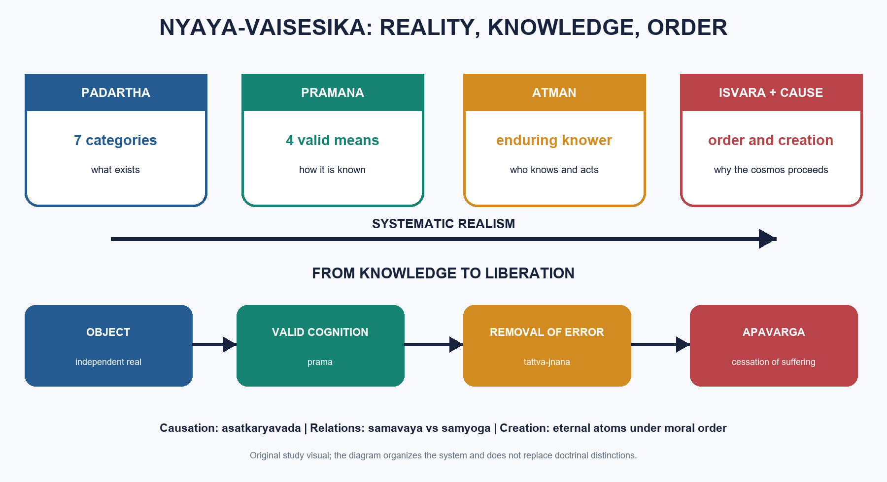

# Nyāya–Vaiśeṣika — Learner-v2 Source-Complete Learning Session

> **Catalogue identity:** Philosophy Optional · Philosophy Paper I — Indian Philosophy · `philosophy-paper-i-indian-philosophy-04`  
> **Generation:** g2, 21 August 2026 · **Supersedes:** `philosophy-paper-i-indian-philosophy-04:legacy-v1:g1` · **Approval:** pending explicit topic approval  
> **Evidence discipline:** doctrine and PYQ wording/year/marks are controlled by repository owners. Model answers are independent pedagogic practice, never official UPSC keys.

### Package practice counts

| Component | Count |
|---|---:|
| Direct verified topic-owned PYQs | 22 |
| Core diagnostic MCQs | 40 |
| Remedial diagnostic MCQs | 8 |
| Total diagnostics | 48 |
| Original solved Mains models | 6 (2 × 10, 2 × 15, 2 × 20) |
| Consolidated register parts | 12 (A–L) |
| Approval | false |


## BASIC LEARNING SESSION


*Distinct embedded teaching-navigation image. The separate continuous Cārvāka-style flowchart package remains an independent at-a-glance artifact.*


### Source-complete coverage ledger and answer-worthiness labels

| Source corpus | Final location | Retention decision |
|---|---|---|
| Layered Simple/Core/Exam/Rapid material | Basic Learning Session | Complete nine-subtopic teaching sequence retained |
| Layered Advanced material | Optional Advanced | Every advanced synthesis retained after practice |
| Canonical owner | Reconciled through layered session | Categories, pramāṇa, appearance, self, liberation, God, causation and atomism retained |
| Legacy solved workbook | PYQs and Answer Practice | All twenty-two solved PYQs preserved and improved |
| Premium diagnostic replacement | MCQs / Remediation | Legacy 24+8 set expanded to genuine 40+8 with strict rotation |
| Original practice | PYQs and Answer Practice | Six solved non-PYQ models replace the legacy three-model set |
| Consolidated register | Final section | A–L retrieval framework covers every printed syllabus limb |

**Answer-worthiness.** The seven categories, four pramāṇas, perception and inference, *anyathākhyāti*, self, *apavarga*, Īśvara, Udayana’s proofs, *asatkāryavāda* and atomism are **CORE SYLLABUS**. Navya-Nyāya refinements, the pramāṇa–pramāṇaphala debate and detailed rival objections are **CORE SUPPORTING DEPTH** when tied to the question. Broad IKS revival is context only, not evidence for doctrine.
### SESSION 1 — CONTEMPORARY-ANCHOR DISCIPLINE

#### DEFINITION / WHAT THIS IS CALLED

**Plain-language definition:** ✅ Search finding: A live August 2026 search located broad educational and academic discussion of Indian Knowledge Systems and classical Indian logic, but no sufficiently direct official doctrinal development specific to Nyāya–Vaiśeṣika.

**Technical definition:** Contemporary-anchor discipline: ⚠️ Inference: Mention renewed interest in Indian logical traditions only as a bounded introduction or conclusion.

#### ANSWER-GRABBING OPENING — WRITE/ADAPT IN THE EXAM

> ✅ Search finding: A live August 2026 search located broad educational and academic discussion of Indian Knowledge Systems and classical Indian logic, but no sufficiently direct official doctrinal development specific to Nyāya–Vaiśeṣika.

#### MUST-WRITE KEYWORDS

- **Search finding**
- **2026**
- **Contemporary-anchor discipline**

**How to use them:** ✅ Search finding: A live August 2026 search located broad educational and academic discussion of Indian Knowledge Systems and classical Indian logic, but no sufficiently direct official doctrinal development specific to Nyāya–Vaiśeṣika.

✅ **Search finding:** A live August 2026 search located broad educational and academic discussion of Indian Knowledge Systems and classical Indian logic, but no sufficiently direct official doctrinal development specific to Nyāya–Vaiśeṣika.  
⚠️ **Inference:** Mention renewed interest in Indian logical traditions only as a bounded introduction or conclusion. Do not turn curriculum discussion into proof of a metaphysical or epistemological claim.

#### CLOSING RECALL FLOW — CONTEMPORARY-ANCHOR DISCIPLINE

```text
START / CONCEPT: Contemporary-anchor discipline
        |
        v
EXACT TERMS: Search finding · 2026 · Contemporary-anchor discipline
        |
        v
MECHANISM / ARGUMENT: ⚠️ Inference: Mention renewed interest in Indian logical traditions only as a bounded introduction or conclusion.
        |
        v
CONSEQUENCE / CONTRAST: Do not turn curriculum discussion into proof of a metaphysical or epistemological claim.
        |
        v
UPSC TRAP / ANSWER-USE: Do not turn curriculum discussion into proof of a metaphysical or epistemological claim.
        |
        v
ANSWER-GRABBING FORMULATION: ✅ Search finding: A live August 2026 search located broad educational and academic discussion of Indian Knowledge Systems and classical Indian logic, but no sufficiently direct official doctrinal development specific to Nyāya–Vaiśeṣika.
```
### Learner-v2 roadmap

```text
WHAT EXISTS?            -> PADĀRTHA
HOW IS IT KNOWN?        -> PRAMĀṆA
HOW DOES ERROR OCCUR?   -> ANYATHĀKHYĀTI
WHO KNOWS AND ACTS?     -> ĀTMAN
HOW DOES BONDAGE END?   -> APAVARGA
WHO ORDERS COSMOS?      -> ĪŚVARA
HOW DO EFFECTS BEGIN?   -> ASATKĀRYAVĀDA + ATOMISM
```





### SESSION 2 — MASTER DISTINCTION GATEWAY

#### DEFINITION / WHAT THIS IS CALLED

**Plain-language definition:** Master verdict: Nyāya–Vaiśeṣika is a realist system in which a detailed ontology is disclosed through valid cognition, error is a misrelation among real factors, and liberation follows removal of false knowledge.

**Technical definition:** Master verdict: Nyāya–Vaiśeṣika is a realist system in which a detailed ontology is disclosed through valid cognition, error is a misrelation among real factors, and liberation follows removal of false knowledge.

#### ANSWER-GRABBING OPENING — WRITE/ADAPT IN THE EXAM

> Master verdict: Nyāya–Vaiśeṣika is a realist system in which a detailed ontology is disclosed through valid cognition, error is a misrelation among real factors, and liberation follows removal of false knowledge.

#### MUST-WRITE KEYWORDS

- **Master verdict**
- **Source audit**
- **Preservation note**
- **In simple words**
- **Memory line**
- **Exam key**
- **Nyāya**
- **Gautama's Nyāya-sūtra**

**How to use them:** Master verdict: Nyāya–Vaiśeṣika is a realist system in which a detailed ontology is disclosed through valid cognition, error is a misrelation among real factors, and liberation follows removal of false knowledge.

| Axis | Nyāya emphasis | Vaiśeṣika emphasis |
|---|---|---|
| Primary task | valid knowledge, inference and debate | categories, relations and atomism |
| Founder text | Gautama’s *Nyāya-sūtra* | Kaṇāda’s *Vaiśeṣika-sūtra* |
| Core question | how is reality known? | what kinds of reality exist? |
| Later synthesis | epistemic method | ontological inventory |

> **Master verdict:** Nyāya–Vaiśeṣika is a realist system in which a detailed ontology is disclosed through valid cognition, error is a misrelation among real factors, and liberation follows removal of false knowledge.


#### How to use this layered session

Every logical subtopic follows the Philosophy five-layer sequence:

| Layer | Purpose |
|---:|---|
| 1. SIMPLE START | Plain-language visual gateway |
| 2. CORE UPSC | Complete retained doctrine, terminology, arguments and examples |
| 3. ADVANCED | Objections, replies, comparisons and qualified evaluation |
| 4. EXAM APPLICATION | Verified PYQ routing and marks-wise answer structure |
| 5. RAPID REVISION | Traps, recall spines and mastery preparation |

**Source audit:** the canonical Nyaya-Vaisesika knowledge file and the complete 2018-2025 Indian Philosophy PYQ bank were checked. The source session's direct OCR anchors to Chatterjee-Datta and C. D. Sharma are retained. A fresh August 2026 search found broad Indian Knowledge Systems educational discussion but no sufficiently direct new doctrinal development; no decorative current-affairs claim has been added. Qdrant was not required.

**Preservation note:** every substantive section of the previous complete session is retained. The new material adds simple visual gateways and explicit learning layers without replacing or compressing the original depth.


---

Progress: 1 / 9  |  Philosophy Layered Session  |  Subtopic: The Realist System: Nyaya, Vaisesika and Their Convergence

> **ANSWER-GRABBING LINE — WRITE/ADAPT IN THE EXAM (RECOMMENDED OPENING DEFINITION):** “Nyāya (the school of logic and valid knowledge) supplies the method of warranted cognition, while Vaiśeṣika (the school of categories and atomism) supplies the realist inventory that the later synthesis explains as one liberation-oriented system.”


#### LAYER 1 - SIMPLE START

#### Plain-language visual - two allied jobs, one later system

```text
NYAYA                         VAISESIKA
How do we know?               What exists?
proof, debate, pramana        categories, relations, atoms
          \                    /
           \                  /
            LATER SYNTHESIS
      realist knowledge of a realist world
```

**In simple words:** Nyaya supplies the methods for knowing and arguing; Vaisesika supplies the inventory of reality. Their later convergence explains the world, knowledge, error, self, causation, God and liberation as parts of one realist system.

| First anchor | Easy meaning |
|---|---|
| Nyaya | Logic, epistemology and debate |
| Vaisesika | Ontology, categories and atomism |
| Navya-Nyaya | Later technical refinement |
| Shared goal | Remove error through true knowledge and end suffering |

> **Memory line:** Nyaya gives the method; Vaisesika gives the map.

#### LAYER 2 - CORE UPSC

#### 0. ONE-SCREEN MAP

```text
NYĀYA = pramāṇa-śāstra, logic, debate, proof, validity
VAIŚEṢIKA = padārtha ontology, realism, atomism
        │
        └─ later convergence → Nyāya-Vaiśeṣika synthesis → Navya-Nyāya refinement

CORE AXES
Padārtha → what exists
Pramāṇa → how it is known
Khyāti → how error occurs
Ātman → enduring self, consciousness as quality
Apavarga → cessation of suffering
Īśvara → efficient cause, moral governor
Asatkāryavāda → effect is a new beginning
Atomism → world built from eternal atoms under God's direction
```

> ⚠️ **Exam key:** Nyāya-Vaiśeṣika is best mastered as a system: padārtha gives ontology, pramāṇa gives epistemology, anyathākhyāti handles error, ātman secures continuity, God secures cosmic and moral order, and asatkāryavāda plus atomism explain production.

#### 1. INTRODUCTION — TWO ALLIED SCHOOLS

#### 1.1 Nyāya

- ✅ **Nyāya** is the school of logic, epistemology and critical debate, classically associated with **Gautama's Nyāya-sūtra**.
- ✅ Its concern is not logic in an abstract formalist sense alone, but valid cognition as a means to the removal of error and finally liberation.
#### 1.2 Vaiśeṣika

- ✅ **Vaiśeṣika**, associated with **Kaṇāda's Vaiśeṣika-sūtra**, is primarily an ontological school.
- ✅ It classifies reality into **padārthas** and develops atomism.
#### 1.3 Their convergence

- ✅ Over time the two schools converge into a synthetic **Nyāya-Vaiśeṣika** system.
- ✅ Later **Navya-Nyāya**, especially through **Gaṅgeśa**, sharpens the analytic and technical vocabulary of the tradition.
- ⚠️ In UPSC, it is usually best to treat them together while still noting where a point is distinctly Nyāya (e.g. pramāṇa, anyathākhyāti) or distinctly Vaiśeṣika (e.g. padārtha, atomism).
#### LAYER 4 - EXAM APPLICATION

#### Exam route

- Open broad answers with the division of labour: **Nyaya = pramana and dialectic; Vaisesika = padartha and atomism**.
- State that they are historically two allied schools but doctrinally fused in later exposition.
- Use the one-screen map to connect ontology, epistemology, self, theism, causation and liberation rather than writing isolated chapters.
- For evaluation, test whether explanatory coverage justifies the system's ontological cost.

#### LAYER 5 - RAPID REVISION

#### Rapid recall

- Gautama: *Nyaya-sutra*.
- Kanada: *Vaisesika-sutra*.
- Gangesa: major Navya-Nyaya refinement.
- Realist spine: padartha -> pramana -> atman -> Isvara -> apavarga.
- Trap: do not say Nyaya and Vaisesika were identical from the beginning.

---

Progress: 2 / 9  |  Philosophy Layered Session  |  Subtopic: Padartha Ontology: Substance, Universal, Inherence and Absence

> **ANSWER-GRABBING LINE — WRITE/ADAPT IN THE EXAM (RECOMMENDED OPENING DEFINITION):** “A padārtha (category or knowable referent) is a distinct kind of reality required to classify what exists, what qualifies or moves it, how it is related, and how its absence is known.”


#### LAYER 1 - SIMPLE START

#### Plain-language visual - the seven-category inventory

```text
WHAT IS THERE?
|
+-- things that support features       -> DRAVYA
+-- their qualities                    -> GUNA
+-- their movements                    -> KARMA
+-- what many individuals share        -> SAMANYA
+-- what makes eternal reals distinct  -> VISESA
+-- inseparable dependence             -> SAMAVAYA
+-- determinate absence                -> ABHAVA
```

**In simple words:** Vaisesika classifies not only objects but also qualities, motions, commonness, individuality, dependence and absence. Each category answers a different explanatory question.

| Relation | Easy example |
|---|---|
| Samavaya | Brown colour in a table |
| Samyoga | A book resting on the table |
| Samanya | Cow-ness in many cows |
| Visesa | What finally distinguishes otherwise similar eternal atoms |
| Abhava | The jar's absence on the table |

> **Memory line:** seven categories prevent unlike kinds of reality from being confused.

#### LAYER 2 - CORE UPSC

#### 2. THEORY OF CATEGORIES (PADĀRTHA)

#### 2.1 Statement

- ✅ **Padārtha** means what is nameable and knowable.
- ✅ Classical Vaiśeṣika finally recognizes **seven padārthas**.
- ❓ Historically, Kaṇāda's older list is often taken as six, with **abhāva** added later. UPSC answers should note this when relevant.
#### 2.2 The seven padārthas at a glance

| Padārtha | Basic sense | Why it matters |
|---|---|---|
| **dravya** | substance | locus of qualities and actions |
| **guṇa** | quality | cannot exist independently of substance |
| **karma** | motion/action | produces conjunction and disjunction |
| **sāmānya** | universal | common feature grounding classification |
| **viśeṣa** | ultimate particularity | differentiates eternal reals |
| **samavāya** | inherence | inseparable relation |
| **abhāva** | absence/non-existence | explains negation and non-being judgments |

#### 2.3 Dravya (substance)

#### Statement

- ✅ **Dravya** is that in which qualities and actions inhere and which can serve as a material or ontological base.
- ✅ There are **nine dravyas**:
  1. **pṛthivī** — earth
  2. **ap** — water
  3. **tejas** — fire
  4. **vāyu** — air
  5. **ākāśa** — ether
  6. **kāla** — time
  7. **dik** — space/direction
  8. **ātman** — self
  9. **manas** — mind
#### Distinction

- ⚠️ A common trap is to forget that **ākāśa, kāla and dik** are themselves substances, not merely abstract conditions.
#### Example

- ✅ A pot is a substance because colour, number, conjunction and motion can inhere in it.
#### 2.4 Guṇa (quality)

#### Statement

- ✅ **Guṇa** is a dependent ontological feature that inheres in a substance but does not itself possess further qualities or actions in the same way.
- ✅ The traditional list gives **twenty-four qualities**:
  - **rūpa** (colour)
  - **rasa** (taste)
  - **gandha** (smell)
  - **sparśa** (touch)
  - **saṃkhyā** (number)
  - **parimāṇa** (magnitude)
  - **pṛthaktva** (distinctness)
  - **saṃyoga** (conjunction)
  - **vibhāga** (disjunction)
  - **paratva** (priority/remoteness)
  - **aparatva** (posteriority/nearness)
  - **buddhi** (cognition)
  - **sukha** (pleasure)
  - **duḥkha** (pain)
  - **icchā** (desire)
  - **dveṣa** (aversion)
  - **prayatna** (effort)
  - **gurutva** (heaviness)
  - **dravatva** (fluidity)
  - **sneha** (viscidity)
  - **saṃskāra** (dispositional tendency/momentum)
  - **dharma**
  - **adharma**
  - **śabda** (sound)
#### Philosophical significance

- ⚠️ The list is notable because mental items like cognition, desire and pleasure are treated as **qualities**, not as the essence of self.
#### 2.5 Karma (motion/action)

- ✅ **Karma** here means physical motion/action, not moral karma.
- ✅ Vaiśeṣika recognizes **five kinds**:
  1. upward movement
  2. downward movement
  3. contraction
  4. expansion
  5. locomotion/general movement
- ✅ Motion is important because it generates conjunction and disjunction, central to causation.
#### 2.6 Sāmānya (universal)

#### Statement

- ✅ **Sāmānya** is the real universal, one-in-many, eternal and present in multiple particulars.
- ✅ Universals may be discussed through higher and lower ordering, often expressed as **para** and **apara** distinctions.
#### Argument

1. ✅ We genuinely classify many individuals under one concept: "cow", "pot", "substance".
2. ✅ Mere resemblance is insufficient unless some objective commonness grounds the classification.
3. ✅ Therefore a universal must be real.
#### Presupposition

- ⚠️ The argument presupposes realist semantics: common predication reflects objective common structure in the world.
#### Distinction

- ✅ Vaiśeṣika realism here opposes the Buddhist **apoha** theory, which explains universals through exclusion rather than real common entities.
#### Example

- ✅ "Cow-ness" is one universal present in many cows.
#### Objection

- ❓ If the universal is one, how can it be wholly present in many places?
#### Reply

- ✅ The universal is not spatially divided like a physical thing; it is a single eternal entity instantiated in many particulars through **samavāya** (inherence).
#### 2.7 Jāti-bādhaka: six impediments to universalhood

- ✅ **Statement.** Not every general term names a real universal (**jāti**, class-universal); where a proposed jāti is blocked, Nyāya-Vaiśeṣika treats it as an imposed property or limiting condition (**upādhi**, adjunct), not as a new padārtha.
- ⚠️ **Philosophical function.** The six **jāti-bādhakas** (obstructors of universalhood) are the school’s internal discipline against a bloated ontology of universals.

| Jāti-bādhaka | Rule | Exam example / payoff |
|---|---|---|
| ✅ **vyakter abhedaḥ** | ✅ A universal cannot have only one instance, because jāti requires plurality of loci. | ✅ **ākāśatva** (ether-ness) is blocked if there is only one **ākāśa**. |
| ✅ **tulyatvam** | ✅ Two exactly co-extensive putative universals should not both be admitted. | ✅ If **ghaṭatva** and **kalaśatva** both mean pot-ness over the same class, there is no ground for two universals. |
| ✅ **saṅkaraḥ** | ✅ Two universals cannot partially overlap without either being included in the other; they must be nested or disjoint. | ✅ The standard case is **bhūtatva** and **mūrtatva**, where cross-connection would confuse the hierarchy of kinds. |
| ✅ **anavasthā** | ✅ Universalhood itself cannot be a further universal in universals, because that would demand another universal of universalhood without end. | ✅ **jātitva** as a jāti over jātis is blocked by infinite regress. |
| ✅ **rūpahāniḥ** | ✅ A universal is blocked where admitting it destroys the very form or function of the entity concerned. | ✅ A universal residing in **viśeṣas** would defeat viśeṣa’s function of ultimate individuation. |
| ✅ **asambandhaḥ** | ✅ A universal must inhere in its instances by **samavāya**, but samavāya itself has no further samavāya to connect it with a universal. | ✅ **samavāyatva** cannot be admitted as a real jāti without relation-regress. |

- ✅ **Buddhist objection.** Dignāga and Dharmakīrti-style **apoha** theory argues that universals are unperceived, causally inert, and cannot be wholly present in many places at once.
- ✅ **Nyāya reply.** Universals are perceived in determinate perception (**savikalpaka-pratyakṣa**) such as "this is a cow"; their presence is by **samavāya**, not by spatial containment; and apoha is circular because exclusion of non-cows presupposes a stable cow-class or at least stable exclusion-domains.
- ⚠️ **Exam payoff.** Jāti-bādhaka lets Nyāya answer the Buddhist charge of ontological excess: realism about universals is not indiscriminate multiplication.
#### 2.8 Viśeṣa (particularity)

- ✅ **Statement.** **Viśeṣa** is the ultimate individuator residing only in eternal substances: the paramāṇus of earth, water, fire and air, and the eternal instances of **ākāśa**, **kāla**, **dik**, **ātman** and **manas**.
- ✅ **Function.** Two atoms of earth may be alike in all universals and ordinary qualities; without viśeṣa they would be indistinguishable and, by the identity of indiscernibles, would collapse into one.
- ✅ **School-name significance.** Viśeṣa gives the *Vaiśeṣika* school its name because the system explains plurality through irreducible particularity.
#### Objection: regress of differentiators

- ✅ **Objection.** If viśeṣa differentiates one atom from another, what differentiates one viśeṣa from another? A further viśeṣa would be needed, and so on without end.
- ✅ **Reply.** Viśeṣas are **svato-vyāvartaka** (self-differentiating): they distinguish both their loci and themselves by their own nature.
- ⚠️ **Residual force.** Critics argue that "self-differentiating" names the stopping point rather than proving it; viśeṣa is a stipulated terminus of individuation.
#### Objection: imperceptible ontological IOU

- ✅ **Objection.** Viśeṣa is imperceptible and appears to be posited solely to do the explanatory job of individuating exactly similar eternals.
- ✅ **Reply.** Nyāya-Vaiśeṣika frames the posit inferentially: plurality of exactly similar eternal substances is otherwise inexplicable, and Nyāya reduces **arthāpatti** (postulation) to inference rather than making it a separate pramāṇa.
- ⚠️ **Comparative note.** Jaina, Buddhist and Advaita critiques often target viśeṣa and samavāya as the weakest joints of the system; Śrīharṣa’s *Khaṇḍanakhaṇḍakhādya* attacks Nyāya definitions systematically.
#### 2.9 Samavāya (inherence)

- ✅ **Statement.** **Samavāya** is the eternal, single, imperceptible-yet-inferred inseparable relation (**ayutasiddha-sambandha**) that holds where relata cannot be established as separable in the relevant ontological mode.
- ✅ **Scope.** It holds between five standard pairs: part–whole, substance–quality, substance–motion, universal–particular, and eternal substance–its viśeṣa.
- ⚠️ **All-pervading sense.** Later exposition calls samavāya one and not locally multiplied; "all-pervading" should be read as one relation operating wherever the required relata obtain, not as a tenth spatial substance.
#### Distinction from saṃyoga

| Relation | Status | Relata | Production/destruction | Example |
|---|---|---|---|---|
| ✅ **samavāya** | ✅ Inseparable relation | ✅ Ayutasiddha relata | ✅ Eternal as a relation | ✅ Colour in cloth; whole in parts |
| ✅ **saṃyoga** | ✅ A guṇa (quality) | ✅ Separable relata | ✅ Produced and destructible | ✅ Book on table; two pots in contact |

- ✅ **Ayutasiddhatva issue.** Inseparability is necessary for samavāya, but ⚠️ not by itself sufficient unless the specific ontological dependence relation is shown; mere closeness is not inherence.
#### Objection: relation-regress

- ✅ **Objection.** If samavāya relates A and B, a further relation seems needed to relate samavāya to A and to B, generating **anavasthā** (infinite regress).
- ✅ **Reply.** Samavāya is **svarūpa-sambandha** (self-linking relation): it relates by its own nature and needs no further relator.
- ⚠️ **Residual force.** This is a stipulated terminus; every relational ontology must stop somewhere, and critics such as Buddhists and Śrīharṣa press the charge that Nyāya stops regress here while using regress against opponents.
- ⚠️ **Controlled comparison flag.** The issue resembles Bradley’s regress in Western metaphysics, but that comparison belongs only after the Indian argument is complete.
#### Objection: one or many samavāyas?

- ✅ **Nyāya-Vaiśeṣika position.** Samavāya is one and eternal; parsimony is the Vaiśeṣika reason for not multiplying inherence-relations.
- ⚠️ **Internal difficulty.** If samavāya is one, it is hard to explain why it relates this quality to this substance rather than to all substances.
- ⚠️ **Reply.** The relata themselves determine the relation’s operation: samavāya is not a free-floating glue but the inseparable tie manifest only where the relevant terms exist.
#### 2.10 Abhāva (non-existence)

#### Statement

- ✅ **Abhāva** is the category of absence or non-existence.
- ✅ Four kinds are recognized:
  1. **prāgabhāva** — prior non-existence
  2. **pradhvaṃsābhāva** — posterior non-existence/destruction
  3. **atyantābhāva** — absolute non-existence
  4. **anyonyābhāva** — mutual non-existence/difference
#### Four kinds explained

#### (a) Prāgabhāva

- ✅ The non-existence of an effect before its production.
- ✅ It has no beginning, but ends when the effect is produced.
#### (b) Pradhvaṃsābhāva

- ✅ The non-existence of a thing after its destruction.
- ✅ It begins with destruction and has no end.
#### (c) Atyantābhāva

- ✅ Absolute non-existence: a thing is absent in a locus for all times.
- ✅ Standard example: a hare's horn.
#### (d) Anyonyābhāva

- ✅ Mutual non-existence or reciprocal difference.
- ✅ "A pot is not a cloth" means pot and cloth are different entities.
#### 2024 distinction: air does not have heat vs air is not fire

- ✅ "Air does not have heat" is best treated as **atyantābhāva** with respect to heat in air.
- ✅ "Air is not fire" is **anyonyābhāva**, because it expresses difference between two entities.
- ⚠️ Therefore they are not the same kind of absence.
#### 2023 issue: counterpositive (pratiyogin)

- ✅ Every absence is the absence **of** something; that absent positive term is the **pratiyogin** or counterpositive.
- ⚠️ This shows abhāva is not sheer blankness; it has structured intentional content.
#### LAYER 4 - EXAM APPLICATION

#### Exam route

- **2018 Q5(a):** distinguish samavaya from samyoga using brown table and book-on-table.
- **2018 Q5(d), 2019 Q5(a), 2023 Q5(d), 2024 Q5(c):** define absence through locus, counterpositive and fourfold classification.
- **2020 Q8(b):** give visesa's function, regress objection, self-differentiating reply and residual force.
- **2021 Q5(c):** say inseparability is necessary but not by itself sufficient for samavaya.
- **2022 Q5(b):** defend real universals, then confront apoha and one-in-many objections.

#### LAYER 5 - RAPID REVISION

#### Rapid recall

- Seven padarthas; Kanada's earlier list is commonly treated as six.
- Nine dravyas; twenty-four gunas; five physical karmas.
- Samavaya = inseparable relation; samyoga = contingent conjunction.
- Four abhavas: prior, posterior, absolute and mutual.
- Trap: cognition, pleasure and desire are qualities of self, not self's essence.

---

Progress: 3 / 9  |  Philosophy Layered Session  |  Subtopic: Pramana: Perception, Inference, Testimony and the Defence of Vyapti

> **ANSWER-GRABBING LINE — WRITE/ADAPT IN THE EXAM (RECOMMENDED OPENING DEFINITION):** “A pramāṇa (means of valid knowledge) is a reliable causal route to true cognition, and Nyāya defends inference by grounding vyāpti (invariable concomitance) through observation, removal of hidden conditions and tarka (hypothetical reductive reasoning).”


#### LAYER 1 - SIMPLE START

#### Plain-language visual - four routes to valid knowledge

```text
OBJECT CONTACT  -> PERCEPTION
SIGN + RULE      -> INFERENCE
RESEMBLANCE      -> COMPARISON
TRUSTWORTHY WORD -> TESTIMONY

Inference engine:
smoke on hill + smoke pervaded by fire -> fire on hill
```

**In simple words:** Nyaya accepts four independent ways of gaining fresh true knowledge. Its most elaborate achievement is inference: a sign must be present in the subject and reliably connected with what is to be proved.

| Technical term | Easy meaning |
|---|---|
| Vyapti | Unconditional invariable relation |
| Upadhi | Hidden condition that makes a generalization defective |
| Tarka | Reasoning that removes a rival possibility |
| Paramarsa | Applying the known universal relation to this case |

> **Memory line:** observation suggests the rule; removal of hidden conditions warrants it; paramarsa applies it.

#### LAYER 2 - CORE UPSC

#### 3. THEORY OF PRAMĀṆA

#### 3.1 The four pramāṇas

- ✅ Nyāya recognizes four pramāṇas:
  1. **pratyakṣa** — perception
  2. **anumāna** — inference
  3. **upamāna** — comparison/analogy
  4. **śabda** — testimony

#### 3.2 Pratyakṣa (perception)

#### Gautama's definition (2025)

- ✅ The classical Nyāya definition states in substance: **"indriyārtha-sannikarṣa-utpannaṃ jñānam avyapadeśyam avyabhicāri vyavasāyātmakam pratyakṣam"**.
- ✅ UPSC expects clause-by-clause unpacking.
#### Clause-by-clause analysis

1. **indriyārtha-sannikarṣa** — sense-object contact
   - ✅ Perception begins with a relation between sense organ and object.
   - ⚠️ This marks perception as causally immediate relative to the relevant sense relation.

2. **utpannam** — produced
   - ✅ The cognition must be produced from that contact.
   - ⚠️ This excludes merely remembered or verbally derived knowledge.

3. **avyapadeśyam** — non-verbal / not dependent on testimony
   - ✅ Perception is not constituted by words as words.
   - ⚠️ This distinguishes it from śabda.

4. **avyabhicāri** — non-errant
   - ✅ Genuine perception is unerring.
   - ⚠️ Illusion is excluded from valid perception in the final sense.

5. **vyavasāyātmakam** — determinate
   - ✅ It is definite, not doubtful.
   - ⚠️ This clause creates discussion because later Naiyāyikas also admit a prior indeterminate phase.
#### Nirvikalpaka and savikalpaka perception

- ✅ **Nirvikalpaka** perception is indeterminate, pre-predicative awareness.
- ✅ **Savikalpaka** perception is determinate: qualified, nameable awareness such as "this is a blue pot".
- ⚠️ The tradition often uses nirvikalpaka to explain how raw awareness can ground determinate judgment.
#### The six sannikarṣas

- ✅ Nyāya elaborates six sense-object relations:
  1. **saṃyoga** — conjunction
  2. **saṃyukta-samavāya** — inherence in what is conjoined
  3. **saṃyukta-samaveta-samavāya** — inherence in what inheres in what is conjoined
  4. **samavāya** — inherence
  5. **samaveta-samavāya** — inherence in what inheres
  6. **viśeṣaṇa-viśeṣya-bhāva** — qualifier-qualified relation
- ⚠️ These are technical tools for explaining how the senses can apprehend not just substances, but also qualities, universals and absences.
#### Extraordinary perception (alaukika) (2023, 2019)

1. ✅ **Sāmānyalakṣaṇa-pratyakṣa**
   - perception through the universal; by apprehending a universal one can perceptually relate to all its instances in a distinctive way.
   - ⚠️ This supports Nyāya realism about universals: universals are perceived, not merely inferred.

2. ✅ **Jñānalakṣaṇa-pratyakṣa**
   - a case where prior cognition mediates present perception; e.g. one may in a derivative sense "see" sandalwood as fragrant.
   - ⚠️ This becomes crucial in Nyāya's theory of error.

3. ✅ **Yogaja-pratyakṣa**
   - yogic perception of subtle, distant, past or future objects.
#### 3.3 Anumāna (inference)

#### Statement

- ✅ **Anumāna** is knowledge arising through a sign (**liṅga/hetu**, probans) known to be invariably related to the probandum (**sādhya**).
#### Five members of inference

Using the hill-fire example:

1. ✅ **pratijñā** — The hill has fire.
2. ✅ **hetu** — because it has smoke.
3. ✅ **udāharaṇa** — wherever there is smoke, there is fire, as in a kitchen.
4. ✅ **upanaya** — this hill has smoke of that kind.
5. ✅ **nigamana** — therefore the hill has fire.

- ✅ **Purpose.** The **pañcāvayava** (five-membered syllogism) is the form of proof for another (**parārthānumāna**); it makes explicit the vyāpti and the application to the pakṣa.
#### Five characteristics of a valid hetu

1. ✅ **pakṣadharmatā** — the hetu is present in the subject under consideration.
2. ✅ **sapakṣa-sattva** — the hetu is present in similar positive instances.
3. ✅ **vipakṣa-asattva** — the hetu is absent in dissimilar negative instances.
4. ✅ **abādhita** — the sādhya is not contradicted by stronger knowledge.
5. ✅ **asatpratipakṣa** — the hetu is not opposed by an equally strong counter-reason.

- ⚠️ **Exam link.** These five marks are the positive side of the same test that appears negatively as **hetvābhāsa** (fallacy of the probans) in §3.4.
#### 3.4 Vyāpti-grahaṇa: grasping invariable concomitance

- ✅ **Statement.** **Vyāpti-grahaṇa** is the chain by which Nyāya claims to know the universal relation required for inference; it is the core reply to Cārvāka scepticism about anumāna.
#### 1. Vyāpti defined

- ✅ **Definition.** **Vyāpti** is invariable, unconditional concomitance (**avinābhāva-niyama**) between the **hetu/liṅga** (probans, e.g. smoke) and the **sādhya** (probandum, e.g. fire).
- ✅ **Distinction.** **Samavyāpti** is equal extension or convertibility: two terms pervade each other.
- ✅ **Distinction.** **Viṣamavyāpti** / **asamavyāpti** is unequal extension: all smoke is pervaded by fire, but not all fire is pervaded by smoke.
- ✅ **Condition.** Nyāya requires **niyata** (fixed) and **anaupādhika** (unconditioned by an upādhi) concomitance, not mere frequency.
#### 2. Bhūyodarśana: repeated positive and negative observation

- ✅ **Argument.** The knower observes co-presence (**anvaya**) in many positive instances: smoke with fire in kitchens, hearths and similar cases.
- ✅ **Argument.** The knower also observes co-absence (**vyatireka**) in negative instances: where fire is absent, smoke is absent.
- ⚠️ **Limit.** Bhūyodarśana alone is not sufficient, because repeated observation remains a finite sample and cannot by itself yield an unrestricted universal.
#### 3. Vyabhicāra-adarśana: absence of counter-instance

- ✅ **Argument.** The investigator searches for deviation (**vyabhicāra**) and does not find a case where the hetu occurs without the sādhya.
- ⚠️ **Limit.** This strengthens the universal but still needs the removal of hidden conditions.
#### 4. Upādhi-nirāsa: removal of conditioning adjunct

- ✅ **Definition.** **Upādhi** is a conditioning adjunct: **sādhya-vyāpakatve sati sādhana-avyāpakaḥ** — that which pervades the sādhya but does not pervade the hetu.
- ✅ **Example.** In the bad inference "the hill has smoke because it has fire", **wet fuel (ārdra-indhana)** is the upādhi: wherever there is smoke there is wet fuel, but not wherever there is fire is there wet fuel.
- ✅ **Argument.** Therefore fire does not unconditionally pervade smoke; the fire-to-smoke inference is conditional and fails.
- ✅ **Nyāya reply to Cārvāka.** The Cārvāka says a hidden condition may always lurk; Nyāya replies that systematic **upādhi-nirāsa** and **upādhi-śaṅkā-nivṛtti** (removal of the suspicion of an adjunct), supported by tarka, converts observation into warranted universal cognition.
#### 5. Tarka: reductive doubt-removal

- ✅ **Statement.** **Tarka** is hypothetical or counterfactual reasoning that removes residual doubt by showing the unacceptable consequence of the contrary supposition.
- ✅ **Example.** If smoke were not pervaded by fire, smoke could occur without fire; this contradicts uniform experience and would make the causal order unintelligible.
- ✅ **Status.** Tarka is **pramāṇa-anugrāhaka** (an aid to pramāṇas), not an independent pramāṇa; it supports perception and inference by eliminating the rival supposition.
- ⚠️ **Forms.** Common exam-ready forms of unacceptable consequence include **ātmāśraya** (self-dependence), **anyonyāśraya** (mutual dependence), **cakraka** (circularity), **anavasthā** (infinite regress), and contradiction of perception or inference (**pratyakṣa/anumāna-virodha**).
#### 6. Sāmānyalakṣaṇa-pratyakṣa: universal-mediated perception

- ✅ **Cross-reference.** As noted in §3.2, **sāmānyalakṣaṇa-pratyakṣa** is extraordinary (**alaukika**) perception through the universal.
- ✅ **Role in vyāpti.** On perceiving an instance of smokeness, the cognizer is perceptually related to smoke as a universal, so all smoke as such can be presented without an infinite survey of every smoke-instance.
- ⚠️ **Induction payoff.** This is the specifically Nyāya move against the problem of induction: because **jāti** is real, the universal can be cognitively grasped, not merely guessed from samples.
#### 7. Pakṣadharmatā and parāmarśa

- ✅ **Pakṣadharmatā.** The hetu must be known to exist in the pakṣa: this hill has smoke.
- ✅ **Parāmarśa.** The immediate cause (**karaṇa**) of inferential cognition is the subsumptive reflection: "this hill possesses smoke which is pervaded by fire".
- ✅ **Connection to pañcāvayava.** The five-membered syllogism makes parāmarśa communicable: pratijñā states the thesis, hetu states the sign, udāharaṇa states vyāpti with example, upanaya applies it to the pakṣa, and nigamana states the conclusion.
#### 8. Hetvābhāsa as the negative test of vyāpti

| Hetvābhāsa | What fails | Subtypes / examples |
|---|---|---|
| ✅ **savyabhicāra / anaikāntika** (irregular) | ✅ The hetu is not invariably tied to the sādhya. | ✅ **sādhāraṇa** occurs in both sapakṣa and vipakṣa; **asādhāraṇa** is confined to the pakṣa; **anupasaṃhārin** is too wide to allow contrast. |
| ✅ **viruddha** (contradictory) | ✅ The hetu proves the opposite of the intended sādhya. | ✅ A reason meant to prove permanence instead proves impermanence. |
| ✅ **satpratipakṣa / prakaraṇasama** (counterbalanced) | ✅ An equally strong counter-hetu proves the contrary. | ✅ The debate remains balanced because each side has a reason of comparable force. |
| ✅ **asiddha / sādhyasama** (unproved) | ✅ The hetu itself is not established. | ✅ **āśrayāsiddha**: the pakṣa-locus is unreal; **svarūpāsiddha**: the hetu is absent in the pakṣa; **vyāpyatvāsiddha**: pervasion is unproved, often due to upādhi. |
| ✅ **bādhita / kālātīta** (stultified) | ✅ The conclusion is contradicted by a stronger pramāṇa. | ✅ Fire cannot be inferred as cold because perception defeats the sādhya. |

- ⚠️ **Linking rule.** Savyabhicāra violates vipakṣa-asattva, asiddha violates pakṣadharmatā, bādhita violates abādhita, satpratipakṣa violates asatpratipakṣa, and viruddha reverses the direction of vyāpti itself.
#### Objection: Cārvāka and the Humean parallel

- ✅ **Objection.** No finite observation licenses a universal; upādhi-elimination can never be completed; tarka presupposes inference and is circular; and sāmānyalakṣaṇa-pratyakṣa looks like an ad hoc posit.
- ⚠️ **Humean parallel.** The parallel is that observed regularity alone does not logically entail future or universal necessity.
#### Reply: Nyāya answer

- ✅ **Reply.** The demand for mathematical certainty from empirical universals is misplaced; Nyāya claims warranted cognition, not omniscient enumeration by ordinary knowers.
- ✅ **Reply.** Tarka is not an independent proof of vyāpti, so it does not circularly infer what it must prove; it removes the contrary supposition so that perception and inference can function.
- ✅ **Reply.** Sāmānyalakṣaṇa-pratyakṣa is not ad hoc within Nyāya ontology, because universals are real padārthas and can be presented in cognition.
- ✅ **Reply.** The sceptic’s denial of all inference is itself a universal claim about inference and so invites **svavacana-virodha** (self-contradiction in one’s own speech).
- ⚠️ **Residual force.** The Nyāya answer is strongest if one accepts realism about universals; if jāti is denied, the induction solution becomes contested.
#### 3.5 Upamāna (comparison)

- ✅ **Upamāna** gives knowledge of the relation between a word and its referent through resemblance.
- ✅ If one is told that a **gavaya** resembles a cow, later encountering such an animal yields knowledge that this is what the word denotes.
- ⚠️ The point is semantic acquisition via similarity.
#### 3.6 Śabda (testimony)

#### Statement

- ✅ **Śabda** is valid verbal testimony, classically understood as **āptavākya**, the statement of an **āpta** — a trustworthy competent person.
#### Argument

1. ✅ Many things cannot be directly perceived by each knower.
2. ✅ Human life depends on reliable communication.
3. ✅ Therefore testimony must be recognized as an independent pramāṇa when it comes from a trustworthy source.
#### Vedic testimony

- ✅ Nyāya accepts the Veda as valid testimony.
- ✅ In later Nyāya, its authority is often connected with God as omniscient author.
#### 3.7 Why memory (smṛti) is not a pramāṇa (2024)

- ✅ Memory reproduces a past cognition; it does not generate **novel** knowledge.
- ✅ A pramāṇa must produce fresh, true cognition of what is not already known in that mode.
- ⚠️ Therefore memory may be psychologically useful but is not epistemically pramāṇa in the technical sense.
#### 3.8 Svataḥ and parataḥ prāmāṇya (2025)

- ✅ Nyāya defends **parataḥ-prāmāṇya** and **parataḥ-aprāmāṇya**.
- ✅ That means both validity and invalidity of cognition are known through external conditions or later confirmation/disconfirmation.
- ⚠️ This is a standard UPSC trap: Nyāya is not merely parataḥ for invalidity; it is parataḥ for both.
- ✅ Contrast: Mīmāṃsā generally takes validity to be self-manifest (**svataḥ**) while invalidity is known later.
#### 3.9 Naiyāyika-Buddhist debate on pramāṇa and pramāṇaphala (2025)

- ✅ **Nyāya:** pramāṇa and **pramāṇa-phala** / **pramiti** are different. The pramāṇa is the instrument or means; the resulting true cognition is its fruit.
- ✅ **Buddhist epistemologists** such as Dignāga are commonly read as tightening the relation so that cognition itself is both revelatory act and result in a self-luminous framework.
- ⚠️ The contrast turns on broader metaphysics: Nyāya is instrumentally realist; Buddhist epistemology is more cognition-centred.
#### LAYER 4 - EXAM APPLICATION

#### Exam route

- **2022 Q7(c):** reconstruct Carvaka's vyapti objection before giving Nyaya's multi-stage reply.
- **2023 Q6(c):** distinguish ordinary and extraordinary perception and evaluate perception of universals.
- **2023 Q7(a):** connect five valid hetu-marks to the five hetvabhasas.
- **2021 Q5(b):** explain sabda as aptavakya and why testimony is independent.
- **2025 Q5(b):** contrast Nyaya's instrument-result distinction with Buddhist cognition-centred theory.
- **2025 Q6(a):** unpack every clause of Gautama's perception definition.

#### LAYER 5 - RAPID REVISION

#### Rapid recall

- Four pramanas: perception, inference, comparison, testimony.
- Five inference members: thesis, reason, example, application, conclusion.
- Five hetu tests: paksa presence, positive presence, negative absence, undefeated, no counter-reason.
- Tarka is an aid, not an independent pramana.
- Trap: Nyaya is paratah for both validity and invalidity.

---

Progress: 4 / 9  |  Philosophy Layered Session  |  Subtopic: Appearance, Self and Liberation: Realism from Error to Apavarga

> **ANSWER-GRABBING LINE — WRITE/ADAPT IN THE EXAM (CORE ARGUMENT):** “Anyathākhyāti (misapprehension of a real item as elsewhere) preserves realism by treating error as a faulty synthesis of real factors, while ātman (the enduring self) explains ownership and apavarga (final cessation of suffering) ends their painful causal chain.”


#### LAYER 1 - SIMPLE START

#### Plain-language visual - error, ownership and release

```text
SHELL SEEN NOW + SILVER REMEMBERED
              |
       wrongly combined
              v
       "THIS IS SILVER"

Enduring self owns cognition and action
              |
true knowledge removes error and defects
              v
APAVARGA = final cessation of suffering
```

**In simple words:** illusion does not prove that reality is unreal. A real remembered object is wrongly placed in a real present locus. The same realist system posits an enduring self as owner of mental qualities and liberation as freedom from all suffering-producing conditions.

> **Memory line:** error is wrong placement, self is the enduring locus, liberation is removal.

#### LAYER 2 - CORE UPSC

#### 4. THEORY OF APPEARANCE (KHYĀTIVĀDA)

#### 4.1 Anyathākhyāti stated precisely

- ✅ Nyāya explains illusion through **anyathākhyāti**.
- ✅ In the classic shell-silver case, both the presented "this" and silver are real; the error lies in taking silver, which exists elsewhere, as here.
- ⚠️ Error is therefore misplacement or wrong synthesis, not apprehension of a non-entity.
#### 4.2 Mechanism

1. ✅ A present perceptual base exists — e.g. shell.
2. ✅ A past impression of silver is activated.
3. ✅ Through **jñānalakṣaṇa-pratyakṣa**, the silver becomes present to consciousness in a derivative extraordinary perceptual way.
4. ✅ Due to non-discrimination, the mind synthesizes the present locus and remembered object wrongly.
5. ✅ The erroneous cognition "this is silver" results.
#### 4.3 Presupposition

- ⚠️ Nyāya preserves realism even in illusion: cognition goes wrong, but the world is not ontologically downgraded into dream-stuff.
#### 4.4 Distinction from rival khyātivādas

| Theory | School | Error explained as |
|---|---|---|
| **anyathākhyāti** | Nyāya | real object known elsewhere, mislocated here |
| **ātmakhyāti** | Yogācāra | internal cognition projected outward |
| **asatkhyāti** | Mādhyamika reading in standard doxography | apprehension of the non-existent |
| **akhyāti** | Prābhākara Mīmāṃsā | failure to discriminate two valid cognitions |
| **anirvacanīya-khyāti** | Advaita Vedānta | error-object neither real nor unreal |

#### 4.5 Jñānalakṣaṇa-pratyakṣa and anyathākhyāti (2019)

- ✅ Nyāya uses **jñānalakṣaṇa-pratyakṣa** to explain how the silver can be experientially present without being physically present in that location.
- ⚠️ It bridges memory and presentative awareness while preserving realism.
#### 4.6 Naiyāyika response to anirvacanīya-khyāti (2021)

- ✅ Nyāya objects that the Advaitin's "neither real nor unreal" status is obscure and violates classical logical alternatives.
- ✅ For Nyāya, the error-object must be explainable using real entities and cognitive misrelation; no third ontological status is needed.
#### 5. SELF (ĀTMAN)

#### 5.1 Statement

- ✅ The **self (ātman)** is a real enduring substance distinct from body, senses and mind.
- ✅ Consciousness is not its essence but an **adventitious quality** arising under proper conditions.
#### 5.2 Six Nyāya arguments for the self (2024)

> ❓ Secondary sources sometimes present the grouping slightly differently. The following six-track presentation is the standard exam-ready arrangement.

1. ✅ **From desire (icchā) and aversion (dveṣa)**
   - these states require a subject to whom they belong.

2. ✅ **From effort (prayatna)**
   - purposive striving implies an agent.

3. ✅ **From pleasure (sukha) and pain (duḥkha)**
   - experiences require an experiencer.

4. ✅ **From cognition (buddhi / jñāna)**
   - cognition is a quality and must inhere in a substance; that substance is self.

5. ✅ **From recognition and memory**
   - "I who saw before now remember" implies an enduring substrate connecting experiences.

6. ✅ **From the body-mind-sense complex as instrument**
   - an organized instrumentality suggests a user/owner distinct from the instrument.
#### 5.3 Manas (mind)

- ✅ **Manas** is an atomic internal organ.
- ✅ It mediates between ātman and the external senses.
- ✅ Because mind is atomic, the self attends to one sense-cognition at a time.
#### 5.4 Distinction from Advaita

- ✅ Nyāya: consciousness is a quality of self.
- ✅ Advaita: consciousness is the very nature of the self.
- ⚠️ This is one of the most examinable contrasts in Indian philosophy.
#### 5.5 Objection

- ❓ If self without cognition can still exist, does it become an empty abstraction?
#### 5.6 Reply

- ✅ Nyāya accepts that the self can exist without manifest cognition, as in deep sleep or liberation, because cognition depends on conjunction with mind, senses and objects.
#### 6. LIBERATION (APAVARGA)

#### 6.1 Statement

- ✅ **Apavarga** is absolute cessation of pain: **duḥkha-atyanta-nivṛtti**.
- ✅ It is not primarily a positive bliss-state in Nyāya's standard formulation.
#### 6.2 Ladder to liberation

- ✅ The classic Nyāya chain runs:
  - **tattva-jñāna** → removal of **mithyā-jñāna** → cessation of **doṣa** (rāga, dveṣa, moha) → cessation of **pravṛtti** → cessation of **janma** → cessation of **duḥkha** → **apavarga**
- ⚠️ Knowledge matters not because it reveals identity with Brahman, but because it removes error that sustains bondage-producing activity.
#### 6.3 Nature of the liberated self

- ✅ In mokṣa the self remains as a pure substance without pleasure, pain, desire, aversion or even ordinary cognition.
- ✅ Consciousness ceases because the required conjunction of self, mind, senses and objects ceases.
#### 6.4 The stone-like liberation objection

- ✅ Critics object that such liberation is "stone-like": why seek a state devoid of consciousness or bliss?
#### 6.5 Nyāya reply

- ✅ The aim is freedom from suffering, not acquisition of bliss.
- ⚠️ Bliss may itself be relational and capable of engendering attachment; apavarga is secure because it is sheer release from all suffering-conditions.
#### LAYER 4 - EXAM APPLICATION

#### Exam route

- **2019 Q6(b):** explain why jnanalaksana is necessary to anyathakhyati.
- For comparison, distinguish Nyaya's mislocation from Prabhakara non-discrimination and Advaita's indefinable appearance.
- **2024 Q5(b):** present six arguments for self as convergent evidence, not a loose list.
- In liberation answers, show the causal ladder from true knowledge to the end of birth and suffering.
- Always state that consciousness is an adventitious quality, not the essence of Nyaya self.

#### LAYER 5 - RAPID REVISION

#### Rapid recall

- Anyathakhyati: real object known elsewhere is mislocated here.
- Jnanalaksana bridges memory and presentative awareness.
- Atman is an enduring substance; manas is an atomic internal organ.
- Consciousness ceases when its producing conjunctions cease.
- Trap: apavarga is not union with Brahman or positive eternal pleasure.

---

Progress: 5 / 9  |  Philosophy Layered Session  |  Subtopic: Isvara and Udayana's Cumulative Natural Theology

> **ANSWER-GRABBING LINE — WRITE/ADAPT IN THE EXAM (CORE ARGUMENT):** “Udayana’s case is strongest cumulatively: the world as effect, atomic arrangement, cosmic support, linguistic convention and moral order converge upon Īśvara (the omniscient Lord) as intelligent efficient—not material—cause.”


#### LAYER 1 - SIMPLE START

#### Plain-language visual - what God explains in Nyaya

```text
ETERNAL ATOMS + ETERNAL SOULS + KARMA
                  |
        require intelligent ordering
                  v
               ISVARA
  efficient cause, arranger, governor and apta

Material cause = atoms, not God
```

**In simple words:** Nyaya does not say God creates matter from nothing. Atoms and souls are eternal. God intelligently arranges atoms, sustains order, allocates karmic results and grounds authoritative revelation.

| Proof | Easy movement |
|---|---|
| Karyat | World-effect -> intelligent maker |
| Ayojanat | First atomic combination -> arranger |
| Dhrtyadeh | Sustained order -> governor |
| Sruteh | Authoritative Veda -> omniscient source |

> **Memory line:** God coordinates an eternal realist plurality; he does not replace it.

#### LAYER 2 - CORE UPSC

#### 7. GOD (ĪŚVARA)

#### 7.1 Statement

- ✅ Nyāya-Vaiśeṣika affirms **Īśvara** as an eternal, omniscient, omnipotent being.
- ✅ God is the **nimitta-kāraṇa** (efficient cause), not the material cause of the world.
- ✅ The material cause remains atoms.
#### 7.2 Nature of God

- ✅ God is often characterized as a special self never bound by karma.
- ✅ He orders atoms at creation, dispenses karmic fruits, and in later Nyāya authors the Veda.
#### 7.3 Distinction

- ⚠️ Nyāya God is not Advaita's non-dual Brahman and not Sāṃkhya's rejected superfluity. He is a real personal-intelligent governor within a pluralist realist metaphysics.
#### 8. PROOFS FOR THE EXISTENCE OF GOD

#### 8.1 Udayana's project

- ✅ **Udayana**, especially in *Nyāyakusumāñjali*, develops systematic arguments for God.
- ❓ The exact naming and count vary somewhat across secondary presentations. UPSC usually expects the major four and may reward mention of the extended list.
#### 8.2 Four major arguments (2019)

#### (a) Kāryāt — from effect

- ✅ The world is an effect because it is composite and made of parts.
- ✅ Effects require an intelligent efficient cause.
- ✅ Therefore the world requires God.
- ⚠️ This is Nyāya's strongest cosmological-teleological bridge.
#### (b) Āyojanāt — from combination/arrangement

- ✅ At the beginning of creation, atoms must first combine.
- ✅ Unintelligent atoms cannot purposively initiate ordered combination.
- ✅ Therefore an intelligent arranger is required: God.
#### (c) Dhṛtyādeḥ — from support/sustenance

- ✅ The order, maintenance and dissolution of the cosmos suggest sustaining intelligence.
- ⚠️ This moves from bare origination to continuing governance.
#### (d) Śruteḥ — from scripture

- ✅ The Veda is authoritative knowledge.
- ✅ Such authoritative revelation implies an omniscient source.
- ✅ Therefore God.
#### 8.3 Additional arguments often cited

5. ✅ **Padāt** — from words / linguistic convention
6. ✅ **Pratyayataḥ** — from cognition/authoritative knowledge structure
7. ✅ **Vākyāt** — from meaningful sentences, especially Vedic sentences
8. ✅ **Saṅkhyāviśeṣāt** — from determinate numerical modes of atomic combination
#### 8.4 Presuppositions

- ⚠️ These proofs presuppose that order, meaningfulness and purposiveness require intelligence rather than being emergent or brute.
#### 8.5 Objections and replies

#### Objection 1: Sāṃkhya

- ✅ Prakṛti can explain the world; God is unnecessary.
- ✅ Nyāya reply: unconscious prakṛti or atoms cannot account for purposive order and karmic allocation unaided.
#### Objection 2: Mīmāṃsā

- ✅ The Veda is authorless; scriptural authority does not imply God.
- ✅ Nyāya reply: intelligible authoritative sentences point better to omniscient authorship.
#### Objection 3: Problem of evil

- ✅ If God is omnipotent and benevolent, why suffering?
- ✅ Nyāya reply: karmic order distributes fruits; God is dispenser, not arbitrary tyrant.
#### 8.6 Udayana's cumulative structure: not one isolated proof

- ✅ **Statement.** Udayana's *Nyāyakusumāñjali* is best read as a reply to successive objections, not as one solitary proof mechanically added to Nyāya metaphysics.
- ✅ **Structure.** The work removes obstacles to theism step by step: that there is no unseen cause, that an unseen cause needs no intelligent controller, that Vedic authority can stand without an author, and that karma or atoms can function without governance.
- ⚠️ **20-mark payoff.** A strong answer presents Udayana's proofs as a converging or cumulative-case argument: each strand alone can be challenged, but together they are said to converge on one explanatory hypothesis.
#### The explanatory hypothesis

- ✅ **Thesis.** Īśvara is an omniscient, eternal, bodiless agent who is the efficient (**nimitta**) but not material cause of the world.
- ✅ **Cosmic role.** Īśvara conjoins atoms at the beginning of a creative cycle through volition operating with the **adṛṣṭa** of souls.
- ✅ **Moral role.** Īśvara dispenses karmic fruits because unconscious adṛṣṭa cannot intelligently allot results by itself.
- ✅ **Scriptural role.** Īśvara is the **āpta** (trustworthy authority) author or source of the Veda in later Nyāya theism.
#### Inferential forms of the main proofs

| Proof | Pakṣa | Hetu | Sādhya | Dṛṣṭānta |
|---|---|---|---|---|
| ✅ **kāryāt** (from effect) | ✅ The world | ✅ It is an effect, composite and ordered. | ✅ It has an intelligent maker. | ✅ Pot and potter. |
| ✅ **āyojanāt** (from combination) | ✅ Primordial atomic conjunction | ✅ Unconscious atoms and unconscious adṛṣṭa cannot initiate ordered first motion. | ✅ It requires an intelligent impeller. | ✅ Ordered arrangement produced by an agent. |
| ✅ **dhṛtyādeḥ** (from support/sustenance and destruction) | ✅ The ordered cosmos | ✅ It is sustained, regulated and dissolved. | ✅ It requires governing intelligence. | ✅ A maintained artefact or polity requires a regulator. |
| ✅ **padāt / śruteḥ / vākyāt** (from words, Veda and sentences) | ✅ Vedic and meaningful sentences | ✅ Sentences require competent authorship, and Vedic scope exceeds ordinary knowledge. | ✅ The Veda has an omniscient source. | ✅ Ordinary meaningful instruction from a competent speaker. |
| ⚠️ **adṛṣṭa/karma-administration argument** | ✅ Karmic distribution | ✅ Unconscious adṛṣṭa cannot allot fruits with moral precision. | ✅ An intelligent administrator is required. | ✅ A just allocation system requires a conscious allocator. |

- ❓ **Count caution.** The proofs are commonly enumerated in different lists; where the exact traditional label is uncertain, write "commonly enumerated as" rather than inventing a fixed count.
#### Objections and replies

| Opponent | Objection | Nyāya reply | Residual force |
|---|---|---|---|
| ✅ **Mīmāṃsā / Kumārila** | ✅ The Veda is authorless, and **apūrva** can link ritual action to fruit without God. | ✅ Meaningful authoritative sentences and moral dispensation are better explained by an omniscient āpta; unconscious apūrva cannot administer fruits. | ⚠️ If Vedic authorlessness is accepted, the śruteḥ proof loses force. |
| ✅ **Sāṃkhya** | ✅ Prakṛti's own teleology explains the world, and a perfect God has no motive to create. | ✅ Unconscious prakṛti cannot purposively allocate karma or initiate ordered atomic motion; God's action follows souls' adṛṣṭa, not desire-based lack. | ⚠️ The motive problem remains if divine action is modelled too anthropomorphically. |
| ✅ **Buddhist / Dharmakīrti and Śāntarakṣita-style critique** | ✅ The world is not observed as an effect in the relevant sense, and the pot–potter analogy fails (**vaiṣamya**) because a potter has a body, hands and external material. | ✅ Nyāya treats composite, ordered, dependent wholes as inferable effects and allows a bodiless omniscient agent because embodiment is not essential to agency. | ⚠️ The analogy is strained because worldly makers are always embodied. |
| ✅ **Cārvāka** | ✅ God is never perceived, and inference itself is unreliable. | ✅ Nyāya first defends vyāpti and inference; once anumāna is secured, imperceptibility alone does not disprove a cause. | ⚠️ The proof works only for someone who grants Nyāya pramāṇa theory. |
| ✅ **Advaita** | ✅ Īśvara is real only at the **vyāvahārika** level, not ultimately non-dual reality. | ✅ Nyāya rejects the two-level downgrade and insists on plural realist ontology. | ⚠️ The disagreement is rooted in incompatible metaphysical starting-points. |
| ✅ **Problem of evil** | ✅ If God is good and omnipotent, why is there suffering? | ✅ God dispenses fruits according to beginningless karma; evil is traceable to souls' karma, not divine arbitrariness. | ⚠️ This saves goodness at the cost of independence, because God appears constrained by karma he did not create. |

#### LAYER 4 - EXAM APPLICATION

#### Exam route

- **2018 Q6(a):** distinguish Nyaya creator inference from Yoga's special purusa and meditative function.
- **2019 Q7(a):** present karyat, ayojanat, dhrtyadeh and sruteh separately, then show cumulative convergence.
- State paksa, hetu, sadhya and example where space permits.
- Add one named rival, Nyaya's reply and the residual force.
- Never say Nyaya God is the material cause or creates atoms and souls ex nihilo.

#### LAYER 5 - RAPID REVISION

#### Rapid recall

- Isvara: omniscient efficient cause and moral governor.
- Atoms remain material causes.
- Udayana: effect, arrangement, sustenance and scripture.
- Strong reading: converging explanatory arguments.
- Trap: karma mitigates evil but limits divine independence.

---

Progress: 6 / 9  |  Philosophy Layered Session  |  Subtopic: Causation and Atomistic Creation: Novel Effects from Eternal Atoms

> **ANSWER-GRABBING LINE — WRITE/ADAPT IN THE EXAM (RECOMMENDED OPENING DEFINITION):** “Asatkāryavāda or ārambhavāda (the theory that production begins a previously non-existent effect) preserves novelty, while eternal atoms preserve material continuity through ordered combination.”


#### LAYER 1 - SIMPLE START

#### Plain-language visual - a new whole begins

```text
THREADS + CONJUNCTION + WEAVER
   |          |          |
material   non-inherent  efficient
cause      causal factor cause
              |
              v
          NEW CLOTH

The cloth did not already exist as cloth in the threads.
```

**In simple words:** Nyaya-Vaisesika says an effect is genuinely produced rather than merely uncovered. Eternal atoms combine into new wholes under appropriate conditions and intelligent direction.

| Term | Easy meaning |
|---|---|
| Asatkaryavada | Effect does not pre-exist as effect |
| Arambhavada | Production is a new beginning |
| Pragabhava | Effect's prior absence |
| Paramanu | Eternal, partless atom |

> **Memory line:** causes exist before production; the effect as a whole does not.

#### LAYER 2 - CORE UPSC

#### 9. THEORY OF CAUSATION

#### 9.1 Asatkāryavāda / ārambhavāda

#### Statement

- ✅ Nyāya-Vaiśeṣika defends **asatkāryavāda**, also called **ārambhavāda**.
- ✅ The effect does **not** pre-exist in its cause; it is a genuinely new beginning.
#### Argument

1. ✅ Before production, the effect is absent.
2. ✅ If it already existed fully in the cause, production would be meaningless.
3. ✅ Production therefore brings forth a new entity.
4. ✅ Cloth is not simply threads under another description; it is a new whole produced from them.
#### Presupposition

- ⚠️ The argument assumes that causal production should explain novelty, not merely manifestation.
#### Distinction

- ✅ Contrast **Sāṃkhya's satkāryavāda**, where the effect pre-exists in the cause in latent form.
#### 9.2 Three kinds of cause

1. ✅ **Samavāyi-kāraṇa** — inherent/material cause
   - e.g. threads for cloth.

2. ✅ **Asamavāyi-kāraṇa** — non-inherent cause
   - e.g. qualities or conjunctions in the material cause that help produce the effect.

3. ✅ **Nimitta-kāraṇa** — efficient cause
   - e.g. the weaver.
#### 9.3 Seed and tree (2021)

- ✅ Asked whether the seed contains the tree, Nyāya says **no** in the satkāryavāda sense.
- ✅ The tree is a new effect produced from the seed under appropriate conditions.
- ⚠️ So the seed is causal ground, not a concealed miniature tree in metaphysical latency.
#### 9.4 Prāgabhāva against Sāṃkhya (2023)

- ✅ Before the effect arises, it has **prāgabhāva** — prior non-existence.
- ✅ This prior absence shows the effect is genuinely absent before production.
- ⚠️ Therefore prāgabhāva becomes a sharp weapon against satkāryavāda.
#### 10. ATOMISTIC THEORY OF CREATION

#### 10.1 Paramāṇu

- ✅ The basic physical unit is the **paramāṇu** — atom.
- ✅ It is eternal, partless, indivisible, imperceptible, and often described as minute/spherical (**parimāṇḍalya**).
#### 10.2 Why atoms must be partless and eternal

#### Argument

1. ✅ If every part had further parts without end, no ultimate physical unit would remain.
2. ✅ Infinite regress would undermine stable explanation of finite compounds.
3. ✅ Therefore atoms must be indivisible.
- ⚠️ Traditional absurdity arguments compare tiny and huge objects: if division had no ultimate stop, a mustard seed and a mountain would become equally analyzable without foundation.
#### 10.3 Combination sequence

- ✅ Atoms combine into **dvyaṇuka** (dyads).
- ✅ Dyads combine into larger units such as **tryaṇuka** / **trasareṇu**, marking the threshold toward perceptibility in standard textbook exposition.
- ✅ Gross objects arise from increasingly complex combinations.
#### 10.4 Initiation of motion

- ✅ At dissolution, atoms remain but compounds break apart.
- ✅ At creation, first motion must begin again.
- ✅ Nyāya-Vaiśeṣika often invokes **adṛṣṭa** (unseen moral force) and the will of God as the initiator of this first motion.
#### 10.5 Cycles of creation and dissolution

- ✅ Creation (**sṛṣṭi**) and dissolution (**pralaya**) occur cyclically.
- ✅ God wills; atoms combine; the world appears.
- ✅ God wills or cosmic conditions reverse; compounds disintegrate; dissolution occurs.
- ✅ Atoms persist through pralaya.
#### LAYER 4 - EXAM APPLICATION

#### Exam route

- **2020 Q6(c):** distinguish causally relevant ananyathasiddha conditions from accidental anyathasiddha antecedents.
- **2021 Q5(a):** say the tree is not metaphysically contained in the seed; it is newly produced under conditions.
- **2023 Q8(b):** use pragabhava as the direct argument against satkaryavada, then assess continuity.
- **2025 Q5(e):** integrate effect-novelty, three cause-types, relevance and atomism.
- In comparisons, do not equate asatkaryavada with production from absolute nothing.

#### LAYER 5 - RAPID REVISION

#### Rapid recall

- Effect is new, not pre-existent.
- Three causes: samavayi, asamavayi and nimitta.
- Cause must be ananyathasiddha, not merely earlier.
- Atoms are eternal, partless, imperceptible and element-specific.
- Trap: God begins combination; he is not the atomic material.

---

Progress: 7 / 9  |  Philosophy Layered Session  |  Subtopic: Debates, Criticisms and High-Risk UPSC Distinctions

> **ANSWER-GRABBING LINE — WRITE/ADAPT IN THE EXAM (CRITICISM):** “Nyāya–Vaiśeṣika (the combined logic-and-category realist system) gains explanatory precision by positing universals, inherence, ultimate particularizers and God, but these completion-devices are also its principal targets of regress, redundancy and explanatory-cost objections.”


#### LAYER 1 - SIMPLE START

#### Plain-language visual - where rivals apply pressure

```text
CARVAKA   -> inference cannot secure universal relations
BUDDHISM  -> no need for universals, enduring self or whole
SAMKHYA   -> effect pre-exists; God is unnecessary
MIMAMSA   -> validity is intrinsic; Veda is authorless
ADVAITA   -> Nyaya relations and liberation are inadequate
NYAYA     -> determinate knowledge requires determinate realities
```

**In simple words:** Nyaya-Vaisesika defends common-sense realism against scepticism, nominalism, idealism and rival causal theories. A high-scoring answer names the exact disputed joint rather than saying only that schools disagree.

> **Memory line:** every Nyaya reply asks what stable reality must exist for knowledge, language and responsibility to work.

#### LAYER 2 - CORE UPSC

#### 11. INTER-THINKER / INTER-SCHOOL DEBATES

| Axis | Nyāya-Vaiśeṣika | Rival contrast |
|---|---|---|
| Universals | real sāmānya | Buddhist apoha / nominalist tendency |
| Error | anyathākhyāti | Advaita anirvacanīya-khyāti; Prābhākara akhyāti |
| Validity | parataḥ for truth and falsity | Mīmāṃsā svataḥ for validity |
| Self | enduring substance; consciousness quality | Buddhism no-self; Advaita self as consciousness |
| Liberation | cessation of pain, not bliss | Vedānta blissful mokṣa |
| Causation | asatkāryavāda | Sāṃkhya satkāryavāda |
| God | efficient creator and governor | Buddhism/Mīmāṃsā/Sāṃkhya critiques |

#### 11.1 Words signify universals or particulars? (2023)

- ✅ Nyāya generally leans toward words signifying objects through universals and qualificative structures, not bare particulars alone.
- ✅ Mīmāṃsā develops a different semantic sensitivity, often giving stronger independent weight to word-meaning relations in sentence-use.
- ⚠️ In UPSC, answer by showing Nyāya's realist semantics: universals are objective and hence linguistically significant.
#### 11.2 Naiyāyika response to Cārvāka objections against anumāna (2022)

- ✅ Cārvāka attacks inference by doubting universal relation.
- ✅ Nyāya replies that ordinary and scientific life depend on reliable inferential regularities established through observation, elimination of upādhi, and tarka.
- ⚠️ The Nyāya point is not infallibilism but disciplined justificatory practice.
#### 12. CRITICISMS AND REPLIES

#### 12.1 Against universals

- ✅ Buddhist objection: universals are unnecessary; exclusion explains classification.
- ✅ Nyāya-Vaiśeṣika reply: exclusion presupposes stable classes; real commonness is required.
#### 12.2 Against samavāya

- ✅ Objection: inherence multiplies entities unnecessarily.
- ✅ Reply: without a distinct inseparable relation, whole-part and quality-substance relations remain unexplained.
#### 12.3 Against stone-like mokṣa

- ✅ Objection: desire for unconscious liberation is incoherent.
- ✅ Reply: complete removal of pain is a sufficient rational goal.
#### 12.4 Against God proofs

- ✅ Objection: order can be explained without God.
- ✅ Reply: Nyāya insists purposive order, moral dispensation and linguistic normativity are not adequately explained by blind atoms alone.
#### 13. COMMON UPSC TRAPS

- ⚠️ **Trap 1:** saying Nyāya is parataḥ-prāmāṇya only for invalidity. It is parataḥ for **both** validity and invalidity.
- ⚠️ **Trap 2:** saying asatkāryavāda denies causation. It denies pre-existent effect, not causal production.
- ⚠️ **Trap 3:** confusing **anyathākhyāti** with **anirvacanīya-khyāti**.
- ⚠️ **Trap 4:** forgetting that Kaṇāda's earlier list is six categories; **abhāva** is added later as the seventh.
- ⚠️ **Trap 5:** writing that consciousness is the essence of self in Nyāya. It is an **adventitious quality**.
- ⚠️ **Trap 6:** treating apavarga as bliss. Standard Nyāya emphasizes cessation of pain.
- ⚠️ **Trap 7:** listing only seven dravyas. There are **nine**.
- ⚠️ **Trap 8:** saying "air does not have heat" and "air is not fire" are the same abhāva. They are different.
- ⚠️ **Trap 9:** saying universals are not perceived. Nyāya allows their perception through **sāmānyalakṣaṇa-pratyakṣa**.
#### 14. KEYWORD & STATEMENT BANK

- ✅ **Padārtha:** knowable/nameable category.
- ✅ **Dravya:** substance, locus of guṇa and karma.
- ✅ **Sāmānya:** real universal, one in many.
- ✅ **Viśeṣa:** ultimate differentiator.
- ✅ **Samavāya:** inseparable inherence relation.
- ✅ **Abhāva:** non-existence/absence.
- ✅ **Pratyakṣa:** perceptual cognition from sense-object contact.
- ✅ **Anumāna:** inferential knowledge based on vyāpti.
- ✅ **Āptavākya:** trustworthy testimony.
- ✅ **Anyathākhyāti:** error as misplacement of a real object.
- ✅ **Parataḥ-prāmāṇya:** extrinsic ascertainment of validity.
- ✅ **Asatkāryavāda / ārambhavāda:** effect is a new beginning.
- ✅ **Apavarga:** absolute cessation of suffering.
- ✅ **Paramāṇu:** eternal atom.
#### Quick examinable statements

- ⚠️ "Nyāya realism extends even to error: illusion is not contact with nothing, but misrelation among reals."
- ⚠️ "Vaiśeṣika multiplies categories only where explanatory need demands them."
- ⚠️ "Nyāya self is enduring, but consciousness in it is episodic and conditioned."
- ⚠️ "Asatkāryavāda protects novelty in production."

<!-- restored-2018-2020-doctrine:start -->
#### RESTORED 2018/2020 DOCTRINE DOSSIER

#### Brown table and book on table: samavāya versus saṃyoga
- ✅ Brown colour inheres in the table through **samavāya**, an inseparable relation of quality and substance; the book stands on the table through **saṃyoga**, a contingent conjunction whose relata can exist separately.
- ❌ Spatial closeness is not the criterion of inherence; ontological inseparability and the relata's category relation are decisive.
#### Anyathāsiddha and ananyathāsiddha
- ✅ A causal condition is **ananyathāsiddha** when its relevance to the effect is not established otherwise; an **anyathāsiddha** condition is accidental, remote or already explained through another causal factor and is excluded from the definition of cause.
- ⚠️ The distinction prevents over-inclusion in asatkāryavāda: not everything preceding or accompanying an effect is its cause.
#### Viśeṣa and comparative theism
- ✅ Viśeṣa individuates eternal atoms and selves of the same class; without it numerical plurality would collapse. Critics object to a regress of differentiators; Vaiśeṣika treats viśeṣa as self-differentiating.
- ✅ Nyāya infers an intelligent maker/orderer from effects, atomic conjunction and governance. Classical Yoga's Īśvara is a special puruṣa and an object/support of practice; it is not established by exactly the same creator inference.
<!-- restored-2018-2020-doctrine:end -->

<!-- expanded-pyq-depth:start -->
#### CORPUS-DRIVEN DEPTH DELTA (complete 2018–2025 audit)

- ⚠️ **Priority:** Primary ownership rises to 22 of 112 parts, the largest Indian owner.
- ✅ **Required doctrinal depth:** The restored papers add samavāya versus saṃyoga through table examples, Buddhist/Nyāya absence-cognition, Nyāya versus Yoga proofs of God, anyathāsiddha/ananyathāsiddha and the logical/metaphysical role of viśeṣa.
- ❌ **Trap / answer consequence:** Do not treat every relation as inherence, every absence as a separate pramāṇa in Nyāya, or Yoga’s Īśvara as established by the full Nyāya creator inference.

<!-- expanded-pyq-depth:end -->
#### LAYER 4 - EXAM APPLICATION

#### Exam route

Use a four-column structure: **opponent -> exact objection -> Nyaya reply -> residual force**.

Before concluding, run the retained trap checklist:

1. Have I distinguished samavaya from samyoga?
2. Have I stated whether the issue concerns a universal, particular or absence?
3. Have I separated validity from its later ascertainment?
4. Have I avoided making consciousness the self's essence?
5. Have I identified God as efficient rather than material cause?

#### LAYER 5 - RAPID REVISION

#### Rapid recall

- Carvaka pressure: vyapti.
- Buddhist pressure: universals, whole and enduring self.
- Samkhya pressure: satkaryavada and non-theistic order.
- Mimamsa pressure: intrinsic validity and authorless Veda.
- Trap: rigorous realism is the system's achievement and its ontological cost.

---

Progress: 8 / 9  |  Philosophy Layered Session  |  Subtopic: Advanced Ledgers, Comparative Positioning and the Graded Verdict

> **ANSWER-GRABBING LINE — WRITE/ADAPT IN THE EXAM (FINAL VERDICT):** “Nyāya–Vaiśeṣika (the combined logic-and-category realist system) is philosophically strongest as a coordinated realist architecture, yet its explanatory reach must be balanced against the ontological cost of primitive relations, imperceptible entities and an omniscient governor.”


#### LAYER 1 - SIMPLE START

#### Plain-language visual - how to evaluate the system

```text
DOCTRINE
   |
hidden presupposition
   |
named objection
   |
Nyaya reply
   |
what pressure still remains?
   |
GRADED VERDICT
```

**In simple words:** critical philosophy is not a list of complaints. Identify what a doctrine assumes, show what fails if that assumption is denied, give the best reply and then judge what remains unsettled.

| Strongest area | Main pressure |
|---|---|
| Logic and inference | Universal cognition is contested |
| Realist ontology | Too many primitive entities |
| Natural theology | Analogy and problem of evil |
| Liberation | Stone-like final state |

> **Memory line:** explain, challenge, reply, retain the residual force.

#### LAYER 2 - CORE UPSC

#### 14A. PRESUPPOSITION LEDGER

| Doctrine | Presupposition | What collapses if denied |
|---|---|---|
| ✅ **Padārtha scheme** | ⚠️ Reality is classifiable into stable knowable/nameable kinds. | ⚠️ Vaiśeṣika ontology loses its map of dravya, guṇa, karma, sāmānya, viśeṣa, samavāya and abhāva. |
| ✅ **Pramāṇa realism / parataḥ-prāmāṇya** | ⚠️ Cognitions are about real objects, and validity is ascertained through external confirmation or causal conditions. | ⚠️ Nyāya cannot distinguish valid cognition from mere appearance in its realist way. |
| ✅ **Vyāpti and induction** | ⚠️ Universal concomitance can be warranted through observation, upādhi-elimination, tarka and universal-mediated perception. | ⚠️ Anumāna falls to Cārvāka scepticism and ordinary proof collapses. |
| ✅ **Sāmānya as real** | ⚠️ Common predication is grounded in real universals. | ⚠️ Classification, word-meaning, sāmānyalakṣaṇa-pratyakṣa and vyāpti-grahaṇa lose their ontological base. |
| ✅ **Samavāya** | ⚠️ Inseparable relations need a sui generis relation distinct from conjunction. | ⚠️ Whole–part, quality–substance and universal–particular relations become unexplained. |
| ✅ **Viśeṣa** | ⚠️ Exactly similar eternal substances need ultimate individuators. | ⚠️ Atoms and selves of the same class risk collapsing into one. |
| ✅ **Asatkāryavāda / ārambhavāda** | ⚠️ Production can generate a genuinely new effect. | ⚠️ Nyāya cannot oppose Sāṃkhya satkāryavāda or use prāgabhāva as a causal weapon. |
| ✅ **Paramāṇuvāda** | ⚠️ Gross physical objects require eternal, partless, imperceptible atoms as ultimate material causes. | ⚠️ Atomistic creation and dissolution lose their metaphysical foundation. |
| ✅ **Self as substance with adventitious consciousness** | ⚠️ Cognition is a quality requiring an enduring ātman-locus and manas-mediated conditions. | ⚠️ Memory, recognition, moral agency and liberation of the same subject become hard to explain. |
| ✅ **Apavarga** | ⚠️ The highest goal is total cessation of suffering, not necessarily positive bliss. | ⚠️ Nyāya soteriology is absorbed into Vedāntic or Buddhist models and loses its distinctiveness. |
| ✅ **Īśvara** | ⚠️ Cosmic order, atomic initiation, karmic dispensation and Vedic authority require omniscient efficient governance. | ⚠️ Later Nyāya natural theology and moral cosmology lose their converging centre. |

#### 14B. PŪRVAPAKṢA–SIDDHĀNTA LEDGER

| Objector | Objection | Nyāya-Vaiśeṣika reply | Residual force ⚠️ |
|---|---|---|---|
| ✅ **Cārvāka on vyāpti** | ✅ No finite observation proves a universal, and hidden upādhis may always remain. | ✅ Bhūyodarśana, vyabhicāra-adarśana, upādhi-nirāsa, tarka and sāmānyalakṣaṇa-pratyakṣa together warrant inference. | ⚠️ The reply depends on accepting real universals and extraordinary perception. |
| ✅ **Buddhist Dignāga/Dharmakīrti on universals and apoha** | ✅ Universals are unperceived, causally inert and reducible to exclusion of the other. | ✅ Universals are perceived in savikalpaka cognition, inhere by samavāya, and apoha presupposes stable exclusion-classes. | ⚠️ Buddhist nominalism remains powerful against reified jāti. |
| ✅ **Buddhist momentariness and no-self** | ✅ Only momentary cognitions exist; no enduring substance-self is needed. | ✅ Memory, recognition, agency and moral responsibility require an enduring ātman distinct from the cognition-series. | ⚠️ Nyāya must explain why a permanent self has episodic consciousness. |
| ✅ **Buddhist critique of avayavin (whole)** | ✅ The whole over and above parts is either identical with parts or different and unintelligible. | ✅ Nyāya infers a real whole because practical cognition and new properties of wholes cannot be reduced to loose aggregates. | ⚠️ The whole–part relation leans heavily on samavāya. |
| ✅ **Advaita / Śrīharṣa** | ✅ Nyāya definitions invite counterexamples and regress; samavāya and viśeṣa are vulnerable stipulations. | ✅ Nyāya accepts primitive termini where explanation must stop and defends definitions through refined Navya-Nyāya analysis. | ⚠️ The dialectical attack exposes the cost of realist precision. |
| ✅ **Advaita on mokṣa** | ✅ Liberation without consciousness or bliss is not worth attaining. | ✅ Apavarga is rational because complete cessation of suffering is intrinsically desirable. | ⚠️ The "stone-like liberation" objection remains emotionally and philosophically forceful. |
| ✅ **Sāṃkhya** | ✅ Satkāryavāda explains causation better because the effect pre-exists in the cause. | ✅ Prāgabhāva shows the effect is absent before production, so production is a new beginning. | ⚠️ Nyāya must still explain continuity between cause and effect without latent pre-existence. |
| ✅ **Mīmāṃsā** | ✅ Validity is self-known (**svataḥ-prāmāṇya**) and Veda needs no divine author. | ✅ Validity and invalidity are known through external checks; meaningful authoritative testimony points to a competent āpta. | ⚠️ If authorless Veda is accepted, Nyāya's scriptural God-proof weakens. |
| ✅ **Jaina anekānta** | ✅ A rigid category scheme ignores many-sidedness and conditional predication. | ✅ Nyāya replies that debate and inference require determinate categories and non-contradictory predication. | ⚠️ Jaina logic highlights contextual limits in Nyāya's fixed classifications. |

#### 14C. INTER-SCHOOL POSITIONING

| School | Pramāṇas | Validity theory | Error theory | Universals | Causation / atomism | God | Self and liberation |
|---|---|---|---|---|---|---|---|
| ✅ **Nyāya-Vaiśeṣika** | ✅ Four for Nyāya: pratyakṣa, anumāna, upamāna, śabda. | ✅ **Parataḥ** for validity and invalidity. | ✅ **Anyathākhyāti**: misplacement of a real object. | ✅ Real jāti, disciplined by jāti-bādhaka. | ✅ Asatkāryavāda, ārambhavāda, eternal atoms. | ✅ Īśvara as efficient cause and karmic governor. | ✅ Enduring ātman; apavarga as cessation of suffering. |
| ✅ **Sāṃkhya-Yoga** | ✅ Usually three: pratyakṣa, anumāna, śabda. | ⚠️ Validity is not framed in Nyāya's parataḥ manner. | ⚠️ Error tied to misidentification of puruṣa and prakṛti. | ⚠️ Less central than tattva-evolution. | ✅ Satkāryavāda; no Vaiśeṣika atomism. | ✅ Sāṃkhya does not require creator God; Yoga accepts special puruṣa Īśvara. | ✅ Many puruṣas; kaivalya as isolation. |
| ✅ **Mīmāṃsā** | ✅ More expansive lists, classically including arthāpatti and anupalabdhi in major sub-schools. | ✅ **Svataḥ-prāmāṇya** for validity. | ✅ Prābhākara **akhyāti**; Bhāṭṭa accounts differ. | ✅ Generally realist about word-meaning but not Nyāya-style theistic semantics. | ⚠️ Ritual causal potency through apūrva, not atomistic creation-centred. | ✅ No divine author needed for Veda. | ✅ Self accepted; liberation varies by sub-school presentation. |
| ✅ **Advaita** | ✅ Six in standard later account. | ⚠️ Valid cognition works within vyavahāra but ultimate knowledge sublates duality. | ✅ **Anirvacanīya-khyāti**. | ⚠️ Empirical universals are not ultimately real. | ⚠️ Vivarta-style appearance rather than Nyāya ārambha. | ✅ Īśvara is vyāvahārika, Brahman ultimately non-dual. | ✅ Ātman-Brahman identity; mokṣa as liberating knowledge. |
| ✅ **Viśiṣṭādvaita** | ✅ Generally accepts perception, inference and scripture. | ⚠️ Validity is theistic-realist, not Nyāya parataḥ in the same technical sense. | ⚠️ Error does not require Advaita's indefinable object. | ✅ Real plurality as modes of Brahman. | ⚠️ Real transformation/qualified non-dual dependence, not atomism as final. | ✅ Nārāyaṇa/Brahman as material and efficient cause. | ✅ Selves are real modes; liberation retains conscious service. |
| ✅ **Buddhism** | ✅ Dignāga-Dharmakīrti: two, perception and inference. | ⚠️ Often cognition-centred and self-luminosity-friendly. | ✅ Ātmakhyāti/asatkhyāti labels vary in doxography. | ✅ Apoha, not real jāti. | ✅ Momentariness; rejects permanent atoms/self in Nyāya sense. | ✅ No creator God. | ✅ No eternal ātman; nirvāṇa not Nyāya apavarga. |
| ✅ **Jainism** | ✅ Multiple pramāṇas with naya-based standpoints. | ⚠️ Validity is conditioned by standpoint and non-one-sidedness. | ⚠️ Error arises from partial absolutisation. | ⚠️ Realism is filtered by anekānta. | ⚠️ Atomism exists in a different pluralist framework. | ✅ No creator God in Nyāya sense. | ✅ Jīvas are many; liberation retains perfected consciousness. |
| ✅ **Cārvāka** | ✅ Perception alone in the strict formulation. | ✅ Validity tied to perceptibility. | ⚠️ Error exposes unreliability beyond perception. | ✅ Rejects real universals as metaphysical excess. | ✅ Materialism without Nyāya inference-based atomism. | ✅ Rejects God. | ✅ Rejects enduring non-material self and mokṣa. |

- ✅ **Nyāya vs Vaiśeṣika division of labour.** Nyāya is primarily epistemology, logic and debate, organized around sixteen topics of inquiry and proof; Vaiśeṣika is primarily ontology, organized around padārthas of being. Their later fusion is not identity from the start but a division of labour: Nyāya supplies pramāṇa and dialectic, Vaiśeṣika supplies categories, atomism and viśeṣa-samavāya ontology, and Navya-Nyāya refines both into a highly technical analytic idiom.
- ⚠️ **Answer to "one system or two?"** Say: historically two allied systems, doctrinally fused in later Nyāya-Vaiśeṣika for UPSC purposes, with distinguishable emphases.
#### 14D. CONTROLLED WESTERN COMPARISON

| Point of contact | Similarity | Disanalogy |
|---|---|---|
| ⚠️ **Vyāpti and Hume's problem of induction** | ⚠️ Both notice that observed regularity does not by itself entail universal necessity. | ✅ Hume treats the belief as habit of imagination; Nyāya claims warranted universal cognition through upādhi-elimination, tarka and sāmānyalakṣaṇa-pratyakṣa, because universals are real. |
| ⚠️ **Samavāya and Bradley's regress** | ⚠️ Both see that relations may require further relations and threaten regress. | ✅ Bradley moves toward the unreality of relations in an Absolute; Nyāya stops regress by treating samavāya as self-linking **svarūpa-sambandha**. |
| ⚠️ **Pañcāvayava and Aristotelian syllogism** | ⚠️ Both offer patterns of valid reasoning. | ✅ Nyāya includes **udāharaṇa** as an essential empirical example and is primarily a schema of proof to another (**parārthānumāna**), not a purely formal validity calculus. |
| ⚠️ **Nyāya universals and Platonic Forms** | ⚠️ Both treat universals as real and shareable. | ✅ Nyāya jāti inheres in particulars by samavāya and has no separate transcendent realm; there is no Platonic **chorismos**. |
| ⚠️ **Udayana and design/cosmological arguments or Aquinas' Five Ways** | ⚠️ Both infer intelligent first cause or ordering intelligence from effects and order. | ✅ Nyāya God is efficient cause only, not creator of matter; atoms and souls are eternal, and God works with karma rather than creation ex nihilo. |
| ⚠️ **Apavarga and Epicurean ataraxia / negative good** | ⚠️ Both can define the goal as absence of disturbance or suffering. | ✅ Nyāya apavarga may involve absence of ordinary consciousness itself, which Western eudaimonism generally does not accept as the highest human good. |

- **⚠️ Rubric. Western parallels are illustrative only, never a substitute for the Indian argument; use at most one or two lines after the Nyāya case is complete.**
#### 14E. DIRECTIVE DECODER

| Directive | What the examiner is testing | Structural move for a Nyāya-Vaiśeṣika answer | How the closing verdict must be phrased |
|---|---|---|---|
| ⚠️ **Discuss** | ⚠️ Breadth plus balanced explanation. | ✅ Define the doctrine, give parts, add one rival and reply. | ⚠️ "Thus the doctrine is central because..., though it presupposes..." |
| ⚠️ **Examine** | ⚠️ Internal logic and assumptions. | ✅ State thesis, unpack inferential structure, expose presupposition ledger. | ⚠️ "The argument works if its realist presupposition is granted." |
| ⚠️ **Critically examine** | ⚠️ Doctrine plus serious objection. | ✅ Present Nyāya, then named pūrvapakṣa, reply and residual force. | ⚠️ "Nyāya answers X, but Y remains the pressure point." |
| ⚠️ **Analyse** | ⚠️ Decomposition into elements and relations. | ✅ Break into padārtha/pramāṇa/khyāti/causal components. | ⚠️ "The strength lies in systematic linkage, not isolated claims." |
| ⚠️ **Evaluate** | ⚠️ Normative judgement after evidence. | ✅ Give strengths, weaknesses and final graded judgement. | ⚠️ "On balance, it is strong as ..., weaker as ..." |
| ⚠️ **Compare** | ⚠️ Similarity and difference. | ✅ Use a two-column school comparison with exact Sanskrit terms. | ⚠️ "The overlap is limited because the metaphysical bases differ." |
| ⚠️ **Distinguish** | ⚠️ Precision between nearby terms. | ✅ Define each term, state locus, relation and example. | ⚠️ "Therefore the two are not interchangeable because..." |
| ⚠️ **Elucidate** | ⚠️ Clear exposition with examples. | ✅ Give statement, mechanism, example and exam trap. | ⚠️ "This clarifies why Nyāya needs the doctrine in the system." |
| ⚠️ **Comment** | ⚠️ Focused interpretive judgement on a quotation or claim. | ✅ Decode the claim, accept its core, qualify its limits. | ⚠️ "The comment is justified in X sense, not in Y sense." |
| ⚠️ **Bring out** | ⚠️ Extraction of significance or implications. | ✅ Show function: what problem the doctrine solves. | ⚠️ "Its significance is explanatory rather than merely classificatory." |
| ⚠️ **Do you agree?** | ⚠️ Reasoned stance, not opinion. | ✅ State qualified agreement, then evidence, objection and reply. | ⚠️ "I agree only to the extent that..., because..." |

#### 14F. GRADED VERDICT ON NYĀYA-VAIŚEṢIKA

#### Strong points

- ✅ **Logic and inference.** Nyāya offers the most developed Indian account of inference, debate, hetu-testing and fallacy-analysis.
- ✅ **Answer to scepticism.** Its account of vyāpti-grahaṇa is a serious realist reply to Cārvāka-style and induction-style scepticism.
- ✅ **Disciplined ontology.** Vaiśeṣika does not merely multiply entities; checks such as jāti-bādhaka show an internal economy of universals.
- ✅ **Natural theology.** Udayana gives the most rigorous Indian cumulative case for God as efficient cause, karmic governor and Vedic āpta.
#### Weak points

- ⚠️ **Samavāya and viśeṣa.** Both function as stipulated termini against regress, so critics can call them explanatory placeholders.
- ⚠️ **Liberation.** Apavarga as absence of pleasure, pain and ordinary cognition invites the stone-like liberation objection.
- ⚠️ **God and karma.** Making God dispense fruits according to beginningless karma protects justice but limits divine independence.
- ⚠️ **Ontological proliferation.** Abhāva, samavāya, viśeṣa and multiple categories can look excessive to Buddhist, Advaitin and Cārvāka critics.
#### Genuinely contested points

- ❓ **Sāmānyalakṣaṇa-pratyakṣa.** It is contested whether universal-mediated perception is genuine perception or an ad hoc device for induction.
- ❓ **One system or two.** Nyāya and Vaiśeṣika are historically distinct but later fused; UPSC answers must preserve both facts.
- ❓ **Pot–potter analogy.** It is contested whether an embodied artisan analogy can bear the weight of proving a bodiless cosmic maker.
#### Ready verdict lines

- ⚠️ **10 marks.** "Nyāya-Vaiśeṣika is strongest as a realist logic-ontology, but its primitive relations and particularizers remain vulnerable."
- ⚠️ **15 marks.** "Its achievement is systematic: pramāṇa secures knowledge, padārtha secures being and Īśvara secures order; its weakness is that samavāya, viśeṣa and unconscious mokṣa are asserted as much as proved."
- ⚠️ **20 marks.** "A fair verdict is graded: Nyāya-Vaiśeṣika gives Indian philosophy its most rigorous realism, inference-theory and natural theology, yet the very devices that make the system complete—samavāya, viśeṣa, sāmānyalakṣaṇa and karma-bound Īśvara—are also its deepest contested points."
#### LAYER 4 - EXAM APPLICATION

#### Exam route

- Match the directive: "examine" exposes assumptions; "critically examine" adds objection and residual force; "evaluate" requires a criterion-based verdict.
- Use one inter-school contrast at a time: pramanas, validity, error, universals, causation, God, self or liberation.
- Western comparisons are optional and must follow the Indian argument.
- Ready 20-mark criterion: explanatory coverage versus ontological economy.

#### LAYER 5 - RAPID REVISION

#### Rapid recall

- Strengths: inference, debate, error diagnostics, systematic realism.
- Weaknesses: samavaya, visesa, extraordinary perception, stone-like moksa.
- Contested: universal perception, one-system/two-schools, pot-potter analogy.
- Best verdict: comprehensive and rigorous, but metaphysically expensive.

---

Progress: 9 / 9  |  Philosophy Layered Session  |  Subtopic: PYQ Routing, Answer Architecture and Complete Exam Deployment

> **ANSWER-GRABBING LINE — WRITE/ADAPT IN THE EXAM (ANSWER TRANSITION):** “A high-scoring answer should move from exact definition to ordered argument, then test the doctrine against its strongest named rival before giving a graded verdict on explanatory gain and residual difficulty.”


#### LAYER 1 - SIMPLE START

#### Plain-language visual - the answer-writing pipeline

```text
READ DIRECTIVE
      |
identify exact doctrine and distinction
      |
state technical thesis + mechanism/example
      |
add named objection and best reply
      |
give residual pressure and graded verdict
```

**In simple words:** Nyaya-Vaisesika is a high-volume topic, but each question has a centre of gravity. Route it first—to category, pramana, error, self, God or causation—before adding comparisons.

| Marks | Minimum architecture |
|---:|---|
| 10 | Define -> classify/explain -> one distinction -> significance |
| 15 | Doctrine -> argument -> objection/reply -> verdict |
| 20 | Full derivation -> rival comparison -> residual force -> assessment |

> **Memory line:** precision first, system-link second, criticism third.

#### LAYER 2 - CORE UPSC

#### 15. PYQ ROUTING (2018–2025)

> ⚠️ **Corpus signal:** 22 primary-owned question-parts out of 112. The local Paper I corpus is continuous from 2018 through 2025. Cross-links do not create duplicate ownership.

| Year | Question | Marks | Exact demand |
|---|---|---:|---|
| 2018 | Q5(a) | 10 marks | How do the Vaiśeṣika philosophers explain the difference of the relationships in the two cases—(i) the brown colour of the table and (ii) the book on the table? Discuss. |
| 2018 | Q5(d) | 10 marks | How do the Buddhists and the Nyāya philosophers explain our knowledge of 'the absence of the jar on the table'? Answer in detail. |
| 2018 | Q6(a) | 20 marks | How do the Naiyāyikas prove the existence of God? Do the Yoga philosophers prove God in the same way? If yes, how? And if no, why? Give reasons for your answer. |
| 2019 | Q5(a) | 10 marks | Justify the status of Abhāva as a category in Vaiśeṣika philosophy. |
| 2019 | Q6(b) | 15 marks | What is the role of Jñānalakṣaṇa-pratyakṣa in explaining Anyathākhyāti? |
| 2019 | Q7(a) | 20 marks | How does Udayana prove the existence of God through Kāryāt, Āyojanāt, Dhṛtyādeḥ and Śruteḥ? Discuss. |
| 2020 | Q6(c) | 15 marks | Explain the concepts of 'Anyathāsiddha' and 'Ananyathāsiddha' in the context of Asatkāryavāda. |
| 2020 | Q8(b) | 15 marks | Critically evaluate the logical and metaphysical status of Viśeṣa in the context of Vaiśeṣika Philosophy. |
| 2021 | Q5(a) | 10 marks | Does the seed contain the tree? Discuss with reference to Nyāya-Vaiśeṣika Philosophy. |
| 2021 | Q5(b) | 10 marks | Explain with reference to Nyāya Philosophy, the nature of śabda as the advice of āpta (a reliable person). |
| 2021 | Q5(c) | 10 marks | Is ‘inseparability’ (ayuta-siddhatva) a necessary condition or a sufficient condition for defining characteristics (lakṣaṇa) of samavāya (inherence)? Explain with reference to Vaiśeṣika Philosophy. |
| 2022 | Q5(b) | 10 marks | What is the ontological status of Sāmānya, according to Vaiśeṣika Philosophy? Critically examine. |
| 2022 | Q7(c) | 15 marks | How do Naiyāyikas respond to Cārvāka’s objections against inference (anumāna) and establish inference as an independent means of knowledge? Critically discuss. |
| 2023 | Q5(d) | 10 marks | Present an account of Vaiśeṣika’s view of negation in the light of their statement — “Negation always has a counterpositive and absolute negation is an impossibility.” |
| 2023 | Q6(c) | 15 marks | Elucidate Naiyāyikas view of ordinary and extraordinary perception. Are they justified in accepting that universals are perceived? Discuss. |
| 2023 | Q7(a) | 20 marks | Elucidate Naiyāyikas account of fallacies of the middle term in relation to five characteristics of valid middle term. |
| 2023 | Q8(b) | 15 marks | Write a note on Nyāya notion of Prāgabhāva (prior non-existence). How does this notion help Naiyāyikas in defending their position on causation against the Sāṃkhya view of causation? Critically discuss. |
| 2024 | Q5(b) | 10 marks | Explain the six reasons offered by the Naiyāyikas to prove the existence of the self. |
| 2024 | Q5(c) | 10 marks | Do these two sentences “Air does not have heat” and “Air is not fire” refer to the same type of absence or abhāva, according to the Vaiśeṣikas? Discuss. |
| 2025 | Q5(b) | 10 marks | Present an exposition of the debate between Naiyāyikas and Buddhists with reference to the notion of Pramāṇa and Pramāṇaphala. |
| 2025 | Q5(e) | 10 marks | Present an exposition of Nyāya-Vaiśeṣika’s theory of causation. |
| 2025 | Q6(a) | 20 marks | Present a detailed account of Gautama’s definition of Perception. |

See the [Indian Philosophy PYQ Bank, 2018–2025](../_PYQ-Indian-Philosophy-2018-2025.md).

#### 16. ANSWER ARCHITECTURE (10 / 15 / 20 marks)

#### 16.1 For a 10-marker

```text
Define the term technically.
List its parts/classification.
Add one contrast or one objection.
Close with one line of significance.
```

#### 16.2 For a 15-marker

```text
Intro: state the problem Nyāya-Vaiśeṣika solves.
Body A: doctrine with technical vocabulary.
Body B: argument or classification.
Body C: one objection and reply / one comparison.
Conclusion: precise evaluative line.
```

#### 16.3 For a 20-marker

```text
Frame: locate the doctrine in the Nyāya-Vaiśeṣika system.
Exposition: full statement with subdivisions.
Analysis: argument structure and presuppositions.
Debate: rival view plus criticism and response.
Verdict: what remains philosophically strong and where difficulty persists.
```

#### 17. LINK-OUTS

- [Buddhism.md](Buddhism.md) — contrast on self, momentariness and pramāṇa.
- [Samkhya.md](Samkhya.md) — satkāryavāda contrast.
- [Mimamsa.md](Mimamsa.md) — svataḥ-prāmāṇya, śabda and akhyāti comparison.
- [Vedanta.md](Vedanta.md) — anirvacanīya-khyāti and self-consciousness contrast.
- [../_themes/Pramana-across-schools.md](../_themes/Pramana-across-schools.md) — comparative pramāṇa map.
- [../_themes/Causation-across-schools.md](../_themes/Causation-across-schools.md) — ārambhavāda in context.
- [../_themes/Self-and-liberation-across-schools.md](../_themes/Self-and-liberation-across-schools.md) — ātman and mokṣa contrasts.
- [../_PYQ-Indian-Philosophy-2018-2025.md](../_PYQ-Indian-Philosophy-2018-2025.md) — Indian Philosophy PYQ bank.
- [../../paper-2/philosophy-of-religion/Proofs-for-God.md](../../paper-2/philosophy-of-religion/Proofs-for-God.md) — cross-paper theism and critique.

#### SOURCES

- Gautama, *Nyāya-sūtra*, in standard textbook exposition and paraphrase where exact wording is uncertain.
- Kaṇāda, *Vaiśeṣika-sūtra*, in standard textbook exposition.
- Udayana, *Nyāyakusumāñjali*, for theistic proofs as commonly transmitted in Indian philosophy surveys.
- Chatterjee & Datta, *An Introduction to Indian Philosophy*.
- C.D. Sharma, *A Critical Survey of Indian Philosophy*.
- S. Radhakrishnan, *Indian Philosophy*, especially discussion of Nyāya-Vaiśeṣika realism and theism.

#### CURRENT LINKAGE STATUS

> ✅ **Search result, 16 August 2026:** No fresh official India-wide development specifically concerning Nyaya, Vaisesika, or classical Indian logic was verifiable for February-August 2026. Ongoing Indian Knowledge Systems activity remains a broad educational context, not evidence for any doctrine. This package therefore uses no decorative current-affairs claim.

**Direct local source anchors**

- ✅ Chatterjee and Datta, local OCR edition, especially file pages 136-170 for Nyaya realism, pramana, perception, inference and testimony.
- ✅ C. D. Sharma, local OCR edition, especially file pages 173-186 for Vaisesika categories, atomism, God and critical evaluation.
- ✅ The repository PYQ bank controls wording, marks and ownership for all 22 questions below.

---
#### LAYER 4 - EXAM APPLICATION

#### Exam route

The complete practice section contains:

- **22 verified solved PYQs** from 2018-2025.
- **24 integrated MCQs** and **8 remedial MCQs**.
- Original 10-, 15- and 20-mark questions with model solutions.
- Final consolidated register notes placed after all teaching and practice.

Attempt each PYQ before reading the model solution. Use the routing table and marks-wise architecture immediately before timed writing.

#### LAYER 5 - RAPID REVISION

#### Rapid recall - master route

| Prompt | Recall spine |
|---|---|
| Categories | seven padarthas and their explanatory jobs |
| Relations | samavaya versus samyoga |
| Absence | locus, counterpositive and four kinds |
| Perception | Gautama definition plus ordinary/extraordinary |
| Inference | vyapti, upadhi, tarka, paramarsa and fallacies |
| Self | enduring locus of mental qualities |
| God | cumulative efficient-cause arguments |
| Causation | new effect, three causes and prior absence |
| Atomism | eternal atoms, new compounds and first motion |

---

#### CLOSING RECALL FLOW — MASTER DISTINCTION GATEWAY

```text
START / CONCEPT: Master distinction gateway
        |
        v
EXACT TERMS: Master verdict · Source audit · Preservation note · In simple words · Memory line
        |
        v
MECHANISM / ARGUMENT: Master verdict: Nyāya–Vaiśeṣika is a realist system in which a detailed ontology is disclosed through valid cognition, error is a misrelation among real factors, and liberation follows removal of false knowledge.
        |
        v
CONSEQUENCE / CONTRAST: Memory line: seven categories prevent unlike kinds of reality from being confused.
        |
        v
UPSC TRAP / ANSWER-USE: ✅ Its concern is not logic in an abstract formalist sense alone, but valid cognition as a means to the removal of error and finally liberation.
        |
        v
ANSWER-GRABBING FORMULATION: Master verdict: Nyāya–Vaiśeṣika is a realist system in which a detailed ontology is disclosed through valid cognition, error is a misrelation among real factors, and liberation follows removal of false knowledge.
```
### PART II - SOLVED PYQs, PRACTICE AND ANSWER TRAINING

## BASIC MCQS / REMEDIATION

### Practice protocol — [CORE ANSWER]

Attempt each item before reading its key. Answer placement is balanced, deterministic and non-patterned using a stable topic seed. across all forty-eight diagnostics.

#### CORE DIAGNOSTIC MCQS

#### 1. Which statement best captures the historical division and later convergence of Nyāya and Vaiśeṣika?

A. The two schools remained doctrinally unrelated
B. Nyāya alone accepted external objects, while Vaiśeṣika was idealist
C. Vaiśeṣika supplied only ethics, while Nyāya supplied atomism
D. Nyāya initially foregrounded pramāṇa and debate, Vaiśeṣika categories and ontology; later they formed an integrated realist system

**Answer: D. Nyāya initially foregrounded pramāṇa and debate, Vaiśeṣika categories and ontology; later they formed an integrated realist system**

**Explanation:** Nyāya’s sixteen-topic logical-epistemic analysis and Vaiśeṣika’s padārtha ontology became mutually supporting. “Convergence” does not erase differences of origin; it identifies the mature Nyāya–Vaiśeṣika synthesis.

---

#### 2. Which is the complete later Vaiśeṣika list of padārthas?

A. Pramāṇa, saṃśaya, prayojana, dṛṣṭānta, siddhānta, avayava and tarka
B. Dravya, guṇa, karma, sāmānya, viśeṣa, samavāya and abhāva
C. Prakṛti, puruṣa, buddhi, ahaṃkāra, tanmātras, bhūtas and indriyas
D. Dravya, guṇa, karma and sāmānya only

**Answer: B. Dravya, guṇa, karma, sāmānya, viśeṣa, samavāya and abhāva**

**Explanation:** The mature list contains six positive categories plus abhāva as the seventh. Kaṇāda’s older enumeration is commonly treated as six, so an answer should not project the later addition backwards without qualification.

---

#### 3. Which set contains only the nine Vaiśeṣika dravyas?

A. Earth, water, fire, air, ether, time, direction/space, self and mind
B. Earth, water, fire, air, ether, ego, intellect, pleasure, pain
C. Earth, water, fire, air, atoms, universals, inherence, absence, self
D. Earth, water, fire, air, ether, time, karma, dharma and adharma

**Answer: A. Earth, water, fire, air, ether, time, direction/space, self and mind**

**Explanation:** The nine are pṛthivī, ap, tejas, vāyu, ākāśa, kāla, dik, ātman and manas. Cognition, pleasure, dharma and adharma belong to guṇa, while universals, inherence and absence are separate padārthas.

---

#### 4. In Nyāya–Vaiśeṣika, cognition, pleasure and desire are best classified as

A. motions of manas
B. the essence of self
C. independent substances
D. qualities that inhere in self

**Answer: D. qualities that inhere in self**

**Explanation:** They are guṇas of ātman arising under suitable conditions. This is why Nyāya can affirm an enduring self even when manifest consciousness is absent; it must not be assimilated to Advaita’s self-as-consciousness.

---

#### 5. What is karma as a Vaiśeṣika padārtha?

A. The unseen allocator of karmic fruit
B. The universal relation between cause and effect
C. Physical motion/action, classically divided into upward, downward, contraction, expansion and locomotion
D. Moral merit and demerit alone

**Answer: C. Physical motion/action, classically divided into upward, downward, contraction, expansion and locomotion**

**Explanation:** Here karma means motion, not moral action. It inheres in substance and helps produce conjunction and disjunction; dharma and adharma, by contrast, are listed among qualities.

---

#### 6. Why does Vaiśeṣika admit sāmānya as real?

A. Because only universals possess causal motion
B. Because recurrent classification and common predication require an objective one-in-many ground
C. Because every word must denote one eternal sound
D. Because universals are spatial wholes divided among instances

**Answer: B. Because recurrent classification and common predication require an objective one-in-many ground**

**Explanation:** Cow-ness is treated as one eternal universal inhering in many cows. The school’s realism opposes Buddhist apoha; however, jāti-bādhakas restrict the indiscriminate multiplication of universals.

---

#### 7. What work does viśeṣa perform in the system?

A. It converts memory into perception
B. It explains negative cognition
C. It connects separable substances temporarily
D. It individuates qualitatively similar eternal substances

**Answer: D. It individuates qualitatively similar eternal substances**

**Explanation:** Viśeṣa is ultimate particularity in atoms, selves, manas, ākāśa, time and direction. It is said to be self-differentiating (svato-vyāvartaka), a regress-stopping posit whose plausibility depends on accepting plural eternal reals.

---

#### 8. Which description of samavāya is most accurate?

A. Any relation of objects that cannot presently be pulled apart
B. A produced quality between two substances
C. Identity of a thing with its own nature
D. A sui-generis eternal inherence linking specified ontologically dependent relata

**Answer: D. A sui-generis eternal inherence linking specified ontologically dependent relata**

**Explanation:** Samavāya holds in standard pairs such as whole–parts, substance–quality and universal–instance. Inseparability is necessary but not a complete definition; the relation is not merely tight conjunction or generic dependence.

---

#### 9. A book resting on a table and brown colour in the table illustrate respectively

A. saṃyoga and samavāya
B. two instances of saṃyoga
C. samavāya and saṃyoga
D. two instances of samavāya

**Answer: A. saṃyoga and samavāya**

**Explanation:** Book and table are independently existent substances in produced, destructible conjunction. Brown colour depends on a substance and inheres in it; confusing these erases the contrast between contingent contact and constitutive dependence.

---

#### 10. Which sequence correctly describes the four abhāvas?

A. Temporary, permanent, perceptual and inferential absence
B. Antecedent, efficient, material and non-inherent absence
C. Prior, posterior, absolute and mutual absence
D. Prior, mutual, conjunctional and inherential absence

**Answer: C. Prior, posterior, absolute and mutual absence**

**Explanation:** Prāgabhāva ends with production; pradhvaṃsābhāva begins with destruction; atyantābhāva is absence in a locus across times; anyonyābhāva is reciprocal non-identity. These must not be collapsed into one undifferentiated “nothing.”

---

#### 11. In “There is no jar on the floor,” what is the pratiyogin?

A. The cognition of absence
B. The perceiver
C. The floor
D. The jar

**Answer: D. The jar**

**Explanation:** The pratiyogin is the positive counter-correlate whose absence is asserted; the floor is the locus or anuyogin. Thus every determinate negation has structured content, and “absolute” absence never means relationless nothingness.

---

#### 12. Which list gives Nyāya’s four pramāṇas?

A. Perception, inference, implication and non-cognition
B. Perception, inference, memory and doubt
C. Perception, inference, comparison and testimony
D. Perception, inference, testimony and postulation

**Answer: C. Perception, inference, comparison and testimony**

**Explanation:** Nyāya accepts pratyakṣa, anumāna, upamāna and śabda. It reduces or otherwise handles candidates such as arthāpatti and does not count memory as a fresh knowledge-producing pramāṇa.

---

#### 13. In Gautama’s definition, which combination is correct?

A. Avyapadeśya excludes word-dependent cognition; avyabhicāri excludes error; vyavasāyātmaka excludes doubt
B. Vyavasāyātmaka means that every valid perception is indeterminate
C. All three terms merely repeat sense–object contact
D. Avyapadeśya excludes inference; avyabhicāri excludes testimony; vyavasāyātmaka excludes memory

**Answer: A. Avyapadeśya excludes word-dependent cognition; avyabhicāri excludes error; vyavasāyātmaka excludes doubt**

**Explanation:** The definition begins with cognition produced by sense–object contact and adds exclusions. Later admission of nirvikalpaka perception creates an interpretive issue around “determinate,” but does not license reversing the clauses.

---

#### 14. Which statement correctly distinguishes ordinary and extraordinary perception?

A. Ordinary perception reaches universals only; extraordinary perception reaches particulars only
B. Ordinary perception uses normal sense/manas relations; extraordinary perception includes sāmānyalakṣaṇa, jñānalakṣaṇa and yogaja
C. Ordinary perception is always verbal; extraordinary perception is always inferential
D. Extraordinary perception is rejected by Nyāya

**Answer: B. Ordinary perception uses normal sense/manas relations; extraordinary perception includes sāmānyalakṣaṇa, jñānalakṣaṇa and yogaja**

**Explanation:** Laukika perception proceeds through ordinary contact modes and includes external and internal awareness. Alaukika perception extends the theory through universal-mediated, cognition-mediated and yogically generated access.

---

#### 15. Sāmānyalakṣaṇa-pratyakṣa is invoked chiefly to explain

A. how yogic discipline reveals remote objects
B. how a word acquires meaning by resemblance
C. how perception through a real universal can extend cognition beyond one sensed instance
D. how remembered silver is mislocated in shell

**Answer: C. how perception through a real universal can extend cognition beyond one sensed instance**

**Explanation:** Because jāti is real, perceiving smokeness or cow-ness can relate the knower to the universal. This supports classification and Nyāya’s account of vyāpti, but critics argue that it intellectualizes perception and overreaches finite experience.

---

#### 16. In the shell–silver illusion, jñānalakṣaṇa-pratyakṣa supplies

A. a direct proof that the world is unreal
B. the non-existent shell
C. a cognition-mediated presentation of remembered real silver/silverness
D. yogic awareness of silver atoms

**Answer: C. a cognition-mediated presentation of remembered real silver/silverness**

**Explanation:** Present shell-perception revives prior silver-cognition; that cognition mediates the presentation falsely predicated here. The mechanism supports anyathākhyāti by explaining experiential presence without positing indescribable silver.

---

#### 17. Yogaja-pratyakṣa is

A. inference from disciplined breathing
B. extraordinary perception generated by yogic discipline, said to reach subtle, remote, past or future objects
C. ordinary internal perception of pleasure by manas
D. testimony of a trustworthy yogin

**Answer: B. extraordinary perception generated by yogic discipline, said to reach subtle, remote, past or future objects**

**Explanation:** Nyāya classifies yogaja as alaukika perception, not śabda or anumāna. It is systematically admitted but more contestable than the ordinary core of perception.

---

#### 18. What is the correct order of the five-member Nyāya syllogism?

A. Pratijñā, hetu, udāharaṇa, upanaya, nigamana
B. Pratijñā, udāharaṇa, hetu, nigamana, upanaya
C. Hetu, pratijñā, upanaya, udāharaṇa, nigamana
D. Udāharaṇa, vyāpti, pakṣa, hetu, conclusion

**Answer: A. Pratijñā, hetu, udāharaṇa, upanaya, nigamana**

**Explanation:** Parārthānumāna states the thesis, gives the reason, supplies a vyāpti-bearing example, applies it to the subject and concludes. The form makes the inferential warrant communicable to another person.

---

#### 19. Which best defines an upādhi in vyāpti-analysis?

A. A condition pervading the sādhya but not the hetu, making an apparent concomitance conditional
B. A counter-reason proving the opposite conclusion
C. The subject in which the hetu occurs
D. Any example supporting a universal

**Answer: A. A condition pervading the sādhya but not the hetu, making an apparent concomitance conditional**

**Explanation:** Wet fuel conditions the bad move from fire to smoke: not every fire smokes. Upādhi-nirāsa is therefore central to answering the Cārvāka suspicion that a hidden condition may always generate exceptions.

---

#### 20. Which is NOT among the five characteristics of a valid hetu?

A. Pakṣadharmatā
B. Abādhitatva
C. Sapakṣasattva
D. Intrinsic self-luminosity

**Answer: D. Intrinsic self-luminosity**

**Explanation:** The five are presence in pakṣa, presence in sapakṣa, absence in vipakṣa, non-contradiction and absence of an equally strong counter-reason. Self-luminosity belongs to a different debate about cognition and validity.

---

#### 21. A hetu absent from the pakṣa is primarily which hetvābhāsa?

A. Asiddha
B. Savyabhicāra
C. Bādhita
D. Satpratipakṣa

**Answer: A. Asiddha**

**Explanation:** Asiddha is an unestablished reason; svarūpāsiddha specifically covers absence of the hetu in the subject. It directly violates pakṣadharmatā.

---

#### 22. What is the strongest Cārvāka challenge to inference?

A. Every inference has exactly five members
B. Inference is valid only in scripture
C. Finite observations cannot establish exceptionless vyāpti, and unknown upādhis may remain
D. All perceptions are verbal

**Answer: C. Finite observations cannot establish exceptionless vyāpti, and unknown upādhis may remain**

**Explanation:** The challenge attacks the universal bridge from observed to unobserved cases. Nyāya replies through repeated positive/negative observation, search for deviation, removal of adjuncts, tarka and universal realism, while conceding corrigibility in discovery.

---

#### 23. Upamāna yields knowledge when

A. absence is directly perceived
B. a previously described resemblance enables recognition of a word–referent relation
C. a hidden effect is inferred from a cause
D. a Vedic sentence is traced to God

**Answer: B. a previously described resemblance enables recognition of a word–referent relation**

**Explanation:** After hearing “a gavaya resembles a cow,” encountering the resembling animal yields knowledge of what “gavaya” denotes. Its distinctive function is semantic acquisition by comparison, not inference from a universal concomitance.

---

#### 24. Śabda is valid, in the central Nyāya formulation, when it is

A. only an authorless Vedic sentence
B. the meaningful statement/advice of a competent and trustworthy āpta
C. any grammatically complete utterance
D. memory of an old sentence

**Answer: B. the meaningful statement/advice of a competent and trustworthy āpta**

**Explanation:** An āpta knows and communicates without deceptive intent. Testimony remains an independent pramāṇa because understanding the sentence presents its object, even if reliability may be assessed through other means.

---

#### 25. Anyathākhyāti explains illusion as

A. mislocation or false synthesis of real elements
B. appearance of an entity neither real nor unreal
C. non-apprehension of two valid cognitions only
D. apprehension of a wholly non-existent object

**Answer: A. mislocation or false synthesis of real elements**

**Explanation:** Nyāya says the “this” and silver are real, but silver existing elsewhere is wrongly predicated of the present shell. This realist account differs from asatkhyāti, akhyāti and Advaita’s anirvacanīya-khyāti.

---

#### 26. Which inference most directly supports Nyāya’s enduring self?

A. The Veda must have an omniscient author
B. Atoms require dyadic combination
C. All words signify universals only
D. Recognition and memory connect past experience with present ownership in one subject

**Answer: D. Recognition and memory connect past experience with present ownership in one subject**

**Explanation:** Nyāya treats cognition, desire, pleasure and effort as qualities requiring a substantive locus. Memory and recognition sharpen the continuity claim; consciousness itself is not the self’s essence.

---

#### 27. Apavarga in standard Nyāya is primarily

A. absolute cessation of pain and the causal chain sustaining rebirth
B. eternal enjoyment of sensory pleasure
C. isolation of puruṣa from prakṛti through citta-nirodha
D. identity with Brahman

**Answer: A. absolute cessation of pain and the causal chain sustaining rebirth**

**Explanation:** Tattva-jñāna removes false cognition, defects, activity, birth and suffering. The liberated self remains but lacks ordinary cognition and pleasure, producing the familiar “stone-like liberation” objection.

---

#### 28. Which statement about Nyāya Īśvara is correct?

A. God is unnecessary once atoms are admitted
B. God is the omniscient efficient governor; eternal atoms remain material causes
C. God transforms divine substance into the world
D. God is identical with all selves

**Answer: B. God is the omniscient efficient governor; eternal atoms remain material causes**

**Explanation:** Nyāya’s God orders atoms, initiates cosmic arrangement and administers karmic fruits. Treating God as upādāna-kāraṇa would import a doctrine foreign to this pluralist atomism.

---

#### 29. Udayana’s kāryāt argument proceeds from

A. yogic absorption to puruṣa-viśeṣa
B. the authorlessness of the Veda to ritual duty
C. the world’s effect-character to an intelligent maker
D. the self-luminosity of cognition to God

**Answer: C. the world’s effect-character to an intelligent maker**

**Explanation:** Composite, ordered and dependent wholes are treated as effects analogous to pots. Critics dispute whether the world is an effect in the relevant sense and whether an embodied potter analogy licenses a bodiless cosmic maker.

---

#### 30. Āyojanāt argues that God is required chiefly to explain

A. why universals are perceived
B. why liberated selves retain cognition
C. the first ordered conjunction and arrangement of inert atoms
D. why words exclude non-referents

**Answer: C. the first ordered conjunction and arrangement of inert atoms**

**Explanation:** Atoms and adṛṣṭa are unconscious; their coordinated initial motion allegedly requires an intelligent impeller. The proof is distinct from kāryāt though both support efficient causality.

---

#### 31. Dhṛtyādeḥ moves from which explanandum to God?

A. The indeterminacy of initial perception
B. The non-identity of pot and cloth
C. The similarity between cow and gavaya
D. Cosmic support, maintenance, regulation and dissolution

**Answer: D. Cosmic support, maintenance, regulation and dissolution**

**Explanation:** The argument expands from origination to continued governance and karmic order. Its vulnerability is the assumption that stable order cannot be brute, natural or explained by non-conscious principles.

---

#### 32. What is the core of the śruteḥ proof?

A. Only perception can establish God
B. Atomic magnitude entails omniscience
C. The Veda is invalid unless independently perceived
D. Authoritative revelation points to an omniscient source

**Answer: D. Authoritative revelation points to an omniscient source**

**Explanation:** Later Nyāya connects Vedic authority to an omniscient āpta. Mīmāṃsā blocks the inference by defending authorlessness, so the proof depends heavily on rival theories of linguistic authority.

---

#### 33. Which pairing is correct?

A. Padāt—atomic conjunction; pratyayataḥ—cosmic dissolution
B. Padāt—yogic perception; pratyayataḥ—comparison
C. Padāt—linguistic convention; pratyayataḥ—authoritative cognition/trustworthiness
D. Padāt—prior absence; pratyayataḥ—mutual absence

**Answer: C. Padāt—linguistic convention; pratyayataḥ—authoritative cognition/trustworthiness**

**Explanation:** These additional Udayana-style routes supplement kāryāt, āyojanāt, dhṛtyādeḥ and śruteḥ. Lists vary across expositions, so one should explain the inferential function rather than merely reproduce labels.

---

#### 34. How does classical Yoga’s Īśvara differ most importantly from Nyāya’s God?

A. Yoga makes God the material cause of prakṛti
B. Yoga denies Īśvara altogether
C. Yoga chiefly presents a special puruṣa, untouched by kleśa and karma, serving as teacher and meditative aid
D. Yoga proves God solely from atom-combination

**Answer: C. Yoga chiefly presents a special puruṣa, untouched by kleśa and karma, serving as teacher and meditative aid**

**Explanation:** Both admit Īśvara, but not for identical systematic work. Nyāya develops natural-theological proofs for a cosmic efficient governor; Yoga foregrounds puruṣa-viśeṣa and Īśvara-praṇidhāna in soteriology.

---

#### 35. Asatkāryavāda/ārambhavāda means that

A. cause and effect are absolutely unrelated
B. production is only an illusion of language
C. the effect eternally exists in the cause but is concealed
D. the effect as effect is newly produced rather than already actual in the cause

**Answer: D. the effect as effect is newly produced rather than already actual in the cause**

**Explanation:** Nyāya does not teach ex nihilo creation. Determinate material, non-inherent and efficient conditions possess causal capacity, but production terminates the effect’s prior absence and begins a new whole.

---

#### 36. An anyathāsiddha antecedent is

A. the relation of whole to parts
B. the posterior absence of a destroyed effect
C. an antecedent whose priority or feature is otherwise explained and causally irrelevant to the effect
D. the indispensable material cause

**Answer: B. the posterior absence of a destroyed effect**

**Explanation:** The potter’s father and the colour of a causal stick may precede the pot without entering the relevant causal set. Ananyathāsiddha antecedence, by contrast, marks indispensable causal relevance.

---

#### 37. How does the seed–tree example support Nyāya causation?

A. The tree has prāgabhāva before production; the seed has capacity but does not contain an already actual tree
B. The tree arises without material conditions
C. The tree and seed are numerically identical
D. The tree is absolutely impossible before it appears

**Answer: A. The tree has prāgabhāva before production; the seed has capacity but does not contain an already actual tree**

**Explanation:** Prior absence is beginningless and ends when the effect arises. Nyāya uses it against Sāṃkhya latency while distinguishing producible non-existence from an impossibility such as a hare’s horn.

---

#### 38. Which account matches Vaiśeṣika atomism?

A. Atoms are perceptible, divisible and produced
B. Eternal partless element-specific atoms combine into dyads and larger compounds; God/adṛṣṭa explains first motion
C. Only one qualityless atom becomes all substances
D. Atoms are momentary ideas in consciousness

**Answer: B. Eternal partless element-specific atoms combine into dyads and larger compounds; God/adṛṣṭa explains first motion**

**Explanation:** Earth, water, fire and air atoms persist through dissolution and form gross objects through combination. Īśvara is not their material source; he is invoked as intelligent initiator and governor of arrangement.

---

#### 39. In the pramāṇa–pramāṇaphala debate, the central contrast is that

A. Nyāya distinguishes operative means from resulting valid cognition, while Buddhist epistemology tightens or identifies act and result within cognition
B. both regard memory as the only pramāṇa
C. both identify pramāṇa with an eternal self
D. Nyāya denies results while Buddhism denies instruments

**Answer: A. Nyāya distinguishes operative means from resulting valid cognition, while Buddhist epistemology tightens or identifies act and result within cognition**

**Explanation:** Nyāya’s distinction belongs to its causal realism: instrument and fruit perform different roles. Buddhist economy treats a cognition’s object-manifestation and successful functioning without positing the same substantial apparatus.

---

#### 40. Which answer-writing move best satisfies the directive “critically discuss” in a Nyāya–Vaiśeṣika question?

A. List definitions only
B. Compare with Western philosophy before explaining the Indian doctrine
C. Explain the doctrine and argument, present the strongest objection and reply, assess residual force, then give a graded verdict
D. Give only objections because “critical” means rejection

**Answer: C. Explain the doctrine and argument, present the strongest objection and reply, assess residual force, then give a graded verdict**

**Explanation:** Directive fidelity requires exposition plus evaluation. A balanced verdict should follow, not replace, accurate doctrine; “critical” never licenses ignoring the school’s own reasons or declaring a simplistic yes/no conclusion.

---

#### REMEDIAL DIAGNOSTIC MCQS

#### 41. Why is ayutasiddhatva not, by itself, a sufficient definition of samavāya?

A. Because qualities exist independently of all substances
B. Because practical or other inseparability does not establish the specified constitutive inherence relation
C. Because samavāya relates only two atoms in contact
D. Because every conjunction is eternal

**Answer: B. Because practical or other inseparability does not establish the specified constitutive inherence relation**

**Explanation:** Ayutasiddhatva is a necessary diagnostic for the standard relata, but samavāya also requires their distinctive ontological dependence and non-conjunctive structure. Mere inability to separate two objects physically is insufficient.

---

#### 42. Which classification is correct?

A. “Air lacks heat” is prāgabhāva; “air is not fire” is pradhvaṃsābhāva
B. “Air lacks heat” is atyantābhāva; “air is not fire” is anyonyābhāva
C. Both are anyonyābhāva
D. Both are atyantābhāva

**Answer: B. “Air lacks heat” is atyantābhāva; “air is not fire” is anyonyābhāva**

**Explanation:** The first denies a quality in a locus across the relevant times; the second denies identity between two substances. Neither is prior absence, because no production-event is being described.

---

#### 43. Which claim about the Nyāya self is false?

A. Consciousness is its eternally manifest essence
B. It is the locus of cognition, desire, pleasure and pain
C. It persists in liberation even when ordinary cognition ceases
D. It is distinct from body, senses and manas

**Answer: A. Consciousness is its eternally manifest essence**

**Explanation:** Nyāya makes consciousness an adventitious guṇa, unlike Advaita. This permits deep sleep and liberated existence without manifest cognition, though it invites the objection that the resulting self is empty or stone-like.

---

#### 44. Which statement is a serious factual error in an answer on Nyāya theism?

A. God is the intelligent efficient cause
B. God is the material stuff transformed into every physical object
C. Atoms provide material causality
D. God administers karmic fruits

**Answer: B. God is the material stuff transformed into every physical object**

**Explanation:** Nyāya remains a pluralist realist atomism: Īśvara is nimitta-kāraṇa, not upādāna-kāraṇa. Confusing these roles collapses its distinction from several Vedāntic accounts.

---

#### 45. Which pairing of extraordinary perception and function is accurate?

A. Sāmānyalakṣaṇa—verbal testimony; jñānalakṣaṇa—inference; yogaja—memory
B. Sāmānyalakṣaṇa—absence only; jñānalakṣaṇa—God-proof; yogaja—comparison
C. All three are ordinary sense–object conjunction
D. Sāmānyalakṣaṇa—universal-mediated access; jñānalakṣaṇa—prior-cognition-mediated presentation; yogaja—yogically generated access

**Answer: D. Sāmānyalakṣaṇa—universal-mediated access; jñānalakṣaṇa—prior-cognition-mediated presentation; yogaja—yogically generated access**

**Explanation:** The three forms do different explanatory work and should not be used interchangeably. Universal perception supports classification/vyāpti; cognition-mediated perception supports cross-modal presentation and error; yogaja extends access through discipline.

---

#### 46. Which mapping from hetu-defect to positive condition is correct?

A. Viruddha is simply absence of testimony
B. Bādhita violates pakṣadharmatā; asiddha violates abādhitatva
C. Satpratipakṣa violates sapakṣasattva only; savyabhicāra violates no condition
D. Asiddha violates pakṣadharmatā; bādhita violates abādhitatva

**Answer: D. Asiddha violates pakṣadharmatā; bādhita violates abādhitatva**

**Explanation:** An unestablished reason fails presence in the subject; a stultified conclusion is defeated by stronger knowledge. Satpratipakṣa violates non-opposition, while irregular and contradictory reasons expose defective vyāpti.

---

#### 47. Which is the best coordinated causal account of a cloth?

A. Threads are samavāyi, their relevant conjunction asamavāyi, and the weaver/instruments nimitta
B. The weaver alone is cause because material is passive
C. Threads are nimitta; weaving is samavāyi; colour is the fourth independent cause
D. Every earlier event is equally a cause

**Answer: A. Threads are samavāyi, their relevant conjunction asamavāyi, and the weaver/instruments nimitta**

**Explanation:** Nyāya differentiates material inherence, relevant qualities/relations in that material and efficient production. The ananyathāsiddha test prevents the causal set from expanding to every antecedent.

---

#### 48. A high-quality response to a printed PYQ should first

A. silently rewrite the question into a preferred topic
B. treat every directive as “describe”
C. preserve the printed wording, decode each demand and allocate answer-space proportionately to marks
D. answer a nearby doctrine that has more notes

**Answer: C. preserve the printed wording, decode each demand and allocate answer-space proportionately to marks**

**Explanation:** Corpus control protects exact year, subpart, wording and marks. Demand decoding prevents a response from omitting comparison, justification or criticism, while proportional depth distinguishes 10-, 15- and 20-mark models.

---

## PYQS AND ANSWER PRACTICE

#### VERIFIED PYQS — 22 COMPLETE SOLUTIONS

#### 2018 · Q5(a) · 10 marks

**Question:** How do the Vaiśeṣika philosophers explain the difference of the relationships in the two cases—(i) the brown colour of the table and (ii) the book on the table? Discuss.

**Demand decoding:** Distinguish saṃyoga from samavāya, apply each relation to the printed examples, and explain why Vaiśeṣika cannot reduce one to the other.

**Independent model answer:**

The brown colour and table stand in **samavaya**; the book and table stand in **samyoga**.

Samavaya is eternal, intimate inherence between inseparably related entities: quality and substance, action and substance, universal and particular, whole and parts, or visesa and eternal substance. Brownness cannot exist independently and then be placed on the table; it inheres in its locus.

Samyoga is conjunction between independently existing substances. The book and table can exist apart, their relation is produced and destructible, and either relatum may move away.

| Test | Brown-table | Book-table |
|---|---|---|
| Relation | samavaya | samyoga |
| Relata | quality-substance | substance-substance |
| Separability | ayutasiddha | yutasiddha |
| Duration | relation treated as eternal | produced and destructible |

**Verdict:** Vaisesika needs samavaya because conjunction cannot explain the constitutive unity of dependent qualities with substances.

**Why this earns marks:**
- Names samavāya for colour–table and saṃyoga for book–table.
- Defines the relations through ontological dependence, not mere physical closeness.
- Uses yutasiddha/ayutasiddha and production–destruction tests.
- Explains why samavāya is sui generis rather than mere inseparability.
- Ends with the philosophical payoff of the distinction.

---

#### 2018 · Q5(d) · 10 marks

**Question:** How do the Buddhists and the Nyāya philosophers explain our knowledge of 'the absence of the jar on the table'? Answer in detail.

**Demand decoding:** Compare the ontology and cognition of absence in Buddhist and Nyāya accounts; identify locus and counterpositive and assess the cost of reifying absence.

**Independent model answer:**

Nyaya-Vaisesika treats **abhava** as a real category. When a competent perceiver apprehends the table under suitable conditions and no jar is present, the non-existence of the jar is directly known. The table is the locus; jar is the **pratiyogin**, the counterpositive whose absence is qualified.

Buddhist analysis avoids a separately existing negative entity. Absence-cognition is explained through the positive perception of the bare locus together with conceptual exclusion, non-apprehension, or inference from failure to perceive an otherwise perceptible jar.

Nyaya argues that the cognition has a determinate object—jar-absence—and cannot be reduced to mere table-perception, because "the table is jarless" differs from simply "this is a table." The Buddhist replies that reifying every meaningful negation needlessly multiplies entities.

**Verdict:** Nyaya offers ontological realism about absence; Buddhism offers an economical epistemic-conceptual analysis. Nyaya better preserves the intentional object of negative judgement but pays a higher ontological cost.

**Why this earns marks:**
- Presents both schools rather than giving a one-sided account.
- Identifies the table as locus and jar as counterpositive.
- Explains Nyāya realism about abhāva and the Buddhist reduction.
- Uses the difference between bare-locus cognition and qualified absence-cognition.
- Offers a balanced economy-versus-intentional-object verdict.

---

#### 2018 · Q6(a) · 20 marks

**Question:** How do the Naiyāyikas prove the existence of God? Do the Yoga philosophers prove God in the same way? If yes, how? And if no, why? Give reasons for your answer.

**Demand decoding:** Explain Nyāya’s proof-family, compare its method and divine functions with Yoga, and explicitly decide whether the two prove God in the same way.

**Independent model answer:**

Nyaya infers Isvara as an omniscient, eternal and disembodied efficient cause who arranges eternal atoms, dispenses karmic fruits and grounds authoritative Vedic testimony. The world is an effect composed of parts and exhibiting order; like a pot, it requires an intelligent maker. Atomic conjunction also requires direction, and moral results require an omniscient governor.

The main Nyaya routes are:

```text
karyat     → world as effect implies maker
ayojanat   → atomic arrangement implies arranger
dhrtyadeh  → support and order imply governor
padat      → word-meaning convention implies author
pratyayatah→ Vedic trustworthiness implies omniscient source
sruteh     → scripture testifies to God
```

Yoga accepts **Isvara**, but its emphasis differs. Patanjali defines Isvara as a special purusa untouched by afflictions, actions, fruits and latent deposits. Isvara is the unsurpassed teacher and an aid to samadhi through Isvara-pranidhana. Classical Yoga does not require Isvara as the material cause and does not develop the same cumulative cosmological-natural-theological proof structure as Udayana.

Nyaya's God coordinates atoms and karma; Yoga's Isvara is primarily a unique spiritual exemplar and meditative support. Later commentators may strengthen Yoga theism, but the doctrinal functions remain distinct.

Objections arise from Samkhya, which sees unconscious prakrti as sufficient; Mimamsa, which regards the Veda as authorless; and the problem of evil. Nyaya replies that atoms and adrsta lack intelligence, authorless sentences cannot establish purposive convention, and God allocates rather than authors karmic desert.

**Verdict:** Both admit Isvara, but not by the same route or for the same systematic task. Nyaya offers inferential natural theology; Yoga integrates a special purusa into soteriological discipline.

**Why this earns marks:**
- Covers multiple Nyāya arguments and their common inferential structure.
- Keeps God an efficient, not material, cause.
- Defines Yoga Īśvara as puruṣa-viśeṣa and a soteriological aid.
- Answers the same-way question with reasons, not assertion.
- Includes objections, replies and a qualified comparative verdict.

---

#### 2019 · Q5(a) · 10 marks

**Question:** Justify the status of Abhāva as a category in Vaiśeṣika philosophy.

**Demand decoding:** Justify, rather than merely enumerate, abhāva by showing the irreducibility, structure and explanatory role of negative cognition.

**Independent model answer:**

Abhava is admitted because negative cognitions are objective and irreducible. "There is no jar on the floor" is not merely cognition of the floor; it presents the floor as qualified by jar-absence.

The four forms are:

| Abhava | Meaning |
|---|---|
| Pragabhava | prior absence before production |
| Pradhvamsabhava | posterior absence after destruction |
| Atyantabhava | absolute absence between incompatible entities |
| Anyonyabhava | mutual absence or difference |

Every absence has a locus and counterpositive. This prevents "nothing" from becoming an independent void. Abhava is nameable, knowable and explanatorily necessary, so it satisfies the broad padartha criterion.

Critics object that absence is only failure to perceive. Nyaya replies that non-apprehension under adequate conditions yields a positive, determinate judgement about what is absent and where.

**Why this earns marks:**
- Explains why cognition of a qualified absence exceeds bare locus-perception.
- Classifies all four abhāvas accurately.
- Uses locus and counterpositive to prevent “nothing” becoming featureless.
- Answers the reduction-to-non-apprehension objection.
- Connects knowability and nameability with padārtha-status.

---

#### 2019 · Q6(b) · 15 marks

**Question:** What is the role of Jñānalakṣaṇa-pratyakṣa in explaining Anyathākhyāti?

**Demand decoding:** Relate the extraordinary-perception mechanism to Nyāya’s realist theory of error, tracing the shell–silver cognition and testing whether the mechanism is adequate.

**Independent model answer:**

Anyathakhyati explains illusion as mislocation of a real property: in "this is silver," the presented shell is perceived here, while real silver remembered from elsewhere supplies silverness. Error joins two real elements in a false relation.

**Jnanalaksana-pratyaksa** is extraordinary perception in which prior cognition functions as a special mediator. The present shell triggers memory of silver; through cognition-mediated contact, silverness is presented as belonging to the shell.

```text
visual contact with shell
        ↓
revival of prior silver-cognition
        ↓
cognition-mediated presentation of silverness
        ↓
"this shell is silver"
```

It explains why illusion feels perceptual rather than like detached memory. The defect lies not in the existence of the relata but in their predicative synthesis.

Advaita objects that absent silver cannot be perceptually related to the present locus; Yogacara questions the external realist framework. Nyaya replies that extraordinary contact is required precisely to explain cross-locational presentation without inventing an indescribable object.

**Verdict:** Jnanalaksana is the epistemic mechanism that makes anyathakhyati a realist error theory, though critics may see it as an ad hoc extension of perception.

**Why this earns marks:**
- Separates anyathākhyāti as theory from jñānalakṣaṇa as mechanism.
- Traces present perception, memory revival and false synthesis.
- Preserves the reality of both shell and silver while locating the error in predication.
- Explains why illusion feels presentational rather than merely memorial.
- Includes Advaita/Yogācāra pressure and a reasoned verdict.

---

#### 2019 · Q7(a) · 20 marks

**Question:** How does Udayana prove the existence of God through Kāryāt, Āyojanāt, Dhṛtyādeḥ and Śruteḥ? Discuss.

**Demand decoding:** Expound each named proof in its own inferential logic, disclose its assumptions, confront major objections, and judge the cumulative case.

**Independent model answer:**

Udayana's proofs form a cumulative explanation of production, arrangement, stability and authoritative revelation.

**Karyat:** The world is an effect because it is composite, mutable and dependent. Effects such as pots require intelligent makers; therefore the world requires an omniscient maker. God is efficient, not material, cause because eternal atoms supply material.

**Ayojanat:** Atoms are inert and adrsta is non-conscious. Their purposive initial conjunction into dyads and complex bodies requires intelligent direction.

**Dhrtyadeh:** The world's continued support, coordinated order and dissolution require a governor. Natural regularity and the allocation of karmic fruits are not explained by blind matter alone.

**Sruteh:** Scripture testifies to God. Nyaya supplements this with the argument that reliable Vedic discourse requires an omniscient source; sentencehood and authority are difficult to ground in an authorless text.

The proofs presuppose that order is explanatory evidence of intelligence, unconscious causes cannot organize themselves teleologically, and testimony ultimately depends on a trustworthy speaker.

Samkhya argues that prakrti suffices; Mimamsa defends an authorless Veda; Buddhists reject permanent creator and atoms. Nyaya replies that unconscious prakrti or adrsta cannot select morally fitted outcomes, while an omniscient governor coordinates pre-existing materials and karmic law.

The problem of evil remains: if God is omnipotent and benevolent, suffering is difficult. Nyaya treats God as impartial administrator of beginningless karma, though the critic may ask why such a system is sustained.

**Verdict:** Udayana is strongest when read cumulatively: no single analogy demonstrates God, but maker, arranger, sustainer and authoritative speaker jointly form Nyaya's best explanation.

**Why this earns marks:**
- Explains all four proofs individually and accurately.
- Keeps atoms as material cause and Īśvara as intelligent efficient cause.
- Makes the cumulative structure explicit.
- Engages Sāṃkhya, Mīmāṃsā, Buddhist and evil objections.
- Gives replies without pretending that residual difficulties disappear.
- Ends with a graded rather than dogmatic verdict.

---

#### 2020 · Q6(c) · 15 marks

**Question:** Explain the concepts of 'Anyathāsiddha' and 'Ananyathāsiddha' in the context of Asatkāryavāda.

**Demand decoding:** Define both causal filters, show why mere antecedence is insufficient, and connect them to new production and the threefold causal scheme.

**Independent model answer:**

Nyaya defines a cause as an **ananyathasiddha** antecedent: an indispensable prior condition whose relevance to the effect cannot be explained otherwise. Mere temporal priority is insufficient, because countless earlier events are causally irrelevant.

An **anyathasiddha** antecedent is otherwise established or irrelevant to production. The potter's father precedes the pot but is not its cause; the colour of the stick used in making a pot is incidental to its productive role.

The distinction disciplines **asatkaryavada**, according to which the effect is a new beginning. A pot does not pre-exist in clay, yet its production is not ex nihilo: clay, conjunction, potter and instruments are causally necessary in distinct ways.

Nyaya distinguishes:

| Cause | Example in pot |
|---|---|
| Samavayi | clay/parts inhering in effect |
| Asamavayi | conjunction or qualities inhering in material cause |
| Nimitta | potter, wheel and instruments |

Only relevant indispensable antecedents enter the causal set. Critics ask whether indispensability is discovered without already knowing causal laws. Nyaya answers through repeated observation, elimination of conditions and explanatory analysis.

**Verdict:** The pair prevents arambhavada from collapsing into the claim that every antecedent causes every later event.

**Why this earns marks:**
- Defines ananyathāsiddha as indispensable relevant antecedence.
- Explains anyathāsiddha through causally incidental antecedents.
- Links the distinction directly to asatkāryavāda/ārambhavāda.
- Uses the three Nyāya cause-types and concrete examples.
- Shows how the distinction prevents causal over-inclusion.

---

#### 2020 · Q8(b) · 15 marks

**Question:** Critically evaluate the logical and metaphysical status of Viśeṣa in the context of Vaiśeṣika Philosophy.

**Demand decoding:** Explain viśeṣa’s individuating role, its metaphysical location and logical necessity, then test regress and ontological-economy objections.

**Independent model answer:**

Visesa is ultimate particularity, admitted to distinguish numerically different eternal substances that share all general properties: atoms of one element, selves, minds, time, space and ether. Compound objects differ through parts and qualities; indiscernible eternal simples require a primitive differentiator.

Logically, visesa grounds numerical distinction where qualitative criteria fail. Metaphysically, it is eternal, innumerable, resident by samavaya in eternal substances, and self-differentiating.

The main objection is regress: if visesa differentiates atoms, what differentiates one visesa from another? Vaisesika replies that visesas are **svato-vyavrtta**, self-excluding; demanding another differentiator misunderstands their primitive function.

A second objection calls visesa an ontological IOU—an imperceptible entity postulated only to save plurality. The realist reply is abductive: if multiple eternal reals are required by causal and moral explanation, a principle of individuation is unavoidable.

**Verdict:** Visesa is logically intelligible as primitive thisness, but its metaphysical force depends on prior commitment to plural eternal substances. It completes the system more than it independently proves itself.

**Why this earns marks:**
- States exactly which eternal substances host viśeṣa.
- Explains numerical distinction where qualitative distinction fails.
- Addresses the regress through svato-vyāvartaka.
- Does not treat the reply as cost-free.
- Shows that viśeṣa depends on prior plural-realist commitments.

---

#### 2021 · Q5(a) · 10 marks

**Question:** Does the seed contain the tree? Discuss with reference to Nyāya-Vaiśeṣika Philosophy.

**Demand decoding:** Use the seed–tree case to explain asatkāryavāda, distinguish causal capacity from latent actual effect, and answer the Sāṃkhya objection.

**Independent model answer:**

No. Nyaya-Vaisesika defends **asatkaryavada**: the effect does not pre-exist as an actual effect in its material cause. The tree is a new product, although its production depends on seed-material, water, soil, heat and other conditions.

If the tree already existed in the seed, production would be redundant; the distinction between cause and effect would collapse; and the same effect should be available without the complete causal complex. The seed possesses capacity, not a concealed tree.

The relation is explained through prior absence:

```text
pragabhava of tree + complete causal conditions
                 ↓
new production of tree
                 ↓
destruction may yield pradhvamsabhava
```

Samkhya objects that what is absolutely non-existent cannot arise. Nyaya replies that "non-existent before production" means prior absence in the cause, not impossibility like a hare's horn.

**Why this earns marks:**
- Answers the question immediately in the Nyāya sense.
- Distinguishes prior absence from absolute impossibility.
- Connects prāgabhāva with production.
- Explains the indispensable causal complex.
- Contrasts capacity with concealed pre-existence.

---

#### 2021 · Q5(b) · 10 marks

**Question:** Explain with reference to Nyāya Philosophy, the nature of śabda as the advice of āpta (a reliable person).

**Demand decoding:** Define āpta and śabda, state the conditions of valid sentence-cognition, and justify testimony as an independent pramāṇa.

**Independent model answer:**

Sabda is valid verbal testimony, classically defined as the statement or instruction of an **apta**—a competent and trustworthy speaker who knows the fact and communicates it without intention to deceive.

Its validity requires:

1. a reliable speaker;
2. meaningful words governed by convention;
3. syntactic expectancy, compatibility and proximity;
4. a hearer who understands the sentence;
5. absence of defeating conditions.

Testimony is independent because much knowledge—history, distant places, specialized science and ordinary social facts—cannot be reconstructed by each hearer through direct perception or inference. The hearer may infer the speaker's reliability, but sentence-understanding yields its object through linguistic cognition.

Vedic testimony is treated as supremely reliable through divine or omniscient authorship in Nyaya. Mimamsa instead grounds Vedic authority in authorlessness.

**Why this earns marks:**
- Defines āpta through competence, truth-knowledge and honest communication.
- Lists semantic and hearer-side conditions.
- Explains why dependence on speaker reliability does not reduce śabda to inference.
- Uses ordinary and Vedic testimony carefully.
- Adds the Nyāya–Mīmāṃsā contrast without losing focus.

---

#### 2021 · Q5(c) · 10 marks

**Question:** Is ‘inseparability’ (ayuta-siddhatva) a necessary condition or a sufficient condition for defining characteristics (lakṣaṇa) of samavāya (inherence)? Explain with reference to Vaiśeṣika Philosophy.

**Demand decoding:** Decide whether ayutasiddhatva is necessary and/or sufficient, support the decision with standard samavāya pairs, and exclude counterexamples.

**Independent model answer:**

**Ayutasiddhatva** means inseparability: one relatum cannot exist independently in the relevant way from the other. It is necessary for samavaya because inherence connects whole-parts, quality-substance, action-substance, universal-instance and visesa-eternal substance.

It is not by itself sufficient. Mere inseparability can arise from other facts, and samavaya requires a distinctive constitutive relation between ontologically dependent relata. The relation must also be non-conjunctive, intimate and not produced like samyoga.

For example, colour cannot exist without some substance, and this supports inherence. But two tightly joined physical objects may be practically inseparable while remaining connected only by conjunction.

The regress objection asks whether samavaya needs another relation to connect it to its relata. Vaisesika stops the regress by treating samavaya as self-linking and sui generis.

**Verdict:** Ayutasiddhatva is a necessary diagnostic but not a complete sufficient definition unless supplemented by the specific locus-relatum structure of inherence.

**Why this earns marks:**
- Directly answers: necessary but not independently sufficient.
- Defines ontological inseparability rather than practical non-separation.
- Uses standard inherence pairs and a conjunction counterexample.
- Explains the additional constitutive relation required.
- Handles relation-regress through the system’s sui-generis stopping point.

---

#### 2022 · Q5(b) · 10 marks

**Question:** What is the ontological status of Sāmānya, according to Vaiśeṣika Philosophy? Critically examine.

**Demand decoding:** State sāmānya’s complete realist profile and critically assess its explanatory value against Buddhist exclusion and the one-in-many difficulty.

**Independent model answer:**

Samanya is a real, eternal universal, one in many, inhering in substances, qualities or actions. Cow-ness is not merely a word or mental image; it objectively grounds common predication and classification across individual cows.

Universals form higher and lower orders: *satta* or being is maximally general, while cow-ness is restricted. Samanya is related to instances by samavaya.

Buddhist apoha theory objects that commonness can be explained by exclusion of non-cows without a universal. A further problem asks how one entity is wholly present in many places. Vaisesika replies that a universal is non-spatially one and multiply instantiated, not physically divided.

The six jati-badhakas restrict indiscriminate multiplication of universals, showing that Vaisesika realism is disciplined rather than unlimited.

**Verdict:** Samanya gives a robust basis for classification and inference, but its independent reality is less economical than nominalist or exclusion accounts.

**Why this earns marks:**
- Describes the universal as real, eternal and one-in-many.
- Locates it in instances through samavāya.
- Explains classification and predication rather than merely naming cow-ness.
- Uses jāti-bādhakas to show disciplined realism.
- Balances explanatory robustness against nominalist economy.

---

#### 2022 · Q7(c) · 15 marks

**Question:** How do Naiyāyikas respond to Cārvāka’s objections against inference (anumāna) and establish inference as an independent means of knowledge? Critically discuss.

**Demand decoding:** Reconstruct Cārvāka’s vyāpti challenge, give Nyāya’s multi-stage reply, establish independence, and assess the residual induction problem.

**Independent model answer:**

Carvaka argues that inference depends on **vyapti**, universal concomitance, which cannot be known. Perception covers only finite cases; inference used to establish vyapti becomes circular; and hidden conditions may produce exceptions.

Nyaya replies that vyapti is not an a priori leap. It is secured through repeated agreement in presence and absence, absence of counter-instance, elimination of **upadhi**, and **tarka**:

```text
bhuyodarsana + vyabhicara-adarsana
        + upadhi-nirasa + tarka
        ↓
qualified grasp of vyapti
        ↓
paramarsa
        ↓
inferential cognition
```

Inference is indispensable even to Carvaka criticism. To claim that unobserved cases may differ is itself an inferential generalization. Everyday action—fire from smoke, danger from signs, another mind from behaviour—also presupposes reliable transition beyond perception.

Nyaya does not claim infallible induction from a small sample. Vyapti is fallible in discovery but corrigible through counterexamples and condition-analysis. Once correctly known and applied through paksa-dharmata and paramarsa, it produces new knowledge.

**Verdict:** Nyaya defeats global scepticism about inference, though its account of universal necessity remains vulnerable to the Humean problem that observed regularity does not logically compel all unobserved cases.

**Why this earns marks:**
- States finite-observation, circularity and hidden-upādhi objections.
- Explains anvaya–vyatireka, counterexample-search, upādhi-nirāsa and tarka.
- Uses pakṣadharmatā and parāmarśa to complete inference.
- Exposes the practical/self-referential cost of global rejection.
- Concedes the Humean residue while defeating total scepticism.

---

#### 2023 · Q5(d) · 10 marks

**Question:** Present an account of Vaiśeṣika’s view of negation in the light of their statement — “Negation always has a counterpositive and absolute negation is an impossibility.”

**Demand decoding:** Explain the relational structure of every negation, clarify the apparent tension with atyantābhāva, and relate the thesis to the four absences.

**Independent model answer:**

An absence is always the absence **of something** in a locus. The absent entity is the **pratiyogin** or counterpositive; the place where it is absent is the **anuyogin** or locus. "There is no jar on the floor" means jar-absence qualified by the floor.

Absolute featureless nothing cannot be cognized, named or distinguished. Even **atyantabhava**, often translated absolute absence, remains relational: colour is absent from air at all times, or a hare's horn is absent as a possible entity, relative to a specified counterpositive.

Mutual absence explains difference: a pot is not cloth and cloth is not pot. Prior and posterior absences explain before-production and after-destruction.

**Verdict:** Vaisesika negation is relationally realist, not commitment to an independent Nothing. Its strength is logical determinacy; its cost is treating negative facts as ontological entities.

**Why this earns marks:**
- Defines pratiyogin and locus/anuyogin.
- Shows why featureless nothing is neither nameable nor cognizable.
- Clarifies that atyantābhāva is still counterpositive-relative.
- Connects mutual, prior and posterior absence to the thesis.
- Evaluates determinacy against ontological cost.

---

#### 2023 · Q6(c) · 15 marks

**Question:** Elucidate Naiyāyikas view of ordinary and extraordinary perception. Are they justified in accepting that universals are perceived? Discuss.

**Demand decoding:** Classify laukika and alaukika perception, explain all extraordinary forms, then argue for and against perceptual access to universals.

**Independent model answer:**

Ordinary perception (**laukika**) arises through normal sense-object contact and includes external perception through five senses and internal perception through manas. Nyaya analyses six modes of contact, such as conjunction, inherence in the conjoined, and inherence of a universal in a quality.

Extraordinary perception (**alaukika**) has three forms:

1. **Samanyalaksana:** perception of many or all instances through a perceived universal.
2. **Jnanalaksana:** prior cognition mediates presentation, as in seeing fragrant sandalwood or illusory silver.
3. **Yogaja:** extraordinary perception generated by yogic discipline.

Nyaya justifies universal-perception by arguing that recognition "this is a cow" includes direct awareness of cow-ness; otherwise classification and vyapti would lack objective grounding. Samanyalaksana also helps explain knowledge extending beyond presently sensed particulars.

Buddhists object that perception is of unique particulars and universals are conceptual constructions. The Nyaya account risks making perception too intellectual and overextending it to unobserved members.

**Verdict:** Ordinary perception is plausible realism; samanyalaksana is systematically useful but the least secure form because it blurs perception and conceptual generalization.

**Why this earns marks:**
- Gives external/internal ordinary perception and the contact framework.
- Explains sāmānyalakṣaṇa, jñānalakṣaṇa and yogaja distinctly.
- Connects universal perception with recognition and vyāpti.
- Presents the Buddhist particularist objection.
- Offers a discriminating verdict rather than accepting all perception-types equally.

---

#### 2023 · Q7(a) · 20 marks

**Question:** Elucidate Naiyāyikas account of fallacies of the middle term in relation to five characteristics of valid middle term.

**Demand decoding:** State the five marks of a valid hetu, explain the major hetvābhāsas, and map each defect to the relevant failed condition and vyāpti.

**Independent model answer:**

A valid **hetu** must satisfy five marks:

1. **Paksadharmata:** present in the subject.
2. **Sapaksasattva:** present in positive instances where the probandum occurs.
3. **Vipaksasattvabhava:** absent in negative instances.
4. **Abadhitatva:** not contradicted by stronger knowledge.
5. **Asatpratipaksatva:** not opposed by an equally strong counter-reason.

Hetvabhasas arise when these conditions fail:

| Fallacy | Defect | Illustration |
|---|---|---|
| Savyabhicara | irregular reason; fails concomitance | hill has fire because knowable |
| Viruddha | reason proves opposite | sound is eternal because produced |
| Satpratipaksa | counterbalanced reason | opposing valid-looking hetu |
| Asiddha | reason unestablished in paksa | sky-lotus is fragrant because lotus |
| Badhita | contradicted by stronger cognition | fire is cold because substance |

Some classifications align subtypes differently, but the logical core is failure of subject-presence, positive/negative concomitance, undefeatedness or non-opposition.

The fallacy doctrine is not merely a list. It is the negative mirror of **vyapti**: each apparent reason reveals how inference fails when the middle term does not reliably connect paksa and sadhya.

Critically, Nyaya combines formal and material relevance. It does not validate an argument by form alone; the reason must be objectively connected with the property proved. This strengthens empirical reasoning but makes validity depend on a substantive account of universal relation.

**Verdict:** The five characteristics and five fallacies form a rigorous diagnostic system, though their success ultimately depends on the contested possibility of knowing vyapti.

**Why this earns marks:**
- Lists all five positive characteristics accurately.
- Explains all five major fallacy families with examples.
- Maps asiddha, bādhita and satpratipakṣa to precise failures.
- Shows savyabhicāra/viruddha as concomitance defects.
- Explains the unity of the doctrine through material relevance and vyāpti.

---

#### 2023 · Q8(b) · 15 marks

**Question:** Write a note on Nyāya notion of Prāgabhāva (prior non-existence). How does this notion help Naiyāyikas in defending their position on causation against the Sāṃkhya view of causation? Critically discuss.

**Demand decoding:** Define prāgabhāva’s temporal structure, derive its role in ārambhavāda, reconstruct Sāṃkhya’s reply, and critically evaluate novelty versus latency.

**Independent model answer:**

**Pragabhava** is the beginningless prior absence of an effect in its material cause before production. It has no beginning but ends when the effect arises. Pot-absence exists in clay before pot-production.

This supports **asatkaryavada**: the effect as effect is not already actual in the cause. Production terminates its prior absence and begins a new composite entity.

Nyaya argues against Samkhya:

1. If the effect already exists, production is redundant.
2. Cause and effect become indistinguishable.
3. The need for instruments and agents is unexplained.
4. We ordinarily judge "the pot did not exist; now it exists."

Samkhya replies that non-being cannot become being and that a specific cause produces only a specific effect because the effect is latent. Nyaya distinguishes prior absence from absolute impossibility. The pot is absent as an actual whole but possible because appropriate material and causal capacities exist.

**Verdict:** Pragabhava gives arambhavada a precise temporal ontology. It explains novelty better than latent-effect theory, but still depends on the controversial realism of absences and wholes.

**Why this earns marks:**
- States beginningless-but-terminable prior absence correctly.
- Shows production as termination of prāgabhāva.
- Uses the doctrine against actual pre-existence of the effect.
- Distinguishes prior absence from absolute non-existence.
- Presents both causal theories before a balanced verdict.

---

#### 2024 · Q5(b) · 10 marks

**Question:** Explain the six reasons offered by the Naiyāyikas to prove the existence of the self.

**Demand decoding:** Present six distinguishable inferential routes to an enduring self, explain their common substratum logic, and answer the process-theory challenge briefly.

**Independent model answer:**

Nyaya infers an enduring self as the substance possessing cognition, desire, aversion, effort, pleasure, pain, merit and demerit.

Six common routes are:

1. **Memory:** one subject connects past experience and present recollection.
2. **Recognition:** "this is the same" presupposes continuity.
3. **Desire:** present striving refers to previously experienced satisfaction.
4. **Coordination of senses:** one knower integrates colour, touch and taste.
5. **Agency and moral desert:** one agent owns action and fruit.
6. **Possessive awareness:** "I know," "I am happy" presents qualities as belonging to a subject.

Body, senses and manas cannot alone be self: the body changes, senses are multiple instruments, and atomic manas coordinates only one cognition at a time.

Buddhists explain these through causal streams. Nyaya replies that succession explains transmission but not ownership and cross-modal unity.

**Why this earns marks:**
- Gives six non-duplicative routes centered on ownership and continuity.
- Identifies cognition, desire and effort as qualities needing a substance.
- Distinguishes self from body, senses and atomic manas.
- Uses memory, recognition and cross-sensory unity.
- Notes the Buddhist stream objection and Nyāya’s ownership reply.

---

#### 2024 · Q5(c) · 10 marks

**Question:** Do these two sentences “Air does not have heat” and “Air is not fire” refer to the same type of absence or abhāva, according to the Vaiśeṣikas? Discuss.

**Demand decoding:** Classify each sentence by analysing whether it denies a quality in a locus or identity between substances; state counterpositives and explain why the absences differ.

**Independent model answer:**

No. "Air does not have heat" expresses **atyantabhava** of the quality heat in air: heat is absent from air across times under the school's elemental classification.

"Air is not fire" expresses **anyonyabhava**, mutual absence or difference. Air is non-fire, just as fire is non-air; one entity is absent as the identity of the other.

| Sentence | Absence | Counterpositive |
|---|---|---|
| Air lacks heat | atyantabhava | heat |
| Air is not fire | anyonyabhava | fire as identical with air |

The first denies a property in a locus; the second denies identity between substances. Both require a counterpositive, but their relational structures differ.

**Why this earns marks:**
- Answers “no” without delay.
- Classifies heat-absence as atyantābhāva in the stated Vaiśeṣika framework.
- Classifies air–fire non-identity as anyonyābhāva.
- Uses counterpositive analysis for both.
- Avoids confusing prior absence with atemporal property-negation.

---

#### 2025 · Q5(b) · 10 marks

**Question:** Present an exposition of the debate between Naiyāyikas and Buddhists with reference to the notion of Pramāṇa and Pramāṇaphala.

**Demand decoding:** Contrast Nyāya’s instrument–result distinction with the Buddhist cognition-centred non-difference thesis and connect both to their ontologies.

**Independent model answer:**

Nyaya distinguishes **pramana**, the instrument or operative cause of valid cognition, from **pramanaphala**, its result. In perception, sense-object contact and the cognitive process generate a true cognition whose practical result may be acceptance, rejection or indifference.

Buddhist epistemologists, especially Dharmakirti's tradition, treat pramana and result as non-different phases of one cognition. A cognition is authoritative by manifesting an object-form and enabling successful activity; no separate enduring knower or instrument-substance is needed.

Nyaya argues that instrument and result must be distinguished to preserve causal explanation: an axe is not the cutting-result. Buddhists reply that cognition is self-performing and self-disclosing; splitting it creates unnecessary entities and temporal gaps.

**Verdict:** Nyaya offers a richer causal analysis; Buddhism offers event-economy. The dispute reflects their larger contrast between substance realism and momentary cognition.

**Why this earns marks:**
- Defines both technical terms before comparing schools.
- Explains Nyāya’s causal/instrumental separation.
- Presents the Buddhist economy of one cognition without caricature.
- Uses an apt means–fruit analogy and its limitation.
- Links the dispute to substance realism versus momentary cognition.

---

#### 2025 · Q5(e) · 10 marks

**Question:** Present an exposition of Nyāya-Vaiśeṣika’s theory of causation.

**Demand decoding:** Give a compact systematic account of new production, causal relevance, three cause-types and prior absence, with the main rival objection.

**Independent model answer:**

Nyaya-Vaisesika defends **asatkaryavada** or **arambhavada**: the effect does not pre-exist as an actual effect in its cause; it is newly produced when an indispensable causal complex operates.

Three causes are distinguished:

| Cause | Function | Pot example |
|---|---|---|
| Samavayi | material/inherent cause | clay or constituent parts |
| Asamavayi | qualities/relations inhering in material cause | conjunction of clay-parts |
| Nimitta | efficient occasion | potter, wheel, stick |

A cause is an ananyathasiddha antecedent, not merely anything earlier. Production terminates pragabhava. The effect is a real whole inhering in its parts, not merely a collection.

Samkhya objects that non-being cannot arise. Nyaya replies that prior non-existence differs from absolute impossibility and that causal capacity explains determinate production.

**Why this earns marks:**
- States asatkāryavāda/ārambhavāda correctly.
- Explains all three causes with one coordinated example.
- Uses ananyathāsiddha to distinguish cause from mere antecedent.
- Connects production to termination of prāgabhāva.
- Answers the Sāṃkhya non-being objection without implying creation ex nihilo.

---

#### 2025 · Q6(a) · 20 marks

**Question:** Present a detailed account of Gautama’s definition of Perception.

**Demand decoding:** Quote or accurately reconstruct Gautama’s definition, unpack every term, integrate later classifications and critically assess its exclusions and extensions.

**Independent model answer:**

Gautama defines perception as cognition produced by sense-object contact, **avyapadesya**, **avyabhicari** and **vyavasayatmaka**. Each clause excludes a rival defect.

**Indriyarthasannikarsotpanna:** Perception is generated by contact between sense and object. External senses apprehend their proper objects; manas mediates internal states.

**Avyapadesya:** It is not essentially produced by verbal testimony. The clause protects direct presentation from dependence on words and is often associated with the non-conceptual phase.

**Avyabhicari:** It is non-errant. Illusion caused by defect is not valid perception or prama.

**Vyavasayatmaka:** It is determinate or definite, excluding doubt. Later Nyaya distinguishes **nirvikalpaka** indeterminate awareness from **savikalpaka** qualified judgement and interprets the definition accordingly.

Ordinary perception includes six contact-relations and external/internal forms. Extraordinary perception includes samanyalaksana, jnanalaksana and yogaja.

Criticisms arise. Buddhists deny conceptual perception of universals; Advaita treats some ordinary cognitions as superimposed; modern critics question extraordinary perception. Nyaya replies that recognition, classification, cross-modal illusion and yogic testimony require a wider contact theory.

The definition also faces a circularity concern: if perception is defined as unerring cognition, how is truth known? Nyaya uses **paratah-pramanya**—validity is established through successful activity and subsequent cognition, not built into mere subjective certainty.

**Verdict:** Gautama's definition systematically excludes testimony, error and doubt while grounding perception in realism. Its ordinary core is strong; its extraordinary extensions are more contestable.

**Why this earns marks:**
- Explains indriyārtha-sannikarṣotpanna and each qualifying clause.
- Shows what avyapadeśya, avyabhicāri and vyavasāyātmaka exclude.
- Handles the nirvikalpaka–savikalpaka interpretive issue.
- Adds ordinary/extraordinary perception without replacing definition-analysis.
- Connects error and validity to parataḥ-prāmāṇya.
- Separates the strong ordinary core from contested extraordinary extensions.

---

#### ORIGINAL SOLVED MAINS PRACTICE

> The following are original, independent practice questions. They are not PYQs and the models are not official UPSC keys.

#### Original 1 · 10 marks

**Question:** Why does Nyāya–Vaiśeṣika require both samavāya and saṃyoga to explain relations? Discuss with suitable examples.

**Demand decoding:** Define both relations, apply the dependence and separability tests, show why neither can replace the other, and briefly assess the regress problem.

**Independent model answer:**

Nyāya–Vaiśeṣika distinguishes **saṃyoga** (conjunction) from **samavāya** (inherence) because contingent contact and constitutive dependence have different ontological structures.

Saṃyoga is a produced and destructible **guṇa** holding between independently existent substances. A book is on a table by conjunction: both relata can exist separately, contact begins when the book is placed and ends when it is removed. Samavāya, by contrast, is the sui-generis eternal relation through which specified **ayutasiddha** relata form a constitutive unity. Brown colour inheres in a table; a whole inheres in its parts; cow-ness inheres in an individual cow. The quality or whole cannot first exist independently and then be externally attached as one substance to another.

Reducing samavāya to saṃyoga would wrongly turn qualities, universals and wholes into detachable substances. Reducing saṃyoga to samavāya would make every accidental contact constitutive and eternal. Nevertheless, **inseparability alone is not sufficient**: two objects may be practically inseparable while remaining conjoined. Samavāya requires the standard dependence structure of its relata.

The main objection is relational regress: what relates samavāya to its relata? Vaiśeṣika calls it self-linking, a primitive stopping point. This protects systematic explanation, though critics may say it names rather than solves the regress.

**Verdict:** The distinction is indispensable to the school’s realist ontology, but samavāya earns its place through explanatory reach rather than independent perception.

**Why this earns marks:**
- Defines both relations through exact ontological criteria.
- Uses the brown-table and book-table contrast correctly.
- Explains why reduction in either direction fails.
- States that ayutasiddhatva is necessary but not independently sufficient.
- Adds the strongest regress objection and a graded verdict.

---

#### Original 2 · 10 marks

**Question:** Explain why upamāna and śabda cannot be treated as mere forms of perception in Nyāya.

**Demand decoding:** State the distinctive knowledge produced by each pramāṇa, distinguish it from perception, and indicate the conditions under which it becomes valid.

**Independent model answer:**

Nyāya recognizes **upamāna** and **śabda** because they generate kinds of fresh cognition not supplied by direct sense–object contact alone.

Upamāna yields knowledge of a **word–referent relation through resemblance**. A traveller is told, “A gavaya resembles a cow.” On later seeing the relevant animal, she knows, “This is what ‘gavaya’ denotes.” The visual perception supplies the animal, but the semantic identification depends on the earlier description and perceived similarity. It is therefore not bare perception.

Śabda is valid verbal cognition arising from the meaningful statement of an **āpta**—a competent knower who communicates without intention to deceive. Its object may concern remote places, history or specialized matters unavailable to the hearer’s perception. Linguistic expectancy, compatibility, proximity, convention and correct comprehension are required; defects can defeat the cognition.

Neither pramāṇa is infallible. False comparison can arise from misleading resemblance, and testimony fails when speaker, sentence or comprehension is defective. Their independence means a distinctive immediate cognitive operation, not insulation from supporting perceptions or reliability checks.

**Verdict:** Perception contributes necessary materials, but cannot replace the semantic function of comparison or the communicative function of trustworthy testimony.

**Why this earns marks:**
- Identifies the distinctive product of upamāna.
- Defines śabda through āpta rather than any utterance.
- Explains independence without claiming causal isolation.
- Includes validity and defeat conditions.
- Keeps both pramāṇas distinct from perception and from each other.

---

#### Original 3 · 15 marks

**Question:** “Nyāya’s defence of inference is a disciplined answer to scepticism, not a proof of infallible induction.” Examine.

**Demand decoding:** Reconstruct the sceptical challenge to vyāpti, explain the full Nyāya method of securing it and inferential cognition, and judge whether the reply establishes certainty or warranted corrigibility.

**Independent model answer:**

Inference requires **vyāpti**, the unconditional relation by which the hetu is pervaded by the sādhya. Cārvāka scepticism attacks precisely this bridge: finite perceptions cannot survey all cases; using inference to prove vyāpti is circular; and an undiscovered **upādhi** may explain every apparent regularity.

Nyāya’s reply is cumulative. The investigator observes repeated co-presence through **anvaya** and co-absence through **vyatireka**, actively searches for counterinstances, and removes conditioning adjuncts. Wet fuel, for example, exposes why fire does not unconditionally imply smoke. **Tarka** tests the contrary supposition and removes residual doubt; it assists pramāṇas rather than independently proving the universal. Realism about sāmānya allows **sāmānyalakṣaṇa-pratyakṣa** to connect cognition with the universal, although this is the most contested step.

Once vyāpti is warranted, the hetu must occur in the pakṣa. **Parāmarśa**—“this hill possesses smoke pervaded by fire”—is the immediate operative reflection producing inferential cognition. The five-member syllogism makes the warrant explicit for another person. The five hetu-marks and hetvābhāsas then operate as positive and negative diagnostics.

Nyāya also argues that wholesale rejection is unstable. Cārvāka warnings about unknown exceptions and reliance on another’s untrustworthiness themselves move beyond presently perceived data. Practical action and inquiry cannot proceed without inferential transition.

Yet the reply does not deductively entail every unobserved case from a finite sample. Its success depends partly on real universals and confidence that relevant conditions can be identified. Thus the Humean residue survives.

**Verdict:** Nyāya defeats global scepticism by presenting a corrigible, condition-sensitive practice of justification; it is less successful if read as a demonstration of exceptionless induction from observation alone.

**Why this earns marks:**
- Presents the strongest finite-sample, circularity and upādhi objections.
- Explains every major stage of vyāpti-grahaṇa.
- Connects vyāpti to pakṣadharmatā, parāmarśa and syllogistic communication.
- Uses hetu-marks and fallacies as error controls.
- Distinguishes defeat of global scepticism from proof of infallibility.
- Gives a balanced verdict tied to universal realism.

---

#### Original 4 · 15 marks

**Question:** Can a self whose consciousness is adventitious meaningfully seek apavarga? Critically discuss the Nyāya position.

**Demand decoding:** Explain the Nyāya self, the causal chain of bondage and liberation, formulate the “stone-like liberation” objection, and assess the school’s reply.

**Independent model answer:**

Nyāya treats **ātman** as an enduring substance distinct from body, senses and atomic manas. Cognition, pleasure, pain, desire, aversion and effort are qualities that arise when self, mind, senses and objects stand in appropriate relations; consciousness is therefore **not the self’s essence**.

The self is inferred through ownership and continuity. Memory and recognition connect past and present cognitions; one subject coordinates different senses; desire and effort refer to experienced ends; moral action and fruit require an enduring bearer. Manas explains serial attention but, as an instrument, does not replace the owner.

Bondage begins with false knowledge. The soteriological chain runs:

```text
tattva-jñāna → end of mithyā-jñāna → end of doṣa
→ end of pravṛtti → end of birth → end of pain → apavarga
```

Apavarga is **duḥkha-atyanta-nivṛtti**, complete cessation of suffering. With the causal conditions of embodied cognition removed, the liberated self lacks pleasure, pain, desire and ordinary cognition.

The objection is powerful: a wholly non-conscious state appears indistinguishable in value from stone-like existence, and an agent can rationally seek only some experienced good. Nyāya replies that painlessness is intrinsically preferable and permanent; positive pleasure is conditioned, mixed with pain and capable of renewing attachment. The seeker is the presently conscious embodied self, whose rational aim is termination of the suffering-process, not enjoyment within liberation.

This reply is coherent if negative freedom is a sufficient final value. It is less persuasive to traditions that identify liberation with intrinsic consciousness or bliss, because Nyāya’s surviving substance seems explanatorily thin.

**Verdict:** The doctrine is internally consistent: episodic consciousness can motivate release from its painful conditions. Its vulnerability is axiological, not a simple contradiction.

**Why this earns marks:**
- Avoids saying consciousness is the self’s essence.
- Gives evidence for the self and the role of manas.
- Reproduces the liberation chain and negative definition of apavarga.
- States the stone-like objection in its strongest form.
- Gives Nyāya’s rational reply and identifies its remaining axiological cost.

---

#### Original 5 · 20 marks

**Question:** Critically examine whether Nyāya–Vaiśeṣika atomism can explain both material novelty and cosmic order without compromising its realism.

**Demand decoding:** Present atoms, combination, cause-types and ārambhavāda; explain first motion and divine governance; test internal coherence through rival objections; deliver a graded conclusion.

**Independent model answer:**

Nyāya–Vaiśeṣika seeks to explain change without reducing reality either to one substance or to a flux of momentary events. Its material foundation is the **paramāṇu**: an eternal, partless, imperceptible and element-specific atom of earth, water, fire or air. Partlessness stops infinite division; numerical plurality is secured by **viśeṣa**.

Atoms combine into dyads and larger aggregates until perceptible bodies arise. Gross objects are real wholes, not merely verbal collections: the whole inheres in parts through **samavāya**. At dissolution compounds disintegrate, while atoms remain; creation begins when motion and conjunction recommence.

Material novelty is defended through **asatkāryavāda/ārambhavāda**. A cloth or tree does not already exist as that actual whole in threads or seed. Its **prāgabhāva** ends when the complete causal set operates. Nyāya distinguishes samavāyi cause (material parts), asamavāyi cause (relevant qualities or conjunctions inhering in those parts) and nimitta cause (agent and instruments). The ananyathāsiddha test excludes merely prior but irrelevant conditions. Thus “new production” is not production from nothing; determinate capacities and materials constrain what can arise.

Cosmic order creates a further problem. Inert atoms and unconscious **adṛṣṭa** cannot allegedly initiate purposive first motion or distribute karmic fruits. Nyāya therefore infers Īśvara as an omniscient **efficient**, never material, cause. Kāryāt appeals to the effect-character of the world; āyojanāt to atomic arrangement; dhṛtyādeḥ to maintenance; linguistic and scriptural arguments to authoritative order.

Three criticisms follow. First, Sāṃkhya asks why latent causal power cannot explain determinate production without a wholly new effect. Nyāya answers that pre-existence makes production redundant, but Sāṃkhya can distinguish manifestation from non-existence. Second, Buddhists reject eternal simples, wholes and inherence; a causal series may explain compounds without viśeṣa or samavāya. Nyāya replies that process accounts struggle with stable objects, predication and ownership, yet its primitives remain inferential posits. Third, God appears introduced to animate an otherwise inert mechanism. If karma constrains distribution, divine sovereignty is limited; if God freely governs, evil becomes acute. The reply that God impartially administers beginningless karma preserves justice but does not entirely explain why the order exists.

Atomism therefore combines two explanatory layers: material capacities explain determinate production, while divine intelligence explains initial coordination and moral order. This preserves external realism but increases ontological cost through atoms, viśeṣa, samavāya, adṛṣṭa and God.

**Verdict:** The system explains material novelty more successfully than cosmic purposiveness. Its causal distinctions are rigorous; its theistic completion is a cumulative explanatory hypothesis rather than a compulsory deduction from atomism.

**Why this earns marks:**
- Explains the atom’s exact status and combination sequence.
- Integrates viśeṣa, samavāya and the three cause-types.
- Distinguishes new production from creation ex nihilo through prāgabhāva.
- Keeps Īśvara strictly an efficient cause.
- Engages Sāṃkhya, Buddhist and theistic objections with replies.
- Gives a differentiated verdict on material novelty and cosmic order.

---

#### Original 6 · 20 marks

**Question:** “Nyāya–Vaiśeṣika’s greatest strength and deepest vulnerability are both its commitment to realist explanation.” Critically evaluate.

**Demand decoding:** Evaluate the system across categories, knowledge, error, self, causation and God; show how realist explanatory gains generate ontological costs; compare rivals selectively and conclude with a system-level judgement.

**Independent model answer:**

Nyāya–Vaiśeṣika is realist in a demanding sense: stable distinctions in cognition, language and practice generally correspond to structures in a mind-independent world. Its strength lies in refusing to explain away ordinary differences; its vulnerability is the multiplication of entities and relations required to preserve them.

At the ontological level, seven **padārthas** classify substance, quality, motion, universal, ultimate particularity, inherence and absence. Nine dravyas provide loci for physical and mental qualities. Sāmānya objectively grounds recurrent predication; viśeṣa individuates qualitatively similar eternals; samavāya explains constitutive unity; abhāva gives determinate negative judgement an object. This yields unusual systematic coverage. Yet Buddhist apoha questions universals, relation-regress pressures samavāya, “self-differentiating” viśeṣa can look stipulative, and negative cognition may not require a negative entity.

Epistemologically, the four pramāṇas match distinct routes to objects. Gautama’s perception-definition excludes word-dependence, error and doubt; inference is disciplined through vyāpti, upādhi-removal, five hetu-marks and fallacy analysis; upamāna explains semantic learning; śabda explains social knowledge through āpta. **Parataḥ-prāmāṇya** makes validity and invalidity externally ascertainable, enabling correction rather than subjective certainty. However, extraordinary perception stretches realism: sāmānyalakṣaṇa purports to perceive universals beyond a sensed case, and jñānalakṣaṇa mediates absent silver in illusion.

Even error is realist. **Anyathākhyāti** locates illusion in a false synthesis of a real present locus and a real elsewhere object. It avoids Advaita’s “neither real nor unreal” entity, but critics may judge cognition-mediated contact ad hoc.

The enduring self secures memory, recognition, agency and moral responsibility. Since consciousness is a guṇa rather than essence, Nyāya can explain discontinuities such as sleep. The price appears in apavarga: a self without cognition or pleasure attracts the “stone-like” objection. Nyāya’s negative freedom from pain is coherent, though axiologically austere.

Causal realism likewise preserves novelty. Ārambhavāda, prāgabhāva, three cause-types and ananyathāsiddha antecedence offer a fine-grained account of production. Atomism explains material persistence across cosmic cycles. Yet compounds require samavāya, identical atoms require viśeṣa, first motion invokes adṛṣṭa and God, and moral allocation requires an omniscient governor. Īśvara is only the efficient cause, but proofs from effect, arrangement, support and scripture rely on controversial analogies and assumptions about intelligence and order.

The realist may answer that every theory has primitives. Nyāya’s criterion is not minimal inventory but maximum coherent explanation of perception, language, negation, identity, causation and responsibility. A rival ontology may use fewer entities by shifting costs into exclusion, momentary series, latent causality or levels of reality.

**Verdict:** The quotation is justified. Realism gives Nyāya–Vaiśeṣika analytical precision and a unified account of common-sense experience; the same ambition makes samavāya, viśeṣa, extraordinary perception and Īśvara its pressure points. Its achievement is not ontological economy but disciplined explanatory completeness, whose primitives must be defended case by case.

**Why this earns marks:**
- Advances one controlling thesis across the complete printed syllabus.
- Evaluates all seven-category pressure points rather than merely listing them.
- Integrates pramāṇa, error, self, liberation, causation, atomism and God.
- Uses Buddhist, Advaita, Sāṃkhya and Mīmāṃsā contrasts selectively.
- Preserves exact doctrinal cautions about consciousness and divine causality.
- Ends with a genuinely graded system-level verdict.

## OPTIONAL ADVANCED DEPTH — NOT REQUIRED FOR A CORE ANSWER

### Layer-placement note

All Layer 3 material from the legacy complete session is retained here after practice. It should refine a core answer, not displace the printed syllabus.

#### LAYER 3 - ADVANCED

#### Advanced unity and historical qualification

Historically, Nyaya and Vaisesika begin as distinguishable schools rather than one undifferentiated doctrine. Their later synthesis is a division of labour: Nyaya contributes pramana theory, inference and dialectic, while Vaisesika contributes padarthas, atomism, visesa and samavaya. Navya-Nyaya then sharpens the shared analytic vocabulary.

This system is realist in three linked senses. Objects exist independently of cognition; valid cognition can disclose them; and even error is explained through misrelation among real factors rather than by reducing the world to appearance.

The main philosophical cost is ontological commitment. To preserve common-sense distinctions, the system admits universals, inherence, ultimate particularizers and absence as real categories. Its strength and vulnerability therefore arise from the same refusal to leave distinctions unexplained.

#### LAYER 3 - ADVANCED

#### Advanced pressure points

The category scheme is disciplined rather than indiscriminately expansive. The six *jati-badhakas* prevent every general expression from becoming a new universal. Yet realism about *samanya* remains contested by Buddhist *apoha*, which explains classification through exclusion.

*Visesa* stops the collapse of qualitatively identical eternal substances into one, but its description as self-differentiating can look like a stipulated terminus. *Samavaya* unifies part-whole, quality-substance and universal-particular dependence, yet its self-linking status attracts a relation-regress objection.

*Abhava* is not blank nothingness. Every absence has a locus and a counterpositive. This structured account explains why "air lacks heat" and "air is not fire" express different kinds of negation.

#### LAYER 3 - ADVANCED

#### Advanced induction problem

Nyaya does not rely on repeated observation alone. It combines positive and negative instances, absence of counterexamples, removal of *upadhi*, *tarka* and universal-mediated perception. The inference culminates in *paramarsa*: this hill has smoke qualified by fire-pervasion.

Carvaka pressure remains serious: finite observations cannot enumerate every case, hidden conditions may remain and *samanyalaksana-pratyaksa* may look ad hoc. Nyaya replies that empirical warrant need not be omniscient certainty, that tarka assists rather than independently proves, and that real universals make class-wide cognition intelligible.

The broader epistemology is fallibilist realism. Cognitions concern external objects, but validity and invalidity are ascertained extrinsically through confirming conditions, successful action and defeaters.

#### LAYER 3 - ADVANCED

#### Advanced objections and replies

*Anyathakhyati* preserves realism by using a real shell, real silver and faulty synthesis. Its vulnerable step is *jnanalaksana-pratyaksa*, which must make the absent silver present without reducing the event to ordinary memory.

Nyaya infers self from cognition, desire, effort, pleasure, pain, memory, recognition and instrumentality. Buddhism challenges the enduring owner; Nyaya responds that a series may transmit states but cannot easily explain first-person recognition and responsibility. The system must then explain why a permanent self possesses consciousness only episodically: atomic *manas* and bodily-sensory conjunction supply the conditions.

Apavarga is complete cessation of pain, not Vedantic bliss. Critics call a cognitionless liberated self stone-like. Nyaya replies that total absence of suffering is rationally sufficient, though the objection remains a major evaluative pressure.

#### LAYER 3 - ADVANCED

#### Advanced cumulative-case assessment

Udayana is strongest when read cumulatively. The arguments converge on one explanatory hypothesis: an eternal bodiless intelligent agent who initiates atomic order, administers karma and serves as Vedic *apta*. No single pot-potter analogy bears the whole burden.

Mimamsa challenges divine authorship through authorless Veda and *apurva*. Samkhya invokes unconscious prakrti, while Buddhists attack the inference from an embodied artisan to a bodiless maker. The problem of evil is answered through beginningless karma, but that solution makes God appear constrained by an order he did not create.

The central evaluative question is explanatory necessity. Nyaya sees unconscious atoms, adrista and meaningful testimony as incomplete without intelligence; rivals regard God as a costly addition to processes already explained.

#### LAYER 3 - ADVANCED

#### Advanced causal continuity problem

Nyaya uses *pragabhava* to oppose Samkhya: if cloth already existed in threads, production would add nothing. Yet Nyaya must still explain why this effect arises from these causes rather than from anything. Its threefold causal scheme and the requirement of *ananyathasiddha* relevance prevent mere temporal antecedence from counting as causation.

Atomism supplies material continuity without effect pre-existence. Partless element-specific atoms combine into dyads and larger bodies; compounds dissolve while atoms persist. *Adrsta* and divine volition initiate motion in a new cosmic cycle.

The explanatory trade-off is clear. Eternal atoms secure continuity and novelty, but imperceptible atoms, first motion and divine governance add inferential commitments that Buddhist, Samkhya and materialist rivals contest.

#### LAYER 3 - ADVANCED

#### Advanced dialectical verdict

Nyaya's defence is strongest where rivals must themselves reason, classify or identify counterexamples. Its response to total inference-scepticism exposes practical and performative tensions. Its accounts of recognition, testimony and wholes also preserve ordinary explanatory practice.

The weaker joints are primitive termini. *Samavaya* and *visesa* stop regress by being self-linking or self-differentiating; critics can reply that the problem has been named rather than solved. Extraordinary perception may similarly appear designed to secure universals and induction.

The restored doctrine dossier matters because UPSC repeatedly tests nearby distinctions: inherence versus conjunction, relevant versus accidental causes, Nyaya versus Yoga theism and the role of visesa. Precision here is more valuable than decorative breadth.

#### LAYER 3 - ADVANCED

#### Advanced comparative control

The presupposition ledger reveals the system's architecture. Real universals support classification and induction; inherence supports dependence; ultimate particularity supports plural eternals; self supports memory and responsibility; God supports order and karmic allocation. Deny one premise and several doctrines fall together.

Comparisons must remain controlled. Nyaya universals resemble Platonic realism only superficially because they inhere in particulars rather than occupying a separate realm. Vyapti and Hume both expose induction pressure, but Nyaya claims warranted universal cognition. Udayana resembles design and cosmological arguments while retaining eternal matter and souls.

A balanced final verdict is graded: Nyaya-Vaisesika offers Indian philosophy's most elaborate realist logic-ontology and natural theology, while its completion-devices are also its deepest contested points.

#### LAYER 3 - ADVANCED

#### Advanced corpus strategy

The 2018-2025 corpus assigns 22 primary-owned question-parts to this topic, making selective preparation risky. The recurrence is structured: categories and absence, perception and inference, self, theism, causation and relation theory repeatedly return through new distinctions.

The correct study strategy is therefore modular mastery rather than memorising 22 isolated essays. Build reusable blocks for samavaya, abhava, vyapti, extraordinary perception, self, Udayana, asatkaryavada and visesa; then adapt them to the directive and marks.

The current-affairs search found only broad 2026 Indian Knowledge Systems and education discussion, not a reliable doctrinal development specific to Nyaya-Vaisesika. It is therefore excluded from argument and retained only as broad pedagogical context.

## CONSOLIDATED REGISTER NOTES


### A. System identity

- Nyāya: logic, epistemology and debate.
- Vaiśeṣika: ontology, relations and atomism.
- Later synthesis joins pramāṇa method to padārtha realism.
- Navya-Nyāya sharpens technical analysis without erasing the realist base.

### B. Seven categories

1. *Dravya* — substance.
2. *Guṇa* — quality.
3. *Karma* — motion/action.
4. *Sāmānya* — universal.
5. *Viśeṣa* — ultimate particularity.
6. *Samavāya* — inherence.
7. *Abhāva* — absence.

- Nine substances: earth, water, fire, air, ether, time, space, self and mind.

### C. Relations and individuation

- *Saṃyoga*: produced, destructible conjunction of separable substances.
- *Samavāya*: one eternal relation among inseparably connected relata.
- *Ayutasiddhatva* is necessary but requires exact qualification; it is not a loose synonym for inherence.
- *Viśeṣa* individuates eternal substances, especially atoms.

### D. Universal and absence

- *Sāmānya* is one, eternal and present in many individuals.
- Four absences: prior, posterior, mutual and absolute.
- Every absence has a locus and counterpositive.
- “Air lacks heat” and “air is not fire” instantiate different absence structures.

### E. Four pramāṇas

- Perception, inference, comparison and testimony.
- Valid cognition corresponds to an independently existing object.
- Testimony depends on the statement of a competent reliable person, *āpta*.
- Upamāna yields knowledge through similarity-mediated word–object connection.

### F. Perception

- Gautama: cognition produced by sense–object contact, non-verbal, non-errant and determinate.
- Ordinary perception uses standard sense–object relations.
- Extraordinary perception: universal-character, cognition-mediated and yogic.
- *Jñānalakṣaṇa* helps explain how a remembered property enters error.

### G. Inference

```text
PRATIJÑĀ -> HETU -> UDĀHARAṆA -> UPANAYA -> NIGAMANA
```

- *Vyāpti* is invariable concomitance; *upādhi* blocks false universalisation.
- Valid middle must satisfy presence in subject, positive instances and absence in negative instances, and avoid contradiction and counterbalancing.
- Hetvābhāsas arise when these conditions fail.

### H. Appearance and self

- *Anyathākhyāti*: a real remembered object/property is mislocated in a present locus.
- Error is neither wholly unreal nor correct perception.
- Self is an enduring substance inferred from desire, aversion, effort, pleasure, pain and cognition.
- Consciousness is an adventitious quality of self, not its eternal essence.

### I. Liberation

- *Apavarga* is final cessation of suffering and its causal chain.
- True knowledge removes error, defect, activity, rebirth and pain.
- Classical Nyāya liberation is not blissful cognition in the Vedāntic sense.
- The austere account raises the objection that liberation resembles blank existence.

### J. God

- Īśvara is omniscient, eternal and the efficient—not material—cause.
- Udayana’s routes include *kāryāt*, *āyojanāt*, *dhṛtyādeḥ*, *padāt*, *pratyayataḥ* and *śruteḥ*.
- God arranges atoms and administers karmic fruits.
- Nyāya natural theology differs from Yoga’s special *puruṣa* and meditative role.

### K. Causation and atomism

- *Asatkāryavāda/ārambhavāda*: the effect is a new beginning.
- Material, non-inherent and efficient causes cooperate.
- *Ananyathāsiddha* conditions are causally indispensable; irrelevant antecedents are *anyathāsiddha*.
- Eternal atoms combine into dyads and larger wholes under unseen merit and divine direction.

### L. Final answer discipline

1. Identify whether the question is Nyāya, Vaiśeṣika or later synthesis.
2. Define the technical term and distinguish its nearest rival.
3. Use the exact example in the question.
4. State the argument or ordered classification before evaluation.
5. Add one named rival pressure and Nyāya–Vaiśeṣika’s reply.
6. Preserve key limits: God is efficient cause; consciousness is a quality; inherence is not mere conjunction.
7. Conclude by balancing explanatory reach against ontological cost.

> **Final judgement:** Nyāya–Vaiśeṣika offers India’s most systematic realist union of ontology and epistemology. Its strength is explanatory precision; its cost is a crowded ontology and contested transitions from order, language and moral law to an omniscient governor.

### COMPLETE TOPIC ASCII MASTER FLOW DIAGRAM

**High-yield use:** Follow the sessions consecutively as one continuous source-derived teaching and answer-writing route.

```ascii-master
Nyāya–Vaiśeṣika — COMPLETE TOPIC ASCII MASTER FLOW DIAGRAM

START / CENTRAL QUESTION
  Contemporary-anchor discipline: ⚠️ Inference: Mention renewed interest in Indian logical traditions only as a bounded introduction or conclusion.
        |
        v
+-- SESSION 01: CONTEMPORARY-ANCHOR DISCIPLINE
|   DEFINITION / TERMS : Contemporary-anchor discipline: ⚠️ Inference: Mention renewed interest in Indian logical traditions only as a bounded introduction or conclusion.
|   MECHANISM / ARGUMENT: ⚠️ Inference: Mention renewed interest in Indian logical traditions only as a bounded introduction or conclusion.
|   CONSEQUENCE / CONTRAST: Do not turn curriculum discussion into proof of a metaphysical or epistemological claim.
|   TRAP / ANSWER-USE: Do not turn curriculum discussion into proof of a metaphysical or epistemological claim.
|   EXAM OPENING: ✅ Search finding: A live August 2026 search located broad educational and academic discussion of Indian Knowledge Systems and classical Indian logic, but no sufficiently direct official doctrinal development specific to Nyāya–Vaiśeṣika.
+--
        |
        v
+-- SESSION 02: MASTER DISTINCTION GATEWAY
|   DEFINITION / TERMS : Master verdict: Nyāya–Vaiśeṣika is a realist system in which a detailed ontology is disclosed through valid cognition, error is a misrelation among real factors, and liberation follows removal of false knowledge.
|   MECHANISM / ARGUMENT: Master verdict: Nyāya–Vaiśeṣika is a realist system in which a detailed ontology is disclosed through valid cognition, error is a misrelation among real factors, and liberation follows removal of false knowledge.
|   CONSEQUENCE / CONTRAST: Memory line: seven categories prevent unlike kinds of reality from being confused.
|   TRAP / ANSWER-USE: ✅ Its concern is not logic in an abstract formalist sense alone, but valid cognition as a means to the removal of error and finally liberation.
|   EXAM OPENING: Master verdict: Nyāya–Vaiśeṣika is a realist system in which a detailed ontology is disclosed through valid cognition, error is a misrelation among real factors, and liberation follows removal of false knowledge.
+--
        |
        v
ANSWER-WRITING SPINE
definition -> exact terms -> mechanism/evidence -> consequence/contrast
-> objection/trap -> qualified answer-use
```
