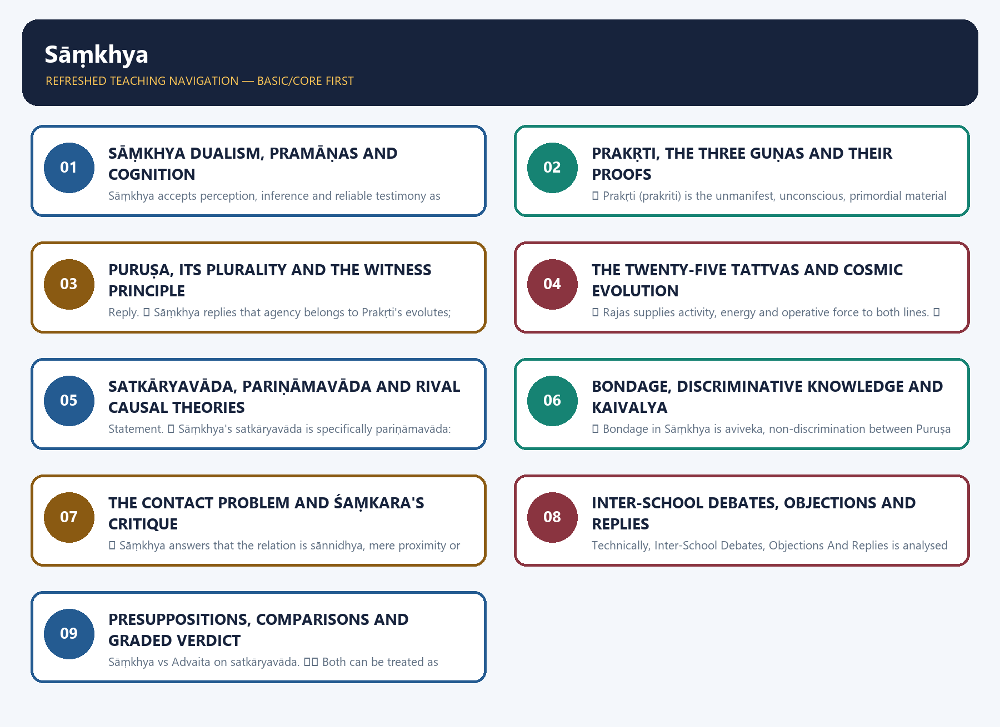
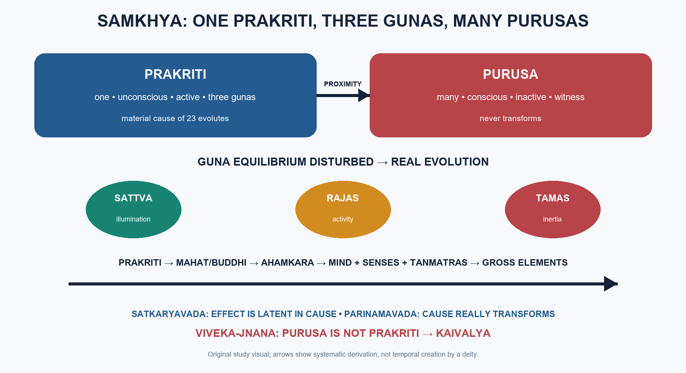

# Sāṃkhya — Learner-v2 Source-Complete Learning Session

> **Catalogue identity:** Philosophy Optional · Philosophy Paper I — Indian Philosophy · `philosophy-paper-i-indian-philosophy-05`  
> **Generation:** g2, 21 August 2026 · **Supersedes:** `philosophy-paper-i-indian-philosophy-05:legacy-v1:g1` · **Approval:** pending explicit topic approval  
> **Evidence discipline:** doctrine and PYQ wording/year/marks are controlled by repository owners. Model answers are independent pedagogic practice, never official UPSC keys.

### Package practice counts

| Component | Count |
|---|---:|
| Direct verified topic-owned PYQs | 10 |
| Core diagnostic MCQs | 40 |
| Remedial diagnostic MCQs | 8 |
| Total diagnostics | 48 |
| Original solved Mains models | 6 (2 × 10, 2 × 15, 2 × 20) |
| Consolidated register parts | 12 (A–L) |
| Approval | false |


## BASIC LEARNING SESSION



*Distinct embedded teaching-navigation image. The separate continuous Cārvāka-style flowchart package remains an independent at-a-glance artifact.*
### Source-complete coverage ledger and answer-worthiness labels

| Source corpus | Final location | Retention decision |
|---|---|---|
| Layered Simple/Core/Exam/Rapid material | Basic Learning Session | Complete eight-subtopic teaching sequence retained |
| Layered Advanced material | Optional Advanced | Every advanced synthesis retained after practice |
| Canonical owner | Reconciled through layered session | Epistemology, Prakṛti, Puruṣa, evolution, causation and liberation retained |
| Legacy solved workbook | PYQs and Answer Practice | All ten solved PYQs preserved and improved |
| Premium diagnostic replacement | MCQs / Remediation | Legacy 24+8 set expanded to genuine 40+8 with strict rotation |
| Original practice | PYQs and Answer Practice | Six solved non-PYQ models replace the legacy three-model set |
| Consolidated register | Final section | A–L retrieval framework covers every printed syllabus limb |

**Answer-worthiness.** Prakṛti, Puruṣa, three guṇas, the twenty-five tattvas, *satkāryavāda/parināmavāda*, bondage and *kaivalya* are **CORE SYLLABUS**. The three-pramāṇa scheme, one-Prakṛti proof, Puruṣa plurality, contact problem and Śaṃkara’s *pradhāna-malla* critique are **CORE SUPPORTING DEPTH**. Unsupported modern policy claims are excluded.
### SESSION 1 — SĀṂKHYA DUALISM, PRAMĀṆAS AND COGNITION

#### DEFINITION / WHAT THIS IS CALLED

**Plain-language definition:** Sāṃkhya is a realist dualism that distinguishes unconscious Prakṛti from many conscious Puruṣas and explains experience through their apparent conjunction.

**Technical definition:** Sāṃkhya accepts perception, inference and reliable testimony as pramāṇas, using inference to establish supersensible Prakṛti and Puruṣa.

#### ANSWER-GRABBING OPENING — WRITE/ADAPT IN THE EXAM

> The system's epistemology supports its dualism: cognition belongs to the material internal organ, while consciousness belongs to the witnessing Puruṣa.

#### MUST-WRITE KEYWORDS

- **Sāṃkhya**
- **Prakṛti**
- **Puruṣa**
- **pramāṇa**
- **buddhi**
- **antaḥkaraṇa**
- **reflection**
- **dualism**

**How to use them:** Frame the answer through Sāṃkhya; define Prakṛti, connect Puruṣa with pramāṇa to explain the mechanism, and use buddhi for the decisive comparison or qualification.

✅ **Search finding:** A live August 2026 search repeated a non-official claim that a national “Sāṃkhya paradigm” entered Indian mental-health policy; no official government source verified it. A February 2026 academic lecture on Puruṣa and Prakṛti is educational context only.  
⚠️ **Inference:** Contemporary mind–body comparisons may clarify the doctrine, but must not be presented as official adoption or as evidence for classical metaphysics.



| Principle | Nature | Function |
|---|---|---|
| Prakṛti | one, unconscious, active, three-guṇa root | evolves into the objective and psychomental world |
| Puruṣa | many, conscious, inactive witnesses | supplies awareness without producing change |
| Jīva | Puruṣa apparently identified with subtle body | locus of bondage and transmigration |
| Kaivalya | discriminative isolation | recognition that Puruṣa is never Prakṛti |

> **Master verdict:** Sāṃkhya is a realist dualism and evolutionism: Prakṛti transforms, Puruṣa witnesses, and liberation occurs through discriminating their radical difference.


#### How to use this layered session

Every logical subtopic follows the Philosophy five-layer sequence:

| Layer | Purpose |
|---:|---|
| 1. SIMPLE START | Plain-language visual gateway |
| 2. CORE UPSC | Complete retained doctrine, terminology, arguments and examples |
| 3. ADVANCED | Objections, replies, comparisons and qualified evaluation |
| 4. EXAM APPLICATION | Verified PYQ routing and marks-wise answer structure |
| 5. RAPID REVISION | Traps, recall spines and mastery preparation |

**Source audit:** the canonical Samkhya knowledge file and complete 2018-2025 Indian Philosophy PYQ bank were checked. The source session's direct OCR anchors to Chatterjee-Datta and C. D. Sharma are retained. A fresh August 2026 search again surfaced an unsupported claim of official adoption of a national "Samkhya Paradigm"; because no official source verifies it, the claim remains excluded. Qdrant was not required.

**Preservation note:** every substantive section of the earlier complete session is retained. The new material adds simple visual gateways and explicit learning layers without replacing or compressing the original depth.


---

Progress: 1 / 8  |  Philosophy Layered Session  |  Subtopic: System Map and Epistemology: How Samkhya Proves the Unseen

> **ANSWER-GRABBING LINE — WRITE/ADAPT IN THE EXAM (RECOMMENDED OPENING DEFINITION):** “Sāṃkhya (the enumerative dualist school) is a realist dualism in which three pramāṇas (means of valid knowledge) establish one unconscious Prakṛti (primordial material nature) and many conscious Puruṣas (pure witnesses).”


#### LAYER 1 - SIMPLE START

#### Plain-language visual - one world-process and many witnesses

```text
ONE PRAKRITI                     MANY PURUSAS
unconscious, active              conscious, inactive
three gunas                      pure witnesses
          \                      /
           \ mere proximity     /
            v                  v
         experience, bondage and liberation

How are they known?
perception + inference + reliable testimony
```

**In simple words:** Samkhya says everything objectifiable—including mind and intellect—belongs to Prakriti. Consciousness itself is Purusa. Because neither root Prakriti nor Purusa is ordinarily perceived, the system must infer them.

| Pramana | Easy role |
|---|---|
| Perception | Knows presented objects |
| Inference | Reaches causes and imperceptible principles |
| Testimony | Trustworthy verbal knowledge |
| Samanyato-drsta inference | Decisive route to Prakriti and Purusa |

> **Memory line:** three means of knowledge support two ultimate realities.

#### LAYER 2 - CORE UPSC

#### 0. ONE-SCREEN MAP

```text
SĀṂKHYA (Samkhya) = radical dualism + realist evolutionism + nirīśvara soteriology

ULTIMATE REALITIES
Puruṣa = pure consciousness, many, inactive, witness
Prakṛti = one, unconscious, material root, three guṇas in equilibrium

KEY MOVE
Puruṣa's mere proximity to Prakṛti disturbs guṇa-equilibrium
→ evolution of 23 further tattvas
→ experience, bondage, striving, discrimination
→ kaivalya when Puruṣa knows: "I am not Prakṛti"

DOCTRINAL PILLARS
Prakṛti    → inferred unmanifest root (pradhāna / avyakta)
Puruṣa     → inferred conscious witness distinct from guṇas
Causation  → satkāryavāda + pariṇāmavāda
Liberation → viveka-jñāna, not divine grace

EXAM HOTSPOTS
2019 → one Prakṛti? · jīva vs puruṣa
2021 → three guṇas and guṇa-pariṇāma
2022 → proofs for Puruṣa
2023 → Śaṃkara on puruṣa–prakṛti relation
2024 → full tattva evolution; buddhi/mahat/ahaṃkāra
2025 → why Śaṃkara treats Sāṃkhya as pradhāna-malla
```

> ⚠️ **Fast memory line:** one Prakṛti, many Puruṣas, real evolution, no God, liberation by discrimination.


#### A. SĀṂKHYA EPISTEMOLOGY — PRAMĀṆA AND COGNITION

#### 0A.1 The three-pramāṇa scheme

**Statement.** ✅ Sāṃkhya admits exactly **three pramāṇas** (valid means of knowledge): **dṛṣṭa / pratyakṣa** (perception), **anumāna** (inference) and **āptavacana / śabda** (reliable testimony).

**Statement.** ✅ Other proposed pramāṇas — **upamāna** (comparison), **arthāpatti** (postulation), **anupalabdhi** (non-apprehension), **sambhava** (inclusion/probability) and **aitihya** (traditional report) — are not rejected as useless; they are reduced to, or included within, these three.

**Exam use.** ⚠️ This epistemology is the hinge of the whole system: because **mūla-prakṛti** (root Prakṛti) and **puruṣa** are not sense-objects, Sāṃkhya must show how they can still be known without multiplying pramāṇas.
#### 0A.2 Definitions of the three pramāṇas

**Statement.** ✅ **Dṛṣṭa / pratyakṣa** is the **prativiṣayādhyavasāya** (ascertainment with respect to a presented object) of objects through the sense-capacities in contact with them.

**Distinction.** ✅ **Anumāna** is threefold:

| Type of anumāna | Meaning | Example |
|---|---|---|
| **pūrvavat** | ✅ From an antecedent cause/sign to a later effect | ✅ Clouds → likely rain |
| **śeṣavat** | ✅ From an effect/residue back to its cause or wider ground | ✅ Tasting one drop of seawater → seawater is salty |
| **sāmānyato-dṛṣṭa** | ✅ From a general correlation where the connection between the terms is not itself directly perceived | ✅ Seeing the sun in different positions → the sun moves |

**Statement.** ✅ **Āptavacana / śabda** is the word of a trustworthy source, pre-eminently **Veda / śruti**, where the speaker or text is not defective and the object is not otherwise easily known.
#### 0A.3 Reduction of other candidate pramāṇas

| Candidate pramāṇa | Sāṃkhya reduction | One-line reason |
|---|---|---|
| **upamāna** | ✅ Included in inference/testimony | ✅ Similarity works because a prior verbal report is applied inferentially to a present case. |
| **arthāpatti** | ✅ Included in inference | ✅ Postulation is an inference to the best explanatory condition; it does not need a separate instrument. |
| **anupalabdhi** | ✅ Included under perception's failure-conditions, not a separate pramāṇa | ✅ Non-perception means the conditions for perceiving the object are absent or the object is unavailable; no new instrument is required. |
| **sambhava** | ✅ Included in inference | ✅ Inclusion from a larger unit to a smaller or probable implication is inferential dependence. |
| **aitihya** | ✅ Included in testimony when reliable, otherwise rejected | ✅ Mere tradition has force only when it becomes trustworthy verbal cognition. |


#### 0A.4 Why sāmānyato-dṛṣṭa inference is decisive

**Statement.** ✅ **Avyakta / mūla-prakṛti** and **puruṣa** are both **atīndriya** (beyond the senses): neither is an object of ordinary perception.

**Statement.** ✅ Their imperceptibility is not proof of non-existence; the standard non-perception discussion assigns mūla-prakṛti's imperceptibility to **saukṣmya** (subtlety), and Puruṣa is likewise atīndriya rather than non-existent.

**Distinction.** ✅ Sāṃkhya lists standard causes of non-perception: excessive distance, excessive proximity, defect of the organ, inattention of mind, subtlety, obstruction by an intervening object, being overpowered by something else, and admixture with like things.

**Argument.** ⚠️ Since perception cannot reach atīndriya entities, and testimony alone would beg the question against non-Vedic opponents, the argumentative burden falls on **anumāna**, specifically **sāmānyato-dṛṣṭa anumāna**.

**Argument.** ⚠️ Sāmānyato-dṛṣṭa inference can reach a term that is in principle imperceptible because it does not require the vyāpti (invariable relation) to be established by seeing both terms together; it works through a general correlation of kinds.

**Conclusion.** ⚠️ Therefore the five arguments for Prakṛti and the arguments for Puruṣa are not rhetorical flourishes; they discharge an epistemological obligation created by Sāṃkhya's own three-pramāṇa scheme.

**Exam use.** ⚠️ A strong answer should write: **Sāṃkhya first restricts pramāṇas to three, then uses sāmānyato-dṛṣṭa inference to justify the two entities that perception cannot give — Prakṛti and Puruṣa.**
#### 0A.5 Presupposition and objections

**Presupposition.** ⚠️ Sāṃkhya presupposes that inference from general correlation can legitimately reach an entity of a kind never itself observed as a sense-object.

**Objection.** ❓ **Cārvāka:** vyāpti cannot be secured for a term never perceived; therefore inference to mūla-prakṛti or puruṣa is speculative.

**Reply.** ⚠️ Sāṃkhya answers that strict perceptualism cannot explain ordinary causal reasoning either; manifest, dependent, purposive and objectifiable experience demands an unmanifest material ground and a conscious witness.

**Objection.** ❓ **Nyāya:** sāmānyato-dṛṣṭa inference is legitimate, but Sāṃkhya overuses it; a plurality of atoms plus an intelligent Īśvara explains the ordered world more economically than an unobservable material first cause.

**Reply.** ⚠️ Sāṃkhya replies that the continuity between cause and effect, the guṇa-character of experience, and the determinacy of production are better explained by a single material Prakṛti; adding Īśvara is unnecessary because it does not explain the material continuity itself.
#### 0A.6 Theory of cognition: antaḥkaraṇa and reflection

**Statement.** ✅ The **antaḥkaraṇa** (inner instrument) has three functions: **buddhi** (determinative intellect), **ahaṃkāra** (I-maker) and **manas** (coordinating mind).

**Statement.** ✅ The full **trayodaśa-karaṇa** (thirteen-fold instrument) consists of 3 internal organs + 5 **buddhīndriyas / jñānendriyas** (cognitive sense-capacities) + 5 **karmendriyas** (action-capacities).

| Instrument | Function |
|---|---|
| **buddhi** | ✅ Final ascertainment (**adhyavasāya**), judgement, discrimination |
| **ahaṃkāra** | ✅ Appropriation as "I" and "mine" |
| **manas** | ✅ Coordination, attention, synthesis of sense-data |
| **five buddhīndriyas** | ✅ Cognitive access to sound, touch, form, taste and smell |
| **five karmendriyas** | ✅ Speech, grasping, movement, excretion and reproduction/action-functions |

**Distinction.** ✅ The external faculties function as **dvāra** (doors), while the inner organ functions as **dvārin** (doorkeeper/door-supervisor) because it receives, coordinates and determines what enters cognition.

**Statement.** ✅ **Buddhi alone makes the final ascertainment (adhyavasāya)**; manas only coordinates and ahaṃkāra only appropriates.

**Argument.** ✅ Buddhi is sattva-predominant and therefore transparent; it reflects Puruṣa's consciousness through **puruṣa-cchāyā-āpatti / buddhi-pratibimba** (falling of Puruṣa's shadow/reflection in buddhi).

**Conclusion.** ⚠️ Cognition seems conscious although buddhi is **jaḍa** (insentient), because reflected consciousness illuminates buddhi's operations.

**Statement.** ✅ This reflection generates **abhimāna** (false appropriation: "I am the doer/knower/enjoyer"), and that abhimāna is the psychological root of bondage.

**Exam use.** ⚠️ For Sāṃkhya, the mind does not know by itself and Puruṣa does not act by itself; empirical knowing is a reflected-consciousness event in buddhi.
#### LAYER 4 - EXAM APPLICATION

#### Exam route

- Begin broad answers with: **one Prakriti, many Purusas, three gunas, twenty-five tattvas, liberation by discrimination**.
- For metaphysical proofs, first explain why perception cannot establish the two ultimate principles.
- Distinguish buddhi's determination, ahamkara's appropriation and manas's coordination.
- Evaluate whether inference from objectifiable experience genuinely establishes a wholly non-objective witness.

#### LAYER 5 - RAPID REVISION

#### Rapid recall

- Three pramanas: perception, inference and testimony.
- Samanyato-drsta inference reaches imperceptible principles.
- Inner organ: buddhi + ahamkara + manas.
- Buddhi is material and insentient despite reflected consciousness.
- Trap: Purusa does not perform cognition as a changing mental act.

---

Progress: 2 / 8  |  Philosophy Layered Session  |  Subtopic: Prakriti and the Three Gunas: One Material Root of Diversity

> **ANSWER-GRABBING LINE — WRITE/ADAPT IN THE EXAM (RECOMMENDED OPENING DEFINITION):** “Prakṛti (primordial material nature) is the one unmanifest material root whose three guṇas (constituent qualities)—illumination, activity and restraint—explain both psychological and cosmic diversity through changing proportions.”


#### LAYER 1 - SIMPLE START

#### Plain-language visual - equilibrium becomes evolution

```text
SATTVA = illumination
RAJAS  = activity
TAMAS  = inertia

balanced proportions     -> unmanifest Prakriti
disturbed proportions    -> differentiated world
```

**In simple words:** Prakriti is not merely physical matter. It is the common source of body, senses, mind, ego and intellect. Its three inseparable tendencies explain clarity, motion and resistance across both psychology and cosmology.

| Name | Emphasis |
|---|---|
| Prakriti | Productive material nature |
| Pradhana | Chief material principle |
| Avyakta | Unmanifest state |
| Samyavastha | Equilibrium of the gunas |

> **Memory line:** one unmanifest guna-equilibrium unfolds into all objective diversity.

#### LAYER 2 - CORE UPSC

#### CLOSING RECALL FLOW — SĀṂKHYA DUALISM, PRAMĀṆAS AND COGNITION

```text
START / CONCEPT: SĀṂKHYA DUALISM, PRAMĀṆAS AND COGNITION
        |
        v
EXACT TERMS: Sāṃkhya · Prakṛti · Puruṣa · pramāṇa · buddhi · antaḥkaraṇa · reflection · dualism
        |
        v
MECHANISM / ARGUMENT: The internal organ takes the form of an object and appears conscious when Puruṣa's awareness is reflected in it.
        |
        v
CONSEQUENCE / CONTRAST: Experience is possible without making matter conscious or consciousness an agent, but the relation between the two principles becomes the system's central difficulty.
        |
        v
UPSC TRAP / ANSWER-USE: Do not identify Puruṣa with mind, ego or buddhi, because all three psychological functions belong to evolved Prakṛti.
        |
        v
ANSWER-GRABBING FORMULATION: The system's epistemology supports its dualism: cognition belongs to the material internal organ, while consciousness belongs to the witnessing Puruṣa.
```
### SESSION 2 — PRAKṚTI, THE THREE GUṆAS AND THEIR PROOFS

#### DEFINITION / WHAT THIS IS CALLED

**Plain-language definition:** ✅ Pradhāna emphasizes that Prakṛti is the chief material principle. ✅ Avyakta emphasizes that it is unmanifest prior to differentiated evolution. ⚠️ An exam-safe definition: Prakṛti is the avyakta pradhāna, the unmanifest chief material principle constituted by the three guṇas.

**Technical definition:** ✅ Prakṛti (prakriti) is the unmanifest, unconscious, primordial material principle from which the entire objective and psycho-physical world evolves. ✅ It is also called pradhāna (chief principle) because it is the primary material basis of all empirical manifestation. ✅ It is called avyakta (unmanifest) because in its primordial condition it is not yet differentiated into manifest tattvas. ✅ It is not a created entity; it is the ultimate material cause of the world within Sāṃkhya's dualist ontology. ⚠️ In exam language, Prakṛti is not merely "matter" in the modern physicalist sense; it includes the roots of intellect, ego, mind, senses, subtle elements and gross elements.

#### ANSWER-GRABBING OPENING — WRITE/ADAPT IN THE EXAM

> “Puruṣa (the pure conscious witness) is inactive, non-objectifiable and distinct from every product of Prakṛti, while jīva (the empirical embodied self) is Puruṣa apparently identified with intellect, ego and the subtle body.”.

#### MUST-WRITE KEYWORDS

- **Prakṛti**
- **The Three Guṇas**
- **Their Proofs**
- **Prakṛti (prakriti)**
- **pradhāna**
- **avyakta**

**How to use them:** Frame the answer through Prakṛti; define The Three Guṇas, connect Their Proofs with Prakṛti (prakriti) to explain the mechanism, and use pradhāna for the decisive comparison or qualification.

#### 1.1 Statement

- ✅ **Prakṛti (prakriti)** is the unmanifest, unconscious, primordial material principle from which the entire objective and psycho-physical world evolves.
- ✅ It is also called **pradhāna** (chief principle) because it is the primary material basis of all empirical manifestation.
- ✅ It is called **avyakta** (unmanifest) because in its primordial condition it is not yet differentiated into manifest tattvas.
- ✅ It is not a created entity; it is the ultimate **material cause** of the world within Sāṃkhya's dualist ontology.
- ⚠️ In exam language, Prakṛti is not merely "matter" in the modern physicalist sense; it includes the roots of intellect, ego, mind, senses, subtle elements and gross elements.
#### 1.2 Why Sāṃkhya needs Prakṛti

- ✅ The world is marked by plurality, transformation, dependence, teleology and structured manifestation.
- ✅ A school that accepts real effects, real bondage and real liberation needs a real material source from which empirical diversity emerges.
- ✅ Since Puruṣa is changeless and inactive, it cannot itself become the world.
- ✅ Therefore a second principle is required: active but unconscious Prakṛti.
#### 1.3 The five arguments for the existence of Prakṛti

- ✅ Sāṃkhya argues for Prakṛti by inference. The standard cluster of arguments is central to UPSC.
#### (1) **bhedānāṃ parimāṇāt** — from the finitude and determinateness of things
- ✅ Empirical things are many, finite, delimited and measurable.
- ✅ What is finite and determinate points beyond itself to a more fundamental source from which such determinate forms arise.
- ✅ The manifold world therefore requires a common antecedent material ground.
- ⚠️ The force of the argument is not merely "every effect has a cause," but "the limited and differentiated presuppose a subtler ground from which limitation and differentiation emerge."
#### (2) **samanvayāt** — from the uniformity / homogeneity running through effects
- ✅ Effects display an underlying order and common pattern.
- ✅ Diverse products nevertheless reveal continuity of constitution and dependence.
- ✅ Such systematic coherence suggests a common material basis.
- ⚠️ This is an argument from coordinated diversity: if effects hang together, they are likely rooted in one underlying matrix.
#### (3) **kāryataḥ pravṛtteḥ** — from purposive activity directed toward effects
- ✅ The empirical order is not inert chaos; it is a field of production, activity and transformation.
- ✅ Productive activity presupposes a causal potency capable of issuing in determinate effects.
- ✅ Therefore there must be an underlying productive principle possessing the capacity for manifestation.
- ⚠️ Sāṃkhya here reasons from the fact of becoming to an abiding source of becoming.
#### (4) **kāraṇa-kārya-vibhāgāt** — from the distinction between cause and effect
- ✅ Cause and effect are distinguishable stages: the unmanifest source and the manifest product are not identical in appearance.
- ✅ If effects are manifest, multiple and differentiated, their cause must be a more basic, prior and subtler condition.
- ✅ Thus the manifest order implies an unmanifest causal matrix distinct from it as cause from effect.
- ⚠️ The point is not total disconnection: cause and effect are distinguishable without being unrelated.
#### (5) **avibhāgāt vaiśvarūpyasya** — from the undivided source of the diversified universe
- ✅ The world is astonishingly diverse, yet this diversity forms one interconnected cosmos.
- ✅ A diversified whole points back to an undivided source in which later differentiations are not yet separated.
- ✅ Therefore there must be an original unmanifest, undivided root of the whole world-process.
- ✅ **This is the proof that shows Prakṛti must be ONE.**
- ✅ UPSC 2019 directly tests this point: if the diversity of the world issues from an **undivided** source, that source cannot itself be many disconnected material ultimates; it must be singular.
- ⚠️ This is the strongest anti-pluralist argument at the level of material causation in Sāṃkhya.
#### 1.4 Which proof establishes that there can be only one Prakṛti?

- ✅ The proof is **avibhāgāt vaiśvarūpyasya**.
- ✅ Reason: if the entire articulated universe emerges from an undivided source, that source must itself be singular, not many independent primal materials.
- ⚠️ In a 10-marker, do not merely name the proof. Add the logical bridge: plurality at the root would undermine the inference to an undivided source of total cosmic diversity.
#### 1.5 The three guṇas (gunas)

| Guṇa | Core character | Affective tone | Main function in evolution |
|---|---|---|---|
| **sattva** | lightness, illumination, buoyancy | pleasure | revelation, clarity, manifestation, knowledge |
| **rajas** | activity, restlessness, propulsion | pain | energy, stimulation, movement, mediation |
| **tamas** | heaviness, obstruction, inertia | delusion | concealment, resistance, fixation, material density |

- ✅ **Sattva** is luminous, clear and upward-moving; it makes cognition and manifestation possible.
- ✅ **Rajas** is dynamic, agitating and projective; it supplies motion, effort and transition.
- ✅ **Tamas** is heavy, obscuring and resistant; it produces inertia, concealment and confusion.
- ✅ Pleasure is associated with sattva, pain with rajas, delusion with tamas.
- ⚠️ The guṇas are not three separable substances but three inseparable constitutive tendencies within one Prakṛti.
#### 1.6 Equilibrium and disturbance

- ✅ Before manifestation, the three guṇas exist in equilibrium called **sāmyāvasthā**.
- ✅ In this state Prakṛti is **avyakta**, unmanifest.
- ✅ Manifest evolution begins when this equilibrium is disturbed in the presence of Puruṣa.
- ⚠️ Disturbance should not be imagined as mechanical collision; Sāṃkhya speaks of functional activation in proximity.
#### 1.7 Guṇa-pariṇāma

#### **sarūpa-pariṇāma** — homogeneous transformation
- ✅ In equilibrium, each guṇa transforms within its own nature.
- ✅ This is **sarūpa-pariṇāma**, same-form transformation.
- ⚠️ It preserves the idea that Prakṛti is dynamic even in the unmanifest state without yet producing differentiated effects.
#### **virūpa-pariṇāma** — heterogeneous transformation
- ✅ When equilibrium is disturbed, the guṇas enter asymmetrical relations and produce differentiated evolutes.
- ✅ This is **virūpa-pariṇāma**, heterogeneous transformation.
- ✅ Actual cosmological evolution belongs to virūpa-pariṇāma.
- ✅ UPSC 2021 on the guṇas and their modifications directly maps here.
#### 1.8 Prakṛti as pradhāna and avyakta

- ✅ **Pradhāna** emphasizes that Prakṛti is the chief material principle.
- ✅ **Avyakta** emphasizes that it is unmanifest prior to differentiated evolution.
- ⚠️ An exam-safe definition: **Prakṛti is the avyakta pradhāna, the unmanifest chief material principle constituted by the three guṇas.**
#### LAYER 4 - EXAM APPLICATION

#### Exam route

- **2019 Q8(c):** identify *avibhagat vaisvarupyasya*, then supply the logical bridge from unified diversity to one root.
- **2021 Q6(b):** define all three gunas, show their mutual dependence and distinguish homogeneous from heterogeneous modification.
- Do not call the gunas optional qualities; they are Prakriti's constitutive factors.
- Add the teleology problem: how can an unconscious root evolve for another's sake?

#### LAYER 5 - RAPID REVISION

#### Rapid recall

- Prakriti: one, eternal, unconscious, unmanifest material cause.
- Sattva illuminates; rajas activates; tamas restrains.
- Equilibrium = avyakta; disequilibrium = manifest evolution.
- Avibhagat vaisvarupyasya supports one Prakriti.
- Trap: Prakriti includes mind and intellect, not only gross matter.

---

Progress: 3 / 8  |  Philosophy Layered Session  |  Subtopic: Purusa: Pure Consciousness, Plurality and the Empirical Jiva

> **ANSWER-GRABBING LINE — WRITE/ADAPT IN THE EXAM (RECOMMENDED OPENING DEFINITION):** “Puruṣa (the pure conscious witness) is inactive, non-objectifiable and distinct from every product of Prakṛti, while jīva (the empirical embodied self) is Puruṣa apparently identified with intellect, ego and the subtle body.”


#### LAYER 1 - SIMPLE START

#### Plain-language visual - witness is not the mental screen

```text
BODY -> SENSES -> MANAS -> AHAMKARA -> BUDDHI
                 all are observable Prakriti
                              |
                              v
                   reflected consciousness
                              |
                         PURUSA witnesses
```

**In simple words:** even the mind is an object in Samkhya. Purusa is the unchanging consciousness to which bodily and mental states appear. The empirical jiva is Purusa seemingly tied to intellect, ego and the subtle body.

| Purusa | Prakriti's evolutes |
|---|---|
| Conscious | Unconscious |
| Inactive | Active |
| Changeless | Transforming |
| Witness | Seen and used |

> **Memory line:** the knower of every change cannot be one more changing object.

#### LAYER 2 - CORE UPSC

#### CLOSING RECALL FLOW — PRAKṚTI, THE THREE GUṆAS AND THEIR PROOFS

```text
START / CONCEPT: PRAKṚTI, THE THREE GUṆAS AND THEIR PROOFS
        |
        v
EXACT TERMS: Prakṛti · The Three Guṇas · Their Proofs · Prakṛti (prakriti) · pradhāna · avyakta
        |
        v
MECHANISM / ARGUMENT: ✅ Pradhāna emphasizes that Prakṛti is the chief material principle. ✅ Avyakta emphasizes that it is unmanifest prior to differentiated evolution. ⚠️ An exam-safe definition: Prakṛti is the avyakta pradhāna, the unmanifest chief material principle constituted by the three guṇas.
        |
        v
CONSEQUENCE / CONTRAST: The standard cluster of arguments is central to UPSC. ✅ Empirical things are many, finite, delimited and measurable. ✅ What is finite and determinate points beyond itself to a more fundamental source from which such determinate forms arise. ✅ The manifold world therefore requires a common antecedent material ground. ⚠️ The force of the argument is not merely "every effect has a cause," but "the limited and differentiated presuppose a subtler ground from which limitation and differentiation emerge." ✅ Effects display an underlying order and common pattern. ✅ Diverse products nevertheless reveal continuity of constitution and dependence. ✅ Such systematic coherence suggests a common material basis. ⚠️ This is an argument from coordinated diversity: if effects hang together, they are likely rooted in one underlying matrix. ✅ The empirical order is not inert chaos; it is a field of production, activity and transformation. ✅ Productive activity presupposes a causal potency capable of issuing in determinate effects. ✅ Therefore there must be an underlying productive principle possessing the capacity for manifestation. ⚠️ Sāṃkhya here reasons from the fact of becoming to an abiding source of becoming. ✅ Cause and effect are distinguishable stages: the unmanifest source and the manifest product are not identical in appearance. ✅ If effects are manifest, multiple and differentiated, their cause must be a more basic, prior and subtler condition. ✅ Thus the manifest order implies an unmanifest causal matrix distinct from it as cause from effect. ⚠️ The point is not total disconnection: cause and effect are distinguishable without being unrelated. ✅ The world is astonishingly diverse, yet this diversity forms one interconnected cosmos. ✅ A diversified whole points back to an undivided source in which later differentiations are not yet separated. ✅ Therefore there must be an original unmanifest, undivided root of the whole world-process. ✅ This is the proof that shows Prakṛti must be ONE. ✅ UPSC 2019 directly tests this point: if the diversity of the world issues from an undivided source, that source cannot itself be many disconnected material ultimates; it must be singular. ⚠️ This is the strongest anti-pluralist argument at the level of material causation in Sāṃkhya.
        |
        v
UPSC TRAP / ANSWER-USE: ✅ Before manifestation, the three guṇas exist in equilibrium called sāmyāvasthā. ✅ In this state Prakṛti is avyakta, unmanifest. ✅ Manifest evolution begins when this equilibrium is disturbed in the presence of Puruṣa. ⚠️ Disturbance should not be imagined as mechanical collision; Sāṃkhya speaks of functional activation in proximity.
        |
        v
ANSWER-GRABBING FORMULATION: “Puruṣa (the pure conscious witness) is inactive, non-objectifiable and distinct from every product of Prakṛti, while jīva (the empirical embodied self) is Puruṣa apparently identified with intellect, ego and the subtle body.”.
```
### SESSION 3 — PURUṢA, ITS PLURALITY AND THE WITNESS PRINCIPLE

#### DEFINITION / WHAT THIS IS CALLED

**Plain-language definition:** Statement. ✅ Sāṃkhya argues for Puruṣa as a distinct conscious principle because the entire objective complex is unconscious, instrumental and presented to experience.

**Technical definition:** Reply. ✅ Sāṃkhya replies that agency belongs to Prakṛti's evolutes; ascribing agency to Puruṣa is precisely the abhimāna that bondage consists in.

#### ANSWER-GRABBING OPENING — WRITE/ADAPT IN THE EXAM

> Pure consciousness, being without attribute, part, action or spatial location, admits no principle of individuation; therefore Sāṃkhya proves at most a plurality of cittas (mental streams), not Puruṣas.

#### MUST-WRITE KEYWORDS

- **Puruṣa**
- **Its Plurality**
- **The Witness Principle**
- **Puruṣa (purusha)**
- **saṅghāta-parārthatvāt**
- **saṅghāta**

**How to use them:** Frame the answer through Puruṣa; define Its Plurality, connect The Witness Principle with Puruṣa (purusha) to explain the mechanism, and use saṅghāta-parārthatvāt for the decisive comparison or qualification.

#### 2.1 Statement

- ✅ **Puruṣa (purusha)** is pure consciousness, self-luminous, inactive, changeless and beyond the guṇas.
- ✅ Consciousness is not a quality in Puruṣa; it is Puruṣa's very essence.
- ✅ Puruṣa is witness, seer and experiencer, but not agent in the productive sense.
#### 2.2 The five arguments for the existence of Puruṣa

**Statement.** ✅ Sāṃkhya argues for Puruṣa as a distinct conscious principle because the entire objective complex is unconscious, instrumental and presented to experience.
#### (1) **saṅghāta-parārthatvāt** — aggregates exist for another

**Statement.** ✅ Body, senses, mind and buddhi are **saṅghāta** (aggregates/complexes).

**Argument.** ✅ Aggregates function instrumentally; an instrument is for a user or beneficiary distinct from it.

**Conclusion.** ✅ Hence there must be a conscious Puruṣa for whose experience and release the aggregate functions.
#### (2) **triguṇādi-viparyayāt** — the witness must be other than the guṇas

**Statement.** ✅ The guṇas are objective, mutable and characterized by pleasure, pain and delusion.

**Argument.** ✅ The knower of pleasure, pain and delusion cannot be reducible to the same changing guṇic states that are known.

**Conclusion.** ✅ Therefore a non-guṇic conscious principle must be admitted.
#### (3) **adhiṣṭhānāt** — organized experience requires a presiding locus

**Statement.** ✅ Psychophysical life displays coordinated functioning rather than disconnected flashes.

**Argument.** ⚠️ Sāṃkhya infers a conscious support in whose presence the unconscious system becomes an experienced order.

**Conclusion.** ✅ This is not a God-proof; it is an inference to Puruṣa as the presiding witness of lived order.
#### (4) **bhoktṛ-bhāvāt** — experience requires an enjoyer

**Statement.** ✅ Pleasure, pain and delusion are experienced.

**Argument.** ✅ Since these are presented as objects or states, there must be a **bhoktṛ** (experiencer/enjoyer) distinct from them.

**Conclusion.** ✅ Unconscious Prakṛti can present experience, but it cannot be the subject for whom experience appears.
#### (5) **kaivalyārthaṃ pravṛtteḥ** — striving for liberation presupposes a liberable witness

**Statement.** ✅ Human striving for release from suffering is a central fact for Sāṃkhya.

**Argument.** ✅ Such striving would be unintelligible if there were no conscious principle distinct from bondage-producing Prakṛti.

**Conclusion.** ✅ The orientation toward **kaivalya** presupposes Puruṣa.
#### 2.3 Evaluation of the five proofs

- ⚠️ The proofs are cumulative, not isolated.
- ⚠️ Together they argue that aggregates are instrumental, guṇas are objectifiable, experience requires a witness, and liberation presupposes a self.
- ⚠️ Their epistemic form is **sāmānyato-dṛṣṭa anumāna**: from the general structure of objectifiable experience to a witness that is never itself an object.
- ✅ UPSC 2022 asked these proofs directly; list, explain and then briefly assess their cumulative force.
#### 2.4 Plurality of Puruṣas

**Statement.** ✅ Sāṃkhya holds that Puruṣas are many, not one.

**Distinction.** ⚠️ Plurality does not mean qualitative difference among Puruṣas; each Puruṣa is pure, inactive consciousness, but they are numerically many.
#### 2.4.1 Standard arguments for plurality

**Argument.** ✅ **From diversity of birth, death and sense-faculties:** if there were only one Puruṣa, the birth or death of one body would be the birth or death of all, and all would be blind when one is blind.

**Argument.** ✅ **From non-simultaneity of activity:** beings act at different times and in different ways; if there were one self, all embodied streams would act together.

**Argument.** ✅ **From differential distribution of the three guṇas:** beings differ as sattvic, rajasic or tamasic in temperament; this supports distinct centres of experience rather than one undifferentiated experiencer.

**Argument.** ✅ **From liberation of some and not others:** if the self were one, liberation of one would imply liberation of all; since some remain bound while another may be released, Puruṣas must be many.

**Exam use.** ⚠️ Present these as the standard arguments for plurality; do not tie them to an exact canonical count unless the question specifically demands textual enumeration.
#### 2.4.2 Presuppositions behind the plurality argument

| Presupposition | Why it matters |
|---|---|
| Empirical individuation transfers upward | ⚠️ Sāṃkhya assumes differences in bodies and mental streams license an inference to distinct Puruṣas. |
| Puruṣa is genuinely **bhoktṛ** | ⚠️ If experience has no owner, the question "whose pleasure or pain?" loses force. |
| Liberation is particular | ⚠️ Sāṃkhya treats liberation as attributable to a particular Puruṣa's psychophysical stream, not merely as the collapse of a universal illusion. |
| Numerical plurality of attributeless consciousness is intelligible | ⚠️ The school accepts numerical difference without qualitative difference. |

#### 2.4.3 Objections and replies

**Objection.** ❓ **Advaita / Śaṃkara:** every difference cited is a difference in **upādhis** (limiting adjuncts — bodies, minds, guṇa-configurations), not in consciousness itself. Pure consciousness, being without attribute, part, action or spatial location, admits no principle of individuation; therefore Sāṃkhya proves at most a plurality of **cittas** (mental streams), not Puruṣas.

**Reply.** ✅ Sāṃkhya replies that if there were one Puruṣa, the bondage of one would be the bondage of all and the release of one the release of all; the reflection model also requires distinct reflected loci in distinct buddhis.

**Residual force.** ⚠️ Advaita answers that bondage itself is adventitious and the many jīvas are apparent, so the exchange terminates in a clash of first principles: Sāṃkhya trusts the plurality given in experience, while Advaita subordinates plurality to the unity given in śruti.

**Objection.** ❓ **Nyāya:** Nyāya agrees that selves are many, but objects to a purely inactive self; an agent-less self cannot be the locus of moral desert, so Nyāya makes ātman a substance with adventitious cognition, volition and effort.

**Reply.** ✅ Sāṃkhya replies that agency belongs to Prakṛti's evolutes; ascribing agency to Puruṣa is precisely the **abhimāna** that bondage consists in.

**Objection.** ❓ **Buddhist:** a permanent, changeless and actionless entity is causally idle and therefore, by **arthakriyā** (efficacy), unreal.

**Reply.** ✅ Sāṃkhya replies that Puruṣa's efficacy is not productive causation but **sannidhi / sānnidhya** (mere presence) that renders Prakṛti's activity experienced; without Puruṣa the teleology of Prakṛti (**puruṣārtha**) is unintelligible.

**Objection.** ❓ **Internal objection:** if Puruṣas are all identical in nature — pure, attributeless consciousness — what makes them numerically many?

**Reply.** ⚠️ Sāṃkhya's honest answer is that plurality is inferred from the non-transferability of experience, bondage and liberation, but the ultimate individuation of qualitatively identical Puruṣas remains the school's weakest joint.
#### 2.4.4 Teleology of Prakṛti for Puruṣa

**Statement.** ✅ Prakṛti acts for **puruṣārtha** — the sake of Puruṣa — by providing experience and finally the possibility of discriminative release.

**Example.** ✅ Prakṛti is said to function **like milk flowing for the calf**: unconscious, yet serving a purposive end.

**Example.** ✅ Puruṣa and Prakṛti cooperate **like the lame man and the blind man**: Puruṣa can see but not act; Prakṛti can act but not see.

**Example.** ✅ Prakṛti is **like a dancer who retires once she has been seen**: after discriminative knowledge, she no longer performs binding activity for that Puruṣa.

**Example.** ✅ Prakṛti is also **like a modest woman who withdraws on being seen**: once her distinction from Puruṣa is disclosed, concealment ends.

**Objection.** ❓ Unconscious teleology appears incoherent because purposiveness seems to require intelligence.

**Reply.** ⚠️ Sāṃkhya replies that purposive functioning need not be conscious planning; the guṇa-structure naturally unfolds in the presence of Puruṣa, just as milk nourishes the calf without deliberation.
#### 2.5 Nature of Puruṣa

| Feature | Sāṃkhya position |
|---|---|
| Consciousness | essence, not quality |
| Activity | inactive, non-productive |
| Change | changeless, immutable |
| Relation to guṇas | entirely beyond them |
| Status | witness, seer, experiencer |

- ✅ Puruṣa does not become bound in its own nature; bondage belongs to misidentification.
- ✅ Puruṣa does not produce the world; all production belongs to Prakṛti.
#### 2.6 Jīva vs Puruṣa

- ✅ **Puruṣa** is the metaphysical reality: pure, inactive, changeless consciousness.
- ✅ **Jīva** is not a separate tattva.
- ✅ Jīva is Puruṣa as empirically appearing through identification with buddhi, ahaṃkāra, mind, body and karmic stream.
- ✅ Thus jīva is the conditioned empirical self, while Puruṣa is the unconditioned conscious reality behind it.
- ✅ UPSC 2019 directly asked the metaphysical status of jīva and puruṣa.
- ⚠️ Best formulation: **jīva is Puruṣa as empirically conditioned through buddhi; Puruṣa is the metaphysical reality behind that appearance.**
#### LAYER 4 - EXAM APPLICATION

#### Exam route

- **2018 Q5(e):** argue plurality through separate births, faculties, activity, karma and liberation; then raise individuation.
- **2019 Q5(d):** distinguish pure Purusa from empirically conditioned jiva.
- **2022 Q5(a):** list and evaluate all five proofs as a cumulative case.
- Never state that Purusa creates, changes, desires or acts.

#### LAYER 5 - RAPID REVISION

#### Rapid recall

- Purusa is pure, self-luminous, inactive and beyond the gunas.
- Five proofs: aggregate, contrast, presiding witness, experiencer, liberation-striving.
- Purusas are numerically many but qualitatively alike.
- Jiva is not a new tattva.
- Trap: consciousness is Purusa's essence, unlike Nyaya where it is a quality.

---

Progress: 4 / 8  |  Philosophy Layered Session  |  Subtopic: Twenty-Five Tattvas and Satkaryavada: Evolution as Real Transformation

> **ANSWER-GRABBING LINE — WRITE/ADAPT IN THE EXAM (CORE ARGUMENT):** “Satkāryavāda (the theory that the effect pre-exists potentially in its cause) and pariṇāmavāda (real transformation) make the evolution of twenty-five fundamental principles a manifestation of determinate causal powers rather than creation from non-being.”


#### LAYER 1 - SIMPLE START

#### Plain-language visual - from unmanifest root to experienced world

```text
PRAKRITI
   |
MAHAT / BUDDHI
   |
AHAMKARA
   +-- sattvika -> manas + 10 faculties
   +-- tamasa   -> 5 subtle elements -> 5 gross elements
   +-- rajas    -> energizes both lines

PURUSA = 25th tattva, never an evolute
```

**In simple words:** Samkhya's evolution joins cosmology and psychology. The same material principle produces the external world and the instruments through which it is experienced.

```text
MANGO SEED -> MANGO TREE
specific cause -> specific real transformation
the effect exists latently, not as a tiny visible tree
```

> **Memory line:** the world unfolds from what the cause is capable of becoming.

#### LAYER 2 - CORE UPSC

#### CLOSING RECALL FLOW — PURUṢA, ITS PLURALITY AND THE WITNESS PRINCIPLE

```text
START / CONCEPT: PURUṢA, ITS PLURALITY AND THE WITNESS PRINCIPLE
        |
        v
EXACT TERMS: Puruṣa · Its Plurality · The Witness Principle · Puruṣa (purusha) · saṅghāta-parārthatvāt · saṅghāta
        |
        v
MECHANISM / ARGUMENT: Statement. ✅ Sāṃkhya argues for Puruṣa as a distinct conscious principle because the entire objective complex is unconscious, instrumental and presented to experience.
        |
        v
CONSEQUENCE / CONTRAST: Conclusion. ✅ This is not a God-proof; it is an inference to Puruṣa as the presiding witness of lived order.
        |
        v
UPSC TRAP / ANSWER-USE: Distinction. ⚠️ Plurality does not mean qualitative difference among Puruṣas; each Puruṣa is pure, inactive consciousness, but they are numerically many.
        |
        v
ANSWER-GRABBING FORMULATION: Pure consciousness, being without attribute, part, action or spatial location, admits no principle of individuation; therefore Sāṃkhya proves at most a plurality of cittas (mental streams), not Puruṣas.
```
### SESSION 4 — THE TWENTY-FIVE TATTVAS AND COSMIC EVOLUTION

#### DEFINITION / WHAT THIS IS CALLED

**Plain-language definition:** ✅ Mahat and buddhi are the SAME tattva. ✅ Mahat is the cosmic aspect or name. ✅ Buddhi is the individual/psychological aspect or name. ✅ Ahaṃkāra emerges from buddhi/mahat as the principle of individuation or I-sense. ✅ Therefore the sequence is Prakṛti → mahat/buddhi → ahaṃkāra. ⚠️ This is a classic UPSC trap.

**Technical definition:** ✅ Rajas supplies activity, energy and operative force to both lines. ✅ Rājasa ahaṃkāra does not produce a separate set of tattvas. ⚠️ This must be written explicitly because it is repeatedly confused.

#### ANSWER-GRABBING OPENING — WRITE/ADAPT IN THE EXAM

> ✅ Mahat and buddhi are the SAME tattva. ✅ Mahat is the cosmic aspect or name. ✅ Buddhi is the individual/psychological aspect or name. ✅ Ahaṃkāra emerges from buddhi/mahat as the principle of individuation or I-sense. ✅ Therefore the sequence is Prakṛti → mahat/buddhi → ahaṃkāra. ⚠️ This is a classic UPSC trap.

#### MUST-WRITE KEYWORDS

- **The Twenty-Five Tattvas**
- **Cosmic Evolution**
- **Prakṛti**
- **mahat / buddhi**
- **ahaṃkāra**
- **manas**

**How to use them:** Frame the answer through The Twenty-Five Tattvas; define Cosmic Evolution, connect Prakṛti with mahat / buddhi to explain the mechanism, and use ahaṃkāra for the decisive comparison or qualification.

#### 3.1 Full sequence

```text
Prakṛti
  ↓
mahat / buddhi
  ↓
ahaṃkāra
  ├─ sāttvika line → manas + 5 jñānendriyas + 5 karmendriyas
  ├─ tāmasa line   → 5 tanmātras → 5 mahābhūtas
  └─ rājasa factor → supplies energy to both lines

Puruṣa = 25th tattva, but not an evolute of Prakṛti
```

#### 3.2 Ordered list

| No. | Tattva | Note |
|---|---|---|
| 1 | **Prakṛti** | root material cause |
| 2 | **mahat / buddhi** | first evolute |
| 3 | **ahaṃkāra** | principle of individuation |
| 4 | **manas** | internal coordinator |
| 5-9 | **five jñānendriyas** | cognitive senses |
| 10-14 | **five karmendriyas** | action faculties |
| 15-19 | **five tanmātras** | subtle elements |
| 20-24 | **five mahābhūtas** | gross elements |
| 25 | **Puruṣa** | pure consciousness, non-evolute |

#### 3.3 Mahat, buddhi and ahaṃkāra

- ✅ **Mahat and buddhi are the SAME tattva.**
- ✅ **Mahat** is the cosmic aspect or name.
- ✅ **Buddhi** is the individual/psychological aspect or name.
- ✅ **Ahaṃkāra** emerges **from** buddhi/mahat as the principle of individuation or I-sense.
- ✅ Therefore the sequence is **Prakṛti → mahat/buddhi → ahaṃkāra**.
- ⚠️ This is a classic UPSC trap. Never write mahat and buddhi as two separate stages.
#### 3.4 Buddhi

- ✅ Buddhi determines, judges, ascertains and discriminates.
- ✅ It is the locus where reflected consciousness is most conspicuous in empirical life.
- ⚠️ In psychology: manas coordinates, ahaṃkāra appropriates, buddhi determines.
#### 3.5 Ahaṃkāra

- ✅ Ahaṃkāra is the I-maker, the principle of individuation.
- ✅ It appropriates functions into the form "I know," "I act," "I experience."
- ⚠️ It is central to bondage because false selfhood crystallizes here.
#### 3.6 Sāttvika line

- ✅ From the sāttvika aspect of ahaṃkāra arise **manas**, **five jñānendriyas**, and **five karmendriyas**.
- ✅ This line accounts for the cognitive and conative equipment of empirical life.
#### 3.7 Tāmasa line

- ✅ From the tāmasa aspect of ahaṃkāra arise the **five tanmātras**.
- ✅ From the five tanmātras arise the **five mahābhūtas**.
- ✅ This line accounts for subtle-to-gross material manifestation.
#### 3.8 Rājasa factor

- ✅ Rajas supplies activity, energy and operative force to both lines.
- ✅ **Rājasa ahaṃkāra does not produce a separate set of tattvas.**
- ⚠️ This must be written explicitly because it is repeatedly confused.
#### 3.9 Why this sequence matters philosophically

- ✅ The sequence shows that cosmology and psychology are internally linked in Sāṃkhya.
- ✅ The same Prakṛti that yields matter also yields the faculties through which matter is experienced.
- ⚠️ UPSC 2024 as a 20-marker is exactly about narrating this structure cleanly and then explaining the buddhi/mahat/ahaṃkāra distinction.

#### CLOSING RECALL FLOW — THE TWENTY-FIVE TATTVAS AND COSMIC EVOLUTION

```text
START / CONCEPT: THE TWENTY-FIVE TATTVAS AND COSMIC EVOLUTION
        |
        v
EXACT TERMS: The Twenty-Five Tattvas · Cosmic Evolution · Prakṛti · mahat / buddhi · ahaṃkāra · manas
        |
        v
MECHANISM / ARGUMENT: ✅ Rajas supplies activity, energy and operative force to both lines. ✅ Rājasa ahaṃkāra does not produce a separate set of tattvas. ⚠️ This must be written explicitly because it is repeatedly confused.
        |
        v
CONSEQUENCE / CONTRAST: ✅ Buddhi determines, judges, ascertains and discriminates. ✅ It is the locus where reflected consciousness is most conspicuous in empirical life. ⚠️ In psychology: manas coordinates, ahaṃkāra appropriates, buddhi determines.
        |
        v
UPSC TRAP / ANSWER-USE: Do not miss this limiting distinction: ✅ Ahaṃkāra is the I-maker, the principle of individuation. ✅ It appropriates functions into...
        |
        v
ANSWER-GRABBING FORMULATION: ✅ Mahat and buddhi are the SAME tattva. ✅ Mahat is the cosmic aspect or name. ✅ Buddhi is the individual/psychological aspect or name. ✅ Ahaṃkāra emerges from buddhi/mahat as the principle of individuation or I-sense. ✅ Therefore the sequence is Prakṛti → mahat/buddhi → ahaṃkāra. ⚠️ This is a classic UPSC trap.
```
### SESSION 5 — SATKĀRYAVĀDA, PARIṆĀMAVĀDA AND RIVAL CAUSAL THEORIES

#### DEFINITION / WHAT THIS IS CALLED

**Plain-language definition:** ✅ Satkāryavāda holds that the effect pre-exists in its material cause. ✅ Production is manifestation, not creation out of sheer non-being. ✅ Sāṃkhya's specific form of satkāryavāda is pariṇāmavāda, the doctrine of real transformation.

**Technical definition:** Statement. ✅ Sāṃkhya's satkāryavāda is specifically pariṇāmavāda: the effect is a real transformation of the cause.

#### ANSWER-GRABBING OPENING — WRITE/ADAPT IN THE EXAM

> ✅ Satkāryavāda holds that the effect pre-exists in its material cause. ✅ Production is manifestation, not creation out of sheer non-being. ✅ Sāṃkhya's specific form of satkāryavāda is pariṇāmavāda, the doctrine of real transformation.

#### MUST-WRITE KEYWORDS

- **Satkāryavāda**
- **Pariṇāmavāda**
- **Rival Causal Theories**
- **asadakaraṇāt**
- **Nyāya**
- **upādāna-grahaṇāt**

**How to use them:** Frame the answer through Satkāryavāda; define Pariṇāmavāda, connect Rival Causal Theories with asadakaraṇāt to explain the mechanism, and use Nyāya for the decisive comparison or qualification.

#### 4.1 Statement

- ✅ **Satkāryavāda** holds that the effect pre-exists in its material cause.
- ✅ Production is manifestation, not creation out of sheer non-being.
- ✅ Sāṃkhya's specific form of satkāryavāda is **pariṇāmavāda**, the doctrine of real transformation.
#### 4.2 The five arguments for satkāryavāda

**Statement.** ✅ The standard Sāṃkhya set gives five reasons for holding that the effect pre-exists in its material cause.
#### (1) **asadakaraṇāt** — because what does not exist cannot be brought into being

**Statement.** ✅ A sheer non-entity cannot be produced.

**Argument.** ✅ No amount of causal operation can produce a hare's horn or oil from sand; production presupposes something determinate to be produced.

**Example.** ✅ A potter's effort can manifest a pot from clay, but it cannot manifest a square circle from nothing.

**Objection.** ❓ **Nyāya:** Sāṃkhya equivocates between the absolutely non-existent and the merely not-yet-existent; Nyāya denies only that the pot exists as a pot before production.

**Reply.** ⚠️ Sāṃkhya presses that the "not-yet-existent" effect must still be something in the material cause, otherwise the operation would have no determinate terminus.
#### (2) **upādāna-grahaṇāt** — because a determinate material cause is taken up

**Statement.** ✅ Specific effects require specific material causes.

**Argument.** ✅ One who wants curd takes milk, not water; one who wants cloth takes threads, not clay.

**Example.** ✅ The selection of mango seed rather than sand for a mango tree shows a determinate causal base.

**Objection.** ❓ The restriction may be explained by causal capacity rather than by the pre-existence of the effect.

**Reply.** ⚠️ Sāṃkhya replies that causal capacity in the required determinate sense just is the latent presence of that effect in that material continuum.
#### (3) **sarvasambhavābhāvāt** — because everything cannot arise from everything

**Statement.** ✅ If effects were wholly non-existent before production, any cause could produce any effect.

**Argument.** ✅ Non-existence as such is indistinguishable; therefore it cannot explain why curd arises from milk and not from water.

**Example.** ✅ Cloth comes from threads, not from milk; curd comes from milk, not from threads.

**Objection.** ❓ A rival can say that restrictions come from the constitution of causes, not from effects already existing in causes.

**Reply.** ⚠️ Sāṃkhya replies that a constitution capable of producing only X is precisely the latent presence of X as a determinate effect-potential.
#### (4) **śaktasya śakya-karaṇāt** — because the efficient can produce only what it is capable of producing

**Statement.** ✅ A cause has a determinate **śakti** (potency) directed toward a determinate effect.

**Argument.** ✅ A potency for X is unintelligible unless X is in some manner already there as the object of that potency.

**Example.** ✅ Milk has the potency for curd, not for cloth; threads have the potency for cloth, not for curd.

**Objection.** ❓ **Nyāya:** potency is a relational property of the cause, not the effect in latent form.

**Reply.** ⚠️ Sāṃkhya replies that a merely relational potency cannot explain determinate production unless the producible form is already grounded in the material cause.
#### (5) **kāraṇa-bhāvāt** — because the effect has the nature/being of the cause

**Statement.** ✅ The effect is non-different from the cause in substance.

**Argument.** ✅ Cloth is nothing over and above threads in a certain arrangement; it has the same material basis, weight and guṇa-continuity.

**Example.** ✅ Ornament and gold differ in form and name, but the material substance remains gold.

**Objection.** ❓ **Nyāya:** the whole (**avayavin**) is a new substance with new properties; a cloth covers, but separate threads do not.

**Reply.** ⚠️ Sāṃkhya replies that the new properties are new **saṃsthāna** (arrangements/configurations), not new substances created out of non-being.
#### 4.3 Why Sāṃkhya's satkāryavāda is pariṇāmavāda

**Statement.** ✅ Sāṃkhya's satkāryavāda is specifically **pariṇāmavāda**: the effect is a real transformation of the cause.

**Distinction.** ✅ It is not **vivartavāda**, because the world is not a mere appearance superimposed on an unchanged cause; it is the real evolution of Prakṛti.

**Argument.** ✅ The mechanism is **guṇa-pariṇāma**: the three guṇas transform and recombine to produce the differentiated tattvas.

**Distinction.** ✅ In **sarūpa-pariṇāma**, each guṇa transforms homogeneously within its own nature during **pralaya** or equilibrium; in **virūpa-pariṇāma**, the guṇas transform heterogeneously and generate the manifest evolutes.

**Objection.** ❓ If the effect already exists, causal effort becomes pointless.

**Reply.** ✅ Production is **abhivyakti** (manifestation) of what is latent; effort removes obstruction and supplies conditions, it does not create being out of non-being.

**Objection.** ❓ Satkāryavāda abolishes the distinction between cause and effect.

**Reply.** ✅ Cause and effect differ by **avasthā** (state): the cause is latent/unmanifest, the effect is patent/manifest.

**Objection.** ❓ Satkāryavāda implies the world was always exactly as it is now.

**Reply.** ✅ Sāṃkhya denies that the gross effect is already manifest; only the determinate capacity/effect-form exists latently in the cause.

**Exam use.** ⚠️ The mango-seed example should be written as latent effect + material continuity + real transformation, not as a miniature gross mango tree hidden inside the seed.
#### 4.4 Contrast with Advaita vivartavāda

| Issue | Sāṃkhya | Advaita Vedānta |
|---|---|---|
| Type of transformation | real | apparent |
| Technical term | **pariṇāma** | **vivarta** |
| Cause | Prakṛti | Brahman |
| Status of world | real evolute | ultimately appearance |

- ✅ Both may be placed under a broad satkārya orientation, but their accounts of transformation differ radically.
#### 4.5 Contrast with Nyāya asatkāryavāda

| Issue | Sāṃkhya | Nyāya-Vaiśeṣika |
|---|---|---|
| Effect before production | pre-existent in cause | absent as effect (prāgabhāva) |
| Production | manifestation | new beginning |
| Causal model | continuity through transformation | effect as fresh product |

- ✅ This contrast is directly relevant to the 2023 cross-link question on Nyāya prāgabhāva and Sāṃkhya causation.
#### 4.6 Contrast with Buddhist pratītyasamutpāda

- ✅ Buddhism explains becoming through dependent origination rather than an enduring unmanifest material root.
- ✅ Sāṃkhya explains becoming through transformation of enduring Prakṛti.
- ⚠️ A crisp contrast line is often enough unless the question explicitly asks for Buddhist comparison.
#### LAYER 4 - EXAM APPLICATION

#### Exam route

- **2020 Q7(a):** use the mango seed to explain latent effect, material continuity, specific potency and real transformation.
- **2024 Q7(a):** narrate the sequence exactly; mahat and buddhi are the same tattva, while ahamkara follows them.
- State explicitly that rajas energizes both lines and produces no separate tattva-set.
- Compare parinama with Nyaya arambha and Advaita vivarta only after completing the Samkhya case.

#### LAYER 5 - RAPID REVISION

#### Rapid recall

- Twenty-four Prakriti-side tattvas plus Purusa.
- Mahat = buddhi; ahamkara is the next stage.
- Satkaryavada: effect pre-exists latently.
- Parinamavada: material cause really transforms.
- Trap: no miniature gross tree is hidden in the seed.

---

Progress: 5 / 8  |  Philosophy Layered Session  |  Subtopic: Kaivalya, the Contact Problem and Sankara's Pradhana-Malla Critique

> **ANSWER-GRABBING LINE — WRITE/ADAPT IN THE EXAM (CRITICISM):** “Kaivalya (liberating isolation of consciousness) follows from viveka-jñāna (discriminative knowledge), but the system’s hardest burden is explaining how inactive consciousness and unconscious nature can sustain coordinated, purposive experience.”


#### LAYER 1 - SIMPLE START

#### Plain-language visual - bondage is mistaken identity

```text
BUDDHI acts and reflects consciousness
        |
AHAMKARA says "I know, I act, I suffer"
        |
PURUSA appears bound

VIVEKA-JNANA:
"All change belongs to Prakriti; I am the witness."
        |
KAIVALYA
```

**In simple words:** Purusa is never really transformed or tied. Bondage is non-discrimination; liberation is the stable recognition that the witness is distinct from every material and mental process.

| Analogy | Purpose |
|---|---|
| Lame and blind | Complementarity of consciousness and activity |
| Magnet and iron | Activation through proximity |
| Crystal and flower | Apparent colouring without real change |
| Dancer and spectator | Prakriti ceases display after being understood |

> **Memory line:** liberation separates by knowledge; it does not merge or destroy.

#### LAYER 2 - CORE UPSC

#### CLOSING RECALL FLOW — SATKĀRYAVĀDA, PARIṆĀMAVĀDA AND RIVAL CAUSAL THEORIES

```text
START / CONCEPT: SATKĀRYAVĀDA, PARIṆĀMAVĀDA AND RIVAL CAUSAL THEORIES
        |
        v
EXACT TERMS: Satkāryavāda · Pariṇāmavāda · Rival Causal Theories · asadakaraṇāt · Nyāya · upādāna-grahaṇāt
        |
        v
MECHANISM / ARGUMENT: The operative mechanism is that ✅ Satkāryavāda holds that the effect pre-exists in its material cause. ✅ Production is...
        |
        v
CONSEQUENCE / CONTRAST: Statement. ✅ Sāṃkhya's satkāryavāda is specifically pariṇāmavāda: the effect is a real transformation of the cause.
        |
        v
UPSC TRAP / ANSWER-USE: Do not miss this limiting distinction: reply. ⚠️ Sāṃkhya replies that causal capacity in the required determinate sense just is...
        |
        v
ANSWER-GRABBING FORMULATION: ✅ Satkāryavāda holds that the effect pre-exists in its material cause. ✅ Production is manifestation, not creation out of sheer non-being. ✅ Sāṃkhya's specific form of satkāryavāda is pariṇāmavāda, the doctrine of real transformation.
```
### SESSION 6 — BONDAGE, DISCRIMINATIVE KNOWLEDGE AND KAIVALYA

#### DEFINITION / WHAT THIS IS CALLED

**Plain-language definition:** ✅ Liberation is viveka-jñāna, discriminative knowledge that "I am not Prakṛti." ✅ When the distinction between witness-consciousness and guṇic evolutes becomes steady, false identification ends. ✅ This state is kaivalya, the aloneness or isolation of Puruṣa. ⚠️ Kaivalya is not merger; it is disentanglement.

**Technical definition:** ✅ Bondage in Sāṃkhya is aviveka, non-discrimination between Puruṣa and Prakṛti. ✅ Buddhi reflects consciousness, and this reflection creates false identification. ✅ The self then appears as agent, enjoyer, sufferer and knower in the empirical sense. ⚠️ Bondage is not real alteration in Puruṣa but mistaken identification through reflected consciousness.

#### ANSWER-GRABBING OPENING — WRITE/ADAPT IN THE EXAM

> ✅ Liberation is viveka-jñāna, discriminative knowledge that "I am not Prakṛti." ✅ When the distinction between witness-consciousness and guṇic evolutes becomes steady, false identification ends. ✅ This state is kaivalya, the aloneness or isolation of Puruṣa. ⚠️ Kaivalya is not merger; it is disentanglement.

#### MUST-WRITE KEYWORDS

- **Bondage**
- **Discriminative Knowledge**
- **Kaivalya**
- **aviveka**
- **viveka-jñāna**
- **Jīvanmukti**

**How to use them:** Frame the answer through Bondage; define Discriminative Knowledge, connect Kaivalya with aviveka to explain the mechanism, and use viveka-jñāna for the decisive comparison or qualification.

#### 5.1 Bondage as aviveka

- ✅ Bondage in Sāṃkhya is **aviveka**, non-discrimination between Puruṣa and Prakṛti.
- ✅ Buddhi reflects consciousness, and this reflection creates false identification.
- ✅ The self then appears as agent, enjoyer, sufferer and knower in the empirical sense.
- ⚠️ Bondage is not real alteration in Puruṣa but mistaken identification through reflected consciousness.
#### 5.2 Liberation as viveka-jñāna

- ✅ Liberation is **viveka-jñāna**, discriminative knowledge that "I am not Prakṛti."
- ✅ When the distinction between witness-consciousness and guṇic evolutes becomes steady, false identification ends.
- ✅ This state is **kaivalya**, the aloneness or isolation of Puruṣa.
- ⚠️ Kaivalya is not merger; it is disentanglement.
#### 5.3 Lame-and-blind analogy

- ✅ Puruṣa is like the lame: conscious but inactive.
- ✅ Prakṛti is like the blind: active but unconscious.
- ✅ Together they explain empirical process.
- ⚠️ The analogy conveys complementarity without collapsing the two principles into one.
#### 5.4 Dancer analogy

- ✅ Prakṛti is like a dancer who stops after being seen by Puruṣa.
- ✅ Once discriminative knowledge arises, Prakṛti no longer continues its binding display for that Puruṣa.
- ⚠️ This is the neatest canonical image for liberation through fulfilled disclosure.
#### 5.5 Jīvanmukti and videhamukti

- ✅ **Jīvanmukti** refers to liberation while the body still continues due to prior momentum.
- ✅ The standard analogy is the **potter's wheel** that keeps turning even after the impulse ceases.
- ✅ **Videhamukti** is the final cessation of embodiment when the body falls and residual momentum ends.
- ⚠️ In Sāṃkhya this remains isolation of consciousness, not union with God.
#### 5.6 Nirīśvara character of liberation

- ✅ No God is required for either bondage or liberation in classical Sāṃkhya.
- ✅ Prakṛti's teleological evolution for Puruṣa's experience and release is treated as sufficient.
- ⚠️ This is why classical Sāṃkhya must be clearly separated from theistic Yoga.

#### CLOSING RECALL FLOW — BONDAGE, DISCRIMINATIVE KNOWLEDGE AND KAIVALYA

```text
START / CONCEPT: BONDAGE, DISCRIMINATIVE KNOWLEDGE AND KAIVALYA
        |
        v
EXACT TERMS: Bondage · Discriminative Knowledge · Kaivalya · aviveka · viveka-jñāna · Jīvanmukti
        |
        v
MECHANISM / ARGUMENT: ✅ Prakṛti is like a dancer who stops after being seen by Puruṣa. ✅ Once discriminative knowledge arises, Prakṛti no longer continues its binding display for that Puruṣa. ⚠️ This is the neatest canonical image for liberation through fulfilled disclosure.
        |
        v
CONSEQUENCE / CONTRAST: ✅ Bondage in Sāṃkhya is aviveka, non-discrimination between Puruṣa and Prakṛti. ✅ Buddhi reflects consciousness, and this reflection creates false identification. ✅ The self then appears as agent, enjoyer, sufferer and knower in the empirical sense. ⚠️ Bondage is not real alteration in Puruṣa but mistaken identification through reflected consciousness.
        |
        v
UPSC TRAP / ANSWER-USE: ✅ Puruṣa is like the lame: conscious but inactive. ✅ Prakṛti is like the blind: active but unconscious. ✅ Together they explain empirical process. ⚠️ The analogy conveys complementarity without collapsing the two principles into one.
        |
        v
ANSWER-GRABBING FORMULATION: ✅ Liberation is viveka-jñāna, discriminative knowledge that "I am not Prakṛti." ✅ When the distinction between witness-consciousness and guṇic evolutes becomes steady, false identification ends. ✅ This state is kaivalya, the aloneness or isolation of Puruṣa. ⚠️ Kaivalya is not merger; it is disentanglement.
```
### SESSION 7 — THE CONTACT PROBLEM AND ŚAṂKARA'S CRITIQUE

#### DEFINITION / WHAT THIS IS CALLED

**Plain-language definition:** ✅ Unconscious prakṛti cannot be the Upaniṣadic cause because the Upaniṣadic source is described as conscious, knowing and sat-cit in character. ✅ The contact problem remains unresolved: inactive Puruṣa and unconscious Prakṛti cannot intelligibly relate. ✅ Teleology cannot be explained without consciousness: if Prakṛti evolves "for the sake of" Puruṣa, purposiveness seems to require intelligence. ✅ Texts describing the cause as knowing (tajjñaḥ-type descriptions) exclude jaḍa-prakṛti. ✅ UPSC 2025 makes this a 20-marker shared with Vedanta.md.

**Technical definition:** ✅ Sāṃkhya answers that the relation is sānnidhya, mere proximity or presence, not gross physical contact. ✅ Puruṣa does not push or alter Prakṛti by action. ✅ Prakṛti becomes active in the mere presence of Puruṣa.

#### ANSWER-GRABBING OPENING — WRITE/ADAPT IN THE EXAM

> “Sāṃkhya (the enumerative dualist school) integrates psychology, cosmology and liberation without a creator God, yet guṇa-explanation risks elasticity, Puruṣa-plurality lacks a clear individuator, and mere proximity does not fully solve the contact problem.”.

#### MUST-WRITE KEYWORDS

- **The Contact Problem**
- **Śaṃkara'S Critique**
- **sānnidhya**
- **Magnet and iron**
- **Crystal and flower**
- **pariṇāmavāda**

**How to use them:** Frame the answer through The Contact Problem; define Śaṃkara'S Critique, connect sānnidhya with Magnet and iron to explain the mechanism, and use Crystal and flower for the decisive comparison or qualification.

#### 6.1 The problem

- ✅ If Puruṣa is inactive and Prakṛti is unconscious, how can they relate at all?
- ✅ Yet the entire system depends on some relation between them to explain evolution, bondage and liberation.
- ✅ This is the famous contact problem, asked in 2023.
#### 6.2 Sāṃkhya response: proximity, not physical contact

- ✅ Sāṃkhya answers that the relation is **sānnidhya**, mere proximity or presence, not gross physical contact.
- ✅ Puruṣa does not push or alter Prakṛti by action.
- ✅ Prakṛti becomes active in the mere presence of Puruṣa.
#### 6.3 Analogies

- ✅ **Magnet and iron:** as a magnet moves iron without deliberative willing, Puruṣa's presence occasions Prakṛti's activity.
- ✅ **Crystal and flower:** as a clear crystal appears coloured by a nearby flower without itself changing, Puruṣa appears affected by Prakṛti without real transformation.
- ⚠️ The first analogy explains activation by presence; the second explains apparent contamination without real change.
#### 6.4 Śaṃkara's attack

- ✅ Śaṃkara argues that if Puruṣa is truly inactive and Prakṛti truly unconscious, no intelligible real relation is possible.
- ✅ The magnet analogy fails because even a magnet exerts force; if Puruṣa were like that, it would not be wholly inactive.
- ✅ The crystal analogy may explain appearance, but not the initiation of world-process.
- ✅ Therefore Sāṃkhya dualism appears unstable: either it collapses toward monism or it requires a third mediating principle.
- ✅ UPSC 2023 directly tests this critique of Sāṃkhya dualism.
#### 7. WHY ŚAṂKARA TREATS SĀṂKHYA AS PRADHĀNA MALLA

#### 7.1 Closest systematic rival

- ✅ Sāṃkhya is the most sophisticated non-Vedāntic rival to Advaita at the level of ultimate explanation.
- ✅ It explains world, self, bondage, liberation and causation through a coherent metaphysical system.
- ⚠️ It is therefore not marginal but philosophically near enough to require detailed refutation.
#### 7.2 Pariṇāmavāda versus vivartavāda

- ✅ Sāṃkhya's **pariṇāmavāda** is the nearest rival to Advaita's **vivartavāda**.
- ✅ Both aim to explain the world from an ultimate principle, but Sāṃkhya takes transformation as real while Advaita takes it as apparent.
- ⚠️ This causal proximity is one reason Śaṃkara treats Sāṃkhya as chief opponent.
#### 7.3 Shared appeal to a single ultimate explanatory ground

- ✅ Sāṃkhya explains the world through one primal material principle, Prakṛti/pradhāna.
- ✅ Advaita too seeks a single ultimate explanatory ground, though in the form of conscious Brahman rather than unconscious matter.
- ⚠️ Because both are large-scale metaphysical explanations, the contest is direct.
#### 7.4 Śaṃkara's objections

- ✅ **Unconscious prakṛti cannot be the Upaniṣadic cause** because the Upaniṣadic source is described as conscious, knowing and sat-cit in character.
- ✅ **The contact problem remains unresolved:** inactive Puruṣa and unconscious Prakṛti cannot intelligibly relate.
- ✅ **Teleology cannot be explained without consciousness:** if Prakṛti evolves "for the sake of" Puruṣa, purposiveness seems to require intelligence.
- ✅ **Texts describing the cause as knowing (tajjñaḥ-type descriptions) exclude jaḍa-prakṛti.**
- ✅ UPSC 2025 makes this a 20-marker shared with Vedanta.md.
#### 7.5 Exam conclusion

- ⚠️ Śaṃkara calls Sāṃkhya his chief opponent because it is the strongest rival causal-metaphysical system; he rejects it because the ultimate cause must be conscious, teleology cannot rest on unconscious Prakṛti, and the puruṣa–prakṛti relation remains unstable.
#### LAYER 4 - EXAM APPLICATION

#### Exam route

- **2023 Q5(b):** state the independence problem, explain proximity/reflection and then present Sankara's critique.
- **2025 Q7(a):** explain why Samkhya is the chief opponent before listing objections.
- In liberation answers, distinguish jivanmukti's residual momentum from final disembodied isolation.
- State that classical Samkhya is nirisvara; do not import Yoga's Isvara.

#### LAYER 5 - RAPID REVISION

#### Rapid recall

- Bondage = aviveka and false appropriation.
- Liberation = viveka-jnana and kaivalya.
- Contact answer: proximity, reflection and analogy.
- Sankara's pressure: unconscious teleology and no intelligible relation.
- Trap: kaivalya is isolation, not Advaitic identity or divine union.

---

Progress: 6 / 8  |  Philosophy Layered Session  |  Subtopic: Debates, Criticisms, Traps and the Restored Doctrine Dossier

> **ANSWER-GRABBING LINE — WRITE/ADAPT IN THE EXAM (CRITICISM):** “Sāṃkhya (the enumerative dualist school) integrates psychology, cosmology and liberation without a creator God, yet guṇa-explanation risks elasticity, Puruṣa-plurality lacks a clear individuator, and mere proximity does not fully solve the contact problem.”


#### LAYER 1 - SIMPLE START

#### Plain-language visual - rival pressure points

```text
NYAYA    -> effect is new; world needs intelligent orderer
BUDDHISM -> permanent inactive witness is unnecessary
ADVAITA  -> one consciousness; Prakriti cannot be ultimate
YOGA     -> adds Isvara and disciplined practice
SAMKHYA  -> causal continuity + irreducible witness need neither
```

**In simple words:** Samkhya is the benchmark for real transformation and strict consciousness-matter dualism. Rivals attack either its causal thesis, its many witnesses or its unexplained coordination.

> **Memory line:** preserve exact distinctions before entering comparison.

#### LAYER 2 - CORE UPSC

#### CLOSING RECALL FLOW — THE CONTACT PROBLEM AND ŚAṂKARA'S CRITIQUE

```text
START / CONCEPT: THE CONTACT PROBLEM AND ŚAṂKARA'S CRITIQUE
        |
        v
EXACT TERMS: The Contact Problem · Śaṃkara'S Critique · sānnidhya · Magnet and iron · Crystal and flower · pariṇāmavāda
        |
        v
MECHANISM / ARGUMENT: ✅ Unconscious prakṛti cannot be the Upaniṣadic cause because the Upaniṣadic source is described as conscious, knowing and sat-cit in character. ✅ The contact problem remains unresolved: inactive Puruṣa and unconscious Prakṛti cannot intelligibly relate. ✅ Teleology cannot be explained without consciousness: if Prakṛti evolves "for the sake of" Puruṣa, purposiveness seems to require intelligence. ✅ Texts describing the cause as knowing (tajjñaḥ-type descriptions) exclude jaḍa-prakṛti. ✅ UPSC 2025 makes this a 20-marker shared with Vedanta.md.
        |
        v
CONSEQUENCE / CONTRAST: ✅ Sāṃkhya answers that the relation is sānnidhya, mere proximity or presence, not gross physical contact. ✅ Puruṣa does not push or alter Prakṛti by action. ✅ Prakṛti becomes active in the mere presence of Puruṣa.
        |
        v
UPSC TRAP / ANSWER-USE: ✅ Śaṃkara argues that if Puruṣa is truly inactive and Prakṛti truly unconscious, no intelligible real relation is possible. ✅ The magnet analogy fails because even a magnet exerts force; if Puruṣa were like that, it would not be wholly inactive. ✅ The crystal analogy may explain appearance, but not the initiation of world-process. ✅ Therefore Sāṃkhya dualism appears unstable: either it collapses toward monism or it requires a third mediating principle. ✅ UPSC 2023 directly tests this critique of Sāṃkhya dualism.
        |
        v
ANSWER-GRABBING FORMULATION: “Sāṃkhya (the enumerative dualist school) integrates psychology, cosmology and liberation without a creator God, yet guṇa-explanation risks elasticity, Puruṣa-plurality lacks a clear individuator, and mere proximity does not fully solve the contact problem.”.
```
### SESSION 8 — INTER-SCHOOL DEBATES, OBJECTIONS AND REPLIES

#### DEFINITION / WHAT THIS IS CALLED

**Plain-language definition:** ❓ How can unconscious Prakṛti evolve purposively for Puruṣa's sake? ✅ Sāṃkhya reply: purposive functioning need not involve conscious planning; the guṇa-structure itself yields ordered manifestation in the presence of Puruṣa. ⚠️ This reply preserves system-internal sufficiency but remains vulnerable to Vedāntic criticism. ❓ If Puruṣa and Prakṛti are radically different, how can misidentification occur? ✅ Sāṃkhya reply: through proximity, reflection and false attribution rather than real fusion. ⚠️ This is partly explanatory and partly analogical; critics see it as the school's weakest point. ❓ Could not one consciousness appear as many? ✅ Sāṃkhya reply: non-simultaneous liberation, individual experience and differentiated embodiment support plurality. ❓ If effect already exists, production is redundant. ✅ Sāṃkhya reply: production is manifestation from latent to patent, not pointless repetition.

**Technical definition:** Technically, Inter-School Debates, Objections And Replies is analysed by relating Inter-School Debates to Objections, then testing the relationship through Replies and Priority.

#### ANSWER-GRABBING OPENING — WRITE/ADAPT IN THE EXAM

> “The power of Sāṃkhya (the enumerative dualist school) lies in connecting epistemology, material continuity, empirical consciousness and liberation within one system; its weakness is that the relation required to connect its two absolutes remains under-explained.”.

#### MUST-WRITE KEYWORDS

- **Inter-School Debates**
- **Objections**
- **Replies**
- **Priority**
- **Required doctrinal depth**
- **Trap / answer consequence**

**How to use them:** Frame the answer through Inter-School Debates; define Objections, connect Replies with Priority to explain the mechanism, and use Required doctrinal depth for the decisive comparison or qualification.

| Debate axis | Sāṃkhya | Rival | High-yield contrast |
|---|---|---|---|
| Self | many Puruṣas | Advaita | one Ātman/Brahman vs many witnesses |
| Causation | satkārya + pariṇāma | Nyāya | pre-existent effect vs prāgabhāva/new beginning |
| World-process | rooted in Prakṛti | Buddhism | enduring material root vs dependent origination |
| God | nirīśvara | Yoga / Nyāya / Vedānta | no God needed vs explicit Īśvara/Brahman |
| Liberation | kaivalya | Advaita / Nyāya | isolation vs identity vs cessation of suffering |

- ⚠️ In cross-school answers, Sāṃkhya is often the benchmark for real causation and strict consciousness–matter dualism.
#### 9. CRITICISMS AND REPLIES

#### 9.1 Criticism: teleology without intelligence
- ❓ How can unconscious Prakṛti evolve purposively for Puruṣa's sake?
- ✅ Sāṃkhya reply: purposive functioning need not involve conscious planning; the guṇa-structure itself yields ordered manifestation in the presence of Puruṣa.
- ⚠️ This reply preserves system-internal sufficiency but remains vulnerable to Vedāntic criticism.
#### 9.2 Criticism: relation between two absolutes
- ❓ If Puruṣa and Prakṛti are radically different, how can misidentification occur?
- ✅ Sāṃkhya reply: through proximity, reflection and false attribution rather than real fusion.
- ⚠️ This is partly explanatory and partly analogical; critics see it as the school's weakest point.
#### 9.3 Criticism: multiplicity of Puruṣas is unnecessary
- ❓ Could not one consciousness appear as many?
- ✅ Sāṃkhya reply: non-simultaneous liberation, individual experience and differentiated embodiment support plurality.
#### 9.4 Criticism: satkāryavāda removes novelty
- ❓ If effect already exists, production is redundant.
- ✅ Sāṃkhya reply: production is manifestation from latent to patent, not pointless repetition.
#### 10. COMMON UPSC TRAPS

- ✅ Mahat and buddhi are the SAME tattva — mahat is the cosmic name, buddhi is the individual/psychological name. They are NOT two separate stages.
- ✅ Kaivalya ≠ mokṣa (Advaita) ≠ apavarga (Nyāya): kaivalya = isolation/aloneness of Puruṣa; mokṣa in Advaita = identity with Brahman; apavarga in Nyāya = cessation of suffering.
- ✅ Classical Sāṃkhya is nirīśvara (atheistic) — no God. Don't confuse with theistic Yoga.
- ✅ Jīva is NOT a separate tattva — it is Puruṣa as empirically conditioned.
- ✅ Satkāryavāda is NOT unique to Sāṃkhya (Advaita also holds it) — what's unique is that Sāṃkhya's version is pariṇāmavāda (real transformation) while Advaita's is vivartavāda (apparent transformation).
- ✅ Rājasa ahaṃkāra does NOT produce a separate set of tattvas — it supplies ENERGY to both sāttvika and tāmasa lines.
#### 11. KEYWORD & STATEMENT BANK

#### 11.1 Keywords
- ✅ prakṛti · pradhāna · avyakta · mūla-prakṛti · guṇa · sattva · rajas · tamas · sāmyāvasthā
- ✅ pratyakṣa · anumāna · āptavacana · śabda · sāmānyato-dṛṣṭa · saukṣmya · atīndriya
- ✅ sarūpa-pariṇāma · virūpa-pariṇāma · Puruṣa · saṅghāta-parārthatvāt
- ✅ triguṇādi-viparyayāt · adhiṣṭhānāt · bhoktṛ-bhāvāt · kaivalyārthaṃ pravṛtteḥ
- ✅ mahat/buddhi · ahaṃkāra · manas · antaḥkaraṇa · trayodaśa-karaṇa · tanmātra · mahābhūta
- ✅ satkāryavāda · asadakaraṇāt · upādāna-grahaṇāt · sarvasambhavābhāvāt · śaktasya śakya-karaṇāt · kāraṇa-bhāvāt
- ✅ pariṇāmavāda · abhivyakti · avasthā · aviveka · viveka-jñāna · kaivalya · sānnidhya · nirīśvara · pradhāna-malla
#### 11.2 Statement bank
- ⚠️ Sāṃkhya is a dualist realism in which one unconscious Prakṛti evolves for the experience and liberation of many conscious Puruṣas.
- ⚠️ Prakṛti is inferred as the avyakta pradhāna, the unmanifest chief material principle constituted by the three guṇas.
- ⚠️ Puruṣa is pure consciousness — changeless, inactive and beyond the guṇas.
- ⚠️ Bondage is aviveka; liberation is viveka-jñāna.
- ⚠️ Sāṃkhya's causation is satkāryavāda in the form of pariṇāmavāda.
- ⚠️ Śaṃkara attacks Sāṃkhya at its strongest point: its causal-metaphysical account centered on pradhāna.

<!-- restored-2018-2020-doctrine:start -->
#### RESTORED 2018/2020 DOCTRINE DOSSIER

#### Why Puruṣas are many
- ✅ Plurality is inferred from distinct births/deaths and sense-organ allotments, non-simultaneous activity, divergent guṇa-configurations and different destinies toward liberation. One witness would make individual bondage and release unintelligible.
- ❓ The inference moves from empirical difference to transcendental plurality; an Advaitin can argue that one consciousness appears many through limiting adjuncts.
#### Prakṛtipariṇāmavāda and the mango seed
- ✅ Satkāryavāda holds that the effect pre-exists latently in its material cause; production is manifestation/transformation under suitable conditions. The mango tree arises from a mango seed because a determinate causal potency—not any arbitrary effect—is present in that material continuum.
- ✅ Against Nyāya, non-being cannot be produced from sheer absence; against Advaita, transformation is real, not merely apparent.
- ❌ Do not say the fully formed gross tree is spatially hidden inside the seed.
<!-- restored-2018-2020-doctrine:end -->

<!-- expanded-pyq-depth:start -->
#### CORPUS-DRIVEN DEPTH DELTA (complete 2018–2025 audit)

- ⚠️ **Priority:** Primary ownership rises to 10 of 112 parts and occurs in every year.
- ✅ **Required doctrinal depth:** The restored questions require plurality of Puruṣas, a defence of Prakṛtipariṇāmavāda against Advaita and application of satkāryavāda to the mango-seed example while rejecting rival causation theories.
- ❌ **Trap / answer consequence:** Do not confuse one Prakṛti with one Puruṣa, or say the gross tree pre-exists visibly in the seed; reconstruct latent effect, material continuity and transformation.

<!-- expanded-pyq-depth:end -->
#### LAYER 4 - EXAM APPLICATION

#### Exam route

Use a four-column dialectic: **rival -> exact objection -> Samkhya reply -> residual force**.

Before finalising an answer, check:

1. Prakriti is one; Purusas are many.
2. Mahat and buddhi are one tattva.
3. Rajas energizes both evolutionary lines.
4. Purusa is inactive.
5. Satkaryavada means latent pre-existence, not visible miniature presence.

#### LAYER 5 - RAPID REVISION

#### Rapid recall

- Nyaya: new effect and intelligent maker.
- Buddhism: process without permanent witness.
- Advaita: one consciousness and apparent transformation.
- Yoga: Samkhya metaphysics plus Isvara and practice.
- Trap: Samkhya evolution is not Darwinian biological evolution.

---

Progress: 7 / 8  |  Philosophy Layered Session  |  Subtopic: Advanced Ledgers, Comparative Positioning and the Graded Verdict

> **ANSWER-GRABBING LINE — WRITE/ADAPT IN THE EXAM (FINAL VERDICT):** “The power of Sāṃkhya (the enumerative dualist school) lies in connecting epistemology, material continuity, empirical consciousness and liberation within one system; its weakness is that the relation required to connect its two absolutes remains under-explained.”


#### LAYER 1 - SIMPLE START

#### Plain-language visual - evaluate through dependencies

```text
THREE PRAMANAS
      |
inference to Prakriti and Purusa
      |
guna evolution + reflected consciousness
      |
bondage through non-discrimination
      |
kaivalya through discrimination

Deny one major presupposition -> several doctrines weaken together.
```

**In simple words:** Samkhya is powerful because its parts reinforce one another. Critical evaluation asks whether each supporting link—imperceptible inference, guna theory, reflection and proximity—really carries the weight assigned to it.

> **Memory line:** test the links, not merely the labels.

#### LAYER 2 - CORE UPSC

#### CLOSING RECALL FLOW — INTER-SCHOOL DEBATES, OBJECTIONS AND REPLIES

```text
START / CONCEPT: INTER-SCHOOL DEBATES, OBJECTIONS AND REPLIES
        |
        v
EXACT TERMS: Inter-School Debates · Objections · Replies · Priority · Required doctrinal depth · Trap / answer consequence
        |
        v
MECHANISM / ARGUMENT: ❓ How can unconscious Prakṛti evolve purposively for Puruṣa's sake? ✅ Sāṃkhya reply: purposive functioning need not involve conscious planning; the guṇa-structure itself yields ordered manifestation in the presence of Puruṣa. ⚠️ This reply preserves system-internal sufficiency but remains vulnerable to Vedāntic criticism. ❓ If Puruṣa and Prakṛti are radically different, how can misidentification occur? ✅ Sāṃkhya reply: through proximity, reflection and false attribution rather than real fusion. ⚠️ This is partly explanatory and partly analogical; critics see it as the school's weakest point. ❓ Could not one consciousness appear as many? ✅ Sāṃkhya reply: non-simultaneous liberation, individual experience and differentiated embodiment support plurality. ❓ If effect already exists, production is redundant. ✅ Sāṃkhya reply: production is manifestation from latent to patent, not pointless repetition.
        |
        v
CONSEQUENCE / CONTRAST: ⚠️ Priority: Primary ownership rises to 10 of 112 parts and occurs in every year. ✅ Required doctrinal depth: The restored questions require plurality of Puruṣas, a defence of Prakṛtipariṇāmavāda against Advaita and application of satkāryavāda to the mango-seed example while rejecting rival causation theories. ❌ Trap / answer consequence: Do not confuse one Prakṛti with one Puruṣa, or say the gross tree pre-exists visibly in the seed; reconstruct latent effect, material continuity and transformation.
        |
        v
UPSC TRAP / ANSWER-USE: Do not miss this limiting distinction: rival - exact objection - Samkhya reply - residual force.
        |
        v
ANSWER-GRABBING FORMULATION: “The power of Sāṃkhya (the enumerative dualist school) lies in connecting epistemology, material continuity, empirical consciousness and liberation within one system; its weakness is that the relation required to connect its two absolutes remains under-explained.”.
```
### SESSION 9 — PRESUPPOSITIONS, COMPARISONS AND GRADED VERDICT

#### DEFINITION / WHAT THIS IS CALLED

**Plain-language definition:** “A high-scoring Sāṃkhya (enumerative dualist school) answer should state the dualist thesis, present the exact proof or evolutionary sequence, confront the contact or teleology objection, and conclude with a qualified verdict rather than a slogan.”.

**Technical definition:** Sāṃkhya vs Advaita on satkāryavāda. ⚠️ Both can be treated as satkāryavādins because both deny sheer creation from non-being; the decisive difference is pariṇāma versus vivarta.

#### ANSWER-GRABBING OPENING — WRITE/ADAPT IN THE EXAM

> “A high-scoring Sāṃkhya (enumerative dualist school) answer should state the dualist thesis, present the exact proof or evolutionary sequence, confront the contact or teleology objection, and conclude with a qualified verdict rather than a slogan.”.

#### MUST-WRITE KEYWORDS

- **Presuppositions**
- **Comparisons**
- **Graded Verdict**
- **Advaita / Śaṃkara**
- **Nyāya**
- **Buddhist**

**How to use them:** Frame the answer through Presuppositions; define Comparisons, connect Graded Verdict with Advaita / Śaṃkara to explain the mechanism, and use Nyāya for the decisive comparison or qualification.

| Doctrine | Presupposition | What collapses if denied |
|---|---|---|
| Three-pramāṇa scheme | ✅ Perception, inference and reliable testimony are jointly sufficient for liberating knowledge. | ⚠️ Sāṃkhya must either multiply pramāṇas or leave Prakṛti/Puruṣa under-justified. |
| Sāmānyato-dṛṣṭa inference to Prakṛti | ⚠️ A general correlation can justify an imperceptible material root. | ⚠️ The five proofs of Prakṛti become analogical guesses rather than philosophical inference. |
| Guṇa theory | ✅ Qualitative variety arises from proportions of sattva, rajas and tamas within one Prakṛti. | ⚠️ Sāṃkhya loses its economical explanation of pleasure, pain, delusion and cosmic diversity. |
| Satkāryavāda / pariṇāmavāda | ✅ The effect pre-exists latently and production is real transformation. | ⚠️ The continuity between cause and effect breaks, and Nyāya-style new production becomes stronger. |
| Plurality of Puruṣas | ⚠️ Individual experience, bondage and liberation imply numerically distinct witnesses. | ⚠️ Liberation of one would threaten to become liberation of all, pushing the system toward Advaita. |
| Puruṣa's inactivity | ✅ Agency belongs to Prakṛti's evolutes, not to pure consciousness. | ⚠️ Bondage would become a real modification of Puruṣa and kaivalya would be impossible. |
| Reflection model | ⚠️ Insentient buddhi can appear conscious through Puruṣa's reflection. | ⚠️ Sāṃkhya cannot explain why cognition seems conscious while mind remains jaḍa. |
| Kaivalya | ✅ Liberation is discriminative isolation, not union with God or Brahman. | ⚠️ The distinctively Sāṃkhya soteriology collapses into Yoga or Vedānta. |
| Nirīśvaravāda | ✅ Prakṛti and Puruṣa are sufficient to explain world, bondage and liberation. | ⚠️ Yoga/Nyāya/Vedānta objections that an intelligent principle is required become decisive. |


#### 11B. PŪRVAPAKṢA–SIDDHĀNTA LEDGER

| Objector | Objection | Sāṃkhya reply | Residual force ⚠️ |
|---|---|---|---|
| **Advaita / Śaṃkara** | ❓ As chief Sāṃkhya pūrvapakṣa in the *Brahmasūtra-bhāṣya*, unconscious Prakṛti cannot act purposively, cannot cause an ordered world, and cannot relate intelligibly to inactive Puruṣa. | ✅ Prakṛti's guṇa-structure evolves in Puruṣa's presence for experience and release; relation is sānnidhya, not physical contact. | ⚠️ The purposiveness of a jaḍa cause and the exact relation between the two absolutes remain the strongest Vedāntic pressure points. |
| **Nyāya** | ❓ Asatkāryavāda is preferable; a self that neither acts nor knows is otiose; the world needs an intelligent maker. | ✅ Determinate material continuity supports satkāryavāda; cognition and agency belong to buddhi, while Puruṣa is the witness; Īśvara is unnecessary. | ⚠️ Nyāya's demand for an intelligent orderer remains powerful against unconscious teleology. |
| **Buddhist** | ❓ No permanent substance is needed; an inactive Puruṣa fails arthakriyā. | ✅ Momentary streams cannot explain a stable witness of experience; Puruṣa's efficacy is presence-for-experience, not production. | ⚠️ The Buddhist can still press that non-productive efficacy is not real efficacy. |
| **Mīmāṃsā** | ❓ The self must be a real agent for injunctions, duty and ritual responsibility to bind. | ✅ Sāṃkhya locates injunction-following in buddhi/ahaṃkāra while keeping Puruṣa untouched. | ⚠️ The moral subject risks becoming empirical rather than ultimate. |
| **Yoga** | ❓ Practical discipline benefits from Īśvara as a special puruṣa and focus of surrender. | ✅ Sāṃkhya can accept discipline without making Īśvara metaphysically necessary. | ⚠️ Yoga looks more religiously and practically complete for many soteriological questions. |
| **Viśiṣṭādvaita** | ❓ Matter and selves cannot be independent of Brahman; an unconscious Prakṛti without divine control cannot explain cosmic order. | ✅ Sāṃkhya insists that independent Prakṛti plus plural Puruṣas are sufficient for realism and liberation. | ⚠️ Theistic Vedānta gives a stronger account of unity, value and ordered purposiveness. |


#### 11C. INTER-SCHOOL POSITIONING

| School | Pramāṇas | Self | Plurality/unity | Causation | God | Bondage | Liberation | Jīvanmukti |
|---|---|---|---|---|---|---|---|---|
| **Sāṃkhya** | ✅ Three: pratyakṣa, anumāna, śabda | ✅ Puruṣa, pure inactive consciousness | ✅ Many Puruṣas | ✅ Satkāryavāda + pariṇāmavāda | ✅ Nirīśvara | ✅ Aviveka and abhimāna through buddhi | ✅ Kaivalya by viveka-jñāna | ⚠️ Accepted as body continuing by prior momentum |
| **Yoga** | ✅ Three textual pramāṇas, with practical appeal to yogi-pratyakṣa | ✅ Puruṣa | ✅ Many Puruṣas plus special Puruṣa | ✅ Sāṃkhya-like pariṇāma | ✅ Seśvara | ✅ Citta-vṛtti and kleśas | ✅ Kaivalya through aṣṭāṅga-yoga and discriminative knowledge | ✅ Strong practical account |
| **Nyāya-Vaiśeṣika** | ✅ Four in classical Nyāya | ✅ Ātman as substance with adventitious qualities | ✅ Many selves | ✅ Asatkāryavāda / ārambhavāda | ✅ Īśvara as maker | ✅ False knowledge, doṣa and karma | ✅ Apavarga as cessation of suffering | ⚠️ Not central in the same way |
| **Buddhism** | ✅ Two in epistemological schools: pratyakṣa and anumāna | ✅ No permanent self | ✅ No eternal ātman/puruṣa | ✅ Dependent origination | ✅ No creator God | ✅ Ignorance, craving and clinging | ✅ Nirvāṇa | ⚠️ Interpreted differently across schools |
| **Jainism** | ✅ Two broad pramāṇa classes with many subtypes | ✅ Jīva as conscious substance | ✅ Many jīvas | ✅ Realism with modification | ✅ No creator God | ✅ Karmic matter binds jīva | ✅ Kevala-jñāna and release | ✅ Liberated embodied stages discussed |
| **Mīmāṃsā** | ⚠️ Five or six, depending on Prābhākara/Bhāṭṭa | ✅ Enduring self as agent/enjoyer | ✅ Many selves | ✅ Realism; no creation from nothing | ✅ Creator God not required classically | ✅ Karma and ritual obligation | ✅ Often framed as cessation/attainment through dharma | ⚠️ Not a central Sāṃkhya-style doctrine |
| **Advaita** | ✅ Six in standard Advaita | ✅ Ātman-Brahman as non-dual consciousness | ✅ Ultimately one | ✅ Satkārya orientation as vivartavāda | ✅ Īśvara at empirical level | ✅ Avidyā/superimposition | ✅ Mokṣa as Brahman-realization | ✅ Central |
| **Viśiṣṭādvaita** | ✅ Three central: pratyakṣa, anumāna, śabda | ✅ Selves as real modes of Brahman | ✅ Many selves within qualified non-dualism | ✅ Real transformation/dependence under Brahman | ✅ Nārāyaṇa/Brahman supreme | ✅ Karma and ignorance of dependence | ✅ Service to Brahman; release without identity-collapse | ✅ Accepted in qualified form |

**Sāṃkhya vs Advaita on satkāryavāda.** ⚠️ Both can be treated as satkāryavādins because both deny sheer creation from non-being; the decisive difference is **pariṇāma** versus **vivarta**. Sāṃkhya's real transformation yields dualistic realism, while Advaita's apparent transformation yields non-dual idealism/acosmic tendency.

**Sāṃkhya vs Yoga.** ⚠️ Yoga is a friendly amendment to Sāṃkhya: it retains the broad metaphysics of Prakṛti, guṇas and many Puruṣas, but adds **Īśvara**, stronger practical discipline, **Īśvara-praṇidhāna** and **yogi-pratyakṣa**; hence Sāṃkhya is nirīśvara and more theoretical, while Yoga is seśvara and more practical.
#### 11D. CONTROLLED WESTERN COMPARISON

| Comparison | Point of contact | Disanalogy / warning |
|---|---|---|
| **Puruṣa/Prakṛti and Cartesian dualism** | ⚠️ Both posit two irreducible principles. | ⚠️ Descartes' mind thinks and acts and interacts with body; Puruṣa is inactive, and relation is proximity/reflection, not causal interaction. |
| **Guṇas and elemental/field principles** | ⚠️ Both explain qualitative variety through proportions of a few basic factors. | ⚠️ Guṇas are simultaneously ontological, psychological and ethical; no exact Western analogue exists. |
| **Satkāryavāda and Aristotle's potentiality/actuality** | ⚠️ Both deny creation ex nihilo and treat change as actualisation of what is already possible. | ⚠️ Aristotle's matter is indeterminate potentiality requiring form/finality; Prakṛti contains determinate effects and unfolds without an external agent. |
| **Prakṛti's teleology and Schopenhauer's Will** | ❓ Both can look like unconscious purposive striving; Schopenhauer also read Indian materials. | ⚠️ Schopenhauer's Will is one metaphysical drive; Sāṃkhya has one Prakṛti but many Puruṣas, and liberation is discriminative separation. |
| **Sāṃkhya evolution and Darwinian evolution** | ⚠️ Both use the word "evolution" for ordered emergence. | ✅ UPSC trap: Sāṃkhya evolution is tattva-unfolding from a material cause, not descent with modification by natural selection. |
| **Kaivalya and Stoic apatheia** | ⚠️ Both involve release from passion and misidentification. | ⚠️ The Stoic sage remains an agent in a rational cosmos; Sāṃkhya's Puruṣa is inactive and isolated from Prakṛti. |

**Rubric.** ⚠️ **Western parallels are illustrative only, never a substitute for the Sāṃkhya argument; use at most one or two lines after the Indian case is complete.**
#### 11E. DIRECTIVE DECODER

| Directive | What the examiner is testing | Structural move for a Sāṃkhya answer | Closing verdict |
|---|---|---|---|
| **Discuss** | ⚠️ Breadth plus ordered explanation. | ⚠️ State thesis → explain doctrine → add one debate. | ⚠️ "Thus Sāṃkhya offers a coherent realist account, though its relation problem remains." |
| **Examine** | ⚠️ Internal logic. | ⚠️ Give reasons/presuppositions, not just features. | ⚠️ "The doctrine stands if its inferential presupposition is granted." |
| **Critically examine** | ⚠️ Doctrine plus objections. | ⚠️ Exposition → named pūrvapakṣa → Sāṃkhya reply → residual weakness. | ⚠️ "Strong as system-internal realism, vulnerable at the puruṣa–prakṛti relation." |
| **Analyse** | ⚠️ Components and causal links. | ⚠️ Break into Prakṛti, Puruṣa, guṇas, causation and liberation. | ⚠️ "The strength lies in how the parts mutually support one another." |
| **Evaluate** | ⚠️ Reasoned judgement. | ⚠️ Weigh explanatory gain against objections. | ⚠️ "More persuasive as phenomenology of consciousness than as final metaphysics." |
| **Compare** | ⚠️ Similarity and difference. | ⚠️ Use a table; compare causation, self, God, liberation. | ⚠️ "The decisive difference is ..." |
| **Distinguish** | ⚠️ Precise conceptual separation. | ⚠️ Define both terms and give the non-overlap. | ⚠️ "Confusing these terms changes the whole system." |
| **Elucidate** | ⚠️ Clarification through example. | ⚠️ Define → illustrate → connect to liberation/PYQ. | ⚠️ "The example shows the doctrine's intended force." |
| **Comment** | ⚠️ Short judgement on a quoted claim. | ⚠️ Identify claim → support → qualify. | ⚠️ "The statement is substantially correct, but incomplete without ..." |
| **Bring out** | ⚠️ Make implicit significance explicit. | ⚠️ State feature → show why it matters for the system. | ⚠️ "This brings out Sāṃkhya's distinctive dualist realism." |
| **Do you agree?** | ⚠️ Balanced assent/dissent. | ⚠️ Say yes/no/partly → argue both sides → verdict. | ⚠️ "I agree only to the extent that ..." |


#### 11F. GRADED VERDICT ON SĀṂKHYA

#### 11F.1 What is strong

- ✅ Sāṃkhya is a rigorously argued non-theistic realism rather than a loose mythology of evolution.
- ✅ Its guṇa theory is one of the most economical Indian accounts of qualitative variety.
- ✅ Satkāryavāda is a genuinely powerful causal thesis because it explains determinate production and material continuity.
- ✅ Its separation of consciousness from mental function anticipates the modern distinction between phenomenal consciousness and cognitive processing.
#### 11F.2 What is weak

- ⚠️ The puruṣa–prakṛti relation is under-explained because inactive consciousness and unconscious matter must somehow generate experience.
- ⚠️ Unconscious teleology remains difficult: Prakṛti works "for" Puruṣa without intelligence.
- ⚠️ Individuation of attributeless Puruṣas is the weakest point in the plurality doctrine.
- ⚠️ The beginning of bondage is obscure because Puruṣa is never really modified and Prakṛti is beginningless.
#### 11F.3 What is genuinely contested

- ❓ Whether early Sāṃkhya was originally theistic or consistently nirīśvara remains debated.
- ❓ Whether kaivalya is purely negative isolation or has a positive phenomenological character is disputed.
- ❓ The relation between the Kārikā tradition and later Sūtra tradition is historically and doctrinally contested.
#### 11F.4 Ready one-line verdicts

- **10 marks.** ⚠️ Sāṃkhya is strongest as a concise dualist realism: one Prakṛti explains the world, many Puruṣas explain experience, and viveka explains liberation.
- **15 marks.** ⚠️ Sāṃkhya's power lies in the mutual fit of pramāṇa, satkāryavāda, guṇa theory and kaivalya, though its contact problem invites Vedāntic criticism.
- **20 marks.** ⚠️ Sāṃkhya is a philosophically serious non-theistic system whose causal realism and psychology of reflection are impressive, but whose unconscious teleology and plurality of attributeless Puruṣas remain unresolved pressure points.
#### LAYER 4 - EXAM APPLICATION

#### Exam route

- "Examine" requires assumptions and inferential structure.
- "Critically examine" adds a named opponent, reply and remaining weakness.
- "Compare" should use exact axes: self, plurality, causation, God, bondage and liberation.
- Best 20-mark criterion: explanatory integration versus the unresolved coordination of inactive consciousness and unconscious activity.

#### LAYER 5 - RAPID REVISION

#### Rapid recall

- Strengths: causal continuity, guna integration, pure subjectivity, coherent liberation.
- Weaknesses: contact, teleology, Purusa individuation, beginningless misidentification.
- Best verdict: rigorous non-theistic dualist realism with an incomplete relation mechanism.

---

Progress: 8 / 8  |  Philosophy Layered Session  |  Subtopic: PYQ Routing, Answer Architecture and Complete Exam Deployment

> **ANSWER-GRABBING LINE — WRITE/ADAPT IN THE EXAM (ANSWER TRANSITION):** “A high-scoring Sāṃkhya (enumerative dualist school) answer should state the dualist thesis, present the exact proof or evolutionary sequence, confront the contact or teleology objection, and conclude with a qualified verdict rather than a slogan.”


#### LAYER 1 - SIMPLE START

#### Plain-language visual - route before writing

```text
QUESTION
  |
  +-- Prakriti / gunas
  +-- Purusa / plurality / jiva
  +-- evolution / causation
  +-- liberation / relation problem
  +-- Sankara critique
  |
technical thesis -> ordered proof -> rival -> verdict
```

**In simple words:** the ten verified questions repeatedly test a small number of reusable doctrinal blocks. Learn the blocks deeply and adapt them to the directive and marks.

| Marks | Minimum architecture |
|---:|---|
| 10 | Definition -> proof/distinction -> one evaluation |
| 15 | Doctrine -> structure -> comparison/criticism -> verdict |
| 20 | Full derivation -> strongest rival -> reply -> graded conclusion |

> **Memory line:** exact sequence first, critical assessment second.

#### LAYER 2 - CORE UPSC

#### 12. PYQ ROUTING (2018–2025)

> ⚠️ **Corpus signal:** 10 primary-owned question-parts out of 112. The local Paper I corpus is continuous from 2018 through 2025. Cross-links do not create duplicate ownership.

| Year | Question | Marks | Exact demand |
|---|---|---:|---|
| 2018 | Q5(e) | 10 marks | Is Puruṣa one or many? Explain the Sāṃkhya position in this regard and give arguments in support of your answer. |
| 2018 | Q7(b) | 15 marks | How do the Advaita Vedāntins react to the Prakṛtipariṇāmavāda of the Sāṃkhya philosophy? How do the Sāṃkhyas defend their own position in this regard? Discuss. |
| 2019 | Q5(d) | 10 marks | Critically discuss the metaphysical status of a Jīva and a Puruṣa according to Sāṃkhya philosophy. |
| 2019 | Q8(c) | 15 marks | Which Sāṃkhya proof for the existence of Prakṛti actually shows that there can be only one Prakṛti? Justify your answer. |
| 2020 | Q7(a) | 20 marks | “A mango tree is grown out of a mango seed.” How will Sāṃkhya system explain this process through their theory of causation by rejecting their rival perspectives? |
| 2021 | Q6(b) | 15 marks | Explain the Sāṃkhya view on three guṇas (guṇa-traya) and their modifications. |
| 2022 | Q5(a) | 10 marks | Examine and evaluate the proofs given by Sāṃkhya philosophy to prove the existence of Puruṣa. |
| 2023 | Q5(b) | 10 marks | “If Puruṣa and Prakṛti are two completely independent realities, then no relation between the two is possible.” In the light of this statement make a brief presentation of Śaṅkara’s criticism of Sāṃkhya dualism. |
| 2024 | Q7(a) | 20 marks (10+10) | Present an account of evolution of Prakṛti as propounded in Sāṃkhyakārikā. In this context, also explain the difference between buddhi, mahat and ahaṃkāra. |
| 2025 | Q7(a) | 20 marks | Why does Śaṅkara consider Sāṃkhya Philosophy as his chief opponent (pradhāna malla)? Examine his arguments against Sāṃkhya Philosophy. |

See the [Indian Philosophy PYQ Bank, 2018–2025](../_PYQ-Indian-Philosophy-2018-2025.md).

#### 13. ANSWER ARCHITECTURE

#### 13.1 10-mark format
- ⚠️ Start with the technical thesis in one line.
- ⚠️ Give the numbered proof / sequence / distinction directly.
- ⚠️ Add one contrast or objection.
- ⚠️ End with a judgement tied to the directive word.
#### 13.2 15-mark format
- ⚠️ Frame the doctrinal problem in 2-3 lines.
- ⚠️ Expose the doctrine in ordered points.
- ⚠️ Add distinction, comparison or criticism required by the question.
- ⚠️ End with one reasoned verdict.
#### 13.3 20-mark format
- ⚠️ Frame Sāṃkhya as a full metaphysical system, not a school-summary.
- ⚠️ Body A: full doctrine in sequence.
- ⚠️ Body B: strongest rival or criticism.
- ⚠️ Body C: reply and evaluation.
- ⚠️ End with a philosophical conclusion, not a slogan.
#### 13.4 Ready skeletons

#### Proofs for Puruṣa
```text
Define Puruṣa as pure consciousness distinct from the guṇas.
List: saṅghāta-parārthatvāt, triguṇādi-viparyayāt, adhiṣṭhānāt, bhoktṛ-bhāvāt, kaivalyārthaṃ pravṛtteḥ.
Evaluate their cumulative force.
Close: experience and liberation presuppose a witness-self.
```

#### Evolution of Prakṛti
```text
Start with guṇa-equilibrium in avyakta Prakṛti.
Narrate: Prakṛti → mahat/buddhi → ahaṃkāra → sāttvika and tāmasa lines; rajas energizes both.
Clarify that mahat and buddhi are one tattva.
Close with the psychological-cosmological unity of the scheme.
```

#### Śaṃkara as critic
```text
State Sāṃkhya dualism briefly.
Raise the contact problem.
Show why unconscious pradhāna cannot be the Upaniṣadic cause.
Conclude why Sāṃkhya is the chief but rejected rival.
```

#### 14. LINK-OUTS

- [Yoga](Yoga.md) — shared metaphysics + Īśvara addition
- [Vedānta](Vedanta.md) — pariṇāma vs vivarta; Śaṃkara's critique
- [Nyāya-Vaiśeṣika](Nyaya-Vaisesika.md) — asatkāryavāda contrast
- [Causation across schools](../_themes/Causation-across-schools.md)
- [Self and liberation](../_themes/Self-and-liberation-across-schools.md)
- [Pramāṇa across schools](../_themes/Pramana-across-schools.md)
- [Notions of God](../../paper-2/philosophy-of-religion/Notions-of-God.md)
- [PYQ Bank](../_PYQ-Indian-Philosophy-2018-2025.md)
- [Master Framework](../../00_Master-Framework.md)

#### SOURCES

- Īśvarakṛṣṇa, *Sāṃkhya-kārikā*.
- S. Chatterjee & D. Datta, *An Introduction to Indian Philosophy*.
- C.D. Sharma, *A Critical Survey of Indian Philosophy*.
- S. Radhakrishnan, *Indian Philosophy* vol. 2.
- Vācaspati Miśra, *Sāṃkhya-tattva-kaumudī*.

#### CURRENT LINKAGE STATUS

> ✅ **Search result, 16 August 2026:** No reliable official development specifically applying or revising Samkhya doctrine was verified for February-August 2026. A web result claiming adoption of a national "Samkhya Paradigm" in mental-health policy was not supported by an official government source and is excluded. Broad Indian Knowledge Systems activity is context only, not doctrinal evidence.

**Direct local source anchors**

- ✅ Chatterjee and Datta, local OCR edition, especially file pages 205-216: satkaryavada, Prakriti, gunas, Purusa and evolution.
- ✅ C. D. Sharma, local OCR edition, especially file pages 149-159: causation, one Prakriti, three gunas, Purusa, contact problem and evolutes.
- ✅ The repository PYQ bank controls wording, marks and ownership for all ten solved questions.

---
#### LAYER 4 - EXAM APPLICATION

#### Exam route

The complete practice section contains:

- **10 verified solved PYQs** from 2018-2025.
- **24 integrated MCQs** and **8 remedial MCQs**.
- Original 10-, 15- and 20-mark questions with model solutions.
- Final consolidated register notes after all teaching and practice.

Attempt first, compare with the model second, then rewrite the weak section under time.

#### LAYER 5 - RAPID REVISION

#### Rapid recall - master route

| Prompt | Recall spine |
|---|---|
| Epistemology | three pramanas and samanyato-drsta inference |
| Prakriti | five proofs, three gunas, one root |
| Purusa | five proofs, plurality and jiva distinction |
| Evolution | Prakriti -> mahat/buddhi -> ahamkara -> two lines |
| Causation | latent effect and real transformation |
| Liberation | aviveka -> viveka -> kaivalya |
| Critique | inactive witness + unconscious teleology |

---
#### PART II - SOLVED PYQs, PRACTICE AND ANSWER TRAINING

#### CLOSING RECALL FLOW — PRESUPPOSITIONS, COMPARISONS AND GRADED VERDICT

```text
START / CONCEPT: PRESUPPOSITIONS, COMPARISONS AND GRADED VERDICT
        |
        v
EXACT TERMS: Presuppositions · Comparisons · Graded Verdict · Advaita / Śaṃkara · Nyāya · Buddhist
        |
        v
MECHANISM / ARGUMENT: Sāṃkhya vs Advaita on satkāryavāda. ⚠️ Both can be treated as satkāryavādins because both deny sheer creation from non-being; the decisive difference is pariṇāma versus vivarta.
        |
        v
CONSEQUENCE / CONTRAST: 20 marks. ⚠️ Sāṃkhya is a philosophically serious non-theistic system whose causal realism and psychology of reflection are impressive, but whose unconscious teleology and plurality of attributeless Puruṣas remain unresolved pressure points.
        |
        v
UPSC TRAP / ANSWER-USE: A web result claiming adoption of a national "Samkhya Paradigm" in mental-health policy was not supported by an official government source and is excluded.
        |
        v
ANSWER-GRABBING FORMULATION: “A high-scoring Sāṃkhya (enumerative dualist school) answer should state the dualist thesis, present the exact proof or evolutionary sequence, confront the contact or teleology objection, and conclude with a qualified verdict rather than a slogan.”.
```
## BASIC MCQS / REMEDIATION

### Practice protocol — [CORE ANSWER]

Attempt each item before reading its key. Answer placement is balanced, deterministic and non-patterned using a stable topic seed. across all forty-eight diagnostics.

#### CORE DIAGNOSTIC MCQS

> Questions 1–40 diagnose core doctrine and exam traps. Answer placement is balanced, deterministic and non-patterned using a stable topic seed.

#### 1. Which set exhausts the pramāṇas admitted by classical Sāṃkhya?

A. Six pramāṇas including anupalabdhi
B. Pratyakṣa, anumāna and āptavacana/śabda
C. Pratyakṣa alone
D. Pratyakṣa, anumāna, upamāna and śabda

**Answer: B. Pratyakṣa, anumāna and āptavacana/śabda**

**Explanation:** Sāṃkhya accepts perception, inference and trustworthy testimony; other proposed instruments are reduced to these three.

#### 2. Which inference chiefly carries Sāṃkhya from manifest experience to imperceptible Prakṛti and Puruṣa?

A. Kevalavyatireki
B. Sāmānyato-dṛṣṭa
C. Pūrvavat
D. Śeṣavat

**Answer: B. Sāmānyato-dṛṣṭa**

**Explanation:** Sāmānyato-dṛṣṭa works through general correlation where the inferred entity is not an ordinary sense-object.

#### 3. Which statement correctly pairs Sāṃkhya’s two ultimate realities?

A. One unconscious Prakṛti and many inactive conscious Puruṣas
B. Many conscious Prakṛtis and one Puruṣa
C. One conscious Prakṛti and many active Puruṣas
D. One Brahman appearing as both

**Answer: A. One unconscious Prakṛti and many inactive conscious Puruṣas**

**Explanation:** Prakṛti is the single unconscious material root; Puruṣas are many changeless witnesses, never productive agents.

#### 4. Why does imperceptibility not by itself refute mūla-Prakṛti?

A. Puruṣa perceives it as an object
B. Scripture makes inference unnecessary
C. Prakṛti is a gross element
D. Non-perception can result from subtlety, not non-existence

**Answer: D. Non-perception can result from subtlety, not non-existence**

**Explanation:** Root Prakṛti is atīndriya especially through saukṣmya, so it must be inferred.

#### 5. Which proof most directly supports the existence of one Prakṛti?

A. Kaivalyārthaṃ pravṛtteḥ
B. Avibhāgāt vaiśvarūpyasya
C. Asadakaraṇāt
D. Bhoktṛ-bhāvāt

**Answer: B. Avibhāgāt vaiśvarūpyasya**

**Explanation:** A diversified yet interconnected cosmos points to one undivided unmanifest source.

#### 6. In bhedānāṃ parimāṇāt, finite effects indicate:

A. That effects are illusory
B. That atoms are conscious
C. A subtler material ground from which limitation emerges
D. A creator Puruṣa

**Answer: C. A subtler material ground from which limitation emerges**

**Explanation:** The argument moves from delimited effects to a fundamental material source, not to a creator God.

#### 7. Which statement best captures the status of the guṇas?

A. Moral labels applied after evolution
B. Inseparable constitutive strands of Prakṛti
C. Qualities inhering in Puruṣa
D. Three independent substances

**Answer: B. Inseparable constitutive strands of Prakṛti**

**Explanation:** Sattva, rajas and tamas constitute Prakṛti and occur together in every evolute in varying proportions.

#### 8. What is sāmyāvasthā?

A. Equilibrium of sattva, rajas and tamas in unmanifest Prakṛti
B. Rajas dominating both branches
C. Liberation of all Puruṣas
D. Ahaṃkāra appropriating cognition

**Answer: A. Equilibrium of sattva, rajas and tamas in unmanifest Prakṛti**

**Explanation:** Prakṛti is avyakta in equilibrium; manifestation begins with disequilibrium, not divine creation.

#### 9. Sarūpa-pariṇāma denotes:

A. Apparent transformation of Brahman
B. New production from prior absence
C. Homogeneous change of each guṇa compatible with equilibrium
D. Destruction of the guṇas

**Answer: C. Homogeneous change of each guṇa compatible with equilibrium**

**Explanation:** It is same-form modification within equilibrium, allowing dynamism without differentiated evolutes.

#### 10. Virūpa-pariṇāma begins when:

A. Mahat becomes conscious
B. Guṇa equilibrium is disturbed and unequal predominance develops
C. Puruṣa chooses to create
D. All karmic traces end

**Answer: B. Guṇa equilibrium is disturbed and unequal predominance develops**

**Explanation:** Heterogeneous modification generates diversity. Puruṣa occasions but does not agentively perform it.

#### 11. Which is the first evolute of Prakṛti?

A. Mahat/buddhi
B. Manas
C. Ahaṃkāra
D. Ākāśa

**Answer: A. Mahat/buddhi**

**Explanation:** Mahat, psychologically called buddhi, is first; ahaṃkāra follows.

#### 12. Which statement about rājasa ahaṃkāra is correct?

A. It directly produces gross elements
B. It is Puruṣa
C. It energises both sāttvika and tāmasa lines
D. It produces a third tattva-set

**Answer: C. It energises both sāttvika and tāmasa lines**

**Explanation:** Rajas supplies activity; it does not create a separate set of tattvas.

#### 13. What is buddhi’s distinctive function?

A. Coordination only
B. Pure witnessing
C. Gross action
D. Adhyavasāya—determinate ascertainment and judgement

**Answer: D. Adhyavasāya—determinate ascertainment and judgement**

**Explanation:** Buddhi determines; manas coordinates; ahaṃkāra appropriates. Buddhi remains material.

#### 14. Mahat and buddhi are best understood as:

A. One tattva viewed cosmically and psychologically
B. Two halves of Puruṣa
C. Two successive evolutes
D. Two names of ahaṃkāra

**Answer: A. One tattva viewed cosmically and psychologically**

**Explanation:** Mahat is the cosmic and buddhi the psychological designation of the same first evolute.

#### 15. Ahaṃkāra is principally:

A. The I-maker appropriating functions as “I” and “mine”
B. Reliable testimony
C. Pure consciousness
D. The final gross element

**Answer: A. The I-maker appropriating functions as “I” and “mine”**

**Explanation:** Ahaṃkāra individuates and appropriates reflected cognition and action; it is not Puruṣa.

#### 16. Which is the exact tāmasa sequence?

A. Ahaṃkāra → faculties → tanmātras
B. Ahaṃkāra → five tanmātras → five mahābhūtas
C. Ahaṃkāra → manas → gross elements
D. Ahaṃkāra → buddhi → Puruṣa

**Answer: B. Ahaṃkāra → five tanmātras → five mahābhūtas**

**Explanation:** The tāmasa aspect yields subtle elements and then gross elements; faculties arise from the sāttvika aspect.

#### 17. How many Prakṛti-side tattvas are counted before adding Puruṣa?

A. Twenty-six
B. Twenty-three
C. Twenty-five
D. Twenty-four

**Answer: D. Twenty-four**

**Explanation:** Prakṛti plus twenty-three evolutes make twenty-four; Puruṣa is twenty-fifth and not an evolute.

#### 18. Saṅghāta-parārthatvāt argues that:

A. Psychophysical aggregates function for a conscious beneficiary distinct from them
B. Every aggregate is conscious
C. Only scripture establishes Puruṣa
D. Liberation proves Prakṛti is many

**Answer: A. Psychophysical aggregates function for a conscious beneficiary distinct from them**

**Explanation:** Body, senses and mind are instrumental complexes; Sāṃkhya infers a conscious beneficiary.

#### 19. Which proof infers Puruṣa because pleasure, pain and delusion require an experiencer?

A. Bhoktṛ-bhāvāt
B. Samanvayāt
C. Adhiṣṭhānāt
D. Triguṇādi-viparyayāt

**Answer: A. Bhoktṛ-bhāvāt**

**Explanation:** Bhoktṛ-bhāvāt argues from experienced states to a subject distinct from those objectifiable states.

#### 20. What is the strongest measured verdict on the five proofs for Puruṣa?

A. They prove an active creator
B. Cumulatively they support a subject-pole more strongly than many eternal inactive Puruṣas
C. They prove only Prakṛti
D. Each proves many Puruṣas deductively

**Answer: B. Cumulatively they support a subject-pole more strongly than many eternal inactive Puruṣas**

**Explanation:** The arguments have phenomenological force, but further premises are needed for eternity, inactivity and plurality.

#### 21. Why does Sāṃkhya posit many Puruṣas?

A. Distinct births, capacities, experiences and non-simultaneous liberation
B. Each body manufactures consciousness
C. Prakṛti is plural
D. The Veda denies a witness

**Answer: A. Distinct births, capacities, experiences and non-simultaneous liberation**

**Explanation:** Plurality safeguards non-transferable experience, karma and liberation, though individuation remains disputed.

#### 22. Advaita’s central objection to Puruṣa plurality is that:

A. Plurality abolishes karma
B. Differences belong to upādhis; pure consciousness lacks an individuating feature
C. Puruṣa is material
D. All selves must create

**Answer: B. Differences belong to upādhis; pure consciousness lacks an individuating feature**

**Explanation:** Advaita claims Sāṃkhya proves many mental streams, not many pure consciousnesses.

#### 23. Jīva in Sāṃkhya is:

A. A twenty-sixth tattva
B. Puruṣa empirically conditioned through buddhi, ahaṃkāra and subtle body
C. The gross body alone
D. The single cosmic Prakṛti

**Answer: B. Puruṣa empirically conditioned through buddhi, ahaṃkāra and subtle body**

**Explanation:** Jīva is the embodied empirical subject generated by association and identification, not another principle.

#### 24. Which statement avoids turning Puruṣa into an agent?

A. Agency belongs to Prakṛti’s evolutes while Puruṣa witnesses
B. Puruṣa intentionally starts evolution
C. Puruṣa transforms into buddhi
D. Puruṣa judges mentally

**Answer: A. Agency belongs to Prakṛti’s evolutes while Puruṣa witnesses**

**Explanation:** All activity belongs to the guṇic apparatus; productive agency attributed to Puruṣa is bondage-producing error.

#### 25. Satkāryavāda maintains that:

A. The effect is wholly new
B. All change is illusory
C. Only efficient causes matter
D. The effect pre-exists latently in its material cause and becomes manifest

**Answer: D. The effect pre-exists latently in its material cause and becomes manifest**

**Explanation:** Pre-existence is latent and determinate, not visible or spatial presence of the gross effect.

#### 26. Asadakaraṇāt means:

A. Effect wholly differs from cause
B. Only atoms are eternal
C. What is absolutely non-existent cannot be produced
D. Every cause is conscious

**Answer: C. What is absolutely non-existent cannot be produced**

**Explanation:** Production cannot turn sheer non-being into being; it manifests a determinate grounded effect.

#### 27. Upādāna-grahaṇāt emphasises:

A. Unreality of matter
B. Identity of Puruṣa and Prakṛti
C. Need for a creator
D. Selection of a specific material cause for a specific effect

**Answer: D. Selection of a specific material cause for a specific effect**

**Explanation:** One selects milk for curd and mango seed for mango tree; specificity supports latent determination.

#### 28. Sarvasambhavābhāvāt denies that:

A. Effects have names
B. Causes possess powers
C. Transformation is real
D. Everything can arise from everything

**Answer: D. Everything can arise from everything**

**Explanation:** Sheer prior non-being cannot explain why only certain causes yield certain effects.

#### 29. Śaktasya śakya-karaṇāt argues from:

A. Puruṣa’s will
B. Destruction of prior absence
C. A cause producing only what lies within its determinate capacity
D. Scriptural command

**Answer: C. A cause producing only what lies within its determinate capacity**

**Explanation:** A specific potency is directed toward a specific producible effect; Sāṃkhya reads this as latent grounding.

#### 30. Kāraṇa-bhāvāt claims that:

A. Only form persists
B. Causation requires God
C. Cause and effect are unrelated
D. The effect retains the material nature of its cause

**Answer: D. The effect retains the material nature of its cause**

**Explanation:** Gold remains through ornaments and threads through cloth; new arrangement is not new substance from nothing.

#### 31. Sāṃkhya pariṇāmavāda differs from Advaita vivartavāda because:

A. Sāṃkhya affirms real material transformation; Advaita, apparent transformation
B. Sāṃkhya makes Brahman the material cause
C. Both deny any world
D. Advaita accepts many Prakṛtis

**Answer: A. Sāṃkhya affirms real material transformation; Advaita, apparent transformation**

**Explanation:** Both deny creation from nothing, but differ decisively over real evolution versus appearance.

#### 32. Nyāya asatkāryavāda holds that before production the effect:

A. Exists grossly inside cause
B. Is concealed
C. Is absent as effect (prāgabhāva) and begins as a new product
D. Is Brahman

**Answer: C. Is absent as effect (prāgabhāva) and begins as a new product**

**Explanation:** Nyāya explains specificity through causal powers and conditions, not latent effect-pre-existence.

#### 33. In the mango-seed example, the safest Sāṃkhya formulation is:

A. A miniature gross tree is spatially hidden in the seed
B. The seed contains mango-specific latent potency that really transforms under suitable conditions
C. Soil alone is the material cause
D. Puruṣa actively designs the tree

**Answer: B. The seed contains mango-specific latent potency that really transforms under suitable conditions**

**Explanation:** The seed is the determinate material continuum; soil, water and heat are auxiliaries. Satkāryavāda is not miniature-object identity.

#### 34. Which criticism says satkāryavāda merely redescribes causal capacity as pre-existence?

A. The Nyāya objection
B. The Yoga objection
C. Mīmāṃsā testimony theory
D. Buddhist two-truths theory

**Answer: A. The Nyāya objection**

**Explanation:** Nyāya grants determinate powers while denying that the effect exists before production.

#### 35. Bondage in Sāṃkhya is fundamentally:

A. A real mutation of Puruṣa
B. Divine punishment
C. Aviveka and abhimāna—non-discrimination and false appropriation
D. Prakṛti’s existence itself

**Answer: C. Aviveka and abhimāna—non-discrimination and false appropriation**

**Explanation:** Buddhi acts and reflects consciousness; ahaṃkāra appropriates. Puruṣa remains unchanged.

#### 36. Kaivalya is attained through:

A. Ritual creation of a new self
B. Union of Puruṣa and Prakṛti
C. Destruction of all Puruṣas
D. Stable viveka-jñāna distinguishing Puruṣa from every guṇic process

**Answer: D. Stable viveka-jñāna distinguishing Puruṣa from every guṇic process**

**Explanation:** Kaivalya is isolation, not union with Brahman or God and not annihilation of Prakṛti.

#### 37. Which formulation distinguishes jīvanmukti and videhamukti in Sāṃkhya?

A. Jīvanmukti means becoming God
B. Videhamukti destroys Prakṛti universally
C. Sāṃkhya rejects bodily continuation after knowledge
D. Discrimination may arise while bodily momentum continues; disembodiment follows when it ends

**Answer: D. Discrimination may arise while bodily momentum continues; disembodiment follows when it ends**

**Explanation:** The potter’s-wheel analogy explains residual embodiment; the liberated witness does not become an agent.

#### 38. Classical Sāṃkhya is called nirīśvara because:

A. It identifies Puruṣa with Īśvara
B. It rejects inference
C. Its world-process and liberation do not require a creator God
D. It denies consciousness

**Answer: C. Its world-process and liberation do not require a creator God**

**Explanation:** Prakṛti, plural Puruṣas and discrimination are sufficient, distinguishing Sāṃkhya from theistic Yoga.

#### 39. What is the contact problem?

A. How gross elements touch
B. How inactive Puruṣa and unconscious Prakṛti can coordinate at all
C. How universals are perceived
D. How testimony reaches Veda

**Answer: C. How universals are perceived**

**Explanation:** Evolution, experience and bondage require coordination, yet neither principle can initiate intentional relation.

#### 40. What does the lame–blind analogy intend to show?

A. Identity of Puruṣa and Prakṛti
B. Puruṣa as efficient cause
C. Complementarity: consciousness without action and action without consciousness
D. Prakṛti sees its goal

**Answer: D. Prakṛti sees its goal**

**Explanation:** It illustrates supplementation, but actual lame–blind cooperation presupposes communication and intention.

#### REMEDIAL DIAGNOSTIC MCQS

> Questions 41–48 target recurring conceptual and directive errors while continuing C → A → B → D.

#### 41. Why does Śaṃkara reject the magnet–iron analogy as a complete solution?

A. It denies continuity
B. A magnet exerts causal force, whereas Puruṣa is wholly inactive
C. Iron is conscious
D. It proves too many Puruṣas

**Answer: D. It proves too many Puruṣas**

**Explanation:** The analogy imports efficacy that strict Puruṣa-inactivity excludes.

#### 42. If proximity is a real relation, Śaṃkara argues that:

A. Only Prakṛti changes
B. Liberation follows automatically
C. Relation equals testimony
D. Relational modification threatens independence; if unreal, it explains nothing

**Answer: B. Liberation follows automatically**

**Explanation:** The dilemma targets the explanatory status of sānnidhya.

#### 43. Why is Sāṃkhya a pradhāna-malla for Śaṃkara?

A. It is the strongest systematic rival centred on pradhāna, causation, self and liberation
B. It alone accepts Upaniṣads
C. It is identical with Advaita
D. It denies material cause

**Answer: C. It is identical with Advaita**

**Explanation:** “Chief opponent” marks philosophical strength and proximity, not a casual insult.

#### 44. Śaṃkara’s scriptural-causal objection is that the world-ground must be:

A. Many atomic selves
B. Conscious and knowing, not unconscious pradhāna
C. Ahaṃkāra
D. A gross element

**Answer: C. Ahaṃkāra**

**Explanation:** He reads Upaniṣadic causation passages as attributing knowledge and purposiveness to the source.

#### 45. What is Sāṃkhya’s best reply to unconscious-teleology criticism?

A. Prakṛti is conscious
B. Ordered functioning can arise from inherent guṇa-nature in Puruṣa’s presence without planning
C. World is illusion
D. Puruṣa secretly acts

**Answer: B. Ordered functioning can arise from inherent guṇa-nature in Puruṣa’s presence without planning**

**Explanation:** Milk–calf and natural-process analogies defend purposive functioning without a deliberating planner, though contested.

#### 46. Which comparison is accurate?

A. Sāṃkhya accepts pariṇāma; Advaita protects Brahman through vivarta
B. Both accept real transformation of the ultimate
C. Advaita accepts many Prakṛtis
D. Sāṃkhya makes māyā sole cause

**Answer: A. Sāṃkhya accepts pariṇāma; Advaita protects Brahman through vivarta**

**Explanation:** Sāṃkhya prioritises real material continuity; Advaita preserves ultimate changelessness through appearance.

#### 47. A question saying “critically examine” requires:

A. A list without argument
B. Definition alone
C. Only objections
D. Doctrine → named objection → Sāṃkhya reply → residual judgement

**Answer: D. Doctrine → named objection → Sāṃkhya reply → residual judgement**

**Explanation:** Directive fidelity demands exposition and assessment, not one-sided criticism.

#### 48. Which statement is an exam trap rather than sound doctrine?

A. Mahat and buddhi are one tattva under two aspects
B. Rajas energises both branches
C. Government officially adopted a 2026 national Sāṃkhya mental-health paradigm
D. Puruṣa is inactive witness

**Answer: C. Government officially adopted a 2026 national Sāṃkhya mental-health paradigm**

**Explanation:** No authoritative source supports that policy claim; classical doctrine must not be modernised through fabrication.

## PYQS AND ANSWER PRACTICE

#### VERIFIED PYQS — 10 COMPLETE SOLUTIONS

> Independent learner-practice models, not official UPSC answer keys. Wording, year, question number and marks follow the verified local PYQ corpus.

#### 2018 · Q5(e) · 10 marks

**Question:** Is Puruṣa one or many? Explain the Sāṃkhya position in this regard and give arguments in support of your answer.

**Demand decoding**

Fix Puruṣa’s numerical status, derive plurality from empirical and soteriological differences, and test whether those differences really individuate pure consciousness.

**Independent model answer**

Samkhya accepts **many Purusas**. Each Purusa is eternal, inactive, attributeless pure consciousness, but numerical plurality is required to explain differences among embodied streams.

The standard arguments are:

1. **Separate births and deaths:** one organism begins or ends without all doing so.
2. **Non-simultaneous activity:** when one sleeps, another acts.
3. **Diversity of experience:** pleasure, pain and knowledge differ among persons.
4. **Moral individuality:** karmic fruits attach to distinct empirical streams.
5. **Non-simultaneous liberation:** one person's release does not liberate all.

Advaita objects that attributeless consciousness cannot be numerically differentiated; apparent plurality may arise from distinct adjuncts. Samkhya replies that if only one Purusa existed, bondage and liberation would become universally simultaneous.

**Verdict:** Plurality protects moral and soteriological individuality, though the principle distinguishing qualitatively identical Purusas remains under-explained.

**Why this earns marks**

- States many numerically distinct but qualitatively alike Puruṣas.
- Uses birth/death, activity, experience, karma and liberation as arguments.
- Adds the Advaita upādhi objection and simultaneity reply.
- Ends with a qualified judgement on individuation.

#### 2018 · Q7(b) · 15 marks

**Question:** How do the Advaita Vedāntins react to the Prakṛtipariṇāmavāda of the Sāṃkhya philosophy? How do the Sāṃkhyas defend their own position in this regard? Discuss.

**Demand decoding**

Present Advaita’s objections to real transformation by unconscious Prakṛti, reconstruct Sāṃkhya’s defence, and reach the balanced verdict required by “discuss”.

**Independent model answer**

Samkhya holds that Prakriti really transforms into the world. The effect pre-exists in the cause and becomes manifest through **parinama**. Advaita accepts satkaryavada at a broad level but rejects independent unconscious Prakriti and real transformation of ultimate reality.

Sankara's objections are:

1. An unconscious pradhana cannot initiate purposive, ordered evolution.
2. If Purusa is inactive and Prakriti independent, their relation is unintelligible.
3. The Upanisads present an intelligent principle, not unconscious matter, as world-ground.
4. Real transformation would compromise the changelessness of ultimate reality.
5. Two independent absolutes leave their coordination unexplained.

Advaita therefore proposes **vivartavada**: the world is an appearance of Brahman through maya, not a real transformation of Brahman.

Samkhya replies that effects share the guna-structure of their cause and require material continuity. Milk changes into curd without an external intelligent planner; similarly Prakriti's inherent tendency and Purusa's proximity suffice. A God does not explain how consciousness creates unconscious matter, whereas Prakriti naturally contains the material potency of the world.

**Verdict:** Samkhya explains real causal continuity better; Advaita presses the deeper problem of how unconscious teleology and dual coordination are possible.

**Why this earns marks**

- Defines satkāryavāda and pariṇāma before comparison.
- Organises objections around causation, teleology, scripture and relation.
- Gives replies from material continuity and inherent guṇa-potency.
- Distinguishes pariṇāma from vivarta and balances both sides.

#### 2019 · Q5(d) · 10 marks

**Question:** Critically discuss the metaphysical status of a Jīva and a Puruṣa according to Sāṃkhya philosophy.

**Demand decoding**

Distinguish the unconditioned witness from the empirical self, explain reflection and appropriation, and address the paradox of bondage without change in Puruṣa.

**Independent model answer**

**Purusa** is pure, eternal, inactive consciousness—witness, not agent or product. **Jiva** is Purusa apparently associated with the subtle body, buddhi, ahamkara, manas, senses and karmic dispositions.

| Purusa | Jiva |
|---|---|
| pure consciousness | empirical embodied subject |
| inactive witness | appears as knower, doer, enjoyer |
| unbound in itself | subject to bondage and transmigration |
| plural and eternal | psychophysical stream around one Purusa |

Buddhi is material but sattva-predominant and reflects consciousness. Ahamkara appropriates this reflected awareness as "I know" and "I act." Bondage belongs strictly to Prakriti's apparatus, yet is attributed to Purusa through non-discrimination.

The criticism is severe: if Purusa is never really bound, liberation appears unnecessary; if Jiva alone is bound, it is unclear who seeks release. Samkhya replies that liberation removes false identification, not a real modification of Purusa.

**Why this earns marks**

- Separates Puruṣa from jīva and denies that jīva is another tattva.
- Explains buddhi-reflection and ahaṃkāra’s appropriation.
- Handles bondage without making Puruṣa an agent.
- Raises and answers the liberation paradox.

#### 2019 · Q8(c) · 15 marks

**Question:** Which Sāṃkhya proof for the existence of Prakṛti actually shows that there can be only one Prakṛti? Justify your answer.

**Demand decoding**

Identify the proof supporting numerical unity, distinguish it from the other existence-proofs, justify its inference, and state its limitation.

**Independent model answer**

The decisive proof is **avibhagat vaisvarupyasya**: the differentiated universe points to an undivided source. The cosmos displays immense plurality but also systemic unity and reciprocal transformation. Its differentiated forms must emerge from one unmanifest matrix in which they are not yet divided.

The other proofs establish the need for a material ground:

- *bhedanam parimanat*: finite effects require a ground.
- *samanvayat*: common guna-structure suggests a common cause.
- *karyatah pravrtteh*: productive activity presupposes potency.
- *karana-karya-vibhagat*: manifest effect differs from unmanifest causal state.

These support Prakriti's existence, but they do not as directly exclude multiple root causes. The fifth proof specifically moves from unified diversification to one undivided source.

An opponent may argue that cosmic coordination does not logically prove numerical unity; several coordinated causes are possible. Samkhya replies that multiple Prakritis with the same guna-constitution are explanatorily redundant and would require a higher principle coordinating them.

**Verdict:** The proof is abductive rather than demonstrative: one Prakriti is the most economical common material explanation of an interconnected guna-world.

**Why this earns marks**

- Names avibhāgāt vaiśvarūpyasya precisely.
- Shows why the other proofs do not establish unity as directly.
- Bridges coordinated diversity to an undivided source.
- Qualifies the inference as abductive, not demonstrative.

#### 2020 · Q7(a) · 20 marks

**Question:** “A mango tree is grown out of a mango seed.” How will Sāṃkhya system explain this process through their theory of causation by rejecting their rival perspectives?

**Demand decoding**

Apply all five satkāryavāda arguments to seed–tree causation, explain pariṇāma, reject rivals, and avoid the miniature-tree fallacy.

**Independent model answer**

Samkhya explains the mango tree through **satkaryavada**: the effect exists latently in its material cause before manifestation. The seed is not an actual miniature tree, but it contains the determinate material potency that can unfold into that tree under suitable conditions.

Five arguments support the doctrine:

1. **Asadakaranat:** what is absolutely non-existent cannot be produced.
2. **Upadana-grahanat:** production requires a specific material cause.
3. **Sarvasambhavabhavat:** everything cannot arise from everything.
4. **Saktasya sakya-karanat:** a cause produces only what lies within its capacity.
5. **Karana-bhavat:** effect retains the nature of the cause.

The seed-to-tree process is **parinamavada**, real transformation. Production is manifestation; destruction is return to an unmanifest condition. Soil, water and heat are auxiliaries, while the seed carries mango-specific causal power.

Nyaya's asatkaryavada says the tree is newly produced and had prior absence. Samkhya objects that if wholly absent, its production from this rather than any cause is unintelligible. Nyaya replies that capacity, not latent effect, limits production.

Buddhist dependent origination treats seed and tree as momentary causal series without enduring material identity. Samkhya argues that a shared substrate and continuity better explain determinate transformation.

Advaita vivartavada treats worldly transformation as appearance relative to Brahman. Samkhya insists the empirical world and its changes are real and require real material evolution.

**Verdict:** Satkaryavada powerfully explains specificity and continuity, though critics may say it redescribes capacity as pre-existence and weakens genuine novelty.

**Why this earns marks**

- Applies all five causal arguments to mango-specific production.
- Separates the material seed from auxiliary conditions.
- Rejects the gross miniature-tree reading.
- Engages Nyāya, Buddhist and Advaita alternatives.

#### 2021 · Q6(b) · 15 marks

**Question:** Explain the Sāṃkhya view on three guṇas (guṇa-traya) and their modifications.

**Demand decoding**

Define the three constitutive guṇas, explain equilibrium and both modifications, and connect their interplay to cosmology and psychology.

**Independent model answer**

Prakriti consists of **sattva, rajas and tamas**, not as qualities added to a substance but as its constitutive strands.

| Guna | Character | Psychological expression | Physical tendency |
|---|---|---|---|
| Sattva | illumination, lightness | clarity, pleasure, knowledge | upward/light |
| Rajas | activity, stimulation | desire, effort, restlessness | motion |
| Tamas | restraint, heaviness | ignorance, dullness, obstruction | inertia/downward |

They are mutually opposed yet cooperative, like oil, wick and flame. Every product contains all three in different proportions.

In primordial Prakriti they undergo **sarupa-parinama**, homogeneous internal change that preserves equilibrium. Purusa's proximity disturbs balance and produces **virupa-parinama**, heterogeneous predominance initiating evolution. Rajas activates; sattva and tamas differentiate into cognitive and material lines.

Modification never creates substance from nothing. Each tattva is a new configuration of the same guna-material. This grounds both cosmology and psychology: knowledge, desire, inertia, senses and elements are stages of one material evolution.

**Verdict:** Guna theory unifies mind and matter without reducing one to the other, but it risks explaining diverse phenomena through highly elastic principles.

**Why this earns marks**

- Treats guṇas as constituents, not detachable qualities.
- Explains cooperation, equilibrium and disequilibrium.
- Distinguishes sarūpa from virūpa pariṇāma.
- Connects modification to psychology and evolution.

#### 2022 · Q5(a) · 10 marks

**Question:** Examine and evaluate the proofs given by Sāṃkhya philosophy to prove the existence of Puruṣa.

**Demand decoding**

Explain all five proofs and evaluate whether they establish a subject-pole, an eternal Puruṣa and plurality with equal success.

**Independent model answer**

Samkhya gives five cumulative proofs:

1. **Sanghata-pararthatvat:** aggregates exist for another; body-mind serves a conscious subject.
2. **Trigunadi-viparyayat:** the witness must be opposite to the changing, unconscious gunas.
3. **Adhisthanat:** organized experience requires a presiding consciousness.
4. **Bhoktr-bhavat:** pleasure and pain require an experiencer.
5. **Kaivalyartham pravrtteh:** striving for liberation presupposes a liberable witness.

The arguments jointly distinguish the objectifiable psychophysical apparatus from a non-objective subject. They are strongest phenomenologically: experience seems to require a standpoint not reducible to what is experienced.

Buddhists deny that aggregates exist "for" a separate owner and explain experience as a causal stream. Advaita accepts witness-consciousness but denies its plurality.

**Verdict:** The proofs establish a subject-pole more plausibly than they establish many eternal, wholly inactive Purusas. Their cumulative force exceeds each argument taken alone.

**Why this earns marks**

- Presents all five technical proofs accurately.
- Explains their cumulative phenomenological logic.
- Separates witness-proof from proof of plural eternal witnesses.
- Uses Buddhist and Advaita objections evaluatively.

#### 2023 · Q5(b) · 10 marks

**Question:** “If Puruṣa and Prakṛti are two completely independent realities, then no relation between the two is possible.” In the light of this statement make a brief presentation of Śaṅkara’s criticism of Sāṃkhya dualism.

**Demand decoding**

Reconstruct Śaṅkara’s relation-dilemma, test Sāṃkhya’s proximity analogies, and judge whether dualist coordination is intelligible.

**Independent model answer**

Sankara argues that Samkhya's two independent principles cannot initiate a coordinated world-process. Purusa is inactive and changeless; Prakriti is unconscious. Neither can intentionally approach, affect or know the other.

If proximity is a real relation, both principles undergo relational modification and lose absolute independence. If proximity is unreal, it cannot explain the disturbance of guna-equilibrium. If it is beginningless, evolution should be continuous and liberation impossible.

The lame-and-blind analogy assumes cooperation but does not explain its ground: the lame person consciously directs the blind, whereas Purusa cannot act and Prakriti cannot understand.

Samkhya replies that proximity is not physical contact but reflective presence. A magnet moves iron without changing itself, and Prakriti operates for Purusa like milk flowing for the calf.

**Verdict:** The analogies clarify non-mechanical influence but do not fully explain how two independent absolutes enter a purposive relation.

**Why this earns marks**

- Answers the quoted impossibility claim directly.
- Develops the real/unreal/beginningless relation dilemma.
- Tests lame–blind, magnet–iron and milk–calf analogies.
- Concludes on coordination without agency.

#### 2024 · Q7(a) · 20 marks

**Question:** Present an account of evolution of Prakṛti as propounded in Sāṃkhyakārikā. In this context, also explain the difference between buddhi, mahat and ahaṃkāra.

**Demand decoding**

Give the exact evolutionary sequence and count, then distinguish mahat/buddhi from ahaṃkāra without making mahat and buddhi separate tattvas.

**Independent model answer**

Evolution begins when the equilibrium of sattva, rajas and tamas in avyakta Prakriti is disturbed in the presence of Purusa.

```text
Prakriti
  ↓
Mahat / Buddhi
  ↓
Ahamkara
  ├─ sattvika line → manas + 5 cognitive senses + 5 action senses
  ├─ tamasa line   → 5 tanmatras → 5 gross elements
  └─ rajas         → energizes both lines
```

Together with Prakriti and Purusa, the evolutes form twenty-five tattvas.

**Mahat** is the first cosmic evolute—the "great" principle of determination in the universal process. **Buddhi** is the same tattva viewed psychologically as individual determinative intellect; it performs adhyavasaya, judgement and discrimination. Thus mahat and buddhi are not two separate tattvas.

**Ahamkara** is the next evolute, the I-maker that appropriates experience as "I" and "mine." From its sattvika aspect arise the eleven faculties; from its tamasa aspect arise five subtle elements. Rajas supplies activity.

Buddhi is material, not consciousness. Its sattva-like transparency reflects Purusa, creating the appearance of a conscious intellect. Ahamkara misappropriates reflected consciousness and generates bondage.

Critics question how mere proximity initiates evolution and how unconscious Prakriti acts purposively. Samkhya replies that transformation is inherent in the gunas and serves the dual ends of experience and liberation.

**Verdict:** The scheme unifies cosmology and psychology with remarkable economy, though its first transition from independent Purusa to disturbed Prakriti remains the weakest link.

**Why this earns marks**

- Gives the exact sequence and both evolutionary branches.
- Counts twenty-five tattvas without making Puruṣa an evolute.
- Distinguishes determination from I-appropriation.
- Adds contact and teleology evaluation.

#### 2025 · Q7(a) · 20 marks

**Question:** Why does Śaṅkara consider Sāṃkhya Philosophy as his chief opponent (pradhāna malla)? Examine his arguments against Sāṃkhya Philosophy.

**Demand decoding**

Explain why Sāṃkhya is Advaita’s strongest rival, then examine Śaṅkara’s scriptural, causal, teleological, relational and soteriological objections.

**Independent model answer**

Samkhya is Advaita's chief opponent because it offers the strongest systematic rival account of one world-ground, causation, bondage and liberation. Both seek an ultimate explanation beneath plurality and accept that ignorance causes bondage, but Samkhya proposes unconscious Pradhana and many Purusas where Advaita proposes non-dual Brahman.

Sankara's principal criticisms are:

1. **Scriptural:** Upanisadic causation passages describe an intelligent knowing source, not unconscious Pradhana.
2. **Teleological:** unconscious Prakriti cannot produce an ordered world for experience and liberation.
3. **Contact problem:** inactive Purusa and independent Prakriti cannot enter an intelligible relation.
4. **Analogy failure:** milk-calf and lame-blind examples presuppose structures absent from the two principles.
5. **Plurality problem:** qualitatively identical, attributeless Purusas lack a differentiating principle.
6. **Causal criticism:** real transformation of the ultimate threatens its independence; Advaita prefers apparent transformation.
7. **Bondage paradox:** an eternally inactive witness cannot really be bound or liberated.

Samkhya replies that material continuity requires Prakriti; the gunas explain mind and matter; plurality protects individual karma; and intelligence need not plan natural transformation. Advaita, in turn, must explain how maya and appearance arise without compromising Brahman.

Sankara treats Samkhya seriously because it cannot be dismissed as crude materialism. It shares renunciatory and discriminative aims, supplies a mature causal theory, and deeply influenced the conceptual vocabulary of Indian thought.

**Verdict:** Sankara's strongest objection is not mere scriptural disagreement but explanatory coordination: Samkhya cannot fully show how an unconscious independent cause evolves for an inactive independent consciousness. Yet Advaita replaces this with its own maya problem.

**Why this earns marks**

- Explains pradhāna-malla as strength and proximity.
- Covers scriptural, teleological, relational, plurality and bondage objections.
- Includes material-continuity and nirīśvara replies.
- Compares Sāṃkhya’s gap with Advaita’s māyā problem.

#### ORIGINAL SOLVED MAINS PRACTICE

> These six questions are original practice, not PYQs. Models are independent learner answers.

#### Original 1 · 10 marks

**Question:** Why is Sāṃkhya epistemology indispensable to its metaphysics?

**Demand decoding**

Link the three-pramāṇa scheme to imperceptible principles; explain sāmānyato-dṛṣṭa and evaluate its reach.

**Model answer**

Sāṃkhya metaphysics depends on epistemology because its two ultimate realities are not ordinary objects of perception. It admits only **pratyakṣa**, **anumāna** and **āptavacana/śabda**. Root Prakṛti is imperceptible through subtlety, while Puruṣa is the non-objective witness; neither can simply be introduced as a perceptual datum.

The decisive bridge is **sāmānyato-dṛṣṭa anumāna**. From finite, coordinated and guṇa-structured effects, Sāṃkhya infers one unmanifest material ground. From objectifiable aggregates, experienced pleasure and pain, and striving for release, it infers consciousness distinct from the guṇas. Testimony can confirm these conclusions, but inference permits argument without presupposing scripture.

This economy gives methodological unity: unseen entities answer defined explanatory needs. Yet it is underdetermined. Cārvāka doubts inference to a never-perceived term; Nyāya accepts inference but proposes atoms, selves and Īśvara. Thus Sāṃkhya metaphysics is an inferential construction whose force depends on whether general correlation warrants these particular unseen principles.

**Why this earns marks**

- Opens with a thesis tailored to the directive and marks.
- Uses named Sāṃkhya concepts and an exact doctrinal distinction.
- Builds claim, evidence/example and analysis rather than listing labels.
- Includes an objection or limitation and a Sāṃkhya response.
- Ends with a qualified philosophical judgement.

#### Original 2 · 10 marks

**Question:** Distinguish material cause, auxiliary conditions and conscious witness in Sāṃkhya causation.

**Demand decoding**

Identify material continuity, enabling conditions and Puruṣa as a non-agentive witness through the mango-seed example.

**Model answer**

Sāṃkhya explains production through an **upādāna-kāraṇa**, a material cause that really transforms. In the mango case, the seed bears determinate mango-producing potency; soil, water, heat and cultivation are enabling conditions. The gross tree is not spatially hidden in the seed, but its determinate effect-form is latent in that material continuum.

**Puruṣa is neither material cause nor productive agent.** It is pure inactive consciousness. Its presence makes the process experienced, while every transformation belongs to Prakṛti and the guṇas. This preserves satkāryavāda: an effect arises from an appropriate material basis, not sheer non-being. It also preserves pariṇāmavāda: the substrate undergoes real reconfiguration.

Calling Puruṣa the designer would import Nyāya or theistic Yoga; calling auxiliaries the sole material cause would destroy causal continuity. Sāṃkhya gains a precise naturalistic account of transformation, though Puruṣa's non-causal presence reopens the contact problem.

**Why this earns marks**

- Opens with a thesis tailored to the directive and marks.
- Uses named Sāṃkhya concepts and an exact doctrinal distinction.
- Builds claim, evidence/example and analysis rather than listing labels.
- Includes an objection or limitation and a Sāṃkhya response.
- Ends with a qualified philosophical judgement.

#### Original 3 · 15 marks

**Question:** Does guṇa theory successfully unify Sāṃkhya cosmology and psychology? Evaluate.

**Demand decoding**

Explain the three guṇas, both modifications and their work in evolution and cognition; weigh integration against elasticity.

**Model answer**

The guṇas are constitutive strands of Prakṛti. **Sattva** illuminates and is associated with clarity and pleasure; **rajas** activates and is associated with effort and pain; **tamas** restrains and obscures, producing heaviness and delusion. Their equilibrium is avyakta Prakṛti. **Sarūpa-pariṇāma** is homogeneous change compatible with equilibrium; **virūpa-pariṇāma** begins with unequal predominance and generates differentiated tattvas.

Cosmologically, guṇa transformation explains the sequence from mahat/buddhi and ahaṃkāra to faculties, tanmātras and gross elements. Rajas energises both the sāttvika cognitive line and tāmasa material line. Psychologically, sattva makes buddhi transparent to reflected consciousness, rajas drives action, and tamas obstructs discrimination. Mind and matter are continuous products of one material principle.

This is a major achievement: one triadic grammar connects physical density, affect, cognition and temperament. Yet its breadth is also a weakness. Almost any event can be redescribed as a guṇa-mixture, with limited independent criteria for measuring proportions. Further, it explains structured change after disequilibrium better than why inactive Puruṣa's proximity occasions it.

Guṇa theory therefore integrates Sāṃkhya's architecture more strongly than it independently proves its ontology.

**Why this earns marks**

- Opens with a thesis tailored to the directive and marks.
- Uses named Sāṃkhya concepts and an exact doctrinal distinction.
- Builds claim, evidence/example and analysis rather than listing labels.
- Includes an objection or limitation and a Sāṃkhya response.
- Ends with a qualified philosophical judgement.

#### Original 4 · 15 marks

**Question:** Is Sāṃkhya’s doctrine of many Puruṣas philosophically necessary? Discuss.

**Demand decoding**

Present plurality arguments, distinguish empirical streams from witnesses, include Advaita’s individuation objection, and give a qualified verdict.

**Model answer**

Sāṃkhya requires many Puruṣas to preserve the non-transferability of embodied life. Birth and death occur separately; sense-capacities differ; one person acts while another sleeps; pleasure, pain and karmic consequences are not universally shared; and one person's discrimination does not liberate everyone. A single Puruṣa would make bondage and release simultaneous and universal.

Plurality protects moral and soteriological individuality while keeping consciousness free from guṇic difference. Puruṣas are numerically many but qualitatively alike: each pure, changeless and inactive. Distinct subtle bodies carry dispositions and provide different loci in which consciousness is reflected.

Advaita objects that all cited differences belong to bodies and minds, not attributeless consciousness. Sāṃkhya may prove many cittas or jīvas without proving many Puruṣas. Nyāya, though pluralist, adds that an inactive witness poorly bears moral responsibility. Sāṃkhya replies that making Puruṣa an agent would turn bondage into a real modification; empirical agency must remain in buddhi and ahaṃkāra.

Plurality is systemically necessary for Sāṃkhya's realism and individual liberation. Philosophically, however, its evidence establishes distinct psychophysical streams more clearly than an ultimate individuator among qualitatively identical witnesses.

**Why this earns marks**

- Opens with a thesis tailored to the directive and marks.
- Uses named Sāṃkhya concepts and an exact doctrinal distinction.
- Builds claim, evidence/example and analysis rather than listing labels.
- Includes an objection or limitation and a Sāṃkhya response.
- Ends with a qualified philosophical judgement.

#### Original 5 · 20 marks

**Question:** “Sāṃkhya secures causal continuity at the cost of genuine novelty.” Critically examine satkāryavāda and pariṇāmavāda.

**Demand decoding**

Derive the five arguments, explain real transformation, answer novelty and rivals, and judge whether latent effect exceeds causal capacity.

**Model answer**

Sāṃkhya's **satkāryavāda** holds that an effect pre-exists latently in its material cause; production is manifestation, not creation from sheer non-being. Its form is **pariṇāmavāda**, because the material cause really transforms. The doctrine explains why production is continuous, determinate and intelligible.

Five arguments support it. **Asadakaraṇāt:** what is absolutely non-existent cannot be produced. **Upādāna-grahaṇāt:** a specific effect requires a specific material cause. **Sarvasambhavābhāvāt:** everything does not arise from everything. **Śaktasya śakya-karaṇāt:** a cause produces only what lies within its capacity. **Kāraṇa-bhāvāt:** the effect retains the material being of its cause, as cloth retains threads or an ornament gold. A mango tree therefore emerges from mango-specific potency in the seed under auxiliary conditions; no gross miniature tree is hidden there.

The novelty charge is partly justified. If effect and cause were simply identical, causal effort would be redundant. Sāṃkhya answers through **avasthā-bheda**: latent and manifest states differ, while new organisation and properties are real modifications of an enduring continuum. Novelty is configurational, not creation ex nihilo.

Nyāya gives the effect prior absence and treats it as a new whole. It explains specificity through causal power without identifying power with latent effect. Sāṃkhya replies that a power determinately for X already grounds X in the cause; otherwise restriction is named, not explained. Advaita denies creation from non-being but replaces real transformation of the ultimate with vivarta. Sāṃkhya objects that appearance explains empirical material continuity less directly.

Satkāryavāda secures continuity and specificity by restricting novelty to manifestation and transformation. Its unresolved issue is whether latent effect explains causal capacity or merely redescribes it; nevertheless it remains a coherent alternative to both new production and merely apparent change.

**Why this earns marks**

- Opens with a thesis tailored to the directive and marks.
- Uses named Sāṃkhya concepts and an exact doctrinal distinction.
- Builds claim, evidence/example and analysis rather than listing labels.
- Includes an objection or limitation and a Sāṃkhya response.
- Ends with a qualified philosophical judgement.

#### Original 6 · 20 marks

**Question:** “The purity of Puruṣa and the activity of Prakṛti make liberation intelligible but their conjunction unintelligible.” Examine.

**Demand decoding**

Integrate reflection, jīva, bondage, viveka, kaivalya, analogies, Śaṃkara’s dilemma and Sāṃkhya replies; evaluate the trade-off.

**Model answer**

Sāṃkhya assigns consciousness and activity to different principles. Puruṣa is pure, changeless and inactive witness; Prakṛti is unconscious but productive. This makes liberation intelligible: if consciousness itself changed and suffered, release could not be stable. Bondage can instead be **aviveka**, false identification with material processes, and liberation **viveka-jñāna**, recognition that every change belongs to Prakṛti.

Empirical life is explained through reflection. Sattva-predominant buddhi, though insentient, reflects Puruṣa's consciousness; ahaṃkāra appropriates cognition and action as “I know” and “I do.” Jīva is Puruṣa appearing through this subtle-body complex, not another tattva. When discrimination becomes firm, Prakṛti's binding display ceases for that Puruṣa. Bodily momentum may continue like a potter's wheel (jīvanmukti) until videhamukti. Kaivalya is isolation, not union with God; classical Sāṃkhya is nirīśvara.

The separation creates the contact problem. If the principles are independent, what disturbs guṇa-equilibrium, produces reflection or directs evolution toward experience and release? Sāṃkhya invokes **sānnidhya**, mere proximity. Lame-blind depicts complementary capacities; magnet-iron depicts activation without deliberation; crystal-flower depicts apparent colouring; dancer-spectator depicts withdrawal after disclosure.

Śaṃkara argues that these images borrow what the theory denies. The lame directs the blind intentionally; a magnet exerts force; crystal-flower explains appearance but not cosmic initiation. If proximity is real, independence and changelessness are qualified; if unreal, it explains nothing; if invariant and beginningless, manifestation should not cease. Unconscious pradhāna also seems unable to organise a world “for” another.

Sāṃkhya replies that natural purposiveness need not be conscious planning: milk nourishes a calf without deliberation, and guṇas have inherent transformative tendencies. Adding Īśvara does not explain material continuity. It may also charge Advaita with replacing coordination by the difficult relation of Brahman, māyā and appearance.

The quotation is substantially correct. The purity/activity division gives a powerful non-reductive account of consciousness and liberation, but reflected experience and purposive coordination remain Sāṃkhya's deepest metaphysical gap.

**Why this earns marks**

- Opens with a thesis tailored to the directive and marks.
- Uses named Sāṃkhya concepts and an exact doctrinal distinction.
- Builds claim, evidence/example and analysis rather than listing labels.
- Includes an objection or limitation and a Sāṃkhya response.
- Ends with a qualified philosophical judgement.

## OPTIONAL ADVANCED DEPTH — NOT REQUIRED FOR A CORE ANSWER

### Layer-placement note

All Layer 3 material from the legacy complete session is retained here after practice. It should refine a core answer, not displace the printed syllabus.

#### LAYER 3 - ADVANCED

#### Advanced proof burden and cognition model

Samkhya reduces comparison, postulation, non-apprehension and tradition to its three accepted pramanas. This economy creates a burden: imperceptible Prakriti and Purusa cannot simply be asserted. *Samanyato-drsta* inference must reach entities never presented as ordinary sense-objects.

Carvaka attacks the unobserved universal relation, while Nyaya grants inference but proposes atoms and Isvara as a more economical explanation. Samkhya replies that material continuity, guna-patterns and the objectifiability of experience jointly require one material root and a distinct witness.

Empirical cognition occurs through the inner instrument. Manas coordinates, ahamkara appropriates and buddhi determines. Buddhi remains insentient but appears conscious through Purusa's reflection, producing the false appropriation that grounds bondage.

#### LAYER 3 - ADVANCED

#### Advanced arguments and internal tension

The five arguments infer Prakriti from finite effects, common constitution, productive activity, cause-effect distinction and unified diversity. *Avibhagat vaisvarupyasya* most directly supports one Prakriti: a diversified cosmos is traced to one undivided source.

Guna theory gains explanatory unity by covering physical, cognitive and affective phenomena with the same three factors. Its weakness is elasticity: nearly any phenomenon can be redescribed as a proportion of sattva, rajas and tamas, making independent testing difficult.

The system also distinguishes homogeneous guna-change in equilibrium from heterogeneous transformation in manifestation. This keeps Prakriti dynamic even before gross evolution while preserving a real transition to the manifest order.

#### LAYER 3 - ADVANCED

#### Advanced proofs and individuation problem

The five proofs argue cumulatively from instrumental aggregates, opposition to the gunas, coordinated experience, enjoyment and striving for liberation. Their strongest shared insight is the irreducibility of subjectivity to what is objectified.

Samkhya nevertheless posits many qualitatively identical Purusas to explain separate births, capacities, actions, karmic streams and non-simultaneous liberation. Critics ask what individuates attributeless witnesses. Appeals to distinct subtle bodies explain empirical streams but risk shifting plurality away from Purusa itself.

The jiva-Purusa distinction protects purity: agency and bondage belong to reflected consciousness in buddhi and ahamkara, not to Purusa as such. The cost is an obscure moral subject—what truly acts if the conscious pole is inactive and the active pole unconscious?

#### LAYER 3 - ADVANCED

#### Advanced causal argument

The five arguments for satkaryavada deny production from sheer non-being, stress selection of a determinate material cause, reject arbitrary effects, ground determinate causal power and affirm material continuity. Samkhya's version is *parinamavada*: the cause genuinely transforms.

Nyaya can explain specificity through causal powers without saying that the effect already exists. Samkhya replies that a potency directed only toward X is the latent grounding of X in the cause. The debate therefore turns on whether capacity entails pre-existence or only production-ability.

Advaita accepts a broad satkarya orientation but denies real transformation of ultimate reality. Buddhism explains conditioned arising without an enduring Prakriti. These comparisons should sharpen, not replace, Samkhya's own causal derivation.

#### LAYER 3 - ADVANCED

#### Advanced relation problem

The central difficulty is coordination. If Purusa is inactive and Prakriti unconscious, neither seems able to initiate a relation. Samkhya invokes proximity and reflection rather than physical contact, but its analogies import force, appearance or purposiveness that require further explanation.

Sankara treats Samkhya as *pradhana-malla* because it is a powerful full-system rival: it explains world, causation, self, bondage and liberation without Brahman. He attacks the unconscious first cause, purposiveness without intelligence, under-explained relation and plurality of indistinguishable Purusas.

Samkhya replies that ordered functioning need not involve deliberative planning and that Advaita replaces the contact problem with maya. The strongest verdict is comparative: Sankara exposes a real coordination gap, but his own system inherits a different appearance problem.

#### LAYER 3 - ADVANCED

#### Advanced debate control

The teleology objection is stronger than the simple label "atheistic": unconscious Prakriti is said to work for Purusa's experience and release. Samkhya answers through inherent guna-structure, but the language of "for the sake of" keeps purposiveness under pressure.

The plurality objection targets metaphysical individuation rather than empirical diversity. Distinct subtle bodies explain why lives differ, but do not automatically differentiate pure attributeless consciousnesses.

The restored 2018-2020 material reinforces two high-risk points: plurality of Purusas must be argued, and the mango-seed example expresses latent causal determination rather than a gross tree already present.

#### LAYER 3 - ADVANCED

#### Advanced comparative verdict

The system's strongest achievement is integration. Three-pramana epistemology justifies two ultimate principles; guna theory links psychology and cosmology; satkaryavada explains material continuity; reflection explains empirical consciousness; discrimination completes the soteriology.

Its weakest points are also structural. General-correlation inference may underdetermine its imperceptible entities, guna explanation can become too elastic, attributeless Purusas lack a clear individuator and proximity does not fully explain teleology.

Controlled Western parallels may illuminate but not substitute: Cartesian mind acts while Purusa does not; Aristotelian potentiality resembles latent effect only partially; Darwinian evolution is categorically different from tattva-unfolding.

#### LAYER 3 - ADVANCED

#### Advanced corpus strategy

The 2018-2025 corpus moves systematically through plurality, causal transformation, jiva, one Prakriti, gunas, proofs of Purusa, the contact problem, full evolution and Sankara's critique. This rewards modular revision rather than ten unrelated essays.

The fresh 2026 search again surfaced an unsupported claim that the Ministry of Health adopted a national "Samkhya Paradigm." No official source verified it, so it remains excluded. Broad Indian Knowledge Systems activity is educational context only and does not prove or revise classical doctrine.

Use the final register notes only after the solved PYQs and practice loops; they are a consolidation tool, not a replacement for derivation and debate.

## CONSOLIDATED REGISTER NOTES


### A. System identity

- Classical text: Īśvarakṛṣṇa’s *Sāṃkhya-kārikā*.
- Radical dualism: Prakṛti and Puruṣa are independent realities.
- Real evolution: the effect pre-exists in its material cause.
- Classical system is *nirīśvara*: God is not required for explanation or liberation.

### B. Three pramāṇas

- Perception, inference and reliable testimony.
- Other proposed pramāṇas are reduced to these three.
- *Sāmānyato-dṛṣṭa* inference reaches imperceptible Prakṛti and Puruṣa.
- Epistemology supports rather than replaces the metaphysical argument.

### C. Prakṛti

- One, unmanifest, eternal and unconscious root materiality.
- Also called *pradhāna* and *avyakta*.
- Inferred from effect–cause continuity, limitation, common character, causal potency and cosmic integration.
- One Prakṛti is supported by coordinated transformation of the experienced world.

### D. Three guṇas

| Guṇa | Character | Function |
|---|---|---|
| Sattva | light, clarity, buoyancy | illumination |
| Rajas | activity, stimulation | motion |
| Tamas | heaviness, resistance | restraint |

- Equilibrium is the unmanifest state.
- Disequilibrium produces evolution.
- Every product contains all three in changing proportions.

### E. Puruṣa

- Pure consciousness, witness, inactive and non-objectifiable.
- Many Puruṣas are inferred from distinct births, deaths, capacities and liberation.
- Arguments include composite-for-another, distinction from guṇas, need for an enjoyer, tendency toward liberation and unity of experience.
- Puruṣa is not mind, ego, intellect or agent.

### F. Twenty-five tattvas

```text
PRAKṚTI
  -> MAHAT/BUDDHI
  -> AHAṂKĀRA
     -> 11 INDRIYAS
     -> 5 TANMĀTRAS
        -> 5 GROSS ELEMENTS
+ PURUṢA = 25
```

- Mahat is cosmic intellect; buddhi is its individual function.
- Ahaṃkāra is the individuating “I-maker.”
- Mind coordinates the ten sensory and motor capacities.

### G. Satkāryavāda

- The effect exists potentially in the material cause.
- Five reasons: non-production from nothing, need of appropriate material, not everything from everything, capable cause, continuity of causal nature.
- *Pariṇāmavāda* means real transformation, not illusory appearance.
- Mango tree emerges from capacities present in the mango seed under conditions.

### H. Rival causation

- Nyāya *asatkāryavāda* treats the effect as a new beginning.
- Advaita accepts causal non-difference but interprets world manifestation through *vivarta*.
- Sāṃkhya replies that transformation preserves continuity without making the effect eternally manifest.
- The causal argument does not collapse cause and effect into numerical identity.

### I. Contact problem

- Inactive consciousness and unconscious activity seem unable to cooperate.
- Sāṃkhya uses proximity analogies: lame and blind, magnet and iron, reflection.
- Puruṣa does not causally act; its presence enables experience and purposive evolution.
- Śaṃkara objects that mere proximity cannot explain initiation or coordination.

### J. Bondage and liberation

- Bondage is misidentification of Puruṣa with Prakṛti’s products.
- Prakṛti acts for Puruṣa’s experience and liberation.
- *Viveka-jñāna* ends identification; Prakṛti ceases to function for that Puruṣa.
- Kaivalya is isolation of pure witness, not union with God or destruction of Puruṣa.

### K. Śaṃkara’s critique

- Unconscious *pradhāna* cannot purposively produce an ordered cosmos.
- Independent Puruṣa and Prakṛti lack an intelligible relation.
- Many witnesses and one Prakṛti create coordination problems.
- Sāṃkhya replies through inherent teleology, causal sufficiency and non-agent witnessing, but the contact problem remains its hardest burden.

### L. Final answer discipline

1. State one Prakṛti, many Puruṣas and real evolution.
2. Define the requested Sanskrit term before expanding it.
3. Give exact ordered proofs or tattva sequence.
4. Distinguish Puruṣa, jīva, buddhi and ahaṃkāra.
5. Connect causation to cosmology and discrimination to liberation.
6. Present Śaṃkara’s strongest objection and Sāṃkhya’s reply.
7. Conclude with a graded verdict on explanatory power and the contact problem.

> **Final judgement:** Sāṃkhya gives a remarkably integrated account of matter, mind, causation and liberation without a creator God. Its enduring weakness is explaining how inactive consciousness and unconscious nature can form a purposive experiential order.

### COMPLETE TOPIC ASCII MASTER FLOW DIAGRAM

**High-yield use:** Follow the panels as one topic-specific conceptual atlas: root question, classifications, processes or arguments, comparisons, objections and a final answer-writing spine. This text-native master is separate from both graphical flowchart artifacts.

#### ASCII MASTER FLOW — PANEL 1/8: Sāṃkhya: central question and analytical axes

```ascii-master
SĀṂKHYA — CONCEPTUAL ATLAS


KEY TERMS: Sāṃkhya • Prakṛti • Puruṣa • pramāṇa • buddhi • antaḥkaraṇa
                         CENTRAL QUESTION / ROOT
        How should the complete structure of Sāṃkhya
        be defined, related, compared and evaluated?
                                  │
                                  ▼
                       Sāṃkhya accepts perception, inference and reliable testimony as…
                                  │
          ┌───────────────────────┼───────────────────────┐
          ▼                       ▼                       ▼
AXIS 1: SĀṂKHYA DUALISM, PRAMĀṆAS AND COGNITION
  • Sāṃkhya
  • The internal organ takes the form of an object and appears…
AXIS 2: PURUṢA, ITS PLURALITY AND THE WITNESS PRINCIPLE
  • Puruṣa
  • Sāṃkhya argues for Puruṣa as a distinct conscious principle…
AXIS 3: BONDAGE, DISCRIMINATIVE KNOWLEDGE AND KAIVALYA
  • Bondage
  • Prakṛti is like a dancer who stops after being seen by Puruṣa
          └───────────────────────┼───────────────────────┘
                                  ▼
                         CROSS-PANEL CONTROL
  Sāṃkhya • Prakṛti • Puruṣa • pramāṇa
                                  │
                                  ▼
          Definition → relation → mechanism → comparison → verdict
```

#### ASCII MASTER FLOW — PANEL 2/8: Dualism, pramanas, prakriti and the three gunas

```ascii-master
DUALISM, PRAMANAS, PRAKRITI AND THE THREE GUNAS
│

KEY TERMS: Sāṃkhya • Prakṛti • Puruṣa • pramāṇa • buddhi • antaḥkaraṇa
├── KEY CONCEPTS
│   ├── Sāṃkhya
│   ├── Prakṛti
│   ├── Puruṣa
│   ├── pramāṇa
│   └── buddhi
│
├── SĀṂKHYA DUALISM, PRAMĀṆAS AND COGNITION
│   ├─ TERMS: Sāṃkhya accepts perception, inference and reliable testimony as…
│   ├─ LOGIC: The internal organ takes the form of an object and appears…
│   └─ RESULT: Experience is possible without making matter conscious or…
├── PRAKṚTI, THE THREE GUṆAS AND THEIR PROOFS
│   ├─ TERMS: Prakṛti (prakriti) is the unmanifest, unconscious, primordial…
│   ├─ LOGIC: Pradhāna emphasizes that Prakṛti is the chief material principle
│   └─ RESULT: The standard cluster of arguments is central to UPSC
│
└── CONVERGENCE
    ├─ Distinguish the branches before combining them
    └─ Reconnect each branch to the topic's central explanatory problem
```

#### ASCII MASTER FLOW — PANEL 3/8: Purusha plurality and the twenty-five tattva evolution

```ascii-master
PURUSHA PLURALITY AND THE TWENTY-FIVE TATTVA EVOLUTION


KEY TERMS: Puruṣa • Its Plurality • The Witness Principle • Puruṣa (purusha) •
KEY TERMS: saṅghāta-parārthatvāt • saṅghāta
CAUSE / CONDITION 1: Sāṃkhya replies that agency belongs to Prakṛti's evolutes
          │
          ├── MECHANISM
          │   Sāṃkhya argues for Puruṣa as a distinct conscious principle because…
          │
          └── EFFECT / CONTRAST
              Conclusion
          │
          ▼
CAUSE / CONDITION 2: Rajas supplies activity, energy and operative force to both…
          │
          ├── MECHANISM
          │   Rajas supplies activity, energy and operative force to both lines
          │
          └── EFFECT / CONTRAST
              Buddhi determines, judges, ascertains and discriminates
          │
          ▼
SYSTEM RESULT: causes interact; mechanism explains why the outcome follows.
```

#### ASCII MASTER FLOW — PANEL 4/8: Satkaryavada, parinamavada and rival causal theories

```ascii-master
SATKARYAVADA, PARINAMAVADA AND RIVAL CAUSAL THEORIES


KEY TERMS: Satkāryavāda • Pariṇāmavāda • Rival Causal Theories • asadakaraṇāt • Nyāya •
KEY TERMS: upādāna-grahaṇāt
┌────────────────────────┬───────────────────────────────┬───────────────────────────────┐
│ MODEL / BRANCH         │ CORE POSITION                 │ DISTINCTION / RESULT          │
├────────────────────────┼───────────────────────────────┼───────────────────────────────┤
│ SATKĀRYAVĀDA,          │ Sāṃkhya's satkāryavāda is     │ Sāṃkhya's satkāryavāda is     │
│ PARIṆĀMAVĀDA AND RIVAL │ specifically pariṇāmavāda:    │ specifically pariṇāmavāda:    │
│ CAUSAL THEORIES        │ the effect is…                │ the effect is…                │
└────────────────────────┴───────────────────────────────┴───────────────────────────────┘
                                  │
                                  ▼
COMPARE ON THE SAME AXIS: definition • mechanism • consequence • limit
```

#### ASCII MASTER FLOW — PANEL 5/8: Bondage, discriminative knowledge and kaivalya

```ascii-master
BONDAGE, DISCRIMINATIVE KNOWLEDGE AND KAIVALYA


KEY TERMS: Bondage • Discriminative Knowledge • Kaivalya • aviveka • viveka-jñāna •
KEY TERMS: Jīvanmukti
                 CLAIM / SYSTEM UNDER EXAMINATION
                                  │
                                  ▼
PROBLEM / OBJECTION 1
  ├─ ISSUE: Puruṣa is like the lame: conscious but inactive
  ├─ RESPONSE / CONTROL: Prakṛti is like a dancer who stops after being seen by
  ├─ RESPONSE / CONTROL: Puruṣa
  └─ QUALIFIED VERDICT: Bondage in Sāṃkhya is aviveka, non-discrimination between
  └─ QUALIFIED VERDICT: Puruṣa…
                  │
                  ▼
PROBLEM / OBJECTION 2
  ├─ ISSUE: Śaṃkara argues that if Puruṣa is truly inactive and Prakṛti truly…
  ├─ RESPONSE / CONTROL: Unconscious prakṛti cannot be the Upaniṣadic cause
  ├─ RESPONSE / CONTROL: because the…
  └─ QUALIFIED VERDICT: Sāṃkhya answers that the relation is sānnidhya, mere
  └─ QUALIFIED VERDICT: proximity or…
                                  │
                                  ▼
FINAL CONTROL: preserve the strongest insight while stating its limit.
```

#### ASCII MASTER FLOW — PANEL 6/8: Contact problem, Shankara’s critique and graded verdict

```ascii-master
CONTACT PROBLEM, SHANKARA’S CRITIQUE AND GRADED VERDICT


KEY TERMS: Inter-School Debates • Objections • Replies • Priority • Required doctrinal depth
KEY TERMS: • Trap / answer consequence
CAUSE / CONDITION 1: Frame the answer through Inter-School Debates
          │
          ├── MECHANISM
          │   ❓ How can unconscious Prakṛti evolve purposively for Puruṣa's sake?
          │
          └── EFFECT / CONTRAST
              Causation satkārya + pariṇāma Nyāya pre-existent effect vs
              prāgabhāva/new beginning
          │
          ▼
CAUSE / CONDITION 2: Sāṃkhya vs Advaita on satkāryavāda
          │
          ├── MECHANISM
          │   Sāṃkhya vs Advaita on satkāryavāda
          │
          └── EFFECT / CONTRAST
              20 marks
          │
          ▼
SYSTEM RESULT: causes interact; mechanism explains why the outcome follows.
```

#### ASCII MASTER FLOW — PANEL 7/8: Sāṃkhya: traps, PYQ routes and applied recall

```ascii-master
SĀṂKHYA: TRAPS, PYQ ROUTES AND APPLIED RECALL


KEY TERMS: Sāṃkhya • Prakṛti • Puruṣa • pramāṇa • buddhi • antaḥkaraṇa
                         EXAM APPLICATION ROOT
                                  │
          ┌───────────────────────┼───────────────────────┐
          ▼                       ▼                       ▼
    CLOSE-OPTION TRAPS         PYQ / QUESTION ROUTES      ANSWER USE
├── Do not identify Puruṣa with mind, ego or buddhi, because all three…
├── Ahaṃkāra is the I-maker, the principle of individuation
├── Puruṣa is like the lame: conscious but inactive
├── A web result claiming adoption of a national "Samkhya Paradigm" in…
│
├── Independent learner-practice models, not official UPSC answer keys
├── 2018 · Q5(e) · 10 marks
├── Question: Is Puruṣa one or many?
├── Samkhya accepts many Purusas
│
└── The system's epistemology supports its dualism: cognition belongs…
└── Satkāryavāda holds that the effect pre-exists in its material cause
└── “A high-scoring Sāṃkhya (enumerative dualist school) answer should…
                                  │
                                  ▼
CONTROL: identify demand → select exact evidence → expose trap → qualify.
```

#### ASCII MASTER FLOW — PANEL 8/8: Sāṃkhya: integrated revision and answer-writing spine

```ascii-master
SĀṂKHYA — ANSWER / REVISION SPINE


KEY TERMS: Sāṃkhya • Prakṛti • Puruṣa • pramāṇa • buddhi • antaḥkaraṇa
1. DEFINE THE PRECISE TOPIC / TERM
   └─ Sāṃkhya accepts perception, inference and reliable testimony as…
                  │
                  ▼
2. MAP THE MAIN TYPES, STAGES OR INSTITUTIONS
   └─ Sāṃkhya
                  │
                  ▼
3. EXPLAIN THE MECHANISM / ARGUMENT / CAUSAL LINK
   └─ Rajas supplies activity, energy and operative force to both lines
                  │
                  ▼
4. COMPARE ON A COMMON ANALYTICAL AXIS
   └─ Puruṣa
                  │
                  ▼
5. TEST WITH OBJECTION, LIMIT, EXCEPTION OR TRAP
   └─ A web result claiming adoption of a national "Samkhya Paradigm" in…
                  │
                  ▼
6. GIVE A QUALIFIED, TOPIC-SPECIFIC VERDICT
   └─ “A high-scoring Sāṃkhya (enumerative dualist school) answer should…

HIGH-YIELD FORMULA
  ROOT CONCEPT
      + CLASSIFICATION / SEQUENCE
      + MECHANISM / EVIDENCE
      + COMPARISON / APPLICATION
      + OBJECTION / LIMIT
      = QUALIFIED ANSWER
```
