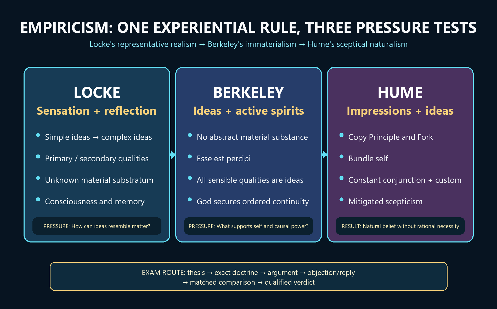

# Empiricism — Learner-v2 Source-Complete Learning Session


> **Generation:** g3, 29 August 2026 · **Approval:** false pending explicit topic approval
>
> **Evidence discipline:** Complete legacy teaching and workbook material is preserved, reordered Basic-first/Advanced-last, and checked against the canonical owner and verified 2018–2025 PYQ ledger.


## BASIC LEARNING SESSION




*Concept map: Locke derives ideas from sensation and reflection while retaining represented matter; Berkeley removes material substance; Hume subjects substance, self and causal necessity to the same experiential test.*

> **Syllabus (verbatim):** Empiricism (Locke, Berkeley, Hume) : Theory of Knowledge; Substance and Qualities; Self and God; Scepticism.

### How to Use This Five-Layer Session

Every logical subtopic follows exactly:

| Layer | Purpose |
|---:|---|
| 1. SIMPLE START | visual-first plain-language gateway |
| 2. CORE UPSC | complete terminology, doctrine, argument, example and source grounding |
| 3. ADVANCED | objections, replies, comparisons, interpretive issues and refinements |
| 4. EXAM APPLICATION | verified PYQ routes and 10/15/20-mark architecture |
| 5. RAPID REVISION | traps, retrieval notes and links to the exact MCQ set |

### Source Audit and Contemporary-Link Boundary

- **Canonical doctrine source:** `upsc-ai-kit/knowledge/Philosophy/paper-1/western/Empiricism.md` (9,057 words), sliced verbatim into every CORE UPSC layer.
- **Verified PYQs:** continuous local Western Philosophy Paper I bank, 2018-2025; Empiricism owns exactly 12 primary parts.
- **Ownership discipline:** the three 'Two Dogmas of Empiricism' questions (2021 Q3c, 2024 Q4c, 2025 Q4b) belong to Quine-Strawson and are excluded despite the shared word.
- **Qdrant:** optional fallback only; not required for this static early-modern topic.
- **Contemporary link (used sparingly, clearly labelled):** ANALYSIS: recent 2026 academic discussion in the philosophy of machine learning (for example, *Artificial Intelligence and the Problem of Induction: A Critique of David Hume's Empiricism*, IIARD Journal of Humanities and Social Policy, Vol. 12 No. 1, 2026, and related work on meta-induction) revisits Hume. Machine-learning prediction operationalises inductive expectation and manages uncertainty through probabilistic modelling, but it does not establish a necessary connection and does not solve Hume's logical problem of induction; distributional shift is a modern restatement of Hume's point, not a refutation of it. This anchor is a contemporary application, not doctrinal proof, and no quantitative claim is invented.

**Preservation note:** the canonical doctrine is reorganised into layers, never compressed. Every doctrine, canonical example, numbered argument, objection/reply, comparison, restored dossier, PYQ route, directive rule, graded verdict and provenance caution is retained; simplification means adding accessible gateways, not deleting complexity.

### Learning Roadmap

| Unit | Logical subtopic | High-yield output |
|---:|---|---|
| 1 | the master slide | derive Realism -> Idealism -> Scepticism |
| 2 | Locke's theory of knowledge | refute innate ideas; sources and degrees |
| 3 | abstraction and essence | nominal vs real essence; the doctrine Berkeley attacks |
| 4 | Locke on qualities and substance | primary/secondary; the know-not-what |
| 5 | Locke on self and God | memory continuity; demonstrative theism |
| 6 | Berkeley's immaterialism | five reconstructed arguments; esse est percipi |
| 7 | Berkeley's spirits, God, critics | notions, continuity, Moore and Russell |
| 8 | Hume's forensic empiricism | Copy Principle, Fork, no substance, bundle self |
| 9 | Hume on causation | constant conjunction, habit, two definitions, Kant |
| 10 | induction, scepticism, comparisons | the Fork dilemma, mitigated scepticism, idealisms |

---

### SESSION 1 — Empiricist Project: Experience and the Locke-Berkeley-Hume Pressure Sequence

#### DEFINITION / WHAT THIS IS CALLED

**Plain-language definition:** Empiricism begins from experience, but Locke, Berkeley and Hume disagree about what can survive once every idea must be traced to experiential content.

**Technical definition:** British empiricism explains cognitive content through experience and develops as a connected pressure sequence: Locke's representative realism retains external substance, Berkeley's immaterialism rejects material substance, and Hume's sceptical naturalism questions substance, self and necessary causation.

#### VISUAL — Empiricist source-of-ideas and pressure pipeline

```text

EXPERIENCE

   |

   +--> LOCKE: sensation + reflection -> ideas -> represented external world

   |             pressure: how can an idea resemble unknown matter?

   v

BERKELEY: ideas + active spirits; no material substratum

   |             pressure: what impression supports self or causal power?

   v

HUME: impressions + ideas -> custom / natural belief -> mitigated scepticism

```

*The shared experiential rule generates increasingly radical tests of substance, self and causation.*

#### ANSWER-GRABBING OPENING — WRITE/ADAPT IN THE EXAM

> Empiricism is not three disconnected biographies but a progressive test of what an experience-only foundation can justify: Locke retains represented matter, Berkeley replaces matter with ideas and spirits, and Hume limits reason to perceptions, custom and mitigated belief.

#### MUST-WRITE KEYWORDS

- **experience**
- **representative realism**
- **immaterialism**
- **sceptical naturalism**
- **Locke-Berkeley-Hume sequence**
- **limits of justification**

**How to use them:** Open with experience and representative realism; move through immaterialism to sceptical naturalism; then show how the Locke-Berkeley-Hume sequence tests successive limits of justification.

#### CORE OBJECTION, REPLY AND RESIDUAL LIMIT

**Objection:** The sequence may look like a self-refutation in which experience destroys the stable world, subject and causation needed to describe experience.

**Best reply:** The empiricists can answer that the project distinguishes what is experientially warranted from what custom, language or metaphysics adds.

**Residual limit:** The reply explains epistemic discipline but does not by itself recover objective necessity or a persisting subject.

#### EXAM USE AND CONCISE REVISION

**Answer architecture:** For comparative questions, use the pressure sequence and matched axes rather than three parallel summaries.

- Shared rule: trace cognitive content to sensation, reflection or impression.
- Locke represents matter; Berkeley identifies sensible objects with ideas; Hume analyses belief.
- The endpoint is mitigated scepticism and natural belief, not universal suspension.

#### Visual gateway - one premise, three destinations

```text
        EXPERIENCE ONLY  (mind at birth = blank white paper)
                              |
                              v
   +-------------+      +--------------+      +----------------+
   |   LOCKE     | ---> |   BERKELEY   | ---> |     HUME       |
   | keeps matter|      | kills matter |      | kills matter,  |
   | but unknown |      | esse est     |      | self AND       |
   | "know-not-  |      | percipi;     |      | necessary      |
   |  what"      |      | God sustains |      | causation      |
   +-------------+      +--------------+      +----------------+
     REPRESENTATIVE       SUBJECTIVE            MITIGATED
       REALISM             IDEALISM             SCEPTICISM
```

**Plain-language start:** Imagine three people given the same rule - "believe only what experience delivers." The first (Locke) still trusts there is a real world outside, though he admits we cannot see its inner nature. The second (Berkeley) says: if experience only ever gives ideas, then talk of unexperienced "matter" is empty - so only minds and their ideas exist. The third (Hume) applies the rule without mercy and finds that even the "self" and the "power" in cause-and-effect are never actually experienced.

| Thinker | Keeps | Drops | Label |
|---|---|---|---|
| Locke | matter, self, God, causation | knowledge of matter's inner nature | representative realism |
| Berkeley | minds, ideas, God, self | material substance | subjective idealism |
| Hume | perceptions, practical belief | substance, simple self, objective necessity | mitigated scepticism |

> 🔑 **Memory line:** Locke keeps matter, Berkeley kills matter, Hume kills matter AND mind AND causation.


#### 0. ONE-SCREEN MAP ⚠️

```
EMPIRICISM = all ideas come from EXPERIENCE (mind at birth = tabula rasa)
               Push the premise → matter, self, causation dissolve:
   ┌───────────────────┬───────────────────┬───────────────────┐
   │ LOCKE              │ BERKELEY           │ HUME              │
   │ Representative     │ Subjective         │ Scepticism        │
   │ Realism            │ Idealism           │                   │
   │ matter real but    │ esse est percipi   │ no substance, no  │
   │ "know-not-what"    │ NO material subst. │ self, no necessary│
   │ primary/secondary  │ collapses that     │ causation         │
   │ qualities          │ distinction        │ bundle of percep- │
   │ personal identity  │ God sustains ideas │ tions; mitigated  │
   │ = memory/consc.    │ spirit is real     │ scepticism        │
   └───────────────────┴───────────────────┴───────────────────┘
```
> 🔑 **Mnemonic — the slide "Realism → Idealism → Scepticism":** Locke keeps matter, Berkeley kills matter, Hume kills matter AND mind AND causation.

---

#### 5. THE INTERNAL LOGIC — WHY EMPIRICISM "SLIDES" ⚠️

```
LOCKE  : All ideas from experience → matter is real but unknowable substrate ("know-not-what")
           ↓  Berkeley asks: if all we know is ideas, what grounds belief in MATTER?
BERKELEY: There is no impression of matter → drop material substance (esse est percipi)
           ↓  Hume asks: apply the same razor to the SELF, SUBSTANCE, CAUSATION...
HUME   : No impression of self, no impression of necessary connexion → bundle, habit, scepticism
```

Each step is the **previous thinker's premise taken more consistently**. This slide is the master narrative of the whole item — and what **provokes Kant** (item 4) to rescue knowledge by adding the a priori contribution of the mind. ⚠️

---

#### Why the three thinkers belong in one story

British Empiricism is not three separate philosophers who happen to share a chapter. It is **one premise - all ideas come from experience - pushed by each thinker more consistently than the last**. Locke keeps a material world but admits it is an unknowable "something I know not what". Berkeley points out that if all we ever meet is ideas, the belief in unperceived matter has no experiential content, so matter is dropped. Hume then turns the very same experiential razor on the *self*, on *substance* and on *causal necessity*, and finds no impression of any of them.

The examiner's single most rewarded move on this item is to present the three as a **slide**, not a list: each conclusion is the previous thinker's starting point taken to its logical end. That is also why the empiricists are the trigger for Kant (item 4): the slide ends in a scepticism nobody can live by, and Kant's response is to make the mind contribute the a priori structure experience alone cannot supply.

#### CLOSING RECALL FLOW — Empiricist Project: Experience and the Locke-Berkeley-Hume Pressure Sequence

```closure-flow
SUBTOPIC: Empiricist Project: Experience and the Locke-Berkeley-Hume Pressure Sequence
STARTING CONCEPT: Empiricist Project: Experience and the Locke-Berkeley-Hume Pressure Sequence
KEY TERMS / DEFINITIONS: experience | representative realism | immaterialism | sceptical naturalism | Locke-Berkeley-Hume sequence | limits of justification
MECHANISM / ARGUMENT: Each thinker applies experiential scrutiny to a claim preserved by the previous system: material support, active spirit, continuing self or necessary connection.
CONSEQUENCE / CONTRAST: The sequence moves from moderate realism through idealism to mitigated scepticism without becoming a simple story of philosophical decline.
UPSC TRAP / ANSWER-USE: Do not say that empiricism denies reason, that Berkeley denies experienced reality, or that Hume doubts everything in ordinary life.
ANSWER-GRABBING FORMULATION: Empiricism is not three disconnected biographies but a progressive test of what an experience-only foundation can justify: Locke retains represented matter, Berkeley replaces matter with ideas and spirits, and Hume limits reason to perceptions, custom and mitigated belief.
```

### SESSION 2 — Locke I: Innate Ideas, Sensation, Reflection and the Construction of Knowledge

#### DEFINITION / WHAT THIS IS CALLED

**Plain-language definition:** Locke rejects supplied mental content and treats the mind as receiving simple materials from outer and inner experience before actively combining them.

**Technical definition:** Sensation supplies ideas from external objects; reflection supplies ideas of mental operations. Simple ideas are passively received, while complex ideas are formed through combination, comparison and abstraction as modes, substances and relations.

#### VISUAL — Locke's simple-to-complex construction

```text

SENSATION ------------------+

colour / solidity / motion  |

                             +--> SIMPLE IDEAS (passively received)

REFLECTION -----------------+                 |

thinking / willing / doubting                  v

                                  COMBINE / COMPARE / ABSTRACT

                                               |

                        MODES | SUBSTANCES | RELATIONS

```

*The mind receives simple materials but actively organises them into complex ideas.*

#### VISUAL — Locke's degrees and limits of knowledge

```text

INTUITIVE: agreement seen immediately -> highest certainty

       |

DEMONSTRATIVE: agreement through intermediate ideas -> proof

       |

SENSITIVE: present particular things exist -> lower assurance

       |

PROBABILITY: testimony, analogy and experience guide belief beyond knowledge

```

*Certainty declines as cognition moves from immediate agreement to existence beyond ideas.*

#### ANSWER-GRABBING OPENING — WRITE/ADAPT IN THE EXAM

> Locke's empiricism is constructive rather than merely receptive: sensation and reflection provide simple ideas, while the understanding actively combines, compares and abstracts them into the complex materials of knowledge.

#### MUST-WRITE KEYWORDS

- **innate ideas**
- **tabula rasa**
- **sensation**
- **reflection**
- **simple idea**
- **complex idea**
- **modes, substances and relations**

**How to use them:** Refute innate ideas, introduce tabula rasa, trace sensation and reflection into simple ideas, and show how combination forms complex ideas as modes, substances and relations.

#### CORE OBJECTION, REPLY AND RESIDUAL LIMIT

**Objection:** Dispositional innatism can answer that an innate capacity need not be a consciously entertained proposition.

**Best reply:** Locke can insist that his target is innate content and that ordinary cognitive capacities are compatible with an experiential origin of ideas.

**Residual limit:** This qualification defeats crude innatism more securely than sophisticated rationalist dispositional accounts.

#### EXAM USE AND CONCISE REVISION

**Answer architecture:** Use the order rejection, positive source theory, simple-to-complex construction, knowledge and limits.

- No universal assent means alleged innate principles are not consciously present in all.
- Sensation is outer experience; reflection is experience of the mind's operations.
- Complex ideas include modes, substances and relations.

#### Visual gateway - where every idea comes from

```text
                         EXPERIENCE
                 __________/    \__________
                /                          \
          SENSATION                     REFLECTION
        (outer sense)                  (inner sense)
     colour, sound, heat,           thinking, doubting,
        solidity, shape               willing, believing
                \__________    __________/
                           \  /
                       SIMPLE IDEAS   (mind is passive here)
                            |
                      mind combines
                            |
                     COMPLEX IDEAS
              (modes | substances | relations)
```

**Plain-language start:** For Locke the newborn mind is a blank sheet. Two "pipes" fill it: what the senses bring in from outside (**sensation**) and what the mind notices about its own workings (**reflection**). Everything else is built by combining these simple pieces.

| Degree of knowledge | What it is | Certainty |
|---|---|---|
| Intuitive | seen at once ("white is not black") | highest |
| Demonstrative | proved through middle steps (geometry) | high |
| Sensitive | that a particular thing exists now | lowest, still reliable |

> 🔑 **Memory line:** Two sources (sensation + reflection) -> simple ideas -> complex ideas -> three degrees of knowing.


#### 1.1 LOCKE — Theory of Knowledge

#### Attack on innate ideas (*Essay* I)

Locke's *Essay Concerning Human Understanding* (1690) opens with a sustained demolition of innate ideas — the rationalist claim (especially Descartes') that certain ideas (God, logical axioms, moral principles) are "stamped on the mind" from birth. ✅

| Locke's argument | Target |
|---|---|
| **Consent argument refuted:** if innate ideas were universal, all humans (including children and "idiots") would possess them — but they manifestly do not. | The standard rationalist claim of universal assent. |
| **No unconscious ideas:** the notion of a thought the mind does not think is self-contradictory (for Locke, "to be in the mind" = "to be perceived by the mind"). | Descartes' claim that innate ideas may be dispositional. |
| **Genetic account available:** every idea *claimed* to be innate can be explained as *acquired* through experience. If experience suffices, the innate hypothesis is otiose. | All alleged innate ideas (God, identity, non-contradiction). |

> PYQ 2023 Q2(c) and 2022 Q4(c) both demand Locke's refutation of innate ideas — **this IS the stock content.**

#### Tabula rasa and the sources of ideas

- The mind at birth is **"white paper, void of all characters"** — a blank slate (*tabula rasa*). ✅
- **All ideas derive from EXPERIENCE**, which has two channels:
  - **Sensation** (outer sense): ideas from external objects impinging on our senses (colour, sound, warmth, solidity).
  - **Reflection** (inner sense): ideas from the mind's own operations — thinking, doubting, willing, believing. ✅
- **Simple ideas** (given passively by experience) → combined by the mind into **complex ideas** (modes, substances, relations).
- **Knowledge** = the perception of the agreement or disagreement of ideas. It comes in degrees:
  - *Intuitive* (immediate — e.g. "white is not black") — most certain.
  - *Demonstrative* (requires intervening ideas — e.g. proofs in mathematics).
  - *Sensitive* (that particular things exist — least certain, though still reliable). ✅

#### Representative Realism (the "veil of perception")

- We do not perceive objects directly; we perceive **ideas** that *represent* external objects. ✅
- This creates an epistemic gap: how do we know our ideas accurately represent external reality? Locke trusts that ideas of primary qualities *do* resemble objects; Berkeley and Hume will exploit this gap.

#### The engine behind the attack

Locke's positive theory and his negative attack are two faces of one claim. If **experience alone** furnishes every idea (sensation for the outer world, reflection for the mind's own acts), then the rationalist stock of innate ideas is not merely unproven but **unnecessary** - an idle wheel. The decisive premise is not the empirical observation that children lack the idea of God; it is the stipulation that "to be in the mind" just *is* "to be perceived by the mind", which rules out unconscious or merely dispositional innate content in advance. That is the hinge a strong answer must expose: Locke wins against a *naive* innatism and leaves untouched the *dispositional* innatism Descartes actually held.

#### CLOSING RECALL FLOW — Locke I: Innate Ideas, Sensation, Reflection and the Construction of Knowledge

```closure-flow
SUBTOPIC: Locke I: Innate Ideas, Sensation, Reflection and the Construction of Knowledge
STARTING CONCEPT: Locke I: Innate Ideas, Sensation, Reflection and the Construction of Knowledge
KEY TERMS / DEFINITIONS: innate ideas | tabula rasa | sensation | reflection | simple idea | complex idea | modes, substances and relations
MECHANISM / ARGUMENT: Experience supplies simple contents, after which mental operations build complex ideas without inventing any new simple sensory material.
CONSEQUENCE / CONTRAST: The account explains acquisition and classification while restricting knowledge to relations among ideas and to limited assurance about existence.
UPSC TRAP / ANSWER-USE: Do not call reflection an innate source or describe the Lockean mind as passive at every stage.
ANSWER-GRABBING FORMULATION: Locke's empiricism is constructive rather than merely receptive: sensation and reflection provide simple ideas, while the understanding actively combines, compares and abstracts them into the complex materials of knowledge.
```

### SESSION 3 — Locke II: Abstraction, General Ideas and Real-Nominal Essence

#### DEFINITION / WHAT THIS IS CALLED

**Plain-language definition:** Locke explains general thought by making a particular idea represent many particulars after irrelevant circumstances are left out.

**Technical definition:** Abstraction separates an idea from circumstances of time, place and accompanying determinations so that it can function as an abstract general idea; the nominal essence is the classificatory abstract idea, while the real essence is the usually unknown internal constitution.

#### VISUAL — Abstraction and classification

```text

PARTICULAR TRIANGLES

different size / colour / orientation

             | omit time, place and irrelevant determinations

             v

ABSTRACT GENERAL IDEA / GENERAL REPRESENTATIVE

             | annexed to the word 'triangle'

             v

NOMINAL ESSENCE -> class membership

REAL ESSENCE -> hidden constitution, generally unknown

```

*Locke turns experienced particulars into general representatives and named kinds.*

#### VISUAL — Locke-Berkeley abstraction dispute

```text

LOCKE: leave determinate features unspecified -> one idea can represent many

BERKELEY: no image can be all-and-none of incompatible determinations

LOCKE REPLY: undetermined is not contradictory

BERKELEY REJOINDER: then generality lies in use or attention, not an image

```

*The dispute turns on whether undetermined content is coherent without an abstract image.*

#### ANSWER-GRABBING OPENING — WRITE/ADAPT IN THE EXAM

> Lockean abstraction makes generality a work of the understanding rather than a feature of independently existing universals, but Berkeley exposes the tension between a general determinable and an impossible indeterminate image.

#### MUST-WRITE KEYWORDS

- **abstraction**
- **abstract general idea**
- **general representative**
- **nominal essence**
- **real essence**
- **determinable and determinate**

**How to use them:** Explain the language problem, abstraction, nominal essence and real essence before presenting Berkeley's triangle objection and Locke's determinable reply.

#### CORE OBJECTION, REPLY AND RESIDUAL LIMIT

**Objection:** Berkeley argues that a triangle that is neither equilateral nor scalene yet represents both cannot be imagined coherently.

**Best reply:** Locke can distinguish leaving angle-size undetermined from positively assigning contradictory angle-sizes.

**Residual limit:** The reply is strongest if ideas are not merely mental pictures, which strains Locke's recurrent imagistic language.

#### EXAM USE AND CONCISE REVISION

**Answer architecture:** In an abstraction answer, reconstruct both positions and end with the ideational theory of meaning as the deeper disputed premise.

- Everything existing is particular, but language requires general terms.
- Nominal essence classifies; real essence explains powers but is usually unknown.
- Berkeley replaces abstract images with particular signs used generally.

#### Visual gateway - how a particular mind uses a general word

```text
   PARTICULAR IDEAS seen:  this red apple, that green apple, ...
                       |
              ABSTRACTION = strip away time, place,
              colour, size - keep only what is common
                       |
                       v
     ABSTRACT GENERAL IDEA  "apple in general"  --annexed to-->  the WORD
                       |
             serves as a GENERAL REPRESENTATIVE of all apples
```

**Plain-language start:** We meet only particular things, yet we speak in general words ("apple", "triangle"). Locke's explanation: the mind *subtracts* the differences and keeps the common core - an "abstract general idea" - and the word stands for that. Berkeley says no such stripped-down idea can actually be formed.

| Term | Meaning | Who knows it |
|---|---|---|
| Nominal essence | the abstract idea tied to a name (gold = yellow, heavy, malleable) | us; we classify by it |
| Real essence | the inner corpuscular constitution that causes those properties | usually unknown to us |

> 🔑 **Memory line:** We classify by nominal essence (what we can list), not by real essence (what we cannot see).


#### Locke — ABSTRACT GENERAL IDEAS ✅ (the doctrine Berkeley destroys — you cannot answer 2025 Q4(c) without it)

**Thesis.** All things that exist are **particular**; yet most words are **general**. Locke's explanation of how a particular mind, furnished only with particular ideas, can use general words is the doctrine of **abstract general ideas**: words become general by being made the signs of general ideas, and ideas become general by **abstraction**. ✅

**Exact printed subterms:** *abstraction* · *abstract general idea* · *general representative* · "*circumstances of time and place*" (what abstraction strips away) · *nominal essence* (the abstract idea annexed to a general name) vs *real essence* · Locke's own admission that the abstract idea is "**something imperfect, that cannot exist**."

**The argument, numbered:**
1. Everything that exists is particular (*Essay* III.iii.1).
2. But it is impossible to have a separate name for every particular thing — memory could not hold them and communication would fail (III.iii.2–4).
3. Therefore language requires **general terms**.
4. Words are general only by being signs of **general ideas** (III.iii.6) — for Locke, meaning is always mediated by ideas in the mind.
5. Ideas received from particulars become general when the mind **separates** them "from all other ideas that accompany them in their real existence" — from circumstances of time, place, and every concomitant idea (III.iii.6–9).
6. What remains is an idea that can serve as a "**general representative**" of all particulars of the same sort.
7. The abstract general idea annexed to a sortal name **is** the **nominal essence** by which we classify (III.iii.15). Classification is therefore the workmanship of the understanding, not a reading-off of real essences.
8. therefore "General and universal belong not to the real existence of things; they are the inventions and creatures of the understanding, made by it for its own use, and concern only signs" (III.iii.11). Locke is a **conceptualist**, not a Platonic realist about universals. ✅

**Canonical example (and Locke's own admission) ✅ — the general triangle** (*Essay* IV.vii.9): the general idea of a triangle "must be neither oblique nor rectangle, neither equilateral, equicrural, nor scalenon; but all and none of these at once." Locke concedes it is "imperfect, that cannot exist," and that framing it "requires some pains and skill." **This sentence is the hinge of the whole Locke–Berkeley dispute — quote it (or paraphrase it) and the answer immediately looks textual.**

**Presuppositions ⚠️:**
- **P1 — Meaning is ideational**: a word signifies by standing for an idea in the speaker's mind. Drop this (as Wittgenstein and Quine do) and premise 4 collapses, and with it the entire need for abstract ideas.
- **P2 — Ideas are imagistic/particular in origin** but can be *rendered* general by subtraction.
- **P3 — Mental subtraction is possible**: one can hold an idea while removing determinations from it and be left with something still contentful.
- **P4 — One-idea-per-general-word**: generality lives in the *idea*, not in the *use* of the word.

**Berkeley's demolition, numbered ✅** (*Principles*, Introduction §§6–25) — PYQ 2025 Q4(c):
1. I concede I can imagine particular things I have perceived, and compound and divide such ideas (a hand without a body, a headless torso) — this is **separation of parts that could exist apart**.
2. But abstraction proper requires separating what **cannot** exist apart: extension without any colour, motion without a determinate speed, "man" without any determinate stature or complexion.
3. Locke's own triangle — neither equilateral nor scalene, yet all and none at once — is **self-contradictory**; no such idea can be framed. (Berkeley quotes this passage verbatim at Intro §13.)
4. Therefore, there are no abstract general ideas.
5. **Positive replacement:** an idea is general not by being abstract but "**by being made to represent or stand for all other particular ideas of the same sort**" (Intro §12) — a determinate particular idea, *selectively attended to*, does duty for a class. The geometer draws *this* black inch-long line and proves a theorem about all lines.
6. **Corollary attacking the whole tradition:** words do not always stand for ideas at all; language also raises passion, prompts action, and disposes the mind (Intro §§19–20). ⚠️ This is a genuine anticipation of the later Wittgensteinian point that meaning is use — worth flagging in any "Berkeley's nominalism" answer as evidence of its long reach.
7. **The metaphysical payload:** Locke's *material substance in general* and *substratum* are precisely abstract general ideas — the abstract idea of "being" plus the relative notion of "supporting." If abstraction is impossible, "matter" is not a mysterious unknown but a **meaningless expression**. Berkeley's immaterialism thus rests on his nominalism, not the reverse. ✅

**Locke's best reply → and the residual ❓:**
| Berkeley's charge | Locke's available reply | Verdict |
|---|---|---|
| The abstract triangle is contradictory | Locke can say the abstract idea is *partial*, not *contradictory*: it is the idea of three-sidedness with the specific angles **left undetermined**, not with contradictory angles **assigned**. Determinables need not be determinate. | ⚠️ This is Locke's strongest defence and modern commentators generally accept it — but it requires giving up the imagistic model of ideas, which Locke elsewhere retains. |
| No such image can be formed | Concede that no *image* can, and relocate the abstract idea to a non-imagistic act of the understanding | ❓ Then it is no longer an idea in Locke's own official sense, and the empiricist derivation-from-experience is strained. |
| Selective attention suffices | Then explain what fixes *which* respect a particular idea is attended to — the resemblance-respect looks like the abstract idea returning under another name | ⚠️ This is the standard modern rejoinder to Berkeley; it makes the dispute far less one-sided than textbooks suggest. |

**Executable verdict:** "Berkeley wins against the *imagistic* Locke and loses against the *determinable* Locke. The lasting damage is not to abstraction but to the ideational theory of meaning that made abstraction necessary — which is why the argument's true heir is not Hume but Wittgenstein's family-resemblance treatment of generality."

#### Real vs Nominal Essence

- **Real essence** = the internal constitution of a thing (for Locke, the arrangement of its "insensible corpuscles") that gives rise to all its observable properties. We usually do not know it. ✅
- **Nominal essence** = the abstract idea we associate with a general name (e.g. "gold" = yellow, heavy, malleable, soluble in aqua regia). Classification is by nominal essence. ✅
- Locke is agnostic about real essences — we know *that* things have internal constitutions, but not *what* they are. This epistemic humility is characteristic of his moderate empiricism.

#### Why this dry-looking topic is high-value

Abstraction looks like a technical footnote; it is in fact the **hinge of the whole Locke-Berkeley dispute** and the direct content of a 2025 question. Locke needs abstract general ideas to explain how a mind stocked only with particular ideas can use general words. Berkeley destroys the doctrine and, with it, Locke's "abstract idea of matter-in-general" - so Berkeley's *immaterialism rests on his nominalism*, not the reverse. Getting the dependency the right way round, and quoting Locke's own admission that the general triangle is "something imperfect, that cannot exist", is what makes an answer look textual rather than second-hand.

#### CLOSING RECALL FLOW — Locke II: Abstraction, General Ideas and Real-Nominal Essence

```closure-flow
SUBTOPIC: Locke II: Abstraction, General Ideas and Real-Nominal Essence
STARTING CONCEPT: Locke II: Abstraction, General Ideas and Real-Nominal Essence
KEY TERMS / DEFINITIONS: abstraction | abstract general idea | general representative | nominal essence | real essence | determinable and determinate
MECHANISM / ARGUMENT: A particular experiential idea becomes general by selective omission and stands for a class under a general name.
CONSEQUENCE / CONTRAST: Classification becomes the workmanship of the understanding, while the hidden constitutions of natural kinds remain only partially known.
UPSC TRAP / ANSWER-USE: Do not present Locke as a Platonic realist or treat nominal essence as the physical microstructure of a thing.
ANSWER-GRABBING FORMULATION: Lockean abstraction makes generality a work of the understanding rather than a feature of independently existing universals, but Berkeley exposes the tension between a general determinable and an impossible indeterminate image.
```

### SESSION 4 — Locke III: Primary-Secondary Qualities, Representative Realism and Substratum

#### DEFINITION / WHAT THIS IS CALLED

**Plain-language definition:** Locke says ideas mediate perception, some ideas resemble object qualities, and clustered qualities lead us to suppose an unknown supporting substance.

**Technical definition:** Primary qualities such as solidity, extension, figure, motion or rest and number are inseparable from body and are said to resemble their object-side qualities; secondary qualities are powers to produce colour, sound, taste and similar ideas that do not resemble their causes.

#### VISUAL — Primary and secondary qualities

```text

+----------------------+---------------------------+

| PRIMARY              | SECONDARY                 |

+----------------------+---------------------------+

| solidity, extension  | colour, sound, taste      |

| figure, motion, number| heat/cold as sensed       |

| inseparable from body| powers relative to organs |

| ideas resemble       | ideas do not resemble     |

+----------------------+---------------------------+

```

*The distinction concerns object-side status and resemblance, not mere importance.*

#### VISUAL — Representative realism and the veil objection

```text

EXTERNAL BODY / QUALITIES

          | causal action on sense organs

          v

IDEAS IMMEDIATELY PERCEIVED BY THE MIND

          | allegedly represent / resemble

          v

KNOWLEDGE CLAIM ABOUT THE BODY

OBJECTION: comparison cannot bypass the idea-veil

REPLY: causal-structural success; LIMIT: substratum remains unknown

```

*Mediated perception explains representation but creates a comparison problem.*

#### ANSWER-GRABBING OPENING — WRITE/ADAPT IN THE EXAM

> Locke's representative realism secures an external world by the resemblance of primary-quality ideas, yet its unknown substratum and mediated perception generate the very gap that Berkeley turns against matter.

#### MUST-WRITE KEYWORDS

- **primary quality**
- **secondary quality**
- **resemblance thesis**
- **representative realism**
- **veil of perception**
- **substratum**
- **something, I know not what**

**How to use them:** Define both quality classes, state the resemblance thesis, map mediated perception, then explain substance as a supposed support rather than a known object.

#### CORE OBJECTION, REPLY AND RESIDUAL LIMIT

**Objection:** If the mind immediately perceives only ideas, it cannot step outside them to compare an idea with an unperceived material quality.

**Best reply:** A Lockean can defend causal or structural representation rather than pictorial resemblance and treat substance as an explanatory posit.

**Residual limit:** Structural representation and stable powers reduce the sceptical force but leave substratum epistemically opaque.

#### EXAM USE AND CONCISE REVISION

**Answer architecture:** Use a quality matrix plus the object-to-idea chain and finish with the veil objection, best reply and residual opacity.

- Primary qualities are inseparable; secondary qualities are relational powers.
- Resemblance is asserted only for primary-quality ideas.
- Substratum is supposed as support, not positively described.

#### Visual gateway - two kinds of quality, one unknown support

```text
   A PIECE OF GOLD  =  bundle of qualities that always go together
   -----------------------------------------------------------------
   PRIMARY (in the body)          |  SECONDARY (powers on us)
   extension, figure, motion,     |  colour, sound, taste, smell,
   solidity, number               |  warmth / cold
   our idea RESEMBLES the quality |  our idea resembles NOTHING there
   -----------------------------------------------------------------
                     |  but qualities must inhere in ...
                     v
            SUBSTRATUM = "something I know not what"
            (we infer a support; we have no positive idea of it)
```

**Plain-language start:** Shape and motion are genuinely in the object; colour and taste are just its power to affect our senses. Underneath the whole cluster of qualities Locke assumes there must be a "something" that holds them together - but he admits we cannot say what that something is.

| Feature | Primary | Secondary |
|---|---|---|
| Location | in the body itself | power in body to affect us |
| Our idea | resembles the quality | resembles nothing in object |
| Separable from body? | no (every fragment keeps them) | yes (depend on our organs) |

> 🔑 **Memory line:** Primary = measurable and resembling; Secondary = response-dependent; Substratum = the honest "I know not what".


#### Primary vs Secondary Qualities ✅

| Primary Qualities | Secondary Qualities |
|---|---|
| Solidity, extension, figure, motion/rest, number | Colour, sound, taste, smell, warmth/cold |
| Really *in* the object | Powers in the object to produce sensations in us |
| Our ideas of them **resemble** the qualities themselves | Our ideas do NOT resemble anything in the object |
| Inseparable from body (every fragment retains them) | Depend on the perceiver's sense-organs |

- **Basis of the distinction:** primary qualities are those that *any* body must have no matter how small; they are "objective." Secondary qualities are relational — the result of primary-quality configurations *acting on* our sense-organs. ✅

#### Substance as "something I know not what" ✅

- We experience clusters of qualities that regularly go together (yellow + heavy + malleable = "gold") and suppose there is an underlying **substratum** that *supports* these qualities.
- But we have **no positive idea** of what this substratum is — it is merely "a supposition of he knows not what support of such qualities" (*Essay* II.xxiii.2). ✅
- Locke does *not* deny substance exists — he denies we can *know its nature*. This is representative realism, not idealism. ⚠️

#### The two doctrines that Berkeley will attack

This subtopic sets the two Lockean planks Berkeley later kicks away. First, the **primary/secondary distinction**: some qualities (extension, figure, motion, solidity, number) are really in bodies and our ideas *resemble* them; others (colour, sound, taste) are only *powers* to produce sensations and our ideas resemble nothing in the object. Second, the **substratum** - because qualities must inhere in something, Locke posits an underlying support of which we have "no positive idea", the famous "something I know not what". Locke does not deny that substance exists; he denies we can know its nature. Berkeley will argue that a resemblance we can never check is empty (so the distinction collapses) and that an unknowable substratum is an abstract idea with no content (so matter is a meaningless word).

#### CLOSING RECALL FLOW — Locke III: Primary-Secondary Qualities, Representative Realism and Substratum

```closure-flow
SUBTOPIC: Locke III: Primary-Secondary Qualities, Representative Realism and Substratum
STARTING CONCEPT: Locke III: Primary-Secondary Qualities, Representative Realism and Substratum
KEY TERMS / DEFINITIONS: primary quality | secondary quality | resemblance thesis | representative realism | veil of perception | substratum | something, I know not what
MECHANISM / ARGUMENT: External bodies causally produce ideas; primary-quality ideas allegedly resemble their causes, while repeated co-instantiation motivates the supposition of a support.
CONSEQUENCE / CONTRAST: The theory preserves realism and scientific explanation but limits access to the inner nature of substance.
UPSC TRAP / ANSWER-USE: Do not say Locke knows the substratum positively or that he denies substance exists.
ANSWER-GRABBING FORMULATION: Locke's representative realism secures an external world by the resemblance of primary-quality ideas, yet its unknown substratum and mediated perception generate the very gap that Berkeley turns against matter.
```

### SESSION 5 — Locke IV: Knowledge, Probability, Personal Identity and Demonstrative God

#### DEFINITION / WHAT THIS IS CALLED

**Plain-language definition:** Locke separates strict knowledge from probable belief, defines the person by continuity of consciousness, and argues demonstratively from our existence to God.

**Technical definition:** Knowledge is perceived agreement or disagreement among ideas and is intuitive, demonstrative or sensitive; probability governs belief beyond certainty. Personal identity follows the same consciousness through memory and differs from identity of human animal or thinking substance. God's existence is treated as demonstratively knowable from the existence of a finite knowing self.

#### VISUAL — Locke's substance-self architecture

```text

SAME PERSON? -> continuity of consciousness / appropriation / memory

SAME HUMAN BEING? -> continuity of one living human organism

SAME SUBSTANCE? -> sameness of material or immaterial bearer


PRINCE-CONSCIOUSNESS IN COBBLER-BODY:

person follows consciousness | human being follows organism

```

*One embodied case can be tracked under three different identity questions.*

#### VISUAL — Memory objections and repair

```text

LOCKE: present consciousness remembers past act -> same person

BUTLER: genuine memory already presupposes personal identity

REID: boy -> officer -> general; direct memory can lose transitivity

REPAIR: overlapping memory / intention / character chains

LIMIT: repaired continuity is broader than Locke's simplest formula

```

*The strongest defence turns isolated memory into overlapping psychological continuity.*

#### ANSWER-GRABBING OPENING — WRITE/ADAPT IN THE EXAM

> Locke's account unifies epistemic humility and forensic identity: knowledge has bounded degrees, while the person extends only as far as consciousness can appropriate past thought and action.

#### MUST-WRITE KEYWORDS

- **knowledge and probability**
- **intuitive, demonstrative and sensitive knowledge**
- **continuity of consciousness**
- **memory**
- **person, human being and substance**
- **forensic identity**
- **demonstrative knowledge of God**

**How to use them:** Separate knowledge from probability, then distinguish person, human being and substance before explaining memory, responsibility and the proof of God.

#### CORE OBJECTION, REPLY AND RESIDUAL LIMIT

**Objection:** Butler charges circularity and Reid's Brave Officer exposes a transitivity problem when later stages forget earlier ones.

**Best reply:** Overlapping chains of psychological continuity can preserve transitivity without requiring direct recollection of every episode.

**Residual limit:** The repair develops Locke beyond a literal memory criterion and still depends on reliable causal continuity of consciousness.

#### EXAM USE AND CONCISE REVISION

**Answer architecture:** For self-and-God questions, keep personal identity, substantial identity and demonstrative theism analytically separate.

- Person is a conscious, self-concerned, accountable subject; man is a living human organism.
- Memory evidences continuity but cannot simply presuppose what it proves.
- God is argued demonstratively, not claimed as an innate idea.

#### Visual gateway - what makes you the same person over time?

```text
        SAME PERSON at T1 and T2 ?
        Locke's test = continuity of CONSCIOUSNESS (memory)
   ------------------------------------------------------------
   NOT same soul-substance  |  NOT same body  |  YES same memory
   (could swap unnoticed)   |  (changes daily)|  (I can own T1 now)
   ------------------------------------------------------------
        PRINCE'S consciousness --> COBBLER'S body
        => the PERSON is the prince; the MAN is the cobbler
```

**Plain-language start:** You are the same person as yesterday not because you have the same lump of matter or the same soul, but because you can *remember* yesterday's experiences as your own. Move the memories into another body and the person moves with them.

| Criterion | Locke's verdict | Why |
|---|---|---|
| Same body | rejected | bodies change constantly |
| Same soul | rejected | could change without our knowing |
| Same consciousness | accepted | it is what we can appropriate and be answerable for |

> 🔑 **Memory line:** Person = memory-linked consciousness; identity is "forensic" - it fixes responsibility.


#### 3.1 LOCKE — Self (Personal Identity) ✅

- **The question:** what makes a person at time T2 the *same person* as at time T1?
- **Locke's answer:** personal identity = **continuity of consciousness (memory)**. A person is "a thinking intelligent being, that has reason and reflection, and can consider itself as itself, the same thinking thing, in different times and places" (*Essay* II.xxvii.9). ✅
- The criterion is NOT sameness of *soul-substance* (we might have the same soul without knowing it — that would not make us the same *person*) and NOT sameness of *body* (bodies change constantly). It is the ability to **remember** past experiences as one's own. ✅
- **Forensic concept:** Locke links personal identity to *moral responsibility* — we are accountable only for acts we can appropriate through memory.

#### Objections (Butler/Reid-style circularity) ⚠️

| Objection | Source | Force |
|---|---|---|
| **Circularity (Reid/Butler):** memory presupposes identity — I can remember only *my own* experiences; so identity must already be settled before memory can confirm it. | Thomas Reid, Joseph Butler (18th c.) | If personal identity = memory, and memory = remembering *one's own* past, the definition is circular. ✅ |
| **Transitivity failure (Reid's "Brave Officer"):** a young boy → officer → old general. The officer remembers being the boy; the general remembers being the officer but NOT being the boy. By Locke's criterion, general ≠ boy — but officer = boy and general = officer. Transitivity of identity is violated. | Reid | Locke might reply with *overlapping chains* of memory, but the problem is sharp. ⚠️ |
| **Gaps in consciousness:** dreamless sleep, amnesia — during these, does the person cease to exist? | Critics generally | Locke needs continuous *capacity* for memory, not constant recollection; but this strains the account. |

> PYQ 2021 Q1(d) directly asks: "Examine the concept of personal identity by Locke." — include the doctrine AND the circularity objection.

#### 3.2 LOCKE — God

- God's existence is known by **demonstration** (not intuition, not sensitive knowledge): something cannot come from nothing; I exist; therefore there is an eternal, most powerful, most knowing being. ✅
- This is a *cosmological-style* argument within Locke's empiricist framework — note that it relies on the causal principle (something from nothing is impossible), which Hume will later challenge.

#### The prince and the cobbler, and the shape of the theory

Locke's boldest illustration is the **prince and the cobbler**: if the consciousness (memory) of a prince were transferred into the body of a cobbler, then - Locke says - the *person* of the prince goes with the consciousness, even though the *man* (the living body) is the cobbler's. This thought-experiment isolates his thesis: **personal identity travels with continuity of consciousness, not with the same soul-substance and not with the same body**. Because identity tracks consciousness, it is a **"forensic" term** - it fixes who is accountable, since we can justly be answerable only for acts we can appropriate as our own through memory.

Locke's God, by contrast, is reached by **demonstration**: something cannot come from nothing; I exist; so there is an eternal, most powerful, most knowing being. Note the dependence on the causal principle - the very principle Hume will later dissolve, which is why Locke's proof and Hume's scepticism sit on opposite sides of the same fault line.

#### CLOSING RECALL FLOW — Locke IV: Knowledge, Probability, Personal Identity and Demonstrative God

```closure-flow
SUBTOPIC: Locke IV: Knowledge, Probability, Personal Identity and Demonstrative God
STARTING CONCEPT: Locke IV: Knowledge, Probability, Personal Identity and Demonstrative God
KEY TERMS / DEFINITIONS: knowledge and probability | intuitive, demonstrative and sensitive knowledge | continuity of consciousness | memory | person, human being and substance | forensic identity | demonstrative knowledge of God
MECHANISM / ARGUMENT: Conscious appropriation links present and past experiences for accountability, while demonstrative reasoning moves from existing knowing being to an eternal powerful cause.
CONSEQUENCE / CONTRAST: Identity becomes psychological and forensic rather than bodily or simply substantial, but memory and proof carry substantial burdens.
UPSC TRAP / ANSWER-USE: Do not reduce Locke's person to a soul, a body or one present memory episode.
ANSWER-GRABBING FORMULATION: Locke's account unifies epistemic humility and forensic identity: knowledge has bounded degrees, while the person extends only as far as consciousness can appropriate past thought and action.
```

### SESSION 6 — Berkeley I: Anti-Abstraction, Anti-Matter and Immaterialist Direct Realism

#### DEFINITION / WHAT THIS IS CALLED

**Plain-language definition:** Berkeley keeps ordinary tables and trees but denies that they hide an unknowable material support behind the ideas directly perceived.

**Technical definition:** Berkeley rejects abstract general ideas and material substance, identifies sensible objects with ordered collections of ideas, distinguishes passive ideas from active spirits, and states esse est percipi for sensible things.

#### VISUAL — Berkeley's critique sequence

```text

NO ABSTRACT GENERAL IMAGE

        |

MATERIAL SUBSTRATUM = empty abstraction

        |

PRIMARY / SECONDARY QUALITY PARITY

        |

LIKENESS: an idea can resemble only an idea

        v

SENSIBLE OBJECT = ORDERED COLLECTION OF IDEAS

        v

ESSE EST PERCIPI; ACTIVE SPIRITS PERCEIVE

```

*Nominalism removes abstract matter before immaterialism states the positive ontology.*

#### VISUAL — Locke and Berkeley on perceptual realism

```text

LOCKE: material object -> representative idea -> perceiver

       realism preserved; veil and resemblance problem

BERKELEY: sensible object = ideas directly perceived by spirit

          direct access preserved; material substratum removed

```

*Both affirm ordinary objects, but only Locke places a material bearer behind ideas.*

#### ANSWER-GRABBING OPENING — WRITE/ADAPT IN THE EXAM

> Berkeley's immaterialism does not abolish experienced reality; it abolishes the unexperienced material duplicate behind it, turning anti-abstraction and the likeness principle into a direct-realist attack on Locke's representational veil.

#### MUST-WRITE KEYWORDS

- **critique of abstract ideas**
- **material substance**
- **esse est percipi**
- **collection of ideas**
- **idea and spirit**
- **immaterialism**
- **direct realism**

**How to use them:** Move from Berkeley's nominalist use of particulars to the rejection of material substance, then explain sensible objects, spirits and direct perception.

#### CORE OBJECTION, REPLY AND RESIDUAL LIMIT

**Objection:** The Master Argument may confuse conceiving a tree with conceiving the tree's dependence on the conceiver.

**Best reply:** Berkeley can reply that the target is an object conceived as wholly outside every possible mind, not a merely unattended human object.

**Residual limit:** The reply supports anti-abstraction more securely than it conclusively proves idealism against every realist theory.

#### EXAM USE AND CONCISE REVISION

**Answer architecture:** Reconstruct the critique sequence; never offer esse est percipi as an unsupported slogan.

- Sensible objects are collections of immediately perceived ideas.
- Ideas are passive; spirits perceive and act.
- Immaterialism denies matter, not tables, trees or sensory order.

#### Visual gateway - the five roads to "no matter"

```text
   BERKELEY: to be (for sensible things) = to be perceived
   ----------------------------------------------------------------
   1 SEMANTIC   thing = collection of ideas  -> being = being perceived
   2 LIKENESS   an idea can be like nothing but an idea
   3 PARITY     primary qualities are as mind-dependent as secondary
   4 MASTER     you cannot conceive an object unconceived (you just did)
   5 CONTINUITY orderly involuntary ideas need an active MIND = God
   ----------------------------------------------------------------
   RESULT: only spirits (minds) + their ideas exist. Matter = empty word.
```

**Plain-language start:** Berkeley agrees we perceive tables and chairs - he only denies there is an extra, unperceivable "stuff" (matter) behind them. A "thing" just *is* the bundle of sights, touches and sounds we have of it; to exist, for such things, is to be perceived. Five arguments push toward this, and God keeps the world going when no human is looking.

| Slogan | Correct reading | Common misreading |
|---|---|---|
| esse est percipi | for **sensible** things, existence = being perceived | "nothing exists unless I look" |
| no matter | no unperceiving substratum | "no external world at all" |

> 🔑 **Memory line:** Five arguments (semantic, likeness, parity, master, continuity) - not one slogan.


#### 1.2 BERKELEY — Theory of Knowledge

- All knowledge is of **ideas perceived by the mind** — there is no "material substance" behind ideas. ✅
- **Immediate perception only:** we perceive ideas directly (not material objects via a "veil"). What Locke calls an external object is just a *collection of ideas*.
- **"Sensible things are those only which are immediately perceived by sense"** (PYQ 2021 Q1c) — there is nothing more to a "thing" than the ideas we have of it.
- **Rejection of abstract general ideas (nominalism):** Berkeley (*Principles* Introduction §§6–25) argues that the mind cannot form a genuinely *abstract* idea — e.g., a "triangle" that is neither equilateral nor isosceles nor scalene. We can have *particular* ideas that *stand for* (represent) a class, but not an idea stripped of all particular determinations. ✅ — PYQ 2025 Q4(c) asks exactly this: "Berkeley's doctrine of nominalism and his refutation of abstract ideas."
  - *Consequence:* Locke's "abstract idea of substance-in-general" is incoherent; "matter" (Locke's abstract substratum) is an empty word with no perceivable content.

#### Collapse of the Primary/Secondary Distinction ✅

Berkeley's master argument (*Principles* §§9–15; *Three Dialogues*): ✅
1. Locke admits secondary qualities are *mind-dependent* (exist only as perceived).
2. Berkeley argues that **primary qualities are equally mind-dependent:**
   - Extension cannot be conceived without colour/some visual quality.
   - Motion/rest are relative to the observer.
   - Figure (shape) is inseparable from extension, which is inseparable from colour.
3. Therefore ALL qualities are ideas; the primary/secondary distinction collapses. ✅
4. **If all qualities are ideas, there is nothing LEFT for "material substance" to be** — it is an empty abstraction.

#### *Esse est percipi* (to be is to be perceived) ✅

- For sensible things, existence = being perceived. "The table I write on, I say, exists; that is, I see and feel it" (*Principles* §3). ✅
- There is **no material substance** — "matter" is an incoherent fiction; what we call "physical objects" are orderly collections of ideas.
- **Reality = minds (spirits) + their ideas.** This is **subjective idealism** (also called *immaterialism*). ✅

#### Berkeley "saves" common sense ⚠️

- Berkeley insists he is *not* denying the reality of tables and chairs — he is denying only the *philosopher's fiction* of "matter" (an unobservable substratum). The ordinary person never believed in Locke's "veil of perception"; they believe they perceive things *directly* — and so does Berkeley. His idealism is (in his own view) *closer* to common sense than representative realism. ✅
- He accuses the *materialists* of undermining common sense by positing an unknowable world behind appearances.

#### Berkeley — THE FOUR ARGUMENTS, RECONSTRUCTED ⚠️→✅ (never present *esse est percipi* as a bare slogan)

**Argument 1 — The semantic/analytic argument** (*Principles* §§1–4):
1. The objects of human knowledge are ideas: (a) imprinted on the senses, (b) perceived by attending to the passions and operations of the mind, (c) formed by memory and imagination.
2. "Sensible things" *means* things immediately perceived by sense (this is the sense of the phrase in PYQ 2021 Q1(c)).
3. An apple, a stone, a tree, a book are nothing but collections of such immediately perceived ideas.
4. It is impossible that ideas should exist unperceived — their *esse* is *percipi*; existence for them consists in being perceived.
5. Therefore, for sensible things, *esse est percipi*, and to speak of their "absolute existence without relation to their being perceived" is unintelligible.
   - **Presupposition:** step 3 is a *definition*, not a discovery. Berkeley's whole system stands on the identification of the object with the collection of ideas — grant it and immaterialism follows in four lines; deny it and nothing follows at all.

**Argument 2 — The Likeness Principle** (*Principles* §8) ✅:
1. Locke says our ideas of primary qualities *resemble* qualities in bodies.
2. But "an idea can be like nothing but an idea" — a colour or figure can be like nothing but another colour or figure.
3. If the supposed originals are unperceivable, no comparison with them is even possible; a resemblance-claim we could never in principle check is empty.
4. Therefore, the representative-realist relation of resemblance between idea and material quality is unintelligible.
   - **Presupposition:** resemblance requires comparability by a perceiver. **Strongest objection:** structural or mathematical resemblance (isomorphism) does not require qualitative likeness — a map resembles terrain without being terrain-coloured. This is the standard modern rescue of Locke.

**Argument 3 — The collapse of the primary/secondary distinction** (*Principles* §§9–15; *Dialogues* I) — set out at §2.2 above; its logical form is a **parity argument**: every relativity argument Locke accepts for secondary qualities (variation with observer, with organ, with medium) applies equally to primary ones (apparent size with distance, motion with frame of reference, shape with angle).
   - **Presupposition:** perceptual relativity entails mind-dependence. **Objection:** it does not — that a thing looks different from different positions is what one should expect of a mind-*independent* thing with a real shape.

**Argument 4 — The "Master Argument"** (*Principles* §§22–23) ✅:
1. Berkeley stakes everything on one challenge: conceive one extended movable body existing unconceived, and he will concede materialism.
2. You reply that you can easily conceive a tree standing alone in a park with nobody by.
3. But in doing so *you* are conceiving it — so you have framed ideas in your own mind, and have not conceived the tree **unconceived** at all.
4. Therefore, the supposition is self-refuting; unperceived existence cannot even be entertained.
   - **Presupposition (and the fatal one):** that conceiving *X existing unconceived* requires the act of conceiving to be part of the *content* conceived.
   - **Strongest objection ❓ (Russell; refined by Prior and Gallois):** a **scope/use–mention confusion**. What is inconceivable is "*I conceive of X that it is not conceived by me*"; what is required is only "*I conceive that X exists and is not conceived*" — and that is perfectly coherent, exactly as I can *think about* an unthought-of number. Berkeley conflates the vehicle of thought with its object.
   - **Berkeley's best reply:** for him there is no "object" over and above the idea, so the distinction the objector needs is precisely what is at issue — the argument is question-begging only if immaterialism is already false.

**Argument 5 — God as the guarantor of continuity** (*Principles* §§6, 30–33, 48; *Dialogues* II):
1. Ideas are passive and inert; they cannot cause anything.
2. Yet the ideas of sense come to me involuntarily and in a steady, regular order.
3. Whatever produces them must be an active spirit, and one whose power and wisdom exceed mine.
4. Therefore God. The "laws of nature" are the settled grammar of God's language of ideas — regularities are *signs*, not causes.
5. Therefore, objects persist unperceived by finite minds because they are always perceived by the infinite Mind.
   - **Presupposition:** only spirits are active causes (Berkeley's *voluntarism*).
   - **Objection:** this makes "existence unperceived" back into a hypothesis about an unobserved being — the very move Berkeley forbade Locke. **Reply:** we know spirit not by *idea* but by *notion* (§§27, 89, 140) — an asymmetry critics call ad hoc, but which Berkeley holds is forced, since an idea, being passive, could never picture activity.

> ⚠️ **Answer-craft:** in a 15/20-marker on Berkeley, name the arguments (semantic · likeness · parity · master · continuity). Naming five arguments where the average script asserts one slogan is the single largest available differentiator on this sub-topic.

#### Name the arguments; never assert the slogan bare

The single biggest differentiator on Berkeley is to present immaterialism as a **set of named arguments**, not the slogan *esse est percipi* repeated. The canonical dossier reconstructs five: (1) the **semantic/analytic** argument - sensible things just *are* collections of immediately perceived ideas, so their being is being perceived; (2) the **likeness** principle - "an idea can be like nothing but an idea", so an idea cannot resemble an unperceiving material quality; (3) the **parity/collapse** argument - every relativity Locke grants for secondary qualities applies to primary ones, so all qualities are ideas and matter has nothing left to be; (4) the **Master Argument** - you cannot conceive an unconceived object, since conceiving it makes it conceived; (5) **continuity through God** - involuntary, orderly ideas need an active cause, namely the infinite Mind that always perceives them. In a 15/20-marker, naming five where the average script asserts one is the largest available gain.

#### CLOSING RECALL FLOW — Berkeley I: Anti-Abstraction, Anti-Matter and Immaterialist Direct Realism

```closure-flow
SUBTOPIC: Berkeley I: Anti-Abstraction, Anti-Matter and Immaterialist Direct Realism
STARTING CONCEPT: Berkeley I: Anti-Abstraction, Anti-Matter and Immaterialist Direct Realism
KEY TERMS / DEFINITIONS: critique of abstract ideas | material substance | esse est percipi | collection of ideas | idea and spirit | immaterialism | direct realism
MECHANISM / ARGUMENT: If all sensible qualities are ideas and no idea can resemble an unperceiving material original, matter adds no intelligible content to experienced objects.
CONSEQUENCE / CONTRAST: Objects remain real as publicly ordered ideas, while the metaphysical inventory becomes minds and their ideas.
UPSC TRAP / ANSWER-USE: Do not translate esse est percipi as 'nothing exists unless a human currently looks at it.'
ANSWER-GRABBING FORMULATION: Berkeley's immaterialism does not abolish experienced reality; it abolishes the unexperienced material duplicate behind it, turning anti-abstraction and the likeness principle into a direct-realist attack on Locke's representational veil.
```

### SESSION 7 — Berkeley II: Qualities, Spirits, God, World-Continuity and Objections

#### DEFINITION / WHAT THIS IS CALLED

**Plain-language definition:** Berkeley explains stable public experience through active spirits and the law-like ideas caused by God, not through matter or a human gaze.

**Technical definition:** The relativity and inseparability arguments collapse Locke's primary-secondary distinction; finite spirits receive involuntary sensory ideas, while the infinite spirit, God, causes their regular order. The self is an active spirit known by notion rather than as a passive idea.

#### VISUAL — Finite perceiver, ideas and divine continuity

```text

                         GOD / INFINITE ACTIVE SPIRIT

                    causes stable, law-like sensory ideas

                                  |

                 +----------------+----------------+

                 |                                 |

          FINITE SPIRIT A                    FINITE SPIRIT B

          receives ideas                    receives ideas

                 +-------- shared ordered world --------+

OBJECT CONTINUITY != continuous human looking

```

*Human non-attention does not imply non-existence because sensory order is not made by finite perceivers.*

#### VISUAL — Berkeley objection-reply map

```text

SOLIPSISM -> many finite spirits + shared involuntary order

ILLUSION -> coherence / involuntariness / correction within experience

COMMON SENSE -> tables remain real; matter alone is rejected

CAUSATION -> passive ideas cannot cause; spirits are active

RESIDUAL -> why must one infinite divine cause uniquely explain order?

```

*The strongest evaluation separates answers to ordinary objections from the residual God-inference.*

#### ANSWER-GRABBING OPENING — WRITE/ADAPT IN THE EXAM

> Berkeley avoids solipsism by making finite perceivers recipients within a divinely ordered language of nature: God is neither an idea nor another human observer but the active cause of stable sensory order.

#### MUST-WRITE KEYWORDS

- **quality parity**
- **finite spirit**
- **infinite spirit**
- **notion**
- **world-continuity**
- **language of nature**
- **anti-scepticism**

**How to use them:** Collapse the quality distinction, distinguish ideas from spirits, then map finite perception, divine causation, continuity and the self known by notion.

#### CORE OBJECTION, REPLY AND RESIDUAL LIMIT

**Objection:** Solipsism, illusion, pain, finite causation and the theological gap challenge the move from experienced order to one infinite spirit.

**Best reply:** Berkeley distinguishes ideas of sense from imagination by involuntariness and coherence, and treats natural regularities as divine signs.

**Residual limit:** These distinctions answer crude solipsism and illusion but do not force the unique conclusion that God is the only adequate cause.

#### EXAM USE AND CONCISE REVISION

**Answer architecture:** Use the continuity model and include common-sense gain, theological cost and the notions issue.

- Variation arguments apply to size, shape and motion as well as colour and taste.
- Finite spirits perceive; God causes the ordered sensory series.
- Spirit is known by notion or reflective awareness, not copied as an idea.

#### Visual gateway - what is left once matter is gone

```text
   REALITY (Berkeley) = SPIRITS  +  their IDEAS
   -----------------------------------------------------------
   SPIRITS are active  -> known by NOTION (not by idea)
      my finite mind: perceives, wills
      GOD infinite mind: causes + sustains the orderly world
   IDEAS are passive   -> known directly; they are what we sense
   -----------------------------------------------------------
   "Does the tree exist when unseen?"  YES - God always perceives it
```

**Plain-language start:** After matter is removed, two things remain: minds and the ideas they have. Minds are active causes; we grasp them by a "notion", not a picture. The world does not blink out when we look away because God is always perceiving it. Far from being a sceptic, Berkeley thinks he has *defeated* scepticism by removing the unknowable material world.

| Question | Berkeley's answer |
|---|---|
| Is Berkeley a sceptic? | No - he is anti-sceptical; the materialist causes doubt |
| Do things exist unperceived by me? | Yes - they are perceived by God |
| How do we know spirits? | by **notion**, since ideas (being passive) cannot picture activity |

> 🔑 **Memory line:** Spirits by notion, ideas by sense, God guarantees continuity - idealism that *saves* common sense.


#### 3.3 BERKELEY — Self (Spirit) ✅

- The perceiving mind (**spirit**) is a **real active substance** — it is the *perceiver*, not a bundle of perceptions. ✅
- We do not have an *idea* of spirit (ideas are passive; the mind is active); we have a **notion** of it — a direct awareness that does not fit the impression → idea schema.
- **Berkeley keeps the self** (unlike Hume): the self is the active subject that perceives and wills.

#### 3.4 BERKELEY — God ✅

- The involuntary, orderly ideas I perceive (the "real world") are not caused by me. They must have a cause. ✅
- Material substance cannot be the cause (it doesn't exist). The cause must be another *mind* — a mind powerful enough to produce the entire orderly system of nature.
- This mind is **God** — the infinite spirit who sustains all "real" ideas in existence. ✅
- **"Does the tree exist when no one perceives it?"** — Yes, because God *always* perceives it. Unperceived objects continue to exist in God's mind. ✅
- Berkeley thus uses empiricism to **defend theism** — the material world is replaced by God's continual ideation. His idealism is *theocentric*, not sceptical.

#### 4.2 BERKELEY — Anti-Sceptical Idealism ⚠️

- Berkeley explicitly claims to *refute* scepticism: it is the *materialist* who produces doubt (by positing an unknowable world behind ideas). By identifying reality with ideas, Berkeley claims *certainty* — we perceive real things directly (they are ideas) and God guarantees their continuity. ✅
- His idealism is not sceptical; it is **dogmatic theistic idealism** — a metaphysical thesis about what *exists*, not a doubt about knowledge.

#### Berkeley under Moore and Russell
- ✅ Berkeley argues that sensible objects are ideas and that an unperceived material substratum is unintelligible; minds and ideas exhaust immediate ontology.
- ✅ Moore attacks the conflation of an act of awareness with its object: the awareness of blue is not identical with blue. Russell similarly seeks mind-independent structure but reconstruces objects through logical analysis rather than Moorean direct realism.
- ⚠️ **Evaluation:** both resist idealism, yet Moore stresses the transparency of sensation while Russell replaces ordinary objects with constructions from data/relations.

#### Two asymmetries that make Berkeley's system run

Berkeley's positive metaphysics rests on two deliberate asymmetries. First, **ideas versus notions**: ideas are passive and inert, so they can picture nothing active; the mind (spirit) is active, so we cannot have an *idea* of it - we know self and other spirits by a **notion**, a direct non-imagistic awareness. Second, **finite versus infinite mind**: my ideas of sense come to me involuntarily and in a steady order, so their cause is not me but a more powerful spirit whose settled way of producing them just *is* the "laws of nature" - God. These two moves let Berkeley keep a real self (unlike Hume), keep the world in being when no human looks (God always perceives it), and claim his idealism is **anti-sceptical** and closer to common sense than Locke's veil of perception.

#### CLOSING RECALL FLOW — Berkeley II: Qualities, Spirits, God, World-Continuity and Objections

```closure-flow
SUBTOPIC: Berkeley II: Qualities, Spirits, God, World-Continuity and Objections
STARTING CONCEPT: Berkeley II: Qualities, Spirits, God, World-Continuity and Objections
KEY TERMS / DEFINITIONS: quality parity | finite spirit | infinite spirit | notion | world-continuity | language of nature | anti-scepticism
MECHANISM / ARGUMENT: Involuntary, vivid and coherent sensory ideas form a law-like order whose active cause cannot be a passive idea and is attributed to God.
CONSEQUENCE / CONTRAST: The account preserves continuity, objectivity and common life without matter but depends on a substantial theological inference.
UPSC TRAP / ANSWER-USE: Do not say God is the collection of ideas, that finite minds create sensory order, or that Berkeley has an idea of spirit.
ANSWER-GRABBING FORMULATION: Berkeley avoids solipsism by making finite perceivers recipients within a divinely ordered language of nature: God is neither an idea nor another human observer but the active cause of stable sensory order.
```

### SESSION 8 — Hume I: Impressions, Ideas, Copy Principle, Fork, Substance, Self and God

#### DEFINITION / WHAT THIS IS CALLED

**Plain-language definition:** Hume inventories perceptions, traces ideas to impressions and refuses positive metaphysical content where no corresponding experiential source can be found.

**Technical definition:** Perceptions divide into forceful impressions and fainter ideas; the Copy Principle traces simple ideas to simple impressions, while association proceeds by resemblance, contiguity and cause-effect. Hume's Fork distinguishes relations of ideas from matters of fact. Substance and the simple self lack impressions; personal identity is a bundle fiction aided by memory and imagination.

#### VISUAL — Hume's perceptions and Fork

```text

PERCEPTIONS

  +--> IMPRESSIONS: forceful sensations, passions and reflections

  +--> IDEAS: fainter memory / imagination copies

              | resemblance / contiguity / cause-effect

              v

OBJECTS OF REASON

  +--> RELATIONS OF IDEAS: necessary; denial contradictory

  +--> MATTERS OF FACT: contingent; contrary conceivable

```

*The content test and proposition test work together but answer different questions.*

#### VISUAL — Bundle self and identity fiction

```text

PERCEPTION t1 -> PERCEPTION t2 -> PERCEPTION t3 -> ...

     colour        desire          memory

          \          |          /

           resemblance + causal association

                       |

                       v

          ASCRIBED IDENTITY / 'SELF' FICTION

APPENDIX DIFFICULTY: what genuinely unites the bundle?

```

*Introspection yields a sequence of perceptions, while imagination supplies experienced continuity.*

#### ANSWER-GRABBING OPENING — WRITE/ADAPT IN THE EXAM

> Hume transforms empiricism into a forensic method: when substance, self or divine predicates cannot supply an originating impression or a valid inferential route, their speculative certainty is reduced without denying the natural beliefs of common life.

#### MUST-WRITE KEYWORDS

- **impression and idea**
- **force and vivacity**
- **Copy Principle**
- **association of ideas**
- **relations of ideas**
- **matters of fact**
- **bundle theory**
- **natural religion**

**How to use them:** Define impression and idea through force and vivacity, qualify the Copy Principle, explain association, relations of ideas and matters of fact, then apply the method to bundle theory and natural religion.

#### CORE OBJECTION, REPLY AND RESIDUAL LIMIT

**Objection:** The missing shade of blue and relational thought challenge an exceptionless copy rule; the bundle also seems to require a principle that unifies perceptions.

**Best reply:** Hume treats the missing shade as a rare exception and presents the Copy Principle as a critical test, while memory discovers rather than creates many relations.

**Residual limit:** His Appendix concedes that he cannot explain the unity of the bundle, and his critique of religion limits proof more clearly than existence.

#### EXAM USE AND CONCISE REVISION

**Answer architecture:** Use the experiential test carefully: distinguish absence of justified idea or proof from a dogmatic proof of non-existence.

- Impressions differ from ideas chiefly in force and vivacity.
- Fork: necessary relations of ideas versus contingent matters of fact.
- Bundle theory finds perceptions but no simple, invariant self-impression.

#### Visual gateway - Hume's microscope

```text
   PERCEPTIONS
     |__ IMPRESSIONS  (vivid, original: sensations, passions)
     |__ IDEAS        (faint copies of impressions)
                 COPY PRINCIPLE: every simple idea <- a simple impression
                 TEST a word: "from what impression?"  no impression = fiction
   ----------------------------------------------------------------
   HUME'S FORK
     RELATIONS OF IDEAS        |   MATTERS OF FACT
     a priori, necessary       |   a posteriori, contingent
     "2+2=4"; bachelor         |   "the sun will rise"; "fire heats"
     deny = contradiction      |   contrary always conceivable
   ----------------------------------------------------------------
   RESULTS: no impression of SUBSTANCE -> fiction
            no impression of a simple SELF -> BUNDLE of perceptions
```

**Plain-language start:** Every idea is a dim echo of some earlier vivid experience. If a supposed idea (like "substance" or a permanent "self") has no such experience behind it, Hume declares it empty. Sorting knowledge into two boxes - truths of reason and truths of fact - he finds that "substance" and "self" fit neither.

| Target | Impression found? | Verdict |
|---|---|---|
| Material / spiritual substance | none | fiction of imagination |
| Simple continuing self | none | bundle of perceptions |
| "2+2=4" | relation of ideas | necessary, trivially certain |

> 🔑 **Memory line:** Copy Principle + Fork -> no substance, no simple self; "commit the rest to the flames".


#### 1.3 HUME — Theory of Knowledge

#### Impressions and Ideas

- All contents of the mind (*perceptions*) divide into: ✅
  - **Impressions** — vivid, forceful, original experiences (sensations, passions).
  - **Ideas** — faint copies of impressions, derived from memory/imagination.
- **Hume's Copy Principle:** every simple *idea* must trace back to a corresponding simple *impression*. If a purported idea (e.g. "substance," "necessary connection") has no corresponding impression, it is **meaningless** or fictitious. ✅ This is the empiricist "microscope" — the ancestor of the verification principle.

#### Hume's Fork (Relations of Ideas vs Matters of Fact) ✅

| Relations of Ideas | Matters of Fact |
|---|---|
| Known a priori; discoverable by thought alone | Known a posteriori; require experience |
| Necessary, certain; denial is self-contradictory | Contingent; the contrary is always conceivable |
| Examples: "2+2=4"; "a bachelor is unmarried" | Examples: "the sun will rise tomorrow"; "fire causes heat" |
| Do not depend on what exists in the world | Depend on how the world actually is |

- **Consequence:** any proposition that is *neither* a relation of ideas *nor* a matter of fact is *meaningless* — "commit it then to the flames" (*Enquiry* XII). ✅ This is the basis of anti-metaphysical empiricism and the direct ancestor of Logical Positivism (see `Logical-Positivism.md`).

---

#### 2.3 HUME — Substance and Qualities

- Apply the Copy Principle: do we have an *impression* of substance? **No.** We have only impressions of particular qualities (redness, hardness, sweetness) — never of an underlying substrate. ✅
- Therefore "substance" is a **fiction of the imagination** — the mind's habit of grouping constantly conjoined qualities and *inventing* a "support" for them. ✅
- Hume dissolves *both* material and spiritual substance: neither has a corresponding impression.
- **Qualities without substance:** for Hume there are only *bundles of perceptions* — qualities that co-occur regularly. The "object" is nothing but a stable bundle; the "self" is nothing but a flowing bundle (§3.3).

---

#### 3.5 HUME — Self (the Bundle Theory) ✅

- Apply the Copy Principle to the self: **introspect, and you never find an impression of a "self"** — only particular perceptions (a pain, a colour, a thought) in constant flux. ✅
- The self is **"nothing but a bundle or collection of different perceptions, which succeed each other with an inconceivable rapidity, and are in a perpetual flux and movement"** (*Treatise* I.iv.6). ✅
- **What produces the *fiction* of a unified self?** The imagination, through:
  - *Resemblance* (present ideas resemble past memories, creating a felt continuity).
  - *Causation* (one perception seems to produce the next — memory links them).
- **Hume's own dissatisfaction (Appendix to the *Treatise*):** Hume confesses he cannot satisfactorily explain what *binds* the bundle together — "all my hopes vanish when I come to explain the principles that unite our successive perceptions." ✅ This honest confession is philosophically significant and worth citing in any answer on Hume's self.
- ⚠️ **Cross-tradition parallel:** Hume's bundle theory strikingly resembles the Buddhist doctrine of *anātman/nairātmyavāda* (no-self) — see `../indian/Buddhism.md`. The examiner may reward this bridge.

#### Humean identity and Kant's reply
- ✅ Hume finds only successive perceptions, not a simple self. Kant does not infer a soul-substance; he argues that the “I think” must be able to accompany representations as a condition of unified experience.
- ❌ The transcendental unity of apperception is a formal condition, not an observed Cartesian ego.

#### One razor, applied everywhere

Hume gives empiricism a single test and runs it mercilessly. The **Copy Principle** says every simple *idea* is a faint copy of a prior simple *impression*; so to check whether a word is meaningful, ask "from what impression is its idea derived?" Applied to **substance**, there is no impression of an underlying support - only impressions of qualities - so both material and spiritual substance are fictions of the imagination. Applied to the **self**, introspection never finds an impression of a simple, continuing "I", only a rapid flux of particular perceptions - so the self is a **bundle**. The **Fork** then sorts all genuine assertions into relations of ideas (a priori, necessary, deniable only on pain of contradiction) and matters of fact (a posteriori, contingent, always conceivably otherwise); anything that is neither is meaningless. This is the empiricist "microscope" - and the direct ancestor of the verification principle.

#### CLOSING RECALL FLOW — Hume I: Impressions, Ideas, Copy Principle, Fork, Substance, Self and God

```closure-flow
SUBTOPIC: Hume I: Impressions, Ideas, Copy Principle, Fork, Substance, Self and God
STARTING CONCEPT: Hume I: Impressions, Ideas, Copy Principle, Fork, Substance, Self and God
KEY TERMS / DEFINITIONS: impression and idea | force and vivacity | Copy Principle | association of ideas | relations of ideas | matters of fact | bundle theory | natural religion
MECHANISM / ARGUMENT: Ideas inherit content from impressions; associative imagination connects them, but neither branch of the Fork supplies a perceived substance or a demonstrative inference to transcendent being.
CONSEQUENCE / CONTRAST: Metaphysical certainty contracts, while mathematics, experience, probability and natural belief remain.
UPSC TRAP / ANSWER-USE: Do not say every idea is itself an impression, that the missing shade destroys the Copy Principle, or that Hume proves there is no self or God.
ANSWER-GRABBING FORMULATION: Hume transforms empiricism into a forensic method: when substance, self or divine predicates cannot supply an originating impression or a valid inferential route, their speculative certainty is reduced without denying the natural beliefs of common life.
```

### SESSION 9 — Hume II: Causation, Constant Conjunction, Habit and the Problem of Induction

#### DEFINITION / WHAT THIS IS CALLED

**Plain-language definition:** Repeated sequences train expectation, but neither one case nor many cases reveal a necessary power binding cause to effect.

**Technical definition:** Causal experience gives temporal priority, contiguity and constant conjunction; repetition produces an impression of reflective determination in the mind. Custom projects necessary connection and supports inductive inference, whose appeal to the uniformity of nature cannot be demonstratively or non-circularly justified.

#### VISUAL — Causation and induction habit loop

```text

A followed by B repeatedly

        | constant conjunction

        v

CUSTOM / HABIT CONDITIONS EXPECTATION

        | felt determination of thought

        v

PROJECTED NECESSARY CONNECTION

        | predicts future B after A

        +---- assumes nature remains uniform ----+

             circular if past success is the proof

```

*Repetition changes the mind rather than revealing a new observable tie in the objects.*

#### VISUAL — What Hume observes and what the mind adds

```text

OBSERVED: priority + contiguity + repeated conjunction

NOT OBSERVED: power / productive tie / necessity in objects

MIND ADDS: customary transition and expectation

PRACTICE RETAINED: probable inference in life and inquiry

```

*The criticism targets objective necessary connection, not every causal practice.*

#### ANSWER-GRABBING OPENING — WRITE/ADAPT IN THE EXAM

> Hume does not abolish causal reasoning; he relocates necessity from an observed tie in objects to the mind's customary transition, thereby exposing induction as naturally indispensable but rationally underdetermined.

#### MUST-WRITE KEYWORDS

- **causation**
- **necessary connection**
- **constant conjunction**
- **habit and custom**
- **projection**
- **induction**
- **uniformity of nature**
- **two definitions of cause**

**How to use them:** Begin with causation and necessary connection, derive constant conjunction and habit or custom, explain projection and both definitions of cause, then expose induction and the uniformity-of-nature circle.

#### CORE OBJECTION, REPLY AND RESIDUAL LIMIT

**Objection:** A regularity account may confuse genuine causation with correlated sequences and cannot easily explain unobserved mechanisms or interventions.

**Best reply:** The Humean can allow refined regularities, counterfactual structure or theoretical modelling while denying a separately perceived necessary power.

**Residual limit:** Such refinements may exceed Hume's own ontology and do not convert inductive success into demonstrative justification.

#### EXAM USE AND CONCISE REVISION

**Answer architecture:** A high-scoring answer separates what is observed, what habit adds, why induction is circular and what naturalism preserves.

- Objective definition: constant conjunction; natural definition: mental transition.
- Necessity is an impression of reflection projected onto objects.
- Induction is neither demonstrative nor justifiable by experience without circularity.

#### Visual gateway - where does "necessary connexion" come from?

```text
   WHAT THE SENSES DELIVER in "A causes B"
   -----------------------------------------------------
   [A precedes B]  +  [A touches B]  +  [A always -> B]
   priority           contiguity        constant conjunction
   -----------------------------------------------------
   WHAT THEY NEVER DELIVER:  a POWER / necessary TIE in the objects
                    |
   repetition changes not the OBJECTS but the MIND:
                    v
   mind is DETERMINED to expect B on seeing A  = CUSTOM / HABIT
                    |
                    v
   this felt determination = IMPRESSION OF REFLECTION
   -> the idea of "necessary connexion" is copied from THIS (in us, not in things)
```

**Plain-language start:** When one ball hits another we see the first move, touch the second, and the second roll off - but we never *see* a compulsion forcing it. After watching this many times our mind forms a habit: seeing A, we automatically expect B. Hume's radical claim is that the "must" in "A must cause B" lives in our habit-formed expectation, not in the billiard balls.

| We observe | We do NOT observe |
|---|---|
| priority, contiguity, constant conjunction | a necessary connection / power in objects |
| our own felt expectation (impression of reflection) | any rational insight that B must follow |

> 🔑 **Memory line:** See conjunction, feel expectation, project necessity - custom is "the great guide of human life".


#### 4.3 HUME — Scepticism (the systematic culmination) ✅

#### Causation — the centrepiece of Humean scepticism ✅

| Element | Hume's analysis |
|---|---|
| What we observe | constant conjunction (A always followed by B) + temporal priority (A precedes B) + spatial contiguity |
| What we do NOT observe | a *necessary connection* between cause and effect |
| Source of the "idea" of necessary connection | NOT from any impression of objects; it is an impression of **reflection** — a *feeling* in the mind (a "determination of the mind" to pass from the idea of A to the idea of B after repeated experience). ✅ |
| Mechanism | **Custom/habit:** after repeated observation of A → B, the mind *expects* B upon seeing A; this expectation is a *psychological* compulsion, not a *rational* demonstration. ✅ |
| Conclusion | Causal necessity is not *in* objects (not an objective relation); it is *projected onto* objects by the mind's habitual association. ✅ |

- PYQ 2023 Q2(a) 20m, 2021 Q1(e) 10m, 2019 Q4(b) 15m, 2025 Q2(c) 15m all demand this analysis.

**Is there any element of necessity in causal relations according to Hume?** (PYQ 2019 Q4b):
- In *objects themselves* — NO. There is no impression of objective necessity.
- In the *mind* — YES, in a psychological sense: the "impression of reflection" (the felt compulsion to expect B after A) is a kind of subjective necessity. But this is a fact about *us*, not about *nature*. ✅

#### The Problem of Induction ✅

- Past regularities give NO rational guarantee of future ones. The belief "the future will resemble the past" cannot be justified:
  - Not by demonstration (its denial is not self-contradictory).
  - Not by experience (that would be circular — using experience to prove the reliability of experience). ✅
- Induction rests on **custom/habit**, not on reason. We *do* rely on it — nature forces us to — but we cannot *justify* it.

#### Hume — THE TWO ARGUMENTS, RECONSTRUCTED ⚠️→✅

**(A) The negative argument on necessary connexion** (*Treatise* I.iii.14; *Enquiry* VII):
1. **Copy Principle:** every simple idea derives from a corresponding simple impression.
2. So if we have a genuine idea of *necessary connexion*, we must locate its source impression.
3. **External search:** in any single instance of causation (one billiard ball striking another) sense delivers only priority, contiguity and the succession of qualities. No impression of a *power* or *tie* is given.
4. Repetition adds no new quality to the objects: the hundredth collision is qualitatively no different from the first as far as the objects go.
5. **Internal search:** volition does no better — I have no impression of how the will moves the limb; the actual mechanism (nerve, muscle) is unknown to consciousness. Hume rules out the Cartesian and the occasionalist appeal alike.
6. But repetition *does* produce a change in **the mind**: after constant conjunction, the mind is **determined** to pass from the idea of A to the idea of B. That felt determination is an **impression of reflection**.
7. Therefore, the idea of necessary connexion is copied from that internal impression. Necessity "is something that exists in the mind, not in objects."
8. Therefore, two definitions of cause follow — (i) *objective/philosophical*: an object followed by another, where all objects similar to the first are followed by objects similar to the second; (ii) *subjective/natural*: an object followed by another, whose appearance **conveys the thought** to the other. ✅ **Naming both definitions is the single highest-value move in any Hume-on-causation answer.**

**Presuppositions ⚠️:** (P1) the Copy Principle is exceptionless; (P2) a single instance and a repeated instance can be compared for *added* content — i.e. causation must be visible in one instance if it is objective at all; (P3) impressions are atomic and separable, so no relation is given *with* its terms; (P4) "necessity" must be either observed or projected — no third option such as inferred theoretical posit.

**Canonical example ✅:** the two billiard balls (*Enquiry* IV, VII) — "the first is the cause, the second the effect… but all we ever observe is one succeeding the other." Secondary: bread nourishing the body (*Enquiry* IV) — the sensible qualities of bread give no clue to its nutritive power.

#### Why causation is the centre of gravity

Causation is the pressure point of the whole item: four of Empiricism's twelve owned PYQs (2019, 2021, 2023, 2025) turn on it. The analysis runs in two movements. **Negatively**, Hume applies the Copy Principle and finds that a single instance of one billiard ball striking another yields only *priority*, *contiguity* and *constant conjunction* - never an impression of a *power* or *tie*; repetition adds nothing to the objects. **Positively**, repetition changes the *mind*: it becomes *determined* to pass from the idea of the cause to the idea of the effect, and that felt determination is an **impression of reflection** from which the idea of necessary connexion is copied. Hence the twin definitions of "cause" - one *philosophical* (objects of one kind are constantly followed by objects of another) and one *natural* (the appearance of the one conveys the thought to the other). Naming both definitions is the single highest-value move in any causation answer.

#### CLOSING RECALL FLOW — Hume II: Causation, Constant Conjunction, Habit and the Problem of Induction

```closure-flow
SUBTOPIC: Hume II: Causation, Constant Conjunction, Habit and the Problem of Induction
STARTING CONCEPT: Hume II: Causation, Constant Conjunction, Habit and the Problem of Induction
KEY TERMS / DEFINITIONS: causation | necessary connection | constant conjunction | habit and custom | projection | induction | uniformity of nature | two definitions of cause
MECHANISM / ARGUMENT: Observed regularity conditions the imagination to move from cause-idea to effect-idea; the future is inferred from the past only by the very inductive principle under question.
CONSEQUENCE / CONTRAST: Science and ordinary action retain probabilistic practice, but logical necessity and a non-circular proof of uniformity are unavailable.
UPSC TRAP / ANSWER-USE: Do not reduce causation to accidental succession or say Hume recommends abandoning causal and inductive practice.
ANSWER-GRABBING FORMULATION: Hume does not abolish causal reasoning; he relocates necessity from an observed tie in objects to the mind's customary transition, thereby exposing induction as naturally indispensable but rationally underdetermined.
```

### SESSION 10 — Hume III and Comparative Synthesis: God, Miracles, Mitigated Scepticism and Answer Spine

#### DEFINITION / WHAT THIS IS CALLED

**Plain-language definition:** Hume limits speculative reason while allowing natural belief and disciplined inquiry to return us from excessive doubt to ordinary life.

**Technical definition:** Antecedent or excessive scepticism undermines action and even its own reasoning, whereas mitigated scepticism confines inquiry to human capacities, probability and experience. Hume tests design by analogy and miracles by comparative testimony and probability; these arguments limit rational warrant rather than establish a simple global atheism.

#### VISUAL — Three-philosopher comparison on official syllabus axes

```text

+-----------+----------------+----------------+--------------------+

| AXIS      | LOCKE          | BERKELEY       | HUME               |

+-----------+----------------+----------------+--------------------+

| substance | unknown support| spirits only   | no impression      |

| qualities | primary/second.| all are ideas  | perceptions        |

| self      | consciousness  | active spirit  | bundle             |

| God       | demonstrative  | world-order    | proof/analogy limit|

| scepticism| limited realism| anti-sceptical | mitigated/natural  |

+-----------+----------------+----------------+--------------------+

```

*Matched axes show the progressive pressure of an experience-only foundation.*

#### VISUAL — Criticism-reply-residual map

```text

LOCKE veil / opaque substratum -> structural representation -> comparison gap remains

BERKELEY solipsism / God gap -> shared divine order -> unique-cause inference remains

HUME induction / bundle gap -> natural belief -> rational normativity remains

```

*Evaluation earns marks when the strongest reply and the remaining cost are both explicit.*

#### VISUAL — UPSC Philosophy answer spine

```text

DIRECTIVE -> DIRECT THESIS -> PRECISE DEFINITIONS

         -> NUMBERED ARGUMENT -> TEXT / CANONICAL EXAMPLE

         -> OBJECTION -> BEST REPLY -> RESIDUAL LIMIT

         -> COMPARISON ON MATCHED AXES (if asked)

         -> QUALIFIED VERDICT

CONTROL: claim -> named evidence -> analysis -> qualification

```

*The architecture keeps exact directive, doctrine, evaluation and conclusion connected.*

#### ANSWER-GRABBING OPENING — WRITE/ADAPT IN THE EXAM

> Hume's mature position is sceptical naturalism: reason cannot vindicate induction, substance, a simple self or natural theology with necessity, yet custom and common life inevitably restore proportioned belief.

#### MUST-WRITE KEYWORDS

- **antecedent scepticism**
- **excessive scepticism**
- **mitigated scepticism**
- **custom and common life**
- **design analogy**
- **miracles and testimony**
- **sceptical naturalism**
- **comparative synthesis**

**How to use them:** Distinguish types of scepticism, explain natural return, qualify religion arguments, then compare substance, qualities, self, God and scepticism across all three thinkers.

#### CORE OBJECTION, REPLY AND RESIDUAL LIMIT

**Objection:** If custom rather than reason governs basic belief, Hume appears to describe cognitive compulsion rather than justify knowledge.

**Best reply:** His naturalism can answer that philosophy should explain the conditions and limits of actual human cognition instead of demanding impossible foundations.

**Residual limit:** Description and inevitability do not by themselves supply epistemic normativity, which motivates Kant and later responses.

#### EXAM USE AND CONCISE REVISION

**Answer architecture:** Use a matched comparison matrix, criticism-reply map and directive-specific answer spine with a qualified verdict.

- Locke keeps unknown material support; Berkeley keeps spirits and God; Hume finds perceptions and natural belief.
- Direct realism, representative realism, idealism and scepticism must not be conflated.
- Empiricism narrows certainty while increasing attention to cognitive limits and evidence.

#### Visual gateway - the induction dilemma and the empiricist slide

```text
   CAN WE JUSTIFY "the future will resemble the past" (Uniformity, UP)?
   ------------------------------------------------------------------
   Route 1: DEMONSTRATION ?   No - "nature may change" is not a contradiction
   Route 2: EXPERIENCE ?      No - experience proving experience is CIRCULAR
   ------------------------------------------------------------------
   => UP has no rational foundation -> induction rests on CUSTOM / HABIT

   THE EMPIRICIST SLIDE (why the item hangs together)
   LOCKE   : all ideas from experience; matter real but "know-not-what"
       |  if all we know is ideas, what grounds belief in MATTER?
   BERKELEY: no impression of matter -> drop it (esse est percipi)
       |  apply the same razor to SELF, SUBSTANCE, CAUSE ...
   HUME    : no impression of self / power -> bundle, habit, scepticism
       |  a scepticism no one can live by ...
   KANT    : mind supplies the a priori structure experience cannot
```

**Plain-language start:** Every prediction assumes the future will behave like the past - but Hume shows we can neither *prove* that assumption (its denial is not contradictory) nor *test* it without already assuming it (circular). So science runs on habit, not proof. Step back and the three empiricists form one slide: each takes the last one's premise more seriously, until Kant has to rescue knowledge.

| Reply to induction | Move |
|---|---|
| Kant | a third option - the **synthetic a priori** |
| Popper | science needs **no** induction (conjecture + refutation) |
| Strawson | demanding to justify induction *as a whole* misuses the word "rational" |

> 🔑 **Memory line:** Not demonstrable, not provable-by-experience -> custom rules; the slide ends in Kant.


**(B) The problem of induction as a formal dilemma** (*Enquiry* IV):
1. All reasoning about matters of fact beyond present sense and memory rests on the relation of cause and effect.
2. Causal inference rests on the **Uniformity Principle (UP)**: the future will resemble the past / unobserved cases resemble observed ones.
3. UP can be established only **demonstratively** or **probably** (this exhaustive division is the fork).
4. Not demonstratively: "the course of nature may change" implies no contradiction — it is perfectly conceivable.
5. Not probably: every probable/experiential argument already **presupposes** UP, so the argument would be circular.
6. Therefore, uP has no rational foundation.
7. Therefore, inductive inference is produced not by reason but by **custom or habit** — "the great guide of human life."

**Presupposition ⚠️:** step 3 assumes the exhaustiveness of the demonstrative/probable dichotomy (Hume's Fork applied reflexively). Every serious reply attacks this step — Kant by supplying a **third** category, the synthetic *a priori*; Popper by denying that science needs induction at all; Strawson by arguing that demanding a justification of induction *as a whole* misapplies the very standards of rationality that induction constitutes (see `Quine-Strawson.md`).

**The counterexample Hume himself concedes ❓ — the missing shade of blue** (*Treatise* I.i.1; *Enquiry* II): a man acquainted with every shade of blue but one, shown the spectrum with a gap, can (Hume grants) form the idea of the missing shade from imagination alone — a simple idea with no antecedent impression. Hume calls the instance "so singular" that it is not worth altering his general maxim for it.
- ⚠️ **Why this matters for marks:** it shows the Copy Principle is an *empirical generalisation*, not an analytic truth — so Hume's demolition of "substance," "self" and "necessary connexion" rests on a premise he himself admits admits exceptions. Deploying this converts a descriptive answer into a critical one.
- **Hume's available reply:** the missing shade is generated by *interpolation between* impressions actually had, so the principle's spirit — no idea without experiential materials — survives even if its letter does not.

#### Mitigated Scepticism ✅

- Hume does NOT recommend suspending all belief (that would be unliveable). He distinguishes:
  - **Excessive/Pyrrhonian scepticism:** total suspension of judgment — impossible in practice.
  - **Mitigated scepticism:** a cautious, modest attitude — limit enquiry to what experience can answer; avoid speculations about things beyond possible experience (substance, God, the soul); proportion belief to evidence. ✅
- This is Hume's positive recommendation: philosophical humility + reliance on the natural beliefs that custom compels.

---

#### 3.6 HUME — God ✅

- The **causal/cosmological argument** fails: we have no impression of a "first cause" or of causation as necessary connection (see §4.3). We cannot legitimately infer from experienced effects to an unexperienced transcendent cause. ✅
- The **design (teleological) argument** fails (*Dialogues Concerning Natural Religion*):
  - The analogy (universe : designer :: watch : watchmaker) is weak — the universe is not sufficiently similar to a manufactured artifact. ✅
  - Even if granted, it proves at most a *finite* architect working on given matter — not an omnipotent, omniscient, morally perfect creator.
  - The order in the universe might be explained by natural principles (e.g. matter's inherent organising tendencies) without invoking intelligence.
  - The problem of evil undermines any inference from the world to a perfectly good designer. ✅
- **Miracles** (*Enquiry* X): a miracle violates the laws of nature; testimony in favour of a miracle is always *less probable* than the testimony being false → it is never rational to believe miracle-reports on testimony alone. ✅
- Cross-paper: PYQ 2025 P-II Q6(a) directly asks "Design argument for God's existence with David Hume's criticism" — the above IS the required content.

---

#### 6. INTER-THINKER / INTER-SCHOOL DEBATES ⚠️

| Axis | Locke | Berkeley | Hume |
|---|---|---|---|
| **Matter** | real but unknowable substrate | does not exist (fiction) | no impression → fiction |
| **Qualities** | primary (objective) vs secondary (subjective) | ALL mind-dependent (distinction collapses) | all are impressions; no basis for objective/subjective split |
| **Substance** | "something I know not what" | spirit only (no material substance) | no substance at all (material or spiritual) |
| **Self** | continuity of consciousness (memory) | active spirit (real) | bundle of perceptions (no self) |
| **Causation** | real power (though knowledge of mechanism is limited) | God's will producing ideas in us | constant conjunction + habit (no real power) |
| **God** | demonstrated via cosmological-style argument | required to sustain unperceived ideas | all proofs fail; scepticism |
| **Scepticism** | rejected (moderate realism) | claims to refute scepticism | embraced (mitigated) |
| **Overall position** | representative realism | subjective (theistic) idealism | phenomenalism + scepticism |

---

#### Subjective idealism versus Hegelian absolute idealism (2024 Q2a, second half)

The comparison that finishes 2024 Q2(a) must be made precisely, in the canonical terms. **Berkeley's idealism is subjective:** reality is *ideas in finite and divine minds* - things are mind-dependent, sustained by God's perceiving. **Hegel's idealism is absolute/objective:** reality is the *self-development of Absolute Spirit (Geist) through dialectic* - Mind developing itself as the very substance of the world. So the two differ **in kind, not degree**: Berkeley makes existence depend on *being perceived* by minds that already exist; Hegel makes finite minds and the world alike *moments* in the self-unfolding of one Absolute. A script that treats Hegel's absolute idealism as merely "bigger" Berkeleianism loses the marks; the axis is subjective/mind-dependent versus objective/self-developing Spirit.

The wider bridges the examiner rewards: **Descartes -> Locke** (innate ideas rejected, experience substituted); **Locke -> Berkeley** (matter's last resemblance removed); **Berkeley -> Hume** (the same razor turned on self and cause); **Hume -> Kant** (the synthetic a priori and the transcendental unity supplied to stop the slide).

#### CLOSING RECALL FLOW — Hume III and Comparative Synthesis: God, Miracles, Mitigated Scepticism and Answer Spine

```closure-flow
SUBTOPIC: Hume III and Comparative Synthesis: God, Miracles, Mitigated Scepticism and Answer Spine
STARTING CONCEPT: Hume III and Comparative Synthesis: God, Miracles, Mitigated Scepticism and Answer Spine
KEY TERMS / DEFINITIONS: antecedent scepticism | excessive scepticism | mitigated scepticism | custom and common life | design analogy | miracles and testimony | sceptical naturalism | comparative synthesis
MECHANISM / ARGUMENT: Philosophical doubt exposes the limits of reason, while natural instinct and custom re-establish action under a disciplined, probabilistic standard of belief.
CONSEQUENCE / CONTRAST: Empiricism ends neither in dogmatic metaphysics nor paralysis but in proportioning assent to evidence and acknowledging the non-rational basis of unavoidable expectations.
UPSC TRAP / ANSWER-USE: Do not call Hume a global sceptic, claim that he disproves God, or treat mitigated scepticism as certainty.
ANSWER-GRABBING FORMULATION: Hume's mature position is sceptical naturalism: reason cannot vindicate induction, substance, a simple self or natural theology with necessity, yet custom and common life inevitably restore proportioned belief.
```

## BASIC MCQS / REMEDIATION

### RAPID REVISION 1 — The Master Slide - Realism to Idealism to Scepticism


#### Rapid recall

- Shared premise: no innate ideas; all ideas from experience; mind at birth = "white paper".
- Slide: **Realism (Locke) -> Idealism (Berkeley) -> Scepticism (Hume)**.
- Engine of the slide: the atomism of impressions - no relation is itself perceived.
- Endpoint: a scepticism nobody can live by -> triggers Kant's a priori rescue.
- **Trap:** do not call it a "collapse"; it is the premise applied consistently.
- **Practice link:** MCQs 1, 2 and 25 test the slide logic; every long-answer PYQ can open with it.

---


### RAPID REVISION 2 — Locke - Theory of Knowledge: Innate Ideas, Tabula Rasa, Sources and Degrees


#### Rapid recall

- Mind at birth: "white paper, void of all characters" (Essay II.i) - the doctrine labelled *tabula rasa*.
- Two sources: **sensation** (outer) and **reflection** (inner, active).
- Simple ideas (passive) -> complex ideas (modes, substances, relations).
- Three degrees: **intuitive > demonstrative > sensitive**.
- Refutation lines: no universal consent; no unconscious ideas; genetic account suffices.
- **Trap:** tabula rasa does NOT mean the mind is wholly passive - reflection is an active source.
- **Practice link:** MCQs 3, 4 and 26; PYQ 2022 Q4(c).

---


### RAPID REVISION 3 — Locke - Abstract General Ideas, Nominal and Real Essence


#### Rapid recall

- Locke: general words work via **abstract general ideas** formed by stripping "circumstances of time and place".
- Canonical admission: the general triangle is "imperfect, that cannot exist" (Essay IV.vii.9) - Berkeley quotes it verbatim.
- Berkeley: no idea can separate what cannot exist apart; a **representative particular** does the work instead.
- Payload: "matter in general" is itself an abstract idea -> meaningless -> immaterialism rests on nominalism.
- **Nominal essence** = the classificatory idea; **real essence** = unknown inner constitution.
- **Trap:** immaterialism depends on the nominalism, not the other way round.
- **Practice link:** MCQs 5, 6 and 27; PYQ 2025 Q4(c).

---


### RAPID REVISION 4 — Locke - Qualities and Substance: Primary, Secondary and the Know-Not-What


#### Rapid recall

- Primary: extension, figure, motion, solidity, number - in the body, idea resembles.
- Secondary: colour, sound, taste, warmth - powers only; idea resembles nothing.
- Basis: primary qualities are those any body must have however small.
- Substratum: "something I know not what" (Essay II.xxiii.2) - existence granted, nature unknown.
- **Trap:** Locke does NOT deny substance; he denies knowledge of its nature (this is realism, not idealism).
- Berkeley's route in: parity of relativity + "an idea can be like nothing but an idea".
- **Practice link:** MCQs 7, 8 and 28; PYQ 2024 Q2(a).

---


### RAPID REVISION 5 — Locke - Self (Personal Identity) and God


#### Rapid recall

- Personal identity = **continuity of consciousness (memory)**, not soul, not body.
- **Prince and cobbler:** consciousness carries the person; the body carries only the "man".
- Identity is **forensic** - tied to moral responsibility.
- Objections: **circularity** (Butler) and **transitivity/Brave Officer** (Reid); repair via overlapping chains.
- Locke's God: **demonstrative** cosmological-style proof (something from nothing is impossible).
- **Trap:** the criterion is sameness of consciousness, not sameness of soul-substance.
- **Practice link:** MCQs 9, 10 and 29; PYQ 2021 Q1(d).

---


### RAPID REVISION 6 — Berkeley - Immaterialism, Esse Est Percipi and the Reconstructed Arguments


#### Rapid recall

- **esse est percipi** (Principles 3) - for sensible things only; Latin is Berkeley's own.
- Five arguments: **semantic, likeness, parity, master, continuity**.
- Collapse: primary qualities are as mind-dependent as secondary -> matter has nothing to be.
- Master Argument's weakness: scope / use-mention confusion (Russell, Prior, Gallois).
- Reality = **spirits + ideas**; matter is an empty abstract word.
- **Trap:** Berkeley denies *matter*, not the *external world*; tables are real ideas sustained by God.
- **Practice link:** MCQs 11, 12 and 30; PYQs 2021 Q1(c), 2018 Q3(a), 2024 Q2(a).

---


### RAPID REVISION 7 — Berkeley - Spirits, God, Common Sense; Moore and Russell React


#### Rapid recall

- Reality = spirits + ideas; **self is real** (active), known by **notion**, not idea.
- **God** causes the involuntary orderly ideas and sustains unperceived things.
- Berkeley is **anti-sceptical**: the materialist, not he, breeds doubt.
- Moore: act of awareness is not its object -> common-sense realism.
- Russell: logical constructions from sense-data -> mind-independent structure.
- **Difference:** Moore keeps ordinary objects; Russell analyses them into constructions.
- **Trap:** do not say Berkeley "denies the world" or "is a sceptic".
- **Practice link:** MCQs 13, 14 and 31; PYQ 2018 Q3(a).

---


### RAPID REVISION 8 — Hume - Impressions and Ideas, the Fork, Dissolved Substance and the Bundle Self


#### Rapid recall

- **Impressions** (vivid) -> **ideas** (faint copies); **Copy Principle** tests meaning.
- **Fork:** relations of ideas (a priori, necessary) vs matters of fact (a posteriori, contingent).
- No impression of **substance** -> material and spiritual substance are fictions.
- **Bundle self:** "a bundle or collection of different perceptions... in perpetual flux".
- **Appendix retraction:** Hume cannot say what unites the bundle.
- **Kant:** "I think" as **transcendental unity of apperception** - a formal condition, not a soul.
- **Trap:** bundle theory denies an *owner*, not the perceptions themselves.
- **Practice link:** MCQs 15, 16 and 32; PYQs 2018 Q1(a), 2020 Q2(a).

---


### RAPID REVISION 9 — Hume - Causation: Constant Conjunction, Custom and the Impression of Reflection


#### Rapid recall

- Observed: priority + contiguity + **constant conjunction**. Not observed: **necessary connexion**.
- Idea of necessity = **impression of reflection** (felt determination of the mind).
- Mechanism = **custom / habit**; expectation is psychological, not rational.
- **Two definitions of cause:** philosophical (regularity) + natural (mental transition) - name both.
- **2019 split:** no necessity in objects; a subjective necessity in the mind.
- **Trap:** Hume relocates causation's necessity; he does not deny causal inference.
- **Practice link:** MCQs 17-20, 25, 26; PYQs 2023 Q2(a), 2021 Q1(e), 2019 Q4(b), 2025 Q2(c).

---


### RAPID REVISION 10 — Hume - Induction, Mitigated Scepticism, God; and the Empiricist-to-Idealist Map


#### Rapid recall

- **Induction dilemma:** UP is neither demonstrable (no contradiction) nor provable by experience (circular) -> custom.
- Replies: **Kant** (synthetic a priori), **Popper** (no induction), **Strawson** (dissolves the demand).
- **Mitigated scepticism:** modest, evidence-proportioned enquiry - not Pyrrhonian suspension.
- **Hume's God:** causal/design proofs fail; natural theology collapses into causal scepticism.
- **Berkeley (subjective) vs Hegel (absolute):** ideas in minds vs Geist's self-development - differ in kind.
- ⚠️ **CA anchor:** ML operationalises inductive habit but neither proves necessity nor solves the logical problem (IIARD 2026, labelled application only).
- **Practice link:** MCQs 21-24, 27; PYQs 2024 Q2(a), 2022 Q4(c).

---


### ORIGINAL MCQ MASTERY SET - EXACTLY 40 QUESTIONS

> Questions 1-24 are core coverage across all ten subtopics; Questions 25-40 are remedial items targeting the most common misreadings. Correct answers rotate strictly A -> B -> C -> D ten times.

#### MCQ 1

Which sequence best captures the internal logic ('slide') of British Empiricism?

A. Locke's representative realism -> Berkeley's subjective idealism -> Hume's mitigated scepticism
B. Berkeley's idealism -> Locke's realism -> Hume's scepticism
C. Hume's scepticism -> Locke's realism -> Berkeley's idealism
D. Locke's idealism -> Berkeley's realism -> Hume's dogmatism

**Correct answer: A** — Locke's representative realism -> Berkeley's subjective idealism -> Hume's mitigated scepticism

**Explanation:** Each thinker takes the shared premise (all ideas from experience) one step further; the movement runs realism -> idealism -> scepticism.

#### MCQ 2

The single premise said to drive the empiricist slide is:

A. that God exists and sustains ideas
B. that all ideas derive from experience
C. the primary/secondary quality distinction
D. the doctrine of innate ideas

**Correct answer: B** — that all ideas derive from experience

**Explanation:** The shared starting point is experience as the sole source of ideas; the atomism of impressions then forces the slide toward scepticism.

#### MCQ 3

Locke's central objection to innate ideas is that:

A. they are morally corrupting
B. they contradict the existence of God
C. universal consent fails and an unperceived idea 'in the mind' is a contradiction
D. Descartes never actually held them

**Correct answer: C** — universal consent fails and an unperceived idea 'in the mind' is a contradiction

**Explanation:** Children and 'idiots' show no awareness of the alleged principles, and Locke stipulates that to be in the mind is to be perceived, ruling out unnoticed innate content.

#### MCQ 4

For Locke, the two 'fountains' of all ideas are:

A. intuition and demonstration
B. impressions and ideas
C. primary and secondary qualities
D. sensation and reflection

**Correct answer: D** — sensation and reflection

**Explanation:** Sensation (the outer world) and reflection (the mind observing its own operations) supply every idea; the mind at birth is a tabula rasa.

#### MCQ 5

Locke's 'degrees of knowledge', ordered from most to least certain, are:

A. intuitive, demonstrative, sensitive
B. sensitive, demonstrative, intuitive
C. demonstrative, intuitive, sensitive
D. intuitive, sensitive, demonstrative

**Correct answer: A** — intuitive, demonstrative, sensitive

**Explanation:** Intuitive (immediate) is most certain, demonstrative proceeds via intervening ideas, and sensitive knowledge of particular existents is least certain but still reliable.

#### MCQ 6

Locke's doctrine of abstract general ideas claims that the mind forms a general idea by:

A. denying that general words have any meaning
B. omitting the particular differences of particular ideas (e.g. of 'triangle')
C. recollecting an innate universal
D. perceiving the real essence directly

**Correct answer: B** — omitting the particular differences of particular ideas (e.g. of 'triangle')

**Explanation:** Locke's abstraction leaves out differentiating particulars to yield a general idea - the very doctrine Berkeley later destroys.

#### MCQ 7

For Locke, the 'real essence' of a natural substance such as gold is:

A. the nominal definition we use to classify it
B. an abstract general idea in the mind
C. its unknown internal constitution, from which its observable properties flow
D. identical with its secondary qualities

**Correct answer: C** — its unknown internal constitution, from which its observable properties flow

**Explanation:** Nominal essence is the known sorting idea; real essence is the unknown microstructure - unknowable for substances, which is Locke's epistemic humility.

#### MCQ 8

Which set correctly lists Locke's primary qualities?

A. colour, sound, taste
B. warmth, smell, colour
C. beauty, value, purpose
D. extension, figure, motion, solidity, number

**Correct answer: D** — extension, figure, motion, solidity, number

**Explanation:** Primary qualities are inseparable from body and our ideas resemble them; secondary qualities (colour, sound, taste) are only powers to produce sensations.

#### MCQ 9

Locke's 'substratum' is best described as:

A. a 'something I know not what' that supports qualities but is itself unknown
B. a bundle of perceptions in flux
C. God's idea of the object
D. the real essence, fully known

**Correct answer: A** — a 'something I know not what' that supports qualities but is itself unknown

**Explanation:** Locke grants that substance exists but denies knowledge of its nature; Berkeley turns this admitted emptiness into a weapon against matter.

#### MCQ 10

Locke locates personal identity in:

A. the same immaterial soul-substance
B. continuity of consciousness (memory)
C. the same living body
D. a divine decree

**Correct answer: B** — continuity of consciousness (memory)

**Explanation:** Identity is neither soul nor body but sameness of consciousness; Locke calls the term 'forensic' because it fixes accountability.

#### MCQ 11

The prince-and-cobbler thought experiment is designed to show that:

A. bodies never really change
B. memory is fundamentally unreliable
C. the person follows the consciousness, not the body
D. the soul is the true criterion of identity

**Correct answer: C** — the person follows the consciousness, not the body

**Explanation:** Transfer the prince's consciousness into the cobbler's body and the person is the prince, though the 'man' is the cobbler - identity tracks consciousness.

#### MCQ 12

Locke's proof of God's existence is:

A. purely innate knowledge
B. a direct sense perception of God
C. a version of the ontological argument
D. a demonstrative argument from the impossibility of something coming from nothing

**Correct answer: D** — a demonstrative argument from the impossibility of something coming from nothing

**Explanation:** Locke reasons that he exists and nothing can come from nothing, so there must be an eternal, most powerful and most knowing being - a cosmological-style demonstration.

#### MCQ 13

'Esse est percipi', correctly read, means:

A. for sensible things, to exist is to be perceived
B. nothing exists unless I personally am looking at it
C. there is no external world whatsoever
D. only God exists and the world is illusion

**Correct answer: A** — for sensible things, to exist is to be perceived

**Explanation:** The formula applies to sensible things (ideas), which God sustains when no finite mind perceives them; it does not deny the external world.

#### MCQ 14

Berkeley's 'likeness' principle states that:

A. our ideas resemble material substances
B. an idea can be like nothing but an idea
C. primary qualities resemble objects but secondary do not
D. God resembles the finite mind

**Correct answer: B** — an idea can be like nothing but an idea

**Explanation:** If an idea can resemble only another idea, no idea can picture an unperceiving material quality, so Locke's resemblance thesis collapses.

#### MCQ 15

Berkeley's 'Master Argument' is standardly criticised for:

A. covertly denying the existence of God
B. presupposing innate ideas
C. a scope / use-mention confusion between the act and the object of conceiving
D. relying on constant conjunction

**Correct answer: C** — a scope / use-mention confusion between the act and the object of conceiving

**Explanation:** Russell, Prior and Gallois note that conceiving *that* X is unconceived is coherent, even though conceiving X 'as unconceived by me' is not.

#### MCQ 16

Berkeley's parity (collapse) argument concludes that:

A. only primary qualities are genuinely real
B. secondary qualities are objective after all
C. matter is unknowable but nonetheless real
D. primary qualities are as mind-dependent as secondary, so matter has nothing left to be

**Correct answer: D** — primary qualities are as mind-dependent as secondary, so matter has nothing left to be

**Explanation:** The relativities Locke used to subjectivise secondary qualities apply equally to the primary, dragging all qualities into mind-dependence.

#### MCQ 17

Berkeley holds that we know spirits (minds) by:

A. a notion, because ideas are passive and cannot picture an active mind
B. an idea copied from a prior impression
C. direct sense perception of the soul
D. an innate intuition implanted by God

**Correct answer: A** — a notion, because ideas are passive and cannot picture an active mind

**Explanation:** Ideas are passive and inert; the active self and other spirits are grasped by a 'notion', not by an idea - an asymmetry central to Berkeley's system.

#### MCQ 18

For Berkeley, the continuity of objects when no human perceives them is secured by:

A. an underlying material substance
B. God's constant perception
C. physical forces described by natural law
D. the bundle of perceptions

**Correct answer: B** — God's constant perception

**Explanation:** Involuntary, orderly ideas require an active cause; God perceives and sustains them, so the tree in the quad does not blink out when unobserved by us.

#### MCQ 19

Moore's refutation of idealism turns on distinguishing:

A. primary from secondary qualities
B. relations of ideas from matters of fact
C. the act of awareness from its object
D. impressions from ideas

**Correct answer: C** — the act of awareness from its object

**Explanation:** The awareness of blue is not identical with blue; 'esse is percipi' illegitimately fuses the sensing and the sensed.

#### MCQ 20

The key difference between Moore's and Russell's reactions to Berkeley is that:

A. Russell accepts idealism while Moore rejects it
B. Moore uses logical analysis while Russell trusts common sense
C. their methods are effectively identical
D. Moore defends ordinary objects by direct realism, whereas Russell reconstructs objects as logical constructions from sense-data

**Correct answer: D** — Moore defends ordinary objects by direct realism, whereas Russell reconstructs objects as logical constructions from sense-data

**Explanation:** Both resist idealism, but the method differs in kind: Moore keeps ordinary objects; Russell analyses them into constructions seeking mind-independent structure.

#### MCQ 21

Hume's Copy Principle states that:

A. every simple idea is a faint copy of a prior simple impression
B. every impression is a copy of an idea
C. all ideas are innate and uncopied
D. complex ideas cannot be analysed into simples

**Correct answer: A** — every simple idea is a faint copy of a prior simple impression

**Explanation:** The principle grounds Hume's test of meaning: for any term, ask from what impression its idea is derived; if none, the term is a fiction.

#### MCQ 22

On Hume's Fork, 'the sun will rise tomorrow' is:

A. a relation of ideas, necessarily true
B. a matter of fact, whose contrary is always conceivable
C. strictly meaningless
D. an analytic truth like 'a bachelor is unmarried'

**Correct answer: B** — a matter of fact, whose contrary is always conceivable

**Explanation:** Its denial implies no contradiction, so it is contingent and a posteriori; only propositions like '2+2=4' are necessary relations of ideas.

#### MCQ 23

Hume's bundle theory of the self is qualified by his Appendix admission that:

A. the self is an immaterial substance after all
B. perceptions themselves do not exist
C. he cannot explain the principle that unites the successive perceptions
D. memory is an innate faculty

**Correct answer: C** — he cannot explain the principle that unites the successive perceptions

**Explanation:** Having denied both a substance and any real connexion, Hume finds nothing left to bind the bundle - 'all my hopes vanish'.

#### MCQ 24

Applying the Copy Principle to substance, Hume concludes that:

A. material substance is real but spiritual substance is not
B. spiritual substance is real but material substance is not
C. substance is the substratum, known by intuition
D. there is no impression of substance, so both material and spiritual substance are fictions

**Correct answer: D** — there is no impression of substance, so both material and spiritual substance are fictions

**Explanation:** Only impressions of qualities are ever found; with no impression of an underlying support, substance in both forms is a fiction of the imagination.

#### Remedial MCQ 25

Remedial: the precise content of the claim 'Hume denies causation' is that Hume denies:

A. the idea of necessary connexion in the objects, not the practice of causal inference
B. that anything whatever causes anything else
C. the existence of constant conjunction
D. the existence of the external world

**Correct answer: A** — the idea of necessary connexion in the objects, not the practice of causal inference

**Explanation:** Custom compels us to infer effects from causes; what Hume denies is an objective, perceivable necessary connexion in the objects themselves.

#### Remedial MCQ 26

Remedial: for Hume the idea of necessary connexion is copied from:

A. an impression of sensation of a power residing in objects
B. an impression of reflection - the mind's felt determination to pass from A to B
C. an innate category of the understanding
D. a relation of ideas grasped a priori

**Correct answer: B** — an impression of reflection - the mind's felt determination to pass from A to B

**Explanation:** Repetition changes the mind, not the objects; the felt determination is the source of the idea, and it yields Hume's two definitions of cause.

#### Remedial MCQ 27

Remedial: Hume's problem of induction shows that the Uniformity Principle can be justified:

A. by demonstration alone
B. by experience alone, and non-circularly
C. neither demonstratively (nature changing implies no contradiction) nor experientially (that is circular)
D. by an a priori category supplied by the understanding

**Correct answer: C** — neither demonstratively (nature changing implies no contradiction) nor experientially (that is circular)

**Explanation:** Hence induction rests on custom/habit, not reason; Kant's a priori is a later reply, not Hume's own solution.

#### Remedial MCQ 28

Remedial: the 'parity of reasoning' objection to Locke's quality distinction is that:

A. primary qualities are more real than secondary ones
B. secondary qualities do resemble objects
C. the distinction is safely grounded in real essence
D. the relativities that subjectivise secondary qualities apply equally to the primary ones

**Correct answer: D** — the relativities that subjectivise secondary qualities apply equally to the primary ones

**Explanation:** Berkeley concludes that either all qualities are mind-dependent or none are; the resemblance version of the distinction cannot survive.

#### Remedial MCQ 29

Remedial: Reid's 'Brave Officer' objection shows that Locke's memory criterion can fail to be:

A. transitive
B. forensic
C. conscious
D. bodily

**Correct answer: A** — transitive

**Explanation:** The general remembers the officer and the officer the flogged boy, but the general not the boy; overlapping-chains repair restores the required transitivity.

#### Remedial MCQ 30

Remedial: it is a mistake to call Berkeley a sceptic because:

A. he affirms the reality of material substance
B. his idealism is explicitly anti-sceptical - the materialist, not he, breeds doubt
C. he denies the existence of God
D. he denies that we perceive anything at all

**Correct answer: B** — his idealism is explicitly anti-sceptical - the materialist, not he, breeds doubt

**Explanation:** By removing the unknowable material world Berkeley claims certainty; sensible things are real ideas, sustained in being by God.

#### Remedial MCQ 31

Remedial: Berkeley's subjective idealism differs from Hegel's absolute idealism in that:

A. the two positions are essentially identical
B. Berkeley, not Hegel, posits the self-development of Geist
C. Berkeley makes reality ideas in finite and divine minds, whereas Hegel makes it the dialectical self-development of Absolute Spirit
D. Hegel denies that any minds exist

**Correct answer: C** — Berkeley makes reality ideas in finite and divine minds, whereas Hegel makes it the dialectical self-development of Absolute Spirit

**Explanation:** They differ in kind, not degree: Hegel's Absolute is the world's self-unfolding substance, not 'Berkeley writ large'.

#### Remedial MCQ 32

Remedial: the clearly-labelled contemporary application of Hume's problem of induction to machine learning holds that ML prediction:

A. proves a necessary connexion between events
B. solves Hume's logical problem of induction
C. removes any need for the Uniformity Principle
D. operationalises inductive expectation but neither establishes necessity nor solves the logical problem

**Correct answer: D** — operationalises inductive expectation but neither establishes necessity nor solves the logical problem

**Explanation:** Distributional shift restates Hume's point; the anchor (IIARD 2026) is a contemporary application, not doctrinal proof, and invents no statistics.

### Remedial MCQ 33

Locke's sensitive knowledge most directly concerns:

A. the present existence of particular external things
B. necessary relations among abstract ideas
C. an innate awareness of God
D. the real essence of natural kinds

**Correct answer: A** — present particular existence

**Explanation:** Locke ranks sensitive knowledge below intuitive and demonstrative knowledge, but he still treats present sensory assurance of particular external things as knowledge rather than mere probability.

### Remedial MCQ 34

For Berkeley, the active cause that perceives and wills is:

A. an abstract material substratum
B. a spirit
C. a passive idea
D. a primary quality

**Correct answer: B** — a spirit

**Explanation:** Ideas are passive objects of awareness. Finite and infinite spirits are active perceivers and causes, although a spirit is known by notion rather than presented as another idea.

### Remedial MCQ 35

Hume's missing shade of blue is best treated as:

A. proof that impressions never precede ideas
B. a relation of ideas
C. a narrow acknowledged qualification to the Copy Principle
D. a demonstration of material substance

**Correct answer: C** — a narrow acknowledged qualification

**Explanation:** Hume allows that an experienced sequence of shades might enable imagination to supply one missing shade. The exception qualifies an exceptionless formulation without destroying the principle's normal critical use.

### Remedial MCQ 36

Mitigated scepticism recommends:

A. suspending every belief required for action
B. treating custom as demonstrative proof
C. accepting only mathematical propositions
D. limiting inquiry and proportioning belief to evidence and human capacities

**Correct answer: D** — disciplined, proportioned belief

**Explanation:** Hume rejects excessive scepticism as practically and dialectically unstable. Mitigated scepticism retains common life, probability and inquiry while restraining speculative claims.

### Remedial MCQ 37

Locke's nominal essence is:

A. the abstract idea associated with a general name and used for classification
B. the hidden microstructure known with demonstrative certainty
C. the material substratum apart from every quality
D. the continuity of consciousness

**Correct answer: A** — the classificatory abstract idea

**Explanation:** The real essence is the usually unknown internal constitution; the nominal essence is the abstract idea by which speakers sort particulars under a name.

### Remedial MCQ 38

Berkeley explains the stable continuity of sensible order primarily through:

A. unperceived material particles
B. God's active causation and perception
C. each human imagination independently creating objects
D. the resemblance of ideas to matter

**Correct answer: B** — divine ordering

**Explanation:** Objects do not vanish when no human looks. Their stable, involuntary and shared sensory order is grounded in the infinite spirit rather than in matter or finite imagination.

### Remedial MCQ 39

Why can past inductive success not non-circularly justify induction for Hume?

A. Relations of ideas are always false
B. Effects never follow causes
C. The inference from past success to future reliability already assumes uniformity
D. Custom supplies a demonstrative proof

**Correct answer: C** — the proposed proof already uses induction

**Explanation:** Experience can show only that induction worked in observed cases. Extending that success to unobserved cases presupposes that the future will resemble the past.

### Remedial MCQ 40

Which statement best captures Locke's distinction among person, human being and substance?

A. All three are identical because memory belongs to the same body
B. Person means immaterial soul, while human being means a collection of ideas
C. Substance alone determines forensic responsibility
D. Person follows consciousness, human being follows organism, and substance names the bearer

**Correct answer: D** — three different identity questions

**Explanation:** The prince-and-cobbler case separates continuity of consciousness from continuity of the human organism and from sameness of an underlying material or immaterial substance.
### Supplemental hard MCQs 41-48

These close-distinction questions complete the 48-question coverage floor.

#### MCQ 41

Which statement is the most accurate?

A. Locke derives complex ideas from operations performed on simple ideas supplied by sensation and reflection.
B. Locke treats every secondary quality as literally resembling its idea.
C. Berkeley holds that spirits are collections of perceived ideas.
D. Hume observes necessary connection as a sensory quality in causes.

**Correct answer: A** — Locke derives complex ideas from operations performed on simple ideas supplied by sensation and reflection.

**Explanation:** Locke derives complex ideas from operations performed on simple ideas supplied by sensation and reflection. The other options reverse or flatten a distinction that is examinable in Empiricism.

#### MCQ 42

Which statement is the most accurate?

A. Berkeley holds that spirits are collections of perceived ideas.
B. Locke treats primary qualities as inseparable from bodies and secondary qualities as powers to produce ideas in perceivers.
C. Hume observes necessary connection as a sensory quality in causes.
D. Induction is demonstratively proved by the uniformity of nature.

**Correct answer: B** — Locke treats primary qualities as inseparable from bodies and secondary qualities as powers to produce ideas in perceivers.

**Explanation:** Locke treats primary qualities as inseparable from bodies and secondary qualities as powers to produce ideas in perceivers. The other options reverse or flatten a distinction that is examinable in Empiricism.

#### MCQ 43

Which statement is the most accurate?

A. Hume observes necessary connection as a sensory quality in causes.
B. Induction is demonstratively proved by the uniformity of nature.
C. Locke's substratum is a supposed support of qualities, not a clearly perceived positive idea.
D. Locke treats every secondary quality as literally resembling its idea.

**Correct answer: C** — Locke's substratum is a supposed support of qualities, not a clearly perceived positive idea.

**Explanation:** Locke's substratum is a supposed support of qualities, not a clearly perceived positive idea. The other options reverse or flatten a distinction that is examinable in Empiricism.

#### MCQ 44

Which statement is the most accurate?

A. Induction is demonstratively proved by the uniformity of nature.
B. Locke treats every secondary quality as literally resembling its idea.
C. Berkeley holds that spirits are collections of perceived ideas.
D. Locke links personal identity to continuity of consciousness rather than sameness of immaterial substance alone.

**Correct answer: D** — Locke links personal identity to continuity of consciousness rather than sameness of immaterial substance alone.

**Explanation:** Locke links personal identity to continuity of consciousness rather than sameness of immaterial substance alone. The other options reverse or flatten a distinction that is examinable in Empiricism.

#### MCQ 45

Which statement is the most accurate?

A. Berkeley's esse est percipi applies to sensible objects, while spirits are perceivers rather than perceived ideas.
B. Locke treats every secondary quality as literally resembling its idea.
C. Berkeley holds that spirits are collections of perceived ideas.
D. Hume observes necessary connection as a sensory quality in causes.

**Correct answer: A** — Berkeley's esse est percipi applies to sensible objects, while spirits are perceivers rather than perceived ideas.

**Explanation:** Berkeley's esse est percipi applies to sensible objects, while spirits are perceivers rather than perceived ideas. The other options reverse or flatten a distinction that is examinable in Empiricism.

#### MCQ 46

Which statement is the most accurate?

A. Berkeley holds that spirits are collections of perceived ideas.
B. Berkeley invokes God's continuous perception to secure the order and persistence of sensible reality.
C. Hume observes necessary connection as a sensory quality in causes.
D. Induction is demonstratively proved by the uniformity of nature.

**Correct answer: B** — Berkeley invokes God's continuous perception to secure the order and persistence of sensible reality.

**Explanation:** Berkeley invokes God's continuous perception to secure the order and persistence of sensible reality. The other options reverse or flatten a distinction that is examinable in Empiricism.

#### MCQ 47

Which statement is the most accurate?

A. Hume observes necessary connection as a sensory quality in causes.
B. Induction is demonstratively proved by the uniformity of nature.
C. Berkeley attacks abstract ideas while allowing generality through a particular idea used representatively.
D. Locke treats every secondary quality as literally resembling its idea.

**Correct answer: C** — Berkeley attacks abstract ideas while allowing generality through a particular idea used representatively.

**Explanation:** Berkeley attacks abstract ideas while allowing generality through a particular idea used representatively. The other options reverse or flatten a distinction that is examinable in Empiricism.

#### MCQ 48

Which statement is the most accurate?

A. Induction is demonstratively proved by the uniformity of nature.
B. Locke treats every secondary quality as literally resembling its idea.
C. Berkeley holds that spirits are collections of perceived ideas.
D. Hume's copy principle makes simple ideas faint copies of antecedent simple impressions.

**Correct answer: D** — Hume's copy principle makes simple ideas faint copies of antecedent simple impressions.

**Explanation:** Hume's copy principle makes simple ideas faint copies of antecedent simple impressions. The other options reverse or flatten a distinction that is examinable in Empiricism.

## PYQS AND ANSWER PRACTICE

### EXAM APPLICATION 1 — The Master Slide - Realism to Idealism to Scepticism


#### How the slide is examined

- The slide itself is rarely the *whole* question, but it is the **frame** every long answer should open with. A 20-marker such as **2024 Q2(a)** (does rejecting Locke's primary qualities push Berkeley to idealism?) is really a demand to walk one step of the slide and then contrast it with Hegel's very different idealism.
- **2018 Q1(a)** (are "the Sun will rise" and "2+2=4" of the same necessity?) is the slide's epistemic engine - Hume's Fork - stated as a single-part question.

**10-mark use:** open by naming the shared premise, place the thinker on the slide, then answer the specific demand.
**15/20-mark use:** use the slide as the spine - state the premise, show the thinker taking it one step further than his predecessor, then deliver the specific comparison or criticism the directive asks for.

**Directive trap:** "Bring out / Trace" wants a **development**, not three parallel summaries. Show each thinker as the previous one made consistent.


### EXAM APPLICATION 2 — Locke - Theory of Knowledge: Innate Ideas, Tabula Rasa, Sources and Degrees


#### Verified routes and answer architecture

- **2022 Q4(c), 15 marks:** *Why and how does Locke refute innate ideas? Elucidate the nature and source of knowledge in Locke's epistemology.* This is the stock content of this subtopic - the refutation PLUS the positive account (tabula rasa, sensation/reflection, simple/complex, degrees).
- **2023 Q2(c) (Rationalism-owned)** asks Descartes' innate ideas and Locke's refutation - the same material seen from the rival side; useful cross-link, but the primary owner there is Rationalism.

**10-mark:** state the two-channel account -> name one refuting argument -> one qualification.
**15-mark:** refutation (consent, no-unconscious-idea, genetic account) -> positive account (sources + simple/complex + degrees) -> the dispositional-innatism qualification.
**Directive trap:** "Elucidate" demands the *derivation*, not synonyms for "blank slate". Give the mechanism (sensation/reflection -> simple -> complex) and at least one degree of knowledge.


### EXAM APPLICATION 3 — Locke - Abstract General Ideas, Nominal and Real Essence


#### Verified routes and answer architecture

- **2025 Q4(c), 15 marks:** *Explain Berkeley's doctrine of nominalism and his refutation of Abstract ideas.* You cannot answer this without Locke's positive doctrine first - state what Berkeley is refuting, then the refutation, then the metaphysical payload (matter as an abstract idea, hence meaningless).
- Cross-link: nominal/real essence recurs in any "substance" or "classification" answer.

**15-mark spine:** Locke's abstraction (why he needs it; the triangle admission) -> Berkeley's numbered refutation (separation of the inseparable is impossible; the triangle is self-contradictory) -> positive replacement (representative particular) -> payload (matter is an abstract idea) -> qualification (determinable Locke survives).
**Directive trap:** "Explain" here means *exhibit the derivation*; do not merely assert "Berkeley rejected abstract ideas".


### EXAM APPLICATION 4 — Locke - Qualities and Substance: Primary, Secondary and the Know-Not-What


#### Verified routes and answer architecture

- **2024 Q2(a), 20 marks:** *Is rejection of Locke's notion of primary qualities instrumental in Berkeley's leaning towards idealism? In this context also discuss how subjective idealism is different from the absolute idealism proposed by Hegel.* This subtopic supplies the first half - you must show that once resemblance/primary status falls, "matter" loses its last foothold.
- Substratum content recurs in any "Locke on substance" or cross-thinker "substance" comparison.

**20-mark spine:** state the distinction and the substratum -> Berkeley's parity + likeness attack -> therefore matter has nothing left to be -> the idealist turn -> then pivot to the required Hegel contrast (subjective vs absolute idealism, handled fully in subtopic 10).
**Directive trap:** the question is "instrumental?" - you must **judge**, not just narrate; answer yes-with-qualification (it removes the last resemblance, but Berkeley's nominalism does the deeper work).


### EXAM APPLICATION 5 — Locke - Self (Personal Identity) and God


#### Verified routes and answer architecture

- **2021 Q1(d), 10 marks:** *Examine the concept of personal identity by Locke.* "Examine" = state the doctrine AND test it - so the memory criterion PLUS the circularity/Brave-Officer objection are both required.
- Locke's God feeds any "empiricist proofs of God" or cross-paper theism comparison, and contrasts sharply with Hume's demolition of the same causal principle.

**10-mark spine:** memory-continuity thesis -> not soul, not body (prince-cobbler) -> forensic point -> close on the circularity objection's force.
**Directive trap:** a bare exposition scores low on "examine"; the objection is the differentiator - name Butler/Reid and the Brave Officer.


### EXAM APPLICATION 6 — Berkeley - Immaterialism, Esse Est Percipi and the Reconstructed Arguments


#### Verified routes and answer architecture

- **2021 Q1(c), 10 marks:** *"Sensible things are those only which are immediately perceived by sense." Explain Berkeley's theory of knowledge with reference to the above statement.* This is the semantic argument stated as a quotation - locate the line, give immediate-perception, then esse est percipi.
- **2018 Q3(a), 20 marks:** *How does Berkeley establish that Mind and its ideas alone are real...?* - demands the full establishment (the arguments), then Moore/Russell (subtopic 7).
- **2024 Q2(a), 20 marks:** the primary-qualities route into idealism (parity/collapse argument).

**10-mark:** name the relevant argument, give it in three or four lines, close with the anti-sceptical intent.
**20-mark:** name and reconstruct the arguments, add the strongest objection (master-argument scope error), then adjudicate.
**Directive trap:** "Explain / Elucidate" wants the derivation of the arguments, not the slogan in synonyms.


### EXAM APPLICATION 7 — Berkeley - Spirits, God, Common Sense; Moore and Russell React


#### Verified routes and answer architecture

- **2018 Q3(a), 20 marks:** *How does Berkeley establish that Mind and its ideas alone are real? How do Moore and Russell react... Do you find any difference...?* Three demands: establish (arguments + God), Moore vs Berkeley, Russell vs Berkeley, then the Moore-Russell difference.
- Berkeley's anti-sceptical claim is the pivot for any "is Berkeley a sceptic?" trap.

**20-mark spine:** establish immaterialism (name the arguments; spirits by notion; God) -> Moore's act/object refutation -> Russell's logical-construction alternative -> adjudicate the difference (direct realism vs analysis) -> verdict.
**Directive trap:** the marks live in the **comparison** - a script that reacts to Berkeley but never separates Moore from Russell forfeits the final third.


### EXAM APPLICATION 8 — Hume - Impressions and Ideas, the Fork, Dissolved Substance and the Bundle Self


#### Verified routes and answer architecture

- **2018 Q1(a), 10 marks:** *Are "the Sun will rise tomorrow" and "2+2=4" of the same necessity for Hume?* Pure Fork: one is a matter of fact (contingent, deniable), the other a relation of ideas (necessary) - **not** the same necessity.
- **2020 Q2(a), 20 marks:** *"I never can catch myself... without perception..." How does this problematize personal identity? How does Kant deal with it?* Bundle self -> Appendix worry -> Kant's transcendental unity.

**10-mark (Fork):** define the two prongs -> place each proposition -> state the asymmetry (deny "2+2=4" -> contradiction; deny sunrise -> merely improbable, never impossible).
**20-mark (self):** Copy Principle -> no impression of self -> bundle -> Appendix confession -> Kant's formal unity as reply -> verdict on atomism.
**Directive trap:** 2018 wants a **distinction**, not "both are certain"; do not collapse relations of ideas into matters of fact.


### EXAM APPLICATION 9 — Hume - Causation: Constant Conjunction, Custom and the Impression of Reflection


#### Verified routes and answer architecture

- **2023 Q2(a), 20 marks:** *Hume's argument that causality is nothing but habit or custom - critically analyse.* Full negative + positive movement, two definitions, then critique via the presuppositions.
- **2021 Q1(e), 10 marks:** the causation analysis in compressed form.
- **2019 Q4(b), 15 marks:** *is there any element of necessity?* - the objects-no / mind-yes split.
- **2025 Q2(c), 15 marks:** Hume's refutation of the causal relation (pairs with Kant's reply - subtopic 10 supplies the Kant half).

**20-mark spine:** observed elements -> no impression of power -> impression of reflection -> custom/habit -> the two definitions -> presuppositions -> critical verdict.
**Directive trap:** "critically analyse" forbids pure exposition; the two definitions plus one named presupposition-attack are the grade-defining content.


### EXAM APPLICATION 10 — Hume - Induction, Mitigated Scepticism, God; and the Empiricist-to-Idealist Map


#### Verified routes and answer architecture

- **2024 Q2(a), 20 marks:** the primary-qualities route into idealism PLUS *subjective idealism versus Hegel's absolute idealism* - use the canonical in-kind distinction (Geist's self-development vs ideas in minds).
- **2022 Q4(c), 15 marks:** Hume's scepticism / limits of empiricist knowledge - mitigated scepticism is the positive close.
- Induction underlies the causation cluster (2023, 2019, 2025) whenever the answer must reach the Uniformity Principle.

**20-mark spine (2024):** parity/collapse removes matter -> immaterialism -> then pivot: Berkeley subjective (ideas in finite + divine minds) vs Hegel absolute (Geist's dialectical self-development) -> verdict that they differ in kind.
**Directive trap:** the comparison, not the exposition of Berkeley, carries the second half - never reduce Hegel to "Berkeley writ large".


### Workbook Source Audit

- Exact PYQ wording, year and marks: local Western Philosophy Paper I bank, 2018-2025.
- Exactly 12 Empiricism-owned questions; the three 'Two Dogmas of Empiricism' questions are Quine-Strawson owned and are excluded here.
- Model solutions authored at examiner grade: claim -> named text/example -> analysis -> qualification.
- MCQs: 24 core plus 16 remedial, exactly 40, strict A-B-C-D rotation eight times.
- Original Mains: one solved 10-marker, one solved 15-marker and one solved 20-marker.
- Contemporary linkage: the machine-learning-and-induction anchor is available in the main session; it is not doctrinal proof and no statistic is invented.
- Final consolidated register notes are intentionally excluded from this workbook.

### Practice Design

The workbook sequence is exact verified PYQs -> 24 core MCQs -> 16 remedial MCQs -> original 10/15/20-mark Mains practice. There are no register notes in this workbook.

```text
DIRECTIVE -> THESIS -> DOCTRINE -> NAMED TEXT/EXAMPLE -> OBJECTION/REPLY -> VERDICT
```

### SOLVED PYQ BANK - EXACTLY 12 VERIFIED EMPIRICISM QUESTIONS

> Exact wording, year and marks are parsed from the continuous local Western Philosophy Paper I bank for 2018-2025. Empiricism owns exactly 12 primary parts. The three 'Two Dogmas of Empiricism' questions (2021 Q3c, 2024 Q4c, 2025 Q4b) are Quine-Strawson owned and are deliberately excluded despite the shared word 'empiricism'.

#### Solved PYQ 1 - 2018 Q1(a), 10 marks

**Question:** Are the two truths—'The Sun will rise tomorrow' and '2+2=4' of the same necessity for Hume? Give reasons in favour of your answer.

**Model solution**

**Thesis (directive: give reasons).** No. For Hume the two propositions are certain in *different senses*: "2+2=4" is a **relation of ideas** (necessary), while "the Sun will rise tomorrow" is a **matter of fact** (contingent). Treating them as the same necessity is precisely the confusion Hume's Fork exists to prevent.

**Doctrine - Hume's Fork.** Every object of human reason is either a *relation of ideas* (known a priori by thought alone; denial is self-contradictory) or a *matter of fact* (known a posteriori; the contrary is always conceivable).

- "2+2=4": to deny it is to contradict oneself; its necessity is demonstrative and absolute, independent of what exists.
- "The Sun will rise tomorrow": "the Sun will not rise" implies **no** contradiction - it is perfectly conceivable. It cannot be demonstrated; it rests on causal inference, and causal inference rests on constant conjunction plus **custom**, never on logical necessity.

**Analysis.** The felt certainty of sunrise is a *psychological* assurance produced by habit and the presupposed uniformity of nature, not a *logical* one. To rank it with "2+2=4" would smuggle demonstrative necessity into a merely probable belief - the very slide from expectation to necessary connexion that Hume diagnoses.

**Qualification / verdict.** Both may be called "certain" in ordinary speech, but the certainties differ in kind: one is logical and unconditional, the other customary and revisable. Naming the two prongs and applying the conceivability test is the whole answer.

#### Solved PYQ 2 - 2018 Q3(a), 20 marks

**Question:** How does Berkeley establish that Mind and its ideas alone are real? How do Moore and Russell react to Berkeley's view in this regard? Do you find any difference between Moore's reaction and Russell's one? Discuss.

**Model solution**

**Thesis.** Berkeley establishes that only minds and their ideas are real by a **set of arguments**, not a bare slogan; Moore and Russell both reject the result, but by *different methods*, so there is a real difference between their reactions.

**How Berkeley establishes it.** (1) *Semantic*: sensible things just are collections of immediately perceived ideas, so their being is being perceived (esse est percipi). (2) *Likeness*: "an idea can be like nothing but an idea", so no idea can resemble an unperceiving material quality. (3) *Parity/collapse*: every relativity Locke grants for secondary qualities applies to the primary, so all qualities are ideas and matter has nothing left to be. (4) *Master Argument*: one cannot conceive an unconceived object. (5) *Continuity*: the involuntary, orderly ideas of sense require an active cause - the infinite Mind, God. Spirits are known not by ideas (which are passive) but by **notions**.

**Moore's reaction.** In "The Refutation of Idealism" Moore distinguishes the **act** of awareness from its **object**: the awareness of blue is not identical with blue. Berkeley's inference illegitimately fuses sensing and sensed; once separated, the object need not depend on the act, and common-sense realism stands.

**Russell's reaction.** Russell also refuses idealism but does not simply trust ordinary objects; he **reconstructs** physical objects by logical analysis as constructions out of sense-data and their relations, seeking mind-independent structure.

**Is there a difference? - Yes.** Moore keeps ordinary objects through the transparency of sensation (direct realism); Russell replaces ordinary objects with logical constructions. The difference is one of method, not merely emphasis.

**Verdict.** Both deny that existence collapses into being-perceived. Berkeley's reply - that there is no object over and above the idea - shows the Master Argument to be question-begging, but does not rescue the likeness principle against structural (non-qualitative) resemblance.

#### Solved PYQ 3 - 2019 Q4(b), 15 marks

**Question:** Is there any element of necessity in causal relations according to Hume? Discuss.

**Model solution**

**Thesis.** Yes and no - the answer must **split the locus** of necessity. In the *objects* there is none; in the *mind* there is a genuine but merely psychological necessity.

**In objects - no necessity.** Applying the Copy Principle, a single instance of causation (one billiard ball striking another) delivers only priority, contiguity and the succession of qualities; no impression of a *power* or *tie* is given, and repetition adds nothing to the objects themselves. So causal necessity is not an objective relation in nature.

**In the mind - a subjective necessity.** Repetition does change the *mind*: after constant conjunction it is **determined** to pass from the idea of A to the idea of B. That felt determination is an **impression of reflection**, and it is a real, if psychological, necessity - a fact about us, not about things. From it flow the **two definitions** of cause (philosophical: constant conjunction; natural: the mind's transition).

**Analysis.** Hume therefore does not *abolish* necessity; he **relocates** it from world to mind. The disciplined answer refuses to collapse the two loci - "no necessity in objects" and "a subjective necessity in the mind" are both true.

**Verdict.** There is necessity in causation for Hume only as projected felt compulsion; objective necessary connexion is a fiction of the imagination. Naming both definitions secures the marks.

#### Solved PYQ 4 - 2020 Q2(a), 20 marks

**Question:** “I never can catch myself at any time without perception, and never can observe anything but the perception.” How does this statement by Hume problematize the philosophical notion of personal identity? How does Kant deal with this problem in his Critique of Pure Reason?

**Model solution**

**Thesis.** Hume's confession problematizes personal identity by removing any *impression* of a self, leaving only a **bundle**; Kant answers not by restoring a soul but by making the unity of the self a **formal condition** of experience.

**How Hume problematizes it.** By the Copy Principle every idea needs a source impression. Introspection ("I never can catch myself... without a perception") finds only a flux of particular perceptions, never an impression of a simple, continuing "I". So the self is "nothing but a bundle or collection of different perceptions... in perpetual flux". The ascribed identity is a *fiction* produced by imagination's habits of resemblance and causation. Hume's **Appendix** honestly retracts: he can find no principle that *unites* the successive perceptions.

**How Kant deals with it.** Kant grants that there is no *empirical intuition* of the self. But the "**I think**" must be *able* to accompany all my representations, as the condition of their belonging to one consciousness - the **transcendental unity of apperception**. This is a formal, a priori condition of unified experience, not an observed inner object and not a Cartesian ego-substance.

**Analysis / verdict.** Kant concedes Hume's negative point (no impression of a self) while denying his conclusion (therefore no unifying subject). The bundle is the last casualty of an atomism of impressions in which no relation can itself be perceived; Kant's reply targets that atomism, relocating unity from something *found* to something *presupposed*. (The Buddhist anatta parallel may be noted.)

#### Solved PYQ 5 - 2021 Q1(c), 10 marks

**Question:** “Sensible things are those only which are immediately perceived by sense.” Explain Berkeley’s theory of knowledge with reference to the above statement.

**Model solution**

**Thesis.** The quoted line states Berkeley's **semantic argument**: since sensible things are *only* what is immediately perceived, their whole being is to be perceived - esse est percipi.

**Explanation of the theory of knowledge.** For Berkeley the immediate objects of sense are **ideas**. What we call a "thing" (an apple, a table) is a stable collection of such immediately perceived ideas - colours, tastes, shapes, sounds. Anything "mediately" inferred behind them (a material substratum) is never itself perceived, so belief in it has no experiential content and is meaningless. Hence, for sensible things, to be is to be perceived; and minds (spirits), which do the perceiving, are known not by ideas but by **notions**.

**Anti-sceptical point.** Because there is no unperceivable matter behind our ideas, there is no "veil of perception" to breed doubt: we perceive real things *directly* (they are ideas), and God's constant perception secures their continuity.

**Verdict.** The statement is the compressed form of the whole system: restrict reality to the immediately perceived, and idealism follows without scepticism.

#### Solved PYQ 6 - 2021 Q1(d), 10 marks

**Question:** Examine the concept of personal identity by Locke.

**Model solution**

**Thesis (directive: examine).** Locke's criterion is **continuity of consciousness**, not sameness of soul or body; it is a genuine advance, but the examining eye must expose that memory alone cannot carry the whole weight.

**The doctrine.** Personal identity consists in the same *consciousness* extended backwards through memory. It is neither sameness of material body (which changes) nor sameness of thinking substance/soul (which could be swapped unnoticed). The **prince and the cobbler** isolate the thesis: transfer the prince's consciousness into the cobbler's body and the *person* of the prince goes with it, though the *man* is the cobbler. Identity is a **forensic** term - it fixes accountability, since we are answerable only for acts we can appropriate as our own.

**Examination - objections.** (i) **Circularity** (Butler): I can remember only *my own* past experiences, so identity is presupposed before memory can confirm it. (ii) **Transitivity failure** (Reid's **Brave Officer**): the general remembers the officer, the officer the flogged boy, but the general not the boy; by Locke's rule general = officer = boy yet general is not boy. Repair: **overlapping chains** of memory restore transitivity.

**Verdict.** Locke rightly detaches the person from both body and soul and ties identity to moral answerability; but memory is at best part of the criterion, and later psychological-continuity theories are repairs of Locke, not replacements.

#### Solved PYQ 7 - 2021 Q1(e), 10 marks

**Question:** “The relation between cause and effect is one of constant conjunction”. Examine Hume’s criticism of causation in the light of the above statement.

**Model solution**

**Thesis.** The statement gives Berkeley-free, purely Humean *objective* definition of cause: all that "cause and effect" denotes in the objects is **constant conjunction** - there is no perceivable necessary connexion.

**Hume's criticism, in steps.** (1) In any single instance we observe only temporal priority, spatial contiguity and the succession of qualities - never a *power* binding cause to effect. (2) Repetition adds nothing to the objects; the hundredth collision is, in the objects, no different from the first. (3) What repetition changes is the **mind**: after constant conjunction it is *determined* to expect B on seeing A. (4) That felt determination is an **impression of reflection**, the true source of the idea of necessity. (5) Hence the **two definitions** of cause - philosophical (constant conjunction) and natural (the mind's transition).

**Analysis.** "The relation... is one of constant conjunction" is therefore the *objective* half of the story: necessity is not *in* the relation but **projected** onto it by custom/habit, "the great guide of human life".

**Verdict / trap.** Hume does not deny that we make causal inferences (custom compels them); he denies the *idea of necessary connexion in objects*. Reading the line as "mere succession" is incomplete - it omits contiguity, priority and the felt necessity.

#### Solved PYQ 8 - 2022 Q4(c), 15 marks

**Question:** Why and how does John Locke refute the innate ideas? Elucidate the nature and source of knowledge in Locke’s epistemology.

**Model solution**

**Thesis.** Locke refutes innate ideas because, once experience is shown to supply every idea, innate content is **unnecessary and unevidenced**; his positive epistemology then derives all knowledge from **sensation and reflection**.

**Why he refutes innate ideas.** (1) The **universal-consent** argument fails: if principles like identity or "the whole is greater than the part" were innate, all would assent, yet children and "idiots" show no awareness of them. (2) The dispositional rescue ("innate but not yet noticed") is ruled out by Locke's stipulation that "to be in the mind" *is* "to be perceived by the mind" - an unperceived idea in the mind is a contradiction. (3) Innate ideas are in any case **superfluous** once experience can account for the same content.

**How - the nature and source of knowledge.** The mind at birth is "**white paper, void of all characters**" (*tabula rasa*). Two fountains supply ideas: **sensation** (the outer world) and **reflection** (the mind observing its own operations). **Simple ideas** are received passively; the mind actively combines them into **complex ideas** (modes, substances, relations). Knowledge is the perception of the agreement/disagreement of ideas and comes in **degrees** - *intuitive* (most certain), *demonstrative* (via intervening ideas), *sensitive* (of particular existents, least certain but reliable).

**Qualification / verdict.** Locke's argument defeats a *naive* innatism (fully formed conscious principles at birth). It does not touch the **dispositional** innatism that Descartes and Leibniz actually held (Leibniz's "veined marble"). His enduring contribution is the derivation programme - experience as the sole source, with reflection kept as an *active* second source so the mind is not merely passive.

#### Solved PYQ 9 - 2023 Q2(a), 20 marks

**Question:** Critically analyse Hume’s argument that causality is a matter of habit/custom involving psychological principle of association.

**Model solution**

**Thesis (directive: critically analyse).** Hume's reduction of causality to habit/custom, powered by the psychological principle of **association**, is unanswerable *as a description of what perception gives* - but it rests on contestable presuppositions, and its verdict must be qualified rather than simply endorsed.

**Exposition.** *Negatively*: by the Copy Principle no impression of *power* is found in any single instance (billiard balls, bread nourishing); repetition adds nothing to the objects. *Positively*: repetition determines the **mind** to pass from A to B; this felt determination is an **impression of reflection**. The transition is governed by the principles of **association** - resemblance, contiguity and cause-effect - the "gentle force" that carries the imagination from one idea to the next. Hence the **two definitions** of cause (constant conjunction; mental transition) and the reduction of necessity to custom, "the great guide of human life".

**Critical analysis - presuppositions.** (P1) the Copy Principle is treated as exceptionless - yet Hume himself concedes the **missing shade of blue**; (P2) causation must be *visible in a single instance* if it is objective at all; (P3) impressions are **atomic and separable**, so no relation is given with its terms; (P4) necessity must be either observed or projected, with no third option such as an inferred theoretical posit. **Kant** attacks exactly this: causality is an a priori **category**, a condition of objective experience, supplying the necessity perception cannot.

**Verdict.** As phenomenology of the given, Hume is decisive; as metaphysics, his atomism makes lawful, theoretical necessity look illegitimate *by fiat*. The graded position: accept the psychological account, reject the atomist premise that rules out non-observational necessity.

#### Solved PYQ 10 - 2024 Q2(a), 20 marks

**Question:** Is rejection of Locke’s notion of primary qualities instrumental in Berkeley’s leaning towards idealism? In this context, also discuss how subjective idealism is different from the absolute idealism proposed by Hegel.

**Model solution**

**Thesis.** Yes - with qualification. Rejecting the privileged status of Locke's **primary qualities** removes matter's last foothold and is genuinely *instrumental* in Berkeley's idealism; but Berkeley's **nominalism** does the deeper work. And Berkeley's *subjective* idealism differs **in kind** from Hegel's *absolute* idealism.

**The instrumental role.** Locke made primary qualities (extension, figure, motion) really resemble our ideas, while secondary qualities were mere powers. Berkeley's **parity argument** shows that every relativity used to subjectivise the secondary (variation with observer, organ, medium) applies equally to the primary (apparent size, shape, motion vary too). So either all qualities are mind-dependent or none are; since Locke concedes it for the secondary, parity drags the primary along. Once no quality is left to inhere in matter, and the likeness principle ("an idea can be like nothing but an idea") blocks resemblance to an unperceiving substratum, "matter" has nothing to be. In this precise sense rejecting primary qualities is instrumental - though the argument is completed only by Berkeley's prior denial of **abstract ideas**.

**Subjective vs absolute idealism.** *Berkeley*: reality is **ideas in finite and divine minds** - things are mind-dependent, sustained by God's perceiving; existence is being perceived. *Hegel*: reality is the **self-development of Absolute Spirit (Geist) through dialectic** - Mind developing itself as the very substance of the world. So Berkeley's idealism is *subjective* (depends on minds that already exist and perceive), Hegel's is *objective/absolute* (finite minds and world alike are moments in one self-unfolding Absolute).

**Verdict.** Instrumental, yes, but not sufficient alone; and the two idealisms differ in **kind, not degree** - Hegel's Absolute is not "Berkeley writ large".

#### Solved PYQ 11 - 2025 Q2(c), 15 marks

**Question:** Examine Hume’s refutation of Causal relation and Kant’s response to it.

**Model solution**

**Thesis.** Hume refutes the *objective* causal relation by finding no impression of necessary connexion; Kant responds not by observing such a connexion but by making causality an a priori **category** that constitutes objective experience.

**Hume's refutation.** In any instance we perceive only priority, contiguity and constant conjunction; no *power* or *tie* is given, and repetition adds nothing to the objects. The idea of necessity is copied from an **impression of reflection** - the mind's felt determination to pass from A to B after constant conjunction. Hence necessity is **projected**, not perceived; causal inference rests on **custom/habit**, and two definitions of cause follow. Extended to induction, the Uniformity Principle can be justified neither demonstratively (its denial is not contradictory) nor experientially (circular).

**Kant's response.** Awakened by Hume from "dogmatic slumber", Kant concedes that no *impression* of necessity exists, but denies Hume's conclusion. The concept of cause is a **pure concept of the understanding** (a category); the principle "every event has a cause" is a **synthetic a priori** condition without which objective, ordered experience of a temporal world would be impossible. Necessity is real but its seat is the **mind's constitution of objects**, not the objects in themselves (transcendental idealism).

**Verdict.** Kant meets Hume by relocating necessity from *habit* to the *a priori form* of experience - preserving science's lawfulness while accepting Hume's point that necessity is not read off perception. The unresolved cost is that necessity holds only for phenomena, not things-in-themselves.

#### Solved PYQ 12 - 2025 Q4(c), 15 marks

**Question:** Explain Berkeley’s doctrine of nominalism and his refutation of Abstract ideas.

**Model solution**

**Thesis.** Berkeley's **nominalism** - the denial of **abstract general ideas** - is the indispensable first premise of immaterialism: there is no abstract idea of "matter" or "existence" apart from being perceived.

**Refutation of abstract ideas.** Against Locke, Berkeley argues that the mind simply **cannot frame** an abstract general idea - for instance, an idea of a triangle that is "neither oblique nor rectangle, equilateral nor scalene, but all and none of these at once". Every idea we actually have is fully **particular** (this determinate colour, this determinate shape). Introspection never yields the indeterminate abstract image Locke's doctrine requires.

**How generality is preserved (nominalism).** Words are general, not ideas. A **particular** idea becomes general by **representative function** - it *stands for* all other particulars of the same sort. "Triangle" in a proof signifies any triangle because the particular figure drawn represents all; the generality lies in the *use/sign*, not in a special abstract object.

**Consequence for immaterialism.** Since there is no abstract idea, there is no legitimate abstract idea of **existence unperceived**, nor of a quality existing in an unthinking **substratum**. "Matter" is exposed as an empty abstraction - the very fiction Locke's doctrine of abstraction had made to seem intelligible. So the refutation of abstract ideas clears the ground on which esse est percipi is built.

**Verdict.** Nominalism is not a side-doctrine but the **engine**: destroy abstraction and the abstract idea of matter falls with it. This is why the examiner pairs "nominalism" and "abstract ideas" - they are one movement.

### ORIGINAL MAINS PRACTICE WITH MODEL SOLUTIONS

> These are original questions (not from the verified PYQ bank), written in UPSC directive style to drill the same doctrine at 10, 15 and 20 marks. Model solutions follow the claim -> doctrine -> named evidence -> objection/reply -> verdict spine.

#### Original Mains 1 - 10 marks

**Q. "The mind is white paper, void of all characters." Explain Locke's empiricist theory of the source of knowledge and state one difficulty it faces. (Answer in 150 words.)**

**Model solution.** Locke's image denies innate ideas: the mind at birth carries no characters, and every idea enters through two fountains - **sensation** (the outer world) and **reflection** (the mind observing its own operations). Simple ideas are received passively; the mind actively compounds them into complex ideas, and knowledge (the perception of agreement/disagreement of ideas) comes in degrees - intuitive, demonstrative, sensitive. The programme is powerful because it explains conceptual content without innate furniture. **One difficulty:** reflection is an *internal* source whose operations (comparing, willing, doubting) are not obviously given by outer experience, so critics charge that Locke smuggles a non-sensory faculty back in; and Leibniz replies that the "blank paper" is really *veined marble* - dispositions the mind brings to experience. Locke defeats naive innatism but not this dispositional version.

#### Original Mains 2 - 15 marks

**Q. Examine Berkeley's claim that immaterialism defends common sense rather than destroys it. (Answer in 250 words.)**

**Model solution.** Berkeley's paradox is that abolishing matter is meant to *save* ordinary belief. His case has two sides. **Destructive:** the semantic, likeness, parity and master arguments show that a mind-independent material substratum is both unperceivable and unintelligible - "an idea can be like nothing but an idea", and the relativities Locke grants for secondary qualities engulf the primary too. **Constructive:** what remains is exactly the world of ordinary experience - tables, trees, apples - now understood as stable **collections of ideas**. Their existence unperceived by us is secured by **God's** constant perception; their order is the settled way an infinite Spirit produces our involuntary ideas, i.e. the laws of nature. So Berkeley claims to be *anti-sceptical*: it is the *materialist* who breeds doubt by inserting an unknowable world behind the veil of perception. **Examination.** The claim is partly vindicated - Berkeley does keep the perceptible world and rejects the veil. But it is bought with heavy metaphysics: God must do the work matter did, and other minds are known only by analogy, raising a solipsism worry. Samuel Johnson's stone-kicking misses the target (the stone is a real idea), yet Moore's later act/object distinction reopens the question of whether being and being-perceived can be so easily identified. **Verdict:** Berkeley rescues common-sense *objects* while overturning the common-sense *metaphysics* of matter - a defence of ordinary life resting on an extraordinary theology.

#### Original Mains 3 - 20 marks

**Q. "Hume's scepticism about causation is the empiricist premise made consistent, not a failure of empiricism." Critically discuss, and assess Kant's response. (Answer in 250 words.)**

**Model solution.** The statement reads Hume not as breaking empiricism but as **completing** it. Locke admitted an unknowable material substratum; Berkeley dropped matter but kept an active self and God; Hume applies the Copy Principle without exception and finds no impression of **substance**, of a simple **self**, or of **necessary connexion**. On causation the analysis is exact: a single instance yields only priority, contiguity and constant conjunction; repetition changes not the objects but the **mind**, which is *determined* to expect the effect - an **impression of reflection** from which the idea of necessity is copied, yielding the **two definitions** of cause. Induction then has no rational ground: the Uniformity Principle is neither demonstrable nor provable without circularity, so custom, "the great guide of human life", replaces reason. **Critical discussion.** This is consistency, not carelessness - but consistency exposes a premise: the **atomism of impressions**, on which no relation can itself be perceived, so every relation becomes a projection. That premise, not the psychology, is the vulnerable point, and Hume's own **missing shade of blue** already dents the exceptionless Copy Principle. **Kant's response.** Kant concedes there is no impression of necessity yet denies Hume's conclusion: causality is an a priori **category**, a condition of objective experience, so the necessity is real but seated in the mind's constitution of phenomena (the synthetic a priori). **Verdict:** Hume's scepticism is empiricism made rigorous, and it rightly shows the bare premise "all ideas from experience" to be *incomplete*; Kant's reply supplies the missing structure, at the price of confining necessity to appearances.


### Answer-specific execution and compression upgrades

Use these after the detailed models; they do not replace the models.

#### EXAM APPLICATION 1 — The Master Slide - Realism to Idealism to Scepticism — timed-paper upgrade

**How to improve this answer:** For the demand **EXAM APPLICATION 1 — The Master Slide - Realism to Idealism to Scepticism**, state the verdict in the introduction, reconstruct the relevant argument as premises leading to a conclusion, attach at least one named text/argument or canonical example to each major claim, present the strongest objection and reply, and finish with a qualified judgment rather than a thinker-summary.

**Executable compression plan:** 10 marks — thesis + 3 argument moves + 1 objection + verdict; 15 marks — thesis + 4-5 moves with named evidence + objection/reply + qualification; 20 marks — add interpretive dispute, disciplined comparison and a graded conclusion. Preserve technical terms and cut decorative biography first.

#### EXAM APPLICATION 2 — Locke - Theory of Knowledge: Innate Ideas, Tabula Rasa, Sources and Degrees — timed-paper upgrade

**How to improve this answer:** For the demand **EXAM APPLICATION 2 — Locke - Theory of Knowledge: Innate Ideas, Tabula Rasa, Sources and Degrees**, state the verdict in the introduction, reconstruct the relevant argument as premises leading to a conclusion, attach at least one named text/argument or canonical example to each major claim, present the strongest objection and reply, and finish with a qualified judgment rather than a thinker-summary.

**Executable compression plan:** 10 marks — thesis + 3 argument moves + 1 objection + verdict; 15 marks — thesis + 4-5 moves with named evidence + objection/reply + qualification; 20 marks — add interpretive dispute, disciplined comparison and a graded conclusion. Preserve technical terms and cut decorative biography first.

#### EXAM APPLICATION 3 — Locke - Abstract General Ideas, Nominal and Real Essence — timed-paper upgrade

**How to improve this answer:** For the demand **EXAM APPLICATION 3 — Locke - Abstract General Ideas, Nominal and Real Essence**, state the verdict in the introduction, reconstruct the relevant argument as premises leading to a conclusion, attach at least one named text/argument or canonical example to each major claim, present the strongest objection and reply, and finish with a qualified judgment rather than a thinker-summary.

**Executable compression plan:** 10 marks — thesis + 3 argument moves + 1 objection + verdict; 15 marks — thesis + 4-5 moves with named evidence + objection/reply + qualification; 20 marks — add interpretive dispute, disciplined comparison and a graded conclusion. Preserve technical terms and cut decorative biography first.

#### EXAM APPLICATION 4 — Locke - Qualities and Substance: Primary, Secondary and the Know-Not-What — timed-paper upgrade

**How to improve this answer:** For the demand **EXAM APPLICATION 4 — Locke - Qualities and Substance: Primary, Secondary and the Know-Not-What**, state the verdict in the introduction, reconstruct the relevant argument as premises leading to a conclusion, attach at least one named text/argument or canonical example to each major claim, present the strongest objection and reply, and finish with a qualified judgment rather than a thinker-summary.

**Executable compression plan:** 10 marks — thesis + 3 argument moves + 1 objection + verdict; 15 marks — thesis + 4-5 moves with named evidence + objection/reply + qualification; 20 marks — add interpretive dispute, disciplined comparison and a graded conclusion. Preserve technical terms and cut decorative biography first.

#### EXAM APPLICATION 5 — Locke - Self (Personal Identity) and God — timed-paper upgrade

**How to improve this answer:** For the demand **EXAM APPLICATION 5 — Locke - Self (Personal Identity) and God**, state the verdict in the introduction, reconstruct the relevant argument as premises leading to a conclusion, attach at least one named text/argument or canonical example to each major claim, present the strongest objection and reply, and finish with a qualified judgment rather than a thinker-summary.

**Executable compression plan:** 10 marks — thesis + 3 argument moves + 1 objection + verdict; 15 marks — thesis + 4-5 moves with named evidence + objection/reply + qualification; 20 marks — add interpretive dispute, disciplined comparison and a graded conclusion. Preserve technical terms and cut decorative biography first.

#### EXAM APPLICATION 6 — Berkeley - Immaterialism, Esse Est Percipi and the Reconstructed Arguments — timed-paper upgrade

**How to improve this answer:** For the demand **EXAM APPLICATION 6 — Berkeley - Immaterialism, Esse Est Percipi and the Reconstructed Arguments**, state the verdict in the introduction, reconstruct the relevant argument as premises leading to a conclusion, attach at least one named text/argument or canonical example to each major claim, present the strongest objection and reply, and finish with a qualified judgment rather than a thinker-summary.

**Executable compression plan:** 10 marks — thesis + 3 argument moves + 1 objection + verdict; 15 marks — thesis + 4-5 moves with named evidence + objection/reply + qualification; 20 marks — add interpretive dispute, disciplined comparison and a graded conclusion. Preserve technical terms and cut decorative biography first.

#### EXAM APPLICATION 7 — Berkeley - Spirits, God, Common Sense; Moore and Russell React — timed-paper upgrade

**How to improve this answer:** For the demand **EXAM APPLICATION 7 — Berkeley - Spirits, God, Common Sense; Moore and Russell React**, state the verdict in the introduction, reconstruct the relevant argument as premises leading to a conclusion, attach at least one named text/argument or canonical example to each major claim, present the strongest objection and reply, and finish with a qualified judgment rather than a thinker-summary.

**Executable compression plan:** 10 marks — thesis + 3 argument moves + 1 objection + verdict; 15 marks — thesis + 4-5 moves with named evidence + objection/reply + qualification; 20 marks — add interpretive dispute, disciplined comparison and a graded conclusion. Preserve technical terms and cut decorative biography first.

#### EXAM APPLICATION 8 — Hume - Impressions and Ideas, the Fork, Dissolved Substance and the Bundle Self — timed-paper upgrade

**How to improve this answer:** For the demand **EXAM APPLICATION 8 — Hume - Impressions and Ideas, the Fork, Dissolved Substance and the Bundle Self**, state the verdict in the introduction, reconstruct the relevant argument as premises leading to a conclusion, attach at least one named text/argument or canonical example to each major claim, present the strongest objection and reply, and finish with a qualified judgment rather than a thinker-summary.

**Executable compression plan:** 10 marks — thesis + 3 argument moves + 1 objection + verdict; 15 marks — thesis + 4-5 moves with named evidence + objection/reply + qualification; 20 marks — add interpretive dispute, disciplined comparison and a graded conclusion. Preserve technical terms and cut decorative biography first.

#### EXAM APPLICATION 9 — Hume - Causation: Constant Conjunction, Custom and the Impression of Reflection — timed-paper upgrade

**How to improve this answer:** For the demand **EXAM APPLICATION 9 — Hume - Causation: Constant Conjunction, Custom and the Impression of Reflection**, state the verdict in the introduction, reconstruct the relevant argument as premises leading to a conclusion, attach at least one named text/argument or canonical example to each major claim, present the strongest objection and reply, and finish with a qualified judgment rather than a thinker-summary.

**Executable compression plan:** 10 marks — thesis + 3 argument moves + 1 objection + verdict; 15 marks — thesis + 4-5 moves with named evidence + objection/reply + qualification; 20 marks — add interpretive dispute, disciplined comparison and a graded conclusion. Preserve technical terms and cut decorative biography first.

#### EXAM APPLICATION 10 — Hume - Induction, Mitigated Scepticism, God; and the Empiricist-to-Idealist Map — timed-paper upgrade

**How to improve this answer:** For the demand **EXAM APPLICATION 10 — Hume - Induction, Mitigated Scepticism, God; and the Empiricist-to-Idealist Map**, state the verdict in the introduction, reconstruct the relevant argument as premises leading to a conclusion, attach at least one named text/argument or canonical example to each major claim, present the strongest objection and reply, and finish with a qualified judgment rather than a thinker-summary.

**Executable compression plan:** 10 marks — thesis + 3 argument moves + 1 objection + verdict; 15 marks — thesis + 4-5 moves with named evidence + objection/reply + qualification; 20 marks — add interpretive dispute, disciplined comparison and a graded conclusion. Preserve technical terms and cut decorative biography first.

#### Workbook Source Audit — timed-paper upgrade

**How to improve this answer:** For the demand **Workbook Source Audit**, state the verdict in the introduction, reconstruct the relevant argument as premises leading to a conclusion, attach at least one named text/argument or canonical example to each major claim, present the strongest objection and reply, and finish with a qualified judgment rather than a thinker-summary.

**Executable compression plan:** 10 marks — thesis + 3 argument moves + 1 objection + verdict; 15 marks — thesis + 4-5 moves with named evidence + objection/reply + qualification; 20 marks — add interpretive dispute, disciplined comparison and a graded conclusion. Preserve technical terms and cut decorative biography first.

#### Practice Design — timed-paper upgrade

**How to improve this answer:** For the demand **Practice Design**, state the verdict in the introduction, reconstruct the relevant argument as premises leading to a conclusion, attach at least one named text/argument or canonical example to each major claim, present the strongest objection and reply, and finish with a qualified judgment rather than a thinker-summary.

**Executable compression plan:** 10 marks — thesis + 3 argument moves + 1 objection + verdict; 15 marks — thesis + 4-5 moves with named evidence + objection/reply + qualification; 20 marks — add interpretive dispute, disciplined comparison and a graded conclusion. Preserve technical terms and cut decorative biography first.

#### SOLVED PYQ BANK - EXACTLY 12 VERIFIED EMPIRICISM QUESTIONS — timed-paper upgrade

**How to improve this answer:** For the demand **SOLVED PYQ BANK - EXACTLY 12 VERIFIED EMPIRICISM QUESTIONS**, state the verdict in the introduction, reconstruct the relevant argument as premises leading to a conclusion, attach at least one named text/argument or canonical example to each major claim, present the strongest objection and reply, and finish with a qualified judgment rather than a thinker-summary.

**Executable compression plan:** 10 marks — thesis + 3 argument moves + 1 objection + verdict; 15 marks — thesis + 4-5 moves with named evidence + objection/reply + qualification; 20 marks — add interpretive dispute, disciplined comparison and a graded conclusion. Preserve technical terms and cut decorative biography first.

#### ORIGINAL MAINS PRACTICE WITH MODEL SOLUTIONS — timed-paper upgrade

**How to improve this answer:** For the demand **ORIGINAL MAINS PRACTICE WITH MODEL SOLUTIONS**, state the verdict in the introduction, reconstruct the relevant argument as premises leading to a conclusion, attach at least one named text/argument or canonical example to each major claim, present the strongest objection and reply, and finish with a qualified judgment rather than a thinker-summary.

**Executable compression plan:** 10 marks — thesis + 3 argument moves + 1 objection + verdict; 15 marks — thesis + 4-5 moves with named evidence + objection/reply + qualification; 20 marks — add interpretive dispute, disciplined comparison and a graded conclusion. Preserve technical terms and cut decorative biography first.

## OPTIONAL ADVANCED DEPTH — NOT REQUIRED FOR A CORE ANSWER

### ADVANCED SESSION 1 — The Master Slide - Realism to Idealism to Scepticism


#### Is the "slide" a decline or a discipline?

Textbooks sometimes present the movement from Locke to Hume as empiricism "collapsing". The stronger reading is the opposite: it is empiricism becoming **rigorous**. Each thinker removes an inconsistency in his predecessor. Locke's "veil of perception" leaves a gap between idea and object that he never closes; Berkeley closes it by identifying object with idea, but keeps an active spirit and God that sit awkwardly with strict empiricism; Hume removes even those, and is left with perceptions in flux and no principle to bind them.

The **diagnostic question** the slide raises is therefore not "who is right?" but "what premise forces the scepticism?" The canonical answer is the **atomism of impressions** - if every perception is a separable atom, no *relation* (identity, substance, necessary connexion) can itself be perceived, so all relations become fictions of the imagination. This is why Kant's reply targets the atomism rather than any single inference, and why the honest verdict is that the principle "all ideas from experience", consistently applied, ends in a position no one can act on - showing the principle to be *incomplete*, not false.


### ADVANCED SESSION 2 — Locke - Theory of Knowledge: Innate Ideas, Tabula Rasa, Sources and Degrees


#### The strongest objection Locke must survive

Locke's attack on innate ideas is often over-credited. The rationalist need not claim that infants *consciously* possess the idea of God; Descartes' considered view is **dispositional** - the mind is so structured that, on the right occasion, it forms certain ideas from its own resources. Against that, Locke's empirical points (children and "idiots" lack the ideas) miss the target, and his decisive weapon becomes the premise that nothing can be "in the mind" unperceived. But that premise is a **stipulation about the word "idea"**, not a discovery, and Leibniz's reply in the *New Essays* - "nothing is in the intellect that was not in the senses, **except the intellect itself**" - shows innatism surviving as a thesis about mental *structure*.

**Qualified verdict:** Locke defeats innatism-as-conscious-content and does not defeat innatism-as-structure. That reformulated innatism is exactly what Kant will vindicate as the a priori forms and categories - so Locke's victory is real but narrower than the textbooks claim.


### ADVANCED SESSION 3 — Locke - Abstract General Ideas, Nominal and Real Essence


#### Does Berkeley really win?

Berkeley's demolition (Principles, Introduction) is decisive **only against an imagistic Locke** - a Locke for whom every idea is a mental picture. Against that Locke, the "triangle neither equilateral nor scalene, yet all and none at once" is a self-contradictory image and cannot exist. But Locke can be read as holding that the abstract idea is **partial, not contradictory**: it is three-sidedness with the angles left *undetermined*, and a determinable need not be determinate. On that reading the general triangle is coherent and Berkeley's knock-down fails.

Berkeley's positive replacement - a particular idea "made to stand for" all others of its sort - then faces its own difficulty: it must specify *in what respect* the particular represents the class, and that respect looks suspiciously like the abstract idea readmitted under another name.

**Executable verdict:** Berkeley wins against the imagistic Locke and loses against the determinable Locke. The lasting casualty is not abstraction but the **ideational theory of meaning** that made abstraction necessary - which is why the argument's true heir is Wittgenstein's family resemblance, not Hume's scepticism.


### ADVANCED SESSION 4 — Locke - Qualities and Substance: Primary, Secondary and the Know-Not-What


#### How much of Locke survives Berkeley's parity attack?

Berkeley's counter is a **parity argument**: every relativity Locke uses to make colour subjective (it varies with observer, organ, medium) applies equally to the "primary" qualities (apparent size varies with distance, motion with frame of reference, shape with angle). So either all qualities are mind-dependent or none are - and since Locke concedes it for the secondary, parity drags the primary along.

The scientific-realist rescue is that Berkeley's parity defeats only the **resemblance** thesis, not the distinction itself. Reconstrued as a contrast between **structural/measurable** properties that enter physical explanation and **response-dependent** properties that do not, the distinction is defensible - which is exactly why it survives in science even though Locke's picture-resemblance version does not. On the substratum, Locke's "I know not what" is a piece of intellectual honesty that Berkeley turns into a weapon: an unknowable support is indistinguishable from no support at all.

**Qualified verdict:** Locke's mistake was to ground the distinction in a picture (ideas resembling qualities) rather than in explanatory role; relocated to explanatory role, it stands, and only the resemblance thesis and the bare substratum fall.


### ADVANCED SESSION 5 — Locke - Self (Personal Identity) and God


#### The circularity and transitivity objections

Two classic attacks (Butler and Reid) must appear in any serious answer. **Circularity (Butler):** memory cannot *constitute* identity because I can remember only *my own* past experiences - so identity is presupposed before memory can confirm it. Locke's available reply is to separate the **constitutive** criterion (consciousness) from the merely **evidential** role of memory, but the reply is contested. **Transitivity failure (Reid's Brave Officer):** a boy is flogged; the young officer remembers being the flogged boy; the old general remembers being the officer but not the boy. By Locke's criterion general = officer and officer = boy, yet general is not equal to boy - so identity, which must be transitive, breaks.

The standard modern repair is **overlapping chains** of memory (each stage connected to the next), which restores transitivity while keeping the spirit of Locke's view. Gaps (dreamless sleep, amnesia) push Locke to speak of a continuous *capacity* for memory rather than constant recollection.

**Qualified verdict:** Locke rightly separates person from both body and soul, and rightly ties identity to what we can be answerable for; but memory alone cannot be the whole criterion, and the psychological-continuity theories that succeed him are repairs of Locke, not replacements.


### ADVANCED SESSION 6 — Berkeley - Immaterialism, Esse Est Percipi and the Reconstructed Arguments


#### The Master Argument and its fatal ambiguity

The **Master Argument** (Principles 22-23) stakes everything on one challenge: conceive a body existing unconceived, and Berkeley concedes materialism. You try - "a tree in a park with nobody by" - but in conceiving it *you* are conceiving it, so you have not conceived it *unconceived*. The standard modern reply (Russell, refined by Prior and Gallois) is that this trades on a **scope/use-mention confusion**: what is genuinely impossible is "I conceive of X *that it is unconceived by me*"; what materialism needs is only "I conceive *that* X exists and is unconceived" - and that is perfectly coherent, exactly as I can *think about* a number nobody is thinking about. Berkeley confuses the vehicle of thought with its object.

Berkeley's best reply is that, for him, there is no "object" over and above the idea, so the distinction the critic needs is precisely what is in dispute - the argument is question-begging only if immaterialism is already false. On the **likeness** principle, the scientific-realist escape is that *structural* resemblance (isomorphism) needs no qualitative likeness - a map resembles terrain without being terrain-coloured.

**Qualified verdict:** the semantic argument is a definition, not a discovery; the master argument turns on a use-mention slip; the parity argument defeats resemblance but not explanatory realism. Berkeley's system is the most economical of the three - but it buys its economy with God, who does exactly the work Locke's matter did.


### ADVANCED SESSION 7 — Berkeley - Spirits, God, Common Sense; Moore and Russell React


#### Moore and Russell against Berkeley - and are they the same?

**2018 Q3(a)** demands the twentieth-century reaction and whether Moore and Russell differ. They do. **Moore** attacks the core inference by distinguishing the **act** of awareness from its **object**: to be aware of blue is not the same as blue, so "esse is percipi" illegitimately fuses the sensing and the sensed; once separated, the object need not depend on the act, and realism is restored by *common sense*. **Russell** also resists idealism but by a different route: rather than trusting common-sense objects, he *reconstructs* physical objects through **logical analysis** as constructions out of sense-data and their relations, seeking mind-independent structure. So Moore stresses the **transparency of sensation** and defends ordinary objects; Russell replaces ordinary objects with **logical constructions**.

Berkeley's available reply to Moore is that the act-object distinction begs the question - for Berkeley there is no object over and above the idea. His reply to Russell is that sense-data constructions are still *ideas*, so Russell has not escaped the perceived after all.

**Qualified verdict:** both refuse to let existence collapse into being-perceived, but Moore does it by asserting direct realism and Russell by analysing the object away - a real difference in method, not merely in emphasis.


### ADVANCED SESSION 8 — Hume - Impressions and Ideas, the Fork, Dissolved Substance and the Bundle Self


#### The self Hume could not bind - and Kant's answer

The bundle theory is the Copy Principle applied without exception to the perceiver: there are perceptions, but no owner behind them, only imagination's habits of **resemblance** and **causation** producing the *fiction* of a unified self. Hume's most valuable page is his **Appendix retraction**: he confesses he cannot explain what *binds* the bundle - "all my hopes vanish when I come to explain the principles that unite our successive perceptions." Having denied both a substance and any real connexion, he has nothing left to do the uniting. (Note the cross-tradition parallel with the Buddhist *anatta*/no-self doctrine, which the examiner may reward.)

**Kant's reply** (relevant to 2020 Q2a) does not restore a Cartesian soul. He argues that the "**I think**" must be *able* to accompany all my representations as a **formal condition** of their belonging to one experience - the **transcendental unity of apperception**. This is a condition of unified experience, not an observed inner object; so Kant grants Hume's negative point (no impression of a self) while denying his conclusion (therefore no unifying subject).

**Qualified verdict:** the bundle is not a positive discovery but the last casualty of empiricist atomism; that Hume can find no principle of unity, and honestly says so, indicts the atomism, not the self - which is precisely the diagnosis Kant makes explicit.


### ADVANCED SESSION 9 — Hume - Causation: Constant Conjunction, Custom and the Impression of Reflection


#### Is there any necessity at all? - the 2019 distinction, and the two definitions

The examiner's favourite refinement (2019 Q4b) is: *is there any element of necessity in causation for Hume?* The disciplined answer splits the locus. **In the objects - none:** there is no impression of objective power, so causal necessity is not a real relation in nature. **In the mind - yes, in a psychological sense:** the impression of reflection is a genuine, felt *subjective* necessity - a fact about us, not about the world. Collapsing these two is the classic error.

The deepest point is that Hume does not *eliminate* causation; he *relocates* its necessity from world to mind and hands us **two definitions** - the philosophical (regularity) and the natural (mental transition). This is why "Hume denies causation" is a trap: he denies the idea of necessary connexion *in objects*, never the *practice* of causal inference, which custom makes unavoidable. His four hidden presuppositions - exceptionless Copy Principle, one-instance visibility test, atomic separable impressions, and the observed-or-projected dichotomy - are precisely where every reply (Kant especially) attacks him.

**Qualified verdict:** Hume's account is unanswerable as a description of what is *given* in perception, but it presupposes an atomism of impressions that makes theoretical, non-observational posits (like force in physics) look illegitimate by fiat - and that presupposition, not the psychology, is the vulnerable premise.


### ADVANCED SESSION 10 — Hume - Induction, Mitigated Scepticism, God; and the Empiricist-to-Idealist Map


#### Mitigated scepticism, Hume's God, and a labelled contemporary application

Hume's endpoint is not paralysis. He rejects **Pyrrhonian** (total) scepticism as unliveable and recommends **mitigated scepticism**: confine enquiry to what experience can answer, proportion belief to evidence, and rely on the natural beliefs custom compels. On **God/religion**, the same razor bites: the causal and design proofs fail because they extrapolate causal power we never observe, so natural theology collapses into the general scepticism about necessary connexion.

⚠️ **Contemporary application (clearly labelled, not doctrine).** A 2026 discussion, *Artificial Intelligence and the Problem of Induction: A Critique of David Hume's Empiricism* (IIARD, Journal of Humanities and Social Policy, Vol. 12 No. 1), notes that machine-learning prediction *operationalises* inductive expectation: a model generalises from constant conjunctions in training data to expectations about unseen cases - a mechanical analogue of Humean custom. But this **does not** establish a necessary connexion, and it **does not** solve Hume's *logical* problem of induction: the model's reliability on new data still presupposes the uniformity it cannot prove. The lesson is Humean, not anti-Humean - powerful prediction without rational insight into necessity. (Use sparingly; invent no figures; it illustrates, it does not prove.)

**Qualified verdict:** mitigated scepticism is Hume's attempt to make his own conclusions liveable; whether "nature forces the belief" is a *justification* or merely an *excuse* for using induction is the fault line every critic (and every AI-era commentator) presses.


### ADVANCED DOSSIER REFINEMENTS — USE SELECTIVELY

> **Classification: OPTIONAL ADVANCED.** These interpretation debates are unnecessary for a competent Core answer and may be used only after the complete syllabus spine is secure.

- **Owner:** [`Empiricism.md`](../paper-1/western/Empiricism.md)
- **Core prerequisite ✅:** finish the owner first for **Theory of Knowledge; Substance and Qualities; Self and God; Scepticism** in Locke, Berkeley and Hume; all routed 2018–2025 PYQs; standard slide **Locke → Berkeley → Hume**; innate-ideas debate; primary/secondary qualities; Locke on personal identity; Berkeley on abstract ideas and idealism; Hume on causation, self and scepticism.

#### Optional depth modules

1. **Locke on real essence and corpuscular explanation** ❓  
   - **Issue:** is Locke a humble realist about hidden structures, or does his talk of substratum and real essence amount to a skeptical placeholder?  
   - **Competing interpretations:** realist/corpuscular reading; anti-essentialist reading that stresses nominal essence and epistemic modesty; middle reading where real essence exists but rarely functions as usable knowledge.  
   - **Extra objection / counter-reply:** **Objection:** "something I know not what" looks empty. **Counter-reply:** Locke can say it is an explanatory posit tied to stable powers and kinds, not a positively known object of intuition.  
   - **Safe 15/20 use ⚠️:** useful only as a brief refinement in Locke's substance answer or when explaining why Berkeley finds Locke unstable.  
   - **What not to over-study ⚠️:** do not import long debates on corpuscular chemistry unless the answer explicitly asks about real essence.  
   - **Promote to Core if:** a future PYQ directly asks whether Locke's substratum is meaningful, or whether real essence is knowable in his system.

2. **Berkeley's Master Argument after the textbook summary** ❓  
   - **Issue:** does Berkeley really prove that an unperceived object is inconceivable, or only that one cannot *at the same time* conceive an object while conceiving it as unconceived?  
   - **Competing interpretations:** strong conceivability argument; anti-abstraction polemic; dialectical reading that targets Locke's representational assumptions more than common realism itself.  
   - **Extra objection / counter-reply:** **Objection:** I can surely think of a tree standing unperceived in a forest. **Counter-reply:** Berkeley's response is that the tree is still *conceived by you* in the very act of that thought; the target is "conceived-as-unconceived," not merely "not currently seen."  
   - **Safe 15/20 use ⚠️:** use only after the core doctrine of *esse est percipi* and the attack on abstract ideas are already in place.  
   - **What not to over-study ⚠️:** do not turn the answer into a full analytic literature survey on conceivability.  
   - **Promote to Core if:** a future PYQ explicitly asks whether Berkeley's Master Argument is valid or whether his idealism depends on it.

3. **Hume the destructive sceptic vs Hume the naturalist** ❓  
   - **Issue:** does Hume merely dissolve reason into habit, or does he reconstruct philosophy on the basis of ordinary human practice?  
   - **Competing interpretations:** radical sceptic reading; mitigated / naturalist reading; combined reading where sceptical critique clears the way for modest common life and science.  
   - **Extra objection / counter-reply:** **Objection:** appealing to custom looks like surrender, not philosophy. **Counter-reply:** Hume's point is that human cognition inescapably runs on habit, and philosophy should explain that limit rather than pretend to escape it by rationalist fiat.  
   - **Safe 15/20 use ⚠️:** one closing evaluative paragraph works well in Hume on causation, self or scepticism; it should not replace the copy principle, bundle theory or habit/custom argument.  
   - **What not to over-study ⚠️:** do not bring in all of Hume's later political or economic writings here.  
   - **Promote to Core if:** a future PYQ directly asks whether Hume is better read as a sceptic or a naturalist, or whether his philosophy destroys knowledge altogether.

- **Short source trail:** Locke *Essay Concerning Human Understanding* II–IV; Berkeley *Principles* and *Three Dialogues*; Hume *Treatise* I and *Enquiry* XII; Michael Ayers; Kenneth Winkler; George Pappas; Norman Kemp Smith; Barry Stroud; Don Garrett.

---

## CONSOLIDATED REGISTER NOTES

> Last section by design: revise only after teaching and practice. One compressed block per subtopic, topic-specific, retrieval-ready.

### R1. The master slide (Realism -> Idealism -> Scepticism)
- One premise: **no innate ideas; all ideas from experience**; mind = "white paper".
- Locke keeps matter (unknowable "know-not-what") -> Berkeley drops matter (esse est percipi) -> Hume drops substance, simple self and objective necessity.
- Engine = **atomism of impressions**: no relation is itself perceived, so relations become projections.
- Endpoint provokes **Kant** (a priori rescue). Not a "collapse" - the premise made consistent.

### R2. Locke - theory of knowledge
- Attack on innate ideas: universal-consent fails; "in the mind" = "perceived"; innate content superfluous.
- Sources: **sensation** (outer) + **reflection** (inner, active). Simple ideas (passive) -> complex ideas (active).
- Degrees of knowledge: **intuitive** > **demonstrative** > **sensitive**.
- Defeats naive innatism only; dispositional innatism (Descartes/Leibniz "veined marble") survives.

### R3. Locke - abstraction and essence
- **Abstract general ideas**: generality by omitting particular differences (the doctrine Berkeley destroys).
- **Nominal essence** = known sorting idea; **real essence** = unknown internal constitution (unknowable for substances).

### R4. Locke - qualities and substance
- **Primary** (extension, figure, motion, solidity, number) - in body, idea resembles.
- **Secondary** (colour, sound, taste, warmth) - powers only; idea resembles nothing.
- **Substratum** = "something I know not what": existence granted, nature unknown.
- Berkeley's way in: parity of relativity + "an idea can be like nothing but an idea".

### R5. Locke - self and God
- Personal identity = **continuity of consciousness (memory)**, not soul, not body; **prince-cobbler**; **forensic**.
- Objections: **circularity** (Butler), **Brave Officer / transitivity** (Reid); repair via overlapping chains.
- God: **demonstrative** cosmological-style proof (something cannot come from nothing).

### R6. Berkeley - immaterialism
- Five reconstructed arguments: **semantic, likeness, parity/collapse, master, continuity**.
- **esse est percipi** for sensible things; reality = spirits + ideas; matter = empty abstraction.
- Master Argument's flaw: scope / use-mention confusion (Russell, Prior, Gallois).

### R7. Berkeley - spirits, God, critics
- Spirits (active) known by **notion**, not idea; **God** causes involuntary orderly ideas and sustains continuity.
- **Anti-sceptical**: the materialist breeds doubt. Johnson's stone misses (stone = real idea).
- **Moore**: act of awareness is not its object -> direct realism. **Russell**: logical constructions from sense-data. Difference = method, not emphasis.

### R8. Hume - forensic empiricism
- **Impressions** (vivid) -> **ideas** (faint copies); **Copy Principle** tests meaning.
- **Hume's Fork**: relations of ideas (a priori, necessary) vs matters of fact (a posteriori, contingent); "commit it then to the flames".
- No impression of **substance** -> fiction; no impression of a simple self -> **bundle** (Appendix: cannot unite it).
- **Kant**: "I think" = **transcendental unity of apperception**, a formal condition, not a soul.

### R9. Hume - causation
- Observed: priority + contiguity + **constant conjunction**; not observed: **necessary connexion**.
- Idea of necessity copied from an **impression of reflection**; mechanism = **custom/habit**.
- **Two definitions** of cause (philosophical = regularity; natural = mental transition) - name both.
- 2019 split: no necessity in objects; a subjective necessity in the mind. Trap: he relocates, not denies, causation.

### R10. Hume - induction, scepticism, God; comparisons
- **Induction dilemma**: Uniformity Principle neither demonstrable nor provable-by-experience (circular) -> custom. Replies: Kant (synthetic a priori), Popper (no induction), Strawson (dissolves the demand).
- **Mitigated scepticism**: modest, evidence-proportioned enquiry, not Pyrrhonian suspension.
- **Hume's God**: design and miracles arguments fail; natural theology collapses into causal scepticism.
- **Subjective (Berkeley) vs absolute (Hegel) idealism**: ideas in finite/divine minds vs Geist's dialectical self-development - differ in kind.
- Bridges: Descartes->Locke, Locke->Berkeley, Berkeley->Hume, Hume->Kant.
- **Contemporary application (labelled):** machine-learning prediction operationalises inductive habit but neither proves necessity nor solves Hume's logical problem (IIARD 2026); an application, never doctrinal proof.

### R11. Provenance discipline (do not fabricate)
- "Tabula rasa" - the Latin phrase is not Locke's own wording in the *Essay*; the English "white paper, void of all characters" is his.
- "Commit it then to the flames" - *Enquiry* XII, verbatim-safe.
- Distinguish direct doctrine (FACT) from analysis (ANALYSIS); keep Latin (esse est percipi) as Berkeley's own.

### R12. Memory chain (say this in one breath)
**No innate ideas -> sensation + reflection -> primary/secondary + know-not-what -> memory-self + demonstrated God -> Berkeley: no matter, esse est percipi, God sustains, spirits by notion -> Moore/Russell push back -> Hume: Copy Principle + Fork -> no substance, bundle self -> constant conjunction + custom + two definitions -> induction has no rational ground -> mitigated scepticism -> Kant wakes to supply the a priori.**

### COMPLETE TOPIC ASCII MASTER FLOW DIAGRAM

#### ASCII MASTER FLOW — PANEL 1/10: Empiricist starting rule and Locke-Berkeley-Hume pressure sequence

```ascii-master
CENTRAL QUESTION: WHAT CAN EXPERIENCE ALONE JUSTIFY ABOUT WORLD, SELF, GOD AND CAUSE?
        |
LOCKE: sensation + reflection -> ideas -> represented material world
        | pressure: resemblance and unknown substratum
        v
BERKELEY: sensible objects = ideas; active spirits; no matter
        | pressure: what experiential source supports self and necessary power?
        v
HUME: impressions + ideas -> custom / natural belief -> mitigated scepticism
ROUTE: representative realism -> immaterialism -> sceptical naturalism.
```

#### ASCII MASTER FLOW — PANEL 2/10: Locke's source-of-ideas pipeline and limits of knowledge

```ascii-master
REJECT INNATE CONTENT: no universal assent; no consciously unperceived propositions
SENSATION (outer sense) + REFLECTION (mental operations)
        |
        v
SIMPLE IDEAS: passively received
        | combine / compare / abstract
        v
COMPLEX IDEAS: MODES | SUBSTANCES | RELATIONS
KNOWLEDGE: intuitive -> demonstrative -> sensitive; beyond it lies probability
LIMIT: genetic explanation does not by itself defeat dispositional innatism.
```

#### ASCII MASTER FLOW — PANEL 3/10: Locke's abstraction, general ideas and real-nominal essence

```ascii-master
PARTICULAR IDEAS -> omit time/place/concomitants -> GENERAL REPRESENTATIVE
GENERAL WORD -> signifies abstract general idea -> classifies particulars
NOMINAL ESSENCE = abstract idea attached to the name
REAL ESSENCE = hidden internal constitution producing observable powers
TRIANGLE PROBLEM: neither equilateral nor scalene, yet represents both
BERKELEY: no contradictory abstract image; use a particular sign generally
LOCKE REPLY: undetermined feature != contradictory feature
RESIDUAL: non-imagistic abstraction strains Locke's official idea theory.
```

#### ASCII MASTER FLOW — PANEL 4/10: Locke's qualities, representative realism and unknown substratum

```ascii-master
PRIMARY: solidity, extension, figure, motion/rest, number; inseparable from body
SECONDARY: colour, sound, taste, smell, heat/cold; powers relative to perceivers
RESEMBLANCE: primary-quality ideas resemble; secondary-quality ideas do not
BODY -> causal action -> IDEA IMMEDIATELY PERCEIVED -> REPRESENTATION CLAIM
VEIL OBJECTION: how can an idea be compared with unperceived matter?
SUBSTRATUM: supposed support of co-occurring qualities
EXACT LIMIT: 'something, I know not what' = unknown nature, not denied existence
REPLY: causal/structural representation; RESIDUAL: support remains opaque.
```

#### ASCII MASTER FLOW — PANEL 5/10: Locke's knowledge, probability, self, memory and demonstrative God

```ascii-master
KNOWLEDGE = perceived agreement/disagreement of ideas; probability guides belief
SAME PERSON: continuity of consciousness and appropriation through memory
SAME HUMAN BEING: continuity of one living organism
SAME SUBSTANCE: sameness of material or immaterial bearer
PRINCE/COBBLER: person follows consciousness; man follows organism
BUTLER: memory presupposes identity; REID: Brave Officer breaks transitivity
REPAIR: overlapping psychological-continuity chains
GOD: finite knowing existence -> demonstrative causal route; no innate God-idea
LIMIT: repaired continuity exceeds a simple episodic-memory criterion.
```

#### ASCII MASTER FLOW — PANEL 6/10: Berkeley's anti-abstraction route to immaterialism and direct realism

```ascii-master
NO ABSTRACT GENERAL IMAGE -> material substance-in-general loses content
LIKENESS PRINCIPLE: an idea can be like only an idea
QUALITY PARITY: observer-relativity applies to primary and secondary qualities
SENSIBLE OBJECT = stable collection of immediately perceived ideas
ESSE EST PERCIPI applies to sensible things; IDEAS are passive
SPIRITS perceive and act; they are not themselves ideas
DIRECT-REALIST DIMENSION: no unknowable material duplicate behind experience
TRAP: immaterialism denies matter, not experienced tables, trees or order.
```

#### ASCII MASTER FLOW — PANEL 7/10: Berkeley's spirits, God, world-continuity and objection ledger

```ascii-master
FINITE SPIRITS receive involuntary sensory ideas; imagination is weaker/voluntary
PASSIVE IDEAS cannot cause; active causation belongs to spirit
GOD / INFINITE SPIRIT causes stable, coherent and shared sensory order
OBJECT CONTINUITY does not depend on continuous human observation
SELF: active spirit known by NOTION, not by a copied idea
SOLIPSISM REPLY: many finite spirits + common divine order
ILLUSION REPLY: coherence, involuntariness and correction within experience
RESIDUAL: experienced order does not uniquely demonstrate Berkeley's God.
```

#### ASCII MASTER FLOW — PANEL 8/10: Hume's impressions, ideas, Fork, substance, bundle self and religion limits

```ascii-master
PERCEPTIONS -> IMPRESSIONS (forceful) / IDEAS (fainter copies)
COPY PRINCIPLE: every simple idea normally traces to a simple impression
QUALIFICATION: missing shade of blue is a narrow acknowledged exception
ASSOCIATION: resemblance | contiguity | cause and effect
HUME'S FORK: relations of ideas / matters of fact
SUBSTANCE: no distinct impression beyond a collection of qualities/perceptions
SELF: bundle in flux; memory/association generate identity fiction
APPENDIX DIFFICULTY: Hume cannot explain genuine unity among perceptions
GOD/RELIGION: design analogy and divine predicates exceed demonstrative certainty.
```

#### ASCII MASTER FLOW — PANEL 9/10: Hume's causation, induction and custom loop

```ascii-master
ONE CASE: priority + contiguity + succession; no impression of necessary power
REPETITION: constant conjunction; objects reveal no new tie
CUSTOM changes the mind -> felt transition from A to expected B
NECESSITY = impression of reflection projected onto objects
CAUSE 1: regularly conjoined objects; CAUSE 2: one idea determines another
INDUCTION assumes future resembles past / nature is uniform
NO DEMONSTRATION: contrary is conceivable
NO NON-CIRCULAR EXPERIENCE PROOF: past success already uses induction
VERDICT: practice is natural and indispensable, but not rationally necessitated.
```

#### ASCII MASTER FLOW — PANEL 10/10: Comparative synthesis, scepticism, PYQ routes and answer spine

```ascii-master
LOCKE: matter retained / quality split / consciousness-self / demonstrative God
BERKELEY: no matter / all sensible qualities ideas / spirit-self / ordering God
HUME: no substance impression / perceptions / bundle-self / religion proof limits
SCEPTICISM: Locke limited realism | Berkeley anti-sceptical | Hume mitigated
REALISM: representative != direct; IDEALISM != denial of experience
HUME: antecedent/excessive doubt rejected; custom/common life restore belief
PYQ ROUTES: innate ideas; identity; primary qualities; nominalism; Berkeley reality
PYQ ROUTES: Fork; causation; induction; bundle self; Kant response
ANSWER: directive -> thesis -> definitions -> argument -> objection/reply -> verdict
CONTROL: claim -> named text/example -> analysis -> qualification
VERDICT: empiricism disciplines certainty but cannot rationally ground every belief.
```
