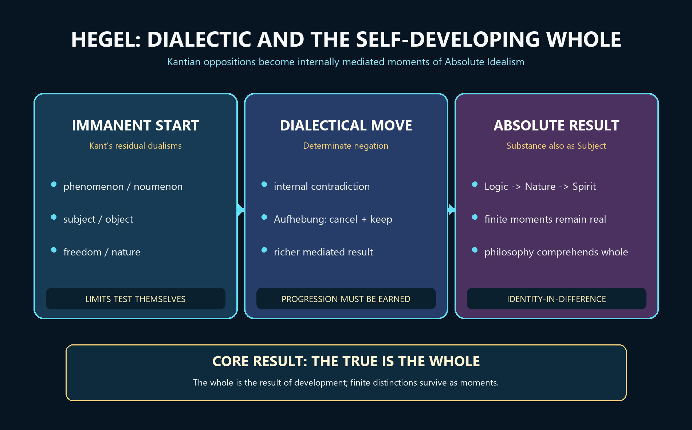

# Hegel — Learner-v2 Source-Complete Learning Session


> **Generation:** g3, 29 August 2026 · **Approval:** false pending explicit topic approval
>
> **Evidence discipline:** Complete legacy teaching and workbook material is preserved, reordered Basic-first/Advanced-last, and checked against the canonical owner and verified 2018–2025 PYQ ledger.


## BASIC LEARNING SESSION




*Concept map: Hegel transforms Kant's fixed dualisms through immanent critique, determinate negation and sublation; the resulting Absolute is a self-developing whole articulated as Logic, Nature and Spirit.*

> **Syllabus (verbatim):** Hegel : Dialectical Method; Absolute Idealism.

### How to Use This Five-Layer Session

Every logical subtopic follows exactly:

| Layer | Purpose |
|---:|---|
| 1. SIMPLE START | visual-first plain-language gateway |
| 2. CORE UPSC | complete terminology, doctrine, argument, example and source grounding |
| 3. ADVANCED | objections, replies, comparisons, provenance cautions and refinements |
| 4. EXAM APPLICATION | verified PYQ routes and 10/15/20-mark architecture |
| 5. RAPID REVISION | traps, retrieval notes and links to the exact MCQ set |

### Source Audit and Contemporary-Link Boundary

- **Canonical doctrine source:** `upsc-ai-kit/knowledge/Philosophy/paper-1/western/Hegel.md` (7,075 words), sliced verbatim into every CORE UPSC layer and preserved again in the canonical apparatus block.
- **Verified PYQs:** continuous local Western Philosophy Paper I bank, 2018-2025; Hegel owns exactly 6 primary parts (2019, 2020, 2021, 2022, 2023, 2025) and has **no** owned question in 2018 or 2024.
- **Ownership discipline:** questions that mention or compare Hegel but are owned by others are excluded - 2018 Q2(b) [Kant, 'Understanding makes Nature' / Kantian dualism], 2024 Q2(a) [Empiricism / Berkeley's subjective idealism], 2023 Q1(d) and 2022 Q4(a) [Existentialism / Kierkegaard]. Sharing the name 'Hegel' is not ownership; such questions appear here only as labelled cross-links.
- **Provenance caution preserved:** the 'thesis-antithesis-synthesis' formula is standard exam vocabulary, not Hegel's own regular schema (its triadic labelling traces to Fichte and Chalybaeus); the layered text keeps Hegel's terms - moment, negation, sublation.
- **Qdrant:** optional fallback only; not required for this canonical topic.
- **Contemporary link (used sparingly, clearly labelled):** ANALYSIS: the XXXVI International Hegel Congress 2026, 'Hegel Global', organised by the Internationale Hegel-Gesellschaft (Rome), foregrounds the global, trans-cultural and decolonial reception and critique of Hegel. It is invoked only as contemporary-scholarship context (for instance, for the Eurocentrism critique of the philosophy of history), never as doctrinal proof; no attendance figures, dates or programme details are asserted beyond what is verifiable in accessible source material.

**Preservation note:** the canonical doctrine is reorganised into layers, never compressed. Every doctrine, canonical example, numbered argument, objection/reply, comparison, restored dossier, corpus-depth delta, PYQ route, directive rule, graded verdict and provenance caution is retained; simplification means adding accessible gateways, not deleting complexity.

### Learning Roadmap

| Unit | Logical subtopic |
|---:|---|
| 1 | The Dialectical Method - Immanent Conceptual Development |
| 2 | Aufhebung and the First Triad - Being, Nothing, Becoming |
| 3 | The Concrete Universal and the Three Domains - Logic, Nature, Spirit |
| 4 | The Master-Slave Dialectic - Recognition, Labour and Reversal |
| 5 | Stoicism, Scepticism and the Unhappy Consciousness |
| 6 | Absolute Idealism - The Real is the Rational; Subject not Substance |
| 7 | The Challenge to Kant's Phenomena/Noumena Distinction |
| 8 | The Logic-to-Nature Transition - 'Freely Releases Itself' |
| 9 | Dialectic in History - Progress in the Consciousness of Freedom |
| 10 | Absolute vs Subjective Idealism (Berkeley) and the Inter-Thinker Bridges |

---

### SESSION 1 — Kant's Residual Dualisms and Hegel's Immanent Project

#### DEFINITION / WHAT THIS IS CALLED

**Plain-language definition:** Hegel begins from Kant's achievement but refuses to leave reason permanently divided from reality.

**Technical definition:** Hegel's post-Kantian project is an immanent critique of fixed oppositions: finite categories are tested by their own claims, disclose their own incompleteness, and develop toward an Absolute that is a self-relating rational whole or subject rather than a static substance or supernatural object.

#### VISUAL — Kant's unresolved oppositions and Hegel's project

```text

KANT'S ACHIEVEMENT: objective experience has rational conditions

                 |

                 v

RESIDUAL OPPOSITIONS

phenomenon | noumenon    subject | object

thought    | being       freedom | nature

                 | fixed external limits?

                 v

HEGEL: test each distinction by IMMANENT CRITIQUE

                 |

                 v

IDENTITY-IN-DIFFERENCE within a self-developing ABSOLUTE

```

*Hegel converts fixed limits into internally mediated relations.*

#### VISUAL — The three logical moments

```text

ABSTRACT / UNDERSTANDING

fixes a determination as self-sufficient

                 | internal insufficiency appears

                 v

DIALECTICAL / NEGATIVE

the fixed term passes into its determinate opposite

                 | opposition is grasped together

                 v

SPECULATIVE / POSITIVE

a concrete unity preserves difference within a richer determination

```

*The moments are functions of one movement, not a universal mechanical recipe.*

#### ANSWER-GRABBING OPENING — WRITE/ADAPT IN THE EXAM

> Hegel radicalises Kant's critical achievement by arguing that a limit reason can determinately think cannot remain an external barrier to reason, so subject and object must be reconciled through identity-in-difference rather than collapsed into featureless sameness.

#### MUST-WRITE KEYWORDS

- **post-Kantian idealism**
- **immanent critique**
- **phenomenon and noumenon**
- **subject and object**
- **identity-in-difference**
- **Absolute**

**How to use them:** Frame Kant's residual dualisms, then present Hegel's immanent project: explain why the thing-in-itself cannot be a permanent external limit and how identity-in-difference preserves distinctions within a developing Absolute.

#### CORE OBJECTION, REPLY AND RESIDUAL LIMIT

**Objection:** Kant can reply that the noumenon is a limiting concept required to restrain speculative reason, not an object Hegel may know.

**Best reply:** Hegel answers that an externally fixed limit is already a determination within thought and that critique must test categories immanently rather than prohibit their development in advance.

**Residual limit:** The reply pressures Kant's dualisms but does not by itself prove every transition or the completeness of Hegel's system.

#### EXAM USE AND CONCISE REVISION

**Answer architecture:** Use the route Kant's achievement -> residual dualisms -> immanent critique -> identity-in-difference -> qualified Absolute.

- Kant secures phenomenal objectivity but retains phenomenon/noumenon and freedom/nature splits.
- The Absolute is the result of development, not a ready-made supernatural entity.
- Identity-in-difference reconciles opposed terms without erasing their determinate difference.

#### Visual gateway - the dialectical spiral (not a flat circle)

```text
        RICHER  UNITY  (a new, more concrete IMMEDIACY)
                 ^   sublation raises the level
                 |          (Aufhebung)
        +--------+--------+
        |   SUBLATION      |  cancel + preserve + raise
        +--------+--------+
                 ^
                 |  contradiction demands resolution
    IMMEDIACY ---+--- DETERMINATE NEGATION
   (a concept in     (its OWN contrary, with
    abstract form)    definite content - not blank)
                 |
                 v  the synthesis becomes the next
              start of a HIGHER turn of the spiral
```

**Plain-language start:** Imagine a single idea that will not sit still. State it in its simplest form; think it honestly, and it trips over *itself* - it turns out to imply its own opposite. You cannot just drop either side, so you look for a bigger idea that keeps what was true in both and loses only their narrowness. That bigger idea is not the end: it too gets thought through, trips over itself, and the climb continues. That upward climb - not a debate between two people - is the **dialectic**.

| Everyday word | Hegel's precise term | What it does |
|---|---|---|
| Starting idea | moment / immediacy | the abstract first form |
| Built-in flaw | determinate negation | the concept's own contrary |
| Better idea | sublation (Aufhebung) | cancels, preserves, raises |
| Not this | debate / argument | dialectic is a concept's self-movement, not two speakers |

> 🔑 **Memory line:** The dialectic is not applied *to* the concept; it is what the concept *does* when you think it through.


> **Syllabus (verbatim):** Hegel : Dialectical Method; Absolute Idealism.
> **Evidence key:** ✅ canonical doctrine · ⚠️ analytical synthesis (mine, for exam use) · ❓ contested/uncertain
> **Placement:** The culmination of German Idealism and a major target of the analytic revolt. Hegel owns 6 parts in the 2018–2025 corpus and appears secondarily in additional Kant/Berkeley comparisons. Two sub-themes dominate: (a) the mechanism of dialectic and how it leads to the Absolute; (b) the challenge to Kant's phenomena/noumena distinction.

---

#### 0. ONE-SCREEN MAP ⚠️

```
HEGEL (1770–1831)
══════════════════════════════════════════════════════════════════
THE DIALECTICAL METHOD                   ABSOLUTE IDEALISM
─────────────────────                    ────────────────────
⚠️ "Thesis–Antithesis–Synthesis"         The Real = the Rational
   schema comes via Fichte/Chalybäus;    Absolute = Spirit (Geist)
   Hegel's own terms: "moment",          = Subject, not merely Substance
   "negation", "sublation (Aufhebung)"   = the Whole that develops itself

   Being → Nothing → Becoming            Three-stage self-unfolding:
   (the first triad)                       LOGIC (Idea in-itself)
                                           NATURE (Idea outside-itself)
   Aufhebung = cancel + preserve + raise   SPIRIT (Idea returned-to-itself)
   Each stage retained at higher level
                                          Against KANT:
   Contradiction = engine of reality        thing-in-itself abolished;
   (not error as in formal logic)           if we can *think* the limit,
                                            it falls within thought
   Concrete Universal:
   truth = the fully-developed system    Freedom & History:
   "The True is the Whole"              "progress of the consciousness
                                          of freedom"
══════════════════════════════════════════════════════════════════
            ▼                                     ▼
  CRITICISMS: Kierkegaard (individual),   LEGACY: Marx (inversion),
  Moore/Russell (revolt), Popper            Bradley (British Idealism),
  ("historicism", unfalsifiable)             Phenomenology (via master–slave)
```

> 🔑 **Mnemonic — "T-A-S spiral":** Thesis → Antithesis → Synthesis, where synthesis becomes the next thesis. But remember: Hegel himself rarely uses these labels (❓ — see §1.2 below).

---

#### 1.1 Statement of the Method ✅

The dialectical method is a pattern of conceptual development in which:

1. A concept or position (**moment/thesis**) is stated in its abstract immediacy.
2. That concept, when thought through rigorously, generates its own **negation** — a contrary determination that it cannot accommodate.
3. The contradiction is resolved (not by discarding either side but) in a higher unity (**sublation / Aufhebung**) that *preserves the truth of both* while *cancelling their one-sidedness* and *raising* the discourse to a richer level. ✅
4. The resulting unity itself becomes a new immediate position and the process repeats — producing a **spiral** of ever-more-concrete determinations.

**Presupposition:** Contradiction is *real and productive* — not a sign of error (as in formal/Aristotelian logic) but the **motor of development**, of thought and of reality equally. For Hegel, a philosophy that cannot accommodate contradiction is simply too static to capture a living, self-moving reality. ✅

#### 1.2 The "Thesis–Antithesis–Synthesis" Label ❓

> ⚠️ **UPSC Trap / Scholarly Caution:** The neat triad "thesis–antithesis–synthesis" is the standard exam vocabulary and UPSC questions use it (e.g. 2022 Q3(b), 2021 Q2(a)). Hegel himself, however, **rarely** uses these three words as a formal schema. The triadic formula was popularised by **Heinrich Moritz Chalybäus** (1837) summarising the Fichte–Schelling–Hegel line, and was then attributed back to Hegel by textbook tradition. Hegel's own operative terms are *moment*, *negation/determinate negation*, and *Aufhebung*.
>
> **Exam strategy:** Teach and deploy the T-A-S vocabulary (the examiner expects it), but add one sentence crediting its provenance to Fichte/Chalybäus and noting Hegel's own preferred terms. This shows critical awareness.

#### Why "immanent" is the whole point

The one word that separates a first-class Hegel answer from a textbook one is **immanent**. The dialectic is *not* a debating tool applied to material from outside, and *not* a fixed three-step recipe stamped on any content. It is the **self-movement of the concept**: a determination, thought through with full rigour, generates its *own* opposite and is driven beyond itself. The philosopher, on Hegel's account, only *watches* ("we" who look on); no external criterion is imported. That is why Hegel calls contradiction the **motor** of thought and reality alike rather than a mark of error.

Three terms carry the mechanism and must be used precisely:
- **Immediacy** - a concept taken in its bare, abstract first form (e.g. "pure Being").
- **Determinate negation** - the concept's *specific* self-negation. Not the empty "nothing at all" of scepticism, but *this* concept's own contrary, which therefore has positive content. Determinate negation is the engine: each negation is the negation *of a specific something*, so it yields a definite next result rather than a blank.
- **Sublation (Aufhebung)** - the higher unity that cancels the one-sidedness, preserves the truth of both moments, and raises the discourse to a richer level.

So the exam-safe formula is: *immediacy -> determinate negation -> sublation -> a new, richer immediacy*, spiralling toward the fully articulated whole. Note the standard classroom labels **thesis / antithesis / synthesis** are useful shorthand the examiner expects, but they are not Hegel's own regular schema (see ADVANCED).

#### CLOSING RECALL FLOW — Kant's Residual Dualisms and Hegel's Immanent Project

```closure-flow
SUBTOPIC: Kant's Residual Dualisms and Hegel's Immanent Project
STARTING CONCEPT: Kant's Residual Dualisms and Hegel's Immanent Project
KEY TERMS / DEFINITIONS: post-Kantian idealism | immanent critique | phenomenon and noumenon | subject and object | identity-in-difference | Absolute
MECHANISM / ARGUMENT: Each opposition is taken on its own terms; when either pole claims self-sufficiency, its dependence on the other appears and forces a richer determination.
CONSEQUENCE / CONTRAST: Reason becomes self-critical without becoming agnostic: finite distinctions remain real, but no finite term is fully intelligible in isolation.
UPSC TRAP / ANSWER-USE: Do not say Hegel simply abolishes every distinction or identifies thought and being as two names for an undifferentiated One.
ANSWER-GRABBING FORMULATION: Hegel radicalises Kant's critical achievement by arguing that a limit reason can determinately think cannot remain an external barrier to reason, so subject and object must be reconciled through identity-in-difference rather than collapsed into featureless sameness.
```

### SESSION 2 — Determinate Negation, Sublation and Being-Nothing-Becoming

#### DEFINITION / WHAT THIS IS CALLED

**Plain-language definition:** Dialectic moves because a one-sided concept fails in a specific way and therefore yields a specific successor.

**Technical definition:** Determinate negation is the content-bearing negation of a definite determination; sublation (Aufhebung) cancels its one-sided independence, preserves its partial truth, and elevates it into a richer unity, so negation of negation produces mediated immediacy rather than a return to the untouched starting point.

#### VISUAL — Determinate negation and the three meanings of sublation

```text

FINITE DETERMINATION claims to be self-sufficient

                 | its own claim generates a specific tension

                 v

DETERMINATE NEGATION = negation OF THIS content

                 |

                 v

+------------- AUFHEBUNG -------------+

| CANCEL one-sidedness                 |

| PRESERVE partial truth               |

| ELEVATE into a richer determination  |

+--------------------------------------+

```

*The higher determination retains content while cancelling one-sidedness.*

#### VISUAL — Being, Nothing and Becoming

```text

PURE BEING: no predicate, contrast or determinate content

       | therefore indistinguishable from

       v

PURE NOTHING: the same absence of determination

       | neither can be held apart from the passing-over

       v

BECOMING: unity of coming-to-be and ceasing-to-be

       |

       v

NEW IMMEDIACY, but now MEDIATED by the failed opposition

```

*The transition is logical and immanent, not a temporal creation story.*

#### ANSWER-GRABBING OPENING — WRITE/ADAPT IN THE EXAM

> Hegelian negation is productive only when the successor is generated by the precise defect of the earlier determination, and Aufhebung names the single act by which the earlier moment is cancelled, preserved and elevated.

#### MUST-WRITE KEYWORDS

- **dialectic**
- **contradiction**
- **determinate negation**
- **Aufhebung**
- **negation of negation**
- **mediated immediacy**

**How to use them:** Define determinate negation before sublation, state all three senses of Aufhebung, and show why the next category must preserve the content whose one-sided claim it cancels.

#### CORE OBJECTION, REPLY AND RESIDUAL LIMIT

**Objection:** Formal logicians object that accepting contradiction violates non-contradiction and makes every conclusion derivable.

**Best reply:** The strongest Hegelian reply distinguishes a self-undermining pair of opposed determinations from simply asserting P and not-P in the same respect.

**Residual limit:** The distinction explains the intended movement but still leaves the necessity of each transition to be demonstrated rather than announced.

#### EXAM USE AND CONCISE REVISION

**Answer architecture:** Write a four-link argument: fixed determination -> internal contradiction -> determinate negation -> sublated mediated immediacy.

- Determinate negation yields this successor, not an empty nothing or any convenient result.
- Aufhebung means cancellation, preservation and elevation in one operation.
- Negation of negation recovers immediacy only as mediated and conceptually richer.

#### Visual gateway - the triple sense of Aufhebung, and the opening move of the Logic

```text
   A U F H E B U N G   (sublation) = ONE act, THREE senses
   +-----------+-----------------+---------------------------+
   |  CANCEL   |    PRESERVE      |          RAISE            |
   | abolish   | keep what was    | lift to a richer, more   |
   | the one-  | true in BOTH     | concrete unity           |
   | sidedness | moments          |                          |
   +-----------+-----------------+---------------------------+

   THE FIRST TRIAD (logical, not a story in time)
        BEING  --------->  NOTHING  --------->  BECOMING
     pure, empty,       equally empty,        the truth of both:
     no determination   the negation of       the passing-over of
        |               Being                 each into the other
        +----- indistinguishable ------+           = first CONCRETE
                                                     category
```

**Plain-language start:** "Sublation" sounds technical but names something familiar: when a better theory replaces a worse one, it does not throw the old insight in the bin - it *keeps* what was right, *drops* what was narrow, and *climbs* higher. Hegel's opening example is deliberately extreme: think "Being" with literally nothing added; there is nothing to think, so it collapses into "Nothing"; but pure Nothing is just as empty, so it flips back; what is *true* is the movement between them - **Becoming**.

| Sense of *aufheben* | Plain meaning | Role in the dialectic |
|---|---|---|
| Cancel | abolish | negate the abstract one-sided form |
| Preserve | keep | retain the genuine content of both |
| Raise | lift up | reach a richer, more concrete unity |

> 🔑 **Memory line:** Aufhebung = *cancel + preserve + raise*; the first triad shows the emptiest thought forcing itself onward.


#### 1.3 *Aufhebung* (Sublation) ✅

The German *aufheben* has the triple meaning:

| Meaning | Role in the dialectic |
|---|---|
| **Cancel** (*aufheben* = to abolish) | The one-sided abstract form is negated |
| **Preserve** (*aufheben* = to keep) | The genuine content of both moments is retained |
| **Raise** (*aufheben* = to lift up) | The result is a richer, more concrete unity |

This triple operation is what distinguishes Hegelian dialectic from mere contradiction-and-collapse. Nothing is simply lost; the history of thought (and of reality) is cumulative.

#### 1.4 The Canonical First Triad: Being–Nothing–Becoming ✅

| Stage | Content | Dialectical Move |
|---|---|---|
| **Being** (*Sein*) | The most abstract, indeterminate concept — "pure being, without further determination" | Precisely because it has no content, it is empty — indistinguishable from… |
| **Nothing** (*Nichts*) | Equally empty, equally indeterminate — the negation of Being | But Nothing, thought as the absence of all, is itself a kind of Being… |
| **Becoming** (*Werden*) | The truth of both: the passage of Being into Nothing and Nothing into Being | The first *concrete* category — a unity containing both moments as sublated |

This is not a temporal sequence but a logical one: when we try to think "pure Being" with no predicate, it "vanishes" into Nothing; Nothing similarly "passes over" into Being; their truth is Becoming — the first genuinely determinate thought. ✅

#### Why Aufhebung is load-bearing, and why the first triad is *logical* not *temporal*

**Aufhebung** is the single most important word in the system because it fixes what the dialectic *does with error*. The German *aufheben* really carries three ordinary senses at once - **cancel** (abolish the one-sided form), **preserve** (keep the genuine content of both moments) and **raise** (lift the result to a more concrete unity). Because of this triple operation, *nothing true is ever simply lost*: the history of thought is **cumulative**, every superseded position surviving as a *moment* of the richer whole. This is exactly what distinguishes Hegelian dialectic from mere refutation-and-collapse: the loser is not deleted, only its *pretension to be the whole* is cancelled.

The **first triad - Being -> Nothing -> Becoming** - is the cleanest worked example, and the point examiners miss is that it is a **logical, not a chronological, sequence**. "Pure Being," thought with *no* determination whatever, has no content to distinguish it from *Nothing*; each "passes over" into the other; their truth is **Becoming**, the first *concrete* (determinate) category, which contains both as sublated moments. Nobody is claiming Being existed first and Nothing arrived later; the claim is that the most abstract thought, thought honestly, *is unstable* and drives itself to a richer thought. That instability - not an external push - is the whole demonstration.

#### CLOSING RECALL FLOW — Determinate Negation, Sublation and Being-Nothing-Becoming

```closure-flow
SUBTOPIC: Determinate Negation, Sublation and Being-Nothing-Becoming
STARTING CONCEPT: Determinate Negation, Sublation and Being-Nothing-Becoming
KEY TERMS / DEFINITIONS: dialectic | contradiction | determinate negation | Aufhebung | negation of negation | mediated immediacy
MECHANISM / ARGUMENT: A finite determination claims independence, reveals a contradiction internal to that claim, is specifically negated, and returns as a new immediacy enriched by the mediation.
CONSEQUENCE / CONTRAST: Error becomes partial truth within a more concrete determination; dialectic is cumulative rather than arbitrary destruction.
UPSC TRAP / ANSWER-USE: Do not treat contradiction as formal inconsistency that licenses anything, or sublation as compromise between externally supplied positions.
ANSWER-GRABBING FORMULATION: Hegelian negation is productive only when the successor is generated by the precise defect of the earlier determination, and Aufhebung names the single act by which the earlier moment is cancelled, preserved and elevated.
```

### SESSION 3 — Concrete Universal, Finite Moments and the Architecture of the Whole

#### DEFINITION / WHAT THIS IS CALLED

**Plain-language definition:** A real whole does not erase its parts; it makes each part intelligible through its relations to the others.

**Technical definition:** The concrete universal is a universal that particularises itself and contains its differences; finite entities and categories are real but partial moments whose identity is internally related to a developing whole structured as Logic, Nature and Spirit, with Spirit differentiated into Subjective, Objective and Absolute Spirit.

#### VISUAL — Finite moment and internally related whole

```text

FINITE MOMENT A <---- INTERNAL RELATIONS ----> FINITE MOMENT B

        \                                      /

         \                                    /

          +------ CONCRETE UNIVERSAL --------+

          | preserves determinate difference |

          | organises reciprocal dependence  |

          | is the RESULT of development      |

          +-----------------------------------+

REAL AS A MOMENT != ULTIMATE IN ISOLATION

```

*Identity-in-difference makes the finite both real and non-self-sufficient.*

#### VISUAL — Logic, Nature and Spirit architecture

```text

LOGIC: Idea in-itself -> Being -> Essence -> Concept

                 | logical externality, not temporal creation

                 v

NATURE: Idea in otherness -> space, time, matter, organism

                 | return through living and social self-consciousness

                 v

SPIRIT: Idea returned-to-itself

   SUBJECTIVE -> individual mind

   OBJECTIVE  -> right, morality, ethical life, history

   ABSOLUTE   -> art -> religion -> philosophy

```

*The architecture is logical, not a sequence of events before and after nature.*

#### ANSWER-GRABBING OPENING — WRITE/ADAPT IN THE EXAM

> The Hegelian whole is concrete because it preserves determinate finite moments within their internal relations, so 'the true is the whole' means the whole is the result of its development rather than a ready-made totality that swallows its parts.

#### MUST-WRITE KEYWORDS

- **concrete universal**
- **finite moment**
- **mediation**
- **internal relations**
- **Logic-Nature-Spirit**
- **Absolute Spirit**

**How to use them:** Contrast abstract and concrete universals, explain finite reality as partial rather than illusory, and map both the large system and the nested forms of Spirit.

#### CORE OBJECTION, REPLY AND RESIDUAL LIMIT

**Objection:** The system may appear circular because it judges each finite stage from the completed whole that the stages are supposed to generate.

**Best reply:** Hegel replies that the whole is the result together with the path, and retrospective intelligibility is the mode of philosophical comprehension.

**Residual limit:** Retrospective coherence does not automatically establish strict deductive necessity or eliminate contingency.

#### EXAM USE AND CONCISE REVISION

**Answer architecture:** Use two nested diagrams: finite moment <-> internally related whole, then Logic -> Nature -> Spirit and its three subdivisions.

- Abstract universals omit difference; concrete universals organise and preserve it.
- Finite things are real as mediated moments, not unreal appearances.
- Art, religion and philosophy are forms of Absolute Spirit; philosophy gives conceptual comprehension.

#### Visual gateway - one method, three domains, nested triads

```text
              THE ABSOLUTE  (the self-developing Whole)
                          |
     +--------------------+--------------------+
     |                    |                    |
   LOGIC               NATURE               SPIRIT
 Idea IN-itself     Idea OUTSIDE-itself   Idea RETURNED-to-itself
 (pure categories) (externalised,        (self-conscious life)
  Being>Essence>    space,time,matter)         |
  Concept                                       |
                                +---------------+---------------+
                                |               |               |
                          SUBJECTIVE       OBJECTIVE        ABSOLUTE
                            Spirit           Spirit          Spirit
                        (individual      (law, morality,  (art>religion
                            mind)         state, history)  >philosophy)
```

**Plain-language start:** Hegel's whole system is one shape repeated at bigger and bigger scales, like a pattern that recurs inside itself. The pattern is the dialectic; the three big scales are **Logic** (pure thought), **Nature** (thought turned into a world of things), and **Spirit** (thought coming back to itself in human life). And the "Spirit" box has the same three-part pattern inside it. A "concrete universal" is a whole like this - one that contains and organises its own parts, not an empty label sitting above them.

| Domain | The Idea is... | Contents |
|---|---|---|
| Logic | in-itself | pure categories: Being, Essence, Concept |
| Nature | outside-itself | space, time, matter, organisms |
| Spirit | returned-to-itself | subjective -> objective -> absolute spirit |

> 🔑 **Memory line:** *The True is the Whole* - truth is the fully developed system, not any single stage in it.


#### 1.5 The Concrete Universal ✅

For Hegel the traditional "abstract universal" (a genus got by stripping away differences) is a shadow. The **concrete universal** retains and organises its own differentiations within itself. Truth is the *Whole* — the system fully articulated — not a bare abstraction hovering above particulars:

> ✅ *"The True is the Whole. But the Whole is nothing other than the essence completing itself through its development."*

#### 1.6 Dialectic Applied: Logic, Nature, History

The dialectic operates at three levels simultaneously:

1. **Logic** (*Science of Logic*) — the self-development of pure categories: Being → Essence → Concept.
2. **Nature** (*Philosophy of Nature*) — the Idea in its self-alienation; the externalised opposite of thought.
3. **Spirit** (*Philosophy of Spirit* / *Phenomenology*) — the Idea returning to itself through culture, history, art, religion, philosophy.

The same triadic rhythm runs within each. E.g., within Spirit: Subjective Spirit (individual mind) → Objective Spirit (law, morality, state, history) → Absolute Spirit (art → religion → philosophy). ✅

#### From "truth is the Whole" to the architecture of the system

Two doctrines lock together here. First, the **concrete universal**: the traditional *abstract* universal is a genus got by *stripping away* differences (the "animal" left after you subtract dog, cat, horse) - for Hegel a bloodless shadow. The **concrete universal** *retains and organises its own differentiations within itself*; it is a whole that particularises itself and stays itself through the particulars. Truth, correspondingly, is not a bare abstraction hovering above particulars but the **Whole** - *"The True is the Whole,"* the system fully articulated.

Second, that Whole has a definite **architecture**: the same triadic rhythm runs at three levels.
- **Logic** - the self-development of pure categories (Being -> Essence -> Concept).
- **Nature** - the Idea in self-alienation, the externalised opposite of thought.
- **Spirit** - the Idea returning to itself through culture, history, art, religion, philosophy.

And *within* Spirit the rhythm repeats: **Subjective Spirit** (individual mind) -> **Objective Spirit** (law, morality, the state, history) -> **Absolute Spirit** (art -> religion -> philosophy). This nesting is why Hegel can claim a single method organises everything from the emptiest category to the highest self-knowledge: each domain is the previous one sublated. Philosophy is the *highest* form of Absolute Spirit because it grasps this whole in *conceptual* form.

#### CLOSING RECALL FLOW — Concrete Universal, Finite Moments and the Architecture of the Whole

```closure-flow
SUBTOPIC: Concrete Universal, Finite Moments and the Architecture of the Whole
STARTING CONCEPT: Concrete Universal, Finite Moments and the Architecture of the Whole
KEY TERMS / DEFINITIONS: concrete universal | finite moment | mediation | internal relations | Logic-Nature-Spirit | Absolute Spirit
MECHANISM / ARGUMENT: Finite moments gain determinate identity through relations; the whole develops from pure categories through externality to self-conscious institutional and cultural life.
CONSEQUENCE / CONTRAST: Nature and finite minds remain real, while philosophy comprehends their place within the self-developing rational whole.
UPSC TRAP / ANSWER-USE: Do not tell a temporal story in which an Idea existed before nature and later manufactured the world.
ANSWER-GRABBING FORMULATION: The Hegelian whole is concrete because it preserves determinate finite moments within their internal relations, so 'the true is the whole' means the whole is the result of its development rather than a ready-made totality that swallows its parts.
```

### SESSION 4 — Recognition and Lordship-Bondage: Dependence, Fear and Labour

#### DEFINITION / WHAT THIS IS CALLED

**Plain-language definition:** Self-consciousness needs acknowledgement from another self-consciousness, so domination defeats its own purpose.

**Technical definition:** Recognition (Anerkennung) is the intersubjective condition of self-consciousness; the lordship-bondage dialectic shows that one-sided recognition makes the lord dependent, while fear, service and formative labour (Bildung) allow the bondsman to acquire a mediated independence.

#### VISUAL — Recognition and the dependence loop

```text

SELF A needs recognition <------------> SELF B needs recognition

                 | life-and-death struggle

                 v

LORD ---------------------------- BONDMAN

 | recognition from an unfree other      | fear of death

 | depends on labour for enjoyment        | service disciplines desire

 +--------------- DEPENDENCE ------------+ labour shapes object

                                             |

                                             v

                                 BILDUNG: self formed in the world

RESULT: reciprocal recognition, not domination, is the stable norm

```

*The apparent independence of the lord conceals a twofold dependence.*

#### ANSWER-GRABBING OPENING — WRITE/ADAPT IN THE EXAM

> The lordship-bondage episode demonstrates that unequal recognition is conceptually unstable: the lord depends on an acknowledgement he has devalued, whereas the bondsman's fear and labour form a more durable self-relation.

#### MUST-WRITE KEYWORDS

- **recognition**
- **self-consciousness**
- **lordship and bondage**
- **dependence**
- **fear**
- **labour and Bildung**

**How to use them:** Begin with the need for recognition, trace the struggle and asymmetry, explain both directions of dependence, and end with labour as formative self-objectification.

#### CORE OBJECTION, REPLY AND RESIDUAL LIMIT

**Objection:** A recognition-centred interpretation can shrink Absolute Idealism into social psychology and overstate one episode of the Phenomenology.

**Best reply:** Used as a bounded illustration, the episode concretises the dependence of selfhood and freedom on mediated social relations without replacing the system.

**Residual limit:** The passage establishes conceptual instability more securely than any timetable of historical emancipation.

#### EXAM USE AND CONCISE REVISION

**Answer architecture:** Use the dependence loop, the reversal through fear and labour, and a final qualification on the limited role of the episode.

- Recognition from a devalued, unfree other cannot satisfy the lord's aim.
- Fear, service and labour educate desire and produce formative self-consciousness.
- The illustration is one stage of the Phenomenology, not a complete theory of Hegel.

#### Visual gateway - the recognition flow and its reversal

```text
   TWO SELF-CONSCIOUSNESSES  each needs RECOGNITION from the other
                     |
              life-and-death STRUGGLE
                 /            \
          risks death       clings to life
              |                   |
           MASTER (lord)       SLAVE (bondsman)
              |                   |
         is recognised        is forced to LABOUR
         only by a SLAVE      on the object (Bildung)
              |                   |
        recognition is       sees himself in the
        WORTHLESS            worked world
              |                   |
        gains nothing        gains independent
        genuine  <=== REVERSAL ===> self-consciousness
```

**Plain-language start:** Two people each want to be *seen* as a genuine self by the other. It escalates into a showdown; one dominates (the "master"), one submits (the "slave"). Then comes the twist. The master is only admired by someone he treats as nothing, so the admiration is empty. The slave, forced to *work*, shapes the world and starts to recognise himself in what he makes - and so quietly becomes the one who grows. Freedom, Hegel is saying, is won through **work and mutual recognition**, not through domination.

| Figure | Chooses | Short-term result | Long-term result |
|---|---|---|---|
| Master | risks death | domination, being served | hollow, worthless recognition |
| Slave | life, submission | servitude, forced labour | self-formation (Bildung), growth |

> 🔑 **Memory line:** The master needs the slave to *be* a master; the slave needs only *work* to become free.


#### 1.7 The Master–Slave Dialectic (*Phenomenology of Spirit*, Ch. IV) ⚠️

A celebrated concrete application of dialectic:

1. Two self-consciousnesses meet; each demands *recognition* from the other.
2. A life-and-death struggle ensues. One (the **master**) risks death and dominates; the other (the **slave**) chooses life and submits.
3. **Reversal:** The master, receiving recognition only from an unfree being, gains nothing genuine. The slave, through *labour* on the object, achieves self-formation (*Bildung*) and ultimately develops a richer self-consciousness.
4. **Significance:** freedom and selfhood arise through struggle and work, not passively; the apparently defeated term becomes the bearer of progress.

> ⚠️ This passage is Marx's inspiration for class-struggle; also Beauvoir's and Fanon's starting-point. Cross-link: Political Ideologies (Marxism).

#### The concrete case that turns method into a theory of freedom

The lordship-bondage passage (*Phenomenology of Spirit*, Ch. IV) is the most famous *concrete* application of the dialectic, and the reason it matters is that it shows selfhood and freedom are **achieved through struggle and work, not possessed passively**. The argument moves in four beats:
1. Two self-consciousnesses meet; each needs **recognition** (*Anerkennung*) from the other to be *for itself* what it is *in itself*. Recognition, not appetite, is the driver.
2. A **life-and-death struggle** follows. One risks death and becomes **master (lord)**; the other clings to life and becomes **slave (bondsman)**.
3. The **reversal** - the dialectical point. The master wins recognition *only from a slave*, i.e. from an unfree consciousness whose acknowledgement is worthless; his victory is self-defeating. The slave, meanwhile, is forced to **labour on the object**, and through that formative activity (*Bildung*) he externalises and *sees himself* in the worked world, developing a richer, more independent self-consciousness.
4. **Significance.** The apparently defeated term becomes the bearer of progress: freedom arises through *work and recognition*, and *unequal* recognition is shown to be **conceptually unstable**.

Crucially, the passage does **not** end in stable mastery. Recognition has failed on both sides, so self-consciousness withdraws from the external struggle into *thought* - which is precisely where the next subtopic (Stoicism -> Scepticism -> Unhappy Consciousness) begins. Answering a master-slave question *without* carrying it forward stops the argument halfway.

#### CLOSING RECALL FLOW — Recognition and Lordship-Bondage: Dependence, Fear and Labour

```closure-flow
SUBTOPIC: Recognition and Lordship-Bondage: Dependence, Fear and Labour
STARTING CONCEPT: Recognition and Lordship-Bondage: Dependence, Fear and Labour
KEY TERMS / DEFINITIONS: recognition | self-consciousness | lordship and bondage | dependence | fear | labour and Bildung
MECHANISM / ARGUMENT: The lord consumes through the bondsman's work and receives recognition from an unfree other; the bondsman disciplines desire, shapes the object and encounters his own form in the worked world.
CONSEQUENCE / CONTRAST: Freedom is relational and mediated rather than possession by an isolated ego or the successful domination of another.
UPSC TRAP / ANSWER-USE: Do not reduce all Hegel to a master-slave struggle or claim the passage predicts the rapid historical overthrow of every master.
ANSWER-GRABBING FORMULATION: The lordship-bondage episode demonstrates that unequal recognition is conceptually unstable: the lord depends on an acknowledgement he has devalued, whereas the bondsman's fear and labour form a more durable self-relation.
```

### SESSION 5 — Phenomenological Development: Consciousness, Self-Consciousness and Reason

#### DEFINITION / WHAT THIS IS CALLED

**Plain-language definition:** The Phenomenology follows forms of experience that fail by the standards they themselves claim to satisfy.

**Technical definition:** A shape of consciousness (Gestalt) contains a criterion of knowledge and an object corresponding to it; experience is the immanent revision produced when the object fails that criterion, carrying consciousness through consciousness, self-consciousness and reason toward social and spiritual forms.

#### VISUAL — Phenomenological path through immanent failure

```text

CONSCIOUSNESS: object is taken as independent

      | its own criterion fails to secure the object

      v

SELF-CONSCIOUSNESS: object is another self; recognition required

      | unequal recognition and abstract freedom fail

      v

STOICISM -> SCEPTICISM -> UNHAPPY CONSCIOUSNESS

      | contradiction becomes explicit and is worked through

      v

REASON: consciousness is certain of finding itself in reality

      | develops socially and historically

      v

SPIRIT: shared practices, institutions and self-comprehension

```

*Each transition preserves a lesson while revising both knower and known.*

#### ANSWER-GRABBING OPENING — WRITE/ADAPT IN THE EXAM

> The Phenomenology is a ladder of immanent failures: each shape discovers that its own criterion cannot secure the object it claims, so consciousness preserves the lesson and advances toward reason and Spirit.

#### MUST-WRITE KEYWORDS

- **Phenomenology**
- **shape of consciousness**
- **consciousness**
- **self-consciousness**
- **reason**
- **Spirit**

**How to use them:** State the criterion-failure mechanism, use recognition and the Stoicism-Scepticism-Unhappy Consciousness sequence as bounded illustrations, and show the transition to reason.

#### CORE OBJECTION, REPLY AND RESIDUAL LIMIT

**Objection:** Kierkegaard objects that the existing individual's relation to the eternal cannot be reduced to a stage that a universal system supersedes.

**Best reply:** Hegel can reply that a shape is overcome at the level of its claim to truth, not erased as a recurring possibility in individual life.

**Residual limit:** The reply preserves phenomenological logic but may understate irreducible existential singularity.

#### EXAM USE AND CONCISE REVISION

**Answer architecture:** Use one criterion-failure cycle, then the main ladder, then one named objection and reply.

- A shape fails by its own criterion; the philosopher does not impose an external test.
- Stoicism -> Scepticism -> Unhappy Consciousness shows determinate transitions in thought.
- Reason finds itself in the world and prepares the move to social Spirit.

#### Visual gateway - the consciousness ladder to Reason

```text
   (from the failed master-slave struggle: freedom sought in THOUGHT)

   STOICISM ......... free in thought, on throne or in chains
      |              FLAW: abstract, empty, indifferent to content
      v
   SCEPTICISM ....... actively dissolves all fixed content
      |              FLAW: performative self-contradiction
      |              (asserts that nothing can be asserted)
      v
   UNHAPPY .......... the contradiction becomes CONSCIOUS of itself
   CONSCIOUSNESS     UNCHANGEABLE (beyond/God) vs CHANGEABLE (this self)
      |   devotion -> work (disowned) -> mediator -> total self-surrender
      v
   R E A S O N ...... complete self-renunciation = universality;
                      consciousness now at home IN the world
```

**Plain-language start:** Having failed to win freedom by fighting, the self tries to be free just by *thinking*. First it shrugs at the world (Stoicism) - but that is empty. Then it tries to *deny* everything (Scepticism) - but it keeps living as a real person, so it contradicts itself. Finally it *feels* the split consciously (the "Unhappy Consciousness"): part of me is a worthless particular, and all worth belongs to a God "beyond." The cure is surprising: by giving *itself* up completely, the self stops being a lonely particular set against the universal - and finds the "beyond" was realised through its own act all along.

| Shape | Claim to freedom | Why it breaks |
|---|---|---|
| Stoicism | free in thought, whatever my state | abstract, empty, no content |
| Scepticism | dissolve all determinacy | denies determinacy yet lives as determinate |
| Unhappy Consciousness | cling to the eternal beyond | torn between Unchangeable and Changeable |

> 🔑 **Memory line:** Alienation here is **self-inflicted** - consciousness projects its own essence into a beyond, then feels worthless before it.


#### 1.8 STOICISM → SCEPTICISM → THE UNHAPPY CONSCIOUSNESS ✅ (*Phenomenology of Spirit*, Ch. IV B)

**Where it sits.** The master–slave dialectic ends without genuine recognition. Self-consciousness therefore withdraws from the struggle for recognition in the world and seeks freedom **in thought**. Chapter IV B traces three successive shapes (*Gestalten*) of that attempt — and it is the *continuation* of the master–slave passage, not a separate episode. Answering a master–slave question without carrying it through to the Unhappy Consciousness stops the argument halfway.

**Exact printed subterms:** *Gestalt* (shape of consciousness) · *das unglückliche Bewusstsein* (the unhappy consciousness) · *das Unwandelbare* (the **Unchangeable**) vs *das Wandelbare* (the **Changeable**) · *Andacht* (devotion) · *Entäußerung* (externalisation/self-relinquishment) · the *Mittler* (mediator/priest) · *Entzweiung* (self-diremption, being torn in two).

| Shape | Its claim to freedom | The internal contradiction that destroys it |
|---|---|---|
| **Stoicism** | I am free in thought whatever my condition — "whether on the throne or in chains." Freedom is withdrawal into the thinking self. | The freedom is **abstract and empty**: it is indifferent to all content, so when asked what is true or good it can answer only "the true, the good" in general. Freedom purchased by making the world irrelevant is freedom with nothing to do. |
| **Scepticism** | The negativity Stoicism merely implied is now *enacted*: I actively dissolve every determinate content, showing all fixity to be nothing. | Performative self-contradiction. It **asserts** that nothing can be asserted; it denies all determinacy while continuing to eat, drink and act as a determinate individual. Hegel's image: it is "the unconscious babble of contradiction," like children who take turns contradicting each other and call it argument. |
| **Unhappy Consciousness** | The contradiction that Scepticism unconsciously *was* now becomes **conscious of itself**: one consciousness that contains two, and knows it. | It knows itself as "a dual-natured, merely contradictory being" — the **Unchangeable** (essential, beyond, God) and the **Changeable** (inessential, this particular self). It cannot abandon either. |

**The three moments of the Unhappy Consciousness — the argument ✅:**
1. **Devotion (*Andacht*).** The self relates to the Unchangeable as a **beyond**: infinite yearning, feeling, pure longing toward something it can never grasp as an object. The Unchangeable remains shapeless; devotion "reaches out and finds nothing." The self experiences its own particularity as guilt.
2. **Desire and work.** The self acts in the world — labours, consumes, achieves. But it disowns every achievement: the capacity, the opportunity and the result are all ascribed to the Unchangeable, and the self returns thanks. Its own activity is systematically alienated from itself. *This is the precise structural moment that Feuerbach and Marx will re-describe as religious alienation: what is best in the human is projected onto a beyond and then received back as a gift.*
3. **Self-mortification and the Mediator.** The self surrenders even its judgement and will — property, enjoyment and decision are handed to a **mediator** (the priest/church). This is total *Entäußerung*: the singular self relinquishes itself entirely.
4. **The reversal (the dialectical point).** In renouncing its particularity *completely*, the self ceases to be *this* particular self standing opposed to the universal — the renunciation *is* the achievement of universality. The Unchangeable turns out not to be a beyond at all but to be realised **in and through** the individual's own act.
5. Therefore, transition to **Reason** — the shape of consciousness that is "certain of being all reality," i.e. that finds itself in the world instead of opposed to it.

**Presuppositions ⚠️:**
- **P1** Shapes of consciousness have an internal logic that destroys them from within; the philosopher only *watches* (Hegel's "we" who look on). No external criterion is applied.
- **P2** Alienation is self-inflicted and therefore self-curable — the beyond is the consciousness's own product.
- **P3** The sequence is **logical, not chronological**: Stoicism, Scepticism and medieval piety are historical illustrations of a conceptual order, not a claim that history ran in that order.

**Strongest objections → replies:**
| Objection | Source | Reply | Residual |
|---|---|---|---|
| The "overcoming" is verbal. Existentially, the self's relation to the eternal is not a stage that gets sublated — it is the permanent human condition, and the individual before God is precisely what *cannot* be a moment of a system. | **Kierkegaard** (*Concluding Unscientific Postscript*) | Hegel: the objection mistakes the phenomenology's *level* — the shape is overcome for consciousness as such, not extinguished in any particular life. | ⚠️ Kierkegaard's charge is the strongest one in this file; concede its force and use it as the bridge to `Existentialism.md`. |
| Hegel's account of Christianity is reductive — devotion, work and asceticism are read as failures rather than as forms of life. | theological critics; also Feuerbach *from the other side* | Hegel treats religion as **Absolute Spirit** in representational form (*Vorstellung*), not as error — only philosophy's conceptual form (*Begriff*) surpasses it. | ❓ Whether "surpassing" religion respects it is precisely what is disputed. |
| The dialectic here is a literary description, not an argument; nothing *forces* the move from Scepticism to Unhappy Consciousness. | analytic critics; Russell generally | The force is the performative contradiction: Scepticism must *live* as a determinate individual while denying determinacy, and to become aware of that is already to be the Unhappy Consciousness. | ⚠️ Fair as far as it goes; the necessity is retrospective, which is Hegel's own admitted method ("the owl of Minerva"). |

**Executable verdict:** "The Unhappy Consciousness is where the *Phenomenology* proves that Hegelian dialectic is not a formula applied to material but a description of how a form of life destroys itself by living out its own commitment. Its permanent legacy runs in two opposite directions: Feuerbach and Marx take the analysis of alienation and drop the resolution; Kierkegaard takes the diagnosis and denies that any resolution is available. That both heirs are convincing is the best evidence that Hegel identified something real and resolved it too quickly."

---

#### The continuation of master-slave - freedom sought in thought, and its self-cure

Because recognition failed in the world, self-consciousness now seeks freedom **in thought**, and *Phenomenology* Ch. IV B traces three successive **shapes (Gestalten)**:
- **Stoicism** - "I am free in thought whether on the throne or in chains." But this freedom is **abstract and empty**: indifferent to all content, it can say only "the good, the true" in general. Freedom bought by making the world irrelevant has nothing to do.
- **Scepticism** - the negativity Stoicism only implied is now *enacted*: it actively dissolves every determinate content. But it is a **performative self-contradiction** - it *asserts* that nothing can be asserted, denies all determinacy while continuing to eat, drink and act as a determinate individual ("the unconscious babble of contradiction").
- **Unhappy Consciousness (das unglueckliche Bewusstsein)** - the contradiction Scepticism unconsciously *was* now becomes **conscious of itself**: one consciousness that contains two and knows it - the **Unchangeable** (essential, the beyond, God) and the **Changeable** (this inessential particular self). It cannot abandon either.

**The three moments of the Unhappy Consciousness (the argument):**
1. **Devotion (Andacht).** The self relates to the Unchangeable as a **beyond** - infinite yearning that "reaches out and finds nothing," experiencing its own particularity as guilt.
2. **Desire and work.** The self labours and achieves, but **disowns every achievement**: capacity, opportunity and result are all ascribed to the Unchangeable, and thanks are returned. *This is the exact structure Feuerbach and Marx re-describe as religious alienation - the best of the human projected onto a beyond and received back as a gift.*
3. **Self-mortification and the Mediator.** The self surrenders even judgement and will to a **mediator** (priest/church): total self-relinquishment (*Entaeusserung*).
4. **The reversal.** In renouncing its particularity *completely*, the self ceases to be *this* particular opposed to the universal - the renunciation *is* the attainment of universality; the Unchangeable turns out to be realised **in and through** the individual's own act.
5. Therefore transition to **Reason** - consciousness "certain of being all reality," at home in the world instead of opposed to it.

#### CLOSING RECALL FLOW — Phenomenological Development: Consciousness, Self-Consciousness and Reason

```closure-flow
SUBTOPIC: Phenomenological Development: Consciousness, Self-Consciousness and Reason
STARTING CONCEPT: Phenomenological Development: Consciousness, Self-Consciousness and Reason
KEY TERMS / DEFINITIONS: Phenomenology | shape of consciousness | consciousness | self-consciousness | reason | Spirit
MECHANISM / ARGUMENT: Sense-certainty and object-consciousness expose unstable immediacy; recognition makes self-consciousness relational; failed freedoms in thought make their contradiction explicit and open the standpoint of reason.
CONSEQUENCE / CONTRAST: Knowledge becomes a historical and social achievement in which the knower's standard is transformed with the known object.
UPSC TRAP / ANSWER-USE: Do not present the sequence as a literal universal chronology or force every historical culture into a rigid three-step algorithm.
ANSWER-GRABBING FORMULATION: The Phenomenology is a ladder of immanent failures: each shape discovers that its own criterion cannot secure the object it claims, so consciousness preserves the lesson and advances toward reason and Spirit.
```

### SESSION 6 — Absolute Idealism: Substance as Subject, Actuality and Thought-Being

#### DEFINITION / WHAT THIS IS CALLED

**Plain-language definition:** Absolute Idealism understands thought and being within a self-developing whole: substance is also subject, finite differences are real moments, and actuality is more than mere existence.

**Technical definition:** Absolute Idealism holds that reality is internally related and self-developing, that substance must also be subject, and that thought and being are identical only as differentiated moments mediated within the whole; actuality (Wirklichkeit) is realised rational structure, not every item of mere existence (Dasein).

#### VISUAL — Substance becomes subject

```text

STATIC SUBSTANCE

undifferentiated unity | no internal history | finite modes accidental

                 | Hegelian correction

                 v

SUBSTANCE ALSO AS SUBJECT

self-differentiates -> externalises -> returns -> knows itself

                 |

                 v

FINITE MINDS AND NATURE = REAL MOMENTS, NOT ILLUSIONS

```

*Hegel retains unity but makes it self-differentiating and self-knowing.*

#### VISUAL — Existence is not actuality

```text

DASEIN / MERE EXISTENCE

a fact is present, but may fail its concept or rational norm

                 | development, mediation, institutional testing

                 v

WIRKLICHKEIT / ACTUALITY

existence has realised its rational concept in a durable form


THEREFORE: existing injustice != rational actuality

CRITICAL QUESTION: does the institution realise freedom in its own form?

```

*The distinction prevents the rational-actual formula becoming a defence of every fact.*

#### ANSWER-GRABBING OPENING — WRITE/ADAPT IN THE EXAM

> Hegel's Absolute Idealism neither reduces reality to a private mind nor blesses every fact: it treats finite beings as real moments of a substance that is also subject and reserves actuality for existence that has realised its rational concept.

#### MUST-WRITE KEYWORDS

- **Absolute Idealism**
- **substance-as-subject**
- **thought and being**
- **Wirklichkeit**
- **Dasein**
- **actuality**

**How to use them:** Define Absolute Idealism, explain substance as subject, distinguish mediated thought-being identity from collapse, and contrast actuality (Wirklichkeit) with mere existence (Dasein) before using the rational-actual formula.

#### CORE OBJECTION, REPLY AND RESIDUAL LIMIT

**Objection:** The formula can still be read conservatively because Hegel's retrospective philosophy may rationalise institutions after their victory.

**Best reply:** The Wirklichkeit-Dasein distinction blocks blanket endorsement, while immanent critique permits institutions to be judged by whether they realise their own rational norm of freedom.

**Residual limit:** The distinction weakens the authoritarian reading but does not remove all tension between reconciliation and criticism.

#### EXAM USE AND CONCISE REVISION

**Answer architecture:** Use substance -> subject, finite moment <-> whole, Dasein vs Wirklichkeit, then a qualified political verdict.

- The Absolute is a result that becomes what it is through self-differentiation.
- Thought and being are reconciled through mediation, not flattened into numerical identity.
- Actuality means realised rational essence; mere existence can remain irrational and defective.

#### Visual gateway - Substance vs Subject, and actual vs merely existent

```text
   SPINOZA'S SUBSTANCE (Hegel's target)   HEGEL'S SUBJECT (the correction)
   +-------------------------------+      +-------------------------------+
   | inert, undifferentiated whole |  ->  | active SELF-KNOWING           |
   | no internal development       |      | posits difference in itself   |
   | static unity                  |      | alienates in Nature, RETURNS  |
   |                               |      | in Spirit; living totality    |
   +-------------------------------+      +-------------------------------+

   "THE REAL IS THE RATIONAL"  -  disambiguate the term FIRST:
      wirklich (ACTUAL)  = has realised its rational essence   [fully real]
      Dasein   (merely existent) = brute existence, NOT yet actual
      => NOT "whatever exists is justified"
```

**Plain-language start:** "Absolute Idealism" means: reality, at bottom, is *one* rational, self-developing whole - call it Spirit - and everything else (nature, individual minds) is a part of *its* life. Two famous lines get misheard. "The real is the rational" does **not** mean "everything that exists is fine"; Hegel's word for "real" here means "has become what it rationally should be," which lots of existing things have not. And "the Absolute is Subject, not just Substance" means reality is not a frozen block (Spinoza) but something that *develops and comes to know itself*.

| Claim | Careless reading (wrong) | Hegel's meaning |
|---|---|---|
| "Real is rational" | whatever exists is justified | *wirklich* = has realised its essence; not mere *Dasein* |
| "Subject not Substance" | the Absolute is a person | living, self-differentiating, self-knowing totality |

> 🔑 **Memory line:** *wirklich* (actual) is not the same as *Dasein* (merely existent); the Absolute *develops and knows itself*.


#### 2.1 Statement ✅

**Absolute Idealism** is the doctrine that ultimate reality is a single, self-developing, rational whole — the **Absolute** — which is *Spirit/Mind (Geist)* in its fullest sense. Nature and finite minds are not independent substances but **moments** within the Absolute's self-unfolding.

> ✅ *"What is rational is actual, and what is actual is rational."* (Preface to *Philosophy of Right*)

This does not mean every empirical fact is "rational" in a colloquial sense; "actual" (*wirklich*) for Hegel denotes what is *fully real* — that which has realised its rational essence. Much of what merely exists (*Dasein*) has not yet attained actuality in this technical sense.

#### 2.2 "The Absolute is Subject, not merely Substance" ✅

> ✅ *"Everything turns on grasping and expressing the True, not only as Substance, but equally as Subject."* (*Phenomenology*, Preface)

| Substance (Spinoza's error, per Hegel) | Subject (Hegel's correction) |
|---|---|
| The Absolute is an inert, undifferentiated whole | The Absolute is *active self-knowing* — it posits difference within itself, alienates itself in Nature, and returns to itself in Spirit |
| No internal development | Develops through contradiction and sublation |
| Static unity | Living, purposive totality |

#### Two statements that anchor every Absolute-Idealism answer

**Absolute Idealism** is the doctrine that ultimate reality is a *single, self-developing, rational whole* - the **Absolute** - which is **Spirit/Mind (Geist)** in its fullest sense. Nature and finite minds are not independent substances but **moments** within the Absolute's self-unfolding. Two Hegelian sentences do the heavy lifting, and both are routinely mis-read.

- **"What is rational is actual, and what is actual is rational"** (*Philosophy of Right*, Preface). The trap is to hear this as "whatever exists is justified." It is not. **"Actual" (wirklich)** is a *technical* term meaning *what has realised its rational essence*; much that merely **exists (Dasein)** has *not yet* attained actuality in this sense. So the sentence is a criterion (the fully real is the rational), not a political blessing of the status quo. Say this in line two of any answer that quotes it.
- **"The Absolute must be grasped not only as Substance but equally as Subject"** (*Phenomenology*, Preface). Against **Spinoza**, whose Absolute is an *inert, undifferentiated* whole with no internal development, Hegel's Absolute is **active self-knowing**: it posits difference within itself, alienates itself in Nature, and *returns* to itself in Spirit. "Subject" means *living, purposive, self-differentiating totality*, not a static unity.

Put together: the Absolute is not a *thing behind* the world but *the world grasped as a self-developing rational whole that comes to know itself* - and finite minds are its **organs**, not its accidents.

#### CLOSING RECALL FLOW — Absolute Idealism: Substance as Subject, Actuality and Thought-Being

```closure-flow
SUBTOPIC: Absolute Idealism: Substance as Subject, Actuality and Thought-Being
STARTING CONCEPT: Absolute Idealism: Substance as Subject, Actuality and Thought-Being
KEY TERMS / DEFINITIONS: Absolute Idealism | substance-as-subject | thought and being | Wirklichkeit | Dasein | actuality
MECHANISM / ARGUMENT: The Absolute differentiates itself in nature and finite spirit, relates those differences internally, and returns to conceptual self-comprehension without cancelling their reality.
CONSEQUENCE / CONTRAST: The phenomenal world is real as a mediated manifestation but not ultimate as an isolated collection of self-sufficient facts.
UPSC TRAP / ANSWER-USE: Never translate 'the actual is rational' as 'whatever exists or whatever the state does is justified.'
ANSWER-GRABBING FORMULATION: Hegel's Absolute Idealism neither reduces reality to a private mind nor blesses every fact: it treats finite beings as real moments of a substance that is also subject and reserves actuality for existence that has realised its rational concept.
```

### SESSION 7 — Hegel's Challenge to Kant: Limits, Noumena and Critical Idealism

#### DEFINITION / WHAT THIS IS CALLED

**Plain-language definition:** Hegel attacks a boundary that claims to separate thought permanently from what reality is in itself.

**Technical definition:** Hegel's critique has three linked claims: the boundary is itself thought, the thing-in-itself is determined through categories whose use it supposedly excludes, and a relation between unknowable cause and appearance contradicts Kant's own limits; Absolute Idealism replaces the external boundary with immanent differentiation.

#### VISUAL — Kant and Hegel compared

```text

+----------------------+----------------------+

| KANT                 | HEGEL                |

+----------------------+----------------------+

| phenomena knowable   | finite shapes real   |

| noumenon limits      | fixed beyond unstable|

| forms condition      | categories self-move |

| reason restrains     | reason self-corrects |

| dualism retained     | identity-in-difference|

+----------------------+----------------------+

VERDICT: critique of a positive noumenon is stronger than proof of totality

```

*The disagreement concerns whether reason's limit is external or immanently generated.*

#### ANSWER-GRABBING OPENING — WRITE/ADAPT IN THE EXAM

> Hegel's strongest objection is not that Kant distinguishes appearance from reality, but that Kant freezes this distinction into an unknowable beyond while still thinking and relating that beyond to experience.

#### MUST-WRITE KEYWORDS

- **critical idealism**
- **phenomena**
- **noumena**
- **thing-in-itself**
- **boundary**
- **Absolute Idealism**

**How to use them:** Present Kant's critical idealism accurately, reconstruct Hegel's challenge to its limits and noumena in three prongs, distinguish a limiting-concept defence from a knowledge claim, and conclude with a bounded comparison.

#### CORE OBJECTION, REPLY AND RESIDUAL LIMIT

**Objection:** Kant replies that noumenon negatively marks what sensible cognition cannot know and need not be a positively described supersensible cause.

**Best reply:** Hegel answers that a merely external restriction remains dogmatic unless the categories generate and justify their own limits through immanent critique.

**Residual limit:** Hegel exposes the instability of a positive noumenal cause more decisively than he proves the completed Absolute.

#### EXAM USE AND CONCISE REVISION

**Answer architecture:** Use a split comparison card and end: Hegel wins against a positive two-world reading, Kant remains stronger as a warning against premature totality.

- Kant limits categories to possible experience; Hegel asks whether the limit is itself coherent.
- The limit, the object beyond it and its affection of sensibility are all conceptually determined.
- The comparison is a dispute over how reason criticises itself, not reason versus irrationality.

#### Visual gateway - three prongs against the wall, and the three-stage system they open

```text
   KANT:  [ phenomena : knowable ] | | [ noumenon : unknowable beyond ]
                                    | |
   HEGEL knocks down the wall with THREE prongs:
     (1) the LIMIT is thought  -> already INSIDE thought
     (2) "thing-in-itself" uses OUR categories -> a thought-of-object
     (3) an unknowable Real + subjective Knowledge -> self-defeating
                                    |
                                    v
     NO unknowable residue: reality IS rational (subject/object sublated)
                                    |
   which licenses the SYSTEM:  LOGIC (in-itself) -> NATURE (outside-itself)
                               -> SPIRIT (returned-to-itself)
```

**Plain-language start:** Kant draws a line: on this side, things as they appear to us (knowable); on the far side, things "in themselves" (never knowable). Hegel's move is elegant: *the moment you draw that line, you have already thought about the far side* - you named it, described it as a "cause" of appearances, used your own concepts on it. So it was never really "beyond thought" at all. Knock the wall down and there is no forever-hidden reality left over: the world is *through-and-through* intelligible. And that permission - no hidden residue - is what lets Hegel's system try to think the *whole*.

| Prong | One-line form |
|---|---|
| 1. Limit is thought | to mark a boundary of thought is to think past it |
| 2. Uses our categories | the "noumenon" is built from being, negation, cause |
| 3. Dualism self-defeats | an unknowable Real we somehow know exists |

> 🔑 **Memory line:** If you can *think* the limit, the limit falls *within* thought.


#### 2.3 The Challenge to Kant's Phenomena/Noumena Distinction ✅ (PYQ 2025 Q1(e))

**Kant's position:** We can know objects only as they appear to us (phenomena), structured by our forms of intuition and categories. The thing-in-itself (noumenon) remains unknowable — a necessary but *empty* limiting concept.

**Hegel's critique (three prongs):**

1. **The limit is already thought, hence already within thought.** To say "there is something beyond the reach of thought" is itself a determination of thought — thought has already gone *beyond* the supposed limit by positing it. ✅
2. **A thought-of-limit is a thought-of-object.** The very concept of the thing-in-itself is a product of our categories (negation, being, determinacy). If we can think it enough to name it, it is not truly beyond thought.
3. **Dualism is unstable.** A fixed barrier between what we know and what is real leaves us with an unknowable Real and a merely subjective Knowledge — which is self-defeating: how do we even *know* there is a thing-in-itself if we know nothing of it? ✅

**Result:** There is no unknowable residue. Reality *is* rational — the rational structure that thought discovers in the world is not imposed by the subject (pace Kant) but belongs to reality itself. The distinction between knowing subject and independent object is **sublated** in the Absolute's self-knowledge. ✅

> ⚠️ **Exam note (2025 Q1(e)):** Frame this as a *dialectical overcoming* of Kantian dualism — the noumenon, precisely because it is thought, "falls within the compass of thought" and ceases to be an inaccessible beyond.

#### 2.4 The Three-Stage Unfolding of the Absolute ✅

| Stage | Character | Content |
|---|---|---|
| **Logic** (Idea *in-itself*) | Pure thought, categories prior to nature | Being → Essence → Concept (the self-articulation of the Idea) |
| **Nature** (Idea *outside-itself*) | Spirit alienated/externalised | Space, time, matter, organisms — Idea in its otherness |
| **Spirit** (Idea *returned-to-itself*) | Self-conscious rational life | Subjective → Objective (law, morality, state) → Absolute (art, religion, philosophy) |

Philosophy, for Hegel, is the *highest* form of Absolute Spirit — the point at which the Absolute achieves complete self-transparency in conceptual form. ✅

#### Three prongs, one conclusion - and the system they open onto

This is one of the two most examined Hegelian themes, and it must be argued as a **dialectical overcoming**, not a flat denial. Kant holds we know objects only as they *appear* (phenomena), structured by our forms of intuition and categories; the **thing-in-itself (noumenon)** is a necessary but *empty* limiting concept, forever unknowable.

**Hegel's critique - the three prongs:**
1. **The limit is already thought, hence already within thought.** To say "there is something beyond the reach of thought" is *itself* a determination of thought; in positing the limit, thought has already crossed it.
2. **A thought-of-limit is a thought-of-object.** The very concept of the thing-in-itself is built from *our own* categories (being, negation, determinacy). If we can think it enough to *name* it, it is not truly beyond thought.
3. **Dualism is unstable / self-defeating.** A fixed barrier between what we know and what is real leaves an unknowable Real and a merely-subjective Knowledge - and how could we even *know there is* a thing-in-itself if we knew nothing of it?

**Result:** there is **no unknowable residue**. Reality *is* rational - the rational structure thought finds in the world is not imposed by the subject (pace Kant) but *belongs to reality itself*. The subject/object split is **sublated** in the Absolute's self-knowledge.

This is also *why* the system unfolds in three stages - the Absolute as **Idea in-itself (Logic)**, **outside-itself (Nature)** and **returned-to-itself (Spirit)** - each stage sublating the previous, with philosophy the point of complete self-transparency. Abolishing the noumenal wall is what *licenses* thought to comprehend the whole.

#### CLOSING RECALL FLOW — Hegel's Challenge to Kant: Limits, Noumena and Critical Idealism

```closure-flow
SUBTOPIC: Hegel's Challenge to Kant: Limits, Noumena and Critical Idealism
STARTING CONCEPT: Hegel's Challenge to Kant: Limits, Noumena and Critical Idealism
KEY TERMS / DEFINITIONS: critical idealism | phenomena | noumena | thing-in-itself | boundary | Absolute Idealism
MECHANISM / ARGUMENT: Thinking a boundary relates both sides; naming a thing-in-itself applies being and negation; invoking affection applies causal relation beyond possible experience.
CONSEQUENCE / CONTRAST: The subject-object opposition becomes an internal relation within experience and reality rather than an unbridgeable epistemic wall.
UPSC TRAP / ANSWER-USE: Do not claim that Hegel's objection automatically gives direct knowledge of every object or makes finite perspectives infallible.
ANSWER-GRABBING FORMULATION: Hegel's strongest objection is not that Kant distinguishes appearance from reality, but that Kant freezes this distinction into an unknowable beyond while still thinking and relating that beyond to experience.
```

### SESSION 8 — The Logic-Nature Transition: Non-Temporal Release and Systemic Risk

#### DEFINITION / WHAT THIS IS CALLED

**Plain-language definition:** The hardest seam asks how a self-contained logic of categories can be followed by contingent nature.

**Technical definition:** At the close of the Logic the Absolute Idea 'freely releases itself' as Nature, the Idea in otherness; this is offered as a logical relation of self-externality rather than a temporal creation or causal production, while the impotence of nature acknowledges contingency and imperfect embodiment of the Concept.

#### VISUAL — Logic to Nature without a creation story

```text

SCIENCE OF LOGIC

Being -> Essence -> Concept -> Absolute Idea

                 | 'freely releases itself'

                 | NOT temporal | NOT causal | NOT personal choice

                 v

NATURE = IDEA IN OTHERNESS

space | time | matter | organism | contingency

                 |

                 v

IMPOTENCE OF NATURE: no deduction of every particular fact

SEAM: can logical self-externality establish that nature exists?

```

*The transition is structural; objections test whether structural coherence is enough.*

#### ANSWER-GRABBING OPENING — WRITE/ADAPT IN THE EXAM

> The Logic-Nature transition is defensible only as a non-temporal claim that complete self-relation includes externality, not as the story of an Idea existing before nature and causing a world.

#### MUST-WRITE KEYWORDS

- **Absolute Idea**
- **free release**
- **Idea in otherness**
- **Logic to Nature**
- **impotence of nature**
- **contingency**

**How to use them:** State the Logic to Nature category-to-existence problem, explain how the Absolute Idea's non-temporal free release yields the Idea in otherness, use the impotence of nature to locate contingency, and assess the systemic risk.

#### CORE OBJECTION, REPLY AND RESIDUAL LIMIT

**Objection:** Schelling argues that logic can show what existence must be but cannot generate the sheer fact that something exists; Trendelenburg adds that movement is smuggled in.

**Best reply:** Hegel replies that Being was never a merely hypothetical essence and that conceptual instability is logical, not borrowed spatial motion.

**Residual limit:** The replies make the transition coherent from within the system but do not make its necessity demonstrative to a critic outside it.

#### EXAM USE AND CONCISE REVISION

**Answer architecture:** Use problem -> Hegelian clarification -> four objections -> replies -> coherent-but-not-demonstrative verdict.

- The release is non-temporal, non-causal and structural.
- Nature is the Idea in otherness, and its impotence leaves room for contingency.
- Schelling's essence-existence objection remains the deepest unresolved seam.

#### Visual gateway - the seam of the system

```text
   S C I E N C E   O F   L O G I C   (pure categories, strict necessity)
        Being -> Essence -> Concept -> ... -> ABSOLUTE IDEA
                                                |
                            "freely releases itself" (entlaesst sich frei)
                            NOT in time | NOT by cause | LOGICAL/structural
                                                |
                                                v
   P H I L O S O P H Y   O F   N A T U R E   = "the Idea in otherness"
        space, time, matter, contingency
        + "impotence of nature": Nature CANNOT hold fast to the Concept
          => contingency, imprecision  (so NO deduction of particular facts)
```

**Plain-language start:** Hegel says the *Logic* proves each idea from the one before, needing nothing from outside - until the very end, where "pure thought" suddenly becomes "a world of things" (Nature). Critics pounce: how can a *thought* turn into an *existing thing*? Hegel's answer is that this is not an event in time and not one thing *causing* another. His point is structural: an idea whose entire nature is "relating only to itself" has, for that very reason, no content of its own - so being purely self-related *is* being outside itself. He also admits nature is *messy* ("impotence of nature") - it never matches the concept perfectly - so he explicitly does **not** claim to deduce every natural fact.

| Worry | Hegel's clarification |
|---|---|
| A category can't make a thing exist | it is not causal; "release" is logical, not an act |
| Did Logic come first in time? | no before/after; not temporal |
| Does Hegel deduce all of nature? | no - "impotence of nature" -> contingency |

> 🔑 **Memory line:** "Free release" is a claim about *self-relating form*, not a creation myth.


#### 2.5 THE LOGIC-TO-NATURE PROBLEM ⚠️→✅ — the system's most exposed joint

**The problem, stated exactly.** The *Science of Logic* claims to move by strict internal necessity from Being to the **Absolute Idea**, with nothing brought in from outside. But the *Encyclopaedia* then passes from Logic to the **Philosophy of Nature** — from a self-contained order of pure categories to a world of space, time, matter, contingent particulars and brute givenness. **What licenses that step?** If it is necessary, how can a category *produce* an existent? If it is not necessary, the system's claim to be presuppositionless self-grounding collapses at the very moment of its completion.

**Hegel's own text ✅.** At the close of the *Logic* and at *Encyclopaedia* §244, the Absolute Idea, being the complete unity of Concept and reality, "**freely releases itself**" (*entläßt sich frei*) — it "resolves to let the moment of its particularity go forth freely as Nature." Nature is then defined (*Enc.* §247) as "**the Idea in the form of otherness**" — the Idea *outside itself*, in externality and self-externality.

**Why this is not a creation story (the crucial clarification) ⚠️:**
- The "release" is **not temporal**: Hegel is not saying that once there was Logic and later Nature appeared. There is no before.
- It is **not causal**: categories do not exert force.
- It is **logical/structural**: the Absolute Idea is *pure self-relating form*. A form that is nothing but self-relation has, precisely in that, no content of its own — so it *is* its own externality. To be completely self-determining is to be, in the same act, wholly out of oneself. "Release" names this, not an event.
- Hegel further concedes — and this is the most useful single fact for an answer — the "**impotence of nature**" (*die Ohnmacht der Natur*, *Enc.* §250): nature is **unable to hold fast to the Concept**, which is why it teems with contingency, imprecision and monstrosity. Hegel therefore **does not claim to deduce particular natural facts**. Anyone who attacks him for "deducing the number of planets" is attacking a caricature.

**The four standing objections — and the replies ❓:**
| # | Objection | Source | Reply available to Hegel | Residual |
|---|---|---|---|---|
| 1 | **The leap from essence to existence.** The Logic can show what anything must be *if* it is; it cannot show *that* anything is. The transition to Nature is a covert existential leap. This is the charge that a rational system can be "negative philosophy" only. | **Schelling**, Berlin lectures (1841–2) — delivered to an audience including Kierkegaard and Engels | For Hegel there is no *if*: Being is the first category *and* the most immediate existent; the Logic never left existence, it only considered it in its pure form. | ⚠️ **The strongest objection in the file.** Schelling's demand for a "positive philosophy" that begins from *that* something is, rather than *what* it must be, launches the entire existentialist line down to Kierkegaard and Heidegger. |
| 2 | **It is theology in disguise.** "The Idea resolves to release itself" is creation *ex nihilo* with the Creator renamed; Hegel has written the Christian doctrine of creation in logical script. | **Feuerbach**, *Towards a Critique of Hegelian Philosophy* (1839) | Hegel would accept the parallel and invert its force: Christian *Vorstellung* pictures in narrative form what the Logic states conceptually; the resemblance is evidence of philosophy's truth, not of theology's smuggling. | ❓ The reply protects the system only if one already accepts that philosophy translates religion without loss. |
| 3 | **Motion is smuggled in.** Dialectical transition presupposes movement, becoming, and time; but the categories are static determinations. Hegel must therefore borrow from intuition the very thing he claims to derive. | **Trendelenburg**, *Logische Untersuchungen* (1840) | The "movement" is not spatiotemporal but the self-undermining of a determination that cannot be thought consistently; conceptual instability is not borrowed motion. | ⚠️ Trendelenburg's objection generalises beyond the Logic-to-Nature step and is worth naming in any *dialectical method* answer. |
| 4 | **Category mistake / personification.** "Resolves," "releases," "goes forth freely" are verbs of agency applied to a concept. Strip the metaphor and no argument remains. | Analytic critics; Russell's general charge of "destitute of valid argument" | The verbs mark a **logical** transition to externality, not a decision; Hegel's German uses reflexive constructions precisely to avoid an agent. | ⚠️ The metaphor is doing rhetorical work Hegel cannot fully cash out; concede this and the answer looks honest rather than partisan. |

**Executable verdict:** "The transition from Logic to Nature is the point at which Hegel's system either completes itself or shows its seam. Read as a temporal or causal derivation it is indefensible; read as the claim that pure self-relating form *is* self-externality, it is coherent but no longer obviously *demonstrative* — the necessity is intelligible only retrospectively, from within Nature. Schelling's objection therefore lands: Hegel can tell us what must be the case about what exists, but the sheer *that* of existence is the one thing his method cannot generate. This is why the post-Hegelian century divides into those who kept the dialectic and dropped the Idea (Marx) and those who kept existence and dropped the system (Kierkegaard)."

#### The system's most exposed joint - stated exactly, then defused

Here is the single hardest problem in Hegel, and knowing it marks a top answer. The *Science of Logic* claims to move by **strict internal necessity** from Being to the **Absolute Idea**, importing nothing from outside. But the *Encyclopaedia* then passes from **Logic to the Philosophy of Nature** - from pure categories to space, time, matter and contingent particulars. **What licenses that step?** If necessary, how can a *category produce an existent*? If not necessary, the system's claim to presuppositionless self-grounding collapses at the very moment of completion.

**Hegel's own text:** the Absolute Idea, being the complete unity of Concept and reality, **"freely releases itself" (entlaesst sich frei)** and "resolves to let the moment of its particularity go forth freely as Nature" (*Enc.* §244). Nature is then defined as **"the Idea in the form of otherness"** - the Idea *outside itself* (*Enc.* §247).

**Why this is not a creation story (the crucial clarification):**
- **Not temporal** - there is no "first Logic, later Nature"; there is no before.
- **Not causal** - categories exert no force.
- **Logical / structural** - the Absolute Idea is *pure self-relating form*; a form that is nothing but self-relation has, precisely in that, no content of its own, so it *is* its own externality. To be completely self-determining is, in the same act, to be wholly outside oneself. "Release" *names* this, not an event.
- Hegel further concedes the **"impotence of nature" (die Ohnmacht der Natur, Enc. §250)**: nature is *unable to hold fast to the Concept*, which is why it teems with contingency, imprecision and monstrosity. So Hegel **does not deduce particular natural facts**; the caricature that he "deduced the number of planets" attacks a position he denies.

#### CLOSING RECALL FLOW — The Logic-Nature Transition: Non-Temporal Release and Systemic Risk

```closure-flow
SUBTOPIC: The Logic-Nature Transition: Non-Temporal Release and Systemic Risk
STARTING CONCEPT: The Logic-Nature Transition: Non-Temporal Release and Systemic Risk
KEY TERMS / DEFINITIONS: Absolute Idea | free release | Idea in otherness | Logic to Nature | impotence of nature | contingency
MECHANISM / ARGUMENT: Pure self-relating form is said to externalise as nature; nature's externality cannot perfectly hold the Concept, so contingent particulars are not deduced one by one.
CONSEQUENCE / CONTRAST: The system can include natural otherness without claiming that logic temporally preceded or mechanically produced nature.
UPSC TRAP / ANSWER-USE: Do not personify the Idea as deciding to create, or claim Hegel deduces every scientific fact from pure thought.
ANSWER-GRABBING FORMULATION: The Logic-Nature transition is defensible only as a non-temporal claim that complete self-relation includes externality, not as the story of an Idea existing before nature and causing a world.
```

### SESSION 9 — Objective Spirit, History and Freedom in Rational Institutions

#### DEFINITION / WHAT THIS IS CALLED

**Plain-language definition:** Freedom is not arbitrary choice but the capacity to recognise oneself in social relations that make rational agency possible.

**Technical definition:** Objective Spirit is the institutional embodiment of freedom through abstract right, morality and ethical life; history is interpreted as the development of consciousness of freedom, while rational freedom means being at home with oneself in institutions whose necessity one can recognise.

#### VISUAL — Freedom becomes institutional and self-conscious

```text

SUBJECTIVE WILL: capacity to choose

        | without recognition and stable norms remains abstract

        v

ABSTRACT RIGHT -> MORALITY -> ETHICAL LIFE

        | family | civil society | constitutional institutions

        v

OBJECTIVE FREEDOM: agents recognise rational norms as their own

        | historical development of consciousness of freedom

        v

ONE FREE -> SOME FREE -> ALL FREE IN PRINCIPLE

QUALIFICATION: immanent critique, not worship of every existing State

```

*The path moves from isolated willing to recognised, socially mediated freedom.*

#### ANSWER-GRABBING OPENING — WRITE/ADAPT IN THE EXAM

> For Hegel, freedom becomes actual only when subjective willing is mediated by rights, practices and institutions that agents can recognise as their own rational life, though his historical teleology remains vulnerable to Eurocentrism and conservatism.

#### MUST-WRITE KEYWORDS

- **Objective Spirit**
- **freedom**
- **ethical life**
- **rational institutions**
- **history**
- **cunning of reason**

**How to use them:** Define positive or institutional freedom, distinguish it from arbitrary choice, map subjective to objective freedom, and use history only to enrich the official Absolute-Idealism spine.

#### CORE OBJECTION, REPLY AND RESIDUAL LIMIT

**Objection:** Kierkegaard fears the system subordinates the existing individual, Marx exposes material domination inside legal universality, and Popper attacks retrospective teleology.

**Best reply:** A Hegelian reply uses immanent critique: institutions are rational only insofar as they realise their own universal norm of freedom concretely.

**Residual limit:** The reply preserves a critical institutional theory but does not vindicate Hegel's Eurocentric historical sequence or every claim about the State.

#### EXAM USE AND CONCISE REVISION

**Answer architecture:** Use freedom as mediated self-relation, one institutional ladder, one historical mechanism, and a qualification on teleology.

- Freedom is being at home with oneself in an other, not absence of every constraint.
- Objective Spirit gives freedom institutional form in right, morality and ethical life.
- History can illustrate dialectical freedom, but teleology and Eurocentrism must be criticised.

#### Visual gateway - the logic of freedom's advance

```text
   "World history is the progress of the consciousness of FREEDOM"

   ORIENTAL  ------>  GREEK / ROMAN  ------>  GERMANIC-CHRISTIAN
   ONE is free        SOME are free           ALL are (potentially) free
   (the despot)       (citizens, not slaves)  (rational self-determination)
      |                    |                        |
   each stage carries an INTERNAL CONTRADICTION (e.g. Athens: freedom + slavery)
      |  which drives its downfall and a higher stage
      v
   ENGINE = "CUNNING OF REASON": individuals chase their passions;
            reason USES those passions for its own rational end.
   AGENTS  = world-historical individuals (Caesar, Napoleon) - unwitting.
   SPHERE  = OBJECTIVE SPIRIT (law, morality, the state).
```

**Plain-language start:** For Hegel, history is *going somewhere*: it is the story of humanity slowly becoming *conscious that everyone is free*. It moves in three great stages - societies where only the ruler is free, then where some are free, then where (in principle) all are. What pushes it forward is a built-in flaw in each stage (Athens preached freedom but ran on slaves). And the engine is sly: people chase power and glory for their own reasons, yet the long-run effect is the growth of freedom - Hegel calls this the **"cunning of reason,"** and figures like Napoleon are its unknowing tools.

| Stage | Who is free | Example |
|---|---|---|
| Oriental | One (the despot) | Persian / Chinese empires |
| Greek / Roman | Some (citizens) | Athenian democracy, Roman law |
| Germanic-Christian | All (potentially) | modern constitutional state |

> 🔑 **Memory line:** History = the *progress of the consciousness of freedom*, driven by contradiction and the cunning of reason.


#### 2.6 Dialectic in History (PYQ 2023 Q1(b)) ✅

> ✅ *"World history is the progress of the consciousness of freedom."*

Hegel reads history as the Absolute's self-realisation *through* civilisations, each embodying a higher stage of freedom:

| Stage | Freedom realised by… | Example |
|---|---|---|
| Oriental | **One** (the despot) alone is free | Persian/Chinese empires |
| Greek / Roman | **Some** are free (citizens, not slaves) | Athenian democracy, Roman law |
| Germanic-Christian | **All** are (potentially) free — freedom as rational self-determination | Modern constitutional state |

**Mechanism:** Each civilisation carries an internal contradiction (e.g. Athenian democracy + slavery) which generates its own downfall and the rise of a more adequate form. This is *dialectic applied to history* — history is not random but has a *rational structure* and a *direction*.

**The "cunning of reason" (*List der Vernunft*):** Individuals pursue their own passions, but reason uses these passions as instruments to achieve its own rational end. Great figures (Napoleon, Caesar) are "world-historical individuals" — unwitting agents of Spirit.

> ⚠️ **Exam 2023 Q1(b):** "History is a process of dialectical change" — exposit the triadic structure of civilisational progress, the role of contradiction in each stage, and the telos (full freedom/rational self-determination).

#### History as reason's self-realisation - mechanism, agents and telos

Hegel reads history not as a chronicle but as the Absolute's self-realisation *through* civilisations, each embodying a higher stage of freedom: **"World history is the progress of the consciousness of freedom."** The structure has three parts an answer must supply.

- **The three stages (a telos of freedom):**
  - **Oriental** world - **One** (the despot) is free (e.g. Persian/Chinese empires).
  - **Greek / Roman** world - **Some** are free (citizens, not slaves) (Athenian democracy, Roman law).
  - **Germanic-Christian** world - **All** are (potentially) free; freedom as rational self-determination (the modern constitutional state).
- **The mechanism (dialectic applied):** each civilisation carries an **internal contradiction** - the standard example is *Athenian democracy resting on slavery* - which generates its own downfall and the rise of a more adequate form. History therefore has a *rational structure* and a *direction*, not randomness.
- **The agency - the "cunning of reason" (List der Vernunft):** individuals pursue their own passions, but reason *uses* those passions as instruments of its own rational end. **World-historical individuals** (Caesar, Napoleon) are unwitting agents of Spirit - they get what they want and, through them, Spirit gets what *it* wants. This all belongs to **Objective Spirit** (law, morality, the state), the sphere where freedom becomes institutionally real.

The point to hold: history exhibits the *same* immanent, contradiction-driven development as the Logic and the *Phenomenology*, now written large across civilisations, with a definite endpoint - rational self-determination.

#### CLOSING RECALL FLOW — Objective Spirit, History and Freedom in Rational Institutions

```closure-flow
SUBTOPIC: Objective Spirit, History and Freedom in Rational Institutions
STARTING CONCEPT: Objective Spirit, History and Freedom in Rational Institutions
KEY TERMS / DEFINITIONS: Objective Spirit | freedom | ethical life | rational institutions | history | cunning of reason
MECHANISM / ARGUMENT: Individual will enters relations of right and morality, finds fuller mediation in ethical institutions, and historically becomes conscious that freedom belongs in principle to all.
CONSEQUENCE / CONTRAST: Freedom is social self-recognition and recognised necessity, not submission to any institution simply because it exists.
UPSC TRAP / ANSWER-USE: Do not let the One-Some-All history scheme displace the official dialectical-method and Absolute-Idealism syllabus.
ANSWER-GRABBING FORMULATION: For Hegel, freedom becomes actual only when subjective willing is mediated by rights, practices and institutions that agents can recognise as their own rational life, though his historical teleology remains vulnerable to Eurocentrism and conservatism.
```

### SESSION 10 — Comparisons, Criticisms, Replies and the Philosophy Optional Answer Spine

#### DEFINITION / WHAT THIS IS CALLED

**Plain-language definition:** Hegelian comparisons, criticisms and replies test whether each transition is immanent and necessary, while a Philosophy Optional answer spine turns that evaluation into a structured exam response.

**Technical definition:** A disciplined evaluation compares Kantian limits with Hegelian immanence, distinguishes subjective, objective and Absolute Idealism, treats Marx's material inversion as a bounded transformation, and stages Kierkegaardian, materialist, analytic and political objections against Hegelian replies based on determinate negation and concrete universality.

#### VISUAL — Three idealisms distinguished

```text

SUBJECTIVE IDEALISM -> finite perceiver and its ideas; Berkeleyan dependence

OBJECTIVE IDEALISM  -> intelligible objective order not reducible to one mind

ABSOLUTE IDEALISM   -> subject and object are moments of one developing whole


HEGEL: nature is real as self-externality; finite minds are real moments

NOT: the world is my idea | NOT: thought and being lack all difference

```

*The axis is what grounds objectivity and the relation of finite mind to reality.*

#### VISUAL — Criticism and reply map

```text

KANT -> illegitimate totality | REPLY -> limits must justify themselves immanently

KIERKEGAARD -> existing individual | REPLY -> finite life is preserved as a moment

MARX -> idealist inversion | REPLY -> norms and meanings have objective force

SCHOPENHAUER / ANALYTIC -> obscurity, contradiction, forced transitions

REPLY -> determinate negation, not arbitrary inconsistency

POLITICAL -> actuality justifies power | REPLY -> Wirklichkeit != mere existence

RESIDUAL -> retrospective coherence does not always prove necessary progression

```

*A good answer identifies the exact joint under pressure and the reply's limit.*

#### VISUAL — Philosophy Optional answer spine

```text

DIRECTIVE -> precise thesis -> define technical terms

          -> reconstruct immanent transition

          -> Being/Nothing/Becoming or recognition illustration

          -> link method to Absolute Idealism

          -> named objection -> best Hegelian reply

          -> residual tension -> graded verdict

FINAL TEST: was the progression justified rather than merely asserted?

```

*The structure protects doctrine, comparison and evaluation from slogan-based writing.*

#### ANSWER-GRABBING OPENING — WRITE/ADAPT IN THE EXAM

> Comparisons and criticisms reveal Hegel's strength in immanent critique, while the best replies still leave a Philosophy Optional answer to judge the gap between retrospective reconstruction and strict demonstration.

#### MUST-WRITE KEYWORDS

- **subjective idealism**
- **objective idealism**
- **Absolute Idealism**
- **Kierkegaard**
- **Marx**
- **analytic criticism**

**How to use them:** Build the Philosophy Optional answer spine through subjective idealism, objective idealism and Absolute Idealism, then stage Kierkegaard, Marx and analytic criticism with replies, residual tensions and a graded verdict.

#### CORE OBJECTION, REPLY AND RESIDUAL LIMIT

**Objection:** Kierkegaard charges that the system loses existence; Marx that idealism inverts material relations; Schopenhauer and analytic critics challenge obscurity and contradiction; political critics fear authoritarian reconciliation.

**Best reply:** Hegelian replies distinguish conceptual from formal contradiction, appeal to determinate transition, preserve the finite in the concrete universal, and judge institutions by realised freedom rather than bare existence.

**Residual limit:** The replies secure a powerful critical method more readily than the complete metaphysical and historical necessity of the system.

#### EXAM USE AND CONCISE REVISION

**Answer architecture:** Use thesis -> definitions -> immanent mechanism -> example -> objection -> reply -> residual -> qualified verdict.

- Kant and Hegel differ over external limits versus immanently generated limits.
- Marx keeps dialectical transformation but relocates the driver in material social relations.
- The defensible Hegel is strongest as immanent critique and weakest as guaranteed total system.

#### Visual gateway - two idealisms, one axis; and the bridge map

```text
   AXIS:  what is ULTIMATE?  finite mind  <----------->  infinite Spirit
                                 |                             |
   BERKELEY (subjective)         |          HEGEL (absolute)   |
   reality = ideas in FINITE     |     reality = one ABSOLUTE  |
   minds + God; esse est percipi |     SPIRIT; minds are its   |
   individual = FOUNDATION       |     MOMENTS; develops;      |
   no development                |     self-knows through us   |

   BRIDGES (kept / dropped):
     Kant ---> Hegel : abolish noumenon; contradiction productive
     Spinoza -> Hegel: keep monism, drop inertness ("Subject")
     Hegel --> Marx  : keep dialectic, DROP the Idea (matter)
     Hegel --> Kierkegaard: keep alienation, REJECT the system
     Hegel  &  Strawson : same anti-noumenon verdict, opposite remedy
```

**Plain-language start:** Both Berkeley and Hegel are "idealists," but they mean opposite-sized things. Berkeley shrinks reality down to *ideas in individual minds* (plus God to keep them going). Hegel blows reality up to *one cosmic Spirit* in which individual minds are small parts. So the standard exam error - "Hegel = Berkeley" - is badly wrong: one collapses the world into *your* mind, the other lifts *your* mind into an infinite whole. The same "fix the axis, then compare" habit works for every Hegel pairing: Kant, Spinoza, Marx, Kierkegaard, Strawson.

| Axis | Berkeley | Hegel |
|---|---|---|
| What exists | ideas in finite minds + God | one Absolute Spirit |
| Individual mind | foundation (*esse est percipi*) | a finite *moment* |
| Development | none (static) | dialectical self-development |

> 🔑 **Memory line:** Berkeley collapses world into finite mind; Hegel subsumes mind *and* nature into infinite Spirit.


#### 2.7 Absolute Idealism vs Subjective Idealism (Berkeley) ⚠️ (PYQ 2024 Q2(a))

| Axis | Berkeley (Subjective) | Hegel (Absolute) |
|---|---|---|
| What exists | Ideas *in* individual minds + God who sustains them | One Absolute Spirit of which all reality is a self-expression |
| Role of individual mind | Foundation of reality (*esse est percipi*) | A finite *moment* within the Absolute — not the ground |
| External world | Denied as independent; depends on perception | Nature is real but as Spirit's own self-externalization |
| Development | None — static dependence on God | Dialectical self-development through contradiction |
| Knowledge | Limited to ideas of the perceiver | The Absolute *can* know itself fully; human knowledge is its vehicle |

> ⚠️ Berkeley collapses world into finite mind; Hegel subsumes both finite mind and nature into *infinite* Spirit. The scope is cosmic, not personal.

---

#### 3. INTER-THINKER / INTER-SCHOOL DEBATES ⚠️

| Axis | Kant | **Hegel** | Marx | Kierkegaard |
|---|---|---|---|---|
| Thing-in-itself | Unknowable noumenon | Abolished — thought encompasses all | Irrelevant (materialism) | — |
| Ultimate reality | Agnostic (limits of reason) | Absolute Spirit (idealism) | Matter (dialectical materialism) | The existing individual |
| Dialectic | Antinomies = illusion, failure of reason | Antinomies = productive engine, reality's own logic | Material class-struggle; dialectic "on its feet" | Rejected as swallowing the individual in the system |
| Freedom | Moral autonomy (noumenal) | Historical self-realisation of Spirit | Proletarian liberation | Existential choice, dread, faith |
| Truth | Phenomenal adequacy | The Whole (system) | Praxis, revolutionary transformation | Subjectivity, passionate inwardness |

> ⚠️ **Key exam bridges:**
> - Marx "stood Hegel on his head": kept the dialectic but replaced Spirit with matter/economics → Political Ideologies.
> - Kierkegaard's revolt: the system forgets the *existing individual*; "truth is subjectivity" → Existentialism (PYQ 2023 Q1(d), 2022 Q4(a) — Kierkegaard against Hegel).

#### 3.1 HEGEL ↔ STRAWSON — the analytic route to Hegel's own conclusion ⚠️ (high-value, rarely written)

An unexpected but genuinely defensible bridge, and one that lifts a 2025 Q1(e)-type answer (Hegel on the thing-in-itself) out of the ordinary:

| Step | Hegel (1807–31) | Strawson (1959, 1966) |
|---|---|---|
| **Target** | Kant's thing-in-itself | Kant's thing-in-itself |
| **Charge** | To posit a limit to thought is already to think beyond it; the noumenon is thought's own product | The doctrine of "supersensible reality affecting sensibility" is **incoherent** — it applies the very concepts (existence, cause, object) whose application it declares illegitimate (*The Bounds of Sense*, 1966) |
| **Method** | dialectical: the concept destroys itself from within | analytic: the doctrine violates its own restriction on the use of concepts |
| **Positive residue** | reality *is* rational; there is no unknowable remainder | Kant's **austere** core survives — the conditions of any experience of an objective world — once transcendental idealism is stripped away |
| **Result** | Absolute Idealism | **Descriptive metaphysics** (*Individuals*, 1959): the actual structure of our conceptual scheme, with *material bodies* and *persons* as basic particulars |

> ⚠️ **The point to make in an answer:** two traditions that despise each other's methods converge on the *same verdict* — that the noumenon cannot be both posited and declared unthinkable. Where they part is the positive programme: Hegel abolishes the limit by expanding thought to the Absolute; Strawson abolishes it by shrinking metaphysics to the description of our actual scheme. Hegel's Absolute is what Strawson would call **revisionary** metaphysics; Strawson's own project is avowedly **descriptive** — and his own list of the revisionary (Descartes, Leibniz, Berkeley) is exactly the list Hegel also rejected, from the opposite direction. See `Quine-Strawson.md` §2–3.

---

#### Fixing the axis: finite mind vs infinite Spirit - then the bridges

The Berkeley comparison is a *criterion-led contrast*, not two parallel summaries. **Fix the axis first: what is ultimate - a finite mind or infinite Spirit?**

- **Berkeley (subjective idealism):** reality = **ideas in individual minds**, sustained by God; *esse est percipi*. The individual perceiver is the **foundation**; the external world is denied as independent; there is no development - just static dependence on God.
- **Hegel (absolute idealism):** reality = **one Absolute Spirit** of which all is a self-expression; the individual mind is a finite **moment**, not the ground; nature is real but as Spirit's own self-externalisation; the whole **develops dialectically**; the Absolute *can know itself fully*, and human knowledge is its vehicle.

So Berkeley **collapses the world into finite mind**; Hegel **subsumes both finite mind and nature into infinite Spirit**. The scope is *cosmic*, not *personal*.

**The inter-thinker bridges (each: what was kept, what dropped):**
- **Kant -> Hegel:** the unknowable noumenon is abolished; antinomies become *productive*, not illusory; dualism dissolved into the Absolute.
- **Spinoza -> Hegel:** monism kept, inertness rejected - "substance is also subject."
- **Hegel -> Marx:** dialectic kept, the **Idea dropped** - "stood on his head," dialectic relocated in *matter/economics*.
- **Hegel -> Kierkegaard:** the diagnosis of alienation kept, the **system rejected** - "truth is subjectivity"; the existing individual is not a *moment*.
- **Hegel and Strawson:** opposite methods, same verdict against the thing-in-itself; Hegel expands thought to the Absolute (revisionary), Strawson contracts to descriptive metaphysics.

#### CLOSING RECALL FLOW — Comparisons, Criticisms, Replies and the Philosophy Optional Answer Spine

```closure-flow
SUBTOPIC: Comparisons, Criticisms, Replies and the Philosophy Optional Answer Spine
STARTING CONCEPT: Comparisons, Criticisms, Replies and the Philosophy Optional Answer Spine
KEY TERMS / DEFINITIONS: subjective idealism | objective idealism | Absolute Idealism | Kierkegaard | Marx | analytic criticism
MECHANISM / ARGUMENT: Each critic targets a different joint: the individual's irreducibility, material conditions, logical obscurity, necessity of transition, or political reconciliation.
CONSEQUENCE / CONTRAST: The system remains significant in recognition theory, immanent social criticism, accounts of historical reason and debates over internal relations.
UPSC TRAP / ANSWER-USE: Do not say Marx simply adopted Hegel, Popper conclusively refuted every dialectical use, or conservative readings are the only possible reading of actuality.
ANSWER-GRABBING FORMULATION: Comparisons and criticisms reveal Hegel's strength in immanent critique, while the best replies still leave a Philosophy Optional answer to judge the gap between retrospective reconstruction and strict demonstration.
```

## BASIC MCQS / REMEDIATION

### RAPID REVISION 1 — The Dialectical Method - Immanent Conceptual Development


#### Rapid recall

- Dialectic = **immanent self-movement** of the concept, not an external tool or a debate.
- Mechanism: **immediacy -> determinate negation -> sublation (Aufhebung) -> richer immediacy** (a spiral).
- Determinate negation has *content* (the concept's own contrary), unlike empty "nothing".
- Contradiction is the **motor**, not an error; it is a tension of determinations, not formal P and not-P.
- **Provenance:** thesis-antithesis-synthesis comes via Fichte / Chalybaus; Hegel's terms are moment, negation, sublation.
- **Trap:** dialectic is not two people arguing; it is a concept generating its own negation.
- **Practice link:** MCQs 1, 2, 3, 29; PYQs 2019 Q1(c), 2021 Q2(a), 2022 Q3(b).

---


### RAPID REVISION 2 — Aufhebung and the First Triad - Being, Nothing, Becoming


#### Rapid recall

- **Aufhebung = cancel + preserve + raise** - the reason dialectic is cumulative, not refutation-and-collapse.
- **First triad: Being -> Nothing -> Becoming.** Pure Being is empty -> indistinguishable from Nothing -> truth is Becoming (first concrete category).
- The sequence is **logical, not chronological**; the instability is internal, not imported.
- Every superseded position survives as a **moment** of the whole; error = partial truth.
- **Objections:** Trendelenburg (motion smuggled in); formal logicians (ex falso). Replies available, not decisive.
- **Trap:** Becoming is not "Being then Nothing over time"; it is their sublated unity.
- **Practice link:** MCQs 4, 5, 6, 30; PYQs 2019 Q1(c), 2021 Q2(a).

---


### RAPID REVISION 3 — The Concrete Universal and the Three Domains - Logic, Nature, Spirit


#### Rapid recall

- **Concrete universal** = a universal that *contains and organises its own differences* (vs the empty abstract genus).
- **"The True is the Whole"** - truth = the completed system, not any isolated term.
- **Three domains:** Logic (Idea in-itself) -> Nature (Idea outside-itself) -> Spirit (Idea returned-to-itself).
- **Within Spirit:** Subjective -> Objective (law, morality, state, history) -> Absolute (art -> religion -> philosophy).
- **Philosophy** = highest Absolute Spirit: the Whole grasped conceptually.
- **Traps:** *Geist* is not a ghost; the system is *retrospectively* necessary (owl of Minerva), which invites the circularity charge.
- **Practice link:** MCQs 7, 8, 9, 31; PYQs 2021 Q2(a), 2022 Q3(b).

---


### RAPID REVISION 4 — The Master-Slave Dialectic - Recognition, Labour and Reversal


#### Rapid recall

- Two self-consciousnesses each demand **recognition**; a life-and-death struggle yields **master** and **slave**.
- **Reversal:** the master's recognition (from an unfree slave) is worthless; the slave, through **labour / Bildung**, wins independent self-consciousness.
- Lesson: freedom and selfhood are **achieved through struggle and work**, not possessed passively.
- **Heirs:** Marx (class struggle), Beauvoir, Fanon, Honneth (recognition theory).
- The passage **continues** into Stoicism -> Scepticism -> Unhappy Consciousness; do not stop halfway.
- **Trap / limit:** it proves unequal recognition is *conceptually* unstable, not *historically* short-lived.
- **Practice link:** MCQs 10, 11, 12, 32; PYQs 2021 Q2(a), 2022 Q3(b) (as the concrete instance).

---


### RAPID REVISION 5 — Stoicism, Scepticism and the Unhappy Consciousness


#### Rapid recall

- Sequence (continuing master-slave, freedom sought in thought): **Stoicism -> Scepticism -> Unhappy Consciousness -> Reason**.
- Stoicism = empty freedom; Scepticism = performative self-contradiction; Unhappy Consciousness = the split made **conscious**.
- Split = **Unchangeable** (beyond/God) vs **Changeable** (this self); three moments = **devotion -> disowned work -> mediator / total self-surrender**.
- **Reversal:** complete self-renunciation *is* the attainment of universality -> transition to Reason.
- **Alienation is self-inflicted** and therefore self-curable (the beyond is consciousness's own product).
- **Legacy split:** Feuerbach/Marx keep the diagnosis, drop the cure; Kierkegaard keeps the diagnosis, denies any cure.
- **Practice link:** MCQs 13, 14, 15, 33; cross-links 2023 Q1(d), 2022 Q4(a) (Existentialism-owned).

---


### RAPID REVISION 6 — Absolute Idealism - The Real is the Rational; Subject not Substance


#### Rapid recall

- **Absolute Idealism:** ultimate reality = one self-developing rational whole (**Spirit/Geist**); nature and finite minds are **moments** of it.
- **"Real is rational":** *wirklich* (actual = realised essence) is NOT *Dasein* (mere existence); not a blessing of the status quo.
- **"Subject not merely Substance":** against **Spinoza** - the Absolute is *self-knowing, self-developing*, not inert.
- **Phenomenal world (2020 Q1d):** a mediated moment of the Absolute - real but not ultimate; not Berkeleyan idea, not two-world Kant.
- **Owl of Minerva:** philosophy is *retrospective* - useful against Popper, awkward for action-guidance.
- **Trap:** "the real is the rational" does not mean "whatever exists is justified."
- **Practice link:** MCQs 16, 17, 18, 34; PYQs 2020 Q1(d), 2021 Q2(a).

---


### RAPID REVISION 7 — The Challenge to Kant's Phenomena/Noumena Distinction


#### Rapid recall

- Kant: **phenomena** knowable, **noumenon (thing-in-itself)** an unknowable limiting concept.
- Hegel's **three prongs:** (1) the limit is already thought; (2) "thing-in-itself" uses our own categories; (3) the dualism self-defeats.
- **Result:** no unknowable residue; reality is rational; subject/object **sublated** in the Absolute.
- Frame as **dialectical overcoming**, not mere denial; opens the Logic -> Nature -> Spirit system.
- **Kant's reply:** the noumenon is *regulative / limiting*, not a knowledge-claim - so concede Hegel wins on the knowledge-claim reading.
- **Ally:** **Strawson** (*Bounds of Sense*) reaches the same verdict by analysis; the split is over the *remedy*.
- **Practice link:** MCQs 19, 20, 21, 35; PYQ 2025 Q1(e).

---


### RAPID REVISION 8 — The Logic-to-Nature Transition - 'Freely Releases Itself'


#### Rapid recall

- **Problem:** the *Logic* claims strict necessity, yet passes to **Nature** (existents). Can a category produce an existent?
- **Text:** the Absolute Idea **"freely releases itself" (entlaesst sich frei)** (*Enc.* §244); Nature = **"the Idea in otherness"** (§247).
- **Clarification:** the release is **not temporal, not causal, but logical** - pure self-relating form *is* self-externality.
- **"Impotence of nature" (§250):** nature cannot hold fast to the Concept -> contingency; so Hegel does **not** deduce particular facts.
- **Four objections:** Schelling (essence->existence, strongest), Feuerbach (theology), Trendelenburg (motion), analytic (personification).
- **Verdict:** coherent as a claim about self-relating form, but not demonstrative; the *that* of existence eludes the method.
- **Practice link:** MCQs 22, 23, 24, 36; refinement for PYQ 2021 Q2(a).

---


### RAPID REVISION 9 — Dialectic in History - Progress in the Consciousness of Freedom


#### Rapid recall

- **"World history is the progress of the consciousness of freedom."**
- **Three stages:** Oriental (**One** free) -> Greek/Roman (**Some** free) -> Germanic-Christian (**All** potentially free).
- **Mechanism:** each stage's **internal contradiction** (Athens = freedom + slavery) drives its downfall.
- **Cunning of reason (List der Vernunft):** passions of individuals are reason's instruments; **world-historical individuals** (Caesar, Napoleon) are unwitting agents; sphere = **Objective Spirit**.
- **Critique:** retrospective necessity, **Eurocentrism**, and **Popper's** unfalsifiability/historicism charge (on target *here*).
- **Residue:** institutions can be judged against their *own* norms of freedom (survives in recognition theory).
- **Practice link:** MCQs 25, 26; PYQ 2023 Q1(b).

---


### RAPID REVISION 10 — Absolute vs Subjective Idealism (Berkeley) and the Inter-Thinker Bridges


#### Rapid recall

- **Berkeley (subjective):** reality = ideas in **finite minds** + God; *esse est percipi*; individual = foundation; static.
- **Hegel (absolute):** reality = one **infinite Spirit**; individual mind = a **moment**; nature = Spirit's self-externalisation; develops; self-knows through us.
- **Axis to fix first:** finite mind vs infinite Spirit. **"Hegel = Berkeley" is a trap.**
- **Bridges (kept/dropped):** Kant (abolish noumenon), Spinoza (monism minus inertness), **Marx** (dialectic minus Idea), **Kierkegaard** (alienation minus system), **Strawson** (same anti-noumenon verdict, opposite remedy).
- **Ownership:** 2024 Q2(a) is **Empiricism**-owned; 2018 Q2(b) **Kant**-owned; 2023 Q1(d)/2022 Q4(a) **Existentialism**-owned - cross-links only.
- **Practice link:** MCQs 27, 28; cross-links 2024 Q2(a), 2018 Q2(b), 2023 Q1(d).

---

#### CANONICAL EXAM APPARATUS (PRESERVED VERBATIM)

> The examiner apparatus below is reproduced verbatim from the canonical Hegel.md (headings demoted, navigation links stripped). It is preserved intact so that no canonical depth - PYQ routing, answer architecture, directive rules, verdict bank, traps, keyword bank, criticisms and replies, translation/provenance discipline, the restored 2018/2020 dossier, the corpus-depth delta and sources - is lost in the layered reorganisation.

#### PYQ Routing (2018-2025)

> ⚠️ **Corpus signal:** 6 primary-owned question-parts out of 112. The local Paper I corpus is continuous from 2018 through 2025. Cross-links do not create duplicate ownership.

| Year | Question | Marks | Exact demand |
|---|---|---:|---|
| 2019 | Q1(c) | 10 marks | What is the role of dialectics in realizing the truth in Hegel’s philosophy? |
| 2020 | Q1(d) | 10 marks | Examine the reality of the phenomenal world in the light of Hegel's Absolute Idealism. |
| 2021 | Q2(a) | 20 marks | Discuss Hegel’s Dialectical method. Explain how his dialectical method leads him to the Absolute Idealism. |
| 2022 | Q3(b) | 15 marks | What is the dialectical method in the philosophy of Georg Wilhelm Hegel? How does this method help in realizing the Absolute? Discuss. |
| 2023 | Q1(b) | 10 marks | “History is a process of dialectical change.” In the light of this statement discuss Hegel’s approach in understanding history. |
| 2025 | Q1(e) | 10 marks | How does Hegel challenge Kant’s distinction between Phenomena and Noumena? Discuss. |

See the Western Philosophy PYQ Bank, 2018–2025.

#### Answer Architecture (10 / 15 / 20 marks)

#### 10-mark: "How does Hegel challenge Kant's phenomena/noumena distinction?" (2025)
```
Definition : Kant's thing-in-itself = unknowable residue beyond possible experience.
Argument   : Hegel's triple critique — (1) the limit is already thought → within thought;
             (2) the concept of noumenon uses our own categories; (3) dualism self-defeats:
             knowing there IS a thing-in-itself is already knowing something about it.
Result     : No unknowable remainder; reality is rational through and through (Absolute
  Idealism).
Evaluate   : Kant might reply the limit is *regulative* not constitutive — but Hegel's logic
             of determinate negation is powerful: you cannot coherently mark a boundary
             you cannot cross.
```

#### 15-mark: "What is the dialectical method? How does it help in realising the Absolute?" (2022)
```
Frame    : Hegel's method is not external but reality's own self-movement.
Expo-A   : thesis/moment → negation → Aufhebung (cancel+preserve+raise); contradiction
           is productive. Classic triad: Being–Nothing–Becoming. [Acknowledge T-A-S label's
           Fichte/Chalybäus provenance.]
Expo-B   : The Absolute realises itself THROUGH dialectic — Logic (categories) → Nature
           (externalization) → Spirit (self-return). Each stage sublates the previous.
           Full truth = the completely developed Whole: "The True is the Whole."
Critique : Popper: unfalsifiable post-hoc justification; Kierkegaard: crushes the individual.
           Reply: dialectic is a logic of development, not empirical prediction; the
           individual is addressed at the subjective-spirit level.
Close    : Dialectic is not an external tool applied to reality; it IS reality's rhythm —
           and its endpoint is the Absolute's full self-consciousness in philosophy.
```

#### 20-mark: "Discuss Hegel's dialectical method. How does it lead to Absolute Idealism?" (2021)
```
Frame   : Hegel inherits Kant's problem (how is metaphysics possible?) but refuses Kant's
          solution (it is not possible as knowledge). For Hegel, thought CAN grasp the Real
          because the Real is itself rational.
Body-A  : The method — triadic development; contradiction as engine; Aufhebung; the first
          triad Being–Nothing–Becoming; concrete universal; note T-A-S provenance.
Body-B  : Application across three domains — Logic, Nature, Spirit. Each domain unfolds
          dialectically; the whole movement is the Absolute coming to self-knowledge.
          "The Absolute is Subject, not merely Substance" — it is active self-development.
Body-C  : Challenge to Kant — the noumenon is absorbed; reality = thought's own content.
          Master–slave as concrete dialectic within Spirit.
Assess  : Strengths — systematic, avoids Kantian agnosticism, explains historical development.
          Weaknesses — circularity charge (system presupposes its own conclusion); panlogism
          crushes contingency and individuality (Kierkegaard); Marx relocates dialectic in
          matter; analytic revolt finds the logic obscure.
Close   : The dialectical method and Absolute Idealism are not separable in Hegel — method IS
          the Absolute's life. Accept or reject, you must engage this equation.
```

---

#### Directive Decoder

| Directive | What it demands | Structural obligation for **this** file | Fatal error |
|---|---|---|---|
| **Explain the dialectical method** | show the **mechanism**, then an instance | Always pair the abstract statement (§1.1) with one worked triad (Being–Nothing–Becoming) **and** one lived shape (master–slave or unhappy consciousness). Method without instance scores low. | Defining thesis–antithesis–synthesis and stopping. |
| **Critically examine / evaluate** | assessment dominates | Reconstruct in 4 lines, then Kierkegaard **or** Trendelenburg **or** Popper by name, then adjudicate. | Anonymous "some critics say." |
| **Comment on the statement** ("The real is the rational") | disambiguate the **technical term** first | *wirklich* (actual) ≠ *Dasein* (merely existent); the sentence is not a political endorsement of the status quo. Say this in line 2. | Reading it as "whatever exists is right." |
| **Discuss with reference to Kant** (2025 Q1e) | a **two-sided** engagement with a ruling | Give Hegel's three prongs, then Kant's available reply (the noumenon is a *limiting concept*, not an object), then rule. | One-sided demolition of Kant. |
| **How does history exhibit dialectic?** (2023 Q1b) | a **mechanism plus a telos**, with instances | Three stages of freedom (one → some → all), the internal contradiction driving each collapse, the cunning of reason, and a named example per stage. | A list of civilisations. |
| **Distinguish** (Hegel vs Berkeley, 2024 Q2a) | a **criterion-led** contrast, not two descriptions | Fix the axis first (what is ultimate: finite mind vs infinite Spirit), then run the table. | Parallel summaries with no axis. |
| **Trace the development** | show necessity between stages | State *why* each stage collapses; the transitions are the marked content, not the stages. | Listing stages. |
| **Assess the influence of** | name heirs **and** what each kept/dropped | Marx kept dialectic, dropped Idea; Feuerbach kept alienation, dropped resolution; Kierkegaard kept the diagnosis, denied the cure; Bradley kept internal relations. | "Hegel influenced Marx." |

---

#### Graded Verdict Bank

| Sub-topic | **10-mark verdict** | **15-mark verdict** | **20-mark verdict** |
|---|---|---|---|
| **Dialectical method** | Dialectic is not a formula imposed on material but the self-destruction of a determination that cannot be thought consistently. | …Its power is that it needs no external criterion — the standard is always the shape's own commitment; its cost is that the necessity is visible only retrospectively, which is what makes Popper's charge of unfalsifiability stick where prediction is claimed. | The method is defensible exactly to the extent that it is *descriptive of conceptual breakdown* and indefensible to the extent that it claims *predictive* force. Trendelenburg's objection — that transition presupposes a movement not contained in static categories — is the deepest technical challenge; Hegel's reply, that conceptual instability is not borrowed motion, is available but has never been made uncontroversially. |
| **Aufhebung** | *Aufhebung* is what distinguishes dialectic from mere refutation: nothing is discarded, only its one-sidedness. | …This is why Hegel's history of philosophy is cumulative rather than a graveyard of errors — every past system is a *moment*, true in its place and false in its pretension to be the whole. | The triple sense (cancel–preserve–raise) is not wordplay but the system's central commitment: that error is always partial truth. Accept it and the history of thought becomes rational; reject it and Hegel has no argument against the view that some philosophies are simply false. The doctrine is therefore load-bearing and unproved. |
| **Absolute Idealism** | Hegel's Absolute is not a thing behind the world but the world grasped as a self-developing rational whole. | …"Substance is also Subject" is the operative claim: against Spinoza, the Absolute is not an inert unity but self-knowing activity, and finite minds are its organs, not its accidents. | Absolute Idealism is best defended as the thesis that *intelligibility is not imposed on reality from outside*. So construed, it is Hegel's answer to the Kantian split and it succeeds. So construed, however, it does not obviously require the further claim that the Absolute *knows itself through us* — and it is that further claim, not the first, which Moore, Russell and the analytic tradition rejected. |
| **Against Kant's noumenon** | Hegel's objection succeeds against a *knowledge*-claim reading of the thing-in-itself and fails against the *limiting-concept* reading. | …But the limiting-concept reading has its own cost, admitted by Kant's own critics: the noumenon is said to *affect* sensibility, and affection is a category — so the doctrine breaks its own rule. | The decisive point is that Hegel and Strawson, from opposite methods, converge: the thing-in-itself cannot be both posited and declared unthinkable. The disagreement between them is about the *remedy* — expand thought to the Absolute, or contract metaphysics to the description of our scheme. Hegel's remedy is bolder and less defensible; Strawson's is safer and less explanatory. |
| **Master–slave** | Recognition, not domination, is what self-consciousness needs — which is why the master's victory is self-defeating. | …The slave's route to freedom is **work**: formative activity on the object gives a self-consciousness the master, who only consumes, can never acquire. | The passage is the template for every subsequent theory of emancipation through labour, struggle and recognition — Marx, Beauvoir, Fanon, Honneth. Its philosophical claim is stronger than its historical one: it shows that unequal recognition is *conceptually* unstable, not that it is *historically* short-lived. |
| **Unhappy consciousness** | Religious alienation is self-inflicted: consciousness projects its own essence into a beyond and then experiences itself as worthless. | …The renunciation is genuinely dialectical — in surrendering its particularity totally the self attains universality; the cure is completed alienation, not resistance to it. | Hegel identified something real and resolved it too quickly. That both Feuerbach/Marx (who keep the diagnosis and drop the resolution) and Kierkegaard (who keeps the diagnosis and denies any resolution) found the analysis indispensable is the strongest evidence for the first half of that verdict, and for the second. |
| **Logic → Nature** | The "free release" of the Idea into Nature is a logical claim about self-relating form, not a creation story. | …Hegel does not deduce natural particulars: he concedes the "impotence of nature" to hold fast to the Concept, which is where contingency enters. | This is the seam of the system. Schelling's demand — that philosophy must begin from *that* something is, not from *what* it must be — is not met, and cannot be met by a method that proceeds from concepts. The post-Hegelian split follows directly: keep the dialectic and drop the Idea (Marx), or keep existence and drop the system (Kierkegaard, Heidegger). |
| **History** | History is not a chronicle but the progressive realisation of freedom's self-consciousness. | …The mechanism is internal contradiction (Athenian freedom coexisting with slavery) and the agency is the cunning of reason working through passion; the telos is rational self-determination in the modern state. | The philosophy of history is Hegel's most influential and least defensible application of the method: it is retrospective interpretation presented as necessity. Popper's charge of unfalsifiability is misdirected against the *Logic* but well aimed here. The defensible residue is the claim that institutions embody norms of freedom which can be assessed for internal consistency — which is exactly what survives in contemporary recognition theory. |

---

#### Common UPSC Traps

| Trap | Discrimination |
|---|---|
| "Hegel uses thesis–antithesis–synthesis" | ❓ He rarely does; the labels come via Fichte/Chalybäus. Say so, then use them anyway since UPSC expects them. |
| Confusing *dialectic* with *debate* | Dialectic is not two people arguing; it is the internal self-movement of a *concept* that generates its own negation. |
| "Hegel = Berkeley" | No. Berkeley: reality = ideas in *finite* minds. Hegel: reality = Absolute Spirit (infinite, self-developing). See §2.7 above. |
| "The rational is actual" = everything that exists is good | No. *Actual* (*wirklich*) ≠ merely existent (*Dasein*). Only what has realised its rational essence counts as fully actual. |
| Treating Hegel's "Spirit" as a supernatural ghost | *Geist* is rational self-consciousness realised in human culture, institutions, art, philosophy — not a "ghost". |
| Confusing Hegel's dialectic with Marx's | Hegel: dialectic of *concepts/Spirit*; Marx: dialectic of *material/economic* forces. Same method, different ground (idealism vs materialism). |

---

#### Keyword and Statement Bank

| # | Item | Use |
|---|---|---|
| 1 | ✅ *"What is rational is actual, and what is actual is rational."* | Open any Hegel answer |
| 2 | ✅ *"The True is the Whole."* | Absolute Idealism — truth is the complete system |
| 3 | ✅ *"The Absolute must be grasped not only as Substance but equally as Subject."* | Active self-knowing, not inert being |
| 4 | ✅ *"World history is the progress of the consciousness of freedom."* | Dialectic in history |
| 5 | ✅ *"The owl of Minerva spreads its wings only with the falling of the dusk."* | Philosophy comprehends an age only as it ends |
| 6 | ✅ *Aufhebung* — cancel / preserve / raise | The triple meaning of sublation |
| 7 | ⚠️ *Cunning of Reason* (*List der Vernunft*) | History: individuals pursue passions, Reason achieves its end through them |
| 8 | ⚠️ Concrete Universal | Truth is not a bare genus but a universal that includes its own differentiations |

---

#### Criticisms and Replies

| Critic | Objection | Hegel's possible reply / evaluation |
|---|---|---|
| **Kierkegaard** | The system swallows the *individual*; existence (choice, dread, faith) cannot be captured in a concept-system | ⚠️ Hegel could reply that Spirit *includes* individuality at the subjective-spirit stage; but Kierkegaard's point is that *my* existence is not a "moment" — it is *mine*. This remains a powerful objection. |
| **Marx** | Hegel makes the Idea primary; in reality *material* conditions determine thought (inversion) | ✅ Marx concedes the dialectical *method* is "rational" but its Hegelian form is "mystified" — standing on its head. The critique does not refute dialectic; it relocates its ground. |
| **Moore & Russell** | Hegelian logic conflates distinct propositions; the "internal relations" doctrine makes all truth one proposition — absurd | ✅ The early analytic revolt; Russell: "Hegel's philosophy is wholly destitute of valid argument." Signals a methodological break, not necessarily a refutation of the metaphysical claim on its own terms. |
| **Popper** | Hegelian historicism is unfalsifiable; dialectic can "explain" anything post hoc; encourages totalitarianism | ⚠️ Hegel's defenders (e.g. Taylor, Houlgate) reply that Popper attacks a caricature and that Hegel's logic is not predictive pseudo-science but a systematic articulation of categories. |
| **Formal logicians** | If contradiction is permitted, anything follows (*ex falso quodlibet*) — the system collapses | Hegel's "contradiction" is not the formal-logical P and not-P but a *tension of opposed determinations* within a concept that demands resolution — a dialectical, not a truth-functional, notion. ❓ Whether this is coherent remains debated. |

---

#### Translation, Quotation and Provenance Discipline

**Hegel wrote in German, in an idiom notoriously sensitive to translation. Declare the edition or paraphrase — and be strict about which formulas are actually his.**

| Item | Editions / status | Practice |
|---|---|---|
| *Phänomenologie des Geistes* (1807) | **Miller** (OUP 1977) — the version most Indian guides quote; **Pinkard** (CUP 2018) — current scholarly standard; **Baillie** (1910) — older, still circulating | Cite by **paragraph number** (¶), which Miller and Pinkard share, or by chapter. ⚠️ Miller's *Mind* vs Pinkard's *Spirit* for *Geist*, and Baillie's *Phenomenology of Mind* as the **title**, are live differences — name your edition. |
| *Wissenschaft der Logik* (1812–16) | **Miller** (1969); **di Giovanni** (CUP 2010) | Cite by section/division, not page. |
| *Enzyklopädie* (1817/1827/1830) | **Wallace** (Logic, Mind); **Petry** (Nature) | Cite by **§ number** (§244 the release into Nature; §247 Nature as the Idea in otherness; §250 the impotence of nature). ✅ § numbers are edition-invariant. |
| **"Thesis–antithesis–synthesis"** | ❌ **Not Hegel's schema.** Popularised by **Heinrich Moritz Chalybäus (1837)** summarising the Fichte–Schelling–Hegel line; Fichte's *Grundlage* (1794) supplies the underlying structure. Hegel's own operative terms are *Moment*, *bestimmte Negation* (determinate negation), *Aufhebung*. | ✅ **Use the triad** — UPSC prints it — but add one clause of provenance. This is a guaranteed differentiator. See §1.2. |
| **"The True is the Whole"** (*Das Wahre ist das Ganze*) | *Phenomenology*, Preface ¶20 | ✅ Safe; the rendering is stable across Miller and Pinkard. |
| **"What is rational is actual, and what is actual is rational"** | *Philosophy of Right*, Preface | ⚠️ *wirklich* = **actual** in Hegel's technical sense (having realised its essence), **not** "existing." Translate or gloss it, or the sentence means the opposite of what Hegel intends. |
| **"Substance… equally as Subject"** | *Phenomenology*, Preface ¶17 | ✅ Safe with the reference. |
| **"The owl of Minerva spreads its wings only with the falling of the dusk"** | *Philosophy of Right*, Preface | ✅ Safe; note it concedes that philosophy is **retrospective** — useful when replying to Popper. |
| **"The Idea freely releases itself"** (*entläßt sich frei*) | *Encyclopaedia* §244 | ⚠️ Renderings differ ("resolves to release," "freely lets itself go forth"). Give the § and mark it a rendering. |
| **"Cunning of reason"** (*List der Vernunft*) | *Lectures on the Philosophy of History*; also *Enc.* §209 | ⚠️ The *Lectures* are **student transcripts edited posthumously** (Gans 1837, Karl Hegel 1840); they are not a text Hegel published. Say "in the lectures on the philosophy of history" rather than attributing a printed sentence. |
| **"Absolute Spirit is God"** | ❌ Not a Hegelian formula in that bald form | Paraphrase: Hegel treats religion's *Vorstellung* of God and philosophy's *Begriff* of Absolute Spirit as the same content in different forms. |
| Russell's verdict | "Hegel's philosophy is very difficult… almost all of it is false" is the tenor of *History of Western Philosophy* (1945) | ⚠️ Do not manufacture a sharper epigram than Russell wrote; attribute the *charge* (that Hegel's arguments are invalid and rest on confusing the "is" of predication and identity) rather than a quotable line. |

> ❌ **Never write:** "Hegel said thesis, antithesis, synthesis" without provenance; "the real is the rational means whatever exists is justified"; or that Hegel "deduced the planets from the Idea" (a caricature of a passage in the *Dissertation* of 1801, and contradicted by §250's admission of nature's contingency).

---

#### Restored 2018/2020 Doctrine Dossier

#### Reality of the phenomenal world within Absolute Idealism
- ✅ **Statement:** the phenomenal world is neither an independent thing-in-itself nor a private mental illusion; it is a finite, mediated manifestation of the self-developing Absolute.
- ✅ **Argument:** finite determinations generate contradictions when treated as self-sufficient; dialectical negation preserves their partial truth while locating them within a more comprehensive unity; appearance is therefore real as a moment but not ultimate as isolated.
- ⚠️ **Distinction:** Hegelian appearance differs from Berkeleyan idea-dependence and from a two-world reading of Kant. The contrast is between abstract independence and mediated concreteness.
- ❓ **Objection → reply:** if only the whole is fully true, individual reality seems dissolved. Hegel's reply is that sublation preserves determinate content rather than annihilating it, though critics question whether individuality survives the system.

#### Corpus-Driven Depth Delta (2018-2025 audit)

- ⚠️ **Priority:** Primary ownership is 6 of 112 parts; Hegel also appears secondarily in Kant- and Berkeley-owned comparisons.
- ✅ **Required doctrinal depth:** The restored 2020 demand requires an account of the phenomenal world as a finite moment within Absolute Idealism, not a denial that appearances possess mediated reality.
- ❌ **Trap / answer consequence:** Do not convert Hegel into Berkeleyan subjective idealism or use a mechanical triad; explain determinate negation, mediation and the overcoming of the finite/infinite opposition.

#### Sources

- Y. Masih, *A Critical History of Western Philosophy* (Hegel chapter).
- Frederick Copleston, *A History of Philosophy*, vol. VII (German Idealism).
- Anthony Kenny, *A New History of Western Philosophy*, vol. 4.
- Peter Singer, *Hegel: A Very Short Introduction* (accessible overview of dialectic and history).
- Hegel, *Phenomenology of Spirit* (Preface, Ch. IV master–slave); *Philosophy of Right* (Preface — "the rational is the actual"); *Science of Logic* (Being–Nothing–Becoming).
- Karl Popper, *The Open Society and Its Enemies*, vol. 2 (critique of Hegelian historicism).
- Charles Taylor, *Hegel* (defence against Popper-type critiques).

---


### ORIGINAL MCQ MASTERY SET - EXACTLY 36 QUESTIONS

> Questions 1-28 are core coverage across all ten subtopics; Questions 29-36 are remedial items targeting the most common misreadings. Correct answers rotate strictly A -> B -> C -> D nine times.

#### MCQ 1

For Hegel, the dialectical method is best described as:

A. the immanent self-development of concepts driven by their own internal contradictions
B. an external technique of debate imposed on a subject matter by the philosopher
C. a purely empirical generalisation from observed historical facts
D. a formal logic that forbids every contradiction as mere error

**Correct answer: A** — the immanent self-development of concepts driven by their own internal contradictions

**Explanation:** Dialectic is the immanent self-movement of thought/reality, not a tool applied from outside; contradiction is productive, not a mere mistake.

#### MCQ 2

'Determinate negation' in Hegel means that:

A. every negation collapses into a wholly empty, indeterminate nothing
B. the negation of a specific concept yields a specific, positive new result
C. negation is a merely subjective act of doubting
D. contradiction must always be avoided to preserve consistency

**Correct answer: B** — the negation of a specific concept yields a specific, positive new result

**Explanation:** Unlike abstract negation, determinate negation is contentful: negating a definite category produces a definite successor, so nothing true is simply lost.

#### MCQ 3

In Hegel's method, contradiction functions as:

A. a fatal sign that an argument has gone wrong
B. a purely verbal confusion to be dissolved by analysis
C. the internal engine that drives a category beyond itself to a richer one
D. an illusion the finite understanding projects onto a static reality

**Correct answer: C** — the internal engine that drives a category beyond itself to a richer one

**Explanation:** For Hegel a category's internal contradiction is the motor of development, pushing thought to a more adequate determination rather than signalling failure.

#### MCQ 4

Hegel's term Aufhebung (sublation) simultaneously means:

A. only to cancel and destroy
B. only to preserve unchanged
C. only to raise to a higher level
D. to cancel, to preserve and to raise to a higher level at once

**Correct answer: D** — to cancel, to preserve and to raise to a higher level at once

**Explanation:** Aufhebung is triple-valued: it negates the earlier stage, keeps its truth as a subordinate moment, and lifts it into a higher unity.

#### MCQ 5

The opening triad of Hegel's Science of Logic runs:

A. Being - Nothing - Becoming
B. Thesis - Antithesis - Synthesis
C. Idea - Nature - Spirit
D. Universal - Particular - Individual

**Correct answer: A** — Being - Nothing - Becoming

**Explanation:** Pure Being, thought consistently, is indistinguishable from Nothing; their truth is Becoming - the paradigm case of determinate negation.

#### MCQ 6

Hegel's 'concrete universal' together with 'the True is the Whole' asserts that:

A. truth is a set of isolated, self-standing propositions
B. truth is the entire developed system, in which the universal is enriched by its particulars
C. only abstract universals stripped of all particularity are true
D. the whole is unknowable, so only parts can be true

**Correct answer: B** — truth is the entire developed system, in which the universal is enriched by its particulars

**Explanation:** Truth is the developed totality, not an isolated abstraction; the concrete universal contains and organises its particular moments.

#### MCQ 7

In Hegel's system, Logic, Nature and Spirit correspond respectively to the Idea:

A. returned-to-itself, in-itself, outside-itself
B. outside-itself, returned-to-itself, in-itself
C. in-itself, outside-itself, returned-to-itself
D. in-itself, returned-to-itself, outside-itself

**Correct answer: C** — in-itself, outside-itself, returned-to-itself

**Explanation:** Logic = Idea in-itself; Nature = Idea outside-itself (in otherness); Spirit = Idea returned-to-itself in full self-knowledge.

#### MCQ 8

Which sequence correctly orders the divisions of Hegel's philosophy of Spirit?

A. absolute -> objective -> subjective spirit
B. objective -> subjective -> absolute spirit
C. subjective -> absolute -> objective spirit
D. subjective -> objective -> absolute spirit

**Correct answer: D** — subjective -> objective -> absolute spirit

**Explanation:** Spirit unfolds as subjective (individual mind), objective (law, morality, the state) and absolute (art, religion, philosophy).

#### MCQ 9

In Absolute Spirit, the three forms in which Spirit knows itself are:

A. art, religion and philosophy
B. family, civil society and the state
C. logic, nature and history
D. sensation, perception and understanding

**Correct answer: A** — art, religion and philosophy

**Explanation:** Absolute Spirit comprises art (sensuous), religion (representational) and philosophy (conceptual) - three grades of the Absolute's self-knowledge.

#### MCQ 10

The lordship-bondage dialectic begins from a struggle in which each self-consciousness seeks:

A. material wealth from the other
B. recognition (Anerkennung) from the other
C. to labour on behalf of the other
D. to flee all contact with the other

**Correct answer: B** — recognition (Anerkennung) from the other

**Explanation:** Self-consciousness attains itself only in being recognised by another; the life-and-death struggle is for recognition.

#### MCQ 11

In the master-slave dialectic, the bondsman advances toward independent self-consciousness through:

A. the master's generous recognition
B. victory in a second life-and-death struggle
C. formative labour (Bildung) on the object together with the discipline of fear
D. withdrawal into Stoic indifference

**Correct answer: C** — formative labour (Bildung) on the object together with the discipline of fear

**Explanation:** Through fear of death and disciplined work that shapes the world, the bondsman objectifies and educates himself - the reversal of the relation.

#### MCQ 12

The 'reversal' in the master-slave dialectic is that:

A. the slave comes to depend wholly on the master
B. the master achieves complete, satisfying recognition
C. both parties attain equal recognition immediately
D. the master becomes dependent, receiving recognition from a consciousness he deems unworthy

**Correct answer: D** — the master becomes dependent, receiving recognition from a consciousness he deems unworthy

**Explanation:** The master's recognition is worthless because it comes from a mere thing; he grows dependent, while the labouring bondsman gains substance.

#### MCQ 13

In the Phenomenology, Stoicism is the freedom of self-consciousness that:

A. withdraws into thought and is free 'whether on the throne or in chains'
B. denies the reality of the external world altogether
C. locates the Unchangeable in a transcendent beyond
D. achieves reconciliation through a mediating priest

**Correct answer: A** — withdraws into thought and is free 'whether on the throne or in chains'

**Explanation:** Stoicism secures inner freedom in thought irrespective of outward station, but its freedom is abstract and indifferent to content.

#### MCQ 14

Scepticism, as the truth of Stoicism, is characterised by Hegel as:

A. serene indifference to fortune
B. the active negation of all determinate content, lapsing into self-contradiction
C. devotion to an Unchangeable God
D. the formative labour of the bondsman

**Correct answer: B** — the active negation of all determinate content, lapsing into self-contradiction

**Explanation:** Scepticism actively negates every determinacy, yet must go on living and asserting, so it contradicts itself - a divided consciousness emerges.

#### MCQ 15

The Unhappy Consciousness is Hegel's analysis of:

A. the reconciled ethical community of Spirit
B. the master's satisfied self-certainty
C. a divided consciousness that projects the Unchangeable beyond itself and feels its own nothingness
D. the sceptic's cheerful self-contradiction

**Correct answer: C** — a divided consciousness that projects the Unchangeable beyond itself and feels its own nothingness

**Explanation:** The Unhappy Consciousness internalises the sceptical split as its own: it locates the Unchangeable in a beyond and experiences itself as worthless, mediated by devotion, work and a mediator.

#### MCQ 16

Hegel's dictum 'What is rational is actual and what is actual is rational' is correctly read as:

A. a blanket endorsement of whatever currently exists
B. a denial that anything existing can ever be criticised
C. a claim that only ideas, never events, are real
D. a claim that the fully actual (wirklich) is what has realised its rational essence, not mere existence (Dasein)

**Correct answer: D** — a claim that the fully actual (wirklich) is what has realised its rational essence, not mere existence (Dasein)

**Explanation:** 'Actual' is technical: wirklich means realised rational essence, not brute Dasein - so the dictum is a criterion, not a blessing of the status quo.

#### MCQ 17

In insisting the Absolute is 'Subject, not merely Substance', Hegel chiefly corrects:

A. Spinoza's inert, undifferentiated substance, by making the Absolute self-developing and self-knowing
B. Kant's category of causality
C. Berkeley's esse est percipi
D. Fichte's coinage of thesis-antithesis-synthesis

**Correct answer: A** — Spinoza's inert, undifferentiated substance, by making the Absolute self-developing and self-knowing

**Explanation:** Hegel keeps Spinoza's monism but rejects its inertness: the Absolute must develop and know itself, i.e. be Subject as well as Substance.

#### MCQ 18

Within Hegel's Absolute Idealism, the phenomenal world is:

A. an independent thing-in-itself lying beyond Spirit
B. a finite, mediated moment of the self-developing Absolute - real but not ultimate
C. a private illusion within each individual mind
D. wholly unreal and simply negated by the Absolute

**Correct answer: B** — a finite, mediated moment of the self-developing Absolute - real but not ultimate

**Explanation:** The phenomenal world is the Absolute's own self-externalisation: real as a moment, sublated in the return to Spirit, neither Kant's noumenon nor Berkeley's idea.

#### MCQ 19

Hegel's core objection to Kant's unknowable thing-in-itself is that:

A. it is in fact knowable through ordinary sense-perception
B. it is proved to exist by the moral law
C. to posit a limit to thought is already to think beyond the limit, so no unknowable residue remains
D. it is identical with Berkeley's ideas in the mind

**Correct answer: C** — to posit a limit to thought is already to think beyond the limit, so no unknowable residue remains

**Explanation:** Marking a boundary of thought is itself an act of thought that crosses it; the 'beyond' is thereby drawn within thought, leaving no inaccessible residue.

#### MCQ 20

Strawson's The Bounds of Sense converges with Hegel in holding that:

A. the thing-in-itself is fully knowable by pure reason
B. metaphysics must be expanded to the Absolute
C. space and time are properties of things-in-themselves
D. the notion of a supersensible reality affecting sensibility is incoherent, using concepts it forbids

**Correct answer: D** — the notion of a supersensible reality affecting sensibility is incoherent, using concepts it forbids

**Explanation:** Both reject the noumenon: Strawson by analysis (it uses 'existence'/'cause' illegitimately), Hegel by dialectic - though their remedies differ.

#### MCQ 21

The Logic-to-Nature transition - the Idea 'freely releasing itself' - is best understood as:

A. a logical, non-temporal, non-causal claim that pure self-relating form is self-externality
B. a datable act of divine creation occurring in time
C. one category efficiently causing the existence of matter
D. an empirical deduction of every particular natural fact

**Correct answer: A** — a logical, non-temporal, non-causal claim that pure self-relating form is self-externality

**Explanation:** 'Free release' is not an event or a cause but a structural claim: form that is nothing but self-relation is, in that very act, outside itself as Nature.

#### MCQ 22

Hegel's phrase 'the impotence of nature' (Ohnmacht der Natur) means that:

A. nature is ultimately more rational than Spirit
B. nature cannot perfectly hold fast to the Concept, so it contains contingency and imprecision
C. nature has no reality whatsoever
D. empirical natural science is impossible

**Correct answer: B** — nature cannot perfectly hold fast to the Concept, so it contains contingency and imprecision

**Explanation:** Because nature cannot fully embody the Concept, it teems with contingency - which is exactly why Hegel does not deduce particular natural facts.

#### MCQ 23

The strongest objection to the Logic-to-Nature transition, launching later existentialism, was pressed by:

A. Trendelenburg, that motion is smuggled into the categories
B. Feuerbach, that the transition is disguised theology
C. Schelling, that no category can yield the sheer 'that' of existence
D. Popper, that the whole system is unfalsifiable

**Correct answer: C** — Schelling, that no category can yield the sheer 'that' of existence

**Explanation:** Schelling's demand for a 'positive philosophy' beginning from that something exists targets exactly the seam the Logic cannot generate, seeding Kierkegaard and Heidegger.

#### MCQ 24

Hegel's three great stages in the history of freedom run:

A. All free -> Some free -> One free
B. Some free -> One free -> All free
C. One free -> All free -> Some free
D. One free -> Some free -> All free

**Correct answer: D** — One free -> Some free -> All free

**Explanation:** Oriental (One is free) -> Greek/Roman (Some are free) -> Germanic-Christian (All are potentially free): world history as the progress of the consciousness of freedom.

#### MCQ 25

The 'cunning of reason' (List der Vernunft) names Hegel's idea that:

A. reason uses individuals' private passions as instruments of its own rational ends
B. great men consciously plan the entire course of history
C. history is wholly random and without direction
D. reason deceives itself and never attains truth

**Correct answer: A** — reason uses individuals' private passions as instruments of its own rational ends

**Explanation:** World-historical individuals pursue personal passions, yet through them reason realises freedom - they are its unwitting instruments.

#### MCQ 26

Popper's criticism is most sharply aimed at Hegel's:

A. Science of Logic as a formally invalid calculus
B. philosophy of history as an unfalsifiable historicism that explains events after the fact
C. master-slave dialectic as empirically false
D. account of Aufhebung as self-contradictory

**Correct answer: B** — philosophy of history as an unfalsifiable historicism that explains events after the fact

**Explanation:** Popper's charge lands on the retrospective philosophy of history (post hoc necessity); it is far weaker against the categorial Logic.

#### MCQ 27

The decisive contrast between Berkeley's subjective idealism and Hegel's absolute idealism is that:

A. Berkeley affirms development while Hegel denies it
B. both alike reduce reality to one infinite Spirit
C. Berkeley grounds reality in finite minds, whereas Hegel makes finite minds moments of one infinite Spirit
D. Hegel denies the external world while Berkeley affirms it

**Correct answer: C** — Berkeley grounds reality in finite minds, whereas Hegel makes finite minds moments of one infinite Spirit

**Explanation:** Fix the axis: Berkeley collapses the world into finite perceivers (esse est percipi); Hegel subsumes minds and nature into a developing infinite Spirit.

#### MCQ 28

Marx's relation to Hegel is most accurately summarised as:

A. keeping the Idea while dropping the dialectic
B. rejecting both the dialectic and the Idea
C. accepting the Hegelian system unchanged
D. keeping the dialectic while dropping the Idea, relocating it in material and economic life

**Correct answer: D** — keeping the dialectic while dropping the Idea, relocating it in material and economic life

**Explanation:** Marx 'stands Hegel on his feet': the dialectic is retained but its motor becomes material/economic relations rather than the self-developing Idea.

#### Remedial MCQ 29

Which statement about 'thesis-antithesis-synthesis' is correct?

A. It is standard exam shorthand but not Hegel's own regular schema; the triad label traces to Fichte and Chalybaeus
B. Hegel coined and constantly used the exact triad throughout the Logic
C. It originates with Kant's antinomies and was adopted verbatim by Hegel
D. It is a modern misprint with no historical source

**Correct answer: A** — It is standard exam shorthand but not Hegel's own regular schema; the triad label traces to Fichte and Chalybaeus

**Explanation:** Hegel rarely uses the formula; the triadic labelling is due to Fichte and popularised by Chalybaeus. Use moment, negation, sublation instead.

#### Remedial MCQ 30

A common error about Aufhebung is to treat it as:

A. preserving and raising while also cancelling
B. mere destruction, ignoring that it also preserves and raises
C. a threefold unity of cancel, preserve and raise
D. a term Hegel borrowed unchanged from Aristotle

**Correct answer: B** — mere destruction, ignoring that it also preserves and raises

**Explanation:** Reducing sublation to bare negation loses its point: what is aufgehoben is cancelled AND kept AND lifted higher.

#### Remedial MCQ 31

The frequent misreading of 'the real is the rational' is to:

A. distinguish wirklich from Dasein too sharply
B. treat it as a claim about Euclidean geometry
C. hear it as 'whatever exists is justified', ignoring the technical sense of 'actual' (wirklich)
D. confuse it with the image of the owl of Minerva

**Correct answer: C** — hear it as 'whatever exists is justified', ignoring the technical sense of 'actual' (wirklich)

**Explanation:** The dictum concerns the wirklich (what has realised its essence), not mere Dasein; it is a rational criterion, not an endorsement of every existing thing.

#### Remedial MCQ 32

The claim that 'Hegel tried to deduce the number of planets a priori' is:

A. an accurate summary of the Philosophy of Nature
B. proof that Hegel deduced all particular natural facts
C. directly supported by the doctrine of free release
D. a caricature; the 'impotence of nature' explicitly denies deducing particular contingent facts

**Correct answer: D** — a caricature; the 'impotence of nature' explicitly denies deducing particular contingent facts

**Explanation:** Hegel's 'impotence of nature' concedes contingency in the natural realm, so he expressly does not deduce particular empirical facts.

#### Remedial MCQ 33

Which reading of the master-slave dialectic is correct?

A. It is the bondsman, through labour and fear, who moves toward independent self-consciousness
B. The master attains full and lasting recognition
C. Recognition is achieved equally and immediately by both parties
D. The dialectic ends with the permanent superiority of the master

**Correct answer: A** — It is the bondsman, through labour and fear, who moves toward independent self-consciousness

**Explanation:** The reversal is the point: the labouring, fearful bondsman - not the idle master - develops self-consciousness and independence.

#### Remedial MCQ 34

Treating Hegel's idealism as identical to Berkeley's is mistaken because:

A. Berkeley, not Hegel, posits one infinite Spirit
B. Berkeley collapses reality into finite minds, whereas Hegel subsumes minds and nature into infinite Spirit
C. Hegel, unlike Berkeley, denies the external world
D. both alike deny any role to God

**Correct answer: B** — Berkeley collapses reality into finite minds, whereas Hegel subsumes minds and nature into infinite Spirit

**Explanation:** The scope differs: Berkeley's is a philosophy of finite perceivers; Hegel's Absolute is a cosmic, self-developing Spirit that includes nature.

#### Remedial MCQ 35

Regarding Popper's 'unfalsifiability' charge, the disciplined view is that it:

A. decisively refutes Hegel's Science of Logic
B. applies equally to every part of the system without qualification
C. lands against the retrospective philosophy of history, yet is misaimed against the Logic, which offers categorial articulation, not prediction
D. was explicitly endorsed by Hegel himself

**Correct answer: C** — lands against the retrospective philosophy of history, yet is misaimed against the Logic, which offers categorial articulation, not prediction

**Explanation:** Popper is on target against post hoc historical necessity but off target against the Logic, which articulates categories rather than predicting events.

#### Remedial MCQ 36

In the 2018-2025 corpus, the 2024 Q2(a) question comparing subjective and absolute idealism is:

A. a Hegel-owned question
B. owned by Kant
C. owned by Existentialism
D. owned by Empiricism (Berkeley); Hegel appears only as the term of comparison, i.e. a cross-link

**Correct answer: D** — owned by Empiricism (Berkeley); Hegel appears only as the term of comparison, i.e. a cross-link

**Explanation:** Ownership discipline: 2024 Q2(a) belongs to Empiricism; Hegel is merely the point of contrast, so it is used only as a labelled cross-link, never counted among Hegel's six.
### Supplemental hard MCQs 37-48

These close-distinction questions complete the 48-question coverage floor.

#### MCQ 37

Which statement is the most accurate?

A. Hegel's dialectic is not safely reduced to a universal thesis-antithesis-synthesis formula.
B. Hegel explicitly makes thesis-antithesis-synthesis his universal algorithm.
C. Determinate negation simply deletes the preceding moment.
D. Absolute idealism means only one individual's ideas exist.

**Correct answer: A** — Hegel's dialectic is not safely reduced to a universal thesis-antithesis-synthesis formula.

**Explanation:** Hegel's dialectic is not safely reduced to a universal thesis-antithesis-synthesis formula. The other options reverse or flatten a distinction that is examinable in Hegel.

#### MCQ 38

Which statement is the most accurate?

A. Determinate negation simply deletes the preceding moment.
B. The opening movement from being through nothing to becoming displays determinate conceptual transition.
C. Absolute idealism means only one individual's ideas exist.
D. Ethical life abolishes family and civil society.

**Correct answer: B** — The opening movement from being through nothing to becoming displays determinate conceptual transition.

**Explanation:** The opening movement from being through nothing to becoming displays determinate conceptual transition. The other options reverse or flatten a distinction that is examinable in Hegel.

#### MCQ 39

Which statement is the most accurate?

A. Absolute idealism means only one individual's ideas exist.
B. Ethical life abolishes family and civil society.
C. Determinate negation both cancels and preserves what a position contains.
D. Hegel explicitly makes thesis-antithesis-synthesis his universal algorithm.

**Correct answer: C** — Determinate negation both cancels and preserves what a position contains.

**Explanation:** Determinate negation both cancels and preserves what a position contains. The other options reverse or flatten a distinction that is examinable in Hegel.

#### MCQ 40

Which statement is the most accurate?

A. Ethical life abolishes family and civil society.
B. Hegel explicitly makes thesis-antithesis-synthesis his universal algorithm.
C. Determinate negation simply deletes the preceding moment.
D. Essence is the sphere of mediated reflection rather than merely hidden matter behind appearances.

**Correct answer: D** — Essence is the sphere of mediated reflection rather than merely hidden matter behind appearances.

**Explanation:** Essence is the sphere of mediated reflection rather than merely hidden matter behind appearances. The other options reverse or flatten a distinction that is examinable in Hegel.

#### MCQ 41

Which statement is the most accurate?

A. The Concept is self-determining universality articulated through particularity and individuality.
B. Hegel explicitly makes thesis-antithesis-synthesis his universal algorithm.
C. Determinate negation simply deletes the preceding moment.
D. Absolute idealism means only one individual's ideas exist.

**Correct answer: A** — The Concept is self-determining universality articulated through particularity and individuality.

**Explanation:** The Concept is self-determining universality articulated through particularity and individuality. The other options reverse or flatten a distinction that is examinable in Hegel.

#### MCQ 42

Which statement is the most accurate?

A. Determinate negation simply deletes the preceding moment.
B. Absolute idealism seeks the intelligibility of reality through self-developing thought, not a private mental dream.
C. Absolute idealism means only one individual's ideas exist.
D. Ethical life abolishes family and civil society.

**Correct answer: B** — Absolute idealism seeks the intelligibility of reality through self-developing thought, not a private mental dream.

**Explanation:** Absolute idealism seeks the intelligibility of reality through self-developing thought, not a private mental dream. The other options reverse or flatten a distinction that is examinable in Hegel.

#### MCQ 43

Which statement is the most accurate?

A. Absolute idealism means only one individual's ideas exist.
B. Ethical life abolishes family and civil society.
C. Spirit develops through subjective, objective and absolute forms.
D. Hegel explicitly makes thesis-antithesis-synthesis his universal algorithm.

**Correct answer: C** — Spirit develops through subjective, objective and absolute forms.

**Explanation:** Spirit develops through subjective, objective and absolute forms. The other options reverse or flatten a distinction that is examinable in Hegel.

#### MCQ 44

Which statement is the most accurate?

A. Ethical life abolishes family and civil society.
B. Hegel explicitly makes thesis-antithesis-synthesis his universal algorithm.
C. Determinate negation simply deletes the preceding moment.
D. The master-slave episode makes recognition and labour central to the formation of self-consciousness.

**Correct answer: D** — The master-slave episode makes recognition and labour central to the formation of self-consciousness.

**Explanation:** The master-slave episode makes recognition and labour central to the formation of self-consciousness. The other options reverse or flatten a distinction that is examinable in Hegel.

#### MCQ 45

Which statement is the most accurate?

A. Hegel reads history as an intelligible development in consciousness of freedom.
B. Hegel explicitly makes thesis-antithesis-synthesis his universal algorithm.
C. Determinate negation simply deletes the preceding moment.
D. Absolute idealism means only one individual's ideas exist.

**Correct answer: A** — Hegel reads history as an intelligible development in consciousness of freedom.

**Explanation:** Hegel reads history as an intelligible development in consciousness of freedom. The other options reverse or flatten a distinction that is examinable in Hegel.

#### MCQ 46

Which statement is the most accurate?

A. Determinate negation simply deletes the preceding moment.
B. Ethical life integrates family, civil society and state rather than erasing every institutional distinction.
C. Absolute idealism means only one individual's ideas exist.
D. Ethical life abolishes family and civil society.

**Correct answer: B** — Ethical life integrates family, civil society and state rather than erasing every institutional distinction.

**Explanation:** Ethical life integrates family, civil society and state rather than erasing every institutional distinction. The other options reverse or flatten a distinction that is examinable in Hegel.

#### MCQ 47

Which statement is the most accurate?

A. Absolute idealism means only one individual's ideas exist.
B. Ethical life abolishes family and civil society.
C. Civil society is the differentiated sphere of needs, labour, administration and corporations.
D. Hegel explicitly makes thesis-antithesis-synthesis his universal algorithm.

**Correct answer: C** — Civil society is the differentiated sphere of needs, labour, administration and corporations.

**Explanation:** Civil society is the differentiated sphere of needs, labour, administration and corporations. The other options reverse or flatten a distinction that is examinable in Hegel.

#### MCQ 48

Which statement is the most accurate?

A. Ethical life abolishes family and civil society.
B. Hegel explicitly makes thesis-antithesis-synthesis his universal algorithm.
C. Determinate negation simply deletes the preceding moment.
D. The claim that the actual is rational concerns actuality in Hegel's technical sense, not endorsement of every existing fact.

**Correct answer: D** — The claim that the actual is rational concerns actuality in Hegel's technical sense, not endorsement of every existing fact.

**Explanation:** The claim that the actual is rational concerns actuality in Hegel's technical sense, not endorsement of every existing fact. The other options reverse or flatten a distinction that is examinable in Hegel.

## PYQS AND ANSWER PRACTICE

### EXAM APPLICATION 1 — The Dialectical Method - Immanent Conceptual Development


#### How the method itself is examined

- **2019 Q1(c), 10 marks** - *the role of dialectics in realizing the truth* - is answered squarely from this subtopic: dialectic realises truth because **truth is the Whole**, reached only by letting each partial determination negate itself and be sublated until the system is complete. Method and truth are the same process.
- **2021 Q2(a), 20 marks** and **2022 Q3(b), 15 marks** both open by *stating the method*, then show it *leading to the Absolute*; this subtopic supplies the opening third of each.

**10-mark use:** state immanence -> the three-term mechanism -> "truth is the Whole" -> one line of T-A-S provenance.
**15/20-mark use:** method (here) -> one worked triad (Being-Nothing-Becoming) -> one lived shape (master-slave or unhappy consciousness) -> the ascent to the Absolute.

**Directive trap:** "Explain the dialectical method" that stops at defining thesis-antithesis-synthesis scores low. Always pair the abstract statement with **one worked instance**.


### EXAM APPLICATION 2 — Aufhebung and the First Triad - Being, Nothing, Becoming


#### How the triad and sublation earn marks

- The **first triad** is the compulsory *worked instance* whenever a question says "explain / discuss the dialectical method" (2021 Q2(a), 2022 Q3(b)). Method stated abstractly without Being-Nothing-Becoming reads as memorised.
- **2019 Q1(c)** - *dialectics realizing truth* - is strengthened by showing that even the emptiest category (Being) is driven to a richer one, so truth is reached only as the developed Whole, never in a single abstract term.
- The **provenance caution** pairs naturally here: use the triad, then note it is *logical, not temporal*, and that the T-A-S labels are post-Hegelian.

**Answer architecture (15/20):** define sublation (three senses) -> run Being-Nothing-Becoming as the proof-of-concept -> generalise to the ascent Logic -> Nature -> Spirit -> close on "truth is the Whole".
**Directive trap:** do not present Being-Nothing-Becoming as three things existing in sequence; it is one self-destabilising thought.


### EXAM APPLICATION 3 — The Concrete Universal and the Three Domains - Logic, Nature, Spirit


#### How the architecture is examined

- **2021 Q2(a), 20 marks** - *how the dialectical method leads to Absolute Idealism* - is answered *through* this architecture: the method, applied across Logic -> Nature -> Spirit, *is* the Absolute coming to self-knowledge. Method and metaphysics are inseparable.
- **2022 Q3(b), 15 marks** - *how the method helps in realizing the Absolute* - wants exactly the ascent: each domain sublates the previous, and philosophy (highest Absolute Spirit) is where the Whole becomes self-transparent.
- The **concrete universal** and *"The True is the Whole"* are the keyword-bank quotations that frame any Absolute-Idealism answer.

**Answer architecture (20):** concrete universal -> "truth is the Whole" -> Logic/Nature/Spirit with the nested triad in Spirit -> philosophy as the self-knowledge of the Absolute -> one objection (panlogism or circularity) with Hegel's retrospective-necessity reply.
**Directive trap:** "trace the development" wants *why each stage collapses into the next*, not a list of the three domains.


### EXAM APPLICATION 4 — The Master-Slave Dialectic - Recognition, Labour and Reversal


#### How the master-slave passage is deployed

- It is the compulsory **"lived shape"** to pair with an abstract account of the method in *any* 15/20-mark dialectic answer (2021 Q2(a), 2022 Q3(b)) - the concrete counterpart to the Being-Nothing-Becoming triad.
- It is the natural **body paragraph** on "dialectic within Spirit" and the bridge to recognition, labour and freedom.
- **Cross-link (not Hegel-owned):** the Kierkegaard-against-Hegel questions (2023 Q1(d), 2022 Q4(a)) belong to **Existentialism**; use the individual-vs-system tension only as a clearly labelled comparison, never as a Hegel-owned PYQ.

**Answer architecture:** state the need for recognition -> the struggle and the two roles -> the reversal (why the master's win is empty; why the slave's labour frees him) -> carry through to the Unhappy Consciousness -> close on freedom as achieved, not given.
**Directive trap:** never stop at "the slave overturns the master"; the point is the *conceptual* instability of unequal recognition and its continuation into thought.


### EXAM APPLICATION 5 — Stoicism, Scepticism and the Unhappy Consciousness


#### How this passage is examined

- It is the **completion** of any master-slave answer and the payoff of "dialectic within Spirit": a full-marks 20-mark answer on the method carries the argument through to the Unhappy Consciousness and the transition to Reason.
- It is the doctrinal ground for the **alienation** theme (Feuerbach/Marx) and for the **individual-vs-system** critique.
- **Cross-link (not Hegel-owned):** 2023 Q1(d) and 2022 Q4(a) - *Kierkegaard against Hegel's universal spirit / in favour of the individual* - are **Existentialism-owned**. Use the Unhappy Consciousness only as the Hegelian target Kierkegaard attacks; do not claim the question for Hegel.

**Answer architecture:** situate it as the continuation of master-slave -> the three shapes and their flaws -> the three moments of the Unhappy Consciousness -> the reversal into Reason -> close with the two-directional legacy (Feuerbach/Marx vs Kierkegaard).
**Directive trap:** do not treat the three shapes as *historical* Stoics, Sceptics and medieval monks; they are a *logical* order illustrated by history.


### EXAM APPLICATION 6 — Absolute Idealism - The Real is the Rational; Subject not Substance


#### How Absolute Idealism is examined

- **2020 Q1(d), 10 marks** - *examine the reality of the phenomenal world in the light of Hegel's Absolute Idealism* - is answered from here plus the restored dossier: the phenomenal world is **neither an independent thing-in-itself nor a private illusion**, but a *finite, mediated manifestation* of the self-developing Absolute - real *as a moment*, not ultimate *in isolation*.
- **2021 Q2(a) / 2022 Q3(b)** need this subtopic for their second half ("leads to / realizes the Absolute"): the two Hegelian sentences are the destination the method reaches.

**Answer architecture (10, 2020):** define Absolute Idealism -> phenomenal world as mediated moment (not Berkeleyan idea, not two-world Kant) -> determinate negation preserves its partial truth -> verdict: appearance is real but not ultimate.
**Directive trap:** "Comment on 'the real is the rational'" *requires* disambiguating *wirklich* vs *Dasein* in the second line, or the sentence means the opposite of what Hegel intends.


### EXAM APPLICATION 7 — The Challenge to Kant's Phenomena/Noumena Distinction


#### How the challenge is examined

- **2025 Q1(e), 10 marks** - *how does Hegel challenge Kant's distinction between Phenomena and Noumena?* - is answered directly: the **three prongs** -> no unknowable residue -> reality is rational, framed as a **dialectical overcoming**, then Kant's limiting-concept reply, then a bounded verdict.
- The theme also supplies the **anti-Kant** body paragraph in the 2021/2022 method answers (why thought can grasp the Real: because the Real is rational).

**Answer architecture (10, 2025):** Kant's thing-in-itself as unknowable residue -> Hegel's three prongs -> result (reality rational; dualism sublated) -> Kant's regulative-reading reply -> verdict (Hegel wins against a knowledge-claim reading; the Strawson convergence seals the incoherence charge).
**Directive trap:** "Discuss ... with reference to Kant" wants a **two-sided** engagement, not a one-sided demolition of Kant; give the noumenon-as-limiting-concept reply before ruling.


### EXAM APPLICATION 8 — The Logic-to-Nature Transition - 'Freely Releases Itself'


#### How this "seam" earns marks

- There is **no owned solo PYQ** on the Logic-to-Nature step in 2018-2025, but it is the **highest-value refinement** for the 20-mark method answers (2021 Q2(a)): when the question asks how the method "leads to" the Absolute, a paragraph on the *hardest* transition, honestly assessed, is what separates a 12 from an 18.
- It is also the disciplined **reply to the "Hegel deduced the planets" caricature** and to Popper's "unfalsifiable system" charge - cite the *impotence of nature* to show Hegel *limits* his own deduction.

**Answer architecture (15/20 refinement):** state the problem (category vs existent) -> Hegel's text (*entlaesst sich frei*, Idea in otherness) -> the non-temporal/non-causal/logical clarification -> impotence of nature (contingency) -> Schelling's objection as the residual -> verdict (coherent but not demonstrative).
**Directive trap:** never present "free release" as a decision or a temporal creation; that hands the critic the personification objection for free.


### EXAM APPLICATION 9 — Dialectic in History - Progress in the Consciousness of Freedom


#### How the philosophy of history is examined

- **2023 Q1(b), 10 marks** - *"History is a process of dialectical change" - discuss Hegel's approach to understanding history* - is answered squarely here: the **triadic structure** of civilisational progress, the **role of contradiction** in each stage's collapse, the **cunning of reason**, and the **telos** (full freedom / rational self-determination), with a named example per stage.
- It also supplies a strong *application* paragraph in any "dialectic" answer, showing the method operating beyond logic.

**Answer architecture (10, 2023):** thesis (history is rational, directional) -> the three stages (One/Some/All free) with examples -> mechanism (internal contradiction) + cunning of reason -> telos (rational self-determination) -> one line of critique (retrospective necessity / Popper) so the answer is not merely expository.
**Directive trap:** "How does history exhibit dialectic?" wants a *mechanism plus a telos with instances*, not a list of civilisations.


### EXAM APPLICATION 10 — Absolute vs Subjective Idealism (Berkeley) and the Inter-Thinker Bridges


#### How the comparisons are examined

- **2024 Q2(a) [Empiricism-owned], 20 marks** - the Berkeley/Hegel half is answered from this subtopic: *fix the axis (finite mind vs infinite Spirit)*, then run the contrast table; label it clearly as a **cross-link**, not a Hegel-owned PYQ.
- **2018 Q2(b) [Kant-owned]** - "Hegel's Absolutism as culmination of Kantian dualism" - use the Kant->Hegel bridge (culmination *only as radical transformation*, since Hegel abolishes the very dualism that defines Kant).
- **2023 Q1(d) / 2022 Q4(a) [Existentialism-owned]** - Kierkegaard against Hegel - use the Hegel->Kierkegaard bridge, with Hegel as the target.

**Answer architecture (comparison):** fix the axis in line one -> criterion-led contrast (never parallel summaries) -> the "kept/dropped" ledger for the specific pairing -> verdict on scope (cosmic vs personal; method vs matter).
**Directive trap:** "Distinguish Hegel from Berkeley" with two separate descriptions and no axis is the classic low-scoring answer; the axis *is* the answer.


### Workbook Source Audit

- Exact PYQ wording, year and marks: local Western Philosophy Paper I bank, 2018-2025.
- Exactly 6 Hegel-owned questions (2019, 2020, 2021, 2022, 2023, 2025); none in 2018 or 2024. Questions owned by Kant (2018 Q2b), Empiricism/Berkeley (2024 Q2a) and Existentialism (2023 Q1d, 2022 Q4a) are excluded despite comparing Hegel, and used only as labelled cross-links.
- Model solutions authored at examiner grade: claim -> named text/term -> analysis -> objection/reply -> verdict.
- MCQs: 28 core plus 8 remedial, exactly 36, strict A-B-C-D rotation nine times.
- Original Mains: one solved 10-marker, one solved 15-marker and one solved 20-marker.
- Provenance discipline: the 'thesis-antithesis-synthesis' label is exam shorthand (Fichte / Chalybaeus), not Hegel's own regular schema; the preferred terms are moment, negation, sublation.
- Contemporary linkage: the 'Hegel Global' 2026 congress anchor lives in the main session; it is scholarship, not doctrinal proof, and no bibliographic detail is invented.
- Final consolidated register notes are intentionally excluded from this workbook.

### Practice Design

The workbook sequence is exact verified PYQs -> 28 core MCQs -> 8 remedial MCQs -> original 10/15/20-mark Mains practice. There are no register notes and no canonical apparatus in this workbook.

```text
DIRECTIVE -> THESIS -> DOCTRINE -> NAMED TEXT/TERM -> OBJECTION/REPLY -> VERDICT
```

### SOLVED PYQ BANK - EXACTLY 6 VERIFIED HEGEL QUESTIONS

> Exact wording, year and marks are parsed from the continuous local Western Philosophy Paper I bank for 2018-2025. Hegel owns exactly 6 primary parts (2019, 2020, 2021, 2022, 2023, 2025) and has no owned question in 2018 or 2024. Questions that merely mention or compare Hegel but are owned by Kant (2018 Q2(b)), Empiricism/Berkeley (2024 Q2(a)) or Existentialism (2023 Q1(d), 2022 Q4(a), Kierkegaard) are deliberately excluded and used only as clearly labelled cross-links.

#### Solved PYQ 1 - 2019 Q1(c), 10 marks

**Question:** What is the role of dialectics in realizing the truth in Hegel’s philosophy?

**Model solution**

**Thesis (directive: explain the role).** For Hegel dialectic is not a debating technique applied from outside a subject matter but the **immanent self-movement** of thought and reality; truth is *realised* dialectically because **"the True is the Whole"** - truth is the completed, self-developing system, never an isolated proposition, and only the dialectical unfolding through negation and sublation exhibits it.

**Doctrine - the three moments.** (1) *Immediacy*: the abstract understanding fixes a determination as self-standing (e.g. pure Being). (2) *Determinate negation*: reflection exposes the determination's own internal contradiction, and the negation is not an empty nothing but a **specific, positive** result (Being, thought through, collapses into Nothing; their truth is **Becoming**). (3) *Speculative reason / Aufhebung*: the higher category **cancels, preserves and raises** the lower ones. Because each fixed abstraction is one-sided, **truth cannot reside in any isolated category**; it emerges only as the **concrete universal** - the whole articulated through its own particular moments.

**Named evidence.** *Phenomenology*, Preface: "**The True is the Whole. The Whole, however, is merely the essential nature reaching its completeness through the process of its own development.**" *Science of Logic*: Being and Nothing pass over into **Becoming** - the paradigm of determinate negation.

**Analysis.** Dialectic realises truth by (a) **immanence** - no external criterion is imported, thought tests itself; (b) **determinate negation** - error is *preserved as a subordinate moment*, not merely discarded, so nothing true is lost; (c) **systematic totality** - the truth is the *result together with the process* that produced it.

**Qualification (provenance discipline).** The neat **thesis-antithesis-synthesis** label is standard exam shorthand but **not Hegel's own regular schema** (its triadic labelling traces to Fichte and Chalybaeus); the accurate Hegelian vocabulary is **moment, negation, sublation**.

**Verdict.** Truth for Hegel is *achieved, not given* - it is Spirit's self-comprehension through dialectical mediation; the role of dialectic is precisely to *realise* the whole in which alone the True consists.

**Why this earns marks:** It defines dialectic as immanent self-movement, reconstructs determinate negation and sublation, and explains why developed totality rather than an isolated proposition is truth.

#### Solved PYQ 2 - 2020 Q1(d), 10 marks

**Question:** Examine the reality of the phenomenal world in the light of Hegel's Absolute Idealism.

**Model solution**

**Thesis (directive: examine).** Within Absolute Idealism the phenomenal world is **neither an independent thing-in-itself nor a private illusion**; it is a **finite, mediated manifestation of the one self-developing Absolute (Spirit)** - fully *real as a moment*, yet not *ultimate in isolation*.

**Doctrine.** Absolute Idealism holds that ultimate reality is a **single rational whole** that externalises itself as **Nature** (the Idea in the form of otherness) and **returns to itself** in **Spirit**. The phenomenal - finite, appearing - world just *is* Nature and finite mind, i.e. the Absolute's own self-externalisation. Hence appearances are (i) **not deceptive veils** over an unknowable beyond (contra **Kant**'s thing-in-itself), and (ii) **not ideas in a finite perceiver** sustained by God (contra **Berkeley**'s *esse est percipi*). They are the **necessary self-showing** of the Absolute.

**Named evidence.** *Encyclopaedia*: Nature as "**the Idea in the form of otherness**". The **rational/actual** distinction: the fully **actual (wirklich)** is what has realised its rational essence, as against mere **existence (Dasein)**. "**The True is the Whole.**"

**Analysis.** The phenomenal world is **real** - it is the Absolute's own life, not nothing - **yet not ultimate**, for it is a *moment* that is **sublated** in the return to Spirit. Determinate negation *preserves* its partial truth rather than annulling it. This is precisely Hegel's **empirical-realism** side: appearances are real *as moments* of the whole.

**Qualification.** "Real" is **graded**: the finite is real as a moment but **not self-subsistent**; the characteristic error is to *absolutise* the finite - to treat mere *Dasein* as *wirklich*.

**Verdict.** In the light of Absolute Idealism the phenomenal world is **real but not final** - a mediated, rationally necessary appearance of the self-knowing Absolute, midway between Kant's unknowable noumenon and Berkeley's mind-dependent idea.

**Why this earns marks:** It preserves the phenomenal world's reality as a finite mediated moment, distinguishes Hegel from Berkeley and Kant, and gives a graded rather than eliminative verdict.

#### Solved PYQ 3 - 2021 Q2(a), 20 marks

**Question:** Discuss Hegel’s Dialectical method. Explain how his dialectical method leads him to the Absolute Idealism.

**Model solution**

**Thesis (directive: discuss + explain how it leads to Absolute Idealism).** Hegel's dialectical method is the **immanent self-development of concepts** through determinate negation and sublation; followed to its end it *demonstrates* that reality is a **single rational, self-knowing whole - Absolute Idealism** - because thought that thinks its own necessary development discovers **no unthinkable residue** outside itself.

**Part A - the method.** Three moments: (1) **immediacy** (a determination fixed as self-standing); (2) **determinate negation / contradiction** (its internal one-sidedness generates a *specific* opposite); (3) **speculative unity / Aufhebung** - which **cancels, preserves and raises**. The paradigm is **Being - Nothing - Becoming**. Truth is the **concrete universal** and **"the True is the Whole."** *Caution:* the **thesis-antithesis-synthesis** tag is exam shorthand, not Hegel's regular schema (provenance: **Fichte / Chalybaeus**); use *moment, negation, sublation*.

**Part B - how the method leads to Absolute Idealism.**
1. **Immanence** - since no external standard is imported, thought is **self-grounding**; there is nothing "outside" thought by which to relativise it.
2. **The challenge to Kant's thing-in-itself** - to *posit a limit* to thought is *already to think past it* (three prongs: the limit is thought; the "thing-in-itself" uses our own categories; the dualism self-defeats). So there is **no unknowable residue** and **reality is through-and-through rational**.
3. **The Absolute as Subject, not merely Substance** - against **Spinoza**'s inert substance, the whole **develops and knows itself**; the finite mind is its *organ*, not an accident.
4. **The three-stage system** - the Idea **in-itself (Logic)** -> **outside-itself (Nature)** -> **returned-to-itself (Spirit)**; philosophy is the point of complete self-transparency.

**Objection and reply.** The **Logic-to-Nature** transition - the Idea that "**freely releases itself**" - is the system's most exposed joint. **Schelling** objects that no category can yield the sheer *that* of existence; **Trendelenburg** that motion is smuggled in; **Feuerbach** that it is disguised theology. Reply: the release is **non-temporal, non-causal, logical** - *pure self-relating form is self-externality* - and the "**impotence of nature**" explicitly *limits* the deduction (no particular facts are deduced).

**Qualification.** Read as *strict demonstration* the transition is not fully compelling; the necessity is intelligible **retrospectively**, from within Nature.

**Verdict.** The dialectical method delivers Absolute Idealism as its **consistent completion** - reality is **Spirit knowing itself** - even though its boldest step (Logic to Nature) is best defended as *coherent* rather than *demonstrative*. Schelling's residue is the honest cost to concede.

**Why this earns marks:** It integrates the method with Absolute Idealism through Kant, substance-as-subject and Logic-Nature-Spirit, then tests the system at its most difficult transition.

#### Solved PYQ 4 - 2022 Q3(b), 15 marks

**Question:** What is the dialectical method in the philosophy of Georg Wilhelm Hegel? How does this method help in realizing the Absolute? Discuss.

**Model solution**

**Thesis (directive: discuss).** Hegel's **dialectical method** is the immanent, contradiction-driven self-development of thought; it **helps realise the Absolute** by showing that reality has no thought-transcending outside, so the rational whole can come to **know itself** as Spirit.

**The method.** (1) **Immediacy** - a category is fixed as if self-sufficient. (2) **Determinate negation** - its internal contradiction generates a *definite* successor (Being -> Nothing -> **Becoming**); negation is *productive*, not sceptical annihilation. (3) **Sublation (Aufhebung)** - the higher stage **cancels + preserves + raises**. The result is the **concrete universal**: the universal *enriched* by, not stripped of, its particulars. *Provenance note:* **thesis-antithesis-synthesis** is a convenient label (Fichte / Chalybaeus), not Hegel's habitual formula.

**How it realises the Absolute (three routes).**
- **Immanence** -> thought is self-grounding, needing no external measure.
- **No thing-in-itself** -> Hegel's challenge to Kant removes any unknowable residue; if nothing is beyond thought, the **Real is rational** and thinkable.
- **Subject not Substance** -> against **Spinoza**, the Absolute is *self-developing and self-knowing*; it externalises as **Nature** and returns as **Spirit** (Idea in-itself -> outside-itself -> returned-to-itself), reaching full self-transparency in art, religion and **philosophy**.

**Objection and reply.** The **Logic-to-Nature** seam ("the Idea freely releases itself") is the hardest step; **Schelling**'s essence-to-existence objection is the strongest. Reply: the transition is **logical, not temporal or causal**, and the "**impotence of nature**" concedes contingency, so Hegel deduces *no* particular facts.

**Verdict.** The dialectical method realises the Absolute by exhibiting reality as a **single rational whole that knows itself in Spirit** - "**the True is the Whole**"; the achievement is decisive as a *system of self-comprehension*, with the Nature-transition its most contestable moment.

**Why this earns marks:** It uses Hegel's own vocabulary instead of a mechanical triad, shows how the Absolute is realised, and gives a qualified answer to the Logic-Nature objection.

#### Solved PYQ 5 - 2023 Q1(b), 10 marks

**Question:** “History is a process of dialectical change.” In the light of this statement discuss Hegel’s approach in understanding history.

**Model solution**

**Thesis (directive: discuss, given the quoted statement).** Yes - Hegel reads history as the **rational self-development of Spirit**: "**World history is the progress of the consciousness of freedom.**" It advances **dialectically**, through the internal contradictions of successive civilisations, toward the full realisation of freedom.

**Doctrine - the three stages.** (1) **Oriental** world - **One** is free (the despot). (2) **Greek / Roman** world - **Some** are free (citizens, not slaves). (3) **Germanic-Christian** world - **All** are (potentially) free, freedom as **rational self-determination** in the modern constitutional state. Each stage embodies a higher **consciousness of freedom** than the last.

**Mechanism (dialectic applied).** Each civilisation carries an **internal contradiction** - the classic example is **Athenian democracy resting on slavery** - which generates its own downfall and the emergence of a more adequate form. History therefore has a **rational structure and a direction**, not randomness.

**Agency - the "cunning of reason" (List der Vernunft).** Individuals pursue private passions, but reason **uses** those passions as instruments of its own rational end; **world-historical individuals** (Caesar, Napoleon) are **unwitting agents** of Spirit. The sphere in which freedom becomes institutionally real is **objective spirit** (law, morality, the state).

**Analysis.** History exhibits the *same* immanent, contradiction-driven, teleological movement as the *Logic* and the *Phenomenology*, now written across civilisations - rational and goal-directed toward freedom.

**Qualification / critique.** The reading is **retrospective necessity** ("the **owl of Minerva** flies at dusk"); it is **Eurocentric** (culminating in the Germanic-Christian world); and it is the natural target of **Popper's** charge that Hegelian **historicism** is unfalsifiable. The **defensible residue** is that institutions can be judged against **their own professed norms of freedom** (Athens vs its slavery) - a point that survives in modern **recognition theory**.

**Verdict.** For Hegel history *is* a process of dialectical change - reason realising freedom through contradiction - **powerful as immanent critique**, but **vulnerable in its predictive and teleological pretension**.

**Why this earns marks:** It supplies mechanism, historical stages, institutional freedom, named examples and a critique of retrospective teleology rather than merely listing civilisations.

#### Solved PYQ 6 - 2025 Q1(e), 10 marks

**Question:** How does Hegel challenge Kant’s distinction between Phenomena and Noumena? Discuss.

**Model solution**

**Thesis (directive: discuss).** Hegel challenges Kant's phenomena/noumena distinction **not by denying appearances** but by **dialectically dissolving the unknowable thing-in-itself**: to draw a limit to thought is already to have thought *beyond* it, so **no cognitively inaccessible residue remains**. It is an *overcoming*, not a flat rejection.

**Doctrine - the three prongs.** (1) **The limit is itself a thought**: to say "there is something beyond thought" is a determination *of* thought, which has thereby crossed the line it drew. (2) **The concept is built from our categories**: the very notion "thing-in-itself" is assembled from **being, negation, causality** - our own concepts - so it is a *thought-of-object*, not something beyond thought. (3) **The dualism self-defeats**: an *unknowable* Real of which we nonetheless *assert the existence* (and call the cause of appearances) is incoherent. **Result:** reality is **rational**, and the subject/object split is **sublated** in the Absolute's self-knowledge.

**Named link (analytic convergence).** From the opposite, analytic direction, **Strawson** (*The Bounds of Sense*, 1966) reaches the **same verdict**: the doctrine of "a supersensible reality affecting sensibility" is **incoherent** because it uses the very concepts (existence, cause) whose application it forbids.

**Analysis + qualification (two-sided, as "discuss" demands).** Give Kant his reply: the noumenon is a **regulative / limiting concept**, not a purported object of knowledge - so Hegel's objection is strongest against a *knowledge-claim* reading and weaker against the *limiting-concept* reading. Yet the limiting-concept reading itself **strains**, since the noumenon is said to *affect* sensibility, and "affection" is a category applied beyond experience.

**Verdict.** Hegel establishes decisively that the thing-in-itself cannot be **both posited and declared unthinkable**; what stays open is the **remedy** - Hegel *expands* thought to the Absolute (revisionary metaphysics), whereas Strawson *contracts* metaphysics to the description of our conceptual scheme.

**Why this earns marks:** It states Kant's position fairly, gives Hegel's three prongs, includes Kant's limiting-concept reply and reaches a bounded comparative verdict.

### ORIGINAL MAINS PRACTICE WITH MODEL SOLUTIONS

> Three original questions authored for this package (not PYQs), one each at 10, 15 and 20 marks, with full model solutions.

#### Original Mains 1 - 10 marks

**Question:** Explain Hegel's concept of *Aufhebung* (sublation), and show why 'thesis-antithesis-synthesis' is a misleading label for his dialectical method. (Answer in 150 words.)

**Model solution**

**Aufhebung** is Hegel's technical term for the dialectical result, and it carries **three senses at once**: to **cancel** (the earlier category is negated), to **preserve** (its truth is retained as a subordinate moment), and to **raise** (it is lifted into a higher, richer unity). Being and Nothing are both *aufgehoben* in **Becoming** - neither survives as self-standing, yet both are kept as moments.

Because sublation is contentful **determinate negation**, the popular **thesis-antithesis-synthesis** tag misleads on two counts. First, it is **not Hegel's own regular schema**: the triadic labelling derives from **Fichte** and was popularised by **Chalybaeus**; Hegel's habitual vocabulary is *moment, negation, sublation*. Second, it suggests two *external* propositions mechanically combined, whereas Hegel's movement is the **immanent self-development** of a single concept through its own contradiction. **Verdict:** keep the label only as exam shorthand, and always cash it out as sublation.

**Why this earns marks:** The answer defines all three senses of sublation, connects them to determinate negation and corrects the thesis-antithesis-synthesis shorthand.

#### Original Mains 2 - 15 marks

**Question:** Examine the master-slave (lordship-bondage) dialectic and its reversal. What does it establish about recognition, dependence and freedom? (Answer in 250 words.)

**Model solution**

**Setting.** In *Phenomenology* Ch. IV Hegel argues that self-consciousness is achieved only through **recognition (Anerkennung)**: I become fully self-conscious only by being acknowledged by another self-consciousness. Two such consciousnesses meet and, each staking its life for recognition, enter a **life-and-death struggle**.

**The asymmetry.** One, from fear of death, submits: the **bondsman**; the other, who risked all, becomes **lord**. Initially the relation looks settled - the master enjoys, the slave labours - but it is unstable.

**The reversal (the philosophical payoff).**
- **The master's dependence.** The lord wanted recognition, but he receives it from a consciousness he treats as a mere thing; such recognition is **worthless**, and he grows **dependent** on the bondsman's labour for his enjoyment.
- **The bondsman's ascent.** Through **fear** ("the sovereign master, death"), **service**, and above all **formative labour (Bildung)**, the bondsman shapes the object and thereby **objectifies and educates himself**. What looked like servitude becomes the path to **independent self-consciousness**.

**What it establishes.** (1) **Recognition must be mutual** to be worth anything - one-sided recognition collapses. (2) **Freedom is not domination** but self-realisation through work and acknowledgement. (3) Independence won by *mastery* is illusory; independence won by *labour* is real.

**Legacy / qualification.** The dialectic seeds **Marx** (labour as self-formation, later alienated) and modern **recognition theory** (Honneth). **Verdict:** the passage grounds freedom in *reciprocal recognition*, not conquest - one of Hegel's most enduring analyses.

**Why this earns marks:** The answer reconstructs recognition, dependence, fear and formative labour before distinguishing conceptual instability from historical prediction.

#### Original Mains 3 - 20 marks

**Question:** The transition from Logic to Nature - the Idea that 'freely releases itself' - has been called the system's most exposed joint. Critically evaluate the principal objections and the replies available to Hegel. (Answer in 250 words.)

**Model solution**

**The problem.** The *Science of Logic* claims to move by **strict internal necessity** from Being to the **Absolute Idea**, importing nothing external. Yet the *Encyclopaedia* then passes from **Logic to Nature** - from pure categories to space, time and contingent matter. If this step is **necessary**, how can a *category yield an existent*? If it is **not**, the system's presuppositionless self-grounding fails at the moment of completion.

**Hegel's text.** The Absolute Idea "**freely releases itself**" (*entlaesst sich frei*, *Enc.* §244) and lets its particularity "go forth freely as Nature", defined as "**the Idea in the form of otherness**" (§247).

**Objections.**
1. **Schelling** (strongest): the Logic shows what anything must be *if* it exists, never *that* it exists; the move to Nature is a covert **existential leap**. This demand for a "positive philosophy" launches existentialism.
2. **Trendelenburg**: transition presupposes **motion/time**, illegitimately borrowed from intuition.
3. **Feuerbach**: "the Idea resolves to release itself" is **creation** with the Creator renamed.
4. **Analytic** (Russell-type): "resolves", "releases" are verbs of **agency** applied to a concept - personification, not argument.

**Replies.** The release is **non-temporal and non-causal**; it is the *logical* point that **pure self-relating form is self-externality** - to be wholly self-determining is, in the same act, to be outside oneself. The "**impotence of nature**" (§250) concedes contingency, so Hegel deduces **no** particular facts (defusing the "deduced the planets" caricature and Popper).

**Verdict.** Read as temporal/causal derivation the transition is indefensible; read as a claim about self-relating form it is **coherent but not demonstrative** - its necessity is intelligible only **retrospectively**. Schelling's residue - the sheer *that* of existence - is the honest limit of the method.

**Why this earns marks:** The answer states the category-to-existence problem, names the major objections, gives the non-temporal reply and concedes the residual limit.


### Answer-specific execution and compression upgrades

Use these after the detailed models; they do not replace the models.

#### EXAM APPLICATION 1 — The Dialectical Method - Immanent Conceptual Development — timed-paper upgrade

**How to improve this answer:** For the demand **EXAM APPLICATION 1 — The Dialectical Method - Immanent Conceptual Development**, state the verdict in the introduction, reconstruct the relevant argument as premises leading to a conclusion, attach at least one named text/argument or canonical example to each major claim, present the strongest objection and reply, and finish with a qualified judgment rather than a thinker-summary.

**Executable compression plan:** 10 marks — thesis + 3 argument moves + 1 objection + verdict; 15 marks — thesis + 4-5 moves with named evidence + objection/reply + qualification; 20 marks — add interpretive dispute, disciplined comparison and a graded conclusion. Preserve technical terms and cut decorative biography first.

#### EXAM APPLICATION 2 — Aufhebung and the First Triad - Being, Nothing, Becoming — timed-paper upgrade

**How to improve this answer:** For the demand **EXAM APPLICATION 2 — Aufhebung and the First Triad - Being, Nothing, Becoming**, state the verdict in the introduction, reconstruct the relevant argument as premises leading to a conclusion, attach at least one named text/argument or canonical example to each major claim, present the strongest objection and reply, and finish with a qualified judgment rather than a thinker-summary.

**Executable compression plan:** 10 marks — thesis + 3 argument moves + 1 objection + verdict; 15 marks — thesis + 4-5 moves with named evidence + objection/reply + qualification; 20 marks — add interpretive dispute, disciplined comparison and a graded conclusion. Preserve technical terms and cut decorative biography first.

#### EXAM APPLICATION 3 — The Concrete Universal and the Three Domains - Logic, Nature, Spirit — timed-paper upgrade

**How to improve this answer:** For the demand **EXAM APPLICATION 3 — The Concrete Universal and the Three Domains - Logic, Nature, Spirit**, state the verdict in the introduction, reconstruct the relevant argument as premises leading to a conclusion, attach at least one named text/argument or canonical example to each major claim, present the strongest objection and reply, and finish with a qualified judgment rather than a thinker-summary.

**Executable compression plan:** 10 marks — thesis + 3 argument moves + 1 objection + verdict; 15 marks — thesis + 4-5 moves with named evidence + objection/reply + qualification; 20 marks — add interpretive dispute, disciplined comparison and a graded conclusion. Preserve technical terms and cut decorative biography first.

#### EXAM APPLICATION 4 — The Master-Slave Dialectic - Recognition, Labour and Reversal — timed-paper upgrade

**How to improve this answer:** For the demand **EXAM APPLICATION 4 — The Master-Slave Dialectic - Recognition, Labour and Reversal**, state the verdict in the introduction, reconstruct the relevant argument as premises leading to a conclusion, attach at least one named text/argument or canonical example to each major claim, present the strongest objection and reply, and finish with a qualified judgment rather than a thinker-summary.

**Executable compression plan:** 10 marks — thesis + 3 argument moves + 1 objection + verdict; 15 marks — thesis + 4-5 moves with named evidence + objection/reply + qualification; 20 marks — add interpretive dispute, disciplined comparison and a graded conclusion. Preserve technical terms and cut decorative biography first.

#### EXAM APPLICATION 5 — Stoicism, Scepticism and the Unhappy Consciousness — timed-paper upgrade

**How to improve this answer:** For the demand **EXAM APPLICATION 5 — Stoicism, Scepticism and the Unhappy Consciousness**, state the verdict in the introduction, reconstruct the relevant argument as premises leading to a conclusion, attach at least one named text/argument or canonical example to each major claim, present the strongest objection and reply, and finish with a qualified judgment rather than a thinker-summary.

**Executable compression plan:** 10 marks — thesis + 3 argument moves + 1 objection + verdict; 15 marks — thesis + 4-5 moves with named evidence + objection/reply + qualification; 20 marks — add interpretive dispute, disciplined comparison and a graded conclusion. Preserve technical terms and cut decorative biography first.

#### EXAM APPLICATION 6 — Absolute Idealism - The Real is the Rational; Subject not Substance — timed-paper upgrade

**How to improve this answer:** For the demand **EXAM APPLICATION 6 — Absolute Idealism - The Real is the Rational; Subject not Substance**, state the verdict in the introduction, reconstruct the relevant argument as premises leading to a conclusion, attach at least one named text/argument or canonical example to each major claim, present the strongest objection and reply, and finish with a qualified judgment rather than a thinker-summary.

**Executable compression plan:** 10 marks — thesis + 3 argument moves + 1 objection + verdict; 15 marks — thesis + 4-5 moves with named evidence + objection/reply + qualification; 20 marks — add interpretive dispute, disciplined comparison and a graded conclusion. Preserve technical terms and cut decorative biography first.

#### EXAM APPLICATION 7 — The Challenge to Kant's Phenomena/Noumena Distinction — timed-paper upgrade

**How to improve this answer:** For the demand **EXAM APPLICATION 7 — The Challenge to Kant's Phenomena/Noumena Distinction**, state the verdict in the introduction, reconstruct the relevant argument as premises leading to a conclusion, attach at least one named text/argument or canonical example to each major claim, present the strongest objection and reply, and finish with a qualified judgment rather than a thinker-summary.

**Executable compression plan:** 10 marks — thesis + 3 argument moves + 1 objection + verdict; 15 marks — thesis + 4-5 moves with named evidence + objection/reply + qualification; 20 marks — add interpretive dispute, disciplined comparison and a graded conclusion. Preserve technical terms and cut decorative biography first.

#### EXAM APPLICATION 8 — The Logic-to-Nature Transition - 'Freely Releases Itself' — timed-paper upgrade

**How to improve this answer:** For the demand **EXAM APPLICATION 8 — The Logic-to-Nature Transition - 'Freely Releases Itself'**, state the verdict in the introduction, reconstruct the relevant argument as premises leading to a conclusion, attach at least one named text/argument or canonical example to each major claim, present the strongest objection and reply, and finish with a qualified judgment rather than a thinker-summary.

**Executable compression plan:** 10 marks — thesis + 3 argument moves + 1 objection + verdict; 15 marks — thesis + 4-5 moves with named evidence + objection/reply + qualification; 20 marks — add interpretive dispute, disciplined comparison and a graded conclusion. Preserve technical terms and cut decorative biography first.

#### EXAM APPLICATION 9 — Dialectic in History - Progress in the Consciousness of Freedom — timed-paper upgrade

**How to improve this answer:** For the demand **EXAM APPLICATION 9 — Dialectic in History - Progress in the Consciousness of Freedom**, state the verdict in the introduction, reconstruct the relevant argument as premises leading to a conclusion, attach at least one named text/argument or canonical example to each major claim, present the strongest objection and reply, and finish with a qualified judgment rather than a thinker-summary.

**Executable compression plan:** 10 marks — thesis + 3 argument moves + 1 objection + verdict; 15 marks — thesis + 4-5 moves with named evidence + objection/reply + qualification; 20 marks — add interpretive dispute, disciplined comparison and a graded conclusion. Preserve technical terms and cut decorative biography first.

#### EXAM APPLICATION 10 — Absolute vs Subjective Idealism (Berkeley) and the Inter-Thinker Bridges — timed-paper upgrade

**How to improve this answer:** For the demand **EXAM APPLICATION 10 — Absolute vs Subjective Idealism (Berkeley) and the Inter-Thinker Bridges**, state the verdict in the introduction, reconstruct the relevant argument as premises leading to a conclusion, attach at least one named text/argument or canonical example to each major claim, present the strongest objection and reply, and finish with a qualified judgment rather than a thinker-summary.

**Executable compression plan:** 10 marks — thesis + 3 argument moves + 1 objection + verdict; 15 marks — thesis + 4-5 moves with named evidence + objection/reply + qualification; 20 marks — add interpretive dispute, disciplined comparison and a graded conclusion. Preserve technical terms and cut decorative biography first.

#### Workbook Source Audit — timed-paper upgrade

**How to improve this answer:** For the demand **Workbook Source Audit**, state the verdict in the introduction, reconstruct the relevant argument as premises leading to a conclusion, attach at least one named text/argument or canonical example to each major claim, present the strongest objection and reply, and finish with a qualified judgment rather than a thinker-summary.

**Executable compression plan:** 10 marks — thesis + 3 argument moves + 1 objection + verdict; 15 marks — thesis + 4-5 moves with named evidence + objection/reply + qualification; 20 marks — add interpretive dispute, disciplined comparison and a graded conclusion. Preserve technical terms and cut decorative biography first.

#### Practice Design — timed-paper upgrade

**How to improve this answer:** For the demand **Practice Design**, state the verdict in the introduction, reconstruct the relevant argument as premises leading to a conclusion, attach at least one named text/argument or canonical example to each major claim, present the strongest objection and reply, and finish with a qualified judgment rather than a thinker-summary.

**Executable compression plan:** 10 marks — thesis + 3 argument moves + 1 objection + verdict; 15 marks — thesis + 4-5 moves with named evidence + objection/reply + qualification; 20 marks — add interpretive dispute, disciplined comparison and a graded conclusion. Preserve technical terms and cut decorative biography first.

#### SOLVED PYQ BANK - EXACTLY 6 VERIFIED HEGEL QUESTIONS — timed-paper upgrade

**How to improve this answer:** For the demand **SOLVED PYQ BANK - EXACTLY 6 VERIFIED HEGEL QUESTIONS**, state the verdict in the introduction, reconstruct the relevant argument as premises leading to a conclusion, attach at least one named text/argument or canonical example to each major claim, present the strongest objection and reply, and finish with a qualified judgment rather than a thinker-summary.

**Executable compression plan:** 10 marks — thesis + 3 argument moves + 1 objection + verdict; 15 marks — thesis + 4-5 moves with named evidence + objection/reply + qualification; 20 marks — add interpretive dispute, disciplined comparison and a graded conclusion. Preserve technical terms and cut decorative biography first.

#### ORIGINAL MAINS PRACTICE WITH MODEL SOLUTIONS — timed-paper upgrade

**How to improve this answer:** For the demand **ORIGINAL MAINS PRACTICE WITH MODEL SOLUTIONS**, state the verdict in the introduction, reconstruct the relevant argument as premises leading to a conclusion, attach at least one named text/argument or canonical example to each major claim, present the strongest objection and reply, and finish with a qualified judgment rather than a thinker-summary.

**Executable compression plan:** 10 marks — thesis + 3 argument moves + 1 objection + verdict; 15 marks — thesis + 4-5 moves with named evidence + objection/reply + qualification; 20 marks — add interpretive dispute, disciplined comparison and a graded conclusion. Preserve technical terms and cut decorative biography first.

## OPTIONAL ADVANCED DEPTH — NOT REQUIRED FOR A CORE ANSWER

### ADVANCED SESSION 1 — The Dialectical Method - Immanent Conceptual Development


#### The provenance caution examiners reward - and why contradiction is "productive"

**Two live scholarly cautions belong in any strong answer.**

1. **The triad is not Hegel's own schema.** "Thesis-antithesis-synthesis" as a formal three-word recipe was popularised by **Heinrich Moritz Chalybaus (1837)** summarising the Fichte-Schelling-Hegel line; **Fichte's** *Grundlage* (1794) supplies the underlying structure. Hegel's own operative vocabulary is *Moment*, *bestimmte Negation* (determinate negation) and *Aufhebung*. The disciplined move is to **use the triad the examiner prints, then add one clause of provenance** and switch to Hegel's own terms. This single sentence is a guaranteed differentiator.

2. **"Contradiction" is not the formal-logician's P and not-P.** In formal logic a contradiction is a dead end (*ex falso quodlibet* - anything follows). Hegel's contradiction is a *tension of opposed determinations within a concept* that demands resolution. Whether that is coherent is contested (see the Criticisms apparatus), but the exam point is to distinguish the two senses explicitly so you are not read as endorsing an elementary logical howler.

> ANALYSIS (contemporary scholarship anchor, not doctrinal proof): the **XXXVI International Hegel Congress 2026, "Hegel Global,"** organised by the *Internationale Hegel-Gesellschaft* and hosted at Roma Tre University, Rome (1-4 September 2026), is themed on the *global* and *trans-cultural* reception and critique of Hegel's method. It is cited here only as evidence that the dialectical method remains a live research object worldwide; it asserts no doctrine and adds no quantitative claim.

**The deepest technical objection to flag** is **Trendelenburg's**: dialectical transition presupposes *movement*, yet the categories are static, so Hegel allegedly *borrows* motion from intuition. Hegel's reply - that conceptual instability is not spatiotemporal motion but a determination undermining itself - is available but has never been made uncontroversially.


### ADVANCED SESSION 2 — Aufhebung and the First Triad - Being, Nothing, Becoming


#### The two standing objections to the opening move - and Hegel's replies

- **"Motion is smuggled in" (Trendelenburg).** If categories are static determinations, how can Being "pass over" into Nothing? The critic says Hegel imports *becoming* from sensuous intuition and then pretends to derive it. **Reply:** the "passing-over" is not spatiotemporal motion but the *self-undermining* of a determination too empty to be held fast; conceptual instability is not borrowed movement. Residual: the reply is available but not uncontroversial, and Trendelenburg's objection generalises to every dialectical transition - worth naming in any method answer.
- **"If contradiction is allowed, anything follows" (formal logicians).** *Ex falso quodlibet*: from P and not-P, everything is derivable, so the system self-destructs. **Reply:** Hegel's contradiction is not the truth-functional P and not-P but a *tension of opposed determinations within a concept* that demands resolution - a dialectical, not a truth-functional, notion. Whether this reply fully works is genuinely disputed; conceding that keeps the answer honest rather than partisan.

**The graded verdict to close with:** *Aufhebung* is not wordplay but the system's central commitment - that **error is always partial truth**. Accept it and the history of philosophy becomes rational (a chain of moments, not a graveyard of mistakes); reject it and Hegel has no argument against the plain view that some doctrines are simply false. The doctrine is therefore *load-bearing and unproved*.


### ADVANCED SESSION 3 — The Concrete Universal and the Three Domains - Logic, Nature, Spirit


#### Panlogism, contingency and the charge of circularity

The system's ambition invites three connected objections that a 20-mark answer should stage.
- **Panlogism / crushing of contingency.** If everything is a necessary moment of the self-thinking Idea, what room is left for the genuinely *contingent* - the merely-this-way? Hegel does not in fact claim to deduce every particular (he concedes the "impotence of nature"; see the Logic-to-Nature subtopic), but the *charge* that his rationalism dissolves brute givenness is the recurring worry from Schelling through the existentialists.
- **Circularity.** The system seems to *presuppose its own conclusion*: it can only show a stage is "one-sided" by measuring it against the completed Whole, yet the Whole is supposed to emerge *from* the stages. Hegel's answer is that the necessity is **retrospective** - "the owl of Minerva flies at dusk"; the system is intelligible only when complete, and that is a feature (comprehension of an age), not a bug. Whether that rescues the demonstrative claim is exactly what critics deny.
- **"Spirit" as a ghost.** A standard misreading treats *Geist* as a supernatural cosmic mind. Correct the trap: *Geist* is **rational self-consciousness realised in human culture, institutions, art and philosophy** - not a phantom hovering over history.

**Verdict to deploy:** Absolute Idealism is strongest read as the thesis that *intelligibility is not imposed on reality from outside*; the further claim that the Absolute *knows itself through us* is the load-bearing extra that the analytic tradition rejected.


### ADVANCED SESSION 4 — The Master-Slave Dialectic - Recognition, Labour and Reversal


#### The legacy - and the limit of what the passage proves

This is the single most *influential* page Hegel wrote, and naming its heirs lifts an answer:
- **Marx** takes it as the template for **class struggle** and emancipation through labour.
- **Beauvoir** reads gendered recognition through it (*The Second Sex*); **Fanon** reads colonial recognition through it (*Black Skin, White Masks*).
- **Honneth** builds a whole contemporary **theory of recognition** on it.

But be precise about *what the passage establishes*. Its claim is **stronger philosophically than historically**: it shows that unequal recognition is *conceptually unstable* - a relation that cannot deliver what each party seeks - not that domination is *historically* short-lived. Overreading it as a prediction that all masters soon fall is exactly the sort of move that exposes Hegel to **Popper's** charge of dressing interpretation up as necessity. The disciplined verdict: the master-slave dialectic is the paradigm of "freedom through struggle, work and recognition," and its philosophical force is the demonstration that domination is self-undermining *in concept*, whatever the pace of history.

> ANALYSIS: the contemporary global reception of exactly this passage - feminist, decolonial and recognition-theoretic - is one reason Hegel's *Phenomenology* remains a live research text (the 2026 "Hegel Global" congress foregrounds precisely these trans-cultural readings). Cited as scholarship, not doctrine.


### ADVANCED SESSION 5 — Stoicism, Scepticism and the Unhappy Consciousness


#### The strongest objection in the whole file - and the two-directional legacy

The Unhappy Consciousness is where Hegel's method is most impressive *and* most exposed.
- **Kierkegaard (the strongest objection).** Existentially, the self's relation to the eternal is **not a stage that gets sublated** - it is the permanent human condition, and *the individual before God is precisely what cannot be a moment of a system*. Hegel can reply that the *shape* is overcome for consciousness-as-such, not extinguished in any particular life - but Kierkegaard's charge is the deepest here and is the bridge to Existentialism. **Concede its force.**
- **Theological critics (and Feuerbach from the other side).** Reading devotion, work and asceticism as *failures* is reductive. Hegel's defence: religion is **Absolute Spirit in representational form (Vorstellung)**, not error - only philosophy's conceptual form (*Begriff*) surpasses it. Whether "surpassing" respects religion is exactly what is disputed.
- **Analytic critics.** The dialectic here is "a literary description, not an argument"; nothing *forces* Scepticism into Unhappy Consciousness. Reply: the force is the *performative contradiction* - to become aware that you live as a determinate individual while denying determinacy *is already* to be the Unhappy Consciousness. Fair, but the necessity is **retrospective** (Hegel's own admitted method).

**Executable verdict:** Hegel identified something real and resolved it too quickly. Its legacy runs in **opposite directions**: **Feuerbach and Marx** keep the analysis of alienation and *drop* the resolution; **Kierkegaard** keeps the diagnosis and *denies* any resolution is available. That both heirs are convincing is the best evidence that Hegel found something real - and resolved it prematurely.


### ADVANCED SESSION 6 — Absolute Idealism - The Real is the Rational; Subject not Substance


#### Spinoza, quietism and the owl of Minerva

- **The Spinoza relation, made precise.** Hegel *keeps* Spinoza's monism (one Absolute, of which all is an expression) but *rejects* its inertness. Spinoza's substance is complete and changeless; Hegel's Absolute must *become* itself through contradiction and sublation. Hence "substance is also subject" is not a slogan but the exact **correction of Spinozism**: unity that *develops* rather than merely *is*.
- **The quietism worry.** Does "the rational is actual" license political conservatism (whatever the state does is rational)? The *wirklich/Dasein* distinction blocks the crude version, but a residue remains: Hegel's **"owl of Minerva spreads its wings only with the falling of the dusk"** concedes that philosophy is **retrospective** - it *comprehends* an age as it ends, it does not *prescribe* the future. That candour is a strength when replying to Popper (Hegel is not offering predictive pseudo-science) but a weakness for anyone wanting the dialectic to be *action-guiding*.
- **What the analytic tradition actually rejected.** Absolute Idealism is best defended as: *intelligibility is not imposed on reality from outside* (Hegel's answer to the Kantian split). So construed it *succeeds*. But it does not obviously require the further claim that *the Absolute knows itself through us* - and it was **that** claim, not the first, that Moore and Russell revolted against.

> ANALYSIS: on Hegel's own **empirical realism** side, appearances are *real as moments* - a point the restored 2020 dossier (in the apparatus) develops for the phenomenal-world question.


### ADVANCED SESSION 7 — The Challenge to Kant's Phenomena/Noumena Distinction


#### Kant's available reply, and the analytic ally (Strawson)

A two-sided answer (which the 2025 directive "Discuss" demands) must give Kant a hearing.
- **Kant's best defence:** the thing-in-itself is a **limiting / regulative concept**, not a purported *object of knowledge*. On this reading Hegel attacks a straw target: Kant never claimed to *know* the noumenon; he marked the *bounds* of possible knowledge. So Hegel's objection *succeeds against a knowledge-claim reading* and is weaker against the *limiting-concept* reading.
- **But the limiting-concept reading has its own cost** (admitted by Kant's own critics): the noumenon is said to **affect** sensibility, and "affection" is a *category* - so the doctrine breaks its own rule by applying a concept beyond experience.
- **The analytic convergence - Hegel and Strawson.** From opposite methods, both reach the *same verdict*. **Strawson** (*The Bounds of Sense*, 1966) argues the doctrine of a "supersensible reality affecting sensibility" is **incoherent** - it uses the very concepts (existence, cause, object) whose application it forbids. Where they part is the *remedy*: Hegel abolishes the limit by **expanding thought to the Absolute** (revisionary metaphysics); Strawson abolishes it by **shrinking metaphysics to the description of our conceptual scheme** (descriptive metaphysics, with *material bodies* and *persons* as basic particulars). Hegel's remedy is *bolder and less defensible*; Strawson's is *safer and less explanatory*.

**Verdict to close with:** the noumenon cannot be *both posited and declared unthinkable* - that much Hegel establishes decisively; the open question is which remedy to accept.


### ADVANCED SESSION 8 — The Logic-to-Nature Transition - 'Freely Releases Itself'


#### The four standing objections - and Schelling's, the strongest

| # | Objection | Source | Reply available to Hegel | Residual |
|---|---|---|---|---|
| 1 | **Leap from essence to existence.** The Logic shows what anything must be *if* it is; it cannot show *that* anything is. The move to Nature is a covert existential leap. | **Schelling** (Berlin lectures, 1841-2) | For Hegel there is no *if*: Being is the first category *and* the most immediate existent; the Logic never left existence, only considered it in pure form. | *The strongest objection.* Schelling's demand for a "positive philosophy" that begins from *that* something is launches the whole existentialist line to Kierkegaard and Heidegger. |
| 2 | **Theology in disguise.** "The Idea resolves to release itself" is creation *ex nihilo* with the Creator renamed. | **Feuerbach** (1839) | Christian *Vorstellung* pictures in narrative what the Logic states conceptually; the resemblance is evidence of philosophy's truth, not smuggling. | Protects the system only if one already accepts that philosophy translates religion without loss. |
| 3 | **Motion smuggled in.** Transition presupposes movement/time, but categories are static; Hegel borrows from intuition what he claims to derive. | **Trendelenburg** (1840) | The "movement" is the self-undermining of a determination that cannot be thought consistently, not spatiotemporal motion. | Generalises beyond this step; worth naming in any method answer. |
| 4 | **Category mistake / personification.** "Resolves," "releases," "goes forth freely" are verbs of agency applied to a concept; strip the metaphor and no argument remains. | Analytic critics (Russell's general charge) | The verbs mark a *logical* transition to externality; Hegel's German uses reflexive constructions precisely to avoid an agent. | The metaphor does rhetorical work Hegel cannot fully cash out - concede this to look honest. |

**Executable verdict:** read as a temporal/causal derivation the transition is indefensible; read as the claim that *pure self-relating form is self-externality* it is coherent but *no longer obviously demonstrative* - the necessity is intelligible only retrospectively, from within Nature. **Schelling's objection therefore lands:** Hegel can say what must be true of what exists, but the sheer *that* of existence is the one thing his method cannot generate. This is why the post-Hegelian century divides into those who kept the dialectic and dropped the Idea (**Marx**) and those who kept existence and dropped the system (**Kierkegaard**).


### ADVANCED SESSION 9 — Dialectic in History - Progress in the Consciousness of Freedom


#### Teleology, Eurocentrism and Popper - where the philosophy of history is weakest

This is Hegel's *most influential* and *least defensible* application of the method; a strong answer criticises it, not just expounds it.
- **Retrospective necessity (the core problem).** The reading is **retrospective interpretation presented as necessity** - "the owl of Minerva flies at dusk." It can *narrate* why each stage fell only *after* it has fallen, then dress that up as inevitability. This is where **Popper's** charge - that Hegelian **historicism** is *unfalsifiable* and can "explain anything post hoc," even encouraging totalitarianism - is well aimed (Popper is *mis*-aimed against the *Logic*, but *on* target here).
- **Eurocentrism.** The scheme culminates in the "Germanic-Christian" world and ranks the "Oriental" world lowest - a value-laden, empirically crude ordering that later scholarship (and the decolonial critique) rejects. This is precisely the terrain of the 2026 "Hegel Global" congress, which foregrounds Hegel's reception *outside* Europe.
- **The defensible residue.** What survives is the modest, powerful claim that **institutions embody norms of freedom that can be assessed for internal consistency** - the idea that a society can be criticised for failing *its own* professed principles (Athens' freedom vs its slavery). That is exactly what lives on in contemporary **recognition theory** (Honneth) and in immanent social critique.

> ANALYSIS: Hegel's defenders (Taylor, Houlgate) argue Popper attacks a caricature and that Hegel offers a *systematic articulation of categories*, not predictive pseudo-science. The honest verdict: the *predictive* pretension fails; the *immanent-critique* core endures.


### ADVANCED SESSION 10 — Absolute vs Subjective Idealism (Berkeley) and the Inter-Thinker Bridges


#### Ownership discipline and the value of each bridge

- **The Berkeley/Hegel contrast is owned by Empiricism, not Hegel.** In the 2018-2025 corpus, **2024 Q2(a)** ("*subjective idealism ... different from the absolute idealism proposed by Hegel*") is **Empiricism (Berkeley)-owned** - Hegel appears *secondarily* as the term of comparison. Preserve the comparison in full (it is genuinely examinable), but **do not claim the question as Hegel's**. Likewise **2018 Q2(b)** ("Hegel's Absolutism as the culmination of Kantian Dualism") is **Kant-owned**, and the Kierkegaard-vs-Hegel questions (**2023 Q1(d), 2022 Q4(a)**) are **Existentialism-owned**. Sharing a name is not ownership.
- **Which bridge earns most:** 
  - *Hegel -> Marx* is the highest-yield cross-paper link (dialectic "on its feet," Spirit replaced by material class struggle) - route to Political Ideologies.
  - *Hegel -> Kierkegaard* is the sharpest objection (the system "forgets the existing individual") - route to Existentialism.
  - *Hegel and Strawson* is the rarely-written, high-value convergence that lifts a 2025-type answer out of the ordinary: two traditions that despise each other's methods agree the noumenon cannot be both posited and declared unthinkable.
- **Assessment verdict:** "assess the influence of Hegel" is answered by naming heirs *and what each kept/dropped* - Marx kept dialectic/dropped Idea; Feuerbach kept alienation/dropped resolution; Kierkegaard kept the diagnosis/denied the cure; Bradley kept internal relations. "Hegel influenced Marx" with no content scores nothing.


### ADVANCED DOSSIER REFINEMENTS — USE SELECTIVELY

> **Classification: OPTIONAL ADVANCED.** These interpretation debates are unnecessary for a competent Core answer and may be used only after the complete syllabus spine is secure.

- **Owner:** [`Hegel.md`](../paper-1/western/Hegel.md)
- **Core prerequisite ✅:** finish the owner first for **Dialectical Method; Absolute Idealism**; all routed 2018–2025 PYQs; the standard thesis-negation-sublation presentation; Being–Nothing–Becoming; critique of Kant's phenomena/noumena split; the rational-real formula; history/freedom at the level already required by the owner.

#### Optional depth modules

1. **Metaphysical vs non-metaphysical Hegel** ❓  
   - **Issue:** is the Absolute a cosmic metaphysical Spirit, or the self-articulating intelligibility of thought, practice and history?  
   - **Competing interpretations:** metaphysical Hegel; post-Kantian / non-metaphysical Hegel (Pippin, Pinkard); intermediate readings that keep ontological ambition without a supernatural super-entity.  
   - **Extra objection / counter-reply:** **Objection:** non-metaphysical readings domesticate Hegel and flatten Absolute Idealism. **Counter-reply:** they help explain how Hegel answers Kant by treating rationality as immanent to experience and institutions, not as an occult beyond.  
   - **Safe 15/20 use ⚠️:** one evaluative sentence after expounding Absolute Idealism can show that "Absolute" need not mean a mysterious cosmic blob.  
   - **What not to over-study ⚠️:** do not let the answer dissolve into a modern commentator fight.  
   - **Promote to Core if:** a future PYQ explicitly asks what the Absolute *is*, or whether Hegel should be read metaphysically.

2. **Contradiction as engine, not formal blunder** ❓  
   - **Issue:** when Hegel says contradiction drives development, does he mean literal true contradictions in reality or the self-instability of one-sided categories?  
   - **Competing interpretations:** strong real-contradiction reading; determinate-negation / internal-instability reading; moderate logical-ontological reading.  
   - **Extra objection / counter-reply:** **Objection:** literal contradiction would explode logic. **Counter-reply:** Hegel's best defence is that finite categories collapse when absolutized; the contradiction marks their insufficiency, not a licence for arbitrary inconsistency.  
   - **Safe 15/20 use ⚠️:** best used as a clarifying note when examiners ask about the dialectical method itself.  
   - **What not to over-study ⚠️:** do not import contemporary paraconsistent logic unless the question itself forces that comparison.  
   - **Promote to Core if:** a future PYQ asks whether Hegel's dialectic violates the law of non-contradiction, or how contradiction functions in his method.

3. **Recognition and the master-slave episode beyond minimum** ⚠️  
   - **Issue:** is recognition central to Hegel's concept of freedom, or only one dramatic moment inside the larger movement of self-consciousness?  
   - **Competing interpretations:** recognition-centred social reading (Kojève, Honneth); narrower textual reading that treats master-slave as one pedagogic episode in the *Phenomenology*.  
   - **Extra objection / counter-reply:** **Objection:** making all Hegel into recognition theory shrinks Absolute Idealism into social psychology. **Counter-reply:** used sparingly, recognition concretizes how freedom becomes relational and historically mediated without replacing the larger system.  
   - **Safe 15/20 use ⚠️:** one short illustration only, usually to enrich a history/freedom line; not needed in every Hegel answer.  
   - **What not to over-study ⚠️:** do not shift into Marx, Fanon or Honneth unless the comparison is explicitly asked.  
   - **Promote to Core if:** a future PYQ explicitly asks about recognition, master-slave, or freedom through intersubjective struggle in Hegel.

- **Short source trail:** Hegel *Phenomenology of Spirit*, *Science of Logic*, *Philosophy of Right*; Robert Pippin; Terry Pinkard; Stephen Houlgate; Charles Taylor; Alexandre Kojève; Axel Honneth.

---

## CONSOLIDATED REGISTER NOTES

> One-screen revision spine. Each block compresses a subtopic to definitions, evidence,
> comparisons, traps and the PYQ route. Read top-to-bottom the night before the exam.

### 0. Master frame
- **Two syllabus pillars:** the **Dialectical Method** and **Absolute Idealism** - and the method is what *delivers* the idealism.
- **Governing claims:** "**The True is the Whole**"; the Absolute is "**Subject, not merely Substance**"; "**What is rational is actual and what is actual is rational**" (with *wirklich* != *Dasein*).
- **System skeleton:** Idea **in-itself (Logic)** -> **outside-itself (Nature)** -> **returned-to-itself (Spirit)**; Spirit as **subjective -> objective -> absolute**.
- **Vocabulary discipline:** say **moment, negation, sublation** - not the Fichte/Chalybaeus tag *thesis-antithesis-synthesis*.

### 1. The dialectical method
- **Immanent self-development**, not an external technique. Three moments: **immediacy -> determinate negation (contradiction) -> speculative unity (Aufhebung)**.
- **Determinate negation:** negation is *contentful* - a specific concept yields a specific successor; error is preserved as a subordinate moment.
- **Trap:** contradiction is the **engine**, not a mistake to be avoided.
- **PYQ routes:** 2019 Q1(c) (dialectic and truth); 2021 Q2(a) & 2022 Q3(b) (method -> Absolute).

### 2. Aufhebung, the first triad, the concrete universal
- **Aufhebung = cancel + preserve + raise** (three senses at once).
- **Being - Nothing - Becoming:** pure Being = pure Nothing; their truth is **Becoming** - the model of the method.
- **Concrete universal:** the universal enriched by its particulars; **"the True is the Whole."**
- **Trap:** treating sublation as mere destruction, or the concrete universal as an abstract genus.

### 3. Logic - Nature - Spirit (the system)
- **Logic** = Idea in-itself (pure categories); **Nature** = Idea outside-itself (in otherness); **Spirit** = Idea returned-to-itself.
- **Spirit:** **subjective** (mind), **objective** (law/morality/the state), **absolute** (**art, religion, philosophy**).
- **Payoff:** philosophy is the point of the Absolute's complete self-transparency.

### 4. Master - slave (lordship - bondage)
- Self-consciousness needs **recognition (Anerkennung)**; life-and-death struggle -> **lord** and **bondsman**.
- **Reversal:** the master's recognition is worthless (from a 'thing') and he becomes **dependent**; the bondsman, through **fear + service + labour (Bildung)**, wins **independent self-consciousness**.
- **Establishes:** recognition must be **mutual**; freedom is self-realisation, not domination. **Legacy:** Marx, Honneth.

### 5. Stoicism -> Scepticism -> Unhappy Consciousness
- **Stoicism:** inner freedom in thought, 'on the throne or in chains' - but abstract.
- **Scepticism:** active negation of all content - **self-contradiction** (must live while denying).
- **Unhappy Consciousness:** the split internalised; the **Unchangeable** projected into a beyond; self felt as nothing; mediated by **devotion, work, a mediator, self-renunciation**; transition to **Reason**.
- **Legacy/objections:** **Feuerbach, Kierkegaard, Marx** (alienation, the existing individual, ideology).
- **PYQ cross-links:** 2023 Q1(d), 2022 Q4(a) are **Existentialism-owned** (Kierkegaard vs Hegel) - use only as labelled cross-links.

### 6. Absolute Idealism
- Ultimate reality = **one self-developing rational whole (Spirit)**; finite minds and nature are **moments**.
- **"Real is rational":** *wirklich* (actual = realised essence) != *Dasein* (mere existence) - not a blessing of the status quo.
- **"Subject not merely Substance":** against **Spinoza**'s inert substance - the Absolute develops and knows itself.
- **Owl of Minerva:** philosophy is **retrospective** - a strength vs Popper, a limit for action-guidance.
- **PYQ route:** 2020 Q1(d) (phenomenal world as a real-but-not-ultimate moment).

### 7. The challenge to Kant's phenomena/noumena
- **Three prongs:** (1) the limit is already thought; (2) 'thing-in-itself' is built from **our** categories; (3) the dualism self-defeats.
- **Result:** **no unknowable residue**; reality is rational; subject/object **sublated**. Frame as **dialectical overcoming**, not denial.
- **Kant's reply:** the noumenon is a **regulative/limiting concept** - so Hegel wins against a knowledge-claim reading.
- **Analytic ally:** **Strawson**, *The Bounds of Sense* - same verdict, opposite remedy (**descriptive** vs **revisionary** metaphysics).
- **PYQ route:** 2025 Q1(e).

### 8. Logic-to-Nature - 'freely releases itself'
- **Text:** the Absolute Idea "**freely releases itself**" (*Enc.* §244); Nature = "**the Idea in otherness**" (§247).
- **Clarification:** the release is **non-temporal, non-causal, logical** - self-relating form *is* self-externality.
- **"Impotence of nature" (§250):** nature cannot hold fast to the Concept -> contingency; Hegel deduces **no** particular facts.
- **Objections:** **Schelling** (essence->existence, strongest), **Trendelenburg** (motion), **Feuerbach** (theology), analytic (personification).
- **Verdict:** coherent as a claim about self-relating form, but **not demonstrative**; necessity is retrospective.

### 9. Dialectic in history
- **"World history is the progress of the consciousness of freedom."**
- **Stages:** Oriental (**One** free) -> Greek/Roman (**Some** free) -> Germanic-Christian (**All** potentially free).
- **Mechanism:** each stage's **internal contradiction** (Athens = freedom + slavery) drives its downfall.
- **Cunning of reason (List der Vernunft):** passions are reason's instruments; **world-historical individuals** (Caesar, Napoleon) are unwitting agents; sphere = **objective spirit**.
- **Critique:** retrospective necessity, **Eurocentrism**, **Popper**'s historicism charge (on target here). **Residue:** immanent critique of institutions by their own norms.
- **PYQ route:** 2023 Q1(b).

### 10. Absolute vs subjective idealism (Berkeley) and the bridges
- **Berkeley (subjective):** ideas in **finite minds** + God; *esse est percipi*; static. **Hegel (absolute):** one **infinite Spirit**; minds are **moments**; develops; self-knows through us.
- **Axis first:** finite mind vs infinite Spirit; **"Hegel = Berkeley" is a trap.**
- **Bridges (kept/dropped):** **Kant** (abolish noumenon), **Spinoza** (monism minus inertness), **Marx** (dialectic minus Idea), **Kierkegaard** (alienation minus system), **Strawson** (same anti-noumenon verdict, opposite remedy).
- **Ownership:** 2024 Q2(a) **Empiricism**-owned; 2018 Q2(b) **Kant**-owned; 2023 Q1(d)/2022 Q4(a) **Existentialism**-owned.

### Provenance and citation discipline
- **Provenance caution:** *thesis-antithesis-synthesis* is exam vocabulary, traceable to **Fichte** and **Chalybaeus**, **not** Hegel's own regular schema; prefer *moment / negation / sublation*.
- **Translation discipline:** keep German technical terms where they carry weight - *Aufhebung, wirklich, Dasein, Geist, Bildung, entlaesst sich frei, Ohnmacht der Natur, List der Vernunft* - and gloss them; do not invent quotations or page-precise citations beyond the canonical source.
- **Scholarship anchor (ANALYSIS, not doctrine):** the **XXXVI International Hegel Congress 2026, "Hegel Global,"** organised by the **Internationale Hegel-Gesellschaft** (Rome), foregrounds the global, trans-cultural and decolonial reception and critique of Hegel - useful *only* as a clearly labelled contemporary-scholarship context (e.g. for the Eurocentrism critique of the philosophy of history), never as doctrinal proof; no attendance figures or programme details are asserted beyond what is verifiable.

### Memory chain (answer-writing spine)
`Dialectic (immediacy -> determinate negation -> sublation)` -> `Being-Nothing-Becoming / concrete universal` -> `Logic-Nature-Spirit` -> `master-slave (recognition)` -> `Stoicism-Scepticism-Unhappy Consciousness` -> `Absolute Idealism (Subject not Substance; wirklich != Dasein)` -> `challenge to Kant (three prongs; Strawson)` -> `Logic-to-Nature (free release; impotence of nature; Schelling)` -> `history (consciousness of freedom; cunning of reason; Popper)` -> `Berkeley contrast + bridges (Kant/Spinoza/Marx/Kierkegaard/Strawson)`.
Every 15/20-mark Hegel answer should **state the claim, name the text/term, give the worked moment or example, raise one objection with Hegel's reply, and close with a bounded verdict.**

### COMPLETE TOPIC ASCII MASTER FLOW DIAGRAM

#### ASCII MASTER FLOW — PANEL 1/10: Kantian dualisms and Hegel's immanent starting project

```ascii-master
START: Kant secures objective experience but retains fixed residual oppositions.
PHENOMENON = knowable appearance; NOUMENON = unknowable thing-in-itself.
SUBJECT supplies cognitive form; OBJECT names independently existing reality.
THOUGHT versus BEING; FREEDOM versus NATURE remain externally divided.
HEGEL'S CHARGE -> a limit determinately thought is already within thought.
IMMANENT CRITIQUE -> test a category or form of life by its own criterion.
FINITE CATEGORY -> its claim to self-sufficiency discloses dependence on its other.
ABSTRACT/UNDERSTANDING -> NEGATIVE/DIALECTICAL -> SPECULATIVE/POSITIVE moment
IDENTITY-IN-DIFFERENCE -> reconciliation preserves determinate distinctions.
ABSOLUTE -> self-developing rational whole/subject, not a static supernatural thing.
ANSWER LINE -> Hegel transforms Kantian limits into internally mediated relations.
```

#### ASCII MASTER FLOW — PANEL 2/10: Determinate negation, sublation and the opening logical movement

```ascii-master
DIALECTIC -> immanent self-movement through an internally generated tension.
CONTRADICTION -> opposed determinations within a claim, not licence for formal chaos.
DETERMINATE NEGATION -> negation of THIS content yields a SPECIFIC successor.
AUFHEBUNG / SUBLATION -> CANCEL one-sidedness + PRESERVE truth + ELEVATE result.
NEGATION OF NEGATION -> mediated recovery, not return to untouched immediacy.
PURE BEING -> no determination; therefore indistinguishable from PURE NOTHING.
BEING <-> NOTHING -> their truth is the passing-over named BECOMING.
BECOMING -> first richer determination; Being and Nothing survive as moments.
TRANSITION IS LOGICAL -> no temporal sequence and no magic formula.
T-A-S -> loose teaching shorthand, not Hegel's standard fixed algorithm.
TEST -> every progression must be justified from the prior term's precise failure.
```

#### ASCII MASTER FLOW — PANEL 3/10: Concrete universal, finite reality and nested system architecture

```ascii-master
ABSTRACT UNIVERSAL -> gains unity by omitting difference; Hegel calls it one-sided.
CONCRETE UNIVERSAL -> particularises itself and contains organised differences.
FINITE ENTITIES/CATEGORIES -> real as moments, partial when treated in isolation.
INTERNAL RELATIONS -> a moment's identity depends on mediated relations to others.
'THE TRUE IS THE WHOLE' -> whole is RESULT of development, not ready-made totality.
LOGIC -> Idea in-itself; Being -> Essence -> Concept.
NATURE -> Idea in otherness; space, time, matter, life; not created later in time.
SPIRIT -> Idea returned-to-itself through rational self-conscious life.
SUBJECTIVE SPIRIT -> mind; OBJECTIVE SPIRIT -> right, morality, ethical life, history
ABSOLUTE SPIRIT -> art -> religion -> philosophy as conceptual comprehension.
ANSWER LINE -> the whole preserves finite difference while making it intelligible.
```

#### ASCII MASTER FLOW — PANEL 4/10: Recognition and the lordship-bondage dependence reversal

```ascii-master
SELF-CONSCIOUSNESS -> requires recognition from another self-consciousness.
ENCOUNTER -> each seeks certainty of itself through the other's acknowledgement.
STRUGGLE -> one becomes LORD; the other becomes BONDMAN through fear of death.
LORD'S FAILURE -> recognition from a devalued unfree other is worthless.
LORD'S DEPENDENCE -> enjoyment relies on the bondsman's labour and mediation.
BONDMAN'S FEAR -> disrupts attachment to immediate natural desire.
SERVICE -> disciplines desire; LABOUR shapes an enduring independent object.
BILDUNG -> the bondsman sees his own form in the worked world and forms himself.
REVERSAL -> apparent independence is dependent; servitude becomes formative.
LIMIT -> unequal recognition is conceptually unstable, not historically brief.
ROLE -> bounded illustration of dialectic; Hegel is not reducible to this episode.
```

#### ASCII MASTER FLOW — PANEL 5/10: Phenomenological ladder from consciousness to reason and Spirit

```ascii-master
GESTALT / SHAPE -> a criterion of knowing plus the object it claims to know.
EXPERIENCE -> the object fails the shape's own criterion; both standard and object shift.
CONSCIOUSNESS -> treats the object as independent; immediacy proves unstable.
SELF-CONSCIOUSNESS -> discovers that another self and recognition are necessary.
LORDSHIP-BONDAGE -> unequal recognition fails and freedom withdraws into thought.
STOICISM -> abstract inner freedom; empty because indifferent to determinate content.
SCEPTICISM -> dissolves content but lives as a determinate self: performative conflict.
UNHAPPY CONSCIOUSNESS -> knows the split between changeable self and beyond.
DEVOTION -> WORK -> MEDIATOR -> self-renunciation reverses into universality.
REASON -> finds itself in reality; SPIRIT -> shared historical and social life.
RULE -> transitions are logical immanent failures, not a literal world chronology.
```

#### ASCII MASTER FLOW — PANEL 6/10: Absolute Idealism, substance-as-subject and actuality

```ascii-master
ABSOLUTE IDEALISM -> reality intelligible as one internally related developing whole.
ABSOLUTE AS RESULT -> whole becomes what it is through differentiation and return.
SUBSTANCE ALSO AS SUBJECT -> unity is active, self-differentiating and self-knowing.
THOUGHT AND BEING -> identity through mediation, not undifferentiated sameness.
NATURE + FINITE MINDS -> real moments of the Absolute, not unreal illusions.
PHENOMENAL WORLD -> mediated manifestation: real as moment, not ultimate alone.
DASEIN / MERE EXISTENCE -> a fact may fail its concept or norm.
WIRKLICHKEIT / ACTUALITY -> existence that has realised its rational concept.
'ACTUAL IS RATIONAL' -> NOT 'whatever exists or every injustice is justified.'
INSTITUTIONAL TEST -> does the form concretely realise freedom?
RESIDUAL -> reconciliation can still slide into retrospective conservatism.
```

#### ASCII MASTER FLOW — PANEL 7/10: Kant-Hegel comparison: noumenal limit and immanent reason

```ascii-master
KANT -> forms/categories secure phenomena; thing-in-itself limits theoretical knowledge.
HEGEL PRONG 1 -> the boundary of thought is itself a thought and relates both sides.
HEGEL PRONG 2 -> 'thing-in-itself' uses being, negation and determinacy.
HEGEL PRONG 3 -> noumenal affection applies relation/causality beyond experience.
RESULT -> fixed subject/object dualism is unstable and must be internally mediated.
KANT'S REPLY -> noumenon is a negative limiting concept, not positive knowledge.
HEGEL'S REJOINDER -> externally imposed limits remain dogmatic unless self-generated.
KANT -> critical restraint; HEGEL -> reason develops its own criteria and limits.
KANT -> phenomenal objectivity; HEGEL -> identity-in-difference of thought and being.
VERDICT -> Hegel pressures positive noumenal causation more than he proves totality.
ANSWER RULE -> present both systems accurately before ruling.
```

#### ASCII MASTER FLOW — PANEL 8/10: Logic-Nature seam: free release, contingency and objections

```ascii-master
LOGIC -> Being -> Essence -> Concept -> Absolute Idea under claimed necessity.
QUESTION -> how can pure categories be followed by existing contingent nature?
'FREE RELEASE' -> Absolute Idea relates to itself as externality.
NATURE -> Idea in otherness; NOT later in time, NOT caused by a thinking agent.
IMPOTENCE OF NATURE -> externality cannot perfectly hold the Concept.
CONSEQUENCE -> contingency and imprecision; no deduction of every natural fact.
SCHELLING -> logic gives what existence must be, not THAT anything exists.
TRENDELENBURG -> movement is smuggled into static categories.
FEUERBACH -> disguised creation theology; ANALYTIC -> personification, no proof.
REPLY -> conceptual instability is non-spatial and non-temporal self-undermining.
VERDICT -> coherent within the system, but not strictly demonstrative to every critic.
```

#### ASCII MASTER FLOW — PANEL 9/10: Objective Spirit, institutional freedom and historical development

```ascii-master
FREEDOM -> being at home with oneself in an other, not arbitrary absence of limits.
SUBJECTIVE WILL -> choice remains abstract without recognition and stable norms.
ABSTRACT RIGHT -> persons and property; MORALITY -> intention and conscience
ETHICAL LIFE -> family, civil society and constitutional institutions.
OBJECTIVE SPIRIT -> freedom becomes durable, public and mutually recognisable.
HISTORY -> development of consciousness that freedom belongs in principle to all.
ONE FREE -> SOME FREE -> ALL FREE IN PRINCIPLE is Hegel's broad sequence.
INTERNAL CONTRADICTION -> a society fails its own norm, such as freedom with slavery.
CUNNING OF REASON -> passions produce outcomes beyond agents' intentions.
CRITIQUE -> Eurocentrism, retrospective necessity, conservatism and material exclusion.
DEFENSIBLE RESIDUE -> institutions can be criticised by their own norm of freedom.
```

#### ASCII MASTER FLOW — PANEL 10/10: Comparison, criticism-reply map and complete answer spine

```ascii-master
SUBJECTIVE IDEALISM -> finite mind/ideas; OBJECTIVE -> mind-independent ideal order.
ABSOLUTE IDEALISM -> finite subject and object are moments of one developing whole.
KIERKEGAARD -> system loses existing individual; reply: finite is preserved as moment.
MARX -> idealist inversion/material relations; bounded link keeps dialectical change.
SCHOPENHAUER/ANALYTIC -> obscurity, contradiction and unproved transitions.
REPLY -> determinate negation demands a specific successor, not arbitrary synthesis.
POLITICAL OBJECTION -> actuality excuses power; reply: Wirklichkeit != mere existence.
STRENGTH -> immanent critique, mediation, recognition and internal relations.
TENSION -> retrospective coherence may fall short of demonstrative necessity.
PYQS -> 2019 truth; 2020 phenomenal world; 2021/22 method-Absolute; 2023 history;
PYQ -> 2025 Kant challenge; practice -> 36 MCQs + solved 10/15/20-mark originals.
ANSWER SPINE -> thesis -> terms -> transition -> example -> objection/reply -> verdict.
```
