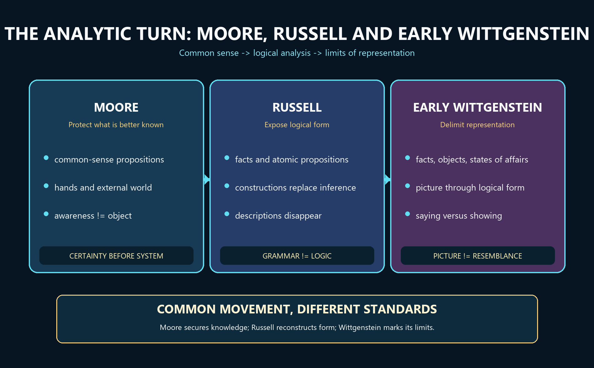

# Moore, Russell and Early Wittgenstein — Learner-v2 Source-Complete Learning Session


> **Generation:** g4, 2026-09-02 · **Approval:** false pending explicit topic approval
>
> **Evidence discipline:** Complete legacy teaching and workbook material is preserved, reordered Basic-first/Advanced-last, and checked against the canonical owner and verified 2018–2025 PYQ ledger.


## BASIC LEARNING SESSION




*Concept map: Moore protects common-sense knowledge, Russell reveals logical form and constructs problematic entities, and the early Wittgenstein delimits meaningful representation through saying and showing.*

> **Syllabus (verbatim):** Moore, Russell and Early Wittgenstein : Defence of Commonsense; Refutation of Idealism; Logical Atomism; Logical Constructions; Incomplete Symbols; Picture Theory of Meaning; Sying and Showing.

### How to Use This Five-Layer Session

Every logical subtopic follows exactly:

| Layer | Purpose |
|---:|---|
| 1. SIMPLE START | visual-first plain-language gateway |
| 2. CORE UPSC | complete terminology, doctrine, argument, example and source grounding |
| 3. ADVANCED | objections, replies, comparisons, interpretive issues and refinements |
| 4. EXAM APPLICATION | verified PYQ routes and 10/15/20-mark architecture |
| 5. RAPID REVISION | traps, retrieval notes and links to the exact MCQ set |

### Source Audit and Contemporary-Link Boundary

- **Canonical doctrine source:** `upsc-ai-kit/knowledge/Philosophy/paper-1/western/Moore-Russell-EarlyWittgenstein.md` (reviewed owner; live word count not frozen here), sliced verbatim into every CORE UPSC layer and preserved again in the canonical apparatus block.
- **Verified PYQs:** continuous local Western Philosophy Paper I bank, 2018-2025; this clause owns exactly **14** primary-owned parts (joint-highest in the Western section), with at least one part in every year.
- **Ownership discipline:** the **2018 Q3(a)** question ("How do Moore and Russell react to Berkeley's view...") is **primary-owned by Empiricism**, not by this clause; it appears here only as a labelled cross-link and is never counted among the 14. **Later Wittgenstein** parts (2018 Q1c family resemblance, 2019 Q3b/2020 Q4c/2024 Q1d private language, 2022 Q1c forms of life, 2023 Q4c and 2025 Q3a picture-to-use transition) are owned by the Later Wittgenstein clause and are kept strictly separate even where they discuss the move away from the Tractatus.
- **Qdrant:** optional fallback only; not required for this canonical topic.
- **Contemporary link (deliberately not forced):** a live search produced no sufficiently direct, well-verified official 2026 development to anchor this clause. No conference, curriculum or institutional claim is invented. The honest contemporary relevance is static and disciplinary: Russell's theory of descriptions and Wittgenstein's saying/showing distinction remain foundational to present-day **philosophy of language** (reference, presupposition, the limits of the sayable), which is why this clause is examined every year. That is stated as analysis, not as a dated news event.

**Preservation note:** the canonical doctrine is reorganised into layers, never compressed. Every doctrine, canonical quotation, numbered argument, objection/reply, comparison, restored dossier, corpus-depth delta, PYQ route, directive rule, graded verdict and provenance caution is retained; simplification means adding accessible gateways, not deleting complexity.

### Learning Roadmap

| Unit | Logical subtopic |
|---:|---|
| 1 | The Analytic Revolt and the Attribution Map - Who Owns What |
| 2 | Moore - Defence of Common Sense, Truisms, Knowing vs Analysing, the Proof of an External World |
| 3 | Moore - The Refutation of Idealism (Act/Object Distinction and the Diaphanous Thesis) |
| 4 | Russell - Logical Atomism (Atomic Facts, Truth-Functions, Isomorphism; Logical not Physical Atoms) |
| 5 | Russell - Incomplete Symbols and the Theory of Descriptions |
| 6 | Russell - Knowledge by Acquaintance vs Knowledge by Description (Bismarck; Logically Proper Names) |
| 7 | Russell - Logical Constructions (Sense-Data, Inferred Entities; Substitute Constructions for Inferences) |
| 8 | Early Wittgenstein - The Tractatus World of Facts and the Picture Theory of Meaning |
| 9 | Early Wittgenstein - Bipolarity, Logical Space, the General Form of the Proposition, and Tautology/Contradiction |
| 10 | Early Wittgenstein - Saying vs Showing, the Mystical, the Ladder Metaphor and Proposition 7 |

---

### SESSION 1 — The Analytic Turn: Three Programmes, One Revolt

#### DEFINITION / WHAT THIS IS CALLED

**Plain-language definition:** Moore, Russell and the early Wittgenstein all replace large speculative systems with analysis, but they analyse for different purposes.

**Technical definition:** The early analytic movement rejects the British-idealist tendency to subordinate ordinary judgement to an all-embracing system: Moore protects common-sense propositions, Russell uncovers logical form and constructs problematic entities from safer bases, and the early Wittgenstein specifies the conditions and limits of meaningful representation.

#### VISUAL — Three-stage analytic shift

```text

SPECULATIVE IDEALIST SYSTEM

             | revolt through analysis

             v

MOORE -> protect COMMON-SENSE KNOWLEDGE

             | sharpen logical method

             v

RUSSELL -> reveal LOGICAL FORM and CONSTRUCT entities

             | ask what representation presupposes

             v

EARLY WITTGENSTEIN -> delimit SAYING by what logical form SHOWS

```

*The common movement has three distinct destinations rather than one doctrine.*

#### VISUAL — Question-method-success matrix

```text

MOORE | Question: what is more certain? | Method: common sense + distinctions

       | Success: idealist/sceptical argument loses priority

RUSSELL| Question: what is the real logical form?

       | Method: analysis + contextual definition | Success: lean ontology

EARLY W.| Question: how can a proposition represent?

       | Method: picture/truth-function boundary | Success: limits of sense

```

*Each philosopher's method must be judged by the problem it is designed to solve.*

#### ANSWER-GRABBING OPENING — WRITE/ADAPT IN THE EXAM

> The unity of the analytic revolt lies in its demand for clarity, while its internal diversity lies in Moore's epistemic particularism, Russell's reductive logical analysis and Wittgenstein's transcendental delimitation of representation.

#### MUST-WRITE KEYWORDS

- **analytic revolt**
- **British idealism**
- **common-sense propositions**
- **logical analysis**
- **logical form**
- **limits of representation**

**How to use them:** Open with the analytic revolt against British idealism, then map common-sense propositions -> logical analysis and logical form -> limits of representation.

#### CORE OBJECTION, REPLY AND RESIDUAL LIMIT

**Objection:** The label 'analytic philosophy' may hide major disagreements about ontology, epistemology and the status of metaphysics.

**Best reply:** The shared movement is methodological rather than doctrinal: all three oppose obscurity and expose hidden structure without endorsing one identical theory.

**Residual limit:** The comparison remains bounded because Moore does not accept the Tractarian limit of language and Wittgenstein does not ground simples in Russellian acquaintance.

#### EXAM USE AND CONCISE REVISION

**Answer architecture:** Use a three-column route: common sense -> logical form/construction -> representation/say-show, followed by one line on their common anti-idealist direction.

- Moore asks what we know more certainly than a philosophical theory.
- Russell asks what a sentence really commits us to after logical analysis.
- Early Wittgenstein asks what makes representation possible and where saying ends.

#### Visual gateway - three thinkers, one method

```text
     THE ANALYTIC REVOLT AGAINST ABSOLUTE (HEGEL / BRADLEY) IDEALISM
     ==============================================================
   MOORE (1873-1958)     RUSSELL (1872-1970)     EARLY WITTGENSTEIN (1889-1951)
   -----------------     -------------------     -----------------------------
   Defence of            Logical Atomism         Picture Theory of Meaning
     Commonsense         Logical Constructions   Saying vs Showing
   Refutation of         Incomplete Symbols      Tractatus (1921)
     Idealism            Theory of Descriptions
   "Here is one hand"    "the F disappears       "the world is the totality
   analysis =/= system     on analysis"            of facts, not of things"
            \                    |                          /
             +-------------------+--------------------------+
                     ONE METHOD: LOGICAL ANALYSIS
             (reveal the LOGICAL form behind GRAMMATICAL form)
```
Caption: the same weapon - analysis of language - aimed at three different targets.

**Plain-language start:** For decades British philosophers said the everyday world of tables, hands and other people was somehow unreal - only the one great spiritual Whole was fully real. Moore's reply was almost comically direct: *I know I have two hands, and that is more certain than any clever argument that says I do not.* Russell's reply was technical: *most philosophical puzzles come from being misled by grammar; analyse the sentence properly and the puzzle dissolves.* Wittgenstein's was the deepest: *language works by picturing facts, so whatever is not a picturable fact - including most of what philosophers try to say - cannot be said at all.*

| Thinker | Signature move | One-line slogan |
|---|---|---|
| **Moore** | commonsense + act/object distinction | "Here is one hand." |
| **Russell** | logical analysis (theory of descriptions) | "Substitute constructions for inferences." |
| **Early Wittgenstein** | picture theory of the proposition | "Whereof one cannot speak, thereof one must be silent." |

> 🔑 **Mnemonic:** *Moore DEFENDS, Russell DISSECTS, Wittgenstein PICTURES.*


#### 0. ONE-SCREEN MAP ⚠️

```
THE ANALYTIC REVOLT AGAINST ABSOLUTE IDEALISM
═══════════════════════════════════════════════════════════════
  G.E. MOORE (1873–1958)        B. RUSSELL (1872–1970)        EARLY WITTGENSTEIN (1889–1951)
  ─────────────────────          ────────────────────          ─────────────────────────────
  Defence of Commonsense         Logical Atomism               Picture Theory of Meaning
  Refutation of Idealism         Logical Constructions         Saying vs Showing
  "Here is one hand"             Incomplete Symbols            (Tractatus
    Logico-Philosophicus, 1921)
  analysis ≠ system              Theory of Descriptions
                                 "paradigm of philosophy"
═══════════════════════════════════════════════════════════════
```

#### WHO OWNS WHAT — Attribution Table (Exam-Critical) ⚠️

| Syllabus Term | Owner | Key Text |
|---|---|---|
| **Defence of Commonsense** | **MOORE** | "A Defence of Common Sense" (1925) |
| **Refutation of Idealism** | **MOORE** | "The Refutation of Idealism" (1903) |
| **Logical Atomism** | **RUSSELL** (and distinctly Wittgenstein in the *Tractatus*) | "The Philosophy of Logical Atomism" (1918); *Tractatus* |
| **Logical Constructions** | **RUSSELL** | "The Relation of Sense-Data to Physics" (1914); *Our Knowledge of the External World* |
| **Incomplete Symbols** | **RUSSELL** | "On Denoting" (1905); *Principia Mathematica* |
| **Picture Theory of Meaning** | **EARLY WITTGENSTEIN** | *Tractatus Logico-Philosophicus* (1921) |
| **Saying and Showing** | **EARLY WITTGENSTEIN** | *Tractatus*, propositions 4.12–4.1212, 6.522, 7 |

> 🔑 **Mnemonic — "Moore DEFENDS, Russell DISSECTS, Wittgenstein PICTURES."**

> ⚠️ **UPSC Trap:** Do NOT blur the three. Moore's commonsense realism is not Russell's logical analysis; Russell's logical atomism (built on the theory of descriptions) is not identical to Wittgenstein's *Tractatus* atomism (built on the picture theory). Attribute precisely.

---

#### Why this clause is one movement, not three biographies

Around 1900 British philosophy was dominated by **Absolute Idealism** - F.H. Bradley and the legacy of Hegel - for which reality is one spiritual whole and the ordinary world of separate things is "mere appearance." **Moore** and **Russell** broke with it (both had been idealists first), and the young **Wittgenstein** gave the break its most radical form. What unites the three is not a shared system but a shared **method**: philosophical problems are to be solved by the **logical analysis of language and propositions**, not by building metaphysical systems. That is why the syllabus yokes them together, and why the single most examined skill here is **attributing the right doctrine to the right thinker** - the seven syllabus terms are not interchangeable.

#### CLOSING RECALL FLOW — The Analytic Turn: Three Programmes, One Revolt

```closure-flow
SUBTOPIC: The Analytic Turn: Three Programmes, One Revolt
STARTING CONCEPT: The Analytic Turn: Three Programmes, One Revolt
KEY TERMS / DEFINITIONS: analytic revolt | British idealism | common-sense propositions | logical analysis | logical form | limits of representation
MECHANISM / ARGUMENT: Speculative whole -> Moore tests it against what is better known -> Russell rewrites misleading grammar -> Wittgenstein asks what any proposition must share with a possible fact.
CONSEQUENCE / CONTRAST: Analysis becomes a family of methods rather than a single doctrine: epistemic defence, logical reconstruction and delimitation of sense.
UPSC TRAP / ANSWER-USE: Do not collapse the trio into logical atomism, ordinary-language philosophy or logical positivism.
ANSWER-GRABBING FORMULATION: The unity of the analytic revolt lies in its demand for clarity, while its internal diversity lies in Moore's epistemic particularism, Russell's reductive logical analysis and Wittgenstein's transcendental delimitation of representation.
```

### SESSION 2 — Moore's Common Sense and the External-World Proof

#### DEFINITION / WHAT THIS IS CALLED

**Plain-language definition:** Moore argues that ordinary propositions such as 'I have a body' are often more certain than the philosophical premises used to deny them.

**Technical definition:** Moorean common-sense realism distinguishes knowing a common-sense proposition from possessing its complete philosophical analysis; 'A Defence of Common Sense' lists qualified truisms about body, earth, other persons and temporal existence, while 'Proof of an External World' offers hands as known premises satisfying Moore's conditions for proof.

#### VISUAL — Common-sense knowledge and philosophical analysis

```text

LEVEL 1: KNOWING THAT P

I have a body | the earth existed before this moment | other persons exist

             | can be certain while

             v

LEVEL 2: ANALYSING P

What is a body? material object? memory? time? other mind?

             |

             v

ANALYTICAL DIFFICULTY != LOSS OF ORDINARY KNOWLEDGE

```

*Difficulty in analysing a proposition does not by itself cancel knowledge of it.*

#### VISUAL — Hands proof, objection and reply

```text

P1 HERE IS ONE HAND + P2 HERE IS ANOTHER

        | distinct premises + known premises + valid consequence

        v

AT LEAST TWO EXTERNAL OBJECTS -> EXTERNAL WORLD EXISTS

        |

SCEPTIC: you have assumed the disputed knowledge

        |

MOORE: the hand-premises are more certain than your denial

        |

RESIDUAL: certainty comparison does not supply a neutral criterion

```

*The valid inference is not the same as a complete defeat of scepticism.*

#### ANSWER-GRABBING OPENING — WRITE/ADAPT IN THE EXAM

> Moore's hands prove an external world only if their premises are already known, so the argument forcefully compares certainties without supplying the sceptic an independent criterion of knowledge.

#### MUST-WRITE KEYWORDS

- **common-sense propositions**
- **A Defence of Common Sense**
- **external world**
- **knowing versus analysing**
- **standards of proof**
- **Moorean certainty**

**How to use them:** Separate A Defence of Common Sense from the external-world proof, use knowing versus analysing, and test Moorean certainty against the standards of proof.

#### CORE OBJECTION, REPLY AND RESIDUAL LIMIT

**Objection:** The sceptic charges question-begging because the disputed claim that Moore knows the premises is simply asserted.

**Best reply:** Moore replies that a proof need not prove every premise and that he knows the hands more certainly than any sceptical premise used against them.

**Residual limit:** The reply secures Moorean entitlement within ordinary inquiry but may not persuade a sceptic who demands a non-question-begging criterion.

#### EXAM USE AND CONCISE REVISION

**Answer architecture:** Write: truisms -> knowing/analysis distinction -> hands proof -> three conditions -> sceptical objection -> Moorean burden-shift -> residual limit.

- The common-sense list is not the single claim that everyone explicitly believes every truism.
- Knowing that one has a body need not wait for a complete analysis of 'body' or 'material object'.
- Formal proof and dialectical conversion are different standards of success.

#### Visual gateway - Moore reverses the burden of proof

```text
   SCEPTIC'S ARGUMENT                         MOORE'S REPLY
   -----------------                          -------------
   Premiss P1 (abstruse) ---+                 "Here is one hand"  (I KNOW this)
   Premiss P2 (abstruse) ---+--> "you don't   is MORE certain than
                                  know you     ANY premiss the sceptic
                                  have hands"  can offer against it.
                                     |                    |
                                     v                    v
                            weigh the certainties:  the CONCLUSION the sceptic
                            which is more certain?  denies is more certain than
                                                    the PREMISS he denies it with
                                     |
                                     v
                        => the sceptic's argument cannot be SOUND

   THE PROOF OF AN EXTERNAL WORLD (1939)
   (1) Here is one hand   [RIGHT hand first]
   (2) Here is another    [then the LEFT]
   (3) so at least two external objects exist
   (4) so an external world exists
```
Caption: Moore does not out-argue the sceptic; he out-weighs him.

**Plain-language start:** A sceptic says "you cannot really *know* you have hands." Moore's genius is to refuse the game on the sceptic's terms. He points out that the sentence "here is a hand" is something he is *more* sure of than he could ever be of the fancy philosophical premises used to deny it. So if an argument concludes "you have no hands," at least one of its premises must be *less* certain than the hands - and a rational person drops the *less* certain claim, not the *more* certain one. Separately, he distinguishes **knowing** a truism is true (easy, certain) from **analysing** exactly what it means (hard, maybe unfinished) - and insists a failure of analysis never cancels the knowledge.

| Idea | Plain meaning |
|---|---|
| Truisms | plain certainties: "I have a body", "the earth existed for years", "there are other people" |
| Knowing vs analysing | I can *know* "I have hands" even if the *analysis* of "material object" is unfinished |
| Burden reversal | the sceptic, not the plain man, must justify preferring an abstruse premiss |
| Proof conditions | premiss different from conclusion, premiss known, conclusion follows |

> 🔑 **Memory line:** the sceptic's premiss is never more certain than the hand it denies.


#### 1. MOORE — DEFENCE OF COMMONSENSE ✅

#### 1.1 "A Defence of Common Sense" (1925)

**Thesis:** There exist numerous propositions about the world that we know to be true *with certainty*. Moore provides a list of "truisms" — "The earth has existed for many years past," "I have a body," "There are other human beings," "They have bodies," etc. Any philosophical argument whose conclusion contradicts these truisms is **less certain** than the truisms themselves and should therefore be rejected. ✅

**Key distinction — knowing a proposition vs analysing it:**

| Knowing that P is true | Knowing the correct *analysis* of P |
|---|---|
| Can be certain ("I have two hands") | Can be doubtful — the *philosophical analysis* of what "having a body" or "material object" ultimately means may be difficult |
| Commonsense knowledge — pre-philosophical | Philosophical work proper — may remain incomplete |

Moore insists we must not confuse failure of analysis with failure of knowledge. A sceptic who argues "You cannot know you have hands because you cannot analyse 'material object' satisfactorily" commits a confusion of levels. ✅

#### 1.2 "Proof of an External World" (1939) ✅

> ✅ *"Here is one hand"* (as he makes a gesture with the **right** hand), *"and here is another"* (as he makes a gesture with the **left**) — therefore at least two external objects exist; therefore an external world exists.

> ⚠️ **Order matters if you narrate it.** Moore's printed text specifies the **right hand first, then the left**. If you describe the gesture at all, get the order right or drop the detail; an inverted order in a quotation-style sentence is exactly the kind of avoidable error a specialist examiner notices.

**Structure of the proof:**
1. Here is one hand. (Known by present experience.)
2. Here is another.
3. Therefore, at least two material objects exist.
4. Therefore, an external world exists.

**Moore's own three conditions for a rigorous proof** (stated in the paper, and the part most scripts omit) ✅:
| Condition | Moore's claim |
|---|---|
| The premiss must be **different** from the conclusion | "Here is a hand" ≠ "an external world exists" — so the proof is not circular |
| The premiss must be **known**, not merely believed | Moore insists he *knew* it; certainty here exceeds any sceptical premiss |
| The conclusion must **follow** from the premiss | It does: hands are things met with in space, and "things met with in space" is Moore's own gloss on "external" |

**Why Moore considers this rigorous:** The premises are *known*, the conclusion follows validly, and the premises are not identical to the conclusion (avoiding circularity). He acknowledges he cannot *prove* the premises themselves ("How do I know these are hands?") but insists that knowing them is more certain than any premiss a sceptic could invoke to deny them.

**Philosophical significance:** Moore reverses the burden of proof. Instead of proving the external world to the sceptic's satisfaction, he challenges the sceptic: any argument *concluding* hands don't exist must contain at least one premise *less* certain than the conclusion it denies. ✅

**Strongest objection → reply ❓:** the proof is question-begging — the sceptic doubts precisely whether Moore *knows* the premiss, so asserting it settles nothing. **Moore's reply:** he never claimed to convince the sceptic; he claimed to show that the sceptic's argument cannot be *sound*, because its premisses are always less certain than what it denies. **Wittgenstein's diagnosis** (*On Certainty*, 1969) is the deepest response to both: propositions like "here is a hand" are not things we *know* at all but hinges on which knowing and doubting turn — Moore misdescribes his own certainty as knowledge. See `Later-Wittgenstein.md`. Contrast **Kant's Refutation of Idealism**, which *derives* the external world from the sceptic's own premiss rather than refusing the demand: `Kant.md` §3.7.

#### 1.3 The Paradox of Analysis ⚠️

If a correct analysis of "X is a brother" is "X is a male sibling," then either:
- The analysis says the same thing as the original → it is trivially uninformative; or
- It says something different → it is incorrect (not an *analysis* of the same concept).

This paradox troubled Moore. His pragmatic response: analysis can be genuinely informative even though analysandum and analysans refer to the same concept — the *mode of presentation* differs. The paradox shows why philosophical analysis is harder than it looks.

---

#### CLOSING RECALL FLOW — Moore's Common Sense and the External-World Proof

```closure-flow
SUBTOPIC: Moore's Common Sense and the External-World Proof
STARTING CONCEPT: Moore's Common Sense and the External-World Proof
KEY TERMS / DEFINITIONS: common-sense propositions | A Defence of Common Sense | external world | knowing versus analysing | standards of proof | Moorean certainty
MECHANISM / ARGUMENT: Known hand-premises + premises distinct from conclusion + valid entailment -> at least two external objects -> an external world exists.
CONSEQUENCE / CONTRAST: Moore reverses the burden of proof: a sceptical premise must be more certain than the ordinary proposition it overturns.
UPSC TRAP / ANSWER-USE: Do not say the hands proof completely answers dreams, brains-in-vats or every criterion-of-knowledge challenge.
ANSWER-GRABBING FORMULATION: Moore's hands prove an external world only if their premises are already known, so the argument forcefully compares certainties without supplying the sceptic an independent criterion of knowledge.
```

### SESSION 3 — Moore's Refutation of Idealism: Awareness and Object

#### DEFINITION / WHAT THIS IS CALLED

**Plain-language definition:** Moore argues that experiencing blue contains both awareness and the blue presented, even though attention naturally passes through awareness to its object.

**Technical definition:** In 'The Refutation of Idealism' Moore attacks the equation esse est percipi by distinguishing the act or consciousness of awareness from its object; the transparency or diaphanous character of sensation explains why awareness is easily overlooked without making it identical with blue, green or any other presented quality.

#### VISUAL — Awareness-object distinction

```text

SENSATION OF BLUE              SENSATION OF GREEN

AWARENESS -----> BLUE          AWARENESS -----> GREEN

    |                              |

    +------ COMMON RELATION -------+

                    | objects differ

                    v

AWARENESS != BLUE and AWARENESS != GREEN

```

*Different objects can be presented through the common relation of awareness.*

#### VISUAL — Transparency and the limited conclusion

```text

INTROSPECTION

    | attention passes THROUGH awareness

    v

PRESENTED OBJECT: blue / green / sound

    | IDEALIST INFERENCE: only the object is found, so object = awareness

    v

MOORE: diaphanous awareness is overlooked, not identical

RESULT: esse est percipi is not established by this conflation

```

*Transparency explains the temptation to identify consciousness with its object.*

#### ANSWER-GRABBING OPENING — WRITE/ADAPT IN THE EXAM

> Moore's decisive point is not that every idealism has been disproved, but that the object of awareness cannot simply be identified with awareness merely because consciousness is transparent to introspection.

#### MUST-WRITE KEYWORDS

- **esse est percipi**
- **object of awareness**
- **act of awareness**
- **transparency of sensation**
- **diaphanous consciousness**
- **Refutation of Idealism**

**How to use them:** Quote or paraphrase the blue-green contrast, draw the act/object distinction, explain transparency, and state the argument's deliberately narrower anti-idealist result.

#### CORE OBJECTION, REPLY AND RESIDUAL LIMIT

**Objection:** Critics argue that introspective attention reveals only the presented quality, so Moore has not established a separately discriminable act.

**Best reply:** Moore replies that transparency explains the elusiveness: awareness is common across distinct sensations and is noticed through its directed relation to different objects.

**Residual limit:** Distinguishability in analysis does not by itself prove that every object exists unperceived or settle disputes about intentionality and sense-data.

#### EXAM USE AND CONCISE REVISION

**Answer architecture:** Answer in five moves: target -> blue/green example -> act/object distinction -> transparency -> narrow result, objection and limit.

- The target is the identity claim linking existence with being perceived.
- Blue and green are different objects; awareness is the common relational element.
- The argument refutes an idealist route, not every premise of Berkeley or Hegel.

#### Visual gateway - one sensation, two elements

```text
        A SENSATION OF BLUE  =  ACT  +  OBJECT
        ======================================
        +------------------+      +------------------+
        |   ACT of         |      |   OBJECT of      |
        | AWARENESS        | ---> | AWARENESS        |
        | (consciousness)  |      | (the BLUE)       |
        +------------------+      +------------------+
        the SAME in the           DIFFERS between
        sensation of blue         blue and green
        and of green

   IDEALIST ERROR:  collapse ACT into OBJECT  => blue = the sensing of blue
                    => blue cannot exist unperceived  => esse est percipi
   MOORE'S FIX:     ACT =/= OBJECT  => esse is not identical with percipi
   LIMIT: independence/unperceived existence still requires further argument
```
Caption: idealism lives entirely on a confusion between the experiencing and the experienced.

**Plain-language start:** Berkeley said *to be is to be perceived* (*esse est percipi*) - things only exist while a mind perceives them. Moore answers: look carefully at any experience of blue. There are *two* things, not one - the **awareness** (which is the same whether you sense blue or green) and the **thing you are aware of** (the blue, which differs from the green). The idealist quietly treats these as a single lump, so that the blue *is* the sensing of it; then of course blue cannot exist unperceived. But once you see that the object is not the act, there is no reason the object cannot exist on its own. The reason the confusion is so tempting is that consciousness is **diaphanous** - transparent - we "look through" it straight to the blue and forget it is there at all.

> ✅ "Blue is one object of sensation and green is another, and consciousness, which both sensations have in common, is different from either." (quoted in 2025 Q3(c))

> 🔑 **Memory line:** the awareness is transparent; that is why idealists forget it and fuse it with its object.


#### 2. MOORE — REFUTATION OF IDEALISM ✅ (PYQ 2025 Q3(c))

#### 2.1 Target

The idealist claim, especially as expressed by Berkeley: ***esse est percipi*** — to be is to be perceived. The general idealist thesis that reality is "spiritual" or mind-dependent.

#### 2.2 The Argument — Act/Object Distinction & the Transparency (Diaphanous) Thesis

Moore's central move: In every sensation or experience, we must **distinguish** two elements:

1. **The act of awareness (consciousness)** — the subjective experiencing.
2. **The object of awareness** — *that which* one is conscious of (the blue, the green, the sound).

**The idealist's error:** conflating (1) and (2) — treating the object as if it were *identical* with or *constituted by* the act of awareness. If the sensation of blue IS just the blue, then blue cannot exist unperceived → idealism.

**Moore's counter:** The sensation of blue and the sensation of green *differ* — but what they have in common is consciousness. What differs is the *object*. Therefore:

> ✅ **"Blue is one object of sensation and green is another, and consciousness, which both sensations have in common, is different from either."** (This is the passage quoted in the 2025 paper Q3(c).)

**The "diaphanous" or transparency thesis:** Consciousness is *transparent* — when we introspect a sensation of blue, what we "see" is the *blue* (the object), not consciousness itself. Consciousness is like a diaphanous medium through which we perceive objects but which we do not *see* directly. This makes it easy to overlook the distinction between act and object and to collapse them into one. But the distinction is real. ✅

#### 2.3 Result

If the object of awareness is not identical with the act of awareness, *esse* cannot simply be defined as *percipi*. This blocks one idealist argument but does not alone prove unperceived mind-independent existence. ✅

#### 2.4 Significance for UPSC

| What Moore does | What Moore does NOT do |
|---|---|
| Shows that idealism *cannot be established* by the *esse est percipi* argument | Does not prove realism directly — only refutes one argument for idealism |
| Distinguishes act from object in consciousness | Does not provide a full theory of perception |
| Restores the respectability of commonsense realism | Does not engage with more sophisticated forms of idealism (e.g. Hegel's Absolute Idealism is not directly targeted by this paper) |

> ⚠️ **2025 Q3(c) strategy:** Quote the blue-green-consciousness passage verbatim, explain the act-object distinction, show how collapsing them generates idealism, and conclude that Moore shows *esse est percipi* is unproven.

---

#### CLOSING RECALL FLOW — Moore's Refutation of Idealism: Awareness and Object

```closure-flow
SUBTOPIC: Moore's Refutation of Idealism: Awareness and Object
STARTING CONCEPT: Moore's Refutation of Idealism: Awareness and Object
KEY TERMS / DEFINITIONS: esse est percipi | object of awareness | act of awareness | transparency of sensation | diaphanous consciousness | Refutation of Idealism
MECHANISM / ARGUMENT: Blue-awareness and green-awareness share awareness but differ in presented object -> common act and variable object are distinguishable -> esse cannot mean percipi by identity.
CONSEQUENCE / CONTRAST: The analysis blocks a direct move from the inseparability of awareness and object-in-experience to their identity or the object's mind-dependence.
UPSC TRAP / ANSWER-USE: Do not claim Moore destroys Berkeley's entire philosophy or proves a complete direct-realist theory of perception.
ANSWER-GRABBING FORMULATION: Moore's decisive point is not that every idealism has been disproved, but that the object of awareness cannot simply be identified with awareness merely because consciousness is transparent to introspection.
```

### SESSION 4 — Russell's Analytic Programme and Logical Atomism

#### DEFINITION / WHAT THIS IS CALLED

**Plain-language definition:** Russell treats a sentence's grammar as a first draft: logical analysis may reveal a very different structure and a leaner world.

**Technical definition:** Russellian logical atomism holds that the world is composed of facts rather than a mere inventory of things; particulars and universals or relations combine in atomic facts represented by atomic propositions, while molecular propositions are truth-functional constructions whose analysis should terminate in logical, not physical, simples.

#### VISUAL — Grammatical form versus logical form

```text

GRAMMAR: 'The F is G' looks like SUBJECT + PREDICATE

                | logical analysis

                v

LOGIC: EXISTENCE + UNIQUENESS + PREDICATION

                |

                v

ONTOLOGY: no mysterious object is required merely by grammar

```

*Logical analysis can remove an apparent subject and reveal quantified structure.*

#### VISUAL — Fact and atomic proposition

```text

WORLD SIDE                       LANGUAGE SIDE

particular a + relation R + b    name a + predicate R + name b

              | combine                         | combine

              v                                 v

ATOMIC FACT: R(a,b)   <---- true iff ---- ATOMIC PROPOSITION

              |                                 |

obtains or fails                    true-functional molecules

```

*Correspondence relates structured proposition and structured obtaining fact.*

#### ANSWER-GRABBING OPENING — WRITE/ADAPT IN THE EXAM

> Russell's atomism is a conditional metaphysics of analysis: if a logically perfect language reaches independent atomic propositions, reality must contain corresponding atomic facts rather than microscopic physical particles.

#### MUST-WRITE KEYWORDS

- **logical analysis**
- **grammatical form**
- **logical form**
- **logical atomism**
- **atomic fact**
- **atomic proposition**

**How to use them:** Begin with grammatical form versus logical form, define logical atomism through atomic fact and atomic proposition, then qualify molecular truth-functions and independence.

#### CORE OBJECTION, REPLY AND RESIDUAL LIMIT

**Objection:** The programme never securely identifies a final logically perfect language or an uncontested stock of atomic facts.

**Best reply:** Russell can defend atomism as a regulative direction of analysis and as an explanation of how complex truth depends on simpler constituents.

**Residual limit:** The defence makes the method valuable even if strict logical independence, private sense-data and final simples remain disputed.

#### EXAM USE AND CONCISE REVISION

**Answer architecture:** Use: analytic programme -> facts not things -> atomic correspondence -> molecular truth-functions -> independence qualification -> method survives stronger ontology.

- A fact is an obtaining complex, not another thing alongside its constituents.
- An atomic proposition contains no truth-functional connective, but may include a relation.
- Logical simplicity concerns analysability, not physical size.

#### Visual gateway - the world and language share one skeleton

```text
   WORLD                         LANGUAGE (ideal)
   -----                         ----------------
   atomic FACT   <--mirrors-->   atomic PROPOSITION
   (a simple has a property /    (proper name(s) + predicate)
    simples stand in a relation)   e.g. "this is red"
        |                              |
   combine by the                 combine by
   way things are                 CONNECTIVES (and, or, not, if-then)
        |                              |
        v                              v
   the WORLD =                    MOLECULAR proposition
   all the atomic facts           = a TRUTH-FUNCTION of atomic ones
   (no extra "and"-facts)         (no word names "and")

   ISOMORPHISM: names <-> objects ; arrangement of names <-> arrangement of objects
   "logical atoms, NOT physical atoms" - the last residue of ANALYSIS, not tiny particles
```
Caption: analysis keeps decomposing until it reaches simples; those simples are the atoms.

**Plain-language start:** Russell's picture of reality is built from the *bottom up*. At the base are **atomic facts** - the simplest possible facts, like "this patch is red." Language has a matching base: **atomic propositions** that name a simple and say one thing about it. Everything more complicated - "this is red *and* that is blue" - is a **molecular** proposition whose truth is fixed entirely by its atomic parts plus the connectives (*and*, *or*, *not*). Crucially, there is no extra fact in the world corresponding to "and": connectives add no ontology. The word "**atom**" is a warning against a misreading - Russell means the *logical* last residue of analysis, **not** physical particles.

| Type | Character | Example |
|---|---|---|
| **Atomic** | one fact about simple(s); no connectives | "this is red" |
| **Molecular** | atomic propositions joined by connectives | "this is red and that is blue" |
| **Truth-function** | truth fixed by parts + connective; no extra fact | truth of "p and q" = truth of p, q |

> 🔑 **Memory line:** the atoms are found at the *end of analysis*, not under a microscope.


#### 3. RUSSELL — LOGICAL ATOMISM ✅

#### 3.1 Statement ✅

In Russell's 1918 programme an atomic fact contains no other facts as constituents, though it contains particulars and qualities/relations. Atomic propositions represent such facts; molecular propositions use logical operations. “Atomic” is logical, not microscopic. ✅

**Core claims:**
1. The world has an ultimate logical structure — it is composed of **simples** (logical atoms).
2. **Language**, at its logically fundamental level, mirrors this structure — the structure of a true proposition mirrors the structure of the fact it asserts.
3. The task of philosophy is **logical analysis** — decomposing complex propositions into their atomic constituents and revealing the logical form hidden beneath grammatical form.

#### 3.2 Atomic vs Molecular Propositions

| Type | Character | Example |
|---|---|---|
| **Atomic** | Asserts one fact about one or more simples; no logical connectives | "This is red" |
| **Molecular** | Built from atomic propositions using connectives (and, or, not, if-then) | "This is red and that is blue" |

**Truth-functionality:** The truth-value of a molecular proposition is wholly determined by the truth-values of its atomic components + the connective. No extra "facts" correspond to "and" or "or."

#### 3.3 The Isomorphism Thesis ✅

A true proposition and the fact it asserts share the same **logical structure** (isomorphism). Names in the proposition correspond to objects in the fact; the arrangement of names corresponds to the arrangement of objects. This is the bridge between language and world in Russell's atomism.

> ⚠️ **Distinction from Wittgenstein's atomism:** Russell's logical atoms include sense-data and universals as simples; Wittgenstein's *Tractatus* atoms ("objects") are unspecified as to their nature and are known only by their logical role. Russell's atomism is *epistemologically* grounded (sense-data); Wittgenstein's is *logically* grounded (what must be the case for language to be meaningful at all). See §5.2 below.

---

#### CLOSING RECALL FLOW — Russell's Analytic Programme and Logical Atomism

```closure-flow
SUBTOPIC: Russell's Analytic Programme and Logical Atomism
STARTING CONCEPT: Russell's Analytic Programme and Logical Atomism
KEY TERMS / DEFINITIONS: logical analysis | grammatical form | logical form | logical atomism | atomic fact | atomic proposition
MECHANISM / ARGUMENT: Misleading surface sentence -> logical analysis -> atomic proposition with constituents -> corresponding fact when true -> molecular truth-functions built from atomic bases.
CONSEQUENCE / CONTRAST: Analysis exposes ontological commitment and explains why the world's basic units are fact-structures rather than isolated objects.
UPSC TRAP / ANSWER-USE: Do not interpret logical atoms as tiny material particles or treat every ordinary sentence as already atomic.
ANSWER-GRABBING FORMULATION: Russell's atomism is a conditional metaphysics of analysis: if a logically perfect language reaches independent atomic propositions, reality must contain corresponding atomic facts rather than microscopic physical particles.
```

### SESSION 5 — Acquaintance and Description: Russell's Epistemic Constraint

#### DEFINITION / WHAT THIS IS CALLED

**Plain-language definition:** Russell distinguishes direct presentation from indirect knowledge of an item as the unique thing satisfying a description.

**Technical definition:** Knowledge by acquaintance is direct, non-inferential awareness of a constituent, whereas knowledge by description is propositional knowledge of the unique satisfier of a denoting phrase; the Principle of Acquaintance motivates analysis because an understood proposition must ultimately be composed of constituents with which the thinker is acquainted.

#### VISUAL — Two epistemic routes

```text

ACQUAINTANCE                       DESCRIPTION

direct presentation               'the unique F is G'

no inference                       existence + uniqueness + predicate

this sense-datum / universal       Bismarck / physical object / electron

        |                                  |

logically proper name              denoting phrase analysed in context

```

*Direct and indirect routes differ in logical structure, not merely vividness.*

#### VISUAL — Why descriptions protect acquaintance

```text

I UNDERSTAND: 'The first Chancellor of the German Empire was diplomatic'

             | but I am not acquainted with Bismarck

             v

ANALYSE DESCRIPTION -> there exists exactly one F, and that F is G

             |

             v

CONSTITUENTS: logical apparatus + acquainted universals

BISMARCK AS APPARENT CONSTITUENT DISAPPEARS

```

*The described object need not occur as an unacquainted constituent.*

#### ANSWER-GRABBING OPENING — WRITE/ADAPT IN THE EXAM

> The acquaintance-description distinction explains why Russell analyses ordinary names and descriptions: logical form must let us speak of Bismarck or an electron without making an unacquainted object a constituent of our thought.

#### MUST-WRITE KEYWORDS

- **acquaintance**
- **description**
- **Principle of Acquaintance**
- **logically proper name**
- **denoting phrase**
- **sense-data**

**How to use them:** Define acquaintance and description, connect the Principle of Acquaintance to logically proper names and denoting phrases, then qualify the sense-data basis.

#### CORE OBJECTION, REPLY AND RESIDUAL LIMIT

**Objection:** Private acquaintance and sense-data may not provide a public or conceptually neutral foundation for knowledge.

**Best reply:** Russell replies that acquaintance is presentation rather than a judgement and that description permits public propositions without direct presentation of their subject.

**Residual limit:** The reply preserves the logical distinction but leaves the justificatory role of private givenness and the status of ordinary names contested.

#### EXAM USE AND CONCISE REVISION

**Answer architecture:** Draw two routes to the same subject: direct presentation versus unique-description analysis, then state why the second route needs the description theory.

- Acquaintance concerns direct access to a constituent; description concerns truths identifying a satisfier.
- The description theory is not an isolated semantic trick but a device protecting the epistemology.
- Kripke pressures the description theory of ordinary names without destroying quantificational descriptions.

#### Visual gateway - how "the F" disappears on analysis

```text
   SURFACE (grammatical) : "The present King of France is bald"
                                     |  looks like  NAME + predicate
                                     v
   RUSSELL'S ANALYSIS (logical form) : a conjunction of THREE claims
     (1) EXISTENCE    : there is at least one present King of France
     (2) UNIQUENESS   : there is at most one such thing
     (3) PREDICATION  : that thing is bald
   ASCII logic form :  (Ex)[ Kx  &  (Ay)(Ky -> y = x)  &  Bx ]
     (legend: E = there exists, A = for all, & = and, -> = if...then)
                                     |
                                     v
   (1) is FALSE (no such King)  =>  the WHOLE conjunction is FALSE
                                     |
                                     v
   NOT meaningless, NOT about a ghostly entity (contra Meinong) - simply FALSE.
   "the present King of France" is an INCOMPLETE SYMBOL: no meaning in isolation,
   it vanishes when the sentence is rewritten.
```
Caption: the apparent name is dissolved into quantifiers; nothing needs to be denoted.

**Plain-language start:** "The present King of France is bald" is perfectly grammatical, yet there is no King of France. Is the sentence meaningless? Is it about a shadowy non-existent King (Meinong's costly answer)? Russell says: neither. Rewrite it as three plain claims - *there is one and only one present King of France, and he is bald.* Because the first claim is false, the whole sentence is simply **false**. The phrase "the present King of France" is an **incomplete symbol**: on its own it means nothing; it earns its keep only inside the whole sentence, and it *disappears* when we spell the sentence out. The same trick handles **"the golden mountain is very high"** - false, and not committed to any golden mountain.

> 🔑 **Memory line:** a definite description is not a name; it is a disguised existence-and-uniqueness claim.


#### 4. RUSSELL — INCOMPLETE SYMBOLS & THE THEORY OF DESCRIPTIONS ✅ (PYQ 2025, 2024, 2023)

#### 4.1 The Concept of an Incomplete Symbol ✅

An **incomplete symbol** is a symbol that has **no meaning in isolation** — it contributes to the meaning of sentences in which it occurs but cannot be defined on its own. It "disappears" on logical analysis. ✅

The paradigm case: **definite descriptions** (phrases of the form "the so-and-so").

#### 4.2 The Theory of Descriptions — "On Denoting" (1905) ✅

**The Problem:** "The present King of France is bald." ✅

This sentence is grammatically well-formed and seems *meaningful*. But there is no present King of France. So:
- Is the sentence *meaningless*? (Seems wrong — we understand it.)
- Is it *about* a non-existent entity? (Meinong's view — an unacceptable inflation of ontology.)
- Does the name "the present King of France" *denote* something? (If so, what?)

**Russell's Solution — Logical Analysis:** ✅

"The present King of France is bald" is analysed as the **conjunction** of three claims:

1. **Existence:** There is at least one thing that is presently King of France. (Ex)(Kx)
2. **Uniqueness:** There is at most one such thing. Ay(Ky → y = x)
3. **Predication:** That thing is bald. Bx

Formal: **(Ex)[Kx & Ay(Ky → y = x) & Bx]**

Since condition (1) is false — there is no present King of France — the **entire conjunction is FALSE**. Not meaningless, not about a ghostly entity, but simply *false*. ✅

#### 4.3 "The golden mountain is very high" (PYQ 2025 Q1(d)) ✅

The same analysis applies: "The golden mountain is very high" = "There exists exactly one thing that is a golden mountain, and it is very high." Since no golden mountain exists, the statement is **false** — not meaningless and not committed to the existence of golden mountains. The apparent *name* "the golden mountain" is an incomplete symbol that disappears upon analysis. ✅

#### 4.4 The Three Puzzles Solved

| Puzzle | Problem | Solution via Theory of Descriptions |
|---|---|---|
| **Negative existentials** | "The present King of France does not exist" — if "the present King of France" denotes nothing, how can we say *of it* that it doesn't exist? | The sentence asserts: "It is not the case that there is exactly one present King of France" — perfectly coherent; no entity need be denoted. |
| **Excluded middle** | "The present King of France is bald" must be either true or false. But if there is no King, how? | It is FALSE (existence clause fails). Its negation — correctly parsed (primary occurrence) — is TRUE. No violation of excluded middle. |
| **Identity / substitutivity** | "George IV wished to know whether Scott was the author of *Waverley*." If "the author of *Waverley*" = Scott, then George IV wished to know whether Scott was Scott — trivial! | "The author of *Waverley*" is an incomplete symbol, not a name; its logical form is different from the name "Scott." Substitution fails because the description is quantificational, not referential. |

#### 4.5 Primary vs Secondary Occurrence ✅

The *scope* of a description matters when negation or propositional-attitude verbs are involved:

| | Primary occurrence (wide scope) | Secondary occurrence (narrow scope) |
|---|---|---|
| "The King of France is not bald" | "There exists exactly one King of France and he is not bald" → FALSE | "It is not the case that there exists exactly one King of France who is bald" → TRUE |
| Difference | Asserts existence, denies predicate | Denies the whole existential claim |

> ⚠️ UPSC may not ask for the formal notation, but understanding scope resolves the excluded-middle puzzle.

#### 4.6 Significance: Grammatical Form ≠ Logical Form ✅

The theory of descriptions establishes the **fundamental principle of analytic philosophy:** the surface grammatical structure of a sentence may radically mislead about its logical structure. The task of philosophy is to reveal the **logical form** hidden by language. ✅

#### CLOSING RECALL FLOW — Acquaintance and Description: Russell's Epistemic Constraint

```closure-flow
SUBTOPIC: Acquaintance and Description: Russell's Epistemic Constraint
STARTING CONCEPT: Acquaintance and Description: Russell's Epistemic Constraint
KEY TERMS / DEFINITIONS: acquaintance | description | Principle of Acquaintance | logically proper name | denoting phrase | sense-data
MECHANISM / ARGUMENT: Direct acquaintance supplies constituents -> descriptions quantify over a unique satisfier -> the described object disappears as a constituent -> understanding remains grounded in acquainted universals/data.
CONSEQUENCE / CONTRAST: Russell joins epistemology and logic: contextual analysis pays the epistemic debt created by discourse about what we have never met.
UPSC TRAP / ANSWER-USE: Do not say a description is a weaker psychological image of an object or that every ordinary proper name is unquestionably a logically proper name.
ANSWER-GRABBING FORMULATION: The acquaintance-description distinction explains why Russell analyses ordinary names and descriptions: logical form must let us speak of Bismarck or an electron without making an unacquainted object a constituent of our thought.
```

### SESSION 6 — Logical Constructions and Inferred Entities

#### DEFINITION / WHAT THIS IS CALLED

**Plain-language definition:** Russell prefers building a structure from less problematic data to postulating an extra entity merely because ordinary language names it.

**Technical definition:** The maxim 'wherever possible, logical constructions are to be substituted for inferred entities' recommends contextual reconstruction of discourse about physical objects, numbers, classes or points from a more secure base; a logical construction is the structured replacement, an inferred entity is the avoided posit, and a logical fiction is useful shorthand rather than a separately denoting object.

#### VISUAL — Construction versus inferred entity

```text

OLD ROUTE: appearances/data ---- inference ----> UNKNOWN ENTITY X

                         | Russell's maxim rejects when avoidable

                         v

NEW ROUTE: DEFINE X-TALK AS A STRUCTURE OF KNOWN/SAFER ENTITIES

                         |

                         v

SAME EXPLANATORY WORK, FEWER PRIMITIVE POSITS

```

*The replacement preserves explanatory relations while reducing primitive commitments.*

#### VISUAL — Four notions kept distinct

```text

LOGICAL ATOM       = basic residue of analysis

LOGICAL CONSTRUCTION= derived structure replacing an inferred entity

INFERRED ENTITY    = extra posit the construction seeks to avoid

LOGICAL FICTION    = convenient expression with no extra denoted object

DEFINITE DESCRIPTION= one contextual-analysis mechanism, not the whole class

```

*These expressions overlap in use but answer different questions.*

#### ANSWER-GRABBING OPENING — WRITE/ADAPT IN THE EXAM

> Russell's maxim is best read as disciplined ontological economy: construction replaces commitment to an inferred entity without making ordinary object-talk simply false or imaginary.

#### MUST-WRITE KEYWORDS

- **logical construction**
- **inferred entity**
- **logical fiction**
- **ontological economy**
- **contextual reconstruction**
- **sense-data construction**

**How to use them:** State the maxim accurately, draw the replacement mechanism, give locally supported examples, and distinguish construction from atom, fiction and description.

#### CORE OBJECTION, REPLY AND RESIDUAL LIMIT

**Objection:** Phenomenal constructions from actual and possible sense-data may be circular, private or insufficient for enduring public objects.

**Best reply:** Russell can answer that the maxim is methodological and wherever-possible, not a dogmatic claim that every scientific object has already been reduced.

**Residual limit:** The weaker methodological reading survives better than a complete phenomenalist reduction of the physical world.

#### EXAM USE AND CONCISE REVISION

**Answer architecture:** Use a four-box distinction: atom/basic constituent; construction/derived structure; inferred entity/avoided posit; fiction/contextual shorthand.

- Construction preserves the work of object-talk while altering its ontological analysis.
- Numbers and points are safer illustrations than claiming a finished reduction of every physical object.
- The maxim is explicitly qualified by 'wherever possible'.

#### Visual gateway - two roads to a single object

```text
                    HOW WE KNOW A THING
                    ===================
   ACQUAINTANCE (direct)            DESCRIPTION (indirect)
   ---------------------            ----------------------
   presented, no inference          known as "the so-and-so"
   objects: sense-data,             reached via a true proposition
   memory, introspection,           we DO know, plus acquaintance
   universals                       with the constituents
        |                                   |
        v                                   v
   "logically proper name"          ordinary names are DISGUISED
   (this, that) - guaranteed        descriptions (analysable away)
   a referent
        |                                   |
        +------------- PRINCIPLE OF ------- +
                    ACQUAINTANCE
   "Every proposition we can understand must be composed wholly of
    constituents with which we are acquainted."
```
Caption: description lets thought reach beyond the tiny circle of what is directly given.

**Plain-language start:** There are two ways to know a thing. **Acquaintance** is direct - you *have* the object before the mind with no middle step: the colour-patch you see now, a memory, your own thoughts, and abstract universals. **Description** is indirect - you know a thing only *as* "the so-and-so," through a true proposition, without ever meeting it. Why does this matter? Because acquaintance reaches only a tiny circle (your present sense-data and a few universals), yet you think about Julius Caesar, electrons and the centre of the Sun. **Description is what lets thought escape that circle.** The rule tying the two together is the **Principle of Acquaintance**: every proposition you can genuinely *understand* must be built only out of things you are acquainted with.

> 🔑 **Memory line:** acquaintance is the anchor; description is the rope that reaches far-off objects.


#### 4.7 KNOWLEDGE BY ACQUAINTANCE vs KNOWLEDGE BY DESCRIPTION ✅ — the epistemology that makes the Theory of Descriptions work

**Why it is indispensable here.** The Theory of Descriptions is not merely a piece of logical grammar; it exists to discharge an **epistemological** debt. Russell needs to explain how we can think and speak truly about things we have never encountered — the centre of mass of the solar system, Bismarck, the golden mountain. The apparatus is the acquaintance/description distinction (*Problems of Philosophy*, 1912, Ch. 5; "Knowledge by Acquaintance and Knowledge by Description," *PAS* 1910–11).

**Exact printed subterms:** *acquaintance* · *knowledge by description* · *sense-data* · *the Principle of Acquaintance* · *logically proper name* · *denoting phrase* · *the object of acquaintance is "directly aware… without the intermediary of any process of inference."*

| Knowledge by **ACQUAINTANCE** | Knowledge by **DESCRIPTION** |
|---|---|
| **Direct**, presentational, non-inferential — I am *directly aware* of the item, without any intermediary of inference or knowledge of truths | **Indirect**, propositional — I know that *there is exactly one thing* answering to a description, and whatever is inferred of it |
| Objects: **sense-data** (this patch of red, this hardness), **memory** data, **introspective** data of my own mental states, and **universals** (redness, before, diversity) | Objects: physical objects, other minds, historical persons, unobservables of science — everything I have not met |
| Yields **logically proper names** — for Russell, only demonstratives like "this," "that," used of a present sense-datum | Yields **denoting phrases** — "the F," which Russell's 1905 analysis shows to be an **incomplete symbol**, with no meaning in isolation |
| Basis of all understanding | Built out of acquaintance-items by logical construction |

**The Principle of Acquaintance ✅ (state it verbatim in any descriptions answer):**
> "**Every proposition which we can understand must be composed wholly of constituents with which we are acquainted.**" (*Problems*, Ch. 5)

**The argument, numbered:**
1. To understand a proposition is to grasp its constituents.
2. I can grasp only what I am acquainted with.
3. But I plainly understand propositions about Bismarck, Julius Caesar and electrons, with none of which I am acquainted.
4. therefore either the principle is false, or such propositions do not really contain those items as constituents.
5. The **Theory of Descriptions** takes the second route: "the F is G" contains no constituent *the F* at all; it unpacks into an existentially quantified sentence whose constituents are the **universals** F and G and the logical apparatus — all items of acquaintance.
6. therefore the principle is preserved. **Descriptions is thus the technical instrument that saves the epistemology, not an independent puzzle-solving device.** ⚠️ Stating this connection converts a routine descriptions answer into a first-class one.

**Canonical example ✅ — Bismarck** (Russell's own, *Problems* Ch. 5, in a graded series):
| Knower | Route |
|---|---|
| **Bismarck himself** | acquaintance with his own self-consciousness — a judgement about a constituent given to him |
| **A person who met Bismarck** | acquaintance with sense-data he took to be of the man; the description is anchored to *his* particulars |
| **A person who only read of Bismarck** | knowledge purely by description — "the first Chancellor of the German Empire" |
| **All of us, of "the most long-lived of men"** | a description satisfied by someone we may never identify; yet the proposition is fully understood |
Russell's moral: "**we shall say that we have *merely descriptive* knowledge of the so-and-so when… we do not know any proposition 'a is the so-and-so' where a is something with which we are acquainted.**"

**Presuppositions ⚠️:**
- **P1** There is a class of items given *without inference* — the whole edifice depends on this, and it is exactly what Sellars later attacks as "the Myth of the Given."
- **P2** Understanding is *constituent-grasping* (a compositional, quasi-Fregean model of thought).
- **P3** Sense-data are objects distinct from the act of sensing (Moore's act/object distinction, §2.2 — Russell inherits it).
- **P4** Only "this/that" are genuine names; ordinary proper names are **disguised definite descriptions**. This last is the thesis Kripke will destroy.

**Strongest objections → replies:**
| Objection | Source | Reply | Residual |
|---|---|---|---|
| Ordinary proper names are **not** disguised descriptions: "Aristotle" would still name Aristotle even if every description we associate with him were false. Names are **rigid designators**. | **Kripke**, *Naming and Necessity* (1970/1980) | Russell can retreat to the claim about *logically* proper names only, abandoning the description theory of ordinary names. | ⚠️ This is the standard modern verdict: the *logic* of descriptions survives, the *theory of names* does not. |
| Sense-data as objects of acquaintance are a myth: nothing is given *uninterpreted*, and what is given cannot both be non-conceptual and justify beliefs. | **Sellars**, "Empiricism and the Philosophy of Mind" (1956); anticipated by Kant's "intuitions without concepts are blind" | Russell would insist acquaintance is not itself knowledge-of-truths, only presentation. | ❓ But then how does it *ground* anything? This is the live weakness. |
| Acquaintance with **universals** is a large Platonic concession for an empiricist. | general | Russell openly accepts it: he is a realist about universals (against Berkeley's nominalism — see `Empiricism.md` §1.1). | ⚠️ Worth noting as the point where Russell breaks with the British empiricist line. |

**Executable verdict:** "Acquaintance/description is where Russell's logic and his epistemology meet: the Theory of Descriptions is the price he pays to keep the Principle of Acquaintance while speaking of what he has never met. The logical machinery has proved permanent; the epistemology it was built to serve — sense-data as bedrock, names as disguised descriptions — has not survived Sellars and Kripke. That asymmetry is the most instructive fact about Russell's philosophy."

---

#### CLOSING RECALL FLOW — Logical Constructions and Inferred Entities

```closure-flow
SUBTOPIC: Logical Constructions and Inferred Entities
STARTING CONCEPT: Logical Constructions and Inferred Entities
KEY TERMS / DEFINITIONS: logical construction | inferred entity | logical fiction | ontological economy | contextual reconstruction | sense-data construction
MECHANISM / ARGUMENT: Questionable X -> identify truths involving X -> translate them into relations among safer data -> preserve explanatory work -> avoid X as an additional primitive.
CONSEQUENCE / CONTRAST: The method turns Occam's razor into a constructive programme and links ontology to the analysis of whole propositions.
UPSC TRAP / ANSWER-USE: Do not say a logical construction is an atom, a hallucination, a mere falsehood or automatically identical with one definite description.
ANSWER-GRABBING FORMULATION: Russell's maxim is best read as disciplined ontological economy: construction replaces commitment to an inferred entity without making ordinary object-talk simply false or imaginary.
```

### SESSION 7 — Incomplete Symbols and the Theory of Descriptions

#### DEFINITION / WHAT THIS IS CALLED

**Plain-language definition:** A definite description contributes to a sentence without standing for an object on its own; analysis replaces it with a quantified claim.

**Technical definition:** An incomplete symbol has no standalone denotation or independently assigned meaning but is defined contextually within propositions; Russell's theory of descriptions analyses 'the F is G' into existence, uniqueness and predication, with scope determining whether negation applies to the description or the whole quantified claim.

#### VISUAL — Contextual-definition mechanism

```text

ISOLATED PHRASE: 'the present King of France' -> no standalone denotation

                         | place inside a complete proposition

                         v

'The present King of France is bald'

                         | contextual definition

                         v

EXISTENCE + UNIQUENESS + BALDNESS

NO KING-LIKE OBJECT REMAINS AS A LOGICAL SUBJECT

```

*The apparent term disappears when the entire proposition is analysed.*

#### VISUAL — Definite description in three readable stages

```text

STAGE 1 EXISTENCE: at least one x is presently King of France

STAGE 2 UNIQUENESS: every y that is King of France is identical with x

STAGE 3 PREDICATION: x is bald

COMBINE: exists x [Kx AND every y(Ky -> y=x) AND Bx]

LEGEND: K = present King of France | B = bald

VERDICT: existence is false -> whole conjunction is false

```

*The legend keeps the formal line attached to its three claims.*

#### ANSWER-GRABBING OPENING — WRITE/ADAPT IN THE EXAM

> The theory of descriptions shows that a grammatically complete subject can be logically incomplete, because its contribution is exhausted by a contextual definition of the proposition in which it occurs.

#### MUST-WRITE KEYWORDS

- **incomplete symbol**
- **contextual definition**
- **definite description**
- **existence**
- **uniqueness**
- **scope**

**How to use them:** Define incomplete symbol and contextual definition, stage definite description through existence, uniqueness and scope, then distinguish denotation from contextual contribution.

#### CORE OBJECTION, REPLY AND RESIDUAL LIMIT

**Objection:** Strawson argues that ordinary utterance presupposes rather than asserts the existence of the present King of France.

**Best reply:** Russell can reply that his logical analysis explains truth conditions and commitment even if conversational presupposition adds a pragmatic layer.

**Residual limit:** The quantificational logic remains powerful, while its claim to capture every feature of ordinary referring practice is limited.

#### EXAM USE AND CONCISE REVISION

**Answer architecture:** Write the three stages in words, then one compact formula with a legend, followed by scope and Strawson's objection.

- No standalone denotation does not mean no systematic contribution to sentence meaning.
- The present-King sentence is false on Russell's standard analysis because existence fails.
- Wide and narrow scope can change the truth value of a negated description sentence.

#### Visual gateway - build it, don't bet on it

```text
   THE SUPREME MAXIM OF SCIENTIFIC PHILOSOPHISING
   ==============================================
   "Wherever possible, substitute CONSTRUCTIONS out of known entities
    for INFERENCES to unknown entities."

        RISKY WAY (inference)              SAFE WAY (construction)
        --------------------              -----------------------
        sense-data  --infer-->            sense-data --construct-->
        a hidden "material object"        a LOGICAL construction =
        (an unknown, inferred thing)      an orderly system OF sense-data
             |                                    |
        we might be WRONG that              nothing new is assumed;
        it exists                           only what is given, arranged
             |                                    |
             v                                    v
        ONTOLOGICAL RISK                     ONTOLOGICAL ECONOMY
```
Caption: replace a leap to an unknown with a pattern woven from the known.

**Plain-language start:** Ordinarily we *infer* from what we see (patches of colour, shape) to a hidden **material object** causing them - and we might be wrong that it exists at all. Russell's alternative is to **construct** the object *out of* the very sense-data instead of betting on something behind them. A "table" becomes an orderly **system of appearances** (from all viewpoints), not an unknown extra thing. Because you assume nothing beyond what is given, you take on no risk of error about unseen entities. This is his **supreme maxim**: *wherever possible, substitute constructions out of known entities for inferences to unknown entities.* It is the method of **Occam's razor** turned into a research programme.

> 🔑 **Memory line:** don't infer a hidden thing you might be wrong about - build it from what you already have.


#### 5. RUSSELL — LOGICAL CONSTRUCTIONS ✅

#### 5.1 Statement ✅

> ✅ *"Wherever possible, substitute constructions out of known entities for inferences to unknown entities."*

This is Russell's "supreme maxim of scientific philosophizing" — a methodological application of Occam's razor. If we can account for all the truths about Xs by analysing X-talk in terms of entities we *already* know (sense-data, classes of experiences), we should *not* posit Xs as additional entities.

**Examples:**
| Apparent entity | Constructed out of… |
|---|---|
| A physical object ("this table") | Classes of actual and possible sense-data from various viewpoints |
| A "nation" | Patterns of behaviour of individual persons |
| A number | Classes of equinumerous classes (Frege-Russell) |
| A point of space | Convergent classes of volumes |

#### 5.2 Logical Constructions vs Logical Atoms

| Logical Atoms (basic) | Logical Constructions (derived) |
|---|---|
| Genuinely exist as independent simples | Do not exist as additional entities; *symbols* for them are defined contextually |
| Known by acquaintance (sense-data, universals) | Known by *description* — and analysed away |
| Ground of knowledge | Convenient shorthand for complexes of atoms |

#### 5.3 Connection to Incomplete Symbols

Logical constructions are treated as **incomplete symbols at the ontological level**: just as "the present King of France" disappears upon analysis, so "the table" can be made to disappear — replaced by talk of actual and possible sense-data. The table is not a *fiction* (we still say true things about it) but it is not an irreducible entity in the furniture of the world.

---

#### CLOSING RECALL FLOW — Incomplete Symbols and the Theory of Descriptions

```closure-flow
SUBTOPIC: Incomplete Symbols and the Theory of Descriptions
STARTING CONCEPT: Incomplete Symbols and the Theory of Descriptions
KEY TERMS / DEFINITIONS: incomplete symbol | contextual definition | definite description | existence | uniqueness | scope
MECHANISM / ARGUMENT: Surface 'the F is G' -> assert at least one F -> assert at most one F -> predicate G of that F -> evaluate the conjunction and its scope.
CONSEQUENCE / CONTRAST: Descriptions disappear as apparent constituents, solve negative-existential and identity puzzles, and reveal ontological commitment through quantification.
UPSC TRAP / ANSWER-USE: Do not say the non-denoting description makes the whole sentence meaningless or denotes a shadowy non-existent object.
ANSWER-GRABBING FORMULATION: The theory of descriptions shows that a grammatically complete subject can be logically incomplete, because its contribution is exhausted by a contextual definition of the proposition in which it occurs.
```

### SESSION 8 — Early Wittgenstein: Facts, States of Affairs and Picture Theory

#### DEFINITION / WHAT THIS IS CALLED

**Plain-language definition:** The early Wittgenstein says language represents reality because the arrangement of names can model a possible arrangement of objects.

**Technical definition:** In the Tractatus the world is the totality of facts, not things: simple objects combine into possible states of affairs, an obtaining state of affairs is a fact, names correspond to objects, and an elementary proposition represents a possible state of affairs by sharing logical form rather than visual resemblance.

#### VISUAL — World and language architecture

```text

WORLD SIDE                         LANGUAGE SIDE

OBJECTS                            NAMES

   | possible combination            | syntactic combination

   v                                 v

STATE OF AFFAIRS  <--- logical ---> ELEMENTARY PROPOSITION

   | obtains                         | agrees with reality

   v                                 v

FACT                                TRUE PROPOSITION

```

*The two sides have corresponding elements and combinatorial structure.*

#### VISUAL — Picture Theory mapping

```text

PROPOSITION: name-a ---- relation-R ---- name-b

                    | correspondence

REALITY:     object-a -- possible-R -- object-b

                    |

SHARED LOGICAL FORM = possibility of the same arrangement

TRUE  -> pictured state obtains

FALSE -> pictured state does not obtain, but remains possible and meaningful

```

*Representation depends on common logical possibility, not sensory likeness.*

#### ANSWER-GRABBING OPENING — WRITE/ADAPT IN THE EXAM

> A Tractarian proposition pictures reality not by looking like it, but because names and objects possess a common possibility of arrangement that permits the proposition to be compared with how things stand.

#### MUST-WRITE KEYWORDS

- **object**
- **state of affairs**
- **obtaining fact**
- **name**
- **elementary proposition**
- **picture theory**

**How to use them:** Build object -> state of affairs -> obtaining fact and name -> elementary proposition -> picture theory, joined by shared logical form.

#### CORE OBJECTION, REPLY AND RESIDUAL LIMIT

**Objection:** Wittgenstein never gives an uncontested example of a simple object or a fully analysed elementary proposition.

**Best reply:** He replies at the transcendental level: determinate sense requires a stable substance and elementary base even if ordinary language conceals them.

**Residual limit:** The necessity argument explains the role of simples but does not identify them or prove that actual analysis reaches them.

#### EXAM USE AND CONCISE REVISION

**Answer architecture:** Use a dual ladder: object -> state of affairs -> fact and name -> elementary proposition -> true/false picture, joined by logical form.

- A state of affairs is possible; a fact is an obtaining state of affairs.
- Names correspond to objects, while propositions picture configurations rather than name facts.
- Truth is comparison with reality; sense is prior possession of truth-conditions.

#### Visual gateway - the world is facts, and a sentence is a picture

```text
   ONTOLOGY (what there is)              PICTURE THEORY (how sense works)
   -----------------------              -------------------------------
   1    The world is all that is        A proposition is a PICTURE of a
        the case.                        possible situation.
   1.1  The world is the totality
        of FACTS, not of THINGS.            NAME  ----> OBJECT
        |                                   NAME  ----> OBJECT
        v                                     \          /
   states of affairs = combinations       arrangement <-> arrangement
   of OBJECTS (simples)                    (same LOGICAL FORM = pictorial form)
        |                                            |
        v                                            v
   elementary proposition = a             TRUE  if arrangement matches the fact
   configuration of NAMES that            FALSE if it does not
   pictures a state of affairs            - either way it has SENSE
```
Caption: names go proxy for objects; their arrangement shows how the objects would be arranged.

**Plain-language start:** Open the *Tractatus* and the very first move is startling: *the world is the totality of facts, not of things* (1.1). The world is not a heap of objects (chairs, atoms) but a set of *facts* - objects **arranged** a certain way. The smallest facts are **states of affairs**: simple **objects** hooked together. Now for language. A meaningful sentence is literally a **picture** of a possible situation. Just as a model of a car crash uses toy cars to stand for real cars, a proposition uses **names** to stand for **objects**, and the *arrangement* of the names mirrors the *arrangement* of the objects. If the arrangement matches reality, the proposition is **true**; if not, **false** - but either way it has **sense**, because it shows a *possible* way the world could be.

> 🔑 **Memory line:** the world is objects-in-arrangement (facts); a sentence pictures that arrangement.


#### 6. EARLY WITTGENSTEIN — THE *TRACTATUS LOGICO-PHILOSOPHICUS* ✅

#### 6.1 The World of Facts, Not Things ✅

> ✅ *"The world is the totality of facts, not of things."* (*Tractatus* 1.1)

The world is not a collection of objects but of **facts** — objects standing in determinate relations (states of affairs / *Sachverhalte*). What exists is not a list of things but the *way things are arranged*.

**States of affairs (*Sachverhalt*):** A possible combination of objects. If a state of affairs obtains, it is a **fact**. Objects are simple; they combine into states of affairs; the totality of obtaining states of affairs = the world.

#### 6.2 The Picture Theory of Meaning ✅ (PYQ 2022 Q3(c))

**Thesis:** A proposition is a **logical picture** of a possible state of affairs. It *depicts* a situation by having the same **logical form** as the situation it represents. ✅

**How pictorial representation works:**

1. **Elements of the picture** (names in the proposition) correspond to **elements of reality** (objects in the state of affairs).
2. **The arrangement of names** in the proposition mirrors the **arrangement of objects** in the depicted fact.
3. If the pictured state of affairs obtains → the proposition is **true**; if not → **false**. Either way, the proposition is *meaningful* (has sense) because it depicts a *possible* arrangement. ✅

**Pictorial form vs Logical form** (PYQ 2022 Q3(c)):

| Pictorial form (*Form der Abbildung*) | Logical form (*logische Form*) |
|---|---|
| What the picture must have *in common* with reality *in order to depict it* at all — the structure of the representing relation | The most abstract structural commonality — **logical form is what every picture, regardless of medium, shares with reality** |
| A spatial model shares spatial form with what it models; a musical score shares acoustic form with the music | Every meaningful proposition shares *logical* form with the fact it pictures — because logical form is the form of *all possible representation* |
| A picture can depict only what shares its form | A proposition can depict any fact whatsoever, because *logical* form is the universal medium |

> ✅ Logical form is not itself a *fact* that can be depicted — it is presupposed by all depiction. It **shows** itself in every meaningful proposition but cannot be *said*. (See §6.5.)

#### CLOSING RECALL FLOW — Early Wittgenstein: Facts, States of Affairs and Picture Theory

```closure-flow
SUBTOPIC: Early Wittgenstein: Facts, States of Affairs and Picture Theory
STARTING CONCEPT: Early Wittgenstein: Facts, States of Affairs and Picture Theory
KEY TERMS / DEFINITIONS: object | state of affairs | obtaining fact | name | elementary proposition | picture theory
MECHANISM / ARGUMENT: Objects combine possibly -> state of affairs; if it obtains -> fact. Names combine -> elementary proposition; shared logical form makes it a picture whose truth depends on reality.
CONSEQUENCE / CONTRAST: Sense belongs to a proposition representing a possible situation; both a true and a false proposition can have sense.
UPSC TRAP / ANSWER-USE: Do not equate picture with mental image, diagram or visual resemblance, and do not import later meaning-as-use or language-games.
ANSWER-GRABBING FORMULATION: A Tractarian proposition pictures reality not by looking like it, but because names and objects possess a common possibility of arrangement that permits the proposition to be compared with how things stand.
```

### SESSION 9 — Sense, Truth-Functions and the Limits of Elementary Propositions

#### DEFINITION / WHAT THIS IS CALLED

**Plain-language definition:** Complex propositions are built from elementary propositions by truth-operations, while logic displays possibilities without describing an additional fact.

**Technical definition:** A proposition has sense by determining truth-conditions in logical space; complex propositions are truth-functions of elementary propositions, logical constants do not name objects, and tautologies and contradictions are limiting cases that are senseless in the technical sense because they say nothing contingent, not ordinary gibberish.

#### VISUAL — Truth-functional construction

```text

ELEMENTARY p: a is red       ELEMENTARY q: b is round

             \                 /

              \ truth-operation

               v

MOLECULAR: p AND q | p OR q | NOT p | IF p THEN q

               |

NO EXTRA 'AND-OBJECT' IS ADDED TO THE WORLD

```

*Complex truth depends on component truth-values and the selected operation.*

#### VISUAL — Sense and limiting cases

```text

CONTINGENT PROPOSITION -> can be true or false -> HAS SENSE

TAUTOLOGY              -> true under every assignment -> says nothing factual

CONTRADICTION          -> false under every assignment -> says nothing factual

PSEUDO-PROPOSITION     -> fails to picture a possible fact -> nonsense

CAUTION: senseless logical limit != ungrammatical or trivial gibberish

```

*Sense concerns possible truth and falsity, not actual truth alone.*

#### ANSWER-GRABBING OPENING — WRITE/ADAPT IN THE EXAM

> The Tractarian economy makes logical form the scaffolding of representation: truth-functions combine possible pictures without adding logical objects to the world.

#### MUST-WRITE KEYWORDS

- **sense**
- **truth-conditions**
- **truth-function**
- **elementary proposition**
- **tautology**
- **contradiction**

**How to use them:** Distinguish sense and truth-conditions, construct a truth-function from elementary propositions, then separate tautology, contradiction and nonsense.

#### CORE OBJECTION, REPLY AND RESIDUAL LIMIT

**Objection:** Colour exclusion, belief contexts and modality challenge strict independence and universal truth-functionality.

**Best reply:** The Tractarian can treat the account as an ideal logical requirement and revise what counts as elementary rather than abandon the distinction immediately.

**Residual limit:** The reply preserves the architecture only conditionally; the absence of specified elementary propositions and counterexamples weakens its completeness.

#### EXAM USE AND CONCISE REVISION

**Answer architecture:** Answer: sense/truth distinction -> elementary base -> truth-functional molecule -> logic shows form -> limiting cases -> independence objections.

- A meaningful false proposition still pictures a possible state of affairs.
- Tautology and contradiction are well formed but describe no contingent arrangement.
- Logical constants operate on propositions; they do not stand for extra objects.

#### Visual gateway - sense, and the two limiting cases that carry none

```text
   BIPOLARITY (the condition of sense)
   -----------------------------------
   a genuine proposition must be able to be   TRUE ... and ... FALSE
   (it points to one spot in LOGICAL SPACE and rules out the rest)

        LOGICAL SPACE = the field of ALL possibilities
        +------------------------------------------------+
        |  . . . . . [THIS spot: p is true] . . . . . .  |
        |  . . every other spot = a way p could be false |
        +------------------------------------------------+

   THE THREE ZONES OF LANGUAGE (6.4 series)
   ----------------------------------------
   TAUTOLOGY      : true for ALL possibilities   -> says NOTHING (sinnlos)
   SENSEFUL PROP  : true for SOME, false for OTHERS -> pictures a fact
   CONTRADICTION  : false for ALL possibilities  -> says NOTHING (sinnlos)

   sinnlos (senseless) = empty but WELL-FORMED (logic lives here)
   unsinnig (nonsense) = not even well-formed (much of "philosophy")
```
Caption: only the middle zone pictures the world; the edges are the scaffolding of logic.

**Plain-language start:** What makes a string of words a real proposition? Wittgenstein's answer is **bipolarity**: it must be *capable* of being **true and capable of being false**. Saying something *rules something out* - it selects one spot in the space of possibilities (**logical space**) and excludes the rest. This immediately exposes two odd cases. A **tautology** ("it is raining or it is not raining") is true no matter what, so it excludes nothing and **says nothing**. A **contradiction** ("it is raining and it is not") is false no matter what, so it too says nothing. They are not *false* or *meaningless-gibberish* - they are **senseless** (*sinnlos*): perfectly well-formed but empty. This is exactly why the truths of **logic** carry no information about the world - they are tautologies.

> 🔑 **Memory line:** to mean something is to divide logical space; tautology and contradiction divide nothing.


#### 6.3 BIPOLARITY, LOGICAL SPACE, AND THE GENERAL FORM OF THE PROPOSITION ✅

These three are one doctrine seen from three sides, and no *Tractatus* answer is complete without all three. They are what make the picture theory an **account of sense** rather than a metaphor.

#### 6.3.1 BIPOLARITY — the condition of sense

**Thesis.** A proposition has sense (*Sinn*) only if it is **capable of being true and capable of being false**. Not merely *bivalence* (it has one of two values) but **bipolarity** (it must be able to have *either*). ✅

**Textual anchors:** "A proposition can be true or false only by being a picture of reality" (4.06); "In order to tell whether a picture is true or false we must compare it with reality" (2.223); "It is impossible to tell from the picture alone whether it is true or false" (2.224). The term itself comes from the pre-*Tractatus* *Notes on Logic* (1913).

**Why it does so much work — numbered:**
1. A proposition depicts a possible situation; depicting is representing something *as* being the case.
2. To represent something as being the case is *ipso facto* to allow that it might not be the case — a representation that could not be false is not representing.
3. therefore Sense requires the genuine availability of both truth-values.
4. **Consequence 1 — tautologies and contradictions are *sinnlos*.** A tautology cannot be false and a contradiction cannot be true; they lack bipolarity, hence lack sense. They are not *nonsense* — they are well-formed but say nothing, showing the scaffolding of logic instead (4.461–4.4611).
5. **Consequence 2 — metaphysical sentences are *unsinnig*.** "The Absolute is perfect," "objects exist" do not fail bipolarity by being always-true; they fail to depict any possible situation at all.
6. **Consequence 3 — elementary propositions must be logically independent** (2.061, 4.211). Elementary propositions are postulated as mutually independent, so no elementary proposition follows from another and every truth-value combination represents a possible configuration.
7. **Consequence 4 — this supplies historical pressure later transformed into verificationism, but is not itself a verification principle.** The positivists convert "must be capable of truth and falsity" into "must be capable of verification"; the lineage runs *Tractatus* → Schlick/Waismann → Ayer. See `Logical-Positivism.md`.

**Where it breaks — the COLOUR-EXCLUSION problem ✅❓.** "This patch is red all over" and "This patch is blue all over" cannot both be true, yet neither is a truth-function of the other and both look elementary. So elementary propositions are **not** logically independent after all. Wittgenstein concedes this in "Some Remarks on Logical Form" (1929) — his first published paper after the *Tractatus*, and one he immediately disliked. **This is the internal crack that opens the road to the later philosophy**, and naming it is the strongest available link between §6 and `Later-Wittgenstein.md`.

#### 6.3.2 LOGICAL SPACE (*logischer Raum*) — where possibilities live

**Thesis.** A proposition does not merely name a fact; it **locates a place** in the totality of possibilities. ✅

**Textual anchors:** "The facts in logical space are the world" (1.13); "A picture presents a situation in logical space, the existence and non-existence of states of affairs" (2.11); "A proposition determines a place in logical space" (3.4); "The propositional sign and the logical co-ordinates: that is the logical place" (3.41); "The proposition determines a place in logical space. The existence of this logical place is guaranteed by the mere existence of the constituent parts" (3.4–3.42).

**The analogy that makes it teachable ⚠️:** logical space is to propositions what a **coordinate system** is to points. To specify a point you need the whole grid, not just the point; likewise, to understand a proposition you must grasp the *entire field of alternatives* it excludes. Wittgenstein's own image: "A proposition… is like a solid body that restricts the freedom of movement of others" (4.463) — a proposition is a *limit* placed on how the world may be.

| Consequence | Statement |
|---|---|
| **Sense is holistic** | To understand *p* is to understand ¬*p* — the same logical place, opposite pole (this ties logical space to bipolarity) |
| **Negation is not an object** | ¬ does not name anything; "my fundamental idea is that the 'logical constants' are not representatives" (4.0312) — the *Grundgedanke* |
| **The world is determinate** | Since logical space is fixed by the objects (2.013: "Each thing is, as it were, in a space of possible states of affairs"), possibility is built into the object, not added to it |
| **Limits of language = limits of the world** | 5.6 — because logical space is the space of all sense, one cannot think outside it, so its bounds cannot be described from outside |

#### 6.3.3 THE GENERAL FORM OF THE PROPOSITION ✅ — the *Tractatus*'s single most quotable technical result

Two formulations, and you should give **both**:

**(a) The informal form (4.5):** the general form of the proposition is — "**This is how things stand**" (*Es verhält sich so und so*). Anything sayable is a specification of how things stand.

**(b) The formal form (6):** ✅
> **[ p̄ , ξ̄ , N(ξ̄) ]**

Read it as a **rule for generating every proposition** in three slots:
| Slot | Meaning |
|---|---|
| **p̄** | the totality of **elementary propositions** — the base |
| **ξ̄** | any arbitrarily selected **set** of propositions already formed |
| **N(ξ̄)** | the result of applying the **N-operator** to that set |

**The N-operator (5.502, 5.51)** is **joint negation** — "none of these is true" (the generalised Sheffer stroke / NOR). Its power is that **every truth-function whatsoever can be generated from N alone**: ¬p = N(p); p v q = N(N(p), N(q)); p & q = N(N(p), N(q)) suitably arranged; and quantification is handled by taking ξ̄ to be the set of values of a propositional function (5.52).

**What proposition 6 therefore asserts — numbered:**
1. Every proposition is a **truth-function** of elementary propositions (5).
2. Every truth-function can be produced by successive applications of a **single** operation, N.
3. therefore there is one and only one general form of proposition, and it is the form of a **formal series** generated from the elementary base.
4. therefore **Logic needs no primitive propositions and no logical objects** — only the one operation. This is Wittgenstein's decisive break with Russell and Frege, who took logical constants and axioms as primitives.
5. therefore since the form is fixed in advance, "**there can be no surprises in logic**" (6.1251) and logic's propositions are tautologies (6.1).
6. therefore whatever cannot be produced by this rule is **not a proposition**. The general form is therefore simultaneously the **criterion of the sayable** and the boundary drawn in the Preface: "the limit… can only be drawn in language, and what lies on the other side of the limit will simply be nonsense."

**Presuppositions ⚠️ (of the whole §6.3 apparatus):** (P1) there **are** elementary propositions and simple objects — Wittgenstein never produces an example of either, arguing only that there *must* be, on pain of sense being indeterminate (2.021, 3.23); (P2) elementary independence is seriously pressured by colour exclusion; (P3) universal truth-functionality is pressured by belief-contexts and modality — Wittgenstein's attempted answer at 5.542, that "A believes p" is of the form "'p' says p," is widely judged inadequate); (P4) the N-operator can handle **infinite** domains, which is disputed (Fogelin's objection that the notation cannot express multiply-general propositions; Geach's partial defence).

**Executable verdict for §6.3:** "Bipolarity, logical space and the general form are one doctrine: sense is position in a fixed field of possibilities, and the field is generated by a single operation on an elementary base. The programme is exceptionally economical but faces internal pressure, since colour exclusion shows the elementary base cannot be independent, and belief-contexts show that not every proposition is truth-functional. Wittgenstein's later work is not a change of subject but the systematic dismantling of these two presuppositions."

#### 6.4 Tautology, Contradiction and the Limits of Sense ✅

Every proposition is a truth-function of elementary propositions. Elementary propositions consist of names in immediate combination; they are logically independent of one another. A proposition is meaningful iff it pictures a possible state of affairs — i.e., is a truth-function of elementary propositions that could be true or false.

**Tautology and Contradiction — *sinnlos* (senseless) vs *unsinnig* (nonsensical):**

| Term | Status | Example | Cognitive value |
|---|---|---|---|
| **Tautology** (*sinnlos*) | True under all truth-conditions; says nothing about the world | "It is raining or it is not raining" | Logically valid but factually empty — *senseless*, not *nonsensical* |
| **Contradiction** (*sinnlos*) | False under all truth-conditions | "It is raining and it is not raining" | Logically impossible — also senseless |
| **Metaphysical pseudo-proposition** (*unsinnig*) | Violates the conditions of sense — tries to *say* what can only be *shown* | "The Absolute is perfect"; "There are objects" | **Nonsensical** — not even in the truth-function game |

> ⚠️ **UPSC Trap:** *Sinnlos* ≠ *unsinnig*. Tautologies of logic are *senseless* (empty of factual content but perfectly well-formed); metaphysical sentences are *nonsensical* (they fail to picture any possible fact). Logical positivists later transform this distinction into a distinct verificationist programme.

#### CLOSING RECALL FLOW — Sense, Truth-Functions and the Limits of Elementary Propositions

```closure-flow
SUBTOPIC: Sense, Truth-Functions and the Limits of Elementary Propositions
STARTING CONCEPT: Sense, Truth-Functions and the Limits of Elementary Propositions
KEY TERMS / DEFINITIONS: sense | truth-conditions | truth-function | elementary proposition | tautology | contradiction
MECHANISM / ARGUMENT: Elementary p and q -> truth-operation selects combinations of truth-values -> complex proposition; logical connective changes conditions, not worldly constituents.
CONSEQUENCE / CONTRAST: Logic shows the formal possibilities shared by world and language and therefore cannot describe that form as one more contingent fact.
UPSC TRAP / ANSWER-USE: Do not say a false proposition lacks sense, that tautologies are meaningless noise, or that elementary propositions have been concretely identified.
ANSWER-GRABBING FORMULATION: The Tractarian economy makes logical form the scaffolding of representation: truth-functions combine possible pictures without adding logical objects to the world.
```

### SESSION 10 — Saying and Showing, Criticism and the Comparative Answer Spine

#### DEFINITION / WHAT THIS IS CALLED

**Plain-language definition:** Facts can be stated, but the form that lets statements represent cannot itself be stated as one more fact; the Tractatus therefore ends by turning its own remarks into a ladder.

**Technical definition:** Factual propositions say how things stand, whereas logical form, logical necessity and the limits of representation show themselves in meaningful symbolism; ethics, aesthetics and the mystical are not ordinary factual propositions, tautologies differ from nonsense, and the ladder metaphor marks the self-referential status of Tractarian elucidation.

#### VISUAL — Saying-showing boundary

```text

CAN BE SAID: contingent facts -> propositions of natural science

                         | every proposition presupposes

                         v

CAN ONLY BE SHOWN: logical form | logical necessity | limits of sense

                         | not ordinary factual propositions

ETHICS / AESTHETICS / MYSTICAL -> manifest value, not extra facts

TRACTATUS REMARKS -> LADDER: use -> see boundary -> discard

```

*The boundary separates factual representation from its enabling form.*

#### VISUAL — Criticism-reply map and answer spine

```text

MOORE: begs question -> reply: compares certainties -> limit: neutral criterion

RUSSELL: no final atoms/private base -> reply: analysis still clarifies commitment

WITTGENSTEIN: no elementary examples/self-refutation

             -> reply: transcendental role + ladder -> limit persists

ANSWER SPINE: thesis -> define -> reconstruct -> example

              -> objection/reply -> comparison -> graded verdict

```

*A high-scoring answer distinguishes success within a programme from residual limits.*

#### ANSWER-GRABBING OPENING — WRITE/ADAPT IN THE EXAM

> Saying and showing is the culmination and tension of the Tractatus: logical form cannot be represented without presupposing itself, yet the book must use elucidatory nonsense to lead the reader to that boundary.

#### MUST-WRITE KEYWORDS

- **saying and showing**
- **logical necessity**
- **limits of language**
- **ethics and the mystical**
- **nonsense**
- **ladder metaphor**

**How to use them:** Derive saying and showing from logical necessity and limits of language, use the ladder metaphor, then classify ethics and the mystical before comparison.

#### CORE OBJECTION, REPLY AND RESIDUAL LIMIT

**Objection:** If the Tractatus's own remarks are nonsense, its distinction appears self-refuting and excessively excludes meaningful ethical, aesthetic or religious discourse.

**Best reply:** Wittgenstein openly anticipates the problem at 6.54: the remarks are elucidations to be used and discarded rather than factual theses competing with science.

**Residual limit:** Calling self-undermining deliberate explains the method but leaves disagreement over whether illuminating nonsense can communicate what doctrine forbids.

#### EXAM USE AND CONCISE REVISION

**Answer architecture:** Close with comparison: Moore secures knowledge, Russell exposes/constructs form, Wittgenstein limits representation; add one criticism-reply for each.

- Logical form is manifested by a proposition's working, not reported as another worldly fact.
- Ethics and the mystical are not rejected as false propositions; they lie outside factual saying.
- Logical positivism inherits anti-metaphysical pressure but adds verificationism not found as such in the Tractatus.

#### Visual gateway - the boundary of language, drawn from inside

```text
              WHAT CAN BE SAID            |         WHAT CAN ONLY BE SHOWN
        (senseful, factual propositions)  |   (logical form, ethics, aesthetics,
              -- the picturable world --   |         the "mystical", the self)
        ----------------------------------+---------------------------------------
                                    THE LIMIT OF LANGUAGE
        drawn from the INSIDE: we cannot state what lies beyond,
        only gesture at the fact THAT it shows itself.

   THE LADDER (6.54)                          PROPOSITION 7
   ----------------                           -------------
   |=|  <- climb the Tractatus' sentences     "Whereof one cannot speak,
   |=|     to see the world aright               thereof one must be silent."
   |=|                                         (Wovon man nicht sprechen kann,
   |=|  THEN recognise them as NONSENSE          darueber muss man schweigen.)
   |=|  (unsinnig) and THROW AWAY the ladder
```
Caption: the book destroys its own rungs once they have lifted you to the correct view.

**Plain-language start:** Wittgenstein now draws a line through language itself. Some things can be **said** - the factual propositions that picture the world. But other things can only be **shown**, never stated: the **logical form** that language shares with reality, and everything about **ethics, aesthetics, the meaning of life, and the "mystical."** These are not *falsehoods*; they are simply not the sort of thing that pictures a fact. His famous closing move: the sentences of the *Tractatus* are themselves in this second class - they try to *say* the unsayable. So he calls them a **ladder** (6.54): climb them until you "see the world aright," then recognise them as **nonsense** and *throw the ladder away*. The book ends at **proposition 7**: *"Whereof one cannot speak, thereof one must be silent."*

> 🔑 **Memory line:** logic, ethics and the mystical are **shown, not said**; the *Tractatus* is a ladder you kick away.


#### 6.5 Saying vs Showing ✅ (PYQ 2021 Q4(c))

**The distinction that crowns the *Tractatus*:**

| What can be SAID (*gesagt*) | What can only be SHOWN (*gezeigt*) |
|---|---|
| Propositions of natural science — pictures of facts | **Logical form** — the structure every proposition shares with reality |
| Contingent states of affairs | **The existence of objects** — presupposed by meaningful language |
| | **Logical truths** (tautologies) — they show the scaffolding of the world |
| | **Ethics, aesthetics, the meaning of life, the mystical** — they are not *in* the world (not facts) and therefore not sayable |
| | **The relation of language to reality** — that a proposition pictures a fact *shows* itself in the proposition; it cannot be said in a further proposition |

> ✅ *"What can be shown, cannot be said."* (*Tractatus* 4.1212)

**The Mystical:** "There are, indeed, things that cannot be put into words. They make themselves *manifest*. They are what is mystical." (*Tractatus* 6.522) — Ethics, God, the meaning of life are not denied; they are placed beyond the reach of meaningful discourse. ✅

#### 6.6 The Ladder Metaphor and Proposition 7 ✅ (PYQ 2021 Q4(c))

> ✅ *"My propositions serve as elucidations in the following way: anyone who understands me eventually recognises them as nonsensical, when he has used them — as steps — to climb beyond them. (He must, so to speak, throw away the ladder after he has climbed it.)"* (*Tractatus* 6.54)

The *Tractatus* is self-consciously paradoxical: its own propositions attempt to *say* what can only be *shown* (e.g. the nature of logical form, the limits of language). Once the reader grasps this, the propositions are discarded — their purpose fulfilled.

**Closing proposition:**

> ✅ *"Whereof one cannot speak, thereof one must be silent."* (*Tractatus* 7)

This is not anti-intellectualism; it is a precise demarcation. The sayable (science, logic) is fully legitimate; standard readers treat value and the mystical as manifested but unsayable, while resolute readers deny a body of ineffable truths. Silence is respect, not denial.

> ⚠️ **2021 Q4(c) strategy:** Explain the say/show distinction, then show that the *Tractatus* itself falls on the "showing" side — hence the ladder metaphor; silence is the *logical* consequence, not a personal preference.

---

#### CLOSING RECALL FLOW — Saying and Showing, Criticism and the Comparative Answer Spine

```closure-flow
SUBTOPIC: Saying and Showing, Criticism and the Comparative Answer Spine
STARTING CONCEPT: Saying and Showing, Criticism and the Comparative Answer Spine
KEY TERMS / DEFINITIONS: saying and showing | logical necessity | limits of language | ethics and the mystical | nonsense | ladder metaphor
MECHANISM / ARGUMENT: Proposition pictures a fact -> picturing presupposes logical form -> another proposition cannot picture that presupposition as a fact -> form is shown, not said -> elucidatory ladder is discarded.
CONSEQUENCE / CONTRAST: Wittgenstein delimits factual discourse without simply declaring ethics false; the method also exposes the book's self-referential vulnerability.
UPSC TRAP / ANSWER-USE: Do not equate saying/showing with true/false, import the verification principle, or treat later language-games as the Tractatus solution.
ANSWER-GRABBING FORMULATION: Saying and showing is the culmination and tension of the Tractatus: logical form cannot be represented without presupposing itself, yet the book must use elucidatory nonsense to lead the reader to that boundary.
```


### REVIEW-PROMOTED ANALYTIC-TRIO SYSTEM AND BOUNDARY COMPLETENESS

#### Source, period and ownership

- The official “Sying and Showing” is a syllabus typo; the doctrine is Saying and Showing.
- Moore's 1903, 1925 and 1939 arguments are distinct. Russell's 1905 descriptions, 1912 acquaintance, 1914 constructions, 1918 atomism and later neutral monism must not be flattened.
- Early Wittgenstein here means the 1921/22 *Tractatus*. Verificationism belongs to Logical Positivism; meaning-as-use/private language belongs to later Wittgenstein.

#### Moore controls

- Common sense is comparative certainty about ordinary world-claims, not popular opinion or infallibility by definition.
- The hands proof satisfies Moore's proof conditions but does not persuade a sceptic who rejects the knowledge-premiss.
- Awareness/object non-identity blocks *esse = percipi*; it does not alone prove unperceived mind-independent existence.
- The paradox of analysis is optional method-context. Naturalistic fallacy/Open Question belong to ethics.

#### Russell controls

- Atomic facts contain no facts as constituents but may contain particulars, qualities and relations; “atomic” is logical, not physical.
- Facts determine truth; propositions are truth-bearers. Russell accepts controversial negative facts to ground true negatives.
- Contextual analysis of descriptions removes apparent constituents and supports the atomist search, but does not prove termination or identify every simple.
- Acquaintance candidates and logically proper names are phase-specific. Constructions of physical objects through sense-data belong to a specific programme; later neutral monism is outside the owner.
- Russell's atomism and Tractarian atomism differ in epistemic role, constituents, negative facts and the status of simple objects.

#### Early Wittgenstein controls

- State of affairs (*Sachverhalt*) is translated as “atomic fact” or “state of affairs”; keep the chosen translation consistent.
- Elementary propositions are postulated as mutually independent; colour exclusion pressures rather than instantly refutes the possibility of deeper analysis.
- Joint negation: if `N(p,q) = not-p and not-q`, then `not-p = N(p)`, `p or q = N(N(p,q))`, and `p and q = N(N(p),N(q))`.
- The *Tractatus* asks whether language depicts a possible fact; it does not state empirical verificationism.
- Saying/showing admits standard ineffability and resolute therapeutic readings. Proposition 6.54 makes self-application deliberate but not uncontroversially successful.
- Solipsism, ethics, aesthetics and the mystical are bounded limit-cases; later language-games are excluded.

#### PYQ and owner firewall

- All fourteen owned PYQs require thinker-specific routes; descriptions-to-atomism questions must say “supports, not entails.”
- Moore ethics, Russell's paradox/types/neutral monism, Logical Positivism and later Wittgenstein remain cross-owned.

```text
MOORE: ORDINARY CLAIMS + AWARENESS/OBJECT DISTINCTION -> LIMITED REALIST BURDEN
RUSSELL: CONTEXTUAL ANALYSIS -> GENUINE CONSTITUENTS -> PROVISIONAL ATOMISM
TRACTATUS: FACTUAL PICTURING -> LOGICAL FORM SHOWN -> LADDER/SILENCE PROBLEM
BOUNDARY: NO VERIFICATION PRINCIPLE; NO MEANING-AS-USE IN THE EARLY OWNER
```
## BASIC MCQS / REMEDIATION

### RAPID REVISION 1 — The Analytic Revolt and the Attribution Map - Who Owns What


#### Rapid recall

- Context: revolt against **Absolute/Hegelian-Bradleyan Idealism**; Moore and Russell were idealists first.
- Shared method: **logical analysis of language/propositions**; reveal **logical** form behind **grammatical** form.
- Owners: Moore = commonsense + refutation of idealism; Russell = atomism, constructions, incomplete symbols, descriptions; early Wittgenstein = picture theory + saying/showing.
- **Logical Atomism** is co-owned: Russell (1918) *and* the *Tractatus*, and they differ.
- **Trap:** do not blur the three, and do not claim the 2018 Berkeley question - it is Empiricism-owned.
- **Practice link:** MCQs 1-3; PYQ cross-link 2018 Q3(a) [Empiricism].

---


### RAPID REVISION 2 — Moore - Defence of Common Sense, Truisms, Knowing vs Analysing, the Proof of an External World


#### Rapid recall

- Texts: *A Defence of Common Sense* (**1925**, the truisms/list paper); *Proof of an External World* (**1939**, the hands paper) - do not merge them.
- Truisms are **known with certainty**; **knowing** a proposition =/= **analysing** it; failure of analysis never cancels knowledge.
- Proof: right hand first, then left; three conditions - premiss **different** from conclusion, premiss **known**, conclusion **follows**.
- Method = **burden reversal**: no sceptical premiss is more certain than "here is a hand."
- **Trap:** Moore does not *prove realism* or *refute* the sceptic; he shows the sceptic's argument cannot be sound.
- Deepest reply = **Wittgenstein's hinge** diagnosis (*On Certainty*, Later Wittgenstein - comparison only).
- **Practice link:** MCQs 4-7; PYQs 2021 Q3(a), 2024 Q1(c), 2019 Q3(c).

---


### RAPID REVISION 3 — Moore - The Refutation of Idealism (Act/Object Distinction and the Diaphanous Thesis)


#### Rapid recall

- Text: *The Refutation of Idealism*, **1903** (*Mind*); do not confuse with *Principia Ethica* (same year).
- Target: **esse est percipi** (Berkeley); general idealism that reality is mind-dependent.
- Core move: in every sensation distinguish the **act** of awareness (constant) from the **object** (variable: blue vs green).
- **Diaphanous/transparency:** consciousness is "seen through," so the act is overlooked and fused with the object - the idealist's error.
- Result: object =/= act, so objects can exist unperceived; *esse* =/= *percipi*.
- **Limits/trap:** refutes one argument for idealism, not realism directly; does **not** touch Hegel; diaphanous thesis is the weak point; sense-datum legacy collapses under Sellars.
- **Practice link:** MCQs 8-10; PYQs 2025 Q3(c), 2020 Q2(b).

---


### RAPID REVISION 4 — Russell - Logical Atomism (Atomic Facts, Truth-Functions, Isomorphism; Logical not Physical Atoms)


#### Rapid recall

- Text: *The Philosophy of Logical Atomism* (lectures **1918**); Russell's own preface credits Wittgenstein.
- World = **atomic facts**; ideal language = **atomic propositions** (proper name(s) + predicate) mirroring them.
- **Molecular** propositions are **truth-functions** of atomic ones; connectives name nothing.
- **Isomorphism:** names <-> objects; arrangement of names <-> arrangement of objects.
- **Logical, not physical** atoms = last residue of **analysis**, marking logical independence, not size.
- Russell's atoms = sense-data + universals (epistemic); *Tractatus* atoms = objects (logical, unexemplified).
- **Trap:** "atomic fact" is not a microscopic fact; do not equate Russell's and Wittgenstein's atomism.
- **Practice link:** MCQs 11-13; PYQs 2020 Q2(c), 2022 Q1(b).

---


### RAPID REVISION 5 — Russell - Incomplete Symbols and the Theory of Descriptions


#### Rapid recall

- Text: *On Denoting* (**1905**, *Mind*); descriptions restated in *Principia Mathematica*.
- **Incomplete symbol** = no meaning in isolation; contributes only in context; disappears on analysis.
- Analysis of "the F is G": **existence + uniqueness + predication** - (Ex)[Fx & (Ay)(Fy -> y=x) & Gx].
- Empty description => existence clause false => sentence **FALSE** (not meaningless, no Meinongian object).
- Three puzzles solved: **negative existentials, excluded middle (via scope), identity/substitutivity**.
- **Primary vs secondary occurrence** = wide vs narrow scope of negation.
- Grammatical form =/= **logical form** - the founding principle of analysis.
- **Trap:** "false, not meaningless"; Strawson's **presupposition** is a rival, not a refutation of the logic.
- **Practice link:** MCQs 14-18; PYQs 2025 Q1(d), 2023 Q4(b), 2024 Q3(a).

---


### RAPID REVISION 6 — Russell - Knowledge by Acquaintance vs Knowledge by Description (Bismarck; Logically Proper Names)


#### Rapid recall

- Text: *Knowledge by Acquaintance and Knowledge by Description* (**1911**); *The Problems of Philosophy* (1912).
- **Acquaintance** = direct, inference-free presentation: sense-data, memory, introspection, **universals**.
- **Description** = indirect, "the so-and-so," via a true proposition; **extends knowledge beyond the given**.
- **Principle of Acquaintance:** every understood proposition is composed wholly of constituents we are acquainted with.
- **Bismarck series:** Bismarck -> someone who met him -> we (purely by description) = the "how related" answer.
- **Logically proper name** ("this/that") guaranteed a referent; **ordinary names are disguised descriptions**.
- **Trap:** the secure base ("this/that" for present sense-data) is thin/near-solipsistic - the objection to note.
- **Practice link:** MCQs 19-21; no owned PYQ - underpins 2018 Q4(c) and 2023 Q4(b).

---


### RAPID REVISION 7 — Russell - Logical Constructions (Sense-Data, Inferred Entities; Substitute Constructions for Inferences)


#### Rapid recall

- Texts: *Our Knowledge of the External World* (**1914**); *The Relation of Sense-Data to Physics* (1914); *Mysticism and Logic*.
- **Supreme maxim:** substitute **constructions out of known entities** for **inferences to unknown entities**.
- Material object = **logical construction** = orderly **system of sense-data**, not an inferred hidden thing.
- Constructions are voiced by **incomplete symbols** - same device as descriptions (unit 5); names vanish on analysis.
- Motive = **ontological economy / Occam's razor**; continuity with **atomism** (nothing posited above the atoms).
- **Trap:** private-sense-data base => **solipsism/other-minds** worry; some inferences remain => a **regulative ideal**.
- Sellars' "Myth of the Given" later erodes the sense-datum foundation.
- **Practice link:** MCQs 22-23; PYQs 2018 Q4(c), 2024 Q3(a).

---


### RAPID REVISION 8 — Early Wittgenstein - The Tractatus World of Facts and the Picture Theory of Meaning


#### Rapid recall

- Text: *Tractatus Logico-Philosophicus* (German *Logisch-Philosophische Abhandlung* **1921**; Ogden Eng. tr. **1922**; Pears-McGuinness 1961). Cite the **decimal numbering** (1, 1.1, 2.1...).
- **1.1** "The world is the totality of **facts, not of things**." Facts = states of affairs = **objects** in combination.
- **Elementary proposition** = configuration of **names** picturing a **state of affairs**.
- **Picture theory:** a proposition is a **picture**; names <-> objects; **arrangement <-> arrangement**.
- **Pictorial form** (depicts at all) vs **logical form** (shared by every picture and reality) vs **projective/mapping** relation.
- Sense = capacity to be **true or false** (bipolarity implicit); a proposition is **not** a mental image (logical, not psychological).
- **Trap:** keep "objects" (unexemplified simples) distinct from Russell's sense-data; form is **shown**, not said.
- **Practice link:** MCQs 24-27; PYQ 2022 Q3(c).

---


### RAPID REVISION 9 — Early Wittgenstein - Bipolarity, Logical Space, the General Form of the Proposition, and Tautology/Contradiction


#### Rapid recall

- **Bipolarity:** a genuine proposition must be **able to be true and able to be false**; saying = ruling out.
- **Logical space** (*logischer Raum*): the totality of possibilities; a proposition fixes one place and excludes the rest.
- **General form of the proposition** (prop 6): **[p-bar, xi-bar, N(xi-bar)]** - every proposition = truth-operations (joint negation **N**) on **elementary propositions**.
- All connectives reduce to **N**; connectives name nothing; every proposition is a **truth-function** of elementary ones.
- **sinnlos** (senseless, well-formed, empty): **tautology, contradiction, logic**. **unsinnig** (nonsense, ill-formed): pseudo-metaphysics.
- **Trap:** tautology/contradiction are **sinnlos**, not false and not *unsinnig*; keep the two German terms apart.
- **Practice link:** MCQs 28-30; feeds PYQ 2021 Q4(c).

---


### RAPID REVISION 10 — Early Wittgenstein - Saying vs Showing, the Mystical, the Ladder Metaphor and Proposition 7


#### Rapid recall

- **Saying** = senseful factual propositions (picturable, bipolar). **Showing** = logical form, ethics, aesthetics, the self, the **mystical** - displayed, not stated.
- **Ethics/aesthetics are transcendental**; "no ethical propositions." **Mystical:** not *how* but *that* the world is.
- **Self** = a **limit** of the world (5.6 "limits of my language = limits of my world"), not an object in it.
- **Ladder (6.54):** the *Tractatus*'s own sentences are **unsinnig**; climb, see aright, **throw the ladder away**.
- **Proposition 7:** "Whereof one cannot speak, thereof one must be silent."
- **Self-referential paradox:** nonsense that still instructs - **resolute** (therapeutic nonsense) vs **standard** (illuminating nonsense) readings.
- **Trap:** keep this *early* Wittgenstein; the Tractatus->Investigations shift is only a **boundary**, not this answer.
- **Practice link:** MCQs 31-32; PYQs 2018 Q3(c), 2021 Q4(c).

---

#### CANONICAL EXAM APPARATUS (PRESERVED VERBATIM)

> The examiner apparatus below is reproduced verbatim from the canonical Moore-Russell-EarlyWittgenstein.md (headings demoted, navigation links stripped). It is preserved intact so that no canonical depth - inter-thinker debates, criticisms and replies, traps, keyword bank, the restored 2018/2020 dossier, the corpus depth delta, PYQ routing, answer architecture, directive rules, verdict bank, provenance discipline and sources - is lost in the layered reorganisation.

#### Inter-Thinker and Inter-School Debates

| Axis | Moore | Russell | Early Wittgenstein |
|---|---|---|---|
| **Target** | Idealism (*esse est percipi*) | Metaphysical excess / ontological inflation | Limits of meaningful language |
| **Core tool** | Commonsense + act/object distinction | Logical analysis (theory of descriptions) | Picture theory of propositions |
| **Ontology** | Realism — mind-independent objects | Logical atoms (sense-data + universals); constructions | Facts (states of affairs), not things; objects unspecified |
| **Metaphysics** | Analyse it, don't abolish it | Trim by constructions; tolerate what survives analysis | Most is *unsinnig* — silence; only what can be pictured is sayable |
| **Private mental life** | Real; distinct from objects | Sense-data as epistemic base | Not addressed (but language presupposes logical form, not private experience) |
| **Legacy** | Oxford ordinary-language philosophy | Logical positivism; Quine | Logical positivism (initially); then repudiated by his *own* later self |

#### Russell's Logical Atomism vs Wittgenstein's *Tractatus* Atomism

| | Russell | Wittgenstein |
|---|---|---|
| What are the "atoms"? | Sense-data, universals — identifiable by acquaintance | "Objects" — logical simples whose nature is unspecified; known only via their combinatorial possibilities |
| Epistemological ground | Foundationalist: knowledge by acquaintance vs description | Not epistemological — purely logical: what *must* be the case for propositions to have determinate sense |
| Logical independence of atoms | Acknowledged, somewhat loosely | Strictly insisted upon — elementary propositions are logically independent |
| Published expression | "The Philosophy of Logical Atomism" lectures (1918) — acknowledges Wittgenstein's influence | *Tractatus* (written 1918, pub. 1921) |

---

#### Criticisms and Replies

#### 8.1 Criticisms of Moore

| Objection | Assessment |
|---|---|
| "Here is one hand" begs the question against the sceptic — the sceptic *denies* the premise | ⚠️ Moore's defenders (e.g. Pryor) argue he shifts the dialectical burden: the sceptic must explain why we should trust abstruse philosophical premises over immediate perceptual knowledge |
| The "paradox of analysis" shows conceptual analysis may be uninformative | ⚠️ Yes, but Moore does not claim analysis is easy — only that *knowledge* of truisms does not wait on analysis |
| Moore's refutation targets Berkeley-style idealism; does not touch Absolute Idealism (Hegel) | ✅ Correct — the act-object distinction refutes *esse est percipi*, not "the Real is the Rational" |

#### 8.2 Criticisms of Russell

| Objection | Assessment |
|---|---|
| Strawson ("On Referring", 1950): "The present King of France is bald" is not false but involves a failed *presupposition*; the question of truth/falsehood does not arise | ✅ A genuine rival analysis; see Quine-Strawson §3.4 |
| What are "logically proper names" that refer directly to simples? Russell admits only "this" and "that" in moments of sense-experience qualify — deeply restrictive | ✅ Yes; Russell was aware this shrinks the realm of genuine names drastically |
| Quine: the analytic–synthetic distinction on which "meaning in isolation" rests is itself untenable | ⚠️ Quine's holism undermines the isolation criterion; but the *logical* move of the theory of descriptions (contextual definition) survives within a holistic framework |

#### 8.3 Criticisms of the *Tractatus*

| Objection | Assessment |
|---|---|
| The picture theory cannot account for ethical, aesthetic, or religious language — it consigns them to silence | ✅ This is deliberate demarcation; it is one pressure among several on the later transition |
| Self-refutation: the *Tractatus* tries to *say* what (by its own lights) can only be *shown* — so its own propositions are nonsensical | ✅ Wittgenstein acknowledges this (the ladder metaphor); 6.54 makes the self-application deliberate, while its success remains disputed |
| No examples of genuine elementary propositions are ever given | ✅ The text gives no uncontested examples; this remains a lacuna — we never learn what "objects" are |
| Later Wittgenstein: the assumption of one logical form behind all language is wrong — there are indefinitely many language-games with no common essence | ✅ See Later Wittgenstein |

---

#### Common UPSC Traps

| Trap | Discrimination |
|---|---|
| "Russell's logical atomism = Wittgenstein's logical atomism" | No. Russell's 1918 atoms involve acquainted particulars plus qualities/relations; Wittgenstein's objects are logical simples unspecified in nature. |
| "Incomplete symbols are meaningless" | No. They have no meaning *in isolation*; they contribute systematically to the meaning of whole sentences. |
| "The theory of descriptions shows the King-of-France sentence is meaningless" | No — it shows the sentence is **false**. Meaninglessness is what it *avoids*. |
| "Moore *proves* realism" | Not quite — he shows the idealist's *argument* fails; he shifts the burden of proof. He does not construct a positive proof of the existence of matter beyond commonsense. |
| "*Sinnlos* (senseless) = *unsinnig* (nonsensical)" | No. Tautologies are *sinnlos* (empty but well-formed); metaphysical pseudo-propositions are *unsinnig* (violations of sense). |
| "The *Tractatus* rejects ethics and religion as false" | No — it says they lie *beyond* the sayable; they *show* themselves. "Silence" is demarcation, not dismissal. |
| "Saying and showing" = the easy/hard problem | No. It is about *logical expressibility*: propositions can SAY facts; the logical form that makes this possible can only SHOW itself in propositions. |
| "Logical constructions = fictions" | No. We can say true things about a nation or a table; they are not *additional ontological posits* but are analysable in terms of simpler entities. |

---

#### Keyword and Statement Bank

| # | Item | Use |
|---|---|---|
| 1 | ✅ Moore: *"Here is one hand, and here is another."* | Defence of Commonsense / Proof of External World |
| 2 | ✅ Moore: "Blue is one object of sensation and green is another, and consciousness… is different from either." | Refutation of Idealism (2025 Q3(c)) |
| 3 | ✅ Russell: *"Wherever possible, logical constructions are to be substituted for inferred entities."* | Logical Constructions |
| 4 | ✅ Russell: A definite description is an *"incomplete symbol"* — no meaning in isolation | Theory of Descriptions |
| 5 | ✅ Wittgenstein: *"The world is the totality of facts, not of things."* | Ontology of the *Tractatus* |
| 6 | ✅ Wittgenstein: *"A proposition is a picture of reality."* | Picture Theory |
| 7 | ✅ Wittgenstein: *"What can be shown, cannot be said."* | Say/Show distinction |
| 8 | ✅ Wittgenstein: *"Whereof one cannot speak, thereof one must be silent."* | Closing proposition 7 |
| 9 | ⚠️ "Grammatical form ≠ logical form" | Shared insight of Russell and Wittgenstein — engine of analytic method |
| 10 | ⚠️ Russell's three puzzles: identity, excluded middle, negative existentials | Why the theory of descriptions matters |

---

#### Restored 2018/2020 Doctrine Dossier

#### Moore's “Blue exists” argument
- ✅ **Statement:** consciousness of blue and blue are distinguishable; idealism commits an act–object error when it treats the object as a constituent identical with awareness.
- ✅ **Argument:** attention can discriminate the transparent act of awareness from the quality presented; if “blue exists” meant “blue and consciousness exist”, the two propositions would have the same content, which Moore denies.
- ❓ **Objection → reply:** introspective discriminability may not establish mind-independent existence. Moore's point is narrower but damaging: esse cannot simply be defined as percipi.

#### Russell: descriptions and atomic facts
- ✅ Definite descriptions are incomplete symbols eliminated by contextual analysis; the analysis reveals quantified logical form without naming a mysterious object.
- ✅ Logical atomism seeks atomic facts as the last logical residues required for true atomic propositions. “Atomic” therefore marks logical independence/structure, not microscopic physical size.
- ⚠️ The description theory supports atomism by separating grammatical subjects from genuine logical constituents, but it does not by itself prove that reality is exhaustively atomic.

#### Saying and showing
- ✅ Propositions say how facts stand; logical form cannot be represented as another fact without regress and is shown in meaningful symbolism. The limit is justificatory only if the distinction itself is not illicitly stated as a theory.

#### Corpus-Driven Depth Delta (2018-2025 audit)

- ⚠️ **Priority:** Primary ownership rises to 14 of 112 parts, joint-highest, with at least one part in every year.
- ✅ **Required doctrinal depth:** The restored papers add saying/showing as a response to philosophy’s limits, descriptions as a route to logical atomism, Moore’s “Blue exists” argument and Russell’s logical—not physical—atomic facts.
- ❌ **Trap / answer consequence:** Keep the three programmes distinct: Moore exposes the act/object confusion, Russell analyses surface grammar, and early Wittgenstein separates what propositions say from logical form shown.

#### PYQ Routing (2018-2025)

> ⚠️ **Corpus signal:** 14 primary-owned question-parts out of 112. The local Paper I corpus is continuous from 2018 through 2025. Cross-links do not create duplicate ownership.

| Year | Question | Marks | Exact demand |
|---|---|---:|---|
| 2018 | Q3(c) | 15 marks | How does Wittgenstein apply the distinction between 'saying' and 'showing' to point to a single way of apprehending the most decisive problems of philosophy? Is he justified? Give reasons for your answer. |
| 2018 | Q4(c) | 15 marks | How is Russell's theory of definite description related to his Logical Atomism? Discuss and give reasons for your answer. |
| 2019 | Q3(c) | 15 marks | Why is Moore’s philosophy called common-sense realism? |
| 2020 | Q2(b) | 15 marks | Critically discuss the following statement by Moore: “If anyone tells us that to say 'Blue exists' is the same thing as to say that 'Both blue and consciousness exist', he makes a mistake and a self-contradictory mistake.” |
| 2020 | Q2(c) | 15 marks | “The reason that I call my doctrine logical atomism is because the atoms that I wish to arrive at as the sort of last residue in analysis are logical atoms and not physical atoms.” Write a note on the nature of atomic facts according to Russell in the light of the above statement. |
| 2021 | Q3(a) | 20 marks | What are the main arguments put forward by Moore in his paper “A Defence of Common Sense” to prove that there are possible propositions about the world that are known to be true with certainty? Do you think Moore’s arguments provide a sufficient response to objections presented by the sceptic against the possibility of knowledge? Give reasons in support of your answer. |
| 2021 | Q4(c) | 15 marks | What does Wittgenstein mean by the statement — “Whereof one cannot speak, thereof one must be silent?” Critically discuss. |
| 2022 | Q1(b) | 10 marks | What is Bertrand Russell’s method of logical analysis? How does it ultimately end in establishing atomic theory of meaning? Discuss. |
| 2022 | Q3(c) | 15 marks | Is there any difference between pictorial form and logical form in Ludwig Wittgenstein’s picture theory of language? How does the logical form define the relation between language and reality? Explain. |
| 2023 | Q4(b) | 15 marks | Why according to Russell is the proposition — “The present king of France is bald” problematic? Critically discuss. |
| 2024 | Q1(c) | 10 marks | What arguments are offered by Moore to prove that there are certain truisms, knowledge of which is a matter of common sense? Critically discuss. |
| 2024 | Q3(a) | 20 marks | Explain Russell’s notion of incomplete symbols. Also explain how this notion leads to the doctrine of logical atomism. |
| 2025 | Q1(d) | 10 marks | “The golden mountain is very high.” Discuss this statement in the context of Russell’s theory of descriptions. |
| 2025 | Q3(c) | 15 marks | “Blue is one object of sensation and green is another, and consciousness, which both sensations have in common, is different from either.” Present an account of Moore’s refutation of idealism with reference to this statement. |

See the Western Philosophy PYQ Bank, 2018–2025.

#### Answer Architecture (10 / 15 / 20 marks)

#### 10-mark: "The golden mountain is very high — discuss via Russell's theory of descriptions." (2025)
```
Problem : The sentence seems to be ABOUT a non-existent entity. Does it commit us to
          the existence of golden mountains? Is it meaningless?
Analysis: "The golden mountain" is an INCOMPLETE SYMBOL — no meaning in isolation.
          Analysed: "There exists exactly one thing that is a golden mountain, and it
          is very high." — Ex[Gx & Ay(Gy→y=x) & Hx].
Result  : The existence clause is false → the whole statement is FALSE, not meaningless,
          and no golden mountain need "subsist" (contra Meinong).
Point   : Grammatical form ≠ logical form; descriptions eliminate ontological inflation.
```

#### 15-mark: Moore's refutation of idealism with reference to blue/green/consciousness. (2025)
```
Frame   : Idealist claim — esse est percipi. To be = to be perceived.
Moore   : In every sensation distinguish (1) the ACT of awareness (consciousness) and
          (2) the OBJECT of awareness (blue, green).
Quote   : "Blue is one object of sensation and green is another, and consciousness,
          which both sensations have in common, is different from either."
Key move: Consciousness is DIAPHANOUS/transparent — we "see through" it to the object;
          this tempts us to conflate act and object. But they are distinct.
Result  : Object ≠ act, so esse cannot be defined as percipi; unperceived
          mind-independence still requires further argument.
Assess  : Moore refutes one argument FOR idealism (Berkeley's equation) but does not
          directly address Absolute Idealism (Hegel) or provide a full theory of perception.
          Still, the act-object distinction became foundational for analytic philosophy.
```

#### 20-mark: Russell's incomplete symbols → logical atomism. (2024)
```
Frame   : Russell's analytic method — reveal logical form behind grammatical form.
Body-A  : Incomplete symbols — have no meaning in isolation; disappear on analysis.
          Theory of Descriptions: "The present King of France is bald" → Ex[Kx &
            Ay(Ky→y=x) & Bx].
          Three puzzles solved: negative existentials, excluded middle, substitutivity.
Body-B  : Logical Constructions — "substitute constructions for inferences."
          Physical objects, nations, numbers → constructions out of known entities
            (sense-data, classes).
Body-C  : Logical Atomism — the world mirrors the ideal logical language:
          atomic facts ↔ atomic propositions; molecular = truth-functions of atomic.
          The method seeks final logical residues, but description theory does not prove that analysis terminates.
          Description theory removes pseudo-constituents and supports atomist analysis without proving its final ontology.
Assess  : Strengths — Occam's razor applied brilliantly; dissolves pseudo-problems.
          Weaknesses — what are the genuine "atoms"? Sense-data? Russell never fully
            identifies them.
          Strawson's rival account of descriptions (presupposition, not assertion of existence).
          Quine's holism questions whether meaning "in isolation" is coherent.
Close   : Incomplete symbols are the scalpel of analytic philosophy; logical atomism is
          the metaphysics toward which the scalpel cuts.
```

---

#### Directive Decoder

| Directive | What it demands | Structural obligation for **this** file | Fatal error |
|---|---|---|---|
| **Discuss/Explain with reference to the theory of descriptions** (2025 Q1d, 2024, 2023) | the **symbolic analysis**, not a paraphrase | Write the three conjuncts (existence, uniqueness, predication) in logical notation, then the scope distinction, then the puzzle solved. | Explaining "the golden mountain" in words with no formalisation. |
| **Elucidate** (quotation-led, e.g. Moore's "Blue exists") | locate the sentence in the paper's argument | Name the paper and year, the target (idealism / *esse est percipi*), the distinction it turns on (act vs object). | Free-floating gloss. |
| **Critically examine the picture theory** | assessment dominates | Reconstruct via bipolarity + logical space + general form, then the colour-exclusion breakdown, then a ruling. | Describing "propositions picture facts" and adding one criticism. |
| **What is meant by saying/showing?** (2021 Q4c) | show that the distinction is **forced**, not stipulated | Derive it: logical form is presupposed by all depiction, hence not depictable; then the ladder and 7. | Listing sayable and showable items. |
| **Examine Moore's defence of common sense** | the **structure of the reversal** of burden | Truisms → knowing vs analysing → the certainty-comparison argument → the *On Certainty* diagnosis. | "Moore held up his hands." |
| **Distinguish / Compare** (Russell's atomism vs *Tractatus* atomism) | fix a criterion first | Axis: are the simples epistemic (Russell's sense-data) or logical posits (Wittgenstein's objects, never exemplified)? | Two parallel descriptions. |
| **Comment on "incomplete symbol"** | a **definition + a test**, then a consequence | Definition: no meaning in isolation, meaning only in context of a whole sentence. Test: does the phrase disappear on analysis? Consequence: ontological economy. | Repeating "incomplete symbol" without the contextual-definition criterion. |
| **Assess the significance of** | say **what changed** in philosophy | Grammatical form ≠ logical form → the whole programme of analysis; Moore's method → ordinary language philosophy. | Praise without content. |

---

#### Graded Verdict Bank

| Sub-topic | **10-mark verdict** | **15-mark verdict** | **20-mark verdict** |
|---|---|---|---|
| **Defence of common sense** | Moore does not refute scepticism; he changes what needs defending, by insisting that no sceptical premiss is more certain than "here is a hand." | …The distinction between *knowing* a proposition and *analysing* it is the durable contribution: it shows that philosophical difficulty about analysis never by itself impugns ordinary knowledge. | Moore's method is a *procedure for weighing certainties*, and as such it is unanswerable but also unilluminating — it tells the sceptic he is wrong without saying why. Later *On Certainty* reframes these as framework/hinge certainties; that positive doctrine remains cross-owned. |
| **Refutation of Idealism** | Moore's refutation turns wholly on the act/object distinction: sensation has a content that is *not* the sensing of it. | …The "diaphanous" claim (consciousness is transparent, easily overlooked) is both the argument's engine and its weak point — if awareness is that elusive, the alleged distinction is asserted rather than exhibited. | Moore's paper is historically decisive and philosophically incomplete: it broke the hold of British Idealism by refusing *esse est percipi* rather than by disproving it, and it bequeathed the sense-datum theory whose collapse (Sellars) removed its own foundation. The revolt succeeded; the positive doctrine did not. |
| **Theory of descriptions** | Descriptions is not a theory of meaning but a method of **elimination**: it removes an apparent constituent by rewriting the sentence. | …Its three payoffs are exact — the law of excluded middle is preserved by the scope distinction, negative existentials become intelligible, and identity puzzles dissolve — and each is a genuine solution, not a redescription. | Strawson's objection ("On Referring," 1950) that Russell confuses *asserting* existence with *presupposing* it identifies a real feature of ordinary use but does not damage the logical analysis, which was never offered as a description of conversation. The theory therefore survives as **logic** and fails as **semantics of natural language** — and Russell's own further claim, that ordinary names are disguised descriptions, is refuted by Kripke. Separate these three claims and the answer writes itself. |
| **Acquaintance vs description** | The distinction exists to pay an epistemological debt: how we speak of what we have never met. | …The Principle of Acquaintance is the premiss and the Theory of Descriptions is the device that saves it — they are one doctrine, not two. | The logical machinery has proved permanent; the epistemology it was built to serve — sense-data as bedrock, names as disguised descriptions — has not survived Sellars's attack on the Given and Kripke's on the description theory of names. That asymmetry is the most instructive fact about Russell: his instruments outlived his purposes. |
| **Logical atomism** | Atomism is the ontology that logical analysis *requires*: if analysis terminates, it terminates in simples. | …Russell's atoms are epistemic (sense-data, universals), Wittgenstein's are logical posits never exemplified — a difference that makes Russell's version empirically vulnerable and Wittgenstein's unfalsifiable. | Logical atomism is best read as a **conditional**: *if* language is fully analysable into truth-functions of independent elementary propositions, *then* the world has the structure of independent atomic facts. The antecedent fails — colour exclusion breaks independence, belief-contexts break truth-functionality — so the ontology lapses while the method of analysis survives. Wittgenstein drew this conclusion first, and against himself. |
| **Logical constructions** | "Wherever possible, substitute constructions out of known entities for inferences to unknown entities" is Occam's razor turned into a working method. | …It succeeds for numbers and points; it strains for physical objects, since "possible sense-data" reintroduce unactualised entities the maxim was meant to avoid. | The maxim's real legacy is not its ontology but its *style*: it establishes reduction-by-contextual-definition as the characteristic technique of analytic philosophy, and it is the direct ancestor of Carnap's *Aufbau* and of Quine's ontological relativity. It failed as a programme and succeeded as a paradigm. |
| **Picture theory** | Sense is the possession of a logical place: a proposition depicts by sharing logical form with a possible situation. | …Bipolarity is the condition, logical space the field, and the general form [p̄, ξ̄, N(ξ̄)] the generating rule — three faces of one doctrine. | The picture theory is the most economical account of meaning ever constructed and faces pressure from its own stringent assumptions: the elementary base cannot be logically independent (colour exclusion), and not every proposition is truth-functional (belief). Wittgenstein's later work is therefore not a recantation but the systematic dismantling of two presuppositions he was the first to identify. |
| **Saying vs showing** | The distinction is not stipulated but forced: logical form is presupposed by all depiction, hence cannot itself be depicted. | …It makes the *Tractatus* self-consuming, which the ladder passage concedes rather than conceals; the book's own propositions are *unsinnig* by its own criterion. | Whether the self-application is a fatal contradiction or the book's deepest teaching is the standard-vs-resolute reading dispute (Anscombe/Hacker vs Diamond/Conant). The examiner-safe ruling: it is **not an inconsistency Wittgenstein overlooked** — 6.54 shows he saw it — so the *Tractatus* must be read as an activity of elucidation rather than a body of doctrine, which is precisely the conception of philosophy he retains for the rest of his life. |

---

#### Translation, Numbering and Provenance Discipline

**Moore and Russell wrote in English. Wittgenstein did not. Different disciplines apply to each.**

#### Moore and Russell — attribution and dating
| Item | Correct provenance | Caution |
|---|---|---|
| "The Refutation of Idealism" | *Mind*, **1903** | ⚠️ Same year as *Principia Ethica*; do not conflate the two works. |
| "A Defence of Common Sense" | in *Contemporary British Philosophy*, **1925** | The **truisms/list** paper. |
| "Proof of an External World" | British Academy lecture, **1939** | The **hands** paper. ⚠️ These are three different papers with three different arguments; the commonest error in scripts is to merge 1925 and 1939. |
| The hands gesture | Moore's text specifies **right hand first, then left** | See §1.2. If unsure, write "holding up first one hand and then the other." |
| "On Denoting" | *Mind*, **1905** | The theory of descriptions proper. |
| "Knowledge by Acquaintance and Knowledge by Description" | *PAS*, **1910–11**; restated in *The Problems of Philosophy*, **1912**, Ch. 5 | ✅ The Principle of Acquaintance is safe to quote verbatim from *Problems*. |
| "Philosophy of Logical Atomism" | lectures **1918**, delivered in London, published in *The Monist* 1918–19 | ⚠️ Russell's own preface credits the ideas to Wittgenstein; say so — it earns a mark and pre-empts the "who owns atomism" trap. |
| "Wherever possible, substitute constructions out of known entities for inferences to unknown entities" | "Logical Atomism" (1924) / *Our Knowledge of the External World* (1914), where it is called the **supreme maxim in scientific philosophising** | ✅ Safe. |
| Strawson's reply | "On Referring," *Mind*, **1950** | ⚠️ Not a refutation of the logic; a claim about presupposition in ordinary use. |
| Kripke's reply | *Naming and Necessity*, lectures **1970**, book **1980** | ⚠️ Give the lecture date **or** the book date, not a merged one. |

#### Wittgenstein — the *Tractatus*: numbering and translation
| Item | Discipline |
|---|---|
| **The text** | Written 1918; published in German as *Logisch-Philosophische Abhandlung* in *Annalen der Naturphilosophie*, **1921**; the German–English parallel edition with the Latin title *Tractatus Logico-Philosophicus* appeared in **1922**. ⚠️ The Latin title was **Moore's suggestion**, not Wittgenstein's. Do not write "the *Tractatus* (1921)" without noting the edition, and never date the English text 1921. |
| **Translations** | **Ogden** (with Ramsey's assistance, 1922, checked by Wittgenstein himself) and **Pears–McGuinness** (1961). ⚠️ These differ at exactly the points most often quoted. |
| **Proposition 7** | Ogden: "**Whereof one cannot speak, thereof one must be silent.**" Pears–McGuinness: "**What we cannot speak about we must pass over in silence.**" **Name the translation whenever you quote 7** — both are correct, and presenting one as "the" wording is not. |
| **Citation by decimal number, always** ✅ | The numbering is Wittgenstein's own and is **identical in every edition and translation** — 1.1, 2.11, 2.223, 3.4, 4.0312, 4.06, 4.461, 4.5, 5, 5.51, 5.6, 6, 6.1251, 6.522, 6.54, 7. **Decimal references are therefore the safest citation in the whole Western syllabus.** Use them in place of quotation wherever you are unsure of wording. |
| **What the decimals mean** | 1, 2, 3… are the seven principal propositions; n.1 is a comment on n; n.11 a comment on n.1. Saying this in one sentence demonstrates familiarity with the text's architecture. ⚠️ **There is no proposition 7.1** — proposition 7 is deliberately uncommented and stands alone. Writing "7.1" is a giveaway error. |
| **"The world is the totality of facts, not of things"** | **1.1** — ✅ both translations agree; safe verbatim. |
| **"What can be shown, cannot be said"** | **4.1212** — ✅ safe. |
| **The general form** | **6: [ p̄ , ξ̄ , N(ξ̄) ]** — ✅ reproduce the schema; it is notation, not translation. Explain N as **joint negation** ("none of these is true"). |
| **"Es verhält sich so und so"** | **4.5** — ⚠️ Ogden: "Such and such is the case"; Pears–McGuinness: "This is how things stand." Flag the rendering. |
| **"Logical constants are not representatives"** (*Grundgedanke*) | **4.0312** — ✅ safe; call it Wittgenstein's "fundamental idea," which is his own word. |
| **Colour exclusion** | "Some Remarks on Logical Form," *PAS Supp.* **1929** — ⚠️ the **only** philosophical paper Wittgenstein published in his lifetime besides the *Tractatus*, and he quickly abandoned its proposed analysis; it is not his settled later solution. |
| **"Picture theory"** | ⚠️ **Provenance:** the label is the commentators'; Wittgenstein writes of *Bild* (picture/model) and *abbilden* (depict). Say "the doctrine usually called the picture theory." |

> ❌ **Never write:** that the *Tractatus* was "published in English in 1921"; that Wittgenstein "said language is a picture of the world" without the *logical form* qualification; or that Russell invented logical atomism unaided — his own 1918 preface attributes it to Wittgenstein.

---

#### Sources

- G.E. Moore, "The Refutation of Idealism" (1903); "A Defence of Common Sense" (1925); "Proof of an External World" (1939).
- Bertrand Russell, "On Denoting" (1905); "The Philosophy of Logical Atomism" (1918); *Our Knowledge of the External World* (1914).
- Ludwig Wittgenstein, *Tractatus Logico-Philosophicus* (1921).
- A.J. Ayer, *Russell and Moore: The Analytical Heritage* (for the relationship between the three).
- Y. Masih, *A Critical History of Western Philosophy* (Moore, Russell, Wittgenstein chapters).
- Anthony Kenny, *A New History of Western Philosophy*, vol. 4 (analytic philosophy section).
- P.F. Strawson, "On Referring" (1950) — for the rival to Russell on descriptions.
- Nigel Warburton, *Philosophy: The Classics* (accessible overview).

---


### ORIGINAL MCQ MASTERY SET - EXACTLY 40 QUESTIONS

> Questions 1-32 are core coverage across all ten subtopics; Questions 33-40 are remedial items targeting the most common misreadings. Correct answers rotate strictly A -> B -> C -> D ten times.

#### MCQ 1

The analytic revolt led by Moore and Russell was, in the first instance, a reaction against which movement?

A. British Absolute (Hegelian-Bradleyan) Idealism
B. The logical positivism of the Vienna Circle
C. American pragmatism
D. Cartesian rationalism

**Correct answer: A** — British Absolute (Hegelian-Bradleyan) Idealism

**Explanation:** Moore and Russell were idealists first and revolted against Bradley's Absolute Idealism; their shared weapon was the logical analysis of language.

#### MCQ 2

What method most clearly unites Moore, Russell and the early Wittgenstein?

A. The transcendental deduction of the categories
B. Logical analysis that reveals logical form behind grammatical form
C. Dialectical synthesis of thesis and antithesis
D. Phenomenological bracketing of the natural attitude

**Correct answer: B** — Logical analysis that reveals logical form behind grammatical form

**Explanation:** All three practise analysis of language or propositions to expose the logical form that surface grammar conceals.

#### MCQ 3

Which statement about the ownership of 'Logical Atomism' is correct?

A. It is owned solely by the Tractatus
B. It is owned solely by Russell
C. It is co-owned by Russell (1918) and the Tractatus, though the two versions differ
D. It is a doctrine internal to Moore's common-sense realism

**Correct answer: C** — It is co-owned by Russell (1918) and the Tractatus, though the two versions differ

**Explanation:** Atomism is co-owned: Russell's phase-specific atoms include acquainted particulars and universals, while the Tractatus's objects are logical simples left unexemplified.

#### MCQ 4

In 'A Defence of Common Sense', which distinction does Moore rely on to hold that a truism can be certain even if philosophers dispute its correct account?

A. Sense versus reference
B. Analytic versus synthetic
C. Saying versus showing
D. Knowing a proposition versus analysing it

**Correct answer: D** — Knowing a proposition versus analysing it

**Explanation:** Moore insists we know truisms with certainty even when we cannot give their correct analysis - the point behind the paradox of analysis.

#### MCQ 5

Moore's 'Proof of an External World' (1939) famously turns on which gesture?

A. Holding up his hands: 'Here is one hand... and here is another'
B. Declaring 'The world is all that is the case'
C. Asserting 'esse est percipi'
D. Concluding 'Whereof one cannot speak...'

**Correct answer: A** — Holding up his hands: 'Here is one hand... and here is another'

**Explanation:** Moore treats the existence of his two hands as a rigorous proof whose premises are known, differ from the conclusion, and entail it.

#### MCQ 6

How is Moore's reply to the sceptic best characterised?

A. A transcendental argument from the conditions of possible experience
B. A reversal of the burden of proof: the truism is more certain than any premise the sceptic can offer
C. A verificationist criterion of meaning
D. An appeal to a divine guarantee of our faculties

**Correct answer: B** — A reversal of the burden of proof: the truism is more certain than any premise the sceptic can offer

**Explanation:** Moore relocates certainty and shifts the burden; Wittgenstein's On Certainty later refines this with the 'hinge' diagnosis.

#### MCQ 7

The 'paradox of analysis' is the difficulty that:

A. every analysis is viciously circular
B. analysis always destroys the meaning of the analysandum
C. if an analysis is correct it seems trivial, yet if it is informative it seems incorrect
D. no proposition can ever be analysed into atomic facts

**Correct answer: C** — if an analysis is correct it seems trivial, yet if it is informative it seems incorrect

**Explanation:** A correct analysis looks like a trivial identity, yet a genuinely useful analysis is informative - hence the puzzle Moore highlights.

#### MCQ 8

The specific target of Moore's 'Refutation of Idealism' is the thesis:

A. the Real is the Rational (Hegel)
B. cogito ergo sum (Descartes)
C. the world is the totality of facts (Wittgenstein)
D. esse est percipi (Berkeley)

**Correct answer: D** — esse est percipi (Berkeley)

**Explanation:** Moore attacks the Berkeleyan identification of being with being-perceived; he explicitly does not touch Hegel's Absolute Idealism.

#### MCQ 9

The central distinction Moore draws inside every sensation is between:

A. the act of awareness (common to all sensations) and the object of awareness (which varies)
B. sense and reference
C. primary and secondary qualities
D. analytic and synthetic judgments

**Correct answer: A** — the act of awareness (common to all sensations) and the object of awareness (which varies)

**Explanation:** Consciousness is the same in the sensation of blue and of green; the objects (blue, green) differ - so act and object are distinct.

#### MCQ 10

Moore describes consciousness as 'diaphanous' in order to say that:

A. consciousness is always coloured by its objects
B. awareness is transparent, so we look through it and tend to overlook it
C. consciousness cannot exist without a body
D. the act and the object are ultimately identical

**Correct answer: B** — awareness is transparent, so we look through it and tend to overlook it

**Explanation:** Transparency explains why idealists overlook the act and fuse it with the object; it is also, notoriously, Moore's own weak point.

#### MCQ 11

When Russell insists his atoms are 'logical atoms and not physical atoms', he means that they are:

A. the smallest particles recognised by physics
B. mental images in the mind of the knower
C. the last residue of logical analysis, not microscopic entities
D. Kantian noumena beyond all experience

**Correct answer: C** — the last residue of logical analysis, not microscopic entities

**Explanation:** 'Atomic' marks logical simplicity and independence reached by analysing propositions, not physical smallness.

#### MCQ 12

In Russell's atomism, molecular propositions are:

A. names of complex physical objects
B. atomic facts in disguise
C. incomplete symbols
D. truth-functions of atomic propositions, the connectives naming nothing

**Correct answer: D** — truth-functions of atomic propositions, the connectives naming nothing

**Explanation:** There is no 'and'-fact in the world; the truth of a molecular proposition is fixed by its atomic parts plus the connectives.

#### MCQ 13

The isomorphism thesis holds that a true atomic proposition:

A. shares the structure of its fact - names correspond to objects and arrangement to arrangement
B. is identical with a mental picture in the speaker
C. is a tautology of logic
D. denotes a Meinongian subsisting object

**Correct answer: A** — shares the structure of its fact - names correspond to objects and arrangement to arrangement

**Explanation:** Russell's bridge between language and world is a structural mirroring of names/objects and their arrangements.

#### MCQ 14

For Russell, the phrase 'the present King of France' is:

A. a logically proper name
B. an incomplete symbol with no meaning in isolation
C. a rigid designator
D. the name of a universal

**Correct answer: B** — an incomplete symbol with no meaning in isolation

**Explanation:** It contributes only inside a whole sentence and disappears when the sentence is analysed into quantifiers.

#### MCQ 15

On Russell's analysis, 'The present King of France is bald' is:

A. meaningless
B. neither true nor false
C. false, because the existence clause fails
D. true, but only vacuously

**Correct answer: C** — false, because the existence clause fails

**Explanation:** Analysed as (Ex)[Kx & (Ay)(Ky -> y=x) & Bx], the existence clause is false, so the whole conjunction is false - not meaningless.

#### MCQ 16

Russell analyses 'the F is G' into which three components?

A. sense, reference and tone
B. quality, relation and substance
C. subject, copula and predicate
D. existence, uniqueness and predication

**Correct answer: D** — existence, uniqueness and predication

**Explanation:** There is at least one F, at most one F, and it is G - the trio that dissolves the definite description.

#### MCQ 17

The apparent conflict over whether 'The King of France is not bald' is true or false is resolved by:

A. the scope distinction - primary (wide) versus secondary (narrow) occurrence of the description
B. abandoning the law of excluded middle
C. positing a subsisting King of France
D. treating 'bald' as hopelessly vague

**Correct answer: A** — the scope distinction - primary (wide) versus secondary (narrow) occurrence of the description

**Explanation:** On the narrow-scope reading the negation denies the whole existential claim and is true; no logical law is violated.

#### MCQ 18

Strawson's objection to Russell's theory of descriptions is that such sentences:

A. are always true
B. carry a presupposition of existence, so when it fails the sentence is neither true nor false
C. denote Meinongian objects after all
D. are disguised tautologies

**Correct answer: B** — carry a presupposition of existence, so when it fails the sentence is neither true nor false

**Explanation:** Strawson targets ordinary use; it is a rival account of reference, not a refutation of the logic of Russell's analysis.

#### MCQ 19

Russell's Principle of Acquaintance states that:

A. all knowledge is ultimately by description
B. every object is a logical construction
C. every proposition we can understand is composed wholly of constituents with which we are acquainted
D. ordinary names are rigid designators

**Correct answer: C** — every proposition we can understand is composed wholly of constituents with which we are acquainted

**Explanation:** Acquaintance is the foundation on which knowledge by description rests - understanding requires acquaintance with the constituents.

#### MCQ 20

In Russell's Bismarck example, those of us who never met Bismarck know him:

A. by acquaintance with his very sense-data
B. through a logically proper name
C. not at all
D. purely by description, as 'the first Chancellor of the German Empire'

**Correct answer: D** — purely by description, as 'the first Chancellor of the German Empire'

**Explanation:** As the object recedes, knowledge is carried increasingly by description rather than acquaintance.

#### MCQ 21

For Russell, ordinary proper names such as 'Bismarck' or 'Socrates' are:

A. disguised definite descriptions
B. logically proper names guaranteed a referent
C. incomplete symbols admitting no analysis
D. names of universals

**Correct answer: A** — disguised definite descriptions

**Explanation:** Only 'this' and 'that' for present sense-data are logically proper names; ordinary names abbreviate descriptions.

#### MCQ 22

Russell's 'supreme maxim of scientific philosophising' is:

A. entities must not be multiplied, so all constructions must be denied
B. wherever possible, substitute constructions out of known entities for inferences to unknown entities
C. the limits of my language are the limits of my world
D. whereof one cannot speak, thereof one must be silent

**Correct answer: B** — wherever possible, substitute constructions out of known entities for inferences to unknown entities

**Explanation:** The maxim recommends building objects from the known (sense-data) rather than inferring hidden entities we might be wrong about.

#### MCQ 23

A Russellian 'logical construction' such as a material object is best described as:

A. an inferred entity lying behind the appearances
B. a Meinongian subsisting object
C. an orderly system of sense-data, expressed by an incomplete symbol
D. a physical atom

**Correct answer: C** — an orderly system of sense-data, expressed by an incomplete symbol

**Explanation:** Constructions are voiced by incomplete symbols - the same analytic device as definite descriptions.

#### MCQ 24

The opening ontology of the Tractatus asserts that:

A. the world is the totality of things
B. the world is my idea
C. the world is the Absolute realising itself
D. the world is the totality of facts, not of things

**Correct answer: D** — the world is the totality of facts, not of things

**Explanation:** Tractatus 1.1 - the world is facts (objects in combination), not a mere heap of objects.

#### MCQ 25

According to the picture theory, a proposition:

A. pictures a possible situation, its names going proxy for objects
B. is a mental image that resembles its object
C. is a tautology of logic
D. is the name of a universal

**Correct answer: A** — pictures a possible situation, its names going proxy for objects

**Explanation:** Sense is the capacity to depict a possible arrangement; names correspond to objects and arrangement to arrangement.

#### MCQ 26

'Logical form' in the Tractatus is:

A. unique to spatial pictures
B. the pictorial form shared by every picture and by reality, which can be shown but not said
C. identical with grammatical form
D. a physical property of the ink marks on the page

**Correct answer: B** — the pictorial form shared by every picture and by reality, which can be shown but not said

**Explanation:** A picture can depict any pictorial form but not its own logical form; logical form is the universal shared structure.

#### MCQ 27

A proposition differs from a mere mental image because its picturing relation is:

A. coloured like its object
B. spatial in every case
C. logical, not psychological
D. always true

**Correct answer: C** — logical, not psychological

**Explanation:** What a proposition shares with the fact is logical form, not a mental snapshot - which is why translations picture the same situation.

#### MCQ 28

'Bipolarity' is the requirement that a genuine proposition must:

A. be either a tautology or a contradiction
B. name at least one object
C. be true in every possible case
D. be capable of being true and capable of being false

**Correct answer: D** — be capable of being true and capable of being false

**Explanation:** To say something is to rule something out - fixing one place in logical space and excluding the rest.

#### MCQ 29

In the Tractatus, a tautology is:

A. sinnlos - senseless yet well-formed, saying nothing about the world
B. unsinnig - ill-formed nonsense
C. false in every possible case
D. the general form of the proposition

**Correct answer: A** — sinnlos - senseless yet well-formed, saying nothing about the world

**Explanation:** Tautologies and contradictions carry no factual content but are perfectly legitimate; the truths of logic live here.

#### MCQ 30

The distinction between sinnlos and unsinnig is that:

A. both simply mean 'false'
B. sinnlos is well-formed but empty (tautology/contradiction), whereas unsinnig is an ill-formed pseudo-proposition
C. sinnlos means nonsense while unsinnig means sense
D. they are exact synonyms

**Correct answer: B** — sinnlos is well-formed but empty (tautology/contradiction), whereas unsinnig is an ill-formed pseudo-proposition

**Explanation:** Keep the two German terms apart: logic is sinnlos scaffolding; metaphysics stated as fact is unsinnig.

#### MCQ 31

For the Tractatus, ethics, aesthetics and logical form belong to what can be:

A. said in ordinary factual propositions
B. proved by tautology
C. shown but not said
D. verified by empirical observation

**Correct answer: C** — shown but not said

**Explanation:** Value is transcendental - 'there can be no ethical propositions'; such matters are displayed, not stated.

#### MCQ 32

The 'ladder' metaphor (6.54) implies that the Tractatus's own propositions are:

A. necessary truths of reason
B. empirical hypotheses open to test
C. tautologies of logic
D. nonsense (unsinnig) to be discarded once they have been understood

**Correct answer: D** — nonsense (unsinnig) to be discarded once they have been understood

**Explanation:** One climbs the propositions, comes to see the world aright, and then throws the ladder away.

#### Remedial MCQ 33

REMEDIAL - A frequent ownership error is to treat the 2018 question comparing Berkeley with Moore and Russell as owned by this clause. Correctly, that question is:

A. primary-owned by Empiricism and used here only as a labelled cross-link
B. one of the fourteen owned parts of this clause
C. a Later Wittgenstein question
D. owned by Indian Philosophy

**Correct answer: A** — primary-owned by Empiricism and used here only as a labelled cross-link

**Explanation:** Its centre of gravity is Berkeley, so Empiricism owns it; this clause may use its Moore/Russell material but never counts it among the 14.

#### Remedial MCQ 34

REMEDIAL - What is the correct verdict on Russell's 'The present King of France is bald'?

A. It is meaningless
B. It is false, not meaningless
C. It is neither true nor false, on Russell's own view
D. It is true

**Correct answer: B** — It is false, not meaningless

**Explanation:** The common trap is 'meaningless'; Russell's verdict is FALSE. 'Neither true nor false' is Strawson's rival, not Russell's.

#### Remedial MCQ 35

REMEDIAL - A tautology in the Tractatus should be classified as:

A. false
B. unsinnig (nonsense)
C. sinnlos (senseless but well-formed)
D. part of the mystical

**Correct answer: C** — sinnlos (senseless but well-formed)

**Explanation:** Do not call a tautology 'false' or 'nonsense'; it is empty of factual content yet perfectly well-formed.

#### Remedial MCQ 36

REMEDIAL - Russell's atomism and the Tractatus atomism differ chiefly because:

A. they are in fact identical
B. Russell's atoms are Kantian categories
C. the Tractatus's atoms are physical particles
D. Russell's phase-specific atoms include acquainted particulars and universals, while the Tractatus's objects are logical simples left unexemplified

**Correct answer: D** — Russell's phase-specific atoms include acquainted particulars and universals, while the Tractatus's objects are logical simples left unexemplified

**Explanation:** The contrast is epistemic versus logical grounding - a key comparison, not a matter of sameness.

#### Remedial MCQ 37

REMEDIAL - Moore's 'Refutation of Idealism' establishes precisely that:

A. one argument for idealism (esse est percipi) fails; it does not by itself prove realism or refute Hegel
B. realism is thereby directly proved
C. Hegel's Absolute Idealism is refuted
D. sense-data do not exist

**Correct answer: A** — one argument for idealism (esse est percipi) fails; it does not by itself prove realism or refute Hegel

**Explanation:** State the exact limits: the paper refutes one argument for idealism only; overclaiming its reach is the standard error.

#### Remedial MCQ 38

REMEDIAL - 'The limits of my language mean the limits of my world' (5.6) belongs to:

A. Moore's common-sense realism
B. the early Wittgenstein of the Tractatus, where the self is a limit of the world
C. Russell's theory of descriptions
D. the later Wittgenstein's doctrine of forms of life

**Correct answer: B** — the early Wittgenstein of the Tractatus, where the self is a limit of the world

**Explanation:** Keep early and later Wittgenstein separate; this is a Tractatus thesis about the self as a limit, not an object.

#### Remedial MCQ 39

REMEDIAL - Kripke's later objection to the description theory of names introduces the notion of:

A. the incomplete symbol
B. the sense-datum
C. the rigid designator
D. bipolarity

**Correct answer: C** — the rigid designator

**Explanation:** A rigid designator picks out the same object in every possible world, challenging the view that ordinary names are disguised descriptions (a labelled later-provenance point).

#### Remedial MCQ 40

REMEDIAL - Proposition 7 of the Tractatus reads:

A. 'The world is all that is the case'
B. 'Here is one hand'
C. 'Esse est percipi'
D. 'Whereof one cannot speak, thereof one must be silent'

**Correct answer: D** — 'Whereof one cannot speak, thereof one must be silent'

**Explanation:** Proposition 7; the Pears-McGuinness translation reads 'What we cannot speak about we must pass over in silence.'
### Supplemental hard MCQs 41-48

These close-distinction questions complete the 48-question coverage floor.

#### MCQ 41

Which statement is the most accurate?

A. Moore's defence of common sense treats ordinary certainties as better known than sceptical premises used against them.
B. Moore proves common sense by accepting the sceptic's standard first.
C. Russell treats every description as a logically proper name.
D. Logical atomism says facts are merely isolated words.

**Correct answer: A** — Moore's defence of common sense treats ordinary certainties as better known than sceptical premises used against them.

**Explanation:** Moore's defence of common sense treats ordinary certainties as better known than sceptical premises used against them. The other options reverse or flatten a distinction that is examinable in Moore, Russell and Early Wittgenstein.

#### MCQ 42

Which statement is the most accurate?

A. Russell treats every description as a logically proper name.
B. Moore's refutation of idealism distinguishes the object of an experience from the experiencing of it.
C. Logical atomism says facts are merely isolated words.
D. The Tractatus says logical form is another empirical fact.

**Correct answer: B** — Moore's refutation of idealism distinguishes the object of an experience from the experiencing of it.

**Explanation:** Moore's refutation of idealism distinguishes the object of an experience from the experiencing of it. The other options reverse or flatten a distinction that is examinable in Moore, Russell and Early Wittgenstein.

#### MCQ 43

Which statement is the most accurate?

A. Logical atomism says facts are merely isolated words.
B. The Tractatus says logical form is another empirical fact.
C. Russell's theory of descriptions analyses definite descriptions contextually rather than treating each as a name.
D. Moore proves common sense by accepting the sceptic's standard first.

**Correct answer: C** — Russell's theory of descriptions analyses definite descriptions contextually rather than treating each as a name.

**Explanation:** Russell's theory of descriptions analyses definite descriptions contextually rather than treating each as a name. The other options reverse or flatten a distinction that is examinable in Moore, Russell and Early Wittgenstein.

#### MCQ 44

Which statement is the most accurate?

A. The Tractatus says logical form is another empirical fact.
B. Moore proves common sense by accepting the sceptic's standard first.
C. Russell treats every description as a logically proper name.
D. A definite description is an incomplete symbol because it has no isolated referent-like meaning outside its propositional use.

**Correct answer: D** — A definite description is an incomplete symbol because it has no isolated referent-like meaning outside its propositional use.

**Explanation:** A definite description is an incomplete symbol because it has no isolated referent-like meaning outside its propositional use. The other options reverse or flatten a distinction that is examinable in Moore, Russell and Early Wittgenstein.

#### MCQ 45

Which statement is the most accurate?

A. Logical constructions replace inferred entities with structures built from less problematic data where possible.
B. Moore proves common sense by accepting the sceptic's standard first.
C. Russell treats every description as a logically proper name.
D. Logical atomism says facts are merely isolated words.

**Correct answer: A** — Logical constructions replace inferred entities with structures built from less problematic data where possible.

**Explanation:** Logical constructions replace inferred entities with structures built from less problematic data where possible. The other options reverse or flatten a distinction that is examinable in Moore, Russell and Early Wittgenstein.

#### MCQ 46

Which statement is the most accurate?

A. Russell treats every description as a logically proper name.
B. Logical atomism analyses the world into facts rather than into a mere inventory of named things.
C. Logical atomism says facts are merely isolated words.
D. The Tractatus says logical form is another empirical fact.

**Correct answer: B** — Logical atomism analyses the world into facts rather than into a mere inventory of named things.

**Explanation:** Logical atomism analyses the world into facts rather than into a mere inventory of named things. The other options reverse or flatten a distinction that is examinable in Moore, Russell and Early Wittgenstein.

#### MCQ 47

Which statement is the most accurate?

A. Logical atomism says facts are merely isolated words.
B. The Tractatus says logical form is another empirical fact.
C. Russell distinguishes knowledge by acquaintance from knowledge by description.
D. Moore proves common sense by accepting the sceptic's standard first.

**Correct answer: C** — Russell distinguishes knowledge by acquaintance from knowledge by description.

**Explanation:** Russell distinguishes knowledge by acquaintance from knowledge by description. The other options reverse or flatten a distinction that is examinable in Moore, Russell and Early Wittgenstein.

#### MCQ 48

Which statement is the most accurate?

A. The Tractatus says logical form is another empirical fact.
B. Moore proves common sense by accepting the sceptic's standard first.
C. Russell treats every description as a logically proper name.
D. Early Wittgenstein treats a proposition as picturing a possible state of affairs through shared logical form.

**Correct answer: D** — Early Wittgenstein treats a proposition as picturing a possible state of affairs through shared logical form.

**Explanation:** Early Wittgenstein treats a proposition as picturing a possible state of affairs through shared logical form. The other options reverse or flatten a distinction that is examinable in Moore, Russell and Early Wittgenstein.


### REVIEW-PROMOTED ANALYTIC-TRIO MCQS

#### MCQ 49

Which ownership statement is correct?

A. “Sying and Showing” is the printed typo for early Wittgenstein's Saying and Showing; verificationism belongs to the next topic.
B. Moore owns the verification principle.
C. Russell's neutral monism is a printed limb.
D. Later private-language arguments belong to early Wittgenstein.

**Correct answer: A** — The official typo must be preserved only when quoting the syllabus.

#### MCQ 50

What follows directly from Moore's awareness/object distinction?

A. Every presented object exists unperceived.
B. Awareness is not identical with its object, so *esse* cannot simply be defined as *percipi*.
C. Scepticism is deductively refuted.
D. Hegel's Absolute Idealism is disproved.

**Correct answer: B** — Mind-independent persistence requires further argument.

#### MCQ 51

Why did Russell admit negative facts?

A. To make negation a physical object.
B. To copy Wittgenstein's ontology.
C. To provide truth-making grounds for true negative propositions, despite ontological cost.
D. To eliminate all universals.

**Correct answer: C** — Negative facts are a controversial feature of Russell's atomism.

#### MCQ 52

How do incomplete symbols relate to logical atomism?

A. They prove that all atoms are sense-data.
B. They are meaningless fragments.
C. They replace every fact with grammar.
D. Contextual elimination removes pseudo-constituents and supports, but does not entail, a final atomist base.

**Correct answer: D** — The existence and identity of final simples remain separate questions.

#### MCQ 53

Which distinction between the two atomisms is accurate?

A. Russell combines logical analysis with phase-specific acquaintance commitments; Wittgenstein leaves objects unspecified and characterises them by combinatorial role.
B. Both identify atoms with physical particles.
C. Wittgenstein accepts Russell's negative facts as logical objects.
D. Russell derives atomism from the verification principle.

**Correct answer: A** — The programmes differ in epistemic grounding and logical architecture.

#### MCQ 54

If `N(p,q)` means `not-p and not-q`, which formula gives `p or q`?

A. `N(p,q)`
B. `N(N(p,q))`
C. `N(N(p),N(q))`
D. `N(N(N(p,q)))`

**Correct answer: B** — Negating the joint negation yields disjunction.

#### MCQ 55

What is the correct relation between the *Tractatus* and verificationism?

A. Proposition 7 states the verification principle.
B. Bipolarity means empirically verified.
C. The *Tractatus* supplies picture/sense pressures later transformed by positivists; it does not state their criterion.
D. Verificationism and saying/showing are identical.

**Correct answer: C** — Logical Positivism owns the positive verification theory.

#### MCQ 56

Which verdict on saying/showing is most precise?

A. Ethics is empirically false.
B. The ladder accidentally contradicts the book.
C. One uncontested ineffable doctrine follows.
D. Standard ineffability and resolute therapeutic readings disagree, while 6.54 makes self-application deliberate.

**Correct answer: D** — A graded answer states both readings before ruling.
## PYQS AND ANSWER PRACTICE

### EXAM APPLICATION 1 — The Analytic Revolt and the Attribution Map - Who Owns What


#### How the map itself is examined

- Attribution is not decoration - it is directly tested. Every question in this clause presupposes you can name the **owner**, the **text** and the **year**: Moore's *Refutation of Idealism* (1903), *A Defence of Common Sense* (1925), *Proof of an External World* (1939); Russell's *On Denoting* (1905) and the 1918 atomism lectures; the *Tractatus* (written 1918, published 1921).
- **Comparison directives** ("distinguish", "compare Moore's and Russell's reactions") demand a *criterion first*, then a developmental contrast - never three parallel summaries.
- **Cross-link (labelled, not owned):** the **2018 Q3(a)** question "How do Moore and Russell react to Berkeley's view...?" is **primary-owned by Empiricism**, because its centre of gravity is Berkeley; use this clause's Moore/Russell material to answer it, but do **not** count it among this clause's 14 owned parts.

**10-mark use:** name the revolt, the shared method, and the three owners with one text each.
**15/20-mark use:** open with the method (analysis of language), then run the specific doctrine the question targets, then close with one precise inter-thinker contrast from the attribution table.


### EXAM APPLICATION 2 — Moore - Defence of Common Sense, Truisms, Knowing vs Analysing, the Proof of an External World


#### Verified routes and answer architecture

- **2021 Q3(a), 20 marks:** *main arguments in "A Defence of Common Sense" that there are propositions known true with certainty; is Moore's response to the sceptic sufficient?* - the flagship. Give truisms -> knowing vs analysing -> the certainty-comparison (burden reversal) -> then *assess sufficiency* with the question-begging objection and the *On Certainty* diagnosis.
- **2024 Q1(c), 10 marks:** *arguments that there are truisms known by common sense; critically discuss* - the compact version: list truisms, state the knowing/analysing distinction, one line of criticism.
- **2019 Q3(c), 15 marks:** *why is Moore's philosophy called common-sense realism?* - because he treats commonsense truisms as certain knowledge of a mind-independent world and makes philosophy answer to them, not vice versa; add the burden-reversal and the act/object realism of unit 3.

**20-mark structure:** truisms/list -> knowing vs analysing -> proof of the external world (three conditions) -> burden reversal -> assessment (begs the question? Pryor's reply; *On Certainty* later hinge comparison) -> verdict.
**Directive trap:** "critically" and "sufficient response" force *assessment*; narrating "Moore held up his hands" scores poorly.


### EXAM APPLICATION 3 — Moore - The Refutation of Idealism (Act/Object Distinction and the Diaphanous Thesis)


#### Verified routes and answer architecture

- **2025 Q3(c), 15 marks:** *"Blue is one object of sensation and green is another..." - Moore's refutation of idealism with reference to this statement.* Quote the sentence verbatim, name the target (*esse est percipi*), draw the **act/object** distinction, add the **diaphanous** thesis, conclude *esse est percipi* is unproven so realism is restored.
- **2020 Q2(b), 15 marks:** *"If anyone tells us that to say 'Blue exists' is the same thing as to say that 'Both blue and consciousness exist', he makes a mistake and a self-contradictory mistake." - critically discuss.* This is the same argument from the other side: to run together "blue exists" and "blue and consciousness exist" is to identify the object with the act; Moore says the two propositions have *different* content, so the identification is self-contradictory.

**15-mark structure:** frame (*esse est percipi*) -> act/object distinction -> the quoted sentence -> diaphanous/transparency -> result (awareness and object are non-identical; independence remains to be argued) -> assessment (refutes one argument, not Hegel; diaphanous is the soft spot; sense-datum legacy).
**Directive trap:** an "elucidate/critically discuss" quotation question wants the sentence *located in the argument*, not a free-floating gloss.


### EXAM APPLICATION 4 — Russell - Logical Atomism (Atomic Facts, Truth-Functions, Isomorphism; Logical not Physical Atoms)


#### Verified routes and answer architecture

- **2020 Q2(c), 15 marks:** *"...the atoms... are logical atoms and not physical atoms." - write a note on the nature of atomic facts according to Russell in the light of this statement.* Anchor on the quotation: define atomic facts, stress **logical (not physical)** simplicity/independence, add atomic vs molecular and truth-functionality, and note that "atomic" is the residue of **analysis**.
- **2022 Q1(b), 10 marks:** *what is Russell's method of logical analysis? How does it end in establishing the atomic theory of meaning?* Method = reveal logical form behind grammatical form (descriptions is the exemplar); analysis terminates in simples, so meaning bottoms out in atomic propositions picturing atomic facts.

**15-mark structure:** quotation -> atomic facts defined (logical, not physical) -> atomic vs molecular + truth-functionality -> isomorphism -> one contrast with the *Tractatus* -> verdict (atomism is the ontology analysis *requires*, and is a conditional whose antecedent later fails).
**Directive trap:** never gloss "atomic" as "tiny/physical"; the quotation exists precisely to forbid that.


### EXAM APPLICATION 5 — Russell - Incomplete Symbols and the Theory of Descriptions


#### Verified routes and answer architecture

- **2025 Q1(d), 10 marks:** *"The golden mountain is very high." - discuss via Russell's theory of descriptions.* Write the three conjuncts (existence, uniqueness, predication), note the existence clause fails so the sentence is **false**, and conclude no golden mountain need "subsist" (contra Meinong); grammatical form =/= logical form.
- **2023 Q4(b), 15 marks:** *why is "The present king of France is bald" problematic? Critically discuss.* State the puzzle (meaningful yet no referent), give the analysis and the three puzzles, then add the **Strawson** presupposition rival as the "critically" component.
- **2024 Q3(a), 20 marks:** *explain incomplete symbols; how this notion leads to logical atomism.* Definition + test (does the phrase disappear on analysis?) -> descriptions as the paradigm -> constructions (unit 7) -> analysis seeks final atoms without proving a unique base (unit 4).

**Answer architecture:** always **formalise** (the three conjuncts), then scope, then the puzzle solved, then one rival (Strawson) or consequence (ontological economy).
**Directive trap:** "discuss via the theory of descriptions" demands the **symbolic analysis**, not a verbal paraphrase; and the sentence is **false**, never "meaningless".


### EXAM APPLICATION 6 — Russell - Knowledge by Acquaintance vs Knowledge by Description (Bismarck; Logically Proper Names)


#### Verified routes and answer architecture

- **No directly-owned PYQ (2018-2025).** This clause set no standalone acquaintance/description question in the audited window, but the doctrine is **load-bearing** for questions that *are* owned and is a standing high-probability gap - prepare it as a ready 15-marker.
- **Underpins 2018 Q4(c), 15 marks** (*how is Russell's theory of definite description related to his Logical Atomism?*): the point of descriptions is epistemic - **ordinary names are disguised descriptions**, and only logically proper names track acquaintance-objects (the atoms). Bring acquaintance in to explain *why* analysis must terminate in simples.
- **Underpins 2023 Q4(b), 15 marks** (the present King of France): we can understand the sentence though no one is acquainted with its "subject" precisely because the description works **by description**, not by naming an acquaintance-object.
- **If asked directly** (*distinguish acquaintance and description; how are they related?*): two definitions -> acquaintance-objects (sense-data, memory, introspection, universals) -> **Principle of Acquaintance** -> **Bismarck** series (the "how related" hinge) -> logically proper vs ordinary names -> assessment (extends knowledge, but the acquaintance-base is thin).

**Directive trap:** if a description/atomism question appears, use acquaintance as the *engine*, not as a separate essay; if a direct acquaintance question appears, "how are they related" is the marked part - the Principle of Acquaintance and Bismarck are what score.


### EXAM APPLICATION 7 — Russell - Logical Constructions (Sense-Data, Inferred Entities; Substitute Constructions for Inferences)


#### Verified routes and answer architecture

- **2018 Q4(c), 15 marks:** *how is Russell's theory of definite description related to his Logical Atomism? Discuss and give reasons.* This is the constructions hinge: a definite description is the model **incomplete symbol** (unit 5), the same device generalises into **logical constructions** (material objects, numbers), and analysis of both seeks genuine logical constituents without proving a unique final base (unit 4). Anchor on the **supreme maxim** and Occam's razor, and show the theory of descriptions supplies the *method* that makes atomism reachable.
- **2024 Q3(a), 20 marks (shared):** *incomplete symbols... how this notion leads to logical atomism.* Use constructions as the middle term: incomplete symbols -> constructions replace inferred entities -> analysis seeks final atoms whose existence and identity remain contestable.

**20-mark structure:** maxim stated -> construction vs inference (table example) -> constructions **are** incomplete symbols (link to unit 5) -> economy/Occam -> continuity with atomism (unit 4) -> critique (solipsism, sense-datum myth, residual inferences) -> verdict (a regulative ideal, method over metaphysics).
**Directive trap:** "extension to logical constructions" wants you to **connect** descriptions and constructions, not treat them as two unrelated topics.


### EXAM APPLICATION 8 — Early Wittgenstein - The Tractatus World of Facts and the Picture Theory of Meaning


#### Verified routes and answer architecture

- **2022 Q3(c), 15 marks:** *explain the picture theory of meaning of the early Wittgenstein.* Spine: ontology first (world = facts, states of affairs, objects) -> proposition as **picture** -> names/objects + shared **structure** -> **pictorial vs logical form** -> truth/falsity by agreement -> "not a mental image" -> close with the limit that form can only be *shown* (bridge to saying/showing).
- **Conceptual link (not a separate PYQ):** picture theory is the *Tractatus* radicalisation of Russell's isomorphism (unit 4); if an atomism/analysis question turns to Wittgenstein, use picturing to explain how elementary propositions get their sense by depicting states of affairs.

**15-mark structure:** 1.1 quotation -> objects/states of affairs/elementary propositions -> the picturing relation -> the three forms (esp. logical form) -> possibility of truth/falsity -> disclaimer (logical, not mental) -> one-line bridge to showing.
**Directive trap:** don't psychologise "picture" (no mental images) and don't skip the **ontology** - picture theory is unintelligible without the thesis "facts, not things".


### EXAM APPLICATION 9 — Early Wittgenstein - Bipolarity, Logical Space, the General Form of the Proposition, and Tautology/Contradiction


#### Verified routes and answer architecture

- **Feeds 2021 Q4(c), 15 marks** (saying/showing, unit 10): the *sinnlos*/*unsinnig* split and the limits of sense are the machinery behind "what can only be shown." Bring the general form + tautology material as the technical underpinning.
- **Standard technical prompt:** "the limits of meaningful (factual) discourse in the *Tractatus*" - answer with bipolarity -> logical space -> the middle zone alone pictures -> tautology/contradiction as *sinnlos* -> metaphysics as *unsinnig* -> "whereof one cannot speak..." (unit 10).

**15-mark structure:** bipolarity defined -> logical space -> general form [p-bar, xi-bar, N(xi-bar)] and reduction of connectives to N -> the three zones -> *sinnlos* vs *unsinnig* (tabled) -> consequence for logic and metaphysics -> bridge to showing.
**Directive trap:** never call a tautology "**false**" or "**nonsense**" - it is **senseless** (*sinnlos*) yet well-formed; reserve *unsinnig* for ill-formed pseudo-propositions.


### EXAM APPLICATION 10 — Early Wittgenstein - Saying vs Showing, the Mystical, the Ladder Metaphor and Proposition 7


#### Verified routes and answer architecture

- **2018 Q3(c), 15 marks:** *how does Wittgenstein apply the distinction between "saying" and "showing" to point to a single way of apprehending the most decisive problems of philosophy? Is he justified?* Define the pair -> the "showing" inventory (logical form, ethics/aesthetics, the mystical, the self) -> the "single way": the decisive problems are not solved but **dissolved** as attempts to *say* what can only be *shown* -> then answer "is he justified?" through the self-referential paradox and a chosen verdict (resolute vs standard).
- **2021 Q4(c), 15 marks:** *what does Wittgenstein mean by "Whereof one cannot speak, thereof one must be silent?" Critically discuss.* Gloss **proposition 7** -> what falls on the "silent" side (ethics, the mystical, logical form) -> the **ladder (6.54)** -> "critically": the paradox that the *Tractatus*'s own sentences are *unsinnig* -> verdict. Note this is *early* Wittgenstein; the *transition* to the later view is a boundary, not the topic.

**15-mark structure:** the distinction -> the "showing" inventory -> 6.54 ladder + prop 7 -> the paradox (nonsense yet instructive) -> verdict.
**Provenance discipline:** quote prop 7 and label it as such; use the decimal numbering; if giving German, note the translation (Ogden vs Pears-McGuinness). Do **not** import *Philosophical Investigations* doctrine here except to mark the boundary.
**Directive trap:** "discuss its implications" = go past the definition to ethics/mystical + the ladder/paradox; a bare gloss caps the mark.


### Workbook Source Audit

- Exact PYQ wording, year and marks: local Western Philosophy Paper I bank, 2018-2025.
- Exactly 14 clause-owned questions, at least one in every year (joint-highest in the Western section).
- The 2018 Q3(a) Berkeley/Moore/Russell comparison is primary-owned by Empiricism; it is used only as a labelled cross-link and never counted among the 14. Later Wittgenstein parts (private language, family resemblance, use-theory, forms of life) are owned by the Later Wittgenstein clause and kept separate.
- Model solutions authored at examiner grade: claim -> named text/quotation -> analysis -> objection/reply -> verdict.
- MCQs: 32 core plus 8 remedial, exactly 40, strict A-B-C-D rotation ten times.
- Original Mains: one solved 10-marker, one solved 15-marker and one solved 20-marker.
- Contemporary linkage is not forced: no verified 2026 news anchor exists, so none is invented; the standing relevance is the clause's permanent place in the philosophy of language.
- Final consolidated register notes are intentionally excluded from this workbook.

### Practice Design

The workbook sequence is exact verified PYQs -> 32 core MCQs -> 8 remedial MCQs -> original 10/15/20-mark Mains practice. There are no register notes and no canonical apparatus block in this workbook.

```text
DIRECTIVE -> THESIS -> DOCTRINE -> NAMED TEXT/EXAMPLE -> OBJECTION/REPLY -> VERDICT
```

### SOLVED PYQ BANK - EXACTLY 14 VERIFIED CLAUSE-OWNED QUESTIONS

> Exact wording, year and marks are parsed from the continuous local Western Philosophy Paper I bank for 2018-2025. Moore-Russell-Early Wittgenstein owns exactly 14 primary parts (joint-highest), at least one in every year. The 2018 Q3(a) Berkeley/Moore/Russell comparison is primary-owned by Empiricism and is used only as a labelled cross-link, never counted here. Later Wittgenstein parts (private language, family resemblance, use-theory, forms of life) are kept strictly separate even when they discuss the transition from the Tractatus.

#### Solved PYQ 1 - 2018 Q3(c), 15 marks

**Question:** How does Wittgenstein apply the distinction between 'saying' and 'showing' to point to a single way of apprehending the most decisive problems of philosophy? Is he justified? Give reasons for your answer.

**Model solution**

**Directive - "how does he apply... is he justified?":** expound the application, then deliver a reasoned verdict.

**Thesis.** The saying/showing distinction gives Wittgenstein a *single* meta-philosophical method: the "most decisive problems" of philosophy are not solved but **dissolved**, because they are attempts to *say* what can only be *shown*. He is largely justified as diagnosis, though the method is self-undermining.

**The distinction.** To *say* is to assert a senseful factual proposition that pictures a contingent state of affairs (bipolar - capable of truth *and* falsity). What can only be *shown* includes the **logical form** language shares with the world, and the **ethical, aesthetic and mystical**.

**The single way.** Metaphysics, the self, the meaning of life and value all try to state what lies outside the picturable world; each is therefore *unsinnig* (nonsense), not false. The one correct method is, for every such problem, to exhibit that its sentences transgress the limits of sense - so the problem lapses. Logic, ethics and metaphysics are handled by one criterion.

**Named text.** Proposition 7: "Whereof one cannot speak, thereof one must be silent." The ladder (6.54): the Tractatus's own propositions are nonsense to be climbed and then thrown away.

**Is he justified? (reasons).**
- *For:* the distinction unifies logic and value under a single account of sense, genuinely deflates pseudo-problems, and influences later anti-metaphysical programmes without stating verificationism.
- *Against:* the **self-referential paradox** - if the Tractatus is nonsense, how does it instruct? Russell objected that Wittgenstein "manages to say a good deal about what cannot be said." The **resolute** reading treats the sentences as therapeutic nonsense; the **standard** reading as illuminating nonsense that gestures at what shows itself. The underlying picture theory also faces the colour-exclusion problem.

**Verdict.** Justified as a diagnostic that relocates the decisive problems to the domain of showing; only partly justified as doctrine, since its self-application is paradoxical and is better read as *marking* the boundary than stating a further truth.

**Why this earns marks:** It derives saying/showing from picture theory, distinguishes factual saying from logical manifestation, and evaluates the ladder without reducing value-discourse to falsehood.

#### Solved PYQ 2 - 2018 Q4(c), 15 marks

**Question:** How is Russell's theory of definite description related to his Logical Atomism? Discuss and give reasons for your answer.

**Model solution**

**Directive - "how related... discuss and give reasons":** exhibit the internal link, not two separate topics.

**Thesis.** The theory of definite descriptions is the **engine** of Logical Atomism: it shows how apparent referring expressions dissolve into quantificational structure, which licenses analysis down to genuine simples - the atoms.

**Descriptions (the method).** "The F is G" analyses as `(Ex)[Fx & (Ay)(Fy -> y=x) & Gx]`. "The present King of France is bald" is therefore **false, not meaningless**; "the F" is an **incomplete symbol** with no meaning in isolation that *disappears* on analysis.

**Three links to atomism.**
1. **Grammatical vs logical form.** Descriptions prove that surface grammar hides logical form; atomism is the thesis that this analysis *terminates* in atomic propositions picturing atomic facts.
2. **Incomplete symbols -> constructions.** The same device dissolves classes, numbers and material objects into **logical constructions**: "Wherever possible, substitute constructions out of known entities for inferences to unknown entities." What survives analysis are atoms (logically proper names) and universals.
3. **Ontological economy.** Descriptions banish Meinong's non-existent objects; atomism keeps only what analysis certifies. **Isomorphism** then pairs each atomic proposition with an atomic fact.

**Named text.** "On Denoting" (1905); the atoms are "logical atoms and not physical atoms" - the *last residue in analysis*, of which descriptions is the exemplar.

**Objection/reply.** Strawson (1950) charges that descriptions misdescribe ordinary use (presupposition, not assertion). Reply: even granting this about conversation, the *analytical* discovery - that meaning has hidden logical structure terminating in simples - is exactly what atomism needs.

**Verdict.** Descriptions supply the paradigm of analysis that atomism generalises; the two are one programme - method (descriptions) and its metaphysical terminus (atoms).

**Why this earns marks:** It connects descriptions to atomism through elimination of apparent constituents, uses existence-uniqueness-predication and qualifies the claimed route to simples.

#### Solved PYQ 3 - 2019 Q3(c), 15 marks

**Question:** Why is Moore’s philosophy called common-sense realism?

**Model solution**

**Directive - "why is it called...":** justify the label on both counts, common sense *and* realism.

**Thesis.** Moore's philosophy is "common-sense realism" because he holds that certain commonsense **truisms** about a **mind-independent** world are known with certainty, and that philosophy must answer to them rather than overturn them.

**The "common-sense" half.** In "A Defence of Common Sense" (1925) Moore lists **truisms** - I have a body, the earth existed for many years before my birth, there are other people - each "known to be true with certainty." Crucially, **knowing is not analysing**: we know a truism is true even when we cannot give its correct analysis (the paradox of analysis). Certainty attaches to the truism, not to any philosopher's theory of it.

**The "realism" half.** The world these truisms describe is **mind-independent**. This is reinforced by the **Refutation of Idealism** (act/object distinction defeats *esse est percipi*) and the **Proof of an External World** (1939): "Here is one hand... and here is another" is offered as a rigorous proof that external things exist.

**Method / burden reversal.** Philosophy defends common sense; when a sceptical or idealist argument conflicts with a truism, its premises are *less* certain than "here is one hand," so it is the argument that must be rejected.

**Objection/reply.** The sceptic charges question-begging. Reply: Moore reverses the **burden of proof** rather than refuting doubt head-on; Later *On Certainty* reframes the role of hinge-like certainties; this is comparison, not owner content.

**Verdict.** "Common-sense realism" is apt: it names Moore's **epistemology** (commonsense certainties) and his **ontology** (mind-independent realism) together, even if its anti-sceptical force remains contested.

**Why this earns marks:** It defines Moorean common-sense realism through truisms, knowing-versus-analysis and comparative certainty rather than merely repeating the hands gesture.

#### Solved PYQ 4 - 2020 Q2(b), 15 marks

**Question:** Critically discuss the following statement by Moore: “If anyone tells us that to say 'Blue exists' is the same thing as to say that 'Both blue and consciousness exist', he makes a mistake and a self-contradictory mistake.”

**Model solution**

**Directive - "critically discuss":** expound the point, then weigh it.

**Thesis.** The remark distils Moore's **Refutation of Idealism**: to identify "Blue exists" with "Both blue and consciousness exist" is to conflate the **object** of awareness with the **act** of awareness, and that identification is self-contradictory because the two propositions have different content.

**Context.** The target is Berkeley's *esse est percipi*. Idealism treats a sensation as an undifferentiated unity; Moore analyses every sensation into two elements - the **act** (consciousness, the *same* in the sensation of blue and of green) and the **object** (the blue, the green, which *differ*).

**The quoted claim.** "Blue exists" asserts the object; "blue and consciousness exist" asserts object *plus* act. To call these the *same* proposition is to smuggle consciousness into the very content of "blue." Since they plainly assert different things, the identification is a "self-contradictory mistake."

**Diaphanous thesis.** Consciousness is **transparent** - we look straight through it to the blue and overlook the act; that transparency is *why* the idealist fuses object with act and arrives at *esse est percipi*.

**Result.** Object =/= act; the object can therefore exist unperceived; *esse* =/= *percipi*.

**Critical assessment.**
- The **diaphanous** thesis is also Moore's soft spot: if awareness is never directly caught, the act/object distinction is *asserted* rather than *exhibited*.
- **Limits:** the argument refutes *one* argument for idealism, not realism directly, and does **not** touch Hegel's Absolute Idealism.
- The **sense-datum** legacy (object as a given item) later collapses under Sellars' "Myth of the Given."

**Verdict.** Moore's charge of self-contradiction lands squarely on the *identification*; the negative result is secure even though the positive sense-datum doctrine it inspired proved unstable.

**Why this earns marks:** It reconstructs the blue-consciousness distinction, explains transparency and limits the conclusion to the failure of an identity-based idealist argument.

#### Solved PYQ 5 - 2020 Q2(c), 15 marks

**Question:** “The reason that I call my doctrine logical atomism is because the atoms that I wish to arrive at as the sort of last residue in analysis are logical atoms and not physical atoms.” Write a note on the nature of atomic facts according to Russell in the light of the above statement.

**Model solution**

**Directive - "write a note... in the light of the statement":** anchor everything on the quotation.

**Thesis.** For Russell, atomic facts are the simplest constituents of reality; they are **logical** atoms - the last residue of **analysis** - and emphatically **not physical** atoms.

**The quotation.** "The atoms that I wish to arrive at as the sort of last residue in analysis are logical atoms and not physical atoms." So "atomic" marks **logical simplicity and independence**, reached by analysing propositions, not microscopic size discovered by physics.

**Nature of atomic facts.**
- An **atomic fact** is a simple particular having a quality or standing in a relation - e.g., "this is red." It is what corresponds to a true **atomic proposition** (a logically proper name, or names, plus a predicate).
- **Atomic vs molecular:** molecular propositions ("p and q," "p or q") are **truth-functions** of atomic ones; the connectives name nothing - there is no "and"-fact in the world.
- **Isomorphism:** a true atomic proposition shares the structure of its fact - names correspond to objects, and the *arrangement* of names to the *arrangement* of objects.

**Logical, not physical (developed).** The atoms are Russell's **sense-data and universals**, identified by acquaintance - an **epistemological** base. This contrasts with the *Tractatus*'s "objects," which are logical simples whose nature is left unspecified.

**Objection/reply.** The sense-datum base is empirically vulnerable (Sellars). Reply: whatever the ultimate simples turn out to be, the *logical* point stands - meaning and truth bottom out in atomic propositions picturing atomic facts.

**Verdict.** Atomic facts are the ontological correlates that analysis *requires*; the quoted sentence exists precisely to forbid mistaking them for tiny physical particles.

**Why this earns marks:** It distinguishes logical from physical atoms, relates atomic facts to atomic propositions and qualifies the independence and final-analysis claims.

#### Solved PYQ 6 - 2021 Q3(a), 20 marks

**Question:** What are the main arguments put forward by Moore in his paper “A Defence of Common Sense” to prove that there are possible propositions about the world that are known to be true with certainty? Do you think Moore’s arguments provide a sufficient response to objections presented by the sceptic against the possibility of knowledge? Give reasons in support of your answer.

**Model solution**

**Directive - "what are the arguments... do you think they are sufficient?":** expound, then judge against the sceptic.

**Thesis.** In "A Defence of Common Sense," Moore argues that a class of commonsense **truisms** is known to be true with certainty; his answer to scepticism is a **burden-reversal** that is dialectically compelling but, against the radical sceptic, not demonstratively sufficient.

**Moore's arguments.**
1. **The list of truisms** (1925): "I have a body," "the earth existed for years before my birth," "there are other human beings" - each known *with certainty*.
2. **Knowing vs analysing:** we *know* these are true even though we cannot state their correct **analysis** (the paradox of analysis); certainty does not wait on analysis.
3. **Self-refutation of the sceptic:** the philosopher who asserts "there are no other people" presupposes an audience and a shared language.
4. **Certainty comparison / burden reversal:** no premise of a sceptical argument is *more* certain than "here is one hand." Developed in the **Proof of an External World** (1939): "Here is one hand... and here is another" is a proof whose premises are known, differ from the conclusion, and entail it (Moore's three conditions).

**Is it sufficient? (reasons on both sides).**
- *For:* it relocates certainty to where it actually lies and shifts the **burden** onto the sceptic; Later *On Certainty* offers a different hinge-based diagnosis of the strategy - the truisms are **hinges** on which doubt turns and and thereby reframes what counts as doubt.
- *Against:* Moore never *proves* he is not dreaming; against a sceptic who challenges the very **entitlement** to the premises, "here is one hand" **begs the question**; the proof assumes what is at issue.

**Verdict.** Against the *dogmatic* sceptic Moore's burden-reversal is sufficient and is deepened by the later hinge comparison; against the *radical* sceptic it is a powerful dialectical stance rather than a demonstrative refutation.

**Why this earns marks:** It presents Moore's qualified truism list, answers the sceptic's dialectical objection and distinguishes a valid proof from a complete theory of knowledge.

#### Solved PYQ 7 - 2021 Q4(c), 15 marks

**Question:** What does Wittgenstein mean by the statement — “Whereof one cannot speak, thereof one must be silent?” Critically discuss.

**Model solution**

**Directive - "what does he mean... critically discuss":** gloss proposition 7, then weigh it.

**Thesis.** Proposition 7 draws the **limit of language from within**: only factual, picturing propositions can be *said*; logical form, ethics, aesthetics and the mystical can at most be *shown*, so of them "one must be silent."

**Meaning in context.** The Tractatus fixes the limits of sense through **bipolarity** (a genuine proposition must be able to be true *and* false). Two limiting cases carry no factual content - tautology and contradiction are **sinnlos** (senseless but well-formed); attempts to state what lies beyond the picturable world are **unsinnig** (nonsense).

**What falls on the silent side.**
- **Logical form** - shown by propositions, never stated by them.
- **Ethics and aesthetics** - transcendental; "there can be no ethical propositions."
- **The mystical** - "not *how* the world is... but *that* it is."
- **The metaphysical self** - a limit of the world, not an object in it.

**Named text.** Proposition 7 - Ogden: "Whereof one cannot speak, thereof one must be silent"; Pears-McGuinness: "What we cannot speak about we must pass over in silence." Ladder (6.54): the Tractatus's own sentences are nonsense to be discarded once they have done their work.

**Critical assessment.** The doctrine is a precise consequence of the picture theory, not mysticism-for-its-own-sake. But it faces the **self-referential paradox**: if 7 itself cannot be said, the book saws off the branch it sits on. Readings diverge - **resolute** (plain therapeutic nonsense) vs **standard** (illuminating nonsense); Russell worried Wittgenstein says much about the unsayable.

**Verdict.** Proposition 7 is the disciplined terminus of the picture theory; its paradox is genuine and is best read as *marking* the boundary of sense rather than asserting a further fact beyond it.

**Why this earns marks:** It reads proposition 7 through saying/showing and 6.54, adds the self-referential objection and reaches a graded verdict on elucidatory nonsense.

#### Solved PYQ 8 - 2022 Q1(b), 10 marks

**Question:** What is Bertrand Russell’s method of logical analysis? How does it ultimately end in establishing atomic theory of meaning? Discuss.

**Model solution**

**Directive - "what is the method... how does it end in atomic theory of meaning":** connect method to terminus.

**Thesis.** Russell's method of **logical analysis** replaces misleading grammatical form with real logical form; pursued to its end, analysis terminates in **atomic propositions** whose meaning is their picturing of **atomic facts** - an atomic theory of meaning.

**The method.** Surface grammar deceives: "the present King of France" *looks* like a name but is an **incomplete symbol**. Analysis (the **theory of descriptions** is the exemplar) rewrites such sentences to expose their quantificational logical form, and **logical constructions** replace inferred entities ("substitute constructions out of known entities for inferences to unknown entities").

**How it ends in atomism.** Each analysis removes an apparent constituent until nothing further can be decomposed. What remains are **simples** - logically proper names for acquaintance-objects (sense-data) plus universals. Meaning bottoms out exactly here: an **atomic proposition** means the **atomic fact** it pictures (isomorphism of names/objects and arrangement/arrangement), and every molecular proposition is a **truth-function** of atomic ones.

**Named text.** The atoms are "logical atoms and not physical atoms" - the last residue of analysis.

**Assessment.** The acquaintance base is contestable (Sellars), but the structural claim is robust: analysis fixes meaning by grounding it in the simplest picturing propositions.

**Verdict.** Analysis is the method and atomism its terminus; the theory of meaning is atomic because significance is anchored in atomic propositions depicting atomic facts.

**Why this earns marks:** It moves from grammatical to logical form, explains facts and atomic propositions and shows why analysis is methodological rather than physical decomposition.

#### Solved PYQ 9 - 2022 Q3(c), 15 marks

**Question:** Is there any difference between pictorial form and logical form in Ludwig Wittgenstein’s picture theory of language? How does the logical form define the relation between language and reality? Explain.

**Model solution**

**Directive - "is there any difference... how does logical form relate language and reality":** distinguish the two forms, then use logical form as the bridge.

**Thesis.** Yes - **pictorial form** is what lets a picture depict *at all*, whereas **logical form** is the form shared by *every* picture and by reality; logical form is precisely the shared structure that connects language to the world.

**Ontology first.** "The world is the totality of facts, not of things" (1.1); states of affairs are **objects** in combination. A proposition is a **picture** of a possible situation: names go proxy for objects, and the **arrangement** of names mirrors the arrangement of objects.

**Pictorial form.** The possibility that the picture's elements are combined as the things are. It varies with the medium - a spatial picture has spatial form, a coloured one colour form, a musical score its own form.

**Logical form.** The **pictorial form common to all pictures whatever** - the form a picture and reality *must* share to be able to depict truly or falsely. A picture can depict any pictorial form, but it **cannot depict its own logical form**: logical form is **shown, not said**.

**The difference.** Pictorial form is the species (medium-specific); logical form is the universal genus - the minimal structure any representation must share with what it represents.

**How logical form relates language and reality.** A proposition connects to the world by **sharing logical form** with the fact it represents; because it pictures a mere *possibility*, it can **agree or disagree** with reality - truth or falsity, hence **bipolarity**. This picturing is **logical, not psychological**: a proposition is not a mental image.

**Verdict.** There is a real difference - species vs the universal genus - and it is **logical form**, the isomorphism between sentence and fact, that makes representation and therefore the whole language-world relation possible.

**Why this earns marks:** It distinguishes pictorial from logical form, maps names to objects and explains why representation requires shared possibility rather than visual resemblance.

#### Solved PYQ 10 - 2023 Q4(b), 15 marks

**Question:** Why according to Russell is the proposition — “The present king of France is bald” problematic? Critically discuss.

**Model solution**

**Directive - "why problematic... critically discuss":** state the puzzle, give the analysis, then weigh a rival.

**Thesis.** The sentence is problematic because it is **meaningful yet lacks a referent**; Russell dissolves the problem by analysing the description into **existence + uniqueness + predication**, which makes the sentence **false, not meaningless**, with no dubious object.

**The puzzle.** Grammatically "The present King of France is bald" is subject-predicate, so it *seems* to require a King to be *about*; yet there is none. Rivals pay a price: **Meinong** posits a subsisting non-existent King (ontological extravagance); on a Fregean line the sentence lacks a truth-value.

**Russell's analysis.** `(Ex)[Kx & (Ay)(Ky -> y=x) & Bx]` - "there is exactly one present King of France and he is bald." The **existence** clause is false, so the whole conjunction is **FALSE**. "The present King of France" is an **incomplete symbol**: no meaning in isolation, it *disappears* on analysis, so nothing need be denoted.

**Payoff - three puzzles solved.** Negative existentials ("the KoF does not exist" is coherent); **excluded middle** via **scope** (on the *secondary/narrow* occurrence "it is not the case that there is exactly one bald KoF" is **true**); identity/substitutivity (the description is quantificational, not referential).

**Critical - the rival.** **Strawson** ("On Referring," 1950): the sentence is **neither true nor false**; *using* "the present King of France" carries a **presupposition** of existence that here fails, so the question of truth-value does not arise. This is a genuine rival about *ordinary language*, but it does not overturn the *logic* of Russell's analysis, which was never a theory of conversation.

**Verdict.** Russell makes the sentence false and referent-free without Meinongian objects; the enduring lesson is **grammatical form =/= logical form**, though Strawson's presupposition account remains a live alternative about ordinary use.

**Why this earns marks:** It stages the King-of-France analysis, explains why existence failure makes the conjunction false and includes Strawson's presupposition challenge.

#### Solved PYQ 11 - 2024 Q1(c), 10 marks

**Question:** What arguments are offered by Moore to prove that there are certain truisms, knowledge of which is a matter of common sense? Critically discuss.

**Model solution**

**Directive - "what arguments... critically discuss":** list the arguments, then weigh them.

**Thesis.** Moore argues that a set of **truisms** is known to be true with certainty **as a matter of common sense**, and that their certainty outweighs any philosophical premise brought against them.

**The arguments.**
1. **The truisms themselves** ("A Defence of Common Sense," 1925): "I have a body," "the earth existed for many years," "there are other people" - each "known to be true with certainty."
2. **Knowing vs analysing:** we *know* a truism even when we cannot give its correct **analysis**; certainty does not depend on solving the paradox of analysis.
3. **Self-refutation of denial:** to assert "there are no other people" is pragmatically self-defeating, presupposing an audience and language.
4. **Burden reversal:** no premise of a sceptical argument is *more* certain than the truism it would deny.

**Critical assessment.** The sceptic replies that Moore **begs the question** - he relocates certainty rather than defeating radical doubt. Yet Later *On Certainty* reframes Moore: the truisms function as **hinges** on which the practice of doubt itself turns, so they are not the sort of thing that *can* be doubted.

**Verdict.** Moore secures the truisms **dialectically** by burden-reversal; the case is compelling against dogmatic scepticism and, via the later hinge comparison, resilient - though against the radical sceptic it persuades rather than demonstrates.

**Why this earns marks:** It reconstructs Moore's truisms and certainty comparison, then tests whether common sense supplies an argument or only an epistemic starting point.

#### Solved PYQ 12 - 2024 Q3(a), 20 marks

**Question:** Explain Russell’s notion of incomplete symbols. Also explain how this notion leads to the doctrine of logical atomism.

**Model solution**

**Directive - "explain... also explain how it leads to atomism":** define, then trace the road to atomism.

**Thesis.** An **incomplete symbol** has no meaning in isolation and *disappears* on analysis; generalising this device - descriptions, then constructions - drives analysis down to genuine simples, and that terminus is **Logical Atomism**.

**Incomplete symbols defined.** A symbol that means nothing on its own and contributes only in the context of a whole proposition; the **test** is that it vanishes when the sentence is rewritten. The paradigm is the **definite description** ("On Denoting," 1905): `(Ex)[Fx & (Ay)(Fy -> y=x) & Gx]`. "The present King of France is bald" is thus **false, not meaningless**, and posits no Meinongian object.

**Generalisation to constructions.** Classes, numbers and material objects are likewise incomplete symbols / **logical constructions**: "Wherever possible, substitute constructions out of known entities for inferences to unknown entities" (the supreme maxim; Occam's razor). A material object becomes an orderly **system of sense-data**, not an inferred hidden thing.

**The road to atomism.** Each analysis removes an apparent entity; the process terminates in **atomic propositions** - logically proper names for acquaintance-objects plus universals - that **picture atomic facts**. "The atoms... are logical atoms and not physical atoms." Isomorphism pairs atomic proposition with atomic fact; molecular propositions are **truth-functions**.

**Assessment.** The sense-datum base is vulnerable (Sellars); private data raise the **solipsism/other-minds** worry; Strawson contests the descriptions analysis; some inferences resist construction, so the maxim is a **regulative ideal**. Even so, the structural thesis - meaning and ontology bottom out in analysed simples - is exactly atomism.

**Verdict.** Incomplete symbols are the analytic **lever**; applied across the board they yield the sparse, structured world of logical atomism - a metaphysics generated by a method.

**Why this earns marks:** It defines incomplete symbols contextually, connects descriptions and constructions to atomism and evaluates whether analysis really reaches independent simples.

#### Solved PYQ 13 - 2025 Q1(d), 10 marks

**Question:** “The golden mountain is very high.” Discuss this statement in the context of Russell’s theory of descriptions.

**Model solution**

**Directive - "discuss this statement in the context of the theory of descriptions":** apply the analysis to the example.

**Thesis.** "The golden mountain is very high" is handled by the **theory of descriptions**: analysed into **existence + uniqueness + predication**, its existence clause fails, so the sentence is **false** - and no golden mountain need "subsist."

**The problem.** The phrase "the golden mountain" denotes nothing, yet the sentence is perfectly meaningful. **Meinong** would grant the golden mountain a shadowy "being"; Russell rejects such ontological extravagance.

**The analysis.** `(Ex)[(Gx & Mx) & (Ay)((Gy & My) -> y=x) & Hx]` - "there is exactly one thing that is golden and a mountain, and it is very high." Because **nothing** is both golden and a mountain, the **existence** clause is false, so the whole sentence is **FALSE**. "The golden mountain" is an **incomplete symbol**: no meaning in isolation, it *disappears* on analysis, carrying **no** ontological commitment.

**Payoff.** The example shows **grammatical form =/= logical form** and secures **ontological economy** - significance without Meinongian objects.

**Verdict.** The sentence is significant but **false**; the theory of descriptions dissolves the pseudo-entity, exhibiting Russell's analytic method in miniature.

**Why this earns marks:** It eliminates the golden mountain through quantificational form, avoids Meinongian commitment and keeps falsehood distinct from meaninglessness.

#### Solved PYQ 14 - 2025 Q3(c), 15 marks

**Question:** “Blue is one object of sensation and green is another, and consciousness, which both sensations have in common, is different from either.” Present an account of Moore’s refutation of idealism with reference to this statement.

**Model solution**

**Directive - "present an account... with reference to this statement":** keep the quoted sentence at the centre.

**Thesis.** The quoted sentence is the crux of Moore's **Refutation of Idealism**: by distinguishing the **object** of sensation (blue, green) from the **consciousness** common to both, Moore separates what idealism runs together and so refutes *esse est percipi*.

**Target.** Berkeley's *esse est percipi* and, generally, idealism's claim that reality is mind-dependent.

**The argument.** Every sensation has two elements: the **act** (consciousness, the *same* in the sensation of blue and of green) and the **object** (the blue, the green, which *differ*). The quoted sentence states exactly this: "Blue is one object of sensation and green is another, and consciousness, which both sensations have in common, is different from either."

**Diaphanous thesis.** Consciousness is **transparent** - we look straight through it to the blue and overlook the act. That transparency explains *why* the idealist fuses object with act and concludes *esse est percipi*.

**Result.** Object =/= act; therefore the object can exist **unperceived**; *esse* =/= *percipi*.

**Critical assessment.** The **diaphanous** thesis is also the weak point: if awareness is never caught directly, the act/object distinction is *asserted* rather than *exhibited*. **Limits:** the argument refutes *one* argument for idealism, not realism directly, and does **not** touch Hegel's Absolute Idealism; the **sense-datum** legacy later collapses under Sellars.

**Verdict.** With reference to this statement, Moore's separation of object from act defeats *esse est percipi*; the negative refutation succeeds even though the positive sense-datum theory it inspired does not.

**Why this earns marks:** It uses the exact blue-green-consciousness contrast, explains diaphanous awareness and states why Moore's target is narrower than all idealism.

### ORIGINAL MAINS PRACTICE WITH MODEL SOLUTIONS

> Three original questions authored for this package (not PYQs), one each at 10, 15 and 20 marks, with full model solutions.

#### Original Mains 1 - 10 marks

**Question:** Explain Moore's 'paradox of analysis'. Why does it not undermine his defence of common sense? Answer in about 150 words.

**Model solution**

**Thesis.** The paradox of analysis is that a correct conceptual analysis appears *either* trivial *or* false; Moore defuses it by separating **knowing** a proposition from **analysing** it.

**The paradox.** Analyse "brother" as "male sibling." If analysans and analysandum have the *same* meaning, the analysis is a trivial identity ("a brother is a brother"); if it says something *new*, it seems *incorrect*. So a correct analysis looks uninformative, an informative one looks wrong.

**Why common sense is safe.** Moore demands correct analyses of common-sense concepts yet concedes we may not find them. But **knowing =/= analysing**: we know truisms ("here is a hand") are true *with certainty* even when their correct analysis eludes us. Analysis works at the level of *concepts*; knowledge at the level of *truth*.

**Verdict.** The paradox shows analysis is not trivial word-swapping, but its sceptical bite is blocked - certainty rests on knowing, not on completed analysis.

**Why this earns marks:** The answer distinguishes proof from sceptical persuasion, gives Moore's conditions and states why certainty comparison remains philosophically significant.

#### Original Mains 2 - 15 marks

**Question:** Assess the claim that the early Wittgenstein's picture theory is a radicalisation of Russell's isomorphism thesis rather than a mere restatement of it. Answer in about 250 words.

**Model solution**

**Thesis.** The picture theory *inherits* Russell's isomorphism but **radicalises** it: it keeps the structural mirroring of language and world while making it the essence of *all* sense and pushing it to a limit where form can only be **shown**.

**The shared core.** For Russell, a true atomic proposition shares the structure of its atomic fact - names correspond to objects, arrangement to arrangement. Wittgenstein retains exactly this: a proposition is a **picture**, names go proxy for objects, and arrangement mirrors arrangement.

**Three radicalisations.**
1. **Generality.** Russell's isomorphism holds of *atomic* propositions; Wittgenstein makes picturing the **general form of the proposition** - every proposition is a truth-function of elementary ones, `[p-bar, xi-bar, N(xi-bar)]`.
2. **Ground.** Russell's atoms are **sense-data and universals**, known by acquaintance (epistemic); Wittgenstein's "objects" are logical simples whose nature is left unspecified - the ground shifts from **epistemology to logic**.
3. **Showing.** Wittgenstein draws the consequence Russell did not: a proposition cannot depict its own **logical form**; form is **shown, not said** - yielding saying/showing and proposition 7.

**Assessment.** The continuity is genuine (Russell's own Introduction acknowledges it), but the differences are decisive; and the radicalised theory exposes a new fault line - the **colour-exclusion problem** (elementary propositions are not logically independent).

**Verdict.** "Radicalisation," not "restatement": Wittgenstein universalises isomorphism, relocates its ground to logic, and converts its unstatable residue into the doctrine of showing.

**Why this earns marks:** The answer relates grammatical form, acquaintance, description, construction and incomplete symbols without treating them as interchangeable labels.

#### Original Mains 3 - 20 marks

**Question:** 'The analytic movement replaced metaphysics with the logical analysis of language.' Critically examine this claim with reference to Moore, Russell and the early Wittgenstein. Answer in about 300 words.

**Model solution**

**Thesis.** The slogan captures a real methodological revolution but **overstates** it: the three thinkers replaced *speculative system-building* with the analysis of language, yet each retained a substantive **metaphysics** that analysis was meant to *reveal*, not abolish.

**The revolt and its method.** Against Bradley's Absolute Idealism, Moore and Russell (then Wittgenstein) made **logical analysis** - exposing logical form behind grammatical form - the central task of philosophy.

**Evidence for the slogan.**
- Russell's **theory of descriptions** dissolves apparent commitments ("the present King of France," "the golden mountain"): grammatical form misleads, and Meinong's jungle is cleared by logic.
- **Logical constructions** replace inferred entities - "substitute constructions out of known entities for inferences to unknown entities."
- Wittgenstein's **saying/showing** consigns metaphysics and ethics to the unsayable; the Tractatus is a **ladder** to be discarded (prop 7).

**Evidence against (metaphysics retained).**
- **Logical Atomism** is itself a metaphysics - the world is a totality of **atomic facts**; analysis *reveals* ontology, it does not merely dissolve it.
- The Tractatus *opens* with ontology: "the world is the totality of facts, not of things"; objects, states of affairs. Picturing presupposes a metaphysical structure.
- **Moore** defends a robustly **realist** metaphysics (mind-independent objects) via common sense - vindicating, not abolishing, metaphysics.

**Critical balance.** The movement replaced one *method* (a priori system-building) with another (analysis) and disciplined ontology by logic; but "replaced metaphysics" is too strong. Later analytic philosophy confirms the point - Strawson's descriptive metaphysics and Kripke's rigid designators revive de re necessity within the analytic method.

**Verdict.** Analysis of language displaced *speculative* metaphysics as the method; it did not eliminate metaphysics. Each thinker grounds his analysis in a metaphysical picture - so the movement **transformed** rather than abolished metaphysics.

**Why this earns marks:** The answer compares all three programmes, reconstructs one central argument from each and reaches a qualified verdict on analysis as anti-metaphysical method.

### Answer-specific execution and compression upgrades

Use these after the detailed models; they do not replace the models.

#### EXAM APPLICATION 1 — The Analytic Revolt and the Attribution Map - Who Owns What — timed-paper upgrade

**How to improve this answer:** For the demand **EXAM APPLICATION 1 — The Analytic Revolt and the Attribution Map - Who Owns What**, state the verdict in the introduction, reconstruct the relevant argument as premises leading to a conclusion, attach at least one named text/argument or canonical example to each major claim, present the strongest objection and reply, and finish with a qualified judgment rather than a thinker-summary.

**Executable compression plan:** 10 marks — thesis + 3 argument moves + 1 objection + verdict; 15 marks — thesis + 4-5 moves with named evidence + objection/reply + qualification; 20 marks — add interpretive dispute, disciplined comparison and a graded conclusion. Preserve technical terms and cut decorative biography first.

#### EXAM APPLICATION 2 — Moore - Defence of Common Sense, Truisms, Knowing vs Analysing, the Proof of an External World — timed-paper upgrade

**How to improve this answer:** For the demand **EXAM APPLICATION 2 — Moore - Defence of Common Sense, Truisms, Knowing vs Analysing, the Proof of an External World**, state the verdict in the introduction, reconstruct the relevant argument as premises leading to a conclusion, attach at least one named text/argument or canonical example to each major claim, present the strongest objection and reply, and finish with a qualified judgment rather than a thinker-summary.

**Executable compression plan:** 10 marks — thesis + 3 argument moves + 1 objection + verdict; 15 marks — thesis + 4-5 moves with named evidence + objection/reply + qualification; 20 marks — add interpretive dispute, disciplined comparison and a graded conclusion. Preserve technical terms and cut decorative biography first.

#### EXAM APPLICATION 3 — Moore - The Refutation of Idealism (Act/Object Distinction and the Diaphanous Thesis) — timed-paper upgrade

**How to improve this answer:** For the demand **EXAM APPLICATION 3 — Moore - The Refutation of Idealism (Act/Object Distinction and the Diaphanous Thesis)**, state the verdict in the introduction, reconstruct the relevant argument as premises leading to a conclusion, attach at least one named text/argument or canonical example to each major claim, present the strongest objection and reply, and finish with a qualified judgment rather than a thinker-summary.

**Executable compression plan:** 10 marks — thesis + 3 argument moves + 1 objection + verdict; 15 marks — thesis + 4-5 moves with named evidence + objection/reply + qualification; 20 marks — add interpretive dispute, disciplined comparison and a graded conclusion. Preserve technical terms and cut decorative biography first.

#### EXAM APPLICATION 4 — Russell - Logical Atomism (Atomic Facts, Truth-Functions, Isomorphism; Logical not Physical Atoms) — timed-paper upgrade

**How to improve this answer:** For the demand **EXAM APPLICATION 4 — Russell - Logical Atomism (Atomic Facts, Truth-Functions, Isomorphism; Logical not Physical Atoms)**, state the verdict in the introduction, reconstruct the relevant argument as premises leading to a conclusion, attach at least one named text/argument or canonical example to each major claim, present the strongest objection and reply, and finish with a qualified judgment rather than a thinker-summary.

**Executable compression plan:** 10 marks — thesis + 3 argument moves + 1 objection + verdict; 15 marks — thesis + 4-5 moves with named evidence + objection/reply + qualification; 20 marks — add interpretive dispute, disciplined comparison and a graded conclusion. Preserve technical terms and cut decorative biography first.

#### EXAM APPLICATION 5 — Russell - Incomplete Symbols and the Theory of Descriptions — timed-paper upgrade

**How to improve this answer:** For the demand **EXAM APPLICATION 5 — Russell - Incomplete Symbols and the Theory of Descriptions**, state the verdict in the introduction, reconstruct the relevant argument as premises leading to a conclusion, attach at least one named text/argument or canonical example to each major claim, present the strongest objection and reply, and finish with a qualified judgment rather than a thinker-summary.

**Executable compression plan:** 10 marks — thesis + 3 argument moves + 1 objection + verdict; 15 marks — thesis + 4-5 moves with named evidence + objection/reply + qualification; 20 marks — add interpretive dispute, disciplined comparison and a graded conclusion. Preserve technical terms and cut decorative biography first.

#### EXAM APPLICATION 6 — Russell - Knowledge by Acquaintance vs Knowledge by Description (Bismarck; Logically Proper Names) — timed-paper upgrade

**How to improve this answer:** For the demand **EXAM APPLICATION 6 — Russell - Knowledge by Acquaintance vs Knowledge by Description (Bismarck; Logically Proper Names)**, state the verdict in the introduction, reconstruct the relevant argument as premises leading to a conclusion, attach at least one named text/argument or canonical example to each major claim, present the strongest objection and reply, and finish with a qualified judgment rather than a thinker-summary.

**Executable compression plan:** 10 marks — thesis + 3 argument moves + 1 objection + verdict; 15 marks — thesis + 4-5 moves with named evidence + objection/reply + qualification; 20 marks — add interpretive dispute, disciplined comparison and a graded conclusion. Preserve technical terms and cut decorative biography first.

#### EXAM APPLICATION 7 — Russell - Logical Constructions (Sense-Data, Inferred Entities; Substitute Constructions for Inferences) — timed-paper upgrade

**How to improve this answer:** For the demand **EXAM APPLICATION 7 — Russell - Logical Constructions (Sense-Data, Inferred Entities; Substitute Constructions for Inferences)**, state the verdict in the introduction, reconstruct the relevant argument as premises leading to a conclusion, attach at least one named text/argument or canonical example to each major claim, present the strongest objection and reply, and finish with a qualified judgment rather than a thinker-summary.

**Executable compression plan:** 10 marks — thesis + 3 argument moves + 1 objection + verdict; 15 marks — thesis + 4-5 moves with named evidence + objection/reply + qualification; 20 marks — add interpretive dispute, disciplined comparison and a graded conclusion. Preserve technical terms and cut decorative biography first.

#### EXAM APPLICATION 8 — Early Wittgenstein - The Tractatus World of Facts and the Picture Theory of Meaning — timed-paper upgrade

**How to improve this answer:** For the demand **EXAM APPLICATION 8 — Early Wittgenstein - The Tractatus World of Facts and the Picture Theory of Meaning**, state the verdict in the introduction, reconstruct the relevant argument as premises leading to a conclusion, attach at least one named text/argument or canonical example to each major claim, present the strongest objection and reply, and finish with a qualified judgment rather than a thinker-summary.

**Executable compression plan:** 10 marks — thesis + 3 argument moves + 1 objection + verdict; 15 marks — thesis + 4-5 moves with named evidence + objection/reply + qualification; 20 marks — add interpretive dispute, disciplined comparison and a graded conclusion. Preserve technical terms and cut decorative biography first.

#### EXAM APPLICATION 9 — Early Wittgenstein - Bipolarity, Logical Space, the General Form of the Proposition, and Tautology/Contradiction — timed-paper upgrade

**How to improve this answer:** For the demand **EXAM APPLICATION 9 — Early Wittgenstein - Bipolarity, Logical Space, the General Form of the Proposition, and Tautology/Contradiction**, state the verdict in the introduction, reconstruct the relevant argument as premises leading to a conclusion, attach at least one named text/argument or canonical example to each major claim, present the strongest objection and reply, and finish with a qualified judgment rather than a thinker-summary.

**Executable compression plan:** 10 marks — thesis + 3 argument moves + 1 objection + verdict; 15 marks — thesis + 4-5 moves with named evidence + objection/reply + qualification; 20 marks — add interpretive dispute, disciplined comparison and a graded conclusion. Preserve technical terms and cut decorative biography first.

#### EXAM APPLICATION 10 — Early Wittgenstein - Saying vs Showing, the Mystical, the Ladder Metaphor and Proposition 7 — timed-paper upgrade

**How to improve this answer:** For the demand **EXAM APPLICATION 10 — Early Wittgenstein - Saying vs Showing, the Mystical, the Ladder Metaphor and Proposition 7**, state the verdict in the introduction, reconstruct the relevant argument as premises leading to a conclusion, attach at least one named text/argument or canonical example to each major claim, present the strongest objection and reply, and finish with a qualified judgment rather than a thinker-summary.

**Executable compression plan:** 10 marks — thesis + 3 argument moves + 1 objection + verdict; 15 marks — thesis + 4-5 moves with named evidence + objection/reply + qualification; 20 marks — add interpretive dispute, disciplined comparison and a graded conclusion. Preserve technical terms and cut decorative biography first.

#### Workbook Source Audit — timed-paper upgrade

**How to improve this answer:** For the demand **Workbook Source Audit**, state the verdict in the introduction, reconstruct the relevant argument as premises leading to a conclusion, attach at least one named text/argument or canonical example to each major claim, present the strongest objection and reply, and finish with a qualified judgment rather than a thinker-summary.

**Executable compression plan:** 10 marks — thesis + 3 argument moves + 1 objection + verdict; 15 marks — thesis + 4-5 moves with named evidence + objection/reply + qualification; 20 marks — add interpretive dispute, disciplined comparison and a graded conclusion. Preserve technical terms and cut decorative biography first.

#### Practice Design — timed-paper upgrade

**How to improve this answer:** For the demand **Practice Design**, state the verdict in the introduction, reconstruct the relevant argument as premises leading to a conclusion, attach at least one named text/argument or canonical example to each major claim, present the strongest objection and reply, and finish with a qualified judgment rather than a thinker-summary.

**Executable compression plan:** 10 marks — thesis + 3 argument moves + 1 objection + verdict; 15 marks — thesis + 4-5 moves with named evidence + objection/reply + qualification; 20 marks — add interpretive dispute, disciplined comparison and a graded conclusion. Preserve technical terms and cut decorative biography first.

#### SOLVED PYQ BANK - EXACTLY 14 VERIFIED CLAUSE-OWNED QUESTIONS — timed-paper upgrade

**How to improve this answer:** For the demand **SOLVED PYQ BANK - EXACTLY 14 VERIFIED CLAUSE-OWNED QUESTIONS**, state the verdict in the introduction, reconstruct the relevant argument as premises leading to a conclusion, attach at least one named text/argument or canonical example to each major claim, present the strongest objection and reply, and finish with a qualified judgment rather than a thinker-summary.

**Executable compression plan:** 10 marks — thesis + 3 argument moves + 1 objection + verdict; 15 marks — thesis + 4-5 moves with named evidence + objection/reply + qualification; 20 marks — add interpretive dispute, disciplined comparison and a graded conclusion. Preserve technical terms and cut decorative biography first.

#### ORIGINAL MAINS PRACTICE WITH MODEL SOLUTIONS — timed-paper upgrade

**How to improve this answer:** For the demand **ORIGINAL MAINS PRACTICE WITH MODEL SOLUTIONS**, state the verdict in the introduction, reconstruct the relevant argument as premises leading to a conclusion, attach at least one named text/argument or canonical example to each major claim, present the strongest objection and reply, and finish with a qualified judgment rather than a thinker-summary.

**Executable compression plan:** 10 marks — thesis + 3 argument moves + 1 objection + verdict; 15 marks — thesis + 4-5 moves with named evidence + objection/reply + qualification; 20 marks — add interpretive dispute, disciplined comparison and a graded conclusion. Preserve technical terms and cut decorative biography first.

## OPTIONAL ADVANCED DEPTH — NOT REQUIRED FOR A CORE ANSWER

### ADVANCED SESSION 1 — The Analytic Revolt and the Attribution Map - Who Owns What


#### The one distinction the examiner is testing: precise attribution

The commonest fatal error in scripts is blurring the three programmes. Hold these apart:

- **Moore's** commonsense realism is *not* Russell's logical analysis: Moore defends ordinary knowledge and refuses to let analysis override it; Russell rebuilds ordinary talk in a logically perfect notation.
- **Russell's** logical atomism (built on the **theory of descriptions**) is *not* identical with Wittgenstein's *Tractatus* atomism (built on the **picture theory**) - a whole subtopic (unit 4 and unit 8) turns on the difference.
- **"Logical Atomism"** is the one genuinely **co-owned** label: Russell developed it in his 1918 lectures and its own preface credits the ideas to Wittgenstein; the *Tractatus* gives a rival version. Say "Russell *and*, distinctly, the *Tractatus*" and you pre-empt the who-owns-atomism trap.

> ANALYSIS: the "revolt" is best read not as anti-metaphysics wholesale but as a change of *method* - from system-building to piecemeal analysis. Moore analyses metaphysics without abolishing it; Russell trims it by construction; only the *Tractatus* consigns most of it to silence. Treating all three as simple "anti-metaphysicians" flattens exactly the distinctions the paper rewards.


### ADVANCED SESSION 2 — Moore - Defence of Common Sense, Truisms, Knowing vs Analysing, the Proof of an External World


#### Is the proof a triumph or a trick? - objection, reply, and the deepest diagnosis

**The standing objection: question-begging.** The sceptic doubts precisely whether Moore *knows* "here is a hand," so asserting it settles nothing. **Moore's reply** (do not misstate it): he never claimed to *convince* the sceptic; he claimed to show the sceptic's argument cannot be **sound**, because its premisses are always less certain than what they deny. Defenders such as **Pryor** read this as a legitimate *shift of dialectical burden*, not a refusal to argue.

**The deepest response - Wittgenstein's later hinge comparison (comparison, *On Certainty*, 1969).** Later Wittgenstein reclassifies Moore's certainty rather than simply repeating Moore's knowledge claim: such propositions may function as framework/hinge certainties rather than ordinary empirical knowledge-claims - they are **hinges** on which knowing and doubting turn, and they "stand fast" rather than being justified. So Moore **misdescribes his own certainty as knowledge**. This is the single strongest thing to say at 20 marks - and note the discipline: *On Certainty* belongs to **Later Wittgenstein**, cited here only as a comparison, never as an early-Wittgenstein or Moore-owned doctrine.

**Contrast with Kant.** Kant's *Refutation of Idealism* *derives* the external world from the sceptic's own premiss (inner experience presupposes outer); Moore instead **refuses the demand** and weighs certainties. Two opposite strategies against the same scepticism.

**The paradox of analysis.** If "brother" = "male sibling," the analysis is either trivial (same meaning) or wrong (different meaning). Moore's reply: analysis can be informative because the **mode of presentation** differs even when the concept is the same - which is exactly why analysis is hard, and why difficulty of analysis never impugns knowledge.


### ADVANCED SESSION 3 — Moore - The Refutation of Idealism (Act/Object Distinction and the Diaphanous Thesis)


#### The diaphanous thesis is both the engine and the weak point

**The engine.** The whole refutation depends on our being able to *discriminate* the act of awareness from the object presented. Moore's claim that consciousness is **diaphanous / transparent** explains why the idealist overlooks the act - but it cuts both ways.

> ANALYSIS: if awareness really is *that* elusive - so transparent that we never catch it directly - then the alleged act/object distinction is **asserted rather than exhibited**. The very transparency that explains the idealist's error also makes Moore's own key premiss hard to display. This is the standard 15/20-mark criticism.

**Exact limits - what the paper does and does not do.** State these precisely (the canonical table):

- It shows idealism *cannot be established* by the *esse est percipi* argument; it does **not** prove realism directly - it only refutes *one* argument for idealism.
- It distinguishes act from object; it does **not** provide a full theory of perception.
- It targets **Berkeley-style** idealism; it does **not** touch **Hegel's Absolute Idealism** ("the Real is the Rational"), which is a different thesis.

**The legacy that later collapsed.** Moore bequeathed the **sense-datum** theory (the object of awareness as a distinct given item). **Sellars'** attack on "the Myth of the Given" (1956) later removed that foundation - so, in the 20-mark verdict, *the revolt succeeded but the positive sense-datum doctrine did not*.


### ADVANCED SESSION 4 — Russell - Logical Atomism (Atomic Facts, Truth-Functions, Isomorphism; Logical not Physical Atoms)


#### Logical vs physical atoms, and how Russell's atomism differs from the Tractatus

**The 2020 quotation is the whole point.** Russell: *"the atoms that I wish to arrive at as the sort of last residue in analysis are logical atoms and not physical atoms."* So "atomic" marks **logical independence and structure**, not microscopic size. The atoms are reached by *analysing propositions* until no further logical decomposition is possible; what corresponds to a true atomic proposition is an **atomic fact**.

**Isomorphism and its cost.** A true proposition shares the **logical structure** of the fact it asserts: names correspond to objects, and the *arrangement* of names to the *arrangement* of objects. This is the bridge between language and world - and it is inherited and radicalised by the *Tractatus* picture theory (unit 8).

**Russell's atoms vs Wittgenstein's (the exam-critical contrast).**

| | Russell | Wittgenstein (*Tractatus*) |
|---|---|---|
| What are the atoms? | **sense-data** and **universals**, identifiable by acquaintance | "**objects**" - logical simples, nature unspecified, known only by combinatorial role |
| Grounding | **epistemological** (foundationalist: acquaintance vs description) | **logical** (what must be so for propositions to have determinate sense) |
| Independence | acknowledged, somewhat loosely | strictly insisted upon |

> ANALYSIS: because Russell's atoms are *sense-data*, his atomism is **empirically vulnerable** (if sense-data are a myth, the base fails - Sellars); because Wittgenstein's atoms are *never exemplified*, his is **unfalsifiable**. That asymmetry is the strongest single comparison to close a 15/20-marker.


### ADVANCED SESSION 5 — Russell - Incomplete Symbols and the Theory of Descriptions


#### The three puzzles, scope, and the rival analysis

**Why the theory earns its fame - it solves three puzzles at once:**

| Puzzle | The threat | Russell's dissolution |
|---|---|---|
| **Negative existentials** | "The present King of France does not exist" - how deny existence *of* a thing that isn't there? | "It is not the case that there is exactly one present King of France" - coherent; nothing is denoted. |
| **Excluded middle** | "The KoF is bald" and "the KoF is not bald" both seem false - contradiction? | **Scope**: as a *secondary* (narrow) occurrence, the negation denies the whole existential claim and is **true**; no law is violated. |
| **Identity / substitutivity** | If "the author of Waverley" = Scott, then "George IV wished to know whether Scott was Scott" - trivial! | The description is **quantificational, not referential**; it is not a name, so substitution fails. |

**Primary vs secondary occurrence (state the scope distinction).** "The King of France is not bald" is ambiguous: *primary/wide* = "there is exactly one KoF and he is not bald" (FALSE); *secondary/narrow* = "it is not the case that there is exactly one bald KoF" (TRUE). Scope resolves the excluded-middle puzzle.

**The fundamental payoff.** Grammatical form =/= logical form: surface grammar misleads about logical structure, and the task of philosophy is to reveal the hidden **logical form**. This is the engine of the whole analytic programme.

> CAUTION - the rival analysis (Strawson, "On Referring," 1950): the sentence is **neither true nor false**; using "the present King of France" carries a **presupposition** of existence that here fails, so the question of truth-value does not arise. This is a genuine rival about *ordinary use*, but it does not damage the *logic* of Russell's analysis, which was never offered as a description of conversation.


### ADVANCED SESSION 6 — Russell - Knowledge by Acquaintance vs Knowledge by Description (Bismarck; Logically Proper Names)


#### The Bismarck series and logically proper names

**The Bismarck ladder (state it as a graded series).** Russell's own example shows acquaintance shrinking as the object grows distant:

| Knower | Relation to Bismarck | Kind of knowledge |
|---|---|---|
| **Bismarck himself** | acquainted with the very particular that is himself | the ideal, unrepeatable case of a *name* naming an acquaintance-object |
| **Someone who met him** | acquainted with sense-data caused by him | description resting on those data |
| **We who never met him** | only "the first Chancellor of the German Empire" | **purely by description** |

The moral: as the object recedes, knowledge is carried **more and more by description** - yet each description still bottoms out, by the Principle of Acquaintance, in constituents we *are* acquainted with (universals, our own data).

**Logically proper names vs ordinary names.** A **logically proper name** (paradigm: "**this**," "**that**" for a present sense-datum) is *guaranteed* a referent - it cannot fail to denote, because its meaning just *is* the object. **Ordinary proper names** ("Bismarck," "Socrates") are, by contrast, **disguised definite descriptions** - they abbreviate "the so-and-so" and are analysed away exactly like descriptions (unit 5). Hence *epistemology drives semantics*: how we are related to an object fixes whether its "name" is a genuine name or a hidden description.

> ANALYSIS - the built-in tension: if the only secure logically proper names are "this/that" for fleeting present sense-data, then the theory buys certainty at the price of a **shrinking, solipsistic base** - almost nothing survives as a genuine name. That worry (its base is too thin) is the standard objection to close on, and it is exactly the pressure the *Tractatus* answers by leaving its "objects" unspecified.


### ADVANCED SESSION 7 — Russell - Logical Constructions (Sense-Data, Inferred Entities; Substitute Constructions for Inferences)


#### Constructions ARE incomplete symbols - the unifying thread

**The deep connection (state it explicitly - this is what turns three doctrines into one system).** A **logical construction** is expressed by an **incomplete symbol**: the name of the constructed thing ("the average family," "the table," "a number") *disappears on analysis* exactly as "the present King of France" did. So:

```text
   descriptions  --->  incomplete symbols  --->  logical constructions  --->  atoms
   (unit 5)            (no meaning alone)         (systems of sense-data)      (unit 4)
                       one and the same analytic device, applied outward
```

- **Sense-data vs inferred entities:** sense-data are the **known**, directly-given base; material objects, other minds, space, time and matter are candidates for **construction** rather than **inference**.
- **Relations among constructions:** the constructed table is a *lawful ordering* of sense-data across perspectives; the object is nothing over and above that ordering.
- **Continuity with atomism:** analysis pushes downward to atoms (unit 4) and, using constructions, refuses to posit anything above them that could instead be *built* - so ontology is kept minimal.

> ANALYSIS - the price of economy: constructing the world from **private sense-data** invites the **solipsism/other-minds** problem (how are *your* data built into *my* world-system?) and leans on the very sense-datum given that **Sellars** later attacks. Russell himself keeps some inferences (e.g., other people) he cannot fully construct away. So the maxim is a **regulative ideal** - "wherever *possible*" - not a completed reduction. That candid limit is the right closing note for a 20-marker.


### ADVANCED SESSION 8 — Early Wittgenstein - The Tractatus World of Facts and the Picture Theory of Meaning


#### Pictorial form, logical form, and why a proposition is not a mental image

**The three kinds of "form" (keep them distinct - a favourite trap).**

| Term | What it is | Role |
|---|---|---|
| **Pictorial form** | the possibility that the picture's elements are combined as the things are | what lets the picture *depict* at all |
| **Logical form** | pictorial form shared by *every* picture, whatever else it depicts | the form a picture and reality **must** share to depict truly or falsely |
| **The mapping (projective) relation** | names go proxy for objects; picture's structure = situation's structure | the actual pinning of picture to world |

**The possibility of truth and falsity is built in.** Because a picture *shows* a possible arrangement, it can **agree or disagree** with reality; a proposition that could not be false would picture nothing. So **bipolarity** (unit 9) is already implicit here: sense = the two-way capacity to be true *or* false.

**A proposition is NOT a mental image (state this - it defeats the crudest misreading).** The "picturing" is **logical**, not psychological: what a proposition shares with the fact is **logical form**, not a mental snapshot, colour or resemblance. Two sentences in different languages, or a written vs spoken sentence, picture the *same* situation because they share the same logical structure - not because anyone is visualising anything.

> ANALYSIS - the self-undermining edge (set up for unit 10): the theory says a proposition can depict a fact only by *sharing* logical form with it, but it **cannot itself depict that shared form** - form can only be **shown**, not **said** (5.4-6). So the sentences of the *Tractatus* that *state* the picture theory are, by their own standard, not fully sayable - the ladder must be thrown away. Picture theory thus contains the seed of saying/showing.


### ADVANCED SESSION 9 — Early Wittgenstein - Bipolarity, Logical Space, the General Form of the Proposition, and Tautology/Contradiction


#### The general form of the proposition, and sinnlos vs unsinnig

**The general form of the proposition (the single most quotable technical result).** Every proposition, however complex, is the result of applying **truth-operations** to **elementary propositions**. Wittgenstein writes it as **[p-bar, xi-bar, N(xi-bar)]** (proposition 6): start from all elementary propositions, and generate every proposition by repeatedly applying one operation - joint negation **N** ("none of these is true"). Two consequences:

- **All logical connectives reduce to one** (N can build not, and, or, if-then) - so logic needs no independent "logical objects"; connectives name nothing (echoing Russell's truth-functionality, unit 4).
- Every proposition is a **truth-function** of elementary propositions; there is a *single* form to "being a proposition at all."

**Two kinds of not-sense - never conflate them (the exam-critical distinction):**

| Term | Meaning | Well-formed? | Examples |
|---|---|---|---|
| **sinnlos** (*senseless*) | empty of factual content but legitimate | **yes** | tautologies, contradictions, the truths of logic |
| **unsinnig** (*nonsense*) | violates logical syntax; no sense at all | **no** | most metaphysics/ethics stated as fact; and, by 6.54, the *Tractatus*'s own sentences |

> ANALYSIS: this pair does the *Tractatus*'s destructive work. Logic is preserved but demoted to *sinnlos* scaffolding (it shows the form of the world, says nothing in it); traditional metaphysics is dismissed as *unsinnig* - attempts to *say* what can at best be *shown*. The knife-edge (unit 10) is that the *Tractatus* itself lands in the **unsinnig** column by its own verdict - hence the ladder.


### ADVANCED SESSION 10 — Early Wittgenstein - Saying vs Showing, the Mystical, the Ladder Metaphor and Proposition 7


#### The distinction, its reach, and the self-referential paradox

**Saying vs showing - state the contrast crisply.**

| | SAYING | SHOWING |
|---|---|---|
| Vehicle | senseful factual propositions | the *fact that* something is so, displayed |
| Objects | contingent states of affairs | **logical form**; ethics, aesthetics, the self, the mystical |
| Status | true or false (bipolar) | neither true nor false - not stateable at all |

**What falls on the "showing" side (be specific):**
- **Logical form** - a proposition shows the form it shares with reality but cannot say it (unit 8).
- **Ethics and aesthetics** are **transcendental** - they are not facts *in* the world; "there can be no ethical propositions." Value cannot be pictured because every fact is contingent and value is not.
- **The mystical (*das Mystische*):** "Not *how* the world is, is the mystical, but *that* it is." The existence of the world, not any fact within it, evokes wonder.
- **The metaphysical self** is a **limit** of the world, not an object in it (link to solipsism 5.6, "the limits of my language mean the limits of my world").

**The self-referential paradox (the compulsory criticism).** By its own doctrine, the *Tractatus*'s sentences are **unsinnig** - they try to *say* what can only be *shown*. Wittgenstein embraces this (6.54: they are nonsense; use them, then discard them). But critics press hard:

> OBJECTION (Russell's introduction; later the Vienna Circle; and the "resolute"/standard-reading debate): if the propositions are *literally nonsense*, how can they *communicate* the insight that lets us "see the world aright"? Either (a) they are **meaningful** after all - so the saying/showing line is breached; or (b) they are **strictly nonsense** - and then nothing has been taught. Russell worried that Wittgenstein "manages to say a good deal about what cannot be said." The **resolute (New Wittgenstein)** reply bites the bullet - the sentences are plain nonsense whose only role is *therapeutic*; the **standard** reading treats them as *illuminating* nonsense that gestures at what shows itself. State the paradox, then pick a verdict - that is what a 15-marker rewards.


### ADVANCED DOSSIER REFINEMENTS — USE SELECTIVELY

> **Classification: OPTIONAL ADVANCED.** These interpretation debates are unnecessary for a competent Core answer and may be used only after the complete syllabus spine is secure.

- **Owner:** [`Moore-Russell-EarlyWittgenstein.md`](../paper-1/western/Moore-Russell-EarlyWittgenstein.md)
- **Core prerequisite ✅:** finish the owner first for **Defence of Commonsense; Refutation of Idealism; Logical Atomism; Logical Constructions; Incomplete Symbols; Picture Theory of Meaning; Saying and Showing**; all routed 2018–2025 PYQs; precise attributions among the three thinkers; Moore's anti-idealism; Russell's descriptions and atomism; early Wittgenstein's picture theory and silence/doctrine boundary.

#### Optional depth modules

1. **Descriptions after the textbook solution** ❓  
   - **Issue:** is Russell's theory of descriptions merely a quantificational trick, or a deeper account of how apparent names disappear on analysis?  
   - **Competing interpretations:** orthodox quantificational reading; denoting-complex resistance; later neo-Russellian reading that stresses logical scope and ontological economy.  
   - **Extra objection / counter-reply:** **Objection:** propositional-attitude cases and negative existentials still create pressure. **Counter-reply:** even with leftover problems, the theory decisively handles existence/uniqueness puzzles without populating the world with nonexistent objects.  
   - **Safe 15/20 use ⚠️:** excellent as a brief evaluative line after the standard "present King of France" analysis.  
   - **What not to over-study ⚠️:** do not turn a Russell answer into formal symbolic logic beyond the level needed to show structure.  
   - **Promote to Core if:** a future PYQ directly asks whether descriptions are names, or whether Russell's solution fully resolves denoting problems.

2. **Logical constructions vs phenomenal reduction** ❓  
   - **Issue:** are Russell's "logical constructions" genuine reductions of objects to sense-data, or methodological devices for safer ontology?  
   - **Competing interpretations:** strong phenomenalist construction; epistemic-structural reading; logical-housekeeping reading that avoids commitment to mysterious inferred entities.  
   - **Extra objection / counter-reply:** **Objection:** building the world from private sense-data invites solipsism. **Counter-reply:** Russell can answer that constructions are public-theoretical reconstructions aimed at explanatory economy, not a denial of common objects or science.  
   - **Safe 15/20 use ⚠️:** use only when the question links constructions to atomism or external-world knowledge.  
   - **What not to over-study ⚠️:** do not import the whole history of phenomenalism or sense-data realism.  
   - **Promote to Core if:** a future PYQ explicitly asks whether Russell is a phenomenalist, or how logical constructions avoid solipsism.

3. **What "showing" means in the *Tractatus*** ❓  
   - **Issue:** are logical form, ethics and the mystical ineffable truths that can somehow be grasped, or does Wittgenstein mean that such sentences are to be discarded as ladder-like nonsense?  
   - **Competing interpretations:** standard ineffability reading; resolute / therapeutic reading (Diamond, Conant); mixed reading where "showing" marks conditions of sense without turning them into additional facts.  
   - **Extra objection / counter-reply:** **Objection:** if the book's own theses are nonsense, it self-destructs. **Counter-reply:** that self-undermining is either deliberate ladder-work or a method for forcing the reader to see the limit between meaningful proposition and what can only be manifested.  
   - **Safe 15/20 use ⚠️:** one closing paragraph is enough in a saying/showing answer; do not let it swamp the core picture theory.  
   - **What not to over-study ⚠️:** do not overplay mystical readings unless the question directly invites them.  
   - **Promote to Core if:** a future PYQ directly asks whether the *Tractatus* is self-refuting or what Wittgenstein means by "showing."

- **Short source trail:** Moore "The Refutation of Idealism," "A Defence of Common Sense"; Russell "On Denoting," *The Philosophy of Logical Atomism*, *Our Knowledge of the External World*; Wittgenstein *Tractatus Logico-Philosophicus*; Stephen Neale; Peter Hylton; David Pears; P. M. S. Hacker; Cora Diamond; James Conant.

---

## CONSOLIDATED REGISTER NOTES

> Placed last, after all teaching and practice. These notes consolidate every subtopic into fast-revision form - attribution, dating, definitions, quotations, comparisons, traps, and PYQ routes. They are a compression for recall, not a re-teaching.

### A. ATTRIBUTION MAP - WHO OWNS WHAT (never blur the three)

| Thinker | Owns (doctrines) | Does NOT own |
|---|---|---|
| **Moore** | Defence of Common Sense; truisms; knowing vs analysing; Proof of an External World; paradox of analysis; Refutation of Idealism (act/object, diaphanous) | Logical atomism; descriptions; picture theory |
| **Russell** | Logical Atomism; atomic/molecular facts; isomorphism; theory of descriptions; incomplete symbols; acquaintance vs description; logical constructions | Common-sense method; picture theory; saying/showing |
| **Early Wittgenstein** | Tractatus ontology (facts not things); picture theory; pictorial vs logical form; bipolarity; general form; tautology/contradiction; saying/showing; ladder; prop 7 | Later-Wittgenstein use-theory, forms of life, private-language (kept separate) |

- **Logical Atomism is CO-OWNED** by Russell (1918) and the *Tractatus* - and the two versions differ (see F).
- **Ownership discipline:** the 2018 Berkeley/Moore/Russell comparison is **primary-owned by Empiricism** (Berkeley is the centre of gravity) - labelled cross-link only, never counted among the 14.

### B. CHRONOLOGY & PROVENANCE (dates are examiner-checked)

| Year | Work / event | Thinker |
|---:|---|---|
| **1903** | *The Refutation of Idealism*; *Principia Ethica* (same year - do not confuse) | Moore |
| **1905** | *On Denoting* (theory of descriptions), *Mind* | Russell |
| **1911** | *Knowledge by Acquaintance and Knowledge by Description* | Russell |
| **1912** | *The Problems of Philosophy* | Russell |
| **1914** | *Our Knowledge of the External World*; *The Relation of Sense-Data to Physics* (constructions) | Russell |
| **1918** | *The Philosophy of Logical Atomism* (lectures) | Russell |
| **1921 / 1922** | *Tractatus* (German 1921; Ogden English 1922; Pears-McGuinness 1961) | Wittgenstein |
| **1925** | *A Defence of Common Sense* | Moore |
| **1939** | *Proof of an External World* ("Here is one hand") | Moore |

> **Translation/numbering discipline:** cite the *Tractatus* by its **decimal numbering** (1, 1.1, 2.1...); when quoting prop 7 **name the translation** (Ogden vs Pears-McGuinness). Both are correct.

### C. DOCTRINE CAPSULES (definition-first, per subtopic)

**1. Analytic revolt.** Reaction against British Absolute (Hegelian-Bradleyan) Idealism; shared method = logical analysis exposing logical form behind grammatical form. Moore/Russell were idealists first.

**2. Defence of Common Sense (Moore).** Truisms known with **certainty**; **knowing =/= analysing**; **burden reversal** (the truism is more certain than any sceptical premise); Proof of External World satisfies three conditions (premises known, differ from conclusion, entail it); Wittgenstein's *On Certainty* = **hinge** development.

**3. Refutation of Idealism (Moore).** Target **esse est percipi**; distinguish **act** (awareness, constant) from **object** (blue/green, variable); consciousness is **diaphanous/transparent**; result: awareness/object non-identity does not by itself prove unperceived existence. Limits: refutes one argument, not realism directly, not Hegel; sense-datum legacy falls to **Sellars**.

**4. Logical Atomism (Russell).** World = **atomic facts**; ideal language = atomic propositions; **molecular** propositions are **truth-functions**; **isomorphism** (names/objects, arrangement/arrangement); atoms are **logical, not physical** = last residue of analysis.

**5. Descriptions & incomplete symbols (Russell).** "the F is G" = `(Ex)[Fx & (Ay)(Fy -> y=x) & Gx]`; empty description => **false**, not meaningless; **incomplete symbol** vanishes on analysis; solves negative existentials, excluded middle (**scope**: primary/secondary occurrence), identity/substitutivity; **grammatical form =/= logical form**. Rival: **Strawson** (presupposition; neither true nor false).

**6. Acquaintance vs description (Russell).** Acquaintance = direct (sense-data, memory, introspection, universals); description = indirect ("the so-and-so"), **extends knowledge beyond the given**; **Principle of Acquaintance**; **Bismarck** series; **logically proper name** ("this/that") vs ordinary names as **disguised descriptions**.

**7. Logical constructions (Russell).** **Supreme maxim** - "substitute constructions out of known entities for inferences to unknown entities"; material object = orderly **system of sense-data**; constructions = incomplete symbols; motive = **Occam's razor**; limit = solipsism/other-minds; some inferences remain (regulative ideal).

**8. Tractatus ontology + picture theory.** "The world is the totality of **facts, not of things**" (1.1); objects/states of affairs/elementary propositions; a proposition **pictures** a possible situation; **pictorial form** (depicts at all) vs **logical form** (shared by all pictures and reality, **shown not said**); not a mental image (logical, not psychological).

**9. Bipolarity, logical space, general form, tautology.** Bipolarity = able to be true **and** false; **logical space** = all possibilities; **general form** `[p-bar, xi-bar, N(xi-bar)]` (joint negation **N**; all connectives reduce to it); **sinnlos** (tautology/contradiction/logic - senseless but well-formed) vs **unsinnig** (ill-formed pseudo-propositions).

**10. Saying vs showing, ladder, prop 7.** Saying = factual bipolar propositions; **showing** = logical form, ethics/aesthetics (**transcendental**), the **mystical** ("not *how* but *that* the world is"), the self (a **limit**, 5.6); **ladder** (6.54) - 6.54 treats the book's elucidations as nonsense to be discarded, with standard and resolute interpretations; **prop 7** "Whereof one cannot speak, thereof one must be silent"; self-referential paradox (**resolute** vs **standard** readings).

### D. QUOTATION BANK (verbatim - attribute exactly)

- Moore (2025 Q3c): "Blue is one object of sensation and green is another, and consciousness, which both sensations have in common, is different from either."
- Moore (1939): "Here is one hand... and here is another."
- Russell (2020 Q2c): "the atoms that I wish to arrive at as the sort of last residue in analysis are logical atoms and not physical atoms."
- Russell (constructions): "Wherever possible, substitute constructions out of known entities for inferences to unknown entities."
- Russell (acquaintance): "Every proposition which we can understand must be composed wholly of constituents with which we are acquainted."
- Wittgenstein: "The world is the totality of facts, not of things." (1.1)
- Wittgenstein: "Whereof one cannot speak, thereof one must be silent." (7)

### E. COMPARISON MATRICES

**Russell's atomism vs Tractatus atomism**

| | Russell (1918) | Wittgenstein (*Tractatus*) |
|---|---|---|
| Atoms | phase-specific acquainted particulars + universals | objects specified by combinatorial role, not nature |
| Grounding | **epistemological** (acquaintance) | **logical** (conditions of sense) |
| Independence | acknowledged, loosely | strictly insisted |
| Vulnerability | shifting acquaintance base/negative facts | simples argued as conditions but not exemplified |

**Moore vs Russell - method**

| Moore | Russell |
|---|---|
| defend common sense; truisms are data | analyse language; reveal hidden logical form |
| knowing over analysing | analysis seeks final atoms without proving a unique base |
| ordinary-object commitment with limited proofs | phase-specific realism/economy by construction |

**Saying vs showing**

| Saying | Showing |
|---|---|
| senseful factual propositions (bipolar) | logical form; ethics; aesthetics; the mystical; the self |
| true or false | neither - not stateable |

### F. COMMON TRAPS (one-line antidotes)

- "the present King of France is bald" is **FALSE, not meaningless** (meaningless / neither-true-nor-false are the two wrong pulls; the latter is Strawson).
- Tautology/contradiction are **sinnlos** (well-formed, empty) - **not false**, **not unsinnig**.
- "atomic" = **logical** residue of analysis, **not** physical/microscopic.
- Do **not** claim the **2018 Berkeley** question - Empiricism-owned cross-link.
- Keep **early vs later Wittgenstein** apart - the Tractatus-to-Investigations shift is a boundary, not this clause.
- Moore's Refutation refutes **one argument for idealism**, not realism directly and **not Hegel**.
- Picture theory is **logical**, not a **mental image**.
- Acquaintance vs description has **no owned PYQ** but underpins the descriptions questions - keep it ready.

### G. PYQ ROUTING (exactly 14 owned parts, 2018-2025)

| # | Year | Q | Marks | Home subtopic |
|---:|---|---|---:|---|
| 1 | 2018 | Q3(c) | 15 | Saying vs showing (10) |
| 2 | 2018 | Q4(c) | 15 | Descriptions -> atomism (5 / 7) |
| 3 | 2019 | Q3(c) | 15 | Common-sense realism (2) |
| 4 | 2020 | Q2(b) | 15 | Refutation of idealism (3) |
| 5 | 2020 | Q2(c) | 15 | Atomic facts, logical not physical (4) |
| 6 | 2021 | Q3(a) | 20 | Defence of common sense + sceptic (2) |
| 7 | 2021 | Q4(c) | 15 | "Whereof one cannot speak" (10) |
| 8 | 2022 | Q1(b) | 10 | Method of analysis -> atomic meaning (4) |
| 9 | 2022 | Q3(c) | 15 | Pictorial vs logical form (8) |
| 10 | 2023 | Q4(b) | 15 | "Present King of France" (5) |
| 11 | 2024 | Q1(c) | 10 | Truisms / common sense (2) |
| 12 | 2024 | Q3(a) | 20 | Incomplete symbols -> atomism (5 / 7) |
| 13 | 2025 | Q1(d) | 10 | "The golden mountain" (5) |
| 14 | 2025 | Q3(c) | 15 | "Blue is one object..." refutation (3) |

- **Cross-link (not counted):** 2018 Q3(a) Berkeley/Moore/Russell -> Empiricism.
- **High-probability gaps (no recent owned PYQ):** acquaintance vs description (6); logical constructions as a standalone (7); bipolarity/general form (9).

### H. DIRECTIVE & VERDICT QUICK-BANK

- **"Critically discuss"** => expound + one named rival (Strawson on descriptions; Sellars on sense-data; the self-referential paradox on the Tractatus) + a chosen verdict.
- **Quotation prompts** => locate the sentence *in the argument*, do not free-float it.
- **Verdicts to keep ready:** descriptions = "false, not meaningless; grammatical =/= logical form"; atomism = "the ontology analysis requires, on a base that later fails"; refutation = "defeats esse est percipi, not the sense-datum theory it inspired"; saying/showing = "marks the boundary rather than stating a fact beyond it."

### I. CONTEMPORARY-LINK BOUNDARY (honest)

No verified official 2026 development anchors this clause; none is invented. Standing relevance is **static and disciplinary** - Russell's descriptions and Wittgenstein's saying/showing remain foundational to present-day **philosophy of language** (reference, presupposition, the limits of the sayable). Stated as analysis, not as a dated news event.


### J. REVIEW-PROMOTED SYSTEM AND BOUNDARY CONTROLS

- Official typo: “Sying” means Saying and Showing.
- Moore common sense = comparative certainty, not popular opinion; act/object non-identity does not prove unperceived existence.
- Russell's atomic facts may contain particulars/qualities/relations; negative facts are a contested truth-making cost.
- Descriptions and constructions support but do not entail a final atomist ontology.
- Russell's acquaintance/names/constructions are phase-sensitive; neutral monism remains outside.
- Tractarian objects are unspecified logical simples, not Russellian sense-data.
- Colour exclusion pressures elementary independence; it is not an instant refutation of every possible analysis.
- The N-operator formulas and state-of-affairs translation must remain exact.
- Saying/showing requires standard and resolute readings; it is not verificationism.
- Logical Positivism and later Wittgenstein remain later owners.
### COMPLETE TOPIC ASCII MASTER FLOW DIAGRAM


#### ASCII MASTER FLOW — PANEL 1/10: Analytic revolt and the distinct programmes of the trio

```ascii-master
START -> revolt against British idealist systems through disciplined analysis.
COMMON DEMAND -> clarity, distinctions and refusal to let theory erase evident facts.
MOORE -> protects common-sense propositions by comparing epistemic certainty.
RUSSELL -> exposes logical form and replaces problematic entities by constructions.
EARLY WITTGENSTEIN -> explains representation and draws the boundary of saying.
UNITY -> analysis replaces speculative system-building as philosophy's main tool.
DIFFERENCE -> epistemic defence | logical reduction | transcendental delimitation.
NOT LOGICAL POSITIVISM -> verificationism is a later doctrine, not their common creed.
NOT ONE ATOMISM -> Russell's acquaintance-based atoms differ from Tractarian objects.
ANSWER LINE -> shared analytic direction does not erase distinct standards of success.
```

#### ASCII MASTER FLOW — PANEL 2/10: Moore's common-sense propositions and external-world proof

```ascii-master
1925 DEFENCE -> qualified truisms about body, earth, other persons and temporal life.
KNOWING P != possessing a complete philosophical ANALYSIS of P.
ANALYTICAL DIFFICULTY about body/material object does not cancel ordinary knowledge.
1939 PROOF -> here is one hand + here is another -> external objects exist.
PROOF TEST 1 -> premises differ from conclusion; TEST 2 -> premises are known.
PROOF TEST 3 -> conclusion follows: hands are things met with in space.
SCEPTIC -> you assume precisely what dream or deception scenarios place in doubt.
MOORE -> hand-premises are more certain than any premise used to deny them.
LIMIT -> formally valid proof does not provide a neutral criterion of knowledge.
RESULT -> external-world proof shifts the burden; it is not total scepticism's end.
```

#### ASCII MASTER FLOW — PANEL 3/10: Moore's awareness-object distinction and transparency

```ascii-master
TARGET -> esse est percipi: the object's being is identified with being perceived.
BLUE EXPERIENCE -> AWARENESS directed toward BLUE; green has the same relation.
COMMON ELEMENT -> awareness/consciousness; VARIABLE ELEMENT -> presented object.
THEREFORE -> awareness != blue and awareness != green.
TRANSPARENCY / DIAPHANOUSNESS -> attention passes through awareness to its object.
IDEALIST TEMPTATION -> because the act is elusive, identify sensation with its object.
MOOREAN REPLY -> being overlooked does not make awareness identical with the object.
NARROW RESULT -> the identity route from object to awareness is blocked.
LIMIT -> distinguishability does not prove every object exists unperceived.
BERKELEY CAUTION -> Moore does not refute Berkeley's entire philosophy in one stroke.
```

#### ASCII MASTER FLOW — PANEL 4/10: Russell's logical analysis, facts and atomic propositions

```ascii-master
ANALYTIC PROGRAMME -> surface grammar may conceal the proposition's logical form.
WORLD -> facts, not merely things; a fact is an obtaining structured complex.
CONSTITUENTS -> particulars plus universals/relations combine in atomic facts.
LANGUAGE -> names/predicates combine in atomic propositions without connectives.
TRUE ATOMIC PROPOSITION <-> corresponding atomic fact obtains.
MOLECULAR PROPOSITION -> truth-function of atomic propositions.
LOGICAL INDEPENDENCE -> qualified ideal of the atomic base, not an easy empirical fact.
ANALYSIS -> reaches simpler constituents; atoms are logical, not microscopic particles.
LOGICALLY PERFECT LANGUAGE -> regulative model whose final vocabulary is disputed.
VERDICT -> method clarifies commitment even if the final atomist ontology is unstable.
```

#### ASCII MASTER FLOW — PANEL 5/10: Acquaintance, description and the epistemic work of analysis

```ascii-master
ACQUAINTANCE -> direct, presentational and non-inferential awareness of a constituent.
DESCRIPTION -> indirect knowledge of the unique thing satisfying 'the F'.
LOGICALLY PROPER NAME -> directly refers within acquaintance; ordinary names may not.
DENOTING PHRASE -> analysed contextually rather than treated as a genuine name.
PRINCIPLE -> understood propositions must reduce to acquainted constituents.
BISMARCK ROUTE -> the first Chancellor of the German Empire, not direct acquaintance.
DESCRIPTION THEORY -> removes Bismarck as an unacquainted logical constituent.
PRIVATE-BASE OBJECTION -> sense-data may not ground public knowledge neutrally.
KRIPKE LIMIT -> ordinary names need not be disguised descriptions.
RESULT -> Russell's logical instrument outlives much of its original epistemology.
```

#### ASCII MASTER FLOW — PANEL 6/10: Logical constructions, inferred entities and logical fictions

```ascii-master
MAXIM -> wherever possible, substitute logical constructions for inferred entities.
OLD ROUTE -> data/appearances -> infer an additional unknown entity X.
NEW ROUTE -> define X-talk as a structure of relations among safer entities.
CONSTRUCTION -> derived structure preserving explanatory work.
INFERRED ENTITY -> primitive posit avoided when a construction succeeds.
LOGICAL FICTION -> useful contextual shorthand, not an additional denoted object.
EXAMPLES -> physical objects/sense-data; numbers/classes; points/volumes, with caution.
ATOM != CONSTRUCTION -> basic residue versus derived structure.
OBJECTION -> private or possible sense-data may not reconstruct public endurance.
LIMITED REPLY -> the wherever-possible maxim survives better than total reduction.
```

#### ASCII MASTER FLOW — PANEL 7/10: Incomplete symbols and definite-description analysis

```ascii-master
INCOMPLETE SYMBOL -> no standalone denotation; defined only in proposition-context.
DESCRIPTION -> 'the F' appears to name but disappears on logical analysis.
STAGE 1 EXISTENCE -> at least one x is F.
STAGE 2 UNIQUENESS -> every y that is F is identical with x.
STAGE 3 PREDICATION -> that x is G.
KING OF FRANCE -> existence fails, so the standard conjunction is false.
GOLDEN MOUNTAIN -> no ghostly object; apparent subject is eliminated.
SCOPE -> negation outside the whole claim differs from negating the predicate.
STRAWSON -> ordinary use presupposes existence; Russell stresses truth conditions.
RESULT -> grammatical completeness can conceal logical incompleteness.
```

#### ASCII MASTER FLOW — PANEL 8/10: Tractarian objects, states of affairs, facts and pictures

```ascii-master
EARLY ONLY -> do not import later meaning-as-use, forms of life or language-games.
WORLD -> totality of FACTS, not a mere list of things.
OBJECTS -> simple combinatorial possibilities; their nature is not concretely specified.
STATE OF AFFAIRS -> possible combination of objects; obtaining state -> FACT.
NAME -> corresponds to object; names combine in an ELEMENTARY PROPOSITION.
PROPOSITION -> pictures a possible state of affairs through shared LOGICAL FORM.
PICTURE != VISUAL RESEMBLANCE -> medium may differ while possibility matches.
TRUE -> pictured arrangement obtains; FALSE -> it does not, yet proposition has sense.
SENSE -> possession of truth-conditions or a possible situation in logical space.
LIMIT -> no uncontested examples of fully analysed elementary propositions are given.
```

#### ASCII MASTER FLOW — PANEL 9/10: Truth-functions, logical scaffolding and limiting cases

```ascii-master
ELEMENTARY BASE -> propositions representing possible independent states of affairs.
TRUTH-OPERATION -> builds complex propositions from truth-values of the base.
MOLECULAR p AND q / p OR q / NOT p -> no extra logical object is represented.
LOGICAL CONSTANTS -> operations, not names standing for entities.
LOGIC -> shows the formal scaffolding of world and language; it states no facts.
TAUTOLOGY -> always true, well formed, but says nothing contingent.
CONTRADICTION -> always false, well formed, but says nothing contingent.
NONSENSE -> fails to picture any possible fact; not identical with tautology.
CRITICISM -> colour exclusion and belief contexts pressure independence/functionality.
VERDICT -> architecture is powerful but its elementary base remains underspecified.
```

#### ASCII MASTER FLOW — PANEL 10/10: Saying-showing, comparative synthesis and answer spine

```ascii-master
SAYING -> factual propositions state how things contingently stand.
SHOWING -> logical form, necessity and limits manifest in meaningful symbolism.
ETHICS/AESTHETICS/MYSTICAL -> not ordinary facts and not simply dismissed as false.
LADDER 6.54 -> use elucidatory remarks, see the boundary, then discard the rungs.
SELF-REFERENCE -> the Tractatus's own remarks appear nonsensical by its criterion.
REPLY -> self-consuming elucidation is deliberate; RESIDUAL -> communication remains hard.
MOORE -> protect common-sense knowledge through analysis and certainty comparison.
RUSSELL -> reveal logical form and construct/reduce problematic entities.
EARLY WITTGENSTEIN -> delimit meaningful representation through say/show.
POSITIVISM BOUND -> later verificationism must not be imported into the Tractatus.
ANSWER SPINE -> thesis -> definitions -> argument -> example -> objection/reply -> verdict.
```
