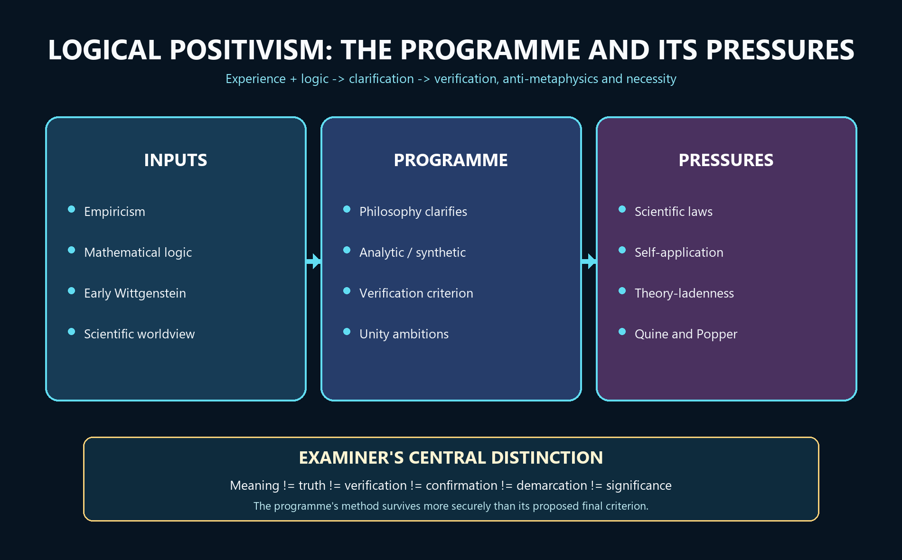

# Logical Positivism — Learner-v2 Source-Complete Learning Session


> **Generation:** g3, 29 August 2026 · **Approval:** false pending explicit topic approval
>
> **Evidence discipline:** Complete legacy teaching and workbook material is preserved, reordered Basic-first/Advanced-last, and checked against the canonical owner and verified 2018–2025 PYQ ledger.


## BASIC LEARNING SESSION




*Concept map: empiricism and modern logic generate a programme of clarification whose verification criterion drives the treatment of metaphysics and necessity, while science and self-application force revision.*

> **Syllabus (verbatim):** Logical Positivism : Verification Theory of Meaning; Rejection of Metaphysics; Linguistic Theory of Necessary Propositions.

### How to Use This Five-Layer Session

Every logical subtopic follows exactly:

| Layer | Purpose |
|---:|---|
| 1. SIMPLE START | visual-first plain-language gateway |
| 2. CORE UPSC | complete terminology, doctrine, argument, example and source grounding |
| 3. ADVANCED | objections, replies, comparisons, interpretive issues and refinements |
| 4. EXAM APPLICATION | verified PYQ routes and 10/15/20-mark architecture |
| 5. RAPID REVISION | traps, retrieval notes and links to the exact MCQ set |

### Source Audit and Contemporary-Link Boundary

- **Canonical doctrine source:** `upsc-ai-kit/knowledge/Philosophy/paper-1/western/Logical-Positivism.md` (8,128 words), sliced verbatim into every CORE UPSC layer and preserved again in the canonical apparatus block. - **Verified PYQs:** continuous local Western Philosophy Paper I bank, 2018-2025; this clause owns exactly **7** primary parts, one each in 2018, 2019, 2020, 2021, 2023, 2024 and 2025. **2022 is the only year without an owned part.**
- **Ownership discipline:** Quine's "Two Dogmas" parts, Popper's falsifiability and both early and later Wittgenstein questions are owned by their own clauses and appear here only as labelled comparisons; none is counted among the 7. - **Qdrant:** optional fallback only; not required for this canonical topic. - **Contemporary link (deliberately not forced):** a live search across 2026-02-19 to 2026-08-19 produced no sufficiently direct, well-verified official or academic development to anchor this clause. No institutional revival, conference or curriculum claim is invented. The honest contemporary relevance is static and disciplinary: verificationism's collapse defines the agenda of present-day **philosophy of science and language** (confirmation, demarcation, holism, the analytic/synthetic debate), which is why the clause is examined almost every year. That is stated as analysis, not as a dated news event.

**Preservation note:** the canonical doctrine is reorganised into layers, never compressed. Every doctrine, canonical quotation, numbered argument, presupposition, objection/reply, comparison, restored dossier, corpus-depth delta, PYQ route, directive rule, graded verdict and provenance caution is retained; simplification means adding accessible gateways, not deleting complexity.

### Learning Roadmap

| Unit | Logical subtopic |
|---:|---|
| 1 | Placement, the One-Screen Map and the Verification Meaning-Filter |
| 2 | Strong vs Weak Verification; In-Principle vs In-Practice; Ayer's Revisions and Church |
| 3 | The Positive Case for Verification - Why Intelligent People Believed It |
| 4 | The Tractatus-to-Verification Lineage and Its Precise Correction |
| 5 | Rejection of Metaphysics - the Grammatical/Logical Diagnostic and Pseudo-Statements |
| 6 | Ethics, Theology and Emotivism - Ayer vs Stevenson |
| 7 | The Linguistic Theory of Necessary Propositions and the Meaning of Universal Statements |
| 8 | The Protocol-Sentence Debate - Positivism's Internal Crisis |
| 9 | Carnap's Principle of Tolerance - Frameworks, Internal/External, and Ontology as Choice |
| 10 | Criticisms and Replies - the Succession to Popper, Quine and Later Wittgenstein |

---

### SESSION 1 — The Vienna Circle Programme: Experience, Logic and Clarification

#### DEFINITION / WHAT THIS IS CALLED

**Plain-language definition:** Logical positivism was a programme for clarifying knowledge claims by joining empiricism with modern logic, not the slogan that science is good and every other human concern is worthless.

**Technical definition:** The Vienna Circle around Moritz Schlick, Rudolf Carnap and Otto Neurath promoted a scientific worldview influenced by empiricism, mathematical logic and the early Wittgenstein; A. J. Ayer later supplied an influential English exposition. Philosophy was assigned logical clarification rather than a rival power to discover factual truths. Cognitive meaning is the capacity of a sentence to make a truth-apt factual claim or to function as an analytic logical truth; analytic propositions are true by meanings or rules, while synthetic propositions depend on how the world is.

#### VISUAL — Programme map: experience plus logic

```text

EMPIRICISM: claims answer to possible experience

                    \

                     +--> LOGICAL POSITIVIST PROGRAMME

                    /             |

MODERN LOGIC: expose form         v

                         PHILOSOPHY AS CLARIFICATION

                                      |

                    ANALYTIC RULES + SYNTHETIC FACTUAL CLAIMS

```

*The programme joins empirical control with logical analysis and ends in clarification, not speculative factual discovery.*

#### VISUAL — Analytic-synthetic meaning classification

```text

PROPOSITION

   |

   +--> ANALYTIC / TAUTOLOGICAL

   |    true by meaning, definition or rule; necessary; non-factual

   |

   +--> SYNTHETIC / EMPIRICAL

        true or false according to experience; contingent; factual

CAUTION -> 'meaningful' does not mean 'already verified' or 'scientifically true'

```

*Both branches are meaningful, but only one branch asserts contingent facts.*

#### ANSWER-GRABBING OPENING — WRITE/ADAPT IN THE EXAM

> Logical positivism is best read as a programme that divides meaningful discourse into analytic rules and empirically answerable claims, while assigning philosophy the task of clarifying their logical form rather than competing with science.

#### MUST-WRITE KEYWORDS

- **Vienna Circle**
- **scientific worldview**
- **cognitive meaning**
- **analytic**
- **synthetic**
- **logical clarification**

**How to use them:** Build the answer as Vienna Circle -> scientific worldview -> logical clarification -> analytic/synthetic division -> Ayer's English exposition -> internal diversity.

#### CORE OBJECTION, REPLY AND RESIDUAL LIMIT

**Objection:** The analytic-synthetic division may oversimplify language, and the Circle's members differed over protocols, physicalism, reduction and confirmation.

**Best reply:** The programme can be defended as a shared direction of inquiry rather than a single frozen creed: public testing and logical clarification unite positions that otherwise evolved.

**Residual limit:** The unity claim remains methodological, and later revisions make it difficult to identify one verification formula as the doctrine of every logical positivist.

#### EXAM USE AND CONCISE REVISION

**Answer architecture:** Use a programme map: context and influences -> role of philosophy -> analytic/synthetic division -> unity-of-science ambition -> explicit caution about internal diversity.

- Schlick, Carnap and Neurath belong to the Vienna Circle; Ayer popularised the programme in English.
- Cognitive meaning concerns truth-apt factual or analytic-logical content, not total human significance.
- Philosophy clarifies the language of knowledge instead of producing a second stock of empirical facts.

#### Visual gateway - the meaning filter

```text
                 ANY DECLARATIVE SENTENCE
                          |
                  [ VERIFICATION FILTER ]
             meaning = method of verification
              (a test of SENSE, not of TRUTH)
                          |
        +-----------------+------------------+
        v                 v                  v
    ANALYTIC          SYNTHETIC         EVERYTHING ELSE
   tautology         empirically       metaphysics / ethics /
   (logic, maths)    verifiable        theology
   true by           true or false     = PSEUDO-PROPOSITION
   convention        by observation    literally MEANINGLESS
        \                 |            (not false - NONSENSE)
         +------ MEANINGFUL ------+
```
Caption: two baskets keep their meaning; the third basket is not even wrong.

**Plain-language start:** Imagine a machine that decides not whether a sentence is *true* but whether it *says anything at all*. Feed it a sentence. If the sentence is true just because of what its words mean ("all bachelors are unmarried"), it passes as **analytic**. If some possible observation would count for or against it ("it is raining in Delhi"), it passes as **synthetic/empirical**. If neither test can even get a grip - if no experience could ever be relevant ("the Absolute is beyond time") - the machine rejects it as **meaningless nonsense**, a *pseudo-proposition*. The startling move is that "God exists," "the soul is immortal" and much of traditional metaphysics fall into the reject bin - not marked *false*, but marked *not a statement at all*.

| Idea | Plain meaning |
|---|---|
| Cognitively meaningful | capable of being true or false |
| Analytic | true by the meanings of its words (a tautology) |
| Empirically verifiable | some possible experience is relevant to its truth |
| Pseudo-proposition | looks like a statement, states nothing |
| Criterion of meaning (not truth) | asks "does this say anything?" not "is this true?" |

> 🔑 **Mnemonic - "TT-or-BIN":** meaningful only if a **T**autology (analytic) or **T**estable (empirical); everything else goes in the **BIN**.


> **Placement:** The **Vienna Circle** (Schlick, Carnap, Neurath; popularised in English by **A.J. Ayer**, *Language, Truth and Logic*, 1936). A radical empiricism armed with modern logic. One weapon—the Verification Principle—is deployed to fix meaning, reject metaphysics and re-explain logic/mathematics. This owner carries 7 parts in 2018–2025, with 2022 the only year without one.

---

#### 0. ONE-SCREEN MAP ⚠️

```
LOGICAL POSITIVISM — "Meaning = Method of Verification"
═══════════════════════════════════════════════════════════════════
             THE VERIFICATION PRINCIPLE
                      │
        ┌─────────────┼──────────────────────┐
        ▼             ▼                       ▼
  ANALYTIC        SYNTHETIC (empirical)     EVERYTHING ELSE
  (a priori,      (a posteriori,            = METAPHYSICS / ETHICS / THEOLOGY
   necessary,      verifiable by              → LITERALLY MEANINGLESS
   tautologies —   sense-experience)          (not false — NONSENSE)
   logic & maths)
═══════════════════════════════════════════════════════════════════
  LINGUISTIC THEORY        REJECTION OF           SELF-REFUTATION
  OF NECESSARY             METAPHYSICS            (the fatal objection:
  PROPOSITIONS:            Carnap: "Nothing       the principle is neither
  necessity =              noths" = pseudo-       analytic nor verifiable
  verbal/conventional;     statement; Ayer:       → by its own standard
  no synthetic a priori    emotivism about        it is meaningless)
                           ethics/theology
═══════════════════════════════════════════════════════════════════
```

> 🔑 **Mnemonic — "TT-or-BIN":** A sentence is meaningful only if it is a **T**autology (analytic) or **T**estable (empirical); everything else goes in the **BIN** (metaphysics = meaningless).

---

#### 1. VERIFICATION THEORY OF MEANING ✅

#### 1.1 Core Statement ✅

> ✅ *"The meaning of a proposition is the method of its verification."* — Schlick

A statement is **cognitively meaningful** (i.e. capable of being true or false) if and only if it is either: - **(a) Analytic** — true solely in virtue of the meanings of its terms (a tautology); OR - **(b) Empirically verifiable** — some possible sense-experience is relevant to its truth or falsehood.

Any putative statement that fails **both** tests is declared **cognitively meaningless** — it does not state a fact, does not picture anything, and is not even false; it is a *pseudo-proposition*. ✅

**Crucial clarification:** The verification principle is a criterion of **meaning**, not of **truth**. It does not ask "Is this sentence true?" but "Does this sentence say anything at all?" A false empirical claim ("The earth is flat") is *meaningful* because we know what observations would confirm or refute it. A metaphysical claim ("The Absolute is beyond time") fails because *no* observation is even *relevant*. ✅

#### One weapon, three syllabus jobs - the frame that keeps the answer on rails

The syllabus names three tasks - **Verification Theory of Meaning**, **Rejection of Metaphysics**, **Linguistic Theory of Necessary Propositions** - but they are not three theories. They are **three deployments of a single weapon**: the verification principle. It (i) *fixes meaning* (a sentence means the method of its verification), (ii) *rejects metaphysics* (sentences that no observation can touch are meaningless, not false), and (iii) *re-explains logic and mathematics* (necessity is verbal convention, not insight into a special realm). Hold this "one weapon, three jobs" frame and every question in this clause becomes a matter of choosing which job the examiner is asking about.

The movement's name is exact and worth unpacking: **logical** (the tool is the new mathematical logic of Frege and Russell, which lets a sentence's real form be laid bare) + **positivism/empiricism** (all factual knowledge comes from sense-experience). **"Armed with modern logic"** is the differentia from older empiricism: Hume distrusted metaphysics but had no formal machine to expose it; the Circle claimed to *demonstrate* meaninglessness by logical analysis of the sentence.

#### CLOSING RECALL FLOW — The Vienna Circle Programme: Experience, Logic and Clarification

```closure-flow
SUBTOPIC: The Vienna Circle Programme: Experience, Logic and Clarification
STARTING CONCEPT: The Vienna Circle Programme: Experience, Logic and Clarification
KEY TERMS / DEFINITIONS: Vienna Circle | scientific worldview | cognitive meaning | analytic | synthetic | logical clarification
MECHANISM / ARGUMENT: Empiricism supplies experiential control + mathematical logic supplies analysis -> philosophy clarifies propositions -> analytic rules and synthetic factual claims are separated.
CONSEQUENCE / CONTRAST: The programme seeks evidential discipline and scientific coordination without one unchanged doctrine shared uniformly by Schlick, Carnap, Neurath and Ayer.
UPSC TRAP / ANSWER-USE: Do not say the positivists treated every meaningful utterance as scientifically true or every non-scientific utterance as humanly worthless.
ANSWER-GRABBING FORMULATION: Logical positivism is best read as a programme that divides meaningful discourse into analytic rules and empirically answerable claims, while assigning philosophy the task of clarifying their logical form rather than competing with science.
```

### SESSION 2 — Verification: Meaning, Strong and Weak Tests, and In-Principle Access

#### DEFINITION / WHAT THIS IS CALLED

**Plain-language definition:** A factual sentence has cognitive meaning only when its truth or falsity would make some possible difference to experience; one need not actually perform the test now.

**Technical definition:** Verifiability in principle means that relevant observations are specifiable even when they are technologically or practically unavailable. Strong verification requires conclusive establishment in experience; weak verification, especially in Ayer's revised exposition, requires possible experience to count for or against a proposition or make it probable. Confirmation is partial evidential support rather than conclusive proof. Actual verification must therefore be distinguished from possible testability, and practical difficulty from logical impossibility.

#### VISUAL — Factual proposition to verification or confirmation

```text

FACTUAL PROPOSITION P

        | Would any possible experience count for or against P?

        +--> NO -> fails the criterion of cognitive factual meaning

        |

        +--> YES

              +--> conclusive experience possible -> STRONG verification

              +--> evidence changes probability -> WEAK verification / confirmation

```

*The path asks what evidence would matter before asking whether the proposition is true.*

#### VISUAL — Strong versus weak verification

```text

STRONG: truth conclusively established | sharp boundary | excludes too much

WEAK: observations relevant/probabilifying | broader science | admits too much

PRESSURE: universal laws, history, other minds, dispositions, theory terms

DILEMMA: too strict for science <----------------> too loose for demarcation

```

*The revision trades decisiveness for coverage.*

#### VISUAL — Actual checking versus verifiability in principle

```text

ACTUALLY CHECKED NOW -> evidence has been gathered

CHECKABLE IN PRACTICE -> current means make the test feasible

VERIFIABLE IN PRINCIPLE -> a relevant test can be specified

NOT VERIFIABLE EVEN IN PRINCIPLE -> no experience could make a difference

```

*Practical inaccessibility does not by itself destroy cognitive meaning.*

#### ANSWER-GRABBING OPENING — WRITE/ADAPT IN THE EXAM

> The verification criterion tests whether a factual claim has experiential consequences, not whether it has already been checked, conclusively proved, or accepted as scientifically true.

#### MUST-WRITE KEYWORDS

- **verifiability in principle**
- **actual verification**
- **strong verification**
- **weak verification**
- **confirmation**
- **probability**

**How to use them:** Define the criterion as one of cognitive factual meaning, draw the strong/weak fork, and keep actual checking separate from verifiability in principle.

#### CORE OBJECTION, REPLY AND RESIDUAL LIMIT

**Objection:** Strong verification excludes laws, past events and other minds; weak verification risks becoming so permissive that it no longer excludes metaphysics.

**Best reply:** A positivist can require a disciplined evidential connection rather than conclusive proof and can treat indirect observational consequences as relevant.

**Residual limit:** No weak formulation fully preserves both a sharp meaning boundary and adequate coverage of actual scientific language.

#### EXAM USE AND CONCISE REVISION

**Answer architecture:** Answer in five steps: criterion -> in principle/actual -> strong/weak -> confirmation -> strong/weak dilemma and qualified verdict.

- Possible experiential difference is the core idea; completed observation is not required.
- Conclusive verification and partial confirmation are different standards.
- Ayer's weak test is a repair designed to preserve scientific and ordinary factual discourse.

#### Visual gateway - the strong/weak fork

```text
              "VERIFIABLE" - but in WHICH sense?
                          |
              +-----------+-----------+
              v                       v
        STRONG (strict)          WEAK (liberal)
   CONCLUSIVELY verifiable   some observation is RELEVANT,
   by a FINITE set of        i.e. would make it more or less
   observations              PROBABLE
              |                       |
   kills universal laws      lets metaphysics creep back:
   ("all metals expand"),    almost anything can be linked
   the past ("Caesar         to SOME observation via an
   crossed the Rubicon"),    auxiliary hypothesis
   other minds
              |                       |
        TOO STRICT                TOO LIBERAL
        (excludes science)        (readmits nonsense)
              \                       /
               +--- NO GOLDILOCKS ---+
        Ayer's 1946 repair sunk by Alonzo Church (1949)
```
Caption: the theory cannot find a setting that is strict enough for metaphysics yet loose enough for science.

**Plain-language start:** "Verifiable" hides an ambiguity. On the **strong** reading a sentence is meaningful only if you could *settle it for certain* with a finite number of observations. That sounds rigorous, but it is a disaster: no finite set of observations conclusively proves "all metals expand when heated" (there are always more metals, past and future), and you cannot now observe Caesar crossing the Rubicon. Strong verification therefore throws out **science and history** along with metaphysics. So Ayer retreats to the **weak** reading: a sentence is meaningful if *some* observation would make it more or less probable. But now the net is too loose - with a clever enough extra assumption you can connect almost any sentence, even "the Absolute is perfect," to some observation. The theory is caught between a filter that is too fine and one that is too coarse.

| | Strong | Weak |
|---|---|---|
| Test | conclusive proof by finite observation | observation merely *relevant* / probabilistic |
| Saves | excludes metaphysics cleanly | saves science, past, universal laws |
| Fails | kills universal laws, past, other minds | readmits metaphysics |
| Proponent | Schlick (initially) | Ayer (1936, 1946) |

> 🔑 **Memory line:** strong kills science; weak revives metaphysics; there is no middle setting.


#### 1.2 Strong vs Weak Verification (PYQ 2025 Q3(b)) ✅

| | Strong (strict) | Weak (liberal) |
|---|---|---|
| **Formulation** | A statement is meaningful iff it is **conclusively verifiable** — its truth can be established with certainty by a *finite* set of observations | A statement is meaningful iff some possible observations are *relevant to* its truth — i.e. would render it probable or improbable |
| **Advantage** | Rigorous; excludes metaphysics cleanly | Saves scientific generalisations and statements about the past/future |
| **Problem** | Too strict: universal laws ("All metals expand when heated") can never be *conclusively* verified (infinitely many instances); statements about the past ("Caesar crossed the Rubicon") are not now observable. Strong verification kills science. | Too liberal: almost any statement can be connected to *some* observation by a sufficiently elaborate auxiliary hypothesis → metaphysics creeps back in |
| **Proponent** | Schlick (initially) | **Ayer** (*Language, Truth and Logic*, 1936 & 1946 2nd ed.) |

#### 1.3 Ayer's Revisions and Their Failure ⚠️

Ayer attempted in the 2nd edition (1946) to formulate a "weak" criterion that would admit science while still excluding metaphysics. His revised formulation (involving "directly verifiable" and "indirectly verifiable" statements) was shown by **Alonzo Church** (1949) and others to be either so permissive as to admit everything (including metaphysics) or so restrictive as to exclude legitimate science. No satisfactory formulation of the weak principle has ever been produced. ✅

> ⚠️ **Exam significance:** The strong/weak dilemma is the verification principle's **internal** problem — it cannot find the Goldilocks zone. This is distinct from the external **self-refutation** objection (§4 below) but equally fatal.

#### 1.4 Verifiable in Principle vs in Practice ✅

"There are mountains on the far side of the moon" was meaningful *before* spaceflight because it was verifiable **in principle** — we could specify what observations would settle it, even if no one was in a position to make them. "The Absolute is beyond all experience" is not verifiable even in principle.

#### CLOSING RECALL FLOW — Verification: Meaning, Strong and Weak Tests, and In-Principle Access

```closure-flow
SUBTOPIC: Verification: Meaning, Strong and Weak Tests, and In-Principle Access
STARTING CONCEPT: Verification: Meaning, Strong and Weak Tests, and In-Principle Access
KEY TERMS / DEFINITIONS: verifiability in principle | actual verification | strong verification | weak verification | confirmation | probability
MECHANISM / ARGUMENT: Candidate factual proposition -> identify possible experiential difference -> strong route seeks conclusive verification; weak route seeks relevant confirming or disconfirming evidence.
CONSEQUENCE / CONTRAST: The weaker test saves more science and ordinary discourse, but it converts verification into a less decisive relation of confirmation.
UPSC TRAP / ANSWER-USE: Do not define weak verification as mere compatibility with experience or attribute Popper's falsifiability test to logical positivism.
ANSWER-GRABBING FORMULATION: The verification criterion tests whether a factual claim has experiential consequences, not whether it has already been checked, conclusively proved, or accepted as scientifically true.
```

### SESSION 3 — Why Verification Attracted Support and Where Scientific Language Resists

#### DEFINITION / WHAT THIS IS CALLED

**Plain-language definition:** The criterion promised to connect meaning with publicly assessable evidence, but the most important scientific statements are rarely simple observation reports.

**Technical definition:** The positive case invokes operational clarity, intersubjective testing, anti-obscurantism and the unity of science. Yet universal laws cannot be verified by finitely many instances; dispositional statements concern unmanifested tendencies; past events and other minds are known indirectly; theoretical entities such as electrons enter through networks of predictions. Reduction to observation therefore gave way to indirect verification, probability, confirmation and rules connecting theoretical and observational vocabulary.

#### VISUAL — Scientific hard cases

```text

UNIVERSAL LAW -> infinitely many possible instances -> never conclusively verified

DISPOSITION -> may be real though never manifested in the present case

PAST EVENT -> evidence now consists of traces, records and testimony

OTHER MIND -> behaviour and expression provide indirect public evidence

THEORETICAL ENTITY -> predictions arise through a network, not direct inspection

```

*Each case pressures a simple equation between meaning and direct observation.*

#### VISUAL — Indirect confirmation route

```text

LAW / THEORY + INITIAL CONDITIONS + AUXILIARY ASSUMPTIONS

                              | deduction

                              v

                    OBSERVABLE PREDICTION

                              | test

             CONFIRM / DISCONFIRM / REVISE THE SYSTEM

```

*The theory reaches experience through auxiliaries and predicted observations.*

#### ANSWER-GRABBING OPENING — WRITE/ADAPT IN THE EXAM

> Verificationism gained its force from the demand that factual language incur an evidential risk, but scientific laws and theoretical terms reveal that this risk is normally indirect and holistic rather than a one-sentence reduction to observation.

#### MUST-WRITE KEYWORDS

- **universal law**
- **dispositional statement**
- **indirect verification**
- **theoretical entity**
- **observation statement**
- **unity of science**

**How to use them:** Build the answer as unity of science -> observation statements -> universal laws -> dispositional statements -> past events and other minds -> theoretical entities -> indirect verification.

#### CORE OBJECTION, REPLY AND RESIDUAL LIMIT

**Objection:** If indirect confirmation saves theoretical science, sophisticated metaphysical systems may also claim indirect experiential relevance.

**Best reply:** The positivist reply distinguishes systematic predictive integration, public testing and revisability from an unconstrained claim that merely coexists with experience.

**Residual limit:** The reply marks an epistemic difference but weakens verification as a precise sentence-by-sentence criterion of meaning.

#### EXAM USE AND CONCISE REVISION

**Answer architecture:** Use a hard-cases table, explain indirect confirmation, and end with the cost: scientific adequacy increases as demarcating sharpness decreases.

- Universal statements range beyond every finite observation set.
- Dispositions and theoretical entities are meaningful through test-linked inferential roles.
- Confirmation evaluates evidential support; it is not identical with meaning, truth or proof.

#### Visual gateway - five motivations and the argument spine

```text
   WHY BELIEVE VERIFICATIONISM? - five motivations, NOT equal
   -----------------------------------------------------------
   [1] DIFFERENCE-ARGUMENT   strongest: two hypotheses agreeing on
                             EVERY possible observation say the same
                             thing - a difference that makes no
                             difference anywhere is no difference
   [2] EINSTEIN MODEL        absolute simultaneity dissolved once you
                             ask what PROCEDURE decides it (1905)
   [3] MEANING = RULE OF USE  to know a sentence is to know when to
                             assert it (later Wittgensteinian)
   [4] DEMARCATION MOTIVE    a public line between science and
                             pseudo-science           <- weakest
   [5] UNITY OF SCIENCE      all sense reduces to one physicalist
                             observation-language

   THE ARGUMENT SPINE
   understand a sentence -> know what would make it true
      -> know what counts as evidence either way
      -> = grasp its VERIFICATION-conditions
      -> a sentence with NO possible evidence has nothing for
         understanding to consist in => no cognitive content
         (NOT false - contentless)
```
Caption: teach the case *for* the theory first; only then does the critique bite.

**Plain-language start:** Textbooks present verificationism only by what it destroys, which makes it look like mere prejudice. But serious people held it for serious reasons. The deepest is the **difference-argument**: if two theories predict *exactly* the same observations forever, in what sense do they disagree? A supposed difference that shows up nowhere is not a difference in *what is said*. The most persuasive historical model was **Einstein**: a two-century deadlock about "absolute simultaneity" evaporated the moment he asked what *procedure* could tell whether two distant events are simultaneous - and found none that is frame-independent. The metaphysical question dissolved into a definition. Verificationism generalised that success into a rule for meaning.

> 🔑 **Mnemonic - "DEMUD":** **D**ifference-argument, **E**instein, **M**eaning-as-use, **U**nity-of-science, **D**emarcation - strongest first, weakest (demarcation) last.


#### 1.5 THE POSITIVE CASE FOR VERIFICATION ⚠️→✅ — *why* anyone believed it

Textbook treatments present verificationism only through what it destroys. An examiner-grade answer must first show why intelligent people found it compelling; only then does the critique carry weight. There are **five independent motivations**, and they are not equally strong.

| # | Motivation | Statement | Strength |
|---|---|---|---|
| **1** | **The difference-argument** (Schlick, "Positivism and Realism," 1932) | If two putative hypotheses agree on **every** possible observation, they do not differ in content — they are one hypothesis in two vocabularies. A supposed difference that makes no difference anywhere is not a difference in what is *said*. | ⚠️ The strongest motivation, and the one that survives longest: it is a **principle of significance**, not of epistemology. |
| **2** | **The Einstein model** | Einstein (1905) removed a two-century impasse about absolute simultaneity by asking what *procedure* determines whether two distant events are simultaneous — and finding none that is frame-independent. The metaphysical question dissolved into a definition. | ✅ Historically decisive for the Circle. Schlick was a physicist; the principle was offered as the **generalisation of a successful scientific method**, not as a philosopher's stipulation. |
| **3** | **Meaning as rule of use** | To know what a sentence means is to know what to *do* with it — under what circumstances to assert it. Verification-conditions are the operational form of that knowledge. | ⚠️ This motivation is genuinely Wittgensteinian and outlives positivism: it reappears, transformed, in `Later-Wittgenstein.md` as meaning-is-use. |
| **4** | **The demarcation motive** | A criterion is needed to separate science from pseudo-science and from metaphysics. Verifiability offers a single, public, non-arbitrary line. | ❓ Weakest in retrospect: **Popper** (*Logik der Forschung*, 1934) shows that **falsifiability**, not verifiability, is the correct demarcation, and that demarcation is about **science**, not about **meaning** — Popper explicitly held metaphysics to be meaningful though unscientific. |
| **5** | **The unity-of-science programme** | If all cognitively significant statements reduce to observation-statements in a single (physicalist) language, the sciences are unified and philosophy becomes the logic of science. | ⚠️ Programmatic rather than argumentative; it explains the Circle's enthusiasm, not the principle's truth. |

**The positive argument, numbered ⚠️:**
1. To understand a sentence is to know what it would be for it to be true.
2. To know what it would be for it to be true is to be able to distinguish the circumstances in which it holds from those in which it does not.
3. To distinguish those circumstances is to know what would count as evidence either way.
4. therefore understanding a sentence = grasping its verification-conditions.
5. therefore a sentence for which no evidence could count either way has nothing for understanding to consist in.
6. therefore such a sentence is not false; it is **without cognitive content**.

**Presuppositions ⚠️ (say these before you criticise, and the criticism lands harder):**
- **P1** Understanding is exhausted by knowledge of truth-conditions, and truth-conditions are exhausted by observation-conditions. (Step 2→3 makes this identification; it is not argued for.) - **P2** Observation-statements are epistemically privileged — there is a level of report that is not itself theory-laden. **This is exactly what the protocol-sentence debate (§P) breaks open from within.**
- **P3** Sentences face experience **individually**. Destroyed by Duhem–Quine holism: a sentence has verification-conditions only relative to a whole body of theory. See `Quine-Strawson.md`. - **P4** The analytic/synthetic distinction is sharp — the principle's first disjunct depends on it entirely. Destroyed by "Two Dogmas of Empiricism" (1951).

> ⚠️ **Answer-craft:** the mature verdict is that verificationism dies of **its presuppositions**, not of the self-refutation objection. P2 falls to Neurath, P3 and P4 to Quine. The self-refutation charge (§4) is the easiest objection and the least interesting one.

#### CLOSING RECALL FLOW — Why Verification Attracted Support and Where Scientific Language Resists

```closure-flow
SUBTOPIC: Why Verification Attracted Support and Where Scientific Language Resists
STARTING CONCEPT: Why Verification Attracted Support and Where Scientific Language Resists
KEY TERMS / DEFINITIONS: universal law | dispositional statement | indirect verification | theoretical entity | observation statement | unity of science
MECHANISM / ARGUMENT: Law/theory + initial conditions + auxiliary assumptions -> observable prediction -> result confirms, weakens or revises the connected scientific system.
CONSEQUENCE / CONTRAST: Scientific meaning becomes tied to inferential and evidential roles rather than a simple translation of every theoretical sentence into one observation sentence.
UPSC TRAP / ANSWER-USE: Do not say a universal law is conclusively verified by many positive instances or that an unobservable theoretical entity is automatically metaphysical.
ANSWER-GRABBING FORMULATION: Verificationism gained its force from the demand that factual language incur an evidential risk, but scientific laws and theoretical terms reveal that this risk is normally indirect and holistic rather than a one-sentence reduction to observation.
```

### SESSION 4 — Early Wittgenstein, Logical Analysis and the Step Added by Positivism

#### DEFINITION / WHAT THIS IS CALLED

**Plain-language definition:** The Vienna Circle learned from the Tractatus that meaningful propositions represent possible facts and that logic does not describe another realm, but it added an explicit verification criterion.

**Technical definition:** The early Wittgenstein influenced the factual-proposition/tautology contrast and the idea that philosophy clarifies language. His tautologies show logical form without depicting contingent facts, while his saying/showing distinction cannot be identified wholesale with positivism. Logical positivists transformed this delimitation of sense into an empiricist test of factual meaning and used mathematical logic to expose grammatical disguise and logical syntax.

#### VISUAL — Tractatus to verification: inheritance and addition

```text

EARLY WITTGENSTEIN

facts can be said | logic is tautological | philosophy clarifies

                     | Vienna Circle appropriation

                     v

LOGICAL POSITIVISM

adds: factual meaning requires possible experiential verification

CAUTION: saying/showing and the mystical are not identical with this test

```

*The arrow preserves influence without collapsing two programmes.*

#### VISUAL — Logical clarification workflow

```text

ORDINARY SENTENCE

      | analyse logical syntax

      +--> factual form with test conditions

      +--> analytic/tautological rule

      +--> grammatical disguise or malformed logical combination

```

*Analysis asks whether surface grammar corresponds to genuine logical form.*

#### ANSWER-GRABBING OPENING — WRITE/ADAPT IN THE EXAM

> The Circle inherited a distinction between factual saying and logical scaffolding from the early Wittgenstein, yet verificationism was its own empiricist addition rather than a doctrine stated wholesale in the Tractatus.

#### MUST-WRITE KEYWORDS

- **early Wittgenstein**
- **logical form**
- **tautology**
- **saying and showing**
- **logical syntax**
- **empiricist addition**

**How to use them:** Build the answer as early Wittgenstein -> logical form -> tautology -> saying and showing -> logical syntax -> the positivist empiricist addition.

#### CORE OBJECTION, REPLY AND RESIDUAL LIMIT

**Objection:** The positivist appropriation may flatten aspects of the Tractatus that were not reducible to empirical science.

**Best reply:** The Circle can reply that it adopted analytical tools and a boundary problem, not every Tractarian thesis or intention.

**Residual limit:** Historical influence does not establish doctrinal identity, and Ayer's exposition is further removed from the Circle's internal debates.

#### EXAM USE AND CONCISE REVISION

**Answer architecture:** Use a two-stage lineage: what was taken -> what was added -> what must not be identified.

- Tautologies are non-factual logical limits, not verified empirical reports.
- Logical syntax reveals structure that ordinary grammar may conceal.
- Verificationism is the Circle's empiricist development, not simply Tractatus doctrine.

#### Visual gateway - what the Circle took, and the step it added

```text
   TRACTATUS (1921)                VIENNA CIRCLE (its own addition)
   ----------------                -------------------------------
   sense = TRUTH-conditions   -->  sense = VERIFICATION-conditions
   (a proposition shows what        (a proposition means the METHOD
    is the case IF true)             of establishing it)
   bipolarity = a LOGICAL     -->   verifiability = an EPISTEMIC
   requirement                       requirement (someone can check)
   metaphysics fails to       -->   metaphysics = no observation is
   DEPICT a possible state           relevant to it
   ethics & the mystical are  -->   ethics REDUCED to emotive
   SHOWN (6.522 affirms them)        expression; nothing is "shown"

   THE CORRECTION:
   truth-conditions  --[Circle's empiricist step]-->  verification-
   conditions.  This move is NOT in the Tractatus.
   Wittgenstein was NEVER a member of the Vienna Circle.
```
Caption: the Circle read the Tractatus aloud for a year - then added a step Wittgenstein never took.

**Plain-language start:** The Vienna Circle famously read the *Tractatus* line by line over more than a year, and the book clearly shaped them. So people say "the *Tractatus* founded logical positivism." That is half right and half wrong. What the *Tractatus* says is that a proposition has *sense* only if it is **bipolar** - capable of being true and capable of being false - and that its sense is fixed by its **truth-conditions**. The Circle's own contribution was to swap *truth-conditions* for *verification-conditions*: not just "what would make it true?" but "what could I *do* to check it?" That swap - from a **logical** requirement to an **epistemic** one - is the empiricist addition, and it is exactly what later generates the strong/weak dilemma, because truth-conditions can be specified for a universal law even when conclusive verification-conditions cannot.

> 🔑 **Memory line:** the Circle took bipolarity and added a checkbook - truth-conditions became verification-conditions.


#### 1.6 THE *TRACTATUS*-TO-VERIFICATION LINEAGE ⚠️ — what the Circle took, and what it added

**The historical thread ✅:**
1. **1921/22** — the *Tractatus* appears. Its doctrine is that a proposition has sense iff it is **bipolar** — capable of truth and capable of falsity — and that sense is fixed by **truth-conditions** (see `Moore-Russell-EarlyWittgenstein.md` §6.3). 2. **1926–27** — the Schlick Circle reads the *Tractatus* aloud, proposition by proposition, over more than a year. Its influence on the Circle's manifesto (*Wissenschaftliche Weltauffassung: Der Wiener Kreis*, 1929) is explicit.
3. **1929–32** — Wittgenstein converses with **Schlick** and **Waismann** (recorded in *Wittgenstein and the Vienna Circle*, ed. McGuinness, 1979). In these conversations verificationist formulations do occur.
4. **1936** — **Ayer**, who attended Circle meetings in 1932–33, transmits the doctrine to the English-speaking world in *Language, Truth and Logic*.

**The step the Circle added — and it is not a small one ⚠️:**
| *Tractatus* | Vienna Circle |
|---|---|
| Sense = **truth-conditions**: a proposition shows what is the case *if* it is true (4.022, 4.024) | Sense = **verification-conditions**: a proposition means the *method* of establishing it |
| Bipolarity is a **logical** requirement (a proposition must have a determinate place in logical space) | Verifiability is an **epistemic** requirement (someone must be able to check) |
| Metaphysics is *unsinnig* because it fails to **depict a possible state of affairs** | Metaphysics is meaningless because **no observation is relevant to it** |
| The elementary base is composed of **objects** never exemplified — a logical postulate | The base is composed of **observations/protocols** — an empirical claim |
| Ethics and the mystical are **not** dismissed; they are *shown*, and 6.522 affirms their reality | Ethics is **reduced to emotive expression**; nothing is "shown" |

> ⚠️ **The two most examinable corrections here.**
> **(i)** Wittgenstein was **never a member** of the Vienna Circle. He met only Schlick and Waismann (and briefly Carnap and Feigl), refused to attend meetings, and at times read Tagore's poetry to them with his back turned rather than discuss logic — an anecdote worth one clause, not more. > **(ii)** The *Tractatus* is **not** a verificationist text. Moving from truth-conditions to verification-conditions is the **Circle's own empiricist addition**, and it is exactly the move that generates the strong/weak dilemma (§1.2), since truth-conditions can be specified for universal laws while conclusive verification-conditions cannot. Say this and you separate yourself immediately from the standard "the *Tractatus* inspired positivism" answer.
> **(iii)** Wittgenstein's later attitude: verification survives in his own work only as a **grammatical** remark — "Asking whether and how a proposition can be verified is only a particular way of asking 'How d'you mean?'" (*Philosophical Investigations* §353) — i.e. a heuristic about the *kind* of question, not a criterion of meaningfulness.

---

#### CLOSING RECALL FLOW — Early Wittgenstein, Logical Analysis and the Step Added by Positivism

```closure-flow
SUBTOPIC: Early Wittgenstein, Logical Analysis and the Step Added by Positivism
STARTING CONCEPT: Early Wittgenstein, Logical Analysis and the Step Added by Positivism
KEY TERMS / DEFINITIONS: early Wittgenstein | logical form | tautology | saying and showing | logical syntax | empiricist addition
MECHANISM / ARGUMENT: Tractarian fact/tautology boundary + empiricist demand for experiential control -> verification criterion and anti-metaphysical logical diagnosis.
CONSEQUENCE / CONTRAST: The lineage explains the programme's logical sophistication without erasing the Tractatus's distinct treatment of ethics, the mystical and showing.
UPSC TRAP / ANSWER-USE: Do not call the early Wittgenstein a straightforward member of the Vienna Circle or equate saying/showing with verification/falsification.
ANSWER-GRABBING FORMULATION: The Circle inherited a distinction between factual saying and logical scaffolding from the early Wittgenstein, yet verificationism was its own empiricist addition rather than a doctrine stated wholesale in the Tractatus.
```

### SESSION 5 — Rejection of Metaphysics: The Pseudo-Proposition Diagnostic

#### DEFINITION / WHAT THIS IS CALLED

**Plain-language definition:** Logical positivists reject a metaphysical sentence as cognitively meaningless when it looks like a factual assertion but supplies no possible experiential test or coherent logical role.

**Technical definition:** A pseudo-proposition is an expression with assertion-like grammar but no cognitive factual content. Carnap diagnoses terms without criteria of application, grammatical disguise, category mistakes and violations or misuse of logical syntax; Ayer argues that an alleged factual claim is cognitively meaningful only when some possible experience is relevant. The verdict is not automatically that the sentence is false, emotionally worthless or literally ungrammatical.

#### VISUAL — Metaphysical pseudo-proposition diagnostic

```text

ASSERTION-LIKE SENTENCE

        | analytic / tautological?

        +--> YES -> meaningful non-factual rule

        |

        +--> NO -> possible experiential difference?

                    +--> YES -> synthetic factual candidate

                    +--> NO -> inspect term criteria, category and logical syntax

                               -> PSEUDO-PROPOSITION diagnosis

```

*The flow distinguishes empirical failure from failure to formulate a factual claim.*

#### VISUAL — Four verdicts kept distinct

```text

FALSE -> meaningful proposition that does not match reality

UNKNOWABLE -> meaningful question beyond available justification

PSEUDO-PROPOSITION -> no cognitive factual claim successfully made

WORTHLESS -> separate evaluative verdict; not entailed by positivism's criterion

```

*UPSC answers must not collapse semantic, epistemic and evaluative verdicts.*

#### ANSWER-GRABBING OPENING — WRITE/ADAPT IN THE EXAM

> The positivist attack on metaphysics is primarily semantic: it denies that an unverifiable pseudo-proposition reaches the stage of truth or falsity, while leaving open its historical, expressive or existential significance.

#### MUST-WRITE KEYWORDS

- **pseudo-proposition**
- **criterion of application**
- **grammatical disguise**
- **category mistake**
- **logical syntax**
- **cognitive meaninglessness**

**How to use them:** Build the answer as pseudo-proposition -> criterion of application -> grammatical disguise -> category mistake -> logical syntax -> cognitive meaninglessness, then distinguish false and worthless.

#### CORE OBJECTION, REPLY AND RESIDUAL LIMIT

**Objection:** Many metaphysical claims appear intelligible, guide inquiry and may challenge the positivist's narrow model of factual meaning.

**Best reply:** The positivist reply asks for conditions under which disagreement would be settled and warns that grammatical familiarity can create an illusion of factual content.

**Residual limit:** The diagnostic is strongest against claims insulated from every possible counter-instance and weaker against systematic metaphysics with explanatory or experiential connections.

#### EXAM USE AND CONCISE REVISION

**Answer architecture:** Use a diagnostic flow and then evaluate the criterion on which the diagnosis depends.

- Cognitive meaninglessness is not falsity because the sentence is denied truth-conditions.
- Carnap's target includes misuse of terms and logical syntax, not only absent laboratory tests.
- A fair example tests the form of the claim without dismissing a tradition or practice as worthless.

#### Visual gateway - the metaphysics diagnostic

```text
   SURFACE GRAMMAR says...        LOGICAL ANALYSIS reveals...
   ----------------------         ---------------------------
   "the Absolute" is a noun   ->  names nothing empirical; no
   (names a thing)                truth-conditions
   "Nothing noths"            ->  "nothing" is a QUANTIFIER, not a
   (Heidegger: das Nichts         name; the sentence is
    nichtet)                      grammatically parasitic, vacuous
   "God exists" like          ->  no conceivable observation
   "the table exists"             confirms/refutes => not FALSE,
                                  but MEANINGLESS

   TWO ROUTES TO A PSEUDO-STATEMENT
   (a) a term with NO empirical criterion of application
       ("the Absolute," "Being-in-itself," "noumenon")
   (b) meaningful terms combined so NO truth-conditions result
       ("Caesar is a prime number" - grammatical, senseless)
   control case: "electrons have negative charge" = MEANINGFUL
```
Caption: metaphysics is generated by mistaking grammatical form for logical form.

**Plain-language start:** Why do intelligent people produce sentences the positivist calls nonsense? Because ordinary grammar *disguises* logical form. "The Absolute" is shaped like "the table," so it *looks* as if it names something; but no observation could ever bear on it, so logically it names nothing. Heidegger's **"the nothing nothings"** borrows the frame "something does X," but "nothing" is not a name - it is a logical quantifier ("there is no x such that..."). Carnap's diagnosis (1932) is that the sentence commits a *double* violation: it treats a quantifier as a name and invents a pseudo-verb. The rejection is therefore surgical, not a shout: it points to *where* the sentence stops being a statement.

| Sentence | Verdict | Why |
|---|---|---|
| "The soul is immortal" | pseudo-statement | "soul" has no empirical criterion |
| "Electrons have negative charge" | meaningful | indirectly testable (control case) |
| "2 + 2 = 4" | meaningful | analytic / tautological |
| "The Good transcends Being" | pseudo-statement | no truth-conditions |

> 🔑 **Memory line:** metaphysics is grammar wearing the costume of logic.


#### 2. REJECTION OF METAPHYSICS ✅ (PYQ 2023, 2021)

#### 2.1 The Verdict ✅

Metaphysical sentences ("The Absolute is perfect," "Reality is timeless," "God exists as a necessary being," "Nothing noths") are **neither true nor false but literally meaningless** — they are pseudo-propositions that fail both the analytic and the empirical test.

> ✅ *"A metaphysical sentence is one which purports to express a genuine proposition, but does not."* — Ayer

#### 2.2 Diagnosis: The Source of Metaphysical Illusion ✅

Metaphysicians are misled by **surface grammar**:

| Surface grammar suggests… | Logical analysis reveals… |
|---|---|
| "The Absolute" functions like a noun (names something) | No observation could determine its truth-conditions; it names nothing empirical |
| "Nothing noths" (Heidegger: *das Nichts nichtet*) uses "nothing" as a noun + verb | Grammatically parasitic on the structure "Something does X"; but "nothing" is not a name — it is a logical quantifier. The sentence is syntactically misleading and semantically vacuous. |
| "God exists" looks like "The table exists" | Unlike "the table exists," no conceivable observation confirms or refutes "God exists" (if God is defined as transcendent). It is not false — it is *meaningless*. |

> ✅ Carnap's attack on Heidegger (*"The Elimination of Metaphysics through Logical Analysis of Language,"* 1932): "Nothing noths" commits a double violation — using a logical syncategorematic term ("nothing") as if it were a name, and predicating a pseudo-verb ("noths") of it.

#### 2.3 Identifying Pseudo-Statements (PYQ 2021 Q2(b)) ✅

A statement is a **pseudo-statement** if:
1. It employs terms for which no empirical criterion of application can be given (e.g. "the Absolute," "Being-in-itself," "noumenon"); OR
2. Its constituent terms *do* have meaning individually, but are combined in a way that yields no truth-conditions (e.g. "Caesar is a prime number" — grammatical, but senseless because no verification procedure applies).

**Examples:**
- "The soul is immortal" — pseudo-statement (no observation could confirm/refute; "soul" lacks empirical criterion).
- "Electrons have negative charge" — meaningful (empirically testable, even if indirectly).
- "2 + 2 = 4" — meaningful (analytic/tautological — true by the rules of arithmetic).
- "The Good transcends Being" — pseudo-statement.

#### CLOSING RECALL FLOW — Rejection of Metaphysics: The Pseudo-Proposition Diagnostic

```closure-flow
SUBTOPIC: Rejection of Metaphysics: The Pseudo-Proposition Diagnostic
STARTING CONCEPT: Rejection of Metaphysics: The Pseudo-Proposition Diagnostic
KEY TERMS / DEFINITIONS: pseudo-proposition | criterion of application | grammatical disguise | category mistake | logical syntax | cognitive meaninglessness
MECHANISM / ARGUMENT: Assertion-like sentence -> analytic? -> if no, specify possible experiential test -> if none, inspect term-use and logical syntax -> diagnose pseudo-proposition.
CONSEQUENCE / CONTRAST: The analysis converts a dispute about hidden reality into a prior question about whether a factual claim has been successfully made.
UPSC TRAP / ANSWER-USE: Do not caricature religious or Indian philosophical traditions, and do not infer that every metaphysical sentence is nonsense in ordinary language or devoid of significance.
ANSWER-GRABBING FORMULATION: The positivist attack on metaphysics is primarily semantic: it denies that an unverifiable pseudo-proposition reaches the stage of truth or falsity, while leaving open its historical, expressive or existential significance.
```

### SESSION 6 — Religion, Ethics and Aesthetics: Cognitive Status and Human Significance

#### DEFINITION / WHAT THIS IS CALLED

**Plain-language definition:** A positivist may deny that a value or religious utterance states an empirically testable fact while still recognising that it expresses attitudes, recommends action or shapes a form of life.

**Technical definition:** Emotive significance is the expressive force by which an utterance evinces or influences attitudes without describing a truth-apt fact. Ayer treats basic ethical judgements as non-cognitive expressions rather than reports of feeling; prescriptive, expressive and persuasive functions must be separated from factual assertion. Religious and aesthetic utterances require sentence-by-sentence analysis: some make historical or empirical claims, while others function devotionally, symbolically, evaluatively or expressively.

#### VISUAL — Cognitive versus emotive or expressive significance

```text

UTTERANCE

   +--> FACTUAL/COGNITIVE QUESTION: what observation would bear on truth?

   |

   +--> EXPRESSIVE QUESTION: what attitude or commitment is evinced?

   +--> PRESCRIPTIVE QUESTION: what action or stance is recommended?

   +--> AESTHETIC/DEVOTIONAL QUESTION: what significance is enacted?

VERDICT -> non-factual does not mean insignificant or valueless

```

*One utterance may have different factual and practical dimensions.*

#### VISUAL — Fair classification examples

```text

'This ritual occurred in year Y' -> historical and evidential component

'Compassion is good' -> evaluative approval and guidance

'This raga is sublime' -> aesthetic evaluation, not a measurement report

'The sacred is present here' -> analyse factual, symbolic and devotional uses

```

*Analyse functions rather than caricaturing whole traditions.*

#### ANSWER-GRABBING OPENING — WRITE/ADAPT IN THE EXAM

> Logical positivism narrows the cognitive factual status of ethical, religious and aesthetic utterances, but cognitive non-factuality does not erase their emotive, expressive, prescriptive or cultural significance.

#### MUST-WRITE KEYWORDS

- **emotive significance**
- **non-cognitive**
- **expressive**
- **prescriptive**
- **factual status**
- **attitude**

**How to use them:** Build the answer as factual status -> non-cognitive use -> emotive significance -> expressive function -> prescriptive function -> attitude, followed by the reporting/expressing distinction.

#### CORE OBJECTION, REPLY AND RESIDUAL LIMIT

**Objection:** Moral reasoning appears to involve consistency, reasons and disagreement that simple emotivism may not adequately explain.

**Best reply:** The positivist can distinguish factual premises from the attitude or prescription expressed in the final evaluative judgement and can analyse persuasive language dynamically.

**Residual limit:** The reply does not fully explain moral objectivity, embedded ethical propositions or rational criticism of ultimate values.

#### EXAM USE AND CONCISE REVISION

**Answer architecture:** Use paired columns: cognitive factual status versus emotive/expressive/prescriptive significance, followed by one objection and qualified reply.

- Expressing approval is not the same as reporting that one feels approval.
- Historical claims within religion may be factual even when devotional meaning is not exhausted by factual description.
- Non-cognitive classification does not establish social, aesthetic or existential worthlessness.

#### Visual gateway - two emotivisms, not one

```text
   "STEALING IS WRONG" - what is this utterance DOING?
   ---------------------------------------------------
   AYER (LTL 1936, ch.6)         STEVENSON (1937; 1944)
   -------------------------     -------------------------
   PURE EXPRESSION of feeling    EXPRESSION + a descriptive
   ("Stealing - boo!")           meaning; model: "I disapprove
   adds NO factual content       of X; do so as well"
                                 (attitude + imperative)
   NOT a report of feeling       NOT a report either
     (EXPRESSION =/= REPORT;       (both are NON-COGNITIVISTS,
      else it would be              not subjectivists)
      autobiography, true/false)
   moral argument: essentially   DISAGREEMENT IN ATTITUDE can
   impossible (only facts         survive complete factual
   can be argued)                 agreement -> argument is real
   a COROLLARY of verification   INDEPENDENT of verification
     => falls if it falls          => survives its collapse
   -----------------------------------------------------------
   BOTH face the FREGE-GEACH embedding problem:
   "IF lying is wrong, THEN getting your brother to lie is wrong"
   - the antecedent expresses NO attitude, yet must mean the same
     as the free-standing "lying is wrong" for modus ponens.
```
Caption: the marked distinction is whether moral argument is possible at all.

**Plain-language start:** If "stealing is wrong" is neither a tautology nor empirically testable, the positivist cannot call it *true*. So what is it doing? **Ayer** says it merely *vents* a feeling and tries to *arouse* one - like saying "stealing - boo!" It states no fact; adding "is wrong" adds nothing factual. Crucially this is **expression, not report**: "I disapprove of stealing" would be a *statement about me* (true or false), and Ayer rejects that, because it would turn moral disagreement into disagreement about autobiography. **Stevenson** agrees it is non-cognitive but adds machinery: ethical words carry an **emotive meaning** built by usage, and genuine moral disputes are **disagreements in attitude** that can persist even after every fact is agreed - which is why moral argument is real, working *causally* by changing the beliefs attitudes rest on.

> 🔑 **Mnemonic - "EXPRESS =/= REPORT":** emotivism *expresses* an attitude; it does not *report* one - that is what keeps it non-cognitivist, not subjectivist.


#### 2.4 Fate of Ethics and Theology — Emotivism ✅

Since ethical and theological statements are neither analytic nor empirically verifiable:

| Domain | Positivist verdict |
|---|---|
| **Ethics** | "Stealing is wrong" = *expresses* a feeling of disapproval (like "Stealing — boo!") and *evokes* a similar feeling in the hearer. It states **no fact** and is neither true nor false. → **Emotivism** (Ayer, Stevenson). |
| **Theology** | "God exists" = meaningless (not merely false); "God is good" doubly meaningless. Religious language is emotive/performative, not cognitive. |

> ✅ *"'You stole that money' — I add no factual content; I merely evince my moral disapproval."* — Ayer (in substance)

#### 2.5 AYER vs STEVENSON — two emotivisms, not one ⚠️→✅

**The single most common error on this sub-topic is to treat "emotivism (Ayer, Stevenson)" as one doctrine.** They differ on the question that matters most: *whether moral argument is possible at all.*

| Axis | **AYER** — *Language, Truth and Logic* (1936), Ch. 6 | **STEVENSON** — "The Emotive Meaning of Ethical Terms" (1937); *Ethics and Language* (1944) |
|---|---|---|
| **What an ethical term does** | It is a **pure expression** of feeling. Adding "…is wrong" to "You stole that money" adds **no factual content whatever**; it merely *evinces* disapproval and may *evoke* it in the hearer. | Ethical terms have **two kinds of meaning**: a **descriptive** meaning (varying with context) *and* an **emotive** meaning (a disposition, built by usage, to express and evoke attitude). |
| **Is it a report of feeling?** | **No** — and Ayer is emphatic. Saying "I disapprove of stealing" would be a *statement* about the speaker, true or false. Ayer rejects that (subjectivism) because it makes moral disagreement into disagreement about autobiography. Expression ≠ report. | Same rejection, same reason. Both are **non-cognitivists**, not subjectivists. ⚠️ Getting this right is worth a mark by itself. |
| **Working model of "X is good"** | (an expression, with no propositional paraphrase at all) | "**I approve of X; do so as well.**" — i.e. an expression of attitude **plus an imperative/persuasive element**. |
| **Nature of ethical disagreement** | Ethical disputes are **always really about facts**. Once all facts are agreed, if attitudes still differ, "we should not attempt to argue" — there is nothing left to dispute. | The crucial innovation: **disagreement in belief** vs **disagreement in attitude**. Genuine moral disagreement is disagreement *in attitude*, and it **can survive complete factual agreement**. |
| **Is moral argument possible?** | Essentially **no** — argument is possible only about the facts surrounding the case. | **Yes.** Reasons are relevant, though not deductively: they work **causally**, by altering the beliefs on which attitudes rest. Stevenson distinguishes **rational methods** (supplying beliefs that redirect attitude) from **non-rational/persuasive methods**. |
| **Distinctive further doctrine** | Emotivism is a **corollary** of the verification principle: ethics is neither analytic nor verifiable, therefore non-cognitive. It is derived top-down from the theory of meaning. | **Persuasive definition** — redefining a term that carries favourable emotive force so as to redirect attitudes while appearing to report a fact ("*real* democracy is…", "*true* freedom means…"). Stevenson's account is built bottom-up from the **psychology of linguistic influence**, and does not depend on the verification principle at all. |
| **Consequence for the file** | If verificationism falls, Ayer's ethics falls with it. | Stevenson's emotivism is **logically independent** of verificationism and therefore survives its collapse — which is why he, and not Ayer, is the ancestor of Hare's prescriptivism and Blackburn's quasi-realism. |

**Shared objections → replies ❓:**
| Objection | Force | Reply available |
|---|---|---|
| **The Frege–Geach embedding problem** (Geach 1960, 1965; anticipated by Frege): "If lying is wrong, then getting your brother to lie is wrong" — the antecedent expresses no attitude, yet must mean the same as the free-standing "Lying is wrong" for the *modus ponens* to be valid. Expressivism cannot explain unasserted contexts. | **Decisive against simple emotivism.** Name it and the answer is immediately above average. | Later expressivists (Blackburn, Gibbard) construct logics of attitude; neither Ayer nor Stevenson had an answer. |
| Emotivism cannot distinguish moral disapproval from mere distaste (broccoli vs murder). | Strong | Stevenson can appeal to the *generality* and *social* function of moral attitudes; Ayer cannot. |
| It makes moral progress unintelligible — attitudes change, but nothing gets *truer*. | Strong | Stevenson: progress = convergence of attitude under fuller belief; Ayer: concedes the point. |

**Executable verdict:** "Ayer's emotivism is a **deduction** from the verification principle and shares its fate; Stevenson's is an **independent theory of linguistic influence** which explains what Ayer could not — how moral argument can be genuine even though moral judgements state no fact. If asked to assess emotivism, distinguish these two and rule that the doctrine survives only in Stevenson's form, and even then only until the Frege–Geach problem is met."

---

#### CLOSING RECALL FLOW — Religion, Ethics and Aesthetics: Cognitive Status and Human Significance

```closure-flow
SUBTOPIC: Religion, Ethics and Aesthetics: Cognitive Status and Human Significance
STARTING CONCEPT: Religion, Ethics and Aesthetics: Cognitive Status and Human Significance
KEY TERMS / DEFINITIONS: emotive significance | non-cognitive | expressive | prescriptive | factual status | attitude
MECHANISM / ARGUMENT: Utterance -> factual component? test it empirically; evaluative component? analyse expressive/prescriptive role -> cognitive status and practical significance are reported separately.
CONSEQUENCE / CONTRAST: The framework prevents value judgements from masquerading as empirical descriptions while preserving their motivational and social roles.
UPSC TRAP / ANSWER-USE: Do not say 'cognitively meaningless' means 'emotionally meaningless,' and do not treat every religious sentence as having one identical function.
ANSWER-GRABBING FORMULATION: Logical positivism narrows the cognitive factual status of ethical, religious and aesthetic utterances, but cognitive non-factuality does not erase their emotive, expressive, prescriptive or cultural significance.
```

### SESSION 7 — Necessary Propositions: Analyticity, Tautology and Linguistic Rules

#### DEFINITION / WHAT THIS IS CALLED

**Plain-language definition:** Logic and mathematics are necessary not because they describe invisible objects, but because their truths follow from definitions, conventions or rules governing symbols and inference.

**Technical definition:** The linguistic theory of necessary propositions treats logical and mathematical necessity as analytic, tautological or true by virtue of linguistic conventions. A tautology is true under every admissible interpretation of its components and asserts no contingent fact. Conventionalism explains necessity through adopted rules or frameworks. Analytic propositions remain cognitively meaningful in a non-factual logical sense: they organise representation and inference without being empirically verified.

#### VISUAL — Necessary propositions as linguistic rules

```text

DEFINITIONS + SYMBOL RULES + RULES OF INFERENCE

                        |

                        v

             ANALYTIC / TAUTOLOGICAL TRUTH

                        |

         ORGANISES INFERENCE AND REPRESENTATION

                        |

              ASSERTS NO CONTINGENT FACT

```

*Necessity moves from a supersensible object to the rule-governed framework of expression.*

#### VISUAL — Logic and mathematics: factual versus non-factual

```text

2 + 2 = 4 -> follows within definitions/rules -> necessary, non-factual

Either P or not-P -> tautological form -> no world-survey required

This page is white -> observation decides -> contingent, factual

CAUTION -> non-factual meaningfulness is not absence of logical importance

```

*The distinction concerns what makes the proposition true.*

#### ANSWER-GRABBING OPENING — WRITE/ADAPT IN THE EXAM

> For the positivist, necessary propositions do not report a supersensible reality; they articulate the linguistic and inferential framework within which factual propositions can be represented and tested.

#### MUST-WRITE KEYWORDS

- **necessary proposition**
- **analytic truth**
- **tautology**
- **conventionalism**
- **stipulative definition**
- **rule of inference**

**How to use them:** Explain why necessary truths are meaningful yet non-factual, connect logic, mathematics, definitions and rules, and distinguish early Wittgenstein's influence from full doctrinal identity.

#### CORE OBJECTION, REPLY AND RESIDUAL LIMIT

**Objection:** Kant's synthetic a priori challenges the reduction; Quine attacks the analytic-synthetic boundary; necessity may seem stronger than optional convention.

**Best reply:** A conventionalist replies that frameworks are chosen for practical and theoretical purposes, while consequences within an adopted system can be strict and non-arbitrary.

**Residual limit:** The reply explains formal necessity better than why some rules are indispensable, fruitful or justified, and it may relocate rather than dissolve normativity.

#### EXAM USE AND CONCISE REVISION

**Answer architecture:** Answer: empiricist problem -> linguistic solution -> logic/mathematics examples -> non-factual function -> Kant/Quine/necessity objections -> graded defence.

- Analytic propositions are meaningful by logical role even though no observation verifies them.
- Tautologies constrain representation and inference without describing how the world contingently is.
- Conventional choice of a framework does not make every consequence inside it optional.

#### Visual gateway - the analytic/synthetic map (and the missing third box)

```text
   THE EMPIRICIST'S PROBLEM: logic & maths are NECESSARY,
   A PRIORI and CERTAIN - yet empiricism says all knowledge
   comes from experience. How?
        Kant: a THIRD box - SYNTHETIC A PRIORI (mind imposes form)
        Mill: just very well-confirmed EMPIRICAL generalisation
        POSITIVIST ANSWER: necessity is LINGUISTIC/CONVENTIONAL
                           (analytic - true by meaning of symbols)

   ANALYTIC (a priori)            SYNTHETIC (a posteriori)
   -------------------            ------------------------
   "All objects are either        "This page is white"
    red or not red"  (P v not-P)
   true by the MEANING of         true/false by OBSERVATION
    'or' and 'not'
   NECESSARY, empty, certain      contingent, factual, fallible
   MEANINGFUL as a LOGICAL        MEANINGFUL as an EMPIRICAL
    truth (says NOTHING)           claim (COULD be false)
   ----------------------------------------------------------
   NO THIRD BOX: "synthetic a priori" declared incoherent.
   UNIVERSAL LAW ("all metals expand") = synthetic but only
   WEAKLY verifiable (indirect/testable), never conclusive.
```
Caption: same criterion of meaning, two different *modes* of being meaningful.

**Plain-language start:** Here is the empiricist's headache. "2 + 2 = 4" is **necessary** (couldn't be otherwise), **a priori** (you don't test it by counting pebbles) and **certain**. But empiricism says knowledge comes from experience. Kant answered with a special third category, the **synthetic a priori** (necessary truths that still say something about the world because the mind imposes structure). The positivists reject the third box entirely: necessary truths are **analytic** - true purely by the *conventions governing our symbols*, and therefore **empty of factual content**. "All bachelors are unmarried" tells you nothing about the world; it merely records a resolve to use words a certain way. That is how an empiricist can admit necessity *without* admitting any special non-empirical insight.

| Feature | Why it holds on the linguistic theory |
|---|---|
| Necessary | truth follows from the rules for using the symbols |
| A priori | grasping the meanings suffices; no observation needed |
| Certain | to deny it is to violate one's own conventions |
| Empty | it records usage, not fact |

> 🔑 **Mnemonic - "TRUE-BY-RULE":** necessity = truth by rule (convention), not truth about the world.


#### 3. LINGUISTIC THEORY OF NECESSARY PROPOSITIONS ✅ (Syllabus term: exact)

#### 3.1 The Problem for Empiricism ✅

Logic and mathematics are:
- **Necessary** (cannot be otherwise) - **Known a priori** (not learned from experience) - **Certain** (not defeasible)

Yet empiricism says *all knowledge comes from experience*. How can an empiricist account for necessity?

**Three rival solutions:**

| Position | Account of necessity | Problem |
|---|---|---|
| **Kant** (synthetic a priori) | Necessary truths are *synthetic* — they say something about the world — but known a priori because our mind *imposes* spatio-temporal and categorial structure on experience | Empiricists reject a "third box" beyond analytic/synthetic |
| **Mill** (empirical generalisation) | "2 + 2 = 4" is just a very well-confirmed empirical generalisation about collections of objects | Absurd: we do not *discover* that 2+2=4 by counting pebbles, and no experience could refute it |
| **Logical Positivism** (linguistic/conventional) | Necessary truths are **analytic — true solely in virtue of the meanings/conventions governing their symbols**. They say *nothing about the world*; their necessity is *verbal*. | This is the positivists' own answer — see below |

#### 3.2 The Linguistic Theory ✅

**Thesis:** Necessary propositions (logic, mathematics, definitions) are **tautologies** — they are true by virtue of the meanings of the terms used, i.e. by *linguistic convention*. They give no information about the world. ✅

| Feature | Explanation |
|---|---|
| **Necessary** | Because their truth follows from the rules we have laid down for using symbols — no possible experience could refute them *because they say nothing that experience could bear on* |
| **A priori** | Because grasping the meanings of the terms is sufficient for knowing their truth — no observation needed |
| **Certain** | Because to deny them is to violate one's own conventions — self-contradiction |
| **Empty of factual content** | "All bachelors are unmarried" tells us nothing about the world; it merely records our resolve to use "bachelor" and "unmarried man" interchangeably |

#### 3.3 The Exhaustive Dichotomy ✅

The positivists hold that the analytic/synthetic classification is **exhaustive**:

| Analytic | Synthetic |
|---|---|
| Necessary, a priori, empty of content, certain | Contingent, a posteriori, factual, fallible |
| Logic, mathematics, definitions | Empirical science, history, commonsense |

**There is no third box.** The category "synthetic a priori" is declared incoherent. Kant's central innovation is dissolved.

#### 3.4 Distinguishing "All objects are either red or not red" from "This page is white" (PYQ 2024 Q3(b)) ⚠️

| Statement | Status | How it is meaningful | Why |
|---|---|---|---|
| "All objects are either red or not red" | **Analytic / Tautology** (of the form P v ¬P) | Meaningful as a *logical truth* — true under all truth-conditions; says NOTHING about the world; no observation could refute it because it is empty | Its truth depends only on the meaning of "or" and "not" — the logical connectives — not on any empirical fact about colour |
| "This page is white" | **Synthetic / Empirical** | Meaningful because *verifiable* — one can look at the page and confirm/disconfirm | Its truth depends on an observable fact; it *could* be false (the page might be blue) |

Both are meaningful, but *in completely different ways*: - The tautology is meaningful because it is *logically* valid (analytic). - The empirical statement is meaningful because it is *empirically* testable.

The positivist's two baskets capture both; metaphysics ("The Absolute is beyond time") fits *neither*. ✅

> ⚠️ **2024 Q3(b):** The question asks whether the two are meaningful "in the same way." Answer: NO. One is analytically meaningful (tautologous, empty); the other synthetically meaningful (verifiable, factual). The *criterion of meaningfulness* is the same (verification principle), but the *mode* of meaningfulness is different (tautology vs testability).

#### 3.5 The Problem of General/Universal Statements (PYQ 2019 Q2(a)) ✅

Universal empirical laws ("All metals expand when heated") are **synthetic** — they say something about the world — but they are not *conclusively* verifiable (we cannot observe all metals, past and future). Under strong verification they would be meaningless. This is why Ayer adopts weak verification. But even under weak verification, the meaning of a universal law is its **potential falsifiability** (each negative instance is observable).

**Can the same account apply to metaphysical statements?** No — because a metaphysical statement (e.g. "All reality is spiritual") specifies no observation that would count *for or against* it, not even in principle. General scientific statements are weakly verifiable (and strongly falsifiable); metaphysical universals are neither. ✅

---

#### CLOSING RECALL FLOW — Necessary Propositions: Analyticity, Tautology and Linguistic Rules

```closure-flow
SUBTOPIC: Necessary Propositions: Analyticity, Tautology and Linguistic Rules
STARTING CONCEPT: Necessary Propositions: Analyticity, Tautology and Linguistic Rules
KEY TERMS / DEFINITIONS: necessary proposition | analytic truth | tautology | conventionalism | stipulative definition | rule of inference
MECHANISM / ARGUMENT: Definitions and inferential conventions fix symbol-use -> analytic/tautological result follows -> the result organises reasoning but adds no contingent fact.
CONSEQUENCE / CONTRAST: The theory preserves empiricism by explaining a priori necessity without admitting synthetic knowledge of a supersensible order.
UPSC TRAP / ANSWER-USE: Do not say analytic propositions are meaningless because they are not empirically verified or that mathematics is merely arbitrary notation.
ANSWER-GRABBING FORMULATION: For the positivist, necessary propositions do not report a supersensible reality; they articulate the linguistic and inferential framework within which factual propositions can be represented and tested.
```

### SESSION 8 — Protocol Statements, Theory Relations and the Programme's Internal Shift

#### DEFINITION / WHAT THIS IS CALLED

**Plain-language definition:** Verification needs an evidential stopping point, but positivists disagreed over whether observation reports are private foundations or revisable public sentences within science.

**Technical definition:** A protocol statement is a basic observation report proposed as an evidential checkpoint for testing other claims. Schlick defended a more foundational experiential role; Neurath rejected incorrigible private foundations and treated protocols as public, revisable parts of the scientific language. Carnap's physicalism and the unity-of-science project sought intersubjective coordination. Later work moved from strict reduction toward confirmation, probability, reduction sentences, logical syntax and semantics, and qualified acceptance of theoretical terms.

#### VISUAL — Protocol statement and theory relation

```text

THEORY + AUXILIARIES

        | predict

        v

OBSERVABLE EVENT -> PROTOCOL STATEMENT

        | compare with prediction

        v

CONFIRM / REVISE THEORY / REVISE AUXILIARY / CHECK REPORT

NO AUTOMATIC INCORRIGIBLE BEDROCK

```

*Observation reports test theories but are themselves linguistically formulated and revisable.*

#### VISUAL — Internal development of the programme

```text

STRICT VERIFICATION / REDUCTION

            -> WEAK VERIFICATION AND PROBABILITY

            -> CONFIRMATION AND REDUCTION SENTENCES

            -> LOGICAL SYNTAX / SEMANTICS

            -> CONTROLLED USE OF THEORETICAL TERMS

```

*The direction is from strict reduction toward more flexible evidential relations.*

#### ANSWER-GRABBING OPENING — WRITE/ADAPT IN THE EXAM

> The protocol-sentence debate shows verificationism revising itself from an imagined incorrigible observation base toward intersubjective, revisable confirmation inside a scientific language.

#### MUST-WRITE KEYWORDS

- **protocol statement**
- **foundationalism**
- **intersubjective testability**
- **physicalism**
- **reduction sentence**
- **theoretical term**

**How to use them:** Build the answer as protocol statement -> Schlick's foundationalism -> Neurath's intersubjective testability -> physicalism -> reduction sentence -> theoretical term.

#### CORE OBJECTION, REPLY AND RESIDUAL LIMIT

**Objection:** Theory-ladenness and revisability remove the neutral observation bedrock that verification appeared to require.

**Best reply:** Neurath's reply substitutes intersubjective criticism and coherent adjustment for private certainty; science needs public correction, not Cartesian foundations.

**Residual limit:** Coherent revision may preserve scientific practice while abandoning the original hope for an unrevisable empirical foundation.

#### EXAM USE AND CONCISE REVISION

**Answer architecture:** Use a debate table: Schlick -> Neurath -> Carnap/physicalism -> later confirmation and theoretical-term toleration.

- Protocol statements are evidential reports, not the verification principle itself.
- Neurath's public and revisable protocols challenge an incorrigible experiential foundation.
- The move toward confirmation and theory terms records development, not a timeless uniform doctrine.

#### Visual gateway - what does verification terminate in?

```text
   VERIFICATION NEEDS A BASE. What is the FORM and STATUS of the
   observation-statements (Protokollsaetze) it ends in?

   SCHLICK (1934)                 NEURATH (1932)
   --------------                 --------------
   FOUNDATIONALISM                COHERENTISM + PHYSICALISM
   base = "affirmations"          base = physicalist protocol
   (Konstatierungen):             sentences naming the OBSERVER
   "Here now blue"                and the TIME - fully explicit
   ABSOLUTELY CERTAIN: to         FALLIBLE and REVISABLE like any
   understand = to verify,        other sentence; nothing is
   one and the same act           sacrosanct
   "unshakeable point of          "statements are compared with
   contact with reality"          STATEMENTS, not with experiences"
   CATCH: an affirmation          THE BOAT: "we are sailors who
   CANNOT be written down and     must rebuild our ship on the
   preserved - once recorded it   OPEN SEA, never able to dismantle
   is a hypothesis about a past   it in dry-dock"
   moment (certainty is
   momentary, unusable)
   -----------------------------------------------------------
   Carnap (1932): the FORM of protocols is a CHOICE of language
   (Principle of Tolerance applied to the Circle's own base)
   => foundationalism ends INSIDE the Circle.
```
Caption: the movement split over its own foundations - and the split, not any outside attack, dissolved the programme.

**Plain-language start:** Verification checks a sentence against *observation*. But observation has to be recorded in *some* sentence - a "protocol." What do those base sentences look like, and are they rock-solid? **Schlick** wanted **foundations**: a class of "affirmations" like "here now blue" that are absolutely certain, because in them *understanding* the sentence and *verifying* it are the very same act - no gap for error. **Neurath** denied any such bedrock: even observation-reports are ordinary, revisable sentences; we compare statements with *other statements*, never with a raw "given." His image is a ship rebuilt plank by plank **at sea** - you can replace any board but never stand on dry land. The Circle could not agree, and that is the point: **the verification principle never had an agreed base.**

> 🔑 **Memory line:** Schlick's base is certain but unrecordable; Neurath's is recordable but fallible - there is no third option.


#### P. THE PROTOCOL-SENTENCE DEBATE ✅ (Schlick vs Neurath, 1932–35) — positivism's internal crisis

**Why it matters.** Verificationism requires a **base**: statements against which everything else is checked. The Circle's own attempt to specify that base split it in two, and the split — not any external attack — is what dissolved the foundational programme. This debate is the direct ancestor of Quine's holism and is the highest-value "advanced" content in this file.

**The question:** what is the **form and status** of *Protokollsätze* — the observation-statements in which verification terminates? Are they (a) incorrigible foundations, or (b) ordinary revisable sentences?

| | **SCHLICK** — "The Foundation of Knowledge" (*Über das Fundament der Erkenntnis*, 1934) | **NEURATH** — "Protocol Sentences" (*Protokollsätze*, 1932) |
|---|---|---|
| **Position** | **Foundationalism** | **Coherentism + physicalism** |
| **The base** | *Konstatierungen* — "**affirmations**" of the form "**Here now blue**" | Protocol sentences of a **physicalist**, fully explicit form, including the observer and time: *"Otto's protocol at 3:17: [at 3:16 Otto's speech-thinking was: [at 3:15 there was a table perceived by Otto in the room]]"* |
| **Status** | **Absolutely certain**, because in them understanding the sentence and verifying it are **one and the same act** — there is no gap for error to enter | **Fallible and revisable like any other sentence.** Nothing is sacrosanct; even a protocol may be struck out if it conflicts with the rest of the system |
| **Relation to reality** | They are the "**unshakeable point of contact**" between the system of knowledge and reality | **"Statements are compared with statements, not with 'experiences'."** There is no exit from language to an unmediated given |
| **Their catch** | Affirmations **cannot be written down and preserved**: the moment one records "here now blue," what one has is a hypothesis about a past moment, not the affirmation itself. Their certainty is **momentary and unusable** | Consistency with the accepted system is the only test; conflicting protocols are decided by the working practice of the scientific community |
| **Image** | knowledge as a structure needing a fixed ground | ✅ **Neurath's boat:** "*We are like sailors who have to rebuild their ship on the open sea, without ever being able to dismantle it in dry-dock and reconstruct it from the best components.*" |

**Carnap's mediation (1932, "Über Protokollsätze"):** the *form* of protocol sentences is not a fact to be discovered but a **matter of choice of language** — which is precisely his Principle of Tolerance (§C) applied to the Circle's own foundations. This concession effectively ends foundationalism inside the Circle.

**Schlick's objection to Neurath (and it is a good one) ❓:** if truth is coherence with the accepted system, then a **consistent fairy-tale** is as "true" as science; coherence alone cannot select between rival internally consistent systems. **Neurath's reply:** the selection is made not by logic but by the **actual encyclopaedic practice** of scientists, which is constrained by the protocols they in fact accept. **Residual:** this makes the choice sociological rather than epistemic — Schlick's charge is not fully met, and Neurath accepts a naturalistic consequence Schlick found unacceptable.

**The two conclusions to carry away ⚠️:**
1. The Circle could not agree on what verification terminates in — so the **verification principle never had a specified base**. This is a far deeper problem than the self-refutation objection. 2. **Neurath's boat is quoted by Quine as the epigraph of *Word and Object* (1960).** The line from Neurath's anti-foundationalism to Quinean holism and naturalised epistemology is direct and acknowledged. See `Quine-Strawson.md`.

---

#### CLOSING RECALL FLOW — Protocol Statements, Theory Relations and the Programme's Internal Shift

```closure-flow
SUBTOPIC: Protocol Statements, Theory Relations and the Programme's Internal Shift
STARTING CONCEPT: Protocol Statements, Theory Relations and the Programme's Internal Shift
KEY TERMS / DEFINITIONS: protocol statement | foundationalism | intersubjective testability | physicalism | reduction sentence | theoretical term
MECHANISM / ARGUMENT: Theory generates predictions -> protocol reports record public observations -> reports and theory are compared -> conflict may revise either report, auxiliary or theory.
CONSEQUENCE / CONTRAST: The programme becomes less reductionist and more concerned with public coordination, confirmation and the logical organisation of science.
UPSC TRAP / ANSWER-USE: Do not describe protocol statements as infallible sense-data shared uniformly by the Circle or physicalism as crude denial of mental discourse.
ANSWER-GRABBING FORMULATION: The protocol-sentence debate shows verificationism revising itself from an imagined incorrigible observation base toward intersubjective, revisable confirmation inside a scientific language.
```

### SESSION 9 — Carnapian Frameworks, Tolerance and Conventionalist Refinement

#### DEFINITION / WHAT THIS IS CALLED

**Plain-language definition:** Carnapian tolerance treats a linguistic framework as an explicit rule-system whose analytic, factual and practical questions must be separated, thereby refining conventionalism without making framework choice arbitrary.

**Technical definition:** The principle of tolerance permits alternative linguistic forms provided their rules are stated clearly. A linguistic framework supplies rules for forming and testing statements; internal questions are answered within those rules, while practical external questions concern whether adopting the framework is useful. This refinement connects conventionalism, logical syntax and semantics to the linguistic theory of necessity and softens an overly simple elimination of all theoretical vocabulary.

#### VISUAL — Carnapian framework choice

```text

PROPOSE A LINGUISTIC FRAMEWORK

        | state syntax, semantics and test rules

        +--> INTERNAL ANALYTIC QUESTIONS -> answered by rules

        +--> INTERNAL FACTUAL QUESTIONS -> answered by evidence

        +--> ADOPTION QUESTION -> clarity, fruitfulness, coordination, economy

```

*Rules determine internal questions, while adoption is assessed pragmatically.*

#### VISUAL — Conventionalism with discipline

```text

FRAMEWORK CHOICE -> conventional / pragmatic / revisable

WITHIN FRAMEWORK -> consequences may be necessary and exact

NOT ARBITRARY -> utility and inferential performance constrain adoption

OPEN QUESTION -> what justifies the standards used to choose?

```

*Choice of rules and necessity within rules must not be confused.*

#### ANSWER-GRABBING OPENING — WRITE/ADAPT IN THE EXAM

> Carnap's tolerance converts philosophy from policing one compulsory language into the explicit construction and comparison of frameworks, though practical framework choice cannot itself be reduced to an analytic truth.

#### MUST-WRITE KEYWORDS

- **principle of tolerance**
- **linguistic framework**
- **internal question**
- **external question**
- **logical syntax**
- **conventionalism**

**How to use them:** Present tolerance as a refinement within Carnap's development, connect it to necessary propositions, and keep later internal/external language historically qualified.

#### CORE OBJECTION, REPLY AND RESIDUAL LIMIT

**Objection:** If framework choice is pragmatic, the rule that recommends tolerance and the values used to choose frameworks require justification outside pure syntax.

**Best reply:** Carnap can answer that a practical proposal need not masquerade as a factual discovery and can be assessed by consequences for inquiry.

**Residual limit:** The refinement handles conceptual engineering well but does not settle whether ontology contains substantive questions irreducible to framework choice.

#### EXAM USE AND CONCISE REVISION

**Answer architecture:** Use tolerance after the core criterion, not as a replacement for it: rules -> internal questions -> practical choice -> objection about justification.

- Tolerance permits plural rule systems, not careless ambiguity.
- Internal questions depend on a framework; adoption questions are practical and comparative.
- Framework choice makes conventionalism disciplined but leaves the values of choice open to debate.

#### Visual gateway - the tolerance framework

```text
   CARNAP: "In logic, there are no morals."
   (Logical Syntax of Language, 1934; English 1937, sec 17)
   -> there is NO single "correct" logic given by reality;
      only LINGUISTIC FRAMEWORKS, each fixed by its own rules,
      chosen on PRAGMATIC grounds (fruitfulness, simplicity).

               ONTOLOGY BECOMES A CHOICE OF LANGUAGE
                            |
        INTERNAL question              EXTERNAL question
   "is there a prime > 100?"      "are there REALLY numbers?"
   asked WITHIN the arithmetic     asked ABOUT the framework
   framework                       as a whole
        |                               |
   settled BY the rules            NOT a theoretical question -
   (trivially YES)                 a PRACTICAL choice: adopt the
                                   number-language or not?
   -----------------------------------------------------------
   => metaphysical disputes = FRAMEWORK-CHOICES misread as
      DISCOVERIES (stronger than Ayer's blunt "meaningless")
   Quine: internal/external PRESUPPOSES analytic/synthetic;
      remove that (Two Dogmas) and tolerance COLLAPSES.
```
Caption: the movement's most durable anti-metaphysics - and its most explicit confession.

**Plain-language start:** Carnap's slogan **"in logic there are no morals"** means you are free to build whatever logic or language you like; the only demand is that you state your rules clearly and argue **syntactically**, not with philosophical thunder. Which language should we speak? That is a **practical** question - is the number-language useful? - not a factual discovery about a hidden realm of numbers. Carnap then sharpens this with the **internal/external** distinction: *inside* the arithmetic framework "is there a prime greater than 100?" is trivially answered yes by the rules; but "are there **really** numbers?", asked about the framework as a whole, is **not a genuine theoretical question at all** - it is the practical question of whether to adopt the language. Metaphysical disputes are **framework-choices dressed up as discoveries.**

> 🔑 **Memory line:** internal = answered by the rules; external = a choice of language, not a discovery.


#### C. CARNAP'S PRINCIPLE OF TOLERANCE ✅ (*Logical Syntax of Language*, 1934; English 1937, §17)

**Statement ✅:**
> "**In logic, there are no morals.** Everyone is at liberty to build up his own logic, i.e. his own form of language, as he wishes. All that is required of him is that, if he wishes to discuss it, he must state his methods clearly, and give **syntactical rules instead of philosophical arguments**."

**What it does — numbered:**
1. There is no single "correct" logic or language *given* by reality; there are only **linguistic frameworks**, each constituted by its own rules. 2. A framework is chosen on **pragmatic** grounds — fruitfulness, simplicity, convenience — not on grounds of truth. 3. therefore traditional metaphysical disputes (are there numbers? are there classes? is the world made of things or events?) are not deep discoveries but **disguised proposals** about which framework to adopt.
4. therefore the dispute between intuitionist and classical logic, or between phenomenalist and physicalist language, is not a factual disagreement but a choice of instrument.

**The internal / external distinction ("Empiricism, Semantics, and Ontology," 1950) ✅:**
| Question type | Example | How settled |
|---|---|---|
| **Internal** to a framework | "Is there a prime number greater than 100?" — asked **within** the arithmetical framework | By the rules of the framework: **trivially yes** |
| **External** to any framework | "Are there **really** numbers?" — asked about the framework as a whole | **Not a theoretical question at all.** It is the *practical* question whether to adopt the number-language, answered by usefulness |

**Why this is Carnap's most durable idea ⚠️:** it converts ontology from a metaphysical inquiry into a decision about language, and it is the most sophisticated version of the positivist rejection of metaphysics — far stronger than Ayer's blunt "meaningless," because it explains *why* the disputes are irresoluble rather than merely condemning them.

**Quine's attack ✅ (the crucial follow-through):** in "On Carnap's Views on Ontology" (1951) and throughout, Quine argues the internal/external distinction **presupposes** the analytic/synthetic distinction — internal questions are settled by meanings, external ones are not — and since "Two Dogmas" has shown that distinction to be untenable, the tolerance framework collapses. For Quine there is only **one** kind of ontological question, answered by asking what our best total theory quantifies over ("**to be is to be the value of a bound variable**"). See `Quine-Strawson.md` §1.

**Executable verdict:** "The Principle of Tolerance is the positivists' most defensible anti-metaphysical weapon and their most explicit confession: metaphysics is rejected not because it is false, nor even simply because it is unverifiable, but because its questions are framework-choices misread as discoveries. Its fate is instructive — it falls not to a metaphysician's counter-argument but to an empiricist's, when Quine removes the analytic/synthetic distinction on which the internal/external line depends."

---

#### CLOSING RECALL FLOW — Carnapian Frameworks, Tolerance and Conventionalist Refinement

```closure-flow
SUBTOPIC: Carnapian Frameworks, Tolerance and Conventionalist Refinement
STARTING CONCEPT: Carnapian Frameworks, Tolerance and Conventionalist Refinement
KEY TERMS / DEFINITIONS: principle of tolerance | linguistic framework | internal question | external question | logical syntax | conventionalism
MECHANISM / ARGUMENT: Choose explicit framework rules -> derive analytic consequences and test internal factual claims -> compare frameworks by clarity, fruitfulness and scientific utility.
CONSEQUENCE / CONTRAST: Metaphysical-looking disputes may be recast as framework proposals or practical choices rather than rival descriptions of a hidden reality.
UPSC TRAP / ANSWER-USE: Do not claim every external question is meaningless in every Carnapian phase or that tolerance makes all languages equally useful.
ANSWER-GRABBING FORMULATION: Carnap's tolerance converts philosophy from policing one compulsory language into the explicit construction and comparison of frameworks, though practical framework choice cannot itself be reduced to an analytic truth.
```

### SESSION 10 — Self-Application, Popper and Quine: Criticism, Replies and Legacy

#### DEFINITION / WHAT THIS IS CALLED

**Plain-language definition:** The programme's hardest question is whether its own meaning criterion satisfies the test it imposes, while later critics challenge both verification and the analytic-synthetic division.

**Technical definition:** The self-application dilemma asks whether the verification principle is analytic or empirically verifiable; if neither, it appears cognitively meaningless by its own criterion. Ayer may treat it as a stipulative definition or methodological recommendation, but this weakens its authority. Popper's falsifiability is a rival criterion of scientific demarcation, not a logical positivist theory of meaning. Quine attacks analyticity and confirmation sentence by sentence, proposing holistic testing. Kant's synthetic a priori and meaningful metaphysics pressure the linguistic theory, while Hume supplies the empiricist fork that positivism radicalises.

#### VISUAL — Self-application dilemma

```text

VERIFICATION PRINCIPLE

        | analytic?

        +--> YES -> stipulative rule, but why must every language accept it?

        |

        +--> NO -> empirically verifiable?

                    +--> NO -> fails its own criterion

REPLY -> methodological recommendation

RESIDUAL -> useful proposal, not self-certifying truth

```

*Either route creates a cost for the principle's claimed authority.*

#### VISUAL — Criticism and reply matrix

```text

SELF-REFUTATION -> stipulation/recommendation -> loses universal authority

LAWS/THEORY TERMS -> indirect confirmation -> boundary becomes permissive

THEORY-LADEN OBSERVATION -> public revisability -> no neutral foundation

QUINE ON ANALYTICITY -> framework practice -> circularity worry remains

VALUE/METAPHYSICS -> significance conceded -> cognitive model remains narrow

```

*Each reply saves a narrower claim and leaves a residual cost.*

#### VISUAL — Logical Positivism versus Popper versus Quine

```text

LOGICAL POSITIVISM -> criterion of cognitive meaning -> verification/confirmation

POPPER -> criterion of scientific demarcation -> risky falsifiability

QUINE -> web of belief -> holistic confrontation with experience

CAUTION -> rival projects overlap historically but are not interchangeable

```

*The comparison keeps meaning, demarcation and confirmation distinct.*

#### VISUAL — Complete Philosophy Optional answer spine

```text

CONTEXT AND THESIS

 -> DEFINE ANALYTIC / SYNTHETIC / VERIFICATION

 -> EXPLAIN STRONG, WEAK AND IN-PRINCIPLE TESTS

 -> APPLY TO METAPHYSICS AND NECESSARY TRUTHS

 -> TEST LAWS, THEORY TERMS, VALUES AND SELF-APPLICATION

 -> POPPER / QUINE COMPARISON

 -> REPLY, RESIDUAL LIMIT AND GRADED LEGACY

```

*The spine moves from fair reconstruction to qualified evaluation.*

#### ANSWER-GRABBING OPENING — WRITE/ADAPT IN THE EXAM

> Logical positivism survives less as a successful final criterion of meaning than as a disciplined demand for clarity and evidence whose revisions, self-application problem and successor critiques expose the limits of any sharp linguistic tribunal.

#### MUST-WRITE KEYWORDS

- **self-application**
- **demarcation**
- **falsifiability**
- **confirmation holism**
- **analytic-synthetic critique**
- **qualified legacy**

**How to use them:** Build the answer as self-application -> demarcation -> falsifiability -> confirmation holism -> analytic-synthetic critique -> qualified legacy, while separating meaning, truth, confirmation and significance.

#### CORE OBJECTION, REPLY AND RESIDUAL LIMIT

**Objection:** The criterion is self-referentially unstable, scientific testing is theory-laden and holistic, and analyticity lacks the clean foundation the programme requires.

**Best reply:** The best positivist reply treats the principle as a clarificatory proposal, accepts revisability and retains evidential discipline without claiming incorrigible foundations.

**Residual limit:** This reply preserves a methodological ethos but concedes that the original sharp elimination of metaphysics cannot be maintained unchanged.

#### EXAM USE AND CONCISE REVISION

**Answer architecture:** Close with a six-term distinction, criticism/reply matrix, comparison table, strengths/weaknesses and a complete answer spine.

- Meaning asks whether a claim is truth-apt; truth asks whether it is correct.
- Verification is a proposed meaning test; confirmation is graded evidence; demarcation separates science from non-science.
- Popper rivals verification with falsifiability, while Quine attacks isolated testing and analyticity.

#### Visual gateway - the criticism tree (and a school snapshot)

```text
   CRITICISMS OF VERIFICATIONISM
   |
   +-- SELF-REFUTATION: the principle is itself neither analytic
   |     nor empirically verifiable -> by its OWN test it is
   |     MEANINGLESS.  (famous but ESCAPABLE - see reply)
   +-- STRONG/WEAK DILEMMA (internal): no formulation is both
   |     liberal enough for science and strict enough for metaphysics
   +-- PAST & OTHER MINDS: "Caesar crossed the Rubicon" / "other
   |     minds exist" - content distorted or left unresolved
   +-- POPPER: falsifiability is DEMARCATION of science, NOT a
   |     criterion of MEANING; metaphysics is MEANINGFUL but unscientific
   +-- QUINE (Two Dogmas, 1951): dissolves analytic/synthetic AND
   |     reductionism -> statements face experience as a corporate body
   +-- LATER WITTGENSTEIN: meaning is USE in a form of life;
         metaphysics is "language on holiday," dissolved not beheaded

   SCHOOL SNAPSHOT (necessary truths / metaphysics)
   Positivism : analytic-verbal / meaningless
   Kant       : synthetic a priori / illusions explained
   Later Witt.: grammar of language-games / language on holiday
   Quine      : no sharp analytic-synthetic / naturalised
```
Caption: rank the objections - the famous one is the least fatal.

**Plain-language start:** The most quoted objection is **self-refutation**: apply the principle to itself. "A statement is meaningful only if analytic or verifiable" is *not* a tautology (you can deny it without contradiction) and *not* empirically testable (no observation checks it) - so *by its own standard it is meaningless*. Neat, and it is the main reason the theory lost prestige. But it is also **escapable**: the positivist can say the principle is a **proposal** about how to use "meaningful," not a factual claim. The trouble is that a proposal cannot *convict* metaphysics of anything - it can only decline to talk to it. The *harder* objections are the internal ones (the strong/weak dilemma, the missing protocol base) and the successors - **Popper**, **Quine** and the **later Wittgenstein** - who each replace verification with something better.

> 🔑 **Memory line:** self-refutation is the loudest objection and the least lethal; the theory really dies of its presuppositions.


#### 4. CRITICISMS AND REPLIES

#### 4.1 The Self-Refutation Objection ✅ (The "standard kill-shot")

**The verification principle itself** — "A statement is meaningful iff it is analytic or empirically verifiable" — is:
- Not analytic (its denial is not self-contradictory; it is not a tautology).
- Not empirically verifiable (no observation confirms or refutes it).

→ **By its own standard, the verification principle is meaningless.** ✅

**Positivist replies:**
| Reply | Assessment |
|---|---|
| The principle is a *recommendation* / *proposal* about how to use "meaningful" — not itself a factual or logical claim | ⚠️ This retreats from a discovery about meaning to a mere policy preference — but then why *must* anyone accept it? |
| It is analytic *of* the positivists' proposed concept of meaning | ❓ Circular — it defines meaning in a way that saves itself |
| It is a "meta-linguistic" rule, not an object-language statement | ⚠️ Still needs justification; the question recurs at the meta-level |

> ⚠️ No reply fully saves the principle. This is the primary reason logical positivism declined.

#### 4.2 The Strong/Weak Dilemma (internal) ⚠️

- Strong verification → excludes universal laws, statements about the past, other minds → kills science.
- Weak verification → so permissive that almost anything (including metaphysics) can be indirectly connected to observation.
- No satisfactory middle formulation has been found (Church's refutation of Ayer's 1946 attempt).

#### 4.3 The Problem of the Past and Other Minds ⚠️

- "Caesar crossed the Rubicon" is not now observable. Under strong verification it is meaningless. Under weak verification it is *probable* given present evidence (documents, ruins) — but the positivist must say what it *means* is exhausted by the present evidence. This seems to distort its content (it is *about* the past, not about present evidence).
- "Other minds exist" — not directly verifiable by me. The positivist must either adopt behaviourism (others' pain = their behaviour) or accept the problem unresolved.

#### 4.4 Popper's Falsifiability as Alternative ⚠️

Karl Popper (not a positivist, but often associated) proposes **falsifiability** as the *demarcation criterion* between science and non-science — not a criterion of *meaning*: - A statement is *scientific* iff it is *falsifiable* (specifies what would refute it). - Metaphysics may be *meaningful* but is not scientific.

This avoids the self-refutation problem (falsifiability is a demarcation of *science*, not of *sense*) and does not need to account for the meaning of metaphysics — it merely denies it the title "science." ✅

#### 4.5 Quine's Holism as Solvent ✅

Quine ("Two Dogmas of Empiricism") undermines both pillars:
1. The analytic/synthetic distinction cannot be non-circularly defined → the "linguistic theory of necessary propositions" rests on a category that is itself unclear.
2. Reductionism (each statement has its own observational content) is false → statements face experience as a *corporate body*; no single statement is "verified" or "falsified" in isolation.

→ The positivist programme loses its conceptual foundations. See Quine-Strawson.

#### 4.6 Later Wittgenstein — Meaning as Use ✅

The later Wittgenstein replaces verification with **use**: meaning is not determined by verification conditions but by the role a word plays in a language-game embedded in a form of life. Metaphysics is not "meaningless" — it is *language on holiday*, words removed from their home language-game. The therapeutic dissolution is gentler than the positivist's beheading. See Later Wittgenstein.

---

#### CLOSING RECALL FLOW — Self-Application, Popper and Quine: Criticism, Replies and Legacy

```closure-flow
SUBTOPIC: Self-Application, Popper and Quine: Criticism, Replies and Legacy
STARTING CONCEPT: Self-Application, Popper and Quine: Criticism, Replies and Legacy
KEY TERMS / DEFINITIONS: self-application | demarcation | falsifiability | confirmation holism | analytic-synthetic critique | qualified legacy
MECHANISM / ARGUMENT: Verification principle applies to itself -> neither clear analytic truth nor empirical proposition -> stipulation/recommendation reply -> authority weakens; successor critiques target different components.
CONSEQUENCE / CONTRAST: The movement's enduring contribution lies in logical analysis, evidential responsibility and philosophy of science/language, not an undefeated universal test.
UPSC TRAP / ANSWER-USE: Do not attribute falsifiability to logical positivism, treat Quine as merely proposing a weaker verification principle, or confuse human significance with cognitive factual meaning.
ANSWER-GRABBING FORMULATION: Logical positivism survives less as a successful final criterion of meaning than as a disciplined demand for clarity and evidence whose revisions, self-application problem and successor critiques expose the limits of any sharp linguistic tribunal.
```

## BASIC MCQS / REMEDIATION

### RAPID REVISION 1 — Placement, the One-Screen Map and the Verification Meaning-Filter


#### Rapid recall

- Home: **Vienna Circle** - Schlick (leader), Carnap, Neurath; **Ayer** popularised it in English (*Language, Truth and Logic*, 1936).
- Name = **logical** (Frege-Russell logic) + **empiricism**; "armed with modern logic" is the differentia from Hume. - Criterion: meaningful iff **analytic** or **empirically verifiable**; else **pseudo-proposition** (meaningless, not false). - It is a criterion of **meaning, not truth**; "meaningless" is **stronger** than "false." - **Verifiable in principle =/= in practice** - the loophole that saves astronomy and history. - One weapon, three jobs: **fix meaning · reject metaphysics · make necessity conventional.**
- **Trap:** never say metaphysics is rejected as *false*; never make Ayer the founder or Wittgenstein a member.
- **Practice link:** MCQs 1-4; PYQs 2018 Q3(b), 2020 Q1(e), 2025 Q3(b).

---


### RAPID REVISION 2 — Strong vs Weak Verification; In-Principle vs In-Practice; Ayer's Revisions and Church


#### Rapid recall

- **Strong** = conclusively verifiable by finite observation; **weak** = some observation *relevant* (probabilifying).
- Strong **kills** universal laws, the past and other minds; weak **readmits** metaphysics. - **Ayer** moves to weak (1936, sharpened 1946); **Church (1949)** shows the 1946 criterion certifies anything.
- Dates: *LTL* **1936**, revised criterion **1946**, Church **1949**. - The dilemma is **internal** (theory failing on its own terms), distinct from self-refutation (unit 10). - **Trap:** giving two definitions without the dilemma; forgetting Church; dating the repair to 1936. - **Practice link:** MCQs 5-8; PYQ 2025 Q3(b) (flagship), cross-link 2019 Q2(a).

---


### RAPID REVISION 3 — The Positive Case for Verification - Why Intelligent People Believed It


#### Rapid recall

- Five motivations (**DEMUD**): difference-argument (strongest), Einstein, meaning-as-use, unity of science, demarcation (weakest). - **Difference-argument:** a difference that makes no observable difference anywhere is no difference in content. - **Einstein:** simultaneity dissolved into a *procedure* (1905) - the Circle's paradigm of a metaphysical question becoming a definition.
- Spine: understand -> truth-conditions -> evidence -> verification-conditions -> no evidence => no content (not false).
- Presuppositions **P1-P4**: truth=observation-conditions; a neutral observation level; one-at-a-time testing; sharp analytic/synthetic. - Verdict: dies of its **presuppositions**; only the **difference-argument** survives. - **Trap:** leading with self-refutation; treating the five motivations as equal. - **Practice link:** MCQs 9-12; PYQ 2025 Q3(b) (positive-case-first), 2018 Q3(b).

---


### RAPID REVISION 4 — The Tractatus-to-Verification Lineage and Its Precise Correction


#### Rapid recall

- Thread: *Tractatus* **1921** -> Circle reads it aloud **1926-27** -> Wittgenstein-Schlick-Waismann conversations **1929-32** -> **Ayer 1936** carries it to English. - Took: **bipolarity / truth-conditions**. Added: **verification-conditions** (logical requirement -> epistemic requirement).
- The added step *creates* the strong/weak problem (truth-conditions statable for universal laws; conclusive verification-conditions not).
- **Two corrections:** Wittgenstein was **never a member**; the *Tractatus* is **not** verificationist. - Later Wittgenstein: verification survives only as a **grammatical** remark (*PI* 353).
- **Provenance trap:** the verification slogan is **Schlick's**, not from the *Tractatus*.
- **Ownership trap:** early/later Wittgenstein PYQs belong to other clauses - comparisons only. - **Practice link:** MCQs 13-16; comparison anchors, no owned PYQ here.

---


### RAPID REVISION 5 — Rejection of Metaphysics - the Grammatical/Logical Diagnostic and Pseudo-Statements


#### Rapid recall

- Verdict: metaphysical sentences are **neither true nor false but literally meaningless** (pseudo-propositions), failing both tests. - Diagnosis: **surface grammar disguises logical form**; "the Absolute" looks like "the table" but names nothing. - **"Nothing noths"** (Heidegger, *das Nichts nichtet*): "nothing" is a **quantifier**, not a name (Carnap, 1932) - render it "Nothing noths," never "noughts." - **Two routes to a pseudo-statement:** (a) term with no empirical criterion; (b) well-formed terms with no truth-conditions ("Caesar is a prime number"). Always add a **control** case. - **2023:** rejection is **primarily meaning**, cascading into knowledge and ontology - all three through meaning.
- Not "false," not "objects do not exist" - the *question* is ill-formed.
- **Practice link:** MCQs 17-20; PYQs 2023 Q3(a), 2021 Q2(b), 2018 Q3(b).

---


### RAPID REVISION 6 — Ethics, Theology and Emotivism - Ayer vs Stevenson


#### Rapid recall

- Ethics/theology are neither analytic nor verifiable => **non-cognitive**: they state no fact, are neither true nor false. - **Ayer:** "stealing is wrong" = pure **expression** of disapproval (not a **report**); moral argument essentially impossible; a **corollary of verificationism** - falls with it. - **Stevenson:** descriptive + **emotive** meaning; **disagreement in attitude** survives factual agreement; **persuasive definition**; **independent** of verificationism - survives it. - Both are **non-cognitivists**, not subjectivists (EXPRESS =/= REPORT). - **Frege-Geach** embedding problem sinks simple emotivism; later expressivists reply. - **2020 "Soul of Superman is Good":** unverifiable subject (meaningless) + emotive "Good" (non-descriptive) - keep them separate. - **Practice link:** MCQs 21-24; PYQ 2020 Q1(e).

---


### RAPID REVISION 7 — The Linguistic Theory of Necessary Propositions and the Meaning of Universal Statements


#### Rapid recall

- Problem: necessity + a priori + certainty vs "all knowledge from experience." Kant = synthetic a priori; Mill = empirical generalisation; **positivists = linguistic/conventional**. - Necessary truths are **analytic tautologies** - true by convention, **empty of factual content**; **no synthetic a priori** (Kant's third box dissolved). - **2024:** "red or not red" = analytic (P v not-P), empty; "this page is white" = synthetic, verifiable - **same criterion, different mode**; metaphysics fits neither. - **2019:** universal laws = synthetic, only **weakly/indirectly** verifiable; metaphysical universals specify no relevant observation => account does **not** extend.
- Deepest defeats (comparisons): Quine "Truth by Convention" (1936, circularity); Godel (arithmetic not exhausted by syntax).
- Price: logic/maths say **nothing about the world**; applicability unexplained. - **Practice link:** MCQs 25-28; PYQs 2024 Q3(b), 2019 Q2(a).

---


### RAPID REVISION 8 — The Protocol-Sentence Debate - Positivism's Internal Crisis


#### Rapid recall

- The question: form and status of **protocol sentences** (Protokollsaetze) - the base verification terminates in. - **Schlick** (foundationalism): "affirmations" ("Here now blue"), absolutely certain (understanding = verifying), but **unrecordable**. - **Neurath** (coherentism + physicalism): protocols are **fallible/revisable**; "statements compared with statements, not experiences"; **the boat** - rebuild the ship at sea. - **Carnap (1932):** protocol *form* is a **choice of language** - ends foundationalism inside the Circle. - Two conclusions: (1) the principle **never had an agreed base** (deeper than self-refutation); (2) **Neurath's boat = epigraph of Quine's *Word and Object*, 1960**. - Kills presupposition **P2** (theory-neutral observation) from within; theory-ladenness. - **Practice link:** MCQs 29-32; deploy in 2018/2023/2025 20-mark critiques.

---


### RAPID REVISION 9 — Carnap's Principle of Tolerance - Frameworks, Internal/External, and Ontology as Choice


#### Rapid recall

- **"In logic, there are no morals"** (Carnap, *Logical Syntax*, 1934; English 1937, sec 17): choose a **framework** on **pragmatic** grounds; state **syntactic rules**, not philosophical arguments. - **Internal** questions: settled by the framework's rules (trivially). **External** questions: not theoretical - a **practical** choice of language. - Metaphysical disputes = **framework-choices misread as discoveries** - **stronger** than Ayer's "meaningless." - **Quine's attack:** internal/external presupposes **analytic/synthetic**; remove it (Two Dogmas) => tolerance collapses; "to be is to be the value of a bound variable." - Moral: the strongest anti-metaphysics falls to an **empiricist**, handing ontology back in chastened form. - **Practice link:** MCQs 30-32; deploy in 2023 Q3(a) assessment.

---


### RAPID REVISION 10 — Criticisms and Replies - the Succession to Popper, Quine and Later Wittgenstein


#### Rapid recall

- **Self-refutation:** principle is neither analytic nor verifiable => meaningless by its own test; **escapable** via the "proposal/recommendation" reading, but that disarms it. Loudest, least lethal. - **Strong/weak dilemma** and the **missing protocol base** are the **internal**, fatal problems. - **Past & other minds:** content distorted (past) or unresolved/behaviourist (other minds). - **Popper:** falsifiability = **demarcation of science, not meaning**; metaphysics is meaningful but unscientific; **not** a member. - **Quine (Two Dogmas, 1951):** kills analytic/synthetic + reductionism; statements face experience as a **corporate body**. - **Later Wittgenstein:** meaning is **use**; metaphysics is "language on holiday," dissolved not beheaded. - Verdict: dies of its **presuppositions**; the **difference-argument** survives. - **Practice link:** MCQs 1-4, 33-40 (self-application + successors); Original Mains 1-3.

---

#### CANONICAL EXAM APPARATUS (PRESERVED VERBATIM)

> The examiner apparatus below is reproduced verbatim from the canonical Logical-Positivism.md (headings demoted, navigation links stripped). It is preserved intact so that no canonical depth - directive decoder, graded verdict bank, provenance discipline, inter-school debates, common traps, keyword bank, the restored 2018/2020 dossier, the corpus depth delta, PYQ routing, answer architecture, link-outs and sources - is lost in the layered reorganisation.

#### Directive Decoder - What Each Command Word Obliges You To Do

| Directive | What it demands | Structural obligation for **this** file | Fatal error |
|---|---|---|---|
| **Discuss the verification theory of meaning** | the **positive case first**, then the critique | §1.5's five motivations, then strong/weak, then the presupposition-based critique. | Opening with "the principle is self-refuting." |
| **Critically examine the rejection of metaphysics** | assessment dominates; the **diagnosis** is the marked part | Show *how* metaphysics is generated (surface grammar), not merely that it is condemned; then Carnap's tolerance version, which is stronger than Ayer's. | "Metaphysics is meaningless" repeated in three ways. |
| **Elucidate the linguistic theory of necessary propositions** | show it **solves a problem for empiricism** | State the trilemma (necessary + a priori + certain vs all knowledge from experience) before giving the answer (necessity is linguistic/conventional). | Defining "analytic" and stopping. |
| **Strong and weak verification — evaluate** (2025 Q3b) | show the **dilemma**, not two definitions | Strong kills science; weak readmits metaphysics; Church's 1949 result shows Ayer's repair fails. Then rule. | Two definitions with no dilemma. |
| **How are pseudo-statements identified?** (2021 Q2b) | a **criterion plus worked examples** | Two routes (no empirical criterion for a term; terms combined with no truth-conditions), then four graded examples including one *meaningful* control case. | Examples with no criterion. |
| **Comment on "Nothing noths"** | attribute correctly and analyse the **grammatical** error | Heidegger's *das Nichts nichtet*; Carnap's 1932 diagnosis: a quantifier treated as a name, plus a pseudo-verb. Then Heidegger's available reply. | Ridicule without analysis; or misquoting the phrase (see §T). |
| **Assess emotivism** | distinguish **Ayer from Stevenson** and rule | §2.5 table, then Frege–Geach, then a verdict. | Treating emotivism as one doctrine. |
| **Trace the influence of Wittgenstein on positivism** | show what was taken **and what was added** | §1.6: truth-conditions → verification-conditions is the Circle's own move; Wittgenstein was never a member. | "The *Tractatus* founded logical positivism." |

---

#### Graded Verdict Bank - Executable Closing Positions

| Sub-topic | **10-mark verdict** | **15-mark verdict** | **20-mark verdict** |
|---|---|---|---|
| **Verification principle** | The principle is a criterion of **significance**, not of truth, and its real motivation is Einstein's dissolution of absolute simultaneity, not a philosopher's prejudice. | …It fails not because it is self-refuting but because no formulation is both liberal enough for science and strict enough to exclude metaphysics — the strong/weak dilemma, sealed by Church's 1949 result against Ayer's revision. | Verificationism dies of its **presuppositions**, not of its critics: Neurath removes the incorrigible base, Quine removes both sentence-by-sentence testability and the analytic/synthetic distinction on which the principle's first disjunct rests. What survives is the difference-argument — that a putative distinction with no possible consequence anywhere is not a distinction in content — and that survives precisely because it is a principle of significance and not a theory of meaning. |
| **Rejection of metaphysics** | Metaphysics is not declared false but placed outside the class of statements that can be true or false. | …The diagnosis (surface grammar misleading logical form) is more valuable than the verdict, because it is a *method* that can be applied case by case rather than a blanket dismissal. | Carnap's tolerance version is far stronger than Ayer's: metaphysical disputes are **framework-choices misread as discoveries**, which explains their irresolubility instead of merely condemning them. That the strongest anti-metaphysical position in the movement falls to another empiricist — Quine, by dissolving the internal/external line — is the most telling fact about the episode. |
| **Self-refutation objection** | The principle is neither analytic nor empirically verifiable, so by its own test it is meaningless. | …The available reply — that it is a **proposal** or a **recommendation** about how to use "meaningful," not an assertion — is coherent but disarms the principle: a proposal cannot *convict* metaphysics of anything, only decline to talk to it. | The self-refutation charge is the most famous objection and the least interesting. It is escapable (via the proposal reading) at the cost of the principle's polemical force, whereas the internal problems — the missing protocol base and the strong/weak dilemma — are inescapable. An answer that leads with self-refutation and stops there has taken the easy road. |
| **Linguistic theory of necessity** | Necessary propositions are true by **linguistic convention**, so empiricism can admit necessity without admitting synthetic a priori knowledge. | …The price is that logic and mathematics say nothing about the world — which Ayer accepts but which makes their applicability in physics unexplained. | The doctrine is Hume's Fork with a linguistic mechanism supplied. It fails at both ends: Quine shows that "true by convention" cannot be made non-circular (the conventions must already be used to derive their consequences — "Truth by Convention," 1936), and Gödel shows arithmetic is not exhausted by any consistent set of syntactic rules. The theory is therefore the most technically defeated doctrine in the whole movement, and the most instructive. |
| **Protocol sentences** | The Circle could not agree on what verification terminates in — so the principle never had a specified base. | …Schlick's affirmations are certain but unrecordable; Neurath's protocols are recordable but fallible. There is no third option, and the movement chose Neurath. | The protocol-sentence debate is where empiricist foundationalism destroys itself from within, and Neurath's boat is the exact image of what replaces it. The line to Quine is direct and acknowledged — Quine takes Neurath's ship as the epigraph of *Word and Object* — so logical positivism is best understood not as a doctrine refuted from outside but as the movement that generated its own successor. |
| **Emotivism** | Ethical utterances express and evoke attitudes; they state nothing and are neither true nor false. | …Ayer's version is a corollary of verificationism and makes moral argument impossible; Stevenson's is independent of it and explains moral argument through disagreement in attitude. | Emotivism survives only in Stevenson's form, and only until the Frege–Geach embedding problem is answered: "if lying is wrong then…" expresses no attitude yet must carry the same content. That the objection was raised by Geach in the 1960s and answered only by later expressivists shows both the doctrine's fertility and its incompleteness. |
| **Tolerance** | "In logic there are no morals" — a logic is chosen for its usefulness, not discovered for its truth. | …The internal/external distinction is the sharpest anti-metaphysical instrument the movement produced, because it locates the error precisely: not in the answers but in taking the question to be theoretical. | Tolerance is Carnap's most durable idea and it falls to the most economical possible objection: the internal/external line presupposes the analytic/synthetic line, and Quine has removed it. What remains is Quine's own criterion — to be is to be the value of a bound variable — which restores ontology as a legitimate question answered within our best total theory. Positivism therefore ends by handing metaphysics back, in a chastened form, to the very empiricism that had expelled it. |

---

#### Translation, Quotation and Provenance Discipline

| Item | Correct provenance | Caution |
|---|---|---|
| **"The meaning of a proposition is the method of its verification"** | Attributable to **Schlick** ("Meaning and Verification," 1936) and to Waismann's records of Wittgenstein's 1929–30 conversations | ⚠️ Do **not** attribute it to the *Tractatus*. It is not in the *Tractatus*, and the shift from truth-conditions to verification-conditions is the Circle's addition (§1.6). |
| *Language, Truth and Logic* | Ayer, **1936**; substantially revised **Introduction** in the **2nd edition, 1946** | ⚠️ The revised verifiability criterion is in the **1946 Introduction**, not the 1936 text; Church's refutation is **1949**. Getting this sequence right is a dating mark. |
| **Vienna Circle manifesto** | *Wissenschaftliche Weltauffassung: Der Wiener Kreis* (**1929**), by **Hahn, Neurath and Carnap** — dedicated to Schlick | ⚠️ It is a **collective** document, not Schlick's; Schlick was the Circle's leader but not the manifesto's author. |
| **Carnap on Heidegger** | "Überwindung der Metaphysik durch logische Analyse der Sprache" (*Erkenntnis*, **1932**); English "The Elimination of Metaphysics Through Logical Analysis of Language" | ✅ Safe with the reference. |
| **"Nothing noths"** | ✅ **Correct English renderings:** "**Nothing noths**" or "**the nothing nothings**" — for Heidegger's *"Das Nichts nichtet"* (*Was ist Metaphysik?*, **1929**) | ❌ **"Nothing noughts" is not a rendering of this phrase and must never be written.** ⚠️ Also give Heidegger's available reply in a critical answer: he holds that *das Nichts* is disclosed in the mood of *Angst* and that the "violation" of logical grammar is deliberate, since logic itself presupposes the disclosure of beings as a whole. Reporting the reply is what turns ridicule into assessment. See `Existentialism.md`. |
| **Neurath's boat** | Neurath, "Protokollsätze," *Erkenntnis* (**1932**); an earlier version appears in *Anti-Spengler* (1921) and in a 1913 paper | ⚠️ Renderings vary ("sailors who must rebuild their ship on the open sea"). Mark it a rendering, and note that **Quine uses it as the epigraph of *Word and Object* (1960)**. |
| **Principle of Tolerance** | Carnap, *Logische Syntax der Sprache* (**1934**); English *The Logical Syntax of Language* (**1937**), **§17** | ✅ "In logic, there are no morals" is the standard English rendering of *In der Logik gibt es keine Moral*; give the § reference. |
| **Internal/external questions** | Carnap, "Empiricism, Semantics, and Ontology," *Revue Internationale de Philosophie* (**1950**) | ✅ Safe. |
| **Schlick on affirmations** | "Über das Fundament der Erkenntnis," *Erkenntnis* (**1934**) | ⚠️ *Konstatierungen* is rendered "affirmations" (standard) or "observation statements"; give the German once. |
| **Emotivism** | Ayer, *LTL* Ch. 6 (1936); Stevenson, "The Emotive Meaning of Ethical Terms," *Mind* (**1937**) and *Ethics and Language* (**1944**) | ⚠️ Never merge them (§2.5). |
| **Popper** | *Logik der Forschung* (**1934**); English *The Logic of Scientific Discovery* (**1959**) | ❌ Popper was **not** a member of the Vienna Circle — he called himself its "official opposition." His falsifiability criterion is a criterion of **demarcation**, not of **meaning**; he explicitly regarded metaphysics as meaningful. Conflating the two is the single most common error on this item. |
| Quine's attacks | "Truth by Convention" (**1936**); "Two Dogmas of Empiricism," *Philosophical Review* (**1951**); *Word and Object* (**1960**) | ✅ Dates are worth stating; the 1936 paper predates *LTL*'s second edition and is the earliest serious blow. |

---

#### Inter-Thinker / Inter-School Debates

| Axis | Logical Positivism | Kant | Rationalism | Later Wittgenstein | Quine |
|---|---|---|---|---|---|
| Necessary truths | Analytic/verbal (tautologies) | **Synthetic a priori** | Rational insight into reality | Grammar/rules of language-games | No sharp analytic/synthetic line |
| Metaphysics | Meaningless nonsense | Limited but its illusions explained (dialectic of pure reason) | Legitimate (substance, God, soul) | Dissolved via therapy — language on holiday | Naturalised; no special status |
| Source of meaning | Verification (observation or tautology) | Categories imposed by mind | Innate ideas / rational intuition | **Use** in a form of life | Holistic — web of belief |
| Ethics | Emotive/non-cognitive | Rational (categorical imperative) | Rational intuition of value | Embedded in forms of life | Naturalized ethics possible |
| Self-refutation? | YES — fatal | No | No | No | No (not a criterion of meaning) |

---

#### Common UPSC Traps

| Trap | Discrimination |
|---|---|
| "The verification principle is a criterion of **truth**" | No — it is a criterion of **meaning**. A false statement ("the earth is flat") is meaningful; a metaphysical statement is not even false. |
| "Meaningless = false" | No. "Meaningless" is **stronger** than false. A false statement is still in the game of truth; a meaningless one is not playing. |
| "Logical positivists reject metaphysics as *false*" | No — they reject it as *literally senseless*. They cannot call it false because that would presuppose it is meaningful. |
| "All positivists used strong verification" | No. Ayer explicitly shifted to *weak* verification; the strong form was recognised as untenable almost immediately. |
| "Quine is a logical positivist" | No. Quine *attacks* positivism from within empiricism — demolishes both the analytic/synthetic distinction and reductionism. |
| "The linguistic theory of necessary propositions = Kant's synthetic a priori" | Exactly opposite. The positivists *deny* the synthetic a priori; they say necessity is *analytic* (verbal), never synthetic. |
| "'All objects are either red or not red' is empirical" | No — it is a tautology (P v ¬P), analytic, tells us nothing about the world. It is meaningful as a logical truth. (PYQ 2024) |
| "Emotivism says moral judgements are meaningless" | Strictly: they are cognitively meaningless (state no fact) but have emotive/prescriptive *force*. They are not pseudo-statements in the same way as "the Absolute is perfect" — they serve a function, just not a truth-claiming one. |

---

#### Keyword and Statement Bank, Restored 2018/2020 Dossier and Corpus Depth Delta

| # | Item | Use |
|---|---|---|
| 1 | ✅ *"The meaning of a proposition is the method of its verification."* — Schlick | Core slogan |
| 2 | ✅ *"A metaphysical sentence purports to express a genuine proposition, but does not."* — Ayer | Rejection of metaphysics |
| 3 | ✅ *"Stealing is wrong" = expresses disapproval, states no fact* — emotivism | Ethics |
| 4 | ✅ *Pseudo-proposition / pseudo-statement* | Technical term for meaningless sentences |
| 5 | ✅ *Analytic = true by meaning/convention; synthetic = true by fact* | The exhaustive dichotomy |
| 6 | ⚠️ *Self-refutation:* the principle fails its own test | The decisive internal critique |
| 7 | ✅ Strong verification = conclusive; weak = probable | Ayer's retreat (2025 Q3(b)) |
| 8 | ✅ Vienna Circle: Schlick, Carnap, Neurath; English: Ayer | Historical anchors |
| 9 | ⚠️ *"Nothing noths"* (Heidegger) — Carnap's paradigm pseudo-statement | Exam example |
| 10 | ✅ "Verifiable in principle" ≠ "verifiable in practice" | Saves meaningful sentences about distant galaxies, etc. |

---

#### RESTORED 2018/2020 DOCTRINE DOSSIER

#### Scientific laws and indirect verification
- ✅ Universal scientific statements are not conclusively verified by finitely many observations. Logical positivists therefore move from strong verification toward weak, indirect or probabilistic confirmation through testable consequences.
- ✅ **Argument:** a law joins a system of hypotheses to observation sentences; successful predictions support the system without deductively proving the universal. - ❓ **Objection → reply:** weakening verification risks admitting metaphysics. The reply invokes systematic empirical consequences, though the boundary remains contested.

#### “The Soul of Superman is Good”
- ✅ The sentence is grammatically declarative but lacks a specified observation-procedure for “Soul of Superman”; on a strict verificationist test it is not false but cognitively meaningless.
- ⚠️ “Good” may also function emotively or prescriptively. A complete answer separates the unverifiable subject from the non-descriptive use of value language.
- ❌ Do not claim every fictional or ethical sentence is meaningless in every use; the question concerns factual cognitive meaning under the theory.

#### CORPUS-DRIVEN DEPTH DELTA (complete 2018–2025 audit)

- ⚠️ **Priority:** Primary ownership is 7 of 112 parts; 2022 remains the only year without an owned part. - ✅ **Required doctrinal depth:** The restored papers force the verification principle to handle scientific universal/law statements and the test sentence “The Soul of Superman is Good”, not merely conventional metaphysics examples. - ❌ **Trap / answer consequence:** Do not infer that meaningful science requires conclusive verification; explain weak/indirect confirmation and the self-application problem of the verification criterion.

#### PYQ Routing (2018-2025)

> ⚠️ **Corpus signal:** 7 primary-owned question-parts out of 112. The local Paper I corpus is continuous from 2018 through 2025. Cross-links do not create duplicate ownership.

| Year | Question | Marks | Exact demand |
|---|---|---:|---|
| 2018 | Q3(b) | 15 marks | How do the logical positivists show that metaphysical sentences are meaningless? Can their verification theory of meaning account for the meaningfulness of all scientific sentences? Discuss. |
| 2019 | Q2(a) | 20 marks | How do the logical positivists account for the meaning of general statements? Can the same account be applied to metaphysical statements? Discuss. |
| 2020 | Q1(e) | 10 marks | “The Soul of Superman is Good.” Critically examine the above statement in the light of logical positivism. |
| 2021 | Q2(b) | 15 marks | What according to Logical Positivists are “pseudostatements”? How does one identify “pseudostatements”? Critically discuss with examples. |
| 2023 | Q3(a) | 20 marks | Does the rejection of metaphysics as proposed by Logical Positivists relate to problem of meaning or problem of knowledge or nature of things or all of them together? Discuss with suitable examples. |
| 2024 | Q3(b) | 15 marks | Is the sentence “All objects are either red or not red” meaningful in the same way as “This page is white” is, according to the logical positivists? Discuss with arguments. |
| 2025 | Q3(b) | 15 marks | Present an exposition of the verification theory of meaning as propounded by the logical positivists. In this context also differentiate between the “strong” and the “weak” sense of the word “verifiable”. |

See the Western Philosophy PYQ Bank, 2018–2025.

#### Answer Architecture (10 / 15 / 20 marks)

#### 10-mark: "Is the verification principle itself verifiable?" (standard short)
```
State    : The principle — "meaningful iff analytic or verifiable."
Problem  : The principle itself is neither analytic (its denial is coherent)
           nor empirically verifiable (no observation tests it).
Attempts : (i) it is a proposal/recommendation → but then why binding?
           (ii) it is analytic of the positivist's defined "meaning" → circular.
Verdict  : The principle fails its own criterion — self-refutation.
           This is the primary reason logical positivism was abandoned.
```

#### 15-mark: Verification theory — strong vs weak. (2025)
```
Frame    : Vienna Circle's criterion of MEANING (not truth); "the meaning of a proposition
           is the method of its verification."
Expo     : Two baskets — analytic (tautologies, logic, maths) + synthetic (empirically
  verifiable);
           everything else = meaningless (metaphysics, ethics, theology).
Strong   : Conclusively verifiable by finite observations. Problem: kills universal laws,
           past, other minds. Too strict → science excluded.
Weak     : Some observations RELEVANT (render probable). Problem: too liberal → metaphysics
           sneaks back in. Ayer's 1946 reformulation refuted by Church.
Assess   : The dilemma is internal and unresolved; compounded by the self-refutation objection.
           Popper's falsifiability and Quine's holism offer better frameworks.
Close    : The verification principle remains historically decisive as an anti-metaphysics
           weapon, but no formulation survives its own demands.
```

#### 20-mark: Does rejection of metaphysics relate to meaning, knowledge, or nature of things? (2023)
```
Frame   : Logical positivism's rejection is primarily a rejection AT THE LEVEL OF MEANING —
          but it has consequences for knowledge and ontology.
Body-A  : MEANING — the verification principle declares metaphysical sentences meaningless
          (pseudo-propositions); they fail both analytic and empirical tests. Examples:
          "the Absolute is perfect," "Nothing noths." The rejection is linguistic: the
          *sentences* are defective, not merely the *evidence* or the *objects*.
Body-B  : KNOWLEDGE — because metaphysical sentences are meaningless, no knowledge-claim
          about them can arise. You cannot know or not-know what is not even a proposition.
          The knowledge question is dissolved, not answered.
Body-C  : NATURE OF THINGS — positivists do not say "metaphysical objects don't exist"
          (that would be a meaningful denial); they say the *question* of their existence
          is ill-formed. Ontological commitments are cleared away not by counter-evidence
          but by conceptual hygiene.
Body-D  : ALL TOGETHER — the three are connected: meaning grounds knowledge; knowledge
          grounds claims about the world. By cutting at the level of meaning, positivism
          simultaneously eliminates pseudo-knowledge and pseudo-ontology.
Assess  : Strengths — powerful housecleaning; forces precision in philosophical claims.
          Weaknesses — self-refutation; the meaning criterion is itself metaphysically
          loaded (presupposes empiricism); later Wittgenstein and Quine offer softer dissolving.
Close   : The rejection is *primarily* about meaning but cascades into epistemology and
          ontology — it is all three, through meaning as the root.
```

---

#### Link-Outs and Sources

- Moore-Russell-EarlyWittgenstein — *Tractatus* (picture theory, saying/showing) as the positivists' direct inspiration; the *sinnlos/unsinnig* distinction absorbed. - Later Wittgenstein — meaning-as-use *replaces* verificationism; Wittgenstein turns against his own offspring.
- Quine-Strawson — Quine's "Two Dogmas" dissolves both the analytic/synthetic distinction and reductionism, undermining positivism's foundations.
- Kant — the synthetic a priori that positivists deny; the target of the "linguistic theory of necessary propositions."
- Hegel — Absolute Idealism as paradigm of what positivists call meaningless metaphysics.
- Critiques of Metaphysics — Hume's fork → Kant → Positivists → Later Wittgenstein (four assaults).
- A priori / a posteriori — the analytic/synthetic dichotomy as positivism's re-reading of the a priori.
- Cross-paper: Religious Language — positivism → theology as meaningless → the eschatological-verification reply (John Hick).
- PYQ bank: Western Philosophy PYQs, 2018–2025

---

#### SOURCES

- A.J. Ayer, *Language, Truth and Logic* (1936; 2nd ed. 1946) — the primary English-language statement.
- Rudolf Carnap, "The Elimination of Metaphysics through Logical Analysis of Language" (1932).
- Moritz Schlick, "The Turning Point in Philosophy" (1930); "Meaning and Verification" (1936).
- Y. Masih, *A Critical History of Western Philosophy* (Logical Positivism chapter). - Anthony Kenny, *A New History of Western Philosophy*, vol. 4. - Nigel Warburton, *Philosophy: The Classics* (chapter on Ayer). - Karl Popper, *The Logic of Scientific Discovery* (1934) — falsifiability as alternative.
- W.V.O. Quine, "Two Dogmas of Empiricism" (1951) — the holistic dissolution.

---


### ORIGINAL MCQ MASTERY SET - EXACTLY 40 QUESTIONS

> Questions 1-32 are core coverage across all ten subtopics; Questions 33-40 are remedial items targeting the most common misreadings. Correct answers rotate strictly A -> B -> C -> D 10 times.

#### MCQ 1

Which trio formed the core of the Vienna Circle that developed logical positivism?

A. Moritz Schlick, Rudolf Carnap and Otto Neurath
B. A. J. Ayer, G. E. Moore and Bertrand Russell
C. Ludwig Wittgenstein, Karl Popper and W. V. Quine
D. Gottlob Frege, Edmund Husserl and Martin Heidegger

**Correct answer: A** — Moritz Schlick, Rudolf Carnap and Otto Neurath

**Explanation:** Schlick led the Circle with Carnap and Neurath central. Ayer only popularised it in English; Wittgenstein, Popper and Quine were associated critics or outsiders, not the core.

#### MCQ 2

In logical positivism, the verification principle is primarily a criterion of:

A. the truth of a proposition
B. the cognitive (factual) meaningfulness of a proposition
C. the moral worth of a statement
D. the grammatical correctness of a sentence

**Correct answer: B** — the cognitive (factual) meaningfulness of a proposition

**Explanation:** It is a criterion of meaning, not truth: it decides whether a sentence has cognitive content, not whether that content is true. A meaningful sentence may still be false.

#### MCQ 3

For the positivists, a metaphysical sentence such as 'The Absolute is perfect' is best described as:

A. true but unverifiable
B. false and therefore rejected
C. cognitively meaningless (a pseudo-proposition), neither true nor false
D. analytic and hence necessarily true

**Correct answer: C** — cognitively meaningless (a pseudo-proposition), neither true nor false

**Explanation:** Metaphysics is rejected as meaningless, not false: it fails the criterion of cognitive meaning and so has no truth-value at all.

#### MCQ 4

The 'strong' sense of verifiability was abandoned by Ayer chiefly because:

A. it made metaphysical statements meaningful
B. it required all statements to be analytic
C. it conflicted with the principle of tolerance
D. no universal scientific law could ever be conclusively verified, making science meaningless

**Correct answer: D** — no universal scientific law could ever be conclusively verified, making science meaningless

**Explanation:** Conclusive (strong) verification cannot certify universal laws or statements about the past and other minds, so it would exclude science itself - hence the retreat to the weak sense.

#### MCQ 5

Under the 'weak' sense of verifiability, a proposition is meaningful if:

A. some possible observations are relevant to, or render probable, its truth or falsity
B. its truth can be conclusively and finally established
C. it can be deduced from a metaphysical first principle
D. it is merely grammatically well formed

**Correct answer: A** — some possible observations are relevant to, or render probable, its truth or falsity

**Explanation:** Weak verification requires only that experience be relevant to the proposition or render it probable, not that it be conclusively proven.

#### MCQ 6

'There are mountains on the far side of the Moon' (asserted before space travel) was meaningful for the positivists because it was verifiable:

A. in the strong sense
B. in principle, even if not in practice at the time
C. only analytically
D. by emotive expression

**Correct answer: B** — in principle, even if not in practice at the time

**Explanation:** The in-principle / in-practice distinction lets a currently untestable but conceivably observable claim count as meaningful.

#### MCQ 7

Alonzo Church's 1949 objection showed that Ayer's revised (weak) verification criterion:

A. was equivalent to Popper's falsifiability
B. made all statements analytic
C. was so permissive that almost any sentence, including metaphysics, could be made 'verifiable'
D. proved the existence of synthetic a priori truths

**Correct answer: C** — was so permissive that almost any sentence, including metaphysics, could be made 'verifiable'

**Explanation:** Church (1949) demonstrated that the formal criterion let arbitrary sentences qualify as verifiable, collapsing the demarcation the positivists wanted.

#### MCQ 8

The 'difference-argument' for the verification principle holds that:

A. every meaningful sentence must be a tautology
B. meaning is only the emotive force of a word
C. only mathematics is genuinely meaningful
D. if two sentences make no possible difference to any observation, they do not differ in cognitive meaning

**Correct answer: D** — if two sentences make no possible difference to any observation, they do not differ in cognitive meaning

**Explanation:** Modelled on Einstein's operational critique of absolute simultaneity: a distinction that makes no observational difference is cognitively empty.

#### MCQ 9

Which pair best captures the positive motivations the positivists gave for the criterion?

A. demarcation of science from metaphysics, and the unity of science
B. the reality of the Absolute, and moral realism
C. the synthetic a priori, and rational intuition
D. speculative theology, and cosmology

**Correct answer: A** — demarcation of science from metaphysics, and the unity of science

**Explanation:** Verification was meant to demarcate meaningful science from metaphysics and to underwrite a unified, empirically grounded science.

#### MCQ 10

The Circle drew on Wittgenstein's *Tractatus*, but the precise correction is that:

A. the *Tractatus* already stated the verification principle explicitly B. truth-conditions / bipolarity in the *Tractatus* are not identical to verification-conditions; the Circle added a step Wittgenstein did not take
C. Wittgenstein chaired the Vienna Circle
D. the *Tractatus* rejected all logic

**Correct answer: B** — the reality of the Absolute, and moral realism

**Explanation:** The *Tractatus* gave truth-conditions and bipolarity; equating meaning with a method of verification was the Circle's own move, not Wittgenstein's.

#### MCQ 11

Which statement about Wittgenstein's relation to the Vienna Circle is correct?

A. He was the founding chairman of the Circle
B. He co-authored the Circle's manifesto
C. He was never a member of the Circle, though some members read the *Tractatus* with him D. He wrote *Language, Truth and Logic*

**Correct answer: C** — He was never a member of the Circle, though some members read the *Tractatus* with him D. He wrote *Language, Truth and Logic*

**Explanation:** Wittgenstein was never a Circle member; *Language, Truth and Logic* was written by Ayer, not Wittgenstein.

#### MCQ 12

A key difference between the *Tractatus* and Vienna positivism concerns:

A. the use of truth-tables
B. the rejection of tautologies
C. the endorsement of the synthetic a priori
D. Wittgenstein's treatment of ethics and the mystical as *showing* what cannot be said, which the positivists dismissed as merely emotive or meaningless

**Correct answer: D** — Wittgenstein's treatment of ethics and the mystical as *showing* what cannot be said, which the positivists dismissed as merely emotive or meaningless

**Explanation:** The *Tractatus* reserved a place for the ethical and mystical as inexpressible; the positivists treated such talk as cognitively meaningless.

#### MCQ 13

The distinctive positivist rejection of metaphysics is grounded in a problem of:

A. meaning
B. knowledge alone
C. ontology alone
D. ethics

**Correct answer: A** — meaning

**Explanation:** Unlike Hume and Kant, who cite the limits of knowledge, the positivists reject metaphysics as meaningless - a semantic verdict, which is their innovation.

#### MCQ 14

Carnap's analysis of Heidegger's 'Das Nichts nichtet' ('The Nothing noths') concludes that the sentence:

A. is a profound synthetic a priori truth
B. is a pseudo-statement that misuses 'nothing' (a quantifier) as a name and coins an illicit verb
C. is empirically verifiable in principle
D. is analytically true

**Correct answer: B** — is a pseudo-statement that misuses 'nothing' (a quantifier) as a name and coins an illicit verb

**Explanation:** Carnap (1932) diagnosed a violation of logical syntax: 'nothing' is a logical quantifier, not a subject, and 'to noth' is illicitly coined - surface grammar masking a malformation.

#### MCQ 15

For Carnap, metaphysical pseudo-statements typically arise because:

A. they are deliberately poetic
B. they contain mathematical errors
C. their surface grammatical form mimics genuine statements while their logical form is defective or empty
D. they are always self-contradictory

**Correct answer: C** — their surface grammatical form mimics genuine statements while their logical form is defective or empty

**Explanation:** Metaphysics deceives by grammatical resemblance to fact-stating language; logical analysis reveals the absence of cognitive content.

#### MCQ 16

On Ayer's emotivism, 'Stealing is wrong' primarily:

A. reports the speaker's psychological state, and is thus verifiable
B. describes a non-natural moral property
C. is analytically true
D. expresses (evinces) the speaker's disapproval and has no cognitive truth-value

**Correct answer: D** — expresses (evinces) the speaker's disapproval and has no cognitive truth-value

**Explanation:** For Ayer ethical utterances *express* feeling rather than *report* it; they are not statements of fact and are neither true nor false.

#### MCQ 17

Ayer insists an emotive utterance *expresses* rather than *reports* feeling because, if it merely reported the speaker's feeling, it would:

A. become an empirically verifiable psychological statement, contrary to his view that ethics is non-cognitive
B. be a tautology
C. be a metaphysical pseudo-statement
D. be conclusively verifiable in the strong sense

**Correct answer: A** — become an empirically verifiable psychological statement, contrary to his view that ethics is non-cognitive

**Explanation:** A report of one's feelings is a testable autobiographical fact; since Ayer denies ethics is factual, moral utterance must be expression, not report.

#### MCQ 18

Stevenson's development of emotivism emphasises 'disagreement in attitude', which means:

A. two people disagree about an empirical fact
B. two people share the facts yet hold opposed favour/disfavour attitudes, which moral language works to influence
C. two people disagree about the rules of logic
D. moral terms are strictly analytic

**Correct answer: B** — two people share the facts yet hold opposed favour/disfavour attitudes, which moral language works to influence

**Explanation:** Stevenson distinguishes disagreement in belief from disagreement in attitude; ethical language functions dynamically (persuasive definition) to alter attitudes.

#### MCQ 19

The Frege-Geach problem presses emotivism by pointing out that:

A. moral terms are always verifiable
B. emotivism entails moral realism
C. moral sentences occur *unasserted* in embedded contexts (e.g., a conditional's antecedent), where no attitude is expressed, yet keep the same meaning
D. Ayer and Stevenson agreed on everything

**Correct answer: C** — moral sentences occur *unasserted* in embedded contexts (e.g., a conditional's antecedent), where no attitude is expressed, yet keep the same meaning

**Explanation:** If 'X is wrong' merely expresses an attitude, its occurrence in 'If X is wrong, then Y' - where nothing is expressed - is hard to explain; this is the embedding / Frege-Geach pressure.

#### MCQ 20

The 'linguistic theory of necessary propositions' holds that necessary truths are necessary because they are:

A. known by rational intuition of the world
B. verified by repeated observation
C. synthetic a priori
D. analytic - true solely in virtue of the meanings / conventions of their terms

**Correct answer: D** — analytic - true solely in virtue of the meanings / conventions of their terms

**Explanation:** Positivists explain necessity linguistically: necessary truths are analytic tautologies, true by meaning and empty of factual content.

#### MCQ 21

A central positivist claim about Kant is that:

A. there is no synthetic a priori knowledge; whatever is a priori is analytic and factually empty
B. all mathematics is synthetic a posteriori
C. space and time are metaphysical substances
D. moral judgments are synthetic a priori truths

**Correct answer: A** — there is no synthetic a priori knowledge; whatever is a priori is analytic and factually empty

**Explanation:** Against Kant the positivists deny the synthetic a priori: the a priori is analytic (empty of factual content), the factual is a posteriori.

#### MCQ 22

'All objects are either red or not red' differs from 'This page is white' in that the former is:

A. synthetic while the latter is analytic
B. analytic / tautologous (true by logical form) while the latter is synthetic and empirical (verified by observation)
C. meaningless while the latter is meaningful
D. verifiable in the strong sense while the latter is not

**Correct answer: B** — analytic / tautologous (true by logical form) while the latter is synthetic and empirical (verified by observation)

**Explanation:** The first is an instance of excluded middle, true by form and factually empty; the second is a contingent empirical report - meaningful in different ways.

#### MCQ 23

For the positivists, universal scientific laws are meaningful because they are:

A. conclusively verifiable by a finite number of observations
B. analytic tautologies
C. indirectly testable - their observational consequences can confirm or disconfirm them (weak verification)
D. emotive expressions of the scientist's attitude

**Correct answer: C** — indirectly testable - their observational consequences can confirm or disconfirm them (weak verification)

**Explanation:** Universal laws cannot be conclusively verified but are meaningful through testable consequences; this indirect / weak account raises the problem of confirmation.

#### MCQ 24

The 'protocol-sentence debate' within logical positivism concerned:

A. whether ethics is emotive
B. the wording of the Circle's manifesto
C. whether Wittgenstein should join the Circle
D. the nature and status of the basic observation statements on which empirical knowledge rests

**Correct answer: D** — the nature and status of the basic observation statements on which empirical knowledge rests

**Explanation:** Protocol sentences are the elementary reports of observation; the debate was over their form, certainty and revisability.

#### MCQ 25

In the protocol-sentence debate, the opposition is best described as:

A. Schlick's foundationalism (secure observation reports) versus Neurath's coherentism / physicalism (all statements revisable)
B. Ayer's realism versus Carnap's idealism
C. Popper versus Quine
D. Frege versus Geach

**Correct answer: A** — Schlick's foundationalism (secure observation reports) versus Neurath's coherentism / physicalism (all statements revisable)

**Explanation:** Schlick sought a secure base in observational affirmations; Neurath rejected any incorrigible foundation, treating protocols as physicalist and revisable within a coherent system.

#### MCQ 26

Neurath's image of rebuilding a ship at sea, plank by plank, without ever dry-docking it, expresses:

A. the strong verification principle
B. anti-foundationalism - we revise our body of statements from within, with no absolutely secure starting point
C. the emotive theory of ethics
D. the synthetic a priori

**Correct answer: B** — anti-foundationalism - we revise our body of statements from within, with no absolutely secure starting point

**Explanation:** The boat simile rejects an indubitable foundation: knowledge is repaired holistically from within, prefiguring theory-ladenness and holism.

#### MCQ 27

Carnap's Principle of Tolerance ('In logic, there are no morals') states that:

A. all moral claims are meaningful
B. there is one uniquely correct logical language
C. everyone is free to choose their own logical syntax / language framework, judged by convenience rather than correctness
D. metaphysics is true within a framework

**Correct answer: C** — everyone is free to choose their own logical syntax / language framework, judged by convenience rather than correctness

**Explanation:** Tolerance makes the choice of a logical / linguistic framework conventional and pragmatic: there is no 'immoral' logic, only more or less useful ones.

#### MCQ 28

Carnap's distinction between 'internal' and 'external' questions holds that questions about the existence of entities (numbers, things) are:

A. always metaphysical and meaningful
B. answerable only by strong verification
C. emotive expressions
D. answerable *internally* within a chosen framework, whereas the *external* question of the framework's own reality is a practical choice, not a factual claim

**Correct answer: D** — answerable *internally* within a chosen framework, whereas the *external* question of the framework's own reality is a practical choice, not a factual claim

**Explanation:** Internal questions have answers by the framework's rules; the external 'do numbers really exist?' is, for Carnap, a pseudo-question or a practical decision to adopt the framework.

#### MCQ 29

A common criticism of Carnap's Principle of Tolerance is that it:

A. risks a conventionalism / relativism in which framework choice looks arbitrary and truth becomes framework-relative
B. reintroduces the synthetic a priori
C. proves the existence of the Absolute
D. makes ethics cognitively meaningful

**Correct answer: A** — risks a conventionalism / relativism in which framework choice looks arbitrary and truth becomes framework-relative

**Explanation:** If frameworks are freely chosen, critics worry that standards of correctness become merely conventional, threatening objectivity.

#### MCQ 30

The self-refutation objection argues that the verification principle itself is:

A. an analytic tautology and hence trivially true
B. neither analytic nor empirically verifiable, so by its own standard it is cognitively meaningless
C. a synthetic a posteriori discovery
D. an emotive expression of approval

**Correct answer: B** — neither analytic nor empirically verifiable, so by its own standard it is cognitively meaningless

**Explanation:** The principle is not true by definition nor testable by observation, so it seems to fail its own criterion - the classic self-refutation charge.

#### MCQ 31

Popper's falsifiability criterion differs from the verification principle because Popper offered it as a criterion of:

A. cognitive meaning
B. moral rightness
C. *demarcation* between science and non-science, explicitly NOT a criterion of meaning
D. analytic truth

**Correct answer: C** — *demarcation* between science and non-science, explicitly NOT a criterion of meaning

**Explanation:** Popper proposed falsifiability to demarcate science from non-science and denied it was a theory of meaning; metaphysics, for him, may be meaningful though unscientific.

#### MCQ 32

Quine's 'Two Dogmas of Empiricism' undermines logical positivism chiefly by:

A. defending the synthetic a priori
B. proving the verification principle
C. endorsing emotivism
D. attacking the analytic/synthetic distinction and reductionism, replacing them with confirmational holism

**Correct answer: D** — attacking the analytic/synthetic distinction and reductionism, replacing them with confirmational holism

**Explanation:** Quine argues the analytic/synthetic boundary cannot be drawn non-circularly and that statements face experience only as a corporate body (holism), dissolving key positivist commitments.

#### Remedial MCQ 33

Common error to avoid: for the positivists, to call a metaphysical sentence 'meaningless' is to say that it is:

A. not a candidate for truth or falsity at all - it lacks cognitive content
B. false
C. probably false but possibly true
D. true only within a framework

**Correct answer: A** — not a candidate for truth or falsity at all - it lacks cognitive content

**Explanation:** 'Meaningless' is stronger than 'false': a false sentence is meaningful, whereas a pseudo-proposition has no truth-value to be false.

#### Remedial MCQ 34

Which correction about Ayer is accurate?

A. Ayer founded and chaired the Vienna Circle
B. Ayer was the English populariser (*Language, Truth and Logic*, 1936); the Circle's core was Schlick, Carnap and Neurath in Vienna C. Ayer and Wittgenstein co-wrote the *Tractatus*
D. Ayer rejected the verification principle from the start

**Correct answer: B** — Ayer was the English populariser (*Language, Truth and Logic*, 1936); the Circle's core was Schlick, Carnap and Neurath in Vienna C. Ayer and Wittgenstein co-wrote the *Tractatus*

**Explanation:** Ayer transmitted Vienna positivism to the English-speaking world but did not found the Circle; he initially championed verification.

#### Remedial MCQ 35

Which is the accurate 'ownership' caution for the exam?

A. Wittgenstein's later 'meaning is use' is a positivist doctrine
B. Quine was himself a logical positivist
C. Later Wittgenstein and Quine are critics / successors, not positivists; their questions appear here only as labelled comparisons
D. Popper's falsifiability is simply the verification principle renamed

**Correct answer: C** — Later Wittgenstein and Quine are critics / successors, not positivists; their questions appear here only as labelled comparisons

**Explanation:** Later Wittgenstein, Quine and Popper are used as comparisons or critics; conflating them with positivism is an examiner-penalised error.

#### Remedial MCQ 36

The precise point of Carnap's 'Nothing noths' example is that:

A. the sentence is a deep truth about being
B. the sentence is empirically false
C. the sentence is analytically true
D. 'nothing' is a logical quantifier illegitimately treated as a naming subject, producing a syntactic pseudo-statement

**Correct answer: D** — 'nothing' is a logical quantifier illegitimately treated as a naming subject, producing a syntactic pseudo-statement

**Explanation:** The error is logico-syntactic - a quantifier used as a name plus an invented verb - so the sentence is not false but ill formed and meaningless.

#### Remedial MCQ 37

The 'strong/weak dilemma' facing the verification criterion is that:

A. the strong sense is too strict (it excludes scientific laws) while the weak sense is too liberal (it readmits metaphysics)
B. both senses exclude mathematics
C. both senses are equivalent to falsifiability
D. the weak sense is analytic and the strong sense synthetic

**Correct answer: A** — the strong sense is too strict (it excludes scientific laws) while the weak sense is too liberal (it readmits metaphysics)

**Explanation:** Too strict versus too permissive is the theory's core instability, dramatised by Church's 1949 result.

#### Remedial MCQ 38

Why is Ayer's emotivism NOT the same as ethical subjectivism?

A. Because it says moral claims are empirically verifiable
B. Subjectivism makes 'X is wrong' a true-or-false *report* about the speaker's feelings; emotivism denies it states any fact - it merely *expresses* feeling
C. Because emotivism affirms non-natural moral properties
D. Because emotivism is a form of moral realism

**Correct answer: B** — Subjectivism makes 'X is wrong' a true-or-false *report* about the speaker's feelings; emotivism denies it states any fact - it merely *expresses* feeling

**Explanation:** Subjectivism is cognitivist (moral claims are truth-apt reports of attitudes); emotivism is non-cognitivist (expression, no truth-value) - a distinction students often miss.

#### Remedial MCQ 39

Restating the core point: the verification principle tells us whether a sentence:

A. is true
B. is morally acceptable
C. has cognitive meaning (is a genuine factual claim), not whether it is true
D. is grammatically correct

**Correct answer: C** — has cognitive meaning (is a genuine factual claim), not whether it is true

**Explanation:** Meaning versus truth is the most tested distinction: a meaningful sentence can be false, and the method of verification is what confers factual content.

#### Remedial MCQ 40

In the 2023-style question, the positivist rejection of metaphysics is best said to relate to the problem of:

A. knowledge, exactly as in Kant
B. the nature of things (ontology) alone
C. ethics
D. meaning primarily - though it rests on an empiricist epistemology and carries anti-ontological consequences

**Correct answer: D** — meaning primarily - though it rests on an empiricist epistemology and carries anti-ontological consequences

**Explanation:** The distinctive thesis is semantic (meaninglessness), distinguishing positivism from Hume and Kant, while presupposing empiricism and disowning super-empirical ontology.
### Supplemental hard MCQs 41-48

These close-distinction questions complete the 48-question coverage floor.

#### MCQ 41

Which statement is the most accurate?

A. Logical positivism joined empiricist meaning criteria to modern logical analysis.
B. Verificationism identifies meaningfulness with actual truth.
C. Protocol statements were unanimously treated as infallible private reports.
D. Emotivism analyses moral judgments as scientific descriptions.

**Correct answer: A** — Logical positivism joined empiricist meaning criteria to modern logical analysis.

**Explanation:** Logical positivism joined empiricist meaning criteria to modern logical analysis. The other options reverse or flatten a distinction that is examinable in Logical Positivism.

#### MCQ 42

Which statement is the most accurate?

A. Protocol statements were unanimously treated as infallible private reports.
B. Strong verification demands conclusive verification, whereas weaker versions require relevant possible confirmation.
C. Emotivism analyses moral judgments as scientific descriptions.
D. Popper's falsification rule is simply the strong verification principle.

**Correct answer: B** — Strong verification demands conclusive verification, whereas weaker versions require relevant possible confirmation.

**Explanation:** Strong verification demands conclusive verification, whereas weaker versions require relevant possible confirmation. The other options reverse or flatten a distinction that is examinable in Logical Positivism.

#### MCQ 43

Which statement is the most accurate?

A. Emotivism analyses moral judgments as scientific descriptions.
B. Popper's falsification rule is simply the strong verification principle.
C. The verification principle was intended as a criterion of cognitive significance, not merely of truth.
D. Verificationism identifies meaningfulness with actual truth.

**Correct answer: C** — The verification principle was intended as a criterion of cognitive significance, not merely of truth.

**Explanation:** The verification principle was intended as a criterion of cognitive significance, not merely of truth. The other options reverse or flatten a distinction that is examinable in Logical Positivism.

#### MCQ 44

Which statement is the most accurate?

A. Popper's falsification rule is simply the strong verification principle.
B. Verificationism identifies meaningfulness with actual truth.
C. Protocol statements were unanimously treated as infallible private reports.
D. Necessary propositions were commonly treated as analytic or linguistic rather than reports of supersensible facts.

**Correct answer: D** — Necessary propositions were commonly treated as analytic or linguistic rather than reports of supersensible facts.

**Explanation:** Necessary propositions were commonly treated as analytic or linguistic rather than reports of supersensible facts. The other options reverse or flatten a distinction that is examinable in Logical Positivism.

#### MCQ 45

Which statement is the most accurate?

A. Metaphysical sentences were criticised as cognitively meaningless when no verification conditions could be specified.
B. Verificationism identifies meaningfulness with actual truth.
C. Protocol statements were unanimously treated as infallible private reports.
D. Emotivism analyses moral judgments as scientific descriptions.

**Correct answer: A** — Metaphysical sentences were criticised as cognitively meaningless when no verification conditions could be specified.

**Explanation:** Metaphysical sentences were criticised as cognitively meaningless when no verification conditions could be specified. The other options reverse or flatten a distinction that is examinable in Logical Positivism.

#### MCQ 46

Which statement is the most accurate?

A. Protocol statements were unanimously treated as infallible private reports.
B. Protocol-sentence debates concerned the form and authority of observation reports.
C. Emotivism analyses moral judgments as scientific descriptions.
D. Popper's falsification rule is simply the strong verification principle.

**Correct answer: B** — Protocol-sentence debates concerned the form and authority of observation reports.

**Explanation:** Protocol-sentence debates concerned the form and authority of observation reports. The other options reverse or flatten a distinction that is examinable in Logical Positivism.

#### MCQ 47

Which statement is the most accurate?

A. Emotivism analyses moral judgments as scientific descriptions.
B. Popper's falsification rule is simply the strong verification principle.
C. Carnap increasingly used formal linguistic frameworks rather than one immutable metaphysical language.
D. Verificationism identifies meaningfulness with actual truth.

**Correct answer: C** — Carnap increasingly used formal linguistic frameworks rather than one immutable metaphysical language.

**Explanation:** Carnap increasingly used formal linguistic frameworks rather than one immutable metaphysical language. The other options reverse or flatten a distinction that is examinable in Logical Positivism.

#### MCQ 48

Which statement is the most accurate?

A. Popper's falsification rule is simply the strong verification principle.
B. Verificationism identifies meaningfulness with actual truth.
C. Protocol statements were unanimously treated as infallible private reports.
D. Neurath's physicalism resisted incorrigible private foundations and emphasised public language.

**Correct answer: D** — Neurath's physicalism resisted incorrigible private foundations and emphasised public language.

**Explanation:** Neurath's physicalism resisted incorrigible private foundations and emphasised public language. The other options reverse or flatten a distinction that is examinable in Logical Positivism.

## PYQS AND ANSWER PRACTICE

### EXAM APPLICATION 1 — Placement, the One-Screen Map and the Verification Meaning-Filter


#### How the map itself is examined

- Every LP question presupposes this sort. A **10-marker** ("The Soul of Superman is Good," 2020) tests whether you can run one sentence through the filter. A **15/20-marker** (2018, 2023, 2025) tests whether you can state the criterion, apply it, and then *assess* it. - Open any answer by naming the criterion in one line - *the meaning of a proposition is the method of its verification (Schlick)* - and immediately flag **meaning-not-truth**. That single distinction is worth a mark and pre-empts the commonest trap. - **Placement facts that must be right:** the **Vienna Circle** (Schlick its leader, plus Carnap and Neurath) is the home; **A.J. Ayer** merely *popularised* it in English in *Language, Truth and Logic* (1936). Do not call Ayer the founder, and do not put Wittgenstein *inside* the Circle (unit 4).

**10-mark use:** state the criterion, the two baskets, the reject bin, and "meaningless =/= false."
**15/20-mark use:** criterion -> two baskets -> the specific job the question targets (meaning, metaphysics or necessity) -> one line of assessment carried forward from units 8 and 10.


### EXAM APPLICATION 2 — Strong vs Weak Verification; In-Principle vs In-Practice; Ayer's Revisions and Church


#### Verified routes and answer architecture

- **2025 Q3(b), 15 marks** is the flagship: *expound the verification theory and differentiate the "strong" and "weak" senses of "verifiable."* Structure: criterion (meaning not truth) -> two baskets -> **strong** (conclusive; kills science) -> **weak** (relevant/probable; readmits metaphysics) -> Church's 1949 result -> verdict that no formulation is both liberal enough for science and strict enough for metaphysics. - **2019 Q2(a), 20 marks** (owned by this clause, taught in unit 7) leans on the *weak* reading to explain the meaning of general/universal statements - cross-reference it here: universal laws are the exact pressure point that forces the retreat from strong to weak.
- **Directive care:** "differentiate" plus "evaluate/critically" means you must give the **dilemma**, not two tidy definitions. Two definitions with no tension is the fatal under-answer.

**15-mark spine:** criterion -> strong -> weak -> Church -> "no Goldilocks" verdict.
**Contemporary honesty:** no forced 2026 news anchor; the living relevance is the theory of **confirmation** in philosophy of science, stated as analysis.


### EXAM APPLICATION 3 — The Positive Case for Verification - Why Intelligent People Believed It


#### Where the positive case wins marks

- The directive **"discuss/expound the verification theory"** obliges the **positive case first**, then the critique. An answer that opens "the principle is self-refuting" has inverted the structure and thrown away the analytical high ground. - Deploy the **Einstein model** as your named evidence - it shows the principle was offered as the *generalisation of a successful scientific method*, not a philosopher's stipulation (Schlick was a physicist). This is the single most persuasive paragraph available on the topic.
- At **20 marks**, close by distinguishing what dies (P1-P4) from what survives (the difference-argument) - this converts a narrative into an assessment and is exactly the "graded verdict" the paper rewards.

**Structure to reuse:** motivations (DEMUD) -> numbered spine -> presuppositions P1-P4 -> verdict (dies of presuppositions; difference-argument survives).


### EXAM APPLICATION 4 — The Tractatus-to-Verification Lineage and Its Precise Correction


#### How the lineage is examined

- The directive **"trace the influence of Wittgenstein on positivism"** demands *what was taken and what was added*, not a hymn to the *Tractatus*. The high-value moves are the truth-conditions -> verification-conditions correction and the "never a member" fact.
- This unit is the natural **cross-link discipline** for the whole clause: early-Wittgenstein saying/showing and later-Wittgenstein meaning-as-use are owned by their own syllabus clauses (Moore-Russell-Early Wittgenstein; Later Wittgenstein). Use them here as **labelled comparisons only** - never claim their PYQs for Logical Positivism. - In a **metaphysics** answer (2023) you can borrow one line from here: the *Tractatus* dismisses metaphysics for failing to **depict**, the Circle for failing to be **observed** - two different diagnoses of the same target.

**Answer use:** open with the historical thread (1921 -> 1926-27 reading -> 1929-32 conversations -> 1936 Ayer), then the truth-conditions/verification-conditions table, then the two corrections.


### EXAM APPLICATION 5 — Rejection of Metaphysics - the Grammatical/Logical Diagnostic and Pseudo-Statements


#### Verified routes and answer architecture

- **2023 Q3(a), 20 marks:** *does the rejection relate to meaning, knowledge, nature of things, or all together?* Run the four-body structure above and rule: **primarily meaning, cascading into knowledge and ontology - all three, through meaning as the root.**
- **2021 Q2(b), 15 marks:** *what are pseudostatements and how are they identified?* Give the verdict, the **two routes**, four graded examples **including one meaningful control**, then Carnap's "Nothing noths" as the paradigm - and assess with the self-refutation caveat (unit 10). - **2018 Q3(b), 15 marks:** *how do positivists show metaphysical sentences are meaningless?* This is the diagnosis in action - surface grammar vs logical form - paired with the scientific-sentence question taught in unit 7.

**20-mark spine (2023):** thesis (meaning-level) -> meaning -> knowledge -> nature of things -> all-three-through-meaning -> assess (self-refutation; the criterion presupposes empiricism) -> verdict.
**Directive care:** "critically examine" makes the *diagnosis* (how metaphysics is generated) the marked part - not the mere repetition of the verdict that metaphysics is meaningless.


### EXAM APPLICATION 6 — Ethics, Theology and Emotivism - Ayer vs Stevenson


#### Verified routes and answer architecture

- **2020 Q1(e), 10 marks - "The Soul of Superman is Good."** The exam's gift for this unit. Two moves: (i) the *subject* "the Soul of Superman" has no specified observation-procedure, so on a strict test the sentence is not false but **cognitively meaningless**; (ii) **"Good"** functions **emotively/prescriptively**, not descriptively - so a complete answer *separates* the unverifiable subject from the non-descriptive value term. Do not claim every fictional or ethical sentence is meaningless in every use - the question is about *factual cognitive* meaning.
- The directive **"assess emotivism"** obliges you to **distinguish Ayer from Stevenson and rule**, then raise Frege-Geach. Treating emotivism as one doctrine is the marked error.

**10-mark spine (2020):** state the criterion -> subject fails verification (meaningless) -> "Good" is emotive (expression, not report) -> verdict: not false, non-cognitive, with an emotive/prescriptive function.
**Contemporary honesty:** no forced news anchor; the living relevance is metaethical non-cognitivism (Hare, Blackburn, Gibbard), stated as analysis.


### EXAM APPLICATION 7 — The Linguistic Theory of Necessary Propositions and the Meaning of Universal Statements


#### Verified routes and answer architecture

- **2024 Q3(b), 15 marks:** *is "All objects are either red or not red" meaningful in the same way as "This page is white"?* Answer **NO**: analytic/tautologous/empty vs synthetic/verifiable/factual - **same criterion, different mode** - then note metaphysics fits neither. - **2019 Q2(a), 20 marks:** *how do positivists account for the meaning of general statements, and can the same account apply to metaphysical statements?* Universal laws are **weakly/indirectly** verifiable (each negative instance observable); metaphysical universals ("all reality is spiritual") specify **no** observation for or against, not even in principle - so **no**, the account cannot extend to them. - The directive **"elucidate the linguistic theory of necessary propositions"** demands you show it **solves a problem for empiricism** - state the trilemma (necessary + a priori + certain vs all knowledge from experience) *before* giving the answer (necessity is linguistic). Defining "analytic" and stopping is the fatal under-answer.

**Spines:** 2024 -> two modes of meaning + metaphysics-fits-neither; 2019 -> weak/indirect verification for laws + why metaphysics is excluded.


### EXAM APPLICATION 8 — The Protocol-Sentence Debate - Positivism's Internal Crisis


#### How to deploy the protocol debate

- This unit rarely appears as a named PYQ but is the **decisive depth** for any 20-mark verification or metaphysics answer. Use it to *upgrade* your critique: instead of the tired self-refutation point, argue that **the criterion never had an agreed base** - Schlick's certain-but-unrecordable affirmations vs Neurath's recordable-but-fallible protocols. - It is also the correct place to introduce **holism** as the sequel: the base problem (P2) and the one-at-a-time assumption (P3) both fall here and are finished off by Quine (unit 10). Naming Neurath's boat as Quine's epigraph is a high-value, verifiable fact. - **Directive fit:** in "critically examine" answers on verification or metaphysics, one protocol paragraph converts narration into assessment - it shows the theory failing *from the inside*.

**Answer use:** state the base problem -> Schlick vs Neurath (with the ship) -> Carnap's mediation -> the two conclusions (no base; line to Quine).


### EXAM APPLICATION 9 — Carnap's Principle of Tolerance - Frameworks, Internal/External, and Ontology as Choice


#### Where tolerance wins marks

- Reach for tolerance whenever a **metaphysics** question (2023) asks for *assessment* rather than restatement. It lets you show a **graded** rejection: Ayer's blunt version, then Carnap's stronger framework version, then the Quinean collapse - a full arc that reads as mastery.
- It is also the natural bridge to the clause's *end*: positivism does not simply abolish ontology; via Quine it **restores** ontology as a legitimate question answered *within* our best total theory. Closing a 20-marker on that reversal is high-value.
- **Provenance to keep exact:** "In logic, there are no morals" - *Logical Syntax of Language* (1934; English 1937), **sec 17**; internal/external - "Empiricism, Semantics, and Ontology" (1950); Quine's ontological criterion from "On What There Is" (1948).

**Answer use:** slogan -> frameworks chosen pragmatically -> internal vs external -> "disputes are framework-choices misread as discoveries" -> Quinean collapse and the handing-back of ontology.


### EXAM APPLICATION 10 — Criticisms and Replies - the Succession to Popper, Quine and Later Wittgenstein


#### Verified routes and answer architecture

- The **self-refutation 10-marker** ("Is the verification principle itself verifiable?") is a standing short-answer: state the principle -> it is neither analytic nor verifiable -> the proposal/analytic-of-meaning replies -> verdict that it fails its own test, the primary reason for the decline. - In **every** 15/20-mark LP answer, this unit is your **closing move**. Do not lead with self-refutation; *end* by ranking objections - internal dilemma and missing base (fatal) above self-refutation (escapable) - and by naming the successors (Popper for demarcation, Quine for holism/analytic-synthetic, later Wittgenstein for use).
- **Directive care:** "critically examine/evaluate" wants this ranking and a **graded verdict**, not a list. The examiner rewards the candidate who says *which* objection is decisive and *why*.

**20-mark close:** rank objections -> Popper (demarcation not meaning) -> Quine (holism + analytic/synthetic) -> later Wittgenstein (use) -> verdict: dies of presuppositions; difference-argument survives.


### Workbook Source Audit

- Exact PYQ wording, year and marks: local Western Philosophy Paper I bank, 2018-2025.
- Exactly 7 clause-owned questions, one each in 2018, 2019, 2020, 2021, 2023, 2024 and 2025; 2022 is the only year without one.
- Quine, Popper and early/later Wittgenstein parts are owned by their own clauses and are used here only as labelled comparisons, never counted among the 7.
- Model solutions authored at examiner grade: claim -> named text/quotation -> analysis -> objection/reply -> verdict.
- MCQs: 32 core plus 8 remedial, exactly 40, strict A-B-C-D rotation ten times.
- Original Mains: one solved 10-marker, one solved 15-marker and one solved 20-marker.
- Contemporary linkage is not forced: no verified 2026 news anchor exists, so none is invented; the standing relevance is the clause's permanent place in the philosophy of science and language.
- Final consolidated register notes are intentionally excluded from this workbook.

### Practice Design

The workbook sequence is the seven exact verified PYQs -> 32 core MCQs -> 8 remedial MCQs -> original 10/15/20-mark Mains practice. There are no register notes and no canonical apparatus block in this workbook.

```text
DIRECTIVE -> THESIS -> DOCTRINE -> NAMED TEXT/EXAMPLE -> OBJECTION/REPLY -> VERDICT
```

### SOLVED PYQ BANK - EXACTLY 7 VERIFIED CLAUSE-OWNED QUESTIONS

> Exact wording, year and marks are parsed from the continuous local Western Philosophy Paper I bank for 2018-2025. Logical Positivism owns exactly 7 primary parts, one each in 2018, 2019, 2020, 2021, 2023, 2024 and 2025; 2022 is the only year without one. Quine, Popper and early or later Wittgenstein questions are used only as labelled comparisons and are never counted here.

#### Solved PYQ 1 - 2018 Q3(b), 15 marks

**Question:** How do the logical positivists show that metaphysical sentences are meaningless? Can their verification theory of meaning account for the meaningfulness of all scientific sentences? Discuss.

**Model solution**

**Directive & demand.** Two joined tasks: (i) *how* the positivists show metaphysical sentences meaningless, and (ii) *whether* their criterion can certify the meaningfulness of
**all** scientific sentences. The marked half is (ii); a strong answer concedes the criterion
works cleanly against metaphysics yet strains against science.

**Thesis.** The positivists show metaphysics meaningless by applying the verification
principle as a criterion of *cognitive meaning*; but the very move that saves universal
scientific laws (retreat to weak/indirect verification) is what makes the exclusion of
metaphysics unstable - so the criterion cannot, without ad hoc repair, cover *all* scientific
sentences while still barring metaphysics.

**How metaphysics is shown meaningless.** A non-analytic sentence is cognitively meaningful
only if some possible observation is relevant to its truth or falsity (Ayer, *Language, Truth and Logic*, 1936). Sentences such as Bradley's "The Absolute enters into evolution and
progress" or Heidegger's "The Nothing itself nothings" are neither analytic nor empirically
testable; they are **pseudo-propositions** - grammatically well formed, cognitively empty,
not even false. Carnap (1932) adds the diagnostic: surface grammar mimics fact-stating
language while logical analysis exposes an absent or malformed content.

**Can it cover all scientific sentences?** Singular observation reports pass easily. But the
heart of science is *universal law* ("all copper conducts electricity"), which no finite set
of observations can conclusively verify. **Strong** (conclusive) verification would therefore render science itself meaningless. The positivists retreat to **weak** verification (relevant
observations render a law probable) plus *indirect* verification (law + initial conditions entail testable predictions) and the *in-principle / in-practice* distinction.

**Objection / reply.** The retreat overshoots: Church (1949) proved the weak criterion so
permissive that arbitrary sentences - including metaphysics - qualify as "verifiable,"
collapsing demarcation. So the criterion is either too strong (kills science) or too weak
(readmits metaphysics).

**Verdict.** The theory demarcates metaphysics from *singular* empirical claims decisively, but cannot certify *all* scientific sentences (universal laws) without a liberalisation that
lets metaphysics back in. That internal instability - not any external attack - is why the
programme fails; Popper's falsifiability and Quine's holism are later readings of the same
gap.

**Why this earns marks:** It separates cognitive meaning from truth, reconstructs the metaphysics diagnostic, tests universal science and ends with the strong-weak instability.

#### Solved PYQ 2 - 2019 Q2(a), 20 marks

**Question:** How do the logical positivists account for the meaning of general statements? Can the same account be applied to metaphysical statements? Discuss.

**Model solution**

**Directive & demand.** Expound the positivist account of the meaning of **general (universal) statements**, then test whether the *same* account transfers to metaphysical
statements. The examiner rewards a precise mechanism (weak/indirect verification) and a sharp
reason why metaphysics is *not* rescued by it.

**Thesis.** General statements are meaningful through *weak / indirect* verification - they
have testable observational consequences even though no finite evidence conclusively proves
them; metaphysical statements have **no** observational consequences at all, so the very
feature that saves general statements is absent, and the account cannot be transferred.

**Meaning of general statements.** "All swans are white" and scientific laws range over past,
future and unobserved instances, so they are never conclusively verifiable. The positivist
responses: (a) Schlick treats an unrestricted law less as a complete proposition than as a
*rule / instruction* for forming and checking predictions; (b) Ayer treats it as meaningful
in the **weak** sense - some observations count for or against it. Either way meaning is secured by **confirmation through testable consequences** (indirect verification: law +
initial conditions entail observation statements), not by proof.

**Can the account apply to metaphysics?** The criterion demands that *some* observation be
relevant to truth or falsity. "Reality is the Absolute" or "das Nichts nichtet" yield no
observational consequence - no experience would confirm or disconfirm them. Hence the
testability that certifies general statements simply has no purchase on metaphysics; the two
are not on a par.

**Complication / critical edge.** The transfer is blocked, yet the account of general
statements is itself unstable: the weak sense that saves laws is, by Church's 1949 result,
liberal enough to readmit metaphysics, and the strong/weak dilemma looms (strong kills laws,
weak readmits metaphysics). So the positivist can bar metaphysics *only* by keeping
verification strict enough - which then threatens the generality of science.

**Verdict.** General statements are meaningful via weak/indirect verification and
confirmation; metaphysics cannot borrow this because it has no observational cash-value - but
the same liberalisation that rescues science endangers the exclusion of metaphysics, exposing
the criterion's core instability.

**Why this earns marks:** It explains indirect confirmation of general statements, denies a parallel evidential route to insulated metaphysics and qualifies the distinction after Church.

#### Solved PYQ 3 - 2020 Q1(e), 10 marks

**Question:** “The Soul of Superman is Good.” Critically examine the above statement in the light of logical positivism.

**Model solution**

**Directive & demand.** "Critically examine" a *specific sentence* - "The Soul of Superman is
Good" - through logical positivism. The mark lies in showing the sentence is defective on
**two** counts (metaphysical subject-term + emotive predicate), not merely asserting it is
"meaningless."

**Diagnosis.** "Soul" has no empirical criterion of application (no observation individuates a
soul), and "Superman" is a fictional/non-existent subject; "is Good" is an evaluative
predicate. So the sentence fails the verification criterion twice over.

**Emotivism on the predicate.** For Ayer, ethical terms are not descriptive. "X is good" does
not state a fact and has no truth-value; it *expresses* (evinces) the speaker's approval and tends to evoke it in others - emotive meaning, not cognitive meaning. Crucially it *expresses*
rather than *reports* feeling: a report of one's feelings would be a verifiable psychological
statement, which Ayer denies ethics is. Stevenson sharpens the point: such language works
*dynamically* to influence attitudes (persuasive definition, disagreement in attitude).

**Verdict.** On both counts the sentence is a **pseudo-proposition**: the metaphysical
subject-term voids reference, and the emotive predicate asserts nothing truth-apt. It
expresses an attitude; it states no fact and is therefore cognitively meaningless though
emotively significant. (One may note in a clause that the Frege-Geach embedding problem later
pressures emotivism - but for the positivist the verdict on this sentence is settled:
meaningless as fact, expressive as feeling.)

**Why this earns marks:** It diagnoses the sentence's subject and evaluative predicate separately, distinguishes expressing from reporting attitude and preserves emotive significance.

#### Solved PYQ 4 - 2021 Q2(b), 15 marks

**Question:** What according to Logical Positivists are “pseudostatements”? How does one identify “pseudostatements”? Critically discuss with examples.

**Model solution**

**Directive & demand.** Define "pseudostatements," give the *identification test*, and
"critically discuss with examples." The examiner wants Carnap's two generative mechanisms and
a critical turn (self-refutation / provenance), not a bare definition.

**Definition.** A **pseudostatement** (Carnap, "Overcoming Metaphysics through Logical
Analysis of Language," 1932) is a string with the *grammatical form* of an assertion but no
cognitive meaning - no truth-conditions and no truth-value. It looks like a statement yet
asserts nothing.

**Identification test.** Apply the criterion of cognitive meaning. A genuine statement is either (a) **analytic / contradictory** (true or false by meaning alone) or (b) **empirically verifiable** (some possible observation is relevant to its truth). Fail both and the string is
a pseudostatement.

**Two ways they arise (Carnap).** (1) A word with *no criterion of application* - e.g., the
metaphysical use of "the Absolute," "Being," "the transcendent"; the word is never tied to
observable conditions. (2) Words individually meaningful but combined so as to *violate logical syntax* - Carnap's showpiece is Heidegger's "Das Nichts nichtet" ("The Nothing itself
nothings"), which treats "nothing" (a logical quantifier) as a naming subject and invents the
verb "to noth." Surface grammar mirrors "The rain rains"; logical grammar shows the sentence
is ill formed.

**Examples.** "The Absolute is perfect," "Reality is spiritual," and many theological /
value claims.

**Critical discussion.** The notion is only as secure as the verification criterion it
presupposes - and that criterion is itself neither analytic nor empirically verifiable,
inviting the **self-refutation** charge that the criterion is a pseudostatement by its own
test. Ayer's reply: read the principle as a *definition / methodological recommendation*, not a factual claim. Heidegger could reply that the "violation" is deliberate, disclosing *das Nichts* in the mood of *Angst*. And Quine later attacks the analytic/synthetic line the test
relies on. **Provenance:** render Carnap's target as "Nothing noths" / "the nothing
nothings," never "nothing noughts."

**Verdict.** Pseudostatements are grammatically well-formed but cognitively empty sentences,
identified by failing the analytic-or-verifiable test; a powerful anti-metaphysical instrument
whose force depends on a criterion that struggles to certify itself.

**Why this earns marks:** It defines pseudo-proposition, applies term and syntax tests, gives fair examples and confronts the self-application objection.

#### Solved PYQ 5 - 2023 Q3(a), 20 marks

**Question:** Does the rejection of metaphysics as proposed by Logical Positivists relate to problem of meaning or problem of knowledge or nature of things or all of them together? Discuss with suitable examples.

**Model solution**

**Directive & demand.** Decide whether the positivist rejection of metaphysics is a problem of
**meaning**, of **knowledge**, of the **nature of things**, or **all together** - "with
suitable examples." This is the signature discriminating question; the mark is won by ranking
*meaning* as primary while acknowledging entanglement.

**Thesis.** The *distinctive* positivist rejection is a thesis about **meaning**: metaphysical sentences are rejected not as false, not as unknowable, but as **cognitively meaningless**.
Yet the meaning-thesis rests on an empiricist *epistemology* and carries anti-*ontological*
consequences, so "all together" is defensible only if meaning is marked as primary.

**Contrast of three rejections.**
- *Problem of knowledge* (Hume, Kant): metaphysics oversteps the limits of possible experience; its claims are unwarranted or unknowable but remain *meaningful questions*. - *Nature of things / ontology*: metaphysics is opposed by denying the entities it posits (e.g., denying the Absolute *exists*) - still a factual dispute with truth-values. - *Problem of meaning* (positivism): the metaphysical sentence is not even a *candidate* for
  truth or falsity; it fails the criterion of cognitive meaning, so there is no question to be
  right or wrong about. This is the innovation that separates positivism from Hume and Kant.

**Examples.** Bradley's "The Absolute enters into evolution and progress" - no observation is
relevant, so it is meaningless, not merely unknown. Heidegger's "The Nothing noths" - a
grammatical illusion (Carnap, 1932). The realist/idealist dispute over "the Absolute" is, for
Ayer, not a factual disagreement but an exchange of pseudo-propositions.

**Why not purely semantic.** The meaning-thesis *presupposes* an empiricist theory of knowledge (only experience confers factual content) and *yields* an anti-ontological upshot (no super-empirical reality can be *meaningfully* asserted). So knowledge and ontology are entangled - as ground and as consequence - but neither is the *distinctive* claim.

**Verdict.** Relate the rejection decisively to the **problem of meaning**; that is the
positivist innovation. Grant that it is grounded in an empiricist epistemology and disowns
super-empirical ontology, so "all of them together" is acceptable *only* with meaning marked
primary - the discrimination the question is testing.

**Why this earns marks:** It ranks meaning as the distinctive issue while showing epistemology as ground and anti-ontology as consequence, rather than conflating all three.

#### Solved PYQ 6 - 2024 Q3(b), 15 marks

**Question:** Is the sentence “All objects are either red or not red” meaningful in the same way as “This page is white” is, according to the logical positivists? Discuss with arguments.

**Model solution**

**Directive & demand.** Decide whether "All objects are either red or not red" is meaningful in the **same way** as "This page is white," "with arguments." The mark is the *kind* of
meaningfulness: analytic (necessary, empty) versus synthetic (empirical, contentful).

**Thesis.** No. Both are meaningful, but in *different ways*: the first is **analytic** - a
tautology true by logical form (an instance of excluded middle, "p or not-p"), verified by
understanding the words, factually empty; the second is **synthetic / empirical** - contingent,
a posteriori, verified by observation, carrying factual content.

**The positivist bifurcation (Hume's fork, sharpened).** Every cognitively meaningful
statement is either (a) *analytic* - true or false solely by the meanings/conventions of its terms, necessary and a priori but saying nothing about the world - or (b) *synthetic* -
factual, contingent, meaningful through empirical verifiability.

**Application.**
- "All objects are either red or not red" is true regardless of any object; you confirm it not
  by inspecting things but by grasping the logical form. It is a **tautology** - necessarily
  true, informationally empty about the world.
- "This page is white" could be false; its truth turns on what observation reveals. It is a
  **synthetic empirical report** with factual content.

**Linguistic theory of necessity.** The first sentence's necessity is *linguistic* - it is
necessary because analytic (true by meaning/convention), not because a special faculty
perceives a synthetic a priori truth about objects (contra Kant). This blocks any inference
from the sentence's necessity to a deep fact about the redness of things.

**Critical edge.** The whole answer leans on the analytic/synthetic distinction, which Quine's
"Two Dogmas of Empiricism" later argues cannot be drawn non-circularly. Note this as a labelled
successor-critique - but for the positivist the verdict is firm.

**Verdict.** Both are meaningful, yet *not* in the same way: the red/not-red sentence is an
empty analytic tautology, "This page is white" a contentful synthetic report - certified by two
different arms of the criterion of meaning.

**Why this earns marks:** It distinguishes analytic tautological meaning from synthetic empirical meaning and evaluates the linguistic theory through Kant and Quine.

#### Solved PYQ 7 - 2025 Q3(b), 15 marks

**Question:** Present an exposition of the verification theory of meaning as propounded by the logical positivists. In this context also differentiate between the “strong” and the “weak” sense of the word “verifiable”.

**Model solution**

**Directive & demand.** Two tasks: an **exposition** of the verification theory of meaning, and a **differentiation** of the *strong* and *weak* senses of "verifiable." Award weight to both;
the differentiation is the discriminating half.

**Exposition.** Developed by the Vienna Circle (Schlick, Carnap, Neurath) and popularised in
English by Ayer (*Language, Truth and Logic*, 1936), the theory holds that the *meaning* of a
synthetic proposition is its **method of verification**, and that a sentence is cognitively meaningful only if it is either **analytic** or **empirically verifiable**. It is a criterion
of *meaning*, **not** of truth: it fixes whether a sentence makes a genuine factual claim, not
whether that claim is true. Motivations: the *difference-argument* (a sentence that makes no
possible observational difference has no cognitive content - modelled on Einstein's operational
critique of absolute simultaneity), meaning-as-use, the *demarcation* of science from metaphysics, and the *unity of science*. Consequence: metaphysics, and (via emotivism) ethics
and theology, are pseudo-propositions.

**Strong versus weak verifiability (Ayer's own distinction).**
- **Strong sense:** a proposition is verifiable iff its truth can be **conclusively established** in experience. Fatal problem: universal laws, and statements about the past and
  other minds, can never be conclusively verified - the strong sense would make science and
  ordinary discourse meaningless. Arguably no categorical singular is absolutely conclusive
  either.
- **Weak sense:** a proposition is verifiable iff **some possible observations are relevant**
  to, or render **probable**, its truth or falsity. Ayer adopts this to save scientific laws
  and generalisations.
- **In principle vs in practice** rides on the weak sense: "there are mountains on the far side
  of the Moon" was verifiable *in principle* though not, when asserted, *in practice*.

**Critical coda.** The weak sense proved too liberal - Church (1949) showed it readmits almost any sentence, including metaphysics; the strong sense is too strict. This **strong/weak dilemma** is the theory's central instability.

**Verdict.** The theory ties meaning to method of verification as a demarcation criterion; the
strong sense is too strong (kills science), the weak too weak (readmits metaphysics) - naming
the fault-line the movement never closed.

**Why this earns marks:** It presents strong, weak and in-principle verifiability precisely, then explains why the repair that saves science weakens demarcation.

### ORIGINAL MAINS PRACTICE WITH MODEL SOLUTIONS

> Three original questions authored for this package (not PYQs), one each at 10, 15 and 20 marks, with full model solutions.

#### Original Mains 1 - 10 marks

**Question:** Explain, with one example each, the positivist distinction between a *pseudo-proposition* and a *false proposition*. Answer in about 150 words.

**Model solution**

**Thesis.** For the positivists the two are radically different: a *false proposition* is
cognitively meaningful but happens not to correspond to the facts, whereas a
*pseudo-proposition* fails the criterion of cognitive meaning and so has **no truth-value at all**.

**False proposition.** "This page is black" (when the page is white) is verifiable: an
observation is relevant, we check, and we find it false. It is meaningful precisely because it
could be confirmed or disconfirmed.

**Pseudo-proposition.** "The Absolute is perfect" (or "The Nothing noths") admits no relevant
observation and is neither analytic nor empirical; it has the grammar of a statement but no
content - it is not even a candidate for falsity.

**Payoff.** Rejecting metaphysics as *meaningless* is more radical than rejecting it as false: it removes the *question* rather than answering it. (Note the self-referential worry: the
criterion must itself avoid being a pseudo-proposition.)

**Why this earns marks:** The answer states the self-application dilemma, gives the stipulation reply and explains why usefulness survives more securely than universal authority.

#### Original Mains 2 - 15 marks

**Question:** 'The verification principle is either too strong or too weak.' Examine this dilemma and assess whether logical positivism can escape it. Answer in about 250 words.

**Model solution**

**Thesis.** The dilemma is the movement's central instability, and none of the standard
repairs escapes it without either surrendering science or readmitting metaphysics.

**The dilemma.** On the **strong** reading, a sentence is meaningful only if *conclusively*
verifiable. But universal laws, and statements about the past and other minds, are never
conclusively verified - so the strong sense makes science itself meaningless. On the **weak**
reading (Ayer), a sentence is meaningful if some observations are *relevant* or make it
*probable*. This saves laws, but is so permissive that, as **Church (1949)** showed formally,
almost any sentence - metaphysics included - can be dressed up as "verifiable."

**Attempted escapes.** (i) The *in-principle / in-practice* distinction rescues currently untestable but conceivable claims - but does nothing about the permissiveness. (ii) *Indirect*
verification of laws through testable consequences keeps science meaningful - but the same
device lets metaphysical systems borrow observational consequences. (iii) Ayer's 1946 revised
formulation tightens the wording - but Church's result targets exactly such repairs, and each
patch looks *ad hoc*.

**Assessment.** The successors reroute rather than rescue: Popper shifts to *falsifiability* as
a criterion of **demarcation, not meaning**; Quine's holism dissolves the analytic/synthetic
base the criterion presupposes.

**Verdict.** Positivism cannot escape the dilemma while keeping its sharp
meaning/meaninglessness dichotomy. Its enduring legacy is a research programme - confirmation
theory, demarcation, holism - not a surviving criterion.

**Why this earns marks:** The answer integrates scientific hard cases, protocols and theory terms while preserving the difference between verification, confirmation and falsification.

#### Original Mains 3 - 20 marks

**Question:** Critically evaluate the logical positivist claim that necessary truths are analytic and that there is no synthetic a priori knowledge. Answer in about 250 words.

**Model solution**

**Thesis.** The linguistic theory of necessity elegantly demystifies necessary truth and blocks
rationalist metaphysics, but the analytic/synthetic distinction it rests on is fragile, so the
bold denial of the synthetic a priori is powerful yet not decisively established.

**The positivist claim.** Necessity is *analyticity*: a necessary truth is true solely by the
meanings / conventions of its terms - a tautology, a priori but factually empty. This is set
squarely against Kant's *synthetic a priori* (arithmetic, geometry, the causal principle).

**Arguments for it.** (i) An empiricist bar: if a truth were both factual (synthetic) and
knowable independently of experience (a priori), it would violate the principle that only
experience confers factual content. (ii) Mathematics is re-read as analytic
(logicist / conventionalist), not a body of synthetic a priori insight. (iii) The apparent
necessity of "all objects are either red or not red" is *logical form*, not a discovery about
objects - so no synthetic a priori is needed to explain it.

**Objections.** (a) Quine's "Two Dogmas of Empiricism": the analytic/synthetic distinction
cannot be drawn non-circularly (synonymy, definition and analyticity chase one another), so
"necessary = analytic" loses its ground. (b) A regress worry: deriving the tautologies from
"conventions" already presupposes logical inference, so convention cannot be the whole story of
logical necessity.

**Verdict.** The theory rightly deflates rationalist appeals to a special faculty and shifts the
burden onto defenders of the synthetic a priori; but because its analytic/synthetic pillar is
contestable (Quine), the denial of synthetic a priori knowledge stands as a strong programme
rather than a closed proof.

**Why this earns marks:** The answer reconstructs all three syllabus doctrines, compares Popper and Quine without substitution, and closes with a balanced legacy assessment.


### Answer-specific execution and compression upgrades

Use these after the detailed models; they do not replace the models.

#### EXAM APPLICATION 1 — Placement, the One-Screen Map and the Verification Meaning-Filter — timed-paper upgrade

**How to improve this answer:** For the demand **EXAM APPLICATION 1 — Placement, the One-Screen Map and the Verification Meaning-Filter**, state the verdict in the introduction, reconstruct the relevant argument as premises leading to a conclusion, attach at least one named text/argument or canonical example to each major claim, present the strongest objection and reply, and finish with a qualified judgment rather than a thinker-summary.

**Executable compression plan:** 10 marks — thesis + 3 argument moves + 1 objection + verdict; 15 marks — thesis + 4-5 moves with named evidence + objection/reply + qualification; 20 marks — add interpretive dispute, disciplined comparison and a graded conclusion. Preserve technical terms and cut decorative biography first.

#### EXAM APPLICATION 2 — Strong vs Weak Verification; In-Principle vs In-Practice; Ayer's Revisions and Church — timed-paper upgrade

**How to improve this answer:** For the demand **EXAM APPLICATION 2 — Strong vs Weak Verification; In-Principle vs In-Practice; Ayer's Revisions and Church**, state the verdict in the introduction, reconstruct the relevant argument as premises leading to a conclusion, attach at least one named text/argument or canonical example to each major claim, present the strongest objection and reply, and finish with a qualified judgment rather than a thinker-summary.

**Executable compression plan:** 10 marks — thesis + 3 argument moves + 1 objection + verdict; 15 marks — thesis + 4-5 moves with named evidence + objection/reply + qualification; 20 marks — add interpretive dispute, disciplined comparison and a graded conclusion. Preserve technical terms and cut decorative biography first.

#### EXAM APPLICATION 3 — The Positive Case for Verification - Why Intelligent People Believed It — timed-paper upgrade

**How to improve this answer:** For the demand **EXAM APPLICATION 3 — The Positive Case for Verification - Why Intelligent People Believed It**, state the verdict in the introduction, reconstruct the relevant argument as premises leading to a conclusion, attach at least one named text/argument or canonical example to each major claim, present the strongest objection and reply, and finish with a qualified judgment rather than a thinker-summary.

**Executable compression plan:** 10 marks — thesis + 3 argument moves + 1 objection + verdict; 15 marks — thesis + 4-5 moves with named evidence + objection/reply + qualification; 20 marks — add interpretive dispute, disciplined comparison and a graded conclusion. Preserve technical terms and cut decorative biography first.

#### EXAM APPLICATION 4 — The Tractatus-to-Verification Lineage and Its Precise Correction — timed-paper upgrade

**How to improve this answer:** For the demand **EXAM APPLICATION 4 — The Tractatus-to-Verification Lineage and Its Precise Correction**, state the verdict in the introduction, reconstruct the relevant argument as premises leading to a conclusion, attach at least one named text/argument or canonical example to each major claim, present the strongest objection and reply, and finish with a qualified judgment rather than a thinker-summary.

**Executable compression plan:** 10 marks — thesis + 3 argument moves + 1 objection + verdict; 15 marks — thesis + 4-5 moves with named evidence + objection/reply + qualification; 20 marks — add interpretive dispute, disciplined comparison and a graded conclusion. Preserve technical terms and cut decorative biography first.

#### EXAM APPLICATION 5 — Rejection of Metaphysics - the Grammatical/Logical Diagnostic and Pseudo-Statements — timed-paper upgrade

**How to improve this answer:** For the demand **EXAM APPLICATION 5 — Rejection of Metaphysics - the Grammatical/Logical Diagnostic and Pseudo-Statements**, state the verdict in the introduction, reconstruct the relevant argument as premises leading to a conclusion, attach at least one named text/argument or canonical example to each major claim, present the strongest objection and reply, and finish with a qualified judgment rather than a thinker-summary.

**Executable compression plan:** 10 marks — thesis + 3 argument moves + 1 objection + verdict; 15 marks — thesis + 4-5 moves with named evidence + objection/reply + qualification; 20 marks — add interpretive dispute, disciplined comparison and a graded conclusion. Preserve technical terms and cut decorative biography first.

#### EXAM APPLICATION 6 — Ethics, Theology and Emotivism - Ayer vs Stevenson — timed-paper upgrade

**How to improve this answer:** For the demand **EXAM APPLICATION 6 — Ethics, Theology and Emotivism - Ayer vs Stevenson**, state the verdict in the introduction, reconstruct the relevant argument as premises leading to a conclusion, attach at least one named text/argument or canonical example to each major claim, present the strongest objection and reply, and finish with a qualified judgment rather than a thinker-summary.

**Executable compression plan:** 10 marks — thesis + 3 argument moves + 1 objection + verdict; 15 marks — thesis + 4-5 moves with named evidence + objection/reply + qualification; 20 marks — add interpretive dispute, disciplined comparison and a graded conclusion. Preserve technical terms and cut decorative biography first.

#### EXAM APPLICATION 7 — The Linguistic Theory of Necessary Propositions and the Meaning of Universal Statements — timed-paper upgrade

**How to improve this answer:** For the demand **EXAM APPLICATION 7 — The Linguistic Theory of Necessary Propositions and the Meaning of Universal Statements**, state the verdict in the introduction, reconstruct the relevant argument as premises leading to a conclusion, attach at least one named text/argument or canonical example to each major claim, present the strongest objection and reply, and finish with a qualified judgment rather than a thinker-summary.

**Executable compression plan:** 10 marks — thesis + 3 argument moves + 1 objection + verdict; 15 marks — thesis + 4-5 moves with named evidence + objection/reply + qualification; 20 marks — add interpretive dispute, disciplined comparison and a graded conclusion. Preserve technical terms and cut decorative biography first.

#### EXAM APPLICATION 8 — The Protocol-Sentence Debate - Positivism's Internal Crisis — timed-paper upgrade

**How to improve this answer:** For the demand **EXAM APPLICATION 8 — The Protocol-Sentence Debate - Positivism's Internal Crisis**, state the verdict in the introduction, reconstruct the relevant argument as premises leading to a conclusion, attach at least one named text/argument or canonical example to each major claim, present the strongest objection and reply, and finish with a qualified judgment rather than a thinker-summary.

**Executable compression plan:** 10 marks — thesis + 3 argument moves + 1 objection + verdict; 15 marks — thesis + 4-5 moves with named evidence + objection/reply + qualification; 20 marks — add interpretive dispute, disciplined comparison and a graded conclusion. Preserve technical terms and cut decorative biography first.

#### EXAM APPLICATION 9 — Carnap's Principle of Tolerance - Frameworks, Internal/External, and Ontology as Choice — timed-paper upgrade

**How to improve this answer:** For the demand **EXAM APPLICATION 9 — Carnap's Principle of Tolerance - Frameworks, Internal/External, and Ontology as Choice**, state the verdict in the introduction, reconstruct the relevant argument as premises leading to a conclusion, attach at least one named text/argument or canonical example to each major claim, present the strongest objection and reply, and finish with a qualified judgment rather than a thinker-summary.

**Executable compression plan:** 10 marks — thesis + 3 argument moves + 1 objection + verdict; 15 marks — thesis + 4-5 moves with named evidence + objection/reply + qualification; 20 marks — add interpretive dispute, disciplined comparison and a graded conclusion. Preserve technical terms and cut decorative biography first.

#### EXAM APPLICATION 10 — Criticisms and Replies - the Succession to Popper, Quine and Later Wittgenstein — timed-paper upgrade

**How to improve this answer:** For the demand **EXAM APPLICATION 10 — Criticisms and Replies - the Succession to Popper, Quine and Later Wittgenstein**, state the verdict in the introduction, reconstruct the relevant argument as premises leading to a conclusion, attach at least one named text/argument or canonical example to each major claim, present the strongest objection and reply, and finish with a qualified judgment rather than a thinker-summary.

**Executable compression plan:** 10 marks — thesis + 3 argument moves + 1 objection + verdict; 15 marks — thesis + 4-5 moves with named evidence + objection/reply + qualification; 20 marks — add interpretive dispute, disciplined comparison and a graded conclusion. Preserve technical terms and cut decorative biography first.

#### Workbook Source Audit — timed-paper upgrade

**How to improve this answer:** For the demand **Workbook Source Audit**, state the verdict in the introduction, reconstruct the relevant argument as premises leading to a conclusion, attach at least one named text/argument or canonical example to each major claim, present the strongest objection and reply, and finish with a qualified judgment rather than a thinker-summary.

**Executable compression plan:** 10 marks — thesis + 3 argument moves + 1 objection + verdict; 15 marks — thesis + 4-5 moves with named evidence + objection/reply + qualification; 20 marks — add interpretive dispute, disciplined comparison and a graded conclusion. Preserve technical terms and cut decorative biography first.

#### Practice Design — timed-paper upgrade

**How to improve this answer:** For the demand **Practice Design**, state the verdict in the introduction, reconstruct the relevant argument as premises leading to a conclusion, attach at least one named text/argument or canonical example to each major claim, present the strongest objection and reply, and finish with a qualified judgment rather than a thinker-summary.

**Executable compression plan:** 10 marks — thesis + 3 argument moves + 1 objection + verdict; 15 marks — thesis + 4-5 moves with named evidence + objection/reply + qualification; 20 marks — add interpretive dispute, disciplined comparison and a graded conclusion. Preserve technical terms and cut decorative biography first.

#### SOLVED PYQ BANK - EXACTLY 7 VERIFIED CLAUSE-OWNED QUESTIONS — timed-paper upgrade

**How to improve this answer:** For the demand **SOLVED PYQ BANK - EXACTLY 7 VERIFIED CLAUSE-OWNED QUESTIONS**, state the verdict in the introduction, reconstruct the relevant argument as premises leading to a conclusion, attach at least one named text/argument or canonical example to each major claim, present the strongest objection and reply, and finish with a qualified judgment rather than a thinker-summary.

**Executable compression plan:** 10 marks — thesis + 3 argument moves + 1 objection + verdict; 15 marks — thesis + 4-5 moves with named evidence + objection/reply + qualification; 20 marks — add interpretive dispute, disciplined comparison and a graded conclusion. Preserve technical terms and cut decorative biography first.

#### ORIGINAL MAINS PRACTICE WITH MODEL SOLUTIONS — timed-paper upgrade

**How to improve this answer:** For the demand **ORIGINAL MAINS PRACTICE WITH MODEL SOLUTIONS**, state the verdict in the introduction, reconstruct the relevant argument as premises leading to a conclusion, attach at least one named text/argument or canonical example to each major claim, present the strongest objection and reply, and finish with a qualified judgment rather than a thinker-summary.

**Executable compression plan:** 10 marks — thesis + 3 argument moves + 1 objection + verdict; 15 marks — thesis + 4-5 moves with named evidence + objection/reply + qualification; 20 marks — add interpretive dispute, disciplined comparison and a graded conclusion. Preserve technical terms and cut decorative biography first.

## OPTIONAL ADVANCED DEPTH — NOT REQUIRED FOR A CORE ANSWER

### ADVANCED SESSION 1 — Placement, the One-Screen Map and the Verification Meaning-Filter


#### The one distinction the examiner rewards: meaning, not truth; meaningless, not false

- **Meaning is not truth.** "The earth is flat" is *false but meaningful* - we know exactly what observations refute it. "The Absolute enters into evolution but is itself incapable of evolution" is *not even false* - no observation is relevant. Writing "positivists reject metaphysics as false" is the single most common error and it is self-defeating: to call a sentence false is already to grant it meaning.
- **Meaningless is stronger than false.** A false statement is still *in the game* of truth and falsity; a meaningless one is not playing. This is why the verdict is so aggressive - it does not refute the metaphysician, it *disqualifies* him.
- **Verifiable in principle, not in practice.** "There are mountains on the far side of the moon" was meaningful before spaceflight, because we could *specify* the observations that would settle it. In-principle verifiability is the escape hatch that keeps astronomy, history and distant galaxies meaningful - and the loophole that the strong/weak debate (unit 2) then has to police.

> ANALYSIS: the map is a *sorting* device. Its power is the sharpness of the three bins; its vulnerability is that the boundaries between them are exactly where the theory later tears itself apart (the analytic/synthetic line in unit 7, the protocol base in unit 8, the self-application in unit 10).


### ADVANCED SESSION 2 — Strong vs Weak Verification; In-Principle vs In-Practice; Ayer's Revisions and Church


#### Why the dilemma is *internal* - and why Church matters

- The strong/weak problem is not an outside attack; it is the theory failing **on its own terms**. The Circle wanted a line that keeps science in and metaphysics out. Every formulation either draws the line too high (losing physics) or too low (regaining Hegel). - **Ayer's repair (1946 Introduction).** In the second edition Ayer tried a two-tier definition: a statement is *directly verifiable* if some observation-statement follows from it (with premises), and *indirectly verifiable* if it yields, with auxiliary premises, direct verifiables it would not yield alone. **Alonzo Church (1949)** showed the definition is broken: given any three observation-statements, Ayer's criterion lets you certify *any* sentence whatever (or its negation) as meaningful. So the weak criterion, precisely stated, admits everything - the very metaphysics it was built to exclude.
- **Dating discipline (a mark on its own):** *LTL* is **1936**; the revised criterion is in the **1946** Introduction; Church's refutation is **1949**. Getting this sequence right separates a strong script from a vague one.

> ANALYSIS: this unit supplies the *internal* half of the case against verificationism. Keep it distinct from the *external* self-refutation objection (unit 10). The mature verdict is that the internal problems - this dilemma and the missing protocol base - are the fatal ones; self-refutation is the famous but escapable one.


### ADVANCED SESSION 3 — The Positive Case for Verification - Why Intelligent People Believed It


#### The presuppositions - say them before you criticise, and the criticism lands harder

The numbered argument looks tight, but it rests on four unargued assumptions, and naming them is the difference between a good answer and an examiner-grade one:

- **P1 - Understanding = truth-conditions = observation-conditions.** The slide from "know what makes it true" to "know what observations bear on it" is *assumed*, not proved.
- **P2 - There is a theory-neutral level of observation-report.** This is exactly what the **protocol-sentence debate** (unit 8) breaks open from within. - **P3 - Sentences face experience one at a time.** Destroyed by **Duhem-Quine holism**: a sentence has verification-conditions only relative to a whole body of theory (unit 10). - **P4 - The analytic/synthetic distinction is sharp.** The criterion's first disjunct depends on it entirely; "Two Dogmas" (1951) removes it (unit 7).

> ANALYSIS: the executable verdict is that **verificationism dies of its presuppositions, not of the self-refutation charge.** P2 falls to Neurath, P3 and P4 to Quine. What *survives* the wreck is only motivation [1], the difference-argument - and it survives precisely because it is a principle of **significance**, not a theory of meaning or of evidence. Demarcation, motivation [4], is the weakest: Popper shows the correct demarcation is **falsifiability**, and that demarcation concerns **science**, not **meaning** (unit 10).


### ADVANCED SESSION 4 — The Tractatus-to-Verification Lineage and Its Precise Correction


#### The corrections that separate you from the standard answer

- **(i) Wittgenstein was never a member.** He met only Schlick and Waismann (and briefly Carnap and Feigl), refused to attend meetings, and sometimes read Tagore's poetry to them with his back turned rather than discuss logic - worth one clause, not a paragraph. - **(ii) The *Tractatus* is not a verificationist text.** Moving from truth-conditions to verification-conditions is the *Circle's* addition. Say this and you pre-empt the lazy "the Tractatus is verificationist" claim. It also explains a mechanism: because you can state truth-conditions for "all ravens are black" but not conclusive verification-conditions, the added step *creates* the problem of universal laws.
- **(iii) The later Wittgenstein keeps verification only as a *grammatical* remark** - "Asking whether and how a proposition can be verified is only a particular way of asking 'How d'you mean?'" (*Philosophical Investigations* 353) - a heuristic about the *kind* of question, not a criterion of meaningfulness.

> ANALYSIS: provenance is content here. The **verification slogan** ("the meaning of a proposition is the method of its verification") is Schlick's and appears in Waismann's records of Wittgenstein's 1929-30 conversations; it is **not** in the *Tractatus*. Attributing it to the *Tractatus* is a provenance error the examiner can see.


### ADVANCED SESSION 5 — Rejection of Metaphysics - the Grammatical/Logical Diagnostic and Pseudo-Statements


#### Meaning, not truth or ontology - the 2023 distinction done properly

- The positivist does **not** say "metaphysical objects do not exist." That would be a *meaningful denial*, and so would grant the metaphysician a meaningful question. He says the *sentence* is defective **at the level of meaning**: the question of existence is **ill-formed**, not answered. This is the crux of **2023 Q3(a)** (meaning vs knowledge vs nature of things). - **Meaning:** the verification principle declares the sentence a pseudo-proposition - the primary cut. - **Knowledge:** because there is no proposition, there is nothing to know or fail to know - the epistemic question is *dissolved*, not settled.
  - **Nature of things:** ontological commitments are cleared not by counter-evidence but by *conceptual hygiene* - the existence-question is ill-formed.
  - **All three, through meaning as the root:** meaning grounds knowledge; knowledge grounds claims about the world; cut at meaning and pseudo-knowledge and pseudo-ontology fall together. - **Identifying pseudo-statements (2021 Q2(b))** has exactly two routes - a term with no empirical criterion, or well-formed terms combined without truth-conditions - and a good answer *includes a meaningful control case* ("electrons have negative charge") to show the criterion discriminates rather than merely condemns.

> ANALYSIS: give Heidegger's available *reply* in a critical answer - that *das Nichts* is disclosed in the mood of *Angst*, and that the "violation" of logical grammar is deliberate because logic itself presupposes the prior disclosure of beings. Reporting the reply turns ridicule into assessment. **Provenance:** render *das Nichts nichtet* as "Nothing noths" or "the nothing nothings" - never as "nothing noughts", a spelling that must not appear.


### ADVANCED SESSION 6 — Ethics, Theology and Emotivism - Ayer vs Stevenson


#### The single most common error, and the objection that sinks simple emotivism

- **Do not treat "emotivism (Ayer, Stevenson)" as one doctrine.** They split on the question that matters: *is moral argument possible?* Ayer - essentially no (only the surrounding facts can be argued). Stevenson - yes, via **disagreement in attitude** and **persuasive definition** (redefining an emotively loaded word - "*real* democracy," "*true* freedom" - to redirect attitudes while seeming to report a fact).
- **Provenance of fate:** Ayer's emotivism is a **top-down deduction** from the verification principle, so **if verificationism falls, Ayer's ethics falls with it.** Stevenson's is built **bottom-up** from the psychology of linguistic influence and does **not** depend on the principle - which is why *he*, not Ayer, is the ancestor of Hare's prescriptivism and Blackburn's quasi-realism.
- **The Frege-Geach embedding problem** (Geach 1960/65; anticipated by Frege) is decisive against *simple* emotivism: in "if lying is wrong, then teaching your brother to lie is wrong," the antecedent asserts no attitude, yet "lying is wrong" must mean the same embedded as unembedded for the inference to be valid. Neither Ayer nor Stevenson answered it; later expressivists (Blackburn, Gibbard) built logics of attitude to try.

> ANALYSIS: executable verdict - "emotivism survives only in **Stevenson's** form, and only until the Frege-Geach problem is met." **Theology** is treated in parallel: "God exists" is meaningless (not false), religious language emotive/performative not cognitive - the same non-cognitivist cut applied to a second domain.


### ADVANCED SESSION 7 — The Linguistic Theory of Necessary Propositions and the Meaning of Universal Statements


#### Two meaningfulnesses, universal laws, and the theory's most technical defeat

- **The 2024 point precisely.** "All objects are either red or not red" and "This page is white" are *both* meaningful but **not in the same way**. The first is **analytic** (form P v not-P): true under all interpretations, refutable by no observation, *empty*. The second is **synthetic**: meaningful because *verifiable*, and it *could* be false. The **criterion** of meaningfulness is the same (verification principle); the **mode** differs (tautology vs testability). Metaphysics ("the Absolute is beyond time") fits *neither* basket - that is the exam contrast.
- **Universal/general statements (the 2019 problem).** "All metals expand when heated" is **synthetic** yet not *conclusively* verifiable (infinitely many instances, past and future). Under strong verification it would be meaningless - which is why Ayer needs **weak/indirect** verification: a law joins a system of hypotheses to observation-sentences, and successful predictions confirm the system without deductively proving the universal. The residual objection is that weakening verification risks readmitting metaphysics; the reply invokes *systematic empirical consequences*, but the boundary stays contested (unit 2 dilemma).
- **The deepest criticism (comparison, unit 10).** The linguistic theory is **Hume's Fork with a linguistic mechanism**. It fails at both ends: **Quine** ("Truth by Convention," 1936) argues "true by convention" cannot be made non-circular - the conventions must already be *used* to derive their own consequences; and **Godel** shows arithmetic is not exhausted by any consistent set of syntactic rules. This is the movement's most technically defeated doctrine, and the most instructive.

> ANALYSIS: the price the positivist pays is that logic and mathematics say **nothing about the world** - which Ayer accepts, but which leaves their spooky **applicability** in physics unexplained.


### ADVANCED SESSION 8 — The Protocol-Sentence Debate - Positivism's Internal Crisis


#### Why this is the highest-value 'advanced' content in the file

- **Theory-ladenness enters from within.** Presupposition P2 (a theory-neutral observation level) was the load-bearing assumption of the whole programme. Neurath denies exactly that: a protocol is already couched in a physicalist language and is defeasible. So the empiricist base is *not* pre-theoretical - the anti-foundationalist worm is inside the apple, not smuggled in by a critic.
- **Schlick's good objection, and its residue.** If truth is coherence with the accepted system, a *consistent fairy-tale* is as "true" as science; coherence alone cannot select between rival consistent systems. **Neurath's reply:** selection is made by the **actual encyclopaedic practice** of scientists, constrained by the protocols they in fact accept. **Residue:** that makes the choice **sociological**, not purely epistemic - Schlick's charge is not fully met, and Neurath accepts a naturalistic consequence Schlick found intolerable. - **The acknowledged line to Quine.** Carnap's mediation - that the *form* of protocols is a matter of choice of language - ends foundationalism inside the Circle; and **Neurath's boat is the epigraph of Quine's *Word and Object* (1960)**. So logical positivism is best read not as a doctrine refuted from outside but as **the movement that generated its own successor** - Quinean holism and naturalised epistemology.

> ANALYSIS: the two carry-away conclusions - (1) the principle never had a specified base, a **deeper** problem than self-refutation; (2) the direct, acknowledged descent from Neurath's anti-foundationalism to Quine. **Provenance:** *Konstatierungen* = "affirmations" (or "observation statements"); the boat has an earlier version in *Anti-Spengler* (1921).


### ADVANCED SESSION 9 — Carnap's Principle of Tolerance - Frameworks, Internal/External, and Ontology as Choice


#### The strongest anti-metaphysics in the movement - and why it still falls

- Tolerance is **stronger than Ayer's blunt "meaningless."** Ayer merely *condemns* metaphysical disputes; Carnap *explains* them - they are irresoluble because they are **practical choices misread as theoretical claims**. That converts ontology from a metaphysical inquiry into a decision about language, which is why it is the most sophisticated form of the positivist rejection. - **But it falls to another empiricist.** Quine ("On Carnap's Views on Ontology," 1951) argues the **internal/external distinction presupposes the analytic/synthetic distinction** - internal questions are settled by *meanings*, external ones are not - and once "Two Dogmas" removes analytic/synthetic, the tolerance framework collapses. For Quine there is only **one** kind of ontological question, answered by asking what our best total theory quantifies over: **"to be is to be the value of a bound variable."**
- **The instructive moral:** the strongest anti-metaphysical position in the movement is defeated not by a metaphysician's counter-argument but by an *empiricist's* - and the result **hands metaphysics back**, in chastened form, to the very empiricism that had expelled it.

> ANALYSIS: executable verdict - "metaphysics is rejected not because it is false, nor even simply because it is unverifiable, but because its questions are **framework-choices misread as discoveries**; its fate is instructive because it falls to Quine's removal of the analytic/synthetic line on which the internal/external distinction depends" - a verdict worth memorising.


### ADVANCED SESSION 10 — Criticisms and Replies - the Succession to Popper, Quine and Later Wittgenstein


#### Ranking the objections and the labelled comparisons

- **Self-refutation and its reply.** The available escape - "the principle is a *recommendation*, or is *analytic of* the positivists' proposed sense of 'meaning'" - is coherent but **disarms** the principle: a policy cannot *refute* metaphysics, and defining meaning so as to save the principle is circular. So the objection is real but escapable at the cost of the principle's polemical force.
- **Popper - do not conflate.** Popper was **not a member** (he called himself the Circle's "official opposition"). **Falsifiability** is a criterion of **demarcation** (science vs non-science), **not** of **meaning**; Popper explicitly held metaphysics to be **meaningful** though unscientific. Conflating demarcation with meaning is the single most common error on this item. - **Quine as solvent.** "Two Dogmas of Empiricism" (1951) undermines **both** pillars: the analytic/synthetic distinction cannot be drawn non-circularly (so the linguistic theory of necessity loses its category), and reductionism is false (statements face experience **as a corporate body**, so no sentence is verified in isolation). The programme loses its foundations from *inside* empiricism.
- **Later Wittgenstein.** Meaning is **use** in a language-game embedded in a form of life; metaphysics is "language on holiday," to be **dissolved therapeutically** rather than **beheaded** - a gentler exit than the positivist's.

> ANALYSIS: **ownership discipline** - Popper, Quine and later Wittgenstein each own their own syllabus territory; here they are **labelled comparisons**, the successors that replace verification, never counted as Logical Positivism PYQs. The mature verdict: verificationism dies of its **presuppositions** (Neurath on P2, Quine on P3-P4), while the **difference-argument** survives as a principle of significance.


### ADVANCED DOSSIER REFINEMENTS — USE SELECTIVELY

> **Classification: OPTIONAL ADVANCED.** These interpretation debates are unnecessary for a competent Core answer and may be used only after the complete syllabus spine is secure.

- **Owner:** [`Logical-Positivism.md`](../paper-1/western/Logical-Positivism.md)
- **Core prerequisite ✅:** finish the owner first for **Verification Theory of Meaning; Rejection of Metaphysics; Linguistic Theory of Necessary Propositions**; all routed 2018–2025 PYQs; strong/weak verification; pseudostatements; meaning-vs-truth distinction; scientific general statements; standard self-refutation pressure already in Core.

#### Optional depth modules

1. **The protocol-sentence debate — second-order layer** ❓  
   - **✅ Core status (15 Aug 2026 — promotion trigger fired):** the protocol-sentence debate itself, Schlick's foundational reading, Neurath's anti-foundational reply and the resulting collapse of an incorrigible observation base **now live in Core** at [`Logical-Positivism.md`](../paper-1/western/Logical-Positivism.md) §P. Do **not** treat the debate as optional or postpone it: it is required to explain why verification destabilised from within. This module is retained only for the enrichment *beyond* that account.  
   - **Issue (second-order):** granting Core's narrative, was Neurath's coherentism a *repair* of empiricism or an abandonment of it, and does "intersubjective testability" still deserve the name *verification*?  
   - **Competing interpretations:** Schlick/Carnap-style foundational protocol sentences; Neurath's anti-foundational coherentist line; later compromise positions.  
   - **Extra objection / counter-reply:** **Objection:** if observation language is itself theory-laden and revisable, verification loses its bedrock. **Counter-reply:** the debate pushed positivists toward intersubjective testability rather than infallible experiential atoms — but a coherence-tested system is no longer an *empiricist* foundation in the original sense, which is exactly Quine's later opening.  
   - **Safe 15/20 use ⚠️:** Core already supplies the debate; use this module only for the closing evaluative clause about whether the repair preserved empiricism.  
   - **What not to over-study ⚠️:** do not catalogue every Vienna Circle memorandum.  
   - **Promotion status:** ✅ **fired and executed.** Re-promote only if a PYQ asks the Neurath's-boat coherence question in its own right.

2. **Carnap vs Neurath on physicalism and unified science** ❓  
   - **Issue:** should all meaningful statements be translated into physical language, or merely coordinated inside a publicly testable scientific encyclopedia?  
   - **Competing interpretations:** stricter translational physicalism; Neurath's encyclopedic/coherentist physicalism; softer linguistic-framework reading.  
   - **Extra objection / counter-reply:** **Objection:** physicalism seems to exclude mental and cultural vocabulary too quickly. **Counter-reply:** its real aim was public checkability and common language, not crude denial that mental discourse exists.  
   - **Safe 15/20 use ⚠️:** useful only as an extra sentence when assessing whether logical positivism was more nuanced than the slogan "metaphysics is nonsense."  
   - **What not to over-study ⚠️:** do not let this become a general philosophy-of-science essay.  
   - **Promote to Core if:** a future PYQ directly asks about physicalism, unity of science, or intra-positivist disagreements.

3. **From verification to confirmation** ⚠️  
   - **Issue:** did later positivism preserve its original meaning-criterion, or retreat into a weaker philosophy of scientific support?  
   - **Competing interpretations:** continuity reading (confirmation as repair); discontinuity reading (confirmation theory as admission that strict verification failed).  
   - **Extra objection / counter-reply:** **Objection:** confirmation no longer yields a clear criterion of meaning, only a theory of evidential support. **Counter-reply:** exactly for that reason it is enrichment, not Core; it explains the movement's afterlife and why Quine/Popper could attack it so effectively.  
   - **Safe 15/20 use ⚠️:** use in the last paragraph only, to show historical pressure on the original doctrine.  
   - **What not to over-study ⚠️:** do not replace the verification principle with Hempelian confirmation theory in the main answer.  
   - **Promote to Core if:** a future PYQ directly asks how logical positivism changed after the verificationist phase.

- **Short source trail:** Moritz Schlick; Rudolf Carnap; Otto Neurath; A. J. Ayer *Language, Truth and Logic*; Carl Hempel; Alonzo Church; Michael Friedman; Thomas Uebel.

---

## CONSOLIDATED REGISTER NOTES

> Last-mile revision for **Logical Positivism** (Philosophy Paper I, Western Philosophy 07).
> Compressed to retrieval cues across all ten subtopics; read *after* the teaching and practice
> above. Every claim here is grounded in the canonical doctrine sliced into the CORE layers.

### RN-1. The Meaning-Filter (One-Screen Doctrine)

- **Verification principle:** a non-analytic sentence is cognitively meaningful iff some possible observation is relevant to its truth or falsity. A **criterion of meaning, not truth**. - Two meaningful boxes: **analytic** (true/false by meaning) and **empirically verifiable**
  (synthetic). Everything else = **pseudo-proposition** (metaphysics, value, theology): not
  false, but truth-valueless.
- **Vienna Circle:** Schlick (leader), Carnap, Neurath; **Ayer** = English populariser
  (*Language, Truth and Logic*, 1936). Programme = empiricism **armed with modern logic**
  (logical empiricism).

### RN-2. Strong vs Weak Verifiability (the Fork)

- **Strong** = conclusively verifiable -> kills universal laws, past, other minds -> too strict. - **Weak** = observations render it *probable* / are *relevant* -> saves science, but too
  liberal (**Church, 1949**: almost anything qualifies). - **In principle vs in practice:** far side of the Moon is meaningful though (then) untestable. - Net: the **strong/weak dilemma** is the programme's structural fault-line.

### RN-3. The Positive Case (teach the case *for* it first)

- **Difference-argument:** no possible observational difference => no difference in cognitive meaning (model: Einstein on absolute **simultaneity**). - Further motives: **meaning-as-use**, **demarcation** of science from metaphysics, **unity of science**. Only after stating the case does the critique bite.

### RN-4. Tractatus -> Verification (Lineage + Precise Correction)

- Circle read the *Tractatus* for a year; borrowed truth-conditions/**bipolarity**. - **Correction:** truth-conditions are **not identical** to verification-conditions - equating
  meaning with a *method of verification* is the Circle's added step.
- **Wittgenstein was never a member**; he also reserved ethics/the mystical as *showing* (not
  meaningless), unlike the Circle.

### RN-5. Rejection of Metaphysics (Grammatical/Logical Diagnostic)

- Distinctive thesis = **problem of meaning** (not knowledge as in Hume/Kant, not ontology): metaphysics is **meaningless**, not false. - **Carnap (1932):** metaphysics = **pseudo-statements** from (i) words with no criterion of application or (ii) syntax violations - **"Das Nichts nichtet"** ("The Nothing noths") treats a quantifier as a name. **Surface grammar** mimics fact-stating form. - **2023 discriminator:** meaning **primarily**, grounded in empiricist epistemology, with
  anti-ontological fallout.

### RN-6. Ethics, Theology, Emotivism (Ayer vs Stevenson)

- Ethical terms have **emotive**, not cognitive, meaning; "X is good" **expresses**
  (not **reports**) approval -> no truth-value. (Report would be verifiable psychology.) - **Stevenson:** **disagreement in attitude**, **persuasive definition**, dynamic use. - Emotivism =/= subjectivism. Pressure: **Frege-Geach** embedding (unasserted contexts).

### RN-7. Necessary Propositions + General Statements

- **Linguistic theory of necessity:** necessary truths are **analytic** = true by **convention** / meaning = **tautology**; **no synthetic a priori** (contra Kant). - Exact contrast: **"All objects are either red or not red"** = analytic/empty vs **"This page is white"** = synthetic/empirical - meaningful in *different ways*.
- **General/universal statements:** meaningful by **weak/indirect** verification (testable consequences) -> the **confirmation** problem.

### RN-8. The Protocol-Sentence Debate (Internal Crisis)

- What are the basic observation reports (**protocols**)? - **Schlick foundationalism** (secure **affirmations**) vs **Neurath coherentism/physicalism**
  (all statements revisable) - **Neurath's boat** rebuilt at sea, no dry dock. - Foreshadows **theory-ladenness** and holism; the split was *internal*, not an outside attack.

### RN-9. Carnap's Principle of Tolerance

- **"In logic, there are no morals"**: choose your logical **syntax**/**framework**;
  correctness -> convenience.
- **Internal** questions answered within a framework; the **external** question of the
  framework's own reality is a practical choice, not fact.
- Worry: **conventionalism/relativism**.

### RN-10. Criticisms and Successors (rank them)

- **Self-refutation:** the principle is neither analytic nor verifiable (reply: read it as
  definition/recommendation) - famous but least fatal.
- **Strong/weak dilemma**; past/other-minds problems. - **Popper:** **falsifiability** = **demarcation, not meaning**. - **Quine ("Two Dogmas", 1951):** **holism** + attack on **analytic/synthetic** - most
  corrosive.
- **Later Wittgenstein:** **meaning is use** (against a single verification method).

### RN-11. Dates & Provenance Spine

- **1932** Carnap, "Overcoming Metaphysics..."; **1934** Popper, *Logik der Forschung*
  (falsifiability); **1936** Ayer, *Language, Truth and Logic*; **1949** Church's challenge to weak verification; **1951** Quine, "Two Dogmas of Empiricism". - **Provenance discipline:** render Carnap's target as "Nothing noths" / "the nothing
  nothings" - never "nothing noughts". Do not call Ayer a founder, Wittgenstein a member, or
  Quine/Popper positivists.

### RN-12. Keyword Bank (retrieval cues)

criterion of cognitive meaning; pseudo-proposition; pseudo-statement; analytic vs synthetic;
strong/weak verifiable; in principle / in practice; indirect verification; difference-argument;
simultaneity; demarcation; unity of science; truth-conditions vs verification-conditions;
bipolarity; surface grammar; emotive expression vs report; disagreement in attitude; persuasive
definition; tautology by convention; no synthetic a priori; protocol sentence; affirmations;
physicalism; Neurath's boat; theory-laden; Principle of Tolerance; internal/external; framework;
self-refutation; falsifiability; holism; meaning is use.

### RN-13. Executable Verdicts (one-line closers)

- *Meaning, not truth:* "Metaphysics is dismissed as meaningless, not refuted as false." - *Dilemma:* "Strong verification kills science; weak verification readmits metaphysics." - *2023:* "The rejection is primarily semantic, epistemically grounded, ontologically loaded." - *2024:* "A tautology is true by form and empty of content; an empirical report is contingent
  and contentful."
- *Legacy:* "Verificationism's collapse set the agenda - confirmation, demarcation, holism,
  the analytic/synthetic debate - for the philosophy of science and language."

### RN-14. Ownership Discipline (what NOT to claim)

- Logical Positivism owns **exactly 7** Paper-I parts, one each in 2018, 2019, 2020, 2021, 2023, 2024, 2025; **2022** has none. - **Quine**, **Popper** and early/**Later Wittgenstein** questions belong to their own clauses; cite them only as **labelled comparisons**, never as positivist doctrine.

### COMPLETE TOPIC ASCII MASTER FLOW DIAGRAM

#### ASCII MASTER FLOW — PANEL 1/10: Vienna Circle programme and the analytic-synthetic division

```ascii-master
START -> Vienna Circle: Schlick, Carnap, Neurath; Ayer is the English expositor.
INFLUENCES -> empiricism + mathematical logic + early Wittgenstein.
PHILOSOPHY -> logical clarification, not a rival source of empirical facts.
COGNITIVE MEANING -> truth-apt factual content or analytic logical function.
ANALYTIC -> true by meanings/rules; necessary; non-factual yet meaningful.
SYNTHETIC -> contingent; truth depends on experience; factual candidate.
SCIENTIFIC WORLDVIEW -> public evidence, coordination and unity ambitions.
DIVERSITY -> protocols, reduction, physicalism and confirmation remained disputed.
TRAP -> meaningful != scientifically true; non-cognitive != worthless.
ANSWER LINE -> one programme, evolving formulations and different internal routes.
```

#### ASCII MASTER FLOW — PANEL 2/10: Verification criterion, strong-weak fork and in-principle access

```ascii-master
FACTUAL P -> cognitively meaningful only if experience could count for or against P.
ACTUAL VERIFICATION -> the evidence has been gathered now.
IN-PRACTICE TESTABILITY -> present technology and conditions make checking feasible.
IN-PRINCIPLE VERIFIABILITY -> relevant observations can be specified in principle.
STRONG -> experience could conclusively establish truth; sharp but over-exclusive.
WEAK -> possible evidence raises/lowers probability; Ayer's broader repair.
CONFIRMATION -> partial evidential support, not conclusive proof or truth itself.
PRESSURE -> laws, past, other minds, dispositions and theory terms.
TRAP -> falsifiability is Popper's rival demarcation rule, not this doctrine.
DILEMMA -> strong kills science; weak risks readmitting metaphysics.
```

#### ASCII MASTER FLOW — PANEL 3/10: Positive case and scientific hard cases

```ascii-master
POSITIVE CASE -> evidence, operational clarity, public testing, anti-obscurantism.
UNIVERSAL LAW -> finite observations never conclusively verify every instance.
DISPOSITION -> meaningful tendency may remain unmanifested in the present case.
PAST EVENT -> current traces, records and testimony provide indirect evidence.
OTHER MIND -> behaviour/expression provide public but non-conclusive evidence.
THEORETICAL ENTITY -> electron-talk belongs to a predictive theoretical network.
ROUTE -> theory + conditions + auxiliaries -> prediction -> observation report.
RESULT -> confirm, weaken or revise the connected system.
REPLY -> public predictive integration differs from insulation from evidence.
LIMIT -> science is saved as sentence-by-sentence demarcation becomes less sharp.
```

#### ASCII MASTER FLOW — PANEL 4/10: Early Wittgenstein's influence and the positivist addition

```ascii-master
TRACTATUS INFLUENCE -> facts can be said; logic is tautological; philosophy clarifies.
TAUTOLOGY -> shows logical form but does not picture a contingent fact.
SAYING/SHOWING -> cannot be identified wholesale with positivist verificationism.
CIRCLE'S ADDITION -> factual meaning requires possible experiential verification.
MODERN LOGIC -> analyse logical form beneath misleading surface grammar.
LOGICAL SYNTAX -> reveals misuse of categories, terms and quantificational forms.
PHILOSOPHY -> clarification of scientific language and limits of assertion.
HISTORICAL CAUTION -> influence does not make Wittgenstein a uniform Circle member.
AYER CAUTION -> English exposition is not identical with every Vienna doctrine.
ANSWER LINE -> inherited logical boundary plus an original empiricist meaning test.
```

#### ASCII MASTER FLOW — PANEL 5/10: Metaphysical pseudo-proposition diagnostic

```ascii-master
ASSERTION-LIKE SENTENCE -> first ask: analytic or tautological?
IF NO -> what possible experience would bear on truth or falsity?
IF NONE -> inspect each term's criterion of application.
CHECK -> grammatical disguise, category mistake and misuse of logical syntax.
PSEUDO-PROPOSITION -> assertion-like form without cognitive factual content.
CARNAP -> logical analysis diagnoses malformed or empty metaphysical constructions.
AYER -> unverifiable factual pretence fails the cognitive-meaning criterion.
NOT FALSE -> the positivist denies truth-conditions, not merely correspondence.
NOT WORTHLESS -> expressive, historical or existential significance may remain.
LIMIT -> the verdict is only as strong as the verification criterion itself.
```

#### ASCII MASTER FLOW — PANEL 6/10: Religion, ethics and aesthetics: status versus significance

```ascii-master
FIRST QUESTION -> does the utterance contain a factual, testable component?
ETHICAL JUDGEMENT -> Ayer treats basic evaluation as non-cognitive expression.
EMOTIVE SIGNIFICANCE -> evinces/influences attitudes; does not report a fact.
REPORTING FEELING != EXPRESSING APPROVAL.
PRESCRIPTIVE FUNCTION -> recommends conduct or commitment.
RELIGIOUS LANGUAGE -> may mix historical claims, symbols and devotional practice.
AESTHETIC LANGUAGE -> evaluation and response need not be measurement reports.
FAIRNESS -> analyse sentence-functions; never caricature a whole tradition.
OBJECTION -> reasons, consistency and embedded ethics pressure simple emotivism.
VERDICT -> non-factual cognitive status does not erase human significance.
```

#### ASCII MASTER FLOW — PANEL 7/10: Linguistic theory of necessary propositions

```ascii-master
EMPIRICIST PROBLEM -> how can logic and mathematics be necessary and a priori?
ANSWER -> analytic/tautological truth by definitions, conventions and rules.
TAUTOLOGY -> true under every admissible assignment; no contingent fact asserted.
LOGIC/MATHEMATICS -> organise inference and representation within a framework.
MEANINGFUL -> non-factual logical role; empirical verification is unnecessary.
CONVENTIONALISM -> framework rules explain necessity without supersensible objects.
EARLY WITTGENSTEIN -> tautology influence, not wholesale doctrinal identity.
KANT -> synthetic a priori challenges reduction to analyticity.
QUINE -> analytic-synthetic boundary appears circular and unstable.
REPLY/LIMIT -> strict consequences within chosen rules; choice standards need defence.
```

#### ASCII MASTER FLOW — PANEL 8/10: Protocol statements and the internal shift toward confirmation

```ascii-master
PROTOCOL STATEMENT -> basic observation report used as an evidential checkpoint.
SCHLICK -> more foundational experiential role for observation reports.
NEURATH -> public, revisable protocols; no private incorrigible foundation.
THEORY -> predicts event; protocol records it; mismatch triggers distributed revision.
PHYSICALISM -> public coordination language, not crude denial of mental discourse.
UNITY OF SCIENCE -> intersubjective integration remained an ambition, not one formula.
DEVELOPMENT -> strict reduction -> probability -> confirmation.
FURTHER SHIFT -> reduction sentences, syntax/semantics and theoretical-term toleration.
THEORY-LADENNESS -> observation is not a neutral language-free bedrock.
VERDICT -> practice survives through revisability as foundational verification weakens.
```

#### ASCII MASTER FLOW — PANEL 9/10: Carnapian tolerance, frameworks and conventionalist refinement

```ascii-master
PRINCIPLE OF TOLERANCE -> state rules clearly; no single compulsory logical language.
LINGUISTIC FRAMEWORK -> syntax, semantics and standards for internal questions.
INTERNAL ANALYTIC QUESTION -> answered through framework rules.
INTERNAL FACTUAL QUESTION -> answered through evidence inside the framework.
ADOPTION QUESTION -> practical comparison: clarity, economy, fruitfulness, coordination.
CONVENTIONAL CHOICE != arbitrary consequence inside an adopted system.
ONTOLOGY -> some disputes can be recast as framework proposals rather than discoveries.
THEORETICAL TERMS -> retained when disciplined by inferential and test relations.
OBJECTION -> standards of framework choice themselves require justification.
LIMIT -> conceptual engineering does not dissolve every substantive ontological issue.
```

#### ASCII MASTER FLOW — PANEL 10/10: Self-application, successor critiques, evaluation and answer spine

```ascii-master
SELF-APPLICATION -> is the verification principle analytic or empirically verifiable?
IF NEITHER -> it fails its own test; if stipulative -> its universal authority weakens.
POPPER -> falsifiability demarcates science; it is not a positivist meaning criterion.
QUINE -> attacks analyticity and isolated testing; experience meets a web of belief.
KANT -> synthetic a priori challenges the linguistic reduction of necessity.
STRENGTHS -> clarity, evidence, anti-obscurantism, philosophy of science/language.
WEAKNESSES -> self-reference, laws, theory-ladenness, values, unstable analyticity.
DISTINGUISH -> meaning | truth | verification | confirmation | demarcation | significance.
ANSWER SPINE -> context -> definitions -> three doctrines -> objections/replies.
CONCLUSION -> enduring method of clarification, unsuccessful final tribunal of meaning.
```
