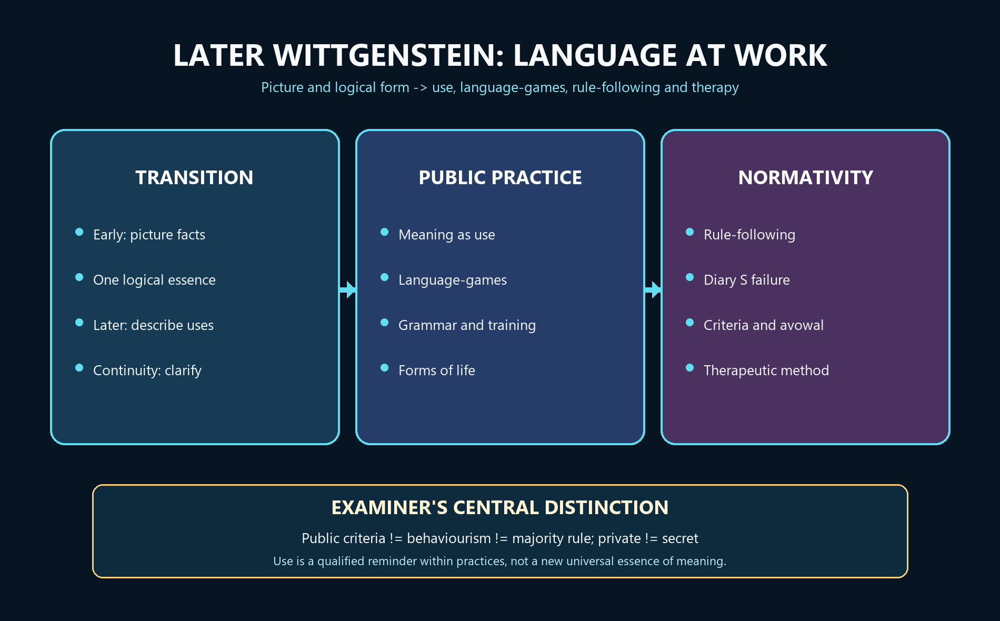

# Later Wittgenstein — Learner-v2 Source-Complete Learning Session


> **Generation:** g4, 2026-09-02 · **Approval:** false pending explicit topic approval
>
> **Evidence discipline:** Complete legacy teaching and workbook material is preserved, reordered Basic-first/Advanced-last, and checked against the canonical owner and verified 2018–2025 PYQ ledger.


## BASIC LEARNING SESSION




*Concept map: the transition from picturing to diverse language practices connects use, grammar and forms of life to rule-following, private language and philosophical therapy without reducing meaning to behaviour.*

> **Syllabus (verbatim):** Later Wittgenstein : Meaning and Use; Language-games; Critique of Private Language.

### How to Use This Five-Layer Session

Every logical subtopic follows exactly:

| Layer | Purpose |
|---:|---|
| 1. SIMPLE START | visual-first plain-language gateway |
| 2. CORE UPSC | complete terminology, doctrine, argument, example and PI-section grounding |
| 3. ADVANCED | objections, replies, comparisons, interpretive issues and provenance cautions |
| 4. EXAM APPLICATION | verified PYQ routes and 10/15/20-mark architecture |
| 5. RAPID REVISION | traps, retrieval notes and links to the exact MCQ set |

### Source Audit and Contemporary-Link Boundary

- **Canonical doctrine source:** `upsc-ai-kit/knowledge/Philosophy/paper-1/western/Later-Wittgenstein.md` (reviewed owner; live word count not frozen here), sliced verbatim into every CORE UPSC layer and preserved again in the canonical apparatus block. - **Verified PYQs:** continuous local Western Philosophy Paper I bank, 2018-2025; this clause owns exactly **7** primary parts, one each in 2018, 2019, 2020, 2022, 2023, 2024 and 2025. **2021 is the only year without an owned part.**
- **Ownership discipline:** early-Wittgenstein (Tractatus) parts and Logical Positivism parts are owned by their own clauses and appear here only as labelled comparisons; none is counted among the 7. - **Printed anomalies preserved verbatim:** the 2022 Q1(c) official English line prints "**motion** of language" (a slip for "notion"), and the 2025 Q3(a) statement retains an **unmatched opening quotation** before "logical structure". Both are reproduced exactly and explained, never silently corrected. - **Provenance discipline:** the *Philosophical Investigations* was published **posthumously in 1953** (Wittgenstein died 1951), edited by G. E. M. Anscombe and Rush Rhees, Anscombe translating; the *Tractatus* is 1921/1922. The duck-rabbit belongs to **PI Part II xi / PPF** and to Jastrow; "Kripkenstein" is a labelled reading, not Wittgenstein's own doctrine. - **OCR-searchable local PDFs:** `Think. A Compelling Introduction To Philosophy.pdf` and `Robert.Audi_The.Cambridge.Dictionary.of.Philosophy.pdf` were searched for Wittgenstein, rule-following, language-games and private language; `HistoryPhilosophy1.pdf` was also audited for searchable coverage. These sources corroborate the Markdown owners but do not replace them.
- **Qdrant:** optional fallback only; not required for this canonical topic. - **Contemporary link (deliberately not forced):** a live search across 2026-02-19 to 2026-08-19 produced no sufficiently direct, well-verified official or academic development to anchor this clause, and no AI/LLM blog item is promoted to a current-affairs anchor. The honest contemporary relevance is static and disciplinary: meaning-as-use, criteria and forms of life underwrite present-day **philosophy of language and mind** (pragmatics, use-based and inferential semantics, the philosophy of psychology), which is why the clause is examined almost every year. That is stated as analysis, not as a dated news event.

**Preservation note:** the canonical doctrine is reorganised into layers, never compressed. Every doctrine, canonical quotation, numbered argument, PI-section citation, objection/reply, comparison, restored dossier, corpus-depth delta, PYQ route, directive rule, graded verdict and provenance caution is retained; simplification means adding accessible gateways, not deleting complexity.

### Learning Roadmap

| Unit | Logical subtopic |
|---:|---|
| 1 | The Break from the Tractatus - Placement, the One-Screen Map and Why the Later Philosophy Begins |
| 2 | Meaning as Use - the Toolbox, the PI 43 Qualification and Mastery of a Technique |
| 3 | Family Resemblance - Overlapping Similarities, Fuzzy Boundaries and 'Don't Think, But Look' |
| 4 | Language-Games - Language Woven into Activity, the Builders and Rules by Training |
| 5 | Forms of Life - PI 19, Agreement in Form of Life, the Lion Remark and the Bedrock of Justification |
| 6 | Rule-Following and the Paradox (PI 201) - Interpretation Regress, Practice and Going On |
| 7 | The Private-Language Argument - Logical Privacy, the Diary 'S', the Beetle and Public Criteria |
| 8 | Criteria vs Symptoms, PI 580 Outward Criteria and the Behaviourism Charge Answered |
| 9 | Philosophy as Therapy - Language on Holiday, the Fly-Bottle, Perspicuous Representation and 'Leaves Everything as It Is' |
| 10 | Aspect-Seeing and the Duck-Rabbit - Seeing-As, the Dawning of an Aspect and Aspect-Blindness |

---

### SESSION 1 — From the Tractatus to the Investigations: Continuity, Break and Method

#### DEFINITION / WHAT THIS IS CALLED

**Plain-language definition:** The later Wittgenstein changes how philosophy investigates language: instead of seeking one hidden logical essence, he describes the many practices in which words work.

**Technical definition:** The early Tractatus treats propositions as pictures of possible facts through shared logical form and asks philosophy to delimit sense. Philosophical Investigations, published posthumously in 1953, rejects the demand that every proposition or word have one underlying essence. Language is approached through remarks, examples and reminders rather than a systematic rival theory. Continuity remains in the concern with philosophical confusion and limits; discontinuity lies in the move from ideal logical analysis to the description of ordinary practices and grammar.

#### VISUAL — Early to later shift: continuity and discontinuity

```text

EARLY: one logical form -> proposition pictures fact -> ideal analysis

                         |

                         | continuity: clarify limits and dissolve confusion

                         v

LATER: many practices -> grammar of use -> description and therapy

DISCONTINUITY: hidden essence / calculus is replaced by survey of actual uses

```

*The same concern with confusion survives, but the diagnosis and method change.*

#### VISUAL — Two methods, not two slogans

```text

TRACTATUS: analyse proposition -> expose logical form -> delimit what can be said

INVESTIGATIONS: compare cases -> give reminders -> see connections -> confusion eases

NOT: picture theory is simply replaced by one universal 'use theory'

YES: a family of grammatical investigations answers different philosophical knots

```

*The later method refuses to turn use into a new reductive essence of meaning.*

#### ANSWER-GRABBING OPENING — WRITE/ADAPT IN THE EXAM

> Later Wittgenstein preserves the early aim of releasing us from philosophical confusion while abandoning the Tractarian assumption that one logical form explains every meaningful use.

#### MUST-WRITE KEYWORDS

- **picture theory**
- **logical form**
- **Philosophical Investigations**
- **description**
- **continuity**
- **methodological discontinuity**

**How to use them:** Open with picture theory and logical form, identify continuity, then explain methodological discontinuity through Philosophical Investigations, description and the rejection of one essence.

#### CORE OBJECTION, REPLY AND RESIDUAL LIMIT

**Objection:** Without a positive theory, the later remarks may look fragmentary, conservative or unable to explain why linguistic practices have the authority they do.

**Best reply:** The anti-systematic form is deliberate: the target is the craving for a single explanation, and the success test is removal of a specific confusion rather than construction of a system.

**Residual limit:** Description can still conceal commitments about practice, normativity and human agreement; the therapeutic reading therefore remains contestable.

#### EXAM USE AND CONCISE REVISION

**Answer architecture:** Use a continuity/discontinuity matrix, then connect the transition to use, language-games, rules, private language and therapy before giving a qualified verdict.

- Early: proposition pictures a possible fact through logical form.
- Later: look at diverse uses instead of positing one hidden essence.
- Continuity concerns clarification and limits; discontinuity concerns method and language.
- The Investigations is posthumous (1953); avoid saying Wittgenstein published it.

#### Visual gateway - one thinker, two philosophies

```text
   THE SAME MAN, TWO PICTURES OF MEANING
   =====================================================================
     EARLY  (Tractatus, 1921)          |     LATER (Investigations, 1953)
     --------------------------------- | ---------------------------------
     Meaning = PICTURING facts         |  For many cases: meaning clarified by USE in practice
     ONE hidden essence (logical form) |  NO single required essence - FAMILY RESEMBLANCE
     Name -> Object (fixed reference)  |  Countless LANGUAGE-GAMES
     Build an IDEAL logical language   |  Ordinary language is in order
     Private inner reference is fine   |  PRIVATE LANGUAGE is impossible
     Philosophy = draw limits; be      |  Philosophy = THERAPY: dissolve
       silent about the rest           |    knots made by language idling
   =====================================================================
```
Caption: read the two columns as a before/after. Everything in this syllabus item is the right-hand column reacting against the left.

**Plain-language start:** The young Wittgenstein thought a sentence is meaningful because it is a *picture* of a possible fact - words hook onto objects, and the sentence models reality the way a scale-model models a car crash. That is the *Tractatus*. Decades later he decided this was a beautiful mistake. Real language is not one machine that pictures; it is a huge kit of different tools used in different activities - ordering, joking, praying, measuring, greeting. So meaning is not "what a word pictures" but "what people *do* with the word." The later philosophy is the working-out of that one change, and the exam rewards you for tracing it precisely.

| Idea | Plain meaning |
|---|---|
| Picture theory | a sentence means by mirroring a possible fact |
| Use theory | a word means by its role in a shared activity |
| Augustinian picture | the tempting idea that every word names an object |
| Colour-exclusion problem | "this spot is red" and "this spot is green" cannot both be true, yet the Tractatus said elementary propositions are independent - a crack Wittgenstein himself found in 1929 |
| Description, not theory | philosophy should describe how language works, not build a rival theory of meaning |

> 🔑 **Mnemonic - "PEIPS -> UFLOT":** the early Picture / Essence / Ideal-language / Private-reference / Silence flips into later Use / Family-resemblance / Language-games / Ordinary-language / Therapy.


> **Placement:** The *second* Wittgenstein (*Philosophical Investigations*, 1953) revises the earlier *Tractatus*. Meaning is no longer exhausted by picturing; it is **use in a form of life**. This owner carries 7 parts in 2018–2025, with no primary-owned part in 2021; family resemblance and private language are the restored-year additions.

---

#### 0. ONE-SCREEN MAP ⚠️

```
═══════════════════════════════════════════════════════════════════
   EARLY (Tractatus, 1921)               LATER (Investigations, 1953)
   ─────────────────────                  ───────────────────────────
   Meaning = PICTURING facts              For many cases: meaning clarified by USE in practice
   One essence of language (logical form) NO single essence — FAMILY RESEMBLANCE
   Name → Object (fixed reference)        Countless LANGUAGE-GAMES
   Ideal logical language                 Ordinary language is perfectly in order
   Solipsism lies at language's limit    PRIVATE OSTENSION cannot found a language
   Philosophy = draw limits of the        Philosophy = THERAPY (dissolve knots
     sayable; "be silent" about the rest    created by language "on holiday")
═══════════════════════════════════════════════════════════════════
  Key terms: use · language-game · form of life · family resemblance ·
  rule-following · private language · beetle-in-a-box · therapeutic conception
═══════════════════════════════════════════════════════════════════
```

> 🔑 **Mnemonic — "U-G-F":** Meaning is **U**se; uses are organised as language-**G**ames; games are grounded in **F**orms of life.

---

#### 1. THE BREAK FROM THE *TRACTATUS* — AND WHY (PYQ 2025 Q3(a), 2023 Q4(c))

#### 1.1 What Changed ✅

| *Tractatus* assumption | Later Wittgenstein's rejection | Reason |
|---|---|---|
| Language has ONE essence — picturing facts via shared logical form | Language has NO single essence; there are indefinitely many language-games, each with its own "grammar" | "Don't think, but LOOK" — when we actually examine how language is used, we find irreducible diversity |
| Meaning = the possible state of affairs a proposition pictures | For a large class of cases, meaning is clarified by use | The word "game" does not picture a single thing; its meaning is its varied use across contexts |
| One general logical form/deep analysis explains factual sense | Ordinary language is *perfectly in order as it is* — no need for an ideal language behind it | Philosophical problems arise not from deficient language but from *misunderstanding* the workings of our language |
| Elementary propositions are logically independent | Colour-exclusion cases make apparently elementary propositions incompatible and pressure the early independence requirement | This was one of the first cracks Wittgenstein himself noticed (1929) |
| Names get meaning by standing for objects | Names get meaning through their role in language-games — training, context, use | The "Augustinian picture of language" is at best one primitive language-game, not the essence of all meaning |

#### 1.2 The Transition Quoted (2025 Q3(a))

> ⚠️ The 2025 question quotes (in substance): *"We should look not to an ideal language which derives its meaning from facts and has a precise logical structure but empirically, to the ways in which languages are actually used."*

This captures the shift: from a **top-down logical theory** of meaning (the *Tractatus*) to a **bottom-up descriptive investigation** of actual linguistic practice (the *Investigations*). The later Wittgenstein does not construct a rival *theory* of meaning — he refuses the very demand for a theory. Philosophy's role is now *description*, not explanation.

---

#### CLOSING RECALL FLOW — From the Tractatus to the Investigations: Continuity, Break and Method

```closure-flow
SUBTOPIC: From the Tractatus to the Investigations: Continuity, Break and Method
STARTING CONCEPT: From the Tractatus to the Investigations: Continuity, Break and Method
KEY TERMS / DEFINITIONS: picture theory | logical form | Philosophical Investigations | description | continuity | methodological discontinuity
MECHANISM / ARGUMENT: Tractarian picture/logical-form project -> internal and grammatical pressures -> description of actual uses -> therapeutic remarks rather than system-building.
CONSEQUENCE / CONTRAST: Language becomes a plurality of human practices, while philosophy remains an activity of clarification rather than an empirical science.
UPSC TRAP / ANSWER-USE: Do not import meaning-as-use into the Tractatus, erase continuity, or say that the later work simply replaces one complete theory of meaning with another.
ANSWER-GRABBING FORMULATION: Later Wittgenstein preserves the early aim of releasing us from philosophical confusion while abandoning the Tractarian assumption that one logical form explains every meaningful use.
```

### SESSION 2 — Meaning and Use: Augustinian Naming, Qualification and Practical Role

#### DEFINITION / WHAT THIS IS CALLED

**Plain-language definition:** Words do not all function like labels attached to objects; their meanings are learned through the jobs they perform in rule-governed activities.

**Technical definition:** Investigations section 43 says that for a large class of cases, though not for all, the meaning of a word is its use in the language. The qualification prevents a universal reductive definition. The Augustinian name-object model is one language-game, useful for some nouns but unable to explain logical particles, numerals, questions, commands, avowals or jokes. Use means a norm-governed role in a practice, not usage frequency, speaker intention, reference, dictionary definition or bodily movement.

#### VISUAL — Augustinian model versus plurality of uses

```text

AUGUSTINIAN MODEL: WORD -> OBJECT -> SENTENCE COMBINES NAMES

                         | works for some naming and labelling

                         v

PLURALITY: order | report | joke | pray | calculate | promise | ask | avow

QUESTION: what role does this expression play here?

```

*Naming is one tool among many, not the master pattern of all language.*

#### VISUAL — Meaning is not five nearby notions

```text

USE -> norm-governed role within a language-game

USAGE FREQUENCY -> how often an expression occurs

INTENTION -> what a speaker privately or publicly aims to do

REFERENCE -> what an expression picks out in some uses

DEFINITION -> one teaching or stipulating device; not the whole meaning

```

*The distinctions prevent a slogan from becoming a reductive theory.*

#### VISUAL — Meaning, use, practice and grammar

```text

FORM OF LIFE / SHARED BACKGROUND

              | enables

PRACTICE + TRAINING -> GRAMMAR / NORMS -> USE IN A LANGUAGE-GAME

                                           |

                                           v

                                  MEANINGFUL ROLE AND CONTRAST

```

*Use is intelligible through the practice and its grammar, not as isolated motion.*

#### ANSWER-GRABBING OPENING — WRITE/ADAPT IN THE EXAM

> Meaning-as-use redirects analysis from an imagined word-object bond to the norm-governed role a word performs in a practice, without denying reference or defining every meaning identically.

#### MUST-WRITE KEYWORDS

- **use**
- **Augustinian picture**
- **name-object model**
- **mastery of a technique**
- **reference**
- **speaker intention**

**How to use them:** Quote the section 43 qualification, explain the Augustinian picture as one limited game, and distinguish use from frequency, intention, reference and definition.

#### CORE OBJECTION, REPLY AND RESIDUAL LIMIT

**Objection:** If meaning is explained by use, the account may seem circular: use is already described as correct or meaningful, and widespread misuse is still use.

**Best reply:** Grammar, training, contrast and correction supply the normative structure absent from mere frequency; use is not a count of occurrences but an instituted role.

**Residual limit:** The reply describes how standards operate but may not fully explain the source or authority of normativity, especially in innovation and contested practice.

#### EXAM USE AND CONCISE REVISION

**Answer architecture:** Build: qualified thesis -> Augustinian target -> tools/slab/number examples -> distinctions among use, reference and intention -> circularity/normativity objection -> measured reply.

- Quote: 'for a large class of cases - though not for all.'
- The naming model is a language-game, not the essence of language.
- Use is a rule-governed role, not frequency, intention or muscular behaviour.
- Understanding is shown by being able to go on appropriately in varied cases.

#### Visual gateway - words as tools, not labels

```text
        THE TOOLBOX PICTURE OF MEANING
        +-------------------------------------------------+
        |  hammer   saw   ruler   glue   screwdriver ...  |
        |   |        |      |       |         |           |
        |   v        v      v       v         v           |
        |  drive    cut   measure  fix     turn           |
        +-------------------------------------------------+
        a word is a TOOL: ask what JOB it does, not what OBJECT it names
                              |
              "Water!"  ->  a warning? a request? a label?
              the SAME word, different USE, different meaning
```
Caption: "the" and "if" and "five" have no object to point at - yet they clearly mean something, because they have a use.

**Plain-language start:** Imagine asking, "what does a hammer *refer to*?" The question is silly - a hammer is for *doing* something. Wittgenstein says most words are like that. To know what "pain" or "and" or "game" means is to know how to *use* it in the flow of life, not to hold up a mental picture. Crucially he does not over-claim: in PI section 43 he says this holds "for a large class of cases - though not for all". That hedge matters in the exam - quoting it shows you have read the text and not a slogan.

| Move | What it replaces |
|---|---|
| For a large class of cases, meaning is clarified by use | meaning = the object a word names |
| Understanding = mastery of a technique | understanding = a private inner image or "click" |
| Meaning is context-dependent | meaning is fixed once and for all in isolation |

> 🔑 **Mnemonic - "TUC":** meaning is a **T**echnique you master, shown in **U**se, fixed by **C**ontext.


#### 2. MEANING AND USE ✅

#### 2.1 The Thesis ✅

> ✅ *"For a large class of cases — though not for all — in which we employ the word 'meaning' it can be defined thus: the meaning of a word is its use in the language."* (*Investigations* §43)

**Key moves:**

1. **Rejection of the referential / "Augustinian" picture:** The idea that *every* word works by naming an object (and the sentence by combining names into a picture) is a primitive model. It works for "table" or "chair" but is useless for "the," "if," "five," "pain," "meaning," "perhaps." Words are **tools in a toolbox** — they have diverse functions, not one (reference). ✅

2. **Understanding = mastery of a technique:** To understand a word is not to have a private mental image or "aha" experience. It is to be able to *go on* using it correctly — a practical ability, publicly demonstrable. ✅

3. **Context-dependence:** Meaning is not fixed in isolation; it depends on the language-game in which the word is being used. The word "Water!" means different things shouted in a fire, requested at a table, or noted on a chemistry board. ✅

#### CLOSING RECALL FLOW — Meaning and Use: Augustinian Naming, Qualification and Practical Role

```closure-flow
SUBTOPIC: Meaning and Use: Augustinian Naming, Qualification and Practical Role
STARTING CONCEPT: Meaning and Use: Augustinian Naming, Qualification and Practical Role
KEY TERMS / DEFINITIONS: use | Augustinian picture | name-object model | mastery of a technique | reference | speaker intention
MECHANISM / ARGUMENT: Training and contrasts establish a word's role -> competent speakers apply it across cases -> meaning is displayed in norm-governed use within a practice.
CONSEQUENCE / CONTRAST: Imperatives, numerals, greetings, pain avowals and logical words become intelligible without being forced into the mould of object-names.
UPSC TRAP / ANSWER-USE: Never write 'every word simply means its use' or treat observable behaviour as the whole meaning.
ANSWER-GRABBING FORMULATION: Meaning-as-use redirects analysis from an imagined word-object bond to the norm-governed role a word performs in a practice, without denying reference or defining every meaning identically.
```

### SESSION 3 — Ostensive Definition and Family Resemblance: Background before Pointing

#### DEFINITION / WHAT THIS IS CALLED

**Plain-language definition:** Pointing at something does not by itself tell a learner whether the word names its colour, shape, material, number, direction or function; training supplies the missing background.

**Technical definition:** An ostensive definition is an attempt to teach or fix a word by pointing to an example. It succeeds only within a prior grammar that determines what kind of continuation counts as correct. A colour sample can guide colour-use only after the learner is trained in comparison and application. A number series likewise needs a learned technique. Family resemblance describes concepts such as game through overlapping and criss-crossing similarities rather than one feature common to every case. Open texture does not abolish standards: practice still distinguishes central, marginal and mistaken applications.

#### VISUAL — Ostensive definition depends on background

```text

TEACHER POINTS TO RED SQUARE

          | could mean: red? square? tile? one? left? sample?

          v

TRAINING + QUESTION + CONTRAST + CORRECTION

          v

BACKGROUND GRAMMAR FIXES THE RELEVANT CONTINUATION

```

*The point becomes a definition only after grammar selects the relevant dimension.*

#### VISUAL — Family-resemblance network

```text

BOARD GAME ----- strategy ----- CHESS

    | play                         | competition

    |                              |

CARD GAME ------ chance ------ BALL GAME

    \________ amusement ________/   \__ skill __ OLYMPIC GAME

NO FEATURE IN EVERY CASE; MANY CONTROLLED OVERLAPS

```

*Standards arise from overlapping routes through the network, not one shared atom.*

#### VISUAL — Number-series learning

```text

2, 4, 6, 8 ... + instruction 'add 2'

          | examples underdetermine indefinitely many continuations

          v

TRAINING + CORRECTION + ESTABLISHED TECHNIQUE

          v

10, 12, 14 ... as the norm-governed continuation

```

*Finite examples do not mechanically contain every future application.*

#### ANSWER-GRABBING OPENING — WRITE/ADAPT IN THE EXAM

> Ostension cannot create meaning from an uninterpreted point, and family resemblance removes the demand for one essence without removing the practical standards governing a concept.

#### MUST-WRITE KEYWORDS

- **ostensive definition**
- **background grammar**
- **colour sample**
- **family resemblance**
- **overlapping similarities**
- **open texture**

**How to use them:** Define ostensive definition and background grammar, use a colour sample and number series, then explain family resemblance, overlapping similarities and open texture.

#### CORE OBJECTION, REPLY AND RESIDUAL LIMIT

**Objection:** Family resemblance may look too permissive because any two things resemble each other in some respect, while ostension seems to presuppose the very meaning it is meant to teach.

**Best reply:** Relevant resemblances are selected by established training, purposes, contrasts and judgments; ostension operates within, and can extend, this inherited practice.

**Residual limit:** The account identifies the practical background but leaves hard questions about radical conceptual innovation and cross-practice disagreement.

#### EXAM USE AND CONCISE REVISION

**Answer architecture:** Structure the answer as ambiguity of pointing -> role of training -> family network -> standards without essence -> permissiveness objection and practice-based reply.

- Pointing needs a prepared learner and a background distinction.
- A sample functions as a rule only within a practice of comparison.
- Family resemblance means overlapping similarities, not universal vagueness.
- Absence of one essence is compatible with standards and correction.

#### Visual gateway - the family web

```text
        WHAT DO ALL "GAMES" SHARE?  ->  no single thread
        board   card   ball   Olympic   solitaire   war-
        games   games  games  games     (no winner) games
          \      |       |       |          |        /
           \     |    overlapping & criss-crossing   /
            +----+----- SIMILARITIES ------+--------+
                 (skill? luck? winning? fun? rules?)
        each pair shares SOMETHING; NO feature is common to ALL
        just like a family: the nose here, the gait there, the
        temperament somewhere else - a resemblance, not an essence
```
Caption: concepts can be held together by a web of overlapping likenesses, with no core property running through every case.

**Plain-language start:** Ask "what do all games have in common?" You will fail - some have winners, some do not; some need skill, some luck; some are solitary, some social. Yet "game" is a perfectly good word. Wittgenstein's picture: the cases are related like members of a family - overlapping and criss-crossing resemblances, not one shared essence. And the method that reveals this is not armchair theorising but "Don't think, but look!" - actually inspect the cases.

| Term | Plain meaning |
|---|---|
| Family resemblance | a network of overlapping similarities, no single common feature |
| Fuzzy boundary | a concept can lack sharp edges and still work |
| "Don't think, but look" | inspect actual uses instead of demanding a definition |

> 🔑 **Mnemonic - "NO CORE":** **N**etwork **O**f **C**riss-crossing **O**verlapping **R**esemblances, no **E**ssence.


#### 2.2 Family Resemblance ✅

> ✅ *"Don't think, but look!"*

Consider "game" — board-games, ball-games, card-games, the Olympic games, war-games, language-games. Is there one thing they all share? No. There is *"a complicated network of similarities overlapping and criss-crossing: sometimes overall similarities, sometimes similarities of detail."* Like the features running through a family — one member has the nose, another the gait, a third the temperament — no single feature is common to all. ✅

**Philosophical consequence:** Concepts need not have sharp boundaries. Definitions with necessary and sufficient conditions (the Socratic demand; the *Tractatus*'s demand for a single logical form) are not always possible — and that is *fine*. Language works perfectly well with fuzzy-edged concepts.

#### 2.3 "Don't Think, But Look" — The Method ⚠️

The later Wittgenstein's method is **descriptive, not explanatory:**

- Do not ask "What *must* meaning be?" — look at how words *are* used. - Do not seek the hidden *essence* behind varied uses — describe the *variety*. - When puzzled about a concept (knowledge, time, consciousness), assemble *reminders* of how we actually use the word in various language-games — the puzzlement dissolves.

---

#### CLOSING RECALL FLOW — Ostensive Definition and Family Resemblance: Background before Pointing

```closure-flow
SUBTOPIC: Ostensive Definition and Family Resemblance: Background before Pointing
STARTING CONCEPT: Ostensive Definition and Family Resemblance: Background before Pointing
KEY TERMS / DEFINITIONS: ostensive definition | background grammar | colour sample | family resemblance | overlapping similarities | open texture
MECHANISM / ARGUMENT: Pointing + prior training/grammar -> selected dimension -> corrected applications; overlapping similarities + practice -> extensible concept without one common essence.
CONSEQUENCE / CONTRAST: Definitions become instruments within practices rather than magical links between sound and object; concepts can remain usable despite fuzzy boundaries.
UPSC TRAP / ANSWER-USE: Do not infer from 'no single common essence' that anything counts as a game or that ostensive teaching is impossible.
ANSWER-GRABBING FORMULATION: Ostension cannot create meaning from an uninterpreted point, and family resemblance removes the demand for one essence without removing the practical standards governing a concept.
```

### SESSION 4 — Language-Games and Grammar: Language Interwoven with Activity

#### DEFINITION / WHAT THIS IS CALLED

**Plain-language definition:** A language-game is not merely a list of sentence types; it is language working together with an activity, training, rules, participants and a purpose.

**Technical definition:** Wittgenstein calls the whole consisting of language and the activities into which it is woven a language-game. Ordering slabs, reporting a result, calculating, promising, asking, storytelling, joking and praying differ in point, criteria and response. Grammar means the norms governing representation and use, not only school syntax. The builders' slab language is a complete primitive game for its task, while ordinary Indian public practices such as a railway enquiry, a courtroom promise, a temple prayer or a market request show how the same words can acquire different roles through circumstances.

#### VISUAL — Components of a language-game

```text

PARTICIPANTS

    + ACTIVITY / CIRCUMSTANCES

    + TRAINING / EXAMPLES / CORRECTION

    + GRAMMAR / RULES

    + PURPOSE / POINT

    -> UTTERANCE -> EXPECTED RESPONSE -> SUCCESS OR FAILURE

```

*Every component contributes to intelligibility and to standards of a correct move.*

#### VISUAL — Slab language as a complete primitive game

```text

BUILDER A sees task -> calls 'SLAB!'

             | trained convention

             v

BUILDER B brings slab -> action completes the order

MEANING IS IN THIS COORDINATED PRACTICE, NOT IN A HIDDEN DEFINITION

```

*Its completeness is relative to the building activity, not to all human purposes.*

#### VISUAL — One expression across public practices

```text

'TICKET' at railway counter -> request / purchase sequence

'PROMISE' in court -> undertaking with accountability

'PRAYER' in worship -> devotional act, not an empirical report

'FIVE' in calculation -> rule-governed numerical operation

```

*Circumstances and purpose change grammatical role without making language arbitrary.*

#### ANSWER-GRABBING OPENING — WRITE/ADAPT IN THE EXAM

> Language-games make meaning inseparable from organised activity: grammar supplies the norms, training supplies competence, and purpose supplies the contrast among uses.

#### MUST-WRITE KEYWORDS

- **language-game**
- **activity**
- **training**
- **rules**
- **purpose**
- **grammar**

**How to use them:** Define language-game through activity, training, rules and purpose; explain grammar as norms of representation and use the slab case as a worked mechanism.

#### CORE OBJECTION, REPLY AND RESIDUAL LIMIT

**Objection:** If each game has its own grammar, communication across games and criticism of a practice may seem impossible; theoretical and scientific language may also exceed ordinary examples.

**Best reply:** Games overlap, borrow and evolve within wider forms of life; comparison is possible through shared practices and perspicuous representation, while scientific language is itself trained use.

**Residual limit:** The account is strongest as a method of differentiation and weaker as a general causal or historical explanation of language change.

#### EXAM USE AND CONCISE REVISION

**Answer architecture:** Answer: definition -> components -> slab mechanism -> plurality with two worked contrasts -> grammar -> cross-game objection -> overlap and evolution reply.

- Language-game = language plus the activity into which it is woven.
- A list of uses is insufficient unless purpose, rules and responses are explained.
- Grammar is normative organisation of representation, not merely syntax.
- Games overlap and change; they are not sealed cultural islands.

#### Visual gateway - the language-game ecosystem

```text
        LANGUAGE = language + the ACTIVITIES it is woven into
        +---------------------------------------------------------+
        | ordering | describing | reporting | joking | thanking   |
        | greeting | praying    | guessing  | story  | requesting |
        +---------------------------------------------------------+
                 not ONE calculus - COUNTLESS games,
                 norm-governed in practice, often without an explicit rulebook
                              |
                 THE BUILDERS: A calls "Slab!" -> B brings a slab
                 a COMPLETE primitive language, not a broken bit of ours
```
Caption: language is less like one master-machine and more like a whole marketplace of small, self-contained practices.

**Plain-language start:** A "language-game" (Sprachspiel) is the whole package of *words plus the activity they belong to*. When a builder shouts "Slab!" and his mate brings a slab, that tiny exchange is a complete language - it does its job, and it shows that naming/picturing is not the sole linguistic function; trained practical role is decisive. And you learn such games the way you learn any craft: by *training* - being drilled, shown examples, corrected - not by decoding a hidden calculus.

| Term | Plain meaning |
|---|---|
| Language-game (Sprachspiel) | language + the activity into which it is woven |
| The builders' example | "Slab!" - a complete, self-contained primitive language |
| Rules by training | rules learned by drill, example and correction, not by grasping an essence |
| Living language | new games are born, old ones die; language evolves |

> 🔑 **Mnemonic - "WEAVE":** **W**ords **E**mbedded in **A**ctivity; games are learned, **V**aried and **E**volving.


#### 3. LANGUAGE-GAMES ✅

#### 3.1 Definition ✅

A **language-game** (*Sprachspiel*) = the whole consisting of language **and the activities into which it is woven.** Language is not a single, uniform calculus but **countless different games** — norm-governed in practice, often without an explicit rulebooks:

> ✅ Giving orders · describing · reporting · speculating · forming hypotheses · presenting results · telling jokes · making up a story · play-acting · singing · guessing riddles · making a request · thanking · cursing · greeting · praying…

#### 3.2 The Builders' Example ✅

Imagine two builders: A shouts "Slab!" and B brings a slab; "Block!" — a block; "Pillar!" — a pillar. This is a **complete** primitive language — fully functional for its purpose. It is not a deficient version of our language; it is a self-contained language-game. The example shows that naming/picturing is not the sole function; meaning depends on trained practical role. ✅

#### 3.3 Rules and Training ✅

Language-games are **rule-governed** — but rules are learned by *training* (drill, example, correction), not by grasping a Platonic essence or decoding a hidden calculus. New games arise and old ones die; language is *living* and *evolving*.

#### CLOSING RECALL FLOW — Language-Games and Grammar: Language Interwoven with Activity

```closure-flow
SUBTOPIC: Language-Games and Grammar: Language Interwoven with Activity
STARTING CONCEPT: Language-Games and Grammar: Language Interwoven with Activity
KEY TERMS / DEFINITIONS: language-game | activity | training | rules | purpose | grammar
MECHANISM / ARGUMENT: Participants + activity + training + grammar + purpose -> possible moves and responses -> an intelligible language-game with standards of success and failure.
CONSEQUENCE / CONTRAST: Linguistic diversity becomes principled rather than chaotic, and philosophical errors can be traced to moving an expression from one game into another without its rules.
UPSC TRAP / ANSWER-USE: Do not reduce language-games to a catalogue, literal competitive games, or cultures sealed off from comparison.
ANSWER-GRABBING FORMULATION: Language-games make meaning inseparable from organised activity: grammar supplies the norms, training supplies competence, and purpose supplies the contrast among uses.
```

### SESSION 5 — Forms of Life, Agreement and Bedrock: Shared Background without Relativism

#### DEFINITION / WHAT THIS IS CALLED

**Plain-language definition:** Language works because speakers already share ways of acting, reacting, learning and judging; this background is deeper than agreement on a particular opinion.

**Technical definition:** A form of life is the shared human background of practices and natural reactions that makes language-games intelligible. It is not a slogan for biological determinism, a complete cultural worldview or sealed relativism. Agreement in language includes agreement in judgments and forms of life, but not a sociological majority vote. When justification reaches bedrock, 'this is simply what I do' records the end of reasons in an established practice; it does not make every action correct. The lion remark marks the depth of possible difference in intelligibility.

#### VISUAL — From form of life to intelligibility

```text

COMMON HUMAN REACTIONS + HISTORICALLY SHARED PRACTICES

                         v

FORM OF LIFE / BACKGROUND

                         v

TRAINING -> AGREEMENT IN JUDGMENTS -> LANGUAGE-GAMES

                         v

INTELLIGIBILITY AND CORRECTION

```

*The background enables games and judgments without acting as a written super-rule.*

#### VISUAL — Agreement is not majority vote

```text

AGREEMENT IN FORM OF LIFE -> shared doing and standards of judgment

AGREEMENT IN OPINION -> convergence on a particular claim

MAJORITY VOTE -> numerical decision procedure

CORRECTNESS -> grammar and practice; not reducible to headcount

```

*The distinctions block both individualism and crude communitarianism.*

#### ANSWER-GRABBING OPENING — WRITE/ADAPT IN THE EXAM

> Forms of life explain how rule-governed language has a shared background without converting truth or correctness into whatever a numerical majority happens to accept.

#### MUST-WRITE KEYWORDS

- **form of life**
- **agreement in judgments**
- **shared background**
- **bedrock**
- **this is simply what I do**
- **lion remark**

**How to use them:** Define form of life modestly, distinguish agreement from opinion and majority, explain bedrock, and evaluate the naturalist, cultural and relativist readings.

#### CORE OBJECTION, REPLY AND RESIDUAL LIMIT

**Objection:** The notion is sparse and may hide relativism, conservatism or an unexplained appeal to social fact as a source of normativity.

**Best reply:** Wittgenstein identifies a transcendental-practical condition of intelligibility rather than a voting procedure; forms of life include common human reactions that enable criticism.

**Residual limit:** Because the concept is deliberately under-theorised, the balance among biology, culture and normativity remains interpretively unsettled.

#### EXAM USE AND CONCISE REVISION

**Answer architecture:** Build a layered background diagram, define agreement carefully, use bedrock and lion, then answer relativism with shared human practices while retaining the residual ambiguity.

- A form of life is a background of shared practices and reactions.
- Agreement in judgments is not agreement in every opinion.
- Bedrock ends justification in practice; it does not license arbitrariness.
- Majority behaviour is neither the definition of truth nor a sufficient rule.

#### Visual gateway - digging down to bedrock

```text
        WHY DO YOU FOLLOW THIS RULE?  keep asking "why?"...
        rule  ->  because of another rule  ->  because...  ->
        ------------------------------------------------------
        |   spade turns:  "This is simply what I do."         |
        |   BEDROCK  =  FORM OF LIFE                          |
        |   shared human practices, reactions, activities     |
        ------------------------------------------------------
        agreement in LANGUAGE = agreement in FORM OF LIFE,
                    NOT agreement in OPINION
        "If a lion could talk, we could not understand him."
```
Caption: justification does not go on forever; it ends in what we shared-ly *do*.

**Plain-language start:** Under the language-games lies something even more basic: *forms of life* (Lebensform) - the shared human ways of acting, reacting and living that make the games possible. When you ask "why follow the rule this way?" the chain of reasons runs out, and all that is left is "this is simply what I do." That is not a failure of justification; it is where justification *rests*. And note what "agreement" means here: we agree not by holding the same *opinions* but by sharing a *form of life*. Wittgenstein's vivid test: even if a lion spoke, we could not understand him - his natural history is too unlike ours for the words to connect.

| Term | Plain meaning |
|---|---|
| Form of life (Lebensform) | shared human practices, reactions and activities |
| Agreement in form of life | shared ways of acting, not shared opinions |
| The lion remark | too different a form of life breaks understanding |
| Bedrock | "This is simply what I do" - justification ends in practice |

> 🔑 **Mnemonic - "BAR":** **B**edrock is practice; **A**greement is in form of life not opinion; **R**easons run out at "what I do".


#### 3.4 Forms of Life (*Lebensform*) ✅ (PYQ 2022 Q1(c))

> ✅ *"To imagine a language means to imagine a form of life."* (*Investigations* §19)

Language-games rest on shared human **practices, activities, and natural reactions** — what Wittgenstein calls *forms of life*. Agreement in language is not agreement in *opinions* but agreement **in form of life** — shared ways of acting, reacting, judging.

> ✅ *"If a lion could talk, we could not understand him."* — because his form of life (his natural history, reactions, activities) would be so different from ours that the words would not connect to anything we share.

At rule-following bedrock, explanations end in trained action—“This is simply what I do” (§217). This neither defines form of life nor makes majority behaviour infallible. ✅

#### CLOSING RECALL FLOW — Forms of Life, Agreement and Bedrock: Shared Background without Relativism

```closure-flow
SUBTOPIC: Forms of Life, Agreement and Bedrock: Shared Background without Relativism
STARTING CONCEPT: Forms of Life, Agreement and Bedrock: Shared Background without Relativism
KEY TERMS / DEFINITIONS: form of life | agreement in judgments | shared background | bedrock | this is simply what I do | lion remark
MECHANISM / ARGUMENT: Shared natural reactions and practices -> training and stable judgments -> intelligible language-games -> reasons eventually terminate in enacted standards.
CONSEQUENCE / CONTRAST: Meaning can be public and normative without requiring an infinite chain of explicit reasons.
UPSC TRAP / ANSWER-USE: Do not say forms of life are purely biological, that each culture is conceptually sealed, or that correctness is whatever most people vote for.
ANSWER-GRABBING FORMULATION: Forms of life explain how rule-governed language has a shared background without converting truth or correctness into whatever a numerical majority happens to accept.
```

### SESSION 6 — Rule-Following and Normativity: Finite Instructions, Practice and Debate

#### DEFINITION / WHAT THIS IS CALLED

**Plain-language definition:** A written rule cannot carry every future application inside itself like a rail; competent continuation depends on training and a practice in which mistakes can be corrected.

**Technical definition:** Rule-following concerns the normativity that distinguishes doing what a rule requires from merely behaving regularly. Section 201 presents a paradox: any finite instruction can be interpreted so that divergent actions appear to accord with it. A further interpretation generates regress. Wittgenstein's response is that there is a way of grasping a rule that is not an interpretation but is exhibited in obeying and violating it in practice. Training, examples and correction sustain normative continuation; 'this is simply what I do' marks bedrock, not private fiat. Kripke's sceptical paradox and community solution are a contested 1982 reading, not Wittgenstein's uncontested doctrine.

#### VISUAL — Finite rule to normative continuation

```text

FINITE INSTRUCTION + FINITE EXAMPLES

                 v

MANY INTERPRETATIONS CAN FIT

                 v

TRAINING + CORRECTION + PRACTICE

                 v

NORMATIVE CONTINUATION: RIGHT / WRONG APPLICATION

```

*Practice bridges the underdetermination of examples without adding an infinite rulebook.*

#### VISUAL — Rule-following paradox and response options

```text

PARADOX: every action can be interpreted as according with the rule

  |

  +-> MORE INTERPRETATION -> regress; no final determination

  +-> KRIPKE 1982 -> sceptical paradox + community assertibility

  +-> TEXTUAL DISSOLUTION -> practice is not an interpretation

  +-> INDIVIDUAL-PRACTICE REPLY -> repeatable standards need not mean majority

```

*The options must be labelled so Kripke's reading is not mistaken for settled exegesis.*

#### VISUAL — Rule versus regularity

```text

REGULARITY: person always turns left -> description of repeated conduct

RULE: 'turn left here' -> can be obeyed, misunderstood, corrected or broken

NORMATIVE MARKER: being right differs from merely seeming or recurring

```

*Observed repetition becomes rule-following only where correction has a role.*

#### ANSWER-GRABBING OPENING — WRITE/ADAPT IN THE EXAM

> Rules guide because trained practices sustain a distinction between correct and incorrect continuation; neither a private interpretation nor bare behavioural regularity can create that norm.

#### MUST-WRITE KEYWORDS

- **rule-following**
- **normativity**
- **regularity**
- **interpretation regress**
- **finite instruction**
- **Kripkenstein**

**How to use them:** Define rule-following and normativity, reconstruct finite instruction and interpretation regress, distinguish regularity, and label the Kripkenstein debate.

#### CORE OBJECTION, REPLY AND RESIDUAL LIMIT

**Objection:** Practice may seem to replace reasons with conformity, while a solitary competent person appears able to follow rules without a present community.

**Best reply:** The decisive issue is not headcount but standards not exhausted by the agent's present seeming; a solitary practice can retain inherited, repeatable and correctable techniques.

**Residual limit:** Whether practice explains normativity or only redescribes it remains the central residual problem.

#### EXAM USE AND CONCISE REVISION

**Answer architecture:** Use a paradox-response-options map and close by distinguishing the textual dissolution from Kripke's sceptical reconstruction.

- A rule is normative; a regularity merely records what happens.
- No interpretation can be the final rule for applying every prior rule.
- Training and correction support a way of going on that is not another interpretation.
- Kripkenstein is fertile but contested; community is not majority fiat.

#### Visual gateway - the rule-following flow

```text
        RULE: "add 2"   2, 4, 6, 8, ... 996, 998, 1000, ...
                                              |
             pupil writes 1000, 1004, 1008 - "I AM adding 2!"
                                              |
        can you PROVE he is wrong just from the rule + examples?
        every finite list fits MANY rules  ->  PARADOX (PI 201):
        "no course of action could be determined by a rule,
         because every course of action can be made to accord with it"
                                              |
        WRONG fix: add another rule to interpret the rule -> REGRESS
        RIGHT view: rule-following is a PRACTICE - a trained way of
                    GOING ON, "exhibited in obeying the rule"
```
Caption: the meaning of a rule is not a further hidden rule; it shows itself in what we do.

**Plain-language start:** "Add 2" seems crystal clear - until a pupil, at 1000, writes 1004, 1008 and insists he is obeying "add 2" (just "add 2 up to 1000, then 4"). Nothing in the finite examples rules this out; every rule can be "interpreted" to fit any continuation. That is the paradox of PI 201. The tempting fix - supply *another* rule to say how to read the first - only launches an infinite regress. Wittgenstein's way out: following a rule is not *interpreting* at all; it is a *practice* - a shared, trained, mostly unreflective way of "going on" that shows itself in the doing.

| Term | Plain meaning |
|---|---|
| The paradox (PI 201) | any action can be made to accord with a rule under some interpretation |
| Interpretation regress | a rule to fix the rule needs a rule... forever |
| Practice / going on | rule-following is a trained ability, exhibited in obeying |
| Normative correctness | there is still a right/wrong, grounded in shared practice |

> 🔑 **Mnemonic - "PIP":** **P**aradox (any action fits) -> **I**nterpretation regress (no escape by more rules) -> **P**ractice (going on, trained).


#### 4. RULE-FOLLOWING AND THE PARADOX (§201) ✅

#### 4.1 The Problem ✅

What is it to *follow a rule*? Every rule can be interpreted in multiple ways. The rule "add 2" seems clear — but someone might interpret it as meaning "add 2 up to 1000, then add 4." No finite set of examples can fix a unique interpretation. So:

> ✅ *"This was our paradox: no course of action could be determined by a rule, because every course of action can be made out to accord with the rule."* (*Investigations* §201)

If *any* action can be made to "accord" with the rule under some interpretation, then the rule determines nothing — and "according with a rule" becomes meaningless.

#### 4.2 Resolution ✅

Wittgenstein's response: the paradox shows that **following a rule cannot consist in interpreting it** (adding a further rule to govern the first rule → regress). Rule-following is a **practice** — a shared, trained, unreflective way of going on. It is grounded in our common form of life, not in a mental act of interpretation.

> ✅ *"There is a way of grasping a rule which is not an interpretation, but which is exhibited in what we call 'obeying the rule' and 'going against it' in actual cases."* (*Investigations* §201)

#### 4.3 Relevance to Private Language ⚠️

If rule-following requires a shared practice (with public criteria for correct/incorrect application), then a *purely private* rule — one that no one else *could in principle* check — is incoherent. This is the direct bridge to the private-language argument (§5 below). ⚠️

---

#### CLOSING RECALL FLOW — Rule-Following and Normativity: Finite Instructions, Practice and Debate

```closure-flow
SUBTOPIC: Rule-Following and Normativity: Finite Instructions, Practice and Debate
STARTING CONCEPT: Rule-Following and Normativity: Finite Instructions, Practice and Debate
KEY TERMS / DEFINITIONS: rule-following | normativity | regularity | interpretation regress | finite instruction | Kripkenstein
MECHANISM / ARGUMENT: Finite rule/examples -> multiple compatible interpretations -> regress if another rule is added -> trained practice displays correct continuation and possible correction.
CONSEQUENCE / CONTRAST: Normativity is relocated from an occult mental act to a technique embedded in practice, creating the bridge to private language.
UPSC TRAP / ANSWER-USE: Do not say the community makes any answer correct, that every regularity is a rule, or that Wittgenstein straightforwardly endorses Kripke's sceptical solution.
ANSWER-GRABBING FORMULATION: Rules guide because trained practices sustain a distinction between correct and incorrect continuation; neither a private interpretation nor bare behavioural regularity can create that norm.
```

### SESSION 7 — Private Language: Exact Target, Private Ostension and the Diary S

#### DEFINITION / WHAT THIS IS CALLED

**Plain-language definition:** A private language is not solitude or secrecy; it consists of signs whose correctness depends entirely on a sensation available in principle only to one speaker.

**Technical definition:** An essentially private language contains signs intended to refer to sensations knowable in principle only to one speaker, where correct and incorrect reapplication cannot be independently distinguished. A private ostensive definition tries to fix 'S' by inwardly attending to a sensation. The diary argument asks how a later entry is checked against the original sample. A remembered inner table supplies no independent norm: if whatever seems right counts as right, the contrast constitutive of rule-following disappears. The target is not private thoughts, a diary in English, a secret code or first-person authority.

#### VISUAL — Private-language diagnostic definition

```text

SIGN refers to an immediate sensation

          + sensation knowable in principle only to this speaker

          + no independent correct / incorrect distinction is possible

          = ESSENTIALLY PRIVATE LANGUAGE TARGET

```

*All three conditions are required; remove one and the target changes.*

#### VISUAL — Diary S and correctness failure

```text

DAY 1: attend inwardly -> write 'S' -> retain memory sample

DAY 20: sensation occurs -> compare with remembered 'S'

                           | only present seeming judges the sample

                           v

SEEMS RIGHT = COUNTS AS RIGHT -> NO POSSIBLE ERROR -> NO RULE OF REAPPLICATION

```

*The failure is normative, not the empirical claim that memory always malfunctions.*

#### VISUAL — Private, personal, secret and public

```text

PRIVATE THOUGHT -> inner occurrence; not denied

PERSONAL DIARY IN ENGLISH -> public language used privately

SECRET CODE -> publicly checkable rule, contingently concealed

ESSENTIALLY PRIVATE SIGN -> no possible shared criterion of correction

```

*The classification prevents the standard UPSC category mistake.*

#### ANSWER-GRABBING OPENING — WRITE/ADAPT IN THE EXAM

> The diary S fails not because memory is always unreliable but because an exclusively private memory impression cannot by itself constitute a standard that separates correctness from seeming.

#### MUST-WRITE KEYWORDS

- **private language**
- **private ostensive definition**
- **diary S**
- **memory sample**
- **criterion of correction**
- **essential privacy**

**How to use them:** Define private language and private ostensive definition, reconstruct diary S and the memory sample, then show why a criterion of correction and normativity fail.

#### CORE OBJECTION, REPLY AND RESIDUAL LIMIT

**Objection:** A reliable memory, a private natural sign or a public word grounded in private reference may appear to restore the correctness distinction.

**Best reply:** Reliability is itself assessed through stable applications and possible checks; importing a public word or correlation abandons the essentially private grounding under dispute.

**Residual limit:** Critics can still ask whether an individual temporally extended practice supplies enough independence, so the argument's reach beyond private ostension is disputed.

#### EXAM USE AND CONCISE REVISION

**Answer architecture:** Use a definition filter, the diary sequence and the seeming/right collapse; reserve beetle and sensation grammar for the next session rather than treating one illustration as the proof.

- Private means in-principle semantic privacy, not practical secrecy.
- Private ostension cannot determine what counts as the same sensation later.
- The diary attacks a normative standard, not the general reliability of memory.
- Private thoughts and first-person authority remain intact.

#### Visual gateway - the private diary argument

```text
        WHAT A PRIVATE LANGUAGE IS  (get the definition right!)
        NOT: a secret code (that is translatable -> public)
        NOT: talking to yourself (English, others could hear)
        YES: words for sensations only I can know, that NO ONE
             else could in principle understand  = LOGICALLY private
        ---------------------------------------------------------
        THE DIARY (PI 258): I write "S" each day I feel a sensation
              Day 1: "S"    Day 2: "S"?   ... is today's really S?
              no independent check of "same" -> "right" has no grip
              "whatever is going to seem right to me is right. And
               that only means that here we can't talk about 'right'."
        ---------------------------------------------------------
        THE BEETLE (PI 293): everyone has a box, calls its content
        "beetle", no one can look in another's box. The word "beetle"
        has a USE -> the thing in the box "drops out as irrelevant".
```
Caption: a sign with no possible criterion separating correct from merely seeming-correct use is not functioning as a word.

**Plain-language start:** First, fix the target - this is the single biggest exam trap. A "private language" does *not* mean a secret code (codes can be cracked and shared) or muttering to yourself (that is ordinary language, just quiet). It means a language whose words refer to *inner sensations that only the speaker could possibly know*, so that *no one else could even in principle* understand it - **logically** private. Wittgenstein argues such a language is impossible. In the diary example (PI 258) you try to name a recurring private sensation "S"; but with nothing outside your impression to check against, "this is the same S again" has no independent standard - "whatever seems right will be right, and that only means we cannot talk of 'right' here." The beetle-in-a-box (PI 293) makes the point unforgettable: if the word "beetle" gets its use publicly, then *whatever is privately in the box* "drops out as irrelevant."

| Term | Plain meaning |
|---|---|
| Logically private | in principle unknowable to anyone else, not merely secret |
| Diary "S" (PI 258) | naming a private sensation fails for lack of a correctness check |
| Correctness vs seeming | "seems right" is not "is right"; a rule needs an independent standard |
| Beetle-in-a-box (PI 293) | the private object drops out of the language-game as irrelevant |
| Public criteria | words for sensations get their sense from public circumstances |

> 🔑 **Mnemonic - "DBC":** **D**iary (no check) -> **B**eetle (object irrelevant) -> **C**riteria must be public.


#### 5. THE CRITIQUE OF PRIVATE LANGUAGE ✅ (PYQ 2024, 2019)

#### 5.1 What is a "Private Language"? ✅

A **private language** in Wittgenstein's sense is one whose words refer to **the speaker's immediate private sensations** — sensations that are *logically* private (not merely contingently secret). The words would get their meaning from the private inner experience and could *in principle* not be taught to or understood by another. ✅

> ⚠️ **UPSC Trap — crucial clarification:** The private-language argument does NOT target:
> - A secret code (which could in principle be deciphered by another) — this is merely an encrypted public language.
> - Talking to oneself.
> - Having private thoughts.
>
> It targets the *logical possibility* of a language whose meaning is constituted by private ostensive definition of inner sensations — the Cartesian/empiricist dream of grounding all meaning in *my* private experience.

#### 5.2 The Diary Argument ("S") ✅

Suppose I decide to keep a diary of a certain recurring sensation. I write "S" each time the sensation occurs. To use "S" correctly, I must *re-identify* the same sensation each time. But:

1. There is **no independent criterion** of correctness — no public check, no physical correlation, nothing *outside* the private experience to settle whether today's sensation is the *same* as yesterday's.
2. **"Whatever seems right to me IS right"** — but that only means **we cannot talk about 'right' here.** The distinction between *correctly applying* the sign and *merely thinking* one applies it correctly **collapses**. ✅ 3. Without a genuine rule of use (with a real correct/incorrect distinction), "S" has **no meaning**. The private diarist is under the *illusion* of using a sign meaningfully.

> ✅ *"If whatever seems right to me is right, that only means that here we can't talk about 'right'."* (*Investigations* §258, in substance)

#### 5.3 The Beetle-in-a-Box ✅

> ✅ Suppose everyone has a box that only they can look into; each calls its content "beetle." No one can see into anyone else's box. What role does the "object in the box" play in the *language-game* of using "beetle"?

**Answer:** None. The word "beetle" gets its meaning from the *public* language-game — the circumstances of utterance, the reactions of others, the criteria of application. The private object **"drops out of consideration as irrelevant"** — it might be different for each person, or empty, or constantly changing. Meaning cannot be grounded in a private object. ✅

#### 5.4 The Criterion of Correctness Objection (Core Logic) ⚠️

The *logical core* of the private-language argument:

```
1. A meaningful sign requires a RULE OF USE (a standard of correct/incorrect application).
2. A rule of use requires a CRITERION OF CORRECTNESS independent of mere seeming.
3. A purely private "rule" has NO such independent criterion (the subject is sole judge;
   whatever seems right IS right → no distinction between right and seems-right).
4. Therefore, a purely private "rule" is NOT a rule.
5. Therefore, private language (grounded in private ostensive definition) is IMPOSSIBLE.
```

#### 5.5 What the Argument Demolishes ✅

| Target | How it falls |
|---|---|
| **Cartesian dualism's private mind** | If language cannot be private, then the meaning of sensation-words ("pain," "blue") must be grounded in *public* criteria (behaviour, context), not in private inner experience. The "inner theatre" cannot be the foundation of meaning. |
| **Classical empiricism's private sense-data** | If I cannot even *name* my private sense-data meaningfully, sense-data cannot serve as the epistemological foundation. |
| **The referential theory of meaning (for sensations)** | "Pain" does not get its meaning by referring to a private object called "pain." It gets its meaning from its place in public language-games involving pain-behaviour, expression, treatment, etc. |
| **Solipsism** (PYQ 2019 Q3(b)) | If meaningful use requires standards beyond present private seeming, the solipsist's claim — "only my experience is real" — cannot even be *stated* meaningfully. The "I" of solipsism presupposes the public language it would deny. → The private-language argument *is* the critique of solipsism. ✅ |

#### 5.6 Relation to Solipsism (PYQ 2019 Q3(b)) ✅

Wittgenstein's critique of solipsism is not a separate argument but a *consequence* of the private-language argument:

1. The solipsist claims: "Only my experiences are real; the external world and other minds may not exist."
2. But to make this claim, the solipsist must use language — and language requires standards not exhausted by a momentary private seeming.
3. The very language in which solipsism is expressed *presupposes* a public world and other speakers. 4. Therefore, solipsism is self-undermining — it tries to *say* what, if true, would make *saying* impossible.

> ⚠️ The *Tractatus* had already gestured at this: "What the solipsist *means* is quite correct, only it cannot be *said*" (5.62). The later Wittgenstein makes the impossibility of private language the explicit ground for why it cannot be said — or even thought coherently.

#### CLOSING RECALL FLOW — Private Language: Exact Target, Private Ostension and the Diary S

```closure-flow
SUBTOPIC: Private Language: Exact Target, Private Ostension and the Diary S
STARTING CONCEPT: Private Language: Exact Target, Private Ostension and the Diary S
KEY TERMS / DEFINITIONS: private language | private ostensive definition | diary S | memory sample | criterion of correction | essential privacy
MECHANISM / ARGUMENT: Private sensation + inward pointing -> sign S -> later memory comparison -> no distinction between correct and seeming-correct -> no privately constituted rule of use.
CONSEQUENCE / CONTRAST: The Cartesian or empiricist inner object cannot serve as an autonomous semantic foundation.
UPSC TRAP / ANSWER-USE: Do not claim that bad memory alone proves the case, that all diaries are impossible, or that sensation and inner experience do not exist.
ANSWER-GRABBING FORMULATION: The diary S fails not because memory is always unreliable but because an exclusively private memory impression cannot by itself constitute a standard that separates correctness from seeming.
```

### SESSION 8 — Sensation Language: Criteria, Avowals, Beetle and the Anti-Behaviourist Reply

#### DEFINITION / WHAT THIS IS CALLED

**Plain-language definition:** Sensation language uses criteria and avowals: pain words are learned in public practices, but this neither makes pain unreal nor turns every pain utterance into a behavioural report.

**Technical definition:** A criterion is a grammatical circumstance that helps determine the application of a concept; evidence or a symptom supports an empirical inference. Criteria are defeasible and are not infallible behavioural signs. An avowal such as 'I am in pain' expresses pain and has a different grammatical role from a third-person report such as 'She is in pain', which uses outward circumstances. The beetle-in-the-box shows that a private object cannot fix the public word's grammar: the object drops out of the language-game, not out of existence; it is not a proof that sensations are unreal. Public criteria are standards of intelligibility, not majority voting.

#### VISUAL — Pain avowal versus third-person report

```text

FIRST PERSON: 'I am in pain' -> AVOWAL / EXPRESSION

               not inferred from observing my own behaviour

THIRD PERSON: 'She is in pain' -> ATTRIBUTION / REPORT

               uses context, expression and outward criteria

```

*The grammatical asymmetry blocks both Cartesian report theory and behaviourism.*

#### VISUAL — Criterion, evidence and symptom

```text

CRITERION -> grammatical ground for applying a concept; defeasible

EVIDENCE -> reason supporting a judgment in a case

SYMPTOM -> empirically correlated sign; revisable by investigation

NONE -> infallible identity between pain and bodily movement

```

*The relation to the concept differs from an empirical sign.*

#### VISUAL — Beetle-in-the-box: limited role

```text

EACH SPEAKER has private box content called 'beetle'

PUBLIC PRACTICE proceeds without comparing private contents

          v

PRIVATE OBJECT DROPS OUT OF THE WORD'S GRAMMAR

NOT: boxes are empty; NOT: sensations are unreal

```

*The illustration concerns semantic role, not the non-existence of experience.*

#### VISUAL — Private versus secret code

```text

SECRET CODE -> rulebook exists -> translatable / teachable -> correct use checkable

PRIVATE LANGUAGE -> no possible independent criterion -> seeming exhausts correctness

SOLITUDE != ESSENTIAL PRIVACY; HEADCOUNT != NORMATIVITY

```

*A secret code remains public-type because correctness can in principle be checked.*

#### ANSWER-GRABBING OPENING — WRITE/ADAPT IN THE EXAM

> Wittgenstein is anti-Cartesian without being behaviourist: outward criteria organise the grammar of sensation concepts while avowals preserve first-person authority and inner experience.

#### MUST-WRITE KEYWORDS

- **criterion**
- **empirical evidence**
- **symptom**
- **avowal**
- **first-person authority**
- **beetle-in-the-box**

**How to use them:** Define criterion, empirical evidence, symptom and avowal; contrast first-person authority with third-person report, then explain the beetle-in-the-box and anti-behaviourist reply.

#### CORE OBJECTION, REPLY AND RESIDUAL LIMIT

**Objection:** Phenomenological critics argue that public grammar cannot capture what pain feels like, while private-reference defenders claim first-person authority supplies an inner standard.

**Best reply:** The argument concerns the grammar and communicability of sensation concepts, not an exhaustive theory of phenomenology; avowals precisely mark the first-person asymmetry.

**Residual limit:** The residual question is whether public criteria can ground concepts while leaving qualitative character theoretically under-described.

#### EXAM USE AND CONCISE REVISION

**Answer architecture:** Use a two-column avowal/report diagram, then criterion/evidence and beetle; close with the anti-behaviourist thesis and the phenomenological remainder.

- Criterion is grammatical and defeasible; evidence is empirical and revisable.
- An avowal expresses pain; a third-person report attributes pain using circumstances.
- The beetle removes the private object from grammar, not sensation from reality.
- Public criteria do not mean infallibility, surveillance or majority rule.

#### Visual gateway - criteria vs symptoms

```text
        HOW DOES "PAIN" CONNECT TO BEHAVIOUR?  two very different links
        +----------------------+---------------------------------------+
        |     CRITERION        |            SYMPTOM                     |
        +----------------------+---------------------------------------+
        | GRAMMATICAL link     | INDUCTIVE / empirical link            |
        | fixes what the word  | correlated by experience              |
        |   MEANS              |                                       |
        | wincing, crying,     | e.g. a pallor we have learned often   |
        |  guarding = criteria |  accompanies pain                     |
        |  for "pain"          |                                       |
        | DEFEASIBLE (can be   | can fail without touching meaning     |
        |  overridden: acting) |                                       |
        +----------------------+---------------------------------------+
        PI 580: "An 'inner process' stands in need of outward criteria."
        angina analogy: some signs DEFINE (criteria), some merely
        ACCOMPANY (symptoms) - and the two can shift with knowledge.
```
Caption: behaviour is not evidence for a hidden thing; certain behaviour in context is part of what the sensation-word *means* - though defeasibly.

**Plain-language start:** If sensation-words are not fixed by a private object, how do they connect to the world? Through **criteria** - publicly available circumstances and behaviour that are part of the *grammar* (the meaning) of the word, not mere clues to a hidden thing. A **symptom**, by contrast, is something *experience* has taught us tends to accompany the state - an inductive correlation. Criteria are *grammatical* (they help fix meaning); symptoms are *empirical* (they are correlated). Both matter, and the same phenomenon can be a criterion in one context and a symptom in another. Crucially, criteria are **defeasible**: someone can wince and *not* be in pain (acting), and that possibility does not destroy the meaning-link - it is built into it. PI 580 compresses the whole idea: "An 'inner process' stands in need of outward criteria."

| Term | Plain meaning |
|---|---|
| Criterion | a publicly available circumstance that partly *fixes the meaning* of a term (grammatical) |
| Symptom | something experience correlates with a state (inductive/empirical) |
| Defeasible | a criterion can be overridden in a case without ceasing to be a criterion |
| PI 580 | "an inner process stands in need of outward criteria" |
| First-person asymmetry | I *avow* my pain ("It hurts"), I do not *observe* it by its criteria |

> 🔑 **Mnemonic - "CGDS":** **C**riteria are **G**rammatical and **D**efeasible; **S**ymptoms are inductive.


#### 5.7 CRITERIA vs SYMPTOMS ✅ — the distinction that saves the argument from behaviourism

**Why you need it.** Without this distinction the private-language argument looks like the claim that "pain" *means* pain-behaviour — i.e. behaviourism. With it, Wittgenstein can hold that the connection between behaviour and pain is **grammatical** (constitutive of the concept) without being **reductive** (an identity).

**Exact printed subterms:** *criterion* (*Kriterium*) · *symptom* (*Symptom*) · "**defining criterion**" · "**fluctuation in grammar between criteria and symptoms**" (PI §354) · *outward criteria* (§580) · *Lebensform* (form of life).

| | **CRITERION** | **SYMPTOM** |
|---|---|---|
| **Relation to the concept** | **Internal / grammatical** — part of what it *is* for the concept to apply; fixed by convention and taught in learning the word | **External / inductive** — a correlation experience has taught us, discovered by observation |
| **How established** | By the grammar of the language-game; not by evidence | By empirical investigation |
| **If it fails** | We would not know what the word means any more — the concept would lose its footing | We would merely revise a generalisation; the concept is untouched |
| **Wittgenstein's own example** (*Blue Book*) | For **angina**: the presence of a particular **bacillus** in the blood, which we have *defined* as the criterion | For **angina**: the **inflamed throat**, which experience has taught us usually goes with it |
| **For pain** | Pain-behaviour **in appropriate circumstances** is a criterion for "he is in pain" | A raised pulse, sweating, a groan produced by an actor — evidence at best |

**The three points that must be made ⚠️:**
1. **Criteria are defeasible.** That pain-behaviour is a criterion does not mean it is conclusive: pretence, acting and suppression are all possible. Criteria give *non-inductive but defeasible* grounds. This is what blocks the inference to behaviourism.
2. **Criteria are not evidence for something hidden.** They are not clues from which we infer an inner event; they are the circumstances in which the concept has its home. 3. **The grammar fluctuates.** ✅ "In the practice of the use of language one party calls out the words, the other acts on them… The fluctuation in grammar between criteria and symptoms makes it look as if there were nothing at all but symptoms" (PI §354, in substance). What is a criterion in one language-game may be a symptom in another; the distinction is not a fixed taxonomy but a grammatical role.

#### 5.8 "AN INNER PROCESS STANDS IN NEED OF OUTWARD CRITERIA" — PI §580 ✅

> ✅ *"An 'inner process' stands in need of outward criteria."* (*Philosophical Investigations* §580)

**This one sentence is the hinge of the entire treatment of mind, and it is the single most quotable line in this file.** Note precisely what it says and does not say:

| It **does** say | It does **not** say |
|---|---|
| That the concept of an inner process has application only where there are outward criteria for its application | That there are no inner processes |
| That "remembering," "intending," "expecting," "understanding" are not names of private episodes we then report | That mental life is nothing but behaviour |
| That the *grammar* of psychological words is fixed in public practice | That my pain is *someone else's* business, or that I infer my own pain from my behaviour ⚠️ **first-person asymmetry: I do not use criteria in my own case at all — I simply avow** |

**The argument, numbered:**
1. To possess a concept is to master a technique of applying a word correctly and incorrectly (§§143–202).
2. Mastery requires that there be circumstances in which application is right and circumstances in which it is wrong.
3. For a putatively "inner" concept, those circumstances cannot themselves be further inner items — that would restart the same problem one level down (a private criterion for a private criterion).
4. therefore the circumstances must be outward — behaviour, situation, what precedes and follows, the surroundings that Wittgenstein calls the "**surroundings**" or *Umgebung* of the utterance.
5. therefore an inner process stands in need of outward criteria.

#### 5.9 THE BEHAVIOURISM CHARGE — AND THE REPLY ✅ (PI §§304, 307–308)

Wittgenstein raises the objection **against himself**, in the interlocutor's voice, which is why quoting it is so effective:

> ✅ *"Aren't you at bottom really saying that everything except human behaviour is a fiction?" — "If I do speak of a fiction, then it is of a **grammatical** fiction."* (§307, in substance)

**The reply, in four moves ⚠️:**
1. **The denial is of a picture, not of a phenomenon.** What is rejected is the model of sensation as an **inner object** privately named — not the reality of pain, joy or memory. §304: "It is **not a something, but not a nothing either!** The conclusion was only that a nothing would serve just as well as a something about which nothing could be said." 2. **The first false step.** §308 diagnoses how the problem arises: we begin by talking innocently of mental "processes and states" while leaving their nature undecided — "and now the analogy which was to make us understand our thoughts falls to pieces… **the decisive movement in the conjuring trick has been made, and it was the very one that we thought quite innocent.**" 3. **Criteria ≠ definition.** Because criteria are defeasible (§5.7), "he is in pain" is not *equivalent to* any statement about behaviour. The behaviourist asserts an equivalence; Wittgenstein asserts a grammatical dependence. **This is the whole difference, and stating it is what an examiner is looking for.**
4. **The first/third person asymmetry.** The behaviourist must treat "I am in pain" and "he is in pain" symmetrically. Wittgenstein does not: the first-person utterance is not a report based on criteria but an **avowal** (*Äußerung*) which replaces the natural expression of pain — a cry — rather than describing an inner object (§244).

> ⚠️ **Verdict to deploy:** "Wittgenstein is not a behaviourist but an **anti-Cartesian without being a reductionist**. He removes the inner object while keeping the inner life, by relocating the meaning of psychological words from private ostension to public criteria. Whether this position is stable — whether one can deny the inner object and still respect the phenomenology of the first person — is the standing dispute between Hacker's and Kripke's readings."

---

#### CLOSING RECALL FLOW — Sensation Language: Criteria, Avowals, Beetle and the Anti-Behaviourist Reply

```closure-flow
SUBTOPIC: Sensation Language: Criteria, Avowals, Beetle and the Anti-Behaviourist Reply
STARTING CONCEPT: Sensation Language: Criteria, Avowals, Beetle and the Anti-Behaviourist Reply
KEY TERMS / DEFINITIONS: criterion | empirical evidence | symptom | avowal | first-person authority | beetle-in-the-box
MECHANISM / ARGUMENT: Natural pain-expression -> training in pain-word -> avowal in first person; outward circumstances -> criterion-guided third-person judgment; private object is not semantic ground.
CONSEQUENCE / CONTRAST: Sensation language remains meaningful without treating inner episodes as privately named objects or reducing them to overt bodily movement.
UPSC TRAP / ANSWER-USE: Never say the beetle proves sensations do not exist, criteria are conclusive symptoms, or the majority decides whether a person is in pain.
ANSWER-GRABBING FORMULATION: Wittgenstein is anti-Cartesian without being behaviourist: outward criteria organise the grammar of sensation concepts while avowals preserve first-person authority and inner experience.
```

### SESSION 9 — Philosophical Therapy and Perspicuous Representation: Description with Limits

#### DEFINITION / WHAT THIS IS CALLED

**Plain-language definition:** Philosophical therapy uses perspicuous representation to arrange familiar uses so that a misleading picture loses its grip rather than being replaced by a hidden entity or law.

**Technical definition:** Philosophical therapy is the treatment of conceptual confusion through description, reminders, comparisons and perspicuous representation: an arrangement that lets us see connections in grammar. When language idles or 'goes on holiday', surface similarities tempt us to ask questions outside a word's home practice. The fly-bottle image describes release from a self-generated trap. Therapy is neither empirical science nor arbitrary quietism; it is local, plural and diagnostic, though 'leaves everything as it is' creates a real conservatism and self-application worry.

#### VISUAL — Therapeutic method

```text

WORD REMOVED FROM HOME USE / MISLEADING ANALOGY

                       v

PHILOSOPHICAL DISORIENTATION: 'I do not know my way about'

                       v

REMINDERS + COMPARISONS + PERSPICUOUS REPRESENTATION

                       v

SEE CONNECTIONS -> PICTURE LOSES GRIP -> FLY FINDS EXIT

```

*The sequence moves from captive picture to a surveyable view and release.*

#### VISUAL — Description, science and quietism

```text

EMPIRICAL SCIENCE -> explains and predicts events

THERAPY -> describes grammar and dissolves a conceptual knot

ARBITRARY QUIETISM -> refuses argument without diagnosis

SOCIAL CRITIQUE -> first-order practice not automatically prohibited

```

*The method is local conceptual work, not a ban on all explanation or criticism.*

#### ANSWER-GRABBING OPENING — WRITE/ADAPT IN THE EXAM

> Wittgensteinian therapy changes our view of the grammatical terrain rather than adding a theory behind it, but its refusal of explanation must itself be defended against quietism.

#### MUST-WRITE KEYWORDS

- **philosophical therapy**
- **perspicuous representation**
- **reminders**
- **description**
- **language on holiday**
- **fly-bottle**

**How to use them:** Define philosophical therapy and perspicuous representation, then connect reminders, description, language on holiday and the fly-bottle to quietism and self-application.

#### CORE OBJECTION, REPLY AND RESIDUAL LIMIT

**Objection:** The method can seem unfalsifiable: a persistent problem is treated as evidence that the right reminders have not yet been supplied.

**Best reply:** Local grammatical diagnosis can be assessed by whether it reveals equivocation, crossed games or a captive picture; it need not forbid first-order science, ethics or political criticism.

**Residual limit:** A complete account of which problems are genuinely grammatical, and why description is sufficient, remains difficult without advancing something like a philosophical thesis.

#### EXAM USE AND CONCISE REVISION

**Answer architecture:** Answer with diagnosis -> tools -> fly-bottle mechanism -> local scope -> quietism objection -> reply -> residual self-reference limit.

- Perspicuous representation shows connections; it is not decorative summary.
- Therapy uses reminders and descriptions rather than hidden causal explanation.
- The fly-bottle is a model of self-generated conceptual entrapment.
- Quietism is a serious limit, not a reason to ignore the method's diagnostic power.

#### Visual gateway - the therapy map (out of the fly-bottle)

```text
        HOW PHILOSOPHICAL PROBLEMS ARISE, AND DISSOLVE
        (1) language "goes on HOLIDAY" - a word idles, torn from its
            home language-game ("What is TIME?" with no ordinary use)
                              |
        (2) we are BEWITCHED: "philosophy is a battle against the
            bewitchment of our intelligence by means of language"
                              |
        (3) THERAPY = DESCRIBE the ordinary use; assemble reminders;
            build a PERSPICUOUS (surveyable) representation (PI 122)
                              |
        (4) the problem DISSOLVES (it is not solved by a theory):
            "to show the fly the way out of the fly-bottle" (PI 309)
        ---------------------------------------------------------
        "Philosophy may in no way interfere with the actual use of
         language; it can in the end only describe it. ... it leaves
         everything as it is." (PI 124)
```
Caption: the aim is not a doctrine but relief - a clear view that makes the false problem disappear.

**Plain-language start:** Why do philosophical puzzles feel so deep and so stuck? Because a word has "gone on holiday" - lifted out of the ordinary activity where it works and made to spin ("What is *time*? What is *meaning*? Where is the *self*?"). We get "bewitched" by our own language. Wittgenstein's therapy is not to build a rival theory but to *bring the words home*: describe their ordinary use, assemble reminders, and arrange them into a **perspicuous (surveyable) representation** so we "command a clear view" and the knot unties itself. The image is unforgettable - philosophy's aim is "to show the fly the way out of the fly-bottle." And because it only describes, "philosophy leaves everything as it is."

| Term | Plain meaning |
|---|---|
| Language on holiday | a word idling away from its home language-game breeds pseudo-problems |
| Bewitchment | philosophical confusion is language misleading the intellect |
| Perspicuous representation (PI 122) | arranging what we know so we "see connexions" - the positive method |
| Fly-bottle (PI 309) | therapy = showing the fly the way out; dissolving, not solving |
| Leaves everything as it is (PI 124) | philosophy describes; it advances no theses and changes nothing |

> 🔑 **Mnemonic - "HBPF":** **H**oliday -> **B**ewitchment -> **P**erspicuous view -> **F**ly-bottle exit.


#### 3.5 Philosophical Consequence — Therapy ✅

> ✅ *"Philosophy is a battle against the bewitchment of our intelligence by means of language."* (*Investigations* §109)

Philosophical problems arise when **language goes on holiday** — when a term is torn from its home language-game and deployed in a context where it has no established use. "Where does the flame go when it goes out?" "What is time in itself?" These are not profound questions awaiting solution; they are symptoms of linguistic confusion.

> ✅ *"Philosophy leaves everything as it is."* (*Investigations* §124)

Philosophy does not *discover* new facts or build theories. It *describes* the workings of language and thereby *dissolves* the puzzlement that arises from misusing it. This is the **therapeutic** conception. ✅

---

#### 5A. PHILOSOPHY AS THERAPY — LANGUAGE ON HOLIDAY AND THE FLY-BOTTLE ✅

**Thesis.** Philosophical problems are not questions awaiting discoveries; they are **confusions** produced when language is taken out of the practice that gives it sense. The method is therefore **diagnostic and dissolving**, not constructive.

**The five load-bearing images and remarks ✅:**
| Remark | PI § | What it does |
|---|---|---|
| "**Philosophical problems arise when language goes on holiday**" (*wenn die Sprache feiert* — literally when language *idles*, is not at work) | §38 | Locates the origin of the problem: a word removed from its language-game keeps its surface grammar but loses its use |
| "**A picture held us captive.** And we could not get outside it, for it lay in our language and language seemed to repeat it to us inexorably." | §115 | Names the mechanism: a *Bild* — the inner object, the essence, the hidden mechanism of meaning |
| "**A philosophical problem has the form: 'I don't know my way about.'**" (*Ich kenne mich nicht aus*) | §123 | Reclassifies the difficulty: it is **disorientation**, not ignorance of a fact |
| "**The philosopher's treatment of a question is like the treatment of an illness.**" | §255 | The therapeutic analogy stated outright |
| ✅ "**What is your aim in philosophy? — To show the fly the way out of the fly-bottle.**" (*der Fliege den Ausweg aus dem Fliegenglas zeigen*) | **§309** | The governing image of the whole method |

**Reading the fly-bottle image correctly ⚠️ (this is where marks are won or lost):**
1. The fly-bottle image depicts a self-sustaining route of conceptual entrapment — the fly is not physically imprisoned. Nothing holds it but its own manner of trying to escape: it batters at the glass, which is transparent, because it can *see* the outside.
2. therefore the philosopher's predicament is **self-generated**. The exit was always available.
3. therefore the remedy is not a new theory but a change in how one goes about it — showing the *way out*, not supplying an *answer*.
4. therefore there is no philosophical thesis to replace the confused one: "**Philosophy… leaves everything as it is**" (§124); "**If one tried to advance theses in philosophy, it would never be possible to debate them, because everyone would agree to them**" (§128). 5. therefore success is measured by **cessation**, not by discovery: "**The real discovery is the one that makes me capable of stopping doing philosophy when I want to**" (§133).

**Presuppositions ⚠️:** (P1) every genuine question has a home in some practice; (P2) philosophical theses that survive scrutiny are grammatical remarks in disguise; (P3) description suffices — "**we may not advance any kind of theory. There must not be anything hypothetical in our considerations. We must do away with all *explanation*, and description alone must take its place**" (§109).

**Strongest objections → replies ❓:**
| Objection | Reply | Residual |
|---|---|---|
| **Quietism/conservatism:** "leaves everything as it is" removes philosophy's critical function, including social critique. | The claim concerns *conceptual* description, not social practice; therapy removes confusion and does not forbid reform. | ⚠️ But the range of what philosophy may legitimately do is deliberately and severely narrowed; the charge is not fully answered. |
| **Self-application:** the therapeutic method is itself a philosophical thesis about philosophy, so it refutes itself. | Wittgenstein accepts a version of this: his remarks are themselves ladder-like, and §133 speaks of "**methods**, like different therapies," in the plural — there is no single doctrine. | ❓ Structurally the same problem as the *Tractatus* ladder — continuity between early and late Wittgenstein on this precise point is a first-class exam observation. |
| Some philosophical problems are real (personal identity, free will, the status of mathematics) and survive any amount of grammatical clarification. | Wittgenstein would treat their persistence as evidence that the picture holding us captive has not yet been fully exhibited. | ⚠️ Unfalsifiable as stated; this is the most serious methodological complaint. |

---

> **Authored bridge - "perspicuous representation" (PI 122).** The canonical file describes the therapeutic method fully but does not use the textbook English label for its central positive tool, so it is supplied here for completeness. Wittgenstein calls the goal *eine ubersichtliche Darstellung* - rendered as a **"perspicuous representation"** (also translated **"surveyable representation"**): an arrangement of the grammatical facts we already know so that we *command a clear view* of our use of words. "A perspicuous representation produces just that kind of understanding which consists in 'seeing connexions'." (PI 122) It is the antidote to the confusion the therapy treats: not new information, but a re-ordering of the familiar until the knot is visible and dissolves.

#### CLOSING RECALL FLOW — Philosophical Therapy and Perspicuous Representation: Description with Limits

```closure-flow
SUBTOPIC: Philosophical Therapy and Perspicuous Representation: Description with Limits
STARTING CONCEPT: Philosophical Therapy and Perspicuous Representation: Description with Limits
KEY TERMS / DEFINITIONS: philosophical therapy | perspicuous representation | reminders | description | language on holiday | fly-bottle
MECHANISM / ARGUMENT: Misleading analogy or idle word -> philosophical disorientation -> compare language-games and assemble reminders -> perspicuous view -> grip of problem weakens.
CONSEQUENCE / CONTRAST: Philosophy becomes a set of therapies whose success is clarity and the ability to stop, not a single scientific or metaphysical explanatory system.
UPSC TRAP / ANSWER-USE: Do not present therapy as refusal to think, automatic defence of existing institutions, or the claim that every philosophical problem is verbal in a trivial sense.
ANSWER-GRABBING FORMULATION: Wittgensteinian therapy changes our view of the grammatical terrain rather than adding a theory behind it, but its refusal of explanation must itself be defended against quietism.
```

### SESSION 10 — Comparative Synthesis, Criticism and Answer Architecture

#### DEFINITION / WHAT THIS IS CALLED

**Plain-language definition:** The later philosophy is best assessed by comparing its method and distinctions with the early project, then testing whether practice can carry meaning, normativity and mind.

**Technical definition:** The synthesis contrasts name/object/logical form with practice/grammar/family resemblance; saying/showing with therapeutic dissolution; and ideal analysis with perspicuous description. Later Wittgenstein influences ordinary-language philosophy, philosophy of mind, rule-following and anti-essentialism. Limitations include conservatism, relativism, under-explanation of normativity, apparent strain with scientific and theoretical language, and incomplete treatment of private experience. Exact examination distinctions include criterion/evidence, symptom/criterion, private/secret, rule/regularity, use/intention, grammar/empirical fact and agreement/majority. Aspect-seeing, certainty, religion and post-Wittgensteinian debates are enrichment rather than prerequisites for the core.

#### VISUAL — Early and later Wittgenstein comparison

```text

EARLY: object/name | logical form | picture | ideal analysis | saying/showing

LATER: practice | grammar | use | language-games | family resemblance | therapy

CONTINUITY: philosophy clarifies limits and resists traditional system-building

DISCONTINUITY: source of sense and mode of clarification are transformed

```

*The comparison joins doctrines, method and treatment of philosophical limits.*

#### VISUAL — Exact distinction checklist

```text

criterion != evidence          symptom != criterion

private != secret              rule != regularity

use != intention               grammar != empirical fact

agreement in judgments != majority vote

```

*Each pair blocks a recurrent examiner trap.*

#### VISUAL — Criticism and reply map

```text

QUIETISM -> local therapy does not ban first-order critique -> scope still disputed

RELATIVISM -> shared human practices enable comparison -> norm remains under-theorised

BEHAVIOURISM -> criteria are defeasible; avowal asymmetry -> phenomenology remains

SCIENCE -> theories are trained practices -> ordinary examples may under-explain them

NORMATIVITY -> correction in practice -> explanation versus description worry remains

```

*A qualified evaluation preserves both diagnostic power and unresolved limits.*

#### VISUAL — Philosophy Optional answer spine

```text

THESIS + TEXTUAL QUALIFICATION

 -> DEFINE TECHNICAL TERMS

 -> RECONSTRUCT MECHANISM WITH PI EXAMPLE

 -> DRAW EXACT DISTINCTIONS

 -> OBJECTION + SERIOUS REPLY + RESIDUAL LIMIT

 -> EARLY/LATER OR SCHOOL COMPARISON

 -> QUALIFIED VERDICT

```

*The rail scales from a short answer to a critical twenty-marker.*

#### ANSWER-GRABBING OPENING — WRITE/ADAPT IN THE EXAM

> A comparative synthesis of Later Wittgenstein supports a precise answer architecture: his anti-essentialist method clarifies language and mind, although practice under-explains normativity.

#### MUST-WRITE KEYWORDS

- **comparative synthesis**
- **answer architecture**
- **ordinary-language philosophy**
- **anti-essentialism**
- **criterion and evidence**
- **rule and regularity**
- **grammar and empirical fact**

**How to use them:** Build comparative synthesis through ordinary-language philosophy and anti-essentialism, then use criterion/evidence, rule/regularity and grammar/empirical fact in the answer architecture.

#### CORE OBJECTION, REPLY AND RESIDUAL LIMIT

**Objection:** The method may conserve inherited grammar, understate theory and science, and leave normativity or phenomenology unexplained.

**Best reply:** Its defenders distinguish conceptual elucidation from empirical explanation and show that scientific language is also a trained practice; critics rightly retain the explanatory remainder.

**Residual limit:** The best verdict is domain-sensitive: powerful against essentialist and private-foundation pictures, less complete as a general semantic, social or scientific theory.

#### EXAM USE AND CONCISE REVISION

**Answer architecture:** For 10 marks use thesis + one mechanism + distinction + verdict; for 15 add objection/reply; for 20 integrate transition, full core chain, comparison and residual limit.

- Early/later comparison must include both continuity and discontinuity.
- Contribution: ordinary language, mind, rule-following and anti-essentialism.
- Limits: quietism, relativism, normativity, science and private experience.
- Exact distinctions are answer-scoring devices, not a detachable glossary.

#### Visual gateway - the duck-rabbit

```text
             THE DUCK-RABBIT  (Jastrow's figure, PI Part II xi / PPF)
                    ___
                  /    '-.        look LEFT  ->  a DUCK's bill
                 (  o      >          (the two marks point away)
                  \    _.-'        look RIGHT ->  a RABBIT's ears
                    '''               (the same marks are ears)
        SAME lines on the page.  The DRAWING does not change.
        What changes is the ASPECT under which you SEE it.
        --------------------------------------------------------
        "Now I see it as a rabbit"  = SEEING-AS (seeing an aspect)
        the sudden switch = the DAWNING of an aspect ("Now a duck!")
        someone who could never switch = ASPECT-BLIND
        half experience / half thought: "'seeing as ...' is not part
        of perception. And for that reason it is like seeing, and
        again not like seeing."
```
Caption: perception is not the passive intake of raw data; how we see is shot through with concepts, technique and mastery.

**Plain-language start:** Look at Jastrow's duck-rabbit: the very same marks are now a duck, now a rabbit. Nothing on the paper changed - what changed is the *aspect* you see it under. Wittgenstein calls this **seeing-as** or **seeing an aspect**, and the sudden flip - "now it's a rabbit!" - the **dawning of an aspect**. Someone who could never experience the switch would be **aspect-blind**. The lesson reaches back into the whole philosophy: seeing is not just receiving raw data and then interpreting; the *concepts and techniques we have mastered are already in the seeing*. Aspect-seeing is "half visual experience, half thought" - and it is *not* the same as forming an interpretation or inference.

| Term | Plain meaning |
|---|---|
| Seeing-as / seeing an aspect | seeing something *as* a duck, *as* a rabbit - concept in the perception |
| Dawning of an aspect | the sudden switch, "now I see it as..." |
| Aspect-blindness | inability to experience aspect-change (a limiting notion) |
| Not an interpretation | aspect-seeing is a mode of *experience*, not a theory-laden inference |

> 🔑 **Mnemonic - "SAD-N":** **S**eeing-**A**s, **D**awning of aspect, **N**ot interpretation (aspect-blind is the limit case).


#### 5B. ASPECT-SEEING AND THE DUCK-RABBIT ✅ (*Investigations*, Part II §xi / "Philosophy of Psychology — A Fragment")

**Why it belongs in this file.** Aspect-seeing is where the later philosophy shows that even *perception* is not a bare given but is internally bound up with mastery of concepts and techniques. It completes the demolition of the sense-datum foundation that Russell and the positivists built on, and it explains the "experience of meaning."

**The phenomenon.** Jastrow's **duck-rabbit** figure can be seen as a duck or as a rabbit. Wittgenstein's crucial observation:
> ✅ *"I see that it has not changed; and yet I see it differently."*

**The puzzle, numbered:**
1. Nothing in the drawing alters — the lines, the ink and the retinal image are identical before and after.
2. Yet something genuinely changes: I now see a **rabbit** where I saw a **duck**. Wittgenstein calls this the **dawning of an aspect** (*das Aufleuchten eines Aspekts*). 3. So the change is neither in the object (nothing physical altered) nor merely in my *interpretation* (I do not *infer* the rabbit — the change is immediate and visual).
4. therefore "Seeing-as" is a **third** category, neither pure perception nor pure judgement: it is "half visual experience, half thought."
5. therefore concepts are not applied *after* perception; the ability to see the aspect **presupposes mastery of a technique** — Wittgenstein notes that one must be familiar with the shape of a rabbit to see the rabbit-aspect at all. 6. therefore **Aspect-blindness:** we can conceive of someone who has full visual acuity, and can identify both figures on request, yet is incapable of the *dawning* of an aspect. Such a person's relation to meaning would also be impoverished — which is why aspect-seeing illuminates the **experience of meaning** (hearing a word "in a particular sense," feeling a word to "fit").

**Consequences to deploy ⚠️:**
| Target | Damage done |
|---|---|
| **Sense-data / the Given** | If what I see depends on what I can do with concepts, no perceptual layer is conceptually innocent. The Russellian foundation of acquaintance is undermined from a new direction — see `Moore-Russell-EarlyWittgenstein.md` §4.7. |
| **The picture theory** | A picture does not depict *of itself*; it depicts only within a practice of use. The *Tractatus* had assumed that the picturing relation was intrinsic to the picture. This is a self-criticism. |
| **Meaning as inner process** | The dawning of an aspect *feels* like an inner event, yet its criteria are what one does and says next. §580 applies here as elsewhere. |
| **Philosophy's own method** | Wittgenstein's therapy just **is** the attempt to make a new aspect dawn — to make us see the familiar language-game differently, without adding a single new fact. This is the deepest connection between §5B and §5A, and it is worth an explicit sentence in any answer on his method. |

---

#### CLOSING RECALL FLOW — Comparative Synthesis, Criticism and Answer Architecture

```closure-flow
SUBTOPIC: Comparative Synthesis, Criticism and Answer Architecture
STARTING CONCEPT: Comparative Synthesis, Criticism and Answer Architecture
KEY TERMS / DEFINITIONS: comparative synthesis | answer architecture | ordinary-language philosophy | anti-essentialism | criterion and evidence | rule and regularity | grammar and empirical fact
MECHANISM / ARGUMENT: Fair reconstruction of transition -> use/games/rules/private-language mechanism -> precise distinctions -> objections and replies -> qualified contribution and residual limits.
CONSEQUENCE / CONTRAST: A coherent answer can connect the entire syllabus without turning Wittgenstein into either a behaviourist, relativist, verificationist or universal theory-builder.
UPSC TRAP / ANSWER-USE: Do not end with an unqualified celebration or rejection, and never collapse criteria into evidence, agreement into majority, or use into intention.
ANSWER-GRABBING FORMULATION: A comparative synthesis of Later Wittgenstein supports a precise answer architecture: his anti-essentialist method clarifies language and mind, although practice under-explains normativity.
```


### REVIEW-PROMOTED LATER-WITTGENSTEIN SYSTEM AND BOUNDARY COMPLETENESS

#### Source and owner scope

- The owner is *Investigations*-era meaning/use, language-games and private language. Early *Tractatus* material appears only for routed transition demands.
- *On Certainty*, aspect-seeing, religious language and Ryle/Austin/Strawson/Quine comparisons are bounded enrichment or cross-owned.
- The 2022 “motion” typo and 2025 unmatched quotation mark must be preserved before interpretation.

#### Meaning, ostension and games

- §43 says “for a large class of cases—though not for all.” Use is not dictionary definition, frequency, utility or private choice.
- Ostensive definition needs background training that fixes whether the sample teaches colour, shape, number or material.
- Family resemblance denies a required single essence, not all shared properties or normative boundaries.
- Language-games are language woven into activity; the game analogy does not imply arbitrary invention or explicit rulebooks everywhere.
- Form-of-life agreement enables correction/disagreement and does not automatically entail cultural relativism.

#### Rules, private language and mind

- Rule-following cannot be interpretation all the way down; trained practice displays normativity without reducing it to regularity or majority vote.
- Private language targets logically private ostensive grounding, not secret codes, solitude, thoughts or sensations.
- Diary S fails because right collapses into seems-right; no actual community observer is required.
- The beetle's hidden item has no role in the stipulated shared use; the analogy does not deny inner experience.
- Criteria are grammatical and defeasible; symptoms are empirical. Present first-person avowals differ from third-person reports without reducing pain to behaviour.

#### Therapy and boundaries

- Grammatical investigation uses reminders and perspicuous representation to expose surface/depth category confusions.
- “Leaves everything as it is” concerns grammar, not automatic political conservatism.
- Colour exclusion pressures rather than instantly refutes every possible early analysis.
- Logical Positivism's verification criterion and broader ordinary-language programmes remain distinct.

```text
MEANING: QUALIFIED USE -> TRAINING/OSTENSION -> LANGUAGE-GAME/FORM OF LIFE
NORMATIVITY: RULE -> PRACTICE/CORRECTION, NOT INTERPRETATION OR MAJORITY
PRIVATE LANGUAGE: LOGICAL PRIVACY -> NO RIGHT/SEEMS-RIGHT DISTINCTION
MIND: CRITERIA + AVOWALS -> ANTI-CARTESIAN, NOT BEHAVIOURIST
PHILOSOPHY: GRAMMATICAL THERAPY, WITH QUIETISM/RELATIVISM PRESSURES
```
## BASIC MCQS / REMEDIATION

### RAPID REVISION 1 — The Break from the Tractatus - Placement, the One-Screen Map and Why the Later Philosophy Begins


#### Rapid recall

- Two Wittgensteins: *Tractatus* (1921, picturing) vs *Investigations* (1953, use). Same author, opposed pictures of meaning.
- Four flips: picturing -> **use**; one essence -> **family resemblance**; one general factual form -> **varied ordinary practices**; private reference -> private ostension cannot found a language. - Reasons for the shift: **colour-exclusion problem (1929)**, the **Augustinian picture** is too narrow, philosophy needs **description not theory**. - Method slogan: **"Don't think, but look."** Philosophy **describes**, it does not explain. - **Provenance trap:** the *Investigations* was published posthumously in 1953; Anscombe translated and edited with Rhees; do not say "Wittgenstein published" it. - Ownership: **7** owned parts 2018-2025; **2021** is the empty year. - **Practice link:** MCQs 1-3; PYQs 2023 Q4(c), 2025 Q3(a).

---


### RAPID REVISION 2 — Meaning as Use - the Toolbox, the PI 43 Qualification and Mastery of a Technique


#### Rapid recall

- Thesis (PI 43): **the meaning of a word is its use in the language** - "for a large class of cases - **though not for all**" (quote the hedge). - Words are **tools in a toolbox**: ask the job, not the object. "The", "if", "five", "pain" have no object. - **Understanding = mastery of a technique** = being able to *go on* correctly; a public ability, not a private image.
- Meaning is **context-dependent** - fixed by the language-game ("Water!"). - **Trap:** flattening section 43 into "all meaning is use"; treating use-theory as a new *theory* Wittgenstein endorses.
- **Practice link:** MCQs 4-6; PYQs 2023 Q4(c), 2025 Q3(a).

---


### RAPID REVISION 3 — Family Resemblance - Overlapping Similarities, Fuzzy Boundaries and 'Don't Think, But Look'


#### Rapid recall

- **Games** share no single feature - only "a complicated network of similarities overlapping and criss-crossing". Model: a **family** (nose, gait, temperament). - Consequence: **concepts need not have sharp boundaries**; definitions by necessary-and-sufficient conditions are not always possible - and that is fine. - Method: **"Don't think, but look!"** - describe the variety, do not posit an essence. - **Bridge:** because "game" has no essence, "language is a game" does not smuggle one in - it dissolves the search. (2018 link.) - **Trap:** treating "family resemblance" as itself the shared property; demanding sharp edges. - **Practice link:** MCQs 7-9; PYQ 2018 Q1(c).

---


### RAPID REVISION 4 — Language-Games - Language Woven into Activity, the Builders and Rules by Training


#### Rapid recall

- **Language-game (Sprachspiel)** = language + the activities into which it is woven; **countless** games, norm-governed through practice, often without explicit rulebooks. - **Builders' example:** "Slab!" -> brings a slab; a **complete** primitive language, not a broken bit of ours - meaning needs trained practical role; no single picturing form exhausts language.
- **Rules by training** (drill, example, correction), not by grasping a Platonic essence or hidden calculus. - Language is **living**: games are born and die. - **Chain:** many games -> no essence (family resemblance) -> rules by practice -> forms of life. - **Practice link:** MCQs 10-12; PYQs 2018 Q1(c), 2022 Q1(c).

---


### RAPID REVISION 5 — Forms of Life - PI 19, Agreement in Form of Life, the Lion Remark and the Bedrock of Justification


#### Rapid recall

- **PI 19:** "To imagine a language means to imagine a **form of life**." (Lebensform) - **Agreement in form of life, not in opinion** - shared *doing*, not shared beliefs; blocks both relativist and intellectualist misreadings.
- **Lion remark:** too different a form of life -> no understanding, even with speech. - **Bedrock:** "This is simply what I do" - justification ends in practice; forms of life are "the given". - **2022 anomaly:** the printed word is **"motion"** (retained), read as "notion". - **Trap:** turning forms of life into cultural relativism; the background is largely *natural*.
- **Practice link:** MCQs 13-15; PYQ 2022 Q1(c).

---


### RAPID REVISION 6 — Rule-Following and the Paradox (PI 201) - Interpretation Regress, Practice and Going On


#### Rapid recall

- **PI 201 paradox:** "no course of action could be determined by a rule, because every course of action can be made out to accord with the rule." - **Regress point:** you cannot fix a rule by adding an interpretation - that needs its own rule, forever. - **Resolution:** grasping a rule is **"not an interpretation"** but is **exhibited in obeying**; rule-following is a **practice/custom** grounded in training and form of life. - **Normativity kept:** right/wrong survives, fixed by shared practice, not private seeming. - **Bridge:** public criterion of correctness -> **no private rule -> no private language.**
- **Interpretive flag:** **Kripkenstein** = sceptical paradox + community solution; a reading, contested by Baker/Hacker - keep labelled. - **Practice link:** MCQs 16-19; feeds PYQs 2019 Q3(b), 2024 Q1(d), 2020 Q4(c).

---


### RAPID REVISION 7 — The Private-Language Argument - Logical Privacy, the Diary 'S', the Beetle and Public Criteria


#### Rapid recall

- **Private language (exact target):** words for **logically private** sensations, unintelligible to others *in principle* - NOT a code, NOT talking to yourself.
- **Diary 258:** name a private sensation "S"; no independent check of "same" -> "whatever seems right is right" -> "we can't talk about 'right'." No possible mistake -> no meaning. - **Beetle 293:** private object "drops out as irrelevant"; "the box might even be empty." Meaning is carried by criterion-governed use. - **Public criteria:** sensation-words get sense from public circumstances (feeds subtopic 8). - **Solipsism (2019):** the critique of solipsism *culminates in* the critique of private language - the private world cannot even be said.
- **Trap:** it does NOT deny inner life or claim "we can't know other minds." - **Practice link:** MCQs 20-23; PYQs 2019 Q3(b), 2020 Q4(c), 2024 Q1(d).

---


### RAPID REVISION 8 — Criteria vs Symptoms, PI 580 Outward Criteria and the Behaviourism Charge Answered


#### Rapid recall

- **Criterion = grammatical** (helps fix meaning, *defeasible*); **symptom = inductive** (experience-correlated). Not a difference of degree. - **PI 580:** "An 'inner process' stands in need of **outward criteria**." States grammar; does not deny the inner. - **Defeasibility** is the anti-behaviourism hinge: wincing without pain (acting) is possible -> pain != pain-behaviour -> **not behaviourism**. - **Behaviourism reply (PI 304, 307-308):** Wittgenstein rejects the inner *object* as semantic foundation ("grammatical fiction"), **not** the inner life - "not a something, but not a nothing either." - **First-person avowal:** "It hurts" is an *expression*, not a criterion-based report; criteria govern the third-person case (asymmetry).
- **Trap:** "criteria are reliable symptoms" (collapses grammar into induction). - **Practice link:** MCQs 24-27; feeds PYQs 2020 Q4(c), 2019 Q3(b).

---


### RAPID REVISION 9 — Philosophy as Therapy - Language on Holiday, the Fly-Bottle, Perspicuous Representation and 'Leaves Everything as It Is'


#### Rapid recall

- **Diagnosis:** "philosophical problems arise when **language goes on holiday**"; "philosophy is a battle against the **bewitchment** of our intelligence by means of language" (PI 109). - **Positive tool:** **perspicuous / surveyable representation** (PI 122, *ubersichtliche Darstellung*) - arrange the familiar so we "see connexions".
- **Aim:** "to show the fly the way out of the **fly-bottle**" (PI 309) - problems are **dissolved**, not solved. - **Self-limit (quietism):** "philosophy **leaves everything as it is**" (PI 124); no theses (PI 128); "puts everything before us" (PI 126). - **Plurality:** "not a philosophical method, though there are... **different therapies**" (PI 133). - **Objection/reply:** "no theses" looks self-refuting -> reply: reminders, not metaphysics; success = intellectual peace. - **Practice link:** MCQs 28-30; closing segment for PYQs 2023 Q4(c), 2025 Q3(a).

---


### RAPID REVISION 10 — Aspect-Seeing and the Duck-Rabbit - Seeing-As, the Dawning of an Aspect and Aspect-Blindness


#### Rapid recall

- **Duck-rabbit** (Jastrow; PI Part II xi / **PPF**): same marks, different **aspect**. The drawing does not change; the *seeing* does.
- **Seeing-as / seeing an aspect**; the flip = **dawning of an aspect**; the limit case = **aspect-blindness**. - **"Not part of perception... like seeing, and again not like seeing"** - it is **not an interpretation/inference**; the aspect is *experienced*.
- **Payload:** perception is **technique-laden** - the mastery behind meaning-as-use reaches into how we see; anti-empiricist about "bare data + interpretation". - **Meaning-blindness** parallel: experiencing a word with a particular meaning. - **Provenance:** cite **PPF / Part II xi**, credit **Jastrow**; not a numbered Part I remark. - **Practice link:** MCQs 31-32; enrichment for PYQ 2025 Q3(a).

---

#### CANONICAL EXAM APPARATUS (PRESERVED VERBATIM)

> The examiner apparatus below is reproduced verbatim from the canonical Later-Wittgenstein.md (headings demoted, navigation links stripped). It is preserved intact so that no canonical depth - inter-thinker and inter-school debates, the directive decoder, the graded verdict bank, translation / numbering / provenance discipline, criticisms and replies, common traps, the keyword and statement bank, the restored 2018/2020 dossier, the corpus depth delta, PYQ routing, answer architecture, link-outs and sources - is lost in the layered reorganisation.

#### Inter-Thinker / Inter-School Debates

| Axis | Later Wittgenstein | Early Wittgenstein | Logical Positivism | Descartes / Empiricism |
|---|---|---|---|---|
| Meaning | **Use in a form of life** | Picturing facts (logical form) | Verification | Idea / private reference |
| Essence of language | None (family resemblance) | One logical form for all propositions | One criterion (verifiability) | Naming inner/outer objects |
| Metaphysics | Dissolve as language-on-holiday (therapy) | Show what cannot be said; be silent | Reject as meaningless | Pursue as first philosophy |
| Private inner realm | Private ostension cannot alone ground linguistic standards | Solipsism/self are treated at the limit of world and language | Not central | Foundational (cogito, sense-data) |
| Philosophy's task | Therapy — dissolve confusions; "leaves everything as it is" | Draw limits of the sayable | Analysis; eliminate pseudo-problems | Build system from foundations |
| Ethics | Embedded in forms of life; no philosophical theory needed | Beyond the sayable (the mystical) | Emotive / non-cognitive | Rational theory possible |

---

#### Directive Decoder - What Each Command Word Obliges You To Do

| Directive | What it demands | Structural obligation for **this** file | Fatal error |
|---|---|---|---|
| **Discuss meaning as use** | show the **contrast it replaces**, then the positive account | Augustinian/referential picture (§1) → use → family resemblance → forms of life. Give a worked example (the builders' "Slab!"). | "Wittgenstein said meaning is use" plus a paraphrase. |
| **Critically examine the private-language argument** (2024, 2019) | reconstruct the **five-step logical core**, then the criteria/symptoms defence | §5.4 core, then the behaviourism charge with §§304–308 as the reply, then Kripke vs Hacker, then rule. | Retelling the beetle and the diary with no argument-structure. |
| **Elucidate a numbered remark** (quotation-led parts) | give the §, then the doctrine, then the work it does | E.g. §580 "an inner process stands in need of outward criteria": say what it does **not** claim (§5.8 table). | Paraphrasing the sentence. |
| **How does Wittgenstein criticise solipsism?** (2019 Q3b) | show it is a **corollary**, not a separate argument | Private ostension cannot fix every concept → solipsistic linguistic grounding is self-undermining. Add *Tractatus* 5.62 for the early/late contrast. | Treating it as an independent refutation. |
| **Compare early and later Wittgenstein** (2025 Q3a, 2023 Q4c) | name the **specific doctrines** abandoned and what caused each abandonment | Determinacy of sense, simple objects, one logical form, elementary independence (pressured by colour exclusion), sense as picturing. | "He changed his mind about language." |
| **Explain philosophy as therapy** | show that the **method follows from the diagnosis** | §38 holiday → §115 picture → §123 disorientation → §309 fly-bottle → §124/§128/§133 consequences. | Quoting the fly-bottle with no account of why the bottle is open. |
| **Assess "family resemblance"** | show what it **denies** (essences) and what it **permits** (extensible concepts) | Games as the worked case; then the objection that unlimited resemblance makes any two things similar, and the reply that the concept is bounded by practice, not by definition. | Listing games. |
| **Comment / Do you agree?** | a defended ruling in line 1 | Take a side on behaviourism, on Kripke's reading, or on quietism — and defend it. | Reporting the debate. |

---

#### Graded Verdict Bank - Executable Closing Positions

| Sub-topic | **10-mark verdict** | **15-mark verdict** | **20-mark verdict** |
|---|---|---|---|
| **The break from the *Tractatus*** | The later work is not a change of subject but the dismantling of two *Tractatus* presuppositions Wittgenstein was himself the first to identify. | …Colour exclusion pressured the independence of apparently elementary propositions; the demand for determinate sense was seen to be a requirement imposed by a *picture*, not discovered in language. | The continuity is the conception of philosophy: in 1921 it is an activity of elucidation ending in silence, in 1953 an activity of therapy ending in the ability to stop. What changes is the diagnosis of what misleads us — logical form in the early work, the surface grammar of ordinary language in the later. Read this way the two books are one project pursued with opposite assumptions about where sense comes from. |
| **Meaning and use** | Meaning is not a relation between word and object but a **place in a practice**; asking for the meaning is asking for the technique of employment. | …This is not verificationism: use is not exhausted by checking-conditions, and imperatives, jokes, greetings and prayers all have use without truth-conditions. Verification-conditions are one restricted practice of assessment, not a universal special case licensed by §43. | The doctrine's strength is that it explains the phenomena the referential theory cannot — logical constants, sensation words, proper names of the non-existent. Its cost is normativity: if use fixes meaning, what distinguishes a mistake from a change? Wittgenstein's answer — that grammar and training set the standard — is adequate for stable practices and strained for creative and evolving ones, and this is the live tension in the doctrine. |
| **Language-games / forms of life** | Language is not one thing with one essence but an indefinite family of practices woven into activities. | …"Forms of life" is where explanation stops — "**this is simply what I do**" (§217) — which is a limit, not an evasion, since any justification must terminate somewhere. | The concept of a form of life is the doctrine's greatest strength and its greatest obscurity: it grounds meaning in something more than convention (it is natural history, not agreement) while leaving unsettled whether forms of life are biological, cultural or both. The dispute between the "naturalist" and "culturalist" readings is unresolved, and any answer that names it is operating above the ordinary level. |
| **Rule-following** | The paradox is that no interpretation can fix a rule, since every interpretation itself needs interpreting; the regress ends in a **practice**, not in a further rule. | …§201's own resolution is that "there is a way of grasping a rule which is **not** an interpretation, but which is exhibited in what we call obeying the rule" — so the sceptical paradox is a *symptom* of the interpretation-model, not a conclusion. | Kripke's "sceptical solution" reads the argument as conceding that no fact constitutes meaning and replacing truth-conditions with community assertibility-conditions; Baker–Hacker and McDowell reply that Wittgenstein dissolves rather than concedes the paradox. The examiner-safe ruling: **Kripke's reading is philosophically fertile and textually disputed** — §201 explicitly names the paradox a *misunderstanding*, which is not how a sceptic writes. |
| **Private language** | A sign with no possible independent standard of correct application is not a sign; the private diarist only seems to mean something. | …The argument does not deny private *experience*, only private *meaning*; and it works by removing the correct/seems-correct distinction, not by demanding public verification. | Its target is the whole Cartesian–empiricist architecture: if sensation-words cannot be privately grounded, then neither the cogito's inner theatre nor the sense-datum base can be the foundation of knowledge. Its cost is that it purchases this result with a strong premise — that correctness cannot collapse into present seeming — which Ayer's Crusoe case tests and which no formulation has made uncontroversially compelling. |
| **Criteria vs symptoms** | Criteria are grammatical and defeasible; symptoms are inductive. That single distinction blocks the behaviourist reading. | …It allows Wittgenstein to say that behaviour is constitutive of the *concept* of pain without being identical to pain, and to preserve the first/third-person asymmetry the behaviourist must deny. | The distinction is what makes the philosophy of mind here genuinely third-way: anti-Cartesian without reduction. Its instability is that Wittgenstein himself notes the grammar *fluctuates* between criterion and symptom (§354), so the distinction cannot be drawn once and for all — which is either a candid recognition of how concepts work or an admission that the key notion is not sharp. Say which you think, and why. |
| **Therapy / fly-bottle** | Philosophical problems are disorientation, not ignorance; the trap is sustained by the thinker's route, and the remedy is a change of method, not a new theory. | …This is why "philosophy leaves everything as it is" and why no theses are advanced; success is measured by the ability to stop. | The quietist charge is the one to engage. It cannot be dismissed, because Wittgenstein does deliberately and severely narrow what philosophy may do. The defence worth making is that the narrowing is *local*: it forbids explanatory theory in the philosophy of language and mind, where the confusions are grammatical, and says nothing about ethics or politics. Whether that restriction can be principled, rather than merely announced, is the standing question. |
| **Aspect-seeing** | "I see that it has not changed; and yet I see it differently" — seeing-as is neither bare perception nor inference, and it presupposes mastery of a technique. | …It pressures a conceptually innocent Given: what one can see depends on what one can do with concepts. | Aspect-seeing provides an illuminating analogy for Wittgenstein's method. Therapy adds no facts and changes no object; it makes a new aspect of the familiar language-game dawn. That the doctrine of aspects and the conception of philosophy are the same thought is one possible line of support for unity in the later work and not, as Russell alleged, a collection of aphorisms. |

---

#### Translation, Numbering and Provenance Discipline

**Wittgenstein wrote in German; the *Investigations* is a posthumous compilation. Both facts constrain what you may assert.**

| Item | Status | Practice |
|---|---|---|
| *Philosophische Untersuchungen* / *Philosophical Investigations* | Written 1929–49; **published posthumously in 1953**, edited by **Anscombe and Rhees**; German–English facing pages | ⚠️ Never write "Wittgenstein published the *Investigations*." He did not publish it, and the arrangement of remarks is partly editorial. |
| **Translations** | **Anscombe** (1953); revised by **Hacker and Schulte** (4th edn, 2009) | ⚠️ The 4th edition changes wording in places and — crucially — **renames Part II as "Philosophy of Psychology — A Fragment," renumbering its sections**. So "PI Part II §xi" (older editions) = "PPF §§111ff" (4th edn). **If you cite the duck-rabbit, say "Part II §xi / PPF"** rather than a bare number. |
| **Citation by § number** ✅ | Part I remarks are numbered §1–§693 and the numbering is **identical across editions and translations** | Use § numbers rather than page numbers: §1 (Augustine), §7/§23 (language-games), §38 (language on holiday), §43 (meaning is use), §66–67 (family resemblance), §109 (description not explanation), §115 (a picture held us captive), §123, §124, §128, §133, §201 (the paradox), §217 (spade turned), §241–242 (agreement in form of life), §243–271 (private language), §244 (avowal), §255, §258 (diary), §293 (beetle), §304, §307–308 (behaviourism), §309 (fly-bottle), §354 (criteria/symptoms), §580 (outward criteria). |
| **"Meaning is use"** | ⚠️ §43 is carefully hedged: "**For a *large class* of cases** — though not for all — in which we employ the word 'meaning' it can be defined thus: the meaning of a word is its use in the language." | ❌ Never quote it without the qualification. Dropping "for a large class of cases" is the most frequent misquotation in the whole syllabus, and it converts a careful remark into the slogan Wittgenstein was avoiding. |
| **"Language goes on holiday"** (§38) | ⚠️ The German is *wenn die Sprache feiert* — closer to "when language is **idling**" or "on vacation from work." Anscombe's "holiday" is idiomatic but slightly misleading; the image is machinery running without load, not a vacation. | Give the § and gloss the image, or paraphrase. |
| **Fly-bottle** (§309) | ✅ "To show the fly the way out of the fly-bottle" is stable across editions | ✅ Safe verbatim with §309. |
| **Beetle in a box** (§293) | ✅ | ✅ Safe with §293. |
| **Diary "S"** (§258) | ⚠️ Renderings of "whatever is going to seem right to me is right" vary slightly | Give §258; paraphrase rather than quote if unsure. |
| ***Blue and Brown Books*** | Dictated **1933–35**, published **1958** | ✅ The source for the **criterion/symptom** distinction and the angina example. ⚠️ They are *dictations to students*, not a work Wittgenstein prepared for print — say "in the *Blue Book*" rather than "Wittgenstein wrote." |
| ***On Certainty*** | Notes from **1949–51**, published **1969** | ✅ The source of the "hinge propositions" response to Moore. ⚠️ Note it is Wittgenstein's last work and is unrevised. |
| **Kripke's reading** | *Wittgenstein on Rules and Private Language*, **1982** | ⚠️ Kripke himself presents it as "**Wittgenstein's argument as it struck Kripke**," not as exegesis. Say "Kripke's Wittgenstein" (the standard scholarly phrase, "Kripkenstein") and you signal awareness of the distinction. |
| **"Forms of life"** (*Lebensformen*) | Occurs only a handful of times in the *Investigations* (§19, §23, §241 and PPF) | ⚠️ Do not build a large doctrine on it and present that doctrine as Wittgenstein's stated theory; mark the interpretation as interpretation. |
| **Duck-rabbit** | The figure is **Jastrow's** (1899), reproduced by Wittgenstein | ⚠️ Do not attribute the drawing to Wittgenstein. |

> ❌ **Never write:** that Wittgenstein "denied the existence of inner mental states" (§304 explicitly refuses this); that the private-language argument is directed at codes or at talking to oneself; or that "meaning is use" is offered as a general definition (§43 says otherwise).

---

#### Criticisms and Replies

| Critic | Objection | Assessment |
|---|---|---|
| **Ayer / Private-language defenders** | A solitary person (Robinson Crusoe) *could* invent words for sensations — checking memory against itself is no worse than relying on the community. | ⚠️ Wittgenstein's defenders reply: even Crusoe uses *public-type* criteria (regular behaviour, physical correlates); the argument targets *logical* privacy (no possible check), not physical solitude. |
| **Kripke ("Wittgenstein on Rules and Private Language")** | Interprets the rule-following argument as yielding a *sceptical paradox* — no fact about me determines what I mean; the "solution" is merely communal agreement (a *sceptical solution*). | ❓ Contested reading. Many scholars (Baker & Hacker, McDowell) deny Wittgenstein endorses scepticism about meaning; he dissolves the problem, not concedes it. |
| **Functionalists / Cognitive scientists** | Wittgenstein's focus on *public* criteria ignores the genuine causal role of inner states (brain states). | ⚠️ Wittgenstein does not *deny* inner states exist; he denies they can *ground* meaning independently of public criteria. Brain states and inner experiences are real but parasitic on public language for their *articulation*. |
| **Is "meaning = use" too vague?** | If meaning is use, how do we distinguish correct use from widespread misuse? Is there no norm beyond consensus? | ⚠️ Wittgenstein: grammar provides the norms; training into forms of life sets the standard. But this leaves open whether dead metaphors, poetic extensions, etc. are "uses" or "misuses" — a genuine tension. |
| **Conservatism charge** | "Philosophy leaves everything as it is" — does this preclude philosophical progress or critique of social practices? | ⚠️ Wittgenstein's point is about *conceptual* description, not social conservatism. Therapy removes confusion; it does not forbid reform — but the scope of what philosophy *can* do is deliberately narrowed. |

---

#### Common UPSC Traps

| Trap | Discrimination |
|---|---|
| "Private language = a secret code" | No. A secret code is still a public language (decipherable). Private language means words whose meaning is constituted by *logically* private experience — *in principle* unteachable. |
| "Wittgenstein denies inner experience exists" | No. He denies inner experience can *ground meaning*. Pain is real; but "pain" gets its meaning from public use, not from private ostension of a sensation. |
| "Meaning = use" is a *theory* of meaning | No. Wittgenstein refuses theories. It is a therapeutic reminder to look at *how words are used* rather than seeking a hidden essence. |
| "Family resemblance proves definitions are impossible" | Not quite. It shows that *not all* concepts admit of necessary-and-sufficient-condition definitions. Some do ("triangle"); many important ones (game, language, number) do not. |
| "Later Wittgenstein = logical positivism" | No. He *rejects* verificationism; meaning is use, not verification-conditions. Metaphysics is "language on holiday," not "meaningless." |
| "The private-language argument refutes solipsism as false" | It does not prove it *false* (that would require a public-language argument for other minds). It shows solipsism is *inexpressible* / self-undermining — it cannot coherently be stated. |
| "Forms of life" = cultural relativism | ❓ Contested. Wittgenstein's "forms of life" may be human-natural (shared biology, natural reactions) rather than culturally specific. He is not a cultural relativist in a straightforward sense. |

---

#### Keyword and Statement Bank, Restored 2018/2020 Dossier and Corpus Delta

| # | Item | Use |
|---|---|---|
| 1 | ✅ *"The meaning of a word is its use in the language."* (§43) | Core thesis |
| 2 | ✅ *"To imagine a language means to imagine a form of life."* (§19) | Forms of life |
| 3 | ✅ *"Philosophy is a battle against the bewitchment of our intelligence by means of language."* (§109) | Therapeutic conception |
| 4 | ✅ *"Philosophy leaves everything as it is."* (§124) | Non-revisionary therapy |
| 5 | ✅ *"If a lion could talk, we could not understand him."* | Forms of life / incommensurability |
| 6 | ✅ *"Whatever seems right to me is right — and that only means that here we cannot talk about 'right'."* (§258 substance) | Private-language argument |
| 7 | ✅ *"Don't think, but look!"* (§66) | Family resemblance / method |
| 8 | ⚠️ *Language-game* (*Sprachspiel*) | Language + the activity it is woven into |
| 9 | ⚠️ *Beetle-in-a-box* | The private object "drops out as irrelevant" |
| 10 | ⚠️ The rule-following paradox (§201): "no course of action could be determined by a rule, because every course of action can be made out to accord with the rule" | Sets up private-language argument |

---

#### RESTORED 2018/2020 DOCTRINE DOSSIER

#### Family resemblance and the grammar of games
- ✅ Uses of “game” overlap through criss-crossing similarities without one essence common to all instances. This supports language-games because speaking is a plurality of rule-governed practices, not one representational calculus.
- ⚠️ Open texture is not lawlessness: local criteria and practices still distinguish correct from incorrect moves.

#### The private-diary case
- ✅ A sign intended to name a recurring private sensation needs a criterion for using it correctly on later occasions. Private ostensive definition cannot supply one because whatever seems right would count as right.
- ✅ **Presupposition:** following a rule requires a normatively stable practice, not necessarily a large public audience but criteria not exhausted by present impression. - ❓ **Objection → reply:** first-person sensation reports appear privately authoritative. Wittgenstein does not deny sensations; he argues that the language used to report them derives its grammar from shared practices.

#### CORPUS-DRIVEN DEPTH DELTA (complete 2018–2025 audit)

- ⚠️ **Priority:** Primary ownership is 7 of 112 parts; 2021 remains the only year without an owned part. - ✅ **Required doctrinal depth:** The restored years add family resemblance as the grammar of “game” and the private-diary formulation of the private-language problem. - ❌ **Trap / answer consequence:** Do not say family resemblance means absence of all order, or that privacy is impossible; the target is a putative rule whose correctness cannot be distinguished from seeming correct.

#### PYQ Routing (2018-2025)

> ⚠️ **Corpus signal:** 7 primary-owned question-parts out of 112. The local Paper I corpus is continuous from 2018 through 2025. Cross-links do not create duplicate ownership.

| Year | Question | Marks | Exact demand |
|---|---|---:|---|
| 2018 | Q1(c) | 10 marks | How does the notion of 'family resemblance' help Wittgenstein to uphold that 'Language is a game'? Discuss. |
| 2019 | Q3(b) | 15 marks | Show how Wittgenstein’s critique of solipsism culminates in the critique of private language. |
| 2020 | Q4(c) | 15 marks | “But could we also imagine a language in which a person could write down or give vocal expression to his inner experiences—his feelings, moods and the rest—for his private use?” Critically discuss the answer offered by Wittgenstein to this question. |
| 2022 | Q1(c) | 10 marks | Establish the tenability of later Wittgenstein’s motion of language as form of life. ❓ The official English line itself prints **“motion”**; it is retained rather than silently changed to “notion”. |
| 2023 | Q4(c) | 15 marks | What were the main reasons that led Wittgenstein to shift from picture-theory of meaning to use-theory of meaning? Critically discuss. |
| 2024 | Q1(d) | 10 marks | Why does later Wittgenstein think that there cannot be a language that only one person can speak — a language that is essentially private? Discuss. |
| 2025 | Q3(a) | 20 marks | “We should look not to an ideal language which derives its meaning from facts and has a precise ‘logical structure but empirically, to the ways in which languages are actually used.” Explain the transition from early views of Wittgenstein to his later views on language and meaning with reference to this statement. ❓ The unmatched opening quotation before **logical structure** is visible in the official English line and is retained. |

See the Western Philosophy PYQ Bank, 2018–2025.

#### Answer Architecture (10 / 15 / 20 Marks)

#### 10-mark: "Why does later Wittgenstein think there cannot be an essentially private language?" (2024)
```
Define  : Private language = words getting meaning from logically private sensations,
          in principle unteachable. (NOT a secret code.)
Argument: (i) Meaningful sign needs a rule with a criterion of correct application.
          (ii) Private "rule" has NO independent criterion — whatever seems right IS right.
          (iii) Therefore no rule, no meaning → private language is impossible.
Illustr : Beetle-in-a-box: the private object "drops out as irrelevant."
Result  : Private ostension cannot alone fix correctness; solitary public-type techniques remain possible.
```

#### 15-mark: "Show how critique of solipsism culminates in critique of private language." (2019)
```
Frame   : Solipsism = "only my experiences are real." To state this, solipsist needs
          a language referring to HIS private experiences (private language).
Step 1  : Wittgenstein shows private language is impossible — the "S" diary argument:
          no independent criterion → no rule → no meaning.
Step 2  : Beetle-in-a-box: private object irrelevant to public meaning.
Step 3  : If private language is impossible, solipsism cannot be coherently STATED —
          its concepts cannot be grounded solely in logically private ostension.
Assess  : The critique of solipsism is not a refutation (proving others exist) but a
          *dissolution* — showing solipsism is self-undermining. The private-language
          argument provides the decisive ground: language = public practice.
Close   : Solipsistic private grounding is grammatically undermined; this is not an empirical proof of other minds.
```

#### 20-mark: "Explain the transition from early to later views on language and meaning." (2025)
```
Frame   : The same philosopher — from the Tractatus (1921) to the Investigations (1953).
          The single most dramatic self-reversal in 20th-century philosophy.
Body-A  : Early: picture theory — proposition = logical picture of a possible fact;
          shared logical form; one essence of language; ideal language behind ordinary;
          limits of language = limits of the world; silence on the unsayable.
Body-B  : Reasons for break — colour-exclusion problem; failure to specify "objects";
          realisation that language serves indefinitely many purposes beyond stating facts;
          "Augustinian" picture of language covers only a tiny fragment.
Body-C  : Later: meaning = USE; language-games (builders, ordering, praying, joking);
          family resemblance replaces single essence; forms of life as bedrock;
          rule-following grounded in practice, not interpretation.
          Consequence: philosophy = therapy (dissolve, don't construct);
          private ostension cannot alone fix a criterion of correctness.
Assess  : The transition is from a *theoretical* to a *therapeutic* conception of philosophy.
          Early: one general architecture of factual sense. Later: resistance to one explanatory essence and grammatical description of diverse practices. Strengths of the later view: liberates philosophy from the tyranny of
          the ideal-language model; accounts for richness of actual use. Critique: "use" may
          be too broad — when is use *correct*? Risk of quietism ("leaves everything as it is").
Close   : The later Wittgenstein does not refute the early — he outgrows him, showing that
          the "crystalline purity" of logic was itself a dogma, not a discovery.
```

---

#### Link-Outs and Sources

- Moore-Russell-EarlyWittgenstein — the *Tractatus* that is repudiated; picture theory, saying/showing. - Logical Positivism — verificationism, which "meaning = use" supersedes. The positivists initially claimed the *Tractatus* as their manifesto; the later Wittgenstein disowns them.
- Quine-Strawson — Quine's holism as a parallel dissolution of the analytic/synthetic basis of positivism; Strawson's descriptive metaphysics as conceptual analysis in a different key.
- Critiques of Metaphysics — Wittgenstein's therapeutic dissolution as the fourth assault on metaphysics (after Hume, Kant, Positivism).
- Self and Liberation — the private-language argument bears on the Buddhist *anātman* (no-self) thesis and the Western self/consciousness debate.
- Cross-paper: Religious Language — religion as a language-game / form of life (D.Z. Phillips, Wittgensteinian fideism); 2023 P-II Q5(d).
- PYQ bank: Western Philosophy PYQs, 2018–2025

---

#### SOURCES

- Ludwig Wittgenstein, *Philosophical Investigations* (1953) — the primary text (§§1–693). - Ludwig Wittgenstein, *The Blue and Brown Books* (1958) — transitional; early formulations of language-games and private-language ideas. - Saul Kripke, *Wittgenstein on Rules and Private Language* (1982) — influential (and contested) sceptical interpretation. - P.M.S. Hacker, *Wittgenstein: Meaning and Mind* (1990) — the orthodox (non-sceptical) reading. - Y. Masih, *A Critical History of Western Philosophy* (Wittgenstein chapter). - Anthony Kenny, *Wittgenstein* (Penguin, 1973) and *A New History of Western Philosophy*, vol. 4. - Nigel Warburton, *Philosophy: The Classics* (chapter on *Investigations*).

---


### ORIGINAL MCQ MASTERY SET - EXACTLY 40 QUESTIONS

> Questions 1-32 are core coverage across all ten subtopics; Questions 33-40 are remedial items targeting the most common misreadings. Correct answers rotate strictly A -> B -> C -> D 10 times.

#### MCQ 1

The central change from the Tractatus to the Philosophical Investigations is best described as a move from:

A. meaning as the picturing of facts to meaning as use in a language
B. meaning as use to meaning as private mental imagery
C. ordinary language to an ideal logical language
D. ethics to philosophy of mathematics

**Correct answer: A** — meaning as the picturing of facts to meaning as use in a language

**Explanation:** The later philosophy replaces the picture-theory (a sentence pictures a possible fact) with meaning as use in a form of life. The other options invert or misstate the direction of the shift.

#### MCQ 2

Which internal problem, noticed by Wittgenstein around 1929, exposed a structural crack in the Tractatus?

A. the paradox of the liar
B. the colour-exclusion problem - that 'a is red all over' excludes 'a is green all over', contradicting the independence of elementary propositions
C. Russell's theory of descriptions
D. the private-language argument

**Correct answer: B** — the colour-exclusion problem - that 'a is red all over' excludes 'a is green all over', contradicting the independence of elementary propositions

**Explanation:** The Tractatus required elementary propositions to be logically independent, but colour incompatibility shows two such propositions can exclude each other. The private-language argument is a later, separate result.

#### MCQ 3

The 'Augustinian picture of language' that Wittgenstein criticises is the idea that:

A. language is a calculus of truth-functions
B. philosophy should describe rather than explain
C. every word functions by naming an object, and sentences are combinations of such names
D. meaning is determined by community consensus

**Correct answer: C** — every word functions by naming an object, and sentences are combinations of such names

**Explanation:** Wittgenstein opens the Investigations with Augustine to typify the naming-picture: words are names of objects. It works for 'table' but collapses for 'the', 'if', 'five', 'pain'.

#### MCQ 4

Which formulation states Wittgenstein's use-thesis with the qualification he actually gives in PI 43?

A. the meaning of a word is always identical with its use
B. every word is a name whose meaning is its bearer
C. meaning is a private mental act of interpretation
D. 'for a large class of cases - though not for all - ... the meaning of a word is its use in the language'

**Correct answer: D** — 'for a large class of cases - though not for all - ... the meaning of a word is its use in the language'

**Explanation:** PI 43 is explicitly hedged: 'for a large class of cases - though not for all'. Flattening it into 'meaning is always use' misreports the text; the naming/interpretation options are the views he rejects.

#### MCQ 5

For the later Wittgenstein, to understand a word is primarily to:

A. have mastered the technique of using it - to be able to 'go on' correctly
B. possess a private mental image that accompanies it
C. know the object it names
D. be able to give a real definition in necessary and sufficient conditions

**Correct answer: A** — have mastered the technique of using it - to be able to 'go on' correctly

**Explanation:** Understanding is a public, demonstrable ability (mastery of a technique), not a private inner episode, a naming relation, or the possession of an essence-definition.

#### MCQ 6

The 'toolbox' analogy is meant to show that:

A. all words ultimately perform the single function of naming
B. words have diverse functions, as tools do, so we should ask a word's job rather than its object
C. language is a precise calculus like a set of measuring instruments
D. only nouns are genuinely meaningful

**Correct answer: B** — words have diverse functions, as tools do, so we should ask a word's job rather than its object

**Explanation:** Just as a hammer, glue and ruler do different jobs, words perform diverse functions; asking 'what object does it name?' misfits most of them.

#### MCQ 7

According to the family-resemblance idea, the various activities we call 'games' are united by:

A. a single defining property present in every game
B. an agreed stipulative definition
C. a network of overlapping and criss-crossing similarities, with no one feature common to all
D. their shared aim of amusement

**Correct answer: C** — a network of overlapping and criss-crossing similarities, with no one feature common to all

**Explanation:** Wittgenstein finds 'a complicated network of similarities overlapping and criss-crossing', not a common essence; some games lack winners, some skill, some amusement.

#### MCQ 8

The injunction 'Don't think, but look!' expresses Wittgenstein's demand that we:

A. deduce the hidden essence behind a concept
B. trust introspection over observation
C. replace ordinary language with a logical notation
D. describe the actual variety of uses instead of positing a common essence

**Correct answer: D** — describe the actual variety of uses instead of positing a common essence

**Explanation:** It is a methodological slogan for description over theory: inspect how the word is actually used rather than assume a concealed defining feature.

#### MCQ 9

On Wittgenstein's view, a concept with blurred or fuzzy boundaries is:

A. still perfectly usable - sharp boundaries are not required for a concept to function
B. meaningless until sharpened by analysis
C. a sign of a defective natural language
D. acceptable only in poetry, not in philosophy

**Correct answer: A** — still perfectly usable - sharp boundaries are not required for a concept to function

**Explanation:** Blurred edges are a feature, not a defect: 'is a photograph a picture?' need not have a forced answer for 'picture' to work. Demanding sharpness everywhere is the error.

#### MCQ 10

A 'language-game' (Sprachspiel) in Wittgenstein's technical sense is:

A. a competitive contest played with words
B. language together with the activities into which it is woven
C. a purely formal calculus of signs
D. a children's game that teaches grammar

**Correct answer: B** — language together with the activities into which it is woven

**Explanation:** The term denotes 'the whole, consisting of language and the actions into which it is woven'. It is not a contest, a formalism, or a pedagogic device.

#### MCQ 11

The builders' example ('Slab!', 'Block!') is meant to illustrate that:

A. all languages must share one logical form
B. primitive words are meaningless without full grammar
C. a small set of words used in a shared practice can be a complete language, not a defective fragment of ours
D. ostensive definition alone fixes meaning

**Correct answer: C** — a small set of words used in a shared practice can be a complete language, not a defective fragment of ours

**Explanation:** The 'Slab!' language is complete for its purpose, showing meaning needs a role in a practice, not a universal logical form or a full natural grammar.

#### MCQ 12

For Wittgenstein, we come to follow the rules of a language-game chiefly through:

A. intuiting a Platonic form
B. an explicit contract among speakers
C. grasping a hidden calculus by introspection
D. training - drill, examples and correction within a practice

**Correct answer: D** — training - drill, examples and correction within a practice

**Explanation:** Rules are learned by being trained into a practice, not by grasping an essence, signing a convention, or introspecting a calculus.

#### MCQ 13

PI 19's remark 'to imagine a language means to imagine a form of life' asserts that:

A. a language is inseparable from a mode of living and acting
B. languages can be designed independently of any human practice
C. imagination is the source of linguistic meaning
D. forms of life are private mental states

**Correct answer: A** — a language is inseparable from a mode of living and acting

**Explanation:** Language and a form of life are inseparable; the remark is the textual basis of the 2022 question. The other options detach language from practice or privatise it.

#### MCQ 14

When Wittgenstein says humans 'agree in the language they use', he means agreement:

A. in explicitly stated opinions and theories
B. in form of life - shared ways of acting - not in opinions
C. reached by majority vote
D. guaranteed by a shared logical structure

**Correct answer: B** — in form of life - shared ways of acting - not in opinions

**Explanation:** 'Not agreement in opinions but in form of life.' It is shared doing, which blocks both the intellectualist (shared beliefs) and the merely conventional (vote) readings.

#### MCQ 15

'If a lion could talk, we could not understand him' is used to make the point that:

A. animals lack vocal cords for speech
B. translation between human languages is impossible
C. understanding presupposes a shared form of life, not merely shared vocabulary
D. solitary rule-following is possible

**Correct answer: C** — understanding presupposes a shared form of life, not merely shared vocabulary

**Explanation:** A form of life too unlike ours would leave the words without shared purchase; understanding needs a shared background of activity and reaction, not just words.

#### MCQ 16

The rule-following 'paradox' of PI 201 is that:

A. rules are always vague
B. no one ever really follows a rule
C. rules must be written to be valid
D. 'no course of action could be determined by a rule, because every course of action can be made out to accord with the rule'

**Correct answer: D** — 'no course of action could be determined by a rule, because every course of action can be made out to accord with the rule'

**Explanation:** PI 201 states the paradox verbatim: any continuation can be squared with the rule under some interpretation, so interpretation alone determines nothing.

#### MCQ 17

Wittgenstein's resolution of the paradox is that grasping a rule is:

A. a practice or custom, exhibited in obeying the rule and going against it in actual cases
B. a private act of interpretation
C. a matter of consulting a further rule
D. an infallible intuition of meaning

**Correct answer: A** — a practice or custom, exhibited in obeying the rule and going against it in actual cases

**Explanation:** 'There is a way of grasping a rule which is not an interpretation, but which is exhibited in what we call obeying the rule.' Rule-following is a trained practice.

#### MCQ 18

Why does adding another rule to 'interpret' the first fail to solve the paradox?

A. because rules cannot be written down
B. because it launches an infinite regress - the new rule itself needs interpreting
C. because interpretations are always correct
D. because only experts may interpret rules

**Correct answer: B** — because it launches an infinite regress - the new rule itself needs interpreting

**Explanation:** Each interpreting rule needs its own interpretation, and so on without end; the regress is why Wittgenstein locates correctness in practice, not interpretation.

#### MCQ 19

On the rule-following considerations, a rule that only one person could in principle check would:

A. be the clearest kind of rule
B. be validated by private conviction
C. lack any genuine distinction between following it and merely seeming to - so it is no rule
D. be correct whenever it feels correct

**Correct answer: C** — lack any genuine distinction between following it and merely seeming to - so it is no rule

**Explanation:** Without a criterion independent of one's impression, 'right' collapses into 'seems right'. This is the bridge from rule-following to the private-language argument.

#### MCQ 20

In Wittgenstein's argument, an 'essentially private language' means a language whose words:

A. are a secret code known only to a spy
B. are spoken quietly to oneself in soliloquy
C. belong to a rare, endangered natural tongue
D. refer to sensations only the speaker could in principle know, so no one else could understand it

**Correct answer: D** — refer to sensations only the speaker could in principle know, so no one else could understand it

**Explanation:** The target is *logical* privacy, not secrecy or soliloquy (both of which use ordinary, public language). Getting this target right is the commonest exam make-or-break.

#### MCQ 21

In the private diarist example (PI 258), the attempt to name a recurring private sensation 'S' fails because:

A. there is no criterion independent of the diarist's impression to fix whether a later 'S' is the same, so 'correct' loses its grip
B. the diarist forgets the definition overnight
C. sensations are too fleeting to be written down
D. the word 'S' is too short to carry meaning

**Correct answer: A** — there is no criterion independent of the diarist's impression to fix whether a later 'S' is the same, so 'correct' loses its grip

**Explanation:** With nothing beyond present seeming to check sameness, 'whatever seems right is right' - which means we cannot speak of right at all. The failure is logical, not psychological.

#### MCQ 22

The 'beetle in a box' (PI 293) is designed to show that:

A. everyone's inner sensations are qualitatively identical
B. if a sensation-word's use is public, the private object it supposedly names 'drops out as irrelevant' - the box might even be empty
C. we can never know that other people have minds
D. sensations do not exist

**Correct answer: B** — if a sensation-word's use is public, the private object it supposedly names 'drops out as irrelevant' - the box might even be empty

**Explanation:** The point is semantic, not sceptical or eliminativist: meaning is carried by public use, so the private 'object' does no work - not that other minds are unknowable or that sensations are unreal.

#### MCQ 23

Which sentence from PI 258 most directly states the collapse of correctness in a private language?

A. 'The limits of my language are the limits of my world.'
B. 'What we cannot speak about we must pass over in silence.'
C. 'Whatever is going to seem right to me is right. And that only means that here we can't talk about "right".'
D. 'A picture held us captive.'

**Correct answer: C** — 'Whatever is going to seem right to me is right. And that only means that here we can't talk about "right".'

**Explanation:** This is the PI 258 line. The first two are Tractatus remarks; 'a picture held us captive' is PI 115 - none of those three states the private-correctness collapse.

#### MCQ 24

The distinction between a 'criterion' and a 'symptom' allows Wittgenstein to:

A. reduce mental states to behaviour
B. deny that anyone is ever in pain
C. treat sensation-talk as pure induction
D. anchor sensation-words to public circumstances without reducing sensations to behaviour

**Correct answer: D** — anchor sensation-words to public circumstances without reducing sensations to behaviour

**Explanation:** Criteria are meaning-constituting and defeasible, so pain is publicly criterion-governed yet not identical with behaviour - a third way between inner-object semantics and behaviourism.

#### MCQ 25

A criterion differs from a symptom in that a criterion is:

A. grammatical - part of what fixes the meaning of the term - whereas a symptom is an empirically correlated accompaniment
B. always more reliable than any symptom
C. discovered by experiment, unlike a symptom
D. private, unlike a public symptom

**Correct answer: A** — grammatical - part of what fixes the meaning of the term - whereas a symptom is an empirically correlated accompaniment

**Explanation:** The difference is in kind: criteria belong to grammar (meaning), symptoms to inductive correlation. Calling criteria merely 'more reliable symptoms' collapses the distinction.

#### MCQ 26

PI 580, 'An "inner process" stands in need of outward criteria', is best read as:

A. a denial that inner processes exist
B. a claim about the grammar of inner talk - such talk is anchored to public criteria, not that the inner is unreal
C. a behaviourist reduction of mind to motion
D. a statement that only behaviour is real

**Correct answer: B** — a claim about the grammar of inner talk - such talk is anchored to public criteria, not that the inner is unreal

**Explanation:** It states the grammar of psychological concepts, not an ontological denial. The inner is not eliminated; it is shown to require outward criteria to be meaningfully spoken of.

#### MCQ 27

Wittgenstein's remarks at PI 304 ('not a something, but not a nothing either') and 307-308 show that he:

A. is a classical behaviourist
B. believes sensations are physical objects
C. rejects the picture of the inner as a private object grounding meaning (a 'grammatical fiction'), without denying the inner life
D. thinks all talk of sensations is nonsense

**Correct answer: C** — rejects the picture of the inner as a private object grounding meaning (a 'grammatical fiction'), without denying the inner life

**Explanation:** He rejects the *object*-model of the inner as a semantic foundation, not the reality of sensation - hence 'not a something, but not a nothing either'. This is the reply to the behaviourism charge.

#### MCQ 28

Wittgenstein's answer to 'What is your aim in philosophy?' is:

A. to construct a complete theory of meaning
B. to deduce the a priori structure of the world
C. to establish the foundations of mathematics
D. 'To show the fly the way out of the fly-bottle' (PI 309)

**Correct answer: D** — 'To show the fly the way out of the fly-bottle' (PI 309)

**Explanation:** Philosophy dissolves rather than solves: it releases us from a confusion we are trapped in, as one lets a fly out of a bottle - it does not build a rival theory.

#### MCQ 29

'Philosophy may in no way interfere with the actual use of language... it leaves everything as it is' (PI 124) expresses Wittgenstein's:

A. quietism - philosophy describes and advances no theses, changing nothing in ordinary practice
B. revisionism about ordinary language
C. programme to build an ideal language
D. scepticism about the external world

**Correct answer: A** — quietism - philosophy describes and advances no theses, changing nothing in ordinary practice

**Explanation:** The later method is descriptive and non-interfering; 'if one tried to advance theses in philosophy... everyone would agree to them' (PI 128). It is neither revisionist nor sceptical.

#### MCQ 30

The positive tool Wittgenstein calls a 'perspicuous (surveyable) representation' (ubersichtliche Darstellung, PI 122) is:

A. a formal proof of a philosophical thesis
B. an arrangement of the grammar we already know so that we 'command a clear view' and 'see connexions'
C. an ideal logical language
D. an empirical psychological theory of understanding

**Correct answer: B** — an arrangement of the grammar we already know so that we 'command a clear view' and 'see connexions'

**Explanation:** It re-orders familiar grammatical facts to make confusions dissolve; it produces understanding that consists in 'seeing connexions', not new empirical or logical doctrine.

#### MCQ 31

The duck-rabbit figure illustrates 'seeing an aspect' because:

A. the drawing physically changes between duck and rabbit
B. it proves that perception is purely passive reception of data
C. the same unchanged marks can be seen now as a duck, now as a rabbit - the 'dawning of an aspect', which is 'half visual experience, half thought'
D. only trained artists can perceive it

**Correct answer: C** — the same unchanged marks can be seen now as a duck, now as a rabbit - the 'dawning of an aspect', which is 'half visual experience, half thought'

**Explanation:** Nothing on the page alters; what changes is the aspect under which it is seen. Wittgenstein places seeing-as between bare perception and interpretation.

#### MCQ 32

The notion of 'aspect-blindness' is introduced to show that:

A. some people have defective retinas
B. aspect-perception is identical with logical inference
C. seeing-as can be reduced to naming
D. aspect-perception presupposes the mastery of a technique or concept, so perception itself is shot through with our trained capacities

**Correct answer: D** — aspect-perception presupposes the mastery of a technique or concept, so perception itself is shot through with our trained capacities

**Explanation:** By imagining someone who cannot experience an aspect-switch, Wittgenstein isolates what such perception adds - it depends on conceptual mastery, linking perception to meaning-as-use.

#### Remedial MCQ 33

REMEDIAL. A student says 'a private language is just a personal code no one else has learned yet.' The correct clarification is:

A. a code is translatable and shareable, hence public; the argument targets a *logically* private language whose sensations are in principle unknowable to others
B. there is no difference between a code and a private language
C. a private language is simply talking to oneself
D. private languages are common among twins

**Correct answer: A** — a code is translatable and shareable, hence public; the argument targets a *logically* private language whose sensations are in principle unknowable to others

**Explanation:** Codes and soliloquy use ordinary public language. The argument concerns logical privacy - the very possibility of meaning under such privacy - not contingent secrecy.

#### Remedial MCQ 34

REMEDIAL. Which provenance statement about the Philosophical Investigations is accurate?

A. Wittgenstein published it himself in 1921
B. it was published posthumously in 1953, edited by G. E. M. Anscombe and Rush Rhees, Anscombe translating, Wittgenstein having died in 1951
C. it was co-authored with Bertrand Russell
D. it first appeared in German in 1922 as the Tractatus

**Correct answer: B** — it was published posthumously in 1953, edited by G. E. M. Anscombe and Rush Rhees, Anscombe translating, Wittgenstein having died in 1951

**Explanation:** The Investigations is posthumous (1953); never write 'Wittgenstein published' it. 1921/1922 and Russell belong to the Tractatus period, not the Investigations.

#### Remedial MCQ 35

REMEDIAL. The most common misreading of 'family resemblance' is to think it claims:

A. that concepts can lack sharp boundaries
B. that we should look at actual uses
C. that all instances share one hidden common property called 'family resemblance'
D. that games form an overlapping network of similarities

**Correct answer: C** — that all instances share one hidden common property called 'family resemblance'

**Explanation:** The whole point is that there is *no* single common feature - only overlapping similarities. Treating 'family resemblance' as itself the shared essence inverts the doctrine.

#### Remedial MCQ 36

REMEDIAL. The strongest reason Wittgenstein is *not* a behaviourist is that:

A. he denies that pain-behaviour exists
B. he says sensations are physical objects
C. he reduces every mental term to a disposition
D. criteria are grammatical and *defeasible*, so pain and pain-behaviour can come apart (e.g. pretence), and he affirms the inner life while denying only the inner *object* as meaning's foundation

**Correct answer: D** — criteria are grammatical and *defeasible*, so pain and pain-behaviour can come apart (e.g. pretence), and he affirms the inner life while denying only the inner *object* as meaning's foundation

**Explanation:** Defeasibility is the hinge: a behaviourist identity of pain with behaviour cannot allow pretence, but Wittgenstein's criterial account requires that they can diverge.

#### Remedial MCQ 37

REMEDIAL. The rule-following paradox (PI 201) is ultimately resolved by:

A. appeal to a shared practice - a trained, customary way of 'going on' - rather than by supplying a further interpreting rule
B. a private act of intuition
C. adding a second, clearer rule
D. abandoning the notion of correctness altogether

**Correct answer: A** — appeal to a shared practice - a trained, customary way of 'going on' - rather than by supplying a further interpreting rule

**Explanation:** Grasping a rule is 'exhibited in obeying', a practice; a further rule only regresses, and correctness is retained (not abandoned) via public practice.

#### Remedial MCQ 38

REMEDIAL. 'Wittgenstein's critique of solipsism culminates in the critique of private language' because:

A. solipsism is refuted by proving the external world exists
B. the solipsist's privileged private inner world could not be expressed in any language, so his position cannot even be stated - the private-language argument does the work
C. solipsism and private language are unrelated topics
D. the solipsist simply changes his mind

**Correct answer: B** — the solipsist's privileged private inner world could not be expressed in any language, so his position cannot even be stated - the private-language argument does the work

**Explanation:** The route (2019 PYQ) is dissolution, not empirical refutation: if a purely private naming cannot fix even one rule, the solipsist's inner world cannot be spoken, so solipsism self-undermines.

#### Remedial MCQ 39

REMEDIAL. 'Forms of life' function in Wittgenstein's philosophy as:

A. a proof of cultural relativism
B. a synonym for biological species only
C. the bedrock where justification ends - 'This is simply what I do' - the given background of shared human practice
D. a private mental foundation for meaning

**Correct answer: C** — the bedrock where justification ends - 'This is simply what I do' - the given background of shared human practice

**Explanation:** Forms of life are 'the given' at which reasons run out; the basis is largely natural shared practice, which is why it does not amount to 'anything goes' relativism.

#### Remedial MCQ 40

REMEDIAL. Seeing the duck-rabbit now as a duck, now as a rabbit, is best classified as:

A. a straightforward inductive inference from lines to animal
B. a hypothesis we test against evidence
C. a change in the physical stimulus
D. an experienced 'dawning of an aspect' that is not merely an interpretation or inference

**Correct answer: D** — an experienced 'dawning of an aspect' that is not merely an interpretation or inference

**Explanation:** Wittgenstein insists seeing-as is lived, not concluded: 'it is like seeing, and again not like seeing'. Reducing it to inference is precisely the intellectualist error he blocks.
### Supplemental hard MCQs 41-48

These close-distinction questions complete the 48-question coverage floor.

#### MCQ 41

Which statement is the most accurate?

A. Later Wittgenstein redirects attention from a hidden essence of meaning to use within practices.
B. Meaning-as-use says a word has no stable public norm.
C. A private language is merely a language spoken by one person in public.
D. Family resemblance requires one hidden essence in every instance.

**Correct answer: A** — Later Wittgenstein redirects attention from a hidden essence of meaning to use within practices.

**Explanation:** Later Wittgenstein redirects attention from a hidden essence of meaning to use within practices. The other options reverse or flatten a distinction that is examinable in Later Wittgenstein.

#### MCQ 42

Which statement is the most accurate?

A. A private language is merely a language spoken by one person in public.
B. Language-games connect linguistic expressions with activities governed by learned practices.
C. Family resemblance requires one hidden essence in every instance.
D. Therapy establishes a new scientific theory of linguistic atoms.

**Correct answer: B** — Language-games connect linguistic expressions with activities governed by learned practices.

**Explanation:** Language-games connect linguistic expressions with activities governed by learned practices. The other options reverse or flatten a distinction that is examinable in Later Wittgenstein.

#### MCQ 43

Which statement is the most accurate?

A. Family resemblance requires one hidden essence in every instance.
B. Therapy establishes a new scientific theory of linguistic atoms.
C. A form of life is the background of shared human practices within which language-games function.
D. Meaning-as-use says a word has no stable public norm.

**Correct answer: C** — A form of life is the background of shared human practices within which language-games function.

**Explanation:** A form of life is the background of shared human practices within which language-games function. The other options reverse or flatten a distinction that is examinable in Later Wittgenstein.

#### MCQ 44

Which statement is the most accurate?

A. Therapy establishes a new scientific theory of linguistic atoms.
B. Meaning-as-use says a word has no stable public norm.
C. A private language is merely a language spoken by one person in public.
D. Family resemblance explains overlapping similarities without requiring one feature common to every case.

**Correct answer: D** — Family resemblance explains overlapping similarities without requiring one feature common to every case.

**Explanation:** Family resemblance explains overlapping similarities without requiring one feature common to every case. The other options reverse or flatten a distinction that is examinable in Later Wittgenstein.

#### MCQ 45

Which statement is the most accurate?

A. Rule-following depends on public criteria and practice rather than a private interpretation that fixes every future application.
B. Meaning-as-use says a word has no stable public norm.
C. A private language is merely a language spoken by one person in public.
D. Family resemblance requires one hidden essence in every instance.

**Correct answer: A** — Rule-following depends on public criteria and practice rather than a private interpretation that fixes every future application.

**Explanation:** Rule-following depends on public criteria and practice rather than a private interpretation that fixes every future application. The other options reverse or flatten a distinction that is examinable in Later Wittgenstein.

#### MCQ 46

Which statement is the most accurate?

A. A private language is merely a language spoken by one person in public.
B. The private-language argument challenges a language whose signs are in principle intelligible to only one isolated speaker.
C. Family resemblance requires one hidden essence in every instance.
D. Therapy establishes a new scientific theory of linguistic atoms.

**Correct answer: B** — The private-language argument challenges a language whose signs are in principle intelligible to only one isolated speaker.

**Explanation:** The private-language argument challenges a language whose signs are in principle intelligible to only one isolated speaker. The other options reverse or flatten a distinction that is examinable in Later Wittgenstein.

#### MCQ 47

Which statement is the most accurate?

A. Family resemblance requires one hidden essence in every instance.
B. Therapy establishes a new scientific theory of linguistic atoms.
C. The beetle-in-the-box analogy shows that a private object cannot by itself determine the public grammar of a sensation word.
D. Meaning-as-use says a word has no stable public norm.

**Correct answer: C** — The beetle-in-the-box analogy shows that a private object cannot by itself determine the public grammar of a sensation word.

**Explanation:** The beetle-in-the-box analogy shows that a private object cannot by itself determine the public grammar of a sensation word. The other options reverse or flatten a distinction that is examinable in Later Wittgenstein.

#### MCQ 48

Which statement is the most accurate?

A. Therapy establishes a new scientific theory of linguistic atoms.
B. Meaning-as-use says a word has no stable public norm.
C. A private language is merely a language spoken by one person in public.
D. Ostensive definition works only within an already operative grammatical setting.

**Correct answer: D** — Ostensive definition works only within an already operative grammatical setting.

**Explanation:** Ostensive definition works only within an already operative grammatical setting. The other options reverse or flatten a distinction that is examinable in Later Wittgenstein.


### REVIEW-PROMOTED LATER-WITTGENSTEIN MCQS

#### MCQ 49

What is the correct force of *Investigations* §43?

A. For a large class of cases, meaning is clarified through use; it is not a universal definition.
B. Every word means its dictionary entry.
C. Meaning is whatever is most frequent.
D. Use and usefulness are identical.

**Correct answer: A** — The qualification prevents sloganising meaning-as-use.

#### MCQ 50

Why can pointing not fix meaning by itself?

A. Pointing is private.
B. Background training must establish whether the sample teaches colour, shape, number or another role.
C. Samples never function as standards.
D. Every ostensive definition needs a verbal definition first.

**Correct answer: B** — Ostension operates within an existing language-game.

#### MCQ 51

Which statement about language-games is accurate?

A. Speakers invent their rules arbitrarily.
B. Every game has an explicit written rulebook.
C. They are norm-governed language-and-activity practices learned through training.
D. They prove all cultures are incommensurable.

**Correct answer: C** — Game imagery highlights practice, circumstances and standards.

#### MCQ 52

How does Wittgenstein respond to the rule-following regress?

A. A final private interpretation fixes all applications.
B. Majority vote makes any continuation correct.
C. A Platonic rule-object determines action.
D. Rule-following is exhibited in trained practice, not interpretation all the way down.

**Correct answer: D** — Practice is normative and not mere regularity.

#### MCQ 53

What does the private-language argument deny?

A. That logically private ostension alone can establish a stable correct/seems-correct distinction.
B. That people have sensations.
C. That a solitary person can use an inherited technique.
D. That secret codes exist.

**Correct answer: A** — Logical privacy, not personal solitude or inner life, is the target.

#### MCQ 54

What is the role of the beetle-in-a-box?

A. It proves every box is empty.
B. It shows the hidden item has no role in the stipulated shared use of “beetle.”
C. It is the diary S correctness argument.
D. It defines pain as behaviour.

**Correct answer: B** — The analogy concerns grammar, not the non-existence of sensations.

#### MCQ 55

What follows from form-of-life agreement?

A. Every majority belief is true.
B. Cultures cannot criticise one another.
C. Shared practices make correction and disagreement possible without automatically entailing relativism.
D. Rules are reducible to biological reflexes.

**Correct answer: C** — Natural and cultural interpretations remain debated.

#### MCQ 56

Which ownership boundary is correct?

A. *On Certainty* hinges are a printed syllabus limb.
B. Religious fideism is owned here.
C. Ryle, Austin and Strawson are all later Wittgenstein.
D. Aspect-seeing, hinges and religious-language applications are bounded; the three printed limbs remain central.

**Correct answer: D** — Enrichment must not displace meaning/use, language-games and private language.
## PYQS AND ANSWER PRACTICE

### EXAM APPLICATION 1 — The Break from the Tractatus - Placement, the One-Screen Map and Why the Later Philosophy Begins


#### How the break itself is examined

- **2023 Q4(c), 15 marks** asks directly for the *main reasons* Wittgenstein shifted from the picture-theory to the use-theory. Structure: name the two theories -> colour-exclusion crack -> Augustinian critique -> "ordinary language already has working grammar" -> description-not-theory -> one line of assessment (the shift trades system for faithfulness to practice).
- **2025 Q3(a), 20 marks** quotes the transition itself and asks you to *explain the transition* with reference to the statement. Open by placing the quotation as the hinge from a top-down logical theory to a bottom-up description of actual use.
- **Placement facts that must be right:** *Tractatus* 1921; *Investigations* 1953 (posthumous, Anscombe/Rhees). This owner carries **7** parts in 2018-2025, with **none in 2021**.

**10-mark use:** two columns of the map, plus the single reason the question targets.
**15/20-mark use:** map -> the ordered reasons -> the methodological pay-off (therapy, §5A) -> a verdict that the later view is more faithful but renounces the ambition of a theory.


### EXAM APPLICATION 2 — Meaning as Use - the Toolbox, the PI 43 Qualification and Mastery of a Technique


#### Verified routes and answer architecture

- **2023 Q4(c), 15 marks** turns on this subtopic: the *use-theory* is the destination of the shift from the picture-theory. Give the toolbox, the technique-mastery point and the section 43 qualification, then assess.
- **2025 Q3(a), 20 marks** needs the use-theory as the "later view" the transition arrives at; quote the "ways in which languages are actually used" line and connect it to "meaning is use in the language". - **Directive care:** "critically discuss" (2023) demands one line of assessment - typically that the account is faithful to practice but hard to pin down precisely (what counts as "the" use?), which is why it invites the family-resemblance treatment next.

**15-mark spine:** referential picture rejected -> toolbox -> understanding = technique -> section 43 qualification -> context-dependence -> verdict.
**Contemporary honesty:** no forced 2026 news anchor; the standing relevance is that "meaning as use" underwrites present-day pragmatics and use-based theories of language, stated as analysis.


### EXAM APPLICATION 3 — Family Resemblance - Overlapping Similarities, Fuzzy Boundaries and 'Don't Think, But Look'


#### Verified routes and answer architecture

- **2018 Q1(c), 10 marks** is the owner: *how does the notion of "family resemblance" help Wittgenstein to uphold that "Language is a game"?* Structure: define family resemblance (no common essence, overlapping similarities, the games example) -> show that "language" likewise has no essence -> therefore "language is a game" is not a metaphor hiding an essence but a release from essence-hunting -> close with "Don't think, but look".
- **Cross-links:** feeds 2023 Q4(c) (the shift away from a single essence of meaning) and 2022 Q1(c) (forms of life as the ground of the many games). - **Directive care:** "Discuss" at 10 marks wants the mechanism (why the analogy works), not just a definition.

**10-mark spine:** games example -> overlapping/criss-crossing similarities -> no common essence -> so "language is a game" -> "don't think, but look".


### EXAM APPLICATION 4 — Language-Games - Language Woven into Activity, the Builders and Rules by Training


#### Verified routes and answer architecture

- **2018 Q1(c), 10 marks** ("Language is a game") is answered *through* this subtopic plus family resemblance: the many language-games are exactly why "language" has no essence.
- **2022 Q1(c), 10 marks** (form of life) builds on it: the games are grounded in shared forms of life. - **Builders' example** is the single most efficient illustration for any question that asks why meaning does not require picturing or logical form - deploy it in one sentence. - **Directive care:** if asked to "establish" or "discuss", define the unit first (language + activity), then use the builders as proof of completeness.

**10-mark spine:** definition (language + activity) -> the builders (a complete primitive language) -> plurality of games -> rules by training -> living/evolving language.


### EXAM APPLICATION 5 — Forms of Life - PI 19, Agreement in Form of Life, the Lion Remark and the Bedrock of Justification


#### Verified routes and answer architecture

- **2022 Q1(c), 10 marks** is the owner and carries a printed anomaly: *"Establish the tenability of later Wittgenstein's motion of language as form of life."* The official English line prints **"motion"**, not "notion" - preserve it verbatim and note it, then answer the intended "notion of language as form of life". - **Structure:** PI 19 -> agreement in form of life not opinion -> the lion remark -> "this is simply what I do" -> assess tenability (strength: explains why justification stops and why understanding needs shared background; worry: the notion is under-defined and risks either triviality or relativism). - **Cross-links:** grounds language-games (subtopic 4) and rule-following (subtopic 6); comparison anchor for the 2019/2024 private-language questions (a private form of life is no form of life).

**10-mark spine:** PI 19 -> agreement in form of life -> lion -> bedrock -> one line on tenability.


### EXAM APPLICATION 6 — Rule-Following and the Paradox (PI 201) - Interpretation Regress, Practice and Going On


#### Verified routes and answer architecture

- Rule-following is not a *named* PYQ owner in 2018-2025, but it is the **load-bearing premise** of the private-language questions (**2019 Q3(b), 2024 Q1(d), 2020 Q4(c)**). Any strong private-language answer states 201 first: a rule needs a public criterion of correct application. - **Deploy it as a two-sentence engine:** "Following a rule cannot be a private interpretation (regress); it is a practice with public criteria. Therefore a criterion available only to me is not a criterion at all - which is exactly why a private language fails." - **Directive care:** if a question mentions "rules", "meaning" or "understanding", 201 is the bridge; do not spend a whole answer on the arithmetic example - state the paradox, the regress, the practice-resolution, and move to the pay-off.

**Use in private-language answers:** paradox -> regress -> practice/going on -> "so a purely private rule is no rule" -> private ostensive grounding fails.


### EXAM APPLICATION 7 — The Private-Language Argument - Logical Privacy, the Diary 'S', the Beetle and Public Criteria


#### Verified routes and answer architecture

This subtopic owns **three** of the seven PYQs - the exam core of Later Wittgenstein.

- **2019 Q3(b), 15 marks:** "Show how Wittgenstein's critique of solipsism culminates in the critique of private language." Spine: solipsist premise (I know only my private inner world) -> to *speak* of it needs a language -> a private language needs a correctness criterion -> diary 258 shows none is available -> beetle 293 shows the private object is irrelevant -> so the solipsist's private world cannot even be *said*; the critique of solipsism *is* the critique of private language.
- **2020 Q4(c), 15 marks:** quotes the PI 243-style question ("could we imagine a language... for his private use?") and asks for Wittgenstein's answer, *critically*. Spine: state the question -> "No" -> definition -> diary -> beetle -> public criteria (subtopic 8) -> assess (strength: dissolves Cartesian foundation; objection: behaviourism charge, then reply).
- **2024 Q1(d), 10 marks:** "Why does later Wittgenstein think that there cannot be a language that only one person can speak - a language that is essentially private?" Spine (tighter): definition -> no correctness criterion (diary) -> beetle -> public criteria; one-line close. - **Directive care:** 2019/2020 are 15-markers wanting a *critical* culmination and assessment; 2024 is a 10-marker wanting the core reason cleanly.

**Master spine (scale by marks):** definition (logical privacy) -> criterion of correctness (from 201) -> diary 258 -> beetle 293 -> public criteria -> [15/20 only: behaviourism objection + reply] -> verdict.


### EXAM APPLICATION 8 — Criteria vs Symptoms, PI 580 Outward Criteria and the Behaviourism Charge Answered


#### Verified routes and answer architecture

- This subtopic is the **decisive second half** of every private-language answer - especially the 15/20-mark ones (**2020 Q4(c), 2019 Q3(b)**), where "critically discuss" demands you raise the **behaviourism charge and answer it**. Deploy: criteria are grammatical and *defeasible* -> pain and pain-behaviour can come apart -> therefore not behaviourism; PI 580 anchors the inner to outward criteria without denying it; first-person avowal preserves asymmetry.
- **PI 580** is a one-line quotable that instantly signals command of the criterial account. - **Cite the canonical sections where the text carries them:** PI 580 (outward criteria); the anti-behaviourism clarifications at PI 304 ("It is not a something, but not a nothing either!") and 307-308 (the "grammatical fiction", rejecting the *picture* of an inner object, not the inner life).
- **Directive care:** reserve this subtopic for the *assessment* segment of 15/20-mark answers; at 10 marks (2024) a single sentence ("sensation-words are anchored to public, defeasible criteria, not to a private object") suffices.

**Assessment segment (15/20):** state behaviourism objection -> criteria are defeasible/grammatical -> pain != pain-behaviour -> PI 580 + first-person avowal -> verdict: the account is a third way, not behaviourism.


### EXAM APPLICATION 9 — Philosophy as Therapy - Language on Holiday, the Fly-Bottle, Perspicuous Representation and 'Leaves Everything as It Is'


#### Verified routes and answer architecture

- Philosophy-as-therapy is not a *named* PYQ owner, but it is the **conclusion segment** that lifts a 15/20-mark answer from competent to distinctive. In **2023 Q4(c)** and **2025 Q3(a)** the "so what?" of the shift is precisely this: meaning-as-use turns philosophy from theory-building into therapeutic description. - **Deploy as a closing paragraph:** "The shift is ultimately methodological: if meaning is use, philosophical problems are knots in language on holiday, to be dissolved by a perspicuous representation - 'to show the fly the way out of the fly-bottle' - so that philosophy 'leaves everything as it is'." - **Directive care:** for "critically discuss", pair the method with its standing objection - that pure description is either impossible (all description is theory-laden) or self-refuting (the claim "there are no theses" is itself a thesis). Note the reply: Wittgenstein offers *reminders*, not a metaphysics, and measures success by peace, not by proof.

**Closing segment (any 15/20):** language on holiday -> bewitchment -> perspicuous representation -> fly-bottle -> leaves everything as it is -> one line on the self-reference objection and reply.


### EXAM APPLICATION 10 — Aspect-Seeing and the Duck-Rabbit - Seeing-As, the Dawning of an Aspect and Aspect-Blindness


#### Verified routes and answer architecture

- Aspect-seeing is not a *named* PYQ owner in 2018-2025, but it is a high-value **enrichment** for any question on perception, meaning-experience, or the *scope* of the later philosophy, and a distinctive closing illustration for **2025 Q3(a)** (how far the "use" turn reaches - even into seeing). - **Deploy as a one-paragraph capstone:** the duck-rabbit shows that mastery of a technique (the engine of meaning-as-use) reaches into perception itself; seeing-as is experiential, not interpretive; aspect-blindness isolates what it adds. - **Provenance discipline earns marks:** cite **PI Part II xi / PPF**, credit **Jastrow's** figure, and keep it separate from numbered Part I remarks. - **Directive care:** only bring aspect-seeing into a private-language or forms-of-life answer if the question's scope invites it; otherwise it is an enrichment, not the spine.

**Capstone segment:** duck-rabbit -> seeing-as / dawning -> not an interpretation -> aspect-blindness -> "technique reaches into perception" -> (provenance) PPF / Jastrow.


### Workbook Source Audit

- Exact PYQ wording, year and marks: local Western Philosophy Paper I bank, 2018-2025.
- Exactly 7 owner questions, one each in 2018, 2019, 2020, 2022, 2023, 2024 and 2025; 2021 is the only year without one.
- Early-Wittgenstein (Tractatus) and Logical-Positivism parts are owned by their own clauses and are used here only as labelled comparisons, never counted among the 7.
- Printed anomalies preserved verbatim: 2022 Q1(c) prints "motion" for "notion"; 2025 Q3(a) retains an unmatched opening quotation before "logical structure".
- Model solutions authored at examiner grade: thesis -> named PI section / quotation -> analysis -> objection/reply -> verdict.
- MCQs: 32 core plus 8 remedial, exactly 40, strict A-B-C-D rotation ten times.
- Original Mains: one solved 10-marker, one solved 15-marker and one solved 20-marker.
- Contemporary linkage is not forced: no verified 2026 news anchor exists, so none is invented; the standing relevance is the clause's permanent place in the philosophy of language and mind.
- Final consolidated register notes are intentionally excluded from this workbook.

### Practice Design

The workbook sequence is the seven exact verified PYQs -> 32 core MCQs -> 8 remedial MCQs -> original 10/15/20-mark Mains practice. There are no register notes and no canonical apparatus block in this workbook.

```text
DIRECTIVE -> THESIS -> DOCTRINE -> NAMED PI SECTION / EXAMPLE -> OBJECTION/REPLY -> VERDICT
```

### SOLVED PYQ BANK - EXACTLY 7 VERIFIED OWNER QUESTIONS

> Exact wording, year and marks are parsed from the continuous local Western Philosophy Paper I bank for 2018-2025. Later Wittgenstein owns exactly 7 primary parts, one each in 2018, 2019, 2020, 2022, 2023, 2024 and 2025; 2021 is the only year without one. Early-Wittgenstein and Logical-Positivism questions are used only as labelled comparisons and are never counted here. Two printed anomalies are preserved verbatim and explained: the 2022 paper prints "motion" for "notion", and the 2025 paper retains an unmatched opening quotation before "logical structure".

#### Solved PYQ 1 - 2018 Q1(c), 10 marks

**Question:** How does the notion of 'family resemblance' help Wittgenstein to uphold that 'Language is a game'? Discuss.

**Source metadata:** UPSC CSE Philosophy Optional, Paper I; exact wording, year and marks verified against `upsc-ai-kit/knowledge/Philosophy/paper-1/_PYQ-Western-Philosophy-2018-2025.md`.

**Model solution**

**Directive:** "Discuss" at 10 marks - explain the *mechanism* by which family resemblance supports the thesis, not merely define terms. Answer in about 150 words.

**Thesis.** Family resemblance is the device that lets Wittgenstein say "language is a game" *without* smuggling in a hidden essence of language.

**Body.**
- *Family resemblance defined.* Asked what all games share, we find "a complicated network of similarities overlapping and criss-crossing" - board, card, ball, Olympic and solitary games - but **no single feature common to all**. Cases are related like a family (nose, gait, temperament), not by an essence. Method: "Don't think, but look!"
- *The transfer to "language".* "Language" is exactly such a concept: reporting, joking, ordering, praying and thanking share no common essence, only overlapping resemblances - the countless language-games. - *Why this upholds "language is a game".* Because "game" itself has no essence, calling language "a game" does **not** assert a concealed common nature; it *dissolves* the demand for one and redirects us to describe uses.

**Verdict.** Family resemblance converts an apparent metaphor into a precise anti-essentialist claim: meaning is use across a family of games, not conformity to one hidden form.

**Why this earns marks:** It connects family resemblance to language-games through overlapping standards rather than merely listing different games.

#### Solved PYQ 2 - 2019 Q3(b), 15 marks

**Question:** Show how Wittgenstein’s critique of solipsism culminates in the critique of private language.

**Source metadata:** UPSC CSE Philosophy Optional, Paper I; exact wording, year and marks verified against `upsc-ai-kit/knowledge/Philosophy/paper-1/_PYQ-Western-Philosophy-2018-2025.md`.

**Model solution**

**Directive:** "Show how... culminates in..." at 15 marks - trace a *movement* from solipsism to the private-language conclusion. Answer in about 250 words.

**Thesis.** Wittgenstein's critique of solipsism does not refute it with a rival metaphysics; it *dissolves* it by showing that the solipsist's supposed private inner world could not even be *put into language* - and that demonstration **is** the private-language argument.

**Body.**
- *The solipsist premise.* The solipsist claims that what is really known is only his own present inner experience; the "external" world and other minds are doubtful constructions. To assert even this, he must be able to *speak* of his private inner contents. - *The demand for a criterion of correctness.* From the rule-following considerations (PI 201), using any word correctly requires a standard independent of one's mere impression of being right; meaning needs the possibility of a mistake. - *The diary (PI 258).* When the solipsist tries to name a purely private sensation "S", he has no independent check that a later "S" is the *same*; "whatever is going to seem right to me is right. And that only means that here we can't talk about 'right'." The private naming fails to establish even one rule. - *The beetle (PI 293).* If "beetle" names only what is in one's own private box, the object "drops out as irrelevant" - "the box might even be empty." Public use, not the private object, carries meaning.

**Culmination.** Thus the private inner world the solipsist privileges cannot be *said* at all; the language he needs is impossible. **The critique of solipsism therefore culminates in the critique of private language** - not by denying inner life, but by denying it the role of a private semantic foundation.

**Why this earns marks:** It traces solipsism into the diary and correctness problem while denying neither inner experience nor first-person authority.

#### Solved PYQ 3 - 2020 Q4(c), 15 marks

**Question:** “But could we also imagine a language in which a person could write down or give vocal expression to his inner experiences—his feelings, moods and the rest—for his private use?” Critically discuss the answer offered by Wittgenstein to this question.

**Source metadata:** UPSC CSE Philosophy Optional, Paper I; exact wording, year and marks verified against `upsc-ai-kit/knowledge/Philosophy/paper-1/_PYQ-Western-Philosophy-2018-2025.md`.

**Model solution**

**Directive:** "Critically discuss the answer offered by Wittgenstein" at 15 marks - state his answer, then *assess* it (raise and rebut the behaviourism charge). Answer in about 250 words. The quoted question is PI 243-style: could a person give vocal or written expression to inner experiences "for his private use"?

**Thesis.** Wittgenstein's answer is **No** - a *logically* private language is impossible - and the argument leaves inner life intact while denying it the role of a private meaning-foundation.

**Body.**
- *Fix the target.* "Private" means **logically** private: signs for sensations only the speaker could in principle know - not a secret code (translatable) and not soliloquy (public language spoken quietly).
- *No criterion of correctness (PI 258).* Naming a private sensation "S" provides no independent standard of "same again"; "whatever seems right... we can't talk about 'right'." Without a possible mistake there is no meaning. - *The beetle (PI 293).* The private object "drops out as irrelevant"; meaning is fixed by public use. - *Public, defeasible criteria (PI 580).* Sensation-words are anchored to "outward criteria" - grammatical, not merely inductive, and **defeasible**.

**Critical assessment.**
- *Objection - behaviourism.* Does this reduce pain to pain-behaviour? - *Reply.* No: criteria are **defeasible** (one can wince without pain - pretence), so pain and behaviour can come apart; PI 304 - "not a something, but not a nothing either"; PI 307-308 reject the inner *object* as semantic foundation ("grammatical fiction"), not the inner life. First-person "It hurts" is an **avowal**, not a criterion-based report.

**Verdict.** The answer is compelling as a *dissolution* of the Cartesian private foundation; it occupies a third position between inner-object semantics and behaviourism, though critics complain "criterion" is left under-specified.

**Why this earns marks:** It defines essential privacy, reconstructs private ostension and answers behaviourism through criteria, avowals and defeasibility.

#### Solved PYQ 4 - 2022 Q1(c), 10 marks

**Question:** Establish the tenability of later Wittgenstein’s motion of language as form of life.

**Source metadata:** UPSC CSE Philosophy Optional, Paper I; exact wording, year and marks verified against `upsc-ai-kit/knowledge/Philosophy/paper-1/_PYQ-Western-Philosophy-2018-2025.md`.

> **Printed-wording anomaly (preserved verbatim):** **Printed wording:** the official English line itself prints **“motion”**; it is retained rather than silently changed to “notion”.

**Model solution**

**Directive:** "Establish the tenability" at 10 marks - argue *for* the defensibility of the doctrine, with a measured limit. Answer in about 150 words.

> **Printed-wording anomaly (preserved verbatim):** the official English paper prints "later Wittgenstein's **motion** of language as form of life." "Motion" is a printed slip for **"notion"**; the intended thesis is "the *notion* of language as a form of life." Reproduce the printed word once, note the slip, then answer the intended question - this is the provenance discipline UPSC rewards.

**Thesis.** The notion of language as a form of life is tenable: it correctly locates the ground of meaning in shared human practice rather than in private mind or abstract logic.

**Body.**
- *PI 19.* "To imagine a language means to imagine a form of life" - language and a mode of living are inseparable. - *Agreement in form of life, not opinion.* We agree "not in opinions but in form of life" - shared *doing*, which blocks both relativist and intellectualist misreadings. - *The lion remark.* "If a lion could talk, we could not understand him" - too different a form of life defeats understanding even where speech exists. - *Bedrock.* Justification ends in "This is simply what I do"; forms of life are "the given."

**Tenability verdict.** Defensible and explanatorily powerful - it explains why justification stops and why understanding needs a shared background; the fair limit is that "form of life" is under-defined, risking either triviality or a slide toward relativism if the largely *natural* basis is forgotten.

**Why this earns marks:** It preserves the printed anomaly, explains form of life as shared background and distinguishes agreement from majority vote.

#### Solved PYQ 5 - 2023 Q4(c), 15 marks

**Question:** What were the main reasons that led Wittgenstein to shift from picture-theory of meaning to use-theory of meaning? Critically discuss.

**Source metadata:** UPSC CSE Philosophy Optional, Paper I; exact wording, year and marks verified against `upsc-ai-kit/knowledge/Philosophy/paper-1/_PYQ-Western-Philosophy-2018-2025.md`.

**Model solution**

**Directive:** "Critically discuss" at 15 marks - give the *reasons* for the shift and one line of assessment. Answer in about 250 words.

**Thesis.** Wittgenstein abandoned the picture-theory for the use-theory because the picture-theory failed internally and mislocated the source of meaning; the later view trades systematic elegance for fidelity to actual practice.

**Body - the ordered reasons.**
- *The colour-exclusion problem (1929).* The *Tractatus* held elementary propositions to be logically independent, yet "this spot is red (all over)" excludes "this spot is green." Wittgenstein could not repair this within the old system - the first structural crack he himself found. - *The Augustinian picture is too narrow.* "Every word names an object" works for "table" but collapses for "the", "if", "five", "pain", "meaning". If one model cannot cover these, meaning is not one thing. - *Meaning is use.* Positively, "the meaning of a word is its use in the language" - "for a large class of cases, though not for all" (PI 43). Words are tools; understanding is mastery of a technique. - *Ordinary language is in order.* Problems come from *misunderstanding* our language, not from a defective surface hiding an ideal logical one - so the demand to build an ideal language is misdiagnosis. - *From theory to description.* Deepest of all: philosophy should **describe** ("Don't think, but look"), not construct a rival theory of meaning.

**Critical assessment.** The shift is well-motivated - the colour-exclusion crack is decisive against the old system and the Augustinian critique against referential semantics. Its cost is method: by renouncing a *theory* of meaning, the later view can look like it merely redescribes practice. The reply is that this is the point - its success-measure is dissolving confusion, not adding doctrine.

**Why this earns marks:** It gives internal and methodological reasons for the early-later transition and keeps the section 43 qualification intact.

#### Solved PYQ 6 - 2024 Q1(d), 10 marks

**Question:** Why does later Wittgenstein think that there cannot be a language that only one person can speak — a language that is essentially private? Discuss.

**Source metadata:** UPSC CSE Philosophy Optional, Paper I; exact wording, year and marks verified against `upsc-ai-kit/knowledge/Philosophy/paper-1/_PYQ-Western-Philosophy-2018-2025.md`.

**Model solution**

**Directive:** "Discuss" at 10 marks - give the core *reason* cleanly. Answer in about 150 words.

**Thesis.** An essentially private language is impossible because meaning requires a public criterion of correct use, which a logically private sign cannot have.

**Body.**
- *Fix the target.* "Essentially private" = signs for sensations only the speaker could in principle know - not a code (translatable), not talking to oneself (public language spoken quietly). - *Correctness needs an independent standard (PI 201, 258).* To mean something by "S" I must be able to use it *rightly or wrongly*. Naming a private sensation "S", I have no check independent of my present impression that a later case is the *same*: "whatever is going to seem right to me is right. And that only means that here we can't talk about 'right'." - *The beetle (PI 293).* Whatever is in the private "box" "drops out as irrelevant"; the word's life is its public use.

**Close.** Since no independent criterion of correctness is available to the solitary sensation-namer, the sign fails to be a word at all - so a language "only one person can speak" in this strong sense is impossible. This denies not inner life but the private object's role as a foundation of meaning.

**Why this earns marks:** It states the exact target, reconstructs seeming-versus-being-right and uses the beetle only as a supporting illustration.

#### Solved PYQ 7 - 2025 Q3(a), 20 marks

**Question:** “We should look not to an ideal language which derives its meaning from facts and has a precise ‘logical structure but empirically, to the ways in which languages are actually used.” Explain the transition from early views of Wittgenstein to his later views on language and meaning with reference to this statement.

**Source metadata:** UPSC CSE Philosophy Optional, Paper I; exact wording, year and marks verified against `upsc-ai-kit/knowledge/Philosophy/paper-1/_PYQ-Western-Philosophy-2018-2025.md`.

> **Printed-wording anomaly (preserved verbatim):** **Printed wording:** the unmatched opening quotation before **logical structure** is visible in the official English line and is retained.

**Model solution**

**Directive:** "Explain the transition... with reference to this statement" at 20 marks - use the quotation as the hinge and expound the early-to-later movement in full. Answer in about 250-300 words.

> **Printed-wording anomaly (preserved verbatim):** the quoted statement contains an **unmatched opening single-quote** before "logical structure" - it prints ...a precise 'logical structure but empirically...' with no closing quote where the sense expects one. Reproduce the statement as printed, flag the stray quotation mark, and do not silently "correct" it; UPSC provenance discipline rewards the candidate who notes the anomaly and proceeds.

**Thesis.** The statement encapsulates Wittgenstein's whole transition: away from one general logical account of factual picturing and deep analysis, toward an *empirical description of the ways language is actually used*.

**Body - the transition.**
- *The early view (the rejected pole of the quotation).* In the *Tractatus* (1921), a sentence is meaningful by **picturing** a possible fact; meaning derives from facts via a shared **logical structure/form**; analysis terminates in logically independent elementary propositions and simple names. The ideal is a logically perspicuous language.
- *The internal breakdown.* The **colour-exclusion problem (1929)** refuted the independence of elementary propositions; the **Augustinian** naming-picture proved too narrow ("the", "if", "five", "pain"). The defect was not a messy surface but the very model of meaning-as-picturing.
- *The later view (the endorsed pole).* "Look... empirically, to the ways in which languages are actually used": **meaning is use** (PI 43, "for a large class of cases, though not for all"); words are **tools**; there is no single essence but **family resemblance**; language is a plurality of **language-games** woven into **forms of life** (PI 19); understanding is **mastery of a technique**.
- *The methodological pay-off.* Philosophy becomes **description/therapy**, not theory: it assembles a perspicuous representation to dissolve confusions and "leaves everything as it is" (PI 124).

**Verdict.** The transition is from a general logical architecture of factual sense to a bottom-up *description* of ordinary use - more faithful to linguistic life, at the deliberate cost of a systematic theory of meaning.

**Why this earns marks:** It uses the printed quotation as a hinge from logical form to practice, then integrates games, rules and therapy.

### ORIGINAL MAINS PRACTICE WITH MODEL SOLUTIONS

> Three original questions authored for this package (not PYQs), one each at 10, 15 and 20 marks, with full model solutions.

#### Original Mains 1 - 10 marks

**Question:** Explain why ostensive definition cannot by itself fix meaning. Relate your answer to Wittgenstein's qualified account of meaning as use. Answer in about 150 words.

**Model solution**

**Thesis.** Ostensive definition does not create a word-object bond from an uninterpreted act of pointing; it works only within a grammar already learned through practice.

**Argument.** If a teacher points to a red square and says "red", the learner may take the word to mean the colour, shape, material, number, position or even the act of pointing. The point is therefore ambiguous until training, contrast and correction identify the relevant continuation. A colour sample functions as a rule only for someone initiated into comparing and applying colour words.

**Relation to use.** This supports *Philosophical Investigations* section 43: for a large class of cases, though not all, a word's meaning is its use in the language. Use here is a norm-governed role, not frequency, private intention or bodily movement; reference and definition remain legitimate functions within some games.

**Qualification.** The account explains how ostension operates but may appear circular because the background practice already contains norms. Wittgenstein accepts this practical bedrock rather than offering a hidden semantic mechanism.

**Why this earns marks:** The answer qualifies meaning-as-use, explains why pointing needs grammar and separates use from frequency, intention and reference.

#### Original Mains 2 - 15 marks

**Question:** How do language-games and forms of life support Wittgenstein's account of rule-following without reducing correctness to social conformity? Discuss. Answer in about 250 words.

**Model solution**

**Thesis.** Language-games and forms of life locate rule-following in trained practices, but correctness is not whatever a numerical majority happens to do.

**Language-game and background.** A language-game is language interwoven with activity, participants, training, grammar and purpose. The builders' "Slab!" works because an order, a trained response and a building task form one practice. A form of life is the wider shared background of action and natural reaction that makes such moves intelligible.

**Rule-following.** Section 201 shows that no interpretation can mechanically determine every future application: a further interpretation only generates regress. A rule is instead grasped in what counts as obeying, misunderstanding and correcting it. Thus finite instruction plus training and correction sustain normative continuation.

**Not conformity.** Agreement in judgments is deeper than agreement in a particular opinion and is not majority vote. A solitary person can retain a rule-governed technique when the standards are repeatable and not exhausted by present seeming. Kripke's community-based sceptical solution is a contested 1982 reconstruction, not an uncontested statement of Wittgenstein's own view.

**Verdict.** Practice secures the distinction between rule and regularity more convincingly than private interpretation does, though it may display rather than fully explain normativity.

**Why this earns marks:** The answer connects language-games, forms of life and finite rule-following while preserving the distinction between practice and majority conformity.

#### Original Mains 3 - 20 marks

**Question:** Does the critique of private language complete Wittgenstein's transition from the picture theory to the later conception of language? Critically examine. Answer in about 300 words.

**Model solution**

**Thesis.** The private-language critique completes the later transition by denying that a private word-object relation can ground meaning; however, it does not deny inner experience and does not turn public criteria into behaviourism or majority rule.

**Transition.** The *Tractatus* explains meaningful propositions through picturing and logical form. The later work rejects one hidden essence and examines language-games embedded in forms of life. Section 43's qualified reminder places meaning in use for a large class of cases; rule-following then explains why use must admit correct and incorrect continuation.

**Private ostension and diary S.** An essentially private language would contain signs for sensations knowable in principle only to one speaker. The diarist inwardly fixes "S" and later consults a memory sample, but the present impression judges both sample and application. If seeming right exhausts being right, no norm of reapplication has been established. The problem is not ordinary fallible memory but the absence of a criterion of correction independent of present seeming.

**Sensation grammar.** The beetle-in-the-box shows that a private object drops out of the public word's grammar; it is not a proof that sensations are unreal. "I am in pain" is an avowal, whereas "she is in pain" is a third-person attribution using defeasible outward criteria. Criteria are grammatical grounds, not infallible behavioural symptoms.

**Objections and replies.** A Crusoe case and individual-practice readings question the need for an actual community; the reply is that headcount is not decisive, only standards not exhausted by present impression. Phenomenological resistance rightly notes that public grammar under-describes qualitative character, but that does not restore private ostension as a semantic foundation.

**Verdict.** The critique completes the anti-referential and anti-essentialist movement from logical picture to norm-governed practice, while leaving a residual explanatory question about normativity and private experience.

**Why this earns marks:** The answer integrates the early-later transition with private ostension, avowals, criteria, objections and a qualified verdict.

### Answer-specific execution and compression upgrades

Use these after the detailed models; they do not replace the models.

#### EXAM APPLICATION 1 — The Break from the Tractatus - Placement, the One-Screen Map and Why the Later Philosophy Begins — timed-paper upgrade

**How to improve this answer:** For the demand **EXAM APPLICATION 1 — The Break from the Tractatus - Placement, the One-Screen Map and Why the Later Philosophy Begins**, state the verdict in the introduction, reconstruct the relevant argument as premises leading to a conclusion, attach at least one named text/argument or canonical example to each major claim, present the strongest objection and reply, and finish with a qualified judgment rather than a thinker-summary.

**Executable compression plan:** 10 marks — thesis + 3 argument moves + 1 objection + verdict; 15 marks — thesis + 4-5 moves with named evidence + objection/reply + qualification; 20 marks — add interpretive dispute, disciplined comparison and a graded conclusion. Preserve technical terms and cut decorative biography first.

#### EXAM APPLICATION 2 — Meaning as Use - the Toolbox, the PI 43 Qualification and Mastery of a Technique — timed-paper upgrade

**How to improve this answer:** For the demand **EXAM APPLICATION 2 — Meaning as Use - the Toolbox, the PI 43 Qualification and Mastery of a Technique**, state the verdict in the introduction, reconstruct the relevant argument as premises leading to a conclusion, attach at least one named text/argument or canonical example to each major claim, present the strongest objection and reply, and finish with a qualified judgment rather than a thinker-summary.

**Executable compression plan:** 10 marks — thesis + 3 argument moves + 1 objection + verdict; 15 marks — thesis + 4-5 moves with named evidence + objection/reply + qualification; 20 marks — add interpretive dispute, disciplined comparison and a graded conclusion. Preserve technical terms and cut decorative biography first.

#### EXAM APPLICATION 3 — Family Resemblance - Overlapping Similarities, Fuzzy Boundaries and 'Don't Think, But Look' — timed-paper upgrade

**How to improve this answer:** For the demand **EXAM APPLICATION 3 — Family Resemblance - Overlapping Similarities, Fuzzy Boundaries and 'Don't Think, But Look'**, state the verdict in the introduction, reconstruct the relevant argument as premises leading to a conclusion, attach at least one named text/argument or canonical example to each major claim, present the strongest objection and reply, and finish with a qualified judgment rather than a thinker-summary.

**Executable compression plan:** 10 marks — thesis + 3 argument moves + 1 objection + verdict; 15 marks — thesis + 4-5 moves with named evidence + objection/reply + qualification; 20 marks — add interpretive dispute, disciplined comparison and a graded conclusion. Preserve technical terms and cut decorative biography first.

#### EXAM APPLICATION 4 — Language-Games - Language Woven into Activity, the Builders and Rules by Training — timed-paper upgrade

**How to improve this answer:** For the demand **EXAM APPLICATION 4 — Language-Games - Language Woven into Activity, the Builders and Rules by Training**, state the verdict in the introduction, reconstruct the relevant argument as premises leading to a conclusion, attach at least one named text/argument or canonical example to each major claim, present the strongest objection and reply, and finish with a qualified judgment rather than a thinker-summary.

**Executable compression plan:** 10 marks — thesis + 3 argument moves + 1 objection + verdict; 15 marks — thesis + 4-5 moves with named evidence + objection/reply + qualification; 20 marks — add interpretive dispute, disciplined comparison and a graded conclusion. Preserve technical terms and cut decorative biography first.

#### EXAM APPLICATION 5 — Forms of Life - PI 19, Agreement in Form of Life, the Lion Remark and the Bedrock of Justification — timed-paper upgrade

**How to improve this answer:** For the demand **EXAM APPLICATION 5 — Forms of Life - PI 19, Agreement in Form of Life, the Lion Remark and the Bedrock of Justification**, state the verdict in the introduction, reconstruct the relevant argument as premises leading to a conclusion, attach at least one named text/argument or canonical example to each major claim, present the strongest objection and reply, and finish with a qualified judgment rather than a thinker-summary.

**Executable compression plan:** 10 marks — thesis + 3 argument moves + 1 objection + verdict; 15 marks — thesis + 4-5 moves with named evidence + objection/reply + qualification; 20 marks — add interpretive dispute, disciplined comparison and a graded conclusion. Preserve technical terms and cut decorative biography first.

#### EXAM APPLICATION 6 — Rule-Following and the Paradox (PI 201) - Interpretation Regress, Practice and Going On — timed-paper upgrade

**How to improve this answer:** For the demand **EXAM APPLICATION 6 — Rule-Following and the Paradox (PI 201) - Interpretation Regress, Practice and Going On**, state the verdict in the introduction, reconstruct the relevant argument as premises leading to a conclusion, attach at least one named text/argument or canonical example to each major claim, present the strongest objection and reply, and finish with a qualified judgment rather than a thinker-summary.

**Executable compression plan:** 10 marks — thesis + 3 argument moves + 1 objection + verdict; 15 marks — thesis + 4-5 moves with named evidence + objection/reply + qualification; 20 marks — add interpretive dispute, disciplined comparison and a graded conclusion. Preserve technical terms and cut decorative biography first.

#### EXAM APPLICATION 7 — The Private-Language Argument - Logical Privacy, the Diary 'S', the Beetle and Public Criteria — timed-paper upgrade

**How to improve this answer:** For the demand **EXAM APPLICATION 7 — The Private-Language Argument - Logical Privacy, the Diary 'S', the Beetle and Public Criteria**, state the verdict in the introduction, reconstruct the relevant argument as premises leading to a conclusion, attach at least one named text/argument or canonical example to each major claim, present the strongest objection and reply, and finish with a qualified judgment rather than a thinker-summary.

**Executable compression plan:** 10 marks — thesis + 3 argument moves + 1 objection + verdict; 15 marks — thesis + 4-5 moves with named evidence + objection/reply + qualification; 20 marks — add interpretive dispute, disciplined comparison and a graded conclusion. Preserve technical terms and cut decorative biography first.

#### EXAM APPLICATION 8 — Criteria vs Symptoms, PI 580 Outward Criteria and the Behaviourism Charge Answered — timed-paper upgrade

**How to improve this answer:** For the demand **EXAM APPLICATION 8 — Criteria vs Symptoms, PI 580 Outward Criteria and the Behaviourism Charge Answered**, state the verdict in the introduction, reconstruct the relevant argument as premises leading to a conclusion, attach at least one named text/argument or canonical example to each major claim, present the strongest objection and reply, and finish with a qualified judgment rather than a thinker-summary.

**Executable compression plan:** 10 marks — thesis + 3 argument moves + 1 objection + verdict; 15 marks — thesis + 4-5 moves with named evidence + objection/reply + qualification; 20 marks — add interpretive dispute, disciplined comparison and a graded conclusion. Preserve technical terms and cut decorative biography first.

#### EXAM APPLICATION 9 — Philosophy as Therapy - Language on Holiday, the Fly-Bottle, Perspicuous Representation and 'Leaves Everything as It Is' — timed-paper upgrade

**How to improve this answer:** For the demand **EXAM APPLICATION 9 — Philosophy as Therapy - Language on Holiday, the Fly-Bottle, Perspicuous Representation and 'Leaves Everything as It Is'**, state the verdict in the introduction, reconstruct the relevant argument as premises leading to a conclusion, attach at least one named text/argument or canonical example to each major claim, present the strongest objection and reply, and finish with a qualified judgment rather than a thinker-summary.

**Executable compression plan:** 10 marks — thesis + 3 argument moves + 1 objection + verdict; 15 marks — thesis + 4-5 moves with named evidence + objection/reply + qualification; 20 marks — add interpretive dispute, disciplined comparison and a graded conclusion. Preserve technical terms and cut decorative biography first.

#### EXAM APPLICATION 10 — Aspect-Seeing and the Duck-Rabbit - Seeing-As, the Dawning of an Aspect and Aspect-Blindness — timed-paper upgrade

**How to improve this answer:** For the demand **EXAM APPLICATION 10 — Aspect-Seeing and the Duck-Rabbit - Seeing-As, the Dawning of an Aspect and Aspect-Blindness**, state the verdict in the introduction, reconstruct the relevant argument as premises leading to a conclusion, attach at least one named text/argument or canonical example to each major claim, present the strongest objection and reply, and finish with a qualified judgment rather than a thinker-summary.

**Executable compression plan:** 10 marks — thesis + 3 argument moves + 1 objection + verdict; 15 marks — thesis + 4-5 moves with named evidence + objection/reply + qualification; 20 marks — add interpretive dispute, disciplined comparison and a graded conclusion. Preserve technical terms and cut decorative biography first.

#### Workbook Source Audit — timed-paper upgrade

**How to improve this answer:** For the demand **Workbook Source Audit**, state the verdict in the introduction, reconstruct the relevant argument as premises leading to a conclusion, attach at least one named text/argument or canonical example to each major claim, present the strongest objection and reply, and finish with a qualified judgment rather than a thinker-summary.

**Executable compression plan:** 10 marks — thesis + 3 argument moves + 1 objection + verdict; 15 marks — thesis + 4-5 moves with named evidence + objection/reply + qualification; 20 marks — add interpretive dispute, disciplined comparison and a graded conclusion. Preserve technical terms and cut decorative biography first.

#### Practice Design — timed-paper upgrade

**How to improve this answer:** For the demand **Practice Design**, state the verdict in the introduction, reconstruct the relevant argument as premises leading to a conclusion, attach at least one named text/argument or canonical example to each major claim, present the strongest objection and reply, and finish with a qualified judgment rather than a thinker-summary.

**Executable compression plan:** 10 marks — thesis + 3 argument moves + 1 objection + verdict; 15 marks — thesis + 4-5 moves with named evidence + objection/reply + qualification; 20 marks — add interpretive dispute, disciplined comparison and a graded conclusion. Preserve technical terms and cut decorative biography first.

#### SOLVED PYQ BANK - EXACTLY 7 VERIFIED OWNER QUESTIONS — timed-paper upgrade

**How to improve this answer:** For the demand **SOLVED PYQ BANK - EXACTLY 7 VERIFIED OWNER QUESTIONS**, state the verdict in the introduction, reconstruct the relevant argument as premises leading to a conclusion, attach at least one named text/argument or canonical example to each major claim, present the strongest objection and reply, and finish with a qualified judgment rather than a thinker-summary.

**Executable compression plan:** 10 marks — thesis + 3 argument moves + 1 objection + verdict; 15 marks — thesis + 4-5 moves with named evidence + objection/reply + qualification; 20 marks — add interpretive dispute, disciplined comparison and a graded conclusion. Preserve technical terms and cut decorative biography first.

#### ORIGINAL MAINS PRACTICE WITH MODEL SOLUTIONS — timed-paper upgrade

**How to improve this answer:** For the demand **ORIGINAL MAINS PRACTICE WITH MODEL SOLUTIONS**, state the verdict in the introduction, reconstruct the relevant argument as premises leading to a conclusion, attach at least one named text/argument or canonical example to each major claim, present the strongest objection and reply, and finish with a qualified judgment rather than a thinker-summary.

**Executable compression plan:** 10 marks — thesis + 3 argument moves + 1 objection + verdict; 15 marks — thesis + 4-5 moves with named evidence + objection/reply + qualification; 20 marks — add interpretive dispute, disciplined comparison and a graded conclusion. Preserve technical terms and cut decorative biography first.

## OPTIONAL ADVANCED DEPTH — NOT REQUIRED FOR A CORE ANSWER

### ADVANCED SESSION 1 — The Break from the Tractatus - Placement, the One-Screen Map and Why the Later Philosophy Begins


#### The reasons for the shift - keep them ordered and named

Examiners in 2023 and 2025 ask *why* the shift happened. Give internal reasons, not biography:

- **The colour-exclusion problem (1929).** The *Tractatus* held elementary propositions to be logically independent, yet "a is red all over" excludes "a is green all over". Wittgenstein could not repair this within the old system; it was the first structural crack he himself noticed.
- **The Augustinian picture is too narrow.** Naming-an-object works for "table" but collapses for "the", "if", "five", "pain", "meaning", "perhaps". If one model cannot cover these, meaning cannot be exhausted by one naming model.
- **The demand for an ideal language is misdiagnosis.** Philosophical problems do not come from a defective surface language hiding a perfect logical one; they come from *misunderstanding* the ordinary language we already have. So "ordinary language is in order as it is."
- **From theory to description.** The deepest reason is methodological: the later Wittgenstein refuses to offer a rival *theory* of meaning at all. "Don't think, but look" replaces "posit the hidden essence".

> ANALYSIS: the strongest answers present the break as *self-criticism from inside*, not as a fashion. The colour-exclusion crack is the empirical wedge; the Augustinian critique is the semantic wedge; the "ordinary language is in order" thesis is the methodological pay-off. State all three and you have the body of the 2023 answer already.

**Provenance caution (worth a mark):** the *Investigations* was published *posthumously in 1953* (Wittgenstein died 1951), edited by G. E. M. Anscombe and Rush Rhees, Anscombe translating. Never write "Wittgenstein published the Investigations". The *Tractatus* is 1921 (German) / 1922 (English).


### ADVANCED SESSION 2 — Meaning as Use - the Toolbox, the PI 43 Qualification and Mastery of a Technique


#### The three moves - and the one qualification you must quote

- **Move 1: reject the referential / Augustinian picture.** Not every word names an object. "The", "if", "five", "meaning", "perhaps" have no object; even "table" is understood by using it, not by an inner ceremony of reference. Words are "tools in a toolbox" with diverse functions. - **Move 2: understanding is mastery of a technique.** To understand a word is to be able to *go on* using it correctly - a public, demonstrable ability, not a private mental episode. This quietly pre-loads the private-language argument (subtopic 7): if understanding were a private inner state, no one could check it, and "correct use" would lose its meaning.
- **Move 3: meaning is context-dependent.** "Water!" shouted at a fire, asked at a table, or written on a chemistry board does different work. Meaning lives in the language-game, not in the word taken neat.

> ANALYSIS: the single most examiner-pleasing sentence here is the PI 43 hedge - **"For a large class of cases - though not for all - in which we employ the word 'meaning' it can be defined thus: the meaning of a word is its use in the language."** Reproducing the qualification shows that Wittgenstein is *describing a large family of uses*, not legislating a new dogma "all meaning is use". Answers that flatten section 43 into "meaning IS use, full stop" mis-state the text and lose the mark.

**Caution:** "use theory" is a helpful label but Wittgenstein resists calling it a *theory* of meaning; it is a reminder of how the word "meaning" itself is used. Keep the anti-theory posture from subtopic 1 in view.


### ADVANCED SESSION 3 — Family Resemblance - Overlapping Similarities, Fuzzy Boundaries and 'Don't Think, But Look'


#### Why this is a weapon, not a curiosity

- **It kills the Socratic/Tractarian demand for essences.** Since Plato, philosophy assumed a real definition (necessary and sufficient conditions) hides behind every general word. Family resemblance says: not always, and that is *fine* - "game", "language", "number", "understanding" work without one. This directly dissolves a whole genre of "what is X really?" questions.
- **Fuzzy boundaries are a feature.** A concept with blurred edges is not defective; "is a photograph a picture?" has no forced answer, and the language runs perfectly. Demanding sharpness everywhere is the mistake, not the blur. - **"Don't think, but look" is the method in miniature.** It tells you to *describe the variety* of uses rather than *posit* a hidden unity. This is the anti-essentialism that powers the treatment of "language" itself: there is no single essence of language, only many language-games (subtopic 4).

> ANALYSIS: the 2018 question ties family resemblance to "language is a game". The link is exact: because "game" has no essence, the analogy "language is a game" does not smuggle in a hidden essence of language either - it *frees* us from the search for one. Family resemblance is thus not a side-topic but the logical bridge from "meaning as use" to "language-games".

**Caution:** family resemblance is *not* the claim that games share a vague "something"; it is the stronger claim that there is *no single feature* common to all - only overlapping likenesses. Writing "they all share family resemblance" as if that were the common property inverts the point.


### ADVANCED SESSION 4 — Language-Games - Language Woven into Activity, the Builders and Rules by Training


#### The load-bearing claims

- **Definition matters.** A language-game is not a metaphor for "conversation". It is the technical unit of the later philosophy: the *whole* of language-and-activity. Meaning is what a word does *inside* such a whole.
- **The builders show completeness.** The "Slab!/Block!/Pillar!" language is not a defective fragment of English; it is a self-contained language for its purpose. This detonates the *Tractatus* assumption that all meaningful language must share one logical form. If a four-word practice is already a complete language, there is no universal form that meaning must take.
- **Rules are grounded in training, not Platonism.** We are drilled into the games as children; correctness is a matter of shared practice, not of matching a hidden calculus. This sets up rule-following (subtopic 6): the "rules" of a game cannot be a further set of rules all the way down - at some point there is just what we are trained to do. - **Plurality and change.** There is no fixed list of games; they arise and lapse. Language is "living".

> ANALYSIS: keep the entailment chain visible - **many games -> no single essence of language (family resemblance) -> rules rest on training/practice -> practice rests on forms of life (subtopic 5).** Each link is a separate exam prompt, but the strongest answers show them as one descent from surface variety to bedrock practice.

**Caution:** do not confuse a language-game with a "game" in the ordinary sense; the point of the word is the *rule-governed, trained, purposive* character shared with games, not amusement.


### ADVANCED SESSION 5 — Forms of Life - PI 19, Agreement in Form of Life, the Lion Remark and the Bedrock of Justification


#### The claims that carry the marks

- **PI 19: "To imagine a language means to imagine a form of life."** A language is not free-floating; it is inseparable from a mode of living. This is the exact sentence the 2022 question is built on. - **Agreement in form of life, not in opinion.** Wittgenstein: humans "agree in the language they use... this is agreement not in opinions but in form of life." This blocks a relativist misreading (it is not "we just happen to vote the same") and an intellectualist one (it is not "we all believe the same theory"). It is shared *doing*.
- **The lion remark.** "If a lion could talk, we could not understand him" - because his form of life (reactions, activities, natural history) is so different that the words would not link to anything we share. Meaning presupposes a shared background, not just a shared vocabulary. - **Justification ends in practice.** "This is simply what I do" - there is no further ground beneath shared practice. This is the terminus of the rule-following considerations (subtopic 6) and the ground of the anti-private-language argument (subtopic 7).

> ANALYSIS: "form of life" is Wittgenstein's anti-foundationalist bedrock, and it is easy to over-read. It does *not* license cultural relativism ("anything goes if your culture does it"), because the shared background is largely *natural* (common reactions, the human body, primitive responses), not merely conventional. The exam-safe formulation: forms of life are the *given* - "what has to be accepted, the given, is - so one could say - forms of life."

**Caution:** the term appears rarely in the text but bears huge weight; do not inflate it into a full social theory. Keep it as the *bedrock where explanation stops*.


### ADVANCED SESSION 6 — Rule-Following and the Paradox (PI 201) - Interpretation Regress, Practice and Going On


#### The argument, and why it matters downstream

- **The problem (PI 201).** "This was our paradox: no course of action could be determined by a rule, because every course of action can be made out to accord with the rule." If *any* action can be squared with the rule under some interpretation, then "according with the rule" determines nothing.
- **The resolution.** The paradox shows that grasping a rule *cannot consist in interpreting it* - "there is a way of grasping a rule which is not an interpretation, but which is exhibited in what we call 'obeying the rule' and 'going against it' in actual cases." Rule-following is a **custom, a practice**, grounded in training and, ultimately, in a shared form of life (subtopic 5). - **Normativity survives.** This is not "anything goes": within the practice there is a genuine right and wrong. What is denied is that correctness is fixed by a *private mental interpretation*; it is fixed by public, trained practice.
- **The bridge to private language.** If following a rule requires a shared practice with public criteria for correct application, then a *purely private* rule - one that no one else could in principle check - is incoherent. This is the direct hinge into subtopic 7.

> ANALYSIS: name, but keep separate, the famous secondary reading - **Kripke's Wittgenstein ("Kripkenstein")**, which recasts 201 as a *sceptical paradox* about meaning and offers a *community/"sceptical solution"* (correctness = accord with the community). It is a powerful, examinable interpretation, but it is a *reading of* Wittgenstein, not his own words; Baker and Hacker contest it. Present the text first, then flag Kripke's community objection and reply as a labelled interpretive dispute - do not present it as the canonical doctrine.

**Caution:** the resolution is not "there are no rules" and not "rules are whatever the individual feels"; it is "rules are sustained by shared practice." Misreading 201 as endorsing the paradox (rather than dissolving it) is the classic error.


### ADVANCED SESSION 7 — The Private-Language Argument - Logical Privacy, the Diary 'S', the Beetle and Public Criteria


#### The argument in steps, plus the solipsism connection

- **Step 1 - the definition (do not skip).** Private language = signs for *logically private* sensations, unintelligible in principle to others. Rule out the impostors: codes (translatable), soliloquy (public language spoken quietly), contingently unshared jargon.
- **Step 2 - the need for a criterion of correctness.** From rule-following (subtopic 6): using a word correctly requires a standard independent of one's mere impression of correctness. Meaning needs the possibility of a *mistake*.
- **Step 3 - the diary (PI 258).** I define "S" by concentrating on a sensation and writing "S" when it recurs. But I have no independent check that today's "S" is the same as yesterday's; the only court of appeal is my present impression. "One would like to say: whatever is going to seem right to me is right. And that only means that here we can't talk about 'right'." Without a possible wrong, there is no right - so "S" names nothing; the sign is idling. - **Step 4 - the beetle (PI 293).** Suppose everyone has a "beetle" in a box only they can see. The public word "beetle" does its work regardless of the box's content, which might even be empty or constantly changing. "The thing in the box has no place in the language-game at all; not even as a *something*: for the box might even be empty." Meaning is carried by public use, not by a private inner object.
- **Step 5 - solipsism.** The private-language argument is Wittgenstein's dissolution of the solipsist/Cartesian starting point: the idea that each of us first knows only our own private inner world, and language names it inwardly. If that inner naming cannot even establish a rule for one word, the solipsist's "private world known only to me" cannot be a language at all - it is self-undermining. This is precisely the route the 2019 question demands ("critique of solipsism culminates in the critique of private language").

> ANALYSIS: the argument does **not** deny that we have sensations, pains or an inner life (that misreading is the behaviourism charge, subtopic 8). It denies that a sensation can be a *private semantic foundation* - a meaning fixed by inner ostension alone. The move is from "meaning is private inner reference" to "meaning is public criterion-governed use." Keep the target precise and the beetle does the rest.

**Caution:** never paraphrase the beetle as "we can't know others' minds" - that is the very Cartesian scepticism Wittgenstein is dissolving, not endorsing. The beetle shows the private object is *irrelevant to meaning*, not "hidden behind a veil".


### ADVANCED SESSION 8 — Criteria vs Symptoms, PI 580 Outward Criteria and the Behaviourism Charge Answered


#### The distinction, PI 580, and the behaviourism reply

- **Grammatical vs inductive.** A criterion is fixed by convention/grammar as (part of) what justifies applying the word; a symptom is fixed by experience as a correlate. Wittgenstein's own contrast: with angina, we may *define* the condition by one thing (say the bacillus - a criterion) while other phenomena are *symptoms* we have found to accompany it; what is criterion and what is symptom can shift as knowledge changes. The point is that the criterial link to "pain" is *conceptual*, not merely evidential.
- **Defeasibility is the hinge.** Because criteria can be defeated (pretence, acting, suppression) without being falsified as criteria, Wittgenstein is *not* reducing pain to behaviour. A behaviourist reduction ("pain just *is* pain-behaviour") cannot allow pretence; Wittgenstein's criterial account positively *requires* that pain and pain-behaviour can come apart. That is the reply to the behaviourism charge in one stroke.
- **PI 580: "An 'inner process' stands in need of outward criteria."** This does not deny inner processes; it states their *grammar* - talk of the inner is anchored to public criteria, otherwise (per the private-language argument) it could not be meaningful talk at all.
- **First-person asymmetry / avowal.** I do not find out that I am in pain by observing my own wincing; "It hurts" is an *avowal* (Äusserung), a learned extension of natural pain-expression, not a report based on criteria. Criteria govern the *third-person* application ("he is in pain"); the first-person case is asymmetric. Preserving this asymmetry is what stops the account from collapsing into behaviourism from the other side.

> ANALYSIS: the criterion/symptom distinction is the technical device that lets Wittgenstein occupy the *middle ground* - neither Cartesian inner-object semantics (refuted in subtopic 7) nor behaviourist reduction (refuted here). Examiners reward candidates who name this middle position explicitly: meaning is fixed by *defeasible public criteria*, while the inner life is neither denied nor made the semantic foundation.

**Caution:** do not say "criteria are just very reliable symptoms" - that collapses grammar into induction and hands the behaviourist the win. The difference is in *kind* (meaning-constituting vs experience-correlated), not in degree.


### ADVANCED SESSION 9 — Philosophy as Therapy - Language on Holiday, the Fly-Bottle, Perspicuous Representation and 'Leaves Everything as It Is'


#### The method, stated as doctrine

- **Diagnosis: language idling.** "Philosophical problems arise when language goes on holiday." The confusion is not empirical ignorance but conceptual - a word cut from its use. Hence problems are to be *dissolved*, not answered.
- **The disease: bewitchment.** "Philosophy is a battle against the bewitchment of our intelligence by means of language." (PI 109) The philosopher's job is diagnostic. - **The positive tool: perspicuous representation (PI 122, authored above).** Therapy is not mere debunking; it assembles "reminders for a particular purpose" (PI 127) and arranges the grammar we already command into a surveyable whole so that we "see connexions". This is the constructive core people often miss when they caricature the later Wittgenstein as purely negative. - **The result: dissolution.** "What is your aim in philosophy? - To show the fly the way out of the fly-bottle." (PI 309) The problem does not get a theory; it stops seeming compulsory. - **The self-limit: quietism.** "Philosophy may in no way interfere with the actual use of language... It leaves everything as it is." (PI 124) "Philosophy simply puts everything before us, and neither explains nor deduces anything." (PI 126) There are no philosophical theses, or if there were, everyone would agree to them (PI 128). - **Plurality of therapies.** "There is not a philosophical method, though there are indeed methods, like different therapies." (PI 133) The treatment is case-by-case, matched to the particular knot.

> ANALYSIS: hold two things together or you will misrepresent him. (i) The method is *deflationary* - no theses, no explanations, leaves everything as it is. (ii) It is not *empty* - perspicuous representation is a real, positive achievement ("seeing connexions"), and "the real discovery is the one that gives philosophy peace" (PI 133). The exam-strong reading: later Wittgenstein replaces *theory-construction* with *therapeutic description*, whose success-condition is intellectual peace, not a new set of truths.

**Provenance caution:** these are numbered *Investigations* remarks (Part I), posthumous 1953. "Perspicuous/surveyable representation" translates *ubersichtliche Darstellung* (PI 122); flag the translation variance as you would for §43.


### ADVANCED SESSION 10 — Aspect-Seeing and the Duck-Rabbit - Seeing-As, the Dawning of an Aspect and Aspect-Blindness


#### Why the duck-rabbit belongs in a meaning-and-use philosophy

- **Perception is technique-laden.** To see the figure *as* a rabbit you must already have mastered the concept "rabbit" and the technique of applying it. So even perceiving is continuous with the trained, rule-governed capacities that underlie meaning-as-use. Aspect-seeing thus generalises the book's central theme: *mastery of a technique* reaches all the way into how the world looks.
- **"Not part of perception" and "not an interpretation".** Wittgenstein places seeing-as in a peculiar category: "'Seeing as...' is not part of perception. And for that reason it is like seeing, and again not like seeing." It is *not* an inference we draw from neutral data ("these lines therefore a rabbit"); the aspect is *lived*, immediate, experiential. This blocks the intellectualist model on which we always perceive bare sense-data and then interpret.
- **Aspect-blindness as a diagnostic.** By imagining someone who could not see the switch, Wittgenstein isolates what aspect-perception adds - and connects it to *meaning-blindness*: someone deaf to the way a word can be experienced with a particular meaning ("say 'bank' and mean the river-side"). This ties aspect-seeing back to the experience of meaning.
- **Provenance note.** The material sits in *Investigations* Part II, section xi - in later scholarship (Hacker/Schulte) printed as **Philosophy of Psychology - A Fragment (PPF)** rather than "Part II". The figure is **Jastrow's** duck-rabbit, which Wittgenstein borrows. Cite it as PI Part II xi / PPF, not as a numbered Part I remark.

> ANALYSIS: the philosophical payload is anti-empiricist about perception. If we always saw neutral data and *then* interpreted, aspect-seeing would just be re-interpreting - but Wittgenstein denies this: the aspect *dawns*, it is seen, not concluded. Perception already involves the conceptual mastery that his account of meaning made central. That is why the duck-rabbit is not a party trick appended to the book but a capstone showing the reach of "mastery of a technique".

**Caution:** do not equate seeing-as with interpretation or hypothesis; and do not treat aspect-blindness as a clinical claim - it is a *conceptual* device to show what aspect-perception contributes.


### ADVANCED DOSSIER REFINEMENTS — USE SELECTIVELY

> **Classification: OPTIONAL ADVANCED.** These interpretation debates are unnecessary for a competent Core answer and may be used only after the complete syllabus spine is secure.

- **Owner:** [`Later-Wittgenstein.md`](../paper-1/western/Later-Wittgenstein.md)
- **Core prerequisite ✅:** finish the owner first for **Meaning and Use; Language-games; Critique of Private Language**; all routed 2018–2025 PYQs; break from the *Tractatus*; meaning-as-use; family resemblance; forms of life; the basic rule-following point; the diary argument and beetle-in-a-box.

#### Optional depth modules

1. **Kripkenstein and rule-following scepticism — second-order layer** ❓  
   - **✅ Core status (15 Aug 2026 — partial promotion executed):** the rule-following paradox, the regress of interpretations and a one-line summary of Kripke's sceptical reading (with its 1982 source and the caution that Kripke presents it as "Wittgenstein's argument as it struck Kripke") **now live in Core** at [`Later-Wittgenstein.md`](../paper-1/western/Later-Wittgenstein.md). A candidate can therefore take a defended side on Kripke's reading without opening this file.  
   - **Issue (second-order):** given Core's summary, is the "sceptical solution" a legitimate Wittgensteinian move at all, or a constructive theory Wittgenstein's method forbids?  
   - **Competing interpretations:** Saul Kripke's sceptical reading with a community-based "solution"; anti-sceptical readings that treat Wittgenstein as dissolving, not endorsing, the paradox; practice-based but non-sceptical readings.  
   - **Extra objection / counter-reply:** **Objection:** Kripke turns Wittgenstein into a theory-builder he would reject. **Counter-reply:** even critics admit the Kripkean sharpening is useful for seeing why private interpretation cannot fix normativity by itself.  
   - **Safe 15/20 use ⚠️:** one short evaluative sentence in a rule-following/private-language answer is enough.  
   - **What not to over-study ⚠️:** do not reconstruct the full "plus/quus" literature in exam conditions.  
   - **Promotion status:** ✅ **fired for the paradox and the Kripke summary.** The plus/quus reconstruction and the sceptical-solution debate remain optional.

2. **Community requirement vs public criteria** ❓  
   - **Issue:** does Wittgenstein need an actual community for language, or only standards of correctness that are in principle shareable?  
   - **Competing interpretations:** strong communitarian reading; public-criteria reading; solitary-but-trainable reading.  
   - **Extra objection / counter-reply:** **Objection:** a solitary person can still follow rules. **Counter-reply:** Wittgenstein's real point is not headcount but the distinction between *seeming right* and *being right*, which requires standards not exhausted by a single moment's private impression.  
   - **Safe 15/20 use ⚠️:** use only to refine the private-language critique; it should never replace the diary argument itself.  
   - **What not to over-study ⚠️:** do not wander into sociological communitarianism far beyond the text.  
   - **Promote to Core if:** a future PYQ explicitly asks whether Wittgenstein makes language essentially social.

3. **Therapy or positive theory?** ❓  
   - **Issue:** is "meaning is use" a substantive theory of meaning, or a therapeutic reminder against philosophical essentialism?  
   - **Competing interpretations:** quietist/therapeutic reading; moderate positive-use theory; hybrid reading that treats §43 as a rule of philosophical method, not a universal definition.  
   - **Extra objection / counter-reply:** **Objection:** if Wittgenstein offers no theory, his slogans look empty. **Counter-reply:** his point is precisely that philosophical clarity often comes from reminding us of ordinary grammar rather than positing hidden mechanisms.  
   - **Safe 15/20 use ⚠️:** works best as the final evaluative note in questions on transition from early to later Wittgenstein.  
   - **What not to over-study ⚠️:** do not import the whole quietism debate into a basic language-games answer.  
   - **Promote to Core if:** a future PYQ directly asks whether later Wittgenstein is therapeutic or theoretical.

- **Short source trail:** Wittgenstein *Philosophical Investigations*; Saul Kripke; Gordon Baker; P. M. S. Hacker; John McDowell; Marie McGinn; Stanley Cavell.

---

## CONSOLIDATED REGISTER NOTES

> Placed last by design - after all teaching and all practice. Ten register
> blocks (one per subtopic), then provenance discipline and PYQ routing. Learn
> these cold; each block is a self-contained answer kernel.

### RN-1 - The Break from the Tractatus
- Two Wittgensteins, one author: *Tractatus* (1921, picturing) vs *Investigations* (1953, use).
- Four flips: picturing -> **use**; single essence -> **family resemblance**; one general factual form -> **varied ordinary practices**; private reference -> private ostension cannot found a language. - Reasons for the shift: **colour-exclusion problem (1929)**; the **Augustinian** naming-picture is too narrow; philosophy needs **description, not theory** ("Don't think, but look"). - Ownership fact: **7** owned PYQ parts across 2018-2025; **2021** is the empty year.

### RN-2 - Meaning as Use
- PI 43: **"the meaning of a word is its use in the language"** - quote the hedge, **"for a large class of cases - though not for all."**
- Words are **tools in a toolbox** (diverse functions); "the", "if", "five", "pain" name no object. - **Understanding = mastery of a technique** = being able to "go on"; a public ability, not a private image. - Meaning is **context-dependent** (the language-game fixes it).

### RN-3 - Family Resemblance
- Games share **no single common feature** - "a complicated network of similarities overlapping and criss-crossing"; model = a **family**. - Concepts may have **fuzzy boundaries** and still work; **"Don't think, but look!"**
- Bridge (2018): because "game" has no essence, **"language is a game"** smuggles in none - it dissolves the search.
- Trap: treating "family resemblance" as itself the shared property.

### RN-4 - Language-Games
- **Sprachspiel** = language + the activities into which it is woven; **countless** games. - **Builders** ("Slab!"): a **complete primitive language**, proving meaning needs a role in a practice, not logical form. - **Rules by training** (drill, example, correction); language is **living** (games are born and die). - Chain: many games -> no essence -> rules by practice -> **forms of life**.

### RN-5 - Forms of Life
- **PI 19:** "to imagine a language means to imagine a **form of life**" (Lebensform). - **Agreement in form of life, not in opinion** - shared *doing*; blocks relativist and intellectualist misreadings.
- **Lion remark:** too different a form of life -> no understanding even with speech. - **Bedrock:** "This is simply what I do"; forms of life are **"the given."**
- 2022 anomaly: printed **"motion"** for "notion" - retain and note.

### RN-6 - Rule-Following (PI 201)
- **Paradox:** "no course of action could be determined by a rule, because every course of action can be made out to accord with the rule." - **Regress:** a rule to fix the rule needs its own rule - forever. - **Resolution:** grasping a rule is **"not an interpretation"** but is **exhibited in obeying** - a **practice/custom** grounded in training and form of life; normativity survives. - **Interpretive flag (keep labelled):** **Kripkenstein** = sceptical paradox + community "solution"; a *reading*, contested by Baker/Hacker.
- Bridge: public criterion of correctness -> **no private rule -> no private language**.

### RN-7 - The Private-Language Argument
- Target = **logically private** language (sensations unknowable to others in principle) - NOT a code, NOT soliloquy. - **Diary 258:** naming "S" has no independent check of "same" -> "whatever seems right is right... we can't talk about 'right'." No possible mistake -> no meaning. - **Beetle 293:** the private object "drops out as irrelevant"; "the box might even be empty." Meaning = **public use**. - **Solipsism (2019):** its critique **culminates in** the critique of private language - the private world cannot even be said.
- Does NOT deny inner life or claim "we can't know other minds."

### RN-8 - Criteria vs Symptoms; Behaviourism
- **Criterion = grammatical** (meaning-constituting, **defeasible**); **symptom = inductive** (experience-correlated). Difference in **kind**, not degree. - **PI 580:** "an 'inner process' stands in need of **outward criteria**" - grammar of inner talk, not its denial. - **Anti-behaviourism (PI 304, 307-308):** rejects the inner *object* as semantic foundation ("grammatical fiction"), not the inner life - "not a something, but not a nothing either." Defeasibility (pretence) means pain != pain-behaviour.
- **First-person avowal:** "It hurts" is an expression, not a criterion-based report (asymmetry).

### RN-9 - Philosophy as Therapy
- **Diagnosis:** problems arise when **"language goes on holiday"**; philosophy is "a battle against the **bewitchment** of our intelligence by means of language" (PI 109). - **Positive tool:** **perspicuous / surveyable representation** (PI 122, *ubersichtliche Darstellung*) - "see connexions."
- **Aim:** "to show the fly the way out of the **fly-bottle**" (PI 309) - **dissolve**, not solve. - **Quietism:** "philosophy **leaves everything as it is**" (PI 124); no theses (PI 128); **different therapies**, not one method (PI 133).
- Objection/reply: "no theses" looks self-refuting -> reminders, not metaphysics; success = intellectual peace.

### RN-10 - Aspect-Seeing / Duck-Rabbit
- **Duck-rabbit** (Jastrow; **PI Part II xi / PPF**): same marks, different **aspect**; the switch = **dawning of an aspect**; limit case = **aspect-blindness**. - Seeing-as is **"like seeing, and again not like seeing"** - **not** an interpretation/inference; it is experienced. - Payload: perception is **technique-laden** - the mastery behind meaning-as-use reaches into how we see (anti-empiricist about "bare data + interpretation"). - Provenance: cite **PPF / Part II xi**, credit **Jastrow**; not a numbered Part I remark.


### RN-11 - Comparative Synthesis and Exact Distinctions
- **Early:** object/name, logical form, picture and ideal analysis; **Later:** practice, grammar, use, language-games, family resemblance and therapy.
- Preserve continuity in clarification and limits while stating the methodological discontinuity.
- Exact pairs: **criterion/evidence**; **symptom/criterion**; **private/secret**; **rule/regularity**; **use/intention**; **grammar/empirical fact**; **agreement/majority**.
- Contributions: ordinary-language philosophy, philosophy of mind, anti-essentialism and rule-following.
- Limits: quietism/conservatism, relativism worry, under-explained normativity, theoretical language and private experience.
- Qualified verdict: a powerful diagnostic method and critique of semantic foundations, not a complete general theory of meaning.

### RN-P - Provenance and Translation Discipline (earns marks)
- *Investigations* = **posthumous, 1953**, ed. **G. E. M. Anscombe and Rush Rhees**, trans. **Anscombe** (Wittgenstein d. 1951). Never write "Wittgenstein published the Investigations."
- *Tractatus* = 1921 (German) / 1922 (English).
- Keep PI **43** hedge verbatim: "for a large class of cases - though not for all."
- "Perspicuous / surveyable representation" translates *ubersichtliche Darstellung* (PI 122) - flag the translation variance.
- Duck-rabbit sits in **PPF (Part II xi)**; do not cite it as a numbered Part I remark. - **Kripkenstein** is a *reading of* Wittgenstein (community/sceptical solution), not his own doctrine - keep labelled.

### RN-R - PYQ Routing (exactly 7 owned parts, 2018-2025)
- **2018 Q1(c), 10:** family resemblance upholds "language is a game" -> RN-3 (+ RN-4). - **2019 Q3(b), 15:** solipsism culminates in the private-language critique -> RN-7 (+ RN-6, RN-8). - **2020 Q4(c), 15:** could there be a language for one's private use? Answer + critique -> RN-7 + RN-8. - **2022 Q1(c), 10:** language as **form of life** (printed "motion" = "notion") -> RN-5. - **2023 Q4(c), 15:** reasons for the shift picture -> use -> RN-1 + RN-2 (+ RN-9 close). - **2024 Q1(d), 10:** why no essentially private language -> RN-7 (tight). - **2025 Q3(a), 20:** the transition, via the quoted statement (unmatched quote before "logical structure") -> RN-1 + RN-2 (+ RN-9, RN-10 reach). - **2021:** no owned part - do not invent one.


### REVIEW-PROMOTED LATER-WITTGENSTEIN CONTROLS

- §43 is qualified; use is norm-governed role, not frequency, utility or private choice.
- Ostension depends on samples, training and background language-games.
- Language-games are not arbitrary and forms of life do not entail simple relativism.
- Rule-following ends interpretation-regress in practice, not majority regularity.
- Private language denies private ostensive grounding, not sensations or solitary speakers.
- Beetle, criteria and avowals must not be converted into behaviourism.
- Therapy uses grammatical reminders/perspicuous representation and remains open to quietism critique.
- Colour exclusion pressures early atomism; it does not alone prove the entire later philosophy.
- On Certainty, aspect-seeing, religious language and broader ordinary-language philosophy stay bounded.
### COMPLETE TOPIC ASCII MASTER FLOW DIAGRAM


#### ASCII MASTER FLOW — PANEL 1/10: Transition from picture and logical form to descriptive therapy

```ascii-master
START -> Tractatus: proposition pictures a possible fact through shared logical form.
EARLY AIM -> philosophy clarifies limits of sense; factual saying differs from showing.
PRESSURE -> one essence, ideal analysis and independent elementary propositions fail.
LATER CONTEXT -> Philosophical Investigations, posthumous 1953; remarks, not a system.
SHIFT -> inspect diverse human practices instead of a hidden calculus beneath language.
CONTINUITY -> philosophical confusion and limits remain the governing concern.
DISCONTINUITY -> ideal logical analysis becomes description, reminders and therapy.
METHOD -> compare cases, display grammar, give a perspicuous representation.
TRAP -> do not import meaning-as-use into the Tractatus or erase all continuity.
ANSWER LINE -> one clarificatory project pursued through transformed assumptions.
```

#### ASCII MASTER FLOW — PANEL 2/10: Meaning and use beyond the Augustinian name-object model

```ascii-master
PI 43 -> for a large class of cases, though not all, meaning is use in language.
AUGUSTINIAN PICTURE -> every word names an object; sentence combines names.
CORRECTION -> naming is one language-game, not the essence of all language.
USE -> norm-governed role in a practice, learned through training and contrast.
EXAMPLES -> slab, tools, colour terms, numbers, commands, jokes, prayers, avowals.
DISTINGUISH -> use != usage frequency != intention != reference != definition.
ANTI-BEHAVIOURISM -> public use does not reduce meaning to bodily movement.
OBJECTION -> circularity: meaningful use appears to presuppose meaning and norms.
REPLY -> grammar, correction and technique distinguish role from mere recurrence.
LIMIT -> practice displays normativity more clearly than it explains its authority.
```

#### ASCII MASTER FLOW — PANEL 3/10: Ostensive definition, background grammar and family resemblance

```ascii-master
POINTING -> red square may mean colour, shape, material, number, place or sample.
OSTENSIVE DEFINITION -> pointing works only within prior grammar and training.
COLOUR SAMPLE -> functions as a rule after comparison and application are learned.
NUMBER SERIES -> finite examples do not mechanically contain every future case.
FAMILY RESEMBLANCE -> similarities overlap and criss-cross without one common atom.
GAME -> board, card, ball, Olympic and solitary cases form an extensible network.
OPEN TEXTURE -> boundaries may remain flexible while standards still operate.
TRAP -> no single essence does not mean anything counts or definitions never work.
OBJECTION -> any two things resemble one another somehow; network seems permissive.
REPLY -> purposes, contrasts, training and judgments select relevant similarities.
```

#### ASCII MASTER FLOW — PANEL 4/10: Language-games, grammar and organised human activity

```ascii-master
LANGUAGE-GAME -> language intertwined with activity, training, rules and purpose.
COMPONENTS -> participants + circumstances + grammar + possible moves + responses.
SLAB GAME -> order, trained response and completed building action form one whole.
PLURALITY -> report, joke, pray, calculate, promise, ask, narrate and command.
ANALYSIS -> each game has a point and standards; the list alone proves nothing.
GRAMMAR -> norms of representation and use, not merely classroom syntax.
PUBLIC EXAMPLES -> railway request, court promise, market order, devotional prayer.
ERROR SOURCE -> expression is moved across games while its surface form is retained.
TRAP -> language-games are not literal contests or sealed cultural islands.
LIMIT -> strong at differentiation; thinner as causal theory of linguistic change.
```

#### ASCII MASTER FLOW — PANEL 5/10: Forms of life, agreement in judgments and justificatory bedrock

```ascii-master
FORM OF LIFE -> shared practices and natural reactions enabling intelligibility.
NOT -> biological determinism, total cultural worldview or sealed relativism.
LANGUAGE -> training and judgments rest on this enacted background.
AGREEMENT -> agreement in judgments and ways of acting, not every opinion.
MAJORITY -> numerical headcount is not the definition of correctness or truth.
BEDROCK -> reasons end in 'this is simply what I do' within an established practice.
LION -> radically different life can block understanding despite apparent speech.
STRENGTH -> avoids infinite explicit justification and private foundations.
OBJECTION -> social fact seems to replace reason; relativism or conservatism threatens.
LIMIT -> balance among natural, cultural and normative elements remains unsettled.
```

#### ASCII MASTER FLOW — PANEL 6/10: Rule-following, finite instruction and the normativity problem

```ascii-master
RULE-FOLLOWING -> being correct differs from merely recurring or seeming correct.
PARADOX PI 201 -> every finite course can be interpreted to fit divergent rules.
REGRESS -> another interpretation needs another rule; no interpretation is final.
TEXTUAL RESPONSE -> grasp of a rule is exhibited in obeying and violating it.
BRIDGE -> finite rule + training + examples + correction -> normative continuation.
REGULARITY != RULE -> only a rule has a role for mistake, correction and breach.
KRIPKENSTEIN 1982 -> sceptical paradox plus community assertibility solution.
CAUTION -> Kripke's reconstruction is contested and not simple textual identity.
INDIVIDUAL PRACTICE -> standards may persist without present majority headcount.
LIMIT -> practice may describe normativity without fully explaining its authority.
```

#### ASCII MASTER FLOW — PANEL 7/10: Essentially private language and the diary S failure

```ascii-master
TARGET -> signs for sensations knowable in principle only to one speaker.
PLUS -> correctness cannot be independently distinguished from present seeming.
NOT TARGET -> private thought, English diary, secret code or first-person authority.
PRIVATE OSTENSION -> inward attention is supposed to fix sign S.
DIARY -> later S is checked against an inner memory sample or table.
FAILURE -> the present impression judges both sample and application.
NORMATIVITY -> seeming right cannot constitute being right where no error is possible.
MEMORY REPLY -> perfect reliability still needs a standard of same/correct use.
PUBLIC-WORD REPLY -> importing public grammar abandons essential private grounding.
LIMIT -> temporally extended individual-practice replies keep the debate open.
```

#### ASCII MASTER FLOW — PANEL 8/10: Sensation grammar, avowals, criteria and the beetle illustration

```ascii-master
CRITERION -> grammatical ground for application; defeasible, not infallible.
EVIDENCE/SYMPTOM -> empirical support or correlation; revisable by investigation.
AVOWAL -> 'I am in pain' expresses pain; it is not self-observation from behaviour.
THIRD PERSON -> 'She is in pain' uses context, expression and outward criteria.
BEETLE -> private object drops out of the public word's grammar.
CAUTION -> beetle is an illustration, not the whole private-language proof.
ANTI-BEHAVIOURISM -> criteria organise a concept but do not equal bodily motion.
SECRET CODE -> rule is teachable/checkable; concealment is merely contingent.
PUBLIC CRITERIA != majority vote, surveillance or conclusive behavioural symptom.
LIMIT -> grammar leaves the qualitative character of experience under-described.
```

#### ASCII MASTER FLOW — PANEL 9/10: Perspicuous representation and philosophical therapy

```ascii-master
DIAGNOSIS -> language idles or goes on holiday outside its home practice.
CAPTIVE PICTURE -> surface analogy makes a pseudo-demand seem unavoidable.
PROBLEM FORM -> philosophical disorientation: 'I do not know my way about.'
TOOLS -> description, reminders, comparisons and perspicuous representation.
PERSPICUOUS -> arrange grammar so connections and crossed games become visible.
THERAPY -> local treatments; no one empirical science or metaphysical system.
FLY-BOTTLE -> show the path out of a self-generated conceptual trap.
QUIETISM -> 'leaves everything as it is' can appear conservative or self-defeating.
REPLY -> first-order science, ethics and reform are not automatically prohibited.
LIMIT -> identifying every persistent problem as grammatical risks unfalsifiability.
```

#### ASCII MASTER FLOW — PANEL 10/10: Early-later synthesis, distinctions and answer spine

```ascii-master
EARLY -> name/object, logical form, picture, ideal analysis and saying/showing.
LATER -> practice, grammar, use, games, family resemblance and therapeutic dissolution.
CONTRIBUTION -> ordinary language, mind, anti-essentialism and rule-following.
LIMITS -> quietism, relativism, normativity, science and private experience.
DISTINGUISH -> criterion/evidence; symptom/criterion; private/secret.
DISTINGUISH -> rule/regularity; use/intention; grammar/empirical fact.
DISTINGUISH -> agreement in judgments/majority headcount.
ENRICHMENT -> aspect-seeing, certainty, religion and post-Wittgensteinian debate.
ANSWER SPINE -> thesis -> definitions -> mechanism -> objection/reply -> comparison.
VERDICT -> powerful anti-essentialist method; incomplete general explanatory theory.
```
