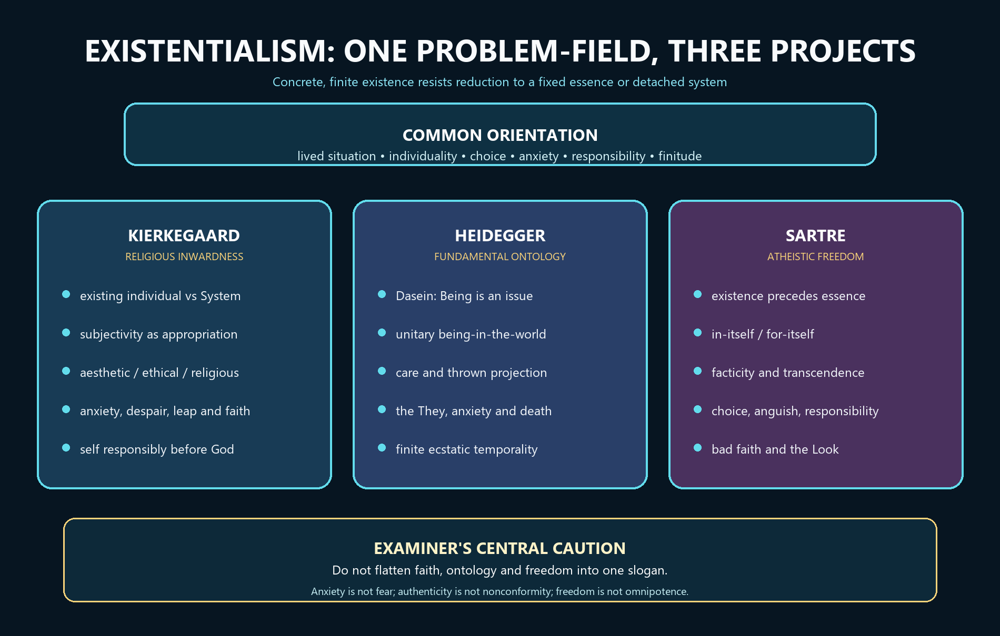

# Existentialism — Learner-v2 Source-Complete Learning Session


> **Generation:** g3, 27 August 2026 · **Approval:** false pending explicit topic approval
>
> **Evidence discipline:** Complete legacy teaching and workbook material is preserved, reordered Basic-first/Advanced-last, and checked against the canonical owner and verified 2018–2025 PYQ ledger.


## BASIC LEARNING SESSION




*Concept map: the family shares the priority of concrete, finite existence, then divides into Kierkegaard's religious inwardness, Heidegger's fundamental ontology and Sartre's atheistic freedom.*

> **Syllabus (verbatim):** Existentialism (Kierkegaard, Sarte, Heidegger): Existence and Essence; Choice, Responsibility and Authentic Existence; Being-in-the-world and Temporality.
> *(The syllabus misprint 'Sarte' is preserved verbatim; the philosopher is Jean-Paul Sartre, spelled correctly throughout this session.)*

### How to Use This Five-Layer Session

Every logical subtopic follows exactly:

| Layer | Purpose |
|---:|---|
| 1. SIMPLE START | visual-first plain-language gateway |
| 2. CORE UPSC | complete terminology, doctrine, argument, example and source grounding |
| 3. ADVANCED | objections, replies, comparisons, interpretive issues and provenance cautions |
| 4. EXAM APPLICATION | verified PYQ routes and 10/15/20-mark architecture |
| 5. RAPID REVISION | traps, retrieval notes and links to the exact MCQ set |

### Source Audit and Contemporary-Link Boundary

- **Canonical doctrine source:** `upsc-ai-kit/knowledge/Philosophy/paper-1/western/Existentialism.md` (11,820 words), sliced verbatim into the CORE UPSC layers (each canonical passage exactly once) and preserved again, in full, in the canonical apparatus block. - **Verified PYQs:** continuous local Western Philosophy Paper I bank, 2018-2025; Existentialism owns exactly **14** primary parts, **at least one in every year 2018-2025** - joint-highest owner in the paper. - **Ownership discipline:** the 2018 Q4(a) part asks "What is 'Epoche'?" - *Epoche* is **Husserl's** method of phenomenological reduction, attributed to Husserl and kept distinct from the Phenomenology topic; Existentialism owns the part because its burden is **Heidegger's** rejection of the reduction and his being-in-the-world. Concepts are attributed precisely among **Kierkegaard**, **Sartre** and **Heidegger**; Husserl-owned questions are kept separate even though Heidegger rejects the epoche and the transcendental ego. - **Provenance discipline (unusually important on this item):** slogans such as "condemned to be free" and "existence precedes essence" come from Sartre's popular lecture *Existentialism Is a Humanism* (delivered **1945**, published **1946**), **not** from *Being and Nothingness* (**1943**); Heidegger's *Being and Time* (**1927**) is **unfinished** (Division III was never published) and is cited by section; "leap of faith" is the English tradition's phrase, while Kierkegaard writes of *the leap* (*Springet*); the Danish *Angest* is rendered "dread" (Lowrie) or "anxiety" (Hong); pseudonyms (Climacus, Johannes de Silentio, Vigilius Haufniensis, Anti-Climacus) are cited by name per the "First and Last Declaration"; "Nothing noths" (*Das Nichts nichtet*), not "noughts".
- **Contemporary-affairs boundary (deliberate):** a live search for the window **2026-02-19 to 2026-08-19** found **no sufficiently direct, verified institutional or major academic development** to anchor this topic. No current-affairs anchor is forced and **no institutional claim is invented**. The topic's exam relevance is **static and syllabus-driven**; where a present-day illustration is offered (autonomy and manipulation, the ethics of authenticity, anxiety and mental health) it is marked as analytical (ANALYSIS) and carries no sourced factual claim. - **Qdrant:** optional fallback only; not required for this canonical topic, and it never blocks the learning session.

**Preservation note:** the canonical doctrine is reorganised into layers, never compressed. Every doctrine, canonical quotation, numbered argument, section citation, objection/reply, comparison, corpus-depth delta, PYQ route, directive rule, graded verdict and provenance caution is retained; simplification means adding accessible gateways, not deleting complexity.

### Learning Roadmap

| Unit | Logical subtopic |
|---:|---|
| 1 | Foundational Map - Three Thinkers, One Shared Conviction, Radical Differences |
| 2 | Kierkegaard - The Single Individual, Truth Is Subjectivity, the Three Stages, the Leap and Indirect Communication |
| 3 | Existence and Essence - Sartre's Slogan, the Paper-Knife, and Heidegger's Rejection of Humanism |
| 4 | Sartre I - Radical Freedom, Choice, Responsibility, and the Moods of Anguish, Abandonment and Despair |
| 5 | Sartre II - Bad Faith, Facticity/Transcendence, and the Pour-soi / En-soi Ontology |
| 6 | Sartre III - The Look (le regard), Being-for-Others, Shame, and the Conflict of Recognition |
| 7 | Heidegger I - Dasein and Being-in-the-World: Worldhood, Equipment, the Existentialia and Care |
| 8 | Heidegger II - Authenticity and Inauthenticity: das Man, Falling, the Call of Conscience and Being-toward-Death |
| 9 | Heidegger III - Temporality (Zeitlichkeit): the Three Ecstases, Future-Priority, and Primordial versus Vulgar Time |
| 10 | Comparison and Answer Spine - Fear versus Angst across the Three Thinkers, and the Cross-Thinker Synthesis |

---

### SESSION 1 — Existentialism as a Family of Distinct Projects

#### DEFINITION / WHAT THIS IS CALLED

**Plain-language definition:** Existentialism begins from concrete, lived and situated existence rather than treating a person as one specimen of a universal definition, but its major thinkers disagree about God, freedom, Being and the ground of authentic existence.

**Technical definition:** The existing individual is a finite, situated and self-interpreting being whose life cannot be exhausted by an abstract system or fixed essence. Kierkegaard develops a Christian critique of Hegelian mediation and asks how a self exists before God; Heidegger undertakes fundamental ontology through an analytic of Dasein and resists Sartrean humanism; Sartre develops an atheistic ontology of consciousness, nothingness and situated freedom. Individuality, choice, anxiety, responsibility, finitude and authenticity recur, but their grounds differ. Existentialism is therefore neither pessimism, nihilism, subjective whim, arbitrary subjectivism nor motivational self-help.

#### VISUAL — Existentialist family map

```text

COMMON PROBLEM: abstract systems lose the concrete, finite existing individual

                         |

       +-----------------+-----------------+

       v                 v                 v

KIERKEGAARD          HEIDEGGER          SARTRE

self before God       question of Being   atheistic freedom

faith / inwardness     Dasein / finitude   nothingness / choice

NOT ONE DOCTRINE: shared problem-field, different grounds and conclusions

```

*The common problem branches into three non-identical philosophical projects.*

#### VISUAL — What existentialism is not

```text

PESSIMISM -> expects bad outcomes; existentialism asks how existence is owned

NIHILISM -> denies value; existentialists analyse how commitment or value arises

WHIM -> unreasoned preference; choice remains situated and responsibility-laden

SELF-HELP -> encouragement; existentialism is ontology, ethics and religious thought

```

*The recurring exam errors confuse a philosophical analysis with a mood or slogan.*

#### ANSWER-GRABBING OPENING — WRITE/ADAPT IN THE EXAM

> Existentialism is best treated as a family of projects united by the priority of lived, situated existence but divided over whether the self is grounded before God, disclosed through Being, or made through atheistic freedom.

#### MUST-WRITE KEYWORDS

- **existing individual**
- **lived and situated existence**
- **self-interpretation**
- **finitude**
- **family resemblance**
- **fundamental ontology**
- **atheistic freedom**

**How to use them:** Open with the existing individual and lived and situated existence, then distinguish Kierkegaard's religious project, Heidegger's fundamental ontology and Sartre's atheistic freedom before using a slogan or example.

#### CORE OBJECTION, REPLY AND RESIDUAL LIMIT

**Objection:** The family label may be so broad that it hides more disagreement than agreement.

**Best reply:** The label remains useful if it names a recurring problem-field rather than one doctrine: how a finite individual owns an existence not settled by detached abstraction.

**Residual limit:** The family account must not erase Heidegger's rejection of humanistic existentialism or Kierkegaard's theistic commitment.

#### EXAM USE AND CONCISE REVISION

**Answer architecture:** Use shared orientation -> three projects -> exact attribution -> common distortions -> qualified family-resemblance verdict.

- Existence is lived, situated and self-interpreting.
- Kierkegaard: religious inward commitment and the self before God.
- Heidegger: fundamental ontology of finite being-in-the-world.
- Sartre: atheistic freedom, nothingness, responsibility and bad faith.

#### Visual gateway - one conviction, three roads

```text
   ONE SHARED CONVICTION
   the concrete EXISTING individual comes BEFORE any system or fixed "essence"
   =========================================================================
                                   |
      +----------------------------+----------------------------+
      v                            v                            v
   KIERKEGAARD                 SARTRE                      HEIDEGGER
   theistic /                 atheistic /                 ontological /
   anti-Hegelian              freedom-centred             anti-humanist
   -------------              ----------------            ----------------
   den Enkelte                pour-soi / en-soi           Dasein
   (the single one)           radical freedom             being-in-the-world
   truth = subjectivity       "condemned to be free"      Care (Sorge)
   3 stages -> the leap       bad faith                   being-toward-death
   faith before God           anguish, the Look           das Man; temporality
   FAITH                      FREEDOM                     FINITUDE
```
Caption: they agree that existence is prior to essence in the human case, then split on God (central / denied / bracketed), on the human being (individual / for-itself / Dasein) and on the route out of lostness (faith / owning freedom / resoluteness).

**Plain-language start:** Most classical philosophy asks "what is the essence of a human being?" and answers with a fixed nature - rational animal, image of God, bundle of atoms. Existentialism reverses the question. It says: first you *exist* - thrown into a situation, having to choose, facing death - and only afterwards, through how you live, does anything like a "nature" get made. That single reversal is the family likeness. But the three great names are not one school. Kierkegaard is a devout Christian arguing against Hegel; Sartre is a militant atheist making freedom absolute; Heidegger says he is not an existentialist at all and is really asking about Being. Read them as three answers to one question, never as one doctrine.

| Thinker | God | Human being | Route to authenticity |
|---|---|---|---|
| Kierkegaard | central (faith in the absurd) | *den Enkelte*, the single individual | the leap into the religious, before God |
| Sartre | denied (atheism is a premise) | *pour-soi*, nihilating consciousness | own your radical freedom, refuse bad faith |
| Heidegger | bracketed (ontology, not theology) | *Dasein*, being-there | anticipatory resoluteness toward death |

> MEMORY: Mnemonic "K-S-H = Faith / Freedom / Finitude" - Kierkegaard leaps in *Faith*; Sartre asserts radical *Freedom*; Heidegger confronts *Finitude* (being-toward-death). Three thinkers, three F's.


> **Syllabus (verbatim):** Existentialism (Kierkegaard, Sarte, Heidegger): Existence and Essence; Choice, Responsibility and Authentic Existence; Being-in-the-world and Temporality. > **Evidence key:** ✅ canonical doctrine · ⚠️ analytical synthesis (mine, for exam use) · ❓ contested/uncertain > **Placement:** A joint-highest Western owner with 14 primary-owned parts across 2018–2025. The three thinkers share the *primacy of existence* but diverge radically: **Kierkegaard** (theistic and anti-Hegelian), **Sartre** (atheistic and freedom-centred), and **Heidegger** (ontological and anti-humanist). Restored questions add bad faith/alienation, the single individual, facticity and Heidegger's critique of transcendental reduction.

---

#### 0. ONE-SCREEN MAP ⚠️

```
THREE THINKERS — ONE SHARED CONVICTION:
  The concrete EXISTING individual is prior to any abstract system or fixed "essence."

┌─────────────────────────────────────────────────────────────────────────────┐
│                    EXISTENCE PRECEDES ESSENCE                                │
│                                                                             │
│  KIERKEGAARD           SARTRE                  HEIDEGGER                    │
│  (theistic)            (atheistic)             (ontological)                │
│                                                                             │
│  • den Enkelte         • pour-soi / en-soi     • Dasein                    │
│    (the individual)    • radical freedom        • In-der-Welt-sein          │
│  • truth =             • "condemned to be       • ready-to-hand /           │
│    subjectivity          free"                    present-at-hand           │
│  • 3 stages:           • bad faith              • Care (Sorge)             │
│    aesthetic →          • anguish, abandon-      • Being-toward-death       │
│    ethical →              ment, despair          • Temporality (3 ecstases) │
│    religious           • choice legislates       • das Man (the "they")     │
│  • leap of faith         for all humanity       • authenticity ≠ moral     │
│  • vs Hegel's system   • no God, no excuses       virtue                   │
└─────────────────────────────────────────────────────────────────────────────┘
```

> 🔑 **Mnemonic — "K-S-H = Faith / Freedom / Finitude":** **K**ierkegaard = leap of **F**aith; **S**artre = radical **F**reedom; **H**eidegger = **F**initude (being-toward-death). Three thinkers, three F's.

#### WHO SAYS WHAT — Quick-Reference Table ⚠️

| Concept | Kierkegaard | Sartre | Heidegger |
|---|---|---|---|
| Core term for human being | *den Enkelte* (the individual) | *pour-soi* (for-itself) | *Dasein* (being-there) |
| "Existence precedes essence" | Implicit: the individual > the System | Explicit: the founding slogan of atheistic existentialism | Rejected as *humanistic* misreading; but "the essence of Dasein lies in its existence" |
| Route to authenticity | Leap of faith (religious stage) | Owning radical freedom, rejecting bad faith | Anticipatory resoluteness toward death |
| God | Central — faith in the absurd | Denied — no God, no excuse | Bracketed — ontology, not theology |
| Chief enemy | Hegel's objective spirit; the "crowd" | Determinism; bad faith; the serious spirit | Cartesian subject–object dualism; *das Man* |
| Key mood | Anxiety (*Angest*), despair | Anguish (*angoisse*), nausea | Anxiety (*Angst*) |
| Freedom | Real but finite; bounded by the God-relation | Absolute, total, inescapable | Ontological — projection of possibilities (not voluntarism) |

---

#### CLOSING RECALL FLOW — Existentialism as a Family of Distinct Projects

```closure-flow
SUBTOPIC: Existentialism as a Family of Distinct Projects
STARTING CONCEPT: Existentialism as a Family of Distinct Projects
KEY TERMS / DEFINITIONS: existing individual | lived and situated existence | self-interpretation | finitude | family resemblance | fundamental ontology | atheistic freedom
MECHANISM / ARGUMENT: Abstract system or fixed nature -> loss of the concrete individual -> return to lived existence -> three distinct projects of faith, ontology and freedom.
CONSEQUENCE / CONTRAST: The common vocabulary becomes exam-safe only when each term is attributed to the thinker whose project gives it a specific meaning.
UPSC TRAP / ANSWER-USE: Do not say every existentialist teaches that life is meaningless or that Sartre's existence-precedes-essence formula is the unchanged creed of all three.
ANSWER-GRABBING FORMULATION: Existentialism is best treated as a family of projects united by the priority of lived, situated existence but divided over whether the self is grounded before God, disclosed through Being, or made through atheistic freedom.
```

### SESSION 2 — Kierkegaard: Existing Individual, Subjective Truth, Anxiety, Despair and Faith

#### DEFINITION / WHAT THIS IS CALLED

**Plain-language definition:** Kierkegaard objects that a complete philosophical system may describe history while missing the person who must actually choose, commit, suffer and become a self. Kierkegaard treats anxiety as the dizziness produced by possibility and despair as a failure in the self's relation to itself and to the power that grounds it.

**Technical definition:** The existing individual is the particular, temporal and responsible person whom Hegelian system-building cannot absorb without remainder. 'Truth is subjectivity' concerns existential appropriation: in ethical and religious matters the mode of commitment, risk and passionate inwardness matters, not whatever a person happens to feel. The aesthetic, ethical and religious spheres are qualitative existential orientations, not a rigid chronological psychology. The aesthetic seeks immediacy and the interesting; the ethical assumes continuity, duty and responsibility; the religious places the single individual before God. Movement is a decision or leap, not a deduction from the previous sphere. Anxiety or dread differs from ordinary fear because it lacks a determinate threatening object; it is the ambiguous attraction and recoil of freedom before possibility, the 'dizziness of freedom.' Choice and commitment are therefore conditions of becoming a self. In The Sickness unto Death, despair is a misrelation in the self: not willing to be oneself, or defiantly willing to be oneself apart from the power that established the self. Faith is not an evidence-free opinion but a mode of religious existence in which the single individual relates absolutely to God. Abraham, teleological suspension and the leap clarify that structure, while also generating the ethical problem of how a private God-relation can be distinguished from fanaticism.

#### VISUAL — Kierkegaard's three orientations

```text

AESTHETIC -> immediacy / pleasure / interesting -> boredom and dispersion

       | qualitative choice, not maturation

       v

ETHICAL -> duty / continuity / vocation -> guilt and universal demand

       | qualitative leap

       v

RELIGIOUS -> single individual before God -> faith, paradox, responsibility

```

*The spheres differ by governing aim, form of commitment and characteristic limit.*

#### VISUAL — Subjective truth without relativism

```text

OBJECTIVE WHAT: proposition, evidence, historical or logical correctness

EXISTENTIAL HOW: appropriation, risk, commitment, inward transformation

ERROR: 'my feeling makes a false proposition true'

CLAIM: detached correctness alone cannot constitute ethical-religious existence

```

*The doctrine concerns how existential truth is held, not whether facts obey feeling.*

#### VISUAL — Possibility to selfhood

```text

POSSIBILITY OF BEING ABLE

          | no fixed necessity settles the act

          v

ANXIETY / DREAD: dizziness of freedom

          v

CHOICE -> COMMITMENT -> BECOMING A SELF -> RESPONSIBILITY

```

*Anxiety is the hinge between freedom as possibility and responsible self-formation.*

#### VISUAL — Despair as misrelation

```text

SELF = relation that relates itself to itself and to the power grounding it

        +---------------------------+---------------------------+

        v                                                       v

NOT WILLING TO BE ONESELF                         DEFIANTLY WILLING TO BE ONESELF

escape or dissolve the self                       self-grounding without dependence

        +---------------------------+---------------------------+

                                    v

                                  DESPAIR

```

*The two principal forms fail to relate the self truthfully to itself and its ground.*

#### ANSWER-GRABBING OPENING — WRITE/ADAPT IN THE EXAM

> For Kierkegaard, becoming a self requires the single individual to appropriate existential truth through responsible choice: anxiety discloses freedom, despair exposes misrelation, and faith claims to re-ground the self before God.

#### MUST-WRITE KEYWORDS

- **existing individual**
- **subjective truth**
- **aesthetic, ethical and religious spheres**
- **anxiety or dread**
- **despair as misrelation**
- **leap**
- **faith**
- **teleological suspension**

**How to use them:** Define the existing individual and subjective truth, compare the three spheres, then use anxiety, despair, the leap and faith to explain responsible selfhood.

#### CORE OBJECTION, REPLY AND RESIDUAL LIMIT

**Objection:** The leap risks irrationalism, teleological suspension threatens universal ethics, and inwardness may become inaccessible to public assessment.

**Best reply:** Kierkegaard limits reason rather than abolishing it: reason identifies the paradox and ethical tension but cannot itself produce the existential commitment that must be lived.

**Residual limit:** This explains faith's form but leaves a serious residual problem of discriminating faith from delusion or ethically destructive private certainty.

#### EXAM USE AND CONCISE REVISION

**Answer architecture:** Use individual vs System -> subjectivity qualified -> three spheres -> anxiety and despair -> leap and faith -> ethical objection -> qualified verdict.

- The single individual cannot be replaced by an abstract System.
- Subjective truth is existential appropriation, not arbitrary belief.
- Anxiety discloses possibility; despair is a misrelation in the self.
- Faith claims responsible selfhood before God but retains an ethical problem.

#### Visual gateway - the stage ladder (you leap, you do not grow)

```text
   THREE SPHERES OF EXISTENCE - crossed by a LEAP, not by maturation
   ================================================================
                                       RELIGIOUS
                                       faith "by virtue of the absurd";
                                       the single one before God;
                                       Abraham, the knight of faith
                                 [ LEAP ]  <- decision, not logic
                            ETHICAL
                            universal duty; marriage, vocation;
                            Judge William  -> limit: GUILT
                      [ LEAP ]  <- decision, not logic
                 AESTHETIC
                 live for the moment; pleasure, irony;
                 the seducer  -> limit: BOREDOM / DESPAIR
```
Caption: the spheres are qualitative, not chronological. You do not "grow out of" the aesthetic; you *leap*, and you can always fall back.

**Plain-language start:** Kierkegaard's target is Hegel, who folded every individual into one grand rational System where "the truth is the whole." Kierkegaard's protest: the System explains everything except the one person who has to live, choose and die - *den Enkelte*, the single individual. His famous phrase "truth is subjectivity" does **not** mean "whatever I feel is true." It means that for the deepest questions - how shall I live, do I stand before God? - *how* you hold a belief (with passionate, risk-taking inwardness) matters more than reciting it as neutral information. He shows this not by lecturing but by writing under invented names (pseudonyms), each speaking from inside one way of life, so the reader must choose for himself.

| Term | Plain meaning |
|---|---|
| *den Enkelte* | the single individual, who cannot be dissolved into the crowd or the System |
| truth is subjectivity | for existential truth, the passionate *how* of belief outranks the neutral *what* |
| the leap (*Springet*) | the un-mediated decision that carries you between spheres - not a proof |
| teleological suspension of the ethical | Abraham: the God-relation can override the universal moral law |

> MEMORY: ladder mnemonic "A-E-R by LEAP" - **A**esthetic (boredom) -> **E**thical (guilt) -> **R**eligious (faith), each crossing is a **LEAP**, never a logical step.


#### 1.3 Kierkegaard: The Existing Individual Against the System (PYQ 2023, 2024) ✅

- Kierkegaard's target: **Hegel's System** — the claim that reality is the self-development of Absolute Spirit (*Geist*), that the individual is a moment in a total rational process, and that "the truth is the whole." - Kierkegaard's counter: "the System" explains everything *except* the existing individual who is supposed to understand it. To exist is to be *particular*, *temporal*, *passionate*, *deciding* — none of which can be captured by Hegel's abstract categories. ✅
- **"Truth is subjectivity"** (*Concluding Unscientific Postscript*, 1846):
  - This does NOT mean "anything I believe is true" (that would be relativism — a common misreading and UPSC trap).
  - It means: the *mode of appropriation* matters more than the objective content when we are dealing with existential/ethical/religious truth. *How* one holds a belief (with infinite passionate inwardness, personal commitment, risk) is the locus of truth for the *existing* subject. ✅ - "Subjectivity is truth" is the *approximation* claim: for existential matters, the highest truth is the most intensely inward appropriation — not detached contemplation. - Example: to "know" that God exists as an item in a philosophical system is NOT the same as *existing before God* in faith, trembling, and passionate commitment.
- **"Subjectivity is untruth"** (the dialectical complement): the existing subject is also *in untruth* (sin, finitude, non-identity with the eternal) and needs the "leap" to overcome this. ⚠️

#### 1.4 Kierkegaard's Three Stages / Spheres of Existence (PYQ 2022 — 20m, PYQ 2023 — 10m) ✅

| Stage | Core | Mode | Limit / Despair |
|---|---|---|---|
| **Aesthetic** | Living for the *moment* — pleasure, sensation, the interesting, the romantic | Immediacy, detachment, irony (the seducer in *Either/Or*) | Boredom, emptiness, despair of not willing to be oneself — the aesthetic self has no continuity |
| **Ethical** | Living by **universal duty** — commitment, marriage, vocation, transparency | The "judge" (Judge Wilhelm in *Either/Or*); the self as responsible agent choosing under universal categories | Guilt — the ethical demands are impossible to fulfil perfectly; the universal cannot accommodate the individual's anguished singularity |
| **Religious** | Standing **before God** as a singular individual — faith as "the absurd," infinite passion | Abraham in *Fear and Trembling*: the knight of faith; "infinite resignation" + the double movement of faith | The paradox — faith is not rational, not universal, not mediated by the crowd or the church |

- **Movement between stages:** NOT by logical deduction (contra Hegel) but by a **leap** (*Spring*) — an act of passionate decision that cannot be rationally motivated from within the prior stage. ✅
- **The teleological suspension of the ethical** (*Fear and Trembling*): Abraham is commanded by God to sacrifice Isaac; this *suspends* the universal ethical prohibition against murder. For Kierkegaard, this shows that the religious sphere is *higher* than the ethical — the individual's God-relation overrides the universal. ✅
- **Against Hegel:** Hegel's "universal spirit" absorbs the individual into the System and makes history the march of reason. Kierkegaard insists that *spirit* (*Aand*) is precisely the individual's passionate self-relation — spirit is subjectivity, not the impersonal dialectic of world-history. The individual is "the essence of spirit," not a dispensable moment in the Absolute. ✅ (PYQ 2023 Q1(d) — direct demand.)

---

#### 2.8 Kierkegaard's Route to Authenticity — the Leap ✅

- The "leap of faith" (*Troens Spring*): the passage from the ethical to the religious stage cannot be *mediated* by reason (contra Hegel, for whom everything is dialectically mediated). - Faith is a *paradox*: to believe that the eternal has entered time (the Incarnation), that the universal ethical law can be suspended (Abraham), is *absurd* by rational standards. Yet it is the highest form of authentic existence — standing as a singular individual before God, without the comfort of the universal or the crowd. ✅
- **The "knight of faith"** (*Fear and Trembling*): outwardly indistinguishable from a bourgeois citizen (unlike the "knight of infinite resignation" who renounces the world visibly), the knight of faith lives fully in the finite world *while simultaneously* relating absolutely to the Absolute.

#### 2B. KIERKEGAARD — INDIRECT COMMUNICATION AND PSEUDONYMITY ✅

**Why it is examinable.** Kierkegaard's use of pseudonyms is not literary decoration; it is a **direct consequence of the doctrine that truth is subjectivity**. A question on "truth is subjectivity" or on Kierkegaard's critique of Hegel is incomplete without it, and the point is almost never made in ordinary scripts.

**The problem, numbered ✅:**
1. Objective truth — historical, scientific, metaphysical — can be transmitted **directly**: I state a result, you receive it, and nothing about your existence need change. 2. But ethical and religious truth is not a result; it is a **mode of existing**, an appropriation in inwardness. ✅ "**Truth is subjectivity**" (*Concluding Unscientific Postscript*, 1846) — the *how* of the relation, not the *what* of the content, is decisive.
3. If such truth were communicated **directly**, the recipient would take it over as a *result* — as information, as doctrine, as something one can know without becoming. The communication would thereby **falsify** exactly what it communicates. 4. therefore ethical-religious truth requires **indirect communication** (*indirekte Meddelelse*): a form that withholds the result, refuses to be an authority, and forces the reader to relate to the possibility **for himself**. 5. The model is **Socratic maieutics** — the midwife who brings to birth what the other must produce, and who, in Kierkegaard's phrase, "**deceives into the truth**." The author must become a *vanishing* occasion, not a teacher with a doctrine.
6. therefore **Pseudonymity.** The pseudonyms are not disguises for a shy author but **personified existence-possibilities** — each writes from *within* a sphere of existence and cannot see beyond it.

**The pseudonyms and their standpoints — the table to reproduce ✅:**
| Pseudonym | Work (year) | Standpoint written from |
|---|---|---|
| **Victor Eremita** (editor) | *Either/Or* (1843) | presents the aesthetic ("A") and ethical (Judge William) papers side by side without deciding between them — the reader must choose |
| **Johannes de Silentio** | *Fear and Trembling* (1843) | one who admires faith but **does not have it**; hence the "silence" — he can describe Abraham but not understand him |
| **Constantin Constantius** | *Repetition* (1843) | the aesthetic-experimental observer |
| **Vigilius Haufniensis** ("watchman of Copenhagen") | *The Concept of Anxiety* (1844) | psychological observer of anxiety, deliberately *not* a dogmatician |
| **Johannes Climacus** | *Philosophical Fragments* (1844); *Concluding Unscientific Postscript* (1846) | a **humorist** who is explicitly **not a Christian** — which is why he can pose the problem of becoming one |
| **Anti-Climacus** | *The Sickness unto Death* (1849); *Practice in Christianity* (1850) | a Christian at an **extraordinarily high** level — above Kierkegaard himself, deliberately the mirror image of Climacus |

> ⚠️ Kierkegaard also published, **simultaneously and under his own name**, the *Upbuilding/Edifying Discourses*. The "**double authorship**" is deliberate: the signed religious writings stand beside the pseudonymous works as the direct pole of a single strategy. Saying this shows you understand pseudonymity as a *method*, not an evasion.

**Kierkegaard's own instruction ✅ — the "First and Last Declaration" appended to the *Postscript* (1846):** he acknowledges authorship of the pseudonymous books while insisting that he is only their "author's author," a **prompter** (*souffleur*) who has produced characters, and he asks that anyone citing them **quote the pseudonym's name, not his**. ⚠️ **Follow this in your answers**: write "Johannes de Silentio argues…" or "Climacus holds…" — it is textually correct and instantly visible as expertise. ❌ Writing "Kierkegaard says in *Fear and Trembling*…" ignores an instruction the author printed.

**Presuppositions ⚠️:** (P1) there is a genuine category of truth that cannot be held without being lived; (P2) the reader's freedom must be protected from the author's authority; (P3) the pseudonymous voices are internally coherent standpoints, not the author speaking with a mask.

**Strongest objections → replies ❓:**
| Objection | Reply | Residual |
|---|---|---|
| Indirect communication makes Kierkegaard's own position **unattributable** — one can never pin him down, so the method insulates him from criticism. | The signed discourses and *The Point of View for My Work as an Author* (written 1848, published posthumously 1859) provide the direct pole and an explicit account of the strategy. | ⚠️ *The Point of View* is itself a retrospective self-interpretation and is disputed as evidence. |
| If subjective truth cannot be said directly, then the *thesis* "truth is subjectivity" cannot be said directly either — the method is self-undermining. | Climacus concedes precisely this: the *Postscript* ends by **revoking** itself, and Kierkegaard's texts are, like the *Tractatus*'s ladder, meant to be discarded. | ⚠️ **A first-class exam observation:** Kierkegaard, the early Wittgenstein (6.54) and Hegel's Unhappy Consciousness all end with a text that consumes itself. Cross-link `Moore-Russell-EarlyWittgenstein.md` §6.6 and `Hegel.md` §1.8. |
| Hegelian reply: the "existing individual" whose truth cannot be systematised is simply an unreflective stage that philosophy sublates. | Kierkegaard: no system can contain the one who *builds* it; the systematiser must still exist, choose and die. "A logical system is possible; an existential system is impossible." | ⚠️ This is the sharpest single sentence to deploy in any Kierkegaard-vs-Hegel question. |

**Executable verdict:** "Pseudonymity is the formal counterpart of the doctrine that truth is subjectivity: because ethical-religious truth is a mode of existing rather than a result, it can be communicated only in a form that refuses to deliver a result. The method's cost is that it is self-consuming — Climacus revokes the *Postscript* — and its power is that the cost is intended. Kierkegaard is not evading the demand for a position; he is denying that a position, in the systematic sense Hegel required, is the sort of thing an existing individual can hand over."

---

#### CLOSING RECALL FLOW — Kierkegaard: Existing Individual, Subjective Truth, Anxiety, Despair and Faith

```closure-flow
SUBTOPIC: Kierkegaard: Existing Individual, Subjective Truth, Anxiety, Despair and Faith
STARTING CONCEPT: Kierkegaard: Existing Individual, Subjective Truth, Anxiety, Despair and Faith
KEY TERMS / DEFINITIONS: existing individual | subjective truth | aesthetic, ethical and religious spheres | anxiety or dread | despair as misrelation | leap | faith | teleological suspension
MECHANISM / ARGUMENT: System vs individual -> existential appropriation -> qualitative spheres -> possibility and anxiety -> choice -> despair or faith -> responsible selfhood.
CONSEQUENCE / CONTRAST: Kierkegaard's religious project makes inwardness answerable to becoming a self, while leaving the public test of faith and ethical suspension contested.
UPSC TRAP / ANSWER-USE: Do not reduce subjective truth to relativism, the spheres to age-phases, anxiety to fear, despair to sadness or faith to an evidence-free impulse.
ANSWER-GRABBING FORMULATION: For Kierkegaard, becoming a self requires the single individual to appropriate existential truth through responsible choice: anxiety discloses freedom, despair exposes misrelation, and faith claims to re-ground the self before God.
```

### SESSION 3 — Heidegger: Fundamental Ontology, Being-in-the-World and Care

#### DEFINITION / WHAT THIS IS CALLED

**Plain-language definition:** Heidegger is not mainly offering advice about authentic living; he is asking the prior question of what it means for beings to be, beginning with Dasein because Being is an issue for it. Care names how Dasein is thrown into a world and past, projects possibilities, and undergoes fallenness into everyday tasks and the public interpretations of the They.

**Technical definition:** Fundamental ontology investigates the meaning of Being through Dasein, the being whose own Being is an issue and which already has a pre-ontological understanding of Being. Dasein is neither a Cartesian mind nor a biological object. Being-in-the-world is a unitary structure, not a subject placed inside a container-world. Worldhood is the referential context in which entities matter. Equipment is primarily ready-to-hand in absorbed use; it becomes present-at-hand as a detached object especially through breakdown. Heidegger therefore treats theoretical subject-object representation as derivative from practical involvement. Care (Sorge) is the unified ontological structure of Dasein: ahead-of-itself in projection toward possibilities, already-in a world through thrownness or facticity, and alongside entities in concern and fallenness. Projection does not mean fantasy but understanding oneself in terms of possible ways of being. Fallenness is absorption in everyday concern and publicness. Das Man, the 'They,' names anonymous norms of what one says and does. Average everydayness and inauthenticity are normal structural modes, not simply evil, cowardice or social conformity in a moralistic sense.

#### VISUAL — Being-in-the-world as a unitary structure

```text

NOT: SUBJECT + bridge to + EXTERNAL CONTAINER

YES: DASEIN--BEING-IN-THE-WORLD--WORLDHOOD

      practical involvement | significance | being-with | concern

SUBJECT and OBJECT emerge as derivative abstractions within this whole

```

*The hyphens prevent the Cartesian decomposition into an inner subject and outer world.*

#### VISUAL — Ready-to-hand and present-at-hand

```text

HAMMER-IN-USE -> nail -> board -> house -> dwelling

READY-TO-HAND: absorbed equipment within an in-order-to nexus

                         | break / absence / obstruction

                         v

PRESENT-AT-HAND: object with properties for reflective or scientific inspection

```

*Breakdown makes the equipmental nexus explicit and produces detached observation.*

#### VISUAL — Care as a threefold unity

```text

                         CARE (SORGE)

        +--------------------+--------------------+

        v                    v                    v

THROWNNESS / FACTICITY   PROJECTION          FALLENNESS

already-in / having-been ahead-of-itself     alongside entities

unchosen situation        possible ways to be  absorption and concern

```

*Thrownness, projection and fallenness are co-original moments, not chronological steps.*

#### VISUAL — The They without moral ranking

```text

BEING-WITH -> shared language, roles, practices and intelligibility

                         | average interpretation

                         v

DAS MAN: what 'one' says, does, expects

ENABLES ordinary coping AND risks dispersal into unowned possibilities

INAUTHENTIC != evil; AUTHENTIC != antisocial heroism

```

*Public intelligibility enables everyday life but can conceal owned possibility.*

#### ANSWER-GRABBING OPENING — WRITE/ADAPT IN THE EXAM

> Heidegger replaces the detached subject with Dasein's unitary being-in-the-world, whose equipmental involvement and threefold care disclose thrown, projected and everyday existence before theoretical representation.

#### MUST-WRITE KEYWORDS

- **fundamental ontology**
- **Dasein**
- **being-in-the-world**
- **worldhood**
- **readiness-to-hand**
- **presence-at-hand**
- **care or Sorge**
- **thrownness, projection and fallenness**

**How to use them:** Begin with fundamental ontology and Dasein, explain the unitary world-structure and equipment distinction, then map care through thrownness, projection and fallenness.

#### CORE OBJECTION, REPLY AND RESIDUAL LIMIT

**Objection:** The account can make social structures look anonymous and formal, obscuring institutions, power, embodiment and material constraints.

**Best reply:** Das Man diagnoses a mode of intelligibility rather than a complete sociology; Heidegger's question concerns how possibilities are ordinarily interpreted before explicit choice.

**Residual limit:** The ontological defence explains the level of analysis but also confirms that social and political explanation remains incomplete.

#### EXAM USE AND CONCISE REVISION

**Answer architecture:** Use ontology -> Dasein -> unitary world -> equipment -> care formula -> the They -> social-structure objection -> ontological reply and residual limit.

- Dasein is the being for whom Being is an issue.
- Being-in-the-world is unitary and practically disclosed.
- Ready-to-hand equipment precedes present-at-hand theory.
- Care unifies thrownness, projection and fallenness.

#### Visual gateway - the equipment map (a world of references)

```text
   BEING-IN-THE-WORLD (In-der-Welt-sein) - ONE hyphenated phenomenon,
   NOT subject + relation + object
   =================================================================
   READY-TO-HAND (Zuhandenheit): equipment I USE, absorbed
      hammer --in-order-to--> drive nail --> join board --> build house
        --> to DWELL (a way of Dasein's being)      [referential totality]
                                   |
                        the hammer BREAKS / is missing
                                   v
   PRESENT-AT-HAND (Vorhandenheit): the thing shows up as a mere OBJECT
      with properties - the mode of theoretical staring (DERIVED, not basic)

   THE EXISTENTIALIA (structures of Dasein's disclosedness):
      Befindlichkeit (attunement/mood) + Verstehen (understanding/projection)
      + Rede (discourse)   =>   CARE (Sorge)
      "ahead-of-itself -- already-in (a world) -- alongside (entities)"
```
Caption: we meet things first as usable equipment inside a web of purposes; only when the tool breaks does the detached "object with properties" appear - so theory rests on practice.

**Plain-language start:** Heidegger renames the human being *Dasein* ("being-there") - the entity for whom its own being is an issue and who understands Being. His key move is to reject Descartes' picture of a mind locked inside, looking out at an external world. *Being-in-the-world* is one unified structure: Dasein is never first a subject that later bumps into objects; it is always already out there, practically absorbed, concerned. And the "world" is not the sum of physical things but a web of *meaning*. A hammer is not first "an object" and then "used"; it shows up as equipment-for-hammering inside a totality of references - nail, board, house, dwelling. Only when the hammer *breaks* does the bare "object with properties" appear. That is why theory (present-at-hand) rests on practice (ready-to-hand).

| Term (German) | Plain meaning |
|---|---|
| *Dasein* | being-there; the entity that understands its own Being |
| ready-to-hand (*Zuhandenheit*) | equipment as used, absorbed in a task |
| present-at-hand (*Vorhandenheit*) | the detached object of theory - a *derived* mode |
| Care (*Sorge*) | the unified being of Dasein: ahead-of-itself / already-in / alongside |

> MEMORY: "hammer works = ready-to-hand; hammer breaks = present-at-hand" - the broken tool is Heidegger's proof that practice comes before theory.


#### 3.1 Dasein and Being-in-the-World (*In-der-Welt-sein*) (PYQ 2022 — 20m) ✅

- **Dasein** ("being-there"): Heidegger's term for the human being — the entity for which its own Being is always an issue, the entity that *understands* Being. ✅
- **Being-in-the-world** is a *unitary* phenomenon — a single hyphenated structure, NOT three separate elements (subject + relation + world). It is intended to dissolve the Cartesian split between an inner subject and an external world. - Dasein does not first *exist* and then subsequently *encounter* a world; it IS constitutively *in* a world — practically engaged, absorbed, concerned. ✅

#### 3.2 The Worldhood of the World ✅

- The "world" is not the totality of physical objects (the universe of natural science); it is the **referential context** of meaning within which things show up as significant. - **Ready-to-hand** (*Zuhandenheit*): the primary mode in which we encounter entities — as *equipment* (tools, instruments) that we *use* in a practical context. The hammer is not first "an object with properties" and then "used for hammering"; it is *originally* encountered as equipment-for-hammering, within a totality of references (nails, wood, house, shelter, project). ✅
- **Present-at-hand** (*Vorhandenheit*): when equipment *breaks down* or is absent or obtrusive, the referential context collapses and things show up as mere *objects* with detached properties — the mode of theoretical/scientific contemplation. ✅
- **The breakdown analysis:** it is precisely when the hammer breaks (or is missing, or gets in the way) that we shift from absorbed coping to reflective staring. This shows that *theory presupposes practice* — the present-at-hand is a *derivative* mode founded on the ready-to-hand. ⚠️
- **The referential totality:** every piece of equipment refers beyond itself — the hammer to the nail, the nail to the board, the board to the house, the house to dwelling-as-a-way-of-being. This "in-order-to" (*Um-zu*) structure constitutes the worldhood of the world as a meaningful whole. ✅

#### 3.3 The Existentialia ✅

Heidegger replaces the traditional "categories" (which apply to things) with **existentialia** — the structures of Dasein's being:

| Existentiale | German | Meaning |
|---|---|---|
| **Attunement / State-of-mind** | *Befindlichkeit* | Dasein always already finds itself in a *mood* (Stimmung) — anxiety, boredom, joy. Mood is not a subjective "colouring" of an objectively given world; it is a fundamental mode of *disclosing* the world and one's situation. "We are always already attuned." ✅ |
| **Understanding** | *Verstehen* | Dasein projects itself upon possibilities — it *understands* its world in terms of what it can do, what is possible. Understanding is not theoretical cognition but practical *know-how* and projection upon potentiality-for-being. ✅ |
| **Discourse** | *Rede* | The articulation of understanding — Dasein's being-open to meaning is always linguistically structured. Discourse is the condition of possibility of both speech and listening. ✅ |

- These three (Befindlichkeit, Verstehen, Rede) constitute the **disclosedness** (*Erschlossenheit*) of Dasein — the "there" (*Da*) of Da-sein: the fact that Being is *disclosed* or opened up for this entity.

#### 3.4 Care (*Sorge*) as the Being of Dasein ✅

- **Care** is the unitary structural whole of Dasein's existence. Its formal definition: > **"Ahead-of-itself — already-in (a world) — alongside (entities encountered within-the-world)"**
  > (*Sich-vorweg — schon-sein-in — Sein-bei*)

- **"Ahead-of-itself"** = Dasein is always *projecting* toward its future possibilities (understanding, freedom).
- **"Already-in"** = Dasein is always *thrown* into a world and a situation it did not choose (facticity, attunement).
- **"Alongside"** = Dasein is always *absorbed* in its practical dealings with entities (concern, falling).
- Care is not a psychological attitude (worry, anxiety) but the **ontological structure** that makes all particular attitudes and activities possible. ✅

#### CLOSING RECALL FLOW — Heidegger: Fundamental Ontology, Being-in-the-World and Care

```closure-flow
SUBTOPIC: Heidegger: Fundamental Ontology, Being-in-the-World and Care
STARTING CONCEPT: Heidegger: Fundamental Ontology, Being-in-the-World and Care
KEY TERMS / DEFINITIONS: fundamental ontology | Dasein | being-in-the-world | worldhood | readiness-to-hand | presence-at-hand | care or Sorge | thrownness, projection and fallenness
MECHANISM / ARGUMENT: Question of Being -> Dasein -> being-in-the-world -> ready-to-hand nexus -> breakdown -> present-at-hand -> care as thrown projection and everyday absorption.
CONSEQUENCE / CONTRAST: The analysis makes subject-object representation derivative and defines human possibility as genuinely open yet always situated.
UPSC TRAP / ANSWER-USE: Do not render being-in-the-world as containment, care as worry, projection as omnipotence, or fallenness and the They as simple moral evil.
ANSWER-GRABBING FORMULATION: Heidegger replaces the detached subject with Dasein's unitary being-in-the-world, whose equipmental involvement and threefold care disclose thrown, projected and everyday existence before theoretical representation.
```

### SESSION 4 — Heidegger: Anxiety, the They, Being-Towards-Death and Authenticity

#### DEFINITION / WHAT THIS IS CALLED

**Plain-language definition:** Anxiety interrupts the familiar meanings of the They and confronts Dasein with its finite possibility; authenticity owns this thrown existence without becoming moral superiority or social withdrawal.

**Technical definition:** Fear concerns a determinate threat, while anxiety makes the familiar world's significance recede and discloses being-in-the-world. The They and average everydayness are structural, not simply evil. Being-towards-death relates to death as ownmost, non-relational, certain and indefinite possibility; it neither recommends suicide nor reduces death to a biological event. Anticipatory resoluteness owns thrown possibilities within the shared world. Authenticity is therefore a formal existential modification, not isolation, nonconformity or a permanent heroic mood.

#### VISUAL — The They without moral ranking

```text

BEING-WITH -> shared language, roles, practices and intelligibility

                         | average interpretation

                         v

DAS MAN: what 'one' says, does, expects

ENABLES ordinary coping AND risks dispersal into unowned possibilities

INAUTHENTIC != evil; AUTHENTIC != antisocial heroism

```

*Public intelligibility enables everyday life but can conceal owned possibility.*

#### VISUAL — From the They to resoluteness

```text

DAS MAN / EVERYDAY ABSORPTION

             | anxiety: familiar significance recedes

             v

BEING-TOWARDS-DEATH: ownmost | non-relational | certain | indefinite

             v

ANTICIPATORY RESOLUTENESS -> own thrown possibilities within the shared world

```

*The sequence is disclosive, not a simplistic moral ascent from bad people to good people.*

#### ANSWER-GRABBING OPENING — WRITE/ADAPT IN THE EXAM

> Heideggerian authenticity is the resolute ownership of finite, thrown possibilities disclosed through anxiety and being-towards-death, not moral superiority, social retreat or fascination with biological dying.

#### MUST-WRITE KEYWORDS

- **the They or das Man**
- **anxiety**
- **being-towards-death**
- **ownmost and non-relational**
- **certain but indefinite**
- **anticipatory resoluteness**
- **authenticity**
- **finitude**

**How to use them:** Sequence the They, anxiety, death and resoluteness without a moral ladder, then evaluate the formal-emptiness and death-centred objections.

#### CORE OBJECTION, REPLY AND RESIDUAL LIMIT

**Objection:** The doctrine may be obscure, death-centred, politically decisionist and neglectful of birth, embodiment, care for others and social oppression.

**Best reply:** Heidegger can reply that the analysis is ontological rather than an ethic, and that authenticity retrieves shared possibilities rather than prescribing solitary withdrawal.

**Residual limit:** The reply is textually strong but leaves authenticity normatively thin and the political implications of resoluteness unsettled.

#### EXAM USE AND CONCISE REVISION

**Answer architecture:** Use non-moral qualification -> the They -> anxiety -> death's four marks -> resoluteness -> authenticity -> formal-emptiness objection -> qualified verdict.

- The They enables everyday life while risking unowned self-interpretation.
- Anxiety discloses being-in-the-world rather than a determinate threat.
- Death is ownmost, non-relational, certain and indefinite.
- Authenticity owns finite possibilities without social isolation.

#### Visual gateway - the path from das Man to owned existence

```text
   AUTHENTICITY (Eigentlichkeit) is an ONTOLOGICAL mode, NOT a moral virtue
   =====================================================================
   INAUTHENTICITY (default: "proximally and for the most part")
      das Man (the "they") - the anonymous public self
      +---- idle talk (Gerede): received opinions passed along
      +---- curiosity (Neugier): restless flitting from novelty to novelty
      +---- ambiguity (Zweideutigkeit): all seems accessible, none appropriated
      => FALLING (Verfallen): absorbed, dispersed, losing my ownmost self
                                   |
              CALL OF CONSCIENCE (Ruf des Gewissens) - silent, no content
                                   v
   AUTHENTICITY: face BEING-TOWARD-DEATH (Sein-zum-Tode)
      death is OWNMOST - NON-RELATIONAL - CERTAIN - INDEFINITE (as to when)
                                   |
                                   v
      ANTICIPATORY RESOLUTENESS (vorlaufende Entschlossenheit)
      run ahead to death as my own -> gather existence into a WHOLE,
      freed from das Man, taking over my thrown existence
```
Caption: Dasein is normally lost in "the they"; the silent call of conscience and honest confrontation with my own death let me own my existence - a change of *how*, not a moral upgrade.

**Plain-language start:** For Heidegger, *authenticity* is not being morally good, and inauthenticity is not being bad. They are two *modes* of relating to your own existence. Normally Dasein is lost in *das Man*, "the they" - the anonymous public that decides what "one" says, does and thinks. Three marks: *idle talk* (repeating received opinions), *curiosity* (chasing novelty), *ambiguity* (everything seems available, nothing is truly grasped). This absorption is *falling*, and it is structural, not a sin. What calls Dasein back is the silent *call of conscience*, and above all honest *being-toward-death*: not morbid brooding, but facing death as *my* ownmost possibility. That confrontation individualises me, frees me from "the they," and lets me take up my existence as a whole - *anticipatory resoluteness*.

| Term (German) | Plain meaning |
|---|---|
| *das Man* | the anonymous "they"/"one"; source of inauthenticity |
| falling (*Verfallen*) | absorbed dispersal into the world and the they - structural, not moral |
| being-toward-death (*Sein-zum-Tode*) | facing death as ownmost, non-relational, certain, indefinite |
| anticipatory resoluteness | owning my finitude; gathers existence into a whole |

> MEMORY: death's four marks "O-N-C-I" - **O**wnmost, **N**on-relational, **C**ertain, **I**ndefinite (as to when). Authentic Dasein holds all four; das Man evades them with the reassurance that "one dies" someday.


#### 2.7 Heidegger: Authenticity and Inauthenticity ✅

**Important preliminary:** for Heidegger, **authenticity (*Eigentlichkeit*) is NOT a moral virtue** and inauthenticity is NOT a moral failing. They are **existential modifications** — modes of Dasein's self-relation. Dasein is *mostly and for the most part* (*zunächst und zumeist*) inauthentic, and this is not a deficiency but a structural feature of being-in-the-world. ✅ (PYQ 2019, 2022 — direct demand to clarify this.)

**Inauthenticity — *das Man* (the "they"):**
- Dasein exists with others (*Mitsein*) and tends to lose itself in what "one" (*man*) does, says, thinks — the anonymous public. - Three marks of *das Man*: **idle talk** (*Gerede* — passing along received opinions without genuine understanding); **curiosity** (*Neugier* — flitting restlessly from novelty to novelty); **ambiguity** (*Zweideutigkeit* — everything seems accessible, nothing genuinely appropriated). ✅
- **Falling** (*Verfallen*): Dasein's tendency to be absorbed in the world of its concern and in *das Man* — losing its "ownmost" self. Falling is not a theological "fall from grace"; it is an ontological structure. ✅

**Authenticity (*Eigentlichkeit*):**
- **The call of conscience** (*Ruf des Gewissens*): Dasein calls itself *back* from its dispersal in *das Man* — conscience discloses that I *owe* my existence to no one, that I must take up my own being. The call is "silent" — it gives no content, no rules; it simply summons Dasein to its "ownmost, non-relational potentiality-for-being." ✅
- **Being-toward-death** (*Sein-zum-Tode*): death is Dasein's **ownmost** (no one can die for me), **non-relational** (isolates me from others), **certain** (inevitable), **indeterminate as to when** possibility.
  - Inauthentic relation: we flee death — "one dies" (*man stirbt*), "everyone dies someday" — covering over death's individualising force.
  - Authentic relation: **anticipatory resoluteness** (*vorlaufende Entschlossenheit*) — I face death as *my own* possibility, which discloses the finitude and urgency of my existence, freeing me from *das Man* and letting me take over my existence as a *whole*. ✅
- **Crucial correction:** authenticity for Heidegger does NOT mean "living a morally good life" or "being a rugged individualist." It means *owning* one's thrownness and projecting upon one's ownmost possibilities — it is a *formal* modification of everydayness, not a substantive ethical prescription. ⚠️

#### CLOSING RECALL FLOW — Heidegger: Anxiety, the They, Being-Towards-Death and Authenticity

```closure-flow
SUBTOPIC: Heidegger: Anxiety, the They, Being-Towards-Death and Authenticity
STARTING CONCEPT: Heidegger: Anxiety, the They, Being-Towards-Death and Authenticity
KEY TERMS / DEFINITIONS: the They or das Man | anxiety | being-towards-death | ownmost and non-relational | certain but indefinite | anticipatory resoluteness | authenticity | finitude
MECHANISM / ARGUMENT: The They's familiar meanings -> anxiety -> finite ownmost possibility -> anticipation -> resoluteness -> authentic ownership within the shared world.
CONSEQUENCE / CONTRAST: Death individualises Dasein and exposes finitude, but authenticity changes how everyday possibilities are owned rather than supplying a moral code.
UPSC TRAP / ANSWER-USE: Do not equate inauthenticity with evil, anxiety with clinical fear, death with only a biological event, anticipation with death-seeking or authenticity with isolation.
ANSWER-GRABBING FORMULATION: Heideggerian authenticity is the resolute ownership of finite, thrown possibilities disclosed through anxiety and being-towards-death, not moral superiority, social retreat or fascination with biological dying.
```

### SESSION 5 — Heidegger: Temporality, Finitude and the Meaning of Care

#### DEFINITION / WHAT THIS IS CALLED

**Plain-language definition:** Temporality is not a line of clock moments but the finite way Dasein stands out into its future possibilities, inherited past and present involvement.

**Technical definition:** Temporality is the meaning of care. The future temporalises projection and anticipation; having-been temporalises thrownness and the past Dasein still is; the present temporalises involvement and making-present. These ecstases form one finite unity, not three containers, and the future is structurally primary because anticipation gathers thrown existence into a whole. Ordinary clock-time or the sequence of nows is derivative. Historicality follows because Dasein inherits possibilities and projects them anew.

#### VISUAL — Care temporalised

```text

FUTURE: projection / ahead-of-itself / anticipation

          +-----------------------------------+

HAVING-BEEN: thrownness / already-in          PRESENT: involvement / alongside

TEMPORALITY = ecstatic unity; FUTURE has structural priority

VULGAR CLOCK-TIME = derivative sequence of nows

```

*The three ecstases are a finite unity rather than compartments on a clock line.*

#### ANSWER-GRABBING OPENING — WRITE/ADAPT IN THE EXAM

> Heidegger's temporality is the finite ecstatic unity of future, having-been and present through which care becomes intelligible, not the external clock in which Dasein happens.

#### MUST-WRITE KEYWORDS

- **temporality**
- **future**
- **having-been**
- **present**
- **ecstatic unity**
- **future priority**
- **vulgar clock-time**
- **historicality**

**How to use them:** Map each temporal ecstasis to one limb of care, explain future priority and contrast primordial temporality with derivative clock-time.

#### CORE OBJECTION, REPLY AND RESIDUAL LIMIT

**Objection:** The future-first analysis can be obscure, overly death-centred and incomplete because the promised Division III of Being and Time was not published.

**Best reply:** The temporal structure explains how possibilities, inherited facts and present concern belong together rather than appearing as separate psychic contents.

**Residual limit:** The reply clarifies Dasein's unity but does not complete the larger ontology of Being.

#### EXAM USE AND CONCISE REVISION

**Answer architecture:** Use care mapping -> three ecstases -> future priority -> death/authenticity link -> vulgar time -> historicality -> incompleteness objection -> verdict.

- Temporality is the meaning of care.
- Future, having-been and present form one ecstatic unity.
- The future has structural priority through anticipation.
- Clock-time is a derivative public now-series.

#### Visual gateway - the three ecstases of time

```text
   TEMPORALITY (Zeitlichkeit) = the MEANING of Care - not a line of "nows"
   =====================================================================
                          FUTURE (Zukunft)  *** PRIMARY ***
                          "coming toward" oneself; projection;
                          being-toward-death
                             /            \
                            /   ECSTATIC   \      ek-stasis = "standing out"
                           /   UNITY (not   \     into all three at once
                          /    a sequence)   \
             HAVING-BEEN (Gewesenheit)     PRESENT (Gegenwart)
             the past I STILL AM;          "making present";
             thrownness, facticity, guilt  absorption in entities
                = "already-in"                = "alongside"
   ( "ahead-of-itself" = future )
   -----------------------------------------------------------------
   PRIMORDIAL time (ecstatic, finite, futural)   vs   VULGAR time
   how Dasein exists its own being               endless sequence of nows
   bounded by death                              clock time; a DERIVED,
                                                 levelled-down form (das Man)
```
Caption: for Heidegger time is not a row of moments but three "ecstases" Dasein stands out into together, with the future leading; clock-time is a flattened, derived version.

**Plain-language start:** In Division Two of *Being and Time*, Heidegger asks what makes Care one structure, and answers: *temporality*. But he does not mean clock-time, the endless line of "nows." He means three *ecstases* - ways Dasein "stands out" (*ek-stasis*) beyond itself: the *future* (coming toward myself, projecting, being-toward-death), the *having-been* (the past I still am - thrownness, facticity), and the *present* (making entities present, absorbed dealing). They are not three segments of a line but a single unity Dasein lives all at once, and the *future* leads: authentic existence runs ahead to death and thereby gathers life into a whole. Ordinary clock-time - the infinite series of nows - is a *derived*, "levelled-down" version that Dasein falls into for public use.

| Ecstasis (German) | Care element | Existential meaning |
|---|---|---|
| future (*Zukunft*) - primary | ahead-of-itself | projection, being-toward-death |
| having-been (*Gewesenheit*) | already-in | thrownness, facticity, guilt |
| present (*Gegenwart*) | alongside | making-present, absorption |

> MEMORY: "F leads H and P" - the **F**uture is primary; **H**aving-been and **P**resent are temporalised out of it. Authenticity is *futural*.


#### 3.5 Temporality (*Zeitlichkeit*) as the Meaning of Care (PYQ 2019 — 20m) ✅

**The central thesis of Division Two of *Being and Time*:** the meaning of Care (and therefore of Dasein's being) is **temporality**.

- **Three ecstases of primordial temporality:**

| Ecstasis | Existential moment | Structural element of Care |
|---|---|---|
| **Future** (*Zukunft*) — "coming toward" oneself | Projection, anticipation, being-toward-death | "Ahead-of-itself" |
| **Having-been** (*Gewesenheit*) — the past that I *still am* | Thrownness, facticity, guilt | "Already-in" |
| **Present** (*Gegenwart*) — "making present" | Absorption in entities, practical engagement | "Alongside" |

- **Priority of the future:** for Heidegger, the future (as Dasein's projecting upon its ownmost possibility — death) is the primary ecstasis. The past and present are *temporalised* from out of the future. Authenticity is *futural*: in anticipatory resoluteness, Dasein runs ahead to its death and thereby gathers its existence into a *whole*. ✅
- **"Ecstatic" temporality:** the three dimensions are not containers or segments of a line; they are "ecstases" — Dasein *stands out* (*ek-stasis*) into each simultaneously. Temporality is a *unity* of future-past-present in which Dasein holds itself open. ✅

#### 3.6 Primordial vs Vulgar/Ordinary Time ✅

| Primordial temporality (*Zeitlichkeit*) | Vulgar / ordinary time (*innerzeitige Zeit*) |
|---|---|
| Ecstatic, finite, unified, futural | A sequence of "nows" — past nows (gone), present now (here), future nows (not yet) |
| The temporality *of Dasein* — how Dasein exists its own being | "Time" as measured by clocks — the time *in which* events occur |
| Finite — bounded by death | Infinite — the "now" series is endless (both directions) |
| Non-derivative, self-grounding | Derivative — arises from Dasein's *falling* (levelling down temporality for public use) |

- Heidegger argues that the ordinary concept of time (clock time, "infinite succession of nows") is a *derived* and *inauthentic* understanding — it arises when Dasein, in its falling, "levels down" its primordial ecstatic temporality into the public, measurable, homogeneous time of *das Man*. ✅
- **The historicality (*Geschichtlichkeit*) of Dasein:** because Dasein is temporal, it is intrinsically *historical* — it inherits a past (tradition, thrownness), exists in a present, and projects a future. History is not something that merely *happens to* Dasein from outside; it is the way Dasein *is*. ✅

---

#### CLOSING RECALL FLOW — Heidegger: Temporality, Finitude and the Meaning of Care

```closure-flow
SUBTOPIC: Heidegger: Temporality, Finitude and the Meaning of Care
STARTING CONCEPT: Heidegger: Temporality, Finitude and the Meaning of Care
KEY TERMS / DEFINITIONS: temporality | future | having-been | present | ecstatic unity | future priority | vulgar clock-time | historicality
MECHANISM / ARGUMENT: Care -> future projection + having-been thrownness + present involvement -> finite ecstatic unity -> authentic historicality -> derivative public now-series.
CONSEQUENCE / CONTRAST: The analysis makes finitude and self-interpretation temporal, while leaving the projected transition from Dasein's time to the meaning of Being incomplete.
UPSC TRAP / ANSWER-USE: Do not treat the ecstases as chronological compartments, equate temporality with clocks, or say Dasein is authentic by definition.
ANSWER-GRABBING FORMULATION: Heidegger's temporality is the finite ecstatic unity of future, having-been and present through which care becomes intelligible, not the external clock in which Dasein happens.
```

### SESSION 6 — Sartre: Existence, In-Itself, For-Itself and Nothingness

#### DEFINITION / WHAT THIS IS CALLED

**Plain-language definition:** Sartre argues that human beings are not manufactured to a prior blueprint: they first exist and then define themselves through projects.

**Technical definition:** For human beings, existence precedes essence because no divine artisan fixes a universal human nature in advance. This Sartrean claim must not be attributed unchanged to Kierkegaard or Heidegger. Being-in-itself is full, opaque and self-identical; being-for-itself is intentional consciousness, a lack or nothingness that distances itself from what is and transcends toward possibilities. Nihilation is consciousness's power to introduce absence, questioning and alternatives into being. The for-itself therefore cannot coincide completely with a fixed essence, past or role.

#### VISUAL — In-itself and for-itself

```text

BEING-IN-ITSELF                      BEING-FOR-ITSELF

full / opaque / self-identical       intentional / lack / non-coincident

'is what it is'                      'is what it is not; is not what it is'

no projection                         nihilation -> possibilities -> project

```

*The contrast grounds Sartre's account of consciousness, freedom and unstable identity.*

#### VISUAL — Existence and essence in Sartre

```text

ARTEFACT: design / essence -> manufacture -> existence

HUMAN: existence -> choices and projects -> provisional self-definition

NO DIVINE ARTISAN -> no fixed human blueprint before living

QUALIFICATION -> not Kierkegaard's formula; not Heidegger's ontological claim

```

*The artefact model is reversed only for a human reality lacking a prior divine design.*

#### ANSWER-GRABBING OPENING — WRITE/ADAPT IN THE EXAM

> Sartre's existence-precedes-essence thesis depends on the for-itself's nothingness: consciousness is never a completed thing but a project that exceeds every identity it has.

#### MUST-WRITE KEYWORDS

- **existence precedes essence**
- **being-in-itself**
- **being-for-itself**
- **intentional consciousness**
- **nothingness**
- **nihilation**
- **self-transcendence**
- **project**

**How to use them:** Derive existence precedes essence from the absent divine blueprint, then contrast being-in-itself with being-for-itself and use nothingness and nihilation to explain the human project.

#### CORE OBJECTION, REPLY AND RESIDUAL LIMIT

**Objection:** Nothingness may look mysterious, the in-itself/for-itself divide may be too stark, and the atheist premise does not by itself prove radical self-creation.

**Best reply:** Nihilation names a phenomenological structure visible in negation, questioning, absence and the ability to take distance from a present identity.

**Residual limit:** The reply explains consciousness's openness but does not establish that social and bodily conditions never shape which possibilities can be lived.

#### EXAM USE AND CONCISE REVISION

**Answer architecture:** Use artefact contrast -> Sartrean scope -> in-itself/for-itself -> nothingness -> freedom implication -> objections about dualism and condition.

- The slogan is Sartre's and applies specifically to human reality.
- In-itself is self-identical being; for-itself is intentional and non-coincident.
- Nothingness is consciousness's distancing and negating structure.
- A project is open-ended self-definition, not magical creation from nothing.

#### Visual gateway - the reversal, in one picture

```text
   ARTEFACT (a paper-knife)            HUMAN BEING (Sartre)
   ---------------------------         ---------------------------
   1. artisan conceives design         1. man first EXISTS,
      (essence / function)                surges up in the world
   2. THEN it is made (existence)      2. THEN defines himself by
   => ESSENCE precedes EXISTENCE          his choices and acts
                                       => EXISTENCE precedes ESSENCE
   why? a maker planned it             why? no God, so no prior plan;
                                          "man is what he makes of himself"

   HEIDEGGER'S OBJECTION:
   "the essence of Dasein lies in its existence" - true, but NOT Sartre's
   voluntarism; man is the "shepherd of Being", not the lord of beings.
```
Caption: for a designed object, the plan comes first; Sartre removes the divine designer, so for the human being the order flips - but Heidegger warns this still keeps "man at the centre."

**Plain-language start:** Think of a paper-knife (*coupe-papier*). A craftsman has the idea and purpose in mind first, then makes the object - essence before existence. Traditional theism treated people the same way: God conceives "human nature," then creates us to that blueprint. Sartre's atheism removes the designer. With no God, there is no prior human nature; so we first exist, and only afterwards - through what we do - make ourselves into something. That is the meaning of "existence precedes essence" and "man is nothing else but what he makes of himself." Heidegger uses a similar-sounding phrase but flatly rejects Sartre's reading: he is asking about Being, not celebrating human self-creation.

| Slogan | Whose | What it means |
|---|---|---|
| existence precedes essence | Sartre | no maker, no fixed nature; the self is a *project* |
| man is condemned to be free | Sartre | thrown here, then inescapably self-defining |
| the essence of Dasein lies in its existence | Heidegger | Dasein's "what" is its manner of being - *not* Sartre's voluntarism |

> MEMORY: "knife before, human after" - the artefact's essence comes *before* it; the human's essence comes *after* existence, because no artisan-God drew the plan.


#### 1.1 Sartre: "Existence Precedes Essence" (PYQ 2024 — 10+10m) ✅

**The slogan and its exact meaning:**
- For a manufactured object (Sartre's *paper-knife* / *coupe-papier*), the artisan first conceives its design (essence/function) and *then* produces it (existence). Essence precedes existence. - Traditional philosophy (and theism) treated *man* analogously: God conceives "human nature" and then creates individuals to that blueprint.
- **Sartre denies this:** there is no God (atheism is a *premise*, not a conclusion, of Sartre's existentialism). Therefore there is no prior design. *"Man first of all exists, encounters himself, surges up in the world — and defines himself afterwards."* ✅
- **Consequence for the *pour-soi*:** human reality (*réalité humaine*) has **no fixed nature**. We are not determined by biology, society, God, or "human nature." We are a **project** (*projet*) — we make ourselves through our choices and actions. *"Man is nothing else but what he makes of himself."* ✅
- **Why it entails atheism for Sartre's version:** if God existed, essence *would* precede existence (God would be the divine artisan); so the slogan is incompatible with theism. (Note: this is *Sartre's* reading. Kierkegaard is an existentialist *and* a theist — so the slogan in its Sartrean form is not definitional of all existentialism.) ⚠️

#### 1.2 Heidegger's Rejection of the Slogan ✅

- In the "Letter on Humanism" (1947), Heidegger explicitly **disowns** Sartre's reading:
  - *"The essence of Dasein lies in its existence"* (*Being and Time* §9) does NOT mean "existence precedes essence" in Sartre's voluntarist sense. ✅
  - For Heidegger, this is an **ontological** claim: Dasein's "what" (essence) is not a fixed *quidditas* but its very *manner of being* — its being-open-to-Being, its *Existenz* (standing-out into the clearing of Being).
  - Sartre, Heidegger charges, remains trapped in the **metaphysics of subjectivity** — he merely reverses the essence/existence priority while keeping the humanistic framework (man at the centre). Heidegger insists that the question is not about *man's self-creation* but about **Being** (*Sein*) — man is the "shepherd of Being," not the lord of beings. ⚠️
- **Exam implication:** never attribute "existence precedes essence" to Heidegger without immediately noting his repudiation. The examiner tests this distinction (see TRAPS §5). ⚠️

#### CLOSING RECALL FLOW — Sartre: Existence, In-Itself, For-Itself and Nothingness

```closure-flow
SUBTOPIC: Sartre: Existence, In-Itself, For-Itself and Nothingness
STARTING CONCEPT: Sartre: Existence, In-Itself, For-Itself and Nothingness
KEY TERMS / DEFINITIONS: existence precedes essence | being-in-itself | being-for-itself | intentional consciousness | nothingness | nihilation | self-transcendence | project
MECHANISM / ARGUMENT: No predetermined human design -> human first exists -> consciousness negates the given -> projects possibilities -> self is made without becoming a finished essence.
CONSEQUENCE / CONTRAST: Human identity is an ongoing achievement and cannot be reduced to a role, substance, biological description or completed past.
UPSC TRAP / ANSWER-USE: Do not treat in-itself/for-itself as a simple body-mind dualism or say that all existence literally precedes essence for every kind of being.
ANSWER-GRABBING FORMULATION: Sartre's existence-precedes-essence thesis depends on the for-itself's nothingness: consciousness is never a completed thing but a project that exceeds every identity it has.
```

### SESSION 7 — Sartre: Facticity, Transcendence, Freedom, Choice and Responsibility

#### DEFINITION / WHAT THIS IS CALLED

**Plain-language definition:** Freedom is always exercised from a body, past and situation, so Sartre's claim is not that a person can alter every external condition by wishing.

**Technical definition:** Facticity is the given dimension of human reality: body, past, place, social situation and what has happened. Transcendence is the for-itself's surpassing of the given through projects and meanings. Freedom is situated: circumstances constrain available action without determining the meaning or project through which they are taken up. Because choice is inescapable, refusal or conformity can itself be a choice. Responsibility is for one's projects and meanings, not blame for every event suffered. Anguish is the recognition that no fixed nature guarantees one's choice; abandonment or forlornness is the absence of a divine value-giver; despair is disciplined reliance on what one's action can address rather than a prediction that all efforts fail.

#### VISUAL — Facticity and transcendence

```text

FACTICITY: body | past | place | class | imposed event

                         <---- situated freedom ---->

TRANSCENDENCE: interpretation | project | possible action | future

ERROR 1: facticity = destiny       ERROR 2: transcendence = omnipotence

```

*Human reality exists in the unresolved tension between the given and the projected.*

#### VISUAL — Freedom to anguish

```text

FREEDOM -> CHOICE -> PROJECT / MEANING -> RESPONSIBILITY

    |         |                              |

    |         +-> non-choice still positions the self

    +-> no fixed essence guarantees the act -> ANGUISH

NO DIVINE VALUE-GIVER -> ABANDONMENT; no guaranteed outcome -> DESPAIR

```

*Responsibility follows because neither essence nor divine law decides in advance.*

#### ANSWER-GRABBING OPENING — WRITE/ADAPT IN THE EXAM

> Sartrean freedom is radical because no fact interprets itself, yet situated because every project begins from facticity; responsibility concerns the meaning and direction one gives a life, not culpability for every injury imposed upon it.

#### MUST-WRITE KEYWORDS

- **facticity**
- **transcendence**
- **situated freedom**
- **choice**
- **responsibility**
- **anguish**
- **abandonment or forlornness**
- **meaning-conferral**

**How to use them:** Always pair freedom with facticity, distinguish power from freedom and blame from responsibility, and explain why anguish follows from choice.

#### CORE OBJECTION, REPLY AND RESIDUAL LIMIT

**Objection:** Critics argue that early Sartre exaggerates choice and underestimates social, economic, psychological and embodied constraints on available possibilities.

**Best reply:** Situated freedom and later Sartrean attention to scarcity, seriality and the practico-inert acknowledge that freedom is conditioned without being reduced to determinism.

**Residual limit:** The later development improves social realism but qualifies the rhetoric of total freedom and leaves the scope of responsibility contested.

#### EXAM USE AND CONCISE REVISION

**Answer architecture:** Use facticity/transcendence -> situated freedom -> choice/non-choice -> responsibility -> three moods -> structural objection -> later qualification.

- Facticity is constraint without being a complete determinant.
- Transcendence is self-surpassing through projects, not unlimited power.
- Anguish discloses unsupported choice; abandonment names no divine value-giver.
- Responsibility for projects is not blame for all suffering.

#### Visual gateway - the field of freedom and facticity

```text
   FREEDOM is not a property I HAVE - it is what I AM
   =================================================================
      FACTICITY (the given)              TRANSCENDENCE (self-surpassing)
      body, past, class, situation  <--> freedom to interpret and go beyond
                       \                 /
                        \               /
                    every MOTIVE has force ONLY through
                    the MEANING I freely confer on it
                                 |
                                 v
                 "MAN IS CONDEMNED TO BE FREE"
      not chosen to exist, but once here, inescapably self-defining;
      even NOT choosing is a choice.  => total RESPONSIBILITY, no excuses
                                 |
              +------------------+------------------+
              v                  v                  v
         ANGUISH            ABANDONMENT           DESPAIR
      vertigo before      no God, no given      act without banking
      my own freedom      values to lean on     on the world's help
```
Caption: I am pulled between what is given (facticity) and my power to surpass it (transcendence); because nothing settles my choices in advance, I carry total responsibility - and three moods disclose it.

**Plain-language start:** For Sartre, consciousness (the *pour-soi*) is not a thing with a fixed nature; it is a restless "nihilating" activity that always stands back from what is and imagines otherwise. So freedom is not something we own - it is what we *are*. We did not choose to be born ("thrown"), but from then on we cannot escape choosing, and even refusing to choose is a choice. That is why "man is condemned to be free." Because no God and no pre-written values back us up, we bear total responsibility - there are no excuses. Three moods reveal this: *anguish* (dizziness before my freedom), *abandonment* (there is no moral authority to defer to), *despair* (I must act without a guarantee the world will cooperate).

| Mood (French) | What triggers it |
|---|---|
| anguish (*angoisse*) | recognising that my future is undetermined and only I sustain my acts |
| abandonment (*delaissement*) | no God, no *a priori* values - I must invent them by choosing |
| despair (*desespoir*) | I can rely only on what is within my will, not on luck or history |

> MEMORY: "A-A-D of freedom" - **A**nguish (before myself), **A**bandonment (no God), **D**espair (no guarantee) - the three moods that follow from being condemned to be free.


#### 2.1 Sartre: Radical Freedom ✅

- **Freedom is not a property we possess; it is what we ARE.** The *pour-soi* is *constituted* by freedom — it is the nihilating, self-transcending movement of consciousness that continually surpasses what it is toward what it is not yet. ✅
- **"Man is condemned to be free"** (*L'existentialisme est un humanisme*, 1946): we did not choose to exist (we are "thrown" into the world), but once here, we are *inescapably* free — we bear total responsibility for what we make of ourselves. ✅
- **"I can always choose, but I ought to know that if I do not choose, I am still choosing"** (PYQ 2021 — 15m): inaction, deferral, conformity are themselves *choices* — the attempt to escape choice is already a choice (and typically a choice of bad faith). ✅

#### 2.2 Anguish, Abandonment, Despair ✅

| Mood | Source | Structure |
|---|---|---|
| **Anguish** (*angoisse*) | I recognise that I am *free* — my future is radically undetermined; nothing compels me; I stand before the abyss of possibility | Anguish is not fear *of* an object but vertigo before one's own freedom: "I am not sustained by anything, nothing justifies me" |
| **Abandonment** (*délaissement*) | There is no God, no cosmic moral order, no *a priori* values written in an "intelligible heaven" | I must *invent* values through my choosing; I cannot lean on a pre-given ethical framework |
| **Despair** (*désespoir*) | I cannot count on anything beyond my own will and action — others, historical forces, luck are outside my control | To act without hope that the world will cooperate — to rely only on what is "within my will or within the sum of probabilities" |

#### 2.5 Choice as Legislating for All Humanity ⚠️

- Sartre adopts a quasi-Kantian universalisability principle: "In choosing myself, I choose man" — every choice implies an image of what human beings *ought* to be. If I choose to marry, I affirm that monogamy is valuable *for everyone*; I cannot choose "just for me" in moral isolation. ✅ - This generates the *weight* of responsibility and the anguish that accompanies it — I am not merely deciding my own fate but *legislating* an image of humanity.
- **Objection:** this seems to conflict with the claim that there are no *a priori* values — whence the universalisability demand if no prior moral framework is given? Sartre's reply: the *form* of universalisability is inherent in the *structure* of free choice, not imported from a pre-existing ethics. ❓

#### 2.6 Sartre on Freedom and Determinism (PYQ 2019 — 15m) ✅

- **Sartre denies all forms of determinism:** causal determinism (physics determines my choices), psychological determinism (my desires/motives compel me), and social determinism (class/upbringing fixes me). - **Key argument:** a *motive* (desire, emotion, situation) can only become a reason for action through the *meaning* I confer on it. But meaning-conferral is itself an act of the pour-soi (nihilation/transcendence). Therefore, no motive determines me *unless I freely constitute it as a motive*. ✅
- **"There are no excuses"** — passion does not cause action; I *choose* to surrender to passion. I cannot say "I was too angry" because my anger is itself something I sustain or let go.
- **Situation and freedom:** Sartre does not deny that situations (facticity) *limit* what is physically possible; but within any situation, I am free to *interpret* it, to *choose my attitude*, and to *act* within it or against it. Freedom is *absolute* within the field of meaning. ✅
- **Criticism:** is this psychologically and socially plausible? The Marxist critique: Sartre ignores structural oppression (poverty, racism) that limits not just physical but *cognitive* possibilities. Sartre partly concedes this later in the *Critique of Dialectical Reason* (1960), where he integrates material scarcity and seriality into his account. ⚠️

#### CLOSING RECALL FLOW — Sartre: Facticity, Transcendence, Freedom, Choice and Responsibility

```closure-flow
SUBTOPIC: Sartre: Facticity, Transcendence, Freedom, Choice and Responsibility
STARTING CONCEPT: Sartre: Facticity, Transcendence, Freedom, Choice and Responsibility
KEY TERMS / DEFINITIONS: facticity | transcendence | situated freedom | choice | responsibility | anguish | abandonment or forlornness | meaning-conferral
MECHANISM / ARGUMENT: Factical situation -> interpretation and projected end -> choice -> responsibility for the project -> anguish because no essence guarantees it.
CONSEQUENCE / CONTRAST: The doctrine defeats excuses based on fixed nature while preserving the reality of constraint, vulnerability and unequal situations.
UPSC TRAP / ANSWER-USE: Do not say freedom means external omnipotence, that victims choose what is inflicted on them, or that responsibility makes a person blameworthy for every event.
ANSWER-GRABBING FORMULATION: Sartrean freedom is radical because no fact interprets itself, yet situated because every project begins from facticity; responsibility concerns the meaning and direction one gives a life, not culpability for every injury imposed upon it.
```

### SESSION 8 — Sartre: Bad Faith, Facticity/Transcendence and the In-Itself/For-Itself

#### DEFINITION / WHAT THIS IS CALLED

**Plain-language definition:** Bad faith is the attempt to escape the tension of being both a factical situation and a free self-transcending project by pretending to be only one side.

**Technical definition:** Bad faith is self-deception or flight from the tension between facticity and transcendence. It treats the for-itself as a fixed in-itself or denies the facticity it must own. The in-itself is full, opaque and self-identical; the for-itself is intentional, nihilating and non-self-coincident. The waiter illustrates role-essentialism but must not become a class stereotype or claim about every social role, while the date example illustrates evasion of a situation's meaning and one's choice. Authenticity is lucid ownership of both poles, though it is less systematically developed in Being and Nothingness than bad faith.

#### VISUAL — Bad-faith mechanism

```text

HUMAN REALITY = FACTICITY + TRANSCENDENCE

          +------------------+------------------+

          v                                     v

'I AM ONLY MY ROLE / PAST'          'I AM PURE FREEDOM, UNBOUND BY FACTS'

deny transcendence                   deny facticity

          +------------------+------------------+

                             v

                           BAD FAITH

```

*The flight succeeds only by absolutising one dimension and suppressing the other.*

#### ANSWER-GRABBING OPENING — WRITE/ADAPT IN THE EXAM

> Bad faith is not a lie told by one inner agent to another but a unified flight from the facticity-transcendence tension, while authenticity remains the difficult task of owning both without pretending that freedom or situation can be abolished.

#### MUST-WRITE KEYWORDS

- **bad faith**
- **self-deception**
- **facticity**
- **transcendence**
- **being-in-itself**
- **being-for-itself**
- **waiter example**
- **authenticity**

**How to use them:** Contrast being-in-itself with being-for-itself, derive bad faith from facticity and transcendence, qualify the waiter example and end on authenticity's thinner development.

#### CORE OBJECTION, REPLY AND RESIDUAL LIMIT

**Objection:** The self-deception account seems paradoxical because the self must know and not know the same truth; radical conflict neglects trust, care, solidarity and structural oppression.

**Best reply:** Pre-reflective consciousness can sustain an evasive project without a separate deceiver, and later Sartre's group-in-fusion recognises forms of collective agency beyond isolation.

**Residual limit:** The explanation remains debated, and authenticity lacks the systematic ethical content needed to determine which lucid projects are justifiable.

#### EXAM USE AND CONCISE REVISION

**Answer architecture:** Use ontology -> facticity/transcendence -> two forms of bad faith -> cautious examples -> self-deception paradox -> authenticity -> residual ethical limit.

- Bad faith flees the tension between facticity and transcendence.
- The waiter is an illustration of role-essentialism, not a class diagnosis.
- Authenticity owns both freedom and situation but is less fully systematised.
- The Look reveals social objectification; conflict need not exhaust all relations.

#### Visual gateway - the two lies of bad faith

```text
   EVERY HUMAN REALITY HAS TWO DIMENSIONS
   ================================================================
     FACTICITY (my body, past, role)   +   TRANSCENDENCE (my freedom to surpass)
                    |                                  |
   BAD FAITH (mauvaise foi) = collapse the two into ONE:
                    |                                  |
     LIE 1: "I am ONLY my facticity"       LIE 2: "I am ONLY transcendence"
     the WAITER who IS his role,           the WOMAN on the date who treats
     denying he is free to quit            her hand as a mere thing, denying
                                           the gesture's meaning
                    \                                  /
                     +-------- both flee freedom ------+
                                 |
   POSSIBLE because the pour-soi "IS WHAT IT IS NOT AND IS NOT WHAT IT IS"
   (non-self-identical) - so it can hold truth and denial in one stance
```
Caption: bad faith is not lying to others but a single self-deceiving posture that identifies with facticity alone or transcendence alone, to escape the anxiety of freedom.

**Plain-language start:** Sartre's world has two kinds of being. The *en-soi* (in-itself) is solid, complete, "what it is" - a stone, a table. The *pour-soi* (for-itself) is consciousness: never self-identical, always ahead of itself, "what it is not and is not what it is." Because I am split like this - a given side (facticity) and a free side (transcendence) - I can lie to myself by pretending I am only one of them. The waiter who plays his role too perfectly pretends he *is* a waiter by nature (facticity only), forgetting he is free to walk out. The woman who lets her hand be held while "not noticing" pretends she is only a body-object (facticity) and that the gesture is meaningless (denying its transcendence). That self-deception is *bad faith*.

| | *en-soi* (in-itself) | *pour-soi* (for-itself) |
|---|---|---|
| nature | full, solid, self-identical | nihilating, never self-identical |
| formula | "it is what it is" | "it is what it is not and is not what it is" |
| example | a stone | consciousness |
| desire | none | to become *en-soi* - an impossible "God" ideal |

> MEMORY: "waiter = facticity lie, date = transcendence lie" - both are bad faith because each denies one half of the facticity/transcendence pair.


#### 2.3 Bad Faith (*Mauvaise Foi*) (PYQ 2023 — implicit in "consciousness is what it is not…") ✅

**Definition:** bad faith is a form of **self-deception** in which the *pour-soi* flees from its freedom by pretending to be a fixed *thing* (en-soi) — or, conversely, flees from its facticity by pretending to be pure transcendence.

**The exact structure — facticity and transcendence:**
- Every human reality has two dimensions:
  - **Facticity** — the given: my body, my past, my social position, my situation. - **Transcendence** — the self-surpassing: my freedom to *negate* my facticity, to project myself beyond what I presently am.
- **Bad faith** occurs when I identify exclusively with *one* dimension at the expense of the other. ✅

**Sartre's examples:**
| Example | What happens | Structure of bad faith |
|---|---|---|
| **The waiter** | He plays the role of waiter with exaggerated precision — his gestures are too mechanical, his attentiveness too eager | He identifies entirely with his facticity/role ("I *am* a waiter — that is my fixed nature") and denies his transcendence (he is *free* not to be a waiter; the role does not exhaust him) ✅ |
| **The woman on the date** | A man takes her hand; she leaves it there, "not noticing" — she treats the hand as a mere physical thing, dissociating from the situation's meaning | She denies her *transcendence* (her freedom to accept or reject the advance) by reducing herself to pure *facticity* (a body-object); simultaneously she denies the *facticity* of the gesture (its sexual meaning) by treating it as purely neutral. A double lie. ✅ |

**Why bad faith is paradoxical:** to deceive myself, I must simultaneously *know* the truth (to conceal it) and *not know* it (to be deceived). Sartre's solution: consciousness is *non-self-identical* (the pour-soi "is what it is not and is not what it is") — it can hold truth and denial in a single pre-reflective stance without splitting into two persons (deceiver and deceived). ⚠️

#### 2.4 The Pour-soi / En-soi Distinction (PYQ 2025 — 10m; PYQ 2023 — 15m) ✅

| | **En-soi** (Being-in-itself) | **Pour-soi** (Being-for-itself) |
|---|---|---|
| Nature | Full, solid, self-identical, opaque | Nihilating, self-surpassing, never self-identical |
| Formula | "It is what it is" | "It is what it is not and is not what it is" |
| Examples | A stone, a table — they simply *are* | Consciousness — it is always *beyond* itself, intending what it is not, negating what it is |
| Freedom | None — determined, complete | Total — constituted by freedom (nihilation) |
| Temporality | Atemporal (or "stuck" in the present) | Ecstatic — stretched across past (facticity) and future (project) |
| Relationship | Groundless, brute ("de trop" — in excess, contingent) | Desires to *become* en-soi (to achieve full self-identity) — but this is impossible; to be a "pour-soi-en-soi" (= God) is a contradiction ✅ |

**"Consciousness is what it is not and is not what it is"** (PYQ 2023 Q3(c) — 15m): - **"Is what it is not":** consciousness is always *ahead of itself*, projecting toward possibilities it does not yet possess. It *is* (in the sense of being-defined-by) its future — which does not yet exist.
- **"Is not what it is":** consciousness can never coincide with its past or its facticity. The waiter *is* a waiter (facticity) but simultaneously *is not* a waiter (he transcends the role, is free to quit). ✅
- This **non-self-identity** is possible through **nihilation** (*néantisation*): consciousness introduces *nothingness* (*néant*) into being — it stands back from what is and negates it (questions it, imagines alternatives, projects beyond it). The pour-soi is "the being by which nothingness comes into the world." ✅

#### CLOSING RECALL FLOW — Sartre: Bad Faith, Facticity/Transcendence and the In-Itself/For-Itself

```closure-flow
SUBTOPIC: Sartre: Bad Faith, Facticity/Transcendence and the In-Itself/For-Itself
STARTING CONCEPT: Sartre: Bad Faith, Facticity/Transcendence and the In-Itself/For-Itself
KEY TERMS / DEFINITIONS: bad faith | self-deception | facticity | transcendence | being-in-itself | being-for-itself | waiter example | authenticity
MECHANISM / ARGUMENT: For-itself as non-coincident freedom -> facticity/transcendence tension -> deny one pole -> bad faith -> alienation -> difficult authenticity.
CONSEQUENCE / CONTRAST: Sartre explains self-deception without two separate inner selves while exposing the danger of turning roles or freedom into fixed excuses.
UPSC TRAP / ANSWER-USE: Do not reduce bad faith to hypocrisy, make the waiter a class stereotype, equate authenticity with spontaneity, or infer that every relation with others is literally hell.
ANSWER-GRABBING FORMULATION: Bad faith is not a lie told by one inner agent to another but a unified flight from the facticity-transcendence tension, while authenticity remains the difficult task of owning both without pretending that freedom or situation can be abolished.
```

### SESSION 9 — Sartre: Being-for-Others, the Look, Shame and Social Conflict

#### DEFINITION / WHAT THIS IS CALLED

**Plain-language definition:** Being-for-others is Sartre's name for the dimension in which the Look of another freedom makes me an object with a meaning I do not control.

**Technical definition:** Being-for-others is the dimension in which the self exists as object for another subject. In the keyhole example, footsteps interrupt absorbed consciousness and shame discloses that I am seen. The Look therefore reveals another subject rather than inferring one from behaviour. Sartre argues that attempts to possess the other's freedom or reduce the other to an object generate conflict. This insight explains alienation and social exposure, but the universal conflict thesis risks generalising from objectifying encounters and is qualified by later Sartrean attention to collective agency.

#### VISUAL — The Look and its limit

```text

ABSORBED PROJECT -> footsteps / LOOK -> I become object-for-another

                              v

SHAME: recognition of myself as seen -> BEING-FOR-OTHERS

                              v

CONFLICT THESIS -> objection: love, care, solidarity and reciprocity

LATER DEVELOPMENT -> collective agency qualifies solitary conflict

```

*Shame reveals another subject, but universal conflict requires further argument.*

#### ANSWER-GRABBING OPENING — WRITE/ADAPT IN THE EXAM

> The Look reveals the Other as the subject for whom I am an object, making shame a genuine disclosure of being-for-others while leaving open whether conflict exhausts human relations.

#### MUST-WRITE KEYWORDS

- **being-for-others**
- **the Look**
- **keyhole example**
- **shame**
- **objectification**
- **conflict**
- **alienation**
- **collective agency**

**How to use them:** Reconstruct keyhole -> footsteps -> shame -> object-for-another, then test the conflict thesis against love, care, reciprocity and later collective agency.

#### CORE OBJECTION, REPLY AND RESIDUAL LIMIT

**Objection:** The argument overgeneralises from pathological encounters and neglects trust, solidarity and structural forms of oppression.

**Best reply:** Sartre's ontological claim isolates objectification as a permanent possibility, while the later group-in-fusion recognises non-objectifying collective agency.

**Residual limit:** The later move weakens universal conflict and leaves reciprocity incompletely theorised.

#### EXAM USE AND CONCISE REVISION

**Answer architecture:** Use keyhole sequence -> shame -> being-for-others -> conflict strategies -> objection from care/solidarity -> later development -> graded verdict.

- The Look discloses another subject through my objectification.
- Shame is recognition of myself as seen.
- Conflict is a powerful tendency, not a proven description of every relation.
- Later collective agency qualifies Sartre's solitary ontology.

#### Visual gateway - the keyhole, in two stages

```text
   THE THIRD ONTOLOGICAL DIMENSION: being-for-others (l'etre-pour-autrui)
   =====================================================================
   STAGE 1: ABSORBED                     STAGE 2: CAUGHT
   at the keyhole, jealous/curious;      footsteps in the hall - I AM SEEN
   NO ego, only the scene and my    -->  instantly I become a "peeping Tom",
   project (pre-reflective            an OBJECT with a nature, judged from
   consciousness, no self to shame)      outside
                                                |
                                                v
              SHAME = recognition: "I am AS the Other sees me"
              the Other is the indispensable mediator between me and me;
              I acquire an OUTSIDE I did not choose (my being-for-others)
                                                |
                                                v
      I try to (a) possess the Other's free look (love, masochism) - fails
             or (b) reduce him to an object (indifference, sadism, hate) - fails
                                                |
                                                v
              "CONFLICT is the original meaning of being-for-others"
              => "L'enfer, c'est les autres" (Huis clos, 1944)
```
Caption: alone at the keyhole I am pure surveying freedom; the moment I am seen, the Other's look turns me into an object and hands me a self I cannot control.

**Plain-language start:** *Being and Nothingness* has three dimensions, not two: in-itself, for-itself, and - Part III - *being-for-others*. Sartre's proof is the keyhole scene. Spying through a keyhole, wholly absorbed, there is no "me" in my awareness, only what I watch. Then I hear footsteps: I am seen. In an instant I become an object - a voyeur with a nature - as the Other sees me. The feeling that proves it is *shame*: shame is always shame of myself *before someone*. I do not *infer* the Other (as Husserl's argument from analogy would); I *live* him as the one for whom I am an object. He becomes "the indispensable mediator between myself and me," giving me an outside I never chose.

| Term (French) | Plain meaning |
|---|---|
| the Look (*le regard*) | the Other's gaze that turns me from subject into object |
| being-for-others (*l'etre-pour-autrui*) | the self I *am* for the Other, outside my control |
| shame (*la honte*) | lived recognition that I am as the Other sees me |
| conflict (*conflit*) | the basic structure of relations, since recognition keeps failing |

> MEMORY: "keyhole -> footsteps -> shame -> object" - the four beats that turn surveying freedom into a seen thing.


#### 2A. THE LOOK (*le regard*) AND BEING-FOR-OTHERS (*l'être-pour-autrui*) ✅ — Sartre's third ontological dimension

**Why this must be in every Sartre answer.** *Being and Nothingness* has **three** ontological dimensions, not two: *être-en-soi*, *être-pour-soi*, and — Part III — ***être-pour-autrui***. An answer that gives only in-itself/for-itself has omitted a third of the book, and specifically the third that contains Sartre's theory of the Other, of shame, of the body, and of love and conflict.

**Exact printed subterms:** *le regard* (the Look) · *l'être-pour-autrui* (being-for-others) · *la honte* (shame) · *le corps-pour-autrui* (the body-for-others) · *"objet-autrui"* / *"sujet-autrui"* · *"la chute originelle"* (the original fall) · *conflit* as "the original meaning of being-for-others."

**Sartre's canonical example — the keyhole ✅ (learn the two stages exactly):**
| Stage | What is the case |
|---|---|
| **1. Absorbed** | Out of jealousy or curiosity I am bent at a keyhole, looking through. I am wholly absorbed: there is *no ego* in my consciousness, only the scene and my project. Consciousness is **pre-reflective**, non-positional about itself. There is no self to be ashamed. |
| **2. Caught** | Footsteps in the hall. **I am seen.** Instantly my whole being is transformed: I am no longer the pure surveying transcendence but *a peeping Tom*, an object with a nature, seen from outside, judged. |

**The argument, numbered ✅:**
1. In being looked at, I experience **shame** — and shame is not a private feeling I might have alone; it is by its structure **shame of myself *before* someone**. 2. ✅ "**Shame is by nature recognition**": in being ashamed I *recognise* that I am as the Other sees me. I do not infer the Other; I *live* his presence as the condition of my own new mode of being.
3. therefore the Other is not reached by an **argument from analogy** (Husserl's appresentation), nor by **probable inference** (Mill), nor as a mere co-existent (Heidegger's *Mitsein*, which Sartre says is too irenic). **The Other is given as the subject for whom I am an object.**
4. therefore ✅ "**The Other is the indispensable mediator between myself and me**": I acquire an **outside**, a "nature," a being I *am* without having chosen it and without being able to know it from within — my *being-for-others*.
5. This is a genuine limit to freedom, and the only one Sartre admits: my freedom is not restricted in its choices, but its **meaning** is fixed elsewhere, by a freedom I cannot control. Sartre calls the Look my "original fall" — not into sin but into objecthood. 6. **The dialectic of concrete relations (Part III, ch. 3).** Since I am objectified by the Other's freedom, I can respond in only two directions, and both fail:
   | Attitude | Strategy | Forms | Why it fails |
   |---|---|---|---|
   | **(a) Assimilate the Other's freedom** — possess the freedom that judges me *while it remains free* | make myself the object the Other freely chooses | **love**, language, **masochism** | Love wants to be loved *freely* — but to be loved is to be made an object, so the very freedom sought is destroyed in the possessing. Masochism collapses because I cannot succeed in being pure object while remaining conscious. |
   | **(b) Transcend the Other's freedom** — reduce him to an object so his look cannot fix me | make the Other into an object | **indifference**, **desire**, **sadism**, **hate** | An object cannot confer the recognition I wanted; the moment he looks back, the whole structure reverses. Hate wants the Other's *disappearance*, which would leave my being-for-others intact. |
7. therefore ✅ "**Conflict is the original meaning of being-for-others.**" The famous line of *Huis clos* (*No Exit*, 1944) — "**L'enfer, c'est les autres**" ("Hell is other people") — follows from this. > ⚠️ **Quote it, then correct the popular misreading.** Sartre himself explained (in a 1965 recorded preface to the play) that the line does **not** mean relations with others are always poisonous; it means that if one's relations with others are twisted, then the Other's judgement becomes the medium of one's own self-torment — and that the three characters in the play are dead, i.e. fixed, unable to change their acts. Making this correction is a high-value move.

**Presuppositions ⚠️:** (P1) shame is irreducibly relational and cannot be analysed away as self-assessment; (P2) pre-reflective consciousness is egoless, so the ego that appears under the Look is genuinely *conferred*; (P3) subject and object are exclusive — I cannot be looked-at and looking in the same act, which is what makes reciprocity impossible; (P4) there is no third term (a "we-subject" of the kind Marxists posit) that could stabilise the relation. Sartre discusses and rejects it in Part III.

**Comparison — the four accounts of the Other ⚠️ (a table worth memorising):**
| Thinker | How the Other is reached | Basic relation |
|---|---|---|
| **Husserl** | *analogical appresentation* through pairing in the sphere of ownness | The Other is constituted **for me** — hence the solipsism charge. See `Phenomenology-Husserl.md` §3A |
| **Heidegger** | not reached at all — Dasein is **always already** *Mitsein* (being-with) | Neutral co-existence; no drama, but also no account of the individual Other |
| **Sartre** | the **Look** — the Other is revealed in the *shame* of being objectified | **Conflict**; recognition is structurally unattainable |
| **Levinas** | the **face** (*visage*) of the Other, which commands before it is known | **Ethical asymmetry** — responsibility precedes freedom; explicitly a reply to both Husserl and Sartre |

**Strongest objections → replies ❓:**
| Objection | Reply | Residual |
|---|---|---|
| Sartre generalises from a small set of **pathological** encounters (the peeping Tom, sadism, seduction) to the structure of all human relations. | Sartre's claim is ontological, not statistical: he analyses the *possibility-conditions* of any relation, and conflict is the structure even where it is unnoticed. | ⚠️ Strong objection; Sartre himself moves toward a more social account in the *Critique of Dialectical Reason* (1960), where the "group-in-fusion" allows non-objectifying solidarity. That development is the best evidence the objection landed. |
| Shame is not the primitive datum; **love, trust and being-cared-for** are equally basic and are not objectifications. | Sartre analyses love (§6(a)) and argues its internal contradiction. | ❓ The analysis is compelling only if one accepts P3 (subject/object exclusivity). |
| **Levinas:** to encounter the Other only as a rival freedom is still to think him from the self. | — | ⚠️ Sartre has no reply within *Being and Nothingness*; this is the strongest single line of criticism. |

**Executable verdict:** "The Look is Sartre's decisive advance on Husserl: it makes the Other neither an inference nor a constituted sense but the condition of a mode of my own being. It is also his most contestable doctrine, since the exclusivity of subject and object — the premise that I cannot be looked at and looking in the same act — converts an insight about shame into a general theory of conflict. Sartre's own later turn to the group-in-fusion, and Levinas's ethics of the face, are both attempts to keep the insight while dropping the premise."

---

#### CLOSING RECALL FLOW — Sartre: Being-for-Others, the Look, Shame and Social Conflict

```closure-flow
SUBTOPIC: Sartre: Being-for-Others, the Look, Shame and Social Conflict
STARTING CONCEPT: Sartre: Being-for-Others, the Look, Shame and Social Conflict
KEY TERMS / DEFINITIONS: being-for-others | the Look | keyhole example | shame | objectification | conflict | alienation | collective agency
MECHANISM / ARGUMENT: Absorbed project -> another's Look -> shame -> being-for-others -> failed recognition -> conflict -> later social qualification.
CONSEQUENCE / CONTRAST: The account makes freedom socially exposed and explains alienation beyond private bad faith.
UPSC TRAP / ANSWER-USE: Do not infer that every relation is literally hell, treat shame as private embarrassment alone, or substitute the Look for the syllabus core of freedom and bad faith.
ANSWER-GRABBING FORMULATION: The Look reveals the Other as the subject for whom I am an object, making shame a genuine disclosure of being-for-others while leaving open whether conflict exhausts human relations.
```

### SESSION 10 — Comparative Synthesis, Criticism and Philosophy Optional Answer Spine

#### DEFINITION / WHAT THIS IS CALLED

**Plain-language definition:** The safest comparison preserves a common problem while showing that dread, freedom, death, selfhood and authenticity perform different jobs in each philosopher.

**Technical definition:** Kierkegaard's existing individual becomes a self through inward commitment before God; Heidegger analyses Dasein's finite, thrown being-in-the-world; Sartre explains the for-itself through nothingness, freedom, responsibility and bad faith. Fear has a determinate object whereas anxiety or dread discloses possibility, world-collapse or freedom. Facticity is not determinism; freedom is not power; authenticity is not mere nonconformity; subjectivity is not arbitrariness; being-in-the-world is not spatial containment; bad faith is not ordinary lying; and being-towards-death is not reducible to the biological event. Nietzsche, Husserl, Camus, Beauvoir and Merleau-Ponty clarify genealogy, method, absurdity, ambiguity, embodiment and social criticism without replacing the three syllabus thinkers.

#### VISUAL — Three-thinker comparison

```text

AXIS              KIERKEGAARD       HEIDEGGER             SARTRE

SELF              before God        Dasein / care          for-itself / lack

ANXIETY           possibility        world insignificance  unsupported freedom

AUTHENTICITY      religious faith    resolute finitude     owning freedom/facticity

FREEDOM           committed choice   thrown projection     situated self-making

DEATH / FINITUDE  religious limit    ownmost possibility   factical limit to project

```

*The same exam words name different structures and grounds in each project.*

#### VISUAL — Criticism, reply and answer spine

```text

K: fideism / ethical suspension -> existential appropriation -> public test remains

H: obscurity / empty resoluteness -> ontology, not ethics -> normativity remains

S: exaggerated freedom -> situated and later social freedom -> scope remains

ANSWER: DEFINE -> ARGUE -> DISTINGUISH -> OBJECT -> REPLY -> LIMIT -> VERDICT

```

*Exam evaluation should preserve the insight and name the residual problem.*

#### ANSWER-GRABBING OPENING — WRITE/ADAPT IN THE EXAM

> Existentialism's unity lies in making finite existence philosophically primary, while its strength lies in the very disagreements that prevent anxiety, authenticity, freedom and selfhood from collapsing into one slogan.

#### MUST-WRITE KEYWORDS

- **comparative synthesis**
- **fear and anxiety**
- **facticity and determinism**
- **freedom and power**
- **authenticity and nonconformity**
- **subjectivity and arbitrariness**
- **bad faith and lying**
- **death and biological event**

**How to use them:** Build the comparative synthesis through fear and anxiety, facticity and determinism, freedom and power, authenticity and nonconformity, subjectivity and arbitrariness, bad faith and lying, then close with criticism and a qualified family verdict.

#### CORE OBJECTION, REPLY AND RESIDUAL LIMIT

**Objection:** Kierkegaard risks fideism and inaccessible inwardness; Heidegger risks obscurity, formal emptiness and political shadow; Sartre risks exaggerated freedom and thin ethics.

**Best reply:** Each project identifies a genuine reduction to resist: system without existence, subject without world, or facticity without freedom. Their replies preserve insight while accepting limits on universality, normativity and social explanation.

**Residual limit:** No single reply dissolves the residual tensions; the most defensible conclusion is plural and qualified rather than a forced synthesis.

#### EXAM USE AND CONCISE REVISION

**Answer architecture:** Answer spine: define demand -> locate thinker/project -> reconstruct argument -> visual distinction -> objection -> reply -> residual limit -> comparative verdict.

- Kierkegaard = inward commitment before God.
- Heidegger = ontological analysis of finite being-in-the-world.
- Sartre = atheistic freedom, nothingness, responsibility and bad faith.
- Precision comes from exact pairs and qualified criticism, not generic slogans.

#### Visual gateway - fear has an object, anxiety has none

```text
   THE DISTINCTION THE WHOLE TRADITION TURNS ON
   =================================================================
        FEAR (Furcht / Frygt / peur)      ANXIETY / DREAD (Angst / Angest / angoisse)
        --------------------------        -----------------------------------------
   object: a definite thing IN the world   object: NOTHING definite
           (a dog, an exam, a fall)                ("the object of anxiety is a nothing")
   really about: the threatening thing     really about:
                                              K: my own POSSIBILITY of freedom
                                              H: BEING-IN-THE-WORLD as such
                                              S: my own FREEDOM
   direction: I FLEE TOWARD the world       direction: it INDIVIDUALISES - the world's
              seeking shelter                          significance collapses; I stand alone
   discloses: a threat                      discloses: freedom, finitude, groundlessness
                                            => a PRIVILEGED mood (Grundbefindlichkeit)

   THREE CANONICAL CASES:
     Kierkegaard: dizziness at the abyss ("anxiety is the dizziness of freedom")
     Heidegger:   "the world has the character of complete insignificance"
     Sartre:      the cliff path (I could throw myself over) + the gambler
```
Caption: fear points at a thing and sends me back into the world; anxiety points at no-thing and throws me back on my own freedom and finitude - which is why it is philosophically disclosive.

**Plain-language start:** All three thinkers separate *fear* from *anxiety* (dread/anguish), and the difference is not intensity but *object*. Fear is always fear *of* some definite thing in the world - a dog, an exam - and it drives me back into the familiar world for shelter. Anxiety has *no* definite object ("the object of anxiety is a nothing"). Because it is about nothing-in-particular, it cannot be about a mere thing; instead it discloses a *structure* - my freedom (Kierkegaard, Sartre) or Being-in-the-world as such (Heidegger). That is why anxiety *individualises*: the world's significance drains away and I stand alone before my own existence. This subtopic also gathers the cross-thinker comparisons you need to close any answer with authority.

| | fear | anxiety / dread / anguish |
|---|---|---|
| object | a definite entity in the world | no definite object - "a nothing" |
| direction | flee toward the world | individualises; I stand alone |
| discloses | a threat | freedom, finitude, groundlessness |

> MEMORY: "fear = something, anxiety = no-thing" - anxiety's objectlessness is exactly what makes it disclose freedom instead of a threat.


#### 2.9 FEAR vs ANGST — the distinction the whole tradition turns on ✅

**This is the most frequently botched distinction in the item.** Fear and anxiety are not degrees of the same thing; they differ in *what they are about*, and it is that difference that makes anxiety philosophically disclosive.

| | **FEAR** (*Frygt* / *Furcht* / *peur*) | **ANXIETY / DREAD / ANGUISH** (*Angest* / *Angst* / *angoisse*) |
|---|---|---|
| **Object** | A **determinate entity within the world** — a dog, an examination, a fall | **No determinate object.** Kierkegaard: "the object of anxiety is a *nothing*." Heidegger: that in the face of which one is anxious "is completely indefinite" |
| **What it is really about** | the threatening thing | **Kierkegaard:** *possibility* — my own "possibility of being able." **Heidegger:** *Being-in-the-world as such*. **Sartre:** *my own freedom* |
| **Direction** | I **flee toward** the world, seeking shelter in what is familiar | It **individualises**: the world's significance collapses, *das Man* falls away, and Dasein stands alone |
| **Disclosive value** | Discloses a threat | Discloses **freedom, finitude and the groundlessness of existence** — it is a privileged mood (*Grundbefindlichkeit*) |
| **Canonical formula** | — | ✅ Kierkegaard: "**anxiety is the dizziness of freedom**" (*The Concept of Anxiety*, 1844); "a sympathetic antipathy and an antipathetic sympathy" — we are drawn to what we shrink from |

**The three canonical examples — learn one from each thinker ✅:**
1. **Kierkegaard (innocence):** the man standing at the edge of an abyss looks down and grows dizzy — but the dizziness is as much in the eye as in the abyss. In innocence there is no knowledge of good and evil, yet there is anxiety, because freedom's possibility is already sensed. Anxiety is the presupposition of the "leap" by which sin (and selfhood) enters. 2. **Heidegger (*Being and Time* §40):** in anxiety "**the world has the character of complete insignificance**" — the totality of involvements (the workshop of ready-to-hand things) collapses, and Dasein is thrown back on its bare *that-it-is*. Heidegger's compressed formula: **that in the face of which one is anxious and that for which one is anxious are the same — Being-in-the-world.** Anxiety therefore discloses Dasein as *solus ipse* and frees it for authentic choosing. - ⚠️ In "What is Metaphysics?" (1929) Heidegger adds that anxiety reveals *das Nichts* — the Nothing — which is the source of the phrase Carnap attacks. See `Logical-Positivism.md` §2.2 for the correct wording and Heidegger's reply.
3. **Sartre (*Being and Nothingness*, Part I):** two examples, and both should be named. - **The cliff path.** Walking a narrow path above a precipice, I feel **fear** of the drop — of the loose stone, the gust of wind, the world's threat. But then I realise that **nothing prevents me from throwing myself over**: no barrier within me, no fixed nature. That vertigo is **anguish** — not fear of the abyss but anguish before my own freedom. - **The gambler.** A man has resolved firmly, yesterday, never to gamble again. Standing at the table today, he discovers that yesterday's resolution is *there* but **powerless** — it must be remade now, and nothing guarantees he will remake it. Anguish is this discovery that my past self cannot bind my present self.

**The argument implicit in all three, numbered ⚠️:**
1. Moods (*Stimmungen*, *Befindlichkeit*) are not private colourings added to a neutral world; they are ways in which one's situation is *disclosed*.
2. Fear discloses an entity as threatening, and so keeps us within the world of concern.
3. Anxiety has no entity as its object; therefore it cannot disclose an entity.
4. Yet it plainly discloses something, since it has definite content and is not mere confusion.
5. therefore what it discloses is not an entity but a **structure** — my freedom (Kierkegaard, Sartre) or Being-in-the-world as such (Heidegger).
6. therefore anxiety is philosophically privileged: it is the one mood in which existence as a whole becomes an issue for the existing individual.

**Presuppositions ⚠️:** (P1) moods are cognitively disclosive, not merely affective — deny this and anxiety is only a symptom; (P2) there is a difference in kind, not degree, between an indefinite and a definite intentional object; (P3) what is disclosed in a rare mood is not thereby less real than what is disclosed in ordinary comportment.
**Strongest objection ❓:** the naturalist reply that anxiety is a pathological or neurochemical state with no cognitive credentials, and that treating it as a source of ontological insight is a category mistake. **Reply:** the existentialist claim is not that anxious people know more, but that the *structure* of the mood — having no object — is itself the datum requiring explanation, and no account of it in terms of an unnoticed object has succeeded.

---

#### CLOSING RECALL FLOW — Comparative Synthesis, Criticism and Philosophy Optional Answer Spine

```closure-flow
SUBTOPIC: Comparative Synthesis, Criticism and Philosophy Optional Answer Spine
STARTING CONCEPT: Comparative Synthesis, Criticism and Philosophy Optional Answer Spine
KEY TERMS / DEFINITIONS: comparative synthesis | fear and anxiety | facticity and determinism | freedom and power | authenticity and nonconformity | subjectivity and arbitrariness | bad faith and lying | death and biological event
MECHANISM / ARGUMENT: Common problem -> thinker-specific ground -> mechanism -> consequence -> objection and reply -> exact distinctions -> comparative judgment.
CONSEQUENCE / CONTRAST: A good answer gains depth from difference: the self before God, finite being-in-the-world and atheistic self-making cannot be substituted for one another.
UPSC TRAP / ANSWER-USE: Do not turn the conclusion into a generic celebration of choosing one's own path or a flat claim that all three reject every essence, norm and social relation.
ANSWER-GRABBING FORMULATION: Existentialism's unity lies in making finite existence philosophically primary, while its strength lies in the very disagreements that prevent anxiety, authenticity, freedom and selfhood from collapsing into one slogan.
```

## BASIC MCQS / REMEDIATION

### RAPID REVISION 1 — Foundational Map - Three Thinkers, One Shared Conviction, Radical Differences


#### Rapid recall

- Family likeness = **existence is prior to essence in the human case**; concrete, deciding existence before any fixed nature. - **Three-way split:** Kierkegaard (theistic, anti-Hegelian, *den Enkelte*, faith) | Sartre (atheistic, *pour-soi*, radical freedom) | Heidegger (ontological, *Dasein*, finitude).
- Only **Sartre** says "existence precedes essence"; Heidegger **rejects** it; Kierkegaard never uses it.
- Enemies: Hegel's System / determinism and bad faith / Cartesian dualism and *das Man*.
- **Syllabus anomaly:** printed "Sarte" is retained only when quoting the syllabus; spell "Sartre" otherwise. - **Trap:** "the existentialists share the slogan existence precedes essence." Wrong - it is Sartre's alone. - Ownership: **14** owned parts 2018-2025, at least one every year. - **Practice link:** MCQs 1-4; frames every PYQ.

---


### RAPID REVISION 2 — Kierkegaard - The Single Individual, Truth Is Subjectivity, the Three Stages, the Leap and Indirect Communication


#### Rapid recall

- **Target:** Hegel's System and "the crowd"; the individual (*den Enkelte*) cannot be sublated into Absolute Spirit.
- **Truth is subjectivity** (Climacus, *Postscript* 1846) = the passionate *how* of appropriation, not relativism; complement **"subjectivity is untruth"** (sin/finitude). - **Three stages:** aesthetic (boredom/despair) -> ethical (guilt) -> religious (faith, the paradox); qualitative spheres crossed by **the leap** (*Springet*), never by maturation.
- **Fear and Trembling** (Johannes de Silentio, 1843): Abraham, **teleological suspension of the ethical**, knight of faith, infinite resignation, double movement. - **Indirect communication / pseudonymity:** existential truth cannot be handed over as a result; cite the pseudonym; *Climacus revokes the Postscript* (self-consuming text).
- **Key line:** "a logical system is possible; an existential system is impossible." - **Traps:** subjectivity = relativism (wrong); stages are chronological (wrong - they are qualitative, relapse is possible); "leap of faith" is Kierkegaard's phrase (it is the English tradition's). - **Practice link:** MCQs 5-8; PYQ 2020 Q3(a), 2022 Q4(a), 2023 Q1(d), 2024 Q1(e).

---


### RAPID REVISION 3 — Existence and Essence - Sartre's Slogan, the Paper-Knife, and Heidegger's Rejection of Humanism


#### Rapid recall

- **Existence precedes essence** = Sartre's slogan: no God, no artisan, no prior human nature; the *pour-soi* is a **project** that makes itself. Paper-knife (*coupe-papier*) analogy reversed for man.
- **Atheism is a premise** of Sartre's version (if God existed, essence would precede existence) - so the slogan is *not* definitional of all existentialism.
- **Heidegger rejects it** (*Letter on Humanism*, 1947): "the essence of Dasein lies in its existence" is ontological, not voluntarist; Sartre stays in the metaphysics of subjectivity; man = "shepherd of Being."
- **Provenance:** slogan is from *Existentialism Is a Humanism* (1945 lecture, pub. 1946), not *Being and Nothingness*.
- **Freedom link:** no essence -> radical freedom -> "condemned to be free" -> responsibility (choosing an image of man). - **Trap:** attributing the slogan to Heidegger or to "all existentialists." - **Practice link:** MCQs 9-12; PYQ 2024 Q4(a).

---


### RAPID REVISION 4 — Sartre I - Radical Freedom, Choice, Responsibility, and the Moods of Anguish, Abandonment and Despair


#### Rapid recall

- **Freedom = what the *pour-soi* IS**, not a property it has; consciousness is nihilating, self-surpassing. - **"Man is condemned to be free"** (*Existentialism Is a Humanism*, 1946): thrown, then inescapably free; **non-choice is a choice**; total responsibility, **no excuses**. - **Meaning-conferral argument (the pivot):** a motive moves me only through the meaning I confer; so no motive precedes freedom -> determinism refuted. - **Three moods:** anguish (*angoisse*, before my freedom), abandonment (*delaissement*, no God/values), despair (*desespoir*, no guarantee).
- **"In choosing myself I choose man"** - quasi-Kantian universalisation; source of anguish's weight. - **Situated freedom:** absolute in the field of meaning, not physically unlimited; later *Critique of Dialectical Reason* (1960) concedes scarcity/seriality/practico-inert.
- **Trap:** asserting "radical freedom" without the meaning-conferral step; ignoring the later concession. - **Practice link:** MCQs 13-16; PYQ 2019 Q4(c), 2020 Q4(a), 2021 Q4(b).

---


### RAPID REVISION 5 — Sartre II - Bad Faith, Facticity/Transcendence, and the Pour-soi / En-soi Ontology


#### Rapid recall

- **en-soi** = being-in-itself: full, solid, self-identical, "it is what it is," no consciousness. **pour-soi** = being-for-itself: consciousness, nihilating, "it is what it is not and is not what it is." - **Bad faith (mauvaise foi)** = self-deception that identifies with **facticity only** (the over-scripted **waiter**) or **transcendence only** (the **woman on the date**), fleeing freedom. Not lying to others; a single pre-reflective posture. - **Facticity** (given: body, past, situation) vs **transcendence** (freedom to surpass) - bad faith denies one half. - **Paradox** solved by non-self-identity (no Freudian unconscious needed). - **Nihilation (neantisation):** the pour-soi secretes nothingness; "the being by which nothingness comes into the world." - **Impossible synthesis:** pour-soi craves to be *pour-soi-en-soi* (= God); contradictory -> **"man is a useless passion."**
- **Trap:** *en-soi* = matter and *pour-soi* = mind (wrong - it is an ontological, not mind-matter, distinction).
- **Practice link:** MCQs 17-20; PYQ 2023 Q3(c), 2025 Q1(c); feeds 2018 Q1(d).

---


### RAPID REVISION 6 — Sartre III - The Look (le regard), Being-for-Others, Shame, and the Conflict of Recognition


#### Rapid recall

- **Third dimension:** being-for-others (*l'etre-pour-autrui*), Part III of *Being and Nothingness* - not just in-itself/for-itself.
- **The Look (*le regard*)** objectifies me; the **keyhole**: absorbed (no ego) -> seen -> **shame** (*la honte*) = recognition "I am as the Other sees me."
- **The Other = "the indispensable mediator between myself and me"**; not reached by inference (contra Husserl's appresentation). My being-for-others is an outside I cannot control - the "original fall" into objecthood. - **Recognition fails both ways:** possess the free look (love, masochism) or reduce to object (sadism, hate) -> **"conflict is the original meaning of being-for-others."**
- **"L'enfer, c'est les autres"** (*Huis clos*, 1944) - quote, then correct: twisted relations, and the dead are fixed.
- **Compare:** Husserl (appresentation) / Heidegger (*Mitsein*) / Sartre (the Look) / Levinas (the face). Levinas is the strongest objection.
- **Practice link:** MCQs 21-24; PYQ 2018 Q1(d).

---


### RAPID REVISION 7 — Heidegger I - Dasein and Being-in-the-World: Worldhood, Equipment, the Existentialia and Care


#### Rapid recall

- **Dasein** = being-there; the entity whose own Being is an issue and who understands Being. - **Being-in-the-world (In-der-Welt-sein)** = one unitary phenomenon; dissolves the Cartesian subject/object split; **not** spatial containment. - **Worldhood** = referential web of meaning (in-order-to, *Um-zu*), not the sum of objects.
- **Ready-to-hand (Zuhandenheit)** = equipment used, absorbed; **present-at-hand (Vorhandenheit)** = detached object of theory, **derived**. The **broken hammer** shows theory presupposes practice. - **Existentialia:** *Befindlichkeit* (attunement) + *Verstehen* (understanding/projection) + *Rede* (discourse) = **disclosedness**. - **Care (Sorge)** = "ahead-of-itself -- already-in -- alongside"; ontological, not psychological worry. - **Provenance:** *Being and Time* (1927) is unfinished; cite by section. *Epoche* in 2018 Q4(a) is Husserl's method - attribute correctly, keep Phenomenology parts separate.
- **Practice link:** MCQs 25-28; PYQ 2018 Q4(a), 2022 Q2(a).

---


### RAPID REVISION 8 — Heidegger II - Authenticity and Inauthenticity: das Man, Falling, the Call of Conscience and Being-toward-Death


#### Rapid recall

- **Authenticity (Eigentlichkeit) is NOT a moral virtue**; inauthenticity is NOT a failing. Both are ontological modes; Dasein is inauthentic "proximally and for the most part" (structural). - **das Man ("the they"):** anonymous public self; marks = **idle talk** (*Gerede*), **curiosity** (*Neugier*), **ambiguity** (*Zweideutigkeit*). **Falling** (*Verfallen*) = absorbed dispersal.
- **Call of conscience** (*Ruf des Gewissens*): silent, contentless; summons Dasein back to its ownmost potentiality.
- **Being-toward-death** (*Sein-zum-Tode*): ownmost, non-relational, certain, indefinite (O-N-C-I). Not the empirical event; it individualises.
- **Anticipatory resoluteness** (*vorlaufende Entschlossenheit*): own finitude -> gather existence into a whole.
- **Deepest objection:** authenticity is **formally empty** (no content) - "a Nazi could be authentic"; Adorno's "jargon of authenticity," Heidegger's 1933, Levinas, Arendt. - **Trap:** authenticity = moral goodness; being-toward-death = fearing death or suicide. - **Practice link:** MCQs 29-32; PYQ 2019 Q3(a), 2022 Q2(a).

---


### RAPID REVISION 9 — Heidegger III - Temporality (Zeitlichkeit): the Three Ecstases, Future-Priority, and Primordial versus Vulgar Time


#### Rapid recall

- **Temporality (Zeitlichkeit)** = the **meaning of Care** (Division Two of *Being and Time*); not clock-time.
- **Three ecstases:** **future** (*Zukunft*, primary - projection, being-toward-death) -> having-been (*Gewesenheit* - thrownness) -> present (*Gegenwart* - making-present). Map to Care: ahead-of-itself / already-in / alongside.
- **Ecstatic** (ek-stasis, "standing out"), a **unity**, **finite** (bounded by death); the future leads and temporalises the rest - authenticity is **futural**. - **Primordial vs vulgar time:** the infinite **now-series** (clock time) is a **derived, levelled-down** form arising from falling; primordial time is ecstatic and finite. - **Historicality (Geschichtlichkeit):** Dasein is intrinsically historical; history is *how Dasein is*.
- **Provenance:** Division III ("Time and Being") never published; later the *Kehre* (turn).
- **Trap:** treating the ecstases as segments of a line, or temporality as clock-time. - **Practice link:** MCQs 33-36; PYQ 2019 Q3(a).

---


### RAPID REVISION 10 — Comparison and Answer Spine - Fear versus Angst across the Three Thinkers, and the Cross-Thinker Synthesis


#### Rapid recall

- **Fear vs anxiety** differ in **object**, not degree: fear = a definite thing in the world (I flee toward the world); anxiety/dread/anguish = **no definite object** ("a nothing"), which **individualises** and discloses freedom/finitude - a **privileged mood**. - **What each says it is about:** Kierkegaard - my **possibility of freedom**; Heidegger - **Being-in-the-world as such**; Sartre - my own **freedom**. - **Three examples:** Kierkegaard's **dizziness of freedom** (Vigilius Haufniensis, 1844); Heidegger's **"complete insignificance"** (*Being and Time* s.40); Sartre's **cliff path** + **gambler**. - **Naturalist objection** (anxiety = pathology) answered by making the *objectlessness* itself the datum.
- **Answer spine:** orient (shared conviction + 3-way split) -> decode directive -> named source/example -> objection/reply -> graded verdict. "Existentialism" is a **family**, not a school. - **Trap:** "anxiety is a stronger fear" (wrong - it is objectless and disclosive). - **Practice link:** MCQs 37-40; closes every PYQ answer.

---

#### CANONICAL EXAM APPARATUS (PRESERVED VERBATIM)

> The examiner apparatus below is reproduced verbatim from the canonical Existentialism.md (headings demoted, navigation links stripped). It is preserved intact so that no canonical depth - criticisms and replies, common traps, the keyword and statement bank, the restored 2018/2020 dossier, the corpus depth delta, PYQ routing, answer architecture, inter-thinker debates, the directive decoder, the graded verdict bank, translation / quotation / provenance discipline, link-outs and sources - is lost in the layered reorganisation.

#### Criticisms and Replies

#### 4.1 Criticisms of Sartre

| Criticism | Source | Reply / Counter |
|---|---|---|
| Radical freedom is **psychologically implausible** — people under extreme oppression (slavery, torture, mental illness) are not "absolutely free" | Common sense; Marxist tradition (Merleau-Ponty, *Adventures of the Dialectic*) | Sartre distinguishes freedom-of-consciousness (always present — I can always *interpret*) from freedom-of-action (limited by situation). But this weakens the radical thesis. In the *Critique of Dialectical Reason* (1960), Sartre himself integrates scarcity, seriality, and the "practico-inert" — acknowledging material constraints far more than in *Being and Nothingness*. ⚠️ |
| **Bad faith presupposes what it denies** — to deceive myself, I must both know and not know the truth; but Sartre rejects the Freudian unconscious. How is self-deception possible for a fully transparent consciousness? | Analytic philosophy of mind (Fingarette, *Self-Deception*) | Sartre's answer: the pour-soi's non-self-identity allows a *pre-reflective* awareness that is not *thetically* posited — I "know" at the pre-reflective level but do not reflectively avow it. Whether this is coherent remains debated. ❓ |
| **Choice without criteria is blind** — if there are no *a priori* values, on what basis do I choose? Sartre's freedom risks becoming *arbitrary* (existentialist "decisionism") | Iris Murdoch, *The Sovereignty of Good*; Marxist critics | Sartre replies that the very *engagement* of choice generates its own criteria — but critics find this circular. |
| The universalisability requirement (§2.5) sits uneasily with the denial of objective values | Kantians, communitarians | Sartre concedes tension; the later *Notebooks for an Ethics* (posthumous) attempts a more substantive ethics but was never completed. ❓ |

#### VISUAL — 4.2 Criticisms of Heidegger

| Criticism | Source | Reply / Counter |
|---|---|---|
| **Obscurity** — *Being and Time* is deliberately obscure; neologisms obstruct rather than clarify | Carnap (1932), Ayer, Russell, analytic tradition generally | Heidegger: ordinary language is saturated with the metaphysical tradition; new terms are needed to *break through* to the phenomena themselves. Whether this justifies the opacity is contested. ❓ |
| **Fundamental ontology never delivered its second half** — Division III of *Being and Time* (Time and Being) was never published; the project was abandoned | Internal | Heidegger acknowledged this and underwent the "turn" (*Kehre*) — moving from Dasein-analytic toward the history of Being, language, and art. Whether this is a failure or a deepening is debated. ❓ |
| **Authenticity is formally empty** — it prescribes no *content*; a Nazi could be "authentic" | Political critics (given Heidegger's own 1933 complicity) | Heidegger: authenticity is deliberately non-prescriptive; it does not tell you *what* to choose, only *how* — owning your existence. But many find this ethically irresponsible. ⚠️ |
| **Being-toward-death is morbid / excludes positive social bonds** | Emmanuel Levinas (ethics of the Other), Hannah Arendt (natality over mortality) | Heidegger: death is not morbidity but the disclosure of finitude that makes *any* authentic engagement possible — including care for others. But Levinas's alternative (the face of the Other as primary) remains a powerful counter. ⚠️ |

#### 4.3 Criticisms of Kierkegaard

| Criticism | Source | Reply / Counter |
|---|---|---|
| **Fideism / irrationalism** — the "leap of faith" abandons rationality; this is intellectually irresponsible | Hegel (implicitly), analytic philosophy of religion | Kierkegaard: the *point* is that rationality cannot encompass the existential truth of faith. Reason is not *wrong* but *limited* — it cannot deliver what the religious individual needs. Whether this is a reductio of Kierkegaard or a valid critique of rationalism depends on one's epistemology. ❓ |
| **Elitism of the individual** — by elevating the singular individual over the community, Kierkegaard undermines ethics and social responsibility | Communitarian critics, Hegelians | Kierkegaard: the "crowd is untruth" precisely because it enables ethical evasion; genuine responsibility requires the individual to stand alone (before God or before the ethical demand). |
| **"Truth is subjectivity" collapses into relativism** | Common misreading | Standard reply: Kierkegaard distinguishes *what* is believed from *how* it is believed. "Truth is subjectivity" concerns the *mode of appropriation*, not the propositional content. He does not deny objective truth for logic/science; he denies its *sufficiency* for existential/religious truth. ⚠️ |

---

#### VISUAL — Common UPSC Traps

| Trap | Correction |
|---|---|
| "Existence precedes essence" is shared by all three | **Wrong.** It is Sartre's slogan. Heidegger explicitly disowned it as a humanistic misreading. Kierkegaard never used this phrase. |
| Kierkegaard's "truth is subjectivity" = relativism | **Wrong.** It concerns the *mode of appropriation* (passionate inwardness), not a denial of objective truth. |
| Heidegger's authenticity = moral goodness | **Wrong.** It is a formal/ontological modification of everydayness, not a moral category. An inauthentic person is not morally bad; an authentic one is not morally good. |
| Sartre's *en-soi* = "matter" and *pour-soi* = "mind" | **Wrong.** En-soi is being-that-is-what-it-is (self-identical); pour-soi is being-that-is-not-what-it-is (nihilating consciousness). This is an *ontological*, not a mind–matter, distinction. |
| Sartre and Heidegger agree on freedom | **Wrong.** Sartre's freedom is *absolute* and centred on the choosing *subject*. Heidegger's is *ontological* — Dasein is *thrown projection*, but this is about Being's disclosure, not voluntaristic self-creation. |
| Kierkegaard's stages are chronological/developmental | **Misleading.** They are *qualitative spheres*, not temporal stages. One does not "grow out of" the aesthetic by maturation; one *leaps*. And relapse is always possible. |
| Heidegger's "being-toward-death" = contemplating suicide or fearing death | **Wrong.** It is the disclosure of death as one's *ownmost possibility* — it individualises and frees Dasein for authentic existence. It is NOT about the empirical event of dying. |

---

#### Keyword and Statement Bank

| # | Term / Statement | Thinker | Significance |
|---|---|---|---|
| 1 | ✅ "Existence precedes essence" | Sartre | No fixed human nature; man is a self-making project |
| 2 | ✅ "Man is condemned to be free" | Sartre | Freedom is inescapable; it is our being, not a property |
| 3 | ✅ "In choosing myself I choose man" | Sartre | Choice implies universal legislation (quasi-Kantian) |
| 4 | ✅ "Consciousness is what it is not and is not what it is" | Sartre | Non-self-identity of the pour-soi via nihilation |
| 5 | ✅ "Hell is other people" (*Huis Clos*) | Sartre | The Look (*le regard*) — the Other objectifies me |
| 6 | ✅ "Truth is subjectivity" | Kierkegaard | Mode of appropriation > objective content for existential truth |
| 7 | ✅ "The crowd is untruth" | Kierkegaard | Authentic existence requires standing alone |
| 8 | ✅ "The essence of Dasein lies in its existence" | Heidegger | Dasein's "what" = its "how" — its manner of being |
| 9 | ✅ "Ahead-of-itself — already-in — alongside" | Heidegger | Formal structure of Care (*Sorge*) |
| 10 | ✅ *Sein-zum-Tode* (being-toward-death) | Heidegger | Death as ownmost, non-relational, certain possibility |
| 11 | ✅ *Das Man* ("the they") | Heidegger | Anonymous public self — source of inauthenticity |
| 12 | ✅ Teleological suspension of the ethical | Kierkegaard | Abraham: faith overrides the universal moral law |
| 13 | ⚠️ Pour-soi = nihilation; en-soi = plenitude | Sartre | The ontological dualism of *Being and Nothingness* |
| 14 | ⚠️ "Shepherd of Being" (Letter on Humanism) | Heidegger | Man is not the lord of beings but the guardian of Being |

---

#### Restored 2018 / 2020 Doctrine Dossier

#### Sartre: bad faith, inauthenticity and alienation
- ✅ Bad faith is the project of treating oneself as only facticity or only transcendence in order to flee responsibility. Inauthenticity follows because consciousness denies its own unstable freedom; alienation follows when the self lives through fixed social roles or the objectifying look.
- ✅ **Canonical examples:** the over-scripted waiter and the person who postpones recognising the meaning of another's gesture. - ❓ **Objection → reply:** radical freedom can ignore oppression and circumstance. Sartre's reply appeals to situated freedom: one always chooses from a factical situation, not from nowhere.

#### Heidegger against the transcendental ego
- ✅ Epoché begins from a reflective suspension, whereas Heidegger argues that the more primordial condition is Dasein's already-involved being-in-the-world. Subject and object are derivative abstractions from practical involvement.
- ⚠️ Heidegger does not merely reject careful phenomenological description; he redirects it from transcendental consciousness to the disclosedness of Being through care, equipment and temporality.
- ❌ Do not equate being-in-the-world with spatial containment or with Sartrean consciousness.

#### Corpus-Driven Depth Delta

- ⚠️ **Priority:** Primary ownership rises to 14 of 112 parts, joint-highest, with at least one part in every year. - ✅ **Required doctrinal depth:** The restored papers add Sartrean inauthenticity–bad faith–alienation, Heidegger’s rejection of transcendental reduction through being-in-the-world, Kierkegaard’s single individual and Sartre’s facticity–transcendence formula. - ❌ **Trap / answer consequence:** Do not merge Heidegger’s critique of the transcendental ego with Sartrean bad faith; state each thinker’s problem, ontology of the agent and criterion of authenticity.

#### PYQ Routing Table

> ⚠️ **Corpus signal:** 14 primary-owned question-parts out of 112. The local Paper I corpus is continuous from 2018 through 2025. Cross-links do not create duplicate ownership.

| Year | Question | Marks | Exact demand |
|---|---|---:|---|
| 2018 | Q1(d) | 10 marks | How does Sartre connect inauthenticity with bad faith? Why does Sartre show that inauthenticity and bad faith lead to alienation? Discuss. |
| 2018 | Q4(a) | 20 marks | What is 'Epoché'? How does Heidegger reject this method of phenomenological reduction? Explain Heidegger's concept of 'being in the world' as opposed to the concept of a transcendental ego. |
| 2019 | Q3(a) | 20 marks | Is Dasein authentic existence for Heidegger? How does he relate temporality with Dasein? Discuss. |
| 2019 | Q4(c) | 15 marks | How does Sartre look at the problem of freedom of choice and determinism? Explain. |
| 2020 | Q3(a) | 20 marks | What does Kierkegaard mean by saying “Subjectivity is the truth” in the context of the problem of 'the single individual'? |
| 2020 | Q4(a) | 20 marks | “You can always make something out of what you have been made into.” Critically discuss this statement by Sartre with reference to his views on existentialism. |
| 2021 | Q4(b) | 15 marks | “I can always choose, but I ought to know that if I do not choose, I am still choosing”. Critically discuss Sartre’s conception of choice and responsibility in the light of above statement. |
| 2022 | Q2(a) | 20 marks | Provide a critical account of Heidegger’s Being-in-the-world and discuss the problem of ‘authenticity’ in the context of Dasein. |
| 2022 | Q4(a) | 20 marks | How does Soren Kierkegaard define the notion of ‘subjectivity’? Explain it with reference to three stages of existence as propounded by him. |
| 2023 | Q1(d) | 10 marks | How does Kierkegaard argue against Hegel’s idea of universal spirit in favour of the individual as the essence of spirit? Critically discuss. |
| 2023 | Q3(c) | 15 marks | “Consciousness is what it is not and is not what it is.” In the light of this statement bring out the chief features of Sartre’s conception of consciousness. |
| 2024 | Q1(e) | 10 marks | How does Kierkegaard define truth in terms of subjectivity? Critically discuss. |
| 2024 | Q4(a) | 20 marks | What do the existentialist thinkers mean by the slogan “existence precedes essence”? How is human existence related to human freedom according to them? Discuss. |
| 2025 | Q1(c) | 10 marks | Explain the difference between being-for-itself and being-in-itself as presented by Sartre. |

See the Western Philosophy PYQ Bank, 2018–2025.

#### Answer Architecture Templates

#### 8.1 — PYQ 2025 Q1(c) 10m: "Explain the difference between pour-soi and en-soi."
```
Defn  : En-soi (being-in-itself) = being that is what it is — full, self-identical, opaque,
        without consciousness. Pour-soi (being-for-itself) = being that is not what it is and
        is not what it is — consciousness, nihilation, self-surpassing.
Body  : En-soi: solid, complete, non-relational (a stone simply IS). Pour-soi: introduces
        nothingness — questions, negates, projects beyond the given. Constituted by freedom.
        Key formula: consciousness "is what it is not" (projects toward a future it
          doesn't have)
        and "is not what it is" (transcends its facticity/past).
Close : The pour-soi perpetually seeks to become en-soi (self-identical) — to be a "for-itself-
        in-itself" (= God) — but this is a contradictory ideal. Human reality is defined by
        this impossible desire: hence "man is a useless passion."
```

#### 8.2 — PYQ 2024 Q4(a) 10+10m: "Existence precedes essence + freedom."
```
Frame  : The central existentialist reversal of the Western tradition.
Part 1 : The paper-knife analogy (Sartre): essence (design) precedes existence for artefacts;
         but there is no divine artisan for man → existence first, essence self-created.
         Kierkegaard: the System (Hegel) cannot account for the existing individual.
         Heidegger: "the essence of Dasein lies in its existence" — but rejects the humanist
         reading (Letter on Humanism).
Part 2 : Freedom — if no fixed essence, man is radically free (Sartre). "Condemned to be free" —
         freedom is inescapable, total, accompanied by anguish. Responsibility follows: in
         choosing, I choose an image of man (quasi-Kantian universalisability).
         Heidegger: freedom = Dasein's projection upon possibilities (not voluntarism).
         Kierkegaard: freedom is real but bounded — the leap presupposes that one CAN choose.
Assess : The primacy of existence over essence empowers a radical ethics of responsibility; but
         critics ask whether ungrounded freedom can generate actual values without collapsing
         into decisionism.
```

#### 8.3 — PYQ 2023 Q3(c) 15m: "Consciousness is what it is not and is not what it is."
```
Frame  : This formula captures Sartre's ontology of the pour-soi — human consciousness as
         constitutively non-self-identical, in contrast to the en-soi (which IS what it IS).
Body A : "Is what it is not" — consciousness is always AHEAD of itself, projecting toward
         possibilities not yet realised. It IS defined by its future (which does not yet exist).
Body B : "Is not what it is" — consciousness CANNOT coincide with its facticity/past.
         The waiter "is" a waiter but simultaneously "is not" — he transcends the role.
Body C : How this is possible: NIHILATION (néantisation). The pour-soi secretes nothingness;
         it stands back from what is (questions, negates, imagines alternatives).
Assess : This accounts for freedom, bad faith, and the perpetual restlessness of consciousness.
         Criticism: is "non-self-identity" coherent, or is it a contradiction dressed up in
         phenomenological language?
Close  : The formula is the key to Sartre's entire system — it grounds freedom, bad faith,
         temporality, and the "useless passion" of the pour-soi's desire to be en-soi.
```

#### 8.4 — PYQ 2022 Q2(a) 20m: "Being-in-the-world and authenticity."
```
Frame  : Being-in-the-world is the fundamental constitution of Dasein; authenticity is a
         modification *within* that structure, not an escape from it.
Body A : Being-in-the-world as unitary — dissolves subject/object split. Worldhood: ready-to-
         hand (equipment, referential totality) vs present-at-hand (theoretical
           staring, derived).
         Existentialia: Befindlichkeit (attunement), Verstehen (understanding/projection),
         Rede (discourse). Care (Sorge) as the structural whole.
Body B : Das Man — falling into anonymous publicness. Idle talk, curiosity, ambiguity.
         Inauthenticity as Dasein's default.
Body C : Authenticity — call of conscience + being-toward-death → anticipatory resoluteness.
         NOT a moral category — a formal modification of everydayness (owning one's thrown
         projection). Authenticity does not take Dasein OUT of the world; it lets Dasein be
         in-the-world in a way that is *owned*, not dispersed.
Crit   : Formally empty (no content); Levinas — primacy of the Other, not death; political
         danger of content-free authenticity (Heidegger's own complicity).
Close  : Being-in-the-world is the *what*; authenticity is the *how* — how Dasein takes up
         its always-already world-involvement.
```

#### 8.5 — PYQ 2022 Q4(a) 20m: "Kierkegaard's subjectivity + three stages."
```
Frame  : Kierkegaard's "truth is subjectivity" is his counter to Hegel's objective System.
Body A : Subjectivity ≠ relativism. It is about the MODE of appropriation — infinite
         passionate inwardness, existential commitment, risk. The how > the what for
         existential/religious truth.
Body B : Three stages — Aesthetic (pleasure, irony → despair); Ethical (universal duty,
         commitment → guilt); Religious (faith, the absurd, standing before God → paradox).
         The movement between them: the LEAP — not logical, not dialectical, but decisional.
Body C : Against Hegel: Hegel resolves everything into the System; Kierkegaard insists that
         the existing individual (den Enkele) can never be sublated into the universal.
         Spirit = the individual's self-relation, not Absolute Spirit.
Assess : Powerful critique of impersonal systematic philosophy; but risks fideism (abandoning
         rational accountability) and elitism (who can make the leap?).
Close  : For Kierkegaard, the three stages trace a path of intensifying inwardness — from
         dispersion (aesthetic) through duty (ethical) to the "absolute relation to the
         Absolute" (religious). Subjectivity IS this intensification.
```

#### 8.6 — PYQ 2021 Q4(b) 15m: "If I do not choose, I am still choosing."
```
Frame  : Sartre's claim that freedom is inescapable — even non-choice is choice.
Body A : Radical freedom: the pour-soi cannot NOT choose (its being = freedom/nihilation).
         Not choosing (deferring, conforming, "waiting") is itself a choice — a choice to
         let circumstances or others decide, which is bad faith (pretending I am not free).
Body B : Responsibility follows: since all my states are freely sustained, I bear total
         responsibility. "There are no excuses" — I cannot blame passion, upbringing, or
         circumstance.
Body C : "In choosing myself I choose man" — universal dimension of choice.
Crit   : Is the distinction between choosing-not-to-choose and genuinely being unable to
         choose real? Structural oppression (poverty, coercion) seems to limit not just
         action but awareness of alternatives. Sartre's later Marxist turn partly concedes this.
Close  : The statement dramatises the inescapability of freedom — we are "condemned to be free"
         not as a punishment but as an ontological structure.
```

#### 8.7 — PYQ 2019 Q3(a) 20m: "Is Dasein authentic existence? Temporality and Dasein."
```
Frame  : Dasein is NOT defined as "authentic existence" — authenticity is one *modification*
         of Dasein's being. Dasein is mostly inauthentic (das Man, falling), and this is not
         a deficiency but a structural feature.
Body A : Dasein's being = Care (ahead-of-itself—already-in—alongside). Authenticity =
         owning this structure through anticipatory resoluteness (being-toward-death + call
         of conscience).
Body B : Temporality — the *meaning* of Care. Three ecstases: future (projection), having-been
         (thrownness), present (making-present). Future has primacy — anticipation of death
         gathers Dasein into a whole and enables authentic historicality.
Body C : Primordial temporality vs vulgar time: the "now-series" is a derivative, levelled-down
         form. Authentic temporality is ecstatic and finite (bounded by death).
Crit   : Division III (Time and Being) never published — the project remains incomplete.
         Sartre: temporality grounds freedom (not just formal ontology). Levinas: death
         individualises excessively — what about the temporality of the Other?
Close  : Dasein is not "authentic existence" but the entity whose being (Care) is temporal and
         which CAN exist authentically — by owning its finitude.
```

#### 8.8 — PYQ 2019 Q4(c) 15m: "Sartre on freedom and determinism."
```
Frame  : Sartre denies ALL forms of determinism — causal, psychological, social.
Body A : The pour-soi is constituted by nihilation/transcendence — it can always negate any
  given
         situation, interpret it anew, project beyond it. A "motive" has force only insofar as
         the pour-soi freely constitutes it as a motive.
Body B : "There are no excuses" — passion does not cause action (I choose to surrender to
         passion); circumstance does not fix me (I choose its meaning). Freedom is absolute
         *within the field of meaning*.
Body C : Limitation: Sartre acknowledges "situation" (facticity) — but insists freedom operates
         *within* situation, not *despite* it. I cannot fly, but I am free to interpret my
         inability and to project alternatives.
Crit   : Psychologically implausible (mental illness, extreme coercion); socially blind
         (structural oppression). Sartre's later Critique of Dialectical Reason integrates
         material constraints (practico-inert, seriality) — a significant self-revision.
Close  : For Sartre, the "problem" of freedom and determinism is a false problem: determinism
         misunderstands the pour-soi by treating it as en-soi (a thing among causes).
```

---

#### Inter-Thinker Debates

| Axis | Kierkegaard | Sartre | Heidegger |
|---|---|---|---|
| God | Central — faith in the absurd, the God-relation | Denied — atheism as *premise* | Bracketed — ontology, not theology |
| Core term for human being | Den Enkelte (the individual, the single one) | Pour-soi (for-itself, nihilating consciousness) | Dasein (being-there, the entity that questions Being) |
| Path to authenticity | Leap of faith → religious stage | Owning radical freedom, rejecting bad faith | Anticipatory resoluteness (being-toward-death) |
| Freedom | Real but finite; bounded by the God-relation and the "given" of creation | Absolute, total, inescapable — consciousness IS freedom | Ontological: Dasein's thrown projection; NOT voluntaristic self-creation |
| Temporality | Existence as *repetition* and *moment* (*Øjeblikket*) — the eternal entering time | Pour-soi as ecstatic (past/present/future); freedom nihilates the past | Zeitlichkeit — three ecstases, future-primacy, finite |
| Chief enemy | Hegel's System, the crowd, objective Christianity | Determinism, bad faith, the serious spirit | Cartesian dualism, *das Man*, metaphysics of presence |
| Relation to Hegel | Revolt — the individual cannot be sublated | Inherits dialectic (en-soi/pour-soi); rejects teleology | Inherits concern with Being; rejects Hegel's "ontotheology" |
| Mood disclosing truth | Anxiety (*Angest*), despair | Anguish (*angoisse*), nausea (*la nausée*) | Anxiety (*Angst*) — discloses the nothing/thrownness |

---

#### Directive Decoder

| Directive | What it demands | Structural obligation for **this** file | Fatal error |
|---|---|---|---|
| **Comment / Elucidate the statement** (2021 "if I do not choose, I am still choosing"; 2023 "consciousness is what it is not") | locate the sentence **in its own thinker's system**, then unpack the technical terms | Identify the work, the pair of terms it turns on (pour-soi/en-soi, facticity/transcendence), then two consequences, then a judgment. | Treating the sentence as a general maxim about life. |
| **Discuss existence precedes essence** | show that it **follows from atheism plus intentionality**, not from rhetoric | Sartre's own argument: no God ⇒ no human nature conceived in advance ⇒ man first exists, then defines himself. Then the counter that Heidegger rejected the formula for himself. | Quoting the slogan and illustrating with a paper-knife only. |
| **Critically examine authenticity** (2019, 2022) | assessment dominates, and the **non-moral** reading is the marked point | State that *Eigentlichkeit* is an existential modification, not a virtue; then *das Man*, call of conscience, being-toward-death; then the charge of formal emptiness. | Treating authenticity as "being true to yourself." |
| **Discuss being-in-the-world** (2022, 20m) | the **hyphens are the doctrine** — show that the compound resists decomposition | Refuse the subject/object split first, then *Zuhandenheit*/*Vorhandenheit*, the broken hammer, care (*Sorge*), and only then temporality. | Describing Dasein as "a human being in the world." |
| **How does Kierkegaard oppose Hegel?** | a **structural** opposition, not a list of complaints | The existing individual vs the system; either/or vs both/and; the leap vs mediation; indirect communication vs the lecture. Add "a logical system is possible; an existential system is impossible." | "Kierkegaard disliked abstraction." |
| **Explain freedom and determinism in Sartre** (2019) | show why **no motive determines**, via meaning-conferral | Motives are motives only through the meaning the pour-soi confers; therefore no motive operates prior to freedom. Then the Marxist objection and the *Critique*'s concession. | Asserting "radical freedom" without the meaning-conferral step. |
| **Bring out the difference between fear and dread/anxiety** | a **structural** difference in the object, and the disclosive payoff | §2.9's table plus one canonical example from each of the three thinkers. | Calling anxiety "a stronger kind of fear." |
| **Assess / Do you agree?** | a defended ruling in the first line | Rule on radical freedom, on whether authenticity has content, or on whether conflict is really the basic relation with others. | Neutral survey. |

---

#### Graded Verdict Bank

| Sub-topic | **10-mark verdict** | **15-mark verdict** | **20-mark verdict** |
|---|---|---|---|
| **Existence precedes essence** | The formula is a consequence of consistent atheism: with no maker, there is no design, and therefore no human nature settled in advance of living. | …It is Sartre's, not existentialism's: Heidegger repudiated the formula in the *Letter on Humanism* (1947), and Kierkegaard, a Christian, has no use for it. Handle "existentialism" as a family, not a school. | The doctrine's force is that it makes evasion impossible: since nothing is given, every appeal to nature, role or circumstance is itself a choice. Its cost is that it can give no account of *why* one project is better than another — a difficulty Sartre acknowledged and never resolved, since the promised ethics of *Being and Nothingness* was never written. |
| **Radical freedom** | Freedom is not a property the self has but what the self *is*; situations limit what is possible, never what is chosen. | …The pivot is meaning-conferral: a motive becomes a motive only through the sense the pour-soi gives it, so nothing can move me prior to my freedom. | The doctrine is unfalsifiable as stated, and its author came to think so: the *Critique of Dialectical Reason* (1960) reintroduces scarcity, seriality and the practico-inert precisely to explain how freedom can be *conditioned* without being abolished. The defensible residue is not "we are absolutely free" but "there is no situation whose meaning is settled independently of an act of freedom" — and that is enough to defeat determinism without absurdity. |
| **Bad faith** | Bad faith is not lying to others but a single pre-reflective posture in which one identifies with facticity alone, or transcendence alone. | …Its possibility depends on the non-self-identity of consciousness — "it is what it is not and is not what it is" — which is why Sartre needs the whole ontology of the pour-soi to make self-deception intelligible. | Bad faith is Sartre's most successful concept because it is the only account of self-deception that does not require splitting the self into deceiver and deceived. Its difficulty is normative: if all consciousness is non-self-identical, what distinguishes bad faith from ordinary living? Sartre's answer, "authenticity," is gestured at in a footnote and never developed — so the concept diagnoses brilliantly and prescribes nothing. |
| **The Look / being-for-others** | The Other is not inferred but revealed as the one for whom I am an object; shame is the proof. | …This is a genuine advance on Husserl's appresentation, because the Other is encountered as a *subject*, not constituted as a sense. | The doctrine converts an insight about shame into a general theory of conflict by way of one premise — that being-subject and being-object are exclusive. Drop the premise and love, trust and solidarity become possible without ceasing to be relations to a free Other; keep it and "hell is other people" follows. Sartre's own group-in-fusion, and Levinas's ethics of the face, are two different ways of dropping it, which is the strongest evidence that it should be dropped. |
| **Anguish / fear** | Fear has a determinate object within the world; anxiety has none, and that is why it discloses freedom rather than a threat. | …The three canonical cases are Kierkegaard's dizziness of freedom, Heidegger's collapse of significance, and Sartre's cliff and gambler; each shows the same structure with a different emphasis. | Anxiety is the tradition's methodological instrument: it is the one mood in which the totality of one's existence becomes an issue, and therefore the only phenomenon that can motivate an existential analytic. The naturalist reply — that anxiety is a pathological state with no cognitive credentials — is answerable only by insisting that the mood's objectlessness is itself the datum, and no reductive account of that objectlessness has succeeded. |
| **Authenticity (Heidegger)** | *Eigentlichkeit* is an existential modification, not a moral achievement; Dasein is inauthentic proximally and for the most part, and this is structural. | …Anticipatory resoluteness gives Dasein its ownmost, non-relational, certain and indefinite possibility, and thereby a whole — but it prescribes no content whatever. | The formality is deliberate and it is the doctrine's deepest problem. Adorno's charge of a "jargon of authenticity," and the political catastrophe of Heidegger's own 1933, both press the same question: a criterion that tells you to own your choices without telling you which to make can dignify any resolute commitment. The defence — that fundamental ontology is not ethics — is textually correct and philosophically unsatisfying. |
| **Kierkegaard vs Hegel** | The system can contain everything except the one who builds it: "a logical system is possible; an existential system is impossible." | …Hence either/or against both/and, the leap against mediation, and indirect communication against the lecture — a total opposition of form as well as content. | The opposition is genuine but not symmetrical: Kierkegaard defeats Hegel on the ground of the individual and cannot compete on the ground of system, which he does not want. What makes the critique permanent is that it is *internal* to the Hegelian achievement — Kierkegaard attacks precisely at the Unhappy Consciousness, where Hegel had already located the diagnosis and claimed a cure. See `Hegel.md` §1.8. |
| **Indirect communication** | Because ethical-religious truth is a mode of existing and not a result, it can be communicated only in a form that withholds the result. | …Hence the pseudonyms are existence-possibilities, not disguises; cite them by name, as Kierkegaard's own "First and Last Declaration" asks. | The method is self-consuming — Climacus revokes the *Postscript* — and the cost is intended. That Kierkegaard, the early Wittgenstein and Hegel's Unhappy Consciousness all terminate in a text that discards itself is not coincidence: each is trying to communicate something that cannot survive being held as doctrine. |

---

#### Translation, Quotation and Provenance Discipline

**Three languages (Danish, German, French), three posthumous-edition problems, and one name-attribution rule.**

#### Kierkegaard (Danish)
| Item | Status | Practice |
|---|---|---|
| **Pseudonyms** | See §2B | ✅ **Cite the pseudonym**: "Johannes de Silentio," "Climacus," "Vigilius Haufniensis," "Anti-Climacus." Kierkegaard printed a request to this effect in the "First and Last Declaration" appended to the *Postscript* (1846). |
| **Editions** | **Hong & Hong**, *Kierkegaard's Writings* (Princeton, 1978–2000) — the scholarly standard; **Walter Lowrie** (1940s) — the older translations still reprinted in India; **Alastair Hannay** (Penguin) | ⚠️ Wording differs substantially. *Angest* is "**dread**" in Lowrie and "**anxiety**" in Hong; the book is *The Concept of Dread* (Lowrie) or *The Concept of Anxiety* (Hong). **Name the translation or use the Danish once.** |
| **"Truth is subjectivity"** | *Concluding Unscientific Postscript* (1846), by **Climacus** | ✅ Safe; attribute to Climacus. |
| **"Anxiety is the dizziness of freedom"** | *The Concept of Anxiety* (1844), by **Vigilius Haufniensis** | ⚠️ Lowrie: "dizziness of freedom"; renderings vary slightly. Safe as a rendering with the attribution. |
| **"Leap of faith"** | ⚠️ **Provenance:** Kierkegaard writes of *the leap* (*Springet*) and of faith; the fused phrase "**leap of faith**" is the **English tradition's**, not a literal translation of a Kierkegaardian term. | Write "the leap — what the English tradition calls the leap of faith." |
| **"Life must be lived forwards but understood backwards"** | From the **journals**, not a published work | ⚠️ Say "in his journals." |
| *The Point of View for My Work as an Author* | Written **1848**, published **posthumously 1859** | ⚠️ A retrospective self-interpretation; do not cite it as contemporaneous evidence of intention. |

#### Heidegger (German)
| Item | Status | Practice |
|---|---|---|
| *Sein und Zeit* | **1927**; ⚠️ **Division Two of Part One only — the projected Part Two was never written.** | ✅ Cite by **§ number** (§26 *Mitsein*; §§27, 35–38 *das Man*, *Gerede*, *Verfallen*; §40 *Angst*; §§46–53 being-toward-death; §§54–60 conscience; §65 temporality) — § numbers are edition- and translation-invariant. ⚠️ Never write "in *Being and Time* Heidegger completes his analysis of Being" — he does not; the book is unfinished. |
| **Translations** | **Macquarrie & Robinson** (1962) and **Joan Stambaugh** (1996, rev. Schmidt 2010) | ⚠️ Key differences: *Dasein* untranslated in both; *Befindlichkeit* = "state-of-mind" (M&R) vs "attunement" (Stambaugh); *das Man* = "the 'they'" (M&R) vs "the they" / "the anyone." **Name the translation for any quoted phrase.** |
| **Untranslated terms** | *Dasein*, *Zuhandenheit*, *Vorhandenheit*, *Geworfenheit*, *Sorge*, *das Man*, *Eigentlichkeit*, *Sein-zum-Tode*, *vorlaufende Entschlossenheit* | ✅ Give the German once with a gloss; this is standard and expected on this item. |
| **"Nothing noths"** (*Das Nichts nichtet*) | *Was ist Metaphysik?* (**1929**), Heidegger's Freiburg inaugural lecture | ✅ Correct renderings: "**Nothing noths**" / "the nothing nothings." ❌ **"Nothing noughts" is wrong and must not be used.** See `Logical-Positivism.md` §T. |
| **Repudiation of Sartre** | *Brief über den Humanismus* / *Letter on Humanism* (**1946**, published **1947**) | ✅ Essential for any "existentialism" answer: Heidegger explicitly denies that his thought is existentialism, and rejects the formula "existence precedes essence" as a metaphysical inversion that stays within metaphysics. |

#### Sartre (French)
| Item | Status | Practice |
|---|---|---|
| *L'Être et le Néant* / *Being and Nothingness* | **1943**; Eng. tr. **Hazel Barnes** (1956); newer **Sarah Richmond** (2018) | ⚠️ Barnes's renderings are the ones most Indian guides reproduce; Richmond revises many. Name the translation, or keep the French term. |
| **Untranslated terms** | *en-soi*, *pour-soi*, *pour-autrui*, *néantisation*, *mauvaise foi*, *facticité*, *le regard*, *angoisse*, *déréliction*/*délaissement* | ✅ Use the French once with a gloss. |
| *L'existentialisme est un humanisme* | Lecture **October 1945**, published **1946**; Eng. *Existentialism Is a Humanism* | ⚠️ It is a **popular lecture**, and Sartre later regretted publishing it. Slogans ("condemned to be free," "existence precedes essence," "man is nothing else but what he makes of himself") come from **here**, not from *Being and Nothingness*. Say so — it is a precision mark. |
| **"L'enfer, c'est les autres"** | *Huis clos* (*No Exit*), play, **1944** | ✅ Safe verbatim in French. ⚠️ Add Sartre's own correction of the popular reading (§2A(7)). |
| *Critique de la raison dialectique* | **1960** | ✅ Cite for the later concessions: scarcity, seriality, the practico-inert, the group-in-fusion. |

> ❌ **Never write:** "the existentialists held that…" as though Kierkegaard, Heidegger and Sartre share a doctrine — Kierkegaard is a Christian, Heidegger denied he was an existentialist, and only Sartre accepted the label; that authenticity means being true to oneself; that *Being and Time* is a completed system; or that "leap of faith" is a phrase of Kierkegaard's.

---

#### Link-Outs to Related Topics

- Phenomenology-Husserl.md — the parent method; intentionality → being-in-the-world; Heidegger was Husserl's student (dedicated *Being and Time* to him).
- Hegel.md — Kierkegaard's target (the individual vs the System); Sartre inherits dialectical structure.
- Kant.md — Sartre's quasi-Kantian universalisability; Kant on freedom and determinism (Third Antinomy — Heidegger inherits).
- Rationalism.md — Descartes' cogito and res cogitans — what Heidegger destroys by positing being-in-the-world.
- ../_themes/Critiques-of-metaphysics.md — existentialism's critique of essentialist/systematic metaphysics.
- ../_themes/Self-and-liberation-across-schools.md — Dasein vs ātman vs anātman; existential "liberation" (authenticity) vs mokṣa.
- ../indian/Vedanta.md — Advaita's "self is Brahman" vs existentialism's "no fixed self/essence."
- ../../paper-2/philosophy-of-religion/Reason-Revelation-Faith.md — Kierkegaard's leap of faith; religion-without-God angle for atheistic existentialism.
- ../../paper-2/philosophy-of-religion/Soul-Immortality-Rebirth.md — being-toward-death vs immortality.
- ../_PYQ-Western-Philosophy-2018-2025.md — full PYQ bank.
- ../../00_Master-Framework.md — house style and depth rules.

---

#### Sources

- Sartre, Jean-Paul. *Being and Nothingness* (*L'Être et le Néant*, 1943) — pour-soi/en-soi, nihilation, bad faith, radical freedom. - Sartre, Jean-Paul. *Existentialism is a Humanism* (*L'existentialisme est un humanisme*, 1946) — the public lecture: paper-knife, "condemned to be free," anguish/abandonment/despair. - Sartre, Jean-Paul. *Critique of Dialectical Reason* (1960) — the Marxist turn, scarcity, seriality. - Heidegger, Martin. *Being and Time* (*Sein und Zeit*, 1927) — Dasein, being-in-the-world, Care, temporality, authenticity, being-toward-death.
- Heidegger, Martin. "Letter on Humanism" (1947) — rejection of Sartre's existentialism as humanistic metaphysics.
- Kierkegaard, Søren. *Either/Or* (1843) — aesthetic vs ethical stages. - Kierkegaard, Søren. *Fear and Trembling* (1843) — Abraham, teleological suspension of the ethical, knight of faith. - Kierkegaard, Søren. *Concluding Unscientific Postscript* (1846) — truth is subjectivity, the existing individual vs the System. - Masih, Y. *A Critical History of Western Philosophy* — chapters on Existentialism. - Kenny, Anthony. *A New History of Western Philosophy*, Vol. 4 — Heidegger and Sartre sections. - Copleston, Frederick. *A History of Philosophy*, Vols. 7 and 11 — Kierkegaard, Heidegger, Sartre. - Warburton, Nigel. *Philosophy: The Classics* — Sartre and Heidegger chapters.

---


### ORIGINAL MCQ MASTERY SET - EXACTLY 48 QUESTIONS

> Questions 1-40 are core coverage - four per subtopic across the ten subtopics; Questions 41-48 are remedial items targeting the most common misreadings. Correct answers rotate strictly A -> B -> C -> D 12 times.

#### MCQ 1

The three existentialists Kierkegaard, Sartre and Heidegger most fundamentally share:

A. the primacy of concrete existence over any abstract system or fixed essence
B. a commitment to the centrality of God in authentic life
C. the doctrine that consciousness is a nihilating for-itself
D. the thesis that being-in-the-world is a unitary phenomenon

**Correct answer: A** — the primacy of concrete existence over any abstract system or fixed essence

**Explanation:** Their shared conviction is the primacy of the existing individual; the other three options are single-thinker doctrines (theism is only Kierkegaard's, the pour-soi only Sartre's, being-in-the-world only Heidegger's).

#### MCQ 2

Which pairing of thinker and orientation is correct?

A. Kierkegaard - atheistic and freedom-centred
B. Sartre - atheistic and freedom-centred, against Kierkegaard's theistic anti-Hegelianism and Heidegger's ontological anti-humanism
C. Heidegger - theistic and anti-Hegelian
D. Kierkegaard - ontological and anti-humanist

**Correct answer: B** — Sartre - atheistic and freedom-centred, against Kierkegaard's theistic anti-Hegelianism and Heidegger's ontological anti-humanism

**Explanation:** Kierkegaard is theistic and anti-Hegelian; Sartre atheistic and freedom-centred; Heidegger ontological and anti-humanist. Only option B states the correct triad.

#### MCQ 3

The printed Paper I syllabus renders the second thinker's name as:

A. 'Sartre', exactly as in his published works
B. 'Satre', a two-letter contraction
C. 'Sarte', a verbatim syllabus anomaly, although the philosopher is Jean-Paul Sartre
D. 'Sarthe', after the French department

**Correct answer: C** — 'Sarte', a verbatim syllabus anomaly, although the philosopher is Jean-Paul Sartre

**Explanation:** The UPSC syllabus prints 'Sarte'; it is preserved only as a verbatim syllabus quotation, while 'Sartre' is used correctly throughout the answer.

#### MCQ 4

The core term each thinker uses for the human being is:

A. Kierkegaard = Dasein
B. Sartre = den Enkelte
C. Heidegger = pour-soi
D. Kierkegaard = den Enkelte, Sartre = pour-soi, Heidegger = Dasein

**Correct answer: D** — Kierkegaard = den Enkelte, Sartre = pour-soi, Heidegger = Dasein

**Explanation:** den Enkelte (the single individual) is Kierkegaard's; the pour-soi (for-itself) is Sartre's; Dasein (being-there) is Heidegger's. Only option D matches all three.

#### MCQ 5

Kierkegaard's claim that 'truth is subjectivity' means:

A. the mode of appropriation - passionate inwardness - is decisive for existential truth, not that objective truth is denied
B. all truth is relative to the individual's feelings
C. objective truth does not exist in any domain
D. truth is whatever the crowd collectively agrees upon

**Correct answer: A** — the mode of appropriation - passionate inwardness - is decisive for existential truth, not that objective truth is denied

**Explanation:** The claim (Climacus, Postscript, 1846) concerns the how of appropriation, not the what; Kierkegaard denies objective truth's sufficiency for existence, not its existence - so it is not relativism.

#### MCQ 6

Kierkegaard's three stages or spheres of existence are best described as:

A. chronological developmental phases one matures through
B. qualitative spheres - aesthetic, ethical, religious - joined by the leap, not by maturation
C. the aesthetic, the political and the religious
D. the Hegelian triad of thesis, antithesis and synthesis

**Correct answer: B** — qualitative spheres - aesthetic, ethical, religious - joined by the leap, not by maturation

**Explanation:** The stages are qualitative spheres, not temporal phases; one does not grow out of the aesthetic but leaps, and relapse is always possible.

#### MCQ 7

The 'teleological suspension of the ethical' is illustrated by:

A. the seducer's diary in Either/Or
B. Judge William's defence of marriage
C. Abraham's willingness to sacrifice Isaac in Fear and Trembling (by Johannes de Silentio)
D. Socratic irony as endless negativity

**Correct answer: C** — Abraham's willingness to sacrifice Isaac in Fear and Trembling (by Johannes de Silentio)

**Explanation:** Abraham, the knight of faith, suspends the universal ethical law for the absolute God-relation through infinite resignation and the double movement - the teleological suspension of the ethical.

#### MCQ 8

On indirect communication and pseudonymity, which statement is correct?

A. the pseudonyms are mere disguises adopted to evade censorship
B. Kierkegaard wanted the pseudonymous views attributed directly to himself
C. existential truth can be transmitted directly, like the result of a lecture
D. because existence-truth is a mode of existing and not a result, it is staged through pseudonyms who present existence-possibilities from within - and should be cited by name

**Correct answer: D** — because existence-truth is a mode of existing and not a result, it is staged through pseudonyms who present existence-possibilities from within - and should be cited by name

**Explanation:** Per the 'First and Last Declaration', the pseudonyms (Climacus, de Silentio, Haufniensis, Anti-Climacus) are existence-possibilities, not disguises; existential truth resists direct transfer, hence indirect communication.

#### MCQ 9

The slogan 'existence precedes essence' is properly attributed to:

A. Sartre - from the 1945 lecture Existentialism Is a Humanism; Heidegger repudiated it and Kierkegaard never used it
B. all three thinkers equally, as the shared existentialist creed
C. Heidegger, in Being and Time (1927)
D. Kierkegaard, in the Concluding Unscientific Postscript

**Correct answer: A** — Sartre - from the 1945 lecture Existentialism Is a Humanism; Heidegger repudiated it and Kierkegaard never used it

**Explanation:** It is Sartre's slogan (popular lecture, 1945/46). Heidegger explicitly rejected it in the Letter on Humanism; Kierkegaard never used it. Treat 'existentialism' as a family, not a school.

#### MCQ 10

Sartre's paper-knife analogy is meant to show that:

A. man has a fixed, God-given essence
B. for an artefact essence (design/function) precedes existence, but with no divine artisan, for man existence precedes essence
C. essence and existence are strictly identical
D. consciousness is always consciousness of something

**Correct answer: B** — for an artefact essence (design/function) precedes existence, but with no divine artisan, for man existence precedes essence

**Explanation:** The artisan conceives the knife's essence before making it; classical theism made God such an artisan of man. Remove God and the order reverses for the human being.

#### MCQ 11

In the Letter on Humanism (1946/47), Heidegger's stance on Sartre's formula is that he:

A. endorsed 'existence precedes essence' as his own view
B. simply ignored Sartre's existentialism
C. rejected the formula as a metaphysical inversion that still remains within metaphysics
D. claimed to have coined the formula before Sartre

**Correct answer: C** — rejected the formula as a metaphysical inversion that still remains within metaphysics

**Explanation:** Heidegger denies that his thought is existentialism and rejects 'existence precedes essence' as a mere inversion of the metaphysical essence/existence pair - still metaphysics.

#### MCQ 12

'The essence of Dasein lies in its existence' is best understood as meaning:

A. Dasein possesses a fixed human nature
B. Dasein is a self-making project exactly like the Sartrean pour-soi
C. Dasein's essence is simply its biological species-being
D. Dasein's 'what' is its 'how' - its manner of Being - not a humanistic self-creation

**Correct answer: D** — Dasein's 'what' is its 'how' - its manner of Being - not a humanistic self-creation

**Explanation:** Heidegger's phrase concerns Dasein's way of Being (its existentiell possibilities), not a humanist doctrine of self-fashioning, which he repudiates.

#### MCQ 13

'Man is condemned to be free' means that:

A. we did not choose to exist, but once thrown we are inescapably self-defining - even non-choice is a choice
B. freedom is a gift that may be politely declined
C. freedom extends only to physically possible actions
D. God condemns the sinner to the burden of freedom

**Correct answer: A** — we did not choose to exist, but once thrown we are inescapably self-defining - even non-choice is a choice

**Explanation:** Condemned, because we did not choose to exist; free, because thereafter we cannot escape choosing. The slogan is from Existentialism Is a Humanism (1945/46).

#### MCQ 14

Sartre's pivotal argument that no motive determines action is the claim that:

A. quantum indeterminacy breaks the causal chain
B. a motive has force only through the meaning consciousness freely confers on it, so no motive operates prior to freedom
C. an immaterial soul intervenes in the causal order
D. the future is in principle unknowable

**Correct answer: B** — a motive has force only through the meaning consciousness freely confers on it, so no motive operates prior to freedom

**Explanation:** This is the meaning-conferral argument: since conferring meaning is itself an act of the pour-soi, determinism never reaches the free constituting of its own 'causes'.

#### MCQ 15

The three moods that, for Sartre, disclose our freedom are:

A. fear, guilt and boredom
B. love, hate and indifference
C. anguish (angoisse), abandonment (delaissement) and despair (desespoir)
D. anxiety, nausea and shame

**Correct answer: C** — anguish (angoisse), abandonment (delaissement) and despair (desespoir)

**Explanation:** Anguish (before my freedom), abandonment (no God or a priori values) and despair (no guarantee the world will cooperate) follow from being condemned to be free.

#### MCQ 16

Sartre's Critique of Dialectical Reason (1960) is significant because it:

A. abandons the concept of freedom entirely for orthodox Marxism
B. simply repeats Being and Nothingness without change
C. offers a proof that determinism is true
D. integrates scarcity, seriality and the practico-inert, conceding material constraint far more than before

**Correct answer: D** — integrates scarcity, seriality and the practico-inert, conceding material constraint far more than before

**Explanation:** The later work qualifies the early absolutism of radical freedom by showing how freedom can be conditioned (though not abolished) by material structures.

#### MCQ 17

Being-in-itself (en-soi) is characterised as:

A. full, self-identical, opaque being that 'is what it is', without consciousness
B. nihilating consciousness that surpasses itself
C. identical with the pour-soi
D. pure nothingness with no positive being

**Correct answer: A** — full, self-identical, opaque being that 'is what it is', without consciousness

**Explanation:** The en-soi is massive positivity - solid, complete, non-relational (a stone simply is). It is contrasted with the nihilating pour-soi.

#### MCQ 18

Bad faith (mauvaise foi) is best defined as:

A. straightforwardly lying to other people
B. a pre-reflective self-deception that identifies with facticity alone or transcendence alone in order to flee freedom
C. honest and complete self-knowledge
D. the operation of a Freudian unconscious

**Correct answer: B** — a pre-reflective self-deception that identifies with facticity alone or transcendence alone in order to flee freedom

**Explanation:** Bad faith is self-directed and pre-reflective; Sartre rejects the Freudian unconscious, grounding self-deception instead in the non-self-identity of consciousness.

#### MCQ 19

The over-scripted waiter exemplifies bad faith by:

A. denying that he has a body at all
B. treating his customers as mere objects
C. identifying with facticity alone - playing at 'being' a waiter by nature, forgetting he is free to quit
D. identifying with transcendence alone and denying his role

**Correct answer: C** — identifying with facticity alone - playing at 'being' a waiter by nature, forgetting he is free to quit

**Explanation:** The waiter collapses transcendence into facticity, pretending his social role is a fixed nature - one of the two canonical forms of bad faith.

#### MCQ 20

'Man is a useless passion' expresses:

A. that human life has an objective, given meaning
B. that consciousness is ultimately a thing (en-soi)
C. that the en-soi strives to become the pour-soi
D. the pour-soi's contradictory desire to become a self-identical yet self-aware pour-soi-en-soi (the God-ideal)

**Correct answer: D** — the pour-soi's contradictory desire to become a self-identical yet self-aware pour-soi-en-soi (the God-ideal)

**Explanation:** The pour-soi craves the solidity of the en-soi while keeping consciousness - an impossible synthesis (God), so the passion is 'useless'.

#### MCQ 21

For Sartre, the Look (le regard) primarily discloses:

A. being-for-others - under the Other's gaze I become an object, and shame is the proof
B. the transcendental ego of pure consciousness
C. the ready-to-hand character of equipment
D. the leap of faith into the religious sphere

**Correct answer: A** — being-for-others - under the Other's gaze I become an object, and shame is the proof

**Explanation:** The Look opens the third ontological dimension, being-for-others; shame is the lived recognition that 'I am as the Other sees me', an object I did not choose to be.

#### MCQ 22

In the keyhole example, shame arises at the moment when:

A. I am still alone and wholly absorbed at the keyhole
B. I hear footsteps and realise I am seen - I become the object the Other sees
C. I reflectively examine my conscience
D. I contemplate my own death

**Correct answer: B** — I hear footsteps and realise I am seen - I become the object the Other sees

**Explanation:** Absorbed at the keyhole there is no ego; the Other's approach turns surveying freedom into a seen object, and shame registers that objectification.

#### MCQ 23

For Sartre the basic structure of concrete relations with others is:

A. pre-established harmony
B. an originally cooperative being-with (Mitsein)
C. conflict - 'conflict is the original meaning of being-for-others'
D. an ethical asymmetry in which the Other's face commands me

**Correct answer: C** — conflict - 'conflict is the original meaning of being-for-others'

**Explanation:** Because recognition fails whether I try to possess the Other's freedom (love, masochism) or reduce the Other to an object (sadism, hate), conflict is basic. Mitsein is Heidegger's, the face is Levinas's.

#### MCQ 24

'L'enfer, c'est les autres' (Huis clos, 1944) is best interpreted as:

A. the claim that relations with others are always literally hellish
B. a proof that other people do not exist
C. the view that solitude, not society, is hell
D. the point that when relations are twisted the Other's judgment becomes the medium of self-torment - a reading Sartre himself corrected

**Correct answer: D** — the point that when relations are twisted the Other's judgment becomes the medium of self-torment - a reading Sartre himself corrected

**Explanation:** Sartre's own 1965 preface explains that the line describes distorted relations and characters who are dead (fixed) - not a blanket condemnation of others.

#### MCQ 25

'Being-in-the-world' (In-der-Welt-sein) is:

A. one unitary phenomenon that dissolves the subject/object split - not spatial containment
B. a human being located inside a container-like world
C. another name for the transcendental ego
D. identical to Sartrean bad faith

**Correct answer: A** — one unitary phenomenon that dissolves the subject/object split - not spatial containment

**Explanation:** The hyphens are the doctrine: Dasein is never first a subject that later meets objects; describing it as a thing 'in' a world spatially forfeits the point.

#### MCQ 26

The relation between ready-to-hand (Zuhandenheit) and present-at-hand (Vorhandenheit) is that:

A. the present-at-hand is primary and the ready-to-hand derived
B. the ready-to-hand (equipment in use) is primary, and the present-at-hand object of theory appears when the tool breaks
C. the two are equally primordial with no priority
D. both are categories borrowed from Sartre

**Correct answer: B** — the ready-to-hand (equipment in use) is primary, and the present-at-hand object of theory appears when the tool breaks

**Explanation:** Absorbed practical coping is basic; the detached object with properties (theory's present-at-hand) shows up in breakdown - so theory presupposes practice.

#### MCQ 27

The 'existentialia' that structure Dasein's disclosedness are:

A. sensation, perception and judgment
B. the id, the ego and the superego
C. Befindlichkeit (attunement), Verstehen (understanding/projection) and Rede (discourse)
D. the aesthetic, the ethical and the religious

**Correct answer: C** — Befindlichkeit (attunement), Verstehen (understanding/projection) and Rede (discourse)

**Explanation:** Unlike 'categories' that apply to things, existentialia are structures of Dasein's Being; together they constitute its disclosedness (the 'there' of Da-sein).

#### MCQ 28

The formal structure of Care (Sorge) is:

A. past, present and future as a line of 'nows'
B. id, ego and superego
C. aesthetic, ethical and religious
D. 'ahead-of-itself - already-in (a world) - alongside (entities)'

**Correct answer: D** — 'ahead-of-itself - already-in (a world) - alongside (entities)'

**Explanation:** Care unifies projection (ahead-of-itself), thrownness (already-in) and absorption (alongside); its meaning is temporality.

#### MCQ 29

Heidegger's authenticity (Eigentlichkeit) is:

A. an ontological modification of everydayness, not a moral virtue - and inauthenticity is not a moral failing
B. simply being morally good
C. being true to one's spontaneous feelings
D. religious salvation of the soul

**Correct answer: A** — an ontological modification of everydayness, not a moral virtue - and inauthenticity is not a moral failing

**Explanation:** Authenticity and inauthenticity are modes of owning or not owning one's existence; Dasein is inauthentic 'proximally and for the most part', which is structural, not a vice.

#### MCQ 30

das Man ('the they') denotes:

A. one specific evil individual
B. the anonymous public self - the source of inauthenticity through idle talk, curiosity and ambiguity
C. the silent call of conscience
D. the Kierkegaardian knight of faith

**Correct answer: B** — the anonymous public self - the source of inauthenticity through idle talk, curiosity and ambiguity

**Explanation:** das Man is the impersonal 'one'/'they' that decides what one says and does; falling into it (Verfallen) is inauthenticity, and it is a structural feature of everydayness.

#### MCQ 31

Being-toward-death (Sein-zum-Tode) discloses death as:

A. an external event simply to be feared
B. a rational ground for contemplating suicide
C. ownmost, non-relational, certain and indefinite - individualising Dasein, not the empirical event of dying
D. a mere biological fact of no philosophical interest

**Correct answer: C** — ownmost, non-relational, certain and indefinite - individualising Dasein, not the empirical event of dying

**Explanation:** The four marks (ownmost, non-relational, certain, indefinite) show that being-toward-death is the disclosure of finitude, not morbid brooding or the empirical demise.

#### MCQ 32

The deepest objection to Heidegger's authenticity is that it is:

A. too prescriptive about specific duties
B. identical in content to Kierkegaard's faith
C. a disguised form of hedonism
D. formally empty - it says 'own your choices' without saying which, so it could dignify any resolute commitment

**Correct answer: D** — formally empty - it says 'own your choices' without saying which, so it could dignify any resolute commitment

**Explanation:** Because authenticity prescribes the how, not the what, critics (Adorno's 'jargon of authenticity'; Heidegger's own 1933) charge that it can validate any resolute stance.

#### MCQ 33

For Heidegger, temporality (Zeitlichkeit) is:

A. the meaning of Care - three ecstases, not clock-time
B. the infinite series of 'nows'
C. merely a psychological sense of felt duration
D. identical to Newtonian absolute time

**Correct answer: A** — the meaning of Care - three ecstases, not clock-time

**Explanation:** Temporality is the ontological meaning of Care; it is ecstatic (future/having-been/present), not the measurable now-series.

#### MCQ 34

Among the three ecstases, primacy belongs to:

A. the present
B. the future (Zukunft) - projection and being-toward-death, which temporalises the others; authenticity is futural
C. having-been
D. none; all three are strictly equal

**Correct answer: B** — the future (Zukunft) - projection and being-toward-death, which temporalises the others; authenticity is futural

**Explanation:** Past and present are temporalised out of the future: in running ahead to death Dasein gathers its thrown existence into a whole.

#### MCQ 35

'Vulgar' or ordinary time, for Heidegger, is:

A. the primordial form of temporality
B. identical with the three ecstases
C. the infinite now-series - a derived, levelled-down form arising from falling
D. a mode available only to authentic Dasein

**Correct answer: C** — the infinite now-series - a derived, levelled-down form arising from falling

**Explanation:** Clock-time (the endless sequence of nows) is a derivative flattening of ecstatic temporality, adopted by falling Dasein for public use.

#### MCQ 36

The three ecstases map onto the structure of Care as:

A. future = alongside, present = ahead-of-itself, having-been = already-in
B. they do not correspond to Care at all
C. future = already-in, having-been = alongside, present = ahead-of-itself
D. future = ahead-of-itself, having-been = already-in, present = alongside

**Correct answer: D** — future = ahead-of-itself, having-been = already-in, present = alongside

**Explanation:** Projection/future = ahead-of-itself; thrownness/having-been = already-in; making-present/present = alongside. The one-to-one correspondence is the structural key.

#### MCQ 37

The difference between fear and anxiety (dread/anguish) is that:

A. fear has a definite object in the world, whereas anxiety has no definite object ('a nothing') and so discloses freedom and finitude
B. anxiety is merely a more intense form of fear
C. fear is objectless while anxiety has a definite object
D. the two are, on analysis, identical

**Correct answer: A** — fear has a definite object in the world, whereas anxiety has no definite object ('a nothing') and so discloses freedom and finitude

**Explanation:** The distinction is structural, not one of degree: fear points at a thing and drives me into the world; anxiety, being objectless, individualises and discloses existence itself.

#### MCQ 38

'Anxiety is the dizziness of freedom' is found in:

A. Sartre's Being and Nothingness
B. Kierkegaard's The Concept of Anxiety (1844), written under the pseudonym Vigilius Haufniensis
C. Heidegger's Being and Time
D. Hegel's Phenomenology of Spirit

**Correct answer: B** — Kierkegaard's The Concept of Anxiety (1844), written under the pseudonym Vigilius Haufniensis

**Explanation:** The image of the man growing dizzy at the abyss of possibility is Vigilius Haufniensis's (Kierkegaard), 1844; Angest is rendered 'dread' (Lowrie) or 'anxiety' (Hong).

#### MCQ 39

Sartre's canonical examples of anguish before one's own freedom are:

A. the waiter and the woman on the date
B. Abraham and the knight of faith
C. the cliff path (nothing prevents me from throwing myself over) and the gambler whose past resolve is powerless
D. the paper-knife and the artisan

**Correct answer: C** — the cliff path (nothing prevents me from throwing myself over) and the gambler whose past resolve is powerless

**Explanation:** On the cliff I feel anguish not fear of the drop but before my freedom to jump; the gambler must remake yesterday's resolution now - both disclose freedom, not a worldly threat.

#### MCQ 40

The Danish word Kierkegaard uses, rendered 'dread' by Lowrie and 'anxiety' by Hong, is:

A. Angst
B. angoisse
C. Sorge
D. Angest

**Correct answer: D** — Angest

**Explanation:** Angest is Kierkegaard's Danish term; Angst is Heidegger's German, angoisse is Sartre's French, and Sorge is Heidegger's 'Care' - a translation/provenance discipline point.

#### Remedial MCQ 41

Remedial - A frequent trap claims that 'existence precedes essence' is shared equally by all three thinkers. The correction is that:

A. it is Sartre's slogan; Heidegger disowned it (Letter on Humanism) and Kierkegaard never used it
B. it is really Heidegger's slogan, adopted later by Sartre
C. all three used it in exactly the same sense
D. it originates with Kierkegaard in the Postscript

**Correct answer: A** — it is Sartre's slogan; Heidegger disowned it (Letter on Humanism) and Kierkegaard never used it

**Explanation:** Handle 'existentialism' as a family, not a school: only Sartre owns the slogan; Heidegger rejected it as metaphysical inversion, and the Christian Kierkegaard has no use for it.

#### Remedial MCQ 42

Remedial - A common misreading treats Kierkegaard's 'truth is subjectivity' as relativism. The correction is that:

A. it does entail that all truth is relative to the individual
B. it concerns the mode of appropriation (passionate inwardness), not a denial of objective truth
C. it denies objective truth even in mathematics and logic
D. it means the crowd collectively decides what is true

**Correct answer: B** — it concerns the mode of appropriation (passionate inwardness), not a denial of objective truth

**Explanation:** Kierkegaard distinguishes the how from the what: objective truth stands for logic/science, but existential-religious truth requires inward appropriation. It is not relativism; 'the crowd is untruth'.

#### Remedial MCQ 43

Remedial - A trap equates Sartre's en-soi with 'matter' and the pour-soi with 'mind'. The correction is that:

A. the mind-matter equation is exactly right
B. the en-soi is mind and the pour-soi is matter
C. the distinction is ontological (self-identical being vs nihilating consciousness), not a mind-matter distinction
D. both en-soi and pour-soi are kinds of consciousness

**Correct answer: C** — the distinction is ontological (self-identical being vs nihilating consciousness), not a mind-matter distinction

**Explanation:** En-soi is being that is what it is (self-identical); pour-soi is being that is not what it is (nihilating). Reading this as mind vs matter misses the ontological point.

#### Remedial MCQ 44

Remedial - A trap reads Heidegger's being-toward-death as fearing death or contemplating suicide. The correction is that:

A. it is indeed essentially about fearing death
B. it is a study of the biology of dying
C. it recommends suicide as an authentic act
D. it discloses death as one's ownmost, non-relational possibility, individualising Dasein - not the empirical event

**Correct answer: D** — it discloses death as one's ownmost, non-relational possibility, individualising Dasein - not the empirical event

**Explanation:** Being-toward-death is the anticipatory disclosure of finitude that frees Dasein for authentic existence, not morbidity, biology or self-destruction.

#### Remedial MCQ 45

Remedial - A trap asserts that Sartre and Heidegger agree on freedom. The correction is that:

A. Sartre's freedom is absolute and subject-centred, while Heidegger's is ontological thrown-projection, not voluntarism
B. they agree completely on radical, subject-centred freedom
C. Heidegger's freedom is even more absolute than Sartre's
D. neither thinker actually discusses freedom

**Correct answer: A** — Sartre's freedom is absolute and subject-centred, while Heidegger's is ontological thrown-projection, not voluntarism

**Explanation:** For Sartre consciousness IS freedom (absolute, subject-centred); Heidegger's freedom is Dasein's projection upon possibilities within thrownness - about Being's disclosure, not self-creation.

#### Remedial MCQ 46

Remedial - A trap treats Kierkegaard's stages as chronological phases one matures through. The correction is that:

A. they are indeed chronological life-phases
B. they are qualitative spheres joined by the leap, and relapse is always possible
C. they are Hegelian dialectical moments that sublate one another
D. there are in fact five stages, not three

**Correct answer: B** — they are qualitative spheres joined by the leap, and relapse is always possible

**Explanation:** The aesthetic, ethical and religious are qualitative spheres; one does not grow out of a sphere by maturation but leaps, and can always relapse.

#### Remedial MCQ 47

Remedial - A trap presents 'leap of faith' as a literal Kierkegaardian term. The correction is that:

A. it is a precise translation of a single Kierkegaardian term
B. Kierkegaard never discusses faith or leaping at all
C. Kierkegaard writes of 'the leap' (Springet); the fused phrase 'leap of faith' is the English tradition's, not his own term
D. the phrase originates with Sartre's lecture of 1945

**Correct answer: C** — Kierkegaard writes of 'the leap' (Springet); the fused phrase 'leap of faith' is the English tradition's, not his own term

**Explanation:** Provenance discipline: Kierkegaard speaks of the leap and of faith, but 'leap of faith' is a later English coinage - write 'the leap, what the English tradition calls the leap of faith'.

#### Remedial MCQ 48

Remedial - A trap attributes the epoche (bracketing) to Heidegger. The correction is that:

A. the epoche is Heidegger's own method
B. the epoche is Sartre's method of nihilation
C. the epoche is Kierkegaard's method of indirect communication
D. the epoche is Husserl's method, which Heidegger rejects in favour of Dasein's being-in-the-world

**Correct answer: D** — the epoche is Husserl's method, which Heidegger rejects in favour of Dasein's being-in-the-world

**Explanation:** The epoche and phenomenological reduction are Husserl's; the 2018 Q4(a) question turns on Heidegger's rejection of that reduction - attribute the method correctly and keep the topics separate.
## PYQS AND ANSWER PRACTICE

### EXAM APPLICATION 1 — Foundational Map - Three Thinkers, One Shared Conviction, Radical Differences


#### How the map frames every answer

- **Universal opener.** For any Existentialism PYQ one sentence orients the examiner: "Existentialism makes concrete existence prior to essence; its three classic thinkers - Kierkegaard (theistic), Sartre (atheistic) and Heidegger (ontological) - share that conviction but diverge on God, the self and authenticity." Then narrow to the exact demand. - **The three-thinker map is an answer tool, not decoration:** sketch the shared conviction and the three-way split, then place the asked concept on it, so the examiner sees you command the whole before diving into the part. - **Ownership facts that must be right:** this clause owns **14** Western Philosophy PYQ parts across 2018-2025 - joint-highest with Rationalism and Moore-Russell-Early Wittgenstein - with at least one part in every year. The 2018 'Epoche' question is owned here because its burden is Heidegger's rejection of reduction; Husserl's own Phenomenology parts are counted separately.

**10-mark use:** one orienting sentence, then straight to the demand.
**15/20-mark use:** the map as a compact frame, the targeted thinker developed in depth, closing on how the part illuminates the shared conviction.


### EXAM APPLICATION 2 — Kierkegaard - The Single Individual, Truth Is Subjectivity, the Three Stages, the Leap and Indirect Communication


#### Verified routes and answer architecture (this subtopic owns FOUR PYQs)

- **2020 Q3(a), 20m** - "Subjectivity is the truth" and the single individual. Spine: define subjectivity (mode of appropriation, not relativism) -> "subjectivity is untruth" complement -> the single individual against Hegel's System -> leap and passion -> verdict (fideism/elitism worries answered). - **2022 Q4(a), 20m** - subjectivity *and* the three stages. Spine: subjectivity as the *how* -> aesthetic/ethical/religious with their despairs (boredom/guilt/paradox) -> the leap between them -> against Hegel -> close on intensifying inwardness.
- **2023 Q1(d), 10m** - individual as the essence of spirit vs Hegel's universal spirit. Spine: Hegel absorbs the individual into Absolute Spirit; Kierkegaard makes spirit the individual's passionate self-relation - "the systematiser must still exist, choose and die." - **2024 Q1(e), 10m** - truth defined in terms of subjectivity. Spine: the *how* over the *what*; passionate inwardness; the God-example; *not* relativism; cite Climacus.
- **Directive care:** "critically discuss" demands a defended ruling - end on whether the leap is responsible fideism or an abdication of reason.


### EXAM APPLICATION 3 — Existence and Essence - Sartre's Slogan, the Paper-Knife, and Heidegger's Rejection of Humanism


#### Verified route and answer architecture

- **2024 Q4(a), 20m (10+10)** is this subtopic's home question: "What do the existentialist thinkers mean by the slogan 'existence precedes essence'? How is human existence related to human freedom?" Two demands - unpack the slogan, then connect it to freedom. - **Part 1 spine:** paper-knife analogy -> no divine artisan (atheism as premise) -> existence first, essence self-made -> flag that it is *Sartre's* slogan: Heidegger repudiates it (Letter on Humanism), Kierkegaard never uses it. Handle "existentialism" as a family, not a school.
- **Part 2 spine:** with no fixed essence, man is radically free - "condemned to be free," inescapable, accompanied by anguish; responsibility follows because in choosing I choose an image of man; Heidegger's freedom is projection upon possibilities, not voluntarism; Kierkegaard's freedom is real but bounded by the God-relation. - **Close:** the primacy of existence empowers an ethics of responsibility, but critics ask whether ungrounded freedom can generate values without collapsing into decisionism.


### EXAM APPLICATION 4 — Sartre I - Radical Freedom, Choice, Responsibility, and the Moods of Anguish, Abandonment and Despair


#### Verified routes and answer architecture (this subtopic owns THREE PYQs)

- **2019 Q4(c), 15m** - freedom of choice and determinism. Spine: Sartre denies causal, psychological and social determinism -> the meaning-conferral argument (a motive is a motive only through conferred sense) -> "no excuses" -> freedom within situation -> Marxist objection and the *Critique*'s concession -> verdict: determinism is a *false* problem that treats the *pour-soi* as a thing.
- **2020 Q4(a), 20m** - "You can always make something out of what you have been made into." Spine: facticity ("what you have been made into") vs transcendence ("make something out of") -> the *pour-soi* as project -> condemned to be free, total responsibility -> the Marxist limit and Sartre's later concession -> verdict on situated freedom.
- **2021 Q4(b), 15m** - "If I do not choose, I am still choosing." Spine: freedom is inescapable, non-choice is choice (usually bad faith) -> responsibility and "no excuses" -> "in choosing myself I choose man" -> is the distinction between choosing-not-to-choose and being unable to choose real? -> verdict: dramatises the inescapability of freedom. - **Directive care:** "critically discuss" needs a first-line ruling on radical freedom before exposition.


### EXAM APPLICATION 5 — Sartre II - Bad Faith, Facticity/Transcendence, and the Pour-soi / En-soi Ontology


#### Verified routes and answer architecture (this subtopic owns TWO PYQs)

- **2023 Q3(c), 15m** - "Consciousness is what it is not and is not what it is." Spine: the formula captures the *pour-soi*'s non-self-identity against the *en-soi* -> "is what it is not" (ahead of itself, defined by a future that does not yet exist) -> "is not what it is" (cannot coincide with its facticity/past; the waiter transcends the role) -> how: nihilation (*neantisation*) -> consequences: freedom, bad faith, temporality, the "useless passion" -> verdict.
- **2025 Q1(c), 10m** - difference between being-for-itself and being-in-itself. Spine: *en-soi* = full, self-identical, opaque, no consciousness; *pour-soi* = nihilating, self-surpassing, constituted by freedom; the two formulas -> close on the *pour-soi*'s impossible desire to become *en-soi* (the God-ideal), "man is a useless passion."
- **Bad faith feeds 2018 Q1(d):** inauthenticity and bad faith lead to alienation - name the waiter and the woman on the date, and the facticity/transcendence structure, then the objectifying look (subtopic 6). - **Directive care:** "bring out the chief features" wants the technical machinery (nihilation, non-self-identity), not a life-lesson about honesty.


### EXAM APPLICATION 6 — Sartre III - The Look (le regard), Being-for-Others, Shame, and the Conflict of Recognition


#### Verified route and answer architecture

- **2018 Q1(d), 10m** is where the Look earns its keep: inauthenticity + bad faith -> **alienation**. Spine: bad faith (facticity-only/transcendence-only) makes consciousness deny its unstable freedom (inauthenticity) -> living through fixed social roles or the objectifying **Look** alienates the self, which now lives as the object the Other sees -> name the waiter and the keyhole -> objection (radical freedom ignores circumstance) and Sartre's situated-freedom reply. - **Universal enrichment:** any full Sartre answer (freedom, bad faith, the self) should reserve one sentence for being-for-others - an answer that gives only in-itself/for-itself omits a third of the book, including the body, shame, love and conflict. - **20-mark move:** deploy the four-account comparison (Husserl / Heidegger / Sartre / Levinas) and the corrected "hell is other people" to close with authority.


### EXAM APPLICATION 7 — Heidegger I - Dasein and Being-in-the-World: Worldhood, Equipment, the Existentialia and Care


#### Verified routes and answer architecture (this subtopic anchors TWO PYQs)

- **2018 Q4(a), 20m** - "What is 'Epoche'? How does Heidegger reject this method of phenomenological reduction? Explain being-in-the-world as opposed to the transcendental ego." Spine: define *Epoche* correctly as *Husserl's* device (bracketing the natural attitude's existence-posit to reach the transcendental ego) -> Heidegger's rejection: the more primordial condition is Dasein's already-involved being-in-the-world; subject and object are *derivative* abstractions from practical involvement -> equipment, ready-to-hand vs present-at-hand, the broken hammer -> being-in-the-world as unitary, dissolving the transcendental ego -> verdict. Keep *Epoche* attributed to Husserl; do not import Sartrean bad faith.
- **2022 Q2(a), 20m** - critical account of being-in-the-world + authenticity (authenticity developed in subtopic 8). Spine: being-in-the-world as the *what* (unitary, worldhood, existentialia, Care) -> authenticity as a modification *within* it, not an escape -> criticisms (formal emptiness, Levinas) -> close: being-in-the-world is the *what*, authenticity the *how*.
- **Directive care:** "critical account" needs a defended ruling - can one step outside being-in-the-world at all (the very move the Husserlian reduction attempts)?


### EXAM APPLICATION 8 — Heidegger II - Authenticity and Inauthenticity: das Man, Falling, the Call of Conscience and Being-toward-Death


#### Verified routes and answer architecture (this subtopic anchors TWO PYQs)

- **2019 Q3(a), 20m** - "Is Dasein authentic existence for Heidegger?" The trap is in the question: Dasein is *not* defined as authentic existence - authenticity is one *modification*; Dasein is mostly inauthentic (das Man, falling), and that is structural. Spine: Dasein's being = Care -> authenticity = owning it through anticipatory resoluteness (being-toward-death + call of conscience) -> then temporality (subtopic 9) -> verdict. (Temporality is the second half of this question.)
- **2022 Q2(a), 20m** - being-in-the-world (subtopic 7) + "the problem of authenticity." Spine: being-in-the-world as unitary -> *das Man*, falling, inauthenticity as default -> call of conscience + being-toward-death -> authenticity as a *formal* modification (owning thrown projection), not a moral category -> criticisms (formal emptiness, Levinas, the political danger) -> close: being-in-the-world is the *what*, authenticity the *how*.
- **Directive care:** "critically examine authenticity" makes assessment dominant, and the *non-moral* reading is the point to defend.


### EXAM APPLICATION 9 — Heidegger III - Temporality (Zeitlichkeit): the Three Ecstases, Future-Priority, and Primordial versus Vulgar Time


#### Verified route and answer architecture

- **2019 Q3(a), 20m** - the second, decisive half: "How does he relate temporality with Dasein?" Spine: Dasein's being = Care -> the *meaning* of Care is temporality -> three ecstases (future/having-been/present) with future-priority -> anticipatory resoluteness gathers Dasein into a whole and grounds authentic historicality -> primordial vs vulgar time (the now-series is derived) -> criticism (Division III unpublished; Sartre; Levinas) -> verdict: Dasein is the temporal entity that *can* be authentic, not "authentic existence" by definition.
- **15/20-mark move:** map each ecstasis to its Care element (ahead-of-itself / already-in / alongside) - the one-to-one correspondence is the examiner-strong structural point. - **Directive care:** relate temporality *to authenticity* - the future-priority is what links the two analyses; do not treat temporality as a separate topic.


### EXAM APPLICATION 10 — Comparison and Answer Spine - Fear versus Angst across the Three Thinkers, and the Cross-Thinker Synthesis


#### Verified routes and answer architecture

- **No single owner PYQ, high cross-question value.** The fear/anxiety distinction and the cross-thinker comparisons are the closing paragraphs that turn a competent answer into a distinguished one on *any* Existentialism question - existence/essence, freedom, authenticity, subjectivity, being-in-the-world.
- **Whenever a question names a mood:** give the structural difference (object vs no-object), the disclosive payoff, and one canonical example from each thinker - never call anxiety "a stronger kind of fear." - **Answer spine for every Existentialism question:**
  1. one orienting sentence (shared primacy of existence + the three-way split);
  2. exact demand, decoded by the directive word;
  3. named source / example (paper-knife, keyhole, broken hammer, Abraham, the gambler);
  4. objection and reply (Marxist, Levinas, naturalist, Hegelian);
  5. a defended verdict, using the graded verdict bank.
- **Directive care:** "bring out the difference between fear and dread" wants a *structural* difference in the object plus the disclosive payoff, not a scale of intensity.


### Workbook Source Audit

- Exact PYQ wording, year and marks: local Western Philosophy Paper I bank, 2018-2025.
- Exactly 14 owner questions, at least one in every year 2018-2025 (joint-highest owner in the paper).
- Ownership discipline: the 2018 Q4(a) part uses 'Epoche', which is Husserl's method of phenomenological reduction - attributed to Husserl and kept separate from the Phenomenology topic; Existentialism owns the part because its burden is Heidegger's being-in-the-world. Concepts are attributed precisely among Kierkegaard, Sartre and Heidegger.
- Model solutions authored at examiner grade: thesis -> named source / argument -> analysis -> objection/reply -> verdict, each closing with a "Why this earns marks" note.
- MCQs: 40 core plus 8 remedial, exactly 48, strict A-B-C-D rotation twelve times.
- Original Mains: one solved 10-marker, one solved 15-marker and one solved 20-marker.
- Provenance discipline observed throughout (Springet vs "leap of faith"; slogans from Existentialism Is a Humanism 1945/46, not Being and Nothingness 1943; Being and Time 1927 unfinished; Angest = dread/anxiety).
- No current-affairs anchor is used (no verified development found 2026-02-19 to 2026-08-19); relevance is static and syllabus-driven.
- Final consolidated register notes are intentionally excluded from this workbook.

### Practice Design

The workbook sequence is the fourteen exact verified PYQs -> 40 core MCQs -> 8 remedial MCQs -> original 10/15/20-mark Mains practice. There are no register notes and no canonical apparatus block in this workbook.

```text
DIRECTIVE -> THESIS -> DOCTRINE -> NAMED SOURCE / EXAMPLE -> OBJECTION / REPLY -> VERDICT
```

### SOLVED PYQ BANK - EXACTLY 14 VERIFIED OWNER QUESTIONS

> Exact wording, year and marks are parsed from the continuous local Western Philosophy Paper I bank for 2018-2025. Existentialism owns exactly 14 primary parts, at least one in every year 2018-2025 (joint-highest owner in the paper). Ownership discipline: the 2018 Q4(a) part uses 'Epoche', which is Husserl's method - it is attributed to Husserl and the Phenomenology material is kept separate; the burden of the question is Heidegger's being-in-the-world, so Existentialism owns it.

#### Solved PYQ 1 - 2018 Q1(d), 10 marks

**Question:** How does Sartre connect inauthenticity with bad faith? Why does Sartre show that inauthenticity and bad faith lead to alienation? Discuss.

**Source metadata:** UPSC CSE Philosophy Optional, Paper I; exact wording, year and marks verified against `upsc-ai-kit/knowledge/Philosophy/paper-1/_PYQ-Western-Philosophy-2018-2025.md`.

**Model solution**

**Thesis.** For Sartre inauthenticity *is* the settled practice of bad faith, and bad faith produces alienation because it makes consciousness live as the object it pretends to be - so the three terms name one downward movement, not three separate facts.

**Doctrine and evidence.** Every human reality has two dimensions: **facticity** (*facticite* - body, past, role, situation) and **transcendence** (freedom to surpass the given). **Bad faith** (*mauvaise foi*) is the project of collapsing the two - identifying with facticity *alone* (the waiter who so perfectly "is" a waiter that he forgets he is free to quit) or with transcendence *alone* (the woman on the date who treats her captured hand as a mere thing). This is possible because the *pour-soi* "is what it is not and is not what it is": consciousness is non-self-identical, so it can hold a truth and its denial in one pre-reflective stance, with no Freudian unconscious required. **Inauthenticity** is bad faith made habitual: consciousness chronically denies its own unstable freedom.

**Analysis - how alienation follows.** Alienation is the terminus. Living through fixed social roles or, above all, under the objectifying **Look** (*le regard*), the self comes to exist *as the object the Other sees* - it acquires "an outside" it did not choose and cannot control. In fleeing the anguish of freedom into role and role-into-thing, consciousness estranges itself from its own transcendence: it is present to itself as an alien object. Thus inauthenticity (the stance) -> bad faith (its mechanism) -> alienation (its result).

**Objection and reply.** Critics (the Marxist tradition, Merleau-Ponty) object that this psychologises alienation and ignores the *structural* oppression that genuinely limits people. Sartre's reply is situated freedom - one always chooses *from* a factical situation, never from nowhere - and his later *Critique of Dialectical Reason* (1960) concedes scarcity, seriality and the practico-inert far more than *Being and Nothingness* (1943) did.

**Verdict.** Bad faith is Sartre's most successful concept because it explains self-deception without splitting the self; its limit is normative - if all consciousness is non-self-identical, what finally distinguishes bad faith from ordinary living? The promised ethics of authenticity was gestured at in a footnote and never written.

**Why this earns marks:** it fuses the three demanded terms into one causal chain, names the canonical examples (waiter, woman on the date) and the Look, deploys the ontological formula that makes bad faith possible, and closes with a graded verdict plus the correct provenance of the later self-revision.

#### Solved PYQ 2 - 2018 Q4(a), 20 marks

**Question:** What is 'Epoché'? How does Heidegger reject this method of phenomenological reduction? Explain Heidegger's concept of 'being in the world' as opposed to the concept of a transcendental ego.

**Source metadata:** UPSC CSE Philosophy Optional, Paper I; exact wording, year and marks verified against `upsc-ai-kit/knowledge/Philosophy/paper-1/_PYQ-Western-Philosophy-2018-2025.md`.

**Model solution**

**Thesis.** *Epoche* is **Husserl's** device, not Heidegger's; Heidegger rejects it because the reduction presupposes exactly what is most questionable - a worldless spectator-subject - whereas the primordial fact is Dasein's always-already **being-in-the-world**. (Ownership note: this part belongs to Existentialism because its burden is Heidegger's alternative; *Epoche* itself is attributed to Husserl and kept separate from the Phenomenology topic.)

**What Epoche is (attributed correctly).** In Husserl the **epoche** (bracketing, *Einklammerung*) suspends the "general thesis" of the natural attitude - the standing posit that the world exists independently - so that consciousness can be described purely as it gives itself. The **phenomenological reduction** then leads back (*re-ducere*) to the **transcendental ego**, the constituting field *for which* the world has sense. Husserl's is thus a philosophy that begins by *withholding the world*.

**Heidegger's rejection.** Heidegger's objection is that this starting point is already an abstraction. To bracket the world and retreat to a transcendental ego is to assume that consciousness *could* be world-less - the very Cartesian picture (subject inside, world outside) that must be overcome. The more primordial condition is that Dasein is *always already* absorbed, concerned, involved: subject and object are *derivative* precipitates of practical involvement, not the bedrock. One cannot "bracket" the world because one is never outside it.

**Being-in-the-world vs the transcendental ego.** "Being-in-the-world" (*In-der-Welt-sein*) is **one unitary phenomenon** - the hyphens are the doctrine; it resists decomposition into subject + relation + object. Its evidence is the analysis of **equipment**: a hammer is first met as **ready-to-hand** (*Zuhandenheit*), absorbed in an "in-order-to" web (nail-board-house-dwelling), the *worldhood* of the world. Only when it **breaks** does the bare **present-at-hand** (*Vorhandenheit*) object of theoretical staring appear - so the detached ego of theory is a *founded*, deficient mode, not the origin. Against Husserl's constituting ego stands Dasein's thrown, practical disclosedness (*Befindlichkeit*, *Verstehen*, *Rede*), unified as **Care** (*Sorge*).

**Objection, reply, verdict.** Husserlians reply that Heidegger has merely relocated, not answered, the constitution question, and that description still needs *some* methodological purification. But the decisive point stands: if the subject is always already worldly, the reduction cannot reach a presuppositionless residue. Provenance discipline: cite *Being and Time* (1927) by section (worldhood ss.15-18, Care s.41); the work is **unfinished** - never say it "completes" the analysis of Being.

**Why this earns marks:** it fixes ownership (Epoche = Husserl), states the reduction accurately before criticising it, runs the marked being-in-the-world sequence (refuse the split -> Zuhandenheit/Vorhandenheit -> broken hammer -> Care), and observes provenance discipline on the unfinished text.

#### Solved PYQ 3 - 2019 Q3(a), 20 marks

**Question:** Is Dasein authentic existence for Heidegger? How does he relate temporality with Dasein? Discuss.

**Source metadata:** UPSC CSE Philosophy Optional, Paper I; exact wording, year and marks verified against `upsc-ai-kit/knowledge/Philosophy/paper-1/_PYQ-Western-Philosophy-2018-2025.md`.

**Model solution**

**Thesis.** No - Dasein is **not** by definition "authentic existence." Authenticity is one *modification* of Dasein's being; Dasein is inauthentic "proximally and for the most part," and Heidegger relates temporality to Dasein by showing that **temporality is the meaning of Care**, the very structure that makes both modes possible.

**Correcting the question.** The trap is in the wording. Dasein (being-there) is the entity whose own Being is an issue for it; its being is **Care** (*Sorge*): "ahead-of-itself - already-in (a world) - alongside (entities)." Falling into **das Man** (the anonymous "they"), through idle talk, curiosity and ambiguity, is *inauthenticity*, and it is a **structural** feature, not a deficiency or moral failing. Authenticity (*Eigentlichkeit*) is the owning of Care through the **call of conscience** and **being-toward-death** (*Sein-zum-Tode*) - death disclosed as ownmost, non-relational, certain and indefinite - issuing in **anticipatory resoluteness** (*vorlaufende Entschlossenheit*).

**Temporality related to Dasein.** The decisive second half: the *meaning* of Care is **temporality** (*Zeitlichkeit*). Dasein exists as three **ecstases** (ek-stasis, "standing out"): the **future** (*Zukunft* - coming toward oneself, projection, being-toward-death), **having-been** (*Gewesenheit* - thrownness, facticity), and the **present** (*Gegenwart* - making-present). These map one-to-one onto Care (ahead-of-itself / already-in / alongside). The **future has primacy**: in running ahead to death Dasein gathers its thrown existence into a **whole** and grounds authentic **historicality**. Ordinary clock-time - the infinite "now-series" - is a *derived, levelled-down* (**vulgar**) form; primordial temporality is ecstatic and finite.

**Objection and reply.** *Being and Time* (1927) is **unfinished** - Division III ("Time and Being") was never published - so the promised move from Dasein's temporality to the meaning of Being as such is not delivered; Heidegger later underwent the "turn" (*Kehre*). Sartre objects that temporality should ground *freedom*, not merely formal ontology; Levinas, that being-toward-death individualises excessively, neglecting the Other's time.

**Verdict.** Dasein is not "authentic existence" but the entity whose being (Care) is **temporal** and which *can* exist authentically by owning its finitude. Authenticity is the futural gathering of a temporal being, not its definition.

**Why this earns marks:** it refuses the false premise in the first line, maps the three ecstases onto Care, foregrounds future-primacy as the link between temporality and authenticity, and disciplines the provenance of the unfinished project.

#### Solved PYQ 4 - 2019 Q4(c), 15 marks

**Question:** How does Sartre look at the problem of freedom of choice and determinism? Explain.

**Source metadata:** UPSC CSE Philosophy Optional, Paper I; exact wording, year and marks verified against `upsc-ai-kit/knowledge/Philosophy/paper-1/_PYQ-Western-Philosophy-2018-2025.md`.

**Model solution**

**Thesis.** Sartre treats "freedom versus determinism" as a **false problem**: determinism misunderstands the *pour-soi* by treating it as an *en-soi*, a thing among causes, whereas consciousness is nihilating freedom, so no motive can determine it in advance.

**Doctrine and the pivotal argument.** The *pour-soi* is constituted by **nihilation** (*neantisation*) and transcendence: it stands back from any given, questions it, imagines otherwise, and projects beyond it. The pivot is **meaning-conferral**: a desire, emotion or circumstance becomes a *motive* only through the meaning consciousness freely confers on it - and conferring meaning is itself an act of freedom. Therefore no motive operates *prior to* freedom; determinism's causal chain never reaches the choosing that constitutes its own "causes." Hence "there are no excuses" - I do not *suffer* my passion, I choose to surrender to it; I do not *undergo* my situation, I choose its sense.

**Freedom within situation.** This is not the fantasy that I can do anything. Sartre grants **facticity** ("situation") and insists freedom operates *within* it, not *despite* it: I cannot fly, but I remain free to interpret my inability and to project against it. Freedom is absolute in the *field of meaning*, not in the field of physical possibility. (The slogans "condemned to be free," "man is nothing but what he makes of himself" come from the 1945 lecture *Existentialism Is a Humanism*, published 1946, not from *Being and Nothingness* of 1943 - a precision worth signalling.)

**Objection and reply.** The strongest objection is psychological and social: extreme coercion, mental illness and structural oppression seem to limit not only action but the very *awareness* of alternatives (Merleau-Ponty, the Marxist critique). Sartre's reply is situated freedom, and his later **Critique of Dialectical Reason** (1960) integrates scarcity, seriality and the "practico-inert," conceding material constraint far more than before - a significant self-revision, not a refutation.

**Verdict.** The radical thesis is unfalsifiable as stated, and Sartre came to qualify it; the defensible residue is not "we are absolutely free" but "no situation's meaning is settled independently of an act of freedom" - which is enough to defeat determinism without absurdity.

**Why this earns marks:** it names the false-problem diagnosis, supplies the meaning-conferral argument (the examiner-critical step), distinguishes freedom-of-meaning from freedom-of-action, and closes with the graded verdict plus accurate provenance of the later concession.

#### Solved PYQ 5 - 2020 Q3(a), 20 marks

**Question:** What does Kierkegaard mean by saying “Subjectivity is the truth” in the context of the problem of 'the single individual'?

**Source metadata:** UPSC CSE Philosophy Optional, Paper I; exact wording, year and marks verified against `upsc-ai-kit/knowledge/Philosophy/paper-1/_PYQ-Western-Philosophy-2018-2025.md`.

**Model solution**

**Thesis.** By "Subjectivity is the truth" Kierkegaard does **not** mean that truth is whatever the individual feels; he means that for existential and religious truth the decisive thing is the *how* - the mode of appropriation - and that this truth can be lived only by "the single individual" (*den Enkelte*), never by the anonymous crowd or the Hegelian System.

**Doctrine and evidence.** The claim comes from the *Concluding Unscientific Postscript* (1846), written under the pseudonym **Johannes Climacus** - cite the pseudonym, as Kierkegaard's own "First and Last Declaration" asks. Its target is Hegel's objective System, which dissolves the existing person into a moment of the universal. Kierkegaard distinguishes the *what* (objective content) from the *how* (the manner of holding it): for logic and mathematics objective truth suffices, but for the truths one must *exist* - ethical and religious truth - "an objective uncertainty held fast in the most passionate inwardness is the truth, the highest truth attainable for an existing individual." Truth here is a matter of infinite personal commitment and risk, not of detached demonstration.

**The single individual.** The correlate of subjectivity is *den Enkelte*. "The crowd is untruth" - not because groups are always wrong, but because the crowd enables ethical evasion; responsibility can be borne only by one who stands alone (before God or before the ethical demand). The System can contain everything except the one who builds it: "a logical system is possible; an existential system is impossible."

**Guarding against relativism (the marked point).** The standard misreading is that "truth is subjectivity" collapses into relativism. The reply: the doctrine concerns the *mode of appropriation*, not the propositional content; Kierkegaard does not deny objective truth in logic or science, he denies its *sufficiency* for existence. Complementing it, he can even say "subjectivity is *untruth*" - before God the individual, in sin, is in untruth and needs the paradox of faith - which shows the doctrine is not a celebration of arbitrary feeling.

**Objection, reply, verdict.** Hegelians charge fideism and elitism (who can achieve such inwardness?). Kierkegaard answers that reason is not *wrong* but *limited* - it cannot deliver what the existing individual needs. Verdict: "truth is subjectivity" is a permanent critique of impersonal system-philosophy, defensible precisely because it is a claim about *how* one must hold existential truth, not a denial that anything is objectively so.

**Why this earns marks:** it decodes the *how*/*what* distinction, ties subjectivity to *den Enkelte* and "the crowd is untruth," pre-empts the relativist misreading with the complementary "subjectivity is untruth," attributes the text to Climacus, and delivers a judged conclusion.

#### Solved PYQ 6 - 2020 Q4(a), 20 marks

**Question:** “You can always make something out of what you have been made into.” Critically discuss this statement by Sartre with reference to his views on existentialism.

**Source metadata:** UPSC CSE Philosophy Optional, Paper I; exact wording, year and marks verified against `upsc-ai-kit/knowledge/Philosophy/paper-1/_PYQ-Western-Philosophy-2018-2025.md`.

**Model solution**

**Thesis.** "You can always make something out of what you have been made into" compresses Sartre's whole doctrine of **situated freedom**: "what you have been made into" is **facticity**, "make something out of" is **transcendence**, and the sentence asserts that facticity is always raw material for a free project, never a destiny.

**Doctrine and evidence.** The *pour-soi* is not a thing with a fixed nature but a **project** - it exists by surpassing the given toward chosen ends. Facticity (*facticite*) - body, class, past, the way others have shaped me - is real and inescapable; but it has no fixed *meaning* until freedom confers one. Because I am "**condemned to be free**" (the phrase is from the 1945 lecture *Existentialism Is a Humanism*, published 1946, not from *Being and Nothingness* of 1943), I cannot *not* choose what to make of what has been made of me - even passivity is a choice, usually **bad faith**. Total **responsibility** follows: "there are no excuses," because circumstance supplies the material, never the verdict.

**Analysis - the meaning-conferral core.** The engine of the claim is that a condition constrains me only through the sense I give it: the same working-class origin can be lived as humiliation, as spur, or as solidarity. So even oppression does not *determine* the response; it sets the situation within which a free response is fashioned. This is why Sartre can say freedom is absolute in the field of meaning while granting that it is not unlimited in the field of action.

**Objection and reply (critically discuss).** The Marxist objection (Merleau-Ponty) is that this ignores how structural oppression cripples not just action but the *awareness* of alternatives - that "you can always make something" is false for those ground down by scarcity. Sartre's own **Critique of Dialectical Reason** (1960) is the honest response: it integrates scarcity, seriality and the practico-inert, conceding that freedom can be deeply *conditioned* without being abolished. The statement therefore marks the *early* Sartre; the mature Sartre qualifies its optimism.

**Verdict.** Read as "no situation's meaning is settled independently of an act of freedom," the sentence is defensible and defeats determinism; read as "circumstances never really limit us," it is the overstatement Sartre himself outgrew. The graded position keeps the former and drops the latter.

**Why this earns marks:** it maps the quotation onto facticity/transcendence, supplies the meaning-conferral mechanism, presses and answers the Marxist objection with the correct later text, and rules with a graded verdict rather than endorsing the slogan flatly.

#### Solved PYQ 7 - 2021 Q4(b), 15 marks

**Question:** “I can always choose, but I ought to know that if I do not choose, I am still choosing”. Critically discuss Sartre’s conception of choice and responsibility in the light of above statement.

**Source metadata:** UPSC CSE Philosophy Optional, Paper I; exact wording, year and marks verified against `upsc-ai-kit/knowledge/Philosophy/paper-1/_PYQ-Western-Philosophy-2018-2025.md`.

**Model solution**

**Thesis.** "I can always choose, but... if I do not choose, I am still choosing" dramatises Sartre's claim that **freedom is inescapable**: because the *pour-soi*'s very being is freedom, non-choice is itself a choice - usually a choice in **bad faith** to let others or circumstances decide - and total responsibility follows.

**Doctrine and evidence.** The *pour-soi* is nihilating consciousness; it cannot coincide with itself and cannot suspend its freedom, because freedom is *what it is*, not a property it has. Hence there is no neutral ground "outside" choosing: to defer, to conform, to "wait and see" is to choose to let the situation or the Other decide - a flight from the anguish of freedom, i.e. bad faith (pretending I am not free). This is why "man is **condemned to be free**" - condemned, because he did not choose to exist; free, because once thrown he is inescapably self-defining.

**Analysis - choice and responsibility.** Since every state I am in is *freely sustained*, I bear **total responsibility**: "there are no excuses." Responsibility widens further - "**in choosing myself I choose man**": every choice posits an image of what a human being ought to be, a quasi-Kantian universalisation that is the source of **anguish's** weight. Choice is thus never merely private; it legislates.

**Objection and reply (critically discuss).** The sharpest objection questions the very distinction the statement rests on: is "choosing not to choose" really different from *being unable* to choose? Structural oppression - poverty, coercion, indoctrination - seems to limit not only action but the awareness of alternatives, so that "you are still choosing" can sound like blaming the victim. Sartre's reply is situated freedom, and his later **Critique of Dialectical Reason** (1960) concedes scarcity, seriality and the practico-inert - a real qualification of the doctrine's early absolutism.

**Verdict.** The statement is true as an account of the *inescapability* of freedom - there is no exit from choosing for a being whose existence is freedom - but its moral use must be tempered by the recognition that situations condition how, and how freely, one chooses. "Condemned to be free" is an ontological structure, not a licence to ignore circumstance.

**Why this earns marks:** it decodes the quotation via inescapable freedom and bad-faith non-choice, links choice to responsibility and universalisation, presses the strongest objection and gives Sartre's later concession, and closes with a defended, graded ruling.

#### Solved PYQ 8 - 2022 Q2(a), 20 marks

**Question:** Provide a critical account of Heidegger’s Being-in-the-world and discuss the problem of ‘authenticity’ in the context of Dasein.

**Source metadata:** UPSC CSE Philosophy Optional, Paper I; exact wording, year and marks verified against `upsc-ai-kit/knowledge/Philosophy/paper-1/_PYQ-Western-Philosophy-2018-2025.md`.

**Model solution**

**Thesis.** Being-in-the-world is the fundamental constitution of Dasein, and authenticity is a **modification within** that structure, never an escape from it: being-in-the-world is the *what* of Dasein, authenticity the *how*.

**Critical account of being-in-the-world.** "Being-in-the-world" (*In-der-Welt-sein*) is **one unitary phenomenon** whose hyphens dissolve the Cartesian subject/object split - describing Dasein as "a human being located in the world" forfeits the doctrine. Its evidence is **worldhood**: entities are first met as **ready-to-hand** equipment (*Zuhandenheit*) inside an "in-order-to" referential totality (hammer-nail-house-dwelling); the detached **present-at-hand** object (*Vorhandenheit*) of theory appears only when equipment **breaks**, so theoretical cognition is a *founded*, deficient mode. Dasein's disclosedness is structured by the **existentialia** - *Befindlichkeit* (attunement/mood), *Verstehen* (understanding as projection), *Rede* (discourse) - unified as **Care** (*Sorge*): "ahead-of-itself - already-in - alongside."

**The problem of authenticity.** Dasein first exists as **das Man** (the anonymous "they"), dispersed in idle talk, curiosity and ambiguity - **falling** (*Verfallen*), which is *structural*, not a moral fault. **Authenticity** (*Eigentlichkeit*) is reached through the silent **call of conscience** and **being-toward-death** (*Sein-zum-Tode*) - death as ownmost, non-relational, certain, indefinite - issuing in **anticipatory resoluteness**. The marked point: authenticity is **not a moral category**; it is a *formal* modification of everydayness, owning one's thrown projection. It does not take Dasein *out* of the world; it lets Dasein be in-the-world in a way that is *owned* rather than dispersed.

**Objection and reply.** The decisive criticism is that authenticity is **formally empty**: prescribing no content - "own your choices," not *which* choices - it could dignify any resolute commitment ("a Nazi could be authentic"). Adorno's "jargon of authenticity" and Heidegger's own 1933 complicity press this; Levinas answers with the primacy of the Other over death, Arendt with natality over mortality. Heidegger's defence - fundamental ontology is not ethics - is textually correct but philosophically unsatisfying. Provenance: *Being and Time* (1927) is unfinished; cite by section.

**Verdict.** Being-in-the-world is Heidegger's decisive dissolution of Cartesian dualism; authenticity is its most contestable extension, powerful as ontology and hazardous as ethics precisely because of its deliberate formality.

**Why this earns marks:** it treats the hyphens as the doctrine, runs the equipment/broken-hammer analysis, insists on the non-moral reading of authenticity, and lands the formal-emptiness objection with named critics and correct provenance.

#### Solved PYQ 9 - 2022 Q4(a), 20 marks

**Question:** How does Soren Kierkegaard define the notion of ‘subjectivity’? Explain it with reference to three stages of existence as propounded by him.

**Source metadata:** UPSC CSE Philosophy Optional, Paper I; exact wording, year and marks verified against `upsc-ai-kit/knowledge/Philosophy/paper-1/_PYQ-Western-Philosophy-2018-2025.md`.

**Model solution**

**Thesis.** For Kierkegaard "subjectivity" is not private feeling but **passionate inwardness** - the mode in which an existing individual appropriates existential truth - and the **three stages of existence** (aesthetic, ethical, religious) trace the intensification of that inwardness, joined not by logical transition but by the **leap**.

**Subjectivity defined.** Against Hegel's objective System, Kierkegaard (through the pseudonym **Johannes Climacus**, *Concluding Unscientific Postscript*, 1846) holds that for the truths one must *exist* the decisive factor is the *how*, not the *what*: "truth is subjectivity" means truth as infinite passionate inwardness, commitment and risk, not detached demonstration. It is **not relativism** - it concerns the mode of appropriation, not a denial of objective (logical, scientific) truth. Its correlate is *den Enkelte*, the single individual; "the crowd is untruth."

**The three stages.** (1) **Aesthetic** - life for enjoyment, immediacy, possibility and irony (the seducer of *Either/Or*, 1843); it dissolves into boredom and **despair**. (2) **Ethical** - the self commits to universal duty, marriage, vocation (Judge William); it discloses guilt, for the earnest self cannot fulfil the moral law. (3) **Religious** - faith before God, the paradox, the absurd; **Abraham** (*Fear and Trembling*, 1843, by **Johannes de Silentio**) is the **knight of faith** who by "**infinite resignation**" and the "**double movement**" performs the **teleological suspension of the ethical** - faith overriding the universal moral law. These are **qualitative spheres**, not chronological phases; one does not mature out of the aesthetic, one **leaps**, and relapse is always possible.

**The leap and the link to subjectivity.** The movement between spheres is decisional, not dialectical - "the leap" (Kierkegaard writes of *Springet*; the fused phrase "**leap of faith**" is the English tradition's, not his term). Subjectivity *is* this intensification: from dispersion (aesthetic) through duty (ethical) to "the absolute relation to the Absolute" (religious).

**Objection, reply, verdict.** Hegelians charge fideism and elitism; Kierkegaard replies that reason is limited, not refuted, and that responsibility requires standing alone. Verdict: the doctrine is a permanent critique of impersonal system-philosophy - subjectivity as the deepening of inwardness across three incommensurable spheres, held together only by the leap.

**Why this earns marks:** it defines subjectivity as the *how*, sets out the three stages as qualitative spheres with their canonical figures, attributes texts to the correct pseudonyms, disciplines the "leap of faith" provenance, and guards against the relativist misreading.

#### Solved PYQ 10 - 2023 Q1(d), 10 marks

**Question:** How does Kierkegaard argue against Hegel’s idea of universal spirit in favour of the individual as the essence of spirit? Critically discuss.

**Source metadata:** UPSC CSE Philosophy Optional, Paper I; exact wording, year and marks verified against `upsc-ai-kit/knowledge/Philosophy/paper-1/_PYQ-Western-Philosophy-2018-2025.md`.

**Model solution**

**Thesis.** Kierkegaard argues against Hegel's "universal spirit" by insisting that spirit is realised only as the **self-relation of the existing single individual** (*den Enkelte*), which the System can never absorb: the individual is the essence of spirit precisely because he cannot be *sublated* into the universal.

**Doctrine and evidence.** For Hegel, *Geist* comes to itself as **Absolute Spirit**, and the individual is a vanishing moment in a dialectical whole that reconciles all oppositions. Kierkegaard's counter, pressed through the pseudonyms (notably **Climacus**, *Concluding Unscientific Postscript*, 1846), is structural, not a list of complaints: "a **logical** system is possible; an **existential** system is impossible" - the System can contain everything except the one who builds it, the existing thinker who must still choose, suffer and die. Spirit is not an impersonal cosmic process but the individual's **self-relation** - "the self is a relation that relates itself to itself" (*Anti-Climacus*, *The Sickness unto Death*, 1849).

**Analysis - the shape of the opposition.** Against Hegel's **both/and** (mediation) Kierkegaard sets **either/or** (decision); against sublation, the **leap**; against the lecture, **indirect communication**. Where Hegel resolves the "Unhappy Consciousness" into a higher unity, Kierkegaard holds that the existing individual's tension with the universal is *irreducible* - it is lived, not thought away. "The crowd is untruth": to be dissolved into the universal (System, public, objective Christianity) is ethical evasion; genuine spirit requires standing alone, ultimately before God.

**Objection and reply.** Hegelians charge that elevating the singular individual over the community undermines ethics and social responsibility, and courts fideism. Kierkegaard replies that only the individual who stands alone can bear responsibility at all, and that reason is *limited*, not refuted - it cannot deliver the truth one must exist. The critique is powerful *because* it is internal to the Hegelian achievement: it strikes exactly where Hegel had located the Unhappy Consciousness and claimed a cure.

**Verdict.** The opposition is genuine but asymmetrical: Kierkegaard defeats Hegel on the ground of the individual and does not compete on the ground of system, which he does not want. The individual is the essence of spirit because spirit is a task to be *existed*, never a result to be *systematised*.

**Why this earns marks:** it renders the opposition structurally (either/or, leap, indirect communication) rather than as dislike of abstraction, cites the pseudonymous texts precisely, states the self-relation definition of spirit, and closes with the internal-critique verdict.

#### Solved PYQ 11 - 2023 Q3(c), 15 marks

**Question:** “Consciousness is what it is not and is not what it is.” In the light of this statement bring out the chief features of Sartre’s conception of consciousness.

**Source metadata:** UPSC CSE Philosophy Optional, Paper I; exact wording, year and marks verified against `upsc-ai-kit/knowledge/Philosophy/paper-1/_PYQ-Western-Philosophy-2018-2025.md`.

**Model solution**

**Thesis.** "Consciousness is what it is not and is not what it is" states the **non-self-identity of the *pour-soi***: unlike the *en-soi* (which simply *is* what it is), human consciousness never coincides with itself, and this single formula grounds Sartre's accounts of freedom, bad faith and temporality.

**Doctrine and evidence.** The *en-soi* (being-in-itself) is full, solid, self-identical - "it is what it is." The *pour-soi* (being-for-itself) is consciousness, defined by **nihilation** (*neantisation*): it secretes nothingness, standing back from the given to question, negate and project. The two clauses unpack this: (a) consciousness **"is what it is not"** - it is always *ahead* of itself, defined by possibilities and a future that do not yet exist, so it *is* what it is not-yet; (b) consciousness **"is not what it is"** - it cannot coincide with its facticity/past: the waiter "is" a waiter and simultaneously "is not," because he transcends the role. (Sartre develops this in *Being and Nothingness*, 1943; the popular slogans belong to the 1945 lecture - keep the sources distinct.)

**Analysis - what the formula does.** Because consciousness is non-self-identical, it is **free** (no fixed nature binds it), capable of **bad faith** (it can hold a truth and its denial in one pre-reflective stance, needing no Freudian unconscious), and **temporal** (ecstatically stretched across past-present-future). The perpetual desire of the *pour-soi* is to become *en-soi* while keeping its consciousness - a self-identical yet self-aware being, the *pour-soi-en-soi* or **God** - which is contradictory, so "man is a **useless passion**."

**Objection and reply.** Is "non-self-identity" a genuine insight or a contradiction dressed in phenomenological language (analytic critics)? Sartre's reply is that the formula is descriptive of lived consciousness - the felt gap between what I am and what I take myself to be - not a formal claim about identity; the *datum* is the pre-reflective self-presence that is never coincidence.

**Verdict.** The formula is the key to Sartre's entire system: it makes freedom, bad faith, temporality and the "useless passion" intelligible from a single ontological root - which is exactly why an answer must reach that root, not merely gloss the sentence.

**Why this earns marks:** it separates and explains both clauses, grounds them in the en-soi/pour-soi contrast and nihilation, draws the systematic consequences (freedom, bad faith, useless passion), registers the coherence objection with a reply, and disciplines source attribution.

#### Solved PYQ 12 - 2024 Q1(e), 10 marks

**Question:** How does Kierkegaard define truth in terms of subjectivity? Critically discuss.

**Source metadata:** UPSC CSE Philosophy Optional, Paper I; exact wording, year and marks verified against `upsc-ai-kit/knowledge/Philosophy/paper-1/_PYQ-Western-Philosophy-2018-2025.md`.

**Model solution**

**Thesis.** Kierkegaard defines existential truth in terms of subjectivity by locating it in the **how** of appropriation rather than the **what** of content: "an objective uncertainty held fast in the most passionate inwardness is the truth" - the highest truth available to an *existing* individual.

**Doctrine and evidence.** The claim is from the *Concluding Unscientific Postscript* (1846), by **Johannes Climacus** (cite the pseudonym). For objective disciplines - logic, mathematics, history - objective truth (correspondence, demonstration) is appropriate. But for the truths one must *exist* - ethical and, supremely, religious truth - what matters is the mode in which the individual holds them: with infinite passion, commitment and risk. Faith is the paradigm: to relate with infinite concern to "an objective uncertainty" is a higher truth than to possess a proof, because a proof would abolish the risk that constitutes faith.

**Analysis - guarding the definition.** Three clarifications keep the definition exact. (1) It is **not relativism**: "truth is subjectivity" concerns the *mode of appropriation*, not the propositional content; Kierkegaard does not deny objective truth, he denies its *sufficiency* for existence. (2) Its correlate is *den Enkelte*, the single individual; "the crowd is untruth," because truth so understood cannot be held by a public, only appropriated by one who stands alone. (3) It is completed by the complementary "**subjectivity is untruth**": before God the individual in sin is *in* untruth and needs the paradox of faith - so subjectivity is not self-congratulation but a task under judgment.

**Objection and reply.** The Hegelian/analytic charge is fideism and irrationalism - the leap abandons rational accountability. Kierkegaard's reply: reason is not *wrong* but *limited*; it cannot deliver what the existing individual needs, and the point of "truth is subjectivity" is to mark that limit, not to license arbitrariness.

**Verdict.** Kierkegaard's definition is a permanent corrective to the reduction of all truth to objective demonstration: for the truths that must be lived, *how* one holds them is itself part of their truth - defensible exactly because it is a thesis about appropriation, not a denial that anything is objectively so.

**Why this earns marks:** it states the definition in Kierkegaard's own terms, fixes the *how*/*what* distinction, pre-empts relativism with the complementary "subjectivity is untruth," attributes the text to Climacus, and rules on the fideism objection.

#### Solved PYQ 13 - 2024 Q4(a), 20 marks

**Question:** What do the existentialist thinkers mean by the slogan “existence precedes essence”? How is human existence related to human freedom according to them? Discuss.

**Source metadata:** UPSC CSE Philosophy Optional, Paper I; exact wording, year and marks verified against `upsc-ai-kit/knowledge/Philosophy/paper-1/_PYQ-Western-Philosophy-2018-2025.md`.

**Model solution**

**Thesis.** "Existence precedes essence" is **Sartre's** slogan for the reversal of the Western tradition: for human beings there is no pre-given nature or design; man first exists and then defines himself - and because there is no fixed essence, human existence is **radical freedom**. But "the existentialist thinkers" do not share the slogan uniformly, and this must be said.

**The slogan and its argument.** Sartre's argument (in the 1945 lecture *Existentialism Is a Humanism*, published 1946) runs from atheism: for an artefact - a **paper-knife** - the artisan's concept (essence, design, function) precedes the object's existence. Classical theism made God such an artisan of man, so human nature preceded human beings. Remove God, and the order reverses: **existence precedes essence** - man exists, encounters himself, and only afterward defines himself by his projects. There is no human nature because there is no God to conceive it.

**"The existentialist thinkers" - the family, not a school.** The demand's plural must be handled with care. **Kierkegaard**, a Christian, never used the phrase; his cognate point is that the existing individual cannot be captured by Hegel's essence-System. **Heidegger** can say "the essence of Dasein lies in its existence," yet in the *Letter on Humanism* (1946/47) he **explicitly repudiates** Sartre's formula as a *metaphysical inversion* that stays within the metaphysics it means to escape. So only Sartre owns the slogan in the strict sense; treat "existentialism" as a family resemblance.

**Existence related to freedom.** If no essence is given, man is **"condemned to be free"** - freedom is not a property but our very being; it is total, inescapable, and attended by **anguish**. **Responsibility** follows: in choosing myself "**I choose man**," positing an image of humanity (quasi-Kantian universalisation). For Heidegger freedom is Dasein's thrown **projection** upon possibilities (not voluntarism); for Kierkegaard freedom is real but **bounded** - the leap presupposes that one *can* choose.

**Objection, reply, verdict.** Critics ask whether ungrounded freedom can generate *values* without collapsing into decisionism; Sartre replies that the engagement of choice generates its own criteria, but the promised ethics of *Being and Nothingness* was never written. Verdict: the doctrine's force is that it makes evasion impossible - every appeal to nature, role or circumstance is itself a choice; its cost is that it struggles to say *why* one project is better than another.

**Why this earns marks:** it gives Sartre's atheistic argument and the paper-knife, corrects the plural by distinguishing all three thinkers (with Heidegger's repudiation and correct dates), links no-essence to radical freedom and responsibility, and closes with the decisionism objection and a graded verdict.

#### Solved PYQ 14 - 2025 Q1(c), 10 marks

**Question:** Explain the difference between being-for-itself and being-in-itself as presented by Sartre.

**Source metadata:** UPSC CSE Philosophy Optional, Paper I; exact wording, year and marks verified against `upsc-ai-kit/knowledge/Philosophy/paper-1/_PYQ-Western-Philosophy-2018-2025.md`.

**Model solution**

**Thesis.** The difference between **being-for-itself** (*pour-soi*) and **being-in-itself** (*en-soi*) is the founding ontological dualism of Sartre's *Being and Nothingness* (1943): the *en-soi* simply *is* what it is, while the *pour-soi* is nihilating consciousness that *is not* what it is and *is* what it is not.

**Being-in-itself (en-soi).** The *en-soi* is being that is **full, solid, self-identical, opaque** and **without consciousness** - "it is what it is." A stone simply *is*; it has no inside, no distance from itself, no possibility, no lack. It is non-relational and complete, neither active nor passive, neither affirmation nor negation - massive positivity.

**Being-for-itself (pour-soi).** The *pour-soi* is **consciousness**, and its mode of being is **nihilation** (*neantisation*): it introduces nothingness into being by standing back from the given - questioning, negating, imagining, projecting beyond it. Hence the formulas: it **"is what it is not"** (it is ahead of itself, defined by possibilities and a future that do not yet exist) and **"is not what it is"** (it cannot coincide with its facticity/past - the waiter transcends the role he "is"). The *pour-soi* is **constituted by freedom**; it is lack, distance-from-self, perpetual self-surpassing.

**Analysis - the relation between them.** The two are not "matter" and "mind" (a common trap) but two *ontological* regions. Consciousness is always consciousness *of* the *en-soi* (intentionality), yet it is not itself a thing. The *pour-soi* perpetually desires to become *en-soi* **while keeping its self-awareness** - to be a self-identical *and* self-conscious being, the *pour-soi-en-soi*, which is the traditional idea of **God**. Because that synthesis is contradictory, the desire is doomed: "**man is a useless passion**."

**Verdict.** The distinction is the key to Sartre's system: freedom, bad faith and temporality all follow from the *pour-soi*'s non-self-identity as against the plenitude of the *en-soi*; the impossible longing to fuse the two defines human reality.

**Why this earns marks:** at 10 marks it stays crisp - defines both terms with their formulas, corrects the mind/matter misreading, and closes on the impossible *pour-soi-en-soi* (God) ideal and "useless passion," showing the distinction's systematic payoff.

### ORIGINAL MAINS PRACTICE WITH MODEL SOLUTIONS

> Three original questions authored for this package (not PYQs), one each at 10, 15 and 20 marks, with full model solutions.

#### Original Mains 1

> Original 10-mark | Philosophy Paper I, Western Philosophy - Existentialism | Answer in about 150 words

**Question:** Distinguish fear from anxiety (Angst / Angest / angoisse) in the existentialist tradition, and explain why anxiety is philosophically privileged.

**Model solution**

**Thesis.** Fear and anxiety differ not in intensity but in *object*: fear has a definite worldly object, anxiety has none, and this objectlessness is exactly why anxiety discloses existence itself.

**Exposition.** **Fear** (*Furcht*/*Frygt*/*peur*) is always fear *of* some entity - a dog, an exam - and it drives me back into the world for shelter. **Anxiety** (Heidegger's *Angst*, Kierkegaard's *Angest*, Sartre's *angoisse*) has "a nothing" for its object; because it is about no *thing*, it cannot disclose a thing, but instead a *structure* - my freedom (Kierkegaard, Sartre) or Being-in-the-world as such (Heidegger). Hence it *individualises*: the world's significance drains away and I stand alone.

**Why privileged.** Anxiety is the one mood in which the totality of existence becomes an issue, so it alone can motivate an existential analytic - Kierkegaard's dizziness of freedom, Heidegger's collapse of significance, Sartre's cliff.

**Why this earns marks:** it fixes the structural (object vs no-object) difference, names each thinker's term with correct provenance, and states the disclosive payoff within the word budget.

#### Original Mains 2

> Original 15-mark | Philosophy Paper I, Western Philosophy - Existentialism | Answer in about 250 words

**Question:** Examine Sartre's account of the Look (le regard) and being-for-others. Does 'conflict' exhaust our relations with others?

**Model solution**

**Thesis.** The Look is Sartre's proof that the Other is encountered as a *subject* who objectifies me, not inferred as a probable mind; but the conclusion that "conflict is the original meaning of being-for-others" rests on one contestable premise, and once it is dropped, non-conflictual relations become possible.

**Exposition.** *Being and Nothingness* (1943) adds a third ontological dimension, **being-for-others** (*l'etre-pour-autrui*). The keyhole scene supplies the evidence: absorbed, spying, there is no ego in my awareness; then footsteps - I am **seen**, and instantly I become an object with a nature I did not choose. **Shame** "is by nature recognition" that "I am as the Other sees me"; the Other is "the indispensable mediator between myself and me." This is a genuine advance on Husserl's analogical appresentation, because the Other is lived as subject, not constituted as a sense.

**Critical assessment.** Recognition then fails both ways: to *possess* the Other's free look (love, masochism) destroys the freedom I wanted, and to *reduce* the Other to an object (sadism, hate) forfeits the recognition I sought - hence conflict. But this follows only from the premise that being-subject and being-object are *mutually exclusive*. Drop it, and trust, solidarity and love become relations to a free Other without objectification. Sartre's own later "group-in-fusion" (*Critique*, 1960) and Levinas's ethics of the face are two ways of dropping it.

**Verdict.** The Look is a decisive phenomenological insight into shame; the generalisation to universal conflict is its most vulnerable step.

**Why this earns marks:** it reconstructs the keyhole and shame, states the advance on Husserl, isolates the exclusivity premise, and adduces Sartre's own later self-correction and Levinas as evidence.

#### Original Mains 3

> Original 20-mark | Philosophy Paper I, Western Philosophy - Existentialism | Answer in about 250 words

**Question:** Compare the conceptions of authenticity in Kierkegaard, Sartre and Heidegger. Is 'authenticity' a single doctrine across the three thinkers?

**Model solution**

**Thesis.** "Authenticity" is not one doctrine but a family of related demands: the three thinkers agree that the existing individual must *own* its existence rather than lose itself in the anonymous, yet they differ sharply on *before what* one becomes authentic and on whether authenticity has moral content.

**Kierkegaard.** Authenticity is emphatically *content-full*: it is achieved before **God**, in the religious sphere, by the **leap** (Kierkegaard's *Springet*; "leap of faith" is the English tradition's phrase) out of the aesthetic and ethical. Its enemy is "the crowd", its mood **anxiety** (*Angest*), its exemplar the knight of faith. Selfhood is a self-relation grounded in the power that posited it.

**Sartre.** Authenticity is *owning radical freedom* and refusing **bad faith** - neither hiding in facticity (the waiter) nor denying it. There is **no God** and no given values, so authenticity legislates for all in choosing ("in choosing myself I choose man"); yet the promised ethics was never written, so its content stays thin.

**Heidegger.** Authenticity (*Eigentlichkeit*) is an **ontological modification**, *not* a moral virtue: owning one's thrown projection through the call of conscience and **being-toward-death**. Its notorious cost is **formal emptiness** - it says *how*, not *which*.

**Verdict.** The shared form is *owning versus dispersal*; the differences (God vs freedom vs finitude; content-full vs formal) are deeper than the resemblance. Treat "authenticity" as a family term, never a single thesis - Heidegger even denied he was an existentialist (*Letter on Humanism*, 1947).

**Why this earns marks:** it states the shared form, contrasts the three on ground and content, weaves in correct provenance (Springet, Letter on Humanism), and rules that the term is a family resemblance, not one doctrine.

## OPTIONAL ADVANCED DEPTH — NOT REQUIRED FOR A CORE ANSWER

### ADVANCED SESSION 1 — Foundational Map - Three Thinkers, One Shared Conviction, Radical Differences


#### What holds the family together, and what must never be blurred

- **The shared thesis is about *priority*, not a shared slogan.** All three deny that a pre-given essence settles what a human being is; existence - concrete, temporal, deciding - is prior. But only Sartre phrases this as "existence precedes essence" (subtopic 3). Kierkegaard never uses the phrase, and Heidegger explicitly repudiates it as a humanist misreading. Writing "the existentialists held that existence precedes essence" is the single commonest error on this item. - **Three different enemies.** Kierkegaard's enemy is Hegel's System and "the crowd"; Sartre's is determinism, bad faith and "the spirit of seriousness"; Heidegger's is Cartesian subject-object dualism and *das Man*. Name the right enemy for the right thinker.
- **Syllabus anomaly worth one clean sentence.** The printed UPSC syllabus prints "Sarte" for "Sartre" - reproduce the printed spelling only when quoting the syllabus verbatim (as the CORE layer does), and spell "Sartre" correctly everywhere else. Noticing this shows you read the actual paper. - **"Existentialism" is a family, not a school (provenance caution).** Kierkegaard is a nineteenth-century Christian; Heidegger publicly denied the label in the *Letter on Humanism* (1947); only Sartre embraced it (the 1945 lecture *Existentialism Is a Humanism*). Treat the word as a resemblance, not a shared creed.

> ANALYSIS: the strongest opening on *any* Existentialism question states the architecture first - shared primacy of existence, then the three-way split on God, the human being and authenticity - and only then narrows to the asked thinker. An answer that jumps straight into one thinker forfeits the marks reserved for command of the whole field.


### ADVANCED SESSION 2 — Kierkegaard - The Single Individual, Truth Is Subjectivity, the Three Stages, the Leap and Indirect Communication


#### The examinable subtleties - and the provenance rules that earn marks

- **"Truth is subjectivity" is not relativism.** Kierkegaard distinguishes the *what* (objective content) from the *how* (mode of appropriation). He does not deny objective truth in logic or science; he denies its *sufficiency* for existential and religious truth. The dialectical complement - "subjectivity is untruth" - shows he is no self-worshipper: the existing subject is also in sin and finitude and needs the leap. State both halves or the reading collapses.
- **Attribution and pseudonyms (provenance).** Cite the *pseudonym*, as Kierkegaard's own "First and Last Declaration" (appended to the *Postscript*, 1846) asks: *Johannes Climacus* holds "truth is subjectivity"; *Johannes de Silentio* narrates Abraham in *Fear and Trembling* (1843); *Vigilius Haufniensis* writes *The Concept of Anxiety* (1844); *Anti-Climacus* writes *The Sickness unto Death*. Writing "Kierkegaard says in *Fear and Trembling*..." ignores an instruction the author printed.
- **"Leap of faith" is the English tradition's phrase.** Kierkegaard writes of *the leap* (*Springet*) and of faith; the fused phrase is not a literal Kierkegaardian term - say "the leap - what the English tradition calls the leap of faith."
- **Indirect communication is a *consequence* of the doctrine, not decoration.** Because ethical-religious truth is a mode of existing, not a result, transmitting it directly would falsify it into information. Hence maieutics ("deceive into the truth"), pseudonymity and the self-consuming text - *Climacus revokes the Postscript*. The sharpest single line against Hegel: "a logical system is possible; an existential system is impossible."

> ANALYSIS: the highest-value Kierkegaard move is to link three things - the single individual, truth as subjectivity, and indirect communication - as one argument: the individual cannot be systematised, so his truth is a *how*, so it can only be communicated in a form that withholds the result. Most scripts give the stages and stop.


### ADVANCED SESSION 3 — Heidegger I - Dasein and Being-in-the-World: Worldhood, Equipment, the Existentialia and Care


#### The hyphens are the doctrine - and the anti-Cartesian, anti-Husserlian point

- **Refuse decomposition first.** "Being-in-the-world" resists being split into subject + relation + world; the whole point is to dissolve the Cartesian inner/outer split. Describing Dasein as "a human being located in the world" misses the doctrine entirely - spatial containment is exactly what is denied. - **The breakdown analysis grounds the priority of practice.** Absorbed coping (ready-to-hand) is primary; the present-at-hand object of science appears only when equipment breaks, is missing, or obtrudes. The "in-order-to" (*Um-zu*) chain - hammer to nail to board to house to dwelling - is the *worldhood* of the world, a meaningful whole, not a heap of objects.
- **The existentialia replace the categories.** Where "categories" apply to things, *existentialia* are the structures of Dasein's being: *Befindlichkeit* (attunement/state-of-mind - Dasein always already finds itself in a mood that *discloses* its situation), *Verstehen* (understanding as projection upon possibilities - practical know-how, not theoretical cognition), and *Rede* (discourse - the articulation of meaning). Together they are Dasein's *disclosedness* (*Erschlossenheit*), the "there" of Da-sein.
- **Care is the unifying structure.** "Ahead-of-itself (projection/future) - already-in a world (thrownness/facticity) - alongside entities (absorption/falling)." Care is not the psychological worry but the *ontological* structure that makes any attitude possible - and (subtopic 9) its meaning is temporality.
- **Provenance and ownership caution.** *Being and Time* (1927) is unfinished - the projected Part Two was never written; cite by section number (e.g. worldhood section 15-18, care section 41). The 2018 Q4(a) question that pairs Husserl's *Epoche* with Heidegger's rejection of reduction is owned here because its burden is Heidegger's alternative - being-in-the-world against the transcendental ego - while *Epoche* itself is Husserl's method, kept separate.

> ANALYSIS: the marked move on a being-in-the-world question is to run the sequence refuse-the-split -> Zuhandenheit/Vorhandenheit -> broken hammer -> existentialia -> Care, and only then temporality - describing Dasein as "man in his environment" forfeits the point.


### ADVANCED SESSION 4 — Heidegger II - Authenticity and Inauthenticity: das Man, Falling, the Call of Conscience and Being-toward-Death


#### Why authenticity is non-moral - and the charge that it is empty

- **The non-moral reading is the marked point.** *Eigentlichkeit* is an *existential modification* of everydayness, not an ethical achievement; *Uneigentlichkeit* is not a failing. Dasein is inauthentic "proximally and for the most part," and this is a structural feature of being-in-the-world, not a deficiency. Treating authenticity as "being true to yourself" or "being a good person" is the standard error.
- **Death individualises; it is not the empirical event.** Being-toward-death is not contemplating suicide or fearing dying; it is the disclosure of death as my *ownmost* (no one can die for me), *non-relational* (it isolates me), *certain* yet *indefinite* possibility. Inauthentically we flee it - "one dies," "everyone dies someday" - covering its individualising force. Authentically, anticipatory resoluteness (*vorlaufende Entschlossenheit*) lets Dasein take over its existence as a whole.
- **The call of conscience is silent and contentless.** It gives no rules; it summons Dasein back from *das Man* to its "ownmost, non-relational potentiality-for-being," disclosing that I owe my existence to no one and must take it up.
- **The deepest objection: formal emptiness.** Because authenticity prescribes no *content* - it tells you to *own* your choices, not *which* to make - critics charge it can dignify any resolute commitment. Adorno's "jargon of authenticity" and the political catastrophe of Heidegger's own 1933 press the same point; Levinas answers with the primacy of the Other, Arendt with natality over mortality. Heidegger's defence - fundamental ontology is not ethics - is textually correct and philosophically unsatisfying.

> ANALYSIS: the graded verdict - the formality is deliberate and it is the doctrine's deepest problem; a criterion that says "own your choices" without saying which to make is powerful ontology and hazardous ethics. Contrast sharply with Kierkegaard, whose authenticity is emphatically *content-full* (faith before God) and Sartre's, which is owning radical freedom.


### ADVANCED SESSION 5 — Heidegger III - Temporality (Zeitlichkeit): the Three Ecstases, Future-Priority, and Primordial versus Vulgar Time


#### Future-priority, historicality, and the unfinished project

- **The future has priority.** Past and present are *temporalised from out of* the future: in anticipatory resoluteness Dasein runs ahead to its ownmost possibility (death) and thereby gathers its thrown existence into a whole. This is why authenticity (subtopic 8) is *futural* - the analyses interlock: Care's meaning is temporality, and temporality's lead ecstasis is the future that being-toward-death discloses.
- **Ecstatic, not linear.** The three dimensions are not containers or points on a line; they are ecstases - Dasein *stands out* into each simultaneously. Temporality is a *unity* of future-having-been-present, finite because bounded by death.
- **Primordial vs vulgar time.** Primordial temporality (*Zeitlichkeit*) is ecstatic, finite, unified, futural - how Dasein exists its being. Vulgar or ordinary time (the "now-series," clock time) is infinite in both directions and *derivative*: it arises when falling Dasein "levels down" its ecstatic temporality into the public, measurable time of *das Man*. The ordinary concept of time is thus an *inauthentic* understanding, not the basic one.
- **Historicality (Geschichtlichkeit).** Because Dasein is temporal, it is intrinsically *historical* - it inherits a past (tradition, thrownness), exists in a present, and projects a future. History is not something that merely happens *to* Dasein; it is how Dasein *is*.
- **Provenance and criticism.** Division III ("Time and Being") was never published; the project is unfinished, and Heidegger later underwent the "turn" (*Kehre*). Sartre replies that temporality grounds *freedom*, not just formal ontology; Levinas that being-toward-death individualises excessively - what of the temporality of the Other?

> ANALYSIS: the graded verdict - Dasein is not "authentic existence" but the entity whose being (Care) is temporal and which *can* exist authentically by owning its finitude; the incompleteness of the project (no Division III) is a real limit, not a detail.


### ADVANCED SESSION 6 — Existence and Essence - Sartre's Slogan, the Paper-Knife, and Heidegger's Rejection of Humanism


#### The argument, and why Heidegger will not sign it

- **The slogan follows from atheism plus the artefact analogy, not from rhetoric.** No God -> no human nature conceived in advance -> man first exists and defines himself afterwards. State it as an inference. Atheism is a *premise* of Sartre's version, not a conclusion, which is exactly why the slogan is *not* definitional of all existentialism - Kierkegaard is a Christian existentialist.
- **Heidegger's repudiation (Letter on Humanism, 1947).** "The essence of Dasein lies in its existence" (*Being and Time* section 9) is an *ontological* claim - Dasein's essence is its open manner of being (*Existenz*, standing-out into the clearing of Being) - not the voluntarist "man makes himself." Heidegger charges Sartre with staying inside the *metaphysics of subjectivity*: he merely inverts the essence/existence order while keeping man at the centre. The question is Being, not self-creation; man is the "shepherd of Being," not the lord of beings. Never attribute "existence precedes essence" to Heidegger without noting the repudiation.
- **Provenance caution.** The slogan and "man is nothing else but what he makes of himself" come from the popular lecture *Existentialism Is a Humanism* (delivered 1945, published 1946), which Sartre later regretted - not from *Being and Nothingness* (1943). Saying so is a precision mark.

> ANALYSIS: the graded verdict is that the doctrine's force is to make evasion impossible - with nothing given, every appeal to nature, role or circumstance is itself a choice - while its cost is that it cannot say *why* one project is better than another, a gap Sartre acknowledged and the promised ethics of *Being and Nothingness* never filled.


### ADVANCED SESSION 7 — Sartre I - Radical Freedom, Choice, Responsibility, and the Moods of Anguish, Abandonment and Despair


#### The meaning-conferral argument, universalisation, and the Marxist concession

- **Why no motive determines me.** A desire, emotion or situation becomes a *reason* for action only through the meaning I confer on it - and conferring meaning is itself an act of the *pour-soi* (nihilation, transcendence). So no motive operates *prior to* freedom. This is the pivot of the freedom-versus-determinism answer: "there are no excuses" because I *choose* to surrender to passion, and I *choose* the meaning of my circumstances. Determinism mistakes the *pour-soi* for an *en-soi*, a thing among causes.
- **Freedom within situation, not despite it.** Sartre never denies that facticity limits what is physically possible; he insists freedom is absolute in the *field of meaning* - I cannot fly, but I am free to interpret my inability and to project against it. The 2020 statement "you can always make something out of what you have been made into" captures exactly this: facticity is raw material for a project, never a destiny.
- **Choice legislates for all humanity (quasi-Kantian).** "In choosing myself, I choose man" - every choice affirms an image of what human beings ought to be, which is the source of anguish's *weight*. Objection: whence a universalisability demand if there are no *a priori* values? Reply: the *form* of universality is internal to free choice, not imported from a prior ethics - critics find this contested.
- **The honest limit.** The Marxist critique (Merleau-Ponty) is that radical freedom ignores structural oppression that limits not just action but *awareness* of alternatives. Sartre partly concedes in the *Critique of Dialectical Reason* (1960), integrating scarcity, seriality and the "practico-inert." The defensible residue is not "we are absolutely free" but "no situation's meaning is settled independently of an act of freedom."

> ANALYSIS: examiners reward the graded verdict - the radical-freedom thesis is unfalsifiable as stated, and its author came to think so; keep the meaning-conferral core, which defeats determinism, and drop the absolutist rhetoric, which Sartre himself qualified.


### ADVANCED SESSION 8 — Sartre II - Bad Faith, Facticity/Transcendence, and the Pour-soi / En-soi Ontology


#### The paradox, nihilation, and the impossible synthesis

- **Why bad faith is paradoxical.** To deceive myself I must simultaneously *know* the truth (to conceal it) and *not know* it (to be deceived). Sartre rejects the Freudian unconscious, so he cannot split the self into a hidden deceiver and a duped conscious mind. His solution: consciousness is *non-self-identical* - "it is what it is not and is not what it is" - so it can hold truth and its denial in a single *pre-reflective* stance, without becoming two people. Whether this is coherent or a contradiction dressed in phenomenological language is a live debate (Fingarette, Freudian critics).
- **Nihilation (neantisation).** The *pour-soi* introduces *nothingness* (*neant*) into being: it stands back from what is, questions it, imagines alternatives, projects beyond it. It is "the being by which nothingness comes into the world." This is what makes freedom, bad faith, temporality and negation possible.
- **The impossible synthesis - "man is a useless passion."** The *pour-soi* perpetually desires to become *en-soi* while keeping its consciousness - to be a self-identical *and* self-aware being, a *pour-soi-en-soi*, which is the traditional idea of *God*. This is a contradiction, so the desire is doomed: human reality is "a useless passion." This closes the ontology and grounds the restlessness of consciousness.
- **Bad faith diagnoses brilliantly but prescribes nothing (graded verdict).** It is the only account of self-deception that avoids splitting the self; its difficulty is normative - if *all* consciousness is non-self-identical, what marks bad faith off from ordinary living? Sartre's answer, "authenticity," is gestured at in a footnote and never developed.

> ANALYSIS: connect bad faith to the whole system - it is only intelligible given the pour-soi/en-soi ontology, which is why a 15-marker on "consciousness is what it is not and is not what it is" must reach bad faith, and a bad-faith answer must reach the ontology.


### ADVANCED SESSION 9 — Sartre III - The Look (le regard), Being-for-Others, Shame, and the Conflict of Recognition


#### The argument, the failure of love, and the correction of the famous line

- **The Other is not an inference.** Against Husserl's *appresentation* (an argument from analogy), Mill's probable inference, and even Heidegger's *Mitsein* (too irenic), Sartre holds the Other is *given* as the subject for whom I am an object. Shame is the datum: "shame is by nature recognition." The Other is "the indispensable mediator between myself and me" - through him I acquire a being (a "nature") I *am* without choosing and cannot know from within.
- **The one genuine limit to freedom.** My freedom is not restricted in its choices, but its *meaning* is fixed elsewhere, by a freedom I cannot control - the Look is my "original fall" into objecthood (not sin).
- **The dialectic of concrete relations fails both ways.** (a) To *possess* the Other's free look - love, language, masochism - fails because to be loved is to be made an object, destroying the very freedom I wanted. (b) To *transcend* the Other - indifference, desire, sadism, hate - fails because an object cannot confer the recognition I sought, and the moment he looks back the structure reverses. Hence "conflict is the original meaning of being-for-others."
- **Quote, then correct (high-value move).** "L'enfer, c'est les autres" (*Huis clos*, 1944) does *not* mean relations are always poisonous. Sartre's own 1965 preface explains: if one's relations are twisted, the Other's judgement becomes the medium of self-torment; the three characters are *dead*, i.e. fixed, unable to change their acts. Making this correction shows mastery.
- **Comparisons and the strongest objection.** Husserl (analogical appresentation), Heidegger (always-already *Mitsein*), Levinas (the *face* commands before it is known - ethical asymmetry). Levinas's charge - that to meet the Other only as a rival freedom is still to think him from the self - is the single strongest line, and Sartre has no reply within *Being and Nothingness*; his later "group-in-fusion" (1960) is the evidence it landed.

> ANALYSIS: the graded verdict - the Look is Sartre's decisive advance on Husserl (the Other as subject, not constituted sense), and his most contestable doctrine, because the premise that subject and object are exclusive converts an insight about shame into a general theory of conflict.


### ADVANCED SESSION 10 — Comparison and Answer Spine - Fear versus Angst across the Three Thinkers, and the Cross-Thinker Synthesis


#### The numbered argument, the three examples, and the comparison tables to deploy

- **The argument implicit in all three.** (1) Moods are disclosive, not private colourings; (2) fear discloses an entity as threatening, keeping us within the world; (3) anxiety has *no* entity as object, so it cannot disclose an entity; (4) yet it plainly discloses something, having definite content; (5) therefore what it discloses is a *structure* - freedom (Kierkegaard, Sartre) or Being-in-the-world (Heidegger); (6) therefore anxiety is philosophically privileged, the one mood in which existence as a whole becomes an issue.
- **One example per thinker (name all three).** Kierkegaard: the man at the abyss grows dizzy - "anxiety is the dizziness of freedom" (*The Concept of Anxiety*, 1844, by Vigilius Haufniensis). Heidegger (*Being and Time* section 40): "the world has the character of complete insignificance"; that in the face of which one is anxious and that for which one is anxious are the same - Being-in-the-world. Sartre: the *cliff path* (nothing prevents me from throwing myself over - anguish before my freedom, not fear of the drop) and the *gambler* (yesterday's resolution is there but powerless; it must be remade now).
- **The strongest objection and reply.** Naturalism: anxiety is a pathological/neurochemical state with no cognitive credentials, so treating it as ontological insight is a category mistake. Reply: the claim is not that anxious people know more, but that the *structure* of the mood - having no object - is itself the datum needing explanation, and no reductive account of that objectlessness has succeeded.
- **Cross-thinker synthesis to deploy (the answer spine).** On *existence/essence*, *freedom*, *authenticity*, *subjectivity*, and the moods, keep the three-column contrast ready: God (central / denied / bracketed); the self (den Enkelte / pour-soi / Dasein); authenticity (leap / owning freedom / resoluteness); relation to Hegel (revolt / inherits dialectic / rejects ontotheology). Handle "existentialism" as a family, never a school.

> ANALYSIS: the graded verdict - anxiety is the tradition's methodological instrument: the one mood in which the totality of existence becomes an issue, and therefore the only phenomenon that can motivate an existential analytic; the naturalist reply is answerable only by insisting the objectlessness is itself the datum.


### ADVANCED DOSSIER REFINEMENTS — USE SELECTIVELY

> **Classification: OPTIONAL ADVANCED.** These interpretation debates are unnecessary for a competent Core answer and may be used only after the complete syllabus spine is secure.

- **Owner:** [`Existentialism.md`](../paper-1/western/Existentialism.md)
- **Core prerequisite ✅:** finish the owner first for **Existence and Essence; Choice, Responsibility and Authentic Existence; Being-in-the-world and Temporality** across Kierkegaard, Sartre and Heidegger; all routed 2018–2025 PYQs; Kierkegaard on subjectivity and stages; Sartre on freedom, bad faith, in-itself/for-itself; Heidegger on Dasein, being-in-the-world, authenticity and temporality.

#### Optional depth modules

1. **Kierkegaard's pseudonymous strategy — second-order layer** ❓  
   - **✅ Core status (15 Aug 2026 — promotion trigger fired):** indirect communication and the pseudonymous authorship **now live in Core** at [`Existentialism.md`](../paper-1/western/Existentialism.md) §2B, including why a system-form cannot deliver existential truth and how "truth is subjectivity" is protected from relativism. Do not treat this as optional background.  
   - **Issue (second-order):** granting Core's account, *how far* may a reader treat a pseudonym's thesis as Kierkegaard's own — and does the method leave him with any assertible doctrine at all?  
   - **Competing interpretations:** authorial-doctrine reading; strict indirect-communication reading; mixed reading that treats pseudonyms as dramatized standpoints through which the reader must work.  
   - **Extra objection / counter-reply:** **Objection:** if the author speaks through masks, doctrine becomes unstable and unfalsifiable. **Counter-reply:** that instability is deliberate and self-limiting: the pseudonyms stage standpoints the reader must *occupy and exhaust*, while the signed works retain first-person religious assertion.  
   - **Safe 15/20 use ⚠️:** one attribution-caution clause when quoting *Fear and Trembling* or the *Postscript* — never a replacement for Core's exposition.  
   - **What not to over-study ⚠️:** do not turn the answer into literary biography or editorial history.  
   - **Promotion status:** ✅ **fired and executed.** Re-promote only if a PYQ asks for the *attribution* problem itself.

2. **Sartre on the Look and being-for-others** ⚠️  
   - **Issue:** is Sartrean freedom fundamentally solitary, or always exposed to conflict, shame and objectification through others?  
   - **Competing interpretations:** conflictual social ontology of *Being and Nothingness*; softer reading that leaves room for reciprocity; later Sartrean revision through history and social mediation.  
   - **Extra objection / counter-reply:** **Objection:** if "hell is other people," Sartrean freedom becomes theatrically hostile and politically thin. **Counter-reply:** the doctrine is best used to show that freedom is never purely interior; it is lived under the gaze of others and later requires social mediation.  
   - **Safe 15/20 use ⚠️:** one enriching sentence in a freedom/bad-faith answer is enough; the core answer must still rest on pour-soi, facticity and choice.  
   - **What not to over-study ⚠️:** do not drag *No Exit* or later Marxist Sartre into every Paper I answer.  
   - **Promote to Core if:** a future PYQ directly asks about being-for-others, the Look, or intersubjective conflict in Sartre.

3. **Heidegger: authenticity as decisionism or formal existential structure?** ❓  
   - **Issue:** is authenticity a heroic decisionist ideal, or a formally thin owning of one's finite possibilities?  
   - **Competing interpretations:** heroic/decisionist reading; formal-existential reading; political-shadow reading influenced by Heidegger's biography.  
   - **Extra objection / counter-reply:** **Objection:** authenticity can look morally empty or politically dangerous if detached from norms. **Counter-reply:** in *Being and Time*, authenticity is not a programme or virtue-code; it is a mode of owning finitude, guilt and death instead of dissolving into *das Man*.  
   - **Safe 15/20 use ⚠️:** useful only as a closing nuance in Heidegger questions on authenticity or temporality.  
   - **What not to over-study ⚠️:** do not let biography displace the ontological text unless the question itself invites that move.  
   - **Promote to Core if:** a future PYQ directly asks whether authenticity is ethical, political, or merely ontological in Heidegger.

- **Short source trail:** Kierkegaard *Either/Or*, *Fear and Trembling*, *Concluding Unscientific Postscript*, *The Point of View*; Sartre *Being and Nothingness*, *Existentialism Is a Humanism*, *Critique of Dialectical Reason*; Heidegger *Being and Time*, "Letter on Humanism"; Hubert Dreyfus; William Blattner; Steven Crowell; Joseph Catalano; Thomas Flynn.

---

## CONSOLIDATED REGISTER NOTES

> Placed last, after all teaching and all solved practice. One compact block per subtopic, then the provenance ledger, the exact 14-part PYQ routing, the keyword bank and the exam verdict bank. Use for final-lap revision.

### Register 1 - Foundational Map
- **Shared conviction:** the primacy of concrete **existence** over any abstract system or fixed essence. - **Radical differences:** **Kierkegaard** theistic and anti-Hegelian; **Sartre** atheistic and freedom-centred; **Heidegger** ontological and anti-humanist. - **Core term for the human being:** *den Enkelte* (Kierkegaard) / *pour-soi* (Sartre) / *Dasein* (Heidegger).
- **Mnemonic K-S-H = Faith / Freedom / Finitude.**
- **Syllabus anomaly:** the printed syllabus spells the name "Sarte"; preserve verbatim only in the syllabus quotation, use "Sartre" throughout. - **Ownership:** joint-highest Western owner - **14** primary-owned PYQ parts, at least one every year 2018-2025.

### Register 2 - Kierkegaard: Single Individual, Subjectivity, Stages, Indirect Communication
- ***den Enkelte*** vs Hegel's System; "a logical system is possible; an existential system is impossible"; "the crowd is untruth". - **"Truth is subjectivity"** (Climacus, *Postscript*, 1846) = the *how* (passionate inwardness) for existential truth; **not** relativism; complemented by "**subjectivity is untruth**" (before God, in sin). - **Three qualitative spheres:** aesthetic (-> despair) / ethical (-> guilt) / religious (faith, the absurd), joined by the **leap** (*Springet*), not maturation; relapse possible.
- **Fear and Trembling** (Johannes de Silentio, 1843): **Abraham**, knight of faith, **infinite resignation**, **double movement**, **teleological suspension of the ethical**. - **Indirect communication / pseudonymity:** existence-truth is a mode of existing, not a result; pseudonyms (Climacus, de Silentio, Vigilius Haufniensis, Anti-Climacus) are existence-possibilities - cite them (per the "First and Last Declaration").

### Register 3 - Existence and Essence
- **"Existence precedes essence"** = **Sartre's** slogan (lecture *Existentialism Is a Humanism*, 1945/46), from **atheism**: no divine artisan -> no human nature in advance -> man first exists, then self-defines. **Paper-knife** analogy. - **Heidegger** rejects the formula (*Letter on Humanism*, 1946/47) as metaphysical inversion; "the essence of Dasein lies in its existence" = its *how*, not humanist self-creation.
- **Kierkegaard** never used the phrase (the individual > the System). - **Trap:** treating the slogan as shared by all three. "Existentialism" is a **family**, not a school.

### Register 4 - Sartre I: Radical Freedom, Choice, Responsibility, Moods
- **Freedom = what the pour-soi IS**, not a property; nihilating, self-surpassing. **"Man is condemned to be free"**; **non-choice is a choice**; **total responsibility**, "no excuses". - **Meaning-conferral argument (the pivot):** a motive moves me only through the meaning I confer -> no motive precedes freedom -> determinism refuted; freedom is a **false problem** (treats pour-soi as en-soi). - **Three moods:** anguish (*angoisse*) / abandonment (*delaissement*) / despair (*desespoir*).
- **"In choosing myself I choose man"** - quasi-Kantian universalisation. - **Situated freedom:** absolute in the field of meaning, not physically unlimited; later *Critique of Dialectical Reason* (1960) concedes scarcity, seriality, practico-inert.

### Register 5 - Sartre II: Bad Faith and the Pour-soi / En-soi Ontology
- **en-soi** = full, self-identical, "it is what it is", no consciousness. **pour-soi** = consciousness, nihilating, "it is what it is not and is not what it is". - **Bad faith (mauvaise foi)** = pre-reflective self-deception identifying with **facticity alone** (the **waiter**) or **transcendence alone** (the **woman on the date**); not lying to others; no Freudian unconscious needed (non-self-identity). - **Nihilation (neantisation):** "the being by which nothingness comes into the world". - **Impossible synthesis:** pour-soi craves to be **pour-soi-en-soi** (= God) -> "**man is a useless passion**". - **Trap:** en-soi = matter, pour-soi = mind (wrong - it is ontological).

### Register 6 - Sartre III: The Look and Being-for-Others
- **Third dimension:** being-for-others (*l'etre-pour-autrui*), Part III of *Being and Nothingness*.
- **The Look (*le regard*)** objectifies me; **keyhole**: absorbed (no ego) -> seen -> **shame** (recognition "I am as the Other sees me"). The Other = "the indispensable mediator between myself and me"; not inferred (contra Husserl's appresentation). - Recognition fails both ways (love/masochism; sadism/hate) -> **"conflict is the original meaning of being-for-others"**. - **"L'enfer, c'est les autres"** (*Huis clos*, 1944): quote, then correct (twisted relations; the dead are fixed). **Levinas** (the face) is the strongest objection.

### Register 7 - Heidegger I: Being-in-the-World
- **Dasein** = being-there; **Being-in-the-world (In-der-Welt-sein)** = one unitary phenomenon; dissolves the Cartesian subject/object split; **not** spatial containment. - **Worldhood** = referential web (*Um-zu*, in-order-to). **Ready-to-hand (Zuhandenheit)** primary; **present-at-hand (Vorhandenheit)** derived - the **broken hammer** shows theory presupposes practice. - **Existentialia:** *Befindlichkeit* (attunement) + *Verstehen* (understanding/projection) + *Rede* (discourse) = **disclosedness**; unified as **Care (Sorge)**. - **Provenance:** *Being and Time* (1927) is **unfinished** (Division III never published); cite by section. **Epoche** in 2018 Q4(a) is **Husserl's** method.

### Register 8 - Heidegger II: Authenticity and Being-toward-Death
- **Authenticity (Eigentlichkeit) is NOT a moral virtue**; inauthenticity is **not** a failing; both are ontological modes; Dasein is inauthentic "proximally and for the most part" (structural). - **das Man ("the they"):** idle talk (*Gerede*), curiosity (*Neugier*), ambiguity (*Zweideutigkeit*); **falling (Verfallen)**. - **Call of conscience** (silent, contentless) + **being-toward-death (Sein-zum-Tode)**: ownmost, non-relational, certain, indefinite (O-N-C-I) -> **anticipatory resoluteness** (*vorlaufende Entschlossenheit*).
- **Deepest objection:** authenticity is **formally empty** (Adorno's "jargon of authenticity"; the 1933 complicity; Levinas; Arendt).

### Register 9 - Heidegger III: Temporality
- **Temporality (Zeitlichkeit)** = the **meaning of Care**; not clock-time. - **Three ecstases:** **future** (*Zukunft*, **primary** - projection, being-toward-death) / having-been (*Gewesenheit*, thrownness) / present (*Gegenwart*, making-present). Map onto Care: ahead-of-itself / already-in / alongside.
- **Ecstatic, unified, finite**; the future temporalises the rest -> authenticity is **futural**; grounds **historicality (Geschichtlichkeit)**. - **Primordial vs vulgar time:** the infinite **now-series** (clock time) is a derived, levelled-down form. - **Provenance:** Division III ("Time and Being") never published; later the *Kehre* (turn).

### Register 10 - Fear vs Angst and the Comparison Spine
- **Fear vs anxiety** differ in **object**, not degree: fear = a definite worldly thing (flee toward world); anxiety/dread/anguish = **no definite object** ("a nothing"), **individualises**, discloses freedom/finitude - a **privileged mood**. - **Cases:** Kierkegaard's **dizziness of freedom** (Vigilius Haufniensis, 1844); Heidegger's **"complete insignificance"** (*Being and Time* s.40); Sartre's **cliff path** + **gambler**. - **Answer spine for every question:** orient (shared conviction + 3-way split) -> decode the directive -> named source/example (paper-knife, keyhole, broken hammer, Abraham, the gambler) -> objection/reply (Marxist, Levinas, naturalist, Hegelian) -> **graded verdict**.

### Provenance Ledger (state exactly - translation and dating are examinable)
| Item | Correct citation form |
|---|---|
| Kierkegaard pseudonyms | Cite by name: Johannes de Silentio (*Fear and Trembling*, 1843), Climacus (*Postscript*, 1846), Vigilius Haufniensis (*The Concept of Anxiety*, 1844), Anti-Climacus (*The Sickness unto Death*, 1849) - per the "First and Last Declaration" |
| *Angest* (Danish) | "dread" (Lowrie) / "anxiety" (Hong); name the translation or use the Danish once |
| "Leap of faith" | Kierkegaard writes of *the leap* (*Springet*); the fused phrase is the English tradition's, not his term |
| Sartre slogans | "condemned to be free", "existence precedes essence" are from *Existentialism Is a Humanism* (lecture 1945, pub. 1946), NOT *Being and Nothingness* (1943) |
| *Being and Nothingness* | 1943; tr. Barnes (1956), Richmond (2018) - name the translation or keep the French |
| "L'enfer, c'est les autres" | *Huis clos* (1944); add Sartre's own correction of the popular reading |
| *Critique of Dialectical Reason* | 1960 - scarcity, seriality, practico-inert, group-in-fusion |
| *Being and Time* | 1927; **unfinished** (Division III never written); cite by section - never say it "completes" the analysis of Being |
| "Nothing noths" (*Das Nichts nichtet*) | *Was ist Metaphysik?* (1929); correct rendering is "Nothing noths"/"the nothing nothings" - NOT "noughts" |
| *Letter on Humanism* | 1946, published 1947 - Heidegger denies he is an existentialist and rejects "existence precedes essence" |
| *Epoche* / reduction | Husserl's method - attribute correctly even in the 2018 Q4(a) Heidegger question |

### Exact PYQ Routing (14 owned parts, 2018-2025)
| Year | Part | Marks | Demand | Home subtopic |
|---|---|---|---|---|
| 2018 | Q1(d) | 10 | inauthenticity + bad faith -> alienation | 6 (via 5) |
| 2018 | Q4(a) | 20 | Epoche (Husserl); Heidegger rejects reduction; being-in-world vs transcendental ego | 7 |
| 2019 | Q3(a) | 20 | Is Dasein authentic existence? temporality and Dasein | 8 + 9 |
| 2019 | Q4(c) | 15 | freedom of choice and determinism | 4 |
| 2020 | Q3(a) | 20 | "Subjectivity is the truth" + the single individual | 2 |
| 2020 | Q4(a) | 20 | "make something out of what you have been made into" | 4 |
| 2021 | Q4(b) | 15 | "if I do not choose, I am still choosing" | 4 |
| 2022 | Q2(a) | 20 | critical account of being-in-the-world + authenticity | 7 + 8 |
| 2022 | Q4(a) | 20 | Kierkegaard's subjectivity + three stages | 2 |
| 2023 | Q1(d) | 10 | Kierkegaard vs Hegel; individual as essence of spirit | 2 |
| 2023 | Q3(c) | 15 | "consciousness is what it is not and is not what it is" | 5 |
| 2024 | Q1(e) | 10 | truth in terms of subjectivity | 2 |
| 2024 | Q4(a) | 20 | "existence precedes essence" + human freedom | 3 |
| 2025 | Q1(c) | 10 | difference between being-for-itself and being-in-itself | 5 |

### Keyword Bank (deploy verbatim)
den Enkelte - truth is subjectivity - the crowd is untruth - aesthetic/ethical/religious - the leap (*Springet*) - teleological suspension of the ethical - knight of faith - infinite resignation - double movement - indirect communication - existence precedes essence - paper-knife - pour-soi/en-soi - nihilation (*neantisation*) - "is what it is not and is not what it is" - condemned to be free - anguish/abandonment/despair - bad faith (*mauvaise foi*) - facticity/transcendence - the Look (*le regard*) - being-for-others (*l'etre-pour-autrui*) - shame - conflict - Dasein - being-in-the-world (*In-der-Welt-sein*) - ready-to-hand/present-at-hand - existentialia (*Befindlichkeit*/*Verstehen*/*Rede*) - Care (*Sorge*) - das Man - falling (*Verfallen*) - being-toward-death (*Sein-zum-Tode*) - anticipatory resoluteness - temporality (*Zeitlichkeit*) - three ecstases - fear vs Angst - useless passion.

### Exam Verdict Bank (ready closers)
- **Existence precedes essence:** "It is Sartre's, not existentialism's: Heidegger repudiated the formula and Kierkegaard, a Christian, has no use for it. Handle 'existentialism' as a family, not a school." - **Radical freedom:** "The defensible residue is not 'we are absolutely free' but 'there is no situation whose meaning is settled independently of an act of freedom' - enough to defeat determinism without absurdity." - **Bad faith:** "The only account of self-deception that does not split the self into deceiver and deceived; it diagnoses brilliantly and prescribes nothing." - **The Look:** "A decisive advance on Husserl's appresentation; its generalisation to universal conflict rests on one premise - that subject and object are exclusive - which Sartre's own group-in-fusion and Levinas's face both drop." - **Being-in-the-world / authenticity:** "Being-in-the-world is the *what*; authenticity is the *how* - a formal modification, powerful as ontology and hazardous as ethics."
- **Temporality:** "Dasein is not 'authentic existence' but the entity whose being (Care) is temporal and which *can* be authentic by owning its finitude."
- **Kierkegaard vs Hegel:** "The system can contain everything except the one who builds it; the critique is permanent because it is internal to the Hegelian achievement." - **Fear vs anxiety:** "Anxiety is the tradition's methodological instrument - the one mood in which the totality of existence becomes an issue."

### COMPLETE TOPIC ASCII MASTER FLOW DIAGRAM

#### ASCII MASTER FLOW — PANEL 1/10: Existentialism as a family: common problem, distinct projects

```ascii-master
START -> concrete lived existence resists reduction to abstract system or fixed nature.
EXISTING INDIVIDUAL -> situated, finite, choosing and self-interpreting existence.
KIERKEGAARD -> Christian inwardness, anti-Hegelian individual and self before God.
HEIDEGGER -> fundamental ontology through Dasein and finite being-in-the-world.
SARTRE -> atheistic consciousness, nothingness, situated freedom and responsibility.
COMMON THEMES -> individuality, choice, anxiety, finitude and authentic existence.
NOT ONE DOCTRINE -> the grounds, methods and conclusions remain sharply different.
NOT PESSIMISM / NIHILISM -> no claim that life is simply meaningless or hopeless.
NOT SUBJECTIVE WHIM / SELF-HELP -> choice remains situated and answerable.
BRIDGE -> begin with Kierkegaard's existing individual against the System.
```

#### ASCII MASTER FLOW — PANEL 2/10: Kierkegaard: individual, subjectivity, spheres, anxiety, despair and faith

```ascii-master
SYSTEM -> universal mediation loses the particular person who must exist and choose.
EXISTING INDIVIDUAL -> temporal, passionate, responsible and irreducibly singular.
TRUTH IS SUBJECTIVITY -> existential appropriation; NOT whatever I feel is true.
SPHERES -> aesthetic immediacy; ethical duty; religious selfhood before God.
SPHERES -> qualitative orientations crossed by decision, not automatic age-phases.
POSSIBILITY -> anxiety / dread -> dizziness of freedom -> choice -> becoming a self.
DESPAIR -> not willing to be oneself OR defiantly willing without one's ground.
LEAP / FAITH -> lived God-relation; not mere caprice or evidence-free opinion.
ABRAHAM -> teleological suspension clarifies faith and creates an ethical problem.
VERDICT -> responsible inwardness is powerful; public criteria remain incomplete.
```

#### ASCII MASTER FLOW — PANEL 3/10: Heidegger: Dasein, being-in-the-world, equipment and care

```ascii-master
PROJECT -> fundamental ontology; Heidegger resists Sartrean humanistic existentialism.
DASEIN -> the being for whom Being is an issue; not mind or biological object.
BEING-IN-THE-WORLD -> unitary structure; not subject inside a container-world.
WORLDHOOD -> meaningful referential context of concern, projects and being-with.
READY-TO-HAND -> absorbed equipment; breakdown reveals the in-order-to nexus.
PRESENT-AT-HAND -> detached object of theory; derivative from practical involvement.
CARE -> ahead-of-itself + already-in a world + alongside entities.
THROWNNESS -> unchosen given; PROJECTION -> possibilities; FALLENNESS -> absorption.
DAS MAN -> ordinary public intelligibility; inauthenticity is not simple moral evil.
BRIDGE -> anxiety interrupts familiar significance and discloses finite possibility.
```

#### ASCII MASTER FLOW — PANEL 4/10: Heidegger: the They, anxiety, death, resoluteness and authenticity

```ascii-master
DAS MAN -> received meanings and average everydayness; structural, not wickedness.
FEAR -> determinate threat; ANXIETY -> familiar significance recedes without one object.
ANXIETY -> discloses being-in-the-world and Dasein's ownmost finite possibility.
DEATH -> ownmost, non-relational, certain and indefinite possibility.
NOT -> suicide, death-seeking, morbid heroism or biological event alone.
ANTICIPATION -> individualises Dasein and exposes the finitude of every possibility.
RESOLUTENESS -> owning thrown possibilities within, not outside, the shared world.
AUTHENTICITY -> formal modification; not moral superiority or social isolation.
OBJECTION -> normatively empty, death-centred and politically vulnerable resoluteness.
VERDICT -> strong ontology of ownership; thin guidance about which possibilities to own.
```

#### ASCII MASTER FLOW — PANEL 5/10: Heidegger: temporality, future priority, historicality and limit

```ascii-master
TEMPORALITY -> meaning of care; not external clock-time surrounding Dasein.
FUTURE -> projection, anticipation and ahead-of-itself; structurally primary.
HAVING-BEEN -> thrownness and the inherited past Dasein still is.
PRESENT -> involvement, making-present and being alongside entities.
ECSTASES -> one finite unity, not compartments arranged on a time-line.
ANTICIPATION -> gathers thrown existence into a whole and links time to authenticity.
VULGAR TIME -> derivative public sequence of measurable nows.
HISTORICALITY -> inherited possibilities projected anew; history is how Dasein exists.
LIMIT -> Division III was not published; Dasein's time does not complete ontology.
BRIDGE -> Sartre grounds open self-making in the for-itself's nothingness.
```

#### ASCII MASTER FLOW — PANEL 6/10: Sartre: existence, in-itself, for-itself and nothingness

```ascii-master
ARTEFACT -> design or essence precedes manufactured existence.
HUMAN REALITY -> no divine blueprint; existence precedes self-made essence.
SCOPE -> Sartre's formula for human beings; not unchanged Kierkegaard or Heidegger.
BEING-IN-ITSELF -> full, opaque, self-identical and simply what it is.
BEING-FOR-ITSELF -> intentional consciousness, lack and non-self-coincidence.
NOTHINGNESS / NIHILATION -> distance, absence, negation, questions and alternatives.
SELF-TRANSCENDENCE -> consciousness exceeds past, role and present identity.
PROJECT -> provisional self-definition through action; never a completed fixed essence.
NOT MIND-BODY DUALISM -> the contrast is ontological, not two substances.
BRIDGE -> the for-itself is free only within facticity and situation.
```

#### ASCII MASTER FLOW — PANEL 7/10: Sartre: situated freedom, choice, responsibility and anguish

```ascii-master
FACTICITY -> body, past, social position, situation and events already suffered.
TRANSCENDENCE -> surpassing the given through interpretation, projects and action.
SITUATED FREEDOM -> constraints are real; no fact determines its own meaning.
FREEDOM != POWER -> inability to alter every condition does not erase self-positioning.
CHOICE -> even refusal, conformity or delay can position the self and its project.
RESPONSIBILITY -> for meanings and projects; NOT blame for every inflicted event.
ANGUISH -> no nature or rule guarantees what I choose and make of myself.
ABANDONMENT -> no divine value-giver; values cannot be outsourced to God.
DESPAIR -> act without assuming history, luck or others will guarantee the outcome.
LIMIT -> early radicalism is qualified by later attention to material social constraints.
```

#### ASCII MASTER FLOW — PANEL 8/10: Sartre: in-itself, for-itself, facticity and bad faith

```ascii-master
IN-ITSELF -> full, opaque and self-identical; simply what it is.
FOR-ITSELF -> intentional, nihilating and non-self-coincident consciousness.
FACTICITY -> body, past, role and situation; TRANSCENDENCE -> projected possibility.
BAD FAITH -> flight from this tension; not ordinary lying alone.
ROLE FIXATION -> pretend I am only my facticity and deny transcendence.
PURE FREEDOM CLAIM -> deny facticity and pretend no situation binds.
WAITER -> role-essentialism example; not proof that workers are inauthentic.
DATE EXAMPLE -> evasion of a gesture's meaning and the need to choose.
AUTHENTICITY -> lucid ownership of both poles; less systematic than bad faith.
LIMIT -> self-deception paradox and thin ethics remain unresolved.
```

#### ASCII MASTER FLOW — PANEL 9/10: Sartre: the Look, shame, being-for-others and social limit

```ascii-master
BEING-FOR-OTHERS -> the self as object for another free subject.
KEYHOLE -> absorbed project; footsteps interrupt and reveal that I am seen.
SHAME -> recognition of myself as the Other sees me; not private embarrassment alone.
THE LOOK -> another subject is lived through objectification, not merely inferred.
OBJECT-FOR-ANOTHER -> I acquire an outside and meanings I do not control.
CONFLICT -> possess the Other's freedom or reduce the Other to an object; both fail.
ALIENATION -> freedom is exposed to another freedom's meanings and judgments.
OBJECTION -> love, care, trust and solidarity challenge universal conflict.
LATER SARTRE -> group-in-fusion admits forms of collective, non-isolated agency.
PYQ 2018 -> inauthenticity + bad faith -> alienation across Heidegger and Sartre.
PYQ 2023 -> for-itself, nihilation and non-self-identity ground the bad-faith route.
ADVANCED -> Levinas, care and collective agency qualify conflict; optional, not core.
VERDICT -> decisive account of shame; incomplete theory of reciprocal social life.
```

#### ASCII MASTER FLOW — PANEL 10/10: Comparison, exact distinctions, criticism and answer spine

```ascii-master
KIERKEGAARD -> religious inward commitment and the self responsibly before God.
HEIDEGGER -> ontological analysis of finite, thrown being-in-the-world.
SARTRE -> atheistic freedom, nothingness, responsibility, bad faith and the Look.
ANXIETY -> possibility / world-collapse / unsupported freedom across the three projects.
EXACT PAIRS -> fear/anxiety; facticity/determinism; freedom/power.
EXACT PAIRS -> authenticity/nonconformity; subjectivity/arbitrariness.
EXACT PAIRS -> being-in-world/containment; bad faith/lying; death/biological event.
PYQ 2019/2022 -> Dasein, authenticity, temporality and being-in-the-world.
PYQ 2020/2022/2023/2024 -> Kierkegaard: subjectivity, stages and anti-Hegelian self.
PYQ 2019-2021/2024/2025 -> Sartre: freedom, essence and in-itself/for-itself.
CORE -> three projects plus the syllabus triad; sufficient without optional depth.
ADVANCED -> provenance, critics and later revisions sharpen a qualified evaluation.
CRITIQUE -> fideism; empty resoluteness; exaggerated freedom and thin ethics.
ANSWER SPINE -> define -> locate project -> argue -> distinguish -> object -> reply -> limit.
VERDICT -> one problem-field, three irreducible projects; preserve insight and difference.
```
