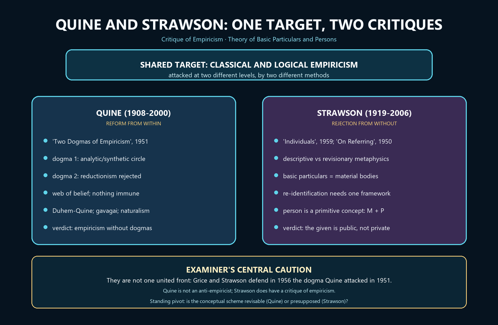

# Quine and Strawson — Learner-v2 Source-Complete Learning Session


> **Generation:** g2, 27 August 2026 · **Approval:** false pending explicit topic approval
>
> **Evidence discipline:** Complete legacy teaching and workbook material is preserved, reordered Basic-first/Advanced-last, and checked against the canonical owner and verified 2018–2025 PYQ ledger.


## BASIC LEARNING SESSION




*Concept map: one shared target, two different critiques — Quine reforms the epistemology of empiricism through holism, while Strawson rejects its private sense-datum starting point through basic particulars and persons.*

> **Syllabus (verbatim):** Quine and Strawson : Critique of Empiricism; Theory of Basic Particulars and Persons.

### How to Use This Five-Layer Session

Every logical subtopic follows exactly:

| Layer | Purpose |
|---:|---|
| 1. SIMPLE START | visual-first plain-language gateway |
| 2. CORE UPSC | complete terminology, doctrine, argument, example and source grounding |
| 3. ADVANCED | objections, replies, comparisons, interpretive issues and provenance cautions |
| 4. EXAM APPLICATION | verified PYQ routes and 10/15/20-mark architecture |
| 5. RAPID REVISION | traps, retrieval notes and links to the exact MCQ set |

### Source Audit and Contemporary-Link Boundary

- **Canonical doctrine source:** `upsc-ai-kit/knowledge/Philosophy/paper-1/western/Quine-Strawson.md` (8,968 words), sliced verbatim into the CORE UPSC layers (each canonical teaching passage exactly once) and preserved again, in full, in the canonical apparatus block.
- **Verified PYQs:** continuous local Western Philosophy Paper I bank, 2018-2025; Quine and Strawson own exactly **9** primary parts, with **none in 2022** (two each in 2018 and 2021).
- **Two projects kept distinct:** Quine supplies the **critique of empiricism** (analytic/synthetic, reductionism, holism, Duhem-Quine, radical translation, ontological commitment); Strawson supplies **basic particulars and persons** and a different, deeper critique of the empiricist starting point. Questions primarily owned by **Logical Positivism**, **Empiricism** and **Kant** are kept separate even where they overlap conceptually.
- **Provenance discipline (unusually important on this item):** dates and attributions are transcribed from the canonical source - "Two Dogmas of Empiricism" (*The Philosophical Review*, January **1951**); "To be is to be the value of a bound variable" from "On What There Is" (**1948**, not Two Dogmas); *Word and Object* (**1960**); "Ontological Relativity" and "Epistemology Naturalized" (**1968/69**); *Individuals* (**1959**); "On Referring" (**1950**); Grice and Strawson, "In Defence of a Dogma" (**1956**); *The Bounds of Sense* (**1966**); Duhem (**1906**); quantum logic proposed by **Birkhoff and von Neumann** (**1936**) and pressed as an empirical revision of logic by **Putnam** (**1968**); Quine's *Philosophy of Logic* (**1970**). "Putnam/Birkhoff" is never written as a joint proposal and the dates are never merged.
- **Contemporary-affairs boundary (deliberate):** a live search for the window **2026-02-19 to 2026-08-19** found **no sufficiently direct, verified institutional or major academic development** to anchor this topic. No current-affairs anchor is forced and **no institutional claim is invented**. The topic's exam relevance is **static and syllabus-driven**; where a present-day illustration is offered (theory-choice under anomaly, machine translation and reference, personhood in law and AI) it is marked as analytical (ANALYSIS) and carries no sourced factual claim.
- **OCR-searchable local PDFs:** `Robert.Audi_The.Cambridge.Dictionary.of.Philosophy.pdf`, `a_new_history_of_western_philosophy_volume_4.pdf` and `2016_Masih_A_critical_history_of_western_philosophy.pdf` were searched for Quine, Strawson, analytic, synonymy, holism, gavagai, basic particulars, persons and presupposition. They corroborate the Markdown owners on the two dogmas, the web of belief, descriptive metaphysics and the M/P-predicate argument, but they do not replace those owners.
- **Qdrant:** optional fallback only; not required for this canonical topic, and it never blocks the learning session.

**Preservation note:** the canonical doctrine is reorganised into layers, never compressed. Every doctrine, canonical quotation, numbered argument, section citation, objection/reply, comparison, corpus-depth delta, PYQ route, directive rule, graded verdict and provenance caution is retained; simplification means adding accessible gateways, not deleting complexity.

### Learning Roadmap

| Unit | Logical subtopic |
|---:|---|
| 1 | Two-Project Map - One Syllabus Heading, Two Philosophers, Two Different Critiques of Empiricism |
| 2 | Quine, Dogma 1 - The Analytic/Synthetic Distinction and the Circle of Synonymy |
| 3 | Quine, Dogma 2 and the Positive Doctrine - Reductionism Rejected, Confirmation Holism and the Web of Belief |
| 4 | The Duhem-Quine Thesis - Why No Single Hypothesis Faces Experience Alone |
| 5 | Radical Translation and 'Gavagai' - Inscrutability of Reference and Indeterminacy of Translation |
| 6 | Ontological Commitment, Naturalized Epistemology and Ontological Relativity - and Quine's Convergence with the Later Wittgenstein |
| 7 | Strawson's Basic Particulars - Material Bodies and the Single Spatio-Temporal Framework |
| 8 | Strawson's Persons - The Primitive Concept, M/P-Predicates, and the Block on Dualism |
| 9 | 'On Referring' versus Russell, and Strawson as a Critic of Empiricism |
| 10 | Synthesis - Quine versus Strawson, Their Convergences, and the Universal Answer Spine |

---

### SESSION 1 — One Syllabus Heading, Two Projects: Quine and Strawson as Distinct Critics of Empiricism

#### DEFINITION / WHAT THIS IS CALLED

**Plain-language definition:** The syllabus prints Quine and Strawson together because both criticise empiricism, but they are two different projects with two different targets, and treating them as one joint doctrine is the single commonest error on this item.

**Technical definition:** Willard Van Orman Quine (1908-2000) attacks the epistemology of classical and logical empiricism from inside it: 'Two Dogmas of Empiricism' (1951) dismantles the analytic/synthetic distinction and reductionism and replaces them with confirmation holism, so that Quine remains an empiricist, purified - 'empiricism without the dogmas'. Peter Frederick Strawson (1919-2006) attacks the starting point of empiricism from outside it: Individuals: An Essay in Descriptive Metaphysics (1959) argues that identification and re-identification of any particular presuppose a single public spatio-temporal framework of material bodies and persons, so the private momentary sense-datum cannot be the basic particular. They also clash directly: Grice and Strawson's 'In Defence of a Dogma' (1956) defends the very distinction Quine attacks.

#### VISUAL — One target, two critiques

```text

SHARED TARGET: classical and logical empiricism

                          |

        +-----------------+------------------+

        v                                    v

QUINE (1908-2000)                    STRAWSON (1919-2006)

'Two Dogmas of Empiricism' 1951      'Individuals' 1959

attacks the EPISTEMOLOGY             attacks the STARTING POINT

analytic/synthetic + reductionism    private momentary sense-data

positive: confirmation holism        positive: bodies and persons

RESULT: empiricism reformed          RESULT: empiricism rejected

NOT ONE FRONT: Grice and Strawson defend the dogma Quine attacks (1956)

```

*The shared enemy branches into two non-identical philosophical projects.*

#### VISUAL — Routing table for the nine owned PYQ parts

```text

| Stem signal                          | Owner    | Core mechanism        |

|--------------------------------------|----------|-----------------------|

| two dogmas / analytic-synthetic      | Quine    | circle of synonymy    |

| web of belief / affirm any sentence  | Quine    | confirmation holism   |

| a priori as article of faith         | Quine    | holism + naturalism   |

| empiricism without the dogmas        | Quine    | both dogmas + web     |

| basic particulars / spatio-temporal  | Strawson | re-identification     |

| person / primitive concept / dualism | Strawson | M- and P-predicates   |

| critique of empiricism, discuss      | BOTH     | two-level critique    |

```

*Decide the owner-thinker from the stem before writing a single line.*

#### ANSWER-GRABBING OPENING — WRITE/ADAPT IN THE EXAM

> The syllabus pairs two critics of empiricism who criticise it differently: Quine reforms its epistemology from within through holism, while Strawson rejects its private sense-datum starting point from without through basic particulars and persons.

#### MUST-WRITE KEYWORDS

- **critique of empiricism**
- **two dogmas**
- **confirmation holism**
- **empiricism without the dogmas**
- **descriptive metaphysics**
- **basic particulars**
- **person as primitive**
- **In Defence of a Dogma**

**How to use them:** Open with the shared critique of empiricism, split it into Quine's two dogmas and confirmation holism on one side and Strawson's descriptive metaphysics of basic particulars and person as primitive on the other, cite In Defence of a Dogma to show they are not allies, and only then narrow to the thinker the stem names.

#### CORE OBJECTION, REPLY AND RESIDUAL LIMIT

**Objection:** The pairing may look like an examiner's convenience rather than a philosophical unity, since the two men agree on almost no positive doctrine.

**Best reply:** The pairing is defensible as a problem-field rather than a thesis: both show that classical empiricism failed twice over, once about how theories are confirmed and once about how we so much as refer to anything.

**Residual limit:** The unity is in target and temper only; it must never be reported as agreement about analyticity, meaning, method or the revisability of the conceptual scheme.

#### EXAM USE AND CONCISE REVISION

**Answer architecture:** Use shared target -> two distinct critiques -> exact attribution -> the direct clash of 1956 -> a qualified two-project verdict.

- Quine attacks the epistemology of empiricism and stays an empiricist, purified.
- Strawson attacks the sense-datum starting point and is not an empiricist at all.
- Nine PYQ parts 2018-2025, none in 2022, two each in 2018 and 2021.
- Routing rule: dogmas, analytic/synthetic, web of belief, a priori-as-faith = Quine; person, basic particulars, spatio-temporal thinking = Strawson.

#### Visual gateway - one target, two opposite attacks

```text
   ONE SHARED TARGET: classical / logical empiricism
   =================================================
                          |
        +-----------------+---------------------+
        v                                       v
   QUINE (1908-2000)                       STRAWSON (1919-2006)
   "Two Dogmas of Empiricism" 1951         "Individuals" 1959; "On Referring" 1950
   ----------------------------            -------------------------------------
   attacks the EPISTEMOLOGY:               attacks the STARTING POINT:
   sentences do NOT face                   a conceptual scheme cannot be built
   experience one by one                   out of private, momentary sense-data
   ----------------------------            -------------------------------------
   Dogma 1: analytic/synthetic  X          descriptive (not revisionary)
   Dogma 2: reductionism        X            metaphysics
   POSITIVE: confirmation holism           BASIC PARTICULARS = material bodies
   "web of belief" - no statement            (re-identified in ONE space-time)
   immune to revision                      PERSON = a PRIMITIVE concept
   "to be = value of a bound                 (M-predicates + P-predicates)
   variable"                               -> blocks dualism AND no-ownership
   RESULT: empiricism WITHOUT              RESULT: the empiricist starting point
   the dogmas (reform from within)          rejected (not an empiricist at all)
```
Caption: one syllabus heading, two philosophers doing two different jobs. Quine purifies empiricism; Strawson refuses its foundational picture. Never merge them into a single "Quine-Strawson doctrine".

**Plain-language start:** The syllabus prints one line - "Quine and Strawson: Critique of Empiricism; Theory of Basic Particulars and Persons" - but it names two very different projects. **Quine** takes the empiricist's own tools and shows that two unquestioned assumptions ("dogmas") do not hold: there is no clean line between "true by meaning" and "true by fact", and no sentence is confirmed all on its own. His conclusion is not "empiricism is false" but "empiricism, done honestly, looks different" - a holistic web of belief. **Strawson** goes deeper in a different direction: he says the whole empiricist dream of building the world out of private flashes of sensation is impossible, because to identify anything at all you already need enduring public bodies in one shared space and time, and to have experiences at all you need the concept of a person. Read them as two answers, kept apart, and you already command the marks reserved for seeing the whole field.

| | **Quine** | **Strawson** |
|---|---|---|
| Key works | "Two Dogmas" (1951), *Word and Object* (1960) | *Individuals* (1959), "On Referring" (1950) |
| Method | naturalism; regiment science into logic | descriptive metaphysics; map our actual scheme |
| Critique of empiricism | internal reform (holism replaces atomism) | external attack on the sense-data starting point |
| Signature result | web of belief; no statement immune | material bodies and persons are basic |
| Relation to empiricism | *stays* an empiricist, purified | *not* an empiricist at all |

> MEMORY: Mnemonic - "Quine kills TWO dogmas; Strawson saves TWO Ps": Quine destroys the analytic/synthetic distinction and reductionism; Strawson makes **P**articulars (material bodies) and **P**ersons the irreducible basics.


> **Syllabus (verbatim):** Quine and Strawson : Critique of Empiricism; Theory of Basic Particulars and Persons. > **Evidence key:** ✅ canonical doctrine · ⚠️ analytical synthesis (mine, for exam use) · ❓ contested/uncertain > **Placement:** Two mid-20th-century analytic philosophers who turn analytic tools *against* empiricist/positivist orthodoxy. This owner carries 9 parts in 2018–2025, with no primary-owned part in 2022. Quine supplies critique of empiricism; Strawson supplies basic particulars and persons, now including spatio-temporal identification.

---

#### 0. ONE-SCREEN MAP ⚠️

```
═══════════════════════════════════════════════════════════════════
  QUINE (1908–2000)                       STRAWSON (1919–2006)
  ─────────────────                       ────────────────────
  "Two Dogmas of Empiricism" (1951)       Individuals (1959)
  ─────────────────────────────────       "On Referring" (1950)
                                          ─────────────────────
  DOGMA 1: analytic/synthetic distinction  DESCRIPTIVE METAPHYSICS
    → untenable (circle of synonymy)        vs revisionary metaphysics

  DOGMA 2: reductionism/verificationism   BASIC PARTICULARS =
    → untenable                             material bodies
                                            (re-identifiable in one
  POSITIVE: CONFIRMATION HOLISM             spatio-temporal framework)
    "web of belief" — no statement
    immune to revision                    PERSONS = primitive concept
                                            M-predicates + P-predicates
  "To be is to be the value of             → blocks dualism AND
   a bound variable"                        no-ownership theory

  Indeterminacy of translation            "On Referring" — presupposition
  Ontological relativity                    vs Russell's assertion of existence
═══════════════════════════════════════════════════════════════════
```

> 🔑 **Mnemonic — "Quine kills TWO dogmas; Strawson saves TWO Ps":** Quine → analytic/synthetic + reductionism destroyed. Strawson → **P**articulars (material bodies) + **P**ersons (primitive concept).

---

#### 1.1 Overview ✅

Quine attacks **two unquestioned dogmas** of logical empiricism (the Vienna Circle / Ayer / Carnap tradition):

| Dogma | Content | Why Quine calls it a dogma |
|---|---|---|
| **1. The analytic/synthetic distinction** | There is a principled, non-arbitrary line between statements true-by-meaning (analytic) and statements true-by-fact (synthetic) | The distinction cannot be non-circularly defined |
| **2. Reductionism (verificationism)** | Each meaningful statement is individually reducible to (confirmable/disconfirmable by) a range of sense-experience | Statements face experience *as a corporate body*, not individually |

#### CLOSING RECALL FLOW — One Syllabus Heading, Two Projects: Quine and Strawson as Distinct Critics of Empiricism

```closure-flow
SUBTOPIC: One Syllabus Heading, Two Projects: Quine and Strawson as Distinct Critics of Empiricism
STARTING CONCEPT: One Syllabus Heading, Two Projects: Quine and Strawson as Distinct Critics of Empiricism
KEY TERMS / DEFINITIONS: critique of empiricism | two dogmas | confirmation holism | empiricism without the dogmas | descriptive metaphysics | basic particulars | person as primitive | In Defence of a Dogma
MECHANISM / ARGUMENT: Classical and logical empiricism -> attacked at two different levels -> Quine reforms the theory of confirmation -> Strawson rejects the private given -> two verdicts that converge in temper but not in doctrine.
CONSEQUENCE / CONTRAST: The shared vocabulary of 'critique of empiricism' is exam-safe only when each half is attributed to the philosopher whose project gives it a determinate meaning.
UPSC TRAP / ANSWER-USE: Do not present Quine as an anti-empiricist, do not give Strawson no critique of empiricism at all, and do not describe the two as allies when Grice and Strawson explicitly defend the analytic/synthetic distinction against Quine.
ANSWER-GRABBING FORMULATION: The syllabus pairs two critics of empiricism who criticise it differently: Quine reforms its epistemology from within through holism, while Strawson rejects its private sense-datum starting point from without through basic particulars and persons.
```

### SESSION 2 — Quine's First Dogma: The Analytic/Synthetic Distinction and the Circle of Synonymy

#### DEFINITION / WHAT THIS IS CALLED

**Plain-language definition:** Logical empiricists split all meaningful statements into those true by meaning and those true by fact; Quine asks what 'analytic' actually means and finds that every explanation offered borrows a term that itself presupposes analyticity.

**Technical definition:** The first dogma is the belief in a principled, non-circular boundary between analytic statements, true by virtue of meaning alone, and synthetic statements, true by virtue of fact. Quine tests each candidate criterion in turn. Meaning is explained by synonymy; synonymy by definition, but a definition merely records an antecedent synonymy; or by interchangeability salva veritate, which secures synonymy only in a language already able to express necessity, and necessity is analyticity's cognate, so the criterion begs the question - in a purely extensional language 'creature with a heart' and 'creature with a kidney' are interchangeable yet not synonymous; or by Carnap's semantic rules, but 'semantic rule' is itself explained through 'analytic-in-L', which defines analytic-in-L0, analytic-in-L1 and never analytic as such. The circle closes. The conclusion is exact: there is no principled, non-circular boundary, so the difference is one of degree of centrality, not of kind.

#### VISUAL — The circle of synonymy

```text

ANALYTIC = 'true by virtue of MEANING'

        |

        v

MEANING -> requires SYNONYMY ('bachelor' = 'unmarried man')

        |

        +--> DEFINITION ............ only RECORDS a synonymy -> CIRCULAR

        |

        +--> INTERCHANGEABILITY salva veritate

        |         needs NECESSITY, a cognate of analyticity -> CIRCULAR

        |

        +--> SEMANTIC RULES (Carnap)

                  'semantic rule' defined via 'analytic-in-L' -> CIRCULAR

RESULT: no exit -> no principled non-circular boundary -> DEGREE, NOT KIND

```

*Every proposed criterion of analyticity re-enters the family it was meant to explain.*

#### VISUAL — Why interchangeability fails, in one line each

```text

| Route            | What it promises        | Why it fails             |

|------------------|-------------------------|--------------------------|

| Definition       | fixes synonymy          | reports a prior synonymy |

| Salva veritate   | substitution test       | needs intensional        |

|                  |                         | necessity = analyticity  |

| Extensional case | heart / kidney creature | interchangeable but not  |

|                  |                         | synonymous               |

| Semantic rules   | stipulated analyticity  | explains analytic-in-L,  |

|                  |                         | never analytic as such   |

```

*The salva veritate step is the link examiners most often see omitted.*

#### ANSWER-GRABBING OPENING — WRITE/ADAPT IN THE EXAM

> Quine does not deny that 'all bachelors are unmarried' looks analytic; he denies that the analytic/synthetic distinction can be given a non-circular criterion, so it is a difference of degree of centrality in the web, not a difference of kind.

#### MUST-WRITE KEYWORDS

- **analytic**
- **synthetic**
- **circle of synonymy**
- **synonymy**
- **definition records a prior synonymy**
- **interchangeability salva veritate**
- **semantic rules**
- **difference of degree, not of kind**

**How to use them:** Move from analytic and synthetic to the circle of synonymy, then show that a definition records a prior synonymy, that interchangeability salva veritate needs necessity, and that Carnap's semantic rules only explain analytic-in-L, before closing on a difference of degree, not of kind.

#### CORE OBJECTION, REPLY AND RESIDUAL LIMIT

**Objection:** Grice and Strawson, 'In Defence of a Dogma' (1956), reply that a distinction can be perfectly usable and pre-theoretically applied even without a reductive definition, so Quine sets an impossibly high bar.

**Best reply:** Quine's rejoinder is that ordinary usability is not theoretical legitimacy: many pre-theoretical distinctions such as witch and non-witch dissolve under scrutiny, and the burden lies on anyone who wants analyticity to carry philosophical weight.

**Residual limit:** The graded verdict is that Quine wins where the distinction was load-bearing and loses where it was merely useful, which is why it survives in ordinary semantics but never regained its foundational role.

#### EXAM USE AND CONCISE REVISION

**Answer architecture:** Use positivist division -> the circle with each link named -> the exact conclusion -> Grice and Strawson -> Quine's rejoinder -> graded verdict.

- Analytic = true by meaning; synthetic = true by fact; the boundary is the dogma.
- Circle chain: analytic - meaning - synonymy - definition - interchangeability - semantic rules - analytic.
- Definition only records an antecedent synonymy; it does not create one.
- Extensional interchangeability over-generates: heart and kidney creatures.
- Carnap's 'semantic rule' is understood only via 'analytic-in-L'.
- Provenance: The Philosophical Review, January 1951; revised in From a Logical Point of View, 1953.

#### Visual gateway - the circle that never breaks out

```text
   THE CIRCLE OF SYNONYMY - why "analytic" cannot be defined
   =========================================================
        +-----------------------------------------------+
        |                                               |
        v                                               |
   ANALYTIC = "true by virtue of MEANING"               |
        |                                               |
        v                                               |
   MEANING  -> needs SYNONYMY                            |
        |      ("bachelor" means "unmarried man")       |
        v                                               |
   SYNONYMY -> explained by DEFINITION                  |
        |      but a definition only RECORDS a synonymy |
        v                                               |
   or by INTERCHANGEABILITY salva veritate              |
        |      but that works only given NECESSITY,     |
        |      which presupposes analyticity            |
        v                                               |
   or by SEMANTIC RULES (Carnap)                        |
        |      but "semantic rule" is defined via       |
        |      "analytic-in-L"                          |
        +-----------------------------------------------+
             every road returns to the start = CIRCULAR
```
Caption: each attempt to explain "analytic" smuggles in one of its own cousins. No exit from the circle means no principled, non-circular boundary.

**Plain-language start:** Logical positivists split all meaningful statements in two. **Analytic** ones are "true by meaning" - "all bachelors are unmarried" - and you need no experience to check them. **Synthetic** ones are "true by fact" - "all bachelors are untidy" - and only experience settles them. Quine's move in the first half of "Two Dogmas" is quiet but lethal: he asks, *what exactly does "analytic" mean?* Every answer he is offered - meaning, synonymy, definition, substitution, semantic rules - turns out to lean on another member of the same family, so you go round in a circle and never reach solid ground. The careful conclusion is **not** "there are no analytic-seeming truths" and **not** "'all bachelors are unmarried' is false". It is that the *line* between analytic and synthetic cannot be drawn in a principled, non-circular way - it is a difference of **degree** (how central a belief is), not of **kind**.

> MEMORY: Circle chain to memorise - **A**nalytic -> **M**eaning -> **S**ynonymy -> **D**efinition -> **I**nterchangeability (salva veritate) -> **S**emantic rules -> back to Analytic. "A-M-S-D-I-S" runs the whole demolition in six links.


#### 1.2 Dogma 1 — The Analytic/Synthetic Distinction is Untenable ✅ (PYQ 2025, 2024, 2021, 2019)

**The Circle of Synonymy:**

Quine examines every candidate explanation of "analytic" and shows each presupposes another term that itself presupposes analyticity:

```
"Analytic" = true by virtue of meaning
    → What is "meaning"? → SYNONYMY ("bachelor" means "unmarried man")
        → What is synonymy? → DEFINITION (one term defined by another)
            → But definitions merely record pre-existing synonymies → CIRCULAR
        → Or: INTERCHANGEABILITY salva veritate (substituting one for the other
              preserves truth-value in all contexts)
            → Works only if we already have the notion of "necessity" or
              "analyticity" to distinguish extensional from intensional contexts → CIRCULAR
        → Or: SEMANTIC RULES (Carnap — analytic truths are those true according to
              the semantic rules of language L)
            → But "semantic rule" is itself defined in terms of "analytic truth in L" → CIRCULAR
```

**Conclusion:** No definition of "analytic" succeeds without covertly using one of its own cognates. The analytic/synthetic distinction is not a clear, principled boundary but a dogma held on faith. ✅

> ⚠️ **Exam Note:** Quine does NOT say there are no truths that *seem* analytic or that "All bachelors are unmarried" is false. He says the *distinction* between analytic and synthetic truths cannot be drawn in a principled, non-circular way — it is a difference of *degree* (centrality in the web), not of *kind*.

#### CLOSING RECALL FLOW — Quine's First Dogma: The Analytic/Synthetic Distinction and the Circle of Synonymy

```closure-flow
SUBTOPIC: Quine's First Dogma: The Analytic/Synthetic Distinction and the Circle of Synonymy
STARTING CONCEPT: Quine's First Dogma: The Analytic/Synthetic Distinction and the Circle of Synonymy
KEY TERMS / DEFINITIONS: analytic | synthetic | circle of synonymy | synonymy | definition records a prior synonymy | interchangeability salva veritate | semantic rules | difference of degree, not of kind
MECHANISM / ARGUMENT: Analytic -> meaning -> synonymy -> definition or interchangeability salva veritate or semantic rules -> each route presupposes analyticity -> the criterion is circular.
CONSEQUENCE / CONTRAST: With no principled boundary, the positivist meaning-criterion and the linguistic theory of necessity lose the foundation they were built on.
UPSC TRAP / ANSWER-USE: Do not write 'Quine proves that there are no analytic truths' or 'the distinction cannot be defined' flatly; the claim is the absence of a principled, non-circular criterion, not the denial of the appearance of analyticity.
ANSWER-GRABBING FORMULATION: Quine does not deny that 'all bachelors are unmarried' looks analytic; he denies that the analytic/synthetic distinction can be given a non-circular criterion, so it is a difference of degree of centrality in the web, not a difference of kind.
```

### SESSION 3 — Quine's Second Dogma and the Positive Doctrine: Reductionism Rejected and the Web of Belief

#### DEFINITION / WHAT THIS IS CALLED

**Plain-language definition:** The second dogma is the belief that each meaningful sentence carries its own private stock of confirming experiences and can be verified on its own; Quine replies that sentences meet experience only together, as one connected web.

**Technical definition:** Reductionism, the second dogma, is the assumption that every meaningful statement is individually reducible to, and confirmable by, a determinate range of sense-experience. Quine denies it: 'our statements about the external world face the tribunal of sense experience not individually but only as a corporate body.' The positive replacement is confirmation holism. Our total system of beliefs is a web, or a field of force, whose boundary conditions are experience: observation sentences lie at the periphery, physical theory further in, mathematics and logic deepest. A conflict at the edge shows only that the system must be revised somewhere, and we choose where on pragmatic grounds - simplicity, conservatism, generality and fecundity. Two doctrine-lines follow: 'any statement can be held true come what may, if we make drastic enough adjustments elsewhere in the system', and 'no statement is immune to revision', not even a law of logic.

#### VISUAL — The web of belief as a field of force

```text

  (o)   (o)   (o)   (o)   (o)   <- observation sentences at the PERIPHERY

    \     \     |     /     /

     [  physics, chemistry, biology  ]   <- revised fairly easily

          [   mathematics   ]            <- revised rarely

              [   LOGIC   ]              <- revised last, NOT immune

-----------------------------------------------------------------

CLASH AT THE EDGE -> revise SOMEWHERE -> but WE CHOOSE WHERE:

  fix a peripheral belief | plead hallucination | revise a deep law

DOCTRINE 1: any statement can be held true come what may

DOCTRINE 2: no statement is immune to revision

```

*Experience touches only the rim; the shock can be absorbed anywhere inside.*

#### VISUAL — Four consequences of holism

```text

| Consequence                  | Exact content                        |

|------------------------------|--------------------------------------|

| No analytic/synthetic line   | analytic = merely very central       |

| No a priori/a posteriori line| all belief revisable by experience   |

| Pragmatic theory-choice      | simplicity, conservatism, fecundity  |

| Meaning-criterion collapses  | verification needed individual test  |

```

*Each consequence is a separate mark; list them rather than gesturing at the metaphor.*

#### ANSWER-GRABBING OPENING — WRITE/ADAPT IN THE EXAM

> Confirmation holism replaces individual verification with a web of belief whose interior is protected by choice rather than by immunity, so any sentence may be saved and none is beyond revision, but only at a stated cost elsewhere in the system.

#### MUST-WRITE KEYWORDS

- **reductionism**
- **corporate body**
- **tribunal of sense experience**
- **confirmation holism**
- **web of belief**
- **field of force**
- **no statement is immune to revision**
- **minimum mutilation**

**How to use them:** State reductionism first and confirmation holism second as one argument: no individual confirmation, therefore statements meet the tribunal of sense experience as a corporate body, therefore the web of belief in which no statement is immune to revision, with minimum mutilation as the constraint.

#### CORE OBJECTION, REPLY AND RESIDUAL LIMIT

**Objection:** If every belief including logic is revisable, it is unclear what constrains rational belief at all, and holism can look like a licence for arbitrary theory-saving.

**Best reply:** Quine's later work concedes that logic and mathematics are revisable in principle but held fixed in practice, and that to 'deny' a law of logic is often merely to change the subject; minimum mutilation supplies the constraint.

**Residual limit:** The defensible position is that holism is right about confirmation and overstated about revisability, so entrenchment does real work that the slogan hides.

#### EXAM USE AND CONCISE REVISION

**Answer architecture:** Use dogma 2 stated -> corporate-body quotation -> web and periphery -> the two doctrine-lines -> consequences -> not relativism -> graded verdict.

- Dogma 2 is reductionism: individual verifiability of each sentence.
- Quotation: statements face the tribunal of sense experience as a corporate body.
- Periphery bends first, logic bends last, nothing is immune in principle.
- Theory-choice runs on simplicity, conservatism, generality and fecundity.
- Minimum mutilation is stated in Philosophy of Logic, 1970.
- The verification principle needed individual verifiability, so it collapses.

#### Visual gateway - the web / field of force

```text
   THE WEB OF BELIEF (a "field of force" whose boundary is experience)
   ==================================================================
   experience touches only the EDGE:
        (o)   (o)   (o)   (o)   (o)   <- observation sentences (periphery)
          \    \     |     /    /
           \    \    |    /    /
            [  physics, chemistry, biology  ]   <- revised fairly easily
                 [   mathematics   ]            <- revised rarely
                     [   LOGIC   ]              <- revised last, NOT immune
   ------------------------------------------------------------------
   a clash at the edge -> we must revise SOMEWHERE, but we CHOOSE where:
     * fix a nearby peripheral belief (easy), or * "plead hallucination" (revise the
       observation itself), or * in extremis, revise a deep interior law
   "any statement can be held true come what may" (adjust elsewhere)
   "no statement is immune to revision" (not even logic)
```
Caption: knowledge is one connected web, not a heap of separate sentence-to-experience pairs. Experience presses on the rim; the shock can be absorbed anywhere.

**Plain-language start:** The **second dogma** is *reductionism*: the belief that every meaningful sentence has its own private bundle of confirming or refuting experiences, so it can be verified all by itself. Quine says this never happens. A single hypothesis makes no testable prediction alone - it needs background theory, instrument assumptions and initial conditions - so when a prediction fails, logic tells you only that *something* in the whole package is wrong, not what. Hence his famous image: our beliefs form a **web** (or "field of force") that meets experience only at the edges. When something goes wrong at the rim, we can repair the web in many places, and we *choose* where on grounds of convenience. Two consequences follow, and they are the doctrine: **"any statement can be held true come what may"** if we adjust enough elsewhere, and **"no statement is immune to revision"** - not even a law of logic. That is confirmation **holism**, and it is what replaces the two dogmas.

> MEMORY: "PERIPHERY bends first, LOGIC bends last, NOTHING is unbendable." Peripheral observation sentences are revised first and most easily; logic and mathematics are revised last and only under extreme pressure - but never *in principle* immune.


#### 1.3 Dogma 2 — Reductionism ✅

The second dogma is the assumption that each individual statement has its own private stock of confirming or disconfirming experiences — that it can be "verified" (or refuted) in isolation.

Quine rejects this: **no statement has its meaning (or its confirmation conditions) in isolation from the rest of the system.** This is "reductionism" because it attempts to *reduce* the meaning of each sentence to a set of observation sentences. ✅

#### 1.4 Positive Doctrine: Confirmation Holism — The Web of Belief ✅ (PYQ 2025 Q4(b))

> ✅ *"Our statements about the external world face the tribunal of sense experience not individually but only as a corporate body."*

**The metaphor of the web (or field of force):**

- Our total system of beliefs is like a **web** or **field of force** whose boundary conditions are experience.
- Sensory experience touches only the **edges** (peripheral observational sentences).
- The **interior** contains more "theoretical" statements (physics, mathematics, logic) — farther from the edge.
- When experience conflicts with a prediction at the edge, we must **revise** somewhere in the web — but we have **choice** about where:
  - We can revise a nearby peripheral belief (easiest).
  - We can revise a deep interior belief (rare but possible — "even a law of logic might be revised").
  - We can "plead hallucination" — revise the observation statement itself.

> ✅ *"Any statement can be held true come what may, if we make drastic enough adjustments elsewhere in the system."* (The 2025 Q4(b) quotation.)

> ✅ *"Conversely, no statement is immune to revision."* — not even the laws of logic or mathematics. ✅

**Consequences:**

| Consequence | Explanation |
|---|---|
| No sharp analytic/synthetic line | "Analytic" truths (logic, maths) are simply those *very central* in the web — very unlikely to be revised, but not *in principle* immune |
| No sharp a priori/a posteriori line | All beliefs are revisable in the light of experience (even if remote from the periphery) |
| Pragmatism about theory-choice | When revision is needed, we choose on grounds of **simplicity, conservatism, fecundity** — pragmatic virtues, not algorithmic rules |
| Dissolution of positivism's meaning-criterion | If no statement is individually verifiable, the verification principle (which requires individual verifiability) collapses |

#### CLOSING RECALL FLOW — Quine's Second Dogma and the Positive Doctrine: Reductionism Rejected and the Web of Belief

```closure-flow
SUBTOPIC: Quine's Second Dogma and the Positive Doctrine: Reductionism Rejected and the Web of Belief
STARTING CONCEPT: Quine's Second Dogma and the Positive Doctrine: Reductionism Rejected and the Web of Belief
KEY TERMS / DEFINITIONS: reductionism | corporate body | tribunal of sense experience | confirmation holism | web of belief | field of force | no statement is immune to revision | minimum mutilation
MECHANISM / ARGUMENT: Individual confirmation is impossible -> statements face experience as a corporate body -> the web of belief -> revision is chosen, not dictated -> pragmatic virtues govern theory-choice.
CONSEQUENCE / CONTRAST: The analytic/synthetic and a priori/a posteriori lines both dissolve into gradients of entrenchment, and the positivist criterion of meaning collapses with them.
UPSC TRAP / ANSWER-USE: Do not read 'we can affirm the truth of any sentence' as relativism; the conditional clause about adjustments elsewhere is the doctrine, and the maxim of minimum mutilation makes wholesale revision irrational.
ANSWER-GRABBING FORMULATION: Confirmation holism replaces individual verification with a web of belief whose interior is protected by choice rather than by immunity, so any sentence may be saved and none is beyond revision, but only at a stated cost elsewhere in the system.
```

### SESSION 4 — The Duhem-Quine Thesis: Why No Single Hypothesis Faces Experience Alone

#### DEFINITION / WHAT THIS IS CALLED

**Plain-language definition:** A hypothesis predicts nothing by itself; it needs background theory, instrument assumptions and initial conditions, so a failed prediction condemns the whole package and logic never tells you which part to give up.

**Technical definition:** Let H be the hypothesis under test, A the auxiliary assumptions and O the observational prediction. The testable claim is (H and A) implies O. Observation reports not-O. By modus tollens all that follows is not-(H and A): H is false or some element of A is false, and logic does not say which. The choice is therefore not dictated by evidence, refutation is never conclusive against a single statement, and the criterion of individual verifiability has no application - the second dogma falls not to a counter-example but to a structural fact about testing. The two contributions must not be merged. Duhem, La Theorie physique (1906), restricts the thesis to theoretical physics, exempts logic and mathematics, and concludes that there is no experimentum crucis. Quine (1951) extends it to the whole of science, includes logic and mathematics, and derives underdetermination plus the collapse of verificationism.

#### VISUAL — The test chain that never names one culprit

```text

        ( H  &  A )  ------->  O        the observational prediction

                                 |

        observation reports    NOT-O

                                 |

        modus tollens   =>   NOT ( H & A )

                                 |

        i.e. H is false  OR  some element of A is false

                                 |

        LOGIC IS SILENT -> the choice is not dictated by the evidence

```

*Refutation lands on the conjunction, and the cut inside it is a choice.*

#### VISUAL — Two histories, one logic, opposite right answers

```text

URANUS anomaly  -> keep Newton, revise the auxiliary (an extra planet)

                -> NEPTUNE found, Le Verrier and Adams, 1846   [CORRECT]

MERCURY anomaly -> keep Newton, posit the planet 'VULCAN'

                -> VULCAN does not exist                        [WRONG]

                -> revise the DEEP law instead

                -> GENERAL RELATIVITY, 1915                     [CORRECT]

MORAL: identical logical situation, opposite correct responses, no rule

```

*Deploy the pair; Neptune alone makes holism look like a success story.*

#### VISUAL — Duhem and Quine are two theses under one label

```text

| Axis          | DUHEM (1906)              | QUINE (1951)             |

|---------------|---------------------------|--------------------------|

| Scope         | theoretical physics only  | the whole of science     |

| Logic / maths | exempt                    | included, none immune    |

| Corollary     | no experimentum crucis    | underdetermination       |

| Motive        | practice of physicists    | demolition of dogma 2    |

```

*The split is the most examinable precision on this subtopic.*

#### ANSWER-GRABBING OPENING — WRITE/ADAPT IN THE EXAM

> The Duhem-Quine thesis is the machinery behind holism: because the testable unit is a conjunction of hypothesis and auxiliaries, modus tollens condemns the conjunction and leaves the choice of revision to pragmatic judgement rather than to evidence.

#### MUST-WRITE KEYWORDS

- **auxiliary hypotheses**
- **modus tollens**
- **experimentum crucis**
- **underdetermination**
- **Neptune**
- **Vulcan**
- **protective belt**
- **hard core**

**How to use them:** Run modus tollens on the hypothesis plus its auxiliary hypotheses, then split Duhem's no experimentum crucis from Quine's underdetermination, and deploy Neptune and Vulcan together rather than Neptune alone.

#### CORE OBJECTION, REPLY AND RESIDUAL LIMIT

**Objection:** If no refutation is ever decisive, science appears unfalsifiable and any theory can be rescued by ad hoc adjustment.

**Best reply:** Popper answers that falsification is a methodological decision: scientists agree by convention to treat certain basic statements as unproblematic and to forbid ad hoc rescues that reduce testability; Lakatos converts this into research programmes with a protected hard core and a revisable protective belt.

**Residual limit:** Methodological rules restore rationality but they are conventions, so the underlying logical gap between evidence and single hypotheses is managed rather than closed.

#### EXAM USE AND CONCISE REVISION

**Answer architecture:** Use the numbered argument -> the Duhem/Quine split -> Neptune and Vulcan -> presuppositions -> Popper and Lakatos -> verdict.

- The testable unit is a conjunction, never a lone hypothesis.
- Duhem 1906: physics only, logic exempt, no experimentum crucis.
- Quine 1951: whole of science, logic included, underdetermination.
- Uranus anomaly -> revise the auxiliary -> Neptune found, Le Verrier and Adams, 1846.
- Mercury anomaly -> Vulcan fails -> revise the deep law -> general relativity, 1915.
- Presuppositions: confirmation relates evidence to theory; observation is theory-laden; pragmatic virtues are not evidence.

#### Visual gateway - the test chain that never points at one culprit

```text
   THE DUHEM-QUINE TEST CHAIN - why refutation is never decisive
   ============================================================
   To test a hypothesis H you must add auxiliaries A
   (background theory, instrument theory, initial conditions):

        ( H  &  A )  ->  O          (the observational prediction)
                     |
        observation reports   NOT-O
                     |
        modus tollens   =>   NOT ( H & A )
                     |
        i.e. H is false  OR  some element of A is false
                     |
        LOGIC DOES NOT SAY WHICH -> the choice is not dictated by evidence
   ------------------------------------------------------------
   Uranus anomaly : keep Newton, revise A (an extra planet) -> NEPTUNE found (1846)
   Mercury anomaly: keep Newton, posit planet "VULCAN" -> fails; revise the DEEP
                    law instead -> general relativity (1915)
   SAME logical situation, OPPOSITE correct responses, and no rule saying
   in advance which conjunct to give up.
```
Caption: because a prediction comes only from H *plus* a bundle of assumptions, a failed test condemns the whole bundle, never one sentence. This is the engine that drives holism.

**Plain-language start:** Why can "any statement be held true come what may"? The Duhem-Quine thesis is the machinery. No hypothesis predicts anything by itself; it needs helpers - background theories, assumptions about the apparatus, statements of the starting conditions. So the real prediction is "(hypothesis **and** helpers) implies observation". When the observation fails, plain logic tells you only that *something in the package* is false - not which thing. You are always free to save your favourite hypothesis by blaming a helper instead. The history of astronomy shows both moves: when Uranus misbehaved, scientists kept Newton and added a new planet - and found **Neptune**. When Mercury misbehaved they tried the same trick, invented a planet "**Vulcan**" - and this time were wrong; the correct fix was to give up the deep law and adopt **general relativity**. Same logic, opposite right answers, and no advance rule - which is exactly Quine's point.

> MEMORY: "H&A -> O; not-O kills the AND, not the H." The arrow of refutation lands on the conjunction, and you choose where inside it to cut.


#### 1.6 THE DUHEM–QUINE THESIS ✅ — the engine of holism, and the two halves of it

**Statement.** A scientific hypothesis is never confronted by experience **alone**. It generates testable predictions only in conjunction with auxiliary hypotheses, background theory, instrument theory and initial conditions. Therefore a failed prediction condemns only the **conjunction**, and logic alone never tells us which conjunct to give up.

**The two contributions — do not merge them ⚠️ (this is the most examinable precision on the sub-topic):**
| | **DUHEM** — *La Théorie physique: son objet, sa structure* (**1906**) | **QUINE** — "Two Dogmas of Empiricism" (**1951**) |
|---|---|---|
| **Scope** | **Physics only.** Duhem explicitly restricts the thesis to theoretical physics, and holds that physiology and certain other sciences *can* test hypotheses more nearly in isolation | **All of knowledge.** "The unit of empirical significance is **the whole of science**" |
| **Logic and mathematics** | **Exempt** — Duhem does not put them at risk | **Included** — "no statement is immune to revision," not even a law of logic |
| **Chief corollary** | There is no ***experimentum crucis*** — no crucial experiment can decisively refute one hypothesis and confirm its rival, since the rival's own auxiliaries are equally in play | **Underdetermination** of theory by all possible evidence, plus the collapse of the verification principle (which requires *individual* confirmability) |
| **Motive** | philosophy of physics; the practice of physicists | the demolition of the second dogma, reductionism |

**The argument, numbered:**
1. Let H be the hypothesis under test, A the auxiliary assumptions, and O the observational prediction. The testable claim is **(H & A) → O**. 2. Observation reports **¬O**.
3. By *modus tollens*, all that follows is **¬(H & A)** — i.e. H is false **or** some element of A is false. 4. Logic does not say which. The choice is therefore **not dictated by evidence**. 5. therefore refutation is never conclusive against a single statement — and, symmetrically, ✅ "**any statement can be held true come what may, if we make drastic enough adjustments elsewhere in the system**." 6. therefore the criterion of individual verifiability, on which the whole positivist programme rests, has no application. **The second dogma falls not to a counter-example but to a structural fact about testing.**

**Canonical historical example ✅ — Uranus and Neptune.** Anomalies in Uranus's orbit conflicted with Newtonian predictions. Astronomers did **not** abandon Newton's laws; they revised the auxiliary assumption about the number of planets, and **Neptune** was found (Le Verrier and Adams, 1846). The identical strategy applied to Mercury's perihelion produced the hypothesised planet **"Vulcan"** — which does not exist, and there the correct revision turned out to be the deep one: general relativity (1915). ⚠️ **The pair together is the perfect illustration**: the same logical situation, opposite correct responses, and no rule saying in advance which to choose. Deploy both, not just Neptune.

**Presuppositions ⚠️:** (P1) confirmation is a relation between evidence and *theory*, not evidence and *sentence*; (P2) there are no synthetic statements that are individually testable in isolation — even observation sentences carry theory; (P3) theory-choice is governed by pragmatic virtues (simplicity, conservatism, generality, fecundity) that are not themselves evidential.

**Popper's reply ❓:** he accepts the logical point entirely but denies its sceptical use. Falsification is not an automatic logical process but a **methodological decision**: scientists agree by convention to treat certain basic statements as unproblematic for the purposes of a test, and to forbid *ad hoc* rescues that reduce a theory's testability. Rationality is preserved by rules of method, not by logic alone. **Lakatos** develops this into research programmes with a protected "hard core" and a revisable "protective belt" — which is Duhem–Quine turned into a *criterion of progress*.

#### CLOSING RECALL FLOW — The Duhem-Quine Thesis: Why No Single Hypothesis Faces Experience Alone

```closure-flow
SUBTOPIC: The Duhem-Quine Thesis: Why No Single Hypothesis Faces Experience Alone
STARTING CONCEPT: The Duhem-Quine Thesis: Why No Single Hypothesis Faces Experience Alone
KEY TERMS / DEFINITIONS: auxiliary hypotheses | modus tollens | experimentum crucis | underdetermination | Neptune | Vulcan | protective belt | hard core
MECHANISM / ARGUMENT: (H and A) implies O -> observation gives not-O -> modus tollens yields not-(H and A) -> logic is silent on the conjunct -> revision is a pragmatic choice -> individual verifiability has no application.
CONSEQUENCE / CONTRAST: The same logical situation permits opposite correct responses, which is exactly why no rule can be given in advance for which conjunct to surrender.
UPSC TRAP / ANSWER-USE: Do not merge Duhem and Quine into one thesis, and do not present Popper as denying the logical point; Popper accepts it and denies only its sceptical use.
ANSWER-GRABBING FORMULATION: The Duhem-Quine thesis is the machinery behind holism: because the testable unit is a conjunction of hypothesis and auxiliaries, modus tollens condemns the conjunction and leaves the choice of revision to pragmatic judgement rather than to evidence.
```

### SESSION 5 — Radical Translation and Gavagai: Inscrutability of Reference and Indeterminacy of Translation

#### DEFINITION / WHAT THIS IS CALLED

**Plain-language definition:** A field linguist with no dictionary and no interpreter has only stimulation and assent to work with; when a rabbit runs past and the native says 'Gavagai', several rival translations fit exactly the same evidence and nothing decides between them.

**Technical definition:** Radical translation is translation of a language with no known relation to any other, where the only evidence is what speakers are exposed to and what they assent to or dissent from. The technical vocabulary is exact: stimulus meaning is the class of stimulations prompting assent paired with those prompting dissent; an occasion sentence commands assent only when freshly prompted, a standing sentence does not; an observation sentence is an occasion sentence whose stimulus meaning is constant across speakers, and it is the only secure place for translation; analytical hypotheses are the linguist's posited segmentation into words and grammar, projected beyond the observational base and determined by no evidence. 'Gavagai' is equally compatible with rabbit, undetached rabbit-parts, a temporal stage of a rabbit, rabbithood, and the feature-placing 'it is rabbiting'. Asking 'is this the same gavagai?' presupposes the identity predicate, articles, plurals and quantifiers - the whole apparatus of individuation, which is exactly what is in dispute. Hence inscrutability of reference, then indeterminacy of translation, then ontological relativity.

#### VISUAL — The Gavagai translation tree

```text

a rabbit runs past; the native says 'Gavagai'; the linguist notes assent

                              |

  +---------+-----------+-----------+--------------+

  v         v           v           v              v

'Rabbit'  'undetached  'a temporal 'rabbithood'  'it is rabbiting'

           rabbit-      stage of a  (universal     (feature-placing,

           parts'       rabbit'      instantiated)  NO object at all)

  \_________\___________|___________/______________/

                              |

  ASK 'same gavagai?' -> needs IDENTITY PREDICATE + articles + plurals

                      -> the APPARATUS OF INDIVIDUATION is in dispute

```

*All five readings share one stimulus meaning, so the evidence cannot choose.*

#### VISUAL — From inscrutability to ontological relativity

```text

INSCRUTABILITY OF REFERENCE

   no fact about what the native TERMS refer to

              |

              v

INDETERMINACY OF TRANSLATION

   rival ANALYTICAL HYPOTHESES agree on all observation sentences

   yet translate the rest non-equivalently; no fact decides

              |

              v

ONTOLOGICAL RELATIVITY

   'to be is to be the value of a bound variable' holds only

   relative to a background manual; at home we take our tongue at face value

```

*Three results in order; do not collapse them into a single claim.*

#### ANSWER-GRABBING OPENING — WRITE/ADAPT IN THE EXAM

> Gavagai is not a curiosity but the constructive completion of Two Dogmas: the circle showed that analyticity cannot be defined, and radical translation shows why, because there are no determinate meanings for a definition to capture.

#### MUST-WRITE KEYWORDS

- **radical translation**
- **stimulus meaning**
- **observation sentence**
- **analytical hypotheses**
- **apparatus of individuation**
- **inscrutability of reference**
- **indeterminacy of translation**
- **ontological relativity**

**How to use them:** Set up radical translation with stimulus meaning and the observation sentence, show that the apparatus of individuation is undetermined, and derive inscrutability of reference and then indeterminacy of translation from rival analytical hypotheses before closing on ontological relativity.

#### CORE OBJECTION, REPLY AND RESIDUAL LIMIT

**Objection:** Chomsky objects that indeterminacy is only the ordinary underdetermination of theory by evidence, which afflicts physics too, so a realist about physics should be a realist about meaning.

**Best reply:** Quine replies that the cases are asymmetric: in physics there is a fact our theories imperfectly track, whereas in translation there is nothing beyond dispositions to verbal behaviour for a manual to be right about.

**Residual limit:** Whether that asymmetry can be defended without begging the question is the central dispute; Davidson's radical interpretation accepts indeterminacy but confines it to something like a choice of measurement scale, real but harmless.

#### EXAM USE AND CONCISE REVISION

**Answer architecture:** Use the set-up -> the rival readings -> the identity move -> the two results -> the three premises -> Chomsky and Davidson -> a ruling.

- Source: Word and Object, 1960, chapter 2.
- Rivals sharing one stimulus meaning: rabbit, undetached rabbit-parts, rabbit-stage, rabbithood, 'it is rabbiting'.
- P1 behaviourism about the evidence; P2 verificationism about facts; P3 naturalism.
- The irony: the verification principle is dropped as a theory of meaning and kept as a criterion of factuality.
- Ontological relativity: at home we acquiesce in our mother tongue.

#### Visual gateway - the Gavagai translation tree

```text
   RADICAL TRANSLATION - the "Gavagai" tree (Word and Object, 1960, ch. 2)
   ======================================================================
   a rabbit runs past; the native says "Gavagai"; the linguist notes assent
                               |
     +----------+----------+----------+-------------+
     v          v          v          v             v
  "Rabbit"  "undetached  "a temporal "rabbithood"  "it is rabbiting"
             rabbit-      stage of a  (a universal   (feature-placing,
             parts"       rabbit"      instantiated)  NO object at all)
     \__________\__________|__________/_____________/
                           |
   all fit the SAME stimulus meaning -> the evidence cannot decide between them
                           |
   Can the linguist just ASK "is this gavagai the same as that one?"  NO:
   that needs the IDENTITY predicate + articles + plurals + quantifiers =
   the whole APPARATUS OF INDIVIDUATION - which is exactly what is in dispute
                           |
        +------------------+-------------------+
        v                                      v
   INSCRUTABILITY OF REFERENCE           INDETERMINACY OF TRANSLATION
   (no fact about what the terms          (rival manuals agree on all
    refer to)                              observation sentences, differ
                                           elsewhere; no fact which is right)
                           |
   => there are no determinate MEANINGS; synonymy has no behavioural anchor;
      ONTOLOGICAL RELATIVITY (reference fixed only relative to a background
      manual; "at home" we take our own tongue at face value)
```
Caption: Gavagai is not a curiosity - it is the constructive completion of "Two Dogmas". The circle argument showed analyticity cannot be *defined*; radical translation shows *why* - there are no determinate meanings to capture.

**Plain-language start:** Imagine a linguist landing among people whose language has no known relation to any other - no dictionary, no interpreter. This is **radical translation**, and the only evidence is what speakers are exposed to and what they assent to. A rabbit runs by, the native says "**Gavagai**", and you jot down "Rabbit". But wait: the very same situation would prompt "undetached rabbit-parts", or "a passing rabbit-stage", or "rabbithood", or even "it's rabbiting" (with no object at all). Every one of these fits the *same* evidence. Could you not just ask "is this the same gavagai as that?" No - because that question already needs their words for "same", "a", "one", "many", and those are precisely what you are trying to work out. So the reference of their terms is **inscrutable**, and rival translation manuals that agree on all the observable data can still disagree elsewhere with **no fact of the matter** deciding between them. That is the **indeterminacy of translation**, and it finishes the demolition of "meaning" begun in the first half of the paper.

> MEMORY: "SAME stimulus, MANY manuals, NO fact." One stimulus meaning is shared by rival translations; nothing in behaviour picks a winner; so there is no determinate meaning or reference.


#### 1.7 RADICAL TRANSLATION AND "GAVAGAI" ✅ (*Word and Object*, 1960, ch. 2)

**The thought-experiment.** A field linguist enters a community whose language has no known relation to any other. He has no dictionary, no bilingual informant, no shared script — this is **radical translation**. His only evidence is what the natives are exposed to and what they assent to or dissent from.

**Exact printed subterms** (use them; each is a distinct technical device):
| Term | Meaning |
|---|---|
| **Stimulus meaning** | The class of stimulations that would prompt **assent** to a sentence, paired with the class that would prompt **dissent** |
| **Occasion sentence** vs **standing sentence** | Assent commanded only when freshly prompted ("Gavagai," "It's raining") vs assent that persists without prompting ("Copper conducts electricity") |
| **Observation sentence** | An occasion sentence whose stimulus meaning is **constant across speakers** of the community — the only place translation is secure |
| **Analytical hypotheses** | The linguist's posited segmentation of native sentences into words and grammatical apparatus, projected beyond the observational base. **These are not determined by any evidence.** |
| **Inscrutability of reference** | Even with translation of whole sentences fixed, the *reference of the terms inside them* remains undetermined |

**The argument, numbered ✅:**
1. A rabbit runs past; the native utters "**Gavagai**." The linguist notes assent under rabbit-stimulation and records the tentative translation "**Rabbit**."
2. But the same stimulus meaning is equally compatible with:
   - "**undetached rabbit-parts**" — wherever a rabbit is present, undetached rabbit-parts are present, and conversely; - "**a temporal stage of a rabbit**" — likewise co-extensive; - "**rabbithood**" (an instantiation of the universal) — likewise; - "**it's rabbiting**" (a feature-placing sentence with no object at all).
3. Could the linguist not simply *ask*? "Is this gavagai the same as that one?" — **No.** That question requires him to have already translated the **identity predicate**, the articles, plurals and quantifiers — i.e. the entire **apparatus of individuation**, which differs across languages and is exactly what is in dispute.
4. Any evidence he collects can be accommodated by compensating adjustments elsewhere in the manual: a different translation of "gavagai" can be offset by a different translation of "same," and the two manuals will predict identical behaviour throughout.
5. therefore **Inscrutability of reference:** there is no fact of the matter about what the native's terms refer to. 6. Extending upward from terms to sentences: rival **analytical hypotheses** can generate manuals that agree on all observation sentences yet translate theoretical and non-observational sentences into non-equivalent English. 7. therefore **Indeterminacy of translation:** there is no fact of the matter about which manual is correct — not because we cannot tell, but because **there is nothing further to be right or wrong about**. 8. therefore there are no determinate **meanings** as entities; synonymy has no behavioural anchor; and the first dogma's key notion is left without foundation. **Gavagai is therefore not a curiosity but the constructive completion of "Two Dogmas."**
9. therefore **Ontological relativity:** "to be is to be the value of a bound variable" holds only relative to a manual of translation; asking what a theory is *really* about, absolutely, is asking a question with no answer. Reference is fixed only relative to a background language — and for our own language we take it at face value ("**at home**," Quine says, we acquiesce in our mother tongue).

**Presuppositions ⚠️ (state these — they are where every objection enters):**
- **P1 — Behaviourism about the *evidence*.** ✅ Quine's own formulation: in psychology one may or may not be a behaviourist, but **in linguistics one has no choice**, since language is learned wholly from publicly observable behaviour.
- **P2 — Verificationism about *facts*.** If two hypotheses differ in no possible evidence, there is no fact distinguishing them. ⚠️ **Note the irony**: Quine dismantles the verification principle as a theory of *meaning* and retains it as a criterion of *factuality*. Pointing this out is a genuinely advanced observation.
- **P3 — Naturalism.** There is no first-philosophy standpoint from which to certify meanings; physics fixes what facts there are.

**Strongest objections → replies ❓:**
| Objection | Source | Quine's reply | Residual |
|---|---|---|---|
| Indeterminacy is nothing but the ordinary **underdetermination of theory by evidence**, which afflicts physics too. If Quine is a realist about physics despite underdetermination, he must be a realist about meaning. | **Chomsky** | The cases differ: in physics there *is* a fact of the matter that our theories imperfectly track; in translation there is **nothing beyond dispositions to verbal behaviour** for a manual to be right about. | ⚠️ Whether this asymmetry can be defended without begging the question is the central dispute. **Name it and take a side.** |
| The argument proves too much: applied reflexively it entails that **I do not determinately know what I mean by my own words** — which is absurd. | Searle; Evans | Quine accepts a version of this: at home we simply acquiesce in our mother tongue; the "first-person" case has no privileged status, only a default one. | ⚠️ Many find the bullet too large to bite. |
| Innate constraints on possible grammars (universal grammar) would cut down the space of admissible manuals. | **Chomsky** | Even so, the residual manuals would still be behaviourally equivalent; innateness restricts candidates, it does not create a fact of the matter. | ❓ Genuinely open. |
| Radical **interpretation** shows more determinacy than Quine allows, once charity and a truth-theory are built in. | **Davidson** | Davidson accepts indeterminacy but confines it to something like the choice of measurement scale (Fahrenheit vs Celsius) — real but harmless. | ⚠️ The most influential softening; worth one sentence. |

**Executable verdict:** "Gavagai is the constructive half of Quine's critique: 'Two Dogmas' showed that analyticity could not be defined, and radical translation shows *why* — there are no determinate meanings for a definition to capture. The argument's force is exactly proportional to its behaviourist premise, and Chomsky's objection identifies the pressure point precisely. What survives even if one rejects the premise is the negative result: nothing in observable use fixes reference uniquely, so any theory of meaning owing everything to use owes an account of individuation it has not given."

#### CLOSING RECALL FLOW — Radical Translation and Gavagai: Inscrutability of Reference and Indeterminacy of Translation

```closure-flow
SUBTOPIC: Radical Translation and Gavagai: Inscrutability of Reference and Indeterminacy of Translation
STARTING CONCEPT: Radical Translation and Gavagai: Inscrutability of Reference and Indeterminacy of Translation
KEY TERMS / DEFINITIONS: radical translation | stimulus meaning | observation sentence | analytical hypotheses | apparatus of individuation | inscrutability of reference | indeterminacy of translation | ontological relativity
MECHANISM / ARGUMENT: One stimulus meaning -> several rival term-translations -> the identity question presupposes individuation -> reference is inscrutable -> rival manuals agree on all observation sentences -> translation is indeterminate -> reference is theory-relative.
CONSEQUENCE / CONTRAST: There are no determinate meanings as entities, synonymy has no behavioural anchor, and the first dogma's key notion is left without foundation.
UPSC TRAP / ANSWER-USE: Do not say indeterminacy means we cannot tell which manual is right; Quine's claim is that there is nothing further to be right or wrong about.
ANSWER-GRABBING FORMULATION: Gavagai is not a curiosity but the constructive completion of Two Dogmas: the circle showed that analyticity cannot be defined, and radical translation shows why, because there are no determinate meanings for a definition to capture.
```

### SESSION 6 — Ontological Commitment, Naturalized Epistemology and Empiricism Without the Dogmas

#### DEFINITION / WHAT THIS IS CALLED

**Plain-language definition:** Once meanings and a sharp a priori are gone, Quine still owes answers to what there is and how we know; he reads ontology off the quantifiers of our best science and turns epistemology into a branch of natural science.

**Technical definition:** Ontological commitment is a criterion, not a metaphysics: 'to be is to be the value of a bound variable', from 'On What There Is' (1948) and not from 'Two Dogmas'. A theory is committed to whatever its existential quantifiers must range over if it is true, so ontology is settled by regimenting our best science into first-order logic and auditing its variables. Because commitment depends on the chosen regimentation and reference is fixed only relative to a background language, ontological relativity follows. Naturalized epistemology reverses the traditional order: philosophy is not the a priori tribunal of science but continuous with it, 'a chapter of psychology' ('Epistemology Naturalized', in Ontological Relativity and Other Essays, 1968/69), studying how sensory input yields theoretical output. Quine's relation to empiricism is therefore internal reform, not rejection: empiricism without the dogmas retains experience as the governor of belief, but holistically rather than sentence by sentence. Without shared method he converges with the later Wittgenstein on the impossibility of determinate private meanings, though Quine reforms language by regimentation while Wittgenstein describes it as being in order as it is.

#### VISUAL — Reading being off our best science

```text

ONTOLOGICAL COMMITMENT   'to be is to be the value of a bound variable' (1948)

   a theory asserting  (there exists x)(x is an electron)

   is committed to electrons

        |

   regiment best science into first-order logic and read off the variables

        |

   +----+------------------------------+

   v                                   v

NATURALIZED EPISTEMOLOGY          ONTOLOGICAL RELATIVITY

philosophy continuous with        commitment depends on the chosen

science, 'a chapter of            regimentation and background language;

psychology' (1968/69)             no God's-eye 'what really exists?'

```

*Ontology becomes an audit of quantifiers rather than a contest of intuitions.*

#### VISUAL — Quine and the later Wittgenstein: convergence without contact

```text

| Axis              | Quine                   | Later Wittgenstein      |

|-------------------|-------------------------|-------------------------|

| Target            | museum myth of meaning  | Augustinian picture     |

| Positive account  | dispositions to verbal  | meaning is use in a     |

|                   | behaviour in a theory   | language-game           |

| Anti-foundational | Neurath's boat          | 'my spade is turned'    |

| Method            | reforms by regimentation| describes ordinary use  |

```

*Two methods, no influence, one negative result about private meaning.*

#### ANSWER-GRABBING OPENING — WRITE/ADAPT IN THE EXAM

> Quine does not reject empiricism but purifies it: experience still governs belief, yet only holistically, ontology is read off regimented science, and epistemology becomes a chapter of natural science rather than its a priori foundation.

#### MUST-WRITE KEYWORDS

- **ontological commitment**
- **bound variable**
- **regimentation**
- **naturalized epistemology**
- **ontological relativity**
- **empiricism without the dogmas**
- **museum myth**
- **Neurath's boat**

**How to use them:** State ontological commitment through the bound variable before the slogan, date naturalized epistemology and ontological relativity correctly, and close on empiricism without the dogmas, using the museum myth and Neurath's boat only as a one-sentence bridge to the later Wittgenstein.

#### CORE OBJECTION, REPLY AND RESIDUAL LIMIT

**Objection:** If philosophy is continuous with science, naturalized epistemology can look circular, using science to validate the very science whose credentials are in question.

**Best reply:** Quine accepts the circle and denies that it is vicious: there is no dry dock outside our theory, only Neurath's boat rebuilt plank by plank at sea, so reciprocal containment of epistemology and science is the honest position.

**Residual limit:** The reply saves naturalism from incoherence but does not answer the normative question of why the resulting method is justified rather than merely ours.

#### EXAM USE AND CONCISE REVISION

**Answer architecture:** Use commitment as a criterion -> relativity -> naturalised epistemology -> the a priori charge -> empiricism without the dogmas -> the Wittgenstein bridge.

- 'To be is to be the value of a bound variable' - On What There Is, 1948.
- Naturalized epistemology: a chapter of psychology, 1968/69.
- Ontological relativity: reference fixed only relative to a background language.
- Convergence with the later Wittgenstein against the museum myth and the Augustinian picture; Neurath's boat versus 'my spade is turned'.
- They part on method: Quine reforms by regimentation, Wittgenstein describes.
- Empiricism without the dogmas is the 2021 stem's exact phrase.

#### Visual gateway - reading being off our best science

```text
   QUINE'S ONTOLOGY AND NATURALISM
   ===============================
   ONTOLOGICAL COMMITMENT
   "to be is to be the value of a bound variable"  (On What There Is, 1948)
        a theory that says  (there exists x)(x is an electron)
        is committed to electrons
        -> read ontology off the LOGICAL FORM of our best science, not intuition
                               |
        +----------------------+----------------------+
        v                                             v
   NATURALIZED EPISTEMOLOGY                   ONTOLOGICAL RELATIVITY
   philosophy is continuous with science -    what a theory is "about" is
   "a chapter of psychology"; it studies      relative to a background language;
   how sensory input yields theory,           there is no God's-eye "what really
   using science's own tools                  exists?"; only theory-relative answers
   -----------------------------------------------------------------------
   CONVERGENCE (no shared method): Quine's holism / behaviour <-> later
   Wittgenstein's meaning-as-USE; both deny determinate PRIVATE meanings
   WHERE THEY PART: Quine REFORMS language (regimentation into logic);
                    Wittgenstein DESCRIBES it ("in order as it is")
   -----------------------------------------------------------------------
   Quine's empiricism is NOT rejected: "empiricism WITHOUT the dogmas" -
   experience still governs belief, but holistically, not sentence-by-sentence
```
Caption: once meanings and the a priori are gone, "what exists?" becomes an audit of the quantifiers of our best theory - and epistemology becomes a branch of natural science.

**Plain-language start:** After the two dogmas fall, Quine still owes us positive answers to "what is there?" and "how do we know?". His answer to the first is deflationary and precise: a theory is committed to exactly those things it has to say **exist** in order to be true - the things its "there exists ..." quantifiers range over. So you settle ontology by regimenting your best science into logic and reading off its variables, not by metaphysical intuition. His answer to the second is **naturalized epistemology**: stop looking for an *a priori* foundation *outside* science; study knowing as a natural process - how sensory input produces theoretical output - using science itself. And because reference is fixed only relative to a background language (**ontological relativity**), there is no absolute "what really exists?", only theory-relative answers. A striking bonus: with no shared method, Quine and the **later Wittgenstein** arrive at the same negative result - there are no determinate private meanings - Quine by asking what evidence could fix meaning, Wittgenstein by asking what could count as following a rule.

> MEMORY: "COMMIT to your quantifiers, NATURALISE your knowing, RELATIVISE your reference." Three Quinean positives - ontological commitment, naturalized epistemology, ontological relativity.


#### 1.5 Further Quinean Doctrines (Brief — For Exam Enrichment) ⚠️

**Ontological commitment — "To be is to be the value of a bound variable":**

We are committed to the existence of those entities that our best theory *quantifies over*. If a theory says "there exists x (x is an electron)," it is committed to the existence of electrons. Ontology is read off the *logical* form of our best science, not from metaphysical intuition. ⚠️

**Indeterminacy of translation:**

There is no *fact of the matter* about which translation of a foreign sentence into English is "correct." Multiple incompatible translation manuals can fit all possible behavioural evidence equally well. This reinforces the attack on determinate "meanings" and "synonymy." ⚠️ — **fully reconstructed at §1.7 below.**

**Ontological relativity:**

What objects a theory is "about" is relative to the background language/theory in which we interpret it. There is no God's-eye-view point from which to ask "What really exists?" — only theory-relative answers. ⚠️

**Naturalized epistemology:**

Philosophy is not the *a priori* foundation of science; it is continuous with science — "a chapter of psychology." Epistemology studies how sensory input leads to theoretical output, using the tools of science itself. ⚠️

#### 1.8 QUINE ↔ LATER WITTGENSTEIN — the holism/use convergence ⚠️ (high-value, rarely written)

Two traditions, no direct influence, and a striking convergence — a bridge that lifts any answer on either thinker:

| Axis | **Quine** | **Later Wittgenstein** |
|---|---|---|
| **Target** | the museum myth of meaning — words as labels on determinate mental objects | the Augustinian picture — words as names of objects |
| **Positive account** | meaning is **dispositions to verbal behaviour** within a total theory | meaning is **use** within a language-game and a form of life |
| **Holism** | the unit of empirical significance is **the whole of science**; sentences do not face experience singly | a word has meaning only within the **practice**; "to understand a sentence is to understand a language" |
| **Anti-foundationalism** | **Neurath's boat** — rebuild at sea, no dry dock | bedrock is reached where "**my spade is turned**" (PI §217): explanation ends in what we do |
| **Rejection of the private** | the indeterminacy argument permits nothing beyond public behaviour to fix meaning | the private-language argument shows nothing private *can* fix meaning |
| **Method** | epistemology **naturalised** — continuous with science | philosophy as **therapy** — description, not theory |
| **Where they part** | ⚠️ **Decisively:** Quine wants a *scientific* account of language and accepts regimentation into canonical notation — he **reforms** language | Wittgenstein forbids theory-construction and holds that ordinary language "is in order as it is" (PI §98) — he **describes** it |

> ⚠️ **The observation to make:** both arrive at the impossibility of determinate private meanings from opposite directions — Quine by asking what evidence *could* fix meaning, Wittgenstein by asking what could count as a *rule*. That two philosophers with no shared method reach the same negative result is the strongest available evidence that the referential/mentalistic theory of meaning is what fails, and not one particular argument against it. See `Later-Wittgenstein.md` §§4–5 and `Logical-Positivism.md` §P for the Neurath link.

#### 1.9 Quine's Relation to Empiricism ⚠️

> ⚠️ Quine does NOT *reject* empiricism. He reforms it: **empiricism without the dogmas** = a holistic empiricism where experience still governs belief, but not statement-by-statement. He is a *more consistent* empiricist who abandons the myths that plagued the Vienna Circle. This is why the syllabus calls it a "critique of empiricism" — it is an *internal* reform, not an external attack.

---

#### CLOSING RECALL FLOW — Ontological Commitment, Naturalized Epistemology and Empiricism Without the Dogmas

```closure-flow
SUBTOPIC: Ontological Commitment, Naturalized Epistemology and Empiricism Without the Dogmas
STARTING CONCEPT: Ontological Commitment, Naturalized Epistemology and Empiricism Without the Dogmas
KEY TERMS / DEFINITIONS: ontological commitment | bound variable | regimentation | naturalized epistemology | ontological relativity | empiricism without the dogmas | museum myth | Neurath's boat
MECHANISM / ARGUMENT: Dogmas fall -> a positive system is owed -> quantifiers fix commitment -> regimentation makes commitment theory-relative -> epistemology is naturalised -> empiricism survives in holistic form.
CONSEQUENCE / CONTRAST: The a priori loses any principled status: with no non-circular analyticity, universal revisability and no first-philosophy tribunal, treating a belief as a priori becomes a metaphysical article of faith.
UPSC TRAP / ANSWER-USE: Do not date the bound-variable slogan to 'Two Dogmas', do not date naturalized epistemology to 1951, and do not describe Quine as an anti-empiricist.
ANSWER-GRABBING FORMULATION: Quine does not reject empiricism but purifies it: experience still governs belief, yet only holistically, ontology is read off regimented science, and epistemology becomes a chapter of natural science rather than its a priori foundation.
```

### SESSION 7 — Strawson's Basic Particulars: Descriptive Metaphysics, Material Bodies and Re-identification

#### DEFINITION / WHAT THIS IS CALLED

**Plain-language definition:** Strawson's descriptive metaphysics asks what conceptual scheme we cannot help using, and within it asks which particulars are basic - the material bodies we can single out and re-identify without first identifying anything else.

**Technical definition:** Descriptive metaphysics is content to describe the actual structure of our thought about the world; revisionary metaphysics is concerned to produce a better structure. Descartes, Leibniz and Berkeley are revisionary; Aristotle and Kant are the great descriptive metaphysicians, which is why Individuals (1959) carries the subtitle An Essay in Descriptive Metaphysics. A basic particular is one that can be identified without first identifying anything else. Strawson's argument from re-identification runs: to use a scheme of objective particulars I must be able to re-identify a particular as the same one again; re-identification requires a single unified spatio-temporal system in which a thing traces a continuous path; material bodies, being three-dimensional, relatively enduring and publicly located, are what constitute that system; other categories - events, processes, private experiences, theoretical particles - are identified only by reference to bodies; therefore material bodies are basic. The claim is one of conceptual dependence, not of causal or metaphysical priority, and the purely auditory no-space world confirms it, since re-identification there requires a sound-analogue of space, the master-sound.

#### VISUAL — The public spatio-temporal grid

```text

DESCRIPTIVE metaphysics: describe the scheme we ACTUALLY use

   (not REVISE it, as Descartes, Leibniz and Berkeley tried)

                          |

QUESTION: which particulars are identifiable WITHOUT identifying anything else?

                          |

        +-----------------+------------------+

        v                                    v

   MATERIAL BODIES                       PERSONS

   compose one all-embracing              the other basic particular

   spatio-temporal system                 (next session)

                          |

   sounds, flashes, events, private sensations are located BY bodies

   IDENTIFICATION and RE-IDENTIFICATION need one public framework

```

*Basic is a dependence claim: everything else is identified through bodies.*

#### VISUAL — The no-space world as a test, not a counter-example

```text

SUPPOSE a purely AUDITORY world: sounds only, no bodies, no space

        |

   can a hearing-only being distinguish 'the same sound returning'

   from 'a qualitatively identical but numerically different sound'?

        |

   ONLY by building a sound-analogue of space: a MASTER-SOUND whose

   pitch fixes position

        |

   -> the construction REINTRODUCES an individuating dimension

   -> CONCLUSION: re-identification requires a spatio-temporal frame

```

*The auditory thought experiment supports the thesis it appears to challenge.*

#### ANSWER-GRABBING OPENING — WRITE/ADAPT IN THE EXAM

> Material bodies are basic particulars because objective thought requires re-identifying a particular as the same one again, re-identification requires a single public spatio-temporal framework, and only enduring bodies constitute such a framework.

#### MUST-WRITE KEYWORDS

- **descriptive metaphysics**
- **revisionary metaphysics**
- **basic particular**
- **material bodies**
- **re-identification**
- **spatio-temporal framework**
- **no-space world**
- **master-sound**

**How to use them:** Make re-identification the hinge word; a script that says bodies are basic because they are solid and obvious has missed the argument entirely.

#### CORE OBJECTION, REPLY AND RESIDUAL LIMIT

**Objection:** Evans and others object that the auditory construction may smuggle in spatial notions, or may not deliver genuine re-identification, and that a weaker merely temporal framework might suffice.

**Best reply:** Even the weaker construction must reintroduce something that plays space's individuating role, which is precisely Strawson's substantive point rather than a concession against it.

**Residual limit:** Because the metaphysics is descriptive, its conclusions concern our conceptual scheme rather than mind-independent reality, so an empiricist may accept the whole of Individuals as conceptual geography while denying that it settles what exists.

#### EXAM USE AND CONCISE REVISION

**Answer architecture:** Use descriptive versus revisionary -> definition of basic -> the four-step re-identification argument -> the auditory test -> the Evans objection -> verdict.

- Individuals, 1959, subtitled An Essay in Descriptive Metaphysics.
- Basic particular = identifiable without identifying anything else.
- Bodies are three-dimensional, relatively enduring and publicly located.
- Sounds, events and private experiences borrow identity from bodies.
- The auditory world needs a master-sound, which concedes the thesis.
- The argument is transcendental in spirit: a condition of the possibility of identifying particulars at all.
- Keep Individuals (1959) distinct from The Bounds of Sense (1966).

#### Visual gateway - the public spatio-temporal grid

```text
   STRAWSON'S BASIC PARTICULARS - the public spatio-temporal grid
   =============================================================
   DESCRIPTIVE metaphysics: lay bare the scheme we ACTUALLY use
   (not REVISE it, as Descartes / Leibniz / Berkeley tried = REVISIONARY)
                          |
   Question: which particulars are BASIC = identifiable WITHOUT depending on
             the identification of anything else?
                          |
        +-----------------+------------------+
        v                                    v
   MATERIAL BODIES                      PERSONS  (subtopic 8)
   three-dimensional, enduring,         the OTHER basic particular
   occupying one public space-time
                          |
   Why bodies are basic:
     - they compose a SINGLE, all-embracing spatio-temporal system
     - we locate everything else BY them (a sound, a flash, a private
       sensation is identified by reference to a body and its position)
     - IDENTIFICATION and RE-IDENTIFICATION over time need a public
       framework, and only bodies supply one
                          |
   THE NO-SPACE (purely auditory) WORLD: could a hearing-only being
   re-identify particulars with sound alone?  Strawson: only by building a
   sound-analogue of space (a "master-sound" whose pitch fixes position) -
   which CONCEDES the thesis: re-identification REQUIRES a spatio-temporal frame
```
Caption: "basic" is a dependence claim, not a value claim - bodies are basic because everything else is identified through them, and identification needs one public space and time.

**Plain-language start:** Strawson does something Quine never does - he asks not "what should our scheme be?" but "what *is* the scheme we cannot help using?". That is **descriptive metaphysics** (as opposed to the **revisionary** systems of Descartes, Leibniz or Berkeley, which try to replace ordinary thought). Within our actual scheme he asks which things are **basic particulars** - the ones we can single out without first singling out something else. His answer: **material bodies**. Why? Because a thing can be identified and, crucially, **re-identified** as the same thing later only if it sits in one shared, all-embracing system of space and time - and bodies are what compose that system. Everything more shadowy (a sound, a flash, a private feeling) gets its identity borrowed from bodies and their positions. He tests this with a famous thought experiment: imagine a purely **auditory world**; could a hearing-only creature keep track of particulars? Only, Strawson argues, by inventing a sound-substitute for space - which proves his point rather than refuting it.

> MEMORY: "BASIC = re-IDentifiable in one public space-time." Bodies win because re-identification needs a shared framework and they are the framework.


#### 2. STRAWSON — THEORY OF BASIC PARTICULARS ✅ (PYQ 2021 Q3(b))

#### 2.1 Descriptive vs Revisionary Metaphysics ✅

| Type | Definition | Examples |
|---|---|---|
| **Descriptive** | Describes *the actual structure of our conceptual scheme* — how we in fact think about and refer to the world | Strawson, Aristotle (in Strawson's reading) |
| **Revisionary** | Proposes a *better* conceptual scheme to replace the actual one | Descartes (mind/body), Leibniz (monads), Berkeley (ideas), Hegel (Absolute Spirit) |

Strawson's project: descriptive metaphysics — not building a new ontology but *mapping* the conceptual structure we *already* use to think and talk. ✅

#### 2.2 What Are Basic Particulars? ✅

**The question:** Of all the *particular* things we can identify and refer to (tables, persons, events, sounds, sense-data, numbers), which are **ontologically basic** in our conceptual scheme — i.e., which are the items on which the *possibility of identification and reference in general* depends?

**Strawson's answer:** **Material bodies** (and persons — see §3) are basic particulars. ✅

#### 2.3 The Argument from Re-identification ✅

1. To identify a particular (pick it out, refer to it), we must be able to **distinguish it from other particulars** and **re-identify** it across time. 2. Re-identification requires a single, unified **spatio-temporal framework** — one space and one time in which all particulars have locations. 3. The framework is constituted by **material bodies** — they are the enduring, publicly observable, three-dimensional occupants of space that make re-identification possible. 4. Other particulars (private experiences, events, sounds, theoretical entities) are identifiable **only by reference to material bodies** — "my headache" is identified via my body; "the explosion" via its location; a theoretical particle via the apparatus that detects it. 5. Therefore, **material bodies are basic**: they are presupposed by the identification of everything else; they are not themselves identifiable only by reference to something more basic. ✅

#### 2.4 The No-Space World Thought Experiment ⚠️

Strawson asks: could we have a conceptual scheme with *only* sounds (a "purely auditory world" — no space, no bodies)?

**Result:** In such a world, re-identification would be impossible — there is no framework to distinguish "the same sound returning" from "a qualitatively identical but numerically different sound." Without spatial position, numerical identity over time cannot be grounded.

This confirms that **spatiality (and thus material bodies)** is a condition for a functioning scheme of particulars. ⚠️

#### 2.5 Significance ⚠️

Strawson provides an argument for the basic status of the physical world that is neither:
- A proof of the external world (à la Moore) — it is not arguing *that* bodies exist;
- Nor a causal/scientific claim.

Rather, it is a **transcendental** argument (in a Kantian spirit): material bodies are a *condition of the possibility* of identifying particulars at all. Our conceptual scheme *presupposes* them.

---

#### CLOSING RECALL FLOW — Strawson's Basic Particulars: Descriptive Metaphysics, Material Bodies and Re-identification

```closure-flow
SUBTOPIC: Strawson's Basic Particulars: Descriptive Metaphysics, Material Bodies and Re-identification
STARTING CONCEPT: Strawson's Basic Particulars: Descriptive Metaphysics, Material Bodies and Re-identification
KEY TERMS / DEFINITIONS: descriptive metaphysics | revisionary metaphysics | basic particular | material bodies | re-identification | spatio-temporal framework | no-space world | master-sound
MECHANISM / ARGUMENT: Objective thought -> requires re-identification -> requires one unified spatio-temporal system -> constituted by material bodies -> everything else is identified through them -> bodies are basic.
CONSEQUENCE / CONTRAST: Spatio-temporal thinking is a precondition of objective thinking itself, because the distinction between how things are and how they seem to me needs particulars that can be located and re-located in a public framework.
UPSC TRAP / ANSWER-USE: Do not call descriptive metaphysics anti-metaphysical, do not treat the argument as a proof that bodies exist, and do not attribute the auditory world to Kant.
ANSWER-GRABBING FORMULATION: Material bodies are basic particulars because objective thought requires re-identifying a particular as the same one again, re-identification requires a single public spatio-temporal framework, and only enduring bodies constitute such a framework.
```

### SESSION 8 — Strawson's Persons: The Primitive Concept, M- and P-Predicates and the Block on Dualism

#### DEFINITION / WHAT THIS IS CALLED

**Plain-language definition:** Descartes begins with a mind and a body and then cannot explain how they connect or how we know other minds; Strawson blocks the puzzle at the root by making person, not mind or body, the basic concept.

**Technical definition:** To call the concept of a person logically primitive is to deny that it can be analysed into the concept of a pure consciousness plus the concept of an animal body; both of those are later abstractions from the person concept. A person is a single entity to which we ascribe M-predicates, which also apply to mere material bodies - weighs seventy kilograms, is in the corner - and P-predicates, which ascribe states of consciousness or action - is in pain, believes that it will rain, is going for a walk. The mark of a P-predicate is its asymmetry of ascription: to others on the strength of observed behaviour, to oneself not on that basis at all. The transcendental argument runs: I ascribe P-predicates to myself; a predicate I can self-ascribe must be one I understand as ascribable to others; to ascribe them to others I must identify those others as single subjects of both M- and P-predicates; therefore the person concept is presupposed by self-ascription itself. This blocks Cartesian dualism, since two logically independent substances cannot be the single subject the practice requires and P-predicates could never be learned from behaviour; and it blocks the no-ownership theory of Schlick and Lichtenberg, which must speak of the experiences had by this body and so reintroduces the ownership it denies.

#### VISUAL — The person predicate matrix

```text

+----------------------+---------------------------------------------+

| M-PREDICATES         | P-PREDICATES                                |

| (material / bodily)  | (consciousness, experience, action)         |

+----------------------+---------------------------------------------+

| 'weighs 70 kg'       | 'is in pain', 'is smiling', 'believes p',   |

| 'is in the corner'   | 'is going for a walk', 'is depressed'       |

| ALSO apply to mere   | apply ONLY to persons; to OTHERS on         |

| material bodies      | behavioural criteria, to ONESELF without    |

|                      | observation or criteria                     |

+----------------------+---------------------------------------------+

PRIMITIVE = person is logically PRIOR to pure ego and pure body

```

*One subject carries both predicate-kinds, and that double character is the datum.*

#### VISUAL — One argument, two demolitions

```text

SELF-ASCRIPTION of P-predicates ('I am in pain')

        |  requires understanding OTHER-ascription

        v

OTHER-ASCRIPTION on behavioural criteria

        |  requires identifying others as SINGLE M-and-P subjects

        v

PERSON is presupposed -> the concept is PRIMITIVE

        |

   +----+---------------------------+

   v                                v

BLOCKS CARTESIAN DUALISM        BLOCKS THE NO-OWNERSHIP THEORY

two independent substances      'the experiences had by this body'

cannot be the ONE subject       covertly restores ownership

```

*The same premise set blocks the two-substance view and the no-subject view.*

#### ANSWER-GRABBING OPENING — WRITE/ADAPT IN THE EXAM

> Self-ascription of experience presupposes other-ascription, other-ascription requires identifying others as single subjects of both bodily and conscious predicates, and therefore the concept of a person is logically primitive rather than assembled from mind and body.

#### MUST-WRITE KEYWORDS

- **person as primitive**
- **M-predicates**
- **P-predicates**
- **asymmetry of ascription**
- **self-ascription requires other-ascription**
- **Cartesian dualism**
- **no-ownership theory**
- **criterial evidence**

**How to use them:** Run the self-ascription argument from M-predicates and P-predicates to person as primitive, and then show it cutting both ways, against Cartesian dualism and against the no-ownership theory, keeping criterial evidence distinct from behaviourist meaning.

#### CORE OBJECTION, REPLY AND RESIDUAL LIMIT

**Objection:** It may be asked whether the argument proves that persons are primitive or only that the mental and the bodily are co-instantiated, and Ayer pressed that the no-ownership theory is not so easily dismissed.

**Best reply:** Strawson's reply is that co-instantiation is not enough: the practice requires one subject to which both predicate-kinds are ascribed with their characteristic asymmetry, and behaviour functions as criterial evidence for P-predicates rather than as their meaning.

**Residual limit:** The argument establishes a conceptual priority within our scheme; it does not by itself settle the metaphysics of mind, which is why an opponent can accept the conceptual point and still press a reductive theory.

#### EXAM USE AND CONCISE REVISION

**Answer architecture:** Use define primitive -> the predicate matrix -> the full self-ascription argument -> the block on dualism -> the block on no-ownership -> objections and a graded verdict.

- The concept of a person is logically prior to that of an individual consciousness.
- M-predicates also apply to mere bodies; P-predicates apply only to persons.
- P-predicate asymmetry: others by behavioural criteria, self without observation.
- Dualism makes other minds unknowable and P-ascription unlearnable.
- The no-ownership theory is self-refuting because 'my' cannot be eliminated.
- Provenance: Individuals, 1959, chapter 3, 'Persons'.
- Not logical behaviourism: behaviour is criterial evidence, not meaning.

#### Visual gateway - the person predicate matrix

```text
   PERSON AS A PRIMITIVE CONCEPT - the predicate matrix
   ===================================================
   A PERSON is a single subject to which we ascribe BOTH kinds of predicate:

   +----------------------+---------------------------------------------------+
   | M-PREDICATES         | P-PREDICATES                                      |
   | (material / bodily)  | (states of consciousness, experience, action)     |
   +----------------------+---------------------------------------------------+
   | "weighs 70 kg"       | "is in pain", "is smiling", "believes that p",    |
   | "is in the corner"   | "is going for a walk", "is depressed"             |
   | ALSO apply to mere   | apply ONLY to persons; ascribed to OTHERS on      |
   | material bodies      | behavioural criteria, to ONESELF without          |
   |                      | observation or criteria                           |
   +----------------------+---------------------------------------------------+
                          |
   PRIMITIVE = the concept of a person is LOGICALLY PRIOR to - not built out
   of - the concepts of a pure ego (mind) and a pure body
                          |
   KEY ARGUMENT (self-ascription requires other-ascription):
     I can ascribe P-predicates to MYSELF only if I can ascribe them to OTHERS;
     to ascribe them to others I need PUBLIC behavioural criteria; therefore a
     single subject of BOTH M- and P-predicates must already be presupposed
                          |
        +-----------------+------------------+
        v                                    v
   BLOCKS CARTESIAN DUALISM             BLOCKS THE NO-OWNERSHIP THEORY
   two independent substances cannot     experiences cannot be ownerless; they
   be the single subject of BOTH         must belong to a subject that also has
   predicate-kinds                       bodily (M) predicates
```
Caption: "primitive" is the whole thesis in one word - person is not mind-plus-body assembled, but the floor concept from which mind and body are later abstractions.

**Plain-language start:** Descartes starts with two things - a mind and a body - and then cannot explain how they connect, or how I know other people have minds at all. Strawson blocks the puzzle at its root: the basic thing is not "mind" or "body" but **person**, and the concept of a person is **primitive** - it cannot be analysed as a mind glued to a body, because you already need the whole person to make sense of either part. His evidence is the way we talk. We apply two kinds of predicate to one and the same thing: **M-predicates** (weight, location - things also true of mere bodies) and **P-predicates** (is in pain, is thinking, is going for a walk - things true only of a being with consciousness). The decisive argument is that I could not even ascribe inner states **to myself** unless I could ascribe them **to others** - and ascribing them to others requires publicly observable behaviour. So a single subject that is both bodily and conscious is built into the very concept - which is exactly why Cartesian dualism (and its mirror-image, the "no-ownership" theory) cannot get started.

> MEMORY: "ONE subject, TWO predicate-kinds (M and P); SELF-ascription needs OTHER-ascription." That single line is the whole anti-Cartesian argument.


#### 3. STRAWSON — THEORY OF PERSONS ✅ (PYQ 2023 Q4(a), 2021 Q3(b))

#### 3.1 The Problem ✅

How do mind and body relate? Three options:

| Position | Claim | Problem (per Strawson) |
|---|---|---|
| **Cartesian dualism** | Two substances: mind (res cogitans) + body (res extensa); experiences belong to an immaterial soul | How do we ever identify or re-identify an immaterial soul? We cannot locate it in space. And: how does interaction work? |
| **No-ownership / no-subject theory** (Schlick, Lichtenberg) | Experiences do not *belong to* any subject; "I am in pain" reduces to "There is a pain" (no owner) | Self-refuting: to deny ownership of experiences, you must refer to the very experiences you deny having — which requires identifying them as *someone's* |
| **Strawson's view: Person as primitive** | The concept of a *person* is logically primitive — not analysable into body + mind | See below |

#### 3.2 Person as a Primitive Concept ✅

> ✅ *"The concept of a person is logically prior to that of an individual consciousness."*

A **person** is a single entity to which we ascribe **both:**

| Predicate type | Definition | Examples |
|---|---|---|
| **M-predicates** (material) | Predicates also applicable to mere bodies | "weighs 70 kg," "is in the kitchen," "has brown hair" |
| **P-predicates** (personal / psychological) | Predicates ascribing states of consciousness | "is in pain," "is thinking of Vienna," "believes it will rain," "intends to leave" |

Both M-predicates and P-predicates are ascribed to **the same thing** — the person. The person is not a body *to which* a mind is attached; it is a *single concept of an entity* that is *equally* the subject of physical and mental predicates. ✅

#### 3.3 The Argument: Self-Ascription Requires Other-Ascription ✅

1. I ascribe experiences to **myself** (self-ascription of P-predicates: "I am in pain").
2. To do this meaningfully, I must be able to ascribe the *same* kind of experience to **others** — otherwise "I am in pain" would have no public meaning (private-language problem looms). 3. I identify others as subjects of experience by **observing their behaviour** — i.e., I ascribe P-predicates to them on the basis of *observable* (bodily) criteria.
4. But P-predicates must also be self-ascribable **without** observation (I know I'm in pain without checking my behaviour). 5. This **dual character** — ascribable to others on the basis of observation AND to oneself without observation — is possible only if the subject is a **person**: a single entity that is *both* a body (observable) and a subject of experience (self-aware). ✅
6. Therefore, the concept of a person is **logically primitive** — it cannot be *constructed* from the concept of a body + the concept of a mind. It is the irreducible unit.

#### 3.4 Why This Blocks Dualism and the No-Ownership Theory ✅

| Position | Why it fails on Strawson's analysis |
|---|---|
| **Dualism** | Tries to *decompose* the person into two substances and then explain how they interact — but the person is logically prior to either; the decomposition is illicit |
| **No-ownership** | Tries to *eliminate* the subject of experience — but the very meaning of P-predicates requires a subject capable of both self- and other-ascription; eliminate the subject and P-predicates lose their sense |

#### CLOSING RECALL FLOW — Strawson's Persons: The Primitive Concept, M- and P-Predicates and the Block on Dualism

```closure-flow
SUBTOPIC: Strawson's Persons: The Primitive Concept, M- and P-Predicates and the Block on Dualism
STARTING CONCEPT: Strawson's Persons: The Primitive Concept, M- and P-Predicates and the Block on Dualism
KEY TERMS / DEFINITIONS: person as primitive | M-predicates | P-predicates | asymmetry of ascription | self-ascription requires other-ascription | Cartesian dualism | no-ownership theory | criterial evidence
MECHANISM / ARGUMENT: Self-ascription of P-predicates -> presupposes understanding their other-ascription -> presupposes identifying others as single M-and-P subjects -> the person concept is presupposed -> person is primitive.
CONSEQUENCE / CONTRAST: Dualism and the no-ownership theory both fail, and the person sits as the single indispensable middle term between a pure ego and a mere body.
UPSC TRAP / ANSWER-USE: Do not stop at 'person is basic, so no dualism', do not omit the no-ownership half, and do not collapse Strawson into logical behaviourism.
ANSWER-GRABBING FORMULATION: Self-ascription of experience presupposes other-ascription, other-ascription requires identifying others as single subjects of both bodily and conscious predicates, and therefore the concept of a person is logically primitive rather than assembled from mind and body.
```

### SESSION 9 — On Referring Against Russell, and Strawson's Own Critique of Empiricism

#### DEFINITION / WHAT THIS IS CALLED

**Plain-language definition:** Russell says 'the present King of France is bald' is simply false because it hides an existence claim; Strawson says people, not sentences, refer, that existence is presupposed rather than asserted, and that the statement is therefore neither true nor false.

**Technical definition:** In 'On Referring' (Mind, 1950) Strawson distinguishes three things Russell's 'On Denoting' (1905) runs together: a sentence, which is a repeatable type whose meaning is a set of rules for its correct use; a use of that sentence by a speaker on an occasion, where reference is made and a truth-value arises; and an utterance, a particular voicing. The definite article is a referring device, not a hidden quantifier, and using it presupposes rather than asserts that there is something to pick out, so presupposition-failure yields a truth-value gap rather than a falsehood. The same anti-atomism drives Strawson's own critique of empiricism, which the syllabus phrase covers: sense-data cannot be the basic particulars because they are private, momentary and non-spatial; the bundle and no-ownership accounts of the self collapse; the empiricist theory of reference abstracts meaning from use; Hume's demand for a justification of induction as a whole is dissolved in Introduction to Logical Theory (1952); and The Bounds of Sense (1966) isolates a Kantian anti-empiricist core, that objective experience requires a framework not derivable from experience.

#### VISUAL — Russell and Strawson on the empty subject

```text

TEST: 'The present King of France is bald'   (there is no such king)

| Issue          | RUSSELL 1905              | STRAWSON 1950            |

|----------------|---------------------------|--------------------------|

| Who refers     | the sentence, via a       | people, in a USE on an   |

|                | hidden quantifier         | occasion                 |

| Logical form   | 'exactly one K and it is  | 'the' is a referring     |

|                | bald' - existence ASSERTED| device, not a quantifier |

| Empty subject  | simply FALSE              | NEITHER true nor false;  |

|                |                           | a PRESUPPOSITION fails   |

| Meaning        | truth-conditions of the   | rules for USE; truth     |

|                | type-sentence             | arises only in a use     |

```

*Four axes of disagreement, tested on one sentence about a non-existent king.*

#### VISUAL — Strawson's five lines against empiricism

```text

1 SENSE-DATA as basic particulars -> private, momentary, non-spatial

     -> cannot ground public identification            [Individuals I]

2 BUNDLE / NO-OWNERSHIP self -> cannot state itself without ownership

     -> person is primitive                            [Individuals 3]

3 EMPIRICIST THEORY OF REFERENCE -> meaning abstracted from use

     -> speakers refer; existence is presupposed       [On Referring 1950]

4 HUME ON INDUCTION -> the global demand is senseless

     -> dissolution, not solution                      [Logical Theory 1952]

5 GROUND OF OBJECTIVITY -> a framework not drawn from experience

     -> Kant without transcendental idealism           [Bounds of Sense 1966]

```

*The syllabus phrase covers both names; this is Strawson's half of it.*

#### ANSWER-GRABBING OPENING — WRITE/ADAPT IN THE EXAM

> Sentences do not refer, people refer in a use on an occasion, so existence is presupposed rather than asserted and reference-failure produces a truth-value gap; the same anti-atomism makes the given public rather than private.

#### MUST-WRITE KEYWORDS

- **On Referring**
- **On Denoting**
- **presupposition**
- **truth-value gap**
- **sentence, use and utterance**
- **referring device**
- **sense-data**
- **descriptive metaphysics as transcendental argument**

**How to use them:** Contrast On Referring with On Denoting on the three levels of sentence, use and utterance, show that existence is presupposed so that reference-failure yields a truth-value gap, and then convert the point into the syllabus claim that sense-data cannot be the given.

#### CORE OBJECTION, REPLY AND RESIDUAL LIMIT

**Objection:** Russell can reply that bivalence and the elimination of denoting phrases are virtues in a logic of science, and that presupposition-failure may be treated as a special case of falsity for formal purposes.

**Best reply:** Strawson's answer is that a logic built for regimentation should not be offered as a description of ordinary language, and that the truth-value gap is a genuine third semantic status our practice recognises.

**Residual limit:** Since Strawson's metaphysics is descriptive, an empiricist may accept his conceptual geography while denying that it settles what exists, and conceding this strengthens rather than weakens an answer.

#### EXAM USE AND CONCISE REVISION

**Answer architecture:** Use the test sentence -> Russell's analysis -> the three levels -> presupposition and the gap -> Russell's reply -> the five anti-empiricist lines -> verdict.

- 'On Referring', Mind, 1950; Russell's 'On Denoting', 1905.
- Russell: the statement is false; Strawson: neither true nor false.
- Three levels: sentence, use, utterance; truth-value attaches only to a use.
- Strawson's five anti-empiricist lines: sense-data, the self, reference, induction and the ground of objectivity.
- Induction is dissolved, not solved: Introduction to Logical Theory, 1952.
- The Bounds of Sense, 1966, keeps Kant's objectivity argument without transcendental idealism.

#### Visual gateway - the Russell / Strawson comparison

```text
   "ON REFERRING" (1950): STRAWSON vs RUSSELL
   test sentence: "The present King of France is bald"  (there is no such king)
   ==========================================================================
   +------------------+--------------------------------+-------------------------------+
   | Issue            | RUSSELL (Theory of Descriptions,| STRAWSON ("On Referring",     |
   |                  | "On Denoting", 1905)            | 1950)                         |
   +------------------+--------------------------------+-------------------------------+
   | who/what refers  | the SENTENCE, via a hidden      | PEOPLE refer, in a USE of the |
   |                  | quantifier structure            | sentence on an occasion       |
   | logical form     | "there is exactly one K and it  | subject-term is a referring   |
   |                  | is bald" (existence ASSERTED)   | device, not a quantifier      |
   | empty subject    | statement is simply FALSE       | statement is NEITHER true nor |
   |                  | (the existence conjunct fails)  | false - a PRESUPPOSITION fails |
   | meaning vs use   | meaning = truth-conditions of   | meaning = rules for USE; truth|
   |                  | the type-sentence               | -value only in a use          |
   +------------------+--------------------------------+-------------------------------+
   Strawson's charge: Russell CONFLATES the meaning of a sentence with the act of
   REFERRING; existence is PRESUPPOSED, not ASSERTED; reference-failure yields a
   TRUTH-VALUE GAP, not a falsehood
   ==========================================================================
   STRAWSON AS A CRITIC OF EMPIRICISM (the syllabus phrase covers BOTH thinkers):
   classical / sense-data empiricism builds the world from PRIVATE atomic data;
   Strawson: identification of ANY particular needs a PUBLIC spatio-temporal
   framework of bodies and persons -> the private sense-datum CANNOT be the basic
   particular -> the empiricist starting point is incoherent
```
Caption: two Strawsonian lessons in one - meaning is use not truth-condition (against Russell), and the given is public not private (against sense-data empiricism).

**Plain-language start:** Russell's most famous logical result says that "The present King of France is bald" is a disguised existence claim - "there is exactly one King of France and he is bald" - so, since there is no such king, the sentence is simply **false**. Strawson (in "**On Referring**", 1950) says this misdescribes how language works. **Sentences do not refer; people do**, when they *use* a sentence on an occasion. The word "the" is not a hidden quantifier but a device for picking something out, and using it *presupposes* - rather than asserts - that there is something to pick out. So when the presupposition fails, you have not said something false; you have said nothing true-or-false at all - a **truth-value gap**. This distinction between **sentence meaning** (fixed rules) and **use** (reference on an occasion) is Strawson's lasting contribution, and it belongs to the same anti-atomist temper as his metaphysics: meaning lives in public use, just as particulars live in a public framework - which is why he is also, in a deeper sense than Quine, a **critic of empiricism**.

> MEMORY: "PEOPLE refer, sentences MEAN; empty term = GAP not falsity (presupposition)." That is the whole quarrel with Russell in one line.


#### 3.5 Strawson's Disagreement with Russell: "On Referring" (1950) ⚠️

While not a syllabus term, Strawson's "On Referring" is the direct rival to Russell's theory of descriptions and is needed for a complete picture of Strawson's philosophical style:

| Issue | Russell ("On Denoting") | Strawson ("On Referring") |
|---|---|---|
| "The present King of France is bald" | **False** — the existential clause fails | Neither true nor false — the question *does not arise* because the presupposition of existence fails |
| Status of existence-claim | **Asserted** (part of the logical analysis of the sentence) | **Presupposed** (a background condition for the sentence to have a truth-value at all) |
| Referring | Descriptions *denote* (or fail to) — a feature of *expressions* | Referring is something *speakers* do in contexts; expressions do not refer, people do |
| Relation to meaning | Meaning is fixed by logical form (once and for all) | Meaning of a sentence ≠ its use on a particular occasion; use is context-dependent |

> ⚠️ This debate illustrates Strawson's general method: attending to the *actual workings* of language-in-use (closer to later Wittgenstein) vs Russell's reconstruction in ideal logical form.

#### 3.6 STRAWSON AS A CRITIC OF EMPIRICISM ⚠️→✅ — the syllabus phrase covers BOTH names

**The point that is nearly always missed.** The syllabus heading is "**Quine and Strawson: Critique of Empiricism**." Most answers treat "critique of empiricism" as Quine's contribution and give Strawson only basic particulars and persons. That halves the item. **Strawson is an anti-empiricist of a different and arguably deeper kind**: Quine reforms empiricism from within, whereas Strawson attacks the empiricist *starting point* — the idea that our conceptual scheme can be built up from private, momentary sensory items.

**Five distinct lines of attack, each on a different empiricist doctrine ✅:**

| # | Empiricist doctrine attacked | Strawson's argument | Where |
|---|---|---|---|
| **1** | **Sense-data as the basic particulars** (Russell's logical constructions; Carnap's *Aufbau*; phenomenalism) | Identification and **re-identification** of particulars require a **single unified spatio-temporal framework** of persisting three-dimensional bodies. Sense-data cannot supply one: they are **private** (so cannot ground public identification), **momentary** (so cannot be re-identified), and lack the **spatial** relations needed to constitute a framework at all. therefore material bodies are **basic** — not as a metaphysical preference but as a condition of the possibility of reference. | *Individuals* (1959), Pt I |
| **2** | **The bundle theory of the self** (Hume; and the "**no-ownership**" view Strawson traces through Schlick and Wittgenstein-influenced writers) | If experiences were not *owned*, the no-ownership theorist could not even state his thesis: he must say "*all the experiences that are had by this body*," which reintroduces a possessive relation. And **P-predicates** must be ascribable to others on the strength of behaviour *and* to oneself not on that strength — so the concept of a **person** is **logically primitive**, prior to both mind and body. | *Individuals*, ch. 3 |
| **3** | **The empiricist theory of reference** — that meaning is fixed by the logical analysis of expressions in abstraction from use | Referring is done by **speakers on occasions**, not by expressions; existence is **presupposed**, not asserted. Ordinary language is not a defective version of a logical calculus. | "On Referring" (1950) |
| **4** | **Hume's problem of induction** — the empiricist sceptical conclusion | The demand for a justification of induction **as a whole** is senseless: to call a belief *reasonable* just is, in part, to say it is well supported inductively. Asking whether induction as such is rational is like asking whether the law is legal. This is a **dissolution**, not a solution. | *Introduction to Logical Theory* (1952), ch. 9 |
| **5** | **Empiricism's inability to ground objectivity** | Reading Kant, Strawson isolates an anti-empiricist core that survives without transcendental idealism: **objective experience requires a conceptual framework — a unified spatio-temporal order and enduring objects — that cannot be derived from experience**, since experience of an objective world presupposes it. He simultaneously rejects the thing-in-itself as incoherent (it applies the very concepts it forbids). | *The Bounds of Sense* (1966) |

**The unifying argument-form ⚠️ — Strawson's transcendental style:**
1. Take an undisputed fact about our thought or talk (that we identify and re-identify particulars; that we ascribe experiences to others).
2. Ask what must be the case for that fact to be possible.
3. Show that the empiricist's preferred materials (private sense-data, unowned experiences) **cannot** satisfy the condition.
4. therefore something else is basic — material bodies, persons — and it is basic *conceptually*, not causally or metaphysically. > This is a Kantian argument executed in an ordinary-language idiom, which is exactly why *The Bounds of Sense* and *Individuals* are one project.

**⚠️ Two honest qualifications your answer should make:**
- On the **analytic/synthetic** distinction, Grice and Strawson ("In Defence of a Dogma," 1956) **defend** a distinction the empiricists used. So Strawson is a critic of **Quine** there, not of empiricism. Noting this prevents the caricature of a united "Quine–Strawson front."
- Strawson's metaphysics is **descriptive**, so his conclusions are about **our conceptual scheme**, not about mind-independent reality. An empiricist can therefore accept the whole of *Individuals* as good conceptual geography while denying that it settles what exists. **This is the strongest reply available to the empiricist, and conceding it strengthens rather than weakens an answer.**

**Executable verdict:** "Quine and Strawson criticise empiricism from opposite ends. Quine attacks its **epistemology** — the myth that sentences face experience one by one — and remains an empiricist, purified. Strawson attacks its **starting point** — the myth that a conceptual scheme can be assembled out of private momentary items — and is not an empiricist at all. Read together they show that classical empiricism failed twice over: it could not say how theories are confirmed, and it could not say how we so much as refer to anything."

---

#### CLOSING RECALL FLOW — On Referring Against Russell, and Strawson's Own Critique of Empiricism

```closure-flow
SUBTOPIC: On Referring Against Russell, and Strawson's Own Critique of Empiricism
STARTING CONCEPT: On Referring Against Russell, and Strawson's Own Critique of Empiricism
KEY TERMS / DEFINITIONS: On Referring | On Denoting | presupposition | truth-value gap | sentence, use and utterance | referring device | sense-data | descriptive metaphysics as transcendental argument
MECHANISM / ARGUMENT: Meaning belongs to the sentence-type as rules -> truth-value arises only in a use -> the definite article presupposes existence -> failure yields a gap -> the same logic makes identification depend on a public framework.
CONSEQUENCE / CONTRAST: Strawson better describes ordinary usage while Russell better serves a formal semantics, so the dispute is partly about aim, which maps onto descriptive versus revisionary method.
UPSC TRAP / ANSWER-USE: Do not say 'the sentence is false' in Strawson's voice, do not merge the two titles or their dates, and do not treat Strawson as having no critique of empiricism.
ANSWER-GRABBING FORMULATION: Sentences do not refer, people refer in a use on an occasion, so existence is presupposed rather than asserted and reference-failure produces a truth-value gap; the same anti-atomism makes the given public rather than private.
```

### SESSION 10 — Quine Versus Strawson: Divergence, Convergence and the Universal Answer Spine

#### DEFINITION / WHAT THIS IS CALLED

**Plain-language definition:** Quine's revisable holistic theory of the conceptual scheme and Strawson's indispensable transcendental framework are two answers to one question, and their divergence must be set out before any convergence is claimed.

**Technical definition:** The core disagreement is a single question. For Quine the conceptual scheme is a theory, holistically confirmed and revisable come what may, with no belief - not even a law of logic - that could not in principle be surrendered. For Strawson the framework concepts of a single spatio-temporal world, re-identifiable bodies and persons are not revisable hypotheses but preconditions of there being objective thought at all, so to revise them is not to adopt a rival theory but to lose the capacity for objective thought. The methods mirror the doctrines: Quine's naturalism leaves no room for a privileged non-empirical framework, and Strawson's descriptive metaphysics leaves no room for treating the framework as one more revisable theory, so the clash is methodological and not merely doctrinal. The convergences are nevertheless real and worth marks: both are anti-Cartesian about a private inner object, both anchor thought in something public and structured rather than atomic and private, and both reject the museum myth of words as labels on determinate private meanings.

#### VISUAL — The confrontation on five axes

```text

| Axis     | QUINE                        | STRAWSON                    |

|----------|------------------------------|-----------------------------|

| Method   | naturalism, continuous with  | descriptive metaphysics,    |

|          | science                      | describe the actual scheme  |

| Scheme   | revisable come what may      | core is indispensable       |

| Meaning  | behavioural, indeterminate   | fixed by public criteria    |

| Ontology | read off best science        | the framework we must use   |

| Given    | the whole web of belief      | the public spatio-temporal  |

|          |                              | world                       |

```

*Keep the columns apart; the convergences only count after the divergence is stated.*

#### VISUAL — The universal answer spine

```text

1 DECODE   -> parse the directive; name the owner-thinker (Quine or Strawson)

        |

2 THESIS   -> one line stating what the thinker claims

        |

3 MECHANISM-> the exact term: circle of synonymy | web of belief |

              Duhem-Quine | gavagai | basic particulars |

              predicate matrix | presupposition

        |

4 OBJECTION-> name the objector: Grice and Strawson | Chomsky | Davidson |

              Evans | Ayer | Popper   ->  then give the reply

        |

5 VERDICT  -> what survives, what fails, with a provenance-clean date

```

*One reusable skeleton for all nine owned parts at every mark tier.*

#### ANSWER-GRABBING OPENING — WRITE/ADAPT IN THE EXAM

> Quine and Strawson attack empiricism from opposite ends and leave one standing question: the periphery of the scheme is Quineanly revisable, yet some framework role of a public world and re-identifiable subjects looks Strawsonianly indispensable.

#### MUST-WRITE KEYWORDS

- **revisable holistic theory**
- **indispensable transcendental framework**
- **naturalism**
- **descriptive metaphysics**
- **anti-Cartesian convergence**
- **public anchor**
- **museum myth**
- **graded verdict**

**How to use them:** Set out the revisable holistic theory against the indispensable transcendental framework, show that naturalism and descriptive metaphysics mirror that divergence, add the anti-Cartesian convergence and the public anchor afterwards, and end on a graded verdict rather than a winner.

#### CORE OBJECTION, REPLY AND RESIDUAL LIMIT

**Objection:** It may be objected that the pivot is a false opposition, since Quine can allow that some beliefs are so entrenched that revising them is practically unintelligible.

**Best reply:** That concession is exactly the layered verdict: entrenchment does the work Strawson assigns to indispensability, so the dispute narrows to whether the framework's fixity is a matter of degree or of conceptual necessity.

**Residual limit:** The narrowed dispute is genuine and unresolved, so the honest close states the residue rather than declaring a winner.

#### EXAM USE AND CONCISE REVISION

**Answer architecture:** Use divergence -> methods -> convergences -> the standing pivot -> a graded, layered verdict, and then the reusable five-step answer spine.

- Quine: scheme as revisable theory; Strawson: framework as precondition.
- Method mirrors doctrine: naturalism versus descriptive metaphysics.
- Convergences: anti-Cartesian, public anchor, rejection of the museum myth.
- Answer spine: decode the directive and name the owner-thinker; thesis in one line; mechanism with the exact term; objection and reply with the objector named; graded verdict with a provenance-clean date.
- 10 marks = spine steps one to three plus a one-line verdict; 15 marks = the full spine plus one objection; 20 marks = the full spine, two objections and a convergence close.

#### Visual gateway - the confrontation and the answer spine

```text
   QUINE vs STRAWSON - the confrontation and a reusable answer spine
   ================================================================
                 QUINE                     |            STRAWSON
   ---------------------------------------+---------------------------------
   method : NATURALISM - philosophy is     | method : DESCRIPTIVE METAPHYSICS -
     continuous with science               |   describe our actual scheme
   scheme : REVISABLE come what may         | scheme : core is INDISPENSABLE
     (even logic can be revised)           |   (bodies, persons are non-negotiable)
   meaning: behavioural, INDETERMINATE      | meaning: fixed by PUBLIC criteria
   ontology: read off best science          | ontology: the framework we must use
   given  : the whole web of belief         | given  : the public spatio-temporal world
   ---------------------------------------+---------------------------------
   CONVERGENCES (write these to score):
     - both ANTI-CARTESIAN / anti-private-inner-object
     - both anchor thought in the PUBLIC / holistic (web of belief //
       public spatio-temporal framework)
     - both reject the "museum myth" of determinate private meanings
   THE STANDING TENSION: is the conceptual scheme REVISABLE (Quine) or a
   PRECONDITION of thought (Strawson)?  <- the examiner's favourite closing pivot
   ================================================================
   UNIVERSAL ANSWER SPINE (any 10/15/20-marker on this item):
     1  decode the directive + name the owner-thinker (Quine OR Strawson)
     2  thesis in one line
     3  MECHANISM with the exact term (circle // web // Duhem-Quine //
        gavagai // basic particulars // predicate matrix // presupposition)
     4  strongest OBJECTION -> REPLY (name the objector)
     5  graded VERDICT (what survives, what fails) + a provenance-clean date
```
Caption: keep the two projects distinct, then earn extra marks by naming where the two philosophers *converge* - and close every answer on the revisable-vs-indispensable pivot.

**Plain-language start:** It is tempting to treat "Quine and Strawson" as one topic; in fact they are two very different projects that share one enemy - **classical empiricism** - and attack it from opposite ends. Quine works *inside* the theory of knowledge: he dissolves the analytic/synthetic distinction and shows belief faces experience only as a whole (holism), so our scheme is endlessly **revisable** - even logic could go. Strawson works on the *framework* of experience: he shows that objective thought requires a public world of bodies and persons, so the core scheme is **indispensable** - it is a precondition of thinking at all. Yet they **converge** in striking ways: both are anti-Cartesian, both make the *public* (not the private inner object) the anchor of meaning, and both reject the "museum myth" that words carry determinate private meanings. The examiner's favourite question lives exactly in the gap between them: **is our conceptual scheme something we may revise, or something we must presuppose?**

> MEMORY: "SAME enemy (empiricism), OPPOSITE ends (revise vs presuppose), REAL convergences (public, anti-Cartesian, anti-museum)." That triad frames any comparative answer.


#### 4. INTER-THINKER / INTER-SCHOOL DEBATES ⚠️

| Axis | Quine | Strawson | Logical Positivism | Descartes | Later Wittgenstein |
|---|---|---|---|---|---|
| Analytic/synthetic | Rejects distinction | Retains it cautiously (defends against Quine in "In Defence of a Dogma" with Grice) | Central and unquestioned | — | Rules of grammar (not a sharp dichotomy) |
| Meaning | Holistic, indeterminate, behavioural | Ordinary conceptual scheme; context-dependent use | Verification-conditions | Clear & distinct ideas | Use in a form of life |
| Metaphysics | Naturalised; no special philosophical method | **Descriptive metaphysics** revived | Meaningless | Foundational enterprise | Dissolved via therapy |
| Mind–body | Naturalist (no special status for the mental) | **Person = primitive** (M + P predicates) | — | Two substances (dualism) | Inner grounded in public criteria |
| Method | Science-continuous; no first philosophy | Connective analysis of our conceptual scheme | Logical analysis + verification | Methodic doubt | Description of language-games |
| Reference | "To be = to be the value of a bound variable" | Referring = what speakers do (context) | — | Ideas represent objects | Words refer only within a game |

#### Quine vs Strawson — Direct Confrontation ⚠️

- **Grice and Strawson, "In Defence of a Dogma" (1956):** Argue that the analytic/synthetic distinction is *ordinarily intelligible* (we can classify cases pre-theoretically) even if no reductive analysis of "analytic" is available. Quine sets the bar too high — demanding a non-circular *definition* when what we have is a useful *distinction*.
- **Quine's implicit reply:** Ordinary intelligibility ≠ theoretical legitimacy. Many pre-theoretical "distinctions" (e.g. witch vs non-witch) dissolve under scrutiny. The burden is on those who rely on analyticity in philosophy to ground it.

---

#### CLOSING RECALL FLOW — Quine Versus Strawson: Divergence, Convergence and the Universal Answer Spine

```closure-flow
SUBTOPIC: Quine Versus Strawson: Divergence, Convergence and the Universal Answer Spine
STARTING CONCEPT: Quine Versus Strawson: Divergence, Convergence and the Universal Answer Spine
KEY TERMS / DEFINITIONS: revisable holistic theory | indispensable transcendental framework | naturalism | descriptive metaphysics | anti-Cartesian convergence | public anchor | museum myth | graded verdict
MECHANISM / ARGUMENT: Two critiques of one target -> opposite views of the scheme's status -> mirrored methods -> genuine convergences in temper -> a layered verdict on revisability.
CONSEQUENCE / CONTRAST: A comparative answer that ends in 'they basically agree' throws away the only philosophically interesting result of the pairing.
UPSC TRAP / ANSWER-USE: Do not import Logical Positivism, Empiricism or Kant material as if this clause owned it; cite those topics as background only.
ANSWER-GRABBING FORMULATION: Quine and Strawson attack empiricism from opposite ends and leave one standing question: the periphery of the scheme is Quineanly revisable, yet some framework role of a public world and re-identifiable subjects looks Strawsonianly indispensable.
```

## BASIC MCQS / REMEDIATION

### RAPID REVISION 1 — Two-Project Map - One Syllabus Heading, Two Philosophers, Two Different Critiques of Empiricism


#### Rapid recall

- **One target (empiricism), two different critiques:** Quine reforms the *epistemology* (holism); Strawson rejects the *starting point* (sense-data).
- **Quine side:** "Two Dogmas" (1951) - analytic/synthetic distinction and reductionism both fall; positive doctrine = confirmation holism / web of belief; "no statement is immune to revision"; "to be = value of a bound variable" (On What There Is, 1948).
- **Strawson side:** *Individuals* (1959) - descriptive metaphysics; basic particulars = material bodies; person = primitive (M + P predicates); "On Referring" (1950) - presupposition vs Russell.
- **They clash:** Grice and Strawson, "In Defence of a Dogma" (1956), defend the distinction Quine attacks - so they are not one united front.
- **Mnemonic:** "Quine kills TWO dogmas; Strawson saves TWO Ps."
- **Trap:** treating "Quine-Strawson" as one doctrine, or giving Strawson no critique of empiricism (see subtopic 9).
- **Ownership:** 9 owned parts 2018-2025, none in 2022.
- **Practice link:** MCQs 1-4; frames every PYQ.

---


### RAPID REVISION 2 — Quine, Dogma 1 - The Analytic/Synthetic Distinction and the Circle of Synonymy


#### Rapid recall

- **Positivist division:** analytic = true by meaning (no experience needed); synthetic = true by fact.
- **The circle (A-M-S-D-I-S):** analytic -> meaning -> synonymy -> definition (only records synonymy) / interchangeability *salva veritate* (needs necessity = analyticity) / semantic rules (defined via "analytic-in-L"). Every route is **circular**.
- **Exact conclusion:** no *principled, non-circular* boundary; difference of **degree** (centrality in the web), not of **kind**. NOT "analytic truths don't exist".
- **salva veritate trap:** in a purely extensional language "creature with a heart" / "creature with a kidney" are interchangeable but not synonymous - so interchangeability needs intensional *necessity*, which begs the question.
- **Reply:** Grice and Strawson, "In Defence of a Dogma" (1956) - usable distinction without a definition. **Rejoinder:** usability is not theoretical legitimacy.
- **Provenance:** "Two Dogmas", *Philosophical Review*, Jan 1951 (revised 1953). Circle = first half; holism = section 6.
- **Practice link:** MCQs 5-8; PYQ 2019 Q1(e); feeds 2024 Q4(c) and 2021 Q3(c).

---


### RAPID REVISION 3 — Quine, Dogma 2 and the Positive Doctrine - Reductionism Rejected, Confirmation Holism and the Web of Belief


#### Rapid recall

- **Dogma 2 = reductionism:** each sentence has its own private confirming experiences and is verifiable in isolation. **False.**
- **Positive doctrine = confirmation holism:** "statements face the tribunal of sense experience not individually but only as a **corporate body**"; the **web of belief / field of force**; experience touches the **periphery**; interior = maths, logic.
- **Two doctrine-lines:** "any statement can be held true **come what may**" (adjust elsewhere) and "**no statement is immune to revision**" (not even logic).
- **Consequences:** no sharp analytic/synthetic or a priori/a posteriori line; theory-choice is **pragmatic** (simplicity, conservatism, fecundity); the **verification principle collapses** (it needed individual verifiability).
- **2025 quotation is holism, not relativism:** the conditional clause ("adjustments elsewhere") is the doctrine; **minimum mutilation** (*Philosophy of Logic*, 1970) blocks "anything goes".
- **Trap:** "web of belief = all beliefs equally revisable." No - periphery bends first, logic last, but none is immune in principle.
- **Practice link:** MCQs 9-12; PYQ 2025 Q4(b); feeds 2024 Q4(c) and 2021 Q3(c).

---


### RAPID REVISION 4 — The Duhem-Quine Thesis - Why No Single Hypothesis Faces Experience Alone


#### Rapid recall

- **Thesis:** a hypothesis is tested only with auxiliaries; **(H & A) -> O**; **not-O => not-(H & A)**; logic never says which conjunct - so refutation is not decisive.
- **Split (do not merge):** **Duhem** (1906) - physics only, logic/maths **exempt**, no *experimentum crucis*; **Quine** (1951) - **whole of science**, logic **included**, underdetermination + collapse of verification.
- **Two examples together:** **Neptune** (revise auxiliary, right, 1846) and **Vulcan** (revise auxiliary, wrong -> general relativity 1915). Same logic, opposite correct responses.
- **Replies:** **Popper** - falsification is a methodological decision, not automatic logic; **Lakatos** - hard core + protective belt (research programmes).
- **Payoff:** this is the engine of holism and the reason "any statement can be held true come what may".
- **Trap:** writing "Duhem and Quine hold the same thesis" (they do not); presenting Popper as denying the logical point.
- **Practice link:** MCQs 13-16; underwrites PYQ 2025 Q4(b) and 2021 Q3(c).

---


### RAPID REVISION 5 — Radical Translation and 'Gavagai' - Inscrutability of Reference and Indeterminacy of Translation


#### Rapid recall

- **Radical translation:** no dictionary/interpreter; evidence = stimulation + assent/dissent only. Source: *Word and Object* (1960), ch. 2.
- **Gavagai rivals (same stimulus meaning):** rabbit / **undetached rabbit-parts** / temporal rabbit-stage / rabbithood / "it is rabbiting" (no object).
- **The identity move:** "same gavagai?" needs the **apparatus of individuation** (identity predicate, articles, plurals) - itself undetermined.
- **Two results:** **inscrutability of reference** -> **indeterminacy of translation** (rival **analytical hypotheses** agree on all observation sentences); hence no determinate **meanings**; **ontological relativity** ("at home" we take our tongue at face value).
- **Premises:** P1 behaviourism about evidence; P2 verificationism about facts (the *irony* - kept as factuality, dropped as meaning); P3 naturalism.
- **Objections:** **Chomsky** (just underdetermination - name the asymmetry and rule); **Davidson** (radical *interpretation*, harmless indeterminacy).
- **Trap:** "meanings are indeterminate" as a bare slogan; forgetting the behaviourist premise carries the whole argument.
- **Practice link:** MCQs 17-20; enriches PYQ 2019 Q1(e), 2024 Q4(c), 2021 Q3(c).

---


### RAPID REVISION 6 — Ontological Commitment, Naturalized Epistemology and Ontological Relativity - and Quine's Convergence with the Later Wittgenstein


#### Rapid recall

- **Ontological commitment:** "to be is to be the value of a bound variable" (**On What There Is, 1948**, not Two Dogmas); read ontology off the quantifiers of regimented best science.
- **Naturalized epistemology:** philosophy continuous with science, "a chapter of psychology" (**1968/69**); study sensory input -> theoretical output.
- **Ontological relativity:** reference fixed only relative to a background language; no God's-eye "what really exists?"; "at home" we take our tongue at face value.
- **Quine <-> later Wittgenstein:** converge (reject museum myth / Augustinian picture; holism; anti-foundationalism - **Neurath's boat** vs "my spade is turned"; reject the private); **part** on method - Quine **reforms** (regimentation), Wittgenstein **describes** ("in order as it is").
- **Relation to empiricism:** NOT rejected - **empiricism without the dogmas** (holistic; experience governs belief, not sentence-by-sentence).
- **2018 a-priori charge:** circle + holism + naturalism => the a priori is "a metaphysical article of faith".
- **Trap:** dating naturalised epistemology to 1951; treating Quine as anti-empiricist; merging his convergence with Wittgenstein into identity of view.
- **Practice link:** MCQs 21-24; home of PYQ 2018 Q2(c).

---


### RAPID REVISION 7 — Strawson's Basic Particulars - Material Bodies and the Single Spatio-Temporal Framework


#### Rapid recall

- **Descriptive vs revisionary metaphysics:** describe the scheme we actually use (Aristotle, Kant) vs replace it (Descartes, Leibniz, Berkeley). *Individuals* (**1959**) = "An Essay in Descriptive Metaphysics".
- **Basic particular:** identifiable **without** first identifying anything else; **material bodies** qualify (three-dimensional, enduring, publicly located).
- **The argument:** objective thought needs **re-identification** -> needs a **single unified spatio-temporal system** -> bodies constitute it -> bodies are basic; other particulars depend on them (**conceptual** dependence).
- **No-space world:** purely **auditory** world can re-identify only by building a space-analogue ("master-sound") -> supports the thesis.
- **2020 link:** spatio-temporal thinking is a **precondition of objective thinking** (seems/is distinction), not merely a way to locate things.
- **Provenance:** *Individuals* 1959 (not *The Bounds of Sense* 1966); the auditory world is Strawson's, not Kant's.
- **Trap:** "bodies are basic because solid/obvious" (miss re-identification); calling descriptive metaphysics a rejection of metaphysics.
- **Practice link:** MCQs 25-28; home of PYQ 2020 Q3(b) and 2021 Q3(b).

---


### RAPID REVISION 8 — Strawson's Persons - The Primitive Concept, M/P-Predicates, and the Block on Dualism


#### Rapid recall

- **Thesis:** the concept **person** is **primitive** - logically prior to, not composed from, the concepts of pure mind and pure body.
- **Predicate matrix:** **M-predicates** (weight, location - also of mere bodies) + **P-predicates** (pain, belief, action - only of persons). P-predicates are **asymmetric**: to others by behavioural criteria, to oneself without observation.
- **Argument:** **self-ascription requires other-ascription** -> requires identifying others as single M+P subjects -> person is primitive.
- **Blocks dualism:** two independent substances cannot be the one subject of both predicate-kinds; dualism makes other minds unknowable and P-ascription unlearnable.
- **Blocks no-ownership theory:** (Lichtenberg's "it thinks") self-refutes - "my experiences" cannot be eliminated without reintroducing ownership.
- **Not logical behaviourism:** behaviour is *criterial evidence*, not the *meaning* of P-predicates.
- **Provenance:** *Individuals* (**1959**), ch. 3 "Persons".
- **Trap:** stopping at "person is basic so no dualism" (run the argument); omitting the no-ownership half; collapsing Strawson into behaviourism.
- **Practice link:** MCQs 29-32; home of PYQ 2018 Q1(e) and 2023 Q4(a).

---


### RAPID REVISION 9 — 'On Referring' versus Russell, and Strawson as a Critic of Empiricism


#### Rapid recall

- **"On Referring" (Strawson, 1950, *Mind*)** vs **Russell's Theory of Descriptions ("On Denoting", 1905).**
- **Who refers:** sentences do not refer; **people refer** in a **use** on an occasion. "The" is a referring device, not (Russell's) hidden quantifier.
- **Empty subject "the present King of France is bald":** Russell -> **FALSE** (existence asserted and fails); Strawson -> **neither true nor false**, a **truth-value gap** (a **presupposition** fails).
- **Three levels:** sentence (meaning = rules for use) / use (truth-value arises) / utterance.
- **Russell's reply:** bivalence and elimination of denoting phrases serve a formal logic - the aim differs (regimentation vs description); note Quine would side with Russell.
- **Strawson as critic of empiricism (syllabus phrase covers BOTH names):** the **given is public**, not private sense-data; identification needs a public spatio-temporal framework -> the empiricist *starting point* is incoherent. Quine reforms empiricism from within; Strawson challenges its starting point from without.
- **Provenance:** On Referring **1950**; On Denoting **1905**; do not merge, do not simply credit Frege.
- **Trap:** saying "the sentence is false" in Strawson's voice; treating On Referring as owning a PYQ; ignoring the critic-of-empiricism reading of Strawson.
- **Practice link:** MCQs 33-36; enriches PYQ 2020 Q3(b) and 2021 Q3(b).

---


### RAPID REVISION 10 — Synthesis - Quine versus Strawson, Their Convergences, and the Universal Answer Spine


#### Rapid recall

- **Same enemy, opposite ends:** both target **classical empiricism** - Quine from *within* epistemology (analyticity, holism), Strawson at its *starting point* (the private given).
- **Core clash (one question):** conceptual scheme **REVISABLE** "come what may" (Quine) vs **INDISPENSABLE / a precondition** of objective thought (Strawson).
- **Method mirrors it:** **naturalism** (continuous with science) vs **descriptive metaphysics** (transcendental strain).
- **Convergences (score with these):** both **anti-Cartesian / anti-private-object**; both anchor in the **public / holistic** (web of belief // public spatio-temporal framework); both reject the **museum myth** of determinate private meanings (with later Wittgenstein).
- **Do not overstate:** they differ on status, meaning and method - convergence is in *target and temper*, not doctrine.
- **Universal spine:** decode+owner -> thesis -> mechanism(exact term) -> objection->reply(named) -> graded verdict(+clean date).
- **Graded close:** periphery is Quineanly revisable; the framework role looks Strawsonianly indispensable - the truth is layered.
- **Trap:** "they basically agree"; importing Logical Positivism / Empiricism / Kant as owner here.
- **Practice link:** MCQs 37-40; the spine underwrites all nine solved PYQs.

---

#### CANONICAL EXAM APPARATUS (PRESERVED VERBATIM)

> The examiner apparatus below is reproduced verbatim from the canonical Quine-Strawson.md (headings demoted, navigation links stripped). It is preserved intact so that no canonical depth - criticisms and replies, common traps, the keyword and statement bank, the restored 2018/2020 dossier, the corpus depth delta, PYQ routing, answer architecture, inter-thinker debates, the directive decoder, the graded verdict bank, quotation / dating / provenance discipline, link-outs and sources - is lost in the layered reorganisation.

#### Criticisms and Replies

#### VISUAL — 5.1 Criticisms of Quine

| Objection | Assessment |
|---|---|
| **Grice & Strawson:** The distinction is pre-theoretically clear; we *can* sort cases. Quine demands too much (reductive definition) | ⚠️ This is a live debate. Quine's point is that *philosophical work* done by the distinction (e.g. positivist meaning-criterion) collapses without a principled ground. |
| **Analyticity *seems* real:** "All bachelors are unmarried" *seems* different in kind from "All swans are white" | Quine accepts the *appearance* but explains it away as difference of *degree* (centrality in the web), not kind. |
| **Revisability of logic is extreme:** Has anyone ever *actually* revised a law of logic? | ⚠️ ✅ **Get the history right.** The **non-classical "quantum logic"** — a non-distributive lattice of propositions — was proposed by **Garrett Birkhoff and John von Neumann**, "The Logic of Quantum Mechanics," *Annals of Mathematics*, **1936**. The claim that this shows **logic is empirical**, i.e. that the **distributive law** should be revised on empirical grounds, is **Hilary Putnam's**, in "**Is Logic Empirical?**" (**1968**; reprinted as "The Logic of Quantum Mechanics," 1976). ❌ Do not write "Putnam/Birkhoff" as a joint proposal, and do not date it to one year. ❓ **Two further nuances worth a clause each:** (i) **Putnam later abandoned** the quantum-logic realism of that paper; (ii) **Quine himself grew conservative** — in *Philosophy of Logic* (1970) he argues that anyone who "denies" a law of logic has merely changed the subject ("**change of logic, change of subject**") and invokes the **maxim of minimum mutilation**. So the strongest textual support for revising logic comes from Putnam, not Quine, and the *later* Quine is a poor witness for the *earlier* Quine's most radical claim. **Deploying this makes an ordinary answer look researched.** |
| **Holism is too extreme:** If *everything* is revisable, science has no fixed point at all — is this coherent? | ⚠️ Quine softens: logic/maths are revisable *in principle* but held fixed in practice (by pragmatic conservatism). The point is no statement is revisable by *nature*, only by *choice*. |

#### VISUAL — 5.2 Criticisms of Strawson

| Objection | Assessment |
|---|---|
| **Is "person is primitive" an explanation or a re-labelling?** Saying the concept is unanalysable might simply refuse to address the hard problem of consciousness. | ⚠️ Strawson's defenders: the point is that *the demand for analysis* (into mind + body) presupposes dualism. Refusing analysis IS the solution — dissolving the question rather than answering it. |
| **The basic-particulars argument is too anthropocentric:** Maybe *our* scheme needs bodies, but a divine or radically alien mind might not. | ⚠️ Strawson acknowledges this: descriptive metaphysics describes *our* scheme — it does not claim universality. |
| **How does the person *really* unify mental and physical?** Merely calling it "primitive" does not explain the psychophysical nexus. | ❓ Genuine limitation. Strawson does not explain the *mechanism* of unity — only that our concept of a person is not *derivable* from separate concepts of mind and body. |
| **Strawson vs Russell on descriptions:** Russell's view is logically cleaner and handles empty descriptions without the need for "presupposition" as a technical notion | ⚠️ Live debate. Russell handles scope (primary/secondary occurrence); Strawson better captures ordinary intuition about King-of-France sentences ("it's neither true nor false" rather than "it's false"). |

---

#### VISUAL — Common UPSC Traps

| Trap | Discrimination |
|---|---|
| "Quine *rejects* empiricism" | No — he reforms it *from within*. He is a *better* empiricist (holistic, without dogmas). |
| "Quine says analytic truths don't exist" | Not exactly. He says the *distinction* (analytic vs synthetic) cannot be drawn principlededly. Some truths are *very central* in the web and very unlikely to be revised — but this is a matter of degree, not a categorical difference. |
| "Strawson's 'person is primitive' = dualism" | **Exactly wrong.** "Primitive" means the person is NOT decomposable into mind + body. It *blocks* dualism. |
| "Strawson's 'person is primitive' = materialism" | Also wrong. A person has *both* M-predicates and P-predicates; it is not a mere body. Materialism (identifying persons with bodies alone) loses P-predicates. |
| "Quine is a logical positivist" | No. He is the positivists' most devastating *internal* critic. He accepts empiricism but rejects both pillars on which positivism stood. |
| "Basic particulars = atoms / ultimate simples" | No. Basic particulars are *macroscopic* material bodies and persons — the things we actually identify and re-identify in ordinary experience. Not microphysical. |
| "Web of belief = all beliefs are equally likely to be revised" | No. Peripheral beliefs (close to experience) are revised first and most easily; central beliefs (logic) are revised last and only under extreme pressure. But *no* belief is unrevisable in principle. |
| "'On Referring' is part of the syllabus" | Not directly — the syllabus says "Critique of Empiricism; Basic Particulars and Persons." But "On Referring" illustrates Strawson's method and is often asked in combination with Russell (who IS in the syllabus). |

---

#### Keyword and Statement Bank

| # | Item | Use |
|---|---|---|
| 1 | ✅ *"Our statements about the external world face the tribunal of sense experience not individually but only as a corporate body."* — Quine | Confirmation holism |
| 2 | ✅ *"Any statement can be held true come what may, if we make drastic enough adjustments elsewhere in the system."* — Quine | No statement immune — web of belief (2025 Q4(b)) |
| 3 | ✅ *"No statement is immune to revision."* — Quine | Corollary of holism |
| 4 | ✅ *"The concept of a person is logically prior to that of an individual consciousness."* — Strawson | Person as primitive |
| 5 | ⚠️ Descriptive metaphysics = "content to describe the actual structure of our thought about the world" — Strawson | Opening move of *Individuals* |
| 6 | ⚠️ *"To be is to be the value of a bound variable."* — Quine | Ontological commitment criterion |
| 7 | ⚠️ Circle of synonymy–definition–interchangeability–semantic rules | How Dogma 1 fails |
| 8 | ⚠️ M-predicates (material) + P-predicates (personal) | Structure of the person concept |
| 9 | ⚠️ Basic particulars = material bodies + persons | Strawson's ontology |
| 10 | ⚠️ Presupposition (Strawson) vs assertion (Russell) of existence | "On Referring" vs "On Denoting" |

---

#### Restored 2018 / 2020 Doctrine Dossier

#### Quine and the a priori as an “article of faith”
- ✅ Quine attacks the analytic/synthetic distinction needed to isolate truths held independently of experience. Definitions, synonymy and analyticity form a circle unless grounded in a non-question-begging behavioural or semantic criterion.
- ✅ Holism makes revision a matter of degree and convenience across the web of belief; even logic faces revision in principle, although central statements are protected in practice.
- ❓ **Objection → reply:** revisability does not show that every proposition has the same status. Quine replies with gradients of entrenchment rather than a sharp a priori boundary.

#### Strawson: spatio-temporal identification
- ✅ Objective thought requires a public framework in which enduring material bodies can be reidentified across places and times. Persons are basic because both physical and mental predicates apply to the same reidentifiable subjects.
- ⚠️ The framework is a condition of our conceptual scheme, not a psychological image or an inference from private sense-data.

#### Corpus-Driven Depth Delta

- ⚠️ **Priority:** Primary ownership rises to 9 of 112 parts; 2022 remains the only year without an owned part.
- ✅ **Required doctrinal depth:** The restored papers add Strawson’s person concept, spatio-temporal identification of basic particulars and Quine’s charge that Kantian a priori knowledge becomes a “metaphysical article of faith”.
- ❌ **Trap / answer consequence:** Do not treat Strawson’s spatio-temporal scheme as merely empirical psychology or Quine’s naturalism as the rejection of every revisable conceptual distinction.

#### PYQ Routing Table

> ⚠️ **Corpus signal:** 9 primary-owned question-parts out of 112. The local Paper I corpus is continuous from 2018 through 2025. Cross-links do not create duplicate ownership.

| Year | Question | Marks | Exact demand |
|---|---|---:|---|
| 2018 | Q1(e) | 10 marks | How does Strawson explain the concept of person in his philosophy? Discuss. |
| 2018 | Q2(c) | 15 marks | How does Quine show that the notion of a priori knowledge as discussed by Kant is 'a metaphysical article of faith'? Give reasons for your answer. |
| 2019 | Q1(e) | 10 marks | Explain Quine’s arguments against synthetic-analytic distinction. |
| 2020 | Q3(b) | 15 marks | Evaluate the role of spatio-temporal thinking in objective thinking with reference to Strawson's theory of basic particulars. |
| 2021 | Q3(b) | 15 marks | What according to Strawson are basic particulars? What reasons does Strawson offer to believe that ‘material bodies’ and ‘persons’ are basic particulars? Critically discuss. |
| 2021 | Q3(c) | 15 marks | Critically examine Quine’s postulate of empiricism without the dogmas with reference to his ‘Two Dogmas of Empiricism’. |
| 2023 | Q4(a) | 20 marks | Why does Strawson consider person to be a primitive concept? What implication does it have for the mind-body dualism? Discuss. |
| 2024 | Q4(c) | 15 marks | Explain the nature of the two dogmas that Quine refers to in his paper ‘Two Dogmas of Empiricism’. |
| 2025 | Q4(b) | 15 marks | “We can affirm the truth of any sentence in our total system, in the face of whatever experience, just so long as we are prepared to make adjustments elsewhere.” Discuss this statement in the light of Quine’s ‘Two Dogmas of Empiricism’. |

See the Western Philosophy PYQ Bank, 2018–2025.

#### Answer Architecture Templates

#### 10-mark: "Explain Quine's arguments against the analytic-synthetic distinction." (2019)
```
State   : Logical positivists distinguish analytic (true by meaning) from synthetic (true by
  fact).
Quine   : "Analytic" cannot be non-circularly defined:
          analytic → synonymy → definition → presupposes synonymy (CIRCULAR);
          or → interchangeability salva veritate → requires "necessity" → presupposes
          analyticity (CIRCULAR);
          or → semantic rules of L → "analytic-in-L" → presupposes what we want to define.
Result  : The distinction is a dogma — difference of degree (centrality in web), not kind.
Assess  : Grice & Strawson reply: we can sort cases pre-theoretically.
          Quine: pre-theoretical sorting ≠ principled philosophical distinction.
```

#### 15-mark: "Discuss quotation on holism — web of belief." (2025)
```
Frame   : Quine, "Two Dogmas" — after demolishing both the analytic/synthetic distinction
          and reductionism, offers confirmation HOLISM as the positive replacement.
Expo    : (i) Statements face experience as a "corporate body," not individually.
          (ii) Web metaphor: experience touches the periphery; interior = logic, maths.
          (iii) Conflict at the edge → choice about where to revise.
          (iv) "Any statement can be held true come what may" — revise elsewhere.
          (v) "No statement is immune to revision" — not even logic.
Consequence: No sharp analytic/synthetic or a priori/a posteriori line.
             Theory-choice is pragmatic (simplicity, conservatism, fecundity).
             Positivist meaning-criterion collapses.
Assess  : Strengths — dissolves positivist dogmatism; captures actual scientific practice
          (Newtonian revision; the Neptune/Vulcan pair; the quantum-logic debate opened by
          Birkhoff–von Neumann 1936 and pressed as an *empirical* revision of logic by
          Putnam 1968).
          Weakness — if logic is revisable, what constrains rational belief? Risk of
          "anything goes" (mitigated by Quine's pragmatic conservatism).
Close   : Holism liberates empiricism from atomism — the "web" is a more faithful model
          of knowledge than the "bucket" (individual sentence → experience pairs).
```

#### 20-mark: "Why does Strawson consider person a primitive concept? Implications for dualism." (2023)
```
Frame   : The mind-body problem: Descartes = two substances; no-ownership = no subject;
          Strawson rejects BOTH — proposes person as logically primitive.
Body-A  : Descriptive metaphysics — describe our actual conceptual scheme.
          In our scheme, we identify persons as single entities bearing BOTH M-predicates
          (material: "weighs 70 kg") AND P-predicates (personal: "is in pain").
Body-B  : The argument from other-ascription: to self-ascribe pain, I must be able to
          ascribe it to OTHERS (public meaningfulness condition). I identify others as
          persons — embodied subjects — by observing behaviour. P-predicates have DUAL
          character: ascribable to self without observation, to others on the basis of
          observation. This is possible only if the subject is a PERSON — not a pure mind.
Body-C  : Implication for dualism: dualism DECOMPOSES person into mind + body and then
          cannot put them together (interaction problem). Strawson: person is NOT composed
          of two substances; it is LOGICALLY PRIOR to both "mind" and "body." The
          decomposition is illicit — person is the unanalysable starting point.
          Also blocks no-ownership: if no subject, P-predicates lose their sense
          (you cannot deny what you need to state the denial).
Assess  : Strengths — dissolves the problem by refusing its dualist premise; faithful to
          how we actually use "person" in ordinary life and law.
          Weaknesses — does not explain HOW the person unifies mental and physical (the
          "hard problem"); "primitive" may be a name for the mystery, not its solution.
          Still, as descriptive metaphysics it is powerful — dualism's question may simply
          be ill-formed.
Close   : The person is not mind-plus-body; it is what makes attributing both minds and
          bodies intelligible. Strawson does not solve the mind-body problem — he
          dissolves the premise that generates it.
```

---

#### Directive Decoder

| Directive | What it demands | Structural obligation for **this** file | Fatal error |
|---|---|---|---|
| **Critique of empiricism — discuss** | **both** names, and two *different* critiques | Quine: internal reform (holism replaces atomism). Strawson: external attack on the starting point (§3.6). | Giving Quine only. |
| **Comment on the quotation** (2025 Q4b "any statement can be held true come what may") | the **conditional clause** is the doctrine | Explain via Duhem–Quine: *modus tollens* condemns only the conjunction, so the choice of what to revise is not evidential. Then the Neptune/Vulcan pair. | Quoting the first half and calling it relativism. |
| **Examine the analytic/synthetic distinction** (2025, 2024, 2021, 2019) | the **circle of synonymy** as a *chain*, then the positive alternative | Analytic → meaning → synonymy → definition → interchangeability *salva veritate* → semantical rules → back to analyticity. Then Grice–Strawson's reply and Quine's rejoinder. | Asserting the distinction "cannot be defined." |
| **Explain the theory of basic particulars** (2021 Q3b) | show why they are **basic**, i.e. an argument from identification | Re-identification requires a single spatio-temporal framework; sense-data are private, momentary and non-spatial; therefore material bodies. | Listing what a basic particular is. |
| **Discuss the theory of persons** (2023 Q4a, 2021 Q3b) | the **primitiveness** argument, against **two** rivals | M-predicates and P-predicates; the argument that P-predicates must be ascribable to self and others alike; then Cartesian dualism *and* the no-ownership theory refuted. | Refuting only dualism. |
| **Distinguish descriptive from revisionary metaphysics** | give Strawson's **own** examples and the point of the distinction | Descriptive: Aristotle, Kant. Revisionary: Descartes, Leibniz, Berkeley. Point: revisionary metaphysics is in the service of descriptive. | Two definitions with no examples. |
| **Assess indeterminacy of translation** | the **gavagai** construction, then the behaviourist premise | Rival manuals; the identity-predicate move; then Chomsky's underdetermination objection and take a side. | Asserting "meanings are indeterminate." |
| **Do you agree? / Substantiate** | a ruling in line 1, defended | E.g. "Quine's holism succeeds against reductionism and overreaches about logic — as his own *Philosophy of Logic* concedes." | Neutral summary. |

---

#### Graded Verdict Bank

| Sub-topic | **10-mark verdict** | **15-mark verdict** | **20-mark verdict** |
|---|---|---|---|
| **Analytic/synthetic** | Quine does not show the distinction is unintelligible; he shows it cannot be given a **non-circular** explanation, which is fatal only to the philosophical work it was made to do. | …Grice and Strawson are right that we can sort clear cases and wrong that this suffices, since the positivists needed analyticity as a *foundation*, not as a rough classification. | The dispute is about standards of explication, not about the phenomenon. Quine wins where the distinction was load-bearing — the verification principle, Carnap's internal/external questions, the linguistic theory of necessity — and loses where it was merely useful. That is why the distinction survives in ordinary semantic practice and has never been restored to its foundational role. |
| **Holism / Duhem–Quine** | Statements face experience as a corporate body, so no single statement is individually confirmable — which by itself destroys the second dogma. | …Duhem confined the thesis to physics and exempted logic and mathematics; Quine's extension to *all* knowledge is the controversial step, and it is what makes the analytic/synthetic collapse follow. | Holism is right about confirmation and overstated about revisability. Quine's own later work concedes as much: *Philosophy of Logic* (1970) invokes the maxim of minimum mutilation and argues that to deny a law of logic is to change the subject. The defensible position is Duhem's thesis with Quine's motivation — testing is holistic, choice of revision is pragmatic, and logic is revisable in a sense so attenuated that nothing much follows from it. |
| **Radical translation / gavagai** | There is no fact of the matter about reference, because no behavioural evidence can fix the apparatus of individuation. | …The argument's force is exactly proportional to its behaviourist premise about evidence, and Quine retains a verificationist criterion of *factuality* while rejecting verificationism about *meaning*. | Chomsky's objection identifies the pressure point: if underdetermination does not make physics factless, why does it make translation factless? Quine's asymmetry — that there is nothing beyond dispositions for a manual to be right about — is a naturalist thesis, not a result of the argument, so the argument establishes its conclusion only for those already persuaded of the naturalism. What survives independently is the negative result that use alone does not fix reference — a result the later Wittgenstein reaches by a wholly different route. |
| **Ontological commitment** | "To be is to be the value of a bound variable" converts ontology from intuition-mongering into an audit of our best theory's quantifiers. | …It presupposes regimentation into first-order logic, so what a theory is committed to depends on how it is formalised — which is why ontological relativity follows. | The criterion is Quine's most durable contribution and also the reason his ontology is deflationary: since reference is fixed only relative to a manual, "what there is" is answered within a theory and not about theories. This is the exact point at which Quine and Carnap converge despite Quine's attack — both end with ontology as an intra-theoretic question, though Quine denies himself Carnap's excuse for saying so. |
| **Basic particulars** | Material bodies are basic because identification and **re-identification** demand a single spatio-temporal framework that private, momentary sense-data cannot provide. | …The argument is transcendental in form — from an undisputed fact about reference to its necessary conditions — which is why *Individuals* and *The Bounds of Sense* are one project. | The conclusion is about our **conceptual scheme**, not about mind-independent reality, and Strawson says so: his metaphysics is descriptive. An empiricist may therefore accept the whole argument as conceptual geography while denying that it settles ontology. Whether descriptive metaphysics can be more than a very good map of how we think is the standing question about Strawson's programme, and the honest answer is that he never claimed more. |
| **Persons** | "Person" is a **primitive** concept: it is not compounded from a mind and a body, because both dualism and the no-ownership theory presuppose it. | …The decisive argument is that P-predicates must be ascribable to others on behavioural grounds and to oneself not on those grounds; a concept with that dual condition cannot be constructed from either half. | Strawson defeats Cartesianism more economically than any argument from interaction: he does not ask how mind and body can interact but shows that the question presupposes a prior unity that neither term can supply. The cost is that "primitive" marks the end of analysis rather than an explanation — which is a legitimate result for descriptive metaphysics and an unsatisfying one for anybody who wanted the mind–body problem solved rather than dissolved. |
| **Strawson vs Russell on referring** | Existence is **presupposed**, not asserted; a sentence with a failed presupposition raises no question of truth or falsity. | …This is a claim about ordinary use, not a refutation of the logical analysis, which was never offered as a description of conversation. | The two are answering different questions, and the enduring lesson is methodological: Russell asks what regimentation best serves logic and science; Strawson asks what our actual practice is. Both are legitimate, and the twentieth-century quarrel between ideal-language and ordinary-language analysis is largely a failure to notice that. |

---

#### Quotation, Dating and Provenance Discipline

**Both write in English, so the discipline here is **dating, attribution and formula-accuracy** — the commonest failures on this item are misattributed technical proposals.**

| Item | Correct provenance | Caution |
|---|---|---|
| "Two Dogmas of Empiricism" | *The Philosophical Review*, **January 1951**; revised in *From a Logical Point of View* (**1953**) | ⚠️ The famous "web of belief" / "field of force" passage is §6, "Empiricism without the Dogmas." Cite the section. |
| "Any statement can be held true come what may…" | "Two Dogmas," §6 | ✅ Safe verbatim. ❌ Do not truncate it — the conditional clause ("if we make drastic enough adjustments elsewhere in the system") is the doctrine. |
| "To be is to be the value of a bound variable" | "On What There Is" (*Review of Metaphysics*, **1948**) | ⚠️ **Not** from "Two Dogmas." Separate paper, separate year. |
| *Word and Object* | **1960** | Radical translation, gavagai, stimulus meaning, analytical hypotheses — **ch. 2**. ✅ The **epigraph is Neurath's boat** — cross-cite `Logical-Positivism.md` §P. |
| "Ontological Relativity" | Dewey Lectures, **1968**; in *Ontological Relativity and Other Essays* (**1969**) — the same volume as "**Epistemology Naturalized**" | ⚠️ Do not date naturalised epistemology to 1951. |
| **Quantum logic** | ✅ **Birkhoff and von Neumann, "The Logic of Quantum Mechanics," *Annals of Mathematics*, 1936** — the formal proposal. ✅ **Putnam, "Is Logic Empirical?", 1968** — the claim that logic is empirically revisable. | ❌ **Never write "Putnam/Birkhoff" as a joint proposal, and never merge the dates.** ❓ Add that Putnam later abandoned the position, and that Quine's own *Philosophy of Logic* (**1970**) resists revision of logic via "change of logic, change of subject" and the **maxim of minimum mutilation**. |
| **Duhem** | *La Théorie physique: son objet, sa structure* (**1906**); Eng. *The Aim and Structure of Physical Theory* (tr. Wiener, **1954**) | ⚠️ Duhem restricted the thesis to **physics** and exempted logic and mathematics. The label "**Duhem–Quine thesis**" is later shorthand for two **non-identical** claims — say so. |
| **Popper** | *Logik der Forschung* (**1934**); Eng. **1959** | ⚠️ Popper accepts the logical point and answers it methodologically; do not present him as denying Duhem–Quine. |
| *Individuals: An Essay in Descriptive Metaphysics* | **1959** | Basic particulars Pt I; persons ch. 3; the subtitle contains the phrase "descriptive metaphysics" — quote the **subtitle**, it is exact. |
| "On Referring" | *Mind*, **1950** | ⚠️ Predates *Individuals* by nine years; it is not an application of descriptive metaphysics but its precursor. |
| Grice & Strawson, "In Defence of a Dogma" | *The Philosophical Review*, **1956** | ⚠️ **Co-authored with H. P. Grice** — attributing it to Strawson alone is a standard slip. Note also the spelling: *Defence* (British). |
| *The Bounds of Sense* | **1966** | The "**non-sequitur of numbing grossness**" charge against Kant's Second Analogy is here — see `Kant.md` §3.6.2. ✅ Safe verbatim; it is Strawson's own phrase. |
| *Introduction to Logical Theory* | **1952** | The dissolution of the problem of induction, **ch. 9**. |
| Chomsky's objection | "Quine's Empirical Assumptions," in *Words and Objections* (**1969**) | ✅ Attribute the underdetermination objection to Chomsky, not to "critics." |
| Davidson | "Radical **Interpretation**" (**1973**) | ⚠️ **Interpretation**, not translation — the change of word marks the change of doctrine (no shared observation-base assumed; charity and a truth-theory instead). |

> ❌ **Never write:** that Quine "rejected empiricism" (he calls his own position empiricism without the dogmas); that Strawson "defended empiricism" (he defends a distinction *against Quine*, which is not the same thing); that Duhem and Quine hold the same thesis; or that Quine denied the existence of meaning *tout court* rather than of meanings as determinate entities.

---

#### Link-Outs to Related Topics

- Logical Positivism — the empiricism Quine reforms; the analytic/synthetic dogma he attacks; the verificationism he destroys.
- Kant — the synthetic a priori that Quine's holism blurs; the transcendental argument form Strawson revives.
- Moore-Russell-EarlyWittgenstein — Russell's theory of descriptions (which Strawson challenges in "On Referring"); logical analysis tradition both Quine and Strawson inherit.
- Later Wittgenstein — parallel critique of the picture/verification model of meaning; Strawson's "connective analysis" is closer to Wittgenstein's descriptive method than to Russell's reconstructive one.
- Empiricism — Hume's empiricism as the ancestor that Quine reforms.
- A priori / a posteriori — Quine erases the sharp a priori/a posteriori line.
- Substance across Western — Strawson's basic particulars as the modern "substance" question.
- Critiques of Metaphysics — Quine's holism as a solvent; Strawson's descriptive metaphysics as a *revival*.
- Self and Liberation — Strawson's person concept vs Indian *ātman*/*anātman* debates.
- Cross-paper: Notions of God — ontological commitment (Quine) bears on whether "God" is a value of a bound variable.
- PYQ bank: Western Philosophy PYQs, 2018–2025

---

#### Sources

- W.V.O. Quine, "Two Dogmas of Empiricism" (1951), reprinted in *From a Logical Point of View*.
- W.V.O. Quine, *Word and Object* (1960) — indeterminacy, ontological relativity.
- P.F. Strawson, *Individuals: An Essay in Descriptive Metaphysics* (1959).
- P.F. Strawson, "On Referring" (1950) — the rival to Russell.
- H.P. Grice and P.F. Strawson, "In Defence of a Dogma" (1956) — reply to Quine.
- Y. Masih, *A Critical History of Western Philosophy* (Quine and Strawson chapters).
- Anthony Kenny, *A New History of Western Philosophy*, vol. 4.
- Roger Gibson, *The Philosophy of W.V. Quine* (overview of the system).
- A.C. Grayling (ed.), *Philosophy 2: Further Through the Subject* (Strawson's descriptive metaphysics).

---


### ORIGINAL MCQ MASTERY SET - EXACTLY 48 QUESTIONS

> Questions 1-40 are core coverage - four per subtopic across the ten subtopics; Questions 41-48 are remedial items targeting the most common misreadings. Correct answers rotate strictly A -> B -> C -> D 12 times.

#### MCQ 1

In the syllabus item "Quine and Strawson", which pairing correctly matches each philosopher to his project?

A. Quine - critique of empiricism; Strawson - theory of basic particulars and persons
B. Quine - theory of basic particulars and persons; Strawson - critique of empiricism
C. Both jointly propose a single naturalized theory of persons
D. Quine - descriptive metaphysics; Strawson - naturalized epistemology

**Correct answer: A** — Quine - critique of empiricism; Strawson - theory of basic particulars and persons

**Explanation:** Quine attacks empiricism from within ("Two Dogmas"); Strawson develops a descriptive metaphysics of basic particulars and persons. The two projects are kept distinct.

#### MCQ 2

What single target do Quine and Strawson share, despite their different methods?

A. Kant's transcendental idealism
B. Classical / logical empiricism
C. Hegelian absolute idealism
D. Aristotelian substance metaphysics

**Correct answer: B** — Classical / logical empiricism

**Explanation:** Both are critics of empiricism - Quine reforms it from within (holism), Strawson challenges its private-given starting point.

#### MCQ 3

Which statement best captures the methodological contrast between the two thinkers?

A. Both rely primarily on transcendental arguments
B. Both are thoroughgoing naturalists
C. Quine is a naturalist (philosophy continuous with science); Strawson is a descriptive metaphysician
D. Quine is a descriptive metaphysician; Strawson is a naturalist

**Correct answer: C** — Quine is a naturalist (philosophy continuous with science); Strawson is a descriptive metaphysician

**Explanation:** Quine's method is naturalism; Strawson's is descriptive (as opposed to revisionary) metaphysics.

#### MCQ 4

The claim "Quine reforms empiricism from within while Strawson rejects its starting point" means that:

A. Both abandon empiricism entirely and embrace rationalism
B. Both take private sense-data as the basic given
C. Quine denies that experience is any check on belief
D. Quine keeps experience as the check but drops the two dogmas, whereas Strawson denies that the private given can be foundational

**Correct answer: D** — Quine keeps experience as the check but drops the two dogmas, whereas Strawson denies that the private given can be foundational

**Explanation:** Quine's residue is "empiricism without the dogmas"; Strawson holds the given is public (bodies, persons), not private sense-data.

#### MCQ 5

Quine's precise conclusion about the analytic/synthetic distinction is that:

A. there is no principled, non-circular criterion marking off a class of analytic truths
B. no sentence has ever appeared analytic to any competent speaker
C. every sentence is analytic
D. analyticity is simply identical with logical truth

**Correct answer: A** — there is no principled, non-circular criterion marking off a class of analytic truths

**Explanation:** Quine denies a non-circular boundary, not the appearance of analyticity; logical truths are only one part of the alleged analytic class.

#### MCQ 6

Interchangeability salva veritate fails to define synonymy because:

A. it is explicitly defined in terms of definition, which is circular
B. in an extensional language it also links merely coextensive terms (e.g. "creature with a heart"/"creature with a kidney"), and restricting it with "necessarily" presupposes analyticity
C. it cannot be expressed in any formal language
D. it presupposes the indeterminacy of translation

**Correct answer: B** — in an extensional language it also links merely coextensive terms (e.g. "creature with a heart"/"creature with a kidney"), and restricting it with "necessarily" presupposes analyticity

**Explanation:** Extensional interchangeability over-generates; adding necessity to repair it reintroduces the very notion (analyticity) under analysis.

#### MCQ 7

Quine regards the appeal to "semantic rules" in an artificial language as inadequate because such rules:

A. are internally self-contradictory
B. cannot be written for any language
C. merely stipulate which sentences are to count as analytic without explaining what analyticity is
D. presuppose radical translation

**Correct answer: C** — merely stipulate which sentences are to count as analytic without explaining what analyticity is

**Explanation:** Listing analytic sentences by fiat specifies an extension, not the concept of analyticity.

#### MCQ 8

The Grice-Strawson reply "In Defence of a Dogma" (1956) contends that:

A. Quine conclusively proved the distinction to be unreal
B. synonymy can be straightforwardly defined by interchangeability
C. analyticity is identical with empirical verifiability
D. a distinction with agreed use and clear examples is not discredited merely by the absence of a reductive definition

**Correct answer: D** — a distinction with agreed use and clear examples is not discredited merely by the absence of a reductive definition

**Explanation:** They defend the distinction's reality via ordinary use; Quine replies this lacks the principled behavioural boundary logical empiricism required.

#### MCQ 9

The second dogma, reductionism, is the belief that:

A. each meaningful statement is equivalent to a logical construction upon terms referring to immediate experience, with its own range of confirming experiences
B. all statements are analytic
C. the meaning of a word is its use in the language
D. reference is inscrutable

**Correct answer: A** — each meaningful statement is equivalent to a logical construction upon terms referring to immediate experience, with its own range of confirming experiences

**Explanation:** Radical reductionism is individual verificationism: each sentence is assigned its own private confirmation-conditions.

#### MCQ 10

In Quine's metaphor, the "web of belief" meets experience:

A. sentence by sentence, each independently
B. only as a corporate body, and only at its edges / boundary conditions
C. never, since experience is irrelevant to belief
D. only through statements that are analytic

**Correct answer: B** — only as a corporate body, and only at its edges / boundary conditions

**Explanation:** Confirmation holism: the total field faces the tribunal of experience as a whole; only the periphery touches experience directly.

#### MCQ 11

"No statement is immune to revision" implies, for Quine, that:

A. the laws of logic are the one exception and cannot be revised
B. only observation sentences are ever revisable
C. even the laws of logic could in principle be revised to conserve the rest of the system
D. only analytic truths are revisable

**Correct answer: C** — even the laws of logic could in principle be revised to conserve the rest of the system

**Explanation:** Holism extends revisability to logic itself, though logic is surrendered only under great pressure, by minimum mutilation.

#### MCQ 12

The contrast between "central" and "peripheral" statements in the web is one of:

A. truth versus falsity
B. analytic versus synthetic, now vindicated in Quine's own theory
C. meaningful versus meaningless
D. degree of entrenchment / distance from experience, not a difference of kind

**Correct answer: D** — degree of entrenchment / distance from experience, not a difference of kind

**Explanation:** Centrality replaces the a priori/a posteriori split with a gradient of entrenchment, not a sharp boundary.

#### MCQ 13

From (H & A) -> O and an observed NOT-O, the Duhem-Quine point is that one may validly infer only:

A. NOT-(H & A) - something in the package is false, but logic does not say which conjunct
B. NOT-H specifically
C. NOT-A specifically
D. that both H and A are confirmed

**Correct answer: A** — NOT-(H & A) - something in the package is false, but logic does not say which conjunct

**Explanation:** Modus tollens condemns the conjunction, leaving open which member to revise; that is why refutation is never decisive against one sentence.

#### MCQ 14

How do Duhem's and Quine's versions of the thesis differ?

A. They are identical in scope and content
B. Duhem restricts it to theoretical physics and exempts logic/mathematics, whereas Quine extends it to the whole of science, logic included
C. Quine restricts it to physics while Duhem extends it to all knowledge
D. Both explicitly exempt logic and mathematics

**Correct answer: B** — Duhem restricts it to theoretical physics and exempts logic/mathematics, whereas Quine extends it to the whole of science, logic included

**Explanation:** Scope is the key difference; Quine's extension to logic is the controversial step that drives the analytic/synthetic collapse.

#### MCQ 15

The Neptune and Vulcan episodes together illustrate that:

A. revising an auxiliary is always the correct response to an anomaly
B. revising the deep law is always the correct response
C. the same logical situation can be correctly met by revising an auxiliary (Uranus -> Neptune) or by revising the deep law (Mercury -> general relativity), with no rule fixing which in advance
D. Newtonian mechanics is in principle unrevisable

**Correct answer: C** — the same logical situation can be correctly met by revising an auxiliary (Uranus -> Neptune) or by revising the deep law (Mercury -> general relativity), with no rule fixing which in advance

**Explanation:** Neptune vindicated auxiliary revision; Vulcan failed and the correct fix was general relativity - opposite responses, identical logic.

#### MCQ 16

Popper's response to the Duhem-Quine point is best described as:

A. a flat denial of the logical point
B. an embrace of sceptical relativism about science
C. a reduction of scientific method to individual psychology
D. accepting the logic but treating falsification as a methodological decision that forbids ad hoc rescues

**Correct answer: D** — accepting the logic but treating falsification as a methodological decision that forbids ad hoc rescues

**Explanation:** Popper concedes the logic and adds methodological rules; Lakatos develops this into hard core / protective belt research programmes.

#### MCQ 17

In the "Gavagai" scenario, why can the field linguist not settle whether the term means "rabbit" or "undetached rabbit-parts"?

A. Both translations fit the same stimulus meaning, and distinguishing them needs the native's apparatus of individuation (identity predicate, articles, plurals), which is itself undetermined
B. The native speaker deliberately refuses to cooperate
C. Rabbits move too quickly to be observed reliably
D. The linguist lacks a bilingual dictionary

**Correct answer: A** — Both translations fit the same stimulus meaning, and distinguishing them needs the native's apparatus of individuation (identity predicate, articles, plurals), which is itself undetermined

**Explanation:** The rival translations share stimulus meaning; the "same gavagai?" question presupposes the very individuation apparatus under investigation.

#### MCQ 18

"Inscrutability of reference" and "indeterminacy of translation" are related in that:

A. they are simply two names for one identical claim
B. inscrutability of reference (of terms) supports the broader indeterminacy of translation (of whole manuals of analytical hypotheses)
C. they are logically opposed to each other
D. both deny that stimulus meaning exists at all

**Correct answer: B** — inscrutability of reference (of terms) supports the broader indeterminacy of translation (of whole manuals of analytical hypotheses)

**Explanation:** Reference of sub-sentential terms is undetermined; rival analytical hypotheses generate whole manuals with no fact of the matter between them.

#### MCQ 19

Which premise does Quine himself acknowledge as driving the indeterminacy argument in the special case of language?

A. rationalism about innate meanings
B. Cartesian substance dualism
C. behaviourism about the evidence for meaning - in linguistics, he says, "one has no choice"
D. acceptance of the analytic/synthetic distinction

**Correct answer: C** — behaviourism about the evidence for meaning - in linguistics, he says, "one has no choice"

**Explanation:** The evidence for meaning is public verbal behaviour; the force of the argument tracks this behaviourist premise about evidence.

#### MCQ 20

Chomsky's objection to the indeterminacy of translation is that:

A. meanings are Platonic abstract objects
B. translation between languages is always fully determinate
C. the notion of stimulus meaning is incoherent
D. indeterminacy is merely the ordinary underdetermination of theory by evidence that also affects physics, so Quine owes a special argument for treating meaning worse than physical theory

**Correct answer: D** — indeterminacy is merely the ordinary underdetermination of theory by evidence that also affects physics, so Quine owes a special argument for treating meaning worse than physical theory

**Explanation:** Chomsky assimilates it to normal underdetermination; the burden falls on Quine to justify the asymmetry he posits between physics and meaning.

#### MCQ 21

Quine's criterion of ontological commitment is captured in the slogan:

A. "To be is to be the value of a bound variable" (from "On What There Is", 1948)
B. "To be is to be perceived"
C. "The meaning of a word is its use"
D. "Existence is a real predicate"

**Correct answer: A** — "To be is to be the value of a bound variable" (from "On What There Is", 1948)

**Explanation:** A theory is committed to the entities its bound variables must range over; note the slogan is from "On What There Is" (1948), not "Two Dogmas" (1951).

#### MCQ 22

"Naturalized epistemology" is Quine's proposal that:

A. epistemology is really a branch of ethics
B. epistemology becomes continuous with empirical science - in effect "a chapter of psychology" - abandoning the search for an a priori foundation
C. knowledge is impossible and scepticism wins
D. only a priori methods can yield genuine knowledge

**Correct answer: B** — epistemology becomes continuous with empirical science - in effect "a chapter of psychology" - abandoning the search for an a priori foundation

**Explanation:** From "Epistemology Naturalized" (1968/69): philosophy is continuous with science, not its prior tribunal; study how sensory input yields theory.

#### MCQ 23

"Ontological relativity" is the thesis that:

A. every ontology whatsoever is equally false
B. ontology is fixed absolutely by the laws of logic alone
C. what a theory is "about" (the reference of its terms) is determinate only relative to a background language or translation manual
D. there are, strictly speaking, no objects at all

**Correct answer: C** — what a theory is "about" (the reference of its terms) is determinate only relative to a background language or translation manual

**Explanation:** Reference is relative to a background manual; "at home" we acquiesce in our mother tongue and take it at face value.

#### MCQ 24

The convergence between Quine and the later Wittgenstein is best stated as:

A. both defend the analytic/synthetic distinction
B. both are epistemological foundationalists
C. both accept private ostensive definition of sensations
D. despite different methods, both reject determinate private meanings (the "museum myth"), Quine via indeterminacy and Wittgenstein via meaning-as-use

**Correct answer: D** — despite different methods, both reject determinate private meanings (the "museum myth"), Quine via indeterminacy and Wittgenstein via meaning-as-use

**Explanation:** They converge on anti-private-meaning holism, though Quine reforms language (regimentation) while Wittgenstein describes it ("in order as it is").

#### MCQ 25

For Strawson, a "basic particular" is one that:

A. can be identified without first identifying any other particular
B. is metaphysically simple, indivisible and indestructible
C. is a private sense-datum given in immediate experience
D. exists of absolute necessity

**Correct answer: A** — can be identified without first identifying any other particular

**Explanation:** "Basic" is a claim of identification-independence (conceptual dependence), not of simplicity or necessity.

#### MCQ 26

Strawson's argument that material bodies are basic turns crucially on:

A. their causal powers to affect the senses
B. the requirement that objective thought allow re-identification, which needs a single unified spatio-temporal system that material bodies constitute
C. their being the objects most directly perceived
D. their infinite divisibility

**Correct answer: B** — the requirement that objective thought allow re-identification, which needs a single unified spatio-temporal system that material bodies constitute

**Explanation:** Re-identification ("the same one again") requires one public space-time, and bodies are what compose that framework.

#### MCQ 27

The "no-space" (purely auditory) world thought experiment is designed to show that:

A. sounds are themselves the basic particulars
B. objective experience of any kind is impossible
C. re-identification without space is possible only by constructing a space-analogue, which concedes that a spatio-temporal framework is required
D. space is merely a subjective illusion

**Correct answer: C** — re-identification without space is possible only by constructing a space-analogue, which concedes that a spatio-temporal framework is required

**Explanation:** The auditory world can support re-identification only by reintroducing a space-substitute (the "master-sound"), which supports Strawson's thesis.

#### MCQ 28

"Descriptive" as opposed to "revisionary" metaphysics is best defined as metaphysics that:

A. rejects metaphysics and conceptual analysis altogether
B. constructs an ideal logical language to replace ordinary speech
C. revises ordinary concepts to suit the needs of natural science
D. lays bare the actual structure of our conceptual scheme rather than proposing a better one

**Correct answer: D** — lays bare the actual structure of our conceptual scheme rather than proposing a better one

**Explanation:** Descartes, Leibniz and Berkeley are revisionary; Strawson (with Aristotle and Kant) is descriptive - Individuals (1959).

#### MCQ 29

To call the concept of a person "primitive" is to hold that it is:

A. not analysable into the concept of a pure ego plus that of a body, but logically prior to both
B. vague, pre-scientific and destined to be replaced
C. innate and present in the mind from birth
D. identical with the concept of a living biological organism

**Correct answer: A** — not analysable into the concept of a pure ego plus that of a body, but logically prior to both

**Explanation:** Primitive = unanalysable into mind + body; those concepts are later abstractions from the person concept.

#### MCQ 30

P-predicates differ from M-predicates in that P-predicates are:

A. applicable only to inanimate material bodies
B. ascribed to others on the basis of behavioural criteria but to oneself without observation
C. always confined to weight and spatial location
D. never ascribable to oneself at all

**Correct answer: B** — ascribed to others on the basis of behavioural criteria but to oneself without observation

**Explanation:** The asymmetry of ascription (others by behaviour, self without observation) is the defining mark of a P-predicate.

#### MCQ 31

The core premise of Strawson's argument for the primitiveness of the person is that:

A. the body causally produces the mind
B. experiences are strictly unowned events
C. self-ascription of P-predicates is possible only if one can also ascribe them to others
D. only one's own mind can ever be known

**Correct answer: C** — self-ascription of P-predicates is possible only if one can also ascribe them to others

**Explanation:** Self-ascription requires other-ascription, which requires identifying others as single subjects of both M- and P-predicates.

#### MCQ 32

Strawson refutes the "no-ownership" theory by arguing that it:

A. contradicts the findings of empirical neuroscience
B. is incompatible with substance dualism
C. cannot be verified by observation
D. cannot state the contingent dependence of experiences on a body without covertly using "my", thereby reintroducing the ownership it denies

**Correct answer: D** — cannot state the contingent dependence of experiences on a body without covertly using "my", thereby reintroducing the ownership it denies

**Explanation:** The theory is self-refuting: "my experiences" cannot be eliminated, so experiences are necessarily owned by a person.

#### MCQ 33

In "On Referring" (1950), Strawson's central objection to Russell is that Russell:

A. conflates the meaning of a sentence with the act of referring, treating the sentence itself as what refers
B. denies that definite descriptions exist
C. already accepts truth-value gaps
D. rejects the use of formal logic altogether

**Correct answer: A** — conflates the meaning of a sentence with the act of referring, treating the sentence itself as what refers

**Explanation:** For Strawson people (not sentences) refer, in a use on an occasion; sentence meaning is a set of rules for such use.

#### MCQ 34

On Strawson's account, "The present King of France is bald" (there being no such king) is:

A. straightforwardly true
B. neither true nor false, because a presupposition of the referring use fails
C. false, because the sentence asserts a uniquely existing king and that fails
D. literally meaningless

**Correct answer: B** — neither true nor false, because a presupposition of the referring use fails

**Explanation:** A failed presupposition yields a truth-value gap, not a falsehood - the sharp contrast with Russell.

#### MCQ 35

For Russell's Theory of Descriptions ("On Denoting", 1905), the same empty-subject sentence is:

A. neither true nor false
B. true by default
C. false, because it asserts (and fails) that exactly one King of France exists
D. a case of presupposition failure

**Correct answer: C** — false, because it asserts (and fails) that exactly one King of France exists

**Explanation:** Russell analyses "the" as a quantifier asserting unique existence; with no such king the whole statement is false.

#### MCQ 36

Strawson counts as a "critic of empiricism" (the syllabus phrase) chiefly because he argues that:

A. empiricism is excessively mathematical
B. sense-data are the only reality there is
C. inductive inference is deductively valid
D. identification of any particular presupposes a public spatio-temporal framework, so the private sense-datum cannot be the basic given

**Correct answer: D** — identification of any particular presupposes a public spatio-temporal framework, so the private sense-datum cannot be the basic given

**Explanation:** Strawson attacks empiricism's starting point (the private given), a critique at a different level from Quine's internal reform.

#### MCQ 37

The central disagreement between Quine and Strawson is best framed as whether the conceptual scheme is:

A. holistically revisable "come what may" (Quine) or an indispensable precondition of objective thought (Strawson)
B. true or false as a whole
C. expressible in first-order logic
D. compatible with the existence of God

**Correct answer: A** — holistically revisable "come what may" (Quine) or an indispensable precondition of objective thought (Strawson)

**Explanation:** Revisable web versus indispensable framework is the standing tension the examiner most often probes.

#### MCQ 38

Which of the following is a genuine convergence between Quine and Strawson?

A. Both accept a robust analytic/synthetic distinction
B. Both reject a private inner object as the anchor of meaning, making the public / holistic basic
C. Both are revisionary metaphysicians building ideal languages
D. Both deny that experience constrains belief in any way

**Correct answer: B** — Both reject a private inner object as the anchor of meaning, making the public / holistic basic

**Explanation:** Quine's behaviourism about meaning and Strawson's public criteria for P-predicates both reject the private given as the anchor of meaning.

#### MCQ 39

Treating Quine and Strawson as "basically agreeing" is a trap because they in fact differ on:

A. nothing of philosophical importance
B. matters of terminology only
C. the status of the scheme (revisable vs precondition), the nature of meaning (indeterminate vs publicly fixed) and method (naturalist vs descriptive)
D. whether persons exist at all

**Correct answer: C** — the status of the scheme (revisable vs precondition), the nature of meaning (indeterminate vs publicly fixed) and method (naturalist vs descriptive)

**Explanation:** Their convergence is in target and temper, not doctrine; the substantive differences remain sharp.

#### MCQ 40

The recommended "graded" closing position on the revisable-versus-indispensable question is that:

A. the scheme is wholly and uniformly revisable
B. the scheme is wholly fixed and unrevisable
C. the question itself is meaningless
D. the periphery is Quineanly revisable, but some framework role (a public world, re-identifiable subjects) looks Strawsonianly indispensable - so the truth is layered

**Correct answer: D** — the periphery is Quineanly revisable, but some framework role (a public world, re-identifiable subjects) looks Strawsonianly indispensable - so the truth is layered

**Explanation:** A layered verdict captures what survives on each side rather than forcing an all-or-nothing choice.

#### Remedial MCQ 41

Which attribution observes correct provenance discipline?

A. "To be is to be the value of a bound variable" is from "On What There Is" (1948), not "Two Dogmas of Empiricism" (1951)
B. The bound-variable slogan first appears in "Two Dogmas" (1951)
C. Quantum logic was proposed jointly by Putnam and Birkhoff in 1936
D. Duhem himself extended the underdetermination thesis to all knowledge, including logic

**Correct answer: A** — "To be is to be the value of a bound variable" is from "On What There Is" (1948), not "Two Dogmas of Empiricism" (1951)

**Explanation:** Provenance: the ontological-commitment slogan is 1948; quantum logic is Birkhoff & von Neumann (1936), pressed as empirical revision by Putnam (1968); Duhem restricted his thesis to physics.

#### Remedial MCQ 42

A common error states Quine's conclusion as "no sentence is really analytic." The accurate statement is that:

A. all sentences turn out to be synthetic
B. there is no principled, non-circular criterion for analyticity, though familiar sentences may still appear analytic
C. analytic sentences are all false
D. analyticity just is necessity by definition

**Correct answer: B** — there is no principled, non-circular criterion for analyticity, though familiar sentences may still appear analytic

**Explanation:** Quine denies a principled boundary, not the appearance of analyticity; the over-strong reading loses marks.

#### Remedial MCQ 43

Davidson's "Radical Interpretation" (1973) is often confused with Quine's project. Correctly, it:

A. is identical to Quine's radical translation
B. rejects indeterminacy of meaning entirely
C. is interpretation (not translation) and treats residual indeterminacy as harmless, like a choice between Fahrenheit and Celsius
D. denies that meaning is public at all

**Correct answer: C** — is interpretation (not translation) and treats residual indeterminacy as harmless, like a choice between Fahrenheit and Celsius

**Explanation:** Note the term "interpretation"; Davidson accepts indeterminacy but domesticates it to something like a choice of measurement scale.

#### Remedial MCQ 44

A frequent mistake is to call Strawson's descriptive metaphysics "anti-metaphysical." Correctly, it:

A. rejects all conceptual analysis
B. constructs an ideal logical language
C. denies that persons exist
D. is itself metaphysics - it describes the actual structure of our conceptual scheme instead of revising it

**Correct answer: D** — is itself metaphysics - it describes the actual structure of our conceptual scheme instead of revising it

**Explanation:** Descriptive versus revisionary is a contrast within metaphysics, not a rejection of it.

#### Remedial MCQ 45

"In Defence of a Dogma" (1956), which defends the analytic/synthetic distinction against Quine, was written by:

A. H. P. Grice and P. F. Strawson
B. Strawson alone
C. Quine and Carnap
D. Russell and Strawson

**Correct answer: A** — H. P. Grice and P. F. Strawson

**Explanation:** The paper is co-authored by Grice and Strawson; do not attribute it to Strawson alone.

#### Remedial MCQ 46

Strawson's use of behavioural criteria for P-predicates commits him to the view that:

A. P-predicates simply mean patterns of behaviour (logical behaviourism)
B. behaviour is criterial evidence for P-predicates, not their meaning
C. the mental should be eliminated from the account
D. Cartesian dualism is correct after all

**Correct answer: B** — behaviour is criterial evidence for P-predicates, not their meaning

**Explanation:** Strawson insists P-predicates are not reducible to behaviour; behaviour is criterial, not definitional - so he is not a logical behaviourist.

#### Remedial MCQ 47

On the empty-subject sentence, the Russell/Strawson split is correctly stated as:

A. both hold it is neither true nor false
B. both hold it is false
C. Russell holds it is false (unique existence asserted and fails); Strawson holds it is neither true nor false (a presupposition fails)
D. Russell holds it is true; Strawson holds it is false

**Correct answer: C** — Russell holds it is false (unique existence asserted and fails); Strawson holds it is neither true nor false (a presupposition fails)

**Explanation:** The verdicts diverge precisely on falsity (Russell) versus a truth-value gap (Strawson).

#### Remedial MCQ 48

Which question should NOT be counted as owned by "Quine and Strawson", despite conceptual overlap?

A. a question on Strawson's theory of persons
B. a question on Quine's web of belief and holism
C. a question on Strawson's basic particulars
D. a question owned primarily by Kant on the defence of the synthetic a priori

**Correct answer: D** — a question owned primarily by Kant on the defence of the synthetic a priori

**Explanation:** Ownership discipline keeps Logical Positivism, Empiricism and Kant questions separate even where they overlap Quine's critique of empiricism.
## PYQS AND ANSWER PRACTICE

### EXAM APPLICATION 1 — Two-Project Map - One Syllabus Heading, Two Philosophers, Two Different Critiques of Empiricism


#### How the map frames every answer

- **Universal opener.** For any part on this item, one sentence orients the examiner: "The syllabus pairs two critics of empiricism who criticise it differently - Quine reforms its epistemology from within (holism), while Strawson rejects its sense-data starting point (basic particulars and persons)." Then narrow to the exact demand.
- **Ownership facts that must be right:** this clause owns **9** Western Philosophy PYQ parts across 2018-2025, with **none in 2022** (two each in 2018 and 2021). Roughly five parts are Quine-side (analytic/synthetic, two dogmas, holism, a-priori-as-faith) and four are Strawson-side (person, basic particulars, spatio-temporal thinking, person as primitive). Keep questions primarily owned by **Logical Positivism**, **Empiricism** and **Kant** separate even where they overlap.
- **Routing rule:** if the stem names "dogmas", "analytic-synthetic", "web of belief" or "a priori as a metaphysical article of faith", it is a **Quine** answer; if it names "person", "basic particulars" or "spatio-temporal thinking", it is a **Strawson** answer. Only a "critique of empiricism - discuss" stem obliges *both* names.

**10-mark use:** one orienting sentence, then straight to the demand.
**15/20-mark use:** the map as a compact frame, the targeted project developed in depth, closing on how the part illuminates the shared anti-empiricist aim.


### EXAM APPLICATION 2 — Quine, Dogma 1 - The Analytic/Synthetic Distinction and the Circle of Synonymy


#### Verified routes and answer architecture (this subtopic anchors the 2019 part)

- **2019 Q1(e), 10 marks** - "Explain Quine's arguments against synthetic-analytic distinction." Spine: state the positivist division -> run the circle (meaning -> synonymy -> definition / interchangeability salva veritate / semantic rules, each circular) -> conclusion: difference of degree, not kind -> one line of Grice-Strawson reply and Quine's rejoinder.
- **Feeds the 2024 Q4(c) 15m** ("nature of the two dogmas") and the 2021 Q3(c) 15m ("empiricism without the dogmas") - Dogma 1 is half of each (subtopic 3 supplies Dogma 2 and holism).
- **Directive care:** "explain" wants the *chain*, not a verdict-heavy essay; still close with the degree-not-kind result. "Examine/critically discuss" adds the Grice-Strawson exchange and a ruling.
- **10-mark architecture:**
```text
State  : positivists split analytic (true by meaning) vs synthetic (true by fact).
Quine  : "analytic" -> synonymy -> definition (records synonymy, CIRCULAR)
         or interchangeability salva veritate (needs necessity = analyticity, CIRCULAR)
         or semantic rules (defined via "analytic-in-L", CIRCULAR).
Result : the distinction is a dogma - a difference of degree (centrality), not kind.
Assess : Grice-Strawson - we can sort cases pre-theoretically;
         Quine - usability is not a principled foundation.
```


### EXAM APPLICATION 3 — Quine, Dogma 2 and the Positive Doctrine - Reductionism Rejected, Confirmation Holism and the Web of Belief


#### Verified routes and answer architecture (this subtopic owns the 2025 quotation part)

- **2025 Q4(b), 15 marks** - "We can affirm the truth of any sentence in our total system ... just so long as we are prepared to make adjustments elsewhere." Spine: place it as section 6 of "Two Dogmas" (holism after both dogmas fall) -> corporate body + web/field-of-force -> the conditional clause is the doctrine (Duhem-Quine underwrites it, subtopic 4) -> "no statement is immune" -> consequences (no analytic/synthetic or a priori/a posteriori line; pragmatic theory-choice) -> assess: not relativism; minimum mutilation; verdict.
- **2024 Q4(c), 15 marks** - "nature of the two dogmas" - Dogma 2 half is here (reductionism), Dogma 1 half from subtopic 2.
- **2021 Q3(c), 15 marks** - "empiricism without the dogmas" - both dogmas fall, holism is the positive residue; note the title phrase is the sixth section's heading.
- **Directive care:** "Discuss this statement" (2025) demands you *decode the quotation*, not summarise the paper - foreground the conditional clause and the pragmatic constraint.
- **15-mark architecture:**
```text
Frame  : "Two Dogmas" section 6 - holism as the positive replacement.
Expo   : corporate body; web / field of force; conflict at edge -> choice of revision;
         "come what may" (adjust elsewhere); "no statement immune" (not even logic).
Conseq : no analytic/synthetic or a priori/a posteriori line; theory-choice pragmatic.
Assess : not "anything goes" (minimum mutilation); if logic revisable, what constrains?
Close  : holism frees empiricism from atomism - the web is a truer model than the bucket.
```


### EXAM APPLICATION 4 — The Duhem-Quine Thesis - Why No Single Hypothesis Faces Experience Alone


#### Verified routes and answer architecture (the engine behind two owned parts)

- **Underwrites 2025 Q4(b), 15 marks** ("any sentence ... adjustments elsewhere") - the quotation is *true because of* the test chain; decode it with modus tollens on (H & A) -> O, then the Neptune/Vulcan pair.
- **Underwrites 2021 Q3(c), 15 marks** ("empiricism without the dogmas") - holism is the positive residue, and Duhem-Quine is why individual confirmation is impossible.
- **Not itself a stand-alone PYQ owner** - but a 15/20-mark answer on holism that omits the Duhem-Quine machinery is thin; a 10-marker can invoke it in one sentence.
- **Directive care:** if asked to "comment on the quotation", foreground the *conditional clause* and the structural (not sceptical) nature of the point; add Popper/Lakatos only in 15/20-mark answers.
- **15-mark insert:**
```text
Claim  : no hypothesis faces experience alone; (H & A) -> O.
Logic  : not-O => not-(H & A); logic does not say which conjunct.
Split  : Duhem - physics only, logic exempt, no crucial experiment (1906);
         Quine - whole of science, logic included, underdetermination (1951).
Example: Uranus -> revise auxiliary -> Neptune (1846);
         Mercury -> "Vulcan" fails -> revise deep law -> relativity (1915).
Reply  : Popper (methodological decision) and Lakatos (hard core / protective belt).
```


### EXAM APPLICATION 5 — Radical Translation and 'Gavagai' - Inscrutability of Reference and Indeterminacy of Translation


#### Verified routes and answer architecture (enrichment that lifts the Quine 15/20s)

- **Not a stand-alone PYQ owner**, but the constructive completion of the analytic/synthetic critique - deploy it to deepen any 15/20-mark answer on Quine's attack on meaning (2019 Q1(e), 2024 Q4(c), 2021 Q3(c)): "the circle shows analyticity cannot be defined; gavagai shows why - there are no determinate meanings for a definition to capture."
- **Directive care:** "assess indeterminacy of translation" (a probable future stem) demands the gavagai construction, then the behaviourist premise, then Chomsky and a ruling. "Explain" wants the numbered construction and the two results (inscrutability, indeterminacy).
- **20-mark insert:**
```text
Set-up : radical translation; only evidence = stimulus + assent/dissent.
Case   : "Gavagai" = rabbit / undetached rabbit-parts / rabbit-stage / rabbithood /
         "it is rabbiting" - all share one stimulus meaning.
Move   : asking "same gavagai?" presupposes the identity apparatus (in dispute).
Result : inscrutability of reference -> indeterminacy of translation ->
         no determinate meanings -> ontological relativity.
Premise: behaviourism about evidence + verificationism about facts + naturalism.
Assess : Chomsky's underdetermination objection; Davidson's harmless version; rule.
```


### EXAM APPLICATION 6 — Ontological Commitment, Naturalized Epistemology and Ontological Relativity - and Quine's Convergence with the Later Wittgenstein


#### Verified routes and answer architecture (the naturalist home of the 2018 a-priori part)

- **2018 Q2(c), 15 marks** - "How does Quine show that a priori knowledge (Kant's) is 'a metaphysical article of faith'?" The full mechanics live in the analytic/synthetic circle (subtopic 2) and holism erasing the a priori/a posteriori line (subtopic 3); *this* subtopic supplies the naturalist frame - there is no first-philosophy standpoint from which to certify a priori knowledge, so treating it as underived is an unfounded article of faith. (Keep the Kant topic's own defence of the synthetic a priori separate.)
- **Enriches every Quine 15/20** - ontological commitment and naturalism show Quine's *positive* system, so an answer on "empiricism without the dogmas" (2021 Q3(c)) can close on the constructive residue, not just the demolition.
- **Directive care:** the 2018 stem's key phrase is Quine's charge; do not merely expound Kant. Show *why* the a priori becomes "faith": no principled analytic/synthetic line + holistic revisability + naturalism.
- **15-mark insert:**
```text
Frame : Kant's a priori needs a principled a priori/a posteriori boundary.
Quine : (i) the analytic/synthetic circle denies a non-circular criterion;
        (ii) holism makes all belief revisable - even logic - so no belief is
             a priori by nature, only central by degree;
        (iii) naturalism denies any first-philosophy tribunal to certify the a priori.
Charge: to hold the a priori is then a "metaphysical article of faith" - unfounded.
Assess: gradients of entrenchment, not a sharp a priori boundary; Kant can reply
        that transcendental conditions are not empirical hypotheses - rule on it.
```


### EXAM APPLICATION 7 — Strawson's Basic Particulars - Material Bodies and the Single Spatio-Temporal Framework


#### Verified routes and answer architecture (home of two owned 15-markers)

- **2020 Q3(b), 15 marks** - "Evaluate the role of spatio-temporal thinking in objective thinking with reference to Strawson's theory of basic particulars." Spine: objectivity needs the seems/is distinction -> that needs re-identifiable particulars -> that needs one public spatio-temporal system -> bodies constitute it -> hence spatio-temporal thinking is a precondition of *objective* thought (Kantian resonance); then evaluate with the auditory-world test and one objection.
- **2021 Q3(b), 15 marks** - "What according to Strawson are basic particulars? What reasons does Strawson offer to believe that 'material bodies' and 'persons' are basic particulars? Critically discuss." Spine: define basic (identification-independence) -> bodies via re-identification -> **persons as the second basic particular** (bridge to subtopic 8) -> critical discussion (no-space objection; whether persons are really co-basic).
- **Directive care:** "evaluate" / "critically discuss" require the objection and a verdict, not just exposition; "with reference to ..." obliges you to route the general point through Strawson's own apparatus.
- **15-mark insert:**
```text
Frame  : descriptive (not revisionary) metaphysics - describe our actual scheme.
Def    : basic particular = identifiable without identifying anything else.
Arg    : objective thought needs re-identification -> needs one spatio-temporal
         system -> material bodies constitute it -> bodies are basic.
Second : persons are the other basic particular (subtopic 8).
Test   : the no-space (auditory) world - re-identification needs a space-analogue.
Assess : Evans-type objection; verdict - the dependence claim survives.
```


### EXAM APPLICATION 8 — Strawson's Persons - The Primitive Concept, M/P-Predicates, and the Block on Dualism


#### Verified routes and answer architecture (home of the 10-marker and the 20-marker)

- **2018 Q1(e), 10 marks** - "How does Strawson explain the concept of person in his philosophy? Discuss." Compact spine: person = primitive concept -> M/P-predicates on one subject -> self-ascription requires other-ascription -> blocks dualism. Four crisp moves, one line each, plus a closing verdict.
- **2023 Q4(a), 20 marks** - "Why does Strawson consider person to be a primitive concept? What implication does it have for the mind-body dualism? Discuss." The canonical 20-mark architecture: (1) define primitive; (2) the predicate matrix; (3) the full self-ascription argument; (4) the block on dualism *and* the no-ownership theory; (5) objections (co-instantiation, Ayer, behaviourism worry) and a graded verdict. This is the single most reused Strawson answer - master its skeleton.
- **Also the second half of 2021 Q3(b)** - persons as the co-basic particular alongside material bodies (bridge from subtopic 7).
- **Directive care:** "why ... primitive" demands the *argument for primitiveness* (not just the assertion); "implication for dualism" demands you *derive* the anti-Cartesian conclusion, and the strongest answers add the no-ownership half.
- **20-mark insert:**
```text
Define : person = logically primitive; NOT mind + body assembled.
Matrix : M-predicates (also of bodies) + P-predicates (only of persons;
         asymmetric - others by behaviour, self without observation).
Argue  : self-ascription of P-predicates presupposes other-ascription ->
         presupposes identifying others as single M-and-P subjects ->
         person concept is primitive.
Dualism: two substances cannot be the single subject; other minds become
         unknowable; P-ascription unintelligible -> dualism fails.
Also   : no-ownership theory self-refutes ("my" cannot be eliminated).
Assess : co-instantiation objection; Ayer; not logical behaviourism - verdict.
```


### EXAM APPLICATION 9 — 'On Referring' versus Russell, and Strawson as a Critic of Empiricism


#### Verified routes and answer architecture (enrichment that raises every Strawson answer)

- **No stand-alone PYQ owns "On Referring"** in the 2018-2025 corpus, but it is high-value enrichment: it supplies the meaning/use distinction and the presupposition apparatus, and it is the cleanest evidence for the syllabus phrase "critique of empiricism" *as applied to Strawson*. Deploy it to deepen 2020 Q3(b) and 2021 Q3(b) (the public-framework point) and to answer any future stem on Strawson and Russell or on reference.
- **The critic-of-empiricism angle** is the natural high-level frame for *any* Strawson answer: state that Strawson, like Quine, is a critic of empiricism, but at the level of its starting point (the private given) rather than its dogmas (analyticity, reductionism).
- **Directive care:** if a future stem asks "compare Russell and Strawson on referring", the table is your spine - who refers, logical form, the empty-subject verdict, meaning vs use - then a verdict that maps the dispute onto description vs regimentation.
- **15-mark insert:**
```text
Frame : sentences do not refer; people do, in a use on an occasion (Strawson 1950).
Russell: "the K of F is bald" = "exactly one K and it is bald" -> FALSE (1905).
Straw. : "the" presupposes (not asserts) existence -> failure = truth-value GAP.
Levels : sentence (meaning = rules) / use (truth-value arises) / utterance.
Reply  : Russell serves formal logic; Strawson describes usage - aim differs.
Bridge : same anti-atomism as the metaphysics -> Strawson as critic of empiricism
         (the public given vs the private sense-datum).
```


### EXAM APPLICATION 10 — Synthesis - Quine versus Strawson, Their Convergences, and the Universal Answer Spine


#### Verified routes and answer architecture (the spine behind all nine PYQs)

- **No stand-alone PYQ owns the comparison**, but the confrontation is the *frame* that lifts every answer from exposition to argument, and the answer spine below is reusable for all nine owned parts.
- **Use the convergences as your high-value close** on any 15/20-marker: after stating the owner-thinker's doctrine, note the anti-Cartesian / public-anchor / anti-museum convergence to show breadth, then resolve on the revisable-vs-indispensable pivot.
- **Ownership reminder for comparative stems:** do not import Logical Positivism, Empiricism or Kant material as if it were owned here; cite it as background only.
- **Universal answer spine (all marks):**
```text
1 DECODE  : parse the directive; name the owner-thinker (Quine or Strawson).
2 THESIS  : one-line claim (e.g. "the analytic/synthetic line cannot be drawn").
3 MECH    : the exact mechanism + term (circle / web / Duhem-Quine / gavagai /
            basic particulars / predicate matrix / presupposition).
4 OBJ->REP: strongest objection, named (Grice-Strawson / Chomsky / Evans / Ayer),
            then the reply.
5 VERDICT : graded position (what survives, what fails) + provenance-clean date.
```
- **Mark-tier tailoring:** 10 marks = spine steps 1-3 + a one-line verdict; 15 marks = full spine + one objection; 20 marks = full spine + two objections + convergence close.


### Workbook Source Audit

- Exact PYQ wording, year and marks: local Western Philosophy Paper I bank, 2018-2025.
- Exactly 9 owner questions, with none in 2022 (two each in 2018 and 2021).
- Ownership discipline: questions primarily owned by Logical Positivism, Empiricism or Kant are kept separate even where they overlap conceptually with Quine's critique of empiricism; the two projects (Quine's critique of empiricism; Strawson's basic particulars and persons) are kept distinct.
- Model solutions authored at examiner grade: thesis -> named source / argument -> analysis -> objection/reply -> verdict, each closing with a "Why this earns marks" note.
- MCQs: 40 core plus 8 remedial, exactly 48, strict A-B-C-D rotation twelve times.
- Original Mains: one solved 10-marker, one solved 15-marker and one solved 20-marker.
- Provenance discipline observed throughout (Two Dogmas 1951; On What There Is 1948; Word and Object 1960; Individuals 1959; On Referring 1950; In Defence of a Dogma - Grice and Strawson - 1956; Duhem 1906; quantum logic Birkhoff and von Neumann 1936, Putnam 1968).
- No current-affairs anchor is used (no verified development found 2026-02-19 to 2026-08-19); relevance is static and syllabus-driven.
- Final consolidated register notes are intentionally excluded from this workbook.

### Practice Design

The workbook sequence is the nine exact verified PYQs -> 40 core MCQs -> 8 remedial MCQs -> original 10/15/20-mark Mains practice. There are no register notes and no canonical apparatus block in this workbook.

```text
DIRECTIVE -> THESIS -> DOCTRINE -> NAMED SOURCE / EXAMPLE -> OBJECTION / REPLY -> VERDICT
```

### SOLVED PYQ BANK - EXACTLY 9 VERIFIED OWNER QUESTIONS

> Exact wording, year and marks are parsed from the continuous local Western Philosophy Paper I bank for 2018-2025. Quine and Strawson own exactly 9 primary parts, with none in 2022 (two each in 2018 and 2021). Ownership discipline: questions primarily owned by Logical Positivism, Empiricism or Kant are kept strictly separate even where they overlap conceptually with Quine's critique of empiricism.

#### Solved PYQ 1 - 2018 Q1(e), 10 marks

**Question:** How does Strawson explain the concept of person in his philosophy? Discuss.

**Source metadata:** UPSC CSE Philosophy Optional, Paper I; exact wording, year and marks verified against `upsc-ai-kit/knowledge/Philosophy/paper-1/_PYQ-Western-Philosophy-2018-2025.md`.

**Model solution**

**Thesis.** Strawson explains the person not as a compound of mind and body but as a **logically primitive concept** - the concept of a single subject to which we ascribe both bodily and mental predicates, and which is presupposed by, rather than assembled from, the concepts of a pure ego and a pure body (*Individuals*, 1959, ch. 3).

**The predicate matrix.** A person is that to which we ascribe both **M-predicates** - properties we also ascribe to mere material bodies ("weighs 70 kg", "is in the corner") - and **P-predicates** - states of consciousness and action ascribable only to persons ("is in pain", "believes that p", "is going for a walk"). The mark of a P-predicate is its **asymmetry**: it is ascribed to others on the basis of observed behaviour, but to oneself without observation or criteria.

**The argument (self-ascription requires other-ascription).** I can ascribe P-predicates to myself only if the same predicates are ascribable to others; to ascribe them to others I must identify others as single subjects of both M- and P-predicates. Hence the concept of such a subject - a person - is presupposed by the very possibility of self-ascription, and is therefore primitive.

**Consequence.** This blocks Cartesian dualism (two independent substances could not be the single subject our predicate-practice requires, and other minds would become unknowable) and the no-ownership theory (which cannot state its own claim without covertly reintroducing ownership).

**Verdict.** The person concept is the indispensable middle term between mind and body; treating either as prior mislocates the foundation.

**Why this earns marks:** it names the exact apparatus (primitive concept, M/P-predicates, self-ascription requiring other-ascription), draws the anti-Cartesian consequence, and dates the source - four disciplined moves that fill a 10-marker without padding.

#### Solved PYQ 2 - 2018 Q2(c), 15 marks

**Question:** How does Quine show that the notion of a priori knowledge as discussed by Kant is 'a metaphysical article of faith'? Give reasons for your answer.

**Source metadata:** UPSC CSE Philosophy Optional, Paper I; exact wording, year and marks verified against `upsc-ai-kit/knowledge/Philosophy/paper-1/_PYQ-Western-Philosophy-2018-2025.md`.

**Model solution**

**Thesis.** Quine's charge that Kant's *a priori* is "a metaphysical article of faith" is the conclusion of three connected moves: there is no principled analytic/synthetic boundary; confirmation is holistic, so no statement is a priori *by nature*; and naturalism denies any first-philosophy standpoint from which the a priori could be certified. Kant's a priori therefore rests on an undischarged assumption - an article of faith.

**Move 1 - the analytic/synthetic circle.** Kant's synthetic a priori presupposes a clear analytic/synthetic distinction. In "Two Dogmas of Empiricism" (*The Philosophical Review*, 1951) Quine shows analyticity can be explained only through synonymy, definition, interchangeability *salva veritate*, necessity and semantic rules - each of which presupposes analyticity. The boundary cannot be drawn non-circularly, so the category on which Kant's a priori depends is unfounded.

**Move 2 - holism.** Because beliefs "face the tribunal of sense experience not individually but only as a corporate body" (the web of belief), *any* statement can be held true come what may, and none is immune to revision - even logic. So no belief is a priori *in its nature*; apparent apriority is only greater centrality in the web, a matter of degree, not of kind.

**Move 3 - naturalism.** Philosophy is continuous with science, not its a priori tribunal; there is no external vantage from which to guarantee a priori knowledge. To assert it is therefore to take on trust exactly what cannot be shown - "a metaphysical article of faith".

**Objection and reply.** Kant can respond that transcendental conditions of experience are not empirical hypotheses inside the web, so holistic revisability does not touch them (Strawson's descriptive-metaphysics reading protects a framework role). Quine's rejoinder: that reply reasserts a privileged non-empirical status which is precisely the article of faith in question.

**Verdict.** Quine succeeds against a *sharp* a priori/a posteriori boundary; what survives is a gradient of entrenchment, not a certified Kantian a priori - though whether *some* framework role escapes the web is the live residue (kept separate from the Kant paper's own defence).

**Why this earns marks:** it keeps the question Quine's (not a Kant exposition), runs all three mechanisms with exact terms and the 1951 dating, and closes on a graded verdict.

#### Solved PYQ 3 - 2019 Q1(e), 10 marks

**Question:** Explain Quine’s arguments against synthetic-analytic distinction.

**Source metadata:** UPSC CSE Philosophy Optional, Paper I; exact wording, year and marks verified against `upsc-ai-kit/knowledge/Philosophy/paper-1/_PYQ-Western-Philosophy-2018-2025.md`.

**Model solution**

**Thesis.** Quine argues that the analytic/synthetic distinction cannot be drawn by any principled, **non-circular** criterion; every proposed explanation of "analytic" presupposes a notion from the same family. His conclusion is precise: not that no sentence *seems* analytic, but that there is no principled boundary marking a class of truths true *by meaning alone*.

**The circle of meaning (reproduce it).** (1) Analytic truths divide into logical truths and those reducible to logical truths by substituting **synonyms**; so analyticity needs **synonymy**. (2) Synonymy might be explained by **definition** - but a good definition *reports* an antecedent synonymy, so this is circular. (3) Or by **interchangeability *salva veritate*** - but in an extensional language this over-generates (coextensive terms like "creature with a heart"/"creature with a kidney" interchange without being synonymous), and adding "necessarily" to fix it presupposes **necessity**, which for Quine is intelligible only *via* analyticity. (4) Or by **semantic rules** in an artificial language - but these merely list what is to *count* as analytic, without saying what analyticity *is*. Every road returns to the start.

**Analysis.** The dogma survives only as an unexplained primitive; the appearance of analyticity is really only greater centrality in the web of belief - a difference of degree, not of kind.

**Objection and reply.** Grice and Strawson ("In Defence of a Dogma", 1956) argue that a distinction in ordinary use with agreed examples is not discredited merely because no reductive definition is available. Quine's reply: agreed examples do not supply the *principled behavioural boundary* the epistemology of logical empiricism required.

**Verdict.** Quine wins where the distinction was load-bearing (the verification principle, the linguistic theory of necessity); the exact result is the failure of a non-circular criterion, not the denial that "bachelors are unmarried" looks analytic.

**Why this earns marks:** it gives the closed circle step by step, states the precise (often-missed) conclusion, and answers the standard Grice-Strawson objection.

#### Solved PYQ 4 - 2020 Q3(b), 15 marks

**Question:** Evaluate the role of spatio-temporal thinking in objective thinking with reference to Strawson's theory of basic particulars.

**Source metadata:** UPSC CSE Philosophy Optional, Paper I; exact wording, year and marks verified against `upsc-ai-kit/knowledge/Philosophy/paper-1/_PYQ-Western-Philosophy-2018-2025.md`.

**Model solution**

**Thesis.** For Strawson, **spatio-temporal thinking is a precondition of objective thinking itself**: we can think of a world of particulars that exist independently of our experience only because we can locate and re-locate them in a single public spatio-temporal framework - and material bodies, his basic particulars, are what constitute that framework (*Individuals*, 1959).

**Objectivity and re-identification.** Objective thought requires the distinction between "how things are" and "how they seem to me". That distinction has a use only if I can **re-identify** particulars - judge "this is the same one I encountered before" - across gaps in observation. Re-identification in turn requires a **single, unified system of space and time** within which a thing traces a continuous career.

**Why material bodies are basic.** Bodies are three-dimensional, relatively enduring and publicly located; they compose the one spatio-temporal system, and every more shadowy particular (a sound, a flash, a private sensation) is identified only by reference to bodies and their positions. So bodies are the **basic particulars** - identifiable without first identifying anything else - and spatio-temporal thinking is built into objective thought.

**The no-space test.** Strawson's purely **auditory world** asks whether a non-spatial being could sustain re-identification. His answer: only by constructing a sound-analogue of space (a "master-sound" whose pitch fixes position) - which *concedes* the thesis, since a space-substitute must be reintroduced.

**Objection and reply.** Evans and others argue the auditory construction may smuggle in spatial notions or fall short of genuine re-identification, and that a merely temporal framework might suffice. Reply: even the minimal construction must reintroduce something that plays space's *individuating* role, which is the substantive claim.

**Verdict.** Spatio-temporal thinking is not a convenient tool for finding things but a **transcendental condition** of there being objective particulars to think about; the dependence claim survives the objections.

**Why this earns marks:** it routes the general "objectivity" point through Strawson's own re-identification argument and auditory-world test, and evaluates rather than merely expounds.

#### Solved PYQ 5 - 2021 Q3(b), 15 marks

**Question:** What according to Strawson are basic particulars? What reasons does Strawson offer to believe that ‘material bodies’ and ‘persons’ are basic particulars? Critically discuss.

**Source metadata:** UPSC CSE Philosophy Optional, Paper I; exact wording, year and marks verified against `upsc-ai-kit/knowledge/Philosophy/paper-1/_PYQ-Western-Philosophy-2018-2025.md`.

**Model solution**

**Thesis.** Basic particulars are the particulars that can be **identified without first identifying anything else**; Strawson argues that **material bodies** and **persons** are the two basic categories, because both are required for the single public framework in which objective particular-identification is possible (*Individuals*, 1959).

**Material bodies.** Objective thought requires **re-identification** of particulars, which requires a **single, unified spatio-temporal system**; material bodies - three-dimensional, enduring, publicly located - constitute that system, and every other particular (events, processes, private experiences) is identified by reference to them. Hence bodies are basic. The **no-space (auditory) world** confirms this: re-identification without space is possible only by building a space-analogue.

**Persons.** Persons are the *second* basic particular because the concept of a person is **primitive** - a single subject of both **M-predicates** (also true of bodies) and **P-predicates** (states of consciousness, ascribed to others on behavioural criteria, to oneself without observation). Since **self-ascription of P-predicates requires other-ascription**, and other-ascription requires identifying others as embodied subjects, persons cannot be reduced to bodies-plus-egos; they are irreducibly basic.

**Critical discussion.** (i) Are persons genuinely *co-basic* with bodies, or dependent on them (since persons are a kind of body)? Strawson's answer: persons are not *reducible* to bodies because P-predicates cannot be analysed in purely bodily terms, so both categories are needed. (ii) Evans-type objections to the auditory world; (iii) whether the argument establishes *primitiveness* or only *co-instantiation* of the mental and bodily.

**Verdict.** The dual thesis holds: bodies ground the spatio-temporal framework, persons ground the subject of experience, and neither category can be dissolved into the other without losing the conditions of objective thought.

**Why this earns marks:** it defines "basic" precisely, argues bodies *and* persons with their distinct mechanisms (re-identification; primitiveness), and delivers the "critically discuss" demand with real objections.

#### Solved PYQ 6 - 2021 Q3(c), 15 marks

**Question:** Critically examine Quine’s postulate of empiricism without the dogmas with reference to his ‘Two Dogmas of Empiricism’.

**Source metadata:** UPSC CSE Philosophy Optional, Paper I; exact wording, year and marks verified against `upsc-ai-kit/knowledge/Philosophy/paper-1/_PYQ-Western-Philosophy-2018-2025.md`.

**Model solution**

**Thesis.** "Empiricism without the dogmas" is Quine's positive doctrine: once the two dogmas are abandoned, what remains is a **holistic empiricism** in which experience still governs belief, but the whole web of belief - not the individual sentence - faces the tribunal of experience (*Two Dogmas of Empiricism*, 1951).

**The two dogmas removed.** Dogma 1, the **analytic/synthetic distinction**, fails because "analytic" has no non-circular criterion (synonymy, definition, interchangeability *salva veritate*, necessity, semantic rules all presuppose it). Dogma 2, **reductionism** - the belief that each meaningful statement is equivalent to a construction upon terms referring to immediate experience, so that each has its own range of confirming experiences - fails because no statement is confirmed in isolation.

**The positive residue - holism.** Our beliefs form a **web** or "field of force" that impinges on experience only at its edges; a recalcitrant experience forces readjustment *somewhere*, but which statements to revise is **underdetermined** by experience, so "no statement is immune to revision" and "any statement can be held true come what may". This is the **Duhem-Quine** point: a hypothesis meets experience only conjoined with auxiliaries. Empiricism survives as the thesis that experience is the only check on belief; what is dropped is the atomistic idea that it checks sentences one by one.

**Objection and reply.** (i) Grice and Strawson ("In Defence of a Dogma", 1956) argue Quine has not shown the analytic/synthetic distinction is *unreal*, only undefined - so the residue may be an overreach. (ii) If any statement can be saved, does holism license irrationalism? Reply: revision is disciplined by pragmatic virtues - **minimum mutilation**, conservatism, simplicity - so holism is not "anything goes". (iii) Quine himself concedes we may keep speaking of centrality and periphery, which does much of the analytic/synthetic work by degree.

**Verdict.** The postulate is coherent and powerful: empiricism is *reformed*, not abandoned - experience governs the corporate body of belief holistically - but its cost is the loss of any sharp a priori/empirical line, replaced by gradients of entrenchment.

**Why this earns marks:** it explains *both* dogmas, isolates the exact positive residue (holism + pragmatic constraints), and critically examines it with the standard objections and a ruling.

#### Solved PYQ 7 - 2023 Q4(a), 20 marks

**Question:** Why does Strawson consider person to be a primitive concept? What implication does it have for the mind-body dualism? Discuss.

**Source metadata:** UPSC CSE Philosophy Optional, Paper I; exact wording, year and marks verified against `upsc-ai-kit/knowledge/Philosophy/paper-1/_PYQ-Western-Philosophy-2018-2025.md`.

**Model solution**

**Thesis.** Strawson considers **person** a *primitive* concept because it cannot be analysed as a composite of a pure Cartesian ego and a material body; rather, the concept of a single subject bearing both bodily and mental predicates is **logically prior** to, and presupposed by, both. Its chief implication is the collapse of mind-body dualism, since two independent substances could not be the one subject our predicate-practice demands (*Individuals*, 1959, ch. 3, "Persons").

**1. What "primitive" means.** To call the person concept primitive is to deny that it is *definable* in terms of the concept of a pure consciousness plus the concept of a body. Those two concepts are, for Strawson, *later abstractions* from the person concept, not its constituents; the Cartesian order of analysis is inverted.

**2. The predicate matrix.** We ascribe to one and the same individual both **M-predicates** (also true of mere bodies - "weighs 70 kg", "is in the room") and **P-predicates** (states of consciousness and action - "is in pain", "believes", "is going for a walk"). P-predicates are **asymmetric**: ascribed to others on behavioural criteria, to oneself without observation. That a single concept carries predicates of this double character is the central datum.

**3. The self-ascription argument.** (i) I ascribe P-predicates to myself. (ii) A predicate I ascribe to myself must be one I can ascribe to others. (iii) To ascribe P-predicates to others I must identify them as single subjects of both M- and P-predicates. (iv) Therefore the concept of such a subject - a person - is presupposed by self-ascription itself; it is primitive.

**4. Implication for dualism.** On dualism the real subject is an immaterial ego and the body a separate substance. Then P-predicates would attach to an ego I can never observe in others, so I could neither learn nor apply them - and so could not self-ascribe them either; and two logically independent substances could not be the *single* subject our practice requires. Dualism makes other minds unknowable and P-ascription unintelligible. **The mirror error - the no-ownership theory** (Lichtenberg's "it thinks" for Descartes's "I think") - is equally blocked: it cannot state that experiences depend on *this* body rather than that without covertly using "my", reintroducing the ownership it denies. So experiences are necessarily owned by a person.

**5. Objections and reply.** (i) Does the argument prove *primitiveness*, or only that the mental and bodily are *co-instantiated*? Strawson: mere co-instantiation would not explain the asymmetric logic of P-predicates, which requires a single subject-concept. (ii) Ayer defended a version of the no-ownership view; Strawson's self-reference point answers it. (iii) The behavioural-criteria premise risks logical behaviourism; Strawson insists behaviour is *criterial evidence*, not the *meaning* of P-predicates.

**Verdict.** The person is the indispensable middle term between mind and body; dualism and no-ownership both fail because each denies the single subject that the logic of P-predicates presupposes. What survives even under the co-instantiation worry is that any adequate scheme must treat the person, not the ego or the body, as basic.

**Why this earns marks:** it delivers the full 20-mark architecture - define primitive, matrix, self-ascription argument, the block on *both* dualism and no-ownership, then named objections and a graded verdict - with the 1959 source.

#### Solved PYQ 8 - 2024 Q4(c), 15 marks

**Question:** Explain the nature of the two dogmas that Quine refers to in his paper ‘Two Dogmas of Empiricism’.

**Source metadata:** UPSC CSE Philosophy Optional, Paper I; exact wording, year and marks verified against `upsc-ai-kit/knowledge/Philosophy/paper-1/_PYQ-Western-Philosophy-2018-2025.md`.

**Model solution**

**Thesis.** The two dogmas Quine attacks in "Two Dogmas of Empiricism" (*The Philosophical Review*, 1951) are (1) the belief in a fundamental **analytic/synthetic distinction**, and (2) **reductionism** - the belief that every meaningful statement is equivalent to some logical construction upon terms referring to immediate experience. Quine argues both are ill-founded and that they are "at root identical".

**Dogma 1 - the analytic/synthetic distinction.** The claim is that some truths are true *by meaning* (analytic) and others *by fact* (synthetic). Quine shows "analytic" can be explained only through a circle of interdefinable notions - **synonymy, definition, interchangeability *salva veritate*, necessity, semantic rules** - each presupposing analyticity. No non-circular criterion exists, so the distinction lacks the principled basis empiricism claimed for it. His precise conclusion is the absence of a boundary, not the denial that some sentences seem analytic.

**Dogma 2 - reductionism.** In its radical form (Locke, Hume, early Carnap's *Aufbau*) each statement has its *own* unique range of confirming or infirming experiences - **verificationism at the level of the individual sentence**. Quine argues no statement is confirmed in isolation: statements meet experience only in concert (the **Duhem-Quine** point), so the idea of statement-by-statement verification collapses.

**Why the two dogmas are "at root identical".** The analytic/synthetic distinction and reductionism are two sides of one verificationist theory of meaning: an analytic statement is the limiting case of one confirmed "come what may" (empty confirmation-conditions), while reductionism assigns each synthetic statement its private confirmation-conditions. Reject individual verification and both the sharp analytic pole and the reductionist picture fall together.

**Consequence - holism.** What replaces them is **confirmation holism**: belief faces "the tribunal of sense experience not individually but only as a corporate body" (the web of belief), and no statement is immune to revision. This is "empiricism without the dogmas".

**Verdict.** The nature of the two dogmas is that both are unearned commitments of logical empiricism's theory of meaning; dismantling individual verificationism removes both at once and yields holism.

**Why this earns marks:** it identifies each dogma exactly, shows *why* Quine calls them identical (the shared verificationism), and lands the positive holistic consequence - the depth a bare "explain the two dogmas" answer usually misses.

#### Solved PYQ 9 - 2025 Q4(b), 15 marks

**Question:** “We can affirm the truth of any sentence in our total system, in the face of whatever experience, just so long as we are prepared to make adjustments elsewhere.” Discuss this statement in the light of Quine’s ‘Two Dogmas of Empiricism’.

**Source metadata:** UPSC CSE Philosophy Optional, Paper I; exact wording, year and marks verified against `upsc-ai-kit/knowledge/Philosophy/paper-1/_PYQ-Western-Philosophy-2018-2025.md`.

**Model solution**

**Thesis.** The quotation - "We can affirm the truth of any sentence in our total system, in the face of whatever experience, just so long as we are prepared to make adjustments elsewhere" - states Quine's **confirmation holism**: because belief confronts experience only as a whole, any statement can be retained under any evidence, provided compensating revisions are made elsewhere in the web (*Two Dogmas of Empiricism*, 1951).

**The web of belief.** Our beliefs form a **field of force** or web whose boundary conditions are experience. A conflict with experience occasions readjustment *somewhere in the interior*, but "the total field is so underdetermined by its boundary conditions ... that there is much latitude of choice as to what statements to re-evaluate". Hence "**no statement is immune to revision**", and, conversely, any statement can be held true "**come what may**".

**Why it is true - the Duhem-Quine mechanism.** A hypothesis H predicts an observation O only with auxiliaries A: (H & A) -> O. If O fails, logic yields only NOT-(H & A) - *something* in the package is false, but not *which*. So one may always protect H by revising A (or even, at the extreme, by "pleading hallucination" or revising a law of logic). Refutation is never decisive against a single sentence; that is the exact ground of the quotation.

**Consequences.** (i) The analytic/synthetic distinction loses its point - apparent analyticity is just maximal centrality in the web. (ii) There is no sentence-by-sentence verification (the second dogma falls). (iii) The a priori becomes a matter of degree of entrenchment, not of kind.

**Objection and reply.** Does holism license irrationalism - if we may hold anything true, is theory-choice arbitrary? Reply: revision is disciplined by **pragmatic virtues** - **minimum mutilation**, conservatism, simplicity, generality, fecundity. We *may* save any sentence, but at a rational *cost*; central logical laws are given up only under enormous pressure (cf. the debate over revising logic for quantum mechanics - Birkhoff and von Neumann 1936; Putnam 1968 - and Quine's caution about "change of subject"). So "any statement come what may" describes what is *logically possible*, constrained by what is *pragmatically reasonable*.

**Verdict.** The statement is not a licence for caprice but a precise consequence of holism: experience constrains the web globally, not sentence by sentence, so rational revision is a matter of balancing conservatism against simplicity across the whole system.

**Why this earns marks:** it decodes the quotation as holism, grounds it in the Duhem-Quine mechanism, draws the consequences, and defuses the "anything goes" objection with the pragmatic constraints and a clean verdict.

### ORIGINAL MAINS PRACTICE WITH MODEL SOLUTIONS

> Three original questions authored for this package (not PYQs), one each at 10, 15 and 20 marks, with full model solutions.

#### Original Mains 1

> Original 10-mark | Philosophy Paper I, Western Philosophy - Quine and Strawson | Answer in about 150 words

**Question:** Explain how Quine's confirmation holism follows from his rejection of the two dogmas of empiricism.

**Model solution**

**Thesis.** Confirmation holism is the positive residue that remains once both dogmas are removed: with no analytic/synthetic line and no individual verification, belief can face experience only as a whole.

**Argument.** Dogma 1 fails because "analytic" has no non-circular criterion (synonymy, definition, interchangeability *salva veritate*, necessity, semantic rules all presuppose it). Dogma 2 fails because, by the Duhem-Quine point, a hypothesis implies an observation only with auxiliaries: (H & A) -> O, so a failed prediction condemns the package, not one sentence. Removing individual verification leaves the **web of belief** meeting "the tribunal of sense experience not individually but only as a corporate body"; hence no statement is immune to revision.

**Verdict.** Holism is not an extra assumption but the direct consequence of denying that sentences have private confirmation-conditions - "empiricism without the dogmas".

**Why this earns marks:** it derives holism rather than asserting it, using the exact mechanism and 1951 source.

#### Original Mains 2

> Original 15-mark | Philosophy Paper I, Western Philosophy - Quine and Strawson | Answer in about 250 words

**Question:** "Strawson's persons and Quine's web of belief are two forms of one anti-Cartesian conviction." Critically discuss.

**Model solution**

**Thesis.** The claim is largely true at the level of *temper* - both make the public, not a private inner object, the anchor of thought - but it overstates the case if read as doctrinal identity, for the two differ on the status of the conceptual scheme.

**The convergence.** Strawson's persons are single subjects of P-predicates ascribed to others on **public behavioural criteria**; the private Cartesian ego is rejected as the bearer of meaning. Quine's **web of belief**, resting on behaviourism about the evidence for meaning, likewise denies determinate private meanings (the "museum myth"). Both thus reject the private given: Strawson replaces the private sense-datum with a public spatio-temporal framework, Quine replaces sentence-by-sentence private confirmation with a holistic public science. Each is, in the syllabus phrase, a critic of empiricism's private starting point.

**The divergence (critical).** But the "one conviction" reading hides three differences. (i) *Status*: for Quine the scheme is holistically **revisable** come what may; for Strawson the framework (a public world, re-identifiable subjects, persons) is an **indispensable precondition** of objective thought. (ii) *Meaning*: Quine's is behaviourally **indeterminate**; Strawson's is **fixed** by public criteria. (iii) *Method*: naturalism versus descriptive-transcendental metaphysics.

**Verdict.** The anti-Cartesian, anti-private-object conviction is genuinely shared, and naming it shows synoptic command; but the deeper truth is layered - the periphery of the scheme is Quineanly revisable while some framework role looks Strawsonianly indispensable. So the sentence is a real insight, not an identity.

**Why this earns marks:** it affirms the convergence with exact mechanisms, then critically separates status, meaning and method, closing on a graded verdict.

#### Original Mains 3

> Original 20-mark | Philosophy Paper I, Western Philosophy - Quine and Strawson | Answer in about 250 words

**Question:** Assess the claim that both Quine and Strawson refute classical empiricism, but at different levels.

**Model solution**

**Thesis.** Both are critics of classical empiricism, but Quine reforms it from *within* its theory of confirmation, whereas Strawson challenges its *starting point*; the two critiques are complementary, and together they leave little of the classical picture standing.

**Quine's internal critique.** Classical empiricism rests on two dogmas: a sharp **analytic/synthetic** distinction and **reductionism** (each statement has its own confirming experiences). Quine dismantles both - analyticity has no non-circular criterion, and by the **Duhem-Quine** point no statement is confirmed in isolation. The result is **confirmation holism**: the **web of belief** faces experience as a corporate body, so "no statement is immune to revision". Crucially Quine *retains* empiricism - experience is still the only check on belief - so his is a reform, "empiricism without the dogmas", not a rejection.

**Strawson's external critique.** Classical empiricism also assumes the **given** is **private, atomic sense-data** from which the public world is constructed. Strawson reverses the dependence: identification and **re-identification** of any particular presuppose a single **public spatio-temporal framework** of **basic particulars** - material bodies and persons. The private sense-datum is not self-standing but is itself identified only by reference to the public world and its owner. So the empiricist *starting point* is incoherent as a foundation.

**Assessment.** The critiques operate at different levels - theory of confirmation versus theory of the given - and are mutually reinforcing: Quine removes the epistemic scaffolding, Strawson removes the foundation. **Objection:** Grice and Strawson resist Quine's overreach on analyticity, and a defender of sense-data may deny that identification needs a public framework. **Reply:** even granting these, the burden has shifted decisively onto the empiricist.

**Verdict.** Empiricism survives only as Quine's holistic, dogma-free version; the classical private-atomistic form is refuted at both levels.

**Why this earns marks:** it distinguishes the two levels precisely, gives each thinker's exact mechanism, weighs a named objection, and returns a clear graded verdict.

## OPTIONAL ADVANCED DEPTH — NOT REQUIRED FOR A CORE ANSWER

### ADVANCED SESSION 1 — Two-Project Map - One Syllabus Heading, Two Philosophers, Two Different Critiques of Empiricism


#### What holds the pairing together, and what must never be blurred

- **The shared item is a *target*, not a shared thesis.** Both criticise empiricism, but Quine and Strawson agree on almost nothing else and even clash directly: Grice and Strawson's "In Defence of a Dogma" (1956) *defends* the analytic/synthetic distinction that Quine attacks. So Strawson is a critic of **Quine** on that point, not his ally. Writing "the Quine-Strawson critique of empiricism" as if it were one front is the commonest error on this item.
- **Two different empiricisms are being criticised.** Quine's opponent is the *epistemology* of confirmation - the myth that each sentence has its own private stock of confirming experiences. Strawson's opponent is the *constructive* programme - Russell's logical constructions, Carnap's *Aufbau*, phenomenalism - that tries to build objects out of sense-data. Naming the right opponent for the right thinker is worth marks.
- **Provenance caution.** "To be is to be the value of a bound variable" is from "On What There Is" (1948), *not* "Two Dogmas" (1951); *Individuals* has the exact subtitle "An Essay in Descriptive Metaphysics"; "On Referring" (1950) *predates* *Individuals* by nine years and is a precursor, not an application. Keeping the dates straight signals a researched answer.
- **Do not over-unify at the close, but do note the convergences.** There are two genuine bridges worth one sentence each: both are anti-foundationalist about a private starting point (Quine via holism, Strawson via public identification), and both prize the *public* over the private (Quine's behaviourism about evidence, Strawson's public criteria for P-predicates). State the convergence only after the divergence, never instead of it.

> ANALYSIS: the strongest opening on any Quine-Strawson question states the architecture first - one target, two different critiques - then narrows to the asked thinker. An answer that jumps into (say) the web of belief without placing it forfeits the marks reserved for command of the whole item.


### ADVANCED SESSION 2 — Quine, Dogma 1 - The Analytic/Synthetic Distinction and the Circle of Synonymy


#### The precision that separates a 7 from a 15

- **State the conclusion exactly.** Quine does *not* deny that "all bachelors are unmarried" seems analytic; he denies that the *distinction* can be given a non-circular criterion. The examiner-fatal error (flagged in the canonical directive decoder) is to write "the distinction cannot be defined" flatly, or worse "analytic truths do not exist". Correct: no *principled, non-circular* boundary; the appearance of analyticity is explained away as extreme *centrality* in the web (subtopic 3).
- **Handle each link on its own terms.** *Definition* fails because dictionaries report antecedent synonymies rather than create them. *Interchangeability salva veritate* fails because it secures analyticity only in a language already rich enough to express *necessity* ("necessarily, all bachelors are unmarried"), and "necessary" is analyticity's cognate - so it begs the question; in a purely extensional language, "creature with a heart" and "creature with a kidney" are interchangeable yet not synonymous. *Carnap's semantic rules* fail because "semantic rule" is only understood via "analytic-in-L", explaining *analytic-in-L0*, *analytic-in-L1* ... but never *analytic* itself.
- **The live counter-attack, stated fairly.** Grice and Strawson, "In Defence of a Dogma" (1956), reply that a distinction can be perfectly *usable* - we sort clear cases pre-theoretically - even without a reductive definition, and that Quine sets an impossibly high bar. Quine's rejoinder: ordinary usability is not theoretical legitimacy; many pre-theoretical "distinctions" (witch/non-witch) dissolve under scrutiny, and the burden lies on anyone who wants analyticity to do *philosophical* work (the positivist meaning-criterion, the linguistic theory of necessity).
- **Provenance.** "Two Dogmas of Empiricism", *The Philosophical Review*, January 1951; revised in *From a Logical Point of View* (1953). The circle argument is the *first* half of the paper; the positive holism is the sixth section (subtopic 3).

> ANALYSIS: the graded verdict to close on - "Quine wins where the distinction was load-bearing (the verification principle, Carnap's internal/external questions, the linguistic theory of necessity) and loses where it was merely useful; that is why it survives in ordinary semantics yet never returned to its foundational role." State that ruling in line one.


### ADVANCED SESSION 3 — Quine, Dogma 2 and the Positive Doctrine - Reductionism Rejected, Confirmation Holism and the Web of Belief


#### The subtleties examiners reward

- **Dogma 2 is the *same* insight as holism, stated negatively then positively.** Reductionism (each sentence individually confirmable) is false *because* statements "face the tribunal of sense experience not individually but only as a corporate body". Say both halves: the negative (no individual verification) and the positive (the web).
- **This is what kills positivism's meaning-criterion.** The verification principle *requires* that each sentence be individually verifiable; if confirmation is holistic, the criterion has no application. So Quine's second dogma is not a side-point - it dissolves the positivist theory of meaning from the inside. (Keep this separate from the Logical Positivism topic's own treatment of the verification principle.)
- **Consequences, itemised:** no sharp analytic/synthetic line (analytic = merely very central); no sharp a priori/a posteriori line (all beliefs revisable); theory-choice governed by *pragmatic* virtues - simplicity, conservatism, fecundity, generality - which are not themselves evidence.
- **The 2025 quotation is a holism quotation - decode it correctly.** "We can affirm the truth of any sentence ... just so long as we are prepared to make adjustments elsewhere" is *not* relativism ("anything goes"). The *conditional clause* is the doctrine: you may save any sentence, but only by paying a price elsewhere in the web, and pragmatic conservatism (the "maxim of minimum mutilation", *Philosophy of Logic* 1970) makes wholesale revision irrational. Quoting only the first half and calling it relativism is the fatal misreading.
- **Honest limit to concede.** If *everything* is revisable, what constrains rational belief? Quine's later work softens the claim: logic and mathematics are revisable *in principle* but held fixed in practice, and to "deny" a law of logic is often merely to "change the subject". The defensible position: holism is right about *confirmation* and overstated about *revisability*.

> ANALYSIS: the highest-value move is to link Dogma 2, holism and the collapse of the verification principle as one argument - individual confirmation is impossible, so the web replaces it, so the positivist meaning-criterion (which needed individual confirmation) falls. Most scripts give the web metaphor and stop.


### ADVANCED SESSION 4 — The Duhem-Quine Thesis - Why No Single Hypothesis Faces Experience Alone


#### Do not merge Duhem and Quine - the most examinable precision here

- **Two non-identical theses under one label.** *Duhem* (*La Theorie physique*, 1906) restricts the thesis to **theoretical physics** and holds that physiology and some other sciences can test more nearly in isolation; he **exempts logic and mathematics**; his corollary is that there is no *experimentum crucis* (no crucial experiment). *Quine* (1951) extends it to **the whole of science** - "the unit of empirical significance is the whole of science" - and **includes logic and mathematics** ("no statement is immune"); his corollary is *underdetermination* plus the collapse of the verification principle. "The Duhem-Quine thesis" is later shorthand for two different claims - say so.
- **The numbered argument (reproduce it):** (1) the testable claim is (H & A) -> O; (2) observation gives NOT-O; (3) by modus tollens all that follows is NOT-(H & A); (4) logic does not say which conjunct; (5) therefore refutation is never conclusive against a single statement, and "any statement can be held true come what may"; (6) therefore individual verifiability - the positivist criterion - has no application. The second dogma falls "not to a counter-example but to a structural fact about testing".
- **Deploy BOTH historical cases, not just Neptune.** Neptune (Le Verrier and Adams, 1846) shows revising the auxiliary can be right; Vulcan shows the same strategy can be wrong, where the deep revision (general relativity, 1915) was correct. The pair is the perfect illustration because the logical situation is identical and the correct responses opposite.
- **Popper and Lakatos (state fairly).** Popper accepts the logical point but denies its sceptical use: falsification is a *methodological decision* - scientists agree by convention to treat some basic statements as unproblematic and to forbid *ad hoc* rescues that cut testability. Lakatos turns this into research programmes with a protected **hard core** and a revisable **protective belt** - Duhem-Quine converted into a criterion of progress. Do not present Popper as *denying* Duhem-Quine.
- **Presuppositions:** confirmation relates evidence to *theory* not *sentence*; even observation sentences carry theory; theory-choice runs on pragmatic virtues (simplicity, conservatism, generality, fecundity) that are not themselves evidential.

> ANALYSIS: the single most valuable sentence on this subtopic separates the two contributors - "Duhem confined the thesis to physics and exempted logic; Quine's extension to all knowledge, logic included, is the controversial step, and it is what makes the analytic/synthetic collapse follow." Write that line first.


### ADVANCED SESSION 5 — Radical Translation and 'Gavagai' - Inscrutability of Reference and Indeterminacy of Translation


#### The premises where every objection enters - name them and take a side

- **State the technical vocabulary exactly** (each is a distinct device): **stimulus meaning** (the stimulations that would prompt assent, paired with those prompting dissent); **occasion** vs **standing** sentence (assent only when freshly prompted vs assent that persists); **observation sentence** (an occasion sentence with stimulus meaning constant across speakers - the only secure place for translation); **analytical hypotheses** (the linguist's posited segmentation into words and grammar, projected beyond the observational base and *not determined by any evidence*); **inscrutability of reference** (reference of the terms remains undetermined even when whole-sentence translation is fixed).
- **The three premises (this is where marks are won):** **P1 - behaviourism about the *evidence*** (Quine's own line: in linguistics "one has no choice", since language is learned wholly from public behaviour); **P2 - verificationism about *facts*** (if two hypotheses differ in no possible evidence, no fact distinguishes them) - note the *irony*: Quine kills the verification principle as a theory of *meaning* yet keeps it as a criterion of *factuality*; **P3 - naturalism** (no first-philosophy standpoint; physics fixes what facts there are).
- **Strongest objections -> replies:** **Chomsky** - indeterminacy is just the ordinary underdetermination of theory by evidence that also afflicts physics; if Quine is a realist about physics despite it, he should be a realist about meaning. Quine's reply: in physics there *is* a fact our theories imperfectly track; in translation there is *nothing beyond dispositions to verbal behaviour* for a manual to be right about - but whether this asymmetry can be defended without begging the question is the central dispute, so *name it and take a side*. **Searle/Evans** - reflexively it entails I do not determinately know what I mean, which seems absurd; Quine bites the bullet ("at home" we acquiesce). **Davidson** - radical *interpretation* (1973, note: interpretation, not translation) accepts indeterminacy but confines it to something like the choice of measurement scale (Fahrenheit vs Celsius) - real but harmless.
- **Executable verdict.** The argument's force is exactly proportional to its behaviourist premise; what survives even if you reject the premise is the negative result - nothing in observable use fixes reference uniquely, so any use-based theory of meaning owes an account of individuation it has not given. (Compare the later Wittgenstein, who reaches the same negative result by a wholly different route - subtopic 6.)

> ANALYSIS: do not write "meanings are indeterminate" as a slogan. Reconstruct the gavagai case, isolate the identity-predicate move, and pin the whole result to the behaviourist premise - that is what turns a recalled fact into a graded argument.


### ADVANCED SESSION 6 — Ontological Commitment, Naturalized Epistemology and Ontological Relativity - and Quine's Convergence with the Later Wittgenstein


#### The refinements and the convergence that lift an answer

- **Ontological commitment is a criterion, not a metaphysics.** "To be is to be the value of a bound variable" (On What There Is, 1948 - *not* "Two Dogmas") converts ontology from intuition-mongering into an audit of a theory's quantifiers. It presupposes **regimentation into first-order logic**, so what a theory is committed to depends on how it is formalised - which is exactly why **ontological relativity** follows.
- **The Carnap convergence (advanced, worth a sentence).** Because reference is fixed only relative to a manual, "what there is" is answered *within* a theory, not *about* theories - so Quine ends, like Carnap, with ontology as an intra-theoretic question, though Quine denies himself Carnap's internal/external excuse for saying so.
- **Naturalized epistemology reverses the traditional order.** Philosophy is not the *a priori* tribunal *of* science but continuous *with* it - "a chapter of psychology" (Epistemology Naturalized, in *Ontological Relativity and Other Essays*, 1969). Date it to 1968/69, not 1951.
- **Quine and later Wittgenstein - a bridge with no direct influence.** Both reject the "museum myth" / Augustinian picture of words as labels on determinate objects; both are holist (the whole of science / meaning only within a practice); both are anti-foundationalist (Neurath's boat, which is the epigraph of *Word and Object*, versus "my spade is turned", PI 217); both reject the private. They **part decisively** on method: Quine wants a *scientific* account and accepts regimentation - he *reforms* language; Wittgenstein forbids theory and holds ordinary language "is in order as it is" (PI 98) - he *describes* it. Keep the Later-Wittgenstein topic's own material separate; use this only as a bridge.
- **Quine's relation to empiricism - the syllabus phrase decoded.** He does **not** reject empiricism; he *reforms* it into "empiricism without the dogmas" - a holistic empiricism where experience still governs belief but not statement-by-statement. That is why the syllabus says "critique of empiricism": it is an *internal* reform, not an external attack. (Contrast Strawson, subtopic 9, whose critique *is* external.)

> ANALYSIS: that two philosophers with no shared method (Quine, Wittgenstein) reach the same negative result - no determinate private meanings - is the strongest available evidence that it is the referential/mentalistic theory of meaning that fails, not one particular argument against it. This is high-value and rarely written.


### ADVANCED SESSION 7 — Strawson's Basic Particulars - Material Bodies and the Single Spatio-Temporal Framework


#### The moves that earn a first-class answer - and the objections

- **Descriptive vs revisionary is a *method* claim, state it precisely.** Descriptive metaphysics is "content to describe the actual structure of our thought about the world" (*Individuals*, 1959, Introduction); revisionary metaphysics is "concerned to produce a better structure". Descartes, Leibniz, Berkeley are revisionary; Aristotle and Kant are the great descriptive metaphysicians - Strawson aligns himself with the Kant of the objective/spatio-temporal framework, not with system-building. This is why *Individuals* is subtitled *An Essay in Descriptive Metaphysics*.
- **The re-identification argument (reproduce its steps).** (1) To use a conceptual scheme of objective particulars I must be able to **re-identify** particulars - to judge "this is the same one as before". (2) Re-identification requires a **single, unified spatio-temporal system** within which a thing traces a continuous path. (3) Material bodies are what constitute that system (they are three-dimensional, relatively enduring, publicly located). (4) Therefore material bodies are the **basic** particulars, and other categories (events, processes, private experiences) are identified only by reference to them. The claim is one of **conceptual dependence**, not of causal or metaphysical priority.
- **The no-space thought experiment and its purpose.** The purely auditory world tests whether a *non-spatial* scheme could still support re-identification. Strawson's verdict: only by introducing a dimension functionally equivalent to space (the "master-sound") - so the experiment *supports* the thesis that objective particular-identification requires a spatio-temporal framework. **Objection (Evans and others):** the auditory construction may smuggle in spatial notions, or may not deliver genuine re-identification; some argue a weaker (merely temporal) framework might suffice. **Reply:** even the weaker construction must reintroduce something that plays space's individuating role, which is the substantive point.
- **The 2020 phrasing ("spatio-temporal thinking in *objective* thinking").** The link the examiner wants is: *objectivity* = the distinction between "how things are" and "how they seem to me", and that distinction requires particulars I can locate and re-locate in a public framework - so spatio-temporal thinking is a *precondition of objective experience itself* (the Kantian resonance). Do not reduce this to "we need space to find things".
- **Provenance caution:** *Individuals* is **1959**; keep it distinct from *The Bounds of Sense* (**1966**, Strawson's book on Kant). Do not attribute the auditory world to Kant.

> ANALYSIS: the discriminator between an average and a strong answer is the word *re-identification*. Candidates who write "bodies are basic because they are solid and obvious" miss the argument; the thesis is that only bodies furnish the single space-time in which "the same again" has a use.


### ADVANCED SESSION 8 — Strawson's Persons - The Primitive Concept, M/P-Predicates, and the Block on Dualism


#### The argument in full, and the two theories it destroys

- **Why "primitive" is the load-bearing word.** To call the concept of a person **logically primitive** is to deny that it is *analysable* into the concept of a pure consciousness (a Cartesian ego) plus the concept of an animal body. Both those concepts are, for Strawson, *later abstractions* from the person concept, not its building blocks. So the debate is not "does a person have a mind and a body?" (obviously) but "which concept is prior?" - and Strawson inverts the Cartesian order of analysis.
- **M-predicates and P-predicates - define both edges.** *M-predicates* are those we also apply to material bodies ("weighs 10 stone", "is in the drawing-room"). *P-predicates* ascribe states of consciousness or action ("is in pain", "believes", "is smiling", "is going for a walk"). The mark of a P-predicate is its **asymmetry of ascription**: ascribed to *others* on the basis of behavioural criteria, but to *oneself* **not** on the basis of observation or criteria at all. That a *single* concept carries predicates with this double character is Strawson's central datum.
- **The transcendental argument (reproduce it).** (1) I ascribe P-predicates (e.g. "am in pain") to myself. (2) A predicate I can ascribe to myself must be one I understand as ascribable to others - "one ascribes P-predicates to others on the strength of observation of their behaviour, and one ascribes them to oneself not on this basis". (3) To ascribe them to others I must be able to *identify* those others as subjects - single subjects of both M- and P-predicates. (4) Therefore the concept of a subject that is *both* corporeal and conscious - a person - is presupposed by self-ascription itself. (5) Hence the person concept is primitive.
- **Why this blocks Cartesian dualism.** On dualism the *real* subject of experience is an immaterial ego; the body is a separate substance. But then (a) P-predicates would attach to the ego alone and could never be ascribed to others on behavioural criteria (I never observe another's ego), so I could not learn or apply them - and thus could not self-ascribe either; (b) two logically independent substances cannot be the *single* subject that our predicate-practice requires. Dualism makes other minds unknowable and P-predicate ascription unintelligible.
- **Why it blocks the no-ownership theory (do not omit this half).** The **no-ownership** theorist (a doctrine Strawson associates with a possible reading of the early Wittgenstein / Schlick, and with **Lichtenberg**'s "it thinks" against Descartes's "I think") says experiences are not really *owned* by any subject - "ownership" is an illusion. Strawson's refutation: the theory must say experiences are "had" or "ascribed" to *this* body rather than that - but that is a *causal* dependence which cannot be stated without covertly reintroducing the very ownership it denies ("*my* experiences" = those contingently dependent on body B, yet "my" is unavoidable). The no-ownership theory is thus self-refuting; experiences are necessarily owned by a person.
- **Objections to weigh:** (i) does the argument prove persons are *primitive*, or only that the mental and the bodily are *co-instantiated*? (ii) Ayer pressed that the no-ownership theory is not so easily dismissed; (iii) the behavioural-criteria premise flirts with, but need not collapse into, logical behaviourism - Strawson insists P-predicates are *not* reducible to behaviour (the behaviour is criterial evidence, not the meaning).

> ANALYSIS: an answer that stops at "person is basic, so no dualism" is thin. The graded version *runs the self-ascription argument*, then shows it cutting **both** ways - against the two-substance view and against the no-subject view - so that the person sits as the single indispensable middle term.


### ADVANCED SESSION 9 — 'On Referring' versus Russell, and Strawson as a Critic of Empiricism


#### The distinctions that score, and the deeper critique of empiricism

- **Three-way distinction Russell allegedly missed** (state all three): a **sentence** (a type, repeatable), a **use** of a sentence (by a speaker on an occasion, where reference and truth-value arise), and an **utterance** (a particular voicing). Meaning attaches to the sentence-type as *rules for its correct use*; **truth or falsity attaches only to a use**. Russell's mistake, on Strawson's diagnosis, is to demand a truth-value for the *sentence* as such, and so to build existence into its meaning.
- **Presupposition vs assertion (the technical core).** To say "The King of France is bald" *presupposes*, but does not *assert*, that there is a King of France. Assertion can be false; a failed presupposition produces a **truth-value gap** - "the question of truth or falsity does not arise". This is a third semantic status Russell's bivalent logic has no room for, and it is Strawson's positive innovation.
- **Russell's replies (be fair).** (i) For the purposes of a *logic* of science, bivalence and the elimination of denoting phrases are virtues, not defects; ordinary-language "gaps" can be tolerated informally while the regimented language stays clean (a Quinean would side with Russell here - note the irony that Strawson and Quine *diverge* on this). (ii) Russell can treat presupposition-failure as a special case of falsity for formal purposes. **Evaluation:** Strawson better *describes* ordinary usage; Russell better *serves* a formal semantics - so the dispute is partly about the aim (description vs regimentation), which maps onto descriptive vs revisionary method.
- **Strawson as a critic of empiricism - why this is more than a metaphysician's hobby (the syllabus phrase).** The syllabus title "Critique of Empiricism" is usually read as Quine's; but §3.6 shows **Strawson too is a critic of empiricism**, and at a deeper level. Classical empiricism (Hume; the sense-datum tradition; logical-empiricist atomism) takes the **given** to be **private, atomic sense-data** and tries to construct the public world from them. Strawson reverses the order of dependence: *identification and re-identification of any particular presuppose a single public spatio-temporal framework of bodies and persons*; the private sense-datum is not a self-standing basic particular but is itself identified only by reference to the public world and its owner. So the empiricist **starting point** - the private given - is incoherent as a *foundation*. Where Quine reforms empiricism from *within* (holism), Strawson challenges its **very starting point** from *without*. Keep both critiques in view; the syllabus phrase covers both names.
- **Provenance caution:** "On Referring" is **1950** (*Mind*); Russell's "On Denoting" is **1905**. Do not merge the two titles, and do not credit the presupposition point to Russell or to Frege without qualification (Frege had a notion of presupposition, but the *ordinary-language, truth-value-gap* formulation attacked at Russell is Strawson's).

> ANALYSIS: the highest-value single sentence here unifies the subtopic - "meaning is a matter of *use* not truth-condition (against Russell), and the *given* is public not private (against sense-data empiricism) - two applications of one anti-atomist conviction." Writing that link is what turns two separate facts into one argued position.


### ADVANCED SESSION 10 — Synthesis - Quine versus Strawson, Their Convergences, and the Universal Answer Spine


#### The confrontation done rigorously - and how to use it under exam pressure

- **The core disagreement, stated as a single question.** Quine: the conceptual scheme is a *theory*, holistically confirmed and *revisable* "come what may"; there is no belief (not even logic) it could not in principle give up. Strawson: the *framework* concepts (a single spatio-temporal world; re-identifiable bodies; persons) are not revisable hypotheses but *preconditions* of there being objective thought or experience at all - to "revise" them is not to adopt a rival theory but to lose the capacity for objective thought. So the confrontation is **revisable holistic theory** vs **indispensable transcendental framework**.
- **Method mirrors the disagreement.** Quine's **naturalism** (philosophy continuous with science) has no room for a privileged, non-empirical "framework"; Strawson's **descriptive metaphysics** (with its Kantian, transcendental strain) has no room for the idea that the framework is just one more revisable theory. Each method *presupposes* its side of the substantive dispute - which is why a strong answer diagnoses the clash as *methodological*, not merely doctrinal.
- **The convergences (this is where extra marks live).** (1) **Anti-Cartesian / anti-private-object:** Quine's behaviourism about meaning and Strawson's public criteria for P-predicates both deny a private inner object as the anchor of meaning. (2) **The public / holistic as anchor:** Quine's web of belief and Strawson's public spatio-temporal framework each replace atomistic private data with a structured public whole. (3) **Against the "museum myth":** both reject the picture of words as labels on determinate private meanings (Quine via indeterminacy, Strawson via public criteria) - a convergence with the later Wittgenstein (subtopic 6). Naming these convergences shows synoptic command.
- **But do not overstate the convergence.** They differ on *status* (revisable vs precondition), on *meaning* (indeterminate vs publicly fixed), and on *method* (naturalist vs descriptive-transcendental). The convergence is in *target and temper*, not in doctrine. A careless "they basically agree" is a trap.
- **Ownership discipline under comparison.** Even when a question invites comparison, keep questions primarily owned by **Logical Positivism** (the verification principle as such), **Empiricism** (Hume, induction, the general concept) and **Kant** (the defence of the synthetic a priori) *separate*; here they are context, not the answer's owner.

> ANALYSIS: the single most examiner-pleasing closing move on this whole item is to convert the comparison into the standing question - "is the conceptual scheme revisable (Quine) or presupposed (Strawson)?" - and then *take a graded position*: the scheme's *periphery* is Quineanly revisable, but some *framework* role (a public world, re-identifiable subjects) looks Strawsonianly indispensable - so the truth is layered, not all-or-nothing.


### ADVANCED DOSSIER REFINEMENTS — USE SELECTIVELY

> **Classification: OPTIONAL ADVANCED.** These interpretation debates are unnecessary for a competent Core answer and may be used only after the complete syllabus spine is secure.

- **Owner:** [`Quine-Strawson.md`](../paper-1/western/Quine-Strawson.md)
- **Core prerequisite ✅:** finish the owner first for **Critique of Empiricism; Theory of Basic Particulars and Persons**; all routed 2018–2025 PYQs; Quine on analytic/synthetic and reductionism; web of belief; Strawson on descriptive metaphysics, basic particulars, persons and the mind-body implication already carried by the owner.

#### Optional depth modules

1. **Quine beyond Two Dogmas: indeterminacy and ontological relativity — second-order layer** ⚠️  
   - **✅ Core status (15 Aug 2026 — promotion trigger fired):** radical translation, the ***gavagai*** construction and the **indeterminacy of translation** **now live in Core** at [`Quine-Strawson.md`](../paper-1/western/Quine-Strawson.md) §1.7, together with the identity-predicate move, compensating analytical hypotheses and the verdict that indeterminacy is the *constructive* half of the critique of empiricism. Do not describe *gavagai* as optional.  
   - **Issue (second-order):** given Core's account, is indeterminacy a distinct metaphysical thesis, or merely the ordinary underdetermination of theory by evidence applied to semantics?  
   - **Competing interpretations:** strong anti-meaning reading; moderate underdetermination reading; naturalistic reading that treats translation and ontology as theory-relative practices, not nihilism. **Chomsky** presses the underdetermination collapse; **Davidson** accepts indeterminacy but confines it.  
   - **Extra objection / counter-reply:** **Objection:** it goes too far and seems to dissolve meaning altogether. **Counter-reply:** Quine's target is intensional "meaning" as an explanatory primitive; successful language-use survives inside theory and behaviour. The residue is ontological relativity — reference is fixed only relative to a background theory.  
   - **Safe 15/20 use ⚠️:** one line only, and only after Core's gavagai steps have been stated.  
   - **What not to over-study ⚠️:** do not make the whole of *Word and Object* compulsory for an ordinary Two Dogmas answer.  
   - **Promotion status:** ✅ **fired and executed** for indeterminacy. Ontological relativity remains optional; promote it if a PYQ asks about inscrutability of reference directly.

2. **Strawson's descriptive vs revisionary metaphysics as a methodological dispute** ❓  
   - **Issue:** is Strawson merely conservative about ordinary thought, or offering a transcendental defence of the conceptual scheme within which all revision must begin?  
   - **Competing interpretations:** conservative common-sense mapping; transcendental-argument reading; modest methodological reading.  
   - **Extra objection / counter-reply:** **Objection:** descriptive metaphysics can freeze current common sense and resist philosophical innovation. **Counter-reply:** Strawson's claim is weaker: even radical revision must start from some functioning scheme of identification, predication and reference.  
   - **Safe 15/20 use ⚠️:** best used to frame why basic particulars matter; not needed in every persons answer.  
   - **What not to over-study ⚠️:** do not convert the section into a general survey of twentieth-century metaphysics.  
   - **Promote to Core if:** a future PYQ explicitly asks what descriptive metaphysics is, or how it differs from revisionary metaphysics.

3. **Is the concept of person really primitive?** ❓  
   - **Issue:** must persons be conceptually basic, or can they be reduced to bodies plus psychological predicates, or to continuity theories of self?  
   - **Competing interpretations:** Strawson's primitive-person thesis; material-body-first reductions; neo-Lockean psychological reductions.  
   - **Extra objection / counter-reply:** **Objection:** calling "person" primitive can sound stipulative. **Counter-reply:** Strawson's argument is conceptual, not mystical: our scheme of ascribing both M-predicates and P-predicates presupposes the person as a unified bearer.  
   - **Safe 15/20 use ⚠️:** useful as one evaluative paragraph in a person/mind-body answer after the owner's standard doctrine is complete.  
   - **What not to over-study ⚠️:** do not import the whole modern personal-identity literature into this owner.  
   - **Promote to Core if:** a future PYQ directly asks whether Strawson successfully proves the primitiveness of personhood, or compares him with reductionist theories.

- **Short source trail:** Quine "Two Dogmas of Empiricism," *Word and Object*, *Ontological Relativity*; Strawson *Individuals* and "Persons"; Roger Gibson; Christopher Hookway; Gareth Evans; Paul Snowdon.

---

## CONSOLIDATED REGISTER NOTES

> Placed last, after all teaching and all solved practice. A single revision surface for the whole item: the two-project frame, a condensed register for each of the ten subtopics, the provenance ledger, the nine-part PYQ routing, the keyword and statement bank, the common traps and the universal answer spine. Quine supplies the critique of empiricism; Strawson supplies basic particulars and persons; the two projects are kept distinct.

### The Two-Project Frame (fix this first)

- **One shared enemy:** classical / logical empiricism. **Opposite ends of attack:** Quine reforms it from *within* (the theory of confirmation) - "empiricism without the dogmas"; Strawson challenges its *starting point* (the private given) from without.
- **Method contrast:** Quine = **naturalism** (philosophy continuous with science); Strawson = **descriptive metaphysics** (describe the actual scheme, do not revise it).
- **Standing exam pivot:** is the conceptual scheme **revisable** "come what may" (Quine) or an **indispensable precondition** of objective thought (Strawson)? Close comparative answers here.

### Subtopic Registers

**1. Two-project map.** Quine (critique of empiricism) vs Strawson (basic particulars and persons); shared target = empiricism; naturalism vs descriptive metaphysics; reform-from-within vs reject-the-starting-point.

**2. Dogma 1 - the analytic/synthetic distinction.** No non-circular criterion: analyticity -> synonymy -> definition / interchangeability *salva veritate* -> necessity -> semantic rules -> analyticity (the **circle of synonymy**). Extensional interchangeability over-generates ("creature with a heart"/"creature with a kidney"); "necessarily" presupposes analyticity; semantic rules only stipulate the extension. **Precise conclusion:** failure of a principled boundary, *not* the denial that "bachelors are unmarried" appears analytic. Objection: Grice-Strawson, "In Defence of a Dogma" (1956).

**3. Dogma 2 and holism.** Reductionism = each statement has its own confirming experiences (individual verificationism); fails because statements meet experience only together. Positive residue: **confirmation holism** - the **web of belief** / **field of force** meets the **tribunal of sense experience** only as a **corporate body**; **no statement is immune to revision**; central vs peripheral is a gradient of entrenchment, not a difference of kind. Exact 2025 quotation: "We can affirm the truth of any sentence ... just so long as we are prepared to make adjustments elsewhere."

**4. The Duhem-Quine thesis.** (H & A) -> O; observed NOT-O gives only NOT-(H & A) by **modus tollens** - logic does not say which conjunct. **Split (do not merge):** Duhem (1906) - physics only, logic/maths exempt, no *experimentum crucis*; Quine (1951) - whole of science, logic included, underdetermination. Examples: Uranus -> revise auxiliary -> **Neptune** (Le Verrier and Adams, 1846); Mercury -> "**Vulcan**" fails -> revise deep law -> general relativity (1915). Replies: **Popper** (methodological decision), **Lakatos** (hard core / protective belt).

**5. Radical translation and "Gavagai".** *Word and Object* (1960), ch. 2. Rivals share one **stimulus meaning**: rabbit / **undetached rabbit-parts** / temporal rabbit-stage / rabbithood / "it is rabbiting". "Same gavagai?" needs the **identity predicate** + **apparatus of individuation** (undetermined). Results: **inscrutability of reference** -> **indeterminacy of translation** (rival **analytical hypotheses** agree on all **observation sentences**); no determinate meanings; **ontological relativity**. Terms: **occasion / standing / observation sentence**. Premises: behaviourism about evidence + verificationism about facts + naturalism. Objections: **Chomsky** (underdetermination), **Davidson** ("**Radical Interpretation**", 1973 - interpretation, not translation).

**6. Ontology, naturalism, relativity; Quine and Wittgenstein.** **Ontological commitment:** "to be is to be the value of a **bound variable**" ("On What There Is", 1948, *not* Two Dogmas). **Naturalized epistemology** ("a chapter of psychology", 1968/69). **Ontological relativity** (reference relative to a background language). Convergence with the **later Wittgenstein** (reject the **museum myth** / **Augustinian** picture; holism; **Neurath's boat**; reject the private; **form of life** / **language-game**) - but Quine *reforms*, Wittgenstein *describes*. Relation to empiricism: reformed, not rejected - **empiricism without the dogmas**. Home of the 2018 "metaphysical article of faith" charge on the **a priori**.

**7. Strawson's basic particulars.** **Descriptive vs revisionary metaphysics** (*Individuals*, 1959). **Basic particular** = identifiable without first identifying anything else. **Material bodies** are basic because objective thought needs **re-identification** -> needs a single **spatio-temporal framework** -> bodies constitute it. **No-space / auditory world**: re-identification needs a space-analogue (**master-sound**). 2020 link: spatio-temporal thinking is a precondition of *objective* thinking (transcendental resonance).

**8. Strawson's persons.** **Person = primitive concept** (not mind + body assembled). **M-predicates** (also of bodies) + **P-predicates** (only of persons; asymmetric - others by behavioural criteria, self without observation). Argument: **self-ascription requires other-ascription** -> person is primitive. Blocks **Cartesian dualism** (two substances cannot be the single subject; other minds unknowable) and the **no-ownership theory** (self-refuting - "my" cannot be eliminated; **Lichtenberg**'s "it thinks"). Not logical behaviourism (behaviour is criterial evidence). Objection: co-instantiation; **Ayer** on no-ownership.

**9. "On Referring" and Strawson as critic of empiricism.** "On Referring" (1950) vs Russell's Theory of Descriptions ("**On Denoting**", 1905). **People refer, sentences mean**; "the" is a referring device, not a quantifier; existence is **presupposed**, not asserted; empty subject ("**present King of France**") -> **truth-value gap**, not falsity. Three levels: sentence / use / utterance. **Strawson as critic of empiricism:** the given is **public**, not private **sense-data** - the empiricist starting point is incoherent; contrast Hume's **bundle theory**.

**10. Synthesis - Quine vs Strawson.** Core clash: revisable web vs indispensable framework. **Convergences (score with these):** anti-Cartesian / anti-private-object; the public / holistic as anchor (web of belief // public spatio-temporal framework); reject the museum myth (with later Wittgenstein). Do not overstate ("they basically agree" is a trap): they differ on status, meaning and method. **Graded close:** the periphery is Quineanly revisable; the framework role looks Strawsonianly indispensable - the truth is layered.


### Complete Two-Project Distinction and Answer Spine

- **Shared target:** classical and logical empiricism, attacked at two different levels by two different methods.
- **Quine:** circle of synonymy; reductionism rejected; confirmation holism and the web of belief; Duhem-Quine; gavagai and indeterminacy; ontological commitment; naturalized epistemology; empiricism without the dogmas.
- **Strawson:** descriptive versus revisionary metaphysics; basic particulars and re-identification; the auditory no-space test; person as a primitive concept with M- and P-predicates; presupposition and the truth-value gap; five distinct anti-empiricist lines.
- **Exact pairs to keep apart:** Duhem 1906 / Quine 1951; On What There Is 1948 / Two Dogmas 1951; Individuals 1959 / The Bounds of Sense 1966; On Denoting 1905 / On Referring 1950; Birkhoff and von Neumann 1936 / Putnam 1968; falsity / truth-value gap; criterial evidence / behaviourist meaning; convergence in temper / agreement in doctrine.
- **Evaluation habit:** preserve each thinker's insight, state the strongest named objection, answer it, and retain the residual limit.
- **Answer spine:** decode the directive and name the owner-thinker -> thesis in one line -> mechanism with the exact term -> named objection and reply -> graded verdict with a provenance-clean date.

### Provenance and Dating Ledger (unusually important on this item)

- "Two Dogmas of Empiricism", *The Philosophical Review*, **1951**.
- "On What There Is" (bound-variable criterion), **1948** - *not* Two Dogmas.
- *Word and Object*, **1960**; "Ontological Relativity" / "Epistemology Naturalized", **1968/69**; *Philosophy of Logic*, **1970**.
- Duhem, *La Theorie physique*, **1906** (physics only; logic exempt).
- Quantum logic: **Birkhoff and von Neumann**, **1936** (formal quantum logic); **Putnam**, "**Is Logic Empirical?**", **1968** (logic empirically revisable). Never write "Putnam/Birkhoff" as a joint proposal; never merge the dates.
- Davidson, "Radical Interpretation", **1973** (interpretation, not translation).
- Strawson: *Individuals*, **1959**; "On Referring", **1950**; *The Bounds of Sense* (on Kant), **1966**.
- Grice and Strawson, "In Defence of a Dogma", **1956** (co-authored - not Strawson alone).
- Russell, "On Denoting", **1905**.
- Quine's caution on revising logic: "**change of subject**"; the pragmatic constraint is **minimum mutilation**.

### Nine-Part PYQ Routing (2018-2025; none in 2022; two each in 2018 and 2021)

| # | Year | Part | Marks | Owner subtopic | Demand |
|---:|---|---|---:|---|---|
| 1 | 2018 | Q1(e) | 10 | 8 Persons | explain the concept of person |
| 2 | 2018 | Q2(c) | 15 | 6 Naturalism (with 2, 3) | a priori as "metaphysical article of faith" |
| 3 | 2019 | Q1(e) | 10 | 2 Dogma 1 | arguments against analytic/synthetic |
| 4 | 2020 | Q3(b) | 15 | 7 Basic particulars | spatio-temporal thinking in objective thinking |
| 5 | 2021 | Q3(b) | 15 | 7 + 8 | basic particulars: bodies and persons |
| 6 | 2021 | Q3(c) | 15 | 3 + 6 | empiricism without the dogmas |
| 7 | 2023 | Q4(a) | 20 | 8 Persons | person primitive; implications for dualism |
| 8 | 2024 | Q4(c) | 15 | 2 + 3 | nature of the two dogmas |
| 9 | 2025 | Q4(b) | 15 | 3 Holism | "affirm the truth of any sentence ..." |

Ownership discipline: questions primarily owned by **Logical Positivism** (the verification principle as such), **Empiricism** (Hume, **induction**, the general concept) and **Kant** (the defence of the synthetic a priori) are kept separate even where they overlap Quine's critique.

### Keyword and Statement Bank

analytic / synthetic; **circle of synonymy**; **interchangeability salva veritate**; semantic rule; **reductionism**; verification; **confirmation holism**; **web of belief**; **field of force**; **tribunal of sense experience**; **corporate body**; **no statement is immune to revision**; **come what may**; **Duhem**; **modus tollens**; **auxiliary**; **experimentum crucis**; **Neptune**; **Vulcan**; **Le Verrier**; **Popper**; **Lakatos**; **hard core**; **protective belt**; **underdetermination**; **ontological commitment**; **to be is to be the value of a bound variable**; **naturalized epistemology** (**naturalised**); **ontological relativity**; **radical translation**; **Gavagai**; **stimulus meaning**; **occasion sentence**; **standing sentence**; **observation sentence**; **analytical hypotheses**; **undetached rabbit** parts; **inscrutability of reference**; **indeterminacy of translation**; **identity predicate**; **apparatus of individuation**; **behaviourist**; **Chomsky**; **Davidson**; **Radical Interpretation**; **Word and Object**; **Neurath**; **museum myth**; **Augustinian**; **form of life**; **language-game**; **descriptive metaphysics**; **revisionary metaphysics**; **basic particulars**; **material bodies**; **re-identification**; **spatio-temporal framework**; **auditory world**; **transcendental**; **person**; **primitive**; **M-predicates**; **P-predicates**; **self-ascription**; **other-ascription**; **Cartesian dualism**; **no-ownership**; **Lichtenberg**; **Schlick**; **On Referring**; **On Denoting**; **presupposition**; **present King of France**; **Russell**; **In Defence of a Dogma**; **Grice**; **The Bounds of Sense**; **Individuals**; **sense-data**; **bundle theory**; **Hume**; **induction**; **quantum logic**; **Birkhoff**; **von Neumann**; **Putnam**; **Is Logic Empirical**; **minimum mutilation**; **change of subject**; **Philosophy of Logic**; **metaphysical article of faith**; **a priori**; **empiricism without the dogmas**.

### Common Traps (memorise the corrections)

- "Quine proves no sentence is analytic" - **wrong**; he denies a non-circular *criterion*, not the appearance.
- "Duhem and Quine hold the same thesis" - **wrong**; Duhem restricts to physics and exempts logic, Quine extends to all science.
- Dating the bound-variable slogan to Two Dogmas - **wrong**; it is "On What There Is" (1948).
- "Putnam/Birkhoff" as a joint quantum-logic proposal - **wrong**; Birkhoff & von Neumann (1936); Putnam (1968).
- Calling Strawson's descriptive metaphysics "anti-metaphysical" - **wrong**; it is metaphysics that describes rather than revises.
- Saying "the sentence is false" in Strawson's voice on the empty subject - **wrong**; it is a truth-value gap.
- Collapsing Strawson into logical behaviourism - **wrong**; behaviour is criterial evidence, not meaning.
- Treating Quine and Strawson as "basically agreeing" - **wrong**; convergence is in target and temper, not doctrine.

### Universal Answer Spine (all mark tiers)

1. **Decode** the directive and name the owner-thinker (Quine or Strawson). 2. **Thesis** in one line. 3. **Mechanism** with the exact term (circle / web / Duhem-Quine / gavagai / basic particulars / predicate matrix / presupposition). 4. **Objection -> reply**, objector named (Grice-Strawson / Chomsky / Evans / Ayer / Popper). 5. **Graded verdict** (what survives, what fails) + a provenance-clean date.

Mark-tier tailoring: 10 marks = steps 1-3 + one-line verdict; 15 marks = full spine + one objection; 20 marks = full spine + two objections + a convergence close.

### COMPLETE TOPIC ASCII MASTER FLOW DIAGRAM

#### ASCII MASTER FLOW — PANEL 1/10: One heading, two projects: what the clause actually asks

```ascii-master
START -> the clause reads: Critique of Empiricism; Theory of Basic Particulars and Persons.
TARGET -> classical and logical empiricism, attacked at two different levels.
        |
   +----+-----------------------------+
   v                                  v
QUINE 1908-2000                   STRAWSON 1919-2006
  'Two Dogmas of Empiricism' 1951   'Individuals' 1959
  LEVEL -> epistemology of           LEVEL -> starting point; the private
           confirmation                       momentary sense-datum
  MOVE  -> analytic/synthetic and    MOVE  -> identification needs a public
           reductionism both fall             spatio-temporal framework
  RESULT-> empiricism WITHOUT the    RESULT-> bodies and persons are basic;
           dogmas; still empiricist           not an empiricist at all
CLASH -> Grice and Strawson, 'In Defence of a Dogma', 1956, defend what Quine attacks.
OWNERSHIP -> nine PYQ parts 2018-2025; none in 2022; two each in 2018 and 2021.
TRAP -> writing 'the Quine-Strawson critique' as one united front.
```

#### ASCII MASTER FLOW — PANEL 2/10: Dogma one: the circle of synonymy

```ascii-master
CLAIM UNDER TEST -> there is a principled line between analytic and synthetic truth.
ANALYTIC = true by virtue of MEANING
        |
        v
MEANING -> requires SYNONYMY
        |
        +--> DEFINITION -> only RECORDS an antecedent synonymy -> CIRCULAR
        |
        +--> INTERCHANGEABILITY salva veritate
        |        needs NECESSITY, a cognate of analyticity -> CIRCULAR
        |        extensional counter-case: creature with a heart / with a kidney
        |
        +--> SEMANTIC RULES (Carnap) -> defined via 'analytic-in-L' -> CIRCULAR
OUTCOME -> no principled, non-circular criterion of analyticity.
EXACT CONCLUSION -> a difference of DEGREE (centrality), not of KIND.
OBJECTION -> Grice and Strawson 1956: a usable distinction needs no definition.
REPLY -> usability is not theoretical legitimacy; compare witch / non-witch.
PROVENANCE -> Philosophical Review, January 1951; revised 1953.
```

#### ASCII MASTER FLOW — PANEL 3/10: Dogma two and the web of belief

```ascii-master
DOGMA 2 -> reductionism: each sentence has its own confirming experiences.
REFUTATION -> statements face the tribunal of sense experience only as a corporate body.
  (o)  (o)  (o)  (o)  (o)   <- observation sentences at the PERIPHERY
    \    \    |    /    /
     [ physics, chemistry, biology ]   <- revised fairly easily
          [  mathematics  ]            <- revised rarely
             [   LOGIC   ]             <- revised last, never immune
CLASH AT THE EDGE -> revise somewhere -> the place of revision is CHOSEN.
  option A -> adjust a peripheral belief      option B -> plead hallucination
  option C -> revise a deep interior law
DOCTRINE 1 -> any statement can be held true come what may.
DOCTRINE 2 -> no statement is immune to revision, not even a law of logic.
CONSEQUENCES -> no analytic/synthetic line; no a priori/a posteriori line;
                theory-choice by simplicity, conservatism, generality, fecundity;
                the verification principle loses its application.
LIMIT -> minimum mutilation, Philosophy of Logic 1970, blocks 'anything goes'.
```

#### ASCII MASTER FLOW — PANEL 4/10: The Duhem-Quine machinery and its two authors

```ascii-master
TESTABLE CLAIM -> ( H & A ) implies O, where A is background theory and conditions.
        |
OBSERVATION -> NOT-O
        |
MODUS TOLLENS -> NOT ( H & A ) only: H is false OR some element of A is false.
        |
LOGIC IS SILENT -> the conjunct to surrender is not dictated by the evidence.
        |
RESULT -> refutation is never conclusive against a single statement;
          individual verifiability has no application; dogma 2 falls structurally.
+---------------+---------------------------+--------------------------+
| Axis          | DUHEM 1906                | QUINE 1951               |
+---------------+---------------------------+--------------------------+
| Scope         | theoretical physics only  | the whole of science     |
| Logic & maths | exempt                    | included; none immune    |
| Corollary     | no experimentum crucis    | underdetermination       |
+---------------+---------------------------+--------------------------+
CASE 1 -> Uranus: revise the auxiliary -> NEPTUNE, Le Verrier and Adams, 1846.
CASE 2 -> Mercury: 'VULCAN' fails -> revise the deep law -> relativity, 1915.
REPLIES -> Popper: falsification is a methodological decision, not pure logic.
           Lakatos: hard core plus revisable protective belt.
```

#### ASCII MASTER FLOW — PANEL 5/10: Radical translation, gavagai and the three results

```ascii-master
SET-UP -> radical translation: no dictionary, no interpreter; evidence is
          stimulation plus assent or dissent only. Word and Object 1960, ch. 2.
A rabbit runs past; the native says 'Gavagai'.
        |
  +-------+---------+-----------+-------------+
  v       v         v           v             v
'rabbit' 'undetached 'temporal  'rabbithood'  'it is rabbiting'
         rabbit-     stage of a  (universal    (feature-placing;
         parts'      rabbit'     instantiated)  no object at all)
  \_______\_________|___________/______________/
        |  all share ONE stimulus meaning
ASK 'same gavagai?' -> presupposes the identity predicate, articles, plurals,
                       quantifiers: the APPARATUS OF INDIVIDUATION in dispute.
        |
RESULT 1 -> INSCRUTABILITY OF REFERENCE: no fact about what the terms refer to.
RESULT 2 -> INDETERMINACY OF TRANSLATION: rival analytical hypotheses agree on all
            observation sentences yet differ elsewhere; nothing decides.
RESULT 3 -> ONTOLOGICAL RELATIVITY: reference only relative to a background manual.
PREMISES -> behaviourism about evidence; verificationism about facts; naturalism.
OBJECTIONS -> Chomsky: only underdetermination. Davidson: harmless, scale-like.
```

#### ASCII MASTER FLOW — PANEL 6/10: Quine's positive system and the reform of empiricism

```ascii-master
QUESTION 1 -> what is there?
  CRITERION -> 'to be is to be the value of a bound variable', On What There Is 1948.
  METHOD -> regiment best science into first-order logic; audit its quantifiers.
  CONSEQUENCE -> commitment is relative to the regimentation -> ontological relativity.
        |
QUESTION 2 -> how do we know?
  ANSWER -> naturalized epistemology; philosophy continuous with science,
            'a chapter of psychology', 1968/69; sensory input to theoretical output.
  IMAGE -> Neurath's boat: rebuilt plank by plank at sea, never in dry dock.
        |
QUESTION 3 -> what happens to the a priori?
  CHARGE -> no non-circular analyticity + universal revisability + no first
            philosophy => holding a belief a priori is a metaphysical article of faith.
        |
QUESTION 4 -> is empiricism abandoned?
  ANSWER -> no: empiricism WITHOUT the dogmas; experience still governs belief,
            holistically rather than sentence by sentence.
BRIDGE -> later Wittgenstein converges (museum myth rejected, holism, anti-private)
          but parts on method: Quine REFORMS by regimentation, Wittgenstein DESCRIBES.
```

#### ASCII MASTER FLOW — PANEL 7/10: Strawson's basic particulars and the identification framework

```ascii-master
METHOD -> DESCRIPTIVE metaphysics: describe the scheme we actually use.
  contrast -> REVISIONARY: Descartes, Leibniz, Berkeley propose a better scheme.
  provenance -> Individuals 1959, 'An Essay in Descriptive Metaphysics'.
        |
DEFINITION -> a BASIC PARTICULAR is identifiable without identifying anything else.
        |
ARGUMENT FROM RE-IDENTIFICATION
  1 objective thought requires re-identifying a particular as the same again
  2 re-identification requires ONE unified spatio-temporal system
  3 material bodies constitute it: three-dimensional, enduring, publicly located
  4 sounds, events, private experiences are identified only BY reference to bodies
  5 therefore MATERIAL BODIES are basic; PERSONS are the second basic particular
  STATUS -> conceptual dependence, not causal or metaphysical priority.
        |
TEST -> the purely AUDITORY no-space world
  can 'the same sound returning' be distinguished from a duplicate? Only by a
  MASTER-SOUND whose pitch fixes position -> a space-analogue is reintroduced.
  VERDICT -> the experiment supports the thesis rather than defeating it.
OBJECTION -> Evans: the construction may smuggle in spatial notions.
2020 LINK -> spatio-temporal thinking is a precondition of OBJECTIVE thinking.
```

#### ASCII MASTER FLOW — PANEL 8/10: Persons: the predicate matrix and the double demolition

```ascii-master
THESIS -> the concept of a PERSON is logically PRIMITIVE; not mind plus body assembled.
+----------------------+--------------------------------------------------+
| M-PREDICATES         | P-PREDICATES                                     |
| also true of mere    | states of consciousness and action; only persons |
| material bodies      | others by behavioural criteria; self without     |
| 'weighs 70 kg'       | observation or criteria -> ASYMMETRY             |
+----------------------+--------------------------------------------------+
ARGUMENT
  1 I self-ascribe P-predicates ('I am in pain')
  2 a self-ascribable predicate must be understood as ascribable to others
  3 other-ascription requires identifying others as single M-and-P subjects
  4 therefore the person concept is presupposed by self-ascription itself
        |
   +----+---------------------------------+
   v                                      v
BLOCKS CARTESIAN DUALISM             BLOCKS THE NO-OWNERSHIP THEORY
  two independent substances cannot     'the experiences had by this body'
  be the ONE subject; P-predicates      covertly restores the ownership it
  become unlearnable and other minds    denies; Schlick and Lichtenberg's
  unknowable                            'it thinks' is self-refuting
GUARD -> not logical behaviourism: behaviour is criterial evidence, not meaning.
OBJECTIONS -> co-instantiation rather than primitiveness; Ayer on no-ownership.
```

#### ASCII MASTER FLOW — PANEL 9/10: Reference, presupposition and Strawson's own anti-empiricism

```ascii-master
TEST SENTENCE -> 'The present King of France is bald' (there is no such king).
+--------------+----------------------------+---------------------------+
| Issue        | RUSSELL, On Denoting 1905  | STRAWSON, On Referring    |
|              |                            | 1950                      |
+--------------+----------------------------+---------------------------+
| Who refers   | the sentence, by quantifier| people, in a USE          |
| Existence    | ASSERTED in the analysis   | PRESUPPOSED, not asserted |
| Empty term   | the statement is FALSE     | a TRUTH-VALUE GAP         |
| Meaning      | truth-conditions of a type | rules for correct use     |
+--------------+----------------------------+---------------------------+
THREE LEVELS -> sentence (meaning) / use (truth-value) / utterance (voicing).
        |
STRAWSON AS CRITIC OF EMPIRICISM -> five distinct lines
  1 sense-data cannot be basic: private, momentary, non-spatial   [Individuals I]
  2 bundle and no-ownership selves collapse -> person is primitive [Individuals 3]
  3 reference abstracted from use is a mistake                    [On Referring]
  4 the global demand to justify induction is senseless           [Logical Theory 1952]
  5 objectivity needs a framework not drawn from experience       [Bounds of Sense 1966]
FORM -> take an undisputed fact, ask its conditions, show the empiricist materials fail.
HONEST LIMIT -> descriptive metaphysics maps our scheme, not mind-independent reality.
```

#### ASCII MASTER FLOW — PANEL 10/10: Confrontation, convergence and the reusable answer spine

```ascii-master
+----------+------------------------------+-----------------------------+
| Axis     | QUINE                        | STRAWSON                    |
+----------+------------------------------+-----------------------------+
| Method   | naturalism                   | descriptive metaphysics     |
| Scheme   | revisable come what may      | core is indispensable       |
| Meaning  | behavioural, indeterminate   | fixed by public criteria    |
| Ontology | read off best science        | the framework we must use   |
| Given    | the whole web of belief      | the public spatio-temporal  |
|          |                              | world                       |
+----------+------------------------------+-----------------------------+
CONVERGENCES -> anti-Cartesian about a private inner object; the public and
                structured replaces the atomic and private; the museum myth of
                determinate private meanings is rejected by both.
DO NOT OVERSTATE -> they differ on status, meaning and method; 'they basically agree'
                    is the standing trap on comparative stems.
STANDING PIVOT -> is the conceptual scheme REVISABLE or PRESUPPOSED?
GRADED VERDICT -> the periphery is Quineanly revisable; the framework role looks
                  Strawsonianly indispensable; the truth is layered.
ANSWER SPINE -> 1 decode the directive and name the owner-thinker
                2 thesis in one line
                3 mechanism with the exact term
                4 objection and reply, objector named
                5 graded verdict with a provenance-clean date
TIERS -> 10 marks: steps 1-3 plus a verdict; 15: full spine plus one objection;
         20: full spine, two objections and a convergence close.
```
