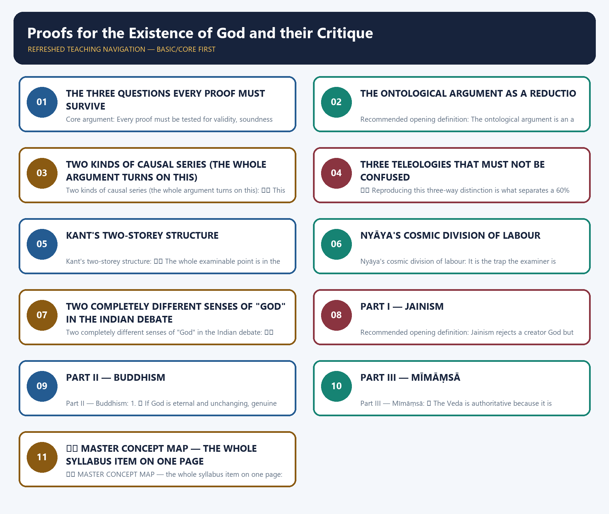
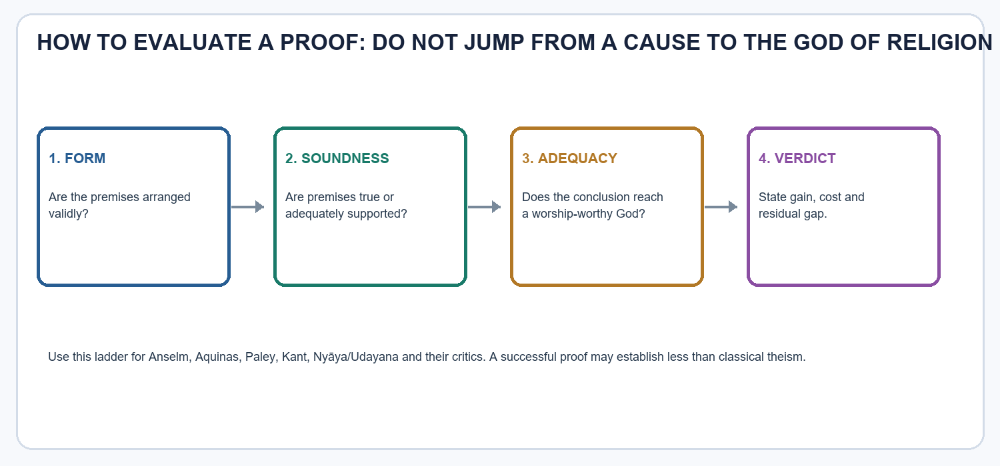

# Proofs for the Existence of God and their Critique — Learner-v2 Source-Complete Learning Session

> **Catalogue identity:** Philosophy Optional · Philosophy Paper II — Philosophy of Religion · `philosophy-paper-ii-philosophy-of-religion-02`  
> **Generation:** g2, 21 August 2026 · **Approval:** pending explicit topic approval  
> **Evidence discipline:** exact proof attributions and PYQ wording/year/marks are controlled by repository owners. Model answers are pedagogic, never official UPSC keys.

### Package practice counts

| Component | Count |
|---|---:|
| Direct verified topic-owned PYQs | 12 |
| Core diagnostic MCQs | 32 |
| Remedial diagnostic MCQs | 8 |
| Total diagnostics | 40 |
| Retained original solved Mains models | 6 (2 × 10, 2 × 15, 2 × 20) |
| Approval | false |

## BASIC LEARNING SESSION



*Distinct embedded teaching-navigation image. The separate continuous Cārvāka-style flowchart package remains an independent at-a-glance artifact.*

### Source-complete coverage ledger and learning labels

**[FACT]** marks retained repository doctrine/question data. **[INFERENCE]** marks the learner-facing organisation and graded verdict. This ledger maps source units to the final location rather than merely asserting reconciliation.

| Source corpus and unit | Final location | Retention decision |
|---|---|---|
| Canonical 0–4: proof map; Western/Indian proofs; a priori/a posteriori; statement bank | Basic modules 1–5 and comparative synthesis | Full doctrine/terminology retained in visual-first sequence |
| Canonical 5–6: applications, parity bench, PYQ skeletons | Basic answer workshops; Practice full models | Preserved once in full premium form rather than duplicated skeleton/model pairs |
| Canonical 8.1–8.8: advanced proof dossiers | Optional Advanced | Full owner block retained after practice |
| Canonical 9–18: debates, critiques, traps, keyword bank, routing and directive/verdict discipline | Basic comparison/answer workshops; Optional Advanced; final register | Preserved in the section where it performs a distinct learning role |
| Complete session: roadmap, six proof modules, visual maps, objection/reply ladders, comparison grids, revision aids and workshop | Basic Learning Session | Retained in original pedagogic order; only interleaved old MCQs/current anchors and explicitly advanced cards moved |
| Complete session: advanced-refinement cards | Optional Advanced | Moved intact after practice, as learner-v2 requires |
| Premium workbook: 12 verified PYQs, 32 core diagnostics, 8 remediation items, answer protocol and revision matrix | MCQs and Practice | Full verified answers and all diagnostic explanations retained |
| Premium originals | Practice | Six solved models retained because they add non-duplicate coverage; four overlapping prompts omitted |
| Philosophy of Religion dossier Topic 2 | Optional Advanced | Retained in full after core practice |

**Visible answer-worthiness labels.** Proof structures, named proponents, school-specific arguments and core critiques are **CORE PAPER II**. Premise testing, objection/reply, comparison and directive-specific judgment are **CORE ANSWER**. Historical supplements and extra illustrations are **SUPPORTING**. Modal, PSR, Bayesian, anthropic and meta-epistemic depth is **OPTIONAL ADVANCED**.

**What to do with the material.** Memorise each proof's shortest premise chain and its named critic. Understand what the proof does—and does not—establish. Use one carefully chosen comparison or reply selectively. Reserve modal, probabilistic and specialist meta-level debates for a high-value 15/20-marker.


### Learning route — [CORE PAPER II]

The retained source sequence moves from what counts as a proof, through Western and Indian argument families, to comparison and answer construction. Notions of God, evil, experience, faith and language appear only as bounded links or targets of a premise; they are not silently absorbed into this topic.

**UPSC Philosophy Optional · Paper II · Section B · Philosophy of Religion · Syllabus item 2**

**Date of session:** 10 August 2026 · **Progress:** 0/8 · **Estimated effort:** 7–9 sittings

> **Evidence key used throughout:** ✅ canonical doctrine directly grounded in the authored knowledge file or a local source text · ⚠️ analytical synthesis / inference for exam use · ❓ contested or textually variable · 📰 dated contemporary anchor only, never authority.

---

#### Roadmap

> **ANSWER-GRABBING LINE — WRITE/ADAPT IN THE EXAM**
> **High-value transition:** The topic moves from classifying proof-families to reconstructing their premises, testing objections and grading what concept of God, if any, the inference establishes.


```text
                 WHAT IS A "PROOF" OF GOD?
                          │
        ┌─────────────────┴──────────────────┐
        │                                    │
   A PRIORI                             A POSTERIORI
   (from the concept)                   (from the world)
        │                                    │
   ONTOLOGICAL                  ┌────────────┼─────────────┐
   Anselm · Descartes           │            │             │
        │                  COSMOLOGICAL  TELEOLOGICAL   MORAL
        │                  Ways 1-3      Way 5, Paley   Kant
        │                  Kalam         fine-tuning    (practical
        │                       │             │          postulate)
        │                       └──────┬──────┘
        │                              │
   critique: Gaunilo, Kant       critique: Hume, Darwin, Kant
        │                              │
        └──────────────┬───────────────┘
                       │
              INDIAN THEISTIC PROOF
              Nyaya-Vaisesika / Udayana
              karyat · ayojanat · dhrtyadeh · padat/sruteh · karma-dispenser
                       │
              INDIAN ANTI-CREATOR CRITIQUE
              Jaina · Bauddha · Mimamsa · Carvaka · (Advaita's levelling)
                       │
              COMPARATIVE SYNTHESIS + ANSWER ARCHITECTURE
```

| Session | Subtopic | Core focus |
|---:|---|---|
| 1 | Architecture of theistic proof | Demonstration vs probable inference vs postulate; a priori/a posteriori; validity–soundness–adequacy |
| 2 | Ontological argument | Anselm's two forms, Descartes, Gaunilo, Kant, modal repair |
| 3 | Cosmological argument | Aquinas' Ways 1–3, essentially ordered series, Kalām, Hume and Kant |
| 4 | Teleological argument | Way 4 and Way 5, Paley, Hume's five-front critique, Darwin, fine-tuning |
| 5 | Moral argument | Kant's demolition and reinstatement; postulates; Newman; Euthyphro |
| 6 | Nyāya–Udayana theism | *Kāryāt, āyojanāt, dhṛtyādeḥ, padāt/śruteḥ*, karma-dispenser, efficient-cause thesis |
| 7 | Indian anti-theistic critique | Jaina proofs and refutation; Buddhist anti-creator arguments; Mīmāṃsā *apauruṣeya*; Cārvāka |
| 8 | Comparative synthesis | India–West matrix, graded verdicts, 10/15/20-mark architecture |

**PYQ priority:** ✅ Very high — **12 topic-owned question-parts across 2018–2025**, spanning ontological (2018, 2020, 2024), Aquinas (2018, 2022), Nyāya (2018, 2023, 2025), design–Hume (2025), moral (2021), Jaina (2019), Buddhist (2018) and the a priori/a posteriori distinction (2022).

> 🔑 **Master mnemonic — "O-C-T-M + N, then J-B-M":** **O**ntological, **C**osmological, **T**eleological, **M**oral, plus **N**yāya; critiqued by **J**aina, **B**auddha, **M**īmāṃsā.

---

Progress: 1 / 8  |  Stage: Foundation  |  Subtopic: The Architecture of Theistic Proof

━━━━━━━━━━━━━━━━━━━━━━━━━━━━━━━━━━━━━━━━━━━━━━━━━━━━━━━━━━━━

━━━ PRE-TEACH CHECKLIST ━━━━━━━━━━━━━━━━━━

📚 Book context: Authored Markdown `paper-2/philosophy-of-religion/Proofs-for-God.md` §0, §3, §11 read in full; local OCR-searchable John Hick, *Philosophy of Religion*, Chapter 2 ("Arguments for the Existence of God", pp. 15–29 of the print pagination) confirmed searchable and consulted.

🔍 CA Search: "cosmological, teleological and fine-tuning arguments for God's existence — scholarly debate 2025–2026"

📰 CA Found: 📰 A 2026 paper, *"The Rational Defence of God's Existence: Exploring Cosmological…"*, and a 2025 review, *"A Discourse On God's Existence: Cosmological And Teleological Proofs"*, both continue the cosmology/fine-tuning debate. **Use only as a dated contemporary-debate anchor. It is not proof, and not canonical authority.**

━━━━━━━━━━━━━━━━━━━━━━━━━━━━━━━━━━━━━━━━━

### SESSION 1 — THE THREE QUESTIONS EVERY PROOF MUST SURVIVE

#### DEFINITION / WHAT THIS IS CALLED

**Plain-language definition:** Core argument: Every proof must be tested for validity, soundness and adequacy: whether the conclusion follows, the premises are true and the being reached is genuinely God.

**Technical definition:** Core argument: Every proof must be tested for validity, soundness and adequacy: whether the conclusion follows, the premises are true and the being reached is genuinely God.

#### ANSWER-GRABBING OPENING — WRITE/ADAPT IN THE EXAM

> 

#### MUST-WRITE KEYWORDS

- **Core argument**
- **Demonstration**
- **Probable / explanatory inference**
- **Practical postulate**
- **Never write "Kant proves God through morality."**
- **A priori**
- **A posteriori**
- **Mnemonic — "CONCEPT versus COSMOS"**

**How to use them:** 

> **ANSWER-GRABBING LINE — WRITE/ADAPT IN THE EXAM**
> **Core argument:** Every proof must be tested for validity, soundness and adequacy: whether the conclusion follows, the premises are true and the being reached is genuinely God.


```text
   PROOF FOR GOD
        │
   ┌────┴────────────────────────────────────────────────┐
   │ (1) VALIDITY   Does the conclusion follow from the  │
   │                premises as stated?                  │
   ├─────────────────────────────────────────────────────┤
   │ (2) SOUNDNESS  Are the premises actually true       │
   │                (causal principle, PSR, analogy)?    │
   ├─────────────────────────────────────────────────────┤
   │ (3) ADEQUACY   Is the being reached actually GOD    │
   │                — infinite, one, personal, good?     │
   └─────────────────────────────────────────────────────┘
        │
   A proof can be VALID, yet UNSOUND;
   valid AND sound, yet still INADEQUATE to classical theism.
```

⚠️ **This three-tier grid is the single most examiner-pleasing device in the whole topic.** Almost every UPSC critique question ("critically examine", "along with its criticism") is answered by locating the objection on one of these three tiers instead of shouting a general "the proof fails".

##### 1. What counts as a "proof" here?

✅ Three logically different things are all loosely called "proofs" in this syllabus item:

| Type | Claim made | Standard example | If it fails, it fails as… |
|---|---|---|---|
| **Demonstration** | The conclusion follows necessarily; denial is contradictory | Anselm's ontological argument | invalid or question-begging |
| **Probable / explanatory inference** | God is the best or a required explanation of some feature of the world | Aquinas' Ways, Paley, Nyāya *kāryāt* | weak analogy, available rival explanation |
| **Practical postulate** | Belief is rationally required by the moral standpoint, not by theoretical proof | Kant's moral argument | a projection, or not binding on the sceptic |

⚠️ **Never write "Kant proves God through morality."** Kant explicitly *denies* theoretical proof; he postulates. This single sentence has sunk many otherwise good scripts.

##### 2. A priori and a posteriori — the 2022 distinction

| Axis | **A priori** | **A posteriori** |
|---|---|---|
| Starting point | ✅ The concept of God alone | ✅ Some fact of the world (motion, causation, contingency, order, moral experience) |
| Method | Conceptual analysis; denial produces contradiction | Inference from effect to cause; inference to best explanation |
| Standard instance | Ontological (Anselm, Descartes) | Cosmological, teleological, moral, Nyāya *Īśvara-anumāna* |
| Modality of conclusion | ✅ Necessary being, if it works at all | ⚠️ At best a probable, and often finite, cause |
| Independence from science | Total — no empirical premise | ⚠️ Exposed to Darwin, Big-Bang cosmology, multiverse models |
| Characteristic defeat | ✅ Kant: "existence is not a real predicate" | ✅ Hume: analogy is weak; effect underdetermines cause |
| Religious payoff | Reaches necessity but not obviously a personal God | Reaches an agent-like cause but not obviously an infinite one |

> 🔑 **Mnemonic — "CONCEPT versus COSMOS":** a priori argues from the *concept*, a posteriori from the *cosmos*.

⚠️ **The 2022 examiner asks which should be preferred.** The strongest answer is a graded one: a posteriori arguments are epistemically more respectable because they begin from something granted by the opponent, but they pay for it by reaching only a finite, probable cause; the a priori argument alone promises necessity, but it purchases that necessity by an inference that Kant showed to be illegitimate. Preference therefore depends on the criterion — **evidential contact** favours a posteriori, **modal strength** favours a priori, and **religious adequacy** is achieved by neither alone.

##### 3. The five families in one frame

| Family | Premise drawn from | Terminus reached | Chief critic |
|---|---|---|---|
| Ontological | ✅ Concept of a maximally great being | Necessarily existing being | Gaunilo; Kant |
| Cosmological | ✅ Motion, efficient causation, contingency | Unmoved mover / first cause / necessary being | Hume; Kant |
| Teleological | ✅ Order, adaptation, fine order | Intelligent designer | Hume; Darwin |
| Moral | ✅ The moral law and the highest good | God as practical postulate | Naturalist axiology; Euthyphro |
| Nyāya inference | ✅ The world as *kārya* (composite effect) | Omniscient intelligent efficient cause (Īśvara) | Mīmāṃsā; Buddhism; Jainism; Cārvāka |

##### 4. Why UPSC cares

✅ The syllabus phrase is *"Proofs for the Existence of God **and their Critique** (Indian and Western)"*. The examiner is therefore testing four capacities at once:

```text
RECONSTRUCT  →  the argument as numbered premises, not as a slogan
EXPOSE       →  the hidden presupposition that carries the weight
OBJECT/REPLY →  the strongest critic, and the proponent's best answer
GRADE        →  how far it succeeds, and what kind of God it delivers
```

##### UPSC traps

1. ⚠️ Do not treat "proof" univocally: demonstration, probable inference and practical postulate have different success conditions.
2. ⚠️ Do not say the ontological argument is a posteriori because Anselm "observes" that people have the idea of God — the *premise* is conceptual.
3. ⚠️ Do not equate "a priori" with "certain" and "a posteriori" with "uncertain"; a priori reasoning can be invalid, and a posteriori reasoning can be strong.
4. ⚠️ Distinguish **validity** from **soundness** from **adequacy of the God established**. Most critiques attack the second and third, not the first.
5. ⚠️ Do not present the Indian material as a decorative appendix; Nyāya is a fully-formed *a posteriori* natural theology and belongs inside the taxonomy.
6. ⚠️ A proof's failure does not establish atheism; it establishes only that *that route* does not compel.

##### Revision notes

- Theistic proofs divide into a priori (conceptual) and a posteriori (world-based) routes.
- Ontological is the only classical a priori proof; cosmological, teleological, moral and Nyāya are a posteriori.
- Assess every proof on three tiers: validity, soundness, adequacy of the God reached.
- Demonstration claims necessity; explanatory inference claims probability; postulation claims practical rationality.
- Kant's moral argument is a postulate, never a theoretical demonstration.
- A posteriori proofs begin from conceded facts but reach only a finite, probable cause.
- The a priori proof promises necessity but is charged with the existence-predicate fallacy.
- 2022 asked exactly this distinction plus a reasoned preference — answer with a criterion-based, graded verdict.
- Nyāya's *Īśvara-anumāna* is a cosmological–teleological hybrid, not a separate exotic species.
- No single proof reaches the full God of developed religion; cumulative-case strategies attempt to repair this.

#### CLOSING RECALL FLOW — THE THREE QUESTIONS EVERY PROOF MUST SURVIVE

```text
START / CONCEPT: The three questions every proof must survive
        |
        v
EXACT TERMS: Core argument · Demonstration · Probable / explanatory inference · Practical postulate · Never write "Kant proves God through morality."
        |
        v
MECHANISM / ARGUMENT: Almost every UPSC critique question ("critically examine", "along with its criticism") is answered by locating the objection on one of these three tiers instead of shouting a general "the proof fails".
        |
        v
CONSEQUENCE / CONTRAST: Preference therefore depends on the criterion — evidential contact favours a posteriori, modal strength favours a priori, and religious adequacy is achieved by neither alone.
        |
        v
UPSC TRAP / ANSWER-USE: ⚠️ Never write "Kant proves God through morality." Kant explicitly denies theoretical proof; he postulates.
        |
        v
ANSWER-GRABBING FORMULATION: 
```
### SESSION 2 — THE ONTOLOGICAL ARGUMENT AS A REDUCTIO

#### DEFINITION / WHAT THIS IS CALLED

**Plain-language definition:** Recommended opening definition: The ontological argument is an a priori attempt to derive God's necessary existence from the concept of the greatest conceivable being.

**Technical definition:** Recommended opening definition: The ontological argument is an a priori attempt to derive God's necessary existence from the concept of the greatest conceivable being.

#### ANSWER-GRABBING OPENING — WRITE/ADAPT IN THE EXAM

> 

#### MUST-WRITE KEYWORDS

- **Recommended opening definition**
- **"a being than which nothing greater can be conceived."**
- **more perfect**
- **Crucial textual point**
- **First form — Proslogion 2**
- **Second form — Proslogion 3**
- **Necessary being / aseity (self-existence)**
- **Distinction to state in the answer**

**How to use them:** 

> **ANSWER-GRABBING LINE — WRITE/ADAPT IN THE EXAM**
> **Recommended opening definition:** The ontological argument is an a priori attempt to derive God's necessary existence from the concept of the greatest conceivable being.


```text
   ASSUME (for reductio):  God exists in the understanding ALONE
        │
        │  Premise A: God =def "that than which nothing greater
        │             can be conceived"  (aliquid quo nihil maius cogitari possit)
        │
        │  Premise B: To exist in reality is greater than
        │             to exist in the understanding alone
        ▼
   THEN a greater than God can be conceived
        (namely, the same being existing in reality too)
        ▼
   BUT that contradicts Premise A — "the greatest conceivable"
        cannot be exceeded by anything conceivable
        ▼
   ∴ THE ASSUMPTION IS FALSE.  God exists in reality.        [Proslogion 2]
        ▼
   SECOND FORM: a being that CANNOT be thought not to exist
        is greater than one that can.
        ∴ God exists NECESSARILY (aseity, self-existence).   [Proslogion 3]
```

⚠️ The second form is the philosophically serious one. It shifts the claim from *existence* to *necessary existence*, and it is the form Anselm uses to answer Gaunilo.

##### 1. Anselm's definition — and why its wording matters

✅ Anselm compresses the monotheistic concept of God into the formula **"a being than which nothing greater can be conceived."** "Greater" here means **more perfect**, not spatially larger.

✅ **Crucial textual point:** Anselm deliberately does *not* say "the most perfect being that there is". That description would be trivially satisfied by whatever happens to be the best existing thing, with no guarantee that it is God. He says "so perfect that no more perfect can even be *conceived*". The argument is built on the second, stronger notion.

✅ Anselm addresses the Psalmist's "fool" who says in his heart, "There is no God." Even the fool, says Anselm, possesses the concept; and when the concept is unpacked, the fool is refuted out of his own understanding.

##### 2. The two forms, side by side

| | **First form — Proslogion 2** | **Second form — Proslogion 3** |
|---|---|---|
| Conclusion | God exists in reality as well as in the mind | God exists *necessarily*; God's non-existence is inconceivable |
| Key comparative | Existing in reality > existing in the mind alone | Being unable to be thought not to exist > being able to be so thought |
| Core notion | Existence | ✅ **Necessary being / aseity (self-existence)** |
| Vulnerable to | Gaunilo's island parody; Kant's predicate objection | ⚠️ The charge that "necessary existence" is itself an incoherent or unestablished notion |
| Modern descendants | — | ✅ Malcolm, Hartshorne, Plantinga's modal versions |

✅ Because God as infinitely perfect is not limited in or by time, the two possibilities of God's ever *coming to be* or ever *ceasing to be* are alike excluded; God's non-existence is thereby rendered impossible.

##### 3. Descartes' reformulation

✅ Descartes (*Meditations* V) recasts the argument through his doctrine of clear and distinct ideas: existence belongs to the essence of a supremely perfect being as necessarily as having three angles summing to two right angles belongs to the essence of a triangle, or as a valley belongs to the idea of a mountain. A supremely perfect being that lacked existence would lack a perfection, which is a contradiction in terms.

⚠️ **Distinction to state in the answer:** Anselm argues by *reductio* from a comparative ("greater than"); Descartes argues from *essence containment* ("existence is a perfection"). Both are a priori, but their machinery differs, and Kant's objection strikes Descartes' version most directly.

⚠️ Descartes elsewhere offers a *different*, causal proof of God (from the idea of the infinite in a finite mind, *Meditations* III). Do not fuse the two; the causal one is not ontological.

##### 4. Objection 1 — Gaunilo's lost island

✅ **Gaunilo**, a monk of Marmoutiers and Anselm's contemporary, replied in a tract titled *In Behalf of the Fool*. He argued that Anselm's reasoning would generate absurd conclusions elsewhere, and constructed a parallel argument for the most perfect island: given the idea of such an island, Anselm's principle would force us to conclude that it exists, since otherwise it would not be the most perfect conceivable island.

⚠️ **Precision point rarely made in scripts:** Gaunilo actually spoke of the most perfect *of* islands rather than, as he should have, the most perfect *conceivable* island. Making that correction strengthens the parody, and stating the correction shows the examiner that you have read the debate rather than a summary of it.

✅ **Anselm's reply** rests on the second form. The element present in the concept of God and absent from the concept of any island is **necessary existence**. An island — "a piece of land surrounded by water" — is by definition part of the contingent physical world, a dependent reality that can without contradiction be thought not to exist. Anselm's principle therefore does not apply to it. It applies only to a being defined as having eternal and independent existence.

⚠️ **Residual pressure:** the reply protects the second form but leaves the first form exposed, and it transfers the entire burden to a further question — *is the idea of a maximally great being coherent at all?* If "most perfect conceivable island" is incoherent (because island-perfections have no intrinsic maximum), the parody fails; but the theist must then show that maximal greatness *does* have an intrinsic maximum.

##### 5. Objection 2 — Kant: existence is not a real predicate

✅ **Kant's objection** is the decisive one in the tradition: **"existence is not a real predicate."** A real (determining) predicate adds something to the concept of a subject. Existence adds nothing to a concept; it *posits* the concept's object. Kant's illustration: a hundred real thalers contain not one coin more than a hundred possible thalers; the concept is identical, only my financial position differs.

✅ Chatterjee and Datta make the same point in the Indian textbook tradition, and put it in an idiom worth borrowing: *the idea of one hundred rupees in my pocket involves the image or the idea of their existence, but not their real physical existence.* To think of the existence of something is not to prove its existence.

⚠️ **Therefore:** you cannot define anything into existence. From an analysis of a concept only conditional propositions follow — *if* such a being exists, it exists necessarily — and the antecedent is exactly what was to be proved.

##### 6. Objection 3 — the modern logical objection

⚠️ On the standard post-Fregean analysis, "exists" is not a first-order property of individuals but a second-order quantificational notion: to say tigers exist is to say the concept *tiger* is instantiated. If that is right, "existence" cannot appear in the list of perfections at all, and the argument cannot even be stated in its classical form.

##### 7. The reply — modal ontological arguments

⚠️ Twentieth-century defenders (Malcolm, Hartshorne, and in the most discussed form Plantinga) work exclusively with Anselm's second form and with *necessary* existence, which they claim is not vulnerable to Kant's objection because it is a modal status rather than a bare existence-predicate. The skeleton is:

```text
1. It is POSSIBLE that a maximally great being exists.
2. A maximally great being is one that exists necessarily
   and is maximally excellent in every possible world.
3. If it is possible that such a being exists, then it exists
   in some possible world.
4. Whatever exists necessarily in some possible world
   exists in every possible world.
5. ∴ A maximally great being exists — in the actual world.
```

⚠️ **The burden simply migrates.** The whole weight now rests on premise 1 — the **possibility premise**. A parallel "it is possible that no maximally great being exists" yields, by the same modal logic, the opposite conclusion. So the modal version does not prove God; it converts the dispute into a dispute about whether maximal greatness is genuinely possible, i.e. coherent. ✅ This is precisely the point the authored knowledge file records: *"Possibility premise bears the burden."*

##### 8. Does the concept of God entail the existence of God? — the 2018 formulation

✅ **2018, Q6(c), 15 marks:** *"Does the concept of God entail the existence of God? Examine from the perspective of ontological argument."*

⚠️ **Model verdict:** the concept of God **entails** existence conceptually — i.e. it is analytic that God, if God exists, exists necessarily and not contingently — but conceptual entailment does not deliver **instantiation**. The argument proves at most a conditional: if the concept of a maximally great being is coherent and instantiable, then it is instantiated necessarily. What it cannot do is establish the antecedent by conceptual means alone. Hence: **entailment within the concept, yes; entailment to reality, no.**

##### 9. Is there an Indian ontological argument?

⚠️ There is **no exact classical Indian analogue** of the ontological argument. This is itself an examinable observation, and the reason is structural:

| Feature of Indian epistemology | Consequence for an a priori proof |
|---|---|
| ✅ Nyāya recognises *pratyakṣa, anumāna, upamāna, śabda* — all of which are contentful, world-involving *pramāṇas* | An argument with no empirical premise has no recognised evidential source |
| ✅ Nyāya inference requires *vyāpti* (invariable concomitance) established by observed co-presence | Pure conceptual analysis cannot generate *vyāpti* |
| ✅ Advaita reaches Brahman through *śruti* plus *anubhava*, not through concept-analysis | Brahman is not established by definition but disclosed |
| ⚠️ Mīmāṃsā treats the Veda as intrinsically valid and authorless | No conceptual route to a divine being is needed or offered |

⚠️ **Safe comparative sentence:** *"Indian natural theology is overwhelmingly a posteriori and inferential; the ontological route has no classical Indian counterpart because Indian epistemology grounds existence-claims in pramāṇas that are world-involving."*

##### India–West comparison

| | **Ontological (West)** | **Nyāya inference (India)** |
|---|---|---|
| Type | ✅ A priori, conceptual | ✅ A posteriori, inferential |
| Starting point | Concept of maximal greatness | The world as composite effect (*kārya*) |
| Conclusion's modality | Necessary existence | ⚠️ Probable existence of an intelligent agent |
| Characteristic objection | Existence is not a real predicate | Weak world–artefact analogy; karma may suffice |
| Divine attributes reached | Maximal perfection by definition | Omniscience, eternality, agency — argued for stepwise |

##### UPSC traps

1. ⚠️ Do not present only *Proslogion* 2 and omit the second form; Anselm's reply to Gaunilo *requires* the second form.
2. ⚠️ Gaunilo is not Kant. Gaunilo offers a **parody** (the form proves too much); Kant offers a **diagnosis** (the form uses "existence" illegitimately).
3. ⚠️ Do not attribute the island example to Kant, or the thaler example to Gaunilo.
4. ⚠️ Descartes' ontological proof (*Meditations* V) must not be confused with his causal proof from the idea of the infinite (*Meditations* III).
5. ⚠️ The modal version does not defeat Kant "cleanly"; it relocates the problem to the possibility premise.
6. ⚠️ Do not say the ontological argument is "obviously absurd". It is the argument that has attracted the most sustained modern logical attention of all the proofs.
7. ⚠️ Do not manufacture an "Indian ontological argument" out of Advaita. Brahman is not established by conceptual analysis.

> 🔑 **Mnemonic — "A-D-G-K-M":** **A**nselm defines, **D**escartes essentialises, **G**aunilo parodies, **K**ant diagnoses, **M**odal logic repairs (and re-buries the burden).

##### Revision notes

- Anselm defines God as that than which nothing greater can be conceived — "greater" means more perfect.
- *Proslogion* 2 argues that existing in reality is greater than existing in the mind alone.
- *Proslogion* 3 upgrades the conclusion to necessary existence rooted in aseity.
- Descartes makes existence a perfection contained in the essence of a supremely perfect being.
- Gaunilo's *In Behalf of the Fool* offers the perfect-island parody.
- Anselm answers that only God is defined as having necessary, non-contingent existence.
- Kant: existence is not a real predicate; a hundred real thalers add no concept to a hundred possible ones.
- Chatterjee–Datta echo this with the hundred-rupees illustration.
- Frege-style analysis makes existence a second-order quantificational notion, not a perfection.
- Modal versions (Malcolm, Hartshorne, Plantinga) shift the burden onto the possibility premise.
- 2018 asks about concept-to-existence entailment; the correct verdict is conditional entailment without instantiation.
- There is no classical Indian ontological argument, for pramāṇa-theoretic reasons.

#### CLOSING RECALL FLOW — THE ONTOLOGICAL ARGUMENT AS A REDUCTIO

```text
START / CONCEPT: The ontological argument as a reductio
        |
        v
EXACT TERMS: Recommended opening definition · "a being than which nothing greater can be conceived." · more perfect · Crucial textual point · First form — Proslogion 2
        |
        v
MECHANISM / ARGUMENT: That description would be trivially satisfied by whatever happens to be the best existing thing, with no guarantee that it is God.
        |
        v
CONSEQUENCE / CONTRAST: Anselm's principle therefore does not apply to it.
        |
        v
UPSC TRAP / ANSWER-USE: ✅ Anselm compresses the monotheistic concept of God into the formula "a being than which nothing greater can be conceived." "Greater" here means more perfect, not spatially larger.
        |
        v
ANSWER-GRABBING FORMULATION: 
```
### SESSION 3 — TWO KINDS OF CAUSAL SERIES (THE WHOLE ARGUMENT TURNS ON THIS)

#### DEFINITION / WHAT THIS IS CALLED

**Plain-language definition:** Recommended opening definition: Aquinas targets an essentially ordered present dependence, not merely a temporal sequence extending indefinitely into the past.

**Technical definition:** Two kinds of causal series (the whole argument turns on this): ⚠️ This diagram is the single highest-value item in the cosmological answer.

#### ANSWER-GRABBING OPENING — WRITE/ADAPT IN THE EXAM

> 

#### MUST-WRITE KEYWORDS

- **Recommended opening definition**
- **cosmological**
- **henological / degrees**
- **teleological**
- **Reconstruction**
- **Presupposition**
- **Canonical example (state it in the answer)**
- **Hick's assessment, worth reporting**

**How to use them:** 

> **ANSWER-GRABBING LINE — WRITE/ADAPT IN THE EXAM**
> **Recommended opening definition:** Aquinas targets an essentially ordered present dependence, not merely a temporal sequence extending indefinitely into the past.


```text
ACCIDENTALLY ORDERED  (per accidens)   —  Aquinas does NOT need to stop this
   great-grandfather → grandfather → father → son
   Each cause can perish and the effect continues.
   An infinite backward series here is not obviously incoherent.

ESSENTIALLY ORDERED   (per se)         —  THIS is what Aquinas terminates
   HAND ──moves──► STICK ──moves──► STONE
   Remove the hand and the whole series stops NOW.
   Every intermediate member has only DERIVATIVE power.
   An infinite series of borrowers with no owner explains nothing.

∴ "FIRST" = EXPLANATORY PRIORITY, not the earliest event in time.
```

⚠️ **This diagram is the single highest-value item in the cosmological answer.** The commonest UPSC error is to reduce all five Ways to "everything had a beginning, so God started it", which is neither Aquinas' argument nor a good argument.

##### 1. Aquinas' Five Ways — the map before the detail

✅ Aquinas offers five ways of proving divine existence (*Summa Theologiae* I, q.2, a.3). Unlike the ontological argument, which focuses on the idea of God and unfolds its inner implications, Aquinas' proofs **start from some general feature of the world around us** and argue that there could not be a world with this particular characteristic unless there also existed the ultimate reality we call God.

| Way | Starts from | Terminates in |
|---:|---|---|
| 1 | ✅ Change / motion | Prime Mover (unmoved mover) |
| 2 | ✅ Efficient causation | First Cause |
| 3 | ✅ Contingent beings (possibility and necessity) | Necessary Being |
| 4 | ✅ Degrees of value and perfection | Absolute Value / maximum |
| 5 | ✅ Evidence of purposiveness in nature | Divine Designer |

⚠️ Ways 1–3 constitute the **cosmological** family; Way 4 is the **henological / degrees** argument; Way 5 is the **teleological** one, treated in Subtopic 4. Each concludes with Aquinas' cautious formula, *"and this everyone understands to be God"* — a phrase that itself concedes that further theological work is needed to identify the terminus with the God of religion.

##### 2. Way 1 — from motion

✅ **Reconstruction:**

```text
1. Some things in the world are in motion (in the broad sense: undergoing change,
   passing from potentiality to actuality).
2. Whatever is moved is moved by another; nothing can be in potentiality and
   actuality in the same respect at the same time.
3. That mover, if itself moved, requires a further mover.
4. An essentially ordered series of movers cannot proceed to infinity,
   for then there would be no first mover and hence no motion now.
5. ∴ There is a first, unmoved mover — "and this everyone understands to be God."
```

⚠️ **Presupposition:** the act–potency analysis of change, and the claim that derivative causal power must be traced to non-derivative power *here and now*.

✅ **Canonical example (state it in the answer):** the stick moves the stone only while the hand moves the stick. The stick has no power of its own; its causal efficacy is borrowed. This is what makes the series essentially ordered.

##### 3. Way 2 — from efficient causation

✅ **Reconstruction:** In the observable world there is an order of efficient causes. Nothing is the efficient cause of itself, for it would then have to be prior to itself. In an ordered series of efficient causes, the first is the cause of the intermediate and the intermediate of the last; take away the cause and you take away the effect. An infinite regress of such causes would remove the first, and hence the intermediate and the last. Therefore a first efficient cause must be admitted.

⚠️ ✅ **Hick's assessment, worth reporting:** the weakness of the argument as Aquinas states it lies in the difficulty — which Aquinas himself elsewhere acknowledges — of excluding as impossible an endless regress of events requiring no first state. ✅ **Neo-Thomists reformulate it** by insisting that the excluded series is not a regress of *events back in time* but an endless and therefore *eternally inconclusive* series of dependent causes existing simultaneously.

⚠️ **Do not miss the historical point:** Aquinas holds, on philosophical grounds alone, that the universe *could* be eternal; that it began is known by faith, not demonstration. So Way 2 is not, and cannot be, an argument for a temporal beginning.

##### 4. Way 3 — from contingency

✅ **Reconstruction:**

```text
1. We find things that are possible-to-be and possible-not-to-be
   (they are generated and corrupted).
2. What is possible-not-to-be at some time is not.
3. If everything were contingent, then at some time nothing would have existed.
4. If nothing existed at some time, nothing would exist now, since what does not
   exist begins to exist only through something that already exists.
5. ∴ Not all beings are merely possible; there must be something NECESSARY.
6. Every necessary being either has its necessity from another or from itself;
   the series of necessity-from-another cannot regress infinitely.
7. ∴ There exists a being necessary of itself — "this all men speak of as God."
```

⚠️ **Two vulnerable steps.** (i) Step 3 arguably commits a **quantifier shift**: from "for each thing there is a time at which it does not exist" it does not follow that "there is a time at which no thing exists". (ii) Step 6 needs the distinction — Aquinas himself makes it — between beings necessary *ab alio* (angels, on his scheme) and the being necessary *a se*.

⚠️ **Precision worth writing:** Way 3 is not the same as Way 2. Way 2 concerns causal *dependence*; Way 3 concerns *modal status* — contingency versus necessity. A script that merges them loses the very distinction the 2022 question was testing.

##### 5. Way 4 — from degrees of perfection

✅ **Reconstruction:** Among beings there are some more and some less good, true and noble. But "more" and "less" are predicated of things according as they resemble in different degrees something which is the maximum. Therefore there must be something which is truest, best and noblest, and consequently something which is the cause of being, goodness and every perfection in all things — and this we call God.

⚠️ This is the least popular Way and the one most exposed to the objection that comparative judgements do not require an existing maximum (a "hottest possible thing" is not entailed by degrees of heat). Its defence requires the Platonic-Aristotelian machinery of participation and of a cause containing eminently what it confers.

⚠️ It is nonetheless the Way most useful for showing the examiner that you understand Aquinas' **metaphysics of participation** rather than only his causal reasoning.

##### 6. The Kalām cosmological argument

✅ The Kalām form, which originates in Islamic philosophical theology and has been revived in modern discussion, is structurally different from Aquinas:

```text
1. Whatever BEGINS to exist has a cause of its beginning.
2. The universe began to exist.
3. ∴ The universe has a cause of its beginning.
   (+ conceptual analysis: that cause is beginningless, uncaused,
      changeless, timeless, immaterial, enormously powerful — and personal,
      since only agency explains a temporal effect from a timeless cause.)
```

⚠️ **Contrast to state explicitly:** the Kalām argues *for* a temporal beginning and therefore engages Big-Bang cosmology directly; Aquinas' Ways deliberately do not require one. Collapsing the two is the standard textbook error.

##### 7. Leibniz and the Principle of Sufficient Reason

⚠️ Leibniz's version asks not "what started it?" but "**why is there something rather than nothing?**" Every fact requires a sufficient reason; the totality of contingent facts is itself contingent; therefore its sufficient reason must lie in a necessary being. This is the version that engages the modern brute-fact debate.

##### 8. Objections and replies

| Objection | Aimed at | Reply | Residual pressure |
|---|---|---|---|
| ✅ **Hume:** why not an infinite series, with each member explained by its predecessor? | Ways 1–3 | ⚠️ The series concerned is essentially ordered; an infinite set of derivative causes still has no non-derivative actualising power | ⚠️ Requires proving the series *is* essentially ordered, not merely asserting it |
| ✅ **Hume:** explaining each member explains the whole; the demand for a cause of the collection is illegitimate | Leibnizian version | ⚠️ A contingent totality is not made self-explanatory by enlarging the set | ❓ Tracks a genuine dispute over the scope of the PSR |
| ✅ **Fallacy of composition:** because each part has a cause, the whole need not | Cosmological family | ⚠️ The argument concerns *dependence*, not the transfer of a shared property | ⚠️ Must be stated as an essentially ordered series to hold |
| ✅ **Kant:** the cosmological argument covertly relies on the ontological | Ways 2–3 | ⚠️ Thomists deny the covert reliance: they identify the necessary being with God through further metaphysical argument, not by definition | ⚠️ Even so, the identification is a separate and disputable stage |
| ✅ **Hume:** why must the cause be one, personal, infinite or good? | All | ⚠️ Cumulative-case strategies add attributes from several arguments together | ✅ *No single proof reaches classical theism* |
| ⚠️ **Brute fact:** the universe may simply be there | Leibnizian version | ⚠️ Explanatory demand does not evaporate merely because it is inconvenient | ❓ Genuinely unresolved |

⚠️ **Kant's objection, spelled out because it is frequently mis-stated:** the cosmological argument concludes to a *necessary being*; but to move from "a necessary being" to "the most real being (*ens realissimum*), i.e. God", one must argue that only the most perfect being can be necessary — and that step is the ontological argument. Kant's point is therefore an **adequacy-tier** attack: the cosmological argument's own resources take it only to "something necessary", and it borrows the rest.

##### 9. India–West comparison

| | **Aquinas (Ways 1–3)** | **Nyāya kāryāt** |
|---|---|---|
| Starting fact | ✅ Motion, causation, contingency | ✅ The world is a composite *effect* |
| Reason the world needs a cause | Derivative actuality requires non-derivative act | Composite parts + intermediate magnitude ⇒ producedness |
| Nature of the cause | ✅ Pure act; creator of *being* itself | ✅ Intelligent efficient cause who *orders* pre-existing eternal atoms |
| Material cause | God creates *ex nihilo*; no independent matter | ✅ **Eternal atoms are the material cause; God is not** |
| Continuing relation | Conservation of being | ✅ Creation, maintenance, destruction — hence theism, not deism |
| Chief internal difficulty | Regress-exclusion; identification with God | Analogy from artefact to world; sufficiency of karma |

⚠️ **The single sharpest comparative sentence available for 2018 Q8(a):** *"Both are a posteriori inferences from features of the world to an intelligent ultimate cause; but Aquinas' God confers existence itself, whereas Nyāya's Īśvara confers only order upon eternally existing atoms and souls."*

##### UPSC traps

1. ⚠️ **Do not merge the five Ways into one temporal "first cause" argument.** They start from different features and terminate in differently described conclusions.
2. ⚠️ "First" means **explanatory priority**, not chronological firstness.
3. ⚠️ Aquinas does not argue that the universe began in time; he holds that its beginning is known by faith.
4. ⚠️ The Kalām *does* argue for a temporal beginning; it is not Aquinas' argument.
5. ⚠️ Do not attribute Paley's watch to Aquinas (see Subtopic 4).
6. ⚠️ Kant's objection is that the cosmological argument *borrows* the ontological argument, not that it is invalid on its own terms.
7. ⚠️ Way 3 is modal (contingency/necessity); Way 2 is causal. Keep them apart.
8. ⚠️ Do not say Hume "refuted" the cosmological argument; he attacked the necessity of the regress-stop and the identification of the cause with God.

> 🔑 **Mnemonic — "MCC-DP":** **M**otion, **C**ausation, **C**ontingency (the cosmological three); then **D**egrees and **P**urpose (Ways 4 and 5).

##### Revision notes

- Aquinas' Ways begin from general features of the world, unlike the a priori ontological argument.
- Way 1: motion → prime mover; Way 2: efficient causation → first cause; Way 3: contingency → necessary being.
- Way 4: degrees of perfection → maximum; Way 5: purposiveness → designer.
- The regress excluded is essentially ordered (hand–stick–stone), not accidentally ordered.
- "First" is explanatory, not temporal; Aquinas permits an eternal universe philosophically.
- Neo-Thomists reinterpret the excluded series as simultaneous dependence, not backward time.
- Kalām: whatever begins to exist has a cause; the universe began; therefore it has a cause.
- Leibniz's PSR version asks why there is something rather than nothing.
- Hume: infinite regress may be acceptable; explaining parts may explain the whole; the cause need not be God.
- Kant: the move from "necessary being" to "God" imports the ontological argument.
- Fallacy-of-composition charge is met by framing dependence rather than property-transfer.
- Aquinas' God causes being; Nyāya's Īśvara causes only order among eternal atoms.

#### CLOSING RECALL FLOW — TWO KINDS OF CAUSAL SERIES (THE WHOLE ARGUMENT TURNS ON THIS)

```text
START / CONCEPT: Two kinds of causal series (the whole argument turns on this)
        |
        v
EXACT TERMS: Recommended opening definition · cosmological · henological / degrees · teleological · Reconstruction
        |
        v
MECHANISM / ARGUMENT: Therefore a first efficient cause must be admitted.
        |
        v
CONSEQUENCE / CONTRAST: Unlike the ontological argument, which focuses on the idea of God and unfolds its inner implications, Aquinas' proofs start from some general feature of the world around us and argue that there could not be a world with this particular characteristic unless there also existed the ultimate reality we call God.
        |
        v
UPSC TRAP / ANSWER-USE: Recommended opening definition: Aquinas targets an essentially ordered present dependence, not merely a temporal sequence extending indefinitely into the past.
        |
        v
ANSWER-GRABBING FORMULATION: 
```
### SESSION 4 — THREE TELEOLOGIES THAT MUST NOT BE CONFUSED

#### DEFINITION / WHAT THIS IS CALLED

**Plain-language definition:** Recommended opening definition: Teleological arguments infer intelligence from purposive order, but Aquinas, Paley and fine-tuning employ distinct forms of order and inference.

**Technical definition:** ⚠️ Reproducing this three-way distinction is what separates a 60% answer from a 75% answer in 2025 Q6(a).

#### ANSWER-GRABBING OPENING — WRITE/ADAPT IN THE EXAM

> 

#### MUST-WRITE KEYWORDS

- **Recommended opening definition**
- **Why the difference matters**
- **watch**
- **never seen a watch made**
- **does not always work perfectly**
- **parts whose function we cannot discover**
- **long cumulative argument**
- **published in 1779, twenty-three years before Paley's book**

**How to use them:** 

> **ANSWER-GRABBING LINE — WRITE/ADAPT IN THE EXAM**
> **Recommended opening definition:** Teleological arguments infer intelligence from purposive order, but Aquinas, Paley and fine-tuning employ distinct forms of order and inference.


```text
┌──────────────────────────────────────────────────────────────────────┐
│ (A) AQUINAS, FIFTH WAY  —  regularity of NON-COGNITIVE nature        │
│     Natural bodies without knowledge act for an end,                 │
│     and do so ALWAYS or NEARLY ALWAYS in the same way.               │
│     Whatever lacks knowledge cannot move toward an end unless        │
│     directed by something with knowledge  →  as the ARROW by the     │
│     ARCHER.  ∴ an intelligent being directs natural things.          │
│     NOT an analogy with human artefacts.                             │
├──────────────────────────────────────────────────────────────────────┤
│ (B) PALEY (1802)  —  ANALOGY from ARTEFACT to ORGANISM               │
│     Watch on the heath : watchmaker :: eye, wing, fin : Designer     │
│     Biological means-end ADJUSTMENT is the evidence.                 │
│     → Directly vulnerable to Darwin.                                 │
├──────────────────────────────────────────────────────────────────────┤
│ (C) FINE-TUNING (modern)  —  PROBABILISTIC, not analogical           │
│     Cosmological constants lie in an extremely narrow life-permitting│
│     range → design as inference to the best explanation.             │
│     Rivals: multiverse, anthropic selection, brute necessity.        │
│     → NOT touched by Darwin, because it is pre-biological.           │
└──────────────────────────────────────────────────────────────────────┘
```

⚠️ **Reproducing this three-way distinction is what separates a 60% answer from a 75% answer in 2025 Q6(a).** Most candidates write Paley, get demolished by Darwin, and stop.

##### 1. Aquinas' Fifth Way — stated properly

✅ The design argument occurs in philosophical literature from Plato's *Timaeus* onward, and appears again as the last of Aquinas' five Ways.

✅ The Fifth Way is *not* an analogy with human manufacture. Its premise is that things which lack cognition nevertheless act for an end, and do so with regularity — which cannot be chance. Hence they are directed by an intelligent being, as the arrow is directed by the archer.

⚠️ **Why the difference matters:** Darwinian natural selection is a direct competitor to Paley's premise (biological adaptation) but a much less direct competitor to Aquinas' premise (the regular law-like directedness of nature as such), which arguably persists after evolution is granted.

##### 2. Paley's watch

✅ Paley's analogy of the watch conveys the essence of the argument. Walking in a desert place I see a stone, and may properly attribute its presence to the operation of natural forces — wind, rain, heat, frost, volcanic action. But if I find a **watch**, I cannot reasonably account for it in the same way. A watch consists of a complex arrangement of wheels, cogs, axles, springs and balances, all operating accurately together to give a regular measurement of time. I am obliged to postulate an intelligent mind responsible for the phenomenon.

✅ **Paley's three supplementary points — quote them; they anticipate obvious replies:**

1. ✅ The inference is not weakened if I have **never seen a watch made** (as we have never seen a world other than this one) and therefore do not know from direct observation that watches are products of intelligence.
2. ✅ The inference is not invalidated if the mechanism **does not always work perfectly** — as may appear to be the case with the mechanism of the world.
3. ✅ The inference is not undermined if there are **parts whose function we cannot discover** — as there are in nature.

✅ Paley then argues that the natural world is as complex a mechanism, and as manifestly designed, as any watch: the rotation of the planets, the procession of the seasons, the mutual adaptation of the parts of a living organism. The eye, in particular, is a superb optical instrument with self-adjusting lenses, colour sensitivity and long continuous operation; the bird's wing is suited to the air and the fish's fin to the water.

⚠️ Paley's is a **long cumulative argument** drawing on virtually all the sciences of his day — not a single inference. Saying so is worth a mark.

##### 3. Hume's critique — the 2025 question's centre of gravity

✅ The classic critique of the design argument occurs in David Hume's *Dialogues Concerning Natural Religion*, **published in 1779, twenty-three years before Paley's book** — and Paley took no apparent account of it. That chronological point is a genuine fact worth stating, because it forestalls the naive assumption that Hume was replying to Paley.

Hume's attack proceeds on **five fronts**:

| # | Front | Hume's argument | Tier attacked |
|---:|---|---|---|
| 1 | ✅ **Any universe must look designed** | There could not be a universe at all in which the parts were not adapted to one another to a considerable degree — there could not be birds that grew wings but, like fish, could not live in air. So apparent adaptation is not evidence of design; it is a precondition of any persisting order. He proposes the **Epicurean hypothesis**: a finite number of particles in random motion will, in unlimited time, pass through every possible combination; one such combination is a stable order — perhaps ours. | Soundness |
| 2 | ✅ **The analogy is weak** | The universe is not particularly like a machine. One could as plausibly liken it to a great inert animal such as a crustacean, or to a vegetable — in which case the argument fails, since whether crustaceans and vegetables are designed is precisely the question at issue. Only if the world is strikingly analogous to a human artefact is there a basis for inferring a Designer. | Soundness |
| 3 | ✅ **Proportioning cause to effect** | From a given effect we can infer only a cause sufficient to produce it; therefore from a **finite** world we can never infer an **infinite** creator. Hume's illustration: if I see one side of a pair of scales and observe that ten ounces is outweighed by the unseen side, I may infer that the unseen weight exceeds ten ounces — but never that it is infinite. | Adequacy |
| 4 | ✅ **Plurality and imperfection of designers** | Great works are often built by many hands; the world may be the product of many deities, or an inferior deity, or a senile or infant one, or a bungled first attempt abandoned by its maker. | Adequacy |
| 5 | ✅ **Evil and disorder** | The mixed character of the world — waste, suffering, disease, catastrophe — counts against inferring a designer who is both good and powerful. | Adequacy |

⚠️ ✅ **The trap:** Hume does **not** claim to prove that no designer exists. His target is the **strength of the inference** and the **attributes** of the being inferred. In the *Dialogues* Philo himself concedes a remote, undefined analogy between the cause of order in the universe and human intelligence. Writing "Hume disproved design" is a factual error.

##### 4. Darwin

✅ The Darwinian theory of natural selection gives a more concrete account of the apparently designed character of animal bodies. Small random variations occur in every generation; species are relatively well adapted because the less well-adapted have perished in the continual competition to survive and have not perpetuated their kind. The "struggle for survival", as a constant pressure toward better adaptation, lies behind the evolution of life into increasingly complex forms.

✅ **Hick's ozone illustration reverses the design intuition beautifully:** animal life is not sheltered by the ozone layer because God created the animals and then installed a filter for them; rather the ozone layer was there first, and only those forms of life capable of existing under the precise level of ultraviolet radiation that penetrates it have developed on earth.

⚠️ **Exact scope of Darwin's defeat:** natural selection removes biological adaptation as evidence of design — that is, it removes Paley's premise. It does **not** touch (i) Aquinas' law-like directedness of non-cognitive nature, (ii) the fine-tuning of the physical constants that make chemistry and biology possible at all, or (iii) the question why there are law-governed regularities in the first place.

##### 5. Fine-tuning and the probabilistic turn

⚠️ Modern design reasoning is typically **Bayesian or explanatory** rather than analogical: the life-permitting values of certain cosmological parameters are said to be enormously improbable on chance, and less surprising on theism, so they raise the probability of theism.

| Line of defence | Rival explanation | Assessment |
|---|---|---|
| ⚠️ Fine-tuning of constants | Multiverse plus observation-selection effect | ❓ Neither decisively wins; the dispute is about the legitimacy of the probability assignments |
| ⚠️ Intelligibility and law-governedness of nature | Brute necessity; the laws could not have been otherwise | ⚠️ Shifts the question rather than closing it |
| ⚠️ Cumulative case (Swinburne-style) | Underdetermination — many hypotheses fit | ⚠️ Yields a probability claim, never a demonstration |

📰 As noted, the 2025 review and 2026 paper both foreground exactly this migration — Paley → irreducible complexity → cosmic fine-tuning. ⚠️ **Use it as one contemporary sentence and no more.** UPSC rewards Hume and Paley, not physics.

##### 6. The Indian analogue — potter and pot

✅ Nyāya's inference is the closest Indian analogue: the world is treated as a vastly more complex *kārya* (effect) than a pot, and a pot's ordered parts warrant inference to a potter. ✅ Chatterjee and Datta observe that the Naiyāyika's causal argument strikingly resembles the reasoning of Western thinkers such as **Paul Janet, Hermann Lotze and James Martineau**, for whom the world of finite objects requires an intelligent cause giving order and co-ordination to its concurrent physical causes; Janet lays it down that all co-ordination between divergent phenomena implies a final cause or an intelligent agent. ✅ The Naiyāyika view of efficient cause as intelligent agent, they add, "strikingly anticipates Martineau's idea of cause as will directed to the realization of ends."

✅ **But the decisive difference:** Western theists generally believe God is not only the cause of the unity/order of things but also **the creative energy that gives existence to the things of Nature**. For the Naiyāyikas, God is only the cause of the **order** of Nature, and not of the existence of its ultimate constituents.

⚠️ Hume's second objection — that the world is unlike an artefact — therefore lands on Nyāya with full force, since Nyāya's inference is explicitly artefact-modelled (*ghaṭavat*, "like a pot").

##### 7. Solved PYQ — 2025, Q6(a), 20 marks

✅ **Exact question:** *"Present an account of Design argument to prove the existence of God along with its criticism by David Hume."*

**Answer spine (write this shape, not a list):**

```text
1. CLASSIFY  : teleological = a posteriori; distinguish Aquinas' Way 5 (regularity
               of non-cognitive nature, archer-arrow) from Paley's artefact ANALOGY.
2. RECONSTRUCT: Paley's watch on the heath + his three supplementary points
               (never seen one made; imperfect working; unknown parts) + the eye,
               wing, fin, seasons; note it is a CUMULATIVE argument.
3. CRITICISE  : Hume, Dialogues (1779, PRIOR to Paley) on five fronts —
               (a) any universe must look adapted; Epicurean hypothesis
               (b) the world is as like a vegetable/animal as a machine
               (c) proportion cause to effect: finite world ⇒ at most finite cause
                   (the scales illustration)
               (d) many/imperfect/infant/absentee designers are equally supported
               (e) evil and disorder count against a good designer
4. EXTEND     : Darwin removes Paley's biological premise (ozone illustration);
               but fine-tuning relocates the argument to pre-biological constants.
5. GRADE      : Hume defeats DEMONSTRATION and defeats the inference to the
               infinite, single, perfectly good God; he does not disprove design.
               Design survives only as inference to the best explanation.
6. CONCLUDE   : teleology retains cumulative and religious force while forfeiting
               demonstrative status; it points beyond the world without compelling.
```

##### India–West comparison

| | **Paley / Way 5** | **Nyāya āyojanāt** |
|---|---|---|
| Evidence | ✅ Means–end adjustment in organisms; regular directedness in nature | ✅ Purposive combination of inert atoms into an ordered world |
| Model | Watch → watchmaker; arrow → archer | ✅ Pot → potter |
| Cause's role | Creates and orders | ✅ Orders only; atoms are eternal |
| Cause's knowledge | Intelligence adequate to the design | ✅ **Omniscience**, since only an omniscient being can directly know entities as simple and infinitesimal as atoms |
| Main critic | Hume, Darwin | Mīmāṃsā, Buddhism, Jainism, Cārvāka |

##### UPSC traps

1. ⚠️ **Paley's watch is not Aquinas'.** Aquinas' Fifth Way is about the regular goal-directedness of non-cognitive nature.
2. ⚠️ Hume's *Dialogues* (1779) precede Paley's *Natural Theology* (1802).
3. ⚠️ Hume does not disprove a designer; he attacks inference-strength and divine attributes.
4. ⚠️ Darwin defeats Paley's biological premise, not every form of teleology.
5. ⚠️ Fine-tuning is probabilistic and pre-biological; it is not "Paley with physics".
6. ⚠️ "Irreducible complexity" is a modern, contested move — mention, never endorse.
7. ⚠️ Do not conflate the design argument with the problem of evil; evil enters here only as *one* of Hume's five fronts.
8. ⚠️ Nyāya's design-type inference reaches an *orderer*, not a creator of matter.

> 🔑 **Mnemonic — Hume's five fronts, "A-A-P-P-E":** **A**ny universe looks adapted · **A**nalogy is weak · **P**roportion cause to effect · **P**lurality/imperfection of designers · **E**vil.

##### Revision notes

- Teleology runs from Plato's *Timaeus* through Aquinas' Fifth Way to Paley and modern fine-tuning.
- Aquinas' Fifth Way: unknowing natural bodies act regularly for ends, as the arrow is directed by the archer.
- Paley: the watch on the heath obliges us to postulate an intelligent maker.
- Paley's three riders: never seen one made; imperfect working; unknown parts.
- Paley's evidence is cumulative — eye, wing, fin, planetary motion, seasons.
- Hume front 1: any persisting universe must exhibit adaptation; Epicurean hypothesis.
- Hume front 2: the world is as like a vegetable or animal as a machine.
- Hume front 3: proportion cause to effect — a finite world yields at most a finite cause (scales illustration).
- Hume front 4: many, imperfect, infant or absentee designers fit the evidence equally.
- Hume front 5: evil and disorder tell against a good and powerful designer.
- Darwin supplies a naturalistic mechanism for adaptation; the ozone case reverses the design intuition.
- Fine-tuning relocates design to pre-biological constants; multiverse and anthropic selection are the rivals.
- Nyāya's *āyojanāt* is the Indian analogue, modelled on potter and pot, reaching an orderer of eternal atoms.
- Verdict: teleology survives as inference to the best explanation, not as demonstration.

#### CLOSING RECALL FLOW — THREE TELEOLOGIES THAT MUST NOT BE CONFUSED

```text
START / CONCEPT: Three teleologies that must not be confused
        |
        v
EXACT TERMS: Recommended opening definition · Why the difference matters · watch · never seen a watch made · does not always work perfectly
        |
        v
MECHANISM / ARGUMENT: Most candidates write Paley, get demolished by Darwin, and stop.
        |
        v
CONSEQUENCE / CONTRAST: 1. ✅ The inference is not weakened if I have never seen a watch made (as we have never seen a world other than this one) and therefore do not know from direct observation that watches are products of intelligence.
        |
        v
UPSC TRAP / ANSWER-USE: ✅ The Fifth Way is not an analogy with human manufacture.
        |
        v
ANSWER-GRABBING FORMULATION: 
```
### SESSION 5 — KANT'S TWO-STOREY STRUCTURE

#### DEFINITION / WHAT THIS IS CALLED

**Plain-language definition:** Core argument: Kant rejects speculative demonstrations of God while postulating God within practical reason as a condition of the highest good.

**Technical definition:** Kant's two-storey structure: ⚠️ The whole examinable point is in the architecture, not the content.

#### ANSWER-GRABBING OPENING — WRITE/ADAPT IN THE EXAM

> 

#### MUST-WRITE KEYWORDS

- **Core argument**
- **logical inference**
- **Newman's version**
- **Hick's objection**
- **To make that assumption is to beg the question.**
- **sovereign claim**
- **Kant's own structure**
- **Three postulates, not one.**

**How to use them:** 

> **ANSWER-GRABBING LINE — WRITE/ADAPT IN THE EXAM**
> **Core argument:** Kant rejects speculative demonstrations of God while postulating God within practical reason as a condition of the highest good.


```text
   ═════════ THEORETICAL REASON  (Critique of Pure Reason) ═════════
   Categories apply only within possible EXPERIENCE.
   God, freedom, immortality are IDEAS of reason — no intuition
   corresponds to them.
        ↓
   ONTOLOGICAL   →  demolished: existence is not a real predicate
   COSMOLOGICAL  →  demolished: covertly presupposes the ontological
   PHYSICO-THEOL.→  demolished: reaches at most an architect,
      (design)         then leans on the cosmological, then on the
                       ontological
        ↓
   VERDICT: SPECULATIVE THEOLOGY IS IMPOSSIBLE.  God is not KNOWN.
   ═════════════════════════════════════════════════════════════════
                              ‖
                   "I had to deny knowledge
                    to make room for faith."
                              ‖
   ═════════ PRACTICAL REASON (Critique of Practical Reason) ═══════
   The moral law is a FACT of reason; it commands categorically.
        ↓
   It commands us to promote the HIGHEST GOOD (summum bonum)
        = complete virtue  +  happiness PROPORTIONED to virtue
        ↓
   Ought implies can → the highest good must be POSSIBLE
        ↓
   But: complete virtue is unattainable in a finite lifetime  → IMMORTALITY
        and nature does not proportion happiness to virtue     → GOD
        (plus FREEDOM, presupposed by obligation itself)
        ↓
   THREE POSTULATES: FREEDOM · IMMORTALITY · GOD
   These are objects of RATIONAL FAITH (Vernunftglaube),
   NOT items of theoretical knowledge.
   ═════════════════════════════════════════════════════════════════
```

⚠️ **The whole examinable point is in the architecture, not the content.** Kant is the destroyer of the theistic proofs *and* the author of a moral argument, and he sees no contradiction because the two operate on different storeys.

##### 1. The first form of the moral argument — and why it fails

✅ Hick distinguishes a first form of the argument that is presented as a **logical inference**: from objective moral laws to a divine Law Giver; or from the objectivity of moral values to a transcendent Ground of Values; or from the fact of conscience to a God whose "voice" conscience is.

✅ **Newman's version** (*A Grammar of Assent*, 1870): "If, as is the case, we feel responsibility, are ashamed, are frightened, at transgressing the voice of conscience, this implies that there is One to whom we are responsible, before whom we are ashamed, whose claims upon us we fear… If the cause of these emotions does not belong to this visible world, the Object to which the conscientious person's perception is directed must be Supernatural and Divine."

✅ **Hick's objection:** the basic assumption of all such arguments is that moral values are not capable of naturalistic explanation — in terms of human needs, desires, ideals, self-interest, or the structure of human nature or society. **To make that assumption is to beg the question.** An essential premise of the inference from axiology to God is precisely what is in dispute; from the sceptic's standpoint nothing has been established.

##### 2. Kant's second form — the postulates

✅ The second kind of moral argument "is not open to the same objection, for it is not strictly a proof at all." It claims that anyone seriously committed to respecting moral values as exercising a **sovereign claim** upon their life must thereby implicitly believe in a transhuman source and basis for those values.

✅ **Kant's own structure** (*Critique of Practical Reason*, Book II, Ch. 2):

```text
1. The moral law categorically obligates the will; obligation presupposes FREEDOM.
2. The complete object of a morally determined will is the HIGHEST GOOD:
   virtue (worthiness to be happy) together with happiness proportioned to it.
3. Reason commands us to promote the highest good; "ought implies can",
   so the highest good must be really possible.
4. Perfect conformity of the will to the moral law (holiness) cannot be
   achieved by a finite being at any moment of its existence
   → an endless progress is required → POSTULATE OF IMMORTALITY.
5. Nature and morality are causally independent; a finite agent cannot ensure
   that happiness follows virtue → a cause of the whole of nature,
   distinct from nature, possessing intelligence and will, must be postulated
   → POSTULATE OF GOD.
6. These are postulates of PRACTICAL reason: theoretically undemonstrable
   propositions inseparably attached to an unconditionally valid practical law.
```

⚠️ **Three postulates, not one.** Freedom, immortality and God. Many scripts mention only God and lose the systematic point.

##### 3. What a postulate is — and is not

| A postulate of practical reason **is** | A postulate **is not** |
|---|---|
| ⚠️ A proposition whose acceptance is rationally required if the moral law is to be coherently obeyed | ✅ A speculative demonstration |
| ⚠️ An object of *Vernunftglaube* — rational faith | ✅ An empirical hypothesis confirmable by evidence |
| ⚠️ Practically necessary, theoretically undecidable | ✅ A theoretical extension of knowledge |
| ⚠️ Subjectively sufficient, objectively insufficient assent | ✅ A dogma imposed on the sceptic |

✅ **Hick's verdict, which is also the safest exam verdict:** to recognise moral claims as taking precedence over all other interests is implicitly to believe in a reality other than the natural world that is superior to oneself and entitled to one's obedience. This is "at least a move in the direction of belief in God". But it cannot be presented as a proof, because the sovereign authority of moral obligation can itself be questioned; and even if moral values point toward a transcendent ground, they **cannot be said to point all the way to the infinite, omnipotent, self-existent, personal creator** of biblical faith.

##### 4. Objections and replies

| Objection | Force | Reply | Residual |
|---|---|---|---|
| ✅ **It assumes moral values resist naturalistic explanation** (Hick, against the first form) | Fatal to Newman-type inference | ⚠️ Kant's version does not infer from values to a Lawgiver; it postulates conditions of the highest good | ⚠️ But the sceptic may deny the highest good is obligatory |
| ⚠️ **Wish-fulfilment / projection:** the postulate merely dresses up a desire for cosmic fairness | Serious | ⚠️ Kant answers that the postulate arises from the *structure of moral reason*, not from reward-seeking; acting for reward would be heteronomy and would destroy moral worth | ⚠️ The line between "rational hope" and "consoling wish" is thin |
| ⚠️ **Autonomy tension:** if morality is autonomous, why does it need God at all? | Serious and internal | ⚠️ Kant does not ground *obligation* in God; God enters only for the *realisability* of the highest good | ⚠️ Some Kantians (and Kant in places) suggest the highest good could be reconceived so as not to need the postulate |
| ✅ **Euthyphro dilemma:** is the good good because God wills it, or does God will it because it is good? | Fatal to divine-command versions | ⚠️ Kant is untouched: for him the moral law is not divine command; God is the guarantor of proportion, not the source of obligation | ✅ Useful to show which versions the dilemma actually hits |
| ⚠️ **Adequacy:** postulation reaches a moral governor, not the God of religion | Standard | ⚠️ Kant grants it: he claims practical faith, not theology | ✅ Reinforces the "no single proof reaches classical theism" thesis |

##### 5. The Indian counterpart — Nyāya's *karmaphaladātā*

✅ This is a genuine and underused comparison. Chatterjee and Datta, expounding the Nyāya argument from *adṛṣṭa*, write that God "combines happiness with virtue and misery with vice" — and note explicitly: **"Or, as Kant would say, it is God who combines happiness with virtue and misery with vice."**

| | **Kant** | **Nyāya** |
|---|---|---|
| Problem addressed | ⚠️ Nature does not proportion happiness to virtue | ✅ Unconscious *adṛṣṭa* cannot allot determinate fruits |
| Role assigned to God | Postulated author of a nature in which the highest good is possible | ✅ *Karmaphaladātā* — actual dispenser of the fruits of action, the moral governor |
| Epistemic status | ⚠️ Practical postulate; theoretically undemonstrable | ✅ Conclusion of an *anumāna*, claimed as knowledge |
| Where the proportioning happens | Beyond this life, over an endless progress | ✅ Across this and previous lives, through *adṛṣṭa* |
| Chief rival | Naturalistic ethics | ✅ Mīmāṃsā: karma is self-operating; no dispenser is needed |

⚠️ **Sharp exam sentence:** *"Kant postulates a God who could proportion happiness to virtue; Nyāya infers a God who actually does. The Indian argument is therefore epistemically bolder and correspondingly more exposed — it must show that an unconscious principle could not do the job."*

##### 6. Solved PYQ — 2021, Q7(b), 15 marks

✅ **Exact question:** *"Give a critical account of moral argument to prove the existence of God."*

```text
FRAME  : Kant's two storeys — speculative proofs destroyed in CPR;
         God re-entered in CPrR as practical postulate.
STATE  : Two forms — (i) inference from objective moral law/conscience to a
         Lawgiver (Newman); (ii) Kant's postulation from the highest good.
BUILD  : moral law → highest good → ought implies can → virtue unattainable
         in finite time (immortality) + nature does not proportion happiness
         to virtue (God). Three postulates: freedom, immortality, God.
CRITIQUE: (a) first form begs the question against naturalistic axiology;
         (b) projection/wish-fulfilment charge; (c) autonomy tension;
         (d) Euthyphro hits divine-command, not Kant;
         (e) adequacy — reaches a moral governor, not the biblical creator.
COMPARE : Nyaya's karmaphaladata — same problem, stronger epistemic claim.
GRADE   : as a PROOF it fails and was never offered as one; as an account of
         the practical presuppositions of the moral life it retains force.
CONCLUDE: the moral argument does not prove God; it shows what a serious
         moral agent must hope, which is a different and more defensible claim.
```

##### UPSC traps

1. ⚠️ **Kant does not prove God through morality.** He postulates God for practical reason. This is the topic's most penalised error.
2. ⚠️ Three postulates — freedom, immortality, God — not one.
3. ⚠️ Newman's conscience argument is *not* Kant's; keep the two forms separate.
4. ⚠️ God is not the source of moral obligation for Kant; the moral law is autonomous.
5. ⚠️ Euthyphro refutes divine-command theories, not Kant's postulate.
6. ⚠️ "Ought implies can" applies to promoting the highest good, not to achieving it single-handedly.
7. ⚠️ Do not present the postulate as a reward-motive; that would be heteronomy and would destroy moral worth on Kant's own terms.
8. ⚠️ Do not omit the Indian comparison; *karmaphaladātā* is the natural Indian counterpart.

> 🔑 **Mnemonic — "F-I-G":** **F**reedom, **I**mmortality, **G**od — Kant's three postulates.

##### Revision notes

- Kant destroys the ontological, cosmological and physico-theological proofs in the *Critique of Pure Reason*.
- He shows the cosmological and design arguments ultimately lean on the ontological.
- In the *Critique of Practical Reason* he postulates God, immortality and freedom.
- The moral law is a fact of reason and commands categorically.
- Its complete object is the highest good: virtue plus proportionate happiness.
- Ought implies can, so the highest good must be possible.
- Holiness is unattainable in finite time, hence immortality is postulated.
- Nature does not proportion happiness to virtue, hence God is postulated.
- A postulate is practically necessary and theoretically undemonstrable — rational faith.
- Newman's conscience argument is the first form and begs the question against naturalism.
- Hick: the moral argument moves toward belief in God but cannot reach the infinite personal creator.
- Euthyphro strikes divine-command theories, not Kant's postulate.
- Nyāya's *karmaphaladātā* is the Indian analogue; Chatterjee–Datta explicitly invoke Kant.
- Verdict: not a proof, but a defensible account of the practical presuppositions of moral seriousness.

#### CLOSING RECALL FLOW — KANT'S TWO-STOREY STRUCTURE

```text
START / CONCEPT: Kant's two-storey structure
        |
        v
EXACT TERMS: Core argument · logical inference · Newman's version · Hick's objection · To make that assumption is to beg the question.
        |
        v
MECHANISM / ARGUMENT: Kant is the destroyer of the theistic proofs and the author of a moral argument, and he sees no contradiction because the two operate on different storeys.
        |
        v
CONSEQUENCE / CONTRAST: The Indian argument is therefore epistemically bolder and correspondingly more exposed — it must show that an unconscious principle could not do the job."
        |
        v
UPSC TRAP / ANSWER-USE: ⚠️ The whole examinable point is in the architecture, not the content.
        |
        v
ANSWER-GRABBING FORMULATION: 
```
### SESSION 6 — NYĀYA'S COSMIC DIVISION OF LABOUR

#### DEFINITION / WHAT THIS IS CALLED

**Plain-language definition:** Recommended opening definition: Nyāya (school of logic and realism) infers an omniscient efficient cause that orders eternal atoms and dispenses karmic fruits, not a material creator from nothing.

**Technical definition:** Nyāya's cosmic division of labour: It is the trap the examiner is checking for, and it is the difference between Nyāya and both Advaita and Rāmānuja.

#### ANSWER-GRABBING OPENING — WRITE/ADAPT IN THE EXAM

> 

#### MUST-WRITE KEYWORDS

- **Recommended opening definition**
- **omnipotent**
- **omniscient**
- **eternal intelligence**
- **A precise doctrinal point worth stating**
- **inseparable attribute**
- **not His very essence**
- **six perfections (ṣaḍ-aiśvarya)**

**How to use them:** 

> **ANSWER-GRABBING LINE — WRITE/ADAPT IN THE EXAM**
> **Recommended opening definition:** Nyāya (school of logic and realism) infers an omniscient efficient cause that orders eternal atoms and dispenses karmic fruits, not a material creator from nothing.


```text
        ETERNAL, UNCREATED, CO-PRESENT WITH GOD
   ┌──────────────┬───────────────┬────────────────┬──────────────┐
   │   ATOMS      │  INDIVIDUAL   │  SPACE, TIME,  │   ADRSTA     │
   │ (earth,water,│    SOULS      │  ETHER, MANAS  │ (unseen stock│
   │  light, air) │   (jivas)     │                │ of merit and │
   │              │               │                │  demerit)    │
   └──────┬───────┴───────┬───────┴────────────────┴──────┬───────┘
          │ MATERIAL      │ enjoyers/agents               │ moral
          │ CAUSE         │                               │ desert
          ▼               ▼                               ▼
   ╔═══════════════════════════════════════════════════════════════╗
   ║              ISVARA  —  EFFICIENT CAUSE ONLY                  ║
   ║   eternal · omniscient · omnipotent (morally constrained)     ║
   ║   a SPECIAL SELF, never bound by karma                        ║
   ║   • initiates and orders atomic combination                   ║
   ║   • sustains the world in existence by His will               ║
   ║   • destroys when the moral order requires                    ║
   ║   • dispenses the fruits of adrsta  (karmaphaladata)          ║
   ║   • is the author (apta) of the Veda                          ║
   ╚═══════════════════════════════════════════════════════════════╝

   ⇒ GOD IS NIMITTA-KARANA (efficient cause), NOT UPADANA-KARANA
     (material cause).  Atoms are the material cause.
```

⚠️ **Write this distinction in the first two lines of any Nyāya answer.** It is the trap the examiner is checking for, and it is the difference between Nyāya and both Advaita and Rāmānuja.

##### 1. The idea of God in Nyāya

✅ God is the creator of the world **in the sense of being the first efficient cause of the world and not its material cause** — "a sort of demiurgus or a builder of the ordered universe". ✅ He is also the **preserver**, in so far as the world is kept in existence by the will of God, and the **destroyer**, who lets loose the forces of destruction when the exigencies of the moral world require it.

✅ God is one, infinite and eternal, since the world of space and time, minds and souls does not limit Him but is related to Him as a body to the self residing in it. ✅ He is **omnipotent**, although guided in His activities by moral considerations of the merit and demerit of human actions; **omniscient**, possessing right knowledge of all things and events; and possessed of **eternal intelligence** as a power of direct and steadfast cognition of all objects.

✅ **A precise doctrinal point worth stating:** eternal intelligence is only an **inseparable attribute** of God, **not His very essence**, as maintained in Advaita Vedānta. ✅ God possesses to the full all the **six perfections (ṣaḍ-aiśvarya)**.

✅ Just as God is the efficient cause of the world, so He is the **directive cause** of the actions of all living beings. No creature, not even man, is absolutely free; man is relatively free — his actions are done under divine direction and guidance, as a wise and benevolent father directs his son according to his gifts, capacities and previous attainments. ✅ While man is the **efficient instrumental cause** of his actions, God is their **efficient directive cause (prayojaka kartā)**. God is thus the moral governor of the world, the impartial dispenser of the fruits of our actions (**karmaphaladātā**), and the supreme arbiter of our joys and sorrows.

⚠️ ✅ **Theism, not deism:** according to deism, God creates the world at a point of time and then leaves it to itself, having usually no concern with its affairs — like a clock-maker who intervenes only when the clock goes out of order. On the Nyāya theory God maintains a **continuous relation** with the world, being creator, maintainer and destroyer. This is the essence of theism as distinguished from deism.

##### 2. The proofs — the classical enumeration

✅ Chatterjee and Datta record that "the Nyāya–Vaiśeṣikas have to their credit an array of proofs which include almost all the arguments given in Western philosophy for God's existence. There are as many as **ten proofs**, of which the more important may be considered here." ❓ **Lists therefore vary across summaries and across editions of Udayana's Nyāyakusumāñjali (Book V).** Use only the arguments the question requires, and say that the list is variously enumerated — that is accuracy, not evasion.

The compact Sanskrit mnemonic set, which the authored knowledge file uses and which UPSC answers should carry:

| Term | Literal sense | Argument |
|---|---|---|
| ✅ **Kāryāt** | "from the effect" | The composite world is an effect and needs an intelligent maker |
| ✅ **Āyojanāt** | "from combination/arrangement" | Inert atoms cannot combine purposively by themselves |
| ✅ **Dhṛtyādeḥ** | "from support/sustenance etc." | The world's being upheld, maintained and destroyed requires governance |
| ✅ **Padāt** | "from the word" | Linguistic convention and the meaning-relation of words require an authoritative source |
| ✅ **Pratyayataḥ** / **Śruteḥ** | "from credibility / from scripture" | The authority of the Veda presupposes a trustworthy omniscient author; and śruti testifies to God |
| ✅ **Argument from adṛṣṭa** | — | Unconscious merit and demerit require an intelligent dispenser |

##### 3. Proof 1 — the causal argument (*kāryāt*), reconstructed

✅ **Premises, in Chatterjee–Datta's own sequence:**

```text
1. All composite objects of the world formed by the combination of atoms
   (mountains, seas, sun, moon, stars, planets) must have a cause,
   because they are of the nature of EFFECTS — like a pot (ghatavat).
2. That they are effects follows (a) from their being made up of parts
   (SAVAYAVA), and (b) from their possessing an intermediate magnitude
   (AVANTARA-MAHATTVA).
3. What is NOT an effect is excluded on the same principle:
   space, time, ether and self are infinite substances not made of parts;
   atoms of earth, water, light and air, and manas, are simple, indivisible
   and infinitesimal.
4. These composite objects are what they are because of the concurrence of a
   number of MATERIAL causes; but without the guidance of an INTELLIGENT
   cause (karta) the material causes cannot attain just that order, direction
   and co-ordination which enables them to produce effects.
5. This intelligent cause must have (i) direct knowledge of the material
   causes, i.e. the atoms, as means, (ii) a desire to attain some end, and
   (iii) the power of will to realise the end.
6. He must be OMNISCIENT (sarvajna), since only an omniscient being can have
   direct knowledge of entities so absolutely simple and infinitely small
   as atoms.
7. ∴ That intelligent cause is God and none but God.
```

⚠️ **Notice how much work step 6 does.** The move to *omniscience* is not decorative: it is derived from the requirement of knowing atoms, which are imperceptible to ordinary cognition. This is the step that lifts the argument from "an intelligent artisan" to "an omniscient God", and it is Nyāya's answer to Hume's proportioning objection.

✅ **Western parallels, from the same text:** the argument resembles the causal argument as explained by **Paul Janet** (Final Causes), **Hermann Lotze** (Outlines of a Philosophy of Religion) and **James Martineau** (*A Study of Religion*), for whom the world of finite objects requires an intelligent cause giving order and co-ordination to concurrent physical causes.

✅ **But the crucial divergence:** Western theists generally believe that God is not only the cause of the unity of things but also **the creative energy that gives existence to the things of Nature**. For the Naiyāyikas, **God is only the cause of the order of Nature, and not of the existence of its ultimate constituents.**

##### 4. Proof 2 — the argument from *adṛṣṭa*

✅ **The problem:** how are we to account for the differences in our lot on earth — some happy, some miserable, some wise, some ignorant? These are events, and every event must have a cause.

✅ **Step one:** the causes are our own actions in this or some previous life, governed by the moral law of karma, which requires that every individual reap the fruits of its own actions. This follows from extending the law of universal causation to the moral world: just as bodily acts produce bodily changes and mental functions produce mental dispositions, so morally good or bad actions lead to good or bad moral consequences.

✅ **Step two — the time-gap problem:** how do moral actions produce consequences separated from them by long intervals? "A sinner in the heyday of youth may be a sufferer in the infirmity of old age." Hence good actions produce an efficiency called **merit (puṇya)** and bad actions a deficiency called **demerit (pāpa)** in our souls, persisting long after the actions have ceased. This stock of merit and demerit is **adṛṣṭa**.

✅ **Step three — the decisive move:** adṛṣṭa is an **unintelligent principle** which cannot by itself produce just that kind and degree of joy and sorrow which are due to our past actions. It must therefore be guided by an intelligent agent. Individual selves cannot direct it, for they know nothing about their own *adṛṣṭa*, and it not infrequently defies the control of their will. ∴ The intelligent agent who guides *adṛṣṭa* through the proper channels is the eternal, omnipotent and omniscient Divine Being, who dispenses all the joys and sorrows of life in strict accordance with it — "as a wise and potent monarch rewards or punishes his subjects according to the merit or guilt attaching to their actions."

✅ Chatterjee and Datta themselves add the Kantian gloss: *"Or, as Kant would say, it is God who combines happiness with virtue and misery with vice."*

##### 5. Proofs 3 and 4 — the Veda's authority (*padāt / āptaprāmāṇya*) and śruti's testimony

✅ **Proof 3 — from the authoritativeness of the scriptures.** The authority (*prāmāṇya*) of the Vedas has its source in the supreme authority of their author (*āptaprāmāṇya*). Just as the authoritativeness of medical science, or of any science, derives from the scientists who founded it, so the authoritativeness of the Vedas derives from a person who imparted that character to them. The individual self (*jīva*) cannot be the author, since the supramundane realities related in the Vedas cannot be objects of an ordinary individual's knowledge. Hence the author must be a supreme person with direct knowledge of all objects — past, present and future; finite, infinite and infinitesimal; sensible and supersensible. That is, the Vedas are revealed by God.

⚠️ Note the neat epistemological analogy embedded here: the Veda may be **partially verified** in its worldly injunctions (following them produces the desired results), and we accept the whole as authoritative just as we accept a whole science as true when only some parts are verifiable.

✅ **Proof 4 — the testimony of śruti.** God exists because Vedic scripture bears testimony to His existence — *Bṛhadāraṇyaka* ("the highest eternal self is the Lord of all, the ruler of all, the protector of all"), *Śvetāśvatara* ("the one God lies hidden in all, is all-pervading, is the inmost self of all"), *Kauṣītaki*, and the *Bhagavadgītā* ("I am the highest end of all, the maintainer of all, the controller of all, the witness of all…").

✅ **The circularity objection and Nyāya's reply — a genuinely elegant piece of philosophy that almost no candidate writes.** The objection: proof 3 shows God is the author of the Vedas, while proof 4 exhibits the Vedas as the ground of our knowledge of God — a circle. The reply distinguishes **the order of existence from the order of knowledge**:

```text
ORDER OF EXISTENCE :  GOD  ──creates──►  VEDA
ORDER OF KNOWLEDGE :  VEDA ──leads to──►  KNOWLEDGE OF GOD

The Vedas depend on God for their EXISTENCE but not for our KNOWLEDGE of them
(they may be learned from a competent teacher);
God depends on the Vedas for our KNOWLEDGE of Him but not for His EXISTENCE.
∴ Reciprocal dependence across two different orders is not a vicious circle.
Circularity arises only within the SAME order or universe of discourse.
```

⚠️ **A second classical objection with a dilemma-reply:** if God be the creator of the world He must have a body, since without a body no action is possible. The Naiyāyikas reply that the objection is caught between two horns — if God's existence is proved by śruti, arguing against what is already proved is pointless; and if God's existence is not yet granted, the objection presupposes what it disputes.

##### 6. Anti-theistic criticism — including from within the Indian textbook tradition

| Critic | Objection | Nyāya reply | Assessment |
|---|---|---|---|
| ✅ **Cārvāka** | God cannot be perceived; the world is made by the automatic combination of the material elements, not by God; inference is unreliable | ⚠️ Inference is an independent *pramāṇa*; the Cārvāka's own denial uses inference | ⚠️ The dispute is really about the scope of *pramāṇas* |
| ✅ **Mīmāṃsā** | The Veda is eternal and authorless (*apauruṣeya*), so no divine author is needed; karma is self-operating | ✅ Nyāya: an unconscious principle cannot intelligently allot determinate fruits | ❓ The dispute tracks rival metaphysics of causation and normativity |
| ✅ **Buddhism / Jainism** | The world runs by karma and conditions without a creator | ⚠️ Same reply as above, plus the *kāryāt* premise | ⚠️ Requires defending the artefact analogy |
| ✅ **Śaṅkara (Advaita)** | Nyāya's God is a *saguṇa* Īśvara at the empirical level, not the absolute Nirguṇa Brahman; and the atomistic scheme is logically weak | ⚠️ Nyāya denies that the empirical order is *mithyā* and defends realist pluralism | ⚠️ A level-distinction dispute, not a simple refutation |
| ✅ **Śaṅkara's atomism dilemma** (reported by C. D. Sharma) | Are atoms essentially active, inactive, both or neither? If active, creation is permanent; if inactive, creation is impossible; if both, the conception is self-contradictory; if neither, activity must come from an outside agency — and that agency, seen or unseen, generates further absurdities | ⚠️ Nyāya locates the initiating impulse in God's will operating through *adṛṣṭa* | ⚠️ Sharp, and still discussed |
| ✅ **Sharma's own verdict** | The Vaiśeṣika God "is not the creator of this universe… He has been reduced to the status of a supervisor," His "hands and feet chained by the shackles of the Law of Karma unfolding itself as the Adṛṣṭa"; the system "could have easily done away with a God" | ⚠️ Nyāya answers that a supervisor who alone can intelligently allot is not dispensable | ⚠️ The **redundancy objection** is the most serious challenge Nyāya theism faces |

✅ **The textbook's own conclusion, which is examiner-gold when quoted as a critical position:** Chatterjee and Datta, invoking Kant and Lotze, argue that **none of the so-called proofs can really prove God's existence**. To prove anything is to deduce it as a necessary conclusion from given premises; but God, being the ultimate reality, is "the highest of all premises", so there can be no anterior premise from which God is deducible. All the proofs, they say, are vitiated by deducing God's existence from the mere idea of Him: "the idea of the most perfect being may involve the idea of existence, but not actual existence, just as the thought of one hundred rupees in my pocket involves the image or the idea of their existence, but not their real physical existence." Their positive conclusion: **God must be known through direct experience, not through reasoning** — and they quote Lotze: "all proofs that God exists are pleas put forward in justification of our faith and of the particular way in which we feel that we must apprehend this highest principle."

⚠️ **Deploy this as your evaluative paragraph in 2023 Q7(a) and 2025 Q7(b).** It lets you criticise Nyāya from *within* the Indian tradition rather than importing Hume, which is what a first-class script does.

##### 7. Solved PYQ — 2018, Q8(a), 20 marks (the comparison question)

✅ **Exact question:** *"Compare St. Thomas Aquinas' five ways of knowing God with the arguments of the Nyāya School of Indian Philosophy for the existence of God."*

| Comparison axis | **Aquinas** | **Nyāya** |
|---|---|---|
| Epistemic type | ✅ A posteriori demonstration (*demonstratio quia*) | ✅ *Anumāna* requiring *vyāpti*, modelled on artefacts |
| Starting facts | Motion, causation, contingency, degrees, purpose | Compositeness, arrangement, maintenance, *adṛṣṭa*, Vedic authority |
| Cause of *existence* | ✅ Yes — God creates being itself | ✅ No — atoms are eternal, uncreated |
| Cause of *order* | Yes | ✅ Yes, and only this |
| Relation to scripture | ✅ Proofs are *praeambula fidei*, from reason alone | ✅ Two of the standard proofs are explicitly scriptural |
| Moral government | Providence | ✅ *Karmaphaladātā* administering *adṛṣṭa* |
| Divine attributes reached | Pure act, simplicity, infinity | ✅ Omniscience derived from the need to know atoms |
| Principal internal weakness | Regress-exclusion; the identification with God | Artefact analogy; the redundancy of God given karma |
| Standard critique | Hume, Kant | Cārvāka, Buddhism, Jainism, Mīmāṃsā, Advaita |

⚠️ **The conclusion that earns marks:** *"Both traditions produce a posteriori natural theology from order to intelligence, and both are attacked on the same two tiers — the strength of the inference and the adequacy of the God reached. They diverge decisively on material causation: Aquinas' God is the source of being, Nyāya's Īśvara only the architect of an eternally given material. The Indian argument is consequently more modest in metaphysical ambition and more exposed to the charge of divine redundancy."*

##### UPSC traps

1. ⚠️ **Nyāya's God is the efficient, never the material, cause.** Atoms are the eternal material causes.
2. ⚠️ Nyāya theism is **theism, not deism** — God preserves and destroys as well as creates.
3. ⚠️ Eternal intelligence is an *inseparable attribute* of God in Nyāya, not His essence as in Advaita.
4. ⚠️ Do not answer "the nature of Nyāya's God" merely by listing Udayana's proofs, or vice versa.
5. ⚠️ *Adṛṣṭa* does not consciously distribute its own fruits — that unconsciousness is the whole premise of the argument.
6. ⚠️ Enumerations of the proofs vary; say so and use the ones the question needs.
7. ⚠️ The Veda–God circularity is answered by the order-of-existence / order-of-knowledge distinction; do not concede the circle.
8. ⚠️ Do not treat Nyāya as "the Indian Aquinas" without flagging the material-causation divergence.

> 🔑 **Mnemonic — "K-A-D-P-Ś + adṛṣṭa":** **Kāryāt · Āyojanāt · Dhṛtyādeḥ · Padāt · Śruteḥ**, plus the argument from **adṛṣṭa**.
> 🔑 **Second mnemonic — "E-A-K-V":** **E**fficient cause · **A**toms · **K**arma · **V**eda — the four pillars of Nyāya theology.

##### Revision notes

- Nyāya's Īśvara is an eternal, omniscient, omnipotent special self, never bound by karma.
- God is the first efficient cause, a builder or *demiurgus*, not the material cause.
- Atoms, souls, space, time, ether, manas and *adṛṣṭa* are eternal and co-present with God.
- God is creator, preserver and destroyer — hence theism, not deism.
- God is *prayojaka kartā*, the efficient directive cause of human action; man is relatively free.
- God is *karmaphaladātā*, impartial dispenser of the fruits of action.
- Eternal intelligence is an inseparable attribute of God, not His essence.
- *Kāryāt*: the composite world (*sāvayava*, *avāntara-mahattva*) is an effect and needs an intelligent maker.
- Omniscience is inferred because only an omniscient being can directly know atoms.
- *Āyojanāt*: inert atoms cannot combine purposively without a conscious arranger.
- *Dhṛtyādeḥ*: the world's support, maintenance and destruction require governance.
- *Adṛṣṭa* argument: unconscious merit and demerit require an intelligent dispenser.
- *Padāt / āptaprāmāṇya*: the Veda's authority presupposes an omniscient trustworthy author.
- *Śruteḥ*: scriptural texts testify to God's existence.
- The circularity charge is met by distinguishing the order of existence from the order of knowledge.
- The bodiless-agent objection is answered by a dilemma.
- Janet, Lotze and Martineau are the Western parallels; but they make God the source of existence, Nyāya only of order.
- Cārvāka, Mīmāṃsā, Buddhism, Jainism and Advaita each reject the proofs on distinct grounds.
- Śaṅkara's dilemma of active/inactive atoms attacks the whole Vaiśeṣika cosmology.
- Chatterjee–Datta conclude with Kant and Lotze that no proof proves God; direct experience is required.
- Sharma's redundancy objection — Nyāya "could have easily done away with a God" — is the sharpest internal criticism.

#### CLOSING RECALL FLOW — NYĀYA'S COSMIC DIVISION OF LABOUR

```text
START / CONCEPT: Nyāya's cosmic division of labour
        |
        v
EXACT TERMS: Recommended opening definition · omnipotent · omniscient · eternal intelligence · A precise doctrinal point worth stating
        |
        v
MECHANISM / ARGUMENT: ✅ God is the creator of the world in the sense of being the first efficient cause of the world and not its material cause — "a sort of demiurgus or a builder of the ordered universe". ✅ He is also the preserver, in so far as the world is kept in existence by the will of God, and the destroyer, who lets loose the forces of destruction when the exigencies of the moral world require it.
        |
        v
CONSEQUENCE / CONTRAST: God is thus the moral governor of the world, the impartial dispenser of the fruits of our actions (karmaphaladātā), and the supreme arbiter of our joys and sorrows.
        |
        v
UPSC TRAP / ANSWER-USE: Recommended opening definition: Nyāya (school of logic and realism) infers an omniscient efficient cause that orders eternal atoms and dispenses karmic fruits, not a material creator from nothing.
        |
        v
ANSWER-GRABBING FORMULATION: 
```
### SESSION 7 — TWO COMPLETELY DIFFERENT SENSES OF "GOD" IN THE INDIAN DEBATE

#### DEFINITION / WHAT THIS IS CALLED

**Plain-language definition:** High-value transition: Creator-denial must not be equated with denial of every religious ideal, because Jainism rejects a creator while affirming achieved godhead.

**Technical definition:** Two completely different senses of "God" in the Indian debate: ⚠️ This is the single most important interpretive move in the entire subtopic.

#### ANSWER-GRABBING OPENING — WRITE/ADAPT IN THE EXAM

> 

#### MUST-WRITE KEYWORDS

- **High-value transition**
- **something**
- **2019**

**How to use them:** 

> **ANSWER-GRABBING LINE — WRITE/ADAPT IN THE EXAM**
> **High-value transition:** Creator-denial must not be equated with denial of every religious ideal, because Jainism rejects a creator while affirming achieved godhead.


```text
   SENSE 1 : GOD AS WORLD-MAKER (jagat-kartā)
   ───────────────────────────────────────────────────────────
   Affirmed by : Nyaya-Vaisesika (efficient cause), theistic Vedanta
   DENIED by   : JAINA · BAUDDHA · MIMAMSA · SANKHYA · CARVAKA
                 ▲                                    ▲
                 └── denial on METAPHYSICAL grounds    └── on EPISTEMIC
                     (karma/conditions suffice)            grounds (no
                                                            perception)

   SENSE 2 : GOD AS PERFECTED BEING (paramatman / siddha / arhat)
   ───────────────────────────────────────────────────────────
   AFFIRMED by JAINISM :  "Jainism denies God, but does not deny GODHEAD.
                           EVERY LIBERATED SOUL IS A GOD."
   Godhood is  ACHIEVED, not eternal · PLURAL, not unique ·
               a MODEL, not a maker.

   ⇒ THEREFORE the 2019 question "proofs for the existence of God as
     propounded in Jainism" is answered in SENSE 2, together with
     Jainism's refutation of SENSE 1.  Answering only "Jainism is
     atheistic" mis-reads the question.
```

⚠️ **This is the single most important interpretive move in the entire subtopic.** UPSC's 2019 wording presupposes that Jainism has *something* to prove; the mature answer explains which sense of "God" Jainism proves and which it refutes.

#### CLOSING RECALL FLOW — TWO COMPLETELY DIFFERENT SENSES OF "GOD" IN THE INDIAN DEBATE

```text
START / CONCEPT: Two completely different senses of "God" in the Indian debate
        |
        v
EXACT TERMS: High-value transition · something · 2019
        |
        v
MECHANISM / ARGUMENT: High-value transition: Creator-denial must not be equated with denial of every religious ideal, because Jainism rejects a creator while affirming achieved godhead.
        |
        v
CONSEQUENCE / CONTRAST: ⚠️ This is the single most important interpretive move in the entire subtopic.
        |
        v
UPSC TRAP / ANSWER-USE: High-value transition: Creator-denial must not be equated with denial of every religious ideal, because Jainism rejects a creator while affirming achieved godhead.
        |
        v
ANSWER-GRABBING FORMULATION: 
```
### SESSION 8 — PART I — JAINISM

#### DEFINITION / WHAT THIS IS CALLED

**Plain-language definition:** Recommended opening definition: Jainism rejects a creator God but affirms liberated, omniscient souls as achieved godhead attained through self-effort.

**Technical definition:** Recommended opening definition: Jainism rejects a creator God but affirms liberated, omniscient souls as achieved godhead attained through self-effort.

#### ANSWER-GRABBING OPENING — WRITE/ADAPT IN THE EXAM

> 

#### MUST-WRITE KEYWORDS

- **Recommended opening definition**
- **creator**
- **for the world was never created**
- **modes (paryāya)**
- **Terminological caution that impresses examiners**
- **tri-ratna**
- **The resulting concept of God**
- **From what did God create?**

**How to use them:** 

> **ANSWER-GRABBING LINE — WRITE/ADAPT IN THE EXAM**
> **Recommended opening definition:** Jainism rejects a creator God but affirms liberated, omniscient souls as achieved godhead attained through self-effort.


##### 1. What Jainism denies

✅ Jainism is "a religion without God" in the sense of a **creator**. ✅ There is no necessity of bringing in God to explain creation, **for the world was never created**: production, destruction and permanence characterise all substances; things have creation and dissolution because of their **modes (paryāya)**, while the substances themselves are eternal. The six *dravyas* — *jīva*, *pudgala*, *dharma*, *adharma*, *ākāśa* and *kāla* — are beginningless.

✅ ⚠️ **Terminological caution that impresses examiners:** *nāstika* in Indian philosophy standardly means "one who denies the authority of the Veda", not "one who denies the spirit". In that Vedic sense Jainism and Buddhism are *nāstika*; but they are intensely spiritual and ethical, and denial of God does not amount to atheism in the Western sense — otherwise Sāṃkhya and Mīmāṃsā, which likewise do not believe in a creator God, could not have been counted orthodox.

##### 2. What Jainism affirms — godhood, and the proofs for it

✅ **"Though Jainism denies God, it does not deny godhead. Every liberated soul is a god."** ✅ The Tīrthaṅkaras, who were mortal beings like us but obtained liberation through personal effort, are always there to inspire us. **We are all potential Jinas, for what man has done man can do.** Jainism is a religion of self-help.

⚠️ **The Jaina "proofs" are therefore proofs of the possibility and actuality of divine perfection in the soul, arranged as follows:**

```text
PROOF 1 — FROM THE INTRINSIC NATURE OF THE JIVA (svabhava-siddhi)
   1. Every jiva intrinsically possesses infinite knowledge, infinite
      perception, infinite bliss and infinite power (ananta-catustaya).
   2. Empirically these are obscured, not absent, since we observe
      DEGREES of knowledge, not its total absence.
   3. Obscuration is caused by karmic matter (pudgala) adhering to the soul.
   4. Remove the obscuring karma completely and the native perfections
      manifest completely.
   5. ∴ Godhood is the soul's own nature recovered, not a status conferred
      from outside.                                     [RECOVERY, not creation]

PROOF 2 — FROM DEGREES OF KNOWLEDGE TO OMNISCIENCE (sarvajna-siddhi)
   1. Knowledge occurs in graded kinds: mati, sruta, avadhi, manahparyaya.
   2. The gradation maps the progressive removal of karmic obstruction.
   3. A graded series of obstruction-removal has a limiting case:
      COMPLETE removal.
   4. At that limit knowledge is total, direct and unobstructed = KEVALA-JNANA.
   5. ∴ An omniscient being (kevalin) is possible, and the Tirthankaras are
      its actual instances.

PROOF 3 — FROM THE TESTIMONY OF THE OMNISCIENT (apta / agama)
   1. Right faith rests on the teaching of the omniscient Tirthankaras.
   2. Their teaching is internally coherent, ascetically verified and
      transmitted through the Agama.
   3. ∴ Their attained godhood is credible on the strength of apta-vacana.
```

⚠️ ✅ Sharma states the epistemic role of Proof 3 exactly: faith is necessary because the deepest truths rest on the word "of the omniscient Tīrthaṅkaras"; and right faith, right knowledge and right conduct — the **tri-ratna** — jointly constitute the path.

✅ **The resulting concept of God:** plural (infinitely many *siddhas*), achieved (not eternal in status), non-creative (no cosmic function), non-interventionist (a *siddha* does not answer prayer or dispense karma), and purely exemplary. ⚠️ Sharma notes the historical tension frankly: strictly there is no room for devotion in Jainism, since asceticism must burn all emotion to ashes; yet the ordinary Jaina, under Brahmanical influence, has deified the Tīrthaṅkaras, built temples and worshipped their images.

##### 3. Jaina refutation of a creator God

⚠️ The classical Jaina anti-creator arguments (developed in the Digambara tradition and standard in Indian philosophical summaries) run:

| # | Argument | Force |
|---:|---|---|
| 1 | ⚠️ **From what did God create?** If from pre-existing matter, matter is uncreated and God is not the sole ultimate; if from nothing, anything could be produced anywhere at any time. | Attacks the coherence of creation |
| 2 | ⚠️ **Why did God create?** A perfect being has no unfulfilled desire; a motive implies lack. | Attacks divine perfection |
| 3 | ⚠️ **If out of compassion**, the world should contain only happiness. | Empirical refutation |
| 4 | ⚠️ **If in sport (līlā)**, God is childish, and cruel toward the suffering. | Moral refutation |
| 5 | ⚠️ **Who created God?** If God is self-existent, the world may equally be self-existent — the theist's own concession destroys the argument. | Regress / parity |
| 6 | ✅ **Karma suffices.** The world-order and the distribution of pleasure and pain are explained by each soul's own karmic matter; no external allocator is required. | Explanatory economy |

✅ **The Jaina positive alternative:** the universe is eternal and uncreated; *utpāda–vyaya–dhrauvya* (origination, decay, permanence) is the structure of every substance; change is real without a changer standing outside.

##### 4. Solved PYQ — 2019, Q5(e), 10 marks

✅ **Exact question:** *"State and evaluate the proofs for the existence of God as propounded in Jainism."*

```text
1 min : Disambiguate "God" — Jainism denies jagat-karta but affirms GODHEAD.
4 min : The three Jaina routes — intrinsic ananta-catustaya of the jiva;
        the gradation of knowledge culminating in kevala-jnana; the
        testimony of the omniscient Tirthankaras (apta-vacana).
2 min : The refutation of a creator — motive, material, compassion, sport,
        regress, karmic sufficiency.
2 min : EVALUATE — the proofs succeed in establishing an ideal of attainable
        perfection, but they are internal to Jaina metaphysics: they
        presuppose the soul's intrinsic omniscience and material karma.
        They do NOT prove, and do not attempt to prove, a cosmic God.
1 min : Verdict — Jaina theology is a soteriological, not a cosmological,
        theism; "God" names the terminus of the path, not its author.
```

⚠️ **Evaluation lines available from within the Indian tradition (use one, not all):** Sharma presses the classic realist-pluralist difficulty — if ignorance and karma are inseparable from the soul, liberation is impossible; if they are external to it, bondage is impossible — and holds that the Jainas have no real answer. If the soul is by nature pure consciousness and power, how can it be really tinged with ignorance, passion and karma? This objection strikes at the very premise on which Proof 1 rests.

#### CLOSING RECALL FLOW — PART I — JAINISM

```text
START / CONCEPT: Part I — Jainism
        |
        v
EXACT TERMS: Recommended opening definition · creator · for the world was never created · modes (paryāya) · Terminological caution that impresses examiners
        |
        v
MECHANISM / ARGUMENT: Recommended opening definition: Jainism rejects a creator God but affirms liberated, omniscient souls as achieved godhead attained through self-effort.
        |
        v
CONSEQUENCE / CONTRAST: ⚠️ The Jaina "proofs" are therefore proofs of the possibility and actuality of divine perfection in the soul, arranged as follows
        |
        v
UPSC TRAP / ANSWER-USE: ✅ Jainism is "a religion without God" in the sense of a creator. ✅ There is no necessity of bringing in God to explain creation, for the world was never created: production, destruction and permanence characterise all substances; things have creation and dissolution because of their modes (paryāya), while the substances themselves are eternal.
        |
        v
ANSWER-GRABBING FORMULATION: 
```
### SESSION 9 — PART II — BUDDHISM

#### DEFINITION / WHAT THIS IS CALLED

**Plain-language definition:** Recommended opening definition: Buddhism rejects a permanent creator and explains suffering through conditioned arising rather than divine production.

**Technical definition:** Part II — Buddhism: 1. ✅ If God is eternal and unchanging, genuine creation becomes difficult to explain, because willing or producing seems to involve change.

#### ANSWER-GRABBING OPENING — WRITE/ADAPT IN THE EXAM

> 

#### MUST-WRITE KEYWORDS

- **Recommended opening definition**
- **Four core lines**
- **eternal and unchanging**
- **from desire or purpose**
- **suffering and evil**
- **Dependent origination (pratītyasamutpāda)**
- **The doctrinal-method argument.**
- **The moral-agency argument.**

**How to use them:** 

> **ANSWER-GRABBING LINE — WRITE/ADAPT IN THE EXAM**
> **Recommended opening definition:** Buddhism rejects a permanent creator and explains suffering through conditioned arising rather than divine production.


##### 5. The Buddhist arguments against a creator God

✅ **Four core lines**, as recorded in the authored knowledge file:

1. ✅ If God is **eternal and unchanging**, genuine creation becomes difficult to explain, because willing or producing seems to involve change.
2. ✅ If God creates **from desire or purpose**, that suggests lack, preference or incompleteness.
3. ✅ The presence of **suffering and evil** sits uneasily with an omnipotent benevolent creator.
4. ✅ **Dependent origination (pratītyasamutpāda)** already explains the arising of phenomena through conditions, making a creator unnecessary.

⚠️ **Three further lines that raise a 15-marker to distinction level:**

5. ⚠️ **The doctrinal-method argument.** Questions about a first beginning belong to the *avyākṛta* (undeclared) questions; the Buddha's refusal to answer them is not evasion but a judgement that they are soteriologically idle — the parable of the man wounded by an arrow, who dies while demanding to know the archer's caste before allowing the arrow to be drawn.
6. ⚠️ **The moral-agency argument.** If God determines all, karma and moral effort are meaningless; if God does not determine all, God is not the sufficient cause and the theistic explanation is redundant.
7. ⚠️ **The Dharmakīrti / Śāntarakṣita line.** A permanent, partless, immutable cause cannot produce *successive* effects, since a cause that is unchanging and fully present must produce its effect all at once and always; therefore an eternal God cannot be the cause of a temporally ordered world.

✅ **Philosophical force, stated correctly:** the Buddhist critique is not mere atheistic denial; it is a **systematic refusal of explanatory surplus**. If conditioned arising explains the world-process, God is not needed. It is Ockhamite before Ockham.

⚠️ **Presupposition to expose:** the critique assumes (i) that explanation should proceed through conditional relations rather than through a substratum or an external agent, and (ii) that what matters philosophically is not an absolutely first beginning but the structure by which bondage is maintained here and now.

##### 6. Solved PYQ — 2018, Q8(b), 15 marks

✅ **Exact question:** *"Critically evaluate the Buddhistic arguments against the existence of God as the creator of the world."*

```text
FRAME   : Buddhism denies a creator without denying the sacred; the target is
          jagat-karta, not spiritual ultimacy.
STATE   : (a) eternal unchanging cause cannot create; (b) creation from desire
          implies lack; (c) suffering tells against a benevolent omnipotent
          creator; (d) pratityasamutpada makes a creator explanatorily
          redundant; (e) the avyakrta silence; (f) the freedom/karma dilemma;
          (g) Dharmakirti: a permanent cause cannot yield successive effects.
CRITIQUE: — (i) Nyaya replies that unconscious karma cannot intelligently allot
             determinate fruits, so dependent origination explains sequence but
             not desert-appropriate ALLOCATION.
          — (ii) The change objection assumes a temporal model of divine
             willing; classical theism replies with an eternal act producing a
             temporal effect.
          — (iii) The desire objection assumes creation must satisfy a lack;
             theists appeal to gratuitous diffusive goodness.
          — (iv) Explanatory economy is a methodological preference, not a
             disproof.
ASSESS  : the arguments are strong AGAINST an anthropomorphic, purposive,
          benevolent world-maker; weaker against a metaphysically refined
          classical theism. They shift the burden rather than close the case.
CONCLUDE: Buddhism establishes that a coherent, ethically serious cosmology
          is possible without a creator — which is a substantial result even
          if it is not a demonstration of atheism.
```

#### CLOSING RECALL FLOW — PART II — BUDDHISM

```text
START / CONCEPT: Part II — Buddhism
        |
        v
EXACT TERMS: Recommended opening definition · Four core lines · eternal and unchanging · from desire or purpose · suffering and evil
        |
        v
MECHANISM / ARGUMENT: Recommended opening definition: Buddhism rejects a permanent creator and explains suffering through conditioned arising rather than divine production.
        |
        v
CONSEQUENCE / CONTRAST: A permanent, partless, immutable cause cannot produce successive effects, since a cause that is unchanging and fully present must produce its effect all at once and always; therefore an eternal God cannot be the cause of a temporally ordered world.
        |
        v
UPSC TRAP / ANSWER-USE: Recommended opening definition: Buddhism rejects a permanent creator and explains suffering through conditioned arising rather than divine production.
        |
        v
ANSWER-GRABBING FORMULATION: 
```
### SESSION 10 — PART III — MĪMĀṂSĀ

#### DEFINITION / WHAT THIS IS CALLED

**Plain-language definition:** Recommended opening definition: Mīmāṃsā (school of inquiry into ritual duty) treats the Veda (sacred revealed knowledge) as authorless and karma (morally consequential action) as self-fructifying, thereby displacing the need for God.

**Technical definition:** Part III — Mīmāṃsā: ✅ The Veda is authoritative because it is apauruṣeya — eternal, authorless and self-valid.

#### ANSWER-GRABBING OPENING — WRITE/ADAPT IN THE EXAM

> 

#### MUST-WRITE KEYWORDS

- **Recommended opening definition**
- **apauruṣeya**
- **nor is a divine author needed**
- **The direct counter to Nyāya's proof 3**
- **And the direct counter to Nyāya's adṛṣṭa proof**
- **apūrva**
- **without God as fruit-dispenser**
- **Chatterjee–Datta's report of the wider debate**

**How to use them:** 

> **ANSWER-GRABBING LINE — WRITE/ADAPT IN THE EXAM**
> **Recommended opening definition:** Mīmāṃsā (school of inquiry into ritual duty) treats the Veda (sacred revealed knowledge) as authorless and karma (morally consequential action) as self-fructifying, thereby displacing the need for God.


##### 7. Why Mīmāṃsā needs no God

✅ The Veda is authoritative because it is **apauruṣeya** — eternal, authorless and self-valid. It is not authored by any human, **nor is a divine author needed**. ✅ Authorlessness protects it from personal defects: a personal author may deceive, or may lack complete knowledge; if the Veda had an author, its authority would depend on first proving that author's competence and sincerity.

✅ **The direct counter to Nyāya's proof 3:** Mīmāṃsā objects that the Nyāya route is cumbersome — first prove God exists, then prove God is omniscient, then prove God intends truth, each stage needing independent support. Authorlessness avoids the entire dependence. ✅ Coupled with *svataḥ-prāmāṇya* (intrinsic validity of cognition), this blocks scepticism at the starting point without theological guarantee.

✅ **And the direct counter to Nyāya's adṛṣṭa proof:** **apūrva** is the unseen potency produced by correctly performed ritual; it persists after the act and matures into future fruit. This allows Mīmāṃsā to explain ritual efficacy **without God as fruit-dispenser**. Prābhākara adds *niyoga*: the injunction itself creates obligation, so one ought to act because the Veda commands, not because a deity rewards.

✅ **Chatterjee–Datta's report of the wider debate:** the Mīmāṃsā rejects the proofs of God's existence, like the Jainas, without replacing them by others. They also record Max Müller's contention that if God were supposed to be the creator, He would be liable to the charges of **cruelty and partiality**; and Müller's further point that rejection of a *creator*-God is not necessarily rejection of God, since pantheisms such as Advaita and Spinoza's do not accept the reality of creation and yet are not fairly called atheistic. ⚠️ Their own verdict is more sceptical: judged by what the Mīmāṃsā itself does and says, the Vedic deities are not treated as objects of worship and are not believed to exist anywhere except in the *mantras* that describe them — "eternal and self-manifesting concepts", like the immortal characters of classical epics. ⚠️ In its anxiety to maintain the supremacy of the Vedas, the Mīmāṃsā "relegates God to an ambiguous position".

##### 8. Cārvāka — and the Nyāya replies to all three

✅ **Cārvāka:** the existence of God is a myth; God cannot be perceived; the world is made by the **automatic combination of the material elements** and not by God; no faith should be put in the Vedas. ⚠️ Perception alone is a *pramāṇa*, so inference — on which every theistic proof depends — is unreliable.

| Objector | Core claim | ⚠️ Nyāya's reply | Assessment |
|---|---|---|---|
| Cārvāka | No perception of God; inference invalid | Inference is an independent *pramāṇa*; the Cārvāka's own general denial itself requires inference | ⚠️ The dispute is about the scope of *pramāṇas*, not about God directly |
| Buddhism | Conditions suffice; a permanent cause cannot produce successive effects | An unconscious causal nexus explains sequence but not desert-appropriate allocation | ❓ Rival metaphysics; no knock-down |
| Jainism | Karma is material and self-operating; creation never happened | Material karma still requires an intelligent principle to allot determinate fruits | ⚠️ Nyāya's reply presupposes what Jainism denies |
| Mīmāṃsā | Veda is *apauruṣeya*; *apūrva* self-matures | Unconscious *apūrva* cannot intelligently proportion fruit to desert; authorless language is normatively unexplained | ❓ The deepest and most evenly matched Indian dispute |
| Advaita | Nyāya's Īśvara is only *saguṇa*, empirically valid; atomism is incoherent | Realist pluralism denies the *mithyā* verdict on the empirical order | ⚠️ A level-distinction dispute |

##### India–West comparison

| Objection type | Indian instance | Western counterpart |
|---|---|---|
| Explanatory economy | ✅ *Pratītyasamutpāda*; karma; *apūrva* | ✅ Darwinian natural selection; Hume's Epicurean hypothesis |
| Coherence of attributes | ⚠️ Immutable cause cannot produce successive effects | ✅ Omnipotence paradoxes; immutability vs responsiveness |
| Evil | ✅ Suffering vs a benevolent creator; Müller's cruelty/partiality charge | ✅ Hume's fifth front; the evidential problem of evil |
| Epistemic restriction | ✅ Cārvāka's perception-only | ✅ Logical positivist verificationism |
| Authority without an author | ✅ Mīmāṃsā *apauruṣeya* | ⚠️ No close Western analogue — a genuinely distinctive Indian contribution |

##### UPSC traps

1. ⚠️ **Jainism denies God but not godhead.** Answering the 2019 question with "Jainism is atheistic" misreads it.
2. ⚠️ Jaina godhood is plural, achieved and non-creative; a *siddha* has no cosmic function.
3. ⚠️ Jaina karma is **material (pudgala)**; do not equate it with Nyāya's *adṛṣṭa* or a generic moral force.
4. ⚠️ *Nāstika* means denier of Vedic authority, not denier of spirit.
5. ⚠️ Buddhism's critique is a refusal of explanatory surplus, not a proof of atheism.
6. ⚠️ The *avyākṛta* silence is a methodological judgement, not agnostic evasion.
7. ⚠️ Mīmāṃsā's Veda is authorless — **not** God-authored; this is the exact contradictory of Nyāya's third proof.
8. ⚠️ *Apūrva* is Mīmāṃsā's substitute for a fruit-dispensing God; do not call it "karma" loosely.
9. ⚠️ Do not say Sāṃkhya "has no view"; classical Sāṃkhya is *nirīśvara* and also denies a creator.
10. ⚠️ Do not present these schools as a single "Indian atheism". Their grounds differ — economy, coherence, epistemic restriction.

> 🔑 **Mnemonic — "E-C-E":** every Indian anti-creator argument is an **E**conomy, **C**oherence or **E**pistemic move.

##### Revision notes

- Jainism denies a creator God but affirms godhood: every liberated soul is a god.
- The world was never created; substances are eternal and change through modes.
- *Utpāda–vyaya–dhrauvya* — origination, decay and permanence characterise all substances.
- Jaina proof 1: the *jīva*'s intrinsic *ananta-catuṣṭaya* is obscured, not absent.
- Jaina proof 2: graded knowledge (mati, śruta, avadhi, manaḥparyāya) has a limiting case in *kevala-jñāna*.
- Jaina proof 3: the testimony of the omniscient Tīrthaṅkaras (*āpta-vacana*).
- Tīrthaṅkaras were mortals who attained liberation by personal effort — "we are all potential Jinas".
- Jaina anti-creator arguments: material of creation, motive, compassion, sport, regress, karmic sufficiency.
- Sharma's internal objection: if karma is inseparable from the soul, liberation is impossible; if external, bondage is.
- *Nāstika* means denier of Vedic authority; Jainism and Buddhism are *nāstika* only in that sense.
- Buddhism: an immutable eternal cause cannot create; creation from desire implies lack.
- Buddhism: suffering counts against a benevolent creator; dependent origination makes God redundant.
- The *avyākṛta* questions and the arrow parable show the critique is soteriological in motive.
- Dharmakīrti-type argument: a permanent cause cannot produce successive effects.
- Mīmāṃsā: the Veda is *apauruṣeya*, eternal and authorless; no divine author is needed.
- Authorlessness protects the Veda from an author's deceit or ignorance.
- Mīmāṃsā's objection to Nyāya: proving God, then omniscience, then truthfulness, is cumbersome.
- *Apūrva* explains ritual fruit without a divine dispenser; *niyoga* grounds obligation in injunction.
- Max Müller: a creator God would face charges of cruelty and partiality.
- Cārvāka: God is unperceived; the world results from the automatic combination of elements.
- All Indian anti-creator arguments reduce to economy, coherence or epistemic-restriction moves.

#### CLOSING RECALL FLOW — PART III — MĪMĀṂSĀ

```text
START / CONCEPT: Part III — Mīmāṃsā
        |
        v
EXACT TERMS: Recommended opening definition · apauruṣeya · nor is a divine author needed · The direct counter to Nyāya's proof 3 · And the direct counter to Nyāya's adṛṣṭa proof
        |
        v
MECHANISM / ARGUMENT: Recommended opening definition: Mīmāṃsā (school of inquiry into ritual duty) treats the Veda (sacred revealed knowledge) as authorless and karma (morally consequential action) as self-fructifying, thereby displacing the need for God.
        |
        v
CONSEQUENCE / CONTRAST: Dharmakīrti-type argument: a permanent cause cannot produce successive effects.
        |
        v
UPSC TRAP / ANSWER-USE: It is not authored by any human, nor is a divine author needed. ✅ Authorlessness protects it from personal defects: a personal author may deceive, or may lack complete knowledge; if the Veda had an author, its authority would depend on first proving that author's competence and sincerity.
        |
        v
ANSWER-GRABBING FORMULATION: 
```
### SESSION 11 — 🖼️ MASTER CONCEPT MAP — THE WHOLE SYLLABUS ITEM ON ONE PAGE

#### DEFINITION / WHAT THIS IS CALLED

**Plain-language definition:** Final verdict: No proof is demonstrative unless it survives validity, soundness and adequacy, and most arguments underdetermine the rich God of religion.

**Technical definition:** 🖼️ MASTER CONCEPT MAP — the whole syllabus item on one page: Final verdict: No proof is demonstrative unless it survives validity, soundness and adequacy, and most arguments underdetermine the rich God of religion.

#### ANSWER-GRABBING OPENING — WRITE/ADAPT IN THE EXAM

> 

#### MUST-WRITE KEYWORDS

- **Final verdict**
- **Ontological**
- **Cosmological**
- **Design**
- **Moral**
- **Nyāya inference**
- **Mīmāṃsā counter**
- **Jaina counter**

**How to use them:** 

> **ANSWER-GRABBING LINE — WRITE/ADAPT IN THE EXAM**
> **Final verdict:** No proof is demonstrative unless it survives validity, soundness and adequacy, and most arguments underdetermine the rich God of religion.


```text
                        DOES ANYTHING PROVE GOD?
                                   │
        ┌──────────────────────────┴──────────────────────────┐
   FROM THE CONCEPT                                    FROM THE WORLD
        │                                                     │
   ONTOLOGICAL                        ┌──────────┬────────────┼──────────┬─────────┐
   Anselm P2 / P3                  MOTION    CAUSATION   CONTINGENCY  ORDER   MORALITY
   Descartes                       Way 1      Way 2        Way 3      Way 5    Kant
        │                             └──────────┴────────────┘        Paley      │
   Gaunilo: parody                          COSMOLOGICAL           TELEOLOGICAL   │
   Kant: not a real predicate                     │                     │         │
   Modal repair: possibility premise              │                     │         │
        │                                    Hume: regress?        Hume x5        │
        │                                    Kant: borrows          Darwin        │
        │                                    the ontological      fine-tuning     │
        │                                         │                     │         │
        └───────────────┬─────────────────────────┴─────────────────────┴─────────┘
                        │
              ╔═════════▼═════════╗          ╔════════════════════════════════╗
              ║   INDIAN THEISM   ║◄────────►║   INDIAN ANTI-CREATOR CRITIQUE ║
              ║  Nyaya / Udayana  ║          ║  Jaina : godhead, not God      ║
              ║  karyat           ║          ║  Bauddha: conditions suffice   ║
              ║  ayojanat         ║          ║  Mimamsa: apauruseya + apurva  ║
              ║  dhrtyadeh        ║          ║  Carvaka: no perception        ║
              ║  padat / sruteh   ║          ║  Advaita: only saguna Isvara   ║
              ║  adrsta-dispenser ║          ╚════════════════════════════════╝
              ║  EFFICIENT CAUSE  ║
              ║  ONLY             ║
              ╚═══════════════════╝
                        │
        ┌───────────────▼────────────────────────────────────────────┐
        │ VERDICT GRID:  VALIDITY · SOUNDNESS · ADEQUACY OF THE GOD  │
        │ No single proof reaches classical theism.                  │
        │ Cumulative cases raise probability, never demonstrate.     │
        └────────────────────────────────────────────────────────────┘
```

##### 1. The master comparison table

| Proof | Starting point | Conclusion claimed | Indian parallel | Main critic | What actually survives |
|---|---|---|---|---|---|
| **Ontological** | ✅ Concept of maximal being | Necessary existence | ⚠️ No exact classical analogue | Gaunilo, Kant | ⚠️ A conditional: *if* possible, then necessary |
| **Cosmological** | ✅ Motion, causation, contingency | First / necessary cause | ✅ Nyāya *kāryāt* | Hume, Kant | ⚠️ An explanatory demand, not a demonstration |
| **Design** | ✅ Order, adaptation, fine order | Intelligent designer | ✅ Nyāya *āyojanāt* | Hume, Darwin | ⚠️ Inference to the best explanation, at best |
| **Moral** | ✅ Moral law and the highest good | Practical postulate | ✅ Nyāya *karmaphaladātā* | Naturalist axiology, Euthyphro | ⚠️ A rational hope internal to moral seriousness |
| **Nyāya inference** | ✅ World as composite *kārya* | Omniscient efficient cause | — | Mīmāṃsā, Buddhism, Jainism, Cārvāka | ⚠️ A cumulative theism vulnerable to the redundancy charge |
| **Mīmāṃsā counter** | ✅ Eternal Veda; self-operating *apūrva* | No creator required | — | Nyāya | ✅ A coherent non-theistic account of normativity |
| **Jaina counter** | ✅ Uncreated world; material karma | Godhood without God | — | Nyāya | ✅ A soteriological theism without cosmology |

##### 2. Criticisms and replies — the consolidated grid

| Objection | Proof affected | Reply | Assessment |
|---|---|---|---|
| ✅ "Existence is not a predicate" | Ontological | ⚠️ Modal versions use *necessary* existence | ⚠️ The possibility premise now bears the burden |
| ✅ Fallacy of composition | Cosmological | ⚠️ The argument concerns dependence, not property-transfer | ⚠️ Must be framed as an essentially ordered series |
| ✅ Infinite regress may be acceptable | Cosmological | ⚠️ An infinite series of derivative causes supplies no actualising power | ⚠️ Requires proving the series is *per se* |
| ✅ Cosmological borrows the ontological | Cosmological | ⚠️ Thomists identify the necessary being with God by further argument | ⚠️ That further argument is disputable |
| ✅ Weak world–artefact analogy | Design, Nyāya | ⚠️ Treat as probabilistic rather than deductive | ⚠️ The conclusion becomes modest |
| ✅ Natural selection explains adaptation | Paley | ⚠️ Relocate to law-governedness and fine-tuning | ⚠️ Rivals (multiverse) remain available |
| ✅ Cause need not be one, personal or perfect | Cosmological, design | ⚠️ Cumulative arguments add attributes | ✅ **No single proof reaches classical theism** |
| ✅ Karma can operate without God | Nyāya | ⚠️ Intelligent allocation explains determinate desert | ❓ Tracks rival metaphysics |
| ✅ The Veda needs no author | Nyāya *padāt/śruteḥ* | ⚠️ Authorless normativity is itself unexplained | ❓ The most evenly matched Indian dispute |
| ✅ Moral values may be naturalistically explained | Moral | ⚠️ Kant postulates rather than infers | ⚠️ The postulate can still be declined |
| ⚠️ Divine redundancy (Sharma) | Nyāya | ⚠️ A supervisor who alone allots is not dispensable | ⚠️ Nyāya's hardest challenge |

##### 3. Four verdicts you may safely defend

⚠️ Choose **one** as the thesis of any answer, and defend it; do not hedge across all four.

```text
V1  MINIMAL   : No proof is demonstrative; each fails on validity, soundness
                or adequacy.  (Chatterjee-Datta, following Kant and Lotze.)
V2  CUMULATIVE: Individually weak, jointly they raise the probability of
                theism.  (Udayana; Swinburne; the 2025-26 literature.)
V3  DIVERGENT : Different proofs establish different things — necessity,
                agency, intelligence, moral government — and no single one
                was ever meant to deliver the whole God of religion.
V4  EXPERIENTIAL: Proofs are "pleas put forward in justification of our
                faith" (Lotze); God must be known through direct experience,
                not through reasoning.  (Chatterjee-Datta's own conclusion.)
```

##### 4. India and the West — convergence and divergence

| Axis | ✅ Convergence | ✅ Divergence |
|---|---|---|
| Method | Both build a posteriori inferences from order to intelligence | ⚠️ India has no a priori ontological route; Nyāya requires *vyāpti* |
| Object established | Both reach an intelligent cause | ✅ Aquinas' God causes *being*; Nyāya's Īśvara causes only *order* |
| Material cause | — | ✅ Creation *ex nihilo* vs eternal atoms |
| Moral government | ✅ Providence ≈ *karmaphaladātā* | ⚠️ Kant postulates it; Nyāya infers it |
| Scriptural authority | Both invoke revelation somewhere | ✅ Nyāya makes God the Veda's author; Mīmāṃsā makes the Veda authorless — no Western analogue |
| Anti-theistic critique | ✅ Both traditions field economy, coherence and evil-based objections | ⚠️ India's critiques come from *within* orthodoxy (Mīmāṃsā, Sāṃkhya), not only from sceptics |

⚠️ **The best single comparative sentence in the topic:** *"Nyāya and Western natural theology converge in inferring from order to intelligence, but diverge over material causation and karma — and where the West's sharpest critics stood outside religion, India's stood inside it."*

##### 5. Answer architecture

###### 10 marks (≈150 words, 7–8 minutes)

```text
Name and classify the proof  →  state its premises in sequence  →
identify ONE presupposition  →  give the canonical objection  →
one-sentence verdict on what the proof actually establishes.
```

###### 15 marks (≈220–260 words, 12–13 minutes)

```text
Frame the explanatory question the proof answers  →  reconstruct the argument
as numbered steps  →  give the canonical example (watch, pot, stick-stone)  →
the critic's strongest objection  →  the proponent's best reply  →
assess VALIDITY and the ADEQUACY OF THE CONCLUSION SEPARATELY.
```

###### 20 marks (≈320–360 words, 17–18 minutes)

```text
Classify the family of proofs  →  full internal steps  →  contrast the
Indian/Western analogue  →  TWO objections with replies  →  the
underdetermination of divine attributes  →  a graded, criterion-named
conclusion.
```

##### 6. PYQ routing — the complete 2018–2025 map

| Year | Q | Marks | Demand | Session route |
|---|---|---:|---|---|
| 2018 | Q6(c) | 15 | Does the concept of God entail the existence of God? (ontological) | Subtopic 2 §8 |
| 2018 | Q8(a) | 20 | Compare Aquinas' five ways with Nyāya's arguments | Subtopics 3 + 6 |
| 2018 | Q8(b) | 15 | Critically evaluate the Buddhistic arguments against a creator God | Subtopic 7 Part II |
| 2019 | Q5(e) | 10 | State and evaluate the Jaina proofs | Subtopic 7 Part I |
| 2020 | Q6(a) | 20 | Is Anselm's ontological proof logical? | Subtopic 2 |
| 2021 | Q7(b) | 15 | Critical account of the moral argument | Subtopic 5 |
| 2022 | Q6(a) | 20 | Critical exposition of the Five Ways; which is most interesting? | Subtopics 3 + 4 |
| 2022 | Q8(a) | 20 | A priori vs a posteriori; which is preferable? | Subtopic 1 §2 |
| 2023 | Q7(a) | 20 | Critically examine Nyāya's arguments | Subtopic 6 |
| 2024 | Q7(c) | 15 (10+5) | Exposition of the ontological proof with criticism | Subtopic 2 |
| 2025 | Q6(a) | 20 | Design argument with Hume's criticism | Subtopic 4 |
| 2025 | Q7(b) | 15 | What proofs do Nyāya philosophers offer? | Subtopic 6 |

##### 7. "Which Way is philosophically most interesting?" — handling the 2022 evaluative demand

⚠️ The question invites a **defended personal judgement**. The two strongest defensible answers:

| Choice | Why defensible | What you must then show |
|---|---|---|
| ⚠️ **Way 3 (contingency)** | It alone asks the deepest question — why is there anything at all rather than nothing? — and connects to the live PSR/brute-fact debate | That you can state the quantifier-shift objection and the *ab alio / a se* distinction |
| ⚠️ **Way 5 (purposiveness)** | It generates the richest downstream tradition — Paley, Hume, Darwin, fine-tuning — and is the one still being fought over | That you can separate Aquinas' regularity premise from Paley's analogy |

⚠️ **What loses marks:** choosing Way 2 and describing it as "the first cause who started the universe", which is not Aquinas' argument at all.

##### 9. Model philosophical conclusion

⚠️ **"The proofs for God's existence fail as demonstrations but succeed as diagnostics. The ontological argument shows that God, if real, cannot be a contingent item in the world; the cosmological arguments show that contingent reality does not explain itself; the design argument shows that order invites, without compelling, an intentional explanation; the moral argument shows what a serious moral agent must hope; and Nyāya shows that the same inferential path was walked in India, and met the same objections from Mīmāṃsā and Buddhism that Hume and Kant later pressed in Europe. What no proof delivers is the passage from the being it establishes to the God actually worshipped — which is why every tradition, Indian and Western alike, eventually supplements proof with experience, testimony or faith."**

#### CLOSING RECALL FLOW — 🖼️ MASTER CONCEPT MAP — THE WHOLE SYLLABUS ITEM ON ONE PAGE

```text
START / CONCEPT: 🖼️ MASTER CONCEPT MAP — the whole syllabus item on one page
        |
        v
EXACT TERMS: Final verdict · Ontological · Cosmological · Design · Moral
        |
        v
MECHANISM / ARGUMENT: Final verdict: No proof is demonstrative unless it survives validity, soundness and adequacy, and most arguments underdetermine the rich God of religion.
        |
        v
CONSEQUENCE / CONTRAST: ⚠️ Choose one as the thesis of any answer, and defend it; do not hedge across all four.
        |
        v
UPSC TRAP / ANSWER-USE: ⚠️ Choose one as the thesis of any answer, and defend it; do not hedge across all four.
        |
        v
ANSWER-GRABBING FORMULATION: 
```
## BASIC MCQS / REMEDIATION

### Premium diagnostics — [CORE PAPER II]

All 32 hard diagnostics and eight category-error repairs are retained. The 32 core answers rotate A → B → C → D eight times; the remediations have been option-reordered without changing their correct content or explanation so that their answers continue A → B → C → D twice.

> **Key discipline:** Questions 1–32 follow the correct-answer sequence **A, B, C, D** repeated exactly **eight times**, with no deviation. Each question has four plausible options, a detailed explanation, and a one-line trap note.

#### MCQ 1 — The three tiers of assessment [CORE PAPER II]

A candidate argues: "Aquinas' Second Way is formally valid, its premises are defensible, and therefore it proves the God of classical theism." Which tier of assessment has the candidate omitted?

A. Validity — whether the conclusion follows from the premises

B. Soundness — whether the causal premise is true

C. Adequacy — whether the being established possesses the unity, infinity, personality and goodness attributed to God by developed religion

D. Consistency — whether the argument contradicts other arguments in the same system

**Answer: C**

**Explanation:** Validity and soundness are the two tiers the candidate has addressed. The missing third tier is adequacy — Kant's charge that the passage from "a necessary being" to "the most real being" is not supplied by cosmological reasoning, and Hume's principle that a cause need only be proportioned to its effect, both live here. D is not a standard tier and would not capture the objection.

> 🔑 **Trap:** a proof may be valid *and* sound and still fail to establish God.

---

#### MCQ 2 — Classifying the proof-families [CORE PAPER II]

Consider the following statements:

1. The ontological argument is the only classical *a priori* proof of God's existence.
2. Nyāya's *Īśvara-anumāna* is an *a priori* argument because it establishes an omniscient being.
3. Kant's moral argument begins from a feature of human experience and is therefore *a posteriori* in its starting point.
4. Aquinas' Fourth Way begins from the concept of maximal perfection and is therefore *a priori*.

Which of the statements given above are correct?

A. 1, 2 and 4 only

B. 1 and 3 only

C. 2 and 3 only

D. 1 and 4 only

**Answer: B**

**Explanation:** Statement 1 is correct — no other classical proof reasons from the concept alone. Statement 3 is correct: Kant begins from the fact of the moral law and the structure of obligation, an experiential starting point, even though his conclusion is a postulate rather than an inference. Statement 2 is false: Nyāya begins from the world as a composite effect and requires vyāpti established by observation. Statement 4 is false: the Fourth Way begins from **observed degrees** of goodness and truth, not from a concept.

> 🔑 **Trap:** the *modality of the conclusion* does not determine whether an argument is a priori; the *source of the premises* does.

---

#### MCQ 3 — Anselm's two forms [CORE PAPER II]

Which statement correctly captures the difference between the arguments of *Proslogion* 2 and *Proslogion* 3?

A. *Proslogion* 2 is directed at Gaunilo, while *Proslogion* 3 is directed at Kant

B. *Proslogion* 2 establishes necessary existence, while *Proslogion* 3 establishes existence in the understanding

C. *Proslogion* 2 argues that existing in reality is greater than existing in the understanding alone, while *Proslogion* 3 argues that a being which cannot be thought not to exist is greater, thereby establishing **necessary** existence and aseity

D. Both establish exactly the same conclusion, the second being merely a rhetorical restatement

**Answer: C**

**Explanation:** The second form upgrades the modal status of the conclusion from bare existence to necessary existence, grounded in God's self-existence; since God as infinitely perfect is not limited by time, both coming-to-be and ceasing-to-be are excluded. B inverts the two forms. D misses the point on which Anselm's whole reply to Gaunilo depends. A is anachronistic in both directions — Gaunilo replies *after* the *Proslogion*, and Kant is seven centuries later.

> 🔑 **Trap:** omitting *Proslogion* 3 makes Anselm's reply to Gaunilo unintelligible.

---

#### MCQ 4 — Gaunilo and Anselm's reply [CORE PAPER II]

**Assertion (A):** Gaunilo's perfect-island parody does not defeat the second form of Anselm's argument.
**Reason (R):** An island is by definition a contingent, dependent part of the physical world and can without contradiction be thought not to exist, whereas God is defined as having eternal and independent existence.

A. Both A and R are true, and R is the correct explanation of A

B. A is false, but R is true

C. Both A and R are true, but R is not the correct explanation of A

D. A is true, but R is false

**Answer: A**

**Explanation:** Anselm's reply is precisely that the element present in the concept of God and absent from the concept of any island is necessary existence; the island, being "a piece of land surrounded by water", is by definition a contingent reality, so Anselm's principle does not apply to it. R therefore explains D exactly. D is not false, and R is not false, ruling out D and B; and the explanatory link is direct, ruling out C.

> 🔑 **Trap:** the reply saves the second form only by transferring the burden to the coherence of maximal greatness.

---

#### MCQ 5 — Kant on existence [CORE PAPER II]

Kant's claim that existence is not a "real predicate" is best illustrated by which of the following?

A. A hundred real thalers contain not one coin more in their concept than a hundred merely possible thalers; existence posits the object rather than enriching the concept

B. A watch found on a heath obliges us to postulate a watchmaker

C. The stick moves the stone only while the hand moves the stick

D. A triangle must have three angles equal to two right angles, so its properties are necessary

**Answer: A**

**Explanation:** The thaler illustration is Kant's own, and it isolates precisely the step Anselm and Descartes need — that adding existence to a concept makes it *greater*. Chatterjee and Datta restate the same point with a hundred rupees imagined in one's pocket. D is Descartes' analogy *for* the argument, not against it; B is Paley; C is Aquinas' illustration of an essentially ordered series.

> 🔑 **Trap:** Kant's objection is a diagnosis of the concept of existence, not a parody like Gaunilo's.

---

#### MCQ 6 — The modal ontological argument [CORE PAPER II]

Which statement most accurately describes the philosophical situation created by modal versions of the ontological argument?

A. They are versions of the cosmological argument, since they begin from the actual world

B. They demonstrate God's existence in system S5 and are therefore immune to all objections

C. They are formally valid but relocate the entire burden onto the **possibility premise**, since a symmetrical premise that a maximally great being is possibly non-existent yields the opposite conclusion by the same logic

D. They abandon necessary existence in favour of contingent existence to escape Kant

**Answer: C**

**Explanation:** The modal argument's inference is valid given its modal system, but premise 1 — that maximal greatness is possible — is exactly what is in dispute, and its negation is equally available. The dispute therefore shifts from bare existence to the coherence of maximal greatness. B ignores this; D reverses the argument's central device, which is necessary existence; A confuses starting points, since the modal argument's premises are wholly modal-conceptual.

> 🔑 **Trap:** "valid" is not "compelling" — validity in S5 is cheap when the possibility premise is contested.

---

#### MCQ 7 — Descartes and Anselm [CORE PAPER II]

Which pair correctly matches a philosopher with the specific device his version of the ontological argument employs?

A. Anselm — essence-containment; Descartes — *reductio* from a comparative

B. Anselm — *reductio* using the comparative "greater"; Descartes — existence as a perfection contained in the essence of a supremely perfect being

C. Anselm — the possibility premise in S5; Descartes — the second-order analysis of existence

D. Anselm — inference from the idea of the infinite in a finite mind; Descartes — the perfect-island parody

**Answer: B**

**Explanation:** Anselm's machinery is a *reductio* driven by the comparative "greater"; Descartes' is essence-containment, illustrated by the triangle and the mountain-and-valley. A simply swaps them. In D, the first item is Descartes' *separate* causal proof in *Meditations* III, and the second is Gaunilo's. C attributes twentieth-century apparatus to both.

> 🔑 **Trap:** Descartes' *Meditations* III causal proof is not his ontological argument.

---

#### MCQ 8 — Essentially ordered series [CORE PAPER II]

Which of the following is an **essentially ordered** (*per se*) causal series of the kind Aquinas argues cannot regress infinitely?

A. One domino falls and topples the next, which topples the next, over several minutes

B. A hand moves a stick, which moves a stone — where removing the hand stops the entire series at once, because the intermediate members have only derivative causal power

C. Great-grandfather begets grandfather, who begets father, who begets son

D. A historian's account of successive dynasties, each replacing the last

**Answer: B**

**Explanation:** In a *per se* series the members act simultaneously and the intermediates have no independent causal power, so an infinite series of such members would supply no actualising power at all. C and D are accidentally ordered: the earlier members may perish and the effect continues. A is likewise accidentally ordered, since each fallen domino is finished with before the next falls.

> 🔑 **Trap:** Aquinas does not need to exclude infinite *per accidens* regresses, and elsewhere allows that the world may be eternal.

---

#### MCQ 9 — Mapping the Five Ways [CORE PAPER II]

Which of the following correctly maps Aquinas' Ways to their starting points?

A. Way 1 from change; Way 2 from efficient causation; Way 3 from contingency; Way 4 from degrees of perfection; Way 5 from purposive regularity in things lacking cognition

B. Way 1 from the Big Bang; Way 2 from contingency; Way 3 from purposiveness; Way 4 from motion; Way 5 from degrees

C. Way 1 from contingency; Way 2 from degrees; Way 3 from motion; Way 4 from purposiveness; Way 5 from efficient causation

D. Way 1 from the concept of maximal greatness; Way 2 from motion; Way 3 from moral obligation; Way 4 from scripture; Way 5 from design

**Answer: A**

**Explanation:** This is the standard order of *Summa Theologiae* I, q.2, a.3. B and D scramble the order; C imports the ontological argument, the moral argument and scriptural authority, none of which appear among the Ways — Aquinas presents all five as arguments from reason, *praeambula fidei*.

> 🔑 **Trap:** Way 4 (degrees) is easily forgotten; omitting it in a Five-Ways question is an immediate content loss.

---

#### MCQ 10 — The Third Way's weak step [CORE PAPER II]

Consider the following criticisms of Aquinas' Third Way:

1. It may commit a quantifier shift in moving from "for each contingent thing there is a time at which it does not exist" to "there is a time at which nothing exists".
2. It fails because Aquinas assumes the universe began in time, which modern cosmology denies.
3. It requires the further distinction between what is necessary *ab alio* and what is necessary *a se*.
4. It is an a priori argument and therefore falls to Kant's objection that existence is not a real predicate.

Which of the statements given above are correct?

A. 2 and 3 only

B. 1 and 4 only

C. 1 and 3 only

D. 2 and 4 only

**Answer: C**

**Explanation:** Criticism 1 is the standard logical objection to step 3 of the Way. Criticism 3 is correct: without distinguishing necessity derived from another from necessity of itself, the argument terminates too early. Criticism 2 is false — Aquinas holds that the world's temporal beginning is known by faith, not demonstration, and his argument does not require it. Criticism 4 is false: the Third Way is a posteriori, beginning from observed generation and corruption.

> 🔑 **Trap:** never say Aquinas argues for a temporal beginning; that is the Kalām.

---

#### MCQ 11 — Aquinas on the eternity of the world [CORE PAPER II]

Which statement is correct about Aquinas' position on whether the universe had a beginning in time?

A. He regards the question as meaningless, on the ground that time is a category of the understanding

B. He denies any beginning and holds the universe to be necessarily eternal

C. He holds that the universe could, so far as philosophical reason alone can determine, be eternal; that it began is held by faith, and his Ways therefore argue to explanatory rather than temporal priority

D. He demonstrates a temporal beginning from the impossibility of an actual infinite

**Answer: C**

**Explanation:** Aquinas himself acknowledges the difficulty of excluding an endless regress of events, and treats creation in time as revealed rather than demonstrated; neo-Thomists accordingly reinterpret the excluded series as one of simultaneous dependence. D describes the Kalām tradition; B misstates Aquinas, who holds the world contingent; A is Kantian, not Thomist.

> 🔑 **Trap:** this single fact separates a first-class Aquinas answer from a textbook one.

---

#### MCQ 12 — Kalām versus Aquinas [CORE PAPER II]

Which of the following correctly distinguishes the Kalām cosmological argument from Aquinas' Second Way?

A. The Kalām concludes to an impersonal principle while Aquinas concludes to a personal creator

B. The Kalām is a priori while Aquinas' Second Way is a posteriori

C. The Kalām concerns degrees of perfection while Aquinas' Second Way concerns motion

D. The Kalām argues that the universe **began** to exist and therefore has a cause of its beginning, whereas Aquinas' Way argues from present dependence to explanatory priority and does not require a temporal beginning

**Answer: D**

**Explanation:** This is the structural difference. Because the Kalām's second premise asserts a temporal beginning, it engages directly with cosmology; Aquinas' argument is deliberately neutral on that question. B is false — both are a posteriori. C misdescribes both. A reverses the usual position, since Kalām defenders typically argue that only agency explains a temporal effect from a timeless cause.

> 🔑 **Trap:** merging Kalām and Aquinas is the commonest structural error in cosmological answers.

---

#### MCQ 13 — Kant against the cosmological argument [CORE PAPER II]

Kant's objection that the cosmological argument "rests on the ontological argument" is best understood as the claim that:

A. The cosmological argument's premises are all analytic

B. The step from "there exists a necessary being" to "that being is the *ens realissimum*, i.e. God" cannot be made by cosmological reasoning alone and requires the ontological identification of supreme perfection with necessary existence

C. The cosmological argument is invalid because infinite regresses are possible

D. Aquinas borrowed his argument from Anselm's *Proslogion*

**Answer: B**

**Explanation:** Kant's objection operates at the adequacy tier: the cosmological argument delivers "something necessary" and then imports, without acknowledgement, the theologically decisive identification. A is false, since the argument's first premise is empirical. D is a historical claim Kant does not make. C is Hume's objection, not Kant's.

> 🔑 **Trap:** Hume attacks the regress; Kant attacks the identification. Keep the two critics distinct.

---

#### MCQ 14 — Aquinas' Fifth Way and Paley [CORE PAPER II]

Which of the following statements is correct?

A. Aquinas' Fifth Way argues by analogy from human artefacts to the universe, exactly as Paley later does

B. Paley's argument is identical to the modern fine-tuning argument, since both are probabilistic

C. Neither Aquinas nor Paley offers a teleological argument; both are cosmological

D. Aquinas' Fifth Way argues that things lacking cognition act regularly for ends and must therefore be directed by an intelligence — the archer-and-arrow model — whereas Paley's argument is an analogy from artefacts, such as the watch, to organisms

**Answer: D**

**Explanation:** The Fifth Way's premise is the *regular directedness of non-cognitive nature*, which is why Darwinian selection is a less direct competitor to it than to Paley. A collapses the distinction; B confuses an analogical argument with a probabilistic one, and ignores that fine-tuning concerns pre-biological constants; C is simply false.

> 🔑 **Trap:** attributing the watch analogy to Aquinas is explicitly listed among this topic's standard traps.

---

#### MCQ 15 — Paley's supplementary points [CORE PAPER II]

Which of the following was **not** among Paley's supplementary points defending the watch analogy?

A. The inference is not invalidated if the mechanism sometimes fails to work perfectly

B. The inference is strengthened by the fact that the universe contains no evil or waste whatever

C. The inference is not weakened if we have never actually seen a watch being made

D. The inference is not undermined if some parts have functions we cannot discover

**Answer: B**

**Explanation:** Paley's three riders are exactly C, A and D — designed to pre-empt the obvious replies. B is not Paley's claim and is manifestly false; indeed the mixed character of the world is precisely Hume's fifth line of attack, and Paley's second rider is an attempt to blunt it.

> 🔑 **Trap:** Paley concedes imperfection; he does not deny it.

---

#### MCQ 16 — Hume's Epicurean hypothesis [CORE PAPER II]

Hume's argument that "any universe capable of persisting must exhibit mutual adaptation of its parts" functions in the *Dialogues* as:

A. A theological argument for a limited deity

B. An argument that evil disproves a benevolent designer

C. A concession that design is probable but not certain

D. An undercutting objection showing that apparent adaptation is a **precondition** of any persisting order rather than evidence of design — reinforced by the Epicurean hypothesis that particles in random motion will, in unlimited time, realise a stable combination

**Answer: D**

**Explanation:** This is Hume's first front. It does not concede probability (B), does not argue for a limited deity (C), and is distinct from the argument from evil (A), which is a separate, adequacy-tier front. Hick presents the point with the example that there could not be birds that grew wings but, like fish, could not live in air.

> 🔑 **Trap:** front 1 attacks the evidence; the evil argument attacks the designer's attributes. Different tiers.

---

#### MCQ 17 — Hume on the analogy [CORE PAPER II]

Hume's objection that the universe resembles "a great inert animal such as a crustacean, or a vegetable" at least as much as it resembles a machine is intended to show that:

A. Design arguments must be replaced by cosmological arguments

B. The design inference lacks the strong analogy with a known artefact that alone would license inferring an intelligent designer, since whether vegetables and crustaceans are designed is precisely the point at issue

C. Biological organisms cannot be explained mechanistically

D. The universe is alive and therefore divine

**Answer: B**

**Explanation:** The objection is about the strength of the analogy that the argument requires. D and C misread a critical device as a positive cosmology. A proposes a substitution Hume nowhere endorses; his critique of the cosmological argument is separate and equally severe.

> 🔑 **Trap:** Hume's alternative analogies are dialectical devices, not his own metaphysics.

---

#### MCQ 18 — Proportioning cause to effect [CORE PAPER II]

Hume's illustration of a pair of scales, where an unseen weight outweighing ten ounces may be inferred to exceed ten ounces but never to be infinite, supports which conclusion?

A. That the universe must have had many designers working in succession

B. That the design argument is formally invalid

C. That even if a designer may be inferred, from a **finite** world one can never infer an **infinite**, perfectly good and unique creator — an objection to the adequacy of the conclusion rather than to the evidence

D. That natural selection explains adaptation without design

**Answer: C**

**Explanation:** The scales illustration formalises the principle that a cause need only be proportioned to the effect from which it is inferred. B misidentifies the tier of the objection; A is Hume's fourth front, a distinct argument; D is Darwin's contribution, not Hume's.

> 🔑 **Trap:** this objection *grants* the inference and then denies its reach — the classic adequacy move.

---

#### MCQ 19 — The exact scope of Darwin's defeat [CORE PAPER II]

Which statement most accurately describes what Darwinian natural selection removes from the design debate?

A. It removes the fine-tuning of cosmological constants as evidence for design

B. It removes the possibility of any teleological reasoning whatever

C. It removes Aquinas' Fifth Way, since that argument depends on the adaptation of organisms

D. It removes **biological adaptation** — Paley's central evidence — as a datum requiring intelligent design, while leaving untouched the law-governedness of nature and the pre-biological fine-tuning of physical constants

**Answer: D**

**Explanation:** Hick's ozone illustration makes the point vividly: life fitted itself to the radiation that penetrates the ozone layer, rather than the layer being installed to protect pre-existing life. B overstates; A is precisely wrong, since fine-tuning is pre-biological and untouched by biological selection; C misstates the Fifth Way, whose premise is the regular directedness of non-cognitive nature, not organic adaptation.

> 🔑 **Trap:** Darwin defeats Paley, not teleology as such.

---

#### MCQ 20 — Fine-tuning and its rivals [CORE PAPER II]

Which of the following best characterises the contemporary fine-tuning argument and the principal objection to it?

A. It is a deductive proof from the constants of physics, refuted by the fallacy of composition

B. It is a probabilistic inference to the best explanation from the narrow life-permitting range of physical constants, and its principal rivals are multiverse hypotheses combined with observation-selection effects, or brute physical necessity

C. It is an analogical argument from artefacts, refuted by Darwin

D. It is an a priori argument from the concept of a designer, refuted by Kant

**Answer: B**

**Explanation:** Fine-tuning arguments are Bayesian or explanatory rather than analogical or deductive, and their live competitors are cosmological rather than biological. C confuses fine-tuning with Paley; D misclassifies it as a priori; A misdescribes both its logical form and the relevant objection.

> 🔑 **Trap:** mention fine-tuning as a modern extension; never let it displace Paley and Hume in a UPSC answer.

---

#### MCQ 21 — Kant's postulates [CORE PAPER II]

Which set correctly lists Kant's postulates of practical reason?

A. Freedom, immortality and God

B. Freedom, the highest good and the *ens realissimum*

C. God, the moral law and the categorical imperative

D. Immortality, providence and grace

**Answer: A**

**Explanation:** Freedom is presupposed by obligation itself; immortality is postulated because holiness is unattainable in finite time; God is postulated because nature does not proportion happiness to virtue. In B, the moral law is a *fact of reason*, not a postulate, and the categorical imperative is its formulation. C mixes an object of the will with a term from theoretical theology. D imports Christian theological categories Kant does not postulate.

> 🔑 **Trap:** listing only God loses the systematic architecture of the argument.

---

#### MCQ 22 — The role of "ought implies can" [CORE PAPER II]

In Kant's moral argument, the principle that "ought implies can" functions to establish that:

A. Every moral agent is capable of achieving the highest good unaided

B. Moral obligation is conditional upon belief in God

C. God's existence follows deductively from the existence of moral obligation

D. Since reason commands us to promote the **highest good**, the highest good must be really possible — which in turn requires conditions (endless moral progress, and a cause of nature able to proportion happiness to virtue) that only the postulates supply

**Answer: D**

**Explanation:** The principle secures the *real possibility* of the commanded object, and the postulates are the conditions of that possibility. A is exactly what Kant denies, which is why the postulates are needed. B reverses Kant's doctrine of autonomy — obligation is unconditional and independent of theology. C describes the inferential first form, not Kant's postulational one.

> 🔑 **Trap:** the highest good must be *promotable*, not single-handedly *achievable*.

---

#### MCQ 23 — Newman's conscience argument [CORE PAPER II]

Hick's central objection to the inferential form of the moral argument, exemplified by Newman's *Grammar of Assent*, is that it:

A. Assumes that moral values admit of no naturalistic explanation in terms of human needs, desires, social structures or the constitution of human nature — and thereby **begs the question** against the very sceptic it addresses

B. Relies on an unestablished possibility premise

C. Contradicts the doctrine of divine simplicity

D. Confuses the moral law with the categorical imperative

**Answer: A**

**Explanation:** The inference from conscience to a divine addressee requires that conscience not be naturalistically explicable, which is precisely what is in dispute; from the naturalistic sceptic's standpoint nothing has been established. C is irrelevant; D confuses two Kantian items; B belongs to the modal ontological argument.

> 🔑 **Trap:** Kant's second form escapes this objection because it postulates rather than infers.

---

#### MCQ 24 — The target of the Euthyphro dilemma [CORE PAPER II]

The Euthyphro dilemma — is the good good because God wills it, or does God will it because it is good? — is a serious objection to:

A. Kant's postulate of God as the condition of the highest good's possibility

B. Nyāya's inference from the composite character of the world

C. Anselm's second form of the ontological argument

D. Divine-command theories that make God's will the source and standard of moral goodness

**Answer: D**

**Explanation:** The dilemma forces divine-command theorists to choose between arbitrariness (anything God willed would be good) and a standard independent of God (which demotes God from the source of morality). Kant is insulated, since for him the moral law is autonomous and God guarantees only the proportioning of happiness to virtue; C and B are not moral arguments at all.

> 🔑 **Trap:** aiming Euthyphro at Kant is a misapplied objection and is penalised.

---

#### MCQ 25 — Nyāya's divine causation [CORE PAPER II]

Which statement correctly describes God's causal role in Nyāya-Vaiśeṣika?

A. God is the intelligent **efficient** cause who orders eternally existing atoms, preserves the world by His will and destroys it when the moral order requires — atoms remaining the material cause

B. God is both the efficient and the material cause, the world and selves forming His body

C. God transforms His own essence into atoms, souls and space

D. God creates the world at a moment and thereafter has no concern with it, intervening only in emergencies

**Answer: A**

**Explanation:** Nyāya's God is a *demiurgus* or builder, not a material source. C is a Vedāntic transformation model; D is deism, which Chatterjee and Datta explicitly distinguish from Nyāya theism on the ground that God maintains a continuous relation with the world; B is Rāmānuja's Viśiṣṭādvaita.

> 🔑 **Trap:** calling Nyāya's God the material cause is the topic's most heavily penalised factual error.

---

#### MCQ 26 — The *kāryāt* argument's internal steps [CORE PAPER II]

Consider the following statements about the Nyāya causal argument:

1. Composite objects are known to be effects because they are made of parts and possess intermediate magnitude.
2. Space, time, ether and self are treated as effects because they are perceptible.
3. The intelligent cause must be omniscient, because only an omniscient being can have direct knowledge of atoms.
4. Atoms of earth, water, light and air are excluded from the class of effects because they are simple, indivisible and infinitesimal.

Which of the statements given above are correct?

A. 1, 3 and 4 only

B. 1, 2 and 3 only

C. 2 and 4 only

D. 1 and 2 only

**Answer: A**

**Explanation:** Statements 1, 3 and 4 reproduce the argument exactly: *sāvayava* and *avāntara-mahattva* are the marks of effect-hood; atoms and *manas* are excluded as simple infinitesimals; and the derivation of omniscience turns on the requirement of directly knowing atoms. Statement 2 is false — space, time, ether and self are excluded from effect-hood precisely because they are **infinite substances not made up of parts**, and they are not perceptible in the required way.

> 🔑 **Trap:** the omniscience step is what lifts the argument from "an intelligent artisan" to "God"; omitting it guts the proof.

---

#### MCQ 27 — The argument from *adṛṣṭa* [CORE PAPER II]

The Nyāya argument from *adṛṣṭa* concludes to God because:

A. The Vedas declare that *adṛṣṭa* is created afresh by God at the start of each world-cycle

B. *Adṛṣṭa* is a divine attribute and therefore presupposes God

C. *Adṛṣṭa*, being an **unintelligent** principle, cannot by itself allot precisely the kind and degree of joy and sorrow deserved, while individual selves neither know their own *adṛṣṭa* nor control it — so an omniscient dispenser is required

D. Without God the law of karma would produce no effects at all

**Answer: C**

**Explanation:** *Adṛṣṭa* is the stock of merit (*puṇya*) and demerit (*pāpa*) generated by the soul's own past actions, introduced to bridge the time-gap between act and consequence. The argument turns on its unconsciousness. B inverts the doctrine; D overstates the claim, which concerns determinate allocation rather than efficacy as such; A contradicts *adṛṣṭa*'s origin in the agent's own karma.

> 🔑 **Trap:** the Mīmāṃsā counter — that *apūrva* matures by itself — is aimed exactly at this premise.

---

#### MCQ 28 — The Veda–God circularity [CORE PAPER II]

Nyāya's reply to the charge that it proves God from the Veda and the Veda from God is that:

A. The charge is conceded, and the two arguments are therefore abandoned

B. Circularity is acceptable in theology though not in logic

C. Scripture is not really used, since both arguments are purely inferential

D. The dependence runs in different orders: in the **order of existence** God creates the Veda and imparts its authority, while in the **order of knowledge** the Veda leads us to God — and reciprocal dependence across two different orders is not a vicious circle

**Answer: D**

**Explanation:** The reply adds that the Veda does not depend on God for our *knowledge* of it, since it may be learned from a competent teacher, while God does not depend on the Veda for His *existence*. Circularity would arise only within one and the same order or universe of discourse. A concedes what the tradition answers; C is false, since two of the standard proofs are explicitly scriptural; B is not a reply Nyāya offers.

> 🔑 **Trap:** conceding the circle throws away one of the most elegant replies in Indian philosophy of religion.

---

#### MCQ 29 — Jaina godhead [CORE PAPER II]

Which statement most accurately expresses the Jaina position on God?

A. Jainism identifies God with the totality of material substance

B. Jainism denies God as creator of the world but affirms **godhead**: every liberated soul is a god, and the Tīrthaṅkaras were mortals who attained that state by personal effort

C. Jainism accepts the Vedic testimony to God while rejecting inference as a *pramāṇa*

D. Jainism affirms a single eternal creator who arranges the six substances

**Answer: B**

**Explanation:** The world was never created; substances are eternal and change through modes, so no creator is required. Godhood is achieved, plural, non-creative and exemplary — "we are all potential Jinas". D contradicts the doctrine that the world is uncreated; C contradicts Jainism's rejection of Vedic authority; A describes a materialist pantheism alien to Jaina pluralism.

> 🔑 **Trap:** answering the 2019 PYQ with "Jainism is atheistic" misreads the question and forfeits most of the marks.

---

#### MCQ 30 — The Buddhist immutability argument [CORE PAPER II]

The Buddhist argument that a permanent, immutable God cannot be the creator of the world proceeds by claiming that:

A. A cause that is eternal, unchanging and fully present at all times should produce its effect always and all at once, and therefore cannot account for a world of **temporally successive** events

B. An immutable being cannot be good, since goodness requires responsiveness to suffering

C. An immutable being cannot be omniscient, since knowledge of a changing world would change it

D. An immutable being could not have created atoms, since atoms are eternal

**Answer: A**

**Explanation:** This is the Dharmakīrti-type line, and it targets the compatibility of immutability with successive production. C and B are distinct objections about omniscience and goodness respectively, which the tradition raises separately. D is a Nyāya-internal thesis about material causation, not a Buddhist argument against a creator.

> 🔑 **Trap:** classical theism replies with a single eternal act producing a temporal effect; a "critically evaluate" answer must include that reply.

---

#### MCQ 31 — Mīmāṃsā's twin displacement of God [CORE PAPER II]

Which pair of Mīmāṃsā doctrines together dispenses with the two Nyāya arguments that appeal, respectively, to Vedic authority and to the dispensing of karmic fruit?

A. *Anekāntavāda* and *syādvāda*

B. *Vivarta* and *māyā*

C. **Apauruṣeya** — the Veda is eternal and authorless, so no divine author is needed — and **apūrva**, the unseen potency of correctly performed ritual that matures into future fruit without a divine dispenser

D. *Pratītyasamutpāda* and *anātman*

**Answer: C**

**Explanation:** These two doctrines strike Nyāya's third proof and its *adṛṣṭa* proof simultaneously. Mīmāṃsā adds that Nyāya's route is cumbersome, requiring one first to prove God exists, then that God is omniscient, then that God intends truth. A is Jaina, D Buddhist, B Advaitic.

> 🔑 **Trap:** *apūrva* is Mīmāṃsā's technical substitute for a fruit-dispensing God; do not call it "karma" loosely.

---

#### MCQ 32 — Comparative synthesis [CORE PAPER II]

Which of the following is the most defensible comparative judgement about Western and Indian proofs for God?

A. Nyāya's *kāryāt* argument and Aquinas' Second Way are identical, since both terminate in a first cause of the world's existence

B. Indian philosophy possesses an ontological argument in Advaita's derivation of Brahman from the concept of pure being

C. Hume's analogy objection has no application to Nyāya, whose inference is not analogical

D. Both traditions build a posteriori inferences from order to intelligence and face objections on the same tiers; but they diverge decisively over material causation — Aquinas' God confers **being**, whereas Nyāya's Īśvara only orders eternally existing atoms — and India's sharpest anti-theistic critiques come from within orthodoxy

**Answer: D**

**Explanation:** A ignores the material-causation divergence, which is the single most important comparative point. B manufactures an Indian ontological argument; Brahman is disclosed through *śruti* and *anubhava*, not established by conceptual analysis. C is false — Nyāya's inference is expressly modelled on pot and potter (*ghaṭavat*) and is therefore squarely exposed to Hume's objection.

> 🔑 **Trap:** the phrase "India's critics stood inside religion, the West's outside it" is the highest-value comparative line in this topic.

---


### Premium remediation — [CORE ANSWER]

> These target the six category errors that cost the most marks in this syllabus item. Attempt them only after Part II.

#### Remedial R1 — "Proof", "postulate" and "inference"

A student writes: "Kant proved the existence of God from the moral law." Which correction is required?

A. Kant **postulated** God as a condition of the real possibility of the highest good; a postulate of practical reason is theoretically undemonstrable and is an object of rational faith, not knowledge

B. Kant inferred God from the objectivity of moral values, as Newman did

C. Kant demonstrated God's existence but only for practical purposes, which counts as a proof

D. Kant proved immortality but not God

**Answer: A** · **Note:** the *Critique of Pure Reason* denies speculative theology; the *Critique of Practical Reason* supplies postulates, not proofs. Writing "Kant proves God" is the topic's single most penalised sentence.

#### Remedial R2 — Efficient versus material causation

A student writes: "In Nyāya, God creates the atoms and then arranges them." Which correction is required?

A. God creates the atoms but not the souls

B. God creates neither atoms nor souls; **atoms are eternal and are the material cause**, while God is the intelligent **efficient** cause who orders them, and also preserves and destroys the world

C. God is the material cause and the atoms are His modes

D. God neither creates nor orders; the atoms combine automatically

**Answer: B** · **Note:** D is the Cārvāka position; C is Vedāntic. The efficient/material distinction (*nimitta-* versus *upādāna-kāraṇa*) must appear in the opening lines of any Nyāya answer.

#### Remedial R3 — Which critic said what

Match the objection to its author: (i) the perfect-island parody; (ii) "existence is not a real predicate"; (iii) the scales illustration; (iv) the archer and the arrow.

A. (i) Kant, (ii) Gaunilo, (iii) Paley, (iv) Hume

B. (i) Hume, (ii) Gaunilo, (iii) Kant, (iv) Paley

C. (i) Gaunilo, (ii) Kant, (iii) Hume, (iv) Aquinas

D. (i) Gaunilo, (ii) Hume, (iii) Kant, (iv) Paley

**Answer: C** · **Note:** the archer–arrow belongs to Aquinas' Fifth Way, **not** to Paley, whose image is the watch. Misattribution here is the fastest way to lose examiner confidence.

#### Remedial R4 — Aquinas versus Kalām

A student writes: "Aquinas' Second Way proves that the universe began to exist and that God caused the beginning." Which correction is required?

A. Aquinas proves an infinite regress is possible

B. Aquinas proves a beginning, but by the Third Way rather than the Second

C. Aquinas's argument is a priori and therefore says nothing about time

D. Aquinas' argument concerns **present, simultaneous dependence** and explanatory priority; he holds that the temporal beginning of the world is known by faith rather than demonstrated, and it is the **Kalām** argument that asserts a beginning

**Answer: D** · **Note:** if you write only one sentence about Aquinas, make it this one.

#### Remedial R5 — What Hume actually establishes

A student writes: "Hume proved that the universe has no designer." Which correction is required?

A. Hume's target is the **strength of the inference** and the **attributes** of the being inferred; in the *Dialogues*, Philo himself concedes a remote and undefined analogy between the cause of order and human intelligence

B. Hume proved there are many designers rather than one

C. Hume proved that natural selection explains adaptation

D. Hume abandoned the design argument in favour of the cosmological argument

**Answer: A** · **Note:** B is Darwin, seventy years later. A is one of Hume's dialectical alternatives, not his conclusion.

#### Remedial R6 — Jainism, Buddhism and Mīmāṃsā are not one position

Which statement correctly differentiates the three Indian anti-creator positions?

A. All three deny God because none accepts inference as a *pramāṇa*

B. Jainism denies a creator because the world is uncreated and karma is material and self-operating, while affirming godhood in the liberated soul; Buddhism denies a creator because dependent origination explains arising through conditions and an immutable cause cannot yield succession; Mīmāṃsā denies a creator because the Veda is *apauruṣeya* and *apūrva* matures without a dispenser

C. All three deny God because they deny the reality of the external world

D. All three deny God because they accept the eternity of the Veda

**Answer: B** · **Note:** A confuses them with Cārvāka; B is false of all three; C is true only of Mīmāṃsā and is flatly denied by the other two, which reject Vedic authority altogether.

#### Remedial R7 — Validity, soundness, adequacy

Which objection operates at the **soundness** tier rather than the adequacy tier?

A. From a finite world one may infer only a finite cause

B. The cause established need not be one rather than many

C. The universe resembles a vegetable as much as a machine, so the analogy required by the argument is too weak to support the inference

D. A first cause need not be morally good

**Answer: C** · **Note:** A, C and D all grant an inference and question the attributes of its terminus. Sorting objections by tier is the fastest route to an evaluative conclusion.

#### Remedial R8 — Register of the concluding verdict

Which concluding sentence would earn the most credit in a 20-mark answer?

A. "Thus God's existence is proved beyond doubt by the cumulative weight of the arguments."

B. "Thus no argument works and religion is irrational."

C. "Thus the arguments are interesting but inconclusive, and the matter remains a personal belief."

D. "Judged by evidential contact the a posteriori proofs are stronger, judged by modal strength the a priori is; but neither closes the gap between the being established and the God of developed religion, which is why every tradition — Thomist, Kantian and Nyāya alike — eventually supplements proof with experience or testimony."

**Answer: D** · **Note:** D names its criteria, grades its verdict and is comparative. C is the "safe" conclusion most candidates write; it earns few evaluative marks because it names no criterion.

---


## PYQS AND ANSWER PRACTICE

### Verified-question status — [CORE ANSWER]

All 12 items below are direct verified owner PYQs. Exact wording, years and marks are retained. Demand decoding, full model solutions, marks rationale, timing skeletons and examiner traps are pedagogic answer support, not an official answer key.

> **Corpus note:** ✅ The audited Paper II corpus for 2018–2025 contains **12 primary-owned question-parts** for this syllabus item, out of 112 parts overall. The corpus is continuous across all eight years. Cross-linked questions owned by *Notions of God*, *Reason–Revelation–Faith* or *Soul, Immortality, Rebirth and Liberation* are not duplicated here.

| # | Year | Q | Marks | Theme |
|---:|---|---|---:|---|
| 1 | 2018 | Q6(c) | 15 | Ontological — concept and existence |
| 2 | 2018 | Q8(a) | 20 | Aquinas' Five Ways vs Nyāya |
| 3 | 2018 | Q8(b) | 15 | Buddhist arguments against a creator |
| 4 | 2019 | Q5(e) | 10 | Jaina proofs |
| 5 | 2020 | Q6(a) | 20 | Is Anselm's proof logical? |
| 6 | 2021 | Q7(b) | 15 | Moral argument |
| 7 | 2022 | Q6(a) | 20 | Five Ways; most interesting |
| 8 | 2022 | Q8(a) | 20 | A priori vs a posteriori |
| 9 | 2023 | Q7(a) | 20 | Nyāya arguments |
| 10 | 2024 | Q7(c) | 15 (10+5) | Ontological proof with criticism |
| 11 | 2025 | Q6(a) | 20 | Design argument with Hume's criticism |
| 12 | 2025 | Q7(b) | 15 | Nyāya proofs |

---

#### PYQ 1 — 2018, Q6(c), 15 marks

##### Exact question

**"Does the concept of God entail the existence of God? Examine from the perspective of ontological argument."**

##### Demand decoding

| Element | Requirement |
|---|---|
| Directive | *Examine* — analyse the entailment claim and deliver a reasoned verdict; not a narrative of Anselm's life |
| Core issue | Whether conceptual analysis can establish instantiation |
| Scope boundary | Stay inside the ontological family; do not drift into Aquinas or Nyāya |
| Ideal thesis | The concept entails **necessary existence conditionally** — if God exists, God exists necessarily — but conceptual entailment cannot deliver instantiation |
| Non-negotiables | Both forms of Anselm; Descartes; Gaunilo; Kant; the modal repair and its possibility-premise burden |

##### Model answer (≈240 words)

The ontological argument claims a unique entailment: that the very concept of God contains, and therefore yields, God's existence. Anselm defines God as **"that than which nothing greater can be conceived"**, where "greater" means more perfect. In *Proslogion* 2 he argues by *reductio*: if this being existed only in the understanding, a greater could be conceived — namely the same being existing in reality as well — which contradicts the definition. In *Proslogion* 3 the claim is strengthened: a being that cannot be thought not to exist is greater than one that can; God therefore exists **necessarily**, by aseity. Descartes recasts this through essence-containment: existence belongs to a supremely perfect being as three angles belong to a triangle.

The entailment fails at a precise point. **Gaunilo's** perfect-island parody shows the form proves too much; Anselm replies that only God is defined with necessary, non-contingent existence, which an island by definition lacks. That reply protects the second form but shifts the burden onto the coherence of maximal greatness. **Kant's** objection is decisive: existence is not a real predicate. A hundred real thalers contain no more concept than a hundred possible ones; existence posits an object rather than enriching a concept. Chatterjee and Datta restate this in the Indian idiom of a hundred rupees imagined in one's pocket.

Modal reconstructions retain necessary existence but transfer the whole weight to the **possibility premise**, which a parallel possibility-of-non-existence can offset.

**Verdict:** the concept entails existence **hypothetically**, not **actually**. Conceptual analysis yields a conditional, never an instantiation.

##### What a top Philosophy Optional answer must contain

- **Structure:** state the entailment claim → both Anselmian forms → Descartes → Gaunilo and reply → Kant → modal repair → conditional verdict.
- **Doctrine:** *aliquid quo nihil maius cogitari possit*; aseity; necessary versus contingent existence.
- **Argument:** the *reductio* must be reproduced as steps, not paraphrased as a slogan.
- **Distinction:** conceptual entailment versus instantiation; Anselm's comparative form versus Descartes' essence-containment form.
- **Technical terms:** real predicate, determining predicate, necessary existence, possibility premise.
- **Criticism:** Gaunilo attacks the *form*; Kant attacks the *logic of existence*. Do not merge them.
- **Comparison:** one line noting that Indian philosophy has no a priori analogue, for *pramāṇa*-theoretic reasons.
- **Conclusion:** a conditional entailment verdict — the strongest available and the one the question invites.

##### Compact skeleton and timing

```text
1 min  : State the entailment claim precisely
4 min  : Proslogion 2 and 3 as numbered steps; Descartes
3 min  : Gaunilo + Anselm's reply; note the shifted burden
3 min  : Kant — existence is not a real predicate; thaler illustration
2 min  : Modal repair; possibility-premise burden
1 min  : Verdict — hypothetical entailment, not instantiation
Total  : 14 minutes
```

##### Common mistakes and examiner penalties

- Writing only *Proslogion* 2 and omitting necessary existence: **loses Anselm's reply to Gaunilo entirely**.
- Attributing the island to Kant or the thaler to Gaunilo: **factual error, heavily penalised**.
- Answering "yes, God exists" or "no, God does not exist": **the question is about entailment, not theology**.
- Importing the cosmological argument: **out of scope**.
- Saying the modal version "refutes Kant": **overstatement; the burden merely migrates**.
- Concluding without distinguishing conceptual from actual entailment: **the whole point of the question missed**.

---

#### PYQ 2 — 2018, Q8(a), 20 marks

##### Exact question

**"Compare St. Thomas Aquinas' five ways of knowing God with the arguments of the Nyāya School of Indian Philosophy for the existence of God."**

##### Demand decoding

| Element | Requirement |
|---|---|
| Directive | *Compare* — a sustained axis-by-axis comparison, not two separate essays |
| Core issue | Whether two independent a posteriori natural theologies reach the same God by the same route |
| Scope boundary | Both sets of arguments must be reconstructed; neither may be reduced to a label |
| Ideal thesis | Structural convergence in inferring intelligence from order; decisive divergence over **material causation** and the role of **karma** |
| Non-negotiables | All five Ways named; at least four Nyāya arguments named in Sanskrit; the efficient/material cause distinction |

##### Model answer (≈345 words)

Aquinas and the Naiyāyikas both practise **a posteriori** natural theology: each begins from a general feature of the world and argues to an ultimate intelligent reality. Their convergence is real, and so is their divergence.

Aquinas' **Five Ways** (Summa Theologiae I, q.2, a.3) argue from change to a prime mover; from efficient causation to a first cause; from contingency to a necessary being; from degrees of perfection to a maximum; and from purposive regularity in non-cognitive nature to a divine intelligence. The regress he excludes is **essentially ordered** — the stick moves the stone only while the hand moves the stick — so "first" means **explanatory priority**, not the earliest event in time.

Nyāya's Īśvara-anumāna proceeds through several routes. **Kāryāt**: composite objects are effects, since they are made of parts (*sāvayava*) and possess intermediate magnitude (*avāntara-mahattva*); material causes cannot achieve the required order and co-ordination without an intelligent maker, who must be **omniscient**, since only such a being can directly know atoms. **Āyojanāt**: inert atoms need purposive combination. **Dhṛtyādeḥ**: the world's support and dissolution require governance. **Padāt / śruteḥ**: Vedic authority presupposes an omniscient author. Finally, the argument from **adṛṣṭa**: the unconscious stock of merit and demerit cannot allot determinate joys and sorrows, so God is **karmaphaladātā**.

The **convergence**: both infer intelligence from order; both add attributes stepwise rather than by definition; both are cumulative rather than single-inference systems, Udayana multiplying routes exactly as Aquinas multiplies Ways.

The **divergence** is decisive. Aquinas' God is the cause of *being*, creating *ex nihilo*; Nyāya's Īśvara is the **efficient cause only**, ordering eternal, uncreated atoms while souls, space, time and *adṛṣṭa* remain co-present with Him. Aquinas' proofs are *praeambula fidei* drawn from reason alone; two Nyāya arguments are explicitly scriptural. Aquinas' God is unconditioned; Nyāya's is morally constrained by *adṛṣṭa*.

Consequently the critiques differ in weight. Hume's analogy objection strikes Nyāya hardest, since its inference is expressly artefact-modelled on pot and potter; while the redundancy objection — that karma and atoms could operate without a supervisor — is uniquely Indian and, as C. D. Sharma presses it, uniquely damaging.

**Verdict:** the same inferential architecture, but not the same God: Aquinas' terminus is metaphysically ultimate, Nyāya's is cosmically administrative.

##### What a top Philosophy Optional answer must contain

- **Structure:** a comparative frame first, then axis-by-axis treatment — never two disconnected halves.
- **Doctrine:** all five Ways correctly identified; at least four Nyāya routes with Sanskrit terms.
- **Argument:** the essentially ordered series and the *sāvayava / avāntara-mahattva* criteria of effect-hood must both appear.
- **Distinction:** *nimitta-kāraṇa* versus *upādāna-kāraṇa*; explanatory versus temporal priority.
- **Technical terms:** *kāryāt, āyojanāt, dhṛtyādeḥ, padāt, śruteḥ, adṛṣṭa, karmaphaladātā, praeambula fidei*.
- **Comparison:** the Janet–Lotze–Martineau parallel, plus the observation that Western theists make God the source of existence and Nyāya only of order.
- **Criticism:** Hume's analogy objection on Nyāya; the redundancy objection; Kant's ontological-borrowing charge on Aquinas.
- **Conclusion:** same architecture, different terminus — stated as a criterion-named judgement.

##### Compact skeleton and timing

```text
2 min  : Comparative frame — two a posteriori natural theologies
4 min  : Five Ways, with the per se series and "first = explanatory"
5 min  : Nyaya routes with Sanskrit terms and the omniscience step
3 min  : Convergence — inference from order; cumulative structure
4 min  : Divergence — material causation, scripture, moral constraint
2 min  : Differential critique — Hume on Nyaya; redundancy; Kant on Aquinas
1 min  : Criterion-named verdict
Total  : 21 minutes
```

##### Common mistakes and examiner penalties

- Writing Aquinas for ten minutes and Nyāya for ten with no comparison: **the directive is unanswered; heavy loss**.
- Calling Nyāya's God the material cause: **the topic's most penalised factual error**.
- Reducing the Five Ways to "first cause": **collapses four distinct arguments**.
- Omitting Sanskrit terminology: **loses the Optional's technical premium**.
- Claiming Nyāya is "the Indian Aquinas" without qualification: **false equivalence**.
- Ending with "both are similar": **an ungraded conclusion earns no evaluative marks**.

---

#### PYQ 3 — 2018, Q8(b), 15 marks

##### Exact question

**"Critically evaluate the Buddhistic arguments against the existence of God as the creator of the world."**

##### Demand decoding

| Element | Requirement |
|---|---|
| Directive | *Critically evaluate* — state the arguments, then judge their force, including where they fail |
| Core issue | Whether conditioned arising renders a creator explanatorily and morally unnecessary |
| Scope boundary | The target is *jagat-kartā*, a world-maker; Buddhism's rejection of the sacred is not at issue |
| Ideal thesis | The arguments are decisive against an anthropomorphic purposive world-maker, weaker against a metaphysically refined classical theism |
| Non-negotiables | At least four canonical lines, plus the theistic replies |

##### Model answer (≈245 words)

Buddhism rejects a creator God (*jagat-kartā*) without rejecting spiritual ultimacy; its critique is a systematic refusal of **explanatory surplus** rather than bare atheism.

Four canonical lines recur. First, if God is **eternal and unchanging**, genuine creation is hard to explain, since willing or producing appears to involve change; Dharmakīrti-type reasoning sharpens this — a permanent, immutable cause fully present at all times should produce its effect always and at once, never in temporal succession. Second, if God creates **from desire or purpose**, this implies lack, preference or incompleteness, which is inconsistent with perfection. Third, **suffering and evil** sit uneasily with an omnipotent benevolent creator. Fourth, **dependent origination** already explains the arising of phenomena through conditions, so a creator is redundant. To these may be added the methodological point that questions of a first beginning fall among the *avyākṛta*, undeclared because soteriologically idle — the wounded man who insists on knowing the archer before the arrow is removed.

Evaluation must be even-handed. The change objection assumes a **temporal model of divine willing**; classical theism answers with a single eternal act producing a temporal effect. The desire objection assumes creation must remedy a lack; theists appeal to gratuitous diffusive goodness. Most importantly, Nyāya replies that dependent origination explains **sequence** but not **desert-appropriate allocation**: an unconscious nexus cannot proportion determinate fruit to determinate merit. Explanatory economy, moreover, is a methodological preference, not a disproof.

**Verdict:** Buddhism establishes that a coherent, ethically serious cosmology is possible without a creator. That is a substantial philosophical achievement — but it shifts the burden of proof rather than closing the question.

##### What a top Philosophy Optional answer must contain

- **Structure:** clarify the target → four to six arguments as reconstructions → theistic replies → graded verdict.
- **Doctrine:** *pratītyasamutpāda*; the *avyākṛta* questions; anti-*Īśvara* argumentation in Dharmakīrti and Śāntarakṣita.
- **Argument:** the immutability–succession incompatibility must be stated as an argument, not as an assertion.
- **Distinction:** rejecting a creator ≠ atheism in the Western sense; *nāstika* = denier of Vedic authority.
- **Technical terms:** *jagat-kartā*, *pratītyasamutpāda*, *avyākṛta*, explanatory parsimony.
- **Comparison:** one line linking Buddhist economy to Hume's Epicurean hypothesis and Darwinian sufficiency.
- **Criticism:** the Nyāya allocation reply is the strongest counter and must appear.
- **Conclusion:** decisive against a purposive anthropomorphic maker; inconclusive against refined theism.

##### Compact skeleton and timing

```text
1 min  : Clarify the target — jagat-karta, not the sacred
6 min  : Immutability/succession · desire implies lack · evil ·
         dependent origination · avyakrta silence · freedom-karma dilemma
4 min  : Replies — eternal act, diffusive goodness, Nyaya on allocation,
         economy is methodological
2 min  : Note that nastika means denial of Vedic authority
1 min  : Graded verdict
Total  : 14 minutes
```

##### Common mistakes and examiner penalties

- Treating the arguments as a proof of atheism: **misstates their logical status**.
- Writing a devotional account of the Buddha instead of arguments: **no philosophical content**.
- Omitting the replies in a "critically evaluate" question: **the directive is half-answered**.
- Calling Buddhism *nāstika* in the sense of "spiritually nihilistic": **terminological error**.
- Confusing the Buddhist argument from evil with the full problem of evil: **scope drift**.
- Ending with "hence God does not exist": **unwarranted and penalised**.

---

#### PYQ 4 — 2019, Q5(e), 10 marks

##### Exact question

**"State and evaluate the proofs for the existence of God as propounded in Jainism."**

##### Demand decoding

| Element | Requirement |
|---|---|
| Directive | *State and evaluate* — exposition plus judgement, in 150 words |
| Core issue | In what sense Jainism has a God at all, and what it proves about that God |
| Scope boundary | Do not write a general essay on Jaina metaphysics |
| Ideal thesis | Jainism denies God as creator but affirms **godhead**; its proofs establish attainable perfection, not a cosmic maker |
| Non-negotiables | The denial/affirmation disambiguation; at least two positive proofs; one evaluative limit |

##### Model answer (≈160 words)

Jainism denies God as **creator**: the world was never created, since all substances are eternal and change only through modes (utpāda–vyaya–dhrauvya). But **"Jainism denies God, and yet does not deny godhead. Every liberated soul is a god."**

Its proofs are accordingly proofs of attainable divinity. First, from the **intrinsic nature of the jīva**: every soul possesses infinite knowledge, perception, bliss and power (ananta-catuṣṭaya), obscured by material karma rather than absent — for we observe degrees of knowledge, not its absence. Second, from **gradation to a limiting case**: mati, śruta, avadhi and manaḥparyāya mark progressive removal of karmic obstruction, whose complete removal is **kevala-jñāna**, omniscience. Third, from the **testimony of the omniscient Tīrthaṅkaras** (*āpta-vacana*), mortals who won liberation by personal effort — "we are all potential Jinas".

**Evaluation:** these establish a plural, achieved, non-creative godhood and rest wholly on Jaina premises — intrinsic omniscience and material karma. They neither prove nor attempt a cosmic God. Sharma's dilemma bites: if karma is inseparable from the soul, liberation is impossible; if separable, bondage is.

##### What a top Philosophy Optional answer must contain

- **Structure:** disambiguate "God" → three proofs → one internal criticism → verdict, all within 150 words.
- **Doctrine:** *ananta-catuṣṭaya*; the five knowledges; *kevala-jñāna*; *siddha* and Tīrthaṅkara.
- **Argument:** the gradation-to-limiting-case inference must be visible as an inference.
- **Distinction:** God as world-maker versus God as perfected being; Jaina karma is **material (pudgala)**, not *adṛṣṭa*.
- **Technical terms:** *utpāda-vyaya-dhrauvya*, *āpta-vacana*, *tri-ratna*, *nāstika* correctly glossed.
- **Comparison:** one clause contrasting this with Nyāya's efficient-cause creator.
- **Criticism:** the bondage/liberation dilemma, or the internality of the premises.
- **Conclusion:** a soteriological rather than cosmological theism.

##### Compact skeleton and timing

```text
1 min  : Denies creator, affirms godhead — the controlling distinction
4 min  : Three proofs, compressed but as arguments
2 min  : Evaluation — premises internal to Jaina metaphysics; Sharma's dilemma
1 min  : Verdict — soteriological, not cosmological, theism
Total  : 8 minutes
```

##### Common mistakes and examiner penalties

- Writing "Jainism is atheistic, so there are no proofs": **misreads the question and forfeits most marks**.
- Substituting a general account of *anekāntavāda* or the *tri-ratna*: **off-question**.
- Equating Jaina karma with Nyāya's *adṛṣṭa*: **doctrinal error**.
- Calling the *siddha* a creator or governor: **contradicts the doctrine**.
- Exceeding the word limit at the cost of the evaluation: **the second directive verb is lost**.

---

#### PYQ 5 — 2020, Q6(a), 20 marks

##### Exact question

**"Is the ontological proof for the existence of God by St. Anselm logical? Discuss."**

##### Demand decoding

| Element | Requirement |
|---|---|
| Directive | *Discuss* an evaluative question — you must take a position on **logicality**, not merely on truth |
| Core issue | Whether the argument is formally valid, and whether its validity is purchased by an illegitimate use of "exists" |
| Scope boundary | Anselm centrally; Descartes and modal versions only as extensions |
| Ideal thesis | The argument is **formally coherent as a reductio**, but it is not *logically compelling*, because its crucial premise misclassifies existence |
| Non-negotiables | Both forms; the validity/soundness distinction; Gaunilo; Kant; a stated verdict |

##### Model answer (≈350 words)

Whether Anselm's proof is "logical" must be split into two questions: is it **valid**, and is its key premise **legitimate**?

Anselm's *Proslogion* 2 argument is a *reductio*. Suppose that than which nothing greater can be conceived exists in the understanding alone. Existing in reality is greater than existing in the understanding alone. Then a greater than the greatest conceivable could be conceived — a contradiction. Therefore it exists in reality. Formally this is impeccable: given the definition and the comparative premise, the conclusion follows. *Proslogion* 3 strengthens it: a being that cannot be thought not to exist is greater than one that can, so God exists **necessarily**; since God as infinitely perfect is not limited by time, both coming-to-be and ceasing-to-be are excluded.

The difficulty is not the inference but the **comparative premise**. **Gaunilo**, in In Behalf of the Fool, constructs a parallel for the most perfect conceivable island; if the form is valid, it manufactures islands. Anselm replies that only God is defined as having eternal and independent existence, whereas an island — a piece of land surrounded by water — is by definition contingent and can without contradiction be thought not to exist. The reply succeeds for the second form, but it transfers the burden: it must now be shown that **maximal greatness is a coherent notion with an intrinsic maximum**, whereas island-perfections plainly are not.

**Kant** supplies the decisive diagnosis. Existence is not a real predicate: it adds nothing to a concept but posits its object. A hundred real thalers contain no more concept than a hundred possible ones. If so, "existing in reality is greater" is not a legitimate comparison of concepts at all, and the argument is valid only in the trivial sense that it correctly draws out what was illicitly built in. Modern quantificational analysis reinforces this by treating existence as second-order.

Modal reconstructions by Malcolm, Hartshorne and Plantinga preserve necessary existence and are formally valid in S5; but their **possibility premise** — that a maximally great being is possible — is precisely what is disputed, and a symmetrical possibility-of-non-existence yields the opposite conclusion.

**Verdict:** Anselm's proof is **logically well-formed but not logically compelling**. It is valid in form, question-begging in premise, and at best establishes a conditional: if a maximally great being is possible, it exists necessarily.

##### What a top Philosophy Optional answer must contain

- **Structure:** split "logical" into validity and legitimacy → both forms → Gaunilo → Kant → modal → explicit verdict.
- **Doctrine:** the *reductio* structure; aseity; necessary existence.
- **Argument:** the comparative premise must be isolated as the load-bearing step.
- **Distinction:** validity versus soundness; a well-formed argument versus a compelling one.
- **Technical terms:** real predicate, determining predicate, S5, possibility premise, second-order quantification.
- **Comparison:** one line noting Chatterjee–Datta's parallel hundred-rupees formulation in the Indian tradition.
- **Criticism:** Gaunilo attacks the form's generality; Kant attacks the concept of existence. Both are needed.
- **Conclusion:** an explicit, defended answer to "is it logical?" — hedging is penalised here more than anywhere else in this topic.

##### Compact skeleton and timing

```text
2 min  : Split the question — valid? legitimate premise?
5 min  : Proslogion 2 as a reductio; Proslogion 3 and necessary existence
4 min  : Gaunilo, Anselm's reply, and the transferred burden
5 min  : Kant's diagnosis; the quantificational reinforcement
3 min  : Modal versions and the possibility premise
2 min  : Explicit verdict — well-formed, not compelling
Total  : 21 minutes
```

##### Common mistakes and examiner penalties

- Answering "no, because God cannot be proved": **does not engage logicality at all**.
- Treating validity and soundness as one thing: **the question's whole hinge is missed**.
- Omitting *Proslogion* 3: **Anselm's reply to Gaunilo becomes unintelligible**.
- Presenting Kant's objection as "Kant said God does not exist": **serious misattribution**.
- Refusing to give a verdict: **"Discuss" with an evaluative stem requires a position**.

---

#### PYQ 6 — 2021, Q7(b), 15 marks

##### Exact question

**"Give a critical account of moral argument to prove the existence of God."**

##### Demand decoding

| Element | Requirement |
|---|---|
| Directive | *Critical account* — full exposition plus sustained criticism |
| Core issue | Whether moral experience can establish, or rationally require, belief in God |
| Scope boundary | Both forms of the moral argument; the other proofs only as contrast |
| Ideal thesis | The inferential form begs the question; Kant's postulational form is defensible but is **not a proof** |
| Non-negotiables | Kant's three postulates; the highest good; "ought implies can"; Euthyphro correctly aimed |

##### Model answer (≈250 words)

The moral argument claims that ethical experience presupposes the reality of God. It takes two very different forms.

The **first form** is a straightforward inference: from objective moral laws to a divine Law Giver, or from conscience to a God whose voice it is. Newman's Grammar of Assent argues that feeling shame and fear before conscience implies One before whom we are ashamed. The objection is fatal: this assumes that moral values admit of **no naturalistic explanation** in terms of human needs, social structure or practical reason. That assumption is precisely what is in dispute, so the argument **begs the question**.

The **second form**, Kant's, is not strictly a proof. Having demolished the speculative proofs in the *Critique of Pure Reason* — the ontological by denying that existence is a real predicate, the cosmological by showing it borrows the ontological — Kant reinstates God in the *Critique of Practical Reason*. The moral law obligates us to promote the **highest good**, virtue together with proportionate happiness. "Ought implies can" requires that the highest good be really possible. But holiness is unattainable in finite time, and nature does not proportion happiness to desert. Hence three **postulates of practical reason**: freedom, immortality and God — objects of rational faith, practically necessary and theoretically undemonstrable.

Criticism cuts several ways. The postulate may be a projection of a desire for cosmic fairness, though Kant answers that it arises from the structure of moral reason, not from reward-seeking, which would be heteronomy. If morality is autonomous, God's role is confined to realisability, not obligation — which also insulates Kant from the **Euthyphro dilemma**, whose real target is divine-command theory. Adequacy remains the deepest problem: as Hick notes, moral values cannot be said to point all the way to the infinite, self-existent personal creator.

**Verdict:** as a proof it fails, and Kant never offered it as one; as an account of what moral seriousness rationally presupposes, it retains genuine force. Nyāya's *karmaphaladātā* addresses the same problem but claims knowledge where Kant claims only hope.

##### What a top Philosophy Optional answer must contain

- **Structure:** two forms distinguished → Kant's derivation as steps → four to five criticisms → graded verdict.
- **Doctrine:** *summum bonum*; the three postulates; *Vernunftglaube*; autonomy.
- **Argument:** "ought implies can" must be shown doing work, not merely quoted.
- **Distinction:** postulate versus demonstration versus empirical hypothesis.
- **Technical terms:** heteronomy, practical reason, fact of reason, Euthyphro.
- **Comparison:** the Nyāya *karmaphaladātā* parallel, with the epistemic contrast.
- **Criticism:** projection, autonomy tension, adequacy; and Euthyphro aimed at divine-command theory, not Kant.
- **Conclusion:** it establishes a rational hope, not a demonstrated being.

##### Compact skeleton and timing

```text
1 min  : Two forms flagged at once
2 min  : Newman's inferential form and the question-begging objection
5 min  : Kant — CPR demolition, then the highest good and three postulates
4 min  : Criticism — projection, autonomy, Euthyphro's real target, adequacy
2 min  : Nyaya comparison
1 min  : Graded verdict
Total  : 15 minutes
```

##### Common mistakes and examiner penalties

- Writing "Kant proves God through morality": **the single most penalised error in this topic**.
- Listing only one postulate: **loses the systematic structure**.
- Aiming Euthyphro at Kant: **misapplied objection**.
- Treating the postulate as a reward-motive: **contradicts Kant's own doctrine of autonomy**.
- Omitting the first form entirely: **"critical account" of the moral argument requires both**.
- Omitting any Indian comparison in a Paper II answer: **loses the comparative premium**.

---

#### PYQ 7 — 2022, Q6(a), 20 marks

##### Exact question

**"Present a critical exposition of different arguments offered by St. Thomas Aquinas to prove the existence of God also known as 'Five Ways'. Which one of them do you find philosophically most interesting? Give reasons in support of your answer."**

##### Demand decoding

| Element | Requirement |
|---|---|
| Directive | Two directives: *critical exposition* of all five, **and** a defended personal judgement |
| Core issue | Whether the Ways are distinct arguments, and which best withstands scrutiny |
| Scope boundary | All five must appear; the chosen Way must then be developed further |
| Ideal thesis | The Ways are five distinct arguments; Way 3 (or Way 5) is most interesting, for stated philosophical reasons |
| Non-negotiables | The *per se* / *per accidens* distinction; "first" as explanatory; a reasoned choice with objections handled |

##### Model answer (≈350 words)

Aquinas' Five Ways (*ST* I, q.2, a.3) are **five distinct a posteriori arguments**, not one argument restated. Each begins from a general feature of the world and concludes with the cautious formula "and this everyone understands to be God" — itself an admission that further work is needed to identify the terminus with the God of religion.

**Way 1** argues from motion, understood as the reduction of potentiality to actuality: whatever is moved is moved by another, and an essentially ordered series of movers cannot regress infinitely, so there is an unmoved mover. **Way 2** argues from an order of efficient causes to a first efficient cause. **Way 3** argues from contingency: if everything were merely possible, at some time nothing would have existed, and nothing would exist now; hence there is a necessary being, and ultimately one necessary of itself. **Way 4** argues from degrees of goodness and truth to a maximum which causes all perfection. **Way 5** argues from the regular goal-directed activity of things lacking cognition to a directing intelligence, as the arrow is directed by the archer.

Critically, the excluded regress is **essentially ordered** — the stick moves the stone only while the hand moves the stick — so "first" denotes **explanatory priority**, not chronological firstness. Aquinas himself concedes the difficulty of excluding an endless series of *events*, and holds that the world's temporal beginning is known by faith, not demonstration; neo-Thomists accordingly recast the excluded series as simultaneous dependence. Way 3 is vulnerable to a quantifier shift at the step from "each thing at some time is not" to "at some time nothing is". Way 4 requires the Platonic machinery of participation, since degrees of heat do not entail a hottest object. Way 5 is exposed to Hume's analogy objection and, in Paley's later form, to Darwin. Kant's overarching charge is that the passage from "a necessary being" to "the most real being" is the ontological argument in disguise.

**Most interesting: Way 3.** It alone poses the deepest question — why is there anything at all rather than nothing? — and it is the only Way whose central premise, the Principle of Sufficient Reason, remains a live philosophical dispute against brute-fact naturalism. Its conclusion is also modally strongest: not merely a first mover but a being whose non-existence is impossible. That it is simultaneously the most vulnerable, at the quantifier-shift step, makes it philosophically the richest rather than the weakest — a bad argument for the best question is more instructive than a safe argument for a smaller one.

##### What a top Philosophy Optional answer must contain

- **Structure:** all five expounded compactly → critical apparatus → a defended choice with its own objection answered.
- **Doctrine:** act and potency; *per se* causal series; contingency and necessity; participation.
- **Argument:** each Way in one or two premise-steps, never as a bare label.
- **Distinction:** explanatory versus temporal priority; Way 2 (causal dependence) versus Way 3 (modal status).
- **Technical terms:** *per se* / *per accidens*, PSR, *ab alio* / *a se*, quantifier shift.
- **Comparison:** one line on Nyāya's parallel cumulative structure, or on the Kalām's contrasting temporal claim.
- **Criticism:** Hume, Kant and one internal weakness per Way where space allows.
- **Conclusion:** the personal judgement must be argued, with a criterion named — depth of question, modal strength, or contemporary liveness.

##### Compact skeleton and timing

```text
2 min  : Frame — five distinct a posteriori arguments
7 min  : Ways 1-5, each as premises
5 min  : Critical apparatus — per se series, Aquinas on eternity,
         quantifier shift, participation, Hume/Darwin, Kant
5 min  : The chosen Way, defended, with one objection met
2 min  : Conclusion naming the criterion of choice
Total  : 21 minutes
```

##### Common mistakes and examiner penalties

- Presenting the Ways as one "first cause" argument: **destroys the exposition mark**.
- Choosing a Way but giving no philosophical reasons: **the second directive is unanswered**.
- Choosing Way 2 and glossing it as "God started the universe": **misrepresents Aquinas**.
- Introducing Paley's watch as Aquinas': **factual error**.
- Asserting that Aquinas proves a temporal beginning: **contradicts ST I q.46 a.2**.
- Omitting all criticism in a "critical exposition": **half the directive lost**.

---

#### PYQ 8 — 2022, Q8(a), 20 marks

##### Exact question

**"Discuss the main points of distinction between a priori and a posteriori arguments for the existence of God. Which one according to you should be preferred over the other? Give reasons and justifications for your answer."**

##### Demand decoding

| Element | Requirement |
|---|---|
| Directive | *Discuss* the distinction, **and** defend a preference with reasons |
| Core issue | The trade-off between modal strength and evidential contact |
| Scope boundary | Use exemplars from both families, Indian and Western; do not merely define |
| Ideal thesis | A criterion-relative preference: a posteriori for evidential respectability, a priori for modal strength, neither for religious adequacy |
| Non-negotiables | A multi-axis distinction table in prose; at least three exemplars; an explicit preference |

##### Model answer (≈345 words)

The distinction is not merely one of subject matter but of **evidential source, method, modal outcome and characteristic vulnerability**.

An **a priori** argument reasons from the concept of God alone, without empirical premises. The ontological argument is the sole classical instance: Anselm derives existence, and then necessary existence, from the concept of that than which nothing greater can be conceived; Descartes derives it from the essence of a supremely perfect being. Its method is conceptual analysis, and its promised reward is enormous — if it works, it yields a **necessary** God, immune to empirical revision.

An **a posteriori** argument reasons from some general feature of the world. Aquinas' Ways begin from motion, causation, contingency, degrees and purposive order; Paley begins from means–end adjustment; Kant's moral argument begins from the structure of moral obligation; and Nyāya's Īśvara-anumāna begins from the world as a composite effect requiring an omniscient intelligent maker. Their method is inference from effect to cause, or inference to the best explanation, and their conclusions are correspondingly **probable** rather than necessary.

Their vulnerabilities differ accordingly. The a priori route faces Kant's charge that existence is not a real predicate, and Gaunilo's demonstration that the form proves too much; modal repairs shift the burden to an unestablished possibility premise. The a posteriori route faces Hume: the world–artefact analogy is weak, and from a finite effect one may infer only a finite cause. It is also exposed to scientific advance — Darwin against Paley, cosmological alternatives against the Kalām — whereas the a priori route is immune to empirical developments precisely because it is empirically empty.

**Preference.** I prefer the **a posteriori** route, on three grounds. First, **dialectical**: it begins from premises the opponent already grants — that things change, that order exists, that we are obligated — whereas the a priori route asks the opponent to grant a contested concept. Second, **epistemic**: it does not require the illegitimate treatment of existence as a determining predicate. Third, **traditional convergence**: two independent civilisations, Thomist Europe and Nyāya India, arrived at structurally similar a posteriori arguments, which suggests the route tracks something real in the explanatory demand.

But the preference must be **graded**. The price is that a posteriori arguments deliver at most a probable, possibly finite cause, and never the God of developed religion. If the criterion were modal strength rather than evidential contact, the ranking would reverse. **Neither route alone secures religious adequacy** — which is why every tradition eventually supplements proof with experience, testimony or faith.

##### What a top Philosophy Optional answer must contain

- **Structure:** multi-axis distinction → exemplars on both sides → differential vulnerabilities → a preference with three named reasons → a graded qualification.
- **Doctrine:** ontological versus cosmological/teleological/moral/Nyāya families.
- **Argument:** the trade-off between modal strength and evidential contact must be made explicit.
- **Distinction:** conceptual entailment versus inference to a cause; necessity versus probability.
- **Technical terms:** real predicate, *vyāpti*, inference to the best explanation, underdetermination.
- **Comparison:** Nyāya must appear as an a posteriori exemplar — this is a Paper II answer.
- **Criticism:** Kant and Gaunilo on one side; Hume and Darwin on the other.
- **Conclusion:** criterion-relative preference, explicitly named, never a bare "both are useful".

##### Compact skeleton and timing

```text
3 min  : Four axes of distinction — source, method, modality, vulnerability
5 min  : A priori exemplars — Anselm, Descartes, and the modal repair
5 min  : A posteriori exemplars — Ways, Paley, Kant, Nyaya
3 min  : Differential vulnerabilities
4 min  : Preference with three reasons
1 min  : Graded qualification naming the alternative criterion
Total  : 21 minutes
```

##### Common mistakes and examiner penalties

- Defining the terms and stopping: **the second directive is ignored**.
- Equating a priori with "certain" and a posteriori with "uncertain": **conceptual error**.
- Omitting Nyāya: **a Paper II answer with no Indian material is under-marked**.
- Preferring one without naming a criterion: **an unjustified preference**.
- Claiming a priori arguments are Western and a posteriori Indian: **historically false**.
- Concluding "both are equally good": **fails the explicit demand for a preference**.

---

#### PYQ 9 — 2023, Q7(a), 20 marks

##### Exact question

**"Critically examine the arguments of Nyāya for the existence of God."**

##### Demand decoding

| Element | Requirement |
|---|---|
| Directive | *Critically examine* — full reconstruction, then rigorous evaluation |
| Core issue | Whether Nyāya's inferences establish an omniscient efficient cause |
| Scope boundary | The **arguments**, though a brief statement of the nature of Īśvara is needed to make them intelligible |
| Ideal thesis | Individually inconclusive and jointly cumulative; the redundancy objection is the deepest threat |
| Non-negotiables | Four to five arguments in Sanskrit; the efficient/material cause thesis; Indian critics before Western ones |

##### Model answer (≈350 words)

Nyāya offers a rational, inferential theism. Īśvara is an eternal, omniscient special self, the **first efficient cause** — a demiurgus or builder of the ordered universe — **not its material cause**; He is also preserver and destroyer, which distinguishes Nyāya theism from deism.

**Kāryāt** — the causal argument. All composite objects of the world are effects, since they are made of parts (*sāvayava*) and possess intermediate magnitude (*avāntara-mahattva*); space, time, ether and self are excluded as partless infinities, and atoms and *manas* as simple infinitesimals. Material causes alone cannot attain the order, direction and co-ordination that produce such effects. The intelligent cause must therefore have direct knowledge of the atoms, a desire for an end, and the will to realise it — and must be **omniscient**, since only an omniscient being can directly know entities so simple and infinitesimal as atoms.

**Āyojanāt** — inert atoms cannot combine purposively of themselves. **Dhṛtyādeḥ** — the world's support, maintenance and dissolution require governance. **Padāt / āptaprāmāṇya** — the Veda's authority derives from an omniscient author, as a science's authority derives from its founder; the jīva cannot be that author, since supramundane realities exceed ordinary cognition. **Śruteḥ** — scripture directly testifies to God. Finally, the argument from **adṛṣṭa**: differences of lot require causes; karma supplies them; but the time-gap requires a persisting stock of merit and demerit; and adṛṣṭa, being **unintelligent**, cannot allot precisely the joy and sorrow deserved, while individual selves neither know nor control it. Hence God is *karmaphaladātā*.

Critically: the **circularity** charge against the last two arguments is answered by distinguishing the order of existence (God creates the Veda) from the order of knowledge (the Veda discloses God); the **bodiless-agent** objection is met by a dilemma. But the deeper objections stand. Mīmāṃsā holds the Veda *apauruṣeya* and *apūrva* self-maturing, which dissolves two arguments at once. Buddhism and Jainism hold that conditions and material karma suffice. Cārvāka denies inference's reach. Śaṅkara presses a dilemma on whether atoms are active or inactive, and treats Nyāya's God as merely *saguṇa*. C. D. Sharma's redundancy objection is sharpest: this God is "reduced to the status of a supervisor", His hands and feet "chained by the shackles of the Law of Karma unfolding itself as the *Adṛṣṭa*".

**Verdict:** the arguments are individually inconclusive but cumulatively serious, in Udayana's manner. They share the limits of all a posteriori theism — Chatterjee and Datta themselves conclude, with Kant and Lotze, that God cannot be deduced from anterior premises and must be known through direct experience.

##### What a top Philosophy Optional answer must contain

- **Structure:** nature of Īśvara in two lines → four to five arguments as reconstructions → internal replies → external critiques → graded verdict.
- **Doctrine:** efficient not material cause; *ṣaḍ-aiśvarya*; *prayojaka kartā*; *karmaphaladātā*.
- **Argument:** the *sāvayava / avāntara-mahattva* criteria and the derivation of omniscience must both be present.
- **Distinction:** order of existence versus order of knowledge; theism versus deism.
- **Technical terms:** *kāryāt, āyojanāt, dhṛtyādeḥ, padāt, śruteḥ, adṛṣṭa, apauruṣeya, apūrva, saguṇa*.
- **Comparison:** Janet, Lotze and Martineau as parallels — with the divergence over existence versus order.
- **Criticism:** Indian critics first (Mīmāṃsā, Buddhist, Jaina, Cārvāka, Advaita), then the redundancy objection.
- **Conclusion:** cumulative but not demonstrative; note the textbook tradition's own experiential turn.

##### Compact skeleton and timing

```text
2 min  : Isvara — efficient cause, preserver, destroyer; theism not deism
7 min  : Karyat (with omniscience derivation), ayojanat, dhrtyadeh,
         padat/sruteh, adrsta
4 min  : Internal replies — circularity, bodiless agent
5 min  : External critiques — Mimamsa, Bauddha, Jaina, Carvaka, Sankara,
         Sharma's redundancy
3 min  : Graded verdict + Chatterjee-Datta's experiential conclusion
Total  : 21 minutes
```

##### Common mistakes and examiner penalties

- Calling God the material cause: **the single worst error available here**.
- Listing the proofs without reconstructing any: **descriptive, not analytical**.
- Using only Hume and Kant as critics: **ignores the Indian debate the question presupposes**.
- Conceding the Veda–God circularity: **the classical reply exists and should be given**.
- Confusing *adṛṣṭa* with Jaina material karma: **doctrinal error**.
- Concluding "hence Nyāya proves God": **ungraded and indefensible**.

---

#### PYQ 10 — 2024, Q7(c), 15 marks (10 + 5)

##### Exact question

**"Present an exposition of ontological proof for the existence of God along with its criticism."**

##### Demand decoding

| Element | Requirement |
|---|---|
| Directive | Explicitly split: **10 marks exposition + 5 marks criticism** |
| Core issue | Faithful reconstruction, then targeted objection |
| Scope boundary | Allocate roughly two-thirds of the space to exposition |
| Ideal thesis | A clear reconstruction of both Anselmian forms and Descartes, criticised through Gaunilo and Kant |
| Non-negotiables | The mark split must be visibly respected in the answer's proportions |

##### Model answer (≈250 words)

**Exposition (10).** The ontological proof is the sole classical **a priori** argument: it moves from the concept of God to God's existence without any empirical premise. Anselm defines God as **"that than which nothing greater can be conceived"**, where "greater" means more perfect — and deliberately not as "the most perfect being that there is", which would guarantee nothing. In *Proslogion* 2 he argues by *reductio*: even the fool who denies God understands the concept; but if this being existed in the understanding alone, we could conceive a greater — the same being existing in reality as well — which contradicts the definition; therefore it exists in reality. In *Proslogion* 3 he strengthens the conclusion: a being that cannot be thought not to exist is greater than one that can; and since God as infinitely perfect is not limited by time, both coming-to-be and ceasing-to-be are excluded. God therefore exists **necessarily**, by aseity. Descartes reformulates it in *Meditations* V: existence belongs to the essence of a supremely perfect being as three angles belong to a triangle, or a valley to a mountain; a perfect being lacking existence would lack a perfection.

**Criticism (5).** **Gaunilo**, in In Behalf of the Fool, parodies the form with the most perfect conceivable island; Anselm replies that only God is defined with necessary existence, an island being by definition contingent — but the reply then requires that maximal greatness be coherent. **Kant's** objection is decisive: existence is not a real predicate; a hundred real thalers add no concept to a hundred possible ones. Modal repairs preserve validity but relocate the burden onto an unestablished **possibility premise**.

##### What a top Philosophy Optional answer must contain

- **Structure:** the 10 + 5 split must be visible, ideally with the exposition twice the length of the criticism.
- **Doctrine:** both Anselmian forms plus Descartes; the fool; aseity.
- **Argument:** the *reductio* reproduced as steps.
- **Distinction:** "greatest conceivable" versus "greatest that there is" — a mark-winning nuance.
- **Technical terms:** real predicate, necessary existence, possibility premise.
- **Comparison:** optional single line that Indian philosophy has no a priori analogue.
- **Criticism:** Gaunilo on form, Kant on the concept of existence — both, in that order.
- **Conclusion:** state what survives: a conditional, not an instantiation.

##### Compact skeleton and timing

```text
1 min  : A priori status and Anselm's definition, precisely worded
5 min  : Proslogion 2, then Proslogion 3; then Descartes
1 min  : Note the "conceivable" vs "that there is" nuance
4 min  : Gaunilo + reply; Kant; modal burden
1 min  : What survives — a conditional
Total  : 12 minutes
```

##### Common mistakes and examiner penalties

- Ignoring the 10 + 5 split and writing a balanced essay: **structural penalty**.
- Giving criticism first: **inverts the stated weighting**.
- Reproducing only Descartes: **the question says "ontological proof", whose primary text is Anselm**.
- Confusing Gaunilo's and Kant's objections: **factual error**.
- Omitting *Proslogion* 3: **the reply to Gaunilo cannot then be stated**.

---

#### PYQ 11 — 2025, Q6(a), 20 marks

##### Exact question

**"Present an account of Design argument to prove the existence of God along with its criticism by David Hume."**

##### Demand decoding

| Element | Requirement |
|---|---|
| Directive | Exposition plus a **named critic** — Hume specifically, not general criticism |
| Core issue | Whether order and adaptation license an inference to an intelligent, single, infinite, good designer |
| Scope boundary | Hume must dominate the critical half; Darwin and fine-tuning are extensions, not substitutes |
| Ideal thesis | Hume defeats the argument as a demonstration and blocks the passage to the God of theism, without disproving a designer |
| Non-negotiables | Aquinas' Way 5 distinguished from Paley; Paley's three riders; at least four Hume fronts; the 1779/1802 chronology |

##### Model answer (≈355 words)

The design or teleological argument runs from Plato's *Timaeus* through Aquinas to the modern period. Two forms must be distinguished. **Aquinas' Fifth Way** argues that things lacking cognition act for an end, and do so always or nearly always in the same way; such directedness cannot be chance, so they are directed by an intelligent being, as the arrow by the archer. **Paley's** argument, in Natural Theology (1802), is instead an **analogy**: finding a watch on a heath, with wheels, cogs, springs and balances all working together to measure time, I cannot attribute it to wind and rain as I could a stone; I must postulate an intelligent maker. Paley adds three riders — the inference survives never having seen a watch made, imperfect working, and parts whose function we cannot discover — and then builds a long **cumulative** case from the eye, the bird's wing, the fish's fin, planetary motion and the seasons.

**Hume's critique**, in the Dialogues Concerning Natural Religion, was published in **1779, twenty-three years before Paley**, who took no apparent account of it. It attacks on five fronts. First, **any** universe capable of persisting must display mutual adaptation — there could not be birds with wings unable to live in air — so adaptation is a precondition of order, not evidence of design; Hume offers the **Epicurean hypothesis**, that a finite number of particles in random motion will in unlimited time pass through every combination, one of which is a stable order. Second, the **analogy is weak**: the universe resembles a vegetable or a crustacean as much as a machine, and whether those are designed is the very question at issue. Third, **cause must be proportioned to effect**: from a finite world one may infer only a finite cause — his illustration of the scales, where an unseen weight can be inferred to exceed ten ounces but never to be infinite. Fourth, the evidence equally supports **many** designers, an inferior one, an infant or senile deity, or an abandoned first attempt. Fifth, **evil and disorder** count against a good and powerful designer.

Darwin later supplies a mechanism that removes Paley's biological premise; Hick's ozone example inverts the intuition, since life fitted itself to the filter rather than the filter to life. Modern fine-tuning arguments relocate design to pre-biological constants, answering Hume's first two fronts while remaining fully exposed to the last three, and facing multiverse rivals.

**Verdict:** Hume does **not** disprove a designer — Philo himself concedes a remote analogy — but he destroys the argument's demonstrative pretension and blocks the passage from an orderer to the one, infinite, perfectly good God of theism. Design survives only as an inference to the best explanation.

##### What a top Philosophy Optional answer must contain

- **Structure:** distinguish the two forms → Paley in full → Hume's five fronts → Darwin and fine-tuning → graded verdict.
- **Doctrine:** Way 5's archer–arrow; Paley's watch and three riders.
- **Argument:** the analogy must be displayed as an analogy, with its two relata named.
- **Distinction:** Aquinas ≠ Paley ≠ fine-tuning; and evidential objections (fronts 1–2) versus adequacy objections (fronts 3–5).
- **Technical terms:** Epicurean hypothesis, proportioning cause to effect, means–end adjustment, anthropic selection.
- **Comparison:** Nyāya's *āyojanāt* and the pot–potter model as the Indian analogue.
- **Criticism:** Hume must be given in his own examples, not paraphrased generically.
- **Conclusion:** demonstrative failure plus surviving explanatory force, stated as a graded verdict.

##### Compact skeleton and timing

```text
2 min  : Two forms distinguished — Way 5 vs Paley
5 min  : Paley — the watch, three riders, cumulative evidence
7 min  : Hume's five fronts with his own illustrations; note 1779 vs 1802
3 min  : Darwin (ozone) and fine-tuning; exact scope of each
2 min  : Nyaya's ayojanat as Indian analogue
2 min  : Graded verdict — inference to the best explanation
Total  : 21 minutes
```

##### Common mistakes and examiner penalties

- Attributing the watch to Aquinas: **factual error, and it wastes the best distinction available**.
- Writing "Hume disproved the design argument": **misstates his conclusion**.
- Giving only two Hume objections in a 20-marker: **thin criticism**.
- Letting Darwin displace Hume: **the question names Hume**.
- Treating fine-tuning as the same argument as Paley's: **category error**.
- Omitting the Indian analogue in Paper II: **loses comparative credit**.

---

#### PYQ 12 — 2025, Q7(b), 15 marks

##### Exact question

**"What proofs do Nyāya philosophers offer for the existence of God? Discuss."**

##### Demand decoding

| Element | Requirement |
|---|---|
| Directive | *What proofs… Discuss* — exposition-weighted, with evaluation attached |
| Core issue | The content and structure of the Nyāya proof-set |
| Scope boundary | Narrower than 2023's "critically examine": more exposition, less polemic |
| Ideal thesis | A structured set of mutually reinforcing inferences to an omniscient efficient cause, cumulatively rather than individually persuasive |
| Non-negotiables | Sanskrit terminology; the efficient-cause thesis; a note that enumerations vary; a short evaluation |

##### Model answer (≈250 words)

Nyāya offers not one proof but an array — the tradition claims as many as ten, though enumerations vary across texts and summaries, so an answer should present the principal ones and say so.

**Kāryāt**, the causal argument, is central. All composite objects — mountains, seas, sun and moon — are effects, since they are made of parts (*sāvayava*) and possess intermediate magnitude (*avāntara-mahattva*). Space, time, ether and self are excluded as partless infinities; atoms and *manas* as simple infinitesimals. Material causes cannot by themselves attain the order and co-ordination required to produce such effects, so an intelligent maker is needed, possessing direct knowledge of the atoms, a desire for an end, and the will to realise it. He must be **omniscient**, since only an omniscient being can directly know entities so simple and infinitesimal as atoms.

**Āyojanāt**: inert atoms require purposive combination. **Dhṛtyādeḥ**: the world's support, maintenance and destruction imply governance. **Padāt / āptaprāmāṇya**: the Veda's authority presupposes an omniscient trustworthy author, since no jīva can know supramundane realities. **Śruteḥ**: scripture testifies directly. The argument from **adṛṣṭa** completes the set: the unconscious stock of merit and demerit cannot itself allot the precise joy and sorrow deserved, nor do selves know or control it; hence God is *karmaphaladātā*, the impartial dispenser.

Throughout, Īśvara is the **efficient, not material, cause**: atoms are eternal, and God orders rather than produces them; He also preserves and destroys, which makes Nyāya theistic rather than deistic.

**Discussion:** the proofs are mutually reinforcing in Udayana's cumulative manner, but each is contested — Mīmāṃsā by *apauruṣeya* and *apūrva*, Buddhism and Jainism by karmic sufficiency, Cārvāka by restricting *pramāṇas*. They establish a probable cosmic administrator rather than a demonstrated absolute.

##### What a top Philosophy Optional answer must contain

- **Structure:** note the plurality of proofs → present five or six with Sanskrit names → state the efficient-cause thesis → short evaluation.
- **Doctrine:** *sāvayava*, *avāntara-mahattva*, the omniscience derivation, *adṛṣṭa*, *karmaphaladātā*.
- **Argument:** *kāryāt* must be a reconstruction; the others may be compressed to one or two lines each.
- **Distinction:** efficient versus material cause; theism versus deism.
- **Technical terms:** all six Sanskrit route-names, correctly glossed.
- **Comparison:** one line on the Western parallels (Janet, Lotze, Martineau) and the existence/order divergence.
- **Criticism:** at least three Indian objectors, briefly.
- **Conclusion:** cumulative persuasiveness with a modest terminus.

##### Compact skeleton and timing

```text
1 min  : Plurality of proofs; enumerations vary
6 min  : Karyat in full; ayojanat, dhrtyadeh, padat/sruteh compressed
3 min  : Adrsta argument and karmaphaladata
2 min  : Efficient not material cause; theism not deism
2 min  : Evaluation — Mimamsa, Bauddha/Jaina, Carvaka; cumulative verdict
Total  : 14 minutes
```

##### Common mistakes and examiner penalties

- Answering with the *nature* of Nyāya's God instead of the proofs: **question substitution — a distinct 2021 PYQ**.
- Giving only *kāryāt*: **the question says "proofs", plural**.
- Omitting the omniscience derivation: **loses the argument's most distinctive step**.
- Asserting a fixed canonical list of exactly four or exactly ten: **enumerations genuinely vary; say so**.
- No evaluation at all: **"Discuss" requires some**.

---


### Six non-duplicative original Mains models — [CORE ANSWER]

These retained models extend coverage rather than repeat a direct verified PYQ.

#### Original 10-marker 1

**Question:** Distinguish an essentially ordered from an accidentally ordered causal series, and explain why the distinction is indispensable to Aquinas' Second Way. **(10 marks, 150 words)**

##### Demand decoding

| Element | Requirement |
|---|---|
| Directive | *Distinguish* and *explain why* — a conceptual distinction put to argumentative work |
| Core issue | Why Aquinas may exclude one infinite regress without excluding all |
| Ideal thesis | The distinction shows that "first" means explanatory, not temporal, priority |

##### Model answer (≈155 words)

An **accidentally ordered (per accidens)** series is one in which each cause, having produced its effect, may perish while the effect continues — as a grandfather begets a father who begets a son. Its members possess causal power in their own right, and an infinite backward series of such causes is not obviously incoherent; Aquinas indeed holds that reason alone cannot exclude an eternal world.

An **essentially ordered (per se)** series is one in which the members act simultaneously and the intermediates possess only **derivative** power: the hand moves the stick, which moves the stone. Remove the hand and the whole series stops at once.

The distinction is indispensable because Aquinas' exclusion of infinite regress applies only to the second kind. An unlimited series of borrowers with no owner explains nothing, since no member supplies non-derivative actualising power. Hence "first cause" denotes **explanatory priority here and now**, not the earliest event in time — which is why the Second Way is not an argument for a temporal beginning.

##### Top-answer checklist

- Both series named in Latin and illustrated.
- Simultaneity and derivative power identified as the marks of the *per se* series.
- The hand–stick–stone example present.
- "First" explicitly glossed as explanatory.
- One line noting that Aquinas permits an eternal world philosophically.

---

#### Original 10-marker 2

**Question:** "Jainism denies God but not godhead." Examine. **(10 marks, 150 words)**

##### Demand decoding

| Element | Requirement |
|---|---|
| Directive | *Examine* — test the accuracy and implications of the formula |
| Core issue | Two senses of "God": world-maker and perfected being |
| Ideal thesis | The formula is accurate: Jainism rejects *jagat-kartā* and affirms attainable divinity |

##### Model answer (≈160 words)

The formula is accurate and philosophically precise. Jainism denies God as **creator**: the world was never made, since all six substances are eternal and reality is characterised by origination, decay and permanence (*utpāda–vyaya–dhrauvya*); change belongs to modes, not to a divine act. It reinforces this with anti-creator arguments — a perfect being can have no motive to create; creation from compassion is refuted by suffering; creation as sport is childish and cruel; and if God is self-existent, the world may equally be so.

Yet **godhead** is affirmed. Every *jīva* intrinsically possesses infinite knowledge, perception, bliss and power, obscured by material karma; complete removal of that obscuration yields *kevala-jñāna*, and the liberated soul is a *siddha* — a god. The Tīrthaṅkaras were mortals who reached this by personal effort: "we are all potential Jinas."

Jaina divinity is therefore **plural, achieved, non-creative and exemplary**. It answers the soteriological question, not the cosmological one — which is why the label "atheism" misdescribes it.

##### Top-answer checklist

- The two senses of "God" separated in the opening line.
- *Utpāda-vyaya-dhrauvya* cited for the uncreated world.
- At least two anti-creator arguments.
- *Ananta-catuṣṭaya*, *kevala-jñāna*, *siddha* used accurately.
- The closing characterisation: plural, achieved, non-creative, exemplary.

---

#### Original 15-marker 1

**Question:** Does the modal version of the ontological argument escape Kant's objection? Discuss. **(15 marks, 240 words)**

##### Demand decoding

| Element | Requirement |
|---|---|
| Directive | *Discuss* an evaluative question demanding a verdict |
| Core issue | Whether necessary existence is a modal status immune to the real-predicate objection |
| Ideal thesis | It escapes the letter of Kant's objection but not its spirit, because the burden migrates to the possibility premise |

##### Model answer (≈250 words)

Kant's objection is that existence is not a real or determining predicate: it adds nothing to a concept but posits its object, as a hundred real thalers add no concept to a hundred possible ones. If so, Anselm's comparative — that existing in reality is *greater* — is illegitimate, and the argument builds its conclusion into its premise.

Modal reconstructions by Malcolm, Hartshorne and, most influentially, Plantinga work exclusively with Anselm's second form. Their claim is that the relevant property is not bare existence but **necessary existence**, a modal status. The argument runs: it is possible that a maximally great being exists; a maximally great being exists necessarily and is maximally excellent in every possible world; what is possibly necessary is, in S5, actually necessary; therefore such a being exists.

This does escape Kant's objection **as stated**: modal status is arguably a genuine property of a being, and the inference does not require existence to enhance a concept.

But it does not escape the objection's **spirit**. The entire weight now falls on the **possibility premise**. A symmetrical premise — that it is possible that no maximally great being exists — yields, in the same modal system, the contradictory conclusion. The premises are thus evidentially on a par, and the argument establishes nothing until it is independently shown that maximal greatness is **coherent**. That is precisely the question Kant's objection was raising in another form: whether the concept of God can be so specified that its analysis yields existence.

**Verdict:** the modal version converts an objection about the logic of existence into a dispute about the coherence of maximal greatness. This is philosophical progress, not vindication.

##### Top-answer checklist

- Kant's objection stated with the thaler illustration.
- The modal argument given as numbered steps, with S5 named.
- The escape acknowledged honestly before the counter is made.
- The symmetry of the possibility premise displayed.
- A graded verdict — progress, not vindication.

---

#### Original 15-marker 2

**Question:** Examine the Mīmāṃsā case that the authority of the Veda and the operation of karma together render a creator God redundant. **(15 marks, 240 words)**

##### Demand decoding

| Element | Requirement |
|---|---|
| Directive | *Examine* — reconstruct the case and test it |
| Core issue | Whether normativity and desert can be secured without a divine guarantor |
| Ideal thesis | The case is coherent and internally powerful, but purchases economy at the cost of explaining normativity's ultimate ground |

##### Model answer (≈250 words)

Mīmāṃsā's case has two limbs, each aimed at a distinct Nyāya proof.

The first concerns **authority**. The Veda is **apauruṣeya** — eternal, authorless and self-valid. Authorlessness is not a deficiency but a protection: a personal author may deceive or may lack complete knowledge, and if the Veda had an author, its authority would depend on first proving that author's competence and sincerity. Mīmāṃsā presses the point directly against Nyāya: the theistic route requires proving that God exists, then that God is omniscient, then that God intends truth, each stage needing independent support. Combined with **svataḥ-prāmāṇya**, the intrinsic validity of cognition, authorlessness blocks scepticism at the outset without theological machinery.

The second concerns **desert**. **Apūrva** is the unseen potency generated by correctly performed ritual; it persists after the act and matures into future fruit. Prābhākara adds **niyoga**: the injunction itself creates obligation, so one acts because the Veda commands, not because a deity rewards. Together these dissolve Nyāya's *adṛṣṭa* argument, whose whole force lay in the claim that an unconscious principle cannot allot determinate fruit.

Two criticisms remain. First, an eternal, authorless language that nevertheless carries determinate normative content is itself philosophically striking, and Nyāya charges that unexplained normativity is not the same as economical explanation. Second, Chatterjee and Datta observe that Mīmāṃsā's deities are not treated as objects of worship and are said to exist nowhere except in the *mantras* describing them, so God is left in an "ambiguous position" — economy achieved partly by evacuation.

**Verdict:** the case succeeds in showing that a rigorous account of duty and desert is possible without a creator; it does not show that such an account is explanatorily superior.

##### Top-answer checklist

- The two limbs separated and matched to the two Nyāya proofs they attack.
- *Apauruṣeya*, *svataḥ-prāmāṇya*, *apūrva* and *niyoga* all used correctly.
- The "cumbersome three-stage dependence" objection to Nyāya reproduced.
- At least one criticism from the Nyāya side and one from the textbook tradition.
- A graded verdict distinguishing possibility from superiority.

---

#### Original 20-marker 1

**Question:** "Hume did not disprove design; he dismantled the inference." Critically examine with reference to the Dialogues Concerning Natural Religion. **(20 marks, 340 words)**

##### Demand decoding

| Element | Requirement |
|---|---|
| Directive | *Critically examine* a precise interpretive thesis |
| Core issue | The logical status of Hume's conclusions |
| Ideal thesis | The thesis is correct: Hume's attacks are undercutting and adequacy-directed, not disproofs |

##### Model answer (≈350 words)

The thesis is correct, and defending it requires separating two waves of Hume's attack.

The design argument, in Paley's form, is an **analogy**: a watch on a heath, with wheels, cogs and springs adjusted to a purpose, obliges us to postulate a maker; organisms exhibit comparable means–end adjustment; therefore they too imply a designer. Paley's three riders pre-empt the obvious replies — the inference survives never having seen a watch made, imperfect working, and parts of unknown function — and he builds a long cumulative case from the eye, the wing, the fin, planetary motion and the seasons.

Hume's **first wave is undercutting**. He argues that any universe capable of persisting must display mutual adaptation, so adaptation is a precondition of order rather than evidence of design; the **Epicurean hypothesis** — a finite number of particles in random motion passing, in unlimited time, through every combination, one of which is stable — supplies a naturalistic model of order. He then attacks the analogy itself: the universe is as like a vegetable or a crustacean as a machine, and whether *those* are designed is the point at issue.

His **second wave is adequacy-directed**. Cause must be proportioned to effect, so from a finite world one may infer only a finite cause — the illustration of the scales, where an unseen weight may be inferred to exceed ten ounces but never to be infinite. The evidence equally supports many designers, an inferior deity, an infant or senile one, or a bungled first attempt; and the world's evil and disorder tell against a good and powerful designer.

Neither wave is a **disproof**. Undercutting objections show the evidence does not support the conclusion; they do not show the conclusion false. Adequacy objections *grant* an inference and deny only its reach. Hume's own Philo concedes a remote, undefined analogy between the cause of order in the universe and human intelligence. Darwin later supplies the mechanism Hume lacked, removing Paley's biological premise — Hick's ozone example inverts the intuition — but that too is an explanation, not a refutation. Modern fine-tuning arguments answer Hume's first wave by relocating the evidence to pre-biological constants, while remaining fully exposed to the second and facing multiverse rivals.

**Verdict:** the thesis stands. Hume destroyed the argument's demonstrative pretension and blocked the passage from an orderer to the one, infinite, perfectly good God of theism. What survives is design as an **inference to the best explanation** — contested, cumulative, and never compelling.

##### Top-answer checklist

- The two waves explicitly distinguished and labelled by tier.
- Paley's three riders present.
- At least four Hume fronts with his own illustrations.
- Philo's concession cited as the decisive textual evidence for the thesis.
- Darwin and fine-tuning placed with their exact scope.
- A verdict naming what survives, not merely what fails.

---

#### Original 20-marker 2

**Question:** "Every Indian argument against a creator God is either an economy move, a coherence move or an epistemic move." Critically examine this classification with reference to Jaina, Buddhist, Mīmāṃsā and Cārvāka positions. **(20 marks, 340 words)**

##### Demand decoding

| Element | Requirement |
|---|---|
| Directive | *Critically examine* a proposed taxonomy — test its fit and its limits |
| Core issue | Whether four distinct schools share a common argumentative structure |
| Ideal thesis | The classification fits well and is analytically useful, but some arguments straddle categories and one school resists placement |

##### Model answer (≈350 words)

The classification is largely accurate and analytically valuable, though it requires two qualifications.

**Economy moves** claim that the explanandum is already explained. Buddhism's **pratītyasamutpāda** accounts for the arising of phenomena through conditions, making a creator superfluous; the critique is a systematic refusal of explanatory surplus rather than bare denial. Jainism holds that the world was never created — substances are eternal and change through modes — and that material karma, adhering to each jīva, accounts for the distribution of fortune. Mīmāṃsā's **apūrva** matures into its own fruit, displacing the need for a dispenser. Cārvāka holds that the world is made by the automatic combination of the material elements.

**Coherence moves** claim that the divine attributes are inconsistent with the act of creating. Buddhism argues that an eternal, immutable cause cannot produce **successive** effects, and that creation from desire implies lack. Jainism asks what God created from, why a perfect being would create at all, and why a compassionate creator's world contains suffering. Chatterjee and Datta record Max Müller's related point that a creator would be liable to charges of cruelty and partiality.

**Epistemic moves** deny that the required pramāṇa is available. Cārvāka restricts valid cognition to perception, which undercuts every inferential proof at the outset. Mīmāṃsā's **svataḥ-prāmāṇya** and **apauruṣeya** make Vedic authority intrinsic, so no divine certifier is needed; Nyāya's route, requiring one to prove God, then omniscience, then truthfulness, is dismissed as cumbersome.

**Two qualifications.** First, several arguments straddle categories: the Jaina "if God is self-existent, so may the world be" is simultaneously a parity argument and an economy argument, and Buddhism's avyākṛta silence is methodological rather than any of the three. Second, Jainism does not fit a purely negative taxonomy, since it also **affirms** godhood — every liberated soul is a god — so its position is not exhausted by objections to a creator.

Nyāya's replies fall into matching families: against economy, that an unconscious principle cannot allot determinate desert; against coherence, that divine agency need not be modelled on finite volition; against epistemic restriction, that inference is an independent *pramāṇa* which the Cārvāka's own general denial presupposes.

**Verdict:** the taxonomy is a genuine advance over school-by-school listing, because it exposes that Indian and Western critiques share the same three structures — Hume's Epicurean hypothesis is an economy move, his proportioning principle a coherence-adjacent adequacy move, and logical positivist verificationism an epistemic move. It should be used as a framework, not as a straitjacket.

##### Top-answer checklist

- All four schools placed, with at least one school appearing in two categories.
- Sanskrit terms deployed as analytical instruments.
- The Nyāya replies mapped onto the same three families.
- At least two honest limits to the classification.
- A Western cross-mapping in the verdict.

---


### High-score proof-answer protocol — [CORE ANSWER]

#### 1. Define with discrimination, not description

Open with a definition that already separates the doctrine from its nearest rival.

```text
Weak  : God is the cause of the world.
Strong: In Nyaya, Isvara is the intelligent EFFICIENT cause who orders eternal
        atoms; atoms remain the MATERIAL cause, and God also preserves and
        destroys — which distinguishes Nyaya theism from deism.
```

| Term | The definition must distinguish it from |
|---|---|
| Ontological argument | Cosmological reasoning and Descartes' *Meditations* III causal proof |
| Necessary being | Whatever merely happens to be everlasting |
| *Per se* series | *Per accidens* series |
| Design (Way 5) | Paley's analogy and modern fine-tuning |
| Postulate | Demonstration and empirical hypothesis |
| *Adṛṣṭa* | Jaina material karma and Mīmāṃsā *apūrva* |
| *Apauruṣeya* | Divine revelation |

#### 2. Reconstruct arguments as premises

```text
1. Composite objects are effects (savayava + avantara-mahattva).
2. Material causes alone cannot achieve the required order.
3. An intelligent cause must know the atoms, desire an end and will it.
4. Only an omniscient being can directly know atoms.
5. ∴ The cause is an omniscient God.
```

Then expose the **presupposition** — here, that world-wholes are relevantly like artefacts. Marks come from showing *why* the conclusion follows and *where* it can be resisted.

#### 3. Sort every objection by tier

```text
VALIDITY  : does the conclusion follow?      (quantifier shift in Way 3)
SOUNDNESS : are the premises true?           (Hume fronts 1-2; Darwin)
ADEQUACY  : is the being reached GOD?        (Hume front 3; Kant on cosmological)
```

Announcing the tier in a single clause — "this is an objection to adequacy, not to validity" — signals control and saves words.

#### 4. Use Sanskrit and Latin as instruments, not decoration

- Gloss on first use: *kāryāt* (**from the effect**), per se (**essentially ordered**).
- Preserve causal distinctions: *nimitta-kāraṇa* versus *upādāna-kāraṇa*.
- Preserve epistemic distinctions: *pratyakṣa*, *anumāna*, *śabda*, *vyāpti*.
- Preserve the three Kantian statuses: knowledge, postulate, idea of reason.

#### 5. Never conflate these five relations

```text
CONCEPTUAL ENTAILMENT : Anselm — the concept contains necessary existence
EXPLANATORY PRIORITY  : Aquinas — the first cause acts here and now
ANALOGICAL INFERENCE  : Paley, Nyaya — artefact to world
PRACTICAL POSTULATION : Kant — required for the highest good's possibility
SCRIPTURAL TESTIMONY  : Nyaya sruteh — and its Mimamsa denial
```

#### 6. Present objection and reply dialectically

```text
OBJECTION → BEST AVAILABLE REPLY → RESIDUAL PRESSURE

Objection : An infinite regress of causes needs no first member.
Reply     : The series is essentially ordered; derivative causes supply no
            actualising power however many they are.
Residual  : It must still be shown that the actual causal order is per se
            rather than per accidens.
```

Steelman the critic before evaluating. Never introduce a weak objection merely to dismiss it.

#### 7. Grade the verdict and name the criterion

Avoid "completely proved", "totally refuted", "both are equally valid". Prefer:

- "valid in form but question-begging in premise",
- "evidentially undercut, though not disproved",
- "explanatorily economical but normatively unexplained",
- "epistemically bolder and correspondingly more exposed",
- "adequate to a cosmic administrator, not to an absolute".

Name the criterion: coherence, evidential contact, modal strength, explanatory economy, religious adequacy, or compatibility with moral agency.

#### 8. Marks-wise architecture

| Marks | Working time | Architecture |
|---:|---:|---|
| 10 | 7–8 min | Classify → premises → one presupposition → canonical objection → one-line verdict |
| 15 | 12–13 min | Frame → reconstruct → canonical example → strongest objection → best reply → assess validity and adequacy separately |
| 20 | 17–18 min | Classify family → full steps → Indian/Western contrast → two objections with replies → underdetermination of attributes → criterion-named verdict |

- **10 marks ≈ 150 words.** One controlled comparison is enough; do not spend half the answer on background.
- **15 marks ≈ 220–260 words.** At least one technical distinction and one serious criticism.
- **20 marks ≈ 320–360 words.** A comparative matrix or compact diagram may precede the prose; two objections, or one developed through reply and residual pressure.

#### 9. Avoid generic prose

Do not write:

> "Belief in God gives peace and moral values to society."

Write:

> "A moral governor can ground desert-appropriate allocation, but Mīmāṃsā's *apūrva* shows that an unconscious potency may be intrinsically fruit-directed — so the Nyāya inference must defend its premise that unconsciousness entails indeterminacy of outcome."

#### 10. Final twenty-second audit

- Did I answer the **directive** — examine, compare, critically evaluate, discuss?
- Did I define the controlling term so as to exclude its nearest rival?
- Did I reconstruct at least one argument as numbered premises?
- Did I name the **tier** of each objection?
- Did I include Indian material in a Paper II answer?
- Did I state a **graded verdict with a named criterion**?

---

### Part VI — Final Rapid Revision Matrix

| Argument / doctrine | Thinker / school | Starting point | Terminus reached | Central criticism | Likely question form |
|---|---|---|---|---|---|
| Ontological, first form | Anselm, *Proslogion* 2 | Concept of that than which nothing greater can be conceived | Existence in reality | Gaunilo's island; Kant's real predicate | Is the ontological proof logical? |
| Ontological, second form | Anselm, *Proslogion* 3 | The same concept plus inconceivability of non-existence | **Necessary** existence, aseity | Coherence of maximal greatness | Does the concept entail existence? |
| Essence-containment | Descartes, *Meditations* V | Essence of a supremely perfect being | Existence as a perfection | Kant; second-order analysis of existence | Exposition with criticism |
| Island parody | Gaunilo | Any maximally perfect object | Absurd conclusions | Answered by necessary existence | Criticism of Anselm |
| Real-predicate objection | Kant, *CPR* | Logic of "exists" | Existence posits, does not enrich | Modal repair attempts | Criticism of the ontological proof |
| Modal ontological | Malcolm, Hartshorne, Plantinga | Possibility of maximal greatness | Necessary existence in S5 | Possibility premise is symmetric | Advanced note only |
| Way 1 | Aquinas | Motion / change | Unmoved mover | Regress exclusion | Five Ways exposition |
| Way 2 | Aquinas | Order of efficient causes | First efficient cause | Hume on regress; Kant on identification | Five Ways; comparison with Nyāya |
| Way 3 | Aquinas | Contingency | Necessary being, ultimately *a se* | Quantifier shift | Most interesting Way |
| Way 4 | Aquinas | Degrees of perfection | Maximum, cause of all perfection | Degrees need no maximum | Five Ways completeness |
| Way 5 | Aquinas | Regular directedness of non-cognitive nature | Directing intelligence (archer–arrow) | Hume's analogy; less exposed to Darwin | Design argument |
| Kalām | Islamic tradition; modern revival | Universe began to exist | Personal, timeless, powerful cause | Actual-infinite and cosmology disputes | Contrast with Aquinas |
| PSR version | Leibniz | Why anything rather than nothing | Necessary being | Brute-fact reply | Cosmological evaluation |
| Watch analogy | Paley, *Natural Theology* 1802 | Means–end adjustment in organisms | Intelligent maker | Darwin; Hume's five fronts | Design with Hume's criticism |
| Five-front critique | Hume, *Dialogues* 1779 | Analogy, adaptation, proportion, plurality, evil | Design inference dismantled | Does not disprove a designer | 2025-type question |
| Natural selection | Darwin | Variation and differential survival | Adaptation without design | Does not touch fine-tuning or law | Extension of the design debate |
| Fine-tuning | Modern probabilistic theism | Life-permitting constants | Design as best explanation | Multiverse; observation selection | Contemporary note only |
| Moral, first form | Newman | Conscience and objective values | Divine Law Giver | Begs the question against naturalism | Critical account of the moral argument |
| Moral, second form | Kant, *CPrR* | Moral law and the highest good | God, immortality, freedom as postulates | Projection; autonomy; adequacy | Critical account; comparison with Nyāya |
| *Kāryāt* | Nyāya / Udayana | Composite world as effect (*sāvayava*, *avāntara-mahattva*) | Omniscient intelligent maker | World unlike an artefact | Nyāya proofs |
| *Āyojanāt* | Nyāya | Purposive combination of inert atoms | Conscious arranger | Order may emerge unintentionally | Nyāya proofs |
| *Dhṛtyādeḥ* | Nyāya | Support, maintenance, destruction | Cosmic governor | Governance may be law-like | Nyāya proofs |
| *Padāt / āptaprāmāṇya* | Nyāya | Authority of the Veda | Omniscient trustworthy author | Mīmāṃsā *apauruṣeya* | Nyāya proofs; circularity |
| *Śruteḥ* | Nyāya | Scriptural testimony | God as attested | Circularity charge; philosophical weight of testimony | Nyāya proofs |
| *Adṛṣṭa* argument | Nyāya | Unequal fortunes; time-gap of desert | God as *karmaphaladātā* | Mīmāṃsā *apūrva*; redundancy | Nyāya; comparison with Kant |
| Nyāya causation | Nyāya-Vaiśeṣika | Eternal atoms and souls | God as efficient, not material, cause | Sharma: "reduced to a supervisor" | Nature versus proofs — keep distinct |
| Jaina godhead | Jainism | *Ananta-catuṣṭaya* obscured by material karma | *Kevala-jñāna*; the *siddha* as god | Bondage/liberation dilemma | Jaina proofs (2019) |
| Jaina anti-creator | Jainism | Uncreated world; modes | No creator needed | Presupposes Jaina metaphysics | Jaina proofs |
| Buddhist anti-creator | Buddhism | Dependent origination; immutability | Creator redundant and incoherent | Nyāya on determinate allocation | 2018 Q8(b) |
| Mīmāṃsā | Pūrva-Mīmāṃsā | *Apauruṣeya* Veda; *apūrva* | Authority and desert without God | Normativity left unexplained | Critique of Nyāya proofs |
| Cārvāka | Cārvāka | Perception as sole *pramāṇa* | God unproven and unnecessary | Denial itself uses inference | Anti-theistic arguments |
| Advaita levelling | Śaṅkara | Levels of reality | Nyāya's God is only *saguṇa* | Level-distinction dispute | Comparative synthesis |
| Cumulative case | Udayana; modern theists | Multiple independent routes | Higher overall probability | Independence and logical type | 20-mark evaluation |

#### Last-minute memory spine

```text
TIERS    : validity → soundness → adequacy of the God established
A PRIORI : ontological only  |  A POSTERIORI : cosmo · teleo · moral · Nyaya
ANSELM   : P2 existence · P3 NECESSARY existence · Gaunilo · Kant · modal burden
AQUINAS  : motion · causation · contingency · degrees · purpose
           per se (hand-stick-stone) · "first" = explanatory · eternity permitted
DESIGN   : Way 5 archer  ≠  Paley watch  ≠  fine-tuning constants
HUME     : A-A-P-P-E — adapted · analogy · proportion · plurality · evil
           (1779, BEFORE Paley 1802; Philo concedes a remote analogy)
KANT     : CPR destroys · CPrR postulates · F-I-G · summum bonum · ought-implies-can
NYAYA    : K-A-D-P-S + adrsta · EFFICIENT cause only · karmaphaladata ·
           order-of-existence vs order-of-knowledge
INDIA    : Jaina godhead · Bauddha conditions · Mimamsa apauruseya + apurva ·
           Carvaka perception · Advaita saguna · Sharma redundancy
CLASSIFY : every Indian objection = Economy · Coherence · Epistemic
VERDICT  : classify → reconstruct → presuppose → object → reply → GRADE
```

---

**End of the premium solved-PYQ and practice workbook.**


## OPTIONAL ADVANCED DEPTH — NOT REQUIRED FOR A CORE ANSWER

Everything below is enrichment after core learning and practice. It is not required for a competent core answer; deploy one refinement only when it earns an evaluative payoff.

### Advanced cards moved from the complete learner source — [OPTIONAL ADVANCED]

> **ANSWER-GRABBING LINE — WRITE/ADAPT IN THE EXAM**
> **High-value transition:** ⚠️ Anselm's argument is better read as fides quaerens intellectum — faith seeking understanding — than as a neutral proof aimed at converting the atheist.


##### 📚 Advanced refinement

⚠️ Anselm's argument is better read as *fides quaerens intellectum* — faith seeking understanding — than as a neutral proof aimed at converting the atheist. On that reading, its function is to display the internal grammar of the God-concept for one who already believes: God is not one more entity that happens to exist, but that whose non-existence is unthinkable. This does not save it as a proof, but it explains its extraordinary durability, and it is a mature line to deploy in the concluding paragraph of a 20-marker.

##### 📚 Advanced refinement

⚠️ Note the difference in **what the conclusion has to do**. Aquinas needs a being that is *ipsum esse subsistens* — subsistent existence itself — because his question is why anything at all is actual. Udayana needs only an omniscient agent capable of knowing atoms and combining them. Consequently Hume's "finite effect, finite cause" objection bites *harder* against Aquinas' identification with the infinite God and *differently* against Nyāya, whose God is explicitly limited by co-eternal atoms, souls and *adṛṣṭa*. C. D. Sharma presses exactly this point from the Advaita side, complaining that the Vaiśeṣika God "has been reduced to the status of a supervisor" whose "hands and feet are chained by the shackles of the Law of Karma unfolding itself as the Adṛṣṭa."

##### 📚 Advanced refinement

⚠️ There is a deep asymmetry between objections (1)–(2) and (3)–(5). The first two say *the evidence does not support design at all*; the last three concede an inference but say *it does not reach the God of religion*. A candidate who separates these two waves demonstrates control of the argument's logical structure — and can then make the mature observation that the modern fine-tuning revival answers the *first* wave (by relocating the evidence to the constants) while remaining fully exposed to the *second* (a fine-tuner need not be one, infinite or good).

##### 📚 Advanced refinement

⚠️ Kant's own later thought puts pressure on the postulate. If the highest good is redescribed as an *ethical commonwealth* achievable through human moral community, the theological postulate becomes less indispensable. Conversely, if the highest good genuinely requires a proportioning of nature to desert, no naturalistic substitute is available. So the argument's fate turns entirely on **how the highest good is specified** — a point worth one sentence in a 15-marker and a full paragraph in a 20-marker.

##### 📚 Advanced refinement

⚠️ **Udayana's cumulative strategy.** *Nyāyakusumāñjali* does not rest on one inference; it multiplies independent routes — effect, arrangement, sustenance, word-meaning convention, scriptural credibility, moral desert — so that the failure of any single route does not collapse the case. This is structurally the same move as the modern Western cumulative-case argument, and saying so is a genuinely advanced comparative observation. ⚠️ The counter is equally structural: a cumulation of individually weak inferences does not automatically yield a strong one unless the routes are evidentially independent.

##### 📚 Advanced refinement

⚠️ **The structural symmetry worth naming in a 20-marker.** Every Indian anti-creator argument is one of exactly three moves: (i) an **economy** move — the explanandum is already explained (dependent origination, karma, apūrva); (ii) a **coherence** move — the divine attributes are internally inconsistent with the act of creating (immutability vs willing, perfection vs motive); or (iii) an **epistemic** move — the required *pramāṇa* is unavailable (Cārvāka's restriction to perception; Mīmāṃsā's insistence that the Veda's authority is intrinsic). Classifying the objections this way, rather than listing them by school, is exactly what "critically evaluate" invites — and it lets you show that the Nyāya replies also fall into three matching families.


### Canonical advanced doctrine dossiers — [OPTIONAL ADVANCED]

> **ANSWER-GRABBING LINE — WRITE/ADAPT IN THE EXAM**
> **High-value transition:** Doctrine statement. ✅ Anselm argues a priori from the concept of God as that than which no greater can be conceived to existence not merely in understanding but in reality.


#### 8. ADVANCED DOCTRINE DOSSIERS

> **ANSWER-GRABBING LINE — WRITE/ADAPT IN THE EXAM**
> **High-value transition:** Doctrine statement. ✅ Anselm argues a priori from the concept of God as that than which no greater can be conceived to existence not merely in understanding but in reality.


##### 8.1 Ontological argument
- **Doctrine statement.** ✅ Anselm argues *a priori* from the concept of God as that than which no greater can be conceived to existence not merely in understanding but in reality.
- **Argument.** ✅ (1) Even the denier understands the concept; (2) existing in reality is greater than existing only in understanding; (3) if God existed only in understanding, a greater could be conceived; (4) contradiction; therefore God exists. Descartes recasts existence as inseparable from supremely perfect being.
- **Presupposition.** ⚠️ Existence can function in the relevant greatness/perfection ordering, and the concept of a maximally great being is coherent.
- **Distinction.** ✅ An *a priori* proof does not infer from observed effects; it analyses what is supposedly contained in the God-concept.
- **Canonical example.** ✅ Gaunilo's perfect-island parody tests whether the form can establish any unsurpassable object's existence.
- **Objection → reply.** ✅ Kant denies that existence is a real predicate. A modal reply distinguishes ordinary existence from necessary existence, but it must independently justify the possibility of a maximally great being.

##### 8.2 Cosmological arguments and Aquinas' Ways
- **Doctrine statement.** ✅ From motion, efficient causation, contingency, gradation and purposive order, Aquinas argues to a first or ultimate explanatory source.
- **Argument.** ✅ Ways 1–3 move from actualisation, ordered causes and contingent beings to an unmoved mover, first efficient cause and necessary being. Way 4 moves from degrees to a maximum/source; Way 5 from regular goal-directed activity of non-rational things to intelligence.
- **Presupposition.** ⚠️ Essentially ordered causal series require a here-and-now first member; the principle of sufficient reason has sufficient scope.
- **Distinction.** ✅ Aquinas' "first" is explanatory priority, not simply the earliest event in time.
- **Canonical example.** ✅ A stick moves a stone only while moved by a hand: the derivative causal power illustrates an essentially ordered series.
- **Objection → reply.** ⚠️ Hume asks why the series cannot be brute or infinite. Thomists answer that even an infinite derivative series lacks non-derivative actualising power.

##### 8.3 Design argument
- **Doctrine statement.** ✅ Regularity, adaptation or fine order is presented as evidence for intelligent purposive causation.
- **Argument.** ✅ Paley's analogical form: watches exhibit means–end adjustment and have designers; organisms exhibit complex adjustment; therefore organismic order points to design. Aquinas' Fifth Way is not identical: it concerns regular directedness of non-conscious nature.
- **Presupposition.** ⚠️ Relevant natural order is improbable or explanatorily deficient under non-intentional processes.
- **Distinction.** ✅ Paley's artifact analogy differs from contemporary probabilistic/fine-tuning arguments; Darwin directly weakens biological adaptation as Paley used it.
- **Canonical example.** ✅ The watch on the heath; Nyāya's potter–pot inference is the closest Indian analogue.
- **Objection → reply.** ✅ Hume attacks the analogy, inference to one perfect God, and immunity to counterevidence. A cumulative reply reduces the claim from demonstration to inference to the best explanation.

##### 8.4 Nyāya–Udayana inference to Īśvara
- **Doctrine statement.** ✅ Nyāya infers an omniscient intelligent efficient cause who orders eternal atoms and dispenses karmic results. The classical locus is **Udayana's *Nyāyakusumāñjali*** (5th *stabaka*), supported by his *Ātmatattvaviveka*; earlier statements are in Vātsyāyana, Uddyotakara and Jayanta's *Nyāyamañjarī*.
- **Udayana's enumeration — the complete list, stated carefully.** ✅ Udayana compresses his grounds into a single mnemonic verse whose terms are conventionally unpacked as **eight** *hetus*. ⚠️ Translations and school-summaries differ in how they split and gloss the last four; the safe examination practice is to give the Sanskrit term, one clause of content, and to flag that enumerations vary.

| # | *Hetu* (Sanskrit) | Inference offered | Status |
|---:|---|---|---|
| 1 | **kāryāt** | The composite world is an *effect*; every effect presupposes an intelligent maker who knows its material, means and purpose | ✅ Core |
| 2 | **āyojanāt** | Inert atoms cannot combine themselves; the initial conjunction (*saṃyoga*) of atoms requires a conscious agent's volition | ✅ Core |
| 3 | **dhṛtyādeḥ** | Support, sustenance and periodic dissolution of the cosmos require a governing will ("*ādi*" carries the maintenance/destruction pair) | ✅ Core |
| 4 | **padāt** | The transmission of language, arts and crafts presupposes an original competent teacher | ✅ |
| 5 | **pratyayataḥ** | The **validity (*prāmāṇya*) of the Veda** as a body of knowledge requires a trustworthy (*āpta*) author | ✅ |
| 6 | **śruteḥ** | The Veda's own testimony to Īśvara counts as evidence within the system | ✅ |
| 7 | **vākyāt** | The Veda consists of *sentences*, and sentences are of the kind produced by persons — hence a personal author | ✅ |
| 8 | **saṃkhyāviśeṣāt** | The "special number": the *dyad* (*dvyaṇuka*) that begins creation requires the numerical cognition (*apekṣā-buddhi*) of a conscious being present at the start, when no finite self is embodied | ❓ Technically the hardest; state it only if you can state it correctly |

  ⚠️ **The adṛṣṭa argument runs beneath all of these:** unconscious merit and demerit cannot themselves select who receives which fruit, so an intelligent superintendent (*karmādhyakṣa*) is required. It is usually treated as the philosophical core of (3).
- **Presupposition.** ⚠️ World-wholes are relevantly analogous to artifacts; unconscious *adṛṣṭa* cannot administer itself; inference can range legitimately beyond the perceptible.
- **Distinction.** ✅ Īśvara is the **efficient**, never the material, cause in classical Nyāya-Vaiśeṣika; atoms (*paramāṇu*), space, time, ether and selves are eternal and uncreated. God arranges; he does not manufacture *ex nihilo*.
- **Canonical example.** ✅ A pot's ordered parts warrant inference to a potter; the world is treated as a vastly more complex *kārya*.
- **Objection → reply.** ✅ **Mīmāṃsā** denies the need for a Vedic author (the Veda is *apauruṣeya* and self-validating) and treats karma as self-fructifying through *apūrva*; **Cārvāka** denies that inference can reach the supersensible at all; **Buddhists** (Dharmakīrti, Śāntarakṣita) attack the causal premise; **Advaita** grants Īśvara only *vyāvahārika* standing. Nyāya's standing reply is that unconscious merit cannot intelligently allot determinate fruits, and that the dissimilarity between pot and cosmos affects the *strength*, not the *form*, of the inference.
- **Verdict formula.** ⚠️ "Udayana's is the most systematic Indian natural theology: it is a **cumulative** case, not a single demonstration, and it inherits exactly the Humean liabilities of the Western design argument — plus one of its own, that the artifact analogy is doing more work in (1)–(2) than the atomism can bear."

##### 8.5 Moral argument
- **Doctrine statement.** ✅ Kant does not theoretically prove God; practical reason postulates God and immortality in relation to the highest good, where virtue and happiness are proportioned.
- **Argument.** ✅ (1) Moral law obligates pursuit of the highest good; (2) finite agents cannot secure harmony of virtue and happiness; (3) practical rational hope postulates conditions under which it is possible; (4) God and immortality are therefore practical postulates.
- **Presupposition.** ⚠️ "Ought implies can" applies to the highest good and moral rationality licenses postulation.
- **Distinction.** ✅ A postulate of practical reason is not a speculative demonstration or empirical hypothesis.
- **Objection → reply.** ⚠️ The argument may project a desire for cosmic fairness. Kant's reply is that the postulate arises from moral reason's structure, not reward-seeking heteronomy.

##### 8.6 Jainism: rejection of a creator, and what "God" then means (2019 Q5(e) owner-module)
> ⚠️ **Read the question exactly.** "Proofs for the existence of God as propounded in Jainism" is a trap-shaped stem: Jainism offers **no proof of a creator God** — it offers (a) a battery of arguments *against* a creator, and (b) a positive doctrine of divinity as the **perfected soul**. A script that invents Jain theistic proofs loses the paper; a script that says only "Jainism is atheistic" loses half the marks.

- **Doctrine statement.** ✅ Jainism is **non-theistic but not irreligious**: the universe (*loka*) is uncreated, beginningless and eternal, running by its own six *dravyas* (jīva, pudgala, dharma, adharma, ākāśa, kāla) and by the karmic mechanism; there is no creator, sustainer or destroyer. Divinity is not a cosmic office but an **achieved state of the soul**.
- **The Jain arguments against a creator, reconstructed.** ✅ (classically assembled in Jinasena's *Mahāpurāṇa* and Hemacandra's works; also Haribhadra, Akalaṅka, Vidyānandi)
  1. **Motive argument (the strongest, and the one the examiner wants).** A perfect being is by definition complete — without unfulfilled desire, deficiency or need. Creation is an *action*, and every action presupposes a want or purpose. Therefore either God is perfect and had no motive to create, or God had a motive and is not perfect. ✅
  2. **Regress argument.** If everything that exists needs a maker, the maker needs a maker; if the maker can be uncaused, so can the world — the premise defeats itself. ✅
  3. **Instrument/material argument.** Before creation there was no matter, no space, no body and no instrument; an immaterial God with nothing to work on and nothing to work with cannot act. ✅
  4. **Moral argument (theodicy in reverse).** If God created out of compassion, the world would not contain suffering, inequality and predation; if he created without compassion, he is not good. Karma, by contrast, explains the *distribution* of fortune without impugning anyone's goodness. ✅
  5. **Redundancy argument.** Karmic matter, the six substances and the causal laws already explain order, bondage and release; a creator adds no explanatory work. ✅ (This is the *lāghava*/parsimony move.)
  6. **Nature (svabhāva) argument.** Things act according to their own nature — fire burns, water flows — so cosmic regularity needs no external superintendent. ✅
- **What Jainism affirms instead — and the distinction you must not blur.** ✅
  - **Arihanta / Kevalin:** one who has destroyed the four *ghātiyā* (obscuring) karmas and attained *kevala-jñāna* (omniscience) **while still embodied**.
  - **Tīrthaṅkara ("ford-maker"):** a special class of arihanta who, having attained omniscience, **re-establishes the *tīrtha*** — the fourfold order of monks, nuns, laymen, laywomen — and preaches the path. There are **24 in each half-cycle**; Mahāvīra is the 24th of the present. A Tīrthaṅkara is thus defined by a **teaching-and-founding function**, not by a metaphysical rank above other Kevalins.
  - **Siddha:** the soul that has additionally shed the four *aghātiyā* karmas at death, is **disembodied**, and rests at the *siddhaśilā* at the summit of the *loka* with the four infinitudes (*ananta-catuṣṭaya*: infinite knowledge, perception, bliss, energy). ✅
  - ⚠️ **Therefore:** every Tīrthaṅkara becomes a Siddha, but not every Siddha was a Tīrthaṅkara; and **neither creates, sustains, judges or answers prayer**. Worship of the Tīrthaṅkara (*vītarāga*, "one free of passion") is **commemorative and aspirational** — the object of worship does not respond, and cannot, since responsiveness would be a passion.
  - ✅ The *Namokāra* mantra's five-fold salutation (arihanta, siddha, ācārya, upādhyāya, sādhu) salutes **qualities and stages**, not a deity.
- **Presupposition.** ⚠️ That perfection excludes motivated action; that parsimony favours an intrinsic karmic mechanism; that consciousness belongs intrinsically to an eternal plurality of jīvas.
- **Objection → reply.** ✅ **Nyāya's objection:** unconscious karmic matter cannot allot determinate fruits to determinate persons, nor can inert atoms self-organise — an intelligent *adhyakṣa* is required. **Jain reply:** karmic influx and maturation are law-like properties of the jīva–pudgala relation, exactly as poison acts without a poisoner supervising it. ⚠️ **Counter-objection:** "God has no motive" assumes creation must be motivated as *human* action is — a classical theist replies that creation is a free, non-needy expression of goodness (*bonum diffusivum sui*), not the satisfaction of a lack. This exchange is the highest-yield paragraph in the answer.
- **Verdict formula.** ⚠️ "Jainism supplies no proof *of* God; it supplies a proof-structure *against* a creator and a redefinition of divinity as the soul's achieved perfection. Its motive argument is genuinely powerful against an anthropomorphic creator, and genuinely weaker against a classical theism that denies creation is need-driven."

##### 8.7 The Buddhist case against a creator God, reconstructed (2018 Q8(b) owner-module)
- **Doctrine statement.** ✅ Buddhism denies a creator (*Īśvara*/*Brahmā* understood as world-maker) on three independent fronts: **canonical-critical**, **causal-metaphysical**, and **moral**. It does not thereby deny the existence of *devas*, who are simply long-lived, impermanent beings inside saṃsāra.
- **(a) Canonical/critical stratum.** ✅ The *Brahmajāla Sutta* (DN 1) explains belief in a creator genetically: the being first reborn in an empty Brahmā-world, seeing others appear after his wish, mistakenly concludes "I am Brahmā, the Maker, the Creator" — and later arrivals, remembering him, transmit the error. The *Aggañña Sutta* (DN 27) replaces creation with a naturalistic-cyclic account of cosmic and social evolution. ✅ The **avyākata** (undeclared) questions and the parable of the man wounded by a poisoned arrow set aside speculative cosmogony as soteriologically useless. ⚠️ Note the honest limit: these are *diagnoses of the belief*, not refutations of the proposition.
- **(b) Causal-metaphysical stratum (Dharmakīrti, Śāntarakṣita's *Tattvasaṃgraha* with Kamalaśīla's commentary).** ✅ This is where the examinable argument lies.
  1. **Criterion of existence:** to be real is to be causally efficacious (*arthakriyā-kāritva*).
  2. **The dilemma of successive vs simultaneous production (*krama-akrama-virodha*):** a **permanent, unchanging** cause must produce its effects either all at once or successively. If all at once, the whole cosmos would arise in one instant and nothing would follow. If successively, then God must change — acquiring at t₂ some auxiliary condition he lacked at t₁ — and is therefore neither permanent nor self-sufficient.
  3. **Auxiliary-condition regress:** if God needs auxiliaries (material, karma, time), he is not the sole cause; if he does not, the temporal order of the world is unexplained.
  4. **Evidential objection:** God is neither perceived nor validly inferred; the inference from "effect" to "intelligent maker" fails because *vyāpti* (invariable concomitance) between "being an effect" and "having a conscious maker" is established only for artifacts, and generalising it is the very point at issue.
  5. **Explanatory redundancy:** *pratītyasamutpāda* — conditioned co-arising — already accounts for arising and cessation; a creator is an idle wheel.
- **(c) Moral stratum.** ✅ If a being had the power to create and ordered a world containing this quantity of suffering, that being is either not benevolent or not omnipotent; and if all is God's will, karma and moral effort are pointless. The *Devadaha Sutta* (MN 101) makes the parallel point against determinism generally: a doctrine that makes present effort ineffective destroys the moral life. ⚠️ The verse-form of this argument in the *Bhūridatta Jātaka* is standardly cited but the wording is translation-dependent — paraphrase it.
- **Presupposition.** ⚠️ Causal efficacy is the mark of the real; permanence and productive activity are incompatible; soteriology sets the agenda for metaphysics.
- **Distinction.** ✅ Buddhism is **non-theistic**, not merely atheistic: it rejects a *creator*, not every divine being; it rejects *Īśvara-kāraṇa-vāda*, not devotion as such. Later Mahāyāna Buddha-fields and celestial bodhisattvas perform religious functions without an omnipotent creator ever entering the system.
- **Objection → reply.** ⚠️ **Nyāya's reply:** God's willing is eternal while its *effects* are timed by the readiness of adṛṣṭa, so no change in God is required; and to demand perception of God is to beg the question against inference. **Buddhist rejoinder:** an eternal will whose efficacy is timed by something else is not the sole and sufficient cause the theist claimed. ⚠️ **Second objection:** if there is no self and no creator, what carries karma? — routed to [Soul §8.3](./Soul-Immortality-Rebirth.md).
- **Verdict formula.** ⚠️ "The Buddhist case is strongest where it is metaphysical — the permanence/production dilemma bites on any *unchanging* creator — and weakest where it is merely genetic, since explaining why people believe in Brahmā does not show there is none."

##### 8.8 Cumulative-case logic: how the proofs are supposed to work together
- **Doctrine statement.** ✅ No single theistic argument is standardly claimed to be demonstrative today; the live claim is that several independently weak arguments **jointly** raise the probability of theism — Richard Swinburne's programme in *The Existence of God*, and Basil Mitchell's in *The Justification of Religious Belief*.
- **Argument.** ✅ (1) Distinguish a **P-inductive** argument (premises make the conclusion *more probable than not*) from a **C-inductive** argument (premises *raise* the probability of the conclusion without making it more probable than not). (2) Cosmological, teleological, consciousness, providence, religious-experience and moral arguments are individually C-inductive at best. (3) On a Bayesian confirmation model, several independent C-inductive arguments can together yield a P-inductive result, provided the prior probability of theism is not vanishingly small and the evidence-items are genuinely independent. (4) Swinburne adds that theism has a high prior on grounds of **simplicity** — a personal explanation citing one agent with infinite (hence non-arbitrary) degrees of power, knowledge and freedom is simpler than any finite alternative.
- **Presupposition.** ⚠️ That confirmation is probabilistic rather than demonstrative; that the intrinsic simplicity of a hypothesis is evidentially relevant; that the pieces of evidence do not merely repeat one another.
- **Distinction.** ✅ A **cumulative case** is not a chain (as strong as its weakest link) but a **rope** or a legal brief (many strands, none sufficient alone). ✅ Distinguish it also from **inference to the best explanation**, which compares rival total hypotheses rather than accumulating probability.
- **Canonical example.** ✅ Basil Mitchell's analogy: a jury convicts on converging circumstantial evidence, none of which alone establishes guilt. ✅ Udayana's *Nyāyakusumāñjali* is structurally the same move made in the eleventh century — and should be presented that way in an Indian–Western comparison.
- **Objection → reply.** ✅ **Antony Flew's "ten leaky buckets":** buckets that each leak hold no more water when stacked; zero plus zero is zero. **Reply:** the objection would be correct if each argument had *no* evidential force, but a C-inductive argument by definition has some; the correct image is strands of a rope, or Bayesian updating on successive independent evidence. ⚠️ **Second objection:** the same procedure would confirm rival hypotheses (a finite designer, a committee of gods, an axiarchic principle) — the cumulative case underdetermines *which* God. **Reply:** simplicity considerations are supposed to select the infinite single agent; critics reply that "simplicity" is doing contested metaphysical work. ⚠️ **Third:** evil is evidence on the other side, so the case must be run as a *net* balance, not a one-way sum — routed to [Problem of Evil](./Problem-of-Evil.md).
- **Verdict formula.** ⚠️ "Individually the proofs fail as demonstrations; cumulatively they can at most establish a probability, and even then they underdetermine the personal, morally perfect God of worship. That gap — between the God of the arguments and the God of religion — is the standing conclusion of the entire clause."


#### 9. INTER-THINKER / INTER-SCHOOL DEBATES

> **ANSWER-GRABBING LINE — WRITE/ADAPT IN THE EXAM**
> **High-value transition:** Comparison earns marks only when thinkers are tested through a constant axis such as starting point, causal model, divine attributes, objection and final explanatory reach.


| Proof | Starting point | Conclusion claimed | Indian parallel | Main critic |
|---|---|---|---|---|
| Ontological | ✅ Concept of maximal being | Necessary existence | ⚠️ No exact classical analogue | Gaunilo, Kant |
| Cosmological | ✅ Motion/causation/contingency | First/necessary cause | Nyāya *kāryāt* | Hume, Kant |
| Design | ✅ Order/purpose | Intelligent designer | Nyāya *āyojanāt* | Hume, Darwin |
| Moral | ✅ Moral law/highest good | Practical postulate | Karma-dispenser in theistic schools | Autonomy/Euthyphro |
| Mīmāṃsā critique | ✅ Eternal Veda and self-operating dharma | No creator required | — | Nyāya |
| Jain critique | ✅ Perfection excludes motive; karma is self-operating | No creator; divinity = perfected soul | — | Nyāya (adṛṣṭa needs an allocator) |
| Buddhist critique | ✅ Causal efficacy; *krama-akrama* dilemma | A permanent cause cannot produce a temporal world | — | Nyāya (eternal will, timed effects) |
| Cumulative case | ✅ Several C-inductive arguments | Probable theism | Udayana's eight-fold *stabaka* | Flew's leaky buckets |

#### 10. CRITICISMS AND REPLIES

> **ANSWER-GRABBING LINE — WRITE/ADAPT IN THE EXAM**
> **Major criticism:** A criticism should identify whether it attacks validity, a premise's truth or the adequacy of the conclusion, and the reply must answer that exact level.


| Objection | Proof affected | Reply | Assessment |
|---|---|---|---|
| "Existence is not a predicate" | Ontological | Modal versions use necessary existence | ⚠️ Possibility premise bears the burden |
| Fallacy of composition | Cosmological | Argument concerns dependence, not shared property | ⚠️ Must state an essentially ordered series |
| Weak world–artifact analogy | Design/Nyāya | Treat as probabilistic, not deductive | ⚠️ Conclusion becomes modest |
| Cause need not be personal/perfect | Cosmological/design | Cumulative arguments add attributes | ⚠️ No single proof reaches classical theism |
| Karma can operate without God | Nyāya | Intelligent allocation explains specificity | ❓ Dispute tracks rival metaphysics |

#### 11. COMMON UPSC TRAPS

> **ANSWER-GRABBING LINE — WRITE/ADAPT IN THE EXAM**
> **Major criticism:** The central examination trap is to collapse distinct doctrines or to claim that a criticism proves more than its argument actually establishes.


1. ⚠️ Do not merge Aquinas' five Ways into one temporal "first cause" argument.
2. ⚠️ Do not attribute the watch analogy to Aquinas; it is associated with Paley.
3. ⚠️ Do not say Kant proves God through morality; he postulates God for practical reason.
4. ⚠️ Do not call Nyāya's God the material cause of atoms.
5. ⚠️ Do not present Hume as proving that no designer exists; his target is the inference's strength and conclusion.
6. ⚠️ Distinguish a proof's validity from the adequacy of the God it establishes.
7. ⚠️ **Do not invent Jain "proofs for God".** Jainism proves no creator; it argues *against* one and relocates divinity in the perfected soul. Answer the printed stem by saying so in the first line.
8. ⚠️ Do not equate **Tīrthaṅkara** and **Siddha**. Tīrthaṅkara = an omniscient, still-embodied arihanta who re-founds the fourfold order and teaches (24 per half-cycle); Siddha = the disembodied liberated soul at the *siddhaśilā*. Every Tīrthaṅkara becomes a Siddha; not every Siddha was a Tīrthaṅkara. Neither creates or responds.
9. ⚠️ Do not say Buddhism denies all gods. It denies a **creator**; devas are impermanent beings within saṃsāra.
10. ⚠️ Do not reduce the Buddhist case to "the Buddha was silent". The examinable argument is Dharmakīrti/Śāntarakṣita's **krama-akrama** dilemma about a permanent cause producing a temporal world.
11. ⚠️ Do not present Udayana's list as a fixed canonical eight without noting that glosses of *padāt/pratyayataḥ/vākyāt/saṃkhyāviśeṣāt* differ; give the Sanskrit term plus one clause of content.
12. ⚠️ Do not treat a cumulative case as a chain of deductions. It is Bayesian/rope-like; the standing objection is Flew's leaky buckets and the standing reply is that C-inductive arguments are not zero-valued.

#### 12. KEYWORD & STATEMENT BANK

> **ANSWER-GRABBING LINE — WRITE/ADAPT IN THE EXAM**
> **High-value transition:** Ontological arguments reason a priori from the God-concept, whereas cosmological, teleological and Nyāya (school of logic and realism) arguments reason a posteriori from experienced reality.


**Keywords:** ✅ *a priori* · *a posteriori* · ontological · necessary existence · real predicate · cosmological · essentially ordered series · contingency · sufficient reason · teleological · analogy · regularity · fine order · practical postulate · *summum bonum* · *kāryāt* · *āyojanāt* · *dhṛtyādeḥ* · *padāt* · *pratyayataḥ* · *śruteḥ* · *vākyāt* · *saṃkhyāviśeṣāt* · *apekṣā-buddhi* · efficient cause · *adṛṣṭa* · *karmādhyakṣa* · *apauruṣeya* · *arthakriyā-kāritva* · *krama-akrama-virodha* · *pratītyasamutpāda* · *avyākata* · arihanta/kevalin · tīrthaṅkara · siddha · *ananta-catuṣṭaya* · *vītarāga* · *svabhāva* · *lāghava* (parsimony) · C-inductive/P-inductive · cumulative case · leaky buckets.

**Safe formulations:** ⚠️ "Most proofs underdetermine the rich God of religion." · "Nyāya and Western natural theology converge in inference from order, but diverge over material causation and karma." · "Jainism and Buddhism do not merely lack a proof of God; they supply arguments that a creator is either unmotivated or causally impossible." · "A cumulative case can raise probability; it cannot by itself select the God of worship."

<!-- expanded-pyq-depth:start -->
##### CORPUS-DRIVEN DEPTH DELTA (expanded PYQ audit)

- ⚠️ **Priority:** Primary ownership is 12 of 112 parts and now spans Indian and Western proof-families over the full eight years.
- ✅ **Required doctrinal depth:** The expanded burden includes Anselm, Jain proofs, the moral argument, Aquinas–Nyāya comparison and Buddhist anti-creator arguments, alongside Five Ways, design and Nyāya inference.
- ❌ **Trap / answer consequence:** Do not list proofs without premises and target conclusion; distinguish critique of validity, soundness, divine attributes and the inference from a cause to the God of religion.

<!-- expanded-pyq-depth:end -->

#### 13. PYQ ROUTING (2018–2025)

> **ANSWER-GRABBING LINE — WRITE/ADAPT IN THE EXAM**
> **High-value transition:** ⚠️ Corpus signal: 12 primary-owned question-parts out of 112.


> ⚠️ **Corpus signal:** 12 primary-owned question-parts out of 112. The local Paper II corpus is continuous from 2018 through 2025. Cross-links do not create duplicate ownership.

| Year | Question | Marks | Exact demand |
|---|---|---:|---|
| 2018 | Q6(c) | 15 marks | Does the concept of God entail the existence of God? Examine from the perspective of ontological argument. |
| 2018 | Q8(a) | 20 marks | Compare St. Thomas Aquinas’ five ways of knowing God with the arguments of the Nyāya School of Indian Philosophy for the existence of God. |
| 2018 | Q8(b) | 15 marks | Critically evaluate the Buddhistic arguments against the existence of God as the creator of the world. |
| 2019 | Q5(e) | 10 marks | State and evaluate the proofs for the existence of God as propounded in Jainism. |
| 2020 | Q6(a) | 20 marks | Is the ontological proof for the existence of God by St. Anselm logical? Discuss. |
| 2021 | Q7(b) | 15 marks | Give a critical account of moral argument to prove the existence of God. |
| 2022 | Q6(a) | 20 marks | Present a critical exposition of different arguments offered by St. Thomas Aquinas to prove the existence of God also known as ‘Five Ways’. Which one of them do you find philosophically most interesting? Give reasons in support of your answer. |
| 2022 | Q8(a) | 20 marks | Discuss the main points of distinction between a priori and a posteriori arguments for the existence of God. Which one according to you should be preferred over the other? Give reasons and justifications for your answer. |
| 2023 | Q7(a) | 20 marks | Critically examine the arguments of Nyāya for the existence of God. |
| 2024 | Q7(c) | 15 marks (10+5) | Present an exposition of ontological proof for the existence of God along with its criticism. |
| 2025 | Q6(a) | 20 marks | Present an account of Design argument to prove the existence of God along with its criticism by David Hume. |
| 2025 | Q7(b) | 15 marks | What proofs do Nyāya philosophers offer for the existence of God? Discuss. |

See the [Philosophy of Religion PYQ Bank, 2018–2025](../_PYQ-PhilosophyOfReligion-2018-2025.md).

#### 14. ANSWER ARCHITECTURE (10 / 15 / 20 MARKS)

> **ANSWER-GRABBING LINE — WRITE/ADAPT IN THE EXAM**
> **High-value transition:** A high-scoring answer moves from exact definition to argument reconstruction, objection and reply, comparison and a criterion-based graded verdict.


##### 10 marks
```text
Name and classify the proof → state premises in sequence → identify one presupposition →
give the canonical objection → one-sentence verdict on what the proof actually establishes.
```

##### 15 marks
```text
Frame the explanatory question → reconstruct argument → canonical example →
critic's strongest objection → proponent's reply → assess validity and conclusion separately.
```

##### 20 marks
```text
Classify the family of proofs → full internal steps → contrast Indian/Western analogue →
two objections and replies → underdetermination of divine attributes → graded conclusion.
```

#### 15. DIRECTIVE DECODER (what the verb obliges you to produce)

> **ANSWER-GRABBING LINE — WRITE/ADAPT IN THE EXAM**
> **High-value transition:** The directive fixes the answer's burden: exposition requires accurate reconstruction, comparison requires a constant axis, and critical examination requires objection, reply and verdict.


| Directive | Examiner is buying | Structural consequence | Live example |
|---|---|---|---|
| **Present an account of… along with its criticism** | Two balanced halves, explicitly signposted | Split the page — exposition first, then critique; do not let critique eat exposition | 2025 Q6(a) design + Hume; 2024 Q7(c) ontological (10+5 — obey the split) |
| **Critically examine / evaluate** | Reconstruction **and** verdict on validity *and* soundness | Premises → presupposition → objection → reply → graded verdict | 2023 Q7(a) Nyāya; 2018 Q8(b) Buddhist |
| **Compare X with Y** | A stated *tertium comparationis* | Announce the axes first, then run both down each axis | 2018 Q8(a) Aquinas vs Nyāya → use §5A |
| **Which do you find most interesting? Give reasons** | A defended personal selection with a criterion | Name the criterion (explanatory reach? least contested premise?) before choosing | 2022 Q6(a) Five Ways |
| **Does the concept entail the existence?** | Engagement with the *predicate* question | Kant's premise must be stated, not just named | 2018 Q6(c) |
| **Which should be preferred? Give reasons** | Ranking with a cost accounting | Prefer one, then state precisely what you lose | 2022 Q8(a) a priori vs a posteriori |
| **State and evaluate the proofs propounded in [school]** | Fidelity to what the school actually holds | If the school holds none, *say so in line 1* and supply what it does hold | 2019 Q5(e) Jainism → §8.6 |
| **What proofs do X offer? Discuss** | Enumeration **with premises**, not a list of labels | One line of content per named *hetu* | 2025 Q7(b) Nyāya → §8.4 table |

> 🔑 **Rule:** for every proof, answer three separate questions — is it **valid**? are its premises **true**? and does its conclusion reach the **God of religion**? Most scripts answer only the first.

#### 16. GRADED VERDICT LADDER

> **ANSWER-GRABBING LINE — WRITE/ADAPT IN THE EXAM**
> **Final verdict:** A graded verdict should state what the argument establishes, what it fails to establish and which disputed premise determines the remaining uncertainty.


| Band | What the script contains | Typical fault |
|---|---|---|
| **Weak (≈40%)** | Names the four Western proofs and "Nyāya's inference"; narrates the watch | No premises; critique reduced to "Kant disagreed" |
| **Average (≈50%)** | One proof reconstructed; standard critique attached | Indian side reduced to one sentence; no distinction between validity and soundness |
| **Good (≈60%)** | Premises numbered; presupposition named; one objection answered | Conclusion-gap (from "first cause" to "God") not noticed |
| **Strong (≈65–70%)** | Validity/soundness/adequacy separated; Indian parallel argued, not asserted; reply to the objection | Cumulative logic still treated as a chain |
| **Top (≈70%+)** | All the above + a discriminating distinction (essentially vs accidentally ordered series; C- vs P-inductive; Tīrthaṅkara vs Siddha; *krama-akrama*) + a statement of what evidence would change the verdict | — |

**Graded-verdict templates:**
- ⚠️ *Single-proof stem:* "The argument is valid on reading X but its second premise is exactly what the critic denies; even if sound it delivers only ___, and the distance from that to the God of worship must be crossed by a separate argument."
- ⚠️ *Comparison stem:* "Aquinas and Udayana converge in form — both are cumulative inferences from the world's dependence and order — and diverge in content: Aquinas' God is the source of *being*, Udayana's the arranger of *eternal* atoms and the allocator of karma."
- ⚠️ *Anti-theistic stem:* "The school's negative case succeeds against the creator it targets — an anthropomorphic, motivated, changing maker — and leaves untouched the classical theist's non-needy, timeless creator; whether that surviving concept is intelligible is a different question."

#### 17. FACTUAL AND QUOTATION DISCIPLINE

> **ANSWER-GRABBING LINE — WRITE/ADAPT IN THE EXAM**
> **High-value transition:** Use quotations only with secure attribution, and prefer an accurate paraphrase to a decorative or uncertain formula.


| Item | Status | Safe use |
|---|---|---|
| "That than which nothing greater can be conceived" | ✅ Anselm, *Proslogion* 2 | Quote; then give the reductio form |
| "Existence is not a real predicate" | ✅ Kant, *Critique of Pure Reason*, A598/B626 region | Quote in this standard English form |
| Watch-and-watchmaker | ✅ **Paley**, *Natural Theology* (1802), ch. 1 | Never attribute to Aquinas |
| Aquinas' Five Ways | ✅ *ST* I q.2 a.3 | Way 5 is about regular directedness, *not* Paley's artifact analogy |
| Hume's design critique | ✅ *Dialogues Concerning Natural Religion* (posth. 1779), Parts II, V, VII, XI | Philo, not Cleanthes, carries the objections |
| Udayana's grounds | ✅ *Nyāyakusumāñjali*, 5th *stabaka* | Give Sanskrit term + one clause; flag that glosses vary ❓ |
| Jain anti-creator arguments | ✅ Assembled in Jinasena's *Mahāpurāṇa* and Hemacandra | Attribute to the tradition; avoid verbatim English "quotations" |
| Buddhist anti-Īśvara argument | ✅ Śāntarakṣita, *Tattvasaṃgraha* (with Kamalaśīla's *Pañjikā*); Dharmakīrti | Cite the *argument*, not an English sentence |
| *Brahmajāla* (DN 1), *Aggañña* (DN 27), *Devadaha* (MN 101) | ✅ Verified nikāya references | Paraphrase; translations differ |
| Bhūridatta Jātaka anti-creator verses | ❓ Widely cited, wording translation-dependent | Paraphrase only |
| "Ten leaky buckets" | ✅ Antony Flew, *God and Philosophy* | Pair it with the rope/Bayesian reply |
| C-inductive / P-inductive | ✅ Richard Swinburne's terminology, *The Existence of God* | Use precisely — they are not synonyms |


#### 18. LINK-OUTS

> **ANSWER-GRABBING LINE — WRITE/ADAPT IN THE EXAM**
> **High-value transition:** Notions of God — what kind of God the proofs are supposed to reach.


- [Notions of God](./Notions-of-God.md) — what kind of God the proofs are supposed to reach
- [Reason, Revelation and Faith](./Reason-Revelation-Faith.md) — what follows when the proofs underdetermine
- [Problem of Evil](./Problem-of-Evil.md) — the counter-evidence a cumulative case must net out
- [Religion without God](./Religion-without-God.md) — Cārvāka on inference to the supersensible; Mīmāṃsā's *apūrva*
- [Paper I: Nyāya-Vaiśeṣika](../../paper-1/indian/Nyaya-Vaisesika.md) — *anumāna*, *vyāpti*, atomism, *adṛṣṭa*
- [Paper I: Jainism](../../paper-1/indian/Jainism.md) — six *dravyas*, karmic matter, the *guṇasthāna* ladder
- [Paper I: Buddhism](../../paper-1/indian/Buddhism.md) — *pratītyasamutpāda*, momentariness, *arthakriyā*
- [Paper I: Cārvāka](../../paper-1/indian/Carvaka.md) — the attack on inference that undercuts every *anumāna*-based proof
- [Paper I: Mīmāṃsā](../../paper-1/indian/Mimamsa.md) — *apauruṣeya* Veda against Udayana's *vākyāt*/*śruteḥ*
- [Paper I: Kant](../../paper-1/western/Kant.md) — the predicate objection and the practical postulate
- [Philosophy of Religion PYQ Bank, 2018–2025](../_PYQ-PhilosophyOfReligion-2018-2025.md)


### Philosophy of Religion dossier: Topic 2 — [OPTIONAL ADVANCED]

> **ANSWER-GRABBING LINE — WRITE/ADAPT IN THE EXAM**
> **High-value transition:** #### 2. Proofs for the Existence of God and their Critique.


#### 2. [Proofs for the Existence of God and their Critique](../paper-2/philosophy-of-religion/Proofs-for-God.md)

> **ANSWER-GRABBING LINE — WRITE/ADAPT IN THE EXAM**
> **Recommended opening definition:** A proof of God is an argument from concept, world or moral experience to divine existence, and its critique must separately test validity, soundness and adequacy.


- **Core prerequisite:** Finish ontological, cosmological, teleological, moral, Nyāya proofs, the standard Hume/Kant/Mīmāṃsā/Buddhist critiques, a priori vs a posteriori, and the owner's answer architectures for 2018-2025 proof questions.

| Optional advanced debate | Precise competing positions | Strongest extra objection → counter-reply | Safe use in a 15/20-marker |
|---|---|---|---|
| ⚠️ Modal ontological argument vs Kantian/ parody critique | Modal defenders argue that if a maximally great being is possible, it exists necessarily; Kantian critics deny that conceptual analysis can secure existence, while parody critics attack the form. | Objection: the possibility premise quietly assumes what it must prove. → Reply: the debate shifts from bare existence to the coherence of maximal greatness. | Use as a one-line "modern repair attempt" after Anselm/Descartes, never instead of the core ontological structure. |
| ⚠️ Principle of sufficient reason vs brute-fact universe | Rationalists and Thomists deny that contingent reality can be explanatorily ultimate; Humean or anti-PSR critics allow brute fact or infinite regress. | Objection: the total universe may simply be there. → Reply: contingent totality still lacks self-explanation, so the explanatory demand does not disappear by enlarging the set. | Useful for the evaluative conclusion of cosmological arguments. |
| ⚠️ Fine-tuning / Bayesian cumulative case vs underdetermination | Some modern theists present design probabilistically through fine-tuning and cumulative evidence; critics appeal to multiverse hypotheses or underdetermination. | Objection: probabilistic design is too weak and rivals remain available. → Reply: defenders present it as an inference-to-best-explanation supplement, not a knock-down proof. | Mention only as a modern extension of teleology; do not replace Paley, Aquinas, or Hume in UPSC exposition. |
| ⚠️ Udayana-style cumulative Nyāya theism vs Mīmāṃsā/Buddhist anti-creator lines | Udayana multiplies inferential routes to Īśvara; Mīmāṃsā, Buddhism, and anti-creator schools resist the need for a divine allocator or author. | Objection: karma, Veda, and order can function without a creator. → Reply: Nyāya insists unconscious *adṛṣṭa* and authorless linguistic normativity cannot by themselves explain ordered allocation and intelligibility. | Strong optional finish in Nyāya answers to show that Indian debate is not just a single *kāryāt* inference. |

- **What not to over-study:** Do not load answers with modal notation, probability equations, or every listed proof in *Nyāyakusumāñjali*.
- **Promotion trigger:** Promote if a PYQ asks modal versions, cumulative-case reasoning, or specialist Nyāya-Udayana reconstruction directly.
- **Credible source trail:** ✅ Anselm, *Proslogion*; ✅ Thomas Aquinas, *Summa Theologiae* / *Summa Contra Gentiles*; ✅ David Hume, *Dialogues Concerning Natural Religion*; ✅ Immanuel Kant, *Critique of Pure Reason*; ✅ Udayana, *Nyāyakusumāñjali*; ✅ B.K. Matilal, writings on Nyāya reasoning and Indian philosophical method.

---


## CONSOLIDATED REGISTER NOTES

> **Placement note:** These register notes come **after** all teaching and practice, and cover **every one of the eight subtopics** taught in this session. They are the last-mile revision layer, not a substitute for the session above.

#### Register 1 — The architecture of theistic proof

> **ANSWER-GRABBING LINE — WRITE/ADAPT IN THE EXAM**
> **Recommended opening definition:** Theistic proofs are best classified by starting point, inferential form and the concept of God reached, then tested separately for validity, soundness and adequacy.


| Item | Register entry |
|---|---|
| Syllabus wording | ✅ "Proofs for the Existence of God and their Critique (Indian and Western)" |
| Three senses of "proof" | ✅ Demonstration · probable/explanatory inference · practical postulate |
| The assessment grid | ⚠️ **Validity** (does it follow?) → **Soundness** (are the premises true?) → **Adequacy** (is the being reached *God*?) |
| A priori route | ✅ Ontological only (Anselm, Descartes) |
| A posteriori routes | ✅ Cosmological, teleological, moral, Nyāya *Īśvara-anumāna* |
| A priori strength / weakness | ✅ Yields necessity / ⚠️ commits the existence-predicate fallacy |
| A posteriori strength / weakness | ✅ Begins from conceded facts / ⚠️ reaches only a probable, finite cause |
| 2022 verdict formula | ⚠️ Preference depends on the criterion: evidential contact → a posteriori; modal strength → a priori; religious adequacy → neither alone |
| Mnemonic | 🔑 **O-C-T-M + N**, critiqued by **J-B-M** |

#### Register 2 — Ontological argument

> **ANSWER-GRABBING LINE — WRITE/ADAPT IN THE EXAM**
> **Recommended opening definition:** The ontological argument seeks to infer necessary existence from the concept of the greatest conceivable or maximally perfect being.


- ✅ **Anselm's definition:** "that than which nothing greater can be conceived"; "greater" = more perfect. Not "the most perfect being that there is".
- ✅ **First form (Proslogion 2):** existing in reality is greater than existing in the mind alone; hence God exists in reality. Addressed to the Psalmist's "fool".
- ✅ **Second form (Proslogion 3):** a being that cannot be thought not to exist is greater; hence God exists **necessarily**. Core notion = **aseity / self-existence**.
- ✅ **Descartes (Meditations V):** existence belongs to the essence of a supremely perfect being as three angles to a triangle, or a valley to a mountain.
- ⚠️ Descartes' *Meditations* III causal proof is a **different** argument — do not merge.
- ✅ **Gaunilo, In Behalf of the Fool:** the perfect-island parody. ⚠️ He should have said "most perfect *conceivable* island".
- ✅ **Anselm's reply:** only God is defined with necessary existence; an island is by definition a contingent piece of land surrounded by water.
- ✅ **Kant:** "existence is not a real predicate"; a hundred real thalers contain no more concept than a hundred possible ones.
- ✅ **Chatterjee–Datta's Indian idiom:** the thought of a hundred rupees in my pocket involves the *idea* of their existence, not their real physical existence.
- ⚠️ **Post-Fregean objection:** existence is second-order (instantiation of a concept), so it cannot appear among perfections.
- ⚠️ **Modal repair (Malcolm, Hartshorne, Plantinga):** if a maximally great being is possible, it exists necessarily — but the **possibility premise bears the whole burden**, and a parallel "possibly no such being" reverses the result.
- ⚠️ **2018 verdict:** the concept entails existence *conditionally*; it does not entail instantiation.
- ⚠️ **India:** no classical analogue; Indian epistemology grounds existence-claims in world-involving *pramāṇas*.
- 🔑 **A-D-G-K-M:** Anselm defines · Descartes essentialises · Gaunilo parodies · Kant diagnoses · Modal logic repairs.

#### Register 3 — Cosmological arguments

> **ANSWER-GRABBING LINE — WRITE/ADAPT IN THE EXAM**
> **Core argument:** ✅ Ways 1–3 are cosmological; Way 4 is henological; Way 5 is teleological.


- ✅ **Five Ways (ST I q.2 a.3):** motion → prime mover; causation → first cause; contingency → necessary being; degrees → maximum; purposiveness → designer. Each ends "and this everyone understands to be God".
- ✅ **Ways 1–3 are cosmological; Way 4 is henological; Way 5 is teleological.**
- ⚠️ **Essentially ordered (per se) series:** hand → stick → stone; derivative power throughout; removal stops the series *now*. This is what Aquinas terminates.
- ⚠️ **Accidentally ordered (per accidens) series:** grandfather → father → son; Aquinas need not stop it.
- ✅ "**First**" = **explanatory priority**, not the earliest event in time.
- ✅ Aquinas concedes the difficulty of excluding an endless regress of *events*; he holds the world's temporal beginning is known by faith, not demonstration.
- ✅ **Neo-Thomist reformulation:** the excluded series is simultaneous dependence, not backward time.
- ⚠️ **Way 3's weak steps:** possible quantifier shift at "at some time nothing would have existed"; and the *necessary ab alio* / *necessary a se* distinction at the end.
- ⚠️ **Way 4:** degrees imply a maximum — defensible only through the metaphysics of participation.
- ⚠️ **Kalām:** whatever begins to exist has a cause; the universe began; ∴ it has a cause. **Argues for a temporal beginning — Aquinas does not.**
- ⚠️ **Leibniz/PSR:** why is there something rather than nothing? Every fact needs a sufficient reason; a contingent totality is not self-explanatory.
- ✅ **Hume:** why not an infinite series? explaining each part may explain the whole; the cause need not be one, personal, infinite or good.
- ✅ **Kant:** the passage from "a necessary being" to "the ens realissimum" is the ontological argument in disguise — an **adequacy-tier** objection.
- ⚠️ **Composition charge** is met by framing dependence rather than property-transfer.
- 🔑 **M-C-C-D-P:** Motion, Causation, Contingency, Degrees, Purpose.

#### Register 4 — Teleological argument

> **ANSWER-GRABBING LINE — WRITE/ADAPT IN THE EXAM**
> **Core argument:** ✅ Paley's evidence is cumulative: the eye as a self-adjusting optical instrument, the bird's wing, the fish's fin, planetary rotation, the seasons.


- ✅ **Three distinct teleologies:** Aquinas' Way 5 (regular directedness of non-cognitive nature; **archer and arrow**) · Paley's **analogy** from artefact to organism · modern **fine-tuning** (probabilistic, pre-biological).
- ✅ The design argument runs from Plato's *Timaeus* through Aquinas to Paley's *Natural Theology* (1802).
- ✅ **Paley's watch on the heath:** wheels, cogs, axles, springs and balances working together for regular timekeeping oblige us to postulate an intelligent maker; a stone does not.
- ✅ **Paley's three riders:** the inference survives (i) never having seen a watch made, (ii) imperfect working, (iii) parts whose function we cannot discover.
- ✅ **Paley's evidence is cumulative:** the eye as a self-adjusting optical instrument, the bird's wing, the fish's fin, planetary rotation, the seasons.
- ✅ **Hume's Dialogues (1779) precede Paley (1802);** Paley took no apparent account of them.
- ✅ **Hume front 1:** any persisting universe must exhibit adaptation — there could not be birds with wings unable to live in air. **Epicurean hypothesis:** finite particles in random motion pass through every combination in unlimited time; one is a stable order.
- ✅ **Hume front 2:** the universe is as like a vegetable or a crustacean as a machine; only strong analogy with a known artefact licenses the inference.
- ✅ **Hume front 3:** proportion cause to effect — from a finite world one can never infer an infinite creator (**the scales illustration**).
- ✅ **Hume front 4:** many designers, an inferior deity, an infant or senile one, or an abandoned first attempt fit the evidence equally.
- ✅ **Hume front 5:** evil and disorder count against a good and powerful designer.
- ✅ **Hume does not disprove a designer;** he attacks inference-strength and divine attributes.
- ✅ **Darwin:** random variation plus differential survival explains adaptation. **Ozone illustration:** life fitted itself to the filter, not the filter to life.
- ⚠️ **Darwin's exact scope:** defeats Paley's biological premise; does not touch law-governedness or the fine-tuning of constants.
- ⚠️ **Fine-tuning:** Bayesian/explanatory, not analogical; rivals are multiverse plus observation-selection, and brute necessity.
- ✅ **Indian analogue:** āyojanāt, pot and potter; Chatterjee–Datta note the parallels in **Janet, Lotze and Martineau**, but stress that Western theists make God the source of *existence* while Nyāya makes God only the cause of *order*.
- 🔑 **Hume's five fronts, A-A-P-P-E:** Any universe looks adapted · Analogy weak · Proportion cause to effect · Plurality/imperfection of designers · Evil.

#### Register 5 — Moral argument

> **ANSWER-GRABBING LINE — WRITE/ADAPT IN THE EXAM**
> **Core argument:** ✅ Kant's structure: moral law obligates → its complete object is the highest good (virtue + proportionate happiness) → ought implies can → holiness unattainable in finite time (immortality) and nature does not proportion happiness to virtue (God) → plus freedom, presupposed by obligation.


- ✅ **Kant's two storeys:** *Critique of Pure Reason* destroys the ontological, cosmological and physico-theological proofs; *Critique of Practical Reason* reinstates God as a postulate.
- ✅ **First form (Newman, Grammar of Assent):** conscience implies One before whom we are ashamed and responsible. ✅ **Hick's objection:** it assumes moral values resist naturalistic explanation — which **begs the question**.
- ✅ **Kant's structure:** moral law obligates → its complete object is the **highest good** (virtue + proportionate happiness) → ought implies can → holiness unattainable in finite time (**immortality**) and nature does not proportion happiness to virtue (**God**) → plus **freedom**, presupposed by obligation.
- ✅ **Three postulates: freedom, immortality, God.**
- ⚠️ A postulate is practically necessary, theoretically undemonstrable — *Vernunftglaube*, rational faith; subjectively sufficient, objectively insufficient assent.
- ✅ **Hick's verdict:** moral seriousness is "at least a move in the direction of belief in God", but moral values cannot be said to point all the way to the infinite, omnipotent, self-existent personal creator.
- ⚠️ **Objections:** projection/wish-fulfilment; autonomy tension; adequacy. **Euthyphro strikes divine-command theories, not Kant** — for Kant the moral law is autonomous and God guarantees proportion, not obligation.
- ✅ **Indian counterpart:** Nyāya's **karmaphaladātā**. Chatterjee–Datta write: *"Or, as Kant would say, it is God who combines happiness with virtue and misery with vice."*
- ⚠️ **Key contrast:** Kant postulates a God who *could* proportion; Nyāya infers a God who *does* — epistemically bolder, correspondingly more exposed.
- 🔑 **F-I-G:** Freedom · Immortality · God.

#### Register 6 — Nyāya–Udayana theism

> **ANSWER-GRABBING LINE — WRITE/ADAPT IN THE EXAM**
> **Recommended opening definition:** ✅ Nature of Īśvara (Lord or personal God): first efficient cause, a demiurgus or builder — not the material cause; also preserver (the world is kept in existence by God's will) and destroyer (when the moral order requires).


- ✅ **Nature of Īśvara:** first **efficient** cause, a demiurgus or builder — **not the material cause**; also preserver (the world is kept in existence by God's will) and destroyer (when the moral order requires).
- ✅ One, infinite, eternal; the world is related to God as a body to the self residing in it; omnipotent yet **guided by the merit and demerit of human actions**; omniscient.
- ✅ **Eternal intelligence is an inseparable attribute of God, not His essence** — the explicit contrast with Advaita.
- ✅ Possesses the six perfections (*ṣaḍ-aiśvarya*).
- ✅ **God is prayojaka kartā** — efficient *directive* cause of human action; man is the efficient *instrumental* cause and is only relatively free, directed as a wise father directs a son.
- ✅ **God is karmaphaladātā** — impartial dispenser of the fruits of action, moral governor, supreme arbiter of joys and sorrows.
- ✅ **Theism, not deism:** the deist's God withdraws like a clock-maker; Nyāya's God maintains a continuous relation as creator, maintainer and destroyer.
- ✅ **Ten proofs are claimed; the more important are usually four or five.** ❓ Enumerations vary — say so.
- ✅ **Kāryāt:** composite objects are effects because they are **made of parts (sāvayava)** and possess **intermediate magnitude (avāntara-mahattva)**; space, time, ether and self are excluded as partless infinities, and atoms and manas as simple infinitesimals; material causes alone cannot achieve the required order, direction and co-ordination; the intelligent cause must know the atoms, desire an end and will its realisation; **and must be omniscient, since only an omniscient being can directly know atoms**.
- ✅ **Āyojanāt:** inert atoms require purposive combination.
- ✅ **Dhṛtyādeḥ:** support, maintenance and destruction require governance.
- ✅ **Padāt / āptaprāmāṇya:** the Veda's authority derives from an omniscient author, as a science's authority derives from its founder; the *jīva* cannot be that author because supramundane realities exceed ordinary knowledge.
- ✅ **Śruteḥ:** *Bṛhadāraṇyaka*, *Śvetāśvatara*, *Kauṣītaki* and the *Bhagavadgītā* testify to God.
- ✅ **Argument from adṛṣṭa:** differences of lot require a cause → karma → the time-gap requires a persisting stock of **puṇya and pāpa = adṛṣṭa** → *adṛṣṭa* is unintelligent and cannot allot the right kind and degree of joy and sorrow; individual selves neither know nor control it → ∴ an eternal, omnipotent, omniscient dispenser.
- ✅ **Circularity objection answered:** in the **order of existence** God creates the Veda; in the **order of knowledge** the Veda leads to God. Reciprocal dependence across different orders is not a vicious circle.
- ✅ **Bodiless-agent objection answered** by a dilemma: if God's existence is already proved by śruti the objection is idle; if not, it presupposes what it disputes.
- ✅ **Western parallels:** Janet, Lotze, Martineau; ✅ **decisive divergence** — they make God the creative energy giving existence to things, Nyāya makes God the cause of order only.
- ⚠️ **Śaṅkara's atomism dilemma:** atoms active → permanent creation; inactive → no creation; both → contradiction; neither → an outside agency, itself problematic.
- ⚠️ **Sharma's redundancy objection:** Nyāya's God is "reduced to the status of a supervisor" with "hands and feet chained by the shackles of the Law of Karma unfolding itself as the Adṛṣṭa"; the system "could have easily done away with a God".
- ✅ **Chatterjee–Datta's own conclusion:** none of the proofs can prove God, because God, as ultimate reality, is the highest of all premises and cannot be deduced from an anterior one; **God must be known through direct experience**. Lotze: "all proofs that God exists are pleas put forward in justification of our faith."
- 🔑 **K-A-D-P-Ś + adṛṣṭa** · 🔑 **E-A-K-V:** Efficient cause · Atoms · Karma · Veda.

#### Register 7 — Jaina, Buddhist, Mīmāṃsā and Cārvāka critiques

> **ANSWER-GRABBING LINE — WRITE/ADAPT IN THE EXAM**
> **High-value transition:** ✅ Denies God as creator; the world was never created; substances are eternal and change through modes; utpāda–vyaya–dhrauvya.


**Jainism**
- ✅ Denies God as **creator**; the world was never created; substances are eternal and change through **modes**; *utpāda–vyaya–dhrauvya*.
- ✅ **"Jainism denies God, but does not deny godhead. Every liberated soul is a god."** Tīrthaṅkaras were mortals who won liberation by personal effort — "we are all potential Jinas". A religion of self-help.
- ⚠️ **Proof 1 (svabhāva):** the *jīva* intrinsically possesses *ananta-catuṣṭaya* — infinite knowledge, perception, bliss and power — obscured, not absent.
- ⚠️ **Proof 2 (sarvajña-siddhi):** mati, śruta, avadhi and manaḥparyāya map degrees of karmic obstruction; complete removal is the limiting case = **kevala-jñāna**.
- ⚠️ **Proof 3 (āpta-vacana):** the testimony of the omniscient Tīrthaṅkaras, one leg of the **tri-ratna**.
- ✅ **Jaina God:** plural, achieved, non-creative, non-interventionist, exemplary.
- ⚠️ **Anti-creator arguments:** from what material? why create at all (a perfect being lacks nothing)? if from compassion, why suffering? if in sport, God is childish and cruel; who made God — and if God is self-existent, so may the world be; karma suffices.
- ⚠️ **Sharma's internal objection:** if ignorance and karma are inseparable from the soul, liberation is impossible; if external, bondage is impossible.
- ⚠️ **Nāstika** means denier of **Vedic authority**, not denier of spirit.

**Buddhism**
- ✅ An eternal unchanging God cannot create, since willing or producing involves change.
- ✅ Creation from desire or purpose implies lack or incompleteness.
- ✅ Suffering and evil sit uneasily with an omnipotent benevolent creator.
- ✅ **Dependent origination** already explains arising through conditions, making a creator unnecessary.
- ⚠️ The *avyākṛta* questions and the **arrow parable**: first-beginning questions are soteriologically idle.
- ⚠️ Freedom/karma dilemma: if God determines all, moral effort is empty; if not, God is not the sufficient cause.
- ⚠️ **Dharmakīrti-type argument:** a permanent, immutable cause cannot produce *successive* effects.
- ✅ The critique is a **systematic refusal of explanatory surplus**, not bare atheism.
- ⚠️ **Replies to note:** Nyāya on determinate allocation; the eternal-act/temporal-effect answer to the change objection; diffusive goodness against the desire objection; economy is a methodological preference, not a disproof.

**Mīmāṃsā**
- ✅ The Veda is **apauruṣeya** — eternal, authorless, self-valid; no human and **no divine** author is needed.
- ✅ Authorlessness protects it from an author's deceit or ignorance.
- ✅ Against Nyāya: proving God, then His omniscience, then His truthfulness, is a cumbersome three-stage dependence that authorlessness avoids.
- ✅ **Apūrva** — the unseen potency of correctly performed ritual — matures into future fruit **without a divine dispenser**; Prābhākara's **niyoga** grounds obligation in the injunction itself.
- ✅ Chatterjee–Datta record Max Müller's point that a creator God would face charges of **cruelty and partiality**, and his further point that denying a *creator* is not denying God.
- ⚠️ Their own criticism: Mīmāṃsā deities are not objects of worship and exist only in the *mantras* describing them — "eternal and self-manifesting concepts"; God is relegated to an ambiguous position.

**Cārvāka**
- ✅ God cannot be perceived; the world is made by the **automatic combination of the material elements**; the Vedas and priests are rejected.
- ⚠️ Perception alone is a *pramāṇa*, so every inferential proof is undercut at the outset.

**Classification key**
- 🔑 **E-C-E:** every Indian anti-creator argument is an **E**conomy move, a **C**oherence move, or an **E**pistemic-restriction move.

#### Register 8 — Comparative synthesis and answer architecture

> **ANSWER-GRABBING LINE — WRITE/ADAPT IN THE EXAM**
> **Final verdict:** Comparison is strongest when each position is judged through the same axes of ultimate reality, world relation, human relation, causation and religious function.


| Item | Register entry |
|---|---|
| Convergence | ✅ India and the West both build a posteriori inferences from order to intelligence |
| Divergence 1 | ✅ Aquinas' God causes **being**; Nyāya's Īśvara causes only **order** |
| Divergence 2 | ✅ Creation *ex nihilo* vs eternal atoms as material cause |
| Divergence 3 | ✅ Nyāya makes God the Veda's author; Mīmāṃsā makes the Veda authorless — no Western analogue |
| Divergence 4 | ⚠️ India's sharpest anti-theistic critiques come from *within* orthodoxy (Mīmāṃsā, Sāṃkhya) |
| Four defensible verdicts | ⚠️ **V1** minimal (no proof is demonstrative) · **V2** cumulative · **V3** divergent (different proofs establish different things) · **V4** experiential (Lotze/Chatterjee–Datta) |
| 10-mark spine | Classify → premises → one presupposition → canonical objection → one-line verdict (≈150 words) |
| 15-mark spine | Frame → reconstruct → canonical example → strongest objection → best reply → assess validity and adequacy separately (≈220–260 words) |
| 20-mark spine | Classify family → full steps → Indian/Western contrast → two objections with replies → underdetermination of attributes → criterion-named graded conclusion (≈320–360 words) |
| 2022 "most interesting Way" | ⚠️ Defend **Way 3** (why anything at all; PSR debate) or **Way 5** (richest downstream tradition); never describe Way 2 as "who started the universe" |

#### Register 9 — The eleven master traps

> **ANSWER-GRABBING LINE — WRITE/ADAPT IN THE EXAM**
> **Major criticism:** ⚠️ Do not present Hume as proving that no designer exists; his target is the inference's strength and its conclusion's attributes.


1. ⚠️ Do not merge Aquinas' five Ways into one temporal "first cause" argument.
2. ⚠️ Do not attribute the watch analogy to Aquinas; it belongs to Paley.
3. ⚠️ Do not say Kant proves God through morality; he **postulates** God for practical reason.
4. ⚠️ Do not call Nyāya's God the **material** cause; atoms are the eternal material causes.
5. ⚠️ Do not present Hume as proving that no designer exists; his target is the inference's strength and its conclusion's attributes.
6. ⚠️ Distinguish a proof's **validity** from the **adequacy** of the God it establishes.
7. ⚠️ Do not omit Anselm's second form; the reply to Gaunilo depends on it.
8. ⚠️ Modal ontological versions carry a **possibility-premise burden**; they do not defeat Kant cleanly.
9. ⚠️ Mīmāṃsā's Veda is *apauruṣeya* and karma can be **self-operating** — the exact contradictory of Nyāya's third and *adṛṣṭa* proofs.
10. ⚠️ "Jainism is atheistic" misreads the 2019 question: Jainism denies God, not godhead.
11. ⚠️ Do not conflate the Kalām (temporal beginning) with Aquinas' Ways (explanatory priority).

#### Register 10 — Keyword and statement bank

> **ANSWER-GRABBING LINE — WRITE/ADAPT IN THE EXAM**
> **High-value transition:** Ontological arguments reason a priori from the God-concept, whereas cosmological, teleological and Nyāya (school of logic and realism) arguments reason a posteriori from experienced reality.


**Keywords:** ✅ *a priori* · *a posteriori* · ontological · necessary existence · aseity · real predicate · reductio · maximal greatness · possibility premise · cosmological · essentially ordered series (*per se*) · accidentally ordered series (*per accidens*) · contingency · principle of sufficient reason · Kalām · teleological · analogy · means–end adjustment · Epicurean hypothesis · natural selection · fine-tuning · multiverse · *summum bonum* · practical postulate · *Vernunftglaube* · autonomy · Euthyphro · *kāryāt* · *āyojanāt* · *dhṛtyādeḥ* · *padāt* · *śruteḥ* · *sāvayava* · *avāntara-mahattva* · *nimitta-kāraṇa* vs *upādāna-kāraṇa* · *adṛṣṭa* · *puṇya* / *pāpa* · *karmaphaladātā* · *prayojaka kartā* · *ṣaḍ-aiśvarya* · *ananta-catuṣṭaya* · *kevala-jñāna* · *siddha* · *tri-ratna* · *utpāda-vyaya-dhrauvya* · *pratītyasamutpāda* · *avyākṛta* · *apauruṣeya* · *svataḥ-prāmāṇya* · *apūrva* · *niyoga* · *āpta-prāmāṇya*.

**Safe formulations:**
- ⚠️ "Most proofs underdetermine the rich God of religion."
- ⚠️ "Nyāya and Western natural theology converge in inference from order, but diverge over material causation and karma."
- ⚠️ "Hume did not disprove design; he dismantled the strength of the inference and the identity of the designer."
- ⚠️ "Kant does not prove God; he shows what a serious moral agent must rationally hope."
- ⚠️ "Jainism denies God but not godhead: godhood is achieved, plural and non-creative."
- ⚠️ "Where the West's sharpest critics of theism stood outside religion, India's stood inside it."

#### Register 11 — Last-minute memory spine

> **ANSWER-GRABBING LINE — WRITE/ADAPT IN THE EXAM**
> **High-value transition:** End of the complete learning session and consolidated register notes.


```text
TAXONOMY : a priori (ontological)  |  a posteriori (cosmo, teleo, moral, Nyaya)
GRID     : validity → soundness → adequacy of the God established
ANSELM   : P2 existence · P3 NECESSARY existence · Gaunilo · Kant · modal burden
AQUINAS  : motion · causation · contingency · degrees · purpose
           per se series (hand-stick-stone) · "first" = explanatory
DESIGN   : Way 5 (archer) ≠ Paley (watch) ≠ fine-tuning (constants)
HUME     : A-A-P-P-E  (adapted · analogy · proportion · plurality · evil)
KANT     : CPR destroys · CPrR postulates · F-I-G · summum bonum
NYAYA    : K-A-D-P-S + adrsta · EFFICIENT cause only · karmaphaladata
CRITICS  : Jaina (godhead, not God) · Bauddha (conditions suffice) ·
           Mimamsa (apauruseya + apurva) · Carvaka (no perception) ·
           Advaita (only saguna) · Sharma (redundancy)
VERDICT  : classify → reconstruct → presuppose → object → reply → GRADE
```

---

**End of the complete learning session and consolidated register notes.**


<!-- PHILOSOPHY RELIGION 02 SOURCE-COMPLETE BUILD -->

### COMPLETE TOPIC ASCII MASTER FLOW DIAGRAM

**High-yield use:** Follow the sessions consecutively as one continuous source-derived teaching and answer-writing route.

```ascii-master
Proofs for the Existence of God and their Critique — COMPLETE TOPIC ASCII MASTER FLOW DIAGRAM

START / CENTRAL QUESTION
  Core argument: Every proof must be tested for validity, soundness and adequacy: whether the conclusion follows, the premises are true and the being reached is genuinely God.
        |
        v
+-- SESSION 01: THE THREE QUESTIONS EVERY PROOF MUST SURVIVE
|   DEFINITION / TERMS : Core argument: Every proof must be tested for validity, soundness and adequacy: whether the conclusion follows, the premises are true and the being reached is genuinely God.
|   MECHANISM / ARGUMENT: Almost every UPSC critique question ("critically examine", "along with its criticism") is answered by locating the objection on one of these three tiers instead of shouting a general "the proof fails".
|   CONSEQUENCE / CONTRAST: Preference therefore depends on the criterion — evidential contact favours a posteriori, modal strength favours a priori, and religious adequacy is achieved by neither alone.
|   TRAP / ANSWER-USE: ⚠️ Never write "Kant proves God through morality." Kant explicitly denies theoretical proof; he postulates.
|   EXAM OPENING: MUST-WRITE KEYWORDS
+--
        |
        v
+-- SESSION 02: THE ONTOLOGICAL ARGUMENT AS A REDUCTIO
|   DEFINITION / TERMS : Recommended opening definition: The ontological argument is an a priori attempt to derive God's necessary existence from the concept of the greatest conceivable being.
|   MECHANISM / ARGUMENT: That description would be trivially satisfied by whatever happens to be the best existing thing, with no guarantee that it is God.
|   CONSEQUENCE / CONTRAST: Anselm's principle therefore does not apply to it.
|   TRAP / ANSWER-USE: ✅ Anselm compresses the monotheistic concept of God into the formula "a being than which nothing greater can be conceived." "Greater" here means more perfect, not spatially larger.
|   EXAM OPENING: MUST-WRITE KEYWORDS
+--
        |
        v
+-- SESSION 03: TWO KINDS OF CAUSAL SERIES (THE WHOLE ARGUMENT TURNS ON THIS)
|   DEFINITION / TERMS : Two kinds of causal series (the whole argument turns on this): ⚠️ This diagram is the single highest-value item in the cosmological answer.
|   MECHANISM / ARGUMENT: Therefore a first efficient cause must be admitted.
|   CONSEQUENCE / CONTRAST: Unlike the ontological argument, which focuses on the idea of God and unfolds its inner implications, Aquinas' proofs start from some general feature of the world around us and argue that there could not be a world with this particular characteristic unless there also existed the ultimate reality we call God.
|   TRAP / ANSWER-USE: Recommended opening definition: Aquinas targets an essentially ordered present dependence, not merely a temporal sequence extending indefinitely into the past.
|   EXAM OPENING: MUST-WRITE KEYWORDS
+--
        |
        v
+-- SESSION 04: THREE TELEOLOGIES THAT MUST NOT BE CONFUSED
|   DEFINITION / TERMS : ⚠️ Reproducing this three-way distinction is what separates a 60% answer from a 75% answer in 2025 Q6(a).
|   MECHANISM / ARGUMENT: Most candidates write Paley, get demolished by Darwin, and stop.
|   CONSEQUENCE / CONTRAST: 1. ✅ The inference is not weakened if I have never seen a watch made (as we have never seen a world other than this one) and therefore do not know from direct observation that watches are products of intelligence.
|   TRAP / ANSWER-USE: ✅ The Fifth Way is not an analogy with human manufacture.
|   EXAM OPENING: MUST-WRITE KEYWORDS
+--
        |
        v
+-- SESSION 05: KANT'S TWO-STOREY STRUCTURE
|   DEFINITION / TERMS : Kant's two-storey structure: ⚠️ The whole examinable point is in the architecture, not the content.
|   MECHANISM / ARGUMENT: Kant is the destroyer of the theistic proofs and the author of a moral argument, and he sees no contradiction because the two operate on different storeys.
|   CONSEQUENCE / CONTRAST: The Indian argument is therefore epistemically bolder and correspondingly more exposed — it must show that an unconscious principle could not do the job."
|   TRAP / ANSWER-USE: ⚠️ The whole examinable point is in the architecture, not the content.
|   EXAM OPENING: MUST-WRITE KEYWORDS
+--
        |
        v
+-- SESSION 06: NYĀYA'S COSMIC DIVISION OF LABOUR
|   DEFINITION / TERMS : Nyāya's cosmic division of labour: It is the trap the examiner is checking for, and it is the difference between Nyāya and both Advaita and Rāmānuja.
|   MECHANISM / ARGUMENT: ✅ God is the creator of the world in the sense of being the first efficient cause of the world and not its material cause — "a sort of demiurgus or a builder of the ordered universe". ✅ He is also the preserver, in so far as the world is kept in existence by the will of God, and the destroyer, who lets loose the forces of destruction when the exigencies of the moral world require it.
|   CONSEQUENCE / CONTRAST: God is thus the moral governor of the world, the impartial dispenser of the fruits of our actions (karmaphaladātā), and the supreme arbiter of our joys and sorrows.
|   TRAP / ANSWER-USE: Recommended opening definition: Nyāya (school of logic and realism) infers an omniscient efficient cause that orders eternal atoms and dispenses karmic fruits, not a material creator from nothing.
|   EXAM OPENING: MUST-WRITE KEYWORDS
+--
        |
        v
+-- SESSION 07: TWO COMPLETELY DIFFERENT SENSES OF "GOD" IN THE INDIAN DEBATE
|   DEFINITION / TERMS : Two completely different senses of "God" in the Indian debate: ⚠️ This is the single most important interpretive move in the entire subtopic.
|   MECHANISM / ARGUMENT: High-value transition: Creator-denial must not be equated with denial of every religious ideal, because Jainism rejects a creator while affirming achieved godhead.
|   CONSEQUENCE / CONTRAST: ⚠️ This is the single most important interpretive move in the entire subtopic.
|   TRAP / ANSWER-USE: High-value transition: Creator-denial must not be equated with denial of every religious ideal, because Jainism rejects a creator while affirming achieved godhead.
|   EXAM OPENING: MUST-WRITE KEYWORDS
+--
        |
        v
+-- SESSION 08: PART I — JAINISM
|   DEFINITION / TERMS : Recommended opening definition: Jainism rejects a creator God but affirms liberated, omniscient souls as achieved godhead attained through self-effort.
|   MECHANISM / ARGUMENT: Recommended opening definition: Jainism rejects a creator God but affirms liberated, omniscient souls as achieved godhead attained through self-effort.
|   CONSEQUENCE / CONTRAST: ⚠️ The Jaina "proofs" are therefore proofs of the possibility and actuality of divine perfection in the soul, arranged as follows
|   TRAP / ANSWER-USE: ✅ Jainism is "a religion without God" in the sense of a creator. ✅ There is no necessity of bringing in God to explain creation, for the world was never created: production, destruction and permanence characterise all substances; things have creation and dissolution because of their modes (paryāya), while the substances themselves are eternal.
|   EXAM OPENING: MUST-WRITE KEYWORDS
+--
        |
        v
+-- SESSION 09: PART II — BUDDHISM
|   DEFINITION / TERMS : Part II — Buddhism: 1. ✅ If God is eternal and unchanging, genuine creation becomes difficult to explain, because willing or producing seems to involve change.
|   MECHANISM / ARGUMENT: Recommended opening definition: Buddhism rejects a permanent creator and explains suffering through conditioned arising rather than divine production.
|   CONSEQUENCE / CONTRAST: A permanent, partless, immutable cause cannot produce successive effects, since a cause that is unchanging and fully present must produce its effect all at once and always; therefore an eternal God cannot be the cause of a temporally ordered world.
|   TRAP / ANSWER-USE: Recommended opening definition: Buddhism rejects a permanent creator and explains suffering through conditioned arising rather than divine production.
|   EXAM OPENING: MUST-WRITE KEYWORDS
+--
        |
        v
+-- SESSION 10: PART III — MĪMĀṂSĀ
|   DEFINITION / TERMS : Part III — Mīmāṃsā: ✅ The Veda is authoritative because it is apauruṣeya — eternal, authorless and self-valid.
|   MECHANISM / ARGUMENT: Recommended opening definition: Mīmāṃsā (school of inquiry into ritual duty) treats the Veda (sacred revealed knowledge) as authorless and karma (morally consequential action) as self-fructifying, thereby displacing the need for God.
|   CONSEQUENCE / CONTRAST: Dharmakīrti-type argument: a permanent cause cannot produce successive effects.
|   TRAP / ANSWER-USE: It is not authored by any human, nor is a divine author needed. ✅ Authorlessness protects it from personal defects: a personal author may deceive, or may lack complete knowledge; if the Veda had an author, its authority would depend on first proving that author's competence and sincerity.
|   EXAM OPENING: MUST-WRITE KEYWORDS
+--
        |
        v
+-- SESSION 11: 🖼️ MASTER CONCEPT MAP — THE WHOLE SYLLABUS ITEM ON ONE PAGE
|   DEFINITION / TERMS : 🖼️ MASTER CONCEPT MAP — the whole syllabus item on one page: Final verdict: No proof is demonstrative unless it survives validity, soundness and adequacy, and most arguments underdetermine the rich God of religion.
|   MECHANISM / ARGUMENT: Final verdict: No proof is demonstrative unless it survives validity, soundness and adequacy, and most arguments underdetermine the rich God of religion.
|   CONSEQUENCE / CONTRAST: ⚠️ Choose one as the thesis of any answer, and defend it; do not hedge across all four.
|   TRAP / ANSWER-USE: ⚠️ Choose one as the thesis of any answer, and defend it; do not hedge across all four.
|   EXAM OPENING: MUST-WRITE KEYWORDS
+--
        |
        v
ANSWER-WRITING SPINE
definition -> exact terms -> mechanism/evidence -> consequence/contrast
-> objection/trap -> qualified answer-use
```
