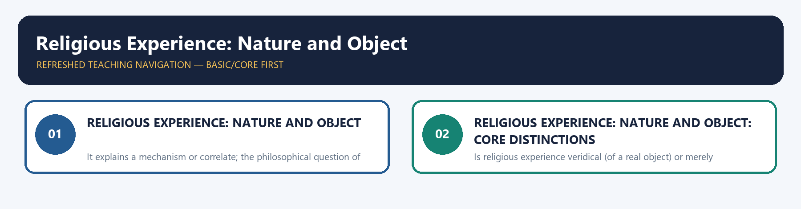
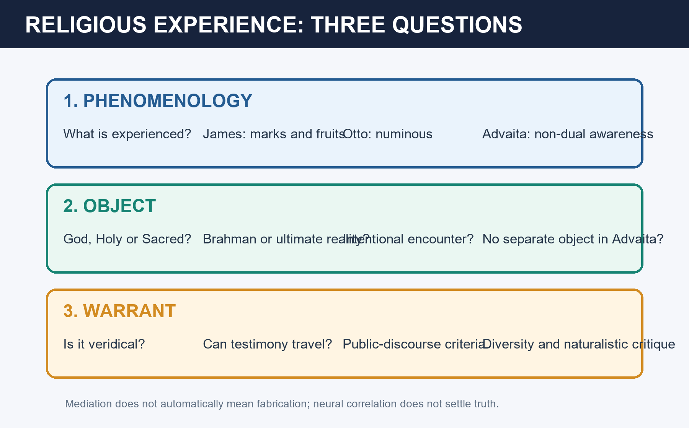

# Religious Experience: Nature and Object — Learner-v2 Source-Complete Learning Session

> **Catalogue identity:** Philosophy Optional · Philosophy Paper II — Philosophy of Religion · `philosophy-paper-ii-philosophy-of-religion-06`  
> **Generation:** g1, 21 August 2026 · **Approval:** pending explicit topic approval  
> **Evidence discipline:** exact doctrine and PYQ wording/year/marks are controlled by repository owners. Model answers are independent pedagogic practice, never official UPSC keys.

### Package practice counts

| Component | Count |
|---|---:|
| Direct verified topic-owned PYQs | 8 |
| Core diagnostic MCQs | 40 |
| Remedial diagnostic MCQs | 8 |
| Total diagnostics | 48 |
| Original solved Mains models | 6 (2 × 10, 2 × 15, 2 × 20) |
| Consolidated register parts | 12 (A–L) |
| Approval | false |


## BASIC LEARNING SESSION



*Distinct embedded teaching-navigation image. The separate continuous Cārvāka-style flowchart package remains an independent at-a-glance artifact.*
### Source-complete coverage ledger and answer-worthiness labels

**[FACT]** identifies retained repository doctrine or verified question data. **[INFERENCE]** identifies learner-facing organisation or judgement.

| Source corpus | Final location | Retention decision |
|---|---|---|
| Canonical owner §§0–7 | Basic Learning Session | Complete phenomenology, Indian accounts, object/warrant grid, parity bench and answer skeletons retained |
| Canonical owner §§9–19 | Optional Advanced | Complete James, Otto, Advaita, Radhakrishnan, typology, prayer/worship, public discourse, Alston, debates and answer control retained |
| Audited PYQ ledger | PYQs and Answer Practice | All eight owner questions, one from each year 2018–2025, retained with exact wording and new full solutions |
| Premium diagnostic set | MCQs / Remediation | Forty core and eight remedial questions retained with strict answer rotation |
| Original practice | PYQs and Answer Practice | Six non-PYQ solved models retained |
| Advanced dossier | Optional Advanced | Perceptual model, constructivism, diversity, neural mediation and non-dual/intentional contrasts reconciled |
| Consolidated register | Final section | A–L retrieval framework retains complete answer logic |

**Visible learning labels.** James, Otto, Advaita, Radhakrishnan, sacred/holy, prayer/worship, public discourse and veridicality are **CORE PAPER II**. Phenomenology–object–warrant separation, comparison and graded verdict are **CORE ANSWER**. Neuroscience and bounded interdisciplinary links are **SUPPORTING**. Perceptual models, constructivism, perennialism and specialist diversity disputes are **OPTIONAL ADVANCED**.

**What not to over-study.** Do not fill answers with brain-region catalogues, mystical case lists or claims that ineffability makes experience unintelligible. Master the phenomenological marks, claimed object, warrant test, strongest critique and one Indian comparison.
### Learning roadmap

| Unit | Learner objective |
|---:|---|
| 1 | Separate phenomenology, object and warrant |
| 2 | Explain James's marks and pragmatic fruits |
| 3 | Explain Otto's numinous and the Holy |
| 4 | Compare Advaita and Radhakrishnan |
| 5 | Distinguish sacred, holy and God as object |
| 6 | Test veridicality, testimony and diversity |
| 7 | Distinguish prayer from worship |
| 8 | Convert private experience into public discourse |
| 9 | Compare perceptual and constructivist models |
| 10 | Build 10/15/20-mark answers |

### SESSION 1 — RELIGIOUS EXPERIENCE: NATURE AND OBJECT

#### DEFINITION / WHAT THIS IS CALLED

**Plain-language definition:** ✅ Fact: A 2025 Frontiers in Neuroscience review described neuroscience of religion as the study of correlations between brain functions and religious practices, beliefs and experiences, while emphasizing methodological and definitional limitations. ⚠️ Inference: Neural mediation does not by itself prove either veridicality or illusion.

**Technical definition:** It explains a mechanism or correlate; the philosophical question of the experience's object and warrant remains open.

#### ANSWER-GRABBING OPENING — WRITE/ADAPT IN THE EXAM

> ✅ Fact: A 2025 Frontiers in Neuroscience review described neuroscience of religion as the study of correlations between brain functions and religious practices, beliefs and experiences, while emphasizing methodological and definitional limitations. ⚠️ Inference: Neural mediation does not by itself prove either veridicality or illusion.

#### MUST-WRITE KEYWORDS

- **Religious Experience**
- **Nature**
- **Object**
- **Frontiers**
- **Neuroscience**
- **2025**

**How to use them:** Use Religious Experience to define the issue, connect Nature with Object to explain it, and use Frontiers to distinguish or qualify the conclusion.

✅ **Fact:** A 2025 *Frontiers in Neuroscience* review described neuroscience of religion as the study of correlations between brain functions and religious practices, beliefs and experiences, while emphasizing methodological and definitional limitations.  
⚠️ **Inference:** Neural mediation does not by itself prove either veridicality or illusion. It explains a mechanism or correlate; the philosophical question of the experience's object and warrant remains open.




#### CLOSING RECALL FLOW — RELIGIOUS EXPERIENCE: NATURE AND OBJECT

```text
START / CONCEPT: Religious Experience: Nature and Object
        |
        v
EXACT TERMS: Religious Experience · Nature · Object · Frontiers · Neuroscience · 2025
        |
        v
MECHANISM / ARGUMENT: It explains a mechanism or correlate; the philosophical question of the experience's object and warrant remains open.
        |
        v
CONSEQUENCE / CONTRAST: ✅ Fact: A 2025 Frontiers in Neuroscience review described neuroscience of religion as the study of correlations between brain functions and religious practices, beliefs and experiences, while emphasizing methodological and definitional limitations. ⚠️ Inference: Neural mediation does not by itself prove either veridicality or illusion.
        |
        v
UPSC TRAP / ANSWER-USE: ✅ Fact: A 2025 Frontiers in Neuroscience review described neuroscience of religion as the study of correlations between brain functions and religious practices, beliefs and experiences, while emphasizing methodological and definitional limitations. ⚠️ Inference: Neural mediation does not by itself prove either veridicality or illusion.
        |
        v
ANSWER-GRABBING FORMULATION: ✅ Fact: A 2025 Frontiers in Neuroscience review described neuroscience of religion as the study of correlations between brain functions and religious practices, beliefs and experiences, while emphasizing methodological and definitional limitations. ⚠️ Inference: Neural mediation does not by itself prove either veridicality or illusion.
```
### SESSION 2 — RELIGIOUS EXPERIENCE: NATURE AND OBJECT: CORE DISTINCTIONS

#### DEFINITION / WHAT THIS IS CALLED

**Plain-language definition:** [James] "Nature & variety of religious experience per William James." (2022) → §1. [Advaita] "Main features of religious experience in Advaita Vedānta." (2024) → §2. [Radhakrishnan] "Nature & object of religious experience per Radhakrishnan." (2025) → §2. [Mystical-revelation] "Relation between mystical experience & revelation." (2023) → §3. [Veridicality] "Is religious experience a reliable ground for belief in God?" → §3 + §9.9. [Sacred/Holy] "'Sacred' and 'Holy' as generic names for the object of religion — can God be the object?" (2018, 20m) → §9.10. [Public discourse] "How far can religious experience be made a topic of public discourse?" (2019, 15m) → §9.8. [Prayer/worship] "Distinguish prayer and worship and determine their place in religion." (2020, 15m) → §9.7 — two deliverables, both required. [Vedāntic] "Religious experience in the light of the Vedāntic tradition." (2021, 15m) → §2 + §9.3. [Typology] "Is mystical experience one thing or many?" → §9.6 — Stace vs Zaehner vs Katz.

**Technical definition:** Is religious experience veridical (of a real object) or merely subjective/psychological? ⚠️ For veridicality: Principle of Credulity (Swinburne) — if it seems to one that X is present, probably X is, absent defeaters; the noetic quality; convergence of mystics.

#### ANSWER-GRABBING OPENING — WRITE/ADAPT IN THE EXAM

> Religious experience is an experience interpreted as disclosing or relating the subject to an ultimate, sacred or divine reality.

#### MUST-WRITE KEYWORDS

- **Religious Experience**
- **Nature**
- **Object**
- **Core Distinctions**
- **Master rule**
- **Recommended opening definition**

**How to use them:** Use Religious Experience to define the issue, connect Nature with Object to explain it, and use Core Distinctions to distinguish or qualify the conclusion.

```text
1. PHENOMENOLOGY: What is the experience like?
        |
2. OBJECT: What, if anything, is encountered?
        |
3. WARRANT: What reason is there to treat it as veridical?

James mainly describes phenomenology and fruits.
Otto analyses the numinous object-pole.
Advaita revises the subject-object structure itself.
Alston and Swinburne address epistemic entitlement.
```

> **Master rule:** A vivid or transformative experience can be psychologically real without its interpretation being automatically true. Equally, conceptual or neural mediation does not automatically make it fabricated.


#### 0. ONE-SCREEN MAP ⚠️

> [!IMPORTANT]
> **ANSWER-GRABBING LINE — WRITE/ADAPT IN THE EXAM**  
> **Recommended opening definition:** Religious experience is an experience interpreted as disclosing or relating the subject to an ultimate, sacred or divine reality.  
> **Core argument/criticism:** Phenomenology describes what the experience is like, the object question asks what is encountered, and warrant asks why the interpretation should be believed.  
> **Final verdict:** Psychological reality, claimed object and epistemic justification must be analysed separately.


```
   RELIGIOUS EXPERIENCE
   NATURE (what it is like)          OBJECT (what it is of)
   ───────────────────────          ────────────────────
   James: PRIMARY marks —           the "MORE", the divine/sacred,
     ineffability + noetic quality  Brahman, God, the numinous
   James: USUAL marks —             │
     transiency + passivity         WESTERN: personal God (theistic mysticism)
   Otto: the NUMINOUS —             INDIAN: Brahman/ātman (Advaita — non-dual,
     mysterium tremendum et                  identity experience; anubhava)
     fascinans                      Radhakrishnan: intuitive, self-certifying
   Stace: extrovertive / introvertive        realisation of the Spirit
   Zaehner: nature / monistic / theistic     ("The Hindu View of Life")
   Alston: perceptual model (M-perception)
        │
   is it VERIDICAL (of a real object) or merely psychological?
   generic OBJECT-category: the SACRED / HOLY (Durkheim, Otto, Eliade) — §9.6
```
> 🔑 **Mnemonic — James's marks are two-plus-two, not four.** ***I-N*** = **I**neffable + **N**oetic are the **defining** marks ("entitle any state to be called mystical"); ***T-P*** = **T**ransient + **P**assive are the **usual** accompaniments, "less sharply marked". Writing all four as equal is the standard error. Otto's object = the **numinous** (tremendum + fascinans). Indian object = **Brahman** (non-dual).

---

#### 1. NATURE — Western accounts ✅

> [!IMPORTANT]
> **ANSWER-GRABBING LINE — WRITE/ADAPT IN THE EXAM**  
> **Recommended opening definition:** Mystical experience is a mode of religious experience marked, for William James, primarily by ineffability and noetic quality.  
> **Core argument/criticism:** James's appeal to transformative fruits avoids reduction by causal origin, but private authority cannot by itself establish public metaphysical truth.  
> **Final verdict:** James explains the character and practical authority of mystical states more successfully than their objective veridicality.

- **William James (2022 PYQ) — the marks of mystical states, correctly graded:** ✅ In the *Varieties*, James distinguishes **two marks that are jointly sufficient to entitle a state to be called mystical** from **two further marks that are less sharply defined but usually found**. Reproduce this grading; do not present a flat list of four.
  - **PRIMARY / DEFINING (the two that settle the classification):**
    1. **Ineffability** — the state defies adequate expression; its quality must be **directly experienced**, and, like a feeling rather than a proposition, it cannot be imparted to those who have not had it. James calls this the "handiest" mark.
    2. **Noetic quality** — mystical states present themselves as **states of knowledge**: "states of insight into depths of truth unplumbed by the discursive intellect", carrying a curious sense of authority.
  - **USUAL / ACCOMPANYING (present in most cases, but not definitional):**
    3. **Transiency** — the state cannot be sustained for long; James notes its characteristic brevity, though it may recur and develop.
    4. **Passivity** — although the onset can be facilitated by preliminary voluntary operations, once the state sets in the mystic feels **grasped and held by a superior power**.
  - ⚠️ **Why the grading matters in an exam:** it is what lets you say that a state may be genuinely mystical *without* being brief or wholly passive — which is exactly the situation of Indian *jñāna*, a **stable, established** realisation rather than an episode. A flat four-mark list makes Advaitic realisation look like a failed mystical state.
  - **James's method and framework:** he is **empirical and pragmatic** — he studies first-person documents, refuses "medical materialism" (the fallacy of discrediting a state by its physiological or pathological origin), and evaluates religion by its **fruits**, invoking the biblical maxim "by their fruits ye shall know them" (Matthew 7:16/20) as a criterion rather than coining it. ⚠️ He also holds mystical states to be **authoritative for the one who has them**, but to impose **no authority on outsiders** — a limitation that must be stated, since it is the hinge of the veridicality question. Religion for James is **personal before institutional**; the experience of the **"MORE"** connects the self, through the subconscious, to a wider reality.
  - **Varieties covered:** healthy-mindedness and the sick soul; the divided self and conversion; saintliness; mysticism.
- **Rudolf Otto — the numinous:** the object of religious experience is the **"Holy" / numinous**, experienced as **mysterium tremendum et fascinans** — an *a priori*, non-rational awe: overwhelming (*tremendum*), yet fascinating/attracting (*fascinans*), wholly other. ✅
- **Schleiermacher:** religion's essence = the **"feeling of absolute dependence."** ⚠️
- **W. T. Stace and R. C. Zaehner** classify the material into rival typologies — §9.6; **William Alston** models it on perception — §9.8.

---
#### 2. NATURE — Indian accounts ✅

> [!IMPORTANT]
> **ANSWER-GRABBING LINE — WRITE/ADAPT IN THE EXAM**  
> **Recommended opening definition:** Advaitic aparokṣānubhūti (immediate non-mediated realisation) is direct recognition of the identity of ātman (the true self) and Brahman (ultimate reality).  
> **Core argument/criticism:** Unlike episodic subject-object encounter, non-dual realisation claims to dissolve the distinction between knower and known and to become stable knowledge.  
> **Final verdict:** Indian accounts widen religious experience from encounter with an Other to transformative identity-recognition.

- **Anubhava (direct realisation):** in Indian thought the highest religious experience is **immediate, intuitive realisation (anubhava/aparokṣānubhūti)**, not mere belief — the goal of the whole spiritual path. ✅
- **Advaita (2024 PYQ) — features:** ✅
  - **Non-dual (nirvikalpa) experience** — the collapse of subject–object duality; the realiser *is* Brahman (*"aham brahmāsmi"*).
  - **Self-certifying (*svataḥ-siddha*)**, beyond objectifying speech (*avācya*; *yato vāco nivartante*), bliss (*ānanda*), beyond the categories of ordinary cognition. ⚠️ **Terminological discipline:** do **not** call this experience *anirvacanīya*. In Advaita's technical vocabulary *anirvacanīya* is the status of **māyā and the world-appearance** (*sad-asad-vilakṣaṇa*), not of Brahman or of the realisation of Brahman — see [Religious Language §9.5](./Religious-Language.md) and [Notions of God §2](./Notions-of-God.md). Spell it ***anirvacanīya*** throughout.
  - Not a *relation* to an object but **identity** — distinguishing it from theistic (dualistic) mysticism.
- **Radhakrishnan (2025 PYQ — *The Hindu View of Life*):** religion is grounded in **direct, intuitive spiritual experience** of the Real (*anubhava*), which is **self-certifying** and universal across traditions; dogma/ritual are secondary interpretations of this core experience. Religious experience is **integral intuition** — a knowing that unites, higher than sense & reason. ✅

---
#### 3. OBJECT & the question of VERIDICALITY ⚠️

> [!IMPORTANT]
> **ANSWER-GRABBING LINE — WRITE/ADAPT IN THE EXAM**  
> **Recommended opening definition:** Veridicality asks whether a religious experience presents a real object rather than only a psychologically genuine state.  
> **Core argument/criticism:** Credulity, coherence and transformative fruits support prima facie trust, while naturalistic explanation, conflicting reports and private access provide defeaters.  
> **Final verdict:** Religious experience can justify the subject defeasibly, but it does not function as universally coercive proof.

- **The object:** theistic traditions → a **personal God**; Advaita → **Brahman/ātman (non-dual)**; Otto → the **numinous/Holy**; Buddhism → nirvāṇa (no personal deity).
- **Is religious experience veridical (of a real object) or merely subjective/psychological?** ⚠️
  - *For veridicality:* **Principle of Credulity** (Swinburne) — if it seems to one that X is present, probably X is, absent defeaters; the noetic quality; convergence of mystics.
  - *Against:* **naturalistic explanations** (Freud — projection/wish-fulfilment; Marx — opium; neuroscience); **diversity** of experiences across religions (which object is real?).
  - **Hick's pluralist reply:** the various experiences are culturally-shaped responses to one ultimate **"Real"** ("the Real an sich" experienced through different lenses). ✅
- **Mystical experience & revelation (2023 PYQ):** mystical experience can be a **vehicle of revelation** (God/the Real disclosed experientially) — non-propositional revelation; the two are intimately linked. ⚠️

---
#### 4. COMPARISON GRID ⚠️
| Thinker | Nature | Object | Key term |
|---|---|---|---|
| James | **defining:** ineffable + noetic; **usual:** transient + passive | the "MORE" | varieties; fruits; medical materialism rejected |
| Otto | non-rational awe | the numinous/Holy | mysterium tremendum et fascinans |
| Schleiermacher | feeling of dependence | the Infinite | absolute dependence |
| Stace | extrovertive (unity *through* the senses) / introvertive (contentless unitary consciousness) | the One | common-core thesis |
| Zaehner | nature / monistic / theistic mysticism | Nature, the isolated soul, or a personal God | *pan-en-henic*; typology with a ranking |
| Alston | perception-like, with an appearing object | God as directly presented | M-perception; doxastic practice |
| Advaita | non-dual, self-certifying bliss | Brahman (=ātman) | nirvikalpa; *aham brahmāsmi* |
| Radhakrishnan | integral intuition (anubhava) | the Spirit/Real | self-certifying experience |
| Durkheim/Eliade | socially and spatially structured | the **sacred** (vs the profane) | hierophany; *axis mundi* |

---

#### 5. FOUNDATIONAL STATEMENT BANK ⚠️
1. ✅ James treats the noetic mark as an experienced disclosure of insight not reached by discursive reasoning alone.
2. ✅ James's pragmatic method tests religious life by enduring fruits rather than dismissing it through causal origins.
3. ✅ Otto names the Holy's distinctive phenomenology *mysterium tremendum et fascinans*.
4. ✅ *Aham brahmāsmi* is an Upaniṣadic identity formula central to Advaitic interpretation.
5. ⚠️ Radhakrishnan gives direct spiritual intuition priority over its later doctrinal and institutional expressions.

---
#### 6. APPLIED-QUESTION DRILLS ⚠️
1. **[James]** "Nature & variety of religious experience per William James." (2022) → §1.
2. **[Advaita]** "Main features of religious experience in Advaita Vedānta." (2024) → §2.
3. **[Radhakrishnan]** "Nature & object of religious experience per Radhakrishnan." (2025) → §2.
4. **[Mystical-revelation]** "Relation between mystical experience & revelation." (2023) → §3.
5. **[Veridicality]** "Is religious experience a reliable ground for belief in God?" → §3 + §9.9.
6. **[Sacred/Holy]** "'Sacred' and 'Holy' as generic names for the object of religion — can God be the object?" (2018, 20m) → §9.10.
7. **[Public discourse]** "How far can religious experience be made a topic of public discourse?" (2019, 15m) → §9.8.
8. **[Prayer/worship]** "Distinguish prayer and worship and determine their place in religion." (2020, 15m) → §9.7 — two deliverables, both required.
9. **[Vedāntic]** "Religious experience in the light of the Vedāntic tradition." (2021, 15m) → §2 + §9.3.
10. **[Typology]** "Is mystical experience one thing or many?" → §9.6 — Stace vs Zaehner vs Katz.

---
#### 6A. INDIAN–WESTERN PARITY BENCH ⚠️

| Axis | Western | Indian | Discriminating point |
|---|---|---|---|
| Structure of the experience | Encounter/union with an Other (Otto, theistic mysticism) | **Identity-recognition** (Advaita) or **isolation** (Sāṃkhya-Yoga) | Relation vs identity is a *logical*, not merely stylistic, difference |
| Duration | Transient (James's usual mark) | *Jñāna* is **stable and established**, not episodic | Why James's grading of marks matters |
| Method | Grace, contemplation, sacrament | Disciplined, staged, repeatable (*aṣṭāṅga*, *śravaṇa–manana–nididhyāsana*) | India's replicability claim in the public-discourse question |
| Authority | Authoritative for the subject only (James) | *Svataḥ-siddha* — self-certifying, but tested by *guru* and *śruti* | Both restrict transferability; India adds institutional discernment |
| Object-term | God, the Holy, the numinous | Brahman, *puruṣa*, nirvāṇa, the Tīrthaṅkara | Generic term must be "sacred", not "God" |
| Ritual correlate | Prayer, sacrament, liturgy | *Upāsanā*, *pūjā*, *japa*, *dhyāna* | Jain/Mīmāṃsā worship *without* a responsive deity |

---

#### 7. PYQ-MAPPED MODEL-ANSWER SKELETONS ⚠️

#### 7.1 — "Nature and variety of religious experience as presented by William James." (2022, 15m)
```
Intro : James — empirical, pragmatic study of personal religion (Varieties).
Body  : 4 marks — ineffable, noetic, transient, passive; the "MORE"; test by fruits;
        varieties (healthy-minded vs sick-souled; conversion; mysticism).
Assess: strength — takes experience seriously, empirical; limit — subjectivism, veridicality unproven.
Concl : religious experience is the living root of religion, though its object needs further warrant.
```

#### 7.2 — "Main features of religious experience according to Advaita Vedānta." (2024, 15m)
```
Intro : Advaita — highest experience is aparokṣānubhūti (direct realisation of Brahman).
Body  : non-dual (nirvikalpa), subject-object collapse, identity (aham brahmāsmi),
        self-certifying (svataḥ-siddha), beyond objectifying speech (avācya; yato vāco nivartante),
        bliss (ānanda). [Do NOT write anirvacanīya here — that term belongs to māyā.]
Contrast: vs theistic/dualistic mysticism (relation to a personal God) & James's "MORE".
Concl : the object is not encountered but realised as one's own Self.
```

#### 7.3 — "Distinguish between prayer and worship and determine their place in religion." (2020, 15m)
```
Intro : two deliverables — the distinction, then the placement. Do both.
Distinction: prayer = ADDRESS (communication); worship = ASCRIPTION OF SUPREME WORTH (homage).
        Axes: essential act | direction | form (spontaneous vs ritual) | locus (private vs corporate)
        | presupposition (a responsive God vs a supremely valuable reality).
        Kinds of prayer: adoration, confession, thanksgiving, supplication (ACTS);
        contemplative/wordless prayer as the limit case where address becomes silence.
Problems: petitionary prayer — if God is omniscient, good and immutable, petition is idle.
        Aquinas: we pray to obtain what God has ordained shall be obtained THROUGH prayer.
        Stump: petition protects the friendship-structure against overwhelming benefaction.
        Worship — Rachels' moral-autonomy argument; replies (worth ≠ blind obedience).
Indian: prārthanā, stuti, japa, dhyāna, upāsanā, pūjā/arcana, vandana, ātma-nivedana.
        Decisive cases: Jain vītarāga cannot respond → worship without answered petition;
        Mīmāṃsā's apūrva → ritual efficacy without a granting deity;
        Advaita's upāsanā → efficacious at vyāvahārika, transcended at pāramārthika;
        Buddhist pūjā as commemorative/dispositional.
Placement: prayer is religion's RELATIONAL organ; worship its EVALUATIVE and COMMUNAL organ.
Concl : a religion can survive the loss of petition; none survives the loss of worship —
        because nothing would then mark the ultimate as ultimate.
```

#### 7.4 — "How far can religious experience be made a topic of public discourse?" (2019, 15m)
```
Intro : the stem asks HOW FAR — so the answer must be graded, not yes/no.
Against: ineffability; privileged access; James's own limit (authoritative only for the subject);
        no shared checking procedure; private-language worries; Rawlsian public reason.
For   : six intersubjective criteria — (1) phenomenological description (James, Otto, Stace,
        Zaehner built public typologies from private reports); (2) coherence; (3) traditional
        discernment norms (Teresa's criteria; the guru's verification); (4) moral fruits, which are
        observable; (5) replicability through disciplined practice (yoga, nididhyāsana —
        Vivekananda's and Radhakrishnan's "experimental" claim, reported as a claim);
        (6) Alston's doxastic practices.
Bridge: Habermas — full expression in the informal public sphere, with a translation proviso
        before formal state decision-making.
Crit  : these criteria test AUTHENTICITY, not TRUTH — concede this explicitly.
Concl : publicly discussable as data, description and practice; privately probative as evidence.
```

#### 7.5 — "'Sacred' and 'Holy' as generic names for the object of religion. Can one have God as the object?" (2018, 20m)
```
Intro : the stem grants the generic category and asks after the specific one — answer in degrees.
B1    : why 'sacred/holy' became generic — Otto (the holy as a non-moral, non-rational quality
        disclosed in numinous awe); Durkheim (the sacred defined relationally against the profane,
        with no deity required); Eliade (hierophany structuring sacred space and time);
        and the decisive reason — non-theistic religions have a sacred but no God
        (nirvāṇa/Dharma, Tīrthaṅkara/siddha, the apauruṣeya Veda).
B2    : can God be the object? YES for theistic traditions, where God is not one sacred item but the
        SOURCE and MEASURE of holiness; NO as a generic definition, since it stipulates Buddhism,
        Jainism and Mīmāṃsā out of religion.
B3    : the discriminating point — Otto's holy (phenomenological quality) is not Durkheim's sacred
        (social classification); treating them as one word misses the objection to each.
Indian: pavitra/śuddha, maṅgala, puṇya, tīrtha, kṣetra; sacred time in the ritual calendar;
        the Veda's sanctity without a sanctifier. Purity/auspiciousness, not dread, often organises
        the Indian sacred — a real limit on Otto's universality.
Crit  : over-breadth (flags, nations); reply — add the soteriological requirement.
Concl : 'sacred' is the genus; God is theism's paradigm species of it.
```

---

#### CLOSING RECALL FLOW — RELIGIOUS EXPERIENCE: NATURE AND OBJECT: CORE DISTINCTIONS

```text
START / CONCEPT: Religious Experience: Nature and Object: Core Distinctions
        |
        v
EXACT TERMS: Religious Experience · Nature · Object · Core Distinctions · Master rule · Recommended opening definition
        |
        v
MECHANISM / ARGUMENT: [!IMPORTANT] Mystical experience is a mode of religious experience marked, for William James, primarily by ineffability and noetic quality.
        |
        v
CONSEQUENCE / CONTRAST: Anubhava (direct realisation): in Indian thought the highest religious experience is immediate, intuitive realisation (anubhava/aparokṣānubhūti), not mere belief — the goal of the whole spiritual path. ✅ Advaita (2024 PYQ) — features: ✅ Non-dual (nirvikalpa) experience — the collapse of subject–object duality; the realiser is Brahman ("aham brahmāsmi").
        |
        v
UPSC TRAP / ANSWER-USE: Self-certifying (svataḥ-siddha), beyond objectifying speech (avācya; yato vāco nivartante), bliss (ānanda), beyond the categories of ordinary cognition. ⚠️ Terminological discipline: do not call this experience anirvacanīya.
        |
        v
ANSWER-GRABBING FORMULATION: Religious experience is an experience interpreted as disclosing or relating the subject to an ultimate, sacred or divine reality.
```
## BASIC MCQS / REMEDIATION

### Practice protocol — [CORE ANSWER]

Attempt each item before reading its key. Answer placement is balanced, deterministic and non-patterned using a stable topic seed. across all forty-eight diagnostics.

#### CORE DIAGNOSTIC MCQS — 40

#### 1. Which analytical sequence best prevents a category mistake while evaluating a religious experience?

A. Describe its phenomenology, identify its claimed object, and then assess the warrant for believing that object real
B. Establish its object first, infer its phenomenology, and treat intensity as warrant
C. Test its moral fruits, infer its object, and omit the subject’s report
D. Classify its ritual setting, assume its veridicality, and then describe its content

**Answer: A.**

Phenomenology asks what the experience is like; object asks what it purports to be of; warrant asks whether belief in that object is justified. An accurate description does not itself prove that the apparent object exists.

#### 2. Which pair does James treat as the defining marks that entitle a state to be called mystical?

A. Conversion and saintliness
B. Unity and blessedness
C. Transiency and passivity
D. Ineffability and noetic quality

**Answer: D.**

In *The Varieties of Religious Experience*, ineffability and noetic quality are the primary marks. Transiency and passivity are usual, less sharply marked accompaniments, not co-equal defining conditions.

#### 3. What follows from James’s grading of transiency and passivity?

A. Indian *jñāna* cannot count as mystical because it aims at permanence
B. Every passive state is mystical even if it has no noetic quality
C. A mystical state must be both brief and involuntary
D. A stable, disciplined realisation may still be mystical if the defining marks are present

**Answer: D.**

Because transiency and passivity are usual rather than defining, stable Advaitic *jñāna* is not excluded merely for being cultivated and enduring. The classification turns principally on ineffability and noetic quality.

#### 4. James’s criticism of “medical materialism” is best understood as the claim that:

A. tracing an experience to a causal origin does not by itself settle its truth or value
B. religious experience has no physiological conditions
C. pathological experiences are invariably true
D. science is incapable of studying religious subjects

**Answer: A.**

James rejects the genetic fallacy of discrediting a state solely through its neurological, temperamental or pathological origin. He does not deny causation; he denies that causal explanation alone is an epistemic refutation.

#### 5. What is James’s most defensible position on the authority of mystical states?

A. They bind outsiders whenever the experiencer reports certainty
B. They have no authority even for the experiencer
C. They may authorise the experiencer but impose no unconditional authority on outsiders
D. They are public proofs once they produce good conduct

**Answer: C.**

James grants first-person authority while restricting transferability. Moral fruits may strengthen an authenticity judgement, but neither certainty nor transformation automatically creates publicly compelling proof.

#### 6. Otto’s *mysterium tremendum et fascinans* refers to:

A. the numinous as mysterious, overwhelming and attracting
B. a moral inference from duty to God
C. the social separation of sacred objects from profane ones
D. non-dual recognition of Brahman as self

**Answer: A.**

Otto’s numinous object evokes mystery, dread or overpowering creature-feeling, and fascination. Durkheim’s sacred/profane classification and Advaita’s identity-realisation are different accounts.

#### 7. When Otto calls the numinous “non-rational,” he most nearly means:

A. logically contradictory and therefore false
B. not exhaustively reducible to moral and conceptual judgement
C. produced by unconscious irrational impulses alone
D. incapable of later ethical or theological interpretation

**Answer: B.**

“Non-rational” is not “irrational.” Otto means that the numinous has a distinctive felt quality prior to full conceptual and moral schematisation, though rational and ethical ideas may subsequently interpret it.

#### 8. Schleiermacher locates the essence of religion primarily in:

A. fear of supernatural punishment
B. the feeling of absolute dependence
C. belief in miracles
D. assent to ecclesiastical propositions

**Answer: B.**

Schleiermacher’s “feeling of absolute dependence” identifies a pre-theoretical consciousness of dependence upon the Infinite, contrasting religion with both mere doctrine and morality.

#### 9. In Stace’s typology, extrovertive mysticism is:

A. the exclusion of all sensory and conceptual content
B. loving communion with a personal God alone
C. a unifying vision attained through the senses while multiplicity remains perceptible
D. an altered state necessarily caused by drugs

**Answer: C.**

Extrovertive mysticism perceives unity through the world of sensory multiplicity. Introvertive mysticism, by contrast, excludes sensory and conceptual content in favour of unitary consciousness.

#### 10. Stace’s introvertive mysticism is best characterised as:

A. a socially imposed sacred/profane distinction
B. a heightened perception of unity within nature
C. ritual worship without petition
D. non-spatial, non-temporal, contentless unitary consciousness

**Answer: D.**

Introvertive experience withdraws from external and conceptual content, leaving pure undifferentiated unity. Stace treats it as the more complete mystical type.

#### 11. Which claim is central to Stace’s perennialist method?

A. Theistic mysticism is superior to monistic mysticism
B. A common experiential core can be distinguished from divergent doctrinal interpretations
C. Traditions create wholly different experiences with no common features
D. Only Christian mystical reports possess noetic force

**Answer: B.**

Stace separates experience from interpretation: reported marks such as unity, objectivity, blessedness, sacredness, paradox and ineffability support a cross-cultural core, while doctrines differ.

#### 12. Which classification belongs to R. C. Zaehner?

A. Healthy-mindedness, sick soul, conversion and saintliness
B. Nature, monistic and theistic mysticism
C. Numinous, moral and rational consciousness
D. Extrovertive and introvertive mysticism with one common core

**Answer: B.**

Zaehner distinguishes nature mysticism, monistic mysticism and theistic mysticism. He denies Stace’s flat common core and controversially ranks the theistic type highest.

#### 13. Zaehner’s *pan-en-henic* category denotes:

A. permanent isolation of *puruṣa* from *prakṛti*
B. identity of the individual self with Brahman
C. an “all-in-one” experience of unity with nature
D. loving relation between creature and creator

**Answer: C.**

*Pan-en-henic* names Zaehner’s nature mysticism, the sense of all things as one in nature. Monistic and theistic forms are separate categories in his scheme.

#### 14. What is the strongest defensible treatment of Zaehner’s ranking?

A. Accept both the classification and the superiority of theism as neutral phenomenology
B. Reject the typology because every mystical report is identical
C. Replace it with James’s four marks, which classify objects rather than states
D. Retain the distinction among types while rejecting the confessionally loaded hierarchy

**Answer: D.**

Zaehner insightfully preserves the logical difference between identity and relation, but his ranking of theistic mysticism is vulnerable to confessional bias. Classification need not entail hierarchy.

#### 15. Steven Katz’s constructivism holds that:

A. mystical experience is always veridical but described differently
B. traditions, expectations and concepts shape the experience itself
C. language affects only reports made long after an unmediated event
D. contentless awareness proves all religions share one object

**Answer: B.**

Katz denies unmediated experience. A Jewish, Buddhist or Advaitic mystic does not merely label one neutral episode differently; the tradition helps constitute what is experienced.

#### 16. Robert Forman’s Pure Consciousness Event is intended mainly to challenge constructivism by claiming that:

A. a contentless state leaves no experiential content for concepts to shape
B. every experience contains detailed doctrinal imagery
C. only sensory perception can be concept-free
D. neural mediation guarantees objectivity

**Answer: A.**

Forman presses the introvertive limit against Katz: if an episode is genuinely contentless, constructivist shaping appears to lack material on which to operate. Whether such complete contentlessness is possible remains disputed.

#### 17. Alston’s “M-perception” is:

A. a deductive proof from mystical testimony to God
B. the moral transformation produced by worship
C. a neuroscientific measurement of religious states
D. a non-sensory, perception-like awareness in which God appears to the subject

**Answer: D.**

In *Perceiving God*, Alston uses a theory of appearing to argue that sensory content is not essential to perceptual structure. Some awareness of God may therefore be genuinely perception-like.

#### 18. Why are doxastic practices important in Alston’s argument?

A. Beliefs arise within socially established practices with inputs, outputs and override procedures
B. They eliminate all circularity in justifying belief
C. They show that every religious tradition tracks the same object
D. They make mystical experiences repeatable laboratory observations

**Answer: A.**

Alston compares Christian mystical practice with sense perception and memory as socially established belief-forming practices. None is validated from nowhere; each uses internal support and correction.

#### 19. Alston’s conclusion is most accurately stated as:

A. Christian mystical practice is infallible
B. every M-belief is *ultima facie* justified
C. religious experience proves God more strongly than sense perception proves physical objects
D. engagement in an established mystical practice can be practically rational absent adequate defeaters

**Answer: D.**

Alston defends practical rationality and *prima facie* justification, not demonstrated reliability or infallibility. His modest conclusion is often overstated.

#### 20. What does Alston regard as the most serious pressure on his account?

A. Circular support occurs only in religion
B. Mystical experience has no phenomenological content
C. Sense perception is never socially established
D. mutually incompatible religious doxastic practices may each appear internally rational

**Answer: D.**

Religious diversity threatens neutral adjudication: Christian, Advaitic, Buddhist and Islamic practices may support incompatible outputs. Alston’s “sit tight” response acknowledges rather than dissolves the discomfort.

#### 21. Swinburne’s principle of credulity states, roughly, that:

A. all testimony is false unless independently verified
B. religious seemings are justified only within a doxastic practice
C. if it seems to a subject that something is present, it probably is, unless there are defeaters
D. moral fruits deductively establish a transcendent cause

**Answer: C.**

Swinburne begins from the general trust normally given to appearances, subject to defeating conditions such as unreliability, conflicting evidence or alternative explanations. This differs from Alston’s practice-based defence.

#### 22. Which statement correctly handles neural correlations of mystical states?

A. Causal mediation and epistemic defeat are distinct; a mechanism may carry either veridical or non-veridical experience
B. Brain activity is irrelevant to any philosophical assessment
C. A unique neural pattern would by itself prove God
D. Any neural cause proves the transcendent object unreal

**Answer: A.**

Ordinary perception also has neural mechanisms. To explain how an experience occurs is not yet to show that its apparent object is absent; further evidence is needed for an explaining-away defeater.

#### 23. Hick’s response to conflicting religious experiences is that:

A. only theistic reports are genuine
B. contradictions disappear because doctrines have no cognitive content
C. traditions may be culturally shaped responses to the one “Real”
D. every experience is a direct perception of the same personal God

**Answer: C.**

Hick distinguishes the Real in itself from its diverse human apprehensions. The proposal accommodates plurality, though critics ask how an unknowable Real can ground determinate religious claims.

#### 24. Which claim best distinguishes ineffability from unintelligibility?

A. Ineffability means that no statement whatsoever may refer to the experience
B. Ineffability limits exhaustive or adequate expression without making every partial description meaningless
C. An unintelligible state is always veridical
D. An ineffable state cannot be remembered

**Answer: B.**

Mystics can report that an experience was unitary, peaceful or transformative while denying that words capture its quality fully. Otherwise the very classification “ineffable” could not enter discourse.

#### 25. What is the central structure of Advaitic *aparokṣānubhūti*?

A. an emotional relation between two permanently distinct persons
B. sensory vision of Brahman possessing finite attributes
C. social classification of certain objects as sacred
D. non-dual recognition of Brahman as one’s own self rather than perception of an external object

**Answer: D.**

Advaita treats liberating knowledge as identity-recognition: the subject–object division is sublated. This differs logically from theistic mystical encounter, which retains relation.

#### 26. Which use of *anirvacanīya* is technically correct in Advaita?

A. It names James’s ineffability
B. It characterises māyā or world-appearance as neither simply real nor unreal
C. It is the standard name for Brahman’s non-dual self-realisation
D. It means that Brahman is irrational

**Answer: B.**

The common trap is to call Advaitic experience *anirvacanīya*. Advaita technically applies the term to māyā/world-appearance; Brahman-realisation is better described as non-objective and beyond exhaustive speech.

#### 27. Why does stable Advaitic *jñāna* matter in comparison with James?

A. It proves passivity is James’s sole defining mark
B. It shows no Indian state can be mystical
C. It converts noetic quality into ordinary inference
D. It shows that religious realisation may be established knowledge rather than a merely transient episode

**Answer: D.**

Advaita emphasises stable removal of ignorance through knowledge. James’s hierarchy permits this comparison because transiency is a usual accompaniment, not a necessary defining mark.

#### 28. Radhakrishnan’s “integral intuition” is best described as:

A. disciplined awareness integrating cognition, feeling and will in apprehension of the spiritual Real
B. sensory perception of a supernatural object
C. assent to inherited dogma before experience
D. an arbitrary feeling exempt from reason

**Answer: A.**

Radhakrishnan gives direct *anubhava* priority over creeds and institutions, but his intuition is claimed as noetic, transformative and disciplined, not a mere hunch.

#### 29. What is the essential act in prayer?

A. address or communication directed toward the divine
B. public classification of an object as sacred
C. ascription of supreme worth without any direction to an addressee
D. non-dual elimination of every relation

**Answer: A.**

Prayer is fundamentally communicative—petition, confession, thanksgiving, praise or contemplation directed toward an addressee. This makes a responsive ultimate more central to prayer than to worship.

#### 30. What is the essential act in worship?

A. requesting that a divine plan be changed
B. acknowledging and enacting the supreme worth of the sacred
C. reporting a private mystical episode
D. proving that a deity exists

**Answer: B.**

Worship is homage or ascription of unsurpassable worth, usually embodied and communal. It can persist in Jain, Buddhist or Mīmāṃsā settings where answered petition is absent.

#### 31. Why is adoration a useful boundary case?

A. It occurs only in non-theistic religion
B. It is neither prayer nor worship
C. As address it is prayer, and as ascription of worth it is worship
D. It is always a request for material benefit

**Answer: C.**

Adoration demonstrates overlap without erasing distinction. Its communicative direction makes it prayer; its recognition of supreme value makes it worship.

#### 32. Aquinas answers the apparent pointlessness of petitionary prayer by arguing that:

A. prayer gives God information previously unknown
B. divine goodness changes whenever a request is sincere
C. God may ordain that certain goods be obtained through prayer as a secondary cause
D. petition overrides an immutable providential order

**Answer: C.**

Aquinas does not make prayer alter God. Prayer can be included within providence as the means through which an ordained outcome occurs.

#### 33. Eleonore Stump’s distinctive defence of petitionary prayer stresses:

A. the relational or friendship value of asking before receiving
B. proof that every petition changes external events
C. the logical mutability of a perfect God
D. the superiority of petition over worship

**Answer: A.**

Stump argues that asking can protect the interpersonal structure of divine giving, especially where unsolicited benefaction by an overwhelmingly superior giver could compromise relationship. This does not prove outcome-dependence.

#### 34. James Rachels’ objection to worship is based on a tension between:

A. unconditional obedience and moral autonomy
B. sacred time and profane space
C. ineffability and public language
D. non-dual awareness and sensory perception

**Answer: A.**

Rachels argues that worship appears to require abdication of final moral judgement. Replies distinguish recognition of perfect worth from blind obedience and deny that perfect goodness could command evil.

#### 35. Why is Jain worship a decisive test case for the prayer/worship distinction?

A. Jain ritual denies that any reality has supreme value
B. Jainism regards every petition as infallibly answered
C. a *vītarāga* Tīrthaṅkara may be worshipped despite being unable to respond to petitions
D. Tīrthaṅkaras create the world but refuse worship

**Answer: C.**

Jain *caitya-vandana* demonstrates worship without a responsive deity. The practice honours liberation and cultivates the worshipper’s disposition rather than soliciting intervention.

#### 36. In the Mīmāṃsā example, ritual efficacy is chiefly associated with:

A. an emotional vision of a personal God
B. the moral fruits of conversion
C. a Tīrthaṅkara’s gracious response
D. *apūrva* generated by correct performance rather than a deity’s discretionary grant

**Answer: D.**

Mīmāṃsā allows ritual orientation without a responsive divine agent. This is why worship or sacred observance has broader religious availability than petitionary prayer.

#### 37. Which claim best captures the proper public-discourse verdict?

A. Ineffability prevents any meaningful public description
B. Private certainty automatically transfers to all rational observers
C. Religious experience can be publicly discussed and assessed for coherence and fruits without becoming publicly demonstrated
D. Public discussion is possible only after proving the transcendent object

**Answer: C.**

First-person reports, typologies, practices and effects are discussable. What remains non-transferable is the full evidential force that the episode has for the subject.

#### 38. Habermas’s translation proviso is relevant because it permits:

A. the state to enforce private revelation without reasons
B. religious expression in the informal public sphere while requiring generally accessible reasons for formal state decisions
C. only secular citizens to participate in public debate
D. mystical certainty to replace constitutional argument

**Answer: B.**

The distinction supplies a graded account of publicity: religious language need not be excluded from civic life, yet coercive institutions require reasons accessible beyond one faith community.

#### 39. Which distinction between Otto and Durkheim is correct?

A. Both define the sacred only as a personal God
B. Otto’s holy is a phenomenological quality; Durkheim’s sacred is defined relationally against the profane
C. Otto gives a social classification, whereas Durkheim describes creature-feeling
D. Both regard non-theistic religion as impossible

**Answer: B.**

Otto focuses on the numinous mode of appearance; Durkheim focuses on social separation and communal practice. Their terms overlap in ordinary use but perform different explanatory jobs.

#### 40. What is the best way to prevent “the sacred” from becoming so broad that any collectively valued object counts as religious?

A. Restrict it to objects producing fear
B. Require belief in a creator
C. add a soteriological relation to the diagnosis and overcoming of the fundamental human predicament
D. Count only objects named in scriptures

**Answer: C.**

A soteriological condition excludes merely patriotic or recreational objects while preserving non-theistic religious ultimates such as nirvāṇa, Dharma and liberation.

#### REMEDIAL DIAGNOSTIC MCQS — 8

#### 41. A candidate writes, “James gives four equally necessary marks of every religious experience.” Which correction is best?

A. The four concern worship; only passivity is defining
B. The four concern revelation; all are optional
C. James rejects every attempt to classify experience
D. The four concern mystical states; ineffability and noetic quality are defining, while transiency and passivity are usual accompaniments

**Answer: D.**

This corrects both errors: James is classifying mystical states rather than all religion, and he explicitly grades the marks. Treating all four as equally necessary misrepresents him and wrongly excludes stable, cultivated realisation.

#### 42. Which reformulation best corrects the claim “If a mystical experience is ineffable, it is meaningless”?

A. Ineffability guarantees that every metaphysical interpretation is true
B. Ineffability denies exhaustive expression, not all intelligible reference, comparison or report
C. Ineffability applies only to bodily sensations
D. Ineffability and logical contradiction are identical

**Answer: B.**

An experience may resist adequate transmission while remaining partially describable as unitary, peaceful, noetic or transformative. The concept limits language; it does not abolish language.

#### 43. What is the correct response to “If tradition mediates experience, tradition must fabricate it”?

A. All mediated experiences are false
B. Religious experience is uniquely free from concepts
C. Mediation shapes access and interpretation but does not by itself establish that no independent object is disclosed
D. Fabrication is guaranteed whenever practices precede an experience

**Answer: C.**

Katz shows that mediation is epistemically important, but the move from “concept-laden” to “invented” is invalid. Ordinary perception is also mediated; objectivity depends on constraints, correction and defeaters.

#### 44. Which correction best addresses the equation of Otto’s “holy” with Durkheim’s “sacred”?

A. Both terms refer exclusively to moral goodness
B. Otto analyses a numinous phenomenological quality, whereas Durkheim analyses a social separation from the profane
C. Both are names for Advaita’s Brahman
D. Otto and Durkheim offer the same theory in different languages

**Answer: B.**

Their concepts can overlap in religious life but answer different questions. Otto asks how the object appears; Durkheim asks how sacred classification and community function.

#### 45. Which statement correctly distinguishes prayer from worship?

A. Non-theistic traditions can have neither prayer nor worship
B. Prayer is always private, whereas worship is always public
C. Prayer is address and normally presupposes a responsive addressee; worship is ascription of supreme worth and can occur without answered petition
D. Prayer is necessarily petition, whereas worship excludes praise

**Answer: C.**

Form and location vary, so private/public is not the essence. Adoration overlaps both practices, but Jain and Mīmāṃsā cases show that worship survives without a deity who answers requests.

#### 46. Why is it misleading to say that Advaita is an experience “of Brahman” in exactly the same sense that Otto describes experience “of the Holy”?

A. Both accounts reduce religion to social ritual
B. Advaita denies consciousness
C. Otto teaches identity of ātman and Brahman
D. Advaita’s highest realisation sublates subject–object duality, whereas Otto retains intentional encounter with the wholly other

**Answer: D.**

The logical forms differ: Advaita is identity-recognition, while Otto’s numinous experience has an experiencer directed toward an other. “Object” must therefore be used carefully.

#### 47. Which inference illegitimately moves from phenomenology to warrant?

A. “The experience felt absolutely real; therefore its transcendent object certainly exists.”
B. “The report contains a sense of unity; therefore unity belongs to its phenomenology.”
C. “The subject felt passive; therefore the state resembles James’s usual mystical marks.”
D. “The report is culturally shaped; therefore its interpretation requires analysis.”

**Answer: A.**

A sense of objectivity is itself phenomenological evidence, not proof that the apparent object exists. Veridicality requires separate assessment of reliability, defeaters and competing explanations.

#### 48. Which comparison between Swinburne and Alston is accurate?

A. Swinburne starts from a general presumption in favour of seemings; Alston defends rational engagement in socially established belief-forming practices
B. Both offer deductive proofs from mystical reports
C. Alston formulates the principle of credulity, while Swinburne analyses doxastic practices
D. Both conclude that religious diversity is irrelevant

**Answer: A.**

Swinburne’s argument is appearance-based and defeasible; Alston’s is practice-based and culminates in practical rationality and *prima facie* justification. Neither yields infallibility.

## PYQS AND ANSWER PRACTICE

#### VERIFIED PYQS — 8 COMPLETE SOLUTIONS

These are independent practice models prepared from the verified question ledger; they are not official UPSC answers or marking keys.

#### PYQ 1 — 2018, Q7(a), 20 marks

**Exact verified question:** The terms ‘Sacred’ and ‘Holy’ have come to serve as generic names for the object of religion. Do you agree that one can have God as the object of religion? Discuss.

**Demand decoding:** Explain why “sacred” and “holy” can cover religion generally; distinguish their major meanings; then give a graded answer on whether God may be religion’s object without making God its universally necessary object.

**Model solution:**  
The “object of religion” is that ultimate reality, power, state or value toward which religious consciousness and practice are directed. My thesis is graded: God can certainly be the object of religion in theistic traditions, but cannot define the object of religion generically. “Sacred” is the broader comparative category; God is the theistic paradigm within it.

The terms “holy” and “sacred” are not exact synonyms. In *The Idea of the Holy*, Rudolf Otto treats the Holy, prior to its moral schematisation, as the **numinous**—the *mysterium tremendum et fascinans*. Its object is experienced as mysterious and “wholly other,” producing creature-feeling, dread and fascination. Otto’s account is phenomenological: it describes how the object appears. Émile Durkheim, by contrast, defines the sacred socially through its separation from the profane and the prohibitions and communal practices surrounding it. Mircea Eliade adds the idea of **hierophany**: the sacred manifests and structures religious space, time and orientation. Thus Otto’s holy is a distinctive quality disclosed in experience, whereas Durkheim’s sacred is a social classification. Collapsing them obscures the difference between phenomenology and function.

These generic terms are useful because religion is wider than theism. Buddhism relates life to Dharma, nirvāṇa and awakening without a creator-God. Jainism venerates the liberated Tīrthaṅkara and *siddha*, not a world-creating deity. Mīmāṃsā treats the Veda as *apauruṣeya* and ritual efficacy through *apūrva*, without requiring a divine author or grantor. Indian categories such as *pavitra*, *maṅgala*, *tīrtha* and *kṣetra* also show that purity, auspiciousness, sacred space and soteriological power—not only Otto’s awe—organise religious life.

Nevertheless, God can be the object of religion. In classical theism, Judaism, Islam, Christianity, Viśiṣṭādvaita and many bhakti traditions, prayer, worship and revelation are intentionally directed toward a personal divine reality. God is not merely one sacred item among others but the source and measure of holiness: persons, texts and places are holy through relation to God. “Object” here must not imply an ordinary finite object passively inspected. It means the intentional pole of faith, worship and encounter—an inexhaustible subject who addresses the worshipper.

Two objections qualify this account. First, “sacred” may become so broad that flags, nations or celebrities count as religious objects. The reply is to add a **soteriological condition**: the religiously sacred is related to the diagnosis and overcoming of the fundamental human predicament. Second, a theist may object that calling God a “species” of the sacred subordinates God to a higher genus. The reply is conceptual, not ontological: comparative philosophy needs a category covering diverse religions; it does not deny the theist’s claim that God is ontologically ultimate.

Finally, identifying a claimed object must be separated from establishing its reality. Otto may accurately describe numinous intentionality without proving a numinous being, just as Durkheim may explain sacred classification without exhausting its possible transcendent reference. The phenomenology of an object, the specification of that object and the warrant for believing it exists are distinct questions.

An Indian–Western comparison further qualifies the word “object.” In theistic mysticism and prayer, God is encountered through an I–Thou relation. Radhakrishnan and Advaita, however, interpret the highest realisation non-dually: Brahman is not confronted as an Other but realised as the depth of self. Buddhism may regard even substantial “object” language as misleading. Hence comparative philosophy must allow object to mean the ultimate intentional or soteriological pole, not invariably a separately existing personal being.

Therefore, one can have God as the object of religion, decisively so within theism. But God cannot serve as religion’s universal defining object without excluding non-theistic religions by stipulation. The best verdict is: **the sacred is the comparative genus; God is theism’s paradigm instance and, for the believer, the source of all holiness.**

**Why this earns marks:** Directly answers the “do you agree” clause; distinguishes Otto, Durkheim and Eliade; supplies Indian non-theistic counter-cases; separates object from warrant; handles two objections; ends with a graded verdict.

#### PYQ 2 — 2019, Q7(c), 15 marks

**Exact verified question:** How far can religious experience be made a topic of public discourse? Analyse.

**Demand decoding:** Give a degree, not a yes/no. Separate public description and assessment from public proof, identify limits created by privacy and ineffability, and state precisely what remains publicly discussable.

**Model solution:**  
Religious experience can enter public discourse extensively as **reported data, interpreted meaning and disciplined practice**, but only limitedly as publicly compelling evidence for its transcendent object. The crucial distinction is between discussing an experience, testing the authenticity of its report and proving what the experience claims to disclose.

The case against public discourse begins with first-person privacy. William James calls mystical states ineffable and grants them authority primarily for the experiencer, not for outsiders. Their felt certainty is not transferable. Unlike ordinary perception, there may be no neutral procedure by which observers reproduce the episode and correct misidentification. Wittgenstein’s private-language considerations deepen the worry: a wholly private criterion cannot sustain a stable distinction between seeming right and being right. In political settings, Rawlsian public reason also bars private revelation from functioning as a coercive reason binding citizens who do not share it.

Yet privacy does not entail silence. First, **phenomenological descriptions** are public: James, Otto, Stace and Zaehner constructed comparative classifications from first-person testimony. Even saying that an experience is ineffable conveys its limits and effects; ineffability means resistance to exhaustive expression, not unintelligibility. Second, reports can be tested for internal coherence, consistency with other beliefs and absence of obvious pathology or manipulation. Third, traditions maintain public rules of discernment—spiritual direction, doctrinal checks and the guru’s examination of a disciple. Fourth, James’s test by “fruits” concerns observable moral integration and conduct, though good effects establish authenticity more readily than metaphysical truth.

The Indian contribution strengthens the intersubjective case. *Yoga*, *dhyāna* and *śravaṇa–manana–nididhyāsana* are presented as disciplined procedures with stated preconditions and expected transformations. This is not laboratory replication, because training and commitment shape access; nevertheless, it resembles expert perception, which also requires acquired capacities. William Alston’s account of socially established doxastic practices similarly makes religious experience a legitimate subject of public argument about inputs, outputs and override procedures, while not proving the practice reliable from a neutral standpoint.

The strongest objection remains that these criteria test sincerity, coherence and authenticity, not the existence of God or Brahman. That objection should be conceded. Habermas offers an appropriate political analogue: religious claims may enter the informal public sphere in their own language, but must be translated into generally accessible reasons before formal state decisions.

Thus religious experience is publicly discussable in description, comparison, interpretation, moral consequences and disciplined modes of cultivation. Its first-person evidential force, however, cannot be transferred intact. The analytically defensible verdict is: **publicly assessable and privately probative, but not publicly demonstrative.**

**Why this earns marks:** Obeys “how far”; distinguishes discourse, authenticity and truth; uses James, Wittgenstein, Alston and Indian disciplines; concedes the decisive limitation; gives a precise graded conclusion.

#### PYQ 3 — 2020, Q7(b), 15 marks

**Exact verified question:** Distinguish between prayer and worship and determine their place in religion.

**Demand decoding:** Complete both tasks: establish the essential differentia between prayer and worship, including overlap and non-theistic cases, and then explain the distinct function of each in religious life.

**Model solution:**  
Prayer and worship overlap, especially in adoration, but they are not synonyms. **Prayer is address or communication directed toward the divine; worship is the acknowledgement and enactment of supreme worth.** Prayer normally presupposes an addressee capable of hearing; worship requires only a reality regarded as ultimately valuable.

Prayer may be verbal or silent, spontaneous or prescribed, private or congregational. Its classical forms are summarised by ACTS: adoration, confession, thanksgiving and supplication; intercession and contemplative prayer may be added. Worship is characteristically embodied, ritual and communal—prostration, liturgy, offering, praise and sacred observance. Adoration is the intersection: as address it is prayer; as attribution of unsurpassable worth it is worship. Petition, however, is prayer without necessarily being the core of worship.

Wordless contemplation is a limit case: communicative directedness can remain even when articulated requests disappear, so silence alone does not convert prayer into worship.

This distinction exposes different philosophical problems. Petitionary prayer appears redundant if God is omniscient, perfectly good and immutable: God already knows the need, wills the best and cannot be altered. Aquinas replies that prayer does not change the divine will; God may ordain that certain goods be obtained **through** prayer, making it a secondary cause. Eleonore Stump further argues that asking has relational value: it preserves a friendship-like structure between giver and recipient. The reply explains prayer’s place even if it does not prove that events causally depend on petitions.

Worship faces James Rachels’ autonomy objection: unconditional obedience seems incompatible with responsible moral agency. But worship need not mean surrendering moral judgement. It can be recognition of perfect worth, gratitude and self-transformation; obedience to a perfectly good being would not license evil.

Indian traditions show why worship is broader than prayer. Jain *caitya-vandana* honours a *vītarāga* Tīrthaṅkara who neither intervenes nor answers petitions. Mīmāṃsā locates ritual efficacy in *apūrva*, not a granting deity. Buddhist *pūjā* can be commemorative and dispositional. Advaita treats *upāsanā* of saguṇa Brahman as spiritually effective at the *vyāvahārika* level, though ultimately transcended in non-dual knowledge. Hence worship survives where petitionary address is absent.

Prayer is religion’s **relational organ**: it gives practical form to dependence, trust, confession and hope. Worship is its **evaluative and communal organ**: it marks the sacred as ultimate, forms a community and disciplines desire through embodied practice. A religion may survive without petition; it cannot survive without worship in the broad sense of orienting life toward what is held supremely valuable. Therefore worship is more nearly universal, while prayer expresses the specifically dialogical dimension of religion.

**Why this earns marks:** Gives a sharp essential distinction, identifies overlap, addresses petition and autonomy, uses Aquinas, Stump and Rachels, adds decisive Indian non-theistic cases, and determines each practice’s religious function.

#### PYQ 4 — 2021, Q7(c), 15 marks

**Exact verified question:** Explain the concept of religious experience in the light of Vedāntic tradition.

**Demand decoding:** Use Vedānta’s own categories and acknowledge internal plurality. Explain immediate realisation, its preparation, nature and object, then distinguish Advaitic identity from qualified-non-dual and dualistic encounter.

**Model solution:**  
In Vedānta, religious experience is not merely an intense feeling but the culmination of a disciplined search for liberating knowledge of the relation among self, world and Brahman. Its common aspiration is **direct realisation**—*anubhava* or *aparokṣānubhūti*—yet Vedāntic schools differ on whether this realisation is identity with Brahman or communion with a distinct Lord.

The Upaniṣadic background gives priority to transformative knowledge. Scripture (*śruti*) discloses what sense perception cannot, reason removes contradiction, and spiritual discipline makes the aspirant fit for realisation. Thus experience is not an isolated psychological episode. It arises through ethical preparation, hearing (*śravaṇa*), reflection (*manana*), meditation (*nididhyāsana*), devotion or divine grace, according to the school concerned.

For Śaṅkara’s Advaita, the highest experience is the non-objective recognition that ātman is Brahman, articulated by *aham brahmāsmi*. Subject–object duality belongs to ignorance; Brahman cannot be confronted as an external object because it is self-luminous consciousness presupposed by every act of knowing. The realisation is non-dual, self-certifying and liberating, and stable *jñāna* is more important than a passing ecstasy. It is beyond exhaustive objectifying language, but not unintelligible. Nor should it be called *anirvacanīya*: technically, that term characterises māyā or world-appearance, not Brahman-realisation.

Rāmānuja’s Viśiṣṭādvaita rejects the erasure of difference. Brahman is personal, with selves and world as real modes dependent upon God. Religious fulfilment therefore takes the form of loving knowledge, devotion and communion, not the disappearance of the worshipper. Madhva’s Dvaita makes the distinction stronger: God and soul remain eternally different, and saving experience is a grace-enabled relation to Viṣṇu. Vedānta consequently includes both **identity-recognition** and **intentional encounter**.

The epistemic status also varies accordingly. Advaita calls realisation self-certifying because self-luminous consciousness is not established through a second cognition. Devotional schools place greater weight on scripture, grace and the transformed relation of dependence. In every case, however, the experience is soteriological: it is assessed by whether it removes ignorance, egoism and bondage, not simply by its emotional intensity. This distinguishes Vedāntic *anubhava* from an unregulated private impression.

An objection follows: if these accounts have incompatible structures, “Vedāntic experience” may be only doctrinal interpretation imposed upon ambiguous states. The reply is not to manufacture a flat common core. Rather, mediation need not equal fabrication: each school offers a disciplined practice, conceptual grammar and tests of transformation through which experience is identified. Still, these internal criteria do not by themselves prove the metaphysical object to outsiders.

Therefore Vedāntic religious experience is best understood as tradition-guided, transformative and soteriological directness to the Real. Its distinctive philosophical range runs from Advaita’s non-dual self-recognition to the devotional schools’ enduring relation with a personal Brahman.

**Why this earns marks:** Uses internal Vedāntic vocabulary; covers preparation and liberation; distinguishes Śaṅkara, Rāmānuja and Madhva; preserves identity-versus-relation; handles the mediation objection without flattening differences.

#### PYQ 5 — 2022, Q7(c), 15 marks

**Exact verified question:** Discuss the nature and variety of religious experiences as presented by William James.

**Demand decoding:** Present James’s empirical-pragmatic method, correctly grade the marks of mystical states, and cover the wider varieties of personal religion rather than reducing the answer to a flat four-item list.

**Model solution:**  
In *The Varieties of Religious Experience*, William James studies religion empirically through first-person documents and pragmatically through its effects on life. Religious experience is primarily personal before it becomes institutional, and its value cannot be dismissed merely by tracing a neurological or pathological origin. James calls such dismissal “medical materialism”: causal origin alone does not decide truth or worth.

James’s celebrated four marks apply specifically to **mystical states**, not to all religious experience, and they are not equal. **Ineffability** and **noetic quality** are the two defining marks. The experience cannot be adequately conveyed to one who has not undergone it, yet it presents itself as insight into depths unavailable to discursive intellect. Ineffability is therefore not unintelligibility, and noetic force is felt authority rather than independently demonstrated knowledge. **Transiency** and **passivity** are usual but less sharply marked accompaniments. Mystical states are commonly brief; once they begin, the subject feels grasped by a superior power, though voluntary practices may prepare their onset.

James’s “variety” is broader than mysticism. He contrasts healthy-minded religion, which affirms goodness and harmony, with the religion of the “sick soul,” acutely conscious of evil, guilt and dividedness. The divided self seeks unification, often through conversion. Saintliness names the durable moral and affective fruits of religious transformation. Mysticism represents the direct experiential pole in which the self feels connected with a wider “MORE,” sometimes mediated through the subconscious. James accordingly judges religious life by enduring fruits rather than unusual intensity alone.

These forms are not a rigid hierarchy. James’s case-based method asks how temperaments confront evil, attain unification and produce a workable religious life. It preserves plurality within personal religion instead of deriving every case from one creed.

His great strength is methodological openness: he takes testimony seriously without allowing private conviction to coerce outsiders. Mystical experience may rationally authorise the experiencer, but it establishes no unconditional authority over others. This is also the limit of his epistemology. Good fruits may authenticate transformation but cannot prove that the “MORE” exists; culturally conflicting experiences intensify the problem.

An Indian comparison clarifies James’s own grading. Advaitic *jñāna* can be stable and established rather than transient, and the culmination of disciplined inquiry rather than sheer passivity. It can still qualify as mystical because James makes ineffability and noetic quality defining, while transiency and passivity are only usual.

Thus James offers a rich phenomenology and psychology of personal religion—healthy-mindedness, sick soul, conversion, saintliness and mysticism—while keeping its metaphysical object open. His account is strongest as empirical classification and pragmatic assessment, not as a proof of veridicality.

**Why this earns marks:** Correctly grades James’s marks; covers method, “medical materialism,” “MORE,” conversion and saintliness; distinguishes personal authority from public proof; uses Indian comparison analytically.

#### PYQ 6 — 2023, Q8(c), 15 marks

**Exact verified question:** Examine the relation between mystical experience and revelation and expound their significance in the religious life.

**Demand decoding:** Define both terms, analyse several possible relations without identifying them, and then separately explain what each contributes to religious life, including criteria that limit private revelation.

**Model solution:**  
Mystical experience is an immediate or apparently immediate awareness of, union with or identity in ultimate reality. Revelation is disclosure of religious truth or divine reality. They may converge, but they are not identical: mystical experience concerns a mode of consciousness, while revelation concerns disclosure and its claimed authority.

Their relation can take three forms. First, mystical experience may be a **vehicle of non-propositional revelation**: God or the Real is disclosed through presence rather than sentences. Otto’s numinous encounter and theistic mysticism exemplify disclosure as experienced relation. Second, propositions may arise as interpretations of the experience; the experience is primary, while doctrines articulate what was encountered. William James’s noetic quality explains why mystics regard their states as revelatory, but James restricts their authority to the subject. Third, prior revelation can discipline experience. A scriptural and ritual tradition supplies categories, practices and criteria through which an episode is cultivated and identified.

The relation differs in Indian traditions. In Advaita, *śruti* does not reveal Brahman as an external object. It removes ignorance and prepares *aparokṣānubhūti*, the recognition that ātman is Brahman. Here revelation and mystical realisation are complementary: textual testimony points, reason clarifies, and non-dual awareness fulfils the teaching. Theistic Vedānta, by contrast, can interpret mystical experience as grace-enabled communion with a personal God, preserving knower–known relation.

Their significance in religious life is substantial. Revelation supplies orientation, a shared narrative and normative content; mystical experience vivifies these rather than leaving them as second-hand belief. It can deepen prayer and worship, produce conversion, unify the divided self and renew institutions through prophetic or saintly witness. Its moral fruits also provide public evidence of transformation, even when its object remains disputed.

Conversely, revelation without lived appropriation can harden into external authority, while mysticism without revelatory or rational regulation can become incommunicable or self-authorising. Their conjunction gives religious life both experiential depth and accountable form.

The strongest objection is epistemic: private experiences generate conflicting revelations and can legitimate fanaticism. Steven Katz’s constructivism adds that traditions may shape the experience itself, not merely its later description. The reply must be discriminating, not credulous. Mediation does not automatically mean fabrication, since ordinary perception is concept-laden too; nevertheless, claims require tests of coherence, moral fruits, tradition-sensitive discernment and compatibility with responsible reason. Such tests establish authenticity more readily than metaphysical truth.

Therefore mystical experience may mediate and personally confirm revelation, while revelation may interpret and regulate mystical life. Their significance lies in joining lived transformation to inherited meaning. But no private mystical claim should acquire unconditional public or moral authority merely because it feels self-certifying.

**Why this earns marks:** Defines both poles; gives three relations; integrates James, Otto, Katz and Advaita; explains religious significance separately; confronts conflict and fanaticism; ends with a qualified assessment.

#### PYQ 7 — 2024, Q8(c), 15 marks

**Exact verified question:** Discuss the main features of religious experience according to Advaita Vedānta.

**Demand decoding:** Enumerate Advaita’s distinctive features in tradition-specific terms, explain how its “object” differs from an intentional object, and assess the content and criterion objection.

**Model solution:**  
For Advaita Vedānta, the highest religious experience is not a subject’s encounter with an external God but the immediate recognition of non-dual reality: ātman is Brahman. Its central term is *aparokṣānubhūti*, direct realisation, and its soteriological result is the destruction of ignorance and liberation.

First, the experience is **non-dual**. Ordinary cognition divides knower, knowing and known; Advaita regards this division as conditioned by *avidyā*. In liberating knowledge the supposed separation is sublated. *Aham brahmāsmi* therefore expresses identity, not proximity or emotional union between two already constituted beings.

Second, it is **self-luminous and self-certifying**. Consciousness is not known through another act, since every act of knowing presupposes it. Brahman, as the reality of consciousness, cannot be converted into an object without reproducing the duality to be overcome. The “object” of experience is thus realised as one’s own Self; strictly, the object-pole disappears.

Third, the realisation is beyond exhaustive objectifying speech. Upaniṣadic negation such as *neti neti* removes limiting predicates, while mahāvākyas disclose identity. This is not meaninglessness. Nor is the realisation technically *anirvacanīya*: in Advaita that term characterises māyā or world-appearance as neither simply real nor unreal. Brahman is real; its non-objectifiability is better expressed through the limits of speech.

Fourth, the experience is transformative and blissful (*ānanda*), terminating bondage rooted in misidentification. Fifth, it is not merely a brief altered state. *Śravaṇa*, *manana* and *nididhyāsana* culminate in stable *jñāna*. James’s transiency and passivity are therefore, at most, usual marks of many mystical episodes, not requirements Advaita must satisfy.

Sixth, Advaita distinguishes the empirical and ultimate standpoints. Devotion and *upāsanā* directed toward saguṇa Brahman remain valid and purificatory at the *vyāvahārika* level; non-dual knowledge discloses nirguṇa Brahman at the *pāramārthika* level. They are not simply discarded as meaningless. This graded structure explains how intentional religious practice can prepare for a realisation in which intentional duality is finally overcome.

The strongest objection is that a contentless, non-dual state cannot justify the determinate judgement “I am Brahman”; perhaps doctrine constructs the interpretation. Advaita replies that *śruti* functions as a pramāṇa that removes ignorance rather than producing a new object. Like the tenth-man instruction, it discloses an already present fact; disciplined reflection blocks arbitrary interpretation. Still, this establishes tradition-internal intelligibility more readily than public proof.

Hence Advaitic religious experience is immediate, non-dual, self-luminous, non-objective, liberating and stabilised as knowledge. Its philosophical distinctiveness lies in **identity-recognition**, unlike Otto’s encounter with the wholly other or theistic mysticism’s relation to a personal God.

**Why this earns marks:** Lists and explains the main features; avoids the *anirvacanīya* error; uses mahāvākya and method; contrasts identity with encounter; presents the strongest objection and a bounded reply.

#### PYQ 8 — 2025, Q8(a), 20 marks

**Exact verified question:** Evaluate the nature and object of Religious Experience as explained by Radhakrishnan in ‘The Hindu View of Life’.

**Demand decoding:** Remain faithful to the named work; separately identify the nature and object of experience; explain the priority of experience over dogma and ritual; then evaluate universality, mediation and veridicality with a graded verdict.

**Model solution:**  
In *The Hindu View of Life*, S. Radhakrishnan presents religion fundamentally as realised spiritual life rather than assent to a closed creed. My thesis is that his account powerfully explains the immediacy, integrality and transformative force of religious experience, but its movement from experiential certainty to a universal spiritual object remains philosophically contestable.

The **nature** of religious experience is direct *anubhava*: an immediate, intuitive apprehension of reality, not a conclusion mechanically inferred from sense-data or discursive reasoning. Radhakrishnan’s “intuition” is not a hunch or anti-intellectual feeling. It is an **integral awareness** in which cognition, feeling and will are unified. Discursive reason analyses and divides; spiritual intuition apprehends wholes and transforms the person. It is therefore noetic as well as affective, and its authenticity appears in a reorientation of conduct and character.

The experience is also self-certifying for the subject. Its immediacy resembles the Advaitic claim that consciousness is self-revealing. Yet Radhakrishnan does not treat religious life as a licence for arbitrary private impressions. Preparation, ethical purification, contemplation and the inherited wisdom of the tradition discipline intuition. Experience is primary, but reason remains necessary to interpret it, compare claims and prevent fanaticism.

Its **object** is the spiritual Real or Spirit that is also the depth of the self. Religious experience overcomes the ordinary separation of subject and object; the ultimate is not encountered as one finite item among others. In this Advaitically inflected account, one does not merely perceive God from outside but participates in or realises a deeper unity of self and reality. Nevertheless, Radhakrishnan allows personal symbols and devotional forms a genuine place in finite religious life. The impersonal and personal are not simply competing deities; personal conceptions can mediate an ultimate reality exceeding complete conceptual determination.

This priority of experience explains his view of Hinduism as non-dogmatic and dynamically receptive. Creeds, rituals, myths and institutions are secondary formulations of realised spiritual depth. Their plurality need not prove that the Real is plural; it may show that one depth is interpreted through different histories and temperaments. His view thus supports inter-religious hospitality and gives Indian *anubhava* parity with Western appeals to revelation or mystical encounter.

Several comparisons sharpen the account. Like James, Radhakrishnan treats personal experience and transformative fruits as more fundamental than institution, but he makes a stronger metaphysical claim about spiritual reality. Unlike Otto’s intentional encounter with the numinous “wholly other,” his highest experience tends toward non-dual integration. Like Advaita, he distinguishes non-objective realisation from ordinary perception, though his comparative philosophy emphasises universality across traditions.

Three objections arise. First, self-certifying certainty for the subject is not public proof of the object. Swinburne’s principle of credulity may grant prima facie warrant absent defeaters, and Alston may defend rational participation in an established doxastic practice, but neither establishes Radhakrishnan’s Spirit conclusively. Second, religious diversity may resist reduction to one experiential core: theistic communion, Buddhist emptiness and Advaitic identity differ logically, not merely verbally. Radhakrishnan risks assimilating them to Advaita. A modest reply is to claim family resemblance and analogous transformation rather than identical content. Third, constructivists argue that concepts and practices shape experience itself. The proper answer is that **mediation is not necessarily fabrication**; all perception is interpreted. Yet this reply also requires abandoning the claim of a wholly tradition-free intuition.

Radhakrishnan is therefore strongest as a phenomenology and philosophy of lived religion: he explains why spiritual realisation precedes, animates and criticises dogma. He is less decisive as an epistemologist, because intensity, self-certification and good fruits do not by themselves prove a common spiritual object. The graded verdict is that his account gives religious experience prima facie personal authority and profound comparative value, while the universality and veridicality of its object remain defensible hypotheses rather than demonstrated conclusions.

**Why this earns marks:** Anchors the answer in *The Hindu View of Life*; separates nature from object; explains integral intuition and secondary dogma; compares James, Otto and Advaita; tests universality, constructivism and warrant; delivers an evaluative verdict.

#### ORIGINAL SOLVED MAINS PRACTICE — 6 MODELS

The following are original, independently prepared practice questions and model answers, not UPSC PYQs or official solutions.

#### ORIGINAL 1 — 10 marks

**Question:** Does the ineffability of religious experience prevent it from yielding knowledge? Examine.

**Model solution:**  
Ineffability limits the communication and doctrinal use of religious experience, but it does not automatically prevent every kind of knowledge. The issue turns on distinguishing **knowledge by acquaintance**, partial propositional articulation and publicly demonstrable knowledge.

William James identifies ineffability and noetic quality as the defining marks of mystical states. The mystic cannot adequately transfer the quality of the state to a non-participant, yet experiences it as insight into a deeper reality. This is not self-contradictory. Taste and pain also exceed complete description while supporting correct first-person judgements. Mystics can additionally make limited claims—unity, peace, dependence or non-duality—without claiming exhaustive capture.

Religious language may therefore function negatively, analogically or symbolically: it can exclude false literal pictures and direct attention without reproducing the experience. Such disciplined partial speech is weaker than a complete definition but stronger than silence.

However, noetic feeling is not sufficient warrant. If an experience is wholly ineffable, determinate inferences such as “a personal creator exists” may outrun its content. Conflicting reports of God, Brahman and emptiness strengthen this objection. Good moral fruits establish transformation more readily than the metaphysical truth of the interpretation.

A qualified reply distinguishes the experience from its interpretation. Negative and analogical language may communicate boundaries; traditions can test coherence, preparation and fruits. Advaita similarly treats Brahman as non-objectifiable but uses *śruti* and reason to remove error. Still, these resources give tradition-internal articulation, not coercive public proof.

Therefore ineffability does not reduce religious experience to unintelligibility. It may yield immediate or acquaintance-like knowledge and defeasible personal warrant, but it restricts exhaustive description and weakens the move to detailed, universally binding doctrine.

**Why this earns marks:** Direct thesis; James correctly graded; acquaintance/proposition/public-proof distinction; diversity objection; Advaita comparison; qualified verdict.

#### ORIGINAL 2 — 10 marks

**Question:** Compare Otto’s numinous encounter with Advaita’s non-dual awareness as two accounts of religious experience.

**Model solution:**  
Otto and Advaita both resist reducing religion to discursive belief, but their experiences have fundamentally different logical structures: Otto describes an **intentional encounter with an Other**, whereas Advaita describes **identity-recognition in which otherness is sublated**.

In *The Idea of the Holy*, Otto calls the object the numinous, experienced as *mysterium tremendum et fascinans*. The subject feels creaturely, overwhelmed and yet attracted before the “wholly other.” “Non-rational” means irreducible to ordinary moral and conceptual predicates, not irrational. The subject and numinous object remain distinct.

Advaita’s *aparokṣānubhūti* is direct recognition that ātman is Brahman. Since self-luminous consciousness presupposes every objectifying cognition, Brahman cannot be one external item perceived by a subject. *Aham brahmāsmi* expresses non-dual identity. The realisation is liberating and stabilised as *jñāna*, not necessarily the transient passivity often found in mystical episodes.

Both accounts stress immediacy, non-exhaustive language and transformation. Yet assimilating them into a single “mystical feeling” erases the difference between relation and identity. The strongest objection to Otto is that awe may be psychologically explained without a numinous object; the strongest objection to Advaita is that a contentless state cannot justify the specific judgement of Brahman-identity. Otto can reply that causal explanation does not exhaust intentional structure; Advaita replies that *śruti* removes ignorance rather than constructing an object.

Their soteriological orientations also differ. Otto’s analysis begins from a creature’s response to holiness and awaits ethical-theological schematisation; Advaita places the experience within a path whose cognitive culmination removes *avidyā*. The former centres reverent encounter, the latter liberating knowledge.

Thus the accounts are comparable as non-discursive phenomenologies, but not interchangeable. Otto preserves encounter; Advaita culminates in non-dual recognition.

**Why this earns marks:** Clear comparator; precise doctrines; non-rational clarified; identity-versus-relation made decisive; matched objections and replies; concise verdict.

#### ORIGINAL 3 — 15 marks

**Question:** “The moral fruits of a religious experience authenticate the subject but do not verify the transcendent object.” Critically discuss.

**Model solution:**  
The proposition is substantially correct: moral fruits are powerful evidence that an experience has reorganised a life and may count against pathology or self-deception, but they do not by themselves verify God, Brahman or another transcendent object.

William James evaluates religion pragmatically “by its fruits,” examining conversion, saintliness, integration of the divided self and durable conduct rather than extraordinary intensity. This criterion has three strengths. First, effects are publicly observable even when the original state is private. Second, enduring compassion, courage and freedom from ego provide evidence that the report is not a fleeting mood. Third, fruits allow comparison across traditions without requiring prior agreement about theology. Indian traditions similarly test realisation through freedom from attachment, ethical discipline and transformed conduct; the guru does not accept every ecstasy as liberating knowledge.

Nevertheless, beneficial consequences do not entail metaphysical truth. A false belief can inspire sacrifice, while a veridical perception can produce no moral improvement. Different religions generate admirable lives while making incompatible claims about a personal God, non-dual Brahman or emptiness. To infer a transcendent object solely from fruits commits a pragmatic substitution: usefulness replaces truth. Further, social approval of “good fruits” may reflect the evaluator’s own moral norms.

A defender can offer a cumulative rather than deductive argument. Fruits may raise credibility when joined with coherent phenomenology, reliable character, disciplined preparation, absence of known defeaters and convergence of testimony. Swinburne’s principle of credulity permits an initial presumption in favour of apparent experience; transformation may strengthen that presumption by making deception less likely. Alston’s doxastic-practice model likewise includes override and discernment procedures. Yet neither move makes fruits independently sufficient.

An objection to the original proposition is that “authentication of the subject” may itself be too strong: impressive conduct can coexist with mistaken interpretation. The correction is to say that fruits support the authenticity and seriousness of the transformation, not the infallibility of the subject.

There is also a reverse caution: absence of spectacular virtue does not automatically falsify an experience. Moral development may be gradual, socially obstructed or uneven. Fruits should therefore be assessed longitudinally and proportionately, not used as an instant binary test. Their force lies in consilience with other evidence rather than in a single heroic act.

Therefore moral fruits have genuine but bounded epistemic value. They publicly corroborate sincerity, integration and practical depth; as one strand in a cumulative case, they may support *prima facie* warrant. They neither deductively verify the transcendent object nor resolve conflicts among religious interpretations.

**Why this earns marks:** Tests both halves of the statement; uses James and Indian discernment; distinguishes utility, authenticity and truth; offers a cumulative reply; gives a calibrated verdict.

#### ORIGINAL 4 — 15 marks

**Question:** Is mystical experience best understood through a common core or through irreducible religious diversity? Discuss with reference to Stace, Zaehner and constructivism.

**Model solution:**  
Neither an undifferentiated common core nor absolute diversity is adequate. Mystical reports display recurring phenomenological families, but their objects and logical structures are too different to be treated as one neutral experience with optional labels.

W. T. Stace offers the strongest common-core account. Extrovertive mysticism perceives unity through sensory multiplicity; introvertive mysticism excludes sensory and conceptual content, leaving unitary consciousness. Both display objectivity, blessedness, sacredness, paradox and ineffability. By separating experience from interpretation, Stace explains why Christian, Advaitic and Buddhist descriptions may diverge while sharing experiential depth.

The objection is that “interpretation” may be carrying all inconvenient differences. Identity with Brahman, communion with God and insight into emptiness do not merely attach different names to one relation: one abolishes subject–object duality, another preserves it, and a third may reject any substantial self or ultimate substance.

R. C. Zaehner therefore distinguishes nature, monistic and theistic mysticism. His classification protects the difference between oneness with nature, isolation or identity of soul, and loving union with a personal God. Its weakness is his confessional ranking of theistic mysticism as highest. The classification can be retained while the hierarchy is dropped.

Steven Katz radicalises diversity through constructivism: expectations, language and practices shape the experience itself, so there is no unmediated common event. This explains tradition-specific content but risks making experience merely self-confirming. Robert Forman’s Pure Consciousness Event challenges Katz at the contentless limit: if no content is present, what exactly is constructed? Katz may reply that preparation, recognition and memory remain mediated even if the episode is sparse.

A further complication is that “common core” can name more than one claim. It may mean identical phenomenal content, a shared formal structure, or merely recurrent transformative consequences. Evidence against identical content need not eliminate formal similarities such as unity or ineffability. Conversely, agreement about peaceful effects does not establish one metaphysical object. The debate becomes clearer when these levels are not conflated.

Advaita is therefore an especially useful test: its identity-claim may share formal unity with Stace’s core while resisting reduction to Zaehner’s theistic relation.

A defensible synthesis treats the evidence through **family resemblance**. Stace’s extrovertive/introvertive distinction and recurring marks identify cross-cultural patterns; Zaehner correctly preserves monistic/theistic difference; constructivism warns that reports cannot be stripped clean of formation. Mediation need not equal fabrication, but it blocks easy proof of a universal identical core.

Thus mystical experience is neither simply one nor wholly many. It consists of overlapping phenomenological families whose intentional objects and doctrinal structures may remain irreducibly different.

**Why this earns marks:** Reconstructs all three positions; avoids accepting Zaehner’s ranking; uses identity-versus-relation; includes Forman’s reply; reaches a discriminating synthesis.

#### ORIGINAL 5 — 20 marks

**Question:** Can religious experience provide *prima facie* justification for belief in a transcendent reality? Evaluate with reference to Swinburne, Alston and Indian claims of direct realisation.

**Model solution:**  
Religious experience can provide *prima facie*, defeasible justification for the experiencer, and weaker testimonial support for others, but it does not amount to public proof of a transcendent reality. The defensibility of this claim depends on parity with ordinary epistemic practices and on how seriously religious diversity functions as a defeater.

Richard Swinburne’s **principle of credulity** gives the initial argument. If it epistemically seems to a subject that X is present, then, other things being equal, probably X is present. We normally trust perception unless there are specific reasons for doubt; consistently applied, this presumption should not be withdrawn merely because the apparent object is God. His related principle of testimony allows others some reason to trust sincere reports. The warrant remains defeasible by unreliability, conflicting evidence, background improbability or a superior explaining-away account.

William Alston develops a more practice-centred defence in *Perceiving God*. On his theory of appearing, perception is constituted by an object’s seeming to present itself, not necessarily by sensory qualities. Some experiences of God can therefore be “M-perceptions” generating M-beliefs. Such beliefs arise within Christian Mystical Practice, a socially established doxastic practice with recognised inputs, outputs and override procedures. Sense perception, memory and induction cannot be non-circularly validated without using those very practices. Since demanding an external proof from religion alone would be asymmetrical, participation in an established mystical practice may be practically rational, and its outputs *prima facie* justified.

Alston’s conclusion is deliberately modest. He does not prove that the practice is reliable or that every M-belief is justified all things considered. He shifts the burden to the sceptic to identify a relevant epistemic inferiority rather than merely citing circularity common to all practices.

Indian traditions supply both reinforcement and complication. Advaita calls *aparokṣānubhūti* immediate and self-certifying: Brahman is not perceived as external but recognised as self-luminous consciousness. *Śruti*, reason and *śravaṇa–manana–nididhyāsana* discipline the recognition; the guru and ethical transformation provide tests. Yoga and contemplative traditions also present repeatable training and predicted transformations, approximating expert perception. Yet these claims are not neutral observations. Viśiṣṭādvaita preserves communion with a personal Brahman; Buddhism may report emptiness without a creator; thus the “object” and structure differ.

Three objections are decisive. First, naturalistic accounts attribute experience to neural activity, suggestion, deprivation or wish-fulfilment. This can become a defeater when it demonstrates unreliability, but a neural mechanism alone does not explain away the object: ordinary perception is neurally mediated too. Causal mediation and truth-value are distinct.

Second, religious experiences lack the robust public cross-checking, prediction and agreement of sense perception. Alston replies that traditions do possess discernment and override systems, though they are weaker. This difference justifies a lower confidence level, not necessarily zero warrant.

Third, **diversity** is stronger than neurology. Mutually incompatible practices may each be established and internally coherent. Alston’s suggestion that participants may rationally “sit tight” preserves practical rationality but does not resolve truth. Hick’s culturally mediated responses to the Real offer one reconciliation, while constructivists contend that traditions shape the experiences themselves. A modest response claims family resemblance, not identical content; however, this weakens inference to any specific transcendent object.

The warrant must therefore be indexed. For the subject, a coherent experience arising within disciplined practice, producing fitting fruits and surviving known defeaters may rationally ground belief. For a hearer, testimony supplies some evidence but competes with plural testimony. For public reason, the episode can be assessed for authenticity and coherence, not converted into demonstration.

Thus religious experience can provide *prima facie* justification, especially personal and practice-relative justification. Swinburne explains the initial presumption; Alston explains rational practice; Indian traditions add non-sensory directness and disciplined replication. But diversity and limited cross-checking prevent the move from defeasible warrant to universally binding proof.

**Why this earns marks:** Defines the exact epistemic level; reconstructs Swinburne and Alston without overclaiming; supplies Indian parity; ranks naturalism, cross-checking and diversity objections; differentiates subject, testimony and public proof.

#### ORIGINAL 6 — 20 marks

**Question:** “Religious experience is always mediated, but mediation does not necessarily amount to fabrication.” Critically evaluate.

**Model solution:**  
The statement is defensible if “mediation” means that concepts, practices, language, embodiment and expectations condition how an experience occurs and is recognised, while “fabrication” means that these conditions wholly produce an object with no independent constraint. Religious experience is probably never interpretation-free; it does not follow that it is therefore unreal.

Steven Katz gives the strongest mediation thesis. Against perennialism, he argues that there are no unmediated mystical experiences. A Jewish mystic formed by covenantal theism, an Advaitin trained in *neti neti*, and a Buddhist analysing non-self do not first undergo a neutral event and later attach different descriptions. Their disciplines and categories help structure what is salient and possible within the experience. This explains why reports display detailed doctrinal differences rather than merely different vocabulary.

The thesis gains force from the contrast between **intentional encounter** and **non-dual awareness**. Otto’s subject confronts the numinous “wholly other”; theistic mysticism preserves a relation to a personal God; Advaita’s *aparokṣānubhūti* sublates the subject–object distinction; Buddhism may deny both a permanent subject and substantial absolute. These are logically different structures. Zaehner’s distinction among nature, monistic and theistic mysticism therefore preserves something that Stace’s common-core account risks flattening.

Yet mediation does not entail fabrication. Ordinary perception is also shaped by concepts, attention and expert training while remaining answerable to objects. A radiologist sees patterns a novice misses; acquired categories improve access rather than inventing anatomy. Religious disciplines may similarly cultivate capacities and impose correction. Experiences also surprise, resist expectation and transform prior commitments, suggesting that subjects do not simply write the desired script.

William Alston’s doxastic-practice account supplies an epistemic form of this reply. Beliefs emerge from socially established practices with inputs and override systems; no practice, including sense perception, is validated from a wholly external standpoint. Religious mediation can therefore be rational without being incorrigible. Indian methods such as *śravaṇa–manana–nididhyāsana*, yogic discipline and guru-guided discernment make explicit that preparation is intended to remove distortion, not manufacture an object.

Robert Forman challenges constructivism through the Pure Consciousness Event, a supposedly contentless state with nothing for concepts to shape. This objection is strongest against a total claim that every experiential feature is doctrinally constructed. Katz can still reply that entry, recognition, memory and interpretation remain mediated. Consequently, Forman may establish a minimally common experiential limit without proving a common metaphysical object.

Radhakrishnan moves further toward a perennial depth. In *The Hindu View of Life*, direct integral intuition of the spiritual Real precedes creeds, which are secondary formulations. This supports inter-religious openness, but risks treating theistic communion and Buddhist emptiness as imperfect expressions of an Advaitic unity. A more defensible version speaks of family resemblance or analogous transformation rather than identical content.

The strongest objection to the statement is sceptical: once there is no unmediated access, how can one distinguish disclosure from tradition-induced projection? Three criteria help without guaranteeing truth: experiential coherence and resistance to wish-fulfilment; public fruits and stable transformation; and communal override procedures capable of rejecting episodes. Cross-traditional convergence adds limited support, while persistent incompatible objects remains a defeater.

The opposite error is neuro-reduction. Showing neural or psychological mediation explains a mechanism, not necessarily away the object. A genuine perception and a hallucination both have neural causes; what matters is whether the causal process is appropriately connected to reality and survives defeaters.

Therefore mediation is unavoidable and philosophically informative: it qualifies claims of pure, universal experience and requires humility about interpretation. But fabrication is a further conclusion demanding evidence of systematic unreliability or unconstrained projection. The best verdict rejects both naïve immediacy and total constructivism: religious experience may be mediated disclosure, though its object receives only defeasible, tradition-situated warrant.

**Why this earns marks:** Defines the key terms; reconstructs Katz; compares Stace, Zaehner, Forman, Alston and Radhakrishnan; integrates Indian practice; distinguishes causal mechanism from epistemic defeat; finishes with a graded middle position.

## OPTIONAL ADVANCED DEPTH — NOT REQUIRED FOR A CORE ANSWER


### Advanced-dossier reconciliation — [OPTIONAL ADVANCED]

The dossier adds four bounded contrasts: perceptual model versus constructivism; perennial experiential core versus hard diversity; neural reduction versus non-reductive embodiment; and Advaitic non-dual awareness versus theistic intentional encounter. Use one contrast to sharpen evaluation, never as a substitute for James, Otto, Radhakrishnan or the exact PYQ demand.


#### 9. ADVANCED DOCTRINE DOSSIERS

#### 9.1 William James
- **Doctrine statement.** ✅ Mystical states are marked by ineffability and noetic quality, with transiency and passivity as usual additional marks; their authority is strongest for the subject and tested pragmatically by fruits.
- **Argument.** ✅ James gathers first-person reports, identifies recurrent phenomenological features, and refuses to reduce their value to pathological origins because causal origin does not by itself settle truth or worth.
- **Presupposition.** ⚠️ First-person testimony is legitimate data and pragmatic transformation is evidentially relevant.
- **Distinction.** ✅ Noetic quality means experienced insight, not independently demonstrated knowledge.
- **Canonical example.** ✅ Conversion reorganises a divided self and is assessed through enduring moral integration.
- **Objection → reply.** ⚠️ Private certainty cannot establish a public object. James restricts coercive authority: the experience may rationally authorise the experiencer without binding outsiders.

#### 9.2 Otto's numinous

> [!IMPORTANT]
> **ANSWER-GRABBING LINE — WRITE/ADAPT IN THE EXAM**  
> **Recommended opening definition:** The numinous is Rudolf Otto's name for the non-rational experience of the Holy as mysterium tremendum et fascinans (a mystery evoking dread and attraction).  
> **Core argument/criticism:** Otto captures religion's irreducible object-pole, but phenomenological distinctiveness does not by itself prove a transcendent object.  
> **Final verdict:** The numinous is best used as a description of religious awareness, not as an independent proof of God.

- **Doctrine statement.** ✅ The numinous is a non-rational awareness of the holy as *mysterium tremendum et fascinans*: mysterious, overwhelming and attracting.
- **Argument.** ✅ Ordinary moral predicates do not exhaust holiness; religious awe displays a distinctive quality disclosed in experience and later schematised by rational and ethical concepts.
- **Presupposition.** ⚠️ The phenomenological distinctiveness of awe supports a distinctive object rather than a merely unusual emotion.
- **Distinction.** ✅ Non-rational does not mean irrational; it means not reducible to conceptual-moral judgement.
- **Canonical example.** ✅ Creature-feeling before the "wholly other" combines dread, humility and fascination.
- **Objection → reply.** ⚠️ Psychology can explain awe without a numinous object. Otto's phenomenological reply describes intentional structure, but description alone does not prove veridicality.

#### 9.3 Advaita *aparokṣānubhūti*
- **Doctrine statement.** ✅ Liberating experience is immediate recognition of non-dual self-luminous consciousness, not sensory encounter with Brahman as an external object.
- **Argument.** ✅ Subject–object cognition presupposes witnessing consciousness; *śruti* removes false identification; disciplined inquiry culminates in recognition that ātman is Brahman.
- **Presupposition.** ⚠️ Consciousness is self-revealing and non-objectifiable; non-dual testimony can remove ignorance.
- **Distinction.** ✅ It is not a temporary altered state alone; stable knowledge (*jñāna*) matters more than episodic ecstasy.
- **Canonical example.** ✅ The tenth-man story: instruction does not create the missing person but removes ignorance of an already present fact.
- **Objection → reply.** ⚠️ A contentless experience cannot identify Brahman. Advaita replies that Brahman is self, not inferred object; conceptual instruction prepares a non-objective recognition.

#### 9.4 Radhakrishnan's integral intuition
- **Doctrine statement.** ✅ Religion originates in direct integral apprehension of spiritual reality; creeds and institutions are secondary conceptual expressions.
- **Argument.** ✅ Discursive reason divides subject and object; religious intuition integrates cognition, feeling and will; cross-traditional spiritual transformation indicates a common experiential depth.
- **Presupposition.** ⚠️ Intuition can disclose reality rather than merely report subjective intensity.
- **Distinction.** ✅ Radhakrishnan's "intuition" is not a hunch; it is claimed as disciplined, integral and transformative awareness.
- **Canonical example.** ✅ Diverse doctrinal formulations can be treated as interpretations of a common realised depth.
- **Objection → reply.** ⚠️ The account may privilege Advaitic unity and assimilate theistic difference. Reply: universality concerns experiential depth, not identical doctrinal description; the adequacy of that reply remains contested.

#### 9.5 Veridicality, testimony and plural experience
- **Doctrine statement.** ⚠️ Religious experience supplies prima facie but defeasible warrant when phenomenology, subject reliability, coherence and fruits survive defeaters.
- **Argument.** ✅ Swinburne's principle of credulity treats apparent experience as probably veridical absent special reasons for doubt; testimony extends warrant to hearers.
- **Presupposition.** ⚠️ Perceptual and religious seemings are sufficiently analogous.
- **Distinction.** ✅ Explaining neural correlation does not by itself explain away the putative object; causal explanation and epistemic defeat are separate.
- **Canonical example.** ✅ Conflicting reports of personal God, non-dual Brahman and emptiness generate a cross-tradition defeater problem.
- **Objection → reply.** ⚠️ Diversity suggests construction rather than common reality. Hick proposes culturally mediated responses to the Real; critics argue the unknowable Real cannot ground determinate claims.

#### 9.6 Typologies of mysticism: Stace and Zaehner
- **Why typology matters.** ⚠️ "Is religious experience one thing described differently, or several different things?" is the question on which pluralism, veridicality and the common-core debate all turn. Two classifications dominate, and they give **opposite** answers.
- **W. T. Stace** (*Mysticism and Philosophy*, 1960) — a **two-fold** classification with a **common core**. ✅
  - **Extrovertive mysticism:** the unifying vision is achieved *through* the physical senses. The mystic still sees the multiplicity of objects but perceives the **One shining through** them, with an apprehension of an inner subjectivity or life in all things.
  - **Introvertive mysticism:** all sensory and conceptual content is **excluded**, leaving a **unitary, contentless pure consciousness** — non-spatial, non-temporal. Stace regards this as the higher and more complete type.
  - **Shared characteristics** of both: a **sense of objectivity or reality**; **blessedness/peace**; a feeling of the **holy or sacred**; **paradoxicality**; and **ineffability**.
  - **Stace's decisive methodological move:** he distinguishes the **experience itself** from its **interpretation**, and argues that the experiences converge cross-culturally while the interpretations (theistic, monistic, Buddhist) diverge. This is the classic **perennialist / common-core** thesis.
- **R. C. Zaehner** (*Mysticism Sacred and Profane*, 1957) — a **three-fold** classification that **denies** a common core. ✅
  1. **Nature mysticism (*pan-en-henic*, "all-in-one"):** a sense of oneness with nature; Zaehner controversially groups certain drug-induced states here, in explicit opposition to Aldous Huxley's claims for mescaline.
  2. **Monistic mysticism:** the isolation or identity of the soul with an impersonal absolute — Sāṃkhya-Yoga's *kaivalya*, Advaita's non-dual realisation.
  3. **Theistic mysticism:** loving union with a **personal God** in which the distinction between creature and creator is **preserved** — Rāmānuja, Sufism, Christian mysticism.
  - ⚠️ **Zaehner ranks these**, treating theistic mysticism as the highest and most complete. This ranking is widely criticised as **confessionally motivated** (he was a Catholic convert), and the criticism should be stated — but so should the genuine philosophical point behind it: *monistic and theistic reports differ in their logical form* (identity vs relation), and a common-core theory has to explain that away rather than assume it.
- **The Katz–Forman dispute (the modern continuation).** ✅ **Steven Katz** ("Language, Epistemology and Mysticism", 1978) argues **constructivism**: there are **no unmediated experiences**; the mystic's tradition, expectations, concepts and practices shape the experience itself, so a Jewish mystic does not have a Buddhist experience differently described — they have different experiences. ✅ **Robert Forman** replies with the **Pure Consciousness Event (PCE)**: a contentless state, by definition, has nothing for concepts to shape, so Katz's thesis fails precisely at the introvertive limit. ⚠️ Verdict: constructivism is very strong for *extrovertive* and *theistic* reports and weakest for the *contentless* case, which is exactly where its opponents concentrate.
- **Objection → reply.** ⚠️ **Objection to Stace:** "interpretation" is doing all the work — if you subtract enough interpretation from any two experiences you can always make them look alike. **Reply:** the shared phenomenological marks (objectivity, blessedness, paradoxicality, ineffability) are reported *within* the descriptions, not imposed after them. ⚠️ **Objection to Zaehner:** the typology smuggles in a theological ranking. **Reply:** the *classification* can be retained while the *ranking* is dropped — and it usually should be.
- **Verdict formula.** ⚠️ "Stace's two-fold scheme buys cross-cultural unity by relegating difference to interpretation; Zaehner's three-fold scheme preserves difference at the price of a contested hierarchy. The defensible position keeps Stace's extrovertive/introvertive distinction, keeps Zaehner's monistic/theistic distinction, and drops Zaehner's ranking."

#### 9.7 Prayer and worship: the distinction and their place in religion (2020 Q7(b) owner-module)

> [!IMPORTANT]
> **ANSWER-GRABBING LINE — WRITE/ADAPT IN THE EXAM**  
> **Recommended opening definition:** Prayer is communicative address to the ultimate, whereas worship is the acknowledgement and enactment of supreme worth.  
> **Core argument/criticism:** Petition faces problems of divine omniscience and immutability, but worship can remain meaningful even in traditions without a responsive creator deity.  
> **Final verdict:** Prayer is religion's relational organ; worship is its evaluative and communal organ.

- **The distinction.** ⚠️ **Prayer** is *address* — communicative directedness toward the divine, which may be petition, intercession, thanksgiving, confession, adoration or wordless contemplation. **Worship** is *acknowledgement of worth* — the ascription of supreme value to the sacred, characteristically ritual, embodied, communal and regulated. Prayer can be silent, solitary and spontaneous; worship is typically enacted, corporate and liturgically ordered. **Adoration is the overlap**: it is both prayer (address) and worship (ascription of worth).

| Axis | Prayer | Worship |
|---|---|---|
| Essential act | Address / communication | Ascription of supreme worth (*homage*) |
| Direction | Person-to-person (I–Thou) | Creature-before-the-holy |
| Form | Verbal or silent; may be spontaneous | Ritual, embodied, rule-governed |
| Locus | Often private | Characteristically corporate |
| Presupposes | A God who can hear and respond | A reality of supreme value; **response is not required** |
| Non-theistic availability | ⚠️ Strained | ✅ Available (see below) |

- ✅ **The classical Western scheme of prayer** is often summarised as **A-C-T-S**: **A**doration, **C**onfession, **T**hanksgiving, **S**upplication — a convenient enumeration for the "kinds of prayer" part of the stem.
- **The philosophical problem of petitionary prayer.** ✅ (1) If God is omniscient, he already knows the need. (2) If God is perfectly good, he will already do whatever is best. (3) If God is immutable, prayer cannot change him. (4) Therefore petition is either pointless or an attempt to manipulate perfection.
  - **Aquinas' reply:** we pray not in order to change the divine disposition but so that we may **obtain what God has determined shall be obtained through prayer** — prayer is written into the causal order as a genuine secondary cause, not as an override of the primary one.
  - ✅ **Eleonore Stump** ("Petitionary Prayer", 1979): the value of petition lies in **protecting the relationship** — unrequested benefaction from an overwhelmingly superior being risks spoiling or overwhelming the recipient; asking preserves the friendship-structure within which the giving is good for the recipient.
  - ⚠️ **Residual difficulty:** this justifies petition's *value*, not the claim that outcomes causally depend on it.
- **The philosophical problem of worship.** ✅ **James Rachels**, "God and Human Autonomy" (1971), argues that (1) worship entails unqualified, unconditional obedience; (2) moral agency requires that one never abdicate final judgement to another's will; (3) so no being could be *worthy of worship*, and therefore God (defined as a fitting object of worship) does not exist.
  - **Replies:** worship is the recognition of **worth**, not a contract of blind obedience; a perfectly good being's commands never require abdicating moral judgement, since they coincide with it; and the argument assumes an atomistic conception of autonomy that even secular ethics rejects for relationships of legitimate authority and trust.
- **Indian material (this is where the answer gains parity).** ✅ *Prārthanā* (petition), *stuti/stotra* (praise), *japa* (repetition of a name or mantra), *dhyāna* (meditation), *upāsanā* (structured contemplative worship), *pūjā/arcana* (ritual service), *vandana* (salutation), *ātma-nivedana* (self-offering) — the last five appear in the *navadhā bhakti* list. ⚠️ **Three sharp Indian cases that decide the question:**
  1. **Jainism:** the Tīrthaṅkara is *vītarāga* and cannot respond; *caitya-vandana* is therefore **worship without any possibility of petition being answered** — worship survives, prayer-as-request does not.
  2. **Mīmāṃsā:** ritual efficacy lies in *apūrva*, generated by correct performance; the deity is a **grammatical dative** in the injunction rather than an agent who grants. Ritual worship without a responsive God.
  3. **Advaita:** *upāsanā* of a saguṇa form is genuinely efficacious at the *vyāvahārika* level and is **transcended**, not repudiated, at the *pāramārthika* level.
  - ✅ **Buddhism:** *pūjā* before an image is standardly explained as **commemorative and dispositional** — cultivating one's own mind — rather than petitionary, although devotional Pure Land traditions complicate this.
- **Their place in religion.** ⚠️ Prayer is the **relational** organ of religion: it constitutes the personal I–Thou dimension and is the practical form of faith. Worship is the **evaluative and communal** organ: it enacts the sacred/profane boundary, forms the community, transmits tradition and disciplines desire. A religion can survive the loss of petition (Jainism, Mīmāṃsā, classical Buddhism); no religion survives the loss of worship-in-the-broad-sense, because nothing would then mark the ultimate as ultimate.
- **Verdict formula.** ⚠️ "Prayer presupposes a **responsive** ultimate; worship presupposes only a **supremely valuable** one. That is why worship, not prayer, is the more nearly universal religious act — and why the non-theistic religions are decisive test-cases rather than curiosities."

#### 9.8 Religious experience in public discourse: the intersubjectivity problem (2019 Q7(c) owner-module)

> [!IMPORTANT]
> **ANSWER-GRABBING LINE — WRITE/ADAPT IN THE EXAM**  
> **Recommended opening definition:** Public discourse requires private religious experience to be translated into claims assessable through shared reasons and observable consequences.  
> **Core argument/criticism:** Ineffability limits literal report but does not prevent comparison through phenomenology, coherence, disciplined practice, testimony and moral fruits.  
> **Final verdict:** Religious experience is publicly discussable and privately probative, but rarely publicly demonstrative.

- **The exact question.** ✅ Not "is religious experience real?" but "**how far can it be made a topic of public discourse?**" — i.e., can a first-personal, ineffable, self-authenticating state enter a shared space of reasons at all?
- **The case for *no*.** ⚠️ (1) **Ineffability** by definition resists the public articulation that discourse requires. (2) **Privileged access**: the subject's warrant is not transferable; James himself concedes mystical states are authoritative only for the one who has them. (3) **No shared checking procedure**: unlike perception, there is no agreed method of correcting an erroneous report. (4) **Wittgenstein's private-language considerations** press the worry that a wholly private criterion is no criterion. (5) **Rawlsian public reason** holds that, for coercive political decisions, citizens should be able to offer reasons others could reasonably accept — which excludes appeals to private revelation from that specific arena.
- **The case for *yes* — six intersubjective criteria.** ✅
  1. **Phenomenological description.** Even ineffability is *reportable*: James, Otto, Stace and Zaehner built comparative typologies out of first-person documents, which is public work on private data.
  2. **Coherence.** The report must be internally consistent and consistent with what is otherwise known.
  3. **Doctrinal and traditional norms.** Every mature tradition operates *discernment* procedures — Teresa of Ávila's criteria for distinguishing genuine locutions from delusion; the guru's verification of a disciple's state; the *ācārya*'s testing.
  4. **Moral and practical fruits.** James's criterion is intrinsically public: transformation of conduct is observable by others.
  5. **Replicability through disciplined practice.** ✅ This is the strongest Indian contribution: *yoga*, *dhyāna* and *nididhyāsana* are presented as **repeatable procedures with stated preconditions and predicted outcomes**. Vivekananda and Radhakrishnan press this as a claim that religious experience is **experimental** rather than merely private. ⚠️ Report it as their claim and note its limit: the "experiment" cannot be run by an uncommitted observer, so it is closer to the training-dependence of expert perception than to a public laboratory test.
  6. **Alston's doxastic-practice framework** (§9.9): if a practice is **socially established**, internally self-supporting and free of massive internal inconsistency, participation in it is rational even though it cannot be validated non-circularly — and that makes it a legitimate topic of *public argument about practices*, if not of public verification of episodes.
- **The bridge to the public sphere.** ✅ **Jürgen Habermas'** post-secular position is worth one line: religious citizens may express themselves in religious language in the informal public sphere, subject to an **institutional translation proviso** — that reasons be rendered into generally accessible terms before entering formal state decision-making. This gives the "how far" of the printed question a determinate answer: **fully in the informal sphere, conditionally in the formal one.**
- **Objection → reply.** ⚠️ **Objection:** discussing an experience publicly is not the same as *warranting* it publicly; the criteria above test authenticity, not truth. **Reply:** correct, and the honest answer says so — public discourse can establish that a report is coherent, sincere, tradition-conformable and fruitful, but not that its object exists. That is a real but limited entry into public reason.
- **Verdict formula.** ⚠️ "Religious experience can enter public discourse as **data, description and disciplined practice**, and can be publicly assessed for coherence, authenticity, tradition-conformity and fruits. What cannot be made public is the **evidential force** the experience has for its subject. The right conclusion is therefore graded: religious experience is publicly *discussable* and privately *probative*."

#### 9.9 Alston's perceptual model of religious experience

> [!IMPORTANT]
> **ANSWER-GRABBING LINE — WRITE/ADAPT IN THE EXAM**  
> **Recommended opening definition:** Alston's perceptual model treats mystical perception as an experience in which God appears to be directly presented.  
> **Core argument/criticism:** Doxastic-practice parity challenges selective scepticism, yet circularity, religious diversity and conceptual mediation limit claims of neutrality.  
> **Final verdict:** Perceptual models can defend prima facie entitlement, not infallibility or tradition-independent proof.

- **Doctrine statement.** ✅ **William Alston** (*Perceiving God: The Epistemology of Religious Experience*, 1991) argues that some religious experience is genuinely **perceptual** in structure — a direct awareness of God *appearing* to the subject — and that beliefs formed on its basis ("**M-beliefs**", from mystical perception) enjoy *prima facie* justification.
- **Argument.** ✅ (1) **The theory of appearing:** perception consists in something's *presenting itself* to the subject; sensory content is not essential to that structure, so a non-sensory presentation can still be perception. (2) Mystical perception shares perception's structure: an apparent object, a mode of presentation, and a resulting belief about that object. (3) Beliefs are formed within **doxastic practices** — socially established, internally organised belief-forming practices with their own inputs, outputs and override procedures. (4) **No doxastic practice can be shown reliable without circularity** — sense perception cannot be validated except by using sense perception, and the same holds for memory and induction. (5) Since we are nonetheless **practically rational** in engaging in sense perception, we cannot consistently condemn engagement in an established religious practice (Alston's "**Christian Mystical Practice**", CMP) merely because it too is circularly supported. (6) Therefore participation in CMP, and acceptance of its outputs, is **practically rational** absent sufficient reason to think it unreliable.
- **Presupposition.** ⚠️ That perception is defined by its *structure* rather than by sensory content; and that "socially established practice" is an epistemically significant category.
- **Distinction.** ✅ *Prima facie* justification (defeasible) vs *ultima facie* (all things considered). ✅ Alston claims **practical rationality** of engagement, not proof of reliability — a much weaker and much more defensible claim than it is usually reported as. ✅ Distinguish from Swinburne's **principle of credulity**, which is a general epistemic principle about *seemings*, not a practice-based argument.
- **Canonical example.** ✅ Alston's own comparison: a novice cannot show that sense perception is reliable without already relying on it; the demand for non-circular validation, uniformly applied, destroys all our practices.
- **Objection → reply.** ⚠️ **The diversity objection — which Alston himself regards as the most serious.** Multiple mutually incompatible mystical practices (CMP, Buddhist, Advaitic, Islamic) are each socially established and self-supporting; if that makes engagement rational, it makes engagement in incompatible practices rational, which cannot all be tracking the same reality. Alston's response is the honest one: it is rational to **sit tight** in one's own practice in the absence of a neutral adjudicating ground, while acknowledging that this is an uncomfortable position that a better argument might overturn. ⚠️ **Second objection:** unlike sense perception, mystical perception lacks the cross-checking, prediction and intersubjective agreement that make sensory practice self-correcting. **Reply:** CMP does have internal override systems (discernment criteria, doctrinal tests, spiritual direction) — weaker than science's, but not absent.
- **Verdict formula.** ⚠️ "Alston's achievement is to shift the burden: the sceptic must show what makes religious practice *relevantly worse* than sense perception, rather than simply demanding a non-circular proof that no practice can supply. His own concession — that religious diversity has no non-circular resolution — is where the argument stops, and an honest answer stops there too."

#### 9.10 The sacred and the holy as the object of religion (2018 Q7(a) owner-module)

> [!IMPORTANT]
> **ANSWER-GRABBING LINE — WRITE/ADAPT IN THE EXAM**  
> **Recommended opening definition:** The sacred is the generic category of reality set apart as ultimately significant, while the Holy names the numinous value and presence emphasised by Otto.  
> **Core argument/criticism:** God is one possible object of religion, but non-theistic traditions show that the category cannot be restricted to a personal deity.  
> **Final verdict:** The sacred is the widest comparative category, provided it is not diluted into anything merely valued.

> ⚠️ **Ownership rule.** The **sacred/holy-as-object** pole is owned here. The **evil/profane-as-religion-founding** pole is owned by [Problem of Evil §9.6](./Problem-of-Evil.md) (2019 Q6(b)). Each file carries the full conceptual pair so either question can be answered from one file; the cross-links prevent duplication of *ownership*, not of *concepts*.

- **The exact stem (2018).** "The terms 'Sacred' and 'Holy' have come to serve as generic names for the object of religion. **Do you agree that one can have God as the object of religion?**" ⚠️ Note the structure: it grants the generic category and asks whether the *specific* one (God) can also serve. The answer is graded, not yes/no.
- **Why 'sacred/holy' became the generic term.** ✅ (1) **Otto**: the *holy* names a distinctive quality of the object disclosed in numinous awe, prior to and independent of moral and rational predicates — hence a category more basic than "God". (2) **Durkheim**: the *sacred* is defined **relationally**, by its separation from the profane and by the prohibitions that protect it — a definition that needs no deity at all and covers totemic religion. (3) **Eliade**: the sacred manifests (*hierophany*) and thereby structures space and time; the sacred is "the opposite of the profane", and religion is life lived in relation to it. (4) The decisive practical reason: **non-theistic religions have a sacred but no God** — nirvāṇa and the Dharma, the Tīrthaṅkara and the *siddha*, the *apauruṣeya* Veda, the Tao. A generic category must cover them.
- **Can God nonetheless be the object of religion? — the graded answer.** ⚠️ (1) **Yes, for theistic traditions:** for classical theism, Viśiṣṭādvaita, Śaiva Siddhānta, Islam and Judaism, God is not merely *an* instance of the sacred but the sacred's **source and measure** — everything else is holy by relation to God. (2) **But not as a *generic* definition:** to make God the defining object of religion is to define Buddhism, Jainism and Mīmāṃsā out of religion by stipulation. (3) **The correct relation:** 'sacred' is the **genus**, God is one **species** of it — the personal-theistic species. (4) ⚠️ A further complication that earns marks: *Otto's holy is not identical with Durkheim's sacred*. Otto's is a phenomenological quality of an object; Durkheim's is a social classification. A candidate who treats them as one word misses the strongest objection to each.
- **Indian parity.** ✅ *Pavitra*/*śuddha* (pure), *maṅgala* (auspicious), *puṇya* (meritorious), *tīrtha* (crossing-place — Eliade's sacred space in Indian dress), *kṣetra*, *devālaya*; sacred time in *parvan* days, *muhūrta*, the ritual calendar; the sanctity of the Veda as *apauruṣeya* — sanctity without a sanctifier. ⚠️ Note also that Indian traditions often organise the sacred through **purity/auspiciousness** rather than through Otto's dread — which is a genuine limitation of Otto's cross-cultural claim.
- **Objection → reply.** ⚠️ **Objection:** "sacred" is so broad that flags, nations and football clubs qualify, and the category loses content. **Reply:** add the requirement of a **soteriological relation** — the sacred in religion is that in relation to which the human predicament is diagnosed and resolved — which excludes mere collective sentiment. ⚠️ **Second objection:** treating God as one species of the sacred subordinates God to a wider genus, which theists will reject. **Reply:** the subordination is **conceptual**, for purposes of comparative definition, not **ontological**; the theist may consistently hold that the genus is instantiated fully only by God.
- **Verdict formula.** ⚠️ "'Sacred' and 'holy' earn their place as the **generic** object-terms because they cover non-theistic religions that a God-centred definition would exclude. God can still be the object of religion — and, for theistic traditions, the source and measure of everything else that is holy — but as the **paradigm instance** of the sacred, not as its definition."


#### 10. INTER-THINKER / INTER-SCHOOL DEBATES

| Account | Nature | Object | Epistemic claim | Main risk |
|---|---|---|---|---|
| James | ✅ Mystical, transformative | "More"/divine | Personal authority; fruits | Subjectivism |
| Otto | ✅ Numinous awe | Holy/wholly other | Phenomenological disclosure | Reification of emotion |
| Advaita | ✅ Non-dual recognition | Brahman as self | Self-certifying knowledge | Content/criterion problem |
| Radhakrishnan | ✅ Integral intuition | Spiritual Real | Universal experiential core | Advaitic assimilation |
| Theistic mysticism | ✅ Union/communion | Personal God | Relational knowledge | Conflict with non-dual reports |
| Buddhism | ✅ Insight/awakening | Nirvāṇa/emptiness, no creator | Transformative insight | "Object" category may mislead |
| Stace | ✅ Extrovertive / introvertive | The One | Common core beneath interpretation | Interpretation does all the work |
| Zaehner | ✅ Nature / monistic / theistic | Nature, absolute, or personal God | Types are irreducible | Confessional ranking |
| Alston | ✅ Perceptual (M-perception) | God, directly presented | *Prima facie* justification; practical rationality | Diversity of established practices |
| Durkheim/Eliade | ✅ Socially and cosmically structured | The **sacred** | Functional, God-free definition | Over-breadth |

#### 11. CRITICISMS AND REPLIES

1. **Naturalistic explanation.** ⚠️ Neurology, deprivation or suggestion can produce experiences. **Reply:** origin does not by itself falsify content; defeaters must show unreliability.
2. **Conflicting objects.** ⚠️ Traditions report incompatible realities. **Reply:** interpretation may vary while contact is common; **rejoinder:** this can become unfalsifiable.
3. **Ineffability.** ⚠️ If indescribable, no doctrinal inference follows. **Reply:** partial analogical report can remain possible; ineffability limits exhaustiveness, not every statement.
4. **Moral fruits.** ⚠️ Good effects do not prove metaphysical truth. **Reply:** fruits are a criterion of authenticity, not a deductive proof of object.

#### 12. COMMON UPSC TRAPS

1. ⚠️ James's four marks are **not four equals**. Ineffability and noetic quality are the *defining* marks; transiency and passivity are "less sharply marked" but *usually found*. Writing a flat list of four is the single commonest error in this clause — and it also makes stable Indian *jñāna* look like a failed mystical state.
2. ⚠️ James's four marks describe **mystical states**, not every religious experience.
3. ⚠️ Do not equate ineffability with meaninglessness.
4. ⚠️ Do not call Advaita experience a subject perceiving Brahman as object — and do not label it *anirvacanīya*; that term belongs to māyā.
5. ⚠️ Do not infer truth solely from intensity or moral transformation.
6. ⚠️ Distinguish mystical experience from revelation: one may mediate the other, but they are not identical.
7. ⚠️ Do not merge **Stace** and **Zaehner**. Stace: two types + a common core. Zaehner: three types + no common core + a contested ranking. They are rival, not complementary.
8. ⚠️ Do not equate **Otto's holy** with **Durkheim's sacred**. Otto's is a phenomenological quality of an object; Durkheim's is a social classification defined against the profane.
9. ⚠️ Do not report Alston as claiming religious experience is *proved* reliable. He claims **practical rationality of engagement** in a doxastic practice that, like sense perception, cannot be non-circularly validated — and he concedes diversity as the strongest objection.
10. ⚠️ Do not answer "prayer vs worship" with synonyms. Prayer = **address**, presupposing a responsive God; worship = **ascription of supreme worth**, which non-theistic traditions retain (Jain *vītarāga*, Mīmāṃsā's *apūrva*).
11. ⚠️ Do not treat "public discourse" as "public proof". Coherence, tradition-conformity, fruits and disciplined replicability are publicly assessable; evidential force for the subject is not.
12. ⚠️ Use 📰 only for a dated contemporary anchor; neuroscience without a dated source remains a general analytical point, not news.

#### 13. KEYWORD & STATEMENT BANK

**Keywords:** ✅ ineffable (defining) · noetic (defining) · transient (usual) · passive (usual) · medical materialism · fruits · conversion · healthy-minded/sick-souled · "More" · numinous · *mysterium tremendum et fascinans* · creature-feeling · schematisation · absolute dependence · extrovertive/introvertive · common core · perennialism · constructivism · Pure Consciousness Event · *pan-en-henic* · nature/monistic/theistic mysticism · M-perception · theory of appearing · doxastic practice · socially established practice · *prima facie*/*ultima facie* justification · principle of credulity · testimony · defeater · sacred/profane · hierophany · *axis mundi* · *tīrtha* · *pavitra* · *maṅgala* · prayer · *prārthanā* · *japa* · *stuti* · *upāsanā* · *pūjā*/*arcana* · *vītarāga* · *apūrva* · ACTS · petitionary prayer · moral autonomy argument · anubhava · *aparokṣānubhūti* · non-duality · self-luminosity · integral intuition · public reason · translation proviso · veridicality.

**Safe formulations:** ⚠️ "Phenomenological certainty and public proof are different epistemic achievements." · "Religious diversity challenges inference from experience more than it challenges the occurrence of experience." · "Prayer presupposes a responsive ultimate; worship presupposes only a supremely valuable one." · "Religious experience is publicly discussable and privately probative." · "'Sacred' is the genus; God is theism's species of it."

<!-- expanded-pyq-depth:start -->
#### CORPUS-DRIVEN DEPTH DELTA (expanded PYQ audit)

- ⚠️ **Priority:** Primary ownership is exactly one part in every Paper II from 2018 through 2025, 8 of 112 overall.
- ✅ **Required doctrinal depth:** Older demands add sacred/holy as the object, public-discourse and intersubjective tests, prayer versus worship, and Vedāntic accounts before James, mysticism and Radhakrishnan.
- ❌ **Trap / answer consequence:** Do not infer veridicality from intensity or ineffability; separate phenomenology, object, interpretation and epistemic force.

<!-- expanded-pyq-depth:end -->

#### 14. PYQ ROUTING (2018–2025)

> ⚠️ **Corpus signal:** 8 primary-owned question-parts out of 112. The local Paper II corpus is continuous from 2018 through 2025. Cross-links do not create duplicate ownership.

| Year | Question | Marks | Exact demand |
|---|---|---:|---|
| 2018 | Q7(a) | 20 marks | The terms ‘Sacred’ and ‘Holy’ have come to serve as generic names for the object of religion. Do you agree that one can have God as the object of religion? Discuss. |
| 2019 | Q7(c) | 15 marks | How far can religious experience be made a topic of public discourse? Analyse. |
| 2020 | Q7(b) | 15 marks | Distinguish between prayer and worship and determine their place in religion. |
| 2021 | Q7(c) | 15 marks | Explain the concept of religious experience in the light of Vedāntic tradition. |
| 2022 | Q7(c) | 15 marks | Discuss the nature and variety of religious experiences as presented by William James. |
| 2023 | Q8(c) | 15 marks | Examine the relation between mystical experience and revelation and expound their significance in the religious life. |
| 2024 | Q8(c) | 15 marks | Discuss the main features of religious experience according to Advaita Vedānta. |
| 2025 | Q8(a) | 20 marks | Evaluate the nature and object of Religious Experience as explained by Radhakrishnan in ‘The Hindu View of Life’. |

See the [Philosophy of Religion PYQ Bank, 2018–2025](../_PYQ-PhilosophyOfReligion-2018-2025.md).

#### 15. ANSWER ARCHITECTURE (10 / 15 / 20 MARKS)

> [!IMPORTANT]
> **ANSWER-GRABBING LINE — WRITE/ADAPT IN THE EXAM**  
> **Recommended opening definition:** A religious-experience answer should begin by identifying whether the stem asks about nature, object, warrant or religious function.  
> **Core argument/criticism:** The strongest structure reconstructs one account, separates experience from interpretation, adds the best objection and reply, and uses one precise Indian-Western comparison.  
> **Final verdict:** The final verdict should be graded: religious experience may rationally ground belief while remaining defeasible and pluralistically interpreted.


#### 10 marks
```text
Define the experience → list structured marks → identify object →
one epistemic objection → limited verdict.
```

#### 15 marks
```text
Nature/object distinction → thinker's account and presupposition →
canonical example → Indian/Western contrast → veridicality objection and reply.
```

#### 20 marks
```text
Phenomenology → claimed object → warrant from credulity/testimony/fruits →
naturalistic and diversity defeaters → Indian–Western comparison →
graded verdict separating personal justification from public proof.
```

#### 16. DIRECTIVE DECODER

| Directive | Examiner is buying | Structural consequence | Live example |
|---|---|---|---|
| **Do you agree that…? Discuss** | An explicit, graded position on the *printed* proposition | Grant what is true in it, then mark the limit | 2018 Q7(a) God as object of religion |
| **How far can X…? Analyse** | A **degree**, not a yes/no | Case against → case for → the exact line you draw | 2019 Q7(c) public discourse |
| **Distinguish A and B and determine their place** | Two deliverables — obey both | Half on the differentia, half on the function | 2020 Q7(b) prayer and worship |
| **Explain X in the light of [tradition]** | Tradition-internal categories, not generic ones | Use *anubhava*, *aparokṣānubhūti*, *nirvikalpa* — not "mystical feeling" | 2021 Q7(c) Vedāntic |
| **Discuss the nature and variety of X as presented by [thinker]** | Both nouns: the *marks* **and** the *typology* | Marks (graded!) + varieties (healthy-minded/sick soul, conversion, mysticism) | 2022 Q7(c) James |
| **Examine the relation between A and B and expound their significance** | A relation **plus** a significance claim | Relation first; then what religious life gains from it | 2023 Q8(c) mystical experience and revelation |
| **Discuss the main features of X** | An enumerated feature-list with discriminators | Each feature must contrast with a rival account | 2024 Q8(c) Advaita |
| **Evaluate the nature and object of X as explained by [thinker] in [named work]** | Fidelity to the named work, then assessment | Name the work's own theses before criticising | 2025 Q8(a) Radhakrishnan, *The Hindu View of Life* |

> 🔑 **Rule:** every question in this clause has a **nature** half and an **object** half. Answer both explicitly, and say whether the object is *encountered* (relation) or *realised* (identity) — that single sentence separates a good script from an average one.

#### 17. GRADED VERDICT LADDER

| Band | What the script contains | Typical fault |
|---|---|---|
| **Weak (≈40%)** | Lists James's four marks flat; mentions Otto | No object-analysis; no veridicality question |
| **Average (≈50%)** | Marks + numinous + Advaita; correct terms | Marks ungraded; Indian experience described as "mystical feeling" |
| **Good (≈60%)** | Nature/object separated; one epistemic objection raised | Typologies (Stace/Zaehner) and the diversity defeater absent |
| **Strong (≈65–70%)** | Graded marks; identity-vs-relation stated; credulity/defeater apparatus; Indian parity argued | Alston's practical-rationality claim overstated as proof |
| **Top (≈70%+)** | All the above + a discriminating distinction (defining vs usual marks; Otto's holy ≠ Durkheim's sacred; constructivism vs PCE; *prima facie* vs *ultima facie*) + a statement of the defeater that would change the verdict | — |

**Graded-verdict templates:**
- ⚠️ *Veridicality stem:* "Religious experience confers *prima facie*, defeasible justification on the subject and testimonial weight on the hearer; it does not establish its object publicly. Diversity, not neurology, is the serious defeater — causal explanation and epistemic defeat are different things."
- ⚠️ *Thinker stem:* "___'s account is strongest as **phenomenology** and weakest as **epistemology**: describing the structure of an experience accurately does not show that the structure is satisfied by a real object."
- ⚠️ *Indian–Western stem:* "The two traditions do not differ merely in vocabulary. Theistic mysticism reports a **relation** that presupposes two terms; Advaita reports an **identity** that abolishes one. A common-core theory must explain that difference away, and Zaehner's refusal to do so is his most defensible move."

#### 18. FACTUAL AND QUOTATION DISCIPLINE

| Item | Status | Safe use |
|---|---|---|
| James's marks | ✅ *Varieties of Religious Experience*, Lectures XVI–XVII | **Ineffability + noetic quality** are defining; **transiency + passivity** are "usual" — always grade them |
| "By their fruits ye shall know them" | ✅ Matthew 7:16/20; **used** by James as a criterion | Attribute to scripture; James adopts, not coins |
| "Medical materialism" | ✅ James's own term (*Varieties*, Lecture I) | The fallacy of dismissing a state by its origin |
| *Mysterium tremendum et fascinans* | ✅ **Rudolf Otto**, *The Idea of the Holy* (1917) | Otto's own Latin |
| "Feeling of absolute dependence" | ✅ **Schleiermacher**, *The Christian Faith* | — |
| Extrovertive / introvertive | ✅ **W. T. Stace**, *Mysticism and Philosophy* (1960) | Two types + shared marks + common-core thesis |
| Nature / monistic / theistic | ✅ **R. C. Zaehner**, *Mysticism Sacred and Profane* (1957) | ⚠️ Note the confessional criticism of his ranking |
| Constructivism | ✅ **Steven Katz**, "Language, Epistemology and Mysticism" (1978) | "There are no unmediated experiences" |
| Pure Consciousness Event | ✅ **Robert Forman** | The reply to Katz at the contentless limit |
| *Perceiving God* | ✅ **William Alston** (1991) | Practical rationality of a doxastic practice — **not** proof of reliability |
| Principle of credulity | ✅ **Richard Swinburne** | Distinct from Alston's practice argument |
| "Petitionary Prayer" | ✅ **Eleonore Stump**, *American Philosophical Quarterly* (1979) | The friendship/relationship defence |
| "God and Human Autonomy" | ✅ **James Rachels** (1971) | The moral-autonomy argument against worship |
| Sacred/profane | ✅ **Durkheim** (1912); hierophany ✅ **Eliade** (1957) | Do not merge with Otto's holy |
| *Aham brahmāsmi* | ✅ Bṛhadāraṇyaka Upaniṣad 1.4.10 | Cite the Upaniṣad |
| *The Hindu View of Life* | ✅ **S. Radhakrishnan** (1927) | The named work in the 2025 stem — use its own theses |
| Vivekananda's "science of the soul" claim | ⚠️ A claim about method, widely made in his lectures | Report as his claim; do not present as established |


#### 19. LINK-OUTS

- [Reason, Revelation and Faith](./Reason-Revelation-Faith.md) — non-propositional revelation; Reformed epistemology; Alston's doxastic practices
- [Religious Language](./Religious-Language.md) — ineffability, *neti neti*, and whether the report can mean anything
- [Religious Pluralism](./Religious-Pluralism.md) — Hick's Real and the diversity defeater
- [Problem of Evil](./Problem-of-Evil.md) — **owner of the evil/profane pole**; this file owns the sacred/holy pole (§9.10)
- [Soul, Immortality, Rebirth and Liberation](./Soul-Immortality-Rebirth.md) — *aparokṣānubhūti* as the cognitive event of liberation
- [Religion without God](./Religion-without-God.md) — worship and the sacred without a responsive deity
- [Paper I: Yoga](../../paper-1/indian/Yoga.md) — *samādhi*, *kleśas*, the disciplined-practice claim
- [Paper I: Vedānta](../../paper-1/indian/Vedanta.md)
- [Philosophy of Religion PYQ Bank, 2018–2025](../_PYQ-PhilosophyOfReligion-2018-2025.md)

#### SOURCES

- William James, *The Varieties of Religious Experience*, especially Lectures I and XVI–XVII.
- Rudolf Otto, *The Idea of the Holy*; Friedrich Schleiermacher, *The Christian Faith*.
- W. T. Stace, *Mysticism and Philosophy*; R. C. Zaehner, *Mysticism Sacred and Profane*.
- Steven Katz (ed.), *Mysticism and Philosophical Analysis*; Robert Forman (ed.), *The Problem of Pure Consciousness*.
- William Alston, *Perceiving God*; Richard Swinburne, *The Existence of God* (principle of credulity).
- Eleonore Stump, "Petitionary Prayer"; James Rachels, "God and Human Autonomy".
- Émile Durkheim, *The Elementary Forms of Religious Life*; Mircea Eliade, *The Sacred and the Profane*.
- S. Radhakrishnan, *The Hindu View of Life* and *Indian Philosophy*, Vol. II.
- John Hick, *Philosophy of Religion*; William J. Wainwright (ed.), *The Oxford Handbook of Philosophy of Religion*.

## CONSOLIDATED REGISTER NOTES


### A. Three-question method

1. **Phenomenology:** qualities, structure and effects.
2. **Object:** God, Holy, Sacred, Brahman, ultimate reality or no separate object.
3. **Warrant:** truth, credibility, testimony and public assessability.

### B. William James

- Four marks: ineffability, noetic quality, transiency and passivity.
- Focus: first-person reports and fruits in life.
- Strength: respects variety and transformation.
- Limitation: pragmatic fruits do not prove the metaphysical interpretation.

### C. Rudolf Otto

- Numinous = *mysterium tremendum et fascinans*.
- The Holy is non-rational, not simply irrational.
- Tremendum: awe, dread, creature-feeling.
- Fascinans: attraction, grace and fascination.
- Critique: cultural interpretation may shape the supposedly universal structure.

### D. Advaita and Radhakrishnan

- Advaita: *aparokṣānubhūti*, immediate non-dual recognition.
- Highest awareness does not preserve ordinary knower–known duality.
- Radhakrishnan: integral intuition, self-authenticating yet life-transforming.
- Trap: do not turn Advaita into an encounter between two substances.

### E. Sacred, Holy and God

| Term | Core meaning |
|---|---|
| Sacred | set apart; social-symbolic boundary |
| Holy | numinous value and presence |
| God | personal or ultimate object in theistic systems |

Sacred and Holy are wider than God; non-theistic religion can retain both.

### F. Veridicality tests

- Internal coherence.
- Consistency with wider experience and knowledge.
- Transformative moral fruits.
- Independent or communal testimony.
- Resistance to wish-fulfilment and pathology explanations.
- Comparative treatment of rival traditions.

No single test is decisive; warrant is cumulative and defeasible.

### G. Public discourse

- Private origin does not imply public unintelligibility.
- Reports can be compared by phenomenology, language, behaviour and consequences.
- Public discourse evaluates claims without reproducing the experience.
- The obstacle is intersubjective access, not absolute silence.

### H. Prayer and worship

- Prayer is communicative: petition, confession, thanksgiving, praise or contemplation.
- Worship is the wider act of acknowledging worth through ritual, devotion and surrender.
- Prayer may occur within worship; worship need not be verbal prayer.
- Their place is formative and relational, not merely instrumental.

### I. Epistemic models

- Swinburne: principle of credulity—take apparent experience as genuine absent defeaters.
- Alston: socially established doxastic practice and perception-like awareness of God.
- Constructivism: concepts and traditions mediate experience.
- Balanced verdict: mediation does not entail fabrication, but it limits neutrality.

### J. Main criticisms and replies

- Projection/psychology: explains origin, not necessarily falsity.
- Diversity: rival contents weaken simple proof; family resemblance may remain.
- Ineffability: limits literal report, not all communication.
- Neuroscience: correlation identifies mediation, not truth-value.
- Moral fruits: support credibility but can occur under false beliefs.

### K. Eight PYQ routes

2018: sacred/holy as object; God is one possible but not universal object.  
2019: public discourse through intersubjective criteria and testimony.  
2020: prayer versus worship and their religious place.  
2021: exact ledger demand—route through owner doctrine and graded warrant.  
2022: James's nature and variety; four marks plus fruits and critique.  
2023: exact ledger demand—distinguish phenomenology from truth claim.  
2024: Advaita features; immediate non-dual recognition and its critique.  
2025: exact ledger demand—use the owner route, comparison and residual cost.

### L. Final answer discipline

1. Identify whether the stem asks nature, object, warrant or function.
2. Define the key term before naming thinkers.
3. Reconstruct one position accurately.
4. Separate psychological reality from metaphysical truth.
5. Add the strongest objection and reply.
6. Use one precise Indian–Western comparison.
7. Conclude with a graded, defeasible verdict.

> **Final judgement:** Religious experience can rationally ground belief for the subject and enter public assessment through testimony, coherence and fruits, but plural interpretations prevent it from operating as a universally coercive proof.

### COMPLETE TOPIC ASCII MASTER FLOW DIAGRAM

**High-yield use:** Follow the sessions consecutively as one continuous source-derived teaching and answer-writing route.

```ascii-master
Religious Experience: Nature and Object — COMPLETE TOPIC ASCII MASTER FLOW DIAGRAM

START / CENTRAL QUESTION
  It explains a mechanism or correlate; the philosophical question of the experience's object and warrant remains open.
        |
        v
+-- SESSION 01: RELIGIOUS EXPERIENCE: NATURE AND OBJECT
|   DEFINITION / TERMS : It explains a mechanism or correlate; the philosophical question of the experience's object and warrant remains open.
|   MECHANISM / ARGUMENT: It explains a mechanism or correlate; the philosophical question of the experience's object and warrant remains open.
|   CONSEQUENCE / CONTRAST: ✅ Fact: A 2025 Frontiers in Neuroscience review described neuroscience of religion as the study of correlations between brain functions and religious practices, beliefs and experiences, while emphasizing methodological and definitional limitations. ⚠️ Inference: Neural mediation does not by itself prove either veridicality or illusion.
|   TRAP / ANSWER-USE: ✅ Fact: A 2025 Frontiers in Neuroscience review described neuroscience of religion as the study of correlations between brain functions and religious practices, beliefs and experiences, while emphasizing methodological and definitional limitations. ⚠️ Inference: Neural mediation does not by itself prove either veridicality or illusion.
|   EXAM OPENING: ✅ Fact: A 2025 Frontiers in Neuroscience review described neuroscience of religion as the study of correlations between brain functions and religious practices, beliefs and experiences, while emphasizing methodological and definitional limitations. ⚠️ Inference: Neural mediation does not by itself prove either veridicality or illusion.
+--
        |
        v
+-- SESSION 02: RELIGIOUS EXPERIENCE: NATURE AND OBJECT: CORE DISTINCTIONS
|   DEFINITION / TERMS : Is religious experience veridical (of a real object) or merely subjective/psychological? ⚠️ For veridicality: Principle of Credulity (Swinburne) — if it seems to one that X is present, probably X is, absent defeaters; the noetic quality; convergence of mystics.
|   MECHANISM / ARGUMENT: [!IMPORTANT] Mystical experience is a mode of religious experience marked, for William James, primarily by ineffability and noetic quality.
|   CONSEQUENCE / CONTRAST: Anubhava (direct realisation): in Indian thought the highest religious experience is immediate, intuitive realisation (anubhava/aparokṣānubhūti), not mere belief — the goal of the whole spiritual path. ✅ Advaita (2024 PYQ) — features: ✅ Non-dual (nirvikalpa) experience — the collapse of subject–object duality; the realiser is Brahman ("aham brahmāsmi").
|   TRAP / ANSWER-USE: Self-certifying (svataḥ-siddha), beyond objectifying speech (avācya; yato vāco nivartante), bliss (ānanda), beyond the categories of ordinary cognition. ⚠️ Terminological discipline: do not call this experience anirvacanīya.
|   EXAM OPENING: Religious experience is an experience interpreted as disclosing or relating the subject to an ultimate, sacred or divine reality.
+--
        |
        v
ANSWER-WRITING SPINE
definition -> exact terms -> mechanism/evidence -> consequence/contrast
-> objection/trap -> qualified answer-use
```
