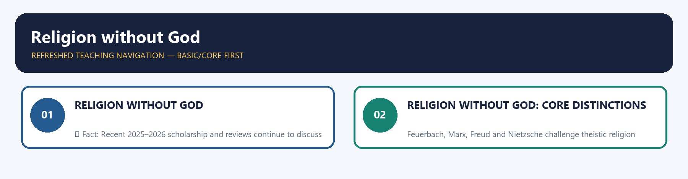
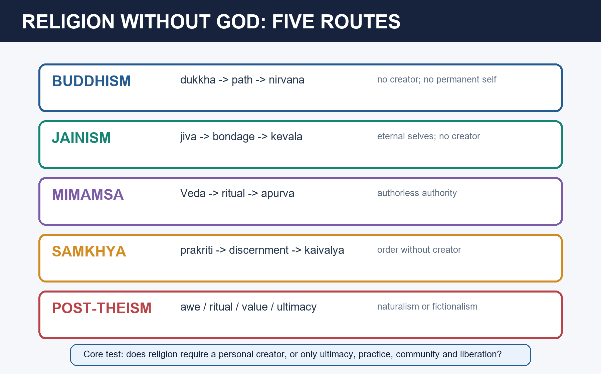

# Religion without God — Learner-v2 Source-Complete Learning Session

> **Catalogue identity:** Philosophy Optional · Philosophy Paper II — Philosophy of Religion · `philosophy-paper-ii-philosophy-of-religion-07`  
> **Generation:** g1, 21 August 2026 · **Approval:** pending explicit topic approval  
> **Evidence discipline:** exact doctrine and PYQ wording/year/marks are controlled by repository owners. Model answers are independent pedagogic practice, never official UPSC keys.

### Package practice counts

| Component | Count |
|---|---:|
| Direct verified topic-owned PYQs | 7 |
| Core diagnostic MCQs | 40 |
| Remedial diagnostic MCQs | 8 |
| Total diagnostics | 48 |
| Original solved Mains models | 6 (2 × 10, 2 × 15, 2 × 20) |
| Consolidated register parts | 12 (A–L) |
| Approval | false |


## BASIC LEARNING SESSION



*Distinct embedded teaching-navigation image. The separate continuous Cārvāka-style flowchart package remains an independent at-a-glance artifact.*
### Source-complete coverage ledger and answer-worthiness labels

**[FACT]** identifies retained repository doctrine or verified question data. **[INFERENCE]** identifies learner-facing organisation or judgement.

| Source corpus | Final location | Retention decision |
|---|---|---|
| Canonical owner §§0–7 | Basic Learning Session | Complete definition debate, Buddhism, Western critique, agnosticism, parity bench and skeletons retained |
| Canonical owner §§9–19 | Optional Advanced | Complete Indian schools, Nietzsche, Cārvāka, religious naturalism/fictionalism, debates, routes and source discipline retained |
| Audited PYQ ledger | PYQs and Answer Practice | All seven owner questions retained with exact wording and full solutions |
| Premium diagnostic set | MCQs / Remediation | Forty core and eight remedial questions retained with strict answer rotation |
| Original practice | PYQs and Answer Practice | Six non-PYQ solved models retained |
| Advanced dossier | Optional Advanced | Functional definition, Nyāya pressure, post-theism and Nietzsche refinements reconciled |
| Consolidated register | Final section | A–L retrieval framework retains complete answer logic |

**Visible learning labels.** Functional/substantive definitions, Buddhism, Jainism, Mīmāṃsā, Sāṃkhya, agnosticism and direct PYQ routes are **CORE PAPER II**. Boundary control, objections, comparisons and graded verdicts are **CORE ANSWER**. Modern religious naturalism is **SUPPORTING** when it clarifies, not replaces, Indian traditions. Fictionalism sincerity and Nietzschean post-theism are **OPTIONAL ADVANCED**.

**What not to over-study.** Do not let “spiritual but not religious” sociology crowd out Buddhism and Indian anti-creator systems. Do not merge atheism, agnosticism, non-theism and fictionalist participation. Master the definition test, concrete tradition, objection and exact verdict.
### Learning roadmap

| Unit | Learner objective |
|---:|---|
| 1 | Test substantive and functional definitions of religion |
| 2 | Explain Buddhism as non-creator religion |
| 3 | Compare Jainism, Mīmāṃsā and Sāṃkhya |
| 4 | Distinguish non-theism, atheism and agnosticism |
| 5 | Evaluate Cārvāka's suprasensible critique |
| 6 | Explain Nietzsche's post-theistic challenge |
| 7 | Evaluate religious naturalism and fictionalism |
| 8 | Answer the theistic denial of religion without God |
| 9 | Apply Nyāya's creator-pressure fairly |
| 10 | Build 10/15/20-mark answers |

### SESSION 1 — RELIGION WITHOUT GOD

#### DEFINITION / WHAT THIS IS CALLED

**Plain-language definition:** ✅ Fact: Recent 2025–2026 scholarship and reviews continue to discuss religious naturalism as an attempt to retain awe, value, ritual and community within a naturalistic worldview. ⚠️ Inference: This strengthens the conceptual question whether supernatural belief is necessary for religion, but it does not displace the syllabus's primary evidence: Buddhism, Jainism, Mīmāṃsā and Sāṃkhya.

**Technical definition:** ✅ Fact: Recent 2025–2026 scholarship and reviews continue to discuss religious naturalism as an attempt to retain awe, value, ritual and community within a naturalistic worldview. ⚠️ Inference: This strengthens the conceptual question whether supernatural belief is necessary for religion, but it does not displace the syllabus's primary evidence: Buddhism, Jainism, Mīmāṃsā and Sāṃkhya.

#### ANSWER-GRABBING OPENING — WRITE/ADAPT IN THE EXAM

> ✅ Fact: Recent 2025–2026 scholarship and reviews continue to discuss religious naturalism as an attempt to retain awe, value, ritual and community within a naturalistic worldview. ⚠️ Inference: This strengthens the conceptual question whether supernatural belief is necessary for religion, but it does not displace the syllabus's primary evidence: Buddhism, Jainism, Mīmāṃsā and Sāṃkhya.

#### MUST-WRITE KEYWORDS

- **Religion without God**
- **Recent**
- **This**
- **Buddhism**
- **Jainism**
- **2025–2026**

**How to use them:** Use Religion without God to define the issue, connect Recent with This to explain it, and use Buddhism to distinguish or qualify the conclusion.

✅ **Fact:** Recent 2025–2026 scholarship and reviews continue to discuss religious naturalism as an attempt to retain awe, value, ritual and community within a naturalistic worldview.  
⚠️ **Inference:** This strengthens the conceptual question whether supernatural belief is necessary for religion, but it does not displace the syllabus's primary evidence: Buddhism, Jainism, Mīmāṃsā and Sāṃkhya.




#### CLOSING RECALL FLOW — RELIGION WITHOUT GOD

```text
START / CONCEPT: Religion without God
        |
        v
EXACT TERMS: Religion without God · Recent · This · Buddhism · Jainism · 2025–2026
        |
        v
MECHANISM / ARGUMENT: ✅ Fact: Recent 2025–2026 scholarship and reviews continue to discuss religious naturalism as an attempt to retain awe, value, ritual and community within a naturalistic worldview. ⚠️ Inference: This strengthens the conceptual question whether supernatural belief is necessary for religion, but it does not displace the syllabus's primary evidence: Buddhism, Jainism, Mīmāṃsā and Sāṃkhya.
        |
        v
CONSEQUENCE / CONTRAST: ✅ Fact: Recent 2025–2026 scholarship and reviews continue to discuss religious naturalism as an attempt to retain awe, value, ritual and community within a naturalistic worldview. ⚠️ Inference: This strengthens the conceptual question whether supernatural belief is necessary for religion, but it does not displace the syllabus's primary evidence: Buddhism, Jainism, Mīmāṃsā and Sāṃkhya.
        |
        v
UPSC TRAP / ANSWER-USE: ✅ Fact: Recent 2025–2026 scholarship and reviews continue to discuss religious naturalism as an attempt to retain awe, value, ritual and community within a naturalistic worldview. ⚠️ Inference: This strengthens the conceptual question whether supernatural belief is necessary for religion, but it does not displace the syllabus's primary evidence: Buddhism, Jainism, Mīmāṃsā and Sāṃkhya.
        |
        v
ANSWER-GRABBING FORMULATION: ✅ Fact: Recent 2025–2026 scholarship and reviews continue to discuss religious naturalism as an attempt to retain awe, value, ritual and community within a naturalistic worldview. ⚠️ Inference: This strengthens the conceptual question whether supernatural belief is necessary for religion, but it does not displace the syllabus's primary evidence: Buddhism, Jainism, Mīmāṃsā and Sāṃkhya.
```
### SESSION 2 — RELIGION WITHOUT GOD: CORE DISTINCTIONS

#### DEFINITION / WHAT THIS IS CALLED

**Plain-language definition:** Ninian Smart's dimensions: religion has doctrinal, mythic, ethical, ritual, experiential, social & material dimensions — belief in a creator God is not on the essential list. ✅ A functional definition: religion = a way of life orienting one toward ultimate meaning, liberation, and the transcendent/absolute — which need not be a personal God. ⚠️ Hence "religion without God" is coherent: the sacred/ultimate ≠ necessarily a deity.

**Technical definition:** Feuerbach, Marx, Freud and Nietzsche challenge theistic religion respectively as projection, ideology, wish-fulfilment and a life-denying value-framework, but criticism of theism does not by itself construct a religion without God.

#### ANSWER-GRABBING OPENING — WRITE/ADAPT IN THE EXAM

> Religion is a disciplined orientation to an ultimate or sacred order through doctrine, practice, community and transformation; belief in a personal creator is not a necessary condition.

#### MUST-WRITE KEYWORDS

- **Religion without God**
- **Core Distinctions**
- **Master verdict**
- **Ninian Smart's dimensions**
- **functional definition**
- **ultimate meaning, liberation, and the transcendent/absolute**

**How to use them:** Use Religion without God to define the issue, connect Core Distinctions with Master verdict to explain it, and use Ninian Smart's dimensions to distinguish or qualify the conclusion.

```text
SUBSTANTIVE DEFINITION:
religion requires God, gods or supernatural beings
        -> "religion without God" looks contradictory

FUNCTIONAL / DIMENSIONAL DEFINITION:
religion organises ultimacy, ritual, ethics, community,
experience and liberation
        -> Buddhism and Jainism clearly qualify

BOUNDARY TEST:
too narrow -> excludes recognised religions
too broad  -> turns nationalism or ideology into religion
```

> **Master verdict:** A personal creator is not necessary for religion, but some disciplined orientation to ultimacy, transformation, community and soteriology is needed to prevent the category from becoming empty.


#### 0. ONE-SCREEN MAP ⚠️

```
   IS GOD ESSENTIAL TO RELIGION?  —— NO, say these:
   ┌──────────────┬─────────────────┬──────────────────┬───────────────┐
   BUDDHISM        JAINISM           MĪMĀṂSĀ /           SECULAR/HUMANIST
   (non-theistic;  (no creator God;  SĀṂKHYA (early)     RELIGION
   nirvāṇa, no     jīvas + karma)    (no creator;        (Comte's Religion
   creator)                          karma self-runs)    of Humanity; ethical
        │                                                 humanism; Marx)
   religion = a way of life / ethics / liberation, NOT theism
   WESTERN CRITIQUES OF (theistic) RELIGION: Nietzsche ("God is dead"),
   Marx ("opium"), Freud (illusion), Feuerbach (projection)
```
> 🔑 **Mnemonic — "Religion = the 3 D's minus God: Discipline, Dharma, Deliverance."** A religion can offer a path, ethics and liberation without a creator deity — Buddhism is the proof.

---

#### 1. WHAT MAKES SOMETHING A RELIGION (if not God)? ✅

> **ANSWER-GRABBING LINE — WRITE/ADAPT IN THE EXAM (Recommended opening definition):** Religion is a disciplined orientation to an ultimate or sacred order through doctrine, practice, community and transformation; belief in a personal creator is not a necessary condition.
- **Ninian Smart's dimensions:** religion has doctrinal, mythic, ethical, ritual, experiential, social & material dimensions — **belief in a creator God is not on the essential list.** ✅
- A **functional definition:** religion = a way of life orienting one toward **ultimate meaning, liberation, and the transcendent/absolute** — which need not be a personal God. ⚠️
- Hence "religion without God" is coherent: **the sacred/ultimate ≠ necessarily a deity.**

---
#### 2. BUDDHISM as religion without God (2024 PYQ) ✅

> **ANSWER-GRABBING LINE — WRITE/ADAPT IN THE EXAM:** Buddhism is a complete non-creator religion because dependent origination explains suffering, the path disciplines life, the Saṅgha (Buddhist monastic and practitioner community) sustains practice and nirvāṇa (liberation from suffering) supplies the final goal.
- **Non-theistic:** the Buddha was **silent/agnostic on a creator God** (the *avyākata* — unanswered questions); the world runs by **pratītyasamutpāda** (dependent origination) and **karma**, needing no creator. ✅
- **Yet fully a religion:** it has the **Four Noble Truths**, the **Eightfold Path**, ethics (*śīla*), meditation, the **Saṅgha**, and a soteriology (**nirvāṇa** — liberation from dukkha). ✅
- **What replaces God:** the **Dharma** (law/teaching) and the goal of **nirvāṇa** — an impersonal ultimate. (Later Mahāyāna develops quasi-devotional Buddha/Bodhisattva figures, but the core is non-theistic.) ⚠️
- **Verdict:** Buddhism decisively shows **religion does not require God.** ✅

---
#### 3. WESTERN CRITIQUES OF (theistic) RELIGION ⚠️

> **ANSWER-GRABBING LINE — WRITE/ADAPT IN THE EXAM:** Feuerbach, Marx, Freud and Nietzsche challenge theistic religion respectively as projection, ideology, wish-fulfilment and a life-denying value-framework, but criticism of theism does not by itself construct a religion without God.
- **Nietzsche (2025 Q5(c) — ⚠️ routed):** "God is dead" — the belief in the Christian God has become **unbelievable**; traditional (esp. Christian) morality is a **"slave morality"** born of *ressentiment*, life-denying, exalting weakness. He calls for a **revaluation of all values** and the **Übermensch** who creates values without God. His critique targets **religion AND its morality** together. ✅
  - ⚠️ **Ownership note:** the printed 2025 Q5(c) — "Present an account of Nietzsche's criticism of religion and morality" — is **owned by [Religion and Morality §9.6](./Religion-and-Morality.md)**, because the stem couples religion *with morality*. The full genealogical dossier (slave revolt, ascetic ideal, *Beyond Good and Evil*, the criticisms and the Indian comparison) lives there. This file retains Nietzsche as a **critique of theistic religion** and as the bridge to post-theistic value — §9.4 — and does not duplicate the ownership.
- **Marx:** religion = *"the opium of the people"* — a consoling illusion masking economic exploitation; it will dissolve with a just society. ✅
- **Freud:** religion is an **illusion**, a wish-fulfilment / cosmic father-projection.
- **Feuerbach:** "theology is anthropology" — God is the **projection** of humanity's own idealised essence. ✅
- These lead toward **secular humanism** / a "religion of humanity" (**Comte**) — devotion to human values without a deity (link to Sec-A Humanism).

---
#### 4. AGNOSTICISM (2023 PYQ) ✅

> **ANSWER-GRABBING LINE — WRITE/ADAPT IN THE EXAM:** Agnosticism suspends judgement about God's existence or knowability; unlike atheism, it withholds assent rather than asserting denial.
- **Agnosticism (Huxley):** the claim that the existence of God is **unknown or unknowable** — we should suspend judgement (distinct from atheism, which *denies* God). ✅
- **Relation of religion & God for the agnostic:** an agnostic may still value religion's **ethical/experiential** dimensions while withholding assent on God — supporting a **non-theistic or minimal** religiosity. ⚠️
- Kant's practical faith and Spencer's "Unknowable" are agnostic-adjacent positions.

---
#### 5. STATEMENT / QUOTE BANK ⚠️
1. ✅ Nietzsche: *"God is dead... and we have killed him."*
2. ✅ Marx: religion is *"the opium of the people."*
3. ✅ Feuerbach: God is the projected essence of man — *"theology is anthropology."*
4. ✅ Buddhist: the world runs by **dependent origination** — no first cause/creator needed.
5. ⚠️ Huxley (coined "agnostic"): God's existence is *unknown/unknowable.*

---
#### 6. APPLIED-QUESTION DRILLS ⚠️
1. **[Buddhism]** "State & evaluate Buddhism as a religion without God." (2024, 20m) → §2 + §9.2.
2. **[Nietzsche]** "Nietzsche's criticism of religion and morality." (2025, 10m) → ⚠️ **primary owner is [Religion and Morality §9.6](./Religion-and-Morality.md)**; use §3/§9.4 here only for the post-theistic bridge.
3. **[Agnosticism]** "What is agnosticism? How do agnostics relate religion & God?" (2023) → §4 + §9.5.
4. **[Concept]** "Is belief in God essential to religion?" (2018, 2020, 2021) → §1 + §2 + §9.1.
5. **[Cārvāka]** "Cārvāka's critique of belief in suprasensible entities." (2025, 10m) → §9.6 — the *vyāpti* argument is the answer, not the hedonism.
6. **[Theist's denial]** "How would a religious person deny the possibility of religion without God?" (2019, 15m) → §9.1 + §11 — argue the **theist's** case properly before rebutting it.
7. **[Mīmāṃsā]** "Can ritual religion function without a deity?" → §9.7 (*apauruṣeya* + *apūrva*).
8. **[Modern]** "Can a naturalist be religious?" → §9.8 (Dewey, Dworkin, fictionalism).

---
#### 6A. THE FIVE WAYS OF DOING WITHOUT GOD — parity bench ⚠️

> **ANSWER-GRABBING LINE — WRITE/ADAPT IN THE EXAM:** Non-theistic traditions replace different divine functions separately—creation, authority, moral causation, worship or salvation—so 'religion without God' names several arguments rather than one model.

| Route | What is removed | What replaces it | Still a religion? | Live PYQ use |
|---|---|---|---|---|
| **Buddhism** | Creator and permanent self | *Pratītyasamutpāda*, Dharma, Saṅgha, nirvāṇa | ✅ Yes, fully | 2024 Q7(a) |
| **Jainism** | Creator only | Karmic matter, vows, the perfected *siddha* | ✅ Yes, fully | 2018 Q5(c) |
| **Mīmāṃsā** | Author of the Veda **and** dispenser of fruit | *Apauruṣeya* authority + *apūrva* efficacy | ✅ Yes — the cleanest case | 2020 Q6(c) |
| **Sāṃkhya / Yoga** | Creator (Yoga keeps a non-creating Īśvara) | Prakṛti's evolution; *viveka-khyāti*; *kaivalya* | ✅ Yes | 2021 Q5(d) |
| **Modern naturalism / fictionalism** | Supernatural ontology, or assertion itself | Nature as locus of ultimacy; practice without assertion | ⚠️ Only on a functional definition | 2018 Q5(c) |
| **Cārvāka** | The whole supersensible order | Nothing — *svabhāva* and this-worldly ends | ❌ **No** — the limiting case | 2025 Q5(a) |

---
#### 7. PYQ-MAPPED MODEL-ANSWER SKELETONS ⚠️

#### 7.1 — "State and evaluate Buddhism as a religion without God." (2024, 20m)
```
Intro : religion need not require a creator God (functional/Smart's dimensions).
Body  : Buddhism — Buddha agnostic on creator (avyākata); pratītyasamutpāda + karma run the world;
        yet 4 Noble Truths, Eightfold Path, ethics, Saṅgha, nirvāṇa = a full religion.
Assess: Dharma & nirvāṇa replace God; later devotional Mahāyāna as a qualifier.
Concl : Buddhism proves religion-without-God is coherent and complete.
```

#### 7.2 — "Nietzsche's criticism of religion and morality." (2025, 10m) — ⚠️ ROUTED
```
This stem couples religion WITH morality and is owned by Religion and Morality §9.6.
Use that module for the full answer (God is dead; slave revolt; ressentiment; ascetic ideal;
revaluation; Übermensch; the criticisms and the Indian comparison).
Retain from this file only the post-theistic bridge: what value-creation looks like once the
theistic horizon is withdrawn, and how that differs from Buddhist/Jain non-theism, which never
had the horizon Nietzsche is mourning.
```

#### 7.3 — "Discuss Cārvāka's critique of the belief in the existence of suprasensible entities." (2025, 10m)
```
Intro : the critique is EPISTEMOLOGICAL — it is about pramāṇas, not about hedonism.
Body  : (1) perception alone is a pramāṇa; the four bhūtas exhaust reality.
        (2) the vyāpti argument — universal concomitance cannot be known by perception (it is
            universal), by inference (regress/circularity), or by testimony; and upādhi can never
            be conclusively excluded, so vyabhicāra remains possible.
        (3) application — God unperceived; consciousness emergent from body (dehātmavāda;
            the madaśakti/fermentation analogy); karma and adṛṣṭa are props for ritual;
            the Veda's authority rejected; svabhāva-vāda explains order without a maker.
Crit  : self-refutation (a universal claim about all inferences must itself be inferred);
        pragmatic inconsistency; Nyāya's defence of vyāpti (bhūyodarśana, vyabhicāra-adarśana,
        tarka); parity — perception errs too.
Reply : the prasaṅga (dialectical) reading; and the reported Purandara strand accepting laukika
        inference while denying it for the atīndriya — the defensible version of the thesis.
Concl : Cārvāka is not a godless religion but the closure of the route to any supersensible
        object; on its moderate reading it remains fatal to every anumāna-based natural theology.
```

#### 7.4 — "How would a religious person deny the possibility of a religion without God?" (2019, 15m)
```
Intro : the stem asks you to ARGUE THE THEIST'S CASE first, then assess it. Do not skip step one.
Theist's case: (1) definitional — religion is relation to a personal transcendent, so "religion
        without God" is a category error; (2) worship requires a recipient — Jain vītarāga worship
        is really commemoration, not religion; (3) obligation requires a commander (divine command);
        (4) grace/salvation requires an agent who can give it; (5) ultimate concern without an
        ultimate PERSON collapses into ethics or aesthetics (the objection to Dewey and Dworkin).
Rebuttal: Smart's dimensions; Buddhism's complete soteriological structure; Mīmāṃsā's apauruṣeya
        Veda plus apūrva (authority, efficacy and desert all secured without a deity);
        Jain siddha as an achieved, not a governing, divinity; the definition-by-stipulation charge.
Assess: the theist's strongest surviving point is the WORSHIP/GRACE argument, not the definition —
        petition and grace genuinely require a responsive God, and non-theistic religions do
        without them at a real cost in devotional structure.
Concl : religion without God is possible; religion without a SACRED ORDER is not.
```

---

#### CLOSING RECALL FLOW — RELIGION WITHOUT GOD: CORE DISTINCTIONS

```text
START / CONCEPT: Religion without God: Core Distinctions
        |
        v
EXACT TERMS: Religion without God · Core Distinctions · Master verdict · Ninian Smart's dimensions · functional definition · ultimate meaning, liberation, and the transcendent/absolute
        |
        v
MECHANISM / ARGUMENT: Feuerbach, Marx, Freud and Nietzsche challenge theistic religion respectively as projection, ideology, wish-fulfilment and a life-denying value-framework, but criticism of theism does not by itself construct a religion without God.
        |
        v
CONSEQUENCE / CONTRAST: Ninian Smart's dimensions: religion has doctrinal, mythic, ethical, ritual, experiential, social & material dimensions — belief in a creator God is not on the essential list. ✅ A functional definition: religion = a way of life orienting one toward ultimate meaning, liberation, and the transcendent/absolute — which need not be a personal God. ⚠️ Hence "religion without God" is coherent: the sacred/ultimate ≠ necessarily a deity.
        |
        v
UPSC TRAP / ANSWER-USE: Master verdict: A personal creator is not necessary for religion, but some disciplined orientation to ultimacy, transformation, community and soteriology is needed to prevent the category from becoming empty.
        |
        v
ANSWER-GRABBING FORMULATION: Religion is a disciplined orientation to an ultimate or sacred order through doctrine, practice, community and transformation; belief in a personal creator is not a necessary condition.
```
## BASIC MCQS / REMEDIATION

### Practice protocol — [CORE ANSWER]

Attempt each item before reading its key. Answer placement is balanced, deterministic and non-patterned using a stable topic seed. across all forty-eight diagnostics.

#### CORE DIAGNOSTIC MCQS — 40

#### 1. Which definition most directly makes belief in a personal creator necessary for religion?

A. A multidimensional account of doctrine, ritual and community
B. A substantive definition centred on God or sacred beings
C. A functional definition centred on transformation and meaning
D. A family-resemblance account of religious practices

**Answer: B.** A substantive definition identifies religion through the kind of object affirmed, so a God-centred version can make theism necessary. Functional and multidimensional accounts test what religion does and therefore allow non-theistic cases.

#### 2. Which formulation best expresses a functional definition of religion?

A. Acceptance of a revelation authored by an omniscient being
B. A disciplined way of orienting life to ultimacy, transformation or liberation
C. Belief in at least one supernatural personal agent
D. Membership in an institution possessing an infallible scripture

**Answer: B.** Functional definitions focus on orientation, practice, community, meaning and liberation rather than divine ontology. They explain how Buddhism can remain religious without creator-belief.

#### 3. What is the strongest correction to the objection that functional definitions make nationalism a religion?

A. Count every commitment that demands sacrifice as religious
B. Require belief in miracles but not in God
C. Add disciplined relation to an ultimate or sacred order and a transformative-soteriological practice
D. Restrict religion to traditions founded before modernity

**Answer: C.** Meaning and community alone are too broad. The added criteria preserve Buddhism, Jainism and Mīmāṃsā while excluding ordinary political ideology.

#### 4. Which case best marks the boundary between religion without God and rejection of religion?

A. Mīmāṃsā, because it affirms Vedic injunction
B. Sāṃkhya, because it accepts puruṣa and prakṛti
C. Jainism, because it accepts perfected liberated beings
D. Cārvāka, because it rejects both God and the wider supersensible-soteriological order

**Answer: D.** Cārvāka lacks a sacred order, religious soteriology and disciplined path to liberation. It therefore shows that absence of God alone does not define a non-theistic religion.

#### 5. Why does Buddhism not require a creator to explain the arising and cessation of suffering?

A. Nirvāṇa acts as a personal first cause
B. The Saṅgha allocates karmic fruits infallibly
C. Dependent origination explains both through changing conditions
D. Devas create each stream of consciousness separately

**Answer: C.** *Pratītyasamutpāda* explains conditioned arising and cessation without adding a divine maker. The creator hypothesis contributes no necessary step to the Buddhist therapeutic sequence.

#### 6. In Buddhism, what most directly performs the role of a complete practical route to liberation?

A. Speculation about whether the cosmos is eternal
B. The Noble Eightfold Path integrating wisdom, ethics and mental cultivation
C. Petition to an omnipotent Buddha
D. Acceptance of an eternal jīva

**Answer: B.** The Eightfold Path turns the diagnosis of the Four Noble Truths into disciplined religious practice. It is neither creator-worship nor a doctrine of an eternal self.

#### 7. Which statement about devas in Buddhism is most accurate?

A. Their existence makes Buddhism covertly monotheistic
B. They are creators but cannot grant liberation
C. They may exist as conditioned beings but are neither creators nor salvifically ultimate
D. The Buddha’s teaching requires denial of every deva

**Answer: C.** Buddhist non-theism concerns the absence of a necessary creator and supreme saviour. Cosmological devas, where accepted, remain impermanent beings within saṃsāra.

#### 8. What is the best evaluation of devotional Mahāyāna in the present debate?

A. It eliminates dependent origination from all Buddhist schools
B. It introduces grace-like religious functions without necessarily introducing an omnipotent creator
C. It turns nirvāṇa into divine reward
D. It proves the historical Buddha taught creation by God

**Answer: B.** Buddhas and bodhisattvas may become devotional objects and assist practitioners, but this does not by itself convert them into a single creator God.

#### 9. Which Jain argument most directly challenges a creator God?

A. The Veda is authorless and therefore needs no speaker
B. Nature is the sole substance with infinite attributes
C. Creation is impossible because only momentary events exist
D. A perfect being lacks an unfulfilled motive to create, while embodiment would limit the creator

**Answer: D.** Jain criticism presses both motive and limitation: perfection supplies no need to create, and embodied action compromises transcendence. The other options belong to different traditions.

#### 10. What binds the Jain jīva in saṃsāra?

A. Karmic matter attracted and accumulated through passions and action
B. A creator’s arbitrary allocation of bodies
C. Divine punishment for inherited sin
D. Misidentification of Brahman with māyā alone

**Answer: A.** Jainism treats karma as subtle matter that adheres to the jīva. Vows, restraint and ascetic purification stop influx and remove bondage without requiring a divine judge.

#### 11. What is a Jain siddha?

A. A liberated and perfected jīva, not a governing creator
B. A Buddhist deity who postpones nirvāṇa
C. The creator who begins cosmic cycles
D. An eternal scripture that commands ritual

**Answer: A.** A siddha is an achieved state of liberated consciousness. Veneration of siddhas therefore does not imply belief in a creator who rules or saves by grace.

#### 12. Which contrast between Jainism and Buddhism is accurate?

A. Buddhism accepts permanent jīvas whereas Jainism denies them
B. Jainism denies karma whereas Buddhism affirms it
C. Both depend on a divine dispenser of karmic results
D. Jainism affirms enduring jīvas; Buddhism rejects a permanent self

**Answer: D.** Both are non-creator traditions with karma and liberation, but they sharply differ over personal identity: Jain pluralism affirms jīvas, whereas Buddhism teaches *anātman*.

#### 13. In Pūrva-Mīmāṃsā, *apauruṣeya* means that the Veda is:

A. Composed by an omniscient ṛṣi under divine inspiration
B. Valid only after Nyāya proves a reliable speaker
C. Authorless rather than a revelation spoken by God
D. A fictional text useful despite literal falsity

**Answer: C.** The Veda’s authority does not rest on any human or divine author. Calling it “revelation” would wrongly reintroduce the speaker whose absence is central to Mīmāṃsā.

#### 14. What problem is *apūrva* introduced to solve?

A. How a fictionalist can worship sincerely
B. How a momentary ritual act can produce a delayed result
C. How consciousness emerges from material elements
D. How prakṛti first comes into existence

**Answer: B.** *Apūrva* is the unseen potency generated by ritual that persists until the promised fruit matures. It replaces a divine dispenser with a law-like ritual mechanism.

#### 15. Jaimini’s definition of dharma as *codanā-lakṣaṇa* primarily grounds dharma in:

A. The perceived preferences of social majorities
B. A creator’s independently known will
C. Vedic injunction
D. Spontaneous emotion toward nature

**Answer: C.** Dharma is characterised and known through injunction. Its authority is internal to the authorless Vedic structure, not derived from a divine commander.

#### 16. Which distinction between Kumārila and Prabhākara is most accurate?

A. Kumārila rejects the Veda while Prabhākara accepts it
B. Kumārila accepts a creator while Prabhākara is a Buddhist
C. Prabhākara explains ritual fruit through divine grace
D. Kumārila stresses *apūrva* as potency, while Prabhākara centres *niyoga/kārya*, the enjoined ought-to-be-done

**Answer: D.** Kumārila’s account more explicitly links act and fruit through potency. Prabhākara’s emphasis is deontological: injunction discloses what is to be done.

#### 17. What explains cosmic evolution in classical Sāṃkhya?

A. An omnipotent Īśvara imposing forms on inert matter
B. The self-expression of a single personal Brahman
C. The transformation of prakṛti through its guṇas in proximity to puruṣa
D. A sequence of momentary karmic decrees

**Answer: C.** Sāṃkhya’s dualism treats prakṛti as the evolving principle and puruṣas as conscious witnesses. A creator is not needed for the standard account.

#### 18. How should Yoga’s Īśvara be distinguished from the creator denied by classical Sāṃkhya?

A. Yoga identifies Īśvara with material prakṛti
B. Yoga makes Īśvara the karmic matter binding each jīva
C. Yoga treats Īśvara as a useful fiction known to be false
D. Yoga presents Īśvara as a special puruṣa, not straightforwardly the world-creator of classical theism

**Answer: D.** Classical Yoga assigns Īśvara a distinctive spiritual role as a special puruṣa. It is misleading simply to insert a creator God into Sāṃkhya’s cosmology.

#### 19. What is Nyāya’s strongest pressure against impersonal non-theistic order?

A. Unconscious principles cannot intelligently organise purposive order or allot fitting karmic fruits
B. No religious tradition may contain ritual
C. Liberation is logically identical with divine grace
D. Perception is the only valid *pramāṇa*

**Answer: A.** Nyāya argues from intelligent coordination and moral allotment to Īśvara as maker and superintendent. Non-theistic schools reply that this assumes all regularity must resemble artefact production.

#### 20. In discussions of Sāṃkhya, the analogy of milk nourishing a calf is used to suggest:

A. Apparently purposive activity need not be directed by a conscious creator
B. Every natural process is consciously designed
C. Puruṣa creates prakṛti out of nothing
D. Liberation depends on sacrificial injunction

**Answer: A.** The analogy supports the possibility of non-conscious yet ordered activity. Its force is dialectical against the claim that purposiveness always requires an intelligent maker.

#### 21. Weak agnosticism is best described as:

A. The proof that God cannot possibly exist
B. Indifference to every religious question
C. The claim that God’s existence is not presently known
D. Belief that nature itself is divine

**Answer: C.** Weak agnosticism reports an unsettled epistemic condition. It neither denies God nor claims that knowledge is impossible in principle.

#### 22. Strong agnosticism differs from weak agnosticism by claiming that:

A. God’s existence is unknowable, not merely unknown at present
B. God probably exists but never intervenes
C. religious language lacks all practical force
D. every non-theistic religion is secretly atheistic

**Answer: A.** Strong agnosticism makes a principled claim about the limits of possible knowledge. That stronger assertion itself requires justification.

#### 23. Which form of religion is most compatible with agnostic suspension?

A. One defining salvation exclusively as an unmerited decree by God
B. A practice-centred religion allowing ethical, contemplative and communal commitment without settled creator-belief
C. One treating doubt as equivalent to moral wrongdoing
D. One requiring certainty about a personal revealer before any practice

**Answer: B.** Agnosticism can coexist with practice where commitment attaches to a path and transformation rather than assent to a determinate divine ontology.

#### 24. Which statement correctly distinguishes agnosticism, atheism and Buddhist non-theism?

A. Buddhist non-theism is merely emotional indifference to God
B. All three assert that no divine beings exist
C. Agnosticism suspends judgement, atheism denies or lacks belief, and Buddhism does not require a creator for its soteriology
D. Agnosticism and atheism are identical, but Buddhism is theism

**Answer: C.** The three positions answer different questions: knowability, belief and the doctrinal role of a creator. Collapsing them obscures the exact PYQ demand.

#### 25. Nietzsche’s statement that God is dead is primarily:

A. A Nyāya inference from effects to a maker
B. A cultural diagnosis of the collapse of the Christian-metaphysical horizon and its values
C. A defence of Mīmāṃsā ritual authority
D. A biological report about a once-living deity

**Answer: B.** Nietzsche diagnoses the loss of credibility of the framework supporting inherited European values. The resulting issue is nihilism, not merely whether one proposition about God is false.

#### 26. In Nietzsche’s genealogy, *ressentiment* helps explain:

A. The Buddhist cessation of craving
B. The reversal by which weakness is revalued as moral superiority
C. The Jain materiality of karma
D. The authorlessness of sacred texts

**Answer: B.** *Ressentiment* transforms reactive powerlessness into a moral valuation that condemns strength. It is central to Nietzsche’s criticism of slave morality.

#### 27. What does Nietzsche propose against passive nihilism after the collapse of the God-framework?

A. Restoration of inherited values without their metaphysical basis
B. Suspension of all judgement in Huxley’s sense
C. Revaluation, self-overcoming and creation of life-affirming values
D. Return to divine-command morality

**Answer: C.** Nietzsche seeks active value-creation rather than resignation. Critics still question whether this supplies a non-arbitrary normative standard.

#### 28. Why should Nietzschean post-theism not be equated with Buddhist non-theism?

A. Buddhism affirms the Christian creator Nietzsche rejects
B. Nietzsche and Buddhism share an identical doctrine of no-self
C. Nietzsche grounds value in karmic matter
D. Nietzsche responds to the historical collapse of a theistic value-horizon, whereas Buddhism constructs soteriology without needing that creator-horizon

**Answer: D.** The genealogical situations differ. Nietzsche confronts European nihilism after lost belief; Buddhism begins from suffering, dependent origination and a path of cessation.

#### 29. Which *pramāṇa* does the strong Cārvāka position accept as independently valid?

A. Perception (*pratyakṣa*)
B. Inference (*anumāna*)
C. Testimony (*śabda*)
D. Postulation (*arthāpatti*)

**Answer: A.** Strong Cārvāka empiricism restricts knowledge to perception. Its religious critique follows by denying any secure route to imperceptible entities.

#### 30. Why does Cārvāka challenge *vyāpti*?

A. It is identical with verbal testimony
B. It presupposes an eternal self but not inference
C. It is a divine decree unavailable to non-believers
D. A universal concomitance cannot be secured from finitely perceived particular cases

**Answer: D.** Perception reaches observed instances, not every remote, past or future case. Using inference to prove its own universal basis threatens regress or circularity.

#### 31. What does the *upādhi* objection show?

A. An unnoticed conditioning factor may make an observed relation contingent rather than universal
B. Every perceived object is illusory
C. Scripture is valid only when authorless
D. A creator must possess a physical body

**Answer: A.** Smoke accompanies fire only under relevant conditions such as wet fuel. Failure to exclude every hidden condition leaves possible deviation and weakens certainty.

#### 32. What is the importance of the reported Purandara strand?

A. It makes Cārvāka a devotional religion
B. It may permit ordinary perceptually checkable inference while denying inference to the supersensible
C. It accepts Vedic testimony but rejects perception
D. It proves all inference infallible

**Answer: B.** This moderate reading avoids global self-refutation and targets precisely the extension of inference beyond any domain where concomitance can be checked.

#### 33. John Dewey’s idea of “the religious” refers primarily to:

A. Membership in a church affirming supernatural creation
B. A quality of experience unifying the self around inclusive ideal ends
C. Ritual action producing *apūrva*
D. Fictional assent to propositions known to be false

**Answer: B.** In *A Common Faith*, Dewey separates institutional religion from a transformative quality of experience. His use of “God” does not denote a supernatural personal being.

#### 34. Ronald Dworkin’s “religious atheism” centres religion on:

A. Refusal to make any value claim beyond empirical science
B. Acceptance of karma as material particles
C. Objective intrinsic value in human life and the sublimity of the universe without a personal God
D. Worship of a creator whose existence is unknowable

**Answer: C.** Dworkin relocates religious depth in value realism and cosmic sublimity. His position is atheist in ontology but religious in its response to objective value.

#### 35. How does religious fictionalism differ from non-cognitivism?

A. Fictionalism says religious claims are literally true but unknowable
B. Non-cognitivism recommends pretending that false propositions are true
C. There is no philosophical difference between them
D. Fictionalism grants truth-conditions but declines assertion; non-cognitivism denies that the discourse primarily states truth-apt propositions

**Answer: D.** The fictionalist treats religious sentences in a non-assertoric, practice-internal spirit despite their ordinary truth-conditions. Non-cognitivism interprets their basic function differently from the start.

#### 36. What is the sincerity objection to religious fictionalism?

A. Worship undertaken without belief may seem dishonest, self-deceptive or motivationally hollow
B. Fictionalism requires belief in two creators
C. Natural processes cannot evoke reverence
D. Its rituals are too intellectually demanding

**Answer: A.** Fictionalists reply that non-deceptive imaginative immersion is common in literature and ritual drama. Whether that preserves worship’s motivational depth remains contested.

#### 37. Why is Advaita’s two-level account not simply religious fictionalism?

A. Saguṇa practice is valid and efficacious at the conventional level and later sublated, not merely treated as knowingly false pretence
B. Advaita denies any distinction between levels of truth
C. Advaita accepts only bodily perception
D. Saguṇa Brahman is a Cārvāka metaphor for matter

**Answer: A.** *Vyāvahārika* validity is not theatrical make-believe. Sublation from the *pāramārthika* standpoint preserves graded truth and practitioner sincerity.

#### 38. What comparative use can be made of Buddhism’s two truths?

A. They establish a permanent creator at the ultimate level
B. They permit committed conventional practice while denying ultimate substantial reference
C. They reject the Saṅgha as an error to be abandoned immediately
D. They prove that all conventional claims are meaningless

**Answer: B.** The *saṃvṛti–paramārtha* distinction explains how practice can remain serious without treating conventional entities as ultimately substantial. This differs from mere fictional pretence.

#### 39. What most clearly distinguishes non-theistic religion from secular ethics?

A. Non-theistic religion always predicts supernatural miracles
B. Secular ethics necessarily denies objective value
C. Non-theistic religion embeds ethics within sacred or ultimate order, communal discipline and a transformative-soteriological goal
D. Secular ethics cannot form communities

**Answer: C.** Ethical rules alone are insufficient. Buddhism and Jainism place conduct within comprehensive accounts of bondage, practice and liberation.

#### 40. Which is the most defensible overall verdict on religion without God?

A. Every form of atheism is automatically a religion
B. God is irrelevant to every possible religious good
C. Only creator-belief can distinguish religion from politics
D. God is necessary for specifically theistic goods such as petition and grace, but not for religion organised around sacred order, practice and liberation

**Answer: D.** The verdict avoids both extremes. It recognises real losses when personal theism is absent while accepting historically complete non-theistic religions.

#### REMEDIAL DIAGNOSTIC MCQS — 8

#### 41. Which statement avoids confusing non-theism with atheism?

A. Non-theism is another name for indifference to metaphysics
B. Every non-theistic tradition proves that no deity of any kind exists
C. Atheism necessarily includes ritual, community and liberation
D. A non-theistic religion need not make a creator central, even if it admits conditioned divine beings

**Answer: D.** Non-theism concerns the absence of a necessary creator or supreme saviour in the system. It does not by itself entail denial of all devas, sacred beings or religious practice.

#### 42. Which pairing of definition and criterion is correct?

A. Substantive—whether practice leads to social solidarity alone
B. Functional—how religion supplies orientation, community or transformation
C. Functional—whether a personal creator literally exists
D. Substantive—what psychological benefit religion produces

**Answer: B.** Substantive definitions identify religion through its object or content; functional definitions identify the roles it performs. A strong answer states which one it is using and controls its breadth.

#### 43. Why does the Buddhist denial of a necessary creator not amount to denial of religion?

A. Buddhism retains Dharma, path, Saṅgha, ethics, meditation and liberation
B. Buddhism secretly makes nirvāṇa an omnipotent person
C. The Buddha replaces karma with divine judgement
D. Buddhist devas jointly create the universe

**Answer: A.** Buddhism lacks creator-theism but has a complete soteriological form. The confusion disappears once “no creator” is separated from “no sacred order or transformative practice.”

#### 44. Which statement about Jain jīva is correct?

A. It is the single creator-self common to all beings
B. It is denied as a permanent entity exactly as in Buddhism
C. It is produced by karmic matter and ends at liberation
D. It is an enduring conscious substance bound by karma and capable of becoming a liberated siddha

**Answer: D.** Jainism is pluralistic about souls. Karmic matter obscures and binds jīvas; liberation perfects rather than annihilates them.

#### 45. Which combination explains how Mīmāṃsā functions without a deity?

A. *Apauruṣeya* secures authorless Vedic authority, while *apūrva* links ritual to delayed fruit
B. *Apauruṣeya* denotes karmic matter, while *apūrva* denotes a liberated jīva
C. Both terms name attributes of Yoga’s Īśvara
D. *Apauruṣeya* is God’s revelation, while *apūrva* is divine forgiveness

**Answer: A.** The two devices replace different divine functions: no author is needed for scripture, and no intelligent dispenser is needed for ritual consequences.

#### 46. Which statement correctly locates classical Sāṃkhya?

A. It identifies liberation with eternal service to a creator
B. It denies puruṣa and accepts only momentary events
C. It explains evolution through prakṛti and liberation through discriminating puruṣa from prakṛti, without requiring a creator
D. It treats *apūrva* as the cause of the guṇas

**Answer: C.** Sāṃkhya’s non-theistic dualism differs both from Buddhist no-self and from Mīmāṃsā ritualism. Yoga’s special puruṣa should not be confused with a standard creator.

#### 47. Which pair of interpretations is accurate?

A. Agnosticism denies God; Nietzsche proves the non-existence of God by inference
B. Agnosticism is indifference; Nietzsche restores divine-command morality
C. Agnosticism is religious naturalism; Nietzsche teaches Buddhist nirvāṇa
D. Agnosticism suspends or limits knowledge-claims about God; Nietzsche’s “death of God” diagnoses cultural collapse and the danger of nihilism

**Answer: D.** Agnosticism is an epistemic position, while Nietzsche’s claim is genealogical and cultural. Neither should be reduced to a bare atheist slogan.

#### 48. Which combined statement correctly handles Cārvāka inference and fictionalist sincerity?

A. Cārvāka challenges unchecked *vyāpti*, while fictionalists defend non-assertoric participation but must answer the charge that worship without belief is hollow
B. Cārvāka rejects perception; fictionalists are simply error theorists who abandon practice
C. Cārvāka’s *upādhi* proves all daily inference certain; fictionalism is identical with Advaita
D. Cārvāka accepts supersensible inference; fictionalists assert every creed literally

**Answer: A.** The moderate Cārvāka pressure is strongest against inference beyond possible perceptual testing. Fictionalism retains practice without assertion, making sincerity and motivation its central unresolved problems.

## PYQS AND ANSWER PRACTICE

#### VERIFIED PYQS — 7 COMPLETE SOLUTIONS

These are independent practice models, not official UPSC answers. The question wording, year and marks are reproduced from the verified 2018–2025 Philosophy of Religion ledger.

#### 2018 · Q5(c) · 10 marks

**Exact verified question:** Can you justify religion without God? Support your answer.

**Demand decoding:** “Justify” requires a defended position, not a catalogue of godless schools. Define religion first, show through actual traditions that theism is not necessary, answer the strongest theistic objection, and conclude with a qualified criterion that does not make every ideology religious.

**Model answer (about 320 words):**

Religion without God is justifiable if religion is understood not substantively as belief in a personal creator, but functionally and multidimensionally as disciplined orientation to an ultimate order through doctrine, ritual, ethics, community, experience and a goal of transformation. Ninian Smart’s dimensions support this wider account. Creator-belief is central to many religions, but it is not a cross-cultural necessity.

Buddhism is the clearest proof. It explains suffering through dependent origination, craving and karma, not divine creation. The Four Noble Truths diagnose the human predicament; the Eightfold Path supplies ethical, meditative and cognitive discipline; the Saṅgha sustains a community; and nirvāṇa provides a soteriological end. The presence of devas does not alter the point, because they are neither creators nor ultimate saviours.

Jainism similarly rejects a creator while affirming innumerable jīvas, karmic bondage, vows and liberation into the perfected state of the siddha. Pūrva-Mīmāṃsā goes further: the Veda is *apauruṣeya*, so it needs no divine author, while *apūrva* links ritual action to its delayed fruit without a divine dispenser. Classical Sāṃkhya explains cosmic evolution through prakṛti in proximity to puruṣa and seeks *kaivalya* through discriminative knowledge.

A theist may object that worship requires a recipient, morality a commander, and salvation a giver of grace. This establishes only that petition, covenant and grace require a responsive God. It does not establish that every religious path must contain those goods. Non-theistic traditions replace command by dharma, grace by disciplined transformation, and creation by impersonal causal order.

However, a merely functional definition may wrongly classify nationalism as religion. It should therefore require sustained relation to an ultimate or sacred order together with ritual-experiential and soteriological practice. Cārvāka, which rejects every supersensible order and lacks a path of liberation, is consequently not a religion without God. Thus religion without God is both conceptually coherent and historically actual, although religion without any sacred order becomes difficult to distinguish from secular ethics.

**Why this earns marks:**

- Opens with an explicit substantive–functional distinction and a direct thesis.
- Uses Buddhism in depth, then Jainism, Mīmāṃsā and Sāṃkhya as distinct evidential routes.
- Distinguishes non-theism from denial of every deity.
- Answers worship, morality and grace objections rather than dismissing the theist.
- Prevents over-broad functionalism and correctly treats Cārvāka as the limiting case.

#### 2019 · Q6(c) · 15 marks

**Exact verified question:** How would a religious person deny the possibility of a religion without God? Discuss.

**Demand decoding:** Reconstruct the religious theist’s denial sympathetically before assessing it. The examiner is testing role reversal: the answer must present definitional, devotional, moral, epistemic and soteriological arguments for necessity, and only then reply through non-theistic religions.

**Model answer (about 500 words):**

A religious theist would deny religion without God by arguing that religion is essentially a living relation between finite persons and a personal transcendent reality. On this substantive definition, “religion without God” is not an unusual species of religion but a category mistake: remove God and what remains may be morality, philosophy or contemplative therapy, but not religion.

First, worship appears to require an intentional recipient. Praise, prayer, surrender and thanksgiving are relational acts. If no divine consciousness hears or answers, ritual becomes commemoration or symbolic self-expression. The Jain veneration of a passionless *tīrthaṅkara*, for example, might then be interpreted as admiration of an exemplar rather than worship in the full theistic sense.

Second, revelation and sacred authority seem to require an author. A text can command unconditionally only if it expresses a supreme will; otherwise its prescriptions appear historical and revisable. Third, moral obligation appears stronger when grounded in divine command and judgement. Impersonal karma may describe consequences, the theist argues, but cannot explain why one is categorically bound to obey the good. Fourth, purposive cosmic order and the precise distribution of karmic fruits seem to require intelligence. Nyāya therefore posits Īśvara as creator and *karmādhyakṣa*, the superintendent who connects deserts with consequences.

Finally, salvation may exceed unaided human capacity. Forgiveness, grace, covenant and personal immortality require a responsive divine agent. A path that relies only on technique risks reducing liberation to psychological self-management. God also unifies doctrine, worship, morality and hope around one ultimate object; without that centre, “religion” may become an arbitrary bundle of functions.

The denial, however, assumes the conclusion by defining religion through theism. Ninian Smart’s dimensions show that doctrine, ritual, ethics, experience, narrative and community can exist without a creator. Buddhism offers a complete diagnosis of *dukkha*, a causal account through dependent origination, the Eightfold Path, Saṅgha and nirvāṇa. Jainism retains jīva, karmic matter, vows and liberation while rejecting a creator. Mīmāṃsā directly answers the authority and desert arguments: the Veda is *apauruṣeya* rather than divine speech, and *apūrva* provides a law-like connection between ritual and fruit. Classical Sāṃkhya likewise explains order and *kaivalya* without a creator.

The theist may reply that dharma, nirvāṇa or *apūrva* are hidden substitutes for God. Yet functional replacement does not entail ontological identity: an impersonal law is not an omniscient person, and liberation by insight is not bestowed grace. The strongest surviving theistic point is therefore devotional, not definitional. Petition, reciprocal love and grace genuinely require a responsive God, so non-theistic religion has a different and possibly thinner personal structure.

Hence a religious person can coherently deny the possibility only by defending a specifically theistic essence of religion. Cross-cultural evidence defeats that universal necessity claim. God is necessary for some religious forms and goods, but not for religion as disciplined orientation to a sacred order and liberation.

**Why this earns marks:**

- Obeys the unusual directive by giving the theist’s case priority and philosophical force.
- Separates worship, authority, morality, cosmic order and grace arguments.
- Names Nyāya’s intelligent superintendent and answers it through Mīmāṃsā.
- Uses Buddhism, Jainism and Sāṃkhya without treating them as disguised theism.
- Gives a graded verdict conceding what truly does require a personal God.

#### 2020 · Q6(c) · 15 marks

**Exact verified question:** Critically examine the concept of God as prerequisite for a religion.

**Demand decoding:** Test the necessity claim. Clarify which concept of God is proposed, produce counterexamples, evaluate whether they remain religious under a defensible definition, then state the limited functions for which a personal God may still be indispensable.

**Model answer (about 510 words):**

To call God a prerequisite for religion is to claim that no practice counts as religious unless it includes belief in a divine being, usually a personal creator, moral governor and saviour. This is plausible within theistic traditions, but it is not adequate as a universal definition of religion.

A substantive definition identifies religion through its object: God, gods or sacred beings. It captures prayer, worship, revelation, covenant and grace particularly well. It also guards against an over-broad functionalism under which nationalism, psychotherapy or political ideology could become “religions” merely because they provide meaning and community. The theist can further argue that worship requires one who is worshipped, unconditional obligation requires a supreme commander, and providential or karmic order requires an intelligent administrator.

Yet a prerequisite is a necessary condition, and established traditions provide counterinstances. Buddhism contains doctrine, ethical discipline, meditation, monastic community and liberation without depending on a creator. *Pratītyasamutpāda* explains conditioned arising; karma gives moral-causal continuity; the Four Noble Truths and Eightfold Path lead toward nirvāṇa. Devas may occur in Buddhist cosmology, but none is an omnipotent creator or indispensable saviour. Calling Buddhism non-religious merely because it lacks the Christian-type God makes the definition question-begging.

Jainism rejects creation by God while affirming eternal jīvas, karmic matter, the vows, *tīrthaṅkaras* as liberated exemplars and the siddha-state. Mīmāṃsā is an even sharper counterexample. Vedic authority is *apauruṣeya*, not revelation from a divine speaker; dharma is known through injunction; and *apūrva*, an unseen potency generated by ritual, explains delayed fruit without a divine dispenser. Classical Sāṃkhya derives cosmic evolution from the guṇas of prakṛti in the presence of puruṣa and seeks *kaivalya* through discriminative knowledge. Yoga’s special puruṣa, Īśvara, should not be imported into classical Sāṃkhya as a creator.

Modern positions reinforce, but also complicate, the case. Dewey distinguishes institutional “religion” from “the religious” quality of experience; Dworkin’s religious atheism locates religious depth in objective value and cosmic sublimity; religious naturalists direct awe toward nature. Religious fictionalists participate without asserting supernatural claims. Critics reasonably ask whether these positions preserve religion or only spirituality, ethics or aesthetic reverence.

The best response is neither a narrow theistic essence nor unlimited functionalism. A workable definition requires disciplined and communal orientation to an ultimate or sacred order, transformative practices and a soteriological or existential goal. It includes Buddhism, Jainism and Mīmāṃsā but excludes Cārvāka, which rejects the entire supersensible order and offers no liberation-centred religious practice.

Thus God is indispensable for petition, covenant, divine command and grace, but not for religion *as such*. The concept of God is one powerful way of integrating religious functions, not their universal prerequisite.

**Why this earns marks:**

- Treats “prerequisite” as a necessity claim rather than merely describing non-theism.
- Gives the substantive definition its strongest defence before criticizing it.
- Uses three Indian counterexamples with doctrine-specific mechanisms.
- Integrates modern naturalism and fictionalism without equating them with classical soteriology.
- Ends with a bounded functional criterion and a nuanced necessity verdict.

#### 2021 · Q5(d) · 10 marks

**Exact verified question:** Is religious life possible without the belief in God? Discuss.

**Demand decoding:** Establish possibility through a lived religious form, not abstract definition alone. Explain what structures religious life when creator-belief is absent, distinguish non-theism from atheism, and answer whether the result is more than secular ethics.

**Model answer (about 300 words):**

Religious life is possible without belief in God because its essential activities may be organised around liberation, sacred discipline and an impersonal ultimate rather than a personal creator. The claim is existentially demonstrated by Buddhist life.

Buddhism does not make a creator God explanatory or salvific. The Buddha’s practical refusal to centre unanswered metaphysical questions directs attention to *dukkha* and its cessation. Dependent origination explains suffering through conditions, especially ignorance and craving; karma links conduct with consequences; the Eightfold Path integrates right view, morality and meditation; the Saṅgha provides communal discipline; and nirvāṇa is the transformative goal. This is a religious life of doctrine, ritual, experience, ethics and liberation despite the absence of creator-belief.

Non-theism must not be confused with dogmatic atheism. Buddhist cosmology may contain devas, but they are conditioned beings, not creators or final saviours. Jain religious life similarly centres vows, purification of jīva and liberation from karmic matter. Mīmāṃsā preserves scripture, duty and ritual while replacing divine authorship and reward with the *apauruṣeya* Veda and *apūrva*. Classical Sāṃkhya seeks *kaivalya* through discrimination between puruṣa and prakṛti.

The objection is that without a conscious divine object there can be neither genuine worship nor grace, and that such paths are merely ethical philosophies. This objection identifies a real difference: petition, reciprocal devotion and divine forgiveness require a personal God. Yet religion need not possess every theistic function. Soteriology, sacred order, communal discipline and self-transformation distinguish these traditions from ordinary secular ethics.

Nor does every godless view become religious. Cārvāka rejects God, karma, afterlife and liberation; it therefore marks the boundary between non-theistic religion and non-religion. Religious life without God is thus possible, though not religious life without any ultimate order, disciplined practice or transformative goal.

**Why this earns marks:**

- Proves possibility through Buddhism as an actual form of life.
- Identifies doctrine, ethics, meditation, community and liberation.
- Separates non-theism from atheism and secular ethics.
- Adds Jain, Mīmāṃsā and Sāṃkhya comparisons without losing focus.
- Concedes the specific loss of petition and grace and uses Cārvāka as a boundary.

#### 2023 · Q5(e) · 10 marks

**Exact verified question:** What is Agnosticism? How do agnostics conceptualize the relation between religion and God? Discuss.

**Demand decoding:** The answer has two equal tasks: define and classify agnosticism, then explain how withholding knowledge-claims about God affects religious belief and practice. Distinguish it from atheism, non-theistic religion and indifference.

**Model answer (about 310 words):**

Agnosticism, a term introduced by T. H. Huxley, is the position that God’s existence is not known, or in a stronger form cannot be known. Weak agnosticism makes an epistemic report—available evidence does not presently settle the question. Strong agnosticism advances a limit-claim—that the divine lies beyond possible human knowledge. Both differ from atheism, which denies or lacks belief in God, and from indifference, which treats the question as unimportant.

For an agnostic, the relation between religion and God is therefore not simple rejection but suspended assent. If religion is substantively defined as belief in and worship of a personal God, agnosticism weakens full doctrinal membership because prayer, revelation and providence normally presuppose belief. A strict theist may consequently regard agnostic religion as unstable: one cannot sincerely entrust oneself to a being whose existence one refuses to affirm.

On a functional or multidimensional account, however, religious life need not await metaphysical certainty. An agnostic may participate in ethical discipline, contemplative practice, ritual and community while interpreting God symbolically, as an open possibility, or as the name of an unknown ultimate. Spencer’s “Unknowable” preserves transcendence while denying determinate cognition. Kant’s denial of theoretical knowledge of God, together with practical faith, is agnostic-adjacent rather than straightforward Huxleyan agnosticism.

Buddhism shows that suspending creator-speculation need not suspend religion. Yet Buddhist non-theism is not identical with agnosticism: its soteriology positively rests on dependent origination, karma and nirvāṇa, whereas agnosticism concerns the epistemic status of God. Religious naturalism goes further by locating ultimacy within nature; it is a positive naturalistic reinterpretation, not mere suspension.

The objection is that agnostic participation becomes selective culture without commitment. The reply is that commitment can attach to a path, community and transformative discipline while metaphysical judgement remains proportioned to evidence. Thus agnosticism separates certainty about God from the possibility of religion, but its coherence is strongest in non-dogmatic or practice-centred forms and weakest where personal trust in God is constitutive.

**Why this earns marks:**

- Defines weak and strong agnosticism and distinguishes atheism and indifference.
- Directly addresses how agnostics relate religion to God under two definitions.
- Uses Huxley, Spencer and Kant with careful qualification.
- Distinguishes agnostic suspension from Buddhist non-theism and naturalist reinterpretation.
- Gives a graded verdict about which forms of religion can accommodate agnosticism.

#### 2024 · Q7(a) · 20 marks

**Exact verified question:** State and evaluate Buddhism as a religion without God.

**Demand decoding:** “State” requires a complete doctrinal account before criticism; “evaluate” requires testing whether Buddhism satisfies defensible criteria of religion and whether creator-belief returns in disguised or devotional form. The answer must avoid calling Buddhism a simple atheism.

**Model answer (about 690 words):**

Buddhism is a paradigmatic religion without a creator God: it diagnoses an ultimate human predicament, explains it through an impersonal causal order, prescribes a disciplined path and promises liberation, while assigning no necessary cosmological or salvific role to a divine creator. Its case is strongest when religion is defined multidimensionally rather than as theism by stipulation.

The Buddhist starting point is practical and soteriological. The Four Noble Truths identify *dukkha*, trace its arising to craving under ignorance, affirm cessation, and prescribe the Noble Eightfold Path. The path integrates wisdom, ethical conduct and mental cultivation. The Saṅgha institutionalises practice; precepts regulate conduct; meditation transforms experience; and nirvāṇa names release from the causal complex sustaining suffering. Buddhism therefore possesses doctrine, ethics, ritual, experience, community and an ultimate goal—central dimensions identified in Ninian Smart’s account of religion.

Its non-theism is also doctrinally significant. The Buddha does not ground the world in an omnipotent personal first cause. Dependent origination explains phenomena as arising through conditions: when relevant conditions cease, their effects cease. A creator adds no necessary stage to this causal and therapeutic sequence. Karma supplies moral continuity without a divine judge, and nirvāṇa is attained through insight and discipline rather than bestowed by grace.

This does not mean that Buddhism simply denies every divine being. Buddhist cosmologies admit devas and higher realms, but such beings remain impermanent, conditioned and themselves within saṃsāra. They neither create the world nor guarantee liberation. The unanswered questions, *avyākata*, and the practical orientation illustrated by the poisoned-arrow teaching caution against converting the Buddha’s silence into a dogmatic proof of atheism. “Non-theistic” is therefore more exact than “atheistic.”

Several evaluations follow. First, Buddhism decisively refutes the claim that a personal creator is necessary for religion. It retains a sacred normative order—the Dharma—and an unambiguously soteriological aim. Unlike secular ethics, it does not merely prescribe social conduct; it offers a comprehensive account of bondage, disciplined transformation and final release.

Second, critics claim that Dharma or nirvāṇa merely replaces God. The objection notes a functional analogy but mistakes it for ontological identity. Nirvāṇa is not an omniscient person, Dharma does not create by will, and karma does not forgive or deliberately allocate outcomes. Buddhism replaces divine agency with causal intelligibility and practical cultivation, not with a concealed deity.

Third, theism presses a purposiveness objection. Nyāya may ask how unconscious causal law can generate an ordered cosmos and distribute karmic fruits without an intelligent superintendent. The Buddhist reply is that the analogy with artefact-production is unproved: observed conditional regularity does not logically require a cosmic artisan. More importantly, a creator contributes nothing necessary to the cessation of suffering and may generate further questions about motive, embodiment and responsibility for evil.

Fourth, later Mahāyāna traditions introduce devotional Buddhas and bodhisattvas who answer aspirations and perform grace-like functions. Pure Land devotion, for example, may appear practically theistic. Yet even highly exalted Buddhas are not thereby converted into a single omnipotent creator. This development qualifies any claim that all Buddhism is devotion-free, but it does not defeat the core non-creator structure.

Comparison clarifies the achievement. Jainism also rejects a creator but retains eternal jīvas, karmic matter and perfected siddhas. Mīmāṃsā preserves scripture and ritual through the *apauruṣeya* Veda and *apūrva*. Sāṃkhya derives the world from prakṛti for puruṣas and seeks *kaivalya*. Buddhism is more radical than Jainism in denying a permanent self and more path-centred than Mīmāṃsā’s ritual mechanism, yet all demonstrate that divine creation and liberation are separable.

A final challenge concerns definition. Purely functional accounts can make nationalism religious. A defensible middle criterion should require disciplined communal relation to an ultimate or sacred order, practices of transformation and a soteriological or existential horizon. Buddhism clearly meets it. Cārvāka does not: rejecting God, karma, afterlife and liberation leaves no sacred-soteriological order, so it is a critique of religion rather than another religion without God.

The graded verdict is therefore that Buddhism is fully, not merely analogically, religious without a creator. It lacks specifically theistic goods—petition to a supreme person, divine forgiveness and covenantal grace—but supplies coherent alternatives in Dharma, dependent origination, ethical-meditative discipline, Saṅgha and nirvāṇa. It proves that God is one possible centre of religion, not its universal prerequisite.

**Why this earns marks:**

- Gives the complete Buddhist diagnosis–cause–path–liberation structure before evaluation.
- Explains dependent origination, karma, nirvāṇa, Saṅgha and *avyākata* accurately.
- Distinguishes devas from a creator and non-theism from dogmatic atheism.
- Evaluates hidden-God, purposiveness and Mahāyāna-devotion objections with replies.
- Adds precise Jain, Mīmāṃsā, Sāṃkhya and Cārvāka comparisons.
- Ends with a defended definition and a graded, not absolute, verdict.

#### 2025 · Q5(a) · 10 marks

**Exact verified question:** Discuss Cārvāka’s critique of the belief in the existence of suprasensible entities.

**Demand decoding:** The centre is epistemology, especially the problem of establishing *vyāpti*. Apply that critique to God, soul, karma and scripture; then assess self-refutation and the reported moderate view of inference. Do not substitute Cārvāka hedonism for the requested argument.

**Model answer (about 345 words):**

Cārvāka rejects suprasensible entities because it accepts perception, *pratyakṣa*, as the only secure *pramāṇa*. Reality comprises the four perceptible gross elements; God, an immaterial soul, karma, rebirth, heaven, liberation and ritual potencies are unwarranted unless a valid means of knowledge can establish them.

The decisive critique targets inference. *Anumāna* depends on *vyāpti*, an unconditional universal relation between a reason such as smoke and what is inferred, such as fire. Perception reveals only particular observed conjunctions, never all past, future and remote instances. Inference cannot establish *vyāpti* without presupposing another *vyāpti*, producing regress or circularity. Testimony cannot help because its authority is itself disputed. Repetition also cannot exclude an unnoticed condition, *upādhi*: fire produces smoke only under conditions such as wet fuel. Hence possible deviation, *vyabhicāra*, remains, and inference cannot yield certainty about what is never perceptually checkable.

Applied to religion, God is unperceived, so inference from the world to a maker fails. Consciousness is a bodily emergence, *dehātmavāda*, compared doxographically to an intoxicating power arising from combined ingredients; no separable soul survives death. Karma, *adṛṣṭa* and *apūrva* are imperceptible postulates, while Vedic authority is rejected. *Svabhāva-vāda* explains order through things’ own natures rather than design.

Nyāya replies that the universal rejection of inference is self-refuting and practically impossible; *vyāpti* is supported through repeated observation, absence of counterinstances and *tarka*. A Cārvāka may answer dialectically through *prasaṅga*, without asserting a new universal. More defensibly, the reported Purandara strand permits ordinary, perceptually testable inference while denying its extension to the supersensible.

Thus the global perceptualism is unstable, but the moderate critique powerfully challenges inference-based natural theology. Cārvāka is not itself a religion without God: by closing every epistemic route to a sacred and soteriological order, it marks the boundary beyond which godlessness becomes rejection of religion.

**Why this earns marks:**

- Makes *pramāṇa*, *vyāpti*, *upādhi* and *vyabhicāra* the core rather than hedonism.
- Applies the argument separately to God, soul, karma, scripture and cosmic order.
- Includes Nyāya’s self-refutation and pragmatic replies.
- Adds both *prasaṅga* and the cautiously reported Purandara qualification.
- Correctly identifies Cārvāka as the limiting case, not a non-theistic religion.

#### ORIGINAL SOLVED MAINS PRACTICE — 6 MODELS

All six questions are original practice prompts rather than PYQs. Their models are independent examiner-oriented illustrations, not official answers.

#### Original 1 · 10 marks

**Question:** Distinguish non-theism, atheism, agnosticism and religious naturalism. Why do these distinctions matter in the philosophy of religion?

**Demand decoding:** Define four positions by the different questions they answer, use examples, expose common conflations, and explain the analytical value of the distinctions.

**Model answer (about 320 words):**

Non-theism, atheism, agnosticism and religious naturalism are not interchangeable because they concern different relations among God, knowledge and religious practice.

**Non-theism** describes a religious structure in which a creator or supreme saviour is not necessary. Buddhism explains suffering through dependent origination and ends it through the Eightfold Path; Jainism relies on jīva, karma and vows; Mīmāṃsā secures authority and ritual efficacy through the *apauruṣeya* Veda and *apūrva*. Non-theism therefore concerns the role, not necessarily the total non-existence, of divine beings.

**Atheism** denies or lacks belief in God. It need not generate religion. Cārvāka rejects God together with soul, karma, afterlife and liberation, and is consequently a critique of religious ontology rather than a religion without God. Dworkin’s “religious atheism,” however, shows that atheism can be combined with religious value when objective meaning and cosmic sublimity are retained.

**Agnosticism** concerns epistemic status. Weak agnosticism says God is not known; strong agnosticism says God is unknowable. An agnostic may suspend doctrinal assent while retaining ethical, contemplative or communal practice. This differs both from atheist denial and from Buddhism’s positive non-theistic soteriology.

**Religious naturalism** makes an affirmative ontological proposal: nature, not a supernatural person, is the locus of ultimacy and reverence. Dewey’s “religious” quality of experience and Goodenough’s response to nature illustrate this route.

The objection is that these positions all remove orthodox creator-belief and therefore differ only verbally. The reply is that they generate different commitments: suspension is not denial; a naturalistic reinterpretation is not mere absence of belief; and a non-theistic path can retain karma, liberation and sacred practice.

The distinctions matter because they prevent two opposite errors—calling Buddhism simple atheism and calling every atheist outlook religious. A sound classification separately tests ontology, epistemic attitude, object of reverence, practice and soteriology.

**Why this earns marks:**

- Defines each term through a distinct philosophical question.
- Gives named Indian and Western examples.
- Uses Cārvāka to separate atheism from non-theistic religion.
- Includes an objection and a criterion-based verdict.

#### Original 2 · 10 marks

**Question:** Does Cārvāka clarify the conceptual boundary of “religion without God”? Examine.

**Demand decoding:** Do not repeat the 2025 critique stem. Use Cārvāka comparatively to identify what Buddhism, Jainism and Mīmāṃsā retain after removing God, then assess whether the boundary is defensible.

**Model answer (about 330 words):**

Cārvāka clarifies the boundary of religion without God precisely because it is not itself a religion without God. It removes not only a creator but the epistemic and soteriological framework through which non-theistic religions remain religious.

The strong Cārvāka position recognises perception alone as a secure *pramāṇa*. Inference depends on universal *vyāpti*, which cannot be perceived across all cases; an unnoticed *upādhi* may always condition the observed relation. Hence God, an immaterial soul, karma, rebirth, heaven and ritual potencies are rejected as suprasensible postulates. Consciousness is bodily, and *svabhāva* explains natural order without design.

By contrast, Buddhism removes a creator but retains Dharma, dependent origination, karma, the Saṅgha and nirvāṇa. Jainism retains jīvas, karmic matter, vows and siddhahood. Mīmāṃsā retains sacred Veda, injunction, ritual duty and *apūrva*. Their godlessness is therefore internal to a positive account of bondage, discipline and liberation. Cārvāka closes the route to that wider sacred order itself.

An objection follows: if religion is functionally defined through meaning and a way of life, Cārvāka’s this-worldly ethics might also count as religious. This makes the definition too broad. Hedonistic or naturalistic life-guidance alone does not supply ritual-experiential discipline, an ultimate sacred order or soteriology. Otherwise secular ethics and political ideology would also become religions.

Conversely, the boundary should not require belief in the supersensible as such, because religious naturalism locates ultimacy within nature. What is required is a disciplined and communal relation to ultimacy, practices of self-transformation and an existential or soteriological horizon. Cārvāka, as normally presented, lacks this integrated structure.

Thus Cārvāka performs a negative but valuable role. It demonstrates that “without God” does not mean “without any criterion”: Buddhism, Jainism and Mīmāṃsā survive the loss of a creator because they retain sacred order and liberation, while Cārvāka’s more comprehensive negation normally crosses into non-religion.

**Why this earns marks:**

- Makes a direct boundary thesis instead of reproducing the PYQ answer.
- Uses *vyāpti* and *upādhi* only to support the comparative point.
- Specifies what three non-theistic traditions retain.
- Refines the criterion to accommodate naturalism without admitting every ethics.

#### Original 3 · 15 marks

**Question:** Compare Jainism and Pūrva-Mīmāṃsā as two different strategies for sustaining religion without a creator God.

**Demand decoding:** Organise the answer comparatively, not as two unrelated notes. Explain ontology, authority, moral causation, practice, liberation, creator-critique and the strongest objection to each.

**Model answer (about 515 words):**

Jainism and Pūrva-Mīmāṃsā both sustain full religious systems without a creator, but they do so through contrasting strategies. Jainism builds a liberation-centred metaphysics of souls and karma; Mīmāṃsā builds a duty- and ritual-centred account of authorless authority and impersonal efficacy.

Jain ontology is pluralistic. Innumerable eternal jīvas possess consciousness but are bound by karmic matter attracted through passion and action. The religious problem is contamination and bondage; the solution is right faith, knowledge and conduct, expressed through vows, restraint and ascetic purification. Liberation removes karmic obstruction and perfects the jīva into a siddha. Tīrthaṅkaras are liberated exemplars and teachers, not creators or dispensers of grace.

Jain anti-creator reasoning follows from this structure. The world and its basic constituents are beginningless. A creator with a body would be limited, while a bodiless agent faces the problem of acting on matter. A perfect being also lacks an unsatisfied motive to create, and attributing a flawed world to such a being creates moral difficulty. Cosmic and moral order are explained through the nature of substances and karma.

Mīmāṃsā begins not from soul-purification but from dharma disclosed in Vedic injunction. Jaimini defines dharma through *codanā*. The Veda is *apauruṣeya*: because it has no human or divine author, its authority does not depend on a speaker’s reliability. Ritual acts are momentary whereas fruits may arise much later; *apūrva*, an unseen potency postulated through *arthāpatti*, links act and delayed result. Kumārila treats it as a potency associated with act or agent, while Prabhākara stresses *niyoga/kārya*, the enjoined ought-to-be-done.

Thus the schools replace different divine functions. Jainism replaces creation and judgement with beginningless substances and karmic matter; Mīmāṃsā replaces revelation with authorless language and providential reward with ritual law. Jain practice is ascetic-soteriological and directed toward freedom from karma. Mīmāṃsā practice is injunction- and sacrifice-centred, with classical concern for dharma and promised fruits.

Nyāya presses a common objection: unconscious karma or *apūrva* cannot select the correct result for the correct person at the correct time; an omniscient *karmādhyakṣa* is required. The non-theistic reply is that this models natural or moral regularity on deliberate administration and thereby begs the question. Law-like specificity does not entail a cosmic chooser. Against Mīmāṃsā, Nyāya also challenges eternal word–meaning relations; against Jainism, it can ask how non-conscious karmic matter tracks moral quality.

Jainism’s strength is its integrated ethics and liberation, though the material character and moral precision of karma invite explanation. Mīmāṃsā’s strength is showing that scripture, obligation and ritual fruit can be separated from God, though *apūrva* may look like an ad hoc unseen mechanism. Neither is covert theism: a siddha is an achieved perfect jīva, and *apūrva* is not a conscious judge.

Therefore both decisively weaken God’s alleged necessity, but by different architectures—Jainism through a moral-soteriological cosmos and Mīmāṃsā through an autonomous sacred-linguistic and ritual order.

**Why this earns marks:**

- Sustains comparison across ontology, authority, causation, practice and goal.
- Uses jīva, karmic matter, siddha, *codanā*, *apauruṣeya* and *apūrva* precisely.
- Includes Nyāya’s intelligent-allotment objection and a non-question-begging reply.
- Ends by identifying the distinct non-theistic architecture of each school.

#### Original 4 · 15 marks

**Question:** Can religious fictionalism preserve sincere participation after metaphysical belief is withdrawn? Evaluate with reference to Indian graded-truth models.

**Demand decoding:** Define fictionalism and distinguish it from error theory and non-cognitivism. Analyse sincerity and motivation objections, then compare rather than equate it with Advaita and Buddhist two-truth frameworks.

**Model answer (about 520 words):**

Religious fictionalism holds that a person may participate rationally in religious discourse and practice without asserting its supernatural propositions as literally true. It attempts to preserve ritual, narrative, ethical formation and community after metaphysical belief is withdrawn. Its central difficulty is not logical possibility but sincerity.

The fictionalist grants that statements about God ordinarily possess truth-conditions, yet adopts them in a non-assertoric, practice-internal spirit. This differs from error theory, which concludes that false religious claims should be abandoned, and from non-cognitivism, which interprets religious language primarily as commitment, attitude or policy rather than failed description. Don Cupitt’s non-realism and Robin Le Poidevin’s explicit fictionalist route illustrate post-theistic participation.

The positive case appeals to familiar imaginative engagement. Readers can be emotionally transformed by fiction without believing its characters exist; participants in ritual drama can enact a narrative without deception. Religious stories may similarly organise attention, moral aspiration, grief and communal identity. Fictionalism also avoids insincere intellectual assent: the participant openly declines literal assertion rather than pretending privately to believe.

Three objections remain. First, worship appears essentially addressed to someone. If the worshipper believes there is no recipient, prayer may become aesthetic performance. Second, the motivational power of sacrifice, hope and repentance may depend on truth-belief; practice could hollow out across generations. Third, believers themselves normally reject the fictionalist description, making it a revision of religion rather than an interpretation of existing faith.

The fictionalist replies that not every religious act is petition. Liturgy can shape character, express gratitude and sustain communal memory. Narrative efficacy does not always depend on literal belief, and transparent “as-if” participation need not involve self-deception. Nevertheless, this reply is partly empirical: whether durable motivation survives metaphysical withdrawal cannot be settled by conceptual analogy alone.

Indian graded-truth models sharpen the evaluation. In Advaita, saguṇa worship is genuinely valid and efficacious at the *vyāvahārika* level, though ultimately sublated in non-dual Brahman at the *pāramārthika* level. Sublation is not the same as knowingly treating worship as false fiction. Buddhism’s *saṃvṛti–paramārtha* distinction likewise permits committed conventional practice while denying ultimate substantial reference. These models preserve the practitioner’s sincerity through graded validity, whereas fictionalism begins from declined assertion.

An objection is that graded truth merely disguises fiction. The reply is that a conventionally true and efficacious claim has a recognised domain of validity; a fictive claim is adopted without assertion even in ordinary discourse. The logical structures therefore differ.

Religious fictionalism can preserve sincere participation if sincerity means transparent commitment to practice without counterfeit belief. It struggles if sincerity requires addressing a believed divine reality. Indian models do not solve fictionalism’s problem but reveal a stronger alternative: transform the level and meaning of truth rather than replace belief with pretence.

**Why this earns marks:**

- Defines fictionalism against two neighbouring theories.
- Gives the best imaginative-participation defence and all three major objections.
- Preserves the distinction between sublation, conventional truth and fiction.
- Reaches a conditional verdict rather than declaring fictionalism either dishonest or complete.

#### Original 5 · 20 marks

**Question:** Compare the Buddhist, Jain, Mīmāṃsā and Sāṃkhya accounts of order and liberation without a creator. Do they reveal a common model of non-theistic religion?

**Demand decoding:** Give a structured four-way comparison, not parallel summaries. Identify each school’s replacement for creation, moral order and salvation; include cross-objections and finish by testing whether a common core survives doctrinal differences.

**Model answer (about 710 words):**

Buddhism, Jainism, Pūrva-Mīmāṃsā and classical Sāṃkhya jointly show that creator-belief is not necessary for a religious account of order and liberation. They do not, however, form one doctrine. Their commonality is architectural: each replaces divine agency with an impersonal order, disciplined practice and a transformative end.

**Buddhism** begins from *dukkha*, not cosmogenesis. Dependent origination explains events as conditionally arisen, avoiding a first creator. Karma connects intentional conduct with consequences, while the Four Noble Truths and Eightfold Path lead through ethics, meditation and wisdom to nirvāṇa. The Saṅgha provides institutional form. Devas, where admitted, remain conditioned and non-ultimate. The distinctive feature is *anātman*: liberation does not perfect an eternal soul but ends the causal conditions sustaining suffering.

**Jainism** accepts what Buddhism denies—innumerable enduring jīvas. These are bound by karmic matter through passion and activity. The cosmos and its constituent realities are beginningless; no creator initiates them. Right faith, knowledge and conduct, intensified through vows and ascetic restraint, stop karmic influx and remove accumulated bondage. Liberation reveals the jīva’s perfected state as siddha. Jain arguments add that an embodied creator would be limited, a bodiless creator’s action is obscure, and a perfect being lacks motive to create.

**Mīmāṃsā** shifts the centre from metaphysical liberation to sacred injunction and ritual performance. Dharma is known through Vedic *codanā*. Because the Veda is *apauruṣeya*, authority needs neither a human composer nor divine revelation. A ritual act that perishes yet yields a later fruit generates *apūrva*, an unseen potency connecting performance and result. Kumārila stresses potency; Prabhākara stresses *niyoga/kārya*, the binding task disclosed by injunction. Deities named in sacrifice need not be autonomous agents who hear and grant; they function within the ritual grammar.

**Sāṃkhya** offers an ontological and epistemic route. Prakṛti, constituted by the three guṇas, evolves in proximity to plural puruṣas. The world-process exists for experience and release, but its apparent purposiveness does not require conscious manufacture. Bondage is misidentification of puruṣa with prakṛti’s modifications; discriminative knowledge, *viveka-khyāti*, culminates in *kaivalya*. Classical Sāṃkhya should be distinguished from Yoga, whose Īśvara is a special puruṣa rather than straightforwardly the creator assumed in standard theism.

The comparison reveals three major differences. First, their ontologies range from Buddhist impermanence and no-self, through Jain soul pluralism, to Sāṃkhya dualism; Mīmāṃsā is primarily concerned with Vedic normativity. Second, moral causation is intentional and conditional in Buddhism, materially conceived in Jainism, ritually mediated through *apūrva* in Mīmāṃsā, and less central to Sāṃkhya’s discrimination model. Third, liberation means nirvāṇa, purified siddhahood, ritual fruit or the fulfilment of dharma in classical Mīmāṃsā contexts, and isolation of puruṣa in Sāṃkhya.

Nyāya supplies a common objection. Unconscious conditions, karmic matter, *apūrva* or prakṛti cannot, it argues, produce purposive order and exactly fitted consequences without an intelligent maker and *karmādhyakṣa*. The objection is strongest against precise moral allotment. The non-theistic reply has two parts. Regularity need not resemble an artefact requiring a craftsman; appealing to intelligence may merely relocate the explanatory problem to divine motive, embodiment and responsibility. Further, liberation-centred explanation asks what sustains bondage and ends it, not who manufactured the total cosmos.

A second objection claims that impersonal Dharma, nirvāṇa, karma or prakṛti merely function as God under other names. Functional substitution, however, does not establish ontological identity. These principles do not create by will, issue commands as persons, forgive, enter covenants or bestow grace. Their impersonality changes religious life: petition and reciprocal devotion become less central, while discipline and knowledge become primary.

The four schools therefore share a common model only at a high level: a sacred or ultimate order, an account of the human predicament, a regulated path, community or lineage, and a transformative end. This model is strong enough to distinguish them from Cārvāka, which rejects the wider supersensible-soteriological order, but loose enough to respect their incompatible doctrines.

The graded verdict is that they establish a family of non-theistic religions, not one hidden theology. God’s functions prove separable: causal order, normativity, moral consequence and liberation can be secured in different ways. What remains indispensable is not a creator but an intelligible relation among ultimate order, disciplined practice and release.

**Why this earns marks:**

- Gives equal doctrinal depth to all four schools.
- Compares mechanisms of order, bondage, practice and liberation explicitly.
- Includes Yoga’s qualification and Nyāya’s strongest common objection.
- Rejects the hidden-God claim without denying functional analogy.
- Derives a carefully limited common model and a Cārvāka boundary.

#### Original 6 · 20 marks

**Question:** Can post-theistic value, reverence and ritual remain religious without collapsing into secular ethics? Discuss with reference to Nietzsche, religious naturalism and religious fictionalism.

**Demand decoding:** Build the modern debate from Nietzsche’s problem of nihilism, then compare naturalist assertion with fictionalist non-assertion. Test both against the charge of being merely ethics or aesthetics, and use classical non-theistic religion as a control case.

**Model answer (about 720 words):**

Post-theistic thought asks a sharper question than classical non-theism: after a culture has lost belief in a personal God, can value, reverence and ritual remain genuinely religious, or do they become secular ethics with religious vocabulary? Nietzsche diagnoses the problem; religious naturalism and fictionalism offer contrasting reconstructions.

Nietzsche’s “death of God” is a cultural diagnosis of the collapse of the Christian-metaphysical horizon under the pressure of modern truthfulness and science. Because inherited European values depended on that horizon, its loss threatens nihilism. His genealogy interprets slave morality and the ascetic ideal through *ressentiment* and life-denial. Revaluation and self-overcoming are intended to create life-affirming values without divine command.

Nietzsche therefore demonstrates that removing God does not automatically leave a stable secular morality. The authority, genealogy and vitality of values become problems. Yet his positive response is not clearly a religion: it lacks a settled sacred order, communal liturgy and universal soteriology, and risks elitism or arbitrary power. Nietzsche is best treated as the bridge from theistic collapse to post-theistic value-creation, not as a straightforward founder of religion without God.

**Religious naturalism** offers a more affirmative reconstruction. It locates ultimacy within nature rather than a supernatural person. Awe, humility, gratitude and commitment respond to the natural world’s depth and to objective value. John Dewey distinguishes institutional “religion” from “the religious,” a quality of experience that unifies the self around inclusive ideal ends; his “God” names a relation between ideal and actual rather than a being. Ursula Goodenough treats nature’s depth as capable of evoking a religious response. Ronald Dworkin’s religious atheism retains objective intrinsic meaning in human life and the sublimity of the universe without personal theism.

Naturalism differs from ordinary secular ethics when these values are embedded in comprehensive ultimacy, communal symbol and transformative practice. Ethics asks what ought to be done; religious naturalism additionally cultivates a stance toward existence as a whole. Nevertheless, the objection is serious: awe before nature may be aesthetic emotion, and objective value may be moral realism, without worship, salvation or sacred authority. Calling them religious may stretch functional definition beyond usefulness.

The naturalist replies that religion has never been exhausted by petition to a supernatural person. Orientation to ultimacy, ritualised attention, community and self-transformation can be religious even when their object is immanent. This answer is strongest where actual practices and communities accompany the philosophy; otherwise it remains “religious” chiefly as an adjective for experience.

**Religious fictionalism** takes another route. It grants or suspects that supernatural claims are false or unwarranted but permits participation in a non-assertoric, fictive spirit. Don Cupitt’s non-realism and Robin Le Poidevin’s fictionalist proposal seek to retain narrative, liturgy and moral formation without metaphysical assent. Fictionalism differs from error theory, which abandons false discourse, and from non-cognitivism, which denies that the language primarily asserted descriptive propositions.

Its advantage is practical continuity: symbols and stories can shape emotion and conduct as literature does. Its liability is sincerity. Prayer seems directed to a believed hearer; sacrifice motivated by make-believe may become hollow; and believers reject the revisionary description. The fictionalist answers that transparent imaginative immersion is not deception and that ritual can express commitment rather than report ontology. Still, whether motivation survives over time is an unresolved empirical and existential issue.

Classical non-theistic traditions provide a control. Buddhism does not merely retain Christian forms after withdrawing belief. It possesses positive doctrines of dependent origination, karma, the Four Noble Truths, the Saṅgha and nirvāṇa. Jainism and Mīmāṃsā likewise contain objective sacred orders and soteriological disciplines. They show that religion without God can be thick. Modern naturalism and fictionalism are thinner because they must reconstruct ultimacy or participation after inherited metaphysics has weakened.

Indian graded-truth devices also expose fictionalism’s weakness. Advaita regards saguṇa worship as efficacious at the *vyāvahārika* level and later sublated, not knowingly false. Buddhism’s two truths permit serious conventional practice without ultimate substantial reference. Graded validity preserves sincerity more readily than explicit make-believe.

The verdict must therefore be conditional. Post-theistic value becomes more than secular ethics when it integrates a comprehensive ultimate orientation with communal, symbolic and transformative practice. Religious naturalism can meet this criterion, though often thinly. Fictionalism preserves religious forms but remains vulnerable on truth, motivation and sincerity. Nietzsche identifies why reconstruction is needed but does not by himself complete it. God can disappear while religious orientation survives; what cannot disappear without conceptual cost is every sacred horizon, lived discipline and transformation beyond ordinary moral rule-following.

**Why this earns marks:**

- Uses Nietzsche to frame the nihilism problem rather than misclassifying him as a simple atheist.
- Separates naturalist assertion, fictionalist non-assertion and secular ethics.
- Names Dewey, Goodenough, Dworkin, Cupitt and Le Poidevin with precise roles.
- Tests sincerity through Advaita and Buddhist graded-truth comparisons.
- Uses classical non-theistic religions as a control and gives a criterion-based final verdict.

## OPTIONAL ADVANCED DEPTH — NOT REQUIRED FOR A CORE ANSWER


### Advanced-dossier reconciliation — [OPTIONAL ADVANCED]

The dossier adds four bounded refinements: substantive versus functional definition; Nyāya's intelligent-cause pressure against impersonal order; religious naturalism and fictionalism; and Nietzschean revaluation after the “death of God”. Use these only after concrete Buddhist, Jain or Mīmāṃsā analysis. The live fictionalist question is whether one can sincerely inhabit a practice while withholding its assertions.


#### 9. ADVANCED DOCTRINE DOSSIERS

#### 9.1 The conceptual issue: substantive and functional religion

> **ANSWER-GRABBING LINE — WRITE/ADAPT IN THE EXAM (Recommended opening definition):** A defensible cross-cultural definition treats religion as organised relation to an ultimate or sacred order, thereby including recognised non-theistic traditions without classifying every ideology as religious.
- **Doctrine statement.** ✅ Substantive definitions identify religion by reference to gods or the sacred; functional definitions identify orientation, practice, community, meaning or liberation.
- **Argument.** ⚠️ If creator-belief is made necessary by definition, Buddhism is excluded by stipulation; a multidimensional account better captures doctrine, ritual, ethics, experience, narrative and institution.
- **Presupposition.** ⚠️ "Religion" names a family of historically varied practices rather than one essence.
- **Distinction.** ✅ Non-theistic differs from atheistic: absence of a creator doctrine does not require denial of every deity or sacred being.
- **Canonical example.** ✅ Theravāda Buddhism permits cosmological devas yet denies their creatorhood and salvific ultimacy.
- **Objection → reply.** ⚠️ Functional definitions may classify nationalism as religion. Reply: combine function with disciplined relation to an ultimate/sacred order and soteriological practice.

#### 9.2 Buddhism

> **ANSWER-GRABBING LINE — WRITE/ADAPT IN THE EXAM:** Dependent origination and karma (action and moral causation) make a creator explanatorily unnecessary, while ethics, meditation, community and nirvāṇa (liberation from suffering) preserve a fully religious form of life.
- **Doctrine statement.** ✅ Buddhism grounds diagnosis and liberation in Four Noble Truths, dependent origination, karma and the path, not in a creator God.
- **Argument.** ✅ Suffering arises dependently from craving and ignorance; removing conditions removes suffering. A creator adds no explanatory or practical step to this causal-soteriological sequence.
- **Presupposition.** ⚠️ Dependent causation is explanatorily sufficient for the religious problem Buddhism addresses.
- **Distinction.** ✅ Buddha's refusal to centre speculative questions is not a blanket claim that no divine beings exist.
- **Canonical example.** ✅ The poisoned-arrow parable prioritises removal of suffering over metaphysical delay; use it as a practical illustration, not proof of atheism.
- **Objection → reply.** ⚠️ Devotional Mahāyāna appears theistic. Reply: Buddhas and bodhisattvas may perform religious functions without becoming an omnipotent creator.

#### 9.3 Jainism, Mīmāṃsā and Sāṃkhya

> **ANSWER-GRABBING LINE — WRITE/ADAPT IN THE EXAM:** Jainism, Mīmāṃsā (ritual-exegesis school) and Sāṃkhya (enumeration-based dualist school) show that liberation, scripture, ritual and cosmic explanation can be organised without a creator deity.
- **Doctrine statement.** ✅ Jainism accepts perfected liberated beings but no creator; Mīmāṃsā explains dharma through authorless Veda and self-fructifying ritual efficacy; classical Sāṃkhya explains cosmos through prakṛti for puruṣas without a creator.
- **Argument.** ✅ Jain: an embodied creator would be limited and a perfect being lacks motive to create. Mīmāṃsā: a divine author is unnecessary for eternal Vedic authority. Sāṃkhya: unconscious prakṛti evolves through guṇas in proximity to puruṣa.
- **Presupposition.** ⚠️ Impersonal law or dual principles can explain order and liberation.
- **Distinction.** ✅ Yoga's special puruṣa Īśvara is not straightforwardly a creator in the classical Sāṃkhya sense.
- **Canonical examples.** ✅ Karmic matter binding jīva; Vedic injunction; milk seeming to nourish the calf as an analogy for non-conscious purposiveness in Sāṃkhya discussions.
- **Objection → reply.** ⚠️ Nyāya argues unconscious principles cannot organise ends. Non-theistic schools reply that observed regularity need not be modelled on artifact production.

#### 9.4 Nietzsche and post-theistic value

> **ANSWER-GRABBING LINE — WRITE/ADAPT IN THE EXAM:** Nietzsche's 'death of God' is a diagnosis of the collapse of a value-horizon, not merely a proof of atheism; its unresolved task is the non-arbitrary revaluation of values.
- **Doctrine statement.** ✅ "God is dead" diagnoses the collapse of the Christian-metaphysical horizon and the resulting danger of nihilism; genealogy exposes ascetic and slave-moral valuations.
- **Argument.** ✅ (1) Modern truthfulness and science erode traditional belief; (2) inherited values depended on that framework; (3) their collapse creates nihilism; (4) overcoming requires revaluation and self-creation.
- **Presupposition.** ⚠️ Values have genealogies tied to forms of life and can be assessed as life-enhancing or life-denying.
- **Distinction.** ✅ The phrase is a cultural diagnosis, not a simple syllogistic proof that God does not exist.
- **Canonical example.** ✅ *Ressentiment* reverses aristocratic value terms and converts weakness into moral superiority.
- **Objection → reply.** ⚠️ Revaluation risks elitism and arbitrary power. Nietzschean reply appeals to creative self-overcoming, though a universal normative standard remains difficult.

#### 9.5 Agnosticism and religious naturalism

> **ANSWER-GRABBING LINE — WRITE/ADAPT IN THE EXAM:** Religious commitment may survive metaphysical uncertainty when ritual, community, reverence and transformation remain directed toward ultimacy within nature.
- **Doctrine statement.** ✅ Agnosticism suspends judgement about God's existence or knowability; religious naturalism locates ultimacy and reverence within nature rather than a supernatural person.
- **Argument.** ⚠️ Evidence may underdetermine theism and atheism, while ethical, ritual and contemplative life can remain meaningful.
- **Presupposition.** ⚠️ Religious commitment can be graded and need not include metaphysical certainty.
- **Distinction.** ✅ Weak agnosticism ("not known") differs from strong agnosticism ("unknowable").
- **Canonical example.** ✅ A person may participate in Buddhist ethical-meditative practice while withholding creator claims.
- **Objection → reply.** ⚠️ This reduces religion to ethics or aesthetics. Reply: community, ritual, transformation and orientation to ultimacy exceed ordinary morality.

#### 9.6 Cārvāka: perception, the rejection of supersensible entities, and the inference problem (2025 Q5(a) owner-module)

> **ANSWER-GRABBING LINE — WRITE/ADAPT IN THE EXAM:** Cārvāka (materialist school) attacks supersensible religion by denying that inference can establish what perception cannot check; its moderate form is strongest against inference-based natural theology.
> ⚠️ This is the only owner-module in the folder for Cārvāka. Deep background: [Paper I — Cārvāka](../../paper-1/indian/Carvaka.md).

- **Doctrine statement.** ✅ Cārvāka (Lokāyata) holds that **perception (*pratyakṣa*) is the only valid means of knowledge (*pramāṇa*)**; consequently nothing supersensible can be known, and the entities religion trades in — God, an immaterial soul, *adṛṣṭa*/karma, heaven and hell, rebirth, *apūrva*, liberation and the authority of the Veda — are all rejected as unwarranted. Reality is the four gross elements (*bhūtacatuṣṭaya*: earth, water, fire, air; ether is rejected as imperceptible); the *puruṣārthas* reduce to *kāma* and *artha*.
- **Argument — why only perception.** ✅ (1) A *pramāṇa* must yield certainty about its object. (2) Perception is self-evident and immediately certain. (3) Every other candidate — inference, comparison, testimony, postulation — is either reducible to perception or dependent on a general rule that perception cannot certify. (4) Therefore perception alone is a *pramāṇa*, and knowledge does not extend beyond the perceptible.
- **The attack on inference — the argument in full (this is the examinable core).** ✅ Inference (*anumāna*) depends on ***vyāpti***, an **invariable, unconditional concomitance** between the mark (*hetu*, e.g. smoke) and the inferred (*sādhya*, e.g. fire). The Cārvāka asks: **by what means is *vyāpti* itself known?**
  1. **Not by perception:** perception grasps only particular co-presences, here and now. *Vyāpti* is a **universal** covering all cases, including unobserved past, future and remote ones — and no perception reaches those.
  2. **Not by inference:** to establish this *vyāpti* by another inference requires that inference's own *vyāpti*, generating an **infinite regress** or a **circularity**.
  3. **Not by testimony:** testimony's authority would itself have to be established, and (for the Cārvāka) it is not a *pramāṇa* at all.
  4. **The *upādhi* problem:** even repeated observation cannot rule out an unnoticed **conditioning factor (*upādhi*)** that makes the concomitance hold only contingently — the standard example being that fire is accompanied by smoke only when the fuel is wet. Unless every possible *upādhi* is excluded, and that exclusion is itself unverifiable, the concomitance remains merely **probable (*vyabhicāra* remains possible)**.
  5. **Conclusion:** inference cannot deliver certainty. Where it happens to work in daily life, it works by luck or habit; and it is precisely in the supersensible domain — God, soul, karma, afterlife — that no perceptual check is ever available, so there inference is worthless.
- **The application to religion.** ✅ (a) **God** is never perceived, so the inference from world-as-effect to an intelligent maker is doubly worthless. (b) **The soul** is not a separate substance: consciousness is an **emergent property of the body** (*dehātmavāda*) — the standard analogy is the intoxicating power (*madaśakti*) that arises when fermenting ingredients (*kiṇva* etc.) are combined, though present in none of them singly. Hence no survival, no transmigration, no liberation. (c) **Karma and *adṛṣṭa*** are imperceptible postulates invented to prop up ritual. (d) **The Veda's authority** is denied; the Cārvāka verses transmitted in Mādhava's *Sarvadarśanasaṃgraha* — attributed there to **Bṛhaspati** — mock the *agnihotra*, the three Vedas and ascetic practice as the livelihood of the witless. ❓ **Attribution discipline:** these verses survive only as quotations in the works of opponents; treat them as *reported Cārvāka positions*, not as verified primary text, and never present the popular hedonist couplet (*yāvaj jīvet sukhaṃ jīvet…*, "while you live, live happily; borrow and drink ghee") as anything more than a doxographic quotation. (e) **Order without design:** *svabhāva-vāda* — things behave according to their **own nature**, and the sharpness of a thorn or the colour of a peacock requires no maker.
- **The standard replies — and the Cārvāka's rejoinder (both are required).** ⚠️
  1. **Self-refutation.** The claim "inference is never valid" is itself a **universal** proposition about all inferences, which cannot be perceived and must therefore be inferred. The Cārvāka's thesis defeats itself. — ⚠️ **Rejoinder:** the Cārvāka may present the denial *dialectically*, as a *prasaṅga* (reductio) internal to the opponent's own commitments, without asserting a positive universal.
  2. **The pragmatic argument.** No one, including the Cārvāka, can eat, speak, teach or argue without relying on inference; performative consistency demands its acceptance.
  3. **Nyāya's positive defence of *vyāpti*.** Concomitance is established by (i) repeated uncontradicted co-observation (*bhūyodarśana*), (ii) **non-observation of any counter-instance** (*vyabhicāra-adarśana*), and (iii) ***tarka*** — hypothetical reasoning that shows the denial of the concomitance leads to absurdity; Nyāya adds the technical device of *sāmānya-lakṣaṇa-pratyāsatti* to explain how a universal can be cognitively available.
  4. **The parity argument.** Perception itself faces error (illusion, dream, defective organs) and is corrected only by further cognition — so certainty is not perception's exclusive property either; and if only indubitable sources counted, perception would fail the test too.
  5. ⚠️ **The most important nuance, and the one that separates a top script:** a strand of Cārvāka thought — associated with the fragmentary **Purandara** — is reported as accepting inference **for ordinary empirical matters (*laukika*)** while rejecting it as a route to the **supersensible (*alaukika*/*atīndriya*)**. On this reading the school is not committed to self-refuting global scepticism about inference; its thesis is the far more defensible one that **inference cannot be extended beyond the domain in which its concomitances can be perceptually checked** — which is precisely a classical Indian anticipation of the empiricist critique of metaphysics. ❓ The evidence is fragmentary and reported by opponents; present it as a reported strand, not as the school's settled position.
- **Is Cārvāka a "religion without God"?** ⚠️ **No — and saying so precisely is the mark-earning move.** Cārvāka is not a religion at all: it has no soteriology, no sacred, no community of practice and no ultimate concern. Its place in this clause is as the **limiting case at the other end**: Buddhism, Jainism and Mīmāṃsā show that religion can survive the *loss of God*; Cārvāka shows what happens when the *epistemic route to any supersensible object* is closed — you get not a godless religion but no religion at all. The contrast establishes that what non-theistic religions retain is not merely a substitute deity but an **accepted supersensible order** (dharma, karma, nirvāṇa, *apūrva*) that Cārvāka alone rejects.
- **Verdict formula.** ⚠️ "Cārvāka's critique succeeds exactly as far as its epistemology does. If the strong thesis is held — perception alone — it is self-refuting and pragmatically unliveable. If the moderate thesis is held — inference is admissible only where its concomitance can in principle be perceptually checked — the critique is powerful, unrefuted, and fatal to every *anumāna*-based natural theology, including Udayana's."

#### 9.7 Mīmāṃsā: *apūrva* and religion without a deity

> **ANSWER-GRABBING LINE — WRITE/ADAPT IN THE EXAM:** Mīmāṃsā (ritual-exegesis school) is the cleanest disproof of God's necessity because apauruṣeya (authorless and not of human origin) scripture supplies authority and apūrva (unseen potency generated by ritual) links action with its delayed fruit.
- **Doctrine statement.** ✅ Pūrva-Mīmāṃsā is the fullest case of a **fully religious system with no God doing any work**. The Veda is *apauruṣeya* — **authorless**, hence eternal, hence not dependent on any speaker's reliability; its injunctions (*codanā*) are self-validating (*svataḥ-prāmāṇya*); and the efficacy of ritual is secured internally by **apūrva**.
- **The core definition.** ✅ Jaimini's *Mīmāṃsā-sūtra* 1.1.2 defines dharma as *codanā-lakṣaṇo 'rtho dharmaḥ* — that which is **characterised by (Vedic) injunction** and is beneficial. Dharma is thus known **only** from injunction, not from perception, inference or any deity's command.
- ***Apūrva* — the argument.** ✅ (1) A Vedic injunction promises a result (heaven from the *jyotiṣṭoma*) that does not follow immediately upon the act. (2) The act is momentary and perishes; the result comes much later, often after death. (3) A perished cause cannot produce a later effect. (4) Therefore the act must generate an **unseen potency** that persists until the result matures. (5) That potency is ***apūrva*** ("the not-before", i.e. something new not previously existing). ⚠️ It is a **postulate (*arthāpatti*)**, not a perceived entity — Mīmāṃsā's own epistemology licenses postulation to explain an otherwise inexplicable fact.
- **The two schools' versions.** ⚠️ **Kumārila Bhaṭṭa** treats *apūrva* as a **potency (*śakti*)** residing in the act or the agent, linking act to fruit. **Prabhākara Miśra** reframes the whole matter around ***niyoga*/*kārya*** — the sheer "ought-to-be-done" disclosed by the injunction, which motivates action without needing a promised fruit as its primary content. The difference matters: Prabhākara's ethics is closer to a **deontology of the injunction**, Kumārila's to a **consequential mechanism of desert**.
- **Why this removes God.** ✅ (1) No author is needed for the Veda (*apauruṣeya*), so Udayana's *vākyāt*/*pratyayataḥ*/*śruteḥ* arguments have no purchase. (2) No dispenser of karmic fruit is needed, since *apūrva* does that work — so the Nyāya *karmādhyakṣa* argument is answered. (3) Deities named in the mantras function as **elements within the ritual structure** — the dative to which the oblation is offered — not as agents who hear, choose and grant. ⚠️ Kumārila's *Ślokavārttika* contains sustained arguments against a creator God, including the motive problem and the impossibility of a bodiless agent acting on matter — the same family as the Jain arguments at [Proofs §8.6](./Proofs-for-God.md).
- **Objection → reply.** ⚠️ **Objection (Nyāya):** an unconscious potency cannot *select* the appropriate fruit for the appropriate agent at the appropriate time; only an intelligent superintendent can. **Reply:** the relation is law-like, not deliberative — the objection assumes that only agents can produce determinate outcomes, which begs the question against natural law. ⚠️ **Second objection:** how can a beginningless, authorless text have determinate meaning? **Reply:** meaning is carried by the eternal relation of word and referent (*śabdārtha-sambandha nityatva*), which Nyāya denies as conventional. ⚠️ **Third objection:** is this religion or bureaucracy? **Reply:** it has a sacred order, a soteriological promise, a disciplined practice and a community — which is exactly what a functional definition requires. ⚠️ Note honestly that **later Mīmāṃsā authors drift toward theism** ❓, so the atheistic reading is of the *classical* system.
- **Verdict formula.** ⚠️ "Mīmāṃsā is the cleanest disproof of the claim that religion requires God. It keeps scripture, ritual, duty, merit and a soteriological goal, and replaces the deity with two devices — *apauruṣeya* authority and *apūrva* efficacy. What it thereby shows is that the religious functions God performs are **separable**: authority, efficacy and desert can each be secured otherwise."

#### 9.8 Religious naturalism and religious fictionalism

> **ANSWER-GRABBING LINE — WRITE/ADAPT IN THE EXAM:** Religious naturalism retains ultimacy within nature, whereas religious fictionalism retains participation without literal assent; the decisive test is whether either preserves sincere transformation rather than mere aesthetics.
- **Why the module is needed.** ⚠️ Buddhism, Jainism and Mīmāṃsā show religion without God in *classical* forms. The modern Western debate asks a sharper question: can someone who accepts a **naturalistic ontology** — or who does not believe the doctrines at all — nonetheless be religious? Two families answer yes.
- **(a) Religious naturalism.** ✅ **Thesis:** ultimacy, reverence and the religious response are located **within nature**; there is no supernatural person, but nature itself sustains genuinely religious attitudes of awe, gratitude, humility and commitment.
  - **John Dewey**, *A Common Faith* (1934): distinguishes "**religion**" (an institution with supernatural claims) from "**the religious**" (a *quality of experience* that unifies the self and orients it to inclusive ideal ends). Dewey proposes using "God" to denote the **active relation between the ideal and the actual** — not a being.
  - **Julian Huxley's** evolutionary humanism; **Ursula Goodenough**, *The Sacred Depths of Nature* (1998), on the religious response to the natural world's depth; **Donald Crosby** and **Loyal Rue** on nature as the ground of ultimacy; **Spinoza** is the historical ancestor via *Deus sive Natura*.
  - ✅ **Ronald Dworkin**, *Religion without God* (2013) — the book that literally names this clause — argues for "**religious atheism**": one can reject a personal God while holding that (i) human life has **objective intrinsic** meaning and (ii) the universe is **sublime and intrinsically beautiful**, and that these two value-commitments are what is *religious* about religion. Dworkin's move is to make **value realism**, not theism, the core.
  - **Objection → reply.** ⚠️ **Objection:** this is aesthetics and ethics wearing religious vocabulary; nothing is worshipped, nothing saves. **Reply:** the naturalist replies that ultimacy, reverence, communal practice and self-transformation are all present, and that demanding a supernatural person simply restates the theistic definition.
- **(b) Religious fictionalism.** ✅ **Thesis:** religious sentences are (or may be) **literally false or unwarranted**, yet participation in religious practice — taking the claims in a *fictive*, non-assertoric spirit — is rationally permissible and even valuable.
  - **Positions:** **Don Cupitt**'s non-realism (*Taking Leave of God*, 1980) — God is not an objective being but the personification of the religious ideal, a "**Sea of Faith**" theology; **Robin Le Poidevin** (*Arguing for Atheism*, 1996) develops explicit religious fictionalism; **Andrew Eshleman** on the fictionalist's participation; **Howard Wettstein** on "the significance of religious experience" without metaphysical commitment.
  - **Distinctions that matter.** ✅ Fictionalism ≠ **error theory**: the error theorist says the claims are false and we should stop; the fictionalist says they are not to be *asserted* but can be *accepted* within the practice. ✅ Fictionalism ≠ **non-cognitivism**: the non-cognitivist says religious sentences never had truth-conditions; the fictionalist grants they do and declines to assert them. Route to [Religious Language §9.4](./Religious-Language.md).
  - **Objection → reply.** ⚠️ (i) **Insincerity/self-deception:** worship presupposes belief; make-believe worship is either dishonest or hollow. *Reply:* immersion in a fiction is a familiar, non-deceptive human capacity (literature, ritual drama). (ii) **The motivational objection:** the practice's power derives from believing it true; remove that and it hollows out. *Reply:* fictionalists appeal to the sustained efficacy of narrative and ritual — an empirical claim that remains contested. (iii) **The internal objection:** believers themselves reject the description, so the account is revisionary of the very thing it purports to save.
- **Indian comparison (do not omit).** ⚠️ ✅ Advaita already contains a **two-level** apparatus that does structurally similar work without fictionalism: saguṇa worship is genuinely efficacious at the *vyāvahārika* level and is *sublated*, not exposed as fiction, at the *pāramārthika* level — sublation is not falsification. ✅ Buddhism's **two truths** (*saṃvṛti*/*paramārtha*) permit full participation in conventional religious practice while denying ultimate substantial reference. ⚠️ The comparative point that earns marks: **Indian systems offer graded truth where Western fictionalism offers pretence** — the Indian device preserves the practitioner's sincerity in a way fictionalism struggles to.
- **Verdict formula.** ⚠️ "Naturalism and fictionalism both show that the *functions* of religion — reverence, community, ritual, orientation to ultimacy, self-transformation — are detachable from theistic belief. Whether what survives is still *religion* depends on the definition adopted at the start, which is why this clause always returns to the substantive-versus-functional question."


#### 10. INTER-THINKER / INTER-SCHOOL DEBATES

> **ANSWER-GRABBING LINE — WRITE/ADAPT IN THE EXAM:** The central comparison is functional: ask which divine role each school removes, what replaces it and what religious good is consequently lost or retained.

| View | Creator God | Ultimate/goal | Moral-causal order | Why religious? |
|---|---|---|---|---|
| Buddhism | ✅ Not required | Nirvāṇa | Karma/dependent origination | Path, Saṅgha, liberation |
| Jainism | ✅ Rejected | Liberated jīva/siddha | Karmic matter | Vows, asceticism, liberation |
| Mīmāṃsā | ✅ Unnecessary | Dharma/heaven in classical ritual theory | *Apūrva* | Vedic injunction and ritual |
| Sāṃkhya | ✅ Unnecessary | Kaivalya | Prakṛti–puruṣa process | Discriminative liberation |
| Nietzsche | ✅ Cultural belief overcome | Self-overcoming | Genealogical value creation | ❓ Critique/post-religious spirituality |
| Humanism | ✅ Absent | Human flourishing | Autonomous ethics | ⚠️ Religious only under broad function |
| Cārvāka | ✅ Rejected — and so is every supersensible entity | *Kāma* and *artha* in this life | ❌ None; *svabhāva* replaces it | ❌ **Not a religion** — the limiting case that shows what non-theistic religions retain |
| Religious naturalism | ✅ Absent | Ideal ends within nature (Dewey); sublime value (Dworkin) | Immanent value-realism | ⚠️ Reverence, community, ultimacy — but nothing supernatural |
| Religious fictionalism | ✅ Not asserted | Whatever the practice delivers | Practice-internal | ⚠️ Participation without assertion |

#### 11. CRITICISMS AND REPLIES

> **ANSWER-GRABBING LINE — WRITE/ADAPT IN THE EXAM:** The strongest objection is not that non-theism lacks religion by definition, but that petition, reciprocal worship and grace genuinely require a responsive personal God.

1. **Definition objection.** ⚠️ Religion necessarily means relation to God. **Reply:** this is tradition-specific and cannot accommodate established non-theistic religions.
2. **Hidden-God objection.** ⚠️ Dharma, nirvāṇa or humanity merely substitutes for God. **Reply:** functional similarity does not establish ontological identity.
3. **Motivation objection.** ⚠️ Without divine reward, religious discipline weakens. **Reply:** compassion, insight, karma and communal vows supply non-theistic motivation.
4. **Nihilism objection.** ⚠️ Removing God removes objective value. **Reply:** Buddhist ethics, Jain vows and humanist normativity show alternative grounds; their objectivity still requires argument.

#### 12. COMMON UPSC TRAPS

1. ⚠️ Do not call Buddhism simply atheistic; "non-theistic" is usually more precise.
2. ⚠️ Do not say Buddhism denies every deity.
3. ⚠️ Do not conflate Jain liberated beings with creator God.
4. ⚠️ Do not present Nietzsche's "God is dead" as an empirical event or a bare atheist slogan.
5. ⚠️ Distinguish agnosticism from atheism and indifference.
6. ⚠️ A multidimensional definition should not become so broad that every ideology counts as religion.
7. ⚠️ **Do not call Cārvāka a "religion without God".** It has no soteriology, no sacred and no practice; it is the limiting case that shows what non-theistic *religions* retain — an accepted supersensible order (dharma, karma, nirvāṇa, *apūrva*).
8. ⚠️ Do not state the Cārvāka position on inference without the ***vyāpti*** problem. The argument is: concomitance cannot be established by perception (it is universal), by inference (regress/circularity) or by testimony, and *upādhi* can never be excluded.
9. ⚠️ Do not leave the self-refutation objection unanswered. Give the two replies: the *prasaṅga* (dialectical) reading, and the reported **Purandara** strand accepting *laukika* inference while denying it for the *atīndriya*.
10. ❓ Do not quote the "Bṛhaspati" verses or the hedonist couplet as primary Cārvāka text. They survive only in opponents' doxographies (notably Mādhava's *Sarvadarśanasaṃgraha*).
11. ⚠️ Do not describe Mīmāṃsā's Veda as "revelation". It is ***apauruṣeya*** — authorless, therefore not the speech of any God.
12. ⚠️ Do not treat *apūrva* as an observed entity. It is a **postulate (*arthāpatti*)** introduced to explain a delayed fruit; and distinguish Kumārila's *śakti* version from Prabhākara's *niyoga/kārya* version.
13. ⚠️ Do not merge **religious naturalism** (nature is the locus of ultimacy; claims are asserted) with **religious fictionalism** (claims are not asserted; the practice is accepted fictively) or with **error theory** (claims are false and should be abandoned).
14. ⚠️ Do not present Advaita's *vyāvahārika* level as fictionalism. **Sublation is not falsification** — the two-level device preserves the practitioner's sincerity in a way fictionalism does not.

#### 13. KEYWORD & STATEMENT BANK

**Keywords:** ✅ substantive/functional definition · family resemblance · Smart's dimensions · non-theism · atheism · agnosticism (weak/strong) · creator God · Dharma · nirvāṇa · Saṅgha · dependent origination · *avyākata* · jīva · karmic matter · *pratyakṣa* · *anumāna* · *vyāpti* · *hetu*/*sādhya* · *upādhi* · *vyabhicāra* · *bhūyodarśana* · *tarka* · *svabhāva-vāda* · *dehātmavāda* · *bhūtacatuṣṭaya* · *madaśakti* analogy · *laukika*/*atīndriya* · *prasaṅga* · *apauruṣeya* · *codanā* · *svataḥ-prāmāṇya* · *apūrva* · *arthāpatti* · *niyoga*/*kārya* · prakṛti/puruṣa · kaivalya · "God is dead" · nihilism · genealogy · *ressentiment* · revaluation · religious naturalism · "the religious" (Dewey) · religious atheism (Dworkin) · religious fictionalism · non-realism · error theory · two truths (*saṃvṛti*/*paramārtha*) · *vyāvahārika*/*pāramārthika* · sublation.

**Safe formulations:** ⚠️ "Creator-belief is sufficient for many religions but not necessary for religion as a cross-cultural category." · "Non-theistic religion replaces divine command with a path, causal diagnosis and soteriological goal." · "Mīmāṃsā shows that the functions God performs — authority, efficacy and desert — are separable and can each be secured otherwise." · "Cārvāka is not a godless religion but the closure of the epistemic route to any supersensible object — which is why it ends in no religion at all."

<!-- expanded-pyq-depth:start -->
#### CORPUS-DRIVEN DEPTH DELTA (expanded PYQ audit)

- ⚠️ **Priority:** Primary ownership is 7 of 112 parts; 2022 is the only year without an owned question.
- ✅ **Required doctrinal depth:** The expanded corpus requires both positive justification of non-theistic religion and the theistic denial that religion is possible without God, plus agnosticism and Buddhism.
- ❌ **Trap / answer consequence:** Do not equate non-theistic with anti-religious or atheism with agnosticism; test function, object, soteriology, practice and ultimate concern separately.

<!-- expanded-pyq-depth:end -->

#### 14. PYQ ROUTING (2018–2025)

> ⚠️ **Corpus signal:** 7 primary-owned question-parts out of 112. The local Paper II corpus is continuous from 2018 through 2025. Cross-links do not create duplicate ownership.

| Year | Question | Marks | Exact demand |
|---|---|---:|---|
| 2018 | Q5(c) | 10 marks | Can you justify religion without God? Support your answer. |
| 2019 | Q6(c) | 15 marks | How would a religious person deny the possibility of a religion without God? Discuss. |
| 2020 | Q6(c) | 15 marks | Critically examine the concept of God as prerequisite for a religion. |
| 2021 | Q5(d) | 10 marks | Is religious life possible without the belief in God? Discuss. |
| 2023 | Q5(e) | 10 marks | What is Agnosticism? How do agnostics conceptualize the relation between religion and God? Discuss. |
| 2024 | Q7(a) | 20 marks | State and evaluate Buddhism as a religion without God. |
| 2025 | Q5(a) | 10 marks | Discuss Cārvāka’s critique of the belief in the existence of suprasensible entities. |

See the [Philosophy of Religion PYQ Bank, 2018–2025](../_PYQ-PhilosophyOfReligion-2018-2025.md).

#### 15. ANSWER ARCHITECTURE (10 / 15 / 20 MARKS)

#### 10 marks
```text
Define non-theism/agnosticism → doctrine in four steps → distinguish nearest confusion →
one objection → verdict on whether God is necessary.
```

#### 15 marks
```text
Substantive vs functional frame → one Indian case in depth →
canonical example → theistic objection and reply → comparison with another school.
```

#### 20 marks
```text
Define criteria of religion → full Buddhist/Jain/Mīmāṃsā case →
creator critique → devotional complication → Western post-theistic comparison →
graded conclusion avoiding an over-broad definition.
```

#### 16. DIRECTIVE DECODER

| Directive | Examiner is buying | Structural consequence | Live example |
|---|---|---|---|
| **Can you justify X? Support your answer** | A defended affirmative or negative, with the criterion stated | Announce the definition of religion **first**; the whole answer follows from it | 2018 Q5(c) |
| **How would [an opponent] deny…? Discuss** | The **opponent's** case, argued sympathetically, then assessed | Half the marks are in constructing the theist's argument properly | 2019 Q6(c) |
| **Critically examine the concept of X as a prerequisite for Y** | Test of a **necessity** claim | Find one clear counter-example and defend it against reinterpretation | 2020 Q6(c) |
| **Is X possible? Discuss** | A possibility claim, established by an actual case | One case done in depth beats four mentioned | 2021 Q5(d) |
| **What is X? How do X-ists conceptualise…?** | A definition **plus** a positional account | Define, sub-divide (weak/strong agnosticism), then give the position | 2023 Q5(e) |
| **State and evaluate X as a religion without God** | Both halves: the *statement* and the *evaluation* | State the doctrine fully before assessing; do not evaluate a caricature | 2024 Q7(a) |
| **Discuss X's critique of belief in Y** | The **argument** of the critique, not its conclusions | Give the epistemology (*vyāpti*), not the slogans | 2025 Q5(a) Cārvāka |

> 🔑 **Rule:** every question in this clause is decided by the **definition of religion** you adopt in the first three lines. State it, defend it briefly (substantive vs functional vs multidimensional), and then apply it consistently — inconsistency here is the commonest cause of a mediocre mark.

#### 17. GRADED VERDICT LADDER

> **ANSWER-GRABBING LINE — WRITE/ADAPT IN THE EXAM:** Religion does not logically require a personal creator, but it does require more than disbelief: an organised orientation to ultimacy, disciplined practice, transformation and community.

| Band | What the script contains | Typical fault |
|---|---|---|
| **Weak (≈40%)** | "Buddhism has no God but is a religion" | No definition of religion; "atheistic" used loosely |
| **Average (≈50%)** | Functional definition; Buddhism and Jainism outlined | Theist's counter-case not constructed; Mīmāṃsā missing |
| **Good (≈60%)** | Definition defended; one case in depth; one objection answered | Over-broad functionalism not policed; devotional Mahāyāna ignored |
| **Strong (≈65–70%)** | Substantive/functional dispute explicit; two Indian cases; the worship/grace objection met | Modern naturalism/fictionalism absent; Cārvāka misclassified |
| **Top (≈70%+)** | All the above + a discriminating distinction (non-theistic ≠ atheistic; *apauruṣeya* ≠ revelation; sublation ≠ fictionalism; Cārvāka as limiting case) + the concession that petition and grace genuinely require a responsive God | — |

**Graded-verdict templates:**
- ⚠️ *Possibility stem:* "Religion without God is not merely conceivable but actual: Mīmāṃsā secures authority, efficacy and desert without a deity, and Buddhism supplies a complete diagnosis-and-path structure. What is *not* possible is religion without a **sacred order** — which is why Cārvāka ends in no religion at all."
- ⚠️ *Prerequisite stem:* "God is a prerequisite for *some* religious goods — petition, grace, covenant — but not for religion as such. The theist's strongest argument is therefore devotional, not definitional, and it should be met on that ground rather than dismissed."
- ⚠️ *Definition stem:* "A definition narrow enough to exclude Buddhism is question-begging; a definition broad enough to include nationalism is empty. The workable middle requires a disciplined relation to an **ultimate/sacred order** together with a **soteriological practice**."

#### 18. FACTUAL AND QUOTATION DISCIPLINE

| Item | Status | Safe use |
|---|---|---|
| "God is dead… we have killed him" | ✅ **Nietzsche**, *The Gay Science* §125 (the madman); also §108 and §343 | Cultural diagnosis, not an argument for atheism; full dossier in Religion and Morality |
| "Opium of the people" | ✅ **Marx**, Introduction to *A Contribution to the Critique of Hegel's Philosophy of Right* (1843–44) | Quote the fuller sentence if you use it — it is more sympathetic than the slogan |
| "Theology is anthropology" | ✅ Standard summary of **Feuerbach**, *The Essence of Christianity* | Projection thesis |
| "Agnostic" | ✅ Coined by **T. H. Huxley** (1869) | Distinguish weak ("not known") from strong ("unknowable") |
| Smart's dimensions | ✅ **Ninian Smart**'s multidimensional analysis | Doctrinal, mythic, ethical, ritual, experiential, social, material |
| *Brahmajāla*/*Aggañña* Suttas | ✅ DN 1 / DN 27 | For the Buddhist non-creator position |
| Cārvāka verses attributed to Bṛhaspati | ❓ Preserved only in opponents' works, chiefly Mādhava's *Sarvadarśanasaṃgraha* | Report as doxographic; never as primary text |
| "*Yāvaj jīvet sukhaṃ jīvet…*" | ❓ Popular verse quoted in doxographies | Do not build the answer on it — the exam wants the epistemology |
| Purandara's acceptance of *laukika* inference | ❓ Fragmentary, reported by opponents | Present as a reported strand, clearly flagged |
| Jaimini, *Mīmāṃsā-sūtra* 1.1.2 (*codanā-lakṣaṇo 'rtho dharmaḥ*) | ✅ Verified sūtra | The definition of dharma by injunction |
| Kumārila's *Ślokavārttika* against a creator | ✅ | Same argument-family as the Jain motive/bodiless-agent arguments |
| *A Common Faith* | ✅ **John Dewey** (1934) | "Religion" vs "the religious"; God as the ideal–actual relation |
| *Religion without God* | ✅ **Ronald Dworkin** (2013) | "Religious atheism": objective life-meaning + the sublimity of the universe |
| *Taking Leave of God* | ✅ **Don Cupitt** (1980) | Non-realism, "Sea of Faith" |
| *Arguing for Atheism* | ✅ **Robin Le Poidevin** (1996) | Religious fictionalism |
| *The Sacred Depths of Nature* | ✅ **Ursula Goodenough** (1998) | Religious naturalism |


#### 19. LINK-OUTS

- [Religion and Morality](./Religion-and-Morality.md) — **primary owner of the Nietzsche PYQ (2025 Q5(c))**; also non-theistic ethics
- [Proofs for God](./Proofs-for-God.md) — Jain and Buddhist anti-creator arguments; Mīmāṃsā against Udayana
- [Soul, Immortality, Rebirth and Liberation](./Soul-Immortality-Rebirth.md) — Yoga's non-creating Īśvara; *kaivalya*; non-theistic soteriology
- [Reason, Revelation and Faith](./Reason-Revelation-Faith.md) — Cārvāka as the limit of evidentialism; *apauruṣeya* authority
- [Religious Language](./Religious-Language.md) — non-cognitivism, non-realism and how fictionalism differs from both
- [Religious Experience](./Religious-Experience.md) — worship and the sacred without a responsive deity
- [Paper I: Cārvāka](../../paper-1/indian/Carvaka.md) — *pratyakṣa*-only epistemology, the *vyāpti* attack, *dehātmavāda* → §9.6
- [Paper I: Mīmāṃsā](../../paper-1/indian/Mimamsa.md) — *apauruṣeya*, *codanā*, *apūrva*, Kumārila vs Prabhākara → §9.7
- [Paper I: Sāṃkhya](../../paper-1/indian/Samkhya.md) — cosmos without a creator
- [Paper I: Yoga](../../paper-1/indian/Yoga.md) — Īśvara as a special *puruṣa* (*YS* 1.24)
- [Paper I: Buddhism](../../paper-1/indian/Buddhism.md)
- [Paper I: Jainism](../../paper-1/indian/Jainism.md)
- [Paper II: Humanism, Secularism and Multiculturalism](../socio-political/Humanism-Secularism-Multiculturalism.md)
- [Philosophy of Religion PYQ Bank, 2018–2025](../_PYQ-PhilosophyOfReligion-2018-2025.md)

#### SOURCES

- S. C. Chatterjee & D. M. Datta, *An Introduction to Indian Philosophy*; C. D. Sharma, *A Critical Survey of Indian Philosophy*.
- Mādhava, *Sarvadarśanasaṃgraha* (for the reported Cārvāka position); Jaimini, *Mīmāṃsā-sūtra*; Kumārila, *Ślokavārttika*.
- Friedrich Nietzsche, *The Gay Science* and *On the Genealogy of Morality*.
- John Dewey, *A Common Faith*; Ronald Dworkin, *Religion without God*; Ursula Goodenough, *The Sacred Depths of Nature*.
- Don Cupitt, *Taking Leave of God*; Robin Le Poidevin, *Arguing for Atheism*.
- John Hick, *Philosophy of Religion*; Ninian Smart's multidimensional study of religion.

## CONSOLIDATED REGISTER NOTES


### A. Definition control

- **Substantive:** identifies religion by God, gods, spirits or supernatural reality.
- **Functional:** identifies what religion does—meaning, community, ritual, moral order and liberation.
- **Dimensional:** combines doctrine, practice, experience, ethics, narrative and institutions.
- Best test: avoid excluding Buddhism while preventing nationalism from automatically counting as religion.

### B. Four negative positions

| Position | Claim |
|---|---|
| Non-theism | religion does not require a creator-God |
| Atheism | denies or rejects God's existence |
| Agnosticism | suspends or denies available knowledge |
| Post-theism | retains or reconstructs religious value after traditional theism |

### C. Buddhism

- No omnipotent creator is needed.
- Dependent origination explains conditioned arising.
- Four Noble Truths and Eightfold Path supply diagnosis and cure.
- Nirvāṇa gives a soteriological goal.
- Saṅgha, ritual, ethics and experience supply religious structure.
- Devas, where admitted, are finite and not creators.

### D. Jainism

- Eternal *jīvas*, no creator.
- Karmic matter binds through passion and action.
- *Saṃvara* and *nirjarā* stop and remove bondage.
- *Kevala* preserves perfected individuality.
- Radical *ahiṃsā* grounds ethical and communal religion.

### E. Mīmāṃsā and Sāṃkhya

- Mīmāṃsā: authorless Veda, ritual duty and *apūrva* without creator speech.
- Sāṃkhya: *prakṛti* evolves for *puruṣa*; no creator needed.
- Yoga's Īśvara is a special *puruṣa*, not straightforward creator.
- Nyāya asks whether impersonal law can explain order and karmic allocation.

### F. Cārvāka limit case

- Perception is primary; inference to suprasensible entities is challenged.
- Rejects soul, afterlife, karma and creator where unsupported.
- Shows that atheism may reject religious metaphysics rather than reconstruct religion.
- Trap: Cārvāka is not automatically a religion without God.

### G. Agnosticism

- Weak: evidence is presently insufficient.
- Strong: divine reality is unknowable in principle.
- Agnostic practice is possible when ritual or ethical commitment does not require doctrinal certainty.
- Agnosticism differs from denial.

### H. Nietzsche and post-theism

- “Death of God” diagnoses collapse of the inherited value-framework.
- Passive nihilism resigns; active revaluation creates new values.
- Strength: exposes dependence of morality on metaphysics.
- Cost: value creation may become arbitrary or elitist.

### I. Religious naturalism and fictionalism

- Naturalism retains awe, ultimacy, ritual and ecological or ethical commitment without supernatural entities.
- Fictionalism participates in religious narratives without asserting them literally.
- Objection: this is ethics, art or spirituality rather than religion.
- Reply: community, liturgy and ultimate orientation preserve religious function.
- Residual issue: sincerity of non-assertoric participation.

### J. Main objections and replies

1. Without God there is no transcendent object.  
   Reply: Dharma, liberation, sacred order or ultimacy may organise religion.
2. Functionalism is too broad.  
   Reply: require integrated ritual, community, ultimacy and transformation.
3. Impersonal karma cannot explain moral order.  
   Reply: creator-hypothesis may add no explanatory necessity and creates its own regress.
4. Non-theism cannot ground objective value.  
   Reply: traditions ground ethics in suffering, interdependence, *ahiṃsā* or flourishing.

### K. Seven PYQ routes

2018: justify religion without God through definition plus Buddhist/Jain evidence.  
2019: present the religious person's denial, then test substantive definition.  
2020: exact owner demand—use concrete non-theistic structure and objection.  
2021: exact owner demand—separate denial, suspension and non-theistic religion.  
2023: agnosticism route; knowledge suspension is not atheism.  
2024: Buddhism as religion without God—full 20-mark reconstruction.  
2025: Cārvāka pressure—suprasensible entities, inference and the limit case.

### L. Final answer discipline

1. State the definition of religion being used.
2. Distinguish non-theism from atheism and agnosticism.
3. Use at least one complete Indian tradition, not labels.
4. Explain its doctrine, practice, community and soteriology.
5. Present the strongest theistic or Nyāya objection.
6. State the cost of the non-theistic model.
7. Give a bounded verdict.

> **Final judgement:** Religion does not logically require a personal creator, but it does require more than disbelief: an organised orientation to ultimacy, practice, transformation and community.

### COMPLETE TOPIC ASCII MASTER FLOW DIAGRAM

**High-yield use:** Follow the sessions consecutively as one continuous source-derived teaching and answer-writing route.

```ascii-master
Religion without God — COMPLETE TOPIC ASCII MASTER FLOW DIAGRAM

START / CENTRAL QUESTION
  ✅ Fact: Recent 2025–2026 scholarship and reviews continue to discuss religious naturalism as an attempt to retain awe, value, ritual and community within a naturalistic worldview. ⚠️ Inference: This strengthens the conceptual question whether supernatural belief is necessary for religion, but it does not displace the syllabus's primary evidence: Buddhism, Jainism, Mīmāṃsā and Sāṃkhya.
        |
        v
+-- SESSION 01: RELIGION WITHOUT GOD
|   DEFINITION / TERMS : ✅ Fact: Recent 2025–2026 scholarship and reviews continue to discuss religious naturalism as an attempt to retain awe, value, ritual and community within a naturalistic worldview. ⚠️ Inference: This strengthens the conceptual question whether supernatural belief is necessary for religion, but it does not displace the syllabus's primary evidence: Buddhism, Jainism, Mīmāṃsā and Sāṃkhya.
|   MECHANISM / ARGUMENT: ✅ Fact: Recent 2025–2026 scholarship and reviews continue to discuss religious naturalism as an attempt to retain awe, value, ritual and community within a naturalistic worldview. ⚠️ Inference: This strengthens the conceptual question whether supernatural belief is necessary for religion, but it does not displace the syllabus's primary evidence: Buddhism, Jainism, Mīmāṃsā and Sāṃkhya.
|   CONSEQUENCE / CONTRAST: ✅ Fact: Recent 2025–2026 scholarship and reviews continue to discuss religious naturalism as an attempt to retain awe, value, ritual and community within a naturalistic worldview. ⚠️ Inference: This strengthens the conceptual question whether supernatural belief is necessary for religion, but it does not displace the syllabus's primary evidence: Buddhism, Jainism, Mīmāṃsā and Sāṃkhya.
|   TRAP / ANSWER-USE: ✅ Fact: Recent 2025–2026 scholarship and reviews continue to discuss religious naturalism as an attempt to retain awe, value, ritual and community within a naturalistic worldview. ⚠️ Inference: This strengthens the conceptual question whether supernatural belief is necessary for religion, but it does not displace the syllabus's primary evidence: Buddhism, Jainism, Mīmāṃsā and Sāṃkhya.
|   EXAM OPENING: ✅ Fact: Recent 2025–2026 scholarship and reviews continue to discuss religious naturalism as an attempt to retain awe, value, ritual and community within a naturalistic worldview. ⚠️ Inference: This strengthens the conceptual question whether supernatural belief is necessary for religion, but it does not displace the syllabus's primary evidence: Buddhism, Jainism, Mīmāṃsā and Sāṃkhya.
+--
        |
        v
+-- SESSION 02: RELIGION WITHOUT GOD: CORE DISTINCTIONS
|   DEFINITION / TERMS : Feuerbach, Marx, Freud and Nietzsche challenge theistic religion respectively as projection, ideology, wish-fulfilment and a life-denying value-framework, but criticism of theism does not by itself construct a religion without God.
|   MECHANISM / ARGUMENT: Feuerbach, Marx, Freud and Nietzsche challenge theistic religion respectively as projection, ideology, wish-fulfilment and a life-denying value-framework, but criticism of theism does not by itself construct a religion without God.
|   CONSEQUENCE / CONTRAST: Ninian Smart's dimensions: religion has doctrinal, mythic, ethical, ritual, experiential, social & material dimensions — belief in a creator God is not on the essential list. ✅ A functional definition: religion = a way of life orienting one toward ultimate meaning, liberation, and the transcendent/absolute — which need not be a personal God. ⚠️ Hence "religion without God" is coherent: the sacred/ultimate ≠ necessarily a deity.
|   TRAP / ANSWER-USE: Master verdict: A personal creator is not necessary for religion, but some disciplined orientation to ultimacy, transformation, community and soteriology is needed to prevent the category from becoming empty.
|   EXAM OPENING: Religion is a disciplined orientation to an ultimate or sacred order through doctrine, practice, community and transformation; belief in a personal creator is not a necessary condition.
+--
        |
        v
ANSWER-WRITING SPINE
definition -> exact terms -> mechanism/evidence -> consequence/contrast
-> objection/trap -> qualified answer-use
```
