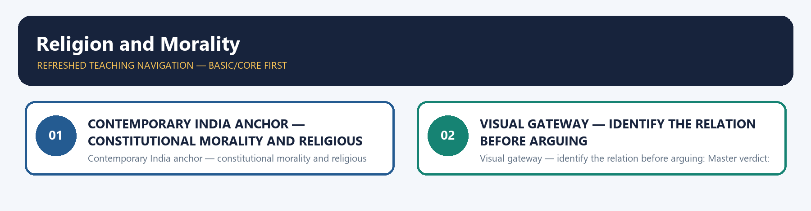
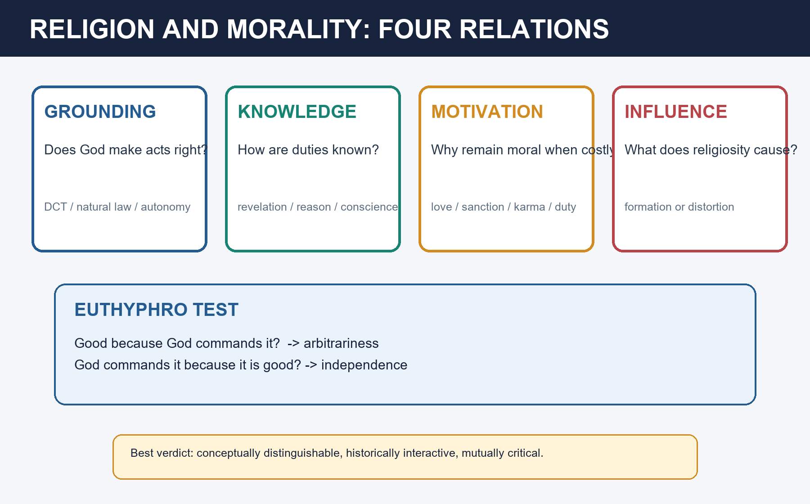

# Religion and Morality — Learner-v2 Source-Complete Learning Session

> **Catalogue identity:** Philosophy Optional · Philosophy Paper II — Philosophy of Religion · `philosophy-paper-ii-philosophy-of-religion-08`  
> **Generation:** g1, 21 August 2026 · **Approval:** pending explicit topic approval  
> **Evidence discipline:** exact doctrine and PYQ wording/year/marks are controlled by repository owners. Model answers are independent pedagogic practice, never official UPSC keys.

### Package practice counts

| Component | Count |
|---|---:|
| Direct verified topic-owned PYQs | 11 |
| Core diagnostic MCQs | 40 |
| Remedial diagnostic MCQs | 8 |
| Total diagnostics | 48 |
| Original solved Mains models | 6 (2 × 10, 2 × 15, 2 × 20) |
| Consolidated register parts | 12 (A–L) |
| Approval | false |


## BASIC LEARNING SESSION



*Distinct embedded teaching-navigation image. The separate continuous Cārvāka-style flowchart package remains an independent at-a-glance artifact.*


### Source-complete coverage ledger and answer-worthiness labels

**[FACT]** identifies retained repository doctrine or verified question data. **[INFERENCE]** identifies learner-facing organisation or judgement.

| Source corpus | Final location | Retention decision |
|---|---|---|
| Canonical owner §§0–7 | Basic Learning Session | Dependence, autonomy, interaction, Euthyphro, Kant, dharma, parity bench and answer skeletons retained |
| Canonical owner §§9–19 | Optional Advanced | Complete doctrine dossiers, violence analysis, religiosity, motivation, Nietzsche and factual discipline retained |
| Audited PYQ ledger | PYQs and Answer Practice | All eleven owner questions retained with exact wording and full solutions |
| Premium diagnostic set | MCQs / Remediation | Forty core and eight remedial questions retained with strict answer rotation |
| Original practice | PYQs and Answer Practice | Six non-PYQ solved models retained |
| Consolidated register | Final section | A–L retrieval framework preserves complete answer logic |

**Visible learning labels.** The four relations—conceptual grounding, epistemic access, motivation and sociological influence—are **CORE PAPER II**. DCT, Euthyphro, Kantian autonomy, modified DCT, natural law, dharma/karma and non-theistic ethics are **CORE ANSWER**. Religious violence, role-dharma criticism and religiosity orientations are **PYQ-TRIGGERED CORE**. Evolutionary debunking is **OPTIONAL ADVANCED**.

**What not to over-study.** Do not reduce the topic to “religion teaches morality.” Do not merge justification with motivation or causal influence with logical dependence. Violence questions require argument-premise analysis, not histories of conflict. Nietzsche requires both the death-of-God diagnosis and genealogy of morality.
### Learning roadmap

| Unit | Learner objective |
|---:|---|
| 1 | Separate four religion–morality relations |
| 2 | Reconstruct and test divine command theory |
| 3 | Use both horns of Euthyphro |
| 4 | Explain Kantian autonomy and heteronomy |
| 5 | Compare modified DCT and natural law |
| 6 | Ground ethics through dharma, karma, Buddhism, Jainism and Mīmāṃsā |
| 7 | Separate justification from “all the time” motivation |
| 8 | Analyse religiosity as morally conditional |
| 9 | Test arguments for religious violence |
| 10 | Explain Nietzsche’s linked critique of religion and morality |
| 11 | Build 10/15/20-mark answers |

### SESSION 1 — CONTEMPORARY INDIA ANCHOR — CONSTITUTIONAL MORALITY AND RELIGIOUS PRACTICE [SUPPORTING]

#### DEFINITION / WHAT THIS IS CALLED

**Plain-language definition:** ✅ Fact: Reporting on the 2026 Sabarimala review hearings describes the Supreme Court’s renewed examination of equality, religious freedom, essential religious practices and constitutional morality.

**Technical definition:** Contemporary India anchor — constitutional morality and religious practice [SUPPORTING]: ✅ Fact: Reporting on the 2026 Sabarimala review hearings describes the Supreme Court’s renewed examination of equality, religious freedom, essential religious practices and constitutional morality.

#### ANSWER-GRABBING OPENING — WRITE/ADAPT IN THE EXAM

> ✅ Fact: Reporting on the 2026 Sabarimala review hearings describes the Supreme Court’s renewed examination of equality, religious freedom, essential religious practices and constitutional morality.

#### MUST-WRITE KEYWORDS

- **Live source checked**
- **2026**

**How to use them:** ✅ Fact: Reporting on the 2026 Sabarimala review hearings describes the Supreme Court’s renewed examination of equality, religious freedom, essential religious practices and constitutional morality.

✅ **Fact:** Reporting on the 2026 Sabarimala review hearings describes the Supreme Court’s renewed examination of equality, religious freedom, essential religious practices and constitutional morality.  
⚠️ **Inference:** The controversy illustrates the owner’s interaction thesis: morality may be shaped by religion, while public moral principles may also criticise religious practices. It does not by itself settle the philosophical question whether morality is grounded in religion.  
**Live source checked:** Mathrubhumi English, 2026 report on the Sabarimala review hearings.




#### CLOSING RECALL FLOW — CONTEMPORARY INDIA ANCHOR — CONSTITUTIONAL MORALITY AND RELIGIOUS PRACTICE [SUPPORTING]

```text
START / CONCEPT: Contemporary India anchor — constitutional morality and religious practice [SUPPORTING]
        |
        v
EXACT TERMS: Live source checked · 2026
        |
        v
MECHANISM / ARGUMENT: ⚠️ Inference: The controversy illustrates the owner’s interaction thesis: morality may be shaped by religion, while public moral principles may also criticise religious practices.
        |
        v
CONSEQUENCE / CONTRAST: It does not by itself settle the philosophical question whether morality is grounded in religion.
        |
        v
UPSC TRAP / ANSWER-USE: It does not by itself settle the philosophical question whether morality is grounded in religion.
        |
        v
ANSWER-GRABBING FORMULATION: ✅ Fact: Reporting on the 2026 Sabarimala review hearings describes the Supreme Court’s renewed examination of equality, religious freedom, essential religious practices and constitutional morality.
```
### SESSION 2 — VISUAL GATEWAY — IDENTIFY THE RELATION BEFORE ARGUING

#### DEFINITION / WHAT THIS IS CALLED

**Plain-language definition:** Master verdict: Morality is not conceptually reducible to religion, but religion can supply motivation, formation and cosmic significance; morality in turn remains an indispensable internal and external critic of religious life.

**Technical definition:** Visual gateway — identify the relation before arguing: Master verdict: Morality is not conceptually reducible to religion, but religion can supply motivation, formation and cosmic significance; morality in turn remains an indispensable internal and external critic of religious life.

#### ANSWER-GRABBING OPENING — WRITE/ADAPT IN THE EXAM

> Moral obligation can be grounded independently in reason, welfare, virtue, human dignity or the reduction of suffering, even when religion strengthens motivation.

#### MUST-WRITE KEYWORDS

- **Master verdict**
- **Mnemonic — "Depend / Detach / Dialogue"**
- **Euthyphro**
- **Divine Command Theory (DCT)**
- **right because God commands it**
- **Morality is internal to religion.**
- **autonomy**
- **Euthyphro dilemma (Plato)**

**How to use them:** Moral obligation can be grounded independently in reason, welfare, virtue, human dignity or the reduction of suffering, even when religion strengthens motivation.

```text
RIGHTNESS:   Is an act right because God commands it?
KNOWLEDGE:   Do agents need revelation to know duty?
MOTIVATION:  Does God/religion make agents comply?
INFLUENCE:   Does religiosity improve actual conduct?

Logical dependence != epistemic access != motivation != causal correlation
```

> **Master verdict:** Morality is not conceptually reducible to religion, but religion can supply motivation, formation and cosmic significance; morality in turn remains an indispensable internal and external critic of religious life.


#### 0. ONE-SCREEN MAP ⚠️

```
   HOW ARE RELIGION & MORALITY RELATED?
   ┌───────────────┬─────────────────┬──────────────────┐
   DEPENDENCE       INDEPENDENCE       INTERACTION
   morality NEEDS   morality is        they mutually
   religion/God     AUTONOMOUS         influence & reinforce
   (Divine Command  (Kant: reason;     (religion motivates;
   Theory)          secular ethics)    morality refines religion)
        │                │                    │
   EUTHYPHRO DILEMMA (Plato): Is X good because God commands it,
   OR does God command it because it is good?
        ↳ horn 1 → morality arbitrary   ↳ horn 2 → morality independent of God
```
> 🔑 **Mnemonic — "Depend / Detach / Dialogue":** morality depends on religion (Divine Command), detaches from it (Kant/secular), or dialogues with it (interaction). The **Euthyphro** splits the dependence view.

---

#### 1. THE DEPENDENCE VIEW — morality needs religion ✅

> **ANSWER-GRABBING LINE — WRITE/ADAPT IN THE EXAM (Recommended opening definition):** The dependence view holds that morality requires religion for its authority, motivation or ultimate sanction, but these three claims must be assessed separately.
- **Divine Command Theory (DCT):** an act is **right because God commands it**; morality is grounded in, and motivated by, God's will. Without God, the view argues, the ultimate authority of moral obligation becomes difficult to explain. ✅
- **"One can have morality without religion but not religion without morality" (2022 PYQ):** ⚠️
  - *Religion without morality is impossible* — every religion prescribes an ethic; a religion sanctioning cruelty is a contradiction. **Morality is internal to religion.**
  - *Morality without religion is possible* — secular ethics (Kant, utilitarianism, humanism) grounds morality in reason/consequences, not God. → the asymmetry.
- **"Must normative principles reference God to create obligation?" (2025 PYQ):** DCT says yes; but Kant shows **autonomy** can ground obligation without God. ⚠️

---
#### 2. THE INDEPENDENCE VIEW — autonomous morality ✅

> **ANSWER-GRABBING LINE — WRITE/ADAPT IN THE EXAM:** Moral obligation can be grounded independently in reason, welfare, virtue, human dignity or the reduction of suffering, even when religion strengthens motivation.
- **Euthyphro dilemma (Plato):** *Is the pious loved by the gods because it is pious, or pious because it is loved?* ✅
  - **Horn 1** (good *because* commanded) → morality is **arbitrary** (God could command cruelty and it'd be "good").
  - **Horn 2** (commanded *because* good) → **goodness is independent of God** (God recognises a standard He didn't invent). → **morality is autonomous.** This is the classic refutation of strong DCT.
- **Kant:** morality rests on **reason & autonomy** (the categorical imperative), not on God's command. Religion is related to morality, while God, freedom and immortality function as practical postulates rather than the source of the moral law. ✅
- **Secular ethics:** utilitarianism, contractarianism, virtue ethics, humanism — all ground morality without theism. ⚠️

---
#### 3. THE INTERACTION VIEW — mutual influence (2023 PYQ) ✅

> **ANSWER-GRABBING LINE — WRITE/ADAPT IN THE EXAM:** Religion and morality are conceptually distinguishable yet historically interactive: religion shapes moral formation, while moral criticism reforms religious practice.
- **Religion influences moral behaviour:** provides **motivation** (reward/punishment, love of God), **community & sanction**, moral exemplars, and a **worldview** that sustains moral commitment. ✅
- **Morality influences/refines religion:** moral conscience **critiques** religious practice (prophets against ritualism; reform movements against caste/sati); a religion is judged by its **ethical fruits** (James). ⚠️
- **Empirically:** religion can promote pro-social behaviour *and* (misused) sanction intolerance/violence — the relation is **contingent**, not automatic. ⚠️
- **Indian view:** **dharma** fuses the religious and the moral — right conduct *is* the cosmic-religious order; karma links moral action to spiritual destiny (morality is soteriologically serious). ✅

---
#### 4. COMPARISON GRID ⚠️
| View | Claim | Thinker | Weakness |
|---|---|---|---|
| Divine Command | right = God's command | DCT, Dostoevsky | Euthyphro: arbitrariness |
| Autonomy | morality = reason | Kant | motivation/why-be-moral gap |
| Independence (secular) | ethics needs no God | utilitarians, humanists | grounding of obligation |
| Interaction | mutual reinforcement | James, Indian dharma | relation is contingent |
| Indian (dharma) | moral = religious order | Gītā, Mīmāṃsā | — |

> 🔑 **Balanced conclusion:** the Euthyphro shows morality **cannot be wholly reducible to** divine command (else arbitrary), so morality has **autonomy**; yet religion powerfully **motivates and sustains** morality, and morality **purifies** religion — hence the **interaction** view, not strict dependence, is soundest.

---
#### 5. FOUNDATIONAL STATEMENT BANK ⚠️
1. ✅ The Euthyphro dilemma asks whether divine approval constitutes goodness or responds to goodness.
2. ❓ The sentence commonly rendered as "If God does not exist, everything is permitted" is a summary of a Dostoevskian theme, not a safe verbatim quotation.
3. ✅ Kant grounds moral obligation in rational autonomy and relates religion to the requirements of practical reason.
4. ✅ James's pragmatic test directs attention to the fruits of religious life.
5. ⚠️ Indian **dharma** frequently combines moral, ritual, social and soteriological dimensions; it is not reducible to any one of them.

---
#### 6. APPLIED-QUESTION DRILLS ⚠️
1. **[Asymmetry]** "'Morality without religion, but not religion without morality.' Discuss." (2022) → §1.
2. **[Religion without morality]** "Can there be a religion without morality?" (2024) → §1.
3. **[Influence]** "Does religion influence moral behaviour? Interactive relation." (2023) → §3.
4. **[Obligation]** "Must normative principles reference God to produce obligation?" (2025) → §2 + §9.11.
5. **[Violence]** "Can there be a philosophical argument to support violence in the name of religion?" (2019, 10m) → §9.7 — premises, then the failing premise.
6. **[Astray]** "Does devoted commitment to a religious way of life make one go astray from social morality?" (2019, 10m) → §9.9 + Kierkegaard's suspension.
7. **[Why be moral]** "Secular ethics cannot fully resolve why one should be moral all the time." (2019, 15m) → §9.10 — justification vs motivation.
8. **[Compatibility]** "Are religious beliefs and practices incompatible with moral behaviour?" (2020, 15m) → §9.9.
9. **[Inseparable]** "Are religion and morality inseparable?" (2021, 15m) → §1–§3 + §9.11 — four independent non-theistic groundings.
10. **[Religiosity/immorality]** "Inter-relatedness between 'religiosity' and 'immorality'." (2018, 10m) → §9.9 — keep the printed word.
11. **[Nietzsche]** "Nietzsche's criticism of religion and morality." (2025, 10m) → §9.6 (**this file is the primary owner**).

---
#### 6A. PARITY BENCH — grounding morality with and without God ⚠️

> **ANSWER-GRABBING LINE — WRITE/ADAPT IN THE EXAM:** The key analytical distinction is between what makes an act right, what justifies belief in its rightness and what motivates an agent to perform it.

| Grounding | Ultimate ground | Handles Euthyphro? | Handles "all the time"? | Standing objection |
|---|---|---|---|---|
| Strong DCT | God's command | ❌ Impaled on a horn | ✅ By sanction | Arbitrariness |
| Modified DCT (Adams) | God's loving nature | ✅ Blocks arbitrariness | ✅ By love, not fear | "Loving" presupposes goodness |
| Natural law | Human goods under divine reason | ✅ Mediates the horns | ⚠️ Partly | Nature-to-norm |
| Kant | Rational self-legislation | ✅ Not applicable | ⚠️ Justifies, does not motivate | Formalism |
| Contractarian | Mutual advantage | ✅ Not applicable | ❌ The perfect knave survives | Detectability of dispositions |
| Karma/dharma | Cosmic moral order | ✅ No commander needed | ✅ **Exhaustive — no undetected act** | Unverifiability |
| Buddhist (Śāntideva) | Ownerless suffering + *anātman* | ✅ Not applicable | ✅ Impartiality is rationally required | Depends on *anātman* |
| Jain | *Ahiṃsā*, graded vows | ✅ Not applicable | ✅ Vow-structure | Rigorism |
| Mīmāṃsā | Vedic injunction alone | ✅ No personal commander | ⚠️ Ritual-bounded | Authority outside the tradition |

---
#### 7. PYQ-MAPPED MODEL-ANSWER SKELETONS ⚠️

#### 7.1 — "'One can have morality without religion but not religion without morality.' Discuss." (2022, 10m)
```
Intro : examine the asymmetry between the two directions.
Body  : religion WITHOUT morality — impossible (every religion prescribes an ethic; internal link);
        morality WITHOUT religion — possible (Kant's autonomy, secular ethics, humanism).
Assess: Euthyphro blocks strong DCT; yet religion motivates/sustains morality (interaction).
Concl : the asymmetry holds — morality is autonomous, religion is ethically constituted.
```

#### 7.2 — "Must normative principles reference God to produce obligation?" (2025, 15m)
```
Intro : the Divine Command claim vs the autonomy claim.
Body  : DCT — obligation from God's will (Dostoevsky); BUT Euthyphro → arbitrariness;
        Kant — obligation from rational autonomy (categorical imperative), no God needed;
        secular ethics grounds duty without theism.
Assess: God can MOTIVATE obligation but is not its logical GROUND; morality is autonomous.
Concl : normative principles need not reference God to obligate, though religion can reinforce them.
```

#### 7.3 — "Can there be a philosophical argument to support violence in the name of religion?" (2019, 10m)
```
Intro : the question is about the STRUCTURE OF JUSTIFICATION, not the history of conflict.
        Assess arguments; name no community.
Body  : state each candidate in premises, then locate the failing premise —
        (1) divine command → fails at P2: no fallible agent can infallibly identify the divine will
            (Kierkegaard concedes Abraham cannot make himself intelligible → no public justification);
        (2) defence of the sacred → fails at P2: it confuses supreme VALUE with vulnerability;
        (3) coerce-for-salvation → fails at P2 empirically: Locke — force compels profession, not
            belief; coerced religion yields hypocrisy (Augustine's compelle intrare as the historical
            counter-position, examined not endorsed);
        (4) cosmic dualism → fails at P2: total demonisation contradicts image-of-God / ahiṃsā /
            ātman-in-all anthropologies;
        (5) identity-honour → not a religious argument at all.
General rebuttals: Euthyphro; epistemic fallibility; Gandhi's means–end unity; internal critiques.
Concl : no SOUND argument survives; only the ordinary defensive-force permission, which is not
        religious. Religion's distinctive contribution here is restraint, not licence.
```

#### 7.4 — "Secular ethics cannot fully resolve why one should be moral all the time." (2019, 15m)
```
Intro : the weight is on "all the time" — the undetected, costly, unreciprocated act.
Setup : Ring of Gyges; Hobbes' Foole; Hume's sensible knave; Bradley/Prichard on whether the
        question is even well-formed.
Secular answers and their limits:
        Kant (categorical, not conditional — but justifies rather than motivates);
        Gauthier's constrained maximisation (works only where dispositions are detectable);
        Aristotelian eudaimonism (presupposes a thick nature the sceptic can decline);
        sympathy/reciprocity (explains a motive; has an exception clause for the undetected case).
Religious answers: divine sanction (works, but heteronomous — Kantian cost);
        divine love (escapes heteronomy);
        KARMA — exhaustive and impersonal: no unobserved act, no bribable judge, so Gyges' ring
        is irrelevant; niṣkāma-karma (Gītā 2.47, 3.19) DISSOLVES the question by removing the fruit
        from deliberation; dharma/ṛta makes morality the grain of reality, not a constraint on it.
Assess: separate JUSTIFICATION from MOTIVATION. Secular ethics answers the first; the printed claim
        bites only on the second — and religion's advantage there is scope, purchased at the price
        of heteronomy if it works through sanction.
Concl : half true — and the half that is true is motivational, not logical.
```

#### 7.5 — "Present an account of Nietzsche's criticism of religion and morality." (2025, 10m)
```
Intro : the two halves are inseparable — the death of God and the genealogy of the morality it bore.
Body  : (1) "God is dead" (Gay Science §125) as CULTURAL DIAGNOSIS, not atheological argument;
        (2) Genealogy I — good/bad (noble) inverted into good/evil by the slave revolt; ressentiment
            as creative and REACTIVE;
        (3) Genealogy II — guilt from debt; bad conscience as instinct turned inward;
        (4) Genealogy III — the ascetic ideal gave suffering a meaning ("rather will nothingness
            than not will"); modern science is its latest form and destroys the belief in God;
        (5) Christianity as "Platonism for the people" (BGE Preface); pity as life-denying;
        (6) positive — revaluation, will to power, Übermensch, eternal recurrence, amor fati;
            nihilism is the interim, not the goal.
Crit  : genetic fallacy (origin ≠ validity); no criterion for a better creation of values;
        Scheler's Ressentiment — Christian love descends from abundance, not impotence;
        appropriation risk.
Indian: the Gītā's charge of klaibya (2.3) resembles the diagnosis but prescribes svadharma, not
        self-created value; Nietzsche's "life-denying" charge against Buddhism misreads nirvāṇa as
        cessation of life rather than of craving, and ignores karuṇā and the middle way.
Concl : the critique of morality outlives the programme that was to replace it.
```

---

#### CLOSING RECALL FLOW — VISUAL GATEWAY — IDENTIFY THE RELATION BEFORE ARGUING

```text
START / CONCEPT: Visual gateway — identify the relation before arguing
        |
        v
EXACT TERMS: Master verdict · Mnemonic — "Depend / Detach / Dialogue" · Euthyphro · Divine Command Theory (DCT) · right because God commands it
        |
        v
MECHANISM / ARGUMENT: The dependence view holds that morality requires religion for its authority, motivation or ultimate sanction, but these three claims must be assessed separately.
        |
        v
CONSEQUENCE / CONTRAST: Master verdict: Morality is not conceptually reducible to religion, but religion can supply motivation, formation and cosmic significance; morality in turn remains an indispensable internal and external critic of religious life.
        |
        v
UPSC TRAP / ANSWER-USE: Master verdict: Morality is not conceptually reducible to religion, but religion can supply motivation, formation and cosmic significance; morality in turn remains an indispensable internal and external critic of religious life.
        |
        v
ANSWER-GRABBING FORMULATION: Moral obligation can be grounded independently in reason, welfare, virtue, human dignity or the reduction of suffering, even when religion strengthens motivation.
```
## BASIC MCQS / REMEDIATION

### Practice protocol — [CORE ANSWER]

Attempt each item before reading its key. Answer placement is balanced, deterministic and non-patterned using a stable topic seed. across all forty-eight diagnostics.

#### CORE DIAGNOSTIC MCQS

#### 1. Which claim expresses **conceptual dependence** of morality on religion?

A. Religious communities often teach moral habits more effectively than isolated individuals.
B. Belief in judgement increases compliance when legal detection is unlikely.
C. The meaning or constitution of moral obligation necessarily involves a religious fact such as divine command.
D. Moral reformers frequently use inherited religious language.

**Answer: C. The meaning or constitution of moral obligation necessarily involves a religious fact such as divine command.**

Conceptual dependence concerns what morality or obligation *is*, not what causes compliance. A and D concern sociological influence; B concerns motivational dependence. Strong DCT is a conceptual or metaphysical dependence thesis because it constitutes obligation through command.

#### 2. Which example most directly concerns **epistemic dependence**?

A. A believer obeys because divine love inspires gratitude.
B. An act is obligatory because a loving God commands it.
C. An agent claims that revelation is the only way human beings can know which acts are obligatory.
D. A society historically acquired its moral vocabulary through religion.

**Answer: C. An agent claims that revelation is the only way human beings can know which acts are obligatory.**

Epistemic dependence concerns access or knowledge. B is metaphysical dependence; A is motivational dependence; D is historical-sociological influence. A norm might be independently true yet, on an epistemic-dependence view, knowable only through revelation.

#### 3. What follows from evidence that religious participation correlates with charitable giving?

A. The Euthyphro dilemma has been empirically refuted.
B. Charity is right only if God commands it.
C. Non-believers cannot know that charity is right.
D. Religion may causally influence conduct, but logical dependence and moral truth do not follow.

**Answer: D. Religion may causally influence conduct, but logical dependence and moral truth do not follow.**

A behavioural correlation establishes at most a contingent influence and may require controls for community, selection and orientation. It cannot show what makes charity right, who can know its rightness, or whether divine command theory survives Euthyphro.

#### 4. Which situation best illustrates **motivational rather than justificatory dependence**?

A. Only revelation discloses the moral rule.
B. “Wrong” means “forbidden by God.”
C. Universalisation makes promise-keeping obligatory.
D. An agent accepts a secular reason against lying but acts consistently only because belief in karma makes concealment irrelevant.

**Answer: D. An agent accepts a secular reason against lying but acts consistently only because belief in karma makes concealment irrelevant.**

The reason establishes the rule independently, while karma supplies motivational reach. The case therefore separates why the norm is justified from what reliably moves the particular agent. A is semantic; B epistemic; C justificatory.

#### 5. Strong Divine Command Theory is best stated as:

A. Moral goodness always means maximising welfare.
B. Religion is socially useful even when false.
C. An action is morally obligatory because God commands it.
D. God commands actions after discovering independent moral truths.

**Answer: C. An action is morally obligatory because God commands it.**

Strong DCT makes command constitutive of obligation, not merely evidence, motivation or reinforcement. D adopts the independence horn of Euthyphro. B is sociological-pragmatic, and A is utilitarian.

#### 6. What is Robert Adams’s central modification of Divine Command Theory?

A. Moral obligation is wholly reducible to anticipated punishment.
B. Obligations arise from the commands of an essentially loving God, while goodness is related to resemblance to the divine nature.
C. Moral goodness is whatever any religious authority declares.
D. God’s commands are unnecessary because only consequences matter.

**Answer: B. Obligations arise from the commands of an essentially loving God, while goodness is related to resemblance to the divine nature.**

Adams restricts commands through God’s loving nature, blocking the possibility that cruelty becomes obligatory by arbitrary fiat. The residual objection is that “loving” and “good” appear to carry independently understood moral content.

#### 7. Which formulation accurately states the Euthyphro dilemma?

A. Is the pious loved because it is pious, or pious because it is loved?
B. Is God omnipotent if evil exists?
C. Can faith and reason ever reach the same conclusion?
D. Can religious language be empirically verified?

**Answer: A. Is the pious loved because it is pious, or pious because it is loved?**

If divine approval constitutes goodness, morality risks arbitrariness. If the gods approve because an act is independently good, goodness does not depend on approval. The dilemma targets strong command dependence, not omnipotence or religious language.

#### 8. Which is the strongest residual criticism of modified DCT?

A. It proves that all values are subjective.
B. It makes every command empirically unverifiable.
C. Calling God’s nature “loving” presupposes moral content not exhausted by command.
D. It denies that God can be loving.

**Answer: C. Calling God’s nature “loving” presupposes moral content not exhausted by command.**

Modified DCT avoids arbitrary cruelty, but only by morally characterising the commander. If “loving” has no independent content, the restriction is empty; if it does, conceptual independence has partly been conceded.

#### 9. For Kant, autonomy means:

A. Acting on whichever desire is strongest.
B. Rational self-legislation under a universally valid moral law.
C. Rejecting every social and religious practice.
D. Treating morality as a private preference.

**Answer: B. Rational self-legislation under a universally valid moral law.**

Kantian autonomy is not licence or subjectivism. The agent acts under a law that reason can will universally and respects humanity as an end. Reward, punishment and imposed desire are heteronomous grounds.

#### 10. Which statement best describes God’s place in Kant’s moral philosophy?

A. Moral worth requires fear of divine punishment.
B. God is related to practical reason as a postulate, not the source of the moral law.
C. God’s command creates the categorical imperative.
D. God replaces rational autonomy whenever duties conflict.

**Answer: B. God is related to practical reason as a postulate, not the source of the moral law.**

For Kant, duty arises from rational autonomy. God, freedom and immortality enter in relation to practical reason and the highest good; they do not make an otherwise non-moral maxim obligatory.

#### 11. How does natural law mediate between strong DCT and secular autonomy?

A. It grounds the order ultimately in divine reason while allowing practical reason to know basic goods without a special command.
B. It denies any objective order of human goods.
C. It makes moral norms valid only after revelation.
D. It treats every biological tendency as morally compulsory.

**Answer: A. It grounds the order ultimately in divine reason while allowing practical reason to know basic goods without a special command.**

Natural law rejects arbitrary decrees and pure voluntarism. Human goods are rationally accessible, though situated within a divinely grounded order. Its standing problem is explaining the move from nature and inclination to norm.

#### 12. Which is a correct caution about **dharma**?

A. Dharma may combine moral, ritual, social and soteriological dimensions and therefore needs internal moral criticism.
B. Dharma requires a personal creator in every Indian school.
C. Dharma always means ritual and never conduct.
D. Dharma is exactly synonymous with universal secular morality.

**Answer: A. Dharma may combine moral, ritual, social and soteriological dimensions and therefore needs internal moral criticism.**

Reducing dharma to a single modern category erases its range. Role-specific or ritual duties may conflict with deeper norms such as non-harm and equality; this is why Indian traditions contain internal debates and reform.

#### 13. Why is karma especially relevant to the phrase “moral all the time”?

A. It removes intention from moral assessment.
B. It makes the moral worth of action depend solely on public reputation.
C. It proves all actions have identical consequences.
D. It depicts moral consequence as exhaustive, so concealment from human observers does not create an exception.

**Answer: D. It depicts moral consequence as exhaustive, so concealment from human observers does not create an exception.**

Karma answers the Gyges problem by denying that invisibility to persons is moral invisibility. It is impersonal and not bribable. This is primarily a motivational and cosmic-order advantage, not by itself a public proof of every norm.

#### 14. What is distinctive about niskama-karma in the “why be moral?” debate?

A. It promises larger rewards for moral conduct.
B. It dissolves the prudential question by requiring action from duty without attachment to fruits.
C. It equates liberation with inactivity.
D. It treats every social role as permanently just.

**Answer: B. It dissolves the prudential question by requiring action from duty without attachment to fruits.**

Rather than offering a better payoff, detached action removes payoff from deliberation. The agent acts because the act is dharma. This does not prevent criticism of inherited role-duties, but it avoids reducing morality to reward.

#### 15. Which account gives the strongest Buddhist non-theistic grounding in the source?

A. Moral conduct is merely conventional and has no liberative relevance.
B. Vedic injunction independently establishes all duty.
C. Santideva argues that, given anatman, suffering is ownerless and impartial relief is rationally required.
D. A creator rewards compassionate action.

**Answer: C. Santideva argues that, given anatman, suffering is ownerless and impartial relief is rationally required.**

The argument derives altruism from a metaphysical premise rather than divine command. If no substantial self owns suffering, privileging “my” suffering needs justification. Its vulnerability is dependence on the truth or force of anatman.

#### 16. Which pairing correctly characterises Jain ethical grounding?

A. Utility maximisation plus rejection of vows.
B. Ahimsa, graded anuvrata/mahavrata obligations, and anekantavada as intellectual non-violence.
C. Divine fiat plus denial of karmic consequence.
D. Ahimsa plus unrestricted identical duties for every vocation.

**Answer: B. Ahimsa, graded anuvrata/mahavrata obligations, and anekantavada as intellectual non-violence.**

Jain ethics extends non-harm broadly while grading vows for householders and ascetics. Anekantavada discourages epistemic violence through absolutising one standpoint. It is a disciplined non-theistic grounding, not uniform rigorism for all.

#### 17. Why is Mimamsa significant in this debate?

A. It offers duty from Vedic injunction without requiring a personal divine commander.
B. It makes compassion the sole content of dharma.
C. It grounds all duty in the intention of a loving creator.
D. It rejects injunction as a source of obligation.

**Answer: A. It offers duty from Vedic injunction without requiring a personal divine commander.**

Mimamsa is a counter-example to the claim that an imperative needs a personal God. Its codana-based deontology remains scripture-dependent, so its authority beyond the tradition can be questioned, but “no personal commander” does not mean “no obligation”.

#### 18. Which statement properly separates moral **justification** from **motivation**?

A. A theory may show why a norm binds while failing to ensure that a tempted agent will comply.
B. A sociological cause of conduct constitutes moral validity.
C. Motivation by sanction automatically proves the sanctioned rule true.
D. If a reason motivates nobody, it cannot be a reason.

**Answer: A. A theory may show why a norm binds while failing to ensure that a tempted agent will comply.**

Kant may justify categorical duty while leaving a psychological motivation gap. Conversely, fear may motivate compliance with an unjust rule. Treating justification and motivation as identical is the central trap in the 2019 and 2025 PYQs.

#### 19. What is the point of the Ring of Gyges?

A. Justice is whatever rulers enforce.
B. It establishes karma as an empirical law.
C. Religious experience is necessarily private.
D. It tests whether one remains just when wrongdoing is profitable and undetectable.

**Answer: D. It tests whether one remains just when wrongdoing is profitable and undetectable.**

The ring removes reputation and punishment, exposing whether justice is valued intrinsically. It frames the “all the time” problem but does not itself decide between Kantian, contractarian, religious or virtue-ethical answers.

#### 20. Which limitation applies to Gauthier-style constrained maximisation?

A. Its disposition argument weakens if a perfect knave can conceal an opportunistic disposition.
B. It requires belief in rebirth.
C. It identifies duty with divine command.
D. It cannot explain any cooperative conduct.

**Answer: A. Its disposition argument weakens if a perfect knave can conceal an opportunistic disposition.**

Adopting a cooperative disposition can be utility-maximising when others can detect character and select partners. Perfect concealment reopens the exception: profitable cheating may appear rational where no future consequence follows.

#### 21. Allport’s **intrinsic religiosity** describes:

A. Rejection of all communal worship.
B. Permanent doubt about every religious commitment.
C. Religion used mainly for status, security and belonging.
D. Religion internalised as an end that shapes the believer’s whole life.

**Answer: D. Religion internalised as an end that shapes the believer’s whole life.**

Intrinsic orientation “lives” religion rather than using it instrumentally. It does not guarantee virtue, but its moral correlations differ from extrinsic orientation. The distinction prevents crude claims about religiosity as such.

#### 22. Which case best exemplifies **extrinsic religiosity**?

A. A person serves anonymously because compassion is spiritually central.
B. A person treats faith as an open-ended search.
C. A person revises an inherited practice after moral reflection.
D. A person displays observance primarily to gain group status and political security.

**Answer: D. A person displays observance primarily to gain group status and political security.**

Extrinsic religiosity uses religion as an instrument. It is especially relevant to in-group bias and moral licensing. A is closer to intrinsic orientation; B to quest.

#### 23. Batson’s **quest orientation** is best understood as:

A. Approaching religious questions with openness, complexity and willingness to revise.
B. Using religion for material advantage.
C. Replacing morality with ritual accuracy.
D. Treating doctrinal certainty as immune to every objection.

**Answer: A. Approaching religious questions with openness, complexity and willingness to revise.**

Quest religiosity foregrounds searching and self-correction. It is not mere indecision; it can make religious commitment answerable to moral evidence and reduce the tendency to protect identity through dogmatic closure.

#### 24. What is the most defensible general verdict on religiosity and immorality?

A. They necessarily increase together.
B. Only non-religious persons can act immorally.
C. They are wholly unrelated in every context.
D. Religiosity is a conditional amplifier whose direction depends on moral content and orientation.

**Answer: D. Religiosity is a conditional amplifier whose direction depends on moral content and orientation.**

The verdict incorporates ritual substitution and in-group danger without ignoring reformers, compassion and service. “Amplifier” means religiosity is causally significant but not fixed in moral direction.

#### 25. In the divine-command argument for religious violence, which premise is epistemically most vulnerable?

A. Moral language can guide action.
B. Valid arguments require conclusions.
C. Violence can cause physical harm.
D. The agent has correctly and infallibly identified a divine command licensing this act.

**Answer: D. The agent has correctly and infallibly identified a divine command licensing this act.**

The formal inference may be valid, but disputed revelation and interpretation make the identifying premise unavailable with the required certainty. Kierkegaard’s Abraham cannot translate his singular relation into a publicly assessable justification.

#### 26. Locke’s objection to coercion for salvation is that:

A. Every religious belief is involuntary in exactly the same way.
B. Force can compel outward profession but cannot compel genuine belief.
C. Magistrates always possess theological truth.
D. Salvation has no value.

**Answer: B. Force can compel outward profession but cannot compel genuine belief.**

Because understanding is not directly produced by outward force, coercion generates hypocrisy rather than conviction. This defeats the key efficacy premise of soteriological paternalism without requiring a denial of religion.

#### 27. What is wrong with the defence-of-the-sacred argument for violence?

A. It conflates supreme value with the kind of vulnerability that physical force can protect.
B. It denies that sacred things can be valued.
C. It assumes no person can be defended.
D. It proves that all speech is harmless.

**Answer: A. It conflates supreme value with the kind of vulnerability that physical force can protect.**

Persons and material sites can suffer direct injury; a transcendent sacred reality, particularly on classical theism, is not diminished by insult. Protection of persons may be justified, but sacred value alone does not generate a special licence.

#### 28. Which conclusion follows from comparing just war, classical Islamic juristic restraints and dharma-yuddha?

A. Revelation alone explains every shared norm.
B. Each tradition permits unrestricted force under necessity.
C. Their convergence on authority, cause, intention, discrimination and proportionality supports viewing them as restraint-regimes.
D. All three are identical in doctrine and history.

**Answer: C. Their convergence on authority, cause, intention, discrimination and proportionality supports viewing them as restraint-regimes.**

The comparison is structural, not an adjudication among communities. Convergence suggests practical-reason constraints expressed in different idioms. Each also contains contested counter-currents, so the answer must avoid idealisation.

#### 29. Which statement about dharma-yuddha is factually disciplined?

A. Kuta-yuddha is identical with non-violence.
B. It includes protected categories and prohibited methods, while the epics also narrate violations and Kautilya supplies a realist counter-tradition.
C. Its rules apply only when hatred is maximised.
D. The Gita offers a universal licence for every religious war.

**Answer: B. It includes protected categories and prohibited methods, while the epics also narrate violations and Kautilya supplies a realist counter-tradition.**

A good comparison names both normative restraint and internal tension. The Gita’s argument concerns Arjuna’s svadharma in a specific narrative; it should not be generalised into an unrestricted war theory.

#### 30. Which is the safest statement about the “greater/lesser jihad” distinction?

A. It is identical with jus post bellum.
B. It proves that armed struggle is never discussed in Islamic jurisprudence.
C. The supporting report’s authenticity is disputed, so the distinction must be flagged rather than asserted as settled.
D. It is a Qur’anic technical classification beyond dispute.

**Answer: C. The supporting report’s authenticity is disputed, so the distinction must be flagged rather than asserted as settled.**

Factual discipline requires distinguishing jihad as striving, qital as fighting, juristic conditions, and disputed reports. The philosophical task is comparative analysis of restraints, not essentialising a living community.

#### 31. Nietzsche’s “God is dead” primarily means:

A. A cultural diagnosis that the Christian-metaphysical horizon has become unbelievable while its consequences remain unassimilated.
B. A deductive proof that no deity can exist.
C. A defence of Divine Command Theory.
D. A recommendation that society abandon every value immediately.

**Answer: A. A cultural diagnosis that the Christian-metaphysical horizon has become unbelievable while its consequences remain unassimilated.**

The madman passage diagnoses a historical-cultural condition. Its ethical force lies in asking what becomes of inherited morality when its metaphysical support collapses.

#### 32. In Nietzsche’s genealogy, ressentiment is:

A. Any momentary anger felt by a powerful person.
B. A neutral method of historical scholarship.
C. A universal proof that compassion is false.
D. Reactive resentment that becomes value-creative by inverting noble good/bad into good/evil.

**Answer: D. Reactive resentment that becomes value-creative by inverting noble good/bad into good/evil.**

Slave morality first says “No” to an outside and derives its affirmation from negation. Nietzsche evaluates the type of life expressed by valuation, though genealogy alone does not refute a norm’s validity.

#### 33. What is the genetic-fallacy objection to Nietzsche?

A. Nietzsche never discussed the history of values.
B. Christian morality has no historical development.
C. Every origin determines present validity.
D. Showing that a value arose from resentment does not by itself show that the value is false or unjustified.

**Answer: D. Showing that a value arose from resentment does not by itself show that the value is false or unjustified.**

Nietzsche can reply that he assesses the *value* and effects of valuations rather than merely their truth. Still, historical-psychological origin cannot alone settle normative worth.

#### 34. Max Scheler’s named reply to Nietzsche holds that:

A. Morality must be created by an Ubermensch.
B. Genealogy proves Divine Command Theory.
C. Christian love may descend from abundance rather than impotence or ressentiment.
D. Pity and compassion are logically identical.

**Answer: C. Christian love may descend from abundance rather than impotence or ressentiment.**

Scheler directly contests Nietzsche’s psychological reduction. The reply matters because it attacks the proposed origin of agape without denying that resentment can sometimes wear moral language.

#### 35. Which directive response is correct for “Are A and B incompatible? Discuss”?

A. Define A and ignore B.
B. Assume incompatibility because one conflict exists.
C. Test the necessity claim; a coherent counter-case defeats universal incompatibility, though contingent conflicts may remain.
D. List every historical interaction between A and B.

**Answer: C. Test the necessity claim; a coherent counter-case defeats universal incompatibility, though contingent conflicts may remain.**

The 2020 PYQ requires conceptual testing, not a survey. Showing religiously grounded moral conduct defeats necessary incompatibility; identifying ritualism or coercion prevents an equally simplistic harmony thesis.

#### 36. What is the key structural demand in the 2022 quotation PYQ?

A. Analyse the asymmetry by testing morality-without-religion and religion-without-morality separately.
B. Discuss only morality without religion.
C. Give examples without deciding.
D. Treat the quotation as a demand for theological proof.

**Answer: A. Analyse the asymmetry by testing morality-without-religion and religion-without-morality separately.**

The two directions involve different relations. Religion may be supportive of morality, whereas morality may be constitutive of worthy religion. Collapsing these into a vague “close relation” misses the question.

#### 37. Which statement best answers the 2023 “influence” PYQ?

A. Sociological evidence resolves Euthyphro.
B. Religion can motivate and socialise conduct, while morality can criticise and reform religion; neither fact establishes logical dependence.
C. Morality affects religion but religion never affects conduct.
D. Influence proves that only religious morality is valid.

**Answer: B. Religion can motivate and socialise conduct, while morality can criticise and reform religion; neither fact establishes logical dependence.**

The stem has two deliverables: influence and interaction. A complete answer gives mechanisms in both directions and preserves the difference between causal history and normative grounding.

#### 38. Which is the best opening distinction for “Can there be a religion without morality?”

A. Cognitive versus non-cognitive language.
B. Descriptive existence of a religious institution versus normative adequacy as worthy religion.
C. Theistic versus atheistic proof.
D. Prayer versus worship.

**Answer: B. Descriptive existence of a religious institution versus normative adequacy as worthy religion.**

An institution can retain ritual and identity while acting unjustly, yet a religion wholly lacking ethical concern forfeits normative spiritual worth. This avoids both empirical denial and definitional evasion.

#### 39. What must a good answer to the 2025 normative-principles PYQ distinguish?

A. The ground of obligation, epistemic access to norms, and motivation or felt obligation.
B. Monotheism from polytheism only.
C. Ritual action from mystical experience only.
D. Religious language from scientific language.

**Answer: A. The ground of obligation, epistemic access to norms, and motivation or felt obligation.**

God-reference might be claimed necessary at any of three levels, and each needs separate evaluation. Non-theistic grounds defeat metaphysical necessity; public reason challenges epistemic necessity; diverse moral motives challenge motivational necessity.

#### 40. Which use of the Dostoevskian theme is factually safe?

A. Quote “If God does not exist, everything is permitted” as a verified verbatim sentence.
B. Treat it as empirical proof that atheists are immoral.
C. Present it as a common summary of a Dostoevskian theme, not a secure verbatim quotation.
D. Attribute it to Kant’s *Groundwork*.

**Answer: C. Present it as a common summary of a Dostoevskian theme, not a secure verbatim quotation.**

Quotation discipline matters in Philosophy answers. The theme can introduce the dependence problem, but it cannot substitute for argument or support a sociological claim about non-believers.

#### REMEDIAL DIAGNOSTIC MCQS

#### 41. A student writes, “Because religion often motivates charity, charity is right only because God commands it.” What is the exact error?

A. The student distinguishes justification from motivation too sharply.
B. The student infers conceptual or metaphysical dependence from motivational-sociological influence.
C. The student has shown that religion is normatively necessary.
D. The student has established modified DCT.

**Answer: B. The student infers conceptual or metaphysical dependence from motivational-sociological influence.**

A cause of conduct does not constitute rightness. Religion may motivate an independently justified duty. The inference crosses levels of dependence without argument, a recurrent UPSC trap.

#### 42. A student says modified DCT “completely defeats Euthyphro because God is loving.” Which correction is best?

A. It blocks arbitrary commands, but “loving” may presuppose independently grasped moral content.
B. It converts DCT into utilitarianism.
C. It eliminates every epistemic problem of revelation.
D. Modified DCT permits arbitrary cruelty.

**Answer: A. It blocks arbitrary commands, but “loving” may presuppose independently grasped moral content.**

The modification is substantial, not trivial, but its success has a cost. Non-arbitrariness is obtained by morally describing divine nature, which leaves conceptual independence partly intact.

#### 43. A response to “why be moral all the time” lists Kant, karma and punishment but never separates validity from compliance. What is missing?

A. A history of religions.
B. The justification-versus-motivation distinction that locates the force of “all the time”.
C. A definition of religious language.
D. A proof of God’s existence.

**Answer: B. The justification-versus-motivation distinction that locates the force of “all the time”.**

Kant can justify duty while not guaranteeing compliance; punishment can motivate while not proving a norm right. Without this distinction, unlike mechanisms are mistakenly treated as rival answers to one question.

#### 44. A candidate answers the violence PYQ by listing wars associated with religions. Why is this inadequate?

A. The answer should defend one community.
B. Historical facts are never relevant to philosophy.
C. The question asks only whether violence exists.
D. The directive asks for candidate philosophical arguments, their premises and the premise that fails.

**Answer: D. The directive asks for candidate philosophical arguments, their premises and the premise that fails.**

Historical occurrence cannot establish moral justification. The high-value structure is argument reconstruction followed by tests of divine access, vulnerability, coercive efficacy, demonisation and public reason.

#### 45. Which revision repairs the claim “Dharma proves morality always depends on religion”?

A. Dharma is merely another word for divine command.
B. Role-dharma is immune to equality-based criticism.
C. Dharma integrates several dimensions, while Buddhist, Jain, Mimamsa and secular accounts show that moral grounding need not involve a creator-God.
D. Every Indian system accepts the same God.

**Answer: C. Dharma integrates several dimensions, while Buddhist, Jain, Mimamsa and secular accounts show that moral grounding need not involve a creator-God.**

Indian evidence complicates rather than confirms a simple dependence thesis. Moral, ritual and soteriological orders may interact without a personal commander, and inherited duties remain open to internal critique.

#### 46. A learner claims Nietzsche advocates nihilism because he announces the death of God. Which response is correct?

A. Eternal recurrence is a theory of divine punishment.
B. Nietzsche wishes to restore strong DCT.
C. Nihilism is the transitional crisis he diagnoses and seeks to overcome through revaluation and affirmation.
D. Nietzsche denies that values have histories.

**Answer: C. Nihilism is the transitional crisis he diagnoses and seeks to overcome through revaluation and affirmation.**

The death of the old horizon creates nihilism; it is not the constructive goal. Nietzsche’s positive vocabulary includes self-overcoming, Ubermensch, eternal recurrence and amor fati, though its criterion remains contested.

#### 47. Which comparison of religious restraint traditions is methodologically sound?

A. Assume every convergence is caused by identical revelation.
B. Compare authority, cause, intention, discrimination and proportionality while naming internal contestation and realist counter-currents.
C. Treat contested juristic positions as timeless essence.
D. Rank living faith communities by presumed peacefulness.

**Answer: B. Compare authority, cause, intention, discrimination and proportionality while naming internal contestation and realist counter-currents.**

This keeps the analysis philosophical and community-neutral. It also shows that religion’s distinctive defensible contribution is restraint rather than licence, without erasing historical diversity.

#### 48. Which conclusion best integrates the entire Religion and Morality topic?

A. Sociological interaction proves conceptual identity.
B. Religion is irrelevant to all moral life.
C. Morality is impossible without theism.
D. Morality is conceptually distinguishable from religion, while religion may motivate it and morality may critically reform religion.

**Answer: D. Morality is conceptually distinguishable from religion, while religion may motivate it and morality may critically reform religion.**

This graded relational thesis survives Euthyphro, non-theistic ethics and empirical ambivalence. It neither denies religion’s formative power nor converts that power into logical dependence.

## PYQS AND ANSWER PRACTICE

#### VERIFIED PYQS — 11 COMPLETE SOLUTIONS

> The following are independent practice models, not official UPSC answer keys. Question wording, year, number and marks follow the verified Paper II corpus. The answers model directive fidelity, balanced argument and India-aware comparison.

#### 2018 · Q5(d) · 10 marks

**Question:** Can one claim that there is an inter-relatedness between ‘religiosity’ and ‘immorality’? Discuss.

**Printed-word note:** The held 2018 paper visibly prints **“immorality”**. It must not be silently changed to “morality”. The question therefore asks whether religiosity, understood as a psychological and practical orientation, can be connected with moral failure.

**Demand decoding:** Define religiosity; test a conditional correlation with immorality; distinguish orientations of religiosity; give arguments on both sides; reach neither a mechanical “yes” nor “no”.

**Model answer**

Religiosity is not identical with religion. Religion is a doctrinal and institutional system; religiosity is the manner and intensity with which an individual appropriates it. Therefore, any relation between religiosity and immorality must be conditional rather than necessary.

A positive connection can arise through **ritual substitution**: observance may replace justice, compassion and honesty. The prophetic criticism of sacrifice without justice, the Buddha’s criticism of ineffective ritualism, and Kabir and Nanak’s attacks on empty observance show that traditions themselves recognise this danger. Religiosity may also intensify in-group loyalty and moral indifference toward outsiders. Gordon Allport’s distinction is useful: **extrinsic religiosity** uses religion for status, security or group belonging and can encourage exclusion or moral licensing; **intrinsic religiosity** treats faith as an end shaping the whole life; Daniel Batson’s **quest orientation** keeps moral and religious claims open to self-criticism. Kierkegaard’s teleological suspension of the ethical further shows how a claimed religious duty might override publicly shared morality.

Yet religiosity also produces reformers, disciplined non-violence, service and moral courage. Intrinsic devotion may deepen compassion, repentance and self-restraint. Moreover, secular ideologies can create comparable in-group hostility; religiosity alone is not the differentiating cause.

Hence religiosity is best understood as a **moral amplifier**. It magnifies the ethical quality of its object and the agent’s orientation. It becomes related to immorality when ritual replaces conscience, identity defeats universal concern, or authority escapes criticism; it supports morality when the ultimate is moralised and devotion remains self-critical. The inter-relatedness is genuine but contingent, not intrinsic.

A useful evaluative test is whether religiosity enlarges the circle of moral concern and strengthens criticism of one’s own group. Where it instead makes membership a substitute for character, the connection with immorality becomes stronger. Thus intensity of belief is less decisive than the ethical content and reflexivity of belief.
**Why this earns marks**
- Preserves and explains the printed word “immorality”.
- Distinguishes religion from religiosity before assessing correlation.
- Uses Allport’s intrinsic/extrinsic and Batson’s quest apparatus.
- Gives internal Indian and prophetic critiques rather than attacking a community.
- Ends with a precise conditional-amplifier verdict.

#### 2019 · Q5(c) · 10 marks

**Question:** Can there be a philosophical argument to support violence in the name of religion? Discuss.

**Demand decoding:** This is not a history-of-conflicts question. State candidate arguments in premise-conclusion form, identify the failing premise, distinguish religious licence from ordinary defensive force, and conclude on soundness.

**Model answer**

A philosophical argument may be formally constructed for religious violence, but formal validity does not make it sound. Its decisive premises fail.

First, a **divine-command argument** says: whatever God commands is obligatory; God commands this violent act; therefore it is obligatory. The inference is valid, but the second premise demands an infallible identification of divine will by a fallible agent. Kierkegaard’s Abraham cannot make the “teleological suspension of the ethical” publicly intelligible; therefore the case cannot become a public justification.

Second, a **defence-of-the-sacred argument** claims that supreme value may be defended by force. It confuses value with vulnerability: persons can be physically harmed, whereas an omnipotent or transcendent sacred reality is not diminished by insult.

Third, **soteriological coercion** argues that temporary force is justified by eternal salvation. Locke’s *Letter Concerning Toleration* replies that force may compel profession but cannot compel belief; coercion produces hypocrisy, not saving conviction. Fourth, cosmic dualism demonises opponents as absolute evil, contradicting religious ideas such as the image of God, atman in all beings and ahimsa. Identity-honour violence is not a religious argument at all; it is group retaliation in sacred vocabulary.

Euthyphro challenges the claim that command transforms wrongness into rightness. Epistemic fallibility and Gandhi’s means-end unity further deny that a sacred end sanctifies corrupt means. Only ordinary defence of persons against unjust attack may survive, subject to authority, discrimination and proportionality. That permission is available to secular ethics and is not violence *in the name of religion*.

Thus no sound distinctively religious argument licenses violence. Religion’s defensible contribution is restraint, not a special permission.

Comparative restraint traditions confirm this conclusion. Just-war theory, classical Islamic juristic restraints and dharma-yuddha converge on authority, just cause, right intention, non-combatant protection and proportionality. Their convergence supports religion as a culturally embedded restraint upon force, while internal realist counter-currents show why public ethical scrutiny remains indispensable.
**Why this earns marks**
- Answers the philosophical structure rather than narrating conflicts.
- Tests four arguments and pinpoints defective premises.
- Uses Kierkegaard, Locke, Euthyphro and Gandhi accurately.
- Separates defensive force from a religious licence.
- Maintains community-neutral language.

#### 2019 · Q5(d) · 10 marks

**Question:** Does a devoted commitment to a religious way of life make man go astray from social morality? Examine.

**Demand decoding:** Test a causal and normative claim, not merely describe religion. Distinguish devoted commitment from its orientation, show possible conflict and reinforcement, and deliver a qualified verdict.

**Model answer**

Devoted religious commitment does not necessarily estrange a person from social morality, but it can do so when loyalty to a sacred authority becomes insulated from public ethical criticism.

Conflict appears in three forms. First, **ritual absolutism** may place purity, observance or sectarian duty above justice and compassion. Second, an in-group religious identity may weaken equal concern for outsiders. Third, a believer may claim that divine duty overrides ordinary ethics. Kierkegaard’s teleological suspension of the ethical gives the strongest philosophical form to this possibility: Abraham’s absolute duty to God cannot be mediated through universal social morality. Yet precisely because it cannot be made publicly intelligible, it cannot serve as a general social rule.

Devotion can equally strengthen social morality. Religious narratives supply exemplars; communities cultivate habits of service; repentance checks egoism; hope supports costly action. Indian traditions show both directions. Dharma can integrate personal conduct, social responsibility and spiritual purpose, while role-dharma may also preserve unjust hierarchy unless corrected by ahimsa, equality and conscience. The Gita’s niskama-karma can detach action from selfish reward and direct one toward duty, but its battlefield narrative should not be universalised into a general theory of violence.

Allport’s distinction resolves the apparent contradiction. **Extrinsic religiosity**, used for security, status or belonging, is more likely to subordinate social morality to group interest. **Intrinsic religiosity** internalises ethical ideals, while Batson’s **quest** orientation permits continuing moral self-correction.

Therefore devotion is not itself the cause of moral deviation. It becomes dangerous when authority is unaccountable, identity is exclusionary and ritual substitutes for justice. Where devotion incorporates universal concern and internal critique, it may deepen rather than weaken social morality.

The governing test is whether devotion can translate its reasons into principles compatible with equal moral standing. A private spiritual discipline may legitimately exceed ordinary duty through sacrifice or service; it becomes socially astray only when it claims permission to violate the rights of others without publicly defensible reasons.
**Why this earns marks**
- Directly tests “make man go astray”.
- Uses the suspension argument without treating it as a general licence.
- Applies intrinsic/extrinsic/quest religiosity.
- Includes a balanced Indian dharma example.
- Gives clear conditions for both deviation and reinforcement.

#### 2019 · Q7(b) · 15 marks

**Question:** Secular ethics cannot fully resolve as to why one should be moral all the time. Examine.

**Demand decoding:** Put weight on “all the time”: costly, undetected and unreciprocated conduct. Separate justification from motivation; assess several secular and religious answers; avoid claiming that secular ethics cannot ground morality.

**Model answer**

The question “Why be moral?” becomes hardest when wrongdoing is profitable, undetected and unpunished. Glaucon’s Ring of Gyges asks whether an invisible person would remain just; Hobbes’ Foole breaks covenants when profitable; Hume’s sensible knave generally obeys but makes safe exceptions. The claim should therefore be tested at two levels: whether secular ethics can **justify** obligation and whether it can reliably **motivate** every agent in every case.

Secular theories offer substantial justificatory answers. For Kant, morality is categorical: a rational agent must act only on maxims capable of universal law and must treat humanity always as an end. Asking for a further self-interested reward misconstrues autonomy. Bradley and Prichard similarly argue that demanding a non-moral reason for morality places obligation before an alien tribunal. Contractarianism derives restraint from mutual advantage; Gauthier’s constrained maximiser rationally adopts a disposition to honour cooperation. Aristotelian ethics makes virtue constitutive of flourishing, while sentimentalist and evolutionary accounts explain sympathy, reciprocity and moral formation.

Nevertheless, each faces the perfect exception. Kant explains why law binds but not why a tempted agent will obey. Contractarianism struggles with the undetectable knave whose disposition is perfectly masked. Eudaimonism presupposes a thick account of human flourishing that the sceptic may reject. Sympathy explains a motive but may weaken with distance, hostility or secrecy. Thus the secular difficulty concerns dependable motivation, not the absence of rational moral grounds.

Religion tries to close this gap. Divine surveillance and judgement eliminate the undetected case, but conduct motivated by reward or punishment is heteronomous and, in Kantian terms, lacks full moral worth. A mature theism appeals instead to love of God and the good. The Indian doctrine of **karma** is especially responsive to “all the time”: no act is causally invisible and no judge can be deceived or bribed. **Niskama-karma** goes deeper by removing anticipated fruit from deliberation; one acts from dharma rather than asking what one gains. Buddhist compassion and Jain vows similarly cultivate stable dispositions without requiring a creator-God.

Yet religious motivation also presupposes belief and may generate prudential obedience rather than virtue. Moreover, secular moral identity, integrity, empathy and institutions can motivate costly goodness.

The claim is therefore half true. Secular ethics can justify morality; its vulnerability lies in guaranteeing motivation in every concealed and costly case. Religion can widen motivational scope, especially through love, karma and disciplined practice, but sanction solves motivation only by risking heteronomy. No theory mechanically ensures virtue “all the time”.

A further complication is that motivation must not be measured only at the moment of temptation. Traditions and secular institutions both form character before the crisis occurs. Habit, education, friendship and moral exemplars may make the good attractive, while religious ritual and vows can stabilise identity. The comparison is therefore between whole practices of formation, not merely rival sanctions. Nor is exhaustive surveillance sufficient: an agent who never cheats only because escape is impossible has not answered Glaucon’s demand to value justice in itself.
**Why this earns marks**
- Makes “all the time” the organising problem.
- Separates justification from motivation throughout.
- Compares Kant, contractarianism, virtue ethics and sentimentalism.
- Uses Gyges, the Foole and sensible knave accurately.
- Gives karma and niskama-karma a real argumentative role.
- Concedes costs on both secular and religious sides.

#### 2020 · Q8(b) · 15 marks

**Question:** Are religious beliefs and practices incompatible with moral behaviour? Discuss.

**Demand decoding:** Test a universal incompatibility claim. Define the terms, present apparent conflicts, show counter-cases, distinguish logical, motivational and sociological relations, and decide whether incompatibility is necessary or contingent.

**Model answer**

Incompatibility means that religious belief or practice and moral behaviour cannot coexist. This strong claim is false if even one coherent form of religion supports morally justified conduct. Yet particular beliefs and practices can conflict with morality, so a simple harmony thesis is also inadequate.

Apparent incompatibility arises first from strong Divine Command Theory: if an act is right solely because God commands it, ordinary moral judgement appears suspended. Euthyphro exposes the dilemma. If command alone makes cruelty right, morality becomes arbitrary; if God commands an act because it is independently good, morality is not created by command. Religious practice may also become immoral when ritual purity replaces justice, group loyalty dehumanises outsiders, or inherited role-duties preserve inequality. Kierkegaard’s Abraham dramatises the possibility of an absolute religious duty exceeding universal ethics, but its incommunicability prevents its conversion into public moral policy.

However, religion frequently supports morality. Belief in an essentially loving God, the dignity of persons, compassion, repentance and accountability can sustain self-restraint and service. Prophetic criticism attacks worship without justice. In India, ahimsa, Buddhist karuna, Sikh seva, Jain graded vows and the Gita’s detached action are religiously embedded moral disciplines. The traditions’ own reform movements show that religion can supply standards for criticising corrupt practice.

The relation must be disaggregated. Religious belief is not **conceptually necessary** for morality: Kantian autonomy, utilitarian welfare and humanism provide non-theistic grounds. Nor is religion a guarantee of good conduct. It can, however, be **motivationally powerful** through community, exemplars, hope and formation. Its **sociological influence** remains contingent on interpretation and institutions.

Modified Divine Command Theory also weakens the conflict. Robert Adams grounds obligation in the commands of a loving God and goodness in resemblance to the divine nature. This blocks arbitrary commands, though the critic asks whether “loving” already presupposes an independently understood good. Natural law similarly makes moral goods rationally accessible rather than products of isolated decrees.

Therefore religious beliefs and practices are neither inherently incompatible nor automatically compatible with morality. Compatibility exists where revelation remains answerable to goodness, practice protects persons, and internal criticism is allowed. Incompatibility emerges when sacred authority immunises conduct from moral reasons. Morality and religion are distinguishable, historically interactive and normatively mutually critical.

The distinction between belief and practice also matters. A doctrine may contain moral resources that institutions fail to realise; conversely, a benign ritual may acquire exclusionary meaning in a politicised setting. Evaluation should therefore move from abstract creed to interpretation, institutional incentives and consequences, without reducing truth to social effects. William James’s emphasis on fruits is a useful practical test, but fruits supplement rather than replace philosophical assessment of principles. A complete judgement must ask whether the underlying norm can be universalised and whether it protects equal dignity, not simply whether a community approves its outcomes.
**Why this earns marks**
- Refutes a necessity claim by conceptual analysis and counter-examples.
- States both Euthyphro horns correctly.
- Distinguishes conceptual, motivational and sociological relations.
- Integrates Indian ethical practices without romanticising them.
- Includes modified DCT and its residual objection.
- Delivers a criterion-based conclusion.

#### 2021 · Q6(c) · 15 marks

**Question:** Do you consider that religion and morality are inseparable? Give reasons for your answer.

**Demand decoding:** Give a defended personal verdict. Test separability in both directions with actual systems, not slogans; distinguish descriptive religion from normatively worthy religion; retain interaction after rejecting strict dependence.

**Model answer**

Religion and morality are deeply connected but not inseparable in the strict conceptual sense. Their relation is asymmetrical: morality can be grounded without religion, whereas morality is ordinarily constitutive of what we recognise as a normatively worthy religion.

The dependence thesis receives its strongest form in Divine Command Theory. Moral obligation possesses categorical authority because it issues from a supreme, knowing and good legislator; religion also supplies accountability and motivation. Yet Euthyphro asks whether the good is good because commanded or commanded because good. The first horn permits arbitrariness; the second recognises a standard independent of command. Modified DCT, represented by Robert Adams, answers that obligations arise from the commands of an essentially loving God and goodness resembles the divine nature. This excludes cruel commands, but “loving” remains a moral concept whose content agents must already understand.

Actual non-theistic systems demonstrate separability. Kant grounds obligation in rational autonomy and respect for persons. Utilitarianism appeals to welfare; contractarianism to agreement; virtue ethics to flourishing. Indian traditions are still more decisive. Buddhism grounds conduct in intention, suffering and compassion; Santideva argues that, without a substantial self, suffering is ownerless and impartial relief is rationally required. Jainism grounds disciplined conduct in ahimsa and graded vows. Mimamsa derives duty from Vedic injunction without a personal divine commander. These systems differ, but their existence disproves the claim that morality logically requires theism.

Can religion exist without morality? A descriptive institution might preserve ritual, identity and metaphysics while behaving unjustly. But normatively, a religion wholly indifferent to truthfulness, non-harm and justice would lose its claim to spiritual worth. Traditions themselves acknowledge this: prophetic critiques, the Buddha’s rejection of empty sacrifice, and Bhakti-Sikh criticism of ritual and hierarchy make morality an internal standard of religious reform.

Finally, separability does not imply isolation. Religion can motivate through exemplars, community, repentance, hope, love and karmic seriousness. Morality, in return, criticises coercion, exclusion and ritualism. Causal influence must not be confused with logical dependence.

I therefore reject strict inseparability. Morality is conceptually autonomous and available in religious and non-religious forms; worthy religion is ethically constituted and remains answerable to moral criticism. The soundest position is not dependence but **critical interaction**.

One may also distinguish semantic, metaphysical and epistemic separability. Moral terms need not mean religious approval; moral properties need not be constituted by command; and agents need not know every duty through revelation. Even if a theist ultimately grounds the moral order in God, natural-law reasoning allows shared knowledge across belief boundaries. This layered analysis explains how deep theological grounding can coexist with public moral autonomy. In a plural society, citizens may hold different ultimate accounts while sharing reasons against harm, deception and discrimination; practical convergence therefore need not settle metaphysical disagreement.
**Why this earns marks**
- Announces and defends a clear first-person verdict.
- Tests both directions of alleged inseparability.
- Argues from four non-theistic groundings.
- Evaluates rather than merely names modified DCT.
- Distinguishes descriptive existence from normative adequacy.
- Preserves reciprocal interaction after establishing autonomy.

#### 2022 · Q5(b) · 10 marks

**Question:** “One can have morality without religion but not religion without morality.” Discuss.

**Demand decoding:** Analyse the quotation’s asymmetry by testing each direction separately. Explain different kinds of dependence and avoid reducing “religion without morality” to the empirical existence of corrupt institutions.

**Model answer**

The statement asserts an asymmetry: religion is not necessary for morality, but morality is necessary for religion. Both directions require separate examination.

Morality without religion is conceptually possible. Kant grounds duty in rational autonomy: a maxim is moral when it can be universally willed and respects humanity as an end, not because it carries divine sanction. Utilitarianism, virtue ethics, contractarianism and humanism likewise provide non-theistic standards. Indian examples strengthen the case. Buddhism grounds ethics in intention, the removal of suffering and compassion; Jainism in ahimsa and vows; Mimamsa derives duty from injunction without a personal creator-God. Euthyphro also resists strong theological dependence: either command makes morality arbitrary or goodness is independently intelligible.

The second direction is more complex. Descriptively, a community called religious may retain ritual and identity while sanctioning injustice. Normatively, however, a religion entirely without truthfulness, compassion or justice would be spiritually defective. Moral orientation is internal to worthy religion, as shown by prophetic attacks on worship without justice and Indian reformers’ criticism of ritualism and hierarchy. Religion therefore needs morality not merely as an external ornament but as a criterion of authentic practice.

This does not make religion irrelevant. It may motivate morality through community, exemplars, accountability, repentance, love or karma. Yet motivational support differs from conceptual grounding.

Thus the quotation substantially holds, provided “religion” means normatively adequate religion. Morality is autonomous though religion may reinforce it; morality is constitutive of worthy religion, whereas religion is supportive, not constitutive, of morality.

The slogan should therefore not be read as claiming that every actual religious institution is moral. It offers a criterion of criticism: the more an institution abandons justice and compassion, the weaker its normative claim to be an authentic path of transformation. This preserves reform without defining morality by institutional success.
**Why this earns marks**
- Tests both halves of the quotation independently.
- Uses Kant, Euthyphro and Indian non-theistic ethics.
- Distinguishes descriptive institutions from worthy religion.
- Separates constitutive dependence from motivational support.
- Reaches a qualified rather than rhetorical conclusion.

#### 2023 · Q5(c) · 10 marks

**Question:** Does religion influence the moral behaviour? Explain the interactive relation between religion and morality.

**Demand decoding:** Complete both tasks: explain causal influence on conduct and show reciprocal interaction. Do not infer truth or logical dependence from sociological influence.

**Model answer**

Religion influences moral behaviour, but neither mechanically nor in only one direction. Its influence is sociological and motivational; it does not by itself prove that morality logically depends on religion.

Religion shapes conduct through narratives, exemplars, ritual discipline, community sanctions, repentance, hope and a worldview that makes sacrifice meaningful. Belief in divine accountability or karma can extend concern beyond legal detection. Jain vows train non-harm; Buddhist cultivation of compassion works on intention; Sikh seva and Bhakti devotion can turn spirituality toward service. Religion may therefore form stable moral dispositions rather than merely issue rules.

The influence can also be adverse. Ritual may substitute for justice, sacred identity may intensify in-group bias, and claimed revelation may escape public criticism. Allport’s intrinsic/extrinsic distinction explains the variability: intrinsic religiosity integrates faith with life, whereas extrinsic religiosity uses it for status or security; Batson’s quest orientation adds openness to self-correction.

The relation is interactive because morality also influences religion. Conscience and public reason criticise coercion, hierarchy and cruelty. Prophets condemn worship without justice; the Buddha, Kabir, Nanak and social reformers challenge inherited practice by appealing to deeper ethical standards. A religion is thus judged by its fruits as well as its professions.

Conceptually, Euthyphro and Kant show that moral rightness need not be constituted by command. Sociologically, however, religion remains a powerful carrier of moral meaning. The correct model is reciprocal criticism: religion can motivate and symbolise morality, while morality tests and purifies religion. Influence is real, but its direction depends on doctrine, interpretation, institutions and the believer’s orientation.

Accordingly, the empirical question must be disaggregated by orientation and context. Increased observance can accompany service in one setting and exclusion in another. The philosophical conclusion is not statistical neutrality but conditional influence: religion shapes moral attention, while independent ethical reasoning evaluates what that attention produces.
**Why this earns marks**
- Answers both “influence” and “interactive relation”.
- Separates causal influence from logical dependence.
- Gives mechanisms rather than a generic harmony claim.
- Uses India-aware examples and religiosity orientations.
- Shows morality’s reformative influence on religion.

#### 2024 · Q5(a) · 10 marks

**Question:** Can there be a religion without morality? Discuss.

**Demand decoding:** Clarify whether “can” is descriptive or normative. Show that an institution may exist with rituals yet fail as worthy religion; explain why ethics is internally required without claiming that religion creates all morality.

**Model answer**

The answer depends on whether religion is understood descriptively or normatively. Descriptively, an institution may possess beliefs, rituals, authorities and communal identity while tolerating injustice. Normatively, however, a religion wholly without morality is self-defeating.

Religion ordinarily claims to transform life in relation to an ultimate reality or goal. Such transformation necessarily bears upon truthfulness, self-restraint, justice, compassion or non-harm. If ritual observance coexists with systematic cruelty and no resources for criticism, the practice may remain a social identity but loses its claim to spiritual worth. The recurring internal critique proves the point: prophets oppose sacrifice without justice; the Buddha challenges ritual efficacy; Kabir and Nanak reject empty observance and hierarchy; the Gita criticises attachment to ritual rewards.

Yet saying that worthy religion requires morality does not mean morality requires religion. Euthyphro shows the difficulty in defining rightness solely by command. Kantian autonomy, Buddhist compassion, Jain ahimsa and secular humanism provide moral grounds without dependence on a creator-God. Religion may deepen motivation through love, community, exemplars, repentance and karma, but motivation is distinct from the justification of a norm.

Nor should morality be reduced to whichever code a religious institution happens to preserve. Moral conscience must be able to criticise religious practice; otherwise “religious morality” becomes circular self-authorisation.

Therefore a descriptively religious institution can be morally corrupt, but there cannot be a normatively adequate religion wholly without morality. Morality is constitutive of worthy religion, while religion is one possible source of moral formation and motivation.

A limiting case clarifies the verdict. A system concerned only with supernatural facts and ritual technique might count as religion under a thin sociological definition. But once it claims ultimate concern and human transformation, complete ethical indifference becomes a normative defect. The disagreement is therefore partly about the concept of religion being used.
**Why this earns marks**
- Makes the decisive descriptive/normative distinction.
- Uses internal critiques from more than one tradition.
- Avoids reversing the dependence claim.
- Separates moral justification from religious motivation.
- Gives an exact answer to “can there be”.

#### 2025 · Q5(c) · 10 marks

**Question:** Present an account of Nietzsche’s criticism of religion and morality.

**Demand decoding:** Explain both religion and morality as two parts of one genealogy. Treat “God is dead” as cultural diagnosis, cover ressentiment, guilt and ascetic ideal, state the positive programme, and evaluate.

**Model answer**

Nietzsche’s criticism of religion and morality forms one argument: the collapse of the Christian-metaphysical world exposes the genealogy of the values it sustained.

“God is dead” in *The Gay Science* section 125 is a cultural diagnosis, not a proof of atheism. Modern Europe has made its inherited God unbelievable but has not understood that its morality also depended upon that horizon. The *Genealogy of Morality* traces the consequence. In the first essay, aristocratic **good/bad** valuation is inverted by the slave revolt into **good/evil**. Ressentiment, unable to act directly, becomes creative and labels strength evil while praising meekness as good. In the second essay, guilt is genealogically related to debt; blocked instincts turn inward as bad conscience, and religion imagines an infinite creditor. In the third, the ascetic ideal succeeds because it gives suffering meaning, even if that meaning is life-denying. The unconditional will to truth, preserved by modern science, finally undermines belief in God.

Nietzsche therefore attacks Christianity as “Platonism for the people”, a two-world outlook that devalues embodied life, and criticises pity when it merely multiplies weakness. His alternative is revaluation, self-overcoming, will to power, the Ubermensch, eternal recurrence and amor fati. Nihilism is the transitional danger he diagnoses, not his final ideal.

The critique commits a possible genetic fallacy: an origin in resentment does not invalidate a value. Max Scheler argues that Christian love may arise from abundance rather than impotence. Nietzsche also lacks a publicly justified criterion for ranking created values. His achievement is enduring suspicion toward moral genealogies; his constructive standard of life-affirmation remains under-argued.

An Indian comparison sharpens assessment. The Gita’s rebuke of Arjuna’s weakness resembles Nietzsche’s attack on passivity, yet prescribes svadharma and detachment rather than self-created values. Nietzsche’s description of Buddhism as life-denying can be answered by distinguishing cessation of craving from cessation of life and by citing karuna and the middle way.
**Why this earns marks**
- Connects the death of God to the genealogy of morality.
- Accurately covers all three essays of the *Genealogy*.
- Does not mistake nihilism for Nietzsche’s goal.
- Names the genetic-fallacy objection and Scheler.
- Balances lasting diagnosis against constructive weakness.

#### 2025 · Q8(b) · 15 marks

**Question:** Is it necessary for the normative principles to bear reference to God in order to produce a feeling of obligation in a moral agent? Critically discuss.

**Demand decoding:** Test necessity, not mere usefulness. Distinguish the ground and content of obligation, epistemic access to norms, and the production of motivational feeling. Present the strongest theistic account, non-theistic counter-examples, objections and a graded conclusion.

**Model answer**

The question joins two matters that must be separated. A normative principle may be **valid or binding**, an agent may **know** it, and the agent may **feel motivated** to comply. Reference to God could affect any of these relations, but it is necessary only if no non-theistic account can explain them.

Strong Divine Command Theory argues that obligation consists in God’s commands. A supreme personal legislator supplies authority, universality, accountability and motivational seriousness. Yet Euthyphro creates two horns: if an act becomes obligatory merely because commanded, obligation is arbitrary; if God commands it because it is good, goodness is independently intelligible. There is also an epistemic difficulty: contested revelation and interpretation make divine commands harder, not necessarily easier, to identify.

Modified DCT gives the strongest reply. Robert Adams grounds obligation in the commands of an essentially loving God and goodness in resemblance to the divine nature. God therefore cannot command cruelty. William Alston similarly treats God as the supreme standard rather than a being measured against a further standard. Nevertheless, describing the divine nature as “loving” uses a moral concept whose content agents appear to grasp independently. The theory blocks arbitrariness but concedes some conceptual autonomy to goodness.

Non-theistic accounts defeat the necessity claim. Kant grounds obligation in rational self-legislation: universal law and humanity as an end bind irrespective of reward. Natural-law reasoning can make basic human goods rationally accessible even where their ultimate order is theistic. Utilitarian, contractual and virtue theories offer other grounds. Indian traditions are decisive counter-examples. Buddhism grounds ethics in intention, suffering and compassion; Santideva’s “ownerless suffering” argument derives impartial concern from anatman. Jainism grounds obligation in ahimsa and vows. Mimamsa derives duty from Vedic injunction without a personal divine commander.

God-reference may nevertheless strengthen the **feeling** of obligation. Love, accountability, community and hope may stabilise action; karma makes no act causally invisible. But fear of sanction produces heteronomous prudence rather than Kantian moral worth. Non-religious agents may be moved by empathy, integrity, respect and moral identity, while believers may ignore professed commands. Motivation is therefore contingent, not logically guaranteed.

Normative principles need not refer to God to bind, be known or motivate. Theistic reference can unify obligation, motivation and cosmic significance for a believer, but it is sufficient neither for correct content nor for actual compliance. God may reinforce obligation without constituting its necessary ground.

The phrase ‘produce a feeling’ also warns against psychologism. Felt compulsion can accompany prejudice, while a valid duty may initially encounter reluctance. Moral education aims to align feeling with reasons, not to replace reasons with intensity. Religious narratives and rituals can assist this alignment, just as secular civic practices can, but neither source is self-authenticating. The content of the obligation must remain open to tests of consistency, non-harm, dignity and impartiality.
**Why this earns marks**
- Splits metaphysical, epistemic and motivational dependence.
- Presents strong and modified DCT charitably.
- States modified DCT’s residual conceptual objection.
- Argues, rather than asserts, multiple non-theistic groundings.
- Treats “feeling of obligation” as motivation without reducing normativity to feeling.
- Reaches a graded verdict directly on necessity.

#### ORIGINAL SOLVED MAINS PRACTICE

> These are original practice questions and independent model answers. They are **not PYQs** and are not official UPSC keys.

#### Original 1 · 10 marks

**Question:** “Religious motivation may strengthen moral compliance without grounding moral obligation.” Explain and evaluate.

**Demand decoding:** Distinguish motivation from metaphysical or justificatory grounding; show how religion can strengthen conduct; test whether such motivation has moral costs; give a graded verdict.

**Model answer**

To ground an obligation is to explain what makes it binding; to motivate compliance is to explain what moves an agent to act. Religious ethics may perform the second task even when the first is completed independently.

Kantian autonomy illustrates independent grounding. Promise-keeping binds because its maxim must be universally willable and because persons cannot be treated merely as means, not because punishment is expected. Utilitarian welfare, virtue-based flourishing and Buddhist concern for suffering provide further non-theistic grounds. Euthyphro reinforces the distinction: if God commands an act because it is good, command recognises rather than constitutes its rightness.

Religion may nevertheless strengthen compliance. Divine accountability removes the apparent safety of concealed wrongdoing; community, exemplars, repentance and hope form stable dispositions; love of God may deepen love of persons. Karma responds powerfully to the Ring of Gyges because invisibility to human observers does not interrupt moral consequence. Niskama-karma goes further by asking the agent to renounce fruits and act from dharma.

The motivational gain has limits. Fear of punishment is heteronomous and may produce prudence rather than moral worth. Religious motivation depends on belief, and professed belief does not guarantee action. Conversely, empathy, integrity and moral identity can motivate non-believers.

Thus religious motivation is neither necessary nor sufficient for obligation, but it can reinforce action by connecting norms with identity, practice and cosmic significance. Its morally strongest form is love of the good, not calculation of reward.

The distinction also explains moral education. A child may first comply through authority and later understand the reason for the rule. Mature religious morality should similarly move from external sanction to identification with the good; otherwise increased compliance may coexist with undeveloped moral autonomy.
**Why this earns marks**
- Defines grounding and motivation separately.
- Uses Kant and Euthyphro as discriminators.
- Gives karma and niskama-karma analytical roles.
- Concedes heteronomy and belief-dependence.
- Ends with a precise sufficient/necessary verdict.

#### Original 2 · 10 marks

**Question:** Can moral criticism of religion be internal to religion itself? Discuss with Indian illustrations.

**Demand decoding:** Explain internal criticism; show how ethical resources within traditions challenge practice; use India-aware examples; avoid assuming either total autonomy or institutional infallibility.

**Model answer**

Moral criticism is internal when a tradition’s own highest principles are used to judge its beliefs, rituals or institutions. It need not arise only from an external secular standard.

Religious traditions preserve a tension between inherited practice and transformative ideals. Prophetic criticism rejects worship without justice, showing that ritual can be condemned from within faith. In India, the Buddha criticised sacrificial ritual by relating conduct to intention and suffering. Kabir and Nanak opposed empty observance and caste pride through devotion to an ultimate that relativised social hierarchy. The Gita criticises attachment to ritual reward and reorients action through detached duty. Jain ahimsa subjects ordinary habits to an exacting norm of non-harm, while anekantavada restrains dogmatic absolutism as intellectual violence.

Internal criticism has two strengths. It speaks in a community’s authoritative moral vocabulary and can mobilise reform without treating believers as moral strangers. It also disproves the claim that religion is merely a fixed code.

Yet internal resources may conflict. Role-dharma can preserve hierarchy, texts require interpretation, and authorities may suppress dissent. External standards such as equal citizenship and public reason therefore remain necessary partners. Nor should every modern value be retrospectively attributed to a tradition.

Hence moral criticism can be genuinely internal when deeper principles such as compassion, non-harm, equality and truthfulness expose corrupt practice. The best model is dialogical: internal reform supplies legitimacy and motivation, while public morality prevents selective or circular self-justification.

Internal criticism is most credible when it identifies a recognised principle, demonstrates a contradiction in practice and proposes reform continuous with the tradition’s moral purpose. Mere assertion that every desirable modern norm was always implicit would be apologetic rather than philosophical.
**Why this earns marks**
- Defines internal criticism clearly.
- Uses several precise Indian illustrations.
- Explains both reformative strength and interpretive limits.
- Avoids romanticising traditions.
- Offers a balanced internal-public reason model.

#### Original 3 · 15 marks

**Question:** Critically examine whether modified Divine Command Theory escapes the Euthyphro dilemma.

**Demand decoding:** State both horns; reconstruct Adams’s and Alston’s refinements; identify what they solve and what remains; compare with rival groundings; give a reasoned verdict rather than declaring victory or failure.

**Model answer**

The Euthyphro dilemma asks whether the pious is approved because it is pious or becomes pious because it is approved. Applied to morality: either command constitutes goodness, risking arbitrariness, or God commands what is independently good, conceding moral autonomy.

Strong Divine Command Theory is vulnerable because divine authority alone appears able to transform any content into duty. Modified theories restrict both commander and content. Robert Merrihew Adams argues that moral obligation consists in the commands of an **essentially loving God**, while excellence or goodness is understood through resemblance to the divine nature. Cruelty cannot become obligatory because such a command could not issue from that nature. Motivation also shifts from fear toward a relationship of love. William Alston’s “standard” approach treats God as the supreme standard of goodness, not as a being measured against a further external standard; this seeks to avoid both arbitrariness and regress.

These moves significantly weaken the first horn. The divine will is neither episodic preference nor unrestricted fiat. They also distinguish obligation from goodness, thereby explaining why not every good act is commanded and why command can have relational authority.

However, the second horn returns at the conceptual level. To say that God is essentially **loving** must exclude cruelty and include concern for persons. If “loving” receives content only from whatever God is, the theory becomes circular and cannot explain why that nature is morally admirable. If agents already understand love as good, a measure of moral meaning is independent of command. Alston’s analogy also identifies a standard but may not explain normativity: a metre bar fixes measurement by convention, whereas moral authority requires reasons.

An epistemic problem remains. Even if perfect divine commands exist, finite agents confront rival revelations, interpretations and conscience. Public moral reasoning cannot simply be replaced by asserted access. Kantian autonomy, natural law and non-theistic Indian systems show that obligation can be intelligible without divine command. Buddhism grounds ethics in suffering and intention; Mimamsa even offers injunction without a personal commander.

Modified DCT therefore escapes crude arbitrariness but not every Euthyphro pressure. It offers a coherent theistic unification of goodness, obligation and motivation for believers, yet purchases non-arbitrariness by morally specifying divine nature. Its success is partial: command may explain a special relational obligation, while the concepts that constrain command retain independent moral intelligibility.

A further distinction helps. Commands may create **special obligations** within a relationship, as promises or parental responsibilities do, without creating the whole field of moral value. On this narrower account, divine command could explain duties owed to God while independent reasons explain why cruelty is wrong. This retreat makes the theory more plausible but abandons its claim to be a complete foundation. Divine motivation theory, which grounds value in exemplary divine motives, faces a parallel question: why are those motives admirable unless compassion and justice are independently intelligible?
**Why this earns marks**
- States both horns before evaluating replies.
- Accurately distinguishes Adams’s obligation/goodness claims.
- Includes Alston’s standard reply without overclaiming.
- Identifies conceptual circularity and epistemic access.
- Tests the theory against actual non-theistic groundings.
- Gives a nuanced partial-success verdict.

#### Original 4 · 15 marks

**Question:** “Religiosity is morally ambivalent, not morally neutral.” Analyse using the intrinsic, extrinsic and quest orientations.

**Demand decoding:** Explain why religiosity has effects without one fixed moral direction; apply all three orientations; integrate ritual substitution, group identity and reform; reach a conditional causal verdict.

**Model answer**

To call religiosity morally neutral would imply that it has no significant effect on moral agency. To call it uniformly good or bad would imply a fixed direction. “Morally ambivalent” is more accurate: religiosity can intensify opposing tendencies depending upon what is treated as sacred, how faith is appropriated, and whether criticism is permitted.

Gordon Allport’s distinctions explain this variability. **Intrinsic religiosity** treats religion as an end and seeks to integrate belief with the whole life. It may support compassion, honesty, service and costly self-restraint because ethical ideals become part of identity. Yet intrinsic sincerity alone cannot guarantee just content; deeply internalised error may also be powerful.

**Extrinsic religiosity** uses religion for security, status, belonging or advantage. It readily converts sacred identity into in-group preference. Public observance can become moral licensing: ritual performance is treated as proof of goodness even while injustice continues. Indian Bhakti and Sikh critiques of ritual pride, like prophetic criticism of sacrifice without justice, show that traditions themselves recognise this substitution danger.

Daniel Batson’s **quest orientation** treats religious life as an open-ended engagement with existential and moral complexity. Willingness to revise can expose exclusion and inherited hierarchy to conscience. Quest reduces dogmatic closure, but endless openness can also weaken stable commitment; critical reflection must still issue in action.

Religiosity further works as an amplifier through narrative, ritual, community and authority. These mechanisms are not inert: they shape emotion, attention and habits. Their direction depends on two variables. First is the moral quality of the ultimate or ideal: a conception centred on compassion and equal dignity differs from a sacralised group interest. Second is the believer’s orientation: instrumental identity differs from integrated or self-critical faith.

Immorality may result when ritual displaces justice, outsiders are demonised, authority claims immunity, or Kierkegaardian exception is converted into public policy. Moral renewal may result when devotion sustains seva, ahimsa, repentance and resistance to injustice. Secular ideologies can show similar dynamics, so religiosity is not the sole cause.

Therefore religiosity is morally ambivalent but not neutral. It has real formative force, yet no necessary moral sign. Its value depends on morally assessable content, orientation and institutions of internal criticism.

The framework also improves empirical reasoning. Measures of attendance or self-description cannot be treated as one variable called ‘religion’; orientation, doctrine, institutional setting and comparison groups matter. A high-intensity extrinsic identity may predict different conduct from quiet intrinsic commitment. Moreover, self-reported morality may reflect conformity rather than concern for persons. Philosophically, the relevant test is not whether religiosity produces obedience as such, but whether it forms agents capable of impartial concern and criticism of their own group. This also explains why moral exemplars and reform movements are stronger evidence of ethical formation than conformity statistics alone.
**Why this earns marks**
- Distinguishes ambivalence from neutrality.
- Applies intrinsic, extrinsic and quest orientations separately.
- Explains causal mechanisms instead of asserting correlation.
- Includes internal Indian critiques and constructive practices.
- Names conditions producing both immorality and reform.
- Avoids treating religiosity as the unique source of social harm.

#### Original 5 · 20 marks

**Question:** Are morality’s content, authority and motivational force equally dependent on religion? Critically discuss with reference to Western and Indian traditions.

**Demand decoding:** Separate three dependence claims; compare strongest religious and autonomous accounts; use Western and Indian arguments at parity; evaluate objections; defend a graded relational thesis.

**Model answer**

Claims that morality “depends on religion” often merge three different questions. **Content** asks how right and wrong are identified; **authority** asks what makes obligations binding; **motivational force** asks what moves agents, especially when morality is costly and undetected. The three need not have the same answer.

On **content**, strong Divine Command Theory says an act is obligatory because God commands it. This supplies apparent clarity, but Euthyphro asks whether command creates goodness or responds to it. Creation makes content arbitrary; response makes goodness independent. Robert Adams’s modified theory restricts commands to an essentially loving God and grounds goodness in resemblance to divine nature. It blocks cruel fiat, but “loving” must already exclude certain conduct. Natural law offers a middle position: objective human goods participate in divine reason but remain accessible through practical reason. Thus religion can articulate moral content without monopolising it.

Indian traditions decisively pluralise content. Dharma combines moral, ritual, role and soteriological dimensions; it cannot simply be translated as universal morality. The Gita reworks action through svadharma and non-attachment, but role-duty requires criticism where it preserves hierarchy. Buddhism grounds conduct in intention, dukkha and compassion. Santideva’s ownerless-suffering argument derives impartial concern from anatman rather than command. Jain ahimsa, graded vows and anekantavada ground non-harm bodily and intellectually. These examples show morally rich content without a creator-God.

On **authority**, the theistic argument holds that a supreme personal legislator can issue categorical obligations. Yet authority does not automatically generate moral reasons: a powerful commander may still be wrong, and revelation remains epistemically contested. Kant gives the strongest alternative. Rational agents legislate universal law and treat humanity as an end; autonomy means obedience to reason, not preference. Mimamsa provides a distinctive Indian counter-example: codana, Vedic injunction, yields duty without a personal commander, although its authority outside the tradition is disputed. Contractarianism, welfare and virtue offer further secular sources, each with limits.

On **motivation**, religion may possess its greatest comparative strength. Divine accountability removes the undetected case; love of God connects duty to relationship; community, narrative and repentance form character. Karma is exhaustive and impersonal, making Gyges-style invisibility irrelevant. Niskama-karma removes expected fruit from deliberation. Jain vows and Buddhist cultivation convert principles into disciplined practice.

Still, religious motivation is neither necessary nor unambiguously moral. Fear of punishment is heteronomous; compliance may be prudence. Belief can motivate harmful conduct when interpretation is corrupt. Allport’s intrinsic/extrinsic distinction shows that the same religion may produce service or identity-based exclusion. Secular agents can be moved by empathy, integrity, respect and moral identity, though Kantian justification alone may not defeat the sensible knave.

Finally, sociological influence should not be mistaken for conceptual dependence. Religion historically carries moral vocabularies, while morality also reforms religion through prophetic criticism, Bhakti-Sikh attacks on ritualism, and modern appeals to equal dignity. The relation is reciprocal.

Therefore content, authority and motivation are not equally dependent. Moral content and bindingness are conceptually available through theistic and non-theistic routes; religion has no necessary monopoly. Its distinctive strength is motivational and symbolic integration, but this remains contingent and risks heteronomy. Morality is autonomous in justification, plural in grounding and often religiously reinforced in practice.

The three dimensions can also conflict within one agent. A believer may accept a Kantian reason as the content of duty, interpret God as the ultimate ground of rational order, and be moved in practice by devotion. Conversely, one may know a command, feel its authority and still reject its content as unjust. This shows why no single dependence formula captures lived moral agency. Public ethics in plural India should therefore seek shareable reasons while allowing citizens to draw additional motivation and meaning from religious or non-religious comprehensive views.
**Why this earns marks**
- Organises the answer around three distinct dependence claims.
- Gives modified DCT and natural law their strongest versions.
- Uses Kant, Buddhism, Jainism and Mimamsa as argued alternatives.
- Gives karma and niskama-karma a precise motivational function.
- Integrates religiosity orientation and reciprocal reform.
- Concedes weaknesses in both religious and secular positions.

#### Original 6 · 20 marks

**Question:** “Religion’s distinctive contribution to the ethics of force is restraint, not licence.” Examine philosophically and comparatively.

**Demand decoding:** Reconstruct and test arguments for religious violence; distinguish them from ordinary defensive force; compare restraint criteria across traditions without adjudicating communities; address internal counter-traditions; deliver a soundness verdict.

**Model answer**

The statement does not deny that religious language has accompanied violence. It asks a normative question: does religion provide a sound *special licence* for force, or does its defensible contribution lie in limiting force already justified on general moral grounds?

The **divine-command argument** is formally simple: whatever God commands is obligatory; God commands this act; therefore the act is obligatory. Its weakness is epistemic. No fallible agent can publicly establish the infallible identification of a violent divine command required by the second premise. Kierkegaard’s Abraham cannot make his teleological suspension of the ethical universally intelligible; a singular inward relation therefore cannot become public policy.

The **defence-of-the-sacred argument** says supreme value may be protected by force. It confuses value with physical vulnerability. Persons and material objects can be defended; a transcendent or omnipotent sacred reality is not diminished by insult. **Soteriological paternalism** says temporary coercion is justified by eternal welfare. Locke’s *Letter Concerning Toleration* defeats its efficacy premise: force compels outward profession, not inward belief, and therefore produces hypocrisy rather than salvation. **Cosmic dualism** depicts opponents as absolute evil, but total demonisation contradicts moral anthropologies such as the image of God, atman in all beings and ahimsa. Identity-honour retaliation is group politics in religious vocabulary, not an independent religious argument.

General objections reinforce these failures. Euthyphro denies that attaching “commanded” automatically transforms wrongness into rightness. Epistemic fallibility demands public reasons. Gandhi’s means-end unity rejects the purification of violent means by sacred ends.

What survives is the ordinary moral permission of defensive force to protect persons against unjust attack. That permission is not uniquely religious. Its legitimacy depends on criteria such as proper authority, just cause, necessity, discrimination and proportionality. Comparative traditions are most illuminating when treated as **restraint-regimes**.

Classical just-war theory, from Augustine and Aquinas, requires legitimate authority, just cause and right intention; later accounts distinguish jus ad bellum from jus in bello and emphasise last resort, proportionality and non-combatant immunity. Classical Islamic jurisprudence distinguishes striving from fighting and surrounds qital with authority, cause, treaty and non-combatant restraints. The frequently repeated greater/lesser jihad report has disputed authenticity and must not be presented as settled. Dharma-yuddha protects the unarmed, surrendering, wounded and non-combatant, prohibits certain methods and places graded diplomacy before force.

The convergence on authority, cause, intention, discrimination and proportionality suggests that these restraints are rationally defensible across traditions rather than valid only by revelation. Religion embeds them in narratives, virtues and communities, potentially demanding more restraint than positive law.

Honesty requires naming internal tensions. Political realism and raison d’etat challenge just-war limits; contested militant readings relax juristic conditions; Kautilya’s kuta-yuddha permits stratagem against the dharma-yuddha ideal, and the Mahabharata narrates violations of its own rules. No tradition automatically controls necessity or power. Nor should the Gita’s situated svadharma argument be universalised as a general war doctrine.

Thus there is no sound special licence for violence *in the name of religion*. Candidate licences fail through inaccessible command, misconceived sacred vulnerability, ineffective coercion or demonisation. Defensive force may be justified independently. Religion’s philosophically defensible contribution is to moralise intention, restrain means, protect non-combatants and keep force answerable to a higher judgement. This contribution is real but contingent upon interpretation and institutions of internal criticism.

The restraint thesis also distinguishes protection of persons from punishment of expression. Defensive force may answer an imminent unjust attack; offence, apostasy or disagreement cannot automatically be redescribed as physical aggression. Locke’s incoercibility argument and the distinction between sacred value and vulnerability jointly protect freedom of conscience. In constitutional terms, public authority must justify coercion through rights and security rather than disputed revelation. Religious communities may then contribute demanding virtues—mercy, forgiveness, reconciliation and care for enemies—that legal minimums cannot compel.
**Why this earns marks**
- Treats the issue as normative justification, not conflict history.
- Reconstructs four arguments and identifies exact premise failures.
- Uses Locke, Kierkegaard, Euthyphro and Gandhi accurately.
- Compares three restraint frameworks by shared criteria.
- Flags disputed claims and internal realist counter-traditions.
- Separates ordinary defensive force from religious licence.

## OPTIONAL ADVANCED DEPTH — NOT REQUIRED FOR A CORE ANSWER


### Advanced-dossier reconciliation — [OPTIONAL ADVANCED]

The advanced dossier confirms that modified divine-command theory is now core. Its optional residue is whether grounding goodness in a necessarily loving divine nature relocates rather than solves Euthyphro. Natural law provides a middle route between command and autonomy. Evolutionary debunking and role-dharma versus universal critique remain bounded advanced extensions.


#### 9. ADVANCED DOCTRINE DOSSIERS

#### 9.1 Divine command theory

> **ANSWER-GRABBING LINE — WRITE/ADAPT IN THE EXAM (Recommended opening definition):** Divine command theory identifies moral obligation with God's command, thereby securing authority but facing the Euthyphro dilemma between arbitrariness and independent goodness.
- **Doctrine statement.** ✅ Moral obligation consists in being commanded by God; modified versions ground commands in an essentially loving divine nature.
- **Argument.** ✅ (1) Obligation has authority over preference; (2) a supreme personal legislator can issue universally binding commands; (3) divine knowledge and goodness secure right content; (4) accountability supplies motivational seriousness.
- **Presupposition.** ⚠️ God exists, divine commands are knowable, and authority can generate moral reasons.
- **Distinction.** ✅ Semantic dependence ("wrong" means forbidden) differs from metaphysical dependence (wrongness is constituted by prohibition) and motivational dependence (belief in God motivates compliance).
- **Canonical example.** ✅ Abrahamic command cases test whether obedience can override ordinary moral judgement.
- **Objection → reply.** ✅ Euthyphro: arbitrary command or independent goodness. Modified theory replies that commands express God's necessarily loving nature, though critics ask whether love is good independently.

#### 9.2 Kantian autonomy

> **ANSWER-GRABBING LINE — WRITE/ADAPT IN THE EXAM:** For Kant, an act has moral worth when performed from a rationally self-legislated duty, not from fear of divine punishment or hope of reward.
- **Doctrine statement.** ✅ Moral obligation arises from rational self-legislation under universally valid law, not heteronomous reward, punishment or command.
- **Argument.** ✅ (1) Moral worth requires action from duty; (2) contingent desire cannot yield necessity; (3) rational agents test maxims for universal law; (4) autonomy is obedience to reason one shares as rational.
- **Presupposition.** ⚠️ Practical reason can generate categorical norms.
- **Distinction.** ✅ Autonomy is not doing whatever one wants; it is freedom under self-given universal rational law.
- **Canonical example.** ✅ A truthful act motivated only by fear of divine punishment lacks the same autonomous moral worth as action from duty.
- **Objection → reply.** ⚠️ Formal universalisation may underdetermine content. Kantian replies add humanity as an end and a kingdom of ends.

#### 9.3 Natural law and theistic moral realism

> **ANSWER-GRABBING LINE — WRITE/ADAPT IN THE EXAM:** Natural-law ethics avoids crude voluntarism by grounding moral norms in the rational order of created nature, though it must still explain disputed accounts of human flourishing.
- **Doctrine statement.** ✅ Moral norms are rationally accessible participations in an objective order grounded ultimately in divine reason, not arbitrary decrees.
- **Argument.** ✅ Human goods and inclinations disclose basic ends; practical reason directs conduct toward them; divine grounding explains their objective order.
- **Presupposition.** ⚠️ Human nature has intelligible normative ends.
- **Distinction.** ✅ Natural law mediates between command theory and secular autonomy: God grounds order, but reason knows much of it without revelation.
- **Canonical example.** ✅ Preservation of life and social cooperation are treated as basic goods, not good merely because a text commands them.
- **Objection → reply.** ⚠️ The move from nature to norm risks the naturalistic fallacy. Reply: practical reason grasps goods as reasons, not as bare biological facts.

#### 9.4 Indian dharma, karma and critique

> **ANSWER-GRABBING LINE — WRITE/ADAPT IN THE EXAM:** Dharma (moral-religious duty and order) and karma (action and moral causation) connect conduct with cosmic order, but the Bhagavad Gītā's niṣkāma-karma (action without attachment to results) shifts moral worth from reward to duty.
- **Doctrine statement.** ✅ *Dharma* joins normative order, social role, ritual duty and soteriological consequence; karma connects conduct to future experience without requiring command in every school.
- **Argument.** ✅ Mīmāṃsā grounds duty in Vedic injunction; the *Gītā* reworks duty through detached action and devotion; Buddhism grounds ethics in intention, suffering and the path; Jainism radicalises non-violence.
- **Presupposition.** ⚠️ Moral action participates in a wider causal or liberative order.
- **Distinction.** ✅ Dharma is not simply morality: it can include ritual and role-specific duty, which makes internal moral criticism necessary.
- **Canonical examples.** ✅ Arjuna's conflict between warrior duty and aversion to killing; Buddhist intention (*cetanā*); Jain *ahiṃsā*.
- **Objection → reply.** ⚠️ Role-dharma can preserve hierarchy. Reformist reply appeals to deeper norms—non-harm, equality, conscience and spiritual unity—to criticise inherited practice.

#### 9.5 Religion's moral influence

> **ANSWER-GRABBING LINE — WRITE/ADAPT IN THE EXAM:** Religion can intensify moral motivation through identity, exemplars, community and accountability, but religiosity is neither necessary nor sufficient for moral conduct.
- **Doctrine statement.** ⚠️ Religion can motivate, socialise and symbolically deepen morality, but influence is contingent and may also legitimise exclusion.
- **Argument.** ✅ Narrative exemplars, ritual formation, community sanctions, hope and repentance can stabilise conduct; prophetic criticism can challenge institutions.
- **Presupposition.** ⚠️ Belief and practice meaningfully shape agency but do not mechanically determine it.
- **Distinction.** ✅ Causal influence does not establish logical dependence or moral truth.
- **Canonical example.** ✅ A vow of non-violence may be strengthened by religious discipline, while its moral defensibility still requires reasons accessible beyond the community.
- **Objection → reply.** ⚠️ Religious conflict shows corrupting influence. Reply: distinguish religion's ethical resources from identity mobilisation and interpretive abuse; this is explanatory, not exculpatory.

#### 9.6 Nietzsche's criticism of religion and morality (2025 Q5(c) — **primary owner**)

> **ANSWER-GRABBING LINE — WRITE/ADAPT IN THE EXAM:** Nietzsche's genealogy criticises Christian morality as a reversal born of ressentiment, yet his revaluation risks elitism unless value-creation can be normatively constrained.
> ✅ **Ownership note.** The 2025 stem couples *religion* with *morality*, so this file is the primary owner and carries the full dossier. [Religion without God §3/§9.4](./Religion-without-God.md) retains Nietzsche only as a critique of theism and as the bridge to post-theistic value, and routes the PYQ here.

- **Doctrine statement.** ✅ Nietzsche's critique has **two inseparable halves**: a diagnosis of the collapse of the theistic-metaphysical worldview ("God is dead"), and a **genealogy** of the morality that worldview underwrote, which he judges to be life-denying.
- **(a) "God is dead."** ✅ *The Gay Science* §125 — the madman announces that we have killed God and asks who will wipe the blood off us. ⚠️ **Read it correctly:** it is a **cultural diagnosis**, not an atheological argument. The claim is that the Christian-metaphysical framework has become *unbelievable* to the very culture built on it, and that the culture has not yet grasped the consequences. §108 and §343 make the delayed-consequences point explicitly.
- **(b) The genealogy of morals.** ✅ *On the Genealogy of Morality* (1887):
  - **First essay — "Good and Evil", "Good and Bad".** The original aristocratic valuation is **good/bad**: "good" names the noble, strong, affirming type, and "bad" is merely the contrasting low. The **slave revolt in morality** begins when *ressentiment* — the impotent resentment of those who cannot act — becomes creative and produces values. It inverts the scheme: the noble is renamed **evil**, and the powerless, meek and abstinent become **good**. The decisive point is that slave morality is **reactive**: it says No to an outside first, and derives its Yes from that No.
  - **Second essay — guilt, bad conscience.** Nietzsche derives moral guilt (*Schuld*) from the economic relation of debt (*Schulden*); when outward discharge of instinct is blocked by society, cruelty turns inward and produces the "bad conscience"; religion then maximises this by positing an infinite creditor who cannot be repaid.
  - **Third essay — the ascetic ideal.** The ascetic ideal gave suffering a *meaning*, which is why it prevailed: "man would rather will nothingness than not will". Its final irony is that modern **science and the will to truth** are themselves the ascetic ideal's latest form — and it is that unconditional will to truth which finally destroys the belief in God.
- **(c) The critique of Christianity specifically.** ✅ *Beyond Good and Evil*, Preface: Christianity is "**Platonism for the people**" — the transfer of a two-world metaphysics to the masses. In *The Antichrist* he attacks **pity (*Mitleid*)** as a multiplier of suffering and a preserver of the ill-constituted, and treats the church as an inversion of the values that make life ascend. ⚠️ Use paraphrase; his rhetoric is extreme and misquotation is easy.
- **(d) The positive programme.** ✅ **Revaluation of all values**; the **will to power** as the interpretive principle of valuation; the **Übermensch** of *Thus Spoke Zarathustra* as the type who creates values rather than receiving them; **eternal recurrence** as the ultimate test of affirmation; ***amor fati***. **Nihilism** is the interim condition between the collapse of the old values and the creation of new ones — Nietzsche is its diagnostician and its opponent, not its advocate.
- **Presupposition.** ⚠️ That valuations have **histories** traceable to types of life, and that they can be assessed as *life-enhancing* or *life-denying* — which presupposes a normative standard ("life", "ascending life") that Nietzsche never systematically justifies.
- **Objections → replies.** ⚠️
  1. **Genetic fallacy.** Showing that a value *originated* in resentment does not show it is *false* or unjustified. *Reply:* Nietzsche's target is not truth-value but **value**: he asks what kind of life a valuation expresses and produces — a distinct, non-fallacious question, though it does not deliver the refutation his rhetoric suggests.
  2. **Missing criterion.** If all values are created, on what basis is the Übermensch's creation *better*? *Reply:* the standard is internal — self-overcoming, affirmation, the capacity to will one's life eternally — but critics reply that this is a preference, not a norm.
  3. **Caricature of Christian ethics.** Agapeic love, prophetic justice and the dignity of the person are not reducible to *ressentiment*. ✅ **Max Scheler** (*Ressentiment*, 1912) argues directly that Christian love descends from abundance, not from impotence — the single best-named counter-authority to cite.
  4. **Political appropriation.** The doctrine is vulnerable to elitist and worse readings — a vulnerability that is partly a feature of Nietzsche's own rhetoric, even though his sister's editorial role in the posthumous material is well documented ❓.
- **Indian comparison (mandatory for parity, and genuinely illuminating).** ⚠️
  - **The Gītā's opening** is structurally the same accusation: Kṛṣṇa charges Arjuna with *klaibya* — unmanliness/impotence (2.3) — and calls him to act. But the resemblance stops there: the Gītā's remedy is **svadharma and non-attachment**, a *duty*-ethic grounded in cosmic order, not a self-legislated creation of values.
  - **Nietzsche's charge that Buddhism is "life-denying"** ✅ is a real and repeated claim of his — and is standardly answered: *nirvāṇa* is the cessation of *craving*, not of life; *karuṇā* is an active, other-regarding energy; and the Buddha's middle way explicitly rejects self-mortification, which is precisely the ascetic ideal Nietzsche attacks. ⚠️ Nietzsche in fact rates Buddhism above Christianity as "more realistic" while still classing it as nihilistic — say this precisely rather than flattening it.
  - **Cārvāka** is the closest Indian analogue in *conclusion* (this-worldly value, rejection of the priestly order) but not in *method*: it is empiricist where Nietzsche is genealogical.
- **Verdict formula.** ⚠️ "Nietzsche's achievement is to make **morality itself** an object of historical and psychological suspicion, and to show that the death of God is a problem for ethics before it is a problem for theology. His failure is the constructive half: the revaluation supplies no criterion by which one creation of values is better than another, which is why his critique is more durable than his solution."

#### 9.7 Religious violence: is there a philosophical argument for it? (2019 Q5(c) owner-module)

> **ANSWER-GRABBING LINE — WRITE/ADAPT IN THE EXAM:** No act becomes justified merely by being religiously authorised; a defensible argument must independently satisfy legitimate authority, just cause, proportionality, necessity and discrimination.
> ⚠️ **Handling rule.** Treat this as a **philosophical question about the structure of justification**, not as a survey of atrocities, and not as a comment on any living community. Assess arguments; name no contemporary group.

- **The exact question.** ✅ Not "have religions been violent?" (a historical question) but "**can a philosophical argument support violence in the name of religion?**" — i.e., is there a valid argument with religious premises whose conclusion licenses violence?
- **The candidate arguments, stated fairly, then tested.** ⚠️
  1. **Divine-command argument.** *P1:* Whatever God commands is obligatory. *P2:* God has commanded this act. *C:* The act is obligatory, whatever its ordinary moral appearance. — **Test:** the argument is *formally* valid; it fails on **P2**, which requires an infallible identification of the divine will that no fallible agent possesses. Kierkegaard's "teleological suspension of the ethical" concedes exactly this: Abraham cannot make himself intelligible, and therefore cannot make a *public* case. An argument that cannot be publicly assessed cannot function as a justification to others.
  2. **Defence-of-the-sacred argument.** *P1:* The sacred is of supreme value. *P2:* Supreme value may be defended by force. *C:* Violence in defence of the sacred is permitted. — **Test:** P2 conflates *value* with *vulnerability*. Persons can be defended by force because they can be harmed; the sacred, on most theologies, cannot be diminished by an insult, so the premise misdescribes what is at stake.
  3. **Soteriological paternalism ("coerce for their own good").** *P1:* Eternal salvation outweighs temporal harm. *P2:* Coercion can produce conformity that leads to salvation. *C:* Coercion is a benefit. — **Test:** **P2 is false**, and this is the decisive philosophical refutation. **Locke's *A Letter Concerning Toleration* (1689):** the magistrate's force can compel outward profession but "the understanding cannot be compelled to the belief of anything by outward force"; belief is not directly voluntary, so coerced religion produces hypocrisy, not salvation. ✅ Augustine's use of *compelle intrare* (Luke 14:23) in the Donatist controversy is the standard historical counter-instance, and it is a **historical position to be examined**, not an endorsement.
  4. **Cosmic-dualist/apocalyptic argument.** *P1:* History is a war between absolute good and absolute evil. *P2:* Opponents instantiate absolute evil. *C:* Restraint toward them is complicity. — **Test:** **P2 is the flaw** — the total demonisation of persons is precisely what most religious anthropologies (image of God; the Buddha-nature; *ātman* in all beings; *ahiṃsā*) deny.
  5. **Identity/honour argument.** — **Test:** this is not a religious argument at all but a **group-identity** argument wearing religious vocabulary; it is refuted by the ordinary objections to collective punishment.
- **The general rebuttals.** ✅ (a) **Euthyphro**: if the act is wrong, calling it commanded does not make it right; if it is right, the command is not what makes it so. (b) **Epistemic fallibility**: revelation-claims are contested even inside a tradition, so no agent is entitled to the certainty the argument requires. (c) **Means–end unity**: Gandhi's insistence that means and ends are inseparable — "the means may be likened to a seed, the end to a tree" — denies that a sacred end can sanctify an unholy means. (d) **The internal-critique point**: every major tradition contains its own resources against violence — *ahiṃsā*, the Buddhist first precept, the prophetic critique of sacrifice, the doctrine of the dignity of the person.
- **What survives.** ⚠️ **Only the ordinary, non-religious justification of defensive force** — self-defence and the protection of the innocent — survives, and it is available to a secular ethic as well. **Religion adds no independent licence.** What religion *can* legitimately add is a *restraint*: many traditions impose limits on defensive force stricter than secular law requires.
- **Verdict formula.** ⚠️ "There is no **sound** philosophical argument for violence *in the name of* religion. The valid-looking arguments fail at a premise — the identification of the divine will, the vulnerability of the sacred, the efficacy of coercion, or the total evil of the adversary. What survives is the general moral permission of defensive force, which is not religious at all; religion's distinctive contribution to this question is the imposition of limits, not the grant of a licence."

#### 9.8 Just war, *jihād* and *dharma-yuddha*: comparing normative frameworks

> **ANSWER-GRABBING LINE — WRITE/ADAPT IN THE EXAM:** Just-war reasoning, jihād (striving in the path of God) and dharma-yuddha (righteous war governed by moral limits) are comparable as attempts to subject force to moral limits, not as permissions for unlimited sacred violence.
> ⚠️ **Handling rule (non-negotiable).** These are **internally contested normative traditions with long juristic histories**. Compare their *criteria*; do not adjudicate between faiths, do not characterise any community, and mark contested points with ❓. The examinable content is the **structure of restraint**, which is where the three converge.

- **Just war (Western, Christian-derived, now largely secular).** ✅ Augustine and Aquinas supply the classical core; Aquinas' three conditions (*ST* II-II q.40) are **legitimate authority (*auctoritas principis*)**, **just cause (*causa iusta*)** and **right intention (*intentio recta*)**. The later tradition, systematised in modern form by **Michael Walzer** (*Just and Unjust Wars*, 1977), separates:
  - ***Jus ad bellum*** — just cause, competent authority, right intention, proportionality of ends, last resort, reasonable prospect of success, and the aim of a just peace.
  - ***Jus in bello*** — **discrimination** (non-combatant immunity) and **proportionality** of means; later writers add ***jus post bellum***.
- **Islamic juristic tradition.** ✅ *Jihād* means **striving/exertion**; the classical juristic literature treats armed struggle under the distinct term ***qitāl*** (fighting), which is hedged by conditions: proper authority, just cause, and restraints that the jurists derive from prophetic practice — **non-combatants (women, children, the aged, the clergy) are not to be targeted**, crops and trees are not to be wantonly destroyed, treaties are to be honoured, and mutilation is forbidden. ❓ The widely cited distinction between the "**greater** *jihād*" (the inner struggle against the self, *jihād al-nafs*) and the "**lesser** *jihād*" (outward fighting) rests on a report whose authenticity is **disputed by ḥadīth scholars** — cite it, but flag the dispute rather than asserting it as canonical. ⚠️ The territorial categories *dār al-islām*/*dār al-ḥarb* are **juristic constructions of a particular historical period**, not Qur'ānic terms, and their contemporary applicability is contested within the tradition. ⚠️ Modern militant reinterpretations that dispense with authority-conditions and non-combatant immunity are **contested from within** the tradition by mainstream jurists; a philosophy answer should note the internal contestation rather than treating any one reading as "the" doctrine.
- **Dharma-yuddha (Indian).** ✅ The *Mahābhārata* (especially the *Śānti-* and *Anuśāsana-parvans*) and the Dharmaśāstra literature set out rules of righteous war: war only after the graded political means (*sāma, dāna, bheda, daṇḍa*) are exhausted; **do not strike** one who is asleep, unarmed, fleeing, surrendering, wounded, disarmed, a non-combatant, or engaged with another; fight only an equal; hostilities cease at sunset; poisoned and barbed weapons are forbidden; envoys, physicians, farmers and their property are protected. ⚠️ **The internal tension is the examinable point:** the epic itself narrates repeated violations, and **Kauṭilya's *Arthaśāstra*** explicitly countenances ***kūṭa-yuddha*** (concealed/stratagem warfare) on grounds of state-interest, against the epic's ***dharma-yuddha*** ideal. The Indian tradition therefore contains its own realist counter-tradition, and a good answer names it. ⚠️ The *Gītā*'s justification of Arjuna's fighting is a **svadharma** argument internal to a specific narrative situation; Gandhi's allegorical reading (the battlefield as the human heart) is one influential interpretation among several, not the plain sense.
- **Convergence and divergence.**

| Criterion | Just war | Classical Islamic juristic tradition | *Dharma-yuddha* |
|---|---|---|---|
| Legitimate authority | ✅ Required (Aquinas) | ✅ Required | ✅ Required (the *rājan*) |
| Just cause | ✅ Required | ✅ Required | ✅ Required |
| Right intention | ✅ Explicit | ✅ Emphasised (intention/*niyya*) | ✅ Detachment from hatred (Gītā's *niṣkāma* framing) |
| Last resort | ✅ | ⚠️ Present in juristic conditions | ✅ *Sāma-dāna-bheda* before *daṇḍa* |
| Non-combatant immunity | ✅ Central | ✅ Explicit prohibitions | ✅ Detailed lists of the protected |
| Proportionality of means | ✅ | ✅ | ✅ (prohibited weapons) |
| Temporal/spatial limits | ⚠️ Not classical | ⚠️ Truce and treaty rules | ✅ Cease at sunset; fight only equals |
| Internal realist counter-tradition | ✅ Realism, *raison d'état* | ⚠️ Contested modern readings | ✅ Kauṭilya's *kūṭa-yuddha* |

- **The philosophical yield.** ⚠️ Three independent traditions converge on **authority, cause, intention, discrimination and proportionality**. That convergence is evidence that the constraints are **rationally derivable** rather than revelation-dependent — which cuts *against* the claim that religion supplies a special licence and *for* the claim that religion supplies culturally embedded restraint. ⚠️ Every one of the three also contains an internal counter-tradition that relaxes the constraints under necessity, which is the honest qualification.
- **Verdict formula.** ⚠️ "The three frameworks are best compared as competing **restraint-regimes**, not as licences. Their convergence on authority, cause, intention, discrimination and proportionality suggests these are conclusions of practical reason that each tradition articulates in its own idiom; their internal realist counter-currents show that no tradition has fully solved the problem of necessity."

#### 9.9 Religiosity and "immorality" (2018 Q5(d) owner-module)

> **ANSWER-GRABBING LINE — WRITE/ADAPT IN THE EXAM:** Religious profession and moral conduct are empirically separable because belief may motivate action, rationalise misconduct or remain behaviourally inert.
> ❓ The held 2018 paper visibly prints "**immorality**". The module treats that printed term; do not silently regularise it to "morality".

- **Reading the stem.** ⚠️ "Is there an inter-relatedness between religiosity and immorality?" asks whether **being religious** (a psychological and behavioural disposition) is systematically connected with **moral failure**. It is not the same as "is religion moral?" — the subject is *religiosity*, the disposition, not *religion*, the system.
- **Arguments for a positive connection (i.e. that religiosity can generate immorality).** ⚠️
  1. **The ritual-substitution argument.** Religiosity can displace moral substance with observance. This is the standing **prophetic critique inside the traditions**: the Hebrew prophets denounce festivals and sacrifices offered without justice (Amos 5, Isaiah 1); the Buddha criticises Vedic sacrifice as ineffective; Kabīr and Nānak attack ritualism and caste-observance; the *Gītā* (2.42–43) disparages those enchanted by "flowery words" of ritual reward. ✅ That every tradition contains this critique is itself the evidence that the danger is real.
  2. **The in-group/out-group argument.** Religiosity binds a community by marking a boundary, and boundary-marking has a predictable moral cost toward outsiders. ✅ **Gordon Allport's** distinction between **intrinsic** religiosity (religion as an end in itself) and **extrinsic** religiosity (religion as an instrument for status, security or belonging) — with **Daniel Batson's** later addition of the **quest** orientation — is the standard analytical apparatus: the moral correlations differ sharply by orientation, which is why "religiosity" as such correlates with nothing simple.
  3. **The suspension argument.** If religious duty can override ordinary ethics, religiosity supplies a route to acts that are, judged ethically, immoral — Kierkegaard's teleological suspension of the ethical is the honest philosophical statement of this.
  4. **The scrupulosity/licensing arguments.** Religiosity can produce pathological guilt on one side and **moral licensing** ("I have observed, therefore I am good") on the other.
- **Arguments against a systematic connection.** ⚠️ (1) Every tradition also generates reformers, ascetics and moral exemplars, so the correlation is not with religiosity but with **its orientation**. (2) The immoral religionist is judged by the tradition's own norms — the phenomenon is **internal corruption**, not a counter-example to religious ethics. (3) The comparison class matters: secular ideologies have generated comparable moral failures, so "religiosity" is not the differentiating variable.
- **The precise verdict.** ⚠️ Religiosity is **morally ambivalent, not morally aligned**: it *amplifies* whatever moral content the religion supplies and whatever motive the individual brings. Its ethical value is therefore a function of two things: (i) whether the religion's **ultimate is itself moralised** (a God whose nature is goodness, a dharma that is justice), and (ii) whether the individual's orientation is **intrinsic** or **extrinsic**.
- **Objection → reply.** ⚠️ **Objection:** this makes religiosity morally inert. **Reply:** not inert — an amplifier is not neutral in effect, only in direction; and traditions can be assessed by how strongly they build internal critique and moral universalism into the amplification.
- **Verdict formula.** ⚠️ "There is a genuine inter-relatedness, but it is **conditional, not necessary**. Religiosity does not produce immorality; it magnifies the moral content it is attached to, and the traditions' own prophetic critiques show that they know it."

#### 9.10 "Why be moral — all the time?" (2019 Q7(b) owner-module)

> **ANSWER-GRABBING LINE — WRITE/ADAPT IN THE EXAM:** The demand to be moral 'all the time' tests integrity under secrecy: religion may reinforce compliance, but moral justification cannot be reduced to surveillance or reward.
- **The exact stem.** ✅ "Secular ethics cannot fully resolve as to **why one should be moral all the time**." The load is carried by "**all the time**" — the hard case is morality when it is **costly, undetected and unenforced**.
- **The classical statements of the problem.** ✅ **Glaucon's Ring of Gyges** (*Republic* II): given invisibility, would anyone remain just? — the challenge is to show justice is good *in itself*, not for its reputation. ✅ **Hobbes' Foole**: the one who says in his heart there is no justice, and that covenant-breaking is rational when it pays. ✅ **Hume's sensible knave** (*Enquiry Concerning the Principles of Morals*, IX.ii): the person who observes the rules generally but makes exceptions when they profit and go undetected — Hume admits he finds the knave hard to answer, and falls back on the "inward peace of mind" and integrity that the knave forfeits. ✅ **F. H. Bradley** (*Ethical Studies*, Essay II, "Why Should I Be Moral?"): the question may be **self-defeating**, because to ask for a *non-moral* reason to be moral is to ask morality to justify itself before a tribunal it does not recognise; ✅ **H. A. Prichard**, "Does Moral Philosophy Rest on a Mistake?" (1912), makes the parallel point that demanding a self-interested justification of obligation misconstrues obligation.
- **The secular answers, and where each stops.** ⚠️
  - **Kantian:** the question is confused — a categorical imperative is by definition not conditional on desire, and the rational agent legislating universally is not asking "what's in it for me?" *Limit:* it explains why the moral law binds, not why *this* agent will act on it when inclination pulls hard.
  - **Contractarian (Hobbes, Gauthier):** morality is the rational output of mutually advantageous constraint; Gauthier's **constrained maximisation** argues that being disposed to keep agreements is itself the utility-maximising *disposition*. *Limit:* the disposition-argument works where dispositions are detectable; the perfect knave with a perfect mask remains unanswered.
  - **Eudaimonist/virtue-ethical (Aristotle):** being moral is partly **constitutive** of flourishing, so the question "why be moral?" mistakes a component of the good life for a cost. *Limit:* it presupposes a thick account of human nature that the sceptic can decline.
  - **Sentimentalist/evolutionary:** sympathy, reciprocity and reputation explain both the origin and the motive. *Limit:* explaining a motive is not justifying a norm — and reciprocity has an explicit exception clause for the undetected case.
- **The religious answers — and what they actually add.** ⚠️ (1) **Divine sanction**: the undetected case does not exist, because God sees. *Limit:* prudential motivation is **heteronomous** and, by Kant's lights, morally worthless — a serious cost. (2) **Divine love/relationship:** mature theism motivates by love of the good and of God, not fear — this escapes the heteronomy objection. (3) ✅ **Karma:** the strongest Indian answer to the "all the time" clause. Karma is **exhaustive and impersonal**: there is no unobserved act, no bribable judge, no escape by concealment, and no gap between the moral order and the causal order. The Ring of Gyges has no purchase where invisibility to *persons* is irrelevant. (4) ✅ **Niṣkāma-karma** (*Gītā* 2.47, 3.19): the deepest Indian move is to **dissolve the question** — one acts because the act is *svadharma*, having renounced the fruit, so "what do I get?" has already been removed from the deliberation. ⚠️ (5) **Dharma/ṛta as cosmic order:** morality is not a constraint imposed on nature but the *grain* of it, so immorality is a form of disorder, not merely a rule-violation.
- **Assessment.** ⚠️ The distinction that must be drawn is between **justification** and **motivation**. Secular ethics can *justify* moral norms (Kant, contractarianism, virtue ethics all supply grounds). Where the printed claim has force is on **motivation in the hard case**: the undetected, costly, unreciprocated act. Religion's distinctive contribution there is **scope** — a moral order coextensive with reality, from which nothing is exempt — and that is a motivational, not a logical, advantage. ⚠️ The counter-cost is equally real: a motivation grounded in sanction is morally inferior to one grounded in the good itself, so the religious advantage is purchased at the price the Euthyphro and heteronomy objections identify.
- **Verdict formula.** ⚠️ "The claim is **half true**. Secular ethics resolves the *justificatory* question as well as any theory can; it is weaker on the *motivational* question in the undetected, costly case. Religion's answer there — karma's exhaustiveness, or love of the good — has genuine reach, but if it operates through sanction it wins the motivation and loses the moral worth."

#### 9.11 Divine command refined, and the non-theistic grounding of ethics

> **ANSWER-GRABBING LINE — WRITE/ADAPT IN THE EXAM:** A refined theistic ethic may present God as the perfectly good recogniser and motivator of moral value rather than the arbitrary creator of goodness.
- **Modified divine command theory.** ✅ **Robert Merrihew Adams** (*Finite and Infinite Goods*, 1999) reformulates DCT so that **moral obligation** consists in the commands of a **loving God**, while **goodness** is grounded in resemblance to God's own nature rather than in commands. The Euthyphro's first horn is thereby blocked: God cannot command cruelty, because commands issue from an essentially loving nature. ✅ **William Alston's** "standard" reply runs parallel: God is the **supreme standard** of goodness, not a conformer to an external one — as the standard metre bar was the standard of length without there being a further length it had to match, so there is no vicious regress and no arbitrariness.
  - ⚠️ **The residual objection** (state it — it is what distinguishes an evaluative answer): calling the divine nature "loving" or "good" uses a moral concept whose content we must already grasp independently, otherwise the claim is empty. The modified theory therefore secures **non-arbitrariness** at the cost of conceding **conceptual independence** to goodness.
  - ✅ **Divine motivation theory** (Linda Zagzebski) is the virtue-theoretic variant: God's motives, not God's commands, are the metaphysical ground of moral value.
- **Non-theistic groundings — the four that matter for parity.** ✅
  1. **Buddhist.** Ethics is grounded in **intention (*cetanā*)**, the causal structure of *dukkha*, and the cultivation of the *brahmavihāras* (*mettā, karuṇā, muditā, upekkhā*). ✅ **Śāntideva's argument in the *Bodhicaryāvatāra* (VIII)** is the strongest philosophical piece: since there is no substantial self, suffering is **ownerless**; the reason to relieve *my* future suffering is exactly as strong as the reason to relieve *another's*, since the boundary between them is a conventional construction. This grounds impartial altruism on a **metaphysical** rather than a theological premise — the single best Indian answer to "can ethics be grounded without God?".
  2. **Jain.** ***Ahiṃsā*** as the supreme vow, extended to all *jīva*s in proportion to their sense-capacity; the *aṇuvrata*/*mahāvrata* structure grades obligation by vocation; and ***anekāntavāda*** functions as an **ethic of intellectual non-violence** — refusing to do epistemic harm by absolutising one's own standpoint.
  3. **Mīmāṃsā.** Duty from **injunction** alone (*codanā*), with no God and no consequentialist reduction — a pure deontology of the *śāstra*, and a genuine counter-example to the claim that duty needs a commander who is a person.
  4. **Secular Western.** Kantian autonomy, utilitarian welfare, contractarian agreement, and virtue-eudaimonism — all grounding obligation without theistic premises, each with its own well-known difficulty (formalism, demandingness, circularity, thick-nature dependence).
- **The comparative verdict.** ⚠️ The existence of **four independently developed non-theistic groundings**, two of them Indian and ancient, refutes the strong dependence thesis empirically as well as conceptually. What theistic ethics distinctively supplies is not the *content* of morality but a claimed unification of **obligation, motivation and cosmic significance** in a single source — and the price of that unification is the Euthyphro dilemma.


#### 10. INTER-THINKER / INTER-SCHOOL DEBATES

> **ANSWER-GRABBING LINE — WRITE/ADAPT IN THE EXAM:** Compare theories by separating moral ontology, epistemic justification, motivation and institutional influence; otherwise distinct claims collapse into the vague assertion that religion and morality are 'related'.

| View | Ground of rightness | Source of obligation | Motivation | Main problem |
|---|---|---|---|---|
| Divine command | ✅ God's command/nature | Divine authority | Accountability/love | Euthyphro and access |
| Natural law | ✅ Objective human goods | Practical reason under divine order | Flourishing | Nature-to-norm |
| Kant | ✅ Rational universal law | Autonomy | Respect for law | Formalism |
| Utilitarianism | ✅ Consequences/welfare | Impartial maximisation | Sympathy/reason | Rights and demandingness |
| Mīmāṃsā | ✅ Vedic injunction/dharma | Scriptural authority | Ritual duty/result | Authority outside tradition |
| Buddhism/Jainism | ✅ Non-harm, intention, liberation | Insight/vow/path | Compassion and karmic seriousness | Metaphysical warrant |
| Modified DCT (Adams) | ✅ Resemblance to God's loving nature | Commands of a loving God | Love, relationship | "Loving" presupposes an independent moral concept |
| Śāntideva | ✅ Ownerless suffering (no substantial self) | Impartial reason | Compassion (*karuṇā*) | Depends on *anātman* being true |
| Nietzsche | ❌ Denies the ground; values are created | Self-legislation of the strong type | Affirmation, self-overcoming | No criterion for better creations |

#### 11. CRITICISMS AND REPLIES

> **ANSWER-GRABBING LINE — WRITE/ADAPT IN THE EXAM:** The Euthyphro dilemma defeats arbitrary command, not every religious ethic; the strongest reply grounds commands in a necessarily good divine nature.

1. **Euthyphro.** ✅ Arbitrary command or independent good. **Reply:** necessary divine goodness; **rejoinder:** the normativity of goodness still needs explanation.
2. **Motivation gap.** ⚠️ Secular reason may identify duty but fail to motivate. **Reply:** moral motivation can arise from empathy, identity and respect; religion is one source, not logically necessary.
3. **Heteronomy.** ⚠️ Reward/punishment corrupts moral worth. **Reply:** mature theism motivates through love of the good, not prudential fear.
4. **Immoral religion.** ⚠️ A religion may preserve rituals while sanctioning injustice. **Reply:** if morality is partly constitutive of worthy religion, such practice is internal corruption rather than counterexample to ethical religion.

#### 12. COMMON UPSC TRAPS

1. ⚠️ Do not use the sentence commonly paraphrased as "without God everything is permitted" as a verified direct quotation from Dostoevsky.
2. ⚠️ Do not reduce Euthyphro to "God versus morality"; specify both horns.
3. ⚠️ Do not equate autonomy with moral subjectivism.
4. ⚠️ Do not infer logical dependence from sociological influence.
5. ⚠️ Do not identify dharma wholly with universal morality.
6. ⚠️ In "religion without morality," distinguish descriptive institutions from normatively adequate religion.
7. ⚠️ **Do not answer the religious-violence question with a list of conflicts.** The stem asks whether a *philosophical argument* can support it — so state candidate arguments in premises and show **which premise fails**.
8. ⚠️ Do not characterise any living community, and do not adjudicate between faiths, when handling just war / *jihād* / *dharma-yuddha*. Compare **criteria**, mark contested items ❓, and name the internal counter-traditions (Kauṭilya's *kūṭa-yuddha*; contested modern readings).
9. ❓ Do not assert the "greater/lesser *jihād*" distinction as canonical. Its supporting report is disputed by ḥadīth scholars — cite it with the flag.
10. ⚠️ Do not treat *dār al-islām*/*dār al-ḥarb* as Qur'ānic. They are juristic-historical constructs whose contemporary application is contested within the tradition.
11. ⚠️ Do not read the *Gītā* as a general theory of war. Kṛṣṇa's argument is *svadharma* within a narrative situation; Gandhi's allegorical reading is one influential interpretation, not the plain sense.
12. ⚠️ In the 2018 "religiosity and immorality" stem, keep the printed word and use the **intrinsic/extrinsic/quest** apparatus. The verdict is *conditional ambivalence*, not a correlation.
13. ⚠️ In "why be moral", separate **justification** from **motivation** — the printed claim is weak on the first and strong on the second, and saying so is the answer.
14. ⚠️ Do not present modified DCT as defeating Euthyphro outright. It blocks arbitrariness but concedes that "loving/good" is a concept we grasp independently.
15. ⚠️ Do not treat Nietzsche's genealogy as a refutation. Origin does not settle validity; his target is the *value* of the valuation, and Scheler's *Ressentiment* is the named counter-authority.

#### 13. KEYWORD & STATEMENT BANK

**Keywords:** ✅ divine command · modified command theory (Adams) · divine motivation theory (Zagzebski) · Alston's standard reply · Euthyphro · arbitrariness · autonomy · heteronomy · categorical imperative · universal law · humanity as end · natural law · moral realism · justification vs motivation · Ring of Gyges · Hobbes' Foole · sensible knave · Bradley's "why should I be moral?" · constrained maximisation · eudaimonism · moral licensing · scrupulosity · intrinsic/extrinsic/quest religiosity · prophetic critique · teleological suspension of the ethical · *jus ad bellum*/*jus in bello*/*jus post bellum* · discrimination · proportionality · legitimate authority · *qitāl* · *jihād al-nafs* ❓ · *dharma-yuddha* · *kūṭa-yuddha* · *sāma-dāna-bheda-daṇḍa* · *compelle intrare* · Locke on the incoercibility of belief · dharma · *ṛta* · karma · *ahiṃsā* · *aṇuvrata*/*mahāvrata* · *anekāntavāda* as intellectual non-violence · *cetanā* · *brahmavihāra* · ownerless suffering (Śāntideva) · *niṣkāma-karma* · *codanā* · slave morality · *ressentiment* · ascetic ideal · bad conscience · revaluation · Übermensch · *amor fati* · eternal recurrence · nihilism.

**Safe formulations:** ⚠️ "God-reference may strengthen motivation without constituting obligation." · "Religion and morality are conceptually distinguishable, historically interactive and normatively mutually critical." · "Religion's distinctive contribution to the ethics of force is restraint, not licence." · "Religiosity is an amplifier: it magnifies the moral content it is attached to." · "Secular ethics answers the justificatory question; the printed doubt bites only on motivation in the undetected case."

<!-- expanded-pyq-depth:start -->
#### CORPUS-DRIVEN DEPTH DELTA (expanded PYQ audit)

- ⚠️ **Priority:** Primary ownership is 11 of 112 parts, including three distinct demands in 2019.
- ✅ **Required doctrinal depth:** Older questions add the printed religiosity–“immorality” relation, religious violence, conflict with social morality, secular motivation, compatibility of belief/practice with conduct and inseparability claims.
- ❌ **Trap / answer consequence:** Do not reduce the debate to Divine Command Theory; distinguish conceptual dependence, epistemic grounding, motivational force and actual sociological influence.

<!-- expanded-pyq-depth:end -->

#### 14. PYQ ROUTING (2018–2025)

> ⚠️ **Corpus signal:** 11 primary-owned question-parts out of 112. The local Paper II corpus is continuous from 2018 through 2025. Cross-links do not create duplicate ownership.

| Year | Question | Marks | Exact demand |
|---|---|---:|---|
| 2018 | Q5(d) | 10 marks | Can one claim that there is an inter-relatedness between ‘religiosity’ and ‘immorality’? Discuss. ❓ The held paper visibly prints **“immorality”**; it is retained rather than silently regularised to “morality”. |
| 2019 | Q5(c) | 10 marks | Can there be a philosophical argument to support violence in the name of religion? Discuss. |
| 2019 | Q5(d) | 10 marks | Does a devoted commitment to a religious way of life make man go astray from social morality? Examine. |
| 2019 | Q7(b) | 15 marks | Secular ethics cannot fully resolve as to why one should be moral all the time. Examine. |
| 2020 | Q8(b) | 15 marks | Are religious beliefs and practices incompatible with moral behaviour? Discuss. |
| 2021 | Q6(c) | 15 marks | Do you consider that religion and morality are inseparable? Give reasons for your answer. |
| 2022 | Q5(b) | 10 marks | “One can have morality without religion but not religion without morality.” Discuss. |
| 2023 | Q5(c) | 10 marks | Does religion influence the moral behaviour? Explain the interactive relation between religion and morality. |
| 2024 | Q5(a) | 10 marks | Can there be a religion without morality? Discuss. |
| 2025 | Q5(c) | 10 marks | Present an account of Nietzsche’s criticism of religion and morality. |
| 2025 | Q8(b) | 15 marks | Is it necessary for the normative principles to bear reference to God in order to produce a feeling of obligation in a moral agent? Critically discuss. |

See the [Philosophy of Religion PYQ Bank, 2018–2025](../_PYQ-PhilosophyOfReligion-2018-2025.md).

#### 15. ANSWER ARCHITECTURE (10 / 15 / 20 MARKS)

#### 10 marks
```text
State dependence claim → Euthyphro/Kant discriminator → one Indian illustration →
distinguish grounding from motivation → verdict.
```

#### 15 marks
```text
Frame obligation problem → strongest theistic account → autonomy/natural-law rival →
objection and reply → interaction analysis → defended conclusion.
```

#### 20 marks
```text
Separate rightness, obligation and motivation → compare command, autonomy and dharma →
Euthyphro plus immoral-religion objections → replies → graded relational thesis.
```

#### 16. DIRECTIVE DECODER

| Directive | Examiner is buying | Structural consequence | Live example |
|---|---|---|---|
| **Can one claim that there is an inter-relatedness between A and B?** | A **conditional** verdict, with the condition named | Neither "yes" nor "no": say *under what conditions* | 2018 Q5(d) religiosity/immorality |
| **Can there be a philosophical argument to support X?** | Candidate arguments **in premises**, then the failing premise | Never a historical survey | 2019 Q5(c) |
| **Does X make man go astray from Y? Examine** | Test of a causal/normative claim | Distinguish the disposition from the system; use intrinsic/extrinsic | 2019 Q5(d) |
| **[Claim]. Examine** | Fidelity to the claim's exact scope | "All the time" is the operative phrase — build the answer on it | 2019 Q7(b) |
| **Are A and B incompatible? Discuss** | An incompatibility claim tested, not a survey | One clear counter-case defeats a *necessity* claim | 2020 Q8(b) |
| **Do you consider that A and B are inseparable? Give reasons** | A first-person verdict with ranked reasons | Separability must be shown by an actual system, not asserted | 2021 Q6(c) |
| **"Quotation." Discuss** | The quotation's **asymmetry** analysed in both directions | Test each direction separately | 2022 Q5(b) |
| **Does A influence B? Explain the interactive relation** | Two deliverables — influence **and** the interaction model | Causal influence ≠ logical dependence | 2023 Q5(c) |
| **Present an account of X's criticism of A and B** | Both objects, and their connection in X's system | Nietzsche's two halves are one argument — show the link | 2025 Q5(c) |
| **Is it necessary for X to bear reference to Y…? Critically discuss** | A **necessity** claim tested | Distinguish grounding, epistemic access and motivation | 2025 Q8(b) |

> 🔑 **Rule:** in this clause almost every stem is a claim of **necessity, dependence or incompatibility**. Your first move is always to ask *which* relation is asserted — conceptual dependence, epistemic dependence, motivational dependence, or sociological correlation — because they have four different answers.

#### 17. GRADED VERDICT LADDER

> **ANSWER-GRABBING LINE — WRITE/ADAPT IN THE EXAM:** Religion and morality are conceptually distinguishable, historically interactive and normatively mutually critical; religion may strengthen moral life without monopolising moral truth.

| Band | What the script contains | Typical fault |
|---|---|---|
| **Weak (≈40%)** | "Religion teaches morality"; DCT and Kant named | The four kinds of dependence merged |
| **Average (≈50%)** | Euthyphro stated with both horns; Kantian autonomy | Indian material limited to one line on dharma |
| **Good (≈60%)** | Grounding vs motivation separated; one objection answered | Modified DCT absent; non-theistic groundings asserted, not argued |
| **Strong (≈65–70%)** | Modified DCT and its residual objection; a real non-theistic grounding argued (Śāntideva, Mīmāṃsā); interaction analysed | Verdict summarises rather than decides |
| **Top (≈70%+)** | All the above + a discriminating distinction (semantic/metaphysical/motivational dependence; intrinsic vs extrinsic religiosity; justification vs motivation; restraint vs licence) + the concession that costs the writer's own position something | — |

**Graded-verdict templates:**
- ⚠️ *Dependence stem:* "Morality is not **conceptually** dependent on religion — the Euthyphro shows that, and four independent non-theistic groundings confirm it. It may be **motivationally** and **historically** dependent for many agents, and those are different claims that a good answer keeps apart."
- ⚠️ *Asymmetry stem:* "The asymmetry holds, but for a reason the slogan hides: morality is *constitutive* of what we are willing to call a religion, whereas religion is at most *supportive* of morality. Constitutive and supportive relations are not two degrees of one relation."
- ⚠️ *Violence stem:* "No sound argument survives. Each candidate is valid in form and fails at a premise — the identification of the divine will, the vulnerability of the sacred, the efficacy of coercion, or the total evil of the adversary."

#### 18. FACTUAL AND QUOTATION DISCIPLINE

| Item | Status | Safe use |
|---|---|---|
| Euthyphro dilemma | ✅ Plato, *Euthyphro* 10a | State **both** horns |
| "If God does not exist, everything is permitted" | ❓ A summary of a Dostoevskian theme, **not** a verified verbatim line | Never present as a quotation |
| *Finite and Infinite Goods* | ✅ **Robert Merrihew Adams** (1999) | Modified DCT: obligation from a loving God's commands; goodness from resemblance to God |
| The "standard metre" reply to Euthyphro | ✅ **William Alston** | God as the supreme standard, not a conformer |
| "Does Moral Philosophy Rest on a Mistake?" | ✅ **H. A. Prichard** (*Mind*, 1912) | Pairs with Bradley's Essay II |
| Ring of Gyges | ✅ Plato, *Republic* II 359d–360b | The canonical statement of the "all the time" problem |
| Hume's sensible knave | ✅ *Enquiry Concerning the Principles of Morals*, IX.ii | Hume's own difficulty, honestly admitted |
| Intrinsic/extrinsic religiosity | ✅ **Gordon Allport**; quest orientation ✅ **Daniel Batson** | The apparatus for the 2018 stem |
| *Ressentiment* (the critique of Nietzsche) | ✅ **Max Scheler** (1912) | Christian love from abundance, not impotence |
| *Gay Science* §125; *Genealogy* I–III; *BGE* Preface | ✅ Verified locations | Paraphrase the rhetoric; quote sparingly |
| Aquinas' three war conditions | ✅ *ST* II-II q.40 | Authority, just cause, right intention |
| *Just and Unjust Wars* | ✅ **Michael Walzer** (1977) | Modern *ad bellum*/*in bello* systematisation |
| "Greater/lesser *jihād*" | ❓ Report of disputed authenticity among ḥadīth scholars | Cite **with** the flag; never as settled doctrine |
| *Dār al-islām*/*dār al-ḥarb* | ⚠️ Juristic-historical constructs, not Qur'ānic terms | Say so explicitly |
| *Dharma-yuddha* rules | ✅ *Mahābhārata* (*Śānti-*/*Anuśāsana-parvan*) and Dharmaśāstra | Give the protected categories; then the internal tension |
| *Kūṭa-yuddha* | ✅ **Kauṭilya's *Arthaśāstra*** | The Indian realist counter-tradition |
| *Compelle intrare* (Luke 14:23) | ✅ Augustine's Donatist-controversy use | Examined as a position, never endorsed |
| Locke on the incoercibility of belief | ✅ *A Letter Concerning Toleration* (1689) | The decisive refutation of soteriological coercion |
| Śāntideva on ownerless suffering | ✅ *Bodhicaryāvatāra*, ch. VIII | The strongest non-theistic grounding of impartial altruism |
| Gītā 2.3 (*klaibya*), 2.42–43, 2.47, 3.19 | ✅ Verified chapter/verse | Paraphrase translations |


#### 19. LINK-OUTS

- [Religion without God](./Religion-without-God.md) — non-theistic religion; Nietzsche's PYQ is routed **here**, not there
- [Religious Pluralism](./Religious-Pluralism.md) — tolerance, religious freedom and the conflict-history question
- [Problem of Evil](./Problem-of-Evil.md) — desert, victim-blaming and the ethics of theodicy
- [Notions of God](./Notions-of-God.md) — divine goodness, simplicity and the Euthyphro's target
- [Soul, Immortality, Rebirth and Liberation](./Soul-Immortality-Rebirth.md) — karma as the exhaustive moral order; *niṣkāma-karma*
- [Paper I: Kant](../../paper-1/western/Kant.md) — autonomy, heteronomy, the categorical imperative
- [Paper I: Mīmāṃsā](../../paper-1/indian/Mimamsa.md) — duty from injunction without a commander
- [Paper I: Buddhism](../../paper-1/indian/Buddhism.md) — *cetanā*, *brahmavihāras*, Śāntideva
- [Paper I: Jainism](../../paper-1/indian/Jainism.md) — *ahiṃsā*, *aṇuvrata*/*mahāvrata*, *anekāntavāda*
- [Paper II: Humanism, Secularism and Multiculturalism](../socio-political/Humanism-Secularism-Multiculturalism.md)
- [Philosophy of Religion PYQ Bank, 2018–2025](../_PYQ-PhilosophyOfReligion-2018-2025.md)

#### SOURCES

- Plato, *Euthyphro* and *Republic* II; Immanuel Kant, *Groundwork of the Metaphysics of Morals* and *Religion within the Bounds of Bare Reason*.
- Robert Merrihew Adams, *Finite and Infinite Goods*; Linda Zagzebski, *Divine Motivation Theory*; William Alston, "Some Suggestions for Divine Command Theorists".
- Friedrich Nietzsche, *The Gay Science*, *On the Genealogy of Morality*, *Beyond Good and Evil*, *Thus Spoke Zarathustra*; Max Scheler, *Ressentiment*.
- David Hume, *An Enquiry Concerning the Principles of Morals*; F. H. Bradley, *Ethical Studies*; H. A. Prichard, "Does Moral Philosophy Rest on a Mistake?"; David Gauthier, *Morals by Agreement*.
- Thomas Aquinas, *Summa Theologiae* II-II q.40; Michael Walzer, *Just and Unjust Wars*; John Locke, *A Letter Concerning Toleration*.
- Śāntideva, *Bodhicaryāvatāra*; Kauṭilya, *Arthaśāstra*; *Mahābhārata*, *Śānti-parvan*.
- Gordon Allport and Daniel Batson on religious orientation.
- William J. Wainwright (ed.), *The Oxford Handbook of Philosophy of Religion*; John Hick, *Philosophy of Religion*.
- *Bhagavad Gītā* and Indian ethics discussions in S. C. Chatterjee & D. M. Datta and C. D. Sharma.

## CONSOLIDATED REGISTER NOTES


### A. Four relations

| Relation | Question | Key warning |
|---|---|---|
| Conceptual/metaphysical | Does morality exist because of God? | Euthyphro |
| Epistemic | Is revelation needed to know duty? | access differs from truth |
| Motivational | Why obey when costly and unseen? | motivation differs from justification |
| Sociological | Does religion improve conduct? | correlation is conditional |

### B. Divine command theory

- Rightness or obligation is constituted by divine command.
- Strength: authority, unity, accountability and motivational seriousness.
- Costs: arbitrariness, access to commands and heteronomy.
- Distinguish semantic, metaphysical and motivational dependence.

### C. Euthyphro and modified DCT

- Good because commanded -> apparently arbitrary.
- Commanded because good -> goodness appears independent.
- Adams: obligation from commands of a necessarily loving God; goodness resembles divine nature.
- Residual objection: “loving” already carries moral content.

### D. Kant and natural law

- Kant: autonomy is rational self-legislation under universal law, not preference.
- Fear of punishment may secure conformity without moral worth.
- Natural law: objective goods are rationally accessible within a divinely grounded order.
- Its difficulty is the nature-to-norm transition.

### E. Indian grounding

- Dharma unites normative, ritual, social and soteriological dimensions but is not identical with universal morality.
- Karma makes conduct causally exhaustive; niṣkāma-karma removes fruit from deliberation.
- Mīmāṃsā derives duty from Vedic injunction without a personal commander.
- Buddhism uses intention, suffering and compassion; Jainism uses ahiṃsā, vows and intellectual non-violence.

### F. Why be moral all the time?

- Gyges, Hobbes’s Foole and Hume’s sensible knave isolate costly, undetected conduct.
- Secular theories can justify norms; motivation may still fail.
- Religion adds sanction, love, karma or cosmic integration.
- Sanction solves motivation at the possible cost of heteronomy.

### G. Religion without morality

- Descriptively, institutions may preserve ritual while acting unjustly.
- Normatively, a religion wholly without moral concern is self-corrupting.
- The 2022 asymmetry: morality without religion is possible; worthy religion without morality is not.

### H. Religiosity and conduct

- Intrinsic religiosity treats faith as an end; extrinsic uses it instrumentally; quest remains open and reflective.
- Religiosity is an amplifier, not automatically virtue.
- Prophetic and reform traditions show internal moral criticism.
- Keep the printed 2018 word “immorality.”

### I. Religious violence

- State candidate arguments in premises, then identify the failing premise.
- Divine-command violence fails on fallible access to the alleged command.
- Coercion-for-salvation fails because force compels profession, not belief.
- What survives is ordinary defensive-force permission, not a special religious licence.

### J. Nietzsche

- “God is dead” is a cultural diagnosis.
- Slave morality emerges through ressentiment and inversion.
- Guilt develops from debt; the ascetic ideal gives suffering meaning.
- Revaluation, self-overcoming and affirmation are constructive aims.
- Objections: genetic fallacy, missing criterion and caricature of Christian love.

### K. Eleven PYQ routes

2018: conditional relation between religiosity and printed “immorality.”  
2019: violence argument; social morality; “all the time” motivation.  
2020: compatibility of belief/practice and moral conduct.  
2021: test inseparability through actual counterexamples.  
2022: analyse the slogan’s two directions separately.  
2023: influence plus reciprocal interaction.  
2024: descriptive possibility versus normative adequacy of religion without morality.  
2025: Nietzsche’s linked critique; necessity of God-reference for obligation.

### L. Final answer discipline

1. Identify the exact relation asserted.
2. Define religion and morality only as needed.
3. Present the strongest dependence argument.
4. Apply Euthyphro or the appropriate discriminator.
5. Add one genuine non-theistic grounding.
6. Separate justification, motivation and influence.
7. Concede religion’s distinctive contribution.
8. Give a graded verdict, not “both are related.”

> **Final judgement:** Religion and morality are conceptually distinguishable, historically interactive and normatively mutually critical. God-reference may strengthen motivation and cosmic significance without being necessary for moral obligation.

### COMPLETE TOPIC ASCII MASTER FLOW DIAGRAM

**High-yield use:** Follow the sessions consecutively as one continuous source-derived teaching and answer-writing route.

```ascii-master
Religion and Morality — COMPLETE TOPIC ASCII MASTER FLOW DIAGRAM

START / CENTRAL QUESTION
  Contemporary India anchor — constitutional morality and religious practice [SUPPORTING]: ✅ Fact: Reporting on the 2026 Sabarimala review hearings describes the Supreme Court’s renewed examination of equality, religious freedom, essential religious practices and constitutional morality.
        |
        v
+-- SESSION 01: CONTEMPORARY INDIA ANCHOR — CONSTITUTIONAL MORALITY AND RELIGIOUS PRACTICE [SUPPORTING]
|   DEFINITION / TERMS : Contemporary India anchor — constitutional morality and religious practice [SUPPORTING]: ✅ Fact: Reporting on the 2026 Sabarimala review hearings describes the Supreme Court’s renewed examination of equality, religious freedom, essential religious practices and constitutional morality.
|   MECHANISM / ARGUMENT: ⚠️ Inference: The controversy illustrates the owner’s interaction thesis: morality may be shaped by religion, while public moral principles may also criticise religious practices.
|   CONSEQUENCE / CONTRAST: It does not by itself settle the philosophical question whether morality is grounded in religion.
|   TRAP / ANSWER-USE: It does not by itself settle the philosophical question whether morality is grounded in religion.
|   EXAM OPENING: ✅ Fact: Reporting on the 2026 Sabarimala review hearings describes the Supreme Court’s renewed examination of equality, religious freedom, essential religious practices and constitutional morality.
+--
        |
        v
+-- SESSION 02: VISUAL GATEWAY — IDENTIFY THE RELATION BEFORE ARGUING
|   DEFINITION / TERMS : Visual gateway — identify the relation before arguing: Master verdict: Morality is not conceptually reducible to religion, but religion can supply motivation, formation and cosmic significance; morality in turn remains an indispensable internal and external critic of religious life.
|   MECHANISM / ARGUMENT: The dependence view holds that morality requires religion for its authority, motivation or ultimate sanction, but these three claims must be assessed separately.
|   CONSEQUENCE / CONTRAST: Master verdict: Morality is not conceptually reducible to religion, but religion can supply motivation, formation and cosmic significance; morality in turn remains an indispensable internal and external critic of religious life.
|   TRAP / ANSWER-USE: Master verdict: Morality is not conceptually reducible to religion, but religion can supply motivation, formation and cosmic significance; morality in turn remains an indispensable internal and external critic of religious life.
|   EXAM OPENING: Moral obligation can be grounded independently in reason, welfare, virtue, human dignity or the reduction of suffering, even when religion strengthens motivation.
+--
        |
        v
ANSWER-WRITING SPINE
definition -> exact terms -> mechanism/evidence -> consequence/contrast
-> objection/trap -> qualified answer-use
```
