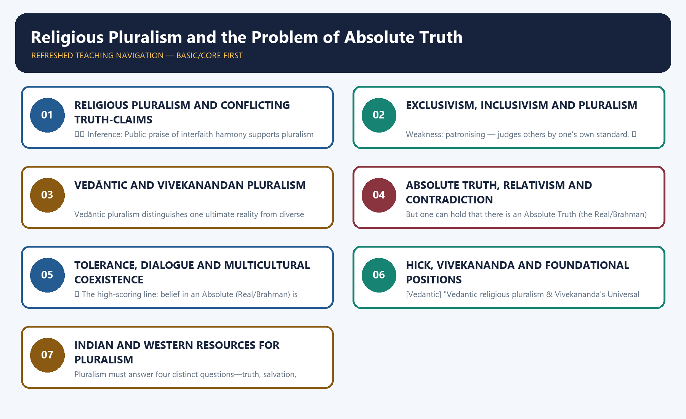
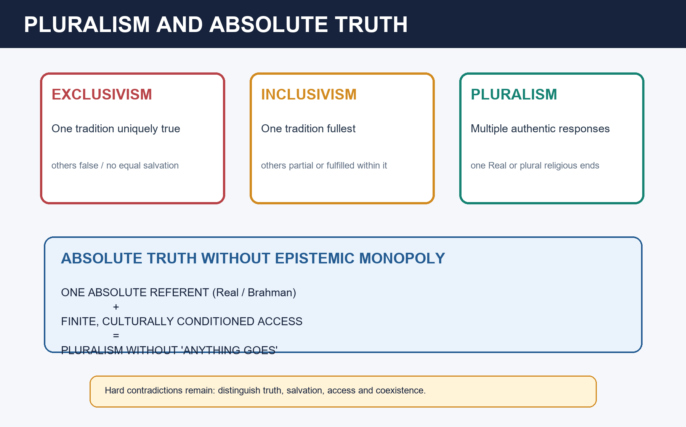

# Religious Pluralism and the Problem of Absolute Truth — Learner-v2 Source-Complete Learning Session

> **Catalogue identity:** Philosophy Optional · Philosophy Paper II — Philosophy of Religion · `philosophy-paper-ii-philosophy-of-religion-09`  
> **Generation:** g1, 21 August 2026 · **Approval:** pending explicit topic approval  
> **Evidence discipline:** exact doctrine and PYQ wording/year/marks are controlled by repository owners. Model answers are independent pedagogic practice, never official UPSC keys.

### Package practice counts

| Component | Count |
|---|---:|
| Direct verified topic-owned PYQs | 12 |
| Core diagnostic MCQs | 40 |
| Remedial diagnostic MCQs | 8 |
| Total diagnostics | 48 |
| Original solved Mains models | 6 (2 × 10, 2 × 15, 2 × 20) |
| Consolidated register parts | 12 (A–L) |
| Approval | false |


## BASIC LEARNING SESSION



*Distinct embedded teaching-navigation image. The separate continuous Cārvāka-style flowchart package remains an independent at-a-glance artifact.*
### Source-complete coverage ledger and answer-worthiness labels

**[FACT]** identifies retained repository doctrine or verified question data. **[INFERENCE]** identifies learner-facing organisation or judgement.

| Source corpus | Final location | Retention decision |
|---|---|---|
| Canonical owner §§0–7 | Basic Learning Session | E-I-P, Vedāntic model, absolute truth, parity bench and answer skeletons retained |
| Canonical owner §§9–19 | Optional Advanced | Hick, Vivekananda, tolerance, freedom, conflict, deep disagreement and pluralism varieties retained |
| Audited PYQ ledger | PYQs and Answer Practice | All twelve owner questions retained with exact wording and full solutions |
| Premium diagnostic set | MCQs / Remediation | Forty core and eight remedial questions retained with strict answer rotation |
| Original practice | PYQs and Answer Practice | Six non-PYQ solved models retained |
| Consolidated register | Final section | A–L retrieval framework preserves complete answer logic |

**Visible learning labels.** Exclusivism–inclusivism–pluralism, absolute referent versus conditioned access, Hick, Vivekananda and Jain many-sidedness are **CORE PAPER II**. Tolerance, freedom, principled distance, conflict-history and the 2025 Vedāntic question are **PYQ-TRIGGERED CORE**. Plantinga, D’Costa, Heim and deep disagreement are **ADVANCED BUT ANSWER-WORTHY** for 15/20 markers.

**What not to over-study.** Do not write “all religions are the same.” Separate truth, salvation, epistemic access and political coexistence. Do not assume that belief in absolute truth entails exclusivism. Do not dissolve hard contradictions through rhetoric. Do not use the Vedic verse outside its native context without arguing for the modern extension.
### Learning roadmap

| Unit | Learner objective |
|---:|---|
| 1 | Distinguish exclusivism, inclusivism and pluralism |
| 2 | Separate truth, salvation, access and coexistence |
| 3 | Explain Hick’s Real and soteriological criterion |
| 4 | Explain Vedāntic pluralism and Vivekananda |
| 5 | Defend absolute truth without epistemic monopoly |
| 6 | Use anekāntavāda without relativism |
| 7 | Evaluate tolerance and religious freedom |
| 8 | Analyse religion as conflict source or unifier |
| 9 | Understand deep disagreement |
| 10 | Compare Plantinga, D’Costa and Heim |
| 11 | Build 10/15/20-mark answers |

### SESSION 1 — RELIGIOUS PLURALISM AND CONFLICTING TRUTH-CLAIMS

#### DEFINITION / WHAT THIS IS CALLED

**Plain-language definition:** Master verdict: Pluralism is strongest when it combines realism about an Absolute with fallibilism about finite access, while openly admitting that some first-order truth-claims remain contradictory.

**Technical definition:** ⚠️ Inference: Public praise of interfaith harmony supports pluralism as an ethic of engagement, but it does not establish Hick’s metaphysical claim that rival religions are equally valid responses to one Real.

#### ANSWER-GRABBING OPENING — WRITE/ADAPT IN THE EXAM

> Master verdict: Pluralism is strongest when it combines realism about an Absolute with fallibilism about finite access, while openly admitting that some first-order truth-claims remain contradictory.

#### MUST-WRITE KEYWORDS

- **religious diversity**
- **truth-claim**
- **salvation-claim**
- **conflict**
- **pluralism**
- **absolute truth**

**How to use them:** Distinguish factual, doctrinal and salvific disagreement before asking whether diversity supports humility, contradiction, relativism or a higher-order unity.

✅ **Fact:** In April 2026, the United Nations in India reported that UNAOC High Representative Miguel Ángel Moratinos highlighted India’s historical religious pluralism and interfaith traditions during a Delhi visit.  
⚠️ **Inference:** Public praise of interfaith harmony supports pluralism as an ethic of engagement, but it does not establish Hick’s metaphysical claim that rival religions are equally valid responses to one Real. The philosophical question of truth remains separate from the political value of coexistence.  
**Live source checked:** United Nations in India, April 2026.





```text
TRUTH:       Which propositions are true?
SALVATION:   Which paths transform or liberate?
ACCESS:      Can finite traditions know the Absolute exhaustively?
COEXISTENCE: How should rival communities live together?

Agreement on coexistence does not prove equal truth.
Disagreement on truth does not defeat coexistence.
```

> **Master verdict:** Pluralism is strongest when it combines realism about an Absolute with fallibilism about finite access, while openly admitting that some first-order truth-claims remain contradictory.


#### ONE-SCREEN MAP ⚠️

```
   MANY RELIGIONS, CONFLICTING TRUTH-CLAIMS — three responses:
   EXCLUSIVISM        INCLUSIVISM          PLURALISM
   ONE religion true; other faiths        all are valid responses
   others false/      partially true,     to ONE ultimate Reality
   no salvation       fulfilled in mine   (no single religion has
   outside            (Rahner's           the whole/absolute truth)
        │             "anonymous              │
   (dogmatic,         Christians")         Hick: the Real;
    intolerant)            │               Vedānta/Vivekananda:
                                           "many paths, one Truth"
   PROBLEM OF ABSOLUTE TRUTH: does claiming ONE absolute truth
   necessarily breed EXCLUSIVISM & conflict?  ← 2022, 2024 PYQ
```
> 🔑 **Mnemonic — "E-I-P: Exclusive (only mine), Inclusive (mine fulfils yours), Pluralist (all reach the one Real)."** Indian Vedānta/Vivekananda = the classic pluralist model.

---

#### CLOSING RECALL FLOW — RELIGIOUS PLURALISM AND CONFLICTING TRUTH-CLAIMS
```closure-flow
SUBTOPIC: RELIGIOUS PLURALISM AND CONFLICTING TRUTH-CLAIMS
KEY TERMS / DEFINITIONS: religious diversity · truth-claim · salvation-claim · conflict · pluralism · absolute truth
MECHANISM / ARGUMENT: Inference: Public praise of interfaith harmony supports pluralism as an ethic of engagement, but it does not establish Hick’s metaphysical claim that rival religions are equally valid responses to one Real.
CONSEQUENCE / CONTRAST: The philosophical question of truth remains separate from the political value of coexistence.
UPSC TRAP / ANSWER-USE: Do not miss this limiting distinction: pluralism is strongest when it combines realism about an Absolute with fallibilism about finite...
ANSWER-GRABBING FORMULATION: Master verdict: Pluralism is strongest when it combines realism about an Absolute with fallibilism about finite access, while openly admitting that some first-order truth-claims remain contradictory.
```
### SESSION 2 — EXCLUSIVISM, INCLUSIVISM AND PLURALISM

#### DEFINITION / WHAT THIS IS CALLED

**Plain-language definition:** Exclusivism: only one religion is true; salvation is found only within it; other faiths are false. ✅ The lapidary Latin tag is extra ecclesiam nulla salus ("outside the Church there is no salvation"). ⚠️ Attribution discipline: the doctrine is standardly traced to Cyprian of Carthage (d.

**Technical definition:** Weakness: patronising — judges others by one's own standard. ✅ Pluralism (John Hick): the great religions are equally valid human responses to the one ultimate divine Reality ("the Real"); each perceives the Real through its own cultural-conceptual "lens" (Kantian phenomena of the Real).

#### ANSWER-GRABBING OPENING — WRITE/ADAPT IN THE EXAM

> Exclusivism reserves decisive truth or salvation for one tradition, inclusivism admits truth elsewhere under one fulfilment, and pluralism treats multiple traditions as independently valid responses to ultimate reality.

#### MUST-WRITE KEYWORDS

- **exclusivism**
- **inclusivism**
- **pluralism**
- **salvation**
- **fulfilment**
- **independent validity**

**How to use them:** Compare the three positions on truth and salvation, making clear that inclusivism accepts value elsewhere while retaining one normative centre.

> **CORE DISTINCTION:** ANSWER-GRABBING LINE — WRITE/ADAPT IN THE EXAM (Recommended opening definition):** Exclusivism reserves decisive truth or salvation for one tradition, inclusivism admits truth elsewhere under one fulfilment, and pluralism treats multiple traditions as independently valid responses to ultimate reality.
- **Exclusivism:** **only one** religion is true; salvation is found only within it; other faiths are false. ✅ The lapidary Latin tag is ***extra ecclesiam nulla salus*** ("outside the Church there is no salvation"). ⚠️ **Attribution discipline:** the doctrine is standardly traced to **Cyprian of Carthage** (d. 258), whose own wording in *Epistle* 73 is *salus extra ecclesiam non est* — "there is no salvation outside the Church"; he also writes that one cannot have God as Father who does not have the Church as mother (*De Ecclesiae Catholicae Unitate* 6). The compressed formula *extra ecclesiam nulla salus* is the **later standard phrasing**, given conciliar form in the medieval period (Lateran IV, 1215; *Unam Sanctam*, 1302; Council of Florence, 1442). ✅ Note also that the same tradition later **qualified** it heavily: Vatican II's *Lumen Gentium* 16 and *Nostra Aetate* (1965) move the Roman Catholic position decisively toward **inclusivism** — so citing the tag as the settled Christian view is a factual error. *Strength:* takes truth-claims seriously; *weakness:* intolerance, and the arbitrariness objection (why *this* religion?). ✅
- **Inclusivism:** one's own religion is the fullest truth, but **other religions contain partial truth** and their adherents may be saved through it (Karl Rahner's *"anonymous Christians"*). *Weakness:* patronising — judges others by one's own standard. ✅
- **Pluralism (John Hick):** the great religions are **equally valid** human responses to the **one ultimate divine Reality ("the Real")**; each perceives the Real through its own cultural-conceptual "lens" (Kantian *phenomena* of the Real). *"There is not merely one way but a plurality of ways of salvation/liberation."* ✅
  - *Weakness:* seems to relativise/dilute each religion's specific claims; the "Real an sich" is unknowable.

---

#### CLOSING RECALL FLOW — EXCLUSIVISM, INCLUSIVISM AND PLURALISM
```closure-flow
SUBTOPIC: EXCLUSIVISM, INCLUSIVISM AND PLURALISM
KEY TERMS / DEFINITIONS: exclusivism · inclusivism · pluralism · salvation · fulfilment · independent validity
MECHANISM / ARGUMENT: The compressed formula extra ecclesiam nulla salus is the later standard phrasing, given conciliar form in the medieval period (Lateran IV, 1215; Unam Sanctam, 1302; Council of Florence, 1442).
CONSEQUENCE / CONTRAST: Strength: takes truth-claims seriously; weakness: intolerance, and the arbitrariness objection (why this religion?). ✅ Inclusivism: one's own religion is the fullest truth, but other religions contain partial truth and their adherents may be saved through it (Karl Rahner's "anonymous Christians").
UPSC TRAP / ANSWER-USE: "There is not merely one way but a plurality of ways of salvation/liberation." ✅ Weakness: seems to relativise/dilute each religion's specific claims; the "Real an sich" is unknowable.
ANSWER-GRABBING FORMULATION: Exclusivism reserves decisive truth or salvation for one tradition, inclusivism admits truth elsewhere under one fulfilment, and pluralism treats multiple traditions as independently valid responses to ultimate reality.
```
### SESSION 3 — VEDĀNTIC AND VIVEKANANDAN PLURALISM

#### DEFINITION / WHAT THIS IS CALLED

**Plain-language definition:** Vedāntic and Vivekanandan pluralism relate many religious paths to one ultimate reality, but the move from shared ultimacy to equal doctrinal truth requires argument.

**Technical definition:** Vedāntic pluralism distinguishes one ultimate reality from diverse conceptual and devotional approaches, but unity must not erase genuine doctrinal contradiction.

#### ANSWER-GRABBING OPENING — WRITE/ADAPT IN THE EXAM

> Vedāntic pluralism distinguishes one ultimate reality from diverse conceptual and devotional approaches, but unity must not erase genuine doctrinal contradiction.

#### MUST-WRITE KEYWORDS

- **Vedānta**
- **Vivekananda**
- **one reality**
- **many paths**
- **acceptance**
- **universal religion**

**How to use them:** Use Vedāntic unity and Vivekananda's many-paths thesis as arguments for convergence, while qualifying the historical context and persistence of doctrinal differences.

> **CORE DEFINITION:** Vedāntic pluralism distinguishes one ultimate reality from diverse conceptual and devotional approaches, but unity must not erase genuine doctrinal contradiction.
- **"Ekaṃ sad viprā bahudhā vadanti"** — ***Ṛgveda* 1.164.46**, from the *asya vāmasya* riddle-hymn ascribed to Dīrghatamas — "the one existent, the wise speak of in many ways". ⚠️ **Attribution discipline (examiner-visible):** (i) cite the reference as **RV 1.164.46**, not vaguely as "the Vedas"; (ii) the verse's own context is the **naming of deities** — it lists Indra, Mitra, Varuṇa, Agni, the celestial Garutmān, Yama and Mātariśvan as names of "the one existent" — so its native subject is the **unity of the Vedic pantheon**, not the unity of the world's religions; (iii) its extension into a charter of **inter-religious** pluralism is a **nineteenth- and twentieth-century development** (Vivekananda, Radhakrishnan, Gandhi) and must be **argued for**, not asserted by citation; (iv) common transliteration variants (*ekaṃ sat vipra bahudhā vadanti*) are acceptable, but keep one form consistently. ✅ Used with that discipline it remains the strongest single Indian text for the pluralist case — precisely because it distinguishes **one referent** from **many names**. ✅
- **Vivekananda — Universal Religion:** all religions are **true**, **different paths to the same goal** (the one Reality); they are stages/varieties suited to different temperaments — *"as many faiths, so many paths."* No religion should destroy another; **harmony & acceptance** (not mere tolerance). ✅
- **Advaita ground:** since the ultimate is the **one non-dual Brahman**, all sincere paths (bhakti, jñāna, karma, yoga) converge on it → pluralism is **metaphysically grounded**, not just pragmatic. ⚠️
- **Radhakrishnan:** religions are diverse interpretations of a common **spiritual experience** (anubhava) → pluralism.
- **Gandhi:** *sarva dharma sama bhāva* — equal respect for all religions (links to Sec-A secularism).

---

#### CLOSING RECALL FLOW — VEDĀNTIC AND VIVEKANANDAN PLURALISM
```closure-flow
SUBTOPIC: VEDĀNTIC AND VIVEKANANDAN PLURALISM
KEY TERMS / DEFINITIONS: Vedānta · Vivekananda · one reality · many paths · acceptance · universal religion
MECHANISM / ARGUMENT: "Ekaṃ sad viprā bahudhā vadanti" — Ṛgveda 1.164.46, from the asya vāmasya riddle-hymn ascribed to Dīrghatamas — "the one existent, the wise speak of in many ways".
CONSEQUENCE / CONTRAST: Gandhi: sarva dharma sama bhāva — equal respect for all religions (links to Sec-A secularism).
UPSC TRAP / ANSWER-USE: Do not miss this limiting distinction: vedāntic pluralism distinguishes one ultimate reality from diverse conceptual and devotional approaches.
ANSWER-GRABBING FORMULATION: Vedāntic pluralism distinguishes one ultimate reality from diverse conceptual and devotional approaches, but unity must not erase genuine doctrinal contradiction.
```
### SESSION 4 — ABSOLUTE TRUTH, RELATIVISM AND CONTRADICTION

#### DEFINITION / WHAT THIS IS CALLED

**Plain-language definition:** The worry (2022): "unquestionable acceptance of only one Absolute Truth will inevitably result in religious exclusivism" → and exclusivism breeds conflict/intolerance. ✅ If "absolute truth" = my religion's propositions are the sole truth → yes, tends to exclusivism.

**Technical definition:** But one can hold that there is an Absolute Truth (the Real/Brahman) while recognising all religions as partial, perspectival approaches to it → an absolute referent with pluralist access.

#### ANSWER-GRABBING OPENING — WRITE/ADAPT IN THE EXAM

> Commitment to absolute truth does not entail epistemic absolutism: reality may be determinate even when finite religious formulations remain partial and corrigible.

#### MUST-WRITE KEYWORDS

- **absolute truth**
- **relativism**
- **contradiction**
- **perspectival access**
- **deep disagreement**
- **meta-level claim**

**How to use them:** Distinguish one truth from one exhaustive formulation and explain why pluralism must address contradictions rather than merely celebrating diversity.

> **CORE DEFINITION:** Commitment to absolute truth does not entail epistemic absolutism: reality may be determinate even when finite religious formulations remain partial and corrigible.
- **The worry (2022):** *"unquestionable acceptance of only one Absolute Truth will inevitably result in religious exclusivism"* → and exclusivism breeds **conflict/intolerance**. ✅
- **Analysis:**
  - If "absolute truth" = **my** religion's propositions are the sole truth → yes, tends to exclusivism.
  - **But** one can hold that there **is** an Absolute Truth (the Real/Brahman) while recognising all religions as **partial, perspectival** approaches to it → an absolute *referent* with pluralist *access*. This **breaks the link** between believing in absolute truth and being exclusivist. ⚠️
  - The **Jain Anekāntavāda/Syādvāda** (many-sidedness) is a powerful Indian tool: reality is many-sided; every viewpoint is **partially true** (the blind-men-and-elephant) → epistemic humility dissolves dogmatic exclusivism. ✅
- **Does pluralism destroy the truth of religion? (2023):** ⚠️ Critics say pluralism relativises truth. Reply: pluralism need not deny truth — it **relocates** absoluteness in the transcendent Real and treats religions as culturally-conditioned but genuine responses; **coexistence** need not mean "anything goes."

---

#### CLOSING RECALL FLOW — ABSOLUTE TRUTH, RELATIVISM AND CONTRADICTION
```closure-flow
SUBTOPIC: ABSOLUTE TRUTH, RELATIVISM AND CONTRADICTION
KEY TERMS / DEFINITIONS: absolute truth · relativism · contradiction · perspectival access · deep disagreement · meta-level claim
MECHANISM / ARGUMENT: The worry (2022): "unquestionable acceptance of only one Absolute Truth will inevitably result in religious exclusivism" → and exclusivism breeds conflict/intolerance. ✅ If "absolute truth" = my religion's propositions are the sole truth → yes, tends to exclusivism.
CONSEQUENCE / CONTRAST: But one can hold that there is an Absolute Truth (the Real/Brahman) while recognising all religions as partial, perspectival approaches to it → an absolute referent with pluralist access.
UPSC TRAP / ANSWER-USE: Keep the doctrine's claim, supporting argument and residual limitation distinct in the final evaluation.
ANSWER-GRABBING FORMULATION: Commitment to absolute truth does not entail epistemic absolutism: reality may be determinate even when finite religious formulations remain partial and corrigible.
```
### SESSION 5 — TOLERANCE, DIALOGUE AND MULTICULTURAL COEXISTENCE

#### DEFINITION / WHAT THIS IS CALLED

**Plain-language definition:** 🔑 The high-scoring line: belief in an Absolute (Real/Brahman) is compatible with pluralism if truth-claims are held as partial & perspectival (Anekāntavāda/Hick) — this defuses the "absolute truth → exclusivism → conflict" chain.

**Technical definition:** 🔑 The high-scoring line: belief in an Absolute (Real/Brahman) is compatible with pluralism if truth-claims are held as partial & perspectival (Anekāntavāda/Hick) — this defuses the "absolute truth → exclusivism → conflict" chain.

#### ANSWER-GRABBING OPENING — WRITE/ADAPT IN THE EXAM

> 🔑 The high-scoring line: belief in an Absolute (Real/Brahman) is compatible with pluralism if truth-claims are held as partial & perspectival (Anekāntavāda/Hick) — this defuses the "absolute truth → exclusivism → conflict" chain.

#### MUST-WRITE KEYWORDS

- **tolerance**
- **acceptance**
- **dialogue**
- **religious freedom**
- **multiculturalism**
- **internal minorities**

**How to use them:** Move from non-interference to equal freedom and dialogical engagement, while testing pluralism by its treatment of dissenters and vulnerable internal groups.

| Position | Truth of other religions | Key thinker | Risk |
|---|---|---|---|
| Exclusivism | false | (dogmatic theologies) | intolerance, conflict |
| Inclusivism | partial, fulfilled in mine | Rahner | condescension |
| Pluralism (Western) | equally valid responses to the Real | Hick | relativism, unknowable Real |
| Vedantic pluralism | all true paths to one Reality | Vivekananda, Radhakrishnan | dilution of specifics |
| Anekāntavāda | each partially true | Jainism | — |

> 🔑 The high-scoring line: **belief in an Absolute (Real/Brahman) is compatible with pluralism** if truth-claims are held as *partial & perspectival* (Anekāntavāda/Hick) — this defuses the "absolute truth → exclusivism → conflict" chain.

---

#### CLOSING RECALL FLOW — TOLERANCE, DIALOGUE AND MULTICULTURAL COEXISTENCE
```closure-flow
SUBTOPIC: TOLERANCE, DIALOGUE AND MULTICULTURAL COEXISTENCE
KEY TERMS / DEFINITIONS: tolerance · acceptance · dialogue · religious freedom · multiculturalism · internal minorities
MECHANISM / ARGUMENT: The operative mechanism is that belief in an Absolute (Real/Brahman) is compatible with pluralism if truth-claims are held as...
CONSEQUENCE / CONTRAST: The resulting consequence is that belief in an Absolute (Real/Brahman) is compatible with pluralism if truth-claims are held as...
UPSC TRAP / ANSWER-USE: Do not miss this limiting distinction: belief in an Absolute (Real/Brahman) is compatible with pluralism if truth-claims are held as...
ANSWER-GRABBING FORMULATION: 🔑 The high-scoring line: belief in an Absolute (Real/Brahman) is compatible with pluralism if truth-claims are held as partial & perspectival (Anekāntavāda/Hick) — this defuses the "absolute truth → exclusivism → conflict" chain.
```
### SESSION 6 — HICK, VIVEKANANDA AND FOUNDATIONAL POSITIONS

#### DEFINITION / WHAT THIS IS CALLED

**Plain-language definition:** Hick, Vivekananda and Jain perspectivism defend pluralism through different resources: the transcategorial Real, convergence of paths and many-sided conditioned judgment.

**Technical definition:** These models relocate religious absoluteness—from exclusive propositions to the Real, one ultimate goal or perspectivally limited access—without simply declaring every claim true.

#### ANSWER-GRABBING OPENING — WRITE/ADAPT IN THE EXAM

> Religious pluralism becomes philosophically serious only when it explains both genuine transformation across traditions and persistent contradictions among their truth-claims.

#### MUST-WRITE KEYWORDS

- **John Hick**
- **transcategorial Real**
- **Vivekananda**
- **many paths**
- **Jain many-sidedness**
- **conditional assertion**

**How to use them:** Compare Hick's noumenal Real, Vivekananda's Vedāntic convergence and Jain perspectivism, noting that they solve disagreement through different metaphysical strategies.

1. ✅ *Ekaṃ sat viprā bahudhā vadanti* is conventionally rendered as one reality spoken of under many names; its modern pluralist use requires argument beyond citation.
2. ✅ Vivekananda presents religions as diverse paths appropriate to different dispositions and calls for acceptance rather than mere tolerance.
3. ✅ Hick's pluralist hypothesis relocates the centre from one religion to the transcategorial Real.
4. ✅ Jain *anekāntavāda* and *syādvāda* discipline claims through many-sidedness and conditional predication.

---
#### 6. APPLIED-QUESTION DRILLS ⚠️
1. **[Vedantic]** "Vedantic religious pluralism & Vivekananda's Universal Religion vs conflicting truth-claims." (2025, 20m) → §2.
2. **[Absolute truth]** "'One Absolute Truth → religious exclusivism.' Discuss." (2022) → §3.
3. **[Pluralism-conflict]** "Does pluralism invite inter-religious conflict & destroy religion's truth?" (2023) → §3.
4. **[Notion]** "Notion of absolute truth in religion." (2024) → §3.
5. **[Tolerance]** "Importance of religious tolerance in a multicultural pluralistic society." (2020, 10m) → §9.6 — Forst's ladder; Aśoka RE XII; Vivekananda's acceptance-not-tolerance.
6. **[Freedom]** "Is religious freedom possible in a multireligious society?" (2021, 10m) → §9.7 — principled distance + internal minorities.
7. **[Conflict]** "Is the History of Religions the History of Conflicts?" (2020, 10m) → §9.8 — cause/marker/mobiliser/legitimiser.
8. **[Unifier]** "Is religion a uniting force for humanity in the globalizing world?" (2019, 10m) → §9.9 — three conditions.
9. **[E vs P]** "Central problem between religious pluralists and exclusivists." (2019, 20m) → §9.1 + §9.11 + §9.10 (deep disagreement).
10. **[Truth is one]** "'Truth is one, yet people perceive differently' — evaluate in the Indian context." (2018, 15m) → §2 + RV 1.164.46 discipline + *anekāntavāda*.

---

#### CLOSING RECALL FLOW — HICK, VIVEKANANDA AND FOUNDATIONAL POSITIONS
```closure-flow
SUBTOPIC: HICK, VIVEKANANDA AND FOUNDATIONAL POSITIONS
KEY TERMS / DEFINITIONS: John Hick · transcategorial Real · Vivekananda · many paths · Jain many-sidedness · conditional assertion
MECHANISM / ARGUMENT: [Vedantic] "Vedantic religious pluralism & Vivekananda's Universal Religion vs conflicting truth-claims." (2025, 20m) → §2. [Absolute truth] "'One Absolute Truth → religious exclusivism.' Discuss." (2022) → §3. [Pluralism-conflict] "Does pluralism invite inter-religious conflict & destroy religion's truth?" (2023) → §3.
CONSEQUENCE / CONTRAST: The resulting consequence is that [Vedantic] "Vedantic religious pluralism & Vivekananda's Universal Religion vs conflicting truth-claims." (2025, 20m) →...
UPSC TRAP / ANSWER-USE: Do not miss this limiting distinction: [Vedantic] "Vedantic religious pluralism & Vivekananda's Universal Religion vs conflicting truth-claims." (2025, 20m) →...
ANSWER-GRABBING FORMULATION: Religious pluralism becomes philosophically serious only when it explains both genuine transformation across traditions and persistent contradictions among their truth-claims.
```
### SESSION 7 — INDIAN AND WESTERN RESOURCES FOR PLURALISM

#### DEFINITION / WHAT THIS IS CALLED

**Plain-language definition:** Pluralism must answer four distinct questions—truth, salvation, coexistence and epistemic humility—rather than treating social tolerance as proof that all doctrines are true.

**Technical definition:** Pluralism must answer four distinct questions—truth, salvation, coexistence and epistemic humility—rather than treating social tolerance as proof that all doctrines are true.

#### ANSWER-GRABBING OPENING — WRITE/ADAPT IN THE EXAM

> Pluralism must answer four distinct questions—truth, salvation, coexistence and epistemic humility—rather than treating social tolerance as proof that all doctrines are true.

#### MUST-WRITE KEYWORDS

- **Vedāntic unity**
- **Jain many-sidedness**
- **Aśokan concord**
- **principled distance**
- **dialogue**
- **non-relativism**

**How to use them:** Use Indian resources as distinct arguments—metaphysical unity, epistemic humility and civic concord—then state how each avoids or risks relativism.

> **CORE DEFINITION:** Pluralism must answer four distinct questions—truth, salvation, coexistence and epistemic humility—rather than treating social tolerance as proof that all doctrines are true.

| Problem | Western resource | Indian resource | Discriminating point |
|---|---|---|---|
| Rival truth-claims | Hick's transcategorial Real; Heim's plural ends | *Ekaṃ sad… bahudhā vadanti* (RV 1.164.46); Vivekananda's paths | The Vedic verse is about **names of deities**; the pluralist extension is modern |
| Framework-relativity of judgement | Fogelin's deep disagreement; Wittgenstein's hinges | *Anekāntavāda*, *nayavāda*, *syādvāda* | Jainism marks standpoint-relativity **inside** the proposition |
| Grounds of toleration | Locke (incoercibility), Mill (harm, epistemic), Rawls (overlapping consensus) | Aśoka RE XII; Akbar's *ṣulḥ-i kull*; Gandhi's *sarva-dharma-samabhāva* | Aśoka's is the earliest verifiable state-level argument |
| Tolerance vs acceptance | Forst's four conceptions | Vivekananda's explicit demand for **acceptance** over tolerance | Both reach the same conclusion by different routes |
| Ultimate reality vs its descriptions | Nirguṇa/apophatic theology; Hick's Real | Nirguṇa/saguṇa two levels; *neti neti* | Advaita has a **built-in** two-level semantics |
| Salvific ends | Communion with God | Mokṣa, kaivalya, nirvāṇa, apavarga | Heim's differential pluralism fits the Indian plurality better than Hick's |

---
#### 7. PYQ-MAPPED MODEL-ANSWER SKELETONS ⚠️

#### 7.1 — "How does Vedantic pluralism address conflicting truth-claims? (Vivekananda)" (2025, 20m)
```
Intro : the problem — many religions, rival truth-claims.
B1    : E-I-P triad; locate Vedānta as pluralist.
B2    : "Ekaṃ sat..."; Vivekananda — all true paths to one Reality, suited to temperaments;
        grounded in non-dual Brahman → metaphysical, not merely pragmatic, pluralism.
Assess: vs Hick's "Real"; charge of diluting specifics; Anekāntavāda adds epistemic humility.
Concl : conflicting claims are partial angles on one Truth — harmony, not exclusion.
```

#### 7.2 — "'Acceptance of one Absolute Truth → religious exclusivism.' Discuss." (2022, 20m)
```
Intro : does believing in absolute truth force exclusivism (and conflict)?
Body  : if "absolute truth" = my propositions only → yes; BUT an absolute REFERENT (Real/Brahman)
        with partial/perspectival ACCESS (Anekāntavāda, Hick) breaks the link.
Assess: distinguish ontological absolutism from epistemic exclusivism; humility dissolves conflict.
Concl : one can affirm absolute Truth AND religious pluralism — exclusivism is not inevitable.
```

#### 7.3 — "What is the importance of religious tolerance in a multicultural pluralistic society?" (2020, 10m)
```
Intro : define tolerance by its THREE components — objection, acceptance, power. It is not
        indifference.
Body  : the paradox (allowing what one holds wrong) and its resolution by LEVELS —
        first-order disapproval + second-order reasons against coercion.
        Forst's ladder: permission → coexistence → respect → esteem. Only respect and esteem are
        compatible with equal citizenship; most historical "tolerance" was permission.
        Western grounds: Locke (force cannot produce belief), Mill (harm principle + the epistemic
        argument that suppression costs us truth or its clearer perception), Rawls (overlapping
        consensus), Popper (limits, restricted to those who answer argument with violence).
Indian: Aśoka Rock Edict XII — do not honour your sect by disparaging others; you injure your own
        sect most; concord (samavāya). Akbar's ṣulḥ-i kull; Gandhi's sarva-dharma-samabhāva;
        Vivekananda's demand for ACCEPTANCE, not mere toleration; anekāntavāda as the
                epistemic ground.
Concl : indispensable but insufficient — necessary because of the objection component,
        insufficient because tolerance from the strong to the weak is permission, not equality.
```

#### 7.4 — "Is it acceptable that the History of Religions is the History of Conflicts?" (2020, 10m)
```
Intro : distinguish three strengths of the claim — involvement (trivially true), significant cause
        (arguable), defining engine (false). The argument is about the second.
For   : absolute truth-claims + exclusivist soteriology + strong identity + sacralised authority
        is in principle conflict-generating; Kimball's markers as a checklist (typology, not law).
Against: Cavanaugh — the religious/secular distinction is a modern construct, so "religion" is not
        an isolable variable; Armstrong — pre-modern religion was not a separable sphere;
        Sen — the singular-affiliation fallacy is what turns identity lethal.
Analysis: religion as CAUSE / MARKER / MOBILISER / LEGITIMISER — most cases are the last three.
Counter-evidence: Aśoka after Kaliṅga; Bhakti and Sufi universalism; abolition; civil rights;
        satyāgraha; the interfaith movement.
Concl : historically selective and conceptually confused — but concede the narrower truth that
        exclusivist certainty joined to singular identity is genuinely dangerous.
```

#### 7.5 — "Is religion a uniting force for humanity in the globalizing world?" (2019, 10m)
```
Intro : answer conditionally, and state the conditions up front.
For   : Durkheim's integrative function (collective effervescence; the church as moral community);
        universalist ethics in every tradition; the 1893 and 1993 Parliaments and the Declaration
        Toward a Global Ethic (Küng: no peace among nations without peace among religions, and none
        among religions without dialogue); transnational relief and diaspora networks.
Against: Durkheim's integration is IN-GROUP; Huntington's clash thesis (cite as a criticised
         thesis);
        globalisation deterritorialises religion, producing both cosmopolitan and reactive forms;
        electoral and geopolitical instrumentalisation.
Synthesis: religion unites when (1) its ethics are universalist in scope, (2) its epistemology is
        fallibilist enough for dialogue, (3) its identity-function is not politically monopolised.
Concl : a high-amplitude force, not an intrinsically unifying one — the same traditions produce
        the Parliament of Religions and communal violence.
```

---

#### CLOSING RECALL FLOW — INDIAN AND WESTERN RESOURCES FOR PLURALISM
```closure-flow
SUBTOPIC: INDIAN AND WESTERN RESOURCES FOR PLURALISM
KEY TERMS / DEFINITIONS: Vedāntic unity · Jain many-sidedness · Aśokan concord · principled distance · dialogue · non-relativism
MECHANISM / ARGUMENT: The operative mechanism is that pluralism must answer four distinct questions—truth, salvation, coexistence and epistemic humility—rather than treating social...
CONSEQUENCE / CONTRAST: The resulting consequence is that pluralism must answer four distinct questions—truth, salvation, coexistence and epistemic humility—rather than treating social...
UPSC TRAP / ANSWER-USE: Do not miss this limiting distinction: pluralism must answer four distinct questions—truth, salvation, coexistence and epistemic humility—rather than treating social...
ANSWER-GRABBING FORMULATION: Pluralism must answer four distinct questions—truth, salvation, coexistence and epistemic humility—rather than treating social tolerance as proof that all doctrines are true.
```

## BASIC MCQS / REMEDIATION


### Practice protocol — [CORE ANSWER]

Attempt each item before reading its key. Answer placement is balanced, deterministic and non-patterned using a stable topic seed. across all forty-eight diagnostics.

#### CORE DIAGNOSTIC MCQS

#### 1. Which formulation best distinguishes exclusivism from inclusivism?

A. Exclusivism denies rival salvific adequacy, whereas inclusivism may admit salvation beyond its visible community while interpreting it through the privileged tradition.
B. Exclusivism and inclusivism differ only in vocabulary.
C. Exclusivism accepts all paths, whereas inclusivism rejects all paths.
D. Exclusivism concerns truth alone, whereas inclusivism concerns politics alone.

**Answer: A. Exclusivism denies rival salvific adequacy, whereas inclusivism may admit salvation beyond its visible community while interpreting it through the privileged tradition.**

Exclusivism gives one tradition unique truth or salvation; inclusivism preserves its normative priority but extends truth or grace beyond its boundaries. Rahner's “anonymous Christian” is the standard inclusivist example. Inclusivism is therefore not pluralism, because outsiders are still fulfilled on the home tradition's terms.
#### 2. Which statement correctly separates four dimensions commonly conflated in pluralism debates?

A. Political coexistence logically proves equal religious truth.
B. A tradition may deny another's proposition, allow salvation beyond itself, admit fallible access, and support equal political coexistence.
C. Truth and salvation are identical, while access and coexistence are merely social.
D. Epistemic access automatically determines constitutional rights.

**Answer: B. A tradition may deny another's proposition, allow salvation beyond itself, admit fallible access, and support equal political coexistence.**

Truth asks which claims are true; salvation asks who may be liberated; epistemic access asks who can know and how adequately; coexistence asks how citizens live under disagreement. These dimensions can vary independently. Treating tolerance as proof of equal truth is a classic factual and conceptual trap.
#### 3. Hick's pluralistic hypothesis is best represented by which claim?

A. All religious sentences have exactly the same meaning.
B. Every ultimate reality is a personal deity.
C. Major traditions are culturally conditioned responses to the transcategorial Real, assessable through movement from self-centredness to Reality-centredness.
D. No religious tradition produces genuine transformation.

**Answer: C. Major traditions are culturally conditioned responses to the transcategorial Real, assessable through movement from self-centredness to Reality-centredness.**

Hick's “Copernican revolution” shifts the centre from one religion to the Real. His theory is neither semantic identity nor indiscriminate equality: traditions mediate the Real through conceptual schemes and are judged soteriologically. Critics question whether the unknowable Real is empty and whether Hick revises religions against their self-understanding.
#### 4. Karl Rahner's “anonymous Christian” is normally classified as:

A. differential pluralism.

B. religious exclusivism without qualification.
C. atheistic pluralism.
D. inclusivism.
**Answer: D. inclusivism.**

Rahner allows that persons outside explicit Christianity may receive salvation, but interprets that salvation through Christian grace. The view is more open than strict exclusivism but less symmetrical than pluralism. Its principal criticism is patronising assimilation: others are included under a description they may reject.
#### 5. What is Plantinga's main contribution to the pluralism–exclusivism debate?

A. He argues that awareness of disagreement does not by itself make continued exclusive belief arrogant, arbitrary or irrational.

B. He proves one specific religion true from neutral premises.
C. He denies that birthplace influences religious belief.
D. He identifies all religions as phenomenal forms of the Real.
**Answer: A. He argues that awareness of disagreement does not by itself make continued exclusive belief arrogant, arbitrary or irrational.**

Plantinga's defence targets charges against the rational permissibility of exclusivism. Pluralists also hold contested beliefs, and philosophers routinely retain beliefs disputed by peers. His defence does not establish the exclusive belief's truth and does not settle the contingency-of-birth objection.
#### 6. Gavin D'Costa's strongest objection to Hick is that:

A. Hick remains too faithful to every tradition's literal self-description.
B. pluralism becomes covert exclusivism by uniquely imposing its own second-order account on all religions.
C. pluralism rejects every claim about ultimate reality.
D. Hick permits genuinely different salvific ends.

**Answer: B. pluralism becomes covert exclusivism by uniquely imposing its own second-order account on all religions.**

D'Costa argues that Hick's framework declares itself the correct interpretation while redescribing first-order traditions as conditioned responses to the Real. Hick's reply that pluralism is a philosophical hypothesis makes it defeasible, but it does not entirely remove the framework's meta-level privilege.
#### 7. S. Mark Heim's differential pluralism differs from Hick principally because Heim:

A. treats every contradiction as verbal.
B. denies all salvific transformation.
C. allows genuinely different religious ends rather than many descriptions of one destination.
D. restores a single uniquely true church.

**Answer: C. allows genuinely different religious ends rather than many descriptions of one destination.**

In *Salvations*, Heim argues that communion with God, nirvāṇa and non-dual realisation may be distinct destinations. This preserves traditions' self-understandings better than an identist “same summit” model, but it gives up the simplicity of one ultimate end.
#### 8. Which is the safest description of Vivekananda's Universal Religion?

A. Distinct religions should disappear into one institution.

B. Mere toleration is sufficient because truth is irrelevant.
C. All doctrines are literally identical.
D. Diverse paths suited to different temperaments may converge in divine realisation without requiring homogenisation.
**Answer: D. Diverse paths suited to different temperaments may converge in divine realisation without requiring homogenisation.**

Vivekananda links *jñāna*, *bhakti*, *karma* and *rāja yoga* to differing capacities and emphasises acceptance over condescending tolerance. His model is metaphysically grounded in Vedāntic unity, though critics ask whether it assimilates other traditions into neo-Vedānta.
#### 9. Radhakrishnan's pluralist tendency chiefly rests on:

A. religions as diverse interpretations of a common spiritual experience.

B. exclusive reliance on scriptural literalism.
C. denial of any experiential dimension in religion.
D. political coexistence without a view of truth.
**Answer: A. religions as diverse interpretations of a common spiritual experience.**

Radhakrishnan treats doctrines as historically conditioned articulations of an experiential core. This supports pluralism by distinguishing experience from formulation. The perennialist risk is reduction: traditions may understand themselves through irreducible doctrines, practices and ends, not merely versions of one experience.
#### 10. Gandhi's *sarva-dharma-samabhāva* is most accurately rendered in this debate as:

A. suspension of every moral judgement about practice.
B. equal respect for religions joined to humility about one's own grasp of truth.

C. state establishment of all religions.
D. proof that all religious propositions are identical.
**Answer: B. equal respect for religions joined to humility about one's own grasp of truth.**

Gandhi's approach combines commitment with fallibility rather than reducing religion to indifference. Equal respect is a normative stance toward persons and traditions; it does not entail that contradictory propositions are all literally true or that harmful practices escape scrutiny.
#### 11. What is the correct attribution discipline for *ekaṃ sad viprā bahudhā vadanti*?

A. It is Vivekananda's own sentence from the 1893 Parliament.
B. It is an anonymous Upaniṣadic declaration directly about all world religions.
C. It is Ṛgveda 1.164.46, ascribed to Dīrghatamas; its native context concerns names of Vedic deities, while the inter-religious extension is modern.
D. It is Aśoka's formula in Rock Edict XII.

**Answer: C. It is Ṛgveda 1.164.46, ascribed to Dīrghatamas; its native context concerns names of Vedic deities, while the inter-religious extension is modern.**

The verse names Indra, Mitra, Varuṇa, Agni and others in relation to “the one existent.” It is a powerful resource for distinguishing one referent from many names, but citing it alone does not prove modern religious pluralism. The extension must be philosophically argued.
#### 12. “Absolute referent with perspectival access” means:

A. there is no truth beyond perspective.

B. only one historical formula can refer to the Absolute.
C. every perspective is equally accurate.
D. ultimate reality may be one while finite, culturally situated formulations remain partial and corrigible.
**Answer: D. ultimate reality may be one while finite, culturally situated formulations remain partial and corrigible.**

This distinction breaks the alleged necessary inference from ontological absolutism to epistemic exclusivism. Hick's Real, nirguṇa Brahman and Jain many-sidedness can support versions of it. The view avoids relativism only if perspectives remain answerable to reality and are not declared equally true by default.
#### 13. Which example is a genuine “hard contradiction” that pluralism must acknowledge?

A. A personal creator exists and no personal creator exists, asserted literally in the same respect.
B. One person worships through devotion and another through knowledge.
C. Two communities follow different ritual calendars.
D. Two traditions use different names for an ultimate.

**Answer: A. A personal creator exists and no personal creator exists, asserted literally in the same respect.**

Differences of symbol, practice or standpoint need not contradict. But p and not-p cannot both be true in the same sense, time and respect. Responsible pluralism routes level differences where possible and admits residual contradictions rather than hiding them beneath “all paths are the same.”
#### 14. Which statement best captures *anekāntavāda* and *syādvāda*?

A. Contradictory claims are unconditionally true together.
B. Reality is many-sided, and finite assertions should be conditionally stated from an explicit standpoint.

C. No proposition is ever true.
D. Moral and political relativism follows from Jain logic.
**Answer: B. Reality is many-sided, and finite assertions should be conditionally stated from an explicit standpoint.**

*Anekāntavāda* concerns the many-sidedness of reality; *nayavāda* concerns standpoints; *syādvāda* qualifies predication with “in a certain respect.” This is a discipline of assertion, not “anything goes.” It cannot automatically reconcile literal contradictions made in the same respect.
#### 15. Which proposition would turn pluralism into crude relativism?

A. Political equality does not require doctrinal agreement.
B. Different traditions may produce moral transformation.
C. Every religious claim is true merely because some community affirms it.
D. Finite knowers may be mistaken.

**Answer: C. Every religious claim is true merely because some community affirms it.**

Relativism makes truth depend simply on a framework or endorsement. Philosophical pluralism can instead retain an ultimate referent, criteria of transformation, conditional predication and acknowledgement of error. Equal dignity and equal liberty must not be confused with equal propositional truth.
#### 16. Which statement best distinguishes tolerance from indifference?

A. Tolerance removes every objection to a practice.

B. Tolerance exists whenever interference is impossible.
C. Tolerance requires approval of the tolerated belief.
D. Tolerance combines genuine objection, overriding reasons for acceptance, and the power deliberately not to interfere.
**Answer: D. Tolerance combines genuine objection, overriding reasons for acceptance, and the power deliberately not to interfere.**

Without objection there is approval or indifference; without power there is mere endurance. The paradox of toleration—allowing what one considers wrong—is resolved by second-order reasons such as conscience, reciprocity or the futility of coerced belief.
#### 17. In Forst's ladder, which conception best fits equal citizenship despite deep disagreement?

A. Respect.
B. Unilateral indulgence.
C. Permission.
D. Sufferance.

**Answer: A. Respect.**

Forst distinguishes permission, coexistence, respect and esteem. Permission leaves a minority dependent on the powerful; coexistence is a pragmatic modus vivendi. Respect recognises others as equal moral-political persons even when their beliefs are rejected. Esteem goes further by valuing something in the other's outlook.
#### 18. What is the central instruction of Aśoka's Rock Edict XII relevant to pluralism?

A. All sects must adopt one doctrine.
B. One should not honour one's sect by disparaging others; concord and listening strengthen one's own and others' traditions.
C. State power should enforce philosophical scepticism.
D. Religious debate must be prohibited.

**Answer: B. One should not honour one's sect by disparaging others; concord and listening strengthen one's own and others' traditions.**

Rock Edict XII links restraint in speech with *samavāya* or concord. It is an early verifiable state-level argument for inter-sect respect, not a declaration that all doctrines are identical. Its logic is dialogical and civic rather than metaphysical.
#### 19. Locke's most relevant argument for toleration is that:

A. religion has no social consequences.
B. truth is determined by the magistrate.
C. force cannot create genuine belief and therefore produces profession rather than faith.
D. coercion is justified whenever doctrine is false.

**Answer: C. force cannot create genuine belief and therefore produces profession rather than faith.**

In *B Letter Concerning Toleration*, Locke also denies the magistrate a commission over souls. The incoercibility argument is especially powerful because it attacks coercion on functional grounds: compelled conformity cannot achieve the inward conviction religion requires.
#### 20. Which statement correctly joins Mill, Rawls and Popper?

A. All three make doctrinal truth the state's test.
B. Mill defends suppression, Rawls requires one comprehensive doctrine, and Popper rejects argument.
C. Mill and Popper permit unlimited coercion, while Rawls denies pluralism.
D. Mill protects contest under the harm principle, Rawls seeks overlapping consensus, and Popper limits tolerance chiefly where intolerance rejects argument and resorts to violence.

**Answer: D. Mill protects contest under the harm principle, Rawls seeks overlapping consensus, and Popper limits tolerance chiefly where intolerance rejects argument and resorts to violence.**

Mill adds an epistemic argument: suppressed opinion may be true or may clarify truth through collision with error. Rawls explains stability among incompatible comprehensive doctrines. Popper's paradox is not a blanket permission to suppress disliked speech; its stringent target is violent, anti-rational intolerance.
#### 21. Religious freedom in a multireligious society is best understood as:

A. a bundle including conscience, profession, practice, propagation, change or exit, freedom from compulsion, and association.
B. only the right of established communities.
C. identical with state non-engagement in every circumstance.
D. an unlimited right of every practice.

**Answer: A. a bundle including conscience, profession, practice, propagation, change or exit, freedom from compulsion, and association.**

The inner forum of conscience receives the strongest protection, while practices may be limited by harm, public order, health and others' rights. Treating religious freedom as one undifferentiated liberty obscures conflicts among individual, associational and public claims.
#### 22. Rajeev Bhargava's “principled distance” differs from a strict wall of separation because it:

A. establishes a state religion.
B. permits context-sensitive engagement or abstention guided by freedom and equality.
C. treats all differential action as discrimination.
D. gives every community immunity from reform.

**Answer: B. permits context-sensitive engagement or abstention guided by freedom and equality.**

Principled distance is neither establishment nor mechanical non-interference. It allows the state to engage differently where equal citizenship or reform requires it, while demanding public justification. The challenge is preventing flexible engagement from becoming partisan control.
#### 23. The “paradox of multicultural vulnerability” concerns:

A. the impossibility of any individual right.
B. the decline of all community identities.
C. group protections that shield minorities externally but may empower dominant insiders against internal minorities.

D. the inability of majorities to practise religion.
**Answer: C. group protections that shield minorities externally but may empower dominant insiders against internal minorities.**

Ayelet Shachar's analysis shows that accommodation can redistribute power within a group, often burdening women or dissenters. B defensible religious-freedom regime must therefore protect communities from domination without abandoning members to internal domination.
#### 24. Which framework offers the most discriminating historical analysis of “religious conflict”?

A. Treat religious and secular violence as timeless natural kinds.

B. Assume religion is always merely decorative.
C. Count every war involving believers as caused by theology.
D. Ask whether religion is the cause, marker, mobiliser or legitimiser in each case.
**Answer: D. Ask whether religion is the cause, marker, mobiliser or legitimiser in each case.**

Religion may originate a conflict, label an antagonism generated elsewhere, mobilise grievances or legitimate decisions taken for power and material interests. The categories prevent both automatic blame and automatic exoneration. Causal claims must be established case by case.
#### 25. William Cavanaugh's *The Myth of Religious Violence* principally argues that:

A. “religious” and “secular” violence are not neutral trans-historical categories, and their modern separation can legitimise state violence.

B. only religious actors possess political power.
C. every pre-modern war was secular.
D. theology never contributes to conflict.
**Answer: A. “religious” and “secular” violence are not neutral trans-historical categories, and their modern separation can legitimise state violence.**

Cavanaugh does not prove that religious ideas are harmless. He challenges the assumption that “religion” is an isolable essence naturally prone to violence while the secular state is rational. His critique requires more careful historical causation.
#### 26. Amartya Sen's contribution to analysing religion and conflict is the idea that:

A. civilisations are internally homogeneous.
B. violence is enabled by the singular-affiliation fallacy that reduces persons to one exhaustive identity.

C. theological disagreement is always the sufficient cause of war.
D. every person has only one authentic identity.
**Answer: B. violence is enabled by the singular-affiliation fallacy that reduces persons to one exhaustive identity.**

In *Identity and Violence*, Sen stresses the plurality of affiliations. Religious identity becomes especially dangerous when political actors make it the sole lens through which persons are understood. This qualifies simplistic “ancient hatred” narratives without denying real doctrinal disagreements.
#### 27. Religion is a conditional unifier when:

A. it is politically monopolised.
B. it abandons every truth-claim.
C. its ethics are universalist, its epistemology permits fallibilist dialogue, and its identity is not politically monopolised.
D. it suppresses internal diversity.

**Answer: C. its ethics are universalist, its epistemology permits fallibilist dialogue, and its identity is not politically monopolised.**

Durkheim explains religion's integrative power, but integration may remain in-group. The three conditions explain why the same tradition may generate both transnational solidarity and exclusion. Religion's “high amplitude” magnifies the direction set by ethics, epistemology and politics.
#### 28. Which is the correct use of Huntington in an answer on global religion?

A. Use it as proof that dialogue is impossible.

B. Treat civilisations as sealed and uniform.
C. Cite the “clash of civilizations” as established fact.
D. Present it as a criticised thesis, especially vulnerable to Sen's account of plural affiliations.
**Answer: D. Present it as a criticised thesis, especially vulnerable to Sen's account of plural affiliations.**

Huntington may frame a divisive possibility under globalisation, but it should not be cited as a finding. Sen's critique exposes how civilisational blocs erase internal diversity and produce the singular identities they claim merely to describe.
#### 29. Fogelin's “deep disagreement” occurs when:

A. disputants lack shared framework or hinge propositions by which evidence could adjudicate the issue.
B. every disagreement is equally deep.
C. one party has not read enough facts.
D. disputants share all standards but calculate differently.

**Answer: A. disputants lack shared framework or hinge propositions by which evidence could adjudicate the issue.**

Religions may differ about which scripture, experience, authority or inference counts as evidence. Argument then lacks a shared fulcrum. Deep disagreement explains persistent non-convergence, but does not establish that all sides are true.
#### 30. “Unresolvability is epistemic, not alethic” means:

A. no proposition has a truth-value.
B. inability to demonstrate which side is right does not imply that neither or both are true.

C. all frameworks are equally rational.
D. discussion should cease.
**Answer: B. inability to demonstrate which side is right does not imply that neither or both are true.**

Deep disagreement concerns available justification across frameworks, not the existence of truth. One party may be right even when neutral proof is unavailable. The practical implication is fallibilism, charity and explicit examination of frameworks rather than relativism.
#### 31. Which is the most accurate comparison of peer disagreement positions?

A. Neither concerns epistemic warrant.
B. Both require abandoning belief.
C. Conciliationism recommends reduced confidence under peer disagreement, while steadfastness allows retention because one's own reasoning remains part of one's evidence.
D. Conciliationism requires ignoring disagreement, while steadfastness requires suspension.

**Answer: C. Conciliationism recommends reduced confidence under peer disagreement, while steadfastness allows retention because one's own reasoning remains part of one's evidence.**

The independence principle asks one to assess disagreement without relying on the disputed reasoning; conciliationists need something like it, while steadfast theorists resist it. Religious diversity intensifies this issue because peerhood and shared evidence are themselves contested.
#### 32. Which statement best captures the relation between metaphysical pluralism and political coexistence?

A. If many religions are valid, equal citizenship follows deductively.

B. Political tolerance is irrelevant to pluralism.
C. If one religion is true, coercion follows deductively.
D. Coexistence requires independent norms such as reciprocity, harm-limitation and freedom, regardless of metaphysical agreement.
**Answer: D. Coexistence requires independent norms such as reciprocity, harm-limitation and freedom, regardless of metaphysical agreement.**

An exclusivist can support liberty, and a metaphysical pluralist can still ignore internal injustice. Moving from a truth theory to political rights requires additional moral and institutional premises. This distinction prevents category mistakes in UPSC answers.
#### 33. Which statement about *extra ecclesiam nulla salus* is accurate?

A. It is the later standard formula; Cyprian's own wording was *salus extra ecclesiam non est*, and Vatican II substantially qualified strict exclusivism.
B. It is Hick's definition of pluralism.
C. It was coined by Rahner to explain inclusivism.
D. It remains the unqualified position of every Christian tradition.

**Answer: A. It is the later standard formula; Cyprian's own wording was *salus extra ecclesiam non est*, and Vatican II substantially qualified strict exclusivism.**

Attribution precision prevents a historical tradition from being frozen into one medieval formula. *Lumen Gentium* 16 and *Nostra Aetate* moved Roman Catholic teaching toward inclusivism. The formula remains useful only with this qualification.
#### 34. Which proposition best avoids the “same mountain” simplification?

A. Ritual diversity proves doctrinal identity.
B. Traditions may share an ultimate referent, pursue genuinely different ends, or remain in hard contradiction; these possibilities require separate arguments.

C. All religions use different words for exactly the same propositions.
D. Every religious difference is caused by translation.
**Answer: B. Traditions may share an ultimate referent, pursue genuinely different ends, or remain in hard contradiction; these possibilities require separate arguments.**

Hick, Heim and exclusivists offer different accounts of diversity. No single metaphor settles which is correct. A strong answer distinguishes identist pluralism, differential pluralism and unresolved contradiction instead of assuming convergence.
#### 35. What is the best criticism of inclusivism?

A. It always treats other traditions as independently equal.
B. It denies any salvation beyond the home tradition.
C. It can be patronising because it grants outsiders fulfilment only by redescribing them within the privileged tradition.
D. It abandons normative priority.

**Answer: C. It can be patronising because it grants outsiders fulfilment only by redescribing them within the privileged tradition.**

Inclusivism's generosity is asymmetrical. Rahner includes non-Christians within the reach of grace, but their success receives a Christian interpretation. The view may be more open than exclusivism while still failing to respect others' self-descriptions.
#### 36. Which inference is invalid?

A. Equal citizenship can survive doctrinal disagreement.

B. A person may hold an exclusive belief without supporting coercion.
C. Some truth-claims contradict.
D. Because a society tolerates several religions, it has established that all their propositions are equally true.
**Answer: D. Because a society tolerates several religions, it has established that all their propositions are equally true.**

Tolerance is a political-moral arrangement under disagreement, not an alethic verdict. The state may protect a belief because conscience and equality matter even while citizens reject that belief as false. Truth and coexistence must be argued on different levels.
#### 37. For a PYQ asking “Distinguish between Exclusivism, Inclusivism and Pluralism with regard to conflicting truth-claims,” the best first step is:

A. fix the common axis of comparison and then distinguish the positions on truth, salvation and access.
B. narrate the history of every religion.
C. discuss only tolerance.
D. present Hick alone.

**Answer: A. fix the common axis of comparison and then distinguish the positions on truth, salvation and access.**

The directive “distinguish” buys clean differentiae on a shared axis. Three unrelated mini-essays obscure comparison. A high-quality answer also notes that political coexistence does not map mechanically onto E-I-P.
#### 38. For the 2023 PYQ “Does religious pluralism invite inter-religious conflicts and destroy the truth of religion?”, the primary structural requirement is:

A. prove that every religion is true.
B. treat conflict-generation and truth-destruction as two distinct allegations.
C. define pluralism and stop.
D. answer only the conflict clause.

**Answer: B. treat conflict-generation and truth-destruction as two distinct allegations.**

The conjunction carries two demands. Conflict requires causal analysis involving power and identity; truth requires analysis of relativism, referent, contradiction and criteria. Merging them loses directive fidelity.
#### 39. For the 2025 Vivekananda PYQ, which approach is a factual trap?

A. Explain the four yogas as adapted to temperaments.
B. Evaluate neo-Vedāntic assimilation.
C. Quote RV 1.164.46 as if it directly and by itself taught equality of all world religions.
D. Distinguish harmony from homogenisation.

**Answer: C. Quote RV 1.164.46 as if it directly and by itself taught equality of all world religions.**

The verse's native subject is the naming of Vedic deities. Vivekananda's inter-religious extension may be philosophically powerful, but it must be argued through Vedāntic unity, differentiated paths and experiential realisation.
#### 40. For a question asking whether religion unites humanity, the strongest conclusion is:

A. religion never unites because conflicts occurred.

B. globalisation makes religion irrelevant.
C. religion always unites because it teaches morality.
D. religion is a high-amplitude conditional force whose direction depends on universal ethics, epistemic humility and non-monopolised identity.
**Answer: D. religion is a high-amplitude conditional force whose direction depends on universal ethics, epistemic humility and non-monopolised identity.**

This verdict explains both solidarity and division without vague “both sides.” It converts evidence from Durkheim, global interfaith efforts, Sen and political instrumentalisation into a testable set of conditions.

#### REMEDIAL DIAGNOSTIC MCQS
#### 41. A learner writes, “Pluralism means all religions are equally true in every statement.” What is the best correction?

A. Pluralism may concern authentic access, transformation or distinct ends; it need not assert identical propositional truth and must acknowledge contradictions.
B. The sentence is required by *anekāntavāda*.
C. Equal citizenship proves the sentence.
D. The sentence is Hick's exact definition.

**Answer: A. Pluralism may concern authentic access, transformation or distinct ends; it need not assert identical propositional truth and must acknowledge contradictions.**

Hick locates plurality in culturally mediated responses to the Real; Heim allows different ends; Jain logic conditions standpoints. None licenses every claim merely because it is religious. The correction preserves pluralism without relativism.
#### 42. A learner treats tolerance and acceptance as synonyms. Which correction is best?

A. Tolerance requires esteem in all cases.
B. Tolerance retains an objection while refraining from interference; Vivekananda's acceptance seeks a more affirmative recognition than condescending permission.
C. Acceptance always means legal permission.
D. Acceptance eliminates every doctrinal disagreement.

**Answer: B. Tolerance retains an objection while refraining from interference; Vivekananda's acceptance seeks a more affirmative recognition than condescending permission.**

Forst's ladder shows why permission-level tolerance may preserve hierarchy. Vivekananda's rhetoric presses beyond sufferance toward recognition of genuine paths. Acceptance still need not mean literal agreement with every proposition.
#### 43. Which answer most effectively remedies the claim “Aśoka proved all religions equally true”?

A. Rock Edict XII is irrelevant to religion.
B. Aśoka formulated Hick's soteriological criterion.
C. Rock Edict XII argues for restraint, listening and concord among sects; it is a civic-ethical argument, not a proof of equal doctrinal truth.

D. Aśoka established one metaphysical Real.
**Answer: C. Rock Edict XII argues for restraint, listening and concord among sects; it is a civic-ethical argument, not a proof of equal doctrinal truth.**

The edict warns that disparaging another sect harms one's own and commends *samavāya*. Its value lies in state-level ethics of speech and inter-sect relations. Turning it into metaphysical pluralism confuses coexistence with truth.
#### 44. A learner invokes Popper to justify banning every intolerant opinion. What is the correct remedy?

A. Popper required state endorsement of truth.

B. Popper's paradox applies only to religions.
C. Popper rejected all limits on toleration.
D. Popper's own formulation reserves strong resistance especially for movements that reject rational argument and answer with violence; limits need harm and reciprocity tests.
**Answer: D. Popper's own formulation reserves strong resistance especially for movements that reject rational argument and answer with violence; limits need harm and reciprocity tests.**

The paradox is not a general licence for viewpoint suppression. B tolerant order may defend itself, but if mere doctrinal offensiveness sufficed, the remedy would reproduce the intolerance it opposes.
#### 45. Which correction best addresses “Religious freedom means communities may govern members without external limits”?

A. Associational freedom must be balanced against the equal freedom of internal minorities; Shachar identifies the risk that external protection entrenches internal domination.
B. Individual conscience is irrelevant within communities.
C. Only majority religions possess group rights.
D. Community autonomy is never part of religious freedom.

**Answer: A. Associational freedom must be balanced against the equal freedom of internal minorities; Shachar identifies the risk that external protection entrenches internal domination.**

Religious freedom includes community association but also individual conscience, exit and equality. Principled distance permits context-sensitive intervention where internal domination violates those values, while avoiding wholesale state theological control.
#### 46. A learner says, “Fogelin proves that every religion is equally true.” What is the precise correction?

A. Fogelin rejects framework propositions.
B. Deep disagreement explains why shared argument may fail; it is an epistemic diagnosis, not an alethic verdict.

C. Fogelin proves one religion uniquely true.
D. Deep disagreement applies only to mathematics.
**Answer: B. Deep disagreement explains why shared argument may fail; it is an epistemic diagnosis, not an alethic verdict.**

If disputants lack common hinge commitments, they may be unable to demonstrate which view is correct. That predicts persistence and supports procedural humility. It neither vindicates every party nor abolishes truth.
#### 47. Which is the best repair to an answer claiming “The history of religions is the history of wars”?

A. Add more examples of wars.
B. Deny that any religious idea has causal power.
C. Grade the claim and analyse religion case by case as cause, marker, mobiliser or legitimiser, using Cavanaugh and Sen plus counter-evidence of reform and concord.
D. Replace “religion” with “culture” everywhere.

**Answer: C. Grade the claim and analyse religion case by case as cause, marker, mobiliser or legitimiser, using Cavanaugh and Sen plus counter-evidence of reform and concord.**

The remedial move replaces selection and monocausality with conceptual discrimination. It can concede that exclusivist certainty sometimes contributes causally while showing that land, state power, economics and singular identity often do decisive work.
#### 48. Which concluding formula best answers whether one Absolute Truth inevitably causes exclusivism?

A. Exclusivism always produces political violence.

B. One Absolute proves every religion equally true.
C. Absolute truth is impossible because religions disagree.
D. Ontological absolutism entails exclusivism only if a finite formulation is assumed to exhaust the Absolute; perspectival, corrigible access breaks that inference without erasing hard contradictions.
**Answer: D. Ontological absolutism entails exclusivism only if a finite formulation is assumed to exhaust the Absolute; perspectival, corrigible access breaks that inference without erasing hard contradictions.**

This formula identifies the missing premise and preserves both truth and humility. Hick, Vedānta and Jain many-sidedness offer mechanisms of plural access, while A'Costa's critique and literal contradictions prevent an easy harmony thesis.
## PYQS AND ANSWER PRACTICE

#### VERIFIED PYQS — 12 COMPLETE SOLUTIONS

> **Status note:** The following are independent practice models prepared from the verified question-paper wording. They are **not official UPSC answer keys**.

#### 2018 · Q6(a) · 20 marks

**Question:** Distinguish between Exclusivism, Inclusivism and Pluralism with regard to the conflicting truth-claims of different religions.

**Demand decoding:** “Distinguish” requires comparison on a common axis, not three isolated definitions. The governing axis is the status assigned to rival religious truth-claims; salvation, epistemic access and coexistence should be separated rather than merged.

**Model answer:**

Religious diversity becomes philosophically difficult because traditions make claims that appear both ultimate and incompatible: God is personal or impersonal; liberation is communion, non-dual realisation or cessation; a revelation is final or not. Exclusivism, inclusivism and pluralism are three systematic responses to this conflict.

**Exclusivism** holds that one tradition possesses the decisive truth and ordinarily the uniquely adequate way of salvation. Rival claims are false where they contradict it. The standard formula *extra ecclesiam nulla salus* expresses the strong soteriological version, though attribution requires care: Cyprian's own wording was *salus extra ecclesiam non est*, and Vatican II later qualified the doctrine through *Lumen Gentium* 16 and *Nostra Aetate*. Exclusivism respects non-contradiction and the determinate content of revelation. Alvin Plantinga further argues that retaining a contested religious belief is not automatically arrogant or irrational: pluralists also affirm a disputed meta-belief. Yet this establishes rational permissibility, not truth, and leaves the contingency-of-birth problem unresolved.

**Inclusivism** retains one tradition as normative but grants truth or salvation beyond its visible boundaries. Karl Rahner's “anonymous Christian” is paradigmatic: non-Christians may receive grace, but their fulfilment is interpreted through Christianity. Thus other religions are not simply false, as in exclusivism, nor independently equal, as in pluralism. Inclusivism combines universality of grace with doctrinal priority, but can be patronising because it redescribes others in terms they reject.

**Pluralism** denies that any one historical tradition exhausts ultimate truth. John Hick's “Copernican revolution” places the transcategorial Real, rather than Christianity, at the centre. Traditions are culturally conditioned responses to it and are assessed by transformation from self-centredness to Reality-centredness. This preserves one ultimate referent while pluralising access. Vedāntic pluralism similarly distinguishes one Reality from many paths; Vivekananda connects diverse disciplines and temperaments with realisation of the divine. Jain *anekāntavāda* adds that finite judgements are standpoint-bound, while *syādvāda* makes assertions conditional rather than absolutely exhaustive.

However, pluralism is not one doctrine. Hick proposes one Real and many responses; S. Mark Heim's differential pluralism allows genuinely different religious ends. Gavin D'Costa objects that Hick is covertly exclusivist because his second-order theory uniquely determines what all religions “really” mean. Moreover, pluralism cannot make hard contradictions disappear: a personal creator either exists or does not in the same sense.

The positions also differ in their account of evidence. Exclusivists appeal to privileged revelation, religious experience or properly warranted belief; inclusivists accept signs of grace or insight elsewhere but subordinate them to the home norm; pluralists treat comparable transformation across traditions as evidence against monopoly. Fogelin's account of deep disagreement complicates all three: rival communities may not share the framework propositions by which revelation or experience could be assessed. Persistent disagreement therefore neither proves pluralism nor automatically defeats exclusivism. It instead makes epistemic virtues—fallibilism, charity and explicit statement of one's criteria—central.

Nor should moral evaluation replace conceptual distinction. Exclusivism may be non-coercive, while pluralist rhetoric may conceal unequal power. Conversely, an inclusivist community may practise wide tolerance despite retaining theological priority. The truth-status of another religion and the civic status of its adherents therefore require separate arguments.

This separation is essential because a taxonomy of belief is not yet a theory of just citizenship.

The three positions therefore differ as follows: exclusivism gives one tradition unique truth and salvific adequacy; inclusivism grants truth or salvation elsewhere but through the privileged tradition; pluralism recognises multiple authentic responses or ends without one tradition's monopoly. Political tolerance does not logically follow from any of them; it needs separate principles of reciprocity and freedom. The strongest conclusion is that E-I-P is a map of responses, not a moral ranking: each protects something—determinate truth, universal reach or epistemic humility—while incurring a corresponding cost.

**Why this earns marks:**
- Fixes a common axis and distinguishes truth, salvation, access and coexistence.
- Uses accurate named evidence: Cyprian, Vatican II, Rahner, Hick and Plantinga.
- Explains rather than merely labels each position.
- Introduces Heim and D'Costa to show that pluralism is internally diverse and contested.
- Acknowledges hard contradiction and ends with a graded comparative verdict.

#### 2018 · Q6(b) · 15 marks

**Question:** “Truth is one, yet people perceive differently.” Critically evaluate by considering the present Indian context.

**Demand decoding:** The quotation must be interpreted and critically tested, then applied to present India. A strong answer must not treat the slogan as proof that all religions say the same thing.

**Model answer:**

The statement separates an ontological claim—truth or reality is one—from an epistemic claim—finite persons apprehend it through different concepts, histories and practices. In India it evokes *ekaṃ sad viprā bahudhā vadanti* (Ṛgveda 1.164.46): “the one existent, the wise speak of in many ways.” Yet the verse's native context concerns different names of Vedic deities. Its extension to world religions is a modern philosophical development and must be argued, not assumed.

Vivekananda supplies that argument. Vedāntic unity grounds diverse paths in one divine Reality, while differences in temperament explain *jñāna*, *bhakti*, *karma* and *rāja yoga*. His demand is acceptance, not condescending toleration: harmony need not destroy distinct forms. Radhakrishnan similarly regards doctrines as interpretations of a common spiritual experience; Gandhi's *sarva-dharma-samabhāva* links equal respect with humility about one's possession of truth. Jain *anekāntavāda* sharpens the epistemology: reality is many-sided, each *naya* discloses an aspect, and *syādvāda* conditions a judgement by “in a certain respect.” This is disciplined perspectivism, not relativism.

The statement is valuable in contemporary India in three ways. First, it underwrites freedom of conscience by denying that a majority perspective exhausts the absolute. Second, it supports dialogue across India's dense religious diversity. Aśoka's Rock Edict XII provides an early political analogue: disparaging another sect injures one's own, while concord (*samavāya*) requires listening. Third, it fits Rajeev Bhargava's “principled distance,” under which the state engages or abstains from religions according to freedom and equality rather than either establishment or uniform non-interference.

Nevertheless, three criticisms matter. One reality may be a Vedāntic assumption imposed on non-Vedāntic traditions. S. Mark Heim argues that communion with God, nirvāṇa and non-dual realisation may be genuinely different ends, not perceptions of one destination. Second, hard contradictions remain: the creator's existence and non-existence cannot both be literally true in the same respect. Third, public coexistence cannot rest on metaphysics alone; internal minorities may be harmed when community autonomy entrenches dominant members, the problem Ayelet Shachar calls multicultural vulnerability.

Present India also shows why the slogan must operate institutionally. Respect between communities is incomplete if persons cannot profess, change or leave a religion, or if a group's external protection silences dissent within it. Equally, state “neutrality” cannot mean deciding theological truth through majority preference. The quotation is therefore politically fruitful only when converted into equal conscience, non-discrimination and reasoned limits on harmful practice.

Thus “truth is one” is defensible as a regulative ideal of epistemic humility, not as an empirical demonstration that all creeds coincide. In present India its best meaning is: affirm equal citizenship and perspectival access without erasing doctrinal difference. Unity of the referent may support pluralism, but constitutional coexistence finally requires freedom, reciprocity and protection within as well as between communities.

**Why this earns marks:**
- Interprets both halves of the quotation before evaluating them.
- Uses RV 1.164.46 with precise attribution and contextual discipline.
- Connects Vivekananda, Gandhi, Jainism, Aśoka and principled distance to India.
- Tests the thesis through Heim, hard contradiction and internal minorities.
- Gives a qualified, non-relativist conclusion.

#### 2019 · Q5(b) · 10 marks

**Question:** Is religion a uniting force for humanity in the globalizing world as of today? Discuss.

**Demand decoding:** Give a present-facing, balanced discussion and a conditional verdict. The question is not asking whether religion has ever united people, but under what conditions its global operation unites humanity.

**Model answer:**

Religion is a high-amplitude social force: globalisation enlarges both its capacity for solidarity and its capacity for polarisation. It is therefore a conditional, not intrinsic, unifier.

The unifying case begins with Durkheim. Shared rites generate “collective effervescence” and constitute a moral community. Global religious networks extend solidarity through relief, diaspora support and moral advocacy beyond state borders. Universalist resources also exist within traditions: compassion, human dignity and the moral standing of strangers can cross national boundaries. The 1893 Parliament of the World's Religions and its 1993 *Declaration Toward a Global Ethic*, drafted principally by Hans Küng, institutionalise the thought that peace among nations requires dialogue among religions.

Yet Durkheimian integration is initially in-group integration; every “we” can draw a boundary. Globalisation deterritorialises faith, producing cosmopolitan dialogue but also reactive identities. Huntington's “clash of civilizations” should be cited only as a criticised thesis: Amartya Sen shows that reducing persons to a single civilisational or religious affiliation enables violence. Electoral and geopolitical actors can similarly convert religious identity into a mobilising label.

Religion unites globally only when three conditions obtain: its ethics are universalist rather than communal; its epistemology is fallibilist enough for dialogue; and its identity is not politically monopolised. Vivekananda's acceptance of diverse paths and Aśoka's ideal of concord exemplify the first two. Where absolutist certainty combines with singular identity and power, religion divides.

This conditional approach also avoids confusing doctrinal unity with social unity. Communities can cooperate on humanitarian purposes through a Rawlsian overlapping consensus while continuing to disagree about salvation and ultimate reality.

Therefore religion is neither essentially a bridge nor essentially a barrier. Globalisation magnifies its reach, while institutions and interpretive habits determine its direction. The same traditions can generate interfaith cooperation and exclusion; religion becomes a uniting force when universal ethics, epistemic humility and non-instrumental politics work together.

**Why this earns marks:**
- Answers with a clear conditional thesis.
- Uses Durkheim and the Global Ethic as named evidence for unification.
- Qualifies Huntington and applies Sen's singular-affiliation critique.
- States three memorable conditions rather than ending in vague balance.

#### 2019 · Q7(a) · 20 marks

**Question:** Expound and explain the central problem in the discussion between religious pluralists and religious exclusivists.

**Demand decoding:** Isolate one central problem and unfold it. The core is not merely social tolerance but whether conflicting ultimate truth-claims and salvific claims permit rational monopoly or require plural recognition.

**Model answer:**

The central problem is this: **when religions make incompatible claims about ultimate reality and salvation, is one tradition rationally entitled to unique truth, or must the diversity of sincere and transformative traditions revise that entitlement?** This problem combines logic, epistemology and soteriology; political coexistence is related but distinct.

Exclusivism begins from determinacy. If revelation declares ultimate reality personal, or a particular event uniquely salvific, a contradictory account cannot be true in the same respect. Its strength is fidelity to non-contradiction and a tradition's self-understanding. The later formula *extra ecclesiam nulla salus* represents a strong monopoly, although Cyprian's wording and Vatican II's qualifications must be noted. Exclusivism need not mean coercion: one may regard another belief as false while respecting its holder's freedom.

Alvin Plantinga gives the strongest epistemic defence. The exclusivist is accused of arbitrariness, arrogance and irrationality because equally intelligent people disagree. Plantinga replies that pluralists likewise hold a contested meta-belief; disagreement does not automatically defeat warrant, and retaining considered judgement is ordinary philosophical practice. His argument establishes rational permissibility, but neither proves the exclusive claim true nor answers why affiliation is strongly predicted by birthplace.

Pluralism makes that contingency central. John Hick argues that major traditions display comparable moral-spiritual transformation and are culturally conditioned responses to the transcategorial Real. His “Copernican revolution” moves the centre from one religion to the Real; personal God and impersonal Absolute are phenomenal apprehensions shaped by conceptual schemes. The distinction between an absolute referent and perspectival access explains how pluralism can affirm truth without claiming every proposition identical.

Indian resources strengthen this humility. Vivekananda links diverse paths and temperaments to one divine Reality and prefers acceptance to mere tolerance. Jain *anekāntavāda*, *nayavāda* and *syādvāda* make standpoint conditions explicit: a judgement may be adequate in a certain respect without exhausting reality. Yet these devices cannot dissolve every contradiction. A personal creator either exists or does not in the same sense; calling both “perspectives” may conceal rather than solve conflict.

Pluralism also faces self-reference. Gavin D'Costa argues that Hick's model is covert exclusivism because it uniquely asserts that all religions are conditioned responses to an unknowable Real, revising their own claims. Hick calls his view a defeasible hypothesis, but it still occupies a privileged meta-level. S. Mark Heim responds differently: traditions may attain genuinely distinct ends—communion, nirvāṇa, non-dual realisation—rather than one destination. This respects difference but abandons Hick's single-ultimate solution.

The epistemology of disagreement clarifies persistence. Robert Fogelin's “deep disagreement” occurs where parties lack shared framework propositions. Religions differ over admissible scriptures, experiences, inferences and criteria of fulfilment. Argument may therefore lack a common fulcrum. Unresolvability is epistemic, not alethic: one party may be right, but neither can demonstrate it from neutral premises. This supports fallibilism, charity and dialogue without proving pluralism.

A further central tension concerns the object of comparison. Hick compares traditions through the common criterion of transformation from self-centredness to Reality-centredness. The exclusivist may deny that ethical transformation is sufficient evidence for doctrinal truth: false metaphysics can produce admirable conduct, while true belief can be badly embodied. The pluralist replies that comparable salvific fruits weaken claims that divine reality is available through only one channel. The dispute therefore concerns not only conclusions but also which evidence—revelation, coherence, experience or transformation—is religiously decisive.

Thus the central problem is the relation between determinate truth and religious diversity. Exclusivism protects content but bears the burdens of contingency and disagreement; Hickian pluralism explains diversity but risks revisionism and hard contradiction; differential pluralism preserves difference but multiplies ends. The defensible conclusion distinguishes levels: absolute truth may exist, finite access is corrigible, contradictions remain real, and equal political standing does not require equal propositional truth. The debate is not generosity versus intolerance, but rival accounts of warranted belief under deep diversity.

**Why this earns marks:**
- Names the single central problem in the opening sentence.
- Presents the strongest case for exclusivism through Plantinga.
- Explains Hick's argument, not merely his conclusion.
- Uses D'Costa, Heim, Fogelin and Jain perspectivism for evaluation.
- Separates truth, warrant, salvation and political equality.
- Concludes with a graded judgement preserving hard contradictions.

#### 2020 · Q5(c) · 10 marks

**Question:** Is it acceptable that the History of Religions is the History of Conflicts? Discuss.

**Demand decoding:** Test a sweeping historical claim by grading it into stronger and weaker versions. Do not answer with a list of wars.

**Model answer:**

The claim has three possible meanings: religions have been involved in conflicts; religion has often been a significant cause; or religion is the defining engine of historical conflict. The first is trivially true, the third is untenable, and the second requires case-by-case analysis.

The supporting argument is real. Absolute truth-claims, exclusive salvation, sacralised authority and strong identity can make compromise appear betrayal. Charles Kimball's markers—absolute claims, blind obedience, an ideal end that licenses means and holy war—identify conditions under which religion intensifies conflict. Yet they are a typology, not a historical law.

William Cavanaugh's *The Myth of Religious Violence* challenges the isolation of “religion” from “secular” power; the distinction is itself historically modern. Karen Armstrong similarly argues that pre-modern religion was embedded in agrarian and political orders. Amartya Sen adds that violence grows through the singular-affiliation fallacy: persons become dangerous abstractions when one identity is made exhaustive.

The key analysis distinguishes religion as **cause**, **marker**, **mobiliser** and **legitimiser**. A conflict over land or power may be marked and mobilised religiously without theology being its originating cause. Conversely, exclusivist doctrine can sometimes contribute causally and should not be exonerated automatically.

Counter-history also matters: Aśoka's policy after Kaliṅga, Bhakti-Sufi universalism, Gandhi's *satyāgraha*, abolitionism, civil-rights activism and interfaith movements show religions producing reconciliation and reform.

Hence historical explanation must avoid two symmetrical errors: theological monocausality, which calls every conflict between believers “religious,” and reductive secularism, which assumes doctrine can never motivate action. The relevant causal weight must be demonstrated.

Therefore the statement is historically selective and conceptually overdrawn. It is acceptable only in the narrow sense that religions have repeatedly supplied powerful identities and legitimations for conflict. The history of religions is also a history of charity, critique and concord; explanations must disaggregate theology, politics, economy and identity.

**Why this earns marks:**
- Grades the claim instead of accepting or rejecting it wholesale.
- Uses Cavanaugh, Armstrong and Sen as analytical evidence.
- Applies the cause/marker/mobiliser/legitimiser distinction.
- Supplies counter-evidence and a precise qualified verdict.

#### 2020 · Q5(e) · 10 marks

**Question:** What is the importance of religious tolerance in a multicultural pluralistic society? Justify your answer.

**Demand decoding:** Define tolerance accurately, demonstrate its importance, and justify both its necessity and its limits.

**Model answer:**

Religious tolerance is not indifference. It contains an objection component—I consider a belief false or a practice wrong; an acceptance component—stronger reasons counsel non-interference; and a power component—I could interfere but refrain. Its importance lies precisely in enabling common citizenship amid genuine disagreement.

First, tolerance protects conscience. Locke argues that force cannot produce belief, only outward conformity; coercion therefore fails even on religious premises. Second, it protects inquiry. Mill's *On Liberty* holds that suppressing opinion may silence truth or deprive truth of the clarity gained through contest. Third, it stabilises plural society. Rawls's overlapping consensus permits citizens with incompatible comprehensive doctrines to endorse shared political principles.

Rainer Forst shows that tolerance has levels: permission, coexistence, respect and esteem. Permission by a majority leaves minorities on sufferance; respect-based toleration alone recognises equal moral-political persons. Aśoka's Rock Edict XII anticipates this dialogical ethic: praising one's sect by disparaging another harms one's own, whereas concord (*samavāya*) requires listening. Vivekananda goes further by demanding acceptance rather than mere condescending toleration.

Tolerance nevertheless has limits. Popper's paradox is not a licence to suppress unpopular doctrines; it concerns those who reject rational argument and answer through violence. Limits should therefore be governed by harm and reciprocity, not orthodoxy.

Its practical importance also extends to knowledge. In a multicultural society, disagreement exposes citizens to neglected evidence and alternative moral vocabularies. Jain *anekāntavāda* gives this openness an epistemic basis: a rival standpoint may reveal an aspect one's own judgement misses. Tolerance thereby protects not only peace but opportunities for correction.

Religious tolerance is indispensable because disagreement will persist and coerced faith is self-defeating. It is insufficient when it remains permission from strong to weak. A multicultural society needs tolerance elevated into equal respect, freedom of conscience and reciprocal restraint.

**Why this earns marks:**
- Defines tolerance through objection, acceptance and power.
- Justifies importance with Locke, Mill and Rawls.
- Adds Forst's ladder and Aśoka's Rock Edict XII.
- States Popper's limit accurately.
- Distinguishes necessary tolerance from equal respect.

#### 2021 · Q5(b) · 10 marks

**Question:** Discuss the possibility of Absolute Truth in the context of religious pluralism.

**Demand decoding:** Establish whether absolute truth and pluralism are compatible and explain the mechanism. Distinguish an absolute referent from allegedly exhaustive formulations.

**Model answer:**

Religious pluralism appears to threaten Absolute Truth because traditions issue incompatible claims. Yet the incompatibility is not inevitable if three levels are separated: what ultimately exists, how finite minds access it, and which propositions are literally true.

Hick preserves an ultimate referent—the transcategorial Real—while treating religions as culturally conditioned phenomenal responses. Thus pluralism denies exhaustive possession, not necessarily absolute reality. Vedānta offers a parallel through nirguṇa Brahman, beyond exhaustive predication, and saguṇa forms that structure concrete devotion. Vivekananda accordingly presents diverse paths as suited to different temperaments. Jain *anekāntavāda* adds that finite judgement grasps aspects; *syādvāda* asserts claims conditionally, “in a certain respect.”

This model avoids relativism only if perspectives remain corrigible and constrained by the referent. Hick proposes soteriological transformation from self-centredness to Reality-centredness as one criterion. However, Gavin D'Costa objects that Hick's meta-theory becomes a covert exclusive truth. Further, hard contradictions remain: a personal creator cannot both exist and not exist in the same sense. S. Mark Heim therefore allows different religious ends rather than forcing all claims into one destination.

The possibility claim is consequently modest rather than demonstrative. Religious diversity does not prove one Absolute, but it is compatible with one if conceptual differences arise from standpoint, symbolic mediation or distinct practical orientations. Where claims share the same literal subject and predicate, ordinary standards of non-contradiction still apply. This distinction preserves truth conditions while refusing epistemic monopoly.

Absolute Truth is consequently possible within pluralism as an ontological ideal joined to epistemic fallibilism. What pluralism cannot establish is that every doctrinal claim is equally true. The defensible position affirms one reality or truth while denying that any finite historical formulation demonstrably exhausts it; remaining contradictions must be acknowledged rather than rhetorically harmonised.

**Why this earns marks:**
- Directly explains the compatibility mechanism.
- Uses Hick, Vedānta and Jain conditional predication.
- Distinguishes pluralism from relativism.
- Faces D'Costa, Heim and hard contradiction.

#### 2021 · Q5(c) · 10 marks

**Question:** Is religious freedom possible in a multireligious society? Explain.

**Demand decoding:** Give a feasibility judgement and address hard cases, not merely praise freedom. Separate conscience, profession, practice, propagation and community autonomy.

**Model answer:**

Religious freedom is not only possible in a multireligious society; it is especially necessary there. But it cannot be unlimited or perfectly neutral.

Its core is freedom of conscience—the inviolable inner forum—along with freedoms to profess, practise, propagate, change or leave religion, freedom from compelled observance, and associational autonomy. Locke's incoercibility argument supports the core: force can produce conformity, not belief. Autonomy and persistent religious disagreement likewise deny the state epistemic authority to impose ultimate commitments.

The difficulty concerns practice. Belief may be protected absolutely, but conduct can affect public order, health and the rights of others. Propagation is legitimate persuasion; coercion and fraud are not, though the boundary can be disputed. Community rights create another tension: Ayelet Shachar's “multicultural vulnerability” shows how protection from a majority may strengthen dominant members against internal minorities, especially women.

Two state models follow. Strict separation minimises engagement but may leave internal injustice untouched. Rajeev Bhargava's “principled distance” permits differential engagement or abstention according to freedom and equality, thereby allowing reform without establishing a religion. Yet judicial tests of “essential” practice risk making the state a theologian.

Freedom also requires a meaningful possibility of exit. Formal permission is inadequate if communal sanctions or dependency make departure practically impossible. The state must therefore protect both external minorities from majoritarian domination and internal minorities from coerced conformity, while intervening proportionately rather than treating religious difference itself as harm.

Religious freedom is therefore feasible as a structured balance: conscience is strongly protected; practices are limited by harm and reciprocity; persuasion is distinguished from coercion; and group autonomy is checked by members' equal rights. Multireligious society makes this balance difficult, but enforced uniformity would make coexistence less, not more, possible.

**Why this earns marks:**
- Separates the bundle of religious freedoms.
- Grounds freedom in Locke and autonomy.
- Addresses practice limits, conversion and internal minorities.
- Uses principled distance for an India-specific institutional answer.

#### 2022 · Q7(a) · 20 marks

**Question:** “An unquestionable acceptance of only one Absolute Truth will inevitably result in religious exclusivism.” Discuss.

**Demand decoding:** Test the asserted inference and especially “unquestionable,” “only one,” and “inevitably.” Show when the inference works, when it fails, and what additional premise it requires.

**Model answer:**

The statement identifies a genuine danger but overstates it as inevitability. Acceptance of one Absolute Truth yields religious exclusivism only if one adds a further premise: **one finite tradition possesses an exhaustive and incorrigible formulation of that truth**. Ontological unity by itself does not entail epistemic monopoly.

The inference is strongest where three claims coincide. First, there is one ultimate reality. Second, one revelation or doctrine describes it uniquely and without error. Third, salvation depends exclusively on accepting that disclosure. The later formula *extra ecclesiam nulla salus* illustrates this conjunction, though Cyprian's own words and Vatican II's later inclusivist qualifications prevent its use as an unchanging Christian essence. Here rival claims are not merely less complete but false, and religious exclusivism follows conceptually. “Unquestionable” acceptance also blocks the self-correction through which disagreement might otherwise moderate certainty.

Exclusivism should not, however, be equated with intolerance. Plantinga argues that an exclusivist may rationally retain a belief despite peer disagreement: pluralists also hold a contested meta-belief, and disagreement does not automatically cancel warrant. His defence shows that exclusive belief can be epistemically permissible and politically non-coercive. Yet it proves neither the belief's truth nor entitlement to suppress others; the contingency of religious belief on birthplace remains troubling.

The inference fails if absolute **referent** and finite **access** are distinguished. Hick's pluralistic hypothesis posits the transcategorial Real but treats religions as culturally conditioned responses to it. The Absolute remains one; access is plural. The criterion of transformation from self-centredness to Reality-centredness prevents the thesis from becoming mere “anything goes,” although critics dispute its adequacy.

Vedānta offers another model. Nirguṇa Brahman exceeds exhaustive predication, while saguṇa forms provide real modes of worship. Vivekananda therefore links distinct yogic and religious paths to one divine realisation. Ṛgveda 1.164.46—*ekaṃ sad viprā bahudhā vadanti*—can illuminate one referent and many names, but its native context is the naming of Vedic deities; its inter-religious application is a modern extension requiring argument. Gandhi's fallibilist pursuit of truth and Radhakrishnan's common experiential ground likewise combine unity with humility.

Jain *anekāntavāda* makes the logical point most sharply. Reality is many-sided, while finite judgements arise from a *naya*. *Syādvāda* qualifies assertion by standpoint. It does not deny truth; it denies that an unqualified partial judgement exhausts it. Therefore ontological absolutism can coexist with epistemic fallibilism.

Two limits remain. First, perspectivism cannot reconcile hard contradictions in the same respect: the creator either exists or does not. A responsible pluralism acknowledges residual disagreement. Second, D'Costa argues that Hick's pluralism is itself covertly exclusive because it uniquely reinterprets all religions through the Real. Calling it a hypothesis makes it defeasible but does not remove its meta-level privilege. Heim's differential pluralism avoids forced identity by permitting different religious ends, though it weakens the claim of one Absolute.

The word “inevitably” also fails historically and politically. A believer may affirm an exclusive creed yet accept Locke's argument that force cannot produce faith, or a Rawlsian constitutional order protecting equal conscience. By contrast, a society using pluralist language may still practise domination through majority power. Metaphysical exclusivism, psychological dogmatism and political coercion are connected possibilities, not synonyms.

Finally, exclusivism does not itself entail conflict. Political coercion requires further assumptions about authority, harm and citizenship. Conversely, pluralist metaphysics does not guarantee justice, especially for internal minorities. Truth, salvation, epistemic access and coexistence must therefore remain distinct.

The quotation is thus conditionally valid: unquestionable belief that one's own formulation alone exhausts Absolute Truth produces exclusivism. But belief in one Absolute need not do so. Once finite access is recognised as perspectival and corrigible, the link breaks. The defensible verdict is one Absolute referent, fallible formulations, honest acknowledgement of contradiction, and equal freedom independent of doctrinal agreement.

**Why this earns marks:**
- Tests the inference and identifies the missing premise.
- Gives exclusivism its strongest defence through Plantinga.
- Uses Hick, Vedānta, RV 1.164.46 and Jain logic with attribution discipline.
- Handles D'Costa, Heim and hard contradictions.
- Separates exclusivism from coercion and gives a precise graded verdict.

#### 2023 · Q8(b) · 15 marks

**Question:** Does religious pluralism invite inter-religious conflicts and destroy the truth of religion? Discuss.

**Demand decoding:** Answer two separate allegations: conflict-generation and truth-destruction. Evaluate varieties of pluralism rather than assuming one model.

**Model answer:**

Religious pluralism is the recognition that more than one tradition may provide authentic access to religious truth or fulfilment. It may generate new disagreements, but it neither inherently causes inter-religious conflict nor necessarily destroys religious truth. The two charges require separate treatment.

**Does it invite conflict?** Pluralism can unsettle believers by revising exclusive claims, and a second-order pluralist theory may be experienced as appropriation. Gavin D'Costa argues that Hick's pluralism is covert exclusivism: it declares its own account of the transcategorial Real uniquely correct and redescribes traditions against their self-understanding. Such perceived flattening can provoke conflict. Yet plurality alone is not a sufficient cause. Conflict ordinarily requires identity mobilisation, unequal power or sacralised political aims. Cavanaugh warns that “religion” cannot be isolated from secular power as a timeless variable, while Sen's singular-affiliation analysis shows how political reduction of persons to one identity makes difference violent. Pluralism joined to reciprocal institutions more often moderates than produces this process.

**Does it destroy truth?** A crude pluralism saying “all claims are equally true” would violate non-contradiction and empty commitment. Hick's actual theory is subtler: one Real is experienced through culturally conditioned categories, and traditions are evaluated by movement from self-centredness to Reality-centredness. Thus truth is relocated from exhaustive propositions to adequate responses to an ultimate referent. Vivekananda's Vedāntic model similarly combines one divine Reality with paths suited to different temperaments. Jain *anekāntavāda* and *syādvāda* express standpoint-bounded truth without asserting that every judgement is valid.

Nevertheless, pluralism has limits. Personal creator and no creator cannot both be literally true in the same respect. S. Mark Heim therefore proposes differential pluralism: communion, nirvāṇa and non-dual realisation may be genuinely different ends. This preserves difference but abandons the simple “same summit” image. Plantinga also reminds pluralists that persistent disagreement does not by itself defeat an exclusivist's warrant.

Robert Fogelin's deep disagreement explains why convergence may fail: religions differ over sources, evidence and standards of fulfilment. Such unresolvability is epistemic, not alethic; one claim may be true even if neutral proof is unavailable. The appropriate result is humility and dialogue, not relativism.

Conflict may also arise from the politics surrounding pluralism rather than plurality itself. If a dominant group presents its own meta-theory as the compulsory public interpretation of every religion, minorities may experience “pluralism” as erasure. Institutionally, respect therefore requires freedom of self-description, equal citizenship and protection of dissenters inside communities. These norms moderate conflict without deciding which theology is true.

Religious pluralism therefore invites philosophical contest, not necessarily violent conflict. It destroys truth only in its careless relativist form. A defensible pluralism preserves an absolute or multiple real ends, treats access as fallible, admits hard contradiction and secures coexistence through reciprocity rather than pretending doctrinal sameness.

**Why this earns marks:**
- Separately answers both allegations in the stem.
- Uses D'Costa, Cavanaugh and Sen to analyse conflict.
- Distinguishes Hickian pluralism from relativism.
- Uses Heim, Plantinga and Fogelin to qualify the defence.
- Ends with a non-simplistic account of truth and coexistence.

#### 2024 · Q5(b) · 10 marks

**Question:** Write a note on the notion of absolute truth in the context of religion.

**Demand decoding:** Provide a compact conceptual note: define absolute truth, show its religious role, explain the pluralism problem, and reach a qualified position.

**Model answer:**

In religion, Absolute Truth may mean the ultimate reality itself, a final revelation about it, or propositions held universally and unconditionally true. These meanings must be separated. Confusing the absoluteness of the referent with the exhaustiveness of one formulation generates dogmatism.

Exclusivism joins one ultimate with one uniquely adequate revelation and often one salvific path. Its strength is respect for determinate truth and non-contradiction. Plantinga argues that maintaining such a contested belief is not automatically irrational merely because others disagree. Yet contingency of birth and equally serious rival traditions weaken claims of unquestionable monopoly.

Pluralist models retain absoluteness differently. Hick posits the transcategorial Real while treating traditions as culturally conditioned responses. Vedānta distinguishes nirguṇa Brahman from saguṇa apprehensions; Vivekananda associates diverse paths with one realisation. Jain *anekāntavāda* holds reality many-sided and *syādvāda* conditions finite assertions by standpoint. These approaches defend an absolute referent with perspectival access.

They do not make all propositions true. Hard contradictions remain: a personal creator cannot both exist and not exist in the same sense. D'Costa moreover argues that Hick's theory becomes a covert exclusive meta-truth. Heim's plural ends avoid forced identity but complicate belief in one Absolute.

The notion also has a practical dimension. Absolute truth may orient commitment and criticism, but “unquestionable” possession converts orientation into immunity from correction. Fogelin's deep disagreement suggests that traditions may lack common standards of proof; this limits demonstration, not truth itself. Intellectual humility is therefore an implication of finite access, not a denial of the Absolute.

Absolute Truth is therefore philosophically possible in religion if joined to epistemic fallibilism. Ontological absolutism does not entail exclusive possession. A sound account preserves standards of truth, acknowledges contradiction, and treats historical formulations as serious yet corrigible approaches rather than exhaustive captures of the Absolute.

**Why this earns marks:**
- Separates referent, revelation and proposition.
- Presents exclusivist and pluralist constructions fairly.
- Uses Hick, Vedānta, Jainism, Plantinga, D'Costa and Heim economically.
- Rejects both dogmatism and relativism.

#### 2025 · Q7(a) · 20 marks

**Question:** How does the Vedāntic view of Religious Pluralism address the conflicting truth claims of different faiths? Answer with reference to Swami Vivekananda’s view of Universal Religion.

**Demand decoding:** Explain the specifically Vedāntic mechanism and remain faithful to Vivekananda. Evaluate how it handles conflicts, not merely celebrate harmony.

**Model answer:**

Vedāntic religious pluralism addresses conflicting truth-claims by distinguishing the unity of ultimate Reality from the plurality of historically and psychologically conditioned approaches to it. Swami Vivekananda's Universal Religion turns this metaphysical distinction into an ethic of acceptance: religions need not become identical in order to be valid paths toward realisation.

The metaphysical ground is the Vedāntic claim that the ultimate is one. In Advaita, Brahman is non-dual; nirguṇa Brahman exceeds exhaustive predication, while saguṇa forms make the divine accessible in worship and practice. Consequently, diversity may belong to the level of name, form, concept and discipline rather than to the ultimate itself. This is stronger than pragmatic tolerance because it claims a real basis for plurality.

Ṛgveda 1.164.46 is often invoked: *ekaṃ sad viprā bahudhā vadanti*, “the one existent, the wise speak of in many ways.” Attribution discipline is essential. The verse, ascribed to Dīrghatamas, names Vedic deities—Indra, Mitra, Varuṇa, Agni and others—as names of the one existent. It does not by itself formulate modern inter-religious pluralism. Vivekananda's nineteenth-century extension must therefore be defended through his broader Vedāntic argument, not inferred from a slogan.

Vivekananda's Universal Religion rests on linked claims. First, human temperaments and capacities differ; therefore spiritual disciplines legitimately differ. *Jñāna*, *bhakti*, *karma* and *rāja yoga* are paths answering distinct dispositions. Second, experiential realisation, rather than uniform dogmatic assent, is religion's test. Third, each religion should assimilate what nourishes it without destroying its distinctive form; harmony is not homogenisation. Fourth, “acceptance” is superior to mere toleration, because tolerance can imply that the stronger permits what it considers inferior.

Applied to conflicting truth-claims, this produces a two-level interpretation. Claims about a personal God, impersonal Absolute, image, name or discipline may express different relations to one divine Reality. Apparent opposition can sometimes arise from level-confusion, symbolic language or differing soteriological orientation. The model replaces “only my path is true” with “my path is a genuine but non-exhaustive route.” Radhakrishnan's common spiritual experience and Gandhi's fallibilist *sarva-dharma-samabhāva* develop similar implications.

The view has major strengths. It gives plurality a metaphysical rather than merely political basis; protects commitment without monopoly; explains diversity through temperament; and supports equal engagement. It also distinguishes an absolute referent from perspectival access, thereby avoiding simple relativism. Jain *anekāntavāda* can supplement it by insisting that each finite assertion is standpoint-bound and should be conditionally formulated through *syādvāda*.

However, four criticisms limit the solution. First, the model may assimilate other religions into neo-Vedānta: their self-understanding is accepted only after translation into Brahman and realisation. This resembles D'Costa's objection to Hick's covert exclusivism. Second, not all religions seek the same end. Heim argues that communion with God, nirvāṇa and non-dual realisation may be genuinely different salvations. Third, hard contradictions remain. A creator and no creator, an enduring soul and no enduring soul, cannot both be literally true in the same respect. The distinction of levels can route some conflicts but must not conceal others. Fourth, metaphysical acceptance does not automatically solve political inequality or vulnerability within communities.

Compared with Hick, Vivekananda shares the structure of one ultimate and many conditioned responses, but differs in grounding unity in Vedānta and stressing varieties of spiritual discipline. Hick's Real is transcategorial and assessed by ethical-spiritual transformation; Vivekananda's divine unity is tied to realisation and the four yogas. Both risk imposing a meta-framework, yet Vivekananda's insistence that traditions preserve their forms resists complete homogenisation.

Vedāntic pluralism therefore addresses conflict most successfully as a doctrine of non-exhaustive access: one Reality can sustain many authentic paths because finite persons approach it through different capacities and symbols. It does not prove every proposition compatible, and its universal framework remains contestable. Its contribution is a disciplined middle position—metaphysical unity without doctrinal uniformity, commitment without monopoly, and acceptance without erasure.

**Why this earns marks:**
- Grounds the answer specifically in Vedāntic metaphysics and Vivekananda's theses.
- Uses RV 1.164.46 with exact attribution and contextual caution.
- Explains the mechanism for routing conflicting claims.
- Compares Hick and supplements the analysis with Jain many-sidedness.
- Faces assimilation, plural ends, hard contradiction and political limits.
- Concludes without “all religions are the same.”

#### ORIGINAL SOLVED MAINS PRACTICE

> These six questions are original practice questions, **not UPSC PYQs**.

#### Original 1 · 10 marks

**Question:** Distinguish religious pluralism from relativism. Can the former preserve standards of truth?

**Demand decoding:** Define both positions, establish the differentia, explain at least one non-relativist pluralist mechanism, and face the objection from hard contradiction.

**Model answer:**

Religious relativism makes truth dependent on a community or conceptual scheme such that no framework-independent adjudication is available. Religious pluralism, by contrast, claims that more than one tradition may provide authentic access to ultimate reality or fulfilment. It need not say that every proposition is equally true.

Hick offers a non-relativist mechanism. The transcategorial Real is the common referent, while traditions are culturally conditioned phenomenal responses. Their adequacy is not automatic: Hick uses transformation from self-centredness to Reality-centredness as a soteriological criterion. Vedānta similarly distinguishes nirguṇa Brahman from diverse saguṇa apprehensions. Jain *anekāntavāda* goes further by treating reality as many-sided and *syādvāda* by conditioning assertions to a standpoint. These approaches retain reality as a constraint while denying exhaustive possession by one finite formulation.

Pluralism can therefore preserve three standards. First, **logical consistency**: p and not-p cannot both be literally true in the same respect. Second, **referential adequacy**: a perspective must genuinely disclose rather than merely invent its object. Third, **transformative fruitfulness**: religious claims should connect with the liberation or moral transformation they promise.

The objections remain serious. D'Costa argues that Hick's standards form a covert exclusive meta-theory. Heim adds that traditions may seek different ends, making a single criterion reductive. Above all, the existence and non-existence of a personal creator remain a hard contradiction.

Plantinga's defence adds a final caution: diversity does not automatically remove an exclusivist's warrant. Pluralism must therefore earn its standards through argument, not infer them merely from the sociological fact of disagreement.

Thus pluralism differs from relativism when it treats perspectives as partial, corrigible and answerable to reality. It preserves standards by distinguishing equal dignity from equal truth, and authentic access from propositional identity. A pluralism that refuses to admit error or contradiction collapses into relativism; one that retains criteria becomes a disciplined epistemic humility.

**Why this earns marks:**
- Gives a clean conceptual distinction.
- Uses Hick, Vedānta and Jain logic as mechanisms.
- Specifies three standards rather than asserting “not relativist.”
- Faces D'Costa, Heim and hard contradiction.
- Ends with a test for defensible pluralism.

#### Original 2 · 10 marks

**Question:** Why is “acceptance” considered philosophically stronger than permission-level tolerance in a religiously diverse society?

**Demand decoding:** Explain both concepts, identify the power relation within tolerance, and evaluate why acceptance is stronger without assuming agreement with every doctrine.

**Model answer:**

Tolerance presupposes objection: I judge a belief false or a practice wrong, possess some power to interfere, yet refrain because stronger reasons—conscience, reciprocity or peace—outweigh my objection. It is therefore morally valuable, but its political quality varies.

Rainer Forst's ladder clarifies the issue. **Permission** means a dominant group allows a minority to exist on conditions; the minority remains on sufferance. **Coexistence** is a pragmatic bargain. **Respect** recognises equal moral-political persons despite deep disagreement, while **esteem** positively values aspects of the other's outlook. Permission-level tolerance is deficient because its power component remains unilateral: what is granted may be withdrawn.

Vivekananda's preference for acceptance over mere toleration attacks this condescension. Acceptance recognises diverse paths as capable of genuine spiritual significance rather than merely enduring an error. Aśoka's Rock Edict XII similarly asks communities to listen and warns that disparaging another sect injures one's own; concord (*samavāya*) requires reciprocity, not sufferance.

Acceptance is philosophically stronger in three respects. It transforms hierarchy into equality, encourages epistemic learning rather than strategic silence, and makes coexistence more stable because rights do not depend on majority goodwill. Jain *anekāntavāda* provides an epistemic basis: one's judgement may disclose an aspect without exhausting reality.

Yet acceptance must not mean that all propositions or practices are approved. Hard contradictions remain, and harmful conduct is still limited by reciprocity. Nor can esteem be demanded for every worldview. The defensible ideal is therefore **respectful acceptance**: acknowledge the other's equal standing and possible insight while retaining reasoned disagreement. Tolerance remains indispensable where objection persists; acceptance is stronger when it removes domination without erasing judgement.

Rawls's overlapping consensus shows how this ideal can become political: citizens affirm equal liberty from different comprehensive doctrines rather than waiting for theological convergence.

**Why this earns marks:**
- Defines tolerance through objection, acceptance reasons and power.
- Uses Forst's four levels accurately.
- Connects Vivekananda and Rock Edict XII to the conceptual distinction.
- Avoids turning acceptance into doctrinal sameness.
- Gives a nuanced relation: tolerance necessary, respectful acceptance stronger.

#### Original 3 · 15 marks

**Question:** Critically examine Hick's claim that one transcategorial Real can account for the diversity of religions.

**Demand decoding:** Reconstruct Hick's argument and presuppositions, identify its explanatory gains, present the strongest objections, and reach a reasoned verdict.

**Model answer:**

John Hick's pluralistic hypothesis seeks to explain two facts together: religions make incompatible claims, yet several display serious moral-spiritual transformation. His solution is a “Copernican revolution” from a religion-centred to a Reality-centred universe of faiths.

The hypothesis distinguishes the **Real an sich** from the Real as humanly experienced. Drawing on a Kantian appearance/reality analogy, Hick holds that the Real is transcategorial—not literally personal or impersonal in itself—while historically situated communities experience it through inherited concepts and practices. The same ultimate may therefore appear as personal God or non-personal Absolute. Religious adequacy is assessed soteriologically by movement from self-centredness to Reality-centredness, not by uniform assent to one creed.

The argument has four stages. Religious affiliation is strongly related to birthplace, which makes arbitrary exclusive election morally and epistemically troubling. Transformative lives occur in multiple traditions. Equal divine concern resists the view that access is confined to one historical channel. Therefore diverse traditions may be authentic responses to one Real. The theory preserves an absolute referent while pluralising access, and it explains persistent diversity without reducing it to fraud or ignorance.

Nevertheless, the model faces major objections. First, the unknowable Real may be too empty to explain experience. If none of the categories used by religions applies to it, it is unclear what warrants calling different experiences responses to the same object. Second, Gavin D'Costa's covert-exclusivism objection targets self-reference: Hick alone allegedly knows that traditions are conditioned appearances, so pluralism becomes the uniquely true meta-doctrine. Calling it a defeasible hypothesis moderates but does not eliminate this privilege.

Third, Hick may violate traditions' self-understanding. Christianity's communion with a personal God, Buddhism's nirvāṇa and Advaita's non-dual knowledge are not obviously cultural descriptions of one event. S. Mark Heim's differential pluralism responds by allowing genuinely different salvific ends. This respects difference but sacrifices Hick's single explanatory centre. Fourth, the transformation criterion may be underdetermined. Moral exemplars and failures occur across traditions; ethical transformation does not verify particular metaphysical claims.

Fifth, hard contradictions remain. The existence and non-existence of a creator cannot both be literal truths in the same respect. Hick can reinterpret such claims as phenomenal, but that move may immunise his theory by revising every counterexample. Plantinga further argues that diversity alone does not defeat an exclusivist's warrant; Hick's contingency argument creates discomfort, not demonstration.

Indian comparisons both support and challenge Hick. Vivekananda also joins one Reality to many paths, but grounds the unity in Vedānta and distinct yogic temperaments. Jain *anekāntavāda* offers standpoint-conditioned truth without necessarily reducing all ends to one. Both show that non-exhaustive access is philosophically available, but both also face the limits of contradiction.

Hick provides a powerful second-order explanation of diversity and a non-relativist route from one referent to many forms. He is strongest as a fallibilist hypothesis encouraging equal inquiry, not as a demonstrated metaphysics of all religions. His theory accounts for plural access only at the cost of substantial reinterpretation; Heim and D'Costa show that this cost must remain visible.

**Why this earns marks:**
- Reconstructs Hick's argument, criterion and Kantian presupposition.
- Shows explanatory strengths before criticism.
- Uses D'Costa, Heim and Plantinga as distinct objections.
- Includes hard contradiction and an Indian comparison.
- Gives a graded verdict on Hick as hypothesis rather than established fact.

#### Original 4 · 15 marks

**Question:** “Religious freedom is tested less at the boundary between communities than at the boundary between a community and its own dissenting members.” Discuss.

**Demand decoding:** Interpret the claim through internal minorities, balance individual and group rights, compare state models, and provide a defensible standard for intervention.

**Model answer:**

Religious freedom is often imagined as protection of minority communities against a majoritarian state. That protection is indispensable, but the quotation identifies an equally difficult site: the person within a religious community whose conscience, gender, interpretation or wish to exit conflicts with collective authority.

Religious freedom is a bundle. It includes conscience, profession, practice, propagation, conversion or exit, freedom from compelled observance, and community association. These interests may conflict. A community needs institutional autonomy to preserve worship and identity; yet making communal authority absolute can extinguish a member's conscience—the very value religious freedom protects.

Ayelet Shachar calls this the “paradox of multicultural vulnerability.” Group rights designed to protect minorities externally may empower dominant insiders over internal minorities, often women or doctrinal dissenters. The evidence does not show that community rights are inherently oppressive; it shows that benefits and burdens are distributed within groups. Therefore “the community” cannot be treated as a single voice.

Strict state separation offers one response: government should neither establish nor interfere in religion. Its virtue is protection against theological control. Its weakness is that non-intervention may freeze internal hierarchy and deny effective remedies. At the opposite extreme, routine state supervision threatens autonomy and makes courts arbiters of theology. India's “essential religious practices” approach exposes this danger by inviting judges to decide what is authentically religious.

Rajeev Bhargava's “principled distance” offers a middle model. The state may engage or abstain differentially, but must justify its position through freedom and equality rather than preference for or hostility to religion. This can permit reform where exclusion or coercion harms members while preserving genuine associational space. The standard should be harm, voluntariness and reciprocity—not official judgement of theological truth.

Three distinctions guide application. First, inner conscience deserves near-absolute protection, while outward conduct may be limited. Second, persuasion differs from coercion or fraud; the same applies to retention within a group. Third, chosen associations deserve latitude, but the reality of exit must be examined: formal exit is hollow where social or material penalties destroy agency.

Locke's incoercibility argument applies internally as well as externally: compelled observance creates conformity, not faith. Mill's harm principle protects experiments in living, while Rawlsian equal citizenship prevents corporate identity from cancelling personhood. Nevertheless, intervention should be proportionate because states can misunderstand practices and majorities can disguise assimilation as reform.

The decisive question is therefore not whether the state ever intervenes, but whether intervention enlarges equal agency without converting public authority into a theological sovereign.

The quotation is therefore substantially correct. Inter-community equality is only half of religious freedom; intra-community liberty reveals whether freedom belongs to persons or merely to corporate authorities. A defensible plural society protects communities against domination, protects members against internal domination, and uses principled distance to negotiate the inevitable tension without pretending it can be eliminated.

**Why this earns marks:**
- Treats religious freedom as a bundle of potentially conflicting rights.
- Uses Shachar's internal-minorities problem precisely.
- Compares strict separation, theological adjudication and principled distance.
- Supplies operational standards: harm, voluntariness, reciprocity and real exit.
- Balances reform with the danger of majoritarian assimilation.

#### Original 5 · 20 marks

**Question:** Can deep religious disagreement justify pluralism without collapsing into relativism? Examine with reference to Fogelin, Plantinga and Jain many-sidedness.

**Demand decoding:** Explain deep disagreement technically, test what follows from it, compare three responses, distinguish epistemic from alethic conclusions, and give a non-relativist synthesis.

**Model answer:**

Deep religious disagreement creates a powerful case for humility, but it does not by itself prove metaphysical pluralism. Its philosophical significance lies in showing why rational convergence may fail even among sincere and competent agents. To move from that epistemic fact to pluralism without relativism, additional arguments are required.

Robert Fogelin defines deep disagreement as conflict lacking shared framework propositions. Ordinary argument works because parties agree on background standards that determine what counts as evidence and inference. In religion, however, scriptures, revelations, mystical experiences, authorities and salvific outcomes are themselves disputed. One tradition treats a revelation as foundational evidence; another does not recognise the source. The same datum therefore does not function as evidence for the same conclusion.

Fogelin's analysis has three implications. First, persistence of disagreement is predicted rather than scandalous. Second, neutral proof may be unavailable because proposed standards are internal to the frameworks being judged. Third, procedural virtues—making hinges explicit, charity and willingness to learn—become rational requirements. Yet “unresolvable” is epistemic, not alethic. It does not follow that no truth exists or that contradictory propositions are equally true.

Plantinga exploits this gap in defence of exclusivism. Awareness that epistemic peers disagree may reduce confidence but does not automatically destroy warrant. The pluralist also holds a contested belief—namely that no first-order tradition is uniquely true—and therefore cannot accuse the exclusivist merely for retaining a disputed judgement. Plantinga successfully blocks the inference from diversity to irrationality. But his defence proves permissibility, not truth, and the contingency-of-birth problem remains: religious belief is strongly correlated with cultural location.

Jain many-sidedness offers a constructive response. *Anekāntavāda* holds reality to be many-sided; *nayavāda* identifies the standpoint from which an object is judged; *syādvāda* conditions predication through *syāt*, “in a certain respect.” Unlike a vague elephant parable, this places framework-sensitivity inside assertion. It discourages a partial judgement from claiming exhaustive absoluteness and makes dialogue possible through comparison of standpoints.

Jainism does not entail relativism. Conditional predication is constrained by object, standpoint and logical form. A claim can be false, inappropriate to its stated respect, or incompatible with another claim made in the same respect. Thus a creator's existence and non-existence cannot simply be harmonised by saying “both are perspectives.” Many-sidedness routes aspectual differences; it does not abolish hard contradiction.

Does deep disagreement nevertheless justify religious pluralism? It can justify at least **epistemic pluralism**: multiple traditions deserve serious engagement because no neutral framework has demonstrated monopoly, and rational agents may remain differently situated. It can also justify **ethical pluralism**: coercion is especially indefensible where authorities lack shared proof, so fallibilism, reciprocity and freedom become obligatory. But it cannot alone justify Hick's metaphysical claim that all major religions respond to one Real, nor Heim's claim of multiple genuine ends. Those require substantive evidence from transformation, experience and theology.

Hick may use deep disagreement as support for an absolute referent with culturally conditioned access. This remains non-relativist if the Real constrains experience and transformation supplies a criterion. D'Costa's objection persists: Hick's second-order explanation may itself become covert exclusivism. Heim avoids forced identity by permitting different ends, but at the cost of one ultimate.

The appropriate synthesis is layered. **Alethically**, truth and contradiction remain; one side may be wrong. **Epistemically**, frameworks can block neutral demonstration and make finite certainty inappropriate. **Ethically**, such uncertainty supports humility and non-coercion. **Politically**, equal citizenship rests on freedom and reciprocity, not proof that doctrines are equally true.

Therefore deep disagreement does not demonstrate pluralist metaphysics, but it powerfully supports pluralism as an ethic and epistemology of engagement. Plantinga correctly prevents disagreement from automatically defeating commitment; Jain many-sidedness correctly prevents commitment from claiming unconditioned exhaustiveness. Together they yield steadfast but corrigible faith—belief retained without monopoly, dialogue pursued without relativism, and contradiction acknowledged without coercion.

**Why this earns marks:**
- Defines Fogelin's technical concept and applies it to religious evidence.
- Distinguishes what deep disagreement does and does not entail.
- Presents Plantinga's strongest defence and its limits.
- Explains *anekāntavāda*, *nayavāda* and *syādvāda* as logic, not parable.
- Separates alethic, epistemic, ethical and political conclusions.
- Produces a clear non-relativist synthesis.

#### Original 6 · 20 marks

**Question:** “Religious pluralism can moderate conflict only when translated from a theory of truth into institutions of equal freedom.” Critically discuss.

**Demand decoding:** Relate metaphysical pluralism to conflict without conflating them, explain institutional requirements, address history and internal minorities, and evaluate whether pluralist truth theory is necessary or sufficient.

**Model answer:**

Religious pluralism can weaken the dogmatic certainty that often intensifies conflict, but a theory of truth cannot by itself secure peace. Conflict arises through identities, power, institutions and material interests as well as doctrine. The quotation is therefore substantially right: pluralist insight moderates conflict only when translated into equal freedom, though even such institutions do not eliminate deep disagreement.

At the level of truth, pluralism challenges monopoly. Hick distinguishes the transcategorial Real from culturally conditioned responses, while Vivekananda links diverse paths and temperaments to one divine realisation. Jain *anekāntavāda* teaches that finite standpoints do not exhaust a many-sided reality. Each encourages epistemic humility: opponents need not be frauds merely because their concepts differ.

This moderation has limits. D'Costa argues that Hick imposes a covert exclusive meta-theory. Heim shows that traditions may seek different ends, and hard contradictions—personal creator or no creator—remain. More importantly, an exclusivist can support non-coercion, while a proclaimed pluralist can tolerate domination inside communities. Metaphysical position and political conduct are not deductively linked.

Conflict analysis confirms the gap. The sweeping claim that the history of religions is the history of conflict confuses involvement with causation. Cavanaugh argues that “religious” and “secular” violence are not timelessly separable categories. Sen's singular-affiliation fallacy explains how political actors reduce persons to one identity. Religion may function as cause, marker, mobiliser or legitimiser; plurality becomes violent when joined to unequal power, sacralised authority and monopolised identity. Conversely, Aśoka's post-Kaliṅga policy, Bhakti-Sufi universalism, Gandhi's *satyāgraha* and modern interfaith efforts display traditions as resources for concord.

Institutional translation begins with freedom of conscience. Locke's incoercibility argument shows that force cannot create belief. Equal freedom must also include profession, practice, propagation, change or exit, freedom from compelled observance, and community association. These liberties need differentiation: conscience is strongly protected, while conduct may be limited by harm and others' rights.

Tolerance is another requirement, but Rainer Forst shows why its form matters. Permission leaves minorities on majority sufferance; coexistence is strategic; respect recognises equal citizens; esteem values aspects of the other's outlook. A stable plural order requires respect-level toleration. Aśoka's Rock Edict XII strengthens this model through reciprocal restraint and listening, while Vivekananda's “acceptance” challenges the condescension of mere permission.

State structure is equally important. A rigid wall of separation protects against establishment but can leave internal hierarchy untouched. Rajeev Bhargava's principled distance permits context-sensitive engagement or abstention according to freedom and equality. It can support reform without declaring one religion true. Yet flexible engagement risks partisan interference and must be publicly justified.

The hardest test is the internal minority. Shachar's multicultural vulnerability shows how group rights protecting a community externally may empower dominant insiders over women, dissenters or converts. Institutions must therefore secure real exit, prohibit coercion and fraud, and ensure that associational autonomy does not cancel members' equal conscience. Otherwise inter-community pluralism conceals intra-community domination.

Rawls's overlapping consensus offers a political solution to doctrinal depth: citizens need not agree on ultimate truth to endorse common constitutional principles for different reasons. Mill's harm principle protects experimentation and dissent. Popper's paradox marks a limit, but only where intolerance abandons argument and turns violent; it is not authority to suppress unpopular theology.

Are institutions sufficient? No. Formal rights can coexist with prejudice, strategic mobilisation and inherited mistrust. Ethical dispositions—fallibilism, charity and willingness to hear another's reasons—remain necessary. Fogelin's deep disagreement makes such virtues especially important because neutral resolution may be impossible. Are pluralist metaphysics necessary? Also no. A principled exclusivist may support equal freedom because coercion is ineffective, conscience is inviolable, or citizenship is reciprocal.

The relationship is therefore neither automatic nor irrelevant. Pluralist theories supply motives and vocabularies for humility; institutions convert humility into reliable rights independent of goodwill. Equal freedom prevents disagreement from becoming domination, while internal protections stop communities from reproducing domination within. Religious pluralism moderates conflict most effectively when it becomes respect-based toleration, freedom of conscience, principled distance and protection of internal minorities—but these institutions must remain available even to citizens who reject pluralist metaphysics.

**Why this earns marks:**
- Separates truth theory from causal and institutional analysis.
- Uses Hick, Vivekananda, Jainism, D'Costa and Heim without homogenising them.
- Applies Cavanaugh, Sen and the four-function conflict framework.
- Translates pluralism into Locke, Forst, Aśoka, Rawls and principled distance.
- Treats internal minorities as a central test, not an afterthought.
- Critically concludes that institutions are necessary but neither wholly sufficient nor dependent on metaphysical pluralism.

## OPTIONAL ADVANCED DEPTH — NOT REQUIRED FOR A CORE ANSWER


### Advanced-dossier reconciliation — [OPTIONAL ADVANCED]

The advanced dossier preserves four refinements: Hick’s pluralism versus hard incompatibility; Vedāntic universalism versus assimilation; deep disagreement without forced convergence; and Jain many-sidedness without relativism. Use these after the E-I-P map and the absolute-referent/access distinction, never instead of them.


#### 9. ADVANCED DOCTRINE DOSSIERS

#### 9.1 Exclusivism and inclusivism

> **CORE DISTINCTION:** ANSWER-GRABBING LINE — WRITE/ADAPT IN THE EXAM (Recommended opening definition):** Exclusivism claims privileged truth or salvation, whereas inclusivism recognises value in other traditions while interpreting it through one final norm.
- **Doctrine statement.** ✅ Exclusivism makes one tradition's decisive truth/salvation claim uniquely valid; inclusivism grants truth or salvation beyond it while interpreting that success through the home tradition.
- **Argument.** ✅ Exclusivism appeals to determinate revelation and non-contradiction. Inclusivism adds universality of divine grace while preserving normative priority.
- **Presupposition.** ⚠️ One revelation has privileged warrant, and salvation can be specified independently enough to compare traditions.
- **Distinction.** ✅ Inclusivism is not pluralism: others are included on terms set by the privileged tradition.
- **Canonical example.** ✅ Rahner's "anonymous Christian" is a standard inclusivist model.
- **Objection → reply.** ⚠️ Inclusivism appears patronising. Reply: every judgement uses some framework; the ethical issue is whether it remains open to correction and respects other self-descriptions.

#### 9.2 Hick's pluralistic hypothesis

> **EXAM-READY LINE:** Hick explains religions as culturally mediated responses to the Real, but the unknowability of the Real threatens to make the hypothesis unverifiable and covertly privileged.
- **Doctrine statement.** ✅ Major traditions are culturally conditioned human responses to the transcategorial Real, assessed soteriologically by transformation from self-centredness to reality-centredness.
- **Argument.** ✅ (1) Religious diversity is persistent and often linked to birth context; (2) multiple traditions produce moral-spiritual transformation; (3) equal divine concern resists arbitrary exclusivism; (4) therefore one Real may be authentically experienced through different conceptual schemes.
- **Presupposition.** ⚠️ Kantian appearance/reality distinction can be extended religiously, and soteriological transformation is comparable across traditions.
- **Distinction.** ✅ Pluralism is not the claim that all propositions are equally true; it distinguishes the Real from tradition-specific descriptions.
- **Canonical example.** ✅ The same ultimate may be experienced personally as God or non-personally as Absolute through different religious categories.
- **Objection → reply.** ⚠️ The unknowable Real seems empty and Hick revises religions against their self-understanding. Reply: the hypothesis is second-order philosophy, not a new first-order creed; critics question whether that avoids superiority.

#### 9.3 Vivekananda's universal religion

> **EXAM-READY LINE:** Vivekananda's universalism treats religions as distinct paths suited to different dispositions, yet harmony requires preserving difference rather than ranking every path within one hidden hierarchy.
- **Doctrine statement.** ✅ Religions are diverse valid paths suited to different temperaments, converging upon realisation of the divine; acceptance is stronger than mere tolerance.
- **Argument.** ✅ Human capacities vary; spiritual disciplines therefore vary; Vedāntic unity supplies a common metaphysical ground; experiential realisation, not dogmatic uniformity, is the test.
- **Presupposition.** ⚠️ Vedāntic metaphysics can serve as a non-sectarian meta-framework.
- **Distinction.** ✅ Harmony does not require homogenisation; differences of path can remain real.
- **Canonical example.** ✅ *Jñāna*, *bhakti*, *karma* and *rāja yoga* address distinct dispositions.
- **Objection → reply.** ⚠️ The model may assimilate other faiths into neo-Vedānta. Reply: Vivekananda affirms preservation of distinctive forms; whether the metaphysical hierarchy remains inclusivist is contested.

#### 9.4 Radhakrishnan, Gandhi and Jain many-sidedness

> **EXAM-READY LINE:** Anekāntavāda (doctrine of many-sided reality) and nayavāda (doctrine of partial standpoints) justify humility about perspectives without implying that contradictory propositions are simultaneously true in the same respect.
- **Doctrine statement.** ✅ Radhakrishnan grounds plurality in a common experiential core; Gandhi combines equal respect with fallibilism; Jain *anekāntavāda* holds reality to be many-sided and finite judgements standpoint-bound.
- **Argument.** ✅ Limited knowers grasp aspects rather than totality; humility and dialogue follow. Jain conditional predication prevents a partial standpoint from claiming exhaustive absoluteness.
- **Presupposition.** ⚠️ Contradictory-seeming claims may concern different aspects, levels or practical orientations.
- **Distinction.** ✅ *Anekāntavāda* is not "anything goes": predicates are conditionally asserted under a standpoint.
- **Canonical example.** ✅ Blind persons describing different parts of an elephant illustrates partial access, though the doctrine is more rigorous than the parable.
- **Objection → reply.** ⚠️ Some claims directly contradict on the same question. Reply: pluralism cannot dissolve every contradiction; it must distinguish literal conflict, symbolic language and different soteriological aims.

#### 9.5 Absolute truth without epistemic absolutism

> **CORE DISTINCTION:** The distinction between ontological absoluteness and epistemic partiality permits commitment without infallibilism and dialogue without relativism.
- **Doctrine statement.** ⚠️ One may affirm an absolute referent while denying that any finite formulation exhausts it.
- **Argument.** ⚠️ Ontological unity does not entail epistemic monopoly; conditioned perspectives may be corrigible and partially adequate.
- **Presupposition.** ⚠️ Truth permits degrees of adequacy or non-literal mediation without collapsing into relativism.
- **Distinction.** ✅ Ontological absolutism, epistemic fallibilism and political tolerance are separate theses.
- **Canonical example.** ✅ Nirguṇa Brahman as beyond exhaustive predication can support humility, while saguṇa forms structure real devotional paths.
- **Objection → reply.** ⚠️ Partial truths that contradict cannot all correspond. Reply: specify level, referent and logical form; where contradiction remains, pluralism should acknowledge it rather than declare automatic harmony.

#### 9.6 Toleration: the concept and its paradoxes (2020 Q5(e) owner-module)

> **EXAM-READY LINE:** Toleration is principled restraint toward a disapproved belief or practice; its paradox is that unlimited tolerance may destroy the conditions that make tolerance possible.
- **Doctrine statement.** ✅ Toleration is not indifference. It is a **three-condition** attitude: (i) an **objection component** — one genuinely disapproves of, or believes false, what is tolerated; (ii) an **acceptance component** — one has reasons that outweigh the objection without cancelling it; (iii) a **power component** — one is in a position to interfere and deliberately refrains. Remove (i) and you have indifference or approval; remove (iii) and you have mere endurance.
- ⚠️ **The paradox of toleration** follows directly: to tolerate is to allow what one holds to be wrong — which looks either weak-willed (if the objection is serious) or insincere (if it is not). The resolution is to locate the reasons for acceptance at a **different level** from the objection: I may believe your doctrine false (first-order) while holding that coercing belief is wrong, ineffective, or destructive of the very good at stake (second-order).
- **Rainer Forst's four conceptions** (*Toleration in Conflict*) — the most useful analytical ladder available: ✅ **(1) Permission** — the powerful permit a minority to exist on sufferance; **(2) Coexistence** — mutual, pragmatic, a modus vivendi to avoid conflict; **(3) Respect** — reciprocal recognition of others as equal moral-political persons despite deep ethical disagreement; **(4) Esteem** — positively valuing the other's beliefs as containing something worthwhile. ⚠️ Only (3) and (4) are compatible with equal citizenship; (1) is what most historical "tolerance" actually was.
- **The Western argument-stock.** ✅ **Locke** (*A Letter Concerning Toleration*, 1689): three arguments — the magistrate has no commission over souls; **force cannot produce belief**, only profession; and even if it could, coerced conformity would not save. ✅ **Mill** (*On Liberty*, 1859): the **harm principle**; and the epistemic argument that suppressing an opinion robs us of either the truth or "the clearer perception of truth produced by its collision with error". ✅ **Popper's paradox of tolerance** (*The Open Society and Its Enemies*, note to ch. 7): unlimited tolerance leads to the disappearance of tolerance, so a tolerant society must retain the right to refuse to tolerate the intolerant — though Popper's own formulation reserves this for those who refuse rational argument and answer with violence. ✅ **Rawls**: an **overlapping consensus** on political principles allows citizens with incompatible comprehensive doctrines to share a stable polity.
- **The Indian argument-stock (this is where the answer gains real distinction).** ✅ **Aśoka's Rock Edict XII** is the strongest verifiable ancient anchor in the entire clause: it enjoins *not* honouring one's own sect while disparaging others, holds that whoever does so out of devotion to his own sect **injures his own sect more gravely**, and commends *concord* (*samavāya*) and listening to one another's dharma. ✅ **Akbar's *ṣulḥ-i kull*** ("universal peace/reconciliation") and the *Ibādat Khāna* debates. ✅ **Gandhi's *sarva-dharma-samabhāva*** — equal respect for all religions, combined with a fallibilist insistence that one's own grasp of truth is partial. ✅ **Vivekananda** at the 1893 Parliament of the World's Religions explicitly demands **acceptance, not merely toleration** — arguing that "toleration" still condescends. ✅ **Jain *anekāntavāda*** supplies the epistemic ground: if every judgement is standpoint-relative, dogmatic suppression of another standpoint is an *epistemic* as well as a moral error. ⚠️ Constitutional expression: Articles 25–28 and the "freedom of conscience" formula.
- **Objection → reply.** ⚠️ **Objection:** toleration is a second-best — respect and esteem are what a pluralist society actually needs, and toleration keeps the tolerator in the position of judge. **Reply:** correct as a critique of Forst's level (1); but the objection component is what makes toleration a **moral achievement** rather than mere indifference, and a society of genuine disagreement cannot be built on esteem alone. ⚠️ **Second objection:** unlimited toleration is self-destructive (Popper). **Reply:** limits must be drawn by **harm and reciprocity**, not by doctrinal content — otherwise the limit-drawing becomes the intolerance it was meant to prevent.
- **Verdict formula.** ⚠️ "Toleration is indispensable but insufficient. Its indispensability lies in the objection component — it is precisely tolerance *of what one thinks wrong* that a plural society requires. Its insufficiency lies in the power component: a tolerance granted by the strong to the weak is permission, not equality, and only respect-based toleration is compatible with equal citizenship."

#### 9.7 Religious freedom in a multireligious society (2021 Q5(c) owner-module)

> **EXAM-READY LINE:** Religious freedom protects belief, practice, change and non-belief, but public restriction is justified only by neutral, proportionate protection of rights and order.
- **Doctrine statement.** ✅ Religious freedom bundles several distinct rights that must be separated: **freedom of conscience** (the inner forum — inviolable), **freedom to profess** (declare), **to practise** (act), **to propagate** (persuade), **to change or leave** a religion, **freedom from** compelled religious observance, and the **associational** right of communities to order their internal affairs.
- **Why it is philosophically defensible.** ✅ (1) **Locke's incoercibility argument**: belief is not directly voluntary, so coercion produces hypocrisy, not faith. (2) **Autonomy**: matters of ultimate concern are the paradigm case in which a person must judge for herself. (3) **Epistemic**: given deep disagreement and fallibility, no institution is entitled to the certainty that suppression presupposes. (4) **Social**: in a plural society, enforced uniformity is a cause of conflict rather than its cure.
- **The hard problems (these are where the marks are).** ⚠️
  1. **The practice/belief asymmetry.** Belief is absolutely protected; *practice* is not, because it can harm. Every constitutional order therefore limits practice by **public order, morality and health** — and the philosophical difficulty is that these limits are stated in terms whose content is contested.
  2. **Propagation and conversion.** If profession is free, propagation follows; but conversion is experienced by communities as loss, and "inducement" is hard to distinguish from "persuasion". The principled line is **coercion and fraud**, not persuasion as such.
  3. **Internal minorities — the "paradox of multicultural vulnerability" (Ayelet Shachar).** Group rights granted to protect a community from the majority can entrench the power of that community's dominant members over its own weaker members, typically women. Accommodating a group may thus reduce the freedom of persons inside it. ⚠️ This is the single most examinable tension in the clause.
  4. **State neutrality.** Two models: the **wall-of-separation** model (the state abstains entirely) and **Rajeev Bhargava's "principled distance"** ✅ — the Indian model, in which the state may engage with or abstain from religions **differentially**, guided by the values of freedom and equality rather than by a uniform rule of non-engagement. Principled distance permits reform (temple-entry, abolition of untouchability) that strict separation would forbid.
  5. ⚠️ **Judicial determination of what counts as religion.** The Indian courts' "essential religious practices" doctrine makes the state an arbiter of theology; philosophically this sits uneasily with neutrality, whichever way particular cases go. Note the tension; do not litigate cases.
- **Objection → reply.** ⚠️ **Objection:** religious freedom is a liberal value being universalised, and traditions that reject liberal individualism have not consented to it. **Reply:** the incoercibility argument is not distinctively liberal — it is a claim about the psychology of belief, and traditions from Aśoka's edicts to Sufi and Bhakti universalism reach comparable conclusions on their own grounds. ⚠️ **Second objection:** unlimited freedom of practice makes governance impossible. **Reply:** the limits are real, and the philosophical task is to justify them by **harm and reciprocity** rather than by orthodoxy.
- **Verdict formula.** ⚠️ "Religious freedom is possible in a multireligious society, and is more nearly *necessary* there than in a homogeneous one. What is not possible is an unlimited or a perfectly neutral version of it: every regime must limit practice, and every limit embodies a judgement. The defensible position is a **principled distance** justified by freedom and equality, with the internal-minorities problem treated as a standing cost, not a solved one."

#### 9.8 "Is the history of religions the history of conflicts?" (2020 Q5(c) owner-module)

> **EXAM-READY LINE:** Religion has supplied both conflict identities and resources for reconciliation; causal explanation must therefore distinguish doctrine, institutions, political power and social grievance.
- **The claim, stated fairly.** ⚠️ The thesis has three versions of increasing strength: (a) religions have often been *involved* in conflict; (b) religion is a *significant cause* of conflict; (c) religion is *the* defining engine of human conflict. (a) is trivially true, (c) is false, and the argument is about (b).
- **The case for.** ✅ Absolute truth-claims plus exclusivist soteriology plus strong group identity plus sacralised authority is, in principle, a conflict-generating combination: what is at stake is held to be infinite, dissent is heresy, and compromise looks like betrayal. **Charles Kimball's** widely cited markers of religion "becoming evil" — absolute truth-claims, blind obedience, establishing the "ideal" time, the end justifying any means, and declaring holy war — give a usable checklist ⚠️ (a typology, not a law).
- **The case against.** ✅ **William Cavanaugh**, *The Myth of Religious Violence* (2009), argues that the very distinction between "religious" and "secular" violence is a **modern Western construction**: there is no trans-historical essence "religion" that can be isolated as a variable, and the myth functions to license the secular state's own violence as rational. ✅ **Karen Armstrong**, *Fields of Blood* (2014), argues that pre-modern religion was not a separable sphere at all, so labelling agrarian-state warfare "religious" is anachronistic. ✅ **Amartya Sen**, *Identity and Violence* (2006), supplies the decisive general point: violence is produced by the **singular-affiliation fallacy** — reducing persons to one identity — and religion becomes lethal when it is made a person's *only* identity, which is a political operation, not a theological one.
- **The analytic move that earns marks.** ⚠️ Distinguish religion as (i) **cause**, (ii) **marker** of an antagonism generated by land, power or economics, (iii) **mobiliser** of pre-existing grievance, and (iv) **legitimiser** of a decision taken on other grounds. Most historical cases are (ii)–(iv). A claim of type (i) has to be argued case by case.
- **The counter-evidence.** ✅ Religions have also produced Aśoka's *dhamma* policy after Kaliṅga, monastic preservation of learning, hospitals and famine relief, abolitionism, the American civil-rights movement, Gandhi's *satyāgraha*, the Bhakti and Sufi traditions' social universalism, and the modern interfaith movement. A history that counts only the wars is a selected history.
- **Verdict formula.** ⚠️ "The claim is **historically selective and conceptually confused**. It is selective because it counts conflict and not the reconciliation, charity and reform the same traditions produced; it is confused because 'religion' is not a stable independent variable that can be separated from politics, land and identity. What is true is narrower and worth conceding: **exclusivist certainty joined to singular identity is dangerous**, and religions supply both more readily than most other institutions."

#### 9.9 Is religion a uniting force in a globalising world? (2019 Q5(b) owner-module)

> **EXAM-READY LINE:** Religion can unite through shared moral vocabularies and transnational solidarity, but it unifies sustainably only when universal aspiration respects particular identities.
- **The case for unification.** ✅ **Durkheim**: religion's primary social function is integrative — shared rites generate "collective effervescence" and constitute a **moral community**; on his definition, a *church* just is the community united by relation to sacred things. ✅ Universalist ethics: every major tradition contains a version of the golden rule and a doctrine of universal moral standing (*vasudhaiva kuṭumbakam*; the Buddhist *brahmavihāras*; *ummah*; the image of God). ✅ Institutional evidence: the **1893 Parliament of the World's Religions** and its 1993 centenary, which adopted the ***Declaration Toward a Global Ethic*** drafted principally by **Hans Küng**, whose formula — "**no peace among the nations without peace among the religions; no peace among the religions without dialogue between the religions**" — is the standard citation for religion as a resource for global order. ✅ Transnational religious networks supply relief, migration support and diaspora solidarity at a scale states often cannot.
- **The case against.** ⚠️ (1) Durkheim's integration is **in-group** integration — the same mechanism that unites also demarcates. (2) **Huntington's** "clash of civilizations" thesis predicts that in a globalised world the fault-lines become **cultural-religious**; ⚠️ it is heavily criticised (by Sen and others) for treating civilisations as internally homogeneous and externally sealed, and should be cited as a *thesis under criticism*, not as a finding. (3) Globalisation **deterritorialises** religion, detaching it from local culture and producing both cosmopolitan and reactive-fundamentalist forms — Olivier Roy's analysis of deculturated, globalised religiosity ⚠️. (4) Religious identity is easily instrumentalised by electoral and geopolitical actors.
- **The synthesis.** ⚠️ Religion is a **conditional** unifier. It unites when three conditions hold: its ethics are **universalist** rather than communal in scope; its epistemology is **fallibilist** enough to permit dialogue; and its identity-function is **not** politically monopolised. It divides when any of the three fails. That is a determinate, defensible answer to the printed question, and it is more useful than either optimism or cynicism.
- **Verdict formula.** ⚠️ "Religion is neither intrinsically unifying nor intrinsically divisive. It is a **high-amplitude** social force whose direction is set by the scope of its ethics, the humility of its epistemology and the politics of its identity — which is why the same traditions produce both the Parliament of Religions and communal violence."

#### 9.10 Deep disagreement, peer disagreement and the limits of rational convergence

> **EXAM-READY LINE:** Deep religious disagreement persists because evidence is interpreted through rival frameworks, yet rational dialogue remains possible through internal critique, shared reasons and epistemic humility.
- **Why this module is needed.** ⚠️ The pluralism debate assumes that rival truth-claims *could* in principle be settled by argument. The epistemology of disagreement asks whether that assumption is true — and its answer reshapes the whole clause.
- **Peer disagreement.** ✅ An **epistemic peer** is one roughly equal in evidence and reasoning ability. Two rival positions: **conciliationism / equal weight** (Richard Feldman, David Christensen) — on discovering peer disagreement one should reduce confidence, often toward suspension; and **steadfastness** (Thomas Kelly; Peter van Inwagen's well-known "it is not irrational to retain one's belief even when one cannot show the other is wrong") — one may retain one's belief, since one's own reasoning is part of one's evidence. The **independence principle** (assess the disagreement without relying on the reasoning under dispute) is what conciliationism needs and steadfastness denies.
- **Deep disagreement (the technical sense).** ✅ **Robert Fogelin**, "The Logic of Deep Disagreement" (1985): some disagreements are not resolvable by argument **in principle**, because the parties do not share the **framework propositions** — Wittgenstein's "hinge" commitments from *On Certainty* — against which evidence would count. When background frameworks diverge, the same evidence is not *evidence for the same thing*, and argument has no shared fulcrum. ⚠️ Michael Lynch extends this to disagreement about **epistemic principles** themselves (which sources are reliable), where any defence is circular.
- **Application to religion (this is what converts the module into marks).** ⚠️ Inter-religious disagreement is a paradigm case of deep disagreement: the parties differ over the **sources of evidence** (which scripture, which experience, which inference), the **criteria of adequacy** (salvation? liberation? cessation?), and the **framework** within which any datum would count. Consequences: (1) the failure of rational convergence across traditions is **predicted**, not scandalous, and so is weak evidence for relativism; (2) exclusivism cannot be convicted of irrationality merely for persisting; (3) pluralism cannot be established merely by pointing at persistence; (4) what *can* be rationally required are **procedural virtues** — fallibilism, intellectual humility, epistemic charity, and willingness to make one's framework explicit.
- **The Indian resource.** ✅ **Anekāntavāda/nayavāda/syādvāda** is, in effect, a formal apparatus for exactly this: it makes the **standpoint (*naya*)** explicit and prefixes every assertion with *syāt* ("in a certain respect"), so that framework-relativity is marked **inside** the proposition rather than left implicit. That is a genuine Indian contribution to a live Western problem, and stating it that way is worth more than describing the elephant parable.
- **Objection → reply.** ⚠️ **Objection:** if deep disagreement is unresolvable, pluralism collapses into relativism. **Reply:** unresolvability is **epistemic**, not **alethic** — one party may still be right; what fails is our ability to demonstrate which. ⚠️ **Second objection:** this licenses complacency. **Reply:** it licenses only the *retention* of belief, not the refusal of dialogue; and it makes the procedural virtues obligatory rather than optional.
- **Verdict formula.** ⚠️ "Religious disagreement is deep in Fogelin's technical sense: it lacks a shared framework against which evidence could adjudicate. That explains the persistence of exclusivism without vindicating it, and supports pluralism as an **ethic of engagement** rather than as a demonstrated metaphysics."

#### 9.11 Exclusivism defended, and the varieties of pluralism

> **EXAM-READY LINE:** Pluralism does not win merely by appearing tolerant: it must explain contradiction, preserve difference and justify why its meta-theory does not become another exclusivism.
- ⚠️ **Why this is required:** an answer that presents exclusivism only as intolerance and pluralism only as generosity will not reach the top band. Both positions have serious defenders.
- **Plantinga's defence of exclusivism** ("A Defense of Religious Exclusivism"). ✅ The charge is that the exclusivist is either **arrogant** or **arbitrary** or **irrational**. His replies: (1) **Arbitrariness:** the pluralist too holds a belief (that no tradition is uniquely true) which the exclusivist rejects — so the pluralist is, at the meta-level, in exactly the same position of holding a contested belief. (2) **Arrogance:** believing p while knowing others deny p is the ordinary condition of every philosopher, including the pluralist; if it is arrogance here it is arrogance everywhere. (3) **Irrationality:** awareness of disagreement may reduce warrant somewhat, but it does not extinguish it. ⚠️ **Counter:** the reply establishes *permissibility*, not *truth*, and it does not address the **contingency-of-birth** problem — that one's tradition is overwhelmingly predicted by where one was born.
- **Gavin D'Costa's charge:** pluralism is a **covert exclusivism** — it makes its own second-order account of the Real the uniquely true one and reinterprets every tradition against its own self-understanding. ✅ This is the strongest single objection to Hick, and Hick's reply (that his is a philosophical hypothesis, not a rival creed) does not fully escape it.
- **The varieties of pluralism (do not treat "pluralism" as one position).** ✅
  - **Hick's identist pluralism:** one Real, many culturally conditioned responses; assessed soteriologically by the shift from self-centredness to Reality-centredness.
  - **S. Mark Heim's differential pluralism** (*Salvations*, 1995): the traditions aim at and attain **genuinely different religious ends** — communion, non-dual realisation and nirvāṇa are not three descriptions of one destination but three destinations. This preserves the traditions' self-understanding far better than Hick does.
  - **Raimon Panikkar** and **John Cobb's** "mutual transformation": dialogue changes both parties rather than subsuming them under a neutral hypothesis.
  - **David Ray Griffin's "deep religious pluralism"**: a process-based version that allows plural ultimates (creativity, God, the cosmos).
- **Verdict formula.** ⚠️ "The E-I-P triad is a map, not a verdict. Exclusivism is rationally permissible but epistemically uncomfortable; inclusivism is generous but judges others in terms they do not accept; and 'pluralism' names at least four positions, of which Hick's is the most exposed to D'Costa's charge and Heim's the most respectful of the traditions' own self-descriptions."


#### 10. INTER-THINKER / INTER-SCHOOL DEBATES

> **CORE DISTINCTION:** The decisive comparison asks whether unity lies in one doctrine, one ineffable reality, many partial standpoints or merely a shared ethic of coexistence.

| Model | One ultimate? | Status of traditions | Criterion | Main objection |
|---|---|---|---|---|
| Exclusivism | ✅ Yes | One uniquely true | Revelation/orthodoxy | Arbitrariness/intolerance |
| Inclusivism | ✅ Yes | Others partial/fulfilled | Home-tradition norm | Patronising assimilation |
| Hick | ✅ The Real | Plural authentic responses | Soteriological transformation | Empty Real/revisionism |
| Vivekananda | ✅ Brahman/divine | Many valid paths | Realisation | Neo-Vedāntic assimilation |
| Radhakrishnan | ✅ Spiritual Real | Doctrinal interpretations | Integral experience | Perennialist reduction |
| Jain approach | ✅ Many-sided reality | Partial standpoints | Conditional predication | Hard contradictions remain |
| Heim (differential pluralism) | ❌ Plural religious **ends** | Each attains its own real end | Fidelity to self-understanding | Gives up a single ultimate |
| Plantinga (exclusivism defended) | ✅ Yes | One uniquely true | Warrant, not neutrality | Contingency of birth |
| D'Costa (critic of pluralism) | — | Pluralism is covert exclusivism | Self-consistency | Diagnostic, not constructive |

#### 11. CRITICISMS AND REPLIES

> **EXAM-READY LINE:** The strongest criticism of pluralism is that hard contradictions cannot all be literally true; the strongest reply limits pluralism to mediated apprehension without denying every doctrinal conflict.

1. **Relativism.** ⚠️ Equal validity erases truth. **Reply:** distinguish equal dignity or salvific efficacy from identical propositional truth.
2. **Self-reference.** ⚠️ Pluralism itself becomes an exclusive meta-truth. **Reply:** hold it as defeasible hypothesis; **rejoinder:** it still judges first-order traditions.
3. **Conflicting salvation goals.** ⚠️ Communion with God, non-dual knowledge and nirvāṇa are not obviously one end. **Reply:** family resemblance or transformation criterion; critics call this flattening.
4. **Conflict claim.** ⚠️ Pluralism may create, not remove, dispute by relativising commitment. **Reply:** conflict is not caused by plurality alone; power, identity and exclusivist certainty mediate it.

#### 12. COMMON UPSC TRAPS

1. ⚠️ Do not define pluralism as "all religions say the same thing."
2. ⚠️ Do not confuse inclusivism with pluralism.
3. ⚠️ Do not infer political tolerance directly from metaphysical truth without an argument.
4. ⚠️ Do not use *ekaṃ sat* as if it alone proves modern philosophical pluralism.
5. ⚠️ Do not call Jain conditional predication relativism.
6. ⚠️ In an absolute-truth answer, separate referent, formulation, access and salvation.
7. ⚠️ **Cite *ekaṃ sad viprā bahudhā vadanti* as Ṛgveda 1.164.46**, note that its native subject is the naming of **Vedic deities**, and argue — rather than assume — the extension to inter-religious pluralism.
8. ⚠️ ***Extra ecclesiam nulla salus*** is the **later standard formula**; Cyprian's own wording is *salus extra ecclesiam non est* (*Ep.* 73). And do not present it as the settled Christian position — Vatican II (*Lumen Gentium* 16, *Nostra Aetate*) moved decisively toward inclusivism.
9. ⚠️ Do not treat "tolerance" as one thing. Use Forst's ladder — permission, coexistence, respect, esteem — and note that most historical tolerance was **permission**.
10. ⚠️ Do not state Popper's paradox as a general licence to suppress. His formulation targets those who **refuse rational argument and answer with violence**.
11. ⚠️ Do not equate religious freedom with state indifference. Contrast the wall-of-separation model with **Bhargava's principled distance**, and raise the **internal-minorities** problem (Shachar).
12. ⚠️ Do not answer the conflict-history question with a list of wars. Distinguish religion as **cause / marker / mobiliser / legitimiser**, and cite Cavanaugh and Sen.
13. ⚠️ Cite **Huntington** as a thesis under sustained criticism, not as a finding.
14. ⚠️ Do not present exclusivism only as bigotry. Plantinga's defence (the pluralist's own belief is equally contested) must be stated and then met with the contingency-of-birth objection.
15. ⚠️ Do not treat "pluralism" as one position. Hick's identist pluralism and **Heim's differential pluralism** (plural religious *ends*) are incompatible answers.
16. ⚠️ Do not say religious disagreement is "just relativism". Use Fogelin's **deep disagreement**: unresolvability is *epistemic*, not *alethic*.

#### 13. KEYWORD & STATEMENT BANK

**Keywords:** ✅ exclusivism · inclusivism · pluralism (identist / differential / deep) · anonymous Christian · *extra ecclesiam nulla salus* · Copernican turn · the Real · transcategorial · noumenal/phenomenal analogy · soteriological transformation · Universal Religion · toleration (objection/acceptance/power components) · paradox of toleration · Forst's four conceptions · harm principle · overlapping consensus · paradox of tolerance (Popper) · *ṣulḥ-i kull* · *sarva-dharma-samabhāva* · *samavāya* (Rock Edict XII) · acceptance vs tolerance · freedom of conscience/profession/practice/propagation · principled distance · wall of separation · essential religious practices ⚠️ · multicultural vulnerability · religion as cause/marker/mobiliser/legitimiser · myth of religious violence · singular-affiliation fallacy · collective effervescence · global ethic · clash-of-civilizations thesis ⚠️ · epistemic peer · conciliationism/equal weight · steadfastness · independence principle · deep disagreement · framework/hinge propositions · perennialism · *anekāntavāda* · *nayavāda* · *syādvāda* · *saptabhaṅgī* · epistemic humility · fallibilism · relativism.

**Safe formulations:** ⚠️ "Pluralism need not deny absolute reality; it denies exhaustive possession of it by a finite perspective." · "Hard contradiction must be routed, not rhetorically harmonised." · "Toleration granted by the strong to the weak is permission, not equality." · "Religion is a high-amplitude social force whose direction is set by the scope of its ethics and the politics of its identity." · "Unresolvability is epistemic, not alethic — deep disagreement explains persistence without vindicating any party."

<!-- expanded-pyq-depth:start -->
#### CORPUS-DRIVEN DEPTH DELTA (expanded PYQ audit)

- ⚠️ **Priority:** Primary ownership is 12 of 112 parts, with two owned parts in each of 2018–2021 and one in each later paper.
- ✅ **Required doctrinal depth:** Older papers require exclusivism–inclusivism–pluralism, “truth is one”, religion as unifier, conflict-history, tolerance, multireligious freedom and absolute truth.
- ❌ **Trap / answer consequence:** Do not infer that pluralism denies truth or that tolerance establishes equal truth; separate truth, salvation, epistemic humility and political coexistence.

<!-- expanded-pyq-depth:end -->

#### 14. PYQ ROUTING (2018–2025)

> ⚠️ **Corpus signal:** 12 primary-owned question-parts out of 112. The local Paper II corpus is continuous from 2018 through 2025. Cross-links do not create duplicate ownership.

| Year | Question | Marks | Exact demand |
|---|---|---:|---|
| 2018 | Q6(a) | 20 marks | Distinguish between Exclusivism, Inclusivism and Pluralism with regard to the conflicting truth-claims of different religions. |
| 2018 | Q6(b) | 15 marks | “Truth is one, yet people perceive differently.” Critically evaluate by considering the present Indian context. |
| 2019 | Q5(b) | 10 marks | Is religion a uniting force for humanity in the globalizing world as of today? Discuss. |
| 2019 | Q7(a) | 20 marks | Expound and explain the central problem in the discussion between religious pluralists and religious exclusivists. |
| 2020 | Q5(c) | 10 marks | Is it acceptable that the History of Religions is the History of Conflicts? Discuss. |
| 2020 | Q5(e) | 10 marks | What is the importance of religious tolerance in a multicultural pluralistic society? Justify your answer. |
| 2021 | Q5(b) | 10 marks | Discuss the possibility of Absolute Truth in the context of religious pluralism. |
| 2021 | Q5(c) | 10 marks | Is religious freedom possible in a multireligious society? Explain. |
| 2022 | Q7(a) | 20 marks | “An unquestionable acceptance of only one Absolute Truth will inevitably result in religious exclusivism.” Discuss. |
| 2023 | Q8(b) | 15 marks | Does religious pluralism invite inter-religious conflicts and destroy the truth of religion? Discuss. |
| 2024 | Q5(b) | 10 marks | Write a note on the notion of absolute truth in the context of religion. |
| 2025 | Q7(a) | 20 marks | How does the Vedāntic view of Religious Pluralism address the conflicting truth claims of different faiths? Answer with reference to Swami Vivekananda’s view of Universal Religion. |

See the [Philosophy of Religion PYQ Bank, 2018–2025](../_PYQ-PhilosophyOfReligion-2018-2025.md).

#### 15. ANSWER ARCHITECTURE (10 / 15 / 20 MARKS)

#### 10 marks
```text
Define absolute truth/pluralism → one model → distinguish referent from access →
one objection → non-relativist verdict.
```

#### 15 marks
```text
E-I-P classification → chosen thinker's argument and presupposition →
Indian/Western comparator → conflict/relativism objection and reply.
```

#### 20 marks
```text
Frame conflicting truth-claims → strongest pluralist model →
absolute referent versus conditioned formulations → hard contradictions →
two objections/replies → graded conclusion on truth and coexistence.
```

#### 16. DIRECTIVE DECODER

| Directive | Examiner is buying | Structural consequence | Live example |
|---|---|---|---|
| **Distinguish A, B and C with regard to…** | Three clean differentiae on **one** axis | Fix the axis (truth? salvation? both?) before distinguishing | 2018 Q6(a) E-I-P |
| **"Quotation." Critically evaluate by considering the present Indian context** | The quotation **plus** a live Indian application | Do not omit the context clause — it carries marks | 2018 Q6(b) "Truth is one…" |
| **Is X a uniting force…? Discuss** | A conditional verdict with stated conditions | For / against / conditions / verdict | 2019 Q5(b) |
| **Expound and explain the CENTRAL problem in the discussion between A and B** | The **single** issue at the heart, isolated | Name it in one sentence, then unfold it | 2019 Q7(a) pluralists vs exclusivists |
| **Is it acceptable that…? Discuss** | Test of a sweeping historical claim | Grade the claim into versions; refute the strong one, concede the weak | 2020 Q5(c) |
| **What is the importance of X…? Justify** | Importance argued, not asserted | Define X properly first; the definition does the work | 2020 Q5(e) tolerance |
| **Discuss the possibility of X in the context of Y** | A **possibility** claim, with the compatibility mechanism shown | Absolute referent + perspectival access | 2021 Q5(b) |
| **Is X possible in a Y society? Explain** | Feasibility, with the hard cases faced | Practice/belief asymmetry; internal minorities | 2021 Q5(c) religious freedom |
| **"Claim." Discuss** | The claim's **inference** tested, not its mood | Show that ontological absolutism ≠ epistemic exclusivism | 2022 Q7(a) |
| **Does X invite A and destroy B? Discuss** | Two allegations, answered separately | Conflict-generation and truth-destruction are different charges | 2023 Q8(b) |
| **How does [tradition]'s view address…? Answer with reference to [thinker]** | Fidelity to the named thinker | Vivekananda's own theses, not generic Vedānta | 2025 Q7(a) |

> 🔑 **Rule:** in every question here, separate four things that scripts routinely merge — **truth** (which claims are true), **salvation** (who is liberated), **epistemic access** (who can know), and **political coexistence** (how we live together). Positions differ across these independently.

#### 17. GRADED VERDICT LADDER

> **EXAM-READY LINE:** Pluralism need not deny absolute truth; it denies exhaustive possession of truth by any finite perspective and therefore supports a bounded, non-relativist openness.

| Band | What the script contains | Typical fault |
|---|---|---|
| **Weak (≈40%)** | "All religions lead to the same God"; E-I-P named | Pluralism confused with "all religions say the same thing" |
| **Average (≈50%)** | E-I-P correctly distinguished; Hick and Vivekananda | Exclusivism presented only as bigotry; no attribution discipline |
| **Good (≈60%)** | Truth/salvation/access/coexistence separated; one objection answered | "Pluralism" treated as a single position; conflict question answered by anecdote |
| **Strong (≈65–70%)** | Plantinga's defence stated and met; RV 1.164.46 and Cyprian handled correctly; *anekāntavāda* used as a logic, not a parable | Deep-disagreement layer absent |
| **Top (≈70%+)** | All the above + a discriminating distinction (Forst's ladder; Heim vs Hick; D'Costa's covert-exclusivism charge; epistemic vs alethic unresolvability) + explicit acknowledgement of hard contradictions that pluralism cannot dissolve | — |

**Graded-verdict templates:**
- ⚠️ *Absolute-truth stem:* "Ontological absolutism entails epistemic exclusivism only if one adds the premise that a finite formulation can exhaust the absolute. Deny that premise — as Advaita's nirguṇa and Jain *anekāntavāda* both do — and the inference from absolute truth to exclusivism fails."
- ⚠️ *Pluralism stem:* "Pluralism does not destroy religious truth; it relocates it. What it cannot do is dissolve **hard contradictions** — a personal creator either exists or does not — and a pluralism that pretends otherwise is rhetoric, not philosophy."
- ⚠️ *Coexistence stem:* "Political coexistence does not require agreement about truth, and does not follow from it either. It requires reciprocity, harm-limitation and the procedural virtues that deep disagreement makes obligatory."

#### 18. FACTUAL AND QUOTATION DISCIPLINE

| Item | Status | Safe use |
|---|---|---|
| *Ekaṃ sad viprā bahudhā vadanti* | ✅ **Ṛgveda 1.164.46** (Dīrghatamas) | Its native subject is the **naming of Vedic deities**; the inter-religious extension is modern and must be argued |
| *Extra ecclesiam nulla salus* | ✅ Later standard formula; **Cyprian**'s own wording is *salus extra ecclesiam non est* (*Ep.* 73) | Note the Vatican II qualification (*Lumen Gentium* 16, *Nostra Aetate*) |
| "Anonymous Christians" | ✅ **Karl Rahner** | The standard inclusivist model |
| Hick's Real / Copernican revolution | ✅ *An Interpretation of Religion*; *God and the Universe of Faiths* | "Transcategorial" is his own later term |
| *Salvations: Truth and Difference in Religion* | ✅ **S. Mark Heim** (1995) | Differential pluralism — plural religious **ends** |
| "A Defense of Religious Exclusivism" | ✅ **Alvin Plantinga** | The arbitrariness/arrogance/irrationality replies |
| Pluralism as covert exclusivism | ✅ **Gavin D'Costa** | The strongest objection to Hick |
| Aśoka's **Rock Edict XII** | ✅ Verified inscription | Do not disparage other sects; concord (*samavāya*) — the earliest state-level toleration argument |
| *Ṣulḥ-i kull* | ✅ Associated with Akbar's policy and the *Ibādat Khāna* | Historical policy, not a philosophical doctrine — say so |
| Vivekananda, Chicago 1893 | ✅ Parliament of the World's Religions | "Acceptance, not mere toleration" is his own emphasis |
| *Toleration in Conflict* | ✅ **Rainer Forst** | Permission / coexistence / respect / esteem |
| Popper's paradox of tolerance | ✅ *The Open Society and Its Enemies*, note to ch. 7 | ⚠️ Restricted to those who answer argument with violence |
| *On Liberty* harm principle | ✅ **J. S. Mill** (1859) | Also the epistemic argument against suppression |
| "Principled distance" | ✅ **Rajeev Bhargava** | The Indian secularism model |
| "Paradox of multicultural vulnerability" | ✅ **Ayelet Shachar**, *Multicultural Jurisdictions* | Internal minorities |
| *The Myth of Religious Violence* | ✅ **William Cavanaugh** (2009) | The religious/secular distinction as a modern construct |
| *Identity and Violence* | ✅ **Amartya Sen** (2006) | The singular-affiliation fallacy |
| "Clash of civilizations" | ⚠️ **Samuel Huntington** — a thesis under sustained criticism | Never cite as a finding |
| *Declaration Toward a Global Ethic* (1993) | ✅ Parliament of the World's Religions; drafted principally by **Hans Küng** | "No peace among the nations without peace among the religions…" |
| "The Logic of Deep Disagreement" | ✅ **Robert Fogelin** (1985) | Framework/hinge propositions; *On Certainty* |
| *Anekāntavāda*/*syādvāda* | ✅ Jain doctrine; *saptabhaṅgī* is the seven-fold predication | A **logic of standpoints**, not the elephant parable |


#### 19. LINK-OUTS

- [Religious Language](./Religious-Language.md) — **the semantics that grounds this clause**: if God-talk is analogical/symbolic and no formulation is exhaustive, non-competing reference across traditions becomes intelligible; if it is univocal-literal, exclusivism follows more readily (see its §9.7 pluralism bridge)
- [Notions of God](./Notions-of-God.md) — nirguṇa/saguṇa as a two-level semantics; RV 1.164.46 also used there
- [Religious Experience](./Religious-Experience.md) — the diversity defeater; Alston's competing doxastic practices
- [Reason, Revelation and Faith](./Reason-Revelation-Faith.md) — competing revelations and their authentication
- [Religion and Morality](./Religion-and-Morality.md) — religious violence, just war and the ethics of coexistence
- [Paper II: Humanism, Secularism and Multiculturalism](../socio-political/Humanism-Secularism-Multiculturalism.md) — principled distance, group rights, internal minorities
- [Paper I: Jainism](../../paper-1/indian/Jainism.md) — *anekāntavāda*, *nayavāda*, *syādvāda*, *saptabhaṅgī*
- [Paper I: Vedānta](../../paper-1/indian/Vedanta.md)
- [Philosophy of Religion PYQ Bank, 2018–2025](../_PYQ-PhilosophyOfReligion-2018-2025.md)

#### SOURCES

- John Hick, *An Interpretation of Religion* and *God and the Universe of Faiths*.
- S. Mark Heim, *Salvations: Truth and Difference in Religion*; Gavin D'Costa on the pluralist paradigm; Alvin Plantinga, "A Defense of Religious Exclusivism".
- Swami Vivekananda, addresses at the Parliament of the World's Religions and lectures on universal religion; S. Radhakrishnan, *The Hindu View of Life*.
- John Locke, *A Letter Concerning Toleration*; J. S. Mill, *On Liberty*; Karl Popper, *The Open Society and Its Enemies*; John Rawls, *Political Liberalism*; Rainer Forst, *Toleration in Conflict*.
- Rajeev Bhargava on principled distance; Ayelet Shachar, *Multicultural Jurisdictions*.
- William Cavanaugh, *The Myth of Religious Violence*; Karen Armstrong, *Fields of Blood*; Amartya Sen, *Identity and Violence*.
- Robert Fogelin, "The Logic of Deep Disagreement"; Ludwig Wittgenstein, *On Certainty*.
- Aśokan inscriptions (Rock Edict XII); Jain many-sidedness in S. C. Chatterjee & D. M. Datta and C. D. Sharma.

## CONSOLIDATED REGISTER NOTES


### A. Four axes

| Axis | Question |
|---|---|
| Truth | Which claims correspond to reality? |
| Salvation | Which traditions transform or liberate? |
| Access | Can any finite perspective exhaust the Absolute? |
| Coexistence | What political-ethical rules govern disagreement? |

### B. E-I-P map

- Exclusivism: one tradition uniquely true or salvific.
- Inclusivism: others contain truth or salvation, fulfilled on home-tradition terms.
- Pluralism: multiple authentic responses or genuinely different religious ends.
- Inclusivism is not pluralism; generosity can still be assimilation.

### C. Hick

- Traditions are culturally conditioned responses to the transcategorial Real.
- Criterion: transformation from self-centredness to Reality-centredness.
- Strength: explains diversity and religious fruit.
- Objections: unknowable Real, revision of traditions and covert meta-exclusivism.

### D. Vedāntic pluralism

- RV 1.164.46 speaks natively of one existent under many deity-names.
- Its inter-religious extension is modern and must be argued.
- Vivekananda: diverse paths fit diverse temperaments; acceptance exceeds tolerance.
- Advaita supplies one metaphysical ground, but may assimilate others into Vedānta.

### E. Absolute truth

- Ontological absolutism: one ultimate reality exists.
- Epistemic fallibilism: no finite formulation exhausts it.
- Political tolerance: persons retain equal standing despite disagreement.
- The first does not logically entail epistemic monopoly.

### F. Jain many-sidedness

- Anekāntavāda: reality has many aspects.
- Nayavāda: claims arise from standpoints.
- Syādvāda: predicates are conditionally qualified.
- This disciplines absolutism; it does not make every assertion equally true.

### G. Tolerance

- Toleration needs objection, acceptance and power.
- Forst: permission, coexistence, respect and esteem.
- Aśoka RE XII, Locke, Mill, Rawls, Gandhi and Vivekananda supply distinct grounds.
- Permission by the strong is not equal citizenship.

### H. Religious freedom

- Protect conscience, profession, practice, propagation, change and non-compulsion.
- Belief is inviolable; harmful practice may be limited.
- Bhargava’s principled distance differs from strict separation.
- Internal minorities expose the cost of unqualified group autonomy.

### I. Conflict and unification

- Distinguish religion as cause, marker, mobiliser and legitimiser.
- Conflict-history claims are selective if they ignore reform and reconciliation.
- Religion is a conditional unifier when ethics is universal, epistemology fallibilist and identity not politically monopolised.

### J. Deep disagreement

- Fogelin: disputes may lack shared framework or hinge propositions.
- Religious evidence is framework-dependent.
- Unresolvability is epistemic, not alethic.
- The rational minimum becomes humility, charity and explicitness about frameworks.

### K. Strong objections

- Plantinga: exclusivism can remain rational despite disagreement.
- D’Costa: pluralism covertly privileges its own meta-theory.
- Heim: traditions may realise genuinely different ends.
- Hard contradictions cannot all be literally true in the same respect.

### L. Final answer discipline

1. Fix the axis: truth, salvation, access or coexistence.
2. Define E-I-P cleanly.
3. State one complete pluralist model.
4. Separate the Absolute from finite formulations.
5. Use one Indian resource with attribution discipline.
6. Admit hard contradiction.
7. Present the strongest exclusivist objection.
8. Give a bounded non-relativist verdict.

> **Final judgement:** Pluralism need not deny Absolute Truth; it denies exhaustive possession of it by any finite perspective. Its credibility depends on respecting real differences rather than declaring automatic sameness.

### COMPLETE TOPIC ASCII MASTER FLOW DIAGRAM

#### ASCII MASTER FLOW — PANEL 1/8: 1. Four axes of diversity

```ascii-master
RELIGIOUS DIVERSITY OCCURS ALONG FOUR AXES
 truth: contradictory doctrinal claims
 salvation: who can attain liberation/salvation?
 epistemic status: are others reasonable/justified?
 civic status: what freedom and equality are owed?
                         |
 PLURALISM can answer one axis without answering all
 tolerance is a political/moral practice; it is not yet a metaphysical claim
 that all religions are equally true.
```

#### ASCII MASTER FLOW — PANEL 2/8: 2. Exclusivism-inclusivism-pluralism

```ascii-master
EXCLUSIVISM: one tradition alone has saving truth
 INCLUSIVISM: one norm is final, but grace/truth operates beyond explicit membership
 PLURALISM: multiple traditions are valid responses/routes to ultimate reality
                         |
 strengths: exclusivism preserves determinate truth; inclusivism widens salvation;
 pluralism explains diversity and supports humility
 costs: exclusion | patronising absorption | flattening real contradictions
 each model must state truth criterion, salvation criterion and view of disagreement.
```

#### ASCII MASTER FLOW — PANEL 3/8: 3. John Hick

```ascii-master
THE REAL AN SICH (noumenal, beyond full conceptual capture)
                         |
 culturally shaped human responses
 +-> personal representations: God, Allah, Īśvara
 +-> non-personal representations: Brahman, nirvāṇa, emptiness
                         |
 religions assessed by transformation from self-centredness to Reality-centredness
 KANTIAN distinction explains diversity without declaring all propositions identical
 objections: Hick imposes a meta-theory; the Real becomes unknowable; transformation test is vague.
```

#### ASCII MASTER FLOW — PANEL 4/8: 4. Vedāntic models

```ascii-master
ADVAITA: one Brahman; differences belong to empirical standpoint;
 many paths may prepare for non-dual knowledge
 RĀMĀNUJA: real plurality within Brahman's unity; devotion to personal God remains final
 RĀMAKṚṢṆA/VIVEKĀNANDA: diverse religious paths can realise one ultimate
                         |
 ABSOLUTE-TRUTH PROBLEM
 if all views are partial, is “all are partial” itself absolute?
 reply requires standpoint discipline, not effortless equivalence of incompatible claims.
```

#### ASCII MASTER FLOW — PANEL 5/8: 5. Jain many-sidedness

```ascii-master
ANEKĀNTAVĀDA: reality has many aspects
 NAYAVĀDA: each finite statement arises from a standpoint
 SYĀDVĀDA: predicate conditionally — in a certain respect
                         |
 pluralist use: rival religions may disclose different aspects without exhaustive possession
 strength: epistemic humility + non-violence in judgement
 limit: contradictions are reconciled only if respects genuinely differ;
 syādvāda cannot simply pronounce every doctrine true in the same sense.
```

#### ASCII MASTER FLOW — PANEL 6/8: 6. Tolerance and religious freedom

```ascii-master
TOLERANCE: refrain from coercion despite disagreement
 respect: recognise equal standing | dialogue: reciprocal reason-giving
 freedom: belief, practice, change of religion, non-belief, association
                         |
 LIMITS
 coercion | violence | discrimination | harm to rights may be regulated
 but offence or theological falsity alone is not sufficient ground for suppression
                         |
 principled pluralism protects persons and conscience, not every practice from criticism.
```

#### ASCII MASTER FLOW — PANEL 7/8: 7. Conflict, unification and deep disagreement

```ascii-master
CONFLICT SOURCES: exclusive revelation | sacred history | identity | power | grievance
 responses: syncretism | common ethical core | comparative theology | dialogue | legal neutrality
                         |
 DEEP DISAGREEMENT persists because standards of evidence are tradition-shaped
 humility != relativism: give reasons, admit fallibility, seek overlap, preserve dissent
 objections to pluralism: self-refuting, imperial meta-theory, doctrinal dilution
 reply: modest pluralism can defend equal civic respect without equalising every truth claim.
```

#### ASCII MASTER FLOW — PANEL 8/8: 8. PYQ answer spine

```ascii-master
DEFINE axis -> map exclusivism/inclusivism/pluralism -> explain Hick exactly
 -> compare Advaita/Rāmānuja/Jain anekānta -> test absolute-truth objection
 -> move from metaphysical diversity to tolerance/freedom with limits
 -> qualified conclusion
                         |
 CLOSE: defensible pluralism is neither “all religions say the same” nor relativism;
 it combines truth-seeking, fallibilism, transformative comparison and equal civic liberty.
```
