# Philosophy Paper II — Philosophy of Religion 01 — Notions of God

**Uncompressed complete learning session | Regenerated 22 August 2026 | Approval: pending explicit user approval**

> **Syllabus owner:** “Notions of God: Attributes; Relation to Man and the World. (Indian and Western).”
> **Learning rule:** simple explanation first, technical doctrine second; no artificial speed target and no skipped doctrine.
> **Evidence order:** canonical Markdown → OCR-searchable John Hick, Oxford Handbook and Indian-philosophy books → bounded official live anchor. Qdrant was not required.
> **PYQ control:** all 13 primary-owner Philosophy Optional questions from 2018–2024 are reproduced from the audited ledger. The audited 2025 paper contains no primary Notions-of-God owner question.
> **Objective-question status:** Philosophy Optional is Mains-only. Every MCQ in this package is original UPSC-style practice, never a claimed Prelims PYQ.

### Package counts

| Component | Count |
|---|---:|
| Verified owner PYQs with full model answers | 13 |
| Original hard UPSC-style MCQs | 32 |
| Original remedial MCQs | 12 |
| Original solved Mains questions | 10 (3 × 10m, 4 × 15m, 3 × 20m) |
| Correct-option placement | Deterministic, balanced and non-patterned |
| Topic approval | false |

## BASIC LEARNING SESSION

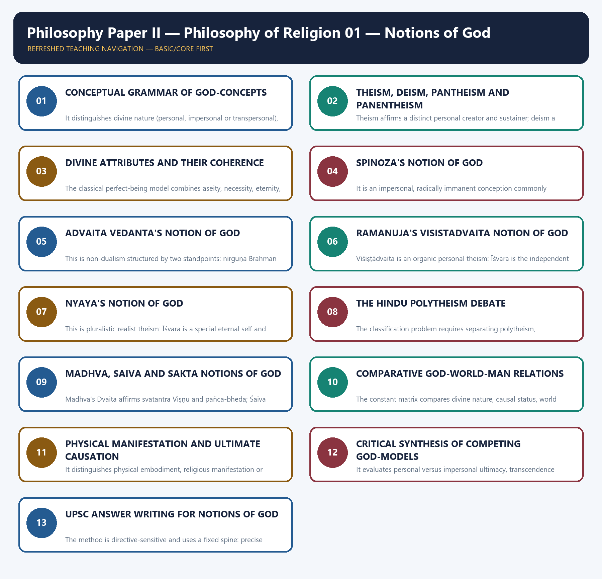

*Distinct embedded teaching-navigation image. The separate continuous Cārvāka-style flowchart package remains an independent at-a-glance artifact.*

### BASIC / MUST KNOW — independently complete for UPSC Philosophy Optional

This section contains every doctrine needed for the verified owner PYQs and a complete core answer. No Advanced section is needed to repair a missing definition, school, relation or direct PYQ concept.

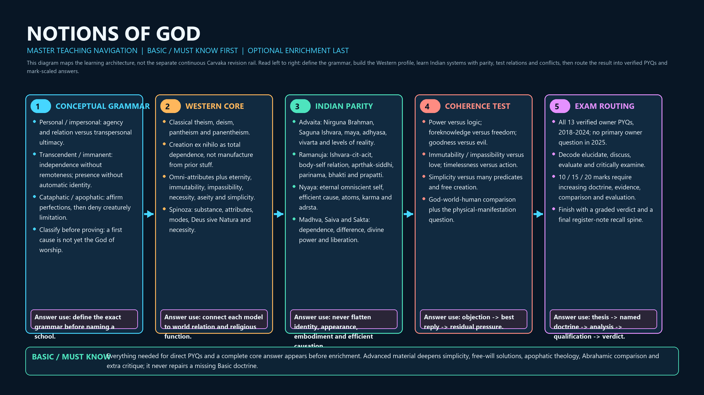

*Distinct early teaching architecture: conceptual grammar → Western core → Indian parity → coherence tests → exam routing. The separate Carvaka-standard continuous at-a-glance package is a different revision artifact.*

#### Verified current anchor — interfaith dialogue only

[FACT] The Vatican Dicastery for Interreligious Dialogue's official communiqué records a Rome conference on 23–24 June 2026 bringing Christians and representatives of Buddhism, Hinduism, Jainism and Sikhism together to strengthen fraternity through dialogue and cooperation.

[INFERENCE] Use it only to show why comparative conceptual literacy matters in contemporary interfaith encounter.

[TRAP] The event does **not** validate classical theism, Advaita, pantheism, Viśiṣṭādvaita or any other metaphysical doctrine.


### Source-complete coverage ledger and learning labels

This ledger is part of the package, not a claim of reconciliation without evidence. **[FACT]** denotes material preserved from the named repository owner; **[INFERENCE]** denotes answer-useful organisation or a graded comparison.

| Source owner / conceptual unit | Final location | Retention decision |
|---|---|---|
| Canonical 0–3: one-screen map; Western/Indian notions; God–world–human relation | Basic: conceptual method through comparative synthesis | Preserved as visual-first doctrine units and relation matrices |
| Canonical 4–7: quote/statement bank; applied drills; PYQ skeletons | Basic source labs and answer frameworks; Practice full PYQs | Preserved in context; detached slogan repetition removed |
| Canonical 8.1–8.8: doctrine dossiers, attribute/freedom and Indian parity bench | Basic core exposition plus Optional Advanced | Core doctrine stays Basic; second-order refinement is Advanced |
| Canonical 9–18: inter-school debates, objections, traps, keywords, routing, directives, verdict/factual discipline | Basic comparison workshops; Optional Advanced; final register | Preserved once in its pedagogic role rather than repeated in every unit |
| Complete session: conceptual method/cataphasis; eight taught modules; visual logic; objection/reply; answer frameworks | Basic Learning Session | Preserved in its full source sequence; only old interleaved MCQ/current-anchor blocks moved or removed |
| Complete session: expanded attribute/comparative laboratory and advanced dossiers | Optional Advanced | Preserved after all core practice, as learner-v2 requires |
| Complete session: all verified models | Practice | Replaced with the fuller, duplicate-free premium-workbook versions |
| Verbatim session (2026-08-09) | Basic cross-check | Its roadmap, eight module sequence, visual logic and source labs are already retained in the expanded complete session; its stale chat/pre-teach/current-anchor noise is not repeated |
| Premium workbook: all 13 verified PYQs, 32 hard diagnostics, answer protocol and final matrix | MCQs and Practice | Preserved in full; all ten original 10/15/20-mark models retained |
| Philosophy of Religion dossier Topic 1 | Optional Advanced | Preserved in full after practice |

**Visible relevance labels.** The taught doctrinal modules are **CORE PAPER II**. Their comparison, objection/reply, directive and answer-spine material is **CORE ANSWER**. Historical reference standards and additional school illustrations are **SUPPORTING**. The final depth block is **OPTIONAL ADVANCED** and is not required for a competent core response.

**Genuine duplication removed:** the 2026-08-15 complete session and premium workbook contain a second presentation of the same 13 PYQs; the premium answers are retained because they carry the complete examiner-grade structure. Earlier interleaved MCQs are replaced by the premium set of 32. The 2026-08-09 session's duplicated modules and stale current-affairs prompts are not reproduced. All ten original premium 10/15/20-mark Mains prompts and full model answers are retained; overlap is kept because the user requested uncompressed practice coverage.
### Learning route — [CORE PAPER II]

Complete the source-preserving units in order. They deliberately begin with concept clarification, then relation types, attributes, Western and Indian models, and finally answer construction. Proofs, evil, religious experience and religious language appear only as bounded pressures or study links.

**Complete learning-session package | Regenerated 22 August 2026 | Approval: awaiting explicit approval**

> **Syllabus owner:** "Notions of God: Attributes; Relation to Man and the World. (Indian and Western)."
> **Method:** [THESIS] direct position; [ARGUMENT] reconstruction; [OBJECTION] strongest pressure; [REPLY] strongest answer; [QUALIFICATION] residual limit.
> **Source order:** audited repository Markdown; OCR-searchable local John Hick, Chatterjee-Datta and C. D. Sharma PDFs; no decorative current affairs; Qdrant not required.
> **OCR evidence note:** John Hick directly supports the model-family, creation and omni-attribute discussion; the Oxford Handbook supports divine-attribute and foreknowledge depth; Chatterjee–Datta supports Indian-system parity. No quotation is copied from damaged OCR, and PYQ wording remains ledger-controlled.

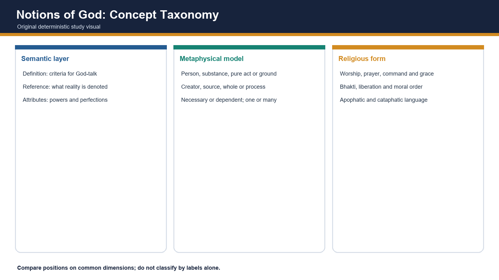

### SESSION 1 — CONCEPTUAL GRAMMAR OF GOD-CONCEPTS

#### DEFINITION / WHAT THIS IS CALLED

**Plain-language definition:** Conceptual grammar is the checklist used to identify what a tradition means by “God” before asking whether that God exists.

**Technical definition:** It distinguishes divine nature (personal, impersonal or transpersonal), predication (cataphatic, apophatic and analogical), attributes, reference, and the God–world and God–man relations of transcendence and immanence.

#### ANSWER-GRABBING OPENING — WRITE/ADAPT IN THE EXAM

> A notion of God must be examined as a structured metaphysical model—nature, attributes, world-relation and human-relation—rather than as an undefined sacred name; conceptual clarification therefore precedes proof.

#### MUST-WRITE KEYWORDS

- **personal / impersonal / transpersonal**
- **transcendence / immanence**
- **cataphatic / apophatic / analogical predication**
- **reference, attributes, compossibility, God–world relation, God–man relation**

**How to use them:** Define the two axes first, state how divine predicates are controlled, and then place every doctrine on the same nature–relation matrix.

#### Conceptual method before doctrine

[THESIS] A notion of God is not merely a sacred name. It specifies the proposed referent, the predicates that may be used, the model of ultimacy, the relation to world and persons, and the religious practices made intelligible by that model.

| Layer | Governing question | Common error |
|---|---|---|
| Definition | What controls correct use of the word God? | Treating a dictionary gloss as a complete metaphysics |
| Reference | What reality, if any, is denoted? | Assuming every tradition refers in the same manner |
| Attribute | Which powers or perfections are affirmed? | Listing predicates without checking compossibility |
| Model | Person, substance, pure act, ground, process or absolute? | Moving between models without admitting changed grammar |
| Religious form | What follows for worship, prayer, morality or liberation? | Ignoring practical consequences |

[ARGUMENT] Conceptual analysis logically precedes proof. A first cause is not thereby shown to be personal, omniscient, good or worship-worthy. Topic 02 owns premise-by-premise arguments for existence; Topic 01 owns the content and coherence of the alleged divine terminus.

[QUALIFICATION] Philosophy of religion subjects concepts and practices to public analysis. Theology normally reasons more fully within a tradition's authoritative commitments. The boundary is porous, but an Optional answer should not use revelation as a substitute for conceptual clarity.

#### Cataphatic and apophatic control

[THESIS] Cataphatic discourse affirms predicates such as good, wise and loving. Apophatic discourse denies that creaturely predicates capture divine reality in the same mode. Negative theology need not abolish affirmation; it may purify it through analogy and denial of finite limits.

[OBJECTION] If all positive predicates are withdrawn, God-talk becomes empty.

[REPLY] Directional content remains: the divine is not finite, composite or dependent, while positive terms indicate perfection without univocal transfer from creatures.

[QUALIFICATION] Too little reserve produces anthropomorphism; too much makes reference and worship indeterminate. This is a bounded cross-link to Religious Language, not a replacement for Topic 10.

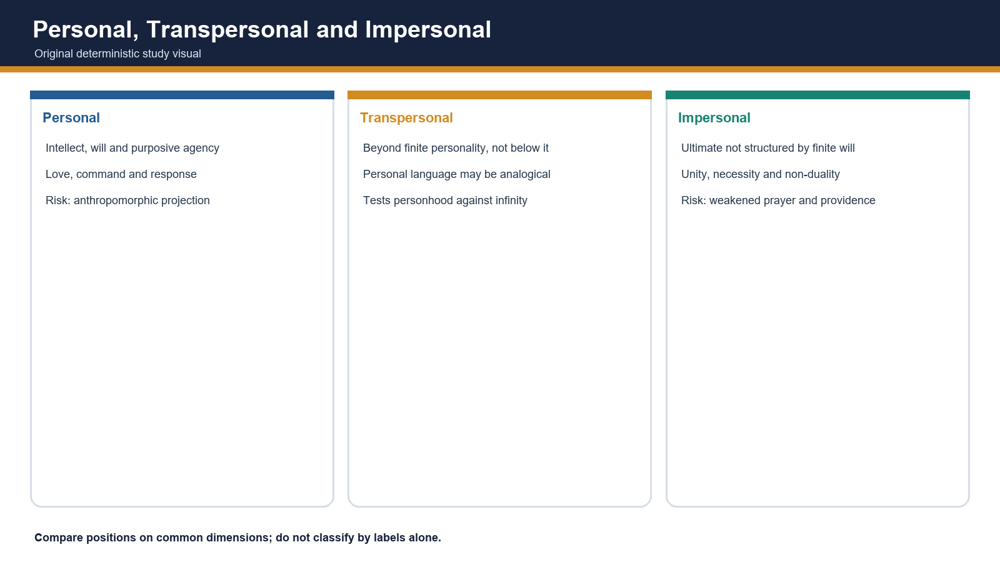

> **Topic 02 firewall:** existence proofs are mentioned only for the kind of God they purport to establish. Ontological, cosmological, teleological, moral and Nyaya-Udayana arguments are not reconstructed here.


**Philosophy Optional  |  Paper II  |  Philosophy of Religion**
**Progress:** 0/8  |  **Pacing:** no artificial speed target; complete every doctrine sequentially

```text
Meaning of God

Types of God-concepts

Divine attributes and their coherence

God-World-Human relations

Western views <-> Indian views

Criticism, comparison and answer writing
```

| Session | Subtopic | Core focus |
|---:|---|---|
| 1 | Conceptual framework | Personal/impersonal; immanent/transcendent |
| 2 | Western classifications | Theism, deism, pantheism, panentheism |
| 3 | Divine attributes | Omnipotence, omniscience, goodness, eternity, simplicity |
| 4 | Spinoza | *Deus sive Natura*, substance, attributes and modes |
| 5 | Advaita | Nirguna Brahman, Saguna Isvara, *maya* and *vivarta* |
| 6 | Visistadvaita | Personal God, *cit-acit*, body-soul relation and *aprthaksiddhi* |
| 7 | Other Indian notions | Nyaya Isvara, Hindu polytheism and henotheism |
| 8 | Critical synthesis | God-world-human relations, objections and PYQ frameworks |

**PYQ priority:** Very high - 13 questions during 2018-2025, especially Spinoza, Ramanuja, Advaita, divine attributes and immanence-transcendence.


---

Progress: 1 / 8  |  Stage: Foundation  |  Subtopic: Conceptual Framework
------------------------------------------------------------


[VISUAL] VISUAL  -  THE TWO AXES

                         GOD-CONCEPT
                              |
              +---------------+---------------+
              |                               |
       Nature of God                  Relation to world
              |                               |
      +-------+--------+              +-------+--------+
      |                |              |                |
  PERSONAL         IMPERSONAL     TRANSCENDENT      IMMANENT
  Knows/wills/      Absolute       Beyond and       Present within
  loves/acts        principle      distinct         or sustaining

These axes are independent: a doctrine may combine transcendence and immanence rather than choosing only one.

##### 1. Personal and impersonal

[FACT] **Personal God:** possesses intellect, will and purposive agency; can know, command, love and respond. Classical theism and Ramanuja's Brahman are central examples.

[FACT] **Impersonal God/Absolute:** ultimate reality is not a person among persons and does not exercise human-like volition. Spinoza's one substance and Sankara's Nirguna Brahman are major examples.

[QUALIFICATION] **Important qualification:** "Personal" does not mean bodily or finite. "Impersonal" does not mean unreal, unconscious matter or morally indifferent by definition.

##### 2. Transcendent and immanent

[FACT] **Transcendent:** God exceeds the world and is not reducible to it. This denotes ontological independence - not spatial remoteness.

[FACT] **Immanent:** God is present and operative within the world as its ground, sustainer or inner controller. This need not mean that God is physically located inside objects.

[FACT] Classical theism generally affirms both: God is distinct from creation yet continuously sustains it. Visistadvaita similarly presents Brahman as the indwelling controller while exceeding the world.

##### 3. Four conceptual combinations

| Combination | Meaning | Illustrative model |
|---|---|---|
| Personal + transcendent | Creator distinct from creation | Classical theism |
| Personal + immanent | Providence or inner governance | Ramanuja's *antaryamin* |
| Impersonal + immanent | Ultimate reality expressed in everything | Spinoza |
| Impersonal + transcendent | Absolute beyond finite predicates | Nirguna Brahman |

[QUALIFICATION] These are analytical placements, not complete descriptions. Classical theism, for example, combines personal transcendence with immanent sustaining activity.

##### 4. Why UPSC cares

The syllabus is not asking merely, "Does God exist?" It asks what the word **God** means and how each conception explains three relations:

```text
DIVINE NATURE ---> What attributes does God possess?
       |
       +---------> How is God related to the world?
       |
       +---------> How is God related to human beings?
```

[FACT] **PYQ link:** UPSC asked personalistic-impersonalistic aspects in 2019 and 2023, and immanence-transcendence in 2023.

##### UPSC traps

1. Personal != anthropomorphic or physically embodied.
2. Impersonal != non-existent or material.
3. Transcendent != spatially far away.
4. Immanent != identical with the world.
5. **Pantheism:** God = world/nature; **panentheism:** world exists in God, but God exceeds it.
6. Do not force every system into only one box; several deliberately combine both poles.

> [MEMORY] Mnemonic: **P-I describes God's personality; T-I describes God's position relative to the world.**

##### Revision notes

- A notion of God is a metaphysical profile, not simply a name.
- Personal God has intellect, will and relational agency.
- Impersonal Absolute transcends person-like predicates.
- Transcendence means ontological independence from the world.
- Immanence means presence or sustaining activity within the world.
- Classical theism combines transcendence and immanence.
- Spinoza is impersonal and radically immanent.
- Advaita distinguishes empirical Saguna Isvara from ultimate Nirguna Brahman.
- Ramanuja defends a personal God with the world and selves as God's body.
- Always explain God-world and God-human relations in an answer.

#### CLOSING RECALL FLOW — CONCEPTUAL GRAMMAR

```text
Sacred name -> define referent -> nature axis -> relation axis -> predication -> attributes -> religious consequences -> proof/evaluation
```

### SESSION 2 — THEISM, DEISM, PANTHEISM AND PANENTHEISM

#### DEFINITION / WHAT THIS IS CALLED

**Plain-language definition:** These four models differ over whether God creates the world, withdraws from it, includes it, or is identical with it.

**Technical definition:** Theism affirms a distinct personal creator and sustainer; deism a creator-lawgiver without continuing special intervention; pantheism God–world or God–Nature identity; and panentheism the world's inclusion in God while God exceeds the world.

#### ANSWER-GRABBING OPENING — WRITE/ADAPT IN THE EXAM

> Theism, deism, pantheism and panentheism are rival grammars of dependence: they respectively affirm sustaining distinction, non-intervention after creation, identity, and inclusion-with-divine-excess.

#### MUST-WRITE KEYWORDS

- **classical theism, deism, pantheism, panentheism**
- **creation ex nihilo, primary and secondary causation, providence**
- **transcendence, immanence, identity, inclusion, dependence**
- **God ≠ world; God = Nature; world in God**

**How to use them:** Give the exact God–world formula for each model, then add its religious gain and philosophical cost instead of merely listing definitions.

#### [VISUAL] Visual: How much overlap exists between God and the world?

```text
DEISM          THEISM          PANENTHEISM          PANTHEISM

 God             God             +-- GOD ------+       GOD = WORLD
  |               |              |  +WORLD--+  |       +----------+
creates         creates +         |  |       |  |       |  Nature  |
               sustains          |  +-------+  |       +----------+
World                           +-------------+
  X              World          World is in God,      No creator-
withdraws      God != world      but God exceeds it    creation gap
```

The four positions differ principally over whether God is **distinct from**, **active in**, **inclusive of**, or **identical with** the world.

#### 1. Theism

> **ANSWER-GRABBING LINE — WRITE/ADAPT IN THE EXAM**
> **Recommended opening definition:** God is a personal creator, distinct from the world but continuously sustaining and governing it.


[FACT] God is a **personal creator**, distinct from the world but continuously sustaining and governing it.

[FACT] It combines **transcendence** - God exceeds creation - with **immanence** - God remains present and active within it.

[FACT] Classical attributes include necessity, omnipotence, omniscience, perfect goodness and eternity.

**Example:** Aquinas's God sustains secondary natural causes without competing with them as another worldly cause.

#### 2. Deism

> **ANSWER-GRABBING LINE — WRITE/ADAPT IN THE EXAM**
> **Recommended opening definition:** Deism is not atheism: it affirms a creator but rejects continuing providential intervention.


[FACT] God creates the universe and its rational laws but does not subsequently intervene through miracles or special revelation.

```text
Divine creation -> Natural laws begin -> Universe operates autonomously
```

> [MEMORY] Memory hook: **Deism = Designer who becomes Distant.**

[QUALIFICATION] Deism is not atheism: it affirms a creator but rejects continuing providential intervention.


#### Creator, creation ex nihilo and total dependence — [BASIC / MUST KNOW]

**Simple start:** A carpenter changes material that already exists. Classical creation is a stronger claim: the whole being of creatures depends upon God, including the existence and powers of their secondary causes.

```text
MANUFACTURE                         CLASSICAL CREATION
maker + prior matter               no independent material co-principle
        |                                      |
rearranged product                 creaturely being continuously depends on God
```

[FACT] **Creation ex nihilo** denies independently existing primordial matter. “Nothing” is not a material from which God constructs the universe.

[FACT] **Dependence is continuous:** God is not only a remote first event. Classical theism treats God as the primary sustaining cause through which genuine secondary natural causes operate.

[QUALIFICATION] This doctrine differs from Nyāya, where eternal atoms remain material causes; from Spinoza, where no external act of creation occurs; from Advaita's *vivarta*; and from Rāmānuja's real manifestation of inseparable *cit-acit*.

| Question | Core answer |
|---|---|
| Does creation require prior matter? | No, on ex nihilo creation. |
| Does God compete with natural causes? | Not if primary and secondary causation operate at different explanatory levels. |
| Must the creator be physically embodied? | No. Physical manifestation, incarnation, material causation and metaphysical dependence are distinct. |

> **Answer-grabbing line:** Creation ex nihilo is a thesis of total ontological dependence, not a temporal picture of a craftsman manufacturing the cosmos from “nothing.”

#### 3. Pantheism

> **ANSWER-GRABBING LINE — WRITE/ADAPT IN THE EXAM**
> **Recommended opening definition:** God is identical with nature or reality as a whole.


[FACT] **God is identical with nature or reality as a whole.** There is no independent creator standing outside creation.

[FACT] Spinoza's formula is *Deus sive Natura* - "God, or Nature." God is the one infinite substance; finite things are its modes.

[QUALIFICATION] Spinoza's God is not merely physical matter. Nature includes the infinite substance expressed through attributes, of which human beings know Thought and Extension.

> [MEMORY] Memory hook: **PAN = all; pantheism = all is divine.**

#### 4. Panentheism

> **ANSWER-GRABBING LINE — WRITE/ADAPT IN THE EXAM**
> **Recommended opening definition:** The world exists in God, but God possesses a reality exceeding the world.


[FACT] The world exists **in God**, but God possesses a reality exceeding the world.

```text
Pantheism    : God = World
Panentheism  : World within God
Theism       : God != World, though God sustains World
```

[FACT] It attempts to preserve divine immanence without eliminating transcendence. Process theology frequently uses a panentheistic model.

> [MEMORY] Memory hook: **PAN-EN-THEISM = all "in" God.**

#### Comparison matrix

> **ANSWER-GRABBING LINE — WRITE/ADAPT IN THE EXAM**
> **High-value transition:** A sound comparison must distinguish identity, inclusion, dependence and transcendence rather than treating all God-world relations as equivalent.


| Test | Theism | Deism | Pantheism | Panentheism |
|---|---|---|---|---|
| Personal God | Usually yes | Usually yes | No, in Spinoza | Varies |
| Creator distinct from world | Yes | Yes | No | God exceeds world |
| Continuing divine action | Yes | No | Nature's own necessity | Yes, internally |
| God-world formula | God != world | Creator -> autonomous world | God = world | World is in God |
| Main strength | Providence and relationship | Scientific autonomy | Radical unity | Immanence + transcendence |
| Main problem | Evil and attribute coherence | Religious remoteness | Loss of personality/freedom | Meaning of world "in" God |

#### UPSC answer logic

For every doctrine, write four things:

```text
DEFINITION -> GOD-WORLD RELATION -> KEY THINKER/EXAMPLE -> OBJECTION
```

**Probable question:** "Distinguish pantheism from panentheism. Does panentheism successfully reconcile divine immanence with transcendence?"

#### UPSC traps

1. Deism is not atheism.
2. Theism does not make God spatially separate from the world.
3. Pantheism and panentheism are not synonyms.
4. Spinoza's Nature is not merely material nature.
5. Panentheism says the world is in God - not that every object is the whole of God.
6. Hinduism should not automatically be labelled pantheistic; its schools offer multiple God-concepts.

#### Revision notes

- Theism: personal creator who continues to sustain the world.
- Deism: creator plus autonomous natural order.
- Pantheism: God and nature are identical.
- Panentheism: the world is in God, while God exceeds it.
- Theism preserves creator-creation distinction.
- Deism maximizes natural autonomy but weakens providence.
- Pantheism maximizes unity but threatens divine personality.
- Panentheism combines immanence and transcendence.
- Spinoza is the canonical pantheist in this syllabus.
- Compare positions through both God-world and God-human relations.

#### CLOSING RECALL FLOW — WESTERN RELATION MODELS

```text
Theism: distinction + sustenance -> Deism: creation + withdrawal -> Pantheism: identity -> Panentheism: inclusion + excess -> compare providence and freedom
```

### SESSION 3 — DIVINE ATTRIBUTES AND THEIR COHERENCE

#### DEFINITION / WHAT THIS IS CALLED

**Plain-language definition:** Divine-attribute theory asks what perfections belong to God and whether they can consistently belong to one being.

**Technical definition:** The classical perfect-being model combines aseity, necessity, eternity, immutability, simplicity, omnipotence, omniscience and omnibenevolence, and tests their compossibility with freedom, evil, temporal action and personal responsiveness.

#### ANSWER-GRABBING OPENING — WRITE/ADAPT IN THE EXAM

> The philosophical task is not to catalogue divine attributes but to test whether maximal power, complete knowledge, perfect goodness, eternity and simplicity form a coherent package.

#### MUST-WRITE KEYWORDS

- **aseity, necessity, eternity, immutability, impassibility, simplicity**
- **omnipotence, omniscience, omnibenevolence**
- **logical possibility, foreknowledge, freedom, problem of evil, compossibility**

**How to use them:** Define each attribute precisely, attach its standard coherence pressure, and finish with a qualified compatibility judgment.

#### [VISUAL] Visual: The classical divine-attribute system

```text
                         NECESSARY BEING
                               |
          +------------+-------+-------+-------------+
          |            |               |             |
      OMNIPOTENT   OMNISCIENT    PERFECTLY GOOD   ETERNAL
      all possible  knows every    wills no evil    not bounded
      power          truth                           by time
          |            |               |             |
          +------------+---- COHERENCE TEST ---------+
                           |
             Simplicity  |  Immutability  |  Freedom
```

A God-concept is a **package of mutually connected attributes**. UPSC expects you to test whether the package is coherent, not merely list its contents.

#### 1. Foundational attributes

> **ANSWER-GRABBING LINE — WRITE/ADAPT IN THE EXAM**
> **Recommended opening definition:** Aseity means God depends on nothing else for existence.


| Attribute | Meaning | Necessary qualification |
|---|---|---|
| **Aseity** | God depends on nothing else for existence | God is self-existent, not self-caused |
| **Necessity** | God cannot fail to exist | Stronger than merely existing forever |
| **Eternity** | God is not subject to temporal decay | Interpreted as timelessness or everlasting duration |
| **Immutability** | God's essential nature does not change | Need not exclude every relational difference |
| **Impassibility** | God is not involuntarily overpowered by passion | Does not have to mean emotional inertness or lack of active love |
| **Simplicity** | God is not composed of separable parts | Attributes are not independent components added to God |

#### 2. The three "omni" attributes

> **ANSWER-GRABBING LINE — WRITE/ADAPT IN THE EXAM**
> **Recommended opening definition:** Omnipotence, omniscience and perfect goodness respectively denote maximal power, complete knowledge and flawless moral character.


##### Omnipotence

[FACT] God can actualize every **logically possible** state of affairs consistent with divine nature.

```text
Power extends to genuine possibilities
                 !=
Producing contradictions such as a square circle
```

[QUALIFICATION] Creating a stone that an omnipotent being cannot lift describes an internally contradictory task, not a genuine object of power.

> [MEMORY] Omnipotence means **maximal coherent power**, not the ability to make contradictions true.

##### Omniscience

[FACT] God knows every truth - past, present, future and counterfactual, under the classical account.

**Problem of foreknowledge:**

```text
God infallibly knows that X will choose A

Can X genuinely choose B?
```

**Classical reply:** knowledge does not cause the act. God knows the free act because the agent performs it; divine timelessness removes chronological "prediction."

[QUALIFICATION] Objection: even non-causal, infallible prior knowledge appears to make alternatives impossible. Compatibility remains disputed.

##### Perfect goodness

[FACT] God is morally perfect and cannot will evil as evil.

[QUALIFICATION] This generates the problem of evil when combined with omnipotence and omniscience:

```text
God knows evil + can prevent evil + is perfectly good
                          yet
                       evil exists
```

Responses include free-will defence, soul-making and the claim that some goods require permitted risk. These responses must be evaluated rather than merely named.

#### 3. Attribute conflicts

> **ANSWER-GRABBING LINE — WRITE/ADAPT IN THE EXAM**
> **Major criticism:** The classical attributes generate pressure when unlimited power, complete foreknowledge, perfect goodness and creaturely freedom are asserted without qualification.


| Tension | Philosophical problem | Standard reply | Remaining pressure |
|---|---|---|---|
| Power vs logic | Can God do contradictions? | Contradictions are not possible tasks | Does this redefine "all-powerful"? |
| Knowledge vs freedom | Does foreknowledge fix human action? | Knowing does not cause choosing | Alternative possibilities still appear closed |
| Goodness vs evil | Why permit preventable suffering? | Freedom or soul-making | Natural and excessive evil remain difficult |
| Immutability/impassibility vs love | Can an unchanging, impassible God respond and care? | Essential perfection is fixed; impassibility excludes passive defeat, not active benevolence | Reciprocity and co-suffering remain difficult |
| Timelessness vs action | How can a timeless God initiate effects in time? | One timeless act can have temporally ordered effects | Agency without succession is hard to picture |
| Simplicity vs attributes | How can God have many properties? | Attributes are conceptually distinct but identical in God | The doctrine becomes difficult to understand |

#### 4. Freedom of will and an omnipotent God

> **ANSWER-GRABBING LINE — WRITE/ADAPT IN THE EXAM**
> **Major criticism:** The freedom problem asks whether genuine alternative choice can coexist with an omnipotent creator's causal sovereignty.


[FACT] **Compatibility model:** God voluntarily permits created agents to exercise limited causal power. Self-restraint is not inability.

```text
GOD'S OMNIPOTENCE
        | voluntarily grants

CREATURELY FREEDOM -> accountable human action
```

[QUALIFICATION] **Analogy:** A sovereign choosing not to exercise every legal power has not thereby lost that power. However, this analogy does not by itself solve divine foreknowledge.

[FACT] **PYQ:** UPSC 2020 asked whether freedom of will is compatible with an omnipotent God.

##### Answer spine

```text
Define omnipotence and freedom
-> distinguish power from constant control
-> explain voluntary divine self-limitation
-> introduce foreknowledge problem
-> objection and reply
-> conclude with qualified compatibility
```

#### UPSC traps

1. Omnipotence does not mean making logical contradictions true.
2. God's knowledge and God's causation are conceptually distinct.
3. "Knowledge does not cause action" is a reply, not a complete solution to fatalism.
4. Self-limitation is not automatically equivalent to lack of power.
5. Immutability concerns divine nature; avoid writing that God is an inert object.
6. Do not discuss each attribute separately when the question asks about their compatibility.

> [MEMORY] Mnemonic: **P-K-G-E-S**  -  Power, Knowledge, Goodness, Eternity, Simplicity.

#### Revision notes

- Aseity means non-dependence, not self-causation.
- Necessary existence differs from everlasting contingent existence.
- Omnipotence covers logically possible action.
- Omniscience creates the theological-fatalism problem.
- Knowledge need not causally determine an act.
- Perfect goodness plus evil requires a theodicy or defence.
- Immutability conflicts prima facie with responsiveness.
- Simplicity denies composition in God.
- Voluntary restraint may preserve rather than negate power.
- UPSC answers must test the coherence of the complete attribute package.

#### CLOSING RECALL FLOW — DIVINE ATTRIBUTES

```text
Perfect-being model -> aseity/necessity -> omni-attributes -> eternity/simplicity -> coherence conflicts -> qualified compatibility
```

### SESSION 4 — SPINOZA'S NOTION OF GOD

#### DEFINITION / WHAT THIS IS CALLED

**Plain-language definition:** Spinoza's notion of God is called substance monism: everything that exists is in the one infinite reality, God or Nature.

**Technical definition:** It is an impersonal, radically immanent conception commonly classified as pantheistic—qualified because God is the one infinite substance, not merely the aggregate of finite things; attributes express its essence and finite beings are modes.

#### ANSWER-GRABBING OPENING — WRITE/ADAPT IN THE EXAM

> Spinoza replaces the personal creator with Deus sive Natura: one self-explanatory infinite substance whose attributes and modes unfold by necessity, gaining metaphysical unity at the cost of providential personality and libertarian freedom.

#### MUST-WRITE KEYWORDS

- **Deus sive Natura, substance monism, causa sui**
- **attribute, Thought, Extension, mode**
- **natura naturans / natura naturata**
- **necessity, immanence, intellectual love of God, redefined freedom**

**How to use them:** Move in the exact order substance → attributes → modes → necessity → human freedom, and qualify the pantheism label before evaluating personality and providence.

#### [VISUAL] Visual: Spinoza's metaphysical architecture

```text
                       GOD OR NATURE
                    ONE INFINITE SUBSTANCE
                  exists in and through itself
                              |
              +---------------+---------------+
              |                               |
         ATTRIBUTE: THOUGHT             ATTRIBUTE: EXTENSION
        intellect grasps God as         intellect grasps God as
             thinking reality              extended reality
              |                               |
         finite minds                       finite bodies
              +---------------+---------------+
                              |
                         FINITE MODES
              particular expressions of God/Nature
```

[FACT] **Central thesis:** There are not two realities - God and creation. There is only **one infinite substance**, and everything else exists as its mode.

> [MEMORY] Formula: **One substance -> infinite attributes -> finite modes.**

#### 1. Substance

> **ANSWER-GRABBING LINE — WRITE/ADAPT IN THE EXAM**
> **Recommended opening definition:** In Spinoza, a substance is "in itself and conceived through itself." Its existence and conception do not depend upon another thing.


[FACT] In Spinoza, a substance is **"in itself and conceived through itself."** Its existence and conception do not depend upon another thing.

##### Argument for one substance

```text
1. Substance is self-conceived and ontologically independent.
2. Distinct substances cannot share the same attribute.
3. God possesses infinite attributes and excludes every rival substance.
4. Therefore, only one substance exists: God or Nature.
```

[QUALIFICATION] The argument assumes that conceptual independence accurately reveals ontological independence. Critics may reject this movement from definition to reality.

#### 2. God: *Deus sive Natura*

> **ANSWER-GRABBING LINE — WRITE/ADAPT IN THE EXAM**
> **High-value transition:** Deus sive Natura means "God, or Nature." It expresses identity, not comparison.


[FACT] *Deus sive Natura* means **"God, or Nature."** It expresses identity, not comparison.

| Classical theism | Spinoza |
|---|---|
| God creates the world freely | The world follows necessarily from divine nature |
| God is distinct from creation | Everything exists in God as a mode |
| God possesses intellect and will like supreme personality | God is impersonal, not a deliberating person |
| Providence involves choice and purpose | Nature operates through necessary order |
| Creator-creature dualism | Substance monism |

[QUALIFICATION] Spinoza's God is not simply physical nature. The one substance possesses infinitely many attributes; human beings know only **Thought** and **Extension**.

#### 3. Attributes

> **ANSWER-GRABBING LINE — WRITE/ADAPT IN THE EXAM**
> **Recommended opening definition:** An attribute is what the intellect perceives as constituting the essence of substance.


[FACT] An attribute is what the intellect perceives as constituting the essence of substance.

```text
Same infinite reality
       +-- understood under Thought -> minds and ideas
       +-- understood under Extension -> bodies and motion
```

[FACT] Thought and Extension are not two substances. They are two ways in which the same substance is intelligible.

#### 4. Modes

> **ANSWER-GRABBING LINE — WRITE/ADAPT IN THE EXAM**
> **High-value transition:** The analogy is limited: Spinoza's modes follow with metaphysical necessity, whereas ordinary waves are contingent physical events.


[FACT] Modes are dependent modifications of substance - particular minds, bodies and events.

> **Analogy:** A wave is not a second substance beside the ocean; it is a determinate expression of the ocean. Likewise, finite things are expressions of the one substance.

[QUALIFICATION] The analogy is limited: Spinoza's modes follow with metaphysical necessity, whereas ordinary waves are contingent physical events.

#### 5. *Natura naturans* and *Natura naturata*

> **ANSWER-GRABBING LINE — WRITE/ADAPT IN THE EXAM**
> **High-value transition:** This is not creation at a first moment.


| Term | Meaning |
|---|---|
| **Natura naturans** - nature naturing | God/Nature considered as active, infinite and self-caused substance |
| **Natura naturata** - nature natured | The complete order of modes necessarily following from divine nature |

```text
NATURA NATURANS --necessary expression---> NATURA NATURATA
 infinite source                              modal order
```

[FACT] This is not creation at a first moment. It is an eternal relation of ontological dependence.

#### 6. Necessity and freedom

> **ANSWER-GRABBING LINE — WRITE/ADAPT IN THE EXAM**
> **High-value transition:** Everything follows necessarily from divine nature.


[FACT] Everything follows necessarily from divine nature. God could not have chosen a fundamentally different world through arbitrary will.

[FACT] Spinoza redefines freedom:

```text
Freedom != uncaused choice between alternatives
Freedom = acting from the necessity of one's own nature
```

God is perfectly free because nothing external constrains God. Human freedom increases as rational understanding replaces passive determination by inadequate ideas and emotions.

[QUALIFICATION] Critics argue that this turns freedom into understood necessity and abandons genuine alternative choice.

#### 7. Relation to human beings

> **ANSWER-GRABBING LINE — WRITE/ADAPT IN THE EXAM**
> **High-value transition:** A human mind is a finite mode under Thought; its body is the corresponding finite mode under Extension.


[FACT] A human mind is a finite mode under Thought; its body is the corresponding finite mode under Extension.

[FACT] Humans are **in God**, not independently created substances outside God.

[QUALIFICATION] God does not love, punish or respond as a personal deity. Spinoza's "intellectual love of God" is rational participation in and understanding of the necessary whole.

#### 8. Is Spinoza a pantheist?

> **ANSWER-GRABBING LINE — WRITE/ADAPT IN THE EXAM**
> **High-value transition:** The standard reading is pantheistic because God and Nature are identical and finite things exist in God.


[FACT] The standard reading is pantheistic because God and Nature are identical and finite things exist in God.

[QUALIFICATION] A qualification is necessary: God is not merely the collection of finite things. God is infinite substance; finite things are modes. Some interpreters therefore emphasize Spinoza's complex substance monism rather than the slogan "everything is God."

#### Criticisms and replies

| Criticism | Spinozistic reply | Assessment |
|---|---|---|
| God loses personality | Personality would impose finite human categories on infinity | Saves infinity but abandons prayerful relationship |
| The doctrine is atheism in religious language | God is the only independent and infinite reality | It affirms ultimacy but rejects classical theism |
| Necessity destroys freedom | Freedom is self-determination through one's nature | Coherent redefinition, but not libertarian freedom |
| Evil becomes part of God | Good and evil reflect finite human perspectives | Weakens objective moral evil and providence |
| Modes are difficult to derive from substance | They follow necessarily from divine attributes | "Following from" remains insufficiently transparent |

#### [FACT] PYQ link

- **2022, 10 marks:** Spinoza's notion of God and His attributes.
- **2024, 15 marks:** How is Spinoza's God embedded in the metaphysics of substance and attributes?

##### 15-mark answer spine

```text
Define *Deus sive Natura*
-> establish substance monism
-> explain attributes and modes
-> show necessity and impersonal immanence
-> contrast classical theism
-> raise personality/freedom objections
-> conclude: metaphysical God, not providential creator
```

#### UPSC traps

1. Do not call God and the world two substances.
2. An attribute is not a property possessed like a detachable feature.
3. Modes are dependent expressions, not parts composing God.
4. God does not freely choose creation in the classical sense.
5. Spinozistic freedom means self-determination, not arbitrary choice.
6. Do not reduce Extension to the whole of God/Nature.
7. Explain pantheism through substance monism, not through the slogan alone.

> [MEMORY] Mnemonic: **S-A-M-N-F**  -  Substance, Attributes, Modes, Necessity, Freedom.

#### Revision notes

- God/Nature is the sole infinite substance.
- Substance exists in itself and is conceived through itself.
- God possesses infinitely many attributes.
- Humans know Thought and Extension.
- Particular minds and bodies are finite modes.
- *Deus sive Natura* establishes identity between God and Nature.
- *Natura naturans* is active infinite nature.
- *Natura naturata* is the order of dependent modes.
- Everything follows from divine nature necessarily.
- Divine freedom means absence of external constraint.
- Human liberation grows through adequate knowledge.
- Spinoza rejects a personal, purposive and providential creator.

#### CLOSING RECALL FLOW — SPINOZA

```text
Substance -> self-caused/infinite -> God or Nature -> attributes -> modes -> necessity -> redefined freedom -> criticism
```

### SESSION 5 — ADVAITA VEDANTA'S NOTION OF GOD

#### DEFINITION / WHAT THIS IS CALLED

**Plain-language definition:** Advaita teaches one non-dual Brahman, while personal Īśvara is that same reality understood in relation to the empirical world.

**Technical definition:** This is non-dualism structured by two standpoints: nirguṇa Brahman is ultimate at the pāramārthika level, whereas saguṇa Īśvara is the omniscient Lord at the vyāvahārika level; plurality arises through māyā, adhyāsa and vivarta without real change in Brahman.

#### ANSWER-GRABBING OPENING — WRITE/ADAPT IN THE EXAM

> Advaita preserves an empirically valid personal God while locating ultimacy in nirguṇa Brahman; its strength is non-dual absoluteness, but its pressure lies in explaining māyā, devotion and the reality of suffering.

#### MUST-WRITE KEYWORDS

- **nirguṇa Brahman / saguṇa Īśvara**
- **sat–cit–ānanda, neti neti**
- **māyā, avidyā, adhyāsa, mithyā, anirvacanīya**
- **vivarta, pāramārthika, vyāvahārika, prātibhāsika, ātman = Brahman**

**How to use them:** State the standpoint before using a term, apply anirvacanīya to māyā/world-appearance rather than Brahman, and end with the qualified verdict of empirical theism but ultimate non-dualism.

#### [VISUAL] Visual: One Brahman, two standpoints

```text
                         BRAHMAN
                            |
            +---------------+----------------+
            |                                |
      PARAMARTHIKA                     VYAVAHARIKA
      absolute standpoint              empirical standpoint
            |                                |
     NIRGUNA BRAHMAN                  SAGUNA ISVARA
     beyond limiting predicates       Brahman related to maya
     non-dual reality                 creator, ruler, object of worship
            |                                |
        ATMAN = BRAHMAN          jiva - devotion/action - God
```

[FACT] Advaita does not posit two Brahmans. Nirguna Brahman and Saguna Isvara are the same reality understood from different epistemic standpoints.

> [MEMORY] Memory hook: **Absolute Brahman; relational Isvara.**

#### 1. Nirguna Brahman

> **ANSWER-GRABBING LINE — WRITE/ADAPT IN THE EXAM**
> **Recommended opening definition:** Nirguna (without limiting qualities) means Brahman (ultimate reality) is free from limiting, finite and relational qualities.


[FACT] **Nirguna** means Brahman is free from limiting, finite and relational qualities. It does not mean a blank nothing.

[FACT] Brahman is non-dual, self-revealing consciousness and the ultimate ground of experience.

##### *Sat-Cit-Ananda*

| Term | Meaning | Advaitic significance |
|---|---|---|
| **Sat** | Being/reality | Brahman cannot be negated without presupposing reality |
| **Cit** | Consciousness | The witnessing condition of every known object |
| **Ananda** | Fullness/bliss | Freedom from limitation, not an episodic pleasure |

[QUALIFICATION] These are not three separable properties composing Brahman. They indicate the same non-dual reality from different conceptual directions.

##### *Neti neti*

[FACT] "Not this, not this" removes inadequate finite predicates.

```text
Brahman is not body
        not mind
        not a finite object
        not one being among others

not nothing - but the presupposed reality of all experience
```

#### 2. Saguna Isvara

> **ANSWER-GRABBING LINE — WRITE/ADAPT IN THE EXAM**
> **Recommended opening definition:** When Brahman (ultimate reality) is understood in relation to maya (cosmic appearance and power of projection), it is Isvara (Lord or personal God) - the omniscient and omnipotent creator, sustainer and dissolver of the empirical world.


[FACT] When Brahman is understood in relation to **maya**, it is Isvara - the omniscient and omnipotent creator, sustainer and dissolver of the empirical world.

[FACT] Isvara is the legitimate object of devotion, meditation and moral-religious life at the **vyavaharika** level.

[QUALIFICATION] Isvara is not false in the sense of non-existent. Isvara remains valid wherever the world and individual selves are experienced as real.

#### 3. Maya and *adhyasa*

> **ANSWER-GRABBING LINE — WRITE/ADAPT IN THE EXAM**
> **High-value transition:** Adhyasa (superimposition) is superimposition: characteristics of one thing are wrongly attributed to another.


[FACT] **Maya** explains how non-dual Brahman appears as a world of plurality without undergoing real transformation.

[FACT] **Adhyasa** is superimposition: characteristics of one thing are wrongly attributed to another.

> **Technical correction:** *Anirvacanīya* applies to **māyā / avidyā and the world-appearance** as neither absolutely real nor absolutely unreal. It should not be used as the technical ontological status of Brahman. Brahman's ineffability concerns the failure of limiting predication (*avācya*, *neti neti*).

##### Rope-snake model

```text
ROPE + ignorance -> SNAKE APPEARANCE -> fear
       knowledge -> appearance sublated -> ROPE recognized

BRAHMAN + avidya -> WORLD OF SEPARATION -> bondage
          knowledge -> difference sublated -> BRAHMAN recognized
```

[FACT] The snake is experienced but later sublated. Similarly, the world is **mithya** - empirically experienced and dependent, but not absolutely real.

[QUALIFICATION] *Mithya* does not mean sheer non-existence like a square circle.

#### 4. *Vivarta* rather than *parinama*

> **ANSWER-GRABBING LINE — WRITE/ADAPT IN THE EXAM**
> **High-value transition:** Brahman (ultimate reality) does not literally transform into the world.


| Theory | Meaning | Illustration | School |
|---|---|---|---|
| **Vivarta** | Apparent transformation; source remains unchanged | Rope appearing as snake | Advaita |
| **Parinama** | Real transformation | Milk becoming curd | Often used to contrast Ramanuja's real-world account |

[FACT] Brahman does not literally transform into the world. Otherwise the immutable Absolute would become divided and changing.

#### 5. Three levels of reality

> **ANSWER-GRABBING LINE — WRITE/ADAPT IN THE EXAM**
> **High-value transition:** A lower level is not sheer nothing; it is valid until knowledge from a higher level sublates it.


```text
PARAMARTHIKA  -> Brahman alone is absolutely real
       sublates
VYAVAHARIKA   -> shared world, selves, causation and Isvara
       sublates
PRATIBHASIKA  -> private illusion, dream or rope-snake error
```

[FACT] A lower level is not sheer nothing; it is valid until knowledge from a higher level sublates it.

#### 6. God-world-human relation

> **ANSWER-GRABBING LINE — WRITE/ADAPT IN THE EXAM**
> **High-value transition:** Liberation is recognition of an identity that always existed, not the finite self physically merging into another entity.


| Relation | Advaita account |
|---|---|
| Brahman-world | World is a dependent appearance through *vivarta* |
| Isvara-world | Isvara is empirical creator and governor |
| Atman-Brahman | Identity: *tat tvam asi* - "That thou art" |
| Jiva-Isvara | Distinction valid under ignorance at the empirical level |
| Liberation | Knowledge removes ignorance; no new unity is produced |

[FACT] Liberation is recognition of an identity that always existed, not the finite self physically merging into another entity.

#### 7. Does Sankara leave room for theism?

> **ANSWER-GRABBING LINE — WRITE/ADAPT IN THE EXAM**
> **Recommended opening definition:** Isvara (Lord or personal God) is omniscient, creator and moral governor at the empirical level.


##### Case for "yes"

- [FACT] Isvara is omniscient, creator and moral governor at the empirical level.
- [FACT] Devotion and meditation purify the mind and prepare it for liberating knowledge.
- [FACT] Religious language and worship have genuine practical validity.

##### Case for "only provisionally"

- [FACT] Ultimate reality is Nirguna Brahman, beyond creator-creature duality.
- [FACT] Isvara, jiva and world belong to the standpoint eventually sublated by non-dual knowledge.
- [QUALIFICATION] Therefore Advaita accommodates **empirical theism**, but its ultimate metaphysics is non-dual rather than personalistic theism.

> [MEMORY] Verdict: **Advaita preserves religion at the path level but transcends theism at the goal level.**

#### 8. Criticisms and replies

> **ANSWER-GRABBING LINE — WRITE/ADAPT IN THE EXAM**
> **Major criticism:** A criticism should identify whether it attacks validity, a premise's truth or the adequacy of the conclusion, and the reply must answer that exact level.


| Criticism | Advaita reply | Assessment |
|---|---|---|
| Nirguna is an empty abstraction | Negation removes finite limits rather than cancelling reality | Positive intelligibility remains difficult |
| Maya cannot belong either to Brahman or elsewhere | Maya is beginningless and *anirvacaniya* - not finally classifiable as real or unreal | Risks appearing explanatory rather than explained |
| If Brahman alone exists, who is ignorant? | Ignorance belongs to the empirical jiva | The locus of ignorance remains contested |
| The world's suffering is trivialized | Empirical suffering is real enough to require ethical action until knowledge | Tension remains between compassion and sublation |
| Theism is demoted | Isvara and devotion are indispensable preparatory realities | Personal religion is not ultimate |

#### [FACT] PYQ link

**2022, 15 marks:** Critically examine Sankara's idea of Brahman. Does it leave room for theism?

##### Answer spine

```text
Define Nirguna Brahman
-> explain *sat-cit-ananda* and *neti neti*
-> derive Saguna Isvara through the empirical standpoint
-> explain maya, *vivarta* and levels of reality
-> present case for and against theism
-> conclude: valid empirical theism, transcended ultimately
```

#### UPSC traps

1. Nirguna does not mean non-existent or devoid of reality.
2. *Sat-cit-ananda* is not a collection of three finite qualities.
3. The world is *mithya*, not sheer nothing.
4. Maya does not really transform Brahman.
5. Saguna and Nirguna are not two independent Brahmans.
6. Isvara is empirically valid, not a useless illusion.
7. Atman-Brahman identity differs from Spinoza's mode-substance relation.
8. Do not conclude simply that Sankara is either a conventional theist or atheist.

> [MEMORY] Mnemonic: **N-M-V-L-I**  -  Nirguna, Maya, Vivarta, Levels, Identity.

#### Revision notes

- Nirguna Brahman is non-dual reality beyond limiting predicates.
- *Sat-cit-ananda* indicates being, consciousness and fullness.
- *Neti neti* removes inadequate object-like descriptions.
- Saguna Isvara is Brahman viewed through maya.
- Isvara is creator and object of devotion empirically.
- Maya makes plurality appear without changing Brahman.
- *Adhyasa* is superimposition.
- *Vivarta* is apparent rather than real transformation.
- The world is dependent and sublatable, not sheer non-being.
- Advaita distinguishes three levels of reality.
- Atman is Brahman; liberation is knowledge of this identity.
- Advaita permits provisional theism but transcends it ultimately.

#### CLOSING RECALL FLOW — ADVAITA

```text
Brahman -> two standpoints -> nirguṇa / saguṇa Īśvara -> māyā + adhyāsa -> vivarta + levels -> ātman = Brahman -> qualified theism verdict
```

### SESSION 6 — RAMANUJA'S VISISTADVAITA NOTION OF GOD

#### DEFINITION / WHAT THIS IS CALLED

**Plain-language definition:** Rāmānuja's qualified non-dualism presents one personal Brahman whose unity genuinely includes distinct souls and matter.

**Technical definition:** Viśiṣṭādvaita is an organic personal theism: Īśvara is the independent whole, cit and acit are real dependent qualifications, and the śarīra–śarīrī plus apṛthak-siddhi relations preserve distinction, inseparability and divine immanence.

#### ANSWER-GRABBING OPENING — WRITE/ADAPT IN THE EXAM

> Rāmānuja reconciles unity with real plurality by treating souls and world as the dependent body of a personal Brahman, thereby grounding devotion without reducing difference to illusion.

#### MUST-WRITE KEYWORDS

- **Viśiṣṭādvaita, Īśvara, cit, acit**
- **śarīra–śarīrī, antaryāmin, apṛthak-siddhi**
- **material and efficient cause, pariṇāma**
- **bhakti, prapatti, grace, liberation as communion/service**

**How to use them:** Explain the body–self relation technically, write 'different, dependent, inseparable,' and then test the model through the problem of evil in God's body.

#### [VISUAL] Visual: Unity qualified by real plurality

```text
                            BRAHMAN
                    Personal God / Narayana
                       the inner controller
                              |
                    SARIRI  -  indwelling Self
                              |
             +----------------+----------------+
             |                                 |
          CIT                              ACIT
     conscious selves                 non-conscious matter
      many and eternal                 changing material world
             |                                 |
             +---------- GOD'S BODY -----------+
                         SARIRA
```

[FACT] Reality is one **organic whole**, but its internal distinctions are real. Brahman is non-dual **qualified by** selves and matter - hence *Visista-advaita*, "qualified non-dualism."

> [MEMORY] Formula: **One Brahman, genuinely qualified by many selves and a real world.**

#### 1. Three real principles

> **ANSWER-GRABBING LINE — WRITE/ADAPT IN THE EXAM**
> **High-value transition:** Ramanuja accepts all three as real but denies that they are three independent substances.


| Principle | Nature | Relation to Brahman |
|---|---|---|
| **Isvara** | Supreme personal God, omniscient and omnipotent | Independent controller and whole |
| **Cit** | Conscious selves or *jivas* | Real, dependent and inseparable from God |
| **Acit** | Non-conscious matter or *prakrti* | Real, dependent and governed by God |

[FACT] Ramanuja accepts all three as real but denies that they are three independent substances. Only Brahman is completely independent.

#### 2. Why "qualified" non-dualism?

> **ANSWER-GRABBING LINE — WRITE/ADAPT IN THE EXAM**
> **High-value transition:** Brahman (ultimate reality) is one, but not an undifferentiated unity.


```text
ADVaita:          plurality is ultimately sublated
VISISTADVAITA:    plurality is real but belongs within divine unity
DVAITA:           God, selves and matter remain categorically distinct
```

[FACT] Brahman is one, but not an undifferentiated unity. *Cit* and *acit* qualify Brahman as real internal differentiations.

[QUALIFICATION] "Qualified" does not mean that finite things limit God externally. They exist dependently within the divine whole.

#### 3. *Sarira-sariri* relation

> **ANSWER-GRABBING LINE — WRITE/ADAPT IN THE EXAM**
> **High-value transition:** The world and selves constitute God's body (sarira); God is their indwelling Self (sariri).


[FACT] The world and selves constitute God's **body** (*sarira*); God is their indwelling Self (*sariri*).

A body, in Ramanuja's technical sense, is that which:

1. is controlled by a conscious self,
2. exists for that self's purposes, and
3. is completely dependent upon that self.

```text
Human body : human self
      ::
World + souls : Brahman
```

[QUALIFICATION] This is a metaphysical relation, not the claim that God has a giant physical organism or anthropomorphic form.

#### 4. *Aprthak-siddhi*: inseparability without identity

> **ANSWER-GRABBING LINE — WRITE/ADAPT IN THE EXAM**
> **High-value transition:** Aprthak-siddhi means that a qualifier cannot exist separately from the substantive it qualifies.


[FACT] *Aprthak-siddhi* means that a qualifier cannot exist separately from the substantive it qualifies.

```text
Jiva != Brahman
Jiva cannot exist independently of Brahman
Therefore: distinction + inseparability
```

[FACT] The self belongs to God and depends completely upon God, but it never becomes numerically identical with the whole of Brahman.

> [MEMORY] Memory hook: **Different, dependent, inseparable.**

#### 5. God as material and efficient cause

> **ANSWER-GRABBING LINE — WRITE/ADAPT IN THE EXAM**
> **High-value transition:** God is the efficient cause because divine intelligence directs cosmic manifestation.


[FACT] God is the **efficient cause** because divine intelligence directs cosmic manifestation.

[FACT] God is also the **material cause** because the world arises from the *acit* that exists inseparably as God's body.

##### Real manifestation

```text
Subtle cit-acit in Brahman
             manifestation
Gross plurality of souls and world
             dissolution
Subtle condition in Brahman
```

[FACT] Unlike Advaita's *vivarta*, the world is a genuine manifestation or transformation of the dependent material principle.

[QUALIFICATION] Ramanuja does not hold that God's essential perfection transforms into defective matter. Change occurs in the divine body or dependent modes, not in God's essential nature.

#### 6. God-self relation

> **ANSWER-GRABBING LINE — WRITE/ADAPT IN THE EXAM**
> **High-value transition:** Each self is conscious, active and morally responsible.


| Advaita | Visistadvaita |
|---|---|
| Atman is Brahman | Jiva is distinct but inseparable from Brahman |
| Difference is due to ignorance | Difference is real and eternal |
| Liberation removes all ultimate duality | Liberation preserves individuality |
| Knowledge is decisive | Bhakti, knowledge, action, grace and surrender matter |

[FACT] Each self is conscious, active and morally responsible. Its consciousness is obscured in bondage and expands in liberation.

[FACT] Liberation is communion and service to God - not absorption that destroys personal identity.

#### 7. Bhakti and *prapatti*

> **ANSWER-GRABBING LINE — WRITE/ADAPT IN THE EXAM**
> **High-value transition:** Bhakti is sustained loving contemplation of God, grounded in knowledge and disciplined action.


##### Bhakti

[FACT] Bhakti is sustained loving contemplation of God, grounded in knowledge and disciplined action.

##### Prapatti

[FACT] *Prapatti* is complete surrender to divine grace, especially important where the demanding discipline of bhakti cannot be fully performed.

```text
Knowledge of God

Loving devotion

Self-surrender + divine grace

Liberation as communion and service
```

[QUALIFICATION] Grace does not erase moral agency. Surrender reorganizes agency around dependence upon God.

#### 8. Ramanuja's criticism of Advaita

> **ANSWER-GRABBING LINE — WRITE/ADAPT IN THE EXAM**
> **Major criticism:** Consciousness must belong to a conscious subject; it cannot be an impersonal absolute alone.


1. [FACT] A wholly quality-less Brahman is religiously and conceptually unintelligible.
2. [FACT] Consciousness must belong to a conscious subject; it cannot be an impersonal absolute alone.
3. [FACT] Perception and scripture affirm genuine plurality rather than a merely apparent world.
4. [FACT] If ignorance conceals Brahman, its locus and power become difficult to explain.
5. [FACT] The great sayings can express organic unity and dependence, not numerical identity.

##### Advaitic reply

[QUALIFICATION] Finite predicates limit Brahman; non-duality is disclosed only when superimposed distinctions are removed. Ramanuja answers that infinite auspicious qualities perfect rather than limit God.

#### 9. Main philosophical pressure

> **ANSWER-GRABBING LINE — WRITE/ADAPT IN THE EXAM**
> **Final verdict:** Assessment: This preserves divine perfection through the controller-controlled distinction, though critics may argue that complete divine control still raises responsibility for suffering.


##### Objection: Does evil contaminate God?

If the world is God's body and the world contains suffering and moral evil, does imperfection become divine?

**Ramanuja-style reply:**

```text
Defect belongs to the condition of the dependent body
                    !=
Defect in the essential nature of the controlling Self
```

[QUALIFICATION] Assessment: This preserves divine perfection through the controller-controlled distinction, though critics may argue that complete divine control still raises responsibility for suffering.

#### [FACT] PYQ links

- **2020, 20 marks:** Nature of God in Hinduism with special reference to Visistadvaita.
- **2022, 15 marks:** Relation between God and self according to Ramanujacarya.

##### 15-mark answer spine

```text
Define qualified non-dualism
-> explain Isvara-cit-acit
-> develop body-soul analogy
-> clarify *aprthak-siddhi*
-> show real distinction and dependence
-> explain liberation through bhakti/prapatti
-> contrast Advaita
-> evaluate evil/body objection
```

#### UPSC traps

1. Do not write that Ramanuja identifies the jiva with Brahman.
2. *Aprthak-siddhi* means inseparability, not numerical identity.
3. God's "body" is a technical dependence relation, not merely physical embodiment.
4. The world is real, not a sublatable illusion.
5. Change occurs in dependent *acit*, not in God's essential perfection.
6. Liberation preserves the self's individuality.
7. *Prapatti* is surrender to grace, not passive fatalism.
8. Visistadvaita is not halfway compromise; it is an organic theory of unity-in-difference.

> [MEMORY] Mnemonic: **I-C-A-B-G**  -  Isvara, Cit, Acit, Body relation, Grace.

#### Revision notes

- Visistadvaita means qualified non-dualism.
- Brahman is the supreme personal and qualified unity.
- *Cit* denotes real conscious selves.
- *Acit* denotes real non-conscious matter.
- Selves and matter form God's body.
- God is their indwelling controller.
- *Aprthak-siddhi* preserves difference with inseparability.
- God is both efficient and material cause.
- The world is a real manifestation, not *vivarta*.
- Jivas retain individuality in liberation.
- Bhakti is loving contemplation; *prapatti* is surrender.
- Divine grace completes rather than abolishes agency.
#### CLOSING RECALL FLOW — RAMANUJA

```text
Qualified non-dualism -> Īśvara + cit + acit -> body–self relation -> apṛthak-siddhi -> real causation -> bhakti/prapatti -> evil objection
```

### SESSION 7 — NYAYA'S NOTION OF GOD

#### DEFINITION / WHAT THIS IS CALLED

**Plain-language definition:** Nyāya treats God as the omniscient intelligent governor who orders a world made from eternal atoms and administers karmic results.

**Technical definition:** This is pluralistic realist theism: Īśvara is a special eternal self and nimitta-kāraṇa (efficient cause), while atoms are material causes; God coordinates adṛṣṭa, cosmic order, dissolution and Vedic authorship without becoming the world.

#### ANSWER-GRABBING OPENING — WRITE/ADAPT IN THE EXAM

> Nyāya's God is an efficient, not material, cause: Īśvara supplies intelligent cosmic and moral coordination while preserving the independent reality of atoms, selves, space, time and karma.

#### MUST-WRITE KEYWORDS

- **pluralistic realism, Īśvara, special self**
- **nimitta-kāraṇa, atoms as material cause**
- **karma, adṛṣṭa, karmaphala, Vedic authorship**
- **kāryāt, āyojanāt, dhṛtyādeḥ**

**How to use them:** Lead with causal status and pluralist ontology; mention proofs only after nature, atoms and karmic administration are clear.

#### [VISUAL] Visual: God orders rather than materially becomes the world

```text
ETERNAL REALITIES

Atoms + selves + space + time + karma
                   |
                   | ordered and coordinated by

            ISVARA  -  omniscient agent
                   |

          COSMOS + KARMIC DISTRIBUTION

Material cause: atoms     Efficient cause: God
```

[FACT] Nyaya is a **pluralist realist** system. God, selves, atoms, space and time are real; they are not appearances of one undifferentiated Absolute.

> [MEMORY] Formula: **Nyaya God designs and directs; God does not become the material world.**

#### 1. Nature of Isvara

> **ANSWER-GRABBING LINE — WRITE/ADAPT IN THE EXAM**
> **Recommended opening definition:** Isvara (Lord or personal God) is eternal, omniscient, omnipotent and a special self never subject to bondage or karma (morally consequential action).


[FACT] Isvara is eternal, omniscient, omnipotent and a special self never subject to bondage or karma.

[FACT] God is the **nimitta-karana** - intelligent efficient cause - of cosmic order.

[FACT] Eternal atoms are the **material cause**. Therefore Nyaya does not teach creation *ex nihilo* or a real transformation of God into the world.

[FACT] God initiates atomic combination, sustains order, governs dissolution and allocates karmic fruits.

[FACT] Later Nyaya treats God as the omniscient author of the Veda.

#### 2. God and karma

> **ANSWER-GRABBING LINE — WRITE/ADAPT IN THE EXAM**
> **Recommended opening definition:** God is not supposed to reward and punish arbitrarily.


```text
Human action -> merit/demerit (*adrsta*)
                       |

           Isvara coordinates consequences
                       |

              appropriate pleasure/pain
```

[FACT] Karma supplies the moral basis of consequences; God intelligently administers their distribution.

[QUALIFICATION] God is not supposed to reward and punish arbitrarily. Nyaya uses karma to defend divine impartiality.

[QUALIFICATION] Philosophical pressure remains: if karma already determines results, why is God required? Nyaya answers that unconscious merit, demerit and atoms cannot administer themselves intelligently.

#### 3. Major Nyaya arguments for God

> **ANSWER-GRABBING LINE — WRITE/ADAPT IN THE EXAM**
> **Core argument:** These are proofs for God's existence, but a question on the nature of God should prioritize attributes, causal role, karma (morally consequential action), atoms and souls rather than merely listing proofs.


| Argument | Reasoning |
|---|---|
| **Karyat** - from effect | The composite world is an effect; an effect requires an intelligent maker |
| **Ayojanat** - from arrangement | Inert atoms cannot initiate purposive combinations unaided |
| **Dhrtyadeh** - from sustenance | Cosmic maintenance and dissolution require governing intelligence |
| **Sruteh** - from scripture | Authoritative Vedic testimony implies an omniscient source |
| **Padat/Vakyat** - from words/sentences | Linguistic convention and meaningful discourse point to intelligence |

[QUALIFICATION] These are proofs **for God's existence**, but a question on the **nature of God** should prioritize attributes, causal role, karma, atoms and souls rather than merely listing proofs.

#### 4. Objections and replies

> **ANSWER-GRABBING LINE — WRITE/ADAPT IN THE EXAM**
> **Major criticism:** A strong objection must target a definite premise or inference, and a successful reply must answer that target without merely restating the doctrine.


| Objection | Nyaya reply | Assessment |
|---|---|---|
| Effects need makers only within the world; the analogy cannot prove a world-maker | A composite and ordered whole still calls for intelligent explanation | The inference may overextend ordinary causation |
| Samkhya's *prakrti* can explain evolution | Unconscious nature cannot explain purposive order | Purpose itself must first be established |
| Mimamsa says the Veda is authorless | Coherent authoritative sentences imply an omniscient author | Depends upon rejecting authorless revelation |
| Karma makes God redundant | *Adrsta* is unconscious and needs administration | Risks dividing explanatory work between karma and God |
| Evil challenges divine goodness | Suffering follows agents' karma, impartially dispensed | Does not fully explain the origin of suffering or cosmic arrangement |

#### [FACT] PYQ link

**2021, 10 marks:** "Discuss the nature of God as propounded in Nyaya philosophy."

##### 10-mark answer spine

```text
Pluralist-realist background
-> Isvara as eternal special self
-> efficient, not material, causation
-> ordering atoms and administering karma
-> relation to Veda
-> one objection and reply
-> qualified assessment
```

```closure-flow
SUBTOPIC: Part I - Nyaya's notion of God
KEY TERMS / DEFINITIONS: [FACT] Nyaya is a pluralist realist system.
MECHANISM / ARGUMENT: Therefore Nyaya does not teach creation ex nihilo or a real transformation of God into the world.
CONSEQUENCE / CONTRAST: Therefore Nyaya does not teach creation ex nihilo or a real transformation of God into the world.
UPSC TRAP / ANSWER-USE: God, selves, atoms, space and time are real; they are not appearances of one undifferentiated Absolute.
ANSWER-GRABBING FORMULATION: [FACT] Nyaya is a pluralist realist system.
```

#### CLOSING RECALL FLOW — NYAYA

```text
Pluralist realism -> eternal atoms/selves -> Īśvara as efficient cause -> atomic order -> karmic administration -> proofs -> redundancy/evil objections
```

### SESSION 8 — THE HINDU POLYTHEISM DEBATE

#### DEFINITION / WHAT THIS IS CALLED

**Plain-language definition:** The debate asks whether Hindu plurality is best described as many independent gods, one chosen supreme deity, or diverse forms of one ultimate reality.

**Technical definition:** The classification problem requires separating polytheism, henotheism, kathenotheism, monolatry, sectarian monotheism and metaphysical monism, because ritual plurality and claims about ultimate reality operate at different levels.

#### ANSWER-GRABBING OPENING — WRITE/ADAPT IN THE EXAM

> Calling Hinduism simply polytheistic is descriptively possible at the level of many deities but philosophically incomplete, since henotheistic invocation, sectarian monotheism and monistic or qualified-non-dual interpretations coexist.

#### MUST-WRITE KEYWORDS

- **polytheism, henotheism, kathenotheism, monolatry**
- **monotheism, monism, pantheism, iṣṭa-devatā**
- **Ṛgveda 1.164.46: 'Reality is one; sages speak of it variously'**
- **ritual, devotional and metaphysical levels**

**How to use them:** Define every classification before applying it, cite the Vedic anchor cautiously, and give a tradition- and level-specific verdict.

#### [VISUAL] Visual: Classifications that must not be conflated

```text
 MANY DIVINE FORMS
        |
        +-- POLYTHEISM: many gods possess distinct divine status
        |
        +-- HENOTHEISM: many gods accepted; one receives exclusive devotion
        |
        +-- KATHENOTHEISM: different gods are treated as supreme in turn
        |
        +-- THEISTIC PLURALISM: multiple forms relate to one supreme divine reality

 ONE ULTIMATE
        |
        +-- MONOTHEISM: one supreme personal God
        +-- MONISM: one ultimate reality
        +-- PANTHEISM: God and the whole of reality are identical
```

#### 5. Essential distinctions

> **ANSWER-GRABBING LINE — WRITE/ADAPT IN THE EXAM**
> **High-value transition:** Distinguish efficient from material cause, personal from impersonal ultimacy and creator-denial from denial of every form of godhead.


| Position | Exact claim |
|---|---|
| **Polytheism** | More than one god is genuinely divine |
| **Henotheism** | Several gods are acknowledged, but one is worshipped as supreme |
| **Kathenotheism** | Each deity may be elevated as supreme in a particular hymn or devotional context |
| **Monotheism** | Only one supreme God is affirmed |
| **Monism** | Reality is ultimately one; this need not imply a personal God |
| **Pantheism** | God is identical with the totality of reality |

#### 6. Why Hinduism resists a single label

> **ANSWER-GRABBING LINE — WRITE/ADAPT IN THE EXAM**
> **High-value transition:** The Vedic statement "Reality is one; sages speak of it variously" is frequently used to interpret plurality as diverse naming or manifestation rather than independent rival gods.


[FACT] Hindu traditions include Vedic plurality, devotional worship of a supreme personal deity, Advaitic non-dualism, Visistadvaitic qualified unity and Nyaya's intelligent creator.

[FACT] Vaisnava, Saiva and Sakta traditions may treat Visnu, Siva or Devi respectively as supreme while accommodating other deities within a wider sacred order.

[FACT] The Vedic statement **"Reality is one; sages speak of it variously"** is frequently used to interpret plurality as diverse naming or manifestation rather than independent rival gods.

[QUALIFICATION] This verse does not automatically prove that every Hindu school is monotheistic or monistic. Later traditions interpret divine plurality differently.

##### Balanced verdict

```text
Ritual/iconographic surface -> plurality of deities
Devotional standpoint       -> often one chosen supreme deity (*ista-devata*)
Metaphysical standpoint     -> one God, one Brahman, or pluralist realism depending on school
```

[QUALIFICATION] Therefore, "Hinduism is polytheistic" is descriptively partial but philosophically inadequate. Classification must specify the tradition and level under examination.

#### 7. Comparative synthesis

> **ANSWER-GRABBING LINE — WRITE/ADAPT IN THE EXAM**
> **Final verdict:** Comparison is strongest when each position is judged through the same axes of ultimate reality, world relation, human relation, causation and religious function.


| School/model | Ultimate reality | World relation | Divine plurality |
|---|---|---|---|
| Nyaya | Personal Isvara plus other eternal realities | God orders eternal atoms | One cosmic governor |
| Advaita | Nirguna Brahman | World is dependent appearance | Deities valid empirically |
| Visistadvaita | Personal qualified Brahman | World and selves are God's real body | Other deities subordinate within unity |
| Vedic henotheistic reading | One deity praised as supreme at a time | Varies | Many acknowledged |
| Straight polytheism | Multiple gods | Distinct divine agencies | Many genuinely divine beings |

#### UPSC traps

1. Nyaya God is the efficient cause, not the atomic material cause.
2. Nyaya does not reduce atoms and selves to modes of God.
3. Karma does not consciously distribute its own fruits.
4. Do not answer "nature of Nyaya God" only by listing Udayana's proofs.
5. Polytheism, henotheism and kathenotheism are distinct.
6. Monism does not automatically mean monotheism.
7. Pantheism is not simply belief in many gods.
8. Never classify all Hindu traditions through one school.

> [MEMORY] Mnemonic: **E-A-K-V**  -  Efficient cause, Atoms, Karma, Veda.

#### Revision notes

- Nyaya affirms an eternal personal Isvara.
- God is a special self never bound by karma.
- God is efficient, not material, cause.
- Eternal atoms constitute the world's material cause.
- God initiates and orders atomic combinations.
- God administers karmic consequences.
- Later Nyaya treats God as author of the Veda.
- Polytheism affirms many gods.
- Henotheism selects one supreme object of devotion while accepting others.
- Kathenotheism elevates different gods successively.
- Monism concerns ultimate reality, not necessarily a personal deity.
- Hinduism contains several irreducible God-concepts.


#### CLOSING RECALL FLOW — HINDU POLYTHEISM DEBATE

```text
Many divine forms -> define categories -> Vedic anchor -> ritual/devotional/metaphysical levels -> school variation -> qualified multi-level verdict
```

### SESSION 9 — MADHVA, SAIVA AND SAKTA NOTIONS OF GOD

#### DEFINITION / WHAT THIS IS CALLED

**Plain-language definition:** These Indian theisms preserve real divine–world–person relations through eternal difference, Lord–soul–bond structures, or divine power as real manifestation.

**Technical definition:** Madhva's Dvaita affirms svatantra Viṣṇu and pañca-bheda; Śaiva Siddhānta distinguishes pati, paśu and pāśa; Kashmir Śaivism interprets the world as Śiva–Śakti's real ābhāsa; and Śākta traditions identify supreme divinity with conscious dynamic Śakti.

#### ANSWER-GRABBING OPENING — WRITE/ADAPT IN THE EXAM

> Indian theism ranges from Madhva's eternal difference through Śaiva structures of lordship and recognition to Śākta divine power, so no generic 'Hindu God' can replace school-specific metaphysics.

#### MUST-WRITE KEYWORDS

- **svatantra / paratantra, pañca-bheda, bimba–pratibimba**
- **pati–paśu–pāśa, pañca-kṛtya**
- **prakāśa, vimarśa, svātantrya, ābhāsa, pratyabhijñā**
- **Devī, Śakti, real manifestation**

**How to use them:** Identify the school first, then state world status, soul status and liberation; never merge Śaiva Siddhānta with Kashmir Śaivism or reflection with identity.

#### Visual: three different ways of preserving a real God-world-person relation

```text
MADHVA / DVAITA            ŚAIVA SIDDHĀNTA              ŚĀKTA
Viṣṇu alone independent    Śiva = pati (Lord)            Devī/Śakti = ultimate
five real differences      soul = paśu; bonds = pāśa     power is the dynamic divine
        |                         |                              |
service with difference    grace releases, soul remains   real manifestation of Śakti
```

| School | Ultimate and attributes | World relation | Human relation | Exact exam distinction |
|---|---|---|---|---|
| **Madhva / Dvaita** | Viṣṇu alone is *svatantra*; all else *paratantra* | World and five differences (*pañca-bheda*) are eternally real | *Bimba-pratibimba* expresses dependence without identity; liberation is graded service | Never convert “reflection” into Advaitic identity |
| **Śaiva Siddhānta** | Śiva is *pati*, omniscient Lord and efficient cause | Māyā is material cause; Śiva performs *pañca-kṛtya* — creation, maintenance, dissolution, concealment and grace | Bound soul (*paśu*) is released from *āṇava*, karma and māyā, becoming Śiva-like but never the Lord | Distinguish it from non-dual Kashmir Śaivism |
| **Kashmir Śaivism** | Śiva is self-luminous consciousness (*prakāśa*) inseparable from reflective power (*vimarśa/Śakti*) | World is real self-manifestation (*ābhāsa*) through sovereign freedom (*svātantrya*) | Liberation is recognition (*pratyabhijñā*) of identity | Unlike Advaita, world manifestation is real rather than *vivarta* |
| **Śākta** | Devī/Mahādevī is supreme; Śakti is not an added attribute but the dynamic divine itself | World is real manifestation of conscious Śakti | Liberation is union/participation in the Goddess, not escape from inert matter | Do not equate Śakti with sublatable Advaita māyā or unconscious Sāṃkhya prakṛti |

**Why this belongs in Basic:** the syllabus says Indian notions of God and the 2019 PYQ permits “any one” Indian religious relation. A complete core answer can therefore choose Śaiva Siddhānta or Madhva instead of using Rāmānuja every time.

> **Answer-grabbing line:** Indian theism ranges from Madhva's eternal difference through Śaiva Lord-soul-bond structures to Śākta identity of divinity and power; none can be reduced to a generic “Hindu God.”

```closure-flow
SUBTOPIC: Madhva, Śaiva and Śākta notions of God
KEY TERMS / DEFINITIONS: svatantra-paratantra; pañca-bheda; pati-paśu-pāśa; pañca-kṛtya; Śakti
MECHANISM / ARGUMENT: each school connects a causal doctrine to bondage and liberation
CONSEQUENCE / CONTRAST: real difference, real manifestation and divine power replace Advaita's sublatable appearance
UPSC TRAP / ANSWER-USE: do not merge Śaiva Siddhānta with Kashmir Śaivism or reflection with identity
ANSWER-GRABBING FORMULATION: Indian notions of God must be compared through cause, world status, soul status and liberation
```

#### CLOSING RECALL FLOW — ADDITIONAL INDIAN THEISMS

```text
Madhva: real difference -> Śaiva Siddhānta: Lord–soul–bond -> Kashmir Śaivism: recognition/real manifestation -> Śākta: conscious power -> compare liberation
```

### SESSION 10 — COMPARATIVE GOD-WORLD-MAN RELATIONS

#### DEFINITION / WHAT THIS IS CALLED

**Plain-language definition:** Comparison asks how each model connects ultimate reality with the world and with human beings using the same fixed questions.

**Technical definition:** The constant matrix compares divine nature, causal status, world ontology, human dependence or identity, religious function and liberation across classical theism, deism, Spinoza, Advaita, Viśiṣṭādvaita and Nyāya.

#### ANSWER-GRABBING OPENING — WRITE/ADAPT IN THE EXAM

> A valid comparison keeps the conceptual constant fixed: identity, appearance, embodiment, inclusion and efficient causation are distinct God–world grammars with different God–man consequences.

#### MUST-WRITE KEYWORDS

- **God–world relation / God–man relation**
- **identity, inclusion, vivarta, śarīra–śarīrī, efficient causation**
- **creator–creature, mode–substance, ātman–Brahman, jīva–Īśvara**
- **providence, devotion, grace, karma, liberation**

**How to use them:** Compare every system across identical columns and explicitly state why similar language such as 'in God' does not imply the same metaphysical relation.

#### [VISUAL] Master concept map

```text
                         NOTIONS OF GOD
                               |
        +--------------------------------------------+
        |                      |                      |
   DIVINE NATURE          GOD-WORLD              GOD-HUMAN
        |                  RELATION                RELATION
        |                      |                      |
 personal/impersonal      creation              creature-creator
 omni-attributes          identity              mode-substance
 necessary/eternal        appearance            identity
 simple/immutable         body relation         inseparability
                           arrangement            devotion/grace
```

[FACT] A complete answer must connect all three dimensions. Merely naming attributes does not explain what a God-concept philosophically entails.

```closure-flow
SUBTOPIC: Part II - Is Hinduism polytheistic?
KEY TERMS / DEFINITIONS: High-value transition: The Vedic statement "Reality is one; sages speak of it variously" is frequently used to interpret plurality as diverse naming or manifestation rather than independent rival gods.
MECHANISM / ARGUMENT: [QUALIFICATION] Therefore, "Hinduism is polytheistic" is descriptively partial but philosophically inadequate.
CONSEQUENCE / CONTRAST: [QUALIFICATION] Therefore, "Hinduism is polytheistic" is descriptively partial but philosophically inadequate.
UPSC TRAP / ANSWER-USE: High-value transition: The Vedic statement "Reality is one; sages speak of it variously" is frequently used to interpret plurality as diverse naming or manifestation rather than independent rival gods.
ANSWER-GRABBING FORMULATION: ANSWER-GRABBING LINE — WRITE/ADAPT IN THE EXAM
```

#### Comparative synthesis

> **ANSWER-GRABBING LINE — WRITE/ADAPT IN THE EXAM**
> **Final verdict:** Comparison is strongest when each position is judged through the same axes of ultimate reality, world relation, human relation, causation and religious function.


| System | Nature of God | God-world relation | God-human relation | Main difficulty |
|---|---|---|---|---|
| **Classical theism** | Personal, necessary, omni-perfect | Creates and sustains a distinct world | Creature-creator; providence | Evil and attribute coherence |
| **Deism** | Personal intelligent designer | Creates laws, then does not intervene | Rational but religiously remote | No providence or revelation |
| **Spinoza** | Impersonal infinite substance | World consists of modes in God/Nature | Human is a finite mode | Personality and alternative freedom disappear |
| **Advaita** | Nirguna non-dual Brahman; empirical Isvara | World is dependent appearance through *vivarta* | Atman is Brahman | Status of world, devotion and maya |
| **Visistadvaita** | Supreme personal qualified Brahman | World and selves are God's real body | Distinct but inseparable jiva | Evil within God's body |
| **Nyaya** | Personal omniscient special self | God orders eternal atoms as efficient cause | Moral governor dispensing karma | God's necessity and karma's sufficiency |

#### 2. Four relations that must never be confused

> **ANSWER-GRABBING LINE — WRITE/ADAPT IN THE EXAM**
> **High-value transition:** These are four different metaphysical grammars: identity, embodiment, appearance and causation.


```text
IDENTITY          : God = Nature                         [Spinoza]
QUALIFIED UNITY   : World and selves form God's body    [Ramanuja]
DEPENDENT APPEARANCE: World is *mithya* upon Brahman     [Sankara]
CAUSAL DISTINCTION: God orders material distinct from God [Nyaya/theism]
```

> [MEMORY] These are four different metaphysical grammars: **identity, embodiment, appearance and causation**.

#### CLOSING RECALL FLOW — GOD-WORLD-MAN COMPARISON

```text
Fix common axes -> divine nature -> world status/causation -> human relation -> religious function -> objection -> like-for-like verdict
```

### SESSION 11 — PHYSICAL MANIFESTATION AND ULTIMATE CAUSATION

#### DEFINITION / WHAT THIS IS CALLED

**Plain-language definition:** This issue asks whether an ultimate cause must possess or appear through a physical form in order to explain the physical world.

**Technical definition:** It distinguishes physical embodiment, religious manifestation or incarnation, material causation and metaphysical grounding; ultimacy normally requires explanatory independence rather than spatially limited embodiment.

#### ANSWER-GRABBING OPENING — WRITE/ADAPT IN THE EXAM

> Physical manifestation may make divine agency religiously accessible, but it is not a necessary condition of ultimate causation, because the ground of physical reality cannot itself depend on the same limiting physical conditions without further explanation.

#### MUST-WRITE KEYWORDS

- **physical manifestation, embodiment, incarnation**
- **material cause / efficient cause / metaphysical ground**
- **spatial limitation, dependence, explanatory ultimacy**
- **Rāmānuja's technical body relation, Nyāya's non-material efficient cause**

**How to use them:** Clarify the four meanings before arguing, compare at least three models, and conclude that epistemic manifestation does not entail ontological embodiment.

#### 3. Must God have physical manifestation to be the ultimate cause?

> **ANSWER-GRABBING LINE — WRITE/ADAPT IN THE EXAM**
> **High-value transition:** Every familiar cause is encountered through some effect or embodied activity.


##### Argument supporting manifestation

[QUALIFICATION] Every familiar cause is encountered through some effect or embodied activity. An entirely unmanifest cause may seem indistinguishable from no cause.

[QUALIFICATION] Religious traditions also use incarnation, symbol and sacred embodiment to make divine agency intelligible.

##### Arguments against necessity

1. [FACT] A physical form is spatially limited, divisible and dependent; these features conflict with metaphysical ultimacy.
2. [FACT] Classical theism treats God as the non-physical ground sustaining physical reality.
3. [FACT] Nyaya's Isvara orders atoms without being an atom or material body.
4. [FACT] Advaita's Brahman is the presupposition of manifestation, not one manifested object.
5. [FACT] Ramanuja calls the cosmos God's body technically, but this is dependence and control - not a finite anthropomorphic body.
6. [QUALIFICATION] A cause may be known through effects without being physically similar to its effects.

##### Balanced verdict

```text
Physical embodiment may aid religious accessibility
                         !=
Physical embodiment is necessary for metaphysical causality
```

[QUALIFICATION] The stronger conclusion is that ultimacy requires **explanatory non-dependence**, not bodily manifestation. Some God-concepts involve embodiment, but it is not conceptually necessary for every ultimate cause.

#### CLOSING RECALL FLOW — PHYSICAL MANIFESTATION

```text
Define manifestation/embodiment/cause -> test physical dependence -> compare theism/Nyāya/Advaita/Rāmānuja -> accessibility ≠ necessity -> non-dependent ground
```

### SESSION 12 — CRITICAL SYNTHESIS OF COMPETING GOD-MODELS

#### DEFINITION / WHAT THIS IS CALLED

**Plain-language definition:** Critical synthesis judges what each model explains well and what philosophical cost it incurs.

**Technical definition:** It evaluates personal versus impersonal ultimacy, transcendence versus immanence, attribute coherence, world status, freedom, evil, devotion and causation through objection–reply–residual-pressure analysis.

#### ANSWER-GRABBING OPENING — WRITE/ADAPT IN THE EXAM

> No notion of God is cost-free: personal models strengthen agency and worship but face evil and anthropomorphism, while impersonal models secure unity and absoluteness but weaken providence, moral response and reciprocal relation.

#### MUST-WRITE KEYWORDS

- **personal / impersonal; transcendence / immanence**
- **anthropomorphism, providence, freedom, evil, divine responsibility**
- **objection, reply, residual pressure, graded verdict**
- **conceptual pluralism and model-relative adequacy**

**How to use them:** Pair each gain with its cost, present the strongest reply, and preserve the unresolved remainder instead of announcing an absolute winner.

#### 4. Personal versus impersonal God

> **ANSWER-GRABBING LINE — WRITE/ADAPT IN THE EXAM**
> **High-value transition:** Advaita (non-dual school) creates a hierarchy between the two; Visistadvaita (qualified non-dualism) makes personality ultimate; Spinoza rejects volitional personality; classical theism extends personal predicates analogically rather than univocally.


| Personalistic strength | Impersonalistic strength |
|---|---|
| Explains devotion, prayer, morality and providence | Avoids anthropomorphism and finite predicates |
| Grounds relational religious experience | Preserves infinity and metaphysical absoluteness |
| Supports purpose and grace | Explains unity beneath plurality |

| Personalistic pressure | Impersonalistic pressure |
|---|---|
| How can an infinite being possess person-like will? | Can an impersonal Absolute be worshipped or morally authoritative? |
| Why does a good and powerful person permit evil? | How can it explain purpose, grace and religious response? |

[QUALIFICATION] Advaita creates a hierarchy between the two; Visistadvaita makes personality ultimate; Spinoza rejects volitional personality; classical theism extends personal predicates analogically rather than univocally.

#### 5. Immanence versus transcendence

> **ANSWER-GRABBING LINE — WRITE/ADAPT IN THE EXAM**
> **High-value transition:** Classical theism and Visistadvaita (qualified non-dualism) combine both, though differently.


```text
ONLY TRANSCENDENCE -> remote God, weak world-presence
ONLY IMMANENCE     -> risk of collapsing God into world
BOTH               -> God exceeds yet sustains/indwells world
```

[FACT] Classical theism and Visistadvaita combine both, though differently.

- Classical theism: God remains ontologically distinct while sustaining creation.
- Visistadvaita: God exceeds the world while indwelling it as the soul of a body.
- Spinoza: radical immanence without a transcendent creator.
- Advaita: Brahman transcends every finite predicate yet is the reality of all appearances.

#### 6. High-value criticisms and replies

> **ANSWER-GRABBING LINE — WRITE/ADAPT IN THE EXAM**
> **Major criticism:** A criticism should identify whether it attacks validity, a premise's truth or the adequacy of the conclusion, and the reply must answer that exact level.


| Criticism | Target | Reply | Final assessment |
|---|---|---|---|
| Omni-attributes conflict | Theism | Restrict power to logical possibility; distinguish knowledge from causation | Coherence improved, not all tensions removed |
| God loses religious personality | Spinoza | Personality would finitely anthropomorphize infinity | Metaphysical ultimacy retained, worshipful relation weakened |
| Nirguna is empty | Advaita | Negation removes limits rather than reality | Positive description remains difficult |
| World-body infects God with evil | Ramanuja | Defect belongs to dependent body, not controller's essence | Divine responsibility remains a pressure |
| Karma makes God redundant | Nyaya | Unconscious karma requires intelligent administration | Why that administration needs an infinite God remains debatable |

```closure-flow
SUBTOPIC: Comparative synthesis
KEY TERMS / DEFINITIONS: Final verdict: Comparison is strongest when each position is judged through the same axes of ultimate reality, world relation, human relation, causation and religious function.
MECHANISM / ARGUMENT: Final verdict: Comparison is strongest when each position is judged through the same axes of ultimate reality, world relation, human relation, causation and religious function.
CONSEQUENCE / CONTRAST: High-value transition: Every familiar cause is encountered through some effect or embodied activity.
UPSC TRAP / ANSWER-USE: 4. [FACT] Advaita's Brahman is the presupposition of manifestation, not one manifested object.
ANSWER-GRABBING FORMULATION: ANSWER-GRABBING LINE — WRITE/ADAPT IN THE EXAM
```

#### CLOSING RECALL FLOW — CRITICAL SYNTHESIS

```text
Model's gain -> philosophical cost -> strongest objection -> strongest reply -> residual pressure -> graded model-relative judgment
```

### SESSION 13 — UPSC ANSWER WRITING FOR NOTIONS OF GOD

#### DEFINITION / WHAT THIS IS CALLED

**Plain-language definition:** Answer writing converts doctrine into a demand-led argument rather than reproducing notes.

**Technical definition:** The method is directive-sensitive and uses a fixed spine: precise definition, metaphysical model, God–world and God–man relations, exact terminology, objection and reply, constant-matrix comparison, and a qualified verdict proportionate to 10, 15 or 20 marks.

#### ANSWER-GRABBING OPENING — WRITE/ADAPT IN THE EXAM

> A high-scoring Notions of God answer defines the model, explains its relations and mechanism, tests it dialectically, compares through a fixed axis and ends with a qualified philosophical verdict.

#### MUST-WRITE KEYWORDS

- **define → model → relations → mechanism → objection/reply → comparison → verdict**
- **discuss, examine, critically examine, evaluate**
- **claim → named evidence → analysis → qualification**
- **10-mark, 15-mark and 20-mark architecture**

**How to use them:** Adapt the same spine to the directive and word limit, foreground the named philosopher or school, and reserve the final lines for a graded—not generic—judgment.

> **ANSWER-GRABBING LINE — WRITE/ADAPT IN THE EXAM**
> **High-value transition:** #### 10 marks: personal and impersonal aspects.


#### 10 marks: personal and impersonal aspects

```text
Define contrast
-> Western pair: classical theism vs Spinoza
-> Indian pair: Saguna Isvara vs Nirguna Brahman
-> one strength and criticism each
-> verdict: relational adequacy vs metaphysical ultimacy
```

#### 15 marks: immanent and transcendent

```text
Clarify both terms as ontological, not spatial
-> classical-theistic combination
-> Ramanuja's body-soul model
-> compare Spinoza and Advaita
-> explain dangers of one-sidedness
-> conclude with qualified complementarity
```

#### 15 marks: physical manifestation

```text
Clarify manifestation, embodiment and causality
-> strongest argument for manifestation
-> classical-theist, Nyaya, Advaita and Ramanuja responses
-> distinguish epistemic manifestation from ontological dependence
-> verdict: possible but not necessary
```

#### 20 marks: nature of God in Indian and Western thought

```text
Create a classification matrix
-> explain attributes
-> compare God-world relations
-> compare God-human relations
-> include Spinoza, Advaita, Ramanuja and Nyaya
-> evaluate personality, evil, freedom and embodiment
-> conclude: no neutral God-concept; each solves one problem by generating another
```

```closure-flow
SUBTOPIC: PYQ answer frameworks
KEY TERMS / DEFINITIONS: ANSWER-GRABBING LINE — WRITE/ADAPT IN THE EXAM
MECHANISM / ARGUMENT: High-value transition: #### 10 marks: personal and impersonal aspects.
CONSEQUENCE / CONTRAST: High-value transition: #### 10 marks: personal and impersonal aspects.
UPSC TRAP / ANSWER-USE: Answer-use: ANSWER-GRABBING LINE — WRITE/ADAPT IN THE EXAM
ANSWER-GRABBING FORMULATION: ANSWER-GRABBING LINE — WRITE/ADAPT IN THE EXAM
```

#### 8. Model philosophical conclusion

> **ANSWER-GRABBING LINE — WRITE/ADAPT IN THE EXAM**
> **Final verdict:** "The notion of God is not a single universal concept but a family of metaphysical models.


[QUALIFICATION] **"The notion of God is not a single universal concept but a family of metaphysical models. Classical theism preserves personality and transcendence; Spinoza secures unity and necessity; Advaita protects absoluteness; Visistadvaita reconciles unity with real plurality; and Nyaya preserves causal and moral governance. Their adequacy depends upon whether ultimacy is understood primarily as perfect agency, infinite substance, non-dual consciousness, organic unity or intelligent causation."**

#### UPSC traps

1. Do not use "God," "Brahman" and "Isvara" as automatic synonyms.
2. Never equate Spinoza's modes, Advaita's appearance and Ramanuja's body relation.
3. Transcendence is not physical distance.
4. Immanence does not automatically mean pantheism.
5. Nirguna does not mean non-being.
6. Ramanuja's jiva is inseparable but not identical with Brahman.
7. Nyaya God is not the material cause.
8. A physical manifestation is not the same as metaphysical embodiment.
9. Always include an objection, reply and graded verdict.
10. Answer the directive - "discuss," "evaluate" and "critically examine" require different depth.

> [MEMORY] Final mnemonic: **N-A-W-M**  -  Nature, Attributes, World relation, Man relation.

```closure-flow
SUBTOPIC: Model philosophical conclusion
KEY TERMS / DEFINITIONS: Final verdict: "The notion of God is not a single universal concept but a family of metaphysical models.
MECHANISM / ARGUMENT: Final verdict: "The notion of God is not a single universal concept but a family of metaphysical models.
CONSEQUENCE / CONTRAST: [QUALIFICATION] "The notion of God is not a single universal concept but a family of metaphysical models.
UPSC TRAP / ANSWER-USE: Final verdict: "The notion of God is not a single universal concept but a family of metaphysical models.
ANSWER-GRABBING FORMULATION: ANSWER-GRABBING LINE — WRITE/ADAPT IN THE EXAM
```

#### CLOSING RECALL FLOW — ANSWER WRITING

```text
Decode directive -> define doctrine -> state exact terms -> explain God-world-man relations -> objection/reply -> constant comparison -> qualified conclusion
```

## BASIC MCQS / REMEDIATION

### Original objective practice — explicitly not Philosophy Optional PYQs

Philosophy Optional is examined only in Mains. The 44 objective questions below are original UPSC-style diagnostics. Correct options are deliberately non-patterned; the key was regenerated and verified against every option.

### Hard MCQs — complete-topic coverage

#### MCQ 1 — Personal, impersonal, immanent and transcendent

Consider the following statements:

1. A personal God must possess a finite physical body.
2. An impersonal Absolute may be conscious without exercising deliberative human-like will.
3. Transcendence signifies ontological independence rather than spatial remoteness.
4. Immanence necessarily entails identity between God and every finite object.

Which of the statements given above are correct?

A. 2, 3 and 4 only
B. 2 and 3 only
C. 1 and 4 only
D. 1, 2 and 3 only

**Answer: B**

**Explanation:** Statement 2 preserves the distinction between impersonality and inert matter; Advaita's Brahman, for example, is consciousness without being a deliberating person. Statement 3 correctly defines transcendence. Statement 1 anthropomorphizes personality, while statement 4 confuses immanence with pantheistic identity. Therefore C, D and A each include at least one category error.

---

---

#### MCQ 2 — Pantheism and panentheism

**Assertion (A):** Panentheism can affirm both divine immanence and transcendence.
**Reason (R):** It holds that the world exists in God while God is not exhausted by the world.

A. Both A and R are true, and R is the correct explanation of A
B. A is false, but R is true
C. A is true, but R is false
D. Both A and R are true, but R is not the correct explanation of A

**Answer: A**

**Explanation:** Inclusion makes God immanent, while divine excess beyond the world preserves transcendence; R therefore explains A. Option D wrongly disconnects the two propositions. C denies the defining formula of panentheism. D is impossible because the asserted formula directly supports, rather than defeats, the assertion.

---

---

#### MCQ 3 — Coherence of omnipotence

Which is the **closest** philosophically defensible definition of divine omnipotence?

A. God can actualize every logically possible state of affairs consistent with divine nature
B. God can actualize even formally contradictory descriptions
C. God possesses more power than every presently existing being, though a greater being remains possible
D. God must causally determine every event in order to remain omnipotent

**Answer: A**

**Explanation:** A treats contradictions as failures to specify genuine possibilities and avoids making perfect goodness defeasible by arbitrary evil. B mistakes meaningless combinations for tasks. C gives only comparative, not maximal, power. D confuses possessing power with continuously exercising exhaustive control, thereby prematurely excluding secondary causation and freedom.

---

---

#### MCQ 4 — Foreknowledge and freedom

Suppose God timelessly and infallibly knows that agent P freely chooses X at time T. Which objection survives even after conceding that divine knowledge does not **cause** P's act?

A. God must learn P's act after T and is therefore not omniscient
B. P's action cannot have reasons if God knows it
C. Timeless knowledge necessarily becomes physical compulsion
D. Infallibility appears to make P's choosing otherwise impossible, threatening alternative possibilities

**Answer: D**

**Explanation:** D states the modal, rather than causal, form of theological fatalism. A contradicts the stipulated timeless omniscience. B wrongly turns knowledge into a physical force. C does not follow: a known act may still be reason-responsive. The hard question is whether certainty about X is compatible with a genuine possibility of not-X.

---

---

#### MCQ 5 — Spinoza's one-substance argument

Consider the following sequence:

1. Substance is in itself and conceived through itself.
2. Distinct substances cannot share an attribute.
3. Absolutely infinite substance possesses infinite attributes.
4. No substance can exist outside God/Nature.

Which option best assesses the sequence?

A. It establishes many substances, each possessing one divine attribute
B. It makes finite modes the causes of infinite substance
C. It reconstructs Spinoza's route from substance to monism, though the move from conceptual to ontological independence may be challenged
D. It proves Cartesian interactionism between Thought and Extension

**Answer: C**

**Explanation:** C captures both the intended proof and its critical pressure point. D is false because Thought and Extension are attributes of one substance, not interacting substances. A reverses Spinoza's exclusion of rivals. B inverts dependence: modes exist in and through substance.

---

---

#### MCQ 6 — Attribute and mode

Which statement correctly distinguishes an **attribute** from a **mode** in Spinoza?

A. Attributes compose God as separable parts, whereas modes exist independently
B. An attribute is created in time, whereas a mode is eternal and self-caused
C. An attribute is one finite object; a mode is the whole infinite substance
D. An attribute expresses the essence of substance; a mode is a dependent modification under an attribute

**Answer: D**

**Explanation:** D gives the precise architecture. B reverses ontological standing. C reverses infinite expression and finite modification. A violates both divine indivisibility and modal dependence. Thought and Extension are therefore not two things assembled into God, and a human mind is not an attribute but a finite mode under Thought.

---

---

#### MCQ 7 — Natura naturans and natura naturata

Consider the following statements:

1. *Natura naturans* is God/Nature considered as active, self-caused infinite substance.
2. *Natura naturata* is an independently created world external to God.
3. Their relation is eternal ontological dependence, not a first temporal act of creation.
4. *Natura naturata* includes the order of modes following necessarily from divine nature.

Which of the statements given above are correct?

A. 1 and 2 only
B. 1, 2, 3 and 4
C. 1, 3 and 4 only
D. 2 and 3 only

**Answer: C**

**Explanation:** Statements 1, 3 and 4 are correct. Statement 2 imports classical creator-world externality into substance monism. Thus A includes a false claim, D omits the active infinite source and retains externality, and B also fails because of statement 2.

---

---

#### MCQ 8 — Spinozistic freedom

An agent becomes freer, for Spinoza, when the agent:

A. acts without any cause whatsoever
B. acquires an immaterial substance independent of Nature
C. gains a power to interrupt the necessary causal order
D. acts increasingly from adequate understanding of its nature rather than passive determination by inadequate ideas

**Answer: D**

**Explanation:** D expresses freedom as rational self-determination within necessity. A describes randomness, not freedom. B violates substance monism. C attributes miraculous exception to a system in which nothing escapes the necessary order. Divine freedom similarly means absence of external constraint, not arbitrary selection among possible worlds.

---

---

#### MCQ 9 — Nirguna and Saguna

Which formulation is most accurate in Sankara's Advaita?

A. Nirguna Brahman and Saguna Ishvara are one reality understood absolutely and relationally at different levels
B. Nirguna Brahman is one deity and Saguna Ishvara a rival deity
C. Nirguna Brahman is a substance possessing three detachable qualities called sat, cit and ananda
D. Saguna Ishvara is sheer non-being and therefore religiously useless

**Answer: A**

**Explanation:** A preserves one Brahman and the *paramarthika-vyavaharika* distinction. B creates theological dualism. D ignores Ishvara's full empirical validity as creator, governor and object of worship. C misconstrues *sat-cit-ananda*, which indicates Brahman's nature rather than three accidental predicates.

---

---

#### MCQ 10 — Maya and adhyasa

**Assertion (A):** *Adhyasa* is indispensable to Advaita's account of bondage.
**Reason (R):** It denotes the superimposition of self and not-self characteristics, generating empirical misidentification and agency.

A. Both A and R are true, but R is not the correct explanation of A
B. A is false, but R is true
C. Both A and R are true, and R is the correct explanation of A
D. A is true, but R is false

**Answer: C**

**Explanation:** R explains why adhyasa is not merely an occasional perceptual error but the structural root of bondage. A is therefore true for the reason stated. Option A wrongly denies explanatory relevance. C falsifies the standard definition. D cannot stand because the reason itself establishes the assertion.

---

---

#### MCQ 11 — Vivarta, mithya and levels of reality

Which set is correctly matched?

1. *Vivarta*  -  apparent transformation without real change in Brahman
2. *Mithya*  -  absolute non-existence like a square circle
3. *Pratibhasika*  -  privately illusory or dream-level reality
4. *Vyavaharika*  -  shared empirical order including jiva, causation and Ishvara

A. 1, 2, 3 and 4
B. 1 and 2 only
C. 1, 3 and 4 only
D. 2 and 4 only

**Answer: C**

**Explanation:** Statements 1, 3 and 4 are correct. *Mithya* is experienced, dependent and sublatable; it is not *tuccha*, absolute non-being. B and D include statement 2, while A includes every statement and therefore also fails.

---

---

#### MCQ 12 — The status of Advaitic theism

Which conclusion most adequately captures Advaita's relation to theism?

A. It validates empirical theism as religiously and soteriologically significant, while ultimately sublating creator-creature duality
B. It affirms two equally ultimate Brahmans, one personal and one impersonal
C. It makes the personal creator the final unsublatable reality
D. It rejects Ishvara, worship and moral governance at every level

**Answer: A**

**Explanation:** A states the qualified "yes, provisionally" verdict. D erases the *vyavaharika* domain. C turns Advaita into Visishtadvaita-like personalism. B violates non-duality and the standpoint distinction. Ishvara is neither sheer illusion nor the final *paramarthika* reality.

---

---

#### MCQ 13 — Ishvara, cit and acit

In Visishtadvaita, which proposition is correct?

A. Ishvara, cit and acit are three self-sufficient substances
B. Cit is numerically identical with the whole of Brahman in every respect
C. Cit and acit are real, dependent differentiations that qualify one Brahman rather than independent substances
D. Cit alone is real; acit is an inexplicable illusion

**Answer: C**

**Explanation:** C expresses qualified non-dualism. D imports an appearance theory rejected by Ramanuja. A destroys the unity of Brahman. B confuses inseparability with identity and would eliminate devotion, dependence and retained individuality.

---

---

#### MCQ 14 — Body relation and aprthak-siddhi

Which is the best interpretation of the claim that jivas constitute God's "body"?

A. God is a spatial organism assembled out of finite selves
B. Jivas are controlled by, supported by and exist for God, while remaining distinct yet inseparable through *aprthak-siddhi*
C. Jivas are private illusions projected upon an unrelated deity
D. Each jiva is an independent god temporarily joined to Brahman

**Answer: B**

**Explanation:** B gives Ramanuja's technical criteria of bodyhood and preserves difference-with-dependence. A literalizes an analogy. D abolishes ontological dependence. C imports Advaitic appearance and also wrongly makes Brahman unrelated to the appearance.

---

---

#### MCQ 15 — Ramanuja on divine causation

Consider the following statements:

1. God is efficient cause because divine intelligence directs cosmic manifestation.
2. God is material cause because acit exists inseparably in the divine whole.
3. The essential nature of God becomes morally defective matter.
4. The manifestation is real rather than Advaita's *vivarta*.

Which of the statements given above are correct?

A. 2 and 3 only
B. 1 and 3 only
C. 1, 2 and 4 only
D. 1, 2, 3 and 4

**Answer: C**

**Explanation:** Statements 1, 2 and 4 capture Ramanuja's double causation and realism. Statement 3 is false: change concerns dependent acit or the divine body, not God's essential perfection. B and A include the false statement and omit crucial elements; D includes it.

---

---

#### MCQ 16 — Bhakti, prapatti and evil

Which option best combines Ramanuja's soteriology with its major metaphysical pressure?

A. Bhakti and prapatti culminate in grace-filled communion of a retained self, while suffering in God's body continues to raise a responsibility objection
B. Bhakti is merely ritual action without knowledge or grace
C. Liberation makes every jiva numerically identical with God, removing all relation
D. Prapatti abolishes the jiva's reality, solving evil through disappearance of the sufferer

**Answer: A**

**Explanation:** A links the correct soteriology to the strongest objection. D is an Advaita-like erasure wrongly attributed to Ramanuja. B ignores loving contemplation, knowledge and grace. C abolishes the very relation that Visishtadvaita preserves. The controller-body distinction replies to evil but does not make the pressure vanish.

---

---

#### MCQ 17 — Nyaya causation

Which causal diagram represents the Nyaya position?

A. Ishvara really transforms divine essence into atoms -> cosmos
B. Nirguna Brahman apparently appears as atoms -> cosmos
C. Eternal atoms as material cause + Ishvara as intelligent efficient cause -> ordered cosmos
D. Atoms consciously allocate karma without Ishvara -> cosmos

**Answer: C**

**Explanation:** C preserves Nyaya's pluralist realism and strict material-efficient distinction. A resembles neither Nyaya atomism nor its immutable special self. B imports Advaita's *vivarta*. D attributes intelligence to atoms and leaves *adrsta* without an administrator.

---

---

#### MCQ 18 — Nyaya proofs and karma

**Assertion (A):** Nyaya invokes Ishvara even though it accepts karma.
**Reason (R):** Unconscious *adrsta* and atoms cannot, by themselves, intelligently coordinate proportionate karmic fruits and ordered combinations.

A. A is true, but R is false
B. Both A and R are true, and R is the correct explanation of A
C. Both A and R are true, but R is not the correct explanation of A
D. A is false, but R is true

**Answer: B**

**Explanation:** Nyaya uses God as intelligent administrator and arranger; R therefore explains C. Option A wrongly severs the rationale. A denies the school's reply to redundancy. D denies the plain Nyaya affirmation of Ishvara.

---

---

#### MCQ 19 — Polytheism, henotheism and kathenotheism

Consider the following pairs:

1. Polytheism  -  several beings possess genuine divine status
2. Henotheism  -  several gods are acknowledged while one receives supreme devotion
3. Kathenotheism  -  different gods are treated as supreme successively in different contexts
4. Monism  -  only one personal God exists

How many pairs are correctly matched?

A. Only one
B. Only two
C. All four
D. Only three

**Answer: D**

**Explanation:** Pairs 1, 2 and 3 are correct. Pair 4 confuses an ontological thesis about one ultimate reality with monotheism's claim concerning one supreme personal deity. Therefore three, not four, pairs are correct.

---

---

#### MCQ 20 — Classification of Hindu divine plurality

A tradition acknowledges many deities, treats one chosen deity as supreme for exclusive devotion, and interprets the others as subordinate sacred powers. The closest classification is:

A. Substance monism without devotion
B. Henotheistic or monotheistically ordered devotional pluralism
C. Kathenotheism necessarily, because supremacy must rotate daily
D. Strict atheism

**Answer: B**

**Explanation:** B captures acknowledged plurality combined with concentrated supremacy. D contradicts deity-affirmation. A ignores personal worship. C is too narrow: kathenotheism requires successive elevation of different gods, whereas the case specifies a stable chosen supreme deity.

---

---

#### MCQ 21 — Physical manifestation

Which inference is strongest?

A. Ramanuja's body doctrine proves that God is one spatially bounded organism
B. A cause may be disclosed through physical effects without itself being a finite physical object; epistemic manifestation does not entail ontological embodiment
C. If God is non-physical, no effect can count as evidence of God
D. Since all observed artisans have bodies, every ultimate cause must be material

**Answer: B**

**Explanation:** B distinguishes how a cause becomes known from what the cause must be. D illicitly universalizes an analogy drawn from intra-worldly makers. C denies inferential knowledge without argument. A mistakes control-support-dependence for physical anatomy.

---

---

#### MCQ 22 — Four God-world relations

Which set is correctly matched?

A. Spinoza - creation ex nihilo; Advaita - real transformation; Ramanuja - illusion; Nyaya - material causation by God
B. Spinoza - appearance; Advaita - efficient causation; Ramanuja - identity; Nyaya - embodiment
C. Spinoza - substance-mode dependence; Advaita - dependent appearance; Ramanuja - body-soul inseparability; Nyaya - efficient causation of atomic order
D. All four systems teach the same immanence in different vocabulary

**Answer: C**

**Explanation:** C preserves the exact metaphysical grammars. B systematically permutes them. A attributes positions each school rejects. D replaces comparison with vague equivalence and is precisely the conflation that high-scoring answers must avoid.

---

---

#### MCQ 23 — Applied personal/impersonal distinction

A theory affirms an infinite conscious reality but denies deliberation, purposive creation, reciprocal response and choice among alternatives. Which inference is best?

A. It must be materialistic atheism
B. It necessarily teaches deism
C. It is compatible with an impersonal conception of the divine, though further premises are needed to identify Spinoza or Advaita specifically
D. It must affirm a finite personal God

**Answer: C**

**Explanation:** C is appropriately cautious: the description fits impersonality but does not distinguish substance monism from non-dual consciousness. A wrongly equates impersonality with materialism. D contradicts the denied features. B still posits a personal designer who chooses to create and withdraws.

---

---

#### MCQ 24 — Immanence and transcendence

Which statement is least defensible?

A. Transcendence can coexist with immanence when it denotes non-dependence rather than absence
B. Any assertion of immanence logically entails that God and the world are numerically identical
C. Classical theism can make God immanent through sustaining causation without making God a worldly object
D. Ramanuja's *antaryamin* expresses indwelling governance

**Answer: B**

**Explanation:** B collapses immanence into pantheism. C is the standard primary-secondary cause model. D states the inner-controller doctrine. A explains the compatibility of the predicates. Immanence may mean presence, sustaining activity or inclusion; numerical identity is only one possible and stronger thesis.

---

---

#### MCQ 25 — Theism and deism

Which feature most directly distinguishes classical theism from deism?

A. Continuing providential and sustaining relation after creation
B. Belief in any creator whatsoever
C. Belief that the universe has an intelligible order
D. Rejection of natural causal laws

**Answer: A**

**Explanation:** Both systems may affirm a creator and rational natural order, so C and B do not discriminate. Theism need not reject natural laws, making D false. A captures the key issue: deism maximizes cosmic autonomy and denies special intervention, while theism retains providence and sustaining action.

---

---

#### MCQ 26 — Attribute coherence

**Assertion (A):** Divine simplicity creates a philosophical problem for ordinary talk of many divine attributes.
**Reason (R):** If God has no separable metaphysical parts, power, knowledge and goodness cannot be independent components assembled in God.

A. A is true, but R is false
B. A is false, but R is true
C. Both A and R are true, but R is not the correct explanation of A
D. Both A and R are true, and R is the correct explanation of A

**Answer: D**

**Explanation:** R identifies exactly why simplicity complicates multi-attribute language. C wrongly denies the explanation. A makes attributes components, defeating simplicity. B is inconsistent because R itself establishes the conceptual pressure asserted in C.

---

---

#### MCQ 27 — Spinoza and Advaita

Consider the following statements:

1. Both reject the idea that finite things are independently self-sufficient substances.
2. Both identify each finite mode or object numerically with the whole ultimate reality.
3. Spinoza treats finite things as modes following necessarily from substance.
4. Advaita treats the world as dependent and sublatable appearance through *vivarta*.

Which of the statements given above are correct?

A. 1, 2, 3 and 4
B. 1, 3 and 4 only
C. 1 and 2 only
D. 2, 3 and 4 only

**Answer: B**

**Explanation:** Statements 1, 3 and 4 are correct. Statement 2 conflates dependence with numerical identity. No individual Spinozistic mode is the whole infinite substance, and no empirical Advaitic object is simply Brahman under every description. C, D and A all include or depend upon statement 2.

---

---

#### MCQ 28 — Finite modes and the whole substance

Why is the sentence "This particular body is God in Spinoza" misleading if left unqualified?

A. Spinoza denies Extension
B. Bodies exist wholly outside God
C. Spinoza accepts many independently divine bodily substances
D. A body is a finite mode under Extension and depends upon God, but is not independently identical with the whole infinite substance

**Answer: D**

**Explanation:** D preserves immanence and asymmetrical dependence without turning each individual into the totality. A is false because Extension is a known attribute. C contradicts monism. B contradicts the thesis that all things are in God.

---

---

#### MCQ 29 — Sankara and Ramanuja

Which is the most accurate contrast?

A. Ramanuja makes the world *mithya*, whereas Sankara calls it God's real body
B. Both deny devotion any soteriological role
C. Both hold the jiva to be numerically identical with God at all levels
D. Sankara ultimately sublates jiva-Ishvara difference; Ramanuja preserves the jiva as distinct but inseparable from God even in liberation

**Answer: D**

**Explanation:** D gives the decisive ontological-soteriological contrast. C erases Ramanuja's realism. A reverses their doctrines. B is false: Advaita grants devotion preparatory force, while Ramanuja makes bhakti and prapatti central.

---

---

#### MCQ 30 — Causal comparison

Which proposition is correct?

A. Advaita teaches real transformation of Brahman, whereas Ramanuja teaches appearance only
B. Nyaya separates efficient God from material atoms, whereas Ramanuja makes Brahman both efficient and material cause through inseparable cit-acit
C. Nyaya and Ramanuja both make God only the efficient cause
D. Spinoza describes a temporal creation from nothing

**Answer: B**

**Explanation:** B states the exact contrast. C ignores Ramanuja's material-cause doctrine. A reverses *vivarta* and real manifestation. D imports classical creation into Spinoza's eternal necessary dependence.

---

---

#### MCQ 31 — God-human relations

Which set is correctly matched?

1. Classical theism  -  creature sustained by personal creator
2. Spinoza  -  finite mode of substance
3. Advaita  -  Atman is Brahman at the ultimate level
4. Ramanuja  -  jiva is distinct, dependent and inseparable

A. 1, 2, 3 and 4
B. 2, 3 and 4 only
C. 1, 3 and 4 only
D. 1 and 2 only

**Answer: A**

**Explanation:** All four relations are correctly formulated. Option C omits the two Indian relations; B omits classical theism; C omits Spinoza. The question tests whether "dependence" has been specified as creation, modehood, identity or inseparability rather than treated generically.

---

---

#### MCQ 32 — Comprehensive synthesis

Which proposed conclusion would be most defensible in a comparative Philosophy Optional answer?

A. Spinoza, Advaita, Ramanuja and Nyaya differ only in terminology, not metaphysics
B. Every coherent notion of God must be personal, embodied and a material cause
C. Different God-concepts prioritize different forms of ultimacy - perfect agency, infinite substance, non-dual consciousness, qualified organic unity or intelligent causation - and must be evaluated by their distinct God-world-human relations
D. All Indian systems ultimately identify God, self and world

**Answer: C**

**Explanation:** C offers a graded comparative judgment without false equivalence. B excludes major coherent impersonal and non-material models. D ignores Nyaya pluralism and Ramanuja's retained differences. A conflates identity, appearance, embodiment and efficient causation - the central comparative error this topic requires candidates to avoid.

---

### Remedial MCQs — common-error repair

#### Remedial MCQ 1 — Personal does not mean embodied

A candidate writes: “A personal God must possess a human-like body.” Which correction is best?

A. Personality refers to intellect, will and relation; embodiment is a separate claim.
B. Every impersonal Absolute is unconscious matter.
C. Personality is impossible without biological organs.
D. Only deism can speak of divine personality.

**Answer: A**

**Explanation:** The correction separates agency from physical anatomy. Classical theism and Rāmānuja affirm personal divinity without making God a finite biological organism.


---

#### Remedial MCQ 2 — Immanence is not identity

Which statement avoids confusing immanence with pantheism?

A. God may be present as sustainer or inner controller while remaining ontologically irreducible to the world.
B. Immanence means God occupies a measurable point inside each object.
C. A transcendent God cannot be present to creation.
D. If God sustains the world, every object is numerically the whole God.

**Answer: A**

**Explanation:** Immanence can be sustaining, indwelling or internally relational. Numerical identity is the stronger pantheistic claim and does not follow automatically.


---

#### Remedial MCQ 3 — Creation ex nihilo

What does creation ex nihilo deny?

A. That secondary natural causes operate.
B. That creatures depend upon God for being.
C. An independent primordial material co-principle from which God merely manufactures the cosmos.
D. That creation has metaphysical rather than artisanal meaning.

**Answer: C**

**Explanation:** “Nothing” is not material. Ex nihilo means that no independent matter limits divine creative dependence; it does not abolish secondary causation.


---

#### Remedial MCQ 4 — Impassibility and love

Which formulation gives the most charitable classical reply to the charge that an impassible God cannot love?

A. God experiences involuntary emotional defeat exactly as finite persons do.
B. Impassibility and immutability are identical with deism.
C. Love is an imperfection and therefore absent from God.
D. Impassibility denies being involuntarily overpowered; it need not deny active, constant benevolence.

**Answer: D**

**Explanation:** The classical repair reinterprets impassibility as freedom from passive defeat rather than emotional inertness. The remaining pressure concerns genuine reciprocity.


---

#### Remedial MCQ 5 — Spinoza is not an aggregate pantheist

Which statement is the precise correction to “Spinoza’s God is merely the sum of all finite objects”?

A. God is the one infinite substance; finite things are dependent modes and do not exhaust substance as an aggregate.
B. Spinoza accepts creation ex nihilo by a personal will.
C. Thought and Extension are two independent gods.
D. Finite objects create the divine substance collectively.

**Answer: A**

**Explanation:** Substance is ontologically prior to its modes. The world is not a heap that becomes God; modes express and depend upon the one infinite substance.


---

#### Remedial MCQ 6 — Anirvacanīya precision

In technically careful Advaita usage, what is anirvacanīya?

A. Ātman as a finite substance.
B. Māyā/world-appearance as neither absolutely real nor absolutely unreal.
C. Īśvara as absolutely non-existent.
D. Brahman as a reality midway between being and non-being.

**Answer: B**

**Explanation:** The term applies to māyā or appearance. Brahman's ineffability concerns failure of limiting predication, not an ontological status between reality and unreality.


---

#### Remedial MCQ 7 — Ramanuja's body language

Which inference from the śarīra-śarīrī doctrine is invalid?

A. God is the indwelling controller.
B. Cit and acit depend upon Brahman.
C. The world is real within the qualified whole.
D. God is a spatial organism assembled from physical pieces.

**Answer: D**

**Explanation:** Bodyhood is defined through support, control and purposive dependence. Literal spatial assembly would destroy the technical relation and divine non-dependence.


---

#### Remedial MCQ 8 — Nyaya's causal division

Which causal assignment belongs to Nyāya?

A. Eternal atoms are material cause; Īśvara is intelligent efficient cause.
B. God is both material and efficient cause because atoms are divine modes.
C. Brahman appears as atoms through vivarta.
D. Karma consciously constructs atoms without God.

**Answer: A**

**Explanation:** Nyāya preserves pluralist realism. God orders atomic combination and karmic distribution, but does not materially transform into the cosmos.


---

#### Remedial MCQ 9 — Monism versus monotheism

Which distinction is correct?

A. Monism necessarily affirms many gods.
B. Monotheism requires pantheistic identity.
C. Monism and monotheism are interchangeable.
D. Monism concerns one ultimate reality; monotheism concerns one supreme personal deity.

**Answer: D**

**Explanation:** The categories answer different questions. A monist ultimate may be impersonal, while monotheism is specifically a claim about deity.


---

#### Remedial MCQ 10 — Madhva reflection

Madhva's bimba-pratibimba relation is best read as:

A. A temporary illusion produced by māyā.
B. Dependence of the soul upon God without erasing eternal difference.
C. The world's real body in Rāmānuja's sense.
D. Numerical identity of every soul with Viṣṇu.

**Answer: B**

**Explanation:** Dvaita is organised by independence/dependence and real difference. Reflection language cannot be converted into Advaitic identity.


---

#### Remedial MCQ 11 — Physical manifestation

Why does an observable effect not prove that its ultimate cause must be physically embodied?

A. Because effects never disclose causes.
B. Because all physical causes are unreal.
C. Because only pantheism accepts causal inference.
D. Because epistemic manifestation through effects differs from the cause's own ontological composition.

**Answer: D**

**Explanation:** Evidence and ontology are distinct. A cause may be known through physical effects without being a finite physical object or requiring bodily contact.


---

#### Remedial MCQ 12 — Exam directive

A 15-mark question asks the candidate to “critically examine” a God-concept. What is the indispensable final move?

A. Repeat the stem in different words.
B. State a criterion-based graded verdict after objection, reply and residual pressure.
C. List every school without a conclusion.
D. Give only devotional examples.

**Answer: B**

**Explanation:** Critical examination requires more than exposition. The examiner needs a defensible assessment showing how far the doctrine survives its strongest challenge.

## PYQS AND ANSWER PRACTICE

### All 13 verified owner PYQs — exact wording, year and marks

> The models are pedagogic examiner-grade answers, not official UPSC solutions. No primary Notions-of-God question appears in the audited 2025 paper.

> **Corpus note:** The audited Paper II corpus contains **13 topic-owned PYQs** from 2018-2024. There was **no primary topic-owned "Notions of God" PYQ in 2025**.

### PYQ 1 — 2018, Q5(e), 10 marks

#### Exact question

**“Is Hinduism poly-theistic? Give reasons for your answer.”**

#### Demand decoding

| Element | Requirement |
|---|---|
| Directive | Take a reasoned position, not a yes/no vote |
| Core issue | Whether plurality of Hindu deities entails metaphysical polytheism |
| Scope boundary | Classify Hindu traditions; do not attempt a history of Hinduism |
| Ideal thesis | Hinduism has polytheistic forms, but "polytheistic" alone is philosophically inadequate because henotheistic, monotheistic, monistic and qualified-theistic structures coexist |

#### Model answer

Hinduism is polytheistic at the level of ritual plurality, since many deities possess distinct names, forms, myths and devotional communities. Yet this description is not exhaustive. Vedic religion is often better described as **henotheistic** or **kathenotheistic**: several gods are acknowledged, while one is praised as supreme in a given hymn or context. Bhakti traditions may subordinate other deities to one supreme Vishnu, Siva or Devi, thus approximating monotheism without denying sacred plurality.

Its philosophical schools complicate the label further. Advaita regards deities and Saguna Ishvara as valid at the empirical level but makes Nirguna Brahman the non-dual ultimate. Ramanuja affirms one personal Brahman qualified by real souls and world. Nyaya posits one omniscient Ishvara as cosmic governor. Thus plurality may signify independent gods, manifestations, names, powers, or subordinate forms, depending on the tradition.

Therefore, Hinduism **contains polytheism**, but cannot be reduced to it. "Plural religious forms with diverse metaphysical interpretations" is the more accurate verdict.

#### Why this earns marks

- **Structure:** descriptive plurality -> classificatory distinctions -> school-wise evidence -> qualified verdict.
- **Doctrine:** polytheism, henotheism, kathenotheism, monotheism and monism.
- **Argument:** many forms do not by themselves prove many independent ultimate realities.
- **Technical terms:** *ishta-devata*, Saguna Ishvara, Nirguna Brahman.
- **Comparison:** Vedic praise, bhakti supremacy, Advaita, Visishtadvaita and Nyaya.
- **Criticism/evaluation:** avoid imposing one Western category upon internally diverse traditions.
- **Conclusion:** "contains" polytheism but is not simply or uniformly polytheistic.

#### Compact skeleton and timing

```text
1 min  : Define polytheism; state qualified thesis
4 min  : Ritual plurality + henotheism/kathenotheism
2 min  : Advaita, Ramanuja, Nyaya
1 min  : Reasoned verdict
Total  : 8 minutes
```

#### Common mistakes and examiner penalties

- Calling Hinduism simply monotheistic because "truth is one": **erases real plurality**.
- Calling monism a form of monotheism: **category confusion**.
- Listing deities without philosophical classification: **descriptive, not analytical**.
- Claiming all deities are identical in every school: **historically and doctrinally false**.
- Giving a sociological answer without God-world metaphysics: **low optional value**.

---

### PYQ 2 — 2019, Q8(b), 15 marks

#### Exact question

**“State and evaluate the personalistic and impersonalistic aspects of God.”**

#### Demand decoding

| Element | Requirement |
|---|---|
| Directive | First state both models, then assess their philosophical adequacy |
| Core issue | Whether ultimacy is best conceived as purposive personality or transpersonal absolute |
| Scope boundary | Focus on the God-concept, not proofs of existence |
| Ideal thesis | Personalism secures religious relation; impersonalism secures infinity and non-anthropomorphism; neither is cost-free |

#### Model answer

A **personalistic** conception attributes to God intelligence, will, purposive agency and relational capacities such as knowledge, love and response. Classical theism conceives God as a personal creator, while Ramanuja's Brahman is the supreme personal Narayana endowed with infinite auspicious qualities. Such a God makes prayer, providence, grace, command and moral accountability intelligible. "Personal," however, need not mean embodied or finite; divine personality is usually predicated analogically.

An **impersonalistic** conception treats ultimate reality as exceeding person-like volition. Spinoza's *Deus sive Natura* is the one infinite substance from whose nature modes follow necessarily. Sankara's Nirguna Brahman is non-dual reality beyond limiting predicates; Saguna Ishvara belongs to the empirical standpoint. Impersonalism avoids anthropomorphism and preserves metaphysical absoluteness, unity and necessity.

Both models face difficulties. Personalism risks projecting finite psychology upon infinity and must reconcile divine goodness with evil and immutability with response. Impersonalism weakens petitionary prayer, grace and moral address; Spinoza's God does not choose, while Advaita ultimately sublates the worshipper-worshipped distinction.

Advaita hierarchically relates the two, whereas Visishtadvaita makes personality ultimate. Neither position can simply annex the other: adding will to an impersonal Absolute changes its causal grammar, while stripping a personal God of agency weakens its religious function. A graded conclusion is preferable: personalism better explains lived religion, while impersonalism better guards transcendence from anthropomorphic limitation. An adequate conception must show how personality can be perfect without becoming finite.

#### Why this earns marks

- **Structure:** precise definitions -> Western and Indian formulations -> strengths -> objections -> comparative verdict.
- **Doctrine:** classical theism, Spinoza, Advaita and Visishtadvaita.
- **Argument:** personality explains relation; impersonality explains absoluteness.
- **Technical terms:** analogical predication, *Deus sive Natura*, Nirguna, Saguna, *vyavaharika*, *paramarthika*.
- **Comparison:** do not equate Spinoza's substance with Advaita Brahman.
- **Criticism:** anthropomorphism versus religious remoteness.
- **Conclusion:** qualified, not an indiscriminate "both are true."

#### Compact skeleton and timing

```text
2 min  : Definitions and thesis
5 min  : Personalism - two traditions, strength, problem
5 min  : Impersonalism - two traditions, strength, problem
1 min  : Comparative verdict
Total  : 13 minutes
```

#### Common mistakes and examiner penalties

- Treating "personal" as physically human-shaped: **conceptual error**.
- Treating "impersonal" as unconscious matter: **serious distortion**.
- Writing only Saguna versus Nirguna: **insufficient Western coverage**.
- Claiming Advaita grants equal ultimacy to Ishvara and Nirguna Brahman: **wrong level distinction**.
- Ending with "both are complementary" without showing how: **unsupported synthesis**.

---

### PYQ 3 — 2019, Q8(c), 15 marks

#### Exact question

**“Discuss the relationship between man and God according to any one of the religions in India.”**

#### Demand decoding

| Element | Requirement |
|---|---|
| Directive | Explain a relation systematically and evaluate its consequences |
| Core issue | Ontological, moral and soteriological relation between human self and God |
| Scope boundary | Choose one Indian religious-philosophical tradition and sustain it |
| Ideal thesis | In Ramanuja's Visishtadvaita, the jiva is real, distinct and responsible, yet inseparable from and wholly dependent upon God |

#### Model answer

In Ramanuja's Visishtadvaita, the relation between man and God is neither numerical identity nor external dualism. Reality is one Brahman qualified by **cit**, conscious selves, and **acit**, non-conscious matter. The individual *jiva* is therefore a real and eternal mode or qualifier of Brahman.

Ramanuja explains this through the **sarira-sariri** relation. As a body is controlled by, supported by and exists for its indwelling self, so every jiva is the "body" of God, who is the inner controller (*antaryamin*). The relation is **aprthak-siddhi**: the self is distinct from God but cannot exist independently of God. Hence *jiva != Brahman*, although the jiva is inseparably dependent upon Brahman.

This ontology grounds religious life. The person remains a genuine knower, agent and bearer of karma; devotion is therefore not directed by an illusory self toward a provisional deity. Bondage contracts the self's manifested consciousness, while liberation expands it through knowledge, *bhakti*, *prapatti* and divine grace. Moksha is loving communion and service, not Advaitic dissolution of individuality.

The body analogy preserves unity and difference, but raises the objection that embodied evil may implicate God. Ramanuja distinguishes defects of the dependent body from the perfection of its controller, though the problem of divine responsibility remains. The model thus converts metaphysical dependence into the basis of moral responsibility and devotion. The relationship is best described as **distinct, dependent and inseparable communion**.

#### Why this earns marks

- **Structure:** school selection -> ontology -> relation -> moral agency -> liberation -> objection.
- **Doctrine:** Ishvara-cit-acit and qualified non-dualism.
- **Argument:** body criteria establish control, support and purposiveness.
- **Technical terms:** *sarira-sariri*, *antaryamin*, *aprthak-siddhi*, *bhakti*, *prapatti*.
- **Comparison:** contrast with Advaita identity without drifting into a general Vedanta essay.
- **Criticism:** evil in God's body and divine responsibility.
- **Conclusion:** individuality survives dependence and liberation.

#### Compact skeleton and timing

```text
2 min  : Select Ramanuja; state distinct-but-inseparable thesis
6 min  : cit-acit + body relation + aprthak-siddhi
3 min  : karma, bhakti, prapatti, moksha
2 min  : objection, reply, verdict
Total  : 13 minutes
```

#### Common mistakes and examiner penalties

- Saying the jiva "is God" in Ramanuja: **major doctrinal error**.
- Using "body" literally or anthropomorphically: **misreads technical analogy**.
- Omitting soteriology: **relationship remains incomplete**.
- Treating *prapatti* as fatalistic passivity: **distorts agency and grace**.
- Comparing several religions despite "any one": **loss of depth and time**.

---

### PYQ 4 — 2020, Q5(d), 10 marks

#### Exact question

**“Is there any compatibility between ‘Freedom of Will’ and ‘Omnipotent God’? Discuss.”**

#### Demand decoding

| Element | Requirement |
|---|---|
| Directive | Present incompatibilist pressure and a defensible reconciliation |
| Core issue | Whether maximal divine power excludes genuine creaturely agency |
| Scope boundary | Omnipotence is central; mention foreknowledge only as a connected but distinct problem |
| Ideal thesis | Compatibility is possible if omnipotence means power over all logically possible states and God voluntarily permits secondary agency |

#### Model answer

Omnipotence should mean the power to actualize every logically possible state of affairs consistent with divine nature, not constant exercise of exhaustive control. Human freedom, minimally, requires that some actions issue from the agent rather than from external compulsion. On these definitions, compatibility is possible.

A creator may endow persons with **secondary causal agency** and refrain from determining each choice. Such self-restraint is an exercise of power: permission differs from inability to control. Moral responsibility presupposes this sphere.

The difficulty is sharper if freedom requires the categorical ability to do otherwise. An omnipotent God could override every choice; moreover, infallible divine foreknowledge appears to close alternatives. The standard reply distinguishes knowledge from causation and, on a timeless model, denies that God first predicts and then fixes the act. Yet non-causal certainty may still threaten alternative possibilities.

Thus omnipotence and agency are **conditionally compatible** if divine power can sustain non-coerced secondary causes. Libertarian freedom remains difficult when omniscience and providence are added.

#### Why this earns marks

- Definitions of coherent omnipotence and freedom.
- Distinction between **having power** and **exercising total control**.
- Voluntary divine self-limitation or secondary causation.
- Foreknowledge identified as distinct from causal determination.
- Objection concerning alternative possibilities.
- Qualified compatibility, not a simplistic harmony.

#### Compact skeleton and timing

```text
1 min  : Define both concepts
3 min  : Compatibility through secondary causation
2 min  : Foreknowledge/alternative-possibility objection
2 min  : Reply and qualified verdict
Total  : 8 minutes
```

#### Common mistakes and examiner penalties

- Defining omnipotence as ability to make contradictions true: **incoherent premise**.
- Equating God's knowledge with God's causation: **category error**.
- Saying self-restraint proves weakness: **ignores voluntary non-exercise**.
- Discussing only the problem of evil: **indirect answer**.
- Claiming complete resolution: **academically incautious**.

---

### PYQ 5 — 2020, Q7(a), 20 marks

#### Exact question

**“Discuss the nature of God in Hinduism with special reference to Vishishtadvaita (Qualified non-dualism).”**

#### Demand decoding

| Element | Requirement |
|---|---|
| Directive | Situate Hindu diversity, then give a full and evaluated Visishtadvaita account |
| Core issue | Nature, attributes and God-world-self relation in Ramanuja |
| Scope boundary | "Special reference" requires Ramanuja to dominate; other schools are contrasts |
| Ideal thesis | Ramanuja's God is the supreme personal Brahman whose unity is qualified by real cit and acit, preserving immanence, transcendence, causality and devotion |

#### Model answer

Hinduism contains no single uncontested notion of God. Nyaya affirms an omniscient efficient cause; Advaita makes Nirguna Brahman ultimate and Saguna Ishvara empirically valid; bhakti traditions affirm a supreme personal deity. Ramanuja's **Visishtadvaita** offers a distinctive synthesis: non-duality without erasing real plurality.

Brahman is Narayana, the supreme personal reality endowed with infinite auspicious qualities (*ananta-kalyana-guna*). "Saguna" here does not mean limited by accidental properties; divine attributes express perfection. Reality comprises **Ishvara**, **cit** and **acit**. Selves and matter are real but not independent substances. They qualify Brahman, forming one organic whole. Hence the system is "qualified non-dualism."

The central model is **sarira-sariri-bhava**. Cit and acit constitute God's body; God is their indwelling Self or *antaryamin*. A body is controlled by, supported by and exists for its self. This does not give God a finite physical organism. It expresses complete dependence and governance. Through **aprthak-siddhi**, jivas and world are distinct yet inseparable from Brahman; a jiva never becomes numerically identical with the whole God.

God is both **efficient cause**, as intelligent director, and **material cause**, because subtle cit-acit inseparably belonging to Brahman becomes manifest as the cosmos. Unlike Advaita's *vivarta*, the world is real. Change occurs in dependent acit, not in God's essential perfection. Thus God is immanent as inner controller and transcendent because divine reality exceeds every finite mode.

This metaphysics grounds religion. Jivas remain agents and bearers of karma; liberation preserves individuality. Knowledge culminates in *bhakti*, while *prapatti* expresses complete surrender to grace. Moksha is communion and service, not absorption.

Two pressures remain. If suffering occurs in God's body, divine perfection and responsibility seem threatened. Ramanuja replies that defects qualify the controlled body, not the controller's essence, though complete governance keeps the problem alive. Further, critics may find organic unity insufficiently distinct from panentheism; nevertheless, Ramanuja's specifically theistic framework includes purposive personality, grace and real difference.

Visishtadvaita therefore presents God as a **personal, immanent-transcendent, qualified unity**: neither an impersonal absolute nor one being externally alongside the world, but the independent whole in whom real selves and nature exist inseparably.

#### Why this earns marks

- **Structure:** Hindu plurality -> attributes -> Ishvara-cit-acit -> body relation -> causation -> salvation -> critique.
- **Doctrine:** personal Narayana with infinite auspicious qualities.
- **Argument:** organic unity reconciles scriptural unity and plurality.
- **Technical terms:** *ananta-kalyana-guna*, *antaryamin*, *sarira-sariri*, *aprthak-siddhi*, *parinama*, *bhakti*, *prapatti*.
- **Comparison:** Advaita's *vivarta* and Nyaya's merely efficient causation.
- **Criticism/reply:** evil in God's body; change and divine perfection.
- **Conclusion:** qualified unity preserves real plurality and personal theism.

#### Compact skeleton and timing

```text
2 min  : Hindu plurality + Ramanuja thesis
7 min  : Attributes, cit-acit, body relation, aprthak-siddhi
4 min  : Material/efficient cause + immanence/transcendence
3 min  : Jiva, bhakti, prapatti, moksha
2 min  : Two criticisms, reply, verdict
Total  : 18 minutes
```

#### Common mistakes and examiner penalties

- Making the answer a generic survey of Hindu gods: **ignores special reference**.
- Calling cit and acit independent substances: **breaks qualified non-dualism**.
- Equating *aprthak-siddhi* with identity: **central doctrinal failure**.
- Saying God's essence literally becomes evil matter: **misstates causation**.
- Omitting grace and liberation: **incomplete God-man relation**.
- Calling the world *mithya*: **imports Advaita into Ramanuja**.

---

### PYQ 6 — 2021, Q5(a), 10 marks

#### Exact question

**“Discuss the nature of God as propounded in Nyāya philosophy.”**

#### Demand decoding

| Element | Requirement |
|---|---|
| Directive | Explain attributes and systematic role; briefly assess |
| Core issue | Nyaya Ishvara within pluralist realism |
| Scope boundary | Nature of God, not a catalogue of Udayana's proofs |
| Ideal thesis | God is an eternal omniscient special self and efficient cause who orders atoms and administers karma, but is not the material cause |

#### Model answer

Nyaya conceives Ishvara within a **pluralist realist** ontology. Atoms, selves, space and time are also real. Ishvara is an eternal, omniscient and omnipotent **special self**, never bound by karma or ignorance.

His principal cosmological role is that of **nimitta-karana**, the intelligent efficient cause. Eternal atoms remain the material cause. At creation God initiates and coordinates atomic combinations; he sustains cosmic order and governs dissolution. Thus Nyaya neither accepts creation from nothing nor the Vedantic claim that God is also the material cause.

Ishvara also administers *adrsta*: karma provides the basis of consequences, while God allocates their fruits. Later Nyaya treats him as author of the Veda. *Karyat* and *ayojanat* support this conception.

Critics argue that eternal atoms and karma make God redundant. Nyaya replies that unconscious atoms and merit cannot intelligently order themselves. The view secures causal and moral governance, though the necessity of an infinite governor remains contestable.

#### Why this earns marks

- Nyaya's pluralist-realist background.
- God as eternal omniscient special self.
- **Efficient, not material, cause**.
- Atoms, cosmic arrangement, karma and Vedic authorship.
- One relevant proof only as support, not as the whole answer.
- Redundancy objection and Nyaya reply.

#### Compact skeleton and timing

```text
1 min  : Pluralist context
4 min  : Attributes + efficient causation + atoms
2 min  : Karma and Veda
1 min  : Objection and verdict
Total  : 8 minutes
```

#### Common mistakes and examiner penalties

- Making God the material cause: **decisive factual error**.
- Saying atoms are created by God: **misstates classical atomism**.
- Listing eight proofs without explaining divine nature: **fails directive**.
- Treating karma as a conscious allocator: **category mistake**.
- Identifying Nyaya Ishvara with Nirguna Brahman: **cross-school conflation**.

---

### PYQ 7 — 2022, Q5(a), 10 marks

#### Exact question

**“Write an essay on Spinoza’s notion of God and His attributes.”**

#### Demand decoding

| Element | Requirement |
|---|---|
| Directive | Give a compact connected exposition, not disconnected definitions |
| Core issue | God as the one substance expressed through attributes |
| Scope boundary | Explain substance-attribute-mode sufficiently; avoid a biography of Spinoza |
| Ideal thesis | God is not a personal creator but the absolutely infinite immanent substance whose essence is expressed through infinite attributes |

#### Model answer

Spinoza rejects the creator-creation dualism of classical theism. God is **the one absolutely infinite substance**, expressed by *Deus sive Natura* - "God, or Nature." Substance exists in itself and is conceived through itself; because an infinite substance excludes any rival of the same attribute, only God possesses full ontological independence.

An **attribute** is what intellect perceives as constituting the essence of substance. God has infinitely many attributes, although humans know **Thought** and **Extension**. These are not two substances; each expresses the same divine reality. Minds, bodies and events are dependent **modes**. No finite mode is the whole God.

God is immanent, not a transcendent craftsman. *Natura naturans* is active self-caused nature; *natura naturata* is the necessary modal order. God does not deliberate among possible worlds. Freedom means acting from one's own nature without external constraint.

This secures unity and necessity but abandons personal providence and libertarian choice. Spinoza's God is metaphysically supreme, though not the personal deity of classical religion.

#### Why this earns marks

- *Deus sive Natura* and one-substance thesis.
- Exact definitions of substance, attribute and mode.
- Thought and Extension as known attributes.
- Immanent causation, necessity and Spinozistic freedom.
- *Natura naturans/naturata* if space permits.
- Criticism: loss of personality and providence.

#### Compact skeleton and timing

```text
1 min  : Thesis - God/Nature as one substance
4 min  : Substance -> attributes -> modes
2 min  : Immanence, necessity, freedom
1 min  : Criticism and verdict
Total  : 8 minutes
```

#### Common mistakes and examiner penalties

- Saying God is the sum of finite objects: **reduces substance to aggregate**.
- Treating attributes as modes: **basic architecture confused**.
- Saying each mode is independently the whole God: **false identity claim**.
- Describing Spinoza as a deist: **opposite God-world relation**.
- Attributing deliberative creation or miracles to God: **contradicts necessity**.

---

### PYQ 8 — 2022, Q6(b), 15 marks

#### Exact question

**“Explain the relation between the God and the Self according to Rāmānujācārya.”**

#### Demand decoding

| Element | Requirement |
|---|---|
| Directive | Explain the exact metaphysical relation and its consequences |
| Core issue | How real distinction coexists with inseparability |
| Scope boundary | God-self relation; world may clarify the system but must not dominate |
| Ideal thesis | The jiva is a real conscious mode and body of Brahman: different, dependent and inseparable, never numerically identical |

#### Model answer

For Ramanuja, God is the supreme personal Brahman, while the individual self is a real, eternal and conscious *jiva*. Their relation avoids both Advaitic identity and an external dualism of independent substances. Brahman is one organic whole qualified by **cit**, the plurality of selves, and **acit**, matter.

The decisive concept is **aprthak-siddhi**, inseparable existence. The self is a genuine qualifier or mode (*prakara*) of Brahman. It is numerically distinct and morally responsible, yet it cannot exist or be understood as independent of God. Ramanuja further expresses this through **sarira-sariri-bhava**: the jiva is God's body, while God is its indwelling Self (*antaryamin*). A body is controlled by, supported by and exists for its self. "Body" therefore indicates metaphysical dependence, not divine physical anatomy.

This relation explains both agency and devotion. The jiva knows, acts and bears karma; God is the inner governor and gracious end of action. Bondage obscures the full manifestation of the self's consciousness but does not make individuality illusory. Through right knowledge, disciplined action, *bhakti* and *prapatti*, the jiva receives grace. In liberation it enjoys communion and service while retaining identity.

The model preserves unity, religious relation and plurality better than numerical identity. Yet if every suffering self is God's body under divine control, responsibility for evil remains a serious pressure. Thus the relation is best formulated as **real distinction within complete, purposive dependence**.

#### Why this earns marks

- Ishvara and cit within the qualified whole.
- *Aprthak-siddhi* precisely distinguished from identity.
- *Prakara*, *sarira-sariri* and *antaryamin*.
- Moral agency, karma and liberation.
- Bhakti, prapatti and grace.
- Advaita contrast and evil/body objection.

#### Compact skeleton and timing

```text
2 min  : Qualified non-dual setting
6 min  : aprthak-siddhi + mode + body relation
3 min  : agency, karma and liberation
2 min  : Advaita contrast + evil objection + verdict
Total  : 13 minutes
```

#### Common mistakes and examiner penalties

- Writing "self is identical with Brahman": **replaces Ramanuja with Sankara**.
- Treating the self as independently substantial: **loses inseparability**.
- Treating body-language physically: **misses technical definition**.
- Omitting retained individuality in moksha: **incomplete soteriology**.
- Saying grace cancels action and responsibility: **false fatalism**.

---

### PYQ 9 — 2022, Q8(c), 15 marks

#### Exact question

**“Critically examine the idea of Brahman in Advaita philosophy of Śaṃkara. Does Śaṃkara’s conception of Brahman leave room for theism? Discuss.”**

#### Demand decoding

| Element | Requirement |
|---|---|
| Directive | Expose the doctrine, criticize it, and answer the explicit theism question |
| Core issue | Relation between Nirguna Brahman and Saguna Ishvara |
| Scope boundary | Brahman and theism, not a general account of all Advaita categories |
| Ideal thesis | Sankara permits genuine empirical theism but ultimately sublates personal creator-creature duality |

#### Model answer

Sankara's Advaita identifies **Nirguna Brahman** as the sole *paramarthika* reality: non-dual, self-revealing consciousness beyond limiting, relational predicates. *Sat-cit-ananda* does not add three properties to Brahman; it indicates reality, consciousness and fullness as inseparable aspects of its nature. *Neti neti* removes objectifying descriptions rather than reducing Brahman to nothing.

The experienced plurality of jiva, world and deity is explained through *maya* and *adhyasa*. The world is **mithya** - experienced and pragmatically valid, yet dependent and sublatable - not sheer non-being. Brahman does not really transform; the world is *vivarta*, apparent manifestation. When Brahman is viewed in relation to maya, it is **Saguna Ishvara**, omniscient creator, moral governor and object of worship at the *vyavaharika* level.

This clearly leaves room for theism. Devotion, meditation, scripture and divine governance possess genuine empirical validity and purify the mind for liberating knowledge. Yet the room is **provisional**, because knowledge finally sublates the distinction among worshipper, worshipped and world. Ultimate Brahman is neither a person alongside persons nor creator in an unsublatable relation.

Ramanuja objects that a qualityless absolute is unintelligible and demotes religion. Advaita replies that finite predicates limit ultimacy and that negation removes superimposition, not reality. The reply preserves absoluteness but leaves positive intelligibility and the status of devotion under pressure.

Therefore Sankara is neither a straightforward theist nor atheist: Advaita validates **empirical theism as path**, while transcending it in non-dual realization as goal.

#### Why this earns marks

- Nirguna Brahman as non-dual and non-objectifiable.
- *Sat-cit-ananda* and *neti neti* correctly interpreted.
- Maya, adhyasa, mithya and vivarta in supporting roles.
- Saguna Ishvara at *vyavaharika* level.
- Explicit "yes, but provisionally" answer.
- Ramanuja's objection, Advaita reply and graded conclusion.

#### Compact skeleton and timing

```text
2 min  : Define Nirguna Brahman
5 min  : sat-cit-ananda, neti neti, maya, mithya, vivarta
3 min  : Saguna Ishvara and case for theism
2 min  : provisionality + Ramanuja objection/reply
1 min  : Explicit verdict
Total  : 13 minutes
```

#### Common mistakes and examiner penalties

- Saying Nirguna means "without any reality or nature": **nihilistic misreading**.
- Calling the world *tuccha* or absolutely unreal: **wrong status**.
- Treating Ishvara as useless illusion: **ignores empirical validity**.
- Saying Advaita is unqualified personal theism: **ignores sublation**.
- Discussing maya at length without answering theism: **fails second half**.

---

### PYQ 10 — 2023, Q5(a), 10 marks

#### Exact question

**“Elucidate the personalistic and impersonalistic aspects of God.”**

#### Demand decoding

| Element | Requirement |
|---|---|
| Directive | Clarify the distinction with revealing examples |
| Core issue | Relational agency versus transpersonal ultimacy |
| Scope boundary | Concise conceptual exposition; evaluation must be controlled |
| Ideal thesis | The contrast concerns the grammar of ultimacy, not bodily versus non-bodily existence |

#### Model answer

The **personalistic** aspect conceives God as possessing intellect, will, purpose and the capacity for relation. Classical theism's creator and Ramanuja's Saguna Brahman know, govern, love and respond. This makes prayer, revelation, moral command, grace and providence intelligible. Personality, however, is predicated analogically; it does not imply a finite body or changing human psychology.

The **impersonalistic** aspect conceives ultimate reality as beyond person-like volition. Spinoza's God is the one infinite substance whose modes follow necessarily, not a deity choosing among worlds. Sankara's Nirguna Brahman transcends limiting predicates; Saguna Ishvara and devotion are valid empirically, while ultimate realization sublates subject-object duality.

Personalism risks anthropomorphism and faces the problem of reconciling immutable perfection with response and worldly evil. Impersonalism protects infinity, unity and necessity, but weakens reciprocal worship, providence and moral address.

The alternatives need not be mechanically combined. Advaita orders them as empirical and ultimate; Visishtadvaita rejects this hierarchy and makes divine personality supreme. Thus the issue is whether ultimacy is best understood as perfect agency or transpersonal ground.

#### Why this earns marks

- Clear definitions without "personal = physical."
- One Western and one Indian example for each side.
- Religious strength of personalism.
- Metaphysical strength of impersonalism.
- One problem for each.
- Advaita/Visishtadvaita contrast and a precise final question.

#### Compact skeleton and timing

```text
1 min  : Define contrast
3 min  : Personalistic examples and evaluation
3 min  : Impersonalistic examples and evaluation
1 min  : Advaita/Ramanuja verdict
Total  : 8 minutes
```

#### Common mistakes and examiner penalties

- Reproducing the 2019 answer at 15-mark length: **poor time discipline**.
- Equating impersonal with morally evil: **non sequitur**.
- Calling Spinoza's God mere matter: **reductive error**.
- Treating Saguna and Nirguna as two independent Gods: **Advaita distorted**.
- Giving examples without elucidating the distinction: **under-analysis**.

---

### PYQ 11 — 2023, Q6(b), 15 marks

#### Exact question

**“In what sense is God both immanent and transcendent in theism? Discuss.”**

#### Demand decoding

| Element | Requirement |
|---|---|
| Directive | Explain the precise senses in which both predicates coexist and test the synthesis |
| Core issue | Divine presence without reduction; divine independence without remoteness |
| Scope boundary | Theism is primary; pantheism and deism are contrasts |
| Ideal thesis | God is transcendent as ontologically independent creator and immanent as sustaining ground and active presence |

#### Model answer

In theism, **transcendence** does not mean spatial distance. It means that God is ontologically independent of the world, not one finite item within it and not exhausted by cosmic processes. As creator, God is the source of the world's being and value. **Immanence** means that this transcendent source remains present and operative as sustainer, governor and ground of every creature's continued existence.

Classical theism combines them through creation and conservation. God is distinct from secondary causes but does not compete with them as another worldly cause; divine primary causation enables their activity. This avoids deism, where the creator becomes religiously remote. It also avoids pantheism, where the distinction between God and nature disappears.

Ramanuja gives a stronger model of immanence. The world and jivas are God's body, while God is their *antaryamin*. Through *aprthak-siddhi*, they are inseparable from Brahman, yet Brahman exceeds every finite mode. Thus God indwells without numerical identity. Panentheistic language - "world in God, God more than world" - is suggestive, though Ramanuja's purposive body relation is more specific.

The synthesis faces tensions. If God is wholly immutable and simple, genuine responsiveness appears difficult; if immanence is intensified, transcendence may collapse into pantheism. Conversely, excessive transcendence weakens providence. Theism's coherent claim is therefore relational: God is **non-dependent yet universally sustaining**, present through causation and governance rather than physical location. Both predicates are necessary to preserve divine ultimacy together with religious accessibility.

#### Why this earns marks

- Non-spatial definitions of both terms.
- Creation/conservation and primary-secondary causation.
- Deism and pantheism as nearest one-sided contrasts.
- Ramanuja's *antaryamin* and body relation.
- Caution regarding panentheism.
- Immutability/response and collapse/remoteness objections.

#### Compact skeleton and timing

```text
2 min  : Define both terms non-spatially
5 min  : Classical theistic synthesis
3 min  : Ramanuja as Indian model
2 min  : Two-sided danger and verdict
Total  : 12-13 minutes
```

#### Common mistakes and examiner penalties

- Transcendence = "God lives far above": **spatializes ontology**.
- Immanence = "every object is the whole God": **confuses pantheism**.
- Writing only panentheism: **misses theistic framework**.
- Claiming immanence requires a divine body: **unjustified**.
- Merely saying "God is both": **no explanatory mechanism**.

---

### PYQ 12 — 2024, Q6(b), 15 marks

#### Exact question

**“How does the notion of God in Spinoza’s philosophy embedded in his metaphysics of substance and attributes? Critically discuss.”**

#### Demand decoding

| Element | Requirement |
|---|---|
| Directive | Derive the God-concept from the metaphysical architecture and criticize it |
| Core issue | Why God cannot be separated from substance, attributes and modes |
| Scope boundary | Do not give a free-standing theology or only repeat *Deus sive Natura* |
| Ideal thesis | Spinoza's God is the necessary consequence of substance monism: infinite substance expressed through attributes and modified as modes |

#### Model answer

Spinoza's God is not appended to his metaphysics; God **is its sole substance**. Substance is "in itself and conceived through itself," whereas a mode exists in and is conceived through another. Since distinct substances cannot share an attribute and absolutely infinite substance possesses infinite attributes, no rival substance can exist. Hence *Deus sive Natura*: God or Nature is the one self-caused, necessary reality.

An **attribute** is what intellect perceives as constituting the essence of substance. God has infinitely many attributes; finite human cognition knows Thought and Extension. They are not independent mental and material substances, but complete expressions of one divine essence. Particular minds and bodies are **modes** under these attributes. Modes depend upon God, but neither an individual mode nor the collection of finite things is independently identical with the whole infinite substance.

This architecture determines the divine profile. God is immanent cause: things exist in God and follow necessarily from divine nature. *Natura naturans* denotes active, self-caused nature; *natura naturata* the order of modes. God does not create through deliberative will. Freedom means determination by one's own nature without external constraint, not choice among alternatives.

The system secures unity and non-anthropomorphic ultimacy. Yet conceptual self-dependence may not prove ontological existence, and the transition from infinite attributes to finite modes remains obscure. Necessary expression also removes providence, petitionary relation and libertarian freedom.

Thus Spinoza offers a rigorous metaphysical Absolute rather than the personal God of classical theism. His God is intelligible only through the sequence **substance -> attributes -> modes -> necessary immanence**.

#### Why this earns marks

- Derivation from the definition and uniqueness of substance.
- Attribute as essence-expression, not detachable quality.
- Thought and Extension without Cartesian dualism.
- Modes as dependent modifications, not independent pieces of God.
- *Natura naturans/naturata*, immanent cause and necessity.
- Critique of derivation, mode-production, personality and freedom.

#### Compact skeleton and timing

```text
2 min  : Substance definition and monism
5 min  : Attributes and modes
3 min  : Immanent cause, necessity, freedom
2 min  : Two metaphysical + one religious criticism
1 min  : Embedded-architecture verdict
Total  : 13 minutes
```

#### Common mistakes and examiner penalties

- Giving only "God = Nature": **fails "embedded in metaphysics"**.
- Calling modes parts that compose substance: **incorrect dependence model**.
- Saying Thought and Extension are the only divine attributes: **humans know them; God has infinitely many**.
- Making Spinoza's God a chooser: **contradicts necessity**.
- Labelling the system atheism without argument: **polemical, not critical**.

---

### PYQ 13 — 2024, Q8(b), 15 marks

#### Exact question

**“In order to be conceived as the ultimate cause of the world, God must necessarily have some form of physical manifestation.” Do you agree with this view? Give reasons and justifications for your answer.**

#### Demand decoding

| Element | Requirement |
|---|---|
| Directive | Test a necessity claim and justify agreement or disagreement |
| Core issue | Whether causal ultimacy requires embodiment or physical manifestation |
| Scope boundary | Distinguish manifestation, incarnation, material cause, body relation and efficient cause |
| Ideal thesis | Physical manifestation may mediate religious knowledge, but is not conceptually necessary for metaphysical causation |

#### Model answer

The claim gains plausibility from ordinary causation: causes are encountered through effects, embodied agency or observable interaction. Religious incarnation and symbolism also make divine action accessible. However, this supports an **epistemic need for manifestation**, not the stronger ontological thesis that an ultimate cause must itself be physical.

A physical entity is spatially located, divisible, changeable and dependent upon physical conditions. If God is the ultimate cause of the whole physical order, making God one physical member of that order risks explanatory circularity. Classical theism therefore treats God as the non-physical primary cause who creates and sustains secondary causes. Causal dependence need not involve physical contact or similarity between cause and effect.

Indian systems reinforce the distinction. Nyaya's Ishvara is the intelligent **efficient cause** ordering eternal atoms; God is not an atom or the material cause. Advaita's Brahman is the non-objectifiable ground upon which the world appears through *vivarta*, while Saguna Ishvara governs empirical causation. Ramanuja calls world and selves God's "body," but *sarira-sariri* denotes control, support and purposive dependence, not an anthropomorphic organism. Spinoza identifies God with infinite Nature, yet even here no finite body is the whole divine substance.

One may object that an unmanifest cause is unverifiable. Yet effects or order may disclose a cause inferentially; evidence of a cause is not its physical embodiment. Whether such inferences succeed is separate.

I therefore disagree with the stated necessity. Physical manifestation is possible within some religious models and may aid devotion, but **ultimate causation requires explanatory independence and adequate causal power, not bodily form**.

#### Why this earns marks

- Immediate distinction between epistemic manifestation and ontological embodiment.
- Why physicality may conflict with ultimacy.
- Classical primary/secondary causation.
- Nyaya efficient cause, Advaita appearance, Ramanuja body relation and Spinoza qualification.
- Explicit distinction among identity, embodiment, appearance and causation.
- Objection concerning verifiability and a direct verdict.

#### Compact skeleton and timing

```text
2 min  : Clarify five key terms; state disagreement
4 min  : Argument from physical limitation and primary causation
4 min  : Nyaya, Advaita, Ramanuja, Spinoza
2 min  : Verifiability objection/reply
1 min  : Explicit justified verdict
Total  : 13 minutes
```

#### Common mistakes and examiner penalties

- Assuming all causes must physically resemble effects: **unsupported analogy**.
- Treating Ramanuja's divine body as a giant organism: **technical error**.
- Saying Nyaya God supplies the atoms: **confuses efficient/material cause**.
- Equating incarnation with metaphysical causation: **scope confusion**.
- Giving several doctrines but no agreement/disagreement: **fails directive**.

---

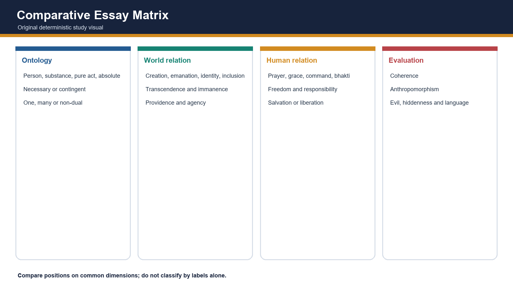

Use the matrix before every comparative answer. First hold the axis constant: compare ontology
with ontology, world relation with world relation, and soteriology with soteriology. Then add one
model-specific objection and reply. This prevents the common error of contrasting, for example,
Spinoza's ontology with Ramanuja's devotional practice without explaining the intermediate
metaphysical relation.


### Original Mains practice — full 10 / 15 / 20-mark model answers

### Original 10-marker 1

#### Question

**Distinguish pantheism from panentheism. Does either position preserve divine transcendence?**
*(10 marks  |  Answer in about 150 words)*

#### Demand decoding

- **Directive:** distinguish, then evaluate one precise attribute.
- **Core issue:** identity versus inclusion-with-excess.
- **Ideal thesis:** pantheism radicalizes immanence; panentheism explicitly retains transcendence, though the meaning of "in God" needs clarification.

#### Model answer

Pantheism and panentheism differ in the logical relation they posit between God and the world. **Pantheism** affirms identity: God is Nature or reality as a whole. Spinoza's *Deus sive Natura* is its canonical model, although God is infinite substance and not merely the collection of finite objects. Finite things are dependent modes within the one substance.

**Panentheism** affirms inclusion without exhaustion: the world exists in God, but God exceeds the world. It therefore seeks to combine immanence with transcendence. Process thought often employs this model; Ramanuja's body-soul relation is sometimes compared with it, though his personal, purposive and qualified-theistic framework is more specific.

Pantheism does not preserve transcendence in the classical sense of an ontologically distinct creator, but may preserve divine infinitude beyond any finite mode. Panentheism more directly retains transcendence because God is not reducible to the cosmos. Its weakness is explanatory: unless "in God" is metaphysically specified, it risks becoming a spatial metaphor. Thus panentheism offers the clearer reconciliation, but only with an account of dependence.

#### Why this earns marks

- [ ] Identity versus inclusion-with-excess.
- [ ] Spinoza qualified through substance and modes.
- [ ] Panentheism, not deism, as the comparator.
- [ ] Classical and non-classical senses of transcendence.
- [ ] One criticism and a graded verdict.

---

### Original 10-marker 2

#### Question

**Can an omnipotent God be essentially good? Examine the apparent restriction on divine power.**
*(10 marks  |  Answer in about 150 words)*

#### Demand decoding

- **Directive:** test whether inability to do evil diminishes omnipotence.
- **Core issue:** power, logical possibility and divine nature.
- **Ideal thesis:** essential goodness restricts neither genuine possibility nor perfect agency if evil choice is a defect rather than a power.

#### Model answer

The problem arises because an essentially good God cannot will evil, whereas omnipotence appears to require ability to do anything. The conflict depends upon an indiscriminate concept of power. Omnipotence is more coherently defined as power to actualize every logically possible state consistent with divine nature. Contradictory descriptions - such as a perfectly good being willing evil *as evil* - do not specify genuine exercises of perfect power.

The ability to defect morally may indicate weakness rather than excellence. A perfectly good agent does not lack power because cruelty is excluded. Divine simplicity strengthens this reply: goodness is not an external law but identical with divine nature.

Yet the solution has a cost. If God cannot do otherwise, divine praiseworthiness and freedom may seem attenuated. The classical reply defines freedom as action from one's own uncoerced nature, not indifference between good and evil.

Thus essential goodness is compatible with omnipotence if power concerns coherent perfection. The deeper problem shifts to divine freedom.

#### Why this earns marks

- [ ] State the prima facie contradiction.
- [ ] Define coherent omnipotence.
- [ ] Distinguish defect-capacity from perfection.
- [ ] Use divine nature/simplicity.
- [ ] Raise the freedom objection.
- [ ] Deliver a conditional verdict.

---

### Original 10-marker 3

#### Question

**Does Nyaya's doctrine of karma render Ishvara redundant? Discuss.**
*(10 marks  |  Answer in about 150 words)*

#### Demand decoding

- **Directive:** present redundancy objection and Nyaya's administrative reply.
- **Core issue:** explanatory division between *adrsta* and omniscient governor.
- **Ideal thesis:** karma supplies desert, while God supplies intelligent coordination; whether this requires an infinite being remains disputed.

#### Model answer

Nyaya accepts karma as *adrsta*, the unseen merit and demerit generated by action. This seems to make Ishvara redundant: if karmic law already determines pleasure and pain, an additional divine distributor appears unnecessary.

Nyaya replies that karma is not a conscious agency. Neither *adrsta* nor eternal atoms can intelligently initiate cosmic order, identify agents across lives and coordinate consequences proportionately. Ishvara, an eternal omniscient special self, therefore administers karmic fruits impartially and orders atomic combinations. Karma supplies the **moral basis** of consequence; God supplies **intelligent execution**. This also protects God from arbitrariness, since suffering is not assigned without reference to past action.

The reply is coherent within Nyaya realism, but invites two objections. First, a sufficiently law-like karma might operate without a personal governor. Second, if God designs the system and controls its conditions, the problem of suffering is displaced rather than eliminated.

Thus karma does not formally exclude Ishvara, but Nyaya must independently show why moral order requires conscious administration rather than impersonal law.

#### Why this earns marks

- [ ] Define *adrsta*.
- [ ] Separate desert from administration.
- [ ] Mention atoms and cosmic ordering.
- [ ] Explain divine impartiality.
- [ ] Challenge the need for conscious administration.
- [ ] Avoid calling God material cause.

---

### Original 15-marker 1

#### Question

**Deism preserves a creator but empties religion of a living God. Critically discuss.**
*(15 marks  |  Answer in about 220-250 words)*

#### Demand decoding

- **Directive:** explain deism and assess the charge of religious emptiness.
- **Core issue:** rational creator versus providential relationship.
- **Ideal thesis:** deism preserves explanatory theism and natural autonomy but attenuates revelation, prayer, grace and historical providence.

#### Model answer

Deism affirms an intelligent creator who establishes the universe and its rational laws but denies continuing supernatural intervention, miracle and special revelation. Its "clockmaker" model emerged as an attempt to reconcile belief in God with the autonomy and regularity of nature. The creator explains why an intelligible order exists, while science explains how that order operates.

The charge that deism empties religion is powerful. A God who neither responds nor acts within history cannot easily ground petitionary prayer, providence, grace or covenant. Revelation becomes unnecessary or suspect, and worship risks becoming admiration of a remote designer. In contrast, classical theism holds that God continuously sustains secondary causes; intervention need not mean competition with natural law.

Yet deism is not religiously empty in every respect. It may support natural theology, gratitude for existence, moral accountability and reverence for rational order. Its restraint also avoids an episodic "God of the gaps" and the problem of selective miracles: why would a good God intervene in some cases but not others?

The decisive issue is whether continuing divine relation requires causal interruption. If immanence means sustaining the existence and powers of natural causes, theism can preserve regularity without deistic withdrawal. If no such sustaining or responsive relation exists, deism retains a metaphysical designer but loses much of what makes God an object of lived religion.

Therefore the criticism is substantially correct but should be qualified: deism preserves rational religious belief, yet weakens personal communion and providence.

#### Why this earns marks

- [ ] Exact deist definition.
- [ ] Natural-law strength.
- [ ] Prayer, revelation, grace and providence critique.
- [ ] Classical sustaining causation as comparator.
- [ ] Selective-miracle problem in deism's favour.
- [ ] Qualified, not dismissive, conclusion.

---

### Original 15-marker 2

#### Question

**Spinoza calls God free although everything follows necessarily from divine nature. Is this freedom or merely necessity redescribed?**
*(15 marks  |  Answer in about 220-250 words)*

#### Demand decoding

- **Directive:** reconstruct Spinoza's definition and evaluate its adequacy.
- **Core issue:** self-determination versus alternative possibilities.
- **Ideal thesis:** Spinoza offers a coherent positive freedom from external constraint, but abandons libertarian choice.

#### Model answer

For Spinoza, freedom does not mean an uncaused choice among genuinely open alternatives. A thing is free when it exists and acts from the necessity of its own nature; it is unfree when determined externally. God, the one infinite substance, is therefore perfectly free because nothing outside God exists to constrain divine action. Modes follow necessarily from divine essence, not from a deliberative choice between possible worlds.

This definition has philosophical force. An uncaused decision would be arbitrary rather than autonomous. Spinoza connects freedom with adequate understanding: a human being becomes freer when action flows from rational comprehension rather than passive emotions and inadequate ideas. Freedom is thus self-determination, intelligibility and active power.

However, the criticism in the question remains. If only one sequence can occur, neither God nor human agents possess the categorical ability to do otherwise. Divine "freedom" may appear indistinguishable from metaphysical necessity, and moral responsibility becomes difficult if every act follows from prior causes. Spinoza can answer that responsibility should concern degrees of activity, rational agency and liberation from passive determination, not ultimate origination.

The dispute turns on rival concepts. Under **libertarian freedom**, Spinoza fails because alternatives are absent. Under **positive freedom**, his account is coherent: God is maximally self-determined, and humans gain freedom by participating rationally in necessity.

Thus Spinoza does redescribe freedom, but not merely verbally. He replaces choice-freedom with rational self-causation. The price is the abandonment of classical providence and desert based on ultimate alternative choice.

#### Why this earns marks

- [ ] Define free and externally determined causes.
- [ ] Explain why God has no external constraint.
- [ ] Link human freedom to adequate ideas.
- [ ] State libertarian objection.
- [ ] Distinguish positive and alternative-possibility freedom.
- [ ] Give a two-level verdict.

---

### Original 15-marker 3

#### Question

**Is maya an explanation of the world in Advaita, or only a name for the difficulty to be explained? Evaluate.**
*(15 marks  |  Answer in about 220-250 words)*

#### Demand decoding

- **Directive:** state the explanatory work of maya, then assess circularity or obscurity.
- **Core issue:** how non-dual immutable Brahman appears as plurality.
- **Ideal thesis:** maya organizes Advaita's account through adhyasa, vivarta and levels, but its own status remains the theory's central unresolved pressure.

#### Model answer

Maya performs a precise explanatory role in Advaita. If Brahman is non-dual and immutable, plurality cannot be a real transformation of Brahman. Maya accounts for the appearance of names, forms, jivas and causation without compromising the Absolute. Through **adhyasa**, characteristics of self and not-self are superimposed; through **vivarta**, Brahman appears as the world without real change. The world is *mithya*: empirically available and pragmatically valid, yet dependent and sublatable. The hierarchy of *pratibhasika*, *vyavaharika* and *paramarthika* reality explains how an appearance can function before knowledge.

The objection is that maya itself is obscure. It cannot be real, for that would establish a second reality beside Brahman; it cannot be unreal, because it produces the experienced order. Calling it *anirvacaniya*, neither real nor unreal, may appear to rename the contradiction. Further questions arise: where is ignorance located, how can self-luminous Brahman be concealed, and how can knowledge emerge within ignorance to remove it?

Advaita replies that maya is not a second entity or efficient mechanism. It is a diagnostic concept revealed by sublation, analogous to an error that functions until its basis is known. Demanding an ultimate cause of ignorance may wrongly treat beginningless error as a positive substance.

The reply protects non-duality but does not dissolve every difficulty. Maya explains the **status and logic** of appearance better than its ultimate origin. It is philosophically productive, yet also marks Advaita's explanatory limit.

#### Why this earns marks

- [ ] Maya's work: plurality without real change.
- [ ] Adhyasa, vivarta, mithya and three levels.
- [ ] Real/unreal dilemma and *anirvacaniya*.
- [ ] Locus/concealment/removal problems.
- [ ] Advaitic sublation reply.
- [ ] Distinguish explaining status from explaining origin.

---

### Original 15-marker 4

#### Question

**If the world is God's body, does evil become a predicate of God in Ramanuja's philosophy? Discuss.**
*(15 marks  |  Answer in about 220-250 words)*

#### Demand decoding

- **Directive:** apply the body doctrine to evil and test Ramanuja's reply.
- **Core issue:** dependence, control and transfer of defect.
- **Ideal thesis:** bodily defect need not be an essential divine predicate, but comprehensive control preserves a residual responsibility problem.

#### Model answer

Ramanuja holds that *cit* and *acit* constitute Brahman's body, while Brahman is their indwelling Self. The **sarira-sariri** relation means that world and selves are supported by, controlled by and exist for God. Through *aprthak-siddhi* they are inseparable yet genuinely distinct. Since the divine body contains pain, ignorance and moral evil, the objection asks whether these defects qualify God.

Ramanuja can deny direct transfer. A body's changing condition is not automatically a predicate of its controlling self: bodily illness does not make the self essentially diseased. Similarly, defects belong to finite jivas and changing matter, not to God's essential *ananta-kalyana-gunas*. Moral evil arises through responsible jivas and karma; God administers consequences impartially. Change occurs in dependent modes, not in divine perfection.

Nevertheless, the human analogy is incomplete. God's relation to the cosmic body is far more comprehensive than a finite self's control over its organism. If God is omniscient, omnipotent, material and efficient cause, mere distinction between controller and controlled may not remove responsibility for constructing and sustaining a world containing severe suffering. Karma explains desert only by presupposing a prior moral order and does not answer every natural evil.

Thus evil need not become an **essential property** of God, so the formal contamination objection fails. Yet it remains a relational challenge to divine goodness and governance. Ramanuja preserves ontological perfection more successfully than he completely resolves providential responsibility.

#### Why this earns marks

- [ ] Technical definition of divine body.
- [ ] *Aprthak-siddhi* and retained distinction.
- [ ] Controller/body non-transfer reply.
- [ ] Karma and jiva agency.
- [ ] Stronger objection from comprehensive control.
- [ ] Distinguish essential contamination from moral responsibility.

---

### Original 20-marker 1

#### Question

**Compare identity, dependent appearance, metaphysical embodiment and efficient causation as four accounts of the God-world relation. Which best preserves both unity and difference?**
*(20 marks  |  Answer in about 320-350 words)*

#### Demand decoding

- **Directive:** compare four distinct models, then defend a criterion-based judgment.
- **Core issue:** Spinoza, Advaita, Ramanuja and Nyaya.
- **Ideal thesis:** no model is cost-free; Ramanuja most explicitly balances unity and real difference, though it inherits the evil/body problem.

#### Model answer

The God-world relation can be organized through four irreducible metaphysical grammars.

**Identity with modal dependence** appears in Spinoza. God or Nature is the one infinite substance; Thought and Extension express its essence, and finite things are modes. There is no transcendent creator outside nature. Unity is maximal, but modes are not independently identical with the whole substance. The model secures intelligible immanence and necessity, yet sacrifices divine personality, purposive creation and libertarian freedom.

**Dependent appearance** characterizes Sankara's Advaita. Nirguna Brahman alone is absolutely real; plurality appears through maya and *adhyasa*. The world is *mithya*, not nothing: it is empirically valid but sublatable. *Vivarta* preserves Brahman from real transformation, while Saguna Ishvara governs the empirical order. This strongly protects unity and transcendence from finite predicates. Its cost is that world, devotion and personal God are not ultimately final, while maya's status remains difficult.

**Metaphysical embodiment** is Ramanuja's solution. Real selves and matter constitute Brahman's body; Brahman is their indwelling Self. Through *aprthak-siddhi*, cit and acit are different, dependent and inseparable. God is both material and efficient cause, and cosmic manifestation is real. This model preserves a personal immanent-transcendent God, genuine plurality, moral agency and devotional communion. However, evil in the divine body raises responsibility, and the organic analogy requires careful non-physical interpretation.

**Efficient causation** defines Nyaya. Ishvara is an omniscient special self who arranges eternal atoms and administers karma. Atoms remain material causes; selves, space and time are real. Difference is robust and divine agency clear, but unity is comparatively weak. The existence of eternal realities and karmic law also invites the objection that God's explanatory role is divided or redundant.

If the criterion is **both unity and real difference**, Ramanuja provides the most explicit balance: plurality belongs internally to one divine whole without becoming illusion or independent substance. Yet this is a graded judgment. Spinoza maximizes unity, Nyaya difference, and Advaita absoluteness. Ramanuja's superiority depends on whether organic dependence can preserve divine perfection despite embodied evil.

#### Why this earns marks

- [ ] Four headings tied to four systems.
- [ ] Spinoza: substance, attributes and modes - not aggregate identity.
- [ ] Advaita: mithya and vivarta - not sheer unreality.
- [ ] Ramanuja: body and aprthak-siddhi - not numerical identity.
- [ ] Nyaya: efficient cause and eternal atoms - not material cause.
- [ ] Explicit criterion for final ranking.
- [ ] Objection to the preferred model.

---

### Original 20-marker 2

#### Question

**Is the classical conception of an omnipotent, omniscient, perfectly good, immutable and simple God internally coherent? Critically examine.**
*(20 marks  |  Answer in about 320-350 words)*

#### Demand decoding

- **Directive:** test the attribute package, not each attribute in isolation.
- **Core issue:** power-logic, foreknowledge-freedom, goodness-evil, immutability-response, simplicity-plural predicates.
- **Ideal thesis:** careful qualifications produce a defensible concept, but coherence remains conditional and does not settle existential or evidential problems.

#### Model answer

Classical theism presents God as a necessary personal being possessing maximal power, knowledge and goodness, together with immutability and simplicity. The issue is whether these predicates reinforce or undermine one another.

The familiar **omnipotence paradox** asks whether God can create a stone God cannot lift. A coherent reply restricts power to logically possible states: contradictions fail to specify tasks. Similarly, inability to will evil need not diminish power, because moral defect is not a perfection. Yet this shifts the burden to whether "consistent with divine nature" is independently informative rather than ad hoc.

**Omniscience** threatens freedom. If God infallibly knows that an agent chooses X, choosing not-X appears impossible. Distinguishing knowledge from causation blocks determinism, while timeless knowledge avoids temporal prediction. Still, modal fixity may remain even without causal compulsion. Compatibilist freedom as reason-responsive agency fares better than libertarian alternative choice.

**Perfect goodness**, joined to unlimited knowledge and power, intensifies evil. Free-will defence can show that moral evil is not logically inconsistent with God if significant freedom has value. Soul-making explains some adversity. Neither easily addresses apparently gratuitous natural suffering; coherence may survive while evidential probability declines.

**Immutability** conflicts with personal responsiveness. The classical reply distinguishes an unchanging essential nature from changing relations to creatures. Critics answer that genuine response seems to involve new knowledge or intention. Timeless models avoid succession in God but make reciprocal relationship difficult to picture.

**Simplicity** denies composition: divine attributes are conceptually distinguished but metaphysically identical. This secures aseity, yet risks making statements such as "God knows" and "God is good" obscure or equivalent.

The classical concept is therefore not plainly contradictory. Logical qualification, timeless knowledge and non-composite perfection yield a defensible model. These qualifications are mutually connected: altering one attribute changes the meaning of the others and of divine personality itself. However, the resulting God differs sharply from an ordinary person and leaves unresolved pressures concerning freedom, evil and relation. Coherence is achievable, but only through a sophisticated analogical conception, not an unexamined list of maximal properties.

#### Why this earns marks

- [ ] Define the complete attribute package.
- [ ] One structured conflict per paragraph.
- [ ] Omnipotence/logic and goodness.
- [ ] Foreknowledge distinguished from causation.
- [ ] Logical versus evidential evil.
- [ ] Immutability and responsiveness.
- [ ] Simplicity and predication.
- [ ] Coherence verdict distinct from proof of existence.

---

### Original 20-marker 3

#### Question

**"A notion of God is fully understood only through the destiny it assigns to the human self." Discuss with reference to classical theism, Spinoza, Advaita and Visishtadvaita.**
*(20 marks  |  Answer in about 320-350 words)*

#### Demand decoding

- **Directive:** connect metaphysics of God with anthropology, freedom and liberation.
- **Core issue:** creator-creature, mode-substance, identity and inseparable communion.
- **Ideal thesis:** each doctrine's soteriology reveals its deepest ontology; differences in salvation are not optional additions.

#### Model answer

The statement is justified because a God-concept determines what a human being is, what bondage means and what fulfillment can be.

In **classical theism**, God is personal creator and sustainer, while the human being is a dependent creature rather than a mode or appearance of God. Human dignity arises through rational-moral agency and relation to the divine. Salvation is reconciliation or communion, not ontological identity. The model preserves responsibility and prayer, but divine foreknowledge, providence and evil place pressure upon freedom.

For **Spinoza**, the human mind is a finite mode under Thought and its body the corresponding mode under Extension. Humans are in God/Nature, not independently created substances. Bondage is passive determination by inadequate ideas and affects; freedom grows through adequate understanding of necessity. The "intellectual love of God" is rational participation in the whole, not reciprocal grace. Thus an impersonal necessary God yields liberation as understanding rather than personal salvation.

In **Advaita**, the true Atman is Brahman. The empirical jiva appears finite through avidya and *adhyasa*. Saguna Ishvara governs karma and supports devotion at the *vyavaharika* level, but knowledge eventually sublates jiva-Ishvara difference. Moksha is *praptasya praptih*, attainment of what is already attained: recognition, not production, of identity. This provides radical non-dual freedom, yet makes enduring individuality and personal theism provisional.

In **Visishtadvaita**, the jiva is a real conscious mode and body of personal Brahman. Through *aprthak-siddhi* it is distinct but never independent. Bondage limits manifested consciousness; *bhakti*, *prapatti* and grace culminate in liberation as loving service. Individuality survives because dependence, not identity, constitutes unity. The view preserves devotion and moral agency, though evil in God's body raises responsibility.

Hence soteriology is ontology in practical form: creation yields communion, substance monism yields rational participation, non-dualism yields identity-realization, and qualified unity yields inseparable service. The promised destiny also tests whether each system can preserve responsibility and meaningful transformation. No account of God is complete until it explains the self's agency, bondage and final relation to ultimacy.

#### Why this earns marks

- [ ] Organize by God-self relation, not thinker biographies.
- [ ] Classical creaturehood and communion.
- [ ] Spinozistic modehood and adequate ideas.
- [ ] Advaitic identity, adhyasa and sublation.
- [ ] Ramanujan inseparability, grace and retained selfhood.
- [ ] One pressure for each model.
- [ ] Conclude through "soteriology reveals ontology."

---


### High-score answer protocol

#### 1. Define before evaluating

Open with a **philosophically discriminating definition**, not a dictionary meaning.

```text
Weak:  God is supreme.
Strong: In Nyaya, Ishvara is an eternal omniscient special self functioning as
        the intelligent efficient cause, while atoms remain material causes.
```

Definitions should already separate the doctrine from its nearest rival:

| Term | Definition must distinguish it from |
|---|---|
| Pantheism | Panentheism and theism |
| Nirguna | Nothingness and Saguna Ishvara |
| Aprthak-siddhi | Identity and external relation |
| Immanence | Physical location and pantheistic identity |
| Omnipotence | Contradiction-making and constant control |

#### 2. Reconstruct an argument, not merely a conclusion

Use numbered premises when the reasoning matters:

```text
1. A substance is conceived through itself.
2. Distinct substances cannot share an attribute.
3. Absolutely infinite substance excludes every rival.
4. Therefore God/Nature is the sole substance.
```

Then expose the **presupposition**: does conceptual independence prove ontological independence? A Philosophy Optional answer earns marks by showing what makes the conclusion follow and where the inference can be resisted.

#### 3. Use Sanskrit and Western terminology as precision tools

- Introduce the English meaning immediately: *aprthak-siddhi* (**inseparable existence**).
- Use the term only where it performs analytical work.
- Do not decorate generic prose with untranslated vocabulary.
- Preserve doctrinal levels: *paramarthika*, *vyavaharika*, *pratibhasika*.
- Preserve causal distinctions: *nimitta-karana* versus *upadana-karana*.
- Preserve ontological distinctions: *mithya* is neither absolutely real nor *tuccha*.

#### 4. Compare through a constant matrix

For every cross-school answer, compare the same four variables:

```text
NATURE -> ATTRIBUTES -> WORLD RELATION -> HUMAN RELATION
```

Do not write separate mini-essays that never meet. Use contrastive sentences:

> "Unlike Nyaya, which separates efficient Ishvara from material atoms, Ramanuja makes Brahman both efficient and material cause through inseparable cit-acit."

#### 5. Never conflate these four relations

```text
IDENTITY / MODAL DEPENDENCE : Spinoza's one substance and finite modes
DEPENDENT APPEARANCE        : Advaita's mithya world through vivarta
METAPHYSICAL EMBODIMENT     : Ramanuja's sarira-sariri relation
EFFICIENT CAUSATION         : Nyaya God ordering eternal atoms
```

Similarity in the word "dependence" does not erase metaphysical difference.

#### 6. Present objection and reply dialectically

Use a three-step unit:

```text
OBJECTION -> BEST AVAILABLE REPLY -> RESIDUAL PRESSURE
```

Example:

```text
Objection: Evil in the world contaminates Ramanuja's embodied God.
Reply: Defect in the controlled body is not an essential predicate of its controller.
Residual pressure: Complete divine control still creates responsibility for permitted suffering.
```

Never present a weak objection merely to dismiss it. Steelman the rival before evaluating.

#### 7. Make graded judgments

Avoid "completely true," "fully solved," and "both are equally valid." Prefer:

- "logically coherent but evidentially pressured,"
- "religiously adequate but metaphysically costly,"
- "preserves unity at the cost of independent plurality,"
- "valid empirically but not ultimate,"
- "answers contamination but not the entire responsibility objection."

A conclusion should name the **criterion** used: coherence, religious adequacy, explanatory economy, preservation of difference, or compatibility with moral agency.

#### 8. Marks-wise architecture

| Marks | Working time | Recommended architecture |
|---:|---:|---|
| 10 | 7-8 min | Definition/thesis -> two doctrinal moves -> one objection/reply -> verdict |
| 15 | 12-13 min | Conceptual frame -> doctrine/argument -> nearest comparison -> criticism/reply -> graded conclusion |
| 20 | 17-18 min | Classification -> full reconstruction -> God-world-human implications -> two debates -> reasoned criterion-based verdict |

##### 10 marks

- About 150 words.
- One controlled comparison is enough.
- Do not spend half the answer on background.

##### 15 marks

- About 220-250 words.
- Include at least one technical distinction and one serious criticism.
- Make every paragraph answer the directive.

##### 20 marks

- About 320-350 words.
- Use a comparative matrix or compact diagram before prose if useful.
- Include two objections or one objection developed through reply and residual pressure.
- Rank or judge by an explicit philosophical criterion.

#### 9. Avoid generic GS-style prose

Do not write:

> "God is important for peace, harmony and moral values in society."

Write:

> "A personal God can ground moral address and accountability, but the Euthyphro-type question remains whether goodness depends upon divine will or expresses an independently intelligible perfection."

Philosophy answers require doctrines, arguments, distinctions and conceptual consequences - not slogans, policy language or unanalysed moral uplift.

#### 10. Final 20-second audit

- Did I answer the **directive**?
- Did I define the controlling term?
- Did I name the exact **relation** involved?
- Did I use God/Brahman/Ishvara carefully?
- Did I include an objection, reply and residual issue?
- Does the conclusion state **how far** the thesis succeeds?

---


| Concept/model | Thinker/school | Nature of ultimate reality | God-world / God-human relation | Central criticism | Likely question form |
|---|---|---|---|---|---|
| Classical theism | Aquinas and classical tradition | Personal, necessary, omnipotent, omniscient, perfectly good | Creates and sustains distinct world; creature-creator relation | Evil; foreknowledge; immutable response | Are divine attributes coherent? |
| Deism | Early modern natural religion | Intelligent personal designer, non-intervening | Creates laws, then no special providence | Religiously remote; no revelation or prayerful response | Does deism empty religion? |
| Pantheism | Spinoza as canonical model | One infinite impersonal substance | God/Nature identity; finite beings as modes | Loss of personality, providence and libertarian freedom | Is Spinoza a pantheist? |
| Panentheism | Process and relational models | World-in-God, God exceeds world | Inclusion with divine excess | "In God" may remain metaphorical | Does it reconcile immanence/transcendence? |
| Substance | Spinoza | In itself and conceived through itself | Sole ontological independent reality | Definition-to-existence transition | Derive Spinoza's God |
| Attribute | Spinoza | Intellect perceives it as constituting substance's essence | Thought and Extension express one substance | Status of attributes debated | Substance-attribute relation |
| Mode | Spinoza | Dependent modification | Finite mind/body exists in God, not as whole God | Derivation of finite from infinite obscure | Why is a mode not substance? |
| *Natura naturans* | Spinoza | Active self-caused nature | Infinite source considered actively | Can "activity" fit strict necessity? | Distinguish from *naturata* |
| *Natura naturata* | Spinoza | Necessary order of modes | Eternal dependence, not temporal creation | Modal procession insufficiently transparent | Explain God-world relation |
| Spinozistic freedom | Spinoza | Action from necessity of own nature | Human freedom grows with adequate ideas | No alternative possibilities | Freedom or redescribed necessity? |
| Nirguna Brahman | Sankara/Advaita | Non-dual, non-objectifiable *sat-cit-ananda* | World dependent appearance; Atman is Brahman | Risk of empty abstraction | Critically examine Brahman |
| Saguna Ishvara | Advaita | Brahman related to maya | Empirical creator, governor and object of worship | Theism remains provisional | Does Advaita leave room for theism? |
| Maya | Advaita | Beginningless explanatory principle/power | Makes plurality appear without changing Brahman | Locus, concealment and *anirvacaniya* problems | Explanation or label? |
| Adhyasa | Sankara | Superimposition of self/not-self | Generates empirical jiva and bondage | How can error begin in non-duality? | Explain bondage |
| Vivarta | Advaita | Apparent transformation | Brahman remains unchanged as world appears | May weaken world realism | Compare with parinama |
| Mithya | Advaita | Experienced, dependent, sublatable | Neither absolute reality nor sheer nothing | Ethical seriousness of suffering | Is world unreal? |
| Three levels | Advaita | *Paramarthika-vyavaharika-pratibhasika* | Higher cognition sublates lower | Risk of insulating doctrine from criticism | Explain empirical theism |
| Ishvara-cit-acit | Ramanuja | One personal Brahman qualified by real plurality | Organic unity of God, selves and matter | Internal plurality and divine simplicity | Nature of God in Visishtadvaita |
| *Aprthak-siddhi* | Ramanuja | Inseparable existence | Jiva distinct but dependent and inseparable | Relation may be difficult to define without identity | God-self relation |
| *Sarira-sariri* | Ramanuja | God as indwelling Self of cosmic body | Control, support and purposive dependence | Evil in God's body | Does embodiment compromise perfection? |
| Double causation | Ramanuja | Brahman as efficient and material cause | Real cosmic manifestation through dependent acit | Change and perfection | Compare Nyaya and Vedanta |
| Bhakti and prapatti | Ramanuja | Personal God of grace | Loving contemplation and surrender; communion | Grace-agency balance | Relation of God and man |
| Nyaya Ishvara | Nyaya-Vaisesika | Eternal omniscient special self | Orders atoms; administers karma | Atoms/karma may make God redundant | Nature of Nyaya God |
| Nyaya causation | Nyaya | God efficient; atoms material | Intelligent arrangement without divine material transformation | Inference from artifacts to world-maker | Is God necessary? |
| *Karyat* | Udayana/Nyaya | World as effect | Effect requires intelligent maker | World may not resemble an artifact | Explain proof from effect |
| *Ayojanat* | Udayana/Nyaya | God as arranger | Initiates ordered atomic combination | Order may emerge without intention | Proof from arrangement |
| Karma administration | Nyaya | Impartial divine governor | *Adrsta* supplies desert; God coordinates fruits | Impersonal law may suffice | Does karma render God redundant? |
| Polytheism | Hindu traditions in classificatory analysis | Several genuinely divine beings/forms | Multiple divine agencies | Category may oversimplify Hindu systems | Is Hinduism polytheistic? |
| Henotheism | Vedic/devotional classification | Many acknowledged, one worshipped as supreme | Concentrated devotion amid plurality | May shade into monotheistic ordering | Distinguish classifications |
| Kathenotheism | Vedic classificatory model | Different gods elevated successively | Contextual supremacy | Descriptive label, not full metaphysics | Explain Vedic plurality |
| Physical manifestation | Comparative problem | Possible religious embodiment, not necessary ultimacy | Must distinguish evidence, incarnation, body and cause | Unmanifest cause may seem unverifiable | Must ultimate cause be physical? |
| Identity / appearance / embodiment / causation | Spinoza / Advaita / Ramanuja / Nyaya | Four non-equivalent models | Mode / mithya / body / atomic ordering | False equivalence | Comparative 20-marker |

---

#### Last-minute memory spine

```text
PERSONALITY : personal <-> impersonal
POSITION    : transcendent <-> immanent
POWER       : omnipotence <-> logic/freedom/evil
WORLD       : identity <-> appearance <-> embodiment <-> efficient causation
SELF        : creature <-> mode <-> identity <-> inseparable jiva
VERDICT     : define -> reconstruct -> compare -> object -> reply -> grade
```

Before submission, add one named thinker or school to every major claim, state one residual
qualification after the strongest reply, and make the last sentence answer the directive. A
high-scoring script does not merely conclude that all notions are complementary; it identifies
which model best satisfies the criterion chosen and what philosophical cost remains.

## OPTIONAL ADVANCED DEPTH — NOT REQUIRED FOR A CORE ANSWER

### ADVANCED / ENRICHMENT — extra depth, never a prerequisite for the verified PYQs

This block deepens simplicity, aseity, free-will solutions, apophatic theology, broader school and Abrahamic comparison, attribute coherence and extra critique. Every essential direct-PYQ concept has already been taught in Basic.


The following material is deliberately after Basic, diagnostics and answer practice. It enriches a high-level evaluation but is not required for a competent core response.

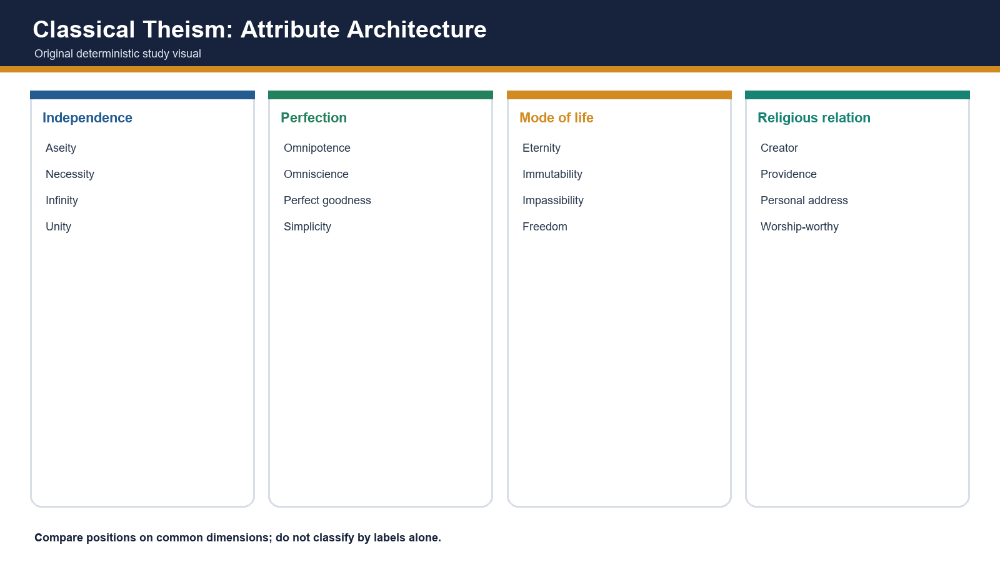

Read the map from independence to religious relation. Aseity and necessity explain why God is
ultimate; the omni-attributes specify perfection; eternity, immutability and freedom specify the
mode of divine life; creatorhood and providence connect that metaphysics with worship. The
examiner's test is whether these four clusters remain jointly coherent rather than whether each
predicate sounds impressive in isolation.

#### Attribute-by-attribute coherence grid

| Attribute | Examiner-safe meaning | Pressure | Main response | Consequence |
|---|---|---|---|---|
| Omnipotence | Power over every logically possible state consistent with perfect nature | Stone paradox; sin | Contradictions are not tasks; defect is not an achievement | Grounds trust but intensifies evil |
| Omniscience | Knowledge of every truth in its proper mode | Future freedom | Knowledge is not causation; timeless/open models differ | Grounds providence and judgement |
| Perfect goodness | No defect of will; perfect love and justice | Euthyphro; evil | Nature-based goodness avoids arbitrary command | Makes worship morally intelligible |
| Simplicity | No parts or composition in God | Many attributes and free creation | Conceptual plurality may refer to one reality | Secures aseity but pressures freedom |
| Unity | One independent ultimate source | Plural gods and internal distinctions | Unity of being need not erase relational distinction | Grounds cosmic and devotional focus |
| Immutability | No intrinsic gain, loss or corruption | Response and compassion | Stable character can have changing effects/relations | Fidelity versus reciprocal prayer |
| Impassibility | Not involuntarily overpowered by passion | Love and suffering | Active compassion without passive defeat | Shapes theodicy and prayer |
| Eternity | Timeless or beginningless/endless divine life | Action in time | One eternal act may have temporal effects | Alters foreknowledge model |
| Necessity | Cannot fail to exist | Freedom and contingency | Necessary existence need not necessitate every effect | Grounds ultimacy |
| Freedom | Self-determined divine agency | Necessary goodness | Freedom need not include ability to defect | Makes creation gift, not compulsion |
| Personality | Intellect, will and relation without embodiment | Finitude and anthropomorphism | Analogical or transpersonal predication | Grounds prayer, command and love |
| Infinity | Absence of finite limitation | Infinite person seems unstable | Qualitative non-limitation, not spatial size | Protects transcendence |
| Aseity | Depends on nothing for existence | Process dependence | Existence-independence may coexist with relation | Grounds worship-worthiness |

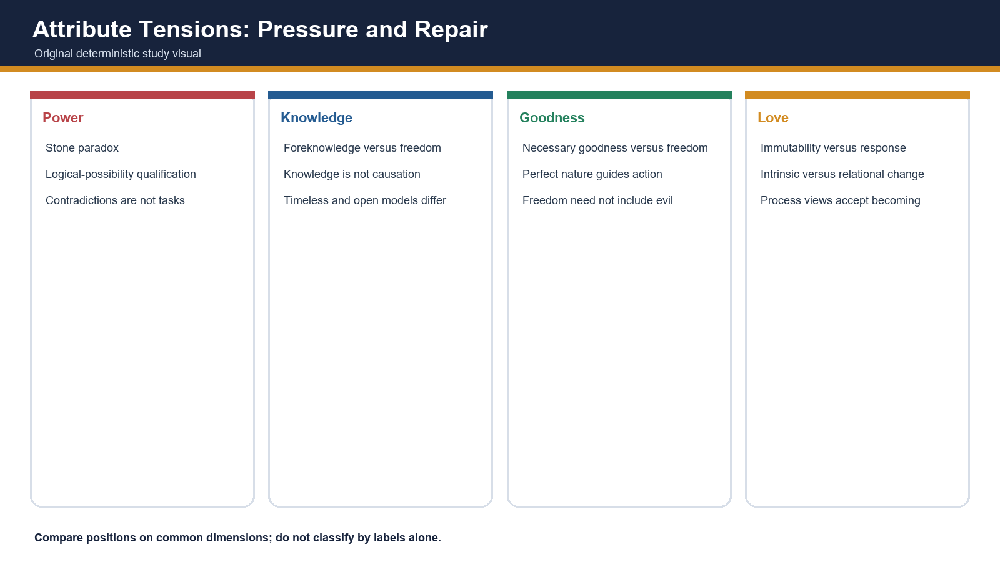

##### Omnipotence and logical possibility

[ARGUMENT] A square circle does not name a difficult object; it fails to name a possible object. Inability to actualize a contradiction is therefore not deficient power. Aquinas similarly treats sin as defective agency, not an achievement maximal power must include.

[OBJECTION] The qualification appears designed only to protect the doctrine.

[REPLY] It follows from the grammar of agency: power ranges over possible acts. Hard questions remain because the attributes jointly help determine what is possible.

##### Foreknowledge and freedom

[ARGUMENT] Infallible knowledge does not efficiently cause the known act. Classical timelessness denies a sequence in which God predicts and the later agent is forced to conform.

[OBJECTION] Non-causal certainty still appears to close alternatives.

[REPLY] Compatibilism defines freedom through uncoerced ownership; Ockhamist strategies distinguish hard and soft past facts; Molinism uses counterfactuals of freedom; open theism treats future free contingents as open.

[QUALIFICATION] These are rival repairs. Open theism protects libertarian alternatives by revising exhaustive definite foreknowledge.

##### Immutability, impassibility and love

[THESIS] Augustine and Aquinas protect divine perfection from passive alteration. Whitehead and Hartshorne argue that a God untouched by creaturely becoming is religiously inferior to a God who receives the world's values.

[REPLY] Classical theism distinguishes immutable loving character from changing effects in creatures. Process thought answers that real relation should make a difference to both relata.

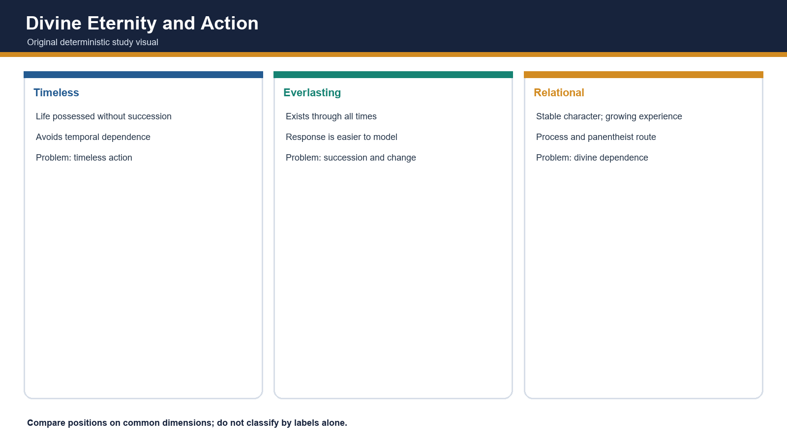

##### Timelessness and action

[OBJECTION] Intention, action and effect seem successive; a timeless being appears unable to initiate or respond.

[REPLY] One eternal act may ground temporally differentiated effects through created causal order.

[QUALIFICATION] The model preserves transcendence but reciprocal encounter remains difficult. Everlasting models gain responsiveness by accepting succession.

##### Simplicity and many predicates

[OBJECTION] If power, knowledge and goodness are identical, their meanings collapse; if different, simplicity fails.

[REPLY] Finite minds use distinct concepts for one non-composite referent.

[QUALIFICATION] This works best as an anti-composition thesis; unrestricted identity claims risk modal collapse.

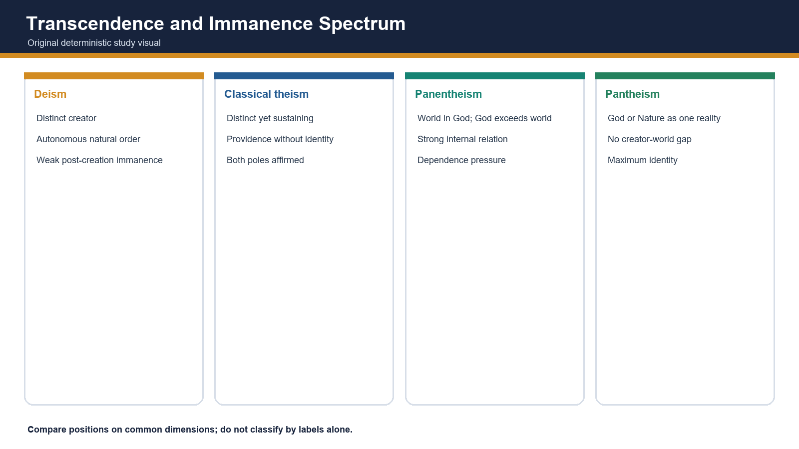

#### World-relation models

[THESIS] Transcendence is ontological non-reducibility to the world; immanence is operative presence as ground, sustainer, inner ruler or inclusive life. They can coexist.

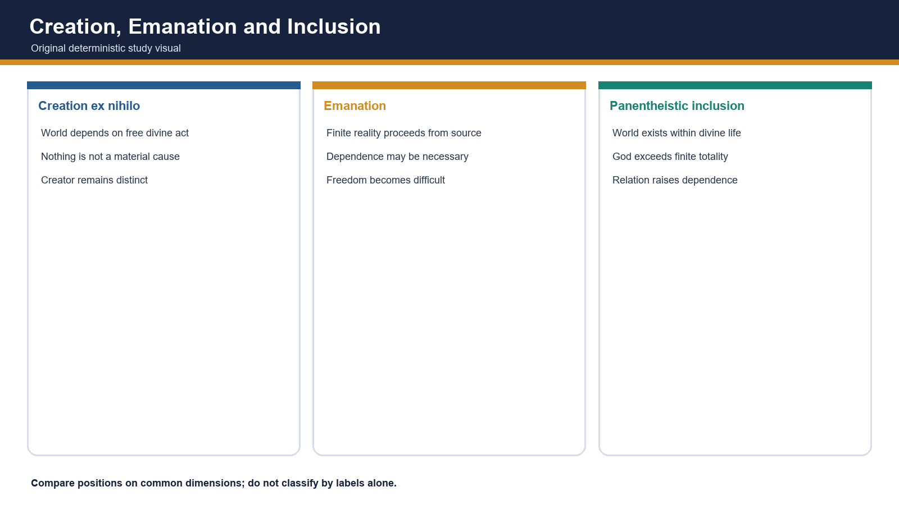

- Creation ex nihilo means dependence on divine agency without independent primordial material; "nothing" is not a material cause.
- Emanation treats finite reality as proceeding from the source, often with stronger necessity and weaker choice.
- Panentheism places the world within divine life while holding that God exceeds it.
- Efficient causation need not require physical manifestation. Ramanuja's body-language expresses dependence and governance, not a finite divine organism.

[OBJECTION] If goodness necessarily diffuses, creation resembles emanation; if creation is wholly free, the choice of this world and its suffering requires explanation.

[REPLY] Classical theism distinguishes necessary self-knowledge and goodness from free willing of finite goods.

[QUALIFICATION] The coherence of one simple will with necessary and contingent objects remains contested.

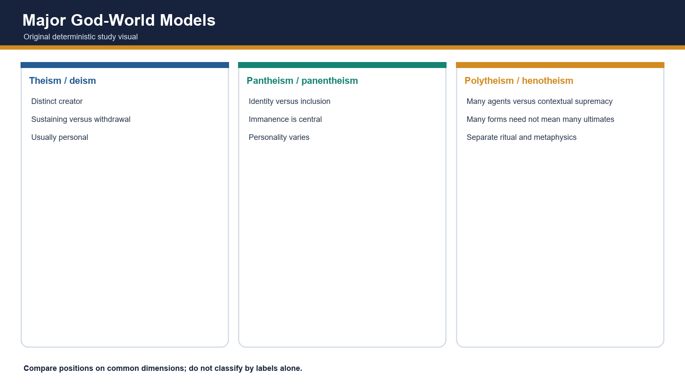

### Western and Abrahamic Reference Standards

> **ANSWER-GRABBING LINE — WRITE/ADAPT IN THE EXAM**
> **High-value transition:** Their relevance is conceptual. Plato supplies supreme value and intelligible order; Aristotle supplies pure act, immaterial thought and non-competitive causality.


#### Plato and Aristotle without retrospective distortion

[QUALIFICATION] Plato's Good and the Timaeus' Demiurge are not simply the later creator-God. The Good is the highest explanatory and evaluative principle; the Demiurge orders rather than clearly creates ex nihilo. Aristotle's unmoved mover is pure actuality and final cause, not straightforwardly a freely creating providential person.

[THESIS] Their relevance is conceptual. Plato supplies supreme value and intelligible order; Aristotle supplies pure act, immaterial thought and non-competitive causality. Augustine, Anselm and Aquinas transform these resources within creator-theism.

#### Classical and modern Western routes

- Augustine: creator, eternal truth, goodness and providential personal relation.
- Anselm: perfect-being grammar; use its attribute implications here, not the proof.
- Aquinas: pure act, simplicity, aseity, analogy and sustaining creator causality.
- Descartes: infinite perfect substance and epistemic guarantor.
- Leibniz: necessary wisdom and free choice of a world; proof detail belongs to Topic 02.
- Spinoza: one infinite substance, God or Nature; finite things are modes, not creations of choice.
- Kant: limits speculative knowledge while retaining God as an idea and practical postulate.
- Hegel: Absolute spirit, not a remote supernatural individual.
- Kierkegaard: existing commitment before God; not celebration of formal contradiction.
- Tillich: ground of being and symbolic personal discourse.
- Whitehead/Hartshorne: dipolar relation, persuasive power and real divine becoming.
- Hick: useful taxonomy and pluralist context, not a substitute for primary doctrine.

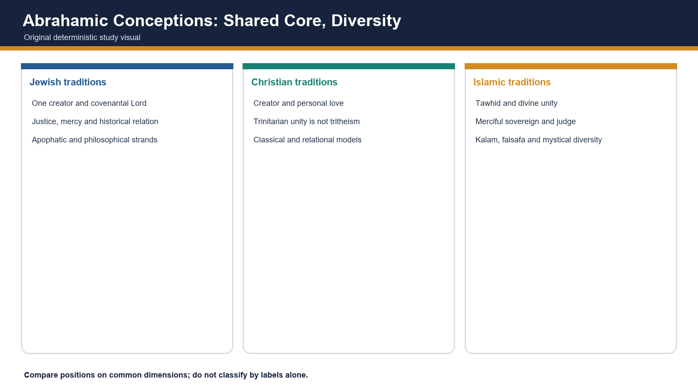

#### Abrahamic comparison

[THESIS] A shared grammar affirms one transcendent creator who sustains, knows and judges persons and is worthy of worship. The traditions remain internally diverse and conceptually non-interchangeable.

- Jewish traditions emphasize unity, covenantal address, command, justice and mercy; philosophical and apophatic strands qualify anthropomorphism.
- Christian traditions join creator-theism with Trinity: one divine being with three personal distinctions, not three independent gods. Models differ over simplicity, incarnation, passibility and relationality.
- Islamic traditions center tawhid, creator-sovereignty, mercy and judgement. Kalam, falsafa and mystical traditions differ over attributes, causation and divine nearness.

### Indian School-Specific Comparison

> **ANSWER-GRABBING LINE — WRITE/ADAPT IN THE EXAM**
> **High-value transition:** Non-theism is not nihilism or absence of religion.


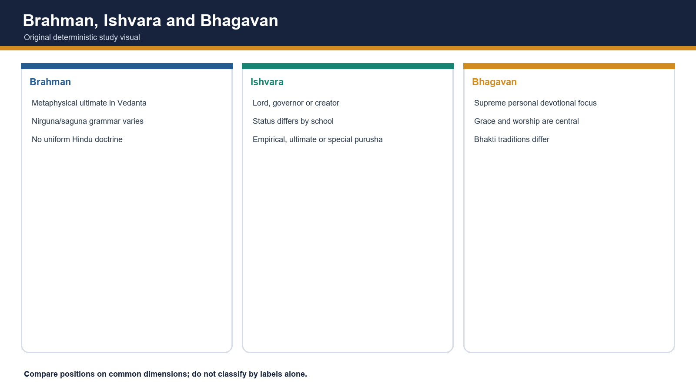

[THESIS] Brahman, Ishvara and Bhagavan must not be treated as universal synonyms. Brahman may name metaphysical ultimacy; Ishvara lordship, governance or creatorhood; Bhagavan a supreme personal devotional form. Their relation changes across Vedanta and bhakti traditions.

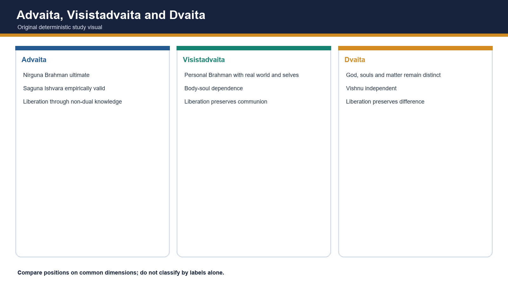

- Advaita: nirguna Brahman is ultimate; saguna Ishvara is empirically and devotionally valid. Theism is real at its level but not the final non-dual standpoint.
- Visistadvaita: Narayana is personal Brahman qualified by real selves and matter. The body-soul relation expresses controlled, supported and purposive dependence; liberation preserves communion.
- Dvaita: Vishnu is independent and God, souls and matter remain really distinct; liberation preserves difference.

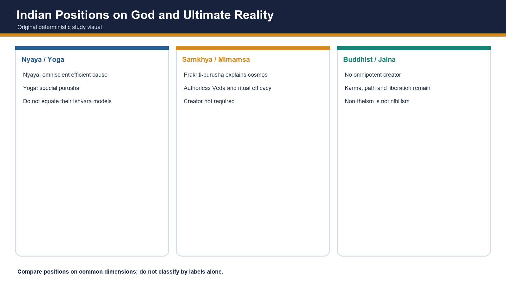

| School | Position | Creator status | Religious role |
|---|---|---|---|
| Nyaya-Vaisesika | Omniscient eternal Ishvara | Efficient cause and karmic governor | Coordinates atoms and fruits of action |
| Yoga | Ishvara as special purusha | Not material source of prakriti | Devotional and meditative aid |
| Classical Samkhya | Purushas and prakriti | No creator needed | Discriminative knowledge liberates |
| Purva Mimamsa | Authorless Veda, ritual efficacy and apurva | Creator not required | Dharma through injunction and ritual |
| Buddhism | Dependent origination and no omnipotent creator | No | Awakening, ethics and path remain |
| Jainism | Eternal jiva/ajiva and perfected liberated beings | No | Tirthankaras teach; siddhas do not create |

[THESIS] Non-theism is not nihilism or absence of religion. Buddhist and Jaina systems preserve ultimacy, morality, discipline, liberation and reverence without creator-belief.

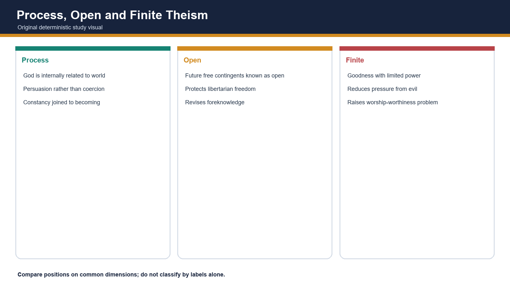

These revisions solve different pressures by paying different doctrinal costs. Process theism
accepts real divine relation and becoming, open theism revises knowledge of future contingents,
and finite theism restricts power or knowledge more broadly. In an evaluative answer, state the
classical problem each model addresses, the attribute it modifies, and whether the resulting being
still satisfies ultimacy and worship-worthiness.

### Critique, Language and Practical Consequences

> **ANSWER-GRABBING LINE — WRITE/ADAPT IN THE EXAM**
> **High-value transition:** Doctrine statement. God is a necessary, personal creator, distinct from yet continuously sustaining the world, traditionally described as omnipotent, omniscient, perfectly good, eternal, immutable and simple.


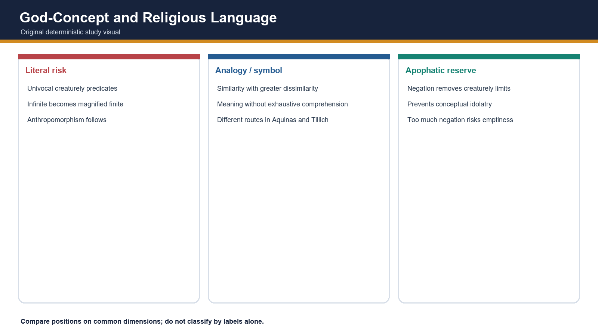

[OBJECTION] Feuerbach treats God as projected human essence; Freud as wish-fulfilling paternal protection; feminist critics expose masculine authority encoded in universal God-language.

[REPLY] Genealogy does not entail falsity. Analogical, apophatic and feminist reconstructions can criticize oppressive predicates without abandoning ultimacy.

[QUALIFICATION] The reply blocks a genetic fallacy but does not erase cultural mediation or political use.

[OBJECTION] If no possible experience counts against divine love, God-talk may appear empirically empty.

[REPLY] Religious assertions can be metaphysical interpretations rather than simple observational hypotheses.

[QUALIFICATION] They still require conceptual contrast and public intelligibility. Verification and falsification belong primarily to Topic 10.

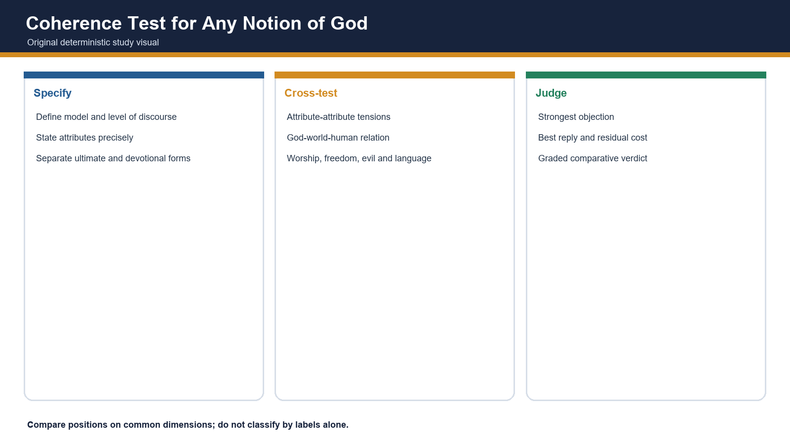

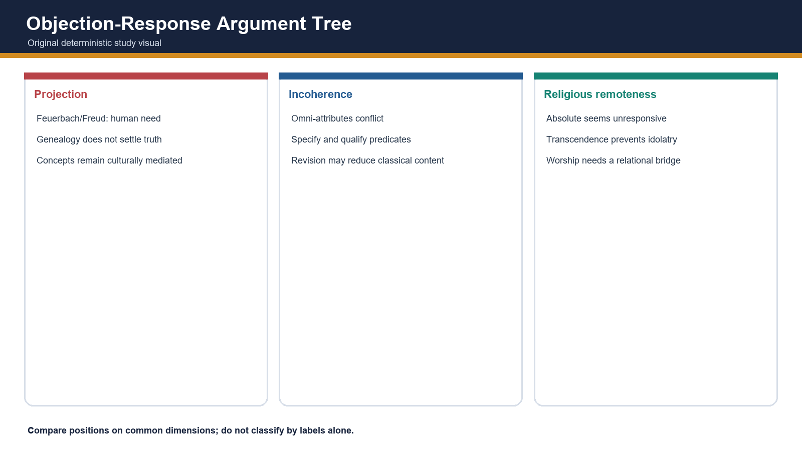

| Practical dimension | Classical personal theism | Impersonal/non-dual model | Process/panentheist model | Non-theistic liberation model |
|---|---|---|---|---|
| Worship | Praise, address and obedience | Contemplation; devotion may be level-specific | Participation and response | Reverence for truth, path or exemplar |
| Prayer | Petition, confession, thanksgiving | Transformative discipline | Relational contribution | Meditation and ethical resolve |
| Morality | Goodness, command and judgement | Purification for knowledge | Cooperative value-realization | Karma, compassion and path |
| Providence | Sovereign sustaining order | Ultimate/empirical-level distinction | Persuasive, not unilateral | Causal-moral order without creator |
| Freedom | Secondary agency | Release from ignorance | Co-creative openness | Liberation through insight/practice |
| Evil | Strong pressure on omni-attributes | Finite-level disorder; avoid trivialization | Limited coercive power | No creator to indict; suffering remains |
| Salvation | Grace and communion | Non-dual knowledge | Transformed relation | Nirvana, kevala or analogous liberation |


#### 8. ADVANCED DOCTRINE DOSSIERS

> **ANSWER-GRABBING LINE — WRITE/ADAPT IN THE EXAM**
> **High-value transition:** Doctrine statement. God is a necessary, personal creator, distinct from yet continuously sustaining the world, traditionally described as omnipotent, omniscient, perfectly good, eternal, immutable and simple.


##### 8.1 Classical theism
- **Doctrine statement.** [FACT] God is a necessary, personal creator, distinct from yet continuously sustaining the world, traditionally described as omnipotent, omniscient, perfectly good, eternal, immutable and simple.
- **Argument.** [FACT] (1) Contingent reality requires a non-contingent ground; (2) ordered dependence requires an intelligent source; (3) the ultimate ground cannot derive its actuality from another; (4) the source is therefore construed as necessary and perfect. [QUALIFICATION] This is a cumulative metaphysical profile, not one self-contained proof.
- **Presupposition.** [QUALIFICATION] Explanatory dependence cannot terminate in an unexplained contingent item, and maximal perfection is coherent.
- **Distinction.** [FACT] Creation is not identical with manufacture: classical creation is dependence of the whole being of creatures upon God, not rearrangement of prior material.
- **Canonical examples.** [FACT] Aquinas' primary/secondary causation permits God to sustain natural causes without competing with them; Nyaya similarly treats Isvara as efficient cause while atoms remain material causes.
- **Objection -> reply.** [QUALIFICATION] The omni-attributes generate paradoxes and evil. A classical reply restricts omnipotence to what is logically possible and treats goodness as identical with, not external to, divine nature.

##### 8.2 Spinoza's God or Nature
- **Doctrine statement.** [FACT] God is the one infinite substance, *Deus sive Natura*; finite minds and bodies are modes, not created substances outside God.
- **Argument.** [FACT] (1) Substance is conceived through itself; (2) two substances cannot share an attribute; (3) an absolutely infinite substance excludes any rival substance; (4) therefore only God/Nature is substance, expressed through infinitely many attributes.
- **Presupposition.** [QUALIFICATION] Conceptual self-sufficiency tracks ontological self-sufficiency, and substance monism follows from the definition of attribute.
- **Distinction.** [FACT] Spinozistic pantheism is not deism: God neither withdraws from nature nor chooses to create it; nature follows necessarily from divine essence.
- **Canonical example.** [FACT] A human mind is a finite mode under Thought and its body the corresponding mode under Extension.
- **Objection -> reply.** [QUALIFICATION] The view seems to erase personality, providence and freedom. Spinoza replies by redefining divine freedom as action from the necessity of one's own nature, not arbitrary choice.

##### 8.3 Advaita: nirguna Brahman and saguna Isvara
- **Doctrine statement.** [FACT] Nirguna Brahman is non-dual reality beyond limiting predicates; saguna Isvara is Brahman understood through *maya* at the empirical level.
- **Argument.** [FACT] (1) Changing objects are dependent and cannot be ultimate; (2) consciousness is the presupposition of every known object; (3) Upanisadic instruction removes superimposed difference; (4) atman is recognised as Brahman.
- **Presupposition.** [QUALIFICATION] Self-revealing consciousness is not reducible to an object, and *sruti* is a valid means for what perception and inference cannot disclose.
- **Distinction.** [FACT] Nirguna does not mean a bare non-entity; it denies limiting empirical qualities while affirming non-dual reality as *sat-cit-ananda*.
- **Canonical example.** [FACT] Rope-snake: the world is not sheer nothing but dependently experienced through superimposition, as a snake appears on a rope.
- **Objection -> reply.** [QUALIFICATION] Ramanuja argues that a quality-less absolute is unintelligible. Advaita replies that negation removes finite predicates rather than cancelling reality.

##### 8.4 Visistadvaita: God, selves and world
- **Doctrine statement.** [FACT] Brahman is a personal, qualified unity whose body is the real plurality of conscious selves (*cit*) and matter (*acit*).
- **Argument.** [FACT] (1) Scripture affirms unity and plurality; (2) the body-self relation preserves both; (3) body is controlled by and exists for its indwelling self; (4) the cosmos is therefore inseparably dependent on Brahman without being illusory.
- **Presupposition.** [QUALIFICATION] Unity need not be undifferentiated identity; internal differentiation can qualify one substantive whole.
- **Distinction.** [FACT] *Aprthaksiddhi* is inseparability, not numerical identity: the jiva belongs to God yet never becomes the whole of God.
- **Canonical example.** [FACT] The soul governs its body while remaining distinct from it; analogously Brahman is the inner ruler of world and selves.
- **Objection -> reply.** [QUALIFICATION] If the world is God's body, worldly defect appears to infect God. Ramanuja's reply distinguishes the controller's perfection from the changing condition of the controlled body.

##### 8.5 Polytheism, henotheism and the Vedic case (2018 Q5(e) owner-module)
- **Doctrine statement.** [FACT] *Polytheism* posits many independent personal deities with divided jurisdiction. *Henotheism* (and its finer variant *kathenotheism*, "one-god-at-a-time") names the pattern in which the deity currently invoked is addressed with the full language of supremacy without the others being denied. [FACT] Both terms were introduced into the study of the Veda by **F. Max Muller**, who read the Rgvedic hymns to Agni, Indra, Varuna and Usas as successively supreme.
- **Argument that "Hinduism is polytheistic" is inadequate.** [FACT] (1) **Rgveda 1.164.46**  -  *ekam sad vipra bahudha vadanti*: the same one existent is spoken of under the names Indra, Mitra, Varuna, Agni, Garutman  -  a doctrine of **plural names for one referent**, not plural ultimates. (2) **Rgveda 10.129 (Nasadiya)**  -  the cosmogonic hymn resolves the origin into "the One" (*tad ekam*) breathing without breath, and closes by doubting whether even the highest overseer knows; a naive pantheon cannot generate this. (3) The **Upanisadic** turn makes Brahman the single reality of which devas are dependent expressions (Brhadaranyaka 3.9 reduces "three and three thousand" gods to one). (4) **Istadevata**: the chosen deity functions as the whole of divinity for that devotee  -  structurally monotheistic devotion inside a plural pantheon. (5) **Avatara and Trimurti** subordinate plurality to one ultimate agency. (6) The living **sectarian theisms** (Vaisnava, Saiva, Sakta) are each *monotheistic in form*, treating rival deities as subordinate powers.
- **Argument on the other side (do not suppress it).** [FACT] The Rgvedic pantheon is genuinely plural and function-divided; ritual, temple and village practice addresses many deities with distinct competencies; iconography and vrata-calendars are irreducibly plural.
- **Presupposition.** [QUALIFICATION] That "polytheism/monotheism"  -  categories built from the Abrahamic dispute  -  can be applied without distortion to a non-credal tradition; the safest answer states this reservation explicitly.
- **Distinction.** [FACT] polytheism != henotheism != kathenotheism != monolatry != monism != monotheism != panentheism. Monism denies plurality of *reality*; monotheism denies plurality of *deity*; henotheism denies neither but ranks contextually.
- **Canonical example.** [FACT] A Rgvedic Agni hymn ascribes to Agni what an adjacent Indra hymn ascribes to Indra  -  the textbook henotheistic signature.
- **Objection -> reply.** [QUALIFICATION] Objection: "one being, many names" is a modern apologetic overlay. Reply: the verse is genuinely Rgvedic and Nasadiya independently resists plural ultimacy; but its extension into a **theory of inter-religious pluralism** is a nineteenth-twentieth-century development and must be argued, not assumed  -  routed to [Religious Pluralism 8/5](./Religious-Pluralism.md).
- **Verdict formula.** [QUALIFICATION] "Hinduism is not adequately described as polytheistic. It is better described as a tradition in which polytheistic *practice*, henotheistic *invocation*, sectarian *monotheism* and Upanisadic *monism* coexist at different levels; plurality lies in names, forms and access-points, not in ultimate principles  -  while conceding that at the level of lived worship the many deities are genuine objects of devotion."

##### 8.6 Divine simplicity, aseity and the coherence of the attribute-package
- **Doctrine statement.** [FACT] The doctrine of **divine simplicity (DDS)** denies every kind of composition in God  -  no matter/form, no substance/accident, no genus/difference, and no real distinction between essence and existence; the divine attributes are not distinct properties inhering in God but one reality diversely signified (Aquinas, *Summa Theologiae* I, qq.3-13; anticipated in Augustine and paralleled in Maimonides). **Aseity** (*a se*) is the closely related claim that God exists from himself, deriving nothing.
- **Argument.** [FACT] (1) Whatever is composite depends on its parts and on whatever unites them; (2) the first, underived ground cannot be dependent; (3) therefore the ultimate is non-composite; (4) therefore "wise", "good", "powerful" signify one identical divine reality under different creaturely modes of conception.
- **Presupposition.** [QUALIFICATION] Composition entails ontological dependence, and plurality in our *concepts* need not mirror plurality in the *thing*.
- **Distinction.** [FACT] Simplicity, aseity, immutability, impassibility, eternity and necessity are **distinct theses** that support one another; conflating them is a common answer-fault. Simplicity is about composition, aseity about derivation, immutability about change, impassibility about being acted upon.
- **Canonical example.** [FACT] In creatures, "existence" is received and "wisdom" is a quality possessed; in God, on this view, there is no possessor-plus-possessed  -  hence Aquinas' formula that in God essence and existence are the same.
- **Objection -> reply.** [QUALIFICATION] (a) **Modal collapse:** if God is identical with his act of will and God exists necessarily, everything willed is necessary, so creation is not free. *Reply:* the divine act is intrinsically necessary but its *terminus* is contingent; critics answer that this reintroduces a distinction simplicity had denied. (b) **Plantinga's objection** (*Does God Have a Nature?*): if God is identical with his properties, God is a property, and no property is a person or an agent. *Reply:* read the identity analogically or as a truthmaker claim rather than as literal property-identity. (c) **Religious adequacy:** a simple, impassible God appears unable to respond, love or grieve. *Reply:* reinterpret impassibility as unwavering constancy of love rather than emotional inertness  -  a revision many find too costly.
- **Indian parity (required for a full-marks 15/20).** [FACT] Advaita reaches the same problem by a different route: *sat-cit-ananda* are **svarupa-laksana**  -  the essential nature-defining marks, not qualities inhering in a substrate  -  as against **tatastha-laksana**, the accidental/relational definition of Brahman as world-cause (*janmady asya yatah*). This is the Indian functional analogue of divine simplicity. [FACT] **Ramanuja** attacks it head-on: an entity with no determinations whatever is neither knowable, nameable nor worshipable, so Brahman must be *savisesa* (qualified). [FACT] **Madhva** takes a third route: his device of **visesa**  -  a real "distinguisher" within a partless substance  -  lets Visnu possess genuine attributes without composition. [QUALIFICATION] Compressed presentation; expand only the school the question names.

##### 8.7 Omnipotence, foreknowledge and free will (2020 Q5(d) owner-module)
- **Doctrine statement.** [FACT] Omnipotence is maximal power; omniscience is knowledge of all truths; the classical package asserts both of a God who nevertheless creates genuinely free agents. The examinable problem is whether these are jointly coherent.
- **Argument (the two paradoxes, stated in premises).**
  - [FACT] **Paradox of the stone / Mackie's paradox of omnipotence:** (1) An omnipotent being can create any object it chooses; (2) it can therefore create a being (or a rule, or a stone) it cannot subsequently control; (3) either it cannot create such a thing, or it cannot control it; (4) either way there is something it cannot do. Mackie's own framing distinguishes **first-order omnipotence** (power over things) from **second-order omnipotence** (power to determine what powers exist), arguing that both cannot be held unrestrictedly at once.
  - [FACT] **Foreknowledge dilemma:** (1) God infallibly believed at t1 that S will do A at t2; (2) the past is now fixed (accidental necessity); (3) an infallible belief cannot be false; (4) so at t2, S cannot refrain from A; (5) so S does not act freely in the libertarian sense.
- **Replies to the omnipotence paradox.** [FACT] **Aquinas' standard restriction:** omnipotence extends to everything *absolutely possible*; what implies a contradiction is not a thing at all, so it is no restriction on power that God cannot make it (*ST* I q.25 a.3). [FACT] **Descartes' universal possibilism** is the deliberate outlier: even the eternal truths depend on God's will  -  coherent but at the price of making logic contingent. [QUALIFICATION] **"God cannot lie/sin":** perfect-being theology treats moral impeccability as a *perfection* of power, not a deficit  -  inability to defect is not weakness.
- **Replies to the foreknowledge dilemma (know all four).**
  - [FACT] **Boethian/Thomist eternity:** God is timeless; all times are present to the *nunc stans*; therefore there is strictly no *fore*knowledge and premise (2)'s past-fixity does not apply. *Objection:* timeless knowledge still entails the act; and a timeless God's responsiveness is hard to state.
  - [FACT] **Ockhamism:** "God believed at t1 that S will do A" is a **soft fact** about the past  -  partly about the future  -  and soft facts are not accidentally necessary. *Objection:* the hard/soft distinction is difficult to specify non-circularly.
  - [FACT] **Molinism (Luis de Molina, *Concordia*):** God has **middle knowledge** (*scientia media*) of counterfactuals of creaturely freedom logically prior to the creative decree, and so can foreknow free acts without causing them. *Objection:* the **grounding objection**  -  what makes such counterfactuals true before any decree or act?
  - [FACT] **Open theism:** future free acts are not yet truths; omniscience is knowledge of all *truths*, so no failure follows. *Objection:* this revises the classical attribute the question presupposes.
- **Indian parity.** [FACT] **Nyaya:** Isvara is omniscient and *karmadhyaksa*, but allots fruits *in accordance with* each self's adrsta; he is the administering, not the choosing, cause  -  so human effort (*purusakara*) is preserved against fate (*daiva*). [FACT] **Bhagavad Gita 18.61** places the Lord "in the heart-region of all beings, causing them to revolve as though mounted on a machine (*yantra*)", and yet **18.63** ends the entire teaching with *yathecchasi tatha kuru*  -  "act as you wish": the text deliberately holds sovereignty and genuine deliberative address together, and is best used as the canonical Indian **crux**, not as a solved proof. [QUALIFICATION] **Advaita** dissolves rather than answers the problem: agency belongs to the jiva under *upadhis*; freedom is not an exception inside the causal order but the ending of the ignorance that produced the sense of bondage. [FACT] **Ramanuja** uses divine *anumati* (permission/consent): God sustains the capacity to act and consents to its exercise, so the moral authorship remains the jiva's.
- **Verdict formula.** [QUALIFICATION] "The attributes survive the paradoxes only if each is *specified*  -  omnipotence as power over the absolutely possible, omniscience as knowledge of all truths, freedom as either libertarian or compatibilist. The costs are unequally distributed: eternity and Ockhamism preserve the classical package at the price of contested metaphysics; Molinism preserves it at the price of the grounding objection; open theism preserves freedom by amending omniscience."

##### 8.8 Saiva, Sakta and Madhva God-concepts  -  the Indian parity bench
> Required whenever the question says "**any one of the religions in India**" (2019 Q8(c)) or asks for the Hindu God-concept beyond Advaita/Visistadvaita. Pick **one** and complete it; do not sample all four.

- **Saiva Siddhanta (dualistic-theistic Saivism).** [FACT] Triad **pati-pasu-pasa**: Siva (the Lord), the bound soul, and the three bonds  -  *anava* (primal finitude), *karma*, *maya*. Siva is the **efficient** cause, maya the material cause; his activity is the **panca-krtya** (five acts): creation, maintenance, dissolution, concealment (*tirodhana*) and grace (*anugraha*). Liberation is *siva-sayujya*: the soul becomes **like** Siva (*siva-tulya*), sharing his nature but never becoming the Lord. *God-man relation:* master-servant transformed by grace (*sakti-nipata*).
- **Kashmir (Pratyabhijna/Trika) Saivism  -  Utpaladeva, Abhinavagupta.** [FACT] Non-dual but **realist about the world**: Siva is *prakasa* (self-luminous consciousness) inseparably united with *vimarsa* (self-reflective awareness = Sakti). The universe is Siva's free self-manifestation (*abhasa*) through *svatantrya-sakti*  -  an act of sovereign freedom, not an illusory superimposition. [QUALIFICATION] **This is the sharpest available contrast with Advaita:** both are non-dual, but Advaita's world is *vivarta* (apparent), Kashmir Saivism's world is a real self-expression. Liberation is *pratyabhijna*  -  **recognition** of the identity one never actually lost.
- **Sakta.** [FACT] The ultimate is **Devi / Mahadevi**; the *Devi-Mahatmya* (in the Markandeya Purana) presents the Goddess as the supreme, self-sufficient reality from whom the gods derive power. The philosophical point that earns marks: the divine **power (Sakti) is not an attribute added to God but the divine itself in its dynamic aspect**  -  which is why Siva without Sakti is described as inert. Contrast: Advaita's maya is dependent and finally sublatable; Samkhya's prakrti is unconscious; Sakta Sakti is conscious, ultimate and identical with the Goddess. [QUALIFICATION] Tantric ritual context is broad; keep the answer at the metaphysical level.
- **Madhva's Dvaita.** [FACT] One organising axiom: **svatantra-paratantra**  -  Visnu alone is independent, everything else is dependent. [FACT] **Panca-bheda**, five eternally real differences: God-soul, God-matter, soul-soul, soul-matter, matter-matter. [FACT] **Bimba-pratibimba**: the soul is the *reflection* of God  -  dependence without identity. [FACT] **Taratamya**: an intrinsic gradation among souls, with the notorious threefold classification (*mukti-yogya*, *nitya-samsarin*, *tamo-yogya*)  -  the one Vedantic system asserting eternal damnation for a class of souls. Liberation is *ananda* proportioned to the soul's intrinsic capacity, expressed as service (*dasya*); the soul never attains equality with God.
- **Parity grid.**

| System | Ultimate | World's status | Soul in liberation | Distinctive device |
|---|---|---|---|---|
| Advaita | [FACT] Nirguna Brahman | *Vivarta*, sublatable | Individuality sublated | *Adhyasa*, two levels of truth |
| Visistadvaita | [FACT] Saguna Brahman (Visnu) | Real body of God | Eternal jiva in communion | *Aprthaksiddhi*, sarira-sariri |
| Saiva Siddhanta | [FACT] Siva as pati | Real, from maya | *Siva-tulya*, never Siva | *Panca-krtya*, *anava-mala* |
| Kashmir Saivism | [FACT] Siva = prakasa+vimarsa | Real self-manifestation | Recognition of identity | *Abhasa*, *svatantrya* |
| Sakta | [FACT] Devi/Sakti | Real emanation of Sakti | Union with the Goddess | Sakti as the dynamic divine |
| Dvaita | [FACT] Visnu, *svatantra* | Real and eternally distinct | Graded bliss, service | *Panca-bheda*, *bimba-pratibimba* |

- **Objection -> reply.** [QUALIFICATION] Objection: these are sectarian theologies, not philosophy. Reply: each states an explicit **causal doctrine, a bondage-analysis and a liberation-criterion**, and each can be assessed for coherence  -  which is exactly what the examiner's "critically examine" requires.


#### 9. INTER-THINKER / INTER-SCHOOL DEBATES

> **ANSWER-GRABBING LINE — WRITE/ADAPT IN THE EXAM**
> **High-value transition:** Comparison earns marks only when thinkers are tested through a constant axis such as starting point, causal model, divine attributes, objection and final explanatory reach.


| Axis | Classical theism | Spinoza | Advaita | Visistadvaita |
|---|---|---|---|---|
| Personal? | [FACT] Yes | [FACT] No, not in a volitional sense | [FACT] Isvara empirically; Brahman ultimately beyond personality | [FACT] Supremely personal |
| World relation | [FACT] Created and sustained, distinct | [FACT] Modes of the one substance | [FACT] Dependent appearance (*vivarta*) | [FACT] Real body of Brahman |
| Human relation | [FACT] Creature-creator | [FACT] Finite mode-substance | [FACT] atman is Brahman | [FACT] jiva distinct but inseparable |
| Freedom | [FACT] Providential agency | [FACT] Necessity of divine nature | [FACT] Freedom as knowledge of non-duality | [FACT] Grace, *bhakti*, *prapatti* |
| Main pressure | [QUALIFICATION] Evil and attribute coherence | [QUALIFICATION] Loss of personality | [QUALIFICATION] status of world/devotion | [QUALIFICATION] divine embodiment and defect |

#### 10. CRITICISMS AND REPLIES

> **ANSWER-GRABBING LINE — WRITE/ADAPT IN THE EXAM**
> **Major criticism:** A criticism should identify whether it attacks validity, a premise's truth or the adequacy of the conclusion, and the reply must answer that exact level.


| Objection | Target | Best reply | Verdict |
|---|---|---|---|
| Omnipotence paradox | Classical theism | [FACT] Logical impossibilities are not possible objects of power | [QUALIFICATION] Saves coherence, not every providential claim |
| Foreknowledge threatens freedom | Theism | [FACT] Timeless knowledge need not cause the known act |  Compatibility remains disputed |
| Pantheism collapses God into matter | Spinoza | [FACT] Nature includes infinite intelligible reality, not matter alone | [QUALIFICATION] Still abandons personal theism |
| Nirguna is empty | Advaita | [FACT] Negation is apophatic removal of limits | [QUALIFICATION] Positive intelligibility remains difficult |
| God's body contains evil | Visistadvaita | [FACT] Dependence does not transfer every bodily defect to the indwelling controller |  The analogy is strained |

#### 11. COMMON UPSC TRAPS

> **ANSWER-GRABBING LINE — WRITE/ADAPT IN THE EXAM**
> **Major criticism:** The central examination trap is to collapse distinct doctrines or to claim that a criticism proves more than its argument actually establishes.


1. [QUALIFICATION] Do not equate **pantheism** with **panentheism**: identity differs from inclusion-with-excess.
2. [QUALIFICATION] Do not call Advaita's world absolute non-existence; it is empirically available but sublatable.
3. [QUALIFICATION] Do not write that Ramanuja identifies jiva and Brahman; his relation is difference-with-inseparability.
4. [QUALIFICATION] Do not treat divine transcendence as spatial distance or immanence as physical embodiment.
5. [QUALIFICATION] Do not list attributes without testing their mutual coherence.
6. [QUALIFICATION] A question on "physical manifestation" requires distinguishing incarnation, embodiment, material causation and metaphysical dependence.
7. [QUALIFICATION] Do not gloss **nirguna Brahman as *anirvacaniya***. *Anirvacaniya* is the technical status of **maya/avidya and the world-appearance** (*sad-asad-vilaksana*); Brahman's ineffability is the failure of objectifying **predication** (*avacya*, *neti neti*). Spell it ***anirvacaniya*** throughout.
8. [QUALIFICATION] Do not answer "Is Hinduism polytheistic?" with a yes/no. The marks lie in separating polytheism, henotheism/kathenotheism, monolatry, sectarian monotheism and Upanisadic monism, and in noting that the category itself is imported.
9. [QUALIFICATION] Do not treat divine simplicity as a stylistic remark about God being "uncomplicated"; it is a denial of composition with hard consequences (modal collapse, property-identity).
10. [QUALIFICATION] Do not "solve" the foreknowledge problem by asserting that God is outside time and stopping there; state which premise  -  past-fixity, infallibility, or the entailment  -  the eternity move actually targets.
11. [QUALIFICATION] Do not merge Saiva Siddhanta (dualistic, *pati-pasu-pasa*) with Kashmir Saivism (non-dual, *abhasa*); and do not describe Madhva's *bimba-pratibimba* as identity  -  it is dependence.

#### 12. KEYWORD & STATEMENT BANK

> **ANSWER-GRABBING LINE — WRITE/ADAPT IN THE EXAM**
> **High-value transition:** Ontological arguments reason a priori from the God-concept, whereas cosmological, teleological and Nyāya (school of logic and realism) arguments reason a posteriori from experienced reality.


**Keywords:** [FACT] classical theism  |  necessary being  |  divine simplicity  |  aseity  |  impassibility  |  omnipotence  |  absolute vs relative possibility  |  omniscience  |  middle knowledge (*scientia media*)  |  soft/hard facts  |  open theism  |  omnibenevolence  |  immanence  |  transcendence  |  deism  |  pantheism  |  panentheism  |  *Deus sive Natura*  |  substance/mode  |  polytheism  |  henotheism  |  kathenotheism  |  monolatry  |  *istadevata*  |  avatara  |  nirguna/saguna  |  *svarupa-laksana*/*tatastha-laksana*  |  *avacya*  |  *anirvacaniya* (of maya, not of Brahman)  |  *maya*  |  *vivarta*  |  *abhasa*  |  *svatantrya*  |  *antaryamin*  |  *cit-acit*  |  *aprthaksiddhi*  |  body-self relation  |  *pati-pasu-pasa*  |  *panca-krtya*  |  Sakti  |  *svatantra/paratantra*  |  *panca-bheda*  |  *bimba-pratibimba*  |  *visesa*  |  *purusakara*/*daiva*  |  *anumati*.

**Safe formulations:** [QUALIFICATION] "The God-concept is a package of attributes whose coherence must be argued, not assumed."  |  "Advaita reconciles religious personality and metaphysical absoluteness by levels of truth; Visistadvaita rejects that hierarchy."  |  "Plurality of names and forms is not plurality of ultimates  -  but it is not nothing either."  |  "Foreknowledge questions are won by naming the premise you deny, not by asserting timelessness."

<!-- expanded-pyq-depth:start -->
##### CORPUS-DRIVEN DEPTH DELTA (expanded PYQ audit)

- [QUALIFICATION] **Priority:** Primary ownership rises to 13 of 112 religion parts across 2018-2025, despite no owned part in 2025.
- [FACT] **Required doctrinal depth:** Older papers require Hindu polytheism, personal/impersonal God, man-God relation, omnipotence and free will, Nyaya's notion of God and Visistadvaita's qualified non-dual theism.
- [TRAP] **Trap / answer consequence:** Do not treat polytheism, henotheism, monism, pantheism and qualified theism as synonyms; always specify attributes and God-world-person relation.

<!-- expanded-pyq-depth:end -->

#### 13. PYQ ROUTING (2018-2025)

> **ANSWER-GRABBING LINE — WRITE/ADAPT IN THE EXAM**
> **High-value transition:** Corpus signal: 13 primary-owned question-parts out of 112.


> [QUALIFICATION] **Corpus signal:** 13 primary-owned question-parts out of 112. The local Paper II corpus is continuous from 2018 through 2025. Cross-links do not create duplicate ownership.

| Year | Question | Marks | Exact demand |
|---|---|---:|---|
| 2018 | Q5(e) | 10 marks | Is Hinduism poly-theistic? Give reasons for your answer. |
| 2019 | Q8(b) | 15 marks | State and evaluate the personalistic and impersonalistic aspects of God. |
| 2019 | Q8(c) | 15 marks | Discuss the relationship between man and God according to any one of the religions in India. |
| 2020 | Q5(d) | 10 marks | Is there any compatibility between 'Freedom of Will' and 'Omnipotent God'? Discuss. |
| 2020 | Q7(a) | 20 marks | Discuss the nature of God in Hinduism with special reference to Vishishtadvaita (Qualified non-dualism). |
| 2021 | Q5(a) | 10 marks | Discuss the nature of God as propounded in Nyaya philosophy. |
| 2022 | Q5(a) | 10 marks | Write an essay on Spinoza's notion of God and His attributes. |
| 2022 | Q6(b) | 15 marks | Explain the relation between the God and the Self according to Ramanujacarya. |
| 2022 | Q8(c) | 15 marks | Critically examine the idea of Brahman in Advaita philosophy of Samkara. Does Samkara's conception of Brahman leave room for theism? Discuss. |
| 2023 | Q5(a) | 10 marks | Elucidate the personalistic and impersonalistic aspects of God. |
| 2023 | Q6(b) | 15 marks | In what sense is God both immanent and transcendent in theism? Discuss. |
| 2024 | Q6(b) | 15 marks | How does the notion of God in Spinoza's philosophy embedded in his metaphysics of substance and attributes? Critically discuss. |
| 2024 | Q8(b) | 15 marks | "In order to be conceived as the ultimate cause of the world, God must necessarily have some form of physical manifestation." Do you agree with this view? Give reasons and justifications for your answer. |

See the [Philosophy of Religion PYQ Bank, 2018-2025](../_PYQ-PhilosophyOfReligion-2018-2025.md).

#### 14. ANSWER ARCHITECTURE (10 / 15 / 20 MARKS)

> **ANSWER-GRABBING LINE — WRITE/ADAPT IN THE EXAM**
> **High-value transition:** A high-scoring answer moves from exact definition to argument reconstruction, objection and reply, comparison and a criterion-based graded verdict.


##### 10 marks
```text
Define the contrast -> give one Western and one Indian formulation -> one discriminating
distinction -> one objection -> verdict answering the exact term in the question.
```

##### 15 marks
```text
Frame the attribute/relation problem -> reconstruct the doctrine and presupposition ->
use the canonical example -> contrast the nearest rival -> objection and reply -> graded verdict.
```

##### 20 marks
```text
Classify the God-concept -> present full metaphysical argument -> explain God-world and
God-human relations -> Indian-Western comparison -> two objections with replies ->
assess what notion of ultimacy survives.
```

#### 15. DIRECTIVE DECODER (what the verb obliges you to produce)

> **ANSWER-GRABBING LINE — WRITE/ADAPT IN THE EXAM**
> **High-value transition:** The directive fixes the answer's burden: exposition requires accurate reconstruction, comparison requires a constant axis, and critical examination requires objection, reply and verdict.


| Directive (as printed in Paper II) | Examiner is buying | Structural consequence | Live example from this clause |
|---|---|---|---|
| **Elucidate** | Clarification of a *distinction*, not narration | Two-column contrast + one reconciling device | 2023 Q5(a) personalistic vs impersonalistic -> 2 + Advaita's two levels |
| **Discuss** | Balanced exposition **plus** a stated position | Thesis -> both sides -> verdict | 2019 Q8(c) man-God relation -> pick ONE school (8.8) and finish it |
| **Critically examine** | Reconstruction **and** evaluation of validity | Doctrine -> presupposition -> objection -> reply -> graded verdict | 2022 Q8(c) Brahman in Advaita, room for theism? |
| **Is there any compatibility...?** | A yes/no thesis defended by naming the disputed premise | State the argument in numbered premises, deny one, pay the cost | 2020 Q5(d) free will vs omnipotence -> 8.7 |
| **Do you agree... give reasons and justifications** | An explicit first-person verdict with reasons ranked | Position in the intro, reasons in descending strength | 2024 Q8(b) physical manifestation -> 3 [MEMORY] |
| **Write an essay on** | Coverage with architecture, not exhaustiveness | Classify -> expound -> contrast -> assess | 2022 Q5(a) Spinoza's God |
| **How does X embedded in...? Critically discuss** | Show the *systemic* dependence, then test it | Locate the concept inside the system's machinery first | 2024 Q6(b) Spinoza's God in substance-metaphysics |
| **Give reasons for your answer** | A named criterion, then application | Announce the criterion before using it | 2018 Q5(e) polytheism -> criterion: plurality of *ultimates* vs of *names/forms* |

> [MEMORY] **Rule:** the verdict sentence must reuse the question's own operative term ("compatible", "ultimate cause", "personalistic", "poly-theistic"). Examiners mark for the answered *term*, not for the topic.

#### 16. GRADED VERDICT LADDER (self-scoring before you leave the page)

> **ANSWER-GRABBING LINE — WRITE/ADAPT IN THE EXAM**
> **Final verdict:** A graded verdict should state what the argument establishes, what it fails to establish and which disputed premise determines the remaining uncertainty.


| Band | What the script contains | Typical fault |
|---|---|---|
| **Weak (40%)** | Lists attributes and schools; narrates Advaita and Ramanuja | No premises, no objection, no verdict |
| **Average (50%)** | One tradition done properly; correct terminology | Indian **or** Western only; verdict is a summary, not a judgement |
| **Good (60%)** | Both traditions; one reconstructed argument; one objection with reply | Objection not answered; parity is decorative |
| **Strong (65-70%)** | Numbered reconstruction + presupposition named + objection/reply + a **graded** verdict that concedes a cost | Occasionally over-claims a quotation |
| **Top (70%+)** | All the above + a *discriminating distinction* the average script misses (henotheism vs monism; soft vs hard fact; svarupa- vs tatastha-laksana; *aprthaksiddhi* != identity) + explicit statement of what would refute the position |  -  |

**Graded-verdict templates (adapt, do not copy blindly):**
- [QUALIFICATION] *Compatibility question:* "The two are compatible only on reading X of omnipotence and reading Y of freedom; on the libertarian-plus-temporal reading they are not, and the theist must pay for the reconciliation with either timeless eternity, soft facts, middle knowledge or an amended omniscience."
- [QUALIFICATION] *Classification question:* "Neither label fits without remainder; the tradition is best described as ___, provided we distinguish plurality of ultimates from plurality of names and forms."
- [QUALIFICATION] *Attribute question:* "The attribute is coherent once specified, but its specification narrows what the religious believer originally wanted to assert  -  that narrowing is the real cost."

#### 17. FACTUAL AND QUOTATION DISCIPLINE

> **ANSWER-GRABBING LINE — WRITE/ADAPT IN THE EXAM**
> **High-value transition:** Use quotations only with secure attribution, and prefer an accurate paraphrase to a decorative or uncertain formula.


| Item | Status | Safe use |
|---|---|---|
| *Deus sive Natura*  -  Spinoza | [FACT] Verified Spinozan formula (*Ethics*, Part IV, Preface; and Part I scholia) | Quote in Latin, then translate |
| *Ekam sad vipra bahudha vadanti* | [FACT] **Rgveda 1.164.46** (Dirghatamas' hymn) | Cite the reference; the pluralist *application* is a modern extension  -  say so |
| *Tat tvam asi* | [FACT] Chandogya Upanisad 6.8.7 (repeated refrain) | Cite the Upanisad, not "the Vedas" |
| *Neti neti* | [FACT] Brhadaranyaka Upanisad 2.3.6 | Use for method of negation |
| *Yato vaco nivartante* | [FACT] Taittiriya Upanisad 2.9 | Use for limits of speech about Brahman |
| "Sat-cit-ananda" | [FACT] Standard Vedantic formula | Not a single locatable Upanisadic verse  -  do not cite a chapter |
| Gita 18.61 (*yantra*) and 18.63 (*yathecchasi tatha kuru*) | [FACT] Verified chapter/verse | Use as the sovereignty-vs-agency crux |
| Aquinas on essence/existence and on the absolutely possible | [FACT] *ST* I q.3; I q.25 a.3 | Paraphrase; avoid inventing verbatim English |
| "Henotheism/kathenotheism" for the Veda | [FACT] F. Max Muller's terms | Attribute the *terms* to Muller, the *pattern* to the hymns |
| Any translated one-liner of Samkara or Ramanuja |  Translation-dependent | Paraphrase the doctrine; do not present as verbatim |


#### 18. LINK-OUTS

> **ANSWER-GRABBING LINE — WRITE/ADAPT IN THE EXAM**
> **High-value transition:** Proofs for God - Nyaya (school of logic and realism)/Udayana inference to Isvara (Lord or personal God); Jain and Buddhist denial of a creator.


- [Proofs for God](./Proofs-for-God.md)  -  Nyaya/Udayana inference to Isvara; Jain and Buddhist denial of a creator
- [Problem of Evil](./Problem-of-Evil.md)  -  the attribute-package under stress
- [Religious Language](./Religious-Language.md)  -  how *anirvacaniya*, analogy and symbol constrain God-talk
- [Religious Pluralism](./Religious-Pluralism.md)  -  RV 1.164.46 attribution discipline and the "many names" argument
- [Religion without God](./Religion-without-God.md)  -  the non-theistic limit-case of the God-concept
- [Soul, Immortality, Rebirth and Liberation](./Soul-Immortality-Rebirth.md)  -  God-soul relation in moksa
- [Paper I: Rationalism](../../paper-1/western/Rationalism.md)
- [Paper I: Vedanta](../../paper-1/indian/Vedanta.md)
- [Paper I: Nyaya-Vaisesika](../../paper-1/indian/Nyaya-Vaisesika.md)
- [Philosophy of Religion PYQ Bank, 2018-2025](../_PYQ-PhilosophyOfReligion-2018-2025.md)


### External Philosophy of Religion dossier: Topic 1 — [OPTIONAL ADVANCED]

> **ANSWER-GRABBING LINE — WRITE/ADAPT IN THE EXAM**
> **High-value transition:** Core prerequisite: Complete the owner's treatment of classical theism, Spinoza, Advaita (non-dual school), Viśiṣṭādvaita (qualified non-dualism), immanence/transcendence, attributes, criticisms, and answer architecture; also revise its routed 2018-2024 questions in the PYQ bank.


#### 1. [Notions of God](../paper-2/philosophy-of-religion/Notions-of-God.md)

> **ANSWER-GRABBING LINE — WRITE/ADAPT IN THE EXAM**
> **High-value transition:** Core prerequisite: Complete the owner's treatment of classical theism, Spinoza, Advaita (non-dual school), Viśiṣṭādvaita (qualified non-dualism), immanence/transcendence, attributes, criticisms, and answer architecture; also revise its routed 2018-2024 questions in the PYQ bank.


- **Core prerequisite:** Complete the owner's treatment of classical theism, Spinoza, Advaita, Viśiṣṭādvaita, immanence/transcendence, attributes, criticisms, and answer architecture; also revise its routed 2018-2024 questions in the [PYQ bank](../paper-2/_PYQ-PhilosophyOfReligion-2018-2025.md).

| Optional advanced debate | Precise competing positions | Strongest extra objection → counter-reply | Safe use in a 15/20-marker |
|---|---|---|---|
| ⚠️ Perfect-being theology vs apophatic reserve | Perfect-being writers treat God as maximally excellent in every compossible respect; apophatic/classical writers warn that creaturely maxima cannot simply be projected upward. | Objection: maximal omni-attributes become mutually incoherent. → Reply: classical theists restrict omnipotence to the logically possible and read perfection non-anthropomorphically. | One evaluative line after listing attributes: "The coherence problem is what drives some modern philosophers from simple maximality to more apophatic construals of perfection." |
| ⚠️ Open theism vs exhaustive foreknowledge | Open theists hold that future free acts are not yet fully truth-valued facts; classical theists defend timeless or exhaustive divine knowledge. | Objection: a God who does not know future contingents is deficient. → Reply: knowing the future **as open** is not ignorance if libertarian freedom is real. | Useful only in freedom-vs-omniscience answers; do not let it replace the owner's classical theism frame. |
| ⚠️ Process/panentheist God vs classical immutable God | Process and panentheist views make God internally related to the world's becoming; classical theism keeps God perfect, immutable, and non-dependent. | Objection: a finite or changing God is not worthy of worship. → Reply: defenders say solidarity, persuasion, and co-suffering answer the moral pressure better than static impassibility. | Use as a contrast sentence when discussing immanence, transcendence, or the pressure created by evil. |
| ⚠️ Advaitic apophasis vs Viśiṣṭādvaitic qualified unity | Advaita: nirguṇa Brahman is ultimate, with saguṇa Īśvara empirically real; Viśiṣṭādvaita: Brahman is always qualified by real selves and world. | Objection: nirguṇa empties God of religious content. → Reply: Advaita says negation removes limiting predicates, not reality; devotion remains valid at the empirical level. | Safe in Śaṅkara/Rāmānuja comparison, especially to show why "personal vs impersonal" is not a crude yes/no divide in Indian material. |

- **What not to over-study:** Do not memorise the full analytic-theology literature on simplicity, modal logic about omniscience, or dense Whiteheadian terminology.
- **Promotion trigger:** Promote if a future PYQ directly asks divine simplicity, open theism, or panentheism, or if Core needs a clearer fix for the freedom/foreknowledge tension.
- **Credible source trail:** ✅ Thomas Aquinas, *Summa Theologiae* I; ✅ Baruch Spinoza, *Ethics*; ✅ Clark Pinnock et al., *The Openness of God*; ✅ Charles Hartshorne, *The Divine Relativity*; ✅ Śaṅkara, *Brahma-Sūtra-Bhāṣya*; ✅ Rāmānuja, *Śrī-Bhāṣya* / *Vedārthasaṅgraha*.

---


## CONSOLIDATED REGISTER NOTES

### FINAL REGISTER 1/10 — Control question

> **ANSWER-GRABBING LINE — WRITE/ADAPT IN THE EXAM**
> **High-value transition:** Personal/impersonal and transcendent/immanent are independent analytical axes; do not turn them into bodily/spatial claims.


- Define the proposed ultimate; then state its relation to world and self before proving or evaluating it.
- Personal/impersonal and transcendent/immanent are independent analytical axes; do not turn them into bodily/spatial claims.
- Cataphatic predicates affirm perfection; apophatic reserve denies finite/univocal transfer, not all meaning.

### FINAL REGISTER 2/10 — Western relation models

> **ANSWER-GRABBING LINE — WRITE/ADAPT IN THE EXAM**
> **High-value transition:** Creation ex nihilo means dependence of creaturely being, not manufacture from prior matter.


- Classical theism: necessary, personal creator/sustainer; distinct yet immanent.
- Deism: creator/lawgiver without continuing providential intervention.
- Pantheism: God/Nature identity; panentheism: world in God, God exceeds world.
- Creation *ex nihilo* means dependence of creaturely being, not manufacture from prior matter.

### FINAL REGISTER 3/10 — Attributes

> **ANSWER-GRABBING LINE — WRITE/ADAPT IN THE EXAM**
> **Recommended opening definition:** Omnipotence ranges over logical possibilities; contradiction is no task.


- Necessary/aseity, eternal, simple, immutable, omnipotent, omniscient, perfectly good, transcendent and immanent.
- Omnipotence ranges over logical possibilities; contradiction is no task.
- Always link an attribute to a pressure: freedom, timeless action, simplicity/personhood or goodness.

### FINAL REGISTER 4/10 — Spinoza

> **ANSWER-GRABBING LINE — WRITE/ADAPT IN THE EXAM**
> **High-value transition:** Natura naturans is active infinite Nature; natura naturata is necessary modal order.


- One infinite substance: *Deus sive Natura*; Thought/Extension are attributes; finite things are modes.
- *Natura naturans* is active infinite Nature; *natura naturata* is necessary modal order.
- Impersonal/pantheistic, not deistic; freedom is action from necessity of one's nature.
- Gain: unity; cost: providence, personal prayer and libertarian alternatives.

### FINAL REGISTER 5/10 — Advaita

> **ANSWER-GRABBING LINE — WRITE/ADAPT IN THE EXAM**
> **High-value transition:** Saguṇa (with qualities) Īśvara (Lord or personal God) is valid empirically; Brahman (ultimate reality) is ultimate at pāramārthika level.


- Nirguṇa Brahman: non-dual *sat-cit-ānanda*, beyond limiting predicates; not nothing.
- Saguṇa Īśvara is valid empirically; Brahman is ultimate at *pāramārthika* level.
- *Māyā/adhyāsa*, rope-snake, *mithyā*, *vivarta* and three levels require exact use.
- *Anirvacanīya* applies technically to māyā/world appearance, not to Brahman.

### FINAL REGISTER 6/10 — Rāmānuja

> **ANSWER-GRABBING LINE — WRITE/ADAPT IN THE EXAM**
> **High-value transition:** Real manifestation/pariṇāma (real transformation); bhakti and prapatti; liberation is service/communion, not absorption.


- Personal qualified unity: Īśvara, *cit*, *acit* all real; only Brahman fully independent.
- *Śarīra–śarīrī*: world/selves as body, Brahman indwelling self; *apṛthak-siddhi* = inseparable, not identical.
- Real manifestation/*pariṇāma*; bhakti and prapatti; liberation is service/communion, not absorption.
- Main pressure: world-defect and divine perfection; answer with controller/dependent-body distinction, then note residual issue.

### FINAL REGISTER 7/10 — Other Indian and plural forms

> **ANSWER-GRABBING LINE — WRITE/ADAPT IN THE EXAM**
> **High-value transition:** Nyāya (school of logic and realism) Īśvara (Lord or personal God): personal efficient cause and karmic administrator, not material cause.


- Nyāya Īśvara: personal efficient cause and karmic administrator, not material cause.
- Sāṃkhya, Yoga, Buddhism and Jainism must not be mechanically made into creator-theism.
- Polytheism, henotheism/kathenotheism, monolatry, sectarian monotheism and monism are distinct.
- Hindu traditions resist one label: plural practice can coexist with one-referent/one-ultimate and qualified-theistic accounts.

### FINAL REGISTER 8/10 — Comparison and physical manifestation

> **ANSWER-GRABBING LINE — WRITE/ADAPT IN THE EXAM**
> **High-value transition:** Physical manifestation is not necessary for ultimate causation; explain dependence before discussing imagery/body analogies.


- Compare identity (Spinoza), apparent plurality (Advaita), inseparable real plurality (Rāmānuja), and creator-creature dependence (theism).
- Physical manifestation is not necessary for ultimate causation; explain dependence before discussing imagery/body analogies.
- Do not say all Indian systems are pantheist or that every many-deity practice entails many independent ultimates.

### FINAL REGISTER 9/10 — PYQ answer spine

> **ANSWER-GRABBING LINE — WRITE/ADAPT IN THE EXAM**
> **High-value transition:** 13 direct verified PYQs: 2018×1; 2019×2; 2020×2; 2021×1; 2022×3; 2023×2; 2024×2; none routed in 2025.


- 13 direct verified PYQs: 2018×1; 2019×2; 2020×2; 2021×1; 2022×3; 2023×2; 2024×2; none routed in 2025.
- 10m: define + two doctrine moves + one contrast/verdict. 15m: relation model + objection/reply. 20m: compare under a fixed constant and grade the verdict.
- Use exact terms only after explaining their relation role. Never fabricate an official answer key.

### FINAL REGISTER 10/10 — Advanced reserve and traps

> **ANSWER-GRABBING LINE — WRITE/ADAPT IN THE EXAM**
> **Major criticism:** Finish: definition -> relation -> consequence -> objection/reply -> proportional verdict.


- Optional: perfect-being/apophasis, simplicity, timelessness/foreknowledge, open theism, process/panentheism, translation/comparability and conceptual pluralism.
- Pantheism ≠ panentheism; nirguṇa ≠ blank; Brahman ≠ māyā; Rāmānuja's jīva ≠ Brahman; transcendence ≠ distance.
- Finish: definition -> relation -> consequence -> objection/reply -> proportional verdict.

### COMPLETE TOPIC ASCII MASTER FLOW DIAGRAM

**High-yield use:** Follow the panels consecutively as one continuous argument. This text-native master is additional to the embedded graphical navigation asset and the separate Cārvāka-standard graphical package.

#### ASCII MASTER FLOW — PANEL 1/10: Conceptual grammar and analytical axes

```ascii-master
Philosophy — Notions of God: ASCII Master Flow Diagram

                       NOTIONS OF GOD
                              │
                              ▼
                  CENTRAL PHILOSOPHICAL QUESTION
       What kind of reality is called “God”, and how is it
                 related to man and the world?
                              │
                              ▼
                CONCEPTUAL ANALYSIS BEFORE PROOF
                              │
 ┌──────────────────┬──────────────────┬──────────────────┐
 ▼                  ▼                  ▼
Nature of God       Divine attributes  Relation
• Personal          • Power            • God–world
• Impersonal        • Knowledge        • God–man
• Transpersonal     • Goodness         • Transcendence
                    • Eternity         • Immanence
                    • Simplicity
                              │
                              ▼
                   TWO FUNDAMENTAL AXES
                              │
       ┌──────────────────────┴──────────────────────┐
       ▼                                             ▼
   NATURE AXIS                                  RELATION AXIS
       │                                             │
 ┌─────┴─────┐                              ┌────────┴────────┐
 ▼           ▼                              ▼                 ▼
Personal   Impersonal                  Transcendent        Immanent
• Knows    • Absolute                  • Beyond world      • Present in
• Wills    • Principle                 • Independent         the world
• Loves    • Substance                 • Not reducible     • Sustains or
• Acts     • Pure reality                to creation         indwells it
                              │
                              ▼
             THESE AXES ARE NOT MUTUALLY EXCLUSIVE
• Classical theism: personal + transcendent + immanent
• Spinoza: impersonal + radically immanent
• Advaita: impersonal Absolute; Īśvara at empirical level
• Rāmānuja: personal + immanent + transcendent
                              │
                              ▼
                  LANGUAGE USED ABOUT GOD
                              │
       ┌──────────────────────┴──────────────────────┐
       ▼                                             ▼
    CATAPHATIC                                    APOPHATIC
  Positive theology                            Negative theology
• God is good                                • God is not finite
• God is wise                                • Not composite
• God is powerful                            • Not dependent
• God is loving                              • Beyond ordinary
                                               predication
       └──────────────────────┬──────────────────────┘
                              ▼
                     ANALOGICAL CONTROL
• Divine predicates cannot always have exactly the same meaning
  as their human applications
• Too much affirmation → anthropomorphism
• Too much negation → empty or indeterminate God-talk
                              │
                              ▼
```

#### ASCII MASTER FLOW — PANEL 2/10: Western models: theism, deism and Spinoza

```ascii-master
                 WESTERN NOTIONS OF GOD
                              │
 ┌────────────┬────────────┬────────────┬────────────┬────────────┐
 ▼            ▼            ▼            ▼            ▼
Theism       Deism       Pantheism   Panentheism   Process God
                              │
                              ▼
                     CLASSICAL THEISM
• Personal and necessary Creator
• Distinct from the world
• Creates and continuously sustains it
• Transcendent yet immanent
• Omnipotent, omniscient and perfectly good
• Eternal, immutable, simple and self-existent
                              │
                              ▼
                     GOD–WORLD RELATION
              Creator → Sustainer → Providence
                              │
                              ▼
                      GOD–MAN RELATION
• Human beings are dependent creatures
• Moral responsibility and divine command
• Prayer, worship, grace and providence are intelligible
                              │
                              ▼
                            DEISM
• God creates the universe and its natural laws
• God does not normally intervene afterward
• Miracles and special revelation are rejected
• God resembles a “cosmic clockmaker”
                              │
                              ▼
              CREATION → NATURAL LAW → WITHDRAWAL
                              │
                              ▼
                         CONSEQUENCE
• God remains transcendent
• Divine immanence and providential intervention are weakened
• Man encounters God primarily through reason and natural order
                              │
                              ▼
                          PANTHEISM
                    GOD AND WORLD ARE IDENTICAL
                              │
                              ▼
                      SPINOZA’S GOD
                   “DEUS SIVE NATURA”
                     “God, or Nature”
                              │
                              ▼
                    ONE INFINITE SUBSTANCE
                              │
        ┌─────────────────────┴─────────────────────┐
        ▼                                           ▼
     ATTRIBUTES                                  MODES
• Infinite ways in which                  • Finite things
  substance is expressed                  • Minds and bodies
• Human beings know                       • Depend on the one
  Thought and Extension                     infinite substance
                              │
                              ▼
                GOD DOES NOT CHOOSE TO CREATE
• Everything follows necessarily from divine nature
• God is not a personal ruler outside nature
• God is wholly immanent
• Divine freedom means acting from the necessity of one’s nature
                              │
                              ▼
                   SPINOZA’S CENTRAL PROBLEM
• Personality, providence and free will appear to disappear
                              │
                              ▼
                        SPINOZA’S REPLY
• Freedom is not arbitrary choice
• Freedom is self-determined activity arising from one’s nature
                              │
                              ▼
```

#### ASCII MASTER FLOW — PANEL 3/10: Panentheism and process/dipolar theism

```ascii-master
                         PANENTHEISM
                    THE WORLD EXISTS IN GOD
                              │
              ┌───────────────┴───────────────┐
              ▼                               ▼
       God includes world              God exceeds world
       Divine immanence                Divine transcendence
                              │
                              ▼
                    NOT THE SAME AS PANTHEISM
• Pantheism: God = world/nature
• Panentheism: world is in God, but God is more than the world
                              │
                              ▼
                    PROCESS/DIPOLAR THEISM
                              │
       ┌──────────────────────┴──────────────────────┐
       ▼                                             ▼
 Abstract pole                                 Consequent pole
• Eternal possibilities                      • Receives the world
• Stable divine character                    • Relates to changing
                                               events and experiences
                              │
                              ▼
                 GOD PERSUADES RATHER THAN COERCES
• Protects creaturely freedom
• Makes God relational and responsive
• But revises classical omnipotence and immutability
                              │
                              ▼
```

#### ASCII MASTER FLOW — PANEL 4/10: Divine attributes and coherence pressures

```ascii-master
                       DIVINE ATTRIBUTES
                              │
 ┌──────────────┬──────────────┬──────────────┬──────────────┐
 ▼              ▼              ▼              ▼
Omnipotence   Omniscience   Omnibenevolence  Eternity
All-powerful  All-knowing   Perfect goodness Beyond ordinary
                                             temporal limitation
                              │
 ┌──────────────┬──────────────┬──────────────┬──────────────┐
 ▼              ▼              ▼              ▼
Immutability  Simplicity      Necessity       Aseity
Unchanging    No composition  Cannot fail     Depends on
                              to exist         nothing else
                              │
                              ▼
                  OMNIPOTENCE — LOGICAL LIMIT
                              │
    Can God create a square circle or make 2 + 2 equal 5?
                              │
                              ▼
                     CLASSICAL RESPONSE
• Omnipotence means power to do everything logically possible
• Contradictions are not genuine objects of power
• Inability to perform nonsense is not weakness
                              │
                              ▼
                    OMNISCIENCE AND FREEDOM
                              │
        God infallibly knows what a person will choose
                              │
                              ▼
        Can that person genuinely choose otherwise?
                              │
 ┌────────────────┬────────────────┬────────────────┬────────────────┐
 ▼                ▼                ▼                ▼
Boethian view    Ockhamism        Molinism        Open theism
God is timeless  Some past facts  God knows       Future free acts
rather than      remain dependent “middle         are not yet fixed
foreknowing      on free choices   knowledge”
                              │
                              ▼
                      QUALIFIED VERDICT
Compatibility is possible only after clearly defining:
• Divine knowledge
• Human freedom
• Alternative possibilities
• Temporal or timeless eternity
                              │
                              ▼
             GOODNESS + POWER + KNOWLEDGE PROBLEM
                              │
      If God is all-powerful, all-knowing and perfectly good,
                       why does evil exist?
                              │
                              ▼
                       COHERENCE PRESSURE
• Evil challenges the joint compatibility of divine attributes
• The problem concerns the kind of God being affirmed
• Detailed theodicies belong primarily to the Problem of Evil topic
                              │
                              ▼
                      DIVINE SIMPLICITY
• God is not composed of matter and form
• No substance–property composition
• No real division between divine essence and existence
• Wisdom, goodness and power are not separate parts of God
                              │
                              ▼
                         PURPOSE
     Whatever is composite depends on its constituent parts
                              │
                              ▼
       The ultimate independent ground cannot be composite
                              │
                              ▼
                         OBJECTION
If God is identical with every divine attribute, how can:
• Wisdom differ from power?
• God freely relate to changing creatures?
• Personal divine action remain intelligible?
                              │
                              ▼
```

#### ASCII MASTER FLOW — PANEL 5/10: Advaita: Brahman, Īśvara and vivarta

```ascii-master
               INDIAN NOTIONS OF ULTIMATE REALITY
                              │
 ┌──────────────────┬──────────────────┬──────────────────┐
 ▼                  ▼                  ▼
Advaita           Viśiṣṭādvaita       Nyāya
Śaṅkara           Rāmānuja            Īśvara
                              │
                              ▼
                          ADVAITA
                  ONE NON-DUAL BRAHMAN
                              │
       ┌──────────────────────┴──────────────────────┐
       ▼                                             ▼
 NIRGUṆA BRAHMAN                                SAGUṆA ĪŚVARA
• Without limiting qualities                   • Brahman with qualities
• Beyond objectifying speech                   • Personal Lord
• Pāramārthika standpoint                      • Creator and ruler
• Non-dual reality                             • Object of devotion
• Sat–Cit–Ānanda                               • Vyāvahārika standpoint
                              │
                              ▼
                    IMPORTANT TECHNICAL TRAP
• Nirguṇa Brahman is beyond limiting predication
• Brahman should not technically be called anirvacanīya
• Anirvacanīya describes māyā/world appearance:
  neither absolutely real nor absolutely unreal
                              │
                              ▼
                    GOD–WORLD RELATION
                Brahman + Māyā → Experienced world
                              │
                              ▼
                         VIVARTA
• Apparent transformation
• Brahman does not undergo real modification
• Rope appears as snake without becoming a snake
                              │
                              ▼
                     GOD–MAN RELATION
                         ĀTMAN = BRAHMAN
                              │
                              ▼
       Liberation is knowledge of the already existing identity
                              │
                              ▼
                  ADVAITA’S CENTRAL STRENGTH
• Preserves non-dual ultimacy
• Explains transcendence of finite categories
                              │
                              ▼
                    RĀMĀNUJA’S OBJECTION
A reality entirely without qualities is:
• Religiously inaccessible
• Difficult to distinguish from non-being
• Unable to support genuine devotion
                              │
                              ▼
```

#### ASCII MASTER FLOW — PANEL 6/10: Rāmānuja: qualified non-dualism

```ascii-master
                       VIŚIṢṬĀDVAITA
                    QUALIFIED NON-DUALISM
                              │
                              ▼
              PERSONAL SAGUṆA BRAHMAN — NĀRĀYAṆA
                              │
        ┌─────────────────────┴─────────────────────┐
        ▼                                           ▼
       CIT                                         ACIT
Conscious selves                          Non-conscious matter
        └─────────────────────┬─────────────────────┘
                              ▼
                 REAL QUALIFICATIONS OF BRAHMAN
                              │
                              ▼
                    ŚARĪRA–ŚARĪRĪ RELATION
       World and souls                Brahman
       God’s body            ←→       Indwelling self/controller
                              │
                              ▼
                       APṚTHAK-SIDDHI
• Souls and world are inseparable from God
• They are dependent upon God
• They remain real and distinct
• Inseparability does not mean numerical identity
                              │
                              ▼
                     GOD AS BOTH CAUSES
        ┌─────────────────────┴─────────────────────┐
        ▼                                           ▼
  Material cause                              Efficient cause
World proceeds from                         God intelligently
God’s own dependent reality                 orders and controls it
                              │
                              ▼
                         PARIṆĀMA
• The world is a real manifestation
• Creation is not merely an illusory appearance
                              │
                              ▼
                    GOD–MAN RELATION
        Jīva → dependence → bhakti → prapatti → liberation
                              │
                              ▼
                 RĀMĀNUJA’S CENTRAL STRENGTH
• Preserves unity without destroying plurality
• Grounds devotion in a real personal relationship
                              │
                              ▼
                         OBJECTION
If the world is God’s body, do worldly defects affect God?
                              │
                              ▼
                      RĀMĀNUJA’S REPLY
• Defects belong to the controlled body
• They do not compromise the perfection of its inner controller
                              │
                              ▼
```

#### ASCII MASTER FLOW — PANEL 7/10: Nyāya and Hindu divine plurality

```ascii-master
                        NYĀYA ĪŚVARA
                 PLURALISTIC REALIST SYSTEM
                              │
 ┌────────────────┬────────────────┬────────────────┬────────────────┐
 ▼                ▼                ▼                ▼
God             Selves           Atoms            Space and time
Real            Real             Real             Real
                              │
                              ▼
                    GOD IS EFFICIENT CAUSE
• God orders eternal atoms
• Atoms constitute the material cause
• Nyāya does not teach creation ex nihilo
• God does not transform himself into the world
                              │
                              ▼
                    MORAL GOVERNANCE
       Karma/adṛṣṭa → divine coordination → appropriate results
                              │
                              ▼
                    GOD–MAN RELATION
• God administers the moral order
• Individual selves remain distinct
• Liberation does not erase the self into an Absolute
                              │
                              ▼
                 HINDU DIVINE PLURALITY PROBLEM
                   “IS HINDUISM POLYTHEISTIC?”
                              │
 ┌────────────┬────────────┬──────────────┬────────────┬────────────┐
 ▼            ▼            ▼              ▼            ▼
Polytheism  Henotheism  Kathenotheism  Monotheism    Monism
Many gods   One deity   One deity at   One supreme   One ultimate
treated as  treated as  a time receives God          reality
independent supreme     supreme praise
                              │
                              ▼
                         VEDIC ANCHOR
                    ṚGVEDA 1.164.46
         “Reality is one; sages speak of it variously.”
                              │
                              ▼
                    TWO-SIDED EVALUATION
        ┌─────────────────────┴─────────────────────┐
        ▼                                           ▼
Polytheistic appearance                       Deeper unity
• Many deities                                • One reality,
• Distinct rituals                              many names
• Different functions                        • Henotheistic invocation
• Village and temple worship                 • Upaniṣadic monism
                                              • Sectarian monotheism
                              │
                              ▼
                      QUALIFIED VERDICT
Hinduism cannot be adequately described by one category:
• Polytheistic practice
• Henotheistic invocation
• Vaiṣṇava, Śaiva and Śākta monotheistic forms
• Upaniṣadic monism
coexist at different religious and philosophical levels
                              │
                              ▼
```

#### ASCII MASTER FLOW — PANEL 8/10: God–world–man comparison and physical manifestation

```ascii-master
           COMPARATIVE GOD–WORLD–MAN RELATION
                              │
 ┌──────────────┬─────────────────────┬─────────────────────────┐
 │ SYSTEM       │ GOD–WORLD           │ GOD–MAN                 │
 ├──────────────┼─────────────────────┼─────────────────────────┤
 │ Theism       │ Creator and         │ Personal relation,      │
 │              │ sustainer           │ worship and providence  │
 ├──────────────┼─────────────────────┼─────────────────────────┤
 │ Deism        │ Creator who         │ Remote rational source  │
 │              │ withdraws           │                         │
 ├──────────────┼─────────────────────┼─────────────────────────┤
 │ Spinoza      │ God = Nature        │ Man is a finite mode    │
 ├──────────────┼─────────────────────┼─────────────────────────┤
 │ Advaita      │ World is vivarta    │ Ātman is Brahman        │
 ├──────────────┼─────────────────────┼─────────────────────────┤
 │ Rāmānuja     │ World is God’s      │ Jīva is distinct yet    │
 │              │ real body           │ inseparably dependent   │
 ├──────────────┼─────────────────────┼─────────────────────────┤
 │ Nyāya        │ God orders atoms    │ Distinct soul under     │
 │              │ as efficient cause  │ moral governance        │
 └──────────────┴─────────────────────┴─────────────────────────┘
                              │
                              ▼
             MUST GOD HAVE PHYSICAL MANIFESTATION
                   TO BE THE ULTIMATE CAUSE?
                              │
       ┌──────────────────────┴──────────────────────┐
       ▼                                             ▼
          NO                                     QUALIFICATION
• Physical existence implies                • Pantheism identifies
  spatial and material limits                 God with nature
• Ultimate cause must not                   • Rāmānuja calls the world
  depend on physical conditions               God’s body, but not an
• Theism and Advaita affirm                    anthropomorphic physical
  a non-physical ultimate                      body
                              │
                              ▼
```

#### ASCII MASTER FLOW — PANEL 9/10: Examiner traps and PYQ routes

```ascii-master
                        EXAMINER TRAPS
• Personal does not mean anthropomorphic
• Transcendent does not mean spatially remote
• Immanent does not automatically mean pantheistic
• Pantheism is not panentheism
• Nirguṇa does not mean non-existent
• Nirguṇa Brahman is not technically anirvacanīya
• Apṛthak-siddhi means inseparability, not identity
• Nyāya God is efficient cause; atoms are material causes
• Monism and monotheism answer different questions
• Do not list attributes without examining their compatibility
                              │
                              ▼
                    HIGH-YIELD PYQ ROUTES
                              │
 ┌──────────────────────────────┬──────────────────────────────────┐
 │ PYQ THEME                    │ REQUIRED ROUTE                   │
 ├──────────────────────────────┼──────────────────────────────────┤
 │ Personal and impersonal God  │ Theism/Spinoza +                │
 │                              │ Saguṇa/Nirguṇa                   │
 ├──────────────────────────────┼──────────────────────────────────┤
 │ Immanent and transcendent    │ Define both → show compatibility│
 ├──────────────────────────────┼──────────────────────────────────┤
 │ Spinoza’s God                │ Substance → attributes → modes  │
 │                              │ → necessity → criticism         │
 ├──────────────────────────────┼──────────────────────────────────┤
 │ God and self in Rāmānuja     │ Cit–acit → body–soul →          │
 │                              │ apṛthak-siddhi → devotion       │
 ├──────────────────────────────┼──────────────────────────────────┤
 │ Hinduism polytheistic?       │ Define categories → Vedic       │
 │                              │ evidence → qualified verdict    │
 ├──────────────────────────────┼──────────────────────────────────┤
 │ Freedom and omnipotent God   │ Foreknowledge problem → major   │
 │                              │ solutions → qualified verdict   │
 ├──────────────────────────────┼──────────────────────────────────┤
 │ Nature of Nyāya God          │ Pluralism → efficient cause →   │
 │                              │ atoms → karma administration    │
 ├──────────────────────────────┼──────────────────────────────────┤
 │ Physical manifestation       │ Ultimacy → independence →       │
 │                              │ compare major models            │
 └──────────────────────────────┴──────────────────────────────────┘
                              │
                              ▼
```

#### ASCII MASTER FLOW — PANEL 10/10: Answer-writing spine and qualified conclusion

```ascii-master
                    ANSWER-WRITING SPINE
                              │
 Define the precise God-concept
              │
              ▼
 State its metaphysical model
              │
              ▼
 Explain God–world and God–man relations
              │
              ▼
 Introduce exact philosopher/school terminology
              │
              ▼
 Present strongest objection and strongest reply
              │
              ▼
 Compare using the same conceptual axes
              │
              ▼
 Give a qualified philosophical verdict
                              │
                              ▼
                    MODEL CONCLUSION
The notion of God is not one universally identical concept but
a family of metaphysical models. Classical theism emphasises
perfect personal agency and transcendence; Spinoza emphasises
unity, necessity and immanence; Advaita protects non-dual
absoluteness; Rāmānuja reconciles unity with real plurality and
devotion; and Nyāya preserves intelligent causation and moral
governance. Their adequacy depends on whether ultimacy is best
understood as a perfect person, infinite substance, non-dual
consciousness, organic unity or intelligent ordering.

High-yield formula:

NOTION OF GOD
      =
Nature of ultimate reality
      +
Divine attributes
      +
God–world relation
      +
God–man relation
      +
Coherence under objections
```


<!-- PHILOSOPHY RELIGION 01 SOURCE-COMPLETE REBUILD -->
