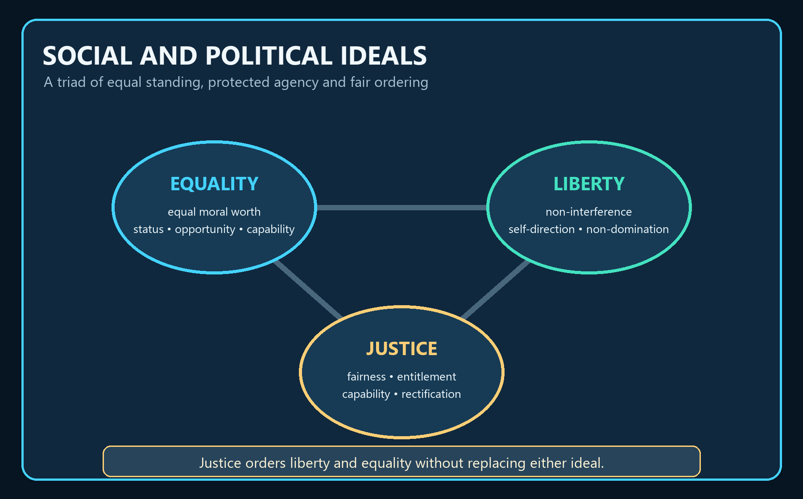

# Social and Political Ideals — Learner-v2 Source-Complete Learning Session


> **Generation:** g5, 30 August 2026 · **Approval:** false pending explicit topic approval
>
> **Evidence discipline:** Complete legacy teaching and workbook material is preserved, reordered Basic-first/Advanced-last, and checked against the canonical owner and verified 2018–2025 PYQ ledger.


## BASIC LEARNING SESSION




*Concept map: equality supplies equal standing, liberty protects agency, and justice orders their institutional relationship.*

> **Syllabus (verbatim):** Social and Political Ideals : Equality, Justice, Liberty.

### How to Use This Five-Layer Session

Every logical subtopic follows exactly:

| Layer | Purpose |
|---:|---|
| 1. SIMPLE START | visual-first plain-language gateway |
| 2. CORE UPSC | complete terminology, doctrine, argument, example and source grounding |
| 3. ADVANCED | objections, replies, comparisons, interpretive issues and provenance cautions |
| 4. EXAM APPLICATION | verified PYQ routes and 10/15/20-mark architecture |
| 5. RAPID REVISION | traps, retrieval notes and links to the exact MCQ set |

### Source Audit and Contemporary-Link Boundary

- **Canonical doctrine source:** `upsc-ai-kit/knowledge/Philosophy/paper-2/socio-political/Social-Political-Ideals.md` (9,542 words), sliced verbatim into the CORE UPSC layers (each canonical teaching passage exactly once) and preserved again, in full, in the canonical apparatus block.
- **Doctrine grounding (in the canonical file):** Equality (equal worth; formal/legal, political, social and economic forms; opportunity vs outcome; Rousseau, Mill and Marx; the "equality of what?" debate with Sen, Cohen and Dworkin); Liberty (Berlin's two concepts; Mill's harm principle; Hobbes, Locke, Rousseau and Green; technological society; Pettit's republican non-domination with Skinner's historical recovery); Justice (Plato and Aristotle; the criteria problem; corrective and compensatory justice; utilitarian justice; Rawls, Nozick, Sen and Ambedkar); the inter-thinker debates; and the criticisms and traps. No book claim is added beyond what the canonical file already grounds.
- **Verified PYQs:** local Socio-Political Philosophy Paper II bank, 2018-2025; this clause owns exactly **14** primary parts (2018:1, 2019:2, 2020:1, 2021:3, 2022:2, 2023:1, 2024:2, 2025:2). Democracy-form questions (Forms of Government) and Marxism-as-ideology questions (Political Ideologies) are kept separate; the 2022 Q2(c) equity/equality part is routed here because the demanded concept is equity vs equality, with Marx only as the frame.
- **Ownership discipline within the triad:** the affirmative-action / reservation POLICY debate is routed to the Caste (Gandhi-Ambedkar) owner; this package develops only the general compensatory PRINCIPLE. Articles 14-16 are cited exactly as the canonical file cites them - a constitutional permission for special provision, not a philosophical justification.
- **Provenance discipline:** named theories are cited by author and year only (Rawls 1971; Nozick 1974; Berlin 1958; Mill 1859/1869; Pettit 1997; Skinner 1998) with no invented quotations, page numbers, court cases, article claims, dates or statistics; the republican non-domination module and the distributive-criteria grid are named-scholar syntheses.
- **Contemporary-affairs boundary (deliberate):** this is a static, syllabus-driven conceptual clause; no sufficiently direct, reliable 2026 institutional development is forced as an anchor, and no factual claim is invented. Only static syllabus relevance and clearly labelled analysis are used.
- **Qdrant:** optional fallback only; not required for this canonical topic, and it never blocks the learning session.

**Preservation note:** the canonical doctrine is reorganised into layers, never compressed. Every doctrine, numbered argument, objection/reply, comparison, corpus-depth delta, PYQ route, directive rule, graded verdict and provenance caution is retained; simplification means adding accessible gateways, not deleting complexity.

### Learning Roadmap

| Unit | Logical subtopic |
|---:|---|
| 1 | The Ideals Triad: Map, Working Thesis and the Ordering Problem |
| 2 | Equality I: Equal Worth, the Four Forms, Opportunity vs Outcome |
| 3 | Equality II: Rousseau, Mill and Marx on Inequality, Individuality and Need |
| 4 | Equality III: 'Equality of What?' -- Sen, Cohen and Dworkin |
| 5 | Liberty I: Meaning, Berlin's Two Concepts, Mill's Harm Principle |
| 6 | Liberty II: Hobbes, Locke, Rousseau, Green and the Liberty-Equality Relation |
| 7 | Liberty III: Technological Society and Republican Non-Domination |
| 8 | Justice I: Meaning, Plato, Aristotle, the Criteria Problem and Corrective Justice |
| 9 | Justice II: Rawls, Nozick, Sen, Ambedkar and the Ordering Verdict |
| 10 | Debates, Criticisms and Traps: Synthesis Across the Triad |

---

### SESSION 1 — The Ideals Triad: Map, Working Thesis and the Ordering Problem


#### DEFINITION / WHAT THIS IS CALLED

**Plain-language definition:** Equality, liberty and justice answer different questions but must be ordered together in political institutions.

**Technical definition:** Equality concerns equal moral status and distribution, liberty concerns protected non-interference and agency, and justice supplies the rule for adjudicating their conflicts.

#### ANSWER-GRABBING OPENING — WRITE/ADAPT IN THE EXAM

> Equality and liberty make rival claims on institutions; justice is architectonic because it decides which liberties are basic and which inequalities are justified.

#### MUST-WRITE KEYWORDS

- **equal moral worth**
- **negative liberty**
- **basic liberties**
- **fair opportunity**
- **justice as mediation**

**How to use them:** Define the three ideals separately, expose the conflict between liberty and equality, and use justice to state a qualified institutional ordering. Explicitly connect **equal moral worth**, **negative liberty** and **basic liberties** in the answer spine.

#### CORE OBJECTION, REPLY AND RESIDUAL LIMIT

**Objection:** Justice cannot be a neutral referee because rival theories of justice already privilege different liberties and equalities.

**Best reply:** The mediation thesis is procedural rather than neutral: it makes the ordering rule explicit and open to public justification.

**Residual limit:** Do not write that justice mechanically harmonises every conflict; identify the contested criterion and defend a graded ordering.

#### EXAM USE AND CONCISE REVISION

**Answer architecture:** Define the three ideals separately, expose the conflict between liberty and equality, and use justice to state a qualified institutional ordering. Explicitly connect equal moral worth, negative liberty and basic liberties before the verdict.

- Equality, liberty and justice answer different questions but must be ordered together in political institutions.
- Political institutions allocate status, choice, burdens and benefits; equality and liberty generate claims, and justice ranks or reconciles them.
- A credible answer treats the triad as interdependent without collapsing one ideal into another.
- Do not write three disconnected mini-essays or assume that equality means sameness and liberty means licence.


Three big words run this whole syllabus item -- EQUALITY, LIBERTY, JUSTICE. Do
not treat them as three unrelated essays. They are one triangle, and each corner
answers a different question.

```text
        THE IDEALS TRIAD -- one triangle, three questions
        =================================================

        LIBERTY  <----- tension / help ----->  EQUALITY
        "what may I     \                    /  "in what sense
         do without      \                  /    are persons
         interference?"   \                /     equal?"
                           \              /
                            \   JUSTICE  /
                             \  is the  /
                              \ REFEREE/
                               \      /
                    "what is due to each, and by
                     what rule? which inequalities
                     are fair, which liberties basic?"
        -------------------------------------------------
        Rule of thumb: liberty + equality set up the claims;
        JUSTICE decides who wins and on what terms.
```

Plain version: give people total liberty and the strong dominate the weak; force
total equality and you crush individuality. Neither ideal, by itself, tells you
where to stop. Justice is the ideal that supplies the deciding rule.

> MEMORY: The minimum triad answer = (1) define the ideal in its strongest form,
> (2) show the strongest objection or rival ideal, (3) reconcile -- usually
> through justice, fair opportunity or basic liberties. Define -> Object ->
> Reconcile.


##### 0. ONE-SCREEN MAP

| Ideal | Core question | Canonical pivot | Central danger if absolutised | UPSC use-case |
|---|---|---|---|---|
| **Equality** | In what sense are persons equal? | Equal moral worth; equal concern | Levelling sameness, neglect of merit, coercive uniformity | Distinguish legal, political, social, economic equality; opportunity vs outcome |
| **Liberty** | What may a person do without interference, and what capacities must she possess to be truly free? | Negative vs positive liberty | Licence, domination by the strong, or paternal coercion in the name of freedom | Berlin, Mill, Hobbes–Locke–Rousseau, Green |
| **Justice** | What is due to each, and by what rule? | Fairness, due proportion, entitlement, capability | Sacrificing persons to aggregates, or freezing historical privilege | Plato, Aristotle, Rawls, Nozick, Sen, Ambedkar |

```text
                LIBERTY  <——— tension / complementarity ———>  EQUALITY
                   \                                           /
                    \                                         /
                     \            JUSTICE mediates            /
                      \   (due, fairness, entitlement,       /
                       \      capability, social dignity)   /
                        \                                   /
                         +------------ normative centre ----+
```

##### Working thesis ⚠️
- **Liberty** without limits can protect the freedom of the already powerful and undermine the conditions of equal citizenship.
- **Equality** without discrimination among relevant differences can become mechanical levelling and injure individuality or excellence.
- **Justice** supplies the **criterion of adjudication**: which inequalities are justified, which liberties are basic, and what social arrangements preserve dignity for all.

##### Minimum answer-formula ⚠️
For almost every UPSC question in this cluster, a balanced answer can move through three steps:
1. define the ideal in its strongest form;
2. show the strongest objection or rival ideal;
3. state a reconciliatory verdict, usually through justice, fair opportunity, or basic liberties.


#### SUBTOPIC CLOSURE FLOW

```text
The Ideals Triad: Map, Working Thesis and the Ordering Problem
        ->
0. ONE-SCREEN MAP
        ->
Working thesis ⚠️
        ->
Minimum answer-formula ⚠️
        ->
UPSC distinction and qualified verdict
```

#### CLOSING RECALL FLOW — The Ideals Triad: Map, Working Thesis and the Ordering Problem

```closure-flow
SUBTOPIC: The Ideals Triad: Map, Working Thesis and the Ordering Problem
STARTING CONCEPT: Equality, liberty and justice answer different questions but must be ordered together in political institutions.
KEY TERMS / DEFINITIONS: equal moral worth | negative liberty | basic liberties | fair opportunity | justice as mediation
MECHANISM / ARGUMENT: Political institutions allocate status, choice, burdens and benefits; equality and liberty generate claims, and justice ranks or reconciles them.
CONSEQUENCE / CONTRAST: A credible answer treats the triad as interdependent without collapsing one ideal into another.
UPSC TRAP / ANSWER-USE: Do not write three disconnected mini-essays or assume that equality means sameness and liberty means licence.
ANSWER-GRABBING FORMULATION: Equality and liberty make rival claims on institutions; justice is architectonic because it decides which liberties are basic and which inequalities are justified.
```

### SESSION 2 — Equality I: Equal Worth, the Four Forms, Opportunity vs Outcome


#### DEFINITION / WHAT THIS IS CALLED

**Plain-language definition:** Equality begins with equal moral worth but must be specified as legal, political, social or economic equality.

**Technical definition:** Formal equality removes explicit legal privilege, while substantive equality tests whether social power and conversion conditions make opportunity genuinely usable.

#### ANSWER-GRABBING OPENING — WRITE/ADAPT IN THE EXAM

> Equality is not identity of condition; it is a demand that relevant differences, unequal opportunities and status hierarchies be publicly justified.

#### MUST-WRITE KEYWORDS

- **equal moral worth**
- **formal equality**
- **political equality**
- **social equality**
- **fair equality of opportunity**

**How to use them:** Move from equal worth through the four forms, distinguish formal from fair opportunity, and qualify outcome-sensitive correction. Explicitly connect **equal moral worth**, **formal equality** and **political equality** in the answer spine.

#### CORE OBJECTION, REPLY AND RESIDUAL LIMIT

**Objection:** Substantive equality can become paternalistic levelling and can underweight responsibility, choice and incentive.

**Best reply:** The strongest egalitarian reply targets arbitrary background disadvantage rather than every chosen difference in outcome.

**Residual limit:** Do not equate equality with identical talents, treatment or final holdings; always state the relevant metric.

#### EXAM USE AND CONCISE REVISION

**Answer architecture:** Move from equal worth through the four forms, distinguish formal from fair opportunity, and qualify outcome-sensitive correction. Explicitly connect equal moral worth, formal equality and political equality before the verdict.

- Equality begins with equal moral worth but must be specified as legal, political, social or economic equality.
- Equal moral worth shifts the burden of proof onto inherited hierarchy; substantive equality then examines access, capability and status.
- Formal equality is necessary but may reproduce disadvantage when starting positions and social power remain unequal.
- Do not move from equality before law directly to achieved equality without showing the opportunity and capability mechanism.


Equality does NOT mean everyone is the same. It means every person counts equally
in moral worth, so hierarchies of birth, caste, race or sex must be JUSTIFIED,
not just assumed.

```text
     FOUR FORMS OF EQUALITY -- procedural to substantive
     ----------------------------------------------------
   [1] FORMAL / LEGAL   equality before law, equal protection
          |             (rule against legal privilege)
          v             ...but can be "paper equality"
   [2] POLITICAL        equal vote, equal citizenship, office
          |             ...but wealth may distort influence
          v
   [3] SOCIAL           no status hierarchy or stigma
          |             ...hard to secure by law alone
          v
   [4] ECONOMIC         reduce unjust disparities of resource
                        ...incentive vs redistribution debate

     OPPORTUNITY  vs  OUTCOME
     ------------------------
     start line fair?  |  final result fair?
     respects effort   |  corrects structural disadvantage
     fix: FAIR (not    |  fix: floors/ceilings, least-
     merely formal)    |       advantaged, capability
     opportunity       |       thresholds
```

Plain version: legal equality is the floor; social and economic equality ask
whether that floor means anything in real life. And the great modern dispute is
whether we equalise the STARTING LINE (opportunity) or the FINISHING LINE
(outcome).

> MEMORY: Four forms = LEGAL, POLITICAL, SOCIAL, ECONOMIC (L-P-S-E). Two lenses =
> OPPORTUNITY (start) vs OUTCOME (finish).


##### 1. EQUALITY

##### 1.1 Basic meaning
**Statement ✅:** Equality means not sameness of all persons in all respects, but recognition of **equal moral worth** and the demand that institutions treat persons with equal concern.

- **Argument ✅:** If all persons count morally, arbitrary hierarchies of birth, caste, race, sex, or inherited privilege need justification rather than presumption.
- **Presupposition ✅:** Human beings are moral agents whose dignity does not vary with social rank.
- **Distinction ✅:** equality of worth ≠ identity of talent, desire, capacity, or outcome.
- **Example ⚠️:** Equality before law does not imply equal income, but it rules out legal privilege by status.
- **Objection → Reply ⚠️:**
  - **Objection:** natural differences make equality unreal. - **Reply:** political equality does not deny difference; it denies that natural difference by itself authorises domination.

##### 1.2 Formal/legal, political, social, and economic equality

| Form of equality | Statement | What it secures | Main objection | Standard reply |
|---|---|---|---|---|
| **Formal / legal equality** ✅ | Equality before law and equal protection of laws | Rule against legal privilege | Can be merely paper equality if society is deeply unequal | Needs support from substantive opportunity |
| **Political equality** ✅ | Equal citizenship, equal vote, eligibility for office | Non-oligarchic public standing | Wealth may distort actual influence | Institutions must curb domination and widen participation |
| **Social equality** ✅ | Absence of status hierarchy and stigma | Equal civic respect | Hard to secure through law alone | Requires social reform, education, fraternity |
| **Economic equality** ⚠️ | Reduction of unjust disparities in resources, wealth, and life chances | Fair background conditions | May weaken incentive or require coercive redistribution | Defenders argue some redistribution protects fair freedom |

##### 1.3 Equality of opportunity and equality of outcome

**Statement ✅:** Modern theory distinguishes **equality of opportunity** from **equality of outcome**.

| Axis | Equality of opportunity | Equality of outcome |
|---|---|---|
| Core claim | Offices and advantages should be open on fair terms | Distribution should not leave large or unjust final disparities |
| Moral focus | Fair starting point | Fair social result |
| Liberal appeal | Respects effort and choice | Corrects structural disadvantage and inherited power |
| Main objection | “Starting line” fairness is illusory if background inequality is severe | Risks levelling, paternalism, and reduced autonomy |
| Best reply | Move from merely formal to **fair** equality of opportunity | Outcome concern may be limited to thresholds, needs, or least advantaged groups |

- **Argument ⚠️:** Opportunity language dominates liberal societies because it seems to combine fairness with responsibility. Yet if children inherit grossly unequal education, health, culture, and social networks, opportunity may be only formally equal.
- **Presupposition ✅:** Individuals should not be blocked by arbitrary birth-based barriers.
- **Example ⚠️:** Open competition for office is not fully fair where one class alone can realistically prepare for it.
- **Objection → Reply ⚠️:**
  - **Objection:** outcome-based thinking abolishes incentive. - **Reply:** many egalitarians ask not for identical outcomes but for ceilings on avoidable deprivation and floors of decent capability.


#### SUBTOPIC CLOSURE FLOW

```text
Equality I: Equal Worth, the Four Forms, Opportunity vs Outcome
        ->
1. EQUALITY
        ->
1.1 Basic meaning
        ->
1.2 Formal/legal, political, social, and economic equality
        ->
UPSC distinction and qualified verdict
```

#### CLOSING RECALL FLOW — Equality I: Equal Worth, the Four Forms, Opportunity vs Outcome

```closure-flow
SUBTOPIC: Equality I: Equal Worth, the Four Forms, Opportunity vs Outcome
STARTING CONCEPT: Equality begins with equal moral worth but must be specified as legal, political, social or economic equality.
KEY TERMS / DEFINITIONS: equal moral worth | formal equality | political equality | social equality | fair equality of opportunity
MECHANISM / ARGUMENT: Equal moral worth shifts the burden of proof onto inherited hierarchy; substantive equality then examines access, capability and status.
CONSEQUENCE / CONTRAST: Formal equality is necessary but may reproduce disadvantage when starting positions and social power remain unequal.
UPSC TRAP / ANSWER-USE: Do not move from equality before law directly to achieved equality without showing the opportunity and capability mechanism.
ANSWER-GRABBING FORMULATION: Equality is not identity of condition; it is a demand that relevant differences, unequal opportunities and status hierarchies be publicly justified.
```

### SESSION 3 — Equality II: Rousseau, Mill and Marx on Inequality, Individuality and Need


#### DEFINITION / WHAT THIS IS CALLED

**Plain-language definition:** Rousseau, Mill and Marx diagnose different ways in which apparently natural inequality is socially produced.

**Technical definition:** Rousseau distinguishes natural from moral-political inequality, Mill attacks manufactured female subordination, and Marx shows how formally equal exchange can reproduce class exploitation.

#### ANSWER-GRABBING OPENING — WRITE/ADAPT IN THE EXAM

> The crucial philosophical move is to ask whether inequality reflects relevant difference or an institution that converts difference into dependence and domination.

#### MUST-WRITE KEYWORDS

- **natural inequality**
- **moral-political inequality**
- **individuality**
- **manufactured subordination**
- **distribution according to need**

**How to use them:** Compare each thinker's causal mechanism, then distinguish status equality, individuality and material need before giving a synthesis. Explicitly connect **natural inequality**, **moral-political inequality** and **individuality** in the answer spine.

#### CORE OBJECTION, REPLY AND RESIDUAL LIMIT

**Objection:** The three diagnoses rest on incompatible views of property, individuality and the legitimate scope of social transformation.

**Best reply:** They can still be compared through one controlled question: how institutions turn difference into hierarchy or dependence.

**Residual limit:** Do not attribute Marx's higher communist distributive formula to immediate socialism or treat Rousseau's natural differences as political entitlements.

#### EXAM USE AND CONCISE REVISION

**Answer architecture:** Compare each thinker's causal mechanism, then distinguish status equality, individuality and material need before giving a synthesis. Explicitly connect natural inequality, moral-political inequality and individuality before the verdict.

- Rousseau, Mill and Marx diagnose different ways in which apparently natural inequality is socially produced.
- Convention, gender hierarchy and class structure transform physical difference or legal equality into social dependence.
- Anti-subordination requires legal status, protected individuality and attention to material structure.
- Do not merge Rousseau, Mill and Marx into one egalitarian doctrine; preserve their different mechanisms and remedies.


Three thinkers give equality three different jobs. Keep them on separate shelves.

```text
   ROUSSEAU        |   MILL            |   MARX
   -----------------------------------------------------------
   splits          |   liberal         |   suspicious of
   inequality:     |   egalitarian:    |   FORMAL equality:
                   |                   |
   NATURAL         |   equal worth +   |   equal exchange
   (age, strength) |   equal status +  |   hides class
      vs           |   WOMEN'S         |   exploitation
   ARTIFICIAL /    |   equality        |
   MORAL           |   (Subjection     |   equity = "to each
   (wealth, rank,  |    of Women)      |   according to NEED"
   convention)     |   -- but keeps    |   not "same measure
                   |   individuality   |   for all"
   -----------------------------------------------------------
   diagnosis:      |   extend equality |   equal RIGHT can be
   society MAKES   |   to social life, |   a right of
   the worst       |   esp. gender     |   INEQUALITY
   inequalities    |                   |
```

Plain version: Rousseau says the cruelest inequalities are man-made, not natural.
Mill says equality must reach women and social life, but must not crush
individuality. Marx says "equal treatment" can be a mask -- real fairness is
sensitive to NEED.

> MEMORY: Rousseau = natural vs artificial; Mill = equal status + women, minus
> levelling; Marx = equity (need) over formal equality.


##### 1.4 Rousseau: natural and artificial/moral inequality

**Statement ✅:** Rousseau distinguishes **natural or physical inequality** from **moral/political (often called artificial) inequality**.

- **Natural inequality ✅:** differences of age, strength, health, or intelligence.
- **Artificial/moral inequality ✅:** inequalities established by convention—wealth, honour, power, dependence, and social superiority.

**Argument ✅:** Natural differences become politically toxic when social institutions convert them into durable domination and vanity. Civil society, especially property and comparison, deepens dependence.

**Presupposition ✅:** Human beings in the state of nature are not yet trapped by the same comparative social passions that later produce hierarchy.

**Distinction ✅:** Rousseau is not saying all inequality is created by convention; he says the most oppressive forms are socially produced and socially maintained.

**Example ⚠️:** One person being stronger than another is natural; one person commanding another because convention sanctifies property and status is moral/political inequality.

**Objection → Reply ⚠️:**
- **Objection:** Rousseau romanticises nature and understates the inevitability of social ranking.
- **Reply:** the force of his distinction is diagnostic, not pastoral: institutions magnify and legitimise inequalities far beyond natural difference.

**UPSC hook:** This distinction directly answers **2021: 1(b) 10m** on natural versus artificial inequality.

##### 1.5 J. S. Mill on equality

**Statement ✅:** Mill is a liberal egalitarian in a qualified sense: he affirms equal moral standing, equal civic and legal status, and especially **gender equality**, but he resists crude levelling that suppresses individuality.

##### Mill's salient features of equality
1. **Equal worth in moral accounting ✅** — each person counts, and no one is to be discounted because of birth or station. 2. **Equality before law and citizenship ✅** — privilege by status is indefensible. 3. **Women's equality ✅** — in *The Subjection of Women*, Mill attacks legal and social subordination as a relic of domination, not nature.
4. **Equality compatible with individuality ✅** — sameness is not the goal; free self-development is. 5. **Hostility to custom-made hierarchy ✅** — inherited social subordination blocks both utility and justice. 6. **Qualified economic concern ⚠️** — Mill is open to reforming property relations and labour conditions, but not to extinguishing all differences by coercive equalisation.

- **Argument ✅:** A society that excludes half its members or attaches rights to status wastes human capacities and violates utility properly understood.
- **Presupposition ✅:** Human flourishing requires individuality and experimentation in living.
- **Distinction ✅:** equality of status and chance ≠ uniformity of life plan.
- **Example ✅:** Mill's feminist argument: subordination of women is not justified by nature because the “nature” appealed to is itself socially manufactured through subjection.
- **Objection → Reply ⚠️:**
  - **Objection:** Mill remains too individualistic to address structural economic inequality. - **Reply:** true, but within liberalism he radicalises equality by extending it beyond formal rights to social relations, especially gender.

##### 1.6 Marx: equality, equity, need

**Statement ✅:** Marx is suspicious of merely formal equality under capitalism because formally equal exchange can conceal material exploitation.

##### Equality versus equity in Marxian perspective

| Theme | Formal equality under capitalism | Marxian equity / communist principle |
|---|---|---|
| Distribution rule | Equivalent exchange among legal equals | Distribution by need in higher communism |
| Hidden reality | Class power shapes production and appropriation | Social production organised for human flourishing |
| Labour relation | Wage contract appears free and equal | Alienation and exploitation are overcome |
| Moral defect | Same legal rule applied to unequals reproduces class domination | Unequal needs justify differentiated shares |

**Canonical formula ✅:** “From each according to his ability, to each according to his need.”

- **Argument ✅:** Bourgeois equality abstracts from class structure. Equal right, measured by a common standard, can still be a right of inequality because people differ in need, burden, family condition, and starting position.
- **Presupposition ✅:** Human beings are socially formed producers; justice cannot be reduced to market exchange between isolated possessors.
- **Distinction ✅:** **Equality** = same measure for all; **equity** = differentiated treatment responsive to need and actual condition.
- **Example ⚠️:** Equal wages for all hours may still be inequitable if one worker supports dependents and another does not; Marx's deeper claim is that the wage relation itself is structurally exploitative.
- **Objection → Reply ⚠️:**
  - **Objection:** need-based distribution is vague and may weaken incentive. - **Reply:** Marx's principle concerns a higher stage of social cooperation where alienated labour and scarcity are transformed; it is not merely a market-time salary rule.

**UPSC hook:** This directly structures **2022: 2(c) 15m** on equity versus equality in Marxian philosophy.


#### SUBTOPIC CLOSURE FLOW

```text
Equality II: Rousseau, Mill and Marx on Inequality, Individuality and Need
        ->
1.4 Rousseau: natural and artificial/moral inequality
        ->
1.5 J. S. Mill on equality
        ->
Mill's salient features of equality
        ->
UPSC distinction and qualified verdict
```

#### CLOSING RECALL FLOW — Equality II: Rousseau, Mill and Marx on Inequality, Individuality and Need

```closure-flow
SUBTOPIC: Equality II: Rousseau, Mill and Marx on Inequality, Individuality and Need
STARTING CONCEPT: Rousseau, Mill and Marx diagnose different ways in which apparently natural inequality is socially produced.
KEY TERMS / DEFINITIONS: natural inequality | moral-political inequality | individuality | manufactured subordination | distribution according to need
MECHANISM / ARGUMENT: Convention, gender hierarchy and class structure transform physical difference or legal equality into social dependence.
CONSEQUENCE / CONTRAST: Anti-subordination requires legal status, protected individuality and attention to material structure.
UPSC TRAP / ANSWER-USE: Do not merge Rousseau, Mill and Marx into one egalitarian doctrine; preserve their different mechanisms and remedies.
ANSWER-GRABBING FORMULATION: The crucial philosophical move is to ask whether inequality reflects relevant difference or an institution that converts difference into dependence and domination.
```

### SESSION 4 — Equality III: 'Equality of What?' -- Sen, Cohen and Dworkin


#### DEFINITION / WHAT THIS IS CALLED

**Plain-language definition:** The equality-of-what debate asks which space—resources, welfare, capabilities or social relations—should be equalised.

**Technical definition:** Dworkin focuses resources and luck, Sen focuses capability to function, Cohen presses ethos and access to advantage, and relational egalitarians target hierarchy and humiliation.

#### ANSWER-GRABBING OPENING — WRITE/ADAPT IN THE EXAM

> An equality claim is incomplete until it identifies its metric, its treatment of choice and luck, and the social relation it seeks to transform.

#### MUST-WRITE KEYWORDS

- **equality of resources**
- **capability**
- **brute luck**
- **option luck**
- **relational equality**

**How to use them:** Name the metric, explain its conversion mechanism, test disability and responsibility objections, and compare distributive with relational equality. Explicitly connect **equality of resources**, **capability** and **brute luck** in the answer spine.

#### CORE OBJECTION, REPLY AND RESIDUAL LIMIT

**Objection:** No single metric captures need, agency, expensive preference, disability, responsibility and civic standing without loss.

**Best reply:** Metric pluralism can retain a primary evaluative space while adding responsibility and anti-humiliation constraints.

**Residual limit:** Do not cite Sen as advocating equal outcomes; capability evaluates real freedom, not identical functionings.

#### EXAM USE AND CONCISE REVISION

**Answer architecture:** Name the metric, explain its conversion mechanism, test disability and responsibility objections, and compare distributive with relational equality. Explicitly connect equality of resources, capability and brute luck before the verdict.

- The equality-of-what debate asks which space—resources, welfare, capabilities or social relations—should be equalised.
- Resources are converted into real opportunities under unequal personal and social conditions, so identical bundles can yield unequal freedom.
- The chosen metric changes who appears disadvantaged and which remedy counts as egalitarian.
- Do not answer equality-of-what with a list of thinkers; compare the metric, conversion rule and residual objection.


The modern egalitarian does not ask "equality yes or no?" but "equality OF WHAT?"
-- which currency do we equalise?

```text
     "EQUALITY OF WHAT?" -- the metric ladder
     ----------------------------------------
     UTILITY / WELFARE  --> how happy/satisfied?      (too subjective)
            |
     RESOURCES / GOODS  --> how much stuff/income?    (Dworkin, Rawls)
            |                same stuff != same freedom
            v
     CAPABILITIES       --> what can you actually     (SEN)
                            DO and BE?                 real freedom, not
                                                       just possession
     ----------------------------------------
     side-debate (COHEN): even just institutions can be
     undermined by an anti-egalitarian ETHOS -- the
     talented demanding extra reward to contribute.

     side-debate (DWORKIN): equalise RESOURCES, not welfare;
     neutralise BRUTE luck (unchosen), respect OPTION luck
     (chosen gambles).
```

Plain version: two people with the same income are not equally free if one is
disabled, or blocked by social norms. Sen says measure real freedoms
(capabilities), not just the stuff people hold.

> MEMORY: Ladder = UTILITY -> RESOURCES -> CAPABILITIES. Sen picks capabilities;
> Dworkin picks resources; Cohen adds the ethos.


##### 1.7 “Equality of what?” — Sen and Cohen

**Statement ✅:** The modern egalitarian question is not whether to value equality, but **equality of what**.

##### Sen
- **Statement ✅:** Equality should focus neither only on utility nor only on primary goods, but on **capabilities**—what persons are actually able to do and to be.
- **Argument ✅:** The same bundle of resources yields different real freedoms for different persons because of disability, age, gender, climate, health, and social position.
- **Presupposition ✅:** Persons are diverse in conversion of resources into functioning.
- **Distinction ✅:** resources ≠ capabilities; possession ≠ effective freedom.
- **Example ⚠️:** Two persons with the same income may not have the same real mobility or educational possibility.
- **Objection → Reply ⚠️:**
  - **Objection:** capability lists can be indeterminate. - **Reply:** Sen deliberately leaves room for public reasoning rather than a rigid final list.

##### G. A. Cohen
- **Statement ✅:** Cohen presses the question whether equality should concern welfare, opportunity for advantage, access to advantage, or broader community-sensitive conditions.
- **Argument ⚠️:** If justice is compromised by incentives demanded by the talented, then unequal outcomes cannot be fully excused merely because institutions are just at the basic-structure level.
- **Presupposition ⚠️:** personal choices and ethos matter, not only institutions.
- **Distinction ⚠️:** institutional justice vs egalitarian social ethos.
- **Example ⚠️:** If the talented demand extra reward to contribute, Cohen asks whether this reflects justice or moral bargaining power.
- **Objection → Reply ⚠️:**
  - **Objection:** Cohen's standard is too demanding of personal virtue. - **Reply:** he reveals that institutional equality can be undermined by anti-egalitarian attitudes and incentives.

##### 1.8 Dworkin's resource egalitarianism (brief)

**Statement ✅:** Dworkin argues for **equality of resources**, not equality of welfare.

- **Argument ✅:** Justice should neutralise brute luck while respecting responsible choice. His auction and insurance thought experiments try to show how equal concern can coexist with personal responsibility.
- **Presupposition ✅:** Differences due to luck and differences due to choice should not be treated alike.
- **Distinction ✅:** brute luck vs option luck.
- **Example ⚠️:** Society may insure against misfortune people did not choose, without compensating every outcome of risky voluntary choices.
- **Objection → Reply ⚠️:**
  - **Objection:** separating luck from choice is often difficult in real life. - **Reply:** even if imperfect, the distinction clarifies why egalitarianism need not equalise every preference-satisfaction.

##### 1.9 Interim verdict on equality ⚠️
Equality is strongest when treated as **equal status, fair opportunity, and protection against arbitrary domination**, while remaining alert to need, capability, and historical oppression. The deepest debates are not “equality or no equality,” but *which metric*, *what scope*, and *how far equality may justify differential treatment*.


#### SUBTOPIC CLOSURE FLOW

```text
Equality III: 'Equality of What?' -- Sen, Cohen and Dworkin
        ->
1.7 “Equality of what?” — Sen and Cohen
        ->
Sen
        ->
G. A. Cohen
        ->
UPSC distinction and qualified verdict
```

#### CLOSING RECALL FLOW — Equality III: 'Equality of What?' -- Sen, Cohen and Dworkin

```closure-flow
SUBTOPIC: Equality III: 'Equality of What?' -- Sen, Cohen and Dworkin
STARTING CONCEPT: The equality-of-what debate asks which space—resources, welfare, capabilities or social relations—should be equalised.
KEY TERMS / DEFINITIONS: equality of resources | capability | brute luck | option luck | relational equality
MECHANISM / ARGUMENT: Resources are converted into real opportunities under unequal personal and social conditions, so identical bundles can yield unequal freedom.
CONSEQUENCE / CONTRAST: The chosen metric changes who appears disadvantaged and which remedy counts as egalitarian.
UPSC TRAP / ANSWER-USE: Do not answer equality-of-what with a list of thinkers; compare the metric, conversion rule and residual objection.
ANSWER-GRABBING FORMULATION: An equality claim is incomplete until it identifies its metric, its treatment of choice and luck, and the social relation it seeks to transform.
```

### SESSION 5 — Liberty I: Meaning, Berlin's Two Concepts, Mill's Harm Principle


#### DEFINITION / WHAT THIS IS CALLED

**Plain-language definition:** Liberty concerns both freedom from interference and the conditions of self-direction.

**Technical definition:** Berlin distinguishes negative from positive liberty, while Mill's harm principle places the burden of proof on coercion aimed at self-regarding conduct.

#### ANSWER-GRABBING OPENING — WRITE/ADAPT IN THE EXAM

> A liberty answer must identify who is free, from what constraint, to do what, and under whose authority coercion is justified.

#### MUST-WRITE KEYWORDS

- **negative liberty**
- **positive liberty**
- **harm principle**
- **self-regarding acts**
- **value pluralism**

**How to use them:** Define Berlin's two concepts, apply Mill's harm threshold, distinguish harm from offence, and confront paternalism. Explicitly connect **negative liberty**, **positive liberty** and **harm principle** in the answer spine.

#### CORE OBJECTION, REPLY AND RESIDUAL LIMIT

**Objection:** Positive liberty can authorise coercion in the name of a supposedly rational or true self.

**Best reply:** Enabling conditions can expand agency if they remain rights-bound, contestable and non-perfectionist.

**Residual limit:** Do not reduce negative liberty to absence of every rule or positive liberty to whatever policy claims to improve welfare.

#### EXAM USE AND CONCISE REVISION

**Answer architecture:** Define Berlin's two concepts, apply Mill's harm threshold, distinguish harm from offence, and confront paternalism. Explicitly connect negative liberty, positive liberty and harm principle before the verdict.

- Liberty concerns both freedom from interference and the conditions of self-direction.
- Negative liberty protects a sphere against interference; positive liberty asks whether the agent can direct her life; the harm principle tests coercion.
- Liberty requires both a protected domain and disciplined justification of interventions that claim to enable freedom.
- Do not treat offence, immorality and harm as interchangeable or ignore Berlin's warning about coercive self-mastery.


Liberty has two classic doors, and one famous gate.

```text
     BERLIN'S TWO DOORS OF LIBERTY
     -----------------------------------------------
     NEGATIVE liberty        |   POSITIVE liberty
     "freedom FROM"          |   "freedom TO"
     Within what area am I   |   Who is my master?
     left alone?             |   By what self am I ruled?
     Hobbes, Locke, Mill     |   Rousseau, Kant, Green
     value: no coercion      |   value: self-mastery
     risk: ignores real      |   risk: coercing the
       incapacity            |     "lower self" for the
                             |     "real self"
     -----------------------------------------------

     MILL'S HARM-PRINCIPLE GATE
     -----------------------------------------------
     act primarily on YOURSELF  --> [ self-regarding ] --> leave free
     act that harms OTHERS      --> [ other-regarding] --> may regulate
     (mere offence/disapproval is NOT harm)
```

Plain version: negative liberty is a fence around you that the state may not
cross. Positive liberty is being genuinely in charge of yourself. Mill's rule for
where society may step in: only to prevent HARM TO OTHERS.

> MEMORY: Negative = freedom FROM (Berlin's warning lives here). Positive =
> freedom TO. Mill's gate = harm to others, not offence.


##### 2. LIBERTY

##### 2.1 Basic meaning
**Statement ✅:** Liberty refers to a protected sphere of action and thought, and in richer accounts to the power of self-direction or self-realisation.

- **Argument ✅:** A person is not fully human if every act depends on another's permission.
- **Presupposition ✅:** agency has moral significance.
- **Distinction ✅:** liberty ≠ mere power; a tyrant has power, not a right to liberty.
- **Example ⚠️:** freedom of speech protects a domain of judgment even when one's opinions are unpopular.
- **Objection → Reply ⚠️:**
  - **Objection:** no one is ever absolutely unconstrained. - **Reply:** liberty theory concerns justified and unjustified constraints, not metaphysical limitlessness.

##### 2.2 Isaiah Berlin: negative and positive liberty

| Dimension | Negative liberty | Positive liberty |
|---|---|---|
| Core question | Within what area am I left alone? | Who governs me? By what self am I directed? |
| Basic sense | Freedom **from** interference ✅ | Freedom **to** be one's own master ✅ |
| Typical lineage | Hobbes, Locke, Mill, classical liberalism | Rousseau, Kantian autonomy, Hegel, Green |
| Main value | Protection against coercion and paternalism | Self-mastery, rational agency, self-realisation |
| Berlin's warning | Too little positive concern may ignore actual incapacity | Positive liberty may justify coercing the “lower self” for the “real self” |

**Statement ✅:** Berlin does not deny the attraction of positive liberty; he warns that when rulers claim to know a person's “true” interests better than the person herself, coercion can masquerade as emancipation.

- **Argument ✅:** The split between “real self” and “empirical self” permits authoritarian paternalism.
- **Presupposition ✅:** value pluralism; human goods are many and not always harmonisable.
- **Distinction ✅:** enabling conditions for freedom are different from a doctrine authorising forced perfection.
- **Example ⚠️:** A state claiming to silence dissent “for citizens' true freedom” illustrates the danger Berlin saw.
- **Objection → Reply ⚠️:**
  - **Objection:** pure negative liberty ignores poverty, addiction, illiteracy, and dependency. - **Reply:** Berlin's distinction need not deny social preconditions; it warns against totalising political projects in the name of liberation.

##### 2.3 Mill: harm principle; self-regarding and other-regarding acts

**Statement ✅:** In *On Liberty*, Mill holds that the only legitimate reason for coercing an individual against her will is to prevent **harm to others**.

##### Mill's doctrine
- **Self-regarding acts ✅:** actions whose primary effects fall on the agent herself should generally not be coercively restrained.
- **Other-regarding acts ✅:** actions harming others may be regulated or punished.

- **Argument ✅:** Individuality, experimentation, and freedom of discussion are essential both for truth and for human development.
- **Presupposition ✅:** competent adults are generally the best judges of their own good.
- **Distinction ✅:** offence or disapproval ≠ harm; moral dislike alone is insufficient ground for coercion.
- **Example ✅:** Heterodox opinion should not be suppressed merely because the majority finds it false or offensive.
- **Standard objection ✅/⚠️:**
  - Many acts are not cleanly self-regarding; private conduct may have social spillovers.
  - Harm is itself contestable: is moral corruption, dependency, or public indecency a harm?
- **Reply ⚠️:** Mill's doctrine is a presumption for liberty, not a denial of all regulation. The burden of proof lies on coercion, and paternalism must remain exceptional.


#### SUBTOPIC CLOSURE FLOW

```text
Liberty I: Meaning, Berlin's Two Concepts, Mill's Harm Principle
        ->
2. LIBERTY
        ->
2.1 Basic meaning
        ->
2.2 Isaiah Berlin: negative and positive liberty
        ->
UPSC distinction and qualified verdict
```

#### CLOSING RECALL FLOW — Liberty I: Meaning, Berlin's Two Concepts, Mill's Harm Principle

```closure-flow
SUBTOPIC: Liberty I: Meaning, Berlin's Two Concepts, Mill's Harm Principle
STARTING CONCEPT: Liberty concerns both freedom from interference and the conditions of self-direction.
KEY TERMS / DEFINITIONS: negative liberty | positive liberty | harm principle | self-regarding acts | value pluralism
MECHANISM / ARGUMENT: Negative liberty protects a sphere against interference; positive liberty asks whether the agent can direct her life; the harm principle tests coercion.
CONSEQUENCE / CONTRAST: Liberty requires both a protected domain and disciplined justification of interventions that claim to enable freedom.
UPSC TRAP / ANSWER-USE: Do not treat offence, immorality and harm as interchangeable or ignore Berlin's warning about coercive self-mastery.
ANSWER-GRABBING FORMULATION: A liberty answer must identify who is free, from what constraint, to do what, and under whose authority coercion is justified.
```

### SESSION 6 — Liberty II: Hobbes, Locke, Rousseau, Green and the Liberty-Equality Relation


#### DEFINITION / WHAT THIS IS CALLED

**Plain-language definition:** Hobbes, Locke, Rousseau and Green connect liberty to different relations between law, consent, security and effective capacity.

**Technical definition:** Hobbes stresses absence of impediment under order, Locke liberty under known law, Rousseau autonomy through self-legislation, and Green positive capacity for worthwhile action.

#### ANSWER-GRABBING OPENING — WRITE/ADAPT IN THE EXAM

> Law can restrict particular choices yet constitute liberty when it secures status, consent and the effective conditions of agency.

#### MUST-WRITE KEYWORDS

- **absence of impediment**
- **liberty under law**
- **general will**
- **self-legislation**
- **positive freedom**

**How to use them:** Compare the thinker's account of law and agency, then test whether enabling conditions protect or paternalistically replace choice. Explicitly connect **absence of impediment**, **liberty under law** and **general will** in the answer spine.

#### CORE OBJECTION, REPLY AND RESIDUAL LIMIT

**Objection:** Once the state defines worthwhile capacity, positive freedom can erase plural values and personal responsibility.

**Best reply:** Green's insight is strongest when enabling provision expands option sets while rights and contestation constrain perfectionism.

**Residual limit:** Do not call Hobbes a positive-liberty theorist or infer that Rousseau licenses any state command as the general will.

#### EXAM USE AND CONCISE REVISION

**Answer architecture:** Compare the thinker's account of law and agency, then test whether enabling conditions protect or paternalistically replace choice. Explicitly connect absence of impediment, liberty under law and general will before the verdict.

- Hobbes, Locke, Rousseau and Green connect liberty to different relations between law, consent, security and effective capacity.
- Security, known law, civic authorship and social capability each alter whether formal choice is usable and non-dominating.
- Liberty and equality can complement one another when fair conditions enlarge everyone's effective agency.
- Do not present liberty and equality as always zero-sum; identify when redistribution enables rather than suppresses freedom.


The social-contract trio and Green give four different answers to "what makes a
person free?" -- then we test liberty against equality.

```text
   WHAT IS THE ESSENCE OF FREEDOM?
   ----------------------------------------------------
   HOBBES   | free where the law is SILENT; order first
   LOCKE    | free under KNOWN LAW that protects rights;
            | licence is not liberty
   ROUSSEAU | free by obeying the GENERAL WILL you help make
            | ("forced to be free")
   GREEN    | free = the POSITIVE POWER to do worthwhile
            | things; education enables agency
   ----------------------------------------------------

   LIBERTY vs EQUALITY -- rivals or partners?
   ----------------------------------------------------
   CONFLICT                    | COMPLEMENT
   - unrestricted liberty      | - equal basic liberties
     breeds inequality         |   ARE a form of equality
   - forced equalising         | - equality secures the
     curbs choice              |   conditions for real freedom
   - social bases of freedom   | - Rawlsian priority: liberty
     unequally spread          |   not traded for welfare
   ----------------------------------------------------
   verdict: rivals mainly BEYOND a threshold; partners at the
   level of basic liberties and equal civic standing.
```

> MEMORY: Contract trio = ORDER (Hobbes) / RIGHTS-UNDER-LAW (Locke) / GENERAL
> WILL (Rousseau); Green adds ENABLING freedom. Liberty vs equality = rivals at
> the margin, partners at the base.


##### 2.4 Hobbes, Locke, Rousseau on liberty

| Thinker | Statement of liberty | Presupposition | Main gain | Main risk / objection |
|---|---|---|---|---|
| **Hobbes** ✅ | Liberty is absence of external impediments; under law, one is free where law is silent | Security is primary; fear defines the state of nature | Strong state ends civil war | Liberty becomes thin and subordinated to sovereign order |
| **Locke** ✅ | Liberty is not licence; it is freedom under known law preserving life, liberty, property | Natural rights pre-exist government | Constitutional limits and consent | Property-centred liberty may mask inequality |
| **Rousseau** ✅ | True liberty is obedience to a law one prescribes to oneself as part of the general will | Freedom requires participation and moral autonomy | Citizens become self-legislating | General will may be misread in majoritarian or authoritarian ways |

##### Hobbes
- **Statement ✅:** Liberty is the absence of impediments to motion; politically, subjects are free where the sovereign has not prohibited action.
- **Argument ✅:** Without order, liberty is insecure because all fear violent death.
- **Objection → Reply ⚠️:**
  - **Objection:** this reduces liberty to a residual gap tolerated by power. - **Reply:** Hobbes's point is that stable freedom presupposes peace.

##### Locke
- **Statement ✅:** Liberty exists under law, not outside it; arbitrary power is the enemy of freedom.
- **Argument ✅:** Since persons have natural rights, government is fiduciary and limited.
- **Objection → Reply ⚠️:**
  - **Objection:** emphasis on property privileges possessive individualism. - **Reply:** Locke nonetheless grounds liberty in anti-arbitrariness and consent, crucial for constitutionalism.

##### Rousseau
- **Statement ✅:** Civil liberty and moral freedom arise when each, in obeying the general will, obeys a law one gives oneself collectively.
- **Argument ✅:** Mere appetite is slavery; autonomy requires participation in a common rational will.
- **Objection → Reply ⚠️:**
  - **Objection:** “forced to be free” invites authoritarian interpretation. - **Reply:** defenders insist the doctrine concerns legitimate collective self-rule, not private domination by rulers.

##### 2.5 T. H. Green and positive freedom

**Statement ✅:** Green redefines liberty as the **positive power** to do or enjoy something worth doing or enjoying; freedom is tied to self-realisation.

- **Argument ✅:** Mere non-interference is hollow where persons are crippled by ignorance, addiction, destitution, or social subordination.
- **Presupposition ✅:** the self has higher capacities that social conditions can foster or deform.
- **Distinction ✅:** coercion is not the only enemy of freedom; disabling conditions also matter.
- **Example ⚠️:** Education can enhance liberty because it equips agency rather than merely leaving persons alone.
- **Objection → Reply ⚠️:**
  - **Objection:** the state may paternalistically impose a preferred conception of the good. - **Reply:** Green's strongest reading is enabling, not perfectionist domination: institutions should enlarge the effective capacity for worthwhile action.

##### 2.6 Liberty and equality: conflict and complementarity

**Statement ⚠️:** Liberty and equality are often presented as rivals, but they are most plausibly rivals only beyond a certain threshold; at the level of **basic liberties**, they are mutually reinforcing.

##### Why they conflict
1. **Unrestricted liberty can generate inequality ✅** — freedom of contract, property accumulation, or market power may let the strong dominate the weak. 2. **Aggressive equalisation can curb liberty ✅** — heavy control of choice, association, or property may suppress individuality. 3. **The social bases of freedom are unequally distributed ⚠️** — formal liberty means little where persons lack education, health, or resources.

##### Why they complement
1. **Equal basic liberties are themselves a form of equality ✅.**
2. **Substantive equality may secure the conditions for effective liberty ⚠️.**
3. **Rawlsian priority rules show that liberty need not be traded away for aggregate welfare or arbitrary equality ✅.**

| Claim | Strong version | Counter-position | Balanced verdict |
|---|---|---|---|
| Liberty limits equality | Too much equalisation kills initiative and choice | Without background equality, liberty is class privilege | Some inequalities may remain, but only under fair terms |
| Equality limits liberty | Redistributive control invades private domain | Basic inequalities also coerce by dependence | Basic liberties must be secured for all before market advantage expands |
| They are complementary | Equal civic standing sustains freedom | Complementarity may break at higher distributive demands | Complementarity is strongest at the level of rights and opportunities |

- **Example ⚠️:** Freedom of speech for all is both a liberty and an equality of civic standing.
- **Objection → Reply ⚠️:**
  - **Objection:** any redistribution violates liberty. - **Reply:** if deprivation places persons under domination, some redistribution protects rather than negates freedom.

**UPSC hook:** This section directly answers **2019: 4(b)**, **2022: 1(d)**, **2024: 2(b)**, and helps with **2018: 2(a)**.


#### SUBTOPIC CLOSURE FLOW

```text
Liberty II: Hobbes, Locke, Rousseau, Green and the Liberty-Equality Relation
        ->
2.4 Hobbes, Locke, Rousseau on liberty
        ->
Hobbes
        ->
Locke
        ->
UPSC distinction and qualified verdict
```

#### CLOSING RECALL FLOW — Liberty II: Hobbes, Locke, Rousseau, Green and the Liberty-Equality Relation

```closure-flow
SUBTOPIC: Liberty II: Hobbes, Locke, Rousseau, Green and the Liberty-Equality Relation
STARTING CONCEPT: Hobbes, Locke, Rousseau and Green connect liberty to different relations between law, consent, security and effective capacity.
KEY TERMS / DEFINITIONS: absence of impediment | liberty under law | general will | self-legislation | positive freedom
MECHANISM / ARGUMENT: Security, known law, civic authorship and social capability each alter whether formal choice is usable and non-dominating.
CONSEQUENCE / CONTRAST: Liberty and equality can complement one another when fair conditions enlarge everyone's effective agency.
UPSC TRAP / ANSWER-USE: Do not present liberty and equality as always zero-sum; identify when redistribution enables rather than suppresses freedom.
ANSWER-GRABBING FORMULATION: Law can restrict particular choices yet constitute liberty when it secures status, consent and the effective conditions of agency.
```

### SESSION 7 — Liberty III: Technological Society and Republican Non-Domination


#### DEFINITION / WHAT THIS IS CALLED

**Plain-language definition:** Technological society can expand choice while creating surveillance and platform dependence that expose persons to arbitrary power.

**Technical definition:** Republican liberty as non-domination distinguishes actual interference from standing subjection to an uncontrolled capacity to interfere.

#### ANSWER-GRABBING OPENING — WRITE/ADAPT IN THE EXAM

> In technological society, republican non-domination shows why a person may be left alone yet remain unfree when another actor can arbitrarily track, rank, exclude or manipulate her choices.

#### MUST-WRITE KEYWORDS

- **non-domination**
- **arbitrary power**
- **surveillance**
- **platform dependence**
- **contestability**

**How to use them:** Separate interference from domination, explain the standing-power mechanism, and test whether law makes technological power contestable. Explicitly connect **non-domination**, **arbitrary power** and **surveillance** in the answer spine.

#### CORE OBJECTION, REPLY AND RESIDUAL LIMIT

**Objection:** The domination standard may classify every dependency or unequal capacity as unfreedom and demand excessive regulation.

**Best reply:** Republican analysis targets uncontrolled arbitrary power, not all dependence; public rules and effective contestation are decisive.

**Residual limit:** Do not assume privacy, access or innovation automatically settles liberty; specify the power relation and remedy.

#### EXAM USE AND CONCISE REVISION

**Answer architecture:** Separate interference from domination, explain the standing-power mechanism, and test whether law makes technological power contestable. Explicitly connect non-domination, arbitrary power and surveillance before the verdict.

- Technological society can expand choice while creating surveillance and platform dependence that expose persons to arbitrary power.
- Data concentration and platform control create a standing capacity to shape options even without a discrete act of interference.
- Freedom requires institutional contestability as well as a count of actual interferences.
- Do not say non-domination is merely Berlin's negative liberty; its object is uncontrolled status and power.


Two frontier ideas: liberty under technology, and a THIRD kind of liberty beyond
Berlin's pair.

```text
   LIBERTY IN A TECH SOCIETY
   -----------------------------------------------
   expands: knowledge, mobility, communication, choice
   threatens: surveillance, manipulation, nudging,
              concentration of INFORMATIONAL power
   key line: convenience != autonomy
   demand: transparency, accountability, zones of
           non-domination
   -----------------------------------------------

   THE THIRD FAMILY -- FREEDOM AS NON-DOMINATION (Pettit)
   -----------------------------------------------
   the un-interfered-with SLAVE / the indulgent master:
     - not currently interfered with  --> "free"?
     - but must flatter, self-censor, live at another's
       DISCRETION, because the master CAN interfere
       arbitrarily and with impunity
   => real unfreedom an interference-count cannot see
   -----------------------------------------------
   INTERFERENCE = an act
   DOMINATION   = a standing CAPACITY to interfere arbitrarily
   => non-arbitrary law can interfere WITHOUT dominating;
      a kind master can dominate WITHOUT interfering.
```

> MEMORY: Non-domination = being free from another's CAPACITY for arbitrary
> interference, exercised or not. Interference is an act; domination is a status.


##### 2.7 Liberty in modern technological society

**Statement ⚠️:** Liberty is realisable in technological society, but only under vigilance against surveillance, manipulation, and concentration of informational power.

- **Argument ⚠️:** technology can expand knowledge, mobility, communication, and choice, yet also create subtle dependence and behavioural steering.
- **Presupposition ⚠️:** coercion today may be infrastructural and informational, not only legal.
- **Distinction ⚠️:** convenience ≠ autonomy.
- **Example ⚠️:** algorithmic nudging may leave formal options open while shaping choices invisibly.
- **Objection → Reply ⚠️:**
  - **Objection:** modern complexity requires pervasive management. - **Reply:** even where coordination is needed, liberty demands transparency, accountability, and zones of non-domination.

**UPSC hook:** Useful for **2020: 1(a) 10m**.

##### 2.8 Republican liberty as non-domination (Pettit)

**Statement ⚠️:** A **third family** of liberty, irreducible to Berlin's pair, defines freedom as **non-domination** — not being subject to another agent's *capacity* for arbitrary interference, whether or not that capacity is currently being exercised. The normative theory is associated with **Philip Pettit**, *Republicanism: A Theory of Freedom and Government* (**1997**); the historical recovery of the pre-liberal republican tradition is associated with **Quentin Skinner**, *Liberty before Liberalism* (**1998**). ⚠️ Keep the two roles separate: Pettit supplies the theory, Skinner the intellectual history. ❌ Do not quote either, and do not attach page, chapter or edition detail.

**Reconstructed argument ⚠️:**

1. the negative conception measures freedom by *actual* interference with an agent's options;
2. but consider a person under a kind master, an indulgent husband, an unusually generous employer, or a benevolent ruler who happens not to interfere;
3. that person is not interfered with, so on the negative count is free;
4. yet she must flatter, anticipate, self-censor and live at another's discretion, because the other retains the power to interfere **arbitrarily and with impunity**;
5. this dependence is a real unfreedom that an interference-count cannot register;
6. therefore liberty is best specified as a **secured status** — non-domination — rather than as an event-count of non-interference.

**Presupposition ⚠️:** freedom is a social and institutional standing, not a description of an agent's momentarily unobstructed path; unexercised power is still power.

**Controlling distinction ⚠️:** *interference* is an act; *domination* is a standing capacity to interfere arbitrarily. Law that tracks the interests of those it governs and remains publicly contestable can **interfere without dominating**; a master's forbearance can **dominate without interfering**.

**Consequence for the liberty–law relation ⚠️:** on the negative view, every law is *prima facie* a subtraction from liberty, justified only as a lesser evil. On the republican view, law of the right kind is **freedom-constituting**, because it strips private persons of arbitrary power. This is the sharpest analytical payoff of the third family and should be stated explicitly in any liberty answer that reaches 15 or 20 marks.

| Diagnostic question | Negative liberty | Positive liberty | Republican non-domination |
|---|---|---|---|
| What is the freedom-destroying variable? | external obstruction by others | internal disorder, ignorance, want of enabling conditions | another's arbitrary and unaccountable power |
| Is an un-interfered-with slave free? | ⚠️ yes, to that extent | ⚠️ contested — depends on self-mastery | ⚠️ no, and unfree *as a slave* |
| Is law a loss of freedom? | ⚠️ yes, requiring justification | ⚠️ may be freedom-enabling | ⚠️ non-arbitrary law is freedom-constituting |
| Institutional demand | restrain the state | develop capacities and provide conditions | contestability, publicity, review, interest-tracking |
| Named anchors | ⚠️ Berlin's negative pole; Mill's harm principle | ⚠️ Green's enabling freedom; Rousseau's moral freedom | ⚠️ Pettit (1997); Skinner (1998) |

**Objection → Reply (use one, not both, at 10 marks) ⚠️:**

- **Objection 1 (redundancy):** everything non-domination names could be redescribed as a high *probability* of future interference, so the third family adds a label, not a concept.
  **Reply:** ⚠️ probability of interference is contingent and can be low precisely where dependence is total; the republican point is about the *standing* of the relation, and it also explains why the dependent person's own conduct — deference, anticipation, self-silencing — changes, which an interference-count cannot explain.
- **Objection 2 (indeterminacy of "arbitrary"):** who decides which interferences are arbitrary? The theory risks smuggling in a substantive conception of the common good. **Reply:** ⚠️ republicans specify arbitrariness procedurally — interference is non-arbitrary when it is forced to track the avowable interests of the governed and remains open to effective contestation. The reply reduces, but does not eliminate, the indeterminacy; the residual problem is genuine and should be conceded in an answer.

**Relation to the ideals in this file ⚠️:** non-domination reframes the classic liberty–equality "trade-off" of §2.6. On the negative reading, redistributive or regulatory equality subtracts liberty. On the republican reading, material dependence *is* a source of domination, so certain equalising measures **increase** freedom rather than trading against it — a decisive line for 2019 Q4(b), 2022 Q1(d) and 2024 Q2(b).

**Indian application (legal-status caution) ⚠️:** the vocabulary is an analytical lens, not an empirical verdict about any Indian government, party or period. ✅ The Bonded Labour System (Abolition) Act, **1976** is an **enacted statute** that legally dissolves a relation of personal dependence; ✅ the Minimum Wages Act, **1948** and the Sexual Harassment of Women at Workplace (Prevention, Prohibition and Redressal) Act, **2013** are enacted statutes that replace employer discretion with rule-governed entitlement and complaint machinery. ⚠️ Enactment is not implementation, and none of these establishes that domination has in fact ended; cite them as dated illustrations of the *form* of a non-domination remedy, never as proof of a philosophical thesis.

**UPSC hook:** the strongest depth marker available on any liberty question; also usable as a supplement in **2018: 2(a) 20m** (liberty and equality as democratic features).


#### SUBTOPIC CLOSURE FLOW

```text
Liberty III: Technological Society and Republican Non-Domination
        ->
2.7 Liberty in modern technological society
        ->
2.8 Republican liberty as non-domination (Pettit)
        ->
UPSC distinction and qualified verdict
```

#### CLOSING RECALL FLOW — Liberty III: Technological Society and Republican Non-Domination

```closure-flow
SUBTOPIC: Liberty III: Technological Society and Republican Non-Domination
STARTING CONCEPT: Technological society can expand choice while creating surveillance and platform dependence that expose persons to arbitrary power.
KEY TERMS / DEFINITIONS: non-domination | arbitrary power | surveillance | platform dependence | contestability
MECHANISM / ARGUMENT: Data concentration and platform control create a standing capacity to shape options even without a discrete act of interference.
CONSEQUENCE / CONTRAST: Freedom requires institutional contestability as well as a count of actual interferences.
UPSC TRAP / ANSWER-USE: Do not say non-domination is merely Berlin's negative liberty; its object is uncontrolled status and power.
ANSWER-GRABBING FORMULATION: In technological society, republican non-domination shows why a person may be left alone yet remain unfree when another actor can arbitrarily track, rank, exclude or manipulate her choices.
```

### SESSION 8 — Justice I: Meaning, Plato, Aristotle, the Criteria Problem and Corrective Justice


#### DEFINITION / WHAT THIS IS CALLED

**Plain-language definition:** Justice asks what is due in distribution, correction and institutional order.

**Technical definition:** Plato treats justice as harmony, Aristotle distinguishes distributive proportion from corrective restoration, and utilitarianism tests institutions by aggregate welfare.

#### ANSWER-GRABBING OPENING — WRITE/ADAPT IN THE EXAM

> The examiner rewards a justice answer that names the rule of allocation, the relevant criterion and the method of rectifying wrong.

#### MUST-WRITE KEYWORDS

- **justice as harmony**
- **distributive justice**
- **corrective justice**
- **relevant criterion**
- **aggregate welfare**

**How to use them:** Move from Plato's order to Aristotle's two forms, identify the criteria dispute, and test utilitarian aggregation against separateness of persons. Explicitly connect **justice as harmony**, **distributive justice** and **corrective justice** in the answer spine.

#### CORE OBJECTION, REPLY AND RESIDUAL LIMIT

**Objection:** Harmony can freeze hierarchy, proportionality leaves the criterion contested, and aggregation can sacrifice minorities.

**Best reply:** The traditions remain useful when their allocation, correction and institutional functions are distinguished rather than absolutised.

**Residual limit:** Do not call every legal decision just or treat corrective justice as a complete theory of distributive shares.

#### EXAM USE AND CONCISE REVISION

**Answer architecture:** Move from Plato's order to Aristotle's two forms, identify the criteria dispute, and test utilitarian aggregation against separateness of persons. Explicitly connect justice as harmony, distributive justice and corrective justice before the verdict.

- Justice asks what is due in distribution, correction and institutional order.
- Distributive justice assigns shares by a criterion; corrective justice restores a disturbed equality after wrong.
- Justice requires both prospective allocation and retrospective rectification, with reasons for the chosen criterion.
- Do not confuse Aristotle's proportionate equality with equal numerical shares in every context.


Justice asks: what is DUE to each, and by what RULE? Start with the two ancients,
then the criteria problem.

```text
   PLATO -- justice as HARMONY
   -----------------------------------------------
   each part does its OWN proper work, no usurping:
     reason rules spirit + appetite (soul)
     rulers / auxiliaries / producers (city)
   justice = right-order, inner and civic
   -----------------------------------------------

   ARISTOTLE -- two justices
   -----------------------------------------------
   DISTRIBUTIVE  | shares track relevant merit
                 | => PROPORTIONAL equality
   CORRECTIVE    | restore balance after a wrong
                 | => ARITHMETIC equality
   -----------------------------------------------

   THE CRITERIA PROBLEM (what is "relevant"?)
   -----------------------------------------------
   NEED | DESERT | MERIT | CONTRIBUTION | EQUAL SHARE |
   COMPENSATION  -- each governs a DIFFERENT sphere.
   injustice = exporting a criterion out of its sphere
   (e.g. wealth buying political power).
```

Plain version: Plato ties justice to harmony; Aristotle splits it into
distributing fairly (by proportion) and correcting wrongs (by equal restoration);
the modern twist is that "fair share" depends on WHICH criterion fits WHICH good.

> MEMORY: Plato = harmony/function. Aristotle = distributive (proportional) +
> corrective (arithmetic). Criteria = NEED/DESERT/MERIT/CONTRIBUTION/EQUAL-SHARE/
> COMPENSATION, one per sphere.


##### 3. JUSTICE

##### 3.1 Basic meaning
**Statement ✅:** Justice concerns what is due to each person and the principles that govern distribution, rectification, rights, and the moral structure of institutions.

- **Argument ✅:** social cooperation creates benefits and burdens; justice decides their proper terms.
- **Presupposition ✅:** persons are owed reasons, not merely outcomes.
- **Distinction ✅:** legality ≠ justice; a law may be valid yet unjust.
- **Example ⚠️:** equal legal punishment for unequal wrongdoing would violate corrective fairness.
- **Objection → Reply ⚠️:**
  - **Objection:** justice is only what the sovereign says. - **Reply:** most traditions in political philosophy distinguish enacted law from moral legitimacy.

##### 3.2 Plato: justice as each doing one's own work

**Statement ✅:** In Plato, justice is a principle of **order and harmony** in both soul and city: each part performs its own proper function without usurping another's role.

- **Argument ✅:** Disorder comes when appetite rules reason, or when classes intrude into functions for which they are not suited. Justice therefore coordinates plurality into a harmonious whole.
- **Presupposition ✅:** human beings and the polis have natural functional differentiation.
- **Distinction ✅:** justice is not merely external distribution; it is inner and civic right-order.
- **Example ✅:** rulers rule, auxiliaries defend, producers provide; similarly, reason should govern spirit and appetite.
- **Objection → Reply ⚠️:**
  - **Objection:** Plato subordinates individuality to fixed hierarchy. - **Reply:** defenders say his aim is not arbitrary privilege but a norm of competence and organic harmony.

**UPSC hook:** Essential for **2024** discussions of justice and for **2019: 1(a)** asking whether Rawls continues Plato.

##### 3.3 Aristotle: distributive and corrective justice

| Type | Principle | Equality involved | Example | Objection |
|---|---|---|---|---|
| **Distributive justice** ✅ | Shares should track relevant merit or contribution | **Proportional equality** | Offices or honours allocated by relevant desert | Disputes over what counts as merit |
| **Corrective / rectificatory justice** ✅ | Restore balance after wrong or unfair gain/loss | **Arithmetic equality** | Compensation, restitution, punishment | May ignore structural context |

- **Argument ✅:** Treating equals equally and unequals unequally is just only when the basis of comparison is relevant.
- **Presupposition ✅:** political community has a telos and offices have functions.
- **Distinction ✅:** proportional equality ≠ simple sameness.
- **Example ⚠️:** Equal shares for unequal contribution may be unjust in some contexts; equal correction for similar injury is required in another.
- **Objection → Reply ⚠️:**
  - **Objection:** merit is socially biased. - **Reply:** Aristotle's framework still matters because it shows why justice cannot be reduced to one flat formula.

##### 3.3A Merit, need and desert: the criteria problem inside distributive justice

✅ Aristotle's proportional formula — shares should track *relevant* desert — is **formally correct but materially empty** until the relevant basis is named. Almost every modern distributive controversy is a dispute about which criterion governs which good. Naming the criteria explicitly is the single fastest way to lift a justice answer above narration.

| Criterion | Formula | Best justified for | Strongest objection |
|---|---|---|---|
| **Need** ✅ | to each according to need | subsistence, health care, basic education, disability support | needs are elastic and contested; may weaken incentive and responsibility |
| **Desert (moral)** ✅ | to each according to effort, sacrifice or virtue | honours, recognition, praise and blame | effort is unobservable and is itself shaped by unchosen advantage |
| **Merit (qualification)** ✅ | to each according to demonstrated competence for a role | public offices, admissions, professional appointments | measured merit encodes prior access to nutrition, language, coaching and networks |
| **Contribution / entitlement** ✅ | to each according to productive value or voluntary transfer | wages, exchange, property titles | market price tracks scarcity and bargaining power, not moral worth |
| **Equal share** ✅ | to each equally | civil and political rights, one person–one vote | flattens relevant difference outside the political sphere |
| **Compensation** ✅ | to each according to unjustified prior loss | rectification of wrongful harm and structural disadvantage | how far back, whose loss, and who bears the cost |

**Reconstructed argument ⚠️:**

1. justice requires treating like cases alike and unlike cases differently;
2. "likeness" must be assessed against some criterion;
3. no single criterion fits every social good — political rights answer to equal status, offices to competence, subsistence to need, honours to desert;
4. therefore justice is **pluralist about criteria but not arbitrary**: each good has an internal logic that identifies its proper basis of distribution;
5. injustice typically consists in exporting a criterion out of its proper sphere — for example, allowing wealth to purchase political influence, or letting caste rank govern access to office.

**Presupposition ⚠️:** goods have social meanings, and those meanings constrain what may count as a relevant reason for unequal shares.

**Merit vs desert — the distinction examiners reward ⚠️:** *desert* is backward-looking and moralised (what a person has done or suffered); *merit* is forward-looking and functional (who will discharge the office well). A candidate may have great desert and little merit, or great merit and no desert. Collapsing the two produces the standard bad answer that "merit is a moral entitlement."

**Objection → Reply ⚠️:**

- **Objection (Rawlsian):** desert-based distribution is unjustified because natural talent, family advantage and even the capacity for effort are **morally arbitrary** — nobody deserves the starting position from which effort is exerted. **Reply:** ✅ Rawls's own reply is not that desert is meaningless but that it cannot be the *foundational* principle of institutional design; legitimate expectations generated *within* just institutions remain valid, and honour and gratitude remain intelligible responses to effort.
- **Objection (Nozickian):** any patterned criterion — need, desert, merit — requires continuous interference with voluntary transfers. **Reply:** ⚠️ patterns need only be maintained at the level of background institutions, not transaction by transaction; and Nozick's own rectification principle concedes that a historical entitlement theory still needs a criterion for correcting past injustice.

**Interim verdict ⚠️:** distributive justice is criterion-plural and sphere-sensitive; the examiner's real question is almost always *which criterion, for which good, and why*.

##### 3.3B Corrective justice and the compensatory principle

✅ Aristotle's corrective justice is **transactional**: it restores an arithmetic balance between two parties after a wrongful gain or loss, without regard to the parties' merit. This is the conceptual ancestor of damages, restitution and, on retributive readings, of punishment.

**The extension problem ⚠️:** corrective justice as Aristotle states it presupposes (i) an identifiable wrongdoer, (ii) an identifiable victim, and (iii) a discrete transaction. Structural disadvantage satisfies none of the three cleanly: the harm is cumulative, the beneficiaries are diffuse, and the wrong is embedded in institutions rather than in a single act.

**The compensatory principle, reconstructed ⚠️:**

1. a group has suffered systematic, historically identifiable and legally sanctioned exclusion from land, education, office and honour;
2. that exclusion continues to depress present capability, not only past holdings — it transmits through wealth, networks, schooling, health and social confidence;
3. formal equality from today onward therefore ratifies an unequal starting line rather than correcting it;
4. corrective justice, generalised from transactions to structures, requires positive measures that offset the transmitted disadvantage;
5. therefore compensatory measures are demanded **by** equality, not as an exception to it.

**Presupposition ⚠️:** disadvantage caused by institutions can be traced with sufficient reliability to justify group-directed remedy — a factual premise that must be argued, not assumed.

**Objection → Reply ⚠️:**

- **Objection:** compensation imposes a cost on present individuals who committed no wrong, and treats persons as group-members rather than as individuals. **Reply:** ⚠️ the claim is not that present individuals are guilty but that they are **unjustly advantaged** by a continuing distribution; and where the *disadvantage itself* was inflicted group-wise, an individualised remedy cannot reach it. The residual difficulty — over-inclusion of the already-advantaged within a beneficiary group — is real and is exactly why an internal filter is defended.
- **Objection:** compensation has no natural terminus. **Reply:** ⚠️ the principle supplies its own terminus — it lapses when the transmitted disadvantage it targets no longer operates. Refusal to measure that condition is a policy failure, not a defect of the principle.

**Ownership routing ⚠️:** this file owns the **general principle** of compensatory justice as a criterion of distribution. The affirmative-action debate proper — its competing justifications, the reverse-discrimination objection, and the Indian constitutional and judicial record — is owned by Caste Discrimination: Gandhi and Ambedkar §5A. Do not duplicate the policy argument here; state the principle and route.

**Indian application (legal-status caution) ⚠️:** ✅ Articles 14–16 of the Constitution of India establish equality before law, prohibition of discrimination and equality of opportunity in public employment, and Articles 15 and 16 contain enabling clauses permitting special provision for specified disadvantaged classes. ⚠️ An enabling constitutional clause is a **permission**, not a philosophical justification; the argument for using it must still be made on one of the criteria in §3.3A.

##### 3.4 Utilitarian justice and the aggregation objection

**Statement ✅:** Utilitarianism tends to judge arrangements by aggregate happiness or utility.

- **Argument ✅:** Institutions are just if they maximise overall welfare.
- **Presupposition ✅:** social choice can be guided by the greatest good of the greatest number.
- **Distinction ✅:** rightness is consequence-based, not prior-rights-based.
- **Example ⚠️:** A policy that raises total welfare may be preferred even if some persons lose significantly.
- **Objection ✅:** **aggregation objection** — utilitarianism can sacrifice the claims of individuals, minorities, or the least advantaged if doing so increases total utility.
- **Reply ⚠️:** rule-utilitarian and indirect utilitarian strategies attempt to protect rights by showing that secure liberties and stable rules maximise welfare over time; critics reply that these protections remain contingent.


#### SUBTOPIC CLOSURE FLOW

```text
Justice I: Meaning, Plato, Aristotle, the Criteria Problem and Corrective Justice
        ->
3. JUSTICE
        ->
3.1 Basic meaning
        ->
3.2 Plato: justice as each doing one's own work
        ->
UPSC distinction and qualified verdict
```

#### CLOSING RECALL FLOW — Justice I: Meaning, Plato, Aristotle, the Criteria Problem and Corrective Justice

```closure-flow
SUBTOPIC: Justice I: Meaning, Plato, Aristotle, the Criteria Problem and Corrective Justice
STARTING CONCEPT: Justice asks what is due in distribution, correction and institutional order.
KEY TERMS / DEFINITIONS: justice as harmony | distributive justice | corrective justice | relevant criterion | aggregate welfare
MECHANISM / ARGUMENT: Distributive justice assigns shares by a criterion; corrective justice restores a disturbed equality after wrong.
CONSEQUENCE / CONTRAST: Justice requires both prospective allocation and retrospective rectification, with reasons for the chosen criterion.
UPSC TRAP / ANSWER-USE: Do not confuse Aristotle's proportionate equality with equal numerical shares in every context.
ANSWER-GRABBING FORMULATION: The examiner rewards a justice answer that names the rule of allocation, the relevant criterion and the method of rectifying wrong.
```

### SESSION 9 — Justice II: Rawls, Nozick, Sen, Ambedkar and the Ordering Verdict


#### DEFINITION / WHAT THIS IS CALLED

**Plain-language definition:** Rawls, Nozick, Sen and Ambedkar offer rival standards for judging institutions and realised social relations.

**Technical definition:** Rawls prioritises equal basic liberties and fair opportunity, Nozick historical entitlement, Sen capabilities and public reasoning, and Ambedkar social democracy grounded in liberty, equality and fraternity.

#### ANSWER-GRABBING OPENING — WRITE/ADAPT IN THE EXAM

> Modern justice turns on whether fairness is judged by institutional choice, historical entitlement, realised capability or anti-caste social relations.

#### MUST-WRITE KEYWORDS

- **original position**
- **difference principle**
- **entitlement theory**
- **capability approach**
- **social democracy**

**How to use them:** State each currency of justice, compare patterned and historical views, add capability and fraternity, and conclude with a qualified institutional test. Explicitly connect **original position**, **difference principle** and **entitlement theory** in the answer spine.

#### CORE OBJECTION, REPLY AND RESIDUAL LIMIT

**Objection:** Each view risks neglecting something central: history, structure, feasibility, responsibility or entrenched status domination.

**Best reply:** A layered verdict can protect basic liberties, rectify unjust acquisition, expand capabilities and test fraternity in lived relations.

**Residual limit:** Do not merge Rawls's difference principle with equal outcome, Nozick with selfishness, or Sen with one fixed capability list.

#### EXAM USE AND CONCISE REVISION

**Answer architecture:** State each currency of justice, compare patterned and historical views, add capability and fraternity, and conclude with a qualified institutional test. Explicitly connect original position, difference principle and entitlement theory before the verdict.

- Rawls, Nozick, Sen and Ambedkar offer rival standards for judging institutions and realised social relations.
- Each theory selects a different informational basis and therefore ranks institutions and inequalities differently.
- The best comparative answer explains why the same distribution can be fair under one theory and unjust under another.
- Do not use Ambedkar decoratively; connect fraternity and social democracy to caste-based status inequality.


The four modern anchors -- and the closing move that justice orders the whole
triad.

```text
   RAWLS -- justice as fairness
   -----------------------------------------------
   choose principles behind a VEIL OF IGNORANCE
   (not knowing class, sex, talents, religion):
     1. equal BASIC LIBERTIES        (lexically FIRST)
     2a. FAIR equality of opportunity
     2b. DIFFERENCE PRINCIPLE: inequality OK only if it
         benefits the LEAST ADVANTAGED
   -----------------------------------------------
   NOZICK -- entitlement, not pattern
     just acquisition + transfer + rectification
     Wilt Chamberlain: voluntary transfers upset any
     fixed pattern; minimal state only
   -----------------------------------------------
   SEN -- realisation, not just design
     NITI (correct rules) vs NYAYA (justice in lives)
     comparative, not transcendental; capabilities +
     public reasoning
   -----------------------------------------------
   AMBEDKAR -- political democracy needs SOCIAL democracy
     liberty + equality + FRATERNITY; caste hollows rights
```

> MEMORY: Rawls = liberty FIRST, then fair opportunity, then difference
> principle. Nozick = history not pattern. Sen = niti/nyaya, capabilities. 
> Ambedkar = liberty-equality-FRATERNITY.


##### 3.5 Rawls: justice as fairness

**Statement ✅:** Rawls constructs principles of justice from a fair choice situation—the **original position** under a **veil of ignorance**.

##### 3.5.1 Original position and veil of ignorance
- **Statement ✅:** Parties choose principles for the basic structure of society without knowing their class, gender, race, natural talents, religion, or conception of the good.
- **Argument ✅:** Ignorance of arbitrary advantages yields fairness because no one can tailor principles to personal fortune.
- **Presupposition ✅:** free and equal moral persons can reason impartially under fair constraints.
- **Distinction ✅:** this is a device of representation, not an actual historical contract.
- **Example ⚠️:** Not knowing whether one will be rich or poor encourages principles safe for the least advantaged.
- **Objection → Reply ⚠️:**
  - **Objection:** the chooser is too abstract and socially unencumbered. - **Reply:** abstraction is methodological, designed to filter morally arbitrary facts.

##### 3.5.2 Two principles of justice

| Principle | Content | Priority | Why it matters |
|---|---|---|---|
| **First principle** ✅ | Each person has an equal claim to a fully adequate scheme of equal **basic liberties**, compatible with the same scheme for all | **Lexically prior** to the second principle | Liberty cannot be traded away for economic gain |
| **Second principle (a)** ✅ | **Fair equality of opportunity** | Prior within the second principle to the difference principle | Offices must be genuinely open, not merely formally open |
| **Second principle (b)** ✅ | **Difference principle**: inequalities are just only if they benefit the **least advantaged** | Applies after fair equality of opportunity | Permits inequality only under a justificatory burden |

##### 3.5.3 Priority rules
- **Priority of liberty ✅:** basic liberties cannot be reduced for greater social or economic advantage.
- **Priority within the second principle ✅:** fair equality of opportunity precedes the difference principle.

##### 3.5.4 Reflective equilibrium
**Statement ✅:** Justification involves **reflective equilibrium**—mutual adjustment between general principles and considered judgments.

- **Argument ✅:** Political philosophy should neither start from raw intuitions alone nor impose principles insensitive to our firm moral judgments.
- **Presupposition ✅:** moral reasoning is revisable and coherentist.
- **Distinction ✅:** equilibrium is not mere compromise; it seeks principled fit.
- **Example ⚠️:** If a principle licenses slavery or caste despite our deepest judgments against them, revision is required.
- **Objection → Reply ⚠️:**
  - **Objection:** considered judgments may reflect bias. - **Reply:** public reason, criticism, and coherence-testing purge many distortions.

##### 3.5.5 Rawls in one evaluative sentence ⚠️
Rawls offers a **deontological liberal egalitarianism**: liberty is basic, inequality is tolerated only under fair opportunity and benefit to the least advantaged.

##### 3.6 Nozick: entitlement theory and minimal state

**Statement ✅:** Nozick rejects patterned distributive justice and defends a **historical** account of justice in holdings.

##### Core components
1. **Justice in acquisition ✅** — how previously unowned things may be justly acquired. 2. **Justice in transfer ✅** — voluntary exchange, gift, and transfer. 3. **Justice in rectification ✅** — correction of past injustice.

| Nozick's contrast | Patterned principle | Historical principle |
|---|---|---|
| Question asked | Does the current distribution fit a preferred pattern (equality, need, merit)? | Did each holding arise through just acquisition and transfer? |
| Main criticism | Requires continuous interference to maintain the pattern | Respects side-constraints and self-ownership |
| Famous example | **Wilt Chamberlain** argument ✅ | Voluntary exchanges upset any fixed pattern |

- **Argument ✅:** If people are entitled to holdings, redistributive taxation for pattern maintenance partly appropriates their labour.
- **Presupposition ✅:** individuals have strong self-ownership rights.
- **Distinction ✅:** **patterned** principles judge by end-state shape; **historical** principles judge by process.
- **Example ✅:** In the Wilt Chamberlain case, many freely pay to watch him; the new inequality is just if transfers were voluntary.
- **Objection → Reply ⚠️:**
  - **Objection:** starting distributions are rarely clean; historical injustice, power asymmetry, and coercive necessity undermine voluntariness. - **Reply:** Nozick includes rectification, though critics say he under-specifies it and that real societies cannot bypass background injustice so easily.

**Minimal state ✅:** The state should be limited to protection against force, theft, fraud, and enforcement of contracts; anything more violates rights.

**UPSC hook:** Directly answers **2021: 1(a) 10m**.

##### 3.7 Sen: *The Idea of Justice*

**Statement ✅:** Sen shifts the focus from identifying a perfectly just social order to comparing actual arrangements and removing remediable injustice.

##### 3.7.1 Institutional justice (nīti) and realised justice (nyāya)
- **Institutional justice (nīti) ✅:** correctness of institutions, rules, and procedures.
- **Realised justice (nyāya) ✅:** realised justice in social life—how people actually fare.

**Argument ✅:** A society may have fine rules on paper and yet produce grave injustice in practice. Therefore institutional design, though important, is insufficient.

##### 3.7.2 Comparative rather than transcendental institutionalism
**Statement ✅:** Sen criticises approaches that seek the one perfectly just basic structure before making comparative judgments.

- **Argument ✅:** We often can identify clear injustices and better alternatives without agreeing on a complete ideal theory.
- **Presupposition ✅:** practical reason can rank social states comparatively.
- **Distinction ✅:** “Which arrangement is more just?” differs from “What is the perfectly just society?”
- **Example ⚠️:** One can condemn famine, exclusion, or preventable incapability without first solving every problem of ideal institutional design.
- **Objection → Reply ⚠️:**
  - **Objection:** comparison without a full ideal lacks firm direction. - **Reply:** Sen argues public reasoning and manifest injustice supply enough orientation for political action.

##### 3.7.3 Capability approach and public reasoning
- **Statement ✅:** What matters is what people are actually able to be and do; justice must therefore attend to capabilities and democratic public reasoning.
- **Argument ✅:** Resources and formal rights matter, but they matter through their effect on substantive freedoms.
- **Presupposition ✅:** human diversity affects conversion of goods into real freedom.
- **Distinction ✅:** capability ≠ utility; capability ≠ mere income.
- **Example ⚠️:** Equal income does not produce equal mobility or voice where bodily condition or social norms differ.
- **Objection → Reply ⚠️:**
  - **Objection:** capability comparison is measurement-heavy and open-ended. - **Reply:** Sen prefers reasoned public assessment to spurious exactness.

**UPSC hook:** This section directly addresses **2021: 2(a) 20m** asking whether Sen improves on Rawls.

##### 3.8 Ambedkar as foil: social justice, liberty, equality, fraternity

**Statement ✅:** Ambedkar treats political democracy as unstable without social democracy rooted in **liberty, equality, and fraternity**.

- **Argument ✅:** Formal rights are undermined where caste hierarchy denies equal social standing and fraternity.
- **Presupposition ✅:** justice is not merely procedural; it requires annihilation of graded inequality and humiliation.
- **Distinction ✅:** constitutional form ≠ lived social democracy.
- **Example ⚠️:** A society may grant one vote to each citizen yet preserve deep civic humiliation and exclusion.
- **Objection → Reply ⚠️:**
  - **Objection:** social justice talk can subordinate liberty to reformist control. - **Reply:** Ambedkar's point is the reverse: liberty without equal status and fraternity becomes empty for the oppressed.

##### 3.9 Are liberty and equality inadequate without justice?

**Statement ⚠️:** Yes—considered separately, liberty and equality remain indeterminate ideals; justice tells us **which liberties matter**, **what kind of equality is relevant**, and **when inequalities are justified or condemned**.

##### Why they are inadequate by themselves
1. **Liberty alone is under-specified ✅:** whose liberty, to do what, against whom, and with what effect on others? 2. **Equality alone is under-specified ✅:** equality of status, rights, opportunity, welfare, resources, capabilities, or outcome? 3. **Justice supplies adjudicatory criteria ✅:** desert, fairness, entitlement, need, capability, rectification, and public reason become competing standards of justice.

##### Composite evaluation with positions
| Position | Strength | Weakness | Verdict |
|---|---|---|---|
| Liberty-first (Nozickian) | Strong protection of self-ownership and anti-paternalism | Background injustice and deprivation can hollow out real freedom | Insightful but incomplete |
| Equality-first levelling | Highlights structural oppression | May flatten choice, desert, and pluralism | Necessary warning, not sufficient ideal |
| Justice as ordering ideal | Balances liberty and equality by principle | Competing theories of justice remain | Best exam verdict |

**Suggested conclusion ⚠️:** liberty and equality are indispensable, but justice is the architectonic ideal that disciplines and coordinates them.


#### SUBTOPIC CLOSURE FLOW

```text
Justice II: Rawls, Nozick, Sen, Ambedkar and the Ordering Verdict
        ->
3.5 Rawls: justice as fairness
        ->
3.5.1 Original position and veil of ignorance
        ->
3.5.2 Two principles of justice
        ->
UPSC distinction and qualified verdict
```

#### CLOSING RECALL FLOW — Justice II: Rawls, Nozick, Sen, Ambedkar and the Ordering Verdict

```closure-flow
SUBTOPIC: Justice II: Rawls, Nozick, Sen, Ambedkar and the Ordering Verdict
STARTING CONCEPT: Rawls, Nozick, Sen and Ambedkar offer rival standards for judging institutions and realised social relations.
KEY TERMS / DEFINITIONS: original position | difference principle | entitlement theory | capability approach | social democracy
MECHANISM / ARGUMENT: Each theory selects a different informational basis and therefore ranks institutions and inequalities differently.
CONSEQUENCE / CONTRAST: The best comparative answer explains why the same distribution can be fair under one theory and unjust under another.
UPSC TRAP / ANSWER-USE: Do not use Ambedkar decoratively; connect fraternity and social democracy to caste-based status inequality.
ANSWER-GRABBING FORMULATION: Modern justice turns on whether fairness is judged by institutional choice, historical entitlement, realised capability or anti-caste social relations.
```

### SESSION 10 — Debates, Criticisms and Traps: Synthesis Across the Triad


#### DEFINITION / WHAT THIS IS CALLED

**Plain-language definition:** Synthesis requires explicit distinctions, objections and an ordering verdict across equality, liberty and justice.

**Technical definition:** The triad is reconstructed through metrics of equality, concepts of liberty and rival procedural, distributive, historical, capability and relational theories of justice.

#### ANSWER-GRABBING OPENING — WRITE/ADAPT IN THE EXAM

> A high-scoring synthesis states the conflict precisely, names the controlling criterion and concedes the strongest residual cost.

#### MUST-WRITE KEYWORDS

- **ordering problem**
- **metric**
- **non-domination**
- **rectification**
- **qualified verdict**

**How to use them:** Decode the directive, define the relevant ideal, compare named theories, apply one Indian example and close with a defended hierarchy or balance. Explicitly connect **ordering problem**, **metric** and **non-domination** in the answer spine.

#### CORE OBJECTION, REPLY AND RESIDUAL LIMIT

**Objection:** An eclectic synthesis can become an unprincipled list that avoids choosing among incompatible ideals.

**Best reply:** A disciplined synthesis states lexical priorities, thresholds or burden-of-proof rules and identifies where trade-offs remain.

**Residual limit:** Do not end with the slogan that all ideals are equally important; state which claim prevails, under what condition and why.

#### EXAM USE AND CONCISE REVISION

**Answer architecture:** Decode the directive, define the relevant ideal, compare named theories, apply one Indian example and close with a defended hierarchy or balance. Explicitly connect ordering problem, metric and non-domination before the verdict.

- Synthesis requires explicit distinctions, objections and an ordering verdict across equality, liberty and justice.
- Definition fixes the evaluative space, comparison exposes conflict, objection tests the rule, and qualification produces the verdict.
- The answer becomes reusable for direct, comparative and critical PYQs without losing doctrinal precision.
- Do not substitute quotations or current examples for the philosophical mechanism and the directive's exact demand.


This subtopic is the synthesis: the standing debates, the standard
criticisms-and-replies, and the ten traps that cost marks.

```text
   THE STANDING DEBATES -- fix axes, then adjudicate
   -----------------------------------------------------
   BERLIN  vs GREEN     | coercion-fear   vs hollow freedom
   RAWLS   vs NOZICK    | fair agreement  vs self-ownership
   RAWLS   vs SEN       | ideal design    vs realised lives
   MILL    vs MARX      | individuality   vs class exploitation
   PLATO/ARIST/RAWLS    | harmony / proportion / fair terms
   -----------------------------------------------------

   HOW TO COMPARE (mark-bearing method)
   -----------------------------------------------------
   fix 3-4 shared AXES -> run BOTH thinkers down each axis
   -> adjudicate. NEVER write two separate biographies.
```

> MEMORY: A comparison answer = shared axes + adjudication, not two mini-essays.


##### 4. INTER-THINKER / INTER-SCHOOL DEBATES

##### 4.1 Hobbes vs Locke vs Rousseau on liberty
See §2.4. The debate turns on whether order, rights, or collective autonomy is the essence of freedom.

##### 4.2 Berlin vs Green

| Issue | Berlin | Green |
|---|---|---|
| Core anxiety | Coercion in the name of higher freedom | Formal liberty without real power to use it |
| Preferred emphasis | Negative liberty | Positive freedom / self-realisation |
| Risk diagnosed | Authoritarian paternalism | Social abandonment and hollow freedom |
| Best synthesis ⚠️ | Preserve a protected sphere against coercion | Add enabling conditions without paternalistic control |

##### 4.3 Rawls vs Nozick

| Issue | Rawls | Nozick |
|---|---|---|
| Moral starting point | Fair agreement among free and equal persons | Self-ownership and inviolable rights |
| Distribution | Inequalities allowed only if they aid least advantaged | No end-state pattern required |
| State | More than minimal if needed for just basic structure | Minimal state only |
| Critique of other | Entitlement ignores fair background conditions | Patterned principles violate liberty |

##### 4.4 Rawls vs Sen

| Issue | Rawls | Sen |
|---|---|---|
| Main focus | Just basic structure and ideal principles | Comparative justice and removal of remediable injustice |
| Metric | Primary goods | Capabilities |
| Method | Original position; institutional design | Public reasoning; actual social outcomes |
| Sen's criticism | Too transcendental / institution-focused | — |
| Rawlsian reply ⚠️ | Institutions remain indispensable preconditions for justice | — |

##### 4.5 Mill vs Marx on equality

| Issue | Mill | Marx |
|---|---|---|
| Core worry | Suppression of individuality and legal/social subordination | Class exploitation hidden by formal equality |
| Favoured equality | Equal status, liberty, women's emancipation | Need-sensitive social transformation |
| View of market society | Reformable liberal order | Structurally exploitative capitalism |
| Best exam use ⚠️ | Defend equal status and individuality | Expose the material limits of merely formal equality |

##### 4.6 Plato, Aristotle, Rawls: continuities and breaks

| Question | Plato | Aristotle | Rawls |
|---|---|---|---|
| What is justice? | Functional harmony | Proportion / rectification | Fair terms of cooperation |
| Unit of analysis | Soul and polis | Polis and transactions | Basic structure of society |
| Equality idea | Role-fitting order, not democratic equality | Proportional equality | Equal basic liberties + fair opportunity |
| Link to UPSC | 2019 asks if Rawls continues Plato | Helps compare proportionality | Shows modern contractarian transformation |

**Analytical verdict ⚠️:** Rawls continues Plato only in a very broad sense that justice structures a well-ordered society; he departs radically in method, egalitarian citizenship, and rejection of fixed functional hierarchy.

##### 5. CRITICISMS AND REPLIES

##### 5.1 Equality
1. **Criticism:** Equality ignores natural difference. - **Reply ⚠️:** Political equality concerns status and treatment, not denial of difference. 2. **Criticism:** Equality of outcome destroys incentive. - **Reply ⚠️:** Many egalitarians defend thresholds, fair opportunity, capability floors, or least-advantaged gains—not flat sameness. 3. **Criticism:** Differential treatment for the disadvantaged violates equality. - **Reply ⚠️:** Equity may be required to make equality substantive rather than merely formal.

##### 5.2 Liberty
1. **Criticism:** Negative liberty serves the already powerful. - **Reply ⚠️:** True if isolated from fair background conditions; false if combined with equal basic rights and anti-domination safeguards. 2. **Criticism:** Positive liberty invites paternalism. - **Reply ⚠️:** The danger is real, but enabling conditions like education can expand freedom without dictating a single life-plan. 3. **Criticism:** Mill's self-/other-regarding line is unstable. - **Reply ⚠️:** It remains a valuable presumption placing the burden of proof on coercion.

##### 5.3 Justice
1. **Criticism of Plato:** Functional justice freezes hierarchy. - **Reply ⚠️:** Its enduring value lies in the idea of harmony and appropriate function, not in rigid class closure. 2. **Criticism of Aristotle:** merit is contestable and exclusionary. - **Reply ⚠️:** Even so, proportionality explains why justice is not flat arithmetic in every sphere. 3. **Criticism of Rawls:** too abstract, insufficiently historical. - **Reply ⚠️:** abstraction is a fairness-device; many real injustices can still be judged through his principles. 4. **Criticism of Nozick:** ignores structural injustice and unfair starting points. - **Reply ⚠️:** His side-constraint view remains a major warning against overreaching state redistribution. 5. **Criticism of Sen:** too open-ended and less institutionally determinate. - **Reply ⚠️:** openness is deliberate; public reasoning and comparative assessment suit plural societies.

##### 6. COMMON UPSC TRAPS

1. **Trap:** Treating equality as sameness. - **Correction:** equality usually means equal worth, status, concern, rights, opportunity, or capability—not identical outcomes. 2. **Trap:** Saying Berlin supports only negative liberty and rejects all positive liberty. - **Correction:** Berlin distinguishes them and warns about positive liberty's authoritarian misuse; he does not deny the human appeal of self-mastery. 3. **Trap:** Reducing Mill to laissez-faire licence. - **Correction:** Mill defends liberty through the harm principle, supports individuality, and is strongly committed to women's equality. 4. **Trap:** Confusing Rousseau's natural inequality with natural rightlessness. - **Correction:** Rousseau distinguishes natural/physical differences from convention-produced moral/political inequality. 5. **Trap:** Writing Rawls as if equality is his first principle. - **Correction:** Rawls gives lexical priority to equal basic liberties; distributive principles come after. 6. **Trap:** Calling Nozick a patterned theorist. - **Correction:** Nozick explicitly opposes patterned principles and defends a historical entitlement theory. 7. **Trap:** Explaining Sen only as welfare economics. - **Correction:** In political philosophy, stress institutional justice (nīti) and realised justice (nyāya), comparative justice, capability, and public reasoning. 8. **Trap:** Using Ambedkar merely as a constitutional name-drop. - **Correction:** Use him philosophically—as a critic of social inequality that hollows out liberty and justice. 9. **Trap:** Collapsing justice into law. - **Correction:** legality may diverge from legitimacy; justice evaluates law itself. 10. **Trap:** Forgetting balanced evaluation. - **Correction:** UPSC rewards thesis + strongest counter-position + reasoned verdict, not one-sided advocacy.


#### SUBTOPIC CLOSURE FLOW

```text
Debates, Criticisms and Traps: Synthesis Across the Triad
        ->
4. INTER-THINKER / INTER-SCHOOL DEBATES
        ->
4.1 Hobbes vs Locke vs Rousseau on liberty
        ->
4.2 Berlin vs Green
        ->
UPSC distinction and qualified verdict
```

#### CLOSING RECALL FLOW — Debates, Criticisms and Traps: Synthesis Across the Triad

```closure-flow
SUBTOPIC: Debates, Criticisms and Traps: Synthesis Across the Triad
STARTING CONCEPT: Synthesis requires explicit distinctions, objections and an ordering verdict across equality, liberty and justice.
KEY TERMS / DEFINITIONS: ordering problem | metric | non-domination | rectification | qualified verdict
MECHANISM / ARGUMENT: Definition fixes the evaluative space, comparison exposes conflict, objection tests the rule, and qualification produces the verdict.
CONSEQUENCE / CONTRAST: The answer becomes reusable for direct, comparative and critical PYQs without losing doctrinal precision.
UPSC TRAP / ANSWER-USE: Do not substitute quotations or current examples for the philosophical mechanism and the directive's exact demand.
ANSWER-GRABBING FORMULATION: A high-scoring synthesis states the conflict precisely, names the controlling criterion and concedes the strongest residual cost.
```

## BASIC MCQS / REMEDIATION

### RAPID REVISION 1 — The Ideals Triad: Map, Working Thesis and the Ordering Problem


- Triad = Equality (in what sense equal?), Liberty (free from/for what?),
  Justice (what is due, by what rule?).
- Justice is the referee: it decides which inequalities are fair and which
  liberties are basic.
- Rivals only beyond a threshold; complementary at the level of basic liberties.
- Ordering verdict formula: "Liberty and equality are indispensable but each is
  indeterminate about which liberties and which equalities matter; justice is the
  criterion that orders their competing claims."

> WRONG: Answering a composite stem with three separate mini-essays. Adjudicate
> the relation, do not just list.

-> Drill this subtopic with MCQs 1-4 in Part II.

---


### RAPID REVISION 2 — Equality I: Equal Worth, the Four Forms, Opportunity vs Outcome


- Equality = equal moral worth and equal concern; NOT identical talent or
  outcome.
- Four forms: formal/legal, political, social, economic (L-P-S-E).
- Formal equality without fair background conditions can entrench privilege.
- Opportunity (fair, not merely formal) vs outcome (thresholds, floors,
  least-advantaged), not flat levelling.

> WRONG: Equating equality with sameness. That caps you at the average band.

-> Drill this subtopic with MCQs 5-8 in Part II.

---


### RAPID REVISION 3 — Equality II: Rousseau, Mill and Marx on Inequality, Individuality and Need


- Rousseau: natural (physical) vs artificial/moral (convention-made) inequality;
  the worst forms are socially produced.
- Mill: equal worth + civic equality + WOMEN'S equality, without crushing
  individuality; The Subjection of Women.
- Marx: formal equality hides exploitation; equity = differentiated shares by
  need; equal right can be a right of inequality.

> WRONG: Treating "equity" and "equality" as synonyms in the Marxian question.

-> Drill this subtopic with MCQs 9-12 in Part II.

---


### RAPID REVISION 4 — Equality III: 'Equality of What?' -- Sen, Cohen and Dworkin


- The modern question is "equality of WHAT?": utility -> resources ->
  capabilities.
- Sen: capabilities (real freedom to do and be); conversion varies by person;
  open list via public reasoning.
- Cohen: just institutions can be undermined by an anti-egalitarian ethos.
- Dworkin: equalise resources; neutralise brute luck, respect option luck.

> WRONG: Capability = utility, or capability = income. Both are wrong.

-> Drill this subtopic with MCQs 13-16 in Part II.

---


### RAPID REVISION 5 — Liberty I: Meaning, Berlin's Two Concepts, Mill's Harm Principle


- Negative liberty = freedom FROM interference (Hobbes, Locke, Mill).
- Positive liberty = freedom TO be self-directed (Rousseau, Kant, Green).
- Berlin's warning: the real-self/empirical-self split can license coercion.
- Mill's harm principle: coerce only to prevent harm to OTHERS; offence is not
  harm; it is a presumption for liberty.

> WRONG: Saying Berlin rejects positive liberty outright.

-> Drill this subtopic with MCQs 17-20 in Part II.

---


### RAPID REVISION 6 — Liberty II: Hobbes, Locke, Rousseau, Green and the Liberty-Equality Relation


- Hobbes: free where law is silent (order first). Locke: free under known law,
  licence != liberty. Rousseau: free via the general will ("forced to be free").
- Green: positive/enabling freedom -- the power to do worthwhile things.
- Liberty vs equality: conflict beyond a threshold, complement at the base
  (equal basic liberties are themselves an equality).
- "How far" stems demand a conditional verdict, never a flat yes/no.

> WRONG: Treating liberty and equality as permanent, level-independent enemies.

-> Drill this subtopic with MCQs 21-24 in Part II.

---


### RAPID REVISION 7 — Liberty III: Technological Society and Republican Non-Domination


- Tech society: liberty survives only with transparency, accountability and
  zones of non-domination; convenience != autonomy.
- Third family (Pettit): freedom as non-domination -- absence of another's
  capacity for ARBITRARY interference.
- Interference (act) != domination (standing capacity); non-arbitrary law is
  freedom-constituting.
- Pettit (1997) = theory; Skinner (1998) = history; no quotes, title+year only.

> WRONG: Confusing an un-interfered-with dependent with a free person.

-> Drill this subtopic with MCQs 25-28 in Part II.

---


### RAPID REVISION 8 — Justice I: Meaning, Plato, Aristotle, the Criteria Problem and Corrective Justice


- Plato: justice = harmony; each part/class its own function.
- Aristotle: distributive (proportional equality) + corrective (arithmetic
  equality).
- Criteria problem: need / desert / merit / contribution / equal share /
  compensation -- one per sphere; injustice = exporting a criterion.
- Merit (forward, functional) != desert (backward, moralised).
- Compensatory principle: corrective justice generalised to structures;
  concede terminus + over-inclusion.

> WRONG: Reducing justice to "whatever the law says"; legality is not legitimacy.

-> Drill this subtopic with MCQs 29-32 in Part II.

---


### RAPID REVISION 9 — Justice II: Rawls, Nozick, Sen, Ambedkar and the Ordering Verdict


- Rawls: original position + veil -> equal basic liberties (FIRST) -> fair
  equality of opportunity -> difference principle (benefit the least advantaged);
  reflective equilibrium.
- Nozick: justice in holdings = acquisition + transfer + rectification; historical
  not patterned; Wilt Chamberlain; minimal state.
- Sen: niti (rules) vs nyaya (realised justice); comparative not transcendental;
  capabilities + public reasoning.
- Ambedkar: liberty + equality + FRATERNITY; social democracy underwrites
  political democracy.
- Ordering verdict: liberty + equality indispensable but indeterminate; justice
  orders them.

> WRONG: "Rawls's first principle is equality." It is equal LIBERTY (lexically
> prior).

-> Drill this subtopic with MCQs 33-36 in Part II.

---


### RAPID REVISION 10 — Debates, Criticisms and Traps: Synthesis Across the Triad


- Debates: Berlin/Green, Rawls/Nozick, Rawls/Sen, Mill/Marx, Plato-Aristotle-
  Rawls. Compare on shared axes; adjudicate conditionally.
- Ten traps: sameness; Berlin; Mill-as-licence; Rousseau; Rawls-first-principle;
  Nozick-as-patterned; Sen-as-welfare-economics; Ambedkar-name-drop;
  justice=law; one-sided advocacy.
- Balanced evaluation = thesis + strongest counter-position + reasoned verdict.

> WRONG: Two-biography comparisons and one-sided demolitions.

-> Drill this subtopic with MCQs 37-40 in Part II.

---

#### CANONICAL EXAM APPARATUS (PRESERVED VERBATIM)

> The examiner apparatus below is reproduced verbatim from the canonical Social-Political-Ideals.md (headings demoted, navigation links stripped). It is preserved intact so that no canonical depth - the keyword and statement bank, the corpus-driven depth delta, the PYQ routing table, the answer architecture with its directive decoder, selectable evidence bank and graded verdict formulas, the link-outs and the sources - is lost in the layered reorganisation.

#### Keyword and Statement Bank

#### 7.1 Keywords

**Promoted vocabulary (this pass) ⚠️:** non-domination · arbitrary interference · freedom as status · benevolent master · contestability · interest-tracking law · merit · desert · need · contribution · equal share · sphere-sensitivity · morally arbitrary advantage · corrective justice · compensatory principle · transmitted disadvantage

- equal moral worth ✅
- formal/legal equality ✅
- substantive equality ⚠️
- equality of opportunity ✅
- equality of outcome ⚠️
- equity / need-sensitive distribution ⚠️
- natural vs moral inequality ✅
- negative liberty ✅
- positive liberty ✅
- harm principle ✅
- self-regarding / other-regarding ✅
- self-realisation ✅
- distributive justice ✅
- corrective / rectificatory justice ✅
- proportional equality ✅
- original position ✅
- veil of ignorance ✅
- equal basic liberties ✅
- fair equality of opportunity ✅
- difference principle ✅
- reflective equilibrium ✅
- entitlement theory ✅
- patterned vs historical principles ✅
- minimal state ✅
- institutional justice (nīti) / realised justice (nyāya) ✅
- capability approach ✅
- public reasoning ✅
- social justice ✅
- fraternity ✅

#### 7.2 Ready-to-use statements
1. **Equality is best read as equal moral standing, not numerical sameness.** ⚠️ 2. **Formal equality without fair background conditions may stabilise privilege rather than remove it.** ⚠️ 3. **For Berlin, the central question is not whether self-mastery matters, but whether it can be politicised into coercion.** ⚠️ 4. **Mill's harm principle gives liberty a moral presumption while still permitting regulation of injury to others.** ✅ 5. **Rousseau's distinction between natural and moral inequality exposes the social manufacture of domination.** ✅ 6. **Rawls does not abolish inequality; he civilises it by subjecting it to liberty, opportunity, and the difference principle.** ⚠️ 7. **Nozick asks how holdings arose, not whether they fit a preferred distributive pattern.** ✅ 8. **Sen reorients justice from perfect institutions to comparative reduction of manifest injustice.** ✅ 9. **Ambedkar reminds us that political equality is fragile where social hierarchy denies fraternity.** ⚠️ 10. **Liberty and equality remain normatively incomplete unless justice decides their scope and priority.** ⚠️

#### Corpus-Driven Depth Delta

- ⚠️ **Priority:** Primary ownership is 14 of 112 socio-political parts across 2018–2025.
- ✅ **Required doctrinal depth:** The full corpus requires liberty/equality as democratic features, Rawls–Plato continuity, Nozick, Rousseau, Sen–Rawls, Marxian equity/equality and the justice-mediated relation among all three ideals.
- ❌ **Trap / answer consequence:** Do not duplicate democracy questions owned by Forms of Government or Marxism questions owned by Political Ideologies; route by the demanded normative concept.

#### PYQ Routing Table (2018-2025)

> ⚠️ **Corpus signal:** 14 primary-owned question-parts out of 112. The local Paper II corpus is continuous from 2018 through 2025. Cross-links do not create duplicate ownership.

| Year | Question | Marks | Exact demand |
|---|---|---:|---|
| 2018 | Q2(a) | 20 | How far can liberty and equality be considered as distinctive features of democracy ? Discuss. |
| 2019 | Q1(a) | 10 | How far do you think John Rawls is continuing with Plato's concept of justice? |
| 2019 | Q4(b) | 15 | Does liberty put limitations to equality? Discuss. |
| 2020 | Q1(a) | 10 | Is the concept of liberty realizable in the modern technological society? Explain. |
| 2021 | Q1(a) | 10 | Discuss critically the distributive theory of justice as propounded by R. Nozick. |
| 2021 | Q1(b) | 10 | How does Rousseau distinguish between natural and artificial inequality ? Explain. |
| 2021 | Q2(a) | 20 | Discuss whether Amartya Sen's idea of justice is an improvement upon Rawl's theory of justice. |
| 2022 | Q1(d) | 10 | "Complete liberty may lead to inequality while order and restrictions imply a necessary loss of freedom." Critically discuss. |
| 2022 | Q2(c) | 15 | Explain the difference between the notion of equity and equality with reference to Marxian philosophy. |
| 2023 | Q1(a) | 10 | What is meant by justice as fairness? Explain Rawls' theory of justice. |
| 2024 | Q1(a) | 10 | Briefly discuss Plato's concept of justice. |
| 2024 | Q2(b) | 15 | Critically evaluate the concepts of liberty and equality as political ideals. |
| 2025 | Q1(e) | 10 | Discuss the salient features of equality according to J.S. Mill. |
| 2025 | Q4(a) | 20 | How are both equality and liberty inadequate as social and political ideals without justice? Discuss. |

See the Socio-Political PYQ Bank, 2018–2025.

#### Answer Architecture (10 / 15 / 20 Marks)

#### 9.0 Directive decoder — read the verb before the topic

| Directive in the stem | What is actually being scored | Minimum structural obligation | Failure mode that costs marks |
|---|---|---|---|
| **Discuss** | controlled exposition plus at least one live tension | doctrine → distinction → one objection → verdict | listing views without adjudicating |
| **Explain** | internal logic, not evaluation | statement → premises → key distinction → example | inserting criticism the stem did not ask for, at the cost of exposition |
| **Critically discuss / evaluate** | the objection–reply layer is the answer | doctrine → strongest objection → best reply → residual problem → graded verdict | one-sided demolition, or praise with a token "however" |
| **How far / to what extent** | a *degree* judgment is compulsory | specify the conditions under which the claim holds and fails | answering yes/no, or refusing to commit |
| **Compare / distinguish** | shared axes, not two mini-essays | fix 3–4 axes, run both thinkers down each, then adjudicate | sequential biography of two thinkers |
| **Is X an improvement upon Y?** | criterion of improvement must be named first | state the test → apply → concede what Y still does better | asserting improvement without a standard |

#### 9.1 10-mark method (~150 words · 4 moves · ~12 minutes)

1. **Exact doctrine (2 lines).** Define in the thinker's own technical vocabulary — *proportional equality*, *harm principle*, *natural vs artificial inequality*, *entitlement*, *non-domination*.
2. **Argument spine (4–5 lines).** Numbered premises, not adjectives. One distinction that only someone who has read the doctrine could make. 3. **One evidence unit (2 lines)** from §9.4, plus its limitation. 4. **Graded verdict (2 lines)** from §9.5. Never a summary; always an adjudication.

> ❌ At 10 marks do not attempt two thinkers, two objections, or an Indian illustration unless the stem asks for one. Depth of one doctrine beats breadth.

#### 9.2 15-mark method (~220 words · 6 moves · ~18 minutes)

1. **Frame the axis of dispute** — not the topic. ("The question is whether liberty is measured by interference or by dependence.") 2. **Side A in its strongest form**, with its presupposition stated. 3. **Side B in its strongest form**, with the presupposition it denies. 4. **Objection → reply pair** (one only, fully worked; two half-worked pairs score lower). 5. **Two evidence units** from §9.4, drawn from different families. 6. **Conditional verdict:** name the conditions under which each side wins.

> ⚠️ For "compare/distinguish" stems, insert one 3-axis table here. For "how far" stems, the conditional verdict is the mark-bearing move and must be at least three lines.

#### 9.3 20-mark method (~300 words · 8 moves · ~25 minutes)

1. **Provisional thesis** in one sentence, using the stem's own directive verb. 2. **Concept map:** define all ideals or both thinkers in play; state the criterion of assessment. 3. **Strongest case for the proposition**, reconstructed as premises. 4. **Strongest rival**, given its best formulation — not a straw position. 5. **Two objection → reply chains**, each ending in a *residual* problem that survives the reply.
6. **Comparative adjudication** on scope, presupposition and institutional reach. 7. **One dated Indian illustration**, classified accurately as constitutional provision, statute or judgment, with the caution that legal status is not philosophical proof. 8. **Graded verdict** that concedes something to the losing side.

> ⚠️ On composite stems ("liberty and equality inadequate without justice"), the mark-bearing move is showing *why* the third ideal is needed — that liberty and equality are each indeterminate about **which** liberties and **which** equalities, and that justice supplies the ordering criterion. State this explicitly.

#### 9.4 Selectable evidence bank — pick 1 at 10 marks, 2 at 15, 4–5 at 20

Each unit is **Claim → Named anchor → Use for → Limitation**. Select by the stem's demand; do not deploy the whole bank.

- **E1 · Inequality is historical, not natural.** Claim: most inequality is artificial/moral, arising with property and comparison → Named: Rousseau's natural vs artificial inequality → Use for: 2021 Q1(b); any "origin of inequality" stem → Limit: a genetic account of inequality is not by itself a justification of any remedy.
- **E2 · Equality is not sameness of share.** Claim: proportional equality distributes by relevant criterion; arithmetic equality restores balance → Named: Aristotle's distributive vs corrective justice (§3.3) → Use for: any "equality" or "justice" stem needing a first distinction → Limit: leaves the relevant criterion unspecified (§3.3A).
- **E3 · The criterion problem.** Claim: need, desert, merit, contribution, equal share and compensation each govern a different sphere → Named: the criteria grid (§3.3A) → Use for: "equity vs equality", social-justice and reservation-adjacent stems → Limit: sphere boundaries are themselves contested.
- **E4 · Liberty has two poles.** Claim: freedom from interference vs freedom to realise a rational self → Named: Berlin's negative/positive distinction; Green's enabling freedom → Use for: 2020 Q1(a), 2022 Q1(d), 2024 Q2(b) → Limit: Berlin's own warning that the positive pole can be turned into coercion in the name of the "real self".
- **E5 · Liberty as status, not as event-count.** Claim: an un-interfered-with dependent is still unfree → Named: Pettit's non-domination (1997), with Skinner's historical recovery (1998) (§2.8) → Use for: dissolving the liberty–equality trade-off; the highest-value depth marker on liberty stems → Limit: "arbitrary" remains partly indeterminate; outside the classic Berlin framing, so flag it as a third family.
- **E6 · Self-regarding vs other-regarding.** Claim: society may coerce only to prevent harm to others → Named: Mill's harm principle → Use for: 2025 Q1(e); liberty-limits stems → Limit: the boundary of "harm" and the exclusion of the "backward" from the principle's scope.
- **E7 · Justice as fairness.** Claim: principles chosen behind a veil of ignorance yield equal basic liberties, fair equality of opportunity and the difference principle → Named: Rawls → Use for: 2019 Q1(a), 2023 Q1(a) → Limit: institutional focus can neglect actual realised freedom (E9) and the family (route to Gender owner).
- **E8 · Entitlement, not pattern.** Claim: justice is historical — acquisition, transfer, rectification — so any patterned end-state requires continuous interference → Named: Nozick → Use for: 2021 Q1(a) → Limit: the acquisition and rectification principles are the weakest links, since both need an independent criterion.
- **E9 · Realisation, not only institutional design.** Claim: comparative assessment of actual lives beats the search for perfectly just institutions → Named: Sen, *The Idea of Justice* → Use for: 2021 Q2(a) → Limit: comparative ranking without an ideal benchmark can under-determine choice among rival improvements.
- **E10 · Equity as need-sensitivity.** Claim: "to each according to need" supersedes equal shares only at a later stage; distribution under scarcity still reflects contribution → Named: Marx's *Critique of the Gotha Programme* formula → Use for: 2022 Q2(c) → Limit: the two-stage structure is a normative projection, not a demonstrated historical law.
- **E11 · Political liberty and social democracy.** Claim: political equality without social and economic equality is a contradiction that a polity cannot sustain indefinitely → Named: Ambedkar (§3.8) → Use for: any stem joining democracy to equality → Limit: this is the Indian normative anchor; the constitutional detail is owned by the Caste file.
- **E12 · The compensatory principle.** Claim: corrective justice, generalised from transactions to structures, requires positive remedy for transmitted disadvantage → Named: §3.3B → Use for: social-justice stems → Limit: terminus and over-inclusion problems; the affirmative-action debate itself belongs to the Caste owner.

#### 9.5 Graded verdict formulas (adapt; do not reproduce mechanically)

- **Conditional verdict:** "The claim holds where <condition>, and fails where <condition>; the stem is therefore best answered as a matter of degree rather than of kind."
- **Asymmetric verdict:** "<Thinker A>'s diagnosis survives; the remedy does not."
- **Improvement verdict:** "Judged by <named criterion>, <A> improves on <B>; judged by <rival criterion>, <B> retains the advantage — so 'improvement' is criterion-relative and must be stated as such."
- **Ordering verdict:** "Liberty and equality are indispensable but each is indeterminate about which liberties and which equalities matter; justice is the criterion that orders their competing claims."
- **Reconstruction verdict:** "The objection defeats the doctrine's strong form but leaves its reconstructed form standing under <named constraint>."

#### Link-Outs to Related Topics

- Sovereignty
- Individual and State
- Political obligation: see Individual and State.
- Religion and Morality
- Kant
- PYQ Bank: Socio-Political 2018–2025
- Master Framework

#### Sources

- O. P. Gauba, *An Introduction to Political Theory*.
- Rajeev Bhargava and Ashok Acharya, *Political Theory: An Introduction*.
- John Rawls, *A Theory of Justice*.
- Robert Nozick, *Anarchy, State and Utopia*.
- Amartya Sen, *The Idea of Justice*.
- Isaiah Berlin, *Two Concepts of Liberty*.
- J. S. Mill, *On Liberty*.
- J. S. Mill, *The Subjection of Women*.
- Aristotle, *Nicomachean Ethics* Book V and *Politics* — distributive and corrective justice, proportional equality.
- Philip Pettit, *Republicanism: A Theory of Freedom and Government* (1997) — freedom as non-domination; cited by title and year only, paraphrased and never quoted.
- Quentin Skinner, *Liberty before Liberalism* (1998) — historical recovery of the republican conception; cited by title and year only.
- Karl Marx, *Critique of the Gotha Programme* — the need-based distributive formula used in §3.3A and E10.
- The Bonded Labour System (Abolition) Act, 1976 — India Code, used only as a dated statutory illustration of a non-domination remedy, not as evidence that domination has ended.
- The Constitution of India — Legislative Department, Articles 14–16, used as dated constitutional illustration only.

> ⚠️ **Provenance note for §2.8, §3.3A and §3.3B (added in this pass):** the republican non-domination module, the distributive-criteria grid and the compensatory-principle reconstruction are named-scholar syntheses adapted into this Philosophy owner. They carry no page, chapter, edition or verbatim wording for Pettit, Skinner, Rawls, Nozick or Aristotle, and no empirical claim about any Indian government, party or period. The affirmative-action policy debate is deliberately **not** developed here; it is owned by the Caste file.

---


### ORIGINAL MCQ MASTERY SET - EXACTLY 48 QUESTIONS

> Questions 1-40 are core coverage - four per subtopic across the ten subtopics; Questions 41-48 are remedial items targeting the most common misreadings. Correct answers rotate strictly A -> B -> C -> D 12 times.

#### MCQ 1

The thesis that liberty and equality are 'indeterminate until justice orders them' means that:

A. each ideal is silent about which of its own variants (which liberties, which equality) should prevail
B. liberty and equality are meaningless concepts
C. justice is the only genuine political value
D. equality must always defeat liberty

**Correct answer: A** — each ideal is silent about which of its own variants (which liberties, which equality) should prevail
**Explanation:** Liberty does not by itself say which liberties are basic, and equality does not say which equality (of status, resource, welfare or capability) matters; justice supplies the ordering criteria.

#### MCQ 2

Justice is called the 'architectonic' ideal of the triad because it:

A. is chronologically the oldest of the three ideals
B. supplies the ordering criteria that rank and reconcile liberty and equality
C. abolishes the need for liberty and equality
D. is guaranteed only by written constitutions

**Correct answer: B** — supplies the ordering criteria that rank and reconcile liberty and equality
**Explanation:** Architectonic = ordering: justice provides the criteria (desert, fairness, need, entitlement, capability) that decide the scope and priority of the other two ideals.

#### MCQ 3

'Directive-sensitivity' in answering these questions means:

A. always agreeing with the statement quoted in the question
B. writing the longest possible answer
C. tailoring the answer's structure to the command word (discuss / critically evaluate / how far)
D. citing as many thinkers as possible regardless of relevance

**Correct answer: C** — tailoring the answer's structure to the command word (discuss / critically evaluate / how far)
**Explanation:** The directive fixes the required structure: 'discuss' exposes a tension, 'critically evaluate' demands objection-reply, 'how far' demands a degree judgment.

#### MCQ 4

The safest general verdict pattern across liberty-equality-justice stems is that the ideals are:

A. such that liberty always trumps equality
B. such that equality always trumps liberty
C. never in conflict with one another
D. complementary at the base and rivalrous only beyond a threshold, ordered by justice

**Correct answer: D** — complementary at the base and rivalrous only beyond a threshold, ordered by justice
**Explanation:** Equal basic liberties are themselves an equality; conflict appears only past a threshold, where justice adjudicates. Flat 'always' claims lose the degree marks.

#### MCQ 5

The foundational premise of equality as a political ideal is:

A. the equal moral worth of persons, whatever their birth or status
B. that all people are identical in ability
C. that all incomes must be exactly equal
D. that relevant differences should never be recognised

**Correct answer: A** — the equal moral worth of persons, whatever their birth or status
**Explanation:** Equality begins from equal moral worth / equal consideration, not from a false claim of identical capacities or mandated identical incomes.

#### MCQ 6

'Formal / legal equality' refers to:

A. equal economic outcomes for all
B. equal treatment before the law and equal application of rules
C. proportional representation in the legislature
D. equality of natural talents

**Correct answer: B** — equal treatment before the law and equal application of rules
**Explanation:** Formal/legal equality is equality before and under the law; it is necessary but, taken alone, compatible with deep social and economic disadvantage.

#### MCQ 7

Equality of opportunity differs from equality of outcome in that opportunity-equality:

A. guarantees identical final results for everyone
B. is simply another name for formal legal equality
C. equalises starting conditions and access rather than final shares
D. is rejected by every liberal thinker

**Correct answer: C** — equalises starting conditions and access rather than final shares
**Explanation:** Opportunity equality targets fair access and starting conditions; outcome equality targets final distributions. Fair equality of opportunity is a central liberal-egalitarian demand.

#### MCQ 8

The reminder that 'equality is not sameness' means that:

A. equality requires abolishing every human difference
B. equality and identity are exact synonyms
C. equal treatment always requires literally identical treatment
D. treating people as equals can require differentiated treatment responsive to relevant differences

**Correct answer: D** — treating people as equals can require differentiated treatment responsive to relevant differences
**Explanation:** Treating people AS equals (equal concern and respect) sometimes requires unequal treatment - e.g. accommodating disability or disadvantage - so equality is not mechanical sameness.

#### MCQ 9

Rousseau's distinction between natural and moral/political inequality holds that:

A. the most oppressive inequalities are conventionally produced, not natural
B. all inequality is rooted in biology
C. natural inequality is the only real inequality
D. inequality does not exist in civil society at all

**Correct answer: A** — the most oppressive inequalities are conventionally produced, not natural
**Explanation:** Natural inequality (strength, age, health) becomes politically toxic only when institutions - property, status - convert it into durable domination.

#### MCQ 10

For J.S. Mill, equality is compatible with:

A. the suppression of individuality
B. individuality and free self-development
C. legally enforced identical lifestyles
D. the permanent subjection of women

**Correct answer: B** — individuality and free self-development
**Explanation:** Mill's egalitarianism prizes free self-development and expressly rejects the subjection of women; equality secures the conditions for individuality, not its suppression.

#### MCQ 11

Marx's claim that 'equal right is a right of inequality' is aimed at:

A. the equality of women
B. the political equality of votes
C. abstract, formally equal exchange that ignores unequal needs and class position
D. Rawls's difference principle

**Correct answer: C** — abstract, formally equal exchange that ignores unequal needs and class position
**Explanation:** A single common measure applied to unequally-placed people reproduces disadvantage; Marx exposes the class content beneath formally equal exchange.

#### MCQ 12

On a disciplined reading, the Marxian principle 'to each according to his need' is:

A. an immediate market wage rule
B. identical to equality of opportunity
C. a demand for equal incomes right now
D. a principle for a higher stage of cooperation, not a present salary formula

**Correct answer: D** — a principle for a higher stage of cooperation, not a present salary formula
**Explanation:** Reading the need-principle as a present pay rule invites the 'vague / weakens incentive' objection; Marx locates it at a transformed, higher stage of production.

#### MCQ 13

Amartya Sen's answer to 'equality of what?' foregrounds:

A. capabilities - the real freedom to achieve valued functionings
B. equality of subjective welfare only
C. equality of primary goods only
D. strict equality of money income

**Correct answer: A** — capabilities - the real freedom to achieve valued functionings
**Explanation:** Sen shifts the metric from resources/welfare to capabilities: the effective freedom to be and do what one has reason to value.

#### MCQ 14

Sen's critique of resourcism (e.g. Rawlsian primary goods) is that:

A. resources are wholly irrelevant to justice
B. equal resources yield unequal real freedom because people differ in conversion
C. capabilities can never be compared
D. income is the only measure that matters

**Correct answer: B** — equal resources yield unequal real freedom because people differ in conversion
**Explanation:** People convert resources into functionings at different rates (disability, metabolism, social role), so equal primary goods can still leave unequal real freedom.

#### MCQ 15

Dworkin's 'equality of resources' is distinctive for being:

A. indifferent to personal responsibility
B. a direct equalisation of welfare
C. ambition-sensitive but endowment-insensitive - holding people responsible for choices, not brute luck
D. a rejection of all markets and prices

**Correct answer: C** — ambition-sensitive but endowment-insensitive - holding people responsible for choices, not brute luck
**Explanation:** Dworkin's scheme (hypothetical auction and insurance) lets outcomes track chosen ambitions while neutralising unchosen brute-luck disadvantages in endowment.

#### MCQ 16

The shared upshot of the 'equality of what?' debate is that:

A. equality is a single, self-evident quantity
B. only money-income equality matters
C. the metric of equality is ultimately irrelevant
D. specifying the metric (welfare / resources / capability) is unavoidable and shapes the institutions required

**Correct answer: D** — specifying the metric (welfare / resources / capability) is unavoidable and shapes the institutions required
**Explanation:** There is no metric-free equality: choosing welfare, resources or capability changes both the diagnosis of injustice and the remedies demanded.

#### MCQ 17

Berlin's NEGATIVE liberty is:

A. the absence of deliberate interference by others within one's area of action
B. self-mastery achieved through rational autonomy
C. participation in collective self-rule
D. freedom understood as non-domination

**Correct answer: A** — the absence of deliberate interference by others within one's area of action
**Explanation:** Negative liberty answers 'how many doors are open?' - the extent of the area within which one is left un-interfered with.

#### MCQ 18

Berlin warned that POSITIVE liberty can be perverted when:

A. it is defined merely as non-interference
B. a 'higher self' is invoked to coerce people 'for their own good'
C. it is applied only to economic life
D. it is limited by Mill's harm principle

**Correct answer: B** — a 'higher self' is invoked to coerce people 'for their own good'
**Explanation:** The danger is the split-self move: identifying a 'real' self whose freedom justifies coercing the actual person - the pathway from self-mastery to authoritarian control.

#### MCQ 19

Mill's harm principle holds that power may be exercised over an individual against their will only to:

A. improve their moral character
B. enforce the majority's morality
C. prevent harm to others
D. maximise their own happiness

**Correct answer: C** — prevent harm to others
**Explanation:** The sole legitimate ground for coercion is preventing harm to others; purely self-regarding conduct lies outside rightful interference.

#### MCQ 20

A common misreading of Mill's On Liberty treats it as:

A. a defence of free discussion
B. a limit on paternalism
C. a defence of individuality
D. an endorsement of unlimited licence with no regard for others

**Correct answer: D** — an endorsement of unlimited licence with no regard for others
**Explanation:** Mill defends liberty of self-regarding action and discussion, not licence: the harm principle itself sets the boundary against injury to others.

#### MCQ 21

For Locke, liberty is best described as:

A. freedom under known, settled law that protects natural rights - licence is not liberty
B. freedom wherever the law happens to be silent
C. obedience to the general will
D. the positive power to flourish

**Correct answer: A** — freedom under known, settled law that protects natural rights - licence is not liberty
**Explanation:** Locke ties liberty to life under settled, rights-protecting law and sharply distinguishes liberty from licence.

#### MCQ 22

Rousseau's phrase that a citizen may be 'forced to be free' is examiner-bait because it:

A. clearly endorses anarchism
B. can be read as legitimate collective self-rule OR as a licence for coercion
C. openly rejects the general will
D. denies that any law can bind

**Correct answer: B** — can be read as legitimate collective self-rule OR as a licence for coercion
**Explanation:** Both readings are textually available - co-authored law vs majoritarian coercion - which is exactly why it must be handled with a balanced verdict.

#### MCQ 23

T.H. Green's contribution to the concept of liberty is:

A. reducing liberty to bare non-interference
B. equating liberty with security
C. positive / enabling freedom - the power to do worthwhile things
D. denying that education has any bearing on freedom

**Correct answer: C** — positive / enabling freedom - the power to do worthwhile things
**Explanation:** Green's freedom is enabling: non-interference is hollow for someone disabled by ignorance or destitution, so institutions should widen worthwhile options.

#### MCQ 24

The best statement of the liberty-equality relation is that they:

A. are permanent, level-independent enemies
B. are always exactly identical
C. require equality to be sacrificed to liberty in every case
D. reinforce at the level of basic liberties and conflict mainly beyond a threshold

**Correct answer: D** — reinforce at the level of basic liberties and conflict mainly beyond a threshold
**Explanation:** Equal basic liberties are themselves an equality; the clash is a matter of degree that appears only when demands rise above a threshold.

#### MCQ 25

Republican freedom as non-domination is the absence of:

A. another's capacity for arbitrary interference, whether exercised or not
B. all law and government
C. any inequality of wealth whatsoever
D. positive self-mastery

**Correct answer: A** — another's capacity for arbitrary interference, whether exercised or not
**Explanation:** Domination is a standing capacity to interfere arbitrarily; one is unfree when subject to it even if the power is never actually used.

#### MCQ 26

The 'un-interfered-with slave' example shows that:

A. interference and domination are identical
B. one can be dominated (and so unfree) even without any actual interference
C. domination requires physical force
D. non-interference always guarantees freedom

**Correct answer: B** — one can be dominated (and so unfree) even without any actual interference
**Explanation:** A slave with an indulgent master suffers no interference yet must defer and self-censor - real unfreedom an interference-count cannot detect.

#### MCQ 27

On the republican view, non-arbitrary law is:

A. always a pure subtraction from liberty
B. wholly irrelevant to freedom
C. freedom-constituting, because it strips others of arbitrary power
D. identical to domination

**Correct answer: C** — freedom-constituting, because it strips others of arbitrary power
**Explanation:** Where the negative view sees every law as a cost to liberty, republicanism sees non-arbitrary, contestable law as constitutive of freedom.

#### MCQ 28

The correct provenance discipline for the non-domination module is to:

A. quote Pettit's page numbers freely
B. treat Skinner as the normative theorist
C. attribute the historical recovery to Pettit
D. cite Pettit (1997) for theory and Skinner (1998) for history, by title and year, without quotation

**Correct answer: D** — cite Pettit (1997) for theory and Skinner (1998) for history, by title and year, without quotation
**Explanation:** Pettit supplies the normative theory and Skinner the historical recovery; cite by title and year only, with no quoted text or page detail.

#### MCQ 29

Plato's concept of justice is:

A. harmony - each part of soul and city performing its own proper function
B. the equal distribution of income
C. the will of the stronger
D. the maximisation of aggregate utility

**Correct answer: A** — harmony - each part of soul and city performing its own proper function
**Explanation:** For Plato justice is right-order: reason ruling the soul and each class doing its own work in the city, not external distribution.

#### MCQ 30

Aristotle's DISTRIBUTIVE justice requires:

A. arithmetic equality for all regardless of merit
B. proportional shares that track relevant merit
C. the rectification of transactional wrongs
D. the abolition of private property

**Correct answer: B** — proportional shares that track relevant merit
**Explanation:** Distributive justice allocates goods in proportion to relevant desert or merit - proportional, not arithmetic, equality.

#### MCQ 31

Aristotle's CORRECTIVE justice is characterised by:

A. proportional distribution by desert
B. harmony of the parts of the soul
C. arithmetic restoration of a balance disturbed by a wrong
D. the maximisation of capability

**Correct answer: C** — arithmetic restoration of a balance disturbed by a wrong
**Explanation:** Corrective justice restores the prior balance between two parties after a transaction or wrong, treating them as arithmetically equal.

#### MCQ 32

The 'criteria problem' in the theory of justice is:

A. deciding whether justice exists at all
B. proving that Plato was correct
C. abolishing all distributive criteria
D. identifying which criterion (need / desert / merit / contribution / equal share / compensation) governs which sphere

**Correct answer: D** — identifying which criterion (need / desert / merit / contribution / equal share / compensation) governs which sphere
**Explanation:** Injustice often consists in exporting a criterion out of its proper sphere (e.g. wealth buying political power); the task is to match criterion to good.

#### MCQ 33

In Rawls's theory the lexically FIRST principle is:

A. equal basic liberties for all
B. the difference principle
C. fair equality of opportunity
D. the maximisation of average utility

**Correct answer: A** — equal basic liberties for all
**Explanation:** Equal basic liberty is lexically prior and is never traded for economic gain; it is therefore false to say Rawls's first principle is equality.

#### MCQ 34

Nozick's entitlement theory of justice is:

A. a patterned principle of distribution
B. a historical theory: justice depends on just acquisition, transfer and rectification
C. a defence of the difference principle
D. a capability metric

**Correct answer: B** — a historical theory: justice depends on just acquisition, transfer and rectification
**Explanation:** For Nozick a distribution is just if it arose by just steps, whatever its shape; the Wilt Chamberlain case shows patterns require constant interference with free transfers.

#### MCQ 35

Sen's distinction between niti and nyaya emphasises:

A. rules to the exclusion of outcomes
B. purely transcendental institutional design
C. justice realised in actual lives, not merely correct institutions
D. the abolition of public reasoning

**Correct answer: C** — justice realised in actual lives, not merely correct institutions
**Explanation:** Niti is the correctness of rules/institutions; nyaya is justice as it is realised in people's lives - Sen prioritises comparative removal of manifest injustice.

#### MCQ 36

Ambedkar's political philosophy insists that political democracy is unstable without:

A. a minimal, night-watchman state
B. the veil of ignorance
C. the entitlement theory of holdings
D. social democracy grounded in liberty, equality and fraternity

**Correct answer: D** — social democracy grounded in liberty, equality and fraternity
**Explanation:** For Ambedkar formal political equality is hollow while social hierarchy (caste) persists; fraternity and social democracy underwrite political democracy.

#### MCQ 37

A high-scoring 'compare Rawls and Nozick' answer should:

A. fix shared axes and adjudicate, rather than write two separate biographies
B. narrate each thinker's life story in turn
C. avoid reaching any verdict
D. consist mainly of long quotations from both

**Correct answer: A** — fix shared axes and adjudicate, rather than write two separate biographies
**Explanation:** Comparison marks reward shared axes (starting point, unit of concern, role of the state) run down for both thinkers, followed by a reasoned adjudication.

#### MCQ 38

Which is a genuine 'trap' the canonical file warns against?

A. distinguishing negative from positive liberty
B. saying Rawls's first principle is equality rather than liberty
C. citing Ambedkar philosophically
D. giving a graded, balanced verdict

**Correct answer: B** — saying Rawls's first principle is equality rather than liberty
**Explanation:** Rawls's first principle is equal LIBERTY; misstating it as equality is a classic error the traps section flags.

#### MCQ 39

The directive 'critically evaluate' primarily rewards:

A. one-sided advocacy for a favoured thinker
B. a bare list of definitions
C. an objection-and-reply structure closing with a graded verdict
D. the longest possible introduction

**Correct answer: C** — an objection-and-reply structure closing with a graded verdict
**Explanation:** 'Critically evaluate' scores the objection-reply layer and a verdict that concedes something to the losing side, not one-sided praise or demolition.

#### MCQ 40

The claim 'justice is not identical to law' means that:

A. all laws are necessarily unjust
B. justice is whatever the sovereign commands
C. legality and legitimacy are the same thing
D. a legally valid rule can still be unjust - legality is not sufficient for justice

**Correct answer: D** — a legally valid rule can still be unjust - legality is not sufficient for justice
**Explanation:** Legal validity and moral justice can diverge; conflating them collapses the critical standpoint from which laws are judged unjust.

#### Remedial MCQ 41

REMEDIAL (corrects 'Rawls makes equality his first principle'): the accurate statement is that:

A. Rawls's first principle is equal LIBERTY, lexically prior to the difference principle
B. Rawls has no priority rules among principles
C. Rawls rejects basic liberties
D. Rawls simply maximises aggregate welfare

**Correct answer: A** — Rawls's first principle is equal LIBERTY, lexically prior to the difference principle
**Explanation:** The equal-basic-liberties principle is lexically first; economic principles (fair opportunity, difference principle) are subordinate to it.

#### Remedial MCQ 42

REMEDIAL (corrects 'Berlin rejects positive liberty'): in fact Berlin:

A. equates the two liberties as one concept
B. distinguishes (does not reject) positive liberty, warning only against its abuse
C. denies that negative liberty exists
D. defends positive liberty exclusively

**Correct answer: B** — distinguishes (does not reject) positive liberty, warning only against its abuse
**Explanation:** Berlin analyses both concepts; his target is the perversion of positive liberty via a coercive 'higher self', not positive liberty as such.

#### Remedial MCQ 43

REMEDIAL (corrects 'equity and equality are the same'): correctly stated:

A. equity means identical shares for everyone
B. equality means need-adjusted shares
C. equality applies a common measure, whereas equity differentiates by need
D. neither concept has anything to do with distribution

**Correct answer: C** — equality applies a common measure, whereas equity differentiates by need
**Explanation:** Equality = one measure for all; equity = differentiated response to unequal need. Treating unequally-placed people identically can be inequitable.

#### Remedial MCQ 44

REMEDIAL (corrects 'Nozick defends a patterned distribution'): in fact Nozick:

A. endorses the difference principle
B. requires an end-state of equality
C. is a welfare egalitarian
D. is historical / entitlement-based and rejects fixed patterns (Wilt Chamberlain)

**Correct answer: D** — is historical / entitlement-based and rejects fixed patterns (Wilt Chamberlain)
**Explanation:** Nozick's justice-in-holdings judges the PROCESS (acquisition, transfer, rectification), not the shape; maintaining a pattern would violate free transfer.

#### Remedial MCQ 45

REMEDIAL (corrects 'Mill's harm principle allows coercion for a person's own good'): correctly stated, the harm principle:

A. restricts coercion to preventing harm to OTHERS, not self-regarding conduct
B. authorises censorship of unpopular opinion
C. requires the suppression of individuality
D. permits coercion to enforce the majority's tastes

**Correct answer: A** — restricts coercion to preventing harm to OTHERS, not self-regarding conduct
**Explanation:** Self-regarding conduct is protected; only conduct that harms others is a legitimate ground for interference - the opposite of paternalism.

#### Remedial MCQ 46

REMEDIAL (corrects 'non-interference guarantees freedom'): the republican correction is that:

A. interference and domination are identical
B. a dependent who is not currently interfered with may still be dominated and unfree
C. law can never constitute freedom
D. domination requires actual physical force

**Correct answer: B** — a dependent who is not currently interfered with may still be dominated and unfree
**Explanation:** Freedom is absence of DOMINATION (arbitrary power), not merely absence of interference; the un-interfered-with dependent is still unfree.

#### Remedial MCQ 47

REMEDIAL (corrects 'Sen's capability approach is mere welfare economics'): correctly stated, Sen's account:

A. equates capability with money income
B. abandons freedom as a central value
C. is political-philosophical - capabilities as freedom, refined through public reasoning
D. rejects any comparison of social states

**Correct answer: C** — is political-philosophical - capabilities as freedom, refined through public reasoning
**Explanation:** Sen's capabilities are about real freedom and are shaped by public reasoning and comparative assessment - not a narrow welfarist metric.

#### Remedial MCQ 48

REMEDIAL (corrects 'justice as fairness means identical shares for all'): correctly stated, Rawls holds that:

A. all inequality whatsoever is banned
B. the difference principle forbids every inequality
C. fairness requires strictly equal outcomes
D. inequalities are permitted if they meet fair equality of opportunity and benefit the least advantaged

**Correct answer: D** — inequalities are permitted if they meet fair equality of opportunity and benefit the least advantaged
**Explanation:** Justice as fairness tolerates inequalities that satisfy fair equality of opportunity and improve the position of the least advantaged - not equal outcomes.
## PYQS AND ANSWER PRACTICE

### EXAM APPLICATION 1 — The Ideals Triad: Map, Working Thesis and the Ordering Problem


This subtopic is the frame for every COMPOSITE stem that names two or three
ideals at once.

- 2018 Q2(a), 20 marks -- liberty and equality as distinctive features of
  democracy -> open with the triad, then show justice ordering them.
- 2024 Q2(b), 15 marks -- liberty and equality as political ideals -> the
  conflict/complement axis is the answer.
- 2025 Q4(a), 20 marks -- equality and liberty inadequate WITHOUT justice -> the
  mark-bearing move is to prove each is indeterminate until justice supplies the
  ordering criterion.

> MEMORY: Composite spine -> name the two ideals -> show each is indeterminate
> alone -> bring in justice as the ordering criterion -> graded verdict that
> concedes something to the losing side.


### EXAM APPLICATION 2 — Equality I: Equal Worth, the Four Forms, Opportunity vs Outcome


This subtopic supplies the FIRST DISTINCTION for almost every equality stem.

- 2024 Q2(b), 15 marks -- liberty and equality as political ideals -> lead with
  the four forms so "equality" is specified, not vague.
- 2022 Q1(d), 10 marks -- "complete liberty may lead to inequality" -> the
  formal-vs-substantive gap is the pivot.
- 2025 Q4(a), 20 marks -- inadequate without justice -> show equality is
  under-specified (of what? status, opportunity, outcome?) until justice chooses.

> MEMORY: Equality spine -> equal worth (not sameness) -> name the relevant form
> (legal / political / social / economic) -> opportunity vs outcome -> which
> criterion, and why, is the mark-bearing move.


### EXAM APPLICATION 3 — Equality II: Rousseau, Mill and Marx on Inequality, Individuality and Need


Three exact owners live in this subtopic.

- 2021 Q1(b), 10 marks -- Rousseau on natural vs artificial inequality -> this is
  the whole answer; state the distinction and its diagnostic force.
- 2025 Q1(e), 10 marks -- salient features of equality according to J.S. Mill ->
  list Mill's features (equal worth, legal/civic equality, women's equality,
  compatible with individuality, hostility to custom-hierarchy, qualified
  economic concern).
- 2022 Q2(c), 15 marks -- equity vs equality in Marxian philosophy -> the
  equality/equity table is the spine. Routing note: this part is OWNED here (the
  demanded concept is equity vs equality); Marxism-as-ideology stems belong to
  Political Ideologies.

> MEMORY: Do not import the Marx-as-ideology answer here; the demand is the
> equity/equality DISTINCTION, framed by Marx.


### EXAM APPLICATION 4 — Equality III: 'Equality of What?' -- Sen, Cohen and Dworkin


This subtopic is depth-ammunition for equality and justice stems alike.

- 2021 Q2(a), 20 marks -- Sen vs Rawls -> the capability metric and public
  reasoning are the improvement claim (developed fully in Justice II).
- 2024 Q2(b), 15 marks / 2025 Q4(a), 20 marks -- when the stem says "equality",
  raise the metric question: equality of WHAT?

> MEMORY: If a stem treats equality as one flat thing, win marks by asking
> "equality of what -- welfare, resources or capabilities?" and naming Sen.


### EXAM APPLICATION 5 — Liberty I: Meaning, Berlin's Two Concepts, Mill's Harm Principle


Berlin and Mill are the two highest-yield names on any liberty stem.

- 2020 Q1(a), 10 marks -- liberty in technological society -> Berlin's negative
  pole plus the surveillance worry (developed in Liberty III).
- 2022 Q1(d), 10 marks -- "complete liberty may lead to inequality" -> Mill's
  harm principle sets the limit of self-regarding freedom.
- 2024 Q2(b), 15 marks -- liberty and equality as political ideals -> Berlin's
  pair fixes WHICH liberty is meant.

> MEMORY: 10-mark liberty spine -> negative/positive distinction -> Berlin's
> warning OR Mill's harm gate -> one evidence unit -> graded verdict.


### EXAM APPLICATION 6 — Liberty II: Hobbes, Locke, Rousseau, Green and the Liberty-Equality Relation


This is the HOME subtopic for the recurring liberty-equality parts.

- 2018 Q2(a), 20 marks -- liberty and equality as distinctive features of
  democracy -> run the conflict/complement table, then justice as arbiter.
- 2019 Q4(b), 15 marks -- does liberty put limitations to equality -> a "how far"
  stem; the conditional verdict is the mark-bearing move.
- 2022 Q1(d), 10 marks -- complete liberty -> inequality, order -> loss of
  freedom -> both halves are true only past the threshold.
- 2024 Q2(b), 15 marks -- liberty and equality as political ideals -> critical
  evaluation of both.

> MEMORY: "How far" = degree judgment compulsory. Name the conditions under which
> liberty limits equality and the conditions under which they reinforce.


### EXAM APPLICATION 7 — Liberty III: Technological Society and Republican Non-Domination


- 2020 Q1(a), 10 marks -- is liberty realizable in modern technological society
  -> yes, but only under vigilance against surveillance and informational power;
  convenience is not autonomy.
- 2019 Q4(b) / 2022 Q1(d) / 2024 Q2(b) -- non-domination DISSOLVES the
  liberty-equality trade-off: material dependence IS domination, so some
  equalising measures INCREASE freedom rather than trading against it. This is
  the single highest-value depth marker on liberty stems.

> MEMORY: On any liberty-vs-equality stem, deploy non-domination to show that
> certain equalisations are freedom-INCREASING, not freedom-reducing.


### EXAM APPLICATION 8 — Justice I: Meaning, Plato, Aristotle, the Criteria Problem and Corrective Justice


- 2024 Q1(a), 10 marks -- Plato's concept of justice -> harmony/function in soul
  and city; note it is not democratic equality but role-fitting order.
- 2022 Q2(c) (equity/equality) and any social-justice stem -> the criteria grid
  (need/desert/merit/contribution/equal-share/compensation) is the analytical
  engine.
- "Equity vs equality", reservation-adjacent stems -> route the general
  compensatory PRINCIPLE here; route the policy debate to the Caste owner.

> MEMORY: Justice-first distinction = proportional (distributive) vs arithmetic
> (corrective); then name the criterion for the specific good in dispute.


### EXAM APPLICATION 9 — Justice II: Rawls, Nozick, Sen, Ambedkar and the Ordering Verdict


The heaviest exam subtopic -- five owners live here.

- 2019 Q1(a), 10 marks -- is Rawls continuing Plato's justice -> continuity only
  in the broad sense that justice structures a well-ordered society; radical
  break in method, egalitarian citizenship and rejection of fixed hierarchy.
- 2021 Q1(a), 10 marks -- Nozick's distributive/entitlement theory -> historical
  vs patterned; Wilt Chamberlain; minimal state; concede acquisition/rectification
  weakness.
- 2021 Q2(a), 20 marks -- Sen an improvement on Rawls -> name the criterion, then
  adjudicate (niti/nyaya, capabilities, public reasoning).
- 2023 Q1(a), 10 marks -- justice as fairness -> original position, veil, two
  principles, priority rules.
- 2025 Q4(a), 20 marks -- equality and liberty inadequate without justice -> the
  ordering verdict is the whole answer.

> MEMORY: For "is X an improvement upon Y?", the criterion of improvement must be
> named BEFORE you apply it.


### EXAM APPLICATION 10 — Debates, Criticisms and Traps: Synthesis Across the Triad


- 2019 Q1(a), 10 marks -- Rawls continuing Plato -> a continuity/break comparison;
  fix axes (what is justice / unit of analysis / equality idea).
- Any "compare / distinguish" stem -> insert a 3-axis table and adjudicate.
- Any "critically evaluate" stem -> lead with the strongest objection, give the
  best reply, then a residual problem that survives the reply.

> MEMORY: Directive first. "Discuss" = expose one live tension; "critically
> evaluate" = objection-reply is the answer; "how far" = degree judgment; "is X
> an improvement?" = name the criterion first.


### Workbook Source Audit

- Exact PYQ wording, year and marks: local Socio-Political Philosophy Paper II bank, 2018-2025.
- Exactly 14 owner questions (2018:1, 2019:2, 2020:1, 2021:3, 2022:2, 2023:1, 2024:2, 2025:2).
- Ownership discipline: democracy-form questions (Forms of Government) and Marxism-as-ideology questions (Political Ideologies) are kept separate; the 2022 Q2(c) equity/equality part is routed to this owner (equity vs equality, Marx as frame). The affirmative-action policy debate is routed to the Caste (Gandhi-Ambedkar) owner.
- Model solutions authored at examiner grade: thesis -> named source / argument -> analysis -> objection/reply -> graded verdict, each closing with a "Why this earns marks" note.
- MCQs: 40 core plus 8 remedial, exactly 48, strict A-B-C-D rotation twelve times.
- Original Mains: one solved 10-marker, one solved 15-marker and one solved 20-marker.
- Provenance discipline observed throughout (Rawls 1971; Nozick 1974; Berlin 1958; Mill 1859/1869; Pettit 1997; Skinner 1998); named-scholar syntheses (non-domination module, distributive-criteria grid) carry no page/edition/quotation; Articles 14-16 are a constitutional permission, not a philosophical justification.
- No current-affairs anchor is used (no verified 2026 development forced); relevance is static and syllabus-driven.
- Final consolidated register notes are intentionally excluded from this workbook.

### Practice Design

The workbook sequence is the fourteen exact verified PYQs -> 40 core MCQs -> 8 remedial MCQs -> original 10/15/20-mark Mains practice. There are no register notes and no canonical apparatus block in this workbook.

```text
DIRECTIVE -> THESIS -> DOCTRINE -> NAMED SOURCE / EXAMPLE -> OBJECTION / REPLY -> VERDICT
```

### SOLVED PYQ BANK - EXACTLY 14 VERIFIED OWNER QUESTIONS

> Exact wording, year and marks are parsed from the local Socio-Political Philosophy Paper II bank for 2018-2025. This clause owns exactly 14 primary parts (2018:1, 2019:2, 2020:1, 2021:3, 2022:2, 2023:1, 2024:2, 2025:2). Ownership discipline: democracy-form questions owned by Forms of Government and Marxism-as-ideology questions owned by Political Ideologies are NOT counted here; the 2022 Q2(c) equity/equality part is routed to this owner because the demanded concept is equity vs equality (Marx supplies only the frame).

#### Solved PYQ 1 - 2018 Q2(a), 20 marks

**Question:** How far can liberty and equality be considered as distinctive features of democracy ? Discuss.

**Model solution**

**Thesis.** Liberty and equality are DISTINCTIVE but not EXHAUSTIVE features of
democracy: they constitute its normative core, yet each is indeterminate until
justice and fraternity fix which liberties are basic and which equalities matter.
"How far" therefore demands a degree-judgment, not a yes/no.

- **Liberty as a democratic feature.** Democracy institutionalises negative
  liberties (speech, association, dissent) and a positive, self-ruling liberty --
  Rousseau's citizen obeys a law he helps author. Without protected liberty,
  elections are hollow.
- **Equality as a democratic feature.** Political equality (equal vote, equal
  eligibility for office) and social equality (absence of status hierarchy) give
  democracy its non-oligarchic standing. One-person-one-vote is itself an
  equality of civic worth.
- **Their relation (the mark-bearing move).** At the level of basic liberties the
  two REINFORCE (free speech for all is a liberty AND an equality); they conflict
  only beyond a threshold, where market liberty breeds inequality or aggressive
  equalising curbs choice. Rawls's lexical priority of equal basic liberties shows
  liberty need not be traded for aggregate welfare.
- **Qualification / limit.** Liberty and equality alone do not prevent majority
  tyranny, propaganda or the hollowing of political equality by social hierarchy.
  Ambedkar's warning is decisive: political democracy is unstable without SOCIAL
  democracy rooted in liberty, equality AND fraternity; justice supplies the
  ordering criterion.

**Verdict.** Liberty and equality are genuinely distinctive of democracy, but
only as far as justice orders them and fraternity sustains them; beyond the
threshold they need adjudication, so they are necessary features, not sufficient
ones.

> MEMORY: Why this earns marks -- it treats "how far" as a degree question, shows
> the base-level complementarity AND the marginal conflict, and closes with the
> justice/fraternity supplement rather than one-sided praise.

#### Solved PYQ 2 - 2019 Q1(a), 10 marks

**Question:** How far do you think John Rawls is continuing with Plato's concept of justice?

**Model solution**

**Thesis.** Rawls continues Plato only in a broad architectonic sense -- justice
as the virtue that structures a well-ordered whole -- and breaks with him
radically on method, citizenship and equality. State the criterion of "continuity"
first.

- **Continuity.** For Plato, justice is right-order: each part of soul and city
  performs its own function in harmony. For Rawls, justice is the first virtue of
  the basic structure -- fair terms of cooperation among free and equal persons.
  Both make justice the ORDERING virtue of the social whole, not one desire among
  others.
- **Break 1 -- method.** Plato reaches justice through the metaphysics of the
  Forms and functional differentiation; Rawls through a hypothetical device, the
  original position under a veil of ignorance -- a device of representation, not a
  cosmology.
- **Break 2 -- equality and citizenship.** Plato's order is a fixed hierarchy of
  natural kinds; Rawls builds in equal basic liberties and fair equality of
  opportunity for equal citizens, explicitly rejecting caste-like closure.

**Verdict.** The continuity is thin (justice as the structure of a good society);
the discontinuity is deep (democratic-egalitarian method against fixed
hierarchy). Rawls inherits Plato's QUESTION, not his ANSWER.

> MEMORY: Why this earns marks -- it names the axis of continuity before judging,
> and separates a shared question from opposed answers instead of forcing a
> single verdict.

#### Solved PYQ 3 - 2019 Q4(b), 15 marks

**Question:** Does liberty put limitations to equality? Discuss.

**Model solution**

**Thesis.** Liberty limits equality only at the margin; at the level of basic
liberties and equal civic standing the two reinforce each other. This is a "how
far" stem, so the mark-bearing move is a conditional verdict.

- **Where liberty limits equality.** Unrestricted freedom of contract, property
  accumulation and market power let the strong dominate the weak, generating
  material inequality (Rousseau: convention converts difference into domination).
  Heavy protection of the private domain can block redistribution.
- **Where it does not.** Equal basic liberties ARE a form of equality; securing
  them for all is simultaneously a liberty and an equal civic standing. Rawls's
  priority rules permit inequality only under fair opportunity and benefit to the
  least advantaged, so liberty is not licence to entrench privilege.
- **The reframing (depth).** On the republican view, material dependence is
  itself DOMINATION; certain equalising measures therefore INCREASE freedom
  rather than trading against it -- the un-interfered-with dependent is still
  unfree. So "liberty vs equality" is not a zero-sum law.

**Verdict.** Liberty limits equality where market advantage expands unchecked, and
supports it where basic liberties and non-domination are secured; the honest
answer is a matter of degree, decided by justice.

> MEMORY: Why this earns marks -- it gives a genuine degree-judgment, deploys
> non-domination to dissolve the trade-off, and avoids a flat yes/no.

#### Solved PYQ 4 - 2020 Q1(a), 10 marks

**Question:** Is the concept of liberty realizable in the modern technological society? Explain.

**Model solution**

**Thesis.** Liberty is realisable in a technological society, but only under
active vigilance against surveillance, manipulation and the concentration of
informational power -- convenience is not autonomy.

- **The enabling case.** Technology expands knowledge, mobility, communication and
  choice; it can widen the effective capacity to act (a Green-style, enabling
  freedom).
- **The threat.** Modern coercion is infrastructural and informational, not only
  legal: algorithmic nudging can leave formal options open while shaping choices
  invisibly, and data concentration creates a standing capacity for arbitrary
  interference -- domination even without overt interference.
- **The condition of realisability.** Liberty survives if the system is
  transparent, accountable and contestable, preserving zones of non-domination;
  where it is opaque and unaccountable, formal freedom masks dependence.

**Verdict.** Liberty is realisable, but conditionally -- it is secured by
transparency, accountability and non-domination, and endangered wherever
convenience is mistaken for autonomy.

> MEMORY: Why this earns marks -- it answers the yes/no with a condition,
> distinguishes convenience from autonomy, and names the informational form of
> modern unfreedom.

#### Solved PYQ 5 - 2021 Q1(a), 10 marks

**Question:** Discuss critically the distributive theory of justice as propounded by R. Nozick.

**Model solution**

**Thesis.** Nozick's is a HISTORICAL (entitlement) theory, not a distributive one
in the patterned sense: a distribution is just if it arose through just steps,
whatever its final shape. Powerful as a warning, it is incomplete on its own
premises.

- **Doctrine.** Justice in holdings has three principles -- justice in ACQUISITION
  (how unowned things are first justly held), justice in TRANSFER (voluntary
  exchange and gift) and justice in RECTIFICATION (correcting past injustice).
  There is no required end-state pattern.
- **Historical vs patterned.** Patterned principles (equality, need, merit) judge
  the shape of the distribution; historical principles judge the PROCESS. The Wilt
  Chamberlain argument shows that if people freely pay to watch him, the resulting
  inequality is just, and maintaining any fixed pattern would require continuous
  interference with voluntary transfers.
- **Critique.** The acquisition and rectification principles are the weakest
  links: both need an independent criterion, and real starting distributions are
  tainted by conquest, coercion and background injustice, so "voluntariness" is
  rarely clean.

**Verdict.** Nozick's side-constraint, self-ownership warning against overreaching
redistribution is a permanent contribution; but because his own foundational
principles are under-specified, entitlement theory cannot bypass the problem of
unjust starting points.

> MEMORY: Why this earns marks -- it fixes the historical/patterned distinction,
> uses Wilt Chamberlain as argument (not decoration), and lands the critique on
> acquisition/rectification.

#### Solved PYQ 6 - 2021 Q1(b), 10 marks

**Question:** How does Rousseau distinguish between natural and artificial inequality ? Explain.

**Model solution**

**Thesis.** Rousseau distinguishes NATURAL (physical) inequality from MORAL or
POLITICAL (artificial) inequality, and his point is diagnostic: the most
oppressive inequalities are socially produced, not natural.

- **The distinction.** Natural inequality covers differences of age, strength,
  health and intelligence. Moral/political (artificial) inequality covers
  wealth, honour, power, dependence and social superiority -- established by
  convention.
- **The argument.** Natural differences become politically toxic only when
  institutions convert them into durable domination and vanity. Civil society --
  above all property and the passion for comparison -- deepens dependence and
  manufactures hierarchy.
- **The nuance.** Rousseau does not say ALL inequality is conventional; he says
  the oppressive forms are socially created and maintained. The claim is
  diagnostic, not pastoral -- he is not romanticising nature.

**Verdict.** One person being stronger is natural; one person commanding another
because convention sanctifies property and status is moral/political inequality --
and that, for Rousseau, is where injustice lives.

> MEMORY: Why this earns marks -- it states both terms precisely, explains the
> convert-difference-into-domination mechanism, and blocks the "romantic
> Rousseau" misreading.

#### Solved PYQ 7 - 2021 Q2(a), 20 marks

**Question:** Discuss whether Amartya Sen's idea of justice is an improvement upon Rawl's theory of justice.

**Model solution**

**Thesis.** Whether Sen improves on Rawls is CRITERION-RELATIVE: judged by
attention to realised freedom and remediable injustice Sen improves on Rawls;
judged by the need for determinate institutional principles Rawls retains the
advantage. Name the test before applying it.

- **Rawls in brief.** A just basic structure chosen behind the veil of ignorance:
  equal basic liberties, fair equality of opportunity and the difference
  principle. Its focus is ideal, transcendental and institution-centred.
- **Sen's reorientation.** Sen contrasts NITI (correctness of rules and
  institutions) with NYAYA (justice realised in actual lives). A society may have
  fine rules yet produce grave injustice, so we should COMPARE feasible social
  states and remove manifest injustice rather than seek one perfectly just
  structure; the metric is CAPABILITIES, refined through PUBLIC REASONING.
- **The improvement, assessed.** By the criterion of realised freedom, Sen
  improves on Rawls -- primary goods ignore the diversity of conversion into real
  freedom, and transcendental design can neglect how people actually fare. But by
  the criterion of institutional determinacy, comparative ranking without an ideal
  benchmark can under-determine choice among rival improvements.
- **Rawlsian reply.** Institutions remain indispensable preconditions of justice;
  comparison still presupposes standards the ideal theory helps supply.

**Verdict.** Sen improves on Rawls in ORIENTATION (from arrangements to lives, from
resources to capabilities), but does not simply supersede him; "improvement" holds
only on a stated criterion, and both are needed.

> MEMORY: Why this earns marks -- it states the criterion of improvement first,
> uses niti/nyaya and capabilities as argument, concedes what Rawls still does
> better, and gives a criterion-relative verdict.

#### Solved PYQ 8 - 2022 Q1(d), 10 marks

**Question:** "Complete liberty may lead to inequality while order and restrictions imply a necessary loss of freedom." Critically discuss.

**Model solution**

**Thesis.** The statement states a real tension but overstates it: "complete
liberty" does tend to inequality, yet order and restriction are not NECESSARILY a
loss of freedom. Critically, the word "necessary" is where the claim fails.

- **First half -- true.** Unrestricted liberty (freedom of contract, unchecked
  property and market power) lets the strong dominate the weak; Rousseau shows how
  convention converts advantage into durable domination. So complete liberty can
  indeed generate inequality.
- **Second half -- only partly true.** On the negative view every law subtracts
  from liberty. But on the republican view NON-ARBITRARY law is
  FREEDOM-CONSTITUTING: it strips private persons of arbitrary power, so a
  contestable law that tracks citizens' interests can restrict WITHOUT reducing
  real freedom. Order can enable liberty rather than merely cost it.
- **Adjudication.** Both halves hold only BEYOND a threshold; at the level of
  basic liberties, order and freedom coincide. The dilemma treats a marginal
  trade-off as a law of all cases.

**Verdict.** Complete liberty risks inequality, and SOME restrictions do cost
freedom -- but the claim that restriction NECESSARILY reduces freedom is false;
just, contestable order can constitute liberty.

> MEMORY: Why this earns marks -- it attacks the modal word "necessary", uses the
> freedom-constituting-law point, and delivers a graded rather than either/or
> verdict.

#### Solved PYQ 9 - 2022 Q2(c), 15 marks

**Question:** Explain the difference between the notion of equity and equality with reference to Marxian philosophy.

**Model solution**

**Thesis.** In Marxian philosophy, EQUALITY is the application of one common
measure to all, while EQUITY is differentiated distribution responsive to real
need; Marx's deeper claim is that formal equal right can be a right of INEQUALITY.

- **The distinction.** Equality = same standard for everyone (equivalent exchange
  among legal equals). Equity = shares differentiated by need and actual condition
  ("to each according to his need"). Equal treatment of unequally-placed people
  reproduces disadvantage.
- **Marx's argument.** Bourgeois equality abstracts from class structure. The wage
  contract LOOKS free and equal, but a right measured by a common standard is
  applied to people who differ in need, burden and family condition -- so equal
  right is, in content, a right of inequality; and the wage relation itself is
  structurally exploitative.
- **The two-stage caution.** The need-principle belongs to a HIGHER stage of
  cooperation where alienated labour and scarcity are transformed; it is not a
  market-time salary rule, and reading it as one invites the "vague / weakens
  incentive" objection.

**Verdict.** Equality and equity diverge because a single measure cannot be fair
to unequal needs; Marx uses the distinction to expose the class content hidden
beneath formally equal exchange.

> MEMORY: Why this earns marks -- it fixes the measure-vs-need distinction, roots
> it in the equal-right-as-right-of-inequality argument, and flags the
> higher-stage qualification without drifting into a Political-Ideologies essay.

#### Solved PYQ 10 - 2023 Q1(a), 10 marks

**Question:** What is meant by justice as fairness? Explain Rawls' theory of justice.

**Model solution**

**Thesis.** "Justice as fairness" means that the principles of justice are those
that free and equal persons would choose under fair conditions; Rawls builds those
conditions into the original position and derives two lexically ordered
principles.

- **The device.** In the ORIGINAL POSITION, parties choose principles for the
  basic structure behind a VEIL OF IGNORANCE -- not knowing their class, sex,
  talents, religion or conception of the good. Ignorance of arbitrary advantage
  makes the choice fair; it is a device of representation, not a historical
  contract.
- **The two principles.** (1) Each has an equal claim to a fully adequate scheme
  of equal BASIC LIBERTIES. (2) Social and economic inequalities must satisfy (a)
  FAIR equality of opportunity and (b) the DIFFERENCE PRINCIPLE -- they may stand
  only if they benefit the LEAST ADVANTAGED.
- **Priority and justification.** Liberty is LEXICALLY prior (never traded for
  economic gain); fair opportunity precedes the difference principle. Justification
  proceeds by REFLECTIVE EQUILIBRIUM -- mutual adjustment of principles and
  considered judgments.

**Verdict.** Justice as fairness is a deontological liberal egalitarianism:
liberty is basic, and inequality is tolerated only under fair opportunity and
benefit to the least advantaged.

> MEMORY: Why this earns marks -- it defines fairness through the fair choice
> situation, states the principles with their PRIORITY, and adds reflective
> equilibrium rather than listing slogans.

#### Solved PYQ 11 - 2024 Q1(a), 10 marks

**Question:** Briefly discuss Plato's concept of justice.

**Model solution**

**Thesis.** For Plato, justice is not external distribution but ORDER and HARMONY:
each part of the soul and each class of the city performing its own proper
function without usurping another's.

- **Soul and city.** In the city, rulers rule, auxiliaries defend and producers
  provide; in the soul, reason governs spirit and appetite. Justice is the virtue
  that coordinates plurality into a harmonious whole.
- **What it is not.** Justice is not merely paying debts or obeying law; it is an
  inner and civic right-order grounded in functional differentiation and the rule
  of reason.
- **Criticism and reply.** Objection: Plato subordinates individuality to a fixed
  hierarchy. Reply: his aim is a norm of COMPETENCE and organic harmony, not
  arbitrary privilege -- though the closure of classes remains a real cost.

**Verdict.** Plato's justice is a powerful ideal of harmony and appropriate
function; its enduring value is the insight that justice orders the whole, even
if its fixed hierarchy is rejected by modern egalitarian citizenship.

> MEMORY: Why this earns marks -- it gives the soul-city parallel, distinguishes
> harmony from distribution, and balances the standard criticism with its reply.

#### Solved PYQ 12 - 2024 Q2(b), 15 marks

**Question:** Critically evaluate the concepts of liberty and equality as political ideals.

**Model solution**

**Thesis.** Liberty and equality are the twin political ideals of a free society,
but each is powerful only when specified and disciplined; evaluated critically,
they are complementary at the base and rivalrous at the margin, and both need
justice.

- **Liberty, specified.** Negative liberty (freedom from interference) guards
  against coercion and paternalism; positive liberty (self-mastery) and the
  republican third family (non-domination) capture what mere non-interference
  misses. Objection: negative liberty can serve the already powerful -- true if
  isolated from fair background conditions.
- **Equality, specified.** Formal, political, social and economic equality, plus
  the modern question "equality of what?" (welfare, resources, capabilities).
  Objection: aggressive equalising can flatten choice and desert -- true only if
  it ignores thresholds, fair opportunity and capability floors.
- **Critical relation.** Equal basic liberties ARE an equality; conflict appears
  only beyond a threshold. Non-domination shows some equalisation INCREASES
  freedom (material dependence is domination). Rawls's priority rules keep liberty
  from being traded away while permitting justified inequality.

**Verdict.** As political ideals, liberty and equality are indispensable but
INDETERMINATE alone -- each is silent about which liberties and which equalities
matter; justice supplies the ordering criterion, so they are best defended
together.

> MEMORY: Why this earns marks -- it specifies both ideals (three liberties, four
> equalities + the metric question), runs objection-reply on each, and closes with
> the ordering role of justice.

#### Solved PYQ 13 - 2025 Q1(e), 10 marks

**Question:** Discuss the salient features of equality according to J.S. Mill.

**Model solution**

**Thesis.** Mill is a QUALIFIED liberal egalitarian: he affirms equal moral and
civic standing -- above all women's equality -- while resisting a crude levelling
that would suppress individuality.

- **Salient features.** (1) Equal moral worth -- each person counts, none
  discounted by birth. (2) Equality before law and citizenship -- privilege by
  status is indefensible. (3) WOMEN'S equality -- in The Subjection of Women the
  legal and social subordination of women is a relic of domination, not nature.
  (4) Equality compatible with INDIVIDUALITY -- sameness is not the goal, free
  self-development is. (5) Hostility to custom-made hierarchy. (6) A qualified
  economic concern -- open to reforming property and labour relations, not to
  coercive levelling.
- **The core argument.** A society that excludes half its members or attaches
  rights to status wastes human capacities and violates utility properly
  understood; the "nature" invoked to justify subordination is itself socially
  manufactured through subjection.
- **Limit.** Mill remains too individualist to reach structural economic
  inequality -- but within liberalism he radicalises equality by extending it from
  formal rights to social relations, especially gender.

**Verdict.** Mill's equality is equality of STATUS, RIGHTS and CHANCE compatible
with liberty and individuality -- egalitarian in worth and gender, restrained in
economics.

> MEMORY: Why this earns marks -- it lists Mill's features precisely, foregrounds
> the feminist argument and the individuality proviso, and states the structural
> limit rather than over-claiming.

#### Solved PYQ 14 - 2025 Q4(a), 20 marks

**Question:** How are both equality and liberty inadequate as social and political ideals without justice? Discuss.

**Model solution**

**Thesis.** Equality and liberty are indispensable but INADEQUATE by themselves,
because each is indeterminate about its own content; justice is the architectonic
ideal that supplies the ordering criteria and decides their scope and priority.

- **Why liberty alone is inadequate.** "Liberty" does not tell us WHICH liberties
  are basic, or how to weigh one person's freedom against another's. A tyrant and
  a citizen both invoke freedom; negative, positive and republican conceptions
  pull apart. Only a theory of justice ranks basic liberties and protects them
  (Rawls's lexical priority).
- **Why equality alone is inadequate.** "Equality" is under-specified -- of
  status, rights, opportunity, welfare, resources, capability or outcome? Each
  metric yields different institutions, and without a criterion, equality collapses
  into either mechanical levelling or empty formalism.
- **What justice supplies.** Justice provides the adjudicatory criteria -- desert,
  fairness, entitlement, need, capability, rectification and public reason -- that
  say which inequalities are justified and which liberties are basic. Compare the
  positions: liberty-first (Nozick) protects self-ownership but lets background
  injustice hollow real freedom; equality-first levelling flags oppression but
  flattens choice and desert; justice-as-ordering balances them by principle.
- **Indian anchor.** Ambedkar: political democracy (equal votes, formal liberty)
  is unstable without SOCIAL democracy -- liberty, equality AND fraternity -- so
  justice must reach lived social standing, not only procedure.

**Verdict.** Liberty and equality are the substance of a just society, but justice
is its FORM: it is the ideal that disciplines and coordinates the other two, and
without it each remains normatively incomplete.

> MEMORY: Why this earns marks -- it proves inadequacy by showing each ideal is
> indeterminate about its own content, compares three ordering positions, anchors
> in Ambedkar, and ends with the architectonic verdict.

### ORIGINAL MAINS PRACTICE WITH MODEL SOLUTIONS

> Three original questions authored for this package (not PYQs), one each at 10, 15 and 20 marks, with full model solutions.

#### Original Mains 1

> Original 10-marker - Social and Political Ideals - approx. 150 words.

**Question:** Distinguish formal equality from substantive equality. Can formal equality itself entrench substantive disadvantage? Answer in 150 words.

**Model solution**

**Thesis.** Formal equality (identical treatment under identical rules) and
substantive equality (equal real standing and capability) can diverge, and formal
equality applied to unequally-placed people can freeze existing disadvantage.

- **Formal equality.** Equality before the law and equal application of rules;
  necessary against arbitrary privilege.
- **Substantive equality.** Equal effective freedom to participate and flourish -
  Sen's capability register, not mere legal identity.
- **How formal equality entrenches disadvantage.** A single common measure ignores
  unequal starting points; "the same rule for all" can ratify an unequal race
  (Rousseau's converted inequality; Marx's "equal right is a right of
  inequality"). Formal equality is then a floor, not the whole of equality.

**Verdict.** Formal equality is indispensable but incomplete; substantive equality
supplies what identical treatment cannot, so justice must decide when equal
treatment requires differentiated response.

> MEMORY: Why this earns marks - it fixes the two senses precisely, names the
> mechanism of entrenchment, and grades formal equality as necessary-but-partial
> rather than dismissing it.

#### Original Mains 2

> Original 15-marker - Social and Political Ideals - approx. 250 words.

**Question:** Berlin distinguished two concepts of liberty. Is a third concept of liberty needed? Critically examine. Answer in 250 words.

**Model solution**

**Thesis.** Berlin's negative/positive pair is powerful but incomplete; the
republican concept of freedom as NON-DOMINATION captures an unfreedom neither of
Berlin's concepts sees, so a third concept is defensible - though it can be
partially absorbed by a demanding negative liberty.

- **Berlin's pair.** Negative liberty = absence of interference; positive liberty
  = self-mastery. Berlin's warning: positive liberty invites a coercive "higher
  self".
- **The gap.** On a pure interference-count, a slave with an indulgent master is
  "free" because not currently interfered with. Intuitively he is unfree: he must
  defer, flatter and self-censor because the master CAN interfere arbitrarily.
  Neither non-interference (there is none) nor self-mastery (the point is
  external) explains this.
- **The third concept.** Freedom as non-domination = absence of another's standing
  CAPACITY for arbitrary interference. Interference is an act; domination is a
  status. Non-arbitrary, contestable law becomes freedom-constituting.
- **Objection and reply.** A Berlinian may say non-domination is just a high
  probability of future interference - reducible to negative liberty. Reply:
  probability can be LOW precisely where dependence is total, and domination also
  explains the dependent's own deference, which a bare interference-count cannot.
  Concede that the boundary of "arbitrary" remains contestable.

**Verdict.** A third concept earns its place by naming dependence as unfreedom;
whether it is genuinely irreducible or a refined negative liberty is the live
debate - the defensible answer is a qualified "yes".

> MEMORY: Why this earns marks - it states Berlin accurately, uses the
> un-interfered-with dependent as argument, gives objection-reply, and returns a
> qualified verdict rather than a flat one.

#### Original Mains 3

> Original 20-marker - Social and Political Ideals - approx. 250 words.

**Question:** 'Justice is the architectonic political ideal that orders liberty and equality.' Critically evaluate. Answer in 250 words.

**Model solution**

**Thesis.** The statement is largely defensible: because liberty and equality are
each indeterminate about their own content, justice supplies the ordering
criteria that fix their scope and priority - though "architectonic" must not be
read as justice replacing the other two.

- **Why liberty is indeterminate.** "Liberty" does not say which liberties are
  basic or how to weigh one person's freedom against another's; negative, positive
  and republican conceptions pull apart. Rawls's lexical priority of equal basic
  liberties is a JUSTICE-supplied ranking.
- **Why equality is indeterminate.** "Equality of what?" - status, opportunity,
  resources, welfare, capability - yields different institutions. Without a
  criterion, equality collapses into mechanical levelling or empty formalism.
- **What justice supplies.** Desert, fairness, entitlement, need, capability,
  rectification and public reason - the criteria that say which inequalities are
  justified and which liberties are protected. Compare orderings: Nozick
  (liberty-first) protects self-ownership but lets background injustice hollow
  real freedom; crude equality-first flattens choice and desert; Rawlsian
  justice-as-ordering balances them by principle. Ambedkar adds that political
  liberty and equality are unstable without fraternity and social democracy.
- **Objection and reply.** Objection: this inflates justice into a master-value
  and demotes liberty/equality to mere inputs. Reply: justice is the FORM, not a
  rival substance - it orders the very ideals it presupposes; without them there
  is nothing to order.

**Verdict.** Justice is architectonic in the ordering sense: liberty and equality
are the substance, justice the discipline - each incomplete without the others.

> MEMORY: Why this earns marks - it proves the thesis by demonstrating the
> indeterminacy of both ideals, compares three ordering positions, meets the
> master-value objection, and lands a precise architectonic verdict.


### Answer-specific execution and compression upgrades

These controls follow the detailed models and make each one executable in the timed paper.

#### Solved PYQ 1 - 2018 Q2(a), 20 marks — timed-paper upgrade

**Directive and demand decoding:** The operative demand is **How**. Address this exact question: *How far can liberty and equality be considered as distinctive features of democracy ? Discuss.* Do not replace it with a general topic summary.

**How to improve this answer:** State the conclusion in the opening; turn each major claim into **claim → named thinker/text/example → analysis → qualification**; preserve the model's strongest objection and reply; and make the final sentence answer *How far can liberty and equality be considered as distinctive features of democracy ? Discuss.* rather than merely repeat the doctrine.

**Executable exam-length/compression guidance:** about 300 words: thesis, six developed moves, named comparison, strongest objection/reply, India-linked application where relevant and a graded conclusion. Cut decorative biography and repeated definitions first; never cut the governing distinction, named evidence, objection or verdict.

#### Solved PYQ 2 - 2019 Q1(a), 10 marks — timed-paper upgrade

**Directive and demand decoding:** The operative demand is **How**. Address this exact question: *How far do you think John Rawls is continuing with Plato's concept of justice?* Do not replace it with a general topic summary.

**How to improve this answer:** State the conclusion in the opening; turn each major claim into **claim → named thinker/text/example → analysis → qualification**; preserve the model's strongest objection and reply; and make the final sentence answer *How far do you think John Rawls is continuing with Plato's concept of justice?* rather than merely repeat the doctrine.

**Executable exam-length/compression guidance:** 150 words: verdict-led definition, three analytical moves, one precise qualification and a direct close. Cut decorative biography and repeated definitions first; never cut the governing distinction, named evidence, objection or verdict.

#### Solved PYQ 3 - 2019 Q4(b), 15 marks — timed-paper upgrade

**Directive and demand decoding:** The operative demand is **Does**. Address this exact question: *Does liberty put limitations to equality? Discuss.* Do not replace it with a general topic summary.

**How to improve this answer:** State the conclusion in the opening; turn each major claim into **claim → named thinker/text/example → analysis → qualification**; preserve the model's strongest objection and reply; and make the final sentence answer *Does liberty put limitations to equality? Discuss.* rather than merely repeat the doctrine.

**Executable exam-length/compression guidance:** 220–250 words: thesis, four or five claim–evidence–analysis moves, one objection/reply and a qualified verdict. Cut decorative biography and repeated definitions first; never cut the governing distinction, named evidence, objection or verdict.

#### Solved PYQ 4 - 2020 Q1(a), 10 marks — timed-paper upgrade

**Directive and demand decoding:** The operative demand is **Is**. Address this exact question: *Is the concept of liberty realizable in the modern technological society? Explain.* Do not replace it with a general topic summary.

**How to improve this answer:** State the conclusion in the opening; turn each major claim into **claim → named thinker/text/example → analysis → qualification**; preserve the model's strongest objection and reply; and make the final sentence answer *Is the concept of liberty realizable in the modern technological society? Explain.* rather than merely repeat the doctrine.

**Executable exam-length/compression guidance:** 150 words: verdict-led definition, three analytical moves, one precise qualification and a direct close. Cut decorative biography and repeated definitions first; never cut the governing distinction, named evidence, objection or verdict.

#### Solved PYQ 5 - 2021 Q1(a), 10 marks — timed-paper upgrade

**Directive and demand decoding:** The operative demand is **Discuss**. Address this exact question: *Discuss critically the distributive theory of justice as propounded by R. Nozick.* Do not replace it with a general topic summary.

**How to improve this answer:** State the conclusion in the opening; turn each major claim into **claim → named thinker/text/example → analysis → qualification**; preserve the model's strongest objection and reply; and make the final sentence answer *Discuss critically the distributive theory of justice as propounded by R. Nozick.* rather than merely repeat the doctrine.

**Executable exam-length/compression guidance:** 150 words: verdict-led definition, three analytical moves, one precise qualification and a direct close. Cut decorative biography and repeated definitions first; never cut the governing distinction, named evidence, objection or verdict.

#### Solved PYQ 6 - 2021 Q1(b), 10 marks — timed-paper upgrade

**Directive and demand decoding:** The operative demand is **How**. Address this exact question: *How does Rousseau distinguish between natural and artificial inequality ? Explain.* Do not replace it with a general topic summary.

**How to improve this answer:** State the conclusion in the opening; turn each major claim into **claim → named thinker/text/example → analysis → qualification**; preserve the model's strongest objection and reply; and make the final sentence answer *How does Rousseau distinguish between natural and artificial inequality ? Explain.* rather than merely repeat the doctrine.

**Executable exam-length/compression guidance:** 150 words: verdict-led definition, three analytical moves, one precise qualification and a direct close. Cut decorative biography and repeated definitions first; never cut the governing distinction, named evidence, objection or verdict.

#### Solved PYQ 7 - 2021 Q2(a), 20 marks — timed-paper upgrade

**Directive and demand decoding:** The operative demand is **Discuss**. Address this exact question: *Discuss whether Amartya Sen's idea of justice is an improvement upon Rawl's theory of justice.* Do not replace it with a general topic summary.

**How to improve this answer:** State the conclusion in the opening; turn each major claim into **claim → named thinker/text/example → analysis → qualification**; preserve the model's strongest objection and reply; and make the final sentence answer *Discuss whether Amartya Sen's idea of justice is an improvement upon Rawl's theory of justice.* rather than merely repeat the doctrine.

**Executable exam-length/compression guidance:** about 300 words: thesis, six developed moves, named comparison, strongest objection/reply, India-linked application where relevant and a graded conclusion. Cut decorative biography and repeated definitions first; never cut the governing distinction, named evidence, objection or verdict.

#### Solved PYQ 8 - 2022 Q1(d), 10 marks — timed-paper upgrade

**Directive and demand decoding:** The operative demand is **the stated directive**. Address this exact question: *"Complete liberty may lead to inequality while order and restrictions imply a necessary loss of freedom." Critically discuss.* Do not replace it with a general topic summary.

**How to improve this answer:** State the conclusion in the opening; turn each major claim into **claim → named thinker/text/example → analysis → qualification**; preserve the model's strongest objection and reply; and make the final sentence answer *"Complete liberty may lead to inequality while order and restrictions imply a necessary loss of freedom." Critically discuss.* rather than merely repeat the doctrine.

**Executable exam-length/compression guidance:** 150 words: verdict-led definition, three analytical moves, one precise qualification and a direct close. Cut decorative biography and repeated definitions first; never cut the governing distinction, named evidence, objection or verdict.

#### Solved PYQ 9 - 2022 Q2(c), 15 marks — timed-paper upgrade

**Directive and demand decoding:** The operative demand is **Explain**. Address this exact question: *Explain the difference between the notion of equity and equality with reference to Marxian philosophy.* Do not replace it with a general topic summary.

**How to improve this answer:** State the conclusion in the opening; turn each major claim into **claim → named thinker/text/example → analysis → qualification**; preserve the model's strongest objection and reply; and make the final sentence answer *Explain the difference between the notion of equity and equality with reference to Marxian philosophy.* rather than merely repeat the doctrine.

**Executable exam-length/compression guidance:** 220–250 words: thesis, four or five claim–evidence–analysis moves, one objection/reply and a qualified verdict. Cut decorative biography and repeated definitions first; never cut the governing distinction, named evidence, objection or verdict.

#### Solved PYQ 10 - 2023 Q1(a), 10 marks — timed-paper upgrade

**Directive and demand decoding:** The operative demand is **What**. Address this exact question: *What is meant by justice as fairness? Explain Rawls' theory of justice.* Do not replace it with a general topic summary.

**How to improve this answer:** State the conclusion in the opening; turn each major claim into **claim → named thinker/text/example → analysis → qualification**; preserve the model's strongest objection and reply; and make the final sentence answer *What is meant by justice as fairness? Explain Rawls' theory of justice.* rather than merely repeat the doctrine.

**Executable exam-length/compression guidance:** 150 words: verdict-led definition, three analytical moves, one precise qualification and a direct close. Cut decorative biography and repeated definitions first; never cut the governing distinction, named evidence, objection or verdict.

#### Solved PYQ 11 - 2024 Q1(a), 10 marks — timed-paper upgrade

**Directive and demand decoding:** The operative demand is **Briefly discuss**. Address this exact question: *Briefly discuss Plato's concept of justice.* Do not replace it with a general topic summary.

**How to improve this answer:** State the conclusion in the opening; turn each major claim into **claim → named thinker/text/example → analysis → qualification**; preserve the model's strongest objection and reply; and make the final sentence answer *Briefly discuss Plato's concept of justice.* rather than merely repeat the doctrine.

**Executable exam-length/compression guidance:** 150 words: verdict-led definition, three analytical moves, one precise qualification and a direct close. Cut decorative biography and repeated definitions first; never cut the governing distinction, named evidence, objection or verdict.

#### Solved PYQ 12 - 2024 Q2(b), 15 marks — timed-paper upgrade

**Directive and demand decoding:** The operative demand is **Critically evaluate**. Address this exact question: *Critically evaluate the concepts of liberty and equality as political ideals.* Do not replace it with a general topic summary.

**How to improve this answer:** State the conclusion in the opening; turn each major claim into **claim → named thinker/text/example → analysis → qualification**; preserve the model's strongest objection and reply; and make the final sentence answer *Critically evaluate the concepts of liberty and equality as political ideals.* rather than merely repeat the doctrine.

**Executable exam-length/compression guidance:** 220–250 words: thesis, four or five claim–evidence–analysis moves, one objection/reply and a qualified verdict. Cut decorative biography and repeated definitions first; never cut the governing distinction, named evidence, objection or verdict.

#### Solved PYQ 13 - 2025 Q1(e), 10 marks — timed-paper upgrade

**Directive and demand decoding:** The operative demand is **Discuss**. Address this exact question: *Discuss the salient features of equality according to J.S. Mill.* Do not replace it with a general topic summary.

**How to improve this answer:** State the conclusion in the opening; turn each major claim into **claim → named thinker/text/example → analysis → qualification**; preserve the model's strongest objection and reply; and make the final sentence answer *Discuss the salient features of equality according to J.S. Mill.* rather than merely repeat the doctrine.

**Executable exam-length/compression guidance:** 150 words: verdict-led definition, three analytical moves, one precise qualification and a direct close. Cut decorative biography and repeated definitions first; never cut the governing distinction, named evidence, objection or verdict.

#### Solved PYQ 14 - 2025 Q4(a), 20 marks — timed-paper upgrade

**Directive and demand decoding:** The operative demand is **How**. Address this exact question: *How are both equality and liberty inadequate as social and political ideals without justice? Discuss.* Do not replace it with a general topic summary.

**How to improve this answer:** State the conclusion in the opening; turn each major claim into **claim → named thinker/text/example → analysis → qualification**; preserve the model's strongest objection and reply; and make the final sentence answer *How are both equality and liberty inadequate as social and political ideals without justice? Discuss.* rather than merely repeat the doctrine.

**Executable exam-length/compression guidance:** about 300 words: thesis, six developed moves, named comparison, strongest objection/reply, India-linked application where relevant and a graded conclusion. Cut decorative biography and repeated definitions first; never cut the governing distinction, named evidence, objection or verdict.

#### Original Mains 1 — timed-paper upgrade

**Directive and demand decoding:** The operative demand is **Distinguish**. Address this exact question: *Distinguish formal equality from substantive equality. Can formal equality itself entrench substantive disadvantage? Answer in 150 words.* Do not replace it with a general topic summary.

**How to improve this answer:** State the conclusion in the opening; turn each major claim into **claim → named thinker/text/example → analysis → qualification**; preserve the model's strongest objection and reply; and make the final sentence answer *Distinguish formal equality from substantive equality. Can formal equality itself entrench substantive disadvantage? Answer in 150 words.* rather than merely repeat the doctrine.

**Executable exam-length/compression guidance:** 220–250 words: thesis, four or five claim–evidence–analysis moves, one objection/reply and a qualified verdict. Cut decorative biography and repeated definitions first; never cut the governing distinction, named evidence, objection or verdict.

#### Original Mains 2 — timed-paper upgrade

**Directive and demand decoding:** The operative demand is **the stated directive**. Address this exact question: *Berlin distinguished two concepts of liberty. Is a third concept of liberty needed? Critically examine. Answer in 250 words.* Do not replace it with a general topic summary.

**How to improve this answer:** State the conclusion in the opening; turn each major claim into **claim → named thinker/text/example → analysis → qualification**; preserve the model's strongest objection and reply; and make the final sentence answer *Berlin distinguished two concepts of liberty. Is a third concept of liberty needed? Critically examine. Answer in 250 words.* rather than merely repeat the doctrine.

**Executable exam-length/compression guidance:** 220–250 words: thesis, four or five claim–evidence–analysis moves, one objection/reply and a qualified verdict. Cut decorative biography and repeated definitions first; never cut the governing distinction, named evidence, objection or verdict.

#### Original Mains 3 — timed-paper upgrade

**Directive and demand decoding:** The operative demand is **the stated directive**. Address this exact question: *'Justice is the architectonic political ideal that orders liberty and equality.' Critically evaluate. Answer in 250 words.* Do not replace it with a general topic summary.

**How to improve this answer:** State the conclusion in the opening; turn each major claim into **claim → named thinker/text/example → analysis → qualification**; preserve the model's strongest objection and reply; and make the final sentence answer *'Justice is the architectonic political ideal that orders liberty and equality.' Critically evaluate. Answer in 250 words.* rather than merely repeat the doctrine.

**Executable exam-length/compression guidance:** 220–250 words: thesis, four or five claim–evidence–analysis moves, one objection/reply and a qualified verdict. Cut decorative biography and repeated definitions first; never cut the governing distinction, named evidence, objection or verdict.

## OPTIONAL ADVANCED DEPTH — NOT REQUIRED FOR A CORE ANSWER

### OPTIONAL DEPTH 1 — The Ideals Triad: Map, Working Thesis and the Ordering Problem


The examiner's real target is the RELATION, not three definitions.

> ANALYSIS: Why is justice "architectonic"? Because liberty and equality are each
> under-specified. "Liberty" does not tell you WHICH liberties are basic; a
> tyrant and a citizen both want freedom. "Equality" does not tell you WHICH
> equality matters -- of status, rights, opportunity, resources, capability or
> outcome. Justice is the criterion that ranks these competing claims: it says
> which inequalities are justified and which liberties may never be traded away.

> ANALYSIS: The triad is not a hierarchy fixed in advance. Liberty and equality
> are rivals mainly BEYOND a threshold; at the level of basic liberties and equal
> civic standing they reinforce each other (free speech for all is both a liberty
> AND an equality). So the "trade-off" is real only at the margin, and justice
> decides the margin.

> WRONG: Treating the one-screen map as one thinker's doctrine, or writing three
> disconnected paragraphs. The map is a comparative scaffold; the marks are in
> showing how the three ideals constrain one another.


### OPTIONAL DEPTH 2 — Equality I: Equal Worth, the Four Forms, Opportunity vs Outcome


> ANALYSIS: Formal equality can be self-defeating. A rule that applies the same
> law to everyone in a deeply unequal society may stabilise privilege rather than
> remove it -- the "paper equality" problem. That is why formal equality needs
> support from substantive opportunity, and why the argument moves from equal
> RULES to equal CONDITIONS.

> ANALYSIS: "Equality of opportunity" dominates liberal talk because it seems to
> combine fairness with responsibility. But if children inherit grossly unequal
> education, health, culture and networks, opportunity is only FORMALLY equal.
> The repair is FAIR equality of opportunity (Rawlsian): remove not only legal
> barriers but the effects of arbitrary birth-based advantage.

> WRONG: Writing "equality = identical outcomes." Most egalitarians do not demand
> flat sameness; they ask for ceilings on avoidable deprivation and floors of
> decent capability. Equal worth is compatible with unequal talent, desire and
> life-plan.


### OPTIONAL DEPTH 3 — Equality II: Rousseau, Mill and Marx on Inequality, Individuality and Need


> ANALYSIS: Rousseau's point is DIAGNOSTIC, not pastoral. He is not romanticising
> "nature"; he is showing that institutions -- property and comparison above all
> -- convert small natural differences into durable domination and vanity. Natural
> difference by itself authorises nothing; convention does the oppressive work.

> ANALYSIS: Mill's feminist argument is the sharpest instance of equality-as-
> status. The "nature" invoked to justify women's subordination is itself socially
> manufactured through subjection, so it cannot justify the subjection -- a
> circular defence. Yet Mill stays individualist: sameness is not the goal, free
> self-development is.

> ANALYSIS: Marx exposes the hidden premise of formal equality: an equal right,
> measured by one common standard, is applied to UNEQUAL people (different needs,
> burdens, dependants) and so reproduces inequality. "Equity" answers with
> differentiated shares -- "to each according to his need" -- but this is a claim
> about a higher stage of cooperation, not a market salary rule.

> WRONG: Reducing Mill to laissez-faire licence, or reading Marx's "need" formula
> as a slogan for weak incentives. Both misreadings lose the distinction between
> a MEASURE (same for all) and a RESPONSE to actual condition.


### OPTIONAL DEPTH 4 — Equality III: 'Equality of What?' -- Sen, Cohen and Dworkin


> ANALYSIS: Sen's core claim is CONVERSION. The same bundle of resources yields
> different real freedoms because persons differ in age, disability, gender,
> climate and social position. So justice must track capabilities, not just
> primary goods -- and he deliberately leaves the capability list open to public
> reasoning rather than fixing it rigidly.

> ANALYSIS: Cohen presses a deeper point against Rawls -- institutional justice
> is not enough. If the talented demand extra incentives to contribute, the
> resulting inequality may reflect their bargaining power rather than justice.
> Personal choices and social ethos matter, not only the basic structure.

> ANALYSIS: Dworkin separates BRUTE luck (misfortune you did not choose) from
> OPTION luck (outcomes of voluntary risky choice). Society may insure against
> the first without compensating every result of the second -- so egalitarianism
> need not equalise every preference-satisfaction.

> WRONG: Collapsing capability into utility or into income. Capability is
> effective freedom, not felt satisfaction and not mere possession.


### OPTIONAL DEPTH 5 — Liberty I: Meaning, Berlin's Two Concepts, Mill's Harm Principle


> ANALYSIS: Berlin does NOT reject positive liberty; he warns about its
> perversion. Once you split a person into a "real self" and an "empirical self",
> a ruler can claim to know your true interests better than you do and coerce you
> "for your own freedom." That is how emancipation-talk becomes authoritarian
> paternalism. Berlin's own value-pluralism (goods are many and not always
> harmonisable) is the backdrop.

> ANALYSIS: Mill's self-/other-regarding line is powerful but unstable. Few acts
> are cleanly self-regarding; private conduct has social spillovers, and "harm"
> itself is contestable (is moral corruption or public indecency a harm?). The
> best defence: the doctrine is a PRESUMPTION for liberty, placing the burden of
> proof on coercion, not a denial of all regulation.

> WRONG: (a) "Berlin supports only negative liberty and denies positive liberty"
> -- false; he distinguishes them and warns. (b) "Mill's harm principle bans all
> regulation" -- false; it regulates other-regarding harm and makes paternalism
> exceptional.


### OPTIONAL DEPTH 6 — Liberty II: Hobbes, Locke, Rousseau, Green and the Liberty-Equality Relation


> ANALYSIS: Rousseau's "forced to be free" is the danger line. Defenders read it
> as legitimate collective self-rule -- you obey a law you co-authored; critics
> read it as a licence for majoritarian or authoritarian coercion. The phrase is
> examiner-bait precisely because both readings are textually available.

> ANALYSIS: Green's positive freedom is best read as ENABLING, not perfectionist.
> Non-interference is hollow for someone crippled by ignorance, addiction or
> destitution; education enlarges the effective capacity to act. The reply to the
> paternalism worry is that institutions should widen worthwhile options, not
> dictate one life-plan.

> ANALYSIS: The deepest move on the liberty-equality question is the THRESHOLD
> thesis: they conflict only above a certain level of demand. Basic liberties for
> all are simultaneously a liberty and an equality of civic standing; the clash
> appears only when redistribution reaches into the private domain. So the honest
> verdict is a matter of DEGREE, not of kind.

> WRONG: Presenting liberty and equality as flat, permanent enemies. That misses
> the base-level complementarity and forfeits the "how far" marks.


### OPTIONAL DEPTH 7 — Liberty III: Technological Society and Republican Non-Domination


> ANALYSIS: Roles must be kept separate -- Philip Pettit (1997) supplies the
> NORMATIVE THEORY of non-domination; Quentin Skinner (1998) supplies the
> HISTORICAL RECOVERY of the pre-liberal republican tradition. Do not quote
> either; cite by title and year only, with no page or edition detail.

> ANALYSIS: The sharpest payoff is the liberty-LAW relation. On the negative
> view, every law is prima facie a subtraction from liberty. On the republican
> view, non-arbitrary law is FREEDOM-CONSTITUTING because it strips private
> persons of arbitrary power. State this explicitly on any 15/20-mark liberty
> answer.

> ANALYSIS: Two objections, use ONE at 10 marks. (1) Redundancy: non-domination
> is just a high probability of future interference -- reply: probability can be
> LOW precisely where dependence is total, and it also explains the dependent
> person's own deference and self-silencing, which an interference-count cannot.
> (2) Indeterminacy of "arbitrary": who decides? -- reply: interference is
> non-arbitrary when forced to track the governed's avowable interests and open
> to contestation; this reduces, but does not eliminate, the problem -- concede
> the residue.

> CAUTION: The republican vocabulary is an analytical lens, not an empirical
> verdict about any Indian government; use it conceptually, and treat Articles /
> statutes only as dated illustrations, never as proof that domination has ended.


### OPTIONAL DEPTH 8 — Justice I: Meaning, Plato, Aristotle, the Criteria Problem and Corrective Justice


> ANALYSIS: Merit vs desert is the distinction examiners reward. DESERT is
> backward-looking and moralised (what you have done or suffered); MERIT is
> forward-looking and functional (who will discharge the office well). A person
> may have great desert and little merit, or vice versa. The classic bad answer
> collapses them into "merit is a moral entitlement."

> ANALYSIS: The compensatory principle GENERALISES corrective justice from
> transactions to structures. Where a group suffered systematic, historically
> identifiable exclusion that still depresses present capability, formal equality
> "from today" merely ratifies an unequal starting line; so positive remedy is
> demanded BY equality, not as an exception to it. Concede the real difficulties:
> terminus (when does it end?) and over-inclusion of the already-advantaged.

> ANALYSIS: Utilitarian justice judges by aggregate welfare and so faces the
> AGGREGATION OBJECTION -- it can sacrifice individuals or minorities if total
> utility rises. Rule-utilitarian protections of rights remain contingent.

> CAUTION: The distributive-criteria grid and the compensatory reconstruction are
> named-scholar syntheses; they carry no page/edition/quotation. Articles 14-16
> are a constitutional PERMISSION for special provision, not a philosophical
> justification -- and the affirmative-action policy debate itself is owned by the
> Caste (Gandhi-Ambedkar) file, not developed here.


### OPTIONAL DEPTH 9 — Justice II: Rawls, Nozick, Sen, Ambedkar and the Ordering Verdict


> ANALYSIS: Rawls's priority rules are the trap-savers. Basic liberties are
> LEXICALLY prior -- never traded for economic gain -- and fair equality of
> opportunity precedes the difference principle. So it is FALSE to say "Rawls
> makes equality his first principle": his first principle is equal LIBERTY.

> ANALYSIS: Nozick's weakest links are his own acquisition and rectification
> principles -- both need an independent criterion, and real starting
> distributions are rarely clean (historical injustice, coercion). His enduring
> force is the side-constraint warning against pattern-maintenance that
> continuously appropriates labour.

> ANALYSIS: Sen's improvement claim on Rawls is criterion-relative. Judged by
> attention to REALISED freedom and remediable injustice, Sen improves on Rawls's
> institution-focused, transcendental design; judged by the need for determinate
> institutional principles, Rawls retains an advantage. State the criterion FIRST,
> then decide -- an "is X an improvement?" stem is unanswerable without it.

> ANALYSIS: The composite verdict. Liberty and equality are each indeterminate --
> liberty about WHICH liberties are basic, equality about WHICH equality matters.
> Justice supplies the ordering criteria (desert, fairness, entitlement, need,
> capability, rectification, public reason). Hence liberty and equality are
> indispensable but INADEQUATE alone; justice is the architectonic ideal.

> CAUTION: Ambedkar is the Indian normative anchor here; the detailed
> constitutional record is owned by the Caste file. Use him philosophically, not
> as a name-drop.


### OPTIONAL DEPTH 10 — Debates, Criticisms and Traps: Synthesis Across the Triad


> ANALYSIS: The Berlin-Green best-synthesis is to preserve a protected sphere
> against coercion AND add enabling conditions without paternalistic control. The
> Rawls-Nozick clash turns on whether the moral starting point is fair agreement
> or inviolable self-ownership. The Rawls-Sen clash turns on ideal institutional
> design versus comparative removal of manifest injustice. Each debate is best
> closed with a CONDITIONAL verdict, not a knockout.

> ANALYSIS: The ten traps distilled -- equality is not sameness; Berlin
> distinguishes (not rejects) positive liberty; Mill is not laissez-faire licence;
> Rousseau's natural inequality is not natural rightlessness; Rawls's FIRST
> principle is liberty, not equality; Nozick is historical, not patterned; Sen is
> political philosophy, not mere welfare economics; Ambedkar is a philosophical
> critic, not a name-drop; justice is not identical to law; and UPSC rewards
> balanced evaluation, not one-sided advocacy.

> WRONG: Ending with praise-plus-a-token-"however." A "critically evaluate" stem
> scores the OBJECTION-REPLY layer and a graded verdict that concedes something to
> the losing side.


### ADVANCED DOSSIER COMPLETENESS ADDENDUM

> **Classification: OPTIONAL ADVANCED.** This addendum is unnecessary for a competent core answer and must be used only after equality, liberty, justice and their core relations are secure.

- **Owner:** [Social-Political-Ideals.md](../paper-2/socio-political/Social-Political-Ideals.md)
- **Core prerequisite:** Equality, liberty and justice as named syllabus terms; Rousseau, Mill, Marx, Rawls, Nozick and Sen; the 2018–2025 demands on democracy/liberty/equality, Plato–Rawls, Rousseau, Nozick, Sen-vs-Rawls and justice as the ordering ideal.

| Optional debate | Contending positions | Why it stays optional |
|---|---|---|
| Equality of what? | Dworkin: equal resources; Sen: capabilities; welfare views: equal satisfaction; Anderson: equal social standing | Core already covers equality, equity, liberty and justice without requiring a full metric-of-equality dispute |
| Luck egalitarianism vs relational equality | Cohen/Arneson-style view corrects brute luck; Anderson-style view prioritises ending hierarchy and humiliation | Useful for evaluation, but not needed to answer the held corpus safely |
| Rawls beyond the syllabus minimum | Lexical priority and ideal design defend fair basic structure; Sen criticises transcendental institutionalism and prefers comparative public reasoning | Core already includes the Rawls–Sen comparison required by PYQs |
| ✅ **Liberty as non-interference vs non-domination — now Core** | Berlin/Mill-style emphasis on interference; Pettit-style republican emphasis on vulnerability to arbitrary power | **Promoted 15 Aug 2026.** Optional residue: whether non-domination is a third concept of liberty or a demanding specification of the negative one |

- **Strongest additional objection / reply:**  
  **Objection:** Capability language can become under-specified because it lacks one determinate distributive metric.  
  **Reply:** Its strength is precisely comparative public reasoning: it shows which freedoms people are actually able to convert into lives they can lead, instead of treating formal holdings as self-explanatory.
- **India-centric safe use in 15/20 markers:** Use the debate to distinguish equal rights on paper, equal access to schooling/health, and equal civic standing in contexts such as reservation, welfare delivery or urban exclusion. Keep the example concept-led: the point is not policy detail, but the difference between equal rule, equal resources, equal capability and equal status.
- **Risks / what not to over-study:** Do not replace Rawls, Nozick, Sen, Mill, Rousseau or Marx with secondary egalitarian literature. Do not turn the topic into public-policy enumeration.
- **Promotion trigger:** ✅ **The capability metric and republican non-domination fired and were promoted on 15 Aug 2026** and are now Core. Still to promote if a PYQ asks it directly: “equality of what?”, luck egalitarianism or relational equality.
- **Credible source trail:** Rawls, *A Theory of Justice*; Nozick, *Anarchy, State, and Utopia*; Sen, *The Idea of Justice*; Dworkin, *Sovereign Virtue*; G. A. Cohen, *Rescuing Justice and Equality*; Elizabeth Anderson, “What Is the Point of Equality?”

## CONSOLIDATED REGISTER NOTES

> One-screen revision spine. Compression, not repetition: every subtopic reduced
> to its highest-yield triggers, ready for last-mile recall. Read top-to-bottom as
> Equality -> Liberty -> Justice -> Relationship -> Exam Craft.

### R0. The Triad in One Line

- Liberty and equality are the SUBSTANCE of a free society; justice is its FORM.
- Both liberty and equality are INDETERMINATE alone (which liberties? which
  equality?); justice supplies the ordering criteria.
- Default verdict pattern: complementary at the base, rivalrous beyond a
  threshold, ordered by justice.

### R1. Equality - Foundations and Forms (Subtopics 1-2)

- Premise: equal MORAL WORTH, not identical ability or identical income.
- Four forms: formal/legal | political | social | economic.
- Opportunity vs outcome: equalise starting access vs equalise final shares; fair
  equality of opportunity is the liberal-egalitarian core.
- Key maxim: EQUALITY IS NOT SAMENESS - treating people as equals can require
  differentiated treatment.

### R2. Equality - Rousseau, Mill, Marx (Subtopic 3)

- Rousseau: natural (physical) vs moral/political (conventional) inequality; the
  oppressive forms are made, not born; property + comparison convert difference
  into domination.
- Mill: equal moral/civic worth; WOMEN's equality (Subjection of Women); equality
  compatible with INDIVIDUALITY; qualified economic concern.
- Marx: formal equal exchange hides exploitation; "equal right is a right of
  inequality"; "to each according to need" = HIGHER-STAGE principle, not a wage
  rule.

### R3. Equality of What? - Sen, Cohen, Dworkin (Subtopic 4)

- Sen: CAPABILITIES - real freedom to achieve valued functionings; conversion
  differences defeat resourcism.
- Dworkin: equality of RESOURCES - ambition-sensitive, endowment-insensitive.
- Cohen: presses luck-egalitarian access to advantage.
- Upshot: the METRIC is unavoidable and dictates the institutions required.

### R4. Liberty - Berlin and Mill (Subtopic 5)

- Berlin: NEGATIVE (absence of interference) vs POSITIVE (self-mastery); positive
  liberty perverted by the coercive "higher self".
- Mill: HARM PRINCIPLE - coercion justified only to prevent harm to OTHERS;
  self-regarding conduct protected; liberty != licence.

### R5. Liberty - Contract Trio, Green, Liberty-Equality (Subtopic 6)

- Hobbes: free where law is silent (order first). Locke: free under known
  rights-protecting law; licence != liberty. Rousseau: free via the general will
  ("forced to be free" - self-rule OR coercion).
- Green: POSITIVE/ENABLING freedom - power to do worthwhile things.
- Liberty vs equality: conflict beyond a threshold, complement at the base;
  "how far" stems demand a CONDITIONAL verdict.

### R6. Liberty - Tech Society and Non-Domination (Subtopic 7)

- Tech society: liberty survives only with transparency, accountability, zones of
  non-domination; convenience != autonomy.
- Pettit: freedom as NON-DOMINATION - absence of another's CAPACITY for arbitrary
  interference. Interference = act; domination = standing status.
- Non-arbitrary law is FREEDOM-CONSTITUTING. Provenance: Pettit (1997) theory;
  Skinner (1998) history; no quotes.
- Highest-value move: material dependence IS domination, so some equalising
  INCREASES freedom.

### R7. Justice - Ancients and Criteria (Subtopic 8)

- Plato: justice = HARMONY/function (soul and city).
- Aristotle: DISTRIBUTIVE (proportional) + CORRECTIVE (arithmetic).
- Criteria problem: need/desert/merit/contribution/equal-share/compensation - one
  per sphere; injustice = exporting a criterion (wealth buying power).
- Merit (forward, functional) != desert (backward, moralised). Compensatory
  principle = corrective justice generalised to structures; concede terminus +
  over-inclusion. Articles 14-16 = permission, not justification; policy debate
  routed to the Caste owner.

### R8. Justice - Moderns and the Ordering Verdict (Subtopic 9)

- Rawls: original position + veil -> (1) equal basic liberties [LEXICALLY FIRST]
  -> (2a) fair equality of opportunity -> (2b) difference principle (benefit the
  least advantaged); reflective equilibrium.
- Nozick: entitlement = acquisition + transfer + rectification; HISTORICAL not
  patterned; Wilt Chamberlain; minimal state; weak on acquisition/rectification.
- Sen: NITI (rules) vs NYAYA (realised justice); comparative not transcendental;
  capabilities + public reasoning; "improvement?" = name the criterion first.
- Ambedkar: liberty + equality + FRATERNITY; social democracy underwrites
  political democracy.

### R9. Relationship, Debates and Traps (Subtopic 10)

- Standing debates: Berlin/Green; Rawls/Nozick; Rawls/Sen; Mill/Marx;
  Plato-Aristotle-Rawls. Method: fix shared AXES, run both, adjudicate.
- Ten traps: equality != sameness; Berlin distinguishes (not rejects) positive
  liberty; Mill != licence; Rousseau's natural inequality != rightlessness;
  Rawls's first principle = LIBERTY; Nozick = historical not patterned; Sen !=
  welfare economics; Ambedkar != name-drop; justice != law; UPSC rewards balanced
  evaluation.

### R10. Exam Craft - Directive Decoder and Answer Spine

- Directive decoder: "discuss" = expose one live tension; "critically evaluate" =
  objection-reply IS the answer; "how far" = degree judgment; "is X an
  improvement?" = name the criterion first; "distinguish/compare" = shared axes +
  adjudication.
- Universal spine: DIRECTIVE -> THESIS -> DOCTRINE -> NAMED SOURCE/EXAMPLE ->
  OBJECTION/REPLY -> GRADED VERDICT.
- Quotation/factual discipline: no invented quotes, cases, article claims, dates
  or statistics; cite named theories by author + year only; keep affirmative-
  action policy in the Caste file.
- PYQ ownership: exactly 14 owner parts, 2018-2025 (1:2:1:3:2:1:2:2).

> FINAL TRIGGER: substance = liberty + equality; form = justice. Name the ideal's
> INDETERMINACY, then let justice order it. That single move answers the majority
> of this clause's PYQs.

### COMPLETE TOPIC ASCII MASTER FLOW DIAGRAM

#### ASCII MASTER FLOW — PANEL 1/10: The triad and the ordering problem

```ascii-master
START -> political institutions distribute status, choice, burdens and benefits
EQUALITY asks: in what respect must persons be treated as equals?
LIBERTY asks: what protected sphere and effective agency must each person have?
JUSTICE asks: what is due, by which rule, and with which rectification?
liberty without fair conditions can protect accumulated power
equality without relevant differentiation can become mechanical levelling
justice mediates basic liberties, justified inequalities and equal civic dignity
answer thesis -> the three ideals are distinct but institutionally interdependent
```

#### ASCII MASTER FLOW — PANEL 2/10: Equality from equal worth to real opportunity

```ascii-master
equal moral worth -> arbitrary birth hierarchy bears the burden of justification
formal or legal equality -> equality before law and equal protection
political equality -> equal citizenship, vote and eligibility for public office
social equality -> freedom from stigma, caste rank and inherited civic humiliation
economic equality -> limits on disparities that destroy fair background conditions
formal opportunity -> offices are legally open
fair opportunity -> education, health and social power make access realistically open
outcome concern -> use thresholds, needs or protection of the least advantaged
trap -> equality is not sameness of talent, choice or final result
```

#### ASCII MASTER FLOW — PANEL 3/10: Rousseau Mill and Marx on unequal social power

```ascii-master
ROUSSEAU -> natural differences become domination through convention and property
natural inequality -> age, strength, health and intelligence
moral or political inequality -> wealth, honour, power and dependence
MILL -> equal legal and civic status plus individuality and women's equality
The Subjection of Women -> alleged natural subordination is socially manufactured
MARX -> formally equal exchange can conceal class exploitation
equal right can reproduce inequality when persons and needs differ
higher communist rule -> contribution by ability and distribution by need
comparison -> status equality, anti-subordination and material structure must connect
```

#### ASCII MASTER FLOW — PANEL 4/10: Equality of what and the metric decision

```ascii-master
RESOURCE METRIC -> Dworkin equalises resources while distinguishing brute and option luck
CAPABILITY METRIC -> Sen asks what persons are actually able to do and be
same resources can yield unequal freedom because conversion conditions differ
COHEN -> institutions alone are insufficient when incentives express an unequal ethos
LUCK EGALITARIANISM -> correct disadvantage traceable to brute luck
RELATIONAL EQUALITY -> end hierarchy, humiliation and second-class civic standing
Indian use -> distinguish equal rule, access, capability and equal social status
trap -> no single metric settles every question of need, choice, disability and dignity
```

#### ASCII MASTER FLOW — PANEL 5/10: Berlin and Mill on the protected sphere

```ascii-master
NEGATIVE LIBERTY -> area in which one is left free from interference
POSITIVE LIBERTY -> self-direction, autonomy and being one's own master
Berlin warns -> rulers may coerce the empirical self for an alleged true self
value pluralism -> political goods can conflict without one final harmony
MILL'S HARM PRINCIPLE -> coercion is justified to prevent harm to others
self-regarding conduct receives a strong presumption of liberty
other-regarding harm permits regulation, but offence alone is not harm
reply to spillovers -> liberty shifts the burden of proof onto coercion
```

#### ASCII MASTER FLOW — PANEL 6/10: From contract liberty to effective freedom

```ascii-master
HOBBES -> absence of external impediment; secure order makes residual liberty possible
LOCKE -> liberty under known law protects life, liberty, property and consent
ROUSSEAU -> autonomy is obedience to a law citizens prescribe through the general will
GREEN -> real freedom is the capacity to develop and pursue worthwhile purposes
poverty, ignorance and dependency can hollow out merely formal non-interference
conflict -> unrestricted economic liberty can generate unequal social power
complementarity -> a minimum equal status protects everyone's usable liberty
qualified verdict -> enabling freedom must not become perfectionist compulsion
```

#### ASCII MASTER FLOW — PANEL 7/10: Technology domination and republican liberty

```ascii-master
modern technology expands communication, association and access to knowledge
surveillance, behavioural profiling and platform dependence alter the freedom relation
INTERFERENCE is an act; DOMINATION is exposure to uncontrolled arbitrary power
Pettit's test -> can the affected person contest power on equal public terms?
an indulgent master may not interfere yet still dominates through standing capacity
rule-bound contestable law can constitute freedom rather than merely restrict it
trap -> privacy, access and security must be analysed as liberty conditions, not slogans
PYQ route -> assess whether technological society makes liberty unreal or differently fragile
```

#### ASCII MASTER FLOW — PANEL 8/10: Justice from harmony to proportion and repair

```ascii-master
PLATO -> justice is harmony when each part performs its proper function
city and soul analogy -> reason governs with spirit while appetite remains ordered
objection -> functional harmony can freeze hierarchy and suppress individual claims
ARISTOTLE DISTRIBUTIVE JUSTICE -> proportionate shares by a relevant criterion
criteria dispute -> merit, need, equality and desert produce rival distributions
CORRECTIVE JUSTICE -> restore balance after voluntary or involuntary wrong
compensation asks what loss occurred, who caused it and what repair is proportionate
UTILITARIAN TEST -> aggregate welfare can sacrifice separate persons or minorities
justice therefore needs both allocation and rectification
```

#### ASCII MASTER FLOW — PANEL 9/10: Rawls Nozick Sen and Ambedkar

```ascii-master
RAWLS -> original position plus veil of ignorance models fair choice
first principle -> equal basic liberties with lexical priority
second principle -> fair equality of opportunity plus the difference principle
NOZICK -> justice depends on acquisition, transfer and rectification, not a pattern
minimal state protects entitlement but may preserve unequal starting structures
SEN -> compare remediable injustice through capability and public reasoning
institutional justice (nīti) differs from realised justice (nyāya) in actual lives
AMBEDKAR -> political democracy fails without social equality and fraternity
comparison -> fairness, entitlement, capability and anti-caste dignity order differently
```

#### ASCII MASTER FLOW — PANEL 10/10: Integrated verdict PYQ traps and answer spine

```ascii-master
DEFINE -> state the strongest sense of the ideal named in the question
DISTINGUISH -> status, opportunity, outcome; interference, mastery, domination
ARGUE -> use one named thinker and explain the mechanism, not a decorative quotation
COUNTER -> present the strongest objection or rival ordering principle
INDIA -> use caste, gender, reservation or digital power only when concept-led
PYQ anchors -> Mill, Rousseau, Marx, Berlin, Plato, Rawls, Nozick and Sen
close-option trap -> liberty is not licence; equality is not sameness; justice is not law
10 marks -> definition, distinction, thinker, objection, verdict
15 or 20 marks -> compare positions, add Indian application and qualify the synthesis
END -> justice orders liberty and equality without replacing either ideal
```
