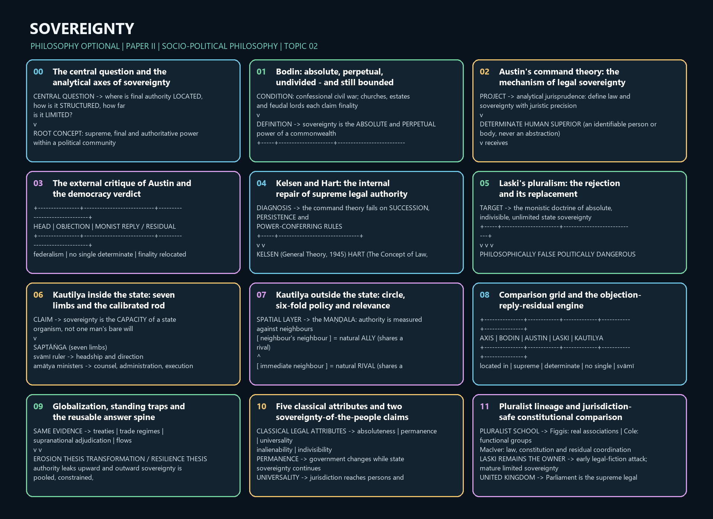

# Sovereignty — Learner-v2 Source-Complete Learning Session

> **Syllabus (verbatim):** Sovereignty : Austin, Bodin, Laski, Kautilya.
>
> **Generation:** g4, 2026-09-03 · **Approval:** false pending explicit topic approval
>
> **Evidence key:** ✅ canonical doctrine · ⚠️ analytical synthesis (for exam use) · ❓ contested/empirical claim
>
> **Evidence discipline:** Core follows the canonical owner and exact verified ledger; the matching advanced dossier section remains optional.

## BASIC LEARNING SESSION




*Concept map: The central question and the analytical axes of sovereignty. The twelve authored stages preserve the topic-specific learning rail used by both master-flow formats.*

> **Syllabus (verbatim):** Sovereignty : Austin, Bodin, Laski, Kautilya.

### How to Use This Five-Layer Session

Every logical subtopic follows exactly:

| Layer | Purpose |
|---:|---|
| 1. SIMPLE START | visual-first plain-language gateway |
| 2. CORE UPSC | complete terminology, doctrine, argument, example and source grounding |
| 3. ADVANCED | objections, replies, comparisons, interpretive issues and provenance cautions |
| 4. EXAM APPLICATION | verified PYQ routes and 10/15/20-mark architecture |
| 5. RAPID REVISION | traps, retrieval notes and links to the exact MCQ set |

### Source Audit and Contemporary-Link Boundary

- **Canonical doctrine source:** `upsc-ai-kit/knowledge/Philosophy/paper-2/socio-political/Sovereignty.md`, repaired under the ten-gate semantic-completeness protocol and promoted into this immutable successor.
- **Doctrine grounding (in the canonical file):** the concept and its distinctions (internal/external, legal/political, de jure/de facto, titular/actual, popular/national); the five classical attributes (absoluteness, permanence, universality, inalienability and indivisibility); Bodin (absolute, perpetual, indivisible power, bound by divine/natural law and the leges imperii); Austin (determinate human superior, habitual obedience, command and sanction, the DAIII attributes and the federalism/custom/international-law/democracy/Maine criticisms); the Kelsen-Hart refinement (hierarchy of norms and the Grundnorm; primary and secondary rules and the rule of recognition; the internal point of view); Laski's pluralism; Kautilya's saptanga, dandaniti, mandala, sadgunya and yogaksema; the inter-thinker debates; criticisms and replies; sovereignty under globalization; and the common traps. No book claim is added beyond what the canonical file already grounds.
- **Verified PYQs:** local Socio-Political Philosophy Paper II bank, 2018-2025; this clause owns exactly **11** primary parts (2018:2, 2019:1, 2020:2, 2021:2, 2022:1, 2023:1, 2024:1, 2025:1). Rousseau's natural-vs-artificial inequality (Social and Political Ideals), the origin of Social Contract Theory (Individual and State), democracy-as-a-form (Forms of Government) and Marxism/anarchism-as-ideology (Political Ideologies) are kept separate and not double-owned.
- **Comparative-context discipline:** Hobbes and Rousseau are NOT syllabus thinkers for this item (the four named are Austin, Bodin, Laski, Kautilya). They appear only as clearly-marked comparative context - Hobbes as the absolutist foil the canonical file itself names, Rousseau as the popular-sovereignty counterpoint to Austin's determinate superior - with no fabricated quotation, page or date.
- **Provenance discipline:** Kelsen (*General Theory of Law and State*, English edition **1945**) and Hart (*The Concept of Law*, **1961**) are cited by title and year only; the 1945/1961 pair is never swapped. *Kesavananda Bharati* (Supreme Court judgment, **1973**) is used only as a dated judicial illustration of a legally limited amending competence, never as proof that a philosophical theory is correct; no Indian body is called "the Austinian sovereign".
- **Contemporary-affairs boundary (deliberate):** this is a static, syllabus-driven conceptual clause; no 2026 institutional development is forced as an anchor, and no factual claim is invented. Only static syllabus relevance and clearly labelled analysis are used.
- **Qdrant:** optional fallback only; not required for this canonical topic, and it never blocks the learning session.

**Preservation note:** the canonical doctrine is reorganised into layers, never compressed. Every doctrine, numbered argument, objection/reply, comparison, corpus-depth delta, PYQ route, directive rule, graded verdict and provenance caution is retained; simplification means adding accessible gateways, not deleting complexity.

### Exact ownership boundary and indispensable bridges

This owner fully teaches the concept of sovereignty and the four printed thinkers. Other doctrines
enter only when they answer an owned sovereignty question.

| Bridge | Treatment owned here | Full owner retained elsewhere |
|---|---|---|
| **Hobbes and Rousseau** | Hobbes as the security-first absolutist bridge; Rousseau's general will as the popular-sovereignty counterpoint to Austin | Social-contract and individual–state theory remain with [Individual and State](Individual-and-State.md) |
| **Rights and political obligation** | Rights as limits on absolutism; allegiance as Laski's test of legitimate authority | Rights, duties, accountability and obligation remain with [Individual and State](Individual-and-State.md) |
| **Democracy and forms of government** | Compatibility of Austin/Kautilya with democracy because the PYQs demand it | The positive theory and forms of democracy remain with [Forms of Government](Forms-of-Government.md) |
| **Equality, justice and liberty** | Normative test of Bodin and absolute sovereignty in the 2022 PYQ | The ideals themselves remain with [Social and Political Ideals](Social-Political-Ideals.md) |
| **International institutions** | What treaty, pooling, delegation and material dependence do to external sovereignty | Institutional design and current diplomatic detail remain with International Relations |
| **Indian constitutional law** | A jurisdiction-safe illustration of competence-distributed authority | Article-by-article doctrine and federal lists remain with Polity |

### Learning Roadmap

| Unit | Logical subtopic |
|---:|---|
| 1 | The Concept and Taxonomy of Sovereignty |
| 2 | Bodin: The Absolute and Perpetual Power of the Commonwealth |
| 3 | Austin I: The Command Theory of Legal Sovereignty |
| 4 | Austin II: Criticisms and Compatibility with Democracy |
| 5 | Kelsen and Hart: The Post-Austinian Refinement of Legal Sovereignty |
| 6 | Laski and the Pluralist Critique of Absolute Sovereignty |
| 7 | Kautilya I: Saptanga, the Svami and Dandaniti |
| 8 | Kautilya II: Mandala, Sadgunya, Yogakshema and Modern Relevance |
| 9 | Inter-Thinker Debates, Criticisms and Replies |
| 10 | Globalization, Contemporary Sovereignty and Common Traps |

---

### SESSION 1 — The Concept and Taxonomy of Sovereignty

#### DEFINITION / WHAT THIS IS CALLED

**Plain-language definition:** Sovereignty is the supreme, final and authoritative power inside a political community, and it is deliberately distinguished from the government of the day, from the state as a whole, and from mere force.

**Technical definition:** Sovereignty must be analysed through its internal/external, legal/political, de jure/de facto, titular/actual and popular/national axes, together with the classical attributes of absoluteness, permanence, universality, inalienability and indivisibility.

#### VISUAL — The four axes of the concept

```text

                     SUPREME, FINAL, AUTHORITATIVE POWER

                                   |

     +-------------+---------------+---------------+-------------+

     |             |               |               |             |

  INTERNAL      EXTERNAL         LEGAL         POLITICAL      DE JURE

  supremacy     independence   competent      real power      lawful

  within the    in the         law-maker      behind the      title

  community     state system   (Austin)       law (Laski)

                                                                 |

                                                              DE FACTO

                                                        effective obedience

  TITULAR = formal dignity of office   <->   ACTUAL = who really decides

```

*One concept, four paired axes: the exam grid that must open every sovereignty answer.*

#### VISUAL — What sovereignty is not

```text

+-----------------------+------------------------------------------------+

| WRONG IDENTIFICATION  | WHY IT FAILS                                   |

+-----------------------+------------------------------------------------+

| sovereignty = force   | a bandit coerces but holds no final authority  |

| sovereignty = govt.   | governments change; the sovereign office does  |

|                       | not lapse with them                            |

| sovereignty = state   | the state is the whole association; sovereignty|

|                       | is its claim to final decision                 |

+-----------------------+------------------------------------------------+

```

*Three standing misidentifications that cost marks before the argument even begins.*

#### ANSWER-GRABBING OPENING — WRITE/ADAPT IN THE EXAM

> Sovereignty names the claim to supreme and final authority within a political community, and a controlled answer opens by separating internal from external, legal from political, de jure from de facto, and titular from actual before any thinker is named.

#### MUST-WRITE KEYWORDS

- **supreme final authority**
- **internal and external sovereignty**
- **legal and political sovereignty**
- **de jure and de facto sovereignty**
- **titular and actual sovereignty**
- **monism and pluralism**

**How to use them:** Lead with supreme final authority as the definition, run the internal and external, legal and political, de jure and de facto and titular and actual distinctions as the analytical grid, and only then place the monism and pluralism dispute on that grid.

#### CORE OBJECTION, REPLY AND RESIDUAL LIMIT

**Objection:** Modern constitutional democracies disperse power so widely that speaking of one supreme authority looks misleading.

**Best reply:** The objection defeats monism, not the inquiry: keeping the legal, political and external dimensions apart preserves a usable concept without assuming a single undivided centre.

**Residual limit:** The taxonomy organises the question but does not by itself decide who the sovereign is in any actual constitutional order.

#### EXAM USE AND CONCISE REVISION

**Answer architecture:** Definition of supreme final authority, the four paired axes, one misidentification trap, then the monist-pluralist dispute named but not yet resolved.

- Sovereignty is supreme, final and authoritative power; it is not force, not the government and not the state.
- Internal sovereignty is supremacy within; external sovereignty is independence in the society of states.
- Legal sovereignty is the competent law-maker; political sovereignty is the real power behind the law.
- De jure is lawful title, de facto is effective obedience; titular is formal dignity, actual is real decision.

Sovereignty is the answer to one blunt question: **who has the last word?** Every
political community, to hold together, needs some point at which argument stops
and a binding decision is made. Sovereignty names that supreme, final authority.

But before any thinker, you must slice the word into its layers -- because the
paper repeatedly rewards the answer that DISTINGUISHES rather than blurs.

```text
        SOVEREIGNTY -- one word, several layers to keep apart
        =====================================================

        INTERNAL   (supreme WITHIN)     |   EXTERNAL (independent WITHOUT)
        rules persons + associations    |   no foreign master; society of states
        --------------------------------+---------------------------------------
        LEGAL      (who MAY make law)   |   POLITICAL (real power behind the law)
        Austin's angle                  |   parties, opinion, classes, force
        --------------------------------+---------------------------------------
        DE JURE    (lawful TITLE)       |   DE FACTO (actually OBEYED)
        rightful but maybe powerless    |   in control but maybe unlawful
        --------------------------------+---------------------------------------
        TITULAR    (the SYMBOL/office)  |   ACTUAL (who really governs)
        crown, ceremonial head          |   cabinet, party, ruling coalition

        NOT the same as: mere FORCE (a bandit coerces but is not sovereign),
        the GOVERNMENT (an organ that exercises authority), or the STATE
        (the whole community). Sovereignty = the quality of FINAL authority.
```

Plain version: a king may hold the title (de jure, titular) while a cabinet
actually rules (de facto, actual); a parliament may be the legal sovereign while
public opinion is the political sovereign. Keep the layers on separate shelves.

> MEMORY: Four pairs to open any answer -- INTERNAL/EXTERNAL, LEGAL/POLITICAL,
> DE JURE/DE FACTO, TITULAR/ACTUAL. Distinguish first, then locate each thinker.


#### 0. ONE-SCREEN MAP

| Thinker | Core statement | Type of sovereignty | What limits it? | UPSC use-value |
|---|---|---|---|---|
| **Bodin** | Sovereignty is the **absolute and perpetual power** of the commonwealth. ✅ | Classical monist, juristic-political | Divine law, natural law, and fundamental laws of the realm (*leges imperii*) ✅ | Best for origin of the modern doctrine; explains absoluteness without pure arbitrariness |
| **Austin** | Sovereign is the **determinate human superior** habitually obeyed by the bulk of society and habitually obeying no one. ✅ | Legal-monistic, command theory | Formally none within the legal order ✅ | Best for the analytical/legal theory and its criticisms |
| **Laski** | The state is only **one association among many**; sovereignty cannot be absolute. ✅ | Pluralist | Social plurality, morality, associational autonomy, practical limits ✅ | Best for critique of monism and defence of liberty |
| **Kautilya** | Sovereignty is centred on the **svāmī**, but the state is an organism of seven limbs and is oriented to **yogakṣema**. ✅ | Organic, welfare-oriented, strategic sovereignty | Dharma, reason of state, welfare of subjects, institutional interdependence ✅ | Best for indigenous theory, *daṇḍanīti*, *maṇḍala*, modern relevance |

#### Fast distinctions
- **Monist tradition:** Bodin and Austin most clearly; Kautilya gives strong kingship but not Austinian unlimitedness. ⚠️
- **Pluralist tradition:** Laski rejects the claim that all authority can be reduced to one supreme state will. ✅
- **Legal vs political question:** Austin is the sharpest legal analyst; Bodin mixes law, office, and state-building; Laski shifts to social power; Kautilya integrates power, welfare, and diplomacy. ⚠️
- **UPSC hinge:** never treat all four thinkers as saying the same thing about supremacy. The paper repeatedly asks for exact differences. ✅

#### 1. THE CONCEPT OF SOVEREIGNTY

#### 1.1 Basic meaning
**Statement:** Sovereignty means the supreme, final, and authoritative power within a political community. ✅

**Argument:** A state is distinguished from other associations because it claims a power of ultimate decision: it can issue binding rules, adjudicate disputes, maintain order, and represent the political community externally. Without some form of final authority, collective life would fragment into competing commands. ⚠️

**Presupposition:** The concept presupposes an organized political community, a relation of ruler and ruled, and a distinction between ordinary authority and the highest authority. ⚠️

**Distinction:** Sovereignty is not identical with mere force. A bandit may coerce, but sovereignty implies recognized or effective final authority within a political order. ✅

**Example:** A constitution may distribute functions among legislature, executive, and judiciary, yet the system still embodies a structure for final decision. ⚠️

**Objection → Reply:**
- **Objection:** In modern constitutional democracies, power is so dispersed that speaking of one "supreme" authority is misleading. ✅
- **Reply:** That objection weakens monistic theories, but not the broader inquiry. The concept remains useful if one distinguishes legal, political, and external dimensions instead of assuming one undivided centre. ⚠️

#### 1.2 Internal and external sovereignty
| Distinction | Meaning | Relevance |
|---|---|---|
| **Internal sovereignty** ✅ | Supreme authority over persons and associations within the state | Central to Bodin, Austin, Laski, and Kautilya |
| **External sovereignty** ✅ | Independence from external control in the society of states | Important for Kautilya's diplomacy and for modern globalization debates |

**Statement:** Internal sovereignty concerns supremacy within; external sovereignty concerns independence without. ✅

**Argument:** A state may control internal life yet be constrained externally by stronger powers; equally, it may be externally recognized but internally fragile. Thus the two dimensions should not be collapsed. ⚠️

**Example:** Kautilya's *maṇḍala* theory assumes that external sovereignty is always strategic and relational rather than merely declaratory. ✅

**Objection → Reply:**
- **Objection:** Global interdependence has made external sovereignty obsolete. ❓
- **Reply:** Globalization changes the mode of external sovereignty, but does not abolish the question of who makes final decisions on war, treaty, economy, or security. The issue becomes transformed sovereignty, not vanished sovereignty. ⚠️

#### 1.2A Classical attributes of sovereignty

The standard monist taxonomy describes legal sovereignty through five connected attributes. These
are attributes of the **classical doctrine taken together**, not five claims uniquely invented by
Austin or Bodin.

| Attribute | Exam-safe meaning | Required qualification |
|---|---|---|
| **Absoluteness** ✅ | No superior human law-maker legally commands the sovereign within the political order | Legal non-subordination does not prove moral infallibility or practical omnipotence |
| **Permanence / continuity** ✅ | Governments and office-holders change while sovereignty continues with the state | Permanence means continuity while the state remains independent, not literal eternity |
| **Universality** ✅ | Sovereign jurisdiction extends in principle across persons and associations within the territory | Immunities and autonomous spheres may exist by constitutional or legal recognition |
| **Inalienability** ✅ | Sovereignty cannot be transferred away without the old state losing that sovereign status; powers may be delegated | Delegation, devolution or treaty commitment is not automatically alienation of sovereignty |
| **Indivisibility** ✅ | The classical theory requires one final legal source | Governmental competences may be distributed even where monists insist legal finality remains one |

**Bodin–Austin placement ✅:** Bodin supplies the defining pair **absolute and perpetual**;
Austin gives the sharpest determinate-superior formulation; the five-part list is a standard
consolidation of their monist tradition.

**Continuity bridge ⚠️:** Austin's habit theory struggles to explain succession and the persistence
of old law; Kelsen's norm-hierarchy and Hart's rules later repair that problem without restoring a
personal absolute sovereign.

#### 1.3 Legal and political sovereignty
| Type | Meaning | Main association |
|---|---|---|
| **Legal sovereignty** ✅ | The authority recognized by law as competent to make law | Austin's preferred angle |
| **Political sovereignty** ✅ | The actual power behind legal institutions; the force that can compel or shape the legal sovereign | Democratic and sociological analysis; relevant to Laski |

**Statement:** Legal sovereignty names the juristic source of valid law; political sovereignty names the real locus of social power. ✅

**Argument:** The two often diverge. A constitution may vest law-making power in one body, while parties, public opinion, organized interests, military power, religion, or economic classes determine what that body can actually do. ⚠️

**Example:** Austin's theory is strongest where law is analytically separated from politics; Laski's critique begins where that separation obscures the lived distribution of power. ⚠️

**Objection → Reply:**
- **Objection:** If political sovereignty always overrides legal sovereignty, jurisprudence becomes pointless. ❓
- **Reply:** The reply is not to abolish jurisprudence but to recognize that legal validity and political efficacy are different questions. Austin overstates the first; pluralists overstate the second; a balanced answer should keep both. ⚠️

#### 1.4 De jure and de facto sovereignty
| Type | Meaning | UPSC value |
|---|---|---|
| **De jure sovereignty** ✅ | Authority lawful in title and formal right | Useful for constitutional analysis |
| **De facto sovereignty** ✅ | Authority actually obeyed in practice regardless of legal title | Useful for revolution, coups, unstable orders |

**Statement:** One may possess the lawful title to rule without actual control, or actual control without lawful title. ✅

**Argument:** This distinction matters because obedience can attach to success, fear, legitimacy, or legality in different combinations. Austin's emphasis on habitual obedience has a de facto edge, whereas Bodin is more concerned with the permanent office-character of sovereign authority. ⚠️

**Example:** A claimant recognized by constitutional rule but unable to command obedience is de jure sovereign without effective de facto control. ⚠️

**Objection → Reply:**
- **Objection:** De facto power alone should count, because politics is about effectiveness. ❓
- **Reply:** That is too reductionist. Political order usually seeks legality as well as effectiveness; hence de jure and de facto status are analytically separable and normatively important. ⚠️

#### 1.5 Titular and actual sovereignty
| Type | Meaning | Illustration |
|---|---|---|
| **Titular sovereignty** ✅ | Authority vested formally in an office or symbol | Crown, ceremonial headship, constitutional title |
| **Actual sovereignty** ✅ | Authority effectively exercised by those who really govern | Cabinet, party leadership, ruling coalition, strategic bureaucracy |

**Statement:** The formal bearer of sovereignty may differ from its effective wielder. ✅

**Argument:** This distinction helps explain constitutional monarchies, parliamentary government, and even many republics where nominal and real authority diverge. It also prevents careless identification of "the state" with whoever appears at the top ceremonially. ⚠️

**Objection → Reply:**
- **Objection:** Such distinctions dilute the concept of sovereignty beyond usefulness. ❓
- **Reply:** On the contrary, they rescue the concept from oversimplification. UPSC repeatedly rewards answers that distinguish legal title, actual power, office, and obedience. ⚠️

#### 1.5A Popular and national sovereignty

| Form | Core claim | Main problem |
|---|---|---|
| **Popular sovereignty** ✅ | The people in their corporate capacity are the source of legitimate public authority; government is their agent | “The people” must be institutionally represented without being reduced to a temporary majority or incumbent government |
| **National sovereignty** ⚠️ | A national community claims collective self-determination and territorial political independence | Nation, people and state may not coincide; the claim can conflict with minorities or rival national identities |

**Rousseau bridge ✅:** Rousseau locates sovereignty in the **general will**, understood as a claim
about the common good rather than the numerical sum of private preferences. Sovereignty remains
with the people and is not identical with whichever government temporarily exercises power.

**Controlling distinction ⚠️:** popular sovereignty answers the internal legitimacy question
“from whom does authority arise?” National sovereignty primarily answers the collective
self-determination question “which people may govern itself?” Neither expression makes every
majority decision morally sovereign.

**Source control ✅:** O. P. Gauba, searchable local PDF pp. 189–193, directly supports popular
sovereignty and the general will. The Cambridge Dictionary's self-determination entry, searchable
local PDF p. 858, supports the strict territorial-independence sense used for the bounded national
sovereignty bridge.

#### 1.6 Why the concept becomes controversial
**Statement:** Sovereignty becomes controversial because the need for final authority clashes with liberty, plurality, federalism, morality, and global interdependence. ⚠️

**Argument:** Bodin writes amid civil war and seeks unity; Austin seeks juristic clarity; Laski fears absolutism; Kautilya ties power to welfare and strategic necessity. The controversy is therefore not merely semantic; it is a dispute about order, freedom, and statecraft. ⚠️

**Mini-conclusion:** A good UPSC answer should therefore begin with distinctions, then locate each thinker on the spectrum between **absolute legal supremacy** and **distributed, morally conditioned authority**. ✅

#### CLOSING RECALL FLOW — The Concept and Taxonomy of Sovereignty

```closure-flow
SUBTOPIC: The Concept and Taxonomy of Sovereignty
STARTING CONCEPT: The Concept and Taxonomy of Sovereignty
KEY TERMS / DEFINITIONS: final authority | internal-external | legal-political | de jure-de
  facto | popular-national
MECHANISM / ARGUMENT: A political community needs a point of final decision, so the concept
  isolates that point and then splits it along four axes rather than assuming one undivided
  centre of power.
CONSEQUENCE / CONTRAST: Once the axes are separated, a state can be legally supreme yet
  politically constrained, or titular in form yet powerless in fact, which is precisely what a
  single undivided notion conceals.
UPSC TRAP / ANSWER-USE: Do not equate sovereignty with force, with the government of the day or
  with the state itself; the bandit coerces but never holds recognised final authority.
ANSWER-GRABBING FORMULATION: Sovereignty names the claim to supreme and final authority within a
  political community, and a controlled answer opens by separating internal from external, legal
  from political, de jure from de facto, and titular from actual before any thinker is named.
```

### SESSION 2 — Bodin: The Absolute and Perpetual Power of the Commonwealth

#### DEFINITION / WHAT THIS IS CALLED

**Plain-language definition:** Bodin holds that a commonwealth survives civil and religious war only if one power can make and unmake law for everyone without asking the consent of any earthly superior.

**Technical definition:** Sovereignty for Bodin is the absolute and perpetual power of a commonwealth: absolute because it has no human superior inside the realm, perpetual because it attaches to the office rather than to a temporary magistrate, and undivided because two final wills would reproduce the civil war the doctrine exists to end.

#### VISUAL — From civil war to the sovereign office

```text

RIVAL FINAL CLAIMS (churches, estates, feudal lords)

        |

        v

PARALYSIS: no claim can settle a dispute between the others

        |

        v

REMEDY -> ONE ABSOLUTE AND PERPETUAL POWER OF THE COMMONWEALTH

        |

        +--> ABSOLUTE   : no human superior inside the realm

        +--> PERPETUAL  : belongs to the office, not the officer

        +--> UNDIVIDED  : two final wills = insoluble conflict

        |

        v

BOUNDED BY -> divine law | natural law | fundamental laws (leges imperii)

        |

        v

RESULT: legibus solutus as to ordinary positive law, not as to higher law

```

*Bodin's argument is a remedy: plural final claims produce disorder, so finality is concentrated and then bounded.*

#### VISUAL — Bodin's limits, and their weakness

```text

+---------------------------+----------------------------------------+

| LIMIT                     | FORCE OF THE LIMIT                     |

+---------------------------+----------------------------------------+

| divine law                | the sovereign cannot validly command   |

|                           | what offends divine order              |

| natural law               | justice and right reason remain        |

|                           | normative limits                       |

| fundamental laws          | constitutive laws structure the        |

| (leges imperii)           | sovereign office itself                |

+---------------------------+----------------------------------------+

WEAKNESS -> no institutional machinery enforces any of the three limits.

```

*The limiting framework is genuine in principle and thin in enforcement — the exact place where marks are won.*

#### ANSWER-GRABBING OPENING — WRITE/ADAPT IN THE EXAM

> Bodin gives the modern state its first systematic vocabulary of sovereignty — absolute, perpetual and undivided — while keeping the sovereign bound by divine law, natural law and the fundamental laws of the realm, so his absolutism is juristic rather than lawless.

#### MUST-WRITE KEYWORDS

- **absolute and perpetual power**
- **power to make and unmake law**
- **indivisibility of sovereign title**
- **legibus solutus**
- **divine and natural law limits**
- **fundamental laws (leges imperii)**

**How to use them:** Write the absolute and perpetual power formula first, prove indivisibility of sovereign title from the civil-war argument, then use legibus solutus together with the divine and natural law limits and the fundamental laws to show the doctrine is not caprice.

#### CORE OBJECTION, REPLY AND RESIDUAL LIMIT

**Objection:** If sovereignty is absolute it must negate all rights, liberties and constitutional limits.

**Best reply:** Absolute in Bodin means supreme within the hierarchy of positive law, while divine law, natural law and the fundamental laws of the realm continue to bind the sovereign office.

**Residual limit:** Those higher-law limits are conceptually real but institutionally weak, because Bodin supplies no enforcement machinery against a sovereign who ignores them.

#### EXAM USE AND CONCISE REVISION

**Answer architecture:** Context of disorder, the three attributes, the limiting framework, then a conditional verdict on compatibility with equality, justice and liberty.

- Absolute = no human superior within the commonwealth; perpetual = attached to office, not to a magistrate.
- The pre-eminent mark is the power to make and unmake law for all subjects in general.
- Division of governmental functions is allowed; division of the sovereign title is not.
- Bound by divine law, natural law and fundamental laws (leges imperii); legibus solutus only as to ordinary positive law.

Jean Bodin wrote amid France's religious civil wars, when rival churches, estates
and feudal lords each claimed a final say -- and the commonwealth was tearing
apart. His cure: locate ONE supreme, permanent law-giving power above all faction.

```text
        BODIN'S SOVEREIGN -- absolute, perpetual, undivided
        ===================================================

        ABSOLUTE      no human superior WITHIN the commonwealth
           +          (can make + unmake law for all, without consent)
        PERPETUAL     attached to the OFFICE, not a temporary magistrate
           +          (outlasts the individual ruler)
        UNDIVIDED     one final law-making centre; shared finality = civil war
        --------------------------------------------------------------
        BUT legibus solutus only re ORDINARY POSITIVE LAW -- still bound by:
             [ Divine law ] [ Natural law ] [ Fundamental laws / leges imperii ]
        --------------------------------------------------------------
        So: supreme in the hierarchy of positive law, NOT morally empty.
        "Not simply Hobbes before Hobbes" -- absolutism with higher-law limits.
```

Plain version: Bodin gives the modern state its VOCABULARY -- absolute, perpetual,
undivided -- but his sovereign is above ordinary law, not above ALL law. Divine
law, natural law and the realm's constitutive laws still bind him.

> MEMORY: A-P-U (Absolute, Perpetual, Undivided) + the three leashes (divine,
> natural, leges imperii). Founder of the doctrine; absolutist but not lawless.


#### 2. BODIN

#### 2.1 Historical context and purpose
**Statement:** Bodin formulates sovereignty in the context of religious civil wars and the breakdown of political unity in sixteenth-century France. ✅

**Argument:** His doctrine responds to disorder. If rival churches, estates, and feudal powers all claim final authority, the commonwealth disintegrates. Bodin therefore seeks a stable centre of command capable of maintaining order above faction. ⚠️

**Presupposition:** Social peace requires a final law-giving authority not reducible to shifting religious or feudal claims. ⚠️

**Distinction:** Bodin is not merely praising despotism; he is theorizing state unity under conditions of civil conflict. ✅

**Example:** The urgency of his theory is best understood against the background of confessional strife rather than abstract scholastic argument alone. ⚠️

**Objection → Reply:**
- **Objection:** Because it emerges from crisis, Bodin's theory merely sacralizes centralized monarchy. ❓
- **Reply:** It certainly strengthens monarchy, but its lasting importance lies in giving the modern state a conceptual language of permanent, impersonal authority. ⚠️

#### 2.2 Core doctrine: absolute and perpetual power
**Statement:** Bodin defines sovereignty as the **absolute and perpetual power of a commonwealth**. ✅

**Argument:**
1. **Absolute** means not subject to any human superior within the commonwealth. ✅ 2. **Perpetual** means enduring and attached to office, not to a temporary magistrate or delegated official. ✅
3. The sovereign's pre-eminent mark is the power to make and unmake law for all subjects in general without needing consent from a superior. ✅

**Presupposition:** Law requires a source that is itself not legally derivative from another earthly authority. ⚠️

**Distinction:** "Absolute" in Bodin does not mean arbitrary in every sense; it means supreme in the hierarchy of positive law. ✅

**Example:** A magistrate may issue commands, but only the sovereign can legislate in the final sense. ⚠️

**Objection → Reply:**
- **Objection:** If sovereignty is absolute, it negates all rights and liberties. ❓
- **Reply:** Bodin allows that sovereignty is above ordinary positive law while still bound by higher normative constraints such as divine and natural law. Hence his absolutism is juristic, not pure caprice. ⚠️

#### 2.3 Indivisibility and undivided authority
**Statement:** For Bodin, sovereignty is indivisible and undivided. ✅

**Argument:** Shared supremacy is a contradiction: if two authorities are each final, conflict becomes insoluble. Divided sovereignty would reintroduce the very civil disorder Bodin wants to overcome. ⚠️

**Presupposition:** Political order requires a final point of decision. ⚠️

**Distinction:** Division of governmental functions is possible; division of sovereign title is not, in Bodin's logic. ✅

**Example:** Advisory estates or subordinate courts may exist, but the ultimate power of law remains one. ⚠️

**Objection → Reply:**
- **Objection:** Constitutional government proves that power can be divided. ✅
- **Reply:** Bodin would answer that administrative distribution is not equivalent to sharing the final law-making power. Critics, however, later argue that federal and constitutional systems weaken Bodin's rigid indivisibility thesis. ⚠️

#### 2.4 Limits on Bodin's sovereign
**Statement:** Bodin's sovereign is above positive law but not above all law. ✅

| Bound by | Meaning |
|---|---|
| **Divine law** ✅ | The sovereign cannot validly command what offends divine order |
| **Natural law** ✅ | Justice and basic right reason remain normative limits |
| **Fundamental laws / *leges imperii*** ✅ | Certain constitutive laws of the realm structure sovereign office |

**Argument:** Bodin distinguishes between the sovereign's relation to ordinary civil law and to higher normative order. This is why he can combine absolutist language with claims about limits. ⚠️

**Distinction:** He is **legibus solutus** with respect to ordinary positive law, not with respect to divine/natural obligations. ✅

**Example:** Arbitrary confiscation of property is commonly discussed as incompatible with Bodin's own limiting framework. ⚠️

**Objection → Reply:**
- **Objection:** Such limits are too vague to restrain actual power. ✅
- **Reply:** True, they are weaker than modern constitutional checks; yet they matter conceptually because they show Bodin is not simply Hobbes before Hobbes. His sovereign is supreme, but not morally empty. ⚠️

#### 2.5 Why Bodin matters
**Statement:** Bodin is the first great systematic theorist of modern sovereignty. ✅

**Argument:** He shifts political thought from medieval plural and feudal claims toward a unified concept of state authority. He supplies a vocabulary—absolute, perpetual, undivided—that shapes later debates, including Austin's monism and Laski's critique. ⚠️

**Example:** Many later writers either radicalize his absolutism or try to limit it. ⚠️

**Objection → Reply:**
- **Objection:** Modern equality, justice, and liberty are incompatible with Bodin's absolute sovereign. ✅
- **Reply:** The compatibility is at best conditional. Bodin can support public order and impartial law by centralizing authority, but his theory offers weak guarantees against concentration of power. A balanced UPSC answer should say: **historically foundational, normatively problematic**. ⚠️

#### 2.6 UPSC-ready Bodin formulation
**Use in answers:**
- Begin with the exact definition. ✅
- Add the context of religious civil war. ✅
- Stress absolute, perpetual, and undivided authority. ✅
- Immediately qualify: bound by divine law, natural law, and *leges imperii*. ✅
- Conclude with a balanced line: Bodin founds the modern doctrine of sovereignty, but his concentration of final authority sits uneasily with later democratic and pluralist ideals. ⚠️

#### CLOSING RECALL FLOW — Bodin: The Absolute and Perpetual Power of the Commonwealth

```closure-flow
SUBTOPIC: Bodin: The Absolute and Perpetual Power of the Commonwealth
STARTING CONCEPT: Bodin: The Absolute and Perpetual Power of the Commonwealth
KEY TERMS / DEFINITIONS: absolute | perpetual | indivisible | higher-law limits
MECHANISM / ARGUMENT: Confessional civil war makes rival final claims intolerable, so Bodin
  concentrates the power to make and unmake law in one perpetual office that no subject may
  lawfully rival.
CONSEQUENCE / CONTRAST: The commonwealth gains a permanent impersonal centre of command, yet the
  same move leaves modern equality, justice and liberty without strong institutional guarantees
  against that centre.
UPSC TRAP / ANSWER-USE: Bodin must not be read as a lawless absolutist or as Hobbes before
  Hobbes; his sovereign is released from ordinary positive law but never from higher normative
  order.
ANSWER-GRABBING FORMULATION: Bodin gives the modern state its first systematic vocabulary of
  sovereignty — absolute, perpetual and undivided — while keeping the sovereign bound by divine
  law, natural law and the fundamental laws of the realm, so his absolutism is juristic rather
  than lawless.
```

### SESSION 3 — Austin I: The Command Theory of Legal Sovereignty

#### DEFINITION / WHAT THIS IS CALLED

**Plain-language definition:** Austin asks a narrow question and answers it sharply: who, as a matter of legal fact, is habitually obeyed by the bulk of a society while habitually obeying nobody else?

**Technical definition:** Within analytical jurisprudence Austin defines the sovereign as a determinate human superior receiving habitual obedience from the bulk of a given society and rendering habitual obedience to no other, and defines positive law as the command of that sovereign backed by a sanction, from which absoluteness, indivisibility, illimitability and inalienability follow.

#### VISUAL — The command chain

```text

DETERMINATE HUMAN SUPERIOR

        |  identifiable person or body, not an abstraction

        v

HABITUAL OBEDIENCE by the BULK of a given society

        |  obedience is habitual, not occasional

        v

OBEYS NO OTHER SUPERIOR  ->  legal illimitability follows

        |

        v

COMMAND  --backed by-->  SANCTION  --produces-->  DUTY

        |

        v

POSITIVE LAW = command of the sovereign backed by sanction

```

*Austin's whole system in one chain: identify the superior, then read law off the command relation.*

#### VISUAL — The five attributes and what each excludes

```text

+-----------------+--------------------------------+---------------------+

| ATTRIBUTE       | MEANING                        | EXCLUDES            |

+-----------------+--------------------------------+---------------------+

| determinate     | the sovereign is identifiable  | diffuse electorates |

| absolute        | no legal limit binds from above| bills of rights     |

| indivisible     | finality cannot be partitioned | federal division    |

| illimitable     | no superior legal authority    | international law   |

| inalienable     | transfer ends sovereignty      | pooled authority    |

+-----------------+--------------------------------+---------------------+

```

*Each attribute is a definitional consequence, and each one becomes a target in the next session.*

#### ANSWER-GRABBING OPENING — WRITE/ADAPT IN THE EXAM

> Austin converts sovereignty into a question of legal form: a determinate human superior, habitual obedience from the bulk of society, and law as command backed by sanction, which is unmatched for juristic clarity and immediately vulnerable on political reality.

#### MUST-WRITE KEYWORDS

- **determinate human superior**
- **habitual obedience of the bulk**
- **command backed by sanction**
- **absolute and illimitable**
- **indivisible and inalienable**
- **analytical jurisprudence**

**How to use them:** State the determinate human superior definition, add habitual obedience of the bulk as the test of location, derive law as command backed by sanction, and list the attributes absolute and illimitable, indivisible and inalienable as consequences of the analytical jurisprudence project.

#### CORE OBJECTION, REPLY AND RESIDUAL LIMIT

**Objection:** Reducing law to command backed by sanction leaves no room for rules that confer powers rather than impose duties.

**Best reply:** Austin's reply keeps the analytic gain: within his defined field the command model isolates positive law from morality and from custom with unmatched precision.

**Residual limit:** The precision is bought by narrowing the field, so the theory describes legal form far better than it describes any actual political order.

#### EXAM USE AND CONCISE REVISION

**Answer architecture:** Project, definition, five attributes, command-and-sanction, then a single sentence flagging that criticism follows.

- Sovereign = determinate human superior, habitually obeyed by the bulk, habitually obeying no one.
- Attributes: determinate, absolute, indivisible, illimitable, inalienable.
- Law = command of the sovereign backed by a sanction.
- Source anchor: The Province of Jurisprudence Determined, 1832.

John Austin is doing ANALYTICAL JURISPRUDENCE: he wants to define what law IS with
surgical precision, separate from what law OUGHT to be. His answer bottoms out in a
sovereign whose commands are backed by sanctions.

```text
        THE AUSTINIAN MACHINE -- command theory of law
        ==============================================

        [ DETERMINATE HUMAN SUPERIOR ]   <- identifiable person/body, not mystical
                  |  habitually obeyed by the BULK of society
                  |  habitually obeys NO ONE else
                  v
        [ COMMAND ]  = expressed wish of a superior
                  |    + [ SANCTION ] = evil/pain for non-compliance
                  v
        [ POSITIVE LAW ]  = command of the sovereign backed by sanction
        --------------------------------------------------------------
        Attributes of the sovereign (mnemonic D-A-I-I-I):
          Determinate | Absolute | Indivisible | Illimitable | Inalienable
```

Plain version: for Austin, "law" in the strict sense = an order from a determinate
sovereign, enforced by a threat. Morality, custom and divine law are OTHER things;
he brackets them out on purpose to get a clean concept of positive law.

> MEMORY: Sovereign = determinate human superior, habitually obeyed, obeying none.
> Law = command + sanction. Attributes = D-A-I-I-I.


#### 3. AUSTIN

#### 3.1 The analytical-legal project
**Statement:** Austin's theory belongs to analytical jurisprudence; its aim is to define law and sovereignty with conceptual precision. ✅

**Argument:** Austin wants to separate what law **is** from what law **ought to be**. To do so, he identifies the source of law in a sovereign whose commands are backed by sanctions. Sovereignty thus becomes the juristic foundation of legal validity. ✅

**Presupposition:** Jurisprudence requires a determinate origin of binding command. ⚠️

**Distinction:** Austin is explaining positive law, not moral legitimacy. ✅

**Example:** A rule counts as law if it is a command set by a sovereign to subjects and backed by sanction. ✅

**Objection → Reply:**
- **Objection:** This reduces law to coercion. ✅
- **Reply:** Austin intentionally privileges enforceability and source; critics later argue that this leaves out important dimensions of law such as authority, procedure, and acceptance. ⚠️

#### 3.2 Definition of the sovereign
**Statement:** A sovereign is a **determinate human superior** who receives habitual obedience from the bulk of society and habitually obeys no one else. ✅

**Argument:** The definition has three linked elements: 1. **Determinate human superior** — the sovereign must be identifiable, not vague or mystical. ✅ 2. **Habitual obedience by the bulk of society** — sovereignty rests on regular compliance, not occasional force alone. ✅ 3. **Habitual obedience to no one** — the sovereign is legally independent and supreme. ✅

**Presupposition:** Every independent political society must have such an apex. ⚠️

**Distinction:** Austin's sovereign is not "the state" in the abstract; it is a determinate person or body within the political community. ✅

**Example:** A legislature or monarch may fit the model better than diffuse democratic opinion. ⚠️

**Objection → Reply:**
- **Objection:** Modern constitutional democracies do not have one such determinate superior. ✅
- **Reply:** That is one of the central criticisms. Austin's model works best for relatively centralized legal orders and less well for constitutional, federal, and democratic systems where authority is distributed and reciprocal. ⚠️

#### 3.3 Attributes of Austinian sovereignty
| Attribute | Meaning |
|---|---|
| **Determinate** ✅ | The sovereign must be identifiable |
| **Absolute** ✅ | No legal limits bind the sovereign from above |
| **Indivisible** ✅ | Final authority cannot be partitioned |
| **Illimitable** ✅ | No superior legal authority restricts it |
| **Inalienable** ✅ | Sovereignty cannot be transferred without ceasing to be sovereignty |

**Statement:** Austin's sovereign is legal, final, supreme, and unitary. ✅

**Argument:** If the sovereign were divided, limited by another legal superior, or indeterminate, the chain of command would be broken and the legal system would lack a final source. ⚠️

**Distinction:** Austin's indivisibility is stricter than empirical political reality; it is a logical feature of his conceptual scheme. ⚠️

**Objection → Reply:**
- **Objection:** Constitutional amendment procedures, judicial review, and federal arrangements prove divisible authority. ✅
- **Reply:** Austinian theory tries to relocate finality somewhere in the system, but critics argue this relocation is often strained and artificial. ⚠️

#### 3.4 Law as command and sanction
**Statement:** For Austin, positive law is the command of the sovereign backed by sanction. ✅

**Argument:** Command implies an expression of desire by a superior; sanction implies the evil or pain attached to non-compliance. Law is therefore a species of imperative issued within a structure of superiority and obedience. ✅

**Presupposition:** The essential feature of legal obligation is enforceable command. ⚠️

**Distinction:** Austin distinguishes positive law from morality, custom, and divine law as separate normative domains. ✅

**Example:** Penal law fits Austin especially well because command and sanction are explicit. ⚠️

**Objection → Reply:**
- **Objection:** Not all laws are commands; many are enabling, permissive, or procedural. ✅
- **Reply:** This criticism is powerful. Later jurisprudence shows that legal systems include power-conferring rules, constitutional rules, and secondary rules not reducible to mere orders backed by threats. ⚠️

#### CLOSING RECALL FLOW — Austin I: The Command Theory of Legal Sovereignty

```closure-flow
SUBTOPIC: Austin I: The Command Theory of Legal Sovereignty
STARTING CONCEPT: Austin I: The Command Theory of Legal Sovereignty
KEY TERMS / DEFINITIONS: superior | obedience | command | sanction | inalienable
MECHANISM / ARGUMENT: Because law is treated as the command of a determinate superior, the
  sovereign must be identifiable, must face no legal superior, and must not be partitioned
  without ceasing to be sovereign.
CONSEQUENCE / CONTRAST: Legal validity becomes crisply testable, but the model buys that
  sharpness by excluding constitutional, customary and international material that other jurists
  count as law.
UPSC TRAP / ANSWER-USE: Never write that Austin's sovereign is the state; the whole point is
  that it is a determinate person or body identifiable in a given society.
ANSWER-GRABBING FORMULATION: Austin converts sovereignty into a question of legal form: a
  determinate human superior, habitual obedience from the bulk of society, and law as command
  backed by sanction, which is unmatched for juristic clarity and immediately vulnerable on
  political reality.
```

### SESSION 4 — Austin II: Criticisms and Compatibility with Democracy

#### DEFINITION / WHAT THIS IS CALLED

**Plain-language definition:** The command theory is attacked from outside by legal facts it cannot fit — federal states, international law, custom, popular rule and Maine's Indian case — and the democracy question is then answered by degree rather than by yes or no.

**Technical definition:** The external critique holds that no determinate superior exists in a federation, that Austin over-narrows law by denying international law, that custom shows obedience can precede command, that popular sovereignty locates authority in an indeterminate electorate, and that Maine's Ranjit Singh case shows real authority as personal and embedded.

#### VISUAL — Four objections and the monist replies

```text

+----------------+-------------------------+---------------------------+

| HEAD           | OBJECTION               | MONIST REPLY / RESIDUAL   |

+----------------+-------------------------+---------------------------+

| federalism     | authority is divided    | finality moves to the     |

|                | between two orders      | constituent power; that   |

|                |                         | shifts the problem        |

| international  | binding rules exist     | Austin keeps purity but   |

| law            | with no world sovereign | narrows law excessively   |

| custom         | obedience precedes any  | tacit adoption by courts; |

|                | command                 | widely judged artificial  |

| popular        | the people rule, yet    | electorate is legally     |

| sovereignty    | are indeterminate       | indeterminate; political  |

|                |                         | finality is conceded      |

+----------------+-------------------------+---------------------------+

```

*Each row is a complete answer paragraph: fact, objection, reply, residual difficulty.*

#### VISUAL — Is Austin compatible with democracy?

```text

QUESTION: is Austin's sovereign compatible with democracy?

        |

        +--> NARROW LEGAL SENSE

        |    a determinate law-making organ can still be identified

        |    VERDICT -> compatible, but only formally

        |

        +--> DEEPER POLITICAL SENSE

             authority is derivative (from the people),

             divided (federal and functional),

             rights-bound (constitutional guarantees)

             VERDICT -> sits uneasily with democracy

        |

        v

WRITE A DEGREE-JUDGMENT, NEVER A FLAT YES OR NO

```

*A degree-judgment: two senses of the question, two different answers.*

#### ANSWER-GRABBING OPENING — WRITE/ADAPT IN THE EXAM

> Austin's sovereign survives as an account of legal finality and fails as an account of democratic political reality, so compatibility with democracy is partial in the narrow legal sense and weak in the deeper sense of derivative, divided and rights-bound authority.

#### MUST-WRITE KEYWORDS

- **federalism objection**
- **international law objection**
- **customary law objection**
- **popular sovereignty objection**
- **Maine's Ranjit Singh example**
- **degree-judgment on democracy**

**How to use them:** Order the objections as federalism, international law, customary law and popular sovereignty, add Maine's Ranjit Singh example as the anthropological counter-case, and close the democracy question as a degree-judgment rather than a verdict of simple compatibility.

#### CORE OBJECTION, REPLY AND RESIDUAL LIMIT

**Objection:** Federal constitutions simply prove that Austin was wrong, because sovereignty there is plainly divided.

**Best reply:** The monist reply relocates finality in the constitution-making authority rather than in either legislature, which preserves the concept while conceding that no ordinary organ is the Austinian sovereign.

**Residual limit:** That reply shifts the problem instead of solving it, since a constituent power that acts only rarely is a poor candidate for habitual obedience.

#### EXAM USE AND CONCISE REVISION

**Answer architecture:** Objection, monist reply, residual difficulty for each head, then a graded verdict separating legal finality from democratic reality.

- Federalism: no single determinate superior; saying the constitution is sovereign shifts the problem.
- International law: Austin denies it is law strictly; critics say he over-narrows the concept of law.
- Custom: obedience can precede command, and the tacit-adoption reply is widely judged artificial.
- Maine's Ranjit Singh: despotic power over life and property coexisted with untouched customary law.

Austin's clean machine meets a messy world. Five classic external criticisms cut
at the idea of ONE determinate, undivided, illimitable superior.

```text
        FIVE STRAINS ON THE AUSTINIAN SOVEREIGN
        =======================================

        FEDERALISM     union + states share power constitutionally
                       -> which one is the sole determinate superior?
        INT'L LAW      Austin: "not law properly" (no world sovereign)
                       -> ignores treaty, custom, institutions
        CUSTOM         arises from social practice BEFORE command
                       -> "tacit adoption" reply looks artificial
        DEMOCRACY /    "the people" are indeterminate, changing, mediated
        POPULAR SOV.   -> Parliament is constrained, elected, party-shaped
        MAINE          Ranjit Singh: real authority personal + embedded,
                       not the neat determinate-superior formula

        FEDERAL ALLOCATION (why one "superior" is hard to name):
           +----------------- Constitution (constituent power) -----------------+
           |                          |                                         |
        [ UNION list ]        [ CONCURRENT list ]              [ STATE list ]
           final on defence,     shared; centre prevails         final on local
           foreign affairs       on conflict                     subjects
```

Plain version: in a federal, constitutional democracy, finality is shared,
elected, revisable and rights-bound. So Austin fits a centralised legal order well
and a modern democracy badly.

> MEMORY: Criticisms = FEDERALISM, INTERNATIONAL LAW, CUSTOM, DEMOCRACY/POPULAR
> SOVEREIGNTY, MAINE (Ranjit Singh). "Yes in a narrow legal sense; no in the
> deeper constitutional-political sense."


#### 3.5 Major criticisms of Austin

#### (a) Federalism
**Statement:** Federal systems challenge Austin's idea of one undivided sovereign. ✅

**Argument:** In federations, powers are constitutionally distributed between union and states; neither level can easily be described as the sole determinate superior in all matters. ⚠️

**Objection → Reply:**
- **Objection:** Austin can simply say the constitution-making authority is sovereign. ❓
- **Reply:** That move often shifts rather than solves the problem, because the constitution itself may embody shared or entrenched authority. ⚠️

#### (b) International law
**Statement:** Austin treats international law as not truly law in the strict sense because there is no world sovereign. ✅

**Argument:** Since states are not habitually obedient to a determinate global superior, international law lacks the Austinian foundation of command and sanction. ✅

**Objection → Reply:**
- **Objection:** This ignores the normative and practical force of treaty, custom, and international institutions. ✅
- **Reply:** Critics say Austin's state-centric lens is too narrow; legal order can exist through reciprocity, consent, institutions, and accepted practice even without a world sovereign. ⚠️

#### (c) Customary law
**Statement:** Customary law sits uneasily within command theory. ✅

**Argument:** Customs often arise from social practice before formal command. Austin tries to explain them as tacitly adopted by the sovereign. ⚠️

**Objection → Reply:**
- **Objection:** That explanation is artificial because many customs operate independently of explicit sovereign will. ✅
- **Reply:** The criticism shows that obedience and recognition may precede sovereign enactment rather than derive from it. ⚠️

#### (d) Popular sovereignty and democracy
**Statement:** Austin's model fits uneasily with democratic theories in which the people are sovereign. ✅

**Argument:** "The people" are often indeterminate, changing, and institutionally mediated. Austin, however, requires a determinate superior. Hence his theory struggles to accommodate representative democracy, constitutionalism, and public accountability. ⚠️

**Objection → Reply:**
- **Objection:** Parliament can be treated as the determinate superior in a democracy. ❓
- **Reply:** Even then, parliament is constitutionally constrained, electorally dependent, and politically shaped by parties and opinion. Thus democratic sovereignty is more complex than Austin's legal monism allows. ⚠️

#### (d1) Parliamentary sovereignty and constitutional supremacy

The phrase **parliamentary sovereignty** is jurisdiction-specific, not a synonym for every
parliamentary form of government.

| Jurisdictional model | Legal location of finality | Judicial position | Philosophical use |
|---|---|---|---|
| **United Kingdom** ✅ | Parliament is the supreme legal authority and may make or unmake law; one Parliament cannot entrench ordinary law against a future Parliament | Courts generally cannot overrule primary legislation | A strong modern approximation to legal sovereignty, qualified by political constraints, devolution and rights arrangements |
| **India** ✅/⚠️ | The written Constitution is supreme; Parliament exercises constitutionally conferred ordinary and constituent powers | Judicial review enforces constitutional limits; *Kesavananda Bharati* (1973) limits the amending power through the basic-structure doctrine | Competence-distributed authority under constitutional supremacy, not UK-style parliamentary sovereignty |

**Do not overclaim ⚠️:** the United Kingdom's uncodified order is not legally unconstrained in every
practical sense, and India's judiciary is not “sovereign” merely because it reviews legislation.
The careful conclusion is that UK legal theory centres Parliament, whereas Indian institutions
derive limited competences from a supreme Constitution.

**Official-source control ✅:** UK Parliament's current sovereignty page describes Parliament as
the supreme legal authority and states that courts generally cannot overrule its legislation.
Article 368 of the Constitution of India confers amendment power through constitutional procedure;
the official *Kesavananda Bharati* archive supplies the judicial basic-structure limitation.

#### (e) Maine's Ranjit Singh example
**Statement:** Maine criticizes Austin by pointing to political communities where habitual obedience and determinate superiority do not fit the legal facts neatly. ✅

**Argument:** The example of Ranjit Singh is used to show that actual authority may be personal, unstable, and socially embedded in ways not captured by the clean Austinian formula. ✅

**Objection → Reply:**
- **Objection:** Exceptional historical cases do not defeat a general theory. ❓
- **Reply:** Critics respond that the problem is not one odd case but the wider mismatch between Austin's neat schema and the complexity of historical political orders. ⚠️

#### 3.6 Is Austin compatible with democracy?
**Statement:** Austin's theory is only partially compatible with democracy, and in a strict sense it sits uneasily with it. ⚠️

**Argument:** Democracy disperses authority through elections, rights, representation, opposition, and constitutional limitation. Austin's sovereign, by contrast, is legally supreme, indivisible, and not habitually obedient to another. The democratic order tends to make sovereignty mediated, divided in function, and politically answerable. ⚠️

**Balanced answer structure:**
- **Yes, in a narrow legal sense:** one may identify a law-making body. ✅
- **No, in a deeper constitutional-political sense:** democracy requires accountability, rights, and limited government, which undermine Austin's absoluteness. ⚠️

**Objection → Reply:**
- **Objection:** Democratic constitutions still require a final law-making authority. ✅
- **Reply:** True, but democracy makes that authority derivative, revisable, and morally constrained, whereas Austin conceptualizes it as a legally unlimited superior. ⚠️

#### 3.7 UPSC-ready Austin formulation
Use six points in compact sequence:
1. Analytical jurisprudence. ✅
2. Sovereign = determinate human superior habitually obeyed by the bulk and obeying no one. ✅
3. Law = command backed by sanction. ✅
4. Sovereignty = absolute, indivisible, illimitable, inalienable. ✅
5. Criticisms: federalism, international law, customary law, democracy, popular sovereignty, Maine. ✅
6. Conclude: highly important for legal theory, but empirically and normatively narrow. ⚠️

---

#### CLOSING RECALL FLOW — Austin II: Criticisms and Compatibility with Democracy

```closure-flow
SUBTOPIC: Austin II: Criticisms and Compatibility with Democracy
STARTING CONCEPT: Austin II: Criticisms and Compatibility with Democracy
KEY TERMS / DEFINITIONS: federalism | international law | custom | democracy | constitutional
  supremacy
MECHANISM / ARGUMENT: Each objection isolates a legal fact the command model cannot describe
  without strain, and the accumulated strain is what forces the degree-judgment on democracy.
CONSEQUENCE / CONTRAST: Austin can be defended as an account of legal form, but the defence
  concedes that political authority in a democracy is derivative, divided and bound by rights.
UPSC TRAP / ANSWER-USE: Do not answer the democracy question with a flat yes or no; relocating
  finality to the constituent power is not the same as demonstrating an undivided superior.
ANSWER-GRABBING FORMULATION: Austin's sovereign survives as an account of legal finality and
  fails as an account of democratic political reality, so compatibility with democracy is
  partial in the narrow legal sense and weak in the deeper sense of derivative, divided and
  rights-bound authority.
```

### SESSION 5 — Kelsen and Hart: The Post-Austinian Refinement of Legal Sovereignty

#### DEFINITION / WHAT THIS IS CALLED

**Plain-language definition:** Two later jurists rebuild what Austin was trying to capture, keeping supreme legal authority while discarding the personal commander who cannot explain succession, persistence or power-conferring rules.

**Technical definition:** Kelsen replaces the sovereign will with a hierarchy of norms whose validity terminates in a presupposed basic norm (Grundnorm), while Hart replaces command with the union of primary and secondary rules, the ultimate test being a rule of recognition sustained by the convergent practice and internal point of view of officials.

#### VISUAL — Three defects, two repairs

```text

+---------------------+-------------------------+---------------------+

| AUSTINIAN DEFECT    | KELSEN'S REPAIR         | HART'S REPAIR       |

+---------------------+-------------------------+---------------------+

| succession: why is  | validity descends from  | rule of recognition |

| the new ruler's     | a higher norm, not from | already identifies  |

| word law at once?   | a person                | the valid source    |

| persistence: why do | norms remain valid till | rules of change     |

| old statutes bind?  | validly repealed        | govern repeal       |

| power-conferring    | norms authorise as well | secondary rules     |

| rules: wills, deeds | as oblige               | confer powers       |

+---------------------+-------------------------+---------------------+

```

*Read down the defect column, then across to see which repair does the work.*

#### VISUAL — The two structures side by side

```text

KELSEN                              HART

  GRUNDNORM (presupposed)             RULE OF RECOGNITION

        ^                                   ^  official convergent

        |  validity                         |  practice + internal

  CONSTITUTION                              |  point of view

        ^                                   |

        |                             SECONDARY RULES

  STATUTES                            recognition | change | adjudication

        ^                                   ^

        |                                   |

  ORDERS / JUDGMENTS                  PRIMARY RULES (duties)

CONTRAST -> presupposed norm vs practised rule: both dispense with a person.

```

*Kelsen builds a pyramid of validity; Hart builds a union of two kinds of rule resting on official practice.*

#### ANSWER-GRABBING OPENING — WRITE/ADAPT IN THE EXAM

> Kelsen and Hart preserve the idea of supreme legal authority while dissolving the personal sovereign: validity flows from a presupposed basic norm for Kelsen, and from an officially practised rule of recognition for Hart, which answers exactly the defects that sank the command theory.

#### MUST-WRITE KEYWORDS

- **hierarchy of norms**
- **Grundnorm as presupposed basic norm**
- **primary and secondary rules**
- **rule of recognition**
- **internal point of view**
- **having an obligation versus being obliged**

**How to use them:** Diagnose the command theory's failures on succession, persistence and power-conferring rules, answer them with the hierarchy of norms ending in the Grundnorm and with primary and secondary rules tested by the rule of recognition, and use the internal point of view to mark the difference between having an obligation and being obliged.

#### CORE OBJECTION, REPLY AND RESIDUAL LIMIT

**Objection:** Presupposing a basic norm or resting law on official practice looks like relocating the mystery rather than removing it.

**Best reply:** The relocation is a gain, because a presupposed norm or a practised rule of recognition can be identified and tested publicly, whereas a determinate personal superior often cannot be found at all.

**Residual limit:** Neither account tells us what the content of a legal order ought to be, so both leave the moral evaluation of sovereign power to other arguments.

#### EXAM USE AND CONCISE REVISION

**Answer architecture:** Diagnosis of Austin's defects, Kelsen's answer, Hart's answer, then placement against Bodin, Austin, Laski and Kautilya.

- Command theory fails on succession, persistence and power-conferring rules.
- Kelsen: validity flows from a higher norm to a presupposed Grundnorm.
- Hart: primary rules impose duties; secondary rules of recognition, change and adjudication cure uncertainty, static character and inefficiency.
- Dates: Kelsen, General Theory of Law and State, 1945; Hart, The Concept of Law, 1961. Never swap them.

The deepest attacks on Austin are INTERNAL to legal positivism itself. Austin
grounds validity in the WILL of a determinate superior -- but that cannot explain
three things: succession (why the new sovereign's first command is already law),
persistence (why an ancient statute is still law), and power-conferring rules
(how you make a valid will). Kelsen and Hart repair the model differently.

```text
        KELSEN -- validity flows DOWN a hierarchy of norms
        ==================================================
                 [ GRUNDNORM ]  <- presupposed basic norm (not enacted)
                       |  authorises
                 [ CONSTITUTION ]
                       |  authorises
                 [ STATUTE ]
                       |  authorises
                 [ administrative order / judgment ]
        A norm is valid because a HIGHER norm says so -- never because of power.
        The personal "sovereign" DISSOLVES into the top norm-creating competence.

        HART -- law = union of PRIMARY + SECONDARY rules
        ================================================
        PRIMARY: duties (do not steal)          |  cure for...
        SECONDARY:                              |
          rule of RECOGNITION (what IS law)     |  ...uncertainty
          rules of CHANGE (how to alter law)    |  ...static custom
          rules of ADJUDICATION (who decides)   |  ...inefficiency
        Ultimate test = RULE OF RECOGNITION: a SOCIAL FACT, the convergent
        practice of officials seen from the INTERNAL point of view.
```

Plain version: Kelsen replaces the commander with a PYRAMID OF NORMS topped by a
presupposed Grundnorm. Hart replaces him with a SYSTEM OF RULES resting on what
officials actually accept as law. Both stay positivists -- validity is still
separate from moral merit.

> MEMORY: Kelsen = hierarchy of norms + Grundnorm (Eng. 1945). Hart = primary +
> secondary rules + rule of recognition + internal point of view (1961). Never
> swap the 1945/1961 dates.


#### 3A. KELSEN AND HART — THE POST-AUSTINIAN REFINEMENT OF LEGAL SOVEREIGNTY

> ⚠️ **Why this section exists.** Austin's critics in this file so far are *external* — federalism, custom, international law, democracy, Laski's pluralism. The two most powerful criticisms are **internal to legal positivism itself**. Any question on "the theory of sovereignty" or "law as command" that stops at Laski is answering with only half the debate. This section is a named-scholar reconstruction; no page, chapter, edition or verbatim wording is asserted for either thinker.

#### 3A.1 Why the Austinian model needs repair

✅ Austin locates law's validity in the will of a determinate human superior. That produces three problems he cannot solve from within his own system:

1. **The succession problem.** When one sovereign dies and another takes office, why is the new sovereign's first command law, before any habit of obedience has formed? Habit cannot explain the continuity of legal authority across persons. 2. **The persistence problem.** Why does a statute enacted centuries ago, by a sovereign long dead and never habitually obeyed by anyone now living, remain valid law? 3. **The power-conferring problem.** Much of law does not command anybody. Rules about how to make a valid will, contract or marriage do not order conduct on pain of sanction; they confer facilities. On the command model, a defective will is not a "sanction" for disobedience — it is simply a nullity.

⚠️ Each problem points the same way: legal authority is carried by **rules**, not by the habits or the person of a commander.

#### 3A.2 Kelsen: the *Grundnorm* and the hierarchy of norms

✅ **Hans Kelsen** argues that the validity of a legal norm is never derived from a fact of power but always from **another, higher norm**. Law is a **hierarchy (pyramid) of norms**: an administrative order is valid because a statute authorises it; the statute is valid because the constitution authorises its enactment; the constitution is valid because it is presupposed to be valid.

✅ At the apex stands the **basic norm (*Grundnorm*)** — not itself enacted by anyone, but **presupposed** by jurists as the condition that makes it possible to interpret the whole chain as a system of valid norms rather than as a sequence of effective threats.

**Reconstructed argument ⚠️:**

1. a norm's validity cannot be derived from a mere fact, because "is" does not yield "ought";
2. therefore validity must be derived from a further norm;
3. an infinite regress of authorising norms would leave nothing valid;
4. therefore the chain must terminate in a norm that is presupposed rather than derived — the *Grundnorm*;
5. law is accordingly a self-referring hierarchy of validity, distinct from both morality and brute power.

**Presupposition ⚠️:** a "pure" theory of law is possible — legal science can describe validity while excluding morality, sociology, politics and psychology.

**Bibliographic precision ✅ / ❌:** the standard reference is *General Theory of Law and State*, first published in English in **1945** (translated by Anders Wedberg). ❌ **Do not write 1961 for Kelsen.** 1961 is the year of **Hart's** *The Concept of Law*. The two dates sit adjacent in the Austin → Kelsen → Hart sequence and are the most commonly swapped pair in this topic. ⚠️ If unsure in the examination hall, name the works and the sequence without years rather than guessing.

**Effect on sovereignty ⚠️:** Kelsen **dissolves** the Austinian sovereign. There is no determinate human superior standing above the law; the "sovereign" is simply the personification of the legal order's highest norm-creating competence. Sovereignty becomes an attribute of the **normative order**, not of a person or body.

**Objection → Reply ⚠️:**

- **Objection:** the *Grundnorm* is a fiction — a presupposition invented to stop a regress, doing exactly the work Austin's "habitual obedience" did, only less honestly.
  **Reply:** ✅ Kelsen does not claim the basic norm is a fact; he claims it is a **transcendental-logical condition** of treating anything as valid law at all, comparable to a postulate in a formal science. The theory therefore remains positivist — the basic norm confers validity, not moral obligation.
- **Objection:** the theory cannot explain revolution, since a successful coup replaces the constitution without any authorising norm. **Reply:** ⚠️ Kelsen's answer is that when a new order becomes **by and large effective**, jurists presuppose a new basic norm; efficacy is thus a *condition* of validity even though it is not its *source*. Critics reply that this quietly readmits the fact of power the theory was designed to exclude — a residual problem worth conceding.

#### 3A.3 Hart: primary and secondary rules, and the rule of recognition

✅ **H. L. A. Hart**, in *The Concept of Law* (**1961**), rejects the command-and-sanction model as too narrow — it is built on the criminal-law paradigm ("the gunman situation writ large") and cannot account for power-conferring law. He replaces it with law as a **union of primary and secondary rules**.

| Rule type | Function | What it answers | Failure it cures |
|---|---|---|---|
| **Primary rules** ✅ | impose duties directly on conduct — do not steal, do not assault, pay tax | what must be done? | — |
| **Secondary: rule of recognition** ✅ | identifies what counts as valid law in this system | which rules are law? | **uncertainty** in a regime of primary rules alone |
| **Secondary: rules of change** ✅ | authorise creation, amendment and repeal of primary rules | how is law altered? | **static character** of custom |
| **Secondary: rules of adjudication** ✅ | confer authority to determine breach and remedy | who decides, and how? | **inefficiency** of diffuse enforcement |

**Reconstructed argument ⚠️:**

1. a society with only primary rules suffers uncertainty, stasis and inefficiency;
2. these three defects are cured by three corresponding secondary rules;
3. the union of primary rules with secondary rules is what distinguishes a legal system from a set of social habits;
4. the ultimate criterion of validity — the rule of recognition — is not itself valid or invalid; it **exists as a social fact**, in the convergent practice of officials who treat it as the common public standard from an *internal point of view*;
5. therefore law rests neither on a commander's will (Austin) nor on a presupposed norm (Kelsen) but on an accepted official practice.

**The internal/external point of view ✅:** an external observer records regularities of behaviour; a participant taking the **internal point of view** treats the rule as a *reason* for conduct and as a ground for criticising deviation. Austin's "habit of obedience" captures only the external aspect and therefore cannot distinguish a legal obligation from a gunman's threat, or a rule from a habit.

**Hart's critique of Austin, in four strikes ⚠️:**

| Austin's claim | Hart's objection |
|---|---|
| Law is a command backed by sanction | ignores power-conferring rules; nullity is not a sanction |
| The sovereign is habitually obeyed | habit cannot explain continuity on succession or the persistence of old statutes |
| The sovereign obeys no one | in a modern legal order the law-maker is itself constituted and limited by rules of change |
| Obligation = being obliged by threat | conflates *being obliged* (the gunman) with *having an obligation* (the internal point of view) |

**Hart against Kelsen ⚠️:** Hart accepts the need for an ultimate criterion of validity but denies it is a presupposed norm. The rule of recognition is a matter of **social fact** — what the officials of a given system actually treat as law — not a logical postulate standing outside the system.

**Presupposition ⚠️:** legal theory is descriptive-analytical sociology of a special kind; validity can be explained without moral evaluation, but not without reference to shared official practice.

**Objection → Reply ⚠️:**

- **Objection (Dworkin):** even a complete structure of rules gives no determinate answer in **hard cases**; judges then rely on **principles**, which are part of the law but cannot be identified by any pedigree test such as a rule of recognition. **Reply:** ⚠️ Hartian positivists reply that in genuinely hard cases judges exercise bounded discretion at the penumbra of settled rules, and that principles can be admitted through a sufficiently rich rule of recognition. The dispute is unresolved; state it as live. ✅ The Dworkin material itself is owned by Individual and State §4A.4 — cross-refer, do not develop it here.
- **Objection:** a rule of recognition grounded in official practice cannot condemn a legally impeccable but morally monstrous regime. **Reply:** ✅ Hart's own position is that separating validity from merit **preserves** criticism: calling an evil rule "valid law" leaves the citizen free to say it ought not to be obeyed, whereas defining evil rules out of the concept of law disarms that judgment. This is the positivist's strongest normative card and should be used rather than conceded.

#### 3A.4 Placement against Bodin, Austin, Laski and Kautilya

| Axis | **Bodin** | **Austin** | **Kelsen** | **Hart** | **Laski** | **Kautilya** |
|---|---|---|---|---|---|---|
| Locus of sovereignty | the *personal* commonwealth-ordering power | determinate human superior | the normative order itself; no personal sovereign | the system's accepted rule of recognition | dispersed among associations; no single locus | *svāmī* within the seven-limb (*saptāṅga*) state |
| Source of validity | perpetual, absolute power to give law | command of the sovereign + habitual obedience | derivation from a higher norm, terminating in the *Grundnorm* | convergent official practice, viewed internally | moral allegiance earned by satisfying wants | *dharma*, *daṇḍanīti* and duty to *yogakṣema* |
| Is law limited? | limited by divine/natural law, *leges imperii*, private property | legally illimitable | limited only by the hierarchy's own competence rules | limited by rules of change and adjudication | must be limited, and is empirically limited | limited by duty, custom and the ruler's welfare obligation |
| Command or rules? | command of the sovereign | command + sanction | norms authorising norms | primary + secondary rules | plural sources of obligation | authoritative direction plus duty |
| Cure it offers for Austin | — | — | explains continuity, persistence, hierarchy | explains power-conferring law and obligation | explains federalism and social plurality | explains duty-bound authority |

⚠️ **The examiner-facing point.** Bodin and Austin ask *who* is sovereign. Kelsen and Hart deny that this is the right question and ask *what makes a norm valid*. Laski denies that any single answer is possible. Kautilya asks what the holder of authority is **for**. An answer that runs this four-way structure — personal sovereign → normative order → official practice → plural allegiance, with Kautilya's duty-bound variant — is doing philosophy, not summarising a textbook.

⚠️ **Convergence worth stating:** Kelsen, Hart and Laski each in a different register dissolve the *personal* absolute sovereign, but they disagree entirely about what replaces it — a norm-hierarchy, a social practice, or a plurality of associations. Do not merge them into a single "modern critique of Austin".

#### 3A.5 Indian application (legal-status caution)

⚠️ Use these as **illustrations of the concepts**, never as proof that a philosophical theory is correct.

- ✅ The **Constitution of India** is a written, supreme instrument containing rules of change (the amendment procedure) and rules of adjudication (the judicial hierarchy and writ jurisdiction) — a textbook fit for Hart's secondary rules and for Kelsen's norm-hierarchy alike.
- ✅ *Kesavananda Bharati v. State of Kerala* (Supreme Court judgment, **1973**) is a **judicial decision** holding that the amending power does not extend to altering the basic structure of the Constitution. ⚠️ It is a judgment, not a statute or a constitutional text, and it illustrates a legally limited amending competence — it does **not** demonstrate that Austin, Kelsen or Hart is right.
- ⚠️ Indian federalism, judicial review and the amendment procedure together show that legal authority in India is **competence-distributed and rule-governed**, which is precisely what Austin's determinate illimitable superior cannot accommodate.
- ❌ Do not describe any Indian institution, office or period as "the sovereign" in Austin's sense, and do not attribute a *Grundnorm* to any named document as though Kelsen had said so.

#### 3A.6 UPSC-ready formulation

Six moves, usable inside any sovereignty answer:

1. Austin's command theory states the **legal form** of sovereignty with unmatched precision. ✅
2. Its internal defects are succession, persistence and power-conferring rules. ✅
3. Kelsen repairs it by replacing the commander with a **hierarchy of norms** terminating in a presupposed ***Grundnorm*** (*General Theory of Law and State*, English edition **1945**). ✅ 4. Hart repairs it differently, as a **union of primary and secondary rules**, with the **rule of recognition** resting on the convergent internal practice of officials (*The Concept of Law*, **1961**). ✅ 5. Both remain **positivists**: validity is still separated from moral merit. ✅
6. Conclude: the *concept* of supreme legal authority survives; the *image* of a determinate personal sovereign does not. ⚠️

---

#### CLOSING RECALL FLOW — Kelsen and Hart: The Post-Austinian Refinement of Legal Sovereignty

```closure-flow
SUBTOPIC: Kelsen and Hart: The Post-Austinian Refinement of Legal Sovereignty
STARTING CONCEPT: Kelsen and Hart: The Post-Austinian Refinement of Legal Sovereignty
KEY TERMS / DEFINITIONS: norm hierarchy | Grundnorm | secondary rules | rule of recognition
MECHANISM / ARGUMENT: Validity is transferred from a person to a structure, so a legal system
  can outlive any ruler and can confer powers as well as impose duties.
CONSEQUENCE / CONTRAST: Supreme legal authority survives the collapse of the command theory, but
  it now sits in a presupposed norm or an official practice rather than in any identifiable
  human will.
UPSC TRAP / ANSWER-USE: Never merge Kelsen, Hart and Laski into one critique, and never date
  Kelsen to 1961; the English General Theory is 1945 and The Concept of Law is 1961.
ANSWER-GRABBING FORMULATION: Kelsen and Hart preserve the idea of supreme legal authority while
  dissolving the personal sovereign: validity flows from a presupposed basic norm for Kelsen,
  and from an officially practised rule of recognition for Hart, which answers exactly the
  defects that sank the command theory.
```

### SESSION 6 — Laski and the Pluralist Critique of Absolute Sovereignty

#### DEFINITION / WHAT THIS IS CALLED

**Plain-language definition:** Laski argues that treating the state as the single unlimited source of authority is untrue to how people actually live, dangerous for liberty, and unnecessary for order.

**Technical definition:** Laski's pluralism rejects monistic sovereignty as philosophically false, politically dangerous and sociologically unreal: the state is one association among many, authority should be divided and shared with churches, unions, universities and local bodies, and the state must compete for allegiance by the quality of what it does.

#### VISUAL — Why absolute sovereignty is rejected

```text

ABSOLUTE SOVEREIGNTY

        |

        +--> PHILOSOPHICALLY FALSE

        |      loyalty is plural; no single will exhausts obligation

        |

        +--> POLITICALLY DANGEROUS

        |      supplies a doctrine of unquestioned power against liberty

        |

        +--> SOCIOLOGICALLY UNREAL

               churches, unions, universities and local bodies act with

               their own real authority every day

        |

        v

REPLACEMENT -> divided and shared authority + competition for allegiance

```

*Three independent lines of attack; a strong answer uses all three, each with its own evidence.*

#### VISUAL — Monist state versus pluralist state

```text

+---------------------------+------------------------------------------+

| MONIST PICTURE            | LASKI'S PLURALIST PICTURE                |

+---------------------------+------------------------------------------+

| one supreme will          | many centres of real authority           |

| associations are          | associations possess autonomy and command|

| subordinate creatures     | genuine loyalty                          |

| obedience is owed         | obedience is earned by performance       |

| sovereignty is indivisible| authority is divided and shared          |

+---------------------------+------------------------------------------+

VERDICT -> decisive corrective on liberty; incomplete on coordination.

```

*The same society, two descriptions: the contrast is what a comparative question is testing.*

#### ANSWER-GRABBING OPENING — WRITE/ADAPT IN THE EXAM

> Laski rejects absolute sovereignty because it is false to a plural social world, dangerous as a licence for unquestioned power and unreal as description, replacing it with authority that is divided, shared and continuously earned through competition for allegiance.

#### MUST-WRITE KEYWORDS

- **false, dangerous and unreal**
- **state as one association among many**
- **divided and shared authority**
- **competition for allegiance**
- **associational autonomy**
- **pluralist, not anarchist**

**How to use them:** Open with the false, dangerous and unreal triad, support it with the state as one association among many and with associational autonomy, show what replaces monism through divided and shared authority and competition for allegiance, and close by insisting the position is pluralist, not anarchist.

#### CORE OBJECTION, REPLY AND RESIDUAL LIMIT

**Objection:** Pluralism cannot say who finally decides when associations conflict irreconcilably, especially in an emergency.

**Best reply:** The better pluralist answer distinguishes coordination authority from unlimited moral supremacy: a modern order needs a final procedure, not an unanswerable sovereign will.

**Residual limit:** The reply still leaves the coordinating function thinner than the critique of monism is sharp, which is why examiners ask whether Laski is a satisfactory position.

#### EXAM USE AND CONCISE REVISION

**Answer architecture:** Triad of rejection, the positive pluralist thesis, the anarchism trap closed, then a graded verdict of decisive corrective and incomplete construction.

- Absolute sovereignty is false, dangerous and unreal — memorise the triad in that order.
- The state is one association among many, though a uniquely important one.
- The state must earn allegiance by what it does, not command it by what it is.
- Source anchor: A Grammar of Politics; Studies in the Problem of Sovereignty.

Harold Laski turns the whole monist picture over. Human beings live inside MANY
associations -- family, church, union, guild, profession, locality -- each
commanding real loyalty. So the state cannot be the sole, absolute, unlimited
source of ALL authority.

```text
        THE PLURALIST NETWORK -- state as ONE association among many
        ===========================================================

               [ CHURCH ]      [ TRADE UNION ]     [ UNIVERSITY ]
                    \                |                   /
                     \               |                  /
        [ LOCALITY ] --------- [   STATE   ] --------- [ PROFESSION ]
                     /   (important, but not     \
                    /     morally absolute)       \
             [ FAMILY ]        [ COOPERATIVE ]     [ GUILD ]

        Each node earns loyalty on its own account -> authority is DISPERSED.
        Laski's three charges against ABSOLUTE sovereignty:
          [1] philosophically FALSE  -- no body deserves unlimited obedience
          [2] politically DANGEROUS  -- it licenses tyranny, crushes liberty
          [3] sociologically UNREAL  -- real power is already distributed
```

Plain version: the state matters, but it is not sacred. It must COMPETE FOR
ALLEGIANCE by protecting rights and delivering welfare -- allegiance is earned by
performance, not owed to a metaphysical "supremacy". Laski is a PLURALIST, not an
anarchist: he limits the state, he does not abolish it.

> MEMORY: FALSE / DANGEROUS / UNREAL. State = one association among many.
> Allegiance is EARNED, not owed. Pluralist, NOT anarchist.


#### 4. LASKI

#### 4.1 Laski's pluralist starting-point
**Statement:** Laski rejects the monistic doctrine that the state possesses an absolute, indivisible, and unlimited sovereignty. ✅

**Argument:** Human beings live in multiple associations—family, church, union, guild, cooperative, profession, locality—and these bodies command real loyalty. Therefore the state cannot plausibly claim that all forms of obligation derive from it alone. ✅

**Presupposition:** Social life is plural, layered, and morally prior to the state's totalizing claim. ⚠️

**Distinction:** Laski is a pluralist, not an anarchist. He does not deny the need for the state; he denies that the state is the sole and morally unlimited source of all authority. ✅

**Example:** Workers may obey trade unions, believers may obey churches, and citizens may follow local bodies for reasons not reducible to state command. ⚠️

**Objection → Reply:**
- **Objection:** If many associations claim authority, disorder follows. ✅
- **Reply:** Laski's point is not to erase coordination but to prevent the state's monopolistic claim from swallowing civil freedom. The state must coordinate, but coordination is not moral absolutism. ⚠️

#### 4.1A The supported pluralist lineage

Laski is the printed thinker and must remain central. The following names locate the school rather
than replace his argument:

| Thinker | Supported contribution | Boundary |
|---|---|---|
| **J. N. Figgis** ✅ | Churches and other real associations expose the danger of an absolute state allied with economic concentration | Use as the group-personality and anti-absorption precursor |
| **G. D. H. Cole** ✅ | A forerunner of pluralism associated with functional/guild representation and socially organised group life | Do not turn the answer into a complete theory of guild socialism |
| **R. M. MacIver** ✅ | Law and constitution, not a mysterious sovereign will, ground legitimate public force; the state coordinates associations but does not create all their purposes | Use for the strongest sociological supplement and the residual coordination role |

**Source control ✅:** Gauba's searchable local PDF locates Figgis at p. 195, Cole among the
pluralist forerunners at p. 199, and MacIver's developed associational/coordination argument at
pp. 204–208.

**Laski phase caution ✅:** his early work attacked sovereignty as a legal fiction; his mature
position conceded sovereignty's importance for state power while denying omnipotence. Therefore
“Laski abolishes sovereignty” is as inaccurate as “Laski accepts Austin.”

#### 4.2 Why he rejects absolute sovereignty
**Statement:** Laski rejects absolute sovereignty because it is philosophically false, politically dangerous, and sociologically unrealistic. ✅

**Argument:**
1. **Philosophically false:** no human institution is entitled to unlimited moral obedience. ✅ 2. **Politically dangerous:** absolute sovereignty legitimizes tyranny and suppresses liberty. ✅ 3. **Sociologically unrealistic:** real societies distribute power among many groups and institutions. ✅

**Presupposition:** Liberty and moral personality require dispersed authority. ⚠️

**Distinction:** He attacks both the legal abstraction of Austin and the absolutist impulse inherited from Bodin. ⚠️

**Objection → Reply:**
- **Objection:** Strong sovereignty is necessary to secure peace and reform. ✅
- **Reply:** Laski would answer that unchecked strength may itself become the gravest threat to justice. The state gains allegiance not by metaphysical supremacy but by performance and legitimacy. ⚠️

#### 4.3 The state as one association among many
**Statement:** The state is one association among many, though a uniquely important one. ✅

**Argument:** Unlike monists, Laski refuses to derive all rights and institutions from the state. Associations are not merely permissions granted by sovereignty; they are real sites of personality, cooperation, and authority. ✅

**Presupposition:** Society precedes the state's monopolistic claim in moral richness. ⚠️

**Distinction:** "One association among many" does not mean all associations are equal in function; the state still has coordinating and coercive capacities. ✅

**Example:** Professional bodies, universities, religious organizations, and local institutions can shape conduct without being mere branches of state power. ⚠️

**Objection → Reply:**
- **Objection:** This underestimates the indispensability of a central public authority. ✅
- **Reply:** Laski does not abolish public authority; he asks that it be constitutionally limited and normatively justified instead of treated as sacred and absolute. ⚠️

#### 4.4 Sovereignty must be divided and shared
**Statement:** For Laski, sovereignty in the monistic sense should give way to a distributed structure of authority. ✅

**Argument:** Modern society is functionally differentiated. Economic, cultural, educational, local, and religious life cannot be adequately governed by a single centralized will. Therefore power should be shared through institutions, representation, and autonomy. ⚠️

**Presupposition:** Freedom depends on institutional pluralism. ⚠️

**Distinction:** Laski's division of authority is not mere administrative decentralization; it is a deeper challenge to the idea of one final and unlimited sovereign will. ✅

**Objection → Reply:**
- **Objection:** Shared sovereignty is conceptually incoherent. ✅
- **Reply:** Laski's real claim is that the monistic concept itself is misleading. Political life contains overlapping authorities, and theory should reflect that plurality rather than forcing it into a rigid pyramid. ⚠️

#### 4.5 The state must compete for allegiance
**Statement:** The state must compete for allegiance on the basis of what it does. ✅

**Argument:** Allegiance is not automatically owed because the state declares itself supreme. Citizens obey when institutions protect rights, secure welfare, and enable meaningful life. Authority is therefore functional and moral, not mystical. ⚠️

**Example:** A state that fails in justice, liberty, and welfare cannot claim unlimited obedience merely by legal title. ⚠️

**Objection → Reply:**
- **Objection:** Conditional allegiance weakens unity. ❓
- **Reply:** Laski would answer that blind allegiance is more dangerous than critical allegiance. Durable unity rests on justice and service, not on absolutist dogma. ⚠️

#### 4.6 Why Laski calls monistic sovereignty dangerous
**Statement:** Monistic sovereignty is dangerous because it furnishes a doctrine of unquestioned power. ✅

**Argument:** If the state is treated as the sole final authority, dissenting associations, minority rights, local autonomies, and moral conscience can all be overridden in the name of public supremacy. Pluralism is thus a doctrine of liberty as much as a doctrine of sociology. ⚠️

**Distinction:** Laski's critique is both empirical and normative: monism misdescribes society and licenses domination. ✅

**Objection → Reply:**
- **Objection:** Without a supreme state, there can be no public good. ✅
- **Reply:** Laski's reply is that public good is best secured by constitutional limitation, social participation, and institutional balance rather than by absolute state supremacy. ⚠️

#### 4.7 Assessment of Laski
**Statement:** Laski powerfully exposes the limits of monism, but may understate the coordinating necessity of the state. ⚠️

**Argument:** His strength lies in showing that law, obedience, and authority operate through a social field of associations. His weakness is that emergencies, defence, and redistribution often require a stronger integrating public authority than pure pluralism acknowledges. ⚠️

**Balanced conclusion:** Laski is strongest as a critic of absolute sovereignty and as a defender of liberty through social plurality, not as a complete replacement for all concepts of final authority. ⚠️

#### CLOSING RECALL FLOW — Laski and the Pluralist Critique of Absolute Sovereignty

```closure-flow
SUBTOPIC: Laski and the Pluralist Critique of Absolute Sovereignty
STARTING CONCEPT: Laski and the Pluralist Critique of Absolute Sovereignty
KEY TERMS / DEFINITIONS: pluralism | associations | shared authority | allegiance | coordination
MECHANISM / ARGUMENT: If loyalty is genuinely plural, then no single will can claim total
  obedience, and authority must be justified association by association rather than assumed for
  the state as a whole.
CONSEQUENCE / CONTRAST: Liberty gains a powerful defence, while the coordinating work that only
  a state can do — final arbitration between conflicting associations — is left comparatively
  under-theorised.
UPSC TRAP / ANSWER-USE: Laski limits the state but never abolishes it, so calling him an
  anarchist is the standing error on this thinker.
ANSWER-GRABBING FORMULATION: Laski rejects absolute sovereignty because it is false to a plural
  social world, dangerous as a licence for unquestioned power and unreal as description,
  replacing it with authority that is divided, shared and continuously earned through
  competition for allegiance.
```

### SESSION 7 — Kautilya I: The Seven-Limbed State (saptāṅga), the Ruler (svāmī) and Calibrated Coercion (daṇḍanīti)

#### DEFINITION / WHAT THIS IS CALLED

**Plain-language definition:** Kautilya treats sovereignty as the working capacity of a whole state organism rather than as the will of one man, and measures a ruler by whether the organism actually holds together.

**Technical definition:** In the Arthaśāstra sovereignty is systemic: the state is a body of seven interdependent limbs (saptāṅga) — ruler (svāmī), ministers (amātya), territory and people (janapada), fortified defence (durga), treasury (kośa), coercive force (daṇḍa) and ally (mitra) — over which the ruler presides while remaining bound by righteous duty (dharma), and order is maintained by the calibrated science of punishment (daṇḍanīti).

#### VISUAL — The seven limbs and what each supplies

```text

+------------------+-----------------------+--------------------------+

| LIMB             | ENGLISH               | WHAT IT SUPPLIES         |

+------------------+-----------------------+--------------------------+

| svāmī            | the ruler             | headship and direction   |

| amātya           | ministers, officials  | counsel and execution    |

| janapada         | territory and people  | the productive base      |

| durga            | fortified defence     | security and protection  |

| kośa             | treasury              | the material basis       |

| daṇḍa            | coercive force, army  | enforcement and defence  |

| mitra            | ally                  | external support         |

+------------------+-----------------------+--------------------------+

SYSTEMIC CLAIM -> weaken any limb and the sovereign capacity itself falls.

```

*Sovereignty as organism: the ruler heads the body but cannot act without the other six limbs.*

#### VISUAL — The calibration of the rod

```text

  TOO LITTLE                 CALIBRATED                 TOO MUCH

  daṇḍa withheld     <----   daṇḍanīti proper   ---->   daṇḍa excessive

        |                          |                          |

        v                          v                          v

  MĀTSYA-NYĀYA              order + security            TYRANNY, revolt

  the law of the fish:      + welfare (yogakṣema)       ruined janapada

  the strong devour                                     and empty kośa

  the weak

RULE -> the rod is measured by its effect on capacity, never by the

        ruler's pleasure.

```

*Punishment is a dial, not a switch: both extremes destroy the state's own capacity.*

#### ANSWER-GRABBING OPENING — WRITE/ADAPT IN THE EXAM

> Kautilyan sovereignty is the capacity of a seven-limbed state organism headed by a duty-bound ruler and sustained by calibrated coercion, which makes it systemic and welfare-oriented rather than a personal, illimitable will in the Austinian sense.

#### MUST-WRITE KEYWORDS

- **seven-limbed state (saptāṅga)**
- **ruler (svāmī) as head**
- **ministers, treasury and coercive force**
- **calibrated coercion (daṇḍanīti)**
- **law of the fish (mātsya-nyāya)**
- **duty-bound, not illimitable**

**How to use them:** Set out the seven-limbed state with the ruler as head, name ministers, treasury and coercive force to show interdependence, explain calibrated coercion against the law of the fish at one extreme and tyranny at the other, and insist throughout that the ruler is duty-bound, not illimitable.

#### CORE OBJECTION, REPLY AND RESIDUAL LIMIT

**Objection:** A theory built for monarchy and written as advice to a king cannot be a theory of sovereignty at all.

**Best reply:** It is a theory of sovereignty in the sense that matters here, because it answers where final direction lies, how it is institutionally constituted and what limits it, even though the form of government is monarchical.

**Residual limit:** The limits are ethical and prudential rather than justiciable, so they restrain a wise ruler more effectively than a reckless one.

#### EXAM USE AND CONCISE REVISION

**Answer architecture:** Seven limbs named and explained, headship qualified by duty, calibrated coercion between anarchy and tyranny, then a comparison hook to Austin.

- Saptāṅga: svāmī, amātya, janapada, durga, kośa, daṇḍa, mitra — sovereignty is systemic, not merely personal.
- Daṇḍanīti is calibrated: too little punishment yields mātsya-nyāya, too much yields tyranny.
- The svāmī is the highest limb, yet is bound by dharma, counsel and the welfare of subjects.
- Fear without welfare is self-defeating, because a ruined janapada and kośa destroy the state's capacity.

Kautilya's Arthasastra treats sovereignty not as a jurist's definition but as a
practical SCIENCE OF STATECRAFT. The state is an organism of SEVEN LIMBS
(saptanga); the king (svami) is the head, but a head cannot function without the
body.

```text
        SAPTANGA -- the seven limbs of the state (organism model)
        =========================================================

          1. SVAMI    (king)      -> headship, direction, decision
          2. AMATYA   (ministers) -> counsel, administration, execution
          3. JANAPADA (land+people) -> productive social base
          4. DURGA    (fort)      -> security and protection
          5. KOSA     (treasury)  -> material basis of rule
          6. DANDA    (army/force)-> enforcement, punishment, defence
          7. MITRA    (ally)      -> external support among states

        A ruler without KOSA or AMATYA holds the TITLE but not effective
        sovereignty -> sovereignty is SYSTEMIC, not merely personal.

        DANDANITI (science of the rod / calibrated coercion):
           too little danda -> disorder (matsya-nyaya, "big fish eats small")
           too much danda   -> resentment, instability
           just-right danda -> order + welfare  (fear WITHOUT welfare fails)
```

Plain version: the svami is central but NOT an Austinian unlimited master. He must
rule through counsel, discipline and regard for the people's well-being; misrule
weakens sovereignty itself. Coercion (danda) is indispensable but CALIBRATED.

> MEMORY: Saptanga = Svami, Amatya, Janapada, Durga, Kosa, Danda, Mitra. Dandaniti
> = calibrated coercion between anarchy and tyranny.


#### 5. KAUTILYA

#### 5.1 The Kautilyan framework
**Statement:** Kautilya's theory of sovereignty in the *Arthaśāstra* is embedded in a comprehensive science of statecraft, order, welfare, punishment, and interstate strategy. ✅

**Argument:** Unlike Austin's narrow jurisprudence, Kautilya treats sovereignty as a practical art of rulership involving administration, treasury, coercion, alliances, intelligence, territory, and public welfare. His sovereign is active, strategic, and institutionally situated. ✅

**Presupposition:** Political order is fragile and must be sustained through prudent organization of the state. ⚠️

**Distinction:** Kautilya is neither a simple absolutist nor a liberal constitutionalist. He is a realist thinker of rule constrained by dharma and public welfare. ⚠️

**Objection → Reply:**
- **Objection:** Because he centres the king, Kautilya is just a premodern authoritarian. ❓
- **Reply:** The king is central, but the state is not reducible to royal whim. The seven limbs, welfare obligations, and strategic constraints all show a more institutional and purposive theory. ⚠️

#### 5.2 The seven-limbed (saptāṅga) theory of the state
**Statement:** The state consists of seven interdependent limbs (*saptāṅga* / *prakṛtis*): **svāmī, amātya, janapada, durga, kośa, daṇḍa, mitra**. ✅

| Limb | Meaning | Function in sovereignty |
|---|---|---|
| **Svāmī** ✅ | The ruler/king | Headship, direction, decision |
| **Amātya** ✅ | Ministers/officials | Counsel, administration, execution |
| **Janapada** ✅ | Territory + people | Productive social base |
| **Durga** ✅ | Fortified capital/defence structure | Security and protection |
| **Kośa** ✅ | Treasury | Material basis of rule |
| **Daṇḍa** ✅ | Force/army/coercive power | Enforcement, punishment, defence |
| **Mitra** ✅ | Ally | External support in interstate order |

**Argument:** The theory presents the state as an organism. The ruler is the head, but he cannot function without ministers, treasury, territory, force, and allies. Sovereignty is therefore not merely personal; it is systemic. ⚠️

**Presupposition:** Stable rule depends on interdependence among institutions and material bases of power. ⚠️

**Distinction:** This differs from Austin. Austin seeks the legal source of command; Kautilya explains the operational anatomy of rule. ✅

**Example:** A ruler without *kośa* or *amātya* may possess title, but not effective sovereignty. ⚠️

**Objection → Reply:**
- **Objection:** If sovereignty is distributed among limbs, the king ceases to be sovereign. ❓
- **Reply:** Kautilya preserves royal primacy while recognizing that effective sovereignty is organismic and conditional on administrative and strategic capacities. ⚠️

#### 5.3 The ruler (svāmī) as head, but not unlimited master
**Statement:** The **svāmī** occupies the highest place, yet Kautilyan sovereignty is not Austinian unlimitedness. ✅

**Argument:** The ruler must govern through counsel, prudence, discipline, and regard for the well-being of subjects. Authority is real, but its legitimacy and success are judged by order and welfare. ⚠️

**Presupposition:** Rulership is a duty-bearing office, not merely a license to command. ⚠️

**Distinction:** The king is central, but the state is not identical with the king's private will. ✅

**Objection → Reply:**
- **Objection:** A monarch with coercive power can always ignore duty. ✅
- **Reply:** Kautilya is too realistic to deny abuse; his response is institutional vigilance, ministerial competence, discipline, and reason of state tied to long-term stability. Misrule weakens sovereignty itself. ⚠️

#### 5.4 Calibrated coercion (daṇḍanīti)
**Statement:** *Daṇḍanīti* is the science of punishment, coercive order, and disciplined enforcement. ✅

**Argument:** Kautilya sees coercive power as indispensable. Without *daṇḍa*, society falls into disorder; with excessive *daṇḍa*, the ruler breeds resentment and instability. The art of sovereignty lies in calibrated punishment. ✅

**Presupposition:** Human conduct cannot be secured by moral appeal alone; order requires enforceable discipline. ⚠️

**Distinction:** *Daṇḍanīti* is not blind terror. It is ordered coercion aimed at preserving political order and material well-being. ✅

**Example:** The 2018 question on Kautilya in the light of *daṇḍanīti* expects exactly this: sovereignty means the capacity to maintain order through disciplined force, not arbitrary cruelty. ⚠️

**Objection → Reply:**
- **Objection:** This turns politics into fear. ❓
- **Reply:** Kautilya's deeper argument is that fear without welfare is self-defeating, while welfare without order is impossible. Thus coercion and welfare are complementary, not mutually exclusive. ⚠️

#### CLOSING RECALL FLOW — Kautilya I: The Seven-Limbed State (saptāṅga), the Ruler (svāmī) and Calibrated Coercion (daṇḍanīti)

```closure-flow
SUBTOPIC: Kautilya I: The Seven-Limbed State (saptāṅga), the Ruler (svāmī) and Calibrated
  Coercion (daṇḍanīti)
STARTING CONCEPT: Kautilya I: The Seven-Limbed State (saptāṅga), the Ruler (svāmī) and
  Calibrated Coercion (daṇḍanīti)
KEY TERMS / DEFINITIONS: saptāṅga | svāmī | daṇḍanīti | mātsya-nyāya | yogakṣema
MECHANISM / ARGUMENT: Because every limb depends on the others, headship works only through
  counsel, revenue, defence and enforcement, so authority is exercised through an institutional
  system rather than by bare command.
CONSEQUENCE / CONTRAST: The ruler gains enormous practical power and simultaneously acquires
  obligations, since a treasury emptied by tyranny or a people ruined by over-punishment
  destroys the very limbs that sustain rule.
UPSC TRAP / ANSWER-USE: Do not equate the ruler with Austin's illimitable superior; he is bound
  by righteous duty, by prudence and by the welfare of subjects.
ANSWER-GRABBING FORMULATION: Kautilyan sovereignty is the capacity of a seven-limbed state
  organism headed by a duty-bound ruler and sustained by calibrated coercion, which makes it
  systemic and welfare-oriented rather than a personal, illimitable will in the Austinian sense.
```

### SESSION 8 — Kautilya II: The Circle of States (maṇḍala), Six-Fold Policy (ṣāḍguṇya), Security and Welfare (yogakṣema) and Modern Relevance

#### DEFINITION / WHAT THIS IS CALLED

**Plain-language definition:** The same theory that organises the state internally also tells the ruler how to survive among neighbours, and it ties both to the duty of keeping subjects secure and prosperous.

**Technical definition:** External sovereignty in the Arthaśāstra is strategic and relational: the circle of states (maṇḍala) treats the immediate neighbour as rival and the neighbour's neighbour as natural ally, the six-fold policy (ṣāḍguṇya) supplies peace (sandhi), hostility (vigraha), marching (yāna), poised inaction (āsana), shelter (saṃśraya) and dual policy (dvaidhībhāva), and the whole realist apparatus is oriented to security and welfare (yogakṣema).

#### VISUAL — The circle of states

```text

        [ NEIGHBOUR'S NEIGHBOUR ]  <-- natural ALLY (mitra)

                    ^

                    |  shares a rival

        [ IMMEDIATE NEIGHBOUR   ]  <-- natural RIVAL (ari)

                    ^

                    |  shares a border

        [ THE ASPIRING RULER    ]  (vijigīṣu)

                    |

                    v

  READING -> alliances follow position and interest, so there is no

             permanent friend and no permanent enemy, only interests.

```

*Position generates policy: the geometry of neighbours explains the maxim about friends and enemies.*

#### VISUAL — The six-fold policy as a decision toolkit

```text

+-------------------+-------------------+----------------------------+

| POLICY            | ENGLISH           | SELECTED WHEN              |

+-------------------+-------------------+----------------------------+

| sandhi            | peace or treaty   | weaker, or gains from calm |

| vigraha           | hostility, war    | stronger and the target is |

|                   |                   | worth the cost             |

| yāna              | marching, advance | preparation is complete    |

| āsana             | poised inaction   | strength is equal; wait    |

| saṃśraya          | seeking shelter   | too weak to stand alone    |

| dvaidhībhāva      | dual policy       | peace with one, war with   |

|                   |                   | another at the same time   |

+-------------------+-------------------+----------------------------+

```

*Six named options, each with the situation that selects it.*

#### ANSWER-GRABBING OPENING — WRITE/ADAPT IN THE EXAM

> Kautilya's external sovereignty is relational rather than declaratory, since the circle of states and the six-fold policy make independence a matter of continuously managed advantage, while security and welfare supply the ethical frame that keeps the realism from becoming normless.

#### MUST-WRITE KEYWORDS

- **circle of states (maṇḍala)**
- **2025 maxim as prompt framing, not verified quotation**
- **six-fold policy (ṣāḍguṇya)**
- **security and welfare (yogakṣema)**
- **welfare duty toward subjects**
- **selective appropriation, not reproduction**

**How to use them:** Treat the 2025 line as prompt framing, not a verified Kautilya quotation; explain strategic flexibility through the circle of states and six-fold policy, then anchor external realism in security, welfare and selective modern appropriation.

#### CORE OBJECTION, REPLY AND RESIDUAL LIMIT

**Objection:** A statecraft manual written for a monarch can have no application in a democratic form of government.

**Best reply:** The applicable content is thematic — state capacity, fiscal strength, intelligence, calibrated enforcement, strategic autonomy and welfare obligation — and these principles can be selectively appropriated by a democratic order.

**Residual limit:** What cannot be transferred is the constitutional form itself, since monarchy, secret administration and unaccountable espionage are incompatible with democratic legitimacy.

#### EXAM USE AND CONCISE REVISION

**Answer architecture:** Circle of states, six-fold policy, security and welfare, then a structured relevance verdict by theme with the monarchy caveat stated explicitly.

- Maṇḍala: the neighbour is the rival; the neighbour's neighbour is the natural ally.
- Ṣāḍguṇya: sandhi, vigraha, yāna, āsana, saṃśraya, dvaidhībhāva.
- Yogakṣema = security plus well-being; it is the ethical frame of Kautilyan realism.
- Modern relevance is claimed by theme — capacity, fiscal strength, strategy, welfare — never by reproducing monarchy.

Kautilya's EXTERNAL sovereignty is a theory of survival among rival states. The
mandala ("circle") maps neighbours as structurally positioned friends and enemies;
the sadgunya (six-fold policy) is the toolkit; and the whole is oriented to
yogakshema -- the security and welfare of the realm.

```text
        MANDALA -- the circle of states (positional, not sentimental)
        =============================================================

                 [ enemy's ally ]         [ your ally ]
                        \                     /
                   [ ENEMY ] --- [ YOU / vijigisu ] --- [ FRIEND ]
                        /                     \
             (neighbour = natural rival)   (neighbour's neighbour = natural ally)

        "No permanent friend or permanent enemy" -> only permanent INTERESTS.

        SADGUNYA -- the six-fold policy (choose by relative strength):
          Sandhi (peace/treaty) | Vigraha (war) | Yana (march/expedition)
          Asana (stay poised)   | Samsraya (seek shelter/alliance)
          Dvaidhibhava (dual/combination policy)

        YOGAKSHEMA -- acquisition + security + welfare of subjects;
        durable rule depends on prosperity, not just force.
```

Plain version: alliances are STRATEGIC, not emotional; friendship and enmity are
POSITIONS in a structure, so they shift with interest. But external cunning sits
ALONGSIDE an internal duty of welfare (yogakshema): the realist is not normless.

> MEMORY: Mandala = positional friends/enemies; Sadgunya = 6 policies; Yogakshema
> = security + welfare. "No permanent friend or enemy -- only interests."


#### 5.5 Maṇḍala theory and ṣāḍguṇya
**Statement:** Kautilya's external sovereignty is expressed through the *maṇḍala* theory and the six-fold policy (*ṣāḍguṇya*). ✅

**Argument:** The interstate world is competitive and unstable. The *maṇḍala* framework locates
friends and enemies relationally, while the six measures permit policy to change with circumstance,
relative power and interest. This supports a thesis of **strategic flexibility**, not a verified
verbatim maxim. ⚠️

**2025 PYQ provenance control ✅/⚠️:** The paper itself prints **“There is no permanent friend or
permanent enemy.”** Treat that sentence as the examiner's framing. The exact wording has not been
verified in the local *Arthaśāstra* synopsis or the checked Shamasastry source passages. Do not call
it a Kautilya quotation. Explain instead why the verified *maṇḍala* and *ṣāḍguṇya* doctrines make
alliances conditional and policy-responsive.

**Six-fold policy (*ṣāḍguṇya*)** ✅
| Policy | General sense |
|---|---|
| **Sandhi** | making peace/treaty |
| **Vigraha** | hostility/war |
| **Yāna** | marching/preparation/expedition |
| **Āsana** | staying quiet/remaining poised |
| **Saṃśraya** | seeking shelter/alliance |
| **Dvaidhibhāva** | dual policy / combination strategy |

**Presupposition:** External sovereignty is relational and strategic rather than moralized into permanent friendship. ⚠️

**Distinction:** Bodin emphasizes undivided internal supremacy; Kautilya adds the intelligence of survival among rival states. ✅

**Example:** The 2025 question invites the candidate to interpret its printed line through
Kautilya's competitive interstate framework; it does not establish the line's authorship. ⚠️

**Objection → Reply:**
- **Objection:** Such realism is cynical and amoral. ✅
- **Reply:** Kautilya is certainly realistic, but not normless. Strategic flexibility operates alongside the ruler's internal duty toward order and welfare. ⚠️

#### 5.6 Security and welfare (yogakṣema) and the ruler's welfare duty
**Statement:** Kautilyan sovereignty is oriented to **yogakṣema**—security and well-being—and to the ruler's duty toward subjects. ✅

**Argument:** The ruler's welfare is tied to the welfare of the people; the durability of rule depends on prosperity, security, and justice in administration. This moves Kautilya beyond pure force theory. ✅

**Presupposition:** State power is sustainable only if social and material welfare are secured. ⚠️

**Distinction:** Austin's sovereign is legally unlimited and not normatively constituted by public welfare; Kautilya's ruler is measured by welfare consequences. ✅

**Example:** Treasury, territory, and administration are not merely instruments of extraction; they are conditions for stable and prosperous rule. ⚠️

**Objection → Reply:**
- **Objection:** Welfare language may simply mask raison d'etat. ❓
- **Reply:** That tension exists, but Kautilya's point is precisely to combine prudence and welfare: durable statecraft requires both coercive capacity and public well-being. ⚠️

#### 5.7 Kautilya and democracy
**Statement:** Kautilya writes for monarchy, yet parts of his theory remain applicable in democratic government. ⚠️

**Argument:** The exact monarchical form is not transferable, but the insights into institutional interdependence, prudent use of force, treasury, strategic diplomacy, and welfare-centered governance can be adapted to democratic states. ⚠️

**Distinction:** Democratic applicability lies in principles of statecraft, not in reproducing kingship. ✅

**Objection → Reply:**
- **Objection:** A democratic order cannot borrow from monarchical realism without undermining liberty. ❓
- **Reply:** The reply is selective appropriation. One can retain strategic realism, administrative discipline, and welfare orientation while rejecting monarchical absolutism. ⚠️

#### 5.8 Modern relevance of the Treatise on Statecraft (*Arthaśāstra*)
**Statement:** The modern relevance of Kautilya lies in his combined attention to institutional capacity, security, diplomacy, and public welfare. ⚠️

**Argument:** His thought remains useful because it refuses the false choice between moralism and realism. It shows that sovereignty involves administration, intelligence, fiscal strength, external balancing, and legitimacy through welfare. ⚠️

**Objection → Reply:**
- **Objection:** Ancient categories cannot speak to modern constitutional states. ❓
- **Reply:** Direct transposition is impossible, but conceptual adaptation is fruitful. UPSC generally rewards showing relevance through themes, not by pretending ancient monarchy equals modern democracy. ⚠️

#### CLOSING RECALL FLOW — Kautilya II: The Circle of States (maṇḍala), Six-Fold Policy (ṣāḍguṇya), Security and Welfare (yogakṣema) and Modern Relevance

```closure-flow
SUBTOPIC: Kautilya II: The Circle of States (maṇḍala), Six-Fold Policy (ṣāḍguṇya), Security and
  Welfare (yogakṣema) and Modern Relevance
STARTING CONCEPT: Kautilya II: The Circle of States (maṇḍala), Six-Fold Policy (ṣāḍguṇya),
  Security and Welfare (yogakṣema) and Modern Relevance
KEY TERMS / DEFINITIONS: maṇḍala | ṣāḍguṇya | strategic flexibility | prompt framing | yogakṣema
MECHANISM / ARGUMENT: Because power is measured against immediate neighbours, alliance and
  hostility follow position and interest, and the six-fold policy simply operationalises that
  geometry.
CONSEQUENCE / CONTRAST: Independence becomes something continuously negotiated rather than
  permanently possessed, which is why the theory transfers so well to modern strategic debate
  while its monarchical form does not.
UPSC TRAP / ANSWER-USE: Do not read the maxim as cynicism without limits; the welfare duty means
  the realism is bounded, and relevance is claimed by theme, not by reproducing kingship.
ANSWER-GRABBING FORMULATION: Kautilya's external sovereignty is relational rather than
  declaratory, since the circle of states and the six-fold policy make independence a matter of
  continuously managed advantage, while security and welfare supply the ethical frame that keeps
  the realism from becoming normless.
```

### SESSION 9 — Inter-Thinker Debates, Criticisms and Replies

#### DEFINITION / WHAT THIS IS CALLED

**Plain-language definition:** The four syllabus thinkers are set against one another on the same debates — where sovereignty sits, whether it is absolute, whether it can be divided — so that criticisms and replies replace summary.

**Technical definition:** The comparative grid runs monism against pluralism across location, absoluteness, divisibility, treatment of associations, governing anxiety and principal weakness, and each standing criticism of absolute sovereignty is answered by a monist reply that leaves an identifiable residual difficulty.

#### VISUAL — The four-thinker grid

```text

+---------------+------------+------------+-----------+-------------+

| AXIS          | BODIN      | AUSTIN     | LASKI     | KAUTILYA    |

+---------------+------------+------------+-----------+-------------+

| located in    | supreme    | determinate| no single | svāmī in    |

|               | law-giver  | superior   | locus     | saptāṅga    |

| absolute?     | yes, with  | yes, in    | no        | strong but  |

|               | higher law | legal form |           | dharma-bound|

| divisible?    | no         | no         | yes       | organically |

|               |            |            |           | coordinated |

| associations  | secondary  | subordinate| autonomous| constitutive|

| core anxiety  | civil war  | juristic   | liberty   | survival and|

|               |            | clarity    |           | welfare     |

+---------------+------------+------------+-----------+-------------+

```

*One grid answers most comparative stems; read down a column for a thinker, across a row for a debate.*

#### VISUAL — The critical-answer engine

```text

OBJECTION  ---->  MONIST REPLY  ---->  RESIDUAL DIFFICULTY

    |                  |                        |

    v                  v                        v

democracy         legal finality can      authority is derivative,

                  be retained            divided and rights-bound

federalism        finality moves to      relocation is not proof of

                  constituent power      an undivided superior

pluralism         shared sovereignty     the monistic concept may

                  is not sovereignty     misdescribe plural life

moral limits      analysis is separate   the separation is judged

                  from morality          incomplete by critics

```

*Three moves, repeated for every head of criticism; the residual is where the marks are.*

#### ANSWER-GRABBING OPENING — WRITE/ADAPT IN THE EXAM

> Sovereignty debates are settled on a fixed grid — location, absoluteness, divisibility, associations, anxiety and weakness — and the strongest answers move objection to reply to residual difficulty instead of merely listing what each thinker said.

#### MUST-WRITE KEYWORDS

- **monism versus pluralism grid**
- **location of final authority**
- **absoluteness and divisibility**
- **objection, reply, residual difficulty**
- **Austin compared with Kautilya**
- **Bodin compared with Austin**

**How to use them:** Build the monism versus pluralism grid first, fix the location of final authority for each thinker, test absoluteness and divisibility across the row, and then run objection, reply, residual difficulty on the specific pairing the stem names, whether Austin compared with Kautilya or Bodin compared with Austin.

#### CORE OBJECTION, REPLY AND RESIDUAL LIMIT

**Objection:** Comparison across such different traditions and centuries is anachronistic and therefore unhelpful.

**Best reply:** The comparison is legitimate because the questions are shared even where the contexts differ: each thinker must say where final authority lies, what limits it and whether it can be divided.

**Residual limit:** Shared questions do not make shared assumptions, so every comparison must record the difference of purpose — juristic analysis, state building, liberty or statecraft — alongside the doctrinal contrast.

#### EXAM USE AND CONCISE REVISION

**Answer architecture:** Grid, chosen pairing, objection to reply to residual difficulty, then a graded verdict naming what each thinker gets right.

- Location: supreme law-giver (Bodin), determinate superior (Austin), no single locus (Laski), svāmī within saptāṅga (Kautilya).
- Anxiety: civil war (Bodin), juristic clarity (Austin), liberty (Laski), survival and welfare (Kautilya).
- Austin versus Kautilya: command, obedience, sanction against rule, administration, welfare, coercion and strategy.
- Ordering rule for a 20-marker: internal critique (Kelsen, Hart) first, external critique (federalism, custom, international law, Laski) second.

Now assemble the four thinkers on shared AXES -- the compare/distinguish stems live
here, and the marks are in running the axes in parallel, not in four mini-essays.

```text
        MONIST <-> PLURALIST -- four thinkers on shared axes
        ====================================================
        AXIS            BODIN        AUSTIN       LASKI        KAUTILYA
        --------------- ------------ ------------ ------------ ------------
        Located in...   supreme      determinate  no single    svami within
                        law-giver    superior     locus        saptanga
        Absolute?       yes (+higher yes (legal,  NO (false +  strong but
                        -law limits) unlimited)   dangerous)   dharma-bound
        Indivisible?    yes          yes          NO (shared)  organically
                                                                coordinated
        Associations    secondary    subordinate  real         constitutive
                                                   autonomy     limbs/allies
        Main anxiety    civil war    juristic     liberty vs   survival +
                                     clarity      absolutism   welfare

        OBJECTION -> REPLY LADDER (doctrine of absolute sovereignty):
          democracy | federalism | int'l law | custom | pluralism | morality
                 each: criticism -> monist reply -> RESIDUAL problem
```

Plain version: don't ask "who is right?" flatly. Ask, on each axis, what each
thinker must say GIVEN his project -- Bodin ends civil war, Austin wants juristic
clarity, Laski protects liberty, Kautilya secures survival and welfare.

> MEMORY: Fix 4-5 axes (location, absoluteness, divisibility, associations,
> anxiety), run all four down each, THEN adjudicate. Criticism -> reply ->
> residual.


#### 6. INTER-THINKER / INTER-SCHOOL DEBATES

#### 6.1 Monist vs pluralist table
| Issue | Bodin | Austin | Laski | Kautilya |
|---|---|---|---|---|
| **Where is sovereignty located?** | In the commonwealth's supreme law-giving authority ✅ | In a determinate human superior ✅ | No single unlimited locus; authority is socially plural ✅ | In the ruler as head within a seven-limbed state ✅ |
| **Is it absolute?** | Yes in relation to positive law, with higher-law limits ✅ | Yes in strict legal sense; formally unlimited ✅ | No; absolute sovereignty is false and dangerous ✅ | Strong but conditioned by dharma, welfare, prudence ✅ |
| **Is it indivisible?** | Yes ✅ | Yes ✅ | No; power is shared and distributed ✅ | Organically coordinated, not simply indivisible in Austin's sense ⚠️ |
| **Relation to associations** | Secondary to sovereign unity ⚠️ | Subordinate to sovereign command ✅ | Associations possess real autonomy and loyalty ✅ | Institutions and allies are constitutive limbs of state capacity ✅ |
| **Main anxiety** | Civil war and disorder ✅ | Juristic clarity ✅ | Liberty against absolutism ✅ | Survival, order, prosperity, interstate strategy ✅ |
| **Main weakness** | Weak protections against concentration of power ⚠️ | Unrealistic for democracy/federalism/custom/international law ⚠️ | May understate coordinating role of state ⚠️ | Monarchical framework and elastic realism ⚠️ |

#### 6.2 Austin vs Kautilya comparison (asked 2019)
| Dimension | Austin | Kautilya |
|---|---|---|
| **Nature of theory** ✅ | Analytical jurisprudence | Statecraft and political realism |
| **Locus of sovereignty** ✅ | Determinate human superior | **Svāmī** as head within *saptāṅga* organism |
| **Core relation** ✅ | Command → obedience → sanction | Rule → administration → welfare → coercion → strategy |
| **Limit on sovereign** ✅ | No legal superior; formally unlimited | Bound by **dharma**, prudence, and **prajā-sukha / yogakṣema** |
| **View of law/order** ✅ | Law as command backed by sanction | Order through *daṇḍanīti*, counsel, treasury, and administration |
| **External dimension** ✅ | Underdeveloped except denial of true international law | Highly developed through *maṇḍala* and *ṣāḍguṇya* |
| **State form presupposed** ✅ | Centralized legal order | Monarchical but institutionally articulated polity |
| **Best UPSC conclusion** ⚠️ | A narrow, legally determinate sovereign | An organic, welfare-oriented and strategic sovereign |

**Short concluding line for 2019-type answers:**
Austin's sovereign is legally supreme because no superior commands it; Kautilya's ruler is politically central but normatively and functionally bound by dharma, welfare, ministers, treasury, force, and allies. ✅

#### 6.3 Bodin vs Austin
| Point | Bodin | Austin |
|---|---|---|
| Historical role | Founder of modern sovereignty ✅ | Most systematic legal analyst of sovereignty ✅ |
| Definition | Absolute and perpetual power of the commonwealth ✅ | Determinate human superior habitually obeyed by the bulk ✅ |
| Limits | Divine/natural law and *leges imperii* ✅ | No legal superior; moral limits outside the legal definition ✅ |
| Orientation | State-building amid civil war ✅ | Jurisprudential analysis of positive law ✅ |

#### 6.4 Bodin/Austin vs Laski
**Statement:** Laski's pluralism is a direct rebuttal to monistic sovereignty. ✅

**Argument:** Where Bodin and Austin insist on one final superior, Laski insists that real society is composed of many autonomous centres of authority. Where they privilege order and finality, he privileges liberty and associational plurality. ⚠️

**Reply from monists:** Without a final sovereign, conflict between associations becomes insoluble. ✅

**Pluralist counter-reply:** Treating one authority as legally final does not eliminate conflict; it often merely suppresses legitimate diversity. ⚠️

#### 7. CRITICISMS AND REPLIES

#### 7.1 Criticisms of the doctrine of absolute sovereignty
| Criticism | Against whom primarily? | Core point | Typical reply |
|---|---|---|---|
| **Democracy** ✅ | Austin, Bodin | Popular rule and accountability are difficult to reconcile with unlimited sovereign power | One may retain legal finality while limiting actual government ⚠️ |
| **Federalism** ✅ | Austin, Bodin | Power is constitutionally shared | Monists relocate finality to the constitution-making authority ❓ |
| **International law** ✅ | Austin | No world sovereign does not mean no normativity | Austin preserves conceptual purity but narrows law excessively ⚠️ |
| **Customary law** ✅ | Austin | Law can arise from social practice | Austin's tacit-adoption reply is often judged artificial ⚠️ |
| **Associational pluralism** ✅ | Bodin, Austin | State is not sole source of loyalty | Monists answer that public order still requires a final arbiter ⚠️ |
| **Moral limits** ✅ | Austin | Pure legal supremacy ignores justice | Austin separates analysis from morality; critics say the separation is incomplete ⚠️ |

#### 7.2 Replies on behalf of sovereignty
**Statement:** Even severe critics of absolutism rarely deny that political order needs some principle of final decision. ⚠️

**Argument:** The real dispute is not whether order needs authority, but whether that authority must be conceived as undivided, legally unlimited, and morally self-justifying. Bodin and Austin answer yes or nearly yes; Laski answers no; Kautilya offers a duty-bound and strategic version. ⚠️

**Balanced line:** Thus the modern debate is better framed as **how sovereignty is structured and limited**, not simply whether it exists. ⚠️

#### CLOSING RECALL FLOW — Inter-Thinker Debates, Criticisms and Replies

```closure-flow
SUBTOPIC: Inter-Thinker Debates, Criticisms and Replies
STARTING CONCEPT: Inter-Thinker Debates, Criticisms and Replies
KEY TERMS / DEFINITIONS: monism | pluralism | comparison axes | objection-reply | residual
MECHANISM / ARGUMENT: Comparing thinkers on identical questions exposes exactly where they agree
  in vocabulary and diverge in doctrine, which is what a comparative directive is testing.
CONSEQUENCE / CONTRAST: The grid converts a memory task into an argument, and it also shows that
  no single thinker answers every question well, which is why graded verdicts beat verdicts of
  simple victory.
UPSC TRAP / ANSWER-USE: Do not collapse Bodin into Austin or Kelsen and Hart into Laski; the
  first pair differ on higher-law limits, and the second are internal repairs rather than
  pluralist rejections.
ANSWER-GRABBING FORMULATION: Sovereignty debates are settled on a fixed grid — location,
  absoluteness, divisibility, associations, anxiety and weakness — and the strongest answers
  move objection to reply to residual difficulty instead of merely listing what each thinker
  said.
```

### SESSION 10 — Globalization, Contemporary Sovereignty and the Standing Examiner Traps

#### DEFINITION / WHAT THIS IS CALLED

**Plain-language definition:** The modern question is whether interdependence has killed sovereignty, and the disciplined answer is that its form has changed while the claim to final decision has not been surrendered.

**Technical definition:** The contemporary debate sets an erosion thesis, which reads treaties, trade regimes, supranational adjudication and transnational flows as a loss of sovereignty, against a transformation thesis, which reads the same evidence as sovereignty pooled, constrained, negotiated and networked while final decisions on war, treaty, currency and membership remain claimed by states.

#### VISUAL — Erosion against transformation

```text

                 SAME EVIDENCE BASE

   treaties | trade regimes | supranational adjudication | flows

                 |                          |

                 v                          v

        EROSION THESIS               TRANSFORMATION THESIS

  authority leaks upward and    sovereignty is pooled, constrained,

  outward; the state is being   negotiated and networked; the state

  hollowed out                  adapts and persists

                 |                          |

                 +------------+-------------+

                              v

     GRADED VERDICT -> reconfigured, not abolished; legal independence

                       is not the same as practical interdependence.

```

*The same evidence, two readings: name both, then adjudicate by degree.*

#### VISUAL — Final pre-submission trap check

```text

+---+------------------------------------+------------------------------+

| # | WRONG                              | CORRECT                      |

+---+------------------------------------+------------------------------+

| 1 | Austin's sovereign is the state    | a determinate person or body |

| 2 | Laski is an anarchist              | he limits, not abolishes     |

| 3 | Bodin is lawless                   | divine, natural, fundamental |

| 4 | svāmī equals Austin's superior     | duty-bound, not illimitable  |

| 5 | Kelsen, Hart and Laski are one     | three distinct moves         |

| 6 | Kelsen dated to 1961               | Kelsen 1945, Hart 1961       |

| 7 | sovereignty has disappeared        | it is reconfigured           |

+---+------------------------------------+------------------------------+

```

*Seven standing errors; run the list before writing the conclusion.*

#### ANSWER-GRABBING OPENING — WRITE/ADAPT IN THE EXAM

> Globalization reconfigures sovereignty rather than abolishing it, because legal independence and practical interdependence are different things, and states still claim the final decision on war, treaty, currency and membership even where they have pooled authority.

#### MUST-WRITE KEYWORDS

- **erosion thesis**
- **transformation and resilience thesis**
- **pooled and negotiated sovereignty**
- **legal independence versus practical interdependence**
- **reconfigured, not abolished**
- **graded verdict on relevance**

**How to use them:** Frame the answer as erosion thesis against transformation and resilience thesis, deploy legal independence versus practical interdependence as the decisive distinction, illustrate with pooled and negotiated sovereignty, and conclude that sovereignty is reconfigured, not abolished, in a graded verdict on relevance.

#### CORE OBJECTION, REPLY AND RESIDUAL LIMIT

**Objection:** Since states routinely accept binding external adjudication, the claim to final authority is now merely rhetorical.

**Best reply:** Acceptance of external adjudication is itself an exercise of sovereign competence, and the competence to withdraw or renegotiate shows that finality has been constrained rather than transferred.

**Residual limit:** The reply is weaker for very small or heavily indebted states, where formal competence and effective choice can diverge so far that the distinction becomes largely nominal.

#### EXAM USE AND CONCISE REVISION

**Answer architecture:** Two theses, the decisive distinction, illustration, then a graded verdict that closes with legal form, political fact and international practice.

- Sovereignty is reconfigured — pooled, constrained, negotiated, networked — not abolished.
- Deploy the distinction: legal independence is not the same as practical interdependence.
- Final claims persist on war, treaty, currency and membership.
- Closing line: illimitable in legal form, limited in political fact, negotiated in international practice.

Does globalization END sovereignty? The disciplined answer is NO -- it RECONFIGURES
it. External economic, legal and strategic interdependence constrains states, yet
states still claim final authority over territory, law, security and membership.

```text
        GLOBALIZATION PRESSURE MAP -- constraint, not extinction
        =======================================================

           trade + finance ---\            /--- treaties + dispute bodies
                                \          /
        supranational bodies ---[ STATE'S FINAL ]--- human-rights + IHL norms
                                [   AUTHORITY   ]
           climate/ecology  ---/          \--- digital / cross-border data
                                          \
                       still decides: war, treaty, currency, membership

        CONTEMPORARY ISSUE GRID -- erosion thesis vs transformation thesis
          EROSION:        MNCs, financial institutions, regional integration
                          hollow out the nation-state
          TRANSFORMATION: sovereignty is POOLED, negotiated, networked -- and
                          resilient; states re-tool rather than vanish
```

Plain version: constraint is not extinction. Sovereignty has ALWAYS existed amid
pressures; the honest question is the DEGREE and FORM of autonomy, not a mythical
absence of all constraint. Say "reconfigured, constrained, pooled, negotiated" --
never "disappeared".

> MEMORY: Globalization -> transformed, not vanished, sovereignty. Erosion thesis
> vs transformation/resilience thesis; the truthful verdict is a matter of degree.


#### 7.3 Sovereignty under globalization
**Statement:** Globalization modifies sovereignty but does not abolish it. ⚠️

**Argument:** External economic, legal, and strategic interdependence constrains states; yet states still claim final authority over territory, law, security, and political membership. The issue is pooled, negotiated, and networked sovereignty rather than disappearance of sovereignty. ⚠️

**Thinker-link:**
- **Bodin:** external pressure would not negate the need for a final internal authority. ⚠️
- **Austin:** globalization complicates the idea of an uncommanded superior. ⚠️
- **Laski:** interdependence strengthens the critique of absolute state supremacy. ⚠️
- **Kautilya:** the strategic-relational side of external sovereignty remains highly relevant. ⚠️

#### Mechanisms of constraint and reconfiguration

| Mechanism | What happens | Sovereignty consequence |
|---|---|---|
| **Treaty commitment** ✅/⚠️ | A state accepts binding rules through its recognised treaty-making capacity | Self-limitation can constrain future action without creating a global Austinian sovereign |
| **Delegation** ⚠️ | A state authorises an institution to perform a defined adjudicative, administrative or monitoring function | Exercise of a competence moves outward while the legal source and limits of the delegation remain treaty-based |
| **Pooling** ⚠️ | States exercise a defined competence jointly through common voting or bargaining rules | Finality becomes shared for the agreed field, not universally transferred |
| **Material dependence / conditionality** ⚠️ | Finance, markets, technology or security asymmetry narrows feasible choices | Legal independence may survive while effective autonomy declines |

**Supranational caution ⚠️:** not every international organisation is supranational, and even a
supranational institution is not automatically sovereign in Austin's sense. Ask which competence
was conferred, by what instrument, with what exit or review rule, and whether material dependence
makes formal consent substantively unequal.

**IR boundary:** International Relations owns the detailed institutions and current disputes. This
owner uses them only to distinguish legal persistence, delegated exercise, pooled authority and
practical constraint.

**Objection → Reply:**
- **Objection:** If decisions are globally constrained, states are no longer sovereign. ❓
- **Reply:** Constraint is not extinction. Sovereignty has always existed amidst pressures; the question is the degree and form of autonomy, not a mythical absence of all constraint. ⚠️

#### 8. COMMON UPSC TRAPS

1. **Austin's sovereign is not "the state" in the abstract.** It is a **determinate person or body** habitually obeyed by the bulk of society and obeying no one else. ✅ 2. **Do not call Laski an anarchist.** He is a **pluralist** who limits the state; he does not abolish public authority. ✅ 3. **Do not make Bodin lawless.** His sovereign is above ordinary positive law but still bound by divine law, natural law, and fundamental laws of the realm. ✅ 4. **Do not equate Kautilya with Austinian absolutism.** Kautilya's ruler is strong, but bound by **dharma**, welfare, prudence, and institutional interdependence. ✅ 5. **Do not reduce Kautilya to foreign policy alone.** *Maṇḍala* matters, but so do *saptāṅga*, *daṇḍanīti*, and *yogakṣema*. ✅
6. **Do not write that sovereignty simply "disappears" in globalization.** Better phrase: it is reconfigured, constrained, pooled, or negotiated. ⚠️ 7. **Do not confuse legal and political sovereignty.** Austin is strongest on the former; Laski attacks from the standpoint of the latter. ✅ 8. **Do not say Bodin and Austin are identical.** Bodin allows higher-law restraints; Austin's legal sovereign is formally unlimited. ✅ 9. **Do not present pluralism as mere decentralization.** Laski challenges the very claim that one final unlimited will exists in the state. ✅ 10. **Do not turn examples into fabricated historical detail.** Keep examples generic unless the question itself supplies the frame. ✅ 11. **Do not date Kelsen's *General Theory of Law and State* to 1961.** ❌ 1961 belongs to **Hart's** *The Concept of Law*; **1945** is the first English edition of Kelsen. If unsure, name the works in sequence without years. ✅ 12. **Do not treat Hart's rule theory as a restatement of Austin.** ❌ Hart *rejects* the command model: nullity is not a sanction, habit cannot explain succession or persistence, and being obliged is not the same as having an obligation. ✅
13. **Do not call the *Grundnorm* a moral standard.** ✅ It confers legal validity only; keeping it morally inert is exactly why Kelsen stays a positivist. 14. **Do not merge Kelsen, Hart and Laski into one "critique of Austin".** ⚠️ They replace the personal sovereign with three different things — a norm-hierarchy, an official social practice, and a plurality of associations. 15. **Do not develop Dworkin's principles/hard-cases argument in a sovereignty answer.** ⚠️ Name it as the next objection to Hart and route it; the doctrine is owned by Individual and State.

#### CLOSING RECALL FLOW — Globalization, Contemporary Sovereignty and the Standing Examiner Traps

```closure-flow
SUBTOPIC: Globalization, Contemporary Sovereignty and the Standing Examiner Traps
STARTING CONCEPT: Globalization, Contemporary Sovereignty and the Standing Examiner Traps
KEY TERMS / DEFINITIONS: erosion | transformation | pooling | delegation | interdependence
MECHANISM / ARGUMENT: Treaty commitments and supranational regimes bind conduct without removing
  the competence to enter, interpret or exit them, so constraint operates through consent rather
  than through the loss of final authority.
CONSEQUENCE / CONTRAST: The doctrine survives as a question about location and limits rather
  than as an assertion of unlimited power, which is why it remains a live analytical tool
  instead of a historical relic.
UPSC TRAP / ANSWER-USE: Never write that sovereignty has disappeared under globalization; the
  exam-safe formulation is that it is reconfigured, pooled and negotiated while final decisions
  are still claimed.
ANSWER-GRABBING FORMULATION: Globalization reconfigures sovereignty rather than abolishing it,
  because legal independence and practical interdependence are different things, and states
  still claim the final decision on war, treaty, currency and membership even where they have
  pooled authority.
```

## BASIC MCQS / REMEDIATION

### RAPID REVISION 1 — The Concept and Taxonomy of Sovereignty


- Sovereignty = supreme, final, authoritative power within a political community;
  NOT mere force, NOT the government, NOT the whole state.
- Four pairs: internal/external, legal/political, de jure/de facto,
  titular/actual.
- Legal (who may make law) vs political (real power) often DIVERGE -- Austin is
  strongest on the first, Laski attacks from the second.
- Controversy arises because final authority clashes with liberty, plurality,
  federalism, morality and global interdependence.

> WRONG: Treating all four thinkers as saying the same thing about "supremacy".
> The paper asks for exact differences; the taxonomy is how you supply them.

-> Drill this subtopic with MCQs 1-4 in Part II.

---


### RAPID REVISION 2 — Bodin: The Absolute and Perpetual Power of the Commonwealth


- Definition: sovereignty = the ABSOLUTE and PERPETUAL power of a commonwealth.
- A-P-U: Absolute (no human superior within), Perpetual (office, not magistrate),
  Undivided (shared finality = civil war).
- Bound by divine law, natural law and the leges imperii (fundamental laws) -->
  legibus solutus re ORDINARY positive law only.
- Context: French wars of religion; unity above faction. Founder of the modern
  doctrine; shapes both Austin's monism and Laski's critique.

> WRONG: Equating Bodin with Austin. Bodin ALLOWS higher-law restraints; Austin's
> legal sovereign is formally unlimited.

-> Drill this subtopic with MCQs 5-8 in Part II.

---


### RAPID REVISION 3 — Austin I: The Command Theory of Legal Sovereignty


- Analytical jurisprudence: law as it IS, not as it ought to be.
- Sovereign = determinate human superior, habitually obeyed by the bulk, obeying
  no one.
- Law = command backed by sanction; morality/custom/divine law bracketed out.
- Attributes D-A-I-I-I: Determinate, Absolute, Indivisible, Illimitable,
  Inalienable.

> WRONG: Calling Austin's sovereign "the state in the abstract." It is a
> DETERMINATE person or body -- a legislature or monarch fits better than diffuse
> democratic opinion.

-> Drill this subtopic with MCQs 9-12 in Part II.

---


### RAPID REVISION 4 — Austin II: Criticisms and Compatibility with Democracy


- Five criticisms: federalism, international law, customary law, democracy/popular
  sovereignty, Maine (Ranjit Singh).
- Federalism: "constitution is sovereign" shifts, not solves, the problem.
- Democracy: yes (narrow legal) / no (derivative, divided, rights-bound) -- a
  degree-judgment.
- Custom + international law: obedience/recognition can PRECEDE sovereign
  enactment; "tacit adoption" is judged artificial.

> WRONG: A flat "Austin is/ isn't compatible with democracy." The mark is in the
> two-level answer -- legally yes, constitutionally-politically no.

-> Drill this subtopic with MCQs 13-16 in Part II.

---


### RAPID REVISION 5 — Kelsen and Hart: The Post-Austinian Refinement of Legal Sovereignty


- Austin's three internal defects: succession, persistence, power-conferring
  rules.
- Kelsen: validity from a HIGHER norm; hierarchy of norms terminating in a
  presupposed GRUNDNORM (General Theory of Law and State, Eng. 1945).
- Hart: primary + secondary rules; ultimate RULE OF RECOGNITION as convergent
  official practice, INTERNAL point of view (The Concept of Law, 1961).
- Both remain POSITIVISTS: validity separated from moral merit.

> WRONG: Dating Kelsen to 1961. 1961 is HART. Kelsen's English edition is 1945.
> If unsure in the hall, name the works in sequence without years.

-> Drill this subtopic with MCQs 17-20 in Part II.

---


### RAPID REVISION 6 — Laski and the Pluralist Critique of Absolute Sovereignty


- Laski rejects absolute sovereignty as FALSE, DANGEROUS and UNREAL.
- State = one association among many (uniquely important, not morally supreme).
- Sovereignty should be DIVIDED and SHARED; the state must COMPETE FOR ALLEGIANCE
  by performance.
- Pluralist, NOT anarchist; assessment: strong against absolutism, weak on the
  state's coordinating necessity in crisis.

> WRONG: Presenting pluralism as decentralisation. Laski denies the monistic
> claim that one final unlimited will exists at all.

-> Drill this subtopic with MCQs 21-24 in Part II.

---


### RAPID REVISION 7 — Kautilya I: Saptanga, the Svami and Dandaniti


- Saptanga (seven limbs): Svami, Amatya, Janapada, Durga, Kosa, Danda, Mitra ->
  sovereignty is systemic, not merely personal.
- Svami = head, NOT an unlimited master; rule through counsel, discipline,
  welfare; misrule weakens sovereignty.
- Dandaniti = calibrated coercion; between anarchy (too little) and tyranny (too
  much); fear without welfare is self-defeating.
- Austin contrast: legal SOURCE of command vs operational ANATOMY of rule.

> WRONG: Treating the svami as Austin's illimitable sovereign, or danda as blind
> terror.

-> Drill this subtopic with MCQs 25-28 in Part II.

---


### RAPID REVISION 8 — Kautilya II: Mandala, Sadgunya, Yogakshema and Modern Relevance


- Mandala: neighbours are positional rivals, their neighbours positional allies ->
  "no permanent friend or enemy, only interests."
- Sadgunya (6): Sandhi, Vigraha, Yana, Asana, Samsraya, Dvaidhibhava.
- Yogakshema: security + welfare; durable rule needs prosperity, not just force.
- Relevance by THEME (capacity, fiscal strength, strategy, welfare); democratic
  applicability = selective appropriation, not reproduction of monarchy.

> WRONG: Reading the realism as amoral, or transposing ancient monarchy directly
> onto modern democracy.

-> Drill this subtopic with MCQs 29-32 in Part II.

---


### RAPID REVISION 9 — Inter-Thinker Debates, Criticisms and Replies


- Monist vs pluralist axes: location, absoluteness, divisibility, associations,
  anxiety, weakness.
- Austin vs Kautilya: legal FORM vs political FUNCTION -> a degree-judgment, not
  agreement/disagreement.
- Bodin vs Austin: higher-law limits vs formally unlimited legal sovereign.
- Reframe: the debate is HOW sovereignty is structured and limited, not WHETHER it
  exists.

> WRONG: Two sequential mini-essays, or criticisms without replies. Use
> criticism -> reply -> residual.

-> Drill this subtopic with MCQs 33-36 in Part II.

---


### RAPID REVISION 10 — Globalization, Contemporary Sovereignty and Common Traps


- Globalization RECONFIGURES sovereignty (pooled, constrained, negotiated,
  networked); it does not abolish it.
- Erosion thesis vs transformation/resilience thesis -> graded verdict.
- Legal independence != practical interdependence.
- Trap discipline: Austin's sovereign != the state; Laski != anarchist; Bodin !=
  lawless; Kautilya != Austinian absolutist; don't merge Kelsen/Hart/Laski; Kelsen
  = 1945, Hart = 1961.

> WRONG: "Sovereignty disappears under globalization." Say reconfigured,
> constrained, pooled, negotiated.

-> Drill this subtopic with MCQs 37-40 in Part II.

---

#### CANONICAL EXAM APPARATUS (PRESERVED VERBATIM)

> The examiner apparatus below is reproduced verbatim from the canonical Sovereignty.md (headings demoted, navigation links stripped). It is preserved intact so that no canonical depth - the keyword and statement bank, the corpus-driven depth delta, the PYQ routing table, the answer architecture with its directive decoder, selectable evidence bank and graded verdict formulas, the link-outs and the sources - is lost in the layered reorganisation.

#### Keyword and Statement Bank (with Corpus-Driven Depth Delta)

#### 9.1 Keywords

**Promoted vocabulary (this pass) ⚠️:** hierarchy of norms · *Grundnorm* · basic norm · purity of legal science · primary rules · secondary rules · rule of recognition · rules of change · rules of adjudication · internal point of view · being obliged vs having an obligation · power-conferring rules · succession and persistence problems · competence-distributed authority

- **absolute power** ✅
- **perpetual authority** ✅
- **permanence / continuity** ✅
- **universality** ✅
- **indivisible sovereignty** ✅
- **determinate human superior** ✅
- **habitual obedience** ✅
- **command and sanction** ✅
- **legal sovereignty / political sovereignty** ✅
- **de jure / de facto sovereignty** ✅
- **titular / actual sovereignty** ✅
- **popular / national sovereignty** ✅/⚠️
- **parliamentary sovereignty / constitutional supremacy** ✅
- **delegated / pooled sovereignty** ⚠️
- **pluralism** ✅
- **associational autonomy** ✅
- **state as one association among many** ✅
- **saptāṅga state** ✅
- **daṇḍanīti** ✅
- **maṇḍala** ✅
- **ṣāḍguṇya** ✅
- **yogakṣema** ✅
- **prajā-sukha** ✅

#### 9.2 Statement bank
Use these as crisp sentence-starters in answers:
1. **Bodin transforms sovereignty into the permanent and supreme law-giving power of the commonwealth.** ✅ 2. **Austin sharpens sovereignty into a legal relation of command, obedience, and sanction.** ✅ 3. **Laski dissolves monistic sovereignty into a plural social field of overlapping loyalties.** ✅ 4. **Kautilya embeds sovereignty in an organismic state whose headship is inseparable from welfare and strategy.** ⚠️ 5. **The central question is not whether authority exists, but whether it can be absolute, indivisible, and morally unconditioned.** ⚠️ 6. **Modern constitutionalism limits sovereignty without eliminating the need for final public authority.** ⚠️ 7. **Globalization challenges the isolation of sovereignty, not the very existence of sovereign decision.** ⚠️

#### 9.3 Mini-thesis lines for conclusions
- **Bodin gives the foundational architecture of modern sovereignty; Austin gives its sharpest legal form; Laski gives its most famous pluralist critique; Kautilya gives an indigenous, welfare-oriented and strategic reinterpretation.** ⚠️
- **UPSC rewards answers that combine conceptual precision with comparative judgment rather than repeating the word "supreme" in four different ways.** ⚠️

#### CORPUS-DRIVEN DEPTH DELTA (expanded PYQ audit)

- ⚠️ **Priority:** Primary ownership is 11 of 112 parts and covers Austin, Bodin, Laski and Kautilya across the cycle.
- ✅ **Required doctrinal depth:** Older papers add Kautilya through daṇḍanīti, Laski’s pluralism, Austin–Kautilya comparison, globalization, democracy-compatibility and applicability questions.
- ❌ **Trap / answer consequence:** Do not compare names by biography; fix axes—source, location, divisibility, legal/moral limits, organs of state and modern relevance.

#### PYQ Routing Table (2018-2025)

> ⚠️ **Corpus signal:** 11 primary-owned question-parts out of 112. The local Paper II corpus is continuous from 2018 through 2025. Cross-links do not create duplicate ownership.

| Year | Question | Marks | Exact demand |
|---|---|---:|---|
| 2018 | Q1(d) | 10 | Discuss Kautilya's concept of sovereignty in the light of 'Danda-neety'. |
| 2018 | Q2(b) | 15 | Critically evaluate Laski's view on sovereignty as a satisfactory position in political theory. |
| 2019 | Q3(a) | 20 | Discuss how far does Austin's concept of sovereignty go along with Kautilya's concept of sovereignty. |
| 2020 | Q1(d) | 10 | Explain the importance of Bodin's theory of sovereignty. |
| 2020 | Q4(b) | 15 | State and explain the relevance of the doctrine of sovereignty in times of globalization. |
| 2021 | Q1(c) | 10 | Is Austin's theory of sovereignty compatible with democracy? Discuss. |
| 2021 | Q3(c) | 15 | Discuss Kautilya's contribution regarding the concept of sovereignty. Is it applicable in a democratic form of government? Explain. |
| 2022 | Q2(a) | 20 | What arguments does Bodin present to contend that sovereignty must be absolute, perpetual and undivided? Is Bodin's conception of sovereignty compatible with the social and political ideals of equality, justice and liberty? Critically discuss. |
| 2023 | Q2(a) | 20 | Elucidate why the absolute nature of sovereignty was rejected by Laski. |
| 2024 | Q4(b) | 15 | What insights does the Arthasastra offer with regard to the concept of sovereignty? Does it have any relevance in the modern times? Critically discuss. |
| 2025 | Q2(c) | 15 | 'There is no permanent friend or permanent enemy.' Discuss this statement in the light of Kautilya's view on Sovereignty. |

See the Socio-Political PYQ Bank, 2018–2025.

#### Answer Architecture (10 / 15 / 20 Marks)

#### 11.0 Directive decoder — the verb fixes the structure

| Directive in the stem | What is actually scored | Compulsory structural move | Failure mode |
|---|---|---|---|
| **Explain / Elucidate** | internal logic of one doctrine | statement → attributes → one distinction → one worked example | drifting into criticism and under-expounding |
| **Discuss** | exposition plus one adjudicated tension | doctrine → rival → objection → reply → verdict | narrating the thinker's biography or context |
| **Critically examine / evaluate** | the objection–reply layer *is* the answer | two objections, each with a reply and a **residual** problem | listing five criticisms with no reply |
| **How far / To what extent** | a degree judgment is compulsory | state the conditions of holding and of failing | a bare yes/no, or evasive balance |
| **Compare / Distinguish (e.g., Austin vs Kautilya)** | shared axes run in parallel | fix 4–5 axes, run both down each, then adjudicate | two sequential mini-essays |
| **Comment on a quoted line** (e.g., "no permanent friend or enemy") | locate the line in its doctrine before judging | source doctrine → what the line asserts → limit → verdict | treating the quotation as self-explanatory |
| **Is X satisfactory / acceptable?** | the criterion of satisfactoriness must be named first | name the test → apply → concede the rival's strength | asserting a verdict with no standard |

#### 11.1 10-mark method (~150 words · 5 moves · ~12 minutes)

1. **Exact doctrine (2 lines)** in the thinker's own vocabulary: *determinate human superior*, *absolute and perpetual power*, *saptāṅga*, *daṇḍanīti*, *Grundnorm*, *rule of recognition*.
2. **Argument (4–5 lines)** as numbered premises — why the thinker must say this, given his project. 3. **One precision distinction** (legal/political, de jure/de facto, monist/pluralist, primary/secondary rules, interference/domination of authority). 4. **One evidence unit** from §11.4 with its limitation. 5. **Graded verdict (2 lines)** from §11.5.

> ❌ At 10 marks do not attempt the full Austin → Kelsen → Hart sequence. Use **one** repair, fully worked.

#### 11.2 15-mark method (~220 words · 6 moves · ~18 minutes)

1. **Frame the dispute, not the topic** — "the question is whether sovereignty names a person, a norm-hierarchy, an official practice or a plurality of allegiances." 2. **Doctrine A** with its presupposition about state, law and order. 3. **Doctrine B** as the strongest rival, with the presupposition it denies. 4. **One comparison table** on 3–4 shared axes (this is where the marks are on compare/distinguish stems). 5. **One fully worked objection → reply → residual problem.**
6. **Conditional verdict** naming what each doctrine explains and what it cannot.

> ⚠️ For Kautilya stems, the mark-bearing move is showing that his sovereign is **strong but duty-bound** — *saptāṅga* interdependence, *daṇḍanīti*, *yogakṣema* — so that he is neither an Austinian absolutist nor a constitutionalist.

#### 11.3 20-mark method (~300 words · 8 moves · ~25 minutes)

1. **Provisional thesis** using the stem's own directive verb. 2. **Concept map:** internal/external, legal/political, de jure/de facto, monist/pluralist — deployed in two lines, not four paragraphs. 3. **Doctrine exposition** in the thinker's technical terms. 4. **Presuppositions** made explicit — about law, order, human nature or the state. 5. **The internal critique first** (Kelsen and Hart against Austin), then the **external critique** (Laski, federalism, custom, international law). ⚠️ This ordering is itself a marker of philosophical control. 6. **Reply on the doctrine's behalf**, ending in a residual problem it cannot discharge. 7. **One dated Indian illustration**, classified accurately as constitutional text, statute or judgment, with the caution that legal status is not philosophical proof. 8. **Graded verdict** that separates what survives (the *concept* of supreme legal authority) from what does not (the *image* of a determinate personal sovereign).

> ⚠️ On "Austin vs Kautilya" (2019 pattern), run five axes — source of authority, limits, purpose of rule, treatment of law, treatment of external relations — and finish with the asymmetry: Austin analyses the *form* of authority, Kautilya prescribes its *function*.

#### 11.4 Selectable evidence bank — 1 unit at 10 marks, 2 at 15, 4–5 at 20

Each unit is **Claim → Named anchor → Use for → Limitation**.

- **S1 · Sovereignty is absolute and perpetual, yet not lawless.** Claim: the supreme power to give law to all without consent, bound nonetheless by divine law, natural law, the *leges imperii* and private property → Named: Bodin → Use for: 2020, 2022 → Limit: the internal tension between "absolute" and "bound" is Bodin's permanent vulnerability and should be conceded.
- **S2 · The sovereign is a determinate human superior.** Claim: habitually obeyed by the bulk of a given society and not habitually obedient to any like superior; law is command backed by sanction → Named: Austin → Use for: 2021, 2019 → Limit: cannot accommodate power-conferring rules, federalism, custom or international law.
- **S3 · Validity derives from a higher norm, not from power.** Claim: law is a hierarchy of norms terminating in a presupposed *Grundnorm* → Named: Kelsen, *General Theory of Law and State*, English edition **1945** → Use for: any stem on the *legal* nature of sovereignty; explains continuity and persistence → Limit: the basic norm is presupposed, not proved, and revolution forces efficacy back into the theory.
- **S4 · Law is a union of primary and secondary rules.** Claim: the ultimate criterion of validity is a **rule of recognition** existing as convergent official practice viewed from the internal point of view → Named: Hart, *The Concept of Law*, **1961** → Use for: the strongest internal critique of Austin; "being obliged vs having an obligation" → Limit: Dworkin's hard-cases objection remains unresolved.
- **S5 · Sovereignty must be divided and shared.** Claim: the state is one association among many and must compete for allegiance by satisfying wants → Named: Laski, *A Grammar of Politics* → Use for: 2018, 2023 → Limit: under-explains the state's coordinating necessity in emergency.
- **S6 · Authority is duty-bound and organic.** Claim: the *svāmī* is one of seven interdependent limbs (*saptāṅga*), governs through *daṇḍanīti*, and is obligated to *yogakṣema* → Named: Kautilya, *Arthaśāstra* → Use for: 2018, 2024, 2019 comparison → Limit: prudential statecraft is not consent-based legitimacy; do not read modern democracy into it.
- **S7 · Interstate relations are structurally, not morally, determined.** Claim: the *maṇḍala* framework and the *ṣāḍguṇya* six-fold policy make friendship and enmity positional rather than permanent → Named: Kautilya → Use for: 2025-pattern quoted-line stems → Limit: a descriptive-strategic model; it does not by itself license amoral policy.
- **S8 · The personal sovereign dissolves in three different directions.** Claim: Kelsen replaces him with a norm-hierarchy, Hart with an official practice, Laski with plural associations → Named: §3A.4 comparison grid → Use for: any "critically examine the theory of sovereignty" stem → Limit: the three are rivals, not allies; do not merge them.
- **S9 · Legal authority in a modern state is competence-distributed.** Claim: a written supreme constitution with an amendment procedure and judicial review is rule-governed authority, not commander's will → Named: the Constitution of India; *Kesavananda Bharati* (Supreme Court judgment, **1973**) on limits to the amending power → Use for: Indian illustration in any Austin/Hart answer → Limit: ✅ a judgment is a dated judicial decision, not philosophical proof; do not call any Indian body "the Austinian sovereign".
- **S10 · Globalisation reconfigures rather than abolishes sovereignty.** Claim: treaty obligations, dispute-settlement bodies and transnational regulation pool and constrain competence → Named: §7.3 of this file → Use for: contemporary-relevance closers → Limit: ⚠️ say "reconfigured, constrained, pooled or negotiated", never "disappeared".

#### 11.5 Graded verdict formulas (adapt; never reproduce mechanically)

- **Form-survives verdict:** "The concept of a supreme legal authority survives every criticism examined; the image of a determinate personal sovereign does not."
- **Internal-repair verdict:** "Austin is not refuted from outside so much as rebuilt from inside — Kelsen supplying a hierarchy of validity, Hart a structure of rules — so positivism is refined rather than abandoned."
- **Asymmetric verdict:** "<Thinker>'s analysis of legal form is unmatched; his account of political reality is not."
- **Function-over-form verdict (Kautilya stems):** "Kautilya's sovereign is strong precisely because he is duty-bound: authority is justified by *yogakṣema*, not by the absence of a legal superior."
- **Pluralist-limit verdict (Laski stems):** "Laski's corrective is indispensable against absolutism, yet a polity that can never speak with one voice cannot discharge the coordinating task that made sovereignty necessary in the first place."
- **Degree verdict:** "Sovereignty is illimitable in legal form, limited in political fact, and negotiated in international practice; the stem is therefore answerable only as a matter of degree."

#### 11.6 Thinker-specific closing lines

- **On Bodin:** Bodin's theory is historically indispensable because it gives modern politics the language of final state authority, but its concentration of power remains difficult to reconcile with equality, justice, and liberty in their modern democratic sense. ⚠️
- **On Austin:** Austin clarifies the legal form of sovereignty with unmatched precision, yet the theory becomes too rigid when faced with constitutionalism, democracy, federalism, custom, and international law. ⚠️
- **On Laski:** Laski's pluralism is a powerful corrective to absolutism because it protects liberty and social reality, though it may insufficiently explain the state's coordinating necessity in crisis. ⚠️
- **On Kautilya:** Kautilya's sovereignty is strong yet duty-bound—combining order, welfare, and strategic prudence—and is therefore more flexible than pure legal monism. ⚠️
- **On Kelsen:** Kelsen purifies sovereignty of personality altogether: what is supreme is not a ruler but the presupposed apex of a hierarchy of validity — a gain in analytical clarity bought at the price of a basic norm that must be assumed rather than demonstrated. ⚠️
- **On Hart:** Hart relocates ultimate authority from a commander's will to the convergent practice of officials, which explains legal obligation far better than habit does, though it leaves the hard-case problem raised by Dworkin unresolved. ⚠️

#### Link-Outs to Related Topics

- Individual and State — authority, obligation, and limits of state power.
- Forms of Government — how monarchy, democracy, and constitutionalism relocate actual sovereignty.
- Social-Political Ideals — equality, justice, liberty, and the normative critique of absolutism.
- Political Ideologies — pluralism, liberalism, and the critique of concentrated authority.
- Humanism, Secularism, Multiculturalism — multiple loyalties and coexistence beyond monistic state claims.
- Hegel — compare ethical-statist views with sovereignty and the state.
- Socio-Political PYQ Bank 2018–2025 — for routing this topic into answer practice.

#### Sources

- O. P. Gauba, *An Introduction to Political Theory*, searchable local PDF pp. 179–218.
- *Socio-Political Philosophy*, local compiled notes PDF pp. 55–67; no named author is asserted.
- Rajeev Bhargava and Ashok Acharya, *Political Theory: An Introduction*.
- John Austin, *The Province of Jurisprudence Determined*.
- Jean Bodin, *Six Books of the Commonwealth*.
- Harold J. Laski, *A Grammar of Politics*.
- Harold J. Laski, *Studies in the Problem of Sovereignty*.
- Kautilya, *Arthaśāstra* (Shamasastry / R. P. Kangle translation).
- Hans Kelsen, *General Theory of Law and State* — first English edition **1945**, translated by Anders Wedberg. Cited by title and year only; no page, chapter, edition or verbatim wording is asserted.
- H. L. A. Hart, *The Concept of Law* (**1961**) — primary and secondary rules, the rule of recognition and the internal point of view. Cited by title and year only; paraphrased, never quoted.
- *Kesavananda Bharati v. State of Kerala* (Supreme Court judgment, **1973**), used only as a dated judicial illustration of a legally limited amending competence.
- [Parliamentary sovereignty — UK Parliament](https://www.parliament.uk/about/how/role/sovereignty/).
- [The Constitution of India — Legislative Department](https://www.legislative.gov.in/documents/constitution-of-india), especially Article 368.
- [Official *Kesavananda Bharati* archive](https://judgments.ecourts.gov.in/KBJ/).

> ⚠️ **Provenance note for §3A (added in this pass):** the Kelsen and Hart module is a named-scholar reconstruction adapted into this Philosophy owner. It asserts no page, chapter, edition or verbatim wording, makes no empirical claim about any Indian government, party or period, and deliberately does **not** develop Dworkin's principles/hard-cases argument, which is owned by Individual and State.

---


### ORIGINAL MCQ MASTERY SET - EXACTLY 48 QUESTIONS

> Questions 1-40 are core coverage - four per subtopic across the ten subtopics; Questions 41-48 are remedial items targeting the most common misreadings. Correct answers rotate strictly A -> B -> C -> D 12 times.

#### MCQ 1

Which statement correctly distinguishes legal from political sovereignty?

A. Legal sovereignty is the authority competent to make law; political sovereignty is the real power - opinion, parties, classes - behind it
B. Legal and political sovereignty are always identical in a democracy
C. Legal sovereignty means independence from foreign states; political sovereignty means supremacy within
D. Legal sovereignty is de facto while political sovereignty is de jure

**Answer: A. Legal sovereignty is the authority competent to make law; political sovereignty is the real power - opinion, parties, classes - behind it**
**Explanation:** Legal sovereignty locates the competent law-maker; political sovereignty is the real force behind the law, and the two frequently diverge.

#### MCQ 2

A ruler who actually controls territory and is obeyed, yet holds no lawful title, best illustrates:

A. de jure sovereignty
B. de facto sovereignty
C. titular sovereignty
D. legal sovereignty

**Answer: B. de facto sovereignty**
**Explanation:** de facto sovereignty is effective control and obedience even where lawful title (de jure) is absent or contested.

#### MCQ 3

The claim that 'sovereignty is not the same as mere force' rests on the idea that:

A. force and sovereignty are identical
B. a genuine sovereign never uses coercion
C. sovereignty implies recognised or settled final authority, not episodic coercion
D. only external sovereignty involves any authority

**Answer: C. sovereignty implies recognised or settled final authority, not episodic coercion**
**Explanation:** A bandit can coerce but is not sovereign; sovereignty denotes settled, recognised final authority within a political order.

#### MCQ 4

Titular sovereignty refers to:

A. the real power operating behind the government
B. independence in international law
C. the authority competent to enact law
D. the nominal or ceremonial holder of sovereignty while actual rule lies elsewhere

**Answer: D. the nominal or ceremonial holder of sovereignty while actual rule lies elsewhere**
**Explanation:** Titular (nominal) sovereignty is the symbolic office - e.g. a ceremonial head - while a cabinet or party actually governs.

#### MCQ 5

Bodin defines sovereignty as:

A. the absolute and perpetual power of a commonwealth
B. the general will of the people
C. the command of a determinate superior backed by sanction
D. the basic norm presupposed by jurists

**Answer: A. the absolute and perpetual power of a commonwealth**
**Explanation:** Bodin's classic formulation is that sovereignty is the absolute and perpetual power of a commonwealth.

#### MCQ 6

For Bodin the sovereign is legibus solutus (unbound by law) only with respect to:

A. divine law
B. ordinary positive law, remaining bound by divine, natural and fundamental law
C. natural law
D. the leges imperii

**Answer: B. ordinary positive law, remaining bound by divine, natural and fundamental law**
**Explanation:** Bodin frees the sovereign from ordinary positive law but keeps him bound by divine law, natural law and the leges imperii.

#### MCQ 7

Bodin insists sovereignty must be undivided primarily because:

A. undivided power is administratively cheaper
B. the estates demanded it
C. two co-equal final authorities could generate irresoluble conflict, reopening civil war
D. divided sovereignty is expressly forbidden by natural law

**Answer: C. two co-equal final authorities could generate irresoluble conflict, reopening civil war**
**Explanation:** Indivisibility is a logical claim: shared finality risks the very disorder Bodin's theory is designed to end.

#### MCQ 8

Which point best explains why Bodin is 'not simply Hobbes before Hobbes'?

A. Bodin actually wrote after Hobbes
B. Bodin rejected the idea of sovereignty altogether
C. Bodin made sovereignty formally divisible
D. Bodin retains divine, natural and fundamental-law limits that a purely absolutist reading omits

**Answer: D. Bodin retains divine, natural and fundamental-law limits that a purely absolutist reading omits**
**Explanation:** Bodin's absolutism preserves higher-law restraints, unlike a stripped-down absolutist caricature.

#### MCQ 9

Austin's sovereign is:

A. a determinate human superior, habitually obeyed by the bulk of society, who obeys no one else
B. the general will of the community
C. a presupposed basic norm
D. the plurality of associations in society

**Answer: A. a determinate human superior, habitually obeyed by the bulk of society, who obeys no one else**
**Explanation:** Austin's sovereign is a determinate human superior, habitually obeyed and habitually obeying no one.

#### MCQ 10

For Austin, positive law (law properly so called) is:

A. custom recognised by the courts
B. a command of the sovereign backed by a sanction
C. a rule of recognition accepted by officials
D. whatever conforms to natural justice

**Answer: B. a command of the sovereign backed by a sanction**
**Explanation:** Austin analyses positive law as the command of a sovereign backed by a sanction.

#### MCQ 11

The attributes 'determinate, absolute, indivisible, illimitable, inalienable' describe:

A. Bodin's commonwealth
B. Laski's pluralist state
C. Austin's sovereign
D. Kautilya's saptanga state

**Answer: C. Austin's sovereign**
**Explanation:** These five attributes characterise Austin's sovereign in the command theory.

#### MCQ 12

Austin brackets morality, custom and divine law out of 'law properly so called' because:

A. he regards them as socially unimportant
B. he thinks they are commands of God
C. he believes they are always unjust
D. his analytical project defines law by source and enforceability, not moral merit

**Answer: D. his analytical project defines law by source and enforceability, not moral merit**
**Explanation:** Austin's analytical jurisprudence isolates law as it is - by determinate source and sanction - from law as it ought to be.

#### MCQ 13

Which is a classic criticism of Austin's theory of sovereignty?

A. In a federation, constitutionally shared power makes it hard to name a single determinate superior
B. Austin denied that sanctions exist
C. Austin accepted international law as law properly so called
D. Austin located sovereignty in the general will

**Answer: A. In a federation, constitutionally shared power makes it hard to name a single determinate superior**
**Explanation:** Federalism divides authority constitutionally, straining Austin's demand for one determinate, indivisible superior.

#### MCQ 14

Austin's treatment of international law is criticised because he:

A. treated it as the highest form of law
B. classed it as 'law improperly so called' since there is no world sovereign, discounting treaty and custom
C. derived it from the general will
D. equated it with Hart's rule of recognition

**Answer: B. classed it as 'law improperly so called' since there is no world sovereign, discounting treaty and custom**
**Explanation:** Austin denies international law is law 'properly so called' because it lacks a determinate sovereign, which critics find over-narrow.

#### MCQ 15

On whether Austin's theory is compatible with democracy, the disciplined answer is that it is:

A. fully compatible without qualification
B. wholly incompatible in every sense
C. compatible in a narrow legal sense but not in the deeper sense, since democracy makes authority derivative, divided and rights-bound
D. irrelevant, because Austin predates modern democracy

**Answer: C. compatible in a narrow legal sense but not in the deeper sense, since democracy makes authority derivative, divided and rights-bound**
**Explanation:** The mark-bearing answer is a two-level degree-judgment: legally locatable, but not absolute once authority is electoral, divided and rights-constrained.

#### MCQ 16

Maine's example of Ranjit Singh is used to argue that:

A. sovereignty is always divisible
B. international law is genuine law
C. custom is always superior to command
D. real historical authority can be personal and socially embedded rather than the neat determinate-superior schema

**Answer: D. real historical authority can be personal and socially embedded rather than the neat determinate-superior schema**
**Explanation:** Maine uses Ranjit Singh to show authority that does not fit Austin's tidy determinate-superior model.

#### MCQ 17

Kelsen grounds the validity of a legal norm in:

A. a higher norm, terminating in a presupposed Grundnorm
B. the command of a determinate superior
C. the habitual obedience of subjects
D. the moral merit of the norm's content

**Answer: A. a higher norm, terminating in a presupposed Grundnorm**
**Explanation:** For Kelsen validity flows down a hierarchy of norms and terminates in the presupposed Grundnorm, not in power.

#### MCQ 18

Hart's 'rule of recognition' is best described as:

A. a moral standard of justice
B. an ultimate criterion of legal validity constituted by the convergent practice of officials
C. a command backed by a sanction
D. the same thing as Kelsen's Grundnorm

**Answer: B. an ultimate criterion of legal validity constituted by the convergent practice of officials**
**Explanation:** Hart's rule of recognition is a social fact - the convergent, internally-accepted practice of officials - not a presupposed norm or a command.

#### MCQ 19

Hart's distinction between 'being obliged' and 'having an obligation' shows that Austin's habit of obedience cannot explain:

A. the existence of sanctions
B. the sovereign's geographical location
C. the normative character of legal obligation and the continuity of authority
D. the content of natural law

**Answer: C. the normative character of legal obligation and the continuity of authority**
**Explanation:** Habitual obedience captures only external regularity; it cannot account for obligation as a reason for action or for succession of authority.

#### MCQ 20

Which pairing of theorist, work and date is correct?

A. Hart, General Theory of Law and State, 1945
B. Kelsen, The Concept of Law, 1961
C. Austin, The Concept of Law, 1832
D. Kelsen's English General Theory of Law and State (1945); Hart's The Concept of Law (1961)

**Answer: D. Kelsen's English General Theory of Law and State (1945); Hart's The Concept of Law (1961)**
**Explanation:** Kelsen's English-language General Theory appeared in 1945; Hart's The Concept of Law in 1961 - the dates must not be swapped.

#### MCQ 21

Laski rejects absolute sovereignty as:

A. philosophically false, politically dangerous and sociologically unreal
B. logically valid but practically useless
C. necessary but morally regrettable
D. fully compatible with pluralism

**Answer: A. philosophically false, politically dangerous and sociologically unreal**
**Explanation:** Laski's three-fold indictment is that absolute sovereignty is false, dangerous and unreal.

#### MCQ 22

For Laski, the state is:

A. the sole source of all authority
B. one association among many, uniquely important but not morally supreme
C. an illusion with no real power
D. identical with the government of the day

**Answer: B. one association among many, uniquely important but not morally supreme**
**Explanation:** Laski's pluralism treats the state as one association among many that must compete for allegiance.

#### MCQ 23

Laski's pluralism is best distinguished from anarchism because he:

A. abolishes the state entirely
B. denies that any authority exists
C. limits and disperses state authority without abolishing the state
D. accepts absolute sovereignty after all

**Answer: C. limits and disperses state authority without abolishing the state**
**Explanation:** Laski limits and disperses authority but retains the state - he is a pluralist, not an anarchist.

#### MCQ 24

The strongest objection to Laski's pluralism is that:

A. it is far too favourable to the state
B. it denies the existence of associations
C. it secretly endorses monism
D. a polity that never speaks with one voice may fail at coordination tasks such as emergency and defence

**Answer: D. a polity that never speaks with one voice may fail at coordination tasks such as emergency and defence**
**Explanation:** The coordination/finality objection: dispersed authority may be unable to deliver decisive collective action when it is most needed.

#### MCQ 25

Besides the svami, the saptanga (seven limbs) of the state comprise:

A. amatya, janapada, durga, kosa, danda and mitra
B. the general will, law and freedom
C. the Grundnorm, recognition and adjudication
D. sandhi, vigraha and asana

**Answer: A. amatya, janapada, durga, kosa, danda and mitra**
**Explanation:** The saptanga are svami, amatya, janapada, durga, kosa, danda and mitra.

#### MCQ 26

Dandaniti in Kautilya's thought refers to:

A. the circle of neighbouring states
B. the science of calibrated coercion, poised between anarchy and tyranny
C. the six-fold measures of foreign policy
D. the welfare and security of subjects

**Answer: B. the science of calibrated coercion, poised between anarchy and tyranny**
**Explanation:** Dandaniti is the science of the rod - proportionate coercion that avoids both matsya-nyaya and oppressive excess.

#### MCQ 27

'Matsya-nyaya' (the logic of the fish) denotes the condition arising from:

A. excessive taxation
B. foreign invasion
C. too little danda - an anarchy in which the strong devour the weak
D. the mandala of states

**Answer: C. too little danda - an anarchy in which the strong devour the weak**
**Explanation:** Matsya-nyaya is the disorder of insufficient danda, where the big fish eats the small.

#### MCQ 28

In the saptanga model, a ruler who lacks kosa (treasury) and amatya (counsel):

A. is nonetheless a complete Austinian sovereign
B. possesses full de facto sovereignty
C. exemplifies popular sovereignty
D. holds the title but not effective sovereignty, because authority is systemic

**Answer: D. holds the title but not effective sovereignty, because authority is systemic**
**Explanation:** Sovereignty in Kautilya is a property of the whole organism; missing limbs mean the title without effective power.

#### MCQ 29

The mandala theory treats the immediate neighbour as a:

A. natural rival, and the neighbour's neighbour as a natural ally
B. permanent and reliable friend
C. subordinate limb of one's own state
D. source of legal validity

**Answer: A. natural rival, and the neighbour's neighbour as a natural ally**
**Explanation:** In the mandala, position dictates relations: the adjacent state is a structural rival, the one beyond it a structural ally.

#### MCQ 30

The sadgunya are:

A. the seven constitutive limbs of the state
B. the six-fold measures of foreign policy - sandhi, vigraha, yana, asana, samsraya and dvaidhibhava
C. the four sources of positive law
D. the three higher-law limits on the sovereign

**Answer: B. the six-fold measures of foreign policy - sandhi, vigraha, yana, asana, samsraya and dvaidhibhava**
**Explanation:** The sadgunya are Kautilya's six-fold policy options chosen according to relative strength.

#### MCQ 31

Yogakshema in Kautilya denotes:

A. the circle of states
B. calibrated punishment
C. the security and welfare of subjects that durable rule must secure
D. the presupposed basic norm

**Answer: C. the security and welfare of subjects that durable rule must secure**
**Explanation:** Yogakshema is the overriding aim of statecraft - the protection and prosperity of subjects.

#### MCQ 32

How should the 2025 line 'There is no permanent friend or permanent enemy' be handled in a Kautilya answer?

A. As a verified verbatim quotation from the *Arthaśāstra*
B. As proof that Kautilya rejects every moral limit
C. As a reason to omit *maṇḍala* and *ṣāḍguṇya*
D. As the examiner's framing, interpreted through strategic flexibility without claiming authenticated authorship

**Answer: D. as the examiner's framing, interpreted through strategic flexibility without claiming authenticated authorship**
**Explanation:** The checked source trail supports relational *maṇḍala* positions and changeable *ṣāḍguṇya* measures, not the exact sentence as a verified Kautilya quotation.

#### MCQ 33

The sharpest formulation of the Austin-Kautilya relationship is that:

A. Austin analyses the legal form of authority while Kautilya prescribes its political function
B. they are, in substance, identical theories
C. both locate sovereignty in the general will
D. both deny that final authority is necessary

**Answer: A. Austin analyses the legal form of authority while Kautilya prescribes its political function**
**Explanation:** Austin gives the legal form; Kautilya the operational function - the form-versus-function asymmetry is the mark-bearing point.

#### MCQ 34

Bodin differs from Austin in that:

A. Bodin's sovereign is formally unlimited
B. Bodin retains higher-law limits, whereas Austin's legal sovereign is formally unlimited
C. Austin admits divine-law limits inside the definition of law
D. both deny the indivisibility of sovereignty

**Answer: B. Bodin retains higher-law limits, whereas Austin's legal sovereign is formally unlimited**
**Explanation:** Bodin keeps divine, natural and fundamental-law limits; Austin places moral limits outside the definition of law, leaving the legal sovereign unlimited.

#### MCQ 35

A well-constructed 'critically examine' answer on absolute sovereignty should:

A. list criticisms with no replies
B. present two sequential single-thinker mini-essays
C. run each criticism with its monist reply and its residual problem
D. avoid naming any thinkers

**Answer: C. run each criticism with its monist reply and its residual problem**
**Explanation:** The objection - reply - residual ladder is precisely what a 'critically examine' directive rewards.

#### MCQ 36

Reframing the sovereignty debate, most thinkers can agree that:

A. sovereignty does not exist at all
B. sovereignty must be absolute
C. sovereignty must always be dispersed
D. order needs some principle of final decision; the real question is how it is structured and limited

**Answer: D. order needs some principle of final decision; the real question is how it is structured and limited**
**Explanation:** Even critics concede a need for final decision; the live issue is the structure and limits of sovereignty, not its bare existence.

#### MCQ 37

The disciplined verdict on globalization and sovereignty is that sovereignty is:

A. reconfigured - pooled, constrained and negotiated - rather than abolished
B. entirely destroyed
C. completely untouched
D. converted into the general will

**Answer: A. reconfigured - pooled, constrained and negotiated - rather than abolished**
**Explanation:** Globalization transforms sovereignty into pooled and negotiated forms; it does not extinguish final authority over law, security and membership.

#### MCQ 38

The key distinction to deploy on the globalization stem is between:

A. de jure and titular sovereignty
B. legal independence and practical interdependence
C. saptanga and mandala
D. primary and secondary rules

**Answer: B. legal independence and practical interdependence**
**Explanation:** A state can be legally independent yet practically interdependent; separating the two answers the 2020 stem.

#### MCQ 39

The 'erosion thesis' about globalization holds that:

A. sovereignty is pooled but resilient
B. states merely re-tool rather than vanish
C. multinationals, financial institutions and regional integration hollow out the nation-state
D. sovereignty becomes legally unlimited

**Answer: C. multinationals, financial institutions and regional integration hollow out the nation-state**
**Explanation:** The erosion thesis claims global economic and institutional forces progressively empty out state sovereignty.

#### MCQ 40

Routing the four thinkers through globalization, Laski's critique is:

A. weakened, because associations disappear
B. irrelevant to external relations
C. identical to Austin's position
D. strengthened, since interdependence reinforces the case against absolute state supremacy

**Answer: D. strengthened, since interdependence reinforces the case against absolute state supremacy**
**Explanation:** Interdependence disperses authority further, which reinforces rather than undermines Laski's pluralist critique.

#### Remedial MCQ 41

A common error calls Austin's sovereign 'the state in the abstract.' The correction is that Austin's sovereign is:

A. a determinate person or body that is habitually obeyed
B. the diffuse general will of the nation
C. the international community of states
D. a presupposed basic norm

**Answer: A. a determinate person or body that is habitually obeyed**
**Explanation:** Austin requires a determinate, identifiable superior - not a diffuse abstraction like 'the state' or 'the people'.

#### Remedial MCQ 42

A frequent mistake dates Kelsen's chief work to 1961. Correctly:

A. 1961 is Kelsen and 1945 is Hart
B. 1945 is Kelsen's English General Theory, while 1961 is Hart's The Concept of Law
C. both works appeared in 1961
D. both works appeared in 1945

**Answer: B. 1945 is Kelsen's English General Theory, while 1961 is Hart's The Concept of Law**
**Explanation:** Kelsen's English General Theory of Law and State is 1945; Hart's The Concept of Law is 1961.

#### Remedial MCQ 43

It is wrong to call Bodin's sovereign 'lawless.' Correctly, Bodin's sovereign is:

A. bound by no law whatsoever
B. subordinate to the estates in ordinary legislation
C. legibus solutus regarding ordinary positive law but bound by divine, natural and fundamental law
D. identical to Austin's illimitable sovereign

**Answer: C. legibus solutus regarding ordinary positive law but bound by divine, natural and fundamental law**
**Explanation:** Bodin frees the sovereign only from ordinary positive law; higher-law limits still bind.

#### Remedial MCQ 44

A common trap treats Laski as an anarchist. Correctly, Laski:

A. abolishes the state
B. accepts absolute sovereignty
C. denies that any authority exists
D. limits and disperses state authority while retaining the state itself

**Answer: D. limits and disperses state authority while retaining the state itself**
**Explanation:** Laski's pluralism restrains and distributes authority but keeps the state - it is not anarchism.

#### Remedial MCQ 45

A frequent error conflates Kelsen, Hart and Laski into one 'critique of Austin.' Correctly, they replace the personal sovereign with:

A. a norm-hierarchy, an official social practice, and a plurality of associations, respectively
B. the same rule of recognition in each case
C. the general will in each case
D. the mandala of states in each case

**Answer: A. a norm-hierarchy, an official social practice, and a plurality of associations, respectively**
**Explanation:** Kelsen substitutes a norm-hierarchy, Hart an official social practice, and Laski a plurality of associations - three distinct replacements.

#### Remedial MCQ 46

A trap on the globalization stem is to claim sovereignty 'simply disappears.' Correctly:

A. it becomes legally unlimited
B. it is reconfigured - pooled, constrained and negotiated - with final decisions on war, treaty and membership still claimed
C. it is wholly untouched by global forces
D. it is transformed into the general will

**Answer: B. it is reconfigured - pooled, constrained and negotiated - with final decisions on war, treaty and membership still claimed**
**Explanation:** The defensible claim is reconfiguration, not extinction: states still claim final decision over core matters.

#### Remedial MCQ 47

A common misreading treats danda as blind terror. Correctly, danda is:

A. the circle of neighbouring states
B. the royal treasury
C. calibrated coercion serving order and welfare, poised between anarchy and tyranny
D. the general will of the subjects

**Answer: C. calibrated coercion serving order and welfare, poised between anarchy and tyranny**
**Explanation:** Dandaniti is proportionate coercion oriented to order and welfare, not arbitrary cruelty.

#### Remedial MCQ 48

A frequent error equates Kautilya's svami with Austin's illimitable sovereign. Correctly, the svami is:

A. an essentially anarchist figure
B. a presupposed legal norm
C. the embodiment of the general will
D. strong but duty-bound within the saptanga organism, constrained by dharma and welfare

**Answer: D. strong but duty-bound within the saptanga organism, constrained by dharma and welfare**
**Explanation:** The svami is central yet bound by counsel, dharma and the duty of welfare - not an unlimited Austinian master.
## PYQS AND ANSWER PRACTICE

### EXAM APPLICATION 1 — The Concept and Taxonomy of Sovereignty


This subtopic is the FRAME that every sovereignty stem opens with -- the two
lines of concept-mapping the 20-mark method demands before doctrine.

- 2020 Q4(b), 15 marks -- relevance of sovereignty "in times of globalization" ->
  the mark-bearing move is to separate EXTERNAL from INTERNAL and LEGAL from
  POLITICAL, so you can say what globalization touches and what it does not.
- Every thinker stem (Bodin 2020/2022; Austin 2021; Laski 2018/2023; Kautilya
  2018/2019/2021/2024/2025) should begin by LOCATING that thinker on the
  legal/political and monist/pluralist axes -- two lines, not four paragraphs.

> MEMORY: Concept spine -> internal/external + legal/political + de jure/de facto
> + titular/actual -> then "this thinker answers WHERE final authority sits and
> WHETHER it can be absolute." Distinguish, locate, only then expound.


### EXAM APPLICATION 2 — Bodin: The Absolute and Perpetual Power of the Commonwealth


Two exact owner parts live here.

- 2020 Q1(d), 10 marks -- "Explain the importance of Bodin's theory" -> exposition
  stem: exact definition (absolute + perpetual power of the commonwealth) ->
  A-P-U attributes -> the higher-law limits -> one line on why he founds the
  modern doctrine. Do NOT drift into heavy criticism at 10 marks.
- 2022 Q2(a), 20 marks -- "What arguments does Bodin present that sovereignty must
  be absolute, perpetual and undivided? Is it compatible with equality, justice
  and liberty?" -> two-part 20-marker: PART A run each attribute with its
  argument; PART B a graded verdict -- historically foundational, normatively
  problematic; the concentration of final authority gives weak guarantees against
  the abuse that modern equality/justice/liberty are designed to check.

> MEMORY: Bodin verdict formula -> "the first systematic theory of modern
> sovereignty; indispensable vocabulary, but its absolutism sits uneasily with
> democratic and pluralist ideals." Concede the absolute/bound tension yourself.


### EXAM APPLICATION 3 — Austin I: The Command Theory of Legal Sovereignty


The command-theory exposition is the platform for two owner stems that are
resolved in the next two subtopics.

- 2021 Q1(c), 10 marks -- "Is Austin's theory compatible with democracy?" -> you
  cannot judge compatibility until you have stated the machine exactly: a
  determinate superior, habitually obeyed, obeying none; absolute and indivisible.
  Expound here, adjudicate in Subtopic 4.
- 2019 Q3(a), 20 marks -- "How far does Austin's concept go along with Kautilya's?"
  -> the Austin SIDE of the comparison is this command-and-sanction core; run it
  cleanly before setting it beside Kautilya's saptanga organism (Subtopic 9).

> MEMORY: At 10 marks, use ONE precision distinction (legal vs political
> sovereignty) and ONE evidence unit; do not attempt the full Austin -> Kelsen ->
> Hart sequence -- that is a 20-mark move.


### EXAM APPLICATION 4 — Austin II: Criticisms and Compatibility with Democracy


This subtopic OWNS the democracy stem and supplies the critique bank for the
comparison stem.

- 2021 Q1(c), 10 marks -- "Is Austin's theory of sovereignty compatible with
  democracy? Discuss." -> PRIMARY HOME. Spine: state the determinate-superior
  core (Subtopic 3) -> "yes, narrow legal sense" -> "no, deeper
  constitutional-political sense" (derivative, divided, accountable) -> verdict:
  compatible only by hollowing out the very absoluteness that defines the theory.
- 2019 Q3(a), 20 marks -- the criticisms (federalism, custom, international law)
  are the raw material for showing what Austin's form CANNOT capture, before you
  set him beside Kautilya.

> MEMORY: Compatibility verdict -> "Austin's legal form of sovereignty is
> unmatched; his account of democratic political reality is not." Degree-judgment,
> never a bare yes/no.


### EXAM APPLICATION 5 — Kelsen and Hart: The Post-Austinian Refinement of Legal Sovereignty


There is NO owner PYQ that names Kelsen or Hart directly -- but this module is the
internal-critique depth that lifts a 20-marker from textbook to philosophy.

- 2022 Q2(a) and 2019 Q3(a), 20 marks -- the 20-mark method demands "internal
  critique FIRST (Kelsen and Hart), THEN external critique (Laski, federalism,
  custom)." Deploying that ordering is itself a marker of control.
- Any "critically examine the theory of sovereignty / law as command" stem is
  only half-answered if it stops at Laski.
- Indian illustration (legal-status caution): the Constitution's amendment
  procedure and judicial hierarchy fit Hart's secondary rules and Kelsen's
  norm-hierarchy; Kesavananda Bharati (1973) illustrates a legally LIMITED
  amending competence -- an ILLUSTRATION, never proof a theory is "correct".

> MEMORY: 20-mark verdict -> "Austin is not refuted from outside so much as
> rebuilt from inside -- Kelsen supplying a hierarchy of validity, Hart a
> structure of rules -- so the CONCEPT of supreme legal authority survives while
> the IMAGE of a determinate personal sovereign does not."


### EXAM APPLICATION 6 — Laski and the Pluralist Critique of Absolute Sovereignty


Two exact owner parts live here, one at each mark level.

- 2018 Q2(b), 15 marks -- "Critically evaluate Laski's view on sovereignty as a
  SATISFACTORY position in political theory." -> "satisfactory?" means NAME THE
  TEST FIRST (does the theory protect liberty AND explain coordination?): Laski
  passes the liberty test, strains the coordination test.
- 2023 Q2(a), 20 marks -- "Elucidate why the absolute nature of sovereignty was
  REJECTED by Laski." -> run FALSE / DANGEROUS / UNREAL, plus "one association
  among many", "divided and shared", and "compete for allegiance"; close with the
  balanced assessment.

> MEMORY: Laski verdict formula -> "an indispensable corrective against
> absolutism, yet a polity that can never speak with one voice cannot discharge
> the coordinating task -- emergency, defence, redistribution -- that made
> sovereignty necessary in the first place."


### EXAM APPLICATION 7 — Kautilya I: Saptanga, the Svami and Dandaniti


This subtopic owns the danda-neety stem and supplies the Kautilya side of the
comparison and applicability stems.

- 2018 Q1(d), 10 marks -- "Discuss Kautilya's concept of sovereignty in the light
  of 'Danda-neety'." -> danda as the capacity to maintain order through
  DISCIPLINED, calibrated force, not arbitrary cruelty; tie it to saptanga and
  yogaksema so danda is not read as terror.
- 2019 Q3(a), 20 marks -- the Kautilya SIDE: svami-as-head within the saptanga
  organism, bound by dharma and welfare, against Austin's determinate superior.
- 2021 Q3(c), 15 marks -- "Kautilya's contribution ... applicable in a democratic
  form?" -> the saptanga/dandaniti base is what you carry into the applicability
  judgment (Subtopic 8).

> MEMORY: Kautilya mark-bearing move -> show the sovereign is STRONG BUT
> DUTY-BOUND (saptanga interdependence, dandaniti, welfare) -- neither an
> Austinian absolutist nor a modern constitutionalist.


### EXAM APPLICATION 8 — Kautilya II: Mandala, Sadgunya, Yogakshema and Modern Relevance


This subtopic owns the two 2024/2025 Arthasastra stems and completes the
applicability judgment.

- 2025 Q2(c), 15 marks -- "'There is no permanent friend or permanent enemy.'
  Discuss ... Kautilya's view on Sovereignty." -> comment-on-a-line stem: source
  doctrine (mandala/sadgunya) -> what the line asserts (positional interests) ->
  limit (yogakshema/dharma frame) -> verdict (realist, not normless).
- 2024 Q4(b), 15 marks -- "What insights does the Arthasastra offer ... Does it
  have relevance in modern times? Critically discuss." -> insights = saptanga +
  dandaniti + mandala + yogakshema; relevance by THEME (capacity, welfare,
  strategy), with the caution against literal transposition.
- 2021 Q3(c), 15 marks -- democratic applicability = selective appropriation of
  statecraft principles, not of kingship.

> MEMORY: Quoted-line spine -> LOCATE the line in the mandala doctrine, state what
> it asserts, name its internal-welfare limit, then a graded verdict. Never treat
> the quotation as self-explanatory.


### EXAM APPLICATION 9 — Inter-Thinker Debates, Criticisms and Replies


This subtopic owns the comparison and the critique architecture.

- 2019 Q3(a), 20 marks -- "How far does Austin's concept go along with Kautilya's?"
  -> five axes (source of authority, limits, purpose of rule, treatment of law,
  external relations); finish with the FORM-vs-FUNCTION asymmetry.
- 2022 Q2(a), 20 marks -- Bodin vs the ideals: the criticisms-of-absolutism grid
  (democracy, federalism, associational pluralism, moral limits) supplies PART B.
- Any "critically evaluate the doctrine of absolute sovereignty" stem -> run the
  objection -> reply -> residual ladder.

> MEMORY: Compare-stem spine -> "fix the axes, run both/all in parallel,
> adjudicate with a degree-judgment." Austin gives the FORM; Kautilya the
> FUNCTION; the honest verdict names what each explains and what it cannot.


### EXAM APPLICATION 10 — Globalization, Contemporary Sovereignty and Common Traps


This subtopic owns the globalization stem and the trap discipline that guards
every answer.

- 2020 Q4(b), 15 marks -- "State and explain the relevance of the doctrine of
  sovereignty in times of globalization." -> internal/external + legal/political
  distinctions -> constraint-not-extinction -> route the four thinkers -> verdict:
  transformed, pooled and negotiated sovereignty, not its disappearance.
- Contemporary closers on ANY stem -> "reconfigured, not abolished"; distinguish
  legal independence from practical interdependence.
- The trap list is your final-check before submission on every sovereignty answer.

> MEMORY: Globalization verdict -> "sovereignty is illimitable in legal form,
> limited in political fact, and negotiated in international practice; the stem is
> answerable only as a matter of degree."


### Workbook Source Audit

- Exact PYQ wording, year and marks: local Socio-Political Philosophy Paper II bank, 2018-2025.
- Exactly 11 owner questions (2018:2, 2019:1, 2020:2, 2021:2, 2022:1, 2023:1, 2024:1, 2025:1).
- Ownership discipline: Rousseau's natural-vs-artificial inequality (Social and Political Ideals), the origin of Social Contract Theory (Individual and State), democracy-as-a-form (Forms of Government) and Marxism/anarchism-as-ideology (Political Ideologies) are kept separate and not double-owned here.
- Model solutions authored at examiner grade: thesis -> doctrine in the thinker's own terms -> named source / example -> objection/reply -> graded verdict, each closing with a "Why this earns marks" note.
- MCQs: 40 core plus 8 remedial, exactly 48, strict A-B-C-D rotation 12 times.
- Original Mains: one solved 10-marker, one solved 15-marker and one solved 20-marker.
- Provenance discipline observed throughout: Kelsen (English 1945) and Hart (1961) by title and year only, never swapped; Kesavananda Bharati (1973) is a dated judicial illustration, not proof; no Indian body is called "the Austinian sovereign".
- Comparative-context discipline: Hobbes and Rousseau are marked comparative context, not syllabus thinkers for this item.
- No current-affairs anchor is used (no verified 2026 development forced); relevance is static and syllabus-driven.
- Final consolidated register notes are intentionally excluded from this workbook.

### Practice Design

The workbook sequence is the 11 exact verified PYQs -> 40 core MCQs -> 8 remedial MCQs -> original 10/15/20-mark Mains practice. There are no register notes and no canonical apparatus block in this workbook.

```text
DIRECTIVE -> THESIS -> DOCTRINE -> NAMED SOURCE / EXAMPLE -> OBJECTION / REPLY -> VERDICT
```

### SOLVED PYQ BANK - EXACTLY 11 VERIFIED OWNER QUESTIONS

> Exact wording, year and marks are parsed from the local Socio-Political Philosophy Paper II bank for 2018-2025. This clause owns exactly 11 primary parts (2018:2, 2019:1, 2020:2, 2021:2, 2022:1, 2023:1, 2024:1, 2025:1). Ownership discipline: Rousseau's natural-vs-artificial inequality (2021) is owned by Social and Political Ideals; the origin of Social Contract Theory (2024) by Individual and State; democracy-as-a-form questions by Forms of Government; Marxism/anarchism-as-ideology by Political Ideologies. Those are NOT counted here.

#### Solved PYQ 1 - 2018 Q1(d), 10 marks

**Question:** Discuss Kautilya's concept of sovereignty in the light of 'Danda-neety'.

**Model solution**

**Thesis.** For Kautilya, sovereignty is the capacity to maintain order and
welfare through *dandaniti* -- the science of the rod, or calibrated coercion -- exercised by the *svami* within the seven-limbed (*saptanga*) state, not the
arbitrary will of a despot.

- **Danda as calibrated force.** *Danda* is the state's power of punishment and enforcement. Kautilya's central claim is that it must be *proportionate*: too little danda invites *matsya-nyaya* (the logic of the fish, where the big
  devour the small); too much breeds resentment and instability. The sovereign's
  art is the middle path.
- **Systemic, not personal.** Danda is wielded by the svami but presupposes
  *amatya* (counsel), *kosa* (treasury) and *durga* (fort); a ruler without these
  cannot enforce. So sovereignty is a property of the whole organism.
- **Fused with welfare.** Danda serves *yogakshema* -- the security and
  prosperity of subjects. Fear without welfare is self-defeating; discipline
  exists to sustain order, and order to sustain flourishing.

**Verdict.** Kautilyan sovereignty is realist but not normless: the rod is
indispensable, yet bound by proportion, counsel and the duty of welfare. It is
therefore closer to a theory of state *capacity* than to Austinian unlimited
command.

> MEMORY: Why this earns marks - it defines danda precisely (calibrated, not
> cruel), embeds it in saptanga and yogakshema, and delivers a graded verdict at
> exactly the 10-mark depth without drifting into the mandala.

#### Solved PYQ 2 - 2018 Q2(b), 15 marks

**Question:** Critically evaluate Laski's view on sovereignty as a satisfactory position in political theory.

**Model solution**

**Thesis.** Laski's rejection of absolute sovereignty is a *satisfactory corrective* to monism but an *incomplete* political theory: it wins the test of
liberty and loses the test of coordination.

- **Name the test first.** A theory of sovereignty is "satisfactory" if it both
  (i) protects liberty and plural allegiances and (ii) explains how a polity
  reaches final, binding decisions. Judge Laski against both.
- **Why Laski passes the liberty test.** He argues absolute sovereignty is
  philosophically *false* (no body deserves unlimited obedience), politically *dangerous* (it licenses tyranny), and sociologically *unreal* (real power is
  already dispersed among church, union, guild and locality). The state is one
  association among many and must *compete for allegiance* by protecting rights
  and delivering welfare.
- **Why he strains the coordination test.** A polity that can never speak with
  one voice struggles to discharge the very tasks -- defence, emergency,
  redistribution -- that made the concept of final authority necessary. The
  monist reply is that dispersed authority still needs some ultimate rule of
  decision.
- **Not anarchism.** Laski limits the state; he does not abolish it. His
  pluralism is a doctrine of liberty, not of statelessness.

**Verdict.** As critique, Laski is largely satisfactory; as a self-standing
theory, less so. The mature position keeps his corrective against absolutism
while conceding that final coordination must reside *somewhere*, even if divided
and accountable.

> MEMORY: Why this earns marks - it converts "satisfactory?" into an explicit
> two-part test, runs FALSE/DANGEROUS/UNREAL, states the coordination objection,
> and grades rather than merely praises Laski.

#### Solved PYQ 3 - 2019 Q3(a), 20 marks

**Question:** Discuss how far does Austin's concept of sovereignty go along with Kautilya's concept of sovereignty.

**Model solution**

**Thesis.** Austin and Kautilya "go along" only partially: both make an
identifiable authority central to order, but Austin analyses the legal *form* of sovereignty while Kautilya prescribes its political *function* -- so agreement is
a matter of degree, not identity.

Run the comparison on fixed axes:

- **Source of authority.** Austin: a *determinate human superior*, habitually obeyed, obeying none. Kautilya: the *svami* as head of the *saptanga* organism
  -- central, but constituted by ministers, treasury, army and allies.
- **Limits.** Austin's legal sovereign is formally *illimitable* (moral limits lie outside the definition of law). Kautilya's king is bound by *dharma*, prudence, counsel and the duty of *yogakshema*.
- **Purpose of rule.** Austin: juristic clarity about legal validity. Kautilya:
  order, security and welfare through *dandaniti* and statecraft.
- **Convergence.** Both reject anarchy, both need an effective final authority,
  both take enforcement (sanction / danda) seriously.
- **Divergence.** Austin abstracts the *form*; Kautilya describes the operational *anatomy*. A ruler can satisfy Austin (determinate, obeyed) yet fail Kautilya
  (no treasury, no counsel), and vice versa.

**Verdict.** They travel together on the necessity and centrality of authority
but part on its nature: legal-analytical monism versus organic, duty-bound
statecraft. "How far" is best answered as *form versus function* -- overlapping
in structure, distinct in project.

> MEMORY: Why this earns marks - it fixes axes and runs both thinkers in
> parallel, then closes with the FORM-vs-FUNCTION asymmetry instead of a flat
> "they agree / disagree."

#### Solved PYQ 4 - 2020 Q1(d), 10 marks

**Question:** Explain the importance of Bodin's theory of sovereignty.

**Model solution**

**Thesis.** Bodin's importance is foundational: he gives the modern state its
first systematic theory and its very vocabulary of sovereignty as the *absolute and perpetual power of a commonwealth*.

- **The definition.** Sovereignty is *absolute* (no human superior within), *perpetual* (attached to the office, outlasting the magistrate) and *undivided*
  (one final law-making centre, because shared finality reopens civil war).
- **Not lawless.** The sovereign is *legibus solutus* only with respect to
  ordinary positive law; he remains bound by divine law, natural law and the
  *leges imperii* (fundamental laws of the realm). Bodin is "not simply Hobbes
  before Hobbes."
- **Historical importance.** Writing amid the French wars of religion, Bodin
  locates one supreme authority above faction, supplying the conceptual
  foundation on which Austin's monism and Laski's critique both build.

**Verdict.** Bodin matters because he *founds* the doctrine: indispensable
vocabulary and the first coherent account of final authority, even if his
absolutism sits uneasily with later constitutional and democratic ideals.

> MEMORY: Why this earns marks - it gives the exact definition, the A-P-U
> attributes, the higher-law limits, and the foundational significance -- pure
> exposition at 10-mark depth without heavy critique.

#### Solved PYQ 5 - 2020 Q4(b), 15 marks

**Question:** State and explain the relevance of the doctrine of sovereignty in times of globalization.

**Model solution**

**Thesis.** In times of globalization the doctrine of sovereignty is *not obsolete but reconfigured*: external interdependence constrains states, yet final
authority over law, territory, security and membership is still claimed and
exercised.

- **Distinguish before deciding.** Separate *external* from *internal* and *legal* from *political* sovereignty. Globalization presses hardest on external
  and political autonomy; it does not erase internal legal finality.
- **The pressures.** Trade and finance, supranational and regional bodies,
  treaty and dispute mechanisms, human-rights norms, and cross-border digital
  and ecological flows all limit unilateral action.
- **Erosion vs transformation.** The *erosion* thesis says multinationals,
  financial institutions and integration hollow out the nation-state. The
  *transformation/resilience* thesis says sovereignty is *pooled, negotiated and networked* -- states re-tool rather than vanish.
- **The key discipline.** Legal *independence* is not the same as practical *interdependence*; a state can be legally sovereign yet economically
  constrained. Route the thinkers: Bodin (a final internal authority is still
  needed), Austin (interdependence complicates the "uncommanded superior"), Laski
  (interdependence strengthens the pluralist critique).

**Verdict.** Sovereignty is illimitable in legal form, limited in political fact
and negotiated in international practice; its relevance survives as a matter of
degree, not as a stale absolute.

> MEMORY: Why this earns marks - it distinguishes the senses first, weighs
> erosion against transformation, and separates legal independence from practical
> interdependence rather than declaring sovereignty "dead."

#### Solved PYQ 6 - 2021 Q1(c), 10 marks

**Question:** Is Austin's theory of sovereignty compatible with democracy? Discuss.

**Model solution**

**Thesis.** Austin's theory is compatible with democracy only in a *narrow legal*
sense; in the *deeper constitutional-political* sense it is not, because
democracy makes final authority derivative, divided and rights-bound -- the very
features his illimitable sovereign excludes.

- **State the core.** Austin's sovereign is a *determinate human superior*, habitually obeyed, obeying none; *absolute*, *indivisible*, *illimitable*.
- **Yes (narrow legal).** One can still identify a determinate law-making body --
  a sovereign legislature -- so democracy is not formally incompatible with a
  locatable legal sovereign.
- **No (deeper sense).** Democratic authority is *derivative* (electorally dependent on the people), *divided* (separated and federal in function), and *morally constrained* (fundamental rights, judicial review). "The people" are
  too indeterminate to be Austin's determinate superior.

**Verdict.** Compatible only by hollowing out the absoluteness that defines the
theory. Austin captures the legal *form* of authority well and its democratic
*political reality* poorly -- a degree-judgment, never a flat yes or no.

> MEMORY: Why this earns marks - it answers on two levels (legal yes /
> constitutional no) and ties incompatibility precisely to derivativeness,
> division and rights, not to vague "democracy is different."

#### Solved PYQ 7 - 2021 Q3(c), 15 marks

**Question:** Discuss Kautilya's contribution regarding the concept of sovereignty. Is it applicable in a democratic form of government? Explain.

**Model solution**

**Thesis.** Kautilya's contribution is a comprehensive science of sovereignty as
state *capacity* -- *saptanga*, *dandaniti*, *mandala* and *yogakshema*; its
*principles* are applicable to a democracy by selective appropriation, even though its monarchical *form* is not.

- **The contribution.** Sovereignty is systemic: seven interdependent limbs, with
  the *svami* as head; enforced through calibrated *danda*; oriented to *yogakshema* (security plus welfare); and defended externally through the *mandala* and *sadgunya*.
- **What transfers to democracy.** Administrative discipline, fiscal strength
  (*kosa*), intelligence, strategic external balancing, and above all
  legitimacy-through-welfare are directly relevant to a modern state of any form.
- **What does not.** Kingship, hereditary rule and concentrated personal
  authority are incompatible with democratic equality and accountability; danda
  in a democracy must operate under the rule of law and rights.

**Verdict.** Kautilya is applicable to democracy as a theory of effective,
welfare-oriented statecraft, not as a template of government. The principles
travel; the monarchical form is left behind.

> MEMORY: Why this earns marks - it separates transferable *principles* from the > non-transferable *form*, giving a disciplined "yes, selectively" instead of a
> blanket applicable / not-applicable.

#### Solved PYQ 8 - 2022 Q2(a), 20 marks

**Question:** What arguments does Bodin present to contend that sovereignty must be absolute, perpetual and undivided? Is Bodin's conception of sovereignty compatible with the social and political ideals of equality, justice and liberty? Critically discuss.

**Model solution**

**Thesis.** Bodin argues sovereignty must be *absolute, perpetual and undivided*
to end civil war; but measured against equality, justice and liberty his
conception is only partly compatible -- historically foundational, normatively
problematic.

**PART A - the arguments.**
- **Absolute.** To end faction the sovereign must have no human superior within
  the commonwealth and be able to make and unmake law without consent -- yet he
  is still bound by divine law, natural law and the *leges imperii*.
- **Perpetual.** Sovereignty attaches to the *office*, not a temporary
  magistrate, so authority persists across rulers and cannot be reclaimed by
  those who conferred it.
- **Undivided.** If two authorities were each final, their conflict could reopen
  the disorder Bodin means to close; hence one final law-making centre.

**PART B - compatibility with the ideals.**
- **Tension conceded.** Concentrated final authority offers weak guarantees
  against the abuse that equality, justice and liberty are designed to check; the
  higher-law limits are conceptually real but institutionally soft.
- **Partial defence.** Bodin's order-first logic secures the civil peace without
  which no ideal is realisable, and his higher-law limits deny pure caprice.

**Verdict.** Bodin is the indispensable founder of the modern doctrine, but his
absolutism is compatible with the ideals only where those limits genuinely bind;
modern equality, justice and liberty require the institutional checks --
constitutional supremacy, rights, judicial review -- that Bodin's scheme lacks.

> MEMORY: Why this earns marks - it runs each attribute with its argument (Part
> A), then grades compatibility honestly (Part B), conceding the absolute-vs-bound
> tension instead of defending or dismissing Bodin wholesale.

#### Solved PYQ 9 - 2023 Q2(a), 20 marks

**Question:** Elucidate why the absolute nature of sovereignty was rejected by Laski.

**Model solution**

**Thesis.** Laski rejects the *absolute* nature of sovereignty because it is, in his three-fold indictment, philosophically *false*, politically *dangerous* and sociologically *unreal* -- and because human loyalty is genuinely plural.

- **False.** No body -- not even the state -- deserves the unlimited, unconditional
  obedience that absolute sovereignty demands; allegiance must be *earned* by protecting rights and delivering welfare, not *owed* to a metaphysical
  supremacy.
- **Dangerous.** Treating one will as final licenses tyranny and overrides
  minority rights, local autonomy and individual conscience.
- **Unreal.** Society is a web of associations -- church, union, guild,
  profession, locality -- each commanding real loyalty, so power is *already*
  dispersed; monism misdescribes the facts.
- **State as one association among many.** Uniquely important, but not morally
  supreme; sovereignty should therefore be *divided and shared*, and the state must *compete for allegiance*.
- **Reply to the "shared sovereignty is not sovereignty" objection.** Laski's
  point is that the monistic *concept itself* is misleading; theory should mirror
  the real plurality of authority rather than force it into one pyramid.

**Verdict.** Laski is an indispensable corrective against absolutism; his own
weakness is coordination -- a polity that never speaks with one voice may struggle
in emergency, defence and redistribution. He remains a pluralist, not an
anarchist.

> MEMORY: Why this earns marks - it elucidates FALSE/DANGEROUS/UNREAL as the
> reasons for rejection, adds "one association among many" and "earned
> allegiance," and pre-empts the shared-sovereignty objection.

#### Solved PYQ 10 - 2024 Q4(b), 15 marks

**Question:** What insights does the Arthasastra offer with regard to the concept of sovereignty? Does it have any relevance in the modern times? Critically discuss.

**Model solution**

**Thesis.** The *Arthasastra* offers a rich, realist science of sovereignty --
*saptanga*, *dandaniti*, *mandala*, *sadgunya* and *yogakshema* -- whose *themes*
remain strikingly relevant, provided they are appropriated by theme rather than
transposed literally.

- **The insights.** Sovereignty as *state capacity*: seven interdependent limbs with the *svami* as head; calibrated coercion (*dandaniti*) between anarchy and tyranny; external survival through the *mandala* circle and the six-fold *sadgunya* policy; and the overriding aim of *yogakshema* -- security plus the
  welfare of subjects.
- **Why it is relevant.** Kautilya refuses the false choice between moralism and
  realism: durable power rests on administrative competence, fiscal strength,
  intelligence, strategic balancing *and* legitimacy through welfare -- concerns
  every modern state shares.
- **The caution.** The *form* is monarchical and the methods sometimes ruthless;
  relevance lies in the underlying principles of statecraft, not in reproducing
  ancient kingship or espionage practice.

**Verdict.** The *Arthasastra* is highly relevant as a theory of effective,
welfare-oriented, strategically prudent statecraft; its value is thematic and
principled, and must be separated from its dated institutional form.

> MEMORY: Why this earns marks - it lists concrete insights, argues relevance by
> theme (capacity, welfare, strategy), and adds the transposition caution instead
> of claiming ancient monarchy maps directly onto the present.

#### Solved PYQ 11 - 2025 Q2(c), 15 marks

**Question:** 'There is no permanent friend or permanent enemy.' Discuss this statement in the light of Kautilya's view on Sovereignty.

**Model solution**

**Thesis.** The printed line is best treated as the examiner's framing, not as a verified Kautilya quotation. Its defensible philosophical content is strategic flexibility: *maṇḍala* positions and *ṣāḍguṇya* choices change with power and interest, within the internal duty of *yogakṣema*.

- **Provenance before interpretation.** The question supplies the sentence; the checked local synopsis and Shamasastry passages do not verify that wording as Kautilya's. Use it as a thematic proposition, not a quotation.
- **Interpretive route.** The *maṇḍala* makes friendship and enmity relational positions, while the six measures make policy responsive to relative power and circumstance.
- **The policy toolkit.** Choices follow relative strength through the *sadgunya*
  (six-fold policy) -- *sandhi* (peace), *vigraha* (war), *yana* (march), *asana*
  (poised neutrality), *samsraya* (seeking shelter/alliance) and *dvaidhibhava*
  (dual policy).
- **The limit.** The maxim is not a licence for amoral policy. External strategy
  serves the survival and prosperity of the realm (*yogakshema*) and is framed by the internal obligations of the *saptanga* state. The realist is not normless.

**Verdict.** The statement is defensible as an examiner-supplied summary of strategic flexibility, not as authenticated wording. Kautilya's external sovereignty is relational and interest-sensitive, while internal rule remains tied to order and welfare.

> MEMORY: Why this earns marks - it controls attribution before interpreting the prompt, then uses maṇḍala, ṣāḍguṇya and yogakṣema to give a sourced, qualified verdict.

### ORIGINAL MAINS PRACTICE WITH MODEL SOLUTIONS

> Three original questions authored for this package (not PYQs), one each at 10, 15 and 20 marks, with full model solutions.

#### Original Mains 1

> Original practice - Socio-Political Philosophy Paper II - 10 marks - answer in about 150 words - directive: Distinguish / Explain

**Question:** Distinguish between legal and political sovereignty, and explain why the distinction is indispensable for analysing a modern constitutional democracy.

**Model solution**

**Thesis.** Legal sovereignty is the authority *competent to make law*; political sovereignty is the *real power* -- electorate, opinion, parties, organised classes
-- that stands behind the law. Conflating them is the commonest analytical error.

- **Legal sovereignty** answers "whose enactment is valid law?" -- Austin's angle:
  a determinate law-making body.
- **Political sovereignty** answers "what force actually shapes and limits that
  body?" -- diffuse, plural and only partly formal.
- **Why it matters in a democracy.** A legislature may be the legal sovereign while
  the electorate is the political sovereign; the legal sovereign is thus
  *derivative* (electorally dependent), *divided* (separated and federal in function) and *rights-bound* (judicial review). The distinction is what lets us
  say authority is legally locatable yet politically constrained.

**Verdict.** Without the legal/political distinction, both Austin's monism and its
democratic critique collapse into confusion; with it, one can locate final legal
authority while acknowledging the real, plural forces that discipline it.

#### Original Mains 2

> Original practice - Socio-Political Philosophy Paper II - 15 marks - answer in about 250 words - directive: Critically examine

**Question:** 'The pluralist critique wins the argument about liberty but loses the argument about order.' Critically examine this claim with reference to Laski.

**Model solution**

**Thesis.** The claim is largely fair: Laski's pluralism is a powerful doctrine of
liberty but a weaker doctrine of order -- though the dichotomy can be softened.

- **The liberty argument, won.** Laski shows absolute sovereignty is
  philosophically *false* (no body deserves unlimited obedience), politically *dangerous* (it licenses tyranny and overrides minorities and conscience), and sociologically *unreal* (loyalty is already dispersed across church, union,
  guild and locality). Treating the state as one association among many that must
  *earn* allegiance genuinely protects freedom and plurality.
- **The order argument, strained.** A polity that can never speak with one voice
  struggles with the coordinating tasks -- emergency, defence, redistribution --
  that first motivated the idea of final authority. The monist reply is that
  dispersed authority still presupposes some ultimate rule of decision.
- **Softening the dichotomy.** Laski does not abolish the state; his is a plea for
  *divided and accountable* final authority, not for its disappearance. Order and
  liberty are then rivals only if finality must be absolute.

**Verdict.** As stated the claim holds: pluralism's liberty case is decisive, its
order case incomplete. The mature position banks Laski's corrective against
absolutism while conceding that ultimate coordination must reside somewhere -- even
if divided, rights-bound and revisable. Liberty and order are reconciled not by
choosing one, but by structuring and limiting sovereignty.

#### Original Mains 3

> Original practice - Socio-Political Philosophy Paper II - 20 marks - answer in about 400 words - directive: Examine

**Question:** Examine the claim that Kelsen and Hart rescue the concept of legal sovereignty from Austin's difficulties while abandoning his image of a determinate personal sovereign.

**Model solution**

**Thesis.** The claim is essentially correct: the deepest repair of Austin comes
from *inside* legal positivism. Kelsen and Hart preserve the idea of supreme legal
authority while dissolving Austin's determinate personal sovereign into,
respectively, a hierarchy of norms and a structure of rules.

- **Austin's internal defects.** The command theory cannot explain three things:
  *succession* (why a new ruler's first command is already law), *persistence*
  (why an ancient statute still binds), and *power-conferring rules* (how one makes
  a valid will or contract, where the "sanction" for a defect is nullity, not
  punishment). These are internal problems, not external ones.
- **Kelsen's rescue.** Validity flows *downward*: a norm is valid because a higher norm authorises it, terminating in a presupposed *Grundnorm*. The personal
  commander disappears into the top norm-creating competence. Succession and
  persistence are explained by continuity of the norm-hierarchy, not by anyone's
  will. The residual difficulty is *revolution*: when a new order becomes "by and
  large effective," jurists presuppose a new basic norm, so efficacy re-enters a
  theory built to exclude power.
- **Hart's rescue.** Law is the union of *primary* rules (duties) and *secondary*
  rules (recognition, change, adjudication). The ultimate test of validity is the
  *rule of recognition* -- a social fact constituted by the convergent practice of officials viewed from the *internal point of view*. Hart's "being obliged" versus
  "having an obligation" exposes precisely what Austin's habit of obedience cannot
  capture: the normative, reason-giving character of law.
- **What survives, what is abandoned.** What survives is the *concept* of a supreme criterion of legal validity. What is abandoned is the *image* of a
  determinate human superior, habitually obeyed and obeying none.

**Objection and reply.** A critic may say this is not "sovereignty" at all but its
replacement. Reply: the *function* sovereignty named -- a final, system-defining source of legal validity -- is retained; only its personified *form* is discarded.
Dworkin's later challenge (principles in hard cases) presses Hart further, but is
owned by Individual and State and merely routed here.

**Verdict.** Austin is not so much refuted from outside as rebuilt from within:
Kelsen supplies a hierarchy of validity, Hart a structure of rules, and the concept
of supreme legal authority survives while the determinate personal sovereign does
not. The claim stands.


### Answer-specific execution and compression upgrades

These controls follow the detailed models and make each one executable in the timed paper.

#### Solved PYQ 1 - 2018 Q1(d), 10 marks — timed-paper upgrade

**Directive and demand decoding:** The operative demand is **Discuss**. Address this exact question: *Discuss Kautilya's concept of sovereignty in the light of 'Danda-neety'.* Do not replace it with a general topic summary.

**How to improve this answer:** State the conclusion in the opening; turn each major claim into **claim → named thinker/text/example → analysis → qualification**; preserve the model's strongest objection and reply; and make the final sentence answer *Discuss Kautilya's concept of sovereignty in the light of 'Danda-neety'.* rather than merely repeat the doctrine.

**Executable exam-length/compression guidance:** 150 words: verdict-led definition, three analytical moves, one precise qualification and a direct close. Cut decorative biography and repeated definitions first; never cut the governing distinction, named evidence, objection or verdict.

#### Solved PYQ 2 - 2018 Q2(b), 15 marks — timed-paper upgrade

**Directive and demand decoding:** The operative demand is **Critically evaluate**. Address this exact question: *Critically evaluate Laski's view on sovereignty as a satisfactory position in political theory.* Do not replace it with a general topic summary.

**How to improve this answer:** State the conclusion in the opening; turn each major claim into **claim → named thinker/text/example → analysis → qualification**; preserve the model's strongest objection and reply; and make the final sentence answer *Critically evaluate Laski's view on sovereignty as a satisfactory position in political theory.* rather than merely repeat the doctrine.

**Executable exam-length/compression guidance:** 220–250 words: thesis, four or five claim–evidence–analysis moves, one objection/reply and a qualified verdict. Cut decorative biography and repeated definitions first; never cut the governing distinction, named evidence, objection or verdict.

#### Solved PYQ 3 - 2019 Q3(a), 20 marks — timed-paper upgrade

**Directive and demand decoding:** The operative demand is **Discuss**. Address this exact question: *Discuss how far does Austin's concept of sovereignty go along with Kautilya's concept of sovereignty.* Do not replace it with a general topic summary.

**How to improve this answer:** State the conclusion in the opening; turn each major claim into **claim → named thinker/text/example → analysis → qualification**; preserve the model's strongest objection and reply; and make the final sentence answer *Discuss how far does Austin's concept of sovereignty go along with Kautilya's concept of sovereignty.* rather than merely repeat the doctrine.

**Executable exam-length/compression guidance:** about 300 words: thesis, six developed moves, named comparison, strongest objection/reply, India-linked application where relevant and a graded conclusion. Cut decorative biography and repeated definitions first; never cut the governing distinction, named evidence, objection or verdict.

#### Solved PYQ 4 - 2020 Q1(d), 10 marks — timed-paper upgrade

**Directive and demand decoding:** The operative demand is **Explain**. Address this exact question: *Explain the importance of Bodin's theory of sovereignty.* Do not replace it with a general topic summary.

**How to improve this answer:** State the conclusion in the opening; turn each major claim into **claim → named thinker/text/example → analysis → qualification**; preserve the model's strongest objection and reply; and make the final sentence answer *Explain the importance of Bodin's theory of sovereignty.* rather than merely repeat the doctrine.

**Executable exam-length/compression guidance:** 150 words: verdict-led definition, three analytical moves, one precise qualification and a direct close. Cut decorative biography and repeated definitions first; never cut the governing distinction, named evidence, objection or verdict.

#### Solved PYQ 5 - 2020 Q4(b), 15 marks — timed-paper upgrade

**Directive and demand decoding:** The operative demand is **State**. Address this exact question: *State and explain the relevance of the doctrine of sovereignty in times of globalization.* Do not replace it with a general topic summary.

**How to improve this answer:** State the conclusion in the opening; turn each major claim into **claim → named thinker/text/example → analysis → qualification**; preserve the model's strongest objection and reply; and make the final sentence answer *State and explain the relevance of the doctrine of sovereignty in times of globalization.* rather than merely repeat the doctrine.

**Executable exam-length/compression guidance:** 220–250 words: thesis, four or five claim–evidence–analysis moves, one objection/reply and a qualified verdict. Cut decorative biography and repeated definitions first; never cut the governing distinction, named evidence, objection or verdict.

#### Solved PYQ 6 - 2021 Q1(c), 10 marks — timed-paper upgrade

**Directive and demand decoding:** The operative demand is **Is**. Address this exact question: *Is Austin's theory of sovereignty compatible with democracy? Discuss.* Do not replace it with a general topic summary.

**How to improve this answer:** State the conclusion in the opening; turn each major claim into **claim → named thinker/text/example → analysis → qualification**; preserve the model's strongest objection and reply; and make the final sentence answer *Is Austin's theory of sovereignty compatible with democracy? Discuss.* rather than merely repeat the doctrine.

**Executable exam-length/compression guidance:** 150 words: verdict-led definition, three analytical moves, one precise qualification and a direct close. Cut decorative biography and repeated definitions first; never cut the governing distinction, named evidence, objection or verdict.

#### Solved PYQ 7 - 2021 Q3(c), 15 marks — timed-paper upgrade

**Directive and demand decoding:** The operative demand is **Discuss**. Address this exact question: *Discuss Kautilya's contribution regarding the concept of sovereignty. Is it applicable in a democratic form of government? Explain.* Do not replace it with a general topic summary.

**How to improve this answer:** State the conclusion in the opening; turn each major claim into **claim → named thinker/text/example → analysis → qualification**; preserve the model's strongest objection and reply; and make the final sentence answer *Discuss Kautilya's contribution regarding the concept of sovereignty. Is it applicable in a democratic form of government? Explain.* rather than merely repeat the doctrine.

**Executable exam-length/compression guidance:** 220–250 words: thesis, four or five claim–evidence–analysis moves, one objection/reply and a qualified verdict. Cut decorative biography and repeated definitions first; never cut the governing distinction, named evidence, objection or verdict.

#### Solved PYQ 8 - 2022 Q2(a), 20 marks — timed-paper upgrade

**Directive and demand decoding:** The operative demand is **What**. Address this exact question: *What arguments does Bodin present to contend that sovereignty must be absolute, perpetual and undivided? Is Bodin's conception of sovereignty compatible with the social and political ideals of equality, justice and liberty? Critically discuss.* Do not replace it with a general topic summary.

**How to improve this answer:** State the conclusion in the opening; turn each major claim into **claim → named thinker/text/example → analysis → qualification**; preserve the model's strongest objection and reply; and make the final sentence answer *What arguments does Bodin present to contend that sovereignty must be absolute, perpetual and undivided? Is Bodin's conception of sovereignty compatible with the social and political ideals of equality, justice and liberty? Critically discuss.* rather than merely repeat the doctrine.

**Executable exam-length/compression guidance:** about 300 words: thesis, six developed moves, named comparison, strongest objection/reply, India-linked application where relevant and a graded conclusion. Cut decorative biography and repeated definitions first; never cut the governing distinction, named evidence, objection or verdict.

#### Solved PYQ 9 - 2023 Q2(a), 20 marks — timed-paper upgrade

**Directive and demand decoding:** The operative demand is **the stated directive**. Address this exact question: *Elucidate why the absolute nature of sovereignty was rejected by Laski.* Do not replace it with a general topic summary.

**How to improve this answer:** State the conclusion in the opening; turn each major claim into **claim → named thinker/text/example → analysis → qualification**; preserve the model's strongest objection and reply; and make the final sentence answer *Elucidate why the absolute nature of sovereignty was rejected by Laski.* rather than merely repeat the doctrine.

**Executable exam-length/compression guidance:** about 300 words: thesis, six developed moves, named comparison, strongest objection/reply, India-linked application where relevant and a graded conclusion. Cut decorative biography and repeated definitions first; never cut the governing distinction, named evidence, objection or verdict.

#### Solved PYQ 10 - 2024 Q4(b), 15 marks — timed-paper upgrade

**Directive and demand decoding:** The operative demand is **What**. Address this exact question: *What insights does the Arthasastra offer with regard to the concept of sovereignty? Does it have any relevance in the modern times? Critically discuss.* Do not replace it with a general topic summary.

**How to improve this answer:** State the conclusion in the opening; turn each major claim into **claim → named thinker/text/example → analysis → qualification**; preserve the model's strongest objection and reply; and make the final sentence answer *What insights does the Arthasastra offer with regard to the concept of sovereignty? Does it have any relevance in the modern times? Critically discuss.* rather than merely repeat the doctrine.

**Executable exam-length/compression guidance:** 220–250 words: thesis, four or five claim–evidence–analysis moves, one objection/reply and a qualified verdict. Cut decorative biography and repeated definitions first; never cut the governing distinction, named evidence, objection or verdict.

#### Solved PYQ 11 - 2025 Q2(c), 15 marks — timed-paper upgrade

**Directive and demand decoding:** The operative demand is **the stated directive**. Address this exact question: *'There is no permanent friend or permanent enemy.' Discuss this statement in the light of Kautilya's view on Sovereignty.* Do not replace it with a general topic summary.

**How to improve this answer:** State the conclusion in the opening; turn each major claim into **claim → named thinker/text/example → analysis → qualification**; preserve the model's strongest objection and reply; and make the final sentence answer *'There is no permanent friend or permanent enemy.' Discuss this statement in the light of Kautilya's view on Sovereignty.* rather than merely repeat the doctrine.

**Executable exam-length/compression guidance:** 220–250 words: thesis, four or five claim–evidence–analysis moves, one objection/reply and a qualified verdict. Cut decorative biography and repeated definitions first; never cut the governing distinction, named evidence, objection or verdict.

#### Original Mains 1 — timed-paper upgrade

**Directive and demand decoding:** The operative demand is **Distinguish**. Address this exact question: *Distinguish between legal and political sovereignty, and explain why the distinction is indispensable for analysing a modern constitutional democracy.* Do not replace it with a general topic summary.

**How to improve this answer:** State the conclusion in the opening; turn each major claim into **claim → named thinker/text/example → analysis → qualification**; preserve the model's strongest objection and reply; and make the final sentence answer *Distinguish between legal and political sovereignty, and explain why the distinction is indispensable for analysing a modern constitutional democracy.* rather than merely repeat the doctrine.

**Executable exam-length/compression guidance:** 220–250 words: thesis, four or five claim–evidence–analysis moves, one objection/reply and a qualified verdict. Cut decorative biography and repeated definitions first; never cut the governing distinction, named evidence, objection or verdict.

#### Original Mains 2 — timed-paper upgrade

**Directive and demand decoding:** The operative demand is **the stated directive**. Address this exact question: *'The pluralist critique wins the argument about liberty but loses the argument about order.' Critically examine this claim with reference to Laski.* Do not replace it with a general topic summary.

**How to improve this answer:** State the conclusion in the opening; turn each major claim into **claim → named thinker/text/example → analysis → qualification**; preserve the model's strongest objection and reply; and make the final sentence answer *'The pluralist critique wins the argument about liberty but loses the argument about order.' Critically examine this claim with reference to Laski.* rather than merely repeat the doctrine.

**Executable exam-length/compression guidance:** 220–250 words: thesis, four or five claim–evidence–analysis moves, one objection/reply and a qualified verdict. Cut decorative biography and repeated definitions first; never cut the governing distinction, named evidence, objection or verdict.

#### Original Mains 3 — timed-paper upgrade

**Directive and demand decoding:** The operative demand is **Examine**. Address this exact question: *Examine the claim that Kelsen and Hart rescue the concept of legal sovereignty from Austin's difficulties while abandoning his image of a determinate personal sovereign.* Do not replace it with a general topic summary.

**How to improve this answer:** State the conclusion in the opening; turn each major claim into **claim → named thinker/text/example → analysis → qualification**; preserve the model's strongest objection and reply; and make the final sentence answer *Examine the claim that Kelsen and Hart rescue the concept of legal sovereignty from Austin's difficulties while abandoning his image of a determinate personal sovereign.* rather than merely repeat the doctrine.

**Executable exam-length/compression guidance:** 220–250 words: thesis, four or five claim–evidence–analysis moves, one objection/reply and a qualified verdict. Cut decorative biography and repeated definitions first; never cut the governing distinction, named evidence, objection or verdict.

## OPTIONAL ADVANCED DEPTH — NOT REQUIRED FOR A CORE ANSWER

### ADVANCED SESSION 1 — The Concept and Taxonomy of Sovereignty


The examiner's real target here is not a definition but the ABILITY TO SORT.

> ANALYSIS: Why the distinctions matter. The classic monist claim -- one supreme,
> indivisible, unlimited authority -- looks devastating only if you refuse to
> disaggregate. Once you separate LEGAL finality from POLITICAL power, and DE JURE
> title from DE FACTO control, the modern constitutional state stops looking like
> a counter-example and starts looking like a system with finality in one place
> (say, the constituent power) and dispersed function everywhere else.

> ANALYSIS: Sovereignty is not force. A gang can compel; it is not sovereign,
> because sovereignty implies RECOGNISED or effectively settled final authority
> within a political order, not episodic coercion. This is why de facto power
> alone is too thin: politics usually seeks legality as well as effectiveness.

> WRONG: Collapsing "the state", "the government" and "the sovereign" into one
> word. The state is the community; the government is an organ; sovereignty is
> the attribute of final authority the community claims. Careless identification
> of "the state" with whoever sits at the ceremonial top loses marks.


### ADVANCED SESSION 2 — Bodin: The Absolute and Perpetual Power of the Commonwealth


> ANALYSIS: The permanent tension in Bodin is between "absolute" and "bound". He
> wants a power high enough to end civil war, yet he refuses pure caprice by
> retaining divine/natural-law and the leges imperii. This is exactly the
> vulnerability to concede in a critical answer: the limits are conceptually real
> but institutionally weak -- far softer than modern constitutional checks.

> ANALYSIS: Indivisibility is a LOGICAL claim, not merely a preference. If two
> authorities were each final, an irresoluble conflict could reopen the disorder
> Bodin wants to close. He can allow distribution of governmental FUNCTIONS
> (courts, estates, magistrates) while denying division of the sovereign TITLE.
> Later federal and constitutional practice is the standing counter-example.

> ANALYSIS (comparative context, not a syllabus thinker): Hobbes radicalises the
> same impulse -- an undivided sovereign authorised to secure peace -- but strips
> the higher-law furniture Bodin keeps. Naming this contrast is legitimate
> enrichment; do NOT attribute quotations, dates or a full Leviathan doctrine
> here, and keep Bodin the focus.

> WRONG: Writing "Bodin's sovereign is lawless." He is legibus solutus with
> respect to ordinary positive law only; divine law, natural law and the
> fundamental laws of the realm remain normative limits.


### ADVANCED SESSION 3 — Austin I: The Command Theory of Legal Sovereignty


> ANALYSIS: Austin's strength is his self-imposed narrowness. By privileging
> SOURCE and ENFORCEABILITY he gets a testable criterion of legal validity that
> Bodin's mix of law, office and higher law never quite delivers. Penal law fits
> him beautifully -- command and sanction are explicit.

> ANALYSIS: Indivisibility, for Austin, is a LOGICAL feature of his scheme, not a
> report on political reality. If final authority were partitioned, limited by a
> legal superior, or indeterminate, the chain of command would break and the
> system would lack a final source. That is precisely why constitutional reality
> will strain the model (next subtopic).

> ANALYSIS (comparative context): Austin's determinate superior is the exact
> opposite pole from popular sovereignty. Where Rousseau (not a syllabus thinker
> here) makes the sovereign the people's general will -- inalienable and
> collective -- Austin needs a DETERMINATE, identifiable superior; "the people"
> are too indeterminate to be his sovereign. Name the contrast; do not import a
> full Rousseau doctrine.

> WRONG: Saying "Austin reduces law to coercion, therefore he is refuted." He
> KNOWS he privileges enforceability; the powerful objection (next layer) is that
> much law is power-CONFERRING, not command -- rules for making a valid will or
> contract, where the "sanction" for a defect is nullity, not punishment.


### ADVANCED SESSION 4 — Austin II: Criticisms and Compatibility with Democracy


> ANALYSIS: The federalism reply is the sharpest test. Austin can say "the
> constitution-making authority is sovereign" -- but that often SHIFTS rather than
> solves the problem, because the constitution itself may entrench shared or
> divided authority (an amendment procedure needing multiple bodies). Relocating
> finality is not the same as demonstrating it.

> ANALYSIS: On democracy, do not answer with a flat yes or no. YES in a narrow
> legal sense: one can identify a determinate law-making body. NO in the deeper
> sense: democracy makes that authority DERIVATIVE (electorally dependent),
> DIVIDED (in function), and MORALLY CONSTRAINED (rights, judicial review) --
> exactly the features Austin's illimitable superior excludes.

> ANALYSIS: Maine's Ranjit Singh example is not just "one odd case." The point is
> the WIDER mismatch between a neat schema and the personal, unstable, socially
> embedded character of much historical authority. Concede that exceptional cases
> do not by themselves defeat a general theory -- then press the general mismatch.

> WRONG: Treating international law's existence as an obvious knock-down. Austin's
> reply preserves conceptual purity (no world sovereign -> not "law properly");
> the honest verdict is that he narrows "law" excessively, not that he simply
> blundered.


### ADVANCED SESSION 5 — Kelsen and Hart: The Post-Austinian Refinement of Legal Sovereignty


> ANALYSIS: "Being obliged" vs "having an obligation" is Hart's decisive stroke.
> Austin's habit of obedience captures only the EXTERNAL regularity of behaviour
> -- which cannot distinguish a legal duty from a gunman's threat. The INTERNAL
> point of view treats the rule as a REASON for action and a ground for
> criticising deviation. Habit explains neither obligation nor the continuity of
> authority across a change of ruler.

> ANALYSIS: Kelsen's Grundnorm is deliberately NOT a fact and NOT a moral norm --
> it is a transcendental-logical presupposition that lets jurists read a chain of
> norms as valid law rather than as effective threats. The residual problem to
> concede: revolution. When a new order becomes "by and large effective", jurists
> presuppose a NEW basic norm -- so efficacy quietly re-enters a theory built to
> exclude power.

> ANALYSIS: Do not merge Kelsen, Hart and Laski into one "critique of Austin."
> They replace the personal sovereign with THREE different things -- a
> norm-hierarchy, an official social practice, and a plurality of associations.
> Dworkin's hard-cases/principles objection is the NEXT move against Hart, but it
> is owned by Individual and State -- name it and route it, do not develop it.

> WRONG: Calling the Grundnorm a moral standard, or treating Hart's rules as a
> restatement of Austin. The Grundnorm confers legal validity only; Hart REJECTS
> command theory (nullity is not a sanction; habit cannot explain succession).


### ADVANCED SESSION 6 — Laski and the Pluralist Critique of Absolute Sovereignty


> ANALYSIS: Laski's critique is BOTH empirical and normative -- and you must run
> both. Empirically, monism misdescribes a functionally differentiated society.
> Normatively, treating one will as final licenses domination and overrides
> minority rights, local autonomy and conscience. Pluralism is thus a doctrine of
> LIBERTY, not merely a piece of sociology.

> ANALYSIS: "Shared sovereignty" is the standard objection -- if sovereignty is
> divided it is not sovereignty. Laski's real reply is that the MONISTIC CONCEPT
> ITSELF is misleading: political life contains overlapping authorities, and
> theory should mirror that plurality rather than force it into a rigid pyramid.

> ANALYSIS (school context, marked): Laski is the canonical name here, but the
> English pluralist current also includes figures such as MacIver (the state as
> one association among associations), Figgis (the real personality of groups)
> and G.D.H. Cole (functional/guild representation). Cite them only as the SCHOOL
> Laski belongs to; the canonical doctrine developed in this package is Laski's,
> and no specific claim, quotation or page is asserted for the others.

> WRONG: Calling Laski an anarchist, or reducing his pluralism to mere
> administrative decentralisation. He challenges the very CLAIM that one final,
> unlimited will exists in the state -- a conceptual, not merely a managerial,
> attack.


### ADVANCED SESSION 7 — Kautilya I: Saptanga, the Svami and Dandaniti


> ANALYSIS: The organism model quietly refutes the "premodern despot" reading. If
> sovereignty is distributed across seven interdependent limbs, the king cannot be
> identical with his private will -- his authority is CONDITIONAL on ministerial
> competence, treasury, territory, force and allies. This is a theory of state
> CAPACITY, not of arbitrary command.

> ANALYSIS: Dandaniti is not blind terror. Its deep claim is that fear WITHOUT
> welfare is self-defeating, while welfare WITHOUT order is impossible -- so
> coercion and welfare are complementary. This is why Kautilya is a REALIST but
> not a normless one: the rod serves order, and order serves prosperity.

> ANALYSIS: The contrast with Austin is structural. Austin asks for the legal
> SOURCE of command; Kautilya describes the operational ANATOMY of rule. A ruler
> can satisfy Austin (determinate, obeyed) yet fail Kautilya (no treasury, no
> counsel) -- so "sovereign" means different things in the two systems.

> WRONG: Equating Kautilya with Austinian absolutism, or reducing him to
> foreign-policy cunning. The svami is strong but bound by dharma, welfare,
> prudence and institutional interdependence; saptanga and dandaniti come BEFORE
> the mandala.


### ADVANCED SESSION 8 — Kautilya II: Mandala, Sadgunya, Yogakshema and Modern Relevance


> ANALYSIS: The 2025 line is the examiner's prompt framing, not a verified Kautilya quotation. Its defensible use is analytical: the maṇḍala and ṣāḍguṇya support strategic flexibility as positions, power and interests change, while yogakṣema limits any slide into normless realpolitik.

> ANALYSIS: Modern relevance is best argued by THEME, not transposition. Kautilya
> refuses the false choice between moralism and realism: sovereignty involves
> administrative capacity, fiscal strength (kosa), intelligence, external
> balancing (mandala) AND legitimacy through welfare. Those themes travel; the
> monarchical FORM does not.

> ANALYSIS: On democracy (2021 stem), the answer is SELECTIVE APPROPRIATION. You
> can retain strategic realism, administrative discipline and welfare orientation
> while rejecting monarchical absolutism -- so the principles of statecraft are
> applicable even though kingship is not reproduced.

> WRONG: Reducing Kautilya to the mandala alone, or reading yogakshema as a mask
> for pure raison d'etat. Mandala matters, but so do saptanga, dandaniti and
> yogakshema; welfare and prudence are genuinely combined.


### ADVANCED SESSION 9 — Inter-Thinker Debates, Criticisms and Replies


> ANALYSIS: The Austin vs Kautilya asymmetry (the 2019 stem) is the highest-value
> comparison. Austin analyses the legal FORM of authority; Kautilya prescribes its
> political FUNCTION. They are not rival answers to one question -- they answer
> different questions, which is exactly why "how far do they go along" demands a
> degree-judgment, not a verdict of agreement or disagreement.

> ANALYSIS: Bodin vs Austin is a real difference, not a synonym. Bodin allows
> higher-law restraints (divine, natural, leges imperii); Austin's legal sovereign
> is formally unlimited, with moral limits placed OUTSIDE the definition of law.
> Blurring them forfeits the distinction the paper is testing.

> ANALYSIS: Even severe critics rarely deny that order needs SOME principle of
> final decision. So reframe the whole debate: the real question is not WHETHER
> sovereignty exists but HOW it is structured and limited -- undivided and morally
> self-justifying (Bodin/Austin), dispersed (Laski), or duty-bound and strategic
> (Kautilya).

> WRONG: Writing two sequential mini-essays on a compare stem, or listing five
> criticisms with no replies. Each criticism needs its monist reply AND its
> residual problem -- that objection-reply-residual layer IS the answer on
> "critically examine" stems.


### ADVANCED SESSION 10 — Globalization, Contemporary Sovereignty and Common Traps


> ANALYSIS: Route the four thinkers through globalization to show command of the
> whole file. Bodin: external pressure does not negate the need for a final
> INTERNAL authority. Austin: interdependence complicates the "uncommanded
> superior." Laski: interdependence STRENGTHENS the pluralist critique of absolute
> state supremacy. Kautilya: the strategic-relational side (mandala) is exactly
> what stays relevant.

> ANALYSIS: The trap is a stale absolute in EITHER direction -- "sovereignty is
> dead" and "sovereignty is untouched" are both wrong. Legal INDEPENDENCE is not
> the same as practical INTERDEPENDENCE; a state can be legally sovereign and
> economically constrained at once. That distinction is the whole answer to the
> 2020 stem.

> ANALYSIS: The canonical trap list is the examiner's own checklist -- Austin's
> sovereign is not "the state"; Laski is not an anarchist; Bodin is not lawless;
> Kautilya is not an Austinian absolutist; do not merge Kelsen/Hart/Laski; do not
> date Kelsen to 1961. Internalise these as the graded-verdict discipline.

> WRONG: Writing that sovereignty "simply disappears" under globalization. The
> defensible claim is reconfiguration -- pooled, constrained, negotiated,
> networked -- with final decision on war, treaty and membership still claimed.


### ADVANCED DOSSIER REFINEMENTS — USE SELECTIVELY

> **Classification: OPTIONAL ADVANCED.** Constituent power, legal pluralism, emergency sovereignty and global-governance debates are unnecessary for a competent Core answer on this clause, and should be used only after Bodin, Austin, Laski and Kautilya are secure.

- **Owner:** [Sovereignty.md](../paper-2/socio-political/Sovereignty.md)
- **Core prerequisite:** Bodin, Austin, Laski and Kautilya; internal/external, legal/political, de jure/de facto distinctions; all 2018–2025 thinker-specific PYQs including democracy, globalisation, daṇḍanīti, *Arthaśāstra* relevance and Austin-vs-Kautilya comparison.

| Optional debate | Contending positions | Why it stays optional |
|---|---|---|
| Constituent power vs constituted power | One view locates ultimate authority in the people who found the order; another in the legal institutions that operate within the order | The held corpus asks classical sovereignty, not this later constitutional-theory distinction directly |
| Monism vs legal pluralism | Austin/Bodin-style finality of command; pluralist or constitutional dispersal of authority across associations and institutions | Core already covers Laski's rejection of absolutism |
| Sovereignty under interdependence | “Globalisation weakens sovereignty”; rival view says sovereignty changes form rather than disappears | Useful for modern relevance answers, but the classical thinker grid stays primary |
| Exception and emergency | Schmitt-style emphasis on decision in crisis; constitutionalist insistence on norm-governed emergency power | A high-value evaluative add-on, but not required for the corpus owned here |

- **Strongest additional objection / reply:**  
  **Objection:** Pluralist or dispersed sovereignty cannot explain who finally decides in crisis.  
  **Reply:** The better answer is not to resurrect absolutism, but to distinguish coordination authority from unlimited moral supremacy; modern constitutional orders require a final procedure, not an unanswerable sovereign will.
- **India-centric safe use in 15/20 markers:** Use federal tension, constitutional supremacy, external autonomy in foreign policy, or regulatory questions about digital and territorial control only as illustrations of divided yet coordinated authority. Keep Bodin/Austin/Laski/Kautilya in the foreground.
- **Risks / what not to over-study:** Do not let Schmitt, constituent power or global governance crowd out the four syllabus names. Do not confuse state capacity with philosophical sovereignty.
- **Promotion trigger:** Promote if a PYQ asks constituent power, legal pluralism, emergency sovereignty, or whether sovereignty is obsolete.
- **Credible source trail:** Bodin, *Six Books of the Commonwealth*; Austin, *The Province of Jurisprudence Determined*; Laski, *A Grammar of Politics* and *Studies in the Problem of Sovereignty*; Kautilya, *Arthaśāstra*; H. L. A. Hart, *The Concept of Law*; Neil MacCormick, *Questioning Sovereignty*

## CONSOLIDATED REGISTER NOTES

> One-glance revision of the whole file. Every entry is compressed for recall, not
> for first learning; read it after the ten layered subtopics, never instead of
> them.

### A. Definition bank (say it exactly)

- **Sovereignty** = the supreme, final, authoritative power within a political
  community; NOT mere force, NOT the government, NOT the whole state.
- **Bodin**: the *absolute and perpetual power of a commonwealth* -- absolute, perpetual, undivided; *legibus solutus* re ordinary positive law only, bound by
  divine, natural and fundamental (leges imperii) law.
- **Austin**: law = *command of a determinate sovereign backed by a sanction*;
  sovereign is determinate, absolute, indivisible, illimitable, inalienable.
- **Kelsen**: validity flows from a higher norm to a presupposed **Grundnorm**
  (hierarchy of norms).
- **Hart**: law = union of **primary + secondary rules**; ultimate test = **rule of recognition** (official convergent practice, internal point of view).
- **Laski**: absolute sovereignty is *false, dangerous, unreal*; the state is one
  association among many and must compete for allegiance.
- **Kautilya**: sovereignty as state *capacity* -- **saptanga** organism, **svami**
  as head, **dandaniti** (calibrated coercion), **mandala** + **sadgunya**
  (external), **yogakshema** (security + welfare).

### B. Taxonomy spine (open every answer with this)

```text
  internal / external   |   legal / political
  de jure / de facto     |   titular / actual
  -> distinguish first, locate the thinker second, adjudicate last
```

### C. Thinker matrix (monist <-> pluralist)

| Axis            | Bodin            | Austin            | Laski            | Kautilya            |
|-----------------|------------------|-------------------|------------------|---------------------|
| Located in      | supreme law-giver| determinate super.| no single locus  | svami in saptanga   |
| Absolute?       | yes (+higher law)| yes (legal)       | NO               | strong, dharma-bound|
| Divisible?      | no               | no                | yes (shared)     | organic coordination|
| Associations    | secondary        | subordinate       | real autonomy    | constitutive limbs  |
| Core anxiety    | civil war        | juristic clarity  | liberty          | survival + welfare  |

### D. Austin criticised, Austin rebuilt

- **External critique (Laski / federalism / custom / international law / Maine).**
  Federalism: no single determinate superior; "constitution is sovereign" *shifts*
  the problem. International law: Austin over-narrows "law." Custom: obedience can
  *precede* command. Maine (Ranjit Singh): authority is often personal and
  embedded.
- **Internal critique (Kelsen, Hart).** Command theory fails on **succession**, **persistence** and **power-conferring rules**. Kelsen -> norm-hierarchy +
  Grundnorm; Hart -> primary/secondary rules + rule of recognition + internal point
  of view ("having an obligation" vs "being obliged").
- **20-mark ordering:** internal critique FIRST, external critique SECOND.
- **Dates:** Kelsen (English *General Theory*) = 1945; Hart (*The Concept of Law*)
  = 1961. Never swap.

### E. Kautilya kit

- **Saptanga (7):** svami, amatya, janapada, durga, kosa, danda, mitra ->
  sovereignty is systemic, not merely personal.
- **Dandaniti:** calibrated coercion; too little -> *matsya-nyaya* (anarchy), too
  much -> tyranny; fear without welfare self-defeats.
- **Mandala:** neighbour = rival, neighbour's neighbour = ally; "no permanent
  friend or enemy, only interests."
- **Sadgunya (6):** sandhi, vigraha, yana, asana, samsraya, dvaidhibhava.
- **Yogakshema:** security + welfare; the ethical frame of realism.
- **Arthasastra relevance:** by THEME (capacity, fiscal strength, strategy,
  welfare); democratic applicability = *selective appropriation* of principles, not
  reproduction of monarchy.

### F. Objection -> reply -> residual (the critical-answer engine)

- **Democracy:** Austin compatible only in narrow legal sense; not in the deeper
  sense (derivative, divided, rights-bound). Degree-judgment, never yes/no.
- **Federalism:** relocating finality to the constituent power is not the same as
  demonstrating an undivided superior.
- **Pluralism:** monist reply "shared sovereignty is not sovereignty"; residual =
  the monistic *concept* may itself misdescribe plural political life.
- **Bodin vs ideals:** foundational vocabulary, but weak institutional guarantees
  against abuse -> modern equality/justice/liberty need constitutional checks.

### G. Globalization and the contemporary state

- Sovereignty is **reconfigured** (pooled, constrained, negotiated, networked), not abolished. **Erosion thesis** vs **transformation/resilience thesis** -> graded
  verdict.
- Deploy **legal independence != practical interdependence**.
- Final decisions on war, treaty, currency and membership are still claimed.

### H. Trap list (final pre-submission check)

> WRONG: Austin's sovereign = "the state." It is a determinate person/body.
> WRONG: Laski is an anarchist. He limits, he does not abolish, the state.
> WRONG: Bodin is lawless. He keeps divine/natural/fundamental-law limits.
> WRONG: Kautilya's svami = Austin's illimitable sovereign. He is duty-bound.
> WRONG: Merging Kelsen, Hart and Laski into one critique. Three distinct moves.
> WRONG: Dating Kelsen to 1961. That is Hart; Kelsen is 1945.
> WRONG: "Sovereignty disappears under globalization." Say reconfigured.

### I. Graded verdicts (memorise the closing lines)

- **Bodin:** first systematic theory; indispensable vocabulary; absolutism uneasy
  with democratic-pluralist ideals.
- **Austin:** unmatched on legal *form*; poor on democratic-political *reality*.
- **Kelsen/Hart:** rebuild the concept of supreme legal authority; discard the
  personal sovereign.
- **Laski:** decisive corrective on liberty; incomplete on coordination; pluralist,
  not anarchist.
- **Kautilya:** realist but not normless; statecraft principles travel, monarchy
  does not.
- **Globalization:** sovereignty is illimitable in legal form, limited in political
  fact, negotiated in international practice.

> MEMORY: The whole file in one line -- sovereignty is not dying and not absolute;
> the question is always HOW final authority is LOCATED, STRUCTURED and LIMITED.

### COMPLETE TOPIC ASCII MASTER FLOW DIAGRAM

#### ASCII MASTER FLOW — PANEL 1/12: The central question and the analytical axes of sovereignty

```ascii-master
CENTRAL QUESTION -> where is final authority LOCATED, how is it STRUCTURED, how far
                    is it LIMITED?
        |
        v
ROOT CONCEPT: supreme, final and authoritative power within a political community
  NOT mere force (a bandit coerces)  |  NOT the government of the day  |  NOT the state
        |
  +-----+------------+-------------------+--------------------+
  v                  v                   v                    v
INTERNAL/EXTERNAL  LEGAL/POLITICAL   DE JURE/DE FACTO   TITULAR/ACTUAL
supremacy within   competent law-    lawful title vs    formal dignity vs
vs independence    maker vs the      effective          real power of
among states       real power        obedience          decision
        |
        v
CONTROL: distinguish the axes FIRST, locate the thinker SECOND, adjudicate LAST.
```

#### ASCII MASTER FLOW — PANEL 2/12: Bodin: absolute, perpetual, undivided - and still bounded

```ascii-master
CONDITION: confessional civil war; churches, estates and feudal lords each claim finality
        |
        v
DEFINITION -> sovereignty is the ABSOLUTE and PERPETUAL power of a commonwealth
        |
  +-----+---------------------+---------------------------+
  v                           v                           v
ABSOLUTE                   PERPETUAL                   UNDIVIDED
no human superior          attached to the OFFICE,     two final wills would
inside the realm           not to a magistrate         revive civil war
  |                                                        |
  v                                                        v
PRE-EMINENT MARK -> power to MAKE and UNMAKE law for all subjects in general,
                    without the consent of any superior
        |
        v
LIMITS THAT SURVIVE -> divine law | natural law | fundamental laws (leges imperii)
LEGIBUS SOLUTUS -> released from ORDINARY POSITIVE LAW only; not from higher law
TRAP -> Bodin is not Hobbes before Hobbes; supreme is not morally empty
VERDICT -> first systematic theory and indispensable vocabulary; institutional
           guarantees against abuse remain weak.
```

#### ASCII MASTER FLOW — PANEL 3/12: Austin's command theory: the mechanism of legal sovereignty

```ascii-master
PROJECT -> analytical jurisprudence: define law and sovereignty with juristic precision
        |
        v
DETERMINATE HUMAN SUPERIOR  (an identifiable person or body, never an abstraction)
        |
        v  receives
HABITUAL OBEDIENCE from the BULK of a given society
        |
        v  and renders
OBEDIENCE TO NO OTHER SUPERIOR
        |
        v  therefore
COMMAND --> SANCTION --> DUTY --> POSITIVE LAW
        |
  +-----+--------+---------+-----------+------------+
  v              v         v           v            v
DETERMINATE   ABSOLUTE  INDIVISIBLE ILLIMITABLE  INALIENABLE
identifiable  no legal  finality    no superior  transfer ends
              limit     unpartitionable          sovereignty
SOURCE -> The Province of Jurisprudence Determined, 1832
TRAP -> Austin's sovereign is NOT the state; it is a determinate superior.
```

#### ASCII MASTER FLOW — PANEL 4/12: The external critique of Austin and the democracy verdict

```ascii-master
+----------------+---------------------------+------------------------------+
| HEAD           | OBJECTION                 | MONIST REPLY / RESIDUAL      |
+----------------+---------------------------+------------------------------+
| federalism     | no single determinate     | finality relocated to the    |
|                | superior in a federation  | constituent power; that      |
|                |                           | SHIFTS the problem           |
| international  | binding rules exist with  | conceptual purity preserved, |
| law            | no world sovereign        | but law is over-narrowed     |
| custom         | obedience can PRECEDE     | tacit adoption by courts;    |
|                | command                   | widely judged artificial     |
| popular        | the people rule but are   | legal indeterminacy admitted;|
| sovereignty    | legally indeterminate     | political finality conceded  |
| Maine: Ranjit  | despotic power coexisted  | authority is often personal  |
| Singh          | with untouched custom     | and socially embedded        |
+----------------+---------------------------+------------------------------+
DEMOCRACY -> narrow legal sense: compatible in form
          -> deeper political sense: derivative, divided, rights-bound = uneasy
CONTROL -> answer by DEGREE-JUDGMENT, never by a flat yes or no.
```

#### ASCII MASTER FLOW — PANEL 5/12: Kelsen and Hart: the internal repair of supreme legal authority

```ascii-master
DIAGNOSIS -> the command theory fails on SUCCESSION, PERSISTENCE and
             POWER-CONFERRING RULES
        |
  +-----+-------------------------------+
  v                                     v
KELSEN (General Theory, 1945)      HART (The Concept of Law, 1961)
  GRUNDNORM  (presupposed)           RULE OF RECOGNITION
      ^                                  ^ official convergent practice
      | validity descends                | + INTERNAL POINT OF VIEW
  CONSTITUTION                       SECONDARY RULES
      ^                              recognition | change | adjudication
      |                                  ^ cure uncertainty | static
  STATUTES                               | character | inefficiency
      ^                                  |
      |                              PRIMARY RULES (duties)
  ORDERS AND JUDGMENTS
TERMINOLOGY -> having an obligation (internal) vs being obliged (gunman coercion)
PLACEMENT -> both keep SUPREME LEGAL AUTHORITY and discard the PERSONAL sovereign
TRAP -> never merge Kelsen, Hart and Laski; never date Kelsen to 1961.
```

#### ASCII MASTER FLOW — PANEL 6/12: Laski's pluralism: the rejection and its replacement

```ascii-master
TARGET -> the monistic doctrine of absolute, indivisible, unlimited state sovereignty
        |
  +-----+----------------------+----------------------------+
  v                            v                            v
PHILOSOPHICALLY FALSE      POLITICALLY DANGEROUS       SOCIOLOGICALLY UNREAL
loyalty is plural; no      supplies a doctrine of      churches, unions,
single will exhausts       unquestioned power          universities and local
obligation                 against liberty             bodies really decide
        |
        v
REPLACEMENT ARCHITECTURE
  +--> the state is ONE ASSOCIATION AMONG MANY, though uniquely important
  +--> authority is DIVIDED AND SHARED with functional associations
  +--> the state must COMPETE FOR ALLEGIANCE by what it does
        |
        v
TRAP -> pluralist, NOT anarchist: he limits the state, he does not abolish it
VERDICT -> decisive corrective on liberty; incomplete on coordination, which is
           why examiners ask whether it is a satisfactory position.
```

#### ASCII MASTER FLOW — PANEL 7/12: Kautilya inside the state: seven limbs and the calibrated rod

```ascii-master
CLAIM -> sovereignty is the CAPACITY of a state organism, not one man's bare will
        |
        v
SAPTĀṄGA (seven limbs)
  svāmī     ruler            -> headship and direction
  amātya    ministers        -> counsel, administration, execution
  janapada  territory/people -> the productive social base
  durga     fortified place  -> security and protection
  kośa      treasury         -> the material basis of rule
  daṇḍa     coercive force   -> enforcement, punishment, defence
  mitra     ally             -> external support in the interstate order
        |
        v
DAṆḌANĪTI, THE CALIBRATION DIAL
  too little <----------------- proper ------------------> too much
  MĀTSYA-NYĀYA                order + welfare              TYRANNY
  the strong devour the weak  (yogakṣema)                  revolt, ruined
                                                           janapada, empty kośa
TRAP -> the svāmī is DHARMA-BOUND; he is not Austin's illimitable superior.
```

#### ASCII MASTER FLOW — PANEL 8/12: Kautilya outside the state: circle, six-fold policy and relevance

```ascii-master
SPATIAL LAYER -> the MAṆḌALA: authority is measured against neighbours
   [ neighbour's neighbour ]  = natural ALLY (shares a rival)
              ^
   [ immediate neighbour   ]  = natural RIVAL (shares a border)
              ^
   [ the aspiring ruler    ]  = vijigīṣu
2025 PYQ LINE -> prompt framing, NOT a verified Kautilya quotation
SUPPORTED THESIS -> alliances and policies change with position, power and interest
        |
        v
ṢĀḌGUṆYA, the six-fold operational policy
  sandhi peace | vigraha hostility | yāna advance
  āsana poised inaction | saṃśraya shelter | dvaidhībhāva dual policy
        |
        v
ETHICAL FRAME -> YOGAKṢEMA: security plus well-being is the ruler's duty
        |
        v
MODERN RELEVANCE -> by THEME: state capacity, fiscal strength, intelligence,
  calibrated enforcement, strategic autonomy, welfare obligation
LIMIT -> SELECTIVE APPROPRIATION of principles, never reproduction of monarchy.
```

#### ASCII MASTER FLOW — PANEL 9/12: Comparison grid and the objection-reply-residual engine

```ascii-master
+---------------+------------+-------------+-----------+---------------+
| AXIS          | BODIN      | AUSTIN      | LASKI     | KAUTILYA      |
+---------------+------------+-------------+-----------+---------------+
| located in    | supreme    | determinate | no single | svāmī within  |
|               | law-giver  | superior    | locus     | saptāṅga      |
| absolute?     | yes, with  | yes, in     | no        | strong but    |
|               | higher law | legal form  |           | dharma-bound  |
| divisible?    | no         | no          | yes       | organically   |
|               |            |             |           | coordinated   |
| associations  | secondary  | subordinate | autonomous| constitutive  |
| core anxiety  | civil war  | juristic    | liberty   | survival and  |
|               |            | clarity     |           | welfare       |
+---------------+------------+-------------+-----------+---------------+
AUSTIN vs KAUTILYA -> command/obedience/sanction  against  rule/administration/
                      welfare/coercion/strategy
CRITICAL ENGINE -> OBJECTION -> MONIST REPLY -> RESIDUAL DIFFICULTY
  democracy  -> legal finality retained -> authority still derivative and divided
  federalism -> constituent power       -> relocation is not proof of one superior
  pluralism  -> shared is not sovereign -> monism may misdescribe plural life
ORDERING RULE -> internal critique (Kelsen, Hart) first, external critique second.
```

#### ASCII MASTER FLOW — PANEL 10/12: Globalization, standing traps and the reusable answer spine

```ascii-master
SAME EVIDENCE -> treaties | trade regimes | supranational adjudication | flows
        |                                        |
        v                                        v
EROSION THESIS                          TRANSFORMATION / RESILIENCE THESIS
authority leaks upward and outward      sovereignty is pooled, constrained,
                                        negotiated and networked
        +------------------+--------------------+
                           v
DECISIVE DISTINCTION -> legal independence  vs  practical interdependence
MECHANISMS -> treaty constraint | delegated competence | pooled decision | dependence
PERSISTENT CLAIMS    -> war | treaty | currency | membership
VERDICT -> RECONFIGURED, not abolished
TRAP CHECK -> Austin's sovereign is not the state | Laski is not an anarchist |
  Bodin is not lawless | svāmī is not illimitable | Kelsen 1945, Hart 1961 |
  sovereignty has not disappeared
ANSWER SPINE -> 1 decode the directive and name the owner-thinker
                2 open with the taxonomy of sovereignty
                3 state the doctrine in the thinker's own terms
                4 objection and reply, objector named
                5 graded verdict
TIERS -> 10 marks: steps 1-3 and a verdict; 15: full spine and one objection;
         20: full spine, internal then external critique, and a comparison close.
```

#### ASCII MASTER FLOW — PANEL 11/12: Five classical attributes and two sovereignty-of-the-people claims

```ascii-master
CLASSICAL LEGAL ATTRIBUTES -> absoluteness | permanence | universality |
                              inalienability | indivisibility
PERMANENCE -> government changes while state sovereignty continues
UNIVERSALITY -> jurisdiction reaches persons and associations in the territory
INALIENABILITY -> powers may be delegated; sovereign status is not merely transferred
POPULAR SOVEREIGNTY -> people are the internal source of legitimate authority
ROUSSEAU -> general will claims common good; government remains an agent
NATIONAL SOVEREIGNTY -> collective self-determination and territorial independence
TRAP -> popular source, national self-rule and majority preference are not synonyms
```

#### ASCII MASTER FLOW — PANEL 12/12: Pluralist lineage and jurisdiction-safe constitutional comparison

```ascii-master
PLURALIST SCHOOL -> Figgis: real associations | Cole: functional groups |
                    MacIver: law, constitution and residual coordination
LASKI REMAINS THE OWNER -> early legal-fiction attack; mature limited sovereignty
UNITED KINGDOM -> Parliament is the supreme legal authority in its jurisdiction
INDIA -> Parliament exercises powers conferred and limited by a supreme Constitution
JUDICIAL REVIEW -> enforces constitutional limits; it does not make courts sovereign
FEDERALISM -> distribute competences without assuming legal and political finality coincide
GLOBAL LINK -> pooling/delegation moves exercise of power, not universal sovereignty
VERDICT -> modern sovereignty is competence-distributed and morally contestable
```
