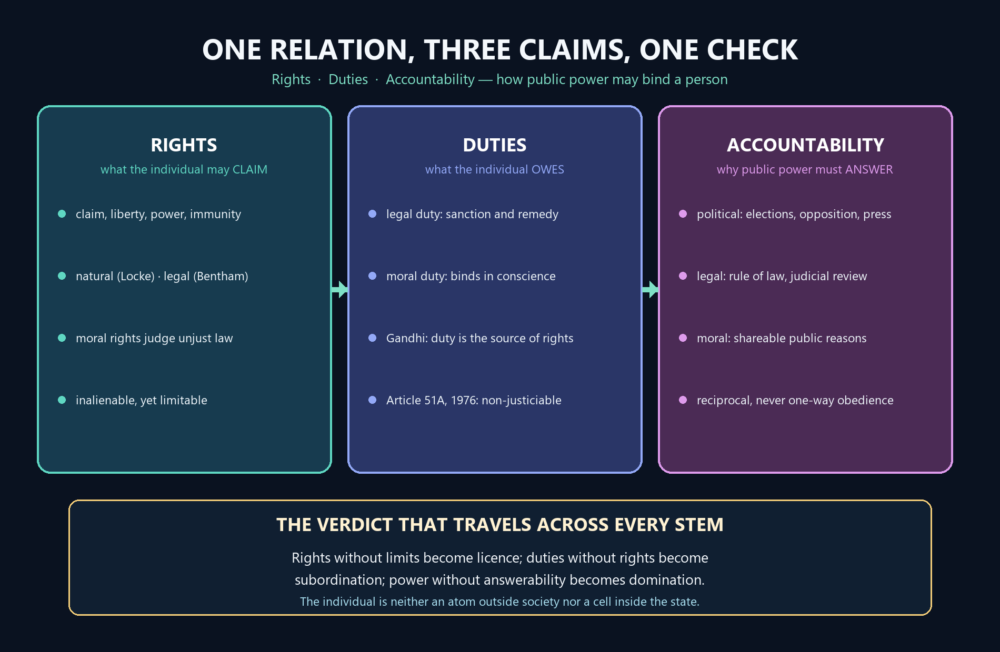

# Individual and State — Learner-v2 Source-Complete Learning Session


> **Syllabus (verbatim):** Individual and State : Rights; Duties and Accountability.
>
> **Generation:** g3, 30 August 2026 · **Approval:** false pending explicit topic approval
>
> **Evidence discipline:** Complete legacy teaching and workbook material is preserved, reordered Basic-first/Advanced-last, and checked against the canonical owner and verified 2018–2025 PYQ ledger.


## BASIC LEARNING SESSION




*Concept map: one relation held together by three claims and one check — rights are what the individual may claim, duties are what she owes, and accountability is why public power must answer for its use.*

> **Syllabus (verbatim):** Individual and State : Rights; Duties and Accountability.

### How to Use This Five-Layer Session

Every logical subtopic follows exactly:

| Layer | Purpose |
|---:|---|
| 1. SIMPLE START | visual-first plain-language gateway |
| 2. CORE UPSC | complete terminology, doctrine, argument, example and source grounding |
| 3. ADVANCED | objections, replies, comparisons, interpretive issues and provenance cautions |
| 4. EXAM APPLICATION | verified PYQ routes and 10/15/20-mark architecture |
| 5. RAPID REVISION | traps, retrieval notes and links to the exact MCQ set |

### Source Audit and Contemporary-Link Boundary

- **Canonical doctrine source:** `upsc-ai-kit/knowledge/Philosophy/paper-2/socio-political/Individual-and-State.md` (9,410 words), sliced verbatim into the CORE UPSC layers (each canonical teaching passage exactly once) and preserved again, in full, in the canonical apparatus block.
- **Doctrine grounding (in the canonical file):** rights (what a right is; natural rights in Locke; Bentham's legal / positivist challenge; moral rights; Hohfeld's four incidents; will and interest theory; human-rights universality and cultural relativism; the rights-duties correlativity question; rights in Indian tradition and Gandhi); duties (legal and moral; Gandhi's duty-centrism; the Indian dharma idiom; Fundamental Duties; the duty-vs-rights priority debate); accountability (political, legal, moral, and reciprocal); the theories of the individual-state relationship (liberal, idealist, social-contract origin and development, the human-rights adequacy of contract, anarchist, Marxist, and the unconditional-rights problem); political obligation, law and resistance (the six families and the four tests; the fair-play reconstruction; Dworkin on principles, hard cases and rights as trumps; the four-rung disobedience ladder; the dated illustrations; the Indian legal-status caution; the objection-reply set); the inter-thinker debates, criticisms and common traps. No book claim is added beyond what the canonical file already grounds.
- **Verified PYQs:** local Socio-Political Philosophy Paper II bank, 2018-2025; this clause owns exactly **9** primary parts (2018:1, 2019:1, 2020:1, 2021:1, 2022:1, 2023:1, 2024:2, 2025:1). Rousseau's natural-vs-artificial inequality (Social and Political Ideals), the sovereignty thinkers (Sovereignty), democracy / monarchy / theocracy-as-a-form (Forms of Government), Marxism / anarchism as ideology and Gandhi-as-anarchist (Political Ideologies), capital punishment and corruption (Crime and Punishment) and female foeticide / gender (Gender Discrimination) are kept separate and not double-owned. The 2024 origin-of-social-contract part and the 2024 Aristotle-vs-Plato statism / individualism part are owned here.
- **Comparative-context discipline:** Aristotle and Plato (Forms of Government / Ideals), Hegel and T. H. Green (idealism), Marx (Political Ideologies), the named anarchists Bakunin, Kropotkin and Tolstoy (Political Ideologies) and the sovereignty thinkers Austin, Bodin, Laski and Kautilya (Sovereignty) are used only as clearly-marked routing context and are not re-expounded here. Hobbes, Locke and Rousseau ARE canonical here (social-contract origin and development) and are taught in full; the Austin -> Kelsen -> Hart jurisprudential sequence is named and routed to Sovereignty, not developed.
- **Provenance discipline:** modern scholars are cited by position, or by title and year, only - Dworkin (*Taking Rights Seriously*, **1977**), A. John Simmons (the leading modern sceptic about a general obligation), Joseph Raz (the service conception and pre-emptive reasons), H. L. A. Hart and John Rawls (the fair-play and natural-duty accounts), Thoreau (*Civil Disobedience*, **1849**), Gandhi (the **1930** Salt Satyagraha as a dated illustration) and Ambedkar (the "grammar of anarchy", Constituent Assembly concluding address, **25 November 1949**). Article 19 and Article 51A (inserted by the Constitution (Forty-second Amendment) Act, **1976**; Fundamental Duties are non-justiciable) are used as dated constitutional illustration only, never as proof of a philosophical thesis, and parliamentary sovereignty is not overclaimed.
- **Contemporary-affairs boundary (deliberate):** this is a static, syllabus-driven conceptual clause; no 2026 institutional development is forced as an anchor, and no factual claim is invented. Only static syllabus relevance and clearly labelled analysis are used.
- **Qdrant:** optional fallback only; not required for this canonical topic, and it never blocks the learning session.

**Preservation note:** the canonical doctrine is reorganised into layers, never compressed. Every doctrine, numbered argument, objection/reply, comparison, corpus-depth delta, PYQ route, directive rule, graded verdict and provenance caution is retained; simplification means adding accessible gateways, not deleting complexity.

### Learning Roadmap

| Unit | Logical subtopic |
|---:|---|
| 1 | The Individual-State Frame: Concepts and Why a State |
| 2 | Rights I: What a Right Is and Its Sources |
| 3 | Rights II: Hohfeld, Will/Interest, Human Rights and Correlativity |
| 4 | Duties: Nature, Gandhi's Duty-Centrism and the Priority Debate |
| 5 | Accountability of Public Power |
| 6 | Theories of the Relationship: Liberal, Idealist and Social Contract |
| 7 | Radical and Situated Critiques: Anarchist, Marxist, Welfare, Communitarian, Feminist |
| 8 | Political Obligation: Why Should the Individual Obey the State? |
| 9 | Disobedience, Resistance and the Indian Constitutional Application |
| 10 | Inter-Thinker Debates, Criticisms and Common Traps |

---

### SESSION 1 — The Individual-State Frame: Concepts and Why a State

#### DEFINITION / WHAT THIS IS CALLED

**Plain-language definition:** The individual-state question asks on what terms organised public authority may bind a person at all, and it is worked out through three linked ideas: rights as justified claims, duties as what is owed, and accountability as answerable power.

**Technical definition:** Analytically the clause fixes a normative relation rather than an institutional description: the individual is a bearer of agency and dignity, society is the whole web of cooperation, civil society is the voluntary space between family and state, government is the transient organ that exercises authority now, and the state is the permanent claim to binding public power over a territory.

#### VISUAL — Why a state at all, and what converts its power into authority

```text

   many individuals -> scarcity + disagreement + risk of harm -> no impartial umpire

                                    |

                                    v

                    A STATE IS INSTITUTED TO SUPPLY

        [1] order and security     [2] rights protection

        [3] public goods           [4] justice and welfare

                     [5] collective action

                                    |

                                    v

            BUT power that can protect can also DOMINATE

                                    |

        +---------------------------+---------------------------+

        v                                                       v

   MERELY OBEYED                                        JUSTIFIED, LIMITED

   power = coercion                                     AND ANSWERABLE

   (a gang also obtains obedience)                      power = AUTHORITY

```

*The justification chain every opening paragraph on this clause should reproduce in one or two sentences.*

#### VISUAL — Five words the examiner rewards you for keeping apart

```text

+-----------------+--------------------------------------+---------------------------+

| TERM            | WHAT IT PICKS OUT                    | DO NOT CONFUSE WITH       |

+-----------------+--------------------------------------+---------------------------+

| individual      | agency, dignity, interests, moral    | a unit of the collective  |

|                 | standing                             |                           |

| society         | the whole web of cooperation         | the state, its one part   |

| civil society   | voluntary bodies between family      | the government of the day |

|                 | and state                            |                           |

| government      | the organ exercising authority now   | the state itself          |

| state           | organised public authority claiming  | society or a passing      |

|                 | binding power over a territory       | government                |

+-----------------+--------------------------------------+---------------------------+

   RELATION SPECTRUM: minimal -> welfare/enabling -> socialist -> totalitarian

                      -> stateless   (locate the stem, then adjudicate)

```

*Most avoidable marks on this clause are lost in the first paragraph, by treating these five as synonyms.*

#### ANSWER-GRABBING OPENING — WRITE/ADAPT IN THE EXAM

> The individual and the state are related by justification and not by force: a state earns authority when it supplies order, rights protection, public goods, justice and collective action, and it keeps that authority only while it remains limited and answerable.

#### MUST-WRITE KEYWORDS

- **individual as bearer of dignity**
- **society against civil society**
- **government as transient organ**
- **state as permanent public authority**
- **legitimacy against mere coercion**
- **relation spectrum from minimal to stateless**

**How to use them:** Separate individual, society, civil society, government and state in the first two sentences, name the five purposes a state answers, convert the stem into a question about legitimacy rather than coercion, and locate the case on the relation spectrum before any thinker is introduced.

#### CORE OBJECTION, REPLY AND RESIDUAL LIMIT

**Objection:** If the state is justified only instrumentally, any efficient supplier of order would serve equally well, and the distinctive moral standing of political authority quietly disappears.

**Best reply:** Efficiency is not authority. The state's distinctive claim is a right to rule that its subjects have reason to accept, which is why legitimacy rather than effectiveness is the test; a gang can compel obedience without ever acquiring the standing to demand it.

**Residual limit:** The frame fixes the question and the vocabulary but decides nothing by itself; how much state is justified is settled only by the arguments about rights, duties, accountability and obligation that follow.

#### EXAM USE AND CONCISE REVISION

**Answer architecture:** Define the four terms the paper rewards you for separating, give the five purposes a state answers, distinguish legitimacy from coercion, locate the stem on the relation spectrum, and only then argue towards a graded verdict.

- Rights are claims, duties are what is owed, accountability is answerable power; any one without the other two is distorted.
- State is not government, government is not society, and neither is the nation; the state is organised public authority.
- Five purposes: order and security, rights protection, public goods, justice and welfare, collective action.
- Relation spectrum: minimal, welfare or enabling, socialist, totalitarian, stateless; verdicts are located, never declared.

This whole theme answers four linked questions about one relationship: how is the
state justified **to** the individual, what may the individual claim **against**
it, what does she owe **through** shared social life, and why must public power stay **answerable**? Start by seeing why a state is needed at all.

```text
        WHY DOES THE INDIVIDUAL NEED A STATE AT ALL?
        ============================================

   many individuals  ->  scarcity + disagreement + risk of harm
        |                          |
        v                          v
   each wants security,     without a common authority, disputes
   cooperation and a fair        have no impartial umpire
   share of common goods              |
        |                             v
        +----------->  A STATE is set up to supply:
                       [1] ORDER & SECURITY   (peace, protection)
                       [2] RIGHTS PROTECTION  (life, liberty, property)
                       [3] PUBLIC GOODS       (courts, defence, roads)
                       [4] JUSTICE & WELFARE  (fair terms, a social minimum)
                       [5] COLLECTIVE ACTION  (do together what none can alone)
                              |
                              v
              BUT power that can protect can also DOMINATE
                              |
                              v
        so the state must be JUSTIFIED, LIMITED and ANSWERABLE
        (legitimacy) -- not merely OBEYED out of fear (coercion)
```

Now separate the words the paper rewards you for keeping apart. "State" is not
"government", and neither is "society".

| Term | Plain meaning | Do not confuse with |
|---|---|---|
| **Individual** | the single person: agency, dignity, interests, moral status | a mere unit of the collective |
| **Society** | the whole web of social relations and cooperation | the state (only one part of society) |
| **Community** | a group bound by shared identity and belonging | the legal nation-state |
| **Civil society** | voluntary associations between family and state | the government of the day |
| **Nation** | a people with a shared identity and aspiration | the state (its legal-political shell) |
| **Government** | the *organ* that exercises public authority now | the state (wider and more permanent) |
| **State** | organised public authority claiming binding power over a territory | society or the passing government |

> MEMORY: One relationship, three claims, one check -- RIGHTS (claims), DUTIES
> (what is owed), ACCOUNTABILITY (answerable power). Rights without limits become
> licence; duties without rights become subordination; power without
> accountability becomes domination.


#### 0. ONE-SCREEN MAP

| Core term | Minimal meaning | Key philosophical issue | UPSC use-value |
|---|---|---|---|
| **Rights** | justified claims, liberties, powers or immunities | Are rights natural, legal, moral, or interest-protecting? | Builds introductions and concept-clearing first paragraphs |
| **Duties** | obligations owed to others, community, and institutions | Are duties prior to rights, correlative to rights, or independent? | Central to 2023 and 2025 framing |
| **Accountability** | answerability for exercise of power | Why should the state justify coercion and decision-making? | Connects rights to institutions and legitimacy |
| **State** | organised public authority claiming binding power | Is the state protector, ethical whole, class instrument, or coercive monopoly? | Opens social contract, Marxist and anarchist debates |
| **Individual** | bearer of agency, dignity, interests and moral status | Is the person prior to the state or formed through social institutions? | Helps compare liberal, idealist, Gandhian and Marxist lines |

```text
INDIVIDUAL–STATE RELATIONSHIP

Individual makes claims  -------------►  RIGHTS
Individual bears obligations ◄-------- DUTIES
State secures, limits, and structures both
                |
                ▼
        ACCOUNTABILITY OF POWER
   political · legal · moral answerability
```

**Working thesis:** ✅ rights protect individuality; ✅ duties sustain social order; ✅ accountability legitimises coercive power. ⚠️ Any one of the three without the other two becomes distorted: rights without limits may become license, duties without rights may become subordination, and state power without accountability degenerates into domination.

#### CLOSING RECALL FLOW — The Individual-State Frame: Concepts and Why a State

```closure-flow
SUBTOPIC: The Individual-State Frame: Concepts and Why a State
STARTING CONCEPT: The Individual-State Frame: Concepts and Why a State
KEY TERMS / DEFINITIONS: individual as bearer of dignity | society against civil society | government as transient organ | state as permanent public authority | legitimacy against mere coercion | relation spectrum from minimal to stateless
MECHANISM / ARGUMENT: Scarcity, disagreement and the risk of harm leave disputes without an impartial umpire, so a state is instituted to supply order and security, rights protection, public goods, justice and welfare, and the collective action no individual can achieve alone.
CONSEQUENCE / CONTRAST: The very power that protects can also dominate, so the protector must itself be justified, limited and answerable, and the disputed question becomes how much state and for what ends rather than state or no state.
UPSC TRAP / ANSWER-USE: Do not equate the state with the government or with society, and do not reduce the clause to freedom against order, because a well-designed state is a condition of meaningful freedom and not merely its limit.
ANSWER-GRABBING FORMULATION: The individual and the state are related by justification and not by force: a state earns authority when it supplies order, rights protection, public goods, justice and collective action, and it keeps that authority only while it remains limited and answerable.
```

### SESSION 2 — Rights I: What a Right Is and Its Sources

#### DEFINITION / WHAT THIS IS CALLED

**Plain-language definition:** A right is not a wish and not merely an urgent need; it is a justified claim, liberty, power or immunity that a moral or legal order recognises as owed to a person.

**Technical definition:** A right is a protected normative position whose ground must be named: natural-rights theory in Locke grounds it in a moral status prior to government, legal positivism in Bentham grounds it in an enforceable order that identifies claimant, duty-bearer and remedy, and moral-rights theory grounds it in ethical reasoning that can condemn a valid law before that law is changed.

#### VISUAL — Four rival answers to the question why is this owed

```text

                        A RIGHT

        (a justified claim / liberty / power / immunity)

                           |

     +----------------+----+-----------------+------------------+

     v                v                      v                  v

  NATURAL           LEGAL                  MORAL           STRUCTURAL

  (Locke)           (Bentham)              (ethics)        (next session)

  prior to the      exists only where      valid before    claim, liberty,

  state; limits     law names claimant,    the law is      power, immunity;

  government        duty-bearer, remedy    enacted         will vs interest

     |                    |                      |

     v                    v                      v

  resistance on      precision, but         criticism of unjust law

  breach of trust    hostage to enactment   (anti-slavery, anti-colonial)

```

*Name the ground first; the rest of the rights answer follows from whichever branch is chosen.*

#### VISUAL — Locke against Bentham, and the register neither supplies alone

```text

+---------------------+-------------------------------+---------------------------+

| ISSUE               | LOCKE                         | BENTHAM                   |

+---------------------+-------------------------------+---------------------------+

| ground of a right   | moral status prior to the     | recognition by an         |

|                     | state                         | enforceable legal order   |

| content named       | life, liberty, property       | whatever law creates      |

| role of the state   | fiduciary trustee that may    | creator and enforcer of   |

|                     | forfeit authority             | every genuine right       |

| famous verdict      | rights limit government       | natural rights are        |

|                     |                               | nonsense upon stilts      |

| standing danger     | tyranny that violates rights  | rhetorical inflation of   |

|                     |                               | rights-talk               |

+---------------------+-------------------------------+---------------------------+

  MORAL REGISTER supplies what neither does: a standard by which a VALID law

  can be condemned as unjust before it is repealed.

```

*The load-bearing contrast of the sources debate, with the residual work the moral register performs.*

#### ANSWER-GRABBING OPENING — WRITE/ADAPT IN THE EXAM

> The first mark on any rights stem is earned by refusing to treat every urgent interest as a right: a right is a justified claim, liberty, power or immunity, and a controlled answer names its ground as natural, legal or moral before it argues about anything else.

#### MUST-WRITE KEYWORDS

- **justified claim rather than mere need**
- **natural rights prior to the state**
- **fiduciary trust and forfeiture**
- **rights as children of law**
- **nonsense upon stilts**
- **moral rights as critical standard**

**How to use them:** Open with the claim-liberty-power-immunity formula, run Locke against Bentham as the load-bearing contrast between rights prior to the state and rights as children of law, keep the moral register available for criticism of unjust law, and close by saying that a mature order needs all three grounds.

#### CORE OBJECTION, REPLY AND RESIDUAL LIMIT

**Objection:** Natural rights cannot be empirically demonstrated, and historically they have often encoded the property interests of a particular class.

**Best reply:** The claim is normative rather than empirical. Natural-rights language asserts that government is morally limited and cannot define justice by command alone, which is a thesis about the authority of law rather than an observation about human nature; the class-interest charge is a warning about misuse, not a refutation of the form of argument.

**Residual limit:** Naming the ground settles what kind of justification a right carries, not which particular rights survive collision with other rights, and that needs the structural analysis of the next session.

#### EXAM USE AND CONCISE REVISION

**Answer architecture:** Define the right, contrast Locke's pre-political grounding with Bentham's children of law, add the moral register that makes criticism of unjust law intelligible, state one limitation, and deliver a graded verdict that a mature order uses all three registers.

- Right = justified claim, liberty, power or immunity recognised by a moral or legal order; not a need or preference.
- Locke: life, liberty and property held in the state of nature; government a fiduciary trust, forfeit on breach.
- Bentham: rights are children of law and natural rights are nonsense upon stilts; he rejects natural, not legal, rights.
- Moral rights ground criticism of valid law and explain anti-slavery and anti-colonial claims before legal recognition.
- Each ground carries a presupposition: intrinsic moral status, institutional enforceability, or justice beyond positive law.

A right is not just a wish. It is a **justified claim, liberty, power or immunity** that a moral or legal order recognises -- something owed to a person
because of who or what she is. The first exam skill is to say *what grounds* the
right, because the four rival answers pull in different directions.

```text
     WHAT GROUNDS A RIGHT?  (four rival answers to "why is this owed?")
     ================================================================

                          A  RIGHT
         (a justified claim / liberty / power / immunity)
                             |
      +-----------+----------+-----------+------------------+
      |           |          |           |                  |
   NATURAL      LEGAL      MORAL       (analysed later:     |
   rights       rights     rights       will vs interest,   |
   (Locke)     (Bentham)  (ethics)      Hohfeld -> ST3)     |
   prior to     made by    valid                            |
   the state    law only   before                           |
   life,       "nonsense   the law is                       |
   liberty,     upon        enacted                          |
   property     stilts"    (anti-slavery, anti-colonial)     |
```

Plain version: a **natural** right (Locke) is held *before* any government and so
*limits* government; a **legal** right (Bentham's positivism) exists only once law creates a claimant, a duty-bearer and a remedy; a **moral** right lets us condemn
an unjust law as unjust *before* it is changed.

> MNEMONIC: **N-L-M** -- Nature grounds it, Law enforces it, Morality judges
> it. Good answers say a mature system needs all three registers.


#### 1. RIGHTS

#### 1.1 What is a right?
**Statement:** ✅ A right is not merely a desire or preference; it is a justified claim, liberty, power, or immunity recognised within a moral or legal order.

**Argument:** A right marks a protected normative position. It tells us that some interests, choices, or forms of agency deserve respect. In political philosophy, rights answer the question: *what is owed to a person because she is a person, citizen, or member of a community?*

**Presupposition:** Rights presuppose some standard of justification — nature, law, morality, utility, dignity, interest, autonomy, or social recognition.

**Distinction:**
- A **need** may be urgent, but not every need is yet a right.
- A **liberty** means non-interference; a **claim-right** requires correlative conduct from others.
- A **moral right** may exist even without legal enforcement; a **legal right** exists within an institutional order.

**Objection → Reply:**
- **Objection:** rights-talk is vague and inflated; modern discourse calls every preference a right. ❓
- **Reply:** ✅ conceptual discipline is supplied by theories such as Hohfeld's analysis, which separates claim, liberty, power and immunity.

#### 1.2 Natural rights: Locke and the liberal starting point
| Element | Locke's position | UPSC note |
|---|---|---|
| Source | ✅ rights belong to persons in the state of nature | Pre-political grounding of rights |
| Content | ✅ life, liberty, property | Standard triad for introduction |
| Function of state | ✅ fiduciary protection of rights | Limited government |
| Right to resistance | ✅ if government violates trust, resistance is justified | Rights as check on sovereignty |

**Statement:** ✅ Natural-rights theory holds that certain rights belong to persons prior to, and independent of, the state.

**Argument:** In Locke, individuals are by nature free and equal. They possess rights not because a sovereign grants them, but because their moral standing precedes political authority. Political society is therefore created to secure, not create ex nihilo, these rights.

**Presupposition:** Human beings possess an intrinsic moral status that is not reducible to convention or positive law.

**Distinction:** Locke differs from Hobbes. Hobbes begins with self-preservation and extensive natural liberty under fear; Locke gives the state of nature a more norm-governed structure and treats rights as morally prior constraints on government.

**Objection → Reply:**
- **Objection:** natural rights cannot be empirically shown and often hide historically specific property interests. ❓
- **Reply:** ⚠️ Even if not empirically observable, natural-rights language expresses the idea that government is morally limited and cannot define justice solely by command.

#### 1.3 Legal or positivist theory: Bentham's challenge
**Statement:** ✅ Legal or positivist theory identifies rights with recognition by law and institutions.

**Argument:** Bentham famously dismisses natural rights as “nonsense upon stilts.” His point is not that all rights are absurd, but that rights without law are rhetorically inflated and politically dangerous. A right, on this view, exists where an enforceable legal system identifies a claimant, duty-bearer and remedy.

**Presupposition:** Clear institutions matter more than metaphysical assertions. Rights require codification, specification and enforcement.

**Distinction:**
- Bentham rejects **natural** rights, not **all** rights.
- Positivism asks *what rights exist in law?*; moral-rights theories ask *what rights ought to exist even before law recognises them?*

**Objection → Reply:**
- **Objection:** if law alone creates rights, oppressive legal systems could define injustice as justice. ❓
- **Reply:** ⚠️ This is why legal-rights theory often needs supplementation by moral criticism; legal validity and moral legitimacy are not identical.

#### 1.4 Moral rights
**Statement:** ✅ Moral rights are justified claims grounded in ethical reasoning rather than merely in legal enactment.

**Argument:** Moral-rights discourse allows critique of unjust law. It explains how anti-slavery, anti-colonial or anti-discrimination claims can be intelligible even before legal recognition. One may therefore say that law should recognise a right because morality already supports it.

**Presupposition:** There are standards of justice not exhausted by the existing legal order.

**Distinction:** Moral rights may later become legal rights, but they are not reducible to them.

**Objection → Reply:**
- **Objection:** morality varies, so moral rights are unstable. ❓
- **Reply:** ⚠️ Variation does not cancel moral reasoning; rather, it forces argument about dignity, suffering, reciprocity and agency.

#### CLOSING RECALL FLOW — Rights I: What a Right Is and Its Sources

```closure-flow
SUBTOPIC: Rights I: What a Right Is and Its Sources
STARTING CONCEPT: Rights I: What a Right Is and Its Sources
KEY TERMS / DEFINITIONS: justified claim rather than mere need | natural rights prior to the state | fiduciary trust and forfeiture | rights as children of law | nonsense upon stilts | moral rights as critical standard
MECHANISM / ARGUMENT: Each theory answers the question why is this owed differently: nature confers standing before government exists, positive law confers an enforceable position with a remedy, and morality confers a critical standard against what the law has actually enacted.
CONSEQUENCE / CONTRAST: Locke's grounding makes government a fiduciary trust that can be forfeited and resistance justified, Bentham's makes rights institutionally precise but hostage to whatever the legislature enacts, and only the moral register explains anti-slavery and anti-colonial claims voiced before any law recognised them.
UPSC TRAP / ANSWER-USE: Bentham rejects natural rights and not legal rights as such, so never write that he denied all rights, and never treat legal validity as though it settled moral legitimacy.
ANSWER-GRABBING FORMULATION: The first mark on any rights stem is earned by refusing to treat every urgent interest as a right: a right is a justified claim, liberty, power or immunity, and a controlled answer names its ground as natural, legal or moral before it argues about anything else.
```

### SESSION 3 — Rights II: Hohfeld, Will/Interest, Human Rights and Correlativity

#### DEFINITION / WHAT THIS IS CALLED

**Plain-language definition:** The single word right hides four different jural positions, and only one of them, the claim-right, is strictly matched by somebody else's duty.

**Technical definition:** Hohfeld pairs claim-right with duty, liberty or privilege with no-right, power with liability and immunity with disability; will theory explains a right as normative control over another's duty while interest theory explains it as the protection of a vital interest; and human-rights discourse extends both to protections owed to all persons simply as human beings.

#### VISUAL — The four incidents and the single strict correlative

```text

+---------------+---------------+---------------+-----------------------------+

| INCIDENT      | CORRELATIVE   | OPPOSITE      | PLAIN SENSE                 |

+---------------+---------------+---------------+-----------------------------+

| CLAIM-RIGHT   | duty          | no-right      | others MUST act or forbear  |

| LIBERTY       | no-right      | duty          | I MAY act; no claim on you  |

| POWER         | liability     | disability    | I can ALTER legal relations |

| IMMUNITY      | disability    | liability     | you CANNOT alter my status  |

+---------------+---------------+---------------+-----------------------------+

   only CLAIM-RIGHT is strictly correlative to a duty

        |                                   |

        v                                   v

  necessary connection HOLDS         liberty imposes NO positive duty

  (my right against assault =        to help me exercise it, so the

   your duty not to assault me)      strong thesis over-reaches

```

*The analytic square that decides every rights-and-duties correlativity stem.*

#### VISUAL — What a right protects, and how far it travels

```text

  WILL THEORY  ------------------------------  INTEREST THEORY

  right = control over another's duty          right = protection of a

  fits autonomy, consent, agency               vital interest, well-being

  hard case: children, the severely            fits welfare and protective

  incapable hold rights they cannot            rights, but can underplay

  actively exercise                            active agency

                    \                    /

                     MIXED ACCOUNT: agency AND welfare


  UNIVERSALIST -------------------------------- RELATIVIST

  equal worth; protection from cruelty         personhood, authority and

  is a common human aspiration                 obligation vary by tradition

                    \                    /

        VERDICT: common core of protection, plural articulation

```

*Will against interest on the left, universality against relativism on the right; both resolved by a mixed, graded verdict.*

#### ANSWER-GRABBING OPENING — WRITE/ADAPT IN THE EXAM

> Correlativity is the mark-bearing device on this clause: claim-rights are necessarily correlative to duties while liberties are not, so the slogan that rights and duties are two sides of one coin is exact for one Hohfeldian incident and merely loose about the rest.

#### MUST-WRITE KEYWORDS

- **claim-right correlative to duty**
- **liberty correlative to no-right**
- **power, liability, immunity, disability**
- **will theory as control over duty**
- **interest theory as protection**
- **universality against cultural relativism**

**How to use them:** Answer any correlativity stem by attacking the modal word necessarily with the Hohfeldian incidents, then use will theory and interest theory to say what the right protects, and finish on human rights by separating universality of aspiration from uniformity of articulation.

#### CORE OBJECTION, REPLY AND RESIDUAL LIMIT

**Objection:** Universal human rights impose the vocabulary of one civilisation on all others and erase genuine moral diversity.

**Best reply:** Universality of aspiration need not mean uniformity of articulation. Dignity and protection from cruelty and arbitrariness can be a common core while moral idiom, institutional form and civilisational vocabulary remain plural; conceding the historically Western formulation costs nothing once the aspiration is defended.

**Residual limit:** The analysis clarifies structure and ground but cannot by itself fix the content of the vital interests that interest theory protects, which is why substantive argument about dignity is still required.

#### EXAM USE AND CONCISE REVISION

**Answer architecture:** Attack the modal word in the stem, set out the four incidents, apply will and interest theory, place the universality debate on a balanced grid, and deliver a verdict that the connection is conceptual for claim-rights and institutional for the rest.

- Hohfeld: claim-right / duty, liberty / no-right, power / liability, immunity / disability; only the claim-right pairs strictly.
- Will theory: the right-holder controls another's duty; interest theory: the right protects an important interest.
- Human rights are owed to all simply as human beings, and link dignity to protection from cruelty and arbitrariness.
- Correlativity is normatively necessary but not a one-to-one logical identity; liberties lack strict duty-partners.
- Balanced verdict: common core of protection, plural institutional and civilisational articulation.

Once you know what grounds a right, analyse its **structure**. Hohfeld's key
insight: the word "right" hides four different jural positions, and only one of
them is strictly matched by a duty.

```text
   HOHFELD -- "a right" is really FOUR distinct jural positions
   +-------------+-------------+-------------+----------------------------+
   | Incident    | Correlative | Opposite    | Plain sense                |
   +-------------+-------------+-------------+----------------------------+
   | CLAIM-right | duty        | no-right    | others MUST act / forbear  |
   | LIBERTY     | no-right    | duty        | I MAY act; no claim on you  |
   | POWER       | liability   | disability  | I can ALTER legal relations |
   | IMMUNITY    | disability  | liability   | you CANNOT alter my status  |
   +-------------+-------------+-------------+----------------------------+
   Only the CLAIM-right is strictly correlative to a duty. So "rights and
   duties are two sides of one coin" is TRUE for claim-rights, LOOSE for
   liberties.
```

Then two further tools. **Will vs interest theory** asks *what a right protects*:
choice/agency (will) or important interests/well-being (interest) -- the split
matters for children and the severely disabled. **Human rights** claim that some
protections are owed to all *simply as human beings*, which triggers the
universality-vs-cultural-relativism debate.

> MNEMONIC: **C-L-P-I** for Hohfeld (Claim, Liberty, Power, Immunity); only > **C** carries a strict duty on the other side.


#### 1.5 Hohfeld's four incidents
| Hohfeldian incident | Correlative | Opposite | Why it matters |
|---|---|---|---|
| **Claim-right** | duty | no-right | strongest basis for rights–duties discussion |
| **Liberty / privilege** | no-right | duty | freedom to act, not always a claim on others |
| **Power** | liability | disability | ability to alter legal relations |
| **Immunity** | disability | liability | protection against alteration by others |

**Statement:** ✅ Hohfeld shows that “right” is not a single simple thing but a cluster of juridical relations.

**Argument:** This prevents confusion in philosophical and exam writing. A person's right to free speech can include liberty to speak, a claim against censorship in certain contexts, and immunity from arbitrary power. Hohfeld's scheme clarifies that correlativity is strongest in claim-rights but not identical in all usages of the word “right.”

**Presupposition:** Precision in legal-philosophical language avoids category mistakes.

**Distinction:** Saying “I have a right” may mean very different normative structures. A liberty does not automatically impose a positive duty to help me exercise it; a claim-right does.

**Objection → Reply:**
- **Objection:** Hohfeld is too technical for normative political theory. ❓
- **Reply:** ✅ technical clarity is philosophically useful because many false debates arise from ambiguous use of “right.”

#### 1.6 Will theory and interest theory
| Theory | Core idea | Strength | Main difficulty |
|---|---|---|---|
| **Will theory** | rights protect choice, control, agency | strong fit with autonomy and consent | children or severely disabled persons become hard cases |
| **Interest theory** | rights protect important interests necessary for well-being | explains welfare and protective rights well | can underplay the role of active agency |

**Statement:** ✅ Will theory treats rights as normative control over others' duties; interest theory treats rights as protections of significant interests.

**Argument:** Will theory suits liberal emphasis on autonomy. Interest theory better explains rights held by those who cannot actively exercise choice in the ordinary sense, including children. Many contemporary views use a mixed approach: rights both secure agency and protect vital interests.

**Presupposition:** Rights must be explained either through agency, interests, or a synthesis of both.

**Distinction:** Will theory asks who controls a duty; interest theory asks whose important interest justifies imposing the duty.

**Objection → Reply:**
- **Objection:** the theories compete and cannot be reconciled. ❓
- **Reply:** ⚠️ In practice, many rights systems treat both agency and welfare as relevant dimensions.

#### 1.7 Human rights: universality and cultural relativism
**Statement:** ✅ Human-rights theory claims that certain rights belong to all human beings simply as human beings.

**Argument:** The language of human rights universalises moral concern beyond citizenship, religion or culture. It is linked to human dignity, equal worth and protection against cruelty, arbitrariness and degradation.

**Presupposition:** There is a minimum moral horizon common to humanity.

**Distinction:**
- **Universality thesis:** rights express common human aspirations and basic dignity.
- **Cultural-relativist challenge:** conceptions of personhood, community, authority and obligation differ across traditions.

| Debate point | Universalist line | Relativist line | Balanced UPSC position |
|---|---|---|---|
| Ground of dignity | ✅ every human has equal worth | ❓ dignity is interpreted through culture | ⚠️ core protections may be universal, but institutional expression can vary |
| Rights language | ✅ common moral vocabulary | ❓ often historically Western in formulation | ⚠️ universality of aspiration need not imply uniformity of articulation |
| Community vs individual | rights protect person against oppression | cultures may prioritise role and duty | rights can be read relationally without losing dignity |

**Objection → Reply:**
- **Objection:** universal human rights erase civilisational diversity. ❓
- **Reply:** ⚠️ A balanced answer says universality need not mean cultural homogenisation. The stronger claim is that human dignity and protection from domination are common aspirations, while moral languages and institutional forms may differ.

#### 1.8 Are rights and duties necessarily connected?
**Statement:** ❓ The strong correlativity thesis says rights and duties are necessarily connected; the revisionist reply says the connection is important but not always a strict logical identity.

**Argument:** In ordinary political theory, the point is sound: rights cannot be socially meaningful unless some agent bears corresponding duties of respect, protection or non-interference. My right against assault implies others' duty not to assault me; my legal right to remedy implies institutions' duty to hear claims.

**Presupposition:** Rights are socially actionable, not isolated metaphysical ornaments.

**Distinction:**
- **Logical strictness:** not every use of “right” maps neatly onto a single duty in simple one-to-one fashion.
- **Normative necessity:** a right-worthy order requires duties somewhere in the background.

**Objection → Reply:**
- **Objection:** “duties are obligation, rights are entitlement” therefore there is no necessary connection. ❓
- **Reply:** ⚠️ The concepts are analytically distinguishable, but not socially separable. Entitlements without correlative obligations remain empty; obligations without any corresponding claims risk authoritarianism.

#### 1.9 Rights in Indian tradition and Gandhi
**Statement:** ⚠️ Indian traditions often frame the moral order through right conduct and moral duty (**dharma**), role-based obligation, reciprocity and self-restraint rather than beginning with atomistic rights-talk.

**Argument:** This does not mean the tradition is simply antagonistic to rights. It means the idiom of moral life often starts from duty, order, reciprocity and social role. Gandhi radicalises this by arguing that rights grow out of well-performed duties. His duty-centrism is not anti-rights; it is a thesis about the moral source and social sustainability of rights.

**Presupposition:** A society can affirm human worth through languages other than modern liberal individualism.

**Distinction:**
- Duty-first is not necessarily hierarchy-first.
- Gandhi is not saying rights are dispensable; he is saying rights become secure when individuals internalise obligation.

**Objection → Reply:**
- **Objection:** if tradition emphasises duty, individual rights become weak. ❓
- **Reply:** ⚠️ A balanced answer notes the danger of submerging the individual in community, yet also credits duty-language with restraining self-assertive egoism.

#### CLOSING RECALL FLOW — Rights II: Hohfeld, Will/Interest, Human Rights and Correlativity

```closure-flow
SUBTOPIC: Rights II: Hohfeld, Will/Interest, Human Rights and Correlativity
STARTING CONCEPT: Rights II: Hohfeld, Will/Interest, Human Rights and Correlativity
KEY TERMS / DEFINITIONS: claim-right correlative to duty | liberty correlative to no-right | power, liability, immunity, disability | will theory as control over duty | interest theory as protection | universality against cultural relativism
MECHANISM / ARGUMENT: Separating the four incidents shows exactly where a duty-partner is entailed and where it is not, so the correlativity question is settled by analysis of jural positions instead of by slogan.
CONSEQUENCE / CONTRAST: Will theory suits autonomy and consent but handles children and the severely incapable badly, interest theory explains welfare and protective rights but can underplay agency, and most working systems therefore run a mixed account.
UPSC TRAP / ANSWER-USE: Do not treat correlativity as a strict logical identity across every use of the word right, and do not misread universality as cultural homogenisation.
ANSWER-GRABBING FORMULATION: Correlativity is the mark-bearing device on this clause: claim-rights are necessarily correlative to duties while liberties are not, so the slogan that rights and duties are two sides of one coin is exact for one Hohfeldian incident and merely loose about the rest.
```

### SESSION 4 — Duties: Nature, Gandhi's Duty-Centrism and the Priority Debate

#### DEFINITION / WHAT THIS IS CALLED

**Plain-language definition:** A duty is what a person owes to other persons, to the community and to institutions, and it arrives in a legally enforceable form and in a form that binds only in conscience.

**Technical definition:** A legal duty carries an external sanction and a remedy while a moral duty binds in conscience and grounds criticism where the law is silent; Gandhi's duty-centrism makes performed duty the source of secure rights; and Article 51A, inserted by the Constitution (Forty-second Amendment) Act, 1976, expresses that thought constitutionally while remaining non-justiciable.

#### VISUAL — The balance beam, and Gandhi's inversion of it

```text

     RIGHTS  <==============================>  DUTIES

     claims I hold                             obligations I owe

          \                                       /

     rights-first idiom                    duty-first idiom

     (entitlement, consent,                (right conduct and moral duty

      liberty come first)                   (dharma), service, restraint)

                    \                    /

                 RECIPROCAL VIEW: my right is your duty


   GANDHI'S INVERSION

   perform the DUTY (service, self-restraint, truthfulness)

                        |

                        v

   RIGHTS are then earned, internalised and socially secure

   -> duty-first, but NOT statist: it can license disobedience to unjust power

```

*Two idioms of the same relation: the liberal order derives duty from entitlement, Gandhi derives entitlement from performed duty.*

#### VISUAL — Legal duty, moral duty, and the three positions on priority

```text

+---------------+----------------------------+-----------------------------+

| KIND OF DUTY  | BASIS                      | ENFORCEMENT                 |

+---------------+----------------------------+-----------------------------+

| legal         | law, constitution, statute | courts, penalties, remedy   |

| moral         | conscience, ethical reason | praise and blame, criticism |

+---------------+----------------------------+-----------------------------+


+---------------+---------------------------+---------------------------+

| POSITION      | MERIT                     | RISK                      |

+---------------+---------------------------+---------------------------+

| rights-first  | shields minorities and    | atomised entitlement      |

|               | dissent                   | culture                   |

| duty-first    | reciprocity, civic ethos  | paternalism, conformity   |

| balanced      | mutually sustaining; best | requires institutional    |

|               | fit for a constitutional  | vigilance                 |

|               | democracy                 |                           |

+---------------+---------------------------+---------------------------+

```

*The enforcement column decides what a duty can be made to do; the priority table decides what an answer should conclude.*

#### ANSWER-GRABBING OPENING — WRITE/ADAPT IN THE EXAM

> A duty is not the same thing as obedience, and the defensible verdict on the priority question is co-originality with a sequencing caveat: duty may be foregrounded pedagogically in a culture of entitlement without ever demoting rights to conditional grants.

#### MUST-WRITE KEYWORDS

- **legal duty with sanction and remedy**
- **moral duty binding in conscience**
- **duty as the true source of rights**
- **self-rule as ethical self-restraint**
- **Article 51A is non-justiciable**
- **co-originality with a sequencing caveat**

**How to use them:** Separate legal from moral duty in the opening, state Gandhi's inversion that performed duty secures rights, use Article 51A as dated constitutional illustration rather than proof, and close the priority debate with co-originality plus a sequencing caveat instead of a flat ordering.

#### CORE OBJECTION, REPLY AND RESIDUAL LIMIT

**Objection:** Duty-language is regularly used by authority to silence dissent and to sacralise inherited hierarchy, so giving duty priority burdens the vulnerable twice over.

**Best reply:** The objection defeats unconditional duty-talk, not duty as such. Duties are philosophically defensible only where they are tied to equality, reciprocity and accountability, and Gandhi's duties run to conscience and community rather than to the state, which is precisely why they can justify refusal of an unjust command.

**Residual limit:** Even the balanced verdict leaves open which duties may be legally enforced and which must remain moral, because coercion is self-defeating for obligations such as truthfulness and tolerance.

#### EXAM USE AND CONCISE REVISION

**Answer architecture:** Define duty and split it into legal and moral, state the duty-first and rights-first positions with their merits and risks, use Gandhi and Article 51A as India-centric evidence, and land on reciprocity with a sequencing caveat.

- Duty = what is owed; legal duties have sanction and remedy, moral duties bind in conscience and ground critique.
- Gandhi: the true source of rights is duty; perform the duty and the right follows, secured by self-restraint and service.
- Article 51A, inserted by the 42nd Amendment in 1976, is non-justiciable constitutional exhortation, not enforceable command.
- Priority debate: rights-first protects dissent, duty-first preserves reciprocity, the balanced view makes them mutually sustaining.
- Verdict formula: co-originality with a sequencing caveat; foreground duty if you must, never demote rights.

If rights are what I may **claim**, duties are what I **owe** -- to other persons,
to the community and to the state. Picture a balance beam: a healthy polity keeps
it level.

```text
     RIGHTS  <=========================>  DUTIES
     claims I hold                        obligations I owe
         \                                   /
          \        the individual           /
           \      stands between            /
            \     the two poles            /
      duty-first idiom                rights-first idiom
      (dharma, Gandhi,                (liberal entitlement,
       civic republican)              claims come first)
             \                          /
              BALANCED VIEW: rights and duties are RECIPROCAL --
              my right is your duty; my duty secures your right
```

Gandhi flips the usual order:

```text
   GANDHI'S INVERSION:  do your DUTY (swadharma, service, self-restraint)
                                     |
                                     v
                        RIGHTS are then earned and secured
   "The true source of rights is duty." Perform the duty and the right follows.
   Liberalism starts from entitlement, then derives duty; Gandhi reverses it.
```

> MNEMONIC: **D-before-R (Gandhi) vs R-before-D (liberal); RECIPROCAL (mature > view).** Duties come as *legal* (enforceable) and *moral* (binding in
> conscience) kinds.


#### 2. DUTIES

#### 2.1 What is a duty?
**Statement:** ✅ A duty is an obligation to do, avoid, respect or support something owed to others, institutions, community or oneself.

**Argument:** Duties structure social life by turning abstract norms into expectations of conduct. They make coexistence possible by regulating how freedom is exercised in a shared world.

**Presupposition:** Human beings are relational, and social life cannot be sustained by claims alone.

**Distinction:** Duties may be legal, moral, civic, political, professional or spiritual.

**Objection → Reply:**
- **Objection:** duties are often invoked by authority to silence dissent. ❓
- **Reply:** ⚠️ That danger is real, so duty must be tied to justice, reciprocity and accountability rather than blind obedience.

#### 2.2 Legal and moral duties
| Type of duty | Basis | Enforcement | Example-type |
|---|---|---|---|
| **Legal duty** | law, constitution, statute, recognised procedure | courts, penalties, official sanction | obeying valid law, paying due taxes |
| **Moral duty** | conscience, ethical reason, social norm | praise/blame, self-judgment, public opinion | truthfulness, compassion, civic decency |

**Statement:** ✅ Legal duties are enforceable; moral duties are not always legally coercive but remain philosophically indispensable.

**Argument:** A legal order cannot function without compliance, but no legal order can codify the whole of ethical life. Democratic citizenship therefore depends on habits that law alone cannot manufacture: tolerance, honesty, restraint, respect for disagreement and concern for public good.

**Presupposition:** Social order exceeds formal legality.

**Distinction:** Some duties begin as moral duties and later become legal obligations; others should remain moral because coercion would be self-defeating.

**Objection → Reply:**
- **Objection:** moral duties are too vague for political theory. ❓
- **Reply:** ✅ political life collapses without informal ethical discipline; law presupposes a culture that sustains it.

#### 2.3 Gandhi's duty-centrism
**Statement:** ✅ Gandhi gives duty conceptual priority in social ethics: rights become secure when persons discipline themselves through service, self-restraint and truthfulness.

**Argument:** Gandhi resists the purely adversarial language of claim against claim. He worries that a society obsessed only with entitlements may forget interdependence. Duty, for him, educates the moral self and makes freedom non-destructive. One receives rights not as isolated possession but through a morally ordered community.

**Presupposition:** Freedom requires ethical self-rule (*swaraj*), not merely external non-interference.

**Distinction:** Gandhi differs both from hard legal positivism and from atomistic liberalism. He is neither anti-state in the simple sense nor pro-statist in the centralising sense; he emphasises moralised citizenship and decentralised responsibility.

**Objection → Reply:**
- **Objection:** giving duty priority may legitimise social inequality or burden the vulnerable. ❓
- **Reply:** ⚠️ Gandhi's best reading avoids that by tying duty to conscience, non-violence and mutuality, not to inherited domination.

#### 2.4 Duties in Indian tradition
**Statement:** ⚠️ In much Indian ethical-political reflection, duty appears through right conduct and moral duty (**dharma**), obligation to family, society, living beings, truth and order.

**Argument:** This tradition often conceives the person not as an abstract individual standing outside all ties but as embedded in a web of relations. The emphasis falls on right conduct, self-mastery and reciprocal obligation. Philosophically, this supplies a rich vocabulary for civic duty, though it must be critically filtered to avoid sacralising hierarchy.

**Presupposition:** Community and moral order are constitutive dimensions of personhood.

**Distinction:** Duty in the Indian tradition, understood as right conduct (dharma), should not be reduced to mere obedience. At its strongest, it connotes responsibility, restraint and moral vocation.

**Objection → Reply:**
- **Objection:** a duty-centred idiom leaves little space for individual protest. ❓
- **Reply:** ⚠️ That risk exists; hence a contemporary synthesis must combine the language of duty with constitutional rights and moral equality.

#### 2.5 Fundamental Duties: philosophical basis
**Statement:** ⚠️ Fundamental Duties may be read philosophically as an attempt to balance rights-bearing citizenship with responsibility-bearing citizenship.

**Argument:** Their importance here is not technical legal detail but the normative thought behind them: a republic cannot survive if citizens invoke rights while neglecting the civic ethos needed to preserve institutions, social harmony, public property, scientific temper and constitutional culture.

**Presupposition:** Citizenship is participatory, not merely consumptive.

**Distinction:** Fundamental Duties are not a warrant to diminish rights; they are a reminder that rights operate within a moral-political community.

**Objection → Reply:**
- **Objection:** duty-language is often state-sponsored moralism. ❓
- **Reply:** ⚠️ It becomes problematic only when deployed to evade state accountability or suppress legitimate dissent.

#### 2.6 Should duty have priority over rights?
| Position | Core claim | Merit | Risk |
|---|---|---|---|
| **Rights-first** | protects person against coercion | shields minorities and dissent | may encourage atomised entitlement culture |
| **Duty-first** | preserves order and reciprocity | stresses social responsibility | may justify paternalism or conformity |
| **Balanced view** | rights and duties are mutually sustaining | best fit for constitutional democracy | requires institutional vigilance |

**Statement:** ❓ Duty may have ethical priority in motivating conduct, but rights retain political priority in protecting persons against abuse.

**Argument:** In exam writing, the strongest position is balanced: rights secure dignity and limit power; duties sustain the conditions for enjoying rights; accountability prevents both state excess and civic irresponsibility.

**Presupposition:** No stable democratic order can rest on only one of these values.

**Objection → Reply:**
- **Objection:** if rights are primary, citizens become irresponsible. ❓
- **Reply:** ⚠️ irresponsible citizenship is possible, but the cure is not to reduce rights; it is to strengthen duty-conscious civic culture and accountability.

#### CLOSING RECALL FLOW — Duties: Nature, Gandhi's Duty-Centrism and the Priority Debate

```closure-flow
SUBTOPIC: Duties: Nature, Gandhi's Duty-Centrism and the Priority Debate
STARTING CONCEPT: Duties: Nature, Gandhi's Duty-Centrism and the Priority Debate
KEY TERMS / DEFINITIONS: legal duty with sanction and remedy | moral duty binding in conscience | duty as the true source of rights | self-rule as ethical self-restraint | Article 51A is non-justiciable | co-originality with a sequencing caveat
MECHANISM / ARGUMENT: Duties convert abstract norms into expectations of conduct, so a claim-right becomes socially effective only when some determinate agent is bound to respect it, protect it or provide for it.
CONSEQUENCE / CONTRAST: A rights-first order shields dissent and minorities but risks an atomised entitlement culture, while a duty-first order revives civic responsibility but can be used to postpone the claims of exactly those with the least power to press them.
UPSC TRAP / ANSWER-USE: Article 51A is exhortatory and not court-enforceable, and Gandhi's duty-first ethic licenses disobedience to unjust power rather than submission to the state, so neither may be cited as an argument for obedience.
ANSWER-GRABBING FORMULATION: A duty is not the same thing as obedience, and the defensible verdict on the priority question is co-originality with a sequencing caveat: duty may be foregrounded pedagogically in a culture of entitlement without ever demoting rights to conditional grants.
```

### SESSION 5 — Accountability of Public Power

#### DEFINITION / WHAT THIS IS CALLED

**Plain-language definition:** Accountability means that whoever exercises public power must explain it, justify it and bear the consequences, so a state that can act on you but never has to answer to you is a master rather than a protector.

**Technical definition:** Accountability operates through three channels: political answerability through representation, opposition, publicity and criticism; legal answerability through the rule of law, judicial review, due process and remedy; and moral answerability through public reason and respect for the dignity of the governed; and in a constitutional democracy it runs reciprocally rather than as the one-way obedience of subject to ruler.

#### VISUAL — Three channels that convert power into authority

```text

                 PUBLIC POWER MUST ANSWER FOR ITS USE

  +--------------------+---------------------------+----------------------+

  | POLITICAL          | LEGAL                     | MORAL                |

  | elections,         | rule of law, judicial     | conscience, public   |

  | opposition,        | review, due process,      | reason, respect for  |

  | legislature,       | remedies                  | the dignity of the   |

  | free press         |                           | governed             |

  +--------------------+---------------------------+----------------------+

        you can REMOVE        rulers are UNDER          rulers must give

        the rulers            the law, reviewable       shareable REASONS

                                    |

                                    v

        remove all three -> POWER WITHOUT ANSWER = DOMINATION

```

*Kill any one channel and answerability weakens; kill all three and what remains is domination.*

#### VISUAL — The direction correction the examiner is testing

```text

   STEM ASSUMES:   citizen ------ answerable to ------> STATE

                                (feudal / absolutist residue)

                                    |

                                    v

   CORRECTION:     STATE ------- answerable to -------> citizen

                   evidence: judicial review, free press, periodic elections,

                             fiduciary trust cashed out institutionally

                                    |

                                    v

   CONCESSION:     rights also carry RESPONSIBILITIES

                   (free speech carries a duty not to defame)

                                    |

                                    v

   VERDICT:        RECIPROCAL accountability, not one-way obedience

   keep apart: ACCOUNTABILITY = answering for power; RESPONSIBILITY = duties

               that accompany the exercise of a right

```

*When a stem assumes citizens answer to the state, the mark-bearing move is a reasoned category correction backed by named institutions.*

#### ANSWER-GRABBING OPENING — WRITE/ADAPT IN THE EXAM

> Accountability is the institutional cash value of the distinction between authority and force: rights principally make the state answerable to citizens, and only derivatively generate the responsibilities that accompany the exercise of those same rights.

#### MUST-WRITE KEYWORDS

- **answerability for the use of public power**
- **political accountability beyond periodic voting**
- **rule of law and judicial review**
- **moral accountability beyond legality**
- **fiduciary trust cashed out institutionally**
- **reciprocal rather than one-way**

**How to use them:** Name the three channels in the first paragraph, treat answerability as the bridge from legitimacy to institutions, correct any stem that assumes citizens are answerable to the state, and support the correction with judicial review, a free press and periodic elections rather than with indignation.

#### CORE OBJECTION, REPLY AND RESIDUAL LIMIT

**Objection:** Sovereign authority requires finality of decision, so constant answer-giving destroys the very capacity to decide that makes a state useful.

**Best reply:** Finality of decision and answerability for decision are different demands. A decision can be final in effect while remaining reviewable, explicable and reversible in principle, and constitutional government is precisely the institutional arrangement that holds both together.

**Residual limit:** Accountability can degenerate into procedural ritual that satisfies form while leaving substantive injustice untouched, so the concept needs a substantive test alongside the procedural one.

#### EXAM USE AND CONCISE REVISION

**Answer architecture:** Define answerability, set out the three channels, distinguish accountability from responsibility, correct the direction the stem assumes, cite named institutions as evidence, and close on reciprocal answerability in a constitutional order.

- Accountability = public power must explain, justify and bear consequences; it is the bridge from authority to legitimacy.
- Three channels: political (elections, opposition, press), legal (rule of law, review, remedy), moral (reasons, dignity).
- Power that never answers is domination; efficiency without answerability is not legitimacy.
- Rights make the state answerable to citizens, and also generate citizen responsibilities: the relation is reciprocal.
- Trap: elections alone are not accountability without the rule of law and a free press.

Rights say what the individual may claim; accountability says the **state must answer** for how it uses power. Three channels keep power answerable.

```text
   ACCOUNTABILITY = public power must ANSWER for its use
   +----------------+-----------------------------+------------------------+
   | POLITICAL      | LEGAL                       | MORAL                  |
   | elections,     | rule of law, judicial       | conscience, public     |
   | opposition,    | review, remedies, due       | reason, respect for    |
   | legislature,   | process                     | the dignity of the     |
   | free press     |                             | governed               |
   +----------------+-----------------------------+------------------------+
                 remove all three  ->  POWER WITHOUT ANSWER = DOMINATION
   Accountability runs BOTH WAYS: it is reciprocal, not the one-way obedience
   of subject to ruler.
```

Plain point: a state that can act on you but never has to *answer* to you is not
a rights-protector -- it is a master. Accountability is the institutional cash
value of the idea that authority differs from mere force.

> MNEMONIC: **P-L-M** channels (Political, Legal, Moral). Kill all three and
> you get domination.


#### 3. ACCOUNTABILITY

#### 3.1 Meaning and philosophical basis
**Statement:** ✅ Accountability means that those who exercise public power must explain, justify and bear consequences for their decisions.

**Argument:** Because the state claims coercive authority over persons, its acts must be answerable. Accountability is thus the philosophical bridge between authority and legitimacy. Power without answerability is mere domination; accountable power can be defended as public trust.

**Presupposition:** The state is not an end in itself; it is morally constrained by the persons over whom it rules.

**Distinction:** Accountability is more than efficiency. A state may be efficient yet unaccountable.

**Objection → Reply:**
- **Objection:** sovereignty requires finality, not constant answer-giving. ❓
- **Reply:** ⚠️ finality in decision may be necessary, but legitimacy still requires review, explanation and constraint.

#### 3.2 Political accountability
**Statement:** ✅ Political accountability concerns answerability to the people through representation, elections, debate and public scrutiny.

**Argument:** If government derives authority from the governed, rulers must remain responsive to citizens' judgment. Political accountability institutionalises the idea that power is held in trust.

**Presupposition:** Popular sovereignty or democratic legitimacy matters.

**Distinction:** Political accountability is not reducible to periodic voting; it includes opposition, deliberation, publicity and criticism.

**Objection → Reply:**
- **Objection:** electoral victory can be used to justify everything. ❓
- **Reply:** ✅ democracy is not only majoritarian mandate; it also involves constitutional limits and institutional checks.

#### 3.3 Legal accountability
**Statement:** ✅ Legal accountability subjects state action to law, review and remedy.

**Argument:** Rights become effective only when institutions can hear grievances, restrain arbitrariness and provide redress. Legal accountability therefore translates abstract constitutionalism into lived protection.

**Presupposition:** Rule of law is superior to mere rule by power.

**Distinction:** Legal accountability differs from political popularity. A legally wrongful act does not become right because it is electorally supported.

**Objection → Reply:**
- **Objection:** excessive legalism paralyses governance. ❓
- **Reply:** ⚠️ the point is not obstruction but justified, reviewable exercise of power.

#### 3.4 Moral accountability
**Statement:** ✅ Moral accountability asks whether state action is just, humane and worthy of public trust even where technically legal.

**Argument:** A government may satisfy formal procedure yet violate dignity, fairness or compassion. Moral accountability enables criticism from conscience, civil society and philosophy.

**Presupposition:** Legality does not exhaust legitimacy.

**Distinction:** Moral accountability includes public shame, ethical criticism and historical judgment, not only court sanction.

**Objection → Reply:**
- **Objection:** moral standards are too subjective. ❓
- **Reply:** ⚠️ although interpretations differ, public ethics remains indispensable for evaluating law and policy.

#### 3.5 Do rights make citizens accountable to the state?
**Statement:** ❓ Rights do not make citizens accountable **to the state** in the sense of subordination; rather, rights locate citizens within a reciprocal constitutional order in which both citizen and state bear obligations.

**Argument:** Citizens who claim rights must also honour legal and civic duties that make common life possible. However, accountability in a democracy is not one-directional obedience. The stronger thesis is reciprocal accountability: citizens are accountable for law-abiding, civic participation and respect for others' rights; the state is accountable for protecting freedom, equality and dignity.

**Presupposition:** Democratic citizenship is relational rather than feudal.

**Distinction:**
- **Authoritarian reading:** rights come with obedience to state commands.
- **Democratic reading:** rights embed persons in a constitutional structure of mutual answerability.

**Objection → Reply:**
- **Objection:** if citizens emphasise rights, they weaken state authority. ❓
- **Reply:** ⚠️ rights-based citizenship disciplines authority rather than destroying it; legitimate authority is strengthened when rights are respected.

#### CLOSING RECALL FLOW — Accountability of Public Power

```closure-flow
SUBTOPIC: Accountability of Public Power
STARTING CONCEPT: Accountability of Public Power
KEY TERMS / DEFINITIONS: answerability for the use of public power | political accountability beyond periodic voting | rule of law and judicial review | moral accountability beyond legality | fiduciary trust cashed out institutionally | reciprocal rather than one-way
MECHANISM / ARGUMENT: Because the state claims coercive authority over persons, every exercise of that authority must be explicable to those bound by it, and the three channels convert power into authority by making removal, review and public justification possible.
CONSEQUENCE / CONTRAST: Remove all three channels and power becomes domination, while keeping elections alone yields formal answerability alongside substantive domination, which is exactly the gap the concept exists to close.
UPSC TRAP / ANSWER-USE: Do not collapse accountability into periodic voting, and do not accept a stem's implied direction that rights make citizens answerable to the state rather than the reverse.
ANSWER-GRABBING FORMULATION: Accountability is the institutional cash value of the distinction between authority and force: rights principally make the state answerable to citizens, and only derivatively generate the responsibilities that accompany the exercise of those same rights.
```

### SESSION 6 — Theories of the Relationship: Liberal, Idealist and Social Contract

#### DEFINITION / WHAT THIS IS CALLED

**Plain-language definition:** Three big pictures explain how the individual and the state fit together: the liberal picture makes the person prior, the idealist picture makes freedom mature inside institutions, and the social-contract picture derives authority from an agreement among free and equal persons.

**Technical definition:** Liberalism justifies the state instrumentally through consent, limitation and the protection of rights; Hegelian and Greenian idealism treats family, civil society and state as the ethical order in which self-realisation becomes possible; and contract theory develops from Hobbes's security bargain through Locke's fiduciary trust to Rousseau's general will, each deal following strictly from its own diagnosis of the state of nature.

#### VISUAL — Three states of nature, three bargains, three verdicts on resistance

```text

+----------+---------------------------+-------------------+--------------------+

| THINKER  | STATE OF NATURE           | THE CONTRACT      | RIGHT TO RESIST?   |

+----------+---------------------------+-------------------+--------------------+

| HOBBES   | war of all against all;   | give near-total   | almost none, bare  |

|          | life solitary, poor,      | power to one      | self-preservation  |

|          | nasty, brutish and short  | sovereign         | only               |

| LOCKE    | inconvenient but governed | LIMITED govt held | YES: breach of     |

|          | by natural law; rights    | as a fiduciary    | trust forfeits     |

|          | precede government        | TRUST             | authority          |

| ROUSSEAU | free but corrupted by     | surrender to the  | self-rule through  |

|          | society and inequality    | GENERAL WILL      | the general will   |

+----------+---------------------------+-------------------+--------------------+

  COMMON AIM -> obligation must be derivable from the standpoint of individuals,

                not from divine right or conquest.

```

*Change the premise and you change the state: the classical contract matrix in one screen.*

#### VISUAL — Person prior, institutions prior, or economy prior

```text

  LIBERAL                    IDEALIST                   MATERIALIST

  person is prior            freedom matures WITHIN     economic base shapes

  to the state               ethical institutions       the political form

     |                            |                            |

     v                            v                            v

  state is instrumental:     family -> civil society     state as instrument

  consent, limitation,       -> STATE = actuality of     of the ruling class;

  protection of a            ethical life (Hegel)        formal rights can

  private sphere             GREEN: remove hindrances    mask real unfreedom;

  (Locke, Mill)              to self-realisation ->      the state withers

                             bridge to the welfare       once classes end

                             state                       (Marx)

  RISK: atomism              RISK: deifying the state    RISK: undervaluing

                                                         civil liberties

```

*The three rival directions of explanation that any theories paragraph must be able to stage.*

#### ANSWER-GRABBING OPENING — WRITE/ADAPT IN THE EXAM

> In every contract stem the deal follows from the diagnosis: name the state of nature first as war of all against all, as inconvenient but norm-governed, or as free but corrupted, and Hobbes's sovereign, Locke's trust and Rousseau's general will follow almost automatically.

#### MUST-WRITE KEYWORDS

- **priority of the person**
- **state as the actuality of ethical life**
- **positive freedom and hindrance-removal**
- **state-of-nature premise**
- **fiduciary trust and forfeiture**
- **general will and forced to be free**

**How to use them:** State the liberal, idealist and contractarian pictures as three answers to one question, derive each contract from its state-of-nature premise, use Green's hindrance-removal as the bridge from liberalism to the welfare state, and reserve Marx here for the relation-thesis that formal rights can conceal substantive domination.

#### CORE OBJECTION, REPLY AND RESIDUAL LIMIT

**Objection:** No historical contract was ever concluded, so the entire family rests on a fiction and can justify nothing.

**Best reply:** The theory's force is normative rather than historical. It asks on what terms free and equal persons could reasonably accept coercive rule, and a device that supplies a test of justification is not idle merely because it never occurred; the serious objection is not fiction but abstraction from unequal bargaining positions.

**Residual limit:** Contract explains political legitimacy inside a bounded community, but it leaves the standing of non-contractors, future generations and those without bargaining power comparatively unsecured.

#### EXAM USE AND CONCISE REVISION

**Answer architecture:** Name the state-of-nature premise, derive the contract from it, contrast the liberal priority of the person with the idealist priority of ethical institutions, add the Marxian relation-thesis as the strongest rival, and close with a graded verdict on adequacy.

- Hobbes: war of all against all, near-total transfer for security, resistance confined to bare self-preservation.
- Locke: norm-governed state of nature, limited government as fiduciary trust, resistance justified on breach.
- Rousseau: freedom corrupted by inequality, surrender to the general will, civil freedom and moral autonomy.
- Idealism: Hegel makes the state the actuality of ethical life; Green makes it remove hindrances to self-realisation.
- Marx as relation-theory: the state is a class instrument and formal rights can mask real unfreedom.

Now the big pictures of *how* the individual and state relate. First the three
social-contract classics -- same method (agreement from a "state of nature"),
very different deals.

```text
   SOCIAL CONTRACT MATRIX -- three states of nature, three bargains
   +----------+----------------------+-------------------+---------------------+
   | Thinker  | State of nature      | The contract      | Right to resist?    |
   +----------+----------------------+-------------------+---------------------+
   | HOBBES   | war of all on all;   | give ALL power to | almost none (only   |
   |          | life "solitary, poor,| one sovereign for | bare self-          |
   |          | nasty, brutish,short"| security          | preservation)       |
   | LOCKE    | inconvenient, but    | LIMITED govt as a | YES -- breach of     |
   |          | governed by natural  | fiduciary TRUST   | trust forfeits      |
   |          | law; rights precede  |                   | authority           |
   | ROUSSEAU | free but corrupted   | surrender to the  | self-rule via the   |
   |          | by society           | GENERAL WILL      | general will        |
   +----------+----------------------+-------------------+---------------------+
```

Then two rival "wholes": the idealist state (Hegel/Green) and the materialist
state (Marx).

```text
   IDEALIST  vs  MATERIALIST view of the state
   HEGEL (idealist)                       MARX (materialist)
   family -> civil society -> STATE       economic base -> political super-
   state = actuality of ethical life;     structure; state = instrument of the
   freedom made concrete in institutions  ruling class; formal rights can mask
   GREEN: freedom = self-realisation;     real unfreedom; state "withers away"
   state removes hindrances to the        once classes are abolished
   good life (liberal -> welfare bridge)
```

> MNEMONIC: **H-L-R** (Hobbes = security, Locke = trust, Rousseau = general > will); **liberal** = person prior, **idealist** = state as ethical whole, > **Marxist** = state as class instrument.


#### 4. THEORIES OF THE INDIVIDUAL–STATE RELATIONSHIP

#### 4.1 Liberal view
**Statement:** ✅ Liberalism typically treats the individual as morally prior to the state.

**Argument:** The state is instrumentally justified because it secures rights, liberty and the conditions of peaceful coexistence. Its legitimacy depends on consent, limitation and respect for personal agency.

**Presupposition:** Persons are ends in themselves and should not be absorbed into collective purposes.

**Distinction:** Classical liberalism privileges negative liberty; later liberal views admit welfare and positive conditions for meaningful freedom.

**Objection → Reply:**
- **Objection:** liberal individualism can neglect community and solidarity. ❓
- **Reply:** ⚠️ modern liberal thought increasingly includes social rights and public goods without abandoning the primacy of personhood.

#### 4.2 Idealist view
**Statement:** ✅ Idealist thought, especially in Hegelian and Greenian lines, sees the state as an ethical institution through which freedom is realised.

**Argument:** Human freedom matures within institutions — family, civil society and state. Rights are not pre-social atoms but conditions for self-realisation in an ethical order.

**Presupposition:** Individuals are socially constituted; freedom is not merely absence of restraint.

**Distinction:** This view differs from crude statism. Its best version does not idolise any actual state but sees political institutions as necessary for fuller freedom.

**Objection → Reply:**
- **Objection:** idealism can slide into glorification of state power. ❓
- **Reply:** ⚠️ Green-style idealism is more balanced: it stresses enabling conditions for moral development, not blind submission.

#### 4.3 Social contract theory: origin and development
| Thinker | State of nature | Why contract? | Nature of authority | Rights outcome |
|---|---|---|---|---|
| **Hobbes** | insecurity, fear, conflict | security and peace | strong sovereign | broad transfer for self-preservation |
| **Locke** | relative freedom with inconveniences | impartial protection of rights | limited government | natural rights retained |
| **Rousseau** | freedom corrupted by inequality | collective self-rule | general will | civil freedom and moral autonomy |

**Statement:** ✅ Social contract theory explains the origin and justification of the state through an agreement, actual or hypothetical, among individuals.

**Argument:** Its development moves from Hobbes's security-centred contract, to Locke's rights-protecting trust, to Rousseau's attempt to reconcile freedom with collective authority. The common aim is to show that political obligation must somehow arise from the standpoint of individuals rather than divine right or mere conquest.

**Presupposition:** Legitimate political order requires a justificatory story accessible to rational persons.

**Distinction:**
- In **Hobbes**, contract yields sovereign command for peace.
- In **Locke**, contract creates limited authority for protection of prior rights.
- In **Rousseau**, contract transforms isolated persons into a people governed by the general will.

**Objection → Reply:**
- **Objection:** no actual historical contract occurred. ❓
- **Reply:** ✅ the theory's enduring value is normative, not historical: it asks what terms of rule free and equal persons could reasonably accept.

#### 4.4 Does social contract theory adequately address human rights?
**Statement:** ❓ Social contract theory helps justify rights against arbitrary rule, but does not by itself fully exhaust the moral basis of human rights.

**Argument:** Locke clearly supports rights-limiting government. Rousseau contributes equality and self-legislation. Yet contract theory often begins with a bounded political community and may leave uncertain the status of persons outside the contract, future generations or those lacking bargaining power. Human rights aspire to universality beyond citizenship and consent frameworks.

**Presupposition:** Human rights require a basis broader than membership in one polity.

**Distinction:** Contract explains political legitimacy; human rights also require a theory of dignity, humanity or personhood.

**Objection → Reply:**
- **Objection:** contract already treats persons as free and equal, so it is enough. ❓
- **Reply:** ⚠️ it is powerful but incomplete; free-and-equal starting points need supplementation by universal moral concern not limited to contractors.

#### CLOSING RECALL FLOW — Theories of the Relationship: Liberal, Idealist and Social Contract

```closure-flow
SUBTOPIC: Theories of the Relationship: Liberal, Idealist and Social Contract
STARTING CONCEPT: Theories of the Relationship: Liberal, Idealist and Social Contract
KEY TERMS / DEFINITIONS: priority of the person | state as the actuality of ethical life | positive freedom and hindrance-removal | state-of-nature premise | fiduciary trust and forfeiture | general will and forced to be free
MECHANISM / ARGUMENT: Contract theory replaces divine right and conquest with a justificatory story addressed to rational persons, so legitimacy is tested by what free and equal contractors could reasonably be expected to accept.
CONSEQUENCE / CONTRAST: Hobbes buys security at the price of resistance, Locke buys limited government at the price of an indeterminate trustee, and Rousseau buys civic freedom at the risk that the general will becomes a mask for the will of a majority.
UPSC TRAP / ANSWER-USE: Do not read Hegel as an apologist for absolutism, and never present Rousseau's forced to be free without his own conditions of equality, generality of law and absence of factions.
ANSWER-GRABBING FORMULATION: In every contract stem the deal follows from the diagnosis: name the state of nature first as war of all against all, as inconvenient but norm-governed, or as free but corrupted, and Hobbes's sovereign, Locke's trust and Rousseau's general will follow almost automatically.
```

### SESSION 7 — Radical and Situated Critiques: Anarchist, Marxist, Welfare, Communitarian, Feminist

#### DEFINITION / WHAT THIS IS CALLED

**Plain-language definition:** Two families of critique press from opposite sides: the anarchist attacks the coercive state itself, while the welfare, communitarian and feminist critiques attack the abstract individual that the state is supposed to protect.

**Technical definition:** Philosophical anarchism denies that the state's right to rule has ever been established and treats voluntary cooperation as sufficient; Marxism reads the state in class society as structurally tied to domination and formal rights as compatible with material unfreedom; and the welfare, communitarian and feminist critiques deny that the rights-bearer is a pre-social, public and independent chooser.

#### VISUAL — Order without a coercive state, and Gandhi's alternative shape

```text

   ANARCHIST NETWORK -- order through mutual aid and free association

        [commune]----[commune]----[commune]

             \          |          /

              [  free association  ]

             /          |          \

        [guild]------[commune]------[guild]

   claim -> the state's authority is presumptively illegitimate;

            cooperation can be VOLUNTARY, so coercion must be JUSTIFIED


   GANDHI'S EVER-WIDENING CIRCLES (self-rule; swaraj)

   INDIVIDUAL -> VILLAGE -> DISTRICT -> NATION -> WORLD

   (self-rule)  (self-      (federates  (serves    (humanity)

                reliant)    villages)   villages)

   each OUTER ring SERVES the inner; never a pyramid resting on its base

   -> duty-bound and non-violent, therefore NOT Western anarchism

```

*The anarchist network denies that authority is needed; Gandhi keeps a thin coordinating order but inverts its direction.*

#### VISUAL — Three charges against the abstract individual

```text

+-----------------+-------------------------------+-------------------------+

| SCHOOL          | CHARGE AGAINST THE ATOMIST    | POSITIVE PROPOSAL       |

+-----------------+-------------------------------+-------------------------+

| welfare /       | formal liberty is empty       | positive freedom, a     |

| social democracy| without means                 | social minimum          |

| communitarian   | the self is socially          | membership, common      |

|                 | constituted, not pre-social   | goods, shared meanings  |

| feminist        | the individual is an          | care and dependence;    |

|                 | abstracted public self; the   | the personal is         |

|                 | private sphere hides power    | political               |

+-----------------+-------------------------------+-------------------------+

  SAFEGUARD -> each must still protect DISSENT and MINORITY RIGHTS,

               or community and care become a new domination.

```

*Different targets, one shared safeguard: none of the three may be allowed to license conformity.*

#### ANSWER-GRABBING OPENING — WRITE/ADAPT IN THE EXAM

> The decisive move against the anarchy charge is a distinction between unconditional and inalienable: rights are inalienable yet limitable, so bounded rights carrying internal harm-limits and correlative duties do not entail anarchy, and only a naive absolutism about rights ever would.

#### MUST-WRITE KEYWORDS

- **presumptive illegitimacy of coercion**
- **voluntary cooperation and mutual aid**
- **self-rule in ever-widening circles**
- **formal equality against material domination**
- **the embedded self and shared meanings**
- **care, dependence and structural power**

**How to use them:** Use the anarchist challenge to force a justification of coercion rather than to abolish the state, use the Marxist unmasking of merely formal rights to motivate real capabilities, add the communitarian and feminist corrections of the abstract self, and defuse any anarchy stem by separating unconditional from inalienable.

#### CORE OBJECTION, REPLY AND RESIDUAL LIMIT

**Objection:** The communitarian and feminist critiques of the abstract individual license conformity and dissolve exactly the protection that rights exist to provide.

**Best reply:** Only if they are taken as replacements rather than corrections. Community and care explain what rights are for and who the atomist picture leaves out, but each remains defensible only while it continues to protect dissent and minority rights; the safeguard is internal to the critiques, not imported from outside them.

**Residual limit:** None of these critiques supplies a worked institutional alternative for impartial adjudication, external defence and large-scale coordination, which is why the mainstream keeps the question and rejects the stateless conclusion.

#### EXAM USE AND CONCISE REVISION

**Answer architecture:** Distinguish unconditional from inalienable, show that mature rights carry internal limits and correlative duties, stage the anarchist and communitarian tension as the critical limb, and conclude that properly bounded rights do not entail anarchy.

- Philosophical anarchism doubts the state's right to rule, not the need for order; feasibility and adjudication are its limits.
- Gandhi's ever-widening circles put the individual at the centre and make each outer ring serve the inner, never dominate it.
- Marxist critique: equal legal rights can coexist with deep material domination, so formal freedom may mask class power.
- Welfare, communitarian and feminist critiques target the atomist self: means, embeddedness, care and dependence.
- Trap: unconditional is not inalienable; limiting a right principledly is not nullifying it.

Not everyone accepts that the coercive state is justified at all -- and even those
who do often say the *abstract individual* it protects is a fiction. Two families
here: those who attack the **state** (anarchist, and Gandhi's decentralism) and those who attack the **atomistic self** (welfare, communitarian, feminist).

```text
   ANARCHIST NETWORK -- order WITHOUT a coercive state
        (mutual aid, voluntary association, federation from below)

        [commune]----[commune]----[commune]
             \          |          /
              [ free  association ]
             /          |          \
        [guild]------[commune]------[guild]

   Claim: the STATE's authority is presumptively illegitimate; cooperation can
   be VOLUNTARY. "Philosophical" anarchism doubts the state's RIGHT to rule, not
   the need for order. (Named anarchists -- Bakunin, Kropotkin, Tolstoy -- and
   anarchism-as-ideology are ROUTED to Political Ideologies.)
```

Gandhi offers a non-Western, non-violent version -- decentralised, not
state-abolishing-by-force:

```text
   GANDHI'S OCEANIC CIRCLES  (swaraj: ever-widening, never-ascending)

   INDIVIDUAL -> VILLAGE -> DISTRICT/REGION -> NATION -> WORLD
   (self-rule)  (self-      (federates        (serves     (humanity)
                 reliant)    villages)         villages)

   Image: an oceanic circle whose centre is the individual; each outer ring
   SERVES the inner, never dominates it -- not a pyramid resting on the base.
   Minimal, decentralised, non-violent; distinct from Western anarchism because
   Gandhi keeps duty, non-violence and a thin coordinating order.
```


#### 4.5 Anarchist challenge
**Statement:** ✅ Anarchism questions whether any coercive state can be morally legitimate.

**Argument:** If persons are capable of voluntary cooperation, mutual aid or local self-organisation, the state may appear as institutionalised domination. The anarchist challenge forces political theory to justify coercion rather than assume it.

**Presupposition:** Authority requires stronger defence than mere habit or fear.

**Distinction:** Philosophical anarchism need not endorse chaos; it doubts political obligation or advocates decentralised association.

**Objection → Reply:**
- **Objection:** without the state, rights security collapses. ❓
- **Reply:** ⚠️ this is the strongest practical objection; anarchists answer by invoking voluntary coordination, but critics maintain large-scale justice requires enforceable institutions.

#### 4.6 Marxist challenge
**Statement:** ✅ Marxism views the state in class society as structurally tied to domination, and many rights as formally equal but materially unequal in effect.

**Argument:** Liberal rights can protect private property and formal equality while leaving exploitation intact. The state claims universality but often functions through class power. Marxism thus unmasks the limits of purely juridical freedom and insists on social-material conditions for real emancipation.

**Presupposition:** Economic structure shapes legal and political forms.

**Distinction:** Marxism does not simply deny all rights; rather, it criticises bourgeois-rights frameworks for being formal, abstract and compatible with deep inequality.

**Objection → Reply:**
- **Objection:** Marxist suspicion of liberal rights can underplay civil liberties. ❓
- **Reply:** ⚠️ a balanced answer should note both its powerful critique of formalism and the danger of subordinating liberties to historical necessity.

#### 4.7 Do unconditional rights lead to anarchy?
**Statement:** ✅ Rights detached from limits, reciprocity and public order can become self-defeating.

**Argument:** If every asserted liberty were absolute, collisions would be unavoidable. Rights require boundary principles — others' equal rights, harm constraints, public order, and institutional adjudication. This is not denial of rights but the condition for their coexistence.

**Presupposition:** Liberty is plural and socially situated.

**Distinction:** Limiting rights is not the same as nullifying them. The problem is arbitrary restriction, not principled coordination.

**Objection → Reply:**
- **Objection:** once limits are admitted, the state may steadily erode rights. ❓
- **Reply:** ⚠️ hence the need for accountability and judicially structured justification of restrictions.

---

#### CLOSING RECALL FLOW — Radical and Situated Critiques: Anarchist, Marxist, Welfare, Communitarian, Feminist

```closure-flow
SUBTOPIC: Radical and Situated Critiques: Anarchist, Marxist, Welfare, Communitarian, Feminist
STARTING CONCEPT: Radical and Situated Critiques: Anarchist, Marxist, Welfare, Communitarian, Feminist
KEY TERMS / DEFINITIONS: presumptive illegitimacy of coercion | voluntary cooperation and mutual aid | self-rule in ever-widening circles | formal equality against material domination | the embedded self and shared meanings | care, dependence and structural power
MECHANISM / ARGUMENT: Each critique isolates one assumption the standard justification makes, that coercion is necessary, that formal liberty suffices, or that the self is pre-social, and then denies precisely that assumption.
CONSEQUENCE / CONTRAST: The anarchist question survives even where the stateless conclusion fails, and the Marxist and welfare critiques convert into the constructive demand that formal rights be backed by real capabilities and a social minimum.
UPSC TRAP / ANSWER-USE: Do not fuse Gandhi's duty-bound and non-violent decentralism with Western anarchism, and do not read the welfare critique as hostile to freedom when its whole claim is that a social minimum enlarges effective freedom.
ANSWER-GRABBING FORMULATION: The decisive move against the anarchy charge is a distinction between unconditional and inalienable: rights are inalienable yet limitable, so bounded rights carrying internal harm-limits and correlative duties do not entail anarchy, and only a naive absolutism about rights ever would.
```

### SESSION 8 — Political Obligation: Why Should the Individual Obey the State?

#### DEFINITION / WHAT THIS IS CALLED

**Plain-language definition:** Political obligation asks whether there is a moral duty to obey the law of one's own state simply because it is the law, and not because one fears the penalty or happens to agree with the particular law.

**Technical definition:** Six families are offered, namely consent, fair play, the natural duty of justice, associative obligation, gratitude and the sceptical denial of philosophical anarchism, and each is tested by generality, particularity, content-independence and defeasibility; Raz's service conception supplies the leading authority-based alternative through pre-emptive reasons, and Dworkin's principles, hard cases and rights as trumps supply the standard against which state demands are measured.

#### VISUAL — Six candidate grounds, and the four tests each must survive

```text

+-------------------+-------------------------------+------------------------+

| GROUND            | CORE CLAIM                    | MAIN WORRY             |

+-------------------+-------------------------------+------------------------+

| CONSENT           | I undertook it, expressly or  | tacit consent from     |

|                   | tacitly (Locke, Hobbes,       | residence is not       |

|                   | Rousseau)                     | voluntary              |

| FAIR PLAY         | I take the benefits, so I owe | benefits are           |

|                   | a share (Hart, Rawls)         | unavoidable (Nozick)   |

| NATURAL DUTY      | support just institutions     | fails PARTICULARITY:   |

|                   | (Rawls)                       | why THIS state?        |

| ASSOCIATIVE       | obligation from membership    | membership is unchosen |

|                   | and role (Dworkin)            | and may be unjust      |

| GRATITUDE         | the state benefits me         | gratitude is not       |

|                   |                               | obedience              |

| PHILOSOPHICAL     | perhaps NO general duty       | how then does the      |

| ANARCHISM         | (Wolff, Simmons)              | state differ from an   |

|                   |                               | agency?                |

+-------------------+-------------------------------+------------------------+

  FOUR TESTS -> GENERALITY | PARTICULARITY | CONTENT-INDEPENDENCE | DEFEASIBILITY

```

*Locate the ground the stem assumes, then name the test it fails; that single move produces the graded verdict.*

#### VISUAL — The fair-play argument, and the exact step that breaks

```text

  [1] political society is a cooperative scheme producing benefits

                    |

  [2] those benefits exist only because most bear burdens

                    |

  [3] I have accepted and enjoyed those benefits          <== WEAK LINK

                    |

  [4] taking the benefit while refusing the burden = FREE-RIDING

                    |

  [5] free-riding is unfair

                    |

  [6] therefore I owe compliance as my fair share


  OBJECTION -> public order is NON-EXCLUDABLE; I cannot decline it, and an

               unsolicited benefit creates no debt (else any neighbour binds me)

  REPLY ----> restrict to schemes KNOWINGLY and WILLINGLY accepted and fairly

               burdened

  RESIDUAL --> that restriction shrinks the argument to the citizens who least

               need binding

```

*Reconstruct the family examiners reward most, then show why premise three does not reach the conclusion.*

#### ANSWER-GRABBING OPENING — WRITE/ADAPT IN THE EXAM

> Obedience is never self-evident, and the mark-bearing move is to say which ground the stem assumes and which test that ground fails, because being obliged by a gunman and having an obligation to the state are two entirely different things.

#### MUST-WRITE KEYWORDS

- **content-independence**
- **generality and particularity**
- **defeasibility of the duty to obey**
- **fair play and free-riding**
- **service conception and pre-emptive reasons**
- **principles, hard cases, rights as trumps**

**How to use them:** Test each candidate ground for generality and particularity, then for content-independence and defeasibility; reconstruct fair play until free-riding is exposed as the weak link; and deploy the service conception with its pre-emptive reasons alongside principles, hard cases and rights as trumps to fix what a legitimate state may demand.

#### CORE OBJECTION, REPLY AND RESIDUAL LIMIT

**Objection:** If no ground delivers a general obligation, then talk of a citizen's duty to obey is empty and legal order is left resting on nothing at all.

**Best reply:** The sceptical conclusion is narrower than it sounds. It denies a general, content-independent duty while leaving prohibitions on harm, fraud and unfairness fully binding for independent moral reasons, so the practical distance between the sceptic and the traditionalist is much smaller than the rhetoric on either side suggests.

**Residual limit:** Even the strongest account leaves the particularity problem open, because a duty to support just institutions binds one to any comparably just state rather than distinctively to one's own.

#### EXAM USE AND CONCISE REVISION

**Answer architecture:** State the problem, list the six grounds with their named anchors, run the four tests, reconstruct fair play in numbered steps and show where it breaks, then close with a defeasible and content-independent verdict that sets up resistance.

- Political obligation = a moral duty to obey because it is law; not fear, not agreement with content, not legal validity.
- Six grounds: consent, fair play, natural duty of justice, associative obligation, gratitude, and the anarchist denial.
- Four tests: generality, particularity, content-independence, defeasibility; each family fails a different one.
- Raz: legitimate authority helps subjects conform to reasons that already apply, giving pre-emptive reasons.
- Dworkin, Taking Rights Seriously, 1977: principles have weight, hard cases are decided by them, rights are trumps.

Even a legitimate state faces the sharpest question: **why should *I* obey its
law -- just because it is the law?** There are six candidate answers, and each is
tested by the same four demands.

```text
   POLITICAL OBLIGATION -- six candidate GROUNDS for a duty to obey
   +----------------+------------------------------+-----------------------+
   | Ground         | Core idea                    | Main worry            |
   +----------------+------------------------------+-----------------------+
   | CONSENT        | I agreed (express or tacit)  | tacit consent is thin |
   | FAIR PLAY      | I take the benefits, so I    | forced benefits;      |
   |                | owe my share (fairness)      | free-riding (Nozick)  |
   | NATURAL DUTY   | duty to support just         | why THIS state?       |
   |                | institutions                 | (particularity)       |
   | ASSOCIATIVE    | obligation from membership   | is membership chosen? |
   | GRATITUDE      | the state benefits me; I owe | gratitude is not the  |
   |                | it gratitude                 | same as obedience     |
   | PHILOSOPHICAL  | maybe there is NO general    | order without a       |
   | ANARCHISM      | duty to obey (Simmons)       | blanket duty?         |
   +----------------+------------------------------+-----------------------+
   FOUR TESTS: GENERALITY (binds all), PARTICULARITY (to THIS state),
   CONTENT-INDEPENDENCE (obey because it is law, not because you agree),
   DEFEASIBILITY (can be overridden by weightier reasons).
```

> MNEMONIC: grounds **C-F-N-A-G** + the anarchist doubt; tests **G-P-C-D**.


#### 4A. POLITICAL OBLIGATION, LAW AND RESISTANCE

> ⚠️ **Why this section exists.** "Rights, duties and accountability" presupposes an answer to the prior question: **why should anyone obey the state at all?** This section supplies the six competing families of political obligation, the jurisprudential dispute about what law is when rules run out, and the graded ladder of disobedience — conscientious objection, civil disobedience, resistance and revolution. It is a named-scholar reconstruction; no page, chapter, edition or verbatim wording is asserted for any thinker named.

#### 4A.1 The problem stated

✅ **Political obligation** is a *moral* duty to obey the law of one's own state because it is the law, as distinct from prudential fear of sanction or independent moral agreement with a particular law's content.

**Three things it is not ⚠️:**

| Not this | Because |
|---|---|
| **Obedience out of fear** | a gunman also produces obedience; that is *being obliged*, not *having an obligation* |
| **Agreement with the law's content** | if I obey only laws I independently endorse, the law adds nothing to my reasons |
| **Legal validity** | that a rule is valid law is a question for jurisprudence; whether it *binds me morally* is a separate question |

**Test any proposed ground by four criteria ⚠️** — the same grid works for every family below:

1. **Generality:** does it bind *all* citizens, or only some?
2. **Particularity:** does it bind me to *my own* state rather than to any well-ordered state?
3. **Content-independence:** does it give a reason to obey the law *because it is law*, not because the act is independently right?
4. **Defeasibility:** what defeats it, and what follows when it is defeated?

#### 4A.2 The six families

| Family | Core claim | Named anchor | Strongest objection |
|---|---|---|---|
| **Consent / contract** ✅ | obligation arises from voluntary undertaking, express or tacit | Locke; Hobbes; Rousseau | almost nobody has expressly consented; tacit consent from residence or use of roads is not voluntary in any meaningful sense |
| **Fair play / fairness** ✅ | those who accept the benefits of a cooperative scheme owe a fair share of its burdens | Hart; Rawls | benefits of public order are unavoidable and non-excludable; mere receipt of an unsolicited benefit does not generate a debt |
| **Natural duty of justice** ✅ | we owe support to just institutions that apply to us, whether or not we consented | Rawls | fails **particularity** — a natural duty to support just institutions binds me to *any* just state, not distinctively to my own |
| **Associative / membership** ✅ | obligations flow from constitutive identities and role-relations, as in family or community | Dworkin's associative obligations; communitarian accounts | risks making obligation follow from the mere fact of membership, however unjust the association |
| **Gratitude** ✅ | the state supplies security, order and the conditions of a decent life; gratitude is owed to a benefactor | classical and Indian duty-based frameworks | gratitude generates *some* reciprocity, but not a general duty of obedience; and it can be claimed by an oppressive benefactor |
| **Anti-obligation / philosophical anarchism** ✅ | no general obligation to obey has been successfully demonstrated; each law must be assessed on its merits | Wolff's autonomy-based anarchism; A. John Simmons | leaves no account of why a legitimate state's authority differs from any private agency's demands |

**⚠️ Attribution discipline.** **A. John Simmons** is the canonical modern *sceptic*: his position is that each of the standard grounds fails to bind all and only the members of a particular state, so a general obligation is not established — while conceding that many laws should be obeyed for independent moral reasons. **Joseph Raz** supplies the leading *authority-based* alternative through the **service conception**: an authority is legitimate when its directives help subjects conform better to the reasons that already apply to them, and its directives then function as **pre-emptive** or exclusionary reasons that replace rather than merely outweigh the subject's own calculation. ❌ Do not attribute the service conception to Simmons, or philosophical anarchism to Raz.

#### 4A.3 Reconstructed argument: fair play, and its collapse

The fair-play family is the one examiners most often reward, and the one most often stated badly. Reconstruct it as:

1. political society is a cooperative scheme producing benefits — security, adjudication, infrastructure, public health;
2. the scheme's benefits are produced only because most participants restrain themselves and bear burdens;
3. I have accepted and enjoyed those benefits;
4. to take the benefit while refusing the burden is to **free-ride** on others' restraint;
5. free-riding is unfair;
6. therefore I owe compliance as my fair share.

**Presupposition ⚠️:** the benefits were *accepted*, not merely *received*, and the scheme is itself reasonably just.

**Objection:** premises 3 and 6 do not connect. Public order is a non-excludable good — I cannot decline it. An unsolicited benefit I could not refuse does not generate a debt, or every generous neighbour could bind me at will.
**Reply:** ⚠️ the defensible version restricts the argument to schemes whose benefits are **knowingly and willingly accepted** and which distribute burdens fairly. The residual problem is that this restriction shrinks the argument's reach to precisely the citizens who least need to be bound.

#### 4A.4 Dworkin: principles, hard cases and law as integrity

✅ **Ronald Dworkin**, in *Taking Rights Seriously* (**1977**), argues against a purely rules-based positivism. In **hard cases** — where the settled rules do not dictate an outcome — judges do not legislate afresh; they reason from **principles**, standards of justice or fairness that are part of the law even though no pedigree test identifies them.

| | **Rules** | **Principles** |
|---|---|---|
| Mode of application ✅ | all-or-nothing: either the rule applies and settles the case, or it does not | dimension of **weight**: a principle can be outweighed and still survive as law |
| Conflict ✅ | one rule must be invalid or subject to an exception | principles genuinely compete and are balanced |
| Source of authority ✅ | pedigree — enacted, precedent, recognised | moral-political argument about what best justifies the legal practice |
| Judicial role ✅ | apply | interpret and weigh, seeking the best justification of the practice as a whole |

✅ Dworkin's standard illustration is the principle that no one may profit from his own wrong, used to deny a murderer the inheritance his victim's valid will conferred on him. The applicable rule of succession pointed one way; the principle overrode it, without the rule being invalid.

**Reconstructed argument ⚠️:**

1. legal systems contain standards that judges treat as legally binding but that no rule of recognition identifies;
2. these standards have weight rather than all-or-nothing application;
3. a rules-only theory must therefore either misdescribe judicial practice or exile principles to "extra-legal" discretion;
4. but judges in hard cases claim to be finding the law, not making it;
5. therefore law includes principles, and adjudication seeks the interpretation that best fits and justifies the community's legal practice as a whole.

**Presupposition ⚠️:** there is, at least in principle, a best interpretation — so hard cases have right answers rather than merely permissible ones.

**Objection → Reply ⚠️:**

- **Objection (Hartian):** in the penumbra of settled rules judges exercise bounded discretion; calling their moral reasoning "law" collapses the distinction between what law *is* and what it *ought to be*.
  **Reply:** ⚠️ Dworkin's reply is that the positivist's own account cannot explain why litigants argue about entitlements they claim *already* to possess. The residual problem is the "right answer" thesis, which is difficult to sustain where reasonable interpreters permanently disagree.

**Why it belongs in this file ✅:** Dworkin converts *rights* from concessions granted by the state into standards that constrain what the state may do — rights function as "trumps" against collective goals. That is the bridge from §1 (rights) to §3 (accountability): if rights are trumps, adjudication is a mode of holding the state accountable, not merely of resolving disputes. ⚠️ The Austin → Kelsen → Hart jurisprudential sequence is owned by Sovereignty §3A; name it and route, do not re-expound it here.

#### CLOSING RECALL FLOW — Political Obligation: Why Should the Individual Obey the State?

```closure-flow
SUBTOPIC: Political Obligation: Why Should the Individual Obey the State?
STARTING CONCEPT: Political Obligation: Why Should the Individual Obey the State?
KEY TERMS / DEFINITIONS: content-independence | generality and particularity | defeasibility of the duty to obey | fair play and free-riding | service conception and pre-emptive reasons | principles, hard cases, rights as trumps
MECHANISM / ARGUMENT: Being obliged by fear and having an obligation are different things, so a genuine obligation must direct obedience because the law directs it, which is exactly what the content-independence test measures.
CONSEQUENCE / CONTRAST: Fair play collapses where the benefits of public order are non-excludable, the natural duty of justice fails particularity, associative and gratitude accounts survive only conditionally, and philosophical anarchism concludes that no general duty has been established while conceding that most laws bind for independent reasons.
UPSC TRAP / ANSWER-USE: Do not attribute the service conception to Simmons or philosophical anarchism to Raz, and never let legal validity stand in for the moral question of whether a rule binds the conscience.
ANSWER-GRABBING FORMULATION: Obedience is never self-evident, and the mark-bearing move is to say which ground the stem assumes and which test that ground fails, because being obliged by a gunman and having an obligation to the state are two entirely different things.
```

### SESSION 9 — Disobedience, Resistance and the Indian Constitutional Application

#### DEFINITION / WHAT THIS IS CALLED

**Plain-language definition:** If there is no blanket duty to obey, refusal becomes a graded ladder rather than a single act: disobedience and resistance rise in gravity, and each rung demands a stronger justification than the one below it.

**Technical definition:** The ladder runs from legal dissent through conscientious objection, which seeks a personal exemption, to civil disobedience, which is public, non-violent, law-testing and penalty-accepting, and finally to resistance and revolution, which withdraw allegiance from particular acts or from the constitutional order itself; Articles 19(1)(a) and 19(1)(b) protect protest subject to reasonable restrictions under Articles 19(2) and 19(3), and no provision creates a right to break the law.

#### VISUAL — Should I obey this particular law? A graded decision tree

```text

   Is the law seriously UNJUST?

     |                      \

    NO                       YES

     |                        |

   OBEY (normal case;     Are LEGAL / political channels still open?

   content-independent)       |                         \

                             YES                         NO

                              |                           |

                      use them FIRST:            Is PUBLIC, NON-VIOLENT

                      vote, courts, speech,      protest available?

                      petition                     |               \

                                                  YES               NO

                                                   |                 |

                                   CONSCIENTIOUS OBJECTION /     last resort:

                                   CIVIL DISOBEDIENCE:           RESISTANCE ->

                                   public, non-violent,          REVOLUTION

                                   penalty-accepting             (gravest bar)

```

*Refusal is never a single move: every branch adds a condition before the next rung becomes available.*

#### VISUAL — Four rungs kept apart, with their dated anchors

```text

+---------------------+------------------------+--------------------------+

| FORM                | AIM AND PUBLICITY      | ATTITUDE TO THE SYSTEM   |

+---------------------+------------------------+--------------------------+

| legal dissent       | persuade within the    | fully accepts the order  |

|                     | law; speech, vote      |                          |

| conscientious       | avoid personal         | accepts legitimacy;      |

| objection           | complicity; may be     | seeks exemption and      |

|                     | private                | accepts the penalty      |

| civil disobedience  | persuade the majority; | accepts legitimacy;      |

|                     | ESSENTIALLY PUBLIC     | appeals to its own       |

|                     |                        | principles               |

| resistance /        | obstruct a grave       | denies legitimacy of     |

| revolution          | wrong, or replace the  | those acts or of the     |

|                     | order; may be covert   | whole order              |

+---------------------+------------------------+--------------------------+

  ANCHORS -> Thoreau 1849 (individual refusal, NOT a mass campaign)

          -> Salt Satyagraha 1930 (announced, non-violent, arrest accepted)

          -> Ambedkar, 25 Nov 1949 (grammar of anarchy once channels exist)

  INDIA -> Article 19(1)(a),(b) protect PROTEST, subject to reasonable

           restrictions under 19(2),(3); no right to break the law.

```

*Collapsing these four is the commonest fifteen-mark error on this clause.*

#### ANSWER-GRABBING OPENING — WRITE/ADAPT IN THE EXAM

> Civil disobedience is defined by two features ordinary law-breaking lacks, a public appeal to shared principles and acceptance of the legal penalty, and it is precisely that penalty-acceptance which demonstrates fidelity to law as such while one particular law is contested.

#### MUST-WRITE KEYWORDS

- **conscientious objection as personal exemption**
- **civil disobedience as public appeal**
- **acceptance of the legal penalty**
- **resistance and revolution**
- **nearly just society condition**
- **grammar of anarchy**

**How to use them:** Never present refusal as all-or-nothing: separate conscientious objection as a personal exemption from civil disobedience as a public appeal, insist on acceptance of the legal penalty, keep resistance and revolution on the highest rungs, add the nearly just society condition, and close with the grammar of anarchy caution.

#### CORE OBJECTION, REPLY AND RESIDUAL LIMIT

**Objection:** Once a duty to obey is admitted to be defeasible, every citizen becomes a private judge of the law and legal order dissolves into individual conscience.

**Best reply:** The ladder is itself the answer. The conditions of publicity, non-violence, exhausted remedies and accepted penalty are severe filters that contest one output of the legal order while affirming the order as a whole, which is why penalty-acceptance is constitutive rather than incidental.

**Residual limit:** Whether constitutional channels are genuinely open to a particular group is an empirical and contestable claim that philosophy cannot settle in advance, which is exactly where Gandhi and Ambedkar diverge.

#### EXAM USE AND CONCISE REVISION

**Answer architecture:** Begin from the defeasibility established in the previous session, set out the four rungs with their aim, publicity and legality, reconstruct the justification of the third rung in numbered steps, add the Indian legal caution, and close on a bounded permission.

- Ladder: legal dissent, conscientious objection, civil disobedience, resistance or revolution, in rising gravity.
- Civil disobedience is public, non-violent, law-testing and penalty-accepting; Rawls adds the nearly just society condition.
- Conscientious objection seeks exemption for oneself; resistance withdraws allegiance from a regime's acts.
- Anchors: Thoreau, Civil Disobedience, 1849; Salt Satyagraha, 1930; Ambedkar on the grammar of anarchy, 1949.
- India: Article 19 protest freedoms carry reasonable restrictions; there is no fundamental right to break the law.

If there is no *blanket* duty to obey (ST8), when may the individual **refuse**?
The answer is graded: refusal rises in gravity, and each rung needs a stronger
justification.

```text
   SHOULD I OBEY THIS PARTICULAR LAW?  -- a graded decision tree

   Is the law seriously UNJUST?
     |                      \
    NO                       YES
     |                        |
   obey (normal          Are LEGAL / political channels still open?
   case; content-           |                         \
   independent)            YES                         NO
                            |                           |
                    use them first:            Is PUBLIC, NON-VIOLENT
                    vote, courts, speech,       protest available?
                    petition                      |               \
                                                 YES               NO
                                                  |                 |
                                  CONSCIENTIOUS OBJECTION /     last resort:
                                  CIVIL DISOBEDIENCE:           RESISTANCE ->
                                  public, non-violent,          REVOLUTION
                                  penalty-accepting             (gravest bar)
```

```text
   THE DISOBEDIENCE LADDER -- four graded forms (rising in gravity)
   [1] legal dissent / protest .. within the law (speech, vote, petition)
   [2] conscientious objection .. personal exemption; "I will not act"
   [3] civil disobedience ....... PUBLIC, NON-VIOLENT, law-testing, ACCEPTS the
                                  penalty; aims to reform, not to destroy
   [4] resistance / revolution .. rejects the regime's authority; last resort
   Anchors: Thoreau (1849) influence -> Gandhi's Salt Satyagraha (1930) ->
   Ambedkar's warning against the "grammar of anarchy" (Constituent Assembly,
   1949).
```


#### 4A.5 The disobedience ladder: four graded forms

✅ These are **not** synonyms, and collapsing them is the single most common error on this clause.

| Form | Aim | Publicity | Legality | Scope | Attitude to the system |
|---|---|---|---|---|---|
| **Conscientious objection** ✅ | to avoid personal complicity in what one regards as wrong | may be private; no persuasive audience required | seeks exemption; typically accepts the penalty | the individual's own act only | accepts the system's legitimacy |
| **Civil disobedience** ✅ | to persuade the political majority to change a law or policy | **essentially public**, addressed to the community's sense of justice | deliberate breach with **acceptance of legal consequences** | a specific law or policy | accepts the system's legitimacy; appeals to its own principles |
| **Resistance** ✅ | to obstruct or nullify a specific grave injustice | may be covert | breaks law; may not accept penalty | a regime's particular acts | denies legitimacy of those acts |
| **Revolution** ✅ | to replace the constitutional order itself | organised, often armed | rejects the legal order wholesale | the whole system | denies the system's legitimacy |

**The two features that define civil disobedience ⚠️** and distinguish it from ordinary law-breaking: (i) **publicity and appeal to shared principles**, and (ii) **acceptance of the legal penalty**, which is what demonstrates that the actor is contesting one law rather than repudiating law as such. **Non-violence** is standardly added as a third condition; on the Gandhian account it is not merely a tactical condition but a constitutive one, because means and ends are inseparable.

**Reconstructed justification ⚠️:**

1. a general obligation to obey, if any, is defeasible and not absolute;
2. a law may be so unjust that compliance makes the citizen complicit in wrong;
3. legal channels of redress may be exhausted, blocked or unavailable to the affected group;
4. open, non-violent breach with acceptance of penalty communicates the wrong without attacking the legal order as such;
5. therefore civil disobedience is a permissible, and in some conditions obligatory, mode of political action within a substantially just constitutional order.

**Presupposition ⚠️:** the order is substantially just and its majority is capable of being persuaded. ✅ Where neither holds, the argument shifts to resistance or revolution — and the burden of justification rises sharply.

#### 4A.6 Named illustrations, precisely dated

- ✅ **Henry David Thoreau**, *Civil Disobedience* (**1849**; first published 1849 as "Resistance to Civil Government"). Claim: the individual conscience is prior to majority will; a citizen must not lend himself to a wrong through obedience or taxation. ⚠️ Thoreau's model is closer to **individual conscientious refusal** than to organised mass civil disobedience; his emphasis is withdrawal of personal support, not the building of a public campaign. Do not present him as Gandhi's blueprint.
- ✅ **M. K. Gandhi** and the **1930 Salt Satyagraha**: the deliberate, announced breach of the **salt law** — Gandhi's march to Dandi commenced in March 1930 and the law was broken on 6 April 1930 — is a **dated historical illustration** of civil disobedience in its full form: publicly announced, non-violent, aimed at a specific unjust law, and accompanied by acceptance of arrest. ⚠️ Cite it as an illustration of the *concept's structure*, not as proof that civil disobedience is always justified. Gandhi's own further condition — that truth-force (*satyāgraha*) is open to self-suffering rather than the infliction of suffering — is what distinguishes it from coercive pressure.
- ✅ **B. R. Ambedkar's counter, the "grammar of anarchy":** in his concluding address to the Constituent Assembly on **25 November 1949**, Ambedkar argued that once constitutional methods of achieving social and economic objectives are available, unconstitutional methods — including truth-force (*satyāgraha*), non-cooperation and civil disobedience — are unjustified, and he described them as the grammar of anarchy which should be abandoned. ⚠️ Attribute the argument and the occasion; do not reproduce the wording as a verbatim quotation beyond the standard three-word phrase.

**The Gandhi–Ambedkar tension, stated as philosophy rather than history ⚠️:** the disagreement is about the **availability condition** in premise 3 of §4A.5. Gandhi's truth-force campaign (satyagraha) presupposes a regime in which the affected people have **no** constitutional voice; Ambedkar's objection presupposes a regime in which they **do**. Both can therefore be right, relative to their premise — and the live question becomes whether constitutional channels are genuinely open *to the group in question*, which is an empirical and contestable claim, not a settled one. ✅ Ambedkar's deeper worry is distinct and stronger: extra-constitutional agitation in a society still stratified by caste can be captured by dominant groups, so the method that liberates one group may entrench another.

#### 4A.7 Indian application (legal-status caution)

- ✅ Article 19(1)(a) and (b) of the Constitution of India guarantee freedom of speech and expression and the right to assemble peaceably and without arms, **subject to reasonable restrictions** under Articles 19(2) and 19(3). These are constitutional provisions, and they protect protest — not law-breaking.
- ✅ Article 51A (Fundamental Duties), inserted by the Constitution (Forty-second Amendment) Act, **1976**, includes the duty to abide by the Constitution and its institutions. ⚠️ Fundamental Duties are **non-justiciable**: they are not directly enforceable by a court, and their presence in the text is not itself an argument that obedience is morally owed.
- ⚠️ **The controlling caution:** no constitutional provision, statute or judgment can settle the *philosophical* question of political obligation. Legal permission is not moral justification, and legal prohibition is not moral refutation. Cite Indian material to show what a legal order actually does, then argue the philosophy separately.
- ❌ Do not claim that any Indian statute or judgment "recognises a right to civil disobedience"; by definition civil disobedience is a breach of law whose actor accepts the penalty.

#### 4A.8 Objections and replies on the whole clause

- **Objection:** if obligation is defeasible, every citizen becomes a private judge of the law, and legal order dissolves. **Reply:** ⚠️ the disobedience ladder is precisely the answer — the conditions of publicity, non-violence, exhaustion of remedies and acceptance of penalty are severe filters, and they preserve the authority of law while contesting one of its outputs. Raz's service conception makes the same point differently: authority is legitimate *because* it improves conformity with reasons that already apply, so its scope is bounded by that function rather than unlimited.
- **Objection (Simmons-type):** since no ground establishes a general obligation, talk of "the citizen's duty to obey" is empty. **Reply:** ✅ the sceptical conclusion is narrower than it sounds — it denies a *general, content-independent* obligation while leaving most laws bindingly supported by independent moral reasons against harm, fraud and unfairness. The practical difference between the sceptic and the traditionalist is therefore smaller than the rhetoric suggests, and saying so is a strong evaluative move.
- **Objection:** associative and gratitude accounts merely dress up submission as virtue. **Reply:** ⚠️ both survive only in a **conditional** form — associative obligations bind where the association shows equal concern for its members, and gratitude is owed to a benefactor who does not simultaneously oppress. Stripped of the condition, both collapse into the objection.

---

#### CLOSING RECALL FLOW — Disobedience, Resistance and the Indian Constitutional Application

```closure-flow
SUBTOPIC: Disobedience, Resistance and the Indian Constitutional Application
STARTING CONCEPT: Disobedience, Resistance and the Indian Constitutional Application
KEY TERMS / DEFINITIONS: conscientious objection as personal exemption | civil disobedience as public appeal | acceptance of the legal penalty | resistance and revolution | nearly just society condition | grammar of anarchy
MECHANISM / ARGUMENT: Publicity, non-violence, exhaustion of legal channels and acceptance of the penalty operate as severe filters, so a defeasible obligation can be overridden in a particular case without dissolving legal order in general.
CONSEQUENCE / CONTRAST: Gandhi's 1930 Salt Satyagraha illustrates the full structure while Ambedkar's Constituent Assembly address of 25 November 1949 fixes the opposite limit, and the two disagree about whether constitutional channels are genuinely open to the affected group.
UPSC TRAP / ANSWER-USE: Never conflate conscientious objection, civil disobedience and revolution, and never assert a constitutional right to break the law or invent a case, an article, a judgment or a quotation.
ANSWER-GRABBING FORMULATION: Civil disobedience is defined by two features ordinary law-breaking lacks, a public appeal to shared principles and acceptance of the legal penalty, and it is precisely that penalty-acceptance which demonstrates fidelity to law as such while one particular law is contested.
```

### SESSION 10 — Inter-Thinker Debates, Criticisms and Common Traps

#### DEFINITION / WHAT THIS IS CALLED

**Plain-language definition:** The final session turns everything already learned into an answer engine: the debates that can be staged, the criticism attached to every position, and the traps that quietly cost marks.

**Technical definition:** The reusable spine is to define the stem's key term, locate the case on the relation spectrum, state the rival positions, run one objection and reply on the strongest rival, cite India-centric evidence by position rather than by invented authority, and deliver a graded verdict; the standing debates are Locke against Bentham on the ground of rights, liberal against Gandhian on priority, liberal against Marxist on formal rights, and Aristotle against Plato on the statism and individualism axis.

#### VISUAL — The six-move answer spine for any stem on this clause

```text

  [1] DEFINE the stem's key term precisely

          right | duty | accountability | obligation | liberty

                                |

  [2] LOCATE the case on the RELATION SPECTRUM

          minimal <-> welfare <-> socialist <-> totalitarian <-> stateless

                                |

  [3] STATE the rivals actually in play

          liberal | idealist | contract | Marxist | anarchist | Gandhian

                                |

  [4] OBJECTION -> REPLY on the STRONGEST rival (never one-sided)

                                |

  [5] INDIA-CENTRIC EVIDENCE, cited BY POSITION

          Article 51A / 42nd Amendment 1976 (non-justiciable);

          Article 19 reasonable restrictions; 1930; 1949; judicial review

                                |

  [6] GRADED VERDICT: neither an atom outside society nor a cell inside

          the state -- specify the justified balance of dignity, justice, order

```

*The order is fixed, the content is not; this is what makes an evaluative answer affordable in the exam hall.*

#### VISUAL — The trap bank, and the exact correction for each trap

```text

+---------------------------------+-----------------------------------------+

| TRAP                            | CORRECTION THAT EARNS THE MARK          |

+---------------------------------+-----------------------------------------+

| Bentham rejected all rights     | he rejects NATURAL rights; real rights  |

|                                 | are children of law                     |

| rights and duties are simply    | strict only for CLAIM-rights; liberties |

| two sides of one coin           | have no duty-partner                    |

| Gandhi was anti-rights          | he reorders the SOURCE of rights through |

|                                 | performed duty                          |

| accountability means elections  | political AND legal AND moral channels  |

| Article 51A is enforceable      | non-justiciable; exhortation, not       |

|                                 | court-enforceable command               |

| India has parliamentary         | the CONSTITUTION is supreme; do not     |

| sovereignty                     | overclaim                               |

| Indian tradition is hostile to  | a duty-centred IDIOM is a different     |

| individual rights               | starting point, not a denial of worth   |

+---------------------------------+-----------------------------------------+

```

*Seven avoidable losses; each correction is itself a mark-bearing sentence.*

#### ANSWER-GRABBING OPENING — WRITE/ADAPT IN THE EXAM

> The individual is neither an atom standing outside society nor a cell inside the state, so the examiner rewards a specified balance of dignity, justice and order that is argued through one staged debate and one honest concession rather than merely asserted.

#### MUST-WRITE KEYWORDS

- **define, locate, rivals, objection, evidence, verdict**
- **statism against individualism axis**
- **constitutional supremacy, not parliamentary sovereignty**
- **criticism of one's own thesis**
- **graded verdict rather than flat victory**
- **evidence cited by position, never invented**

**How to use them:** Run the six-move spine in order, choose the one debate the stem actually rewards, voice the criticism of your own side before the verdict, keep India-centric evidence to Article 51A, Article 19, the 1930 and 1949 anchors and judicial review, and never fabricate a case or a quotation.

#### CORE OBJECTION, REPLY AND RESIDUAL LIMIT

**Objection:** A reusable spine of this kind produces formulaic answers that an examiner will recognise and discount as template writing.

**Best reply:** The spine fixes the sequence of moves and not the content of any move. The debate staged, the evidence selected and the qualification offered change with every stem, and a settled order of reasoning is precisely what makes originality affordable under examination time pressure.

**Residual limit:** The spine cannot supply doctrinal accuracy; it only guarantees that whatever doctrine is actually known will be deployed evaluatively rather than descriptively.

#### EXAM USE AND CONCISE REVISION

**Answer architecture:** Define, locate, state the rivals, run one objection and reply, cite India-centric evidence by position, and close with a graded verdict that specifies the balance rather than announcing a winner.

- Spine: define, locate on the spectrum, state rivals, objection and reply, India evidence, graded verdict.
- Debates to stage: Hobbes against Locke on resistance, Locke against Rousseau on the will, liberal against communitarian on the self.
- Aristotle sits nearer the defensible middle than Plato on the statism and individualism axis, though both are perfectionist.
- Every position carries its own criticism: atomism, deification of the state, fictional consent, undervalued liberties, coordination.
- Trap bank: state is not government; Bentham is not anti-all-rights; Article 51A is not enforceable; India is constitutionally supreme.

The last subtopic converts everything into an **answer engine**: the recurring
debates, the standard criticisms, and the traps that cost marks -- built onto one
reusable spine.

```text
   FINAL ANSWER SPINE -- for any individual-and-state question
   1. DEFINE the stem's key term (right / duty / accountability / obligation /
      liberty) precisely.
   2. LOCATE the case on the RELATION SPECTRUM
      (minimal <-> welfare <-> socialist <-> totalitarian <-> stateless).
   3. STATE the rival positions in play (liberal / idealist / contract /
      Marxist / anarchist / Gandhian).
   4. OBJECTION -> REPLY on the strongest rival (never one-sided).
   5. INDIA-CENTRIC evidence, cited by POSITION: Article 51A / 42nd Amdt 1976
      (non-justiciable duties); Article 19 reasonable restrictions; Salt
      Satyagraha 1930; Ambedkar 1949; judicial review.
   6. GRADED VERDICT: the individual is neither an atom outside society nor a
      cell inside the state -- specify a JUSTIFIED balance of dignity, justice
      and order.
```

> MNEMONIC: **D-L-S-O-I-V** (Define, Locate, State rivals, Objection-reply,
> India evidence, Verdict).


#### 5. INTER-THINKER / INTER-SCHOOL DEBATES

#### 5.1 Locke vs Bentham
| Issue | Locke | Bentham | UPSC takeaway |
|---|---|---|---|
| Ground of rights | natural and prior | legal and utility-linked | use to show normative vs positivist contrast |
| View of state | trustee/protector | institutional creator and enforcer of rights | contrast limited-state with legal realism |
| Main danger | tyranny violating rights | metaphysical inflation of rights-talk | both remain relevant |

#### 5.2 Liberalism vs Gandhian duty-centrism
| Issue | Liberal rights-first language | Gandhian duty-first language |
|---|---|---|
| Starting point | entitlement, liberty, consent | self-restraint, service, conscience |
| Fear | state encroachment | egoistic social fragmentation |
| Strength | protects dissent and minorities | moralises citizenship and reciprocity |
| Weakness | may appear atomistic | may be appropriated for paternalism |

#### 5.3 Liberalism vs Marxism
**Debate focus:** Are rights emancipatory protections or ideological masks?

- ✅ Liberalism says rights restrain power and secure personal independence.
- ✅ Marxism says formal equality can coexist with real domination.
- ⚠️ A balanced UPSC line: rights are indispensable, but their meaningful exercise depends on material conditions.

#### 5.4 State as protector vs state as suspect
| School | Primary image of state |
|---|---|
| Social contract liberalism | protector created by agreement |
| Idealism | ethical institution enabling freedom |
| Anarchism | coercive structure needing deep suspicion |
| Marxism | class instrument in historical conditions |
| Gandhian thought | morally necessary only in reduced, decentralised, restrained form |

#### 6. CRITICISMS AND REPLIES

#### 6.1 Critique of rights language
**Criticism:** ❓ Rights-talk can become individualistic, litigious and socially fragmenting.

**Reply:** ⚠️ True when rights are detached from duties and common good; false when rights are understood as conditions of equal dignity and reciprocal coexistence.

#### 6.2 Critique of duty language
**Criticism:** ❓ Duty-centric discourse can become a tool of hierarchy, patriarchy or state paternalism.

**Reply:** ⚠️ Also true unless duties are grounded in equality, reciprocity and accountability. Duties worthy of defence cannot demand servility.

#### 6.3 Critique of accountability discourse
**Criticism:** ❓ Accountability can become procedural ritual without substantive justice.

**Reply:** ⚠️ Mere procedure is insufficient, but absence of procedure invites arbitrariness. The answer is substantive as well as procedural accountability.

#### 6.4 Critique of social contract theory
**Criticism:** ❓ Contract stories are fictional, abstract and inattentive to unequal starting positions.

**Reply:** ⚠️ Their importance lies less in history than in a test of justificatory legitimacy: can power be defended from the standpoint of free and equal persons?

#### 6.5 Critique of universal human rights
**Criticism:** ❓ Universalism may homogenise culture.

**Reply:** ⚠️ The strongest form of universality defends minimum dignity while allowing diverse civilisational vocabularies and institutional pathways.

#### 7. COMMON UPSC TRAPS

1. **Do not say** Bentham rejected all rights. ✅ He rejects **natural** rights, not legal rights as such. 2. **Do not reduce** Hohfeld to one formula. ✅ He analyses four incidents, only one of which is claim-right strictly correlated with duty. 3. **Do not treat** correlativity as a simple logical identity in every case. ⚠️ It is strongest as a normative-juridical thesis about social meaning of rights. 4. **Do not portray** Gandhi as anti-rights. ✅ He reorders the moral source of rights through duty, not their total denial. 5. **Do not collapse** accountability into only elections. ✅ It includes political, legal and moral answerability. 6. **Do not write** that Indian tradition is simply antagonistic to individual rights. ⚠️ Better: it often articulates moral life in a duty-centred idiom, which can both enrich and complicate rights discourse. 7. **Do not equate** limitation of rights with destruction of rights. ✅ Rights require principled limits to coexist. 8. **Do not answer** social contract questions as if Hobbes, Locke and Rousseau say the same thing. ✅ their concepts of freedom, authority and rights differ sharply.

#### CLOSING RECALL FLOW — Inter-Thinker Debates, Criticisms and Common Traps

```closure-flow
SUBTOPIC: Inter-Thinker Debates, Criticisms and Common Traps
STARTING CONCEPT: Inter-Thinker Debates, Criticisms and Common Traps
KEY TERMS / DEFINITIONS: define, locate, rivals, objection, evidence, verdict | statism against individualism axis | constitutional supremacy, not parliamentary sovereignty | criticism of one's own thesis | graded verdict rather than flat victory | evidence cited by position, never invented
MECHANISM / ARGUMENT: A twenty-marker is won in the fourth and fifth paragraphs, where a real debate is staged and the strongest criticism of one's own side is voiced before any verdict is offered.
CONSEQUENCE / CONTRAST: Naming a rival, conceding its strongest point and then qualifying converts description into evaluation, which is the practical difference between a competent script and a distinguished one.
UPSC TRAP / ANSWER-USE: Do not equate the state with government, do not read Article 51A as enforceable, do not claim parliamentary sovereignty for India when the Constitution is supreme, and never fabricate a case, article, quotation or date.
ANSWER-GRABBING FORMULATION: The individual is neither an atom standing outside society nor a cell inside the state, so the examiner rewards a specified balance of dignity, justice and order that is argued through one staged debate and one honest concession rather than merely asserted.
```

## BASIC MCQS / REMEDIATION

### RAPID REVISION 1 — The Individual-State Frame: Concepts and Why a State


- The theme = the justified relation between the **individual** and the **state**, organised as **rights** (claims), **duties** (obligations) and **accountability** (answerable power).
- **Why a state:** order/security, rights protection, public goods, justice and
  welfare, collective action -- but a protector that can dominate must be
  *justified, limited and answerable*, not merely obeyed.
- **Keep apart:** individual != unit; society != state; community/nation !=
  legal state; government (organ, transient) != state (authority, permanent).
- **Relation spectrum:** minimal -> welfare/enabling -> socialist -> totalitarian
  -> stateless; balance autonomy, justice and order with a graded verdict.
- Working thesis: rights protect individuality, duties sustain order,
  accountability legitimises coercion; any one without the other two distorts.

> Retrieve with MCQs 1-4.

---


### RAPID REVISION 2 — Rights I: What a Right Is and Its Sources


- **Right** = justified claim/liberty/power/immunity recognised by a moral or
  legal order; not a mere need or preference.
- **Natural (Locke):** rights prior to the state; life, liberty, property;
  government is a *fiduciary trust*, forfeit on breach -> basis of resistance.
- **Legal / positivist (Bentham):** rights are "children of law"; natural rights
  = "nonsense upon stilts." He rejects *natural*, not *legal*, rights.
- **Moral rights:** justified by ethics before enactment; ground the *critique*
  of unjust law (anti-slavery, anti-colonial).
- Trap: do not say Bentham denied all rights; do not treat legal validity as the
  same as moral legitimacy.

> Retrieve with MCQs 5-8.

---


### RAPID REVISION 3 — Rights II: Hohfeld, Will/Interest, Human Rights and Correlativity


- **Hohfeld:** claim-right (corr. duty), liberty (corr. no-right), power (corr.
  liability), immunity (corr. disability). Only the *claim-right* strictly pairs
  with a duty.
- **Will theory** = rights protect choice/agency; **interest theory** = rights
  protect vital interests; mixed views cover children and the incapable.
- **Human rights:** owed to all as human; universalist (common aspiration) vs
  relativist (cultural plurality) -> balance = common core, plural articulation.
- **Correlativity:** normatively necessary, not a strict logical identity;
  liberties lack strict duty-partners.
- Traps: don't reduce Hohfeld to one formula; don't treat correlativity as
  identity; don't call universalism cultural homogenisation.

> Retrieve with MCQs 9-12.

---


### RAPID REVISION 4 — Duties: Nature, Gandhi's Duty-Centrism and the Priority Debate


- **Duty** = what the individual owes; **legal** (enforceable, has a remedy) vs **moral** (binds in conscience, grounds critique).
- **Gandhi:** "true source of rights is duty"; do the duty, the right follows;
  duty-first but *not* statist -- it can justify disobedience to unjust power.
- **Article 51A (Fundamental Duties), 42nd Amendment 1976:** non-justiciable;
  exhortatory, not court-enforceable.
- **Priority debate (2023):** verdict = reciprocity/co-originality with a
  sequencing caveat; foregrounding duty is fine, demoting rights is not.
- Traps: Article 51A is *not* enforceable; Gandhi's duty-first is *not* obedience
  to the state.

> Retrieve with MCQs 13-16.

---


### RAPID REVISION 5 — Accountability of Public Power


- **Accountability** = public power must answer for its use; three channels = **political** (elections, opposition, press), **legal** (rule of law, judicial review, remedies), **moral** (reasons, dignity).
- Power that never answers = **domination**; accountability is the institutional
  form of "authority, not mere force."
- **Reciprocal**, not one-way: the *state* is answerable to citizens (Locke's fiduciary trust), while rights also carry citizen *responsibilities*.
- **2019 move:** correct the direction -- rights make the *State* accountable to
  citizens.
- Trap: elections alone are not accountability without rule of law and a free
  press.

> Retrieve with MCQs 17-20.

---


### RAPID REVISION 6 — Theories of the Relationship: Liberal, Idealist and Social Contract


- **Social contract trio:** Hobbes (war -> absolute sovereign; near-zero
  resistance), Locke (natural law -> limited fiduciary govt; resistance on
  breach), Rousseau (general will -> civic freedom; "forced to be free").
- **Liberal:** person prior to state; limited government, private sphere (Locke,
  Mill).
- **Idealist:** Hegel (state = ethical life; freedom in institutions), Green
  (positive freedom; state removes hindrances) -- risk = deifying the state.
- **Marx (as relation-theory):** state = class instrument; formal rights mask
  real unfreedom; withering away (ideology depth routed out).
- Traps: don't read Hegel as pro-absolutism; present Rousseau's paradox *with*
  its reply; name the state-of-nature premise before the contract.

> Retrieve with MCQs 21-24.

---


### RAPID REVISION 7 — Radical and Situated Critiques: Anarchist, Marxist, Welfare, Communitarian, Feminist


- **Anarchism (philosophical):** the state's right to rule is presumptively
  illegitimate; order can be voluntary. Objections: feasibility, adjudication,
  defence, transition. (Named anarchists routed to Ideologies.)
- **Gandhi's oceanic circles:** decentralised swaraj, individual at the centre,
  outer rings serve inner; non-violent, duty-bound -- *not* Western anarchism.
- **Marxist critique:** formal rights can mask material domination -> demand real
  capabilities (welfare response).
- **Critiques of the atomist self:** welfare (formal liberty empty without
  means), communitarian (embedded self), feminist (care, dependence, personal is
  political) -- all must still guard dissent and minority rights.
- Trap: unconditional != inalienable; bounded rights do not entail anarchy.

> Retrieve with MCQs 25-28.

---


### RAPID REVISION 8 — Political Obligation: Why Should the Individual Obey the State?


- **Political obligation** = a *moral* duty to obey the law *because* it is law
  (content-independent), not mere habit or fear.
- **Six grounds:** consent, fair play, natural duty, associative, gratitude, and
  the anarchist "maybe none."
- **Four tests:** generality, particularity, content-independence, defeasibility.
- **Key positions:** Raz's service conception (pre-emptive reasons); fair-play
  (Hart/Rawls) vs Nozick's free-rider reply; Simmons's philosophical anarchism;
  Dworkin (principles, hard cases, rights as trumps).
- Trap: obedience is not self-evident; obligation is defeasible -- which is what
  makes justified disobedience possible.

> Retrieve with MCQs 29-32.

---


### RAPID REVISION 9 — Disobedience, Resistance and the Indian Constitutional Application


- **Ladder of refusal:** legal dissent -> conscientious objection -> civil
  disobedience -> resistance/revolution (rising gravity, stronger justification).
- **Civil disobedience:** public, non-violent, law-testing, **penalty-accepting**;
  affirms the rule of law while breaching one law (Rawls: nearly just society,
  channels exhausted).
- **Conscientious objection** = personal exemption; **resistance** = withdraws
  allegiance from the regime.
- **India:** no fundamental right to break law; Article 19 = reasonable
  restrictions; Thoreau 1849 -> Salt Satyagraha 1930 -> Ambedkar's "grammar of
  anarchy" (1949).
- Trap: don't conflate the three forms; don't invent a constitutional right or a
  case.

> Retrieve with MCQs 33-36.

---


### RAPID REVISION 10 — Inter-Thinker Debates, Criticisms and Common Traps


- **Answer spine (D-L-S-O-I-V):** Define -> Locate on spectrum -> State rivals ->
  Objection-reply -> India evidence -> graded Verdict.
- **Debates to stage:** Hobbes/Locke (resistance), Locke/Rousseau (will),
  liberal/communitarian (self), liberal/idealist (freedom), Gandhi/Western
  anarchism, Aristotle/Plato (statism vs individualism).
- **Criticisms** attach to every position; the best answers pre-empt the
  objection to their *own* thesis.
- **Traps:** state != government; Bentham != anti-all-rights; Article 51A not
  enforceable; India = constitutional supremacy, *not* parliamentary sovereignty;
  no fabricated cases/quotes/dates.
- **Verdict template:** neither atom-outside-society nor cell-inside-state --
  a justified balance of dignity, justice and order.

> Retrieve with MCQs 37-40 and remedial 41-48.

---

#### CANONICAL EXAM APPARATUS (PRESERVED VERBATIM)

> The examiner apparatus below is reproduced verbatim from the canonical Individual-and-State.md (headings demoted, navigation links stripped). It is preserved intact so that no canonical depth - the keyword and statement bank, the corpus-driven depth delta, the PYQ routing table, the answer architecture with its directive decoder, selectable evidence bank and graded verdict formulas, the link-outs and the sources - is lost in the layered reorganisation.

#### Keyword and Statement Bank (with Corpus-Driven Depth Delta)

#### 8.1 Keywords

**Promoted vocabulary (this pass) ⚠️:** political obligation · content-independence · generality · particularity · defeasibility · tacit consent · fair play · free-riding · natural duty of justice · associative obligation · gratitude · philosophical anarchism · service conception · pre-emptive reason · principles vs rules · hard cases · rights as trumps · conscientious objection · civil disobedience · resistance · revolution · acceptance of penalty · grammar of anarchy

- ✅ claim-right
- ✅ liberty / privilege
- ✅ power
- ✅ immunity
- ✅ correlativity
- ✅ dignity
- ✅ reciprocity
- ✅ self-realisation
- ✅ fiduciary government
- ✅ rule of law
- ✅ moral autonomy
- ✅ public trust
- ✅ civic responsibility
- ✅ dharma
- ✅ swaraj
- ✅ class domination

#### 8.2 Reusable statement lines
- ✅ Rights are protections of personhood; duties are disciplines of coexistence; accountability is the ethics of public power.
- ✅ A democratic state is justified not by mere command but by rights-protection and answerable authority.
- ⚠️ The rights–duties relation is analytically distinguishable but normatively inseparable.
- ⚠️ Gandhi's duty-centrism is not anti-rights; it is a critique of rights without moral self-restraint.
- ⚠️ Human-rights universalism is strongest when defended as common human aspiration without denying cultural plurality.
- ✅ Social contract theory secularises the origin of the state by grounding political obligation in the standpoint of individuals.

#### CORPUS-DRIVEN DEPTH DELTA (expanded PYQ audit)

- ⚠️ **Priority:** Primary ownership is 9 of 112 parts, including two in 2024 after demand-based rerouting.
- ✅ **Required doctrinal depth:** The corpus requires human rights and dignity, accountability, Indian tradition and rights, social contract and human rights, unconditional rights, and the 2024 statism–individualism balance.
- ❌ **Trap / answer consequence:** Do not route every occurrence of “individual” here: ownership turns on rights, duties, accountability or the normative individual–state relation.

#### PYQ Routing Table (2018-2025)

> ⚠️ **Corpus signal:** 9 primary-owned question-parts out of 112. The local Paper II corpus is continuous from 2018 through 2025. Cross-links do not create duplicate ownership.

| Year | Question | Marks | Exact demand |
|---|---|---:|---|
| 2018 | Q4(a) | 20 | “Human rights and human dignity would no longer be the product of a particular culture, rather a common human aspiration for an ideal world.” Discuss. |
| 2019 | Q2(a) | 20 | Do rights make citizens accountable to the State? Argue in the context of the present Indian scenario. |
| 2020 | Q2(c) | 15 | Is Indian tradition antagonistic to Individual Rights? Consider it by taking recourse to the doctrine of Human Rights. |
| 2021 | Q4(c) | 15 | Evaluate whether the social contract theory adequately addresses the different issues of human rights. |
| 2022 | Q4(b) | 15 | Does idea of unconditional rights necessarily lead to anarchy? Critically examine. |
| 2023 | Q2(b) | 15 | Do you agree that duty and accountability must be given priority over rights for the better functioning of a State? Justify your answer. |
| 2024 | Q1(b) | 10 | Present a brief account of origin and development of Social Contract Theory. |
| 2024 | Q3(a) | 20 | Do you agree with the view that Aristotle was more successful than Plato in steering a middle course between 'Statism' and 'individualism'? Discuss with arguments. |
| 2025 | Q4(c) | 15 | "Duties are of the nature of obligation while Rights are of the nature of entitlement. Therefore there is no necessary connection between the two." Do you agree with this statement? Give reasons and justification for your answer. |

See the Socio-Political PYQ Bank, 2018–2025.

#### Answer Architecture (10 / 15 / 20 Marks)

#### 10.0 Directive decoder — the verb fixes the structure

| Directive in the stem | What is actually scored | Compulsory structural move | Failure mode |
|---|---|---|---|
| **Explain / What is meant by** | internal logic of one concept | definition → analytic components → one distinction → one example | evaluating a doctrine the stem asked you only to expound |
| **Discuss** | exposition plus one adjudicated tension | doctrine → rival → objection → reply → verdict | assembling four thinkers with no adjudication |
| **Critically examine / evaluate** | the objection–reply layer *is* the answer | two objections, each with reply and **residual** problem | a criticism list with no defence offered |
| **Are X and Y necessarily connected?** | the modal word **necessarily** must be attacked directly | distinguish conceptual necessity from institutional desirability; supply a counter-example | answering "yes, they are related" |
| **Should X have priority over Y?** | a priority *criterion* must be named before ranking | name the criterion → rank → concede what the loser secures | asserting balance without a standard |
| **Does X adequately address Y?** | adequacy is relative to a stated benchmark | fix the benchmark → test → identify the specific inadequacy | vague praise or vague dismissal |
| **Trace the origin and development** | chronology **plus** conceptual movement | Hobbes → Locke → Rousseau, with what each *changes* and why | three biographies in sequence |

#### 10.1 10-mark method (~150 words · 4 moves · ~12 minutes)

1. **Exact concept (2 lines)** in technical vocabulary: *claim-right*, *liberty/privilege*, *power*, *immunity*, *content-independence*, *tacit consent*, *general will*, *civil disobedience*.
2. **Analytic components (4–5 lines)** as numbered premises or as a correlativity/Hohfeld move — one precision only a reader of the doctrine could make. 3. **One evidence unit** from §10.4, with its limitation. 4. **Graded verdict (2 lines)** from §10.5.

> ❌ At 10 marks do not run all six obligation families or all four rungs of the disobedience ladder. Use one family or one contrast, fully worked.

#### 10.2 15-mark method (~220 words · 6 moves · ~18 minutes)

1. **Frame the axis of dispute**, not the topic ("the question is whether obligation is content-independent or issue-by-issue"). 2. **Position A** with its presupposition about the person and the state. 3. **Position B** as the strongest rival, with the presupposition it denies. 4. **One table** — the six obligation families (§4A.2), the rules/principles contrast (§4A.4), the disobedience ladder (§4A.5), or Hohfeld's incidents (§1.5). 5. **One fully worked objection → reply → residual problem.**
6. **Conditional verdict** stating when each side holds.

> ⚠️ For rights-versus-duties stems, the mark-bearing move is the **correlativity analysis**: show which rights have strict correlative duties (claim-rights) and which do not (liberties), instead of asserting that "rights and duties are two sides of a coin".

#### 10.3 20-mark method (~300 words · 8 moves · ~25 minutes)

1. **Provisional thesis** using the stem's own directive verb. 2. **Conceptual map:** define right / duty / accountability / obligation as the stem requires; state the criterion of assessment. 3. **Strongest case for the proposition**, reconstructed as premises. 4. **Strongest rival tradition** — liberal, idealist, Gandhian, Marxist or anarchist — in its best form. 5. **Two objection → reply chains**, each ending in a residual problem. 6. **The disobedience ladder or the obligation grid** deployed as the analytical spine, where the stem concerns obedience, resistance or accountability. 7. **One dated Indian illustration**, classified accurately, with the reminder that Fundamental Duties are non-justiciable and that legal status is not moral justification. 8. **Graded verdict** conceding something to the losing side.

> ⚠️ On social-contract stems, the mark-bearing move is showing what each contractarian *changes*: Hobbes secures order by an irreversible transfer; Locke adds trust, limits and a right of resistance; Rousseau relocates sovereignty in the general will and thereby makes obedience self-legislation. Then test the whole family against the human-rights benchmark — contract grounds rights in agreement, so it struggles to protect non-signatories, the incapable and future generations.

#### 10.4 Selectable evidence bank — 1 unit at 10 marks, 2 at 15, 4–5 at 20

Each unit is **Claim → Named anchor → Use for → Limitation**.

- **I1 · Rights precede the state.** Claim: life, liberty and estate are held in the state of nature; government is a trust that may be forfeited → Named: Locke, *Two Treatises of Government* → Use for: origin-of-rights and resistance stems → Limit: the theological and property premises are not available to a secular reader without reconstruction.
- **I2 · Rights are children of law.** Claim: there are no rights antecedent to legal establishment; natural rights are rhetorical → Named: Bentham's positivist challenge → Use for: 10-mark "what is a right" stems; the strongest foil to I1 → Limit: cannot explain the critical use of rights language *against* existing law.
- **I3 · Rights are not one thing.** Claim: "a right" resolves into claim, liberty, power and immunity, with distinct correlatives → Named: Hohfeld, *Fundamental Legal Conceptions* → Use for: any rights–duties correlativity stem → Limit: an analytic scheme, not a moral justification.
- **I4 · Rights protect choices, or interests.** Claim: will theory makes the right-holder a small sovereign; interest theory makes rights protectors of well-being → Named: the will/interest dispute (§1.6) → Use for: rights of children, animals, the incapable → Limit: each theory handles a different hard case badly.
- **I5 · Obligation has six candidate grounds, and each fails a test.** Claim: consent, fair play, natural duty, associative, gratitude and anti-obligation accounts are tested by generality, particularity, content-independence and defeasibility → Named: §4A.2 grid; A. John Simmons as the leading sceptic → Use for: any "why obey the state" stem → Limit: scepticism about a *general* obligation leaves most laws independently binding.
- **I6 · Authority is a service, not a command.** Claim: an authority is legitimate when its directives help subjects conform better to reasons that already apply to them, and those directives then pre-empt rather than merely outweigh private judgment → Named: Raz's service conception → Use for: the best modern reply to anarchism → Limit: the justification is instrumental, so authority is bounded and does not extend beyond the domains where it improves conformity.
- **I7 · Law contains principles, not only rules.** Claim: in hard cases judges reason from principles that have weight rather than all-or-nothing application, and rights function as trumps against collective goals → Named: Dworkin, *Taking Rights Seriously* (**1977**) → Use for: rights-as-constraints, accountability and adjudication stems → Limit: the right-answer thesis is hard to sustain under permanent reasonable disagreement.
- **I8 · Disobedience is graded, not binary.** Claim: conscientious objection, civil disobedience, resistance and revolution differ in aim, publicity, legality, scope and attitude to the system → Named: §4A.5 ladder → Use for: any obedience/resistance stem — the single highest-value structural move available on this clause → Limit: real movements often occupy more than one rung at once.
- **I9 · Civil disobedience is public, non-violent and penalty-accepting.** Claim: openly breaking a specific unjust law while accepting arrest demonstrates fidelity to law as such → Named: Gandhi's 1930 Salt Satyagraha (march begun March 1930; salt law broken 6 April 1930) → Use for: the concept's structure, illustrated → Limit: ✅ a dated historical illustration only; it does not show that civil disobedience is always justified.
- **I10 · Conscience over majority.** Claim: the individual must not lend personal support to institutional wrong → Named: Thoreau, *Civil Disobedience* (**1849**) → Use for: conscientious-refusal stems → Limit: ⚠️ Thoreau's model is individual withdrawal, not organised mass campaign; do not equate it with satyagraha.
- **I11 · Constitutional methods displace agitational ones.** Claim: where constitutional means of redress exist, extra-constitutional agitation is the grammar of anarchy and should be abandoned → Named: Ambedkar, Constituent Assembly concluding address, **25 November 1949** → Use for: the compulsory counterweight to I9 and I10 → Limit: the argument's force depends on constitutional channels being genuinely open **to the group in question**.
- **I12 · Duty-centrism as an alternative starting point.** Claim: rights well performed are the fruit of duties well done; obligation is prior in the order of moral cultivation → Named: Gandhi (§2.3); the *dharma* tradition (§2.4) → Use for: rights-versus-duties priority stems → Limit: ⚠️ a duty-first order can be used to postpone rights for the powerless, which is exactly Ambedkar's objection; state that objection rather than leaving the position unqualified.
- **I13 · Duties in the Indian constitutional text are non-justiciable.** Claim: Article 51A, inserted by the Constitution (Forty-second Amendment) Act, **1976**, lists Fundamental Duties that courts do not directly enforce → Named: constitutional text → Use for: Indian illustration in any rights/duties stem → Limit: ✅ non-justiciability is a legal fact; it neither proves nor disproves any moral thesis about duty.

#### 10.5 Graded verdict formulas (adapt; never reproduce mechanically)

- **Modal verdict (for "necessarily connected" stems):** "Claim-rights are necessarily correlative to duties; liberties are not — so the connection is conceptual for one class of rights and merely institutional for another."
- **Conditional verdict:** "The obligation holds where <institutions are substantially just and channels genuinely open> and lapses where they are not; the question is therefore one of degree, not of kind."
- **Narrowed-scepticism verdict:** "The sceptic defeats the claim to a *general, content-independent* duty of obedience, but not the claim that most particular laws are independently binding — so the practical distance between the sceptic and the traditionalist is small."
- **Ladder verdict:** "Conscientious refusal, civil disobedience, resistance and revolution answer to progressively heavier burdens of justification; the stem is answered by locating the case on that ladder, not by approving or condemning disobedience as such."
- **Reconciliation verdict:** "A mature polity does not choose between rights and duties; it constitutionalises rights, cultivates duties and institutionalises accountability, since each without the others is unstable."
- **Dignity–authority verdict:** "The individual is neither an atom outside society nor an expendable part of the state; the task of political philosophy is to specify a justified relation between dignity and authority."

#### Link-Outs to Related Topics

- Sovereignty — limits on supreme power, pluralist suspicion of absolutism.
- Political Ideologies — liberal, Marxist and anarchist background debates.
- Social-Political Ideals — liberty, equality, justice as wider normative frame.
- Humanism, Secularism, Multiculturalism — human dignity and universalism debates.
- Caste, Gandhi, Ambedkar — Gandhian duty-centrism and constitutional rights discourse.

#### Sources

- O. P. Gauba, *An Introduction to Political Theory* and writings on socio-political philosophy.
- Rajeev Bhargava and Ashok Acharya, works on political theory and Indian political thought.
- Harold J. Laski, *A Grammar of Politics*.
- John Locke, *Two Treatises of Government*.
- Thomas Hobbes, *Leviathan*.
- Jean-Jacques Rousseau, *The Social Contract*.
- Wesley Newcomb Hohfeld, *Fundamental Legal Conceptions*.
- Ronald Dworkin, *Taking Rights Seriously* (**1977**) — principles, hard cases and rights as trumps. Cited by title and year only; paraphrased, never quoted.
- A. John Simmons, writings on political obligation and the failure of the standard grounds to establish a general duty of obedience. Cited by position, not by page or verbatim wording.
- Joseph Raz, writings on authority — the service conception and pre-emptive reasons. Cited by position, not by page or verbatim wording.
- H. L. A. Hart and John Rawls, the fair-play and natural-duty accounts of political obligation, used as named positions within §4A.2.
- Henry David Thoreau, *Civil Disobedience* (**1849**; first published as "Resistance to Civil Government").
- M. K. Gandhi, writings on *satyāgraha*; the Salt Satyagraha of **1930** used as a dated historical illustration.
- B. R. Ambedkar, concluding address to the Constituent Assembly, **25 November 1949** — the "grammar of anarchy" argument, attributed by occasion and position rather than by extended quotation.
- The Constitution of India — Legislative Department, Articles 19 and 51A, used as dated constitutional illustration only; Fundamental Duties are non-justiciable.

> ⚠️ **Provenance note for §4A (added in this pass):** the political-obligation grid, the Dworkin module and the disobedience ladder are named-scholar reconstructions adapted into this Philosophy owner. No page, chapter, edition or verbatim wording is asserted for Locke, Hart, Rawls, Simmons, Raz, Dworkin, Thoreau, Gandhi or Ambedkar, and no empirical claim is made about any Indian government, party or period. The Austin → Kelsen → Hart jurisprudential sequence is **not** developed here; it is owned by Sovereignty §3A.

---


### ORIGINAL MCQ MASTERY SET - EXACTLY 48 QUESTIONS

> Questions 1-40 are core coverage - four per subtopic across the ten subtopics; Questions 41-48 are remedial items targeting the most common misreadings. Correct answers rotate strictly A -> B -> C -> D 12 times.

#### MCQ 1

Which statement best distinguishes the *state* from the *government*?

A. The state is the organised public authority claiming binding power over a territory; the government is the transient organ that exercises that authority.
B. The state and the government are exact synonyms in political theory.
C. The government is permanent while the state changes with every election.
D. The state is a purely voluntary association identical to civil society.

**Correct answer: A** — The state is the organised public authority claiming binding power over a territory; the government is the transient organ that exercises that authority.

**Explanation:** The state is the wider, more permanent authority; the government is the organ that wields it for the time being.

#### MCQ 2

The standard justification for having a state at all rests primarily on its supplying:

A. the ruler's personal glory and prestige.
B. order and security, rights-protection, public goods, justice/welfare and collective action that individuals cannot secure alone.
C. the abolition of all private property.
D. the untrammelled will of a hereditary monarch.

**Correct answer: B** — order and security, rights-protection, public goods, justice/welfare and collective action that individuals cannot secure alone.

**Explanation:** The state is justified instrumentally by the goods it secures for individuals who cannot secure them alone.

#### MCQ 3

'Legitimacy' differs from 'mere coercion' because legitimacy involves:

A. a larger quantity of physical force.
B. a bigger standing army.
C. a right to rule that subjects have reason to accept, not merely superior power.
D. the complete absence of any law.

**Correct answer: C** — a right to rule that subjects have reason to accept, not merely superior power.

**Explanation:** Legitimacy is justified authority subjects have reason to accept; coercion is bare force.

#### MCQ 4

On the individual-state relation spectrum, the correct order from least to most state is:

A. totalitarian -> welfare -> minimal -> stateless.
B. stateless -> totalitarian -> welfare -> minimal.
C. welfare -> minimal -> stateless -> totalitarian.
D. stateless -> minimal -> welfare/enabling -> socialist -> totalitarian.

**Correct answer: D** — stateless -> minimal -> welfare/enabling -> socialist -> totalitarian.

**Explanation:** From least to most state involvement: stateless, minimal, welfare/enabling, socialist, totalitarian.

#### MCQ 5

Bentham's phrase 'nonsense upon stilts' was aimed at:

A. natural rights -- rights claimed prior to and independent of positive law.
B. all legal rights without exception.
C. the very idea of parliamentary legislation.
D. Locke's theory of property alone.

**Correct answer: A** — natural rights -- rights claimed prior to and independent of positive law.

**Explanation:** Bentham rejected *natural* rights as rhetorically inflated while accepting legal rights as 'children of law.'

#### MCQ 6

For Locke, government is best described as:

A. an absolute sovereign owed unconditional obedience.
B. a fiduciary trust that may be forfeited if it breaches its ends, grounding a right of resistance.
C. an organism in which the individual is a mere cell.
D. a purely commercial contract for trade.

**Correct answer: B** — a fiduciary trust that may be forfeited if it breaches its ends, grounding a right of resistance.

**Explanation:** Locke treats government as a trust; breach forfeits authority and licenses resistance.

#### MCQ 7

The distinctive role of *moral* rights (as against legal rights) is that they:

A. are always enforceable in a court of law.
B. are created only by statute.
C. let us criticise an unjust law as unjust before it is changed.
D. come into existence only after legal recognition.

**Correct answer: C** — let us criticise an unjust law as unjust before it is changed.

**Explanation:** Moral rights ground the critical use of rights-language against existing law (anti-slavery, anti-colonial).

#### MCQ 8

Natural, legal and moral rights are best understood as:

A. three names for exactly the same thing.
B. mutually exclusive rivals of which only one is valid.
C. purely rhetorical labels with no analytic difference.
D. different registers -- ground (nature), enforcement (law) and critique (morality) -- that a mature system combines.

**Correct answer: D** — different registers -- ground (nature), enforcement (law) and critique (morality) -- that a mature system combines.

**Explanation:** The three registers do different work; strong answers integrate rather than pick one.

#### MCQ 9

In Hohfeld's scheme, the strict correlative of a *claim-right* is:

A. a duty.
B. a liberty.
C. a power.
D. an immunity.

**Correct answer: A** — a duty.

**Explanation:** Only the claim-right is strictly correlative to a duty; a liberty correlates to a 'no-right.'

#### MCQ 10

Will theory and interest theory of rights disagree about:

A. whether rights exist at all.
B. what a right fundamentally protects -- choice/agency versus important interests/well-being.
C. whether Bentham was a legal positivist.
D. the number of Hohfeldian incidents.

**Correct answer: B** — what a right fundamentally protects -- choice/agency versus important interests/well-being.

**Explanation:** Will theory protects choice; interest theory protects interests -- the split matters for children and the incapable.

#### MCQ 11

The balanced position on the universality of human rights is that:

A. all cultures already articulate rights in identical language.
B. human rights are purely Western and inapplicable elsewhere.
C. universality of the aspiration (dignity, protection from cruelty) need not mean uniformity of articulation.
D. universality requires the erasure of cultural difference.

**Correct answer: C** — universality of the aspiration (dignity, protection from cruelty) need not mean uniformity of articulation.

**Explanation:** A thin universal core with plural articulation avoids both cultural hegemony and relativist nihilism.

#### MCQ 12

'Every right has a matching duty' is:

A. strictly true for all four Hohfeldian incidents.
B. false even for claim-rights.
C. true only for immunities.
D. true for claim-rights but loose for liberties, so correlativity is normative rather than a strict logical identity.

**Correct answer: D** — true for claim-rights but loose for liberties, so correlativity is normative rather than a strict logical identity.

**Explanation:** Claim-rights strictly correlate with duties; liberties do not, so the slogan holds only partly.

#### MCQ 13

Gandhi's account of the source of rights is that:

A. rights are earned by and follow from performed duty ('the true source of rights is duty').
B. rights precede and ground all duties.
C. rights and duties are wholly unrelated.
D. only the state can confer any right.

**Correct answer: A** — rights are earned by and follow from performed duty ('the true source of rights is duty').

**Explanation:** Gandhi inverts the liberal order: do the duty and the right follows -- duty-first, yet not statist.

#### MCQ 14

Fundamental Duties in Article 51A (inserted by the 42nd Amendment, 1976) are:

A. directly enforceable in court like Fundamental Rights.
B. non-justiciable -- constitutional exhortation, not court-enforceable commands.
C. legally superior to Fundamental Rights.
D. a clause of the Preamble.

**Correct answer: B** — non-justiciable -- constitutional exhortation, not court-enforceable commands.

**Explanation:** Article 51A duties are non-justiciable; treating them as enforceable is a frequent error.

#### MCQ 15

The defensible verdict on 'duty before rights' is:

A. rights should always override duties.
B. duties should always override rights.
C. reciprocity/co-originality with a sequencing caveat -- foreground duty without demoting rights.
D. duties and rights are unrelated, so any ordering is meaningless.

**Correct answer: C** — reciprocity/co-originality with a sequencing caveat -- foreground duty without demoting rights.

**Explanation:** Co-originality with a pedagogical sequencing caveat avoids both entitlement-culture and duty-authoritarianism.

#### MCQ 16

A *legal* duty differs from a *moral* duty chiefly in that the legal duty:

A. binds only in conscience.
B. can never be criticised.
C. never carries a remedy.
D. carries an external sanction and a remedy, whereas the moral duty binds in conscience and grounds critique.

**Correct answer: D** — carries an external sanction and a remedy, whereas the moral duty binds in conscience and grounds critique.

**Explanation:** Legal duties are externally enforced; moral duties bind conscience and can indict a silent law.

#### MCQ 17

'Accountability' of public power means primarily:

A. that power must answer for its use through political, legal and moral channels.
B. that citizens must obey the ruler unconditionally.
C. that the ruler stands above the law.
D. that periodic elections alone suffice regardless of the rule of law.

**Correct answer: A** — that power must answer for its use through political, legal and moral channels.

**Explanation:** Accountability is the answerability of power; its channels are political, legal and moral.

#### MCQ 18

'Power without answer = domination' expresses the idea that:

A. all power is inherently illegitimate.
B. power that never has to answer to anyone becomes mastery rather than authority.
C. accountability is unnecessary in a modern state.
D. domination is the proper aim of the state.

**Correct answer: B** — power that never has to answer to anyone becomes mastery rather than authority.

**Explanation:** Unanswerable power collapses the authority/force distinction into domination.

#### MCQ 19

The best reading of 'Do rights make citizens accountable to the State?' is:

A. yes, rights render citizens wholly subordinate to the State.
B. rights abolish every citizen responsibility.
C. rights primarily make the *State* accountable to citizens, while also generating citizen responsibilities (reciprocity).
D. rights have nothing to do with accountability.

**Correct answer: C** — rights primarily make the *State* accountable to citizens, while also generating citizen responsibilities (reciprocity).

**Explanation:** The mark-bearing move is a category correction to reciprocal, primarily State-to-citizen, accountability.

#### MCQ 20

Elections held without the rule of law and a free press yield:

A. full substantive accountability.
B. complete moral accountability only.
C. complete legal accountability only.
D. merely *formal* answerability that can coexist with substantive domination.

**Correct answer: D** — merely *formal* answerability that can coexist with substantive domination.

**Explanation:** Accountability needs all three channels; voting alone can mask domination.

#### MCQ 21

In Hobbes's account, individuals escape the state of nature by:

A. transferring near-total power to a sovereign in exchange for security.
B. forming a limited fiduciary government they may lawfully overthrow.
C. surrendering themselves to the general will.
D. abolishing the state entirely.

**Correct answer: A** — transferring near-total power to a sovereign in exchange for security.

**Explanation:** Hobbes's war of all yields an almost absolute sovereign for security, with a minimal right of resistance.

#### MCQ 22

Rousseau's phrase 'forced to be free' means that:

A. citizens may legitimately be enslaved by the majority.
B. being compelled to obey the general will can be described as freedom from one's own private caprice.
C. genuine freedom requires abolishing all law.
D. the sovereign must always be a single monarch.

**Correct answer: B** — being compelled to obey the general will can be described as freedom from one's own private caprice.

**Explanation:** Obeying the general will (one's rational civic will) is presented as liberation from private impulse, with a majoritarian danger and reply.

#### MCQ 23

For Hegelian idealism (with Green), the state is best seen as:

A. merely a night-watchman protecting property.
B. an enemy of individual freedom as such.
C. the ethical whole within which freedom is made concrete, freedom being self-realisation for Green.
D. a purely economic instrument of a single class.

**Correct answer: C** — the ethical whole within which freedom is made concrete, freedom being self-realisation for Green.

**Explanation:** Idealism makes freedom institutional; Green's positive freedom bridges to the welfare state -- while avoiding deifying the state.

#### MCQ 24

Marx's contribution *as a theory of the individual-state relation* is:

A. that the state is the actuality of ethical life.
B. that natural rights are self-evident and eternal.
C. that the state should be maximally and permanently expanded.
D. that formal legal rights can mask substantive class domination.

**Correct answer: D** — that formal legal rights can mask substantive class domination.

**Explanation:** Marx's relation-critique targets merely formal rights; his fuller ideology is routed to Political Ideologies.

#### MCQ 25

'Philosophical anarchism' (e.g., Simmons) holds that:

A. the state's claim to a general right to rule is presumptively unjustified, though compliance with just laws may still be reasonable.
B. all social order must be abolished immediately and by force.
C. the state ought to be totalitarian.
D. only hereditary monarchy is legitimate.

**Correct answer: A** — the state's claim to a general right to rule is presumptively unjustified, though compliance with just laws may still be reasonable.

**Explanation:** Philosophical anarchism denies a general duty to obey without counselling disorder.

#### MCQ 26

Gandhi's 'oceanic circles' model is distinct from Western anarchism because it is:

A. a programme to abolish the state by force.
B. a non-violent, duty-bound, decentralised order with the individual at the centre and outer rings serving inner ones.
C. a rejection of all cooperation between persons.
D. a scheme centralising power in one sovereign.

**Correct answer: B** — a non-violent, duty-bound, decentralised order with the individual at the centre and outer rings serving inner ones.

**Explanation:** Oceanic circles depict decentralised swaraj -- non-violent and duty-bound -- not coercion-rejecting statelessness.

#### MCQ 27

The communitarian critique of abstract individualism claims that:

A. the individual has no interests worth protecting.
B. all rights should be abolished.
C. the self is socially constituted, not a pre-social chooser.
D. the market should govern every sphere of life.

**Correct answer: C** — the self is socially constituted, not a pre-social chooser.

**Explanation:** Communitarians stress the embedded self and shared meanings, while good answers still safeguard dissent and minority rights.

#### MCQ 28

'Unconditional rights necessarily lead to anarchy' fails chiefly because it:

A. proves that rights do not exist.
B. shows that duties are irrelevant.
C. establishes that the state must be totalitarian.
D. conflates *unconditional/absolute* with *inalienable*; rights are inalienable yet limitable (harm principle, correlative duties).

**Correct answer: D** — conflates *unconditional/absolute* with *inalienable*; rights are inalienable yet limitable (harm principle, correlative duties).

**Explanation:** Bounded, duty-correlative rights do not entail anarchy; only a naive absolutism might.

#### MCQ 29

'Content-independence' in political obligation means that:

A. one ought to obey because it is the law, not merely when one agrees with the law's content.
B. laws have no determinate content.
C. citizens may follow whichever laws they prefer.
D. the state has no authority at all.

**Correct answer: A** — one ought to obey because it is the law, not merely when one agrees with the law's content.

**Explanation:** A genuine duty to obey binds independently of one's agreement with each law's content.

#### MCQ 30

Nozick's objection to the fair-play account of obligation is that:

A. benefits of any kind always create obligations.
B. merely *received* (unsought) benefits cannot by themselves bind one to obey.
C. there is no such thing as fairness.
D. consent must always be expressly stated.

**Correct answer: B** — merely *received* (unsought) benefits cannot by themselves bind one to obey.

**Explanation:** Fair-play must be limited to voluntarily accepted benefits, not benefits 'thrown at' a person.

#### MCQ 31

Raz's 'service conception' of authority holds that legitimate authority:

A. rests solely on the threat of force.
B. is identical to whatever the majority happens to prefer.
C. gives pre-emptive reasons -- it is legitimate when one better conforms to right reason by following it.
D. can never in principle be justified.

**Correct answer: C** — gives pre-emptive reasons -- it is legitimate when one better conforms to right reason by following it.

**Explanation:** Authority serves subjects by giving pre-emptive reasons that replace some first-order deliberation.

#### MCQ 32

Dworkin's contribution to the individual-state relation includes the claim that:

A. law is only a set of commands backed by sanctions.
B. individual rights are always subordinate to collective goals.
C. hard cases have no right answer.
D. law contains principles as well as rules, and individual rights function as 'trumps' against collective goals.

**Correct answer: D** — law contains principles as well as rules, and individual rights function as 'trumps' against collective goals.

**Explanation:** Dworkin's principles, hard cases and rights-as-trumps limit what a legitimate state may demand.

#### MCQ 33

Civil disobedience is distinguished from ordinary law-breaking by its:

A. public, non-violent, penalty-accepting character aimed at reforming an unjust law.
B. secrecy and pursuit of private gain.
C. use of maximal violence against officials.
D. wholesale rejection of the entire legal order.

**Correct answer: A** — public, non-violent, penalty-accepting character aimed at reforming an unjust law.

**Explanation:** Civil disobedience is public, non-violent and penalty-accepting, affirming the rule of law while contesting one law.

#### MCQ 34

Conscientious objection differs from civil disobedience because it primarily seeks:

A. to overthrow the regime by force.
B. a *personal exemption* ('do not make me do this') rather than a public change in the law.
C. maximal publicity in order to reform the law.
D. an armed, violent resistance.

**Correct answer: B** — a *personal exemption* ('do not make me do this') rather than a public change in the law.

**Explanation:** Conscientious objection asks for exemption; civil disobedience is a public, law-changing appeal.

#### MCQ 35

Ambedkar's warning against the 'grammar of anarchy' (1949) holds that:

A. citizens should never participate in elections.
B. satyagraha is justified in every circumstance.
C. once constitutional methods of redress exist, unconstitutional methods become harder to justify.
D. the Constitution guarantees a right to break any law one dislikes.

**Correct answer: C** — once constitutional methods of redress exist, unconstitutional methods become harder to justify.

**Explanation:** Ambedkar prioritised constitutional means once available; there is no constitutional right to disobey.

#### MCQ 36

Under the Indian Constitution, a legal 'right to civil disobedience' is:

A. an enumerated Fundamental Right in Part III.
B. guaranteed absolutely and without limit by Article 19.
C. located in Article 51A among the Fundamental Duties.
D. non-existent as a legal right -- Article 19 freedoms carry reasonable restrictions, so disobedience is extra-legal and penalty-accepting.

**Correct answer: D** — non-existent as a legal right -- Article 19 freedoms carry reasonable restrictions, so disobedience is extra-legal and penalty-accepting.

**Explanation:** There is no fundamental right to break the law; Article 19 is subject to reasonable restrictions.

#### MCQ 37

The 2024 statism/individualism stem is best handled by arguing that:

A. Aristotle's polis (zoon politikon plus a preserved private sphere and the doctrine of the mean) steers a better middle course than Plato's individual-subordinating ideal state.
B. Plato is in fact the true individualist of the two.
C. Aristotle abolished private property for all citizens.
D. neither thinker discussed the individual and the state.

**Correct answer: A** — Aristotle's polis (zoon politikon plus a preserved private sphere and the doctrine of the mean) steers a better middle course than Plato's individual-subordinating ideal state.

**Explanation:** Aristotle preserves individuality within the polis while Plato subordinates it -- comparatively the better middle course.

#### MCQ 38

A common, mark-losing trap in this theme is to:

A. carefully distinguish the state from the government.
B. equate the *state* with the *government of the day*.
C. note that Article 51A duties are non-justiciable.
D. present an objection together with its reply.

**Correct answer: B** — equate the *state* with the *government of the day*.

**Explanation:** Conflating state and government is a basic error; they differ in scope and permanence.

#### MCQ 39

Regarding India, a correct (non-overclaiming) statement is that:

A. India follows classical Austinian parliamentary sovereignty.
B. Parliament is legally supreme over the Constitution.
C. India has constitutional supremacy with judicial review, not parliamentary sovereignty.
D. Fundamental Duties are judicially enforceable like rights.

**Correct answer: C** — India has constitutional supremacy with judicial review, not parliamentary sovereignty.

**Explanation:** India's system is one of constitutional supremacy; asserting parliamentary sovereignty is an overclaim.

#### MCQ 40

The recommended 'graded verdict' template for this theme is that:

A. the individual is merely an atom existing outside society.
B. the individual is merely a cell inside the state-organism.
C. order must always defeat liberty in cases of conflict.
D. the individual is neither an atom outside society nor a cell inside the state -- specify a justified balance of dignity, justice and order.

**Correct answer: D** — the individual is neither an atom outside society nor a cell inside the state -- specify a justified balance of dignity, justice and order.

**Explanation:** The mature verdict rejects both atomism and organicism and specifies a justified balance.

#### Remedial MCQ 41

Remediate: a student writes 'Bentham rejected all rights.' The accurate correction is:

A. Bentham rejected *natural* rights ('nonsense upon stilts') but affirmed legal rights as 'children of law.'
B. Bentham rejected legal rights but retained natural rights.
C. Bentham rejected both natural and legal rights entirely.
D. Bentham never discussed rights of any kind.

**Correct answer: A** — Bentham rejected *natural* rights ('nonsense upon stilts') but affirmed legal rights as 'children of law.'

**Explanation:** The precise target is natural rights; legal rights are accepted -- stating this earns the mark.

#### Remedial MCQ 42

Remediate: a student treats Article 51A duties as court-enforceable. The correction is:

A. they are enforceable in exactly the same way as Fundamental Rights.
B. they are non-justiciable; inserted by the 42nd Amendment (1976), they exhort rather than command.
C. they legally override the Part III rights.
D. they belong to the justiciable core of the Directive Principles.

**Correct answer: B** — they are non-justiciable; inserted by the 42nd Amendment (1976), they exhort rather than command.

**Explanation:** Fundamental Duties are non-justiciable constitutional exhortations.

#### Remedial MCQ 43

Remediate: a student equates Hegel's ethical state with an endorsement of absolutism. The correction is:

A. Hegel actually wanted a minimal night-watchman state.
B. Hegel rejected the very idea of the state.
C. Hegel's state is the actuality of ethical life, not a licence for absolutism; the error to avoid is a crude organism-metaphor reducing the person to a cell.
D. Hegel and Bakunin in fact hold identical views.

**Correct answer: C** — Hegel's state is the actuality of ethical life, not a licence for absolutism; the error to avoid is a crude organism-metaphor reducing the person to a cell.

**Explanation:** Idealism must not slide into deifying the state; Green's individual-centred idealism corrects it.

#### Remedial MCQ 44

Remediate: a student writes 'rights and duties are always two sides of one coin.' The correction is:

A. the slogan is strictly and universally true.
B. rights never correlate with duties.
C. only immunities correlate with duties.
D. it holds strictly for claim-rights but loosely for liberties; correlativity is normative, not a strict logical identity.

**Correct answer: D** — it holds strictly for claim-rights but loosely for liberties; correlativity is normative, not a strict logical identity.

**Explanation:** Hohfeld shows only claim-rights strictly pair with duties.

#### Remedial MCQ 45

Remediate: a student fuses Gandhi with Western anarchism. The correction is:

A. Gandhi's swaraj is non-violent, duty-bound and decentralised -- not coercion-rejecting statelessness.
B. Gandhi sought a centralised sovereign state.
C. Gandhi and Bakunin share an identical political programme.
D. Gandhi rejected the very idea of duty.

**Correct answer: A** — Gandhi's swaraj is non-violent, duty-bound and decentralised -- not coercion-rejecting statelessness.

**Explanation:** Distinguish Gandhi's duty-bound, non-violent decentralism from Western anarchism.

#### Remedial MCQ 46

Remediate: a student claims 'civil disobedience is a constitutional right in India.' The correction is:

A. yes, it is protected absolutely by Article 19.
B. no; there is no fundamental right to break the law, and Article 19 freedoms carry reasonable restrictions, so it remains extra-legal and penalty-accepting.
C. yes, it is guaranteed by Article 51A.
D. yes, it is expressly enumerated in Part III.

**Correct answer: B** — no; there is no fundamental right to break the law, and Article 19 freedoms carry reasonable restrictions, so it remains extra-legal and penalty-accepting.

**Explanation:** Civil disobedience is extra-legal; no constitutional right to disobey exists.

#### Remedial MCQ 47

Remediate: a student writes 'unconditional rights must cause anarchy.' The correction is:

A. all rights are by nature unconditional.
B. rights can never be limited in any way.
C. distinguish unconditional/absolute from inalienable; rights are inalienable yet limitable (harm principle, correlative duties), so anarchy does not necessarily follow.
D. rights and duties are wholly unrelated.

**Correct answer: C** — distinguish unconditional/absolute from inalienable; rights are inalienable yet limitable (harm principle, correlative duties), so anarchy does not necessarily follow.

**Explanation:** The equivocation on 'unconditional' drives the false inference.

#### Remedial MCQ 48

Remediate: a student asserts 'India has parliamentary sovereignty.' The correction is:

A. yes, exactly as in Austin's command model.
B. yes, Parliament stands above the Constitution.
C. yes, and judicial review does not exist in India.
D. no; India has constitutional supremacy with judicial review -- do not import unlimited parliamentary sovereignty.

**Correct answer: D** — no; India has constitutional supremacy with judicial review -- do not import unlimited parliamentary sovereignty.

**Explanation:** Overclaiming parliamentary sovereignty for India is a factual error; the Constitution is supreme.
## PYQS AND ANSWER PRACTICE

### EXAM APPLICATION 1 — The Individual-State Frame: Concepts and Why a State


This frame opens every stem in the clause: define the terms, locate the case on
the minimal <-> stateless spectrum, then adjudicate.

- **2024 Q3(a), 20 marks (owned here)** -- whether Aristotle "steered a middle
  course between 'Statism' and 'individualism'" better than Plato is, at root, a
  question about *this* spectrum: statism absorbs the individual into the state;
  individualism makes the person wholly prior; the "middle course" is the graded
  relation this subtopic frames. (Deep Plato/Aristotle exposition is routed to
  Forms of Government and Ideals; the *individual-state balance* is owned here.)
- **2019 Q2(a) / 2023 Q2(b)** open with the same move: name individual, state,
  rights, duties and accountability, then say which the stem is testing.

> MEMORY: Frame spine -> distinguish individual/society/government/state ->
> "why a state?" (order, rights, public goods, justice, collective action) ->
> legitimacy vs coercion -> locate on the relation spectrum -> only then argue.


### EXAM APPLICATION 2 — Rights I: What a Right Is and Its Sources


Sources-of-rights is the concept-clearing first paragraph for several owner
stems.

- **2020 Q2(c), 15 marks (owned here)** -- "Is Indian tradition antagonistic to
  Individual Rights? ... by taking recourse to the doctrine of Human Rights."
  Open by fixing the *ground*: the Indian idiom often begins from duty and right conduct (dharma) rather than atomistic rights, which is a different *starting point*, not a flat
  denial of human worth. (Full treatment with section 1.9 and human rights in ST3.)
- **2025 Q4(c), 15 marks (owned here)** -- the "obligation vs entitlement"
  statement is answered best after you have distinguished a *claim-right* (strict duty-partner) from a *liberty*; that analytic base begins here and completes in
  ST3.

> MEMORY: 10-mark "what is a right?" -> define (claim/liberty/power/immunity) ->
> one source contrast (Locke vs Bentham) -> one limitation -> graded verdict that
> a mature order uses all three registers.


### EXAM APPLICATION 3 — Rights II: Hohfeld, Will/Interest, Human Rights and Correlativity


This subtopic owns the analytic core of three owner stems.

- **2018 Q4(a), 20 marks (owned here)** -- "Human rights and human dignity would
  no longer be the product of a particular culture, rather a common human
  aspiration ..." Discuss. Route: concede the historically Western *formulation*, then defend universality as *shared aspiration* (dignity, protection from
  cruelty) that allows plural civilisational vocabularies.
- **2020 Q2(c), 15 marks (owned here)** -- answer via the human-rights doctrine:
  Indian tradition's duty-idiom is a different starting point, not antagonism to
  human worth; a synthesis marries the language of right conduct (dharma) to equal dignity.
- **2025 Q4(c), 15 marks (owned here)** -- attack the modal word "necessary" with the Hohfeld move: **claim-rights are necessarily correlative to duties; liberties are not** -- so the connection is conceptual for one class and merely
  institutional for another.

> MEMORY: For "necessarily connected?" stems, the mark-bearing device is the
> correlativity analysis, NOT the slogan "two sides of a coin."


### EXAM APPLICATION 4 — Duties: Nature, Gandhi's Duty-Centrism and the Priority Debate


This subtopic owns the "duty" half of two stems.

- **2023 Q2(b), 15 marks (owned here)** -- "duty and accountability must be given
  priority over rights." Structure: concede the diagnostic value (curbs
  rights-inflation, revives civic responsibility) -> resist the strong ordering
  (duty-first can suppress just claims) -> verdict: *reciprocity with a sequencing caveat*, using Gandhi's earned-rights and Article 51A's
  non-justiciable design as India-centric evidence.
- **2025 Q4(c), 15 marks (owned here)** -- "Duties are of the nature of
  obligation while Rights are of the nature of entitlement ... no necessary
  connection." The duty-side answer: some duties are *correlative* (my claim-right = your duty) and some are *non-correlative civic duties*; hence a *partial*, not total, connection -- pair this with the Hohfeld analysis from
  ST3.

> MEMORY: Priority stems reward a *graded verdict* (co-originality + sequencing
> caveat), never a flat "duties win" or "rights win."


### EXAM APPLICATION 5 — Accountability of Public Power


Accountability is the owned core of the 2019 stem and the second limb of 2023.

- **2019 Q2(a), 20 marks (owned here)** -- "Do rights make citizens accountable
  to the State? Argue in the light of ... Indian scenario." Move: distinguish
  *accountability* (answering for power) from *responsibility* (duties that
  accompany rights); argue rights make the **State** answerable to citizens
  (judicial review, free press, elections) while *also* generating citizen
  responsibilities -> a reciprocal, not one-way, relation.
- **2023 Q2(b), 15 marks (co-owned with ST4)** -- the "accountability" limb:
  accountability *is* rightly prioritised, because unanswerable power voids the
  value of any right; but that supports rights, it does not subordinate them.

> MEMORY: When a stem presupposes a one-way direction, the high-value move is a
> *reasoned category correction*, backed by named institutions (rule of law,
> judicial review, free press), not indignation.


### EXAM APPLICATION 6 — Theories of the Relationship: Liberal, Idealist and Social Contract


This subtopic owns the "theories" engine of three owner stems.

- **2024 Q1(b), 10 marks (owned here)** -- "origin and development of Social
  Contract Theory." Trace: ancient anticipations (Glaucon's challenge; Sophist
  convention-talk) -> classical trio Hobbes -> Locke -> Rousseau (security ->
  limited trust -> general will) -> modern revival as a hypothetical device
  (routed to Justice). Ten-mark discipline: origin + development + one line of
  significance.
- **2021 Q4(c), 15 marks (owned here)** -- "does social contract adequately
  address human rights?" Assess: it *grounds* limits on power and consent (Locke), but *abstracts* from real inequalities of the state of nature and can
  privilege propertied contractors -> partial adequacy, needs the human-rights
  and welfare supplements from ST3/ST7.
- **2024 Q3(a), 20 marks (co-owned with ST1/ST10)** -- the liberal (individualist
  pole) vs idealist (statist pole) mapping is what makes the "middle course"
  intelligible.

> MEMORY: For contract stems, always *name the state-of-nature premise* -- the
> deal follows from the diagnosis. Change the premise (Hobbes vs Locke vs
> Rousseau) and you change the state.


### EXAM APPLICATION 7 — Radical and Situated Critiques: Anarchist, Marxist, Welfare, Communitarian, Feminist


This subtopic owns the "does rights-talk collapse into anarchy?" stem and feeds
the critique paragraphs of many others.

- **2022 Q4(b), 15 marks (owned here)** -- "Does the idea of unconditional rights
  necessarily lead to anarchy?" Critically examine. Structure: distinguish
  *unconditional/absolute* rights from *inalienable* rights -> show mature rights carry *internal limits* (harm principle) and *correlative duties* -> so properly
  bounded rights do **not** entail anarchy; only a naive absolutism might -> use
  the anarchist and communitarian angles as the "critically examine" tension.
- Welfare/communitarian/feminist material supplies the *objection-reply* limb in
  20-mark answers on liberalism, rights and the minimal state.

> MEMORY: Attack the qualifier "unconditional/necessarily." Rights are
> *inalienable* yet *limitable*; that single distinction defuses the anarchy
> charge.


### EXAM APPLICATION 8 — Political Obligation: Why Should the Individual Obey the State?


Political obligation is the analytic backbone of the accountability, duty and
resistance stems.

- Feeds **2019 Q2(a)** (accountability): if the *state's* claim to obedience must
  be justified, then rights and answerability are the citizen's side of the same
  relation.
- Feeds **2023 Q2(b)** (duty priority): the duty to obey is *defeasible* and
  content-independent, which is why "duty before rights" cannot be unconditional.
- Sets up **ST9** resistance: no blanket duty to obey (philosophical anarchism) +
  rights as trumps (Dworkin) = the licence, tightly bounded, for principled
  disobedience.

> MEMORY: In any "should we obey / must we resist" answer, first *name the ground*
> (consent/fair play/natural duty/associative/gratitude) and *run the four > tests*; a graded verdict follows almost automatically.


### EXAM APPLICATION 9 — Disobedience, Resistance and the Indian Constitutional Application


This subtopic owns the resistance limb and completes the anarchy stem.

- Completes **2022 Q4(b)** -- the reply to "rights -> anarchy" is the *ladder*: disobedience is *graded, bounded and penalty-accepting*, not a licence for
  disorder; Ambedkar's "grammar of anarchy" is the India-centric guardrail.
- Supplies the resistance paragraph in any 20-marker on obligation, Gandhi or
  liberty: legal dissent -> conscientious objection -> civil disobedience ->
  resistance, with the near-just-society and rule-of-law conditions.

> MEMORY: Never present disobedience as all-or-nothing. Marks come from the
> *ladder* + the *conditions* (unjust law, channels exhausted, public, > non-violent, penalty accepted) + the *Indian caution* (Article 19 limits,
> Ambedkar 1949).


### EXAM APPLICATION 10 — Inter-Thinker Debates, Criticisms and Common Traps


This subtopic owns the synthesis and the flagship 20-marker.

- **2024 Q3(a), 20 marks (owned across ST1/ST6/ST10)** -- Aristotle vs Plato on
  steering between statism and individualism: use the accurate axis above, agree
  with qualification (Aristotle's mean and preserved private sphere give a better
  *balance*, though both are perfectionist by modern lights), and close with the
  relation-spectrum verdict.
- Provides the *debate* and *criticism* paragraphs that lift any 15/20-marker from
  descriptive to evaluative.

> MEMORY: A 20-marker is won in paragraphs 4-5: stage a real debate, voice the
> criticism of your own side, then deliver a graded verdict. The spine above makes
> this automatic.


### Workbook Source Audit

- Exact PYQ wording, year and marks: local Socio-Political Philosophy Paper II bank, 2018-2025.
- Exactly 9 owner questions (2018:1, 2019:1, 2020:1, 2021:1, 2022:1, 2023:1, 2024:2, 2025:1).
- Ownership discipline: Rousseau's natural-vs-artificial inequality (Social and Political Ideals), the sovereignty thinkers (Sovereignty), democracy / monarchy / theocracy-as-a-form (Forms of Government), Marxism / anarchism as ideology and Gandhi-as-anarchist (Political Ideologies), capital punishment and corruption (Crime and Punishment) and female foeticide / gender (Gender Discrimination) are kept separate and not double-owned here. The 2024 origin-of-social-contract part and the 2024 Aristotle-vs-Plato statism / individualism part are owned here.
- Model solutions authored at examiner grade: thesis -> doctrine in the thinker's own terms -> named source / example -> objection/reply -> graded verdict, each closing with a "Why this earns marks" note.
- MCQs: 40 core plus 8 remedial, exactly 48, strict A-B-C-D rotation 12 times.
- Original Mains: one solved 10-marker, one solved 15-marker and one solved 20-marker.
- Provenance discipline observed throughout: Dworkin (1977), Thoreau (1849), the 1930 Salt Satyagraha and Ambedkar's 25 November 1949 address are cited by title/position and date only; Article 51A (42nd Amendment, 1976) is a dated constitutional illustration, and Fundamental Duties are non-justiciable.
- Comparative-context discipline: Aristotle, Plato, Hegel, Green, Marx, the named anarchists and the sovereignty thinkers are marked routing context, not re-expounded; Hobbes, Locke and Rousseau are taught in full as the canonical contractarians.
- No current-affairs anchor is used (no verified 2026 development forced); relevance is static and syllabus-driven.
- Final consolidated register notes are intentionally excluded from this workbook.

### Practice Design

The workbook sequence is the 9 exact verified PYQs -> 40 core MCQs -> 8 remedial MCQs -> original 10/15/20-mark Mains practice. There are no register notes and no canonical apparatus block in this workbook.

> FINAL ANSWER SPINE (use it on every stem):

```text
DIRECTIVE  ->  THESIS  ->  CONCEPT MAP (right/duty/accountability/
obligation)  ->  STRONGEST CASE  ->  RIVAL TRADITION  ->  OBJECTION /
REPLY / RESIDUAL  ->  ONE DATED INDIAN ILLUSTRATION (classified)  ->
GRADED VERDICT conceding something to the loser
```

### SOLVED PYQ BANK - EXACTLY 9 VERIFIED OWNER QUESTIONS

> Exact wording, year and marks are parsed from the local Socio-Political Philosophy Paper II bank for 2018-2025. This clause owns exactly 9 primary parts (2018:1, 2019:1, 2020:1, 2021:1, 2022:1, 2023:1, 2024:2, 2025:1). Ownership discipline: Rousseau's natural-vs-artificial inequality (2021) is owned by Social and Political Ideals; sovereignty thinkers (Austin, Bodin, Laski, Kautilya) by Sovereignty; democracy / monarchy / theocracy-as-a-form by Forms of Government; Marxism / anarchism as ideology and Gandhi-as-anarchist by Political Ideologies; capital punishment and corruption by Crime and Punishment; female foeticide / gender by Gender Discrimination. Those are NOT counted here even where rights-and-state language brushes against them. The 2024 origin-of-social-contract part and the 2024 Aristotle-vs-Plato statism / individualism part ARE owned here, and the borderline is explained rather than double-owned.

#### Solved PYQ 1 - 2018 Q4(a), 20 marks

**Question:** “Human rights and human dignity would no longer be the product of a particular culture, rather a common human aspiration for an ideal world.” Discuss.

**Model solution**

**Directive:** *Discuss* -> present both sides and adjudicate, not a one-sided
essay.

**Thesis.** The statement is broadly defensible once we separate the *genealogy*
of rights-language from the *aspiration* it protects. The modern grammar of human
rights has a particular (largely post-Enlightenment, Western) provenance, but the
core it guards -- human **dignity** and protection from cruelty -- answers a common
human aspiration that many civilisational idioms voice in their own terms.

**Concede the genealogy.** The formal charters and the vocabulary of "rights"
crystallised in a particular cultural-historical setting; to that extent rights-
talk *was* the product of a particular culture.

**Defend the universality of the aspiration.** Distinguish **universality of the aspiration** from **uniformity of articulation**. What is common is the concern
for dignity and against cruelty; what varies is the vocabulary. Will theory and
interest theory both locate the point of rights in protecting agency and well-
being -- goods no culture disavows. India's idiom expresses human worth through
dharma, ahimsa and sarvodaya rather than atomistic claims, yet reaches the same
protective floor.

**Objection (relativist).** Conceptions of person, authority and obligation
differ; a single grammar risks cultural hegemony.

**Reply.** A *thin* universal core (dignity, no cruelty) plus *thick* plural
articulation -- an overlapping consensus -- avoids both hegemony and relativist
nihilism.

**India-centric evidence.** The Constitution fuses liberal Fundamental Rights
with directive-principle welfare and Fundamental Duties (Article 51A) -- a
syncretic articulation of the common aspiration, not a mere import.

**Graded verdict.** Agree with qualification: human dignity *is* a common aspiration, so the statement holds of the *aspiration*; of the institutional
*grammar* it remains partly aspirational rather than already accomplished.

> MEMORY: Why this earns marks - it separates aspiration from formulation, voices
> and answers the relativist objection via overlapping consensus, and anchors the
> Indian constitutional synthesis instead of asserting a bare "rights are
> universal."

#### Solved PYQ 2 - 2019 Q2(a), 20 marks

**Question:** Do rights make citizens accountable to the State? Argue in the context of the present Indian scenario.

**Model solution**

**Directive:** *Argue* -> take and defend a reasoned position.

**Thesis (category correction).** Rights *primarily* make the **State accountable to citizens**, not citizens accountable to the State; but because rights also
carry responsibilities, a *reciprocal* accountability exists. The stem's implied
one-way direction is the thing to correct.

**Distinguish two ideas.** *Accountability* = answering for the use of power;
*responsibility* = the duties that accompany a right. Rights institutionalise the
first against the State and generate the second in the citizen.

**Direction of accountability.** Locke's *fiduciary trust* is cashed out
institutionally as judicial review, a free press and periodic elections: these
make public power answerable to the individual. That is the core sense in which
rights bear on accountability.

**Reciprocity.** My right to free expression carries a duty not to defame or incite -- Article 19 freedoms are subject to **reasonable restrictions** -- so
rights also make citizens *responsible*. Claim-rights are correlative to duties
(Hohfeld), which blocks the "rights breed pure entitlement" worry.

**Indian scenario.** Part III makes the State *justiciably* answerable through
judicial review; Fundamental Duties (Article 51A) are **non-justiciable** and
express citizen responsibility -- they do *not* make citizens legally *accountable to* the State. So the enforceable vector runs State-ward.

**Objection.** Does this not ignore civic obligation? **Reply.** No -- reciprocity
retains citizen responsibility; it only denies that rights make the citizen
*subordinate-accountable* to the State.

**Graded verdict.** Rights make the State accountable to citizens and citizens
co-responsible; corrected to reciprocity, not one-way subordination.

> MEMORY: Why this earns marks - it performs a reasoned category correction, uses
> the accountability/responsibility distinction, and pins Article 19 + Part III +
> Article 51A precisely without overclaiming enforceability.

#### Solved PYQ 3 - 2020 Q2(c), 15 marks

**Question:** Is Indian tradition antagonistic to Individual Rights? Consider it by taking recourse to the doctrine of Human Rights.

**Model solution**

**Directive:** answer *by taking recourse to the doctrine of Human Rights* -- keep
the human-rights lens throughout.

**Thesis.** Indian tradition is **not** inherently antagonistic to individual
rights; it begins from a *different starting point* -- duty, dharma, social
embeddedness -- that is compatible with, and can ground, human rights.

**Via the human-rights doctrine.** The universality of **dignity** as a common
human aspiration (not a purely Western artefact) lets the Indian idiom count as an
*alternative articulation* of human worth: dharma (reciprocal obligation), ahimsa
(non-injury) and antyodaya (the last person first) protect the person without
atomistic rights-talk.

**Different grammar, not denial.** Gandhi's duty-first stance ("rights follow
performed duty") is *anti-atomism*, not anti-rights; it can even license
disobedience to unjust power.

**Honest tension.** Some traditional practices -- caste hierarchy, untouchability
-- *did* subordinate the individual. **Ambedkar's** critique names this
frankly.

**Correction within the tradition.** The Constitution -- itself a modern Indian
document -- abolishes untouchability, guarantees equality and Fundamental Rights,
and thereby reconstructs the tradition's affirmative strand into justiciable
human rights.

**Objection.** Does duty-centrism subordinate the individual? **Reply.** Its
duties run to conscience and community and are paired, constitutionally, with
enforceable rights -- so the individual is secured, not dissolved.

**Graded verdict.** Indian tradition is *plural*: strands both constrain and
affirm the individual. Read through the human-rights doctrine, the affirmative
strand (dignity, later constitutionalised) shows the tradition is not inherently
antagonistic to individual rights.

> MEMORY: Why this earns marks - it stays inside the human-rights doctrine as the
> stem demands, distinguishes different-starting-point from antagonism, and
> concedes the caste constraint with the Ambedkar/constitutional correction rather
> than romanticising.

#### Solved PYQ 4 - 2021 Q4(c), 15 marks

**Question:** Evaluate whether the social contract theory adequately addresses the different issues of human rights.

**Model solution**

**Directive:** *Evaluate* -> weigh adequacy, deliver a verdict.

**Thesis.** Social contract theory addresses human rights *partially*: it grounds
limits on power and the protection of civil-political rights, but abstracts from
real inequality and so under-addresses socio-economic rights.

**Doctrine.** Hobbes secures the right to life indirectly through order; **Locke**
makes natural rights (life, liberty, property) *precede* the state, treats
government as a fiduciary **trust**, and grounds a right of resistance on breach -- the strongest contractarian basis for human rights; **Rousseau** secures civic
freedom through the general will.

**Where it is adequate.** Locke supplies rights-as-limits, consent and resistance
-- a genuine normative floor and a check on tyranny.

**Where it is inadequate.** The state-of-nature device *abstracts* from structural
inequality; propertied contractors are privileged (the Marxist and feminist
critiques); "consent" is largely fictional for those born into the order; and the
model is thin on positive/welfare rights.

**Reply / supplement.** The modern *hypothetical* contract (routed to Justice)
repairs the consent problem as a test of justification; the welfare/capabilities
supplement adds the social minimum.

**India-centric evidence.** The Constitution pairs contract-style Fundamental Rights with **Directive Principles** (welfare) -- an implicit admission that formal
rights need a social minimum to be real.

**Graded verdict.** Adequate for civil-political rights *as limits*; inadequate
for socio-economic human rights without a welfare/capabilities supplement.

> MEMORY: Why this earns marks - it grades adequacy by rights-type, names the
> abstraction-from-inequality problem, uses the FR-DPSP pairing as India evidence,
> and routes the modern contract without padding.

#### Solved PYQ 5 - 2022 Q4(b), 15 marks

**Question:** Does idea of unconditional rights necessarily lead to anarchy? Critically examine.

**Model solution**

**Directive:** *Critically examine* -> test the inference, concede any grain of
truth, then judge.

**Thesis.** No -- unconditional rights do *not* **necessarily** lead to anarchy.
The inference trades on an ambiguity in "unconditional."

**Fix the equivocation.** Distinguish **unconditional/absolute** (limitless, overriding everything) from **inalienable** (cannot be forfeited or sold). Human
rights are properly *inalienable yet limitable*, not absolute.

**Why bounded rights do not entail anarchy.** Mature rights carry *internal limits* (Mill's **harm principle**) and *correlative duties* (Hohfeldian claim-
rights); in India, Article 19 freedoms are expressly subject to **reasonable restrictions**. Rights so bounded are compatible with -- indeed require -- order.

**Concede the grain of truth.** A *naive absolutism* -- every claim trumps, no
limits, no duties -- would corrode order; the examiner wants this acknowledged.
The anarchist and communitarian critiques (rights-inflation, atomism) sharpen the
tension.

**Reply.** The remedy is *bounded* rights + duties + accountability, not the
abolition of rights. **Ambedkar's** warning against the "grammar of anarchy"
(1949) is the India-centric guardrail: once constitutional redress exists,
boundless agitation is unjustified.

**Graded verdict.** *Unconditional/absolute* rights could threaten order; but
rights are properly inalienable-yet-limited, so the idea of rights does not
*necessarily* lead to anarchy. The word "necessarily" is where the claim fails.

> MEMORY: Why this earns marks - it dismantles the modal "necessarily," fixes the
> unconditional/inalienable equivocation, concedes the grain of truth, and anchors
> Article 19 + the grammar-of-anarchy guardrail.

#### Solved PYQ 6 - 2023 Q2(b), 15 marks

**Question:** Do you agree that duty and accountability must be given priority over rights for the better functioning of a State? Justify your answer.

**Model solution**

**Directive:** *Do you agree* -> stake a position with reasons and qualification.

**Thesis.** Agree with qualification. *Accountability* rightly has a priority (unanswerable power voids any right), and foregrounding *duty* is defensible in a culture of entitlement -- but a *strong ordering* that subordinates rights is
dangerous.

**Disaggregate the claim.** Treat duty and accountability separately. (i)
**Accountability-priority is sound**: it *supports* rights by making power
answerable through political, legal and moral channels. (ii) **Duty-priority is partly sound**: Gandhi's earned-rights and civic responsibility curb rights-
inflation -- but "duty first" can be weaponised to *silence* just claims.

**Doctrine.** Rights and duties are **reciprocal / co-original** (claim-rights are
correlative to duties -- Hohfeld). Fundamental Duties (Article 51A) are
**non-justiciable** exhortation -- by design they cannot be used as a lever to
cancel rights.

**Objection.** Duty-first regimes historically suppress dissent (order over liberty). **Reply.** Keep a *sequencing caveat* -- foreground duty pedagogically --
without demoting rights to conditional grants of the State.

**India-centric evidence.** The constitutional order makes rights justiciable and
duties exhortatory, encoding exactly this asymmetry: power must answer; duties are
urged; rights are secured.

**Graded verdict.** Accountability first (it legitimises coercion); duty and
rights *co-original* with a sequencing caveat -- not a flat "duty over rights."

> MEMORY: Why this earns marks - it splits duty from accountability, grants each
> its due, blocks the authoritarian misuse of duty-talk, and lands a graded verdict
> with Article 51A precision.

#### Solved PYQ 7 - 2024 Q1(b), 10 marks

**Question:** Present a brief account of origin and development of Social Contract Theory.

**Model solution**

**Directive:** *Brief account of origin and development* -> a 10-mark answer:
origin + development + one line of significance, tightly.

**Thesis.** Social contract theory explains political authority as arising from an
agreement among individuals, developing from ancient anticipations, through the
classical trio, to a modern hypothetical revival.

**Origin (anticipations).** Glaucon's challenge in Plato's *Republic* treats
justice as a compact born of mutual restraint; Sophist convention-talk casts law
as *nomos* (agreement) rather than nature.

**Classical development.**
- **Hobbes:** the war of all -> transfer of near-total power to a sovereign for **security**; minimal right of resistance.
- **Locke:** natural rights *precede* the state; a **limited fiduciary government**; resistance justified on breach of trust.
- **Rousseau:** surrender to the **general will** -> civic freedom; obeying the law
  one gives oneself ("forced to be free").

**Modern revival.** The contract becomes a *hypothetical* device -- a test of the
principles free and equal persons could justify to one another (developed under
Theories of Justice), not a historical event.

**Significance.** It shifts the ground of legitimacy from divine right or brute force to **consent and reason**, and supplies the vocabulary of limited, rights-
respecting, accountable government.

**Verdict.** One method -- agreement from a baseline -- with evolving purposes:
security (Hobbes) -> trust and rights (Locke) -> civic freedom (Rousseau) ->
hypothetical justification (modern).

> MEMORY: Why this earns marks - at 10 marks it keeps origin + development +
> significance, names each thinker's premise crisply, and routes the modern
> contract without overspending the word budget.

#### Solved PYQ 8 - 2024 Q3(a), 20 marks

**Question:** Do you agree with the view that Aristotle was more successful than Plato in steering a middle course between 'Statism' and 'individualism'? Discuss with arguments.

**Model solution**

**Directive:** *Do you agree* with a *comparative* claim ("more successful than")
-> compare, do not merely describe.

**Thesis.** Broadly agree. On the **statism <-> individualism** axis, Aristotle's
polis steers nearer a defensible middle than Plato's individual-subordinating
ideal state -- though both remain perfectionist by modern liberal lights, so the
success is *comparative*, not absolute.

**Plato (the statist/organic pole).** The *Republic* subordinates the individual
to the ideal state: justice is each class performing its function; the guardians
hold no private family or property; the individual's good is realised only through
the whole. This tilts toward **Statism**/organicism.

**Aristotle (the middle).** Man is *zoon politikon* -- fulfilled only in the polis,
which is "prior in nature" -- yet the household retains **private property** and a private sphere, and virtue is the **mean** between extremes. The polis is an
*association for the good life*, not a super-organism; individuality survives
*within* it.

**Objection 1.** Aristotle also excludes slaves, women and non-citizens, so his "middle" is narrow. **Reply.** Relative to Plato's abolition of the private sphere
for the guardians, Aristotle still preserves an individual/household domain -- the
comparison, not an absolute standard, is what the stem asks.

**Objection 2 (liberal).** Neither is a modern individualist; both subordinate the person to a substantive common good. **Reply.** Precisely -- but "more successful"
is comparative, and Aristotle's mean is the better balance.

**India-centric tie.** The mature verdict -- neither atom outside society nor cell
inside the state -- echoes Aristotle's balance; the Indian order pairs rights with
duties and directive welfare, a graded middle.

**Graded verdict.** Agree, comparatively: Aristotle steers the better middle
course, with the caveat that both fall short of modern rights-based individualism.

> MEMORY: Why this earns marks - it stages the statism/individualism axis
> accurately, *compares* Plato and Aristotle rather than describing each, answers
> the comparative modal "more successful," and voices two objections with replies.

#### Solved PYQ 9 - 2025 Q4(c), 15 marks

**Question:** "Duties are of the nature of obligation while Rights are of the nature of entitlement. Therefore there is no necessary connection between the two." Do you agree with this statement? Give reasons and justification for your answer.

**Model solution**

**Directive:** *Do you agree* -> evaluate the quoted claim and qualify.

**Thesis.** Disagree with qualification. There *is* a necessary connection for one
class of rights -- **claim-rights are strictly correlative to duties** -- while for
liberties the connection is looser. So "no necessary connection" is false as a
*universal* claim, even though the duty/right *modes* genuinely differ.

**Concede the modal distinction.** Duties are of the nature of **obligation** (what one is bound to do); rights are of the nature of **entitlement** (what one may
claim). As modes they are categorically distinct -- the grain of truth in the
statement.

**But apply Hohfeld.** A **claim-right** is *by definition* correlative to a
**duty** (my claim-right = your duty); a **liberty** correlates only to a
"no-right," not to a duty. Hence the connection is *necessary for claim-rights* and
*contingent for liberties*.

**Add civic duties.** Some duties are *non-correlative* -- Fundamental Duties
(Article 51A) answer to no one's claim-right -- which supports the "distinct modes"
point *without* severing all connection.

**Objection.** Are there not rights with no duty-bearer (manifesto/aspirational rights)? **Reply.** Those are *incompletely institutionalised* claims; once
institutionalised they acquire duty-bearers -- so they qualify, not refute,
correlativity.

**India-centric evidence.** Part III rights impose correlative duties on the State
(and others); Article 51A duties are non-justiciable and largely non-correlative --
the system exhibits *both* correlative and independent elements.

**Graded verdict.** The modes differ, but a **necessary connection holds for claim-rights**; therefore disagree with the blanket "no necessary connection,"
while granting the distinctness of duty-as-obligation and right-as-entitlement.

> MEMORY: Why this earns marks - it uses Hohfeld to split necessary (claim-rights)
> from contingent (liberties), grants the modal distinction, anchors Article 51A +
> Part III, and refuses the false universal in the quotation.

### ORIGINAL MAINS PRACTICE WITH MODEL SOLUTIONS

> Three original questions authored for this package (not PYQs), one each at 10, 15 and 20 marks, with full model solutions.

#### Original Mains 1

> Original | Socio-Political Philosophy Paper II | 10 marks | Answer in 150 words.

**Question:** Distinguish the state from government and civil society, and explain why a state is needed at all.

**Model solution**

**Thesis.** The three are distinct in scope and function; the state is justified
instrumentally by goods individuals cannot secure alone.

**Distinctions.** The **state** is the organised public authority claiming binding power over a territory (permanent, sovereign in reach). The **government** is the
transient organ that *exercises* that authority. **Civil society** is the sphere
of voluntary associations between family and state.

**Why a state.** To supply order/security, rights-protection, public goods, and
justice/welfare, and to enable collective action -- an impartial umpire and a
provider that scattered individuals cannot be for themselves.

**Caveat.** Because a protector can dominate, the state must be *justified, limited and answerable* (legitimacy), not merely obeyed (coercion).

**Verdict.** Keep the words apart: government may fall while the state persists;
civil society checks both. The state earns obedience only as a bounded servant of
the individual's security and dignity.

> MEMORY: Why this earns marks - crisp definitions, the instrumental justification,
> and the legitimacy-vs-coercion caveat, all inside the 150-word budget.

#### Original Mains 2

> Original | Socio-Political Philosophy Paper II | 15 marks | Answer in 250 words.

**Question:** 'A right without a correlative duty is socially empty.' Examine, using Hohfeld's analysis and Indian constitutional examples.

**Model solution**

**Thesis.** The claim is true as a *normative-social* observation but false as a
*strict logical identity*; Hohfeld shows why.

**Hohfeld.** A **claim-right** is strictly correlative to a **duty** (my claim-
right = your duty), so a claim-right that literally no one must respect *is*
socially empty. But a **liberty** correlates only to a 'no-right', a **power** to a liability, an **immunity** to a disability -- none of these is a duty. So not every
'right' needs a correlative duty to be meaningful.

**Application.** The maxim holds for claim-rights (a right to life is empty unless
others owe forbearance and the State owes protection) but overstates for
liberties (my liberty to speak imposes on you no positive duty to assist me).

**Indian examples.** Part III rights impose *correlative duties* on the State and
others -- the right against exploitation and the right to life (with its expansive
State obligations) are enforceable via judicial review. Conversely, Fundamental
Duties (Article 51A, 42nd Amendment, 1976) are **non-justiciable** and largely
*non-correlative* -- civic duties answering to no one's claim-right -- which shows
duties and rights are distinct modes, not a strict one-to-one pairing.

**Objection/reply.** Manifesto ('aspirational') rights seem duty-less; but they are
*incompletely institutionalised* claims that acquire duty-bearers once realised.

**Verdict.** 'Socially empty' is apt for claim-rights and a useful warning against
rights-inflation, but correlativity is normative, not a universal logical law.

> MEMORY: Why this earns marks - it deploys Hohfeld precisely, splits claim-rights
> from liberties, and evidences both correlative (Part III) and non-correlative
> (Article 51A) elements in the Indian order.

#### Original Mains 3

> Original | Socio-Political Philosophy Paper II | 20 marks | Answer in 250 words.

**Question:** Critically examine the claim that the individual is prior to the state. Contrast liberal, idealist and Gandhian positions and defend a graded verdict.

**Model solution**

**Thesis.** 'Priority' is ambiguous: the individual is *morally* prior (the state exists for persons) but not *ontologically* self-made (persons are socially
constituted). A graded verdict honours both.

**Liberal (person prior).** Locke and Mill make the individual and her rights
conceptually prior; the state is a limited instrument protecting a private sphere
(negative liberty, the harm principle). Strength: it secures dignity and dissent.
Weakness: abstract atomism can ignore structural power.

**Idealist (person realised within the whole).** Hegelian idealism holds that
freedom becomes concrete only in the ethical institutions of family, civil society
and state; Green recasts this as positive freedom, the state removing hindrances to
self-realisation. Strength: it explains why a bare night-watchman state under-
serves freedom. Weakness: the risk of deifying the state.

**Gandhian (individual at the centre, yet duty-bound).** Swaraj begins with rule
over oneself; the oceanic-circles image puts the individual at the centre with
outer rings *serving* the inner -- decentralised, non-violent, duty-first. Strength:
it fuses individuality with responsibility. Weakness: problems of scale, defence
and coordination.

**Objection/reply.** The communitarian and feminist critiques deny a pre-social
chooser; reply -- concede constitution-by-society while insisting the constituted
self still bears inviolable dignity and dissent.

**India-centric evidence.** The Constitution encodes the balance: justiciable
Fundamental Rights, non-justiciable duties (Article 51A), and directive welfare.

**Graded verdict.** Morally prior, socially constituted: the individual is neither
an atom outside society nor a cell inside the state -- so a justified, limited,
answerable state is a *condition* of individuality, not merely its rival.

> MEMORY: Why this earns marks - it disambiguates 'prior', contrasts three
> traditions with strength-and-weakness each, answers the communitarian/feminist
> objection, and lands a graded India-anchored verdict.


### Answer-specific execution and compression upgrades

These controls follow the detailed models and make each one executable in the timed paper.

#### Solved PYQ 1 - 2018 Q4(a), 20 marks — timed-paper upgrade

**Directive and demand decoding:** The operative demand is **the stated directive**. Address this exact question: *“Human rights and human dignity would no longer be the product of a particular culture, rather a common human aspiration for an ideal world.” Discuss.* Do not replace it with a general topic summary.

**How to improve this answer:** State the conclusion in the opening; turn each major claim into **claim → named thinker/text/example → analysis → qualification**; preserve the model's strongest objection and reply; and make the final sentence answer *“Human rights and human dignity would no longer be the product of a particular culture, rather a common human aspiration for an ideal world.” Discuss.* rather than merely repeat the doctrine.

**Executable exam-length/compression guidance:** about 300 words: thesis, six developed moves, named comparison, strongest objection/reply, India-linked application where relevant and a graded conclusion. Cut decorative biography and repeated definitions first; never cut the governing distinction, named evidence, objection or verdict.

#### Solved PYQ 2 - 2019 Q2(a), 20 marks — timed-paper upgrade

**Directive and demand decoding:** The operative demand is **the stated directive**. Address this exact question: *Do rights make citizens accountable to the State? Argue in the context of the present Indian scenario.* Do not replace it with a general topic summary.

**How to improve this answer:** State the conclusion in the opening; turn each major claim into **claim → named thinker/text/example → analysis → qualification**; preserve the model's strongest objection and reply; and make the final sentence answer *Do rights make citizens accountable to the State? Argue in the context of the present Indian scenario.* rather than merely repeat the doctrine.

**Executable exam-length/compression guidance:** about 300 words: thesis, six developed moves, named comparison, strongest objection/reply, India-linked application where relevant and a graded conclusion. Cut decorative biography and repeated definitions first; never cut the governing distinction, named evidence, objection or verdict.

#### Solved PYQ 3 - 2020 Q2(c), 15 marks — timed-paper upgrade

**Directive and demand decoding:** The operative demand is **Is**. Address this exact question: *Is Indian tradition antagonistic to Individual Rights? Consider it by taking recourse to the doctrine of Human Rights.* Do not replace it with a general topic summary.

**How to improve this answer:** State the conclusion in the opening; turn each major claim into **claim → named thinker/text/example → analysis → qualification**; preserve the model's strongest objection and reply; and make the final sentence answer *Is Indian tradition antagonistic to Individual Rights? Consider it by taking recourse to the doctrine of Human Rights.* rather than merely repeat the doctrine.

**Executable exam-length/compression guidance:** 220–250 words: thesis, four or five claim–evidence–analysis moves, one objection/reply and a qualified verdict. Cut decorative biography and repeated definitions first; never cut the governing distinction, named evidence, objection or verdict.

#### Solved PYQ 4 - 2021 Q4(c), 15 marks — timed-paper upgrade

**Directive and demand decoding:** The operative demand is **Evaluate**. Address this exact question: *Evaluate whether the social contract theory adequately addresses the different issues of human rights.* Do not replace it with a general topic summary.

**How to improve this answer:** State the conclusion in the opening; turn each major claim into **claim → named thinker/text/example → analysis → qualification**; preserve the model's strongest objection and reply; and make the final sentence answer *Evaluate whether the social contract theory adequately addresses the different issues of human rights.* rather than merely repeat the doctrine.

**Executable exam-length/compression guidance:** 220–250 words: thesis, four or five claim–evidence–analysis moves, one objection/reply and a qualified verdict. Cut decorative biography and repeated definitions first; never cut the governing distinction, named evidence, objection or verdict.

#### Solved PYQ 5 - 2022 Q4(b), 15 marks — timed-paper upgrade

**Directive and demand decoding:** The operative demand is **Does**. Address this exact question: *Does idea of unconditional rights necessarily lead to anarchy? Critically examine.* Do not replace it with a general topic summary.

**How to improve this answer:** State the conclusion in the opening; turn each major claim into **claim → named thinker/text/example → analysis → qualification**; preserve the model's strongest objection and reply; and make the final sentence answer *Does idea of unconditional rights necessarily lead to anarchy? Critically examine.* rather than merely repeat the doctrine.

**Executable exam-length/compression guidance:** 220–250 words: thesis, four or five claim–evidence–analysis moves, one objection/reply and a qualified verdict. Cut decorative biography and repeated definitions first; never cut the governing distinction, named evidence, objection or verdict.

#### Solved PYQ 6 - 2023 Q2(b), 15 marks — timed-paper upgrade

**Directive and demand decoding:** The operative demand is **the stated directive**. Address this exact question: *Do you agree that duty and accountability must be given priority over rights for the better functioning of a State? Justify your answer.* Do not replace it with a general topic summary.

**How to improve this answer:** State the conclusion in the opening; turn each major claim into **claim → named thinker/text/example → analysis → qualification**; preserve the model's strongest objection and reply; and make the final sentence answer *Do you agree that duty and accountability must be given priority over rights for the better functioning of a State? Justify your answer.* rather than merely repeat the doctrine.

**Executable exam-length/compression guidance:** 220–250 words: thesis, four or five claim–evidence–analysis moves, one objection/reply and a qualified verdict. Cut decorative biography and repeated definitions first; never cut the governing distinction, named evidence, objection or verdict.

#### Solved PYQ 7 - 2024 Q1(b), 10 marks — timed-paper upgrade

**Directive and demand decoding:** The operative demand is **Present**. Address this exact question: *Present a brief account of origin and development of Social Contract Theory.* Do not replace it with a general topic summary.

**How to improve this answer:** State the conclusion in the opening; turn each major claim into **claim → named thinker/text/example → analysis → qualification**; preserve the model's strongest objection and reply; and make the final sentence answer *Present a brief account of origin and development of Social Contract Theory.* rather than merely repeat the doctrine.

**Executable exam-length/compression guidance:** 150 words: verdict-led definition, three analytical moves, one precise qualification and a direct close. Cut decorative biography and repeated definitions first; never cut the governing distinction, named evidence, objection or verdict.

#### Solved PYQ 8 - 2024 Q3(a), 20 marks — timed-paper upgrade

**Directive and demand decoding:** The operative demand is **the stated directive**. Address this exact question: *Do you agree with the view that Aristotle was more successful than Plato in steering a middle course between 'Statism' and 'individualism'? Discuss with arguments.* Do not replace it with a general topic summary.

**How to improve this answer:** State the conclusion in the opening; turn each major claim into **claim → named thinker/text/example → analysis → qualification**; preserve the model's strongest objection and reply; and make the final sentence answer *Do you agree with the view that Aristotle was more successful than Plato in steering a middle course between 'Statism' and 'individualism'? Discuss with arguments.* rather than merely repeat the doctrine.

**Executable exam-length/compression guidance:** about 300 words: thesis, six developed moves, named comparison, strongest objection/reply, India-linked application where relevant and a graded conclusion. Cut decorative biography and repeated definitions first; never cut the governing distinction, named evidence, objection or verdict.

#### Solved PYQ 9 - 2025 Q4(c), 15 marks — timed-paper upgrade

**Directive and demand decoding:** The operative demand is **the stated directive**. Address this exact question: *"Duties are of the nature of obligation while Rights are of the nature of entitlement. Therefore there is no necessary connection between the two." Do you agree with this statement? Give reasons and justification for your answer.* Do not replace it with a general topic summary.

**How to improve this answer:** State the conclusion in the opening; turn each major claim into **claim → named thinker/text/example → analysis → qualification**; preserve the model's strongest objection and reply; and make the final sentence answer *"Duties are of the nature of obligation while Rights are of the nature of entitlement. Therefore there is no necessary connection between the two." Do you agree with this statement? Give reasons and justification for your answer.* rather than merely repeat the doctrine.

**Executable exam-length/compression guidance:** 220–250 words: thesis, four or five claim–evidence–analysis moves, one objection/reply and a qualified verdict. Cut decorative biography and repeated definitions first; never cut the governing distinction, named evidence, objection or verdict.

#### Original Mains 1 — timed-paper upgrade

**Directive and demand decoding:** The operative demand is **Distinguish**. Address this exact question: *Distinguish the state from government and civil society, and explain why a state is needed at all.* Do not replace it with a general topic summary.

**How to improve this answer:** State the conclusion in the opening; turn each major claim into **claim → named thinker/text/example → analysis → qualification**; preserve the model's strongest objection and reply; and make the final sentence answer *Distinguish the state from government and civil society, and explain why a state is needed at all.* rather than merely repeat the doctrine.

**Executable exam-length/compression guidance:** 220–250 words: thesis, four or five claim–evidence–analysis moves, one objection/reply and a qualified verdict. Cut decorative biography and repeated definitions first; never cut the governing distinction, named evidence, objection or verdict.

#### Original Mains 2 — timed-paper upgrade

**Directive and demand decoding:** The operative demand is **the stated directive**. Address this exact question: *'A right without a correlative duty is socially empty.' Examine, using Hohfeld's analysis and Indian constitutional examples.* Do not replace it with a general topic summary.

**How to improve this answer:** State the conclusion in the opening; turn each major claim into **claim → named thinker/text/example → analysis → qualification**; preserve the model's strongest objection and reply; and make the final sentence answer *'A right without a correlative duty is socially empty.' Examine, using Hohfeld's analysis and Indian constitutional examples.* rather than merely repeat the doctrine.

**Executable exam-length/compression guidance:** 220–250 words: thesis, four or five claim–evidence–analysis moves, one objection/reply and a qualified verdict. Cut decorative biography and repeated definitions first; never cut the governing distinction, named evidence, objection or verdict.

#### Original Mains 3 — timed-paper upgrade

**Directive and demand decoding:** The operative demand is **Critically examine**. Address this exact question: *Critically examine the claim that the individual is prior to the state. Contrast liberal, idealist and Gandhian positions and defend a graded verdict.* Do not replace it with a general topic summary.

**How to improve this answer:** State the conclusion in the opening; turn each major claim into **claim → named thinker/text/example → analysis → qualification**; preserve the model's strongest objection and reply; and make the final sentence answer *Critically examine the claim that the individual is prior to the state. Contrast liberal, idealist and Gandhian positions and defend a graded verdict.* rather than merely repeat the doctrine.

**Executable exam-length/compression guidance:** 220–250 words: thesis, four or five claim–evidence–analysis moves, one objection/reply and a qualified verdict. Cut decorative biography and repeated definitions first; never cut the governing distinction, named evidence, objection or verdict.

## OPTIONAL ADVANCED DEPTH — NOT REQUIRED FOR A CORE ANSWER

### ADVANCED SESSION 1 — The Individual-State Frame: Concepts and Why a State


The examiner's real target in any opening paragraph is the ability to JUSTIFY the
state without either deifying or dissolving it.

> ANALYSIS: Legitimacy versus mere coercion. A gang can compel obedience; it is
> not therefore legitimate. The state's distinctive claim is *authority* -- a
> right to rule that its subjects have reason to accept -- not just superior
> force. This is why "the state protects rights" is only half an answer: the
> other half is that the protector must itself be constrained, or it becomes the
> chief threat to the very rights it secures.

> ANALYSIS: The relation is a spectrum, not a switch. How much state, and for
> what ends, is exactly what the traditions dispute.

```text
   RELATION SPECTRUM -- how much state, and for what?
   MINIMAL --- WELFARE/ENABLING --- SOCIALIST --- TOTALITARIAN --- STATELESS
   (night-      (positive freedom,   (public        (all-absorbing,  (no coercive
    watchman)    a social minimum)    ownership)     absolutist)      state at all)
     ^ liberal     ^ social            ^ Marxian      ^ the danger     ^ anarchist
       autonomy      democracy;          equality       to be avoided    ideal
                     capabilities
```

> WRONG: Collapsing "individual vs state" into "freedom vs order." The mature
> claim is that a well-designed state is a *condition* of meaningful freedom
> (courts, security, a social minimum), not only its limit. Autonomy, justice and
> order have to be balanced with a graded verdict, never traded wholesale.

> ROUTE: Whether one supreme, indivisible authority is even coherent belongs to
> [Sovereignty]; here we ask the prior normative question -- what the state is
> *for*, and how far it may go.


### ADVANCED SESSION 2 — Rights I: What a Right Is and Its Sources


> ANALYSIS: Locke vs Bentham is the load-bearing contrast. Locke makes rights
> *morally prior* to the state (life, liberty, estate held in the state of > nature; government a *fiduciary* trust that may be forfeited). Bentham calls
> natural rights "nonsense upon stilts" -- not because rights are absurd, but
> because rights without an enforcing law are rhetorically inflated and
> politically dangerous. Note the exact target: Bentham rejects *natural* rights,
> **not** legal rights as such.

> ANALYSIS: Why keep the moral register at all? Because a purely legal theory
> cannot explain the *critical* use of rights language *against* existing law.
> If law alone made rights, an oppressive legal system could define injustice as
> justice. Moral-rights talk is what lets anti-slavery and anti-colonial claims
> be intelligible *before* legal recognition.

> WRONG: "Bentham rejected all rights." He rejected natural rights while
> insisting real rights are children of law. Stating this precisely is itself a
> mark-bearing move.

> ANALYSIS (presupposition): natural rights presuppose an intrinsic moral status
> not reducible to convention; legal rights presuppose that institutions
> (claimant, duty-bearer, remedy) matter more than metaphysical assertion; moral
> rights presuppose standards of justice not exhausted by positive law. Naming
> the presupposition each theory rests on is what separates a 15 from an 11.


### ADVANCED SESSION 3 — Rights II: Hohfeld, Will/Interest, Human Rights and Correlativity


> ANALYSIS: The correlativity question (section 1.8) decoded. The strong thesis --
> "every right has a matching duty" -- is *true as a normative-social claim*
> (a right nobody must respect is socially empty) but *not a strict one-to-one > logical identity* across all uses of "right." A liberty to act does not by
> itself impose on others a positive duty to help me act. This is precisely the
> distinction the 2025 stem needs.

> ANALYSIS: Human rights, universality vs relativism. The universalist says
> dignity and protection from cruelty are common human aspirations; the
> relativist says conceptions of personhood, authority and obligation differ
> across traditions. The balanced UPSC line: **universality of the aspiration > need not mean uniformity of articulation** -- core protections can be common
> while institutional expression varies. That single sentence answers the 2018
> stem's spirit.

> ANALYSIS: Will vs interest is not idle. Will theory (right = control over
> another's duty; the holder is a "small sovereign") fits autonomy and consent
> but handles children and the incapable badly; interest theory (right =
> protection of a vital interest) explains welfare and protective rights but can
> underplay agency. Most systems run a mixed view.

> ROUTE: section 1.9 (rights in Indian tradition and Gandhi) supplies the duty-first
> idiom; its deeper Gandhi content is developed in ST4 and cross-links to
> [Caste, Gandhi, Ambedkar].


### ADVANCED SESSION 4 — Duties: Nature, Gandhi's Duty-Centrism and the Priority Debate


> ANALYSIS: The nature of a duty. A **legal** duty has an external sanction and a > remedy; a **moral** duty binds in conscience and grounds criticism even where > law is silent. Fundamental Duties in **Article 51A**, inserted by the **42nd > Amendment (1976)**, are **non-justiciable** -- constitutional *exhortation*, not
> enforceable command. Stating this precisely blocks the common error that
> Article 51A creates court-enforceable duties.

> ANALYSIS: Gandhi's duty-centrism is not anti-rights; it is *anti-atomism*. By
> grounding rights in performed duty he ties freedom to self-restraint and
> service (swaraj as self-rule begins with rule over oneself). But it must be
> distinguished from statist duty-talk: Gandhi's duties run to *conscience and > community*, and can license *disobedience* to an unjust state -- the opposite of
> blind obedience.

> ANALYSIS: The priority debate (2023). "Duty and accountability before rights"
> is attractive against rights-inflation, but has a failure mode: making duties
> *prior* can be used to *silence* claims ("do your duty, don't demand rights").
> The defensible verdict is **co-originality with a sequencing caveat**: rights
> and duties are conceptually reciprocal, yet in a *culture of entitlement* it is > pedagogically wise to *foreground* duty -- without demoting rights to
> conditional grants.

> WRONG: Treating Fundamental Duties as legally enforceable, or reading Gandhi's
> duty-first stance as submission to state authority.


### ADVANCED SESSION 5 — Accountability of Public Power


> ANALYSIS: Answerability is the bridge from ST1's "legitimacy vs coercion" to
> institutions. Political accountability (you can *remove* rulers), legal > accountability (rulers are *under* the law and reviewable), and moral > accountability (rulers must offer *reasons* the governed can share) together > convert power into *authority*.

> ANALYSIS: Reciprocity, not one-way obedience. The feudal/absolutist picture
> makes the subject answerable to the ruler and the ruler answerable to no one.
> The rights-based picture inverts the residue: the state is answerable to the
> citizen for the trust it holds -- Locke's *fiduciary* language cashed out
> institutionally as judicial review and periodic elections.

> ANALYSIS: The 2019 twist. "Do rights make citizens accountable to the State?"
> invites a *category correction*: rights primarily make the **State accountable > to citizens**. Rights do generate *responsibilities* (my right to free speech > carries a duty not to defame), so there is a *reciprocal* accountability -- but
> the stem's implied one-directional reading (citizen answerable to state) is the
> thing to challenge, not endorse.

> WRONG: Equating accountability with mere periodic voting. Elections without
> rule of law and a free press give *formal* answerability with *substantive*
> domination -- exactly the gap the concept is meant to close.


### ADVANCED SESSION 6 — Theories of the Relationship: Liberal, Idealist and Social Contract


> ANALYSIS: The liberal core is *priority of the person*: the individual and her
> rights are conceptually prior to the state, which exists to protect a private
> sphere and must stay limited (Locke, Mill). The idealist inverts the direction:
> for Hegel the person becomes fully free only *within* the ethical institutions
> of family, civil society and state; Green (British idealism) softens this into
> positive freedom -- the state *removes hindrances* to self-realisation, a bridge
> to the welfare state.

> ANALYSIS: Rousseau's "forced to be free" is the hinge problem. If law expresses
> the general will (what I *really* will as a citizen aiming at the common good), > then coercing me to obey it can be described as *making me free* from my own
> private caprice. The danger is majoritarian: the "general will" can be a mask
> for the majority's will. Reply: Rousseau's own conditions (equality, no
> factions, law general in form) are meant to block that slide -- honest answers
> present the problem *and* the reply.

> ANALYSIS: Idealism's live risk is *deification of the state*. Hegel's state is
> ethical, not a licence for absolutism; but crude "organism" metaphors, where
> the individual is a mere cell, slide into statism. The corrective is Green's
> individual-centred idealism and the liberal insistence on limits.

> ROUTE: Marx *as an ideology* (class, revolution, withering away) is developed > in [Political Ideologies]; here Marx figures only as a *theory of the > individual-state relation* -- the critique that formal rights can conceal
> substantive domination.


### ADVANCED SESSION 7 — Radical and Situated Critiques: Anarchist, Marxist, Welfare, Communitarian, Feminist


> ANALYSIS: The anarchist challenge has real force and real limits. Force: it
> exposes that *habitual* obedience is not *justified* obedience (see ST8). Limit:
> the feasibility/order/transition objections -- who supplies impartial
> adjudication, defence and large-scale coordination without *some* standing > authority? The mainstream verdict keeps the anarchist *question* (justify > coercion) while rejecting the *stateless conclusion*.

> ANALYSIS: The Marxist critique of *merely formal* rights: equal legal rights
> can coexist with deep material domination, so "freedom" and "equality before
> law" may mask class power. This does not entail abolishing rights; it demands
> that formal rights be backed by *real* capabilities -- which is exactly the
> welfare-state response.

The three critiques of abstract individualism, side by side:

```text
   CRITIQUES OF ABSTRACT INDIVIDUALISM -- three angles
   +---------------+----------------------------+---------------------------+
   | School        | Charge against the atomist | Positive proposal          |
   +---------------+----------------------------+---------------------------+
   | WELFARE /     | formal liberty is empty    | positive freedom, a social |
   | social democ. | without means              | minimum, capabilities      |
   | COMMUNITARIAN | the self is socially       | the embedded self; common  |
   |               | constituted, not pre-      | goods, membership, shared  |
   |               | social                     | meanings                   |
   | FEMINIST      | the "individual" is a      | care and dependence; the   |
   |               | public, abstracted self;   | personal is political;     |
   |               | the private sphere hides   | attend to structural power |
   |               | dependence and power       |                            |
   +---------------+----------------------------+---------------------------+
   SAFEGUARD: each must still protect individual DISSENT and MINORITY RIGHTS --
   community and care must not license conformity or a new domination.
```

> WRONG: Reading the welfare critique as anti-freedom. Its claim is that a
> *social minimum enlarges* effective freedom (dependency, bureaucracy and fiscal
> limits are the honest counter-costs). And do not fuse Gandhi with Bakunin --
> Gandhi's swaraj is duty-bound and non-violent.


### ADVANCED SESSION 8 — Political Obligation: Why Should the Individual Obey the State?


> ANALYSIS: Content-independence is the concept's heart. A *genuine* duty to obey > means obeying *because* the law directs it, not merely when you happen to agree
> -- otherwise "obligation" collapses into private judgement and the state adds
> nothing. Raz's **service conception** models this: legitimate authority gives > **pre-emptive** reasons (it *replaces* some of your own reasoning) precisely
> when you do better by following it than by deciding case-by-case.

> ANALYSIS: Fair-play (Hart, Rawls) vs the free-rider. If a cooperative scheme
> confers benefits, those who take them owe compliance in return; Nozick's reply
> is that *unsought* benefits cannot bind ("benefits thrown at me"). The honest > position limits fair-play to schemes whose benefits are *voluntarily accepted*.

> ANALYSIS: Philosophical anarchism (Simmons) is the disciplined sceptic: it
> argues **no** account delivers *general + particular + content-independent*
> obligation for real states -- yet it does **not** counsel disorder. One may have
> good reason to comply with just laws without a *blanket duty to obey as such*.
> This reframes ST9: resistance needs justification, but so does obedience.

> ANALYSIS: Dworkin's bridge. Law is not only rules but **principles**; in "hard > cases" judges reason from principle, and individuals hold **rights as trumps**
> against collective goals. This limits *what* a legitimate state may demand and
> supplies the normative floor for justified disobedience.

> WRONG: Treating obedience as self-evident. The mark-bearing insight is that
> obligation is *contested* and content-independent -- name the ground you rely on
> and the test it must pass.


### ADVANCED SESSION 9 — Disobedience, Resistance and the Indian Constitutional Application


> ANALYSIS: The crucial distinctions. *Conscientious objection* seeks a **personal > exemption** ("do not make *me* do this"); *civil disobedience* is a **public, > communicative** breach that accepts the legal penalty to *change* the law while > affirming the rule of law overall; *resistance/revolution* withdraws allegiance
> from the regime itself. Collapsing these is the commonest 15-mark error.

> ANALYSIS: Rawls's condition. Civil disobedience is justified in a *nearly just*
> society, as a public appeal to its shared sense of justice, after legal means
> are exhausted, and typically non-violently -- which is why penalty-acceptance is
> constitutive, not incidental. It signals fidelity to law *as such* even while
> breaching a particular law.

> ANALYSIS (India-centric, no overclaim): the Indian Constitution grants **no > fundamental right to break the law**. Article 19 freedoms (speech, assembly) are > **subject to reasonable restrictions**, so civil disobedience remains
> *extra-legal* and penalty-accepting. Ambedkar's Constituent Assembly warning
> (1949) against the "grammar of anarchy" makes the paired point: once
> constitutional methods of redress exist, unconstitutional methods
> (satyagraha-as-agitation, non-cooperation) are *harder* to justify. The mature > line honours both the Gandhian legacy of principled disobedience *and* the
> Ambedkarite priority of constitutional means.

> WRONG: Asserting a constitutional "right to civil disobedience," or citing
> invented cases/articles. Cite Article 19's structure and the 1930/1949 markers
> by position only -- never fabricate a judgment or a clause.


### ADVANCED SESSION 10 — Inter-Thinker Debates, Criticisms and Common Traps


> ANALYSIS: The debates you must be able to stage. **Hobbes vs Locke** on > resistance (absolute sovereign vs fiduciary trust); **Locke vs Rousseau** on the
> will (protect a pre-social self vs realise freedom through the general will);
> **liberal vs communitarian** on the self (pre-social chooser vs embedded self); > **liberal vs idealist** on freedom (negative, hindrance-removal vs positive, > self-realisation); **Gandhi vs Western anarchism** (duty-bound, non-violent
> decentralism vs coercion-rejecting statelessness).

> ANALYSIS: **Aristotle vs Plato** (the 2024 Q3(a) axis, framed accurately).
> Plato's *Republic* subordinates the individual to the ideal state -- justice as
> each class performing its function, guardians without private family or property
> -- tilting *statist*/organic. Aristotle keeps man as *zoon politikon* (fulfilled
> only in the polis) yet preserves the household, private property and the
> **mean**, so the polis is an association *for the good life* rather than a
> super-organism. On the statism<->individualism axis Aristotle sits nearer the
> defensible middle. (Deep exposition of each is routed to Forms of Government and
> Ideals; the *individual-state balance* is owned here.)

> ANALYSIS: Standing criticisms -- liberalism (atomism, blindness to structural
> power), idealism (risk of deifying the state), contract (abstracts from real
> inequality; consent is largely fictional), Marxism (underrates the value of
> formal rights and the danger of unchecked state power), anarchism
> (order/coordination problem), Gandhian decentralism (scale and defence
> problems). A top answer *anticipates* the criticism of its own thesis.

> WRONG (trap bank): (i) equating state with government; (ii) treating Bentham as
> anti-all-rights; (iii) reading Article 51A as enforceable; (iv) asserting
> parliamentary sovereignty for India (the Constitution, not Parliament, is
> supreme -- do NOT overclaim); (v) fabricating cases, articles, quotes or dates.


### ADVANCED DOSSIER REFINEMENTS — USE SELECTIVELY

> **Classification: OPTIONAL ADVANCED.** The residual philosophical-anarchism dispute, the fair-play against consent priority quarrel, the will-against-interest refinement and the answerability-against-sanction distinction are unnecessary for a competent Core answer on this clause. Use them only once rights, duties, accountability, the contract tradition and the obligation-and-disobedience ladder are secure.

- **Owner:** [Individual-and-State.md](../paper-2/socio-political/Individual-and-State.md)
- **Core prerequisite:** Rights, duties and accountability; natural/legal/moral rights; Hohfeld; will vs interest theory at a basic level; Gandhi and Indian tradition; social contract; the 2018–2025 demands on human rights, accountability, unconditional rights, social contract, statism/individualism and rights–duties relation.

| Optional debate | Contending positions | Why it stays optional |
|---|---|---|
| ✅ **Political obligation — now Core** (the owner's obligation-families module) | Consent and contract; fair play and mutual benefit; natural duty of justice; associative obligation; and the civil-disobedience ladder built on them | **Promoted 15 Aug 2026.** Optional residue: philosophical anarchism's denial that any general obligation exists, and the fair-play/consent priority dispute |
| Rights as choice vs protection | Will theory ties rights to agency/control; interest theory ties rights to protection of important interests | Helpful for sharpening the 2025 rights–duties question, but not indispensable |
| Philosophical anarchism | Legitimate authority is deeply suspect; rival view says coordination, security and justice require justified political rule | The owner already covers the anarchist challenge at exam-safe level |
| Accountability as answerability vs sanction | One view emphasises giving reasons publicly; another adds enforceable consequences | Useful in state-ethics answers, but more precise than the corpus demands directly |

- **Strongest additional objection / reply:**  
  **Objection:** Associative or duty-first accounts can legitimise inherited hierarchy by calling obedience “belonging.”  
  **Reply:** Duties are philosophically defensible only when the association itself is consistent with equal dignity and public justification; otherwise duty-talk becomes ideological cover for domination.
- **India-centric safe use in 15/20 markers:** Use the tension between rights claims, civic duties, protest, welfare entitlements and public accountability in a constitutional democracy. The safe move is conceptual: show why rights without institutions are fragile and why duties without rights become paternalism.
- **Risks / what not to over-study:** Do not sink time into highly technical analytic jurisprudence once Hohfeld and the main rights theories are secure. Do not let the topic drift into generic civics.
- **Promotion trigger:** ✅ **Political obligation (all four families), civil disobedience and Hohfeld's incidents fired and were promoted on 15 Aug 2026** and are now Core. Still to promote if a PYQ asks it directly: the answerability/sanction distinction or the will/interest theory of rights.
- **Credible source trail:** Locke, *Two Treatises of Government*; Hobbes, *Leviathan*; Rousseau, *The Social Contract*; Hohfeld, *Fundamental Legal Conceptions*; Hart, “Are There Any Natural Rights?”; Joseph Raz, *The Morality of Freedom*; John Simmons, *Moral Principles and Political Obligations*

## CONSOLIDATED REGISTER NOTES

> One-screen revision covering all ten subtopics. Facts are canonical or
> established doctrine; India-centric items are cited by position/date only. Use
> the answer spine (Define -> Locate -> State rivals -> Objection/reply -> India
> evidence -> Verdict) on every stem.

### A. Definition bank (say it in one line)
- **Individual / society / community / civil society / nation / government / state:** person; web of relations; identity-group; voluntary associations
  between family and state; a people with shared aspiration; the organ wielding
  authority now; the permanent public authority over a territory. *State != government != society.*
- **Right:** justified claim/liberty/power/immunity (Hohfeld). **Duty:** legal (with sanction/remedy) or moral (binds conscience). **Accountability:**
  answerability of power (political, legal, moral). **Political obligation:** a
  content-independent moral duty to obey the law as such.
- **Legitimacy vs coercion:** a right to rule subjects can accept vs bare force.

### B. Thinker matrix (own terms)
- **Locke:** natural rights precede the state; government a *fiduciary trust*;
  resistance on breach. **Bentham:** natural rights = 'nonsense upon stilts';
  rights are children of law (rejects *natural*, not *legal*, rights).
- **Hobbes / Locke / Rousseau (contract):** security -> absolute sovereign;
  natural-law -> limited trust; general will -> civic freedom ('forced to be
  free').
- **Hegelian idealism / Green:** freedom actual in ethical institutions; positive
  freedom = self-realisation; risk = deifying the state.
- **Marx (relation-critique):** formal rights can mask class domination -> demand
  real capabilities (welfare response).
- **Anarchism (philosophical, Simmons):** no general duty to obey, yet not disorder. **Gandhi:** swaraj, oceanic circles, duty-first, non-violent
  decentralism (distinct from Western anarchism).
- **Obligation theorists:** Raz (service conception, pre-emptive reasons); Hart/ Rawls (fair play) vs Nozick (unsought benefits); **Dworkin**, *Taking Rights Seriously* (1977): principles, hard cases, rights as trumps.

### C. State-purpose spectrum (locate the case)
MINIMAL -> WELFARE/ENABLING -> SOCIALIST -> TOTALITARIAN -> STATELESS. Liberal
autonomy; positive freedom + social minimum + capabilities; public ownership;
absolutism (avoid); anarchist ideal.

### D. Argument trees you must be able to draw
- **Why a state:** order -> rights-protection -> public goods -> justice/welfare
  -> collective action -> (but) legitimacy required.
- **Sources of rights:** natural (grounds) | legal (enforces) | moral (critiques).
- **Hohfeld:** claim-right<->duty; liberty<->no-right; power<->liability;
  immunity<->disability. Only claim-rights strictly correlate with duties, so
  correlativity is *normative*, not a strict identity.
- **Human rights:** universality of aspiration (dignity) + plurality of articulation; universalism vs **cultural relativism** -> thin core, thick
  vocabularies.

### E. Political-obligation grid (why obey?)
Grounds: consent, fair play, natural duty, associative, gratitude, and the
philosophical-anarchist 'maybe none.' Tests: **generality, particularity, content-independence, defeasibility** (plus tacit consent's weakness and
free-riding).

### F. Disobedience ladder (resistance, graded)
legal dissent -> conscientious objection (personal exemption) -> civil
disobedience (public, non-violent, law-testing, with **acceptance of penalty**)
-> resistance -> revolution. Conditions: unjust law, channels exhausted, nearly
just society (Rawls). India: no fundamental right to break law; Article 19 =
reasonable restrictions; Thoreau (1849) -> Salt Satyagraha (1930) -> Ambedkar's
'grammar of anarchy' (1949).

### G. Duties, accountability, India (precise)
- **Fundamental Duties, Article 51A (42nd Amendment, 1976): non-justiciable.**
- Accountability is **reciprocal**: rights make the *State* answerable to
  citizens (judicial review, free press, elections) and also generate citizen
  responsibilities. Power without answer = domination.
- India = **constitutional supremacy with judicial review**, NOT parliamentary
  sovereignty.

### H. Trap bank (do not lose marks)
state != government; Bentham != anti-all-rights; Article 51A not enforceable;
'two sides of a coin' only strict for claim-rights; unconditional != inalienable;
no constitutional right to civil disobedience; do not deify Hegel's state; do not
fuse Gandhi with Bakunin; no parliamentary sovereignty for India; never fabricate
cases, articles, quotes or dates.

### I. Graded verdict templates
- Rights/duties: reciprocity/co-originality with a sequencing caveat.
- Contract & human rights: adequate for civil-political limits, needs welfare
  supplement for socio-economic rights.
- Statism/individualism (Aristotle vs Plato): Aristotle the better *comparative*
  middle; both fall short of modern rights-liberalism.
- Master verdict: the individual is **neither an atom outside society nor a cell inside the state** -- a justified balance of dignity, justice and order.

### J. PYQ ownership (2018-2025): exactly 9 owner parts
2018 Q4(a)/20 (human rights as common aspiration); 2019 Q2(a)/20 (rights and
accountability); 2020 Q2(c)/15 (Indian tradition and individual rights via human
rights); 2021 Q4(c)/15 (social contract and human rights); 2022 Q4(b)/15
(unconditional rights and anarchy); 2023 Q2(b)/15 (duty/accountability priority);
2024 Q1(b)/10 (origin of social contract) and Q3(a)/20 (Aristotle vs Plato,
statism/individualism); 2025 Q4(c)/15 (obligation vs entitlement). Distribution
1:1:1:1:1:1:2:1. Sovereignty thinkers, Rousseau's inequality, forms of government,
Marxism/anarchism-as-ideology, crime/punishment and gender parts are routed to
their owners, not double-counted here.

### COMPLETE TOPIC ASCII MASTER FLOW DIAGRAM

#### ASCII MASTER FLOW — PANEL 1/10: The central question of the individual-state relation and its vocabulary

```ascii-master
CENTRAL QUESTION -> on what terms may organised public authority BIND a person,
                    and what may that person CLAIM, OWE and DEMAND in return?
        |
        v
THREE LINKED IDEAS: RIGHTS (justified claims) | DUTIES (what is owed)
                  | ACCOUNTABILITY (power that must answer)
        |
  +-----+-------------+-------------------+------------------+
  v                   v                   v                  v
INDIVIDUAL          SOCIETY            GOVERNMENT           STATE
agency, dignity,    whole web of       the organ that       organised public
interests, moral    cooperation;       exercises public     authority claiming
standing            civil society =    authority NOW;       binding power over
                    voluntary bodies   transient            a territory
        |
        v
WHY A STATE -> order and security | rights protection | public goods
            -> justice and welfare | collective action
        |
        v
BUT the protector can DOMINATE -> power must be JUSTIFIED, LIMITED, ANSWERABLE
LEGITIMACY (a right to rule subjects have reason to accept) vs COERCION (a gang)
SPECTRUM -> minimal | welfare-enabling | socialist | totalitarian | stateless
CONTROL -> define the terms FIRST, locate on the spectrum SECOND, adjudicate LAST.
```

#### ASCII MASTER FLOW — PANEL 2/10: Grounding a right: nature, law and the critical moral register

```ascii-master
QUESTION -> a right is a JUSTIFIED CLAIM, LIBERTY, POWER or IMMUNITY: why is it owed?
        |
  +-----+------------------+------------------------+
  v                        v                        v
NATURAL (Locke)         LEGAL (Bentham)          MORAL
rights held in the      a right exists where     justified by ethical
state of nature:        law names a CLAIMANT,    reasoning BEFORE any
life, liberty,          a DUTY-BEARER and a      enactment
property                REMEDY
  |                        |                        |
  v                        v                        v
government is a         natural rights are       grounds criticism of a
FIDUCIARY TRUST;        NONSENSE UPON STILTS;    VALID but unjust law
breach forfeits it      real rights are the      (anti-slavery,
-> right to resist      CHILDREN OF LAW          anti-colonial claims)
        |
        v
PRESUPPOSITIONS -> intrinsic moral status | institutional enforceability
                -> standards of justice not exhausted by positive law
TRAP -> Bentham rejects NATURAL rights, not legal rights; legal validity is
        never the same thing as moral legitimacy.
VERDICT -> a mature order needs all three registers: nature grounds, law enforces,
           morality judges.
```

#### ASCII MASTER FLOW — PANEL 3/10: The structure of a right and the correlativity verdict

```ascii-master
+---------------+---------------+---------------+-------------------------------+
| INCIDENT      | CORRELATIVE   | OPPOSITE      | WHAT IT ACTUALLY ENTAILS      |
+---------------+---------------+---------------+-------------------------------+
| CLAIM-RIGHT   | duty          | no-right      | a STRICT duty-partner exists  |
| LIBERTY       | no-right      | duty          | NO positive duty to assist me |
| POWER         | liability     | disability    | I can alter legal relations   |
| IMMUNITY      | disability    | liability     | you cannot alter my status    |
+---------------+---------------+---------------+-------------------------------+
        |
        v
WHAT DOES A RIGHT PROTECT?
  WILL THEORY -> control over another's duty; fits autonomy; fails for children
  INTEREST THEORY -> protection of a vital interest; fits welfare; underplays agency
  -> most working systems run a MIXED account
        |
        v
HOW FAR DOES IT TRAVEL? HUMAN RIGHTS owed to all simply as human beings
  UNIVERSALIST -> equal worth; protection from cruelty is a common aspiration
  RELATIVIST -> personhood, authority and obligation are read through culture
  BALANCE -> universality of ASPIRATION need not mean uniformity of ARTICULATION
        |
        v
CORRELATIVITY VERDICT -> conceptual for claim-rights, institutional for the rest;
                         normatively necessary, not a one-to-one logical identity.
```

#### ASCII MASTER FLOW — PANEL 4/10: Duties, the inversion of the usual order, and the priority verdict

```ascii-master
DUTY = what is OWED to persons, community and institutions -- not mere obedience
        |
  +-----+-----------------------+
  v                             v
LEGAL DUTY                   MORAL DUTY
law, constitution, statute   conscience and ethical reason
sanction + REMEDY            praise, blame, public criticism
  |                             |
  v                             v
law cannot codify the whole of ethical life -> democratic citizenship depends on
habits (tolerance, honesty, restraint) that law alone cannot manufacture
        |
        v
GANDHI'S INVERSION -> perform the duty and the right follows; the true source of
  rights is duty; self-rule (swaraj) begins with rule over oneself
  NOT statist: duties run to conscience and community, so they can license
  disobedience to unjust power
        |
        v
INDIA -> Article 51A, inserted by the Constitution (Forty-second Amendment) Act,
         1976, is NON-JUSTICIABLE: exhortation, never court-enforceable command
        |
        v
PRIORITY DEBATE -> rights-first shields dissent but risks entitlement culture;
  duty-first revives reciprocity but can postpone the claims of the powerless
VERDICT -> CO-ORIGINALITY WITH A SEQUENCING CAVEAT: foreground duty if the culture
           requires it; never demote rights to conditional grants.
```

#### ASCII MASTER FLOW — PANEL 5/10: Accountability: three channels and the direction the examiner tests

```ascii-master
PREMISE -> the state claims COERCIVE authority, so each act must be explicable
           to those bound by it
        |
  +-----+--------------------+--------------------------+
  v                          v                          v
POLITICAL                 LEGAL                      MORAL
elections, opposition,    rule of law, judicial      public reason, dignity
legislature, free press   review, due process,       of the governed
                          remedy
  |                          |                          |
  v                          v                          v
you can REMOVE rulers     rulers are UNDER the law   rulers must give
                          and reviewable             SHAREABLE reasons
        |
        v
TOGETHER -> power becomes AUTHORITY. Remove all three -> DOMINATION.
Elections alone -> formal answerability with substantive domination.
        |
        v
DIRECTION CORRECTION -> a stem may assume: citizen answerable TO the state.
  Rights principally make the STATE answerable to citizens (Locke's fiduciary
  trust cashed out as judicial review and periodic elections).
  CONCEDE -> rights also generate RESPONSIBILITIES (free speech, duty not to defame)
VERDICT -> RECIPROCAL accountability; keep ACCOUNTABILITY (answering for power)
           apart from RESPONSIBILITY (duties that accompany a right).
```

#### ASCII MASTER FLOW — PANEL 6/10: Liberal, idealist and contractarian pictures of the same relation

```ascii-master
+----------+---------------------------+-------------------+---------------------+
| THINKER  | STATE OF NATURE           | THE BARGAIN       | RESISTANCE          |
+----------+---------------------------+-------------------+---------------------+
| HOBBES   | war of all against all    | near-total        | almost none: bare   |
|          |                           | transfer for      | self-preservation   |
|          |                           | security          |                     |
| LOCKE    | governed by natural law;  | LIMITED govt as a | YES, on breach of   |
|          | rights precede government | fiduciary TRUST   | trust               |
| ROUSSEAU | free but corrupted by     | surrender to the  | self-rule through   |
|          | inequality                | GENERAL WILL      | the general will    |
+----------+---------------------------+-------------------+---------------------+
RULE -> the deal follows from the DIAGNOSIS; change the premise, change the state.
        |
  +-----+---------------------+------------------------+
  v                           v                        v
LIBERAL                   IDEALIST                  MARXIST (as relation-theory)
person prior; state       family -> civil society   base shapes superstructure;
instrumental; limited     -> STATE = actuality of   state as class instrument;
government and a          ethical life (Hegel);     formal rights can mask real
private sphere            GREEN removes hindrances  unfreedom
RISK: atomism             RISK: deifying the state  RISK: undervalued liberties
ROUSSEAU'S HINGE -> forced to be free is defensible only with his own conditions:
  equality, generality of law, absence of factions.
ADEQUACY VERDICT -> contract grounds limits and consent, yet abstracts from real
           inequality, so human rights need a supplement beyond the contractors.
```

#### ASCII MASTER FLOW — PANEL 7/10: Radical and situated critiques and the unconditional-rights charge

```ascii-master
+-----------------+-------------------------------+-----------------------------+
| CRITIQUE        | CHARGE                        | REPLY / RESIDUAL            |
+-----------------+-------------------------------+-----------------------------+
| philosophical   | the state's right to rule is  | keeps the QUESTION, rejects |
| anarchism       | presumptively illegitimate    | the stateless conclusion:   |
|                 |                               | who adjudicates, defends,   |
|                 |                               | coordinates at scale?       |
| Marxist         | equal legal rights coexist    | do not abolish rights; back |
|                 | with material domination      | them with real capabilities |
| welfare         | formal liberty is empty       | a social minimum ENLARGES   |
|                 | without means                 | effective freedom; counter- |
|                 |                               | cost is bureaucracy         |
| communitarian   | the self is socially          | membership and common goods |
|                 | constituted, not pre-social   | must still protect dissent  |
| feminist        | the abstract individual hides | care, dependence and the    |
|                 | dependence and private power  | personal as political       |
+-----------------+-------------------------------+-----------------------------+
GANDHI'S CIRCLES -> individual at the centre; each outer ring SERVES the inner;
  decentralised, duty-bound, non-violent -- therefore NOT Western anarchism.
DOES UNCONDITIONAL RIGHTS-TALK LEAD TO ANARCHY?
  distinguish UNCONDITIONAL from INALIENABLE -> rights are inalienable yet
  LIMITABLE (equal rights of others, harm constraints, public order, adjudication)
VERDICT -> bounded rights do NOT entail anarchy; only a naive absolutism would.
```

#### ASCII MASTER FLOW — PANEL 8/10: Political obligation: six grounds driven through four tests

```ascii-master
PROBLEM -> is there a MORAL duty to obey the law BECAUSE it is law?
  not fear (a gunman obliges without obligating) | not agreement with content
  | not legal validity (a separate, jurisprudential question)
        |
        v
FOUR TESTS -> GENERALITY | PARTICULARITY | CONTENT-INDEPENDENCE | DEFEASIBILITY
        |
  +-----+------------+-------------+-------------+-------------+-------------+
  v                  v             v             v             v             v
CONSENT           FAIR PLAY     NATURAL DUTY  ASSOCIATIVE   GRATITUDE   ANARCHISM
Locke, Hobbes,    Hart, Rawls   Rawls         Dworkin       classical   Wolff,
Rousseau                                                                Simmons
  |                  |             |             |             |             |
  v                  v             v             v             v             v
tacit consent     unavoidable   fails         membership    benefactor  no general
from residence    benefits      PARTICULARITY may be        may also    duty is
is not truly      cannot bind   -> binds me   unjust and    oppress     established
voluntary         (Nozick)      to ANY just   unchosen
                                state
        |
        v
RAZ, SERVICE CONCEPTION -> authority is legitimate when its directives help
  subjects conform to reasons that already apply; directives are PRE-EMPTIVE
DWORKIN, TAKING RIGHTS SERIOUSLY (1977) -> rules apply all-or-nothing, PRINCIPLES
  have WEIGHT; hard cases are decided by principle; RIGHTS ARE TRUMPS
TRAP -> never give the service conception to Simmons or anarchism to Raz.
```

#### ASCII MASTER FLOW — PANEL 9/10: The ladder of refusal and the Indian constitutional limit

```ascii-master
IF the duty to obey is DEFEASIBLE, when is refusal justified? -- refusal is GRADED
        |
        v
[1] LEGAL DISSENT -------- within the law: speech, vote, petition, litigation
        |
        v
[2] CONSCIENTIOUS OBJECTION -- personal EXEMPTION; may be private; accepts the
        |                      penalty; accepts the system's legitimacy
        v
[3] CIVIL DISOBEDIENCE ------- ESSENTIALLY PUBLIC appeal to shared principles;
        |                      NON-VIOLENT; deliberate breach; ACCEPTS THE PENALTY;
        |                      affirms the rule of law while contesting one law
        v
[4] RESISTANCE -> REVOLUTION - withdraws allegiance from acts, or from the whole
                               order; gravest bar of justification
        |
        v
CONDITIONS FOR RUNG 3 -> seriously unjust law | channels exhausted or blocked
  | open and non-violent | penalty accepted | nearly just society (Rawls)
        |
        v
ANCHORS -> Thoreau, Civil Disobedience, 1849 (individual refusal, not a campaign)
        -> Salt Satyagraha, 1930 (announced, non-violent, arrest accepted)
        -> Ambedkar, Constituent Assembly, 25 November 1949: once constitutional
           methods exist, unconstitutional methods are the GRAMMAR OF ANARCHY
INDIA -> Articles 19(1)(a) and 19(1)(b) protect PROTEST subject to reasonable
  restrictions under 19(2) and 19(3); there is NO right to break the law.
TENSION -> Gandhi assumes no constitutional voice, Ambedkar assumes there is one;
           the live question is whether channels are genuinely open to THAT group.
```

#### ASCII MASTER FLOW — PANEL 10/10: The answer engine: staged debates, trap bank and the graded verdict

```ascii-master
SIX-MOVE SPINE FOR ANY STEM ON THIS CLAUSE
[1] DEFINE the key term -> right | duty | accountability | obligation | liberty
        v
[2] LOCATE on the spectrum -> minimal | welfare | socialist | totalitarian |
                              stateless
        v
[3] STATE the rivals -> liberal | idealist | contract | Marxist | anarchist |
                        Gandhian
        v
[4] OBJECTION -> REPLY on the STRONGEST rival, never one-sided
        v
[5] INDIA EVIDENCE BY POSITION -> Article 51A / 42nd Amendment 1976
    (non-justiciable) | Article 19 reasonable restrictions | 1930 | 1949 |
    judicial review
        v
[6] GRADED VERDICT -> neither an atom outside society nor a cell inside the state

DEBATES YOU MUST BE ABLE TO STAGE
  Hobbes vs Locke on resistance | Locke vs Rousseau on the will
  liberal vs communitarian on the self | liberal vs idealist on freedom
  Gandhi vs Western anarchism | Aristotle vs Plato on statism and individualism

TRAP BANK -> state is not government | Bentham is not anti-all-rights
  | Article 51A is not enforceable | India has CONSTITUTIONAL supremacy, not
  parliamentary sovereignty | never fabricate a case, article, quotation or date
REVISION RULE -> a twenty-marker is won in paragraphs four and five, where the
  criticism of your OWN thesis is voiced before the verdict is delivered.
```
