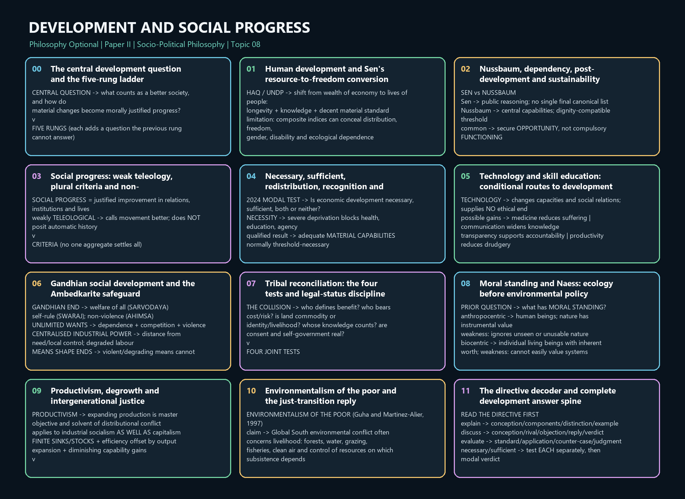

# Development and Social Progress — Learner-v2 Source-Complete Learning Session

> **Syllabus (verbatim):** Development and Social Progress.
>
> **Generation:** g7, 2026-09-03 · **Approval:** false pending explicit topic approval
>
> **Evidence key:** ✅ canonical doctrine · ⚠️ analytical synthesis (for exam use) · ❓ contested/empirical claim
>
> **Evidence discipline:** Core follows the canonical owner and exact verified ledger; the matching advanced dossier section remains optional.

## BASIC LEARNING SESSION




*Concept map: The central development question and the five-rung ladder. The twelve authored stages preserve the topic-specific learning rail used by both master-flow formats.*

> **Syllabus (verbatim):** Development and Social Progress.

### How to Use This Five-Layer Session

Every logical subtopic follows exactly:

| Layer | Purpose |
|---:|---|
| 1. SIMPLE START | visual-first plain-language gateway |
| 2. CORE UPSC | complete terminology, doctrine, argument, example and source grounding |
| 3. ADVANCED | objections, replies, comparisons, interpretive issues and provenance cautions |
| 4. EXAM APPLICATION | verified PYQ routes and 10/15/20-mark architecture |
| 5. RAPID REVISION | traps, retrieval notes and links to the exact MCQ set |

### Source Audit and Contemporary-Link Boundary

- **Canonical doctrine source:** `upsc-ai-kit/knowledge/Philosophy/paper-2/socio-political/Development-Social-Progress.md`, repaired under the ten-gate semantic-completeness protocol and promoted into this immutable successor.
- **Doctrine grounding (in the canonical file):** the exact printed ownership firewall; the growth/economic-development/human-development/capability/social-progress concept grid; basic-needs, quality-of-life, social and ecological measure families and the discriminating test; the economistic model and modernisation assumptions with their instrumental, dependency, cultural and anti-teleological replies; human development (Mahbub ul Haq and the UNDP framework); Amartya Sen's development as freedom (functioning, capability, resource, utility, agency, adaptive preferences); Nussbaum's capability threshold and the Sen-Nussbaum distinction; dependency and post-development critiques; sustainable development and its philosophical bases; social progress as normative and multidimensional; linear, cyclical, dialectical and plural conceptions; the argument against inevitability; the criteria of progress; the necessary/sufficient analysis with the material-threshold nuance; redistribution and recognition; the information-to-empowerment ladder, with participation as instrumental and constitutive; technology and ethical standards; skill education and its limits; Gandhian social development (welfare of all, self-rule, trusteeship, dignity of labour and restraint of wants) with the Ambedkar objection; development and tribal values with the reconciliation model and the Indian legal illustrations; the ecological political-philosophy module (anthropocentric/biocentric/ecocentric moral standing, Naess's shallow/deep ecology, productivism and degrowth, intergenerational justice and the non-identity problem, the environmentalism of the poor, the eco-authoritarian risk and the just-transition reply, and the four-test binding to tribal development); the inter-school debates; the criticisms with replies; the sixteen traps; and the selectable evidence bank D1-D19. No book claim is added beyond what the canonical file already grounds.
- **Scaffolding discipline:** the SIMPLE START gateways, the ASCII maps and comparison tables, and the exam architecture are authored scaffolding around the canonical core; they add accessible on-ramps and retrieval structure only, never new doctrine, and every canonical term, argument, objection/reply, comparison and caution is preserved.
- **Verified PYQs:** local Socio-Political Philosophy Paper II bank, 2018-2025; this clause owns exactly **6** primary parts (2018:0, 2019:1, 2020:1, 2021:0, 2022:1, 2023:1, 2024:1, 2025:1). Caste-and-village stems (Caste Discrimination), gender-as-capability stems (Gender Discrimination), abstract justice/equality/liberty framing (Social and Political Ideals), ideology-label stems (Political Ideologies), universal-dignity and plurality stems (Humanism, Secularism and Multiculturalism) and environmental policy/data (Environment and Governance areas) are kept separate and not double-owned.
- **Provenance discipline:** Amartya Sen, Martha Nussbaum, Mahbub ul Haq and the UNDP framework, M. K. Gandhi, B. R. Ambedkar, Arne Naess (**1973**), the World Commission on Environment and Development's *Our Common Future* (the Brundtland Report, **1987**, paraphrased and never quoted) and Ramachandra Guha and Joan Martinez-Alier (**1997**) are cited by position and standard title only; no page, edition or verbatim wording is asserted and no quotation is fabricated. The Provisions of the Panchayats (Extension to the Scheduled Areas) Act, **1996** and the Scheduled Tribes and Other Traditional Forest Dwellers (Recognition of Forest Rights) Act, **2006** are enacted statutes; *Orissa Mining Corporation v. Ministry of Environment & Forest* (**2013**) is a Supreme Court judgment involving Gram Sabha consideration in the Niyamgiri context; Articles 48A and 51A(g) are non-justiciable constitutional provisions. All appear only as dated, correctly classified legal facts, never as philosophical proof.
- **India-centric discipline:** Indian examples (the two statutes, the 2013 judgment and the two constitutional provisions) are used only as dated, verifiable facts exactly as the canonical file grounds them, never as proof that a philosophical thesis is true or false; no environmental datum, target, figure, project, company, movement or region is named, exactly as the canonical provenance note requires.
- **Contemporary-affairs boundary (deliberate):** this is a static, syllabus-driven conceptual clause; no 2026 institutional development is forced as an anchor, and no factual claim is invented. Only static syllabus relevance and clearly labelled analysis are used.
- **Qdrant:** optional fallback only; not required for this canonical topic, and it never blocks the learning session.

**Preservation note:** the canonical doctrine is reorganised into layers, never compressed. Every doctrine, argument, objection/reply, comparison, corpus-depth delta, PYQ route, directive rule, graded verdict and provenance caution is retained; simplification means adding accessible gateways, not deleting complexity.

### Exact printed ownership and cross-topic firewall

The official clause is the broad but single item **Development and Social Progress**. It owns the
meaning, metric, agency, justice, cultural and ecological evaluation of development—not every
economic, environmental or welfare policy.

| Content | Ownership here | Boundary |
|---|---|---|
| Development concepts and measures | growth/development/progress distinctions, basic needs, quality of life, human development and capability | Current GDP, poverty, health, education or scheme data remain with Economy and GS |
| Normative perspectives | capability/humanistic, Gandhian and bounded liberal, Marxist and Ambedkarite tests | Full ideologies remain with [Political Ideologies](Political-Ideologies.md); full equality/justice theory remains with [Social and Political Ideals](Social-Political-Ideals.md) |
| Culture, participation and exclusion | agency, empowerment, recognition, tribal values and decision-power | Full multicultural, gender and caste doctrines retain their separate owners |
| Sustainability | ecological standing, intergenerational justice, productivism, degrowth and just transition | Environment facts and current climate policy remain outside this philosophical owner |

### Learning Roadmap

| Unit | Logical subtopic |
|---:|---|
| 1 | Growth, Development and Progress - the Core Distinction |
| 2 | Human Development and the Capability Approach - Sen, Nussbaum, Haq |
| 3 | Dependency, Post-Development and Sustainable Development |
| 4 | Social Progress - Is It Inevitable? |
| 5 | Criteria, Necessary/Sufficient, Recognition and Democracy |
| 6 | Technology, Ethics and Skill Education |
| 7 | Gandhian Social Development |
| 8 | Development and Tribal Values - the Reconciliation Model |
| 9 | Ecological Political Philosophy and the Limits of Development |
| 10 | Inter-School Debates, Criticisms and Common Traps |

---

### SESSION 1 — Development: Five Rungs, One Normative Question

#### DEFINITION / WHAT THIS IS CALLED

**Plain-language definition:** Growth means producing more. Development means changing the conditions in which people live. Social progress asks whether that change has made people freer, fairer, more dignified and more secure without destroying the future.

**Technical definition:** Economic growth, economic development, human development, capability development and social progress occupy different evaluative spaces: output, structural transformation, basic human options, substantive freedom, and justified improvement in social relations and institutions. Development is therefore both descriptive change and a normative judgment about lives.

#### VISUAL — The five-rung ladder: means are not the verdict

```text

ECONOMIC GROWTH -> more output / income

        | possible means; silent on distribution

        v

ECONOMIC DEVELOPMENT -> structural productive change

        | adds opportunity; may still be economistic

        v

HUMAN DEVELOPMENT -> health, knowledge, material command

        | adds basic human options

        v

CAPABILITY DEVELOPMENT -> substantive freedom to be and do

        | adds conversion, agency and real opportunity

        v

SOCIAL PROGRESS -> justified freedom + justice + dignity +

                   participation + sustainability

CONTROL: income can rise while the final rung fails.

```

*Each rung retains the earlier one but adds a question that the earlier measure could not answer.*

#### VISUAL — The economistic claim, its enabling truth and its limit

```text

SCARCITY -> productivity / investment -> larger resource base

                                      |

                                      v

                         health, education, employment, capacity

                                      |

                    MUST PASS FOUR CONVERSION TESTS

       distribution | institutions | participation | ecology

                                      |

                                      v

          CAPABILITY AND SOCIAL PROGRESS -- or only more output

OBJECTION: growth matters.  REPLY: it matters as a means.

TRAP: 'GDP rose, therefore society progressed.'

```

*The model saves growth's enabling role while refusing to convert an instrument into a final moral standard.*

#### ANSWER-GRABBING OPENING — WRITE/ADAPT IN THE EXAM

> Growth can finance development, but only just conversion into capability, dignity, participation and sustainable institutions can make material change social progress.

#### MUST-WRITE KEYWORDS

- **economic growth**
- **economic development**
- **human development**
- **capability development**
- **social progress**
- **structural transformation**
- **normative and descriptive dimensions**
- **economistic model**

**How to use them:** Open every general development answer by locating its contested rung. Define growth as output, development as qualitative structural change, capability as real freedom, and progress as a justified social judgment; then show what the next rung adds.

#### CORE OBJECTION, REPLY AND RESIDUAL LIMIT

**Objection:** Material scarcity is real: industrialisation, productivity and income can enlarge employment, state capacity and the resource base, so rejecting the economistic model seems to reject the preconditions of welfare.

**Best reply:** The correction is not to deny growth but to classify it as an instrument whose value is conversion-dependent. Output has no automatic verdict on distribution, work quality, political voice, displacement or ecological cost.

**Residual limit:** A richer evaluative account gives up the false precision of a single output number and must defend which freedoms, forms of equality and ecological limits are relevant.

#### EXAM USE AND CONCISE REVISION

**Answer architecture:** Draw the five-rung grid; identify the measure at each rung; state the discriminating counter-case of rising income with deepening unfreedom; concede growth's enabling role; and close with the conversion verdict rather than an anti-growth slogan.

- Growth asks whether more is produced; progress asks whether a social order is better.
- Economic development is structural and qualitative but can remain economistic.
- Human development shifts attention from wealth to human options.
- Capability development measures real opportunity, not possession.
- Social progress is a contested normative judgment, never GDP with a moral adjective.

> **In one line:** more output is not the same as a better life, and a better life is not the same as a *justified* better society; keep the three rungs separate.

**VISUAL - the growth -> development -> progress ladder**

```text
  RUNG 3   SOCIAL PROGRESS     evaluative / normative
             ^     "is the change GOOD, and good FOR WHOM?"
             |     freedom . justice . dignity . participation . sustainability
             |
  RUNG 2   DEVELOPMENT         descriptive / structural + human change
             ^     health . education . capabilities . institutions
             |     a real improvement, but must still pass the progress test
             |
  RUNG 1   GROWTH              more output / income per head
                   a POSSIBLE MEANS only - silent on distribution and cost
```

*Caption:* you climb from more output, to real human change, to change that is morally justified. Each higher rung needs the one below only as a *possible* input; it is never guaranteed by it.

**Plain-language gateway**
- **Growth** answers "how much more is produced?" It is a number about output, not about people.
- **Development** answers "did people's real lives and institutions actually change?" - longer, healthier, better-educated, more capable lives.
- **Social progress** answers a *value* question: "is this change good, and fairly shared?" It can criticise growth and even some development.
- The whole clause is one warning: **do not collapse the three rungs into each other.** The economistic model does exactly that - it treats the bottom rung as if it were the top.


#### 0. ONE-SCREEN MAP

```text
ECONOMIC GROWTH
more output / income
        | possible means, not final end
        v
DEVELOPMENT
structural change + health + education + capabilities + institutions
        | must pass normative tests
        v
SOCIAL PROGRESS
freedom · justice · equality · dignity · participation · sustainability

FAILURE MODES:
growth without distribution · development without consent
technology without ethics · welfare without agency · progress as forced assimilation
```

⚠️ **Master thesis:** growth can finance development, but only capabilities, justice, participation and ecological limits can convert material change into social progress.

---

#### 1. DEVELOPMENT

#### 1.1 Doctrine statement

✅ **Development** is a process of enlarging and securing people's effective capacities to live lives they have reason to value through economic, social, political and institutional transformation.

The concept contains both:

- a **descriptive** dimension—change in production, technology, institutions and social relations;
- a **normative** dimension—judgment that the change improves human lives.

#### 1.2 Growth, development and progress

| Concept | Primary measure | Question | Failure |
|---|---|---|---|
| **Economic growth** | increase in aggregate or per-capita output/income | is more being produced? | ignores distribution and externalities |
| **Economic development** | structural and qualitative economic change | are productivity and opportunities changing? | may remain economistic |
| **Human development** | health, knowledge and material command | are basic human options expanding? | aggregate indicators conceal inequality |
| **Capability development** | substantive freedoms to be and do | what can persons actually achieve? | measurement and selection problems |
| **Social progress** | justified improvement in social relations and institutions | is society becoming freer, fairer and sustainable? | values are contested |

**Discriminating test:** if income rises while preventable unfreedom, humiliation or ecological destruction intensifies, there may be growth without social progress.

#### 1.2A Measures: basic needs, welfare, quality of life and agency

No current figure is required. The philosophical issue is what each indicator family treats as the
good and what it leaves invisible.

| Measure family | Typical informational space | What it adds | What it can hide |
|---|---|---|---|
| Output/income | aggregate or per-capita production and command over goods | resource capacity | distribution, unpaid work, externalities |
| Basic needs | nutrition, shelter, health, sanitation and elementary education | deprivation threshold | voice, choice and quality above the threshold |
| Welfare/quality of life | security, health, work, environment and experienced well-being | lived conditions | adaptive preferences and unequal power |
| Human-development indicators | longevity, knowledge and material command | people rather than output | within-group inequality and political freedom |
| Capabilities | real opportunities for valued beings and doings | conversion, freedom and agency | selection and measurement disagreement |
| Social-progress indicators | equality, dignity, participation, security and institutions | relations and public value | aggregation across contested dimensions |
| Ecological indicators | stocks, sinks, resilience, irreversibility and future options | biophysical and intergenerational limits | distribution of adjustment burdens |

⚠️ A composite index is evidence within one evaluative space, not a complete theory of the good
society.

#### 1.3 The economistic model

✅ The economistic model identifies development chiefly with industrialisation, investment, productivity and rising income.

**Argument:**

1. material scarcity constrains health, education and choice;
2. productive growth expands the resource base;
3. structural transformation can raise employment and state capacity;
4. therefore, economic development is an important enabling condition.

**Presupposition:** resources can be converted into broadly shared welfare through institutions.

**Objection:** growth says little about distribution, work quality, displacement, political voice or ecological cost.
**Reply:** ⚠️ the proper conclusion is not that growth is irrelevant, but that it is **instrumental and conversion-dependent**.

#### 1.3A Modernisation and its assumptions

✅ Modernisation theory interprets development as a transition from “traditional” to “modern”
social organisation through industrialisation, urbanisation, education, occupational
differentiation, bureaucratic capacity, scientific rationality and expanding markets.

Its common assumptions are:

1. **linear sequence:** societies move through broadly comparable stages;
2. **convergence:** institutional differences diminish as productive and administrative capacity grows;
3. **traditional/modern contrast:** inherited authority and local production yield to rational,
   mobile and differentiated institutions;
4. **diffusion:** capital, knowledge and technology can transmit development;
5. **expert direction:** planners can identify obstacles and accelerate transition.

**Hostile objections:**

- dependency theory denies that underdevelopment is merely an earlier stage;
- post-development exposes the power to define others as deficient;
- cultural and Gandhian critiques reject homogenisation of the good life;
- Marxist criticism asks who owns production and appropriates the gains;
- Ambedkarite criticism asks whether modernisation dismantles or merely reorganises graded hierarchy.

⚠️ **Verdict:** modernisation names real structural transformations but is not a neutral or
inevitable law. Its institutions count as progress only when they enlarge equal capability,
democratic agency and ecological security.

#### CLOSING RECALL FLOW — Development: Five Rungs, One Normative Question

```closure-flow
SUBTOPIC: Development: Five Rungs, One Normative Question
STARTING CONCEPT: Development: Five Rungs, One Normative Question
KEY TERMS / DEFINITIONS: economic growth | social progress | economistic model | human
  development
MECHANISM / ARGUMENT: Growth can expand resources for health, education, employment and public
  capacity, but institutions, distribution, voice and ecological limits determine whether
  resources become effective freedoms rather than concentrated output or displaced costs.
CONSEQUENCE / CONTRAST: An economy may grow while preventable unfreedom, humiliation, exclusion
  or ecological destruction intensifies; that is growth without social progress, not a paradox
  or an anti-growth claim.
UPSC TRAP / ANSWER-USE: Never use growth, development, human development, capability and social
  progress as synonyms, and never treat a rise in an average as proof that the normative
  question has been answered.
ANSWER-GRABBING FORMULATION: Growth can finance development, but only just conversion into
  capability, dignity, participation and sustainable institutions can make material change
  social progress.
```

### SESSION 2 — Human Development and Sen: Resources into Real Freedom

#### DEFINITION / WHAT THIS IS CALLED

**Plain-language definition:** A person can have the same income as another person and still have less real freedom because of disability, social norms, location or unequal power. Development must ask what people can actually do and become.

**Technical definition:** Mahbub ul Haq and the UNDP shift attention to longevity, knowledge and a decent material standard. Sen further shifts the evaluative space from resources or utility to substantive freedom: functionings are achieved beings and doings, capabilities are real opportunities, and agency exceeds welfare.

#### VISUAL — Sen's conversion chain: why equal resources diverge

```text

RESOURCE (income, school, transport, law)

             |

             v

CONVERSION FACTORS

 personal: body, age, disability

 social: gender norms, caste, public safety

 environmental: location, climate, infrastructure

             |

             v

CAPABILITY = real freedom to choose among functionings

             |

             v

FUNCTIONING = achieved nourishment, mobility, participation

RULE: equal resources can yield unequal capabilities.

```

*The missing middle stage explains why resource equality cannot by itself establish freedom equality.*

#### VISUAL — The three false substitutes for capability

```text

RESOURCE: 'what a person has'         -- necessary, not enough

UTILITY:  'how satisfied a person says she is' -- can adapt down

FUNCTIONING: 'what a person achieved' -- outcome, not choice

                         |

                         v

CAPABILITY: 'what a person is genuinely able to be and do'

                         |

                         v

AGENCY: pursue goals one has reason to value, beyond welfare

CONTROL: do not force functioning in the name of capability.

```

*Sen's move preserves the value of resources and outcomes while refusing to confuse either with real opportunity.*

#### ANSWER-GRABBING OPENING — WRITE/ADAPT IN THE EXAM

> Income is a means; capability records what that means actually enables a person to be and do, with the person as agent rather than merely beneficiary.

#### MUST-WRITE KEYWORDS

- **Mahbub ul Haq**
- **UNDP**
- **functioning**
- **capability**
- **conversion factors**
- **agency**
- **adaptive preferences**
- **substantive freedom**

**How to use them:** Use this session for any stem that contrasts money, welfare, human development or freedom. Define functioning and capability in paired lines, then use conversion factors and adaptive preferences to explain why resources and reported satisfaction can be inadequate measures.

#### CORE OBJECTION, REPLY AND RESIDUAL LIMIT

**Objection:** Capabilities are difficult to observe and compare, whereas income and utility are measurable and administratively usable.

**Best reply:** Measurement convenience is not an argument for the wrong evaluative space. Indicators are useful proxies, but must be treated as partial evidence rather than as the thing measured.

**Residual limit:** The approach must still decide which capabilities matter and how to compare them, leaving genuine problems of measurement, pluralism and public specification.

#### EXAM USE AND CONCISE REVISION

**Answer architecture:** State the resource-to-capability shift; distinguish resource, functioning, capability, utility and agency; give the unequal conversion and adaptive-preference arguments; then concede the measurement problem without retreating to income.

- Functioning = achieved being or doing; capability = real opportunity for alternative functionings.
- Equal resources do not yield equal freedom.
- Adaptive preferences make satisfaction an unsafe sole metric.
- Agency includes goals beyond personal welfare.
- Freedom is both the end and an effective means of development.

> **In one line:** stop asking "how rich is a person?" and start asking "what is this person actually able to be and to do?"

**VISUAL - the capability map (Sen)**

```text
  RESOURCE  --->  CONVERSION  --->  FUNCTIONING  --->  CAPABILITY  --->  AGENCY
  (a means)       (personal /       (an achieved       (the real         (person as
   income,         social /          being or doing:     freedom to        author of
   goods)          environmental     nourished,          choose among      her own
                   factors differ)   educated, safe)     functionings)     ends)
      |                 |                  |                  |                |
   NOT the end     same income =      what is actually    the SET of        adaptive
   in itself       different real     realised            open options      preferences
                   freedoms                                                  can hide loss
```

*Caption:* income enters on the left as a mere means; what matters is the *set of real options* (capabilities) it opens up, and whether the person is an *agent* who chooses among them. Two people with the same income can have very different real freedoms.

**Plain-language gateway**
- **Human development** (Mahbub ul Haq and the UNDP framework) shifts the question from national output to *people's lives* - what they can be and do.
- **Sen's capability approach:** a *functioning* is an achieved doing/being (being nourished, educated); a *capability* is the real *freedom* to achieve functionings; *agency* is being the author of your own ends.
- **Conversion factors** explain why equal resources yield unequal freedoms: a disabled person, a woman facing norms, or someone in a flood plain converts the same income into fewer real options.
- **Adaptive preferences:** the deprived may *say* they are content because they have adjusted their wants downward - so satisfaction is an unreliable measure of well-being.


#### 1.4 Human development

✅ The human-development approach, associated with Mahbub ul Haq and UNDP, shifts the focus from the wealth of the economy to the lives of people, especially longevity, knowledge and a decent material standard.

**Strength:** it breaks the identity between income and well-being.
**Limitation:** composite national measures can obscure distribution, freedom, gender, disability and ecological dependence.

#### 1.5 Amartya Sen: development as freedom

✅ Sen understands development as expansion of **substantive freedom** and removal of unfreedoms. Resources matter through their conversion into capabilities.

**Core distinctions:**

| Term | Meaning |
|---|---|
| **Functioning** | an achieved being or doing—being nourished, moving freely, participating |
| **Capability** | real opportunity to achieve alternative functionings |
| **Resource** | a means whose value depends on conversion conditions |
| **Utility** | satisfaction; may adapt downward under deprivation |
| **Agency** | ability to pursue goals one has reason to value, including goals beyond personal welfare |

**Argument:**

1. equal resources yield unequal freedom because bodies, environments and social norms differ;
2. utility can adapt to deprivation;
3. development must therefore assess real opportunities, not only goods or happiness;
4. political freedoms, economic facilities, social opportunities, transparency and protective security reinforce one another;
5. freedom is both the **end** and a **means** of development.

**Presupposition:** persons are agents, not passive recipients of welfare.

#### 1.6 Nussbaum's capability threshold

✅ Nussbaum supplies a more determinate account of central human capabilities and argues that justice requires each person to reach a threshold compatible with dignity.

**Sen–Nussbaum distinction:**

- Sen resists a single final canonical list and stresses public reasoning;
- Nussbaum defends a specified list and threshold as a constitutional-political minimum.

**Objection:** a universal list may impose one conception of life.
**Reply:** ✅ capabilities protect opportunities, not compulsory functionings; political specification should remain open to democratic interpretation.

#### CLOSING RECALL FLOW — Human Development and Sen: Resources into Real Freedom

```closure-flow
SUBTOPIC: Human Development and Sen: Resources into Real Freedom
STARTING CONCEPT: Human Development and Sen: Resources into Real Freedom
KEY TERMS / DEFINITIONS: UNDP | agency | capability | functioning
MECHANISM / ARGUMENT: Bodies, environments, public services and social norms convert the same
  resource bundle into unequal freedoms. Deprivation can also lower a person's reported
  aspirations, so utility may adapt downward while unfreedom persists.
CONSEQUENCE / CONTRAST: Political freedoms, economic facilities, social opportunities,
  transparency guarantees and protective security are both means to development and constituents
  of it; people cannot be counted only as recipients of a scheme.
UPSC TRAP / ANSWER-USE: Do not define capability as income plus welfare schemes, and do not
  confuse a capability with an achieved functioning. A capability protects opportunity; it does
  not compel a lifestyle.
ANSWER-GRABBING FORMULATION: Income is a means; capability records what that means actually
  enables a person to be and do, with the person as agent rather than merely beneficiary.
```

### SESSION 3 — Nussbaum, Dependency, Post-Development and Sustainability

#### DEFINITION / WHAT THIS IS CALLED

**Plain-language definition:** Sen leaves room for public reasoning about valuable freedoms; Nussbaum argues that dignity needs a more definite minimum. Dependency and post-development then ask who defines a society as deficient and whose model of improvement it must follow.

**Technical definition:** Nussbaum's central-capability threshold is a constitutional-political minimum rather than a demand for compulsory functioning. Dependency rejects a universal stage-theory by treating underdevelopment as produced through unequal incorporation. Post-development criticises expert authority and imposed modernity; sustainable development adds future options, precaution and non-substitutable ecological conditions.

#### VISUAL — Sen and Nussbaum: one evaluative space, different closure

```text

SEN                                  NUSSBAUM

capability as evaluative space       central capabilities

public reasoning specifies content   specified dignity threshold

strength: plural and democratic      strength: resists adaptive

risk: underspecification             preferences and exclusion

             \                         /

              \                       /

               v                     v

COMMON CONTROL: protect opportunity, not compulsory functioning

QUESTION LEFT OPEN: who fixes the threshold, and how?

```

*The disagreement is about specification, not whether freedom rather than output is the evaluative space.*

#### VISUAL — Three critiques of a single development path

```text

LINEAR MODERNISATION: every society follows one route

        |

        +-> DEPENDENCY: unequal incorporation can PRODUCE

        |               underdevelopment, not merely delay progress

        |

        +-> POST-DEVELOPMENT: who has authority to call a people

        |                    deficient and prescribe its future?

        |

        v

RECONSTRUCTION: local voice + universal dignity + capability

                + non-domination + ecological durability

TRAP: critique of imposition is not rejection of material improvement.

```

*The middle position avoids both developmental imperialism and the romanticisation of local hierarchy.*

#### ANSWER-GRABBING OPENING — WRITE/ADAPT IN THE EXAM

> Plural development rejects an imposed single path without surrendering universal constraints of dignity, capability and non-domination.

#### MUST-WRITE KEYWORDS

- **Nussbaum**
- **central capabilities**
- **dignity threshold**
- **public reasoning**
- **dependency**
- **underdevelopment**
- **post-development**
- **sustainable development**

**How to use them:** Use Nussbaum when a rights-like minimum or adaptive preference problem is central; use dependency against linear modernisation; use post-development to test who authorises the diagnosis; use sustainability only with a stated moral basis, not as a green label for unchanged growth.

#### CORE OBJECTION, REPLY AND RESIDUAL LIMIT

**Objection:** A universal capability list can be paternalistic, while post-development's localism can overlook internal hierarchy, poverty and demands for education, health and mobility.

**Best reply:** Capabilities secure opportunities rather than compulsory functionings, and their political specification remains open. The strongest post-development critique rejects imposed uniformity, not material improvement or universal dignity.

**Residual limit:** A threshold still needs democratic interpretation, and critiques of external domination cannot by themselves specify how large infrastructure, redistribution or national coordination should work.

#### EXAM USE AND CONCISE REVISION

**Answer architecture:** Set Sen's open evaluative space against Nussbaum's threshold; state the dependency and post-development objections in their strongest form; use sustainability's future-options test; and close with plural development under universal constraints.

- Sen: public reasoning and no final canonical list.
- Nussbaum: a dignity-compatible threshold of central capabilities.
- Dependency: underdevelopment can be produced by unequal relations.
- Post-development attacks imposed diagnosis, not every improvement.
- Sustainability protects future options against irreversible loss.

> **In one line:** two critiques ask "development *for whom* and *on whose terms*?", and one reframing asks "development *within what limits*?"

**VISUAL - three challenges to the mainstream story**

```text
  MAINSTREAM MODEL: growth -> modern institutions -> universal progress
        |                    |                         |
   ================= three challenges enter here =================
        v                    v                         v
  DEPENDENCY           POST-DEVELOPMENT          SUSTAINABLE DEV.
  centre exploits      "development" as a         progress bounded by
  periphery;           discourse that erases      ecological limits +
  unequal exchange     other ways of living       future generations
        |                    |                         |
  RISK: treat          RISK: romanticise           RISK: "weak" version
  societies as         poverty; deny agency        lets money offset
  passive victims      to the poor                 destroyed nature
```

*Caption:* dependency attacks the *distribution of power* between centre and periphery; post-development attacks the *idea* of development itself; sustainability keeps development but *bounds* it by ecology and the future. Each carries its own over-reach risk.

**Plain-language gateway**
- **Dependency critique:** poor regions are not simply "behind"; they can be kept poor by unequal exchange with richer centres. Progress is about *power and terms of trade*, not just internal effort.
- **Post-development critique:** "development" can be a *discourse* that treats diverse societies as deficient and erases their own ways of living well.
- **Sustainable development:** keep improving lives, but *within ecological limits* and without stealing from future generations - the bridge to the ecology module (Subtopic 9).


#### 1.7 Dependency and post-development critiques

✅ Dependency approaches argue that “underdevelopment” can be produced through unequal incorporation into global economic relations rather than being a mere earlier stage on one universal path.

✅ Post-development critics question the authority by which external experts define whole societies as deficient and impose a single model of modernity.

**Objection:** romanticising local life can ignore internal hierarchy, poverty and demands for education, health or mobility.
**Reply:** ⚠️ the strongest critique rejects imposed uniformity, not every material improvement; local voice must be joined to universal dignity.

#### 1.8 Sustainable development

✅ Sustainable development requires present improvement that does not destroy ecological conditions and options of future persons.

**Philosophical bases:**

- intergenerational justice;
- precaution under irreversible risk;
- limits to substituting money for ecological systems;
- duties toward vulnerable populations;
- possible intrinsic value of non-human life.

**Objection:** the concept is vague and can legitimise “green” versions of the same growth model.
**Reply:** ⚠️ specify thresholds, distribution, participation and non-substitutable ecological limits.

---

#### 1.9 Bounded perspective map

| Perspective | Developmental focus | Characteristic warning | Ownership control |
|---|---|---|---|
| Liberal/welfare | resources, opportunity, rights, public goods and individual choice | formal opportunity may coexist with unequal conversion | comparison only; full liberalism is elsewhere |
| Marxist | production, class power, alienation and control of surplus | growth can reproduce exploitation and commodity domination | comparison only; full Marxism is elsewhere |
| Humanistic/capability | each person as an end and agent with real freedoms | beneficiaries can be counted while agency is denied | full owner here through Sen/Nussbaum and human-development theory |
| Gandhian | need, non-violence, local self-rule, dignity of labour and restraint | scale and multiplied wants can centralise domination | direct owner through the 2020 PYQ |
| Ambedkarite bridge | constitutional rights, social democracy, mobility and destruction of graded hierarchy | a village or growth strategy is not progress if caste power survives | bounded bridge; full caste theory remains elsewhere |

⚠️ The matrix supplies evaluation criteria, not five complete ideologies.

---

#### CLOSING RECALL FLOW — Nussbaum, Dependency, Post-Development and Sustainability

```closure-flow
SUBTOPIC: Nussbaum, Dependency, Post-Development and Sustainability
STARTING CONCEPT: Nussbaum, Dependency, Post-Development and Sustainability
KEY TERMS / DEFINITIONS: Nussbaum | dependency | post-development | public reasoning
MECHANISM / ARGUMENT: A specified threshold resists public reasoning conducted inside
  oppression; unequal global relations can produce rather than merely delay development;
  external diagnosis can turn people into objects; and irreversible ecological loss forecloses
  future capabilities.
CONSEQUENCE / CONTRAST: Development must be assessed not only by aggregate gain but by who
  defines the end, who has voice, whether the gain is distributed, and whether its ecological
  conditions can endure.
UPSC TRAP / ANSWER-USE: Do not present Nussbaum as Sen with a longer list, dependency as a
  denial of domestic responsibility, post-development as a romantic ban on schools or hospitals,
  or sustainability as an unexamined policy slogan.
ANSWER-GRABBING FORMULATION: Plural development rejects an imposed single path without
  surrendering universal constraints of dignity, capability and non-domination.
```

### SESSION 4 — Social Progress: Criteria, Conflict and Non-Inevitability

#### DEFINITION / WHAT THIS IS CALLED

**Plain-language definition:** Calling a change progress means calling it better, not merely newer. Science, markets and technology can enlarge care and freedom, but can also distribute domination and destruction more efficiently; progress therefore needs judgment and institutions.

**Technical definition:** Social progress is weakly teleological: it judges movement toward a better condition without positing an automatic law of history. Its criteria are plural and sometimes conflicting: freedom, equality, justice, dignity, participation, security, sustainability and fraternity or solidarity.

#### VISUAL — Why progress is not an automatic consequence of knowledge

```text

REASON / SCIENCE / TECHNOLOGY

             | enlarges human capacity

             v

CARE, HEALTH, KNOWLEDGE       OR       SURVEILLANCE, VIOLENCE, EXCLUSION

             \                              /

              \                            /

               v                          v

INSTITUTIONS distribute control, benefit and risk

               |

               v

PROGRESS ONLY IF freedom + justice + dignity + sustainability improve

CONTROL: moral learning can be reversed.

```

*Capacity is morally underdetermined; institutions and judgment supply the missing direction.*

#### VISUAL — The plural criteria wheel

```text

                 FREEDOM -- real options and voice

                    /                         \

EQUALITY -- less domination                 JUSTICE -- defensible

and status hierarchy                         benefits, burdens, procedure

                    \                         /

              DIGNITY -- no humiliation or exclusion

                    /                         \

PARTICIPATION -- affected people decide    SUSTAINABILITY -- future

                                           conditions preserved

RULE: no one aggregate can settle all spokes.

```

*A progress claim must name the criterion it satisfies and the criterion it may put under pressure.*

#### ANSWER-GRABBING OPENING — WRITE/ADAPT IN THE EXAM

> Social progress is neither an automatic historical law nor a single aggregate: it is a defensible, multidimensional judgment about how people stand to one another and to their future.

#### MUST-WRITE KEYWORDS

- **social progress**
- **weak teleology**
- **non-inevitability**
- **plural criteria**
- **justice**
- **dignity**
- **participation**
- **sustainability**

**How to use them:** Use this session whenever the stem assumes progress follows from knowledge, science, output or time. Define social progress through weak teleology and non-inevitability; then apply the plural criteria of justice, dignity, participation and sustainability, name a counter-case, and make the final judgment conditional rather than celebratory.

#### CORE OBJECTION, REPLY AND RESIDUAL LIMIT

**Objection:** Because values conflict across communities, social progress is value-relative and any universal criterion is cultural imposition.

**Best reply:** Reasonable disagreement persists, but freedom from severe deprivation and humiliation, equal standing, reasons-giving and the preservation of future options have cross-cultural force. Public reasoning is part of progress, not merely its measure.

**Residual limit:** Plural criteria generate hard trade-offs; philosophy can require that they be made explicit and justified, but cannot make every conflict mechanically commensurable.

#### EXAM USE AND CONCISE REVISION

**Answer architecture:** Define weak teleology; reject the automatic inference from technical capacity to moral improvement; use a criteria grid; show one conflict among criteria; and close on agency, institutions and public reasoning.

- Progress = justified improvement, not change alone.
- Weak teleology needs an end but no law of inevitable advance.
- Freedom, equality, justice, dignity and sustainability are distinct criteria.
- Technology supplies capacity, not ethical ends.
- Public reasoning is constitutive as well as diagnostic.

> **In one line:** progress is a *value judgement* about change, and history gives no guarantee that change is always for the better.

**VISUAL - two pictures of history**

```text
  ENLIGHTENMENT / LINEAR VIEW            SCEPTICAL / PLURALIST VIEWS
  --------------------------             ---------------------------
  reason -> science -> reform            CYCLICAL : rise and decline recur
      |  onward-and-upward               TRAGIC   : gains create new losses
      v  "inevitable" progress           PLURALIST: values conflict; no single
  a single ladder for all                            ladder fits every society
  societies                             POSTCOLONIAL: "universal" often meant
                                                     one culture's path
   claim: progress is linear,            reply: progress is REAL but
   universal and inevitable              CONTINGENT, PLURAL and REVERSIBLE
```

*Caption:* the confident Enlightenment picture treats progress as one inevitable upward line for everyone; the sceptical family says progress is genuine but *earned*, *plural* and *reversible* - never a law of history.

**Plain-language gateway**
- **Social progress is normative:** to call a change "progress" is to *judge* it good on some criterion, not merely to record that it happened.
- It is **multidimensional:** freedom may rise while community frays; wealth may grow while inequality widens. Progress on one axis is not progress overall.
- **Is it inevitable? No.** The clause explicitly rejects the idea that progress is an automatic law of history; it must be *achieved and defended*, and it can be lost.


#### 2. SOCIAL PROGRESS

#### 2.1 Doctrine statement

✅ **Social progress** is justified improvement in the quality of social relations, institutions and human lives, assessed through freedom, equality, justice, dignity, participation, security and sustainability.

It is **teleological** in a weak sense: to call change progress is to judge movement toward a better condition. It does not require belief in an automatic law of history.

#### 2.2 Is progress inevitable?

✅ Enlightenment and nineteenth-century theories sometimes associated reason, science or social evolution with cumulative progress. Twentieth-century war, genocide and ecological crisis challenge any automatic inference from knowledge or technology to moral improvement.

**Argument against inevitability:**

1. technology enlarges capacities for both care and destruction;
2. institutions distribute its control and risks;
3. moral learning can be reversed;
4. therefore, progress requires agency, conflict, institutions and judgment.

#### 2.2A Linear, cyclical and plural conceptions of progress

| Conception | Core claim | Strength | Failure |
|---|---|---|---|
| Linear/cumulative | reason, knowledge or productive capacity can generate movement toward a better condition | explains learning and institutional accumulation | mistakes capacity for moral improvement and one route for a universal sequence |
| Cyclical | societies rise, stabilise and decline rather than advance indefinitely | resists complacent inevitability | can become fatalistic and understate deliberate reform |
| Dialectical/conflictual | contradiction and struggle transform institutions | explains conflict and discontinuity | may impose a single historical direction |
| Plural/non-linear | societies pursue several partly incommensurable goods through multiple paths | respects culture, contingency and reversibility | risks relativism and loss of common standards |

⚠️ **Controlling position:** social progress is neither automatic nor one-dimensional. It is
directional only after the valued ends are stated, and plural only within a universal floor of
dignity, freedom from severe deprivation, equal civic standing and ecological responsibility.

#### CLOSING RECALL FLOW — Social Progress: Criteria, Conflict and Non-Inevitability

```closure-flow
SUBTOPIC: Social Progress: Criteria, Conflict and Non-Inevitability
STARTING CONCEPT: Social Progress: Criteria, Conflict and Non-Inevitability
KEY TERMS / DEFINITIONS: dignity | justice | participation | sustainability
MECHANISM / ARGUMENT: Technology enlarges capacities for care and destruction; institutions
  allocate control, benefit and risk; moral learning can be reversed. Progress therefore emerges
  only through agency, contest, accountable institutions and public judgment.
CONSEQUENCE / CONTRAST: No single index settles progress. A society with higher output but
  greater domination or ecological foreclosure cannot claim a complete progress verdict from the
  aggregate alone.
UPSC TRAP / ANSWER-USE: Do not treat teleology as inevitability, treat twentieth-century
  atrocity as proof that all progress is impossible, or list criteria without showing how they
  judge the stated change.
ANSWER-GRABBING FORMULATION: Social progress is neither an automatic historical law nor a single
  aggregate: it is a defensible, multidimensional judgment about how people stand to one another
  and to their future.
```

### SESSION 5 — Economic Development, Social Progress and Democratic Equality

#### DEFINITION / WHAT THIS IS CALLED

**Plain-language definition:** Food, health, education and security need material support, so economic development matters. But wealth can coexist with exclusion, authoritarianism, gender hierarchy and ecological loss, so it cannot by itself make a society progressive.

**Technical definition:** The 2024 modal question requires separate tests. Adequate material capabilities are normally threshold-necessary because severe deprivation blocks health, education and agency; 'economic development' is too broad to be logically necessary in every conceivable case; it is clearly not sufficient. Progress also needs redistribution, recognition and democratic participation, both instrumental and constitutive.

#### VISUAL — The modal test: necessary is not sufficient

```text

TEST 1: NECESSITY

 severe material deprivation -> blocked health, education, voice

 result: adequate MATERIAL CAPABILITY normally threshold-necessary

 caveat: 'economic development' is broader than this claim


TEST 2: SUFFICIENCY

 rising output + exclusion / domination / ecological loss

 result: economic development is NOT sufficient


VERDICT: enabling means -> just conversion -> social progress

TRAP: never substitute the word 'important' for the two tests.

```

*The marks lie in separately proving the threshold claim and supplying the sufficiency counter-case.*

#### VISUAL — From provision to social equality

```text

RESOURCES -----------------> REDISTRIBUTION

                                   |

STATUS / RESPECT ----------> RECOGNITION

                                   |

DECISION-POWER ------------> PARTICIPATION

                                   |

                                   v

DEMOCRATIC SOCIAL PROGRESS: people are beneficiaries AND agents

instrumental: information, accountability, compliance

constitutive: voice is part of a developed human life

CONTROL: consultation without inclusion can be elite capture.

```

*The three dimensions correct three different failures of growth-led social policy.*

#### ANSWER-GRABBING OPENING — WRITE/ADAPT IN THE EXAM

> Economic development is a threshold-level enabling condition, not a sufficient condition: resources become progress only when they are converted into equal status, agency and durable freedom.

#### MUST-WRITE KEYWORDS

- **necessary condition**
- **sufficient condition**
- **material threshold**
- **redistribution**
- **recognition**
- **equal status**
- **participation**
- **democracy**

**How to use them:** For necessary/sufficient stems, test necessity and sufficiency separately. For democracy or inclusion stems, pair redistribution of resources with recognition of equal status and state why participation is itself an element of a developed life.

#### CORE OBJECTION, REPLY AND RESIDUAL LIMIT

**Objection:** Participation delays urgent infrastructure and lets local elites veto wider welfare; decisive experts can deliver benefits faster.

**Best reply:** Participation needs inclusive design, representation, reasons and review to resist elite capture, but its defects do not license treating affected people as objects. It improves knowledge, accountability, legitimacy and durable compliance.

**Residual limit:** Participation cannot by itself settle genuine conflicts or remove urgent timing constraints; a defensible account must show who is represented, what is reviewable and how burdens are shared.

#### EXAM USE AND CONCISE REVISION

**Answer architecture:** Name the modal test; establish the deprivation threshold; defeat sufficiency with exclusion or ecological-loss counter-cases; add redistribution plus recognition; explain participation's instrumental and constitutive roles; then give the graded verdict.

- Severe deprivation blocks capability, supporting threshold necessity.
- Wealth can coexist with unfreedom, defeating sufficiency.
- Redistribution without recognition can be paternalistic.
- Recognition without resources can be symbolic.
- Participation is useful for outcomes and valuable in itself.

> **In one line:** progress has *many* criteria that can pull against each other, and economic development is at most a *necessary enabler*, never a *sufficient guarantee*.

**VISUAL - the criteria dashboard + the necessary/sufficient test**

```text
  CRITERIA OF PROGRESS (plural, sometimes conflicting)
  [ liberty ] [ equality ] [ justice ] [ dignity ] [ capability ]
  [ participation ] [ health/education ] [ sustainability ] [ peace/cohesion ]
        \____________ can conflict: liberty vs equality, etc. ____________/

  THE NECESSARY / SUFFICIENT GRID (for "economic development -> social progress")
  +--------------------+-------------------------------------------+
  | NECESSARY?         | usually YES (as an enabling condition):    |
  |                    | some material base supports capabilities   |
  +--------------------+-------------------------------------------+
  | SUFFICIENT?        | NO: growth can coexist with inequality,    |
  |                    | exclusion, ecological loss, lost agency    |
  +--------------------+-------------------------------------------+
  VERDICT: necessary-enabler, NOT sufficient  (both/neither -> nuance below)
```

*Caption:* the top panel shows progress is *plural* (values can conflict); the bottom panel is the exact template for the 2024 necessary/sufficient question - economic development is best read as an enabling condition, not a guarantee.

**Plain-language gateway**
- **Criteria are plural:** liberty, equality, justice, dignity, capability, participation, health/education, sustainability, peace/cohesion - and they can *conflict*, so "progress" is rarely one-dimensional.
- **Redistribution vs recognition:** injustice is not only about *goods* (redistribution) but also about *status and identity* (recognition) - both matter for progress.
- **Democracy:** participation is both *instrumentally* useful (better decisions, accountability) and *constitutive* of development (being an agent, not just a beneficiary).
- **Necessary vs sufficient:** economic development usually *enables* progress but never *guarantees* it.


#### 2.3 Criteria of social progress

| Criterion | Question |
|---|---|
| **Freedom** | do people have real options and voice? |
| **Equality** | are status and opportunity less structured by domination? |
| **Justice** | are benefits, burdens and procedures defensible? |
| **Dignity** | are persons protected from humiliation and exclusion? |
| **Participation** | do affected people shape decisions? |
| **Sustainability** | are future and ecological conditions preserved? |
| **Fraternity / solidarity** | can citizens relate as social equals? |

⚠️ No single aggregate number can settle all these dimensions; public reasoning is part of progress, not merely a method for measuring it.

#### 2.4 Necessary and sufficient conditions

**Is economic development necessary?**

- ⚠️ A material threshold is normally necessary: severe deprivation restricts health, education and agency.
- ❓ But “economic development” is too broad to be logically necessary in every conceivable community; the exam-safe claim is that adequate material capabilities are necessary.

**Is it sufficient?**

- ✅ No. Wealth can coexist with exclusion, authoritarianism, gender hierarchy and ecological destruction.

**Verdict:** economic development is generally an important enabling condition but is neither conceptually identical with nor sufficient for social progress.

#### 2.5 Distribution and recognition

✅ Progress requires both **redistribution** of resources and **recognition** of equal status. Material provision without respect can become paternalism; recognition without resources can become symbolic.

⚠️ In India, caste, gender and tribal status demonstrate that growth may not automatically alter inherited social power.

#### 2.6 Social progress and democracy

✅ Participation matters instrumentally—better information and accountability—and constitutively—having a voice is itself part of a developed human life.

**Objection:** consultation delays urgent projects and lets local elites veto wider welfare.
**Reply:** ⚠️ participation requires inclusive design, reasons, representation and review; its defects do not justify treating affected persons as objects.

---

#### 2.6A Participation and empowerment

| Level | What affected persons possess | Limitation |
|---|---|---|
| Information | notice and intelligible reasons | one-way disclosure is not voice |
| Consultation | opportunity to express preferences and knowledge | decision-makers may ignore it |
| Participation | continuing role in design, implementation and review | local elites can monopolise representation |
| Co-decision | shared authority over alternatives and conditions | requires clear responsibility and rights safeguards |
| Empowerment | durable capability and institutional power to shape options, resources and rules | cannot be inferred from attendance or nominal representation |

⚠️ Participation is both a means to better knowledge/accountability and part of the end of
development. Empowerment is the stronger claim: control over the conditions of action, including
the capacity to dissent, exit, organise and demand reasons.

---

#### CLOSING RECALL FLOW — Economic Development, Social Progress and Democratic Equality

```closure-flow
SUBTOPIC: Economic Development, Social Progress and Democratic Equality
STARTING CONCEPT: Economic Development, Social Progress and Democratic Equality
KEY TERMS / DEFINITIONS: democracy | recognition | equal status | participation
MECHANISM / ARGUMENT: Material deprivation constrains health, knowledge and voice, while unequal
  social status and decision-power prevent resources from becoming secure capabilities.
  Participation improves information and accountability and also recognises affected persons as
  agents.
CONSEQUENCE / CONTRAST: Growth that leaves caste, gender or tribal power intact may increase
  aggregate resources without transforming relations of domination; material provision without
  respect is paternalistic, while recognition without resources is merely symbolic.
UPSC TRAP / ANSWER-USE: Do not answer 'necessary and sufficient?' with 'important.' Do not call
  economic development flatly necessary without the material-threshold qualification, and do not
  treat consultation as optional goodwill after the decision.
ANSWER-GRABBING FORMULATION: Economic development is a threshold-level enabling condition, not a
  sufficient condition: resources become progress only when they are converted into equal
  status, agency and durable freedom.
```

### SESSION 6 — Technology and Skill Education: Power Needs Ethical Direction

#### DEFINITION / WHAT THIS IS CALLED

**Plain-language definition:** Technology can reduce suffering and drudgery, but can also surveil, manipulate, exclude or deskill. Skills can expand people's work options, but a certificate without decent work, dignity or civic education is not full development.

**Technical definition:** Technology changes capacities and social relations but supplies no criterion of what ought to be done. Skill education can improve the conversion of formal education into competence, work options, productivity, bargaining power, self-respect and agency. Both claims are conditional on distribution, governance, human control, work quality and adaptability.

#### VISUAL — Technology: capacity branches before ethical verdict

```text

TECHNICAL CAPACITY

        |

        +-> medicine / communication / transparency -> reduced suffering

        |

        +-> surveillance / manipulation / automation -> domination, bias, displacement

        |

        v

CONVERSION CONDITIONS: ethical purpose + fair access + accountable

control + human oversight + institutions of redress

        |

        v

ONLY THEN: technological development can contribute to progress

```

*The two branches prove why technology alone cannot settle the question of ethical progress.*

#### VISUAL — Skill education: from formal learning to agency

```text

EDUCATION -> relevant skill -> competence -> work options

                                      |

                                      v

                         productivity + bargaining power + self-respect

                                      |

                        MUST ADD FOUR CONDITIONS

                    decent work | equal access | adaptability | citizenship

                                      |

                                      v

CAPABILITY AND DEVELOPMENT

FAILURE: narrow employability or obsolete training -> frustrated capability

```

*Skill is a powerful conversion factor, not a complete theory of education or development.*

#### ANSWER-GRABBING OPENING — WRITE/ADAPT IN THE EXAM

> Technology expands power and skill expands possible agency; neither automatically supplies the ethical ends, fair access or institutions that turn expanded capacity into social progress.

#### MUST-WRITE KEYWORDS

- **technological development**
- **ethical standards**
- **instrumental neutrality**
- **skill education**
- **capability**
- **decent work**
- **dignity of labour**
- **critical citizenship**

**How to use them:** For the 2019 pattern, give a mechanism and a defeater rather than a yes/no assertion. For skill education, show how skill converts formal opportunity into capability, then test work quality, equal access, obsolescence and civic education.

#### CORE OBJECTION, REPLY AND RESIDUAL LIMIT

**Objection:** Because technology is only an instrument, it is morally neutral and need not concern political philosophy; because jobs matter, skill education should be judged only by placement.

**Best reply:** An instrument can be ethically underdetermined without being socially neutral: access, design, surveillance and displacement reorganise power. Employment matters, but capability also requires dignity, adaptability, critical reason and agency.

**Residual limit:** Technology can generate genuinely new moral problems and skills cannot guarantee decent work; the conclusion is conditional, not that technical or vocational learning has no value.

#### EXAM USE AND CONCISE REVISION

**Answer architecture:** State that technology expands capacity rather than ethics; use one optimistic and one critical pathway; name ethical governance and fair access as conversion conditions. For skills, construct the capability chain and close with livelihood plus citizenship.

- Technical progress is not ethical progress.
- Power requires purposes, fair access, accountability and control.
- Skill can enlarge competence, options, productivity and self-respect.
- No decent work means frustrated capability.
- Education also needs adaptability, dignity and critical citizenship.

> **In one line:** technology multiplies human *power*, but power is not the same as goodness - and skills that only feed the market are not the same as development.

**VISUAL - the technology risk map**

```text
                        TECHNOLOGY (amplifies human power)
                                    |
        +---------------------------+---------------------------+
        v                                                       v
   GAINS (real)                                          RISKS (also real)
   - productivity, health                                - displacement of labour
   - communication, access                               - surveillance, loss of privacy
   - knowledge, reach                                    - digital divide (new exclusion)
        |                                                 - algorithmic power over people
        |                                                 - ecological cost
        +----------------------> ETHICS + INSTITUTIONS <-------+
                    decide whether the power becomes PROGRESS or HARM
```

*Caption:* the same technology can heal or harm. It is **not self-justifying**: whether new power counts as progress depends on ethics and institutions, not on the technology itself.

**Plain-language gateway**
- **Technology is a power-multiplier, not a value.** Faster, cheaper, more powerful does not mean *better for people*.
- The clause's direct question: *does technological development improve ethical standards?* The disciplined answer is **"not automatically."**
- **Skill education** raises a parallel question: does training people for jobs *by itself* deliver development? Only partly - skills feed employability, but development also needs capabilities, dignity, voice and distribution.


#### 3. DEVELOPMENT, TECHNOLOGY AND EDUCATION

#### 3.1 Does technological development improve ethical standards?

✅ Technology changes capacities and social relations; it does not supply its own ends.

| Optimist case | Critical case |
|---|---|
| communication can widen knowledge and sympathy | surveillance and manipulation can intensify domination |
| medicine reduces suffering | access can remain unequal |
| productivity can reduce drudgery | automation can displace and deskill |
| transparency tools can aid accountability | information systems can reproduce bias |

⚠️ **Verdict:** technical progress becomes social progress only when governed by ethical purposes, fair access, accountability and human control.

#### 3.2 Skill education and development

✅ Skill education can expand capability by improving competence, work options, productivity and self-respect.

**Argument:**

1. capability requires effective means, not formal opportunity alone;
2. relevant skills improve conversion of education into work and agency;
3. productive participation can enlarge social contribution and bargaining power;
4. therefore, skill education can enhance development.

**Limits:**

- skills without decent work create frustrated capability;
- narrow employability can displace critical, civic and humanistic education;
- unequal access reproduces hierarchy;
- rapidly changing technology can make training obsolete.

⚠️ Skill education is neither sufficient nor merely instrumental: it should combine livelihood, adaptability, dignity of labour and critical citizenship.

---

#### CLOSING RECALL FLOW — Technology and Skill Education: Power Needs Ethical Direction

```closure-flow
SUBTOPIC: Technology and Skill Education: Power Needs Ethical Direction
STARTING CONCEPT: Technology and Skill Education: Power Needs Ethical Direction
KEY TERMS / DEFINITIONS: capability | decent work | skill education | dignity of labour
MECHANISM / ARGUMENT: Technical systems alter what people and institutions can do; their effect
  depends on control, access, accountability and the ends selected. Relevant skills can convert
  education into effective work and participation, but labour markets and power determine
  whether that conversion is realised.
CONSEQUENCE / CONTRAST: Medical or information capacity can reduce suffering and improve
  transparency, while the same capacity can intensify bias, surveillance, displacement and
  unequal control. Skills without decent work create frustrated rather than fulfilled
  capability.
UPSC TRAP / ANSWER-USE: Do not say technology automatically improves morality, or reduce skill
  education to employability statistics. A causal answer must identify the mediating
  institutions and what defeats them.
ANSWER-GRABBING FORMULATION: Technology expands power and skill expands possible agency; neither
  automatically supplies the ethical ends, fair access or institutions that turn expanded
  capacity into social progress.
```

### SESSION 7 — Gandhian Social Development: Welfare of All, Self-Rule and Its Test

#### DEFINITION / WHAT THIS IS CALLED

**Plain-language definition:** Gandhi asks whether an economy serves human need or makes people dependent on endless wants and distant power. His answer is welfare of all through self-rule, non-violence, meaningful work, restraint, trusteeship and decentralised local production.

**Technical definition:** Gandhian development joins welfare of all (sarvodaya), self-rule (swaraj), non-violence (ahimsa), dignity of labour, trusteeship, restraint of wants, village-centred production and decentralisation. Its means-ends unity denies that violent, degrading or domination-producing means can reliably yield a non-violent, self-governing social order.

#### VISUAL — Gandhi's development argument

```text

UNLIMITED WANTS -> dependence + competition + violence

        |

CENTRALISED INDUSTRIAL POWER -> distant control + degraded labour

        |

MEANS SHAPE ENDS -> degrading means cannot yield non-violent society

        |

        v

WELFARE OF ALL (SARVODAYA) + SELF-RULE (SWARAJ) + NON-VIOLENCE (AHIMSA)

need-oriented production | dignity of labour | decentralisation

trusteeship | restraint of wants | local participation

CONTROL: judge a machine by scale, control, need and cost.

```

*The argument links Gandhi's moral vocabulary to a diagnosis of economic dependence and political power.*

#### VISUAL — Reconstructing the village ideal without romanticism

```text

GANDHI: village can be a school of self-rule (swaraj)

                         |

AMBEDKAR: village can institutionalise caste exclusion

                         |

                         v

NON-NEGOTIABLE SAFEGUARDS

equal rights | anti-caste law | gender justice | mobility | dissent

                         |

                         v

DEFENSIBLE DECENTRALISATION: local control without local domination

TRAP: do not praise the village without the objection.

```

*The objection is a condition of a defensible Gandhi answer, not an optional cross-topic ornament.*

#### ANSWER-GRABBING OPENING — WRITE/ADAPT IN THE EXAM

> For Gandhi, development is not the multiplication of wants but the moral and material self-rule of all, in which means already prefigure the society they claim to build.

#### MUST-WRITE KEYWORDS

- **welfare of all (*sarvodaya*)**
- **self-rule (*swaraj*)**
- **ahimsa**
- **trusteeship**
- **restraint of wants**
- **decentralisation**
- **village-centred production**
- **means and ends unity**

**How to use them:** For the 2020 pattern, define sarvodaya and swaraj as the Gandhian end, ahimsa and means-ends unity as its discipline, and trusteeship, restraint and decentralisation as its route. Then test village-centred production against caste, patriarchy, rights and complex modern needs.

#### CORE OBJECTION, REPLY AND RESIDUAL LIMIT

**Objection:** The village can reproduce caste and patriarchy; voluntary trusteeship leaves owners powerful; small-scale production may not supply complex infrastructure or modern public goods.

**Best reply:** Ambedkar's anti-caste objection is indispensable. A defensible reconstruction keeps decentralisation only under equal rights, mobility and anti-domination safeguards, reads Gandhi as a test of technique rather than a ban on all machines, and adds institutional accountability to trusteeship.

**Residual limit:** The reconstruction changes a voluntary moral ideal into a mixed institutional programme and still faces questions about scale, coordination and the persistence of local hierarchy.

#### EXAM USE AND CONCISE REVISION

**Answer architecture:** Begin welfare of all (*sarvodaya*), self-rule (*swaraj*), trusteeship and village; give the means-ends argument; state the three presuppositions; present the Ambedkarite caste objection rather than hiding it; and close on rights-constrained, selectively technological decentralisation.

- Sarvodaya = welfare and moral elevation of all.
- Swaraj is moral and economic self-rule, not only state independence.
- Means shape ends; development cannot be indifferent to its means.
- Trusteeship criticises absolute ownership but needs accountability.
- Village decentralisation is progressive only under equal rights.

> **In one line:** for Gandhi, real development grows people morally from the village outward - it measures *restraint, self-rule and dignity*, not the volume of production.

**VISUAL - the Gandhian alternative wheel**

```text
                         +---------------------+
                         |     SARVODAYA       |
                         | welfare of ALL,     |
                         | esp. the last person|
                         +----------+----------+
                                    |
       SWARAJ (self-rule) ----------+---------- TRUSTEESHIP (wealth held
       moral + political            |            in trust for society)
       self-mastery                 |
                                    |
   DIGNITY OF LABOUR ---------------+--------------- RESTRAINT OF WANTS
   manual work honoured             |               "enough for need,
                                    |                not for greed"
                         +----------+----------+
                         | DECENTRALISED,      |
                         | village-centred,    |
                         | appropriate tech    |
                         +---------------------+
```

*Caption:* the spokes are one ethic - a good society meets *needs* (not greed), honours labour, rules itself, and holds wealth in trust; the hub is *sarvodaya*, the uplift of all beginning with the last person.

**Plain-language gateway**
- **Sarvodaya:** welfare of all, tested by the condition of the *last and weakest* person.
- **Swaraj:** self-rule - both political independence and *moral self-mastery* over one's wants.
- **Trusteeship:** the wealthy hold surplus *in trust* for society rather than as absolute private right.
- **Restraint of wants + dignity of labour:** "enough for need, not for greed"; manual work is honoured, not despised.
- Development is **decentralised** (village-centred) and uses **appropriate technology** scaled to human need.


#### 4. GANDHIAN SOCIAL DEVELOPMENT

#### 4.1 Doctrine statement

✅ Gandhian development seeks welfare and moral elevation of all (*sarvodaya*) through self-rule (*swarāj*), non-violence, decentralisation, dignity of labour, trusteeship, restraint of wants and village-centred production.

#### 4.2 Argument

1. unlimited wants create dependence, competition and violence;
2. centralised industrial power separates production from human need and local control;
3. means shape ends, so violent or degrading development cannot yield a non-violent good society;
4. self-rule requires economic and moral capacities at the local level;
5. therefore, development must be decentralised, need-oriented and ecologically restrained.

#### 4.3 Presuppositions

- moral self-limitation is politically relevant;
- small-scale association can sustain participation;
- work has ethical and community value beyond income;
- social change can proceed through non-violent conversion and constructive action.

#### 4.4 Objections and replies

**Romantic village:** villages may reproduce caste and patriarchy.
**Reply:** ⚠️ decentralisation is defensible only with equal rights and anti-domination; Ambedkar's criticism is indispensable.

**Technological conservatism:** small-scale production cannot meet complex modern needs.
**Reply:** ⚠️ Gandhianism can be read as a test of scale, control and need, not a ban on every machine.

**Trusteeship is voluntary paternalism:** owners retain power.
**Reply:** ✅ trusteeship morally delegitimises absolute ownership, but institutional mechanisms are needed to convert obligation into accountability.

---

#### CLOSING RECALL FLOW — Gandhian Social Development: Welfare of All, Self-Rule and Its Test

```closure-flow
SUBTOPIC: Gandhian Social Development: Welfare of All, Self-Rule and Its Test
STARTING CONCEPT: Gandhian Social Development: Welfare of All, Self-Rule and Its Test
KEY TERMS / DEFINITIONS: non-violence | self-rule | welfare of all | trusteeship
MECHANISM / ARGUMENT: Unlimited wants foster competition, dependence and violence; centralised
  industrial power separates production from need and local control; self-rule needs economic
  and moral capacity at the local level, so scale, ownership and technique are judged by
  participation, need and non-domination.
CONSEQUENCE / CONTRAST: Gandhianism is not simply anti-machine: it is a critique of scale,
  control, wants and degraded labour. Trusteeship also morally limits absolute ownership but
  does not itself supply enforceable redistribution.
UPSC TRAP / ANSWER-USE: Do not romanticise the village, identify trusteeship with an
  institutional mechanism, or call Gandhi anti-modern without testing the machine's scale,
  control, purpose and social cost.
ANSWER-GRABBING FORMULATION: For Gandhi, development is not the multiplication of wants but the
  moral and material self-rule of all, in which means already prefigure the society they claim
  to build.
```

### SESSION 8 — Development and Tribal Values: Agency, Rights and Reconciliation

#### DEFINITION / WHAT THIS IS CALLED

**Plain-language definition:** Development and tribal values are reconciled only when affected communities help define benefit, bear no unjust share of risk, retain cultural recognition and genuine agency, and are not merely compensated after someone else has decided.

**Technical definition:** A reconciliation account begins with equal citizenship and cultural recognition, assesses capabilities gained and destroyed, secures informed inclusive participation, protects individual and community rights without freezing culture, distributes benefits, burdens and decision-power fairly, preserves dissent and gender justice, and prefers reversible alternatives under grave uncertainty.

#### VISUAL — The tribal reconciliation four-test gate

```text

A PROJECT CLAIMED AS DEVELOPMENT

        |

  [1] CAPABILITY TEST -> what is gained AND destroyed?

  [2] AGENCY TEST      -> participation in decision, not compensation?

  [3] PRECAUTION TEST  -> irreversible ecological/cultural loss?

  [4] BURDEN TEST      -> are costs shifted to the least able?

        |

        v

RECONCILABLE ONLY IF ALL FOUR ARE MET TOGETHER

plus equal citizenship, recognition, dissent, exit and gender justice

CONTROL: communities are agents, never obstacles or objects.

```

*The four tests turn a vague appeal to balance into an argument that can adjudicate a reconciliation claim.*

#### VISUAL — Indian illustrations: status before philosophical use

```text

PESA, 1996 -> ENACTED STATUTE -> adapted panchayat arrangements

                                     in Scheduled Areas

FRA, 2006  -> ENACTED RIGHTS-RECOGNITION STATUTE -> individual and

                                     community forest rights

Orissa Mining Corporation v. Ministry of Environment and Forest

(2013)   -> SUPREME COURT JUDGMENT -> Gram Sabha consideration

                                     in the Niyamgiri context

RULE: statute / judgment = institutional recognition, NOT proof of

notification, implementation, capability expansion or reconciliation.

```

*Correct legal classification earns credibility while leaving the philosophical argument to be made separately.*

#### ANSWER-GRABBING OPENING — WRITE/ADAPT IN THE EXAM

> Development is reconcilable with tribal values only where communities are agents rather than objects: gains and losses count together, participation precedes decision, irreversible loss attracts precaution, and costs are not offloaded downward.

#### MUST-WRITE KEYWORDS

- **tribal values**
- **cultural recognition**
- **equal citizenship**
- **capabilities gained and destroyed**
- **informed participation**
- **precaution**
- **PESA 1996**
- **Forest Rights Act 2006**

**How to use them:** For the 2025 pattern, identify the collision between tribal values and imposed development before proposing reconciliation. Test cultural recognition, equal citizenship, capabilities, informed participation and precaution; then classify PESA 1996 and the Forest Rights Act 2006 as enacted statutes and Orissa Mining Corporation as a judgment, never as proof of implementation.

#### CORE OBJECTION, REPLY AND RESIDUAL LIMIT

**Objection:** Prior consent and local participation can obstruct projects that supply wider public goods, while cultural protection can freeze persons inside inherited practices and empower local elites.

**Best reply:** The model protects individual and community rights together: inclusive participation includes dissent, exit, gender justice, representation and review. It does not give every local actor an unqualified veto; it requires public justification and fair distribution before irreversible burdens are imposed.

**Residual limit:** The framework cannot eliminate genuine conflicts among local, regional and future claims. Its achievement is to make the conflict answerable through agency and burden tests rather than through a false tradition-versus-modernity binary.

#### EXAM USE AND CONCISE REVISION

**Answer architecture:** State what development and tribal values each require; expose the distributional collision; run capabilities, participation, irreversibility and burden-sharing tests; classify each Indian illustration precisely; and conclude conditionally, not with a generic call for balanced development.

- Ask who defines benefit, bears cost, decides and whose knowledge counts.
- Count capabilities destroyed as well as capabilities gained.
- Participation concerns the decision, not only compensation.
- PESA 1996 and FRA 2006 are enacted statutes.
- Orissa Mining Corporation (2013) is a Supreme Court judgment involving Gram Sabha consideration, not implementation proof.

> **In one line:** development framed as extraction *displaces* tribal communities and erases their values; genuine reconciliation changes *decision-power*, not just compensation.

**VISUAL - the displacement / reconciliation risk map**

```text
   "DEVELOPMENT AS EXTRACTION"                RECONCILED DEVELOPMENT
   -----------------------------              --------------------------
   land taken, forests cleared     ==>        FOUR TESTS must pass:
   people displaced elsewhere                 [1] CAPABILITY  - count what is
   benefits flow OUT                              destroyed, not only gained
   culture assimilated                        [2] PARTICIPATION - a say in the
        |                                          DECISION, not just cash after
        v                                      [3] IRREVERSIBILITY - precaution
   WHO BENEFITS?  distant                          against permanent loss
   WHO PAYS?      the least able                [4] BURDEN - not shifted onto
                                                    the poorest/least able
   ------------------------------------------------------------------------
   INDIAN LEGAL FRAME (facts, not proof): PESA 1996 . FRA 2006 .
   Orissa Mining v. MoEF (2013, Gram Sabha, Niyamgiri) . Arts 48A & 51A(g)
```

*Caption:* the left column is development that treats tribal land and life as a resource for others; the right column is the reconciliation model - four tests plus the Indian legal facts that (as *law*, not philosophy) recognise consent, forest rights and environmental duty.

**Plain-language gateway**
- Projects labelled "development" can impose **displacement, extraction, ecological loss and cultural assimilation** on tribal communities while the benefits go elsewhere.
- The values at stake are not "backwardness" but **community, ecology, self-governance and a distinct conception of a good life.**
- **Reconciliation is possible**, but only if development alters **decision-power** (who consents, who decides), not merely the *compensation* paid afterwards.


#### 5. DEVELOPMENT AND TRIBAL VALUES

#### 5.1 The conflict

✅ Projects described as development can impose displacement, extraction, ecological loss and cultural assimilation on tribal communities while benefits flow elsewhere.

The conflict is not “modernity versus tradition” in the abstract. It concerns:

- who defines benefit;
- who bears cost and risk;
- whether land is only a commodity or also identity and relation;
- whose knowledge counts;
- whether consent and self-government are real.

#### 5.2 Values at stake

⚠️ Tribal communities are internally diverse; avoid romantic generalisation. Still, many development conflicts involve community control of resources, ecological dependence, customary institutions, intergenerational continuity and collective identity.

#### 5.3 Reconciliation model

1. ✅ begin with equal citizenship and cultural recognition;
2. assess capabilities gained and capabilities destroyed;
3. secure informed and inclusive participation of affected communities;
4. recognise individual and community rights without freezing culture;
5. distribute benefits, burdens and decision-power fairly;
6. preserve exit, dissent and gender justice within communities;
7. prefer reversible and ecologically sustainable alternatives where grave uncertainty exists.

**Verdict:** development is reconcilable with tribal values only when communities are agents of development rather than obstacles or objects.

#### 5.4 Indian legal and judicial illustrations

- ✅ The Provisions of the Panchayats (Extension to the Scheduled Areas) Act, **1996**, is an **enacted statute** extending adapted panchayat arrangements to Scheduled Areas.
- ✅ The Scheduled Tribes and Other Traditional Forest Dwellers (Recognition of Forest Rights) Act, **2006**, is an **enacted rights-recognition statute**.
- ✅ *Orissa Mining Corporation v. Ministry of Environment & Forest* (**2013**) is a **Supreme Court judgment** involving Gram Sabha consideration of community and religious claims in the Niyamgiri context.

⚠️ Enactment or judgment is not the same as notification, local implementation or successful capability expansion. These examples illustrate institutional recognition; they do not prove reconciliation in practice.

---

#### CLOSING RECALL FLOW — Development and Tribal Values: Agency, Rights and Reconciliation

```closure-flow
SUBTOPIC: Development and Tribal Values: Agency, Rights and Reconciliation
STARTING CONCEPT: Development and Tribal Values: Agency, Rights and Reconciliation
KEY TERMS / DEFINITIONS: PESA 1996 | precaution | tribal values | equal citizenship
MECHANISM / ARGUMENT: Development projects may distribute benefits elsewhere while imposing
  displacement, extraction, ecological loss and cultural assimilation on communities. Prior
  participation, rights, reviewable reasons and burden-sharing change persons from objects of
  compensation into co-authors of development.
CONSEQUENCE / CONTRAST: Land and ecological relations can be identity, livelihood, memory and
  intergenerational continuity as well as commodity. A project that counts only its produced
  benefits conceals capabilities destroyed and converts an ethical conflict into an accounting
  exercise.
UPSC TRAP / ANSWER-USE: Do not romanticise tribal communities as homogeneous or ecologically
  virtuous, deny internal dissent or gender justice, or turn PESA/FRA enactment and Niyamgiri
  litigation into claims about notification, implementation or reconciliation achieved.
ANSWER-GRABBING FORMULATION: Development is reconcilable with tribal values only where
  communities are agents rather than objects: gains and losses count together, participation
  precedes decision, irreversible loss attracts precaution, and costs are not offloaded
  downward.
```

### SESSION 9 — Ecological Development I: Moral Standing and Deep Ecology

#### DEFINITION / WHAT THIS IS CALLED

**Plain-language definition:** Before asking how much nature to protect, ask why it matters. An anthropocentric view protects nature for humans; a biocentric view gives living beings worth; an ecocentric view values ecological wholes. They are rival moral positions, not levels of the same environmental enthusiasm.

**Technical definition:** Anthropocentrism assigns moral standing to humans, biocentrism to individual living beings with a good of their own, and ecocentrism to species, habitats, ecosystems and the biotic community. Naess's 1973 shallow/deep distinction concerns depth of questioning: symptom management for human welfare versus revision of the framework that treats nature as standing reserve.

#### VISUAL — Three answers to 'what counts morally?'

```text

ORIENTATION       MORAL OBJECT              MAIN WEAKNESS

anthropocentric   human beings              ignores what nobody uses

biocentric        each living being         cannot easily value systems

ecocentric        species, habitats,        can subordinate persons to

                  ecosystems, biotic whole  the good of the whole


DISCRIMINATING QUESTION: destroy a wilderness no human will ever

see, use or know?  Anthropocentric: no; biocentric/ecocentric: yes,

but for different reasons.

```

*Moral standing is the prior question; environmental policy follows from rather than replaces it.*

#### VISUAL — Naess: symptom control versus framework change

```text

SHALLOW ECOLOGY -> pollution / depletion symptoms

       aim: human health and affluence

       method: manage nature for welfare


DEEP ECOLOGY -> framework that makes nature a standing reserve

       aim: intrinsic value, diversity, revised good life

       mechanism: challenge ever-rising consumption itself


CONTROL: difference is DEPTH OF QUESTIONING, not degree of concern.

OBJECTION: distinguish subsistence need from affluent luxury.

```

*Naess supplies a philosophical critique of the framework that produces ecological problems, not a policy list.*

#### ANSWER-GRABBING OPENING — WRITE/ADAPT IN THE EXAM

> Ecology becomes political philosophy when the question changes from how much nature to manage to what has moral standing, what a good life demands, and who may bear the cost of restraint.

#### MUST-WRITE KEYWORDS

- **anthropocentric**
- **biocentric**
- **ecocentric**
- **moral standing**
- **moral considerability**
- **Arne Naess**
- **shallow ecology**
- **deep ecology**

**How to use them:** Use the orientation grid before saying 'environment versus development.' For a philosophical sustainability answer, state the moral object and the distinctive weakness of each view, then use Naess to distinguish altered symptoms from altered assumptions about consumption and the good life.

#### CORE OBJECTION, REPLY AND RESIDUAL LIMIT

**Objection:** Intrinsic value cannot be established without a human valuer, and deep ecology can treat subsistence consumption by the poor as equivalent to luxury consumption by the affluent.

**Best reply:** The source of a judgment need not be its object: humans can judge that non-human life matters independently of human use. A defensible deep ecological reply distinguishes subsistence from luxury and shifts restraint toward affluence.

**Residual limit:** The intrinsic-value claim remains contested, and deep ecology domesticated by poverty and justice concerns concedes important ground to a capability-centred, distributive account.

#### EXAM USE AND CONCISE REVISION

**Answer architecture:** Use the wilderness discriminating question to separate the orientations; reconstruct Naess's depth argument; name the subsistence/luxury objection; avoid a slogan of harmony; and defend an explicit position compatible with dignity and agency.

- Anthropocentric: human moral standing; nature chiefly instrumental.
- Biocentric: individual living beings have inherent worth.
- Ecocentric: systems and wholes have value; risk is sacrificing individuals.
- Shallow/deep differs by depth of questioning, not concern.
- Distinguish subsistence from luxury before using ecological restraint.

> **In one line:** the ecology module bounds the whole clause - development is legitimate only *within* ecological limits and *without* dumping its costs on the future or the poor.

**VISUAL - the sustainability / justice triangle**

```text
                         ECOLOGICAL LIMIT
                        (finite throughput;
                     some nature non-substitutable)
                            /\
                           /  \
                          /    \
                         /      \
        INTERGENERATIONAL ------ DISTRIBUTIVE JUSTICE
        JUSTICE                  (environmentalism of the poor:
        (future people;          who bears ecological costs NOW?)
         non-identity problem)

   MORAL STANDING SPECTRUM:  anthropocentric -- biocentric -- ecocentric
   POLICY SPECTRUM:          shallow ecology (reform) -- deep ecology (Naess 1973)
   GROWTH DEBATE:            productivism -- sufficiency -- degrowth
   RISK + REPLY:             eco-authoritarianism  ->  JUST TRANSITION
```

*Caption:* a just, sustainable development must satisfy all three corners - stay within ecological limits, be fair to future generations, and not offload costs onto today's poor - while avoiding the authoritarian shortcut.

**Plain-language gateway**
- **Who/what counts morally?** *Anthropocentric* (only humans), *biocentric* (all living things), *ecocentric* (ecosystems/wholes) - a spectrum of moral standing.
- **Naess (1973): shallow vs deep ecology** - shallow = fix pollution to protect human interests; deep = rethink the human-nature relationship itself.
- **Growth debate:** *productivism* (more output is the goal) vs *sufficiency/degrowth* (bound throughput to ecological limits).
- **Two justice axes:** *intergenerational* (fairness to future people) and *distributive now* (the **environmentalism of the poor** - who pays the ecological price today).


#### 5A. ECOLOGICAL POLITICAL PHILOSOPHY AND THE LIMITS OF DEVELOPMENT

> ⚠️ **Why this section exists.** §1.8 names sustainable development; that is a policy formula, not a philosophy. The prior questions are **what has moral standing**, **whether growth is a coherent permanent objective**, **what is owed to those not yet born**, and **who bears the cost of ecological adjustment**. These questions govern the tribal-development clause at §5 and any "development versus environment" stem. This is a named-scholar reconstruction; no page, chapter, edition or verbatim wording is asserted.

#### 5A.1 Three orientations: what has moral standing?

| Orientation | Who or what counts morally | Why nature is protected | Characteristic weakness |
|---|---|---|---|
| **Anthropocentric** ✅ | human beings only | nature has instrumental value — as resource, life-support, amenity, and heritage for future humans | protects only what humans happen to need or value; permits destruction where no human interest is engaged |
| **Biocentric** ✅ | all individual living beings, each having a good of its own | living things have inherent worth independent of use | gives no principled way to adjudicate between individual organisms, and cannot easily protect a species or a system as such |
| **Ecocentric** ✅ | ecological wholes — species, habitats, ecosystems, the biotic community | integrity, stability and resilience of systems have value beyond their parts | risks subordinating individuals, human and non-human, to the good of the whole |

**The discriminating question ⚠️:** would it be wrong to destroy a wilderness that no human being will ever see, use or know of? The anthropocentric answer must be no; the biocentric and ecocentric answers are yes, for different reasons. Posing this question is the fastest way to establish in an answer that the three orientations are genuinely distinct and not degrees of the same concern.

⚠️ **Practical warning for an examination.** ❌ Do not adopt a strong ecocentric position casually. Pressed consistently, it can license coercive limits on human beings for the sake of systemic goods — which is the eco-authoritarian risk at §5A.6 — and it sits badly with the capability framework in §1.5 that the rest of this file relies on. The defensible position for a development answer is a **strong, non-instrumental anthropocentrism supplemented by duties of stewardship**, stated explicitly as a position and defended, rather than a slogan of "harmony with nature".

#### 5A.2 Naess: shallow and deep ecology

✅ The distinction between **shallow** and **deep** ecology is associated with the Norwegian philosopher **Arne Naess** (**1973**).

- **Shallow ecology** ✅ fights pollution and resource depletion, with the central objective being the health and affluence of people in the developed countries. Its concern is real but derivative: nature is managed to secure human welfare.
- **Deep ecology** ✅ asks about the underlying assumptions instead of the symptoms. It affirms the intrinsic value of non-human life independent of usefulness, treats richness and diversity of life forms as values in themselves, and calls for a change in the ideological framework — in the human self-understanding that places humanity outside and above nature.

**Reconstructed argument ⚠️:**

1. environmental policy addressed to symptoms — emissions, effluent, depletion rates — leaves the generating framework intact;
2. that framework treats nature as a standing reserve for human use and treats ever-rising consumption as the measure of a good life;
3. so long as it is intact, efficiency gains are absorbed by expanded consumption and problems reappear at a larger scale;
4. therefore an adequate response requires revising the framework — the conception of the self, of the good life and of humanity's place in nature — and not only the policy instruments;
5. hence the difference between the two is one of **depth of questioning**, not of degree of concern.

**Presupposition ⚠️:** value judgments about the good life are not private preferences but are open to public argument.

**Objection → Reply ⚠️:**

- **Objection:** deep ecology is a demand for conversion, not a policy; and in a world of severe deprivation it risks treating the consumption of the poor as equivalent to that of the affluent. **Reply:** ⚠️ the strongest version distinguishes **subsistence** from **luxury** emissions and consumption, so the burden of restraint falls on affluence rather than on need. That reply is available, but it substantially domesticates deep ecology and concedes ground to §5A.5. Say so rather than concealing it.
- **Objection:** intrinsic value in nature cannot be established without a valuing subject. **Reply:** ⚠️ the reply is that the objection confuses the *source* of a value judgment with its *object* — a judgment made by humans can still be a judgment that something matters independently of humans. The residual problem, which is genuine, is that this leaves intrinsic value asserted rather than demonstrated.

#### 5A.3 Productivism and the degrowth challenge

✅ **Productivism** is the assumption, shared across otherwise opposed ideologies, that expanding production is the master objective of social organisation — that growth is both the measure of success and the solvent of distributive conflict. ⚠️ Note that this critique applies to **industrial socialism as much as to capitalism**; making that point prevents an ecological answer from collapsing into a generic anti-market answer.

**The degrowth argument, reconstructed ⚠️:**

1. economic activity is embedded in a biophysical system with finite sinks and stocks;
2. efficiency improvements per unit of output have historically been offset by expansion in the volume of output — so relative decoupling has not delivered absolute reduction at the required scale;
3. beyond a threshold, further aggregate output adds little to health, longevity, education or reported well-being in affluent societies;
4. therefore permanent aggregate growth is neither ecologically feasible nor developmentally necessary for already-affluent economies;
5. hence the objective should be a planned reduction in throughput of energy and materials, with provisioning reorganised around sufficiency, care, shorter working time and equality;
6. and — critically — the burden of reduction falls on high-consuming economies and classes, **not** on societies still below the deprivation threshold.

**Presupposition ⚠️:** a non-growing economy can maintain employment, public services and social stability — the weakest and most contested link in the chain.

**Objection → Reply ⚠️:**

- **Objection:** reduced output means reduced employment, revenue and public provision, so degrowth harms exactly those it claims to protect. **Reply:** ⚠️ proponents reply with work-time reduction, job guarantees, universal basic services and redistribution of existing wealth. The residual problem — no demonstrated case of a managed, socially stable contraction at scale — is serious and should be conceded.
- **Objection:** the argument is inapplicable, even offensive, in a society where large numbers lack nutrition, electricity, sanitation and health care. **Reply:** ✅ this is correct as against a **universal** degrowth prescription, and the defensible form is asymmetric: **contraction and convergence** — reduction where consumption is far above any defensible threshold, expansion where it is far below. State the asymmetry explicitly; an answer that applies degrowth uniformly to India has misunderstood the argument.

⚠️ **Relation to §1.5:** Sen's framework does the same work from another direction. If development is expansion of capability rather than of output, then beyond the level at which output secures capability, further growth has no automatic developmental claim. The capability approach therefore supplies a **non-ecological** route to the same conclusion, and joining the two is a strong analytical move.

#### 5A.4 Intergenerational justice

✅ **The claim:** present generations owe duties of justice, not merely of benevolence, to those not yet born — most plausibly a duty not to foreclose their capacity to meet their own needs and to live lives they have reason to value. ✅ The formulation adopted by the World Commission on Environment and Development, in *Our Common Future* (the **Brundtland Report**, **1987**), builds this into the concept of sustainable development itself. ❌ Paraphrase that formulation; do not reproduce it as a verbatim quotation.

**The three problems that must be named ⚠️:**

1. **The non-identity problem.** Different policies produce different future people. A person born into a degraded world owes her very existence to the policy that degraded it, and if her life is nonetheless worth living, she cannot claim to have been made worse off *by that policy*. ⚠️ The standard response is to shift from person-affecting to **impersonal** principles — what matters is the *quality of lives lived*, whoever lives them — or to ground the duty in the value of the resource base rather than in a wrong to identified individuals. State the problem and the response; an answer that asserts duties to the future without meeting it is incomplete.
2. **Motivation and reciprocity.** Future people cannot reciprocate, cannot vote, cannot bargain and cannot sanction. Contractarian frameworks grounded in mutual advantage therefore struggle to generate the duty at all. 3. **Discounting.** Standard economic appraisal discounts distant costs, which can make catastrophic distant harm appear trivial today. ⚠️ The philosophical objection is that a **pure time preference** — counting a person's interests for less merely because she exists later — is arbitrary in the way that counting them for less because she lives further away is arbitrary.

**Presupposition ⚠️:** persons who do not yet exist can be objects of present duty. This is exactly what the non-identity problem contests, so it must be argued.

**Objection → Reply ⚠️:**

- **Objection:** we cannot know future people's preferences, technology or circumstances, so specific obligations are indeterminate. **Reply:** ⚠️ the duty is best specified not as delivering particular goods but as **preserving options and avoiding irreversibility** — protect the capacity to choose rather than the content of the choice. Uncertainty is thus an argument for precaution about irreversible losses, not for inaction.

#### 5A.5 Environmentalism of the poor

✅ The thesis is associated with **Ramachandra Guha and Joan Martinez-Alier**, *Varieties of Environmentalism* (**1997**). Its claim: environmentalism in the global South is typically **not** a post-material concern of the affluent for wilderness and amenity, but a struggle over **livelihood** — access to forests, water, grazing, fisheries and clean air by communities whose subsistence depends directly on them.

**Reconstructed argument ⚠️:**

1. a dominant account treats environmental concern as emerging only after material needs are satisfied;
2. but many of the most sustained environmental conflicts occur among the poorest, and concern access to and control over resources on which they directly depend;
3. these struggles are simultaneously distributional and ecological — they are about who bears the ecological cost of production and who is displaced by it;
4. therefore environment and development are not opposed objectives at all for such communities; the two are the same question;
5. hence "environment versus development" is a framing available only to those whose subsistence is not at stake.

**Presupposition ⚠️:** ecological conflict is best analysed in terms of distribution of ecological costs and benefits, rather than of attitudes to nature.

⚠️ **Why this reframes the whole clause.** The standard examination framing — "should we sacrifice environment for development or vice versa?" — presupposes that the affected people are the beneficiaries of the development in question. Where costs and benefits fall on different populations, the real question is **distributive**: who gains, who bears the risk, who decides, and on what terms. Reframing the stem this way is the highest-value move available in this section.

**Objection → Reply ⚠️:**

- **Objection:** the thesis romanticises poor communities as natural conservationists, when poverty also drives resource degradation. **Reply:** ✅ the thesis is about the *structure of conflict*, not about ecological virtue. It claims that the poor fight over resources they depend on, which is compatible with degradation under insecure tenure. ⚠️ Indeed the strongest version argues that **secure rights** are what convert dependence into stewardship — which links directly to §5.4.

#### 5A.6 The eco-authoritarian risk and the just-transition reply

⚠️ **The risk, stated as an argument the answer must defeat rather than ignore:**

1. ecological limits are hard constraints, and breaching them is catastrophic and partly irreversible;
2. democratic processes are slow, short-horizoned and vulnerable to organised interests and to voters who bear costs now for benefits later;
3. therefore, it is argued, ecological survival may require insulating decisions from democratic contestation.

**Four replies, in ascending strength ⚠️:**

1. **Epistemic:** ecological policy depends on dispersed local knowledge of soils, water, seasons and species that centralised authority does not possess and cannot easily acquire. 2. **Compliance:** measures imposed without consent are evaded, reversed at the next opportunity, and require enforcement capacity that itself consumes resources. 3. **Record:** insulation from accountability has not historically produced ecological restraint; suppressing information and dissent removes the very feedback that detects ecological damage early. 4. **Distributive — the decisive one.** Where the burden of adjustment falls on those least able to bear it — workers in closing industries, communities losing access to a resource, small producers facing new compliance costs — ecological policy will be neither just nor durable. A **just transition** conditions ecological restructuring on prior guarantees of livelihood, retraining, compensation and participation for those bearing the transition's costs. ⚠️ On this view, democratic participation is not an obstacle to ecological policy but a condition of its durability.

⚠️ **Verdict to state:** the ecological case strengthens rather than weakens the argument for participation, because durable ecological transformation requires the consent and knowledge of those whose livelihoods it reorganises.

#### 5A.7 Binding to tribal development (§5)

This is where the section earns its place. The tribal-development clause is not merely a case study of §5; it is the point at which every argument above converges.

| Question from §5 | Ecological argument that answers it | Where |
|---|---|---|
| Who defines benefit? | environmentalism of the poor — for those whose subsistence depends on a resource, environment *is* development, so the "development versus environment" framing is not theirs | §5A.5 |
| Who bears cost and risk? | the distributive core of ecological conflict; costs and benefits fall on different populations | §5A.5 |
| Is land only a commodity? | the anthropocentric–biocentric–ecocentric spectrum shows that treating land purely as a resource is a **position**, not a neutral default | §5A.1 |
| Whose knowledge counts? | the epistemic reply to eco-authoritarianism — dispersed local ecological knowledge is not dispensable | §5A.6 |
| Are consent and self-government real? | just transition makes prior participation a condition of durable policy, not a courtesy | §5A.6 |
| What is owed beyond the present generation? | intergenerational duties specified as preserving options and avoiding irreversible loss | §5A.4 |
| Is the project's growth objective itself examinable? | the productivism critique makes the *aim* of the project contestable, not only its compensation package | §5A.3 |

⚠️ **The reconstructed conclusion for §5.3:** a development project affecting a community dependent on a common resource must satisfy four tests jointly — (i) capabilities gained **and destroyed** are both counted, including the community's own; (ii) those bearing the cost participate in the decision, not merely in the compensation; (iii) irreversible ecological and cultural losses attract a precautionary presumption against, since they foreclose options for both present dissenters and future generations; and (iv) the burden of ecological adjustment is not shifted onto those least able to bear it. ✅ This converts §5.3's reconciliation model from a list of desiderata into an argued test.

#### 5A.8 Indian application (legal-status caution)

- ✅ The Scheduled Tribes and Other Traditional Forest Dwellers (Recognition of Forest Rights) Act, **2006** is an **enacted rights-recognition statute** that recognises individual and community forest rights, including community rights over the management and protection of forest resources. ⚠️ Recognition of a right in a statute is not the same as its notification, its recording, or its effective exercise; and this file makes no claim about the extent of implementation anywhere.
- ✅ The Provisions of the Panchayats (Extension to the Scheduled Areas) Act, **1996** is an **enacted statute** extending adapted panchayat arrangements to Scheduled Areas, with a role for the Gram Sabha.
- ✅ Article 48A (Directive Principles) and Article 51A(g) (Fundamental Duties) of the Constitution of India concern protection of the environment, forests and wildlife. ⚠️ Both are **non-justiciable** — Directive Principles are not enforceable by any court, and Fundamental Duties are not directly enforceable. Their presence establishes constitutional commitment, not ecological outcome.
- ⚠️ **Controlling caution:** ❌ Do not cite any statute, judgment, scheme, target, figure or project as evidence that a philosophical position is correct, and do not name any project, company, movement or region. Use Indian material to show what an institutional recognition of ecological or community claims looks like, and argue the philosophy separately.

---

#### CLOSING RECALL FLOW — Ecological Development I: Moral Standing and Deep Ecology

```closure-flow
SUBTOPIC: Ecological Development I: Moral Standing and Deep Ecology
STARTING CONCEPT: Ecological Development I: Moral Standing and Deep Ecology
KEY TERMS / DEFINITIONS: Arne Naess | biocentric | ecocentric | deep ecology
MECHANISM / ARGUMENT: A shallow response treats pollution and depletion as technical problems
  affecting human welfare. Deep ecology argues that if the underlying model treats nature only
  as stock for rising consumption, efficiency gains are absorbed into expanded output and the
  problem returns at a larger scale.
CONSEQUENCE / CONTRAST: Treating land as a mere commodity is a substantive moral choice, not a
  neutral baseline. This exposes why ecological loss can also be a loss of livelihood, identity
  and future capability.
UPSC TRAP / ANSWER-USE: Do not call the orientations stronger and weaker versions of one view,
  assert intrinsic value without acknowledging its argumentative burden, or adopt strong
  ecocentrism casually while ignoring its risk of subordinating persons to systemic goods.
ANSWER-GRABBING FORMULATION: Ecology becomes political philosophy when the question changes from
  how much nature to manage to what has moral standing, what a good life demands, and who may
  bear the cost of restraint.
```

### SESSION 10 — Ecological Development II: Degrowth, Future Justice, Just Transition and Answer Synthesis

#### DEFINITION / WHAT THIS IS CALLED

**Plain-language definition:** If output keeps expanding on a finite planet, who must reduce consumption, who can still improve basic life chances, and what do people alive now owe people not yet born? These are questions of justice, not merely environmental management.

**Technical definition:** Productivism makes expanding production the master social aim; the degrowth challenge contests permanent aggregate growth in already-affluent settings and proposes sufficiency, lower throughput, care, shorter work and equality. Intergenerational justice invokes preserving options and avoiding irreversibility against the non-identity, reciprocity and pure-time-preference problems. Environmentalism of the poor reframes conflict as livelihood and ecological distribution; just transition rejects eco-authoritarianism through participation and burden guarantees. The complete synthesis also compares growth-centred and capability models, Sen and Nussbaum, Gandhi and industrial modernisation, Gandhi and Ambedkar on the village, and modernisation and post-development; directive fidelity determines which comparison the answer needs.

#### VISUAL — Productivism, degrowth and the asymmetry rule

```text

PRODUCTIVISM: more production = master aim + solution to distribution

        |

FINITE SINKS / STOCKS + rebound into greater output

        |

        v

DEGROWTH CHALLENGE: sufficiency, equality, care, lower throughput

        |

        +-> AFFLUENT / luxury consumption -> contraction

        +-> DEPRIVATION / basic capabilities -> expansion

        |

        v

CONTRACTION AND CONVERGENCE, never blanket anti-development

CONTROL: critique applies to industrial socialism as well as capitalism.

```

*The asymmetry prevents ecological restraint from becoming a rule that locks the poor below a capability threshold.*

#### VISUAL — Future justice and just transition: two distributive tests

```text

FUTURE PEOPLE -> cannot vote, bargain or reciprocate

        | problem: non-identity + pure time preference

        v

DUTY: preserve options; avoid irreversible loss; use precaution


PRESENT PEOPLE -> workers, communities, small producers bear costs

        | eco-authoritarian claim: urgency permits insulation

        v

JUST TRANSITION: local knowledge + accountability + livelihood,retraining / compensation +
  participation + fair burden-sharing

RULE: durable ecological policy needs agency, not imposed sacrifice.

```

*The same justice question concerns persons separated by time and persons unequally burdened in the present.*

#### VISUAL — Directive decoder: the verb fixes the argument

```text

EXPLAIN -> definition -> components -> neighbouring distinction -> example

DISCUSS -> conception -> rival -> objection -> reply -> verdict

EVALUATE -> state standard -> apply -> counter-case -> judgment

NECESSARY / SUFFICIENT -> test necessity -> test sufficiency -> modal verdict

DO YOU AGREE -> qualified position FIRST -> reasons -> counter-case -> restate

RECONCILE X / Y -> requirements -> collision -> conditions -> verdict

DOES X LEAD TO Y -> mechanism -> defeater -> conditional verdict

CONTROL: a survey of material is not a directive-responsive answer.

```

*The same topic produces different answer scripts because each directive asks for a different form of judgment.*

#### VISUAL — Universal development answer spine

```text

1  NAME the conception under dispute: growth / human / capability / progress

2  STATE a qualified thesis in the stem's own vocabulary

3  EXPLAIN the mechanism and its conversion conditions

4  DEPLOY one named evidence unit or classified Indian illustration

5  TEST the strongest rival or objection

6  REPLY and concede the residual problem

7  REFRAME distribution: who benefits, bears cost and decides?

8  CLOSE: means != conversion conditions != final values

CONTROL: statute, judgment and constitutional commitment prove status,

not implementation, empirical effect or philosophical correctness.

```

*This is a decision sequence that keeps the answer argumentative while preventing factual-status errors.*

#### ANSWER-GRABBING OPENING — WRITE/ADAPT IN THE EXAM

> Development is bounded by ecological justice, but the bound is asymmetric: restrain luxury throughput where consumption is high, expand base capabilities where deprivation persists, and make the transition participatory and fair.

#### MUST-WRITE KEYWORDS

- **productivism**
- **degrowth**
- **contraction and convergence**
- **intergenerational justice**
- **environmentalism of the poor**
- **just transition**
- **directive decoder**
- **graded verdict**

**How to use them:** For limits-of-growth or tribal-development answers, identify productivism before attacking a particular market or ideology; state degrowth's asymmetry; meet non-identity rather than asserting duties to the future; then reframe environment versus development as a distribution of ecological costs and control. Finish by decoding the directive and using the universal answer spine: conception, qualified thesis, mechanism, evidence, objection, reply, residual limit and graded verdict.

#### CORE OBJECTION, REPLY AND RESIDUAL LIMIT

**Objection:** Degrowth threatens jobs, public revenue and services; future persons cannot reciprocate or complain of harm where a different policy would have produced different persons; democracy is too slow for hard ecological thresholds.

**Best reply:** The defensible claim is contraction and convergence, not uniform austerity: restrain affluent luxury while protecting base capability expansion. Preserve options and avoid irreversibility through impersonal duties and precaution. Participation brings local knowledge, compliance, accountability and fair livelihood guarantees, making transition more durable rather than weaker.

**Residual limit:** No managed large-scale contraction has removed the employment and revenue problem, future preferences remain uncertain, and participation cannot erase genuine urgency; these residual problems must be conceded, not hidden.

#### EXAM USE AND CONCISE REVISION

**Answer architecture:** Define productivism; give the finite-throughput argument and asymmetric degrowth verdict; specify future duty as preserving options; state the non-identity response; use environmentalism of the poor to distribute costs; defeat eco-authoritarianism with just transition; conclude conditionally. For every directive, use conception -> thesis -> mechanism -> named evidence or classified illustration -> objection -> reply -> residual limit -> verdict; distinguish means, conversion conditions and final values.

- Productivism treats output expansion as the master objective.
- Degrowth applies asymmetrically: luxury contraction, base capability expansion.
- Future justice preserves options and avoids irreversible loss.
- Non-identity shifts argument toward impersonal principles.
- Environmentalism of the poor is about livelihood conflict, not the ecological virtue of poor people.
- Just transition requires livelihood protection, participation and fair burden-sharing.
- Growth model versus Sen: output versus substantive opportunity.
- Sen versus Nussbaum: open public reasoning versus threshold list.
- Gandhi versus modernisation: scale/control/wants versus productivity.
- Gandhi versus Ambedkar: local self-rule versus caste domination.
- Modernisation versus post-development: transformation versus imposed diagnosis.
- Every conclusion separates means, conversion conditions and final values.

> **In one line:** the clause is a *conversation* between models - and your marks come from staging the debate cleanly and refusing the standard traps.

**VISUAL - the model matrix + final answer spine**

```text
  MODEL          | END (metric)        | AGENT        | STATE/MARKET/COMMUNITY | NATURE      |
    KEY DANGER
  ---------------+---------------------+--------------+------------------------+-------------+-------------
  Economistic    | output / income     | consumer     | market-led             | resource    |
    category slide
  Human dev/     | capabilities /      | agent        | enabling state +       | to be       |
    index-worship;
   capability    | real freedom        |              | public reasoning       | sustained
     | hard to measure
  Gandhian       | dignity / restraint | moral self   | decentralised community| respected   |
    scale; caste/gender
  Ecological     | within limits +     | citizen +    | limits + just          | intrinsic / |
    eco-authoritarian;
   (5A)          | justice             | future people| transition             | bounded
     | degrowth asymmetry

  FINAL ANSWER SPINE (any development stem):
  DIRECTIVE -> THESIS -> LADDER/CAPABILITY -> MODEL CONTRAST -> LIMIT + JUSTICE
            -> OBJECTION/REPLY -> GRADED VERDICT
```

*Caption:* one grid holds the whole clause - compare models by *end, agent, institutions, view of nature and key danger*; the spine below turns any stem into a structured answer.

**Plain-language gateway**
- The big debates: **growth model vs Sen; Sen vs Nussbaum; Gandhi vs industrial modernisation; Gandhi vs Ambedkar on the village; modernisation vs post-development.**
- Each debate is *productive*: name both sides, the disagreement, and what survives - never a one-line dismissal.
- The **traps** are the examiner's favourite failure modes; knowing them is half the battle.


#### 6. INTER-THINKER / INTER-SCHOOL DEBATES

#### 6.1 Growth model vs Sen

| Axis | Growth-centred model | Capability approach |
|---|---|---|
| Unit | output/income | substantive opportunity |
| Person | consumer or factor of production | agent |
| Inequality | often distribution after growth | conversion and freedom central |
| Democracy | possibly instrumental | instrumental and constitutive |

#### 6.2 Sen vs Nussbaum

✅ Sen emphasises evaluative space and public reasoning; Nussbaum supplies a list and dignity threshold. ⚠️ Sen avoids paternalistic closure; Nussbaum better resists societies that publicly reason within oppressive adaptive preferences.

#### 6.3 Gandhi vs industrial modernisation

✅ Industrial modernisation values scale, productivity and mastery over scarcity. Gandhi asks whether scale centralises power, multiplies wants and degrades labour or nature.

⚠️ A defensible synthesis adopts technology selectively according to capability, decentralised control, ecological cost and non-domination.

#### 6.4 Gandhi vs Ambedkar on the village

✅ Gandhi treats the self-governing village as a potential school of *swarāj*. ✅ Ambedkar warns that the village can institutionalise caste exclusion.

⚠️ Local self-government is progressive only where constitutional rights, mobility and anti-caste safeguards transform local power.

#### 6.5 Modernisation vs post-development

✅ Modernisation stresses transformation of institutions and productive capacity; post-development exposes imposed standards and expert domination. ⚠️ The middle path is plural development under universal constraints of dignity, capability and non-domination.

---

#### 7. CRITICISMS AND REPLIES

| Criticism | Reply | Residual problem |
|---|---|---|
| capability is hard to measure | evaluative richness is preferable to false precision | policy needs indicators |
| universal capabilities are paternalistic | protect opportunity, permit plural functionings | who fixes the threshold? |
| participation romanticises local communities | include dissent, rights and review | elite capture |
| sustainability blocks poor societies' growth | affluent consumption and unequal burdens must be addressed | transition costs |
| Gandhianism is anti-modern | treat it as critique of scale, wants and domination | complex infrastructure |
| social progress is value-relative | some criteria—freedom from severe deprivation and humiliation—have cross-cultural force | reasonable disagreement persists |

---

#### 8. COMMON UPSC TRAPS

1. **Do not use growth, development, human development and social progress as synonyms.**
2. **Do not say economic development is simply “necessary and sufficient.”** State the material-threshold nuance. 3. **Do not reduce Sen to income plus welfare.** Capability is real freedom, and agency matters. 4. **Do not confuse capabilities with achieved functionings.**
5. **Do not treat HDI as a complete theory of progress.**
6. **Do not assume technology creates ethical progress.**
7. **Do not reduce skill education to employment statistics.** Discuss capability, work quality and critical education. 8. **Do not romanticise tribal culture or the village.**
9. **Do not treat PESA/FRA enactment as implementation or success.**
10. **Do not cite a scheme, statute or judgment as philosophical proof.** Use it as a dated institutional illustration.
11. **Do not treat an indicator as a complete theory of development.**
12. **Do not present modernisation as neutral convergence or inevitable sequence.**
13. **Do not call every social change progress.**
14. **Do not equate consultation with empowerment.**
15. **Do not use current figures without an authoritative dated source.**
16. **Do not import full liberalism, Marxism or Ambedkar's caste theory.**
11. **Do not treat an indicator as a complete theory of development.**
12. **Do not present modernisation as neutral convergence or inevitable sequence.**
13. **Do not call every social change progress.**
14. **Do not equate consultation with empowerment.**
15. **Do not use current figures without an authoritative dated source.**
16. **Do not import full liberalism, Marxism or Ambedkar's caste theory.**
11. **Do not treat an indicator as a complete theory of development.**
12. **Do not present modernisation as neutral convergence or inevitable sequence.**
13. **Do not call every social change progress.**
14. **Do not equate consultation with empowerment.**
15. **Do not use current figures without an authoritative dated source.**
16. **Do not import full liberalism, Marxism or Ambedkar's caste theory.**

---

#### CLOSING RECALL FLOW — Ecological Development II: Degrowth, Future Justice, Just Transition and Answer Synthesis

```closure-flow
SUBTOPIC: Ecological Development II: Degrowth, Future Justice, Just Transition and Answer
  Synthesis
STARTING CONCEPT: Ecological Development II: Degrowth, Future Justice, Just Transition and
  Answer Synthesis
KEY TERMS / DEFINITIONS: degrowth | productivism | graded verdict | just transition
MECHANISM / ARGUMENT: Finite sinks and stocks constrain throughput; efficiency may be offset by
  expanding output; beyond a threshold, added output need not expand health or freedom.
  Irreversible damage forecloses future options, while imposed adjustment fails epistemically,
  politically and distributively when it ignores local knowledge and shifts costs to vulnerable
  people. A directive-responsive sequence turns comparison into adjudication: the chosen
  conception supplies a standard, the rival exposes its cost, and the residual limit narrows the
  final claim.
CONSEQUENCE / CONTRAST: The development question changes from 'growth or environment?' to which
  development, for whom, with whose consent, at whose cost, and within which irreversible
  limits. This makes the tribal case a convergence point rather than a detachable example. The
  final answer thereby remains philosophical rather than becoming a catalogue of schemes,
  indices or environmental facts.
UPSC TRAP / ANSWER-USE: Do not prescribe blanket degrowth to a deprivation setting, describe
  productivism as capitalism alone, ignore the non-identity problem, romanticise poor
  communities, or infer that ecological urgency licenses authoritarian decision-making. Do not
  write a balanced survey without a standard or verdict, and do not use a statute, judgment,
  scheme, target or datum as proof of doctrine.
ANSWER-GRABBING FORMULATION: Development is bounded by ecological justice, but the bound is
  asymmetric: restrain luxury throughput where consumption is high, expand base capabilities
  where deprivation persists, and make the transition participatory and fair.
```

## BASIC MCQS / REMEDIATION

### RAPID REVISION 1 — Growth, Development and Progress - the Core Distinction


**Recap in five keystrokes**
- Three rungs: **GROWTH (output) -> DEVELOPMENT (structural + human) -> PROGRESS (justified value).**
- Growth is a **possible means**, not the end; averages hide distribution.
- Economistic model = the **category slide** that treats rung 1 as rung 3.
- Two gaps break the slide: **distribution gap** and **conversion gap**.
- Master thesis is **analytical synthesis (⚠️)**, not a quotation.

> 🔑 Mnemonic: **G-D-P is not GDP** - Growth, Development, Progress are three rungs, not one number.

**Trap:** writing "development = progress" loses the value-level distinction and caps your score. Always name the normative test.

**Retrieve now:** MCQs 1-4 (this subtopic) and Remedial MCQ 41 (growth != progress).

---


### RAPID REVISION 2 — Human Development and the Capability Approach - Sen, Nussbaum, Haq


**Recap in five keystrokes**
- Question shift: from "how rich?" to **"what can this person be and do?"**
- Chain: **RESOURCE -> CONVERSION -> FUNCTIONING -> CAPABILITY -> AGENCY.**
- **Conversion factors** => equal income, unequal freedom.
- **Adaptive preferences** => contentment can mask deprivation.
- **Sen (open list)** vs **Nussbaum (threshold list)**; Haq/UNDP = human development.

> 🔑 Mnemonic: **R-C-F-C-A** - "Resources Convert to Functionings; Capabilities Anchor agency."

**Trap:** describing capability as "income plus welfare schemes" collapses the whole approach back into resources. Keep *real freedom* central.

**Retrieve now:** MCQs 5-8 (this subtopic) and Remedial MCQ 42 (Sen != income + welfare).

---


### RAPID REVISION 3 — Dependency, Post-Development and Sustainable Development


**Recap in five keystrokes**
- **Dependency** = power/terms of trade (centre-periphery), not just internal lag.
- **Post-development** = "development" as a discourse that can erase other lives.
- **Sustainable development** = keep improving lives *within ecological + future limits*.
- Weak vs strong sustainability = **substitutable vs non-substitutable** natural capital.
- The **development-vs-environment dichotomy is false**: ask *which* development, *how shared*, *within what limits*.

> 🔑 Mnemonic: **WHOM . TERMS . LIMITS** - dependency (whom/terms), post-dev (whose terms), sustainability (what limits).

**Trap:** using post-development to *romanticise* poverty. The poor demand capabilities too; the critique targets imposed models, not health and schooling.

**Retrieve now:** MCQs 9-12 (this subtopic) and Remedial MCQ 43 (an index/model is not complete).

---


### RAPID REVISION 4 — Social Progress - Is It Inevitable?


**Recap in five keystrokes**
- Progress is **normative** (a value judgement), not a bare fact of change.
- It is **multidimensional**: gains on one axis can hide losses on another.
- **Not inevitable** - reject the linear "law of history" picture.
- Three replies to inevitability: **cyclical/tragic, pluralist, postcolonial.**
- Every progress claim is **criterion-relative and must be defended.**

> 🔑 Mnemonic: **C-P-P** against inevitability - Cyclical, Pluralist, Postcolonial.

**Trap:** treating "it changed / it grew" as "it progressed." Always name the value criterion and check for offsetting losses.

**Retrieve now:** MCQs 13-16 (this subtopic) and Remedial MCQ 44 (technology != ethical progress).

---


### RAPID REVISION 5 — Criteria, Necessary/Sufficient, Recognition and Democracy


**Recap in five keystrokes**
- Criteria are **plural and can conflict** (liberty vs equality, etc.).
- Injustice = goods **and** status: **redistribution + recognition**, not one alone.
- Democracy is **instrumental and constitutive**; authoritarian-development has a human cost.
- Economic development: **necessary enabler, not sufficient** guarantee.
- 2024 nuance: **neither strictly necessary in every case nor ever sufficient.**

> 🔑 Mnemonic: **N-not-S** - "Necessary enabler, never Sufficient."

**Trap:** answering 2024 with a flat "necessary but not sufficient" and skipping the material-threshold/both-neither nuance loses the 5-mark judgement split.

**Retrieve now:** MCQs 17-20 (this subtopic) and Remedial MCQ 45 (necessary vs sufficient handled precisely).

---


### RAPID REVISION 6 — Technology, Ethics and Skill Education


**Recap in five keystrokes**
- Technology = **power-multiplier**, not a value; it is **not self-justifying.**
- It **changes the ethical terrain**; it does not raise ethical standards on its own (2019).
- New powers = new harms: **displacement, surveillance, digital divide, algorithmic power, ecological cost.**
- Skill education **enhances development conditionally** (2023) - employability != capability.
- Governing **ends + institutions** decide whether power becomes progress.

> 🔑 Mnemonic: **POWER != GOOD** - technology amplifies power; ethics decides good.

**Trap:** answering 2019 with a one-sided "yes, technology improves ethics." It expands *capacity*, not *morality*; name the new harms.

**Retrieve now:** MCQs 21-24 (this subtopic) and Remedial MCQ 46 (necessary vs sufficient reinforcement / tech-ethics).

---


### RAPID REVISION 7 — Gandhian Social Development


**Recap in five keystrokes**
- Hub = **welfare of all (*sarvodaya*)**, tested by the last person.
- Spokes = **self-rule (*swaraj*), trusteeship, restraint of wants, dignity of labour and decentralisation.**
- Metric is **moral/relational** (needs not greed), not output volume.
- **Means-ends unity**: good ends need good means.
- Decisive internal objection = **Ambedkar on caste/gender in the village.**

> 🔑 Mnemonic: **S-S-T-R-D** - Sarvodaya, Swaraj, Trusteeship, Restraint, Dignity of labour.

**Trap:** presenting Gandhi as pure nostalgia and omitting the Ambedkar caste critique - or omitting the reply that his target is consumerism, not schooling and health.

**Retrieve now:** MCQs 25-28 (this subtopic) and Remedial MCQ 47 (do not romanticise the village).

---


### RAPID REVISION 8 — Development and Tribal Values - the Reconciliation Model


**Recap in five keystrokes**
- Extraction-development imposes **displacement, ecological loss, assimilation**; benefits flow out.
- Four tests: **CAPABILITY . PARTICIPATION . IRREVERSIBILITY . BURDEN.**
- Reconciliation changes **decision-power**, not just compensation.
- Indian legal facts: **PESA 1996, FRA 2006, Orissa Mining 2013, Arts 48A & 51A(g)** - law, not proof.
- Avoid both **romanticising** and **steamrolling** tribal communities.

> 🔑 Mnemonic: **C-P-I-B** - Capability, Participation, Irreversibility, Burden.

**Trap:** citing PESA/FRA/2013 as if they *prove* the philosophical thesis. They are legal recognition; the argument still needs the four tests.

**Retrieve now:** MCQs 29-32 (this subtopic) and Remedial MCQ 48 (statute != philosophical proof).

---


### RAPID REVISION 9 — Ecological Political Philosophy and the Limits of Development


**Recap in five keystrokes**
- Triangle corners: **ecological limit . intergenerational justice . distributive justice now.**
- Standing spectrum: **anthropocentric -> biocentric -> ecocentric**; **Naess 1973** shallow vs deep.
- Growth debate: **productivism vs sufficiency/degrowth**; blanket degrowth is **asymmetric for India.**
- **Non-identity problem** => impersonal duties + precaution; **strong sustainability** => non-substitutable nature.
- Risk **eco-authoritarianism** -> reply **just transition**; **environmentalism of the poor** (Guha, Martinez-Alier 1997).

> 🔑 Mnemonic: **LIMIT + 2 JUSTICES** - stay within limits, be fair to the future AND the poor now.

**Trap:** prescribing blanket degrowth for India, or citing 48A/51A(g) as enforceable. Couple sufficiency with base capability; the Articles are non-justiciable.

**Retrieve now:** MCQs 33-36 (this subtopic) and Remedial MCQ 41 (growth != progress reinforcement / ecological cost).

---


### RAPID REVISION 10 — Inter-School Debates, Criticisms and Common Traps


**Recap in five keystrokes**
- Five debates: **growth/Sen . Sen/Nussbaum . Gandhi/modernisation . Gandhi/Ambedkar . modernisation/post-dev.**
- Compare models by **end, agent, institutions, nature, key danger** (the matrix).
- Universal spine: **DIRECTIVE -> THESIS -> LADDER/CAPABILITY -> MODEL CONTRAST -> LIMIT+JUSTICE -> OBJECTION/REPLY -> VERDICT.**
- Sixteen traps = the examiner's failure modes; avoid them explicitly.
- Ownership discipline: **route caste to Caste Discrimination, ideology labels to Political Ideologies.**

> 🔑 Mnemonic: **MATRIX + SPINE** - compare with the matrix, structure with the spine.

**Trap:** dismissing a rival model in one line. Stage the disagreement and say what survives - that is where 20-mark answers separate.

**Retrieve now:** MCQs 37-40 (this subtopic) and Remedial MCQs 41-48 (full remedial sweep).

---

#### CANONICAL EXAM APPARATUS (PRESERVED VERBATIM)

> The examiner apparatus below is reproduced verbatim from the canonical Development-Social-Progress.md (headings demoted, navigation links stripped). It is preserved intact so that no canonical depth - the keyword and statement bank with its corpus-driven depth delta, the PYQ routing table for 2018-2025, the answer architecture with its directive decoder, the selectable evidence bank (D1-D19) with each unit's stated limitation and the graded verdict formulas, the link-outs and the sources - is lost in the layered reorganisation.

#### Keyword and Statement Bank (with Corpus-Driven Depth Delta)

#### 9.1 Keywords

**Promoted vocabulary (this pass) ⚠️:** basic-needs/quality-of-life/capability measures · modernisation linearity/convergence/diffusion · linear/cyclical/dialectical/plural progress · consultation/co-decision/empowerment · bounded liberal/Marxist/humanistic/Gandhian/Ambedkarite perspectives · anthropocentric · biocentric · ecocentric · moral considerability · shallow ecology · deep ecology · productivism · degrowth · throughput · sufficiency · contraction and convergence · subsistence vs luxury consumption · intergenerational justice · non-identity problem · pure time preference · precaution and irreversibility · environmentalism of the poor · ecological distribution conflict · eco-authoritarianism · just transition

growth · structural transformation · human development · functioning · capability · conversion factors · agency · adaptive preferences · social progress · intergenerational justice · sustainability · participation · recognition · dependency · post-development · welfare of all (*sarvodaya*) · self-rule (*swarāj*) · trusteeship · dignity of labour

#### 9.2 Reusable statement lines

- ✅ Income is a means of development; capability is a measure of what the means enable.
- ⚠️ Growth becomes progress only through just conversion into freedom, dignity and sustainable institutions.
- ✅ Development treats persons inadequately when it counts them as beneficiaries but not agents.
- ⚠️ Technology expands power; ethics and institutions determine whether that power is progressive.
- ⚠️ Participation is both instrumentally useful and constitutive of development.
- ✅ Social progress is normative and multidimensional; it is not an automatic law of history.
- ⚠️ Development compatible with tribal dignity must alter not only compensation but decision-power.

---

#### CORPUS-DRIVEN DEPTH DELTA (expanded PYQ audit)

- ⚠️ **Priority:** Primary ownership is 6 of 112 parts; no owned question appears in 2018 or 2021.
- ✅ **Required doctrinal depth:** The older corpus adds technology versus ethical progress and Gandhian social development, while later papers test economic/human/social development, skill education and tribal values.
- ❌ **Trap / answer consequence:** Do not equate growth, development and progress; specify metric, necessary/sufficient relation, distribution, agency, culture and moral costs.

#### PYQ Routing Table (2018-2025)

> ⚠️ **Corpus signal:** 6 primary-owned question-parts out of 112. The local Paper II corpus is continuous from 2018 through 2025. Cross-links do not create duplicate ownership.

| Year | Question | Marks | Exact demand |
|---|---|---:|---|
| 2019 | Q2(c) | 15 | Does technological development lead to progress in the ethical standards of the society? Explain. |
| 2020 | Q2(a) | 20 | State and examine the Gandhian concept of social development. |
| 2022 | Q3(a) | 20 | Do you agree that economic development does not on its own lead to human development and social progress? Give reasons and justifications for your answer. |
| 2023 | Q2(c) | 15 | In the present scenario, will the emphasis on skill education enhance development? Evaluate. |
| 2024 | Q3(c) | 10+5=15 | Is economic development a necessary condition, sufficient condition, both or neither, in order to achieve social progress? Give reasons and justifications for your answer. |
| 2025 | Q3(c) | 15 | Is it possible to reconcile the concept of development with tribal values to bring social and economic progress? Discuss. |

See the Socio-Political PYQ Bank, 2018–2025.

#### Answer Architecture (10 / 15 / 20 Marks)

#### 11.0 Directive decoder — the verb fixes the structure

| Directive in the stem | What is actually scored | Compulsory structural move | Failure mode |
|---|---|---|---|
| **Explain** | internal logic of one conception | definition → components → distinction from the neighbouring term → example | listing indicators instead of stating a conception |
| **Discuss** | exposition plus one adjudicated tension | conception → rival → objection → reply → verdict | describing schemes and statistics |
| **Evaluate** | a judgment against a stated standard | name the standard → apply → concede the counter-case → verdict | balanced description with no standard |
| **Is X a necessary condition, sufficient condition, both or neither?** | the modal terms must be handled **separately and explicitly** | test necessity → test sufficiency → state which holds and why → verdict | answering "it is important" |
| **Do you agree that…** | commitment is compulsory, with reasons and justification as asked | qualified position at the outset → reasons → counter-case → restated position | a survey of both sides |
| **Is it possible to reconcile X with Y?** | conditions of reconciliation, not a yes/no | state what each requires → identify the collision → specify the conditions under which both are satisfiable | a wish-list of "balanced development" |
| **Does X lead to Y?** | a causal claim requires a mechanism and a defeater | mechanism → what could break it → verdict on the conditional | assertion of correlation |

#### 11.1 10-mark method (~150 words · 4 moves · ~12 minutes)

1. **Distinguish the paired terms (2 lines)** using the §1.2 grid — growth, economic development, human development, capability, social progress are five different concepts with five different measures. 2. **One causal or normative relation (4–5 lines)**, stated as a mechanism with its conversion conditions. 3. **One failure mode plus one evidence unit** from §11.4, with its limitation. 4. **Graded verdict (2 lines)** — necessary, sufficient, conditional or neither, answered in those terms.

> ❌ At 10 marks do not attempt Sen, Nussbaum, Gandhi and ecology together. One relation, fully worked.

#### 11.2 15-mark method (~220 words · 6 moves · ~18 minutes)

1. **State which conception of development is under dispute** — the answer differs sharply depending on whether the stem assumes the economistic, human-development or capability conception. 2. **Exposition** of that conception with its presupposition. 3. **The question-specific issue** — skill, technology, tribe, ecology — worked through the conception, not appended to it. 4. **One table**: the concept grid (§1.2), Sen's terms (§1.5), the three ecological orientations (§5A.1) or the §5A.7 binding grid. 5. **One fully worked objection → reply → residual problem**: paternalism, distribution, ecology, participation or adaptive preference. 6. **Explicit graded judgment** in the stem's own modal vocabulary.

> ⚠️ For necessary/sufficient stems, run the two tests separately and name the counter-case for each: growth without capability expansion defeats sufficiency; severe material deprivation blocking health, education and voice supports a threshold form of necessity. State the threshold qualification — that is where the marks are.

#### 11.3 20-mark method (~300 words · 8 moves · ~25 minutes)

1. **Provisional thesis:** development is a contested normative concept, and the stem turns on which conception is assumed. 2. **The sequence**: economistic → human development → capability → social progress, showing what each conception *adds* and what defect it corrects.
3. **The strongest rival model** — dependency, post-development, Gandhian or ecological — in its best form. 4. **Two objection → reply chains**, each ending in a residual problem. 5. **The ecological layer** (§5A) where the stem concerns sustainability, tribal communities or the limits of growth: orientation → productivism critique → intergenerational duty → environmentalism of the poor. 6. **The distributive reframing**: who defines benefit, who bears cost, who decides — this converts a description into an argument. 7. **One dated Indian illustration**, classified accurately as statute, judgment or constitutional provision, with the reminder that non-justiciable provisions establish commitment and not outcome. 8. **Graded verdict** separating means, conversion conditions and final values.

> ⚠️ On tribal-development stems, the mark-bearing structure is the four-test conclusion at §5A.7: capabilities destroyed as well as gained; participation in the decision and not only in compensation; a precautionary presumption against irreversible loss; and no shifting of adjustment costs onto those least able to bear them.

#### 11.4 Selectable evidence bank — 1 unit at 10 marks, 2 at 15, 4–5 at 20

Each unit is **Claim → Named anchor → Use for → Limitation**.

- **D1 · Growth is a means whose value depends on conversion.** Claim: income matters through what it enables persons to be and do, and conversion varies with body, environment and social norms → Named: Sen, *Development as Freedom* → Use for: every development stem → Limit: measurement and the selection of relevant capabilities remain contested.
- **D2 · Utility adapts downward under deprivation.** Claim: the long-deprived may report satisfaction, so subjective welfare is an unreliable metric of development → Named: Sen's adaptive preferences → Use for: the decisive objection to welfare-based and satisfaction-based measures → Limit: risks paternalism if the analyst overrides reported preference without argument.
- **D3 · Justice requires a threshold of central capabilities.** Claim: each person must reach a threshold compatible with dignity, specified as a political-constitutional minimum → Named: Nussbaum, *Creating Capabilities* → Use for: rights-adjacent development stems → Limit: a fixed list invites the charge of imposing one conception of the good; capability protects opportunity, not compulsory functioning.
- **D4 · Human development is not income.** Claim: longevity, knowledge and a decent standard displace output as the measure → Named: Mahbub ul Haq; the UNDP framework → Use for: 10-mark distinction stems → Limit: composite national indices conceal distribution, gender, disability and ecological dependence.
- **D5 · Underdevelopment can be produced, not merely inherited.** Claim: unequal incorporation into global economic relations generates underdevelopment, rather than it being an earlier stage on one universal path → Named: dependency approaches → Use for: critique of modernisation teleology → Limit: can understate domestic institutional and political factors.
- **D6 · Who authorises the diagnosis?** Claim: post-development critics question the authority by which external experts define whole societies as deficient → Named: post-development critique → Use for: paternalism objections → Limit: romanticising the local can ignore internal hierarchy and genuine demands for health, education and mobility.
- **D7 · Welfare of all (*sarvodaya*), restraint of wants and trusteeship.** Claim: unlimited wants generate dependence and violence, means shape ends, and self-rule requires economic capacity at the local level → Named: Gandhi → Use for: 2020-pattern Gandhian stems → Limit: ⚠️ Ambedkar's objection that the village reproduces caste and patriarchy is compulsory, not optional.
- **D8 · Moral standing is the prior question.** Claim: anthropocentric, biocentric and ecocentric positions differ on what counts morally, not merely on how much nature to protect → Named: §5A.1 → Use for: environment-and-development stems → Limit: ⚠️ strong ecocentrism can subordinate individuals to systemic goods; adopt a position and defend it rather than gesturing at harmony.
- **D9 · Depth of questioning, not degree of concern.** Claim: shallow ecology treats symptoms in the interest of affluent human welfare; deep ecology questions the framework that generates them and affirms intrinsic value in non-human life → Named: Naess (**1973**) → Use for: any sustainability stem needing philosophical, not policy, content → Limit: risks equating subsistence consumption with luxury consumption unless the distinction is drawn.
- **D10 · Permanent aggregate growth is not a coherent universal objective.** Claim: efficiency gains have been offset by expanded output, and beyond a threshold further output adds little to health, longevity or education → Named: productivism critique and the degrowth argument (§5A.3) → Use for: limits-of-growth stems → Limit: ✅ apply asymmetrically — contraction where consumption is far above any defensible threshold, expansion where it is far below. ❌ Never prescribe degrowth for a society below the deprivation threshold.
- **D11 · Duties run to those not yet born.** Claim: the present generation owes future generations a preserved capacity to meet their own needs, specified as preserving options and avoiding irreversibility → Named: intergenerational justice; the Brundtland Report, *Our Common Future* (**1987**), paraphrased → Use for: sustainability and precaution stems → Limit: the non-identity problem must be met, and pure time preference defended or rejected explicitly.
- **D12 · Environmentalism of the poor.** Claim: environmental conflict in the global South is typically a struggle over livelihood and access rather than a post-material concern for wilderness → Named: Guha and Martinez-Alier, *Varieties of Environmentalism* (**1997**) → Use for: the single strongest reframing of "development versus environment"; essential on tribal stems → Limit: it describes the structure of conflict, not the ecological virtue of any community.
- **D13 · Participation is a condition of durable ecological policy, not an obstacle.** Claim: epistemic, compliance, accountability and distributive arguments all tell against insulating ecological decisions from democratic contestation; a just transition conditions restructuring on livelihood guarantees and participation → Named: §5A.6 → Use for: the constructive close of any environment stem → Limit: it does not resolve the timing problem where a threshold is genuinely imminent.
- **D14 · Technology expands power without supplying ends.** Claim: technical capacity alters what can be done but not what ought to be done, so ethical progress does not follow from technological progress → Named: §3.1 → Use for: 2019-pattern technology stems → Limit: technology does reshape the moral problems that arise, so the relation is not simply null — say so.
- **D15 · Indian institutional illustrations, correctly classified.** Claim: PESA (**1996**) and the Forest Rights Act (**2006**) are **enacted statutes**; *Orissa Mining Corporation v. Ministry of Environment & Forest* (**2013**) is a **Supreme Court judgment** involving Gram Sabha consideration; Articles 48A and 51A(g) are **non-justiciable** constitutional provisions → Use for: the Indian paragraph in any 15- or 20-mark answer → Limit: ✅ enactment, judgment and constitutional commitment are dated legal facts; ❌ none of them proves reconciliation, implementation or philosophical correctness.
- **D16 · Indicators disclose and conceal.** Output, basic-needs, quality-of-life, capability, social and ecological measures occupy different informational spaces → Use: measure-development openings → Limit: no composite settles the weights.
- **D17 · Modernisation is a theory, not neutral inevitability.** Linearity, convergence, diffusion and expert direction explain its programme → Use: dependency, post-development and technology comparisons → Limit: change does not prove one route.
- **D18 · Progress is directional but plural.** Linear, cyclical, dialectical and plural conceptions disagree about reversibility and historical direction → Use: progress and inevitability questions → Limit: pluralism still needs a dignity floor.
- **D19 · Empowerment exceeds consultation.** Agency requires durable power to shape options, resources and rules → Use: skill, tribal and democratic development → Limit: local power needs rights and review.

#### 11.5 Graded verdict formulas (adapt; never reproduce mechanically)

- **Modal verdict:** "Economic development is a threshold-level necessary condition and is clearly not a sufficient one: severe material deprivation blocks health, education and voice, while rising output has repeatedly coexisted with intensified unfreedom, humiliation and ecological loss."
- **Conversion verdict:** "Growth becomes progress only through just conversion into capability, dignity and sustainable institutions; the conversion conditions, not the output figure, are where the normative question lies."
- **Agency verdict:** "Development treats persons inadequately when it counts them as beneficiaries but not as agents; participation is both instrumentally useful and constitutive of the end."
- **Reconciliation verdict (tribal stems):** "Development is reconcilable with tribal values only where communities are agents rather than objects — where capabilities destroyed are counted alongside those gained, participation extends to the decision and not only to the compensation, irreversible losses attract a precautionary presumption, and adjustment costs are not shifted onto the least able to bear them."
- **Asymmetric-ecology verdict:** "The ecological limit binds affluent consumption far more tightly than it binds subsistence; a uniform prescription of restraint mistakes an argument about the distribution of ecological burdens for an argument against material improvement as such."
- **Instrument verdict:** "Technology expands the range of what can be done and thereby enlarges the domain of moral choice; it supplies no criterion for choosing, so ethical progress depends on institutions and values rather than on technical capacity."
- **Contested-concept verdict:** "Social progress is normative and multidimensional rather than an automatic law of history; the stem is answerable only after the conception of development it assumes has been made explicit."

#### 11.6 Stem-specific spines

- **For Gandhian development:** welfare of all (*sarvodaya*) → self-rule (*swarāj*) → trusteeship → village → anti-industrial critique → Ambedkarite objection on caste and the village → reconstructed decentralisation under equal rights → verdict.
- **For skill education:** capability rather than employability → what skill secures and what it cannot → obsolescence and work-quality objections → critical citizenship and dignity of labour → conditional verdict.
- **For tribal reconciliation:** environmentalism of the poor reframes the question as distributive → the four tests of §5A.7 → PESA/FRA/Niyamgiri correctly classified → verdict on agency.

---

#### Link-Outs to Related Topics

- Social and Political Ideals — justice, equality and liberty as criteria of progress.
- Political Ideologies — Marxian, socialist and Gandhian alternatives.
- Humanism, Secularism and Multiculturalism — universal dignity and cultural plurality.
- Gender Discrimination — empowerment as capability and control over resources.
- Caste Discrimination: Gandhi and Ambedkar — village, caste and social democracy.
- Individual and State — participation, rights and accountability.

#### Sources

- Local compiled notes PDF, *Socio-Political Philosophy*, searchable pp. 169-186; no named author is asserted.
- O. P. Gauba, *An Introduction to Political Theory*, chapters on development, social change, environmentalism and Gandhism.
- Amartya Sen, *Development as Freedom* and *Commodities and Capabilities*.
- Martha C. Nussbaum, *Creating Capabilities* and *Women and Human Development*.
- Mahbub ul Haq, *Reflections on Human Development*.
- M. K. Gandhi, *Hind Swaraj* and writings on trusteeship, village *swarāj* and *sarvodaya*.
- B. R. Ambedkar, writings on caste, democracy and the Indian village.
- The Provisions of the Panchayats (Extension to the Scheduled Areas) Act, 1996 — India Code.
- The Scheduled Tribes and Other Traditional Forest Dwellers (Recognition of Forest Rights) Act, 2006 — India Code.
- *Orissa Mining Corporation v. Ministry of Environment & Forest* (Supreme Court judgment, 2013), used as a dated judicial illustration of Gram Sabha involvement.
- Arne Naess, the shallow/deep ecology distinction (**1973**). Cited by position and year only; paraphrased, never quoted.
- World Commission on Environment and Development, *Our Common Future* (the **Brundtland Report**, **1987**). ❌ Its formulation of sustainable development must be paraphrased, never reproduced verbatim.
- Ramachandra Guha and Joan Martinez-Alier, *Varieties of Environmentalism* (**1997**) — the environmentalism-of-the-poor thesis. Cited by title and year only.
- The Constitution of India — Legislative Department, Articles 48A and 51A(g), used as dated constitutional illustrations only; both are non-justiciable.

> ⚠️ **Provenance note for §5A (added in this pass):** the ecological political-philosophy module is a named-scholar reconstruction adapted into this Philosophy owner. No page, chapter, edition or verbatim wording is asserted for Naess, Guha, Martinez-Alier or the Brundtland Report, and **no** environmental datum, target, figure, project, company, movement or region is named. Environmental facts, policy and data belong to the `Environment-and-Ecology` and `Governance` areas of this repository, not here; this section supplies philosophy only.

---


### ORIGINAL MCQ MASTERY SET - EXACTLY 48 QUESTIONS

> Questions 1-40 are core coverage - four per subtopic across the ten subtopics; Questions 41-48 are remedial items targeting the most common misreadings. Correct answers rotate strictly A -> B -> C -> D 12 times.

#### MCQ 1

Which statement best captures the canonical distinction between economic growth and social progress?

A. Growth is a quantitative rise in output that is at most a possible means, whereas social progress is an evaluative judgement that a change is good and fairly shared.
B. Growth and social progress are synonyms, both measured by per-capita income.
C. Social progress is descriptive while growth is normative.
D. Growth necessarily guarantees social progress once average income rises.

**Answer: A. Growth is a quantitative rise in output that is at most a possible means, whereas social progress is an evaluative judgement that a change is good and fairly shared.**

**Explanation:** Growth is a quantitative, means-level fact; social progress is a normative, value-level judgement. They are not synonyms, the descriptive/normative labels are reversed in (C), and averages hide distribution so (D) fails.

#### MCQ 2

The 'economistic model' of development commits which characteristic error?

A. It denies that income has any instrumental value at all.
B. A category slide - treating a means (income) and an average (per-head output) as if they were the end (a good life) and its fair distribution.
C. It over-emphasises capabilities at the expense of growth.
D. It reduces development entirely to ecological limits.

**Answer: B. A category slide - treating a means (income) and an average (per-head output) as if they were the end (a good life) and its fair distribution.**

**Explanation:** The economistic model slides from means to end and from average to distribution; it does not deny income's instrumental value, nor over-weight capabilities or ecology.

#### MCQ 3

'Growth can finance development, but only capabilities, justice, participation and ecological limits convert material change into social progress.' In the canonical file this master thesis is:

A. A verbatim quotation from Amartya Sen.
B. A binding constitutional provision.
C. The file's own analytical synthesis (flagged as analysis), to be argued rather than cited as a quotation.
D. A Supreme Court holding.

**Answer: C. The file's own analytical synthesis (flagged as analysis), to be argued rather than cited as a quotation.**

**Explanation:** The master thesis is marked analytical synthesis; it must be argued as a reasoned position, not attributed as a quotation, provision or judgment.

#### MCQ 4

Which sequence correctly orders the three rungs from means to justified end?

A. Progress -> development -> growth.
B. Development -> growth -> progress.
C. Growth -> progress -> development.
D. Growth -> development -> social progress.

**Answer: D. Growth -> development -> social progress.**

**Explanation:** The ladder runs growth (means) -> development (structural + human change) -> social progress (justified value); only (D) preserves that order.

#### MCQ 5

In Sen's capability approach, a 'capability' is best defined as:

A. The real freedom - the set of genuine opportunities - a person has to achieve valuable functionings.
B. The bundle of commodities a person owns.
C. A subjective feeling of satisfaction.
D. An achieved doing or being, such as being nourished.

**Answer: A. The real freedom - the set of genuine opportunities - a person has to achieve valuable functionings.**

**Explanation:** Capability is real freedom/opportunity; commodities are resources (B), satisfaction is utility (C), and an achieved doing/being is a functioning (D).

#### MCQ 6

'Conversion factors' in the capability approach explain why:

A. Utility is the correct metric of well-being.
B. People with the same resources can have very different real freedoms, because personal, social and environmental factors differ.
C. Income always translates one-to-one into functionings.
D. Adaptive preferences are irrelevant to well-being.

**Answer: B. People with the same resources can have very different real freedoms, because personal, social and environmental factors differ.**

**Explanation:** Conversion factors mean equal resources yield unequal real freedom; they refute the utility metric (A), the one-to-one claim (C) and the dismissal of adaptive preferences (D).

#### MCQ 7

The phenomenon of 'adaptive preferences' warns that:

A. Capabilities can be read directly off national income.
B. Functionings and capabilities are identical.
C. The deprived may report contentment because they have adjusted their wants downward, so satisfaction is an unreliable measure of well-being.
D. Agency is unimportant in development.

**Answer: C. The deprived may report contentment because they have adjusted their wants downward, so satisfaction is an unreliable measure of well-being.**

**Explanation:** Adaptive preferences make expressed satisfaction unreliable; they do not license reading capability off income (A), equate functioning and capability (B), or downgrade agency (D).

#### MCQ 8

The Sen-Nussbaum difference is best stated as:

A. Sen rejects capabilities while Nussbaum accepts them.
B. Both reduce well-being to utility.
C. Nussbaum leaves capabilities entirely to the market.
D. Both centre capability, but Sen leaves the list open to public reasoning while Nussbaum defends a threshold list of central capabilities.

**Answer: D. Both centre capability, but Sen leaves the list open to public reasoning while Nussbaum defends a threshold list of central capabilities.**

**Explanation:** Both share the capability core; the split is over specification - Sen's open list via public reasoning versus Nussbaum's threshold list. (A), (B) and (C) misstate both positions.

#### MCQ 9

The dependency critique primarily argues that:

A. Underdevelopment can be actively produced by unequal relations between centre and periphery, so progress concerns power and terms of trade, not merely internal effort.
B. Poor regions are simply 'behind' and must copy rich ones exactly.
C. Development is purely a discourse with no material dimension.
D. Ecological limits are the only constraint on development.

**Answer: A. Underdevelopment can be actively produced by unequal relations between centre and periphery, so progress concerns power and terms of trade, not merely internal effort.**

**Explanation:** Dependency stresses centre-periphery power and terms of trade; (B) is the stage-theory it rejects, (C) is post-development over-stated, and (D) is the ecological frame, not dependency.

#### MCQ 10

A disciplined use of the post-development critique avoids which over-reach?

A. Questioning the neutrality of the vocabulary of 'development'.
B. Romanticising poverty and denying that the poor themselves demand health, schooling and capabilities.
C. Recognising plural conceptions of a good life.
D. Criticising one-size-fits-all development models.

**Answer: B. Romanticising poverty and denying that the poor themselves demand health, schooling and capabilities.**

**Explanation:** The over-reach to avoid is romanticising deprivation; (A), (C) and (D) are legitimate uses of the critique.

#### MCQ 11

The distinction between 'weak' and 'strong' sustainability turns on:

A. Whether growth is measured in rupees or in dollars.
B. Whether development is urban or rural.
C. Whether natural capital is broadly substitutable by man-made capital (weak) or some natural functions are non-substitutable and set hard limits (strong).
D. Whether HDI is higher than GDP.

**Answer: C. Whether natural capital is broadly substitutable by man-made capital (weak) or some natural functions are non-substitutable and set hard limits (strong).**

**Explanation:** Weak vs strong sustainability is exactly the substitutability of natural capital; the other options are irrelevant contrasts.

#### MCQ 12

To say that 'development versus environment' is a false dichotomy means:

A. The environment should always be sacrificed for development.
B. Development should always be halted to protect the environment.
C. Environment and development are wholly unrelated.
D. The real question is which development, distributed how, and within which limits - not development or environment as an either/or.

**Answer: D. The real question is which development, distributed how, and within which limits - not development or environment as an either/or.**

**Explanation:** The false-dichotomy point reframes the question as which/how/within-what-limits; (A), (B) and (C) each keep or misread the either/or.

#### MCQ 13

To call a change 'social progress' rather than mere 'change' is to:

A. Add a value judgement that the change is good on some stated, defended criterion.
B. Simply record that the change occurred.
C. Measure only the rise in output.
D. Assert that the change was historically inevitable.

**Answer: A. Add a value judgement that the change is good on some stated, defended criterion.**

**Explanation:** Progress is a criterion-relative value claim that must be defended; it is not a bare record (B), an output measure (C) or a claim of inevitability (D).

#### MCQ 14

The canonical position on whether social progress is inevitable is that:

A. Progress is a guaranteed linear law of history.
B. Progress is real but contingent, plural and reversible - not an automatic law of history.
C. Progress never occurs.
D. Progress is identical to economic growth.

**Answer: B. Progress is real but contingent, plural and reversible - not an automatic law of history.**

**Explanation:** The file affirms progress as genuine yet contingent and reversible, rejecting both the linear-law view (A) and the denial of progress (C), and the growth-equation (D).

#### MCQ 15

Which trio names the sceptical replies to the idea of inevitable, linear progress?

A. Utilitarian, liberal, socialist.
B. Weak, strong, neutral.
C. Cyclical/tragic, pluralist, and postcolonial critiques.
D. Anthropocentric, biocentric, ecocentric.

**Answer: C. Cyclical/tragic, pluralist, and postcolonial critiques.**

**Explanation:** The replies to inevitability are cyclical/tragic, pluralist and postcolonial; the other trios belong to different debates (ideologies, sustainability, moral standing).

#### MCQ 16

The postcolonial objection to 'universal progress' warns that:

A. Progress can never be multidimensional.
B. Values never conflict.
C. Technology always improves ethics.
D. A single 'universal' path has often encoded one culture's trajectory as the yardstick, delegitimising others.

**Answer: D. A single 'universal' path has often encoded one culture's trajectory as the yardstick, delegitimising others.**

**Explanation:** The postcolonial point is that a supposedly universal path universalises one culture's trajectory; (A), (B) and (C) are unrelated or false.

#### MCQ 17

That the criteria of social progress are 'plural and sometimes conflicting' implies:

A. Gains on one value (e.g., liberty) can coincide with losses on another (e.g., equality), so progress is rarely one-dimensional and must be argued across axes.
B. Only one criterion - income - ultimately matters.
C. The criteria never conflict with one another.
D. Progress is a single guaranteed ranking for every society.

**Answer: A. Gains on one value (e.g., liberty) can coincide with losses on another (e.g., equality), so progress is rarely one-dimensional and must be argued across axes.**

**Explanation:** Plural, conflicting criteria make progress multidimensional and argued; (B), (C) and (D) each deny the plurality or the conflict.

#### MCQ 18

The distinction between redistribution and recognition holds that:

A. Recognition alone, without resources, always suffices for justice.
B. Injustice concerns both the distribution of goods and status/identity, so pure redistribution can leave status hierarchies (caste, gender, disability) intact.
C. Redistribution and recognition are identical.
D. Only redistribution matters for social progress.

**Answer: B. Injustice concerns both the distribution of goods and status/identity, so pure redistribution can leave status hierarchies (caste, gender, disability) intact.**

**Explanation:** Justice needs both goods (redistribution) and status (recognition); (A) over-weights recognition, (C) conflates them, and (D) drops recognition.

#### MCQ 19

Describing democratic participation as 'constitutive' of development means:

A. It is merely a useful instrument for reaching better decisions.
B. It is irrelevant to development.
C. Being able to take part is itself part of a developed life (agency), not only a means to other goods.
D. It guarantees economic growth.

**Answer: C. Being able to take part is itself part of a developed life (agency), not only a means to other goods.**

**Explanation:** Constitutive means participation is itself part of development (agency); (A) captures only its instrumental role, and (B) and (D) are false.

#### MCQ 20

On the 2024 necessary/sufficient question, the examiner-grade verdict is that economic development is:

A. Both necessary and sufficient for social progress.
B. Sufficient but not necessary.
C. Strictly necessary in every case.
D. At most a necessary enabler and never sufficient - strictly neither necessary in every case nor ever sufficient.

**Answer: D. At most a necessary enabler and never sufficient - strictly neither necessary in every case nor ever sufficient.**

**Explanation:** The material-threshold nuance yields 'necessary-enabler at most, never sufficient', which is neither strictly necessary in every case nor ever sufficient; (A), (B) and (C) misstate the modal analysis.

#### MCQ 21

The disciplined answer to 'does technological development raise the ethical standards of society?' is:

A. Not on its own - technology expands power and reshapes the ethical terrain, but ethical progress is a value-level achievement secured by ends and institutions.
B. Yes automatically, because capacity and morality are the same thing.
C. No, because technology has no ethical relevance whatsoever.
D. Yes, because greater output is the same as greater goodness.

**Answer: A. Not on its own - technology expands power and reshapes the ethical terrain, but ethical progress is a value-level achievement secured by ends and institutions.**

**Explanation:** Technology changes the ethical terrain without raising standards on its own; (B) conflates capacity with morality, (C) denies all relevance, and (D) equates output with goodness.

#### MCQ 22

Calling technology 'not self-justifying' means:

A. Technology should never be used at all.
B. Whether new power counts as progress depends on the ends it serves and the institutions that govern it, not on the technology itself.
C. Technology automatically justifies any outcome it produces.
D. Technology is identical to ethical progress.

**Answer: B. Whether new power counts as progress depends on the ends it serves and the institutions that govern it, not on the technology itself.**

**Explanation:** Not self-justifying means ends and institutions decide whether power becomes progress; (A) is Luddism, and (C) and (D) are exactly the errors the phrase denies.

#### MCQ 23

The strongest evaluative limit on the claim 'skill education enhances development' is that:

A. Skills never raise employability.
B. Skills are identical to capabilities.
C. Employability is not the same as capability - market-directed skilling can produce capable workers who remain unfree (precarious, voiceless, unrecognised).
D. Development requires no material base whatsoever.

**Answer: C. Employability is not the same as capability - market-directed skilling can produce capable workers who remain unfree (precarious, voiceless, unrecognised).**

**Explanation:** The limit is that employability is not capability; (A) and (B) are false, and (D) contradicts the material-threshold point.

#### MCQ 24

An 'Evaluate' verdict on skill education (2023) should conclude that it:

A. Never enhances development under any conditions.
B. Always and unconditionally enhances development.
C. Is wholly irrelevant to development.
D. Enhances development conditionally - when it expands genuine capabilities and agency, not mere labour-market throughput.

**Answer: D. Enhances development conditionally - when it expands genuine capabilities and agency, not mere labour-market throughput.**

**Explanation:** The graded verdict is conditional enhancement; (A), (B) and (C) are the one-sided answers 'Evaluate' is designed to exclude.

#### MCQ 25

In Gandhian thought, 'trusteeship' means that:

A. The wealthy hold their surplus in trust for society rather than as an absolute private right.
B. The state nationalises all private property by force.
C. Wealth should be accumulated without any limit.
D. Manual labour is degrading and should be avoided.

**Answer: A. The wealthy hold their surplus in trust for society rather than as an absolute private right.**

**Explanation:** Trusteeship treats surplus wealth as held in trust for society; (B) is state seizure, (C) is unlimited accumulation, and (D) contradicts dignity of labour.

#### MCQ 26

'Sarvodaya' is best rendered as:

A. Rule by a technical elite.
B. The welfare and uplift of all, tested by the condition of the last and weakest person.
C. The maximisation of aggregate national output.
D. The pursuit of unlimited wants.

**Answer: B. The welfare and uplift of all, tested by the condition of the last and weakest person.**

**Explanation:** Sarvodaya is the uplift of all, measured by the last person's condition; the other options describe technocracy, output-maximisation and consumerism, all of which Gandhi rejects.

#### MCQ 27

The decisive internal-Indian objection to the Gandhian village model is that:

A. It over-industrialises society.
B. It ignores ecological limits.
C. Idealising the village can reproduce caste hierarchy and gendered labour (the Ambedkar objection).
D. It abandons the idea of the dignity of labour.

**Answer: C. Idealising the village can reproduce caste hierarchy and gendered labour (the Ambedkar objection).**

**Explanation:** Ambedkar's objection is that the idealised village reproduces caste and gender hierarchy; (A) and (B) misdescribe the model, and (D) contradicts a core Gandhian commitment.

#### MCQ 28

Gandhian 'means-ends unity' asserts that:

A. Any means is acceptable provided the end is good.
B. Ends and means are wholly unrelated.
C. Only the ends matter in politics and economics.
D. A good end cannot be achieved through exploitative or violent means; the means shape the end.

**Answer: D. A good end cannot be achieved through exploitative or violent means; the means shape the end.**

**Explanation:** Means-ends unity holds that means shape ends, so good ends need good means; (A), (B) and (C) each sever that link.

#### MCQ 29

In the reconciliation model, the 'participation test' requires that tribal communities:

A. Share in the decision itself, not merely receive compensation after it is taken.
B. Are compensated generously in cash after displacement.
C. Are excluded from planning in the name of efficiency.
D. Abandon their distinct conception of a good life.

**Answer: A. Share in the decision itself, not merely receive compensation after it is taken.**

**Explanation:** Participation means a share in the decision, not post-hoc compensation (B); (C) and (D) are exactly what the model rules out.

#### MCQ 30

PESA 1996 and the Forest Rights Act 2006 should be used in a philosophy answer as:

A. Proof that the philosophical thesis about tribal values is true.
B. Dated legal facts of institutional recognition (Gram Sabha powers; forest rights) that illustrate, but do not by themselves prove, the argument.
C. Non-binding moral opinions with no legal status.
D. Supreme Court judgments.

**Answer: B. Dated legal facts of institutional recognition (Gram Sabha powers; forest rights) that illustrate, but do not by themselves prove, the argument.**

**Explanation:** They are enacted statutes used as legal facts of recognition, not as philosophical proof (A), not opinions without status (C), and not judgments (D).

#### MCQ 31

The 'irreversibility test' in the reconciliation model implies that:

A. All development should proceed regardless of permanent loss.
B. Compensation can always offset any loss whatsoever.
C. Where loss is permanent (a sacred landscape, an ecosystem, a language), a precautionary presumption operates against the project.
D. Reversible and irreversible losses are to be treated identically.

**Answer: C. Where loss is permanent (a sacred landscape, an ecosystem, a language), a precautionary presumption operates against the project.**

**Explanation:** Irreversibility triggers a precautionary presumption against the project; (A), (B) and (D) all ignore the special weight of permanent loss.

#### MCQ 32

Orissa Mining Corporation v. Ministry of Environment & Forest (2013) is correctly described as:

A. A statute enacted by Parliament.
B. A non-justiciable Directive Principle of State Policy.
C. A fabricated illustration with no legal status.
D. A Supreme Court judgment in which Gram Sabha consideration featured in the Niyamgiri context.

**Answer: D. A Supreme Court judgment in which Gram Sabha consideration featured in the Niyamgiri context.**

**Explanation:** It is a Supreme Court judgment; it is not a statute (A), not a Directive Principle (B), and it is a real, correctly classified legal fact (not C).

#### MCQ 33

Arne Naess's (1973) distinction between 'shallow' and 'deep' ecology contrasts:

A. Reforming pollution to protect human interests (shallow) with rethinking the human-nature relationship itself (deep).
B. Weak versus strong sustainability.
C. Redistribution versus recognition.
D. Necessary versus sufficient conditions.

**Answer: A. Reforming pollution to protect human interests (shallow) with rethinking the human-nature relationship itself (deep).**

**Explanation:** Shallow ecology reforms for human interests; deep ecology rethinks the relationship. The other pairs belong to different debates.

#### MCQ 34

The 'non-identity problem' in intergenerational justice observes that:

A. Future generations have no moral status at all.
B. Because present choices determine which future people exist, it is puzzling to say we 'harm' specific future individuals - which motivates impersonal duties and precaution instead.
C. We can never affect the future in any way.
D. Natural capital is always fully substitutable.

**Answer: B. Because present choices determine which future people exist, it is puzzling to say we 'harm' specific future individuals - which motivates impersonal duties and precaution instead.**

**Explanation:** The non-identity problem shifts the ground from person-affecting harm to impersonal duties and precaution; (A), (C) and (D) misstate the problem and its context.

#### MCQ 35

Why is a blanket 'degrowth' prescription treated as asymmetric for a country like India?

A. Because degrowth has no ecological rationale.
B. Because productivism is always the correct policy.
C. Because a country with large unmet basic needs requires capability expansion at the base, so the disciplined position couples sufficiency at the top with base-level capability under ecological limits.
D. Because ecological limits do not apply to India.

**Answer: C. Because a country with large unmet basic needs requires capability expansion at the base, so the disciplined position couples sufficiency at the top with base-level capability under ecological limits.**

**Explanation:** The asymmetry is that base-level capability expansion is still needed, so sufficiency-at-top is coupled with capability-at-base; (A), (B) and (D) are all false.

#### MCQ 36

The 'environmentalism of the poor' (Guha and Martinez-Alier, 1997) foregrounds:

A. The claim that only the wealthy genuinely care about nature.
B. That ecological concern is purely aesthetic.
C. That environmental protection always conflicts with justice.
D. Distributive ecological conflict - who bears the environmental costs of development now - linking ecology to justice for the poor.

**Answer: D. Distributive ecological conflict - who bears the environmental costs of development now - linking ecology to justice for the poor.**

**Explanation:** It centres distributive ecological conflict and the poor who bear present costs; (A), (B) and (C) invert or trivialise the idea.

#### MCQ 37

The 'growth model vs Sen' debate is best summarised as a dispute over:

A. The metric of development - income/output versus capability/real freedom - with Sen winning on what development is for and growth retained as an enabler.
B. Whether ecology matters to development.
C. Whether the village reproduces caste.
D. Whether technology is self-justifying.

**Answer: A. The metric of development - income/output versus capability/real freedom - with Sen winning on what development is for and growth retained as an enabler.**

**Explanation:** Growth-vs-Sen is a metric war (income vs capability); the other options name different debates in the clause.

#### MCQ 38

In the model matrix, the 'key danger' of the human-development / capability model is:

A. The category slide of treating income as the end.
B. Index-worship and the difficulty of measuring capabilities.
C. Eco-authoritarianism.
D. Reproducing caste hierarchy.

**Answer: B. Index-worship and the difficulty of measuring capabilities.**

**Explanation:** The capability model's characteristic danger is index-worship/measurement difficulty; the category slide is the economistic model's danger (A), eco-authoritarianism the ecological model's (C), and caste-reproduction the Gandhian village critique (D).

#### MCQ 39

Which of the following is a canonical 'common trap' the clause warns against?

A. Carefully distinguishing growth, development and progress.
B. Naming the value criterion in a progress claim.
C. Citing statutes such as PESA or the Forest Rights Act as if they were philosophical proof of a thesis.
D. Applying the four tribal-reconciliation tests.

**Answer: C. Citing statutes such as PESA or the Forest Rights Act as if they were philosophical proof of a thesis.**

**Explanation:** Treating statutes as philosophical proof is a listed trap; (A), (B) and (D) are exactly the good practices the clause recommends.

#### MCQ 40

The recommended 'final answer spine' for any development stem runs:

A. Thesis -> conclusion, skipping objections entirely.
B. Verdict first, followed by unrelated facts.
C. A chronological list of dates with no argument.
D. Directive -> thesis -> ladder/capability -> model contrast -> limit + justice -> objection/reply -> graded verdict.

**Answer: D. Directive -> thesis -> ladder/capability -> model contrast -> limit + justice -> objection/reply -> graded verdict.**

**Explanation:** The universal spine is the full directive-to-verdict architecture in (D); (A), (B) and (C) omit the reasoning that earns marks.

#### Remedial MCQ 41

A candidate writes: 'GDP rose, therefore society progressed.' The core error is:

A. Conflating growth (a quantitative means) with social progress (a defended value claim), ignoring distribution, agency and ecological cost.
B. Correctly identifying the necessary and sufficient conditions of progress.
C. Over-applying the capability approach.
D. Romanticising the village economy.

**Answer: A. Conflating growth (a quantitative means) with social progress (a defended value claim), ignoring distribution, agency and ecological cost.**

**Explanation:** The error is the growth-equals-progress slide, which ignores distribution, agency and ecological cost; the other options misdescribe the mistake.

#### Remedial MCQ 42

A candidate defines Sen's 'capability' as 'income plus welfare schemes.' The correction is:

A. Capability is simply the same as utility.
B. Capability is the real freedom to achieve valuable functionings; income and schemes are resources whose value depends on conversion into that freedom.
C. Capability is a bundle of commodities.
D. Capability is an achieved functioning such as being nourished.

**Answer: B. Capability is the real freedom to achieve valuable functionings; income and schemes are resources whose value depends on conversion into that freedom.**

**Explanation:** Capability is real freedom, not resources (income/schemes/commodities) and not utility (A) or an achieved functioning (D).

#### Remedial MCQ 43

A candidate treats HDI as a complete measure of social progress. The correction is:

A. HDI already captures every dimension of progress.
B. HDI is a fabricated index with no basis.
C. HDI is a useful but partial proxy - indicators embody values and aggregate averages hide distribution, so measurement is not the same as progress.
D. HDI measures only ecological limits.

**Answer: C. HDI is a useful but partial proxy - indicators embody values and aggregate averages hide distribution, so measurement is not the same as progress.**

**Explanation:** HDI is a partial proxy: averages hide distribution and measurement is not progress; (A) over-claims, (B) is false, and (D) misdescribes it.

#### Remedial MCQ 44

A candidate answers the 2019 stem with 'technology automatically raises ethical standards.' The correction is:

A. Technology has no relation to ethics at all.
B. Capacity and morality are simply identical.
C. Ethical standards necessarily fall whenever technology advances.
D. Technology expands power and reshapes the ethical terrain, but ethical progress is a separate value-level achievement secured by ends and institutions.

**Answer: D. Technology expands power and reshapes the ethical terrain, but ethical progress is a separate value-level achievement secured by ends and institutions.**

**Explanation:** Technology changes the terrain without raising standards on its own; (A), (B) and (C) are each one-sided errors the disciplined answer avoids.

#### Remedial MCQ 45

A candidate praises Gandhi's model of development without mentioning its decisive Indian objection. The missing point is:

A. The Ambedkar objection - idealising the village can reproduce caste hierarchy and gendered labour.
B. That Gandhi ignored ecological limits.
C. That Gandhi sought to maximise aggregate output.
D. That trusteeship means state seizure of property.

**Answer: A. The Ambedkar objection - idealising the village can reproduce caste hierarchy and gendered labour.**

**Explanation:** The decisive missing objection is Ambedkar's caste-and-gender critique of the idealised village; (B), (C) and (D) misdescribe Gandhi's position.

#### Remedial MCQ 46

A candidate answers the 2024 stem with a flat 'necessary but not sufficient' and stops. The refinement that earns the 5-mark judgement split is:

A. That economic development is in fact sufficient after all.
B. The material-threshold / both-neither nuance: a necessary enabler for broad progress, yet not strictly necessary in every case (limited gains via redistribution and recognition) and never sufficient.
C. That economic development is wholly irrelevant to progress.
D. That 'necessary' and 'sufficient' mean the same thing.

**Answer: B. The material-threshold / both-neither nuance: a necessary enabler for broad progress, yet not strictly necessary in every case (limited gains via redistribution and recognition) and never sufficient.**

**Explanation:** The 5-mark refinement is the both-neither nuance beyond the flat formula; (A), (C) and (D) are analytic errors.

#### Remedial MCQ 47

A candidate concludes that reconciling development with tribal values is impossible because all development is imposition. The correction is:

A. Tribal communities never demand capabilities such as health or schooling.
B. Compensation alone fully reconciles development with tribal values.
C. This romanticises deprivation and denies tribal agency; reconciliation is possible when development shifts to shared decision-power and passes the capability, participation, irreversibility and burden tests.
D. Statutes such as PESA prove that reconciliation is automatic.

**Answer: C. This romanticises deprivation and denies tribal agency; reconciliation is possible when development shifts to shared decision-power and passes the capability, participation, irreversibility and burden tests.**

**Explanation:** The correction rejects both romanticising and steamrolling and specifies the four tests plus shared decision-power; (A), (B) and (D) are each mistaken.

#### Remedial MCQ 48

A candidate cites Articles 48A and 51A(g) as enforceable guarantees that prove an environmental duty. The correction is:

A. They are Supreme Court judgments.
B. They are enacted statutes like PESA and the Forest Rights Act.
C. They are fabricated provisions with no textual basis.
D. They are non-justiciable constitutional provisions - a Directive Principle and a Fundamental Duty - which are dated legal facts, not enforceable guarantees or philosophical proof.

**Answer: D. They are non-justiciable constitutional provisions - a Directive Principle and a Fundamental Duty - which are dated legal facts, not enforceable guarantees or philosophical proof.**

**Explanation:** Articles 48A and 51A(g) are non-justiciable provisions used as dated facts, not enforceable guarantees or proof; they are not judgments (A), statutes (B) or fabricated (C).
## PYQS AND ANSWER PRACTICE

### EXAM APPLICATION 1 — Growth, Development and Progress - the Core Distinction


**Which PYQs this subtopic controls**
- **2022 Q3(a), 20** - "economic development does not on its own lead to human development and social progress" is *exactly* this ladder: economic development (rung 1-2 in economistic form) does not guarantee human development (rung 2) or social progress (rung 3).
- **2024 Q3(c), 10+5=15** - the necessary/sufficient question is the ladder in modal form: is the lower rung a *necessary* input, a *sufficient* one, both, or neither? (Answered fully in Subtopic 5.)

**Directive-sensitive architecture (20-mark "Do you agree...")**
```text
THESIS      : agree with a qualification - economic development is a means, not
              a guarantee, of human development and social progress.
LADDER      : define growth / development / progress; show two gaps
              (distribution gap; conversion gap).
EVIDENCE    : one named unit from the bank (D-series) or the capability map.
OBJECTION   : "but no country progressed without growth" -> reply: necessary
              enabling condition, not sufficient cause.
VERDICT     : graded - economic development is enabling but must be converted,
              under justice and ecological limits, into capabilities.
```


### EXAM APPLICATION 2 — Human Development and the Capability Approach - Sen, Nussbaum, Haq


**Which PYQs this subtopic controls**
- **2022 Q3(a), 20** - "human development and social progress" is *this* vocabulary; the capability map is the engine that shows why economic development alone does not deliver it.
- Feeds every stem that turns on **agency, distribution or well-being** rather than output.

**Directive-sensitive architecture (define -> deploy)**
```text
DEFINE   : functioning / capability / agency in one clean line each.
MAP      : resource -> conversion -> functioning -> capability -> agency.
CONTRAST : Sen (open list, public reasoning) vs Nussbaum (threshold list).
DEPLOY   : adaptive preferences => satisfaction is not proof of well-being.
GUARD    : HDI is a proxy; capabilities exceed what any index captures.
```


### EXAM APPLICATION 3 — Dependency, Post-Development and Sustainable Development


**Which PYQs this subtopic controls (as support, not owner)**
- No *owned* PYQ is a pure dependency/post-development stem - so these are **supporting frames**, deployed inside capability, tribal and ecological answers, never padded in as a separate essay.
- Where a stem invites a **critique of imposed models** (e.g., tribal values, 2025), dependency/post-development supply the "on whose terms?" move; sustainability supplies the "within what limits?" move.

**Directive-sensitive architecture (deploy-as-lens)**
```text
TRIGGER  : stem attacks "one model for all" or "development that displaces".
LENS 1   : dependency  -> question the terms and who benefits.
LENS 2   : post-dev    -> question the vocabulary, keep the poor's real demands.
LENS 3   : sustainable -> bound the answer by ecological limits + future people.
GUARD    : do not romanticise poverty; retain capabilities and agency.
```


### EXAM APPLICATION 4 — Social Progress - Is It Inevitable?


**Which PYQs this subtopic controls**
- Supplies the **normativity + anti-inevitability** spine that strengthens **2022 Q3(a)** (why economic development does not *automatically* yield social progress) and **2024 Q3(c)** (necessary/sufficient - the modal form of "not inevitable").
- Any "will X lead to progress?" stem (e.g., technology 2019, skill 2023) needs this move: progress is a *defended value claim*, so "leads to" must be argued, never assumed.

**Directive-sensitive architecture ("Is progress inevitable?" / "does X lead to progress?")**
```text
FRAME    : distinguish change (fact) from progress (value).
CRITERION: name the value you are judging by (freedom / justice / capability).
DENY     : reject inevitability - cyclical, pluralist, postcolonial replies.
TEST     : does X meet the criterion AND avoid sacrificing another core value?
VERDICT  : graded - "progressive on axis A, at cost on axis B; net-defended if..."
```


### EXAM APPLICATION 5 — Criteria, Necessary/Sufficient, Recognition and Democracy


**Which PYQs this subtopic controls**
- **2024 Q3(c), 10+5=15 (OWNED)** - the necessary/sufficient grid *is* the answer skeleton; the 10+5 split rewards (10) the clean modal analysis and (5) the reasoned verdict with the material-threshold nuance.
- **2022 Q3(a), 20 (OWNED)** - "does not on its own lead to..." is the **not-sufficient** claim; deploy the dashboard + redistribution/recognition + democracy to show the gaps.

**Directive-sensitive architecture ("necessary / sufficient / both / neither")**
```text
DEFINE   : necessary condition vs sufficient condition (one line each).
NEC?     : material threshold => plausibly a necessary ENABLER (qualify).
SUFF?    : counter-cases (inequality, exclusion, ecology, lost agency) => NO.
NUANCE   : neither strictly necessary in every case nor ever sufficient.
VERDICT  : "necessary-enabling at most, converted by justice + agency + limits."
```


### EXAM APPLICATION 6 — Technology, Ethics and Skill Education


**Which PYQs this subtopic controls**
- **2019 Q2(c), 15 (OWNED)** - "does technological development lead to progress in the ethical standards of the society?" -> the technology risk map + fact/value gap; answer "not automatically", argue both sides, give a graded verdict.
- **2023 Q2(c), 15 (OWNED)** - "will the emphasis on skill education enhance development?" -> skills as *conditional enabler*; distinguish employability from capability/agency; "Evaluate" demands a two-sided, graded reply.

**Directive-sensitive architecture ("Explain" 2019 / "Evaluate" 2023)**
```text
2019 "Explain": claim -> distinguish capacity vs morality -> new ethical harms
                -> ends + institutions decide -> verdict "changes terrain, not
                standards on its own."
2023 "Evaluate": gains of skilling -> limits (voice, precarity, distribution)
                -> capability test -> verdict "enhances development IF it expands
                capabilities and agency, not mere employability."
```


### EXAM APPLICATION 7 — Gandhian Social Development


**Which PYQs this subtopic controls**
- **2020 Q2(a), 20 (OWNED)** - "State and examine the Gandhian concept of social development." "State" = expound the wheel faithfully; "examine" = weigh it with the objection/reply set (scale, productivity, caste/gender) and a graded verdict.

**Directive-sensitive architecture ("State and examine", 20)**
```text
STATE   : welfare of all (sarvodaya) + self-rule (swaraj) + trusteeship + restraint + dignity of
  labour
          + decentralisation/appropriate tech; means-ends unity.
EXAMINE : strengths (ecological restraint, dignity, anti-exploitation)
          vs objections (scale, productivity, caste/gender - Ambedkar).
BALANCE : concede the caste/gender critique honestly; retain the ecological +
          sufficiency insight.
VERDICT : "a powerful critique of consumerist, centralised development and a
          partial positive model, corrected by Ambedkar on caste."
```


### EXAM APPLICATION 8 — Development and Tribal Values - the Reconciliation Model


**Which PYQs this subtopic controls**
- **2025 Q3(c), 15 (OWNED)** - "Is it possible to reconcile development with tribal values to bring social and economic progress? Discuss." -> the four-test model *is* the answer; conclude "yes, conditionally", specifying the conditions.

**Directive-sensitive architecture ("Is it possible... Discuss", 15)**
```text
FRAME    : development-as-extraction vs development-as-capability-expansion.
MODEL    : run the four tests (capability, participation, irreversibility, burden).
LAW      : PESA 1996 / FRA 2006 / Orissa Mining 2013 / Arts 48A, 51A(g) as
           FACTS of legal recognition - not as philosophical proof.
GUARD    : do not romanticise (deny tribal demand for capabilities) OR steamroll
           (deny agency); reconciliation = shared decision-power.
VERDICT  : "reconciliation is possible IF the four tests are met and consent is
           real; otherwise it is displacement mislabelled as development."
```


### EXAM APPLICATION 9 — Ecological Political Philosophy and the Limits of Development


**Which PYQs this subtopic controls (as the binding frame)**
- No *owned* PYQ is a pure ecology stem, but §5A **bounds every development answer**: the "within what limits?" move in 2022/2024, the irreversibility test in 2025, and the ecological-cost harm in the 2019 technology answer.
- Deploy it as the **limit-and-justice frame**, never as a bolt-on essay.

**Directive-sensitive architecture (deploy-the-triangle)**
```text
STANDING : place the stem on anthropo/bio/ecocentric + shallow/deep (Naess 1973).
LIMIT    : invoke finite throughput; weak vs strong sustainability.
JUSTICE  : two axes - future generations (non-identity) + poor now (Guha 1997).
INDIA    : couple sufficiency-at-top with capability-expansion-at-base (avoid
           blanket degrowth); pair limits with a JUST TRANSITION (not eco-authoritarian).
GUARD    : cite 48A/51A(g) as non-justiciable; no datum, target or region.
```


### EXAM APPLICATION 10 — Inter-School Debates, Criticisms and Common Traps


**Which PYQs this subtopic controls**
- This is the **synthesis toolkit** for *all six owned PYQs*: the model matrix supplies contrasts, the spine supplies structure, and the traps supply the "what not to write" discipline.
- For any high-mark stem, one debate + the spine + a graded verdict is the reliable skeleton.

**Directive-sensitive architecture (the universal spine)**
```text
DIRECTIVE : decode the verb (Explain / Examine / Evaluate / Discuss / Do you agree).
THESIS    : one defended sentence answering the exact demand.
BODY      : ladder or capability map -> one model contrast -> limit + justice frame.
TENSION   : one objection + reply + residual (never a straw man).
VERDICT   : graded, qualified, India-aware - not a slogan.
DISCIPLINE: no fabricated quote/date/statistic; statutes as facts, not proof.
```


### Workbook Source Audit

- Exact PYQ wording, year and marks: local Socio-Political Philosophy Paper II bank, 2018-2025.
- Exactly 6 owner questions (2018:0, 2019:1, 2020:1, 2021:0, 2022:1, 2023:1, 2024:1, 2025:1).
- Ownership discipline: caste-and-village stems (Caste Discrimination), gender-as-capability stems (Gender Discrimination), abstract justice/equality/liberty framing (Social and Political Ideals), ideology-label stems (Political Ideologies), universal-dignity and plurality stems (Humanism, Secularism and Multiculturalism) and environmental policy/data (Environment and Governance areas) are kept separate and not double-owned here.
- Model solutions authored at examiner grade: thesis -> doctrine in canonical terms -> named evidence unit (D1-D19) or Indian legal example -> objection/reply/residual -> graded verdict, each closing with a "Why this earns marks" note.
- MCQs: 40 core plus 8 remedial, exactly 48, strict A-B-C-D rotation 12 times.
- Original Mains: one solved 10-marker, one solved 15-marker and one solved 20-marker.
- Provenance discipline observed throughout: Sen, Nussbaum, Mahbub ul Haq/UNDP, Gandhi, Ambedkar, Naess (1973), the Brundtland Report (1987, paraphrased) and Guha and Martinez-Alier (1997) by position and standard title only; the PESA Act 1996 and the Forest Rights Act 2006 as enacted statutes, Orissa Mining Corporation v. Ministry of Environment & Forest (2013) as a Supreme Court judgment, and Articles 48A and 51A(g) as non-justiciable constitutional provisions - dated facts, not philosophical proof; no environmental datum, target, project or region named.
- No current-affairs anchor is used (no verified 2026 development forced); relevance is static and syllabus-driven.
- Final consolidated register notes are intentionally excluded from this workbook.

### Practice Design

The workbook sequence is the 6 exact verified PYQs -> 40 core MCQs -> 8 remedial MCQs -> original 10/15/20-mark Mains practice. There are no register notes and no canonical apparatus block in this workbook.

```text
DIRECTIVE -> THESIS -> DOCTRINE -> NAMED EVIDENCE (D1-D19) / EXAMPLE -> OBJECTION / REPLY /
  RESIDUAL -> VERDICT
```

### SOLVED PYQ BANK - EXACTLY 6 VERIFIED OWNER QUESTIONS

> Exact wording, year and marks are parsed from the local Socio-Political Philosophy Paper II bank for 2018-2025. This clause owns exactly 6 primary parts (2018:0, 2019:1, 2020:1, 2021:0, 2022:1, 2023:1, 2024:1, 2025:1). Ownership discipline (explained, not silently double-owned): caste-and-village stems (Gandhi versus Ambedkar on the village) are routed to Caste Discrimination; gender-as-capability and empowerment stems to Gender Discrimination; abstract justice, equality and liberty framing to Social and Political Ideals; ideology-label stems (Marxism, socialism as doctrines) to Political Ideologies; universal-dignity and cultural-plurality stems to Humanism, Secularism and Multiculturalism; and environmental policy, targets, data and named projects to the Environment and Governance areas. Only the six development-concept, human/social development, capability, technology-and-ethics, skill-education, Gandhian-development and tribal-reconciliation parts above are counted here.

#### Solved PYQ 1 - 2019 Q2(c), 15 marks

**Question:** Does technological development lead to progress in the ethical standards of the society? Explain.

**Model solution**

**Directive:** *Explain* - expound the relation, distinguishing carefully, and reach a reasoned position (not a mere list).

**Thesis.** Technological development expands human *power and capacity*; it does not, on its own, raise the *ethical standards* of society. It changes the ethical terrain and can serve progress only when governed by defensible ends and institutions.

**Distinction that fixes the answer.** "Progress in ethical standards" is a **normative** improvement in how people treat one another; technological development is a **factual** increase in capability. Reading the second straight off the first is the fact/value slide: more capacity is not more morality.

**The two-sided argument.**
- *Apparent yes:* technology reduces drudgery, disease and distance, widening what people can be and do (a capability gain), and can enable moral goods - communication, access, relief.
- *Why that does not settle it:* the same power creates **new ethical problems that did not exist before** - surveillance and loss of privacy, algorithmic manipulation, labour displacement, a digital divide that excludes, and ecological cost. Technology is **not self-justifying**: whether its power becomes progress depends on the *ends* it serves and the *institutions* that govern it.

**Objection and reply.** *Objection:* historically, technological societies show expanded rights and welfare, so technology and ethical progress rise together. *Reply/residual:* correlation is not authorship - where ethical standards rose, it was through **institutions, movements and reasoning** that directed technological power, not through the technology as such; the same period also produced new, technologically enabled harms.

**Graded verdict.** Technological development is **ethically ambivalent**: it multiplies power and reshapes the moral landscape, but ethical progress is a separate, value-level achievement secured by ends and institutions. Hence technology can *enable* ethical progress but neither guarantees nor constitutes it.

> **Why this earns marks:** it refuses the one-sided "yes", names the fact/value gap explicitly, gives concrete new-harm categories, handles the correlation objection, and closes with a graded verdict rather than a slogan.

#### Solved PYQ 2 - 2020 Q2(a), 20 marks

**Question:** State and examine the Gandhian concept of social development.

**Model solution**

**Directive:** *State and examine* - first expound the Gandhian concept faithfully, then weigh it with objections and replies and a reasoned verdict.

**State - the Gandhian concept of social development.** For Gandhi, development is the moral growth of persons and communities, not the volume of production. Its hub is **welfare of all (*sarvodaya*)**, tested by the condition of the *last and weakest* person. Its supporting commitments are **self-rule (*swaraj*)** as both political freedom and moral self-mastery over wants, **trusteeship** (surplus wealth held in trust for society, not as absolute private right), **restraint of wants** ("enough for need, not for greed"), **dignity of labour** (manual work honoured), and a **decentralised, village-centred** economy using **appropriate technology** scaled to human need. Underlying all is **means-ends unity**: a good end cannot be reached by exploitative means.

**Examine - strengths.** The model is a powerful critique of consumerist, centralised development: it anticipates **ecological limits** (restraint of throughput), defends **dignity and non-exploitation** as internal to development, and treats people as **moral agents**, not consumers - close, in effect, to a capability-and-sufficiency ethic.

**Examine - objections and replies.**
- *Scale/romanticisation:* a low-throughput village model may not meet the needs of a large, poor population. *Reply:* the target is insatiable consumerism and centralisation, not health and schooling; "appropriate" scale is revisable without surrendering restraint.
- *Productivity:* restraint may cap the surplus needed to lift millions. *Reply:* the model reframes the *goal* (sufficiency + dignity) rather than maximising output; it is a critique of the metric, not a vow of poverty.
- *Caste and gender (Ambedkar):* idealising the village can **reproduce caste hierarchy and gendered labour**. This is the decisive internal-Indian criticism, and it is not fully answered within the Gandhian frame.

**Graded verdict.** Gandhian social development is a **profound critique of output-centred, centralised modernisation and a partial positive model** - ecologically and morally ahead of its rivals - but it must be **corrected by Ambedkar on caste and gender** and made honest about scale. Its enduring contribution is the metric: development measured by dignity, restraint and the condition of the last person.

> **Why this earns marks:** it "states" the concept completely (all five commitments + means-ends unity), "examines" with a genuine objection/reply set, concedes the Ambedkar critique honestly, and delivers a balanced, non-hagiographic verdict.

#### Solved PYQ 3 - 2022 Q3(a), 20 marks

**Question:** Do you agree that economic development does not on its own lead to human development and social progress? Give reasons and justifications for your answer.

**Model solution**

**Directive:** *Do you agree... Give reasons and justifications* - take a defended position, argue both sides, and justify a graded conclusion.

**Thesis.** I largely agree: **economic development does not, on its own, lead to human development and social progress.** It is at most a *necessary enabler*; whether it becomes human development and progress depends on **conversion, distribution, agency and ecological limits**.

**The ladder that grounds the claim.** Distinguish **growth** (more output/income), **development** (structural + human change), and **social progress** (a *justified*, value-level improvement). Economic development sits on the lower rungs; human development (capabilities) and progress (normative) are higher rungs that the lower does not guarantee.

**Reasons economic development alone is insufficient.**
- *Distribution gap:* aggregate income can rise while inequality, exclusion and displacement rise with it - averages hide who gains.
- *Conversion gap (Sen):* the same income yields different real freedoms depending on **conversion factors** (disability, gender norms, environment); income is a means, capability is the measure.
- *Recognition:* redistribution of goods can leave **status hierarchies** (caste, gender, disability) intact - progress needs recognition too.
- *Agency and democracy:* development that treats people as beneficiaries but not **agents** misses a constitutive part of a developed life.
- *Ecological limit:* growth that offloads costs onto the future or the poor is not progress (the sustainability/justice frame).

**Justification via the necessary/sufficient point.** Some material base is plausibly a **necessary enabling condition** for broad capabilities - so economic development is not worthless. But it is **not sufficient**: it must be *converted*, *distributed* and *bounded* to count as human development and progress.

**Objection and reply.** *Objection:* no society achieved broad progress without economic development, so the two go together. *Reply/residual:* that shows economic development is an **enabler**, not that it is the *cause* - the enabling base still has to be converted by just institutions and agency; where it was not, growth coexisted with deprivation.

**Graded verdict.** Agree, with precision: economic development is a **necessary-enabling but not sufficient** condition; it becomes human development and social progress only through **just conversion into capabilities, recognition, democratic agency and ecological limits**.

> **Why this earns marks:** it takes a clear stance, uses the ladder + capability map + recognition + democracy + ecology as *reasons*, answers the strongest counter (co-occurrence), and lands a qualified, defended verdict.

#### Solved PYQ 4 - 2023 Q2(c), 15 marks

**Question:** In the present scenario, will the emphasis on skill education enhance development? Evaluate.

**Model solution**

**Directive:** *Evaluate* - weigh both sides on stated criteria and reach a graded judgement; do not merely describe skill education.

**Thesis.** Emphasis on skill education **enhances development conditionally** - when skills expand real capabilities and agency, not merely labour-market employability. As a stand-alone metric, skilling is a *partial* good that can leave people capable yet unfree.

**The case for skill education.** Skills raise **employability and productivity**, and income can convert (Sen) into further capabilities - health, schooling, security. In a young population, skilling can widen what people are able to do and reduce dependence, which is a genuine developmental gain.

**The evaluative limits.**
- *Employability is not capability:* training aimed only at market demand can produce **capable workers who remain unfree** - precarious work, no voice, no recognition.
- *Distribution:* if skilling tracks existing advantage, it can **widen** gaps rather than close them.
- *Agency and dignity:* development also requires participation and dignity of labour, which pure skilling does not supply.
- *Quality and match:* skills that do not match real opportunities yield frustration, not freedom.

**Objection and reply.** *Objection:* in a labour-surplus economy, skilling is the most practical lever of development, so the emphasis is justified. *Reply/residual:* practical value is conceded, but the *emphasis* must be evaluated against the fuller aim - skilling enhances development **only if** it is coupled with capability expansion, decent work and agency; otherwise it enhances output while under-delivering on development.

**Graded verdict.** Skill education **enhances development when it is capability-directed** - broad, dignified, well-matched and paired with voice and decent work - and under-delivers when reduced to market throughput. The emphasis is justified *conditionally*, not unconditionally.

> **Why this earns marks:** it "evaluates" (two-sided, criterion-based), deploys the employability-vs-capability distinction, answers the practicality objection, and gives a conditional graded verdict rather than a yes/no.

#### Solved PYQ 5 - 2024 Q3(c), 10+5=15 marks

**Question:** Is economic development a necessary condition, sufficient condition, both or neither, in order to achieve social progress? Give reasons and justifications for your answer.

**Model solution**

**Directive:** *necessary condition, sufficient condition, both or neither... Give reasons and justifications* - a precise modal analysis plus a defended verdict (the 10+5 split rewards clean analysis, then judgement).

**Thesis.** Economic development is, at most, a **necessary enabling condition** for social progress - and **not a sufficient** one. Strictly, it is **neither necessary in every case nor ever sufficient**; the accurate answer is "a necessary-enabler at most, never sufficient."

**Fix the modal terms.** *Necessary:* progress cannot occur without it. *Sufficient:* its presence guarantees progress. The question forces us to test economic development against both.

**Is it necessary? Qualified yes (the material-threshold nuance).** Core capabilities - health, education, security - need **some** resource base, so a degree of economic development is plausibly a **necessary enabling condition** for *broad* social progress. *But* limited progress on specific axes (recognition, dignity, participation, legal equality) can be won through **redistribution and reform** without much growth - so economic development is **not strictly necessary in every case.**

**Is it sufficient? No.** Growth can coexist with **inequality, exclusion, displacement, ecological damage and lost agency**. Averages hide distribution; income must be **converted** (Sen: conversion factors) into real freedoms and **recognised** (status justice) to count as progress. Therefore economic development can never, by itself, secure social progress.

**Reasons and justification (the 5-mark judgement).**
- *Distribution + conversion:* same output, different real freedoms - so presence of growth does not entail progress.
- *Recognition + agency:* material gain leaves status hierarchies and voicelessness untouched unless institutions act.
- *Ecological limit:* growth that steals from the future or the poor is not progress.
- *Counter-case:* reform-driven gains without growth show non-necessity in specific domains.

**Graded verdict.** **Neither strictly necessary in every case nor ever sufficient** - economic development is best classified as a **necessary-enabling condition at most**, which becomes social progress only through **just conversion into capabilities, recognition, democratic agency and ecological limits.**

> **Why this earns marks:** it defines the modal terms, answers *both* necessity and sufficiency with the material-threshold and counter-case nuance (not a flat "necessary but not sufficient"), justifies with distribution/conversion/recognition/ecology, and closes with the precise "neither... at most enabling" verdict the 10+5 split rewards.

#### Solved PYQ 6 - 2025 Q3(c), 15 marks

**Question:** Is it possible to reconcile the concept of development with tribal values to bring social and economic progress? Discuss.

**Model solution**

**Directive:** *Is it possible... Discuss* - argue possibility conditionally, staging both the sceptical and affirmative cases, and specify the conditions.

**Thesis.** Reconciling development with tribal values to bring social and economic progress is **possible, but only conditionally** - when development shifts from *extraction* to *capability expansion under shared decision-power*, passing four tests. Absent those conditions, "development" is displacement mislabelled.

**Frame the conflict.** Projects called "development" can impose **displacement, extraction, ecological loss and cultural assimilation** on tribal communities while benefits flow elsewhere. The values at stake are not "backwardness" but **community, ecology, self-governance and a distinct conception of a good life** - so the clash is between two *models* of development, not between development and its absence.

**The reconciliation model - four tests.**
- **Capability test:** count capabilities *destroyed* (land, forest, community, culture) alongside those *created* (income, schooling) - a net-capability view.
- **Participation test:** tribal communities must share in the **decision**, not merely receive compensation afterwards - agency, not transfer.
- **Irreversibility test:** where loss is permanent (sacred landscape, ecosystem, language), apply a **precautionary presumption against** the project (strong-sustainability logic).
- **Burden test:** costs must not be shifted onto the **least able** while benefits accrue to the advantaged.

**Indian legal recognition (facts, not proof).** That such reconciliation is institutionally conceivable is shown by **PESA 1996** and the **Forest Rights Act 2006** (statutes recognising Gram Sabha powers and forest rights), *Orissa Mining Corporation v. Ministry of Environment & Forest* (**2013**, Gram Sabha consideration in the Niyamgiri context), and **Articles 48A and 51A(g)** (non-justiciable environmental provisions). These are **legal facts** of recognition; they do not by themselves prove the philosophical thesis, but they show the reconciliation is not merely utopian.

**Objection and reply.** *Objection (both ways):* either tribal values are an obstacle to progress (steamroll), or all development is imposition (romanticise). *Reply/residual:* both are errors - tribal communities also demand capabilities (health, schooling), and genuine consent can license development; the disciplined position denies neither their agency nor their needs, and makes **decision-power**, not compensation, the hinge.

**Graded verdict.** Reconciliation is **possible if and only if** the four tests are met and consent is real - development *as capability expansion, chosen by the community, within ecological limits*. Then it brings social *and* economic progress together; otherwise it is extraction renamed.

> **Why this earns marks:** it answers "is it possible" with a conditional thesis, supplies a concrete four-test engine, uses the Indian statutes/judgment/Articles correctly as *facts* (not proof), refuses both romanticising and steamrolling, and specifies the exact conditions in the verdict.

### ORIGINAL MAINS PRACTICE WITH MODEL SOLUTIONS

> Three original questions authored for this package (not PYQs), one each at 10, 15 and 20 marks, with full model solutions.

#### Original Mains 1

> Original question (not a PYQ) - Philosophy Paper II, Socio-Political Philosophy | 10 marks | ~150 words | directive: Distinguish + Explain.

**Question:** Distinguish between economic growth, development and social progress, and explain why the distinction matters for policy. Answer in about 150 words.

**Model solution**

**Thesis.** The three are distinct levels - a quantitative means, a structural change, and a defended value - and collapsing them distorts policy.

**Distinctions.**
- **Economic growth:** a rise in aggregate output/income; a *possible means*, silent on distribution and cost.
- **Development:** structural and human change - capabilities, health, education, institutions; descriptive but richer than output.
- **Social progress:** an *evaluative* judgement that a change is good and fairly shared, made on a stated criterion (freedom, justice, dignity, sustainability).

**Why it matters for policy.** If growth is mistaken for progress (the economistic category slide), policy targets averages while inequality, displacement and ecological cost worsen. Keeping the rungs separate forces policy to ask not only 'how much more?' but 'converted into whose capabilities, under what justice and within what limits?'

**Verdict.** Growth can *finance* development, but only capabilities, justice, participation and ecological limits convert material change into social progress.

> **Why this earns marks:** three clean definitions, the category-slide point, and a policy pay-off with a crisp verdict.

#### Original Mains 2

> Original question (not a PYQ) - Philosophy Paper II, Socio-Political Philosophy | 15 marks | ~220 words | directive: Examine.

**Question:** The capability approach shifts the question of development from 'how many resources does a person command?' to 'what is a person actually able to be and to do?'. Examine this shift and its limits. Answer in about 220 words.

**Model solution**

**Thesis.** The capability shift is the decisive advance in development theory, but its measurement burden and specification dispute mark its limits.

**The shift.** Sen replaces resources and utility with **real freedom**. A *functioning* is an achieved being/doing; a *capability* is the freedom to achieve functionings; *agency* is being the author of one's ends. **Conversion factors** explain why equal resources yield unequal freedom (disability, gender norms, environment), and **adaptive preferences** show that expressed satisfaction can mask deprivation. Mahbub ul Haq and the UNDP framework translate this into human development.

**What it buys.** It reclassifies the field: resources are means, utility is an unreliable mental state, achieved functionings are outcomes, capabilities are real opportunities. Development becomes the expansion of what people can be and do, with people as agents, not mere beneficiaries.

**Limits.**
- *Measurement:* capabilities are harder to quantify than income, so indices (HDI) are useful but partial proxies - never mistake the index for the thing.
- *Specification (Sen vs Nussbaum):* Sen leaves the list open to public reasoning (pluralism, but underspecification); Nussbaum defends a threshold list (sharper, but risks paternalism).

**Verdict.** The shift is correct and largely settled; the open questions are *how to measure* and *how far to specify* capabilities - not whether to make the shift.

> **Why this earns marks:** it examines both the gain and the two genuine limits, names the internal debate precisely, and reaches a qualified verdict.

#### Original Mains 3

> Original question (not a PYQ) - Philosophy Paper II, Socio-Political Philosophy | 20 marks | ~300 words | directive: Critically examine + Assess.

**Question:** Critically examine the view that development is legitimate only within ecological limits and intergenerational justice, and assess whether a 'degrowth' prescription is appropriate for a country with large unmet basic needs. Answer in about 300 words.

**Model solution**

**Thesis.** Bounding development by ecological limits and intergenerational justice is defensible; a *blanket* degrowth prescription is not appropriate for a society with large unmet basic needs, which requires capability expansion at the base coupled with sufficiency at the top.

**The case for limits.** The sustainability/justice triangle has three corners: **ecological limit** (finite throughput; under *strong* sustainability some natural functions are non-substitutable), **intergenerational justice** (duties to future people), and **distributive justice now** (the environmentalism of the poor - who bears ecological costs today). The **non-identity problem** shows our choices determine which future people exist, so obligation shifts from person-affecting harm to **impersonal duties and precaution**. Naess's (1973) deep ecology and the anthropocentric/biocentric/ecocentric spectrum widen moral standing. The 'development versus environment' framing is a **false dichotomy**: the real question is which development, distributed how, within what limits.

**Assessing degrowth.** Degrowth rightly attacks **productivism** (output as the goal). But applied wholesale to a country with large unmet needs, it is **asymmetric**: it would cap the base-level capability expansion (health, schooling, security) that the poor legitimately demand. The disciplined position couples **sufficiency at the top** (restraint of luxury throughput) with **capability expansion at the base**, all under ecological limits.

**Objection and reply.** *Objection:* ecological emergency justifies suspending growth and even democracy (eco-authoritarianism). *Reply/residual:* this trades away agency, a constitutive part of development; the answer is a **just transition** - limits met *with* participation and distributive fairness, protecting the vulnerable.

**Verdict.** Development ought to be bounded by ecological limits and intergenerational justice; but the instrument is a *just transition with base-level capability expansion*, not blanket degrowth. (Articles 48A and 51A(g) are non-justiciable facts of constitutional concern, not proof of any thesis.)

> **Why this earns marks:** it critically examines the limits thesis, assesses degrowth with the India-specific asymmetry, answers the eco-authoritarian objection, and closes with a calibrated verdict and correct legal-status discipline.


### Answer-specific execution and compression upgrades

These controls follow the detailed models and make each one executable in the timed paper.

#### Solved PYQ 1 - 2019 Q2(c), 15 marks — timed-paper upgrade

**Directive and demand decoding:** The operative demand is **Does**. Address this exact question: *Does technological development lead to progress in the ethical standards of the society? Explain.* Do not replace it with a general topic summary.

**How to improve this answer:** State the conclusion in the opening; turn each major claim into **claim → named thinker/text/example → analysis → qualification**; preserve the model's strongest objection and reply; and make the final sentence answer *Does technological development lead to progress in the ethical standards of the society? Explain.* rather than merely repeat the doctrine.

**Executable exam-length/compression guidance:** 220–250 words: thesis, four or five claim–evidence–analysis moves, one objection/reply and a qualified verdict. Cut decorative biography and repeated definitions first; never cut the governing distinction, named evidence, objection or verdict.

#### Solved PYQ 2 - 2020 Q2(a), 20 marks — timed-paper upgrade

**Directive and demand decoding:** The operative demand is **State**. Address this exact question: *State and examine the Gandhian concept of social development.* Do not replace it with a general topic summary.

**How to improve this answer:** State the conclusion in the opening; turn each major claim into **claim → named thinker/text/example → analysis → qualification**; preserve the model's strongest objection and reply; and make the final sentence answer *State and examine the Gandhian concept of social development.* rather than merely repeat the doctrine.

**Executable exam-length/compression guidance:** about 300 words: thesis, six developed moves, named comparison, strongest objection/reply, India-linked application where relevant and a graded conclusion. Cut decorative biography and repeated definitions first; never cut the governing distinction, named evidence, objection or verdict.

#### Solved PYQ 3 - 2022 Q3(a), 20 marks — timed-paper upgrade

**Directive and demand decoding:** The operative demand is **the stated directive**. Address this exact question: *Do you agree that economic development does not on its own lead to human development and social progress? Give reasons and justifications for your answer.* Do not replace it with a general topic summary.

**How to improve this answer:** State the conclusion in the opening; turn each major claim into **claim → named thinker/text/example → analysis → qualification**; preserve the model's strongest objection and reply; and make the final sentence answer *Do you agree that economic development does not on its own lead to human development and social progress? Give reasons and justifications for your answer.* rather than merely repeat the doctrine.

**Executable exam-length/compression guidance:** about 300 words: thesis, six developed moves, named comparison, strongest objection/reply, India-linked application where relevant and a graded conclusion. Cut decorative biography and repeated definitions first; never cut the governing distinction, named evidence, objection or verdict.

#### Solved PYQ 4 - 2023 Q2(c), 15 marks — timed-paper upgrade

**Directive and demand decoding:** The operative demand is **the stated directive**. Address this exact question: *In the present scenario, will the emphasis on skill education enhance development? Evaluate.* Do not replace it with a general topic summary.

**How to improve this answer:** State the conclusion in the opening; turn each major claim into **claim → named thinker/text/example → analysis → qualification**; preserve the model's strongest objection and reply; and make the final sentence answer *In the present scenario, will the emphasis on skill education enhance development? Evaluate.* rather than merely repeat the doctrine.

**Executable exam-length/compression guidance:** 220–250 words: thesis, four or five claim–evidence–analysis moves, one objection/reply and a qualified verdict. Cut decorative biography and repeated definitions first; never cut the governing distinction, named evidence, objection or verdict.

#### Solved PYQ 5 - 2024 Q3(c), 10+5=15 marks — timed-paper upgrade

**Directive and demand decoding:** The operative demand is **Is**. Address this exact question: *Is economic development a necessary condition, sufficient condition, both or neither, in order to achieve social progress? Give reasons and justifications for your answer.* Do not replace it with a general topic summary.

**How to improve this answer:** State the conclusion in the opening; turn each major claim into **claim → named thinker/text/example → analysis → qualification**; preserve the model's strongest objection and reply; and make the final sentence answer *Is economic development a necessary condition, sufficient condition, both or neither, in order to achieve social progress? Give reasons and justifications for your answer.* rather than merely repeat the doctrine.

**Executable exam-length/compression guidance:** 220–250 words: thesis, four or five claim–evidence–analysis moves, one objection/reply and a qualified verdict. Cut decorative biography and repeated definitions first; never cut the governing distinction, named evidence, objection or verdict.

#### Solved PYQ 6 - 2025 Q3(c), 15 marks — timed-paper upgrade

**Directive and demand decoding:** The operative demand is **Is**. Address this exact question: *Is it possible to reconcile the concept of development with tribal values to bring social and economic progress? Discuss.* Do not replace it with a general topic summary.

**How to improve this answer:** State the conclusion in the opening; turn each major claim into **claim → named thinker/text/example → analysis → qualification**; preserve the model's strongest objection and reply; and make the final sentence answer *Is it possible to reconcile the concept of development with tribal values to bring social and economic progress? Discuss.* rather than merely repeat the doctrine.

**Executable exam-length/compression guidance:** 220–250 words: thesis, four or five claim–evidence–analysis moves, one objection/reply and a qualified verdict. Cut decorative biography and repeated definitions first; never cut the governing distinction, named evidence, objection or verdict.

#### Original Mains 1 — timed-paper upgrade

**Directive and demand decoding:** The operative demand is **Distinguish**. Address this exact question: *Distinguish between economic growth, development and social progress, and explain why the distinction matters for policy. Answer in about 150 words.* Do not replace it with a general topic summary.

**How to improve this answer:** State the conclusion in the opening; turn each major claim into **claim → named thinker/text/example → analysis → qualification**; preserve the model's strongest objection and reply; and make the final sentence answer *Distinguish between economic growth, development and social progress, and explain why the distinction matters for policy. Answer in about 150 words.* rather than merely repeat the doctrine.

**Executable exam-length/compression guidance:** 220–250 words: thesis, four or five claim–evidence–analysis moves, one objection/reply and a qualified verdict. Cut decorative biography and repeated definitions first; never cut the governing distinction, named evidence, objection or verdict.

#### Original Mains 2 — timed-paper upgrade

**Directive and demand decoding:** The operative demand is **the stated directive**. Address this exact question: *The capability approach shifts the question of development from 'how many resources does a person command?' to 'what is a person actually able to be and to do?'. Examine this shift and its limits. Answer in about 220 words.* Do not replace it with a general topic summary.

**How to improve this answer:** State the conclusion in the opening; turn each major claim into **claim → named thinker/text/example → analysis → qualification**; preserve the model's strongest objection and reply; and make the final sentence answer *The capability approach shifts the question of development from 'how many resources does a person command?' to 'what is a person actually able to be and to do?'. Examine this shift and its limits. Answer in about 220 words.* rather than merely repeat the doctrine.

**Executable exam-length/compression guidance:** 220–250 words: thesis, four or five claim–evidence–analysis moves, one objection/reply and a qualified verdict. Cut decorative biography and repeated definitions first; never cut the governing distinction, named evidence, objection or verdict.

#### Original Mains 3 — timed-paper upgrade

**Directive and demand decoding:** The operative demand is **Critically examine**. Address this exact question: *Critically examine the view that development is legitimate only within ecological limits and intergenerational justice, and assess whether a 'degrowth' prescription is appropriate for a country with large unmet basic needs. Answer in about 300 words.* Do not replace it with a general topic summary.

**How to improve this answer:** State the conclusion in the opening; turn each major claim into **claim → named thinker/text/example → analysis → qualification**; preserve the model's strongest objection and reply; and make the final sentence answer *Critically examine the view that development is legitimate only within ecological limits and intergenerational justice, and assess whether a 'degrowth' prescription is appropriate for a country with large unmet basic needs. Answer in about 300 words.* rather than merely repeat the doctrine.

**Executable exam-length/compression guidance:** 220–250 words: thesis, four or five claim–evidence–analysis moves, one objection/reply and a qualified verdict. Cut decorative biography and repeated definitions first; never cut the governing distinction, named evidence, objection or verdict.

## OPTIONAL ADVANCED DEPTH — NOT REQUIRED FOR A CORE ANSWER

### ADVANCED SESSION 1 — Metrics and the residual anti-economistic objection
**Why the distinction is analytic, not verbal**
- Growth is **descriptive and quantitative** (aggregate output). Development is **descriptive but structural** (composition, capabilities, institutions). Progress is **evaluative** (a defended judgement of value). Mixing the fact-level and the value-level is the single most common error the clause tests.
- The economistic model's core mistake is a **category slide**: it uses a means (income) as if it were the end (a good life), and an average (per-head output) as if it settled distribution. The reply is not "growth is bad" but "growth is *instrumental and conversion-dependent*" - its value depends on how it is converted into capabilities and how it is shared.

**Objection and reply already inside the canonical core**
- *Objection:* growth says little about distribution, work quality, displacement, political voice or ecological cost.
- *Reply/residual:* therefore growth is retained as a *possible means* whose worth is settled one rung up; the argument narrows the claim rather than discarding output.

**Provenance caution**
- The master thesis - "growth can finance development, but only capabilities, justice, participation and ecological limits convert material change into social progress" - is the file's own analytical synthesis (⚠️), not a quotation. Represent it as a reasoned position, never as a cited line.


### ADVANCED SESSION 2 — Capability comparison, measurement and adaptive preference
**Sen vs Nussbaum - the internal debate the clause loves**
- Both reject income and utility as the metric and put **capability** at the centre. The split is over **specifying** capabilities.
- *Sen:* deliberately leaves the list **open** - which capabilities matter is settled by **public reasoning** in each society, protecting pluralism and democratic agency.
- *Nussbaum:* defends a **threshold list** of central capabilities as a minimum of a dignified human life, giving sharper normative bite and a constitutional-style floor.
- *Objection to Sen:* underspecification makes the approach hard to operationalise. *Objection to Nussbaum:* a fixed list risks paternalism and cultural imposition. *Residual:* the disagreement is about *method*, not about the core shift from resources/utility to real freedom.

**What the capability shift buys you (and its limits)**
- It reclassifies the four rivals cleanly: **resources** are means, **utility** is an unreliable mental state, **achieved functionings** are outcomes, **capabilities** are real opportunities. Confusing these is the classic error.
- *Limit:* capabilities are harder to *measure* than income, which is why aggregate indices (HDI) are useful but partial proxies - never mistake the index for the thing.

**Provenance caution**
- Sen (development as freedom), Nussbaum (capability threshold/list) and Mahbub ul Haq/UNDP (human development) are named **by position and standard title only**. Assert no page, edition or quotation. The HDI is a **measurement proxy**, and the file treats index data as illustrative, not as philosophical proof.


### ADVANCED SESSION 3 — Capability threshold, dependency and post-development disputes
**Getting the critiques right (and their over-reach)**
- *Dependency's insight:* underdevelopment can be actively produced by external relations, not merely inherited. *Over-reach to avoid:* treating peripheral societies as wholly passive with no internal agency, class structure or reform capacity.
- *Post-development's insight:* the *vocabulary* of development is not neutral; it can pathologise difference. *Over-reach to avoid:* romanticising deprivation and denying the poor's own demand for health, schooling and capability - which slides into a comfortable defence of the status quo.
- The mature use is *dialectical*: accept the critique of imposed, one-size models **and** retain a defensible core (capabilities, agency, justice) that the poor themselves endorse.

**Sustainable development - weak vs strong**
- *Weak sustainability:* natural capital and man-made capital are broadly **substitutable**; loss of nature can be offset by more produced wealth. *Strong sustainability:* some natural functions are **non-substitutable** and set hard limits. (Developed fully in Subtopic 9.)
- The **development-versus-environment dichotomy is false**: the real question is *which* development, distributed how, within *which* limits - not development *or* environment.

**Provenance caution**
- These are presented as **schools/positions**, not attributed quotations. No movement, region, project or datum is named; the *Brundtland* reframing of sustainable development is paraphrased (Subtopic 9), never quoted.


### ADVANCED SESSION 4 — Value pluralism and the challenge of progress relativism
**The fact/value gap - the heart of this subtopic**
- Describing change (development) is a *factual* task; calling it *progress* adds a *value* claim. You cannot read "this is progress" straight off "this happened" without smuggling in a criterion.
- Hence progress claims must be **criterion-relative and defended**: state the value (freedom, justice, capability, sustainability), show the change meets it, and check no other core value is sacrificed.

**Against inevitability - three replies**
- *Cyclical/tragic:* gains generate new harms (industrial power -> ecological risk), so no smooth upward line is guaranteed.
- *Pluralist:* values can conflict (liberty vs equality; efficiency vs recognition), so there is no single ranking every society must climb.
- *Postcolonial:* "universal, inevitable progress" has historically encoded **one culture's path as the yardstick**, delegitimising others - which connects to the dependency/post-development lenses.

**Provenance caution**
- "Enlightenment", "cyclical", "tragic", "pluralist" and "postcolonial" are named **as families of view**, not attributed to quoted authors. Do not invent a thinker or a line; argue the positions.


### ADVANCED SESSION 5 — Participation, urgency and the problem of elite capture
**The necessary/sufficient analysis - do it precisely (2024)**
- *Necessary?* There is a **material threshold**: capabilities like health, education and security need some resource base, so *some* economic development is plausibly a **necessary enabling condition** for broad progress.
- *Sufficient?* **No.** Growth can coexist with inequality, exclusion, displacement, ecological damage and loss of agency - so it cannot *by itself* secure progress.
- *Both/neither nuance:* it is **neither strictly necessary in every case** (small gains possible via redistribution/recognition without much growth) **nor ever sufficient**. The examiner-grade answer states the material-threshold nuance rather than a flat "necessary but not sufficient."

**Redistribution and recognition - don't reduce one to the other**
- Pure redistribution can leave **status hierarchies** (caste, gender, disability) intact; pure recognition without resources can be empty symbolism. Progress usually needs **both**, which is why "growth with redistribution" is necessary but incomplete.

**Democracy - instrumental and constitutive**
- *Instrumental:* participation improves information, accountability and course-correction. *Constitutive:* being able to take part *is itself* part of a developed life (agency), so the authoritarian-development bargain ("suspend freedom for growth") trades away part of the very thing being sought, and imposes a human cost.

**Provenance caution**
- Redistribution/recognition and instrumental/constitutive are used as **analytic distinctions**, not attributed quotations. No case, statistic or index value is asserted as proof.


### ADVANCED SESSION 6 — Technology, power and the limits of employability
**Does technological development raise *ethical* standards? (2019)**
- *The tempting "yes":* technology reduces drudgery, disease and distance, widening what people can do. *Why it fails as stated:* it confuses **expanded capacity** with **improved morality**. New powers create *new* ethical problems (surveillance, algorithmic manipulation, ecological damage) that did not exist before.
- *Disciplined position:* technology changes the **ethical terrain** - it does not, on its own, raise ethical standards. Whether it is progressive depends on the *ends* it serves and the *institutions* that govern it. This is the fact/value gap (Subtopic 4) in applied form.

**Skill education - enabler, not equivalent (2023)**
- *Insight:* skills raise employability and can convert into capabilities (income -> health, schooling, security). *Limit:* skilling aimed only at market demand can produce **capable workers who remain unfree** - no voice, precarious work, no recognition. Development is broader than employability.
- *Balanced verdict:* skill education **enhances development conditionally** - when it expands genuine capabilities and agency, not merely labour-market throughput.

**Provenance caution**
- No named technology, company, platform, dataset or figure is asserted. The claims are about the *logic* of technology and skilling, illustrated only in general terms.


### ADVANCED SESSION 7 — Gandhi, Ambedkar and the scale of modernity
**The Gandhian argument and its presuppositions**
- *Argument:* unlimited production driven by unlimited wants is self-defeating - it breeds exploitation, ecological strain and moral coarsening; true development *reduces* wants and *raises* character, so the metric is **moral and relational**, not quantitative output.
- *Presuppositions:* means and ends form a **unity** (a good end cannot be reached by bad means); the human being is essentially **moral**, not merely a consumer; and non-violence extends to the economy (no development that structurally exploits).

**Objections and replies (the debate the clause tests)**
- *Romanticisation / scale:* a village-centred, low-throughput model may not meet the needs of a large, poor population. *Reply:* the target is *insatiable consumerism and centralisation*, not health and schooling; "appropriate" scale can be revisited without abandoning restraint.
- *Productivity:* restraint of wants may cap the surplus needed to lift millions. *Reply:* Gandhian ethics reframes the *goal* (sufficiency + dignity) rather than maximising output; it is a critique of the metric, not a vow of poverty.
- *Caste and gender (the Ambedkar objection):* idealising the village can **reproduce caste hierarchy and gendered labour**. This is the decisive internal-Indian criticism and is developed in Subtopic 10 (Gandhi vs Ambedkar).

**Provenance caution**
- Gandhi is represented **by position and standard vocabulary** (welfare of all [*sarvodaya*], self-rule [*swaraj*], trusteeship); no work is quoted and no line is fabricated. The Ambedkar objection is stated as a *position*, not a citation.


### ADVANCED SESSION 8 — Tribal agency, plural rights and institutional implementation
**The reconciliation model - four tests (the answer engine for 2025)**
- **Capability test:** count capabilities *destroyed* (land, forest, community, culture) alongside those *created* (income, schooling); a net-capability view, not a one-sided gains list.
- **Participation test:** tribal communities must share in the *decision*, not only receive compensation afterwards - agency, not just transfer.
- **Irreversibility test:** where loss is permanent (sacred landscape, ecosystem, language), apply a **precautionary presumption against** the project.
- **Burden test:** development is unjust if its costs are shifted onto the **least able** while benefits flow to the already-advantaged.

**Indian legal and judicial illustrations - use as dated facts, never as proof**
- **PESA 1996** and the **Forest Rights Act 2006** are enacted statutes recognising, respectively, Gram Sabha powers in Scheduled Areas and forest-dwellers' rights.
- ***Orissa Mining Corporation v. Ministry of Environment & Forest* (2013)** is a Supreme Court judgment in which Gram Sabha consideration featured in the Niyamgiri context.
- **Articles 48A and 51A(g)** are **non-justiciable** constitutional provisions (Directive Principle / Fundamental Duty) on environmental protection.
- *Discipline:* these show the *legal-institutional* recognition of consent and rights; they do **not** by themselves prove the *philosophical* thesis. Keep "the law says" separate from "the argument shows."

**Provenance caution**
- No tribe, region, company, project, figure or movement is named. The statutes, the 2013 judgment and the two Articles are cited only as correctly classified legal facts with their correct force (statute / judgment / non-justiciable provision).


### ADVANCED SESSION 9 — Intrinsic value, deep ecology and the eco-authoritarian risk
**The module's hard problems (all canonical, all in §5A)**
- **Intergenerational justice + the non-identity problem:** our present choices *determine which* future people exist, so it is puzzling to say we "harm" specific future individuals; the reply shifts from person-affecting harm to **impersonal duties** (leave a habitable world, apply precaution) rather than abandoning obligation.
- **Weak vs strong sustainability (from Subtopic 3, resolved here):** if some natural functions are **non-substitutable** (strong), money cannot offset their loss, and precaution/irreversibility bind - linking straight to the tribal irreversibility test.
- **Productivism vs degrowth - argue it fairly for India:** degrowth's limit-logic is powerful, but a **blanket degrowth prescription is asymmetric** for a country with large unmet basic needs; the disciplined position couples *sufficiency at the top* with *capability expansion at the base* under ecological limits.
- **Eco-authoritarian risk and the just-transition reply:** "ecological emergency" can be used to **suspend democracy and rights**; the reply is a **just transition** - ecological limits met *with* participation, distributive fairness and protection of the vulnerable, not against them.
- **Binding to tribal development (§5A.7):** the four tribal tests (capability, participation, irreversibility, burden) are the *applied* form of this triangle - the ecology module and the tribal module are one argument.

**Provenance caution (explicitly flagged in the file)**
- **§5A is a named-scholar *reconstruction*:** Naess (**1973**, shallow/deep ecology), the *Brundtland*/*Our Common Future* framing (**1987**, paraphrased, never quoted) and Guha and Martinez-Alier (**1997**, environmentalism of the poor) are represented **by standard position and title only** - no page, edition or quotation. The non-identity problem and weak/strong sustainability are used as **standard positions**, not attributed lines. **§5A.8** flags the legal-status caution: Articles 48A and 51A(g) are non-justiciable.


### ADVANCED SESSION 10 — Degrowth, non-identity and just transition: residual disputes
**Staging the five debates (one clean line of disagreement each)**
- **Growth model vs Sen:** metric war - *income/output* vs *capability/real freedom*; Sen wins on what development is *for*, growth retains a role as enabler.
- **Sen vs Nussbaum:** *open list + public reasoning* vs *threshold list*; a dispute over **specification**, not over the capability core.
- **Gandhi vs industrial modernisation:** *restraint, decentralisation, dignity* vs *scale, centralisation, output*; a clash over the **metric and the good life**, not merely technique.
- **Gandhi vs Ambedkar on the village:** the decisive Indian debate - the village as *moral community* vs the village as a **site that reproduces caste**; route caste-specific stems to Caste Discrimination, but keep this contrast for development answers.
- **Modernisation vs post-development:** *universal stages* vs *plural, self-defined paths*; accept the critique of imposed models without romanticising deprivation.

**Criticisms and replies + the sixteen traps (canonical §7-§8, in the core above)**
- The core layer preserves the file's own criticisms-with-replies and the common-trap list. The **top traps**: equating growth/development/progress; treating progress as inevitable; reading capability as "income + welfare"; taking technology as self-justifying; romanticising the village; citing statutes as philosophical proof; and prescribing blanket degrowth for a country with large unmet needs.

**Provenance caution**
- All debates are staged **by position**; no author is quoted. The Gandhi-Ambedkar contrast is stated as *positions on the village*, with caste-specific ownership routed to Caste Discrimination.


### ADVANCED DOSSIER REFINEMENTS — USE SELECTIVELY

> **Classification: OPTIONAL ADVANCED.** This matching dossier section is unnecessary for a competent Core answer and must be used only after the complete Basic owner has been secured.

- **Owner:** [Development-Social-Progress.md](../paper-2/socio-political/Development-Social-Progress.md)
- **Core prerequisite:** Development and social progress as named syllabus terms; growth/development/progress distinction; Sen, Nussbaum, sustainable development, technology, skill education, Gandhian social development, tribal values; all 2019–2025 owned demands.

| Optional debate | Contending positions | Why it stays optional |
|---|---|---|
| Capability vs resource/welfare metrics | Development is freedom/capability; rival views focus on goods, income or utility | Core already explains Sen and Nussbaum at exam-safe depth |
| ✅ **Degrowth and the productivism critique — now Core** (§5A.3 of the owner) | Growth-led development is coercive, homogenising and ecologically self-defeating; rival view says poverty reduction still requires institutions, technology and growth under justice | **Promoted 15 Aug 2026.** Optional residue: the stronger *post-development* claim that "development" as a category should be abandoned altogether |
| Technology and value | Technology is instrumentally neutral; rival view says it embodies social power and can deform ends as well as means | Useful for the 2019 technology question, but not compulsory beyond core |
| Gandhi vs Ambedkar on modernity | Village-centred restraint and decentralisation; rival insistence on industrial, legal and social transformation for dignity | Important as a controlled comparison, but Gandhi's core view stays in owner |

- **Strongest additional objection / reply:**  
  **Objection:** Post-development critique romanticises locality and can leave the poor without large-scale infrastructure, mobility and rights.  
  **Reply:** Its strongest form need not reject roads, health or schooling; it warns against top-down models that treat people as objects of growth rather than agents of self-directed flourishing.
- **India-centric safe use in 15/20 markers:** Use tribal displacement, education and skill formation, ecological cost, village decentralisation and capability conversion only as examples of the question: development for whom, by what metric, and at what moral cost?
- **Risks / what not to over-study:** Do not convert this file into economy notes or environmental-current-affairs accumulation. Do not use GDP talk without a philosophical metric.
- **Promotion trigger:** ✅ **Degrowth and the productivism critique fired and were promoted on 15 Aug 2026** and are now Core. Still to promote if a PYQ asks it directly: full post-development anti-institutionalism, or a standalone Gandhi-vs-Ambedkar development comparison.
- **Credible source trail:** Sen, *Development as Freedom*; Nussbaum, *Women and Human Development*; Gandhi, *Hind Swaraj*; Ivan Illich, *Tools for Conviviality*; Wolfgang Sachs, ed., *The Development Dictionary*; Arturo Escobar, *Encountering Development*; Denis Goulet, *The Cruel Choice*

## CONSOLIDATED REGISTER NOTES

> Last-mile revision. Every line below is compressed from the canonical doctrine and the layered teaching above. Represent thinkers by position only; cite the statutes, the 2013 judgment and the two Articles as dated legal facts, never as philosophical proof.

### A. The one-line spine
- **Growth can finance development, but only capabilities, justice, participation and ecological limits convert material change into social progress.** (Analytical synthesis - argue it, do not quote it.)

### B. The three rungs (never collapse them)
- **Growth** = quantitative rise in output/income; a *possible means*, silent on distribution.
- **Development** = structural + human change (capabilities, health, education, institutions); descriptive.
- **Social progress** = *evaluative* judgement that a change is good and fairly shared, on a stated criterion.
- **Economistic model's error** = the **category slide**: means-as-end + average-as-distribution.

### C. Capability approach (Sen, Nussbaum, Haq)
- Chain: **RESOURCE -> CONVERSION -> FUNCTIONING -> CAPABILITY -> AGENCY.**
- Functioning = achieved doing/being; capability = real freedom; agency = author of one's ends.
- **Conversion factors** => equal resources, unequal freedom. **Adaptive preferences** => satisfaction unreliable.
- Four rivals: resources (means), utility (mental state), functionings (outcomes), capabilities (opportunities).
- **Sen (open list, public reasoning)** vs **Nussbaum (threshold list)**; Mahbub ul Haq/UNDP = human development.
- Guard: HDI is a **partial proxy**; measurement is not progress.

### D. Critiques and reframings
- **Dependency:** centre-periphery power/terms of trade; over-reach = treating the periphery as wholly passive.
- **Post-development:** 'development' as a discourse; over-reach = romanticising poverty and denying the poor's demand for capabilities.
- **Sustainable development:** improve lives *within ecological + future limits*. **Weak vs strong** = substitutable vs non-substitutable natural capital. 'Development vs environment' is a **false dichotomy**.

### E. Social progress and inevitability
- Progress is **normative** and **multidimensional**; **not** an automatic law of history.
- Replies to inevitability: **cyclical/tragic, pluralist, postcolonial.**
- Fact/value gap: never read 'this is progress' straight off 'this happened' - name and defend the criterion.

### F. Criteria, necessary/sufficient, recognition, democracy
- Criteria are **plural and can conflict** (liberty vs equality, efficiency vs recognition...).
- **Redistribution + recognition** (goods *and* status); one without the other is incomplete.
- Democracy is **instrumental and constitutive**; authoritarian-development carries a human cost.
- **2024 verdict:** economic development is a **necessary-enabler at most, never sufficient** - strictly *neither strictly necessary in every case nor ever sufficient* (material-threshold nuance).

### G. Technology and skill education
- Technology = **power-multiplier**, **not self-justifying**; it **changes the ethical terrain**, it does not raise ethical standards on its own (**2019**).
- New powers = new harms: displacement, surveillance, digital divide, algorithmic power, ecological cost.
- **Skill education enhances development conditionally** (**2023**) - employability is not capability; couple with agency and decent work.

### H. Gandhian social development (2020)
- Hub **sarvodaya** (uplift of all, test by the last person); spokes **swaraj, trusteeship, restraint of wants, dignity of labour, decentralisation/appropriate technology**; **means-ends unity**.
- Metric is **moral/relational** (need not greed), not output volume.
- Objections/replies: scale, productivity, and the decisive **Ambedkar** critique (village reproduces caste/gender). Concede caste honestly; retain the ecological + sufficiency insight.

### I. Development and tribal values (2025)
- Extraction-development imposes **displacement, ecological loss, assimilation**; benefits flow out.
- **Four tests: CAPABILITY . PARTICIPATION . IRREVERSIBILITY . BURDEN.** Reconciliation changes **decision-power**, not just compensation.
- Indian legal *facts* (not proof): **PESA 1996**, **Forest Rights Act 2006** (statutes); **Orissa Mining Corporation v. MoEF, 2013** (SC judgment; Gram Sabha; Niyamgiri); **Articles 48A & 51A(g)** (non-justiciable).
- Verdict: reconciliation is **possible iff** the four tests are met and consent is real.

### J. Ecology, debates, traps and verdict formulas
- **Sustainability/justice triangle:** ecological limit . intergenerational justice . distributive justice now.
- Standing spectrum **anthropocentric -> biocentric -> ecocentric**; **Naess 1973** shallow vs deep ecology.
- Growth debate **productivism vs sufficiency/degrowth**; **blanket degrowth is asymmetric for India** (sufficiency-top + capability-base). **Non-identity problem** => impersonal duties + precaution; **strong sustainability** => non-substitutable nature.
- **Eco-authoritarian risk -> just-transition reply**; **environmentalism of the poor** (Guha, Martinez-Alier, 1997).
- **Five debates:** growth/Sen . Sen/Nussbaum . Gandhi/modernisation . Gandhi/Ambedkar . modernisation/post-dev.
- **Model matrix axes:** end (metric) . agent . state/market/community . view of nature . key danger.
- **Top traps:** growth = progress; progress is inevitable; capability = income + welfare; technology is self-justifying; romanticise the village; statute-as-proof; blanket degrowth for a needs-poor economy.
- **Universal answer spine:** DIRECTIVE -> THESIS -> LADDER/CAPABILITY -> MODEL CONTRAST -> LIMIT + JUSTICE -> OBJECTION/REPLY -> GRADED VERDICT.
- **Ownership discipline:** caste-village -> Caste Discrimination; gender-capability -> Gender Discrimination; abstract justice/equality/liberty -> Social and Political Ideals; ideology labels -> Political Ideologies; universal dignity/plurality -> Humanism, Secularism and Multiculturalism; environmental policy/data -> Environment/Governance. This clause owns exactly 6 PYQ parts (2018:0, 2019:1, 2020:1, 2021:0, 2022:1, 2023:1, 2024:1, 2025:1).

### COMPLETE TOPIC ASCII MASTER FLOW DIAGRAM

#### ASCII MASTER FLOW — PANEL 1/12: The central development question and the five-rung ladder

```ascii-master
CENTRAL QUESTION -> what counts as a better society, and how do
                    material changes become morally justified progress?
        |
        v
FIVE RUNGS (each adds a question the previous rung cannot answer)
  growth       -> more output / income                 measure: quantity
  development  -> structural and qualitative change    measure: opportunity
  human dev.   -> health, knowledge, material command  measure: human options
  capability   -> substantive freedom to be and do      measure: real opportunity
  social prog. -> justified social relations/institutions measure: freedom,
                 equality, justice, dignity, participation, sustainability
  MEASURE FAMILIES -> output | basic needs | welfare/quality of life |
                      human development | capability | social | ecology
  CONTROL -> every indicator reveals one space and hides another
        |
        v
ECONOMISTIC MODEL -> productivity / investment / industrialisation -> resources
  enabling truth: scarcity blocks health, education and choice
  failure: output says nothing by itself about distribution, voice, work
           quality, displacement or ecological cost
        |
        v
MASTER VERDICT -> growth can finance development; just conversion into
capability, dignity, participation and sustainable institutions makes progress.
```

#### ASCII MASTER FLOW — PANEL 2/12: Human development and Sen's resource-to-freedom conversion

```ascii-master
HAQ / UNDP -> shift from wealth of economy to lives of people:
              longevity + knowledge + decent material standard
        | limitation: composite indices can conceal distribution, freedom,
        |             gender, disability and ecological dependence
        v
SEN -> DEVELOPMENT AS FREEDOM; remove unfreedoms, expand substantive freedom
  RESOURCE -> personal / social / environmental CONVERSION FACTORS -> CAPABILITY
  same income -> disability, gender norms, location, public services -> unequal freedom
        |
        +-> FUNCTIONING = achieved being/doing
        +-> CAPABILITY = real opportunity for alternative functionings
        +-> UTILITY = satisfaction; may adapt downward under deprivation
        +-> AGENCY = pursue goals one has reason to value beyond welfare
        |
        v
FIVE FREEDOMS REINFORCE: political freedom | economic facilities | social
opportunities | transparency guarantees | protective security
CONTROL -> capability is neither income plus schemes nor compulsory functioning.
```

#### ASCII MASTER FLOW — PANEL 3/12: Nussbaum, dependency, post-development and sustainability

```ascii-master
SEN vs NUSSBAUM
  Sen -> public reasoning; no single final canonical list
  Nussbaum -> central capabilities; dignity-compatible threshold
  common -> secure OPPORTUNITY, not compulsory FUNCTIONING
  tension -> plural openness vs paternalistic closure / underspecification
        |
        v
DEPENDENCY -> underdevelopment can be PRODUCED through unequal incorporation,
              not merely inherited as an earlier stage on one universal path
MODERNISATION ASSUMES -> linear sequence | convergence | traditional/modern
  binary | diffusion of capital/knowledge | expert direction
  CONTROL -> structural change is real; one neutral inevitable route is not
POST-DEVELOPMENT -> who authorises experts to define a whole society as deficient?
  trap -> neither critique proves that health, education, mobility or infrastructure
          are unwanted; local voice joins universal dignity and non-domination
        |
        v
SUSTAINABLE DEVELOPMENT -> present improvement without destroying ecological
conditions/options for future persons: intergenerational justice + precaution +
non-substitutable limits + duties to vulnerable persons + possible non-human value.
```

#### ASCII MASTER FLOW — PANEL 4/12: Social progress: weak teleology, plural criteria and non-inevitability

```ascii-master
SOCIAL PROGRESS = justified improvement in relations, institutions and lives
  weakly TELEOLOGICAL -> calls movement better; does NOT posit automatic history
        |
        v
CRITERIA (no one aggregate settles all)
 freedom: real options/voice | equality: less domination | justice: defensible
 benefits/burdens/procedure | dignity: no humiliation | participation: co-decision
 sustainability: future conditions | fraternity/solidarity: social equality
        |
        v
WHY NOT INEVITABLE?
 knowledge/technology -> capacity for care AND destruction
 institutions -> distribute control and risk
 moral learning -> can be reversed
  CONCEPTIONS -> linear/cumulative | cyclical | dialectical/conflictual |
                 plural/non-linear (plural paths within a dignity floor)
        |
        v
VERDICT -> progress requires agency, conflict, accountable institutions and judgment;
public reasoning is part of progress, not merely a way to measure it.
```

#### ASCII MASTER FLOW — PANEL 5/12: Necessary, sufficient, redistribution, recognition and democracy

```ascii-master
2024 MODAL TEST -> Is economic development necessary, sufficient, both or neither?
        |
  NECESSITY -> severe deprivation blocks health, education, agency
     qualified result -> adequate MATERIAL CAPABILITIES normally threshold-necessary
     caveat -> 'economic development' is broader than a logical necessity claim
  SUFFICIENCY -> wealth can coexist with exclusion, authoritarianism, gender
                  hierarchy and ecological destruction -> clearly NOT sufficient
        |
        v
DISTRIBUTION + RECOGNITION + PARTICIPATION
 redistribution -> resources; recognition -> equal status; participation -> decision-power
 provision without respect -> paternalism | recognition without resources -> symbolism
 participation is INSTRUMENTAL (information/accountability) AND CONSTITUTIVE (voice itself)
  LADDER -> information -> consultation -> participation -> co-decision ->
            EMPOWERMENT: durable power over options, resources and rules
        |
        v
VERDICT -> means become progress only through just conversion and democratic equality.
```

#### ASCII MASTER FLOW — PANEL 6/12: Technology and skill education: conditional routes to development

```ascii-master
TECHNOLOGY -> changes capacities and social relations; supplies NO ethical end
  possible gains -> medicine reduces suffering | communication widens knowledge |
                    transparency supports accountability | productivity reduces drudgery
  possible losses -> surveillance/manipulation | unequal access | automation/displacement | bias
  conversion conditions -> ethical purpose + fair access + accountable human control
        |
        v
SKILL EDUCATION -> relevant competence -> work options -> productivity + bargaining power +
                   self-respect -> capability and agency
  must add -> decent work | equal access | adaptability | dignity of labour | critical citizenship
  defeat -> skills without decent work = frustrated capability; narrow employability can displace
            civic/humanistic education; rapid technical change can make training obsolete
        |
        v
VERDICT -> technology/skill enhance development conditionally, never automatically.
```

#### ASCII MASTER FLOW — PANEL 7/12: Gandhian social development and the Ambedkarite safeguard

```ascii-master
GANDHIAN END -> welfare of all (SARVODAYA)
                 self-rule (SWARAJ); non-violence (AHIMSA)
        |
UNLIMITED WANTS -> dependence + competition + violence
CENTRALISED INDUSTRIAL POWER -> distance from need/local control; degraded labour
MEANS SHAPE ENDS -> violent/degrading means cannot yield a non-violent good society
        |
        v
DEVELOPMENT -> decentralisation | village-centred production | dignity of labour |
trusteeship | restraint of wants | participation | ecological restraint
        |
        v
OBJECTIONS -> village can reproduce caste/patriarchy; trusteeship is voluntary paternalism;
complex needs may require large-scale technique
RECONSTRUCTION -> equal rights + anti-domination + mobility + accountability; judge machines
by scale/control/need, not by a blanket anti-machine rule.
```

#### ASCII MASTER FLOW — PANEL 8/12: Tribal reconciliation: the four tests and legal-status discipline

```ascii-master
THE COLLISION -> who defines benefit? who bears cost/risk? is land commodity or
identity/livelihood? whose knowledge counts? are consent and self-government real?
        |
        v
FOUR JOINT TESTS
  1 capability -> count capabilities GAINED AND DESTROYED
  2 agency -> affected communities decide, not merely receive compensation
  3 precaution -> irreversible ecological/cultural loss attracts presumption against
  4 justice -> no transfer of adjustment burden to persons least able to bear it
  plus -> equal citizenship + recognition + individual/community rights
          + dissent/exit + gender justice
        |
        v
INDIAN ILLUSTRATIONS, EXACT STATUS
  PESA 1996 -> enacted statute, adapted panchayat arrangements in Scheduled Areas
  FRA 2006 -> enacted rights-recognition statute
  Orissa Mining Corporation (2013) -> Supreme Court judgment; Gram Sabha consideration
CONTROL -> enactment/judgment is NOT notification, implementation, success or philosophical proof.
```

#### ASCII MASTER FLOW — PANEL 9/12: Moral standing and Naess: ecology before environmental policy

```ascii-master
PRIOR QUESTION -> what has MORAL STANDING?
  anthropocentric -> human beings; nature has instrumental value
                    weakness: ignores unseen or unusable nature
  biocentric -> individual living beings with inherent worth; weakness: cannot easily value systems
  ecocentric -> species/habitats/ecosystems/biotic whole; weakness: can subordinate individuals
  discriminating question -> destroy wilderness no human will see/use/know?
        |
        v
NAESS (1973): SHALLOW vs DEEP ECOLOGY
 shallow -> fight pollution/depletion for human health/affluence; manage symptoms
 deep -> intrinsic non-human value + diversity + revise framework of standing reserve
 argument -> ever-rising consumption absorbs efficiency gains; policy fixes symptoms while the
             generating conception of self/good life remains
        |
        v
QUALIFICATION -> distinguish subsistence from luxury consumption; defend dignity/agency against
eco-authoritarian sacrifice and do not assert intrinsic value without argument.
```

#### ASCII MASTER FLOW — PANEL 10/12: Productivism, degrowth and intergenerational justice

```ascii-master
PRODUCTIVISM -> expanding production is master objective and solvent of distributional conflict
  applies to industrial socialism AS WELL AS capitalism
        |
FINITE SINKS/STOCKS + efficiency offset by output expansion + diminishing capability gains
        |
        v
DEGROWTH -> planned reduction of energy/material throughput
            sufficiency + care + shorter work + equality
  objection -> jobs, revenue, public services; no demonstrated stable contraction at scale
  qualified reply -> CONTRACTION AND CONVERGENCE: reduce affluent luxury; expand base capability
                       where deprivation persists; never prescribe blanket degrowth
        |
        v
INTERGENERATIONAL JUSTICE -> preserve options, avoid irreversible loss
  problems -> non-identity | no reciprocity | pure time preference/discounting
  response -> impersonal principles + precaution, not specific future preferences
```

#### ASCII MASTER FLOW — PANEL 11/12: Environmentalism of the poor and the just-transition reply

```ascii-master
ENVIRONMENTALISM OF THE POOR (Guha and Martinez-Alier, 1997)
  claim -> Global South environmental conflict often concerns livelihood: forests, water, grazing,
           fisheries, clean air and control of resources on which subsistence depends
  reframing -> NOT 'environment versus development' but WHO gains, WHO bears cost/risk, WHO decides
  control -> thesis describes conflict structure, NOT ecological virtue of every poor community
        |
        v
ECO-AUTHORITARIAN CLAIM -> limits are urgent; democracy is slow; insulate decisions
  reply 1 epistemic -> dispersed local knowledge
  reply 2 compliance -> imposed policies are evaded/reversed and costly to enforce
  reply 3 accountability -> dissent/information reveal damage
  reply 4 distributive -> no durable policy shifts cost onto vulnerable workers/communities
        |
        v
JUST TRANSITION -> livelihood + retraining + compensation + participation BEFORE restructuring.
```

#### ASCII MASTER FLOW — PANEL 12/12: The directive decoder and complete development answer spine

```ascii-master
READ THE DIRECTIVE FIRST
 explain -> conception/components/distinction/example
 discuss -> conception/rival/objection/reply/verdict
 evaluate -> standard/application/counter-case/judgment
 necessary/sufficient -> test EACH separately, then modal verdict
 agree -> qualified commitment first; reconcile -> collision plus conditions;
 causal -> mechanism plus defeater
        |
        v
UNIVERSAL SPINE
  1 conception under dispute -> 2 provisional thesis -> 3 mechanism/conversion conditions ->
  4 named evidence or correctly classified Indian illustration -> 5 strongest objection ->
  6 reply + residual limit -> 7 distribution: benefit/cost/decision -> 8 graded verdict
        |
        v
FINAL CONTROL -> means != conversion conditions != final values; statute/judgment/constitutional
commitment establish legal status, never implementation, empirical effect
or philosophical correctness.
```
