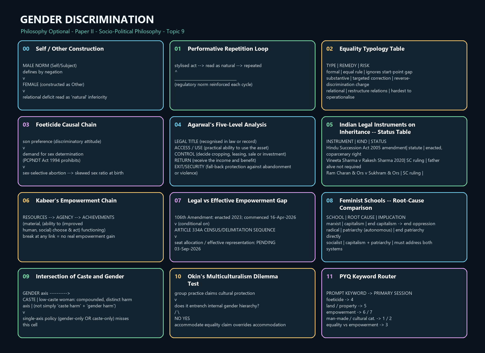

# Gender Discrimination — Learner-v2 Source-Complete Learning Session

> **Syllabus (verbatim):** Gender Discrimination : Female Foeticide, Land and Property Rights; Empowerment.
>
> **Generation:** g6, 2026-09-03 · **Approval:** false pending explicit topic approval
>
> **Evidence key:** ✅ canonical doctrine · ⚠️ analytical synthesis (for exam use) · ❓ contested/empirical claim
>
> **Evidence discipline:** Core follows the canonical owner and exact verified ledger; the matching advanced dossier section remains optional.

## BASIC LEARNING SESSION




*Concept map: Self / Other Construction. The twelve authored stages preserve the topic-specific learning rail used by both master-flow formats.*

### Exact printed ownership and cross-topic firewall

The official clause names **Gender Discrimination: Female Foeticide, Land and Property Rights;
Empowerment**. The conceptual owner is broader than women-only biology, while the three printed
applications are specifically centred on discrimination against women.

| Content | Ownership here | Boundary |
|---|---|---|
| Gender discrimination | sex/gender, hierarchy, structural power, equality/difference and feminist diagnoses | Full equality theory remains with [Social and Political Ideals](Social-Political-Ideals.md) |
| Female foeticide | discriminatory selection, bodily agency, technology and social valuation | General abortion doctrine, medical detail and harmful description remain outside |
| Land/property | title, access, control, return, security and bargaining power | Detailed succession/property law remains with legal/Polity study |
| Empowerment | resources, agency, achievement, capability, recognition and representation | Development owns the general capability framework; this file owns its gendered conversion |
| Intersectional bridges | caste, class, religion/community, disability and sexuality/gender identity where they alter the mechanism | Full caste and multicultural doctrines retain their separate owners |

**Thinker control:** Beauvoir, Butler, Wollstonecraft, J. S. Mill and Harriet Taylor Mill,
Crenshaw, bell hooks, Gilligan, Pateman, Okin, Kabeer, Agarwal, Sen and Nussbaum execute owned
distinctions. Friedan, Firestone, psychoanalytic feminism and ecofeminism are not independently
routed by the 2018–2025 corpus and are not imported as a generic list.


### CURRENT ILLUSTRATION — Ram Charan & Ors. v. Sukhram & Ors.

**Fact:** [2025] 8 S.C.R. 272 · 2025 INSC 865 · 17 July 2025. Absent proven custom excluding female inheritance among Scheduled Tribes (a context outside Hindu Succession Act, 1956 section 2(2)), denying a tribal woman an equal share in ancestral property is arbitrary and offends Article 14; the Court invoked the standard of justice, equity, and good conscience under Section 6 of the Central Provinces Laws Act, 1875.

**Exam use:** Cited strictly as an illustration of the recurring title-versus-control problem in a further community context -- it is not part of the Hindu Succession Act coparcenary line, must not be presented as extending or amending Vineeta Sharma v. Rakesh Sharma (2020), and carries no load-bearing doctrinal weight beyond this illustrative use.

### SESSION 1 — Sex, Gender and Beauvoir's 'Other'

#### DEFINITION / WHAT THIS IS CALLED

**Plain-language definition:** Sex refers to bodily and reproductive characteristics whose variation is more complex than a rigid binary; gender is the socially organised meaning attached to bodies, identities, roles, virtues and limits. Simone de Beauvoir's line 'One is not born, but rather becomes, a woman' says the second part is made, not given.

**Technical definition:** Beauvoir's existentialist-feminist claim treats 'woman' as a social category constituted by being cast as Other against a male Self/Subject norm. This is the founding move that separates sex (biological difference) from gender (constructed meaning), against essentialist readings that collapse the two.

#### VISUAL — Self / Other Construction

```text

  MALE NORM (Self/Subject)

        |

        |  defines by negation

        v

  FEMALE (constructed as Other)

        |

        v

  relational deficit read as 'natural' inferiority
  CATEGORY CARE: sex characteristics != assignment != identity/expression/role
  CATEGORY CARE: sex characteristics != assignment != identity/expression/role

```

*Shows how Beauvoir's Self/Other structure converts a relational position into an apparently natural hierarchy.*

#### ANSWER-GRABBING OPENING — WRITE/ADAPT IN THE EXAM

> Open by stating the sex/gender distinction, cite Beauvoir's becoming thesis and the Self/Other structure, then show what work the distinction does for a discrimination argument: if gender is made, gender discrimination is a remediable social fact, not a natural order.

#### MUST-WRITE KEYWORDS

- **sex versus gender**
- **simone de beauvoir**
- **the second sex**
- **the other**
- **biological-difference objection**
- **essentialism objection**

**How to use them:** Define sex versus gender, anchor the distinction in Simone de Beauvoir's Other, test the biological-difference and essentialism objections, and conclude whether the discrimination is natural or socially remediable.

#### CORE OBJECTION, REPLY AND RESIDUAL LIMIT

**Objection:** Biological-difference objection: reproductive and physiological differences are real and cannot be wished away, so some differential treatment reflects nature, not discrimination.

**Best reply:** Beauvoir and successors concede biological difference but deny that it fixes social meaning; the leap from 'physically different' to 'socially unequal' is a cultural inference, not a logical entailment, and it is precisely that inference gender theory contests.

**Residual limit:** The sex/gender split can itself be criticised (see Session 2) for smuggling back a 'raw' biological sex that is not itself culturally innocent -- flag this as an internal tension rather than resolve it here.

#### EXAM USE AND CONCISE REVISION

**Answer architecture:** Secondary anchor for 2025 Q1(b) (gender as social construct) and 2019 Q3(b) (man-made concept, not naturally endowed) -- use this session to supply the Beauvoir citation those answers need.

- Sex = biological; gender = social meaning attached to sex.
- Beauvoir: 'One is not born, but rather becomes, a woman.'
- Woman constructed as Other against male Subject/norm.
- Othering naturalises hierarchy as if it were biological fact.
- Biological-difference objection: real physiological differences exist.
- Reply: difference does not entail differential social worth.
- Distinction enables discrimination to be seen as remediable, not natural.
- Watch for the internal tension explored fully in Session 2.

#### CANONICAL OWNER COVERAGE

> **Syllabus (verbatim):** Gender Discrimination : Female Foeticide, Land and Property Rights; Empowerment.
> **Evidence key:** ✅ canonical doctrine · ⚠️ analytical synthesis (for exam use) · ❓ contested/empirical claim
> **Placement:** This clause tests how socially constructed gender hierarchy becomes embodied in life chances, bodily valuation, property control and agency.

#### 0. ONE-SCREEN MAP

```text
SEXED BODY + SOCIAL INTERPRETATION
              │
              ▼
GENDER ORDER
roles · norms · division of labour · authority · inheritance
      │                 │                    │
      ▼                 ▼                    ▼
FEMALE FOETICIDE   UNEQUAL PROPERTY      DISEMPOWERMENT
devaluation of     title / control /      weak voice, mobility,
female life        inheritance gaps       bodily and political agency
      └─────────────────┬──────────────────┘
                        ▼
EMPOWERMENT
resources + capabilities + agency + recognition + institutional power
```

⚠️ **Master thesis:** gender discrimination is reproduced by norms and institutions, not by biology alone; therefore legal equality is necessary but must be converted into effective control, capability and voice.

---

#### 1. GENDER DISCRIMINATION: CONCEPTUAL FOUNDATION

#### 1.1 Doctrine statement

✅ **Gender discrimination** is the unjust differential valuation, opportunity, burden or authority assigned to persons through socially organised meanings attached to sex and gender.

#### 1.2 Sex and gender

| Concept | Basic meaning | Qualification |
|---|---|---|
| **Sex** | bodily and reproductive characteristics | biological variation is more complex than a rigid social binary |
| **Gender** | socially produced roles, expectations and identities | embodied experience and social interpretation interact |
| **Gender hierarchy** | patterned ranking of masculinised and feminised roles | not every difference is discriminatory; unjust subordination is the issue |

✅ Simone de Beauvoir's thesis that one “becomes” a woman identifies femininity as a social position and project, not a destiny mechanically deduced from anatomy. Woman is constructed as the **Other** relative to a male norm.

**Argument:**

1. societies assign different meanings and roles to bodily difference;
2. those roles structure education, work, care, mobility, inheritance and authority;
3. repeated expectations become internalised and appear natural;
4. institutional outcomes then reinforce the original norm;
5. therefore, observed inequality cannot be inferred to be biologically necessary.

**Presupposition:** social practices can shape preferences, capacities and self-conception.

#### 1.3A Butler: gender as performative

⚠️ **Judith Butler** (*Gender Trouble*, **1990**) presses the constructionist claim of §1.2–§1.3 further than the standard sex/gender split. On Butler's account gender is **performative**: it is not an inner essence or a cultural coating laid over a stable biological sex, but is produced through repeated, stylised acts — speech, gesture, dress, gait, comportment, the daily rituals of ordinary life — whose reiteration produces the *appearance* of a natural, pre-existing gendered self.

**Reconstructed argument ⚠️:**

1. the standard framework treats sex as a natural substrate and gender as its cultural interpretation;
2. but the categories through which bodies are read as male or female are themselves produced within a gendered discourse — the "natural" substrate is not encountered pre-interpretively;
3. what appears as the *expression* of an inner gender identity is in fact its *constitution*: there is no doer behind the deed;
4. gender is therefore sustained by reiterated performance under social compulsion, not by nature;
5. because it depends on repetition, it is also open to failed, parodic and subversive repetition — which is where the possibility of change lies.

**Presupposition ⚠️:** categories of identity are effects of discursive and social practices, not their preconditions.

⚠️ **Three cautions on use, all compulsory.**

1. ❌ Do not present this as the textbook sex/gender distinction. It is a later and more radical move that **contests** that distinction; conflating the two loses the point entirely.
2. ❌ Do not claim Butler denies that bodies or biological differences exist. The claim concerns how the **meaning and categorisation** of bodies are produced, not whether bodies are real.
3. ❌ Do not read "performative" as "performance" in the sense of a costume freely chosen each morning. Performativity is compelled reiteration within a normative order, which is precisely what makes it hard to escape.

**Objection → Reply — the exchange that must accompany any use of Butler ⚠️:**

- **Objection (the category problem):** if "woman" is wholly an effect of discourse, feminism loses the stable subject in whose name it makes claims. Political mobilisation, anti-discrimination law and survey measurement all presuppose a determinate category; a thoroughgoing anti-essentialism appears to dissolve the very constituency it seeks to defend.
  **Reply (strategic essentialism):** ⚠️ political claims can be built on **provisionally and strategically stabilised** categories while accepting that the category is historically constructed. A group may deploy a unified identity for specific political purposes without asserting that the identity is natural or permanent. ⚠️ Legal sex-discrimination categories function pragmatically in just this way, whatever their deeper philosophical instability.
  **Residual problem ⚠️:** strategic essentialism is unstable in practice — a category adopted for political leverage tends to harden into a description, and to marginalise those it fits badly. Present the whole exchange as **live and contested**, never as a settled result.

⚠️ **How to use it in an answer:** Butler is a *depth marker* for stems on gender as a cultural category, on the sex/gender distinction, and on the limits of essentialist feminism. She is **not** required for empowerment, property or foeticide stems, and inserting her there costs space that the mechanism-and-evidence paragraphs need.

#### 1.6 Objections and replies

**Biological-difference objection:** some role differences reflect reproduction.
**Reply:** biological facts do not determine who controls property, whose work is valued or who has authority; social conclusions require independent justification.

**Choice objection:** unequal outcomes reflect preferences.
**Reply:** ✅ preferences may be adaptive, formed under dependency, sanction and restricted options. Respect for choice requires conditions of genuine capability.

**Reverse-discrimination objection:** targeted measures violate equality.
**Reply:** ⚠️ remedial differentiation is justified where it dismantles status hierarchy and expands equal citizenship; it must remain proportionate and reviewable.

---

#### CLOSING RECALL FLOW — Sex, Gender and Beauvoir's 'Other'

```closure-flow
SUBTOPIC: Sex, Gender and Beauvoir's 'Other'
STARTING CONCEPT: Sex, Gender and Beauvoir's 'Other'
KEY TERMS / DEFINITIONS: the other | the second sex | sex versus gender | simone de beauvoir
MECHANISM / ARGUMENT: Othering mechanism: the male is posited as the neutral Subject/norm; the
  female is defined only relationally, as what the Subject is not -- this relational deficit is
  then read back onto women as natural inferiority, naturalising a social hierarchy.
CONSEQUENCE / CONTRAST: Once woman is fixed as Other, her subordination looks like a fact about
  her nature rather than an effect of a social structure, which forecloses reform and stabilises
  unequal treatment as 'just how things are.'
UPSC TRAP / ANSWER-USE: Do not conflate 'sex is biological' with 'gender discrimination is
  biologically justified' -- the whole point of the distinction is that the second does not
  follow from the first.
ANSWER-GRABBING FORMULATION: Open by stating the sex/gender distinction, cite Beauvoir's
  becoming thesis and the Self/Other structure, then show what work the distinction does for a
  discrimination argument: if gender is made, gender discrimination is a remediable social fact,
  not a natural order.
```

### SESSION 2 — Gender as a Cultural Category and Butler's Performativity

#### DEFINITION / WHAT THIS IS CALLED

**Plain-language definition:** Judith Butler goes further than Beauvoir: gender is not a fixed inner identity expressed outwardly but something produced by repeating gestures, speech, and styles -- 'performativity,' not a single act of performance.

**Technical definition:** Gender Trouble argues gender is constituted through 'performative repetition' of stylised acts within a regulatory frame; there is no gendered substance behind the acts -- the doing is the being. This unsettles any stable, pre-social sex/gender binary.

#### VISUAL — Performative Repetition Loop

```text

   stylised act --> read as natural --> repeated

        ^                                   |

        |___________________________________|

        (regulatory norm reinforced each cycle)

```

*Illustrates Butler's claim that gender is an effect of repeated performance, not an expression of prior essence.*

#### ANSWER-GRABBING OPENING — WRITE/ADAPT IN THE EXAM

> State the shift from Beauvoir's 'becoming' to Butler's 'performative repetition,' then use it to answer whether gender is culturally, not biologically, constituted -- performativity supplies the mechanism Beauvoir's account leaves underspecified.

#### MUST-WRITE KEYWORDS

- **gender as a cultural category**
- **judith butler**
- **gender performativity**
- **gender trouble**
- **performative repetition**
- **discursive construction**

**How to use them:** Deploy when a question explicitly opposes 'gender as cultural category' to 'sex as biological category,' or asks how gender is produced rather than merely defined.

#### CORE OBJECTION, REPLY AND RESIDUAL LIMIT

**Objection:** Essentialism objection: without any stable pre-discursive sex, feminism loses the very subject ('woman') in whose name it claims to act, risking political incoherence.

**Best reply:** Butler answers that provisional, strategic use of 'woman' as a political category remains available even without metaphysical fixity -- solidarity does not require essence, only a shared discursive position worth contesting.

**Residual limit:** Performativity explains how gender norms are reproduced but is criticised for being weaker on why particular norms (rather than others) become hegemonic -- economic and institutional accounts (Sessions 6-8) supply that missing structural piece.

#### EXAM USE AND CONCISE REVISION

**Answer architecture:** Primary anchor for 2019 Q3(b) and 2022 Q3(b) (gender as cultural vs sex as biological category); secondary support for 2025 Q1(b).

- Butler: gender is performative, not expressive of an inner essence.
- Performative repetition of stylised acts constitutes gender.
- No gendered substance exists prior to or behind the acts.
- Repetition both produces and disciplines gender appearance.
- Essentialism objection: risk of losing 'woman' as a stable subject.
- Reply: strategic, provisional use of 'woman' still grounds solidarity.
- Performativity explains reproduction, less so origin of specific norms.
- Directly answers 'gender as cultural category vs sex as biological.'

#### CANONICAL OWNER COVERAGE

#### 1.3 Gender as cultural category

✅ To call gender cultural does not mean it is imaginary or freely chosen. Social norms are embodied through family, language, labour, law, media and sanctions.

**Distinction:** socially constructed does not mean easily changed. Money, citizenship and caste are socially constructed yet exercise real power.

#### 1.3B Category scope and trans-inclusive conceptual care

✅ The distinction between bodily sex characteristics, assigned classifications, gender identity,
gender expression and social role prevents one binary label from doing several different jobs.
Transgender, non-binary and gender-nonconforming persons may face discrimination through the same
mechanisms of enforced role, stigma and institutional exclusion analysed here.

⚠️ The printed applications remain focused on women. Inclusive conceptual care therefore
**extends the account of gender hierarchy without erasing sex-specific discrimination** in
reproduction, property, care and violence. No claim about a person's identity should be inferred
from anatomy, dress or social role.

**Category control:** anti-discrimination argument may use “women” as a strategically necessary
political and legal category while keeping it internally diverse, historically constructed and open
to those affected by misogyny and feminised subordination. This is a working criterion, not a
settled resolution of the category debate.

#### CLOSING RECALL FLOW — Gender as a Cultural Category and Butler's Performativity

```closure-flow
SUBTOPIC: Gender as a Cultural Category and Butler's Performativity
STARTING CONCEPT: Gender as a Cultural Category and Butler's Performativity
KEY TERMS / DEFINITIONS: judith butler | gender trouble | gender performativity | discursive
  construction
MECHANISM / ARGUMENT: Repetition mechanism: norms of masculinity/femininity are reiterated in
  everyday acts (dress, speech, comportment); each repetition both produces the appearance of a
  natural gender and disciplines deviation from it.
CONSEQUENCE / CONTRAST: If gender is performed rather than expressed, it is in principle
  unstable and open to subversive repetition -- but also means discrimination is reproduced
  daily through ordinary social practice, not only through law.
UPSC TRAP / ANSWER-USE: Do not present performativity as 'people choosing to perform gender like
  an act on a stage' -- Butler explicitly denies a prior chooser; the subject is itself an
  effect of the repetition.
ANSWER-GRABBING FORMULATION: State the shift from Beauvoir's 'becoming' to Butler's
  'performative repetition,' then use it to answer whether gender is culturally, not
  biologically, constituted -- performativity supplies the mechanism Beauvoir's account leaves
  underspecified.
```

### SESSION 3 — Feminist Diagnoses and the Architecture of Equality

#### DEFINITION / WHAT THIS IS CALLED

**Plain-language definition:** Different feminist schools diagnose the root cause of women's subordination differently (law, economy, culture, sexuality), and 'equality' itself splits into formal, substantive, and relational versions with different remedies.

**Technical definition:** The equality typology (formal, substantive, relational; equality of opportunity vs equality of outcome) determines what counts as a remedy: formal equality bars differential rules, substantive equality permits affirmative action to correct starting-point disadvantage.

#### VISUAL — Equality Typology Table

```text

  TYPE          | REMEDY               | RISK

  formal        | equal rule            | ignores start-point gap

  substantive   | targeted correction   | reverse-discrimination charge

  relational    | restructure relations | hardest to operationalise

```

*Compares the three equality types against their typical remedy and the objection each remedy attracts.*

#### ANSWER-GRABBING OPENING — WRITE/ADAPT IN THE EXAM

> Set out the equality typology first, then use it to adjudicate whether feminism aims at empowerment (substantive, outcome-sensitive) or equality (formal, rule-neutral) -- and show the two are not mutually exclusive.

#### MUST-WRITE KEYWORDS

- **formal equality**
- **substantive equality**
- **relational equality**
- **equality of opportunity**
- **equality of outcome**
- **affirmative action**

**How to use them:** Use for any question forcing a choice between 'feminism as empowerment' and 'feminism as equality,' or asking to evaluate reservation/affirmative-action style remedies.

#### CORE OBJECTION, REPLY AND RESIDUAL LIMIT

**Objection:** Reverse-discrimination objection: affirmative measures for women amount to discrimination against men, and adaptive preference arguments (women 'choosing' subordinate roles under constrained options) can be used to deny inequality exists at all.

**Best reply:** Substantive-equality theorists reply that correcting a structural disadvantage is not equivalent to creating a new one, and that 'choice' made under adaptive preference does not settle whether the background options were themselves just.

**Residual limit:** The typology clarifies remedies but does not by itself settle *how much* substantive correction is warranted -- that judgement is made contextually, using the domain-specific sessions (foeticide, property, political representation) that follow.

#### EXAM USE AND CONCISE REVISION

**Answer architecture:** Primary anchor for 2018 Q4(c) (empowerment vs equality); secondary support for 2025 Q1(b).

- Formal equality: no explicit differential rule.
- Substantive equality: compensates unequal starting points.
- Relational equality: asks if social relations remain hierarchical.
- Equality of opportunity vs equality of outcome is a related axis.
- Affirmative action is a substantive-equality remedy.
- Reverse-discrimination objection targets affirmative measures.
- Adaptive preference objection can mask real constraint as 'choice.'
- Empowerment and equality are not mutually exclusive goals.

#### CANONICAL OWNER COVERAGE

#### 1.4 Main feminist diagnoses

| Approach | Primary source of oppression | Remedy | Standard objection |
|---|---|---|---|
| **Liberal feminism** | unequal rights and opportunity | legal equality, education, access | underestimates family and structure |
| **Marxist feminism** | private property and class exploitation | transform production and property | patriarchy not reducible to class |
| **Socialist feminism** | interaction of capitalism and patriarchy | alter production and social reproduction | explanatory complexity |
| **Radical feminism** | patriarchy and control of sexuality/body | transform power and gender relations | may universalise women's experience |
| **Intersectional feminism** | intersecting caste, class, race, gender and other powers | context-sensitive anti-domination | categories can multiply without clear priority |
| **Capability feminism** | deprivation of real opportunities and bodily integrity | secure threshold capabilities and agency | list/measurement disputes |

#### 1.4A Bounded thinker map

| Thinker | Owned contribution | Use |
|---|---|---|
| Mary Wollstonecraft | equal rational and moral standing requires serious education rather than cultivated dependence | liberal equality and “natural incapacity” objections |
| J. S. Mill and Harriet Taylor Mill | law and custom jointly manufacture women's subjection; legal equality must be joined to social liberty | formal versus substantive equality |
| Simone de Beauvoir | woman is constituted as the Other rather than born to a fixed social destiny | existential and constructionist foundation |
| Carol Gilligan | care exposes dependency, relationship and context omitted by abstract justice | care/justice debate, with essentialism caution |
| Kimberlé Crenshaw and bell hooks | gender is mediated by race/class and social location; dominant feminism can universalise privileged experience | intersectional correction to homogeneous “women” |
| Judith Butler | compelled reiteration produces the appearance of natural gender identity | anti-essentialism and category-stability debate |

⚠️ This table anchors approaches; it does not replace the mechanism, objection and reply required
by the stem.

#### 1.4B Structural injustice, responsibility and the public/private division

Gender oppression is **structural** where normal rules, institutions and repeated choices combine
to constrain a group without one actor designing the whole result.

**Iris Marion Young's social-connection model ⚠️:**

1. many ordinary agents participate in processes that reproduce unequal work, care, property,
   representation or bodily security;
2. absence of a sole perpetrator does not mean absence of responsibility;
3. responsibility is forward-looking and shared rather than identical to personal blame;
4. duties vary with power, privilege, interest and collective capacity to change the process.

**Public/private control:** the household is a protected sphere of intimacy but not an immunity
zone for domination. Care burdens, control of income, bodily decision-making and family violence
shape access to public education, work, property and representation; public equality is therefore
partly produced inside the “private” sphere.

**Objection:** diffuse structural responsibility lets every actor blame the system.
**Reply:** ⚠️ distinguish backward-looking blame for one's acts from forward-looking duties to
reform processes one helps sustain; shared responsibility must still be specified by role and power.

#### 1.5 Difference, equality and discrimination

✅ Equality need not mean identical treatment. Pregnancy, unpaid care, inherited exclusion and violence may require differentiated support to achieve equal standing and capability.

**Formal equality:** same rule.
**Substantive equality:** attention to unequal starting positions, social burdens and effective outcomes.
**Relational equality:** citizens meet without domination, stigma or servility.

#### 1.5A The sameness/difference dilemma

| Strategy | Claim | Risk |
|---|---|---|
| Sameness | apply one sex-neutral rule because women and men are equal persons | the male life-pattern may remain the hidden norm |
| Difference/accommodation | recognise pregnancy, care burdens and inherited exclusion | difference may be essentialised and used to reassign women to traditional roles |
| Substantive/transformative equality | ask whether rules alter capability, status and power rather than merely classify alike | requires contested judgments about disadvantage and remedy |

⚠️ The solution is not sameness or difference in the abstract. Differential treatment is justified
where it removes a socially produced burden and enlarges equal standing without fixing a permanent
gender essence.

#### CLOSING RECALL FLOW — Feminist Diagnoses and the Architecture of Equality

```closure-flow
SUBTOPIC: Feminist Diagnoses and the Architecture of Equality
STARTING CONCEPT: Feminist Diagnoses and the Architecture of Equality
KEY TERMS / DEFINITIONS: formal equality | affirmative action | equality of outcome | relational
  equality
MECHANISM / ARGUMENT: Formal equality removes explicit legal differentiation; substantive
  equality additionally compensates for unequal starting points via targeted measures;
  relational equality asks whether social relationships themselves remain hierarchical despite
  equal rules.
CONSEQUENCE / CONTRAST: Choosing formal equality alone can leave real disadvantage untouched
  (equal treatment of unequals reproduces inequality); choosing substantive equality invites the
  reverse-discrimination objection.
UPSC TRAP / ANSWER-USE: Do not treat 'equality' as one univocal idea -- an answer that fails to
  specify which equality is at stake will look conceptually loose to an examiner.
ANSWER-GRABBING FORMULATION: Set out the equality typology first, then use it to adjudicate
  whether feminism aims at empowerment (substantive, outcome-sensitive) or equality (formal,
  rule-neutral) -- and show the two are not mutually exclusive.
```

### SESSION 4 — Female Foeticide: Doctrine, Distinctions, Causes and Missing Women

#### DEFINITION / WHAT THIS IS CALLED

**Plain-language definition:** Female foeticide is the sex-selective abortion of female fetuses. It must be kept distinct from female infanticide (killing after birth) and dowry-linked violence, and it is driven by son preference operating through technology, not by technology alone.

**Technical definition:** Amartya Sen's 'missing women' argument uses skewed sex ratios as evidence of large-scale discrimination against women across South and East Asia; in India this is channelled through prenatal sex determination misuse despite the PCPNDT Act, 1994 prohibiting it.

#### VISUAL — Foeticide Causal Chain

```text

  son preference (discriminatory attitude)

        |

        v

  demand for sex determination

        |         (PCPNDT Act 1994 prohibits)

        v

  sex-selective abortion  -->  skewed sex ratio at birth

```

*Places son preference, not technology, as the causal root, with the PCPNDT Act positioned as the (imperfectly enforced) legal barrier.*

#### ANSWER-GRABBING OPENING — WRITE/ADAPT IN THE EXAM

> Distinguish foeticide/infanticide/dowry-death precisely, cite Sen's missing-women statistic-as-argument (not a specific invented number), name the PCPNDT Act 1994 as the enacted legal response, and conclude that son preference (a gender-discrimination attitude), not technology per se, is the causal driver.

#### MUST-WRITE KEYWORDS

- **female foeticide**
- **sex-selective abortion**
- **sex ratio at birth**
- **missing women**
- **amartya sen**
- **pcpndt act 1994**

**How to use them:** Define female foeticide as sex-selective abortion, use Amartya Sen's missing-women diagnosis, locate son preference before technology in the causal chain, classify the PCPNDT Act 1994, and end with a law-plus-substantive-equality verdict.

#### CORE OBJECTION, REPLY AND RESIDUAL LIMIT

**Objection:** One could object that stringent law alone (PCPNDT Act) should have solved the problem, so continued prevalence shows the diagnosis (son preference, not technology) must be wrong.

**Best reply:** Persistence despite legal prohibition supports, rather than refutes, the son-preference diagnosis: law changes formal permissibility, not the underlying discriminatory preference structure that drives demand around the law (a formal- vs substantive-equality point from Session 3).

**Residual limit:** This session documents doctrine and diagnosis; it does not assert any specific unverified statistic on national sex ratio or districtwise figures -- cite only the direction of skew and the named policy instruments (PCPNDT Act 1994, Beti Bachao Beti Padhao 2015).

#### EXAM USE AND CONCISE REVISION

**Answer architecture:** Primary anchor for 2018 Q4(b), 2021 Q4(b), and 2023 Q3(c); secondary linkage into 2024 Q4(a)'s empowerment-and-foeticide question.

- Female foeticide = sex-selective abortion; keep distinct from infanticide.
- Amartya Sen: 'missing women' as an index of systemic discrimination.
- PCPNDT Act, 1994 prohibits prenatal sex determination for selection.
- Beti Bachao Beti Padhao (2015) is the named policy-response scheme.
- Cause = son preference; technology is only the instrument.
- Son preference is rooted in dowry, inheritance and old-age-security norms.
- Legal prohibition persisting alongside the practice supports, not refutes, the diagnosis.
- Never cite an invented sex-ratio figure; name direction and instruments only.

#### CANONICAL OWNER COVERAGE

#### 2. FEMALE FOETICIDE

#### 2.1 Doctrine statement

✅ **Female foeticide** is the sex-selective termination of a pregnancy because the foetus is identified or presumed to be female. The moral wrong addressed by the syllabus is discriminatory selection rooted in the devaluation of daughters.

#### 2.2 Distinguish the issues

| Issue | Philosophical question |
|---|---|
| abortion generally | moral status, bodily autonomy and state coercion |
| sex-selective abortion | discriminatory reason for selection and social pattern |
| prenatal diagnostic technology | legitimate medical use versus discriminatory misuse |
| female infanticide | killing after birth; legally and conceptually distinct |

⚠️ Opposition to female foeticide should not erase women's bodily autonomy or equate every abortion with sex discrimination. The target is a patriarchal choice-structure in which family and social pressure devalue female life.

#### 2.3 Causes as a normative structure

- ✅ patrilineal inheritance and lineage;
- ✅ expectations of sons as economic or ritual support;
- ✅ dowry and marriage costs;
- ✅ unequal property and earning power;
- ✅ family pressure and constrained reproductive agency;
- ⚠️ technology functioning as an instrument of pre-existing bias, not its sole cause.

#### 2.4 Moral argument

1. sex selection treats female status as a reason for exclusion from birth;
2. repeated individual decisions create a social meaning that daughters are less worthy;
3. women may make such decisions under coercive family and economic conditions;
4. the wrong therefore includes both discriminatory valuation and constrained agency;
5. reform must address norms, property, security and accountability, not technology alone.

#### 2.5 Amartya Sen and “missing women”

✅ Sen's “missing women” formulation draws attention to excess female mortality and demographic absence produced by unequal care and social valuation. For this clause, it supplies a structural lens: discrimination operates across birth, nutrition, health and survival.

⚠️ Do not invent or reproduce a number unless a verified source and date are supplied. The philosophical point does not depend on a current statistic.

#### 2.6 Social imbalance

⚠️ A distorted sex composition can intensify trafficking, coerced marriage and violence, but consequences are not the primary reason female foeticide is wrong. It is wrong first because equal dignity is denied.

**Avoid consequentialist trap:** arguing only that society “needs women” instrumentalises women again.

#### 2.7 Indian legal and programme illustrations

- ✅ The Pre-Conception and Pre-Natal Diagnostic Techniques (Prohibition of Sex Selection) Act, **1994**, expanded through amendment to cover pre-conception sex selection, is an **enacted regulatory and penal statute**.
- ✅ *Beti Bachao Beti Padhao* was **launched as a Union government programme in 2015**; it is an administrative initiative, not a constitutional right or proof of changed norms.

⚠️ Enactment, notification, enforcement and social implementation are distinct. A ban can regulate supply and signalling, but son preference requires property, care and status reform.

#### 2.8 Objections and replies

**Autonomy objection:** prohibition may police pregnant women.
**Reply:** the primary regulatory focus should be discriminatory diagnostic and commercial practices, coercive family structures and providers, while protecting women's health and agency.

**Technology objection:** ultrasound causes the problem.
**Reply:** technology enables selection but does not create the preference; the same technology has legitimate diagnostic uses.

**Outcome objection:** balancing population sex composition is sufficient justification.
**Reply:** dignity and non-discrimination are prior; demographic balance is a consequence, not the moral foundation.

---

#### CLOSING RECALL FLOW — Female Foeticide: Doctrine, Distinctions, Causes and Missing Women

```closure-flow
SUBTOPIC: Female Foeticide: Doctrine, Distinctions, Causes and Missing Women
STARTING CONCEPT: Female Foeticide: Doctrine, Distinctions, Causes and Missing Women
KEY TERMS / DEFINITIONS: amartya sen | missing women | pcpndt act 1994 | female foeticide
MECHANISM / ARGUMENT: Son preference (rooted in dowry economics, patrilineal inheritance
  expectations, and old-age security norms) creates demand; prenatal diagnostic technology
  supplies the means; weak enforcement of the PCPNDT Act, 1994 fails to close the gap between
  demand and act.
CONSEQUENCE / CONTRAST: A skewed child sex ratio at birth, treated by Sen as an index of
  systemic discrimination rather than an isolated crime, with downstream effects on marriage
  markets and women's bargaining position.
UPSC TRAP / ANSWER-USE: Do not blame 'technology' as the primary cause -- the question '2021
  Q4(b)' explicitly tests whether you will resist this simplification; technology is the
  instrument, son preference is the cause.
ANSWER-GRABBING FORMULATION: Distinguish foeticide/infanticide/dowry-death precisely, cite Sen's
  missing-women statistic-as-argument (not a specific invented number), name the PCPNDT Act 1994
  as the enacted legal response, and conclude that son preference (a gender-discrimination
  attitude), not technology per se, is the causal driver.
```

### SESSION 5 — Land and Property Rights: Agarwal's Five Levels and the Legal Record

#### DEFINITION / WHAT THIS IS CALLED

**Plain-language definition:** Bina Agarwal argues that owning land 'on paper' is not enough for women's empowerment; actual command must be tested through legal title, access/use, control, realised return, and exit/security.

**Technical definition:** Agarwal's five-level analysis (legal title / access-use / control / return / exit-security) disaggregates property rights into separable components. Legal title is neither necessary nor sufficient for actual command: informal access may exist without title, while title may yield no control, income, benefit or bargaining security.

#### VISUAL — Agarwal's Five-Level Analysis

```text

   LEGAL TITLE   (recognised in law or record)

   ACCESS / USE  (practical ability to use the asset)

   CONTROL       (decide cropping, leasing, sale or investment)

   RETURN        (receive the income and benefit)

   EXIT/SECURITY (fall-back protection against abandonment or violence)

```

*The five dimensions are analytically separate: title can exist without command, while some access can exist without title.*

#### VISUAL — Indian Legal Instruments on Inheritance -- Status Table

```text

  INSTRUMENT                         | KIND      | STATUS

  Hindu Succession Act 2005 amendment| statute   | enacted, coparcenary right

  Vineeta Sharma v Rakesh Sharma 2020| SC ruling | father alive at commencement not required

  Ram Charan & Ors v Sukhram & Ors   | SC ruling | illustration only, ST context,

  [2025] 8 SCR 272 / 2025 INSC 865   |           | decided 17-Jul-2025, distinct bench

```

*Distinguishes statute from judgment and marks the 2025 ruling as a scoped illustration, not a doctrinal expansion.*

#### ANSWER-GRABBING OPENING — WRITE/ADAPT IN THE EXAM

> State the five-level analysis, map India's legal record onto it (Hindu Succession Act, 2005 amendment giving daughters coparcenary rights; *Vineeta Sharma v. Rakesh Sharma*, 2020 as a Supreme Court judgment clarifying that amendment, not itself a statute), then assess title, access, control, realised return and exit/security separately.

#### MUST-WRITE KEYWORDS

- **bina agarwal**
- **five-level analysis of land rights**
- **title access control return exit**
- **coparcenary**
- **hindu succession act 2005**
- **vineeta sharma v rakesh sharma 2020**

**How to use them:** State Bina Agarwal's five-level analysis, test legal title, access/use, control, return and exit/security, classify the Hindu Succession Act 2005 and Vineeta Sharma 2020 correctly, and conclude whether formal coparcenary title becomes effective empowerment.

#### CORE OBJECTION, REPLY AND RESIDUAL LIMIT

**Objection:** One could object that once law grants equal title, any remaining gap is a social/enforcement problem outside philosophy's remit, not a flaw in the rights framework itself.

**Best reply:** Agarwal's reply is that a rights framework which stops at title while ignoring predictable social non-implementation is philosophically incomplete; empowerment theory must build access, control, return and exit/security into the very specification of the right, not treat them as separate 'implementation' add-ons.

**Residual limit:** This session states the doctrinal and legal-status facts precisely; for a current, narrowly illustrative example of courts extending inheritance logic to a further community context, see the optional CURRENT_ANCHOR note attached to this session (illustration only, not load-bearing doctrine).

#### EXAM USE AND CONCISE REVISION

**Answer architecture:** Primary anchor for 2021 Q1(e) and 2023 Q1(c) (land/property rights and empowerment).

- Agarwal's five levels: legal title, access/use, control, return, exit/security.
- Legal title is neither necessary nor sufficient for actual command over land.
- Hindu Succession Act, 2005 amendment: daughters get coparcenary rights.
- Vineeta Sharma v. Rakesh Sharma (2020): SC judgment clarifying the amendment's application -- not the source statute.
- De jure title can coexist with de facto male control.
- Return asks who receives income/benefit; exit/security asks whether land strengthens the fall-back position.
- Objection: gap is 'mere' enforcement, not a rights-framework flaw.
- Reply: a complete rights framework must design in access, control, return and exit/security.

#### CANONICAL OWNER COVERAGE

#### 3. LAND AND PROPERTY RIGHTS

#### 3.1 Doctrine statement

✅ Women's land and property rights include legally recognised claims to inherit, own, use, control, manage, transfer and benefit from property on equal terms.

#### 3.2 Why property matters

**Capability argument:**

1. resources affect security, shelter, livelihood and bargaining power;
2. independent property reduces complete dependence on family relations;
3. control can improve the ability to exit violence and participate in decisions;
4. therefore, property is not merely an asset but a capability-conversion resource.

**Recognition argument:** equal inheritance marks daughters as full members rather than temporary dependants.

#### 3.3 Ownership, access and control

⚠️ **Attribution.** The five-level analysis below follows the distinction developed by the economist **Bina Agarwal** (*A Field of One's Own: Gender and Land Rights in South Asia*, **1994**) between **ownership**, **effective control** and the **realised benefit** of land — her central claim being that legal title is neither necessary nor sufficient for a woman's actual command over land, and that the gap between title and control is where gender-blind land policy fails. ⚠️ Paraphrase her position; do not quote, and do not attach page or chapter references.

| Level | Question | Why title alone fails |
|---|---|---|
| **Legal title** ✅ | is her name recognised in law or record? | law may be amended while records, custom and family practice are not |
| **Access/use** ✅ | can she actually use the land or asset? | physical access can be blocked by distance, safety, seclusion norms or male kin |
| **Control** ✅ | can she decide cropping, leasing, sale or investment? | decision-power typically follows household authority, not the record of title |
| **Return** ✅ | does she receive income and benefit? | output and proceeds may be pooled and allocated by others |
| **Exit/security** ✅ | can the asset protect her against abandonment or violence? | this is the level at which land converts into **bargaining power** inside the household |

⚠️ A nominal title without knowledge, possession, credit, market access or decision-power may not empower.

**Agarwal's argument, reconstructed ⚠️:**

1. within the household, a woman's position depends on her **fall-back position** — what she could command if the relationship ended;
2. independent rights in land strengthen that fall-back position in a way that access mediated through a husband or father cannot;
3. therefore land rights matter not only as income but as **bargaining power**, voice and protection against violence and abandonment;
4. but title confers this only where it is joined to access, control, return and a credible exit;
5. hence the correct policy object is the **whole chain**, not registration alone.

**Presupposition ⚠️:** intra-household allocation is a site of bargaining rather than of unified altruistic decision — the premise that distinguishes this analysis from the household-as-single-agent model.

**Objection → Reply ⚠️:**

- **Objection:** if title does not convert into control, the campaign for legal rights is misdirected effort.
  **Reply:** ⚠️ title is a **necessary but insufficient** condition — it is the legal precondition on which access, credit and enforcement can later be built, and without it the other levels have no anchor. The residual problem is that the intervening conditions are slower, more diffuse and harder to legislate than title itself.
- **Objection:** the analysis is economistic and neglects cultural meaning attached to land.
  **Reply:** ⚠️ the exit/security level directly incorporates the non-economic function of land as protection and standing, which is the point at which the economic and the recognitive dimensions meet.

#### 3.4 Formal law and social practice

✅ The Hindu Succession (Amendment) Act, **2005**, is an **enacted amendment** giving daughters in a Mitakshara joint family coparcenary status by birth on the statutory terms.

✅ *Vineeta Sharma v. Rakesh Sharma* (**2020**) is a **Supreme Court judgment** clarifying the amended coparcenary right, including that the father's being alive on the amendment's commencement was not required.

⚠️ Statutory entitlement and judicial interpretation do not by themselves establish possession or control. Waiver pressure, informal partition, record practices and fear of family rupture can weaken conversion.

#### 3.5 Personal law, culture and equality

✅ Property regimes differ across communities and customary systems. The philosophical conflict is between cultural autonomy, gender equality and individual choice.

**Multicultural dilemma:** protection of a minority from majority domination may coexist with restrictions on women within the group.

**Answer:** preserve cultural voice but require internal participation, equal citizenship, reform and the ability of women to contest authorised interpretations.

#### 3.6 Objections and replies

**Family-solidarity objection:** equal claims fragment family land.
**Reply:** excluding daughters purchases consolidation through unequal status; neutral rules can address fragmentation without sex discrimination.

**Legal-reform-is-enough objection:** once equal rights exist, empowerment follows.
**Reply:** rights are necessary institutional resources, but capability depends on awareness, records, control, credit, safety and social legitimacy.

**Property-is-capitalist objection:** liberation should not depend on private ownership.
**Reply:** ⚠️ even under social ownership, women require enforceable control, housing security, livelihood access and equal voice; the form may vary, the anti-dependence principle remains.

---

#### CLOSING RECALL FLOW — Land and Property Rights: Agarwal's Five Levels and the Legal Record

```closure-flow
SUBTOPIC: Land and Property Rights: Agarwal's Five Levels and the Legal Record
STARTING CONCEPT: Land and Property Rights: Agarwal's Five Levels and the Legal Record
KEY TERMS / DEFINITIONS: coparcenary | bina agarwal | hindu succession act 2005 | title access
  control return exit
MECHANISM / ARGUMENT: The Hindu Succession Act, 2005 amendment strengthens legal title, but
  actual command depends separately on practical access/use, decision-making control, receipt of
  income and benefit, and the asset's capacity to provide fall-back security against abandonment
  or violence.
CONSEQUENCE / CONTRAST: Where custom, family pressure, or lack of enforcement blocks the other
  dimensions, women can hold title while male relatives retain effective control -- a gap
  between de jure and de facto empowerment.
UPSC TRAP / ANSWER-USE: Do not cite *Vineeta Sharma* as if it created the coparcenary right --
  it is a 2020 Supreme Court judgment interpreting/clarifying the 2005 amendment's retrospective
  application; the statutory right itself dates to the 2005 amendment.
ANSWER-GRABBING FORMULATION: State the five-level analysis, map India's legal record onto it
  (Hindu Succession Act, 2005 amendment giving daughters coparcenary rights; *Vineeta Sharma v.
  Rakesh Sharma*, 2020 as a Supreme Court judgment clarifying that amendment, not itself a
  statute), then assess title, access, control, realised return and exit/security separately.
```

### SESSION 6 — Empowerment: Dimensions of Power and Kabeer's Resources-Agency-Achievements

#### DEFINITION / WHAT THIS IS CALLED

**Plain-language definition:** Empowerment is more than having resources; Naila Kabeer defines it as the process by which those denied the ability to make strategic life choices acquire that ability, running through resources, agency, and achievements.

**Technical definition:** Kabeer's tripartite model treats resources (pre-conditions) and agency (the ability to define and act on goals) as jointly producing achievements (functioning outcomes); power itself is analysed via power-over, power-to, power-with, and power-within registers. Martha Nussbaum's capability approach supplies the complementary test of whether a dignity-compatible threshold of real opportunity exists.

#### VISUAL — Kabeer's Empowerment Chain

```text

  RESOURCES  -->   AGENCY   -->  ACHIEVEMENTS

 (material,      (ability to     (improved

  human, social)  choose & act)   functioning)


  break at any link = no real empowerment gain

```

*Resources alone are insufficient; agency is the load-bearing middle link converting resources into achievements.*

#### ANSWER-GRABBING OPENING — WRITE/ADAPT IN THE EXAM

> Introduce Kabeer's resources-agency-achievements chain, name the four power registers, and use the chain to test whether a given policy (land title, employment scheme, reservation) empowers or merely resources women without building agency.

#### MUST-WRITE KEYWORDS

- **empowerment**
- **naila kabeer**
- **resources agency achievements**
- **power over**
- **power to**
- **power with and power within**
- **martha nussbaum**

**How to use them:** Define empowerment through Naila Kabeer's resources-agency-achievements chain, distinguish power-over, power-to, power-with and power-within, apply Martha Nussbaum's capability threshold, test the policy's weakest link, and give a qualified verdict.

#### CORE OBJECTION, REPLY AND RESIDUAL LIMIT

**Objection:** A critic could argue the model is too demanding: if agency is required in addition to resources, almost no policy will count as empowering, making the concept practically useless.

**Best reply:** Kabeer's reply is that the model is diagnostic, not a pass/fail gate -- it lets analysts locate exactly where an intervention breaks down (resource delivery vs agency-building vs achievement) rather than declaring policy failure wholesale.

**Residual limit:** Kabeer's model explains individual-level empowerment mechanics; it is complemented, not replaced, by the care-ethics and political-representation limits taken up in the next session.

#### EXAM USE AND CONCISE REVISION

**Answer architecture:** Primary anchor for 2024 Q4(a) (empowerment as a condition for gender equality); secondary support for 2018 Q4(c).

- Empowerment = process of acquiring the ability to make strategic life choices.
- Kabeer's chain: resources -> agency -> achievements.
- Resources are pre-conditions, not the empowerment itself.
- Agency is the necessary intermediate, exercised capacity to choose/act.
- Achievements are the resulting functioning outcomes.
- Four power registers: power-over, power-to, power-with, power-within.
- Resource delivery without agency-building fails Kabeer's test.
- The model is diagnostic: it locates where an intervention breaks down.

#### CANONICAL OWNER COVERAGE

#### 4. EMPOWERMENT

#### 4.1 Doctrine statement

✅ **Empowerment** is the expansion of resources, capabilities, agency, recognition and institutional influence through which women can make and act upon significant choices.

#### 4.2 Dimensions of power

| Dimension | Meaning |
|---|---|
| **power over** | domination or control of others |
| **power to** | capacity to act and achieve |
| **power with** | collective organisation and solidarity |
| **power within** | self-respect and critical consciousness |

⚠️ Empowerment should enlarge the latter three while constraining unjust “power over.”

#### 4.3 Resources–agency–achievement

⚠️ **Attribution.** This three-part structure follows the framework developed by **Naila Kabeer**, whose account defines empowerment as the **expansion of the ability to make strategic life choices in a context where that ability was previously denied**, and analyses it along three interrelated dimensions — **resources** (preconditions), **agency** (process), and **achievements** (outcomes). ⚠️ Cite by name and position; paraphrase, and do not attach page or chapter references.

✅ A useful structure is:

```text
RESOURCES  (preconditions)
education · health · time · income · property · networks
          ↓ converted through social conditions
AGENCY  (process)
voice · choice · bargaining · mobility · bodily decision
          ↓
ACHIEVEMENTS  (outcomes)
functionings actually realised
```

**Why the framework earns its place ⚠️:** it identifies the two points at which measurement usually goes wrong.

1. **Resource-counting.** Enrolment figures, account openings, asset transfers and scheme coverage measure *preconditions*. They record what has been supplied, not what can be exercised.
2. **Outcome-counting.** Achievements can rise for reasons that have nothing to do with a woman's own agency — household income, a benevolent husband, an administrative order. An improvement in outcomes without a corresponding expansion of agency is not empowerment; it is better provision.

⚠️ **The decisive component is therefore agency**, and specifically the presence of **alternatives**: a choice made where no alternative was available, or where the alternative carried unacceptable cost, is not the exercise of strategic choice. This is the analytic point that separates a strong empowerment answer from a list of welfare indicators.

⚠️ **Strategic versus secondary choices.** Kabeer's framework distinguishes **strategic life choices** — marriage, childbearing, whether and where to work, freedom of movement, control over one's body — from second-order choices that follow from them. Empowerment concerns the former; expanded consumer choice within an unchanged structure is not empowerment.

**Presupposition:** agency is both individual and collective; one woman cannot privately negotiate away every structural barrier.

**Objection → Reply ⚠️:**

- **Objection:** if the agent's own reported satisfaction is discounted as adaptive preference, the analyst decides what counts as real empowerment, and the framework becomes paternalistic.
  **Reply:** ⚠️ the framework's own answer is to look for the **presence of alternatives and the cost of exercising them**, rather than for the analyst's preferred outcome. A choice is assessed by the conditions under which it was available, not by whether the observer approves of it. The residual difficulty — that judging which alternatives were genuinely available requires interpretation — is real and should be conceded.

#### 4.3A Care ethics: the Gilligan intervention

⚠️ **Carol Gilligan** (*In a Different Voice*, **1982**) argued that dominant accounts of moral development, framed around abstract rules, rights and impartial justice, systematically registered women's moral reasoning as deficient. She identified an alternative and equally developed orientation — an **ethic of care**, organised around responsibility, relationship, context and the maintenance of connection, rather than around the adjudication of competing claims by principle.

| | **Ethic of justice** | **Ethic of care** |
|---|---|---|
| Moral question ⚠️ | what is fair? whose right prevails? | who is vulnerable here, and what does this relationship require? |
| Self conceived as ⚠️ | separate, equal, rights-bearing | connected, interdependent, situated |
| Reasoning mode ⚠️ | abstraction from particulars, application of principle | attention to particulars, narrative and context |
| Failure mode ⚠️ | indifference; formalism that ignores need | self-effacement; being absorbed into others' needs |

**Why it matters for this clause ⚠️:**

1. it exposes the **unpaid care economy** as a political and philosophical question rather than a private arrangement, since the burden that constrains women's access to education, employment, mobility and public office is care work;
2. it supplies a normative vocabulary for **dependency** — infancy, illness, disability, old age — which contract- and rights-based theories handle badly because dependants cannot bargain;
3. it links directly to §4.3: time is a resource, and unequally distributed care work depletes it, so caring obligations are a structural constraint on agency and not a personal choice.

**Objection → Reply — compulsory, and the reason care ethics must be used carefully ⚠️:**

- **Objection (essentialism):** attributing a distinctive moral voice to women risks re-inscribing the very stereotype of the naturally nurturing woman that feminism set out to contest, and can be used to justify confining women to caring roles.
  **Reply:** ⚠️ the defensible version treats the care orientation as arising from **socially assigned position and experience**, not from nature, and claims that it is available to anyone so positioned. On this reading care ethics is a critique of how moral theory was constructed, not a claim about female psychology.
  **Residual problem ⚠️:** the empirical claim that the orientations divide along gender lines is contested, and the reply above substantially reduces the original thesis. Present it as contested, and pair it with Butler's anti-essentialism (§1.3A) if the stem concerns difference and equality.
- **Objection:** care without justice leaves domination inside relationships unexamined, since exploitative relationships can be sustained by care.
  **Reply:** ✅ the strongest position treats the two as **complementary**: justice supplies the limits that prevent care from becoming self-erasure, and care supplies the attentiveness that prevents justice from becoming formalism. State this rather than choosing a side.

#### 4.4 Capability approach

✅ Sen directs attention to real freedoms; Nussbaum highlights bodily health, bodily integrity, practical reason, affiliation and control over one's environment.

**Adaptive-preference problem:** a person may report satisfaction under restricted horizons. Empowerment therefore cannot be measured only by subjective contentment.

**Paternalism problem:** officials may impose their own ideal of emancipation.
**Reply:** secure capabilities, information and exit while respecting plural chosen functionings.

#### 4.5 Equality as a condition of empowerment

✅ Equal legal standing, education, property and bodily security are enabling conditions; empowerment is the effective capacity to use and reshape those conditions.

**Relation:**

- equality without agency can be merely formal;
- agency without structural equality can become exceptional individual success;
- empowerment links rights to actual control and collective transformation.

#### CLOSING RECALL FLOW — Empowerment: Dimensions of Power and Kabeer's Resources-Agency-Achievements

```closure-flow
SUBTOPIC: Empowerment: Dimensions of Power and Kabeer's Resources-Agency-Achievements
STARTING CONCEPT: Empowerment: Dimensions of Power and Kabeer's Resources-Agency-Achievements
KEY TERMS / DEFINITIONS: power to | power over | empowerment | naila kabeer
MECHANISM / ARGUMENT: Resources (material, human, social) enable but do not guarantee agency;
  agency (decision-making, negotiation, resistance) must be separately exercised to convert
  resources into achievements (actual improved functioning and status).
CONSEQUENCE / CONTRAST: Interventions that deliver resources without cultivating agency (e.g. a
  bank account never controlled by the woman herself) produce no real gain in empowerment on
  Kabeer's test.
UPSC TRAP / ANSWER-USE: Do not treat 'access to a resource' as synonymous with 'empowerment' --
  Kabeer's whole contribution is to insert agency as the necessary intermediate link.
ANSWER-GRABBING FORMULATION: Introduce Kabeer's resources-agency-achievements chain, name the
  four power registers, and use the chain to test whether a given policy (land title, employment
  scheme, reservation) empowers or merely resources women without building agency.
```

### SESSION 7 — Care Ethics, the Limits of Empowerment and Political Representation

#### DEFINITION / WHAT THIS IS CALLED

**Plain-language definition:** Carol Gilligan's ethic of care questions whether justice-as-rights frameworks capture women's moral reasoning, while the record on political representation shows legal empowerment (reservation) is necessary but not sufficient without real decision-making power.

**Technical definition:** Gilligan's ethic of care, grounded in relational responsibility rather than abstract rights-adjudication, is used to critique purely resource/rights-based empowerment models; the 106th Constitutional Amendment, 2023 (women's reservation in legislatures) illustrates the further, delimitation-conditional gap between legal entitlement and effective empowerment.

#### VISUAL — Legal vs Effective Empowerment Gap

```text

  106th Amendment: enacted 2023; commenced 16-Apr-2026

        |

        v  (conditional on)

  ARTICLE 334A CENSUS/DELIMITATION SEQUENCE

        |

        v

  seat allocation / effective representation -- PENDING as of 03-Sep-2026

```

*Marks the precise gap between an enacted legal entitlement and its still-pending, delimitation-conditional effect.*

#### ANSWER-GRABBING OPENING — WRITE/ADAPT IN THE EXAM

> Introduce Gilligan's care ethic as a supplement/critique of rights-based empowerment, then test the 106th Amendment, 2023 against Kabeer's agency criterion -- noting precisely that its reservation is enacted but implementation is conditional on subsequent delimitation, so legal empowerment and effective empowerment can diverge in time as well as in kind.

#### MUST-WRITE KEYWORDS

- **care ethics**
- **carol gilligan**
- **ethic of care**
- **political representation**
- **106th constitutional amendment 2023**
- **delimitation**

**How to use them:** Contrast Carol Gilligan's care ethics with a rights-only model, classify the 106th Constitutional Amendment 2023, explain the delimitation condition, test legal against effective political representation, and close with the residual empowerment limit.

#### CORE OBJECTION, REPLY AND RESIDUAL LIMIT

**Objection:** One could object that care ethics, by emphasising relational responsibility, risks re-inscribing the very caregiving role that trapped women in unequal domestic labour in the first place.

**Best reply:** Gilligan and successors reply that recognising care as a valuable moral orientation is compatible with also demanding it be shared across genders and properly weighted in public reasoning -- the aim is to add care to justice, not to confine women back to it.

**Residual limit:** This session shows empowerment's political-representation limit; it does not extend to disputing the 106th Amendment's constitutional validity, only to precisely qualifying its present implementation status.

#### EXAM USE AND CONCISE REVISION

**Answer architecture:** Primary anchor, jointly with Session 6, for 2020 Q4(a) and 2024 Q4(a).

- Gilligan's ethic of care: relational responsibility vs abstract rights.
- Care ethics supplements, and can critique, rights-based empowerment models.
- 106th Constitutional Amendment was enacted in 2023 and brought into force on 16 April 2026; seat-level reservation still follows Article 334A's census-delimitation sequence.
- Implementation is conditional on a subsequent delimitation exercise -- not yet self-executing.
- Legal empowerment and effective/political empowerment can diverge in time.
- Objection: care ethics risks re-confining women to caregiving roles.
- Reply: the aim is shared care plus justice, not care instead of justice.
- Do not overstate 106th Amendment as immediately fully operational.

#### CANONICAL OWNER COVERAGE

#### 4.6 Can empowerment eliminate gender discrimination?

⚠️ Empowerment can weaken dependence, challenge stereotypes and increase accountability, but discrimination is reproduced institutionally. Individual achievement alone cannot eliminate unequal care burdens, violence or cultural valuation.

**Verdict:** empowerment is necessary and transformative, but must be joined to institutional reform and men's participation in changing gendered power.

#### 4.7 Empowerment and female foeticide

**Causal pathway:**

1. property, education and income alter the perceived status of daughters;
2. bodily and household agency reduces coercive reproductive decisions;
3. public voice challenges discriminatory norms;
4. social security reduces instrumental preference for sons;
5. therefore, empowerment attacks underlying conditions, not merely the diagnostic act.

#### 4.8 Political representation: precise status

✅ The Constitution (One Hundred and Sixth Amendment) Act, **2023**, commonly associated with women's reservation in the Lok Sabha and State Legislative Assemblies, is an **enacted constitutional amendment**.

⚠️ Its reservation provisions are constitutionally linked to a future census-based delimitation process under the inserted framework; enactment should not be described as immediate completed implementation. Representation is also not identical with substantive empowerment without voice, party opportunity and accountability.

---

#### 4.8A Redistribution, recognition and representation

| Dimension | Gendered wrong | Required remedy | Failure if isolated |
|---|---|---|---|
| Redistribution | unequal income, property, time, care burden and material security | resources, services, property/control and fair division of labour | may leave stigma, voice and hierarchy intact |
| Recognition | devaluation, stereotyping, humiliation and feminised work treated as lesser | equal status and transformation of cultural value | may become symbolic without resources |
| Representation | exclusion from agenda-setting, interpretation and authoritative decision | voice, presence, organisation and accountable institutional power | presence alone may not alter policy or internal hierarchy |

⚠️ **Synthesis:** empowerment requires all three. Representation without agency can be tokenism;
recognition without redistribution can celebrate identity while preserving dependence; resources
without voice can become paternalistic provision.

---

#### CLOSING RECALL FLOW — Care Ethics, the Limits of Empowerment and Political Representation

```closure-flow
SUBTOPIC: Care Ethics, the Limits of Empowerment and Political Representation
STARTING CONCEPT: Care Ethics, the Limits of Empowerment and Political Representation
KEY TERMS / DEFINITIONS: care ethics | delimitation | ethic of care | carol gilligan
MECHANISM / ARGUMENT: Care ethics relocates moral reasoning in maintaining relationships and
  responsiveness to particular others rather than applying abstract universal rules; applied to
  representation, it asks whether reserved seats translate into responsive, agentic
  participation or remain symbolic if delimitation delays or dilutes actual seat allocation.
CONSEQUENCE / CONTRAST: A state can be legally empowering (constitutional reservation exists)
  while remaining practically unrealised (seats not yet allotted pending delimitation),
  reproducing the title-without-control problem seen with land rights (Session 5) at the
  political level.
UPSC TRAP / ANSWER-USE: Do not describe the 106th Amendment as already fully operational in seat
  allocation -- state precisely that its women's-reservation provision is enacted law whose
  implementation is conditional on a subsequent delimitation exercise; overstating current
  effect is a factual error.
ANSWER-GRABBING FORMULATION: Introduce Gilligan's care ethic as a supplement/critique of
  rights-based empowerment, then test the 106th Amendment, 2023 against Kabeer's agency
  criterion -- noting precisely that its reservation is enacted but implementation is
  conditional on subsequent delimitation, so legal empowerment and effective empowerment can
  diverge in time as well as in kind.
```

### SESSION 8 — Feminist Schools in Debate: Marxist, Socialist, Radical, Pateman and Okin

#### DEFINITION / WHAT THIS IS CALLED

**Plain-language definition:** Feminist schools disagree about the root cause of women's subordination: Marxist feminists point to capitalism, radical feminists to patriarchy as an independent system, socialist feminists to both together, and Pateman and Okin extend the critique into the social contract and the family itself.

**Technical definition:** Marxist feminism derives gender oppression from capitalist property relations and women's unpaid reproductive labour; radical feminism treats patriarchy as an autonomous system of male domination irreducible to class; socialist feminism proposes a 'dual systems' account combining both; Pateman's 'sexual contract' argues the social contract tradition presupposes prior male domination over women, and Okin's 'family as an object of justice' argues Rawlsian justice cannot bracket the unjust internal distribution of power within families.

#### VISUAL — Feminist Schools -- Root-Cause Comparison

```text

  SCHOOL      | ROOT CAUSE                | IMPLICATION

  marxist     | capitalism                | end capitalism -> end oppression

  radical     | patriarchy (autonomous)   | end patriarchy directly

  socialist   | capitalism + patriarchy   | must address both systems

  pateman/okin| contract & family design  | justice must reach the household

```

*Contrasts each school's causal diagnosis with its implied remedy, showing why 'socialism alone' is contested as a sufficient fix.*

#### ANSWER-GRABBING OPENING — WRITE/ADAPT IN THE EXAM

> State each school's causal diagnosis (capitalism / patriarchy / both), then bring in Pateman and Okin to show the debate extends beyond economic structure into the very contract-theoretic and family-based foundations of political obligation and justice.

#### MUST-WRITE KEYWORDS

- **marxist feminism**
- **socialist feminism**
- **radical feminism**
- **dual systems theory**
- **carole pateman and the sexual contract**
- **okin: family as object of justice**

**How to use them:** Compare Marxist, radical and socialist feminism by root cause, use dual systems theory to test socialism's sufficiency, add Carole Pateman's sexual contract and Okin's family-as-justice critique, then adjudicate the strongest diagnosis rather than listing schools.

#### CORE OBJECTION, REPLY AND RESIDUAL LIMIT

**Objection:** A Marxist could object that patriarchy itself has historically arisen from and is sustained by property relations, so treating it as an independent system is analytically redundant.

**Best reply:** Radical/dual-systems feminists reply that patriarchal control over sexuality and reproduction predates and persists across different modes of production (including actually existing socialist states), which is empirical evidence for its analytic independence.

**Residual limit:** This session states the inter-school debate as doctrine; it does not adjudicate a single winner -- an exam answer should present the disagreement and take a reasoned, argued position rather than assert one school as simply correct.

#### EXAM USE AND CONCISE REVISION

**Answer architecture:** Primary anchor for 2019 Q1(e) (gender equality within a socialist regime); also grounds ORIGINAL_MAINS on Pateman vs Okin.

- Marxist feminism: capitalism as root cause via unpaid reproductive labour.
- Radical feminism: patriarchy as an autonomous system, not reducible to class.
- Socialist/dual-systems feminism: capitalism and patriarchy as two interacting systems.
- Pateman: the 'sexual contract' underlies and is masked by the social contract.
- Okin: family must be treated as an object of justice, not a private exemption.
- PYQ test: can gender equality be realised within a socialist regime alone?
- Dual-systems answer: no, if patriarchy is independent of economic system.
- Do not conflate Marxist and socialist feminism -- the dual-systems move differs.

#### CANONICAL OWNER COVERAGE

#### 5. INTER-THINKER / INTER-SCHOOL DEBATES

#### 5.1 Beauvoir vs biological essentialism

✅ Essentialism infers social role from sex. Beauvoir argues that social institutions make woman into the subordinate Other. ⚠️ Contemporary theory adds that embodiment matters without dictating hierarchy.

#### 5.2 Liberal vs radical feminism

✅ Liberal feminism seeks equal rights within reformed institutions; radical feminism argues that sexuality, family and everyday power may reproduce patriarchy even after formal equality.

⚠️ A synthesis needs enforceable rights plus transformation of private and cultural power.

#### 5.3 Marxist feminism and socialist feminism — kept separate

❌ These are **not** interchangeable labels, and the standard weak answer treats them as one position. The difference is a substantive disagreement about whether patriarchy is derivative or autonomous.

| Axis | **Marxist feminism** | **Socialist feminism** |
|---|---|---|
| Origin of women's subordination ✅ | the emergence of private property and class society; women's oppression arises with, and is functional to, the property-owning family | the **interaction** of two systems — capitalism and patriarchy — each with its own logic |
| Status of patriarchy ✅ | derivative: a form of class oppression, not an independent system | **autonomous**: patriarchy predates capitalism and would survive its abolition |
| Site of analysis ✅ | production; women's exclusion from social production and confinement to the private household | production **and** social reproduction — domestic labour, sexuality, childbearing, care |
| Remedy ✅ | abolish private property, socialise domestic labour, draw women into social production | transform property relations **and** the sexual division of labour, the family, sexuality and the organisation of care |
| Characteristic weakness ⚠️ | cannot explain why male dominance persisted in avowedly socialist economies, or across pre-capitalist and non-capitalist societies | explanatory complexity — specifying how two systems interact without collapsing one into the other, or leaving them merely juxtaposed |

⚠️ **The "dual systems" formulation** is the analytical heart of socialist feminism: capitalism explains *class* relations, patriarchy explains *gender* relations, and the two are historically entangled without either being reducible to the other. ✅ The strongest evidence advanced for autonomy is that male dominance is observable across societies with radically different modes of production, and persisted where private property in the means of production was abolished.

✅ **Radical feminism's distinct position:** patriarchy is neither derivative nor merely interacting but **primary** — the original and most fundamental form of domination, operating through control of sexuality, reproduction and the body, and through violence. ⚠️ Its standard weakness is the universalisation of a particular experience, which is precisely what intersectional analysis (§5.6, §1.4) corrects.

#### 5.3A Pateman and Okin: the contract and the family

⚠️ Both are named-scholar extensions; paraphrase and do not quote.

**Carole Pateman** (*The Sexual Contract*, **1988**).
**Claim:** classical social-contract theory presupposes a prior **sexual contract** securing men's access to women's bodies and labour; the public contract among free and equal citizens rests on an unmentioned private contract of subordination.
**Evidence:** contract narratives are silent on the marriage contract and on the domestic subordination that makes male civic equality practicable.
**Significance ⚠️:** this is a direct challenge to the framework of [Individual and State](Individual-and-State.md) §4.3 — it argues that the contractarian account of political obligation is not gender-neutral but rests on an unexamined patriarchal foundation.
**Limit ❌:** the thesis is an **interpretive reconstruction of contract theory's silences**, not a historical claim that any such contract was made. Do not present it as a factual event.

**Susan Moller Okin** (*Justice, Gender, and the Family*, **1989**).
**Claim:** theories of justice — Rawls's above all — treat the family as a pre-political given rather than as an institution justice must itself examine.
**Evidence:** the unequal domestic burden restricts women's access to precisely the primary goods (time, income, position, self-respect) that public justice is meant to distribute; and the family is where children first learn, or fail to learn, a sense of justice.
**Significance ⚠️:** it extends the scope of justice from state and market into the household, and thereby converts the "private sphere" from a limit on justice into an object of it.
**Limit ⚠️:** risks over-extending justice into every intimate relationship, which is why most syntheses retain some sphere of family autonomy alongside gender-just background conditions.

⚠️ **Connect the two:** Pateman attacks the **foundation** of liberal contractarianism; Okin works **within** the liberal framework to extend it. An answer that names both, and marks the difference between internal reform and foundational challenge, is doing philosophy rather than listing feminists.

#### 5.4 Sen/Nussbaum vs resource equality

✅ Equal resources do not yield equal freedom where conversion conditions differ. Capability theory improves resource equality by asking what women can actually do and be.

#### CLOSING RECALL FLOW — Feminist Schools in Debate: Marxist, Socialist, Radical, Pateman and Okin

```closure-flow
SUBTOPIC: Feminist Schools in Debate: Marxist, Socialist, Radical, Pateman and Okin
STARTING CONCEPT: Feminist Schools in Debate: Marxist, Socialist, Radical, Pateman and Okin
KEY TERMS / DEFINITIONS: marxist feminism | radical feminism | socialist feminism | dual systems
  theory
MECHANISM / ARGUMENT: Marxist feminism: capitalist need for unpaid reproductive/domestic labour
  subordinates women structurally. Radical feminism: male control operates through sexuality,
  violence, and reproduction, independent of economic system. Dual systems theory: capitalism
  and patriarchy operate as two interacting but analytically distinct systems. Pateman: contract
  theory's 'free and equal' contractors presuppose a prior sexual contract subordinating women.
  Okin: justice theories that stop at the household's front door leave its internal power
  distribution unexamined and thus unjust.
CONSEQUENCE / CONTRAST: If patriarchy is autonomous of capitalism (radical/dual-systems view),
  then abolishing capitalism alone (a purely socialist transformation) will not by itself
  abolish gender subordination -- directly answering the 'gender equality within a socialist
  regime' PYQ.
UPSC TRAP / ANSWER-USE: Do not treat 'socialist feminism' and 'Marxist feminism' as synonyms --
  socialist feminism's distinguishing move is precisely the dual-systems synthesis with an
  independent patriarchy axis, which orthodox Marxist feminism does not grant.
ANSWER-GRABBING FORMULATION: State each school's causal diagnosis (capitalism / patriarchy /
  both), then bring in Pateman and Okin to show the debate extends beyond economic structure
  into the very contract-theoretic and family-based foundations of political obligation and
  justice.
```

### SESSION 9 — Gender, Caste and Multiculturalism: The Indian Intersection

#### DEFINITION / WHAT THIS IS CALLED

**Plain-language definition:** Gender discrimination does not act alone -- caste, religion, and community norms combine with gender to produce compounded disadvantage, and multicultural accommodation of group practices can itself conflict with women's equality within that group.

**Technical definition:** Kimberle Crenshaw's intersectionality shows that caste-gender disadvantage is not merely additive but produces distinct, structurally located harms; Susan Moller Okin's question 'Is multiculturalism bad for women?' presses whether group-cultural accommodation by the state can entrench internal patriarchal practice under the banner of protecting minority culture.

#### VISUAL — Intersection of Caste and Gender

```text

        GENDER axis  ---------->

  CASTE   |  low-caste woman: compounded, distinct harm

  axis    |  (not simply 'caste harm' + 'gender harm')

    |

    v

  single-axis policy (gender-only OR caste-only) misses this cell

```

*Depicts intersectionality's claim that the caste-gender cell is a distinct harm-location, not a simple sum of two separate axes.*

#### VISUAL — Okin's Multiculturalism Dilemma Test

```text

  group practice claims cultural protection

        |

        v

  does it entrench internal gender hierarchy?

     /            \

   NO              YES

    |                |

 accommodate    equality claim overrides accommodation

```

*A decision test for whether a cultural-accommodation claim should yield to an internal gender-equality claim.*

#### ANSWER-GRABBING OPENING — WRITE/ADAPT IN THE EXAM

> Introduce intersectionality to show caste and gender compound rather than merely add; then apply Okin's multiculturalism test to ask whether a given accommodation of group practice should yield to women's equality claims within that group, using India's caste-gender record as the operative example.

#### MUST-WRITE KEYWORDS

- **intersectionality**
- **kimberle crenshaw**
- **caste and gender**
- **multiculturalism**
- **is multiculturalism bad for women**
- **structural injustice**

**How to use them:** Define intersectionality through Kimberle Crenshaw, show why caste and gender produce a distinct structural injustice, apply Okin's multiculturalism test to cultural accommodation, answer the self-governance objection, and conclude through equal citizenship.

#### CORE OBJECTION, REPLY AND RESIDUAL LIMIT

**Objection:** A multiculturalist could object that state intervention into group practices in the name of gender equality is itself a form of majoritarian or statist overreach into legitimate cultural self-governance.

**Best reply:** Okin's reply is that a state committed to equal citizenship cannot consistently exempt any group's internal practice from the equality standard applied elsewhere -- protecting a culture cannot mean protecting some of its members' domination of others.

**Residual limit:** This session names the intersectional and multiculturalism problems precisely as live tensions; Young's social-connection model is now Core for the 2025 construct-to-opportunity demand; the optional Advanced module only extends its blame/responsibility dispute.

#### EXAM USE AND CONCISE REVISION

**Answer architecture:** Synthesis anchor: no single dedicated PYQ, but this session equips answers to 2018 Q4(c) and 2024 Q4(a) with an intersectional dimension the pure equality/empowerment sessions alone do not supply.

- Intersectionality (Crenshaw): caste and gender compound, not merely add.
- 'Women' in India is not a homogeneous analytic category.
- Okin's test: is multiculturalism bad for women?
- State deference to group/personal-law autonomy can shield internal patriarchy.
- Objection: intervention is majoritarian overreach into cultural self-governance.
- Reply: equal citizenship cannot exempt any group's internal domination.
- Caste-specific harms are missed by gender-only or caste-only analysis.
- Core link: Iris Marion Young's structural-injustice and social-connection model; optional depth retains only the residual dispute.

#### CANONICAL OWNER COVERAGE

#### 5.5 Multiculturalism vs feminism

✅ Group recognition can protect minorities from external domination while shielding internal gender hierarchy. The strongest resolution protects culture through the voice of all members, not through elite authority.

#### 5.6 Caste and gender

✅ Intersectional analysis shows that “women” are not a homogeneous class. Caste endogamy, sexual control, labour and property shape gender differently.

⚠️ In India, anti-caste analysis is not an optional example appended to feminism; it changes the account of how gender order is reproduced.

---

#### 6. CRITICISMS AND REPLIES

| Criticism | Reply | Residual issue |
|---|---|---|
| social construction ignores biology | embodiment and construction interact | avoiding new essentialisms |
| capability approach is paternalistic | capabilities protect options, not compulsory lives | list and threshold authority |
| property reform individualises land | collective and joint forms can also empower | control inside collective institutions |
| criminal prohibition solves foeticide | law is necessary but preference is structural | enforcement can burden women |
| empowerment rhetoric shifts burden to women | institutional and collective change must accompany agency | policy often remains individualised |
| feminism threatens cultural autonomy | cultures are internally plural and contestable | majority coercion must also be checked |

---

#### 7. COMMON UPSC TRAPS

1. **Do not say sex is “purely natural” and gender “purely artificial.”** Explain interaction while rejecting deterministic hierarchy.
2. **Do not infer inequality from biological difference.**
3. **Do not equate female foeticide with every abortion.**
4. **Do not blame technology alone.** It enables a pre-existing discriminatory preference.
5. **Do not justify women only through social utility or demographic balance.** Begin with dignity.
6. **Do not equate legal title with effective property control.**
7. **Do not say the 2005 amendment automatically delivered empowerment.**
8. **Do not treat empowerment as confidence training alone.** Include resources, agency and institutions.
9. **Do not describe the 2023 constitutional amendment as fully implemented reservation without the delimitation condition.**
10. **Do not use schemes, statutes or judgments as philosophical proof.** State their legal/administrative status and date.
11. **Do not present Butler's performativity as the standard sex/gender distinction.** ❌ It contests that distinction; and Butler does not deny that bodies exist. Always pair it with the category-stability objection and the strategic-essentialism reply (§1.3A).
12. **Do not conflate Marxist and socialist feminism.** ❌ Marxist feminism makes patriarchy derivative of class; socialist feminism treats it as an autonomous system interacting with capitalism (§5.3).
13. **Do not present the resources–agency–achievements structure or the ownership–control–benefit analysis as anonymous frameworks.** ✅ Credit Naila Kabeer and Bina Agarwal respectively (§4.3, §3.3).
14. **Do not measure empowerment by resources or by outcomes alone.** ⚠️ The decisive component is agency, and specifically the availability of alternatives and the cost of exercising them.
15. **Do not use care ethics without the essentialism objection.** ⚠️ Attributing a distinctive moral voice to women can re-inscribe the stereotype it was meant to displace; state the socially-positioned reading and mark the thesis as contested (§4.3A).
16. **Do not present Pateman's sexual contract as a historical event.** ❌ It is an interpretive reconstruction of contract theory's silences, not a factual claim about a contract that was made (§5.3A).
17. **Do not overstate the reach of any statute or judgment.** ⚠️ The 2005 amendment and *Vineeta Sharma* (2020) settle coparcenary entitlement in law; they establish neither possession, control, return nor exit (§3.3, §3.4).
18. **Do not treat women as a homogeneous class.**
19. **Do not make anatomy, dress or role a proxy for gender identity.**
20. **Do not resolve the sameness/difference dilemma by slogan.**
21. **Do not collapse redistribution, recognition and representation.**
22. **Do not confuse structural responsibility with collective guilt.**
23. **Do not import non-routed feminist schools as a generic list.**
18. **Do not treat women as a homogeneous class.**
19. **Do not make anatomy, dress or role a proxy for gender identity.**
20. **Do not resolve the sameness/difference dilemma by slogan.**
21. **Do not collapse redistribution, recognition and representation.**
22. **Do not confuse structural responsibility with collective guilt.**
23. **Do not import non-routed feminist schools as a generic list.**

---

#### 5.6A Intersectional mediation beyond an additive list

| Axis | How it can alter gender discrimination |
|---|---|
| Caste | endogamy, labour, property, status and control of marriage/sexuality |
| Class | exposure to insecure work, unpaid labour, services and bargaining resources |
| Religion/community | minority vulnerability may coexist with internal authority and personal-law disputes |
| Disability | dependency arrangements, accessibility and substituted decision-making can intensify control |
| Sexuality and gender identity | compulsory heterosexuality, stigma and gender policing affect recognition and bodily/public freedom |

✅ **Intersectionality** does not mean adding independent disadvantages like arithmetic. It asks
how institutions produce a **distinct mechanism** at their intersection. A gender-only remedy can
therefore miss harms created through caste, class, community, disability or sexuality.

**Objection:** proliferating identities fragments a common political subject.
**Reply:** ⚠️ common claims to dignity and equality remain, but coalition must be built without
treating the most privileged experience as universal. bell hooks supplies the margin-to-centre
warning; Crenshaw supplies the intersectional method.

---

#### CLOSING RECALL FLOW — Gender, Caste and Multiculturalism: The Indian Intersection

```closure-flow
SUBTOPIC: Gender, Caste and Multiculturalism: The Indian Intersection
STARTING CONCEPT: Gender, Caste and Multiculturalism: The Indian Intersection
KEY TERMS / DEFINITIONS: caste and gender | multiculturalism | intersectionality | kimberle
  crenshaw
MECHANISM / ARGUMENT: Intersectional mechanism: caste position determines which forms of gender
  discrimination a woman faces (e.g. differential exposure to violence, labour exploitation, or
  land denial) such that 'women' as a single undifferentiated class obscures caste-specific
  harm. Multiculturalism mechanism: state deference to 'group rights' or personal-law autonomy
  can shield internally patriarchal norms from the equality scrutiny applied elsewhere in the
  same polity.
CONSEQUENCE / CONTRAST: A purely gender-only analysis, or a purely caste-only analysis, each
  under-describes the harm actually experienced by women at that intersection; policy calibrated
  to only one axis will systematically miss the other.
UPSC TRAP / ANSWER-USE: Do not present 'women' in the Indian context as a homogeneous category
  -- an answer that ignores caste stratification within gender discrimination will be marked as
  analytically thin on a synthesis question.
ANSWER-GRABBING FORMULATION: Introduce intersectionality to show caste and gender compound
  rather than merely add; then apply Okin's multiculturalism test to ask whether a given
  accommodation of group practice should yield to women's equality claims within that group,
  using India's caste-gender record as the operative example.
```

### SESSION 10 — Integrated Answer Architecture: Directive Decoder, Evidence Bank and PYQ Routing

#### DEFINITION / WHAT THIS IS CALLED

**Plain-language definition:** This closing session is not new doctrine but the toolkit for writing exam answers: how to read the directive word, which evidence to cite for which claim, and how every prior PYQ routes into the nine content sessions above.

**Technical definition:** Synthesises the owner file's keyword bank, seventeen documented traps, and PYQ-routing table into a single answer-construction spine usable across 10-, 15-, and 20-mark directive formats.

#### VISUAL — PYQ Keyword Router

```text

  PROMPT KEYWORD           -> PRIMARY SESSION

  foeticide                -> 4

  land / property          -> 5

  empowerment              -> 6 / 7

  man-made / cultural cat. -> 1 / 2

  equality vs empowerment  -> 3

  socialist regime         -> 8

  caste / synthesis        -> 9

```

*A one-glance retrieval map from a prompt's key noun phrase to the session holding its load-bearing doctrine.*

#### ANSWER-GRABBING OPENING — WRITE/ADAPT IN THE EXAM

> For any gender-discrimination prompt: (1) decode the directive word (discuss/examine/analyse/critically evaluate), (2) select the correct primary session(s) via the routing logic below, (3) deploy objection-reply structure from that session, (4) close with a verdict that is qualified, not absolute.

#### MUST-WRITE KEYWORDS

- **directive decoder**
- **evidence bank**
- **pyq routing**
- **objection-reply structure**
- **answer architecture**
- **verdict qualification**

**How to use them:** Run the directive decoder, select from the evidence bank through PYQ routing, build the answer architecture around an objection-reply structure, and end with an explicitly qualified verdict.

#### CORE OBJECTION, REPLY AND RESIDUAL LIMIT

**Objection:** A student might object that memorising a routing table is mechanical and does not itself generate original philosophical insight.

**Best reply:** The routing table is scaffolding, not substitute content -- it ensures the correct doctrine is retrieved under time pressure so that the scarce exam minutes can be spent on the objection-reply and verdict, which is where original engagement actually happens.

**Residual limit:** This session assumes the content of Sessions 1-9 is already learned; it organises retrieval and presentation, it does not introduce any doctrine not already established above.

#### EXAM USE AND CONCISE REVISION

**Answer architecture:** Applies to all 12 verified PYQs (2018-2025) and to all ORIGINAL_MAINS prompts defined in this module.

- Step 1: decode the directive word before writing anything.
- Step 2: route the prompt's key phrase to its primary session.
- Step 3: borrow that session's objection-reply pair intact.
- Step 4: close with a qualified verdict, never an unqualified absolute.
- Foeticide keywords route to Session 4; property keywords to Session 5.
- Empowerment keywords route to Sessions 6-7; socialist-regime keywords to Session 8.
- 'Man-made'/'cultural category' keywords route to Sessions 1-2.
- Unmarked synthesis or caste framing routes to Session 9.

#### CANONICAL OWNER COVERAGE

#### 8. KEYWORD & STATEMENT BANK

#### 8.1 Keywords

**Promoted vocabulary (this pass) ⚠️:** trans-inclusive category care · Wollstonecraft · Mill/Taylor · bell hooks · Young's social connection · structural responsibility · sameness/difference dilemma · redistribution/recognition/representation · disability and sexuality mediation · performativity · reiteration · no doer behind the deed · category stability · strategic essentialism · ownership · access · control · return · exit/security · fall-back position · intra-household bargaining · resources–agency–achievements · strategic life choices · availability of alternatives · ethic of care · justice and care as complementary · sexual contract · family as an object of justice · dual systems


sex/gender distinction · social construction · Other · patriarchy · substantive equality · adaptive preference · intersectionality · bodily integrity · son preference · discriminatory selection · title/access/control · coparcenary · capability · agency · power within · social reproduction · recognition · internal restriction

#### 8.2 Reusable statement lines

- ✅ Social construction does not make gender unreal; it explains how institutions make hierarchy appear natural.
- ⚠️ The wrong of female foeticide lies first in discriminatory valuation, not merely in demographic consequence.
- ⚠️ Technology supplies the means of selection; patriarchy supplies the reason.
- ✅ Property empowers when title is converted into use, control, return and security.
- ⚠️ Formal equality opens the door; capability determines whether one can pass through it.
- ✅ Empowerment concerns the authorship of one's life, not merely inclusion in programmes designed by others.
- ⚠️ Gender justice in India must analyse caste, class and community as intersecting structures, not decorative variables.

---

<!-- expanded-pyq-depth:start -->

#### CORPUS-DRIVEN DEPTH DELTA (expanded PYQ audit)

- ⚠️ **Priority:** Primary ownership is 12 of 112 parts across all eight years.
- ✅ **Required doctrinal depth:** Older papers require feminism as empowerment/equality, gender under socialism, the constructed character of discrimination, empowerment’s limits, property rights and technology in female foeticide.
- ❌ **Trap / answer consequence:** Do not reduce gender to biological sex or empowerment to legal entitlement; trace structures, resources, agency, recognition and unintended effects.

<!-- expanded-pyq-depth:end -->

#### 9. PYQ ROUTING (2018–2025)

> ⚠️ **Corpus signal:** 12 primary-owned question-parts out of 112. The local Paper II corpus is continuous from 2018 through 2025. Cross-links do not create duplicate ownership.

| Year | Question | Marks | Exact demand |
|---|---|---:|---|
| 2018 | Q4(b) | 15 | How do you evaluate gender discrimination in the context of female foeticide ? |
| 2018 | Q4(c) | 15 | Is feminism an ideology for empowerment or for equality ? Discuss. |
| 2019 | Q1(e) | 10 | Can gender equality be realised within a socialist regime? Analyse. |
| 2019 | Q3(b) | 15 | Consider critically that gender discrimination is a rather man-made concept but not naturally endowed. |
| 2020 | Q4(a) | 20 | Do you agree that empowering women can eliminate gender discrimination? Discuss. |
| 2021 | Q1(e) | 10 | How far can land and property rights be effective in empowerment of women? Explain. |
| 2021 | Q4(b) | 15 | What are the main causes of female foeticide in India? Is it the result of demonic application of technology only? Discuss. |
| 2022 | Q3(b) | 15 | Discuss gender as a cultural category as opposed to sex as a biological category. |
| 2023 | Q1(c) | 10 | Do you agree that the rights concerning land and property have empowered women? Discuss. |
| 2023 | Q3(c) | 15 | How does gender discrimination lead to female foeticide and social imbalance? Discuss. |
| 2024 | Q4(a) | 10+10=20 | Discuss gender equality as a necessary condition to achieve empowerment of women. Also examine the role of women empowerment in curbing the menace of female foeticide. |
| 2025 | Q1(b) | 10 | How does gender as a social construct affect individuals' opportunities, rights, and access to resources? Critically discuss. |

See the [Socio-Political PYQ Bank, 2018–2025](../_PYQ-SocioPolitical-2018-2025.md).

#### 10. ANSWER ARCHITECTURE (10 / 15 / 20 marks)

#### 10.0 Directive decoder — the verb fixes the structure

| Directive in the stem | What is actually scored | Compulsory structural move | Failure mode |
|---|---|---|---|
| **Explain** | internal logic of one concept | definition → components → distinction from the nearest confusable term → example | describing the problem instead of analysing the concept |
| **Discuss** | exposition plus one adjudicated tension | diagnosis → rival diagnosis → objection → reply → verdict | listing feminisms with no adjudication |
| **Critically examine / evaluate** | the objection–reply layer *is* the answer | two objections, each with reply and a residual problem | indignation in place of argument |
| **Can X eliminate Y?** | the *mechanism* linking X to Y must be built and then tested | mechanism → what it can reach → what it cannot → conditional verdict | asserting that empowerment solves everything |
| **How far / to what extent** | a degree judgment is compulsory | conditions of holding and of failing | a survey with no commitment |
| **Suggest measures / What should be done** | reasons, not a scheme list | principle → mechanism → the objection to that mechanism → qualified proposal | naming statutes and programmes as though they were arguments |
| **Comment on a thinker's claim** | locate the claim in its debate before judging | claim → what it contests → limit → verdict | reverent restatement |

⚠️ **Standing rule for this file:** every claim about Indian law must carry its **status and date** — enacted amendment, judgment, or provision subject to a stated condition — and must be followed by the conversion caveat. An answer that treats a statute as evidence of social change has made the error this whole clause is about.

#### 10.1 10-mark method (~150 words · 4 moves · ~12 minutes)

1. **Define, and distinguish (2 lines):** sex/gender, discrimination/difference, foeticide/abortion, title/control, equality/empowerment. The distinction *is* the opening move.
2. **Mechanism (4–5 lines):** norm → institution → unequal outcome, stated as a causal chain with named intervening conditions.
3. **One evidence unit** from §10.4, with its limitation.
4. **Graded verdict (2 lines)** answering the stem's own modal question — "how far", "whether", "can it".

> ❌ At 10 marks do not attempt Butler, Kabeer, Agarwal and care ethics together. One framework, fully worked.

#### 10.2 15-mark method (~220 words · 6 moves · ~18 minutes)

1. **Identify the discriminatory structure** — not the topic. Name whether the injury is distributive, recognitive or a denial of agency.
2. **Theory:** Beauvoir on the constitution of "woman", the feminist diagnoses grid, or the capability framework — with its presupposition stated.
3. **Clause-specific mechanism** worked through the theory, with one Indian illustration carrying status and date.
4. **One table**: feminist diagnoses (§1.4), the five levels of land control (§3.3), resources–agency–achievements (§4.3), justice/care (§4.3A) or Marxist/socialist feminism (§5.3).
5. **One fully worked objection → reply → residual problem**: autonomy, culture, adaptive preference, implementation or essentialism.
6. **Graded conclusion** distinguishing formal change from effective control.

#### 10.3 20-mark method (~300 words · 8 moves · ~25 minutes)

1. **Provisional thesis:** gender hierarchy is socially reproduced, not biologically entailed — stated with the stem's own directive verb.
2. **Conceptual layer:** equality, capability and empowerment defined, with the strategic-choice criterion (§4.3) made explicit.
3. **Application:** foeticide, property or representation, with **accurate legal status** for every Indian instrument cited.
4. **The rival diagnosis** — liberal, radical, Marxist, socialist, multicultural or intersectional — in its best form.
5. **Two objection → reply chains**, each ending in a residual problem.
6. **The conversion analysis:** the gap between title and control (§3.3), or between resource and agency (§4.3) — this is the analytical spine of the whole clause and should carry the most space.
7. **One dated Indian illustration** with its condition stated — the 2005 amendment, *Vineeta Sharma* (2020), the PCPNDT Act (1994), the 106th Amendment (2023) with its delimitation condition.
8. **Graded verdict**: empowerment as individual **and** collective authorship, with the structural residue named.

> ⚠️ On "can empowerment eliminate gender discrimination" stems, the mark-bearing move is building the mechanism and then finding its limit: empowerment expands agency and bargaining power, but discrimination is also sustained by norms held by others, by institutional design and by intra-household allocation that no individual can renegotiate alone. Conclude with the necessary/insufficient structure, not with affirmation.

#### 10.4 Selectable evidence bank — 1 unit at 10 marks, 2 at 15, 4–5 at 20

Each unit is **Claim → Named anchor → Use for → Limitation**.

- **G1 · One is not born a woman.** Claim: womanhood is a socially and historically constituted situation, not a natural essence; woman is defined as the Other against a male norm → Named: Beauvoir, *The Second Sex* → Use for: every sex/gender stem → Limit: the existentialist framework can understate material and institutional constraint.
- **G2 · Gender is performative.** Claim: gender is produced through compelled, reiterated stylised acts that create the appearance of a natural inner identity → Named: Butler, *Gender Trouble* (**1990**) → Use for: cultural-category and anti-essentialism stems; a genuine depth marker → Limit: ⚠️ must be paired with the category-stability objection and the strategic-essentialism reply, presented as live and contested.
- **G3 · Discrimination is a mechanism, not an attitude.** Claim: norm → institution → allocation → outcome, with each link identifiable and separately alterable → Named: §1.5 and §2.3 → Use for: any "causes" stem → Limit: mechanisms differ by clause; do not import one clause's chain into another.
- **G4 · The missing-women deficit.** Claim: comparison of observed and expected sex ratios reveals a large-scale demographic deficit traceable to differential care, nutrition, health access and sex-selective practice → Named: Sen, "More Than 100 Million Women Are Missing" → Use for: foeticide stems → Limit: ⚠️ cite the argument's structure; ❌ do not invent or quote figures for any year or region.
- **G5 · Title is not control.** Claim: legal ownership, access, control, return and exit are five distinct levels, and a nominal title without the rest does not empower → Named: Bina Agarwal, *A Field of One's Own* (**1994**) → Use for: property stems; the strongest single unit in this file → Limit: title remains a necessary anchor, so the argument qualifies rather than dismisses legal reform.
- **G6 · Land is bargaining power.** Claim: independent rights improve a woman's fall-back position and thereby her voice, security and protection against violence and abandonment → Named: Agarwal → Use for: converting a property answer from economics into political philosophy → Limit: presupposes an intra-household bargaining model rather than a unified-household one; say so.
- **G7 · Empowerment is the expansion of strategic choice.** Claim: resources are preconditions, agency is the process, achievements are outcomes; empowerment requires expanded ability to make strategic life choices where that ability was previously denied → Named: Naila Kabeer → Use for: every empowerment stem → Limit: judging which alternatives were genuinely available requires interpretation, which invites the paternalism objection.
- **G8 · Adaptive preference defeats satisfaction measures.** Claim: the long-deprived may report contentment, so subjective satisfaction cannot measure empowerment → Named: Sen; Nussbaum → Use for: the standard objection to survey-based empowerment claims → Limit: overriding reported preference requires an argument, not an assumption.
- **G9 · Justice requires a threshold of central capabilities.** Claim: bodily health, bodily integrity, practical reason, affiliation and control over one's environment must be secured for each person → Named: Nussbaum, *Women and Human Development* → Use for: dignity-grounded stems → Limit: a fixed list attracts the charge of imposing one conception of the good.
- **G10 · Care is a political question, not a private arrangement.** Claim: an ethic of care organised around responsibility, relationship and context exposes unpaid care work as the structural constraint on women's time, mobility and public participation → Named: Gilligan, *In a Different Voice* (**1982**) → Use for: work, family and representation stems → Limit: ⚠️ carries an essentialism risk; use the socially-positioned reading and pair with justice, since care without justice leaves domination inside relationships unexamined.
- **G11 · The contract rests on an unexamined prior subordination.** Claim: the public contract among equal citizens presupposes a sexual contract securing men's access to women's bodies and labour → Named: Pateman, *The Sexual Contract* (**1988**) → Use for: foundational critique of liberal contractarianism → Limit: ❌ an interpretive reconstruction of theoretical silences, not a historical event.
- **G12 · The family is an object of justice, not its boundary.** Claim: unequal domestic burden restricts access to the very primary goods public justice distributes, and the family is where a sense of justice is first formed → Named: Okin, *Justice, Gender, and the Family* (**1989**) → Use for: extending justice into the household; the internal-reform counterpart to G11 → Limit: risks over-extension into every intimate relation.
- **G13 · Patriarchy is derivative, or autonomous — the traditions differ.** Claim: Marxist feminism derives women's subordination from property and class; socialist feminism treats patriarchy as an autonomous system interacting with capitalism; radical feminism treats it as primary → Named: §5.3 grid → Use for: any "feminist perspectives" stem → Limit: each position has a specific weakness; state which one you are relying on and why.
- **G14 · Culture cannot be a shield for internal subordination.** Claim: group accommodation must not license restrictions on members' basic liberties, and the woman's position inside the community is part of what recognition must secure → Named: Okin, "Is Multiculturalism Bad for Women?"; Kymlicka's external/internal criterion → Use for: multiculturalism-and-gender stems → Limit: ⚠️ the objection can be misused to depict minority cultures as uniquely patriarchal; state that the same test applies to majority institutions.
- **G15 · Caste and gender are jointly reproduced.** Claim: endogamy links caste purity to control over women's sexuality and marriage choice, so caste hierarchy and gender subordination are mutually sustaining rather than merely co-present → Named: Ambedkar's endogamy analysis; intersectional framing → Use for: the Indian anchor in any 20-mark answer → Limit: ✅ the caste doctrine is owned by [Caste Discrimination: Gandhi and Ambedkar](Caste-Gandhi-Ambedkar.md); name the mechanism and route rather than re-expounding it.
- **G16 · Indian legal instruments, correctly classified.** Claim: PCPNDT Act **1994** — enacted statute; Hindu Succession (Amendment) Act **2005** — enacted amendment conferring coparcenary status by birth on statutory terms; *Vineeta Sharma v. Rakesh Sharma* (**2020**) — Supreme Court judgment clarifying that right; Constitution (One Hundred and Sixth Amendment) Act **2023** — enacted amendment whose reservation provisions are linked to a future census-based delimitation → Use for: the Indian paragraph in any answer → Limit: ✅ each is a dated legal fact; ❌ none establishes possession, control or completed implementation, and none is philosophical proof.
- **G17 · Structural injustice creates responsibility without one sole author.** Forward-looking duties are graded by power, privilege, interest and collective capacity → Named: Young → Use: 2025 Q1(b) → Limit: shared responsibility must not erase personal blame.
- **G18 · Equality faces a sameness/difference dilemma.** Identical rules can encode a male norm; accommodation can essentialise difference → Use: equality/empowerment stems → Limit: remedies must be proportionate and revisable.
- **G19 · Gender justice has three dimensions.** Redistribution addresses resources, recognition status and representation voice → Use: property, empowerment and representation → Limit: full recognition theory is owned elsewhere.
- **G20 · Intersectionality changes the mechanism.** Caste, class, community, disability and sexuality/gender identity mediate gendered institutions → Named: Crenshaw and hooks → Limit: coalition still requires common dignity/equality claims.

#### 10.5 Graded verdict formulas (adapt; never reproduce mechanically)

- **Conversion verdict:** "Legal entitlement is the necessary anchor and not the sufficient condition: what converts title into power is access, control, return and a credible exit, and it is at those levels that reform has been weakest."
- **Necessary-not-sufficient verdict:** "Empowerment expands agency and bargaining power and is therefore indispensable; it cannot by itself eliminate discrimination sustained by others' norms, by institutional design and by intra-household allocation that no individual can renegotiate alone."
- **Agency verdict:** "An improvement in outcomes achieved without any expansion of a woman's own strategic choice is better provision, not empowerment; the presence of alternatives, and the cost of exercising them, is the test."
- **Structure verdict:** "Discrimination against women is not an aggregate of prejudiced individuals but a structure of norms, institutions and allocations, which is why remedies aimed only at attitudes under-perform."
- **Contested-thesis verdict:** "The performativity thesis dissolves the naturalness of gender at the cost of the stable subject feminism mobilises; the exchange between anti-essentialism and strategic essentialism is live, and an answer should hold both rather than resolve it by fiat."
- **Complementarity verdict:** "Care supplies the attentiveness that prevents justice from becoming formalism, and justice supplies the limits that prevent care from becoming self-erasure; neither orientation is complete alone."
- **Status verdict:** "The instrument is enacted and its scope is settled; whether it has altered possession, control or standing is a separate question, and the philosophical claim must be argued rather than inferred from the statute."

#### 10.6 Stem-specific spines

- **For empowerment and discrimination (2024 pattern):** equality as enabling structure → the three dimensions of §4.3 with agency as decisive → causal link to the specific harm → autonomy and legal-conversion limits → institutional and normative conclusion.
- **For property:** Agarwal's five levels → the 2005 amendment and *Vineeta Sharma* correctly classified → waiver pressure, informal partition and record practice as conversion failures → personal-law and equality tension → verdict on title versus control.
- **For foeticide:** distinguish sex-selection from abortion rights at the outset → preference structure → the missing-women argument → PCPNDT Act 1994 as a dated statute → why the wrong is discriminatory devaluation and not only demographic imbalance → verdict.


---

#### 11. LINK-OUTS

- [Social and Political Ideals](Social-Political-Ideals.md) — formal, substantive and relational equality.
- [Development and Social Progress](Development-Social-Progress.md) — capability, agency and adaptive preference.
- [Humanism, Secularism and Multiculturalism](Humanism-Secularism-Multiculturalism.md) — dignity and the multiculturalism–feminism debate.
- [Caste Discrimination: Gandhi and Ambedkar](Caste-Gandhi-Ambedkar.md) — caste endogamy and intersectional hierarchy.
- [Individual and State](Individual-and-State.md) — rights, duties and institutional accountability.
- [Political Ideologies](Political-Ideologies.md) — liberal, Marxist and socialist accounts of emancipation.

#### SOURCES

- Local compiled notes PDF, *Socio-Political Philosophy*, searchable pp. 188-197; no named author is asserted.
- O. P. Gauba, *An Introduction to Political Theory*, discussions of feminist political theory, equality and power.
- Mary Wollstonecraft, *A Vindication of the Rights of Woman*; J. S. Mill and Harriet Taylor Mill, writings on women's equality.
- Iris Marion Young, *Responsibility for Justice*; bell hooks, *Feminist Theory: From Margin to Center*.
- Mary Wollstonecraft, *A Vindication of the Rights of Woman*; J. S. Mill and Harriet Taylor Mill, writings on women's equality.
- Iris Marion Young, *Responsibility for Justice*; bell hooks, *Feminist Theory: From Margin to Center*.
- Simone de Beauvoir, *The Second Sex*.
- Amartya Sen, “More Than 100 Million Women Are Missing” and writings on capability and gender.
- Martha C. Nussbaum, *Women and Human Development*.
- Kimberlé Crenshaw, writings on intersectionality.
- Susan Moller Okin, *Justice, Gender, and the Family* and “Is Multiculturalism Bad for Women?”
- B. R. Ambedkar, writings on caste, endogamy and social democracy.
- [Pre-Conception and Pre-Natal Diagnostic Techniques (Prohibition of Sex Selection) Act, 1994 — India Code](https://www.indiacode.nic.in/handle/123456789/1937).
- Hindu Succession Act, 1956 as amended in 2005, including Section 6, available through [India Code](https://www.indiacode.nic.in/).
- *Vineeta Sharma v. Rakesh Sharma* (Supreme Court judgment, 2020), used as a dated judicial illustration.
- Constitution (One Hundred and Sixth Amendment) Act, 2023, used with Gazette notification S.O. 1922(E), 16 April 2026, and its census/delimitation condition as an enacted—not fully implemented—illustration.
- Judith Butler, *Gender Trouble* (**1990**) — gender as performative. Cited by title and year only; paraphrased, never quoted, and always paired with the category-stability objection.
- Carole Pateman, *The Sexual Contract* (**1988**) — the sexual contract as an interpretive reconstruction, not a historical event.
- Susan Moller Okin, *Justice, Gender, and the Family* (**1989**) — the family as an object of justice.
- Carol Gilligan, *In a Different Voice* (**1982**) — the ethic of care, used with the essentialism caution.
- Naila Kabeer, writings on women's empowerment — resources, agency and achievements, and empowerment as expanded ability to make strategic life choices. Cited by name and position; paraphrased, never quoted.
- Bina Agarwal, *A Field of One's Own: Gender and Land Rights in South Asia* (**1994**) — ownership, effective control and realised benefit, and land as intra-household bargaining power.

> ⚠️ **Provenance note for §1.3A, §3.3, §4.3, §4.3A and §5.3–§5.3A (added or repaired in this pass):** these are named-scholar reconstructions adapted into this Philosophy owner. No page, chapter, edition or verbatim wording is asserted for Butler, Pateman, Okin, Gilligan, Kabeer or Agarwal, and **no figure, ratio, survey result or dated statistic is asserted for any year, State or region.** Every Indian legal instrument is cited with its status and date, and none is offered as philosophical proof. The caste doctrine is owned by [Caste Discrimination: Gandhi and Ambedkar](Caste-Gandhi-Ambedkar.md); the recognition/redistribution framework is owned by [Humanism, Secularism, Multiculturalism](Humanism-Secularism-Multiculturalism.md) §3A.

#### CLOSING RECALL FLOW — Integrated Answer Architecture: Directive Decoder, Evidence Bank and PYQ Routing

```closure-flow
SUBTOPIC: Integrated Answer Architecture: Directive Decoder, Evidence Bank and PYQ Routing
STARTING CONCEPT: Integrated Answer Architecture: Directive Decoder, Evidence Bank and PYQ
  Routing
KEY TERMS / DEFINITIONS: pyq routing | evidence bank | directive decoder | answer architecture
MECHANISM / ARGUMENT: Routing mechanism: match the PYQ's key noun phrase (foeticide -> Session
  4; property/land -> Session 5; empowerment -> Sessions 6-7; 'man-made'/'cultural category' ->
  Sessions 1-2; equality-vs-empowerment framing -> Session 3; socialist regime -> Session 8;
  unmarked synthesis/caste framing -> Session 9) to the session holding the load-bearing
  doctrine, then borrow that session's objection/reply pair intact.
CONSEQUENCE / CONTRAST: Systematic routing prevents two common failures: citing the wrong
  thinker for a given claim, and writing a purely descriptive answer with no objection-reply
  movement, which examiners mark down for lacking critical engagement.
UPSC TRAP / ANSWER-USE: Do not answer every gender-discrimination question with the same generic
  Beauvoir-Butler opening regardless of what is actually asked -- route to the specific
  session(s) the directive requires and lead with that content instead.
ANSWER-GRABBING FORMULATION: For any gender-discrimination prompt: (1) decode the directive word
  (discuss/examine/analyse/critically evaluate), (2) select the correct primary session(s) via
  the routing logic below, (3) deploy objection-reply structure from that session, (4) close
  with a verdict that is qualified, not absolute.
```

## BASIC MCQS / REMEDIATION

### AUTHORED MCQ AND REMEDIATION BANK

#### Q1. According to Simone de Beauvoir, which statement best captures the sex/gender distinction?


A. 'One is not born, but rather becomes, a woman' -- gender is socially constituted

B. Sex and gender are identical terms for the same biological fact

C. Gender is fixed permanently at conception alongside sex

D. Only men possess a socially constructed gender identity


**Answer: A. 'One is not born, but rather becomes, a woman' -- gender is socially constituted**


**Explanation:** Beauvoir's 'becoming' thesis distinguishes constituted gender from given sex.


**Trap/remediation:** Do not treat sex and gender as synonyms; re-read Session 1's opening distinction.

#### Q2. In Beauvoir's Self/Other framework, woman is positioned as:


A. the neutral universal Subject

B. Other, defined relationally against a male norm

C. an entirely separate, unrelated category

D. identical to the Subject in all respects


**Answer: B. Other, defined relationally against a male norm**


**Explanation:** The Othering move defines woman only relationally against a male Subject/norm.


**Trap/remediation:** Remember Other is a relational, not an independent, category.

#### Q3. The 'biological-difference objection' to the sex/gender distinction claims that:


A. gender has no biological basis whatsoever

B. sex and gender are entirely socially constructed

C. real physiological differences justify some differential treatment

D. biological difference proves gender discrimination is illegal


**Answer: C. real physiological differences justify some differential treatment**


**Explanation:** The objection grounds differential treatment in real physiological difference.


**Trap/remediation:** Do not confuse this objection with a claim about legality.

#### Q4. The philosophical reply to the biological-difference objection is that:


A. biological differences do not exist

B. differential treatment is always justified by biology

C. the objection is irrelevant to feminism

D. difference does not by itself entail unequal social worth


**Answer: D. difference does not by itself entail unequal social worth**


**Explanation:** The reply denies the inference from physical difference to social hierarchy, not the difference itself.


**Trap/remediation:** Do not deny biological difference outright; the reply concedes it and blocks only the inference.

#### Q5. Treating woman's subordination as natural rather than social:


A. forecloses reform by making inequality appear inevitable

B. has no consequence for policy

C. was rejected by Beauvoir as an incoherent idea

D. is the same claim as the performativity thesis


**Answer: A. forecloses reform by making inequality appear inevitable**


**Explanation:** Naturalising subordination stabilises it as unchangeable, blocking reform.


**Trap/remediation:** Keep this consequence distinct from the (later) performativity thesis of Session 2.

#### Q6. Judith Butler's concept of 'gender performativity' holds that:


A. gender is an inner essence expressed outwardly

B. gender is constituted through repeated performative acts, with no prior essence

C. gender is purely biological

D. performativity means consciously choosing a gender like an actor


**Answer: B. gender is constituted through repeated performative acts, with no prior essence**


**Explanation:** Performativity denies a prior gendered substance behind repeated acts.


**Trap/remediation:** Do not equate performativity with a stage-actor choosing a role; there is no prior chooser.

#### Q7. In Gender Trouble, Butler argues gender is produced by:


A. a single deliberate performance

B. genetic inheritance alone

C. performative repetition of stylised acts within a regulatory frame

D. state legislation exclusively


**Answer: C. performative repetition of stylised acts within a regulatory frame**


**Explanation:** Repetition within a regulatory, discursive frame constitutes gender on Butler's account.


**Trap/remediation:** A single act is not performativity; repetition is essential.

#### Q8. The 'essentialism objection' to Butler's account warns that:


A. Butler ignores culture entirely

B. performativity proves gender is purely natural

C. repetition theory cannot explain any social change

D. without a stable pre-discursive subject, feminism may lose 'woman' as a category for solidarity


**Answer: D. without a stable pre-discursive subject, feminism may lose 'woman' as a category for solidarity**


**Explanation:** The objection targets the loss of a stable political subject 'woman.'


**Trap/remediation:** Do not confuse this with a claim that Butler denies culture altogether.

#### Q9. Butler's reply to the essentialism objection is that:


A. 'woman' can be used provisionally and strategically as a shared discursive position

B. the category 'woman' must be abandoned entirely

C. essentialism is actually correct

D. political solidarity requires metaphysical essence


**Answer: A. 'woman' can be used provisionally and strategically as a shared discursive position**


**Explanation:** Strategic, provisional use of 'woman' preserves solidarity without requiring essence.


**Trap/remediation:** Do not read the reply as abandoning the category outright.

#### Q10. A key limitation of performativity theory noted in the socio-political syllabus is that it:


A. cannot describe gender at all

B. explains reproduction of norms better than it explains why particular norms become dominant

C. was fully resolved by Beauvoir before Butler wrote

D. applies only to men


**Answer: B. explains reproduction of norms better than it explains why particular norms become dominant**


**Explanation:** Structural accounts (Sessions 6-8) supply the missing 'why this norm' piece.


**Trap/remediation:** Do not present this limit as a wholesale rejection of performativity.

#### Q11. 'Formal equality' as a remedy for gender discrimination means:


A. correcting unequal starting points via targeted measures

B. restructuring social relationships directly

C. removing explicit differential legal rules

D. guaranteeing equal outcomes regardless of starting point


**Answer: C. removing explicit differential legal rules**


**Explanation:** Formal equality bars explicit differential rules, nothing more.


**Trap/remediation:** Do not conflate formal equality with substantive correction of disadvantage.

#### Q12. 'Substantive equality' differs from formal equality because it:


A. ignores unequal starting points

B. only applies to men

C. bars any differential rule

D. permits affirmative measures to correct unequal starting points


**Answer: D. permits affirmative measures to correct unequal starting points**


**Explanation:** Substantive equality licenses targeted correction beyond a bare rule-neutrality.


**Trap/remediation:** Distinguish this clearly from formal equality's rule-only focus.

#### Q13. The 'reverse-discrimination objection' to affirmative action for women claims that:


A. such measures unfairly disadvantage men

B. affirmative action is required by formal equality

C. women do not face any disadvantage

D. relational equality is identical to formal equality


**Answer: A. such measures unfairly disadvantage men**


**Explanation:** The objection frames affirmative measures as unfair to men.


**Trap/remediation:** Do not present this objection as claiming women face no disadvantage.

#### Q14. The reply to the reverse-discrimination objection argues that:


A. men are never disadvantaged by any policy

B. correcting a structural disadvantage is not equivalent to creating a new one

C. affirmative action should be abolished

D. formal equality alone suffices


**Answer: B. correcting a structural disadvantage is not equivalent to creating a new one**


**Explanation:** Correcting disadvantage is analytically distinct from creating a new disadvantage.


**Trap/remediation:** Avoid overstating the reply as an absolute denial of any cost to anyone.

#### Q15. 'Relational equality' asks specifically whether:


A. laws explicitly differentiate by sex

B. outcomes are numerically identical

C. social relationships themselves remain hierarchical despite equal formal rules

D. affirmative action has been abolished


**Answer: C. social relationships themselves remain hierarchical despite equal formal rules**


**Explanation:** Relational equality probes the persistence of hierarchy in social relations, beyond formal rules.


**Trap/remediation:** Do not reduce relational equality to a numerical-outcome test.

#### Q16. The primary cause of female foeticide, per the syllabus diagnosis, is:


A. prenatal diagnostic technology itself

B. the PCPNDT Act, 1994

C. Beti Bachao Beti Padhao

D. son preference, with technology as the instrument


**Answer: D. son preference, with technology as the instrument**


**Explanation:** Son preference is the cause; technology is only the instrument.


**Trap/remediation:** Never name technology as the primary cause -- this is the syllabus's flagged trap.

#### Q17. The PCPNDT Act, 1994 is best described as:


A. an enacted statute prohibiting prenatal sex determination for selective purposes

B. a Supreme Court judgment

C. a constitutional amendment

D. a scheme launched in 2015


**Answer: A. an enacted statute prohibiting prenatal sex determination for selective purposes**


**Explanation:** PCPNDT is an enacted statute, not a judgment, amendment, or scheme.


**Trap/remediation:** Keep the statute/scheme/judgment categories precise; do not conflate with Beti Bachao Beti Padhao (2015).

#### Q18. Amartya Sen's 'missing women' argument uses skewed sex ratios as:


A. proof that technology alone causes foeticide

B. an index of systemic discrimination against women

C. evidence that no legal remedy exists

D. a purely economic, non-gendered phenomenon


**Answer: B. an index of systemic discrimination against women**


**Explanation:** Sen treats the skew as an index of systemic, not merely technological, discrimination.


**Trap/remediation:** Do not cite an invented sex-ratio figure; cite only the direction of skew and Sen's argument.

#### Q19. Beti Bachao Beti Padhao (2015) functions as:


A. the original statute prohibiting sex determination

B. a Supreme Court ruling

C. a policy scheme supplementing legal enforcement and awareness

D. a constitutional amendment


**Answer: C. a policy scheme supplementing legal enforcement and awareness**


**Explanation:** Beti Bachao Beti Padhao is a supplementary policy scheme, not the founding statute.


**Trap/remediation:** Do not confuse this 2015 scheme with the 1994 PCPNDT Act.

#### Q20. Continued prevalence of female foeticide despite the PCPNDT Act suggests that:


A. the law has had no relevance whatsoever

B. technology, not attitude, is the cause

C. son preference has been eliminated

D. formal legal prohibition has not fully reached the underlying discriminatory attitude


**Answer: D. formal legal prohibition has not fully reached the underlying discriminatory attitude**


**Explanation:** Persistence supports, rather than refutes, the son-preference diagnosis.


**Trap/remediation:** Avoid concluding the law is entirely irrelevant; it is necessary but not sufficient.

#### Q21. Bina Agarwal's five-level analysis of land rights consists of:


A. legal title, access/use, control, return, exit/security

B. title, income, marriage, divorce, custody

C. sex, gender, caste, class, religion

D. resources, agency, achievements, power, justice


**Answer: A. legal title, access/use, control, return, exit/security**


**Explanation:** The five dimensions are legal title, access/use, control, return, and exit/security.


**Trap/remediation:** Do not substitute Kabeer's resources/agency/achievements terms for Agarwal's analysis.

#### Q22. The Hindu Succession Act, 2005 amendment is best classified as:


A. a Supreme Court judgment

B. an enacted statute granting daughters coparcenary rights

C. a policy scheme

D. an unimplemented bill


**Answer: B. an enacted statute granting daughters coparcenary rights**


**Explanation:** The 2005 amendment is the enacted statutory source of the coparcenary right.


**Trap/remediation:** Do not cite Vineeta Sharma (2020) as the source statute -- it only clarifies the amendment.

#### Q23. Vineeta Sharma v. Rakesh Sharma (2020) is:


A. the statute that created the coparcenary right

B. a constitutional amendment

C. a Supreme Court judgment clarifying the 2005 amendment's retrospective application

D. unrelated to inheritance law


**Answer: C. a Supreme Court judgment clarifying the 2005 amendment's retrospective application**


**Explanation:** Vineeta Sharma is a 2020 SC judgment clarifying, not creating, the coparcenary right.


**Trap/remediation:** Keep statute (2005 amendment) and judgment (Vineeta Sharma, 2020) distinct.

#### Q24. Holding legal 'title' to land while a male relative retains all decision-making power illustrates:


A. full empowerment

B. the 'exit' rung being satisfied

C. an impossibility under Indian law

D. a gap between legal title and actual control/return


**Answer: D. a gap between legal title and actual control/return**


**Explanation:** This is the classic title-without-control gap Agarwal's analysis is designed to expose.


**Trap/remediation:** Do not treat legal title as equivalent to full empowerment.

#### Q25. The exit/security dimension in Agarwal's analysis refers to:


A. the practical, social ability to leave an unjust household or marriage

B. the legal title to land

C. the right to sell land only

D. a purely symbolic entitlement


**Answer: A. the practical, social ability to leave an unjust household or marriage**


**Explanation:** Exit denotes the practical social capacity to leave an oppressive arrangement.


**Trap/remediation:** Do not confuse exit/security with return, which asks who receives income and benefit.

#### Q26. In Naila Kabeer's model, 'agency' functions as:


A. a synonym for resources

B. the necessary intermediate capacity converting resources into achievements

C. an outcome, not a process

D. irrelevant to empowerment


**Answer: B. the necessary intermediate capacity converting resources into achievements**


**Explanation:** Agency is the load-bearing link between resources and achievements.


**Trap/remediation:** Do not treat resources and agency as interchangeable terms.

#### Q27. Kabeer's empowerment chain is best described as:


A. achievements -> agency -> resources

B. resources alone determine empowerment

C. resources -> agency -> achievements

D. a two-step, not three-step, process


**Answer: C. resources -> agency -> achievements**


**Explanation:** The chain runs resources to agency to achievements, in that order.


**Trap/remediation:** Do not reverse the chain's direction or collapse it to two steps.

#### Q28. A bank account opened for a woman but controlled entirely by her husband illustrates:


A. full empowerment under Kabeer's model

B. successful conversion of resources into agency

C. the 'power-within' register only

D. resource delivery without agency, hence no real empowerment gain


**Answer: D. resource delivery without agency, hence no real empowerment gain**


**Explanation:** A resource without exercised agency fails Kabeer's empowerment test.


**Trap/remediation:** Do not equate resource access alone with empowerment.

#### Q29. The four power registers used alongside Kabeer's model are:


A. power-over, power-to, power-with, power-within

B. power-title, power-access, power-control, power-exit

C. power-formal, power-substantive, power-relational, power-outcome

D. power-legal, power-social, power-economic, power-political only


**Answer: A. power-over, power-to, power-with, power-within**


**Explanation:** The four registers are power-over, power-to, power-with, and power-within.


**Trap/remediation:** Do not confuse these with Agarwal's five-level land-rights analysis.

#### Q30. A critic's objection that Kabeer's model is 'too demanding' is answered by noting the model is:


A. a strict pass/fail gate for any policy

B. diagnostic, locating exactly where an intervention breaks down

C. irrelevant to policy evaluation

D. identical to the equality typology


**Answer: B. diagnostic, locating exactly where an intervention breaks down**


**Explanation:** The model diagnoses breakdown points rather than issuing a pass/fail verdict.


**Trap/remediation:** Do not read the model as declaring most policy 'failed' outright.

#### Q31. Carol Gilligan's 'ethic of care' is best understood as:


A. a purely legal doctrine

B. identical to Kabeer's resources-agency-achievements model

C. a moral framework grounded in relational responsibility rather than abstract rights-adjudication

D. a rejection of all rights-based reasoning


**Answer: C. a moral framework grounded in relational responsibility rather than abstract rights-adjudication**


**Explanation:** Care ethics grounds morality in relational responsibility, supplementing rights-based reasoning.


**Trap/remediation:** Do not present care ethics as a wholesale rejection of rights.

#### Q32. The 106th Constitutional Amendment, 2023 provides for:


A. immediate, unconditional seat allocation for women

B. abolition of legislative reservation

C. land rights for women only

D. legislative reservation for women whose implementation is conditional on subsequent delimitation


**Answer: D. legislative reservation for women whose implementation is conditional on subsequent delimitation**


**Explanation:** The amendment enacts reservation but ties implementation to a later delimitation exercise.


**Trap/remediation:** Do not describe the amendment as already fully operational in seat allocation.

#### Q33. The gap between the 106th Amendment's enactment and its effective implementation illustrates:


A. a divergence between legal empowerment and effective/political empowerment

B. that the amendment has already been fully implemented

C. that delimitation is irrelevant to its operation

D. that Gilligan's care ethic is inapplicable to representation


**Answer: A. a divergence between legal empowerment and effective/political empowerment**


**Explanation:** This mirrors the title-without-control gap seen in land rights, at the political level.


**Trap/remediation:** Do not treat legal enactment as equivalent to effective empowerment.

#### Q34. An objection to care ethics is that it risks:


A. eliminating rights-based reasoning permanently

B. re-inscribing women into the very caregiving role that trapped them in unequal labour

C. proving too little about moral reasoning

D. being identical to formal equality


**Answer: B. re-inscribing women into the very caregiving role that trapped them in unequal labour**


**Explanation:** The objection warns care ethics may re-confine women to caregiving.


**Trap/remediation:** Pair this objection with the reply: care should be shared, not confined to women.

#### Q35. Marxist feminism locates the root cause of women's subordination in:


A. patriarchy as fully independent of economic system

B. the family as an object of justice

C. capitalist property relations and women's unpaid reproductive labour

D. the social contract tradition alone


**Answer: C. capitalist property relations and women's unpaid reproductive labour**


**Explanation:** Marxist feminism derives subordination from capitalist need for unpaid reproductive labour.


**Trap/remediation:** Do not attribute the 'patriarchy as independent system' claim to Marxist feminism.

#### Q36. Radical feminism, unlike orthodox Marxist feminism, treats patriarchy as:


A. wholly reducible to capitalism

B. irrelevant to gender discrimination

C. a purely legal construct

D. an autonomous system of male domination, independent of class


**Answer: D. an autonomous system of male domination, independent of class**


**Explanation:** Radical feminism treats patriarchy as an independent system of domination.


**Trap/remediation:** Do not conflate radical feminism's independence claim with Marxist feminism's economic reduction.

#### Q37. 'Dual systems theory' in socialist feminism proposes that:


A. capitalism and patriarchy are two interacting but analytically distinct systems

B. only capitalism matters

C. only patriarchy matters

D. capitalism and patriarchy are identical


**Answer: A. capitalism and patriarchy are two interacting but analytically distinct systems**


**Explanation:** Dual systems theory treats capitalism and patriarchy as distinct, interacting systems.


**Trap/remediation:** Do not treat dual systems theory as a synonym for either pure Marxist or pure radical feminism.

#### Q38. Carole Pateman's 'sexual contract' argument claims that:


A. the social contract tradition has no gendered assumptions

B. the social contract tradition presupposes a prior sexual contract subordinating women

C. women authored the original social contract

D. the family is outside the scope of justice


**Answer: B. the social contract tradition presupposes a prior sexual contract subordinating women**


**Explanation:** Pateman argues the social contract masks a prior sexual contract subordinating women.


**Trap/remediation:** Do not present the social contract tradition as gender-neutral on Pateman's account.

#### Q39. Susan Moller Okin's 'family as an object of justice' argues that:


A. justice theories should exempt the family from scrutiny

B. the family has no bearing on gender equality

C. Rawlsian justice cannot bracket the unjust internal distribution of power within families

D. Pateman and Okin hold identical positions


**Answer: C. Rawlsian justice cannot bracket the unjust internal distribution of power within families**


**Explanation:** Okin insists justice must reach inside the family, not stop at its threshold.


**Trap/remediation:** Do not merge Okin's family-justice argument with Pateman's sexual-contract argument -- they are related but distinct.

#### Q40. Kimberle Crenshaw's 'intersectionality' shows that caste and gender disadvantage:


A. simply add together without producing distinct harm

B. are entirely unrelated categories

C. apply only to caste, not gender

D. compound to produce distinct, structurally located harms not captured by either axis alone


**Answer: D. compound to produce distinct, structurally located harms not captured by either axis alone**


**Explanation:** Intersectionality shows compounded, not merely additive, harm.


**Trap/remediation:** Do not describe intersectional harm as a simple sum of two separate axes.

#### Q41. Treating 'women' in the Indian context as a homogeneous category:


A. obscures caste-specific harms within gender discrimination

B. is the correct analytical approach

C. is required by intersectionality theory

D. was rejected by Okin but endorsed by Crenshaw


**Answer: A. obscures caste-specific harms within gender discrimination**


**Explanation:** A homogeneous 'women' category masks caste-specific harm.


**Trap/remediation:** On synthesis questions, always disaggregate 'women' by caste position.

#### Q42. Susan Moller Okin's question 'Is multiculturalism bad for women?' presses whether:


A. all cultures are equally patriarchal

B. state accommodation of group practices can entrench internal patriarchal norms

C. multiculturalism should be abolished outright

D. gender discrimination is unrelated to cultural accommodation


**Answer: B. state accommodation of group practices can entrench internal patriarchal norms**


**Explanation:** Okin's question targets state accommodation entrenching internal patriarchy.


**Trap/remediation:** Do not read Okin as claiming all cultures are equally patriarchal; the question is conditional.

#### Q43. The multiculturalist objection to state intervention in group practices for gender equality is that such intervention is:


A. always philosophically incoherent

B. irrelevant to Okin's argument

C. a form of majoritarian or statist overreach into cultural self-governance

D. required by Crenshaw's framework


**Answer: C. a form of majoritarian or statist overreach into cultural self-governance**


**Explanation:** The objection frames intervention as overreach into cultural self-governance.


**Trap/remediation:** Pair this objection with Okin's reply on equal citizenship.

#### Q44. Okin's reply to the multiculturalist objection is that a state committed to equal citizenship:


A. must exempt all group practices from scrutiny

B. cannot ever intervene in cultural practice

C. should treat caste and gender as unrelated

D. cannot consistently exempt any group's internal practice from the equality standard applied elsewhere


**Answer: D. cannot consistently exempt any group's internal practice from the equality standard applied elsewhere**


**Explanation:** Okin denies a consistent basis for exempting any group's internal domination.


**Trap/remediation:** Do not overstate the reply as licensing unlimited state intervention in all cultural practice.

#### Q45. The first step in the answer-architecture spine for any gender-discrimination prompt is to:


A. decode the directive word (discuss/examine/analyse/critically evaluate)

B. write a generic Beauvoir-Butler opening regardless of the question

C. skip straight to the verdict

D. cite the 106th Amendment regardless of relevance


**Answer: A. decode the directive word (discuss/examine/analyse/critically evaluate)**


**Explanation:** Directive-word decoding is the mandated first step of the spine.


**Trap/remediation:** Avoid a one-size-fits-all opening; always route to the question's actual keyword first.

#### Q46. A prompt containing the keyword 'foeticide' should be routed primarily to:


A. Session 8

B. Session 4

C. Session 2

D. Session 9


**Answer: B. Session 4**


**Explanation:** Foeticide keywords route to Session 4 per the routing table.


**Trap/remediation:** Do not default to Session 1/2 doctrine for foeticide-specific prompts.

#### Q47. A prompt framed around 'socialist regime' and gender equality routes primarily to:


A. Session 5

B. Session 1

C. Session 8

D. Session 3


**Answer: C. Session 8**


**Explanation:** Socialist-regime prompts route to Session 8's inter-school feminist debate.


**Trap/remediation:** Do not route socialist-regime prompts to the land/property session.

#### Q48. The routing table is best understood as:


A. a substitute for original philosophical engagement

B. irrelevant to exam performance

C. a fixed set of model answers to memorise verbatim

D. scaffolding that ensures correct doctrine retrieval, leaving room for objection-reply and verdict


**Answer: D. scaffolding that ensures correct doctrine retrieval, leaving room for objection-reply and verdict**


**Explanation:** The table is scaffolding for retrieval, not a substitute for original engagement.


**Trap/remediation:** Do not treat the routing table itself as the finished answer.

## PYQS AND ANSWER PRACTICE

### VERIFIED PYQS WITH MODEL SOLUTIONS

#### PYQ 1 — 2018 · 4(b) (15 marks)


**Question:** How do you evaluate gender discrimination in the context of female foeticide ?


**Thesis / opening:** Female foeticide, the sex-selective abortion of female fetuses, is one of the starkest evidences of gender discrimination because it denies the right to life itself on the basis of sex, prior to any other form of disadvantage a woman might face.


**Model answer structure:**

- Amartya Sen's 'missing women' argument treats skewed sex ratios as an index of systemic discrimination rather than isolated acts. The causal chain runs from son preference (rooted in dowry economics, patrilineal inheritance expectation, and old-age-security norms) through demand for prenatal sex determination to the abortion itself; prenatal technology only supplies the instrument. India's legal response, the PCPNDT Act, 1994, prohibits sex determination for selective purposes, and the Beti Bachao Beti Padhao scheme (2015) supplements it with an awareness and enforcement push, yet the practice persists, which evidences that the underlying discriminatory preference, not the absence of law, is the operative cause.

- Objection: since the law already exists, continued prevalence shows that 'law' rather than 'attitude' is the correct target for reform, and philosophical diagnosis is beside the point. Reply: persistence despite a prohibitory statute is itself evidence that formal equality (a bar on the act) has not reached the underlying substantive attitude (son preference) that motivates evasion of the law -- confirming, not undermining, the discrimination-based diagnosis.


**Conclusion:** Female foeticide should be evaluated as gender discrimination in its most acute form: a denial of existence itself, driven by son preference and only enabled, not caused, by technology; legal prohibition is necessary but the persistence of the practice shows attitudinal, substantive change is the deeper requirement.


**Why this earns marks:** It answers the exact demand through a clear claim, named doctrine or evidence, analysis, qualification and a direct concluding verdict.

#### PYQ 2 — 2018 · 4(c) (15 marks)


**Question:** Is feminism an ideology for empowerment or for equality ? Discuss.


**Thesis / opening:** Feminism is often presented as pursuing either 'equality' (sameness of treatment) or 'empowerment' (capacity to exercise choice), but the equality typology shows these are not rival goals so much as different levels of the same project.


**Model answer structure:**

- Formal equality demands the removal of explicit differential rules; substantive equality goes further, licensing affirmative measures to correct unequal starting points; relational equality asks whether social relationships remain hierarchical regardless of formal rules. Empowerment, on Kabeer's tripartite model, requires resources, agency, and achievements -- it is the process by which formal or substantive equality is actually converted into lived capacity. On this reading, equality supplies the normative target and empowerment supplies the causal mechanism by which that target is reached.

- Objection: treating equality and empowerment as compatible obscures a real tension -- substantive-equality measures (affirmative action) can be attacked as unearned 'empowerment' that violates formal equality for others (the reverse-discrimination objection). Reply: the objection conflates formal and substantive equality; substantive equality does not violate the requirement of equal moral worth, it corrects an unequal starting point so that formal equality's promise can be genuinely realised.


**Conclusion:** Feminism is best read as an ideology for substantive equality achieved through empowerment -- the two are sequentially linked rather than competing final ends.


**Why this earns marks:** It answers the exact demand through a clear claim, named doctrine or evidence, analysis, qualification and a direct concluding verdict.

#### PYQ 3 — 2019 · 1(e) (10 marks)


**Question:** Can gender equality be realised within a socialist regime? Analyse.


**Thesis / opening:** Whether socialism alone can deliver gender equality turns on whether patriarchy is reducible to capitalist property relations (as orthodox Marxist feminism holds) or is an autonomous system of domination (as radical and dual-systems feminists hold).


**Model answer structure:**

- Marxist feminism derives women's subordination from capitalist need for unpaid reproductive and domestic labour, implying that abolishing capitalism should abolish the subordination. Radical feminism counters that male control operates through sexuality, violence, and reproduction independently of the economic system, a claim empirically supported by the persistence of patriarchal practice within historically socialist states. Socialist/dual-systems feminism proposes that capitalism and patriarchy are two interacting but analytically distinct systems, so that transforming only one leaves the other's mechanisms of domination intact.

- Objection: a Marxist could argue patriarchy is itself historically generated by property relations, so ending those relations should suffice, making the dual-systems addition redundant. Reply: the historical persistence of patriarchal control over sexuality and reproduction across differing modes of production is evidence against reducing patriarchy to a mere epiphenomenon of capitalism, supporting its treatment as an independent target of reform.


**Conclusion:** Gender equality is not automatically realised by a socialist regime alone; the dual-systems view is more defensible, requiring an explicit, separate feminist transformation alongside any economic one.


**Why this earns marks:** It answers the exact demand through a clear claim, named doctrine or evidence, analysis, qualification and a direct concluding verdict.

#### PYQ 4 — 2019 · 3(b) (15 marks)


**Question:** Consider critically that gender discrimination is a rather man-made concept but not naturally endowed.


**Thesis / opening:** The claim that gender discrimination is 'man-made, not naturally endowed' rests on separating sex (biological) from gender (social meaning), a separation Beauvoir opens and Butler radicalises.


**Model answer structure:**

- Beauvoir's 'one is not born, but rather becomes, a woman' shows gendered meaning is constructed through woman's positioning as Other against a male norm. Butler goes further: gender is produced through performative repetition of stylised acts, with no prior gendered substance behind them -- the doing constitutes the being, within a discursive, regulatory frame, not a biological one. On this account, gender discrimination is man-made in the strong sense that it is continually reproduced through everyday repeated social practice, not dictated by biology.

- Objection (biological-difference objection): reproductive and physiological differences between the sexes are real, so at least some differential treatment reflects nature rather than construction. Reply: real physiological difference does not itself entail any particular social meaning or hierarchy; the inferential leap from difference to inferiority is precisely the cultural, man-made move under scrutiny, not a fact of nature.


**Conclusion:** Gender discrimination is best characterised as man-made: grounded in constructed and performatively reproduced social meaning, not in any natural endowment, though it operates on top of real (but socially non-determining) biological difference.


**Why this earns marks:** It answers the exact demand through a clear claim, named doctrine or evidence, analysis, qualification and a direct concluding verdict.

#### PYQ 5 — 2020 · 4(a) (20 marks)


**Question:** Do you agree that empowering women can eliminate gender discrimination? Discuss.


**Thesis / opening:** Empowerment is necessary to counter gender discrimination but the claim that it can 'eliminate' discrimination outright overstates what Kabeer's model and the care-ethics/representation record actually support.


**Model answer structure:**

- Kabeer's resources-agency-achievements chain shows empowerment requires more than resource delivery; agency must be exercised to convert resources into real functioning. Even where agency is built, Gilligan's ethic of care flags that empowerment framed only in rights/resource terms can miss relational and care-based dimensions of women's subordination. Political representation illustrates the same gap at the institutional level: the 106th Constitutional Amendment, 2023 enacts legislative reservation for women, but its implementation is conditional on a subsequent delimitation exercise, so legal empowerment can outpace effective empowerment considerably.

- Objection: if empowerment is defined broadly enough (resources + agency + achievements + care recognition + effective representation), then by definition full empowerment would eliminate discrimination, making the claim true by stipulation. Reply: the practical record shows empowerment is realised unevenly and partially (e.g., enacted-but-pending reservation), so as an empirical, non-stipulative claim, elimination is not supported -- empowerment reduces but does not by itself eliminate discrimination.


**Conclusion:** Partial agreement: empowerment is a necessary and powerful corrective, but 'elimination' overstates the case; structural, legal, and attitudinal change must accompany it.


**Why this earns marks:** It answers the exact demand through a clear claim, named doctrine or evidence, analysis, qualification and a direct concluding verdict.

#### PYQ 6 — 2021 · 1(e) (10 marks)


**Question:** How far can land and property rights be effective in empowerment of women? Explain.


**Thesis / opening:** Land and property rights are effective in empowering women only to the extent that Bina Agarwal's five distinct dimensions -- legal title, access/use, control, return, and exit/security -- produce actual command rather than nominal ownership.


**Model answer structure:**

- The Hindu Succession Act, 2005 amendment gave daughters coparcenary rights (title), later clarified for retrospective application by the Supreme Court in Vineeta Sharma v. Rakesh Sharma (2020) -- a judgment interpreting the statute, not a fresh source of the right. Yet title without practical access to the land, decision-making control over its use, receipt of income and benefit, and fall-back security against abandonment or violence leaves empowerment merely nominal.

- Objection: once law grants equal title, any remaining gap is a social-enforcement problem outside the rights framework's responsibility. Reply: a rights framework that stops at title while ignoring predictable non-implementation at the higher dimensions is philosophically incomplete; access, control, return and exit/security should be built into the specification of the right itself.


**Conclusion:** Land and property rights empower only where the five dimensions yield actual command and a stronger fall-back position; legal title alone is neither necessary nor sufficient for that result.


**Why this earns marks:** It answers the exact demand through a clear claim, named doctrine or evidence, analysis, qualification and a direct concluding verdict.

#### PYQ 7 — 2021 · 4(b) (15 marks)


**Question:** What are the main causes of female foeticide in India? Is it the result of demonic application of technology only? Discuss.


**Thesis / opening:** The main cause of female foeticide is son preference, not technology; prenatal diagnostic technology is only the instrument through which a pre-existing discriminatory preference is realised.


**Model answer structure:**

- Son preference is rooted in dowry economics, patrilineal inheritance expectations, and old-age-security norms that make sons seem more 'valuable' within the household economy. This preference generates demand for sex determination; technology supplies the means to act on that demand. The PCPNDT Act, 1994 prohibits sex-selective determination, and Beti Bachao Beti Padhao (2015) supplements enforcement and awareness, yet continued prevalence of the practice indicates the demand-side (attitudinal) cause, not the supply-side (technological) one, is decisive.

- Objection: without the technology, sex-selective abortion at scale would not be possible, so technology is causally indispensable and should not be downplayed. Reply: indispensability as an instrument is not the same as being the cause; removing the technology would suppress this particular method but, absent addressing son preference, would not remove the underlying discriminatory motive, which could seek other outlets (e.g. differential post-natal neglect).


**Conclusion:** No -- it is not the result of technology alone; son preference is the operative cause, with technology as instrument, so reform must target the underlying preference, not merely restrict the tool.


**Why this earns marks:** It answers the exact demand through a clear claim, named doctrine or evidence, analysis, qualification and a direct concluding verdict.

#### PYQ 8 — 2022 · 3(b) (15 marks)


**Question:** Discuss gender as a cultural category as opposed to sex as a biological category.


**Thesis / opening:** Sex names a biological fact; gender names the socially constructed meaning attached to that fact, a distinction Beauvoir opens and Judith Butler's account of performativity deepens into a full cultural-category theory.


**Model answer structure:**

- Butler's Gender Trouble argues gender is constituted through performative repetition of stylised acts within a regulatory, discursive frame -- there is no gendered substance prior to or behind the repeated acts. This treats gender as thoroughly cultural: produced, disciplined, and reproduced through social practice, in contrast to sex, which denotes a biological given. The cultural-category reading explains variation across societies and time in what counts as masculine or feminine, which a purely biological account cannot.

- Objection (essentialism objection): without any stable pre-discursive sex or subject, feminism risks losing the category 'woman' in whose name it claims to act, undermining political solidarity. Reply: Butler allows a provisional, strategic use of 'woman' as a shared discursive position for political purposes, which does not require metaphysical essence, only a shared position worth contesting.


**Conclusion:** Gender is best treated as a cultural category, continuously produced through social practice, standing in contrast to (but not simply derived from) sex as a biological category.


**Why this earns marks:** It answers the exact demand through a clear claim, named doctrine or evidence, analysis, qualification and a direct concluding verdict.

#### PYQ 9 — 2023 · 1(c) (10 marks)


**Question:** Do you agree that the rights concerning land and property have empowered women? Discuss.


**Thesis / opening:** Partial agreement is warranted: statutory land and property rights have advanced women's legal standing but have not, by themselves, delivered full empowerment on Agarwal's five-level analysis.


**Model answer structure:**

- The Hindu Succession Act, 2005 amendment secured coparcenary title for daughters, and the Supreme Court in Vineeta Sharma v. Rakesh Sharma (2020) clarified its retrospective application -- both strengthen the legal-title dimension. However, access, control, return and exit/security may remain with male relatives in practice, so title is not reliably converted into actual command or bargaining power.

- Objection: since the statutory right now exists in full, any shortfall is a matter of implementation, not of the rights regime's design. Reply: a rights regime that predictably fails to reach the access, control, return and security dimensions bears responsibility for building enforcement and social-change mechanisms into the right itself, not treating implementation as someone else's problem.


**Conclusion:** Land and property rights have empowered women at the level of legal title, but empowerment remains incomplete until access, control, return and exit/security are also secured in practice.


**Why this earns marks:** It answers the exact demand through a clear claim, named doctrine or evidence, analysis, qualification and a direct concluding verdict.

#### PYQ 10 — 2023 · 3(c) (15 marks)


**Question:** How does gender discrimination lead to female foeticide and social imbalance? Discuss.


**Thesis / opening:** Gender discrimination, expressed as son preference, is the root cause that channels through prenatal technology into female foeticide, and the resulting skew feeds back into broader social imbalance.


**Model answer structure:**

- Son preference -- shaped by dowry economics, inheritance expectation, and old-age-security norms -- generates demand for sex determination and selective abortion despite the PCPNDT Act, 1994's prohibition. Amartya Sen's 'missing women' argument treats the resulting skew in sex ratio at birth as an index of systemic discrimination. This skew in turn produces social imbalance: distortions in marriage markets, and compounding pressure on the sex ratio in subsequent generations, entrenching the very discrimination that caused it.

- Objection: attributing imbalance to discrimination overlooks individual family economic calculation, which may be a rational response to real economic constraints, not 'discrimination' in a normatively loaded sense. Reply: a 'rational' calculation that treats daughters as economically less worth having than sons is not thereby exempt from being discriminatory -- rational responses to a discriminatory background structure remain instances of that discrimination, not independent of it.


**Conclusion:** Gender discrimination causally leads to female foeticide via son preference, and the resulting sex-ratio skew produces self-reinforcing social imbalance -- a feedback loop, not a one-off harm.


**Why this earns marks:** It answers the exact demand through a clear claim, named doctrine or evidence, analysis, qualification and a direct concluding verdict.

#### PYQ 11 — 2024 · 4(a) (20 marks)


**Question:** Discuss gender equality as a necessary condition to achieve empowerment of women. Also examine the role of women empowerment in curbing the menace of female foeticide.


**Thesis / opening:** Gender equality is a necessary, though not sufficient, condition for empowerment, and empowerment in turn can help curb female foeticide by weakening the son-preference logic that drives it.


**Model answer structure:**

- Part one: on Kabeer's model, resources delivered under unequal background norms rarely convert into agency, since unequal treatment constrains what choices are practically available or socially permitted -- so a baseline of gender equality is a precondition for empowerment's agency and achievement stages to function. Part two: empowered women, with greater agency over reproductive and household decisions, are positioned to resist son-preference pressure, and the record (PCPNDT Act 1994, Beti Bachao Beti Padhao 2015) shows policy pairs legal prohibition with empowerment-style awareness measures precisely because empowerment complements, rather than replaces, legal deterrence.

- Objection: empowerment interventions could fail to reduce foeticide if son preference is driven by deep economic structures (dowry, inheritance) that individual agency cannot override. Reply: while individual agency cannot dissolve structural drivers alone, empowered women collectively reshape norms and demand policy change over time, so empowerment operates as a necessary complement to, not a substitute for, structural and legal reform.


**Conclusion:** Gender equality is necessary for genuine empowerment, and empowerment meaningfully contributes to curbing female foeticide, but neither alone is sufficient absent the structural and legal measures addressed in Sessions 4 and 5.


**Why this earns marks:** It answers the exact demand through a clear claim, named doctrine or evidence, analysis, qualification and a direct concluding verdict.

#### PYQ 12 — 2025 · 1(b) (10 marks)


**Question:** How does gender as a social construct affect individuals' opportunities, rights, and access to resources? Critically discuss.


**Thesis / opening:** Gender, as a social rather than biological construct in Beauvoir's and Butler's sense, shapes the opportunities, rights, and resource access individuals are granted or denied well before any individual merit is considered.


**Model answer structure:**

- Once woman is constructed as Other (Beauvoir) and gender is reproduced through performative repetition (Butler), that constructed meaning is used to justify differential access: to education and employment (opportunity), to inheritance and representation (rights, per Sessions 5 and 7), and to land, credit, and property (resources, per Session 5's five-level analysis). Because the construction is social rather than natural, the resulting inequality is a matter of formal versus substantive equality (Session 3) rather than an unavoidable fact of nature.

- Objection: if gender is 'only' a construct, one could argue the resulting disadvantage is not 'real' in the way material biological constraint is real, understating the urgency of reform. Reply: constructed does not mean unreal or trivial -- socially constructed disadvantage has entirely real material consequences (land denial, foeticide, exclusion from representation), and being constructed is precisely what makes it remediable through social and legal change.


**Conclusion:** Gender as a social construct systematically structures unequal opportunity, rights, and resource access; its constructed status is a reason for urgency and remediability, not for dismissal.


**Why this earns marks:** It answers the exact demand through a clear claim, named doctrine or evidence, analysis, qualification and a direct concluding verdict.

### ORIGINAL MAINS PRACTICE WITH MODEL SOLUTIONS

#### Original Mains 1 — 10 marks


**Question:** Distinguish formal equality from substantive equality and examine which better addresses gender discrimination in India.


**Model solution:**

- Formal equality removes explicit differential rules; substantive equality additionally corrects unequal starting points through targeted measures.

- Formal equality alone risks equal treatment of unequals, reproducing existing disadvantage where women start from a structurally weaker position (in land rights, political representation, or labour-force access). Substantive equality responds by permitting affirmative measures calibrated to that unequal starting point.

- Objection: substantive measures invite the reverse-discrimination charge against men. Reply: correcting a structural disadvantage is not equivalent to creating a new one; the measure targets a starting-point gap, not an arbitrary preference.

- Substantive equality better addresses gender discrimination in India precisely because formal legal parity already exists in many domains while real disadvantage persists.

#### Original Mains 2 — 10 marks


**Question:** Explain Naila Kabeer's criterion of empowerment through resources, agency, and achievements, with an Indian illustration.


**Model solution:**

- Kabeer defines empowerment as the process of acquiring the ability to make strategic life choices, structured through resources, agency, and achievements.

- Resources (material, human, social) are preconditions; agency is the exercised capacity to define and act on goals; achievements are the resulting functioning outcomes. A land-title scheme for women illustrates the chain: title is a resource, but only where the woman also exercises control over its use does an achievement (improved bargaining position) follow.

- Objection: the model risks being too demanding, since almost no scheme perfectly builds agency. Reply: the model is diagnostic -- it identifies precisely where a scheme's empowerment claim breaks down, rather than issuing a blanket pass/fail verdict.

- Kabeer's model shows that resource delivery without agency is empowerment in name only; Indian schemes must be assessed against all three links in the chain.

#### Original Mains 3 — 15 marks


**Question:** Does Judith Butler's theory of gender performativity dissolve the sex/gender distinction? Critically examine.


**Model solution:**

- Butler's performativity thesis pushes the sex/gender distinction further than Beauvoir by denying any gendered substance prior to repeated performative acts, raising the question of whether the distinction survives at all.

- If gender is wholly constituted through performative repetition within a discursive frame, 'sex' as a supposedly raw biological given is itself, on Butler's later argument, already discursively mediated -- suggesting the sex/gender boundary is not a clean binary but a matter of degree.

- Objection: if even sex is discursively constructed, the distinction collapses entirely, leaving no stable ground for feminist politics or for talking about 'women' as a group. Reply: Butler's own answer is that a provisional, strategic use of 'woman' remains available without requiring a metaphysically fixed sex/gender boundary -- the distinction's political utility does not depend on its metaphysical purity.

- Performativity does not so much dissolve the sex/gender distinction as radicalise it, showing both terms to be more thoroughly constructed than Beauvoir's original account suggested, while preserving a workable, strategic distinction for political purposes.

#### Original Mains 4 — 15 marks


**Question:** Compare Marxist and socialist feminism on the relationship between capitalism and patriarchy.


**Model solution:**

- Marxist and socialist feminism share a materialist starting point but diverge on whether patriarchy is reducible to capitalism or must be treated as an independent system.

- Marxist feminism derives women's subordination from capitalist need for unpaid reproductive and domestic labour, implying patriarchy would recede with capitalism's abolition. Socialist feminism's dual-systems move instead treats capitalism and patriarchy as two interacting but analytically distinct systems, each requiring separate transformation.

- Objection: a Marxist could argue treating patriarchy as independent is analytically redundant if it historically arose from property relations. Reply: patriarchal control over sexuality and reproduction has persisted across different modes of production, including socialist states, which is evidence against reducing it to a mere epiphenomenon of capitalism.

- The dual-systems (socialist feminist) position is more defensible: it explains persistence of patriarchy even where capitalism has been substantially transformed, which orthodox Marxist feminism struggles to accommodate.

#### Original Mains 5 — 20 marks


**Question:** "Legal title to property, without control over it, does not empower women." Examine this statement using Bina Agarwal's framework.


**Model solution:**

- Agarwal's five-level analysis -- legal title, access/use, control, return and exit/security -- shows why legal title alone is an incomplete basis for claiming empowerment.

- India's legal record secures the title rung through the Hindu Succession Act, 2005 amendment, with the Supreme Court's Vineeta Sharma v. Rakesh Sharma (2020) clarifying that the coparcenary right is by birth and does not require the father to have been alive on 9 September 2005. Yet without practical access to the land, decision-making control over its use, receipt of its income and benefit, and fall-back security against abandonment or violence, a woman's title remains largely nominal -- the family's effective decision-making can remain entirely with male relatives despite her legal ownership. A further, illustrative example of courts extending inheritance-equality reasoning is Ram Charan & Ors. v. Sukhram & Ors., [2025] 8 S.C.R. 272 (2025 INSC 865, decided 17 July 2025), which held that absent a proven custom excluding female inheritance among Scheduled Tribes, denying a tribal woman an equal ancestral-property share is arbitrary; this is cited only as an illustration of the same title/control problem in a further community context, not as an extension of Vineeta Sharma's coparcenary doctrine, which applies within the Hindu Succession Act framework.

- Objection: once law grants equal title, any remaining gap is a matter of social enforcement, not a flaw in the rights framework itself. Reply: a rights framework that predictably stops at title while ignoring foreseeable non-implementation across the other dimensions is philosophically incomplete; access, control, return and exit/security should be designed into the specification of the right, not treated as a separate implementation problem.

- The statement is substantially correct: legal title is neither necessary nor sufficient for actual command; empowerment requires access, control, realised return and a stronger fall-back position across Agarwal's full analysis.

#### Original Mains 6 — 20 marks


**Question:** Examine the disagreement between Carole Pateman's 'sexual contract' and Susan Moller Okin's critique of the family as an object of justice.


**Model solution:**

- Pateman and Okin both extend feminist critique into liberal political theory's foundations, but target different structures: Pateman the social-contract tradition itself, Okin the Rawlsian treatment of the family.

- Pateman argues the social contract tradition's story of free and equal contractors presupposes and masks a prior 'sexual contract' subordinating women, so the entire contractarian framework is compromised at its foundation. Okin, working more immanently within Rawlsian justice, argues that a theory of justice cannot consistently bracket the family as a private, pre-political sphere while claiming to regulate the basic structure of society, since the family is itself a site of unequal power distribution.

- Objection: Okin's immanent critique, working within Rawls, might be thought to concede too much to liberal contract theory that Pateman would reject at the root. Reply: the two critiques are complementary rather than contradictory -- Pateman exposes the contract tradition's founding assumption, while Okin shows that even accepting a broadly Rawlsian framework, justice cannot stop at the household's threshold; both converge on the conclusion that the family cannot be exempted from justice's scope.

- Pateman and Okin disagree on where the critique must begin (the contract's origin vs. the scope of a given theory of justice) but converge on the substantive conclusion that liberal political theory cannot treat the family as outside the reach of justice.


### Answer-specific execution and compression upgrades

These controls follow the detailed models and make each one executable in the timed paper.

#### PYQ 1 — 2018 · 4(b) (15 marks) — timed-paper upgrade

**Directive and demand decoding:** The operative demand is **How**. Address this exact question: *How do you evaluate gender discrimination in the context of female foeticide ?* Do not replace it with a general topic summary.

**How to improve this answer:** State the conclusion in the opening; turn each major claim into **claim → named thinker/text/example → analysis → qualification**; preserve the model's strongest objection and reply; and make the final sentence answer *How do you evaluate gender discrimination in the context of female foeticide ?* rather than merely repeat the doctrine.

**Executable exam-length/compression guidance:** 220–250 words: thesis, four or five claim–evidence–analysis moves, one objection/reply and a qualified verdict. Cut decorative biography and repeated definitions first; never cut the governing distinction, named evidence, objection or verdict.

#### PYQ 2 — 2018 · 4(c) (15 marks) — timed-paper upgrade

**Directive and demand decoding:** The operative demand is **Is**. Address this exact question: *Is feminism an ideology for empowerment or for equality ? Discuss.* Do not replace it with a general topic summary.

**How to improve this answer:** State the conclusion in the opening; turn each major claim into **claim → named thinker/text/example → analysis → qualification**; preserve the model's strongest objection and reply; and make the final sentence answer *Is feminism an ideology for empowerment or for equality ? Discuss.* rather than merely repeat the doctrine.

**Executable exam-length/compression guidance:** 220–250 words: thesis, four or five claim–evidence–analysis moves, one objection/reply and a qualified verdict. Cut decorative biography and repeated definitions first; never cut the governing distinction, named evidence, objection or verdict.

#### PYQ 3 — 2019 · 1(e) (10 marks) — timed-paper upgrade

**Directive and demand decoding:** The operative demand is **Can**. Address this exact question: *Can gender equality be realised within a socialist regime? Analyse.* Do not replace it with a general topic summary.

**How to improve this answer:** State the conclusion in the opening; turn each major claim into **claim → named thinker/text/example → analysis → qualification**; preserve the model's strongest objection and reply; and make the final sentence answer *Can gender equality be realised within a socialist regime? Analyse.* rather than merely repeat the doctrine.

**Executable exam-length/compression guidance:** 150 words: verdict-led definition, three analytical moves, one precise qualification and a direct close. Cut decorative biography and repeated definitions first; never cut the governing distinction, named evidence, objection or verdict.

#### PYQ 4 — 2019 · 3(b) (15 marks) — timed-paper upgrade

**Directive and demand decoding:** The operative demand is **the stated directive**. Address this exact question: *Consider critically that gender discrimination is a rather man-made concept but not naturally endowed.* Do not replace it with a general topic summary.

**How to improve this answer:** State the conclusion in the opening; turn each major claim into **claim → named thinker/text/example → analysis → qualification**; preserve the model's strongest objection and reply; and make the final sentence answer *Consider critically that gender discrimination is a rather man-made concept but not naturally endowed.* rather than merely repeat the doctrine.

**Executable exam-length/compression guidance:** 220–250 words: thesis, four or five claim–evidence–analysis moves, one objection/reply and a qualified verdict. Cut decorative biography and repeated definitions first; never cut the governing distinction, named evidence, objection or verdict.

#### PYQ 5 — 2020 · 4(a) (20 marks) — timed-paper upgrade

**Directive and demand decoding:** The operative demand is **the stated directive**. Address this exact question: *Do you agree that empowering women can eliminate gender discrimination? Discuss.* Do not replace it with a general topic summary.

**How to improve this answer:** State the conclusion in the opening; turn each major claim into **claim → named thinker/text/example → analysis → qualification**; preserve the model's strongest objection and reply; and make the final sentence answer *Do you agree that empowering women can eliminate gender discrimination? Discuss.* rather than merely repeat the doctrine.

**Executable exam-length/compression guidance:** about 300 words: thesis, six developed moves, named comparison, strongest objection/reply, India-linked application where relevant and a graded conclusion. Cut decorative biography and repeated definitions first; never cut the governing distinction, named evidence, objection or verdict.

#### PYQ 6 — 2021 · 1(e) (10 marks) — timed-paper upgrade

**Directive and demand decoding:** The operative demand is **How**. Address this exact question: *How far can land and property rights be effective in empowerment of women? Explain.* Do not replace it with a general topic summary.

**How to improve this answer:** State the conclusion in the opening; turn each major claim into **claim → named thinker/text/example → analysis → qualification**; preserve the model's strongest objection and reply; and make the final sentence answer *How far can land and property rights be effective in empowerment of women? Explain.* rather than merely repeat the doctrine.

**Executable exam-length/compression guidance:** 150 words: verdict-led definition, three analytical moves, one precise qualification and a direct close. Cut decorative biography and repeated definitions first; never cut the governing distinction, named evidence, objection or verdict.

#### PYQ 7 — 2021 · 4(b) (15 marks) — timed-paper upgrade

**Directive and demand decoding:** The operative demand is **What**. Address this exact question: *What are the main causes of female foeticide in India? Is it the result of demonic application of technology only? Discuss.* Do not replace it with a general topic summary.

**How to improve this answer:** State the conclusion in the opening; turn each major claim into **claim → named thinker/text/example → analysis → qualification**; preserve the model's strongest objection and reply; and make the final sentence answer *What are the main causes of female foeticide in India? Is it the result of demonic application of technology only? Discuss.* rather than merely repeat the doctrine.

**Executable exam-length/compression guidance:** 220–250 words: thesis, four or five claim–evidence–analysis moves, one objection/reply and a qualified verdict. Cut decorative biography and repeated definitions first; never cut the governing distinction, named evidence, objection or verdict.

#### PYQ 8 — 2022 · 3(b) (15 marks) — timed-paper upgrade

**Directive and demand decoding:** The operative demand is **Discuss**. Address this exact question: *Discuss gender as a cultural category as opposed to sex as a biological category.* Do not replace it with a general topic summary.

**How to improve this answer:** State the conclusion in the opening; turn each major claim into **claim → named thinker/text/example → analysis → qualification**; preserve the model's strongest objection and reply; and make the final sentence answer *Discuss gender as a cultural category as opposed to sex as a biological category.* rather than merely repeat the doctrine.

**Executable exam-length/compression guidance:** 220–250 words: thesis, four or five claim–evidence–analysis moves, one objection/reply and a qualified verdict. Cut decorative biography and repeated definitions first; never cut the governing distinction, named evidence, objection or verdict.

#### PYQ 9 — 2023 · 1(c) (10 marks) — timed-paper upgrade

**Directive and demand decoding:** The operative demand is **the stated directive**. Address this exact question: *Do you agree that the rights concerning land and property have empowered women? Discuss.* Do not replace it with a general topic summary.

**How to improve this answer:** State the conclusion in the opening; turn each major claim into **claim → named thinker/text/example → analysis → qualification**; preserve the model's strongest objection and reply; and make the final sentence answer *Do you agree that the rights concerning land and property have empowered women? Discuss.* rather than merely repeat the doctrine.

**Executable exam-length/compression guidance:** 150 words: verdict-led definition, three analytical moves, one precise qualification and a direct close. Cut decorative biography and repeated definitions first; never cut the governing distinction, named evidence, objection or verdict.

#### PYQ 10 — 2023 · 3(c) (15 marks) — timed-paper upgrade

**Directive and demand decoding:** The operative demand is **How**. Address this exact question: *How does gender discrimination lead to female foeticide and social imbalance? Discuss.* Do not replace it with a general topic summary.

**How to improve this answer:** State the conclusion in the opening; turn each major claim into **claim → named thinker/text/example → analysis → qualification**; preserve the model's strongest objection and reply; and make the final sentence answer *How does gender discrimination lead to female foeticide and social imbalance? Discuss.* rather than merely repeat the doctrine.

**Executable exam-length/compression guidance:** 220–250 words: thesis, four or five claim–evidence–analysis moves, one objection/reply and a qualified verdict. Cut decorative biography and repeated definitions first; never cut the governing distinction, named evidence, objection or verdict.

#### PYQ 11 — 2024 · 4(a) (20 marks) — timed-paper upgrade

**Directive and demand decoding:** The operative demand is **Discuss**. Address this exact question: *Discuss gender equality as a necessary condition to achieve empowerment of women. Also examine the role of women empowerment in curbing the menace of female foeticide.* Do not replace it with a general topic summary.

**How to improve this answer:** State the conclusion in the opening; turn each major claim into **claim → named thinker/text/example → analysis → qualification**; preserve the model's strongest objection and reply; and make the final sentence answer *Discuss gender equality as a necessary condition to achieve empowerment of women. Also examine the role of women empowerment in curbing the menace of female foeticide.* rather than merely repeat the doctrine.

**Executable exam-length/compression guidance:** about 300 words: thesis, six developed moves, named comparison, strongest objection/reply, India-linked application where relevant and a graded conclusion. Cut decorative biography and repeated definitions first; never cut the governing distinction, named evidence, objection or verdict.

#### PYQ 12 — 2025 · 1(b) (10 marks) — timed-paper upgrade

**Directive and demand decoding:** The operative demand is **How**. Address this exact question: *How does gender as a social construct affect individuals' opportunities, rights, and access to resources? Critically discuss.* Do not replace it with a general topic summary.

**How to improve this answer:** State the conclusion in the opening; turn each major claim into **claim → named thinker/text/example → analysis → qualification**; preserve the model's strongest objection and reply; and make the final sentence answer *How does gender as a social construct affect individuals' opportunities, rights, and access to resources? Critically discuss.* rather than merely repeat the doctrine.

**Executable exam-length/compression guidance:** 150 words: verdict-led definition, three analytical moves, one precise qualification and a direct close. Cut decorative biography and repeated definitions first; never cut the governing distinction, named evidence, objection or verdict.

#### Original Mains 1 — 10 marks — timed-paper upgrade

**Directive and demand decoding:** The operative demand is **Distinguish**. Address this exact question: *Distinguish formal equality from substantive equality and examine which better addresses gender discrimination in India.* Do not replace it with a general topic summary.

**How to improve this answer:** State the conclusion in the opening; turn each major claim into **claim → named thinker/text/example → analysis → qualification**; preserve the model's strongest objection and reply; and make the final sentence answer *Distinguish formal equality from substantive equality and examine which better addresses gender discrimination in India.* rather than merely repeat the doctrine.

**Executable exam-length/compression guidance:** 150 words: verdict-led definition, three analytical moves, one precise qualification and a direct close. Cut decorative biography and repeated definitions first; never cut the governing distinction, named evidence, objection or verdict.

#### Original Mains 2 — 10 marks — timed-paper upgrade

**Directive and demand decoding:** The operative demand is **Explain**. Address this exact question: *Explain Naila Kabeer's criterion of empowerment through resources, agency, and achievements, with an Indian illustration.* Do not replace it with a general topic summary.

**How to improve this answer:** State the conclusion in the opening; turn each major claim into **claim → named thinker/text/example → analysis → qualification**; preserve the model's strongest objection and reply; and make the final sentence answer *Explain Naila Kabeer's criterion of empowerment through resources, agency, and achievements, with an Indian illustration.* rather than merely repeat the doctrine.

**Executable exam-length/compression guidance:** 150 words: verdict-led definition, three analytical moves, one precise qualification and a direct close. Cut decorative biography and repeated definitions first; never cut the governing distinction, named evidence, objection or verdict.

#### Original Mains 3 — 15 marks — timed-paper upgrade

**Directive and demand decoding:** The operative demand is **Does**. Address this exact question: *Does Judith Butler's theory of gender performativity dissolve the sex/gender distinction? Critically examine.* Do not replace it with a general topic summary.

**How to improve this answer:** State the conclusion in the opening; turn each major claim into **claim → named thinker/text/example → analysis → qualification**; preserve the model's strongest objection and reply; and make the final sentence answer *Does Judith Butler's theory of gender performativity dissolve the sex/gender distinction? Critically examine.* rather than merely repeat the doctrine.

**Executable exam-length/compression guidance:** 220–250 words: thesis, four or five claim–evidence–analysis moves, one objection/reply and a qualified verdict. Cut decorative biography and repeated definitions first; never cut the governing distinction, named evidence, objection or verdict.

#### Original Mains 4 — 15 marks — timed-paper upgrade

**Directive and demand decoding:** The operative demand is **the stated directive**. Address this exact question: *Compare Marxist and socialist feminism on the relationship between capitalism and patriarchy.* Do not replace it with a general topic summary.

**How to improve this answer:** State the conclusion in the opening; turn each major claim into **claim → named thinker/text/example → analysis → qualification**; preserve the model's strongest objection and reply; and make the final sentence answer *Compare Marxist and socialist feminism on the relationship between capitalism and patriarchy.* rather than merely repeat the doctrine.

**Executable exam-length/compression guidance:** 220–250 words: thesis, four or five claim–evidence–analysis moves, one objection/reply and a qualified verdict. Cut decorative biography and repeated definitions first; never cut the governing distinction, named evidence, objection or verdict.

#### Original Mains 5 — 20 marks — timed-paper upgrade

**Directive and demand decoding:** The operative demand is **the stated directive**. Address this exact question: *"Legal title to property, without control over it, does not empower women." Examine this statement using Bina Agarwal's framework.* Do not replace it with a general topic summary.

**How to improve this answer:** State the conclusion in the opening; turn each major claim into **claim → named thinker/text/example → analysis → qualification**; preserve the model's strongest objection and reply; and make the final sentence answer *"Legal title to property, without control over it, does not empower women." Examine this statement using Bina Agarwal's framework.* rather than merely repeat the doctrine.

**Executable exam-length/compression guidance:** about 300 words: thesis, six developed moves, named comparison, strongest objection/reply, India-linked application where relevant and a graded conclusion. Cut decorative biography and repeated definitions first; never cut the governing distinction, named evidence, objection or verdict.

#### Original Mains 6 — 20 marks — timed-paper upgrade

**Directive and demand decoding:** The operative demand is **Examine**. Address this exact question: *Examine the disagreement between Carole Pateman's 'sexual contract' and Susan Moller Okin's critique of the family as an object of justice.* Do not replace it with a general topic summary.

**How to improve this answer:** State the conclusion in the opening; turn each major claim into **claim → named thinker/text/example → analysis → qualification**; preserve the model's strongest objection and reply; and make the final sentence answer *Examine the disagreement between Carole Pateman's 'sexual contract' and Susan Moller Okin's critique of the family as an object of justice.* rather than merely repeat the doctrine.

**Executable exam-length/compression guidance:** about 300 words: thesis, six developed moves, named comparison, strongest objection/reply, India-linked application where relevant and a graded conclusion. Cut decorative biography and repeated definitions first; never cut the governing distinction, named evidence, objection or verdict.

## OPTIONAL ADVANCED DEPTH — NOT REQUIRED FOR A CORE ANSWER

### ADVANCED SESSION 1 — Advanced: Structural Injustice and Iris Marion Young's Model of Responsibility

- **Owner:** [Gender-Discrimination.md](../paper-2/socio-political/Gender-Discrimination.md)
- **Core prerequisite:** Gender discrimination, female foeticide, land and property rights, empowerment as named syllabus demands; sex/gender distinction, cultural construction, feminist diagnoses, capability approach and 2018–2025 questions on equality, empowerment and social imbalance.

| Optional debate | Contending positions | Why it stays optional |
|---|---|---|
| ✅ **Care ethics vs justice frameworks — now Core** (§4.3A of the owner) | Gilligan: a "different voice" organised around responsibility, relationship and response rather than abstract rights; rival view says equal rights and justice remain primary and that care risks re-naturalising women's servitude | **Promoted 15 Aug 2026.** Optional residue: whether care is a *rival* moral theory or a corrective *emphasis* inside justice reasoning |

- **Strongest additional objection / reply:**  
  **Objection:** Intersectional or structural accounts make oppression so diffuse that no one becomes clearly responsible.  
  **Reply:** The better reply distinguishes blame from responsibility: one may not be the sole cause, yet still bear duties to change institutions, norms and distributive patterns that sustain gender hierarchy.
- **India-centric safe use in 15/20 markers:** Use unpaid care work, inheritance in practice, dowry-linked preference for sons, local political representation, education and bodily autonomy only to show how norms, institutions and resources interact. Keep “empowerment” tied to agency, not slogan.
- **Risks / what not to over-study:** Do not make the answer a law list. Do not reduce gender to biology or empowerment to job access alone. Do not overload with imported theory before the syllabus triad is complete.
- **Promotion trigger:** ✅ **Care ethics, intersectionality and adaptive preference fired and were promoted on 15 Aug 2026** and are now Core. Young-style structural injustice fired through the 2025 construct-to-opportunity/resource demand and was promoted on 3 September 2026; only the second-order blame/responsibility dispute remains optional.
- **Credible source trail:** Simone de Beauvoir, *The Second Sex*; Susan Moller Okin, *Justice, Gender, and the Family*; Carol Gilligan, *In a Different Voice*; Iris Marion Young, *Responsibility for Justice*; Sen, “More Than 100 Million Women Are Missing”; Nussbaum, *Women and Human Development*; Uma Chakravarti, *Gendering Caste*

### ADVANCED SESSION 2 — Advanced: Capability-Based versus Property-Based Models of Women's Empowerment

| Optional debate | Contending positions | Why it stays optional |
|---|---|---|
| ✅ **Intersectionality — now Core** | Gender injustice is mediated by caste, class, religion and region; rival worry says the framework fragments common political language | **Promoted 15 Aug 2026** as the Indian mediation of the syllabus terms; optional residue is only the methodological fragmentation debate |

| Optional debate | Contending positions | Why it stays optional |
|---|---|---|
| Structural injustice | Wrong can be reproduced by many ordinary actions without one sole culprit; rival views prefer agent-centred blame | Core through the 2025 demand; optional residue concerns how shared forward-looking responsibility relates to personal blame |

| Optional debate | Contending positions | Why it stays optional |
|---|---|---|
| Capability vs property-based empowerment | Formal asset rights matter; rival view says control, agency and conversion conditions matter more than title alone | Core already covers property and empowerment safely |

## CONSOLIDATED REGISTER NOTES

### 1. Sex, Gender and Beauvoir's 'Other'

**Answer line:** Open by stating the sex/gender distinction, cite Beauvoir's becoming thesis and the Self/Other structure, then show what work the distinction does for a discrimination argument: if gender is made, gender discrimination is a remediable social fact, not a natural order.

**Keywords:** sex versus gender · simone de beauvoir · the second sex · the other · biological-difference objection · essentialism objection

**Rapid revision:**
- Sex = biological; gender = social meaning attached to sex.
- Beauvoir: 'One is not born, but rather becomes, a woman.'
- Woman constructed as Other against male Subject/norm.
- Othering naturalises hierarchy as if it were biological fact.
- Biological-difference objection: real physiological differences exist.
- Reply: difference does not entail differential social worth.
- Distinction enables discrimination to be seen as remediable, not natural.
- Watch for the internal tension explored fully in Session 2.

**Mechanism:** Othering mechanism: the male is posited as the neutral Subject/norm; the female is defined only relationally, as what the Subject is not -- this relational deficit is then read back onto women as natural inferiority, naturalising a social hierarchy.

**Consequence / contrast:** Once woman is fixed as Other, her subordination looks like a fact about her nature rather than an effect of a social structure, which forecloses reform and stabilises unequal treatment as 'just how things are.'

**Exam trap:** Do not conflate 'sex is biological' with 'gender discrimination is biologically justified' -- the whole point of the distinction is that the second does not follow from the first.

**Answer route:** Secondary anchor for 2025 Q1(b) (gender as social construct) and 2019 Q3(b) (man-made concept, not naturally endowed) -- use this session to supply the Beauvoir citation those answers need.
### 2. Gender as a Cultural Category and Butler's Performativity

**Answer line:** State the shift from Beauvoir's 'becoming' to Butler's 'performative repetition,' then use it to answer whether gender is culturally, not biologically, constituted -- performativity supplies the mechanism Beauvoir's account leaves underspecified.

**Keywords:** gender as a cultural category · judith butler · gender performativity · gender trouble · performative repetition · discursive construction

**Rapid revision:**
- Butler: gender is performative, not expressive of an inner essence.
- Performative repetition of stylised acts constitutes gender.
- No gendered substance exists prior to or behind the acts.
- Repetition both produces and disciplines gender appearance.
- Essentialism objection: risk of losing 'woman' as a stable subject.
- Reply: strategic, provisional use of 'woman' still grounds solidarity.
- Performativity explains reproduction, less so origin of specific norms.
- Directly answers 'gender as cultural category vs sex as biological.'

**Mechanism:** Repetition mechanism: norms of masculinity/femininity are reiterated in everyday acts (dress, speech, comportment); each repetition both produces the appearance of a natural gender and disciplines deviation from it.

**Consequence / contrast:** If gender is performed rather than expressed, it is in principle unstable and open to subversive repetition -- but also means discrimination is reproduced daily through ordinary social practice, not only through law.

**Exam trap:** Do not present performativity as 'people choosing to perform gender like an act on a stage' -- Butler explicitly denies a prior chooser; the subject is itself an effect of the repetition.

**Answer route:** Primary anchor for 2019 Q3(b) and 2022 Q3(b) (gender as cultural vs sex as biological category); secondary support for 2025 Q1(b).
### 3. Feminist Diagnoses and the Architecture of Equality

**Answer line:** Set out the equality typology first, then use it to adjudicate whether feminism aims at empowerment (substantive, outcome-sensitive) or equality (formal, rule-neutral) -- and show the two are not mutually exclusive.

**Keywords:** formal equality · substantive equality · relational equality · equality of opportunity · equality of outcome · affirmative action

**Rapid revision:**
- Formal equality: no explicit differential rule.
- Substantive equality: compensates unequal starting points.
- Relational equality: asks if social relations remain hierarchical.
- Equality of opportunity vs equality of outcome is a related axis.
- Affirmative action is a substantive-equality remedy.
- Reverse-discrimination objection targets affirmative measures.
- Adaptive preference objection can mask real constraint as 'choice.'
- Empowerment and equality are not mutually exclusive goals.

**Mechanism:** Formal equality removes explicit legal differentiation; substantive equality additionally compensates for unequal starting points via targeted measures; relational equality asks whether social relationships themselves remain hierarchical despite equal rules.

**Consequence / contrast:** Choosing formal equality alone can leave real disadvantage untouched (equal treatment of unequals reproduces inequality); choosing substantive equality invites the reverse-discrimination objection.

**Exam trap:** Do not treat 'equality' as one univocal idea -- an answer that fails to specify which equality is at stake will look conceptually loose to an examiner.

**Answer route:** Primary anchor for 2018 Q4(c) (empowerment vs equality); secondary support for 2025 Q1(b).
### 4. Female Foeticide: Doctrine, Distinctions, Causes and Missing Women

**Answer line:** Distinguish foeticide/infanticide/dowry-death precisely, cite Sen's missing-women statistic-as-argument (not a specific invented number), name the PCPNDT Act 1994 as the enacted legal response, and conclude that son preference (a gender-discrimination attitude), not technology per se, is the causal driver.

**Keywords:** female foeticide · sex-selective abortion · sex ratio at birth · missing women · amartya sen · pcpndt act 1994

**Rapid revision:**
- Female foeticide = sex-selective abortion; keep distinct from infanticide.
- Amartya Sen: 'missing women' as an index of systemic discrimination.
- PCPNDT Act, 1994 prohibits prenatal sex determination for selection.
- Beti Bachao Beti Padhao (2015) is the named policy-response scheme.
- Cause = son preference; technology is only the instrument.
- Son preference is rooted in dowry, inheritance and old-age-security norms.
- Legal prohibition persisting alongside the practice supports, not refutes, the diagnosis.
- Never cite an invented sex-ratio figure; name direction and instruments only.

**Mechanism:** Son preference (rooted in dowry economics, patrilineal inheritance expectations, and old-age security norms) creates demand; prenatal diagnostic technology supplies the means; weak enforcement of the PCPNDT Act, 1994 fails to close the gap between demand and act.

**Consequence / contrast:** A skewed child sex ratio at birth, treated by Sen as an index of systemic discrimination rather than an isolated crime, with downstream effects on marriage markets and women's bargaining position.

**Exam trap:** Do not blame 'technology' as the primary cause -- the question '2021 Q4(b)' explicitly tests whether you will resist this simplification; technology is the instrument, son preference is the cause.

**Answer route:** Primary anchor for 2018 Q4(b), 2021 Q4(b), and 2023 Q3(c); secondary linkage into 2024 Q4(a)'s empowerment-and-foeticide question.
### 5. Land and Property Rights: Agarwal's Five Levels and the Legal Record

**Answer line:** State the five-level analysis, map India's legal record onto it (Hindu Succession Act, 2005 amendment giving daughters coparcenary rights; *Vineeta Sharma v. Rakesh Sharma*, 2020 as a Supreme Court judgment clarifying that amendment, not itself a statute), then assess title, access, control, realised return and exit/security separately.

**Keywords:** bina agarwal · five-level analysis of land rights · title access control return exit · coparcenary · hindu succession act 2005 · vineeta sharma v rakesh sharma 2020

**Rapid revision:**
- Agarwal's five levels: legal title, access/use, control, return, exit/security.
- Legal title is neither necessary nor sufficient for actual command over land.
- Hindu Succession Act, 2005 amendment: daughters get coparcenary rights.
- Vineeta Sharma v. Rakesh Sharma (2020): SC judgment clarifying the amendment's application -- not the source statute.
- De jure title can coexist with de facto male control.
- Return asks who receives income/benefit; exit/security asks whether land strengthens the fall-back position.
- Objection: gap is 'mere' enforcement, not a rights-framework flaw.
- Reply: a complete rights framework must design in access, control, return and exit/security.

**Mechanism:** The Hindu Succession Act, 2005 amendment strengthens legal title, but actual command depends separately on practical access/use, decision-making control, receipt of income and benefit, and the asset's capacity to provide fall-back security against abandonment or violence.

**Consequence / contrast:** Where custom, family pressure, or lack of enforcement blocks the other dimensions, women can hold title while male relatives retain effective control -- a gap between de jure and de facto empowerment.

**Exam trap:** Do not cite *Vineeta Sharma* as if it created the coparcenary right -- it is a 2020 Supreme Court judgment interpreting/clarifying the 2005 amendment's retrospective application; the statutory right itself dates to the 2005 amendment.

**Answer route:** Primary anchor for 2021 Q1(e) and 2023 Q1(c) (land/property rights and empowerment).
### 6. Empowerment: Dimensions of Power and Kabeer's Resources-Agency-Achievements

**Answer line:** Introduce Kabeer's resources-agency-achievements chain, name the four power registers, and use the chain to test whether a given policy (land title, employment scheme, reservation) empowers or merely resources women without building agency.

**Keywords:** empowerment · naila kabeer · resources agency achievements · power over · power to · power with and power within · martha nussbaum

**Rapid revision:**
- Empowerment = process of acquiring the ability to make strategic life choices.
- Kabeer's chain: resources -> agency -> achievements.
- Resources are pre-conditions, not the empowerment itself.
- Agency is the necessary intermediate, exercised capacity to choose/act.
- Achievements are the resulting functioning outcomes.
- Four power registers: power-over, power-to, power-with, power-within.
- Resource delivery without agency-building fails Kabeer's test.
- The model is diagnostic: it locates where an intervention breaks down.

**Mechanism:** Resources (material, human, social) enable but do not guarantee agency; agency (decision-making, negotiation, resistance) must be separately exercised to convert resources into achievements (actual improved functioning and status).

**Consequence / contrast:** Interventions that deliver resources without cultivating agency (e.g. a bank account never controlled by the woman herself) produce no real gain in empowerment on Kabeer's test.

**Exam trap:** Do not treat 'access to a resource' as synonymous with 'empowerment' -- Kabeer's whole contribution is to insert agency as the necessary intermediate link.

**Answer route:** Primary anchor for 2024 Q4(a) (empowerment as a condition for gender equality); secondary support for 2018 Q4(c).
### 7. Care Ethics, the Limits of Empowerment and Political Representation

**Answer line:** Introduce Gilligan's care ethic as a supplement/critique of rights-based empowerment, then test the 106th Amendment, 2023 against Kabeer's agency criterion -- noting precisely that its reservation is enacted but implementation is conditional on subsequent delimitation, so legal empowerment and effective empowerment can diverge in time as well as in kind.

**Keywords:** care ethics · carol gilligan · ethic of care · political representation · 106th constitutional amendment 2023 · delimitation

**Rapid revision:**
- Gilligan's ethic of care: relational responsibility vs abstract rights.
- Care ethics supplements, and can critique, rights-based empowerment models.
- 106th Constitutional Amendment was enacted in 2023 and brought into force on 16 April 2026; seat-level reservation still follows Article 334A's census-delimitation sequence.
- Implementation is conditional on a subsequent delimitation exercise -- not yet self-executing.
- Legal empowerment and effective/political empowerment can diverge in time.
- Objection: care ethics risks re-confining women to caregiving roles.
- Reply: the aim is shared care plus justice, not care instead of justice.
- Do not overstate 106th Amendment as immediately fully operational.

**Mechanism:** Care ethics relocates moral reasoning in maintaining relationships and responsiveness to particular others rather than applying abstract universal rules; applied to representation, it asks whether reserved seats translate into responsive, agentic participation or remain symbolic if delimitation delays or dilutes actual seat allocation.

**Consequence / contrast:** A state can be legally empowering (constitutional reservation exists) while remaining practically unrealised (seats not yet allotted pending delimitation), reproducing the title-without-control problem seen with land rights (Session 5) at the political level.

**Exam trap:** Do not describe the 106th Amendment as already fully operational in seat allocation -- state precisely that its women's-reservation provision is enacted law whose implementation is conditional on a subsequent delimitation exercise; overstating current effect is a factual error.

**Answer route:** Primary anchor, jointly with Session 6, for 2020 Q4(a) and 2024 Q4(a).
### 8. Feminist Schools in Debate: Marxist, Socialist, Radical, Pateman and Okin

**Answer line:** State each school's causal diagnosis (capitalism / patriarchy / both), then bring in Pateman and Okin to show the debate extends beyond economic structure into the very contract-theoretic and family-based foundations of political obligation and justice.

**Keywords:** marxist feminism · socialist feminism · radical feminism · dual systems theory · carole pateman and the sexual contract · okin: family as object of justice

**Rapid revision:**
- Marxist feminism: capitalism as root cause via unpaid reproductive labour.
- Radical feminism: patriarchy as an autonomous system, not reducible to class.
- Socialist/dual-systems feminism: capitalism and patriarchy as two interacting systems.
- Pateman: the 'sexual contract' underlies and is masked by the social contract.
- Okin: family must be treated as an object of justice, not a private exemption.
- PYQ test: can gender equality be realised within a socialist regime alone?
- Dual-systems answer: no, if patriarchy is independent of economic system.
- Do not conflate Marxist and socialist feminism -- the dual-systems move differs.

**Mechanism:** Marxist feminism: capitalist need for unpaid reproductive/domestic labour subordinates women structurally. Radical feminism: male control operates through sexuality, violence, and reproduction, independent of economic system. Dual systems theory: capitalism and patriarchy operate as two interacting but analytically distinct systems. Pateman: contract theory's 'free and equal' contractors presuppose a prior sexual contract subordinating women. Okin: justice theories that stop at the household's front door leave its internal power distribution unexamined and thus unjust.

**Consequence / contrast:** If patriarchy is autonomous of capitalism (radical/dual-systems view), then abolishing capitalism alone (a purely socialist transformation) will not by itself abolish gender subordination -- directly answering the 'gender equality within a socialist regime' PYQ.

**Exam trap:** Do not treat 'socialist feminism' and 'Marxist feminism' as synonyms -- socialist feminism's distinguishing move is precisely the dual-systems synthesis with an independent patriarchy axis, which orthodox Marxist feminism does not grant.

**Answer route:** Primary anchor for 2019 Q1(e) (gender equality within a socialist regime); also grounds ORIGINAL_MAINS on Pateman vs Okin.
### 9. Gender, Caste and Multiculturalism: The Indian Intersection

**Answer line:** Introduce intersectionality to show caste and gender compound rather than merely add; then apply Okin's multiculturalism test to ask whether a given accommodation of group practice should yield to women's equality claims within that group, using India's caste-gender record as the operative example.

**Keywords:** intersectionality · kimberle crenshaw · caste and gender · multiculturalism · is multiculturalism bad for women · structural injustice

**Rapid revision:**
- Intersectionality (Crenshaw): caste and gender compound, not merely add.
- 'Women' in India is not a homogeneous analytic category.
- Okin's test: is multiculturalism bad for women?
- State deference to group/personal-law autonomy can shield internal patriarchy.
- Objection: intervention is majoritarian overreach into cultural self-governance.
- Reply: equal citizenship cannot exempt any group's internal domination.
- Caste-specific harms are missed by gender-only or caste-only analysis.
- Core link: Iris Marion Young's structural-injustice and social-connection model; optional depth retains only the residual dispute.

**Mechanism:** Intersectional mechanism: caste position determines which forms of gender discrimination a woman faces (e.g. differential exposure to violence, labour exploitation, or land denial) such that 'women' as a single undifferentiated class obscures caste-specific harm. Multiculturalism mechanism: state deference to 'group rights' or personal-law autonomy can shield internally patriarchal norms from the equality scrutiny applied elsewhere in the same polity.

**Consequence / contrast:** A purely gender-only analysis, or a purely caste-only analysis, each under-describes the harm actually experienced by women at that intersection; policy calibrated to only one axis will systematically miss the other.

**Exam trap:** Do not present 'women' in the Indian context as a homogeneous category -- an answer that ignores caste stratification within gender discrimination will be marked as analytically thin on a synthesis question.

**Answer route:** Synthesis anchor: no single dedicated PYQ, but this session equips answers to 2018 Q4(c) and 2024 Q4(a) with an intersectional dimension the pure equality/empowerment sessions alone do not supply.
### 10. Integrated Answer Architecture: Directive Decoder, Evidence Bank and PYQ Routing

**Answer line:** For any gender-discrimination prompt: (1) decode the directive word (discuss/examine/analyse/critically evaluate), (2) select the correct primary session(s) via the routing logic below, (3) deploy objection-reply structure from that session, (4) close with a verdict that is qualified, not absolute.

**Keywords:** directive decoder · evidence bank · pyq routing · objection-reply structure · answer architecture · verdict qualification

**Rapid revision:**
- Step 1: decode the directive word before writing anything.
- Step 2: route the prompt's key phrase to its primary session.
- Step 3: borrow that session's objection-reply pair intact.
- Step 4: close with a qualified verdict, never an unqualified absolute.
- Foeticide keywords route to Session 4; property keywords to Session 5.
- Empowerment keywords route to Sessions 6-7; socialist-regime keywords to Session 8.
- 'Man-made'/'cultural category' keywords route to Sessions 1-2.
- Unmarked synthesis or caste framing routes to Session 9.

**Mechanism:** Routing mechanism: match the PYQ's key noun phrase (foeticide -> Session 4; property/land -> Session 5; empowerment -> Sessions 6-7; 'man-made'/'cultural category' -> Sessions 1-2; equality-vs-empowerment framing -> Session 3; socialist regime -> Session 8; unmarked synthesis/caste framing -> Session 9) to the session holding the load-bearing doctrine, then borrow that session's objection/reply pair intact.

**Consequence / contrast:** Systematic routing prevents two common failures: citing the wrong thinker for a given claim, and writing a purely descriptive answer with no objection-reply movement, which examiners mark down for lacking critical engagement.

**Exam trap:** Do not answer every gender-discrimination question with the same generic Beauvoir-Butler opening regardless of what is actually asked -- route to the specific session(s) the directive requires and lead with that content instead.

**Answer route:** Applies to all 12 verified PYQs (2018-2025) and to all ORIGINAL_MAINS prompts defined in this module.

### COMPLETE TOPIC ASCII MASTER FLOW DIAGRAM

#### ASCII MASTER FLOW — PANEL 1/12: Self / Other Construction

```ascii-master
  MALE NORM (Self/Subject)
        |  defines by negation
        v
  FEMALE (constructed as Other)
        |
        v
  relational deficit read as 'natural' inferiority
```

#### ASCII MASTER FLOW — PANEL 2/12: Performative Repetition Loop

```ascii-master
   stylised act --> read as natural --> repeated
        ^                                   |
        |___________________________________|
        (regulatory norm reinforced each cycle)
```

#### ASCII MASTER FLOW — PANEL 3/12: Equality Typology Table

```ascii-master
  TYPE          | REMEDY               | RISK
  formal        | equal rule            | ignores start-point gap
  substantive   | targeted correction   | reverse-discrimination charge
  relational    | restructure relations | hardest to operationalise
```

#### ASCII MASTER FLOW — PANEL 4/12: Foeticide Causal Chain

```ascii-master
  son preference (discriminatory attitude)
        |
        v
  demand for sex determination
        |         (PCPNDT Act 1994 prohibits)
        v
  sex-selective abortion  -->  skewed sex ratio at birth
```

#### ASCII MASTER FLOW — PANEL 5/12: Agarwal's Five-Level Analysis

```ascii-master
   LEGAL TITLE   (recognised in law or record)
   ACCESS / USE  (practical ability to use the asset)
   CONTROL       (decide cropping, leasing, sale or investment)
   RETURN        (receive the income and benefit)
   EXIT/SECURITY (fall-back protection against abandonment or violence)
```

#### ASCII MASTER FLOW — PANEL 6/12: Indian Legal Instruments on Inheritance -- Status Table

```ascii-master
  INSTRUMENT                         | KIND      | STATUS
  Hindu Succession Act 2005 amendment| statute   | enacted, coparcenary right
  Vineeta Sharma v Rakesh Sharma 2020| SC ruling | father alive not required
  Ram Charan & Ors v Sukhram & Ors   | SC ruling | illustration only, ST context,
  [2025] 8 SCR 272 / 2025 INSC 865   |           | decided 17-Jul-2025, distinct bench
```

#### ASCII MASTER FLOW — PANEL 7/12: Kabeer's Empowerment Chain

```ascii-master
  RESOURCES  -->   AGENCY   -->  ACHIEVEMENTS
 (material,      (ability to     (improved
  human, social)  choose & act)   functioning)

  break at any link = no real empowerment gain
```

#### ASCII MASTER FLOW — PANEL 8/12: Legal vs Effective Empowerment Gap

```ascii-master
  106th Amendment: enacted 2023; commenced 16-Apr-2026
        |
        v  (conditional on)
  ARTICLE 334A CENSUS/DELIMITATION SEQUENCE
        |
        v
  seat allocation / effective representation: PENDING 03-Sep-2026
```

#### ASCII MASTER FLOW — PANEL 9/12: Feminist Schools -- Root-Cause Comparison

```ascii-master
  SCHOOL      | ROOT CAUSE                | IMPLICATION
  marxist     | capitalism                | end capitalism -> end oppression
  radical     | patriarchy (autonomous)   | end patriarchy directly
  socialist   | capitalism + patriarchy   | must address both systems
  pateman/okin| contract & family design  | justice must reach the household
```

#### ASCII MASTER FLOW — PANEL 10/12: Intersection of Caste and Gender

```ascii-master
        GENDER axis  ---------->
  CASTE   |  low-caste woman: compounded, distinct harm
  axis    |  (not simply 'caste harm' + 'gender harm')
    |
    v
  single-axis policy (gender-only OR caste-only) misses this cell
```

#### ASCII MASTER FLOW — PANEL 11/12: Okin's Multiculturalism Dilemma Test

```ascii-master
  group practice claims cultural protection
        |
        v
  does it entrench internal gender hierarchy?
     /            \
   NO              YES
    |                |
 accommodate    equality claim overrides accommodation
```

#### ASCII MASTER FLOW — PANEL 12/12: PYQ Keyword Router

```ascii-master
  PROMPT KEYWORD           -> PRIMARY SESSION
  foeticide                -> 4
  land / property          -> 5
  empowerment              -> 6 / 7
  man-made / cultural cat. -> 1 / 2
  equality vs empowerment  -> 3
  socialist regime         -> 8
  caste / synthesis        -> 9
```
