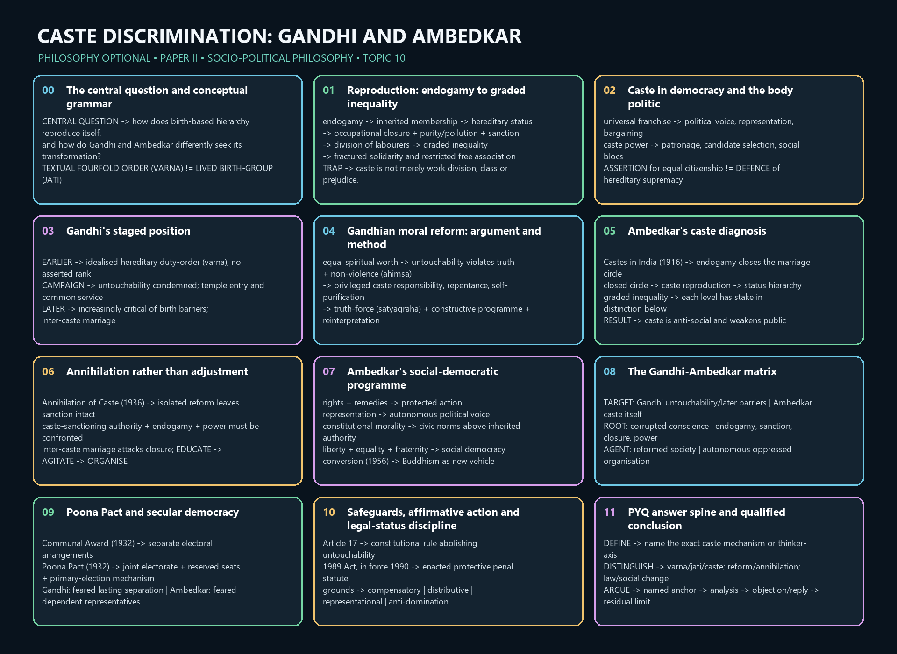

# Caste Discrimination: Gandhi and Ambedkar — Learner-v2 Source-Complete Learning Session

> **Syllabus (verbatim):** Caste Discrimination : Gandhi and Ambedkar.
>
> **Generation:** g5, 2026-09-03 · **Approval:** false pending explicit topic approval
>
> **Evidence key:** ✅ canonical doctrine · ⚠️ analytical synthesis (for exam use) · ❓ contested/empirical claim
>
> **Evidence discipline:** Core follows the canonical owner and exact verified ledger; the matching advanced dossier section remains optional.

## BASIC LEARNING SESSION




*Concept map: The central question and conceptual grammar. The twelve authored stages preserve the topic-specific learning rail used by both master-flow formats.*

### Exact printed ownership and cross-topic firewall

The official clause names **Caste Discrimination: Gandhi and Ambedkar**. Caste's mechanisms and the
two thinkers' rival diagnoses/methods are full owners; later policy, history and allied theories
enter only where they execute that comparison.

| Content | Ownership here | Boundary |
|---|---|---|
| Caste discrimination | textual order, lived birth-groups, untouchability, endogamy, graded inequality, sanction and power | Historical chronology and regional sociology remain with History/Sociology |
| Gandhi | evolving caste/varna position, anti-untouchability, moral reform, constructive work and privileged-caste responsibility | Gandhian socialism/development remain with their separate owners |
| Ambedkar | annihilation, endogamy, social democracy, constitutional morality, rights, representation, organisation and conversion | Full Buddhist doctrine and constitutional case-law detail remain elsewhere |
| Gandhi–Ambedkar debate | reform/annihilation, religion, representation, Poona Pact, democracy, village and modernity | No false synthesis erases their disagreements |
| Later applications | affirmative action and caste/class/gender/religion intersections | Full gender, recognition, Economy and Polity doctrines retain their owners |


### CURRENT ILLUSTRATION — National Commission for Scheduled Castes (NCSC)

**Fact:** The NCSC is a constitutional body under Article 338 for safeguarding the rights and interests of Scheduled Castes.

**Exam use:** Illustration only: use it to distinguish constitutional safeguards from social transformation, never as proof that caste has ended.

**Source:** https://www.dosje.gov.in/organisation/national-commission-for-scheduled-castes/

### SESSION 1 — Caste Discrimination: The Conceptual Grammar and Its Reproduction

#### DEFINITION / WHAT THIS IS CALLED

**Plain-language definition:** Caste discrimination is not one interchangeable word. Textual fourfold order (*varna*) is a normative classification in Brahmanical texts; lived birth-group (*jati*) is a locally organised, birth-based and generally endogamous group; caste is the wider order linking birth, status, occupation and closure; untouchability is an extreme practice of stigma and exclusion.

**Technical definition:** The philosophical target is birth-based graded inequality reproduced by endogamy, hereditary status, occupational closure, purity-pollution rules, sanctifying authority and unequal social-economic power. Ambedkar's decisive distinction is a division of labour from a hereditary, ranked division of labourers.

#### VISUAL — Four terms, four scopes

```text

TEXTUAL FOURFOLD ORDER (VARNA) -> normative classification

LIVED BIRTH-GROUP (JATI) -> local and endogamous

CASTE -> order joining birth + rank + occupation + closure

UNTOUCHABILITY -> extreme stigma and exclusion within hierarchy

```

*The distinctions stop a conceptual error before an answer begins.*

#### VISUAL — How caste reproduces itself

```text

endogamy -> inherited membership -> hereditary status

        -> occupational closure -> dependence and sanction

        -> ranked social worth -> graded inequality

```

*A causal chain, not a list of social features.*

#### ANSWER-GRABBING OPENING — WRITE/ADAPT IN THE EXAM

> Caste persists not because work is divided, but because persons are ranked and closed into inherited social locations across generations.

#### MUST-WRITE KEYWORDS

- **textual order (*varna*), lived birth-group (*jati*), caste and untouchability**
- **endogamy and hereditary status**
- **purity-pollution and social closure**
- **division of labourers**
- **graded inequality**

**How to use them:** Open a factors question by separating the four terms; then trace varna, jati, caste and untouchability separately; trace endogamy and hereditary status through purity-pollution and social closure to graded inequality; use 'division of labourers' against the functionalist defence; then give a qualified institutional-and-relational verdict.

#### CORE OBJECTION, REPLY AND RESIDUAL LIMIT

**Objection:** A functional division of work can allow mobility and choice; why not call caste a traditional division of labour?

**Best reply:** Because caste fixes and ranks workers by birth, restricts mobility and association, and makes the social worth of persons—not simply the allocation of tasks—hereditary.

**Residual limit:** Endogamy is central but not a complete explanation of regional variation, material power or the historical formation of every jati.

#### EXAM USE AND CONCISE REVISION

**Answer architecture:** For 2024-style factor questions: define precisely, give four linked mechanisms, state the graded-inequality consequence and conclude that abolition requires changing both institutions and relations.

- Textual order (*varna*) is not identical with lived birth-group (*jati*).
- Untouchability is an intensified symptom of caste hierarchy, not a synonym for all caste.
- Endogamy reproduces boundaries across generations.
- Hereditary status assigns worth by birth.
- Caste is a division of labourers, not merely labour.
- Graded inequality weakens solidarity by distributing relative privilege through the hierarchy.

#### CANONICAL OWNER COVERAGE

> **Syllabus (verbatim):** Caste Discrimination : Gandhi and Ambedkar.
> **Evidence key:** ✅ canonical doctrine · ⚠️ analytical synthesis (for exam use) · ❓ contested interpretation
> **Placement:** The clause tests rival diagnoses of caste and rival methods of emancipation: moral-religious reform and transformed social conscience in Gandhi; structural annihilation, rights, representation and social democracy in Ambedkar.

#### 0. ONE-SCREEN MAP

```text
CASTE DISCRIMINATION
endogamy · hereditary status · ranked occupations · purity/pollution
social closure · graded inequality · untouchability
                 │
        ┌────────┴─────────┐
        │                  │
      GANDHI            AMBEDKAR
religious-moral reform  annihilation of caste
anti-untouchability     endogamy + scripture + power
heart-change, service,  rights, representation,
satyāgraha, constructive law, education, organisation,
work, later movement    inter-caste marriage, conversion
against birth hierarchy
        │                  │
        └──── unresolved tension ────┘
conscience without structure is weak;
structure without fraternity remains socially fragile
```

---

#### 1. CASTE DISCRIMINATION: CONCEPTUAL FOUNDATION

#### 1.1 Textual order (*varṇa*), lived birth-group (*jāti*), caste and untouchability

| Term | Basic meaning | UPSC caution |
|---|---|---|
| **Textual fourfold order (*varṇa*)** | normative classification in Brahmanical texts | not identical with lived caste |
| **Lived endogamous birth-group (*jāti*)** | birth-based social group, often locally organised | thousands of groups and regional variation |
| **Caste system** | institutional order linking birth, endogamy, status, occupation and social closure | not merely division of labour |
| **Untouchability** | practices imposing extreme exclusion and stigma on designated groups | symptom and intensification of caste hierarchy |

⚠️ Avoid describing caste as a single unchanged institution across all of Indian history. The philosophical target is the justification and reproduction of **birth-based graded inequality**.

#### 1.2 Mechanisms of caste discrimination

1. ✅ **endogamy** reproduces boundaries across generations;
2. ✅ **hereditary status** assigns social worth by birth;
3. ✅ **occupational closure** restricts mobility and attaches stigma to labour;
4. ✅ **purity–pollution rules** moralise distance and exclusion;
5. ✅ **religious sanction** can present hierarchy as sacred duty;
6. ✅ **social and economic power** enforce norms through dependence and violence;
7. ⚠️ **political mobilisation** can both democratise subordinated groups and harden competitive identities.

#### 1.3 Why caste is not merely division of labour

✅ Ambedkar's decisive distinction is between **division of labour** and **division of labourers**. A functional division can permit choice and mobility; caste ranks workers themselves, fixes occupation by birth and prevents free association.

#### 1.4 Graded inequality

✅ Caste is not a simple binary between two homogeneous classes. Ambedkar describes a graded order in which groups may be subordinated to some while claiming superiority over others.

**Political consequence:** graded hierarchy obstructs solidarity because each level has a stake in distinction from those below.

#### 8. COMMON UPSC TRAPS

1. **Do not equate *varṇa*, jāti, caste and untouchability.**
2. **Do not present Gandhi's position as timelessly fixed.** Periodise it.
3. **Do not say Gandhi opposed untouchability and therefore opposed every form of *varṇa* from the outset.**
4. **Do not say Ambedkar opposed only untouchability.** His target is caste as graded inequality.
5. **Do not reduce Ambedkar's remedy to reservation.** Include endogamy, scripture, education, representation, rights, fraternity and conversion.
6. **Do not reduce caste to class or occupation.**
7. **Do not narrate the Poona Pact without the representation/autonomy issue and coercive context.**
8. **Do not treat “Harijan” as an uncontested emancipatory term.**
9. **Do not treat Article 17 or the 1989 Act as evidence that caste discrimination has ended.**
10. **Do not use Gandhi as conscience and Ambedkar as law in a simplistic complementarity.** Their diagnoses and political disagreements are substantive.
11. **Do not flatten Gandhi into one timeless position.**
12. **Do not use “Harijan” as the narrator's neutral term.**
13. **Do not reduce Ambedkar to reservation or constitutional drafting.**
14. **Do not turn educate–agitate–organise into self-help.**
15. **Do not narrate the Poona Pact without autonomy and coercive context.**
16. **Do not romanticise either village or central modernity.**
17. **Do not collapse caste into class or add caste and gender arithmetically.**
18. **Do not equate oppressed-caste assertion with hereditary supremacy.**
19. **Do not treat redistribution, recognition and representation as substitutes.**
20. **Do not make convergence erase annihilation and autonomous rights.**

---

#### CLOSING RECALL FLOW — Caste Discrimination: The Conceptual Grammar and Its Reproduction

```closure-flow
SUBTOPIC: Caste Discrimination: The Conceptual Grammar and Its Reproduction
STARTING CONCEPT: Caste Discrimination: The Conceptual Grammar and Its Reproduction
KEY TERMS / DEFINITIONS: textual order | endogamy | social closure | graded inequality
MECHANISM / ARGUMENT: Marriage closure reproduces birth membership; inherited membership
  attaches status and restricted occupations; ritual rules legitimate distance; sanctions and
  dependence make the hierarchy durable.
CONSEQUENCE / CONTRAST: The system fragments solidarity: a group can be subordinate above and
  superior below, so common resistance is obstructed by graded rather than merely binary
  inequality.
UPSC TRAP / ANSWER-USE: Never equate varna, jati, caste and untouchability, or describe Indian
  caste as a single unchanging historical institution.
ANSWER-GRABBING FORMULATION: Caste persists not because work is divided, but because persons are
  ranked and closed into inherited social locations across generations.
```

### SESSION 2 — Caste, Democracy and the Body Politic

#### DEFINITION / WHAT THIS IS CALLED

**Plain-language definition:** Equal votes do not automatically make people social equals. Universal franchise can give subordinated groups voice and bargaining power, while caste can still shape candidate selection, patronage and bloc mobilisation.

**Technical definition:** Political democracy operates alongside a social order. Caste intersects with land, labour and education without being reducible to class; endogamy also regulates marriage and makes gender central to caste reproduction.

#### VISUAL — Political democracy versus social hierarchy

```text

universal franchise -> equal vote -> constituency and voice

                         |

caste hierarchy -> unequal status -> unequal everyday power

                         |

TASK -> convert political equality into social equality

```

*The contradiction frames Ambedkar's social-democratic critique.*

#### VISUAL — Three interacting, non-identical structures

```text

CASTE: rank, endogamy, stigma

CLASS: land, labour, education, resources

GENDER: regulation of marriage and sexuality

intersection -> mutually reinforcing, not simply additive

```

*Neither a class-only nor a culture-only explanation is enough.*

#### ANSWER-GRABBING OPENING — WRITE/ADAPT IN THE EXAM

> One person, one vote can open representation; it cannot by itself erase the unequal social value attached to persons by caste.

#### MUST-WRITE KEYWORDS

- **universal franchise**
- **representation and political assertion**
- **caste supremacy and caste mobilisation**
- **class, gender and endogamy**
- **formal and social equality**

**How to use them:** Treat caste in the body politic as ambivalent: distinguish an oppressed group's representation and political assertion from caste supremacy; connect universal franchise to formal and social equality, test caste mobilisation through class, gender and endogamy, and judge the programme by its anti-hierarchical effects.

#### CORE OBJECTION, REPLY AND RESIDUAL LIMIT

**Objection:** If political mobilisation uses caste identity, does it necessarily reinforce caste?

**Best reply:** No. Assertion can be an instrument of equal citizenship and voice; its normative character depends on whether it contests inherited hierarchy or reproduces it.

**Residual limit:** This distinction does not make electoral mobilisation pure: patronage, elite capture and bloc politics remain live risks.

#### EXAM USE AND CONCISE REVISION

**Answer architecture:** For 2022 Q1(b), use franchise -> representation -> continuing social closure -> qualified verdict, with one caste-class-gender bridge.

- Universal franchise changes political opportunity, not social hierarchy automatically.
- Representation is necessary for voice but is not annihilation.
- Caste and class interact but have distinct mechanisms.
- Endogamy links caste continuity to control over marriage.
- Political assertion by oppressed groups is not equivalent to caste supremacy.

#### CANONICAL OWNER COVERAGE

#### 1.5 Caste and democracy

✅ Political democracy gives equal votes; caste society distributes unequal status and social power. Universal franchise can empower caste groups through organisation, yet electoral competition may also convert caste into patronage and bloc mobilisation.

⚠️ Caste in the body politic is therefore ambivalent: democratic assertion by oppressed groups is not equivalent to caste supremacy, but representation alone does not annihilate status hierarchy.

---

#### 5. CASTE IN CONTEMPORARY BODY POLITIC

#### 5.1 Universal franchise

✅ Universal franchise converts subordinated populations into political constituencies and can enable representation, bargaining and policy attention.

⚠️ Yet caste can persist through candidate selection, patronage, symbolic mobilisation and social blocs. Democratic use of caste identity is normatively distinct from caste domination:

- assertion seeks equality and voice;
- supremacy seeks inherited privilege;
- electoral mobilisation can contain elements of both and must be judged by programme and effect.

#### 5.2 Constitutional and statutory illustrations

- ✅ Article 17 of the Constitution **abolishes untouchability** and forbids its practice; this is a constitutional rule, not a statement that the social practice has disappeared.
- ✅ Constitutional provisions for representation and affirmative action are institutional responses to historical exclusion; their justification is remedial equality and effective citizenship.
- ✅ The Scheduled Castes and the Scheduled Tribes (Prevention of Atrocities) Act, **1989**, brought into force in **1990**, is an **enacted penal and protective statute**.

⚠️ Enactment, notification, enforcement, conviction and social transformation are different stages. None should be inferred from another without evidence.

#### 5.3 Caste, class and gender

✅ Caste interacts with control of land, labour and education, but it is not reducible to class. Endogamy and sexual regulation make gender central to caste reproduction.

⚠️ Dalit women's experience challenges any analysis that adds caste and gender as separate burdens after first treating each in isolation.

---

#### 11. ANSWER ARCHITECTURE (10 / 15 / 20 marks)

#### 11.4 Selectable evidence bank — 1 unit at 10 marks, 2 at 15, 4–5 at 20

Each unit is **Claim → Named anchor → Use for → Limitation**.

- **K1 · Caste is closure by endogamy.** Claim: the caste system is an enclosed class; the mechanism that creates and sustains it is the closing of the group by prohibiting marriage outside it → Named: Ambedkar, "Castes in India" (**1916**) → Use for: any "what is caste" stem; the fastest route past description → Limit: the origin account is one hypothesis among several; use the *mechanism*, not the historical genesis, as the load-bearing claim.
- **K2 · Caste is graded inequality, not simple hierarchy.** Claim: an ascending scale of reverence and a descending scale of contempt gives each stratum an interest in the order's continuance, which is why the oppressed do not unite → Named: Ambedkar → Use for: explaining caste's durability and the failure of unified anti-caste mobilisation → Limit: describes a structural obstacle without by itself identifying the remedy.
- **K3 · Caste is not division of labour but division of labourers.** Claim: it fixes persons to occupations by birth, independent of aptitude or choice, and subdivides the labouring population into hierarchically ranked compartments → Named: Ambedkar → Use for: dismantling the "functional efficiency" defence → Limit: does not by itself address the ritual and purity dimension; pair with K2.
- **K4 · Annihilation requires destroying the sanction, not reforming the practice.** Claim: caste is sustained by a sanctified belief-system, so the remedy is to destroy the authority that sanctions it → Named: Ambedkar, *Annihilation of Caste* (**1936**) → Use for: reform-versus-annihilation stems → Limit: ⚠️ the state's competence to alter religious belief is limited, which is why conversion and constitutional morality enter the argument.
- **K5 · Untouchability is a sin against humanity and against religion itself.** Claim: it is a corruption to be expiated by the practising community through penance, service and self-purification, and defended on the ground that no religious sanction can attach to degradation of a human being → Named: Gandhi → Use for: Gandhi's argument in its strongest form → Limit: ⚠️ places the initiative with the dominant group's conscience, which is Ambedkar's central objection.
- **K6 · Heart-change versus institutional power.** Claim: moral transformation without redistribution of power leaves the dependent dependent; institutional power without moral transformation leaves the hierarchy of worth intact → Named: §4.4 → Use for: the adjudicating paragraph of any comparison answer → Limit: both halves are needed, which is why a one-sided verdict scores poorly.
- **K7 · The Poona Pact, interpreted.** Claim: the 1932 agreement replaced separate electorates for the Depressed Classes with reserved seats within a joint electorate, with an increased number of seats → Named: §4.2 → Use for: representation stems → Limit: ⚠️ interpret the **principle at stake** — whether a group's representatives should be chosen by the group alone or by a joint electorate — rather than narrating the episode; ❌ do not assert figures or negotiating detail beyond what §4.2 states.
- **K8 · Political democracy requires social democracy.** Claim: a polity that grants one person one vote while sustaining graded social worth carries a contradiction it cannot indefinitely bear; liberty, equality and fraternity must be a way of life → Named: Ambedkar → Use for: the closing move of nearly every 20-mark answer on this clause → Limit: normative diagnosis rather than institutional design.
- **K9 · Constitutional morality is not automatic.** Claim: the form of administration can be perverted without changing the text, so a diffused public commitment to constitutional norms must be cultivated → Named: Ambedkar → Use for: the answer to "why is legal abolition insufficient?" → Limit: it names a condition without specifying how it is produced.
- **K10 · Four different justifications for affirmative action.** Claim: compensatory, distributive, representational and anti-domination grounds have different premises, beneficiaries, measures and termination conditions → Named: §5A.1 → Use for: any reservation stem; selecting a ground is the mark-bearing move → Limit: they are not fully consistent — the creamy-layer filter strengthens the distributive ground and weakens the representational one.
- **K11 · Contest the measure of merit, not the value.** Claim: merit is functional capacity for a role; examination performance is a proxy whose reliability varies with unequally distributed access to coaching, nutrition, language and schooling → Named: §5A.3(2) → Use for: the strongest single reply to reverse discrimination → Limit: it justifies refining the proxy, and does not by itself fix how far correction should go.
- **K12 · Advantage, not guilt.** Claim: the argument attributes no culpability to present individuals; it claims they are unjustly advantaged by a continuing distribution → Named: §5A.3(3) → Use for: defeating the "innocent individual" premise → Limit: ⚠️ two residues survive — over-inclusion within the beneficiary group, and uneven incidence of cost near the margin. Concede both.
- **K13 · Indian legal record, correctly typed.** Claim: the **Mandal Commission** (appointed **1979**, reported **1980**) is a **commission report**; ***Indra Sawhney*** (**1992**) is a **Supreme Court judgment** upholding OBC reservation in central services under Article 16(4), directing **creamy-layer exclusion**, and holding that reservation should ordinarily not exceed **50 per cent**; the **Constitution (One Hundred and Third Amendment) Act, 2019** is an **enabling amendment** inserting Articles 15(6) and 16(6) for up to **ten per cent** for economically weaker sections **other than** the classes already covered, upheld in ***Janhit Abhiyan*** (**2022**) by a majority → Use for: the Indian paragraph in any reservation answer → Limit: ✅ state each instrument's type; ❌ never state a holding more broadly than its terms, and never treat any of them as philosophical proof.
- **K14 · The economic criterion reopens the foundational question.** Claim: introducing an economic test into a framework built on social and educational backwardness reopens whether the wrong being remedied is deprivation or ascriptive exclusion → Named: §5A.4 → Use for: the philosophically strongest contemporary point available on this clause → Limit: ⚠️ make the argument without endorsing or condemning the amendment; this is a Philosophy paper, not a policy brief.
- **K15 · Ambedkar is not a theorist of reservation.** Claim: annihilation, endogamy, constitutional morality, fraternity, social democracy, organised self-respect, conversion and economic independence exceed any quota → Named: §5A.5 grid → Use for: instantly separating a strong answer from a weak one on any Ambedkar stem → Limit: the programme is wide, so select two or three elements and develop them rather than listing all eight.
- **K16 · Caste, class and gender are jointly reproduced.** Claim: caste interacts with control of land, labour and education without being reducible to class, and endogamy makes regulation of women's marriage choice internal to caste reproduction → Named: §5.3; §3.9 → Use for: intersectional stems → Limit: ⚠️ Dalit women's position is not the sum of two separately analysed burdens; say so, and route the gender doctrine to [Gender Discrimination](Gender-Discrimination.md).
- **K17 · Educate, agitate, organise is a power programme.** Critical self-respect, contestation and autonomous organisation jointly create capacity → Use: social-change/elimination stems → Limit: organisation also needs internal democracy.
- **K18 · Convergence does not establish equivalence.** Both reject untouchability but disagree on caste, hereditary duty, representation and religious exit → Use: 2019/2025 comparisons → Limit: state the priority of structural annihilation.
- **K19 · Neither village nor modernity is inherently emancipatory.** Test scale and institutions against mobility, rights, status and exit → Use: Gandhi/Ambedkar and body-politic stems.
- **K20 · Caste injustice has material, status and political dimensions.** Redistribution, recognition and representation answer distinct mechanisms, mediated by religion, gender and class → Limit: route full allied theories to their owners.

#### 12. LINK-OUTS

- [Social and Political Ideals](Social-Political-Ideals.md) — liberty, equality, justice and fraternity.
- [Individual and State](Individual-and-State.md) — rights, duties, representation and constitutional accountability.
- [Humanism, Secularism and Multiculturalism](Humanism-Secularism-Multiculturalism.md) — secular democracy and cultural recognition.
- [Gender Discrimination](Gender-Discrimination.md) — endogamy and intersectional hierarchy.
- [Political Ideologies](Political-Ideologies.md) — Ambedkar's relation to Marxism and Gandhian social thought.
- [Development and Social Progress](Development-Social-Progress.md) — Gandhi, Ambedkar and the village.
- [Buddhism](../../paper-1/indian/Buddhism.md) — classical doctrines relevant to, but distinct from, Ambedkar's Navayāna.
- [Philosophy in other answers](../../_application/Philosophy-in-other-answers.md) — controlled use in GS and Essay.

#### SOURCES

- Local compiled notes PDF, *Socio-Political Philosophy*, searchable pp. 211-214; no named author is asserted.
- O. P. Gauba, *An Introduction to Political Theory* and socio-political philosophy materials.
- B. R. Ambedkar, “Castes in India: Their Mechanism, Genesis and Development” (1916).
- B. R. Ambedkar, *Annihilation of Caste* (1936), *Who Were the Shudras?*, *The Untouchables*, *States and Minorities*, and Constituent Assembly interventions.
- Columbia CCNMTL, *The Annihilation of Caste* study environment, used as an accessible primary-text trail.
- M. K. Gandhi, *Hind Swaraj*, *Young India*, *Harijan* and collected writings on hereditary duty-order (*varṇa*), untouchability, temple entry and inter-caste marriage.
- Gandhi Heritage Portal, *Collected Works of Mahatma Gandhi*, used to control the evolving-position claim.
- Constitution of India archive, Poona Pact 1932 text, used for the representation context.
- Eleanor Zelliot, studies of Ambedkar and the Dalit movement.
- Valerian Rodrigues (ed.), *The Essential Writings of B. R. Ambedkar*.
- [The Constitution of India — Legislative Department](https://www.legislative.gov.in/documents/constitution-of-india/constitution-of-india-AjN2EjMtQWa?pageTitle=Constitution-of-India), especially Articles 14–17 and the constitutional safeguards relevant to representation.
- [Scheduled Castes and the Scheduled Tribes (Prevention of Atrocities) Act, 1989 — India Code](https://www.indiacode.nic.in/handle/123456789/1920?view_type=browse), used as a dated statutory illustration.
- Report of the Second Backward Classes Commission (the **Mandal Commission**), appointed **1979**, report submitted **1980**, used as a dated commission report — a body that recommends, not one that enacts.
- *Indra Sawhney v. Union of India* (Supreme Court judgment, **1992**), used as a dated judicial illustration; cited only for the holdings stated at §5A.4.
- Constitution (One Hundred and Third Amendment) Act, **2019**, inserting Articles 15(6) and 16(6), used as a dated **enabling** constitutional amendment; upheld in *Janhit Abhiyan v. Union of India* (Supreme Court judgment, **2022**) by a majority.

> ⚠️ **Provenance note for §5A (added in this pass):** the affirmative-action module is a philosophical reconstruction adapted into this Philosophy owner. Constitutional article numbers, case law and policy detail belong to the `Polity` and `Social-Justice` areas of this repository and are used here **only** as dated illustration, with type and status stated. ❌ No holding is stated more broadly than its terms; no figure, percentage or beneficiary count is asserted beyond what appears in the instruments named; and no Indian government, party, community or period is characterised. The general principle of compensatory justice is owned by [Social and Political Ideals](Social-Political-Ideals.md) §3.3B, which routes the policy debate here; the gender doctrine is owned by [Gender Discrimination](Gender-Discrimination.md).

#### 5.3A Status, redistribution, recognition and intersection

| Dimension | Caste mechanism | Required response |
|---|---|---|
| Redistribution | unequal land, labour, education, networks and material security | resources and institutional access |
| Recognition/status | stigma, purity/pollution, humiliation and graded social worth | repudiation of inherited rank and equal standing |
| Representation | others speak for subordinated groups or control candidate/office access | autonomous voice and political safeguards |
| Religion | social hierarchy may be presented as sacred authority | freedom of conscience plus rejection of civic disability |
| Gender | endogamy regulates marriage, sexuality and property | anti-caste and gender analysis must be jointly structured |
| Class | exploitation interacts with, but does not exhaust, status closure | combine material analysis without reducing caste to class |

⚠️ Identity assertion by oppressed castes can be a route to recognition and representation rather
than a defence of hierarchy. Yet identity without redistribution can leave material power intact,
while redistribution without recognition can preserve humiliation. The remedies are analytically
distinct and practically entangled.

---

#### CLOSING RECALL FLOW — Caste, Democracy and the Body Politic

```closure-flow
SUBTOPIC: Caste, Democracy and the Body Politic
STARTING CONCEPT: Caste, Democracy and the Body Politic
KEY TERMS / DEFINITIONS: class | formal | representation | caste supremacy
MECHANISM / ARGUMENT: Franchise creates constituencies and representation; inherited social
  power can still govern resources, party access and everyday association, keeping formal
  equality from becoming equal standing.
CONSEQUENCE / CONTRAST: Democracy may become a site of social bargaining and voice, yet
  political representation alone leaves the reproduction mechanism of caste intact.
UPSC TRAP / ANSWER-USE: Do not say all caste-based political assertion is anti-democratic, or
  that caste is reducible to class, occupation or gender alone.
ANSWER-GRABBING FORMULATION: One person, one vote can open representation; it cannot by itself
  erase the unequal social value attached to persons by caste.
```

### SESSION 3 — Gandhi I: Periodising Varna, Caste and Untouchability

#### DEFINITION / WHAT THIS IS CALLED

**Plain-language definition:** Gandhi's position changed across decades. An early idealised varna distinguished hereditary duty from superiority; his anti-untouchability campaign condemned exclusion; later writings were increasingly critical of birth-based caste barriers and more supportive of inter-caste marriage.

**Technical definition:** Periodisation is an interpretive discipline, not an excuse to erase the earlier theoretical liability: a supposedly rank-free hereditary allocation can still preserve birth allocation and social closure.

#### VISUAL — Gandhi: a staged position, not a slogan

```text

EARLIER -> idealised hereditary duty, no asserted superiority

CAMPAIGN -> untouchability condemned; temple entry and service

LATER   -> greater criticism of birth barriers/inter-caste marriage

QUESTION -> can birth allocation survive a denial of rank?

```

*Chronology protects both accuracy and criticism.*

#### VISUAL — The varna liability

```text

idealised division of duty -> inherited allocation

inherited allocation -> restricted choice and association

therefore -> hierarchy can persist despite denied superiority

```

*The objection locates the structural problem precisely.*

#### ANSWER-GRABBING OPENING — WRITE/ADAPT IN THE EXAM

> Gandhi cannot be reduced either to a defender of every caste form or to an opponent of every form of varna throughout his life.

#### MUST-WRITE KEYWORDS

- **Gandhi's evolving position**
- **idealised varna**
- **birth allocation**
- **anti-untouchability campaign**
- **inter-caste marriage**
- **historical contested terminology**

**How to use them:** Periodise Gandhi's evolving position: state idealised varna and birth allocation, then the anti-untouchability campaign and later support for inter-caste marriage; flag the contested terminology; finally assess whether the later movement overcomes the hereditary-structure objection.

#### CORE OBJECTION, REPLY AND RESIDUAL LIMIT

**Objection:** Does Gandhi's condemnation of untouchability prove that he rejected all forms of varna from the outset?

**Best reply:** No. His early idealised varna/caste distinction and later trajectory must be held together; the earlier defence is precisely why periodisation matters.

**Residual limit:** The owner does not license unverified dates for every shift or verbatim quotations from Gandhi without a critical edition.

#### EXAM USE AND CONCISE REVISION

**Answer architecture:** For a Gandhi stem, use chronology before evaluation: early ideal -> anti-untouchability -> later opening -> residual birth-allocation objection.

- Gandhi's view is not timelessly fixed.
- Earlier idealised varna was presented as duty without superiority.
- The remaining problem is hereditary allocation itself.
- Temple entry, sanitation work and anti-untouchability activism belong to the campaign phase.
- 'Harijan' is historical and contested terminology.

#### CANONICAL OWNER COVERAGE

#### 2. GANDHI ON CASTE DISCRIMINATION

#### 2.1 Doctrine statement

✅ Gandhi regards untouchability as a profound moral and religious wrong incompatible with truth, non-violence and the equal spiritual worth of persons. His remedy centres on self-purification, transformed social conscience, constructive work and non-violent reform.

#### 2.2 Gandhi's evolving position

✅ Gandhi's writings span decades and should not be flattened into one static position.

- **Earlier phase:** he distinguished an idealised hereditary duty-order (*varṇa*) from caste
  hierarchy, presenting it as non-competitive and without superiority.
- **Anti-untouchability campaign:** he condemned exclusion, promoted temple entry and sanitation work, and used the term “Harijan,” later rejected by many Dalit thinkers as paternalistic.
- **Later movement:** his position became increasingly critical of birth-based caste barriers and more supportive of inter-caste marriage.

⚠️ The controversy remains because an idealised *varṇa* can preserve birth allocation even after explicit ranking is denied.

**Periodisation control ⚠️:** this is a trajectory reconstructed across writings and practice, not a
claim that one date or sentence cleanly replaced every earlier commitment. Later opposition to
birth barriers must be stated together with, not used to erase, the liability of earlier hereditary
duty arguments.

#### CLOSING RECALL FLOW — Gandhi I: Periodising Varna, Caste and Untouchability

```closure-flow
SUBTOPIC: Gandhi I: Periodising Varna, Caste and Untouchability
STARTING CONCEPT: Gandhi I: Periodising Varna, Caste and Untouchability
KEY TERMS / DEFINITIONS: idealised varna | birth allocation | Gandhi's evolving | historical
  contested
MECHANISM / ARGUMENT: Gandhi sought to separate duty from rank, then mobilised religious and
  public conscience against exclusion; the unresolved mechanism is that inherited assignment can
  survive a formal denial of rank.
CONSEQUENCE / CONTRAST: The position makes moral responsibility of privileged castes visible but
  remains vulnerable where social position is still allocated by birth.
UPSC TRAP / ANSWER-USE: Do not call Gandhi's use of 'Harijan' an unqualified emancipatory term:
  identify it as historical usage and note its later rejection by many Dalit thinkers as
  paternalistic.
ANSWER-GRABBING FORMULATION: Gandhi cannot be reduced either to a defender of every caste form
  or to an opponent of every form of varna throughout his life.
```

### SESSION 4 — Gandhi II: Moral-Reform Diagnosis, Method and Achievement

#### DEFINITION / WHAT THIS IS CALLED

**Plain-language definition:** For Gandhi, untouchability is a moral and religious wrong incompatible with truth, non-violence and equal spiritual worth. Reform therefore requires changed conduct by privileged castes, not sympathy alone.

**Technical definition:** The Gandhian method joins self-purification, repentance, satyagraha, constructive work, education, sanitation, common service and religious reinterpretation. Legal prohibition is necessary but cannot alone produce fellowship.

#### VISUAL — Gandhi's moral-reform argument

```text

equal spiritual worth -> untouchability is moral/religious wrong

-> repentance and self-purification -> changed conduct

-> satyagraha + constructive work -> everyday fellowship

```

*The method follows the diagnosis rather than appearing as a list.*

#### VISUAL — What Gandhian reform can and cannot do

```text

STRENGTH: mobilises conscience; locates privileged responsibility

LIMIT: goodwill cannot guarantee rights, power or representation

VERDICT: moral reform matters, but cannot substitute for safeguards

```

*Its strength and limitation must appear in the same answer.*

#### ANSWER-GRABBING OPENING — WRITE/ADAPT IN THE EXAM

> Gandhi makes the oppressor answerable to conscience: social equality cannot be secured by a law whose ethical meaning no one lives.

#### MUST-WRITE KEYWORDS

- **ahimsa and truth**
- **self-purification and repentance**
- **satyagraha**
- **constructive programme**
- **religious reinterpretation**
- **means and ends**

**How to use them:** Build the answer through ahimsa and truth: untouchability violates moral unity; self-purification and repentance make privileged castes answerable; satyagraha, constructive programme and religious reinterpretation change practice; means-and-ends unity then supports a qualified fellowship verdict.

#### CORE OBJECTION, REPLY AND RESIDUAL LIMIT

**Objection:** Can heart-change be dismissed because it lacks an institutional form?

**Best reply:** No. Law cannot itself generate fellowship, and privileged responsibility matters; but this insight is insufficient if rights and autonomous voice are absent.

**Residual limit:** The method depends on moral transformability and offers no guaranteed transfer of power when the privileged refuse to change.

#### EXAM USE AND CONCISE REVISION

**Answer architecture:** For 2022 Q2(b), give Gandhi's strongest case before two criticisms: paternalism/autonomy and structure/power; close with a conditional rather than dismissive verdict.

- Untouchability violates ahimsa and truth.
- Repentance is demanded from the privileged, not charity alone.
- Satyagraha and constructive work are social practices.
- Law is necessary but does not by itself generate fellowship.
- Means must prefigure equal relations.

#### CANONICAL OWNER COVERAGE

#### 2.3 Gandhi's argument against untouchability

1. all life participates in a moral-spiritual unity;
2. degrading another person violates *ahiṃsā* and truth;
3. inherited exclusion corrupts both the oppressed and the caste Hindu conscience;
4. social reform must therefore involve repentance and changed conduct by privileged castes;
5. legal prohibition is necessary but cannot by itself generate fellowship.

#### 2.4 Method

- ✅ **change of heart and self-purification;**
- ✅ ***satyāgraha*** against unjust practice;
- ✅ **constructive programme** involving education, sanitation, common service and village work;
- ✅ **religious reinterpretation** from within Hindu life;
- ✅ **non-violence** and persuasion rather than class war;
- ✅ **trusteeship and economic reform** to reduce dependence.

#### 2.5 Presuppositions

- religious traditions contain resources for self-criticism;
- privileged persons can be morally transformed;
- means must embody the equal fellowship sought;
- social unity should not be purchased through coercive hatred.

#### 2.6 Strengths

✅ Gandhi brought caste humiliation into mass moral and political discourse, made caste Hindu responsibility central, linked social reform to everyday practice and insisted that political freedom without internal moral reform was incomplete.

#### CLOSING RECALL FLOW — Gandhi II: Moral-Reform Diagnosis, Method and Achievement

```closure-flow
SUBTOPIC: Gandhi II: Moral-Reform Diagnosis, Method and Achievement
STARTING CONCEPT: Gandhi II: Moral-Reform Diagnosis, Method and Achievement
KEY TERMS / DEFINITIONS: means | non-violence | truth-force | self-purification
MECHANISM / ARGUMENT: Moral condemnation activates responsibility among the privileged;
  constructive practices change everyday relations; non-violence seeks reform without
  reproducing domination through the means.
CONSEQUENCE / CONTRAST: His mass moral-political intervention made caste humiliation publicly
  visible and made political independence without internal reform appear incomplete.
UPSC TRAP / ANSWER-USE: Do not make Gandhi only 'conscience' or say that law was unnecessary; do
  not credit him with Ambedkar's structural diagnosis.
ANSWER-GRABBING FORMULATION: Gandhi makes the oppressor answerable to conscience: social
  equality cannot be secured by a law whose ethical meaning no one lives.
```

### SESSION 5 — Gandhi III: Evaluation, Paternalism and the Structural Reply

#### DEFINITION / WHAT THIS IS CALLED

**Plain-language definition:** A fair critique does not deny Gandhi's anti-untouchability work. It asks whether a reform led through the conscience of caste Hindus gives oppressed people sufficient autonomous voice and structural power.

**Technical definition:** Three linked objections are paternalism, structural insufficiency and the varna liability. Gandhi can reply that oppressor responsibility, constructive work and non-violent social practice are indispensable; the residual question is whether they transfer power.

#### VISUAL — A critical answer's three moves

```text

paternalism -> autonomous oppressed leadership -> responsibility still matters

structure -> rights/representation needed -> practice changes relations

varna -> birth allocation persists -> later movement softens, not erases, liability

```

*Each criticism earns marks only with its strongest reply.*

#### VISUAL — The non-substitution rule

```text

moral transformation + enforceable equality + autonomous voice

NOT: conscience instead of rights

NOT: law instead of fraternity

```

*The diagram prevents a false either/or.*

#### ANSWER-GRABBING OPENING — WRITE/ADAPT IN THE EXAM

> Gandhi's moral reform identifies privileged responsibility, but its paternalism and structural insufficiency remain until autonomous voice, rights and power let oppressed people act as equal political agents.

#### MUST-WRITE KEYWORDS

- **paternalism**
- **autonomous voice**
- **structural insufficiency**
- **religious reform**
- **rights and power**
- **qualified Gandhian verdict**

**How to use them:** State the paternalism, structural-insufficiency and varna objections; give Gandhi's religious-reform and privileged-responsibility reply; test both against autonomous voice, rights and power; then deliver a qualified Gandhian verdict rather than a catalogue of praise and blame.

#### CORE OBJECTION, REPLY AND RESIDUAL LIMIT

**Objection:** Does reliance on social conscience necessarily make Gandhi irrelevant to an anti-caste answer?

**Best reply:** No. It identifies the moral work law cannot compel. Its relevance is conditional: it must serve equal agency rather than speak in place of it.

**Residual limit:** No amount of goodwill alone specifies institutional design, remedies or a route from social service to equal representation.

#### EXAM USE AND CONCISE REVISION

**Answer architecture:** Use this session for the evaluative paragraph in Gandhi and comparison answers; it must not eclipse Gandhi's positive moral argument.

- Paternalism concerns speaking for rather than enabling voice.
- Structural criticism targets power, property and representation.
- Gandhi's strongest reply is responsibility plus social practice.
- Rights without fellowship are fragile; fellowship without rights is dependent on benevolence.
- A defensible synthesis remains Ambedkarite in structure.

#### CANONICAL OWNER COVERAGE

#### 2.7 Objections and Gandhian replies

**Ambedkarite objection — paternalism:** privileged reformers speak for the oppressed and rename them without transferring power.
**Reply:** ⚠️ Gandhi can answer that moral responsibility of oppressors is indispensable, but the objection stands unless oppressed communities possess autonomous voice and leadership.

**Structural objection:** change of heart leaves property, representation and institutional exclusion intact.
**Reply:** Gandhi's constructive programme and satyāgraha are social practices, not private sentiment alone. ⚠️ Yet enforceable rights are still required.

**Varṇa objection:** hereditary duty reproduces caste even without declared superiority.
**Reply:** Gandhi's later trajectory weakens birth hierarchy, but early defences remain a genuine theoretical liability.

**Religious-reform objection:** scriptural reinterpretation preserves authority that sustains caste.
**Reply:** Gandhi distinguishes living ethical religion from unjust accretions. Ambedkar replies that the authority structure itself must be broken.

---

#### 7. CRITICISMS AND REPLIES

| Criticism | Reply | Residual issue |
|---|---|---|
| Gandhi changes too much to have one “view” | periodise early and late positions | exact dating and textual context matter |
| Ambedkar overstates scriptural causation | he also analyses endogamy, power, occupation and representation | regional diversity of caste |
| law cannot change society | it changes power, remedies and action conditions | implementation and social evasion |
| identity politics entrenches caste | oppressed identity can be a vehicle of equal citizenship | elite capture and permanent bloc politics |
| inter-caste marriage is insufficient | it attacks endogamy but needs economic, legal and cultural change | coercion and family violence |
| fraternity is vague | it names relations among social equals, supported by rights and institutions | cultivation cannot be legislated fully |

---

#### 11.2 15-mark method (~220 words · 6 moves · ~18 minutes)

1. **Identify the axis:** reform from within versus structural annihilation; heart-change versus institutional power; representation versus fraternity.
2. **The named thinker's doctrine**, argument and **method** — method is where Gandhi and Ambedkar most sharply diverge and is routinely omitted.
3. **The strongest rival objection**, given fairly.
4. **One table**: the comparison grid (§4.1), the four justifications (§5A.1), or the beyond-reservation grid (§5A.5).
5. **One accurately classified constitutional or statutory illustration**, with its status stated.
6. **Explicit verdict** — what the position achieves and precisely where it fails.

#### CLOSING RECALL FLOW — Gandhi III: Evaluation, Paternalism and the Structural Reply

```closure-flow
SUBTOPIC: Gandhi III: Evaluation, Paternalism and the Structural Reply
STARTING CONCEPT: Gandhi III: Evaluation, Paternalism and the Structural Reply
KEY TERMS / DEFINITIONS: rights | paternalism | autonomous voice | religious reform
MECHANISM / ARGUMENT: Where representation, property and institutional access remain unchanged,
  conscience-based reform can leave dependency intact; constructive action improves relations
  but does not automatically alter their power conditions.
CONSEQUENCE / CONTRAST: The best synthesis makes Gandhian moral transformation a support for,
  not a replacement of, equal rights and self-representation.
UPSC TRAP / ANSWER-USE: Never manufacture a simple Gandhi-Ambedkar harmony or imply that their
  difference was only tone.
ANSWER-GRABBING FORMULATION: Gandhi's moral reform identifies privileged responsibility, but its
  paternalism and structural insufficiency remain until autonomous voice, rights and power let
  oppressed people act as equal political agents.
```

### SESSION 6 — Ambedkar I: Endogamy, Graded Inequality and the Caste Diagnosis

#### DEFINITION / WHAT THIS IS CALLED

**Plain-language definition:** Ambedkar treats caste as a system, not merely a bad custom. Endogamy maintains closed marriage circles; hereditary status, religious authority and social-economic power make inequality reproduce itself.

**Technical definition:** In *Castes in India* (1916), endogamy is a central reproductive mechanism. Graded inequality explains why caste is not a single oppressor/oppressed binary: each level can be dominated from above yet invested in distinction from below.

#### VISUAL — Ambedkar's reproduction mechanism

```text

closed marriage circle -> endogamy -> inherited caste membership

-> rank and occupational closure -> social sanction and dependence

-> graded inequality -> fractured solidarity

```

*The causal account connects family regulation to public hierarchy.*

#### VISUAL — Why graded inequality matters

```text

group A: privileged over B; group B: subordinated to A, superior to C

therefore -> distributed interest in distinction -> weak common solidarity

```

*The ladder explains a political problem that a binary model misses.*

#### ANSWER-GRABBING OPENING — WRITE/ADAPT IN THE EXAM

> Caste is a closed, ranked division of labourers; that is why removing one abusive practice cannot by itself produce fraternity.

#### MUST-WRITE KEYWORDS

- **Castes in India (1916)**
- **endogamy**
- **closed marriage circle**
- **division of labourers**
- **graded inequality**
- **anti-social and anti-national**

**How to use them:** Anchor the mechanism in Castes in India (1916): endogamy closes the marriage circle, inherited membership creates a division of labourers, graded inequality fractures solidarity, and the anti-social consequence distinguishes cultural plurality from institutionalised unequal status.

#### CORE OBJECTION, REPLY AND RESIDUAL LIMIT

**Objection:** Is endogamy merely a private marriage preference?

**Best reply:** No. In this analysis it is a social mechanism that closes membership and transmits rank, though it must be paired with authority and power to explain the whole system.

**Residual limit:** Endogamy names a central mechanism, not an exhaustive historical genealogy or a substitute for regional variation.

#### EXAM USE AND CONCISE REVISION

**Answer architecture:** For 2024 Q1(c) and 2021 Q4(a), make the mechanism do the explanatory work before listing remedies.

- Endogamy is a mechanism of caste reproduction.
- Caste ranks workers, not only tasks.
- Graded inequality obstructs solidarity.
- Cultural plurality differs from caste hierarchy.
- Caste joins status, power, authority and inherited association.

#### CANONICAL OWNER COVERAGE

#### 3. AMBEDKAR ON CASTE DISCRIMINATION

#### 3.1 Doctrine statement

✅ Ambedkar understands caste as an institutional system of graded inequality sustained by endogamy, religious authority, social closure and political-economic power. Untouchability cannot be eliminated without annihilating caste itself.

#### 3.2 Endogamy: *Castes in India* (1916)

✅ Ambedkar identifies endogamy—the enforced marriage boundary—as a central mechanism by which caste reproduces itself.

**Argument:**

1. a caste must preserve a closed marriage circle;
2. demographic imbalance within the group threatens closure;
3. social practices regulate widows, widowers and marriage to maintain endogamy;
4. therefore, caste is reproduced through control of sexuality and family, not only occupation.

⚠️ This argument creates a direct bridge to gender: caste continuity depends heavily on regulating women's marriage and sexuality.

#### 3.4 Caste as anti-social and anti-national

✅ Caste narrows loyalty to the group, blocks public spirit and makes collective action difficult. It creates not simply diversity but ranked separation.

**Distinction:** cultural plurality allows interaction among equal groups; caste institutionalises unequal status and restricted association.

#### 10. PYQ ROUTING (2018–2025)

> ⚠️ **Corpus signal:** 9 primary-owned question-parts out of 112. The local Paper II corpus is continuous from 2018 through 2025. Cross-links do not create duplicate ownership.

| Year | Question | Marks | Exact demand |
|---|---|---:|---|
| 2018 | Q1(c) | 10 | It is said that the traditional hold of caste-based groups on Indian social behaviour has survived all attempts to build alternate identities. Discuss in the light of M. K. Gandhi. |
| 2019 | Q4(a) | 20 | Examine whether there is any difference between the views of Mahatma Gandhi and Dr. Babasaheb Ambedkar on the philosophical foundations of secular democracy. |
| 2020 | Q3(a) | 20 | State and examine B.R. Ambedkar's contribution towards social changes in Independent India. |
| 2021 | Q4(a) | 20 | Discuss the views of Dr. B.R. Ambedkar regarding caste-discrimination in Indian society. What are the measures suggested by him for its elimination? Explain. |
| 2022 | Q1(b) | 10 | In the age of individualism and universal franchise, what role does caste play in body-politic? Discuss. |
| 2022 | Q2(b) | 15 | Critically evaluate Gandhi's views on eradication of caste discrimination. |
| 2023 | Q3(b) | 15 | Critically analyse the social and political significance of Ambedkar's notion of annihilation of caste. |
| 2024 | Q1(c) | 10 | Discuss the main factors responsible for caste discrimination. |
| 2025 | Q2(a) | 20 | Present a detailed account of the debate between Gandhi and Ambedkar on the issue of caste discrimination. |

See the [Socio-Political PYQ Bank, 2018–2025](../_PYQ-SocioPolitical-2018-2025.md).

#### 11.6 Stem-specific spines

- **For 2025-pattern comparisons:** use the §4.1 grid; a two-biography answer will underperform.
- **For reservation stems:** name the justification (§5A.1) → build the compensatory or representational argument → state the reverse-discrimination objection at its strongest → the merit-proxy and advantage-not-guilt replies → concede over-inclusion and uneven incidence → *Indra Sawhney* and the 103rd Amendment correctly typed → verdict.
- **For Ambedkar stems:** graded inequality and endogamy as mechanism → annihilation rather than reform → constitutional morality and social democracy → the beyond-reservation grid (§5A.5) → the Marx contrast, stated precisely → verdict on political versus social democracy.


---

#### CLOSING RECALL FLOW — Ambedkar I: Endogamy, Graded Inequality and the Caste Diagnosis

```closure-flow
SUBTOPIC: Ambedkar I: Endogamy, Graded Inequality and the Caste Diagnosis
STARTING CONCEPT: Ambedkar I: Endogamy, Graded Inequality and the Caste Diagnosis
KEY TERMS / DEFINITIONS: endogamy | anti-social | Castes in India | graded inequality
MECHANISM / ARGUMENT: Control over marriage preserves group boundaries; rank distributes
  incentives for distinction; sacred and material sanctions turn a social convention into a
  durable structure of power.
CONSEQUENCE / CONTRAST: Caste blocks public spirit, free association and collective action; it
  is anti-social not because all difference is wrong, but because difference is organised as
  unequal status.
UPSC TRAP / ANSWER-USE: Do not reduce Ambedkar to untouchability, class, occupation, or a single
  historical-origin claim about every caste.
ANSWER-GRABBING FORMULATION: Caste is a closed, ranked division of labourers; that is why
  removing one abusive practice cannot by itself produce fraternity.
```

### SESSION 7 — Ambedkar II: Annihilation Rather Than Reform of Abuse

#### DEFINITION / WHAT THIS IS CALLED

**Plain-language definition:** Ambedkar rejects reform confined to untouchability because caste fragments society and denies free occupation and association. The question is not how to make hierarchy kinder but how to remove its reproductive and normative foundation.

**Technical definition:** In *Annihilation of Caste* (1936), the argument targets authority insofar as it sanctifies rank and separation. Inter-dining alone is not a reliable break; inter-caste marriage attacks endogamy, while education, organisation, self-respect and political agency enable collective emancipation.

#### VISUAL — The annihilation argument

```text

sanctified rank -> isolated reform leaves foundation intact

-> endogamy reproduces closure -> destroy/reconstruct sanction

-> equal association, marriage, agency and self-respect

```

*A five-step argument prevents the answer from becoming rhetoric.*

#### VISUAL — Remedy matched to mechanism

```text

endogamy -> inter-caste marriage

sanctioned belief -> critical rejection/reconstruction

powerlessness -> education + organisation + representation

```

*Each remedy is tied to the problem it addresses.*

#### ANSWER-GRABBING OPENING — WRITE/ADAPT IN THE EXAM

> Annihilation means dismantling the authority and social mechanisms that reproduce hereditary rank, not merely correcting its harshest outward practice.

#### MUST-WRITE KEYWORDS

- **Annihilation of Caste (1936)**
- **sanctified belief-system**
- **inter-caste marriage**
- **education, organisation and self-respect**
- **reform and annihilation**
- **free association**

**How to use them:** Reconstruct Annihilation of Caste (1936) in order: sanctified belief supports rank; isolated reform leaves it intact; endogamy reproduces it; inter-caste marriage attacks closure; education, organisation, self-respect and free association support annihilation rather than adjustment.

#### CORE OBJECTION, REPLY AND RESIDUAL LIMIT

**Objection:** Does attacking caste-sanctioning authority amount to denying freedom of belief?

**Best reply:** No. The target is authority used to impose civic inferiority; freedom of belief cannot entail a right to impose hereditary disability.

**Residual limit:** The state cannot simply legislate belief away, which is why social action, self-respect, constitutional morality and conversion remain part of the wider programme.

#### EXAM USE AND CONCISE REVISION

**Answer architecture:** For 2023 Q3(b), show the social significance (fraternity and association) and political significance (voice, rights, representation) separately.

- Annihilation is not adjustment within a hierarchy.
- Inter-caste marriage attacks the endogamous mechanism.
- Education and organisation are political agency, not self-help slogans.
- Scriptural authority is criticised where it sanctions inequality.
- Religious freedom cannot justify civic disability.

#### CANONICAL OWNER COVERAGE

#### 3.3 *Annihilation of Caste* (1936)

✅ Ambedkar rejects reform limited to untouchability. Caste fragments society, destroys fraternity and denies free choice of occupation and association.

**Core argument:**

1. caste is sustained by belief in the sacred authority of rules that rank and separate;
2. isolated reforms leave that normative foundation intact;
3. inter-dining alone does not reliably break the system;
4. inter-caste marriage attacks endogamy and creates social kinship;
5. annihilation requires rejection or radical reconstruction of scriptural authority, social rights and material relations.

#### 3.7 Education, organisation and self-respect

✅ Education enlarges critical agency; organisation converts scattered suffering into political voice; agitation challenges unjust power through collective action.

⚠️ These are not a sequence of individual self-help. They form a politics of emancipation and representation.

✅ The formula **educate, agitate, organise** should therefore be read as an integrated programme:
education produces critical self-respect, agitation contests public injustice, and organisation
builds autonomous collective power. It is not a motivational slogan detached from representation,
rights and material independence.

#### CLOSING RECALL FLOW — Ambedkar II: Annihilation Rather Than Reform of Abuse

```closure-flow
SUBTOPIC: Ambedkar II: Annihilation Rather Than Reform of Abuse
STARTING CONCEPT: Ambedkar II: Annihilation Rather Than Reform of Abuse
KEY TERMS / DEFINITIONS: reform | education | free association | inter-caste marriage
MECHANISM / ARGUMENT: The remedy meets the mechanism: inter-caste marriage attacks closure;
  critical education challenges authority; organisation turns scattered suffering into voice;
  rights and representation alter power.
CONSEQUENCE / CONTRAST: Anti-caste politics becomes a project of equal association and
  self-respect rather than a programme of benevolent uplift.
UPSC TRAP / ANSWER-USE: Do not turn annihilation into a slogan, quote it without edition/page,
  or say that inter-dining alone was Ambedkar's sufficient remedy.
ANSWER-GRABBING FORMULATION: Annihilation means dismantling the authority and social mechanisms
  that reproduce hereditary rank, not merely correcting its harshest outward practice.
```

### SESSION 8 — Ambedkar III: Constitutional Morality, Social Democracy and Conversion

#### DEFINITION / WHAT THIS IS CALLED

**Plain-language definition:** Ambedkar argues that political democracy cannot last on a social order that denies equal status. Liberty, equality and fraternity must be lived together, not treated as separate constitutional ornaments.

**Technical definition:** His programme includes enforceable rights, remedies, representation, education, organisation and institutions independent of dominant goodwill. Constitutional morality restrains inherited social authority; conversion to Buddhism in 1956 expresses ethical reconstruction around reason, compassion, equality and fraternity.

#### VISUAL — From political to social democracy

```text

equal vote -> rights and remedies -> representation and power

-> constitutional morality -> fraternity -> social democracy

BREAKDOWN RISK: inherited hierarchy can evade each legal form

```

*The route shows why legal equality is necessary but incomplete.*

#### VISUAL — Ambedkar beyond reservation

```text

annihilation | endogamy | rights | representation | fraternity

education + organisation + self-respect | conversion | economic independence

```

*A safeguard is not the whole philosophy.*

#### ANSWER-GRABBING OPENING — WRITE/ADAPT IN THE EXAM

> A constitution can give equal votes; social democracy asks whether persons can actually meet as equals, and fraternity supplies the social relation that law alone cannot create.

#### MUST-WRITE KEYWORDS

- **liberty, equality and fraternity**
- **social democracy**
- **constitutional morality**
- **representation and rights**
- **educate, organise and self-respect**
- **conversion and Navayana**

**How to use them:** Move from diagnosis to remedy: social power enforces caste -> rights protect action -> representation enables self-speaking -> constitutional morality disciplines hierarchy -> fraternity makes democracy a mode of associated living.

#### CORE OBJECTION, REPLY AND RESIDUAL LIMIT

**Objection:** If law cannot make people fraternal, is Ambedkar's programme merely legalism?

**Best reply:** No. His programme joins law with education, organisation, self-respect, fraternity and conversion; law is necessary because moral goodwill cannot be relied upon.

**Residual limit:** Fraternity cannot be fully legislated, and legal safeguards can be evaded without public commitment to constitutional norms.

#### EXAM USE AND CONCISE REVISION

**Answer architecture:** Use this as the final Ambedkar section in 2020/2021 answers and as the evaluative bridge to Gandhi in a comparison.

- Liberty, equality and fraternity are an inseparable social-democratic triad.
- Constitutional morality must be cultivated; text alone is insufficient.
- Representation is autonomous voice, not benevolent concession.
- Conversion is conscience and collective social critique, not ritual change alone.
- Reservation is one safeguard in a wider emancipatory programme.

#### CANONICAL OWNER COVERAGE

#### 3.5 Liberty, equality and fraternity

✅ Ambedkar treats liberty, equality and fraternity as an inseparable social-democratic triad. Formal political institutions cannot endure where society denies equal status.

- liberty without equality permits domination;
- equality without liberty suppresses individuality;
- both without fraternity lack the social disposition to recognise others as equals.

✅ Fraternity is not sentimentality; it is the social basis of democracy.

#### 3.6 Constitutional morality and rights

✅ Ambedkar's remedy includes enforceable rights, representation, education, organisation, political power and institutions capable of checking social majorities.

**Argument:**

1. caste is enforced through social power, not merely private prejudice;
2. victims need rights and remedies independent of dominant goodwill;
3. political representation enables subordinated groups to speak for themselves;
4. constitutional morality restrains inherited social authority;
5. democracy must become a mode of associated living, not only periodic voting.

#### 3.8 Conversion and Buddhism as a New Vehicle (*Navayāna*)

✅ Ambedkar concluded that emancipation required departure from a religious-social order he considered inseparable from caste authority. His conversion to Buddhism in **1956** expresses an ethical reconstruction around reason, compassion, equality and fraternity.

⚠️ Conversion is both personal freedom of conscience and collective social critique; it is not merely a change of ritual label.

#### 3.9 Ambedkar and Marx

✅ Ambedkar shares Marx's concern with exploitation and structural power but rejects reducing caste to class and distrusts violent dictatorship.

| Axis | Marxian emphasis | Ambedkarite emphasis |
|---|---|---|
| hierarchy | ownership and class relation | caste status, endogamy, religion and class |
| agency | proletarian class | oppressed castes through rights and organisation |
| method | revolutionary transformation | constitutional democracy plus social struggle |
| ideal | classless society | social democracy of liberty, equality, fraternity |

#### 3.10 Objections and replies

**Legalism objection:** law cannot abolish social attitudes.
**Reply:** ✅ Ambedkar never relies on law alone; law changes power, protects action and enables social movements.

**Fragmentation objection:** separate organisation divides national unity.
**Reply:** unity built on silence of the oppressed is domination; equal representation is a condition of legitimate common life.

**Religious-hostility objection:** rejecting scriptural authority attacks believers.
**Reply:** Ambedkar's target is authority insofar as it sanctifies graded inequality; freedom of belief cannot entail power to impose civic disability.

---

#### CLOSING RECALL FLOW — Ambedkar III: Constitutional Morality, Social Democracy and Conversion

```closure-flow
SUBTOPIC: Ambedkar III: Constitutional Morality, Social Democracy and Conversion
STARTING CONCEPT: Ambedkar III: Constitutional Morality, Social Democracy and Conversion
KEY TERMS / DEFINITIONS: educate | liberty | conversion | representation
MECHANISM / ARGUMENT: Rights change enforceable power and protect collective action;
  representation checks social majorities; constitutional morality prevents inherited authority
  from determining civic status.
CONSEQUENCE / CONTRAST: Political democracy without social democracy becomes contradictory:
  formal equal citizenship coexists with unequal social worth.
UPSC TRAP / ANSWER-USE: Do not call Ambedkar a theorist of reservation alone, or call
  constitutional morality an automatic product of constitutional text.
ANSWER-GRABBING FORMULATION: A constitution can give equal votes; social democracy asks whether
  persons can actually meet as equals, and fraternity supplies the social relation that law
  alone cannot create.
```

### SESSION 9 — The Gandhi-Ambedkar Debate: Poona Pact, Religion and Secular Democracy

#### DEFINITION / WHAT THIS IS CALLED

**Plain-language definition:** Both thinkers condemn untouchability, but disagree whether caste itself is the disease, who should lead reform and whether moral reform can secure equal citizenship without autonomous political power.

**Technical definition:** The 1932 Poona Pact followed the Communal Award's separate electoral arrangements for the Depressed Classes. It substituted reserved seats in joint electorates with a primary-election mechanism and increased reserved seats; the philosophical issue is autonomous voice under a social majority, not a seat-count anecdote.

#### VISUAL — The comparison grid

```text

GANDHI: primary evil untouchability | reforming conscience | non-violent reform

AMBEDKAR: caste/graded inequality | autonomous organisation | rights and annihilation

SHARED TEST: can equal civic standing be institutionally secured?

```

*Use axes, not parallel biographies.*

#### VISUAL — Poona Pact: the philosophical question

```text

separate electoral arrangements -> Gandhi's unity concern

joint electorate + reserved seats -> Ambedkar's autonomy concern

QUESTION -> who chooses the representatives of the subordinated?

```

*The event matters because it concentrates a theory of representation.*

#### ANSWER-GRABBING OPENING — WRITE/ADAPT IN THE EXAM

> Gandhi asks how a tradition may reform its conscience; Ambedkar asks how persons subordinated by that tradition acquire equal power to reject its hierarchy.

#### MUST-WRITE KEYWORDS

- **reform from within and annihilation**
- **heart-change and institutional power**
- **Poona Pact (1932)**
- **separate and joint electorates**
- **autonomous representation**
- **secular democracy**

**How to use them:** Compare on common axes: target, root mechanism, reforming agent, method, religion, representation and democracy. Do not write two biographies or narrate the Pact without its autonomy question.

#### CORE OBJECTION, REPLY AND RESIDUAL LIMIT

**Objection:** Are Gandhi and Ambedkar simply complementary—one moral and one legal?

**Best reply:** No. Their diagnoses are substantively different. A defensible synthesis is Ambedkarite in structure and rights, with Gandhian moral change serving rather than replacing anti-caste transformation.

**Residual limit:** Neither an institutional guarantee of fraternity nor a voluntary conversion of dominant conscience can be assumed complete.

#### EXAM USE AND CONCISE REVISION

**Answer architecture:** For 2019/2025 comparisons: run the grid, interpret Poona, add secular democracy, give two objection/reply chains and end with a graded verdict.

- Both attack untouchability; their diagnosis of caste diverges.
- Poona Pact concerns representation and autonomous voice.
- Gandhi fears permanent separation; Ambedkar fears dependency on dominant-caste votes.
- Secular democracy requires equal civic standing across religious authority.
- Conscience and rights are not simple substitutes.

#### CANONICAL OWNER COVERAGE

#### 4. GANDHI–AMBEDKAR DEBATE

#### 4.1 Structured comparison

| Axis | Gandhi | Ambedkar |
|---|---|---|
| Primary evil | untouchability and moral degradation; later wider caste barriers | caste itself as graded inequality |
| Early view of *varṇa* | idealised duty/division without rank | birth-based division is intrinsically unjust |
| Root mechanism | corrupted religion, prejudice, loss of conscience | endogamy, scripture, social closure and power |
| Agent of reform | transformed caste Hindu conscience plus oppressed participation | oppressed people's autonomous organisation and representation |
| Method | non-violence, self-purification, constructive work, reform | rights, law, education, organisation, representation, inter-marriage |
| Religion | reform from within | reject caste-sanctioning authority; conversion |
| Democracy | ethical fellowship and *swarāj* | constitutional morality and social democracy |
| Main risk | paternalism and structural insufficiency | legal/institutional reform without social fraternity |

#### 4.2 Poona Pact (1932)

✅ The British Communal Award of **1932** provided separate electoral arrangements for the Depressed Classes. Gandhi opposed separate electorates and began a fast; negotiations with Ambedkar and other leaders produced the **Poona Pact**, substituting reserved seats in joint electorates with a primary-election mechanism and increasing the number of reserved seats.

**Philosophical conflict:**

- Gandhi feared permanent political separation and fragmentation of Hindu society;
- Ambedkar feared that joint electorates would leave Depressed Class representatives dependent on dominant-caste votes;
- the issue was not simply seat numbers but whether oppressed groups require autonomous political voice against a social majority.

⚠️ Do not narrate the Pact as a harmonious consensus. It was a compromise reached under morally and politically coercive circumstances.

#### 4.3 Reform from within vs annihilation

✅ Gandhi asks whether a tradition can purify itself through its deepest ethical resources. Ambedkar asks whether those resources can overcome an authority structure that repeatedly sanctifies hierarchy.

**Assessment:** internal reform can mobilise adherents and reduce defensive backlash; annihilation identifies the need to destroy hereditary rank and transfer power. In caste, reform is defensible only if it accepts the non-negotiable end of birth-based hierarchy.

#### 4.4 Heart-change vs institutional power

⚠️ This is not a simple either/or:

- institutions without changed social norms may be evaded;
- heart-change without rights makes justice dependent on benevolence;
- democratic emancipation requires enforceable equality, autonomous voice and transformed everyday relations.

#### 4.5 Gandhi and Ambedkar on secular democracy

✅ Gandhi grounds secular fellowship in equal regard for religions, non-violence and conscience. ✅ Ambedkar grounds democracy in constitutional morality, equal citizenship and freedom from religiously sanctioned hierarchy.

⚠️ Gandhi supplies an ethic of coexistence; Ambedkar supplies an institutional test: no religious community may convert internal doctrine into civic inferiority.

#### 4.6 Final evaluative position

⚠️ Ambedkar offers the more adequate diagnosis of caste as structure, the stronger theory of representation and the clearer rejection of hereditary hierarchy. Gandhi remains significant for locating responsibility among privileged castes, connecting means and ends, and insisting that law must enter social character. The defensible synthesis is **Ambedkarite in structure and rights, Gandhian only where moral transformation serves—not substitutes for—annihilation of caste**.

---

#### 6. INTER-THINKER / INTER-SCHOOL DEBATES

#### 6.1 Gandhi vs Ambedkar

The core debate is covered in §4 and must be organised by axes, not two consecutive biographies.

#### 6.2 Ambedkar vs Marx

✅ Marx foregrounds productive class; Ambedkar shows that status hierarchy, endogamy and sacred authority can organise exploitation and block class solidarity. ⚠️ An adequate Indian materialism must incorporate caste as an independent but interacting structure.

#### 6.3 Ambedkar vs liberal formal equality

✅ Formal equality prohibits explicit discrimination. Ambedkarite social democracy asks whether inherited power and stigma prevent equal standing in fact.

⚠️ Reservations and safeguards are therefore not exceptions to equality but instruments of substantive and representative equality, though their design remains open to democratic evaluation.

#### 6.4 Gandhi vs liberal rights

✅ Gandhi emphasises duties, self-restraint and transformed relations; liberalism emphasises enforceable individual claims. ⚠️ Anti-caste struggle needs both: duty cannot replace the victim's right, and rights require social practices that respect them.

#### 6.5 Ambedkar and Buddhism

✅ Navayāna reconstructs religion as an ethical-social practice of liberty, equality, fraternity and compassion. It contrasts with a religion of immutable rank and links this file to Buddhist ethics without collapsing Ambedkar into classical doctrinal exegesis.

---

#### 11.3 20-mark method (~300 words · 8 moves · ~25 minutes)

1. **State the shared target and the rival diagnoses** in one sentence each: both attack untouchability; they disagree about whether caste itself is the disease.
2. **Axis 1 — the nature and root of caste:** *varṇa* ideal versus graded inequality with religious sanction.
3. **Axis 2 — agent and method:** conscience, penance and constructive work versus law, representation, organisation and constitutional morality.
4. **Axis 3 — religion, representation and democracy**, including the Poona Pact **interpreted** rather than narrated.
5. **Two objection → reply chains**, each ending in a residual problem — paternalism against Gandhi, legalism and the limits of state action against Ambedkar.
6. **The reservation argument** where the stem reaches it: named justification (§5A.1) → reverse-discrimination objection and reply (§5A.3) → the conceded residue.
7. **One dated Indian illustration**, correctly typed, with the four-stage caution.
8. **Graded verdict** on present relevance, conceding what each thinker secured that the other did not.

> ⚠️ On any 2025-pattern comparison stem, use the §4.1 grid. A two-biography answer will underperform regardless of content.

#### 4.6A Convergence without false equivalence

| Genuine convergence | Irreducible disagreement |
|---|---|
| untouchability is morally indefensible | whether caste itself, or its degraded form, is the primary disease |
| equal human worth and social fellowship matter | whether hereditary duty-order can be purified |
| political freedom without social reform is incomplete | whether reform can rely on dominant-caste conscience |
| institutions and social conduct must both change | whether oppressed groups require autonomous electoral safeguards |
| violence cannot found stable equality | whether exit from caste-sanctioning religion is necessary |

⚠️ Convergence identifies common ends; it does not equalise diagnostic adequacy or political
power. A synthesis is defensible only when moral conversion supports autonomous rights and
annihilation rather than postponing them.

#### 4.7 Village, community and modernity

Gandhi treats decentralised community as a possible school of responsibility, meaningful labour and
self-rule. Ambedkar warns that the actually existing village can concentrate caste authority,
dependency and exclusion.

⚠️ The disagreement is not “tradition versus modernity” in the abstract. The philosophical test is
whether scale, technology and community enlarge mobility, equal status, constitutional rights and
exit from inherited occupation. Centralised modern institutions can reproduce caste; local
community can do so as well. Neither scale is emancipatory without anti-caste power.

---

#### CLOSING RECALL FLOW — The Gandhi-Ambedkar Debate: Poona Pact, Religion and Secular Democracy

```closure-flow
SUBTOPIC: The Gandhi-Ambedkar Debate: Poona Pact, Religion and Secular Democracy
STARTING CONCEPT: The Gandhi-Ambedkar Debate: Poona Pact, Religion and Secular Democracy
KEY TERMS / DEFINITIONS: separate | Poona Pact | heart-change | secular democracy
MECHANISM / ARGUMENT: Gandhi foregrounds conscience, penance and ethical fellowship; Ambedkar
  foregrounds endogamy, sanction and power, answered by rights, representation and structural
  transformation.
CONSEQUENCE / CONTRAST: The debate reveals that institutions without changed norms may be
  evaded, while moral reform without rights leaves justice contingent on dominant goodwill.
UPSC TRAP / ANSWER-USE: Never call the Poona Pact a harmonious consensus, invent figures or
  negotiating details, or reduce the dispute to a personality clash.
ANSWER-GRABBING FORMULATION: Gandhi asks how a tradition may reform its conscience; Ambedkar
  asks how persons subordinated by that tradition acquire equal power to reject its hierarchy.
```

### SESSION 10 — Constitutional Safeguards, Affirmative Action and the Integrated Verdict

#### DEFINITION / WHAT THIS IS CALLED

**Plain-language definition:** The Constitution and statutes can prohibit practices and create remedies, but enactment does not demonstrate social transformation. A Philosophy answer must distinguish legal status from its justification and effect.

**Technical definition:** Article 17 abolishes untouchability; the Scheduled Castes and Scheduled Tribes (Prevention of Atrocities) Act, 1989, brought into force in 1990, is an enacted protective penal statute. The Mandal Commission is a 1979/1980 commission report; *Indra Sawhney* (1992) is a judgment; the 103rd Amendment (2019) is an enabling amendment; *Janhit Abhiyan* (2022) upheld it by majority.

#### VISUAL — Four stages that must never be collapsed

```text

enactment -> notification -> enforcement -> social transformation

a rule at stage 1 does NOT prove success at stage 4

```

*Legal success and social success are different claims.*

#### VISUAL — Affirmative-action argument map

```text

compensatory -> rectify transmitted group harm

distributive -> offset unequal opportunity

representational -> legitimate responsive institutions

anti-domination -> break monopoly of social power

```

*Select a ground; do not blend labels without explanation.*

#### ANSWER-GRABBING OPENING — WRITE/ADAPT IN THE EXAM

> Safeguards can alter power and access, but annihilation concerns the valuation of persons: enactment, notification, enforcement and social change are distinct stages.

#### MUST-WRITE KEYWORDS

- **Article 17**
- **SC/ST Prevention of Atrocities Act, 1989**
- **compensatory and representational justification**
- **merit proxy and advantage not guilt**
- **Mandal, Indra Sawhney, 103rd Amendment**
- **enactment and transformation**

**How to use them:** Classify Article 17 and the SC/ST Prevention of Atrocities Act 1989, then choose a compensatory or representational justification for affirmative action. Answer the merit-proxy objection through continuing advantage, distinguish enactment from transformation, concede design costs, and return to Ambedkar's wider social-democratic verdict.

#### CORE OBJECTION, REPLY AND RESIDUAL LIMIT

**Objection:** Does affirmative action abandon merit by allocating through group identity?

**Best reply:** Not necessarily: examination performance is a fallible proxy for role capacity under unequal access. The reply contests the proxy, not the value of merit, while conceding design problems.

**Residual limit:** Legal illustrations are dated and limited; they must remain illustrations inside a Gandhi-Ambedkar answer, not a substitute for the two doctrines.

#### EXAM USE AND CONCISE REVISION

**Answer architecture:** End every answer by returning from safeguard to social democracy: use one correctly typed legal illustration and a direct, qualified verdict.

- Article 17 is a constitutional rule, not evidence of completed change.
- Commission report, statute, amendment and judgment are different instruments.
- Reservation has compensatory, distributive, representational and anti-domination arguments.
- Merit is role capacity; an exam score is a proxy.
- Ambedkar's programme exceeds safeguards and quotas.
- The NCSC Article 338 anchor illustrates institutional protection only.

#### CANONICAL OWNER COVERAGE

#### 5A. AFFIRMATIVE ACTION: JUSTIFICATIONS, OBJECTIONS AND INDIAN LEGAL STATUS

> ⚠️ **Why this section exists.** §5.2 records that constitutional provisions for representation exist. It does not supply the **arguments** for them, and reservation stems are decided on arguments. This section separates the competing justifications, works the reverse-discrimination objection to a conclusion, and states the Indian legal record with the precision that this file's own trap-list demands. It is a philosophical analysis; the constitutional and case-law detail belongs to the `Polity` and `Social-Justice` areas of this repository and is used here only as dated illustration.

#### 5A.1 Four distinct justifications — do not merge them

⚠️ These arguments have different premises, different beneficiaries, different measures of success and different termination conditions. A strong answer picks one as primary and states why; a weak answer runs them together and is then defeated by an objection that applies to only one of them.

| Justification | Core claim | Beneficiary is | Measure of success | Terminates when | Vulnerable to |
|---|---|---|---|---|---|
| **Compensatory / rectificatory** ✅ | positive measures rectify a historically identifiable, legally sanctioned exclusion whose effects are transmitted to the present | the group wronged, through its present members | closing of the transmitted disadvantage | the transmitted disadvantage no longer operates | "why should present individuals pay for past wrongs?"; over-inclusion of the already-advantaged |
| **Distributive / equal-opportunity** ✅ | formal equality from today ratifies an unequal starting line; fair equality of opportunity requires offsetting unchosen disadvantage | any structurally disadvantaged person | convergence in real access to opportunity | disadvantage in access is removed | "why use group markers rather than individual disadvantage?" |
| **Representational / democratic** ✅ | institutions that exclude whole social groups lack legitimacy and cannot be trusted to attend to their interests; presence is a condition of a functioning democracy | the polity as a whole | diversity of decision-making bodies and responsiveness of institutions | institutions are genuinely representative | "does presence secure interest-representation?"; risks elite capture of the group's voice |
| **Anti-domination / recognitive** ✅ | reservation breaks a monopoly of social power and publicly repudiates the ascription of inferiority | the group's standing and the whole social order | dismantling of graded status | rank-based valuation ceases to organise social life | "how is standing measured?"; hardest to operationalise |

⚠️ **The strategic point.** The compensatory argument is backward-looking and therefore attracts the "innocent present individuals" objection; the representational argument is forward-looking and largely escapes it, but must then show that presence produces responsiveness. ✅ The most defensible position for a Philosophy answer joins them: **compensatory in ground, distributive in mechanism, representational in institutional justification, and anti-domination in ultimate aim.** State the join explicitly.

#### 5A.2 The compensatory argument, reconstructed

1. caste exclusion was systematic, institutional and for long periods sanctioned by religious authority and by law;
2. the exclusion was **group-directed** — it operated on persons by reason of birth-membership, not on individuals by reason of conduct;
3. its effects are transmitted, not merely historical: through inherited wealth, land, occupation, schooling, language, networks, health and social confidence;
4. so removing the formal bar from today onward leaves the transmitted disadvantage in place and ratifies its results as though they were the outcome of fair competition;
5. a remedy must therefore reach the transmission mechanism, and must be group-directed because the disadvantage itself is;
6. therefore compensatory measures are required **by** the principle of equality, not as a departure from it.

**Presupposition ⚠️:** disadvantage caused by identifiable institutions can be traced with sufficient reliability to justify a group-directed remedy — a factual premise that must be argued rather than assumed, and that is where empirical dispute properly enters.

⚠️ **Ambedkar's own framing, which is stronger than the compensatory one alone:** for Ambedkar caste is **graded inequality** (§1.4), an ascending scale of reverence and descending scale of contempt in which each stratum has an interest in the order's continuance. On this diagnosis the wrong is not only a distributive shortfall but a **hierarchy of worth**, and the remedy must break the monopoly of social and political power, not merely transfer resources. This is why his argument runs through **representation and power**, not through welfare.

#### 5A.3 The reverse-discrimination objection, and the reply

**The objection, stated at its strongest ⚠️** — it must be given fairly, or the reply is worthless:

1. justice requires that persons be treated as individuals, not as bearers of group identity;
2. selection for scarce public goods should track relevant qualification for the role;
3. reservation allocates by ascriptive group membership rather than by qualification;
4. the individual excluded thereby is personally innocent of the historical wrong;
5. therefore reservation inflicts a fresh injustice on identifiable individuals in the name of correcting an old one, and reproduces the very logic — allocation by birth-group — that it condemns.

**The reply, in five moves ⚠️:**

1. **The symmetry point.** Premise 3 assumes an unreserved baseline that is neutral. It is not: an allocation that appears to select on qualification alone selects on qualifications that were themselves unequally producible. The comparison is not between a neutral system and a group-conscious one, but between two group-inflected systems, only one of which is candid about it.
2. **The merit distinction.** ✅ *Merit* is functional — capacity to discharge the office well; *desert* is moral. Examination performance is a **proxy** for merit, and a proxy whose reliability varies with access to coaching, nutrition, language and schooling. Refining the proxy is not the abandonment of merit but its more accurate pursuit. ⚠️ This is the single most effective move available against the objection: contest the measure, not the value.
3. **Advantage, not guilt.** The reply does not attribute guilt to any present individual. It claims that they are **unjustly advantaged** by a continuing distribution — a claim about the distribution's provenance, not about anyone's culpability. Premise 4 therefore misses its target.
4. **Group harm requires group remedy.** Where the disadvantage was inflicted group-wise and transmits group-wise, a purely individualised remedy cannot reach it; the group marker is used as a reliable index of transmitted disadvantage, not as a moral category.
5. **The genuine residue, conceded.** ⚠️ Two problems survive the reply and should be stated: (i) **over-inclusion** — group-wide remedies benefit the already-advantaged within the beneficiary group, which is exactly what an internal filter is designed to address; and (ii) **the cost falls unevenly** on those closest to the margin rather than on the most advantaged. A candid answer names both. An answer that pretends the objection has been eliminated is weaker than one that shows precisely how much of it survives.

**Objection → Reply (a second pair, on stigma) ⚠️:**

- **Objection:** preferential treatment stigmatises its beneficiaries as unable to succeed unaided, and thereby reinforces the presumption of inferiority the policy exists to defeat.
  **Reply:** ⚠️ the stigma tracks the prior assumption that the unreserved baseline measured worth. ✅ Ambedkar's answer is structural: representation is claimed as a matter of **right and power**, not as a concession granted by the benevolent, which is precisely why he rejected reform dependent on the goodwill of dominant groups. The residual problem is real and empirical — where the presumption persists, the policy bears a social cost it cannot itself remove.

#### 5A.4 The Indian legal record — precise scope and status

⚠️ **Standing rule (this file's §8 trap applies with full force):** state what each instrument **is**, what it **decided or enabled**, and what it does **not** establish. ❌ Never use a judgment or amendment as philosophical proof, and never state a legal proposition more broadly than its terms.

- ✅ **The Second Backward Classes Commission** — commonly called the **Mandal Commission** after its chairman B. P. Mandal — was appointed in **1979** and submitted its report in **1980**. It is a **commission report**, which recommends; it does not enact. Government action on its recommendation regarding reservation for Other Backward Classes in central government services followed in **1990**.
- ✅ ***Indra Sawhney v. Union of India*** (**1992**) is a **Supreme Court judgment** of a nine-judge bench. ⚠️ State only what it held, in these terms: it upheld reservation for Other Backward Classes in central government services under Article 16(4); it directed the **exclusion of the "creamy layer"** — the socially advanced among the backward classes — from the benefit; and it held that reservation should ordinarily not exceed **50 per cent** of the available posts, save in extraordinary situations. ❌ Do not attribute to it any holding about later amendments, later categories or later percentages.
- ✅ **The creamy-layer principle** is philosophically the most interesting element, because it is the **internal filter** that answers the over-inclusion residue at §5A.3(5): it concedes that a group marker is a *proxy* for disadvantage and that the proxy must be corrected where it demonstrably fails. ⚠️ Note the argumentative cost as well as the gain — the filter strengthens the distributive justification while weakening the purely representational one, since a group's political representation is not obviously served by excluding its advanced members. Saying this converts a description of the doctrine into an argument about it.
- ✅ **The Constitution (One Hundred and Third Amendment) Act, 2019** is an **enacted constitutional amendment**. Its precise scope: it inserted **Article 15(6)** and **Article 16(6)**, enabling the State to make special provision, including reservation of up to **ten per cent**, for the advancement of **economically weaker sections of citizens other than the classes already covered** by the existing reservation provisions, in educational institutions (including private institutions, aided or unaided, other than minority educational institutions under Article 30(1)) and in appointments. ⚠️ Its validity was upheld by the Supreme Court in ***Janhit Abhiyan v. Union of India*** (**2022**) by a majority. ❌ Do not describe the amendment as creating reservation directly — it is an **enabling** provision; ❌ do not state the ten per cent as an addition to a fixed total without noting that the amendment expressly operates for classes **other than** those already covered.
- ⚠️ **The philosophical significance of the 2019 amendment**, which is what a Philosophy answer must supply: it introduces an **economic** criterion into a framework built on **social and educational** backwardness, and thereby reopens the foundational question of §5A.1 — is the wrong being remedied *deprivation*, or *ascriptive exclusion*? ✅ If the ground is compensatory or anti-domination, economic criteria alone cannot capture it, since caste disadvantage operates through humiliation, exclusion and denial of standing as well as through income. ⚠️ If the ground is purely distributive, an economic criterion is coherent and arguably more precise. **This is the argument the stem wants**, and it can be made without endorsing or condemning the amendment.
- ⚠️ **Legal-status caution, restated:** a commission recommends; an amendment enables; a judgment interprets and binds; a statute enacts. ❌ None of them establishes that any philosophical justification is correct, and none of them establishes that social transformation has occurred. Enactment, notification, enforcement and social change are four different things (§5.2).

#### 5A.5 Ambedkar beyond reservation

❌ **The most damaging error on this clause** is to present Ambedkar as a theorist of reservation. Reservation is a **safeguard** within his programme, and by his own account an insufficient one. His constructive doctrine is far wider, and answers that show this outperform those that do not.

| Element | Ambedkar's claim | Why it exceeds reservation |
|---|---|---|
| **Annihilation, not adjustment** ✅ | caste rests on a sanctified belief-system; the remedy is to destroy the authority of the *śāstra*s that sanction it, not to reform its outward practices | reservation redistributes positions inside a hierarchy it does not dissolve |
| **Endogamy as the mechanism** ✅ | caste is sustained by closed marriage circles; inter-caste marriage attacks the reproductive mechanism itself | no quota touches the marriage circle |
| **Constitutional morality** ✅ | forms of administration must be animated by a diffused public commitment to constitutional norms, since the form can be perverted without altering the text | a legal safeguard is inert without the disposition that sustains it |
| **Social democracy** ✅ | political democracy resting on a social order of graded inequality is unstable; liberty, equality and fraternity must be a way of life, not a formula | representation without social democracy leaves the contradiction of "one person one vote, one vote one value" against unequal social worth |
| **Fraternity** ✅ | the least attended and most necessary of the three principles — a sense of common associated life, without which liberty and equality cannot be sustained | it cannot be legislated, and no quota produces it |
| **Educate, agitate, organise** ✅ | self-respect, collective organisation and independent political capacity, not dependence on the conscience of the dominant | reservation without organised capacity is a benefit received rather than power held |
| **Conversion** ✅ | exit from a religious order that sanctifies hierarchy; the embrace of Navayāna Buddhism as a moral community founded on equality | places the remedy outside the state altogether |
| **State-directed economic power** ✅ | landholding and industry reorganised so that dependence on dominant-caste landowners and employers is broken (his *States and Minorities* proposals) | political safeguards do not touch economic dependence |

⚠️ **The one-line thesis:** for Ambedkar, reservation addresses **access to positions**; annihilation of caste addresses the **valuation of persons**, and only the second can produce social democracy. ✅ Constitutional safeguards without constitutional morality, fraternity and economic independence remain formal — which is his own diagnosis and not an external criticism of him.

⚠️ **The Marx comparison, precisely.** ✅ Ambedkar accepts that economic power matters and that the state must act on property (his own economic proposals show this), but denies that caste is a form of class. Caste is a system of **graded status** with religious sanction, so an economic revolution that leaves the valuation of persons intact will reproduce hierarchy in a new form. This is developed at §3.9 and §6.2; name the point here and route rather than duplicating it.

---

#### 11.0 Directive decoder — the verb fixes the structure

| Directive in the stem | What is actually scored | Compulsory structural move | Failure mode |
|---|---|---|---|
| **Explain / Elucidate** | internal logic of one thinker's position | doctrine → mechanism → key distinction → example | narrating the thinker's life or the Poona Pact as a story |
| **Discuss** | exposition plus one adjudicated tension | position → rival → objection → reply → verdict | two biographies placed side by side |
| **Critically examine / evaluate** | the objection–reply layer *is* the answer | two objections, each with reply and a residual problem | denunciation of caste in place of analysis |
| **Compare / Contrast Gandhi and Ambedkar** | shared axes run in parallel | fix 5–6 axes, run both down each, then adjudicate | sequential mini-essays — the commonest way to lose marks on this clause |
| **Is X justified?** | the justification must be **named and selected** before it is defended | choose among the four grounds (§5A.1) → defend → meet the reverse-discrimination objection → verdict | asserting justification with no ground stated |
| **How far / to what extent** | a degree judgment is compulsory | conditions of holding and of failing | evasive balance |
| **Do you agree that…** | commitment is compulsory and must be qualified | qualified position at the outset → defence → strongest counter → restated position | a survey of views |

⚠️ **Standing rule for this file:** every Indian legal reference must carry its **type and date** — commission report, constitutional amendment, statute, or judgment — and must be followed by the reminder that enactment, notification, enforcement and social change are four different stages.

#### 11.1 10-mark method (~150 words · 4 moves · ~12 minutes)

1. **Define caste precisely (2 lines):** graded, birth-based social closure sustained by endogamy — not "division of labour", and not merely "social stratification".
2. **Mechanism (4–5 lines):** endogamy + hereditary status + ritual ranking + sanction + control of resources, stated as a reproducing system.
3. **One evidence unit** from §11.4, with its limitation.
4. **Graded verdict (2 lines)** answering the stem directly, never a social-justice slogan.

> ❌ At 10 marks do not attempt both thinkers plus the reservation debate. One doctrine or one contrast, fully worked.

#### 11.5 Graded verdict formulas (adapt; never reproduce mechanically)

- **Adjudicating verdict (comparison stems):** "Gandhi's method reached the conscience of the dominant, which law cannot compel; Ambedkar's reached the structure of power, which conscience cannot be relied upon to surrender. Social democracy requires both, but only the second can be institutionally secured."
- **Asymmetric verdict:** "The moral condemnation of untouchability is common ground; the disagreement is whether caste itself is the disease or its corruption — and on that question the reform-from-within position cannot explain why the hierarchy survives every reform of its outward practice."
- **Selected-ground verdict (reservation stems):** "Judged as a compensatory measure the policy answers a group-inflicted harm with a group-directed remedy; judged as a representational measure it answers a deficit of legitimacy. The reverse-discrimination objection defeats neither, though it leaves standing the genuine residues of over-inclusion and uneven incidence."
- **Merit verdict:** "Reservation does not abandon merit; it contests the reliability of the proxy by which merit has been measured, and a refined proxy is a more accurate pursuit of the same value."
- **Beyond-safeguard verdict:** "Reservation addresses access to positions; annihilation of caste addresses the valuation of persons. Constitutional safeguards without constitutional morality, fraternity and economic independence remain formal — which is Ambedkar's own diagnosis, not a criticism of him."
- **Four-stage verdict:** "The instrument is enacted and its scope is settled in law; whether it has altered social standing is a separate question, since enactment, notification, enforcement and social transformation are four distinct stages and none may be inferred from another."

#### CLOSING RECALL FLOW — Constitutional Safeguards, Affirmative Action and the Integrated Verdict

```closure-flow
SUBTOPIC: Constitutional Safeguards, Affirmative Action and the Integrated Verdict
STARTING CONCEPT: Constitutional Safeguards, Affirmative Action and the Integrated Verdict
KEY TERMS / DEFINITIONS: SC | Mandal | enactment | Article 17
MECHANISM / ARGUMENT: Group-directed exclusion transmits through access, resources and social
  standing, so a group-conscious remedy may correct a non-neutral baseline. Internal filters
  recognise that group markers are proxies, not moral essences.
CONSEQUENCE / CONTRAST: The distinction prevents legal citation from replacing argument and
  prevents formal equality from being mistaken for achieved equal standing.
UPSC TRAP / ANSWER-USE: Do not say a commission enacted law, an enabling amendment automatically
  creates reservation, a judgment proves a philosophical premise, or a statute proves that
  discrimination ended.
ANSWER-GRABBING FORMULATION: Safeguards can alter power and access, but annihilation concerns
  the valuation of persons: enactment, notification, enforcement and social change are distinct
  stages.
```

## BASIC MCQS / REMEDIATION

### AUTHORED MCQ AND REMEDIATION BANK

#### Q1. Which distinction is accurate?


A. Varna is not identical with lived jati.

B. Jati and untouchability are synonyms.

C. Caste means only occupation.

D. Untouchability is the whole caste system.


**Answer: A. Varna is not identical with lived jati.**


**Explanation:** Varna is a textual classification while jati is a lived birth-based group.


**Trap/remediation:** Do not collapse the four terms.

#### Q2. Ambedkar's 'division of labourers' chiefly means:


A. work is always unjustly divided

B. workers are fixed and ranked by birth

C. all occupations are identical

D. labour has no social value


**Answer: B. workers are fixed and ranked by birth**


**Explanation:** The point is hereditary ranking and closure of persons.


**Trap/remediation:** Do not substitute a generic anti-work claim.

#### Q3. Graded inequality impedes solidarity because:


A. only two groups exist

B. all groups have identical interests

C. intermediate groups can retain status over groups below

D. law abolishes all hierarchy


**Answer: C. intermediate groups can retain status over groups below**


**Explanation:** A ladder distributes an interest in distinction.


**Trap/remediation:** Avoid a simple binary model.

#### Q4. Which is an extreme practice of caste stigma?


A. Varna

B. Jati

C. Occupation

D. Untouchability


**Answer: D. Untouchability**


**Explanation:** Untouchability names intensified exclusion.


**Trap/remediation:** It is not a synonym for caste.

#### Q5. Universal franchise can democratically enable:


A. representation and bargaining by subordinated groups

B. automatic social equality

C. the disappearance of caste

D. only caste supremacy


**Answer: A. representation and bargaining by subordinated groups**


**Explanation:** Equal votes can create political voice.


**Trap/remediation:** Political equality is not social transformation.

#### Q6. Caste should be related to class and gender as:


A. identical to both

B. interacting but not reducible to either

C. unrelated to either

D. a biological category


**Answer: B. interacting but not reducible to either**


**Explanation:** Land, labour, gender and endogamy interact with caste.


**Trap/remediation:** Avoid reductionism.

#### Q7. A defensible assessment of caste political assertion is that it:


A. is always anti-democratic

B. is always emancipatory

C. must be judged by programme and effect

D. has no relation to equality


**Answer: C. must be judged by programme and effect**


**Explanation:** Assertion can seek equal voice or defend hierarchy.


**Trap/remediation:** Do not equate identity with supremacy.

#### Q8. Endogamy links caste and gender principally through:


A. electoral voting

B. taxation

C. religious pluralism

D. regulation of marriage and sexuality


**Answer: D. regulation of marriage and sexuality**


**Explanation:** Marriage closure reproduces caste membership.


**Trap/remediation:** Do not treat gender as an afterthought.

#### Q9. Gandhi's earlier idealised varna was presented as:


A. hereditary duty without asserted superiority

B. abolition of all birth allocation

C. a defence of untouchability

D. identical with jati


**Answer: A. hereditary duty without asserted superiority**


**Explanation:** This is why Gandhi must be periodised.


**Trap/remediation:** Do not erase the early liability.

#### Q10. The term 'Harijan' should be handled as:


A. a neutral current self-description

B. historical usage later rejected by many Dalit thinkers

C. a constitutional category

D. Ambedkar's preferred term


**Answer: B. historical usage later rejected by many Dalit thinkers**


**Explanation:** It requires a historical and contested-term note.


**Trap/remediation:** Do not present it as uncontested.

#### Q11. Gandhi's later trajectory became increasingly supportive of:


A. separate electorates

B. hereditary occupation

C. inter-caste marriage and critique of birth barriers

D. caste supremacy


**Answer: C. inter-caste marriage and critique of birth barriers**


**Explanation:** The owner requires a staged account.


**Trap/remediation:** Do not make Gandhi static.

#### Q12. The central theoretical liability of idealised hereditary varna is:


A. it rejects all duty

B. it abolishes work

C. it guarantees equality

D. birth allocation can preserve closure despite denied rank


**Answer: D. birth allocation can preserve closure despite denied rank**


**Explanation:** No declared superiority does not remove inherited assignment.


**Trap/remediation:** Rank and allocation are distinct issues.

#### Q13. For Gandhi, untouchability violates:


A. truth, ahimsa and equal spiritual worth

B. only electoral procedure

C. economic calculation alone

D. constitutional morality alone


**Answer: A. truth, ahimsa and equal spiritual worth**


**Explanation:** His argument is moral-religious.


**Trap/remediation:** Do not replace Gandhi's language with Ambedkar's.

#### Q14. Which best describes Gandhi's method?


A. violent class conflict

B. self-purification, satyagraha and constructive work

C. reservation alone

D. separate electorates alone


**Answer: B. self-purification, satyagraha and constructive work**


**Explanation:** His method joins moral and social practice.


**Trap/remediation:** Do not reduce it to private piety.

#### Q15. The structural objection to Gandhi is that:


A. he opposed all reform

B. law never matters

C. heart-change can leave power and representation intact

D. fraternity is irrelevant


**Answer: C. heart-change can leave power and representation intact**


**Explanation:** The objection concerns dependency on goodwill.


**Trap/remediation:** Do not caricature Gandhi.

#### Q16. A fair Gandhian reply to the structural objection is that:


A. rights are unnecessary

B. hierarchy is natural

C. caste is only class

D. constructive practice and moral responsibility change social relations


**Answer: D. constructive practice and moral responsibility change social relations**


**Explanation:** The reply is real but not complete.


**Trap/remediation:** Keep the residual need for safeguards.

#### Q17. In Ambedkar's account, endogamy is:


A. a central mechanism of caste reproduction

B. an irrelevant private choice

C. a sufficient legal remedy

D. a synonym for untouchability


**Answer: A. a central mechanism of caste reproduction**


**Explanation:** Closed marriage circles transmit group boundaries.


**Trap/remediation:** Do not call it the whole explanation.

#### Q18. Graded inequality means:


A. equal ranks for all groups

B. a hierarchy in which each level may be above some and below others

C. economic class only

D. a temporary electoral alliance


**Answer: B. a hierarchy in which each level may be above some and below others**


**Explanation:** It explains fractured solidarity.


**Trap/remediation:** Avoid binary language.

#### Q19. Caste is anti-social for Ambedkar because it:


A. creates all cultural difference

B. prevents voting

C. institutionalises unequal status and restricted association

D. requires no social sanction


**Answer: C. institutionalises unequal status and restricted association**


**Explanation:** Plurality differs from ranked separation.


**Trap/remediation:** Do not condemn diversity as such.

#### Q20. *Castes in India* is dated:


A. 1932

B. 1936

C. 1956

D. 1916


**Answer: D. 1916**


**Explanation:** The owner dates the endogamy analysis to 1916.


**Trap/remediation:** Do not confuse it with *Annihilation of Caste*.

#### Q21. *Annihilation of Caste* argues that:


A. reforming practice while retaining sanction is insufficient

B. untouchability alone is the issue

C. inter-dining is always sufficient

D. political rights are irrelevant


**Answer: A. reforming practice while retaining sanction is insufficient**


**Explanation:** The normative foundation and reproduction mechanisms must be confronted.


**Trap/remediation:** Do not make annihilation a slogan.

#### Q22. Which remedy most directly attacks endogamy?


A. temple entry alone

B. inter-caste marriage

C. a single election

D. a legal definition alone


**Answer: B. inter-caste marriage**


**Explanation:** Marriage across closed groups attacks reproduction of caste.


**Trap/remediation:** Do not treat it as the only remedy.

#### Q23. Education, organisation and self-respect are best understood as:


A. individual charity

B. a replacement for rights

C. a politics of collective emancipation and voice

D. proof that caste is over


**Answer: C. a politics of collective emancipation and voice**


**Explanation:** They build agency and representation.


**Trap/remediation:** Avoid self-help reduction.

#### Q24. Ambedkar's target in rejecting caste-sanctioning authority is:


A. individual believers as such

B. all freedom of conscience

C. only economics

D. authority used to impose hereditary civic inferiority


**Answer: D. authority used to impose hereditary civic inferiority**


**Explanation:** The claim is about social authority and equal citizenship.


**Trap/remediation:** Do not misstate it as hostility to persons.

#### Q25. For Ambedkar, fraternity is:


A. the social basis that sustains liberty and equality

B. a decorative feeling unrelated to democracy

C. opposed to rights

D. identical with charity


**Answer: A. the social basis that sustains liberty and equality**


**Explanation:** It makes equal associated living possible.


**Trap/remediation:** Do not sentimentalise it.

#### Q26. Constitutional morality chiefly requires:


A. blind obedience to social custom

B. placing civic equality above inherited social authority

C. abolishing all institutions

D. only periodic voting


**Answer: B. placing civic equality above inherited social authority**


**Explanation:** It restrains hierarchy through constitutional norms.


**Trap/remediation:** It is not automatic.

#### Q27. Ambedkar's conversion to Buddhism in the owner is dated:


A. 1916

B. 1932

C. 1956

D. 1990


**Answer: C. 1956**


**Explanation:** Conversion is ethical reconstruction around equality and fraternity.


**Trap/remediation:** Do not call it ritual change alone.

#### Q28. Which is NOT an adequate summary of Ambedkar?


A. theorist of social democracy

B. advocate of representation

C. critic of graded inequality

D. theorist of reservation alone


**Answer: D. theorist of reservation alone**


**Explanation:** Reservation is a safeguard in a wider programme.


**Trap/remediation:** Never reduce his doctrine to quotas.

#### Q29. The Poona Pact followed:


A. the 1932 Communal Award's separate electoral arrangements

B. the 1956 conversion

C. the 1992 judgment

D. the 2019 amendment


**Answer: A. the 1932 Communal Award's separate electoral arrangements**


**Explanation:** The Pact belongs to the representation dispute of 1932.


**Trap/remediation:** Do not detach event from issue.

#### Q30. The Poona Pact substituted separate electorates with:


A. abolition of representation

B. reserved seats in joint electorates with a primary-election mechanism

C. universal adult franchise immediately

D. a constitutional amendment


**Answer: B. reserved seats in joint electorates with a primary-election mechanism**


**Explanation:** It also increased reserved seats according to the owner.


**Trap/remediation:** Do not invent numbers.

#### Q31. Ambedkar's worry about joint electorates was that:


A. religion would disappear

B. all caste would end

C. representatives could depend on dominant-caste votes

D. law would become unnecessary


**Answer: C. representatives could depend on dominant-caste votes**


**Explanation:** The issue is autonomous political voice.


**Trap/remediation:** Do not narrate it as mere seat arithmetic.

#### Q32. A sound description of the Pact is:


A. a harmonious consensus without pressure

B. a dispute only about personalities

C. proof Gandhi and Ambedkar agreed on caste

D. a compromise reached in morally and politically coercive circumstances


**Answer: D. a compromise reached in morally and politically coercive circumstances**


**Explanation:** The context and autonomy issue must be retained.


**Trap/remediation:** Avoid celebratory narration.

#### Q33. Gandhi's secular-democratic emphasis is best captured by:


A. equal regard, conscience and non-violence

B. scriptural rank as civic law

C. separate legal citizenship

D. economic class alone


**Answer: A. equal regard, conscience and non-violence**


**Explanation:** This is distinct from Ambedkar's institutional test.


**Trap/remediation:** Do not collapse their foundations.

#### Q34. Ambedkar's secular-democratic test is:


A. majority religious authority

B. equal citizenship free from religiously sanctioned hierarchy

C. absence of all ethics

D. private charity


**Answer: B. equal citizenship free from religiously sanctioned hierarchy**


**Explanation:** No doctrine may make civic inferiority legitimate.


**Trap/remediation:** Do not make it merely state hostility to religion.

#### Q35. Article 17 is correctly described as:


A. a judgment

B. a commission report

C. a constitutional rule abolishing untouchability

D. proof discrimination disappeared


**Answer: C. a constitutional rule abolishing untouchability**


**Explanation:** Its existence does not establish social transformation.


**Trap/remediation:** Law and effect are distinct.

#### Q36. The SC/ST Prevention of Atrocities Act is:


A. a constitutional amendment

B. a commission report

C. a judicial doctrine

D. an enacted protective penal statute of 1989, in force in 1990


**Answer: D. an enacted protective penal statute of 1989, in force in 1990**


**Explanation:** Type and date matter.


**Trap/remediation:** Do not call it constitutional text.

#### Q37. A compensatory justification of affirmative action focuses on:


A. rectifying transmitted group-directed exclusion

B. rewarding guilt of every present individual

C. abolishing merit

D. religious conversion


**Answer: A. rectifying transmitted group-directed exclusion**


**Explanation:** The argument concerns continuing advantage/disadvantage, not personal guilt.


**Trap/remediation:** Use 'advantage, not guilt'.

#### Q38. A representational justification principally asks whether:


A. past harm can never be repaired

B. institutions include groups whose interests they govern

C. everyone has identical income

D. law replaces morality


**Answer: B. institutions include groups whose interests they govern**


**Explanation:** Presence and responsiveness concern democratic legitimacy.


**Trap/remediation:** Do not merge it with compensation.

#### Q39. The strongest merit-proxy reply says:


A. merit has no value

B. exams always measure capacity perfectly

C. exam performance is a proxy affected by unequal access

D. all outcomes should be identical


**Answer: C. exam performance is a proxy affected by unequal access**


**Explanation:** It contests the measurement of merit, not role competence.


**Trap/remediation:** Do not deny merit.

#### Q40. A genuine remaining concern about group remedies is:


A. all historical harm is imaginary

B. rights never matter

C. representation automatically secures response

D. over-inclusion and uneven incidence of cost


**Answer: D. over-inclusion and uneven incidence of cost**


**Explanation:** A strong answer concedes the residual design problem.


**Trap/remediation:** Do not pretend the objection vanishes.

#### Q41. The Mandal Commission is correctly classified as:


A. a commission appointed in 1979 that reported in 1980

B. a 1992 Supreme Court judgment

C. a 2019 constitutional amendment

D. a 1989 penal statute


**Answer: A. a commission appointed in 1979 that reported in 1980**


**Explanation:** A commission recommends; it does not enact.


**Trap/remediation:** Instrument type is examinable.

#### Q42. *Indra Sawhney* (1992) is:


A. a statute

B. a Supreme Court judgment on OBC reservation in central services under Article 16(4)

C. a constitutional amendment

D. a commission report


**Answer: B. a Supreme Court judgment on OBC reservation in central services under Article 16(4)**


**Explanation:** The owner also states creamy-layer exclusion and the ordinary 50-percent rule.


**Trap/remediation:** Do not extend its holding to later measures.

#### Q43. The 103rd Amendment (2019) is:


A. a judgment

B. a commission report

C. an enabling amendment inserting Articles 15(6) and 16(6)

D. a penal statute


**Answer: C. an enabling amendment inserting Articles 15(6) and 16(6)**


**Explanation:** It enables special provision, including up to ten percent for specified EWS categories.


**Trap/remediation:** Do not say it directly creates every reservation.

#### Q44. *Janhit Abhiyan* (2022) is identified in the owner as:


A. a commission report

B. a statute abolishing caste

C. a constitutional amendment

D. a Supreme Court judgment upholding the amendment by majority


**Answer: D. a Supreme Court judgment upholding the amendment by majority**


**Explanation:** It is a legal illustration, not philosophical proof.


**Trap/remediation:** Keep law and justification distinct.

#### Q45. Which final verdict best fits a Gandhi-Ambedkar comparison?


A. Rights and structure are necessary; moral transformation must serve, not replace, them.

B. Conscience alone guarantees equality.

C. Law alone creates fraternity.

D. The thinkers differed only in tone.


**Answer: A. Rights and structure are necessary; moral transformation must serve, not replace, them.**


**Explanation:** It preserves substantive disagreement while retaining a role for moral change.


**Trap/remediation:** Avoid false complementarity.

#### Q46. For a 20-marker comparison, the best organisation is:


A. two biographies in sequence

B. a common-axis grid followed by adjudication

C. only legal provisions

D. only a Poona Pact narrative


**Answer: B. a common-axis grid followed by adjudication**


**Explanation:** Shared axes make the philosophical difference visible.


**Trap/remediation:** Structure itself earns marks.

#### Q47. Which is the safest quotation discipline?


A. Put all key terms in quotation marks.

B. Attribute any memorable phrase without a source.

C. Teach doctrines as doctrines unless a verified edition/page supports a quote.

D. Invent exact dates for Gandhi's shifts.


**Answer: C. Teach doctrines as doctrines unless a verified edition/page supports a quote.**


**Explanation:** The owner is not a critical edition.


**Trap/remediation:** Do not fabricate quotations.

#### Q48. Which distinction closes a strong answer?


A. Caste is only the past.

B. All law is futile.

C. Moral reform is irrelevant.

D. Enactment, enforcement and social transformation are distinct stages.


**Answer: D. Enactment, enforcement and social transformation are distinct stages.**


**Explanation:** The conclusion links safeguards to unfinished social democracy.


**Trap/remediation:** Do not infer social change from a legal instrument.

## PYQS AND ANSWER PRACTICE

### VERIFIED PYQS WITH MODEL SOLUTIONS

#### PYQ 1 — 2018 · Q1(c) (10 marks)


**Question:** It is said that the traditional hold of caste-based groups on Indian social behaviour has survived all attempts to build alternate identities. Discuss in the light of M. K. Gandhi.


**Thesis / opening:** Gandhi recognised that political freedom cannot replace reform of the everyday social relations through which caste persists.


**Model answer structure:**

- Periodise Gandhi: earlier idealised varna, anti-untouchability campaign, later greater criticism of birth barriers.

- Explain untouchability as a moral-religious wrong against truth and ahimsa.

- Use repentance, self-purification, constructive work and satyagraha as mechanisms of social reform.

- Qualify: inherited allocation and autonomous oppressed voice remain unresolved by conscience alone.


**Conclusion:** Gandhi explains why social conduct needs moral transformation, but lasting equal status also requires rights and autonomous representation.


**Why this earns marks:** It answers the exact demand through a clear claim, named doctrine or evidence, analysis, qualification and a direct concluding verdict.

#### PYQ 2 — 2019 · Q4(a) (20 marks)


**Question:** Examine whether there is any difference between the views of Mahatma Gandhi and Dr. Babasaheb Ambedkar on the philosophical foundations of secular democracy.


**Thesis / opening:** They share opposition to civic degradation but found secular democracy differently: Gandhi in equal religious regard and conscience, Ambedkar in equal citizenship against religiously sanctioned hierarchy.


**Model answer structure:**

- Compare target, root cause, reforming agent, method, religion, representation and democracy in parallel.

- Gandhi: non-violence, conscience, fellowship and reform from within.

- Ambedkar: constitutional morality, rights, representation and social democracy.

- Explain why no community doctrine may create civic inferiority.

- Give paternalism and legalism objections with replies, then a qualified verdict.


**Conclusion:** Gandhi supplies an ethic of coexistence; Ambedkar supplies the institutional test of equal civic standing.


**Why this earns marks:** It answers the exact demand through a clear claim, named doctrine or evidence, analysis, qualification and a direct concluding verdict.

#### PYQ 3 — 2020 · Q3(a) (20 marks)


**Question:** State and examine B.R. Ambedkar's contribution towards social changes in Independent India.


**Thesis / opening:** Ambedkar's contribution joins constitutional safeguards to a wider project of annihilating graded social status.


**Model answer structure:**

- Diagnose caste through endogamy, social closure and graded inequality.

- Explain rights, remedies, representation and constitutional morality as protections against social majorities.

- Develop liberty, equality and fraternity as social democracy.

- Add education, organisation, self-respect, conversion and economic independence.

- Use Article 17 as a constitutional illustration, not proof of completed social change.


**Conclusion:** His contribution is not reservation alone: it seeks a transformation from formal political equality to equal social standing.


**Why this earns marks:** It answers the exact demand through a clear claim, named doctrine or evidence, analysis, qualification and a direct concluding verdict.

#### PYQ 4 — 2021 · Q4(a) (20 marks)


**Question:** Discuss the views of Dr. B.R. Ambedkar regarding caste-discrimination in Indian society. What are the measures suggested by him for its elimination? Explain.


**Thesis / opening:** For Ambedkar, caste is graded inequality reproduced by endogamy, authority and power; eliminating untouchability alone therefore cannot suffice.


**Model answer structure:**

- Explain endogamy and division of labourers.

- Reconstruct annihilation: challenge caste-sanctioning authority and inter-caste marriage.

- Set out education, organisation, self-respect, rights and representation.

- Explain constitutional morality, fraternity and social democracy.

- Treat conversion as ethical-social reconstruction and state the limit of legal action.


**Conclusion:** The measures form an integrated programme of autonomous equality, not a list of welfare concessions.


**Why this earns marks:** It answers the exact demand through a clear claim, named doctrine or evidence, analysis, qualification and a direct concluding verdict.

#### PYQ 5 — 2022 · Q1(b) (10 marks)


**Question:** In the age of individualism and universal franchise, what role does caste play in body-politic? Discuss.


**Thesis / opening:** Universal franchise creates equal political status, but caste can still organise social power, representation and mobilisation.


**Model answer structure:**

- State the franchise/social-hierarchy distinction.

- Show representation and bargaining as democratic possibilities.

- Show candidate selection, patronage and social blocs as persistence mechanisms.

- Distinguish oppressed assertion from caste supremacy and give a qualified verdict.


**Conclusion:** Caste is politically ambivalent: it may voice historic exclusion yet cannot itself dissolve graded social status.


**Why this earns marks:** It answers the exact demand through a clear claim, named doctrine or evidence, analysis, qualification and a direct concluding verdict.

#### PYQ 6 — 2022 · Q2(b) (15 marks)


**Question:** Critically evaluate Gandhi's views on eradication of caste discrimination.


**Thesis / opening:** Gandhi's moral mobilisation against untouchability is indispensable, but reform dependent on dominant conscience is structurally insecure.


**Model answer structure:**

- Periodise varna, anti-untouchability and later movement.

- Explain ahimsa, repentance, satyagraha and constructive programme.

- Credit his mass moral intervention and privileged-caste responsibility.

- Assess paternalism, varna and structural-power objections with fair replies.

- Conclude that moral change must supplement enforceable equality and voice.


**Conclusion:** Gandhi remains ethically significant, but cannot substitute for the institutional transformation demanded by equal citizenship.


**Why this earns marks:** It answers the exact demand through a clear claim, named doctrine or evidence, analysis, qualification and a direct concluding verdict.

#### PYQ 7 — 2023 · Q3(b) (15 marks)


**Question:** Critically analyse the social and political significance of Ambedkar's notion of annihilation of caste.


**Thesis / opening:** Annihilation is socially significant because it makes fraternity and association possible, and politically significant because it makes representation and equal citizenship real.


**Model answer structure:**

- Trace caste sanction, endogamy and graded inequality.

- Explain why reform of untouchability alone leaves the foundation intact.

- Social significance: free association, inter-caste kinship and fraternity.

- Political significance: autonomous organisation, rights, representation and social democracy.

- Raise legalism/state-competence limits and reply through the wider programme.


**Conclusion:** The doctrine seeks abolition of hereditary valuation, not merely adjustment of access to offices.


**Why this earns marks:** It answers the exact demand through a clear claim, named doctrine or evidence, analysis, qualification and a direct concluding verdict.

#### PYQ 8 — 2024 · Q1(c) (10 marks)


**Question:** Discuss the main factors responsible for caste discrimination.


**Thesis / opening:** Caste discrimination is reproduced through mutually reinforcing marriage closure, inherited rank, occupational restriction, ritual sanction and power.


**Model answer structure:**

- Differentiate varna, jati, caste and untouchability.

- Explain endogamy, hereditary status and occupational closure.

- Add purity-pollution, religious sanction, economic dependence and social violence.

- Use graded inequality to explain durability and finish with a structural verdict.


**Conclusion:** The factors form a reproducing system; no single cultural or economic factor explains caste discrimination alone.


**Why this earns marks:** It answers the exact demand through a clear claim, named doctrine or evidence, analysis, qualification and a direct concluding verdict.

#### PYQ 9 — 2025 · Q2(a) (20 marks)


**Question:** Present a detailed account of the debate between Gandhi and Ambedkar on the issue of caste discrimination.


**Thesis / opening:** Both condemn untouchability, but Gandhi principally seeks moral-religious reform while Ambedkar diagnoses caste itself as a structure requiring annihilation and autonomous power.


**Model answer structure:**

- Use the seven-axis comparison: target, varna/caste, root mechanism, agent, method, religion, democracy.

- Interpret Poona Pact as conflict over representative autonomy, not seat arithmetic.

- Contrast heart-change with rights and institutional power.

- Add secular democracy, constitutional morality and fraternity.

- Adjudicate paternalism and legalism, ending with a qualified structural verdict.


**Conclusion:** The strongest synthesis is Ambedkarite in rights and structure, while retaining moral transformation as a necessary but non-substituting condition.


**Why this earns marks:** It answers the exact demand through a clear claim, named doctrine or evidence, analysis, qualification and a direct concluding verdict.

### ORIGINAL MAINS PRACTICE WITH MODEL SOLUTIONS

#### Original Mains 1 — 10 marks · 150 words


**Question:** Explain why Ambedkar's distinction between a division of labour and a division of labourers is central to a philosophical account of caste discrimination.


**Model solution:**

- Claim: a functional allocation of tasks need not rank persons or fix them by birth.

- Named evidence: Ambedkar's caste diagnosis joins hereditary status, endogamy and social closure.

- Analysis: caste assigns occupation and worth to workers, restricts mobility and fractures association through graded inequality.

- Qualification: endogamy is central but must be paired with ritual authority and material power.

- Verdict: the distinction explains why abolition requires equal social standing, not merely occupational reform.

#### Original Mains 2 — 15 marks · 220 words


**Question:** Critically assess the claim that Gandhian moral reform and Ambedkarite constitutional safeguards are mutually necessary for the eradication of caste discrimination.


**Model solution:**

- Define the question as a non-substitution problem: moral change and enforceable equality do different work.

- Gandhi: anti-untouchability, repentance, constructive practice and the responsibility of privileged castes.

- Ambedkar: endogamy, graded inequality, representation, constitutional morality and social democracy.

- Objection to Gandhi: paternalism and powerlessness; reply: law cannot manufacture fellowship.

- Objection to Ambedkar: legalism; reply: his programme includes fraternity, education, organisation and conversion.

- Verdict: safeguards must be structurally prior, while moral reform is indispensable only as their social realisation.

#### Original Mains 3 — 20 marks · 300 words


**Question:** Does affirmative action answer Ambedkar's critique of caste, or only mitigate one consequence of it? Discuss with reference to representation, merit and social democracy.


**Model solution:**

- Thesis: affirmative action is a necessary safeguard for access and representation, but it cannot by itself annihilate the valuation of persons that caste creates.

- Name four grounds: compensatory, distributive, representational and anti-domination; select representation plus anti-domination as the leading frame.

- Explain the reverse-discrimination objection fairly, then reply through unequal production of examination proxies and continuing advantage rather than personal guilt.

- Concede over-inclusion and uneven incidence; explain the philosophical purpose and cost of internal filters.

- Use one typed illustration—Article 17, *Indra Sawhney*, or the 103rd Amendment—without treating it as philosophical proof.

- Return to Ambedkar: endogamy, fraternity, constitutional morality, organisation and conversion exceed access to positions.

- Verdict: safeguards mitigate exclusion and redistribute power; social democracy requires the deeper transformation of inherited status.


### Answer-specific execution and compression upgrades

These controls follow the detailed models and make each one executable in the timed paper.

#### PYQ 1 — 2018 · Q1(c) (10 marks) — timed-paper upgrade

**Directive and demand decoding:** The operative demand is **the stated directive**. Address this exact question: *It is said that the traditional hold of caste-based groups on Indian social behaviour has survived all attempts to build alternate identities. Discuss in the light of M. K. Gandhi.* Do not replace it with a general topic summary.

**How to improve this answer:** State the conclusion in the opening; turn each major claim into **claim → named thinker/text/example → analysis → qualification**; preserve the model's strongest objection and reply; and make the final sentence answer *It is said that the traditional hold of caste-based groups on Indian social behaviour has survived all attempts to build alternate identities. Discuss in the light of M. K. Gandhi.* rather than merely repeat the doctrine.

**Executable exam-length/compression guidance:** 150 words: verdict-led definition, three analytical moves, one precise qualification and a direct close. Cut decorative biography and repeated definitions first; never cut the governing distinction, named evidence, objection or verdict.

#### PYQ 2 — 2019 · Q4(a) (20 marks) — timed-paper upgrade

**Directive and demand decoding:** The operative demand is **Examine**. Address this exact question: *Examine whether there is any difference between the views of Mahatma Gandhi and Dr. Babasaheb Ambedkar on the philosophical foundations of secular democracy.* Do not replace it with a general topic summary.

**How to improve this answer:** State the conclusion in the opening; turn each major claim into **claim → named thinker/text/example → analysis → qualification**; preserve the model's strongest objection and reply; and make the final sentence answer *Examine whether there is any difference between the views of Mahatma Gandhi and Dr. Babasaheb Ambedkar on the philosophical foundations of secular democracy.* rather than merely repeat the doctrine.

**Executable exam-length/compression guidance:** about 300 words: thesis, six developed moves, named comparison, strongest objection/reply, India-linked application where relevant and a graded conclusion. Cut decorative biography and repeated definitions first; never cut the governing distinction, named evidence, objection or verdict.

#### PYQ 3 — 2020 · Q3(a) (20 marks) — timed-paper upgrade

**Directive and demand decoding:** The operative demand is **State**. Address this exact question: *State and examine B.R. Ambedkar's contribution towards social changes in Independent India.* Do not replace it with a general topic summary.

**How to improve this answer:** State the conclusion in the opening; turn each major claim into **claim → named thinker/text/example → analysis → qualification**; preserve the model's strongest objection and reply; and make the final sentence answer *State and examine B.R. Ambedkar's contribution towards social changes in Independent India.* rather than merely repeat the doctrine.

**Executable exam-length/compression guidance:** about 300 words: thesis, six developed moves, named comparison, strongest objection/reply, India-linked application where relevant and a graded conclusion. Cut decorative biography and repeated definitions first; never cut the governing distinction, named evidence, objection or verdict.

#### PYQ 4 — 2021 · Q4(a) (20 marks) — timed-paper upgrade

**Directive and demand decoding:** The operative demand is **Discuss**. Address this exact question: *Discuss the views of Dr. B.R. Ambedkar regarding caste-discrimination in Indian society. What are the measures suggested by him for its elimination? Explain.* Do not replace it with a general topic summary.

**How to improve this answer:** State the conclusion in the opening; turn each major claim into **claim → named thinker/text/example → analysis → qualification**; preserve the model's strongest objection and reply; and make the final sentence answer *Discuss the views of Dr. B.R. Ambedkar regarding caste-discrimination in Indian society. What are the measures suggested by him for its elimination? Explain.* rather than merely repeat the doctrine.

**Executable exam-length/compression guidance:** about 300 words: thesis, six developed moves, named comparison, strongest objection/reply, India-linked application where relevant and a graded conclusion. Cut decorative biography and repeated definitions first; never cut the governing distinction, named evidence, objection or verdict.

#### PYQ 5 — 2022 · Q1(b) (10 marks) — timed-paper upgrade

**Directive and demand decoding:** The operative demand is **the stated directive**. Address this exact question: *In the age of individualism and universal franchise, what role does caste play in body-politic? Discuss.* Do not replace it with a general topic summary.

**How to improve this answer:** State the conclusion in the opening; turn each major claim into **claim → named thinker/text/example → analysis → qualification**; preserve the model's strongest objection and reply; and make the final sentence answer *In the age of individualism and universal franchise, what role does caste play in body-politic? Discuss.* rather than merely repeat the doctrine.

**Executable exam-length/compression guidance:** 150 words: verdict-led definition, three analytical moves, one precise qualification and a direct close. Cut decorative biography and repeated definitions first; never cut the governing distinction, named evidence, objection or verdict.

#### PYQ 6 — 2022 · Q2(b) (15 marks) — timed-paper upgrade

**Directive and demand decoding:** The operative demand is **Critically evaluate**. Address this exact question: *Critically evaluate Gandhi's views on eradication of caste discrimination.* Do not replace it with a general topic summary.

**How to improve this answer:** State the conclusion in the opening; turn each major claim into **claim → named thinker/text/example → analysis → qualification**; preserve the model's strongest objection and reply; and make the final sentence answer *Critically evaluate Gandhi's views on eradication of caste discrimination.* rather than merely repeat the doctrine.

**Executable exam-length/compression guidance:** 220–250 words: thesis, four or five claim–evidence–analysis moves, one objection/reply and a qualified verdict. Cut decorative biography and repeated definitions first; never cut the governing distinction, named evidence, objection or verdict.

#### PYQ 7 — 2023 · Q3(b) (15 marks) — timed-paper upgrade

**Directive and demand decoding:** The operative demand is **the stated directive**. Address this exact question: *Critically analyse the social and political significance of Ambedkar's notion of annihilation of caste.* Do not replace it with a general topic summary.

**How to improve this answer:** State the conclusion in the opening; turn each major claim into **claim → named thinker/text/example → analysis → qualification**; preserve the model's strongest objection and reply; and make the final sentence answer *Critically analyse the social and political significance of Ambedkar's notion of annihilation of caste.* rather than merely repeat the doctrine.

**Executable exam-length/compression guidance:** 220–250 words: thesis, four or five claim–evidence–analysis moves, one objection/reply and a qualified verdict. Cut decorative biography and repeated definitions first; never cut the governing distinction, named evidence, objection or verdict.

#### PYQ 8 — 2024 · Q1(c) (10 marks) — timed-paper upgrade

**Directive and demand decoding:** The operative demand is **Discuss**. Address this exact question: *Discuss the main factors responsible for caste discrimination.* Do not replace it with a general topic summary.

**How to improve this answer:** State the conclusion in the opening; turn each major claim into **claim → named thinker/text/example → analysis → qualification**; preserve the model's strongest objection and reply; and make the final sentence answer *Discuss the main factors responsible for caste discrimination.* rather than merely repeat the doctrine.

**Executable exam-length/compression guidance:** 150 words: verdict-led definition, three analytical moves, one precise qualification and a direct close. Cut decorative biography and repeated definitions first; never cut the governing distinction, named evidence, objection or verdict.

#### PYQ 9 — 2025 · Q2(a) (20 marks) — timed-paper upgrade

**Directive and demand decoding:** The operative demand is **Present**. Address this exact question: *Present a detailed account of the debate between Gandhi and Ambedkar on the issue of caste discrimination.* Do not replace it with a general topic summary.

**How to improve this answer:** State the conclusion in the opening; turn each major claim into **claim → named thinker/text/example → analysis → qualification**; preserve the model's strongest objection and reply; and make the final sentence answer *Present a detailed account of the debate between Gandhi and Ambedkar on the issue of caste discrimination.* rather than merely repeat the doctrine.

**Executable exam-length/compression guidance:** about 300 words: thesis, six developed moves, named comparison, strongest objection/reply, India-linked application where relevant and a graded conclusion. Cut decorative biography and repeated definitions first; never cut the governing distinction, named evidence, objection or verdict.

#### Original Mains 1 — 10 marks · 150 words — timed-paper upgrade

**Directive and demand decoding:** The operative demand is **Explain**. Address this exact question: *Explain why Ambedkar's distinction between a division of labour and a division of labourers is central to a philosophical account of caste discrimination.* Do not replace it with a general topic summary.

**How to improve this answer:** State the conclusion in the opening; turn each major claim into **claim → named thinker/text/example → analysis → qualification**; preserve the model's strongest objection and reply; and make the final sentence answer *Explain why Ambedkar's distinction between a division of labour and a division of labourers is central to a philosophical account of caste discrimination.* rather than merely repeat the doctrine.

**Executable exam-length/compression guidance:** 150 words: verdict-led definition, three analytical moves, one precise qualification and a direct close. Cut decorative biography and repeated definitions first; never cut the governing distinction, named evidence, objection or verdict.

#### Original Mains 2 — 15 marks · 220 words — timed-paper upgrade

**Directive and demand decoding:** The operative demand is **the stated directive**. Address this exact question: *Critically assess the claim that Gandhian moral reform and Ambedkarite constitutional safeguards are mutually necessary for the eradication of caste discrimination.* Do not replace it with a general topic summary.

**How to improve this answer:** State the conclusion in the opening; turn each major claim into **claim → named thinker/text/example → analysis → qualification**; preserve the model's strongest objection and reply; and make the final sentence answer *Critically assess the claim that Gandhian moral reform and Ambedkarite constitutional safeguards are mutually necessary for the eradication of caste discrimination.* rather than merely repeat the doctrine.

**Executable exam-length/compression guidance:** 220–250 words: thesis, four or five claim–evidence–analysis moves, one objection/reply and a qualified verdict. Cut decorative biography and repeated definitions first; never cut the governing distinction, named evidence, objection or verdict.

#### Original Mains 3 — 20 marks · 300 words — timed-paper upgrade

**Directive and demand decoding:** The operative demand is **Does**. Address this exact question: *Does affirmative action answer Ambedkar's critique of caste, or only mitigate one consequence of it? Discuss with reference to representation, merit and social democracy.* Do not replace it with a general topic summary.

**How to improve this answer:** State the conclusion in the opening; turn each major claim into **claim → named thinker/text/example → analysis → qualification**; preserve the model's strongest objection and reply; and make the final sentence answer *Does affirmative action answer Ambedkar's critique of caste, or only mitigate one consequence of it? Discuss with reference to representation, merit and social democracy.* rather than merely repeat the doctrine.

**Executable exam-length/compression guidance:** about 300 words: thesis, six developed moves, named comparison, strongest objection/reply, India-linked application where relevant and a graded conclusion. Cut decorative biography and repeated definitions first; never cut the governing distinction, named evidence, objection or verdict.

## OPTIONAL ADVANCED DEPTH — NOT REQUIRED FOR A CORE ANSWER

### ADVANCED SESSION 1 — Moral Reform versus Structural Reconstruction: the Residual Dispute

- **Owner:** [Caste-Gandhi-Ambedkar.md](../paper-2/socio-political/Caste-Gandhi-Ambedkar.md)
- **Core prerequisite:** Caste discrimination, Gandhi and Ambedkar as named syllabus requirement; varṇa/jāti/untouchability, graded inequality, annihilation of caste, constitutional morality, Poona Pact, social democracy, conversion, caste in body-politic; the entire 2018–2025 ownership cycle.

| Optional debate | Contending positions | Why it stays optional |
|---|---|---|
| Moral reform vs structural reconstruction | Gandhian heart-change and reform within society; Ambedkarite insistence on legal, political and social restructuring | Core already makes this comparison central |

- **Strongest additional objection / reply:**  
  **Objection:** Ambedkarite institutional remedies risk legalism if everyday caste consciousness remains intact.  
  **Reply:** Ambedkar's own framework is not mere legalism: constitutional morality needs social pedagogy, fraternity, representation and transformed self-respect; the law is necessary precisely because moral reform alone proved unreliable.
- **India-centric safe use in 15/20 markers:** Use representation, education, land/labour hierarchy, inter-caste marriage, village power and constitutional democracy only to show how caste persists as graded inequality despite formal equality. Keep Gandhi and Ambedkar as the controlling frame.
- **Risks / what not to over-study:** Do not let later caste theory displace Gandhi and Ambedkar. Do not turn the section into movement chronology or policy statistics. Do not sentimentalise “harmony” without addressing structure.
- **Promotion trigger:** Promote if a PYQ directly asks Phule, Periyar, contemporary Dalit theory, caste-as-class comparison, or constitutional morality as the main theme.
- **Credible source trail:** Gandhi, *Hind Swaraj* and writings in *Harijan*; Ambedkar, *Annihilation of Caste*, *Castes in India*, *States and Minorities*, and Constituent Assembly speeches; Christophe Jaffrelot, *Dr Ambedkar and Untouchability*; Eleanor Zelliot, *From Untouchable to Dalit*; Anand Teltumbde, *The Persistence of Caste*; Sharmila Rege, *Against the Madness of Manu*

### ADVANCED SESSION 2 — Caste as Status Hierarchy versus Labour Order

| Optional debate | Contending positions | Why it stays optional |
|---|---|---|
| Caste as status hierarchy vs labour order | Some readings foreground ritual/status closure; others stress property, labour and material domination | Useful for deeper analysis of “graded inequality,” but not required beyond owner coverage |

---

### ADVANCED SESSION 3 — Constitutional Morality versus Social Fraternity

| Optional debate | Contending positions | Why it stays optional |
|---|---|---|
| Constitutional morality vs social fraternity | Institutional safeguards can discipline hierarchy; rival concern says law alone cannot create fraternity | Strong evaluation device after Gandhi–Ambedkar basics are secure |

#### Final deployment rule

### ADVANCED SESSION 4 — Ambedkar and Marx: Interacting, Not Reducible, Structures of Domination

| Optional debate | Contending positions | Why it stays optional |
|---|---|---|
| Ambedkar beyond Marx / Marx beyond Ambedkar | Class analysis diagnoses exploitation; Ambedkarite view says caste has autonomous social psychology and political structure | Helpful in Indian comparison answers, but Marx itself is owned elsewhere |

In a 15- or 20-marker, use **at most one** item from this dossier per answer unless the question itself asks for an advanced contrast. Core exposition, PYQ-fit structure, standard objection/reply, and a direct conclusion must still occupy the majority of the script.

## CONSOLIDATED REGISTER NOTES

### 1. Caste Discrimination: The Conceptual Grammar and Its Reproduction

**Answer line:** Caste persists not because work is divided, but because persons are ranked and closed into inherited social locations across generations.

**Keywords:** varna, jati, caste and untouchability · endogamy and hereditary status · purity-pollution and social closure · division of labourers · graded inequality

**Rapid revision:**
- Textual order (*varna*) is not identical with lived birth-group (*jati*).
- Untouchability is an intensified symptom of caste hierarchy, not a synonym for all caste.
- Endogamy reproduces boundaries across generations.
- Hereditary status assigns worth by birth.
- Caste is a division of labourers, not merely labour.
- Graded inequality weakens solidarity by distributing relative privilege through the hierarchy.

**Mechanism:** Marriage closure reproduces birth membership; inherited membership attaches status and restricted occupations; ritual rules legitimate distance; sanctions and dependence make the hierarchy durable.

**Consequence / contrast:** The system fragments solidarity: a group can be subordinate above and superior below, so common resistance is obstructed by graded rather than merely binary inequality.

**Exam trap:** Never equate varna, jati, caste and untouchability, or describe Indian caste as a single unchanging historical institution.

**Answer route:** For 2024-style factor questions: define precisely, give four linked mechanisms, state the graded-inequality consequence and conclude that abolition requires changing both institutions and relations.
### 2. Caste, Democracy and the Body Politic

**Answer line:** One person, one vote can open representation; it cannot by itself erase the unequal social value attached to persons by caste.

**Keywords:** universal franchise · representation and political assertion · caste supremacy and caste mobilisation · class, gender and endogamy · formal and social equality

**Rapid revision:**
- Universal franchise changes political opportunity, not social hierarchy automatically.
- Representation is necessary for voice but is not annihilation.
- Caste and class interact but have distinct mechanisms.
- Endogamy links caste continuity to control over marriage.
- Political assertion by oppressed groups is not equivalent to caste supremacy.

**Mechanism:** Franchise creates constituencies and representation; inherited social power can still govern resources, party access and everyday association, keeping formal equality from becoming equal standing.

**Consequence / contrast:** Democracy may become a site of social bargaining and voice, yet political representation alone leaves the reproduction mechanism of caste intact.

**Exam trap:** Do not say all caste-based political assertion is anti-democratic, or that caste is reducible to class, occupation or gender alone.

**Answer route:** For 2022 Q1(b), use franchise -> representation -> continuing social closure -> qualified verdict, with one caste-class-gender bridge.
### 3. Gandhi I: Periodising Varna, Caste and Untouchability

**Answer line:** Gandhi cannot be reduced either to a defender of every caste form or to an opponent of every form of varna throughout his life.

**Keywords:** Gandhi's evolving position · idealised varna · birth allocation · anti-untouchability campaign · inter-caste marriage · historical contested terminology

**Rapid revision:**
- Gandhi's view is not timelessly fixed.
- Earlier idealised varna was presented as duty without superiority.
- The remaining problem is hereditary allocation itself.
- Temple entry, sanitation work and anti-untouchability activism belong to the campaign phase.
- 'Harijan' is historical and contested terminology.

**Mechanism:** Gandhi sought to separate duty from rank, then mobilised religious and public conscience against exclusion; the unresolved mechanism is that inherited assignment can survive a formal denial of rank.

**Consequence / contrast:** The position makes moral responsibility of privileged castes visible but remains vulnerable where social position is still allocated by birth.

**Exam trap:** Do not call Gandhi's use of 'Harijan' an unqualified emancipatory term: identify it as historical usage and note its later rejection by many Dalit thinkers as paternalistic.

**Answer route:** For a Gandhi stem, use chronology before evaluation: early ideal -> anti-untouchability -> later opening -> residual birth-allocation objection.
### 4. Gandhi II: Moral-Reform Diagnosis, Method and Achievement

**Answer line:** Gandhi makes the oppressor answerable to conscience: social equality cannot be secured by a law whose ethical meaning no one lives.

**Keywords:** ahimsa and truth · self-purification and repentance · satyagraha · constructive programme · religious reinterpretation · means and ends

**Rapid revision:**
- Untouchability violates ahimsa and truth.
- Repentance is demanded from the privileged, not charity alone.
- Satyagraha and constructive work are social practices.
- Law is necessary but does not by itself generate fellowship.
- Means must prefigure equal relations.

**Mechanism:** Moral condemnation activates responsibility among the privileged; constructive practices change everyday relations; non-violence seeks reform without reproducing domination through the means.

**Consequence / contrast:** His mass moral-political intervention made caste humiliation publicly visible and made political independence without internal reform appear incomplete.

**Exam trap:** Do not make Gandhi only 'conscience' or say that law was unnecessary; do not credit him with Ambedkar's structural diagnosis.

**Answer route:** For 2022 Q2(b), give Gandhi's strongest case before two criticisms: paternalism/autonomy and structure/power; close with a conditional rather than dismissive verdict.
### 5. Gandhi III: Evaluation, Paternalism and the Structural Reply

**Answer line:** Gandhi's moral reform identifies privileged responsibility, but its paternalism and structural insufficiency remain until autonomous voice, rights and power let oppressed people act as equal political agents.

**Keywords:** paternalism · autonomous voice · structural insufficiency · religious reform · rights and power · qualified Gandhian verdict

**Rapid revision:**
- Paternalism concerns speaking for rather than enabling voice.
- Structural criticism targets power, property and representation.
- Gandhi's strongest reply is responsibility plus social practice.
- Rights without fellowship are fragile; fellowship without rights is dependent on benevolence.
- A defensible synthesis remains Ambedkarite in structure.

**Mechanism:** Where representation, property and institutional access remain unchanged, conscience-based reform can leave dependency intact; constructive action improves relations but does not automatically alter their power conditions.

**Consequence / contrast:** The best synthesis makes Gandhian moral transformation a support for, not a replacement of, equal rights and self-representation.

**Exam trap:** Never manufacture a simple Gandhi-Ambedkar harmony or imply that their difference was only tone.

**Answer route:** Use this session for the evaluative paragraph in Gandhi and comparison answers; it must not eclipse Gandhi's positive moral argument.
### 6. Ambedkar I: Endogamy, Graded Inequality and the Caste Diagnosis

**Answer line:** Caste is a closed, ranked division of labourers; that is why removing one abusive practice cannot by itself produce fraternity.

**Keywords:** Castes in India (1916) · endogamy · closed marriage circle · division of labourers · graded inequality · anti-social and anti-national

**Rapid revision:**
- Endogamy is a mechanism of caste reproduction.
- Caste ranks workers, not only tasks.
- Graded inequality obstructs solidarity.
- Cultural plurality differs from caste hierarchy.
- Caste joins status, power, authority and inherited association.

**Mechanism:** Control over marriage preserves group boundaries; rank distributes incentives for distinction; sacred and material sanctions turn a social convention into a durable structure of power.

**Consequence / contrast:** Caste blocks public spirit, free association and collective action; it is anti-social not because all difference is wrong, but because difference is organised as unequal status.

**Exam trap:** Do not reduce Ambedkar to untouchability, class, occupation, or a single historical-origin claim about every caste.

**Answer route:** For 2024 Q1(c) and 2021 Q4(a), make the mechanism do the explanatory work before listing remedies.
### 7. Ambedkar II: Annihilation Rather Than Reform of Abuse

**Answer line:** Annihilation means dismantling the authority and social mechanisms that reproduce hereditary rank, not merely correcting its harshest outward practice.

**Keywords:** Annihilation of Caste (1936) · sanctified belief-system · inter-caste marriage · education, organisation and self-respect · reform and annihilation · free association

**Rapid revision:**
- Annihilation is not adjustment within a hierarchy.
- Inter-caste marriage attacks the endogamous mechanism.
- Education and organisation are political agency, not self-help slogans.
- Scriptural authority is criticised where it sanctions inequality.
- Religious freedom cannot justify civic disability.

**Mechanism:** The remedy meets the mechanism: inter-caste marriage attacks closure; critical education challenges authority; organisation turns scattered suffering into voice; rights and representation alter power.

**Consequence / contrast:** Anti-caste politics becomes a project of equal association and self-respect rather than a programme of benevolent uplift.

**Exam trap:** Do not turn annihilation into a slogan, quote it without edition/page, or say that inter-dining alone was Ambedkar's sufficient remedy.

**Answer route:** For 2023 Q3(b), show the social significance (fraternity and association) and political significance (voice, rights, representation) separately.
### 8. Ambedkar III: Constitutional Morality, Social Democracy and Conversion

**Answer line:** A constitution can give equal votes; social democracy asks whether persons can actually meet as equals, and fraternity supplies the social relation that law alone cannot create.

**Keywords:** liberty, equality and fraternity · social democracy · constitutional morality · representation and rights · educate, organise and self-respect · conversion and Navayana

**Rapid revision:**
- Liberty, equality and fraternity are an inseparable social-democratic triad.
- Constitutional morality must be cultivated; text alone is insufficient.
- Representation is autonomous voice, not benevolent concession.
- Conversion is conscience and collective social critique, not ritual change alone.
- Reservation is one safeguard in a wider emancipatory programme.

**Mechanism:** Rights change enforceable power and protect collective action; representation checks social majorities; constitutional morality prevents inherited authority from determining civic status.

**Consequence / contrast:** Political democracy without social democracy becomes contradictory: formal equal citizenship coexists with unequal social worth.

**Exam trap:** Do not call Ambedkar a theorist of reservation alone, or call constitutional morality an automatic product of constitutional text.

**Answer route:** Use this as the final Ambedkar section in 2020/2021 answers and as the evaluative bridge to Gandhi in a comparison.
### 9. The Gandhi-Ambedkar Debate: Poona Pact, Religion and Secular Democracy

**Answer line:** Gandhi asks how a tradition may reform its conscience; Ambedkar asks how persons subordinated by that tradition acquire equal power to reject its hierarchy.

**Keywords:** reform from within and annihilation · heart-change and institutional power · Poona Pact (1932) · separate and joint electorates · autonomous representation · secular democracy

**Rapid revision:**
- Both attack untouchability; their diagnosis of caste diverges.
- Poona Pact concerns representation and autonomous voice.
- Gandhi fears permanent separation; Ambedkar fears dependency on dominant-caste votes.
- Secular democracy requires equal civic standing across religious authority.
- Conscience and rights are not simple substitutes.

**Mechanism:** Gandhi foregrounds conscience, penance and ethical fellowship; Ambedkar foregrounds endogamy, sanction and power, answered by rights, representation and structural transformation.

**Consequence / contrast:** The debate reveals that institutions without changed norms may be evaded, while moral reform without rights leaves justice contingent on dominant goodwill.

**Exam trap:** Never call the Poona Pact a harmonious consensus, invent figures or negotiating details, or reduce the dispute to a personality clash.

**Answer route:** For 2019/2025 comparisons: run the grid, interpret Poona, add secular democracy, give two objection/reply chains and end with a graded verdict.
### 10. Constitutional Safeguards, Affirmative Action and the Integrated Verdict

**Answer line:** Safeguards can alter power and access, but annihilation concerns the valuation of persons: enactment, notification, enforcement and social change are distinct stages.

**Keywords:** Article 17 · SC/ST Prevention of Atrocities Act, 1989 · compensatory and representational justification · merit proxy and advantage not guilt · Mandal, Indra Sawhney, 103rd Amendment · enactment and transformation

**Rapid revision:**
- Article 17 is a constitutional rule, not evidence of completed change.
- Commission report, statute, amendment and judgment are different instruments.
- Reservation has compensatory, distributive, representational and anti-domination arguments.
- Merit is role capacity; an exam score is a proxy.
- Ambedkar's programme exceeds safeguards and quotas.
- The NCSC Article 338 anchor illustrates institutional protection only.

**Mechanism:** Group-directed exclusion transmits through access, resources and social standing, so a group-conscious remedy may correct a non-neutral baseline. Internal filters recognise that group markers are proxies, not moral essences.

**Consequence / contrast:** The distinction prevents legal citation from replacing argument and prevents formal equality from being mistaken for achieved equal standing.

**Exam trap:** Do not say a commission enacted law, an enabling amendment automatically creates reservation, a judgment proves a philosophical premise, or a statute proves that discrimination ended.

**Answer route:** End every answer by returning from safeguard to social democracy: use one correctly typed legal illustration and a direct, qualified verdict.

### COMPLETE TOPIC ASCII MASTER FLOW DIAGRAM

#### ASCII MASTER FLOW — PANEL 1/12: The central question and conceptual grammar

```ascii-master
CENTRAL QUESTION -> how does birth-based hierarchy reproduce itself,
and how do Gandhi and Ambedkar differently seek its transformation?
TEXTUAL FOURFOLD ORDER (VARNA) != LIVED BIRTH-GROUP (JATI)
!= CASTE SYSTEM != UNTOUCHABILITY
caste: order of birth, rank, occupation and closure
untouchability: intensified stigma and exclusion
```

#### ASCII MASTER FLOW — PANEL 2/12: Reproduction: endogamy to graded inequality

```ascii-master
endogamy -> inherited membership -> hereditary status
-> occupational closure + purity/pollution + sanction
-> division of labourers -> graded inequality
-> fractured solidarity and restricted free association
TRAP -> caste is not merely work division, class or prejudice.
```

#### ASCII MASTER FLOW — PANEL 3/12: Caste in democracy and the body politic

```ascii-master
universal franchise -> political voice, representation, bargaining
caste power -> patronage, candidate selection, social blocs
ASSERTION for equal citizenship != DEFENCE of hereditary supremacy
class + gender interact with caste; neither erases its mechanism.
JUSTICE -> redistribution + recognition/status + representation
RELIGION -> belief is free; sacred sanction cannot impose civic disability.
```

#### ASCII MASTER FLOW — PANEL 4/12: Gandhi's staged position

```ascii-master
EARLIER -> idealised hereditary duty-order (varna), no asserted rank
CAMPAIGN -> untouchability condemned; temple entry and common service
LATER -> increasingly critical of birth barriers; inter-caste marriage
RESIDUE -> inherited allocation can preserve closure despite denied rank
TERM -> 'Harijan' is historical usage and contested, not neutral.
```

#### ASCII MASTER FLOW — PANEL 5/12: Gandhian moral reform: argument and method

```ascii-master
equal spiritual worth -> untouchability violates truth + non-violence (ahimsa)
-> privileged caste responsibility, repentance, self-purification
-> truth-force (satyagraha) + constructive programme + reinterpretation
STRENGTH -> moral responsibility and changed daily practice
LIMIT -> conscience does not guarantee rights, power or voice.
```

#### ASCII MASTER FLOW — PANEL 6/12: Ambedkar's caste diagnosis

```ascii-master
Castes in India (1916) -> endogamy closes the marriage circle
closed circle -> caste reproduction -> status hierarchy
graded inequality -> each level has stake in distinction below
RESULT -> caste is anti-social and weakens public spirit.
```

#### ASCII MASTER FLOW — PANEL 7/12: Annihilation rather than adjustment

```ascii-master
Annihilation of Caste (1936) -> isolated reform leaves sanction intact
caste-sanctioning authority + endogamy + power must be confronted
inter-caste marriage attacks closure; EDUCATE -> AGITATE -> ORGANISE
CONTROL -> reject imposed civic inferiority, not individual belief as such.
```

#### ASCII MASTER FLOW — PANEL 8/12: Ambedkar's social-democratic programme

```ascii-master
rights + remedies -> protected action
representation -> autonomous political voice
constitutional morality -> civic norms above inherited authority
liberty + equality + fraternity -> social democracy
conversion (1956) -> Buddhism as new vehicle (Navayana),
ethical reconstruction rather than mere ritual change.
```

#### ASCII MASTER FLOW — PANEL 9/12: The Gandhi-Ambedkar matrix

```ascii-master
TARGET: Gandhi untouchability/later barriers | Ambedkar caste itself
ROOT: corrupted conscience | endogamy, sanction, closure, power
AGENT: reformed society | autonomous oppressed organisation
METHOD: reform and non-violence | rights, representation, annihilation
DEMOCRACY: ethical fellowship | constitutional/social democracy
CONVERGENCE: anti-untouchability, worth, social reform
CONTROL: common ends do not erase unequal diagnosis or autonomous power.
```

#### ASCII MASTER FLOW — PANEL 10/12: Poona Pact and secular democracy

```ascii-master
Communal Award (1932) -> separate electoral arrangements
Poona Pact (1932) -> joint electorate + reserved seats + primary-election mechanism
Gandhi: feared lasting separation | Ambedkar: feared dependent representatives
QUESTION -> who can choose a subordinated group's representatives?
TRAP -> interpret autonomy; do not narrate figures or harmony.
```

#### ASCII MASTER FLOW — PANEL 11/12: Safeguards, affirmative action and legal-status discipline

```ascii-master
Article 17 -> constitutional rule abolishing untouchability
1989 Act, in force 1990 -> enacted protective penal statute
grounds -> compensatory | distributive | representational | anti-domination
Mandal = report | Indra Sawhney (1992) = judgment
103rd Amendment (2019) = enabling amendment | Janhit Abhiyan (2022) = judgment
```

#### ASCII MASTER FLOW — PANEL 12/12: PYQ answer spine and qualified conclusion

```ascii-master
DEFINE -> name the exact caste mechanism or thinker-axis
DISTINGUISH -> varna/jati/caste; reform/annihilation; law/social change
ARGUE -> named anchor -> analysis -> objection/reply -> residual limit
COMPARE -> run common axes, never two biographies
CONCLUDE -> Ambedkarite structure and rights; moral transformation serves it
PYQ ROUTES -> factors, Gandhi, Ambedkar, annihilation, body politic, debate.
```
