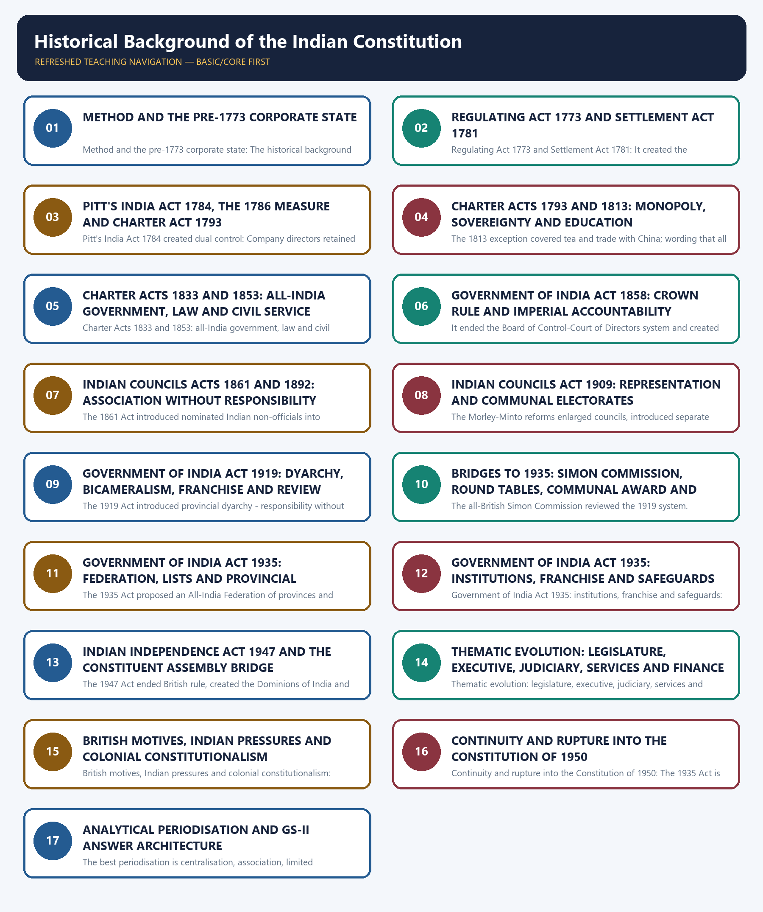
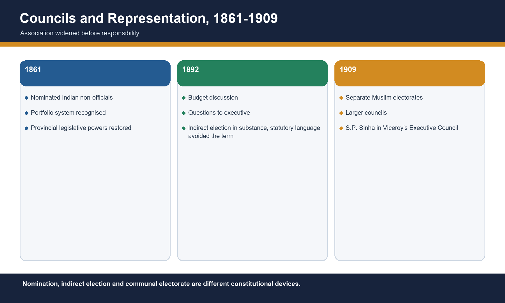
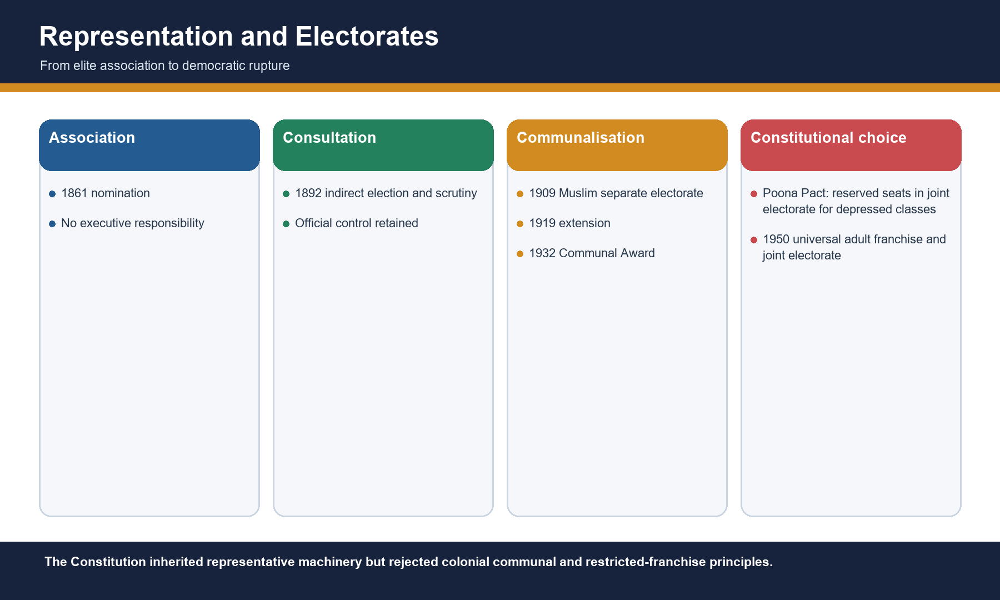
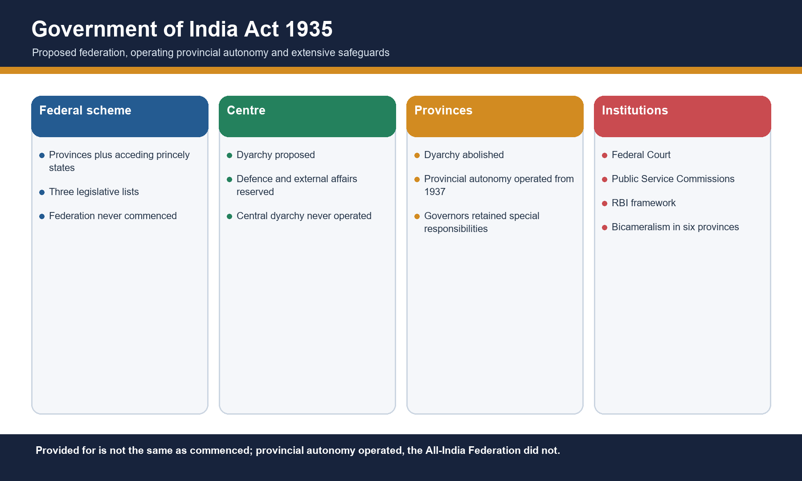
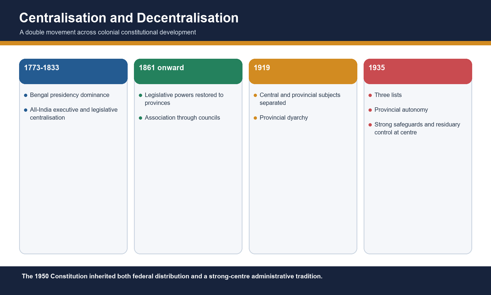
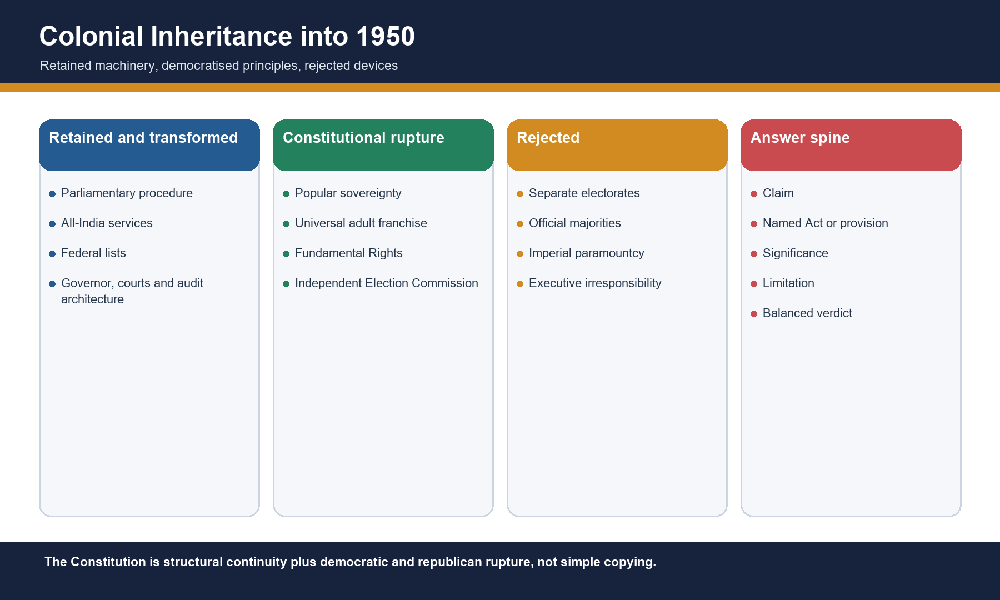
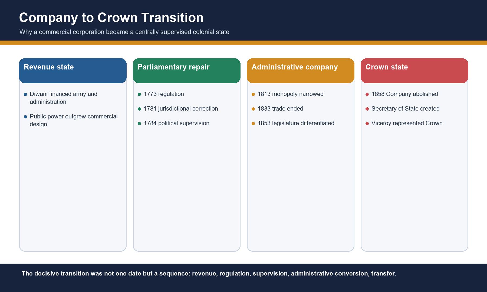

# Historical Background of the Indian Constitution — Learner-v2 Source-Complete Learning Session

> **Catalogue identity:** Polity · Subject-wide Syllabus · `polity-01`  
> **Generation identity:** `polity-01:learner-v2:g2` · generated 21 August 2026 · supersedes `polity-01:legacy-v1:g1`  
> **Approval:** false — explicit approval of this exact generation is still required.  
> **Evidence key:** `[FACT]` = repository/source-supported fact · `[ANALYSIS]` = exam synthesis · `[LIMIT]` = ownership, evidence or interpretation boundary.

## BASIC LEARNING SESSION



*Distinct embedded teaching-navigation image. The separate continuous Cārvāka-style flowchart package remains an independent at-a-glance artifact.*

### Source audit, syllabus boundary and package counts

- **Mandatory source order followed:** rich legacy complete package → Basic/Core owner → Advanced owner → syllabus, README and PYQ routing owners → OCR-searchable local Polity PDFs only as corroboration already recorded in the legacy audit. Qdrant was not used and did not block generation.
- **Static-chapter current-affairs decision:** no direct current-affairs insertion is required. The repository audit classifies this as a high-frequency static constitutional chapter; a contemporary story would be decorative rather than evidentiary.
- **Official syllabus ownership:** Mains GS-II historical underpinnings and evolution of the Constitution; Prelims GS-I Indian Polity and Governance. GS-I Modern History uses are adjacent/cross-owned where stated.
- **Verified PYQs:** four relevant Prelims questions — 2018 Q38, 2019 Q4, 2023 Q50 and 2024 Q62. Only 2024 Q62 is directly owned by Polity 01. No direct historical-background Mains PYQ was found in the audited local corpus; none is invented.
- **Practice:** 40 core MCQs + 8 remedial MCQs with balanced deterministic non-patterned placement; four verified solved Prelims PYQs; six original solved Mains models (2 × 10, 2 × 15, 2 × 20).
- **Preservation:** all substantive teaching from the legacy complete package is retained in the Basic sequence and final register, while the Advanced owner is preserved separately after practice.
### Master learning roadmap

```text
CORPORATE TRADE (1600)
        -> TERRITORIAL-REVENUE POWER (1757-1765)
        -> PARLIAMENTARY REGULATION (1773-1781)
        -> DUAL CONTROL (1784-1858)
        -> CROWN RULE (1858)
        -> ASSOCIATION AND SCRUTINY (1861-1892)
        -> COMMUNAL ELECTORATES (1909)
        -> LIMITED RESPONSIBILITY / PROVINCIAL DUAL GOVERNMENT (1919)
        -> FEDERAL BLUEPRINT + PROVINCIAL AUTONOMY (1935)
        -> SOVEREIGN CONSTITUENT POWER (1947)
        -> RETENTION + REJECTION + DEMOCRATIC TRANSFORMATION (1950)
```

### First-use terminology — immediate English meanings

| Term | Exam-safe English meaning |
|---|---|
| **Diwani** | Revenue-administration and civil-justice authority granted to the Company in 1765 |
| **Dyarchy** | Dual government: subjects divided between responsible ministers and an executive authority not responsible to the legislature |
| **Paramountcy** | The British Crown's superior authority over princely states |
| **Separate electorate** | A community-specific electoral roll in which community voters elect community representatives |
| **Reserved seat** | A seat earmarked for a community, capable of operating within a common or joint electorate |
| **Responsible government** | An executive politically answerable to, and removable through, the representative legislature |

### Answer-line control register

The following sentences are the controlled exam formulations. Each appears unchanged in the corresponding teaching stage and in the complete flowchart companion.

1. **OPENING DEFINITION:** The historical background of the Constitution is the gradual conversion of a revenue-seeking Company state into a centralised colonial administration and, finally, a sovereign democratic Constitution.
2. **CORE ARGUMENT:** The Regulating Act 1773 was Parliament's first constitutional response to the mismatch between the Company's territorial power and its public accountability.
3. **CORE ARGUMENT:** Pitt's India Act 1784 created dual control: Company directors retained commercial administration while the British government, through the Board of Control, acquired supreme political supervision.
4. **TRANSITION:** The Charter Acts 1793 and 1813 show that monopoly could be renewed even as Crown sovereignty and regulated commercial opening advanced.
5. **CORE ARGUMENT:** The Charter Acts 1833 and 1853 completed legislative centralisation, ended the Company's commercial character and differentiated law-making from executive administration and patronage.
6. **CORE ARGUMENT:** The Government of India Act 1858 replaced dual control with direct Crown responsibility, but centralised imperial accountability without Indian popular responsibility.
7. **CORE ARGUMENT:** The Councils Acts 1861 and 1892 moved from nominated association to limited scrutiny, not to responsible government.
8. **CRITICISM:** The 1909 reforms widened representation by institutionalising religious separation, making separate electorates both a concession and a constitutional warning.
9. **CRITICISM:** The 1919 Act introduced provincial dyarchy - responsibility without control over finance and coercion - and thereby exposed the limits of divided executive authority.
10. **TRANSITION:** The road from the Simon Commission to the Poona Pact converted demands for responsibility and representation into the design choices and communal safeguards debated before 1935.
11. **CORE ARGUMENT:** The 1935 Act designed a federation and operative provincial autonomy, but the All-India Federation and central dyarchy never commenced.
12. **CRITICISM:** The 1935 Act supplied much of the institutional architecture later adapted in 1950, yet its restricted franchise, safeguards and executive supremacy remained colonial.
13. **CORE ARGUMENT:** The Independence Act 1947 ended British sovereignty and paramountcy and made the Constituent Assemblies sovereign legislatures, but left integration and constitution-making to Indian agency.
14. **CONTINUITY LINE:** Across 1773-1947, institutions evolved from corporate control to statutory administration and limited accountability; constitutional continuity lies in structures, not in democratic legitimacy.
15. **CRITICISM:** Colonial constitutional reform was neither a linear gift nor a single nationalist victory: British control incentives and Indian political pressure interacted, while authority remained deliberately short of popular sovereignty.
16. **CONTINUITY LINE:** The Constitution retained and transformed colonial machinery - lists, Governors, courts and services - while rejecting communal electorates, restricted franchise and imperial supremacy.
17. **FINAL VERDICT:** The best periodisation is centralisation, association, limited responsibility and sovereign constitution-making; chronology earns marks only when converted into institutional argument.
### SESSION 1 — METHOD AND THE PRE-1773 CORPORATE STATE

#### DEFINITION / WHAT THIS IS CALLED

**Plain-language definition:** The historical background of the Constitution is the gradual conversion of a revenue-seeking Company state into a centralised colonial administration and, finally, a sovereign democratic Constitution.

**Technical definition:** Method and the pre-1773 corporate state: The historical background of the Constitution is the gradual conversion of a revenue-seeking Company state into a centralised colonial administration and, finally, a sovereign democratic Constitution.

#### ANSWER-GRABBING OPENING — WRITE/ADAPT IN THE EXAM

> The historical background of the Constitution is the gradual conversion of a revenue-seeking Company state into a centralised colonial administration and, finally, a sovereign democratic Constitution.

#### MUST-WRITE KEYWORDS

- **1600**
- **1757**
- **1764**
- **1765**
- **1773**
- **1772**
- **1858**
- **Method and the pre-1773 corporate state**

**How to use them:** Claim that constitutional regulation followed the accountability crisis created when corporate power became territorial; prove it with Diwani and the failure of Dual Government.

> **ANSWER-GRABBING LINE — WRITE/ADAPT IN THE EXAM (OPENING DEFINITION):** The historical background of the Constitution is the gradual conversion of a revenue-seeking Company state into a centralised colonial administration and, finally, a sovereign democratic Constitution.

[FACT] The East India Company received its charter in 1600 and entered India as a trading corporation. Plassey (1757), Buxar (1764) and the Diwani grant (1765) supplied political leverage, military superiority and revenue authority. [LIMIT] These events are background, not constitutional statutes.

[ANALYSIS] Read each statute through four questions: who controlled the executive, who made law, who paid, and who was represented.


*Caption: Original deterministic schematic prepared for this package; labels are source-checked.*

#### Chronology

| Date | Event |
|---|---|
| 1600 | East India Company charter |
| 1757 | Plassey |
| 1764 | Buxar |
| 1765 | Diwani |
| 1772 | Bengal Dual Government ended |

#### Evidence matrix

| Event | Immediate effect | Constitutional meaning |
|---|---|---|
| Plassey | Political leverage | Company intervention in government |
| Buxar | Military superiority | Coercive base |
| Diwani | Revenue and civil authority | Private corporation exercises public power |

#### Teaching and analysis

- [FACT] Diwani gave the Company revenue and civil-justice authority in Bengal, Bihar and Orissa; it did not begin Crown rule.
- [ANALYSIS] Revenue converted intermittent military success into a durable fiscal-administrative state.
- [FACT] Bengal's Dual Government separated the Company's effective revenue power from the Nawab's nominal responsibility.
- [ANALYSIS] Parliament's problem was constitutional: a private corporation exercised sovereign functions without a public accountability chain.
- [LIMIT] Do not narrate all eighteenth-century conquest; use only what explains why regulation became unavoidable.

#### Rapid recall

- 1600 means chartered trade, not territorial sovereignty.
- 1765 is the fiscal turning point.
- Crown rule begins in 1858.

#### Close-option traps

- Wrong: Diwani began direct Crown government.
  Correct: Diwani strengthened Company territorial power; Crown government began in 1858.
- Wrong: Plassey alone created a complete colonial state.
  Correct: Plassey created leverage; Buxar and Diwani supplied stronger coercive and fiscal foundations.

**Mains route:** Claim that constitutional regulation followed the accountability crisis created when corporate power became territorial; prove it with Diwani and the failure of Dual Government.

#### CLOSING RECALL FLOW — METHOD AND THE PRE-1773 CORPORATE STATE

```text
START / CONCEPT: Method and the pre-1773 corporate state
        |
        v
EXACT TERMS: 1600 · 1757 · 1764 · 1765 · 1773
        |
        v
MECHANISM / ARGUMENT: Read each statute through four questions: who controlled the executive, who made law, who paid, and who was represented.
        |
        v
CONSEQUENCE / CONTRAST: Bengal's Dual Government separated the Company's effective revenue power from the Nawab's nominal responsibility.
        |
        v
UPSC TRAP / ANSWER-USE: Plassey (1757), Buxar (1764) and the Diwani grant (1765) supplied political leverage, military superiority and revenue authority. These events are background, not constitutional statutes.
        |
        v
ANSWER-GRABBING FORMULATION: The historical background of the Constitution is the gradual conversion of a revenue-seeking Company state into a centralised colonial administration and, finally, a sovereign democratic Constitution.
```
### SESSION 2 — REGULATING ACT 1773 AND SETTLEMENT ACT 1781

#### DEFINITION / WHAT THIS IS CALLED

**Plain-language definition:** The Regulating Act 1773 was Parliament's first constitutional response to the mismatch between the Company's territorial power and its public accountability.

**Technical definition:** Regulating Act 1773 and Settlement Act 1781: It created the Governor-General of Bengal with a four-member council, subordinated Bombay and Madras in specified matters, and provided for a Supreme Court at Calcutta.

#### ANSWER-GRABBING OPENING — WRITE/ADAPT IN THE EXAM

> The Regulating Act 1773 was Parliament's first constitutional response to the mismatch between the Company's territorial power and its public accountability.

#### MUST-WRITE KEYWORDS

- **The Regulating Act 1773**
- **1781**
- **Regulating Act 1773**
- **Settlement Act 1781**
- **1773**
- **1774**
- **1833**
- **Regulating Act 1773 and Settlement Act 1781**

**How to use them:** Use 1773 as the start of statutory centralisation, then qualify that the 1781 repair reveals institutional improvisation rather than a settled separation of powers.

> **ANSWER-GRABBING LINE — WRITE/ADAPT IN THE EXAM (CORE ARGUMENT):** The Regulating Act 1773 was Parliament's first constitutional response to the mismatch between the Company's territorial power and its public accountability.

[FACT] The Regulating Act was Parliament's first major statutory intervention in Company government. It created the Governor-General of Bengal with a four-member council, subordinated Bombay and Madras in specified matters, and provided for a Supreme Court at Calcutta. The 1781 Act corrected jurisdictional conflict.

[ANALYSIS] Read each statute through four questions: who controlled the executive, who made law, who paid, and who was represented.


*Caption: Original deterministic schematic prepared for this package; labels are source-checked.*

#### Chronology

| Date | Event |
|---|---|
| 1773 | Regulating Act |
| 1774 | Supreme Court at Calcutta began |
| 1781 | Settlement or Amending Act |

#### Evidence matrix

| Provision | 1773 position | 1781 correction |
|---|---|---|
| Executive | Governor-General of Bengal and council | Official acts protected from Supreme Court jurisdiction |
| Judiciary | Supreme Court at Calcutta | Revenue matters excluded; personal laws recognised |
| Appeals | Unsettled conflict | Provincial-court appeals routed to Governor-General-in-Council |

#### Teaching and analysis

- [FACT] Warren Hastings was the first Governor-General of Bengal; the title Governor-General of India dates to 1833.
- [FACT] The Supreme Court consisted of a Chief Justice and three judges and began functioning in 1774.
- [FACT] Company servants were barred from private trade and accepting presents or bribes.
- [FACT] The Court of Directors had to report revenue, civil and military affairs to the British government.
- [ANALYSIS] The statute began centralisation and judicialisation but did not create responsible government.
- [LIMIT] The 1781 Act narrowed and clarified jurisdiction; it did not establish modern judicial review.

#### Rapid recall

- Governor-General of Bengal: 1773.
- Supreme Court operational: 1774.
- Settlement Act: 1781 jurisdictional repair.

#### Close-option traps

- Wrong: 1773 created the Governor-General of India.
  Correct: It created the Governor-General of Bengal.
- Wrong: The Supreme Court had uncontested authority over all revenue acts.
  Correct: Jurisdictional conflict led the 1781 Act to exclude revenue matters and protect official acts.

**Mains route:** Use 1773 as the start of statutory centralisation, then qualify that the 1781 repair reveals institutional improvisation rather than a settled separation of powers.

#### CLOSING RECALL FLOW — REGULATING ACT 1773 AND SETTLEMENT ACT 1781

```text
START / CONCEPT: Regulating Act 1773 and Settlement Act 1781
        |
        v
EXACT TERMS: The Regulating Act 1773 · 1781 · Regulating Act 1773 · Settlement Act 1781 · 1773
        |
        v
MECHANISM / ARGUMENT: Read each statute through four questions: who controlled the executive, who made law, who paid, and who was represented.
        |
        v
CONSEQUENCE / CONTRAST: It created the Governor-General of Bengal with a four-member council, subordinated Bombay and Madras in specified matters, and provided for a Supreme Court at Calcutta.
        |
        v
UPSC TRAP / ANSWER-USE: The statute began centralisation and judicialisation but did not create responsible government.
        |
        v
ANSWER-GRABBING FORMULATION: The Regulating Act 1773 was Parliament's first constitutional response to the mismatch between the Company's territorial power and its public accountability.
```
### SESSION 3 — PITT'S INDIA ACT 1784, THE 1786 MEASURE AND CHARTER ACT 1793

#### DEFINITION / WHAT THIS IS CALLED

**Plain-language definition:** Pitt's India Act 1784 created dual control: Company directors retained commercial administration while the British government, through the Board of Control, acquired supreme political supervision.

**Technical definition:** Pitt's India Act 1784 created dual control: Company directors retained commercial administration while the British government, through the Board of Control, acquired supreme political supervision.

#### ANSWER-GRABBING OPENING — WRITE/ADAPT IN THE EXAM

> Pitt's India Act 1784 created dual control: Company directors retained commercial administration while the British government, through the Board of Control, acquired supreme political supervision.

#### MUST-WRITE KEYWORDS

- **Pitt's India Act 1784**
- **1786**
- **Charter Act 1793**
- **1784**
- **1793**
- **1858**
- **1765**

**How to use them:** Explain dual control as a control-chain innovation and an accountability ambiguity: policy control moved toward the British state while operational machinery remained corporate.

> **ANSWER-GRABBING LINE — WRITE/ADAPT IN THE EXAM (CORE ARGUMENT):** Pitt's India Act 1784 created dual control: Company directors retained commercial administration while the British government, through the Board of Control, acquired supreme political supervision.

[FACT] Pitt's India Act separated the Company's commercial management from British political supervision. The Court of Directors remained; the Board of Control supervised civil, military and revenue government. Later measures strengthened the Governor-General's capacity to override councils.

[ANALYSIS] Read each statute through four questions: who controlled the executive, who made law, who paid, and who was represented.


*Caption: Original deterministic schematic prepared for this package; labels are source-checked.*

#### Chronology

| Date | Event |
|---|---|
| 1784 | Board of Control created |
| 1786 | Cornwallis enabled to override council and act as Commander-in-Chief |
| 1793 | Override principle extended; charter renewed |

#### Evidence matrix

| Institution | Primary role | Precision |
|---|---|---|
| Court of Directors | Commercial affairs and Company administration | Not abolished in 1784 |
| Board of Control | Political, military and revenue supervision | Instrument of British government |
| Governor-General | Execution in India | Worked through Company machinery |

#### Teaching and analysis

- [FACT] The Act first described Company territories as British possessions in India.
- [FACT] The Board of Control represented British governmental supervision; the Court of Directors retained commercial administration and patronage.
- [ANALYSIS] Dual control allowed the Crown to direct policy without immediately assuming all Company liabilities and machinery.
- [FACT] The 1786 arrangement is associated with Cornwallis and stronger executive coordination.
- [LIMIT] Pitt's Act did not transfer India to the Crown and did not create cabinet responsibility in India.
- [ANALYSIS] The sequence strengthened executive command faster than legislative accountability.

#### Rapid recall

- 1784 equals Board of Control.
- Court of Directors continued until 1858.
- Dual control is not Bengal's 1765-72 Dual Government.

#### Close-option traps

- Wrong: Board of Control managed only Company trade.
  Correct: It supervised political, civil, military and revenue affairs.
- Wrong: Pitt's Act abolished Company rule.
  Correct: Company rule continued under dual control until 1858.

**Mains route:** Explain dual control as a control-chain innovation and an accountability ambiguity: policy control moved toward the British state while operational machinery remained corporate.

#### CLOSING RECALL FLOW — PITT'S INDIA ACT 1784, THE 1786 MEASURE AND CHARTER ACT 1793

```text
START / CONCEPT: Pitt's India Act 1784, the 1786 measure and Charter Act 1793
        |
        v
EXACT TERMS: Pitt's India Act 1784 · 1786 · Charter Act 1793 · 1784 · 1793
        |
        v
MECHANISM / ARGUMENT: Pitt's India Act 1784 created dual control: Company directors retained commercial administration while the British government, through the Board of Control, acquired supreme political supervision.
        |
        v
CONSEQUENCE / CONTRAST: The Court of Directors remained; the Board of Control supervised civil, military and revenue government.
        |
        v
UPSC TRAP / ANSWER-USE: Pitt's Act did not transfer India to the Crown and did not create cabinet responsibility in India.
        |
        v
ANSWER-GRABBING FORMULATION: Pitt's India Act 1784 created dual control: Company directors retained commercial administration while the British government, through the Board of Control, acquired supreme political supervision.
```
### SESSION 4 — CHARTER ACTS 1793 AND 1813: MONOPOLY, SOVEREIGNTY AND EDUCATION

#### DEFINITION / WHAT THIS IS CALLED

**Plain-language definition:** The Charter Acts 1793 and 1813 show that monopoly could be renewed even as Crown sovereignty and regulated commercial opening advanced.

**Technical definition:** The 1813 exception covered tea and trade with China; wording that all monopoly ended is false.

#### ANSWER-GRABBING OPENING — WRITE/ADAPT IN THE EXAM

> The Charter Acts 1793 and 1813 show that monopoly could be renewed even as Crown sovereignty and regulated commercial opening advanced.

#### MUST-WRITE KEYWORDS

- **1793**
- **1813**
- **The Charter Act 1793**
- **The Charter Act 1813**
- **2019**
- **Charter Acts 1793 and 1813: monopoly, sovereignty and education**

**How to use them:** Show how 1813 joined economic liberalisation to imperial sovereignty, but distinguish an opening of trade from transfer of government.

> **ANSWER-GRABBING LINE — WRITE/ADAPT IN THE EXAM (TRANSITION):** The Charter Acts 1793 and 1813 show that monopoly could be renewed even as Crown sovereignty and regulated commercial opening advanced.

[FACT] The Charter Act 1793 renewed Company privileges. The Charter Act 1813 ended the Company's monopoly over Indian trade except tea and trade with China, asserted Crown sovereignty, permitted missionaries and sanctioned an annual sum for education.

[ANALYSIS] Read each statute through four questions: who controlled the executive, who made law, who paid, and who was represented.


*Caption: Original deterministic schematic prepared for this package; labels are source-checked.*

#### Chronology

| Date | Event |
|---|---|
| 1793 | Company charter and monopoly renewed |
| 1813 | Indian trade opened with exceptions; sovereignty asserted |

#### Evidence matrix

| Dimension | 1793 | 1813 |
|---|---|---|
| Trade | Monopoly continued | Indian trade monopoly ended except tea and China trade |
| Constitution | Existing control consolidated | Crown sovereignty expressly asserted |
| Education and mission | No comparable opening | Annual education sanction; missionaries permitted |

#### Teaching and analysis

- [FACT] The 1813 exception covered tea and trade with China; wording that all monopoly ended is false.
- [FACT] The Act asserted the sovereignty of the British Crown over Company-held Indian territories.
- [FACT] It sanctioned one lakh rupees annually for education and encouragement of learning.
- [ANALYSIS] Free-trade interests, missionary pressure and imperial control converged in one statute.
- [LIMIT] The education grant did not settle the Orientalist-Anglicist controversy and did not itself create mass education.
- [LIMIT] Parliament did not thereby take direct control of Indian revenues in the sense asserted by the false statement in the 2019 PYQ.

#### Rapid recall

- 1813: tea and China exceptions.
- One lakh annual education sanction.
- Crown sovereignty asserted before Crown rule.

#### Close-option traps

- Wrong: 1813 ended every Company monopoly.
  Correct: Tea and China trade remained exceptions.
- Wrong: 1813 began Crown rule.
  Correct: It asserted Crown sovereignty while Company administration continued.

**Mains route:** Show how 1813 joined economic liberalisation to imperial sovereignty, but distinguish an opening of trade from transfer of government.

#### CLOSING RECALL FLOW — CHARTER ACTS 1793 AND 1813: MONOPOLY, SOVEREIGNTY AND EDUCATION

```text
START / CONCEPT: Charter Acts 1793 and 1813: monopoly, sovereignty and education
        |
        v
EXACT TERMS: 1793 · 1813 · The Charter Act 1793 · The Charter Act 1813 · 2019
        |
        v
MECHANISM / ARGUMENT: Read each statute through four questions: who controlled the executive, who made law, who paid, and who was represented.
        |
        v
CONSEQUENCE / CONTRAST: The Charter Act 1813 ended the Company's monopoly over Indian trade except tea and trade with China, asserted Crown sovereignty, permitted missionaries and sanctioned an annual sum for education.
        |
        v
UPSC TRAP / ANSWER-USE: The education grant did not settle the Orientalist-Anglicist controversy and did not itself create mass education.
        |
        v
ANSWER-GRABBING FORMULATION: The Charter Acts 1793 and 1813 show that monopoly could be renewed even as Crown sovereignty and regulated commercial opening advanced.
```
### SESSION 5 — CHARTER ACTS 1833 AND 1853: ALL-INDIA GOVERNMENT, LAW AND CIVIL SERVICE

#### DEFINITION / WHAT THIS IS CALLED

**Plain-language definition:** The Charter Acts 1833 and 1853 completed legislative centralisation, ended the Company's commercial character and differentiated law-making from executive administration and patronage.

**Technical definition:** Charter Acts 1833 and 1853: all-India government, law and civil service: The 1853 Act added legislative councillors and created a differentiated central legislative council sometimes described as a mini-Parliament.

#### ANSWER-GRABBING OPENING — WRITE/ADAPT IN THE EXAM

> The Charter Acts 1833 and 1853 completed legislative centralisation, ended the Company's commercial character and differentiated law-making from executive administration and patronage.

#### MUST-WRITE KEYWORDS

- **1833**
- **1853**
- **The Charter Act 1833**
- **1834**
- **1854**
- **Charter Act 1833**
- **Charter Act 1853**
- **1858**

**How to use them:** Compare 1833 and 1853 through institutional function: 1833 created all-India legislative centralisation; 1853 differentiated legislation and professional recruitment.

> **ANSWER-GRABBING LINE — WRITE/ADAPT IN THE EXAM (CORE ARGUMENT):** The Charter Acts 1833 and 1853 completed legislative centralisation, ended the Company's commercial character and differentiated law-making from executive administration and patronage.

[FACT] The Charter Act 1833 made the Governor-General of Bengal the Governor-General of India, ended the Company's commercial functions and centralised legislation. The 1853 Act separated the legislative and executive work of the Governor-General's council and advanced open competition.

[ANALYSIS] Read each statute through four questions: who controlled the executive, who made law, who paid, and who was represented.


*Caption: Original deterministic schematic prepared for this package; labels are source-checked.*

#### Chronology

| Date | Event |
|---|---|
| 1833 | Governor-General of India; Company becomes administrative body |
| 1834 | First Law Commission |
| 1853 | Last Charter Act; legislative wing enlarged |
| 1854 | Macaulay Committee on civil service |

#### Evidence matrix

| Question | Charter Act 1833 | Charter Act 1853 |
|---|---|---|
| Executive title | Governor-General of India; Bentinck first | No new transfer to Crown |
| Legislature | All-India legislative centralisation | Legislative and executive work separated |
| Civil service | Competition principle attempted but frustrated | Open competition established; 1854 committee followed |
| Company status | Trade ended; administrative body | Rule continued without fixed renewal term |

#### Teaching and analysis

- [FACT] Bombay and Madras lost legislative powers under 1833; laws made by the central legislature came to be called Acts.
- [FACT] A Law Member was added and the first Law Commission followed; Macaulay became the first Law Member.
- [FACT] The 1833 Act's equality clause did not produce equal recruitment in practice.
- [FACT] The 1853 Act added legislative councillors and created a differentiated central legislative council sometimes described as a mini-Parliament.
- [FACT] Four of the six new legislative members represented Madras, Bombay, Bengal and Agra.
- [ANALYSIS] Centralisation, codification and merit rhetoric built a professional state, while racial and imperial constraints limited equality.
- [LIMIT] Company abolition belongs to 1858, not 1853.

#### Rapid recall

- 1833: Governor-General of India.
- 1853: legislative-executive separation.
- 1854: Macaulay Committee.

#### Close-option traps

- Wrong: Open competition was fully realised by 1833.
  Correct: The 1833 opening was frustrated; 1853 established open competition in principle.
- Wrong: 1853 ended Company government.
  Correct: It was the last Charter Act; Company government ended in 1858.

**Mains route:** Compare 1833 and 1853 through institutional function: 1833 created all-India legislative centralisation; 1853 differentiated legislation and professional recruitment.

#### CLOSING RECALL FLOW — CHARTER ACTS 1833 AND 1853: ALL-INDIA GOVERNMENT, LAW AND CIVIL SERVICE

```text
START / CONCEPT: Charter Acts 1833 and 1853: all-India government, law and civil service
        |
        v
EXACT TERMS: 1833 · 1853 · The Charter Act 1833 · 1834 · 1854
        |
        v
MECHANISM / ARGUMENT: Read each statute through four questions: who controlled the executive, who made law, who paid, and who was represented.
        |
        v
CONSEQUENCE / CONTRAST: The 1853 Act separated the legislative and executive work of the Governor-General's council and advanced open competition.
        |
        v
UPSC TRAP / ANSWER-USE: The 1833 Act's equality clause did not produce equal recruitment in practice.
        |
        v
ANSWER-GRABBING FORMULATION: The Charter Acts 1833 and 1853 completed legislative centralisation, ended the Company's commercial character and differentiated law-making from executive administration and patronage.
```
### SESSION 6 — GOVERNMENT OF INDIA ACT 1858: CROWN RULE AND IMPERIAL ACCOUNTABILITY

#### DEFINITION / WHAT THIS IS CALLED

**Plain-language definition:** The Government of India Act 1858 replaced dual control with direct Crown responsibility, but centralised imperial accountability without Indian popular responsibility.

**Technical definition:** It ended the Board of Control-Court of Directors system and created the Secretary of State for India assisted by a Council of India.

#### ANSWER-GRABBING OPENING — WRITE/ADAPT IN THE EXAM

> The Government of India Act 1858 replaced dual control with direct Crown responsibility, but centralised imperial accountability without Indian popular responsibility.

#### MUST-WRITE KEYWORDS

- **India Act 1858**
- **1857**
- **1858**
- **1784**

**How to use them:** Argue that 1858 changed the sovereign and supervision architecture while preserving a highly centralised colonial administration.

> **ANSWER-GRABBING LINE — WRITE/ADAPT IN THE EXAM (CORE ARGUMENT):** The Government of India Act 1858 replaced dual control with direct Crown responsibility, but centralised imperial accountability without Indian popular responsibility.

[FACT] After the Revolt of 1857, the 1858 Act abolished the East India Company and transferred government to the British Crown. It ended the Board of Control-Court of Directors system and created the Secretary of State for India assisted by a Council of India.

[ANALYSIS] Read each statute through four questions: who controlled the executive, who made law, who paid, and who was represented.


*Caption: Original deterministic schematic prepared for this package; labels are source-checked.*

#### Chronology

| Date | Event |
|---|---|
| 1857 | Revolt |
| 1858 | Act for the Better Government of India; Crown transfer |
| 1858 | Lord Canning became first Viceroy |

#### Evidence matrix

| Office | Change | Accountability limit |
|---|---|---|
| Secretary of State for India | British Cabinet minister; Council of India assistance | Responsible to British, not Indian, politics |
| Governor-General/Viceroy | Executive head and Crown representative | No responsible government in India |
| Company institutions | Court of Directors and Board abolished | Administrative personnel and habits substantially continued |

#### Teaching and analysis

- [FACT] Lord Canning was the first Viceroy; he was already Governor-General.
- [FACT] The Secretary of State's Council had fifteen members in the original arrangement.
- [FACT] The double-government institutions created around 1784 were abolished.
- [ANALYSIS] The transfer clarified the imperial principal-agent chain but did not democratise it.
- [ANALYSIS] Crown proclamations of non-interference and equal treatment must be distinguished from implementation.
- [LIMIT] Administrative continuity means 1858 was not a total institutional rupture.

#### Rapid recall

- Company abolished: 1858.
- First Viceroy: Canning.
- Secretary of State was in British Cabinet.

#### Close-option traps

- Wrong: Viceroy was a wholly separate office from Governor-General.
  Correct: The Governor-General also acted as Viceroy, the Crown's representative.
- Wrong: 1858 introduced responsible government.
  Correct: It centralised imperial accountability without making the executive responsible to Indians.

**Mains route:** Argue that 1858 changed the sovereign and supervision architecture while preserving a highly centralised colonial administration.

#### CLOSING RECALL FLOW — GOVERNMENT OF INDIA ACT 1858: CROWN RULE AND IMPERIAL ACCOUNTABILITY

```text
START / CONCEPT: Government of India Act 1858: Crown rule and imperial accountability
        |
        v
EXACT TERMS: India Act 1858 · 1857 · 1858 · 1784
        |
        v
MECHANISM / ARGUMENT: It ended the Board of Control-Court of Directors system and created the Secretary of State for India assisted by a Council of India.
        |
        v
CONSEQUENCE / CONTRAST: It ended the Board of Control-Court of Directors system and created the Secretary of State for India assisted by a Council of India.
        |
        v
UPSC TRAP / ANSWER-USE: The transfer clarified the imperial principal-agent chain but did not democratise it.
        |
        v
ANSWER-GRABBING FORMULATION: The Government of India Act 1858 replaced dual control with direct Crown responsibility, but centralised imperial accountability without Indian popular responsibility.
```
### SESSION 7 — INDIAN COUNCILS ACTS 1861 AND 1892: ASSOCIATION WITHOUT RESPONSIBILITY

#### DEFINITION / WHAT THIS IS CALLED

**Plain-language definition:** The Councils Acts 1861 and 1892 moved from nominated association to limited scrutiny, not to responsible government.

**Technical definition:** The 1861 Act introduced nominated Indian non-officials into legislative work, recognised the portfolio system and restored legislative powers to Bombay and Madras.

#### ANSWER-GRABBING OPENING — WRITE/ADAPT IN THE EXAM

> The Councils Acts 1861 and 1892 moved from nominated association to limited scrutiny, not to responsible government.

#### MUST-WRITE KEYWORDS

- **1861**
- **1892**
- **1859**
- **1862**
- **Indian Councils Acts 1861 and 1892: association without responsibility**

**How to use them:** Trace the move from consultation to scrutiny while emphasising that association was designed to strengthen colonial legitimacy, not surrender executive control.

> **ANSWER-GRABBING LINE — WRITE/ADAPT IN THE EXAM (CORE ARGUMENT):** The Councils Acts 1861 and 1892 moved from nominated association to limited scrutiny, not to responsible government.

[FACT] The 1861 Act introduced nominated Indian non-officials into legislative work, recognised the portfolio system and restored legislative powers to Bombay and Madras. The 1892 Act widened councils, enabled budget discussion and questions, and used nomination on recommendation as indirect election in substance.

[ANALYSIS] Read each statute through four questions: who controlled the executive, who made law, who paid, and who was represented.



*Caption: Original deterministic schematic prepared for this package; labels are source-checked.*

#### Chronology

| Date | Event |
|---|---|
| 1859 | Portfolio system used by Canning |
| 1861 | Councils Act |
| 1862 | First nominated Indian non-officials |
| 1892 | Budget discussion and questions |

#### Evidence matrix

| Dimension | 1861 | 1892 |
|---|---|---|
| Entry | Nomination of non-official Indians | Indirect election in substance through recommendation |
| Control | Viceroy retained ordinance and legislative control | Official majority retained |
| Scrutiny | Limited legislative association | Budget discussion and questions; no vote of confidence |

#### Teaching and analysis

- [FACT] The 1861 nominees included the Raja of Benaras, Maharaja of Patiala and Sir Dinkar Rao.
- [FACT] The Act decentralised legislation by restoring powers to Bombay and Madras.
- [FACT] It recognised portfolio allocation and authorised Viceroy's ordinances with a six-month life.
- [FACT] The 1892 Act enlarged non-official membership but retained official majorities.
- [FACT] The word election was avoided; bodies recommended nominees.
- [ANALYSIS] Legislative scrutiny developed before executive responsibility.
- [LIMIT] Neither Act created responsible government or a democratic franchise.

#### Rapid recall

- 1861 equals nomination and portfolio system.
- 1892 equals budget discussion and questions.
- Indirect election is not direct popular election.

#### Close-option traps

- Wrong: 1861 introduced elected Indian representatives.
  Correct: It associated nominated non-official Indians.
- Wrong: Budget discussion in 1892 made the executive removable.
  Correct: Discussion and questions did not create confidence responsibility.

**Mains route:** Trace the move from consultation to scrutiny while emphasising that association was designed to strengthen colonial legitimacy, not surrender executive control.

#### CLOSING RECALL FLOW — INDIAN COUNCILS ACTS 1861 AND 1892: ASSOCIATION WITHOUT RESPONSIBILITY

```text
START / CONCEPT: Indian Councils Acts 1861 and 1892: association without responsibility
        |
        v
EXACT TERMS: 1861 · 1892 · 1859 · 1862 · Indian Councils Acts 1861 and 1892: association without responsibility
        |
        v
MECHANISM / ARGUMENT: Read each statute through four questions: who controlled the executive, who made law, who paid, and who was represented.
        |
        v
CONSEQUENCE / CONTRAST: The 1892 Act widened councils, enabled budget discussion and questions, and used nomination on recommendation as indirect election in substance.
        |
        v
UPSC TRAP / ANSWER-USE: The Councils Acts 1861 and 1892 moved from nominated association to limited scrutiny, not to responsible government.
        |
        v
ANSWER-GRABBING FORMULATION: The Councils Acts 1861 and 1892 moved from nominated association to limited scrutiny, not to responsible government.
```
### SESSION 8 — INDIAN COUNCILS ACT 1909: REPRESENTATION AND COMMUNAL ELECTORATES

#### DEFINITION / WHAT THIS IS CALLED

**Plain-language definition:** The 1909 reforms widened representation by institutionalising religious separation, making separate electorates both a concession and a constitutional warning.

**Technical definition:** The Morley-Minto reforms enlarged councils, introduced separate electorates for Muslims and enabled Satyendra Prasad Sinha to enter the Viceroy's Executive Council as Law Member.

#### ANSWER-GRABBING OPENING — WRITE/ADAPT IN THE EXAM

> The 1909 reforms widened representation by institutionalising religious separation, making separate electorates both a concession and a constitutional warning.

#### MUST-WRITE KEYWORDS

- **1909**
- **Indian Councils Act 1909**
- **1906**
- **1919**
- **Indian Councils Act 1909: representation and communal electorates**

**How to use them:** Assess 1909 as a paradox: widened representative procedure but constitutionalised communal political boundaries.

> **ANSWER-GRABBING LINE — WRITE/ADAPT IN THE EXAM (CRITICISM):** The 1909 reforms widened representation by institutionalising religious separation, making separate electorates both a concession and a constitutional warning.

[FACT] The Morley-Minto reforms enlarged councils, introduced separate electorates for Muslims and enabled Satyendra Prasad Sinha to enter the Viceroy's Executive Council as Law Member. Official control at the centre survived.

[ANALYSIS] Read each statute through four questions: who controlled the executive, who made law, who paid, and who was represented.


*Caption: Original deterministic schematic prepared for this package; labels are source-checked.*

#### Chronology

| Date | Event |
|---|---|
| 1906 | Muslim League founded; deputation politics |
| 1909 | Indian Councils Act |
| 1909 | S.P. Sinha joined Viceroy's Executive Council |

#### Evidence matrix

| Device | Meaning | Consequence |
|---|---|---|
| Separate electorate | Muslim voters elected Muslim representatives in designated seats | Communal political identity received statutory form |
| Council enlargement | More discussion and non-official presence | Executive remained irresponsible |
| Provincial composition | Non-official majorities in some councils | Officials and nominated groups still protected control |

#### Teaching and analysis

- [FACT] Separate electorates are different from reserved seats in a joint electorate.
- [FACT] The central legislative council retained an official majority.
- [FACT] S.P. Sinha was the first Indian on the Viceroy's Executive Council.
- [ANALYSIS] British divide-and-rule incentives and Muslim elite demands both formed the political context; mono-causal answers are weak.
- [ANALYSIS] Representation widened while the electorate was segmented by community.
- [LIMIT] The Act did not introduce dyarchy, provincial autonomy or responsible government.

#### Rapid recall

- 1909 equals separate Muslim electorates.
- S.P. Sinha, not a 1919 appointee.
- Communal electorate differs from reservation.

#### Close-option traps

- Wrong: 1909 introduced provincial dyarchy.
  Correct: Provincial dyarchy came under the 1919 Act.
- Wrong: A separate electorate is merely a reserved seat.
  Correct: It also separates the electoral roll and electorate by community.

**Mains route:** Assess 1909 as a paradox: widened representative procedure but constitutionalised communal political boundaries.

#### CLOSING RECALL FLOW — INDIAN COUNCILS ACT 1909: REPRESENTATION AND COMMUNAL ELECTORATES

```text
START / CONCEPT: Indian Councils Act 1909: representation and communal electorates
        |
        v
EXACT TERMS: 1909 · Indian Councils Act 1909 · 1906 · 1919 · Indian Councils Act 1909: representation and communal electorates
        |
        v
MECHANISM / ARGUMENT: The 1909 reforms widened representation by institutionalising religious separation, making separate electorates both a concession and a constitutional warning.
        |
        v
CONSEQUENCE / CONTRAST: Official control at the centre survived.
        |
        v
UPSC TRAP / ANSWER-USE: The Act did not introduce dyarchy, provincial autonomy or responsible government.
        |
        v
ANSWER-GRABBING FORMULATION: The 1909 reforms widened representation by institutionalising religious separation, making separate electorates both a concession and a constitutional warning.
```
### SESSION 9 — GOVERNMENT OF INDIA ACT 1919: DYARCHY, BICAMERALISM, FRANCHISE AND REVIEW

#### DEFINITION / WHAT THIS IS CALLED

**Plain-language definition:** The 1919 Act introduced provincial dyarchy - responsibility without control over finance and coercion - and thereby exposed the limits of divided executive authority.

**Technical definition:** The 1919 Act introduced provincial dyarchy - responsibility without control over finance and coercion - and thereby exposed the limits of divided executive authority.

#### ANSWER-GRABBING OPENING — WRITE/ADAPT IN THE EXAM

> The 1919 Act introduced provincial dyarchy - responsibility without control over finance and coercion - and thereby exposed the limits of divided executive authority.

#### MUST-WRITE KEYWORDS

- **1919**
- **India Act 1919**
- **1917**
- **1921**
- **1926**
- **1927**
- **1935**

**How to use them:** Evaluate dyarchy with the governance test of functions, finances and functionaries; named subject division proves why responsibility was incomplete.

> **ANSWER-GRABBING LINE — WRITE/ADAPT IN THE EXAM (CRITICISM):** The 1919 Act introduced provincial dyarchy - responsibility without control over finance and coercion - and thereby exposed the limits of divided executive authority.

[FACT] The Montagu-Chelmsford reforms separated central and provincial subjects, introduced dyarchy in provinces, established bicameralism at the centre and expanded direct elections on a restricted franchise. A statutory commission was promised after ten years.

[ANALYSIS] Read each statute through four questions: who controlled the executive, who made law, who paid, and who was represented.


*Caption: Original deterministic schematic prepared for this package; labels are source-checked.*

#### Chronology

| Date | Event |
|---|---|
| 1917 | Montagu Declaration |
| 1919 | Government of India Act |
| 1921 | Main reforms came into operation |
| 1926 | Central Public Service Commission |
| 1927 | Simon Commission appointed |

#### Evidence matrix

| Institution | Provision | Limit |
|---|---|---|
| Provincial dyarchy | Reserved and transferred subjects | Governor override and financial dependence |
| Central legislature | Council of State and Legislative Assembly | Executive not responsible to legislature |
| Franchise | Property, tax and education qualifications | Small and unequal electorate |
| Review | Statutory commission after ten years | Simon Commission appointed early and all-British |

#### Teaching and analysis

- [FACT] Reserved subjects were administered by Governor and Executive Council; transferred subjects by ministers responsible to provincial legislatures.
- [FACT] Bicameralism and direct elections appeared at the central level.
- [FACT] Separate electorates extended beyond Muslims to Sikhs, Indian Christians, Anglo-Indians and Europeans.
- [FACT] Three of six members of the Viceroy's Executive Council, excluding Commander-in-Chief, were to be Indian.
- [FACT] Provincial budgets were separated and a High Commissioner for India was provided in London.
- [ANALYSIS] Dyarchy failed because political responsibility was not matched by fiscal, coercive or overriding authority.
- [LIMIT] The Act retained a unitary and safeguarded imperial structure.

#### Rapid recall

- 1919 equals provincial dyarchy.
- Central bicameralism began under 1919.
- Central Public Service Commission began in 1926.

#### Close-option traps

- Wrong: Transferred ministers controlled finance and police.
  Correct: Core reserved fields remained with Governor and Executive Council.
- Wrong: 1919 created provincial autonomy.
  Correct: Provincial autonomy belongs to the 1935 Act.

**Mains route:** Evaluate dyarchy with the governance test of functions, finances and functionaries; named subject division proves why responsibility was incomplete.

#### CLOSING RECALL FLOW — GOVERNMENT OF INDIA ACT 1919: DYARCHY, BICAMERALISM, FRANCHISE AND REVIEW

```text
START / CONCEPT: Government of India Act 1919: dyarchy, bicameralism, franchise and review
        |
        v
EXACT TERMS: 1919 · India Act 1919 · 1917 · 1921 · 1926
        |
        v
MECHANISM / ARGUMENT: The 1919 Act introduced provincial dyarchy - responsibility without control over finance and coercion - and thereby exposed the limits of divided executive authority.
        |
        v
CONSEQUENCE / CONTRAST: A statutory commission was promised after ten years.
        |
        v
UPSC TRAP / ANSWER-USE: Dyarchy failed because political responsibility was not matched by fiscal, coercive or overriding authority.
        |
        v
ANSWER-GRABBING FORMULATION: The 1919 Act introduced provincial dyarchy - responsibility without control over finance and coercion - and thereby exposed the limits of divided executive authority.
```
### SESSION 10 — BRIDGES TO 1935: SIMON COMMISSION, ROUND TABLES, COMMUNAL AWARD AND POONA PACT

#### DEFINITION / WHAT THIS IS CALLED

**Plain-language definition:** The road from the Simon Commission to the Poona Pact converted demands for responsibility and representation into the design choices and communal safeguards debated before 1935.

**Technical definition:** The all-British Simon Commission reviewed the 1919 system.

#### ANSWER-GRABBING OPENING — WRITE/ADAPT IN THE EXAM

> The road from the Simon Commission to the Poona Pact converted demands for responsibility and representation into the design choices and communal safeguards debated before 1935.

#### MUST-WRITE KEYWORDS

- **1935**
- **1919**
- **1932**
- **1927**
- **1928**
- **1930**
- **1931**
- **1933**

**How to use them:** Use the bridge to show constitutional reform as bargaining under unequal sovereignty: pressure changed design, but imperial authorities retained final enactment.

> **ANSWER-GRABBING LINE — WRITE/ADAPT IN THE EXAM (TRANSITION):** The road from the Simon Commission to the Poona Pact converted demands for responsibility and representation into the design choices and communal safeguards debated before 1935.

[FACT] The all-British Simon Commission reviewed the 1919 system. Its report, three Round Table Conferences, a White Paper and Joint Select Committee process fed into the 1935 Act. The 1932 Communal Award and Poona Pact altered the representation debate.

[ANALYSIS] Read each statute through four questions: who controlled the executive, who made law, who paid, and who was represented.



*Caption: Original deterministic schematic prepared for this package; labels are source-checked.*

#### Chronology

| Date | Event |
|---|---|
| 1927 | Simon Commission appointed |
| 1928 | Commission reached India; boycott |
| 1930 | Report and First Round Table Conference |
| 1931 | Second Round Table Conference |
| 1932 | Communal Award and Poona Pact; Third Round Table Conference |
| 1933-34 | White Paper and Joint Select Committee |

#### Evidence matrix

| Bridge | Secure point | Scope limit |
|---|---|---|
| Simon Commission | All seven members British; proposed ending provincial dyarchy and moving toward federation | Do not attribute every 1935 provision solely to it |
| Round Tables | Negotiated federation, safeguards and representation | No single conference settled all issues |
| Communal Award | Separate electorates extended to depressed classes | Superseded for depressed classes by Poona Pact |
| Poona Pact | Reserved seats within joint electorate | Did not create universal franchise |

#### Teaching and analysis

- [FACT] Indian opposition focused on exclusion from the Simon Commission.
- [FACT] The Commission recommended provincial responsibility and a federation including princely states.
- [FACT] Ramsay MacDonald's Communal Award proposed separate electorates for depressed classes.
- [FACT] Gandhi's fast and negotiations with B.R. Ambedkar produced the Poona Pact: reservation in joint electorates.
- [ANALYSIS] Indian political pressure altered the reform agenda but British safeguards bounded the constitutional concession.
- [LIMIT] These events are bridges, not substitutes for studying the enacted 1935 text.

#### Rapid recall

- Simon Commission: all British.
- Poona Pact: reserved seats plus joint electorate.
- Round Table sequence feeds 1935.

#### Close-option traps

- Wrong: Poona Pact retained separate electorates for depressed classes.
  Correct: It substituted reserved seats within joint electorates.
- Wrong: Simon alone wrote the 1935 Act.
  Correct: The Act followed a longer report-conference-White Paper-Joint Select Committee process.

**Mains route:** Use the bridge to show constitutional reform as bargaining under unequal sovereignty: pressure changed design, but imperial authorities retained final enactment.

#### CLOSING RECALL FLOW — BRIDGES TO 1935: SIMON COMMISSION, ROUND TABLES, COMMUNAL AWARD AND POONA PACT

```text
START / CONCEPT: Bridges to 1935: Simon Commission, Round Tables, Communal Award and Poona Pact
        |
        v
EXACT TERMS: 1935 · 1919 · 1932 · 1927 · 1928
        |
        v
MECHANISM / ARGUMENT: Its report, three Round Table Conferences, a White Paper and Joint Select Committee process fed into the 1935 Act.
        |
        v
CONSEQUENCE / CONTRAST: Its report, three Round Table Conferences, a White Paper and Joint Select Committee process fed into the 1935 Act.
        |
        v
UPSC TRAP / ANSWER-USE: These events are bridges, not substitutes for studying the enacted 1935 text.
        |
        v
ANSWER-GRABBING FORMULATION: The road from the Simon Commission to the Poona Pact converted demands for responsibility and representation into the design choices and communal safeguards debated before 1935.
```
### SESSION 11 — GOVERNMENT OF INDIA ACT 1935: FEDERATION, LISTS AND PROVINCIAL AUTONOMY

#### DEFINITION / WHAT THIS IS CALLED

**Plain-language definition:** The 1935 Act designed a federation and operative provincial autonomy, but the All-India Federation and central dyarchy never commenced.

**Technical definition:** The 1935 Act proposed an All-India Federation of provinces and acceding princely states, distributed powers through Federal, Provincial and Concurrent Lists, abolished provincial dyarchy and introduced provincial autonomy.

#### ANSWER-GRABBING OPENING — WRITE/ADAPT IN THE EXAM

> The 1935 Act designed a federation and operative provincial autonomy, but the All-India Federation and central dyarchy never commenced.

#### MUST-WRITE KEYWORDS

- **1935**
- **India Act 1935**
- **1937**
- **1939**
- **1950**
- **321**

**How to use them:** Build every 1935 answer in two columns - provided and operated - before discussing inheritance.

> **ANSWER-GRABBING LINE — WRITE/ADAPT IN THE EXAM (CORE ARGUMENT):** The 1935 Act designed a federation and operative provincial autonomy, but the All-India Federation and central dyarchy never commenced.

[FACT] The 1935 Act proposed an All-India Federation of provinces and acceding princely states, distributed powers through Federal, Provincial and Concurrent Lists, abolished provincial dyarchy and introduced provincial autonomy. The federation did not commence.

[ANALYSIS] Read each statute through four questions: who controlled the executive, who made law, who paid, and who was represented.



*Caption: Original deterministic schematic prepared for this package; labels are source-checked.*

#### Chronology

| Date | Event |
|---|---|
| 1935 | Act enacted |
| 1937 | Provincial autonomy and elections; Federal Court began |
| 1939 | Congress ministries resigned |

#### Evidence matrix

| Feature | Legal design | Operational status |
|---|---|---|
| All-India Federation | Provinces plus acceding princely states | Never commenced because accession condition failed |
| Provincial autonomy | Ministers responsible to provincial legislatures | Operated from 1937, subject to safeguards |
| Dyarchy at centre | Reserved and transferred federal subjects | Never operated |
| Lists | Federal, Provincial, Concurrent; residuary allocation by Governor-General | Distribution influenced 1950 but not identical |

#### Teaching and analysis

- [FACT] The Act contained 321 sections and 10 schedules.
- [FACT] The proposed federation depended on princely-state accession and never came into being.
- [FACT] Provincial dyarchy was abolished; responsible ministries operated under gubernatorial safeguards.
- [FACT] The Federal List had 59, Provincial List 54 and Concurrent List 36 entries in the enacted scheme.
- [FACT] Residuary authority was vested in the Governor-General, who could allocate a matter.
- [FACT] Defence, external affairs, ecclesiastical affairs and tribal areas were reserved at the proposed centre.
- [LIMIT] Saying the 1935 federation was established in practice is incorrect; UPSC may use established loosely in a stem, but the legal-operational distinction must be stated.

#### Rapid recall

- Federation proposed, not commenced.
- Provincial autonomy operated.
- Central dyarchy proposed, not operated.

#### Close-option traps

- Wrong: Defence and foreign affairs were controlled by the federal legislature.
  Correct: They were reserved under the Governor-General in the proposed central dyarchy.
- Wrong: 1935 continued dyarchy in provinces.
  Correct: It abolished provincial dyarchy and proposed it at the centre.

**Mains route:** Build every 1935 answer in two columns - provided and operated - before discussing inheritance.

#### CLOSING RECALL FLOW — GOVERNMENT OF INDIA ACT 1935: FEDERATION, LISTS AND PROVINCIAL AUTONOMY

```text
START / CONCEPT: Government of India Act 1935: federation, lists and provincial autonomy
        |
        v
EXACT TERMS: 1935 · India Act 1935 · 1937 · 1939 · 1950
        |
        v
MECHANISM / ARGUMENT: The 1935 Act proposed an All-India Federation of provinces and acceding princely states, distributed powers through Federal, Provincial and Concurrent Lists, abolished provincial dyarchy and introduced provincial autonomy.
        |
        v
CONSEQUENCE / CONTRAST: Read each statute through four questions: who controlled the executive, who made law, who paid, and who was represented.
        |
        v
UPSC TRAP / ANSWER-USE: The 1935 Act designed a federation and operative provincial autonomy, but the All-India Federation and central dyarchy never commenced.
        |
        v
ANSWER-GRABBING FORMULATION: The 1935 Act designed a federation and operative provincial autonomy, but the All-India Federation and central dyarchy never commenced.
```
### SESSION 12 — GOVERNMENT OF INDIA ACT 1935: INSTITUTIONS, FRANCHISE AND SAFEGUARDS

#### DEFINITION / WHAT THIS IS CALLED

**Plain-language definition:** The 1935 Act supplied much of the institutional architecture later adapted in 1950, yet its restricted franchise, safeguards and executive supremacy remained colonial.

**Technical definition:** Government of India Act 1935: institutions, franchise and safeguards: Wrong: The 1935 Act created universal adult franchise.

#### ANSWER-GRABBING OPENING — WRITE/ADAPT IN THE EXAM

> The 1935 Act supplied much of the institutional architecture later adapted in 1950, yet its restricted franchise, safeguards and executive supremacy remained colonial.

#### MUST-WRITE KEYWORDS

- **1935**
- **1950**
- **India Act 1935**
- **1937**
- **1934**
- **India Act 1934**
- **Government of India Act 1935: institutions, franchise and safeguards**

**How to use them:** Assess 1935 as the administrative quarry of 1950 but qualify every continuity by the democratic changes made by the Constituent Assembly.

> **ANSWER-GRABBING LINE — WRITE/ADAPT IN THE EXAM (CRITICISM):** The 1935 Act supplied much of the institutional architecture later adapted in 1950, yet its restricted franchise, safeguards and executive supremacy remained colonial.

[FACT] Beyond federal design, the Act provided for the Federal Court, public service commissions, bicameralism in six provinces, separation of Burma and an expanded but restricted franchise. Governors and the Governor-General retained extensive discretionary and special-responsibility powers.

[ANALYSIS] Read each statute through four questions: who controlled the executive, who made law, who paid, and who was represented.


*Caption: Original deterministic schematic prepared for this package; labels are source-checked.*

#### Chronology

| Date | Event |
|---|---|
| 1935 | Institutional scheme enacted |
| 1937 | Federal Court and provincial ministries |
| 1937 | Burma separated under the statutory arrangement |

#### Evidence matrix

| Institution | Provision | 1950 relation |
|---|---|---|
| Federal Court | Federal adjudication from 1937 | Predecessor environment of Supreme Court |
| PSCs | Federal, provincial and joint commissions | UPSC/SPSC lineage |
| RBI | Central banking framework associated with 1935 settlement; RBI began 1935 under 1934 Act | Institutional continuity, but avoid saying the Act itself created the RBI statute |
| Bicameral provinces | Six provinces | Selective second chambers |
| Franchise | Roughly one-tenth, qualification based | Rejected by universal adult franchise |

#### Teaching and analysis

- [FACT] Bicameralism applied in Bengal, Bombay, Madras, Bihar, Assam and United Provinces.
- [FACT] Separate representation extended to additional categories including women, labour and depressed classes.
- [FACT] The Council of India was abolished.
- [ANALYSIS] Governors' safeguards made autonomy conditional rather than fully sovereign.
- [FACT] The Federal Court opened in 1937.
- [LIMIT] RBI was constituted under the Reserve Bank of India Act 1934 and began in 1935; describe the 1935 constitutional framework as providing for/recognising the institutional arrangement, not as the sole creating statute.
- [LIMIT] The approximate franchise share should not be converted into a precise electorate count without a secure source.

#### Rapid recall

- Six bicameral provinces.
- Federal Court: 1937.
- Restricted franchise remained.

#### Close-option traps

- Wrong: The 1935 Act created universal adult franchise.
  Correct: Franchise remained restricted by qualifications.
- Wrong: Provincial ministers held unrestricted power.
  Correct: Governors retained discretionary powers and special responsibilities.

**Mains route:** Assess 1935 as the administrative quarry of 1950 but qualify every continuity by the democratic changes made by the Constituent Assembly.

#### CLOSING RECALL FLOW — GOVERNMENT OF INDIA ACT 1935: INSTITUTIONS, FRANCHISE AND SAFEGUARDS

```text
START / CONCEPT: Government of India Act 1935: institutions, franchise and safeguards
        |
        v
EXACT TERMS: 1935 · 1950 · India Act 1935 · 1937 · 1934
        |
        v
MECHANISM / ARGUMENT: Read each statute through four questions: who controlled the executive, who made law, who paid, and who was represented.
        |
        v
CONSEQUENCE / CONTRAST: Governors and the Governor-General retained extensive discretionary and special-responsibility powers.
        |
        v
UPSC TRAP / ANSWER-USE: Governors' safeguards made autonomy conditional rather than fully sovereign.
        |
        v
ANSWER-GRABBING FORMULATION: The 1935 Act supplied much of the institutional architecture later adapted in 1950, yet its restricted franchise, safeguards and executive supremacy remained colonial.
```
### SESSION 13 — INDIAN INDEPENDENCE ACT 1947 AND THE CONSTITUENT ASSEMBLY BRIDGE

#### DEFINITION / WHAT THIS IS CALLED

**Plain-language definition:** The Independence Act 1947 ended British sovereignty and paramountcy and made the Constituent Assemblies sovereign legislatures, but left integration and constitution-making to Indian agency.

**Technical definition:** The 1947 Act ended British rule, created the Dominions of India and Pakistan from 15 August 1947, ended British paramountcy, removed imperial legislative supremacy and made the existing Constituent Assemblies sovereign legislative and constitution-making bodies.

#### ANSWER-GRABBING OPENING — WRITE/ADAPT IN THE EXAM

> The Independence Act 1947 ended British sovereignty and paramountcy and made the Constituent Assemblies sovereign legislatures, but left integration and constitution-making to Indian agency.

#### MUST-WRITE KEYWORDS

- **The Independence Act 1947**
- **1947**
- **Indian Independence Act 1947**
- **1949**
- **1950**
- **1935**
- **Indian Independence Act 1947 and the Constituent Assembly bridge**

**How to use them:** Close the topic by separating independence, dominion status, constituent sovereignty and republican commencement.

> **ANSWER-GRABBING LINE — WRITE/ADAPT IN THE EXAM (CORE ARGUMENT):** The Independence Act 1947 ended British sovereignty and paramountcy and made the Constituent Assemblies sovereign legislatures, but left integration and constitution-making to Indian agency.

[FACT] The 1947 Act ended British rule, created the Dominions of India and Pakistan from 15 August 1947, ended British paramountcy, removed imperial legislative supremacy and made the existing Constituent Assemblies sovereign legislative and constitution-making bodies. Assembly formation itself belongs to the next topic.

[ANALYSIS] Read each statute through four questions: who controlled the executive, who made law, who paid, and who was represented.


*Caption: Original deterministic schematic prepared for this package; labels are source-checked.*

#### Chronology

| Date | Event |
|---|---|
| 20 Feb 1947 | Attlee announced transfer deadline |
| 3 Jun 1947 | Mountbatten Plan |
| 18 Jul 1947 | Indian Independence Act received royal assent |
| 15 Aug 1947 | Two Dominions came into being |
| 26 Nov 1949 | Constitution adopted - endpoint belongs to next topic |
| 26 Jan 1950 | Constitution commenced |

#### Evidence matrix

| Provision | Effect | Precision |
|---|---|---|
| Dominion status | India and Pakistan became independent Dominions | Republic followed in 1950 |
| Paramountcy | Lapsed over princely states | Did not automatically transfer to India |
| Constituent Assemblies | Could legislate and frame constitutions | Formation under Cabinet Mission is next-topic background |
| Interim law | 1935 Act adapted until new constitutions | Continuity did not negate sovereignty |

#### Teaching and analysis

- [FACT] The office of Secretary of State for India was abolished.
- [FACT] Each Dominion had a Governor-General; the title Viceroy ended.
- [FACT] British Parliament could no longer legislate for a Dominion after the appointed day.
- [FACT] Paramountcy and treaty relations with princely states lapsed.
- [ANALYSIS] Legal sovereignty arrived before the Republic; the Assembly could now alter inherited institutions without imperial permission.
- [LIMIT] Do not claim princely states automatically became part of India on lapse of paramountcy.
- [LIMIT] Detailed Assembly composition, committees and debates belong to Polity 02.

#### Rapid recall

- Act date: 18 July 1947.
- Appointed day: 15 August 1947.
- Paramountcy lapsed.

#### Close-option traps

- Wrong: Paramountcy transferred automatically to India.
  Correct: It lapsed, creating an integration problem.
- Wrong: The Constituent Assembly first came into existence under the Independence Act.
  Correct: It was formed earlier under the Cabinet Mission framework; the Act made it sovereign.

**Mains route:** Close the topic by separating independence, dominion status, constituent sovereignty and republican commencement.

#### CLOSING RECALL FLOW — INDIAN INDEPENDENCE ACT 1947 AND THE CONSTITUENT ASSEMBLY BRIDGE

```text
START / CONCEPT: Indian Independence Act 1947 and the Constituent Assembly bridge
        |
        v
EXACT TERMS: The Independence Act 1947 · 1947 · Indian Independence Act 1947 · 1949 · 1950
        |
        v
MECHANISM / ARGUMENT: Read each statute through four questions: who controlled the executive, who made law, who paid, and who was represented.
        |
        v
CONSEQUENCE / CONTRAST: Assembly formation itself belongs to the next topic.
        |
        v
UPSC TRAP / ANSWER-USE: Do not claim princely states automatically became part of India on lapse of paramountcy.
        |
        v
ANSWER-GRABBING FORMULATION: The Independence Act 1947 ended British sovereignty and paramountcy and made the Constituent Assemblies sovereign legislatures, but left integration and constitution-making to Indian agency.
```
### SESSION 14 — THEMATIC EVOLUTION: LEGISLATURE, EXECUTIVE, JUDICIARY, SERVICES AND FINANCE

#### DEFINITION / WHAT THIS IS CALLED

**Plain-language definition:** Across 1773-1947, institutions evolved from corporate control to statutory administration and limited accountability; constitutional continuity lies in structures, not in democratic legitimacy.

**Technical definition:** Thematic evolution: legislature, executive, judiciary, services and finance: Judiciary evolved alongside executive dominance; independence is a constitutional transformation, not a simple inheritance.

#### ANSWER-GRABBING OPENING — WRITE/ADAPT IN THE EXAM

> Across 1773-1947, institutions evolved from corporate control to statutory administration and limited accountability; constitutional continuity lies in structures, not in democratic legitimacy.

#### MUST-WRITE KEYWORDS

- **1773**
- **1947**
- **1853**
- **1861**
- **1909**
- **1919**
- **1935**
- **1950**

**How to use them:** Use a strand answer when the question asks evolution, accountability or inheritance; each paragraph must contain a named Act, institutional effect and limitation.

> **ANSWER-GRABBING LINE — WRITE/ADAPT IN THE EXAM (CONTINUITY LINE):** Across 1773-1947, institutions evolved from corporate control to statutory administration and limited accountability; constitutional continuity lies in structures, not in democratic legitimacy.

[ANALYSIS] Statute-by-statute narration becomes examinable only when reorganised into institutional trajectories. Legislative control widened from centralisation to scrutiny; executive accountability moved from corporate to imperial control before becoming democratic only after independence.

[ANALYSIS] Read each statute through four questions: who controlled the executive, who made law, who paid, and who was represented.



*Caption: Original deterministic schematic prepared for this package; labels are source-checked.*

#### Chronology

| Date | Event |
|---|---|
| 1773-1853 | Central executive, legislature, court and civil-service differentiation |
| 1861-1909 | Association, scrutiny and communal representation |
| 1919-1935 | Provincial responsibility and federal design |
| 1947-1950 | Sovereignty and democratic transformation |

#### Evidence matrix

| Trajectory | Colonial development | Constitutional inheritance or rupture |
|---|---|---|
| Legislature | Centralisation, councils, questions, bicameralism | Parliamentary control plus popular sovereignty |
| Executive | GG/Viceroy, Secretary of State, Governors | Parliamentary executive; offices retained but democratised |
| Judiciary | Supreme Court at Calcutta; Federal Court | Integrated independent judiciary |
| Civil services | Patronage to competition; PSC | UPSC and all-India services with equality norms |
| Finance | Diwani, budget discussion, separated provincial budgets, RBI framework | Legislative financial control and federal finance |
| Local government | Transferred subject under dyarchy; provincial field | Constitutional devolution added later through Parts IX and IX-A |

#### Teaching and analysis

- [FACT] Budget discussion began under 1892 but control over supply remained limited.
- [FACT] The 1919 Act separated provincial budgets and provided the path to a central PSC.
- [ANALYSIS] Colonial legality built procedural habits without conceding popular sovereignty.
- [ANALYSIS] Judiciary evolved alongside executive dominance; independence is a constitutional transformation, not a simple inheritance.
- [ANALYSIS] Civil-service merit rhetoric coexisted with racial exclusion and imperial objectives.
- [LIMIT] Local self-government history also involves executive resolutions and provincial laws beyond the central Acts; keep claims bounded.

#### Rapid recall

- Organise by institution, not dates alone.
- Name the provision before claiming inheritance.
- Always add democratic qualification.

#### Close-option traps

- Wrong: Every inherited office retained its colonial powers.
  Correct: The Constitution retained forms but changed source, limits and accountability.
- Wrong: Council discussion equalled parliamentary control.
  Correct: Scrutiny preceded responsible control by decades.

**Mains route:** Use a strand answer when the question asks evolution, accountability or inheritance; each paragraph must contain a named Act, institutional effect and limitation.

#### CLOSING RECALL FLOW — THEMATIC EVOLUTION: LEGISLATURE, EXECUTIVE, JUDICIARY, SERVICES AND FINANCE

```text
START / CONCEPT: Thematic evolution: legislature, executive, judiciary, services and finance
        |
        v
EXACT TERMS: 1773 · 1947 · 1853 · 1861 · 1909
        |
        v
MECHANISM / ARGUMENT: Read each statute through four questions: who controlled the executive, who made law, who paid, and who was represented.
        |
        v
CONSEQUENCE / CONTRAST: Mains route: Use a strand answer when the question asks evolution, accountability or inheritance; each paragraph must contain a named Act, institutional effect and limitation.
        |
        v
UPSC TRAP / ANSWER-USE: Across 1773-1947, institutions evolved from corporate control to statutory administration and limited accountability; constitutional continuity lies in structures, not in democratic legitimacy.
        |
        v
ANSWER-GRABBING FORMULATION: Across 1773-1947, institutions evolved from corporate control to statutory administration and limited accountability; constitutional continuity lies in structures, not in democratic legitimacy.
```
### SESSION 15 — BRITISH MOTIVES, INDIAN PRESSURES AND COLONIAL CONSTITUTIONALISM

#### DEFINITION / WHAT THIS IS CALLED

**Plain-language definition:** Colonial constitutional reform was neither a linear gift nor a single nationalist victory: British control incentives and Indian political pressure interacted, while authority remained deliberately short of popular sovereignty.

**Technical definition:** British motives, Indian pressures and colonial constitutionalism: 'Colonial constitutionalism' means rule increasingly channelled through statutes and institutions without sovereignty resting in the colonised people.

#### ANSWER-GRABBING OPENING — WRITE/ADAPT IN THE EXAM

> Colonial constitutional reform was neither a linear gift nor a single nationalist victory: British control incentives and Indian political pressure interacted, while authority remained deliberately short of popular sovereignty.

#### MUST-WRITE KEYWORDS

- **1773**
- **1858**
- **1861**
- **1909**
- **1917**
- **1935**
- **1947**
- **1813**

**How to use them:** A high-scoring debate answer weighs administrative modernisation, coercive safeguards and Indian pressure before reaching a graded verdict.

> **ANSWER-GRABBING LINE — WRITE/ADAPT IN THE EXAM (CRITICISM):** Colonial constitutional reform was neither a linear gift nor a single nationalist victory: British control incentives and Indian political pressure interacted, while authority remained deliberately short of popular sovereignty.

[ANALYSIS] Colonial reform combined imperial administrative necessity, British party and commercial pressures, crisis management and Indian political mobilisation. Democratic language often coexisted with safeguards designed to preserve imperial command.

[ANALYSIS] Read each statute through four questions: who controlled the executive, who made law, who paid, and who was represented.



*Caption: Original deterministic schematic prepared for this package; labels are source-checked.*

#### Chronology

| Date | Event |
|---|---|
| 1773-1858 | Corporate crisis and imperial supervision |
| 1861-1909 | Post-revolt cooperation and managed association |
| 1917-1935 | Promise of responsible government under nationalist pressure |
| 1947 | Transfer under mass politics, war and imperial decline |

#### Evidence matrix

| Driver | Named evidence | Qualification |
|---|---|---|
| Administrative efficiency | 1773 centralisation; 1858 transfer | Efficiency served colonial extraction and order |
| British economic interest | 1813 free-trade opening | Not an Indian democratic concession |
| Indian pressure | Boycott of Simon Commission; Round Tables; electoral mobilisation | British government retained enactment and safeguards |
| Divide and manage | 1909 separate electorates; communal representation | Also interacted with organised community demands |
| War and imperial weakness | Post-war transfer | Must be combined with sustained Indian nationalism |

#### Teaching and analysis

- [ANALYSIS] Constitutional development does not prove democratic intent.
- [FACT] Reforms repeatedly preserved official majorities, restricted franchises, executive vetoes and reserved fields.
- [ANALYSIS] Indian political action changed the cost of exclusion and the terms of negotiation.
- [ANALYSIS] Separate electorates were both an imperial strategy and a response to political claims; avoid a single-cause formula.
- [ANALYSIS] 'Colonial constitutionalism' means rule increasingly channelled through statutes and institutions without sovereignty resting in the colonised people.
- [LIMIT] Do not convert analytical motive claims into quotations or precise intentions without documentary evidence.

#### Rapid recall

- Legal development can coexist with political domination.
- Safeguards reveal the ceiling of concession.
- Indian agency matters without erasing imperial asymmetry.

#### Close-option traps

- Wrong: A sequence of Acts proves a steady British plan for democracy.
  Correct: The Acts primarily managed empire; democratic outcomes resulted from contestation and later rupture.
- Wrong: Indian pressure had no role because Britain enacted the statutes.
  Correct: Political mobilisation shaped timing, demands and the cost of exclusion, though enactment remained imperial.

**Mains route:** A high-scoring debate answer weighs administrative modernisation, coercive safeguards and Indian pressure before reaching a graded verdict.

#### CLOSING RECALL FLOW — BRITISH MOTIVES, INDIAN PRESSURES AND COLONIAL CONSTITUTIONALISM

```text
START / CONCEPT: British motives, Indian pressures and colonial constitutionalism
        |
        v
EXACT TERMS: 1773 · 1858 · 1861 · 1909 · 1917
        |
        v
MECHANISM / ARGUMENT: Read each statute through four questions: who controlled the executive, who made law, who paid, and who was represented.
        |
        v
CONSEQUENCE / CONTRAST: Correct: The Acts primarily managed empire; democratic outcomes resulted from contestation and later rupture.
        |
        v
UPSC TRAP / ANSWER-USE: Constitutional development does not prove democratic intent.
        |
        v
ANSWER-GRABBING FORMULATION: Colonial constitutional reform was neither a linear gift nor a single nationalist victory: British control incentives and Indian political pressure interacted, while authority remained deliberately short of popular sovereignty.
```
### SESSION 16 — CONTINUITY AND RUPTURE INTO THE CONSTITUTION OF 1950

#### DEFINITION / WHAT THIS IS CALLED

**Plain-language definition:** The Constitution retained and transformed colonial machinery - lists, Governors, courts and services - while rejecting communal electorates, restricted franchise and imperial supremacy.

**Technical definition:** Continuity and rupture into the Constitution of 1950: The 1935 Act is the largest single statutory source of administrative provisions, not the source of the Constitution's democratic legitimacy.

#### ANSWER-GRABBING OPENING — WRITE/ADAPT IN THE EXAM

> The Constitution retained and transformed colonial machinery - lists, Governors, courts and services - while rejecting communal electorates, restricted franchise and imperial supremacy.

#### MUST-WRITE KEYWORDS

- **1935**
- **1950**
- **1947**
- **1949**
- **Continuity and rupture into the Constitution of 1950**

**How to use them:** Use the formula: structural continuity plus normative rupture, followed by two retained examples, two rejected devices and one qualification.

> **ANSWER-GRABBING LINE — WRITE/ADAPT IN THE EXAM (CONTINUITY LINE):** The Constitution retained and transformed colonial machinery - lists, Governors, courts and services - while rejecting communal electorates, restricted franchise and imperial supremacy.

[ANALYSIS] The Constitution retained a large administrative and federal vocabulary from colonial statutes, especially 1935, but changed the source and purpose of authority through popular sovereignty, republicanism, universal franchise, rights and responsible government.

[ANALYSIS] Read each statute through four questions: who controlled the executive, who made law, who paid, and who was represented.


*Caption: Original deterministic schematic prepared for this package; labels are source-checked.*

#### Chronology

| Date | Event |
|---|---|
| 1935 | Administrative-federal template |
| 1947 | Constituent sovereignty |
| 1949 | Constitution adopted |
| 1950 | Republic and constitutional supremacy |

#### Act-to-1950 feature map — retained, transformed and rejected

#### Evidence matrix

| Colonial element | 1950 relation | Nature of change |
|---|---|---|
| Three-list distribution | Union, State and Concurrent Lists | Retained structure; redrawn entries and democratic authority |
| Governor and public services | Constitutional offices and commissions | Bound by Constitution, courts and responsible government |
| Federal Court | Supreme Court | Expanded jurisdiction and constitutional supremacy |
| Separate electorates | Rejected | Joint electorate and universal adult franchise |
| Emergency and strong centre | Retained in constitutional form | Justified, limited and reviewable under a sovereign Constitution |

#### Teaching and analysis

- [FACT] The 1935 Act is the largest single statutory source of administrative provisions, not the source of the Constitution's democratic legitimacy.
- [FACT] The Constitution rejected separate electorates and restricted franchise.
- [ANALYSIS] Borrowing can be creative: institutional forms were relocated into a rights-based republican order.
- [ANALYSIS] Strong-centre federalism reflects both colonial administrative experience and Partition/integration concerns.
- [LIMIT] Do not claim every constitutional institution has a colonial origin; Fundamental Rights, constitutional remedies, Election Commission independence and universal franchise represent major departures.
- [LIMIT] Numerical claims such as 'X percent copied' should be avoided unless tied to a secure and precisely defined source.

#### Rapid recall

- Structure continued; legitimacy ruptured.
- 1935 is a quarry, not a constitution for free India.
- Retained, transformed and rejected are three separate categories.

#### Close-option traps

- Wrong: The Constitution simply copied the 1935 Act.
  Correct: It transformed inherited machinery through popular sovereignty, rights and universal franchise.
- Wrong: Nothing colonial survived after 1950.
  Correct: Substantial administrative, judicial and federal structures were retained and constitutionalised.

**Mains route:** Use the formula: structural continuity plus normative rupture, followed by two retained examples, two rejected devices and one qualification.

#### CLOSING RECALL FLOW — CONTINUITY AND RUPTURE INTO THE CONSTITUTION OF 1950

```text
START / CONCEPT: Continuity and rupture into the Constitution of 1950
        |
        v
EXACT TERMS: 1935 · 1950 · 1947 · 1949 · Continuity and rupture into the Constitution of 1950
        |
        v
MECHANISM / ARGUMENT: The Constitution retained a large administrative and federal vocabulary from colonial statutes, especially 1935, but changed the source and purpose of authority through popular sovereignty, republicanism, universal franchise, rights and responsible government.
        |
        v
CONSEQUENCE / CONTRAST: Read each statute through four questions: who controlled the executive, who made law, who paid, and who was represented.
        |
        v
UPSC TRAP / ANSWER-USE: The 1935 Act is the largest single statutory source of administrative provisions, not the source of the Constitution's democratic legitimacy.
        |
        v
ANSWER-GRABBING FORMULATION: The Constitution retained and transformed colonial machinery - lists, Governors, courts and services - while rejecting communal electorates, restricted franchise and imperial supremacy.
```
### SESSION 17 — ANALYTICAL PERIODISATION AND GS-II ANSWER ARCHITECTURE

#### DEFINITION / WHAT THIS IS CALLED

**Plain-language definition:** The best periodisation is centralisation, association, limited responsibility and sovereign constitution-making; chronology earns marks only when converted into institutional argument.

**Technical definition:** The best periodisation is centralisation, association, limited responsibility and sovereign constitution-making; chronology earns marks only when converted into institutional argument.

#### ANSWER-GRABBING OPENING — WRITE/ADAPT IN THE EXAM

> The best periodisation is centralisation, association, limited responsibility and sovereign constitution-making; chronology earns marks only when converted into institutional argument.

#### MUST-WRITE KEYWORDS

- **1773**
- **1813**
- **1858**
- **1861**
- **1909**
- **1919**
- **1935**
- **1947**

**How to use them:** Thesis: colonial statutes built the machinery of a centralised state and cautiously widened participation, while the Constitution transformed that machinery by locating sovereignty in the people.

> **ANSWER-GRABBING LINE — WRITE/ADAPT IN THE EXAM (FINAL VERDICT):** The best periodisation is centralisation, association, limited responsibility and sovereign constitution-making; chronology earns marks only when converted into institutional argument.

[ANALYSIS] A useful periodisation is corporate regulation (1773-1813), administrative centralisation (1813-1858), imperial association (1861-1909), limited responsibility and federal experimentation (1919-1935), and transfer to sovereign constitution-making (1947).

[ANALYSIS] Read each statute through four questions: who controlled the executive, who made law, who paid, and who was represented.


*Caption: Original deterministic schematic prepared for this package; labels are source-checked.*

#### Chronology

| Date | Event |
|---|---|
| 1773-1813 | Regulate and supervise corporate sovereignty |
| 1813-1858 | End commercial privileges; centralise administration |
| 1861-1909 | Associate selected Indians without responsibility |
| 1919-1935 | Experiment with provincial responsibility, federation and safeguards |
| 1947 | End imperial sovereignty |

#### Evidence matrix

| Answer move | Required content | Common failure |
|---|---|---|
| Claim | Direct response to directive | Chronology dump |
| Named evidence | Act plus exact provision | Date list without institutional meaning |
| Significance | What changed in power/accountability/representation | Decorative fact |
| Limitation | What did not operate or remain democratic | Teleology |
| Verdict | Degree-based continuity and rupture | Absolute conclusion |

#### Teaching and analysis

- [ANALYSIS] Periods should be defined by constitutional function, not monarch or viceroy.
- [ANALYSIS] A 10-mark answer needs three to four named statutes; a 15-mark answer six to seven; a 20-mark answer eight to ten with comparison and qualification.
- [ANALYSIS] Every paragraph should follow claim -> named provision/evidence -> significance -> limitation.
- [LIMIT] Evidence density must rise with marks without becoming a catalogue.
- [ANALYSIS] 'Responsible government' requires an executive politically answerable to an elected legislature; consultation or Indian membership is insufficient.
- [ANALYSIS] End with a calibrated formula, not 'therefore British rule was good/bad'.

#### Rapid recall

- Claim, evidence, significance, limitation.
- Provided is not operated.
- Association is not responsibility.

#### Close-option traps

- Wrong: More dates automatically mean more marks.
  Correct: Dates earn marks only when tied to institutional meaning.
- Wrong: A verdict must be absolute.
  Correct: UPSC rewards calibrated degree and explicit qualification.

**Mains route:** Thesis: colonial statutes built the machinery of a centralised state and cautiously widened participation, while the Constitution transformed that machinery by locating sovereignty in the people.

#### CLOSING RECALL FLOW — ANALYTICAL PERIODISATION AND GS-II ANSWER ARCHITECTURE

```text
START / CONCEPT: Analytical periodisation and GS-II answer architecture
        |
        v
EXACT TERMS: 1773 · 1813 · 1858 · 1861 · 1909
        |
        v
MECHANISM / ARGUMENT: Read each statute through four questions: who controlled the executive, who made law, who paid, and who was represented.
        |
        v
CONSEQUENCE / CONTRAST: Every paragraph should follow claim - named provision/evidence - significance - limitation.
        |
        v
UPSC TRAP / ANSWER-USE: Periods should be defined by constitutional function, not monarch or viceroy.
        |
        v
ANSWER-GRABBING FORMULATION: The best periodisation is centralisation, association, limited responsibility and sovereign constitution-making; chronology earns marks only when converted into institutional argument.
```
## BASIC MCQS / REMEDIATION

### Practice rule and answer rotation

The 40 core questions cover nearly every subtopic; the eight remedials target the most persistent confusions. Correct options are balanced, deterministic and non-patterned using a stable topic seed.

#### Core MCQ 1

**Question.** Which event supplied the Company with a durable fiscal base in Bengal, Bihar and Orissa?

- A. Charter of 1600
- B. Diwani grant of 1765
- C. Battle of Plassey alone
- D. Government of India Act 1858

**Answer: B.** Diwani joined revenue and civil authority to Company power.

#### Core MCQ 2

**Question.** The Regulating Act 1773 created which office?

- A. Governor-General of Bengal
- B. Viceroy of India
- C. Governor-General of India
- D. Secretary of State for India

**Answer: A.** The all-India title dates to 1833.

#### Core MCQ 3

**Question.** What was the central purpose of the Settlement Act 1781?

- A. Clarifying Supreme Court jurisdiction and protecting official acts
- B. Abolishing the Company
- C. Creating separate electorates
- D. Introducing provincial autonomy

**Answer: A.** It repaired executive-judicial and revenue-jurisdiction conflict.

#### Core MCQ 4

**Question.** Under Pitt's India Act, political supervision was exercised through the:

- A. Federal Court
- B. Court of Wards
- C. Council of India
- D. Board of Control

**Answer: D.** The Court of Directors retained commercial administration.

#### Core MCQ 5

**Question.** The Charter Act 1813 ended Company monopoly except:

- A. Cotton and indigo
- B. Salt and opium
- C. Tea and trade with China
- D. Shipping and insurance

**Answer: C.** This exception is the recurring PYQ distinction.

#### Core MCQ 6

**Question.** Which change belongs to the Charter Act 1833?

- A. Separate Muslim electorates began
- B. Governor-General of Bengal became Governor-General of India
- C. Company was abolished
- D. Provincial dyarchy began

**Answer: B.** William Bentinck became first Governor-General of India.

#### Core MCQ 7

**Question.** Which change most precisely belongs to 1853 rather than 1833?

- A. End of Company trade
- B. All-India legislative centralisation
- C. Creation of Governor-General of India
- D. Separation of legislative and executive work in the Governor-General's council

**Answer: D.** 1853 differentiated the legislative wing and established open competition principle.

#### Core MCQ 8

**Question.** The Government of India Act 1858 abolished:

- A. Court of Directors and Board of Control
- B. All civil services
- C. Provincial legislatures
- D. Governor-General's office

**Answer: A.** The Company system ended and Crown control operated through Secretary of State.

#### Core MCQ 9

**Question.** The 1861 Act associated Indians with law-making primarily through:

- A. Cabinet responsibility
- B. Separate electorates
- C. Universal election
- D. Nomination as non-official members

**Answer: D.** Association was nominated and limited.

#### Core MCQ 10

**Question.** The 1892 Act is best linked to:

- A. Budget discussion and questions to the executive
- B. Federal Court
- C. Provincial autonomy
- D. Abolition of official majority

**Answer: A.** Scrutiny expanded without responsible government.

#### Core MCQ 11

**Question.** The constitutional novelty of the 1909 Act was:

- A. Provincial dyarchy
- B. Universal adult franchise
- C. Separate electorates for Muslims
- D. Three legislative lists

**Answer: C.** 1909 communal electorate; 1919 dyarchy; 1935 provincial autonomy.

#### Core MCQ 12

**Question.** S.P. Sinha's appointment is associated with:

- A. The Regulating Act
- B. The 1919 statutory commission
- C. The Independence Act
- D. The 1909 reform era

**Answer: D.** He became the first Indian member of the Viceroy's Executive Council.

#### Core MCQ 13

**Question.** Under the 1919 system, education and public health were generally:

- A. Princely-state subjects
- B. Excluded subjects
- C. Transferred provincial subjects
- D. Reserved federal subjects

**Answer: C.** Ministers handled transferred fields, though finance and override limited them.

#### Core MCQ 14

**Question.** Which statement about the Simon Commission is correct?

- A. It created the Poona Pact
- B. It was elected by Indian provincial councils
- C. It commenced the 1935 federation
- D. All seven members were British

**Answer: D.** Its exclusion of Indians drove the boycott.

#### Core MCQ 15

**Question.** The Poona Pact replaced separate electorates for depressed classes with:

- A. Nominated executive seats
- B. Reserved seats in joint electorates
- C. Universal adult franchise
- D. No representation

**Answer: B.** This distinction matters for the later constitutional model.

#### Core MCQ 16

**Question.** Which feature of the 1935 Act actually operated?

- A. Provincial autonomy
- B. All-India Federation
- C. Responsible federal cabinet
- D. Dyarchy at the centre

**Answer: A.** The federation and central dyarchy never commenced.

#### Core MCQ 17

**Question.** Under the 1935 Act, residuary powers were associated with the:

- A. Provincial legislatures
- B. Governor-General
- C. Federal legislature
- D. Federal Court

**Answer: B.** The 2018 PYQ tests this point.

#### Core MCQ 18

**Question.** Defence and external affairs under the proposed 1935 central scheme were:

- A. Reserved under the Governor-General
- B. Placed under the Federal Court
- C. Transferred to provincial ministers
- D. Controlled by the federal legislature

**Answer: A.** Hence statement 2 of the 2024 PYQ is incorrect.

#### Core MCQ 19

**Question.** Which body began functioning in 1937?

- A. Federal Court
- B. Board of Control
- C. Supreme Court of Calcutta
- D. Central Public Service Commission

**Answer: A.** The Federal Court was a major judicial predecessor.

#### Core MCQ 20

**Question.** The Indian Independence Act caused British paramountcy over princely states to:

- A. Continue until 1950
- B. Lapse
- C. Transfer automatically to Pakistan
- D. Transfer automatically to India

**Answer: B.** Lapse created the political task of integration.

#### Core MCQ 21

**Question.** Which Act first separated central and provincial subjects?

- A. Indian Independence Act 1947
- B. Indian Councils Act 1892
- C. Government of India Act 1919
- D. Indian Councils Act 1909

**Answer: C.** The 1919 division preceded the three-list scheme of 1935.

#### Core MCQ 22

**Question.** Bicameralism in six provinces is associated with:

- A. Regulating Act 1773
- B. Charter Act 1853
- C. Indian Councils Act 1861
- D. Government of India Act 1935

**Answer: D.** The six were Bengal, Bombay, Madras, Bihar, Assam and United Provinces.

#### Core MCQ 23

**Question.** Which is the best test of responsible government?

- A. Presence of Indian nominees
- B. Budget discussion alone
- C. A written statute
- D. Executive removal through an elected legislature

**Answer: D.** Association and consultation do not equal political responsibility.

#### Core MCQ 24

**Question.** The Court of Directors primarily retained which side after 1784?

- A. Federal adjudication
- B. Final imperial political supervision
- C. Commercial and Company administration
- D. Provincial cabinet responsibility

**Answer: C.** Political supervision shifted to the Board of Control.

#### Core MCQ 25

**Question.** Which Act recognised the portfolio system and restored provincial legislative powers?

- A. Charter Act 1813
- B. Indian Councils Act 1861
- C. Indian Councils Act 1909
- D. Government of India Act 1935

**Answer: B.** It combined association with legislative decentralisation.

#### Core MCQ 26

**Question.** The Central Public Service Commission was established in:

- A. 1909
- B. 1854
- C. 1926
- D. 1937

**Answer: C.** The 1919 Act provided the institutional path.

#### Core MCQ 27

**Question.** Which is a democratic rupture rather than colonial continuity?

- A. Three-list distribution
- B. Office of Governor
- C. Public Service Commission
- D. Universal adult franchise

**Answer: D.** The colonial franchise remained restricted.

#### Core MCQ 28

**Question.** The most accurate description of colonial constitutionalism is:

- A. Absence of any legal institutions
- B. Full democracy under imperial rule
- C. Rule through statutes and institutions without popular sovereignty
- D. Immediate federal sovereignty in 1935

**Answer: C.** Legalisation and institutionalisation did not equal self-government.

#### Core MCQ 29

**Question.** Which statement best distinguishes a reserved seat from a separate electorate?

- A. They are always identical
- B. A reserved seat can operate within a common electorate
- C. A separate electorate uses no electoral roll
- D. Reserved seats exclude community candidates

**Answer: B.** The Poona Pact is the key example.

#### Core MCQ 30

**Question.** Which Act removed the Company's remaining commercial character?

- A. Charter Act 1833
- B. Government of India Act 1858
- C. Charter Act 1853
- D. Charter Act 1813

**Answer: A.** 1813 narrowed monopoly; 1833 ended trade; 1858 ended Company government.

#### Core MCQ 31

**Question.** Which 1935 feature did not commence because princely-state accession conditions were unmet?

- A. Provincial elections
- B. All-India Federation
- C. Provincial autonomy
- D. Federal Court

**Answer: B.** Provided and operated must be kept distinct.

#### Core MCQ 32

**Question.** Which is the best qualified continuity thesis?

- A. No colonial institution survived
- B. Administrative structures continued but democratic legitimacy and rights transformed them
- C. Separate electorates were retained nationally
- D. The Constitution copied 1935 unchanged

**Answer: B.** Continuity and rupture must both be stated.

#### Core MCQ 33

**Question.** The 1781 Act instructed the Calcutta Supreme Court to apply:

- A. The 1935 federal lists
- B. Universal civil code
- C. Only English criminal law in every dispute
- D. Personal law to Hindu and Muslim litigants in relevant matters

**Answer: D.** This was part of jurisdictional clarification.

#### Core MCQ 34

**Question.** The Charter Act 1853 extended Company government:

- A. Without a fixed renewal period
- B. For exactly twenty years
- C. Until 1947 by irrevocable grant
- D. Only until the 1857 Revolt

**Answer: A.** Parliament could terminate it at any time.

#### Core MCQ 35

**Question.** Which sequence is correct?

- A. 1909 separate electorate; 1919 provincial dyarchy; 1935 provincial autonomy
- B. 1909 dyarchy; 1919 autonomy; 1935 electorate
- C. 1909 autonomy; 1919 electorate; 1935 dyarchy in provinces
- D. 1909 federation; 1919 Crown rule; 1935 Diwani

**Answer: A.** This is the core close-option sequence.

#### Core MCQ 36

**Question.** What is the strongest limitation on calling 1892 responsible government?

- A. No budget could be mentioned
- B. The Company still governed India
- C. There were no Indians anywhere
- D. The executive was not removable by the councils

**Answer: D.** Official control and executive irresponsibility remained.

#### Core MCQ 37

**Question.** The first Viceroy of India was:

- A. Warren Hastings
- B. Lord Minto
- C. Lord Canning
- D. William Bentinck

**Answer: C.** Canning became Crown representative after 1858.

#### Core MCQ 38

**Question.** The phrase 'Governor-General of India' first belongs to:

- A. Charter Act 1833
- B. Pitt's India Act 1784
- C. Charter Act 1793
- D. Regulating Act 1773

**Answer: A.** This was the exact 2023 Prelims demand.

#### Core MCQ 39

**Question.** The proposed central dyarchy under 1935 would have divided:

- A. Princely states into elected provinces
- B. Courts into civil and criminal branches
- C. Provincial voters into rural and urban lists
- D. Federal subjects into reserved and transferred categories

**Answer: D.** It never operated.

#### Core MCQ 40

**Question.** Which statement about the RBI is most precise?

- A. The RBI began under the 1919 Act
- B. The Federal Court created the RBI
- C. The 1935 Act alone was the RBI's constituting statute
- D. It was created under the RBI Act 1934 and began in 1935 within the wider constitutional settlement

**Answer: D.** Avoid the textbook shorthand that the 1935 Act itself created the RBI.

### Remedial set — target recurring errors

#### Remedial MCQ 1

**Question.** The Regulating Act's executive title was:

- A. Viceroy
- B. Secretary of State
- C. Governor-General of Bengal
- D. Governor-General of India

**Answer: C.** 1773 versus 1833.

#### Remedial MCQ 2

**Question.** The Company was abolished by:

- A. Pitt's India Act
- B. Government of India Act 1858
- C. Charter Act 1853
- D. Charter Act 1833

**Answer: B.** 1853 changed council and recruitment, not sovereignty.

#### Remedial MCQ 3

**Question.** Dyarchy in provinces belongs to:

- A. Government of India Act 1919
- B. Government of India Act 1935
- C. Independence Act 1947
- D. Councils Act 1909

**Answer: A.** 1935 abolished provincial dyarchy.

#### Remedial MCQ 4

**Question.** The 1935 federation:

- A. Ended in 1939 after full implementation
- B. Excluded princely states by design
- C. Was provided for but never commenced
- D. Operated from 1937

**Answer: C.** Accession condition was unmet.

#### Remedial MCQ 5

**Question.** Under 1909, representation for Muslims used:

- A. Reserved seats in a universal joint electorate
- B. Separate electorates
- C. Nomination only
- D. No community classification

**Answer: B.** Do not collapse electoral devices.

#### Remedial MCQ 6

**Question.** The Poona Pact used:

- A. Separate electorates for depressed classes
- B. No reserved seats
- C. Reserved seats in joint electorates
- D. A federal communal chamber

**Answer: C.** It changed the Communal Award arrangement.

#### Remedial MCQ 7

**Question.** The Court of Directors after 1784:

- A. Was abolished immediately
- B. Became the Federal Court
- C. Continued alongside the Board of Control
- D. Controlled only provincial courts

**Answer: C.** Dual control lasted until 1858.

#### Remedial MCQ 8

**Question.** Provincial autonomy is associated with:

- A. Government of India Act 1919
- B. Government of India Act 1935
- C. Councils Act 1892
- D. Charter Act 1813

**Answer: B.** 1919 equals provincial dyarchy.

## PYQS AND ANSWER PRACTICE

### PYQ provenance audit

- **2018 Prelims GS-I Q38:** cross-owned by Modern Indian History; official paper verified locally; official key unavailable locally, so the answer remains prominently inferred.
- **2019 Prelims GS-I Q4:** cross-owned by Modern Indian History; official paper verified locally; official key unavailable locally, so the answer remains prominently inferred.
- **2023 Prelims GS-I Q50:** cross-owned by Modern Indian History; official paper verified locally; official key unavailable locally, so the answer remains prominently inferred.
- **2024 Prelims GS-I Q62:** direct Polity 01 owner; official Set-A paper and official Set-A key verified locally.
- **Direct Mains PYQ finding:** none in the audited local historical-background GS-I/GS-II corpus. The six questions below are explicitly original practice, never labelled PYQs.

### PYQ 1. 2018 Prelims GS-I Q38 - CROSS-OWNED by Modern History; relevant to Polity 01

[ANALYSIS] Solve by identifying the constitutional device, operational status and closest distractor.

[LIMIT] Cross-owned items retain their true Modern History owner even when they are useful here.

#### Teaching and analysis

- In the Federation established by The Government of India Act of 1935, residuary powers were given to the: (a) Federal Legislature (b) Governor General (c) Provincial Legislature (d) Provincial Governors
**Answer: B.** [LIMIT] The official answer key is unavailable locally; this is INFERRED - NOT OFFICIALLY VERIFIED, very high confidence. The Governor-General held the residuary allocation. [LIMIT] The federal scheme itself never commenced. The item is locally verified from the official scanned paper; the repository routing assigns true ownership to Modern Indian History Topic 24.
- Why this earns marks: The solution states the exact provision, eliminates the close distractor, preserves answer-key status and labels ownership.

**Mains route:** Use mistakes to revise the provision -> significance -> limitation chain.

### PYQ 2. 2019 Prelims GS-I Q4 - CROSS-OWNED by Modern History; relevant to Polity 01

[ANALYSIS] Solve by identifying the constitutional device, operational status and closest distractor.

[LIMIT] Cross-owned items retain their true Modern History owner even when they are useful here.

#### Teaching and analysis

- Consider the following statements about 'the Charter Act of 1813': 1. It ended the trade monopoly of the East India Company in India except for trade in tea and trade with China. 2. It asserted the sovereignty of the British Crown over the Indian territories held by the Company. 3. The revenues of India were now controlled by the British Parliament. Which of the statements given above are correct? (a) 1 and 2 only (b) 2 and 3 only (c) 1 and 3 only (d) 1, 2 and 3
**Answer: A.** Statements 1 and 2 are correct; statement 3 overstates parliamentary revenue control. [LIMIT] The local official paper is verified, but the official answer key is unavailable locally; answer is INFERRED - NOT OFFICIALLY VERIFIED, high confidence. True routing owner: Modern Indian History Topic 06.
- Why this earns marks: The solution states the exact provision, eliminates the close distractor, preserves answer-key status and labels ownership.

**Mains route:** Use mistakes to revise the provision -> significance -> limitation chain.

### PYQ 3. 2023 Prelims GS-I Q50 - CROSS-OWNED by Modern History; relevant to Polity 01

[ANALYSIS] Solve by identifying the constitutional device, operational status and closest distractor.

[LIMIT] Cross-owned items retain their true Modern History owner even when they are useful here.

#### Teaching and analysis

- By which one of the following Acts was the Governor General of Bengal designated as the Governor General of India? (a) The Regulating Act (b) The Pitt's India Act (c) The Charter Act of 1793 (d) The Charter Act of 1833
**Answer: D.** The Charter Act 1833 created the Governor-General of India; William Bentinck was first. [LIMIT] Local official paper verified; official key unavailable locally, so this is INFERRED - NOT OFFICIALLY VERIFIED, very high confidence. True routing owner: Modern Indian History Topic 06.
- Why this earns marks: The solution states the exact provision, eliminates the close distractor, preserves answer-key status and labels ownership.

**Mains route:** Use mistakes to revise the provision -> significance -> limitation chain.

### PYQ 4. 2024 Prelims GS-I Q62 - DIRECT owner Polity 01

[ANALYSIS] Solve by identifying the constitutional device, operational status and closest distractor.

[LIMIT] Cross-owned items retain their true Modern History owner even when they are useful here.

#### Teaching and analysis

- With reference to the Government of India Act, 1935, consider the following statements: 1. It provided for the establishment of an All India Federation based on the union of the British Indian Provinces and Princely States. 2. Defence and Foreign Affairs were kept under the control of the federal legislature. Which of the statements given above is/are correct? (a) 1 only (b) 2 only (c) Both 1 and 2 (d) Neither 1 nor 2
**Answer: A.** Statement 1 is correct as a provision even though the federation never commenced. Statement 2 is false because defence and foreign affairs were reserved under the Governor-General. The local official Set-A paper and official Set-A key are present and verified.
- Why this earns marks: The solution states the exact provision, eliminates the close distractor, preserves answer-key status and labels ownership.

**Mains route:** Use mistakes to revise the provision -> significance -> limitation chain.

### Original solved Mains model 1 — 10 marks / 150 words

**Question.** Examine how the Charter Acts transformed the East India Company from a commercial corporation into an administrative agency.

**Demand.** Show a process, use named Acts, and distinguish commercial retreat from sovereign transfer.

**Model solution**

The Charter Acts progressively stripped the East India Company of commercial privilege while making its governmental machinery more centralised and public in character. The Charter Act 1813 ended the Company's monopoly over Indian trade, except tea and trade with China, and expressly asserted Crown sovereignty over Company territories. The Charter Act 1833 completed the commercial break: it ended the Company's trading activity, made the Governor-General of Bengal the Governor-General of India, and centralised legislative power for British India. The Charter Act 1853 then separated the legislative and executive functions of the Governor-General's council, enlarged the legislative element and established open competitive recruitment in principle, followed by the Macaulay Committee of 1854.

These changes made the Company increasingly resemble an administrative agency rather than a merchant sovereign. Yet the transformation remained colonial and politically irresponsible: Indians did not acquire popular control, and the Company itself survived until the Government of India Act 1858. Thus, 1833 ended the Company's commercial character, whereas 1858 completed the sovereign transfer to the Crown.

**Why this earns marks.** It answers the transformation demand through 1813 → 1833 → 1853, names what each provision proves, and qualifies the argument by separating commercial termination from the end of Company rule.

### Original solved Mains model 2 — 10 marks / 150 words

**Question.** Distinguish a separate electorate from a reserved seat and explain the constitutional significance of the Poona Pact.

**Demand.** Define both devices, locate the 1932 transition and state the later constitutional lesson.

**Model solution**

A separate electorate creates a community-specific electoral roll: members of that community elect their own representative. A reserved seat earmarks representation for a community, but the election may occur within a common or joint electorate. The Indian Councils Act 1909 introduced separate electorates for Muslims, and the 1919 reforms extended communal electorates to other groups. Ramsay MacDonald's Communal Award of 1932 proposed separate electorates for the depressed classes.

The Poona Pact followed Gandhi's fast in Yerawada Jail and replaced the depressed-class separate electorate with reserved seats within a joint Hindu electorate. Its constitutional significance lies in separating guaranteed representation from electoral segregation. The Constitution later rejected separate electorates and universalised the franchise, while retaining reserved legislative seats for Scheduled Castes and Scheduled Tribes within a common electorate.

The Pact was not equivalent to modern universal political equality: it arose within a restricted colonial franchise and under intense political pressure. Nevertheless, it supplied an important bridge from communal electoral separation to representational reservation without separate nation-like electorates.

**Why this earns marks.** The answer defines the devices, uses the 1909–1919–1932 sequence as evidence, and ends with a precise continuity-and-rupture verdict.

### Original solved Mains model 3 — 15 marks / 250 words

**Question.** Analyse why dyarchy under the Government of India Act 1919 failed to create responsible provincial government.

**Demand.** Explain the mechanism, the incentives it created, its limited contribution and the reason for replacement in 1935.

**Model solution**

Dyarchy, meaning dual government, divided provincial subjects into transferred and reserved categories. Transferred subjects such as education, public health, agriculture and local government were administered by Indian ministers answerable to provincial legislatures. Reserved subjects such as finance, police and land revenue remained with the Governor and his executive council. This division created responsibility without effective power.

First, ministers were publicly answerable for welfare fields but lacked reliable control over finance, coercion and the senior bureaucracy. A health or education programme could therefore be blamed on an Indian minister even when the fiscal levers remained in reserved hands. Second, the Governor retained overriding and special powers, which reduced the legislature's capacity to enforce collective responsibility. Third, the limited property-, tax- and education-based franchise narrowed political accountability. Fourth, splitting interdependent departments obstructed coordination: agriculture, irrigation, land revenue and finance could not be governed coherently across the reserved-transferred boundary.

The experiment was not institutionally empty. It widened Indian participation in provincial administration, accustomed legislatures to questions and budgets, and supplied practical experience of ministerial office. Yet participation was not responsible government because the executive was neither unified nor fully removable through representative control.

The Government of India Act 1935 therefore abolished dyarchy in the provinces and introduced provincial autonomy, although gubernatorial safeguards remained. Dyarchy failed because it separated blame from authority; its limited training value could not cure the structural contradiction of ministers answerable to legislatures but dependent on an overriding Governor.

**Why this earns marks.** The answer moves from definition to mechanism, named subject examples, institutional effects, qualification and the 1935 remedy.

### Original solved Mains model 4 — 15 marks / 250 words

**Question.** Trace the evolution of representative institutions in British India from 1861 to 1935. Did representation become responsible government?

**Demand.** Build a graded ladder and evaluate rather than merely narrate.

**Model solution**

Representative development under Crown rule was a controlled progression from association to scrutiny, election and limited provincial responsibility. The Indian Councils Act 1861 associated Indians with law-making through nominated non-official members and restored legislative powers to Bombay and Madras. It widened consultation but created neither election nor executive responsibility. The 1892 Act enlarged councils, permitted budget discussion and questions, and used recommendation-based indirect election without employing the word “election”; official control remained.

The 1909 Morley–Minto reforms enlarged councils and introduced separate Muslim electorates. They developed electoral politics but also constitutionalised communal representation; the Centre retained an official majority. The 1919 Montagu–Chelmsford reforms introduced direct elections, central bicameralism and provincial dyarchy. Indian ministers became responsible for transferred fields, but Governors controlled reserved subjects, finance and overriding safeguards. The Simon Commission, Round Table process, Communal Award and Poona Pact then exposed the unresolved questions of responsibility, federalism and community representation.

The Government of India Act 1935 widened the franchise, created provincial autonomy and enabled ministries responsible to provincial legislatures. However, the franchise remained restricted, Governors retained special responsibilities, separate electorates continued, and the proposed federal executive was not popularly sovereign; the All-India Federation never commenced.

Thus representation broadened substantially, but responsible government emerged only partially at the provincial level. The Constitution completed the trajectory through universal adult franchise, joint electorates, collective responsibility and popular sovereignty while retaining reservations within common electorates for SCs and STs.

**Why this earns marks.** It converts the 1861 → 1892 → 1909 → 1919 → 1935 sequence into a test of accountability and states the precise point at which representation remained short of sovereignty.

### Original solved Mains model 5 — 20 marks / 300 words

**Question.** “The Constitution is both a culmination of colonial constitutional development and a repudiation of colonial rule.” Discuss.

**Demand.** Establish continuity and rupture with named provisions, then deliver a graded verdict.

**Model solution**

The Constitution did not begin on a blank page, but neither did it reproduce colonial rule. It inherited an administrative and institutional spine built through British statutes and relocated that machinery within a sovereign, republican and rights-based order.

**Structural continuity.** The Regulating Act 1773 began statutory centralisation through the Governor-General of Bengal and a Supreme Court at Calcutta. Pitt's India Act 1784 established political supervision over Company administration. The Charter Act 1833 created the Governor-General of India and centralised legislation; the 1853 Act differentiated legislative and executive work and advanced competitive civil-service recruitment. The Councils Acts 1861 and 1892 introduced the portfolio principle, Indian association, budget discussion and questions. The 1919 Act separated central and provincial subjects, introduced bicameralism and provided the path to the Central Public Service Commission. Above all, the Government of India Act 1935 supplied the three-list logic, Governors, provincial autonomy, the Federal Court and public service commissions. The Independence Act 1947 made the Constituent Assemblies sovereign legislatures.

**Democratic rupture.** Colonial institutions operated through official majorities, restricted franchise, separate electorates, reserved subjects, gubernatorial safeguards and imperial sovereignty. The Constitution rejected these normative foundations through “We, the People”, universal adult franchise, single citizenship, joint electorates, collective ministerial responsibility, Fundamental Rights, constitutional remedies and an independent Election Commission. SC/ST reservations were placed within common electorates rather than separate communal rolls.

**Qualification.** The rupture was not the rejection of every inherited form. Governors, services, courts and legislative lists were retained but constitutionally limited and democratised. Conversely, the 1935 federal plan never operated, so its influence is architectural rather than evidence of pre-1947 federal democracy.

The Constitution is therefore the culmination of colonial development in institutional structure and its repudiation in political legitimacy: it converted an imperial apparatus into a government deriving authority from citizens.

**Why this earns marks.** It answers both halves, uses more than eight named provisions, distinguishes retained forms from rejected principles, and ends with a calibrated continuity-versus-legitimacy verdict.

### Original solved Mains model 6 — 20 marks / 300 words

**Question.** Trace the movement from centralisation to devolution between 1773 and 1947. How did this history shape India's strong-Centre federalism?

**Demand.** Periodise the Acts, link mechanism to constitutional inheritance, and avoid claiming that colonial devolution was popular sovereignty.

**Model solution**

British constitutional development combined two contrary movements: early centralisation for imperial control and later, cautious devolution for governability and political accommodation. Their coexistence helps explain why the Constitution adopted a federation with a strong Union.

**Centralisation, 1773–1858.** The Regulating Act 1773 made the Governor-General of Bengal superior to Bombay and Madras in key matters. Pitt's India Act 1784 placed political, military and revenue policy under the Board of Control while preserving Company machinery. The Charter Act 1833 completed legislative centralisation by creating the Governor-General of India and depriving Bombay and Madras of legislative power. The 1853 Act differentiated the central legislature, and the Government of India Act 1858 replaced dual control with a Viceroy and a Secretary of State responsible to the British Cabinet. These measures built a unitary command, civil service and central law-making state.

**Devolution and representation, 1861–1935.** The Councils Act 1861 restored legislative powers to Bombay and Madras and enabled new provincial councils. The 1892 and 1909 Acts enlarged legislative participation but retained executive supremacy. The 1919 Act separated central and provincial subjects and introduced provincial dyarchy. The 1935 Act replaced provincial dyarchy with autonomy and proposed an All-India Federation with Federal, Provincial and Concurrent Lists. Yet residuary authority remained with the Governor-General, Governors retained safeguards, and the federation never commenced.

**Impact on 1950.** The Constitution retained the territorial administration, all-India services, Governors, judicial hierarchy and distributed legislative lists, but democratised them through elected governments and judicially enforceable limits. Partition, integration of princely states and the need for coordinated development strengthened the case for Union powers. At the same time, State Lists, elected state ministries and constitutional finance embodied the devolution strand.

Thus strong-Centre federalism was not copied from one Act. It was the constitutional synthesis of a centralised administrative inheritance and a long but incomplete provincialisation process, transformed by popular sovereignty and responsible government.

**Why this earns marks.** The answer periodises both trajectories, links each named Act to a mechanism, explains the 1950 synthesis and qualifies colonial devolution as limited and safeguarded.

## OPTIONAL ADVANCED DEPTH — NOT REQUIRED FOR A CORE ANSWER

> This block preserves the complete Advanced owner after all Basic teaching and practice. It adds density and revision detail; none of it is a prerequisite for a competent core answer.

---

### 0. Frame
✅ British came **1600** as East India Company (charter of **Queen Elizabeth I**). **1765** — Company
got **Diwani** (revenue + civil justice) of Bengal, Bihar, Orissa → became a **territorial power**.
**1858** — after the sepoy mutiny, Crown took direct control. **15 Aug 1947** — independence.
Two phases: **Company Rule (1773–1858)** and **Crown Rule (1858–1947)**.

---

### PART A — COMPANY RULE (1773–1858)

#### Regulating Act, 1773 ⭐ (first step to regulate the Company)
✅ (1) **Governor of Bengal → "Governor-General of Bengal"** + 4-member Executive Council; first =
**Warren Hastings**. (2) Bombay & Madras governors made **subordinate** to GG Bengal. (3) **Supreme
Court at Calcutta (1774)** — 1 CJ + 3 judges. (4) Barred Company servants from private trade/bribes.
(5) Court of Directors to report on revenue/civil/military affairs. → *foundations of central admin.*

#### Amending Act (Act of Settlement), 1781
✅ Exempted GG-Council & Company servants from Supreme Court jurisdiction for official acts; excluded
revenue matters; SC jurisdiction over Calcutta inhabitants w/ **personal law** (Hindu/Muslim);
appeals from Provincial Courts → GG-in-Council.

#### Pitt's India Act, 1784 ⭐
✅ Distinguished **commercial vs political** functions; Court of Directors (commerce) + new **Board of
Control** (politics) → **double government**. First time Company territories called **"British
possessions in India."** British Govt got **supreme control**.

#### Act of 1786
✅ **Lord Cornwallis** made GG with power to **override his council** + made **Commander-in-Chief**.

#### Charter Act, 1793
✅ Extended override power to all future GGs/Governors; Board of Control staff paid from **Indian
revenues**; extended Company trade monopoly 20 more years.

#### Charter Act, 1813
✅ **Abolished Company's trade monopoly** (open to all British merchants) — **except tea & China
trade**; asserted **Crown sovereignty** over Company territories; allowed **Christian missionaries**;
provided for **western education**; local govts could impose taxes.

#### Charter Act, 1833 ⭐ (final step of centralisation)
✅ **GG of Bengal → GG of India** with all civil/military powers; first = **Lord William Bentinck**.
Created **Govt of India** over all British India. Bombay/Madras **lost legislative powers** (laws now
"**Acts**," earlier "Regulations"). Company became a **purely administrative** body (territories held
"in trust for His Majesty"). Attempted **open competition** for civil services (**negated** by Court
of Directors' opposition).

#### Charter Act, 1853 ⭐ (last Charter Act)
✅ **Separated legislative & executive** functions of GG's council; +6 legislative councillors →
**Indian (Central) Legislative Council** ("mini-Parliament"). Introduced **open competition** for
civil service (open to Indians) → **Macaulay Committee, 1854**. Company rule extended with **no fixed
term** (Parliament could end anytime). First **local representation** (4 of 6 members from Madras,
Bombay, Bengal, Agra).

---

### PART B — CROWN RULE (1858–1947)

#### Government of India Act, 1858 ⭐ ("Act for Good Government of India")
✅ Enacted after **Revolt of 1857**. **Abolished East India Company**; power to **British Crown**.
**GG of India → Viceroy** (direct Crown representative); first = **Lord Canning**. Ended **double
govt** (abolished Board of Control + Court of Directors). Created **Secretary of State for India**
(British Cabinet member) + **15-member Council of India** (advisory).

#### Indian Councils Act, 1861 ⭐
✅ Began **representative institutions** — Indians as non-official members (1862: Canning nominated
Raja of Benaras, Maharaja of Patiala, Sir Dinkar Rao). **Decentralisation** — restored legislative
powers to Bombay & Madras. New councils for Bengal/NWP/Punjab (1862/1886/1897). Recognised **portfolio
system** (Canning, 1859). Viceroy could issue **ordinances** (6-month life).

#### Indian Councils Act, 1892
✅ Increased non-official members (official majority retained); councils got power to **discuss budget**
& question executive; **limited indirect election** (word "election" not used — described as
"nomination on recommendation").

#### Indian Councils Act, 1909 ⭐ (Morley–Minto Reforms)
✅ Central council raised **16 → 60**; official majority retained at Centre, non-official majority in
provinces. **First Indian in Viceroy's executive council = Satyendra Prasad Sinha (Law Member)**.
Introduced **separate electorate for Muslims** — "legalised communalism"; **Lord Minto = Father of
Communal Electorate**.

#### Government of India Act, 1919 ⭐ (Montagu–Chelmsford; in force 1921)
✅ (1) Separated **central & provincial subjects** (still unitary structure). (2) Provincial subjects
split into **transferred** (Governor + responsible ministers) & **reserved** (Governor + executive
council) = **DYARCHY** (Greek *di-arche*, double rule); largely a failure. (3) First **bicameralism**
& **direct elections** — Council of State (upper) + Legislative Assembly (lower). (4) 3 of 6 Viceroy's
council members to be **Indian**. (5) Separate electorates extended to **Sikhs, Christians,
Anglo-Indians, Europeans**. (6) Limited franchise (property/tax/education). (7) **High Commissioner
for India** in London. (8) **Central Public Service Commission (1926)**. (9) Separated provincial
budgets. (10) Provided **statutory commission after 10 years** → Simon Commission.

**Simon Commission (1927):** ✅ 7 members, **all British** → boycotted. Report (1930): abolish
dyarchy, responsible govt in provinces, federation of British India + princely states. Led to **3
Round Table Conferences** → **White Paper** → Joint Select Committee → **GoI Act 1935**.

**Communal Award (1932):** ✅ Ramsay MacDonald — separate electorates extended to **depressed classes
(SCs)**. Gandhi's **fast unto death** (Yerawada Jail) → **Poona Pact** — retained Hindu joint
electorate + reserved seats for depressed classes.

#### Government of India Act, 1935 ⭐⭐ (321 Sections, 10 Schedules)
✅ (1) **All-India Federation** (provinces + princely states); powers split into **Federal (59),
Provincial (54), Concurrent (36)** lists; residuary to **Viceroy** — **federation never formed**
(princely states didn't join). (2) Abolished provincial dyarchy → **provincial autonomy**
(responsible govt; 1937–39). (3) **Dyarchy at Centre** (never operational). (4) Bicameralism in **6 of
11 provinces** (Bengal, Bombay, Madras, Bihar, Assam, UP). (5) Separate electorates extended to
**depressed classes, women, labour**. (6) Abolished **Council of India**. (7) Franchise ~**10%**.
(8) **Reserve Bank of India**. (9) Federal + Provincial + Joint **PSCs**. (10) **Federal Court (1937)**.

#### Indian Independence Act, 1947 ⭐
✅ Clement Attlee (20 Feb 1947): British rule to end by **30 Jun 1948**. **Mountbatten Plan (3 Jun
1947)** → Act. Features: (1) ended British rule, India independent & sovereign from **15 Aug 1947**;
(2) **partition** → two dominions (India & Pakistan) with right to secede from Commonwealth; (3)
abolished **Viceroy** → each dominion a **Governor-General**; (4) Constituent Assemblies could frame
any constitution & repeal British Acts; (5) legislate till new constitutions; (6) abolished **Secretary
of State for India**; (7) **lapse of British paramountcy** over princely states; (8) states free to
join India/Pakistan or stay independent; (9) governance via **GoI Act 1935** till new constitution;
(10)–(11) GG & governors became **constitutional (nominal) heads** on ministers' advice; (12) dropped
**"Emperor of India"** title.

---

### Quick "FIRSTS" table (Prelims gold)
| First | Act |
|---|---|
| ✅ Governor-General of Bengal (Warren Hastings) | Regulating Act 1773 |
| ✅ Supreme Court (Calcutta) | Regulating Act 1773 |
| ✅ Board of Control / double govt | Pitt's India Act 1784 |
| ✅ Governor-General of India (William Bentinck) | Charter Act 1833 |
| ✅ Separation of legislative & executive; open competition CS | Charter Act 1853 |
| ✅ Viceroy (Lord Canning); Secretary of State | GoI Act 1858 |
| ✅ Portfolio system recognised; Indians in law-making | Councils Act 1861 |
| ✅ Separate electorate for Muslims (Minto) | Councils Act 1909 |
| ✅ First Indian in Viceroy's Exec Council (S.P. Sinha) | Councils Act 1909 |
| ✅ Dyarchy in provinces; bicameralism; direct election | GoI Act 1919 |
| ✅ Provincial autonomy; RBI; Federal Court | GoI Act 1935 |

---

### UPSC Traps
- ❌ Regulating Act created GG of **India** → GG of **Bengal**; GG of India came with **Charter Act 1833**.
- ❌ 1853 abolished Company → Company abolished by **GoI Act 1858**.
- ❌ Morley-Minto (1909) introduced dyarchy → dyarchy = **1919**; 1909 = communal electorate.
- ❌ 1919 introduced provincial autonomy → that's **1935**; 1919 = dyarchy.
- ❌ Residuary powers under 1935 went to provinces → to the **Viceroy**.
- ❌ 1935 federation actually functioned → **never formed** (princely states stayed out).
- ❌ First Indian on Viceroy's council under 1919 → **S.P. Sinha under 1909**.

### Why it matters / relevance
- ✅ **GoI Act 1935 is the single largest source** of the present Constitution (federal scheme, office
  of Governor, judiciary, PSCs, administrative detail) — links to `03_Salient-Features` "Sources."
- ⚠️ Recurring debates on "colonial-era laws" (IPC→BNS, sedition, preventive detention) trace their
  lineage here — useful Mains framing on decolonising the statute book.

### Mains angles
- "The Indian Constitution is a natural culmination of the constitutional developments under British
  rule." Examine.
- Evolution of representative institutions & the seeds of communalism (1892 → 1909 → 1932).

### Advanced synthesis — criticisms, replies and final evaluation

| Criticism | Best reply | Residual verdict |
|---|---|---|
| “The Constitution merely copied colonial statutes.” | Lists, Governors, courts and services were retained, but popular sovereignty, rights, remedies, universal franchise and responsible government transformed their authority. | Structural continuity does not prove normative continuity. |
| “British reforms were a linear gift of democracy.” | Every widening of councils or franchise remained bounded by imperial control, while Indian political pressure shaped the timing and content of concessions. | Reform was an interaction of control and contestation, not a benevolent one-way transfer. |
| “Representation automatically produced responsible government.” | Nomination, budget discussion and even elections did not make the executive removable; dyarchy deliberately separated blame from decisive power. | Responsible government must be tested by unified authority and legislative accountability. |

> **ANSWER-GRABBING LINE — WRITE/ADAPT IN THE EXAM (CRITICISM):** Colonial constitutional reform was neither a linear gift nor a single nationalist victory: British control incentives and Indian political pressure interacted, while authority remained deliberately short of popular sovereignty.

> **ANSWER-GRABBING LINE — WRITE/ADAPT IN THE EXAM (FINAL VERDICT):** The best periodisation is centralisation, association, limited responsibility and sovereign constitution-making; chronology earns marks only when converted into institutional argument.

## CONSOLIDATED REGISTER NOTES

> These topic-specific register notes are intentionally the final H2 and cover chronology, control architecture, representation, 1919/1935, institutional trajectories, inheritance/rejection, PYQ routes and answer spines.

### FINAL REGISTER 1/8 - Chronology and firsts

[ANALYSIS] Compressed topic-specific revision module.

[ANALYSIS] Read each statute through four questions: who controlled the executive, who made law, who paid, and who was represented.


*Caption: Original deterministic schematic prepared for this package; labels are source-checked.*

#### Evidence matrix

| Recall axis | Core |
|---|---|
| Function | Exam-ready compression |

#### Teaching and analysis

- [FACT] 1773 GG of Bengal; 1784 Board of Control; 1833 GG of India; 1853 legislative-executive differentiation; 1858 Crown transfer; 1909 separate electorates; 1919 provincial dyarchy; 1935 provincial autonomy; 1947 constituent sovereignty.
- [ANALYSIS] Use the chronology as a control chain, not a date list.

#### Rapid recall

- Warren Hastings - first GG of Bengal.
- William Bentinck - first GG of India.
- Lord Canning - first Viceroy.
- S.P. Sinha - first Indian in Viceroy's Executive Council.

#### Close-option traps

- Wrong: 1773 equals GG of India.
  Correct: 1773 equals GG of Bengal; 1833 equals GG of India.

**Mains route:** Answer with named statute, exact provision, significance and qualification.

### FINAL REGISTER 2/8 - Company rule control architecture

[ANALYSIS] Compressed topic-specific revision module.

[ANALYSIS] Read each statute through four questions: who controlled the executive, who made law, who paid, and who was represented.



*Caption: Original deterministic schematic prepared for this package; labels are source-checked.*

#### Evidence matrix

| Recall axis | Core |
|---|---|
| Function | Exam-ready compression |

#### Teaching and analysis

- [FACT] 1773 regulated; 1781 repaired jurisdiction; 1784 split commercial direction and political supervision; 1813 narrowed monopoly; 1833 ended trade; 1853 differentiated legislature and recruitment; 1858 transferred sovereignty.
- [ANALYSIS] Corporate government became an administrative state before it became Crown government.

#### Rapid recall

- Court of Directors and Board of Control coexisted after 1784.
- 1833 and 1853 perform different functions.

#### Close-option traps

- Wrong: Pitt's Act ended the Company.
  Correct: It placed Company government under dual control.

**Mains route:** Answer with named statute, exact provision, significance and qualification.

### FINAL REGISTER 3/8 - Representation ladder

[ANALYSIS] Compressed topic-specific revision module.

[ANALYSIS] Read each statute through four questions: who controlled the executive, who made law, who paid, and who was represented.


*Caption: Original deterministic schematic prepared for this package; labels are source-checked.*

#### Evidence matrix

| Recall axis | Core |
|---|---|
| Function | Exam-ready compression |

#### Teaching and analysis

- [FACT] 1861 nomination -> 1892 recommendation-based indirect election and scrutiny -> 1909 separate electorates -> 1919 direct elections and wider communal representation -> 1935 wider restricted franchise.
- [ANALYSIS] Association widened much earlier than executive responsibility.

#### Rapid recall

- Nomination is not election.
- Separate electorate is not a reserved seat.
- Budget discussion is not control of government.

#### Close-option traps

- Wrong: 1909 equals dyarchy.
  Correct: 1909 equals separate Muslim electorates.

**Mains route:** Answer with named statute, exact provision, significance and qualification.

### FINAL REGISTER 4/8 - 1919 versus 1935

[ANALYSIS] Compressed topic-specific revision module.

[ANALYSIS] Read each statute through four questions: who controlled the executive, who made law, who paid, and who was represented.


*Caption: Original deterministic schematic prepared for this package; labels are source-checked.*

#### Evidence matrix

| Recall axis | Core |
|---|---|
| Function | Exam-ready compression |

#### Teaching and analysis

- [FACT] 1919: provincial dyarchy, central bicameralism, direct election, subject separation and PSC path. 1935: provincial autonomy, three lists, proposed central dyarchy, proposed federation, Federal Court and multiple PSCs.
- [LIMIT] Federation and central dyarchy under 1935 never commenced.

#### Rapid recall

- 1919 provincial dyarchy.
- 1935 provincial autonomy.
- 1935 proposed central dyarchy.

#### Close-option traps

- Wrong: 1935 continued provincial dyarchy.
  Correct: It abolished provincial dyarchy.

**Mains route:** Answer with named statute, exact provision, significance and qualification.

### FINAL REGISTER 5/8 - Institutional trajectories

[ANALYSIS] Compressed topic-specific revision module.

[ANALYSIS] Read each statute through four questions: who controlled the executive, who made law, who paid, and who was represented.


*Caption: Original deterministic schematic prepared for this package; labels are source-checked.*

#### Evidence matrix

| Recall axis | Core |
|---|---|
| Function | Exam-ready compression |

#### Teaching and analysis

- [ANALYSIS] Legislature: centralisation -> association -> scrutiny -> limited responsibility. Executive: corporate -> imperial -> responsible. Judiciary: Calcutta Supreme Court -> Federal Court -> Supreme Court. Services: patronage -> competition -> PSC. Finance: Diwani -> budget discussion -> provincial budgets -> federal finance.
- [LIMIT] Colonial antecedent does not mean unchanged constitutional power.

#### Rapid recall

- Name one Act for every institutional claim.
- Add what remained colonial.
- End with the 1950 transformation.

#### Close-option traps

- Wrong: Institutional continuity proves democratic continuity.
  Correct: Structures continued, but legitimacy and accountability changed.

**Mains route:** Answer with named statute, exact provision, significance and qualification.

### FINAL REGISTER 6/8 - Continuity, rupture and colonial constitutionalism

[ANALYSIS] Compressed topic-specific revision module.

[ANALYSIS] Read each statute through four questions: who controlled the executive, who made law, who paid, and who was represented.


*Caption: Original deterministic schematic prepared for this package; labels are source-checked.*

#### Evidence matrix

| Recall axis | Core |
|---|---|
| Function | Exam-ready compression |

#### Teaching and analysis

- [ANALYSIS] Retained and transformed: lists, Governors, services, courts, procedure. Rejected: separate electorates, official majorities, imperial paramountcy and restricted franchise. Added or fundamentally transformed: popular sovereignty, republic, rights, remedies and universal adult franchise.
- [ANALYSIS] Colonial constitutionalism means legality without popular sovereignty.

#### Rapid recall

- 1935 is the largest administrative source, not the source of democratic legitimacy.
- Borrowing can be creative and transformative.

#### Close-option traps

- Wrong: The Constitution is a copy.
  Correct: It is structural continuity within a democratic-republican rupture.

**Mains route:** Answer with named statute, exact provision, significance and qualification.

### FINAL REGISTER 7/8 - PYQ and close-option controls

[ANALYSIS] Compressed topic-specific revision module.

[ANALYSIS] Read each statute through four questions: who controlled the executive, who made law, who paid, and who was represented.

#### Evidence matrix

| Recall axis | Core |
|---|---|
| Function | Exam-ready compression |

#### Teaching and analysis

- [FACT] Verified direct owner: 2024 Q62. Cross-owned adjacent items: 2018 residuary powers, 2019 Charter Act 1813, 2023 GG of India.
- [LIMIT] No direct historical-background Mains PYQ was found in the audited local GS-I/GS-II papers; original questions are used instead of invented PYQs.

#### Rapid recall

- Provided for can be correct even when not commenced.
- RBI shorthand requires the RBI Act 1934 qualification.
- Paramountcy lapsed; it did not transfer automatically.

#### Close-option traps

- Wrong: Defence and foreign affairs were under federal legislature.
  Correct: They were reserved under Governor-General.

**Mains route:** Answer with named statute, exact provision, significance and qualification.

### FINAL REGISTER 8/8 - GS-II answer spines and rapid verdicts

[ANALYSIS] Compressed topic-specific revision module.

[ANALYSIS] Read each statute through four questions: who controlled the executive, who made law, who paid, and who was represented.


*Caption: Original deterministic schematic prepared for this package; labels are source-checked.*

#### Evidence matrix

| Recall axis | Core |
|---|---|
| Function | Exam-ready compression |

#### Teaching and analysis

- [ANALYSIS] 10 marks: thesis + 3-4 Acts + one rejection + verdict. 15 marks: two trajectories + 6-7 Acts + qualification. 20 marks: periodisation + 8-10 Acts + institutional comparison + motives + continuity/rupture verdict.
- [ANALYSIS] Mandatory paragraph logic: claim -> named provision/evidence -> significance -> limitation.
- [ANALYSIS] Verdict: The colonial state built much of the machinery, Indian political struggle changed the terms of participation, and the Constitution relocated sovereignty in the people.

#### Rapid recall

- Use responsible government precisely.
- Distinguish motive from effect.
- Never end with an unqualified copy thesis.

#### Close-option traps

- Wrong: Chronology alone answers 'examine'.
  Correct: Chronology must be converted into institutional and analytical argument.

**Mains route:** Answer with named statute, exact provision, significance and qualification.

### COMPLETE TOPIC ASCII MASTER FLOW DIAGRAM

**High-yield use:** Follow the sessions consecutively as one continuous source-derived teaching and answer-writing route.

```ascii-master
Historical Background of the Indian Constitution — COMPLETE TOPIC ASCII MASTER FLOW DIAGRAM

START / CENTRAL QUESTION
  Method and the pre-1773 corporate state: The historical background of the Constitution is the gradual conversion of a revenue-seeking Company state into a centralised colonial administration and, finally, a sovereign democratic Constitution.
        |
        v
+-- SESSION 01: METHOD AND THE PRE-1773 CORPORATE STATE
|   DEFINITION / TERMS : Method and the pre-1773 corporate state: The historical background of the Constitution is the gradual conversion of a revenue-seeking Company state into a centralised colonial administration and, finally, a sovereign democratic Constitution.
|   MECHANISM / ARGUMENT: Read each statute through four questions: who controlled the executive, who made law, who paid, and who was represented.
|   CONSEQUENCE / CONTRAST: Bengal's Dual Government separated the Company's effective revenue power from the Nawab's nominal responsibility.
|   TRAP / ANSWER-USE: Plassey (1757), Buxar (1764) and the Diwani grant (1765) supplied political leverage, military superiority and revenue authority. These events are background, not constitutional statutes.
|   EXAM OPENING: The historical background of the Constitution is the gradual conversion of a revenue-seeking Company state into a centralised colonial administration and, finally, a sovereign democratic Constitution.
+--
        |
        v
+-- SESSION 02: REGULATING ACT 1773 AND SETTLEMENT ACT 1781
|   DEFINITION / TERMS : Regulating Act 1773 and Settlement Act 1781: It created the Governor-General of Bengal with a four-member council, subordinated Bombay and Madras in specified matters, and provided for a Supreme Court at Calcutta.
|   MECHANISM / ARGUMENT: Read each statute through four questions: who controlled the executive, who made law, who paid, and who was represented.
|   CONSEQUENCE / CONTRAST: It created the Governor-General of Bengal with a four-member council, subordinated Bombay and Madras in specified matters, and provided for a Supreme Court at Calcutta.
|   TRAP / ANSWER-USE: The statute began centralisation and judicialisation but did not create responsible government.
|   EXAM OPENING: The Regulating Act 1773 was Parliament's first constitutional response to the mismatch between the Company's territorial power and its public accountability.
+--
        |
        v
+-- SESSION 03: PITT'S INDIA ACT 1784, THE 1786 MEASURE AND CHARTER ACT 1793
|   DEFINITION / TERMS : Pitt's India Act 1784 created dual control: Company directors retained commercial administration while the British government, through the Board of Control, acquired supreme political supervision.
|   MECHANISM / ARGUMENT: Pitt's India Act 1784 created dual control: Company directors retained commercial administration while the British government, through the Board of Control, acquired supreme political supervision.
|   CONSEQUENCE / CONTRAST: The Court of Directors remained; the Board of Control supervised civil, military and revenue government.
|   TRAP / ANSWER-USE: Pitt's Act did not transfer India to the Crown and did not create cabinet responsibility in India.
|   EXAM OPENING: Pitt's India Act 1784 created dual control: Company directors retained commercial administration while the British government, through the Board of Control, acquired supreme political supervision.
+--
        |
        v
+-- SESSION 04: CHARTER ACTS 1793 AND 1813: MONOPOLY, SOVEREIGNTY AND EDUCATION
|   DEFINITION / TERMS : The 1813 exception covered tea and trade with China; wording that all monopoly ended is false.
|   MECHANISM / ARGUMENT: Read each statute through four questions: who controlled the executive, who made law, who paid, and who was represented.
|   CONSEQUENCE / CONTRAST: The Charter Act 1813 ended the Company's monopoly over Indian trade except tea and trade with China, asserted Crown sovereignty, permitted missionaries and sanctioned an annual sum for education.
|   TRAP / ANSWER-USE: The education grant did not settle the Orientalist-Anglicist controversy and did not itself create mass education.
|   EXAM OPENING: The Charter Acts 1793 and 1813 show that monopoly could be renewed even as Crown sovereignty and regulated commercial opening advanced.
+--
        |
        v
+-- SESSION 05: CHARTER ACTS 1833 AND 1853: ALL-INDIA GOVERNMENT, LAW AND CIVIL SERVICE
|   DEFINITION / TERMS : Charter Acts 1833 and 1853: all-India government, law and civil service: The 1853 Act added legislative councillors and created a differentiated central legislative council sometimes described as a mini-Parliament.
|   MECHANISM / ARGUMENT: Read each statute through four questions: who controlled the executive, who made law, who paid, and who was represented.
|   CONSEQUENCE / CONTRAST: The 1853 Act separated the legislative and executive work of the Governor-General's council and advanced open competition.
|   TRAP / ANSWER-USE: The 1833 Act's equality clause did not produce equal recruitment in practice.
|   EXAM OPENING: The Charter Acts 1833 and 1853 completed legislative centralisation, ended the Company's commercial character and differentiated law-making from executive administration and patronage.
+--
        |
        v
+-- SESSION 06: GOVERNMENT OF INDIA ACT 1858: CROWN RULE AND IMPERIAL ACCOUNTABILITY
|   DEFINITION / TERMS : It ended the Board of Control-Court of Directors system and created the Secretary of State for India assisted by a Council of India.
|   MECHANISM / ARGUMENT: It ended the Board of Control-Court of Directors system and created the Secretary of State for India assisted by a Council of India.
|   CONSEQUENCE / CONTRAST: It ended the Board of Control-Court of Directors system and created the Secretary of State for India assisted by a Council of India.
|   TRAP / ANSWER-USE: The transfer clarified the imperial principal-agent chain but did not democratise it.
|   EXAM OPENING: The Government of India Act 1858 replaced dual control with direct Crown responsibility, but centralised imperial accountability without Indian popular responsibility.
+--
        |
        v
+-- SESSION 07: INDIAN COUNCILS ACTS 1861 AND 1892: ASSOCIATION WITHOUT RESPONSIBILITY
|   DEFINITION / TERMS : The 1861 Act introduced nominated Indian non-officials into legislative work, recognised the portfolio system and restored legislative powers to Bombay and Madras.
|   MECHANISM / ARGUMENT: Read each statute through four questions: who controlled the executive, who made law, who paid, and who was represented.
|   CONSEQUENCE / CONTRAST: The 1892 Act widened councils, enabled budget discussion and questions, and used nomination on recommendation as indirect election in substance.
|   TRAP / ANSWER-USE: The Councils Acts 1861 and 1892 moved from nominated association to limited scrutiny, not to responsible government.
|   EXAM OPENING: The Councils Acts 1861 and 1892 moved from nominated association to limited scrutiny, not to responsible government.
+--
        |
        v
+-- SESSION 08: INDIAN COUNCILS ACT 1909: REPRESENTATION AND COMMUNAL ELECTORATES
|   DEFINITION / TERMS : The Morley-Minto reforms enlarged councils, introduced separate electorates for Muslims and enabled Satyendra Prasad Sinha to enter the Viceroy's Executive Council as Law Member.
|   MECHANISM / ARGUMENT: The 1909 reforms widened representation by institutionalising religious separation, making separate electorates both a concession and a constitutional warning.
|   CONSEQUENCE / CONTRAST: Official control at the centre survived.
|   TRAP / ANSWER-USE: The Act did not introduce dyarchy, provincial autonomy or responsible government.
|   EXAM OPENING: The 1909 reforms widened representation by institutionalising religious separation, making separate electorates both a concession and a constitutional warning.
+--
        |
        v
+-- SESSION 09: GOVERNMENT OF INDIA ACT 1919: DYARCHY, BICAMERALISM, FRANCHISE AND REVIEW
|   DEFINITION / TERMS : The 1919 Act introduced provincial dyarchy - responsibility without control over finance and coercion - and thereby exposed the limits of divided executive authority.
|   MECHANISM / ARGUMENT: The 1919 Act introduced provincial dyarchy - responsibility without control over finance and coercion - and thereby exposed the limits of divided executive authority.
|   CONSEQUENCE / CONTRAST: A statutory commission was promised after ten years.
|   TRAP / ANSWER-USE: Dyarchy failed because political responsibility was not matched by fiscal, coercive or overriding authority.
|   EXAM OPENING: The 1919 Act introduced provincial dyarchy - responsibility without control over finance and coercion - and thereby exposed the limits of divided executive authority.
+--
        |
        v
+-- SESSION 10: BRIDGES TO 1935: SIMON COMMISSION, ROUND TABLES, COMMUNAL AWARD AND POONA PACT
|   DEFINITION / TERMS : The all-British Simon Commission reviewed the 1919 system.
|   MECHANISM / ARGUMENT: Its report, three Round Table Conferences, a White Paper and Joint Select Committee process fed into the 1935 Act.
|   CONSEQUENCE / CONTRAST: Its report, three Round Table Conferences, a White Paper and Joint Select Committee process fed into the 1935 Act.
|   TRAP / ANSWER-USE: These events are bridges, not substitutes for studying the enacted 1935 text.
|   EXAM OPENING: The road from the Simon Commission to the Poona Pact converted demands for responsibility and representation into the design choices and communal safeguards debated before 1935.
+--
        |
        v
+-- SESSION 11: GOVERNMENT OF INDIA ACT 1935: FEDERATION, LISTS AND PROVINCIAL AUTONOMY
|   DEFINITION / TERMS : The 1935 Act proposed an All-India Federation of provinces and acceding princely states, distributed powers through Federal, Provincial and Concurrent Lists, abolished provincial dyarchy and introduced provincial autonomy.
|   MECHANISM / ARGUMENT: The 1935 Act proposed an All-India Federation of provinces and acceding princely states, distributed powers through Federal, Provincial and Concurrent Lists, abolished provincial dyarchy and introduced provincial autonomy.
|   CONSEQUENCE / CONTRAST: Read each statute through four questions: who controlled the executive, who made law, who paid, and who was represented.
|   TRAP / ANSWER-USE: The 1935 Act designed a federation and operative provincial autonomy, but the All-India Federation and central dyarchy never commenced.
|   EXAM OPENING: The 1935 Act designed a federation and operative provincial autonomy, but the All-India Federation and central dyarchy never commenced.
+--
        |
        v
+-- SESSION 12: GOVERNMENT OF INDIA ACT 1935: INSTITUTIONS, FRANCHISE AND SAFEGUARDS
|   DEFINITION / TERMS : Government of India Act 1935: institutions, franchise and safeguards: Wrong: The 1935 Act created universal adult franchise.
|   MECHANISM / ARGUMENT: Read each statute through four questions: who controlled the executive, who made law, who paid, and who was represented.
|   CONSEQUENCE / CONTRAST: Governors and the Governor-General retained extensive discretionary and special-responsibility powers.
|   TRAP / ANSWER-USE: Governors' safeguards made autonomy conditional rather than fully sovereign.
|   EXAM OPENING: The 1935 Act supplied much of the institutional architecture later adapted in 1950, yet its restricted franchise, safeguards and executive supremacy remained colonial.
+--
        |
        v
+-- SESSION 13: INDIAN INDEPENDENCE ACT 1947 AND THE CONSTITUENT ASSEMBLY BRIDGE
|   DEFINITION / TERMS : The 1947 Act ended British rule, created the Dominions of India and Pakistan from 15 August 1947, ended British paramountcy, removed imperial legislative supremacy and made the existing Constituent Assemblies sovereign legislative and constitution-making bodies.
|   MECHANISM / ARGUMENT: Read each statute through four questions: who controlled the executive, who made law, who paid, and who was represented.
|   CONSEQUENCE / CONTRAST: Assembly formation itself belongs to the next topic.
|   TRAP / ANSWER-USE: Do not claim princely states automatically became part of India on lapse of paramountcy.
|   EXAM OPENING: The Independence Act 1947 ended British sovereignty and paramountcy and made the Constituent Assemblies sovereign legislatures, but left integration and constitution-making to Indian agency.
+--
        |
        v
+-- SESSION 14: THEMATIC EVOLUTION: LEGISLATURE, EXECUTIVE, JUDICIARY, SERVICES AND FINANCE
|   DEFINITION / TERMS : Thematic evolution: legislature, executive, judiciary, services and finance: Judiciary evolved alongside executive dominance; independence is a constitutional transformation, not a simple inheritance.
|   MECHANISM / ARGUMENT: Read each statute through four questions: who controlled the executive, who made law, who paid, and who was represented.
|   CONSEQUENCE / CONTRAST: Mains route: Use a strand answer when the question asks evolution, accountability or inheritance; each paragraph must contain a named Act, institutional effect and limitation.
|   TRAP / ANSWER-USE: Across 1773-1947, institutions evolved from corporate control to statutory administration and limited accountability; constitutional continuity lies in structures, not in democratic legitimacy.
|   EXAM OPENING: Across 1773-1947, institutions evolved from corporate control to statutory administration and limited accountability; constitutional continuity lies in structures, not in democratic legitimacy.
+--
        |
        v
+-- SESSION 15: BRITISH MOTIVES, INDIAN PRESSURES AND COLONIAL CONSTITUTIONALISM
|   DEFINITION / TERMS : British motives, Indian pressures and colonial constitutionalism: 'Colonial constitutionalism' means rule increasingly channelled through statutes and institutions without sovereignty resting in the colonised people.
|   MECHANISM / ARGUMENT: Read each statute through four questions: who controlled the executive, who made law, who paid, and who was represented.
|   CONSEQUENCE / CONTRAST: Correct: The Acts primarily managed empire; democratic outcomes resulted from contestation and later rupture.
|   TRAP / ANSWER-USE: Constitutional development does not prove democratic intent.
|   EXAM OPENING: Colonial constitutional reform was neither a linear gift nor a single nationalist victory: British control incentives and Indian political pressure interacted, while authority remained deliberately short of popular sovereignty.
+--
        |
        v
+-- SESSION 16: CONTINUITY AND RUPTURE INTO THE CONSTITUTION OF 1950
|   DEFINITION / TERMS : Continuity and rupture into the Constitution of 1950: The 1935 Act is the largest single statutory source of administrative provisions, not the source of the Constitution's democratic legitimacy.
|   MECHANISM / ARGUMENT: The Constitution retained a large administrative and federal vocabulary from colonial statutes, especially 1935, but changed the source and purpose of authority through popular sovereignty, republicanism, universal franchise, rights and responsible government.
|   CONSEQUENCE / CONTRAST: Read each statute through four questions: who controlled the executive, who made law, who paid, and who was represented.
|   TRAP / ANSWER-USE: The 1935 Act is the largest single statutory source of administrative provisions, not the source of the Constitution's democratic legitimacy.
|   EXAM OPENING: The Constitution retained and transformed colonial machinery - lists, Governors, courts and services - while rejecting communal electorates, restricted franchise and imperial supremacy.
+--
        |
        v
+-- SESSION 17: ANALYTICAL PERIODISATION AND GS-II ANSWER ARCHITECTURE
|   DEFINITION / TERMS : The best periodisation is centralisation, association, limited responsibility and sovereign constitution-making; chronology earns marks only when converted into institutional argument.
|   MECHANISM / ARGUMENT: Read each statute through four questions: who controlled the executive, who made law, who paid, and who was represented.
|   CONSEQUENCE / CONTRAST: Every paragraph should follow claim - named provision/evidence - significance - limitation.
|   TRAP / ANSWER-USE: Periods should be defined by constitutional function, not monarch or viceroy.
|   EXAM OPENING: The best periodisation is centralisation, association, limited responsibility and sovereign constitution-making; chronology earns marks only when converted into institutional argument.
+--
        |
        v
ANSWER-WRITING SPINE
definition -> exact terms -> mechanism/evidence -> consequence/contrast
-> objection/trap -> qualified answer-use
```
