# Making of the Constitution — Learner-v2 Source-Complete Learning Session

> **Catalogue identity:** Polity · Subject-wide Syllabus · `polity-02`  
> **Generation identity:** `polity-02:learner-v2:g2` · generated 21 August 2026 · supersedes `polity-02:legacy-v1:g1` in metadata only  
> **Approval:** false — explicit approval of this exact generation is still required.  
> **Evidence key:** `[FACT]` = repository, constitutional-text or verified-paper support · `[ANALYSIS]` = exam synthesis · `[LIMIT]` = evidentiary, ownership or interpretive boundary.

## BASIC LEARNING SESSION

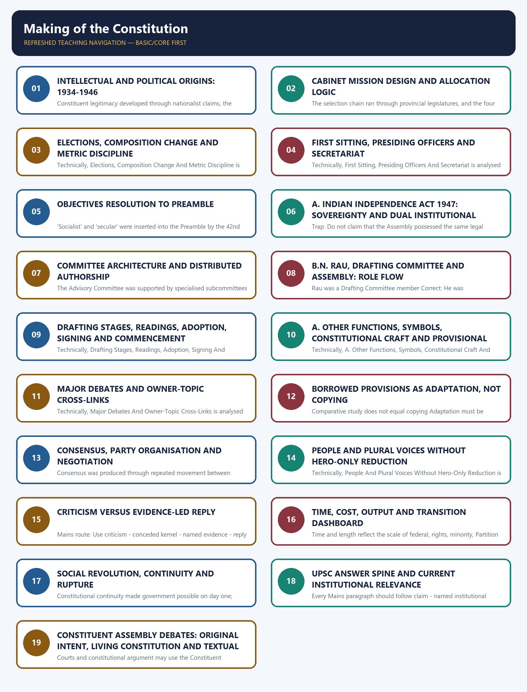

*Distinct embedded teaching-navigation image. The separate continuous Cārvāka-style flowchart package remains an independent at-a-glance artifact.*
### Source audit, syllabus boundary and package counts

- **Mandatory source order followed:** legacy complete package -> Basic owner -> Advanced owner -> Polity syllabus, README and PYQ routing ledgers -> direct text checks of both local OCR-searchable M. Laxmikanth Polity PDFs and official local question/key PDFs.
- **Current-source decision:** no live current-affairs story was forced. Samvidhan Divas (Constitution Day) is retained only as static context tied to 26 November; no 2026 commemorative claim is made. Qdrant was not used.
- **Official syllabus ownership:** Mains GS-II historical underpinnings and evolution of the Constitution; Prelims GS-I Indian Polity and Governance.
- **Verified/routed PYQs:** four Prelims questions — 2021 Q93, 2023 Q85, 2024 Q61 and 2026 Q55. No direct Mains PYQ was found; none is invented.
- **Practice:** 40 core MCQs + 8 remedials with one continuous A -> B -> C -> D rotation; four solved Prelims PYQs with precise status; six original solved Mains models (2 x 10, 2 x 15, 2 x 20).
- **Preservation:** the two legacy g1 PDFs, legacy g1 Markdown and all legacy assets remain untouched. No dedicated approved `polity-02` flowchart existed; the new companion is isolated and unapproved.
### Master learning roadmap

```text
DEMAND FOR INDIAN CONSTITUENT POWER (1934-46)
        -> CABINET MISSION DESIGN (389 / INDIRECT / PARTLY NOMINATED)
        -> FIRST SITTING + OBJECTIVES RESOLUTION
        -> INDEPENDENCE ACT SOVEREIGNTY UPGRADE
        -> COMMITTEES + B.N. RAU + DRAFTING COMMITTEE
        -> PUBLIC DRAFTS + THREE READINGS + AMENDMENTS
        -> ADOPTION -> SIGNING -> COMMENCEMENT
        -> FUNCTIONS + SYMBOLS + PROVISIONAL PARLIAMENT
        -> CRITICISMS + EVIDENCE-LED REPLIES
        -> DEBATES AS SUBORDINATE INTERPRETIVE AID
        -> QUALIFIED FOUNDING LEGITIMACY
```

### Metric discipline — never merge the denominators

| Figure | Meaning |
|---:|---|
| 389 | Original planned strength |
| 296 | British India allocation |
| 93 | Princely-state allocation |
| 211 | First-meeting attendance amid boycott |
| 299 | Post-Partition sanctioned strength |
| 284 | Members who signed on 24 January 1950 |

### Answer-line control register

The following sentences are controlled formulations. Each appears unchanged in the relevant teaching stage, the notes PDF and the complete flowchart companion.

1. **RECOMMENDED OPENING DEFINITION:** The making of India's Constitution was a negotiated transfer of constituent authority from colonial prescription to an Indian Assembly that converted nationalist claims, committee work and public deliberation into a sovereign democratic text.
2. **REPRESENTATION ARGUMENT:** The Assembly was indirectly elected and partly nominated, so its electoral mandate was limited; its legitimacy rests additionally on social range, reasoned deliberation and the universal adult franchise it constitutionalised.
3. **SOVEREIGNTY ARGUMENT:** The Assembly began under the Cabinet Mission scheme, but the Indian Independence Act 1947 removed external legal subordination and made it a sovereign constitution-making and legislative body.
4. **OBJECTIVES RESOLUTION:** The Objectives Resolution supplied the Constitution's normative compass by linking popular sovereignty, justice, equality, freedom, safeguards and world peace to the Preamble's final constitutional identity.
5. **PROCESS ANALYSIS:** Indian constitution-making was distributed authorship: committees settled principles, B.N. Rau prepared comparative advice, the Drafting Committee produced legal form and the Assembly amended and adopted the text.
6. **ADOPTION / COMMENCEMENT:** Adoption on 26 November 1949, signing on 24 January 1950 and general commencement on 26 January 1950 were distinct constitutional events governed by Articles 393-395.
7. **LEGITIMACY COMPENSATION:** By constitutionalising universal adult franchise, the Assembly prospectively widened political equality far beyond the restricted electorate through which it had been formed.
8. **CRITICISM / REPLY:** A balanced evaluation concedes the Assembly's restricted franchise, Congress dominance and social imbalance, but weighs them against post-1947 sovereignty, plural participation, clause-by-clause scrutiny and democratic constitutional output.
9. **INTERPRETIVE STATUS:** Constituent Assembly Debates are persuasive external aids to purpose where text is ambiguous, but they are neither binding law nor a licence to override the enacted Constitution.
10. **FINAL VERDICT:** The Constituent Assembly was neither perfectly representative nor merely colonial: it earned qualified founding legitimacy by converting a constrained origin into an inclusive, deliberative and universally democratic constitutional order.
### SESSION 1 — INTELLECTUAL AND POLITICAL ORIGINS: 1934-1946

#### DEFINITION / WHAT THIS IS CALLED

**Plain-language definition:** Constitution-making in India was the process by which the demand for an elected constituent body became an institutional transfer of founding authority.

**Technical definition:** Constituent legitimacy developed through nationalist claims, the Cabinet Mission framework, indirect election, committee deliberation and the Assembly's later exercise of sovereign authority.

#### ANSWER-GRABBING OPENING — WRITE/ADAPT IN THE EXAM

> India's Constitution emerged through a negotiated transition from colonial prescription to constituent self-government rather than through a single grant or isolated leader's proposal.

#### MUST-WRITE KEYWORDS

- **constituent authority**
- **M. N. Roy**
- **adult franchise**
- **Cabinet Mission**
- **Constituent Assembly**
- **nationalist demand**
- **legitimacy**
- **sovereignty**

**How to use them:** Frame the answer through constituent authority; define M. N. Roy, connect adult franchise with Cabinet Mission to explain the mechanism, and use Constituent Assembly for the decisive comparison or qualification.

**Answer-worthiness:** CORE PRELIMS + CORE MAINS

> **ANSWER-GRABBING LINE — WRITE/ADAPT IN THE EXAM (RECOMMENDED OPENING DEFINITION):** The making of India's Constitution was a negotiated transfer of constituent authority from colonial prescription to an Indian Assembly that converted nationalist claims, committee work and public deliberation into a sovereign democratic text.

[FACT] From a radical proposal to an accepted constitution-making principle.


*Caption: Original deterministic schematic prepared for this package; labels are source-checked.*

#### Chronology

| Date | Event |
|---|---|
| 1934 | M.N. Roy first put forward the idea |
| 1935 | Congress officially demanded a Constituent Assembly |
| 1938 | Nehru linked it to adult franchise and freedom from outside interference |
| 1940 | August Offer accepted the principle |
| 1942 | Cripps proposals; League sought two assemblies |
| 1946 | Cabinet Mission supplied the operative scheme |

#### Evidence matrix

| Stage | Institutional movement | Precision |
|---|---|---|
| M.N. Roy | Constitution made by Indians through a constituent body | Credit the proposal to Roy; do not call it a Congress proposal in 1934 |
| Congress demand | Nationalist ownership of constitution-making | Official demand in 1935; Nehru's adult-franchise formulation came in 1938 |
| British response | Rejection moved to acceptance in principle and then a scheme | August Offer was acceptance in principle, not the creation of the Assembly |
| Cabinet Mission | One Assembly under a negotiated federal scheme | It rejected the League's demand for two constituent assemblies |

#### Teaching and analysis

- [FACT] M.N. Roy, a pioneer of the communist movement in India, first put forward the idea of a Constituent Assembly in 1934. Source precision matters: he proposed the institutional idea; the Congress did not originate it.
- [FACT] The Indian National Congress first officially demanded a Constituent Assembly in 1935. In 1938, Jawaharlal Nehru stated that free India's Constitution should be framed without outside interference by an Assembly elected on adult franchise.
- [FACT] The August Offer of 1940 accepted the constitution-making principle. The Cripps proposals of 1942 envisaged post-war constitution-making, but the Muslim League sought two constituent assemblies.
- [FACT] The Cabinet Mission of 1946 rejected two assemblies and supplied the scheme under which the Indian Constituent Assembly was constituted.
- [ANALYSIS] The demand changed the source of constitutional authority: from a statute enacted for India by Westminster to a constitution reasoned and adopted in India.
- [LIMIT] Topic 01 owns the colonial Acts. This package uses only the endpoint bridge: the 1935 Act supplied inherited administrative material, but not the democratic source of the Constitution.

#### Rapid recall

- Roy: 1934
- Congress official demand: 1935
- Nehru adult-franchise formulation: 1938
- August Offer: 1940
- Cabinet Mission scheme: 1946

#### Close-option traps

- Wrong: Congress first proposed the idea in 1934
  Correct: M.N. Roy did; Congress officially demanded it in 1935
- Wrong: August Offer created the Assembly
  Correct: It accepted the principle; the Cabinet Mission supplied the operative scheme

**Mains route:** Use a source-of-authority thesis: indigenous demand -> British concession -> negotiated scheme -> sovereign constitution-making after 1947.

**Owner link:** Polity 01: concise 1935 Act and 1946 transition only.

#### CLOSING RECALL FLOW — INTELLECTUAL AND POLITICAL ORIGINS: 1934-1946

```text
START / CONCEPT: INTELLECTUAL AND POLITICAL ORIGINS: 1934-1946
        |
        v
EXACT TERMS: constituent authority · M. N. Roy · adult franchise · Cabinet Mission · Constituent Assembly · nationalist demand · legitimacy · sovereignty
        |
        v
MECHANISM / ARGUMENT: Political demands for an elected assembly were translated into the Cabinet Mission scheme and then transformed by deliberation and independence into sovereign constitution-making.
        |
        v
CONSEQUENCE / CONTRAST: The Assembly's constrained electoral origin remained a limitation, but its deliberative work and adoption of universal adult franchise strengthened its founding legitimacy.
        |
        v
UPSC TRAP / ANSWER-USE: Do not use Nehru's 1938 statement or any single historical proposal as the definition of constitution-making or as complete proof of constituent legitimacy.
        |
        v
ANSWER-GRABBING FORMULATION: India's Constitution emerged through a negotiated transition from colonial prescription to constituent self-government rather than through a single grant or isolated leader's proposal.
```
### SESSION 2 — CABINET MISSION DESIGN AND ALLOCATION LOGIC

#### DEFINITION / WHAT THIS IS CALLED

**Plain-language definition:** Allocation was broadly one seat per million population.

**Technical definition:** The selection chain ran through provincial legislatures, and the four Chief Commissioners' province seats formed a distinct component.

#### ANSWER-GRABBING OPENING — WRITE/ADAPT IN THE EXAM

> Allocation was broadly one seat per million population.

#### MUST-WRITE KEYWORDS

- **Cabinet Mission Design**
- **Allocation Logic**
- **May 1946**
- **Cabinet Mission statement and scheme**
- **July-August 1946**
- **Elections for British Indian seats**

**How to use them:** Frame the answer through Cabinet Mission Design; define Allocation Logic, connect May 1946 with Cabinet Mission statement and scheme to explain the mechanism, and use July-August 1946 for the decisive comparison or qualification.

**Answer-worthiness:** CORE PRELIMS + CORE MAINS

> **ANSWER-GRABBING LINE — WRITE/ADAPT IN THE EXAM (REPRESENTATION ARGUMENT):** The Assembly was indirectly elected and partly nominated, so its electoral mandate was limited; its legitimacy rests additionally on social range, reasoned deliberation and the universal adult franchise it constitutionalised.

[FACT] A federal, indirect and partly nominated Assembly.


*Caption: Original deterministic schematic prepared for this package; labels are source-checked.*

#### Chronology

| Date | Event |
|---|---|
| May 1946 | Cabinet Mission statement and scheme |
| July-August 1946 | Elections for British Indian seats |
| November 1946 | Assembly constituted under the scheme |

#### Evidence matrix

| Component | Planned seats | Selection |
|---|---|---|
| Governors' provinces | 292 | Community members of provincial assemblies elected representatives by PR-STV |
| Chief Commissioners' provinces | 4 | One each under the scheme |
| Princely states | 93 | Representatives nominated by rulers |
| Total | 389 | 296 British India plus 93 princely states |

#### Teaching and analysis

- [FACT] Planned strength was 389: 292 from eleven Governors' provinces, 4 from Chief Commissioners' provinces and 93 from princely states.
- [FACT] Allocation was broadly one seat per million population. Provincial seats were divided among Muslim, Sikh and General categories in proportion to their population.
- [FACT] Within a province, members of each community in the provincial legislative assembly elected that community's representatives by proportional representation through the single transferable vote.
- [FACT] Provincial assembly members themselves rested on the limited franchise of the period. Therefore the Constituent Assembly was indirectly elected, not elected by universal adult suffrage.
- [FACT] Princely-state representatives were to be nominated by the rulers. The Assembly was consequently partly elected and partly nominated.
- [LIMIT] Source caution: the Cabinet Mission statement contemplated settling the precise method of princely-state representation through consultation; standard UPSC texts describe the representatives who joined as nominated by rulers. Do not imply a popular election in the states.
- [LIMIT] Do not say every one of the 296 British Indian seats was filled through an identical direct popular ballot. The selection chain ran through provincial legislatures, and the four Chief Commissioners' province seats formed a distinct component.
- [ANALYSIS] The scheme tried to combine population, community assurance and territorial representation; this enhanced negotiated inclusion but entrenched categories inherited from late-colonial politics.

#### Rapid recall

- 389 planned
- 296 British India
- 93 princely states
- One seat per million, roughly
- PR by STV within community groups

#### Close-option traps

- Wrong: The people directly elected the Assembly
  Correct: Provincial legislators indirectly elected provincial representatives
- Wrong: Princely-state representatives were elected by provincial assemblies
  Correct: They were nominated by their rulers

**Mains route:** For representativeness, state the exact selection chain before judging legitimacy.

**Owner link:** Later owners: Federal System; Elections; Representation.

#### CLOSING RECALL FLOW — CABINET MISSION DESIGN AND ALLOCATION LOGIC

```text
START / CONCEPT: CABINET MISSION DESIGN AND ALLOCATION LOGIC
        |
        v
EXACT TERMS: Cabinet Mission Design · Allocation Logic · May 1946 · Cabinet Mission statement and scheme · July-August 1946 · Elections for British Indian seats
        |
        v
MECHANISM / ARGUMENT: Therefore the Constituent Assembly was indirectly elected, not elected by universal adult suffrage.
        |
        v
CONSEQUENCE / CONTRAST: Do not say every one of the 296 British Indian seats was filled through an identical direct popular ballot.
        |
        v
UPSC TRAP / ANSWER-USE: Do not miss this limiting distinction: the Assembly was consequently partly elected and partly nominated.
        |
        v
ANSWER-GRABBING FORMULATION: Allocation was broadly one seat per million population.
```
### SESSION 3 — ELECTIONS, COMPOSITION CHANGE AND METRIC DISCIPLINE

#### DEFINITION / WHAT THIS IS CALLED

**Plain-language definition:** A single number cannot answer 'how representative?' Use selection method, social range, political dominance, boycott and post-Partition change together.

**Technical definition:** Technically, Elections, Composition Change And Metric Discipline is analysed by relating Elections to Composition Change, then testing the relationship through Metric Discipline and July-August 1946.

#### ANSWER-GRABBING OPENING — WRITE/ADAPT IN THE EXAM

> A single number cannot answer 'how representative?' Use selection method, social range, political dominance, boycott and post-Partition change together.

#### MUST-WRITE KEYWORDS

- **Elections**
- **Composition Change**
- **Metric Discipline**
- **July-August 1946**
- **First meeting; 211 attended amid League boycott**
- **9 Dec 1946**

**How to use them:** Frame the answer through Elections; define Composition Change, connect Metric Discipline with July-August 1946 to explain the mechanism, and use First meeting; 211 attended amid League boycott for the decisive comparison or qualification.

**Answer-worthiness:** CORE PRELIMS + CORE MAINS

> **ANSWER-GRABBING LINE — WRITE/ADAPT IN THE EXAM (LEGITIMACY COMPENSATION):** By constitutionalising universal adult franchise, the Assembly prospectively widened political equality far beyond the restricted electorate through which it had been formed.

[FACT] Never conflate planned strength, post-Partition strength, attendance or signatures.


*Caption: Original deterministic schematic prepared for this package; labels are source-checked.*

#### Chronology

| Date | Event |
|---|---|
| July-August 1946 | Congress 208, League 73, others 15 in elections for 296 seats |
| 9 Dec 1946 | First meeting; 211 attended amid League boycott |
| After Partition | Strength re-fixed at 299: 229 provinces plus 70 states |
| 24 Jan 1950 | 284 members signed the Constitution |

#### Evidence matrix

| Metric | Verified figure | Meaning |
|---|---|---|
| Original planned strength | 389 | Design ceiling under Cabinet Mission |
| British India allocation/election frame | 296 | 292 Governors' provinces plus 4 Chief Commissioners' provinces |
| Post-Partition strength | 299 | 229 provincial plus 70 princely-state seats |
| First-meeting attendance | 211 | Attendance amid boycott, not membership strength |
| Signatories on 24 Jan 1950 | 284 | Actual signatures, not post-Partition sanctioned strength |

#### Teaching and analysis

- [FACT] In the 1946 elections for 296 British Indian seats, Congress won 208, the Muslim League 73, and smaller groups and independents 15. The 93 princely-state seats were initially unfilled because the states stayed away.
- [FACT] The Muslim League boycotted the first meeting; 211 members attended on 9 December 1946.
- [FACT] Partition reduced the strength from 389 to 299, consisting of 229 provincial and 70 princely-state seats.
- [FACT] On 24 January 1950, 284 members appended their signatures. Signing occurred after adoption, and 284 must not be presented as the Assembly's post-Partition strength.
- [ANALYSIS] Congress dominance was arithmetically real. Yet Congress functioned as a broad coalition, and the Assembly also included non-Congress experts and diverse social voices.
- [LIMIT] A single number cannot answer 'how representative?' Use selection method, social range, political dominance, boycott and post-Partition change together.

#### Rapid recall

- 208 Congress
- 73 Muslim League
- 15 others
- 299 after Partition
- 284 signatories on 24 January 1950

#### Close-option traps

- Wrong: 284 was the post-Partition strength
  Correct: 299 was the strength; 284 signed
- Wrong: 389 members attended the first meeting
  Correct: 211 attended amid the League boycott

**Mains route:** Open legitimacy answers with a five-metric box: 389, 296, 299, 211 and 284.

**Owner link:** Polity 43 Political Parties for Congress as umbrella organisation.

#### CLOSING RECALL FLOW — ELECTIONS, COMPOSITION CHANGE AND METRIC DISCIPLINE

```text
START / CONCEPT: ELECTIONS, COMPOSITION CHANGE AND METRIC DISCIPLINE
        |
        v
EXACT TERMS: Elections · Composition Change · Metric Discipline · July-August 1946 · First meeting; 211 attended amid League boycott · 9 Dec 1946
        |
        v
MECHANISM / ARGUMENT: The 93 princely-state seats were initially unfilled because the states stayed away.
        |
        v
CONSEQUENCE / CONTRAST: The resulting consequence is that a single number cannot answer 'how representative?' Use selection method, social range, political dominance...
        |
        v
UPSC TRAP / ANSWER-USE: Wrong: 284 was the post-Partition strength Correct: 299 was the strength; 284 signed Wrong: 389 members attended the first meeting Correct: 211 attended amid the League boycott.
        |
        v
ANSWER-GRABBING FORMULATION: A single number cannot answer 'how representative?' Use selection method, social range, political dominance, boycott and post-Partition change together.
```
### SESSION 4 — FIRST SITTING, PRESIDING OFFICERS AND SECRETARIAT

#### DEFINITION / WHAT THIS IS CALLED

**Plain-language definition:** The first meeting was held on 9 December 1946.

**Technical definition:** Technically, First Sitting, Presiding Officers And Secretariat is analysed by relating First Sitting to Presiding Officers, then testing the relationship through Secretariat and First sitting; Sachchidananda Sinha temporary President.

#### ANSWER-GRABBING OPENING — WRITE/ADAPT IN THE EXAM

> The first meeting was held on 9 December 1946.

#### MUST-WRITE KEYWORDS

- **First Sitting**
- **Presiding Officers**
- **Secretariat**
- **First sitting; Sachchidananda Sinha temporary President**
- **9 Dec 1946**
- **11 Dec 1946**

**How to use them:** Frame the answer through First Sitting; define Presiding Officers, connect Secretariat with First sitting; Sachchidananda Sinha temporary President to explain the mechanism, and use 9 Dec 1946 for the decisive comparison or qualification.

**Answer-worthiness:** CORE PRELIMS

[FACT] The Assembly was an institution, not only a gathering of famous leaders.

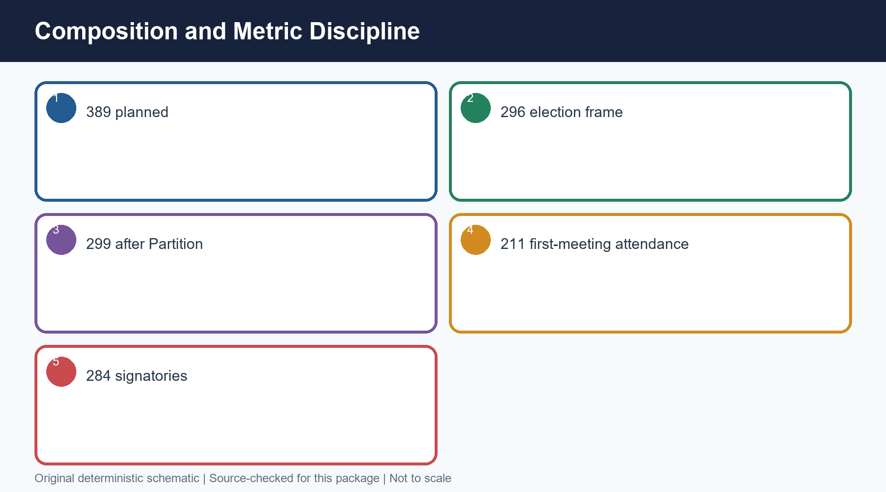

*Caption: Original deterministic schematic prepared for this package; labels are source-checked.*

#### Chronology

| Date | Event |
|---|---|
| 9 Dec 1946 | First sitting; Sachchidananda Sinha temporary President |
| 11 Dec 1946 | Rajendra Prasad elected permanent President |
| 13 Dec 1946 | Objectives Resolution introduced |
| 22 Jan 1947 | Objectives Resolution adopted |

#### Evidence matrix

| Role | Person | Function |
|---|---|---|
| Temporary President | Dr Sachchidananda Sinha | Presided at the opening under the French oldest-member practice |
| President | Dr Rajendra Prasad | Presided over constituent deliberations |
| Vice-Presidents | H.C. Mukherjee and V.T. Krishnamachari | Assisted the presidency |
| Constitutional Adviser | B.N. Rau | Research, comparative advice and initial constitutional-adviser draft |
| Secretary | H.V.R. Iyengar | Assembly secretariat |
| Chief Draftsman | S.N. Mukerjee | Technical legislative drafting |

#### Teaching and analysis

- [FACT] The first meeting was held on 9 December 1946. Sachchidananda Sinha, the oldest member, became temporary President following the French practice.
- [FACT] Rajendra Prasad was elected permanent President. H.C. Mukherjee and V.T. Krishnamachari served as Vice-Presidents.
- [FACT] B.N. Rau was Constitutional Adviser; H.V.R. Iyengar was Secretary; S.N. Mukerjee was Chief Draftsman.
- [ANALYSIS] Secretariat and drafting expertise converted political settlements into administrable text. A leader-only narrative misses this institutional production chain.
- [LIMIT] The Assembly had distinct constituent and legislative capacities after independence. Rajendra Prasad presided in the constituent role; G.V. Mavlankar presided when it functioned as the Dominion legislature.

#### Rapid recall

- Temporary: Sinha
- Permanent: Rajendra Prasad
- Constitutional Adviser: B.N. Rau
- Secretary: H.V.R. Iyengar
- Chief Draftsman: S.N. Mukerjee

#### Close-option traps

- Wrong: Rajendra Prasad was temporary President
  Correct: Sachchidananda Sinha was temporary; Prasad was permanent
- Wrong: B.N. Rau chaired the Drafting Committee
  Correct: Ambedkar chaired it; Rau was Constitutional Adviser

**Mains route:** Use role differentiation to avoid hero-only answers.

**Owner link:** Parliament owner for the Dominion-legislature/provisional-Parliament transition.

#### CLOSING RECALL FLOW — FIRST SITTING, PRESIDING OFFICERS AND SECRETARIAT

```text
START / CONCEPT: FIRST SITTING, PRESIDING OFFICERS AND SECRETARIAT
        |
        v
EXACT TERMS: First Sitting · Presiding Officers · Secretariat · First sitting; Sachchidananda Sinha temporary President · 9 Dec 1946 · 11 Dec 1946
        |
        v
MECHANISM / ARGUMENT: The Assembly was an institution, not only a gathering of famous leaders.
        |
        v
CONSEQUENCE / CONTRAST: Sachchidananda Sinha, the oldest member, became temporary President following the French practice.
        |
        v
UPSC TRAP / ANSWER-USE: Do not miss this limiting distinction: the Assembly had distinct constituent and legislative capacities after independence.
        |
        v
ANSWER-GRABBING FORMULATION: The first meeting was held on 9 December 1946.
```
### SESSION 5 — OBJECTIVES RESOLUTION TO PREAMBLE

#### DEFINITION / WHAT THIS IS CALLED

**Plain-language definition:** Nehru moved the Objectives Resolution on 13 December 1946; it was adopted on 22 January 1947.

**Technical definition:** 'Socialist' and 'secular' were inserted into the Preamble by the 42nd Amendment in 1976.

#### ANSWER-GRABBING OPENING — WRITE/ADAPT IN THE EXAM

> Mains route: Show the chain: political resolution - drafting constraint - Preamble - interpretive identity.

#### MUST-WRITE KEYWORDS

- **Objectives Resolution To Preamble**
- **Nehru moved the Objectives Resolution**
- **Assembly adopted it unanimously**
- **13 Dec 1946**
- **22 Jan 1947**
- **26 Nov 1949**

**How to use them:** Frame the answer through Objectives Resolution To Preamble; define Nehru moved the Objectives Resolution, connect Assembly adopted it unanimously with 13 Dec 1946 to explain the mechanism, and use 22 Jan 1947 for the decisive comparison or qualification.

**Answer-worthiness:** CORE MAINS + CORE PRELIMS

> **ANSWER-GRABBING LINE — WRITE/ADAPT IN THE EXAM (OBJECTIVES RESOLUTION):** The Objectives Resolution supplied the Constitution's normative compass by linking popular sovereignty, justice, equality, freedom, safeguards and world peace to the Preamble's final constitutional identity.

[FACT] Values were fixed before the final clauses.


*Caption: Original deterministic schematic prepared for this package; labels are source-checked.*

#### Chronology

| Date | Event |
|---|---|
| 13 Dec 1946 | Nehru moved the Objectives Resolution |
| 22 Jan 1947 | Assembly adopted it unanimously |
| 26 Nov 1949 | Modified values enacted in the Preamble |

#### Evidence matrix

| Resolution idea | Constitutional destination | Caution |
|---|---|---|
| Independent sovereign republic | Preamble's sovereign democratic republic | Socialist and secular were added only in 1976 |
| Power from the people | We, the People | The Assembly itself was indirectly elected |
| Justice, equality and freedoms | Preamble plus Parts III and IV | Specific rights are owned by later topics |
| Minority/backward/tribal safeguards | Rights and special constitutional protections | Do not reduce safeguards to separate electorates |
| World peace | Preamble/Directive Principle ethos | Not a justiciable foreign-policy command |

#### Teaching and analysis

- [FACT] Nehru moved the Objectives Resolution on 13 December 1946; it was adopted on 22 January 1947.
- [FACT] It declared the resolve for an independent sovereign republic, a Union, authority derived from the people, justice, equality and freedoms, safeguards for minorities and backward and tribal areas, territorial integrity and contribution to world peace.
- [FACT] Its modified form became the Preamble.
- [ANALYSIS] The Resolution worked as a normative constraint: committees could disagree about machinery, but they drafted within a publicly stated value framework.
- [LIMIT] It did not contain the final 1949 wording. 'Socialist' and 'secular' were inserted into the Preamble by the 42nd Amendment in 1976.

#### Rapid recall

- Moved: 13 December 1946
- Adopted: 22 January 1947
- Mover: Nehru
- Modified form: Preamble

#### Close-option traps

- Wrong: Ambedkar moved the Resolution
  Correct: Nehru moved it
- Wrong: The 1947 Resolution used the final amended Preamble verbatim
  Correct: It became the Preamble in modified form

**Mains route:** Show the chain: political resolution -> drafting constraint -> Preamble -> interpretive identity.

**Owner link:** Polity 04 Preamble owns doctrine and later interpretation.

#### CLOSING RECALL FLOW — OBJECTIVES RESOLUTION TO PREAMBLE

```text
START / CONCEPT: OBJECTIVES RESOLUTION TO PREAMBLE
        |
        v
EXACT TERMS: Objectives Resolution To Preamble · Nehru moved the Objectives Resolution · Assembly adopted it unanimously · 13 Dec 1946 · 22 Jan 1947 · 26 Nov 1949
        |
        v
MECHANISM / ARGUMENT: 'Socialist' and 'secular' were inserted into the Preamble by the 42nd Amendment in 1976.
        |
        v
CONSEQUENCE / CONTRAST: The Resolution worked as a normative constraint: committees could disagree about machinery, but they drafted within a publicly stated value framework.
        |
        v
UPSC TRAP / ANSWER-USE: Do not miss this limiting distinction: nehru moved the Objectives Resolution on 13 December 1946.
        |
        v
ANSWER-GRABBING FORMULATION: Mains route: Show the chain: political resolution - drafting constraint - Preamble - interpretive identity.
```
### SESSION 6 — A. INDIAN INDEPENDENCE ACT 1947: SOVEREIGNTY AND DUAL INSTITUTIONAL ROLES

#### DEFINITION / WHAT THIS IS CALLED

**Plain-language definition:** Sovereignty criticism must be periodised: the Cabinet Mission shaped the Assembly's origin, while the 1947 Act removed the continuing British legal veto.

**Technical definition:** Trap: Do not claim that the Assembly possessed the same legal sovereignty at its first sitting and after 15 August 1947.

#### ANSWER-GRABBING OPENING — WRITE/ADAPT IN THE EXAM

> Sovereignty criticism must be periodised: the Cabinet Mission shaped the Assembly's origin, while the 1947 Act removed the continuing British legal veto.

#### MUST-WRITE KEYWORDS

- **A. Indian Independence Act 1947**
- **Sovereignty**
- **Dual Institutional Roles**
- **Constituent body**
- **Dr Rajendra Prasad**
- **Framed, debated and adopted the Constitution**

**How to use them:** Frame the answer through A. Indian Independence Act 1947; define Sovereignty, connect Dual Institutional Roles with Constituent body to explain the mechanism, and use Dr Rajendra Prasad for the decisive comparison or qualification.

**Answer-worthiness:** CORE PRELIMS + CORE MAINS

> **ANSWER-GRABBING LINE — WRITE/ADAPT IN THE EXAM (SOVEREIGNTY ARGUMENT):** The Assembly began under the Cabinet Mission scheme, but the Indian Independence Act 1947 removed external legal subordination and made it a sovereign constitution-making and legislative body.

[FACT] The Indian Independence Act 1947 transformed the Assembly's legal position. It could frame any Constitution for India, alter or repeal British constitutional statutes applicable to India and exercise legislative authority for the Dominion.

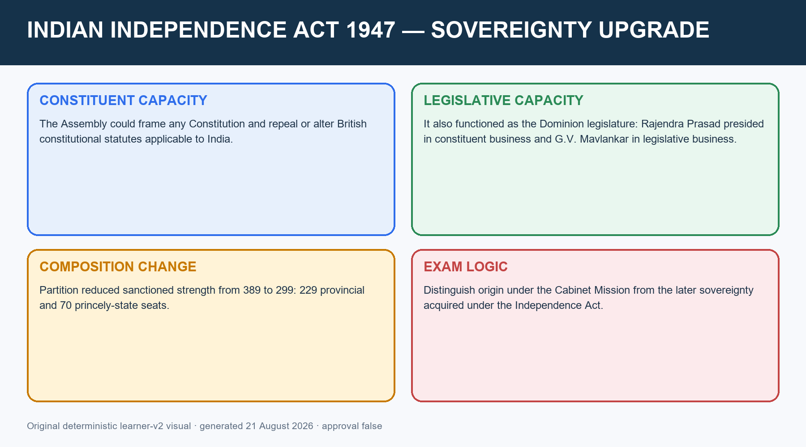

*Caption: The Assembly's origin and its post-independence sovereignty must be judged at different dates. Original deterministic learner-v2 visual.*

#### Role map

| Capacity after independence | Presiding officer | Function |
|---|---|---|
| Constituent body | Dr Rajendra Prasad | Framed, debated and adopted the Constitution |
| Dominion legislature | G.V. Mavlankar | Performed ordinary legislative business |

#### Teaching and analysis

- [FACT] The Act ended external constitutional subordination to Westminster and enabled the Assembly to repeal British enactments for India.
- [FACT] Partition led members from areas allocated to Pakistan to withdraw; sanctioned strength became 299, comprising 229 provincial and 70 princely-state seats.
- [ANALYSIS] Sovereignty criticism must be periodised: the Cabinet Mission shaped the Assembly's origin, while the 1947 Act removed the continuing British legal veto.
- [LIMIT] Sovereignty did not cure every democratic deficit. Indirect election, restricted franchise and princely nomination remain relevant to representativeness.

#### Rapid recall and trap

- Origin: Cabinet Mission scheme.
- Sovereignty upgrade: Indian Independence Act 1947.
- Constituent chair: Rajendra Prasad.
- Legislative chair: G.V. Mavlankar.
- **Trap:** Do not claim that the Assembly possessed the same legal sovereignty at its first sitting and after 15 August 1947.

#### CLOSING RECALL FLOW — A. INDIAN INDEPENDENCE ACT 1947: SOVEREIGNTY AND DUAL INSTITUTIONAL ROLES

```text
START / CONCEPT: A. INDIAN INDEPENDENCE ACT 1947: SOVEREIGNTY AND DUAL INSTITUTIONAL ROLES
        |
        v
EXACT TERMS: A. Indian Independence Act 1947 · Sovereignty · Dual Institutional Roles · Constituent body · Dr Rajendra Prasad · Framed, debated and adopted the Constitution
        |
        v
MECHANISM / ARGUMENT: Trap: Do not claim that the Assembly possessed the same legal sovereignty at its first sitting and after 15 August 1947.
        |
        v
CONSEQUENCE / CONTRAST: It could frame any Constitution for India, alter or repeal British constitutional statutes applicable to India and exercise legislative authority for the Dominion.
        |
        v
UPSC TRAP / ANSWER-USE: Do not miss this limiting distinction: the Act ended external constitutional subordination to Westminster and enabled the Assembly to repeal...
        |
        v
ANSWER-GRABBING FORMULATION: Sovereignty criticism must be periodised: the Cabinet Mission shaped the Assembly's origin, while the 1947 Act removed the continuing British legal veto.
```
### SESSION 7 — COMMITTEE ARCHITECTURE AND DISTRIBUTED AUTHORSHIP

#### DEFINITION / WHAT THIS IS CALLED

**Plain-language definition:** Indian constitution-making was distributed authorship: committees settled principles, B.N.

**Technical definition:** The Advisory Committee was supported by specialised subcommittees on fundamental rights, minorities, and tribal/excluded areas.

#### ANSWER-GRABBING OPENING — WRITE/ADAPT IN THE EXAM

> Indian constitution-making was distributed authorship: committees settled principles, B.N. Rau prepared comparative advice, the Drafting Committee produced legal form and the Assembly amended and adopted the text.

#### MUST-WRITE KEYWORDS

- **Committee Architecture**
- **Distributed Authorship**
- **Major subject committees and subcommittees worked**
- **Drafting Committee appointed**
- **1946-47**
- **29 Aug 1947**

**How to use them:** Frame the answer through Committee Architecture; define Distributed Authorship, connect Major subject committees and subcommittees worked with Drafting Committee appointed to explain the mechanism, and use 1946-47 for the decisive comparison or qualification.

**Answer-worthiness:** CORE PRELIMS + CORE MAINS

> **ANSWER-GRABBING LINE — WRITE/ADAPT IN THE EXAM (PROCESS ANALYSIS):** Indian constitution-making was distributed authorship: committees settled principles, B.N. Rau prepared comparative advice, the Drafting Committee produced legal form and the Assembly amended and adopted the text.

[FACT] Specialisation, reporting and Assembly control.

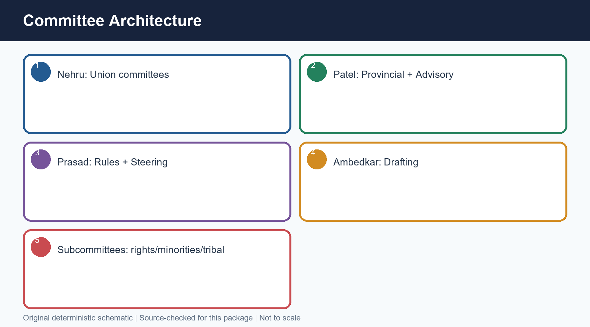

*Caption: Original deterministic schematic prepared for this package; labels are source-checked.*

#### Chronology

| Date | Event |
|---|---|
| 1946-47 | Major subject committees and subcommittees worked |
| 29 Aug 1947 | Drafting Committee appointed |
| 1948-49 | Draft examined through readings and amendments |

#### Evidence matrix

| Committee | Chair | Core scope |
|---|---|---|
| Union Powers Committee | Jawaharlal Nehru | Distribution and character of Union powers |
| Union Constitution Committee | Jawaharlal Nehru | Structure of the Union constitution |
| Provincial Constitution Committee | Vallabhbhai Patel | Provincial constitutional structure |
| Advisory Committee | Vallabhbhai Patel | Fundamental rights, minorities, tribal and excluded areas |
| Fundamental Rights Sub-Committee | J.B. Kripalani | Rights recommendations |
| Minorities Sub-Committee | H.C. Mukherjee | Minority safeguards |
| North-East Frontier (Assam) Tribal/Excluded Areas Sub-Committee | Gopinath Bardoloi | Assam tribal and excluded areas |
| Excluded and Partially Excluded Areas Sub-Committee (other than Assam) | A.V. Thakkar | Tribal/excluded areas outside Assam |
| Drafting Committee | B.R. Ambedkar | Convert decisions and reports into a coherent draft |

#### Teaching and analysis

- [FACT] Major committees included Union Powers and Union Constitution under Nehru; Provincial Constitution and the Advisory Committee under Patel; Drafting under Ambedkar; Rules of Procedure and Steering under Rajendra Prasad; and the States Committee under Nehru.
- [FACT] The Advisory Committee was supported by specialised subcommittees on fundamental rights, minorities, and tribal/excluded areas.
- [ANALYSIS] Committee architecture separated agenda formation, negotiated settlement, legal drafting and plenary authorisation.
- [ANALYSIS] This is why 'Ambedkar wrote the Constitution' is useful shorthand but bad institutional history: reports, adviser work, drafting, amendments and final Assembly votes were separate stages.
- [LIMIT] Chairmanship does not imply sole authorship; committee recommendations remained subject to the Assembly.

#### Rapid recall

- Nehru: Union Powers/Union Constitution/States
- Patel: Provincial Constitution/Advisory
- Ambedkar: Drafting
- Kripalani: FR Sub-Committee
- Mukherjee: Minorities

#### Close-option traps

- Wrong: Drafting Committee decided every constitutional principle independently
  Correct: It drafted within Assembly and committee decisions
- Wrong: Patel chaired the Fundamental Rights Sub-Committee
  Correct: J.B. Kripalani chaired it; Patel chaired the parent Advisory Committee

**Mains route:** Draw a committee-to-plenary production chain in Mains answers.

**Owner link:** Later owners teach the provisions produced by these committees.

#### CLOSING RECALL FLOW — COMMITTEE ARCHITECTURE AND DISTRIBUTED AUTHORSHIP

```text
START / CONCEPT: COMMITTEE ARCHITECTURE AND DISTRIBUTED AUTHORSHIP
        |
        v
EXACT TERMS: Committee Architecture · Distributed Authorship · Major subject committees and subcommittees worked · Drafting Committee appointed · 1946-47 · 29 Aug 1947
        |
        v
MECHANISM / ARGUMENT: The Advisory Committee was supported by specialised subcommittees on fundamental rights, minorities, and tribal/excluded areas.
        |
        v
CONSEQUENCE / CONTRAST: Chairmanship does not imply sole authorship; committee recommendations remained subject to the Assembly.
        |
        v
UPSC TRAP / ANSWER-USE: Do not miss this limiting distinction: indian constitution-making was distributed authorship: committees settled principles, B.N.
        |
        v
ANSWER-GRABBING FORMULATION: Indian constitution-making was distributed authorship: committees settled principles, B.N. Rau prepared comparative advice, the Drafting Committee produced legal form and the Assembly amended and adopted the text.
```
### SESSION 8 — B.N. RAU, DRAFTING COMMITTEE AND ASSEMBLY: ROLE FLOW

#### DEFINITION / WHAT THIS IS CALLED

**Plain-language definition:** Research is not drafting; drafting is not adoption.

**Technical definition:** Rau was a Drafting Committee member Correct: He was Constitutional Adviser Wrong: The Drafting Committee's text became law without plenary amendment Correct: The Assembly debated and amended it.

#### ANSWER-GRABBING OPENING — WRITE/ADAPT IN THE EXAM

> Rau was a Drafting Committee member Correct: He was Constitutional Adviser Wrong: The Drafting Committee's text became law without plenary amendment Correct: The Assembly debated and amended it.

#### MUST-WRITE KEYWORDS

- **B.N. Rau**
- **Drafting Committee**
- **Assembly**
- **Role Flow**
- **Oct 1947**
- **Constitutional Adviser prepared an initial draft**

**How to use them:** Frame the answer through B.N. Rau; define Drafting Committee, connect Assembly with Role Flow to explain the mechanism, and use Oct 1947 for the decisive comparison or qualification.

**Answer-worthiness:** CORE MAINS + CORE PRELIMS

[FACT] Research is not drafting; drafting is not adoption.

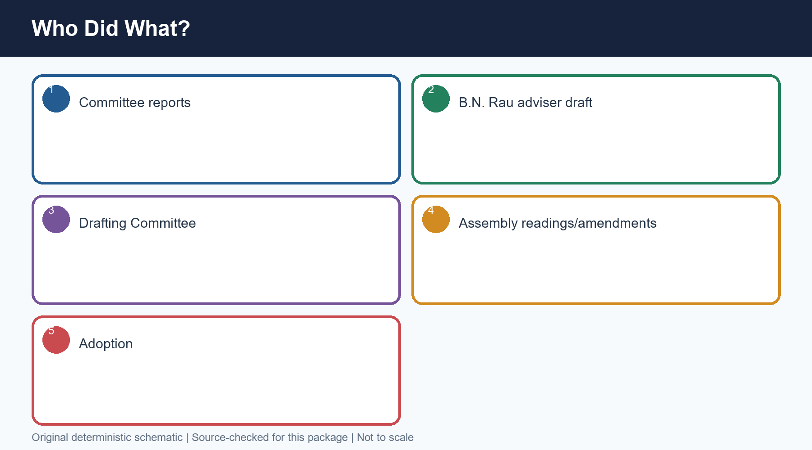

*Caption: Original deterministic schematic prepared for this package; labels are source-checked.*

#### Chronology

| Date | Event |
|---|---|
| Oct 1947 | Constitutional Adviser prepared an initial draft |
| 29 Aug 1947 | Drafting Committee appointed |
| Feb 1948 | Draft Constitution published |
| Oct 1948 | Revised draft published |
| 4 Nov 1948 | Ambedkar introduced the Draft in the Assembly |

#### Evidence matrix

| Actor | Contribution | Boundary |
|---|---|---|
| B.N. Rau | Comparative research, advice, initial adviser draft | Did not chair the Drafting Committee or adopt the Constitution |
| Drafting Committee | Scrutinised material, reconciled decisions and framed the Draft Constitution | Could not replace the plenary Assembly's authority |
| B.R. Ambedkar | Chaired Drafting Committee; piloted and defended the Draft | Central role, but not solitary authorship |
| S.N. Mukerjee | Technical drafting and language | Not the constitutional decision-maker |
| Constituent Assembly | Debated, amended, adopted and later signed | Final institutional author |

#### Teaching and analysis

- [FACT] B.N. Rau's adviser draft preceded the Drafting Committee's published Draft Constitution.
- [FACT] The seven-member Drafting Committee was appointed on 29 August 1947 under B.R. Ambedkar.
- [FACT] Original members were Ambedkar, N. Gopalaswami Ayyangar, Alladi Krishnaswami Ayyar, K.M. Munshi, Mohammad Saadulla, B.L. Mitter and D.P. Khaitan. N. Madhava Rau replaced Mitter; T.T. Krishnamachari replaced Khaitan.
- [FACT] The Drafting Committee sat for 141 days. A draft appeared in February 1948 and a revised draft in October 1948.
- [ANALYSIS] Rau widened the menu of constitutional techniques; the Committee converted choices into a coherent instrument; the Assembly supplied democratic-deliberative authority.
- [LIMIT] Avoid both errors: erasing Ambedkar's exceptional leadership and reducing a collective process to one person.

#### Rapid recall

- Drafting Committee: 29 August 1947
- Seven members
- 141 sitting days
- Rau adviser draft before Committee draft
- Ambedkar introduced Draft: 4 November 1948

#### Close-option traps

- Wrong: B.N. Rau was a Drafting Committee member
  Correct: He was Constitutional Adviser
- Wrong: The Drafting Committee's text became law without plenary amendment
  Correct: The Assembly debated and amended it

**Mains route:** Role-flow answers score because they attribute each stage precisely.

**Owner link:** Preamble, FR, DPSP, Federal and Parliamentary owner topics.

#### CLOSING RECALL FLOW — B.N. RAU, DRAFTING COMMITTEE AND ASSEMBLY: ROLE FLOW

```text
START / CONCEPT: B.N. RAU, DRAFTING COMMITTEE AND ASSEMBLY: ROLE FLOW
        |
        v
EXACT TERMS: B.N. Rau · Drafting Committee · Assembly · Role Flow · Oct 1947 · Constitutional Adviser prepared an initial draft
        |
        v
MECHANISM / ARGUMENT: The seven-member Drafting Committee was appointed on 29 August 1947 under B.R.
        |
        v
CONSEQUENCE / CONTRAST: Research is not drafting; drafting is not adoption.
        |
        v
UPSC TRAP / ANSWER-USE: Do not miss this limiting distinction: rau widened the menu of constitutional techniques.
        |
        v
ANSWER-GRABBING FORMULATION: Rau was a Drafting Committee member Correct: He was Constitutional Adviser Wrong: The Drafting Committee's text became law without plenary amendment Correct: The Assembly debated and amended it.
```
### SESSION 9 — DRAFTING STAGES, READINGS, ADOPTION, SIGNING AND COMMENCEMENT

#### DEFINITION / WHAT THIS IS CALLED

**Plain-language definition:** Adoption on 26 November 1949, signing on 24 January 1950 and general commencement on 26 January 1950 were distinct constitutional events governed by Articles 393-395.

**Technical definition:** Technically, Drafting Stages, Readings, Adoption, Signing And Commencement is analysed by relating Drafting Stages to Readings, then testing the relationship through Adoption and Signing.

#### ANSWER-GRABBING OPENING — WRITE/ADAPT IN THE EXAM

> Adoption on 26 November 1949, signing on 24 January 1950 and general commencement on 26 January 1950 were distinct constitutional events governed by Articles 393-395.

#### MUST-WRITE KEYWORDS

- **Drafting Stages**
- **Readings**
- **Adoption**
- **Signing**
- **Commencement**
- **4 Nov 1948**

**How to use them:** Frame the answer through Drafting Stages; define Readings, connect Adoption with Signing to explain the mechanism, and use Commencement for the decisive comparison or qualification.

**Answer-worthiness:** CORE PRELIMS + CORE MAINS

> **ANSWER-GRABBING LINE — WRITE/ADAPT IN THE EXAM (ADOPTION / COMMENCEMENT):** Adoption on 26 November 1949, signing on 24 January 1950 and general commencement on 26 January 1950 were distinct constitutional events governed by Articles 393-395.

[FACT] A five-stage chronology with Article 394 precision.


*Caption: Original deterministic schematic prepared for this package; labels are source-checked.*

#### Chronology

| Date | Event |
|---|---|
| 4 Nov 1948 | First reading/general discussion began |
| 15 Nov 1948-17 Oct 1949 | Second reading: clause-by-clause consideration |
| 14-26 Nov 1949 | Third reading and adoption |
| 24 Jan 1950 | Members signed |
| 26 Jan 1950 | Remaining provisions commenced; India became a republic |

#### Evidence matrix

| Event | Date | Legal meaning |
|---|---|---|
| Adoption/enactment | 26 Nov 1949 | Assembly adopted the Constitution; specified provisions commenced at once |
| Signing | 24 Jan 1950 | 284 members appended signatures |
| General commencement | 26 Jan 1950 | Remaining provisions commenced under Article 394 |
| Repeal transition | 26 Jan 1950 | Article 395 repealed the 1935 and 1947 Acts, subject to its text |
| Original output | 26 Nov 1949 | Preamble, 395 Articles, 8 Schedules |

#### Teaching and analysis

- [FACT] Committee reports and Rau's adviser draft preceded the Drafting Committee's Draft Constitution. The public draft and comments fed further revision.
- [FACT] Ambedkar introduced the Draft on 4 November 1948. The second reading considered clauses from 15 November 1948 to 17 October 1949; the third reading ran in November 1949.
- [FACT] The Constitution was adopted on 26 November 1949, signed on 24 January 1950, and generally commenced on 26 January 1950.
- [FACT] Article 394 brought Articles 5-9, 60, 324, 366, 367, 379, 380, 388, 391-393 into force at once and the remaining provisions on 26 January 1950.
- [FACT] Article 393 gives the short title. Article 395 repealed the Indian Independence Act 1947 and Government of India Act 1935 with its amending/supplementing enactments. The Abolition of Privy Council Jurisdiction Act 1949 continued.
- [FACT] The original adopted Constitution had a Preamble, 395 Articles and 8 Schedules.
- [LIMIT] Do not say the Constitution was adopted on Republic Day or signed on 26 November.

#### Rapid recall

- Adopted: 26 Nov 1949
- Signed: 24 Jan 1950
- Commenced: 26 Jan 1950
- Article 394: commencement
- Article 395: repeals

#### Close-option traps

- Wrong: Adoption, signing and commencement occurred together
  Correct: They occurred on three distinct dates
- Wrong: The whole Constitution commenced on 26 November 1949
  Correct: Only specified provisions did; the remainder commenced on 26 January 1950

**Mains route:** A date-function table is the safest Prelims and Mains presentation.

**Owner link:** Polity 01 for the statutes repealed; Citizenship/Elections for provisions commenced early.

#### CLOSING RECALL FLOW — DRAFTING STAGES, READINGS, ADOPTION, SIGNING AND COMMENCEMENT

```text
START / CONCEPT: DRAFTING STAGES, READINGS, ADOPTION, SIGNING AND COMMENCEMENT
        |
        v
EXACT TERMS: Drafting Stages · Readings · Adoption · Signing · Commencement · 4 Nov 1948
        |
        v
MECHANISM / ARGUMENT: The Constitution was adopted on 26 November 1949, signed on 24 January 1950, and generally commenced on 26 January 1950.
        |
        v
CONSEQUENCE / CONTRAST: Do not say the Constitution was adopted on Republic Day or signed on 26 November.
        |
        v
UPSC TRAP / ANSWER-USE: Do not miss this limiting distinction: the original adopted Constitution had a Preamble, 395 Articles and 8 Schedules.
        |
        v
ANSWER-GRABBING FORMULATION: Adoption on 26 November 1949, signing on 24 January 1950 and general commencement on 26 January 1950 were distinct constitutional events governed by Articles 393-395.
```
### SESSION 10 — A. OTHER FUNCTIONS, SYMBOLS, CONSTITUTIONAL CRAFT AND PROVISIONAL PARLIAMENT

#### DEFINITION / WHAT THIS IS CALLED

**Plain-language definition:** Its seal or symbol was the elephant.

**Technical definition:** Technically, A. Other Functions, Symbols, Constitutional Craft And Provisional Parliament is analysed by relating A. Other Functions to Symbols, then testing the relationship through Constitutional Craft and Provisional Parliament.

#### ANSWER-GRABBING OPENING — WRITE/ADAPT IN THE EXAM

> Its seal or symbol was the elephant.

#### MUST-WRITE KEYWORDS

- **A. Other Functions**
- **Symbols**
- **Constitutional Craft**
- **Provisional Parliament**
- **Adopted the National Flag**
- **22 July 1947**

**How to use them:** Frame the answer through A. Other Functions; define Symbols, connect Constitutional Craft with Provisional Parliament to explain the mechanism, and use Adopted the National Flag for the decisive comparison or qualification.

**Answer-worthiness:** CORE PRELIMS + SUPPORTING

[FACT] The Assembly performed state-building functions beyond drafting and preserved a material record of constitutional culture.

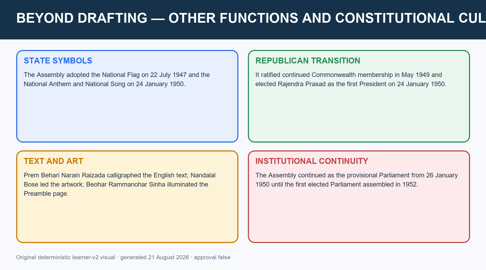

*Caption: Constitution-making included symbols, offices and the transition to the provisional Parliament. Original deterministic learner-v2 visual.*

#### Other functions and dates

| Function | Date / status | Precision |
|---|---|---|
| Adopted the National Flag | 22 July 1947 | Separate from Constitution adoption |
| Ratified continued Commonwealth membership | May 1949 | Did not preserve Dominion status after 26 January 1950 |
| Adopted the National Anthem and National Song | 24 January 1950 | Same sitting at which members signed |
| Elected Rajendra Prasad first President | 24 January 1950 | Office began with the Republic |
| Continued as provisional Parliament | 26 January 1950 to 1952 | Continued until the first elected Parliament assembled |

#### Constitutional study, symbol, calligraphy and art

- [FACT] The Assembly studied constitutional experience from about sixty countries; comparative study informed selection and adaptation rather than mechanical copying.
- [FACT] The Preamble was enacted after the operative provisions so that it reflected the Constitution as finally settled.
- [FACT] The general commencement date honoured Purna Swaraj (complete self-rule) Day, observed on 26 January 1930 after the Lahore declaration.
- [FACT] Its seal or symbol was the elephant.
- [FACT] Prem Behari Narain Raizada calligraphed the English text in a flowing italic hand.
- [FACT] Nandalal Bose led the Shantiniketan artwork; Beohar Rammanohar Sinha illuminated the Preamble page.
- [FACT] The authoritative Hindi text was constitutionally provided later through the 58th Amendment, 1987.
- [FACT] The Government of India designated 26 November as Samvidhan Divas (Constitution Day) in 2015 to mark the adoption date.
- [LIMIT] These facts are Prelims support. They should not displace institutional analysis in a Mains answer.

#### CLOSING RECALL FLOW — A. OTHER FUNCTIONS, SYMBOLS, CONSTITUTIONAL CRAFT AND PROVISIONAL PARLIAMENT

```text
START / CONCEPT: A. OTHER FUNCTIONS, SYMBOLS, CONSTITUTIONAL CRAFT AND PROVISIONAL PARLIAMENT
        |
        v
EXACT TERMS: A. Other Functions · Symbols · Constitutional Craft · Provisional Parliament · Adopted the National Flag · 22 July 1947
        |
        v
MECHANISM / ARGUMENT: The authoritative Hindi text was constitutionally provided later through the 58th Amendment, 1987.
        |
        v
CONSEQUENCE / CONTRAST: They should not displace institutional analysis in a Mains answer.
        |
        v
UPSC TRAP / ANSWER-USE: Do not miss this limiting distinction: the Preamble was enacted after the operative provisions so that it reflected the Constitution...
        |
        v
ANSWER-GRABBING FORMULATION: Its seal or symbol was the elephant.
```
### SESSION 11 — MAJOR DEBATES AND OWNER-TOPIC CROSS-LINKS

#### DEFINITION / WHAT THIS IS CALLED

**Plain-language definition:** Major Debates And Owner-Topic Cross-Links comprises Major Debates, Owner-Topic Cross-Links and Committee negotiation and plenary debate as its core connected dimensions.

**Technical definition:** Technically, Major Debates And Owner-Topic Cross-Links is analysed by relating Major Debates to Owner-Topic Cross-Links, then testing the relationship through Committee negotiation and plenary debate and Final settlements embedded in constitutional text.

#### ANSWER-GRABBING OPENING — WRITE/ADAPT IN THE EXAM

> Use one paragraph per debate and cross-link the later owner file.

#### MUST-WRITE KEYWORDS

- **Major Debates**
- **Owner-Topic Cross-Links**
- **Committee negotiation and plenary debate**
- **Final settlements embedded in constitutional text**
- **1946-49**
- **1950 onward**

**How to use them:** Frame the answer through Major Debates; define Owner-Topic Cross-Links, connect Committee negotiation and plenary debate with Final settlements embedded in constitutional text to explain the mechanism, and use 1946-49 for the decisive comparison or qualification.

**Answer-worthiness:** SUPPORTING — route doctrine to specialist owners

[FACT] Design choices were settlements among competing risks.

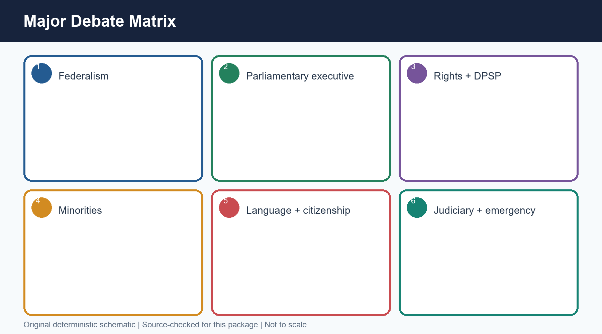

*Caption: Original deterministic schematic prepared for this package; labels are source-checked.*

#### Chronology

| Date | Event |
|---|---|
| 1946-49 | Committee negotiation and plenary debate |
| 1949 | Final settlements embedded in constitutional text |
| 1950 onward | Courts, Parliament and amendments developed the choices |

#### Evidence matrix

| Debate | Constitution-making tension | Owner topic |
|---|---|---|
| Federalism | Strong Union versus provincial autonomy after Partition | Federal System/Centre-State Relations |
| Executive | Stability versus legislative responsibility | Parliamentary System |
| Fundamental rights | Liberty versus public order and reform | Fundamental Rights |
| DPSP | Transformative goals versus non-justiciability | Directive Principles |
| Minorities | Group safeguards versus common citizenship | FR/Minorities/Special Provisions |
| Language | National coordination versus linguistic plurality | Official Language |
| Citizenship | Partition emergency versus inclusive membership | Citizenship |
| Judiciary | Rights protection versus democratic policy space | Supreme Court |
| Services/emergency/property | Continuity and state capacity versus liberty/social transformation | Public Services/Emergency/Property history |

#### Teaching and analysis

- [ANALYSIS] Federal design hardened toward a strong Union under the pressures of Partition, integration and administrative continuity, while retaining a constitutionally divided field of authority.
- [ANALYSIS] The parliamentary system prioritised a responsible executive answerable to the legislature over a separately elected executive.
- [ANALYSIS] Fundamental Rights and Directive Principles formed a liberty-transformation pair: enforceable restraints plus programmatic social commitments.
- [ANALYSIS] Minority debates moved away from communal electorates while retaining cultural, religious and equality protections.
- [ANALYSIS] Language, citizenship, judiciary, services, emergency powers and property each involved a compromise between unity/state capacity and plural freedom/social change.
- [LIMIT] This topic owns the making and debate logic, not full doctrine. Use one paragraph per debate and cross-link the later owner file.

#### Rapid recall

- Strong Union was a negotiated response, not proof of a unitary Constitution
- Parliamentary responsibility was deliberately preferred
- Rights and DPSP were complementary design instruments

#### Close-option traps

- Wrong: Every debated provision should be taught fully here
  Correct: Teach the choice and route doctrine to its owner topic
- Wrong: Consensus meant absence of conflict
  Correct: It meant managed disagreement and accepted settlements

**Mains route:** Write debates as tension -> chosen institution -> benefit -> cost -> later owner.

**Owner link:** Polity 03-14 and 40-41 own the resulting constitutional doctrines.

#### CLOSING RECALL FLOW — MAJOR DEBATES AND OWNER-TOPIC CROSS-LINKS

```text
START / CONCEPT: MAJOR DEBATES AND OWNER-TOPIC CROSS-LINKS
        |
        v
EXACT TERMS: Major Debates · Owner-Topic Cross-Links · Committee negotiation and plenary debate · Final settlements embedded in constitutional text · 1946-49 · 1950 onward
        |
        v
MECHANISM / ARGUMENT: Fundamental Rights and Directive Principles formed a liberty-transformation pair: enforceable restraints plus programmatic social commitments.
        |
        v
CONSEQUENCE / CONTRAST: Strong Union was a negotiated response, not proof of a unitary Constitution Parliamentary responsibility was deliberately preferred Rights and DPSP were complementary design instruments.
        |
        v
UPSC TRAP / ANSWER-USE: Wrong: Every debated provision should be taught fully here Correct: Teach the choice and route doctrine to its owner topic Wrong: Consensus meant absence of conflict Correct: It meant managed disagreement and accepted settlements.
        |
        v
ANSWER-GRABBING FORMULATION: Use one paragraph per debate and cross-link the later owner file.
```
### SESSION 12 — BORROWED PROVISIONS AS ADAPTATION, NOT COPYING

#### DEFINITION / WHAT THIS IS CALLED

**Plain-language definition:** Borrowed Provisions As Adaptation, Not Copying comprises Borrowed Provisions As Adaptation, Not Copying and Before 1947 as its core connected dimensions.

**Technical definition:** Comparative study does not equal copying Adaptation must be demonstrated through changed function.

#### ANSWER-GRABBING OPENING — WRITE/ADAPT IN THE EXAM

> Comparative study does not equal copying Adaptation must be demonstrated through changed function.

#### MUST-WRITE KEYWORDS

- **Borrowed Provisions As Adaptation**
- **Not Copying**
- **Before 1947**
- **Rau and committees studied comparative models**
- **1935 Act provided an administrative inheritance**
- **1946-48**

**How to use them:** Frame the answer through Borrowed Provisions As Adaptation; define Not Copying, connect Before 1947 with Rau and committees studied comparative models to explain the mechanism, and use 1935 Act provided an administrative inheritance for the decisive comparison or qualification.

**Answer-worthiness:** CORE MAINS

[FACT] Comparative learning was filtered through Indian problems.

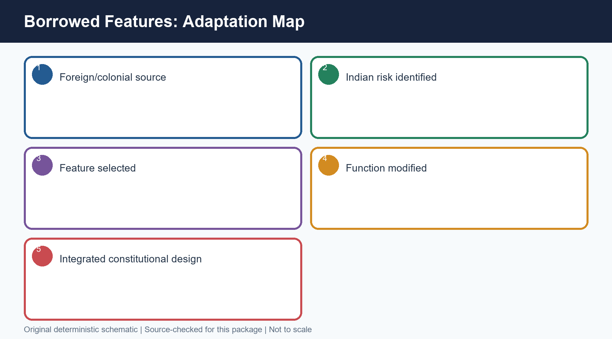

*Caption: Original deterministic schematic prepared for this package; labels are source-checked.*

#### Chronology

| Date | Event |
|---|---|
| Before 1947 | 1935 Act provided an administrative inheritance |
| 1946-48 | Rau and committees studied comparative models |
| 1948-49 | Assembly selected, modified and integrated devices |

#### Evidence matrix

| Source family | Often associated feature | Indian adaptation |
|---|---|---|
| United Kingdom | Parliamentary government, cabinet responsibility, rule-of-law traditions | Written and supreme Constitution; judicially enforceable rights |
| United States | Fundamental rights, judicial review/federal devices | Parliamentary rather than presidential executive; detailed limits and exceptions |
| Ireland | Directive Principles | Non-justiciable goals integrated with enforceable rights |
| Canada | Federation with a strong centre | Distinct Union-State lists and Indian emergency/integration context |
| Government of India Act 1935 | Federal-administrative machinery, offices and lists | Democratised, rights-bound and placed under popular sovereignty |

#### Teaching and analysis

- [FACT] The framers studied foreign constitutions and inherited substantial administrative machinery from the Government of India Act 1935.
- [ANALYSIS] Borrowing is a technique, not a verdict. The correct test is whether an institution was selected, modified and integrated to meet Indian conditions.
- [ANALYSIS] Parliamentary government under a written supreme Constitution, enforceable rights alongside Directive Principles, and a federation with a strong Union are examples of synthesis rather than mechanical copying.
- [ANALYSIS] The Constitution combined continuity of institutions with rupture in legitimacy: colonial offices were retained where useful, but authority was relocated to the people and universal adult citizenship.
- [LIMIT] Avoid unverified one-feature-one-country lists. Many ideas have multiple lineages; use only securely established associations and explain adaptation.

#### Rapid recall

- Comparative study does not equal copying
- 1935 Act was an administrative source, not the democratic source
- Adaptation must be demonstrated through changed function

#### Close-option traps

- Wrong: A borrowed device is necessarily unsuitable
  Correct: Suitability depends on adaptation and integration
- Wrong: The Constitution simply reproduced the 1935 Act
  Correct: It transformed source, rights, accountability and citizenship

**Mains route:** Use a three-column source-feature-adaptation table.

**Owner link:** Comparative Constitutional Schemes and Salient Features.

#### CLOSING RECALL FLOW — BORROWED PROVISIONS AS ADAPTATION, NOT COPYING

```text
START / CONCEPT: BORROWED PROVISIONS AS ADAPTATION, NOT COPYING
        |
        v
EXACT TERMS: Borrowed Provisions As Adaptation · Not Copying · Before 1947 · Rau and committees studied comparative models · 1935 Act provided an administrative inheritance · 1946-48
        |
        v
MECHANISM / ARGUMENT: Wrong: A borrowed device is necessarily unsuitable Correct: Suitability depends on adaptation and integration Wrong: The Constitution simply reproduced the 1935 Act Correct: It transformed source, rights, accountability and citizenship.
        |
        v
CONSEQUENCE / CONTRAST: The Constitution combined continuity of institutions with rupture in legitimacy: colonial offices were retained where useful, but authority was relocated to the people and universal adult citizenship.
        |
        v
UPSC TRAP / ANSWER-USE: Borrowing is a technique, not a verdict.
        |
        v
ANSWER-GRABBING FORMULATION: Comparative study does not equal copying Adaptation must be demonstrated through changed function.
```
### SESSION 13 — CONSENSUS, PARTY ORGANISATION AND NEGOTIATION

#### DEFINITION / WHAT THIS IS CALLED

**Plain-language definition:** Consensus, Party Organisation And Negotiation comprises Consensus, Party Organisation and Negotiation as its core connected dimensions.

**Technical definition:** Consensus was produced through repeated movement between committees, party forums, informal negotiation and plenary debate.

#### ANSWER-GRABBING OPENING — WRITE/ADAPT IN THE EXAM

> Consensus was institutional, not merely personal Party organisation enabled coordination Plenary adoption remained indispensable.

#### MUST-WRITE KEYWORDS

- **Consensus**
- **Party Organisation**
- **Negotiation**
- **Committee stage**
- **Smaller groups gathered evidence and framed options**
- **Congress/party forums**

**How to use them:** Frame the answer through Consensus; define Party Organisation, connect Negotiation with Committee stage to explain the mechanism, and use Smaller groups gathered evidence and framed options for the decisive comparison or qualification.

**Answer-worthiness:** CORE MAINS

[FACT] How a large Assembly produced a durable settlement.


*Caption: Original deterministic schematic prepared for this package; labels are source-checked.*

#### Chronology

| Date | Event |
|---|---|
| Committee stage | Smaller groups gathered evidence and framed options |
| Congress/party forums | Differences were negotiated before and alongside plenary debate |
| Plenary stage | Public reasons, amendments and votes authorised the text |

#### Evidence matrix

| Mechanism | Contribution | Risk |
|---|---|---|
| Committees | Expertise and manageable bargaining | Technocratic insulation |
| Congress umbrella | Coalition discipline across ideological tendencies | Numerical dominance |
| Informal negotiation | Compromise before public deadlock | Opacity |
| Plenary debate | Public justification and amendment | Time and repetition |
| Presidential steering | Procedural continuity | Dependence on leadership |

#### Teaching and analysis

- [ANALYSIS] Consensus was produced through repeated movement between committees, party forums, informal negotiation and plenary debate.
- [ANALYSIS] Congress dominance facilitated coordination, but its internal ideological breadth meant that agreement still required bargaining among socialists, Gandhians, liberals, conservatives and provincial interests.
- [ANALYSIS] Patel's committee and integration work, Nehru's Union/value agenda, Ambedkar's drafting leadership, Prasad's procedural stewardship and Rau's technical preparation were complementary roles.
- [ANALYSIS] Consensus did not erase dissent. It made disagreement governable by narrowing options, recording objections and accepting a final institutional settlement.
- [LIMIT] Do not romanticise: unequal social power, indirect election, the League boycott and princely nomination constrained the process.

#### Rapid recall

- Consensus was institutional, not merely personal
- Party organisation enabled coordination
- Plenary adoption remained indispensable

#### Close-option traps

- Wrong: Congress dominance proves no debate occurred
  Correct: Dominance and meaningful internal/plenary debate can coexist
- Wrong: Consensus means unanimity on every clause
  Correct: It means workable settlement, often after disagreement

**Mains route:** Explain mechanism and incentive, then qualify democratic depth.

**Owner link:** Political Parties; Parliament; Constitutional Morality.

#### CLOSING RECALL FLOW — CONSENSUS, PARTY ORGANISATION AND NEGOTIATION

```text
START / CONCEPT: CONSENSUS, PARTY ORGANISATION AND NEGOTIATION
        |
        v
EXACT TERMS: Consensus · Party Organisation · Negotiation · Committee stage · Smaller groups gathered evidence and framed options · Congress/party forums
        |
        v
MECHANISM / ARGUMENT: Consensus was produced through repeated movement between committees, party forums, informal negotiation and plenary debate.
        |
        v
CONSEQUENCE / CONTRAST: Do not romanticise: unequal social power, indirect election, the League boycott and princely nomination constrained the process.
        |
        v
UPSC TRAP / ANSWER-USE: Wrong: Congress dominance proves no debate occurred Correct: Dominance and meaningful internal/plenary debate can coexist Wrong: Consensus means unanimity on every clause Correct: It means workable settlement, often after disagreement.
        |
        v
ANSWER-GRABBING FORMULATION: Consensus was institutional, not merely personal Party organisation enabled coordination Plenary adoption remained indispensable.
```
### SESSION 14 — PEOPLE AND PLURAL VOICES WITHOUT HERO-ONLY REDUCTION

#### DEFINITION / WHAT THIS IS CALLED

**Plain-language definition:** People And Plural Voices Without Hero-Only Reduction comprises People, Plural Voices Without Hero-Only Reduction and Members intervened through committees and plenary debate as its core connected dimensions.

**Technical definition:** Technically, People And Plural Voices Without Hero-Only Reduction is analysed by relating People to Plural Voices Without Hero-Only Reduction, then testing the relationship through Members intervened through committees and plenary debate and Post-Partition.

#### ANSWER-GRABBING OPENING — WRITE/ADAPT IN THE EXAM

> Ambedkar's role was exceptional because he chaired drafting, defended clauses and linked political democracy to social conditions; precision requires credit without solitary-authorship mythology.

#### MUST-WRITE KEYWORDS

- **People**
- **Plural Voices Without Hero-Only Reduction**
- **Members intervened through committees and plenary debate**
- **Post-Partition**
- **B.R. Ambedkar**
- **1946-50**

**How to use them:** Frame the answer through People; define Plural Voices Without Hero-Only Reduction, connect Members intervened through committees and plenary debate with Post-Partition to explain the mechanism, and use B.R. Ambedkar for the decisive comparison or qualification.

**Answer-worthiness:** SUPPORTING + CORE MAINS examples

[FACT] Leadership, expertise, women and marginalised interventions.

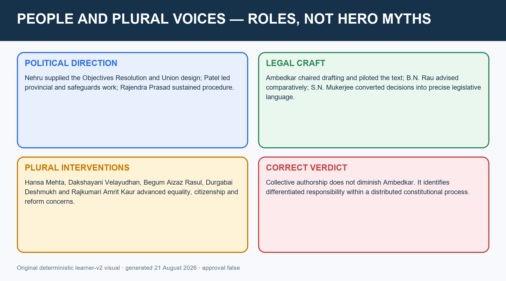

*Caption: Original deterministic schematic prepared for this package; labels are source-checked.*

#### Chronology

| Date | Event |
|---|---|
| 1946-50 | Members intervened through committees and plenary debate |
| Post-Partition | Minority safeguards and common citizenship were renegotiated |
| 1950 | Universal adult franchise widened democratic membership beyond the Assembly's own electorate |

#### Evidence matrix

| Person/group | Verified institutional contribution | Analytical use |
|---|---|---|
| B.R. Ambedkar | Drafting Committee chair; piloted Draft | Legal coherence and social-democratic transformation |
| Jawaharlal Nehru | Objectives Resolution; Union committees | Value framework and Union design |
| Vallabhbhai Patel | Provincial/Advisory committees; states integration context | Federal settlement and minority/tribal channels |
| Rajendra Prasad | Assembly President; Rules/Steering leadership | Procedural legitimacy |
| B.N. Rau | Constitutional Adviser and initial draft | Comparative-technical preparation |
| Hansa Mehta | Equality and women's-status interventions | Formal equality and gendered citizenship |
| Dakshayani Velayudhan | Dalit woman member; opposed untouchability and stressed social transformation | Marginalised constitutional voice |
| Begum Aizaz Rasul | Muslim woman member; opposed separate electorates | Minority citizenship beyond communal electorates |
| Durgabai Deshmukh / Rajkumari Amrit Kaur | Social reform, language/welfare and rights concerns | Women as substantive participants, not symbols |

#### Teaching and analysis

- [FACT] Gandhi was not a member. His political and moral influence is not the same as institutional membership.
- [ANALYSIS] Ambedkar's role was exceptional because he chaired drafting, defended clauses and linked political democracy to social conditions; precision requires credit without solitary-authorship mythology.
- [ANALYSIS] Women members and marginalised voices intervened on equality, untouchability, minority representation, social reform, language and citizenship.
- [ANALYSIS] The Assembly's most radical representative act was prospective: it constitutionalised universal adult franchise, expanding political equality far beyond the restricted electorate that indirectly produced it.
- [LIMIT] Do not invent quotations or attribute every final clause to one speech. State verified participation and the issue advanced.

#### Rapid recall

- Gandhi was not a member
- Ambedkar chaired drafting, not the entire process
- Women's participation was substantive
- Universal franchise widened legitimacy prospectively

#### Close-option traps

- Wrong: Women were only symbolic members
  Correct: Named members made substantive interventions
- Wrong: Recognising collective authorship diminishes Ambedkar
  Correct: It clarifies why his leadership was central within a distributed process

**Mains route:** Use five roles and two plural-voice examples; connect each to institutional significance.

**Owner link:** FR, Social Justice, Minorities and Political Representation.

#### CLOSING RECALL FLOW — PEOPLE AND PLURAL VOICES WITHOUT HERO-ONLY REDUCTION

```text
START / CONCEPT: PEOPLE AND PLURAL VOICES WITHOUT HERO-ONLY REDUCTION
        |
        v
EXACT TERMS: People · Plural Voices Without Hero-Only Reduction · Members intervened through committees and plenary debate · Post-Partition · B.R. Ambedkar · 1946-50
        |
        v
MECHANISM / ARGUMENT: His political and moral influence is not the same as institutional membership.
        |
        v
CONSEQUENCE / CONTRAST: Do not invent quotations or attribute every final clause to one speech.
        |
        v
UPSC TRAP / ANSWER-USE: Gandhi was not a member Ambedkar chaired drafting, not the entire process Women's participation was substantive Universal franchise widened legitimacy prospectively.
        |
        v
ANSWER-GRABBING FORMULATION: Ambedkar's role was exceptional because he chaired drafting, defended clauses and linked political democracy to social conditions; precision requires credit without solitary-authorship mythology.
```
### SESSION 15 — CRITICISM VERSUS EVIDENCE-LED REPLY

#### DEFINITION / WHAT THIS IS CALLED

**Plain-language definition:** Criticism must be periodised Representation has electoral and deliberative dimensions Every reply needs a residual limitation.

**Technical definition:** Mains route: Use criticism - conceded kernel - named evidence - reply - residual limit.

#### ANSWER-GRABBING OPENING — WRITE/ADAPT IN THE EXAM

> Criticism must be periodised Representation has electoral and deliberative dimensions Every reply needs a residual limitation.

#### MUST-WRITE KEYWORDS

- **Criticism Versus Evidence-Led Reply**
- **Indirect, limited-franchise and partly nominated origin**
- **Independence Act made the Assembly sovereign**
- **Adoption, signature and universal-franchise constitutional order**
- **Non-sovereign**
- **1949-50**

**How to use them:** Frame the answer through Criticism Versus Evidence-Led Reply; define Indirect, limited-franchise and partly nominated origin, connect Independence Act made the Assembly sovereign with Adoption, signature and universal-franchise constitutional order to explain the mechanism, and use Non-sovereign for the decisive comparison or qualification.

**Answer-worthiness:** CORE MAINS

> **ANSWER-GRABBING LINE — WRITE/ADAPT IN THE EXAM (CRITICISM / REPLY):** A balanced evaluation concedes the Assembly's restricted franchise, Congress dominance and social imbalance, but weighs them against post-1947 sovereignty, plural participation, clause-by-clause scrutiny and democratic constitutional output.

[FACT] Concede the kernel, answer with evidence, retain the limitation.


*Caption: Original deterministic schematic prepared for this package; labels are source-checked.*

#### Chronology

| Date | Event |
|---|---|
| 1946 | Indirect, limited-franchise and partly nominated origin |
| 1947 | Independence Act made the Assembly sovereign |
| 1949-50 | Adoption, signature and universal-franchise constitutional order |

#### Evidence matrix

| Criticism | Evidence-led reply | Qualification |
|---|---|---|
| Non-sovereign | Indian Independence Act 1947 made it fully sovereign | British plan shaped its origin |
| Non-representative | Social diversity, debate and future universal franchise | No direct adult-franchise election |
| Congress-dominated | Congress was a broad coalition and experts/dissent were included | 208 of 296 electoral seats confirms dominance |
| Lawyer-heavy | Legal expertise produced a detailed workable text | Professional/social imbalance remained |
| Time-consuming | 11 sessions, complex transition and extended clause scrutiny | Comparisons with shorter constitutions are context-sensitive |
| Borrowed | Foreign devices were adapted and integrated | Colonial/foreign continuities were substantial |
| Hindu-dominated | League boycott and Partition altered composition; minority channels remained | Post-Partition imbalance cannot be denied |

#### Teaching and analysis

- [ANALYSIS] The strongest reply never denies the criticism's factual kernel. It states the defect, identifies the contextual constraint or institutional answer, and retains a qualification.
- [FACT] Sovereignty criticism changes across time: plausible at the British-created origin, substantially answered after the Indian Independence Act 1947.
- [ANALYSIS] Representativeness has electoral and deliberative dimensions. The Assembly was weak on direct electoral mandate but stronger on social range, reason-giving and the universal franchise it created.
- [ANALYSIS] Congress dominance aided settlement but also raises questions about agenda control. Lawyerly expertise aided drafting but could not substitute for social representation.
- [LIMIT] Do not use unverifiable rhetorical quotations from critics. The evidence is sufficient without decorative attribution.

#### Rapid recall

- Criticism must be periodised
- Representation has electoral and deliberative dimensions
- Every reply needs a residual limitation

#### Close-option traps

- Wrong: Defence requires denying defects
  Correct: High-quality evaluation concedes and qualifies
- Wrong: The Independence Act made the Assembly sovereign from its first meeting
  Correct: The change occurred in 1947

**Mains route:** Use criticism -> conceded kernel -> named evidence -> reply -> residual limit.

**Owner link:** Answer-worthiness architecture in Polity Core.

#### CLOSING RECALL FLOW — CRITICISM VERSUS EVIDENCE-LED REPLY

```text
START / CONCEPT: CRITICISM VERSUS EVIDENCE-LED REPLY
        |
        v
EXACT TERMS: Criticism Versus Evidence-Led Reply · Indirect, limited-franchise and partly nominated origin · Independence Act made the Assembly sovereign · Adoption, signature and universal-franchise constitutional order · Non-sovereign · 1949-50
        |
        v
MECHANISM / ARGUMENT: Mains route: Use criticism - conceded kernel - named evidence - reply - residual limit.
        |
        v
CONSEQUENCE / CONTRAST: The Assembly was weak on direct electoral mandate but stronger on social range, reason-giving and the universal franchise it created.
        |
        v
UPSC TRAP / ANSWER-USE: Congress dominance aided settlement but also raises questions about agenda control.
        |
        v
ANSWER-GRABBING FORMULATION: Criticism must be periodised Representation has electoral and deliberative dimensions Every reply needs a residual limitation.
```
### SESSION 16 — TIME, COST, OUTPUT AND TRANSITION DASHBOARD

#### DEFINITION / WHAT THIS IS CALLED

**Plain-language definition:** Time, Cost, Output And Transition Dashboard comprises Time, Cost and Output as its core connected dimensions.

**Technical definition:** Time and length reflect the scale of federal, rights, minority, Partition and administrative-transition problems, not automatically inefficiency.

#### ANSWER-GRABBING OPENING — WRITE/ADAPT IN THE EXAM

> Time and length reflect the scale of federal, rights, minority, Partition and administrative-transition problems, not automatically inefficiency.

#### MUST-WRITE KEYWORDS

- **Time**
- **Cost**
- **Output**
- **Transition Dashboard**
- **Work began**
- **9 Dec 1946**

**How to use them:** Frame the answer through Time; define Cost, connect Output with Transition Dashboard to explain the mechanism, and use Work began for the decisive comparison or qualification.

**Answer-worthiness:** CORE PRELIMS

[FACT] Numbers are useful only when their denominators are clear.


*Caption: Original deterministic schematic prepared for this package; labels are source-checked.*

#### Chronology

| Date | Event |
|---|---|
| 9 Dec 1946 | Work began |
| 26 Nov 1949 | Adoption after 2 years, 11 months, 18 days |
| 24 Jan 1950 | Signing |
| 26 Jan 1950 | General commencement |

#### Evidence matrix

| Indicator | Verified value | Caution |
|---|---|---|
| Duration | 2 years, 11 months, 18 days | From first sitting to adoption |
| Sessions | 11 | Assembly met again on 24 Jan 1950 for signatures |
| Draft debate | 114 days | Not the same as total Assembly working days |
| Drafting Committee | 141 days | Committee sitting figure, not plenary debate |
| Cost | About Rs 64 lakh | Historical nominal figure; do not modernise without method |
| Original Constitution | 395 Articles, 8 Schedules and Preamble | Do not substitute today's counts |
| Amendments | 7,653 proposed; 2,473 moved/disposed in the Assembly account commonly cited | Use source wording carefully; do not call all accepted |

#### Teaching and analysis

- [FACT] The Assembly took 2 years, 11 months and 18 days over 11 sessions; the Draft Constitution was debated for 114 days.
- [FACT] The commonly recorded cost was about Rs 64 lakh.
- [FACT] The original adopted Constitution contained 395 Articles and 8 Schedules.
- [ANALYSIS] Time and length reflect the scale of federal, rights, minority, Partition and administrative-transition problems, not automatically inefficiency.
- [LIMIT] Keep denominators distinct: Assembly sessions, debate days, Drafting Committee days, proposed amendments, moved amendments and adopted provisions are different measures.

#### Rapid recall

- 11 sessions
- 2y 11m 18d
- 114 draft-debate days
- Rs 64 lakh
- 395 Articles/8 Schedules

#### Close-option traps

- Wrong: 141 days was the entire Assembly's duration
  Correct: It was the Drafting Committee's sitting figure
- Wrong: Today's article/schedule count describes the 1949 output
  Correct: Use 395 and 8 for the original Constitution

**Mains route:** A dashboard supports, but does not replace, institutional analysis.

**Owner link:** Amendment and Basic Structure for constitutional evolution.

#### CLOSING RECALL FLOW — TIME, COST, OUTPUT AND TRANSITION DASHBOARD

```text
START / CONCEPT: TIME, COST, OUTPUT AND TRANSITION DASHBOARD
        |
        v
EXACT TERMS: Time · Cost · Output · Transition Dashboard · Work began · 9 Dec 1946
        |
        v
MECHANISM / ARGUMENT: Wrong: 141 days was the entire Assembly's duration Correct: It was the Drafting Committee's sitting figure Wrong: Today's article/schedule count describes the 1949 output Correct: Use 395 and 8 for the original Constitution.
        |
        v
CONSEQUENCE / CONTRAST: Mains route: A dashboard supports, but does not replace, institutional analysis.
        |
        v
UPSC TRAP / ANSWER-USE: Do not miss this limiting distinction: the commonly recorded cost was about Rs 64 lakh.
        |
        v
ANSWER-GRABBING FORMULATION: Time and length reflect the scale of federal, rights, minority, Partition and administrative-transition problems, not automatically inefficiency.
```
### SESSION 17 — SOCIAL REVOLUTION, CONTINUITY AND RUPTURE

#### DEFINITION / WHAT THIS IS CALLED

**Plain-language definition:** Popular sovereignty is the key rupture Administrative inheritance is the key continuity Social revolution linked democracy and reform.

**Technical definition:** Constitutional continuity made government possible on day one; constitutional rupture changed why power was legitimate and to whom it was answerable.

#### ANSWER-GRABBING OPENING — WRITE/ADAPT IN THE EXAM

> Popular sovereignty is the key rupture Administrative inheritance is the key continuity Social revolution linked democracy and reform.

#### MUST-WRITE KEYWORDS

- **Social Revolution**
- **Continuity**
- **Rupture**
- **Colonial endpoint**
- **Administrative continuity from the 1935 framework**
- **Constitution-making**

**How to use them:** Frame the answer through Social Revolution; define Continuity, connect Rupture with Colonial endpoint to explain the mechanism, and use Administrative continuity from the 1935 framework for the decisive comparison or qualification.

**Answer-worthiness:** CORE MAINS

[FACT] A new source of authority using selectively inherited machinery.

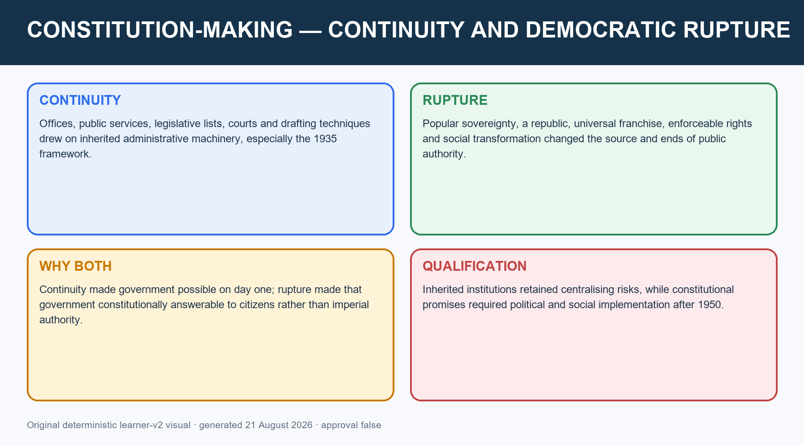

*Caption: Original deterministic schematic prepared for this package; labels are source-checked.*

#### Chronology

| Date | Event |
|---|---|
| Colonial endpoint | Administrative continuity from the 1935 framework |
| Constitution-making | Rights, franchise, federal and parliamentary redesign |
| 26 Jan 1950 | Republican popular sovereignty commenced |

#### Evidence matrix

| Dimension | Continuity | Rupture |
|---|---|---|
| Administration | Offices, services, lists and legal techniques | Accountability to a republican Constitution |
| State capacity | Strong executive and emergency instruments | Justiciable rights and judicial control |
| Territory | Inherited provinces and integration process | Union founded constitutionally, not imperially |
| Citizenship | Existing population and transition rules | Universal adult political equality |
| Social order | Many institutions and inequalities survived | Equality, abolition of untouchability, reform goals and DPSP |

#### Teaching and analysis

- [ANALYSIS] Constitutional continuity made government possible on day one; constitutional rupture changed why power was legitimate and to whom it was answerable.
- [ANALYSIS] Granville Austin's social-revolution lens is useful as analysis: the Constitution joined national unity, democratic institutions and social reform.
- [ANALYSIS] Universal adult franchise, equality, rights and Directive Principles converted constitution-making into a project of political and social transformation.
- [ANALYSIS] Yet the Constitution worked through inherited bureaucracy, courts, federal lists and emergency techniques. Transformation was constitutional and gradual, not a total administrative reset.
- [LIMIT] Do not present continuity as colonial copying or rupture as immediate social equality. Both operated simultaneously.

#### Rapid recall

- Popular sovereignty is the key rupture
- Administrative inheritance is the key continuity
- Social revolution linked democracy and reform

#### Close-option traps

- Wrong: Continuity cancels independence
  Correct: Institutional continuity can coexist with a new source of authority
- Wrong: A transformative Constitution instantly transformed society
  Correct: It created institutions and claims; implementation remained political

**Mains route:** Use a continuity-versus-rupture matrix and conclude with constitutional transformation.

**Owner link:** Salient Features, FR, DPSP and Social Justice.

#### CLOSING RECALL FLOW — SOCIAL REVOLUTION, CONTINUITY AND RUPTURE

```text
START / CONCEPT: SOCIAL REVOLUTION, CONTINUITY AND RUPTURE
        |
        v
EXACT TERMS: Social Revolution · Continuity · Rupture · Colonial endpoint · Administrative continuity from the 1935 framework · Constitution-making
        |
        v
MECHANISM / ARGUMENT: Do not present continuity as colonial copying or rupture as immediate social equality.
        |
        v
CONSEQUENCE / CONTRAST: Constitutional continuity made government possible on day one; constitutional rupture changed why power was legitimate and to whom it was answerable.
        |
        v
UPSC TRAP / ANSWER-USE: Transformation was constitutional and gradual, not a total administrative reset.
        |
        v
ANSWER-GRABBING FORMULATION: Popular sovereignty is the key rupture Administrative inheritance is the key continuity Social revolution linked democracy and reform.
```
### SESSION 18 — UPSC ANSWER SPINE AND CURRENT INSTITUTIONAL RELEVANCE

#### DEFINITION / WHAT THIS IS CALLED

**Plain-language definition:** No direct locally verified Mains PYQ found Four routed Prelims demands Current relevance is institutional design.

**Technical definition:** Every Mains paragraph should follow claim - named institutional evidence - significance - limitation/qualification.

#### ANSWER-GRABBING OPENING — WRITE/ADAPT IN THE EXAM

> No direct locally verified Mains PYQ found Four routed Prelims demands Current relevance is institutional design.

#### MUST-WRITE KEYWORDS

- **Upsc Answer Spine**
- **Current Institutional Relevance**
- **Identify dates, roles, selection method and metrics**
- **One claim, three evidence units, one qualification**
- **10 marks**
- **15 marks**

**How to use them:** Frame the answer through Upsc Answer Spine; define Current Institutional Relevance, connect Identify dates, roles, selection method and metrics with One claim, three evidence units, one qualification to explain the mechanism, and use 10 marks for the decisive comparison or qualification.

**Answer-worthiness:** CORE MAINS

> **ANSWER-GRABBING LINE — WRITE/ADAPT IN THE EXAM (FINAL VERDICT):** The Constituent Assembly was neither perfectly representative nor merely colonial: it earned qualified founding legitimacy by converting a constrained origin into an inclusive, deliberative and universally democratic constitutional order.

[FACT] Institutional design, not forced news.


*Caption: Original deterministic schematic prepared for this package; labels are source-checked.*

#### Chronology

| Date | Event |
|---|---|
| Prelims | Identify dates, roles, selection method and metrics |
| 10 marks | One claim, three evidence units, one qualification |
| 15 marks | Process plus debate plus balanced verdict |
| 20 marks | Origins, composition, mechanisms, criticism/reply and legacy |

#### Evidence matrix

| Demand | Answer spine | Evidence minimum |
|---|---|---|
| How representative? | Method -> composition -> inclusion -> defects -> verdict | 389/299, indirect election, boycott, universal franchise |
| Who made it? | Rau -> committees -> Drafting Committee -> Assembly | Named roles and dates |
| Borrowed? | Source -> adaptation -> Indian problem -> limitation | Three secure examples |
| Why durable? | Values -> committee bargaining -> legal coherence -> legitimacy limits | Objectives Resolution, readings, criticism/reply |
| Current relevance | Design principles for plural bargaining and institutional restraint | No forced daily-news peg required |

#### Teaching and analysis

- [ANALYSIS] Current relevance lies in method: public reasons, committee scrutiny, opposition channels, federal negotiation, rights constraints and clear transition rules.
- [ANALYSIS] Use the Assembly to evaluate present institutional design without claiming that every current controversy reproduces 1946-49.
- [ANALYSIS] Every Mains paragraph should follow claim -> named institutional evidence -> significance -> limitation/qualification.
- [LIMIT] No direct Mains PYQ on the making process was found in the locally audited GS-I/GS-II corpus used for this package. Cross-owned applications must not be relabelled as direct PYQs.
- [FACT] Direct locally routed Prelims demands are 2021 Q93, 2023 Q85, 2024 Q61 and 2026 Q55; official-key status differs by year and is stated in the workbook.

#### Rapid recall

- No direct locally verified Mains PYQ found
- Four routed Prelims demands
- Current relevance is institutional design

#### Close-option traps

- Wrong: A practice Mains question is a PYQ
  Correct: Label original practice honestly
- Wrong: Current relevance requires a recent headline
  Correct: Static institutional relevance can be genuine and sufficient

**Mains route:** End with a graded verdict, not praise or rejection.

**Owner link:** All later Polity owner topics.

#### CLOSING RECALL FLOW — UPSC ANSWER SPINE AND CURRENT INSTITUTIONAL RELEVANCE

```text
START / CONCEPT: UPSC ANSWER SPINE AND CURRENT INSTITUTIONAL RELEVANCE
        |
        v
EXACT TERMS: Upsc Answer Spine · Current Institutional Relevance · Identify dates, roles, selection method and metrics · One claim, three evidence units, one qualification · 10 marks · 15 marks
        |
        v
MECHANISM / ARGUMENT: Direct locally routed Prelims demands are 2021 Q93, 2023 Q85, 2024 Q61 and 2026 Q55; official-key status differs by year and is stated in the workbook.
        |
        v
CONSEQUENCE / CONTRAST: The resulting consequence is that no direct locally verified Mains PYQ found Four routed Prelims demands Current relevance is...
        |
        v
UPSC TRAP / ANSWER-USE: Wrong: A practice Mains question is a PYQ Correct: Label original practice honestly Wrong: Current relevance requires a recent headline Correct: Static institutional relevance can be genuine and sufficient.
        |
        v
ANSWER-GRABBING FORMULATION: No direct locally verified Mains PYQ found Four routed Prelims demands Current relevance is institutional design.
```
### SESSION 19 — CONSTITUENT ASSEMBLY DEBATES: ORIGINAL INTENT, LIVING CONSTITUTION AND TEXTUAL SUPREMACY

#### DEFINITION / WHAT THIS IS CALLED

**Plain-language definition:** Constituent Assembly Debates are persuasive external aids to purpose where text is ambiguous, but they are neither binding law nor a licence to override the enacted Constitution.

**Technical definition:** Courts and constitutional argument may use the Constituent Assembly Debates as external, persuasive aids when wording is genuinely ambiguous or historical purpose is relevant.

#### ANSWER-GRABBING OPENING — WRITE/ADAPT IN THE EXAM

> Constituent Assembly Debates are persuasive external aids to purpose where text is ambiguous, but they are neither binding law nor a licence to override the enacted Constitution.

#### MUST-WRITE KEYWORDS

- **Constituent Assembly Debates**
- **Original Intent**
- **Living Constitution**
- **Textual Supremacy**
- **Article 21**
- **Article 368**

**How to use them:** Frame the answer through Constituent Assembly Debates; define Original Intent, connect Living Constitution with Textual Supremacy to explain the mechanism, and use Article 21 for the decisive comparison or qualification.

**Answer-worthiness:** CORE MAINS

> **ANSWER-GRABBING LINE — WRITE/ADAPT IN THE EXAM (INTERPRETIVE STATUS):** Constituent Assembly Debates are persuasive external aids to purpose where text is ambiguous, but they are neither binding law nor a licence to override the enacted Constitution.

[FACT] Courts and constitutional argument may use the Constituent Assembly Debates as external, persuasive aids when wording is genuinely ambiguous or historical purpose is relevant.

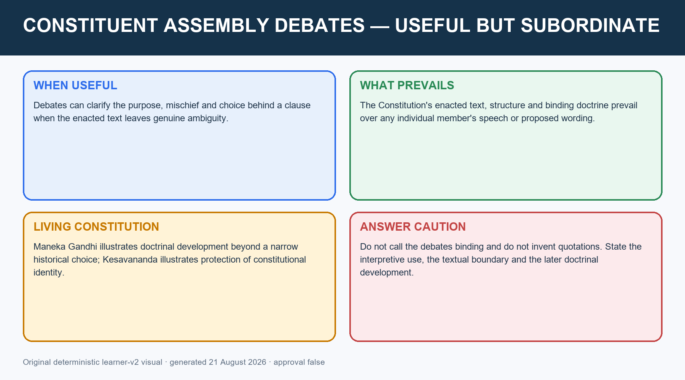

*Caption: Historical intention can illuminate purpose, but the enacted text and binding doctrine control. Original deterministic learner-v2 visual.*

#### Interpretive hierarchy

```text
ENACTED TEXT + STRUCTURE + BINDING DOCTRINE
                    |
                    v
      HISTORICAL PURPOSE / ASSEMBLY DEBATES
                    |
                    v
     PERSUASIVE AID, NEVER BINDING SUBSTITUTE
```

#### Teaching and analysis

- [FACT] A member's speech is not law. The final enacted provision may reflect compromise, amendment or rejection of an individual proposal.
- [ANALYSIS] Original intent is most useful when it explains the constitutional problem addressed and the choice among competing formulations.
- [FACT] *Maneka Gandhi v. Union of India* (1978) illustrates doctrinal development: Article 21 came to require a procedure that is fair, just and reasonable despite the historical rejection of the American phrase due process.
- [FACT] *Kesavananda Bharati v. State of Kerala* (1973) illustrates the living-identity tension: the basic-structure limitation is not express in Article 368, yet constitutional identity constrains destructive amendment.
- [LIMIT] These examples do not authorise free judicial rewriting. Text, structure, precedent and reasoned justification remain necessary.
- [LIMIT] Do not invent a framer's quotation or place a paraphrase in quotation marks.

#### Exam route

Use a four-step paragraph: textual ambiguity -> debate/purpose -> later doctrinal development -> limit that the enacted Constitution prevails.

#### CLOSING RECALL FLOW — CONSTITUENT ASSEMBLY DEBATES: ORIGINAL INTENT, LIVING CONSTITUTION AND TEXTUAL SUPREMACY

```text
START / CONCEPT: CONSTITUENT ASSEMBLY DEBATES: ORIGINAL INTENT, LIVING CONSTITUTION AND TEXTUAL SUPREMACY
        |
        v
EXACT TERMS: Constituent Assembly Debates · Original Intent · Living Constitution · Textual Supremacy · Article 21 · Article 368
        |
        v
MECHANISM / ARGUMENT: Courts and constitutional argument may use the Constituent Assembly Debates as external, persuasive aids when wording is genuinely ambiguous or historical purpose is relevant.
        |
        v
CONSEQUENCE / CONTRAST: Use a four-step paragraph: textual ambiguity - debate/purpose - later doctrinal development - limit that the enacted Constitution prevails.
        |
        v
UPSC TRAP / ANSWER-USE: State of Kerala (1973) illustrates the living-identity tension: the basic-structure limitation is not express in Article 368, yet constitutional identity constrains destructive amendment.
        |
        v
ANSWER-GRABBING FORMULATION: Constituent Assembly Debates are persuasive external aids to purpose where text is ambiguous, but they are neither binding law nor a licence to override the enacted Constitution.
```
## BASIC MCQS / REMEDIATION

### Practice design and rotation

- 40 core questions cover demand evolution, composition, people, committees, drafting, Articles 393-395, criticism, symbols and interpretation.
- Eight remedials target the highest-risk confusions.
- Correct options continue strictly A -> B -> C -> D across all 48 questions.

### Core MCQs 01-08

#### Core MCQ 01

The idea of a Constituent Assembly was first put forward in 1934 by:

- A. Rajendra Prasad
- B. B.R. Ambedkar
- C. Jawaharlal Nehru
- D. M.N. Roy

**Answer: D. M.N. Roy.**

**Explanation:** Roy first proposed the institutional idea; Congress officially demanded it in 1935.

#### Core MCQ 02

Which statement best describes provincial representation under the Cabinet Mission scheme?

- A. Election by the central legislature
- B. Election by community members of provincial assemblies through PR-STV
- C. Nomination by Governors
- D. Direct universal election

**Answer: B. Election by community members of provincial assemblies through PR-STV.**

**Explanation:** The election was indirect and organised through community members in provincial legislatures.

#### Core MCQ 03

Which figure denotes post-Partition sanctioned strength?

- A. 299
- B. 211
- C. 284
- D. 389

**Answer: A. 299.**

**Explanation:** 299 was the post-Partition strength: 229 provincial plus 70 princely-state seats.

#### Core MCQ 04

Who was the Constitutional Adviser to the Assembly?

- A. H.V.R. Iyengar
- B. B.N. Rau
- C. B.R. Ambedkar
- D. S.N. Mukerjee

**Answer: B. B.N. Rau.**

**Explanation:** Rau prepared comparative advice and an initial adviser draft; he did not chair the Drafting Committee.

#### Core MCQ 05

The Objectives Resolution was adopted on:

- A. 29 August 1947
- B. 13 December 1946
- C. 26 November 1949
- D. 22 January 1947

**Answer: D. 22 January 1947.**

**Explanation:** Nehru moved it on 13 December 1946; the Assembly adopted it on 22 January 1947.

#### Core MCQ 06

The parent Advisory Committee on Fundamental Rights, Minorities and Tribal Areas was chaired by:

- A. Vallabhbhai Patel
- B. Gopinath Bardoloi
- C. J.B. Kripalani
- D. H.C. Mukherjee

**Answer: A. Vallabhbhai Patel.**

**Explanation:** Patel chaired the parent committee; specialised subcommittees had different chairs.

#### Core MCQ 07

Which is the correct institutional sequence?

- A. Committee reports and Rau advice -> Drafting Committee -> Assembly
- B. Drafting Committee -> Rau -> Assembly
- C. Assembly -> Rau -> committees
- D. Rau -> adoption -> Drafting Committee

**Answer: A. Committee reports and Rau advice -> Drafting Committee -> Assembly.**

**Explanation:** Research and reports fed drafting; the Assembly debated, amended and adopted.

#### Core MCQ 08

Which event occurred on 24 January 1950?

- A. Adoption
- B. Signing by 284 members
- C. Drafting Committee appointment
- D. General commencement

**Answer: B. Signing by 284 members.**

**Explanation:** Signing followed adoption and preceded general commencement.
### Core MCQs 09-16

#### Core MCQ 09

Which is the safest statement about borrowed provisions?

- A. Every feature has one exclusive foreign source
- B. The 1935 Act was copied without transformation
- C. They prove the text lacked originality
- D. They were selected and adapted to Indian conditions

**Answer: D. They were selected and adapted to Indian conditions.**

**Explanation:** The analytical issue is adaptation and integration, not foreign origin alone.

#### Core MCQ 10

Which mechanism most directly made disagreement manageable before plenary adoption?

- A. Judicial review
- B. Committee specialisation and negotiation
- C. Direct referendum
- D. Royal assent

**Answer: B. Committee specialisation and negotiation.**

**Explanation:** Committees narrowed and framed disputes, while plenary debate retained final authority.

#### Core MCQ 11

Which member is correctly linked to opposition to separate electorates?

- A. Dakshayani Velayudhan
- B. Rajkumari Amrit Kaur
- C. Hansa Mehta
- D. Begum Aizaz Rasul

**Answer: D. Begum Aizaz Rasul.**

**Explanation:** Begum Aizaz Rasul opposed separate electorates while participating as a Muslim woman member.

#### Core MCQ 12

Which is NOT a valid defence of the Assembly's representative character?

- A. Its debates recorded disagreement
- B. It created universal adult franchise
- C. It was directly elected by all adults
- D. Its social range exceeded its electoral base

**Answer: C. It was directly elected by all adults.**

**Explanation:** The Assembly was indirectly elected and partly nominated, not directly elected on adult franchise.

#### Core MCQ 13

The Drafting Committee was appointed on:

- A. 15 November 1948
- B. 29 August 1947
- C. 26 November 1949
- D. 9 December 1946

**Answer: B. 29 August 1947.**

**Explanation:** The seven-member committee was appointed on 29 August 1947.

#### Core MCQ 14

Article 394 principally concerns:

- A. Repeals
- B. Commencement
- C. Short title
- D. Authoritative Hindi text

**Answer: B. Commencement.**

**Explanation:** Article 393 is short title, Article 394 commencement and Article 395 repeals.

#### Core MCQ 15

The original adopted Constitution contained:

- A. 389 Articles and 8 Schedules
- B. 299 Articles and 8 Schedules
- C. 395 Articles and 8 Schedules
- D. 395 Articles and 12 Schedules

**Answer: C. 395 Articles and 8 Schedules.**

**Explanation:** The original adopted text had a Preamble, 395 Articles and 8 Schedules.

#### Core MCQ 16

Which is the best legitimacy verdict?

- A. Perfectly representative by modern standards
- B. Electorally limited but deliberatively and prospectively democratising
- C. Legitimate only because Congress won
- D. Illegitimate solely because it was indirect

**Answer: B. Electorally limited but deliberatively and prospectively democratising.**

**Explanation:** A graded verdict recognises the electoral deficit and the democratic constitutional output.
### Core MCQs 17-24

#### Core MCQ 17

Which British initiative first accepted the constitution-making principle in broad terms?

- A. Cripps proposals, 1942
- B. Indian Independence Act, 1947
- C. Cabinet Mission, 1946
- D. August Offer, 1940

**Answer: D. August Offer, 1940.**

**Explanation:** The August Offer accepted the principle; the Cabinet Mission later supplied the operative scheme.

#### Core MCQ 18

How many seats were allocated to British India in the planned Assembly?

- A. 296
- B. 389
- C. 292
- D. 299

**Answer: A. 296.**

**Explanation:** British India received 296 seats: 292 Governors' provinces and 4 Chief Commissioners' provinces.

#### Core MCQ 19

After Partition, how many seats were allocated to princely states?

- A. 70 provincial seats
- B. 70
- C. 93
- D. 229

**Answer: B. 70.**

**Explanation:** The 299 total comprised 229 provincial and 70 princely-state seats.

#### Core MCQ 20

Who presided when the Assembly functioned as the Dominion legislature?

- A. Rajendra Prasad
- B. H.C. Mukherjee
- C. Sachchidananda Sinha
- D. G.V. Mavlankar

**Answer: D. G.V. Mavlankar.**

**Explanation:** Rajendra Prasad presided in constituent business; Mavlankar presided in legislative business.

#### Core MCQ 21

On which date did Nehru introduce the Objectives Resolution?

- A. 26 November 1949
- B. 9 December 1946
- C. 13 December 1946
- D. 22 January 1947

**Answer: C. 13 December 1946.**

**Explanation:** It was introduced on 13 December 1946 and adopted on 22 January 1947.

#### Core MCQ 22

What was the central constitutional effect of the Indian Independence Act 1947 on the Assembly?

- A. It restored Westminster's veto
- B. It dissolved the Assembly
- C. It made the Assembly fully sovereign in constituent and legislative fields
- D. It introduced direct adult-franchise elections

**Answer: C. It made the Assembly fully sovereign in constituent and legislative fields.**

**Explanation:** The Act removed external legal subordination; it did not cure every representative limitation.

#### Core MCQ 23

Who chaired the North-East Frontier (Assam) Tribal and Excluded Areas Sub-Committee?

- A. J.B. Kripalani
- B. A.V. Thakkar
- C. H.C. Mukherjee
- D. Gopinath Bardoloi

**Answer: D. Gopinath Bardoloi.**

**Explanation:** Bardoloi chaired the Assam-area subcommittee; Thakkar chaired the corresponding body for areas outside Assam.

#### Core MCQ 24

Who replaced D.P. Khaitan on the Drafting Committee after Khaitan's death?

- A. T.T. Krishnamachari
- B. H.V.R. Iyengar
- C. B.L. Mitter
- D. N. Madhava Rau

**Answer: A. T.T. Krishnamachari.**

**Explanation:** T.T. Krishnamachari replaced Khaitan; N. Madhava Rau replaced B.L. Mitter.
### Core MCQs 25-32

#### Core MCQ 25

When was the first Draft Constitution published for public consideration?

- A. November 1948
- B. January 1950
- C. February 1948
- D. October 1948

**Answer: C. February 1948.**

**Explanation:** The first published Draft appeared in February 1948; a revised Draft followed in October 1948.

#### Core MCQ 26

The clause-by-clause second reading began on:

- A. 17 October 1949
- B. 14 November 1949
- C. 15 November 1948
- D. 4 November 1948

**Answer: C. 15 November 1948.**

**Explanation:** The second reading ran from 15 November 1948 to 17 October 1949.

#### Core MCQ 27

How many amendments were proposed in the commonly cited Assembly account?

- A. 7,653
- B. 395
- C. 114
- D. 2,473

**Answer: A. 7,653.**

**Explanation:** 7,653 were proposed; 2,473 were moved or disposed in the commonly cited account.

#### Core MCQ 28

Which statement about Article 395 is correct?

- A. It repealed the Abolition of Privy Council Jurisdiction Act 1949
- B. It repealed every pre-1950 enactment
- C. It repealed only the Government of India Act 1935
- D. It repealed the Indian Independence Act 1947 and the Government of India Act 1935 with the stated related enactments

**Answer: D. It repealed the Indian Independence Act 1947 and the Government of India Act 1935 with the stated related enactments.**

**Explanation:** The Privy Council abolition law continued; Article 395's repeal must be stated exactly.

#### Core MCQ 29

What was the Assembly's seal or symbol?

- A. Elephant
- B. Lion Capital
- C. Spinning wheel
- D. Lotus

**Answer: A. Elephant.**

**Explanation:** The elephant was the Assembly's symbol; the Lion Capital became the State Emblem later.

#### Core MCQ 30

Who calligraphed the English Constitution?

- A. Prem Behari Narain Raizada
- B. S.N. Mukerjee
- C. Nandalal Bose
- D. Beohar Rammanohar Sinha

**Answer: A. Prem Behari Narain Raizada.**

**Explanation:** Raizada calligraphed the English text; Bose led the artwork.

#### Core MCQ 31

Who led the artistic decoration of the original Constitution at Shantiniketan?

- A. B.N. Rau
- B. H.V.R. Iyengar
- C. Nandalal Bose
- D. Prem Behari Narain Raizada

**Answer: C. Nandalal Bose.**

**Explanation:** Nandalal Bose led the art team; Beohar Rammanohar Sinha illuminated the Preamble page.

#### Core MCQ 32

The Constituent Assembly continued after 26 January 1950 as:

- A. The Supreme Court
- B. The Council of States
- C. The Election Commission
- D. The provisional Parliament

**Answer: D. The provisional Parliament.**

**Explanation:** It continued as the provisional Parliament until the first elected Parliament assembled in 1952.
### Core MCQs 33-40

#### Core MCQ 33

How long did the Assembly take from first sitting to adoption?

- A. 3 years exactly
- B. 2 years, 6 months
- C. 2 years, 11 months, 18 days
- D. 11 months, 18 days

**Answer: C. 2 years, 11 months, 18 days.**

**Explanation:** The precise duration was 2 years, 11 months and 18 days.

#### Core MCQ 34

How many sessions did the Assembly hold?

- A. 11
- B. 9
- C. 14
- D. 12

**Answer: A. 11.**

**Explanation:** The standard Assembly account records 11 sessions.

#### Core MCQ 35

For how many days was the Draft Constitution debated?

- A. 141
- B. 165
- C. 2,473
- D. 114

**Answer: D. 114.**

**Explanation:** 114 is the plenary Draft-debate figure; 141 refers to Drafting Committee sitting days.

#### Core MCQ 36

What was the commonly recorded historical cost of the Assembly?

- A. About Rs 114 lakh
- B. About Rs 6.4 crore
- C. About Rs 64 lakh
- D. About Rs 14 lakh

**Answer: C. About Rs 64 lakh.**

**Explanation:** Use the historical nominal figure without converting it to present value unless a method is supplied.

#### Core MCQ 37

Why is 26 November observed as Samvidhan Divas (Constitution Day)?

- A. It is the date of general commencement
- B. It is the date of first meeting
- C. It is the date of constitutional adoption in 1949
- D. It is the date of signing

**Answer: C. It is the date of constitutional adoption in 1949.**

**Explanation:** The Constitution was adopted on 26 November 1949; Constitution Day is a statutory-executive commemoration, not a constitutional provision.

#### Core MCQ 38

How many members attended the first meeting amid the League boycott?

- A. 211
- B. 284
- C. 389
- D. 299

**Answer: A. 211.**

**Explanation:** 211 is attendance at the first sitting, not the Assembly's sanctioned strength.

#### Core MCQ 39

How many members signed the Constitution on 24 January 1950?

- A. 389
- B. 284
- C. 299
- D. 211

**Answer: B. 284.**

**Explanation:** 284 is the signatory count, distinct from the post-Partition strength of 299.

#### Core MCQ 40

Which statement correctly describes Constituent Assembly Debates?

- A. They are persuasive external aids, subordinate to enacted text and binding doctrine
- B. They bind courts exactly like constitutional text
- C. They are irrelevant to interpretation
- D. They override an enacted clause where a framer disagreed

**Answer: A. They are persuasive external aids, subordinate to enacted text and binding doctrine.**

**Explanation:** Debates may illuminate purpose, but no speech can enlarge or cut down the enacted Constitution.

### Remedial MCQs 41-44

#### Remedial MCQ 41

Which number represents the Cabinet Mission's original planned strength?

- A. 299
- B. 211
- C. 389
- D. 284

**Answer: C. 389.**

**Explanation:** 389 is the design ceiling; the other figures answer different questions.

#### Remedial MCQ 42

Which pair served as Vice-Presidents of the Constituent Assembly?

- A. B.N. Rau and H.V.R. Iyengar
- B. H.C. Mukherjee and V.T. Krishnamachari
- C. G.V. Mavlankar and S.N. Mukerjee
- D. J.B. Kripalani and A.V. Thakkar

**Answer: B. H.C. Mukherjee and V.T. Krishnamachari.**

**Explanation:** The Vice-Presidents were H.C. Mukherjee and V.T. Krishnamachari.

#### Remedial MCQ 43

Which Article supplies the Constitution's short title?

- A. Article 393
- B. Article 395
- C. Article 394
- D. Article 392

**Answer: A. Article 393.**

**Explanation:** Article 393 states that the Constitution may be called the Constitution of India.

#### Remedial MCQ 44

What is the exam-safe treatment of the routed 2026 Q55?

- A. Call all three statements correct
- B. State the constitutional-text answer D and disclose that it conflicts with provisional key B
- C. Treat provisional key B as final
- D. Omit the question because the key is provisional

**Answer: B. State the constitutional-text answer D and disclose that it conflicts with provisional key B.**

**Explanation:** Articles 393-395 make all three negative statements false; the local provisional key lists B, so the conflict must be disclosed.
### Remedial MCQs 45-48

#### Remedial MCQ 45

What should a representativeness answer establish first?

- A. Only the post-Partition strength
- B. A claim that the Assembly was directly elected
- C. The exact indirect and partly nominated selection chain
- D. Only the names of famous members

**Answer: C. The exact indirect and partly nominated selection chain.**

**Explanation:** Method must precede verdict: provincial legislators elected through PR-STV and princely rulers nominated.

#### Remedial MCQ 46

Which is the strongest reply to the claim that the Assembly remained non-sovereign?

- A. Congress dominance itself supplied sovereignty
- B. The Indian Independence Act 1947 removed external legal subordination
- C. The Objectives Resolution was a British statute
- D. It was always elected on adult franchise

**Answer: B. The Indian Independence Act 1947 removed external legal subordination.**

**Explanation:** The reply is period-specific and does not erase the restricted-franchise criticism.

#### Remedial MCQ 47

Which interpretive statement best captures original intent and a living Constitution?

- A. Historical intent is never relevant
- B. Framers' speeches always control
- C. Courts may ignore constitutional wording
- D. Debates may illuminate purpose, while text, structure and later doctrine govern

**Answer: D. Debates may illuminate purpose, while text, structure and later doctrine govern.**

**Explanation:** This formulation preserves historical usefulness without turning speeches into binding law.

#### Remedial MCQ 48

Which final verdict is analytically strongest?

- A. The Assembly was perfect
- B. The Assembly was legitimate only because of Congress
- C. The Assembly was wholly illegitimate
- D. The Assembly earned qualified legitimacy despite a constrained origin

**Answer: D. The Assembly earned qualified legitimacy despite a constrained origin.**

**Explanation:** A graded verdict integrates electoral limits, sovereignty, deliberation and democratic output.

## PYQS AND ANSWER PRACTICE

### PYQ source audit and status rule

- **2021 Q93:** exact official Set-A question held locally; local official key unavailable. The model answer is supported by the commenced Preamble and constitutional status on 26 January 1950.
- **2023 Q85:** exact official question held locally; local official key unavailable. The model answer follows the verified dates of Constitution Day and Drafting Committee appointment.
- **2024 Q61:** exact official Set-A question and official Set-A key held locally.
- **2026 Q55:** exact official Set-A question and a repository provisional key held locally. The provisional key says B, while Articles 393-395 support D. The text-supported solution is given with the conflict disclosed; it is not described as an officially final key.
- **Mains audit:** no direct Mains PYQ on the making process was found in the audited local GS-I/GS-II ledgers or papers. None is invented.

### PYQ 1 — Prelims 2021 GS-I Q93

**Official-paper wording:** What was the exact constitutional status of India on 26th January, 1950?

- A. A Democratic Republic
- B. A Sovereign Democratic Republic
- C. A Sovereign Secular Democratic Republic
- D. Sovereign Socialist Secular Democratic Republic

**Model answer: B — A Sovereign Democratic Republic.**

**Explanation:** The Constitution commenced generally on 26 January 1950 and the original Preamble described India as a sovereign democratic republic. The words socialist and secular were inserted by the 42nd Amendment in 1976. Continued Commonwealth membership did not retain Dominion status.

**Provenance/status:** Exact official 2021 Set-A paper verified locally. Local official answer key is unavailable; this is a constitutional-text-supported answer, not an official-key claim. Confidence: high.

### PYQ 2 — Prelims 2023 GS-I Q85

**Official-paper wording:**  
Statement I: Constitution Day is celebrated on 26 November every year to promote constitutional values among citizens.  
Statement II: On 26 November 1949, the Constituent Assembly set up a Drafting Committee under B.R. Ambedkar to prepare a Draft Constitution.

- A. Both statements are correct and Statement II explains Statement I
- B. Both statements are correct but Statement II does not explain Statement I
- C. Statement I is correct but Statement II is incorrect
- D. Statement I is incorrect but Statement II is correct

**Model answer: C.**

**Explanation:** Samvidhan Divas (Constitution Day) is observed on 26 November, the adoption date. The Drafting Committee was appointed on 29 August 1947, so Statement II is incorrect.

**Provenance/status:** Exact official 2023 paper verified locally. Local official key is unavailable; the answer is supported by verified institutional dates and is not presented as officially keyed. Confidence: high.

### PYQ 3 — Prelims 2024 GS-I Q61

**Official-paper wording:** Who was the Provisional President of the Constituent Assembly before Dr Rajendra Prasad took over?

- A. C. Rajagopalachari
- B. Dr B.R. Ambedkar
- C. T.T. Krishnamachari
- D. Dr Sachchidananda Sinha

**Official Set-A answer: D — Dr Sachchidananda Sinha.**

**Explanation:** Sinha, the oldest member, presided temporarily at the first sitting under the French practice. Rajendra Prasad was later elected permanent President.

**Provenance/status:** Exact official 2024 Set-A question and official Set-A key verified locally.

### PYQ 4 — Prelims 2026 GS-I Q55

**Official-paper wording, normalised:** Consider the following statements with reference to the Constitution of India:

1. No Article specifies that it will officially be called the Constitution of India.
2. No Article specifies that the Indian Independence Act 1947 and Government of India Act 1935 stand repealed.
3. No Article mentions 26 January 1950 as the date of commencement.

- A. There are two correct statements that include Statement 3
- B. There is only one correct statement
- C. All three statements are correct
- D. There is no correct statement

**Constitutional-text-supported model answer: D — there is no correct statement.**

**Explanation:** Article 393 supplies the short title; Article 395 specifies the repeals; Article 394 specifies 26 January 1950 as the date of commencement for the remaining provisions. All three negative statements are therefore false.

**Provenance/status:** Exact official 2026 Set-A paper verified locally. The repository's Set-A answer key is explicitly provisional and lists B, which conflicts with Articles 393-395. This package does not present provisional B as an official final answer. The model answer D is based directly on constitutional text; final official-key status remains unresolved in the repository.

### Original Mains practice — provenance control

The following six questions are **original practice**, not UPSC PYQs. Every model uses claim -> named evidence -> analysis -> qualification and ends with a mark-earning note.

### Original Mains Model 1 — 10 marks

**Question:** Assess the role of the Objectives Resolution in the making of the Constitution. Answer in 150 words.

**Demand:** Explain function and significance, not merely list its clauses.

**Model answer:**  
The Objectives Resolution was the Assembly's value framework before the constitutional machinery was finalised. Nehru introduced it on 13 December 1946 and the Assembly adopted it on 22 January 1947. It located authority in the people, envisaged an independent sovereign republic, and committed the future order to justice, equality, freedom, safeguards for minorities and tribal or backward areas, territorial integrity and world peace.

Its importance was institutional. Subject committees and the Drafting Committee could disagree about federal, executive or rights mechanisms, but they worked within a publicly declared normative horizon. Its modified form became the Preamble, giving continuity between nationalist constitutional aspiration and the enacted Constitution. The Resolution was not itself the final constitutional text: its language was modified, and later doctrine must be grounded in the Preamble and operative provisions. It was therefore the value bridge from political freedom to constitutional identity.

**Why this earns marks:** It gives dates, named value content, causal process significance and a precise limitation.

### Original Mains Model 2 — 10 marks

**Question:** Differentiate the role of B.N. Rau from that of the Drafting Committee in Indian constitution-making. Answer in 150 words.

**Demand:** Compare functions and preserve the Assembly's final authority.

**Model answer:**  
B.N. Rau and the Drafting Committee occupied successive but distinct stages. As Constitutional Adviser, Rau organised comparative research, advised committees and prepared an initial adviser draft in 1947. His work widened the menu of constitutional techniques and converted committee materials into a preliminary legal architecture.

The seven-member Drafting Committee, appointed on 29 August 1947 under B.R. Ambedkar, scrutinised that material, reconciled committee decisions and prepared the Draft Constitution published in February 1948 and revised in October 1948. Ambedkar then introduced and defended the Draft in the Assembly. S.N. Mukerjee supplied technical legislative drafting.

Neither Rau nor the Committee possessed final constituent authority. The plenary Assembly debated clauses, moved amendments and adopted the Constitution on 26 November 1949. Rau prepared and advised; the Committee legally integrated and piloted; the Assembly authorised. This differentiation credits Ambedkar's exceptional leadership without reducing a distributed process to solitary authorship.

**Why this earns marks:** It compares role, chronology, named evidence, institutional boundaries and final authorship.

### Original Mains Model 3 — 15 marks

**Question:** Critically examine the representative and sovereign character of the Constituent Assembly. Answer in 250 words.

**Demand:** Evaluate two distinct tests across time and end with a graded verdict.

**Model answer:**  
The Assembly's representative and sovereign character cannot be answered with one label. Under the Cabinet Mission scheme, its planned strength was 389: 296 British Indian and 93 princely-state seats. Provincial representatives were indirectly elected by community members of provincial assemblies through proportional representation by single transferable vote; princes nominated state representatives. The underlying provincial franchise was restricted. Congress won 208 of 296 seats, the Muslim League won 73, and the League boycotted the first sitting. These facts establish a real electoral and political deficit.

Representation nevertheless had a deliberative dimension. The Assembly included religious minorities, Scheduled Castes, tribal members and women; specialist committees created channels on rights, minorities and excluded areas. Congress itself contained competing ideological and provincial tendencies. The prospective democratic answer was stronger still: universal adult franchise made the polity far more representative than the founding body's electorate.

Sovereignty changed over time. The Cabinet Mission and British legal framework shaped the origin, so the criticism had force in December 1946. The Indian Independence Act 1947, however, removed external legal subordination, empowered the Assembly to frame any Constitution and repeal British statutes, and added legislative capacity.

The Assembly was therefore not fully representative by modern electoral standards and was not equally sovereign at every stage. Yet post-1947 legal sovereignty, plural deliberation and universal-franchise output gave it qualified founding legitimacy.

**Why this earns marks:** It separates the two directives, periodises sovereignty, concedes defects and links evidence to a balanced verdict.

### Original Mains Model 4 — 15 marks

**Question:** Explain how committee government strengthened the deliberative process of the Constituent Assembly. Answer in 250 words.

**Demand:** Show mechanism, evidence, benefit and limitation.

**Model answer:**  
Committee government converted a vast and conflict-ridden constitutional agenda into specialised, negotiable and draftable units. Nehru's Union Powers and Union Constitution Committees framed central architecture; Patel's Provincial Constitution and Advisory Committees linked federal design with rights, minority and tribal safeguards. The Kripalani, H.C. Mukherjee, Gopinath Bardoloi and A.V. Thakkar subcommittees deepened issue-specific scrutiny.

This architecture separated four functions. First, subject committees gathered evidence and narrowed choices. Second, B.N. Rau supplied comparative advice and an initial draft. Third, Ambedkar's Drafting Committee reconciled reports into coherent legal text. Fourth, the plenary Assembly publicly debated, amended and authorised that text. The movement between smaller committees, party forums, informal negotiation and plenary sessions reduced deadlock without eliminating dissent.

The mechanism strengthened deliberation in three ways: expertise improved precision; smaller forums made bargaining manageable; and plenary readings preserved public reasons and final authority. The cost was possible technocratic insulation and opacity in pre-plenary settlements, intensified by Congress dominance and unequal representation. Committee work was legitimate because it remained subordinate to the Assembly.

Thus, specialisation did not replace deliberation; it organised it. The durability of the final settlement arose from expert preparation joined to political negotiation and public constitutional authorisation.

**Why this earns marks:** It names committees, explains the production chain, analyses benefits and retains institutional limitations.

### Original Mains Model 5 — 20 marks

**Question:** Indian constitution-making represented both continuity and rupture. Discuss. Answer in 300 words.

**Demand:** Analyse both sides through institutions, legitimacy and social purpose.

**Model answer:**  
Indian constitution-making was a controlled constitutional transformation: it retained machinery necessary for governability while replacing colonial legitimacy with republican popular sovereignty.

**Continuity:** Administrative offices, legislative lists, public services, courts and drafting techniques drew heavily on the Government of India Act 1935. A strong executive, emergency instruments and centralising devices reflected inherited state-capacity concerns intensified by Partition and integration. Staged commencement under Article 394 and repeal under Article 395 also show a legally managed transition rather than an institutional vacuum.

**Rupture:** The Objectives Resolution located authority in the people rather than Westminster. The Constitution created a sovereign democratic republic, parliamentary responsibility under a supreme written Constitution, enforceable Fundamental Rights, judicial review and Directive Principles. Universal adult franchise established equal political membership from the beginning, far beyond the restricted electorate that indirectly produced the Assembly. Equality and the abolition of untouchability converted political independence into a project of social transformation.

**Synthesis:** Borrowed and inherited devices changed function when placed under popular sovereignty, rights and electoral accountability. Federal lists no longer served imperial supervision alone; they structured a constitutional Union. Bureaucratic continuity enabled day-one administration, while democratic rupture changed to whom that administration was answerable.

The transformation was incomplete. Inherited institutions carried centralising and bureaucratic habits, and constitutional promises did not instantly erase social hierarchy. Yet a complete administrative reset would have endangered governability.

The founding achievement was therefore controlled rupture: enough continuity to preserve state capacity, but enough democratic and social transformation to change the source, limits and purposes of public power.

**Why this earns marks:** It uses constitutional provisions and institutional examples, explains altered function, qualifies transformation and answers both sides of the directive.

### Original Mains Model 6 — 20 marks

**Question:** Evaluate the legitimacy of the Constituent Assembly as India's constitution-making body. Answer in 300 words.

**Demand:** Build a criterion-based evaluation rather than praise or rejection.

**Model answer:**  
The Assembly's legitimacy was neither a pure popular mandate nor a British gift. It was progressively built through legal sovereignty, plural deliberation and democratic constitutional output.

**Origin deficit:** The Cabinet Mission designed a 389-member body. Provincial representatives were indirectly elected through restricted-franchise provincial assemblies and princely rulers nominated their representatives. Congress won 208 of 296 electoral seats; the League boycott and Partition reduced plural participation. These facts weaken a claim of full electoral representativeness.

**Sovereignty:** The objection that the Assembly was legally subordinate had force at its first sitting. The Indian Independence Act 1947 then empowered it to frame any Constitution, repeal British statutes and legislate for the Dominion. Sovereignty must therefore be periodised.

**Deliberative legitimacy:** Major committees, rights and minority subcommittees, comparative advice by B.N. Rau, legal integration by the Drafting Committee and clause-by-clause plenary readings created institutional reasons rather than simple acclamation. Women, Scheduled Caste, tribal and minority members participated substantively, though not proportionately.

**Democratic output:** The Constitution located authority in the people, established universal adult franchise, rights, representative government and constitutional remedies. The Assembly thereby created a more democratic polity than the electoral system that created it.

**Residual limits:** Congress agenda control, lawyer-politician predominance, social imbalance, princely nomination and the League's absence cannot be erased by later success. Deliberation is not a substitute for direct election; it is an additional source of legitimacy under the constraints of 1946-49.

The Assembly was thus imperfect but not illegitimate. It earned qualified founding legitimacy by converting a constrained origin into a sovereign, deliberative and universally democratic constitutional order.

**Why this earns marks:** It evaluates through explicit criteria, uses named institutional evidence, concedes residual deficits and reaches a graded verdict.

## OPTIONAL ADVANCED DEPTH — NOT REQUIRED FOR A CORE ANSWER

This block preserves the Advanced owner after all Basic teaching and practice. It adds source depth and refinement but is unnecessary for a competent core answer.

### 01. Congress Experts Committee and pre-Assembly preparation

**Answer-worthiness:** OPTIONAL ADVANCED

- [FACT] Congress appointed an Experts Committee on 8 July 1946 under Jawaharlal Nehru to prepare constitutional material before the Assembly met.
- [FACT] Its membership included Asaf Ali, K.M. Munshi, N. Gopalaswami Ayyangar, K.T. Shah, D.R. Gadgil, Humayun Kabir and K. Santhanam; Krishna Kripalani served as convener.
- [ANALYSIS] This shows that formal Assembly committees did not begin from a blank slate; nationalist constitutional preparation preceded the first sitting.
- [LIMIT] Use this as enrichment. It should not displace the Cabinet Mission composition or Assembly committee map in a core answer.

### 02. Deeper composition and representation controls

**Answer-worthiness:** OPTIONAL ADVANCED

- [FACT] The Cabinet Mission used an approximate one-seat-per-million rule and community allocation among Muslim, Sikh and General categories.
- [FACT] The 1946 electoral outcome was Congress 208, Muslim League 73 and others 15 for the 296-seat British Indian frame; the 93 princely-state seats were initially substantially unfilled.
- [ANALYSIS] Community-based allocation widened negotiated assurance but carried the categories of late-colonial electoral politics into the founding process.
- [LIMIT] Social presence was real but not equal or proportionate; do not convert a list of communities into proof of perfect representation.

### 03. Committee chair memory map and relevant subcommittees

**Answer-worthiness:** OPTIONAL ADVANCED

| Chair | Major responsibility cluster |
|---|---|
| Nehru | Union Powers, Union Constitution and States Committee |
| Vallabhbhai Patel | Provincial Constitution and parent Advisory Committee |
| Rajendra Prasad | Rules of Procedure and Steering; also institutional leadership in other procedural committees |
| B.R. Ambedkar | Drafting Committee |
| J.B. Kripalani | Fundamental Rights Sub-Committee |
| H.C. Mukherjee | Minorities Sub-Committee |
| Gopinath Bardoloi | Assam / North-East tribal and excluded areas |
| A.V. Thakkar | Excluded and partially excluded areas outside Assam |

> **Trap:** Chairmanship identifies responsibility, not sole authorship.

- [FACT] A useful textbook mnemonic is Nehru three major chairs, Patel two, and Rajendra Prasad three when the relevant procedural/minor committee count is included; always name the committee rather than relying only on the number.

### 04. Drafting intensity and comparative study

**Answer-worthiness:** OPTIONAL ADVANCED

- [FACT] The Assembly studied constitutional experience from about sixty countries.
- [FACT] The Drafting Committee sat for 141 days; the Draft Constitution was debated for 114 days in the Assembly.
- [FACT] The commonly cited account records 7,653 amendments proposed and 2,473 moved or disposed.
- [ANALYSIS] Comparative breadth and amendment intensity explain duration better than an unsupported allegation of drift.
- [LIMIT] Keep denominators distinct: committee days, plenary debate days, proposed amendments and moved amendments are not interchangeable.

### 05. Critic attributions and evidentiary caution

**Answer-worthiness:** OPTIONAL ADVANCED

- [FACT] Critics attacked indirect election, British origin, Congress dominance, lawyer-politician predominance, Hindu dominance and the time taken.
- [FACT] Naziruddin Ahmed used the expression *Drifting Committee* in criticising delay; British political critics also emphasised post-Partition religious imbalance.
- [ANALYSIS] The response should rely on institutional evidence rather than rhetorical counter-quotation: 1947 sovereignty, committee scrutiny, diverse participation and universal-franchise output.
- [LIMIT] Do not reproduce an exact quotation unless its wording has been independently verified. A source-owned criticism may be paraphrased without quotation marks.

### 06. Constitutional craft, authoritative text and labels

**Answer-worthiness:** OPTIONAL ADVANCED

- [FACT] Prem Behari Narain Raizada calligraphed the English text; Shantiniketan artists under Nandalal Bose decorated the manuscript; Beohar Rammanohar Sinha illuminated the Preamble page.
- [FACT] The 58th Amendment, 1987 constitutionally provided an authoritative Hindi text.
- [FACT] Textbooks commonly describe Ambedkar as the Father of the Constitution because of his Drafting Committee leadership and defence of the Draft.
- [LIMIT] The label Modern Manu appears in some textbook treatments but is not analytical evidence and should not replace the distributed-authorship explanation.
- [LIMIT] Popular textbook labels for Ambedkar recognise his exceptional drafting leadership, but labels are not a substitute for the distributed-authorship chain.

### 07. Living Constitution refinement

**Answer-worthiness:** OPTIONAL ADVANCED

> **ANSWER-GRABBING LINE — WRITE/ADAPT IN THE EXAM (INTERPRETIVE STATUS):** Constituent Assembly Debates are persuasive external aids to purpose where text is ambiguous, but they are neither binding law nor a licence to override the enacted Constitution.

- [ANALYSIS] Strict originalism is difficult because a multi-member Assembly had plural intentions and the enacted wording often embodied compromise.
- [FACT] *Maneka Gandhi* demonstrates rights doctrine developing beyond the narrowest historical choice; *Kesavananda Bharati* demonstrates an implied identity limit on amendment.
- [LIMIT] A living Constitution is not an untethered Constitution. Text, structure, precedent and reasoned justification constrain development.

## CONSOLIDATED REGISTER NOTES

### 01. Demand-to-authority chronology

- 1934 M.N. Roy proposal -> 1935 Congress official demand -> 1938 Nehru adult-franchise formulation -> 1940 August Offer acceptance in principle -> 1942 Cripps proposals -> 1946 Cabinet Mission scheme.
- Use the analytical chain: indigenous demand -> negotiated British scheme -> sovereignty under the 1947 Act -> adoption by the Assembly.

### 02. Composition and metric discipline

- Planned strength **389** = **296 British India** + **93 princely states**.
- 296 = 292 Governors' provinces + 4 Chief Commissioners' provinces.
- Provincial selection: community members of provincial assemblies, PR-STV; underlying franchise restricted.
- Princely-state representation: nominated by rulers. Therefore indirect and partly nominated.
- Election result: Congress 208, League 73, others 15.
- Keep distinct: **211** first-meeting attendance; **299** post-Partition strength; **284** signatories.

### 03. First sitting, offices and values

- First sitting: 9 December 1946; Sachchidananda Sinha temporary President; Rajendra Prasad permanent President.
- Vice-Presidents: H.C. Mukherjee and V.T. Krishnamachari.
- B.N. Rau: Constitutional Adviser; H.V.R. Iyengar: Secretary; S.N. Mukerjee: Chief Draftsman.
- Objectives Resolution: introduced by Nehru 13 December 1946; adopted 22 January 1947; modified value content became the Preamble.
- Value content: popular authority, sovereign republic, justice, equality, freedom, safeguards, territorial integrity and world peace.

### 04. Sovereignty and dual roles

- Cabinet Mission explains origin; Indian Independence Act 1947 explains the sovereignty upgrade.
- Constituent capacity under Rajendra Prasad; Dominion-legislative capacity under G.V. Mavlankar.
- Post-Partition strength: 299 = 229 provincial + 70 princely-state seats.

### 05. Committee and drafting map

- Nehru: Union Powers, Union Constitution, States.
- Patel: Provincial Constitution, Advisory.
- Rajendra Prasad: Rules and Steering.
- Ambedkar: Drafting Committee.
- Subcommittees: Kripalani-FR; H.C. Mukherjee-Minorities; Bardoloi-Assam tribal/excluded; Thakkar-other excluded areas.
- Drafting Committee original seven: Ambedkar, Ayyangar, Alladi Krishnaswami Ayyar, K.M. Munshi, Mohammad Saadulla, B.L. Mitter, D.P. Khaitan.
- Replacements: N. Madhava Rau for Mitter; T.T. Krishnamachari for Khaitan.
- Production chain: committees -> B.N. Rau/adviser draft -> Drafting Committee -> readings/amendments -> Assembly adoption.

### 06. Drafting, adoption and Articles 393-395

- Drafting Committee appointed 29 August 1947; first public Draft February 1948; revised Draft October 1948.
- Ambedkar introduced Draft 4 November 1948.
- Second reading: 15 November 1948 to 17 October 1949; third reading in November 1949.
- **Adopted 26 November 1949 -> signed 24 January 1950 -> generally commenced 26 January 1950.**
- Article 393: short title. Article 394: specified provisions at once, remaining provisions on 26 January 1950. Article 395: repeals the 1947 and 1935 Acts as stated.
- Exact caveat: the Abolition of Privy Council Jurisdiction Act 1949 continued.
- Original output: Preamble, 395 Articles, 8 Schedules.
- The Preamble was enacted last so that it conformed to the Constitution as finally adopted.
- 26 January honoured Purna Swaraj (complete self-rule) Day of 1930.

### 07. Functions, duration, symbols and constitutional craft

- Other functions: National Flag 22 July 1947; Commonwealth membership May 1949; Anthem, Song and first-President election 24 January 1950.
- Provisional Parliament: 26 January 1950 until first elected Parliament assembled in 1952.
- Duration: 2 years, 11 months, 18 days; 11 sessions; Draft debated 114 days; Drafting Committee sat 141 days; cost about Rs 64 lakh.
- About sixty constitutions studied; 7,653 amendments proposed; 2,473 moved or disposed in the commonly cited account.
- Symbol: elephant. Calligraphy: Prem Behari Narain Raizada. Art: Nandalal Bose team; Preamble page: Beohar Rammanohar Sinha.
- Constitution Day: Government designation in 2015; static context tied to the 26 November 1949 adoption date, not a constitutional provision.

### 08. Criticism-reply matrix

| Criticism | Concede | Evidence-led reply | Residual limit |
|---|---|---|---|
| Not representative | No direct adult-franchise election | Social range, committee channels, universal-franchise output | Restricted franchise and nomination remain |
| Not sovereign | British scheme shaped origin | 1947 Act removed external legal subordination | Origin criticism remains historically true |
| Congress-dominated | 208/296 | Broad ideological coalition, experts and public debate | Agenda and voting dominance remained |
| Lawyer-politician heavy | Drafting core was professional | Legal precision and administrability | Social imbalance remained |
| Hindu-dominated | Post-Partition imbalance | Boycott/Partition context and minority channels | Absence cannot be denied |
| Time-consuming | Nearly three years | Federal, rights, Partition, integration and amendment complexity | Efficiency questions remain legitimate |

### 09. Interpretive status and living Constitution

- Constituent Assembly Debates: persuasive external aid when ambiguity or purpose is relevant.
- Text, structure and binding doctrine prevail; no speech is binding law.
- *Maneka Gandhi*: doctrinal growth in Article 21. *Kesavananda Bharati*: implied protection of constitutional identity.
- Never invent a quotation or put an unverified paraphrase in quotation marks.

### 10. PYQ routes and traps

- Routed Prelims: 2021 Q93, 2023 Q85, 2024 Q61, 2026 Q55.
- 2024 Q61: official Set-A paper and key; answer D, Sachchidananda Sinha.
- 2021 and 2023: official question papers held locally; answers supported by constitutional/static evidence, but local official keys unavailable.
- 2026 Q55: constitutional text supports D; local provisional key lists B. Disclose conflict; do not present provisional B as final.
- No direct Mains PYQ on this topic found in the audited local corpus; do not invent one.
- Trap pairs: 389/299/211/284; adoption/signing/commencement; Rau/Ambedkar/Mukerjee; temporary/permanent President; parent committee/subcommittee chair.

### 11. Answer spines and controlled exam lines

- Representation: method -> composition -> inclusion -> defects -> universal-franchise compensation -> verdict.
- Sovereignty: British-created origin -> Independence Act change -> continuing representation limit.
- Process: committees -> adviser -> Drafting Committee -> readings/amendments -> adoption.
- Critique: concede kernel -> named evidence -> reply -> residual qualification.
- Interpretation: ambiguity -> debate/purpose -> text/doctrine boundary -> later development.

> **ANSWER-GRABBING LINE — WRITE/ADAPT IN THE EXAM (RECOMMENDED OPENING DEFINITION):** The making of India's Constitution was a negotiated transfer of constituent authority from colonial prescription to an Indian Assembly that converted nationalist claims, committee work and public deliberation into a sovereign democratic text.

> **ANSWER-GRABBING LINE — WRITE/ADAPT IN THE EXAM (REPRESENTATION ARGUMENT):** The Assembly was indirectly elected and partly nominated, so its electoral mandate was limited; its legitimacy rests additionally on social range, reasoned deliberation and the universal adult franchise it constitutionalised.

> **ANSWER-GRABBING LINE — WRITE/ADAPT IN THE EXAM (SOVEREIGNTY ARGUMENT):** The Assembly began under the Cabinet Mission scheme, but the Indian Independence Act 1947 removed external legal subordination and made it a sovereign constitution-making and legislative body.

> **ANSWER-GRABBING LINE — WRITE/ADAPT IN THE EXAM (OBJECTIVES RESOLUTION):** The Objectives Resolution supplied the Constitution's normative compass by linking popular sovereignty, justice, equality, freedom, safeguards and world peace to the Preamble's final constitutional identity.

> **ANSWER-GRABBING LINE — WRITE/ADAPT IN THE EXAM (PROCESS ANALYSIS):** Indian constitution-making was distributed authorship: committees settled principles, B.N. Rau prepared comparative advice, the Drafting Committee produced legal form and the Assembly amended and adopted the text.

> **ANSWER-GRABBING LINE — WRITE/ADAPT IN THE EXAM (ADOPTION / COMMENCEMENT):** Adoption on 26 November 1949, signing on 24 January 1950 and general commencement on 26 January 1950 were distinct constitutional events governed by Articles 393-395.

> **ANSWER-GRABBING LINE — WRITE/ADAPT IN THE EXAM (LEGITIMACY COMPENSATION):** By constitutionalising universal adult franchise, the Assembly prospectively widened political equality far beyond the restricted electorate through which it had been formed.

> **ANSWER-GRABBING LINE — WRITE/ADAPT IN THE EXAM (CRITICISM / REPLY):** A balanced evaluation concedes the Assembly's restricted franchise, Congress dominance and social imbalance, but weighs them against post-1947 sovereignty, plural participation, clause-by-clause scrutiny and democratic constitutional output.

> **ANSWER-GRABBING LINE — WRITE/ADAPT IN THE EXAM (INTERPRETIVE STATUS):** Constituent Assembly Debates are persuasive external aids to purpose where text is ambiguous, but they are neither binding law nor a licence to override the enacted Constitution.

> **ANSWER-GRABBING LINE — WRITE/ADAPT IN THE EXAM (FINAL VERDICT):** The Constituent Assembly was neither perfectly representative nor merely colonial: it earned qualified founding legitimacy by converting a constrained origin into an inclusive, deliberative and universally democratic constitutional order.

**End of consolidated register notes.**

### COMPLETE TOPIC ASCII MASTER FLOW DIAGRAM

**High-yield use:** Follow the panels as one topic-specific conceptual atlas: root question, classifications, processes or arguments, comparisons, objections and a final answer-writing spine. This text-native master is separate from both graphical flowchart artifacts.

#### ASCII MASTER FLOW — PANEL 1/9: 1934-1946: the route to a constitution-making body

```ascii-master
1934  M.N. Roy advances the Constituent Assembly idea
  |
1935  Congress formally demands a body elected on adult franchise
  |
1938  Nehru: Constitution must be framed without outside interference
  |
1940  August Offer accepts the principle of Indian constitution-making
  |
1942  Cripps proposal offers post-war constitution-making
  |
1946  Cabinet Mission supplies the operative scheme
       +-- indirectly elected provincial representatives
       +-- princely-state nominees
       +-- community allocation within provincial seats
       +-- population ratio broadly one seat per million

SHIFT: nationalist claim -> British concession -> negotiated institutional design.
```

#### ASCII MASTER FLOW — PANEL 2/9: Composition changed with Partition; authority changed with Independence

```ascii-master
CABINET MISSION PLAN: TOTAL 389
  +-- British Indian provinces 292
  +-- Chief Commissioners' provinces 4
  +-- princely states 93
        |
PARTITION: members from areas assigned to Pakistan withdraw
        |
RECONSTITUTED ASSEMBLY: 299
  +-- provinces 229
  +-- princely states 70

9 Dec 1946: first sitting under Cabinet Mission framework
15 Aug 1947: sovereign constitution-maker + Dominion legislature
26 Nov 1949: Constitution adopted
26 Jan 1950: provisional Parliament role begins under the Constitution

TRAP: indirect election limits representativeness; it does not erase legal authorship.
```

#### ASCII MASTER FLOW — PANEL 3/9: Committee architecture: distributed authorship, not seven-person mythology

```ascii-master
CONSTITUENT ASSEMBLY
  +-- Union Powers Committee — Jawaharlal Nehru
  +-- Union Constitution Committee — Jawaharlal Nehru
  +-- Provincial Constitution Committee — Vallabhbhai Patel
  +-- Advisory Committee — Vallabhbhai Patel
  |     +-- Fundamental Rights Sub-Committee — J.B. Kripalani
  |     +-- Minorities Sub-Committee — H.C. Mookherjee
  +-- Drafting Committee — B.R. Ambedkar
        +-- converts decisions and reports into coherent clauses

B.N. RAU: comparative research -> initial draft -> technical advice
ASSEMBLY: committee report -> debate -> amendment -> vote -> adopted text
```

#### ASCII MASTER FLOW — PANEL 4/9: Drafting pipeline from Objectives Resolution to commencement

```ascii-master
13 DEC 1946  Objectives Resolution moved
22 JAN 1947  Resolution adopted
      |
committee reports + B.N. Rau draft
      |
29 AUG 1947  Drafting Committee appointed
      |
FEB 1948  Draft Constitution published for comments
OCT 1948  revised draft
      |
READING 1: general discussion
READING 2: clause-by-clause debate and amendments
READING 3: final consideration and passage
      |
26 NOV 1949  adopted, enacted and given to ourselves
24 JAN 1950  final signing
26 JAN 1950  remaining provisions commence
```

#### ASCII MASTER FLOW — PANEL 5/9: Debate map: rights, federalism, executive and social revolution

```ascii-master
CONSTITUTIONAL CHOICE
  +-- RIGHTS: liberty + equality + remedies
  |     versus preventive powers, public order and social reform
  +-- FEDERALISM: provincial autonomy
  |     versus Partition-era need for an effective Union
  +-- EXECUTIVE: parliamentary responsibility
  |     versus fear of instability and concentrated leadership
  +-- MINORITIES: cultural and educational protection
  |     versus rejection of separate political electorates
  +-- SOCIAL REVOLUTION
        enforceable rights + Directive Principles + affirmative action

RESULT: political democracy was joined to an unfinished social transformation.
```

#### ASCII MASTER FLOW — PANEL 6/9: Borrowed provisions became Indian constitutional adaptations

```ascii-master
SOURCE                INDIAN ADAPTATION
United Kingdom        cabinet responsibility + parliamentary government
United States         Fundamental Rights + judicial review + impeachment ideas
Ireland               Directive Principles + presidential nomination method
Canada                federation with strong Centre + residuary Union power
Australia             Concurrent List + trade provisions + joint sitting
Germany               Emergency ideas, constitutionally recast
South Africa          amendment elements + Rajya Sabha election method
GoI Act 1935          machinery stripped of imperial sovereignty

TEST: borrowed device + Indian problem + altered setting = Indian constitutional rule
VERDICT: sources supplied techniques; the Assembly supplied hierarchy and legitimacy.
```

#### ASCII MASTER FLOW — PANEL 7/9: Criticism and evidence-led reply

```ascii-master
OBJECTION: no universal adult-franchise election
  -> indirect and limited, yet politically diverse and publicly deliberative
OBJECTION: Congress domination
  -> organisation enabled coordination; committees and dissent shaped outcomes
OBJECTION: lawyer-made and over-legal
  -> precision mediated federal, rights and transition conflicts
OBJECTION: copied Constitution
  -> borrowing was selective, recombined and India-specific
OBJECTION: social under-representation
  -> real exclusions remain; women, minorities, Dalits and regions still intervened
OBJECTION: excessive time
  -> 2 years, 11 months, 18 days covered Partition, integration and clause scrutiny

VERDICT: legitimacy rests on process quality and constitutional performance.
```

#### ASCII MASTER FLOW — PANEL 8/9: Debates, original intent and the living text

```ascii-master
INTERPRETIVE ORDER
  1. constitutional text
  2. structure and settled doctrine
  3. purpose and historical context
  4. Constituent Assembly Debates as persuasive evidence

DEBATES CAN
  +-- reveal the mischief addressed
  +-- clarify rejected alternatives
  +-- illuminate institutional purpose

DEBATES CANNOT
  +-- override enacted words
  +-- freeze broad guarantees in 1949 expectations
  +-- convert one speaker's view into collective intent

Original understanding disciplines interpretation; constitutional supremacy permits growth.
```

#### ASCII MASTER FLOW — PANEL 9/9: Exact 10/15-mark architecture: was the Assembly representative and original?

```ascii-master
10 MARKS / 150 WORDS
1. State Cabinet Mission basis and indirect-election limitation.
2. Give 389 -> 299 change and 15 August sovereignty shift.
3. Show committees, Rau, Drafting Committee and full Assembly.
4. Test one criticism against one process fact.
5. Conclude: imperfect social representation, substantial deliberative authorship.

15 MARKS / 250 WORDS
1. Trace demand from 1934 to Cabinet Mission 1946.
2. Explain composition, Partition and dual legislative role.
3. Map Resolution -> committees -> draft -> three readings.
4. Use two debate clusters and one adaptation example.
5. Evaluate dominance, exclusions, time and legalism.
6. Distinguish persuasive debates from supreme enacted text.
7. Conclude with negotiated legitimacy, not hero-centred authorship.
```
