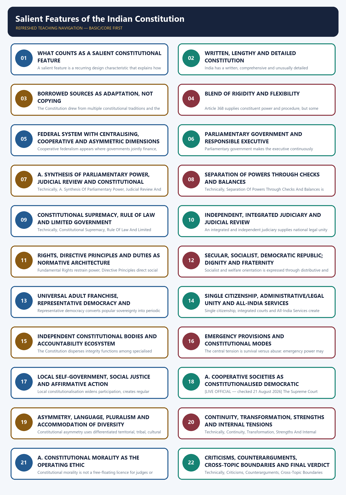
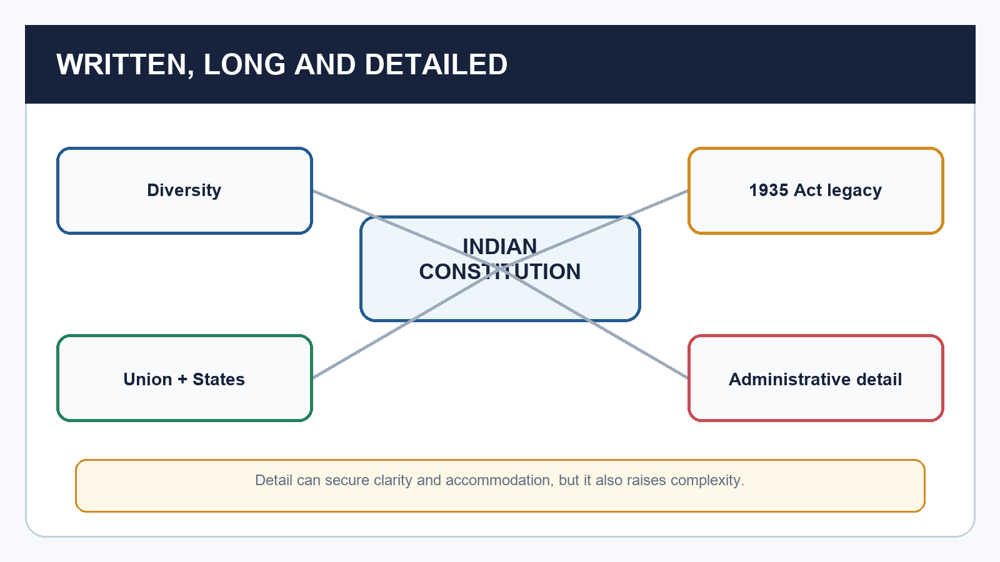
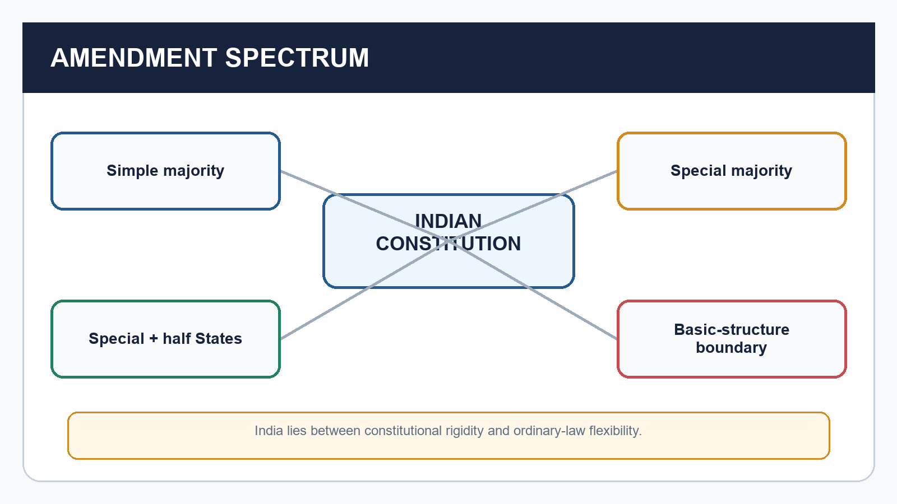
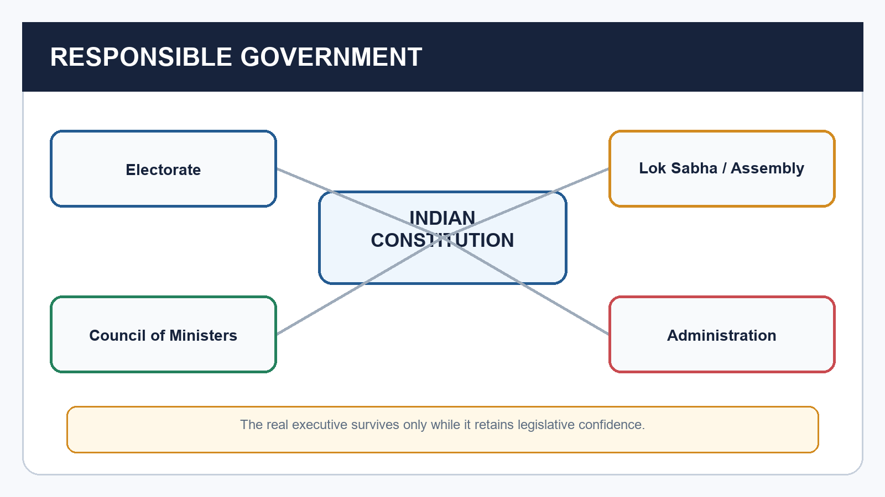
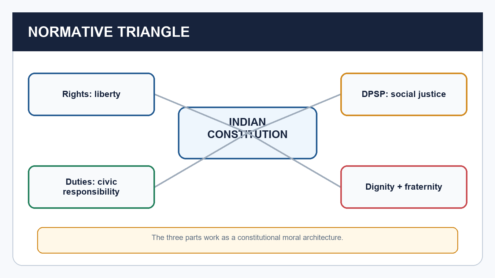
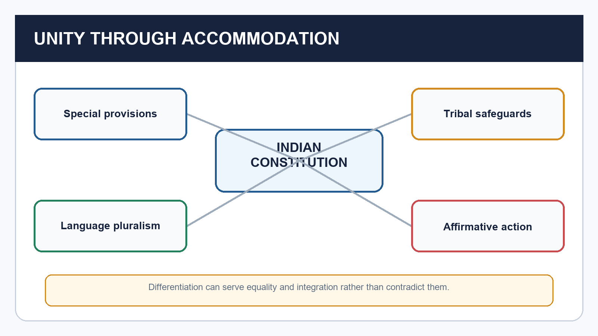
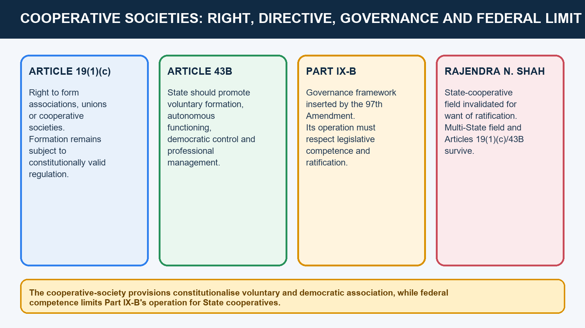
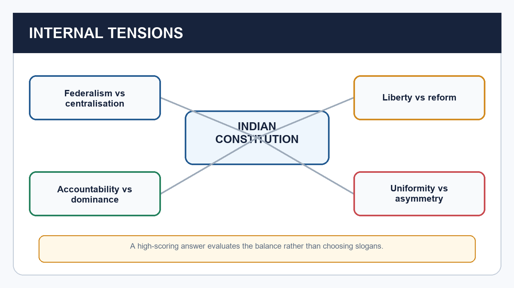
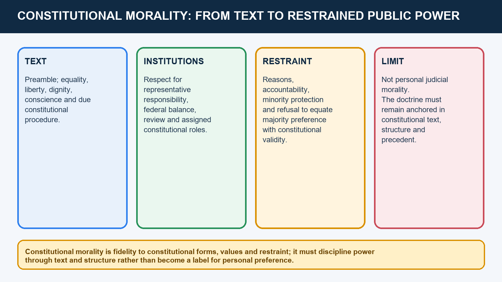
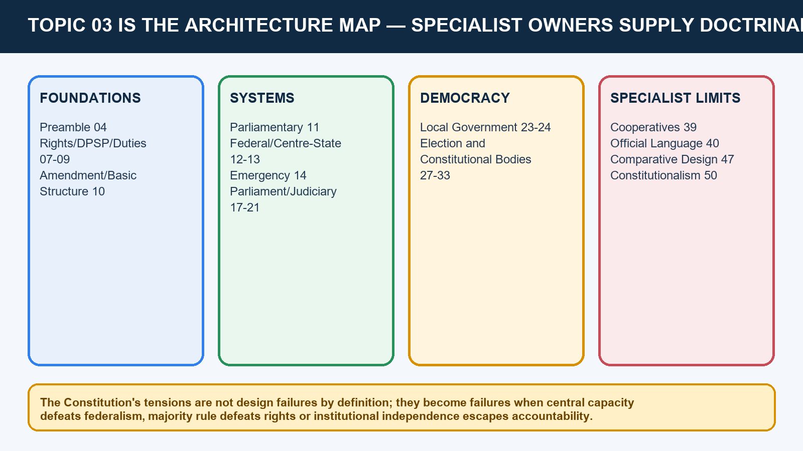

# Salient Features of the Indian Constitution — Learner-v2 Source-Complete Learning Session

> **Catalogue identity:** Polity · Subject-wide Syllabus · `polity-03`  
> **Generation identity:** `polity-03:learner-v2:g2` · generated 21 August 2026 · supersedes `polity-03:legacy-v1:g1` in metadata only  
> **Approval:** false — explicit approval of this exact generation is still required.  
> **Evidence key:** `[FACT]` = source-supported fact · `[ANALYSIS]` = exam synthesis · `[LIMIT]` = ownership, status or interpretation boundary.

## BASIC LEARNING SESSION



*Distinct embedded teaching-navigation image. The separate continuous Cārvāka-style flowchart package remains an independent at-a-glance artifact.*
### Source audit, syllabus boundary and package counts

- **Mandatory source order followed:** complete Topic 03 owner -> Basic/Core owner -> Advanced owner -> Polity README, official-syllabus mapping, command index, answer-worthiness audit and PYQ ledgers -> direct text extraction from both local OCR-searchable M. Laxmikanth PDFs -> live official/reliable verification only for dated claims. Qdrant was not used.
- **Official syllabus ownership:** Mains GS-II "Indian Constitution — features" and "separation of powers"; Prelims GS-I Indian Polity and Governance.
- **Local PDF verification:** Sixth Revised Edition chapter pages 66-77 and Eighth Edition chapter pages 80 onward were text-checked for the 17-feature list, source table, amendment spectrum, federal-unitary indicators, three-tier government and cooperative societies.
- **Verified PYQs retained:** 2 Mains + 9 Prelims = 11 independently solved items. Demand-only ledger entries are never reconstructed into fictional options.
- **Practice:** 40 core MCQs + 8 remedials, with one continuous A -> B -> C -> D rotation; six original solved Mains models (2 × 10, 2 × 15, 2 × 20).
- **Preservation:** the three legacy g1 files and all legacy assets remain untouched. No dedicated `polity-03` flowchart was found; this generation adds a separate, unapproved topic-folder companion.
### LIVE-SOURCE DECISIONS — CHECKED 21 AUGUST 2026

- [FACT] **106th Amendment:** Gazette S.O. 1922(E), 16 April 2026, verifies commencement. [LIMIT] Commencement is not operational reservation; Article 334A requires the census-publication and delimitation sequence. No implementation election or seat projection is asserted. Official Gazette: `https://egazette.gov.in/WriteReadData/2026/271834.pdf`.
- [FACT] **Article 370 / J&K:** Supreme Court judgment of 11 December 2023 upheld the 2019 changes and directed restoration of statehood at the earliest without a deadline. Official Union material checked for this package still describes J&K as a Union Territory with a legislature. Judgment: `https://api.sci.gov.in/supremecourt/2019/29796/29796_2019_1_1501_49019_Judgement_11-Dec-2023.pdf`.
- [FACT] **Cooperative societies:** *Union of India v. Rajendra N. Shah* (2021) remains controlling for the State-cooperative Part IX-B limitation; Article 19(1)(c), Article 43B and the multi-State field survive. Judgment: `https://api.sci.gov.in/supremecourt/2013/21321/21321_2013_32_1501_28728_Judgement_20-Jul-2021.pdf`.
- [LIMIT] **Governor timelines:** no Governor-assent timeline claim is required for this architectural topic, so none is inserted. This avoids importing an adjacent and time-sensitive Article 200/201 dispute into static content.
#### Answer-line control register

These sentences are controlled exam formulations. Every sentence appears unchanged in the relevant teaching stage and in the complete flowchart companion.

1. **01:** A salient constitutional feature is a system-level design characteristic produced by the interaction of provisions, institutions, values and practice.
2. **02:** India's written detail is an accommodation device: it constitutionalises diversity and administration, while remaining dependent on conventions, interpretation and implementation.
3. **03:** The Constitution is borrowed in ancestry but original in design because the framers selected, adapted and rejected foreign devices to serve Indian conditions.
4. **04:** India's graded amendment system combines adaptability with entrenchment, while the basic-structure doctrine prevents constitutional change from becoming constitutional destruction.
5. **05:** Indian federalism distributes power to accommodate diversity, but retains centralising, cooperative and asymmetric devices so the Union can coordinate without erasing the States.
6. **06:** Parliamentary government makes the executive continuously responsible to the elected lower House, although disciplined majorities can turn legislative confidence into executive dominance.
7. **06A:** India combines Parliament's broad legislative and constituent powers with judicial review under a supreme Constitution, making neither Parliament nor the judiciary sovereign in the British or American sense.
8. **07:** India separates core functions without isolating organs; constitutional overlaps are legitimate only when reciprocal checks prevent concentration of power.
9. **08:** Constitutional supremacy converts political power into legally bounded authority: every organ must show competence, fair procedure and respect for enforceable rights.
10. **09:** An integrated and independent judiciary supplies national legal unity and makes constitutional supremacy effective through review and remedies.
11. **10:** Fundamental Rights restrain power, Directive Principles direct social transformation and Fundamental Duties express civic responsibility; constitutional balance requires harmony without erasing their different legal status.
12. **11:** Indian secularism protects equal citizenship and freedom of conscience through principled state engagement, not a theocratic order or an absolute wall of separation.
13. **12:** Universal adult franchise constitutionalised equal political membership from the beginning, while representative institutions translate that equality into accountable government.
14. **13:** Single citizenship, integrated courts and All-India Services create administrative and legal unity within, not instead of, a federal polity.
15. **14:** Independent constitutional bodies disperse integrity functions outside ordinary executive control, but functional independence must coexist with transparency, reasons and review.
16. **15:** Emergency provisions permit temporary constitutional centralisation for crisis management, but they do not authorise permanent unitary rule or extra-constitutional government.
17. **16:** The 73rd and 74th Amendments deepened democracy by constitutionalising a third tier, yet real decentralisation still depends on functions, funds and functionaries.
18. **16A:** The cooperative-society provisions constitutionalise voluntary and democratic association, while federal competence limits Part IX-B's operation for State cooperatives.
19. **17:** Constitutional asymmetry uses differentiated territorial, tribal, cultural and linguistic arrangements to pursue integration through accommodation rather than coerced uniformity.
20. **18:** The Constitution retained administrative machinery from colonial rule but transformed its legitimacy through popular sovereignty, rights, universal franchise and responsible government.
21. **18A:** Constitutional morality is fidelity to constitutional forms, values and restraint; it must discipline power through text and structure rather than become a label for personal preference.
22. **19:** A Constitution creates public power, constitutional law governs it and constitutionalism asks whether effective limits, accountability and remedies actually operate.
23. **20:** The Constitution's tensions are not design failures by definition; they become failures when central capacity defeats federalism, majority rule defeats rights or institutional independence escapes accountability.
24. **FINAL:** The Indian Constitution is a carefully adapted architecture of authority, restraint, representation and transformation whose success depends as much on constitutional morality and institutions as on text.
### SESSION 1 — WHAT COUNTS AS A SALIENT CONSTITUTIONAL FEATURE

#### DEFINITION / WHAT THIS IS CALLED

**Plain-language definition:** A salient constitutional feature is a system-level design characteristic produced by the interaction of provisions, institutions, values and practice.

**Technical definition:** A salient feature is a recurring design characteristic that explains how the constitutional order is organised, limited and directed; it is wider than one provision and narrower than the Constitution as a whole.

#### ANSWER-GRABBING OPENING — WRITE/ADAPT IN THE EXAM

> A salient constitutional feature is a system-level design characteristic produced by the interaction of provisions, institutions, values and practice.

#### MUST-WRITE KEYWORDS

- **What Counts As A Salient Constitutional Feature**
- **Cross-link**
- **A system-level characteristic produced by several rules**
- **Federal with centralising features**
- **Provision**
- **A textual rule or cluster in the Constitution**

**How to use them:** Frame the answer through What Counts As A Salient Constitutional Feature; define Cross-link, connect A system-level characteristic produced by several rules with Federal with centralising features to explain the mechanism, and use Provision for the decisive comparison or qualification.

> **ANSWER-GRABBING LINE — WRITE/ADAPT IN THE EXAM (OPENING DEFINITION):** A salient constitutional feature is a system-level design characteristic produced by the interaction of provisions, institutions, values and practice.


[FACT] A salient feature is a recurring design characteristic that explains how the constitutional order is organised, limited and directed; it is wider than one provision and narrower than the Constitution as a whole.


*Caption: A constitution constitutes power, distributes it, limits it and directs it. Original deterministic schematic prepared for this package.*

| Term | Meaning | Example |
| --- | --- | --- |
| Feature | A system-level characteristic produced by several rules | Federal with centralising features |
| Provision | A textual rule or cluster in the Constitution | Article 1: Union of States |
| Institution | An office or body created or recognised by law | Election Commission of India |
| Value | A normative commitment that guides interpretation and government | Liberty, equality, dignity, fraternity |

#### Teaching and analysis
- [FACT] A feature answers 'what kind of constitutional order is this?'; a provision answers 'what does the text command or permit?'; an institution answers 'who performs a function?'; and a value answers 'towards what constitutional end?'.
- [ANALYSIS] Salient features should be explained as relationships: written detail supports legal certainty; federal distribution accommodates territory; parliamentary responsibility links executive power to representation; rights and review limit public power.
- [FACT] Constitutional supremacy means every organ receives authority from the Constitution. Limited government follows because competence, procedure and rights constrain the Union, States and institutions.
- [ANALYSIS] Rule of law supplies the operating ethic: public power must have legal authority, like cases must be treated alike, and remedies must exist against arbitrariness.
- [LIMIT] 'Salient features' is a teaching classification, not a closed constitutional schedule. Lists vary by author and constitutional development.
- [LIMIT] Do not equate every salient feature with the judicial basic-structure doctrine. Basic structure is a judicial limit on the amending power; Topic 10 owns its full development.

#### UPSC traps
- Wrong: A feature is the same as an Article.
  Correct: A feature usually emerges from several provisions, institutions and practices.
- Wrong: All important features are basic structure elements.
  Correct: The categories overlap but are not identical.

**Cross-link:** Owner links: Preamble (Topic 04); Amendment and Basic Structure (Topic 10); specialist institutional topics.

#### CLOSING RECALL FLOW — WHAT COUNTS AS A SALIENT CONSTITUTIONAL FEATURE

```text
START / CONCEPT: WHAT COUNTS AS A SALIENT CONSTITUTIONAL FEATURE
        |
        v
EXACT TERMS: What Counts As A Salient Constitutional Feature · Cross-link · A system-level characteristic produced by several rules · Federal with centralising features · Provision · A textual rule or cluster in the Constitution
        |
        v
MECHANISM / ARGUMENT: A salient feature is a recurring design characteristic that explains how the constitutional order is organised, limited and directed; it is wider than one provision and narrower than the Constitution as a whole.
        |
        v
CONSEQUENCE / CONTRAST: 'Salient features' is a teaching classification, not a closed constitutional schedule.
        |
        v
UPSC TRAP / ANSWER-USE: Salient features should be explained as relationships: written detail supports legal certainty; federal distribution accommodates territory; parliamentary responsibility links executive power to representation; rights and review limit public power.
        |
        v
ANSWER-GRABBING FORMULATION: A salient constitutional feature is a system-level design characteristic produced by the interaction of provisions, institutions, values and practice.
```
### SESSION 2 — WRITTEN, LENGTHY AND DETAILED CONSTITUTION

#### DEFINITION / WHAT THIS IS CALLED

**Plain-language definition:** India's written detail is an accommodation device: it constitutionalises diversity and administration, while remaining dependent on conventions, interpretation and implementation.

**Technical definition:** India has a written, comprehensive and unusually detailed Constitution because it combines fundamental rules with substantial administrative design for a vast and diverse Union.

#### ANSWER-GRABBING OPENING — WRITE/ADAPT IN THE EXAM

> India's written detail is an accommodation device: it constitutionalises diversity and administration, while remaining dependent on conventions, interpretation and implementation.

#### MUST-WRITE KEYWORDS

- **Written**
- **Lengthy**
- **Detailed Constitution**
- **Cross-link**
- **Authoritative text and reviewable allocation of power**
- **Text still works with conventions and judicial interpretation**

**How to use them:** Frame the answer through Written; define Lengthy, connect Detailed Constitution with Cross-link to explain the mechanism, and use Authoritative text and reviewable allocation of power for the decisive comparison or qualification.

> **ANSWER-GRABBING LINE — WRITE/ADAPT IN THE EXAM (CORE ARGUMENT):** India's written detail is an accommodation device: it constitutionalises diversity and administration, while remaining dependent on conventions, interpretation and implementation.


[FACT] India has a written, comprehensive and unusually detailed Constitution because it combines fundamental rules with substantial administrative design for a vast and diverse Union.



*Caption: Detail can secure clarity and accommodation, but it also raises complexity. Original deterministic schematic prepared for this package.*

| Dimension | Constitutional significance | Qualification |
| --- | --- | --- |
| Written | Authoritative text and reviewable allocation of power | Text still works with conventions and judicial interpretation |
| Detailed | Administrative and institutional specificity | Detail can create complexity and frequent amendment |
| Original 1949 form | Preamble, 395 Articles, 22 Parts, 8 Schedules | Use these as historical counts |
| Later form | 25 Parts and 12 Schedules in the source snapshot | Exact Article totals vary by counting method |

#### Teaching and analysis
- [FACT] Laxmikanth identifies four reasons for size: geographical diversity; the bulky Government of India Act, 1935; one constitutional framework for the Union and States; and the influence of legal specialists in the Constituent Assembly.
- [FACT] The text constitutionalises matters that some systems leave to ordinary legislation or convention. This choice increases legal visibility and permits judicial enforcement where the Constitution creates standards.
- [ANALYSIS] Detail is an accommodation technology. It can specify institutions, minority protections, territorial arrangements and emergency rules in advance, reducing reliance on unwritten consensus.
- [ANALYSIS] Detail also has costs: amendment pressure, technical complexity, litigation over fine distinctions and a tendency to mistake constitutional design for guaranteed implementation.
- [LIMIT] 'Lengthiest' is a comparative textbook description, not a licence to quote an unsourced current Article count. Inserted, omitted and renumbered Articles make totals method-dependent.
- [LIMIT] Written does not mean self-executing. Conventions, statutes, rules, political parties, administrative capacity and constitutional morality determine whether text becomes practice.

#### UPSC traps
- Wrong: Written means no conventions operate.
  Correct: India has written supremacy alongside conventions, especially in parliamentary government.
- Wrong: The current Article count is a single uncontested number.
  Correct: Parts and Schedules are safer; explain the counting caveat.

**Cross-link:** Cross-link: Polity 01 for the 1935 Act; Polity 02 for drafting choices.

#### CLOSING RECALL FLOW — WRITTEN, LENGTHY AND DETAILED CONSTITUTION

```text
START / CONCEPT: WRITTEN, LENGTHY AND DETAILED CONSTITUTION
        |
        v
EXACT TERMS: Written · Lengthy · Detailed Constitution · Cross-link · Authoritative text and reviewable allocation of power · Text still works with conventions and judicial interpretation
        |
        v
MECHANISM / ARGUMENT: India has a written, comprehensive and unusually detailed Constitution because it combines fundamental rules with substantial administrative design for a vast and diverse Union.
        |
        v
CONSEQUENCE / CONTRAST: 'Lengthiest' is a comparative textbook description, not a licence to quote an unsourced current Article count.
        |
        v
UPSC TRAP / ANSWER-USE: Do not miss this limiting distinction: india has written supremacy alongside conventions, especially in parliamentary government.
        |
        v
ANSWER-GRABBING FORMULATION: India's written detail is an accommodation device: it constitutionalises diversity and administration, while remaining dependent on conventions, interpretation and implementation.
```
### SESSION 3 — BORROWED SOURCES AS ADAPTATION, NOT COPYING

#### DEFINITION / WHAT THIS IS CALLED

**Plain-language definition:** The Constitution is borrowed in ancestry but original in design because the framers selected, adapted and rejected foreign devices to serve Indian conditions.

**Technical definition:** The Constitution drew from multiple constitutional traditions and the 1935 Act, but the exam-worthy point is selective adaptation to Indian conditions rather than a catalogue of foreign origins.

#### ANSWER-GRABBING OPENING — WRITE/ADAPT IN THE EXAM

> The Constitution is borrowed in ancestry but original in design because the framers selected, adapted and rejected foreign devices to serve Indian conditions.

#### MUST-WRITE KEYWORDS

- **Borrowed Sources As Adaptation**
- **Not Copying**
- **Cross-link**
- **United Kingdom**
- **Cabinet government, rule of law, single citizenship, bicameralism**
- **No parliamentary sovereignty; republican head; written limits**

**How to use them:** Frame the answer through Borrowed Sources As Adaptation; define Not Copying, connect Cross-link with United Kingdom to explain the mechanism, and use Cabinet government, rule of law, single citizenship, bicameralism for the decisive comparison or qualification.

> **ANSWER-GRABBING LINE — WRITE/ADAPT IN THE EXAM (CORE ARGUMENT):** The Constitution is borrowed in ancestry but original in design because the framers selected, adapted and rejected foreign devices to serve Indian conditions.


[FACT] The Constitution drew from multiple constitutional traditions and the 1935 Act, but the exam-worthy point is selective adaptation to Indian conditions rather than a catalogue of foreign origins.


*Caption: Comparison explains design choices; it is not a trivia catalogue. Original deterministic schematic prepared for this package.*

| Source | Adapted feature | Indian alteration / context |
| --- | --- | --- |
| United Kingdom | Cabinet government, rule of law, single citizenship, bicameralism | No parliamentary sovereignty; republican head; written limits |
| United States | Fundamental Rights, judicial review, judicial independence, Vice-President | No presidential executive, dual citizenship or rigid separation |
| Canada | Strong-Centre federation, residuary power at Union, appointed Governors | Combined with parliamentary government and asymmetric provisions |
| Ireland | DPSP, nominated Rajya Sabha members, presidential election method | DPSP made fundamental in governance but non-justiciable |
| Australia | Concurrent List, joint sitting, trade and commerce freedom | Placed within India's stronger Union framework |
| France / USSR / South Africa / Japan | Republic and fraternity / duties and justice / amendment procedure / procedure established by law | Each element was fitted into a different overall design |

#### Teaching and analysis
- [FACT] The structural part was strongly influenced by the Government of India Act, 1935; the philosophical parts drew notably on American rights and Irish directive principles; executive-legislative relations drew on the British model.
- [ANALYSIS] Adaptation is shown by rejection. India accepted cabinet responsibility but rejected hereditary monarchy and unlimited Parliament; accepted review but rejected dual citizenship and a presidential executive.
- [FACT] The 1935 Act supplied federal, gubernatorial, judicial, public-service, emergency and administrative material. Popular sovereignty, universal franchise, enforceable rights and republican government transformed its purpose.
- [ANALYSIS] Comparative references earn marks only when they prove why India's combination is distinctive: parliamentary plus federal, written plus flexible, rights plus directive principles, central capacity plus asymmetry.
- [LIMIT] Borrowed-source lists are prone to false one-to-one claims. A feature may have multiple intellectual and institutional influences; use the repository-verified table and avoid decorative trivia.
- [LIMIT] The specialist comparative owner should carry operational country comparison. This topic uses comparisons only to illuminate adaptation.

#### UPSC traps
- Wrong: Concurrent List came from Canada.
  Correct: It is conventionally traced to Australia; strong-Centre federalism is linked to Canada.
- Wrong: India copied British parliamentary sovereignty.
  Correct: India adopted responsible government under constitutional supremacy.

**Cross-link:** Owner link: Comparative Constitutional Schemes (Topic 47) for full country comparison.

#### CLOSING RECALL FLOW — BORROWED SOURCES AS ADAPTATION, NOT COPYING

```text
START / CONCEPT: BORROWED SOURCES AS ADAPTATION, NOT COPYING
        |
        v
EXACT TERMS: Borrowed Sources As Adaptation · Not Copying · Cross-link · United Kingdom · Cabinet government, rule of law, single citizenship, bicameralism · No parliamentary sovereignty; republican head; written limits
        |
        v
MECHANISM / ARGUMENT: The structural part was strongly influenced by the Government of India Act, 1935; the philosophical parts drew notably on American rights and Irish directive principles; executive-legislative relations drew on the British model.
        |
        v
CONSEQUENCE / CONTRAST: The Constitution drew from multiple constitutional traditions and the 1935 Act, but the exam-worthy point is selective adaptation to Indian conditions rather than a catalogue of foreign origins.
        |
        v
UPSC TRAP / ANSWER-USE: Do not miss this limiting distinction: this topic uses comparisons only to illuminate adaptation.
        |
        v
ANSWER-GRABBING FORMULATION: The Constitution is borrowed in ancestry but original in design because the framers selected, adapted and rejected foreign devices to serve Indian conditions.
```
### SESSION 4 — BLEND OF RIGIDITY AND FLEXIBILITY

#### DEFINITION / WHAT THIS IS CALLED

**Plain-language definition:** Blend Of Rigidity And Flexibility comprises Blend Of Rigidity, Flexibility and Cross-link as its core connected dimensions.

**Technical definition:** Article 368 supplies constituent power and procedure, but some changes described as constitutional amendments lie outside Article 368 and use simple majority.

#### ANSWER-GRABBING OPENING — WRITE/ADAPT IN THE EXAM

> Blend Of Rigidity And Flexibility comprises Blend Of Rigidity, Flexibility and Cross-link as its core connected dimensions.

#### MUST-WRITE KEYWORDS

- **Blend Of Rigidity**
- **Flexibility**
- **Cross-link**
- **Simple majority outside Article 368**
- **Adaptability without treating every change as constituent amendment**
- **Special majority under Article 368**

**How to use them:** Frame the answer through Blend Of Rigidity; define Flexibility, connect Cross-link with Simple majority outside Article 368 to explain the mechanism, and use Adaptability without treating every change as constituent amendment for the decisive comparison or qualification.

> **ANSWER-GRABBING LINE — WRITE/ADAPT IN THE EXAM (CORE ARGUMENT):** India's graded amendment system combines adaptability with entrenchment, while the basic-structure doctrine prevents constitutional change from becoming constitutional destruction.


[FACT] The amendment design combines ordinary legislative change, special parliamentary majorities and, for specified federal matters, ratification by at least half of the States.



*Caption: India lies between constitutional rigidity and ordinary-law flexibility. Original deterministic schematic prepared for this package.*

| Route | Core logic | Significance |
| --- | --- | --- |
| Simple majority outside Article 368 | Certain constitutional changes follow ordinary-law style procedure | Adaptability without treating every change as constituent amendment |
| Special majority under Article 368 | Majority of total membership plus two-thirds present and voting in each House | Entrenches constitutional choice |
| Special majority plus State ratification | Specified federal provisions also require at least half the States | Protects the federal compact |
| Judicial boundary | Amending power cannot damage basic structure | Flexibility is constitutionally bounded |

#### Teaching and analysis
- [FACT] India is neither as flexible as the classic British model nor as rigid as the United States model. Different subjects receive different levels of entrenchment.
- [ANALYSIS] Graduated amendment rules align procedure with constitutional stakes: technical or territorial adjustments may be easier, while federal balance receives State participation.
- [FACT] Article 368 supplies constituent power and procedure, but some changes described as constitutional amendments lie outside Article 368 and use simple majority.
- [ANALYSIS] The basic-structure doctrine creates a tension between democratic updating and constitutional identity: amendment is broad, not destructive.
- [LIMIT] Basic structure is not a textual schedule and has no exhaustive closed list. Its doctrine and cases belong to Topic 10.
- [LIMIT] Never say every constitutional amendment needs State ratification, a referendum or a joint sitting. India has no constitutional referendum requirement for Article 368 amendments.

#### UPSC traps
- Wrong: All amendments use Article 368.
  Correct: Some constitution-related changes use simple majority outside it.
- Wrong: Basic structure prevents amendment.
  Correct: It prevents destructive alteration, not constitutional change as such.

**Cross-link:** Owner link: Amendment and Basic Structure (Topic 10).

#### CLOSING RECALL FLOW — BLEND OF RIGIDITY AND FLEXIBILITY

```text
START / CONCEPT: BLEND OF RIGIDITY AND FLEXIBILITY
        |
        v
EXACT TERMS: Blend Of Rigidity · Flexibility · Cross-link · Simple majority outside Article 368 · Adaptability without treating every change as constituent amendment · Special majority under Article 368
        |
        v
MECHANISM / ARGUMENT: Article 368 supplies constituent power and procedure, but some changes described as constitutional amendments lie outside Article 368 and use simple majority.
        |
        v
CONSEQUENCE / CONTRAST: The basic-structure doctrine creates a tension between democratic updating and constitutional identity: amendment is broad, not destructive.
        |
        v
UPSC TRAP / ANSWER-USE: Basic structure is not a textual schedule and has no exhaustive closed list.
        |
        v
ANSWER-GRABBING FORMULATION: Blend Of Rigidity And Flexibility comprises Blend Of Rigidity, Flexibility and Cross-link as its core connected dimensions.
```
### SESSION 5 — FEDERAL SYSTEM WITH CENTRALISING, COOPERATIVE AND ASYMMETRIC DIMENSIONS

#### DEFINITION / WHAT THIS IS CALLED

**Plain-language definition:** India is a federation in structure with constitutionally strong Union capacity; its operation also includes cooperative, competitive and asymmetric forms of federalism.

**Technical definition:** Cooperative federalism appears where governments jointly finance, deliberate or implement; competitive federalism describes comparison for investment and governance; asymmetry gives differentiated arrangements to accommodate distinct histories and communities.

#### ANSWER-GRABBING OPENING — WRITE/ADAPT IN THE EXAM

> Indian federalism distributes power to accommodate diversity, but retains centralising, cooperative and asymmetric devices so the Union can coordinate without erasing the States.

#### MUST-WRITE KEYWORDS

- **Federal System With Centralising**
- **Cooperative**
- **Asymmetric Dimensions**
- **Cross-link**
- **Dual governments**
- **Distribution of powers**

**How to use them:** Frame the answer through Federal System With Centralising; define Cooperative, connect Asymmetric Dimensions with Cross-link to explain the mechanism, and use Dual governments for the decisive comparison or qualification.

> **ANSWER-GRABBING LINE — WRITE/ADAPT IN THE EXAM (ANALYTICAL TRANSITION):** Indian federalism distributes power to accommodate diversity, but retains centralising, cooperative and asymmetric devices so the Union can coordinate without erasing the States.


[FACT] India is a federation in structure with constitutionally strong Union capacity; its operation also includes cooperative, competitive and asymmetric forms of federalism.


*Caption: India is neither purely federal nor purely unitary. Original deterministic schematic prepared for this package.*

| Federal dimension | Illustration | Centralising / qualifying feature |
| --- | --- | --- |
| Dual governments | Union and States have constitutional fields | Union has residuary power and stronger crisis capacity |
| Distribution of powers | Union, State and Concurrent Lists | Union priority in constitutionally specified conflicts |
| Written supremacy | Competence is constitutionally allocated | Parliament may reorganise State boundaries under the Constitution |
| Judicial umpire | Courts decide competence disputes | Integrated, not dual, judiciary |
| Territorial chamber | Rajya Sabha represents States | Representation is unequal and party discipline matters |

#### Teaching and analysis
- [FACT] Article 1 calls India a 'Union of States'; the Constitution does not use 'Federation'. The Union was not created by a compact among sovereign States, and States have no right to secede.
- [FACT] Federal indicators include two levels of government, distribution of legislative power, written supremacy, partial rigidity, judicial review and bicameralism.
- [FACT] Centralising indicators include single citizenship, integrated courts, Union appointment of Governors, All-India Services, emergency provisions, a strong Union list and one Constitution for the general Union-State framework.
- [ANALYSIS] Cooperative federalism appears where governments jointly finance, deliberate or implement; competitive federalism describes comparison for investment and governance; asymmetry gives differentiated arrangements to accommodate distinct histories and communities.
- [ANALYSIS] The design seeks survival and integration without erasing diversity. Central capacity can coordinate national action, but excessive use can weaken State autonomy and democratic accountability.
- [LIMIT] 'Quasi-federal' is a scholar's description, not constitutional text. A good answer weighs domains and time periods instead of declaring India simply unitary.
- [FACT][LIVE OFFICIAL — checked 21 August 2026] Gazette notification S.O. 1922(E) brought the Constitution (One Hundred and Sixth Amendment) Act, 2023 into force on 16 April 2026. [LIMIT] Article 334A still links actual reservation to delimitation undertaken after publication of the relevant figures of the first census taken after commencement; no publication date, delimitation date, election year or seat projection is asserted.

#### UPSC traps
- Wrong: India is purely unitary because the Centre is strong.
  Correct: It has a constitutionally distributed federal structure with centralising features.
- Wrong: Asymmetry violates federalism.
  Correct: Differentiated arrangements can be a federal device for accommodation.

**Cross-link:** Owner links: Federal System (12), Centre-State Relations (13), Special Provisions (22).

#### CLOSING RECALL FLOW — FEDERAL SYSTEM WITH CENTRALISING, COOPERATIVE AND ASYMMETRIC DIMENSIONS

```text
START / CONCEPT: FEDERAL SYSTEM WITH CENTRALISING, COOPERATIVE AND ASYMMETRIC DIMENSIONS
        |
        v
EXACT TERMS: Federal System With Centralising · Cooperative · Asymmetric Dimensions · Cross-link · Dual governments · Distribution of powers
        |
        v
MECHANISM / ARGUMENT: India is a federation in structure with constitutionally strong Union capacity; its operation also includes cooperative, competitive and asymmetric forms of federalism.
        |
        v
CONSEQUENCE / CONTRAST: Correct: It has a constitutionally distributed federal structure with centralising features.
        |
        v
UPSC TRAP / ANSWER-USE: Article 1 calls India a 'Union of States'; the Constitution does not use 'Federation'.
        |
        v
ANSWER-GRABBING FORMULATION: Indian federalism distributes power to accommodate diversity, but retains centralising, cooperative and asymmetric devices so the Union can coordinate without erasing the States.
```
### SESSION 6 — PARLIAMENTARY GOVERNMENT AND RESPONSIBLE EXECUTIVE

#### DEFINITION / WHAT THIS IS CALLED

**Plain-language definition:** Parliamentary Government And Responsible Executive comprises Parliamentary Government, Responsible Executive and Cross-link as its core connected dimensions.

**Technical definition:** Parliamentary government makes the executive continuously responsible to the elected lower House, although disciplined majorities can turn legislative confidence into executive dominance.

#### ANSWER-GRABBING OPENING — WRITE/ADAPT IN THE EXAM

> Parliamentary government makes the executive continuously responsible to the elected lower House, although disciplined majorities can turn legislative confidence into executive dominance.

#### MUST-WRITE KEYWORDS

- **Parliamentary Government**
- **Responsible Executive**
- **Cross-link**
- **Dual executive**
- **Discretion exists only in constitutionally bounded situations**
- **Collective responsibility**

**How to use them:** Frame the answer through Parliamentary Government; define Responsible Executive, connect Cross-link with Dual executive to explain the mechanism, and use Discretion exists only in constitutionally bounded situations for the decisive comparison or qualification.

> **ANSWER-GRABBING LINE — WRITE/ADAPT IN THE EXAM (CORE ARGUMENT):** Parliamentary government makes the executive continuously responsible to the elected lower House, although disciplined majorities can turn legislative confidence into executive dominance.


[FACT] India adopts parliamentary government at Union and State levels: a nominal constitutional head works with a real Council of Ministers collectively responsible to the elected lower House.



*Caption: The real executive survives only while it retains legislative confidence. Original deterministic schematic prepared for this package.*

| Feature | Mechanism | Risk / qualification |
| --- | --- | --- |
| Dual executive | President/Governor as formal head; PM/CM-led Council as real executive | Discretion exists only in constitutionally bounded situations |
| Collective responsibility | Council stands or falls together before lower House | Large majority and party discipline can weaken scrutiny |
| Fusion | Ministers normally sit in the legislature | Fusion is not absence of checks |
| Confidence | Government requires lower-House support | Coalitions and anti-defection law affect incentives |

#### Teaching and analysis
- [FACT] Responsible government links executive survival to legislative confidence. It differs from a presidential separation in which executive tenure is independently fixed.
- [FACT] Core features include nominal and real executives, majority leadership, collective responsibility, ministerial membership in the legislature, PM/CM leadership and possible dissolution of the lower House.
- [ANALYSIS] The accountability chain is electoral and institutional: citizens choose representatives; the lower House sustains or removes the ministry; questions, debates, committees and budget control scrutinise administration.
- [ANALYSIS] Parliamentary government favours coordination and responsiveness, but executive dominance can arise when the ministry controls a disciplined legislative majority.
- [LIMIT] Indian Parliament is not sovereign like Westminster. Written limits, federal competence, Fundamental Rights, judicial review and basic structure constrain it.
- [LIMIT] Do not call the President merely ceremonial in every context. The office has constitutional powers, generally exercised on ministerial aid and advice subject to specified text and conventions.

#### UPSC traps
- Wrong: Fusion means no separation of powers.
  Correct: Parliamentary fusion coexists with judicial review and institutional checks.
- Wrong: Responsible government guarantees effective scrutiny.
  Correct: Party majorities and anti-defection incentives may reduce deliberative accountability.

**Cross-link:** Owner links: Parliamentary System (11), President (15), PM and Council (16), Parliament (17).

#### CLOSING RECALL FLOW — PARLIAMENTARY GOVERNMENT AND RESPONSIBLE EXECUTIVE

```text
START / CONCEPT: PARLIAMENTARY GOVERNMENT AND RESPONSIBLE EXECUTIVE
        |
        v
EXACT TERMS: Parliamentary Government · Responsible Executive · Cross-link · Dual executive · Discretion exists only in constitutionally bounded situations · Collective responsibility
        |
        v
MECHANISM / ARGUMENT: Parliamentary government favours coordination and responsiveness, but executive dominance can arise when the ministry controls a disciplined legislative majority.
        |
        v
CONSEQUENCE / CONTRAST: Do not call the President merely ceremonial in every context.
        |
        v
UPSC TRAP / ANSWER-USE: Do not miss this limiting distinction: responsible government links executive survival to legislative confidence.
        |
        v
ANSWER-GRABBING FORMULATION: Parliamentary government makes the executive continuously responsible to the elected lower House, although disciplined majorities can turn legislative confidence into executive dominance.
```
### SESSION 7 — A. SYNTHESIS OF PARLIAMENTARY POWER, JUDICIAL REVIEW AND CONSTITUTIONAL SUPREMACY

#### DEFINITION / WHAT THIS IS CALLED

**Plain-language definition:** The exam-safe formulation is constitutional supremacy enforced partly through judicial review.

**Technical definition:** Technically, A. Synthesis Of Parliamentary Power, Judicial Review And Constitutional Supremacy is analysed by relating A. Synthesis Of Parliamentary Power to Judicial Review, then testing the relationship through Constitutional Supremacy and Cross-link.

#### ANSWER-GRABBING OPENING — WRITE/ADAPT IN THE EXAM

> The exam-safe formulation is constitutional supremacy enforced partly through judicial review.

#### MUST-WRITE KEYWORDS

- **A. Synthesis Of Parliamentary Power**
- **Judicial Review**
- **Constitutional Supremacy**
- **Cross-link**
- **Ordinary legislation**
- **Parliament legislates within constitutional competence**

**How to use them:** Frame the answer through A. Synthesis Of Parliamentary Power; define Judicial Review, connect Constitutional Supremacy with Cross-link to explain the mechanism, and use Ordinary legislation for the decisive comparison or qualification.

> **ANSWER-GRABBING LINE — WRITE/ADAPT IN THE EXAM (ANALYTICAL TRANSITION):** India combines Parliament's broad legislative and constituent powers with judicial review under a supreme Constitution, making neither Parliament nor the judiciary sovereign in the British or American sense.

[FACT] India borrows the British idea of a powerful Parliament and the American idea of judicial review, but places both inside a written and supreme Constitution.


*Caption: Parliament and courts exercise constitutionally assigned powers; the Constitution remains supreme.*

| Dimension | Indian position | Close-option control |
| --- | --- | --- |
| Ordinary legislation | Parliament legislates within constitutional competence | A majority cannot validate an unconstitutional law |
| Constituent power | Parliament may amend under Article 368 | The basic-structure limit prevents destructive amendment |
| Judicial review | Courts may invalidate unconstitutional action | Review does not make courts an unlimited sovereign |
| Article 21 | Text says 'procedure established by law' | *Maneka Gandhi* requires fair, just and reasonable procedure; India did not copy the entire US model wholesale |

#### Teaching and analysis
- [FACT] Articles 13, 32 and 226 make constitutional limits enforceable; Article 368 supplies broad amendment power.
- [ANALYSIS] The synthesis prevents two absolutes: Westminster-style parliamentary sovereignty and court-centred government.
- [LIMIT] 'Judicial supremacy' is textbook shorthand. The exam-safe formulation is constitutional supremacy enforced partly through judicial review.

#### UPSC traps
- Wrong: Parliament is sovereign because it can amend the Constitution.
  Correct: Amendment power is constitutionally conferred and basic-structure limited.
- Wrong: Judicial review makes every judicial policy preference final.
  Correct: Courts must reason from constitutional text, structure, precedent and jurisdiction.

**Cross-link:** Parliament (Topic 17), Supreme Court (Topic 18), Amendment and Basic Structure (Topic 10).

#### CLOSING RECALL FLOW — A. SYNTHESIS OF PARLIAMENTARY POWER, JUDICIAL REVIEW AND CONSTITUTIONAL SUPREMACY

```text
START / CONCEPT: A. SYNTHESIS OF PARLIAMENTARY POWER, JUDICIAL REVIEW AND CONSTITUTIONAL SUPREMACY
        |
        v
EXACT TERMS: A. Synthesis Of Parliamentary Power · Judicial Review · Constitutional Supremacy · Cross-link · Ordinary legislation · Parliament legislates within constitutional competence
        |
        v
MECHANISM / ARGUMENT: Wrong: Parliament is sovereign because it can amend the Constitution.
        |
        v
CONSEQUENCE / CONTRAST: Articles 13, 32 and 226 make constitutional limits enforceable; Article 368 supplies broad amendment power.
        |
        v
UPSC TRAP / ANSWER-USE: Do not miss this limiting distinction: courts must reason from constitutional text, structure, precedent and jurisdiction.
        |
        v
ANSWER-GRABBING FORMULATION: The exam-safe formulation is constitutional supremacy enforced partly through judicial review.
```
### SESSION 8 — SEPARATION OF POWERS THROUGH CHECKS AND BALANCES

#### DEFINITION / WHAT THIS IS CALLED

**Plain-language definition:** Ram Jawaya Kapur (1955) recognised that the Constitution does not contemplate a rigid separation, though functions are sufficiently differentiated.

**Technical definition:** Technically, Separation Of Powers Through Checks And Balances is analysed by relating Separation Of Powers Through Checks to Balances, then testing the relationship through Cross-link and Article 50.

#### ANSWER-GRABBING OPENING — WRITE/ADAPT IN THE EXAM

> India separates core functions without isolating organs; constitutional overlaps are legitimate only when reciprocal checks prevent concentration of power.

#### MUST-WRITE KEYWORDS

- **Separation Of Powers Through Checks**
- **Balances**
- **Cross-link**
- **Article 50**
- **Articles 121 and 211**
- **Articles 122 and 212**

**How to use them:** Frame the answer through Separation Of Powers Through Checks; define Balances, connect Cross-link with Article 50 to explain the mechanism, and use Articles 121 and 211 for the decisive comparison or qualification.

> **ANSWER-GRABBING LINE — WRITE/ADAPT IN THE EXAM (CORE ARGUMENT):** India separates core functions without isolating organs; constitutional overlaps are legitimate only when reciprocal checks prevent concentration of power.


[FACT] India does not adopt strict separation; it differentiates core functions while permitting overlap and reciprocal checks.


*Caption: Functions are differentiated, but strict organ isolation is rejected. Original deterministic schematic prepared for this package.*

| Constitutional marker | What it protects | Qualification |
| --- | --- | --- |
| Article 50 | Separation of judiciary from executive in public services of the State | A DPSP, not by itself a directly enforceable right |
| Articles 121 and 211 | Limits legislative discussion of judges' conduct except removal process | Does not immunise judgments from criticism |
| Articles 122 and 212 | Procedural autonomy of legislatures | Substantive constitutional illegality remains reviewable within doctrine |
| Articles 123 and 213 | Executive ordinance law-making | Temporary, conditioned legislative power |
| Articles 13, 32 and 226 | Judicial review and remedies | Review is constitutional, not judicial government |

#### Teaching and analysis
- [FACT] Ram Jawaya Kapur (1955) recognised that the Constitution does not contemplate a rigid separation, though functions are sufficiently differentiated.
- [FACT] Kesavananda Bharati (1973) and Indira Nehru Gandhi v. Raj Narain (1975) anchor separation and review within basic-structure reasoning.
- [ANALYSIS] Overlap is functional: executives initiate most legislation and may issue ordinances; legislatures hold executives accountable; courts review legality and frame procedural rules.
- [ANALYSIS] Checks and balances prevent concentration without paralysing government. The test is whether overlap preserves each organ's constitutionally assigned core and accountability.
- [LIMIT] Judicial independence is not judicial supremacy. Courts are bound by text, precedent, reasons, jurisdiction and institutional limits.
- [LIMIT] Legislative privilege and internal procedure are not zones of total immunity; nor may courts substitute policy preference for constitutional adjudication.

#### UPSC traps
- Wrong: India follows Montesquieu-style strict separation.
  Correct: India follows functional separation with checks, balances and overlaps.
- Wrong: Judicial review makes courts sovereign.
  Correct: The Constitution is supreme; judicial review is one enforcement mechanism.

**Cross-link:** Direct owner of 2019 GS-II separation-of-powers PYQ; Judiciary topics own deeper doctrine.

#### CLOSING RECALL FLOW — SEPARATION OF POWERS THROUGH CHECKS AND BALANCES

```text
START / CONCEPT: SEPARATION OF POWERS THROUGH CHECKS AND BALANCES
        |
        v
EXACT TERMS: Separation Of Powers Through Checks · Balances · Cross-link · Article 50 · Articles 121 and 211 · Articles 122 and 212
        |
        v
MECHANISM / ARGUMENT: Correct: India follows functional separation with checks, balances and overlaps.
        |
        v
CONSEQUENCE / CONTRAST: India does not adopt strict separation; it differentiates core functions while permitting overlap and reciprocal checks.
        |
        v
UPSC TRAP / ANSWER-USE: Ram Jawaya Kapur (1955) recognised that the Constitution does not contemplate a rigid separation, though functions are sufficiently differentiated.
        |
        v
ANSWER-GRABBING FORMULATION: India separates core functions without isolating organs; constitutional overlaps are legitimate only when reciprocal checks prevent concentration of power.
```
### SESSION 9 — CONSTITUTIONAL SUPREMACY, RULE OF LAW AND LIMITED GOVERNMENT

#### DEFINITION / WHAT THIS IS CALLED

**Plain-language definition:** The Constitution is the superior source of public authority; rule of law and judicially enforceable limits distinguish constitutional government from merely popular or legislative government.

**Technical definition:** Technically, Constitutional Supremacy, Rule Of Law And Limited Government is analysed by relating Constitutional Supremacy to Rule Of Law, then testing the relationship through Limited Government and Cross-link.

#### ANSWER-GRABBING OPENING — WRITE/ADAPT IN THE EXAM

> Constitutional supremacy converts political power into legally bounded authority: every organ must show competence, fair procedure and respect for enforceable rights.

#### MUST-WRITE KEYWORDS

- **Constitutional Supremacy**
- **Rule Of Law**
- **Limited Government**
- **Cross-link**
- **Different from British parliamentary sovereignty**
- **Not rule by any enacted law**

**How to use them:** Frame the answer through Constitutional Supremacy; define Rule Of Law, connect Limited Government with Cross-link to explain the mechanism, and use Different from British parliamentary sovereignty for the decisive comparison or qualification.

> **ANSWER-GRABBING LINE — WRITE/ADAPT IN THE EXAM (CORE ARGUMENT):** Constitutional supremacy converts political power into legally bounded authority: every organ must show competence, fair procedure and respect for enforceable rights.


[FACT] The Constitution is the superior source of public authority; rule of law and judicially enforceable limits distinguish constitutional government from merely popular or legislative government.


*Caption: Parliament is powerful but not sovereign in the British sense. Original deterministic schematic prepared for this package.*

| Idea | Core test | Exam distinction |
| --- | --- | --- |
| Constitutional supremacy | Can every organ trace and justify its power under the Constitution? | Different from British parliamentary sovereignty |
| Rule of law | Is power authorised, non-arbitrary and equally applied? | Not rule by any enacted law |
| Limited government | Are competence, procedure and rights enforceable limits? | Elections alone do not create constitutionalism |
| Judicial review | Can unconstitutional action be invalidated or corrected? | Review is not policy administration |

#### Teaching and analysis
- [FACT] Dicey's classic rule-of-law elements are supremacy of regular law over arbitrary power, equality before law and a legal spirit in which courts protect rights. India's written rights and remedies alter the British setting but preserve the anti-arbitrariness core.
- [FACT] Articles 13, 32 and 226 are central review/remedy anchors; Article 368 gives broad amendment power subject to the basic-structure limit.
- [ANALYSIS] Constitutional government both creates and restrains power. Institutions need sufficient capacity to govern, yet must remain within jurisdiction, follow fair procedure and justify restrictions.
- [ANALYSIS] Law and liberty are not simple opposites. General, prospective and reviewable law can create ordered liberty by restraining arbitrary coercion.
- [LIMIT] Procedure established by law in Article 21 is the textual phrase. After Maneka Gandhi, procedure must be fair, just and reasonable; do not claim India simply copied the entire American substantive-due-process model.
- [LIMIT] Parliamentary majority is democratic evidence, not a waiver of constitutional limits.

#### UPSC traps
- Wrong: Rule of law means any action backed by statute is valid.
  Correct: The law and its application must satisfy constitutional competence and rights.
- Wrong: Limited government means weak government.
  Correct: It means legally bounded government with adequate constitutional capacity.

**Cross-link:** Owner links: Fundamental Rights (07), Supreme Court (18), Amendment and Basic Structure (10).

#### CLOSING RECALL FLOW — CONSTITUTIONAL SUPREMACY, RULE OF LAW AND LIMITED GOVERNMENT

```text
START / CONCEPT: CONSTITUTIONAL SUPREMACY, RULE OF LAW AND LIMITED GOVERNMENT
        |
        v
EXACT TERMS: Constitutional Supremacy · Rule Of Law · Limited Government · Cross-link · Different from British parliamentary sovereignty · Not rule by any enacted law
        |
        v
MECHANISM / ARGUMENT: Wrong: Rule of law means any action backed by statute is valid.
        |
        v
CONSEQUENCE / CONTRAST: The Constitution is the superior source of public authority; rule of law and judicially enforceable limits distinguish constitutional government from merely popular or legislative government.
        |
        v
UPSC TRAP / ANSWER-USE: Parliamentary majority is democratic evidence, not a waiver of constitutional limits.
        |
        v
ANSWER-GRABBING FORMULATION: Constitutional supremacy converts political power into legally bounded authority: every organ must show competence, fair procedure and respect for enforceable rights.
```
### SESSION 10 — INDEPENDENT, INTEGRATED JUDICIARY AND JUDICIAL REVIEW

#### DEFINITION / WHAT THIS IS CALLED

**Plain-language definition:** Independent, Integrated Judiciary And Judicial Review comprises Independent, Integrated Judiciary and Judicial Review as its core connected dimensions.

**Technical definition:** An integrated and independent judiciary supplies national legal unity and makes constitutional supremacy effective through review and remedies.

#### ANSWER-GRABBING OPENING — WRITE/ADAPT IN THE EXAM

> An integrated and independent judiciary supplies national legal unity and makes constitutional supremacy effective through review and remedies.

#### MUST-WRITE KEYWORDS

- **Independent**
- **Integrated Judiciary**
- **Judicial Review**
- **Cross-link**
- **Integrated**
- **Federal disputes still receive constitutionally assigned jurisdiction**

**How to use them:** Frame the answer through Independent; define Integrated Judiciary, connect Judicial Review with Cross-link to explain the mechanism, and use Integrated for the decisive comparison or qualification.

> **ANSWER-GRABBING LINE — WRITE/ADAPT IN THE EXAM (CORE ARGUMENT):** An integrated and independent judiciary supplies national legal unity and makes constitutional supremacy effective through review and remedies.


[FACT] India has one integrated judicial hierarchy administering Union and State law, designed to remain institutionally independent and to enforce constitutional supremacy.


*Caption: Parliament is powerful but not sovereign in the British sense. Original deterministic schematic prepared for this package.*

| Dimension | Meaning | Limit |
| --- | --- | --- |
| Integrated | Supreme Court, High Courts and subordinate courts form one hierarchy | Federal disputes still receive constitutionally assigned jurisdiction |
| Independent | Tenure, service conditions, charged expenditure and institutional protections reduce external control | Appointment and accountability debates continue |
| Review | Courts test legislative and executive action against the Constitution | Review does not confer unlimited governance power |
| Remedies | Supreme Court and High Courts issue writs within constitutional jurisdiction | Access, delay and compliance affect effectiveness |

#### Teaching and analysis
- [FACT] The Supreme Court is the apex court, federal court, final appellate court, protector of Fundamental Rights and guardian of constitutional boundaries.
- [FACT] Independence safeguards include security of tenure, protected service conditions, charged expenditure, restrictions on legislative discussion of judicial conduct, contempt power and constitutional separation from the executive.
- [ANALYSIS] Integration promotes legal unity: the same court system applies Union and State law, unlike a fully dual federal judiciary.
- [ANALYSIS] Judicial review makes written supremacy operational by providing reasoned remedies against ultra vires action.
- [LIMIT] Judicial independence is institutional impartiality, not absence of accountability, criticism or constitutional limits.
- [LIMIT] This package does not duplicate appointments, jurisdiction, PIL, activism or tribunal doctrine; those belong to judicial owner topics.

#### UPSC traps
- Wrong: Integrated judiciary means States have no High Courts.
  Correct: High Courts are constitutionally significant within one integrated hierarchy.
- Wrong: Independent judiciary equals judicial supremacy.
  Correct: The Constitution, not any organ, is supreme.

**Cross-link:** Owner links: Supreme Court (18), High Courts and Subordinate Courts (21), Tribunals (46).

#### CLOSING RECALL FLOW — INDEPENDENT, INTEGRATED JUDICIARY AND JUDICIAL REVIEW

```text
START / CONCEPT: INDEPENDENT, INTEGRATED JUDICIARY AND JUDICIAL REVIEW
        |
        v
EXACT TERMS: Independent · Integrated Judiciary · Judicial Review · Cross-link · Integrated · Federal disputes still receive constitutionally assigned jurisdiction
        |
        v
MECHANISM / ARGUMENT: India has one integrated judicial hierarchy administering Union and State law, designed to remain institutionally independent and to enforce constitutional supremacy.
        |
        v
CONSEQUENCE / CONTRAST: Judicial independence is institutional impartiality, not absence of accountability, criticism or constitutional limits.
        |
        v
UPSC TRAP / ANSWER-USE: This package does not duplicate appointments, jurisdiction, PIL, activism or tribunal doctrine; those belong to judicial owner topics.
        |
        v
ANSWER-GRABBING FORMULATION: An integrated and independent judiciary supplies national legal unity and makes constitutional supremacy effective through review and remedies.
```
### SESSION 11 — RIGHTS, DIRECTIVE PRINCIPLES AND DUTIES AS NORMATIVE ARCHITECTURE

#### DEFINITION / WHAT THIS IS CALLED

**Plain-language definition:** They are not absolute, and not every right belongs only to citizens.

**Technical definition:** Fundamental Rights restrain power, Directive Principles direct social transformation and Fundamental Duties express civic responsibility; constitutional balance requires harmony without erasing their different legal status.

#### ANSWER-GRABBING OPENING — WRITE/ADAPT IN THE EXAM

> Fundamental Rights restrain power, Directive Principles direct social transformation and Fundamental Duties express civic responsibility; constitutional balance requires harmony without erasing their different legal status.

#### MUST-WRITE KEYWORDS

- **Rights**
- **Directive Principles**
- **Duties As Normative Architecture**
- **Cross-link**
- **Fundamental Rights**
- **Justiciable, subject to constitutional restrictions**

**How to use them:** Frame the answer through Rights; define Directive Principles, connect Duties As Normative Architecture with Cross-link to explain the mechanism, and use Fundamental Rights for the decisive comparison or qualification.

> **ANSWER-GRABBING LINE — WRITE/ADAPT IN THE EXAM (CORE ARGUMENT):** Fundamental Rights restrain power, Directive Principles direct social transformation and Fundamental Duties express civic responsibility; constitutional balance requires harmony without erasing their different legal status.


[FACT] Parts III, IV and IV-A combine enforceable liberty, governance directives for social transformation and citizen duties; their constitutional roles differ but their purposes interact.



*Caption: The three parts work as a constitutional moral architecture. Original deterministic schematic prepared for this package.*

| Component | Legal position | Constitutional purpose |
| --- | --- | --- |
| Fundamental Rights | Justiciable, subject to constitutional restrictions | Political liberty, equality and remedies |
| Directive Principles | Non-justiciable; declared fundamental in governance | Social/economic democracy and welfare orientation |
| Fundamental Duties | Non-justiciable citizen duties | Civic responsibility and interpretive support |
| Balance | Harmony, not automatic hierarchy | Dignity, freedom and social justice |

#### Teaching and analysis
- [FACT] Fundamental Rights restrain arbitrary public power and enable remedies. They are not absolute, and not every right belongs only to citizens.
- [FACT] DPSP are not enforceable in court merely as DPSP, yet Article 37 declares them fundamental in governance and imposes a duty on the State to apply them in law-making.
- [FACT] Fundamental Duties were added by the 42nd Amendment, with an additional duty later added by the 86th Amendment. Their full content belongs to Topic 09.
- [FACT] Minerva Mills (1980) treats harmony between Fundamental Rights and Directive Principles as central to constitutional balance.
- [ANALYSIS] The architecture answers three questions: what the State may not unjustifiably do; what social order it should pursue; and what civic commitments citizens should cultivate.
- [LIMIT] Do not turn DPSP into directly enforceable rights or Duties into free-standing penal offences. Legislation may give concrete legal effect, but the source and legal status must be identified.

#### UPSC traps
- Wrong: DPSP are legally irrelevant because non-justiciable.
  Correct: They are constitutionally fundamental in governance and guide law and interpretation.
- Wrong: Rights always defeat social reform.
  Correct: Constitutional adjudication seeks rights-compatible reform and balance.

**Cross-link:** Owner links: Fundamental Rights (07), DPSP (08), Fundamental Duties (09).

#### CLOSING RECALL FLOW — RIGHTS, DIRECTIVE PRINCIPLES AND DUTIES AS NORMATIVE ARCHITECTURE

```text
START / CONCEPT: RIGHTS, DIRECTIVE PRINCIPLES AND DUTIES AS NORMATIVE ARCHITECTURE
        |
        v
EXACT TERMS: Rights · Directive Principles · Duties As Normative Architecture · Cross-link · Fundamental Rights · Justiciable, subject to constitutional restrictions
        |
        v
MECHANISM / ARGUMENT: Minerva Mills (1980) treats harmony between Fundamental Rights and Directive Principles as central to constitutional balance.
        |
        v
CONSEQUENCE / CONTRAST: Do not turn DPSP into directly enforceable rights or Duties into free-standing penal offences.
        |
        v
UPSC TRAP / ANSWER-USE: Parts III, IV and IV-A combine enforceable liberty, governance directives for social transformation and citizen duties; their constitutional roles differ but their purposes interact.
        |
        v
ANSWER-GRABBING FORMULATION: Fundamental Rights restrain power, Directive Principles direct social transformation and Fundamental Duties express civic responsibility; constitutional balance requires harmony without erasing their different legal status.
```
### SESSION 12 — SECULAR, SOCIALIST, DEMOCRATIC REPUBLIC; DIGNITY AND FRATERNITY

#### DEFINITION / WHAT THIS IS CALLED

**Plain-language definition:** India is a sovereign socialist secular democratic republic; the words 'socialist', 'secular' and 'integrity' were inserted in the Preamble by the 42nd Amendment in 1976, while related constitutional commitments pre-dated the insertion.

**Technical definition:** Socialist and welfare orientation is expressed through distributive and social-justice goals, not through constitutional freezing of a particular policy instrument.

#### ANSWER-GRABBING OPENING — WRITE/ADAPT IN THE EXAM

> India is a sovereign socialist secular democratic republic; the words 'socialist', 'secular' and 'integrity' were inserted in the Preamble by the 42nd Amendment in 1976, while related constitutional commitments pre-dated the insertion.

#### MUST-WRITE KEYWORDS

- **Secular**
- **Socialist**
- **Democratic Republic**
- **Dignity**
- **Fraternity**
- **Cross-link**

**How to use them:** Frame the answer through Secular; define Socialist, connect Democratic Republic with Dignity to explain the mechanism, and use Fraternity for the decisive comparison or qualification.

> **ANSWER-GRABBING LINE — WRITE/ADAPT IN THE EXAM (CORE ARGUMENT):** Indian secularism protects equal citizenship and freedom of conscience through principled state engagement, not a theocratic order or an absolute wall of separation.


[FACT] India is a sovereign socialist secular democratic republic; the words 'socialist', 'secular' and 'integrity' were inserted in the Preamble by the 42nd Amendment in 1976, while related constitutional commitments pre-dated the insertion.


*Caption: The 42nd Amendment inserted words; underlying commitments pre-dated 1976. Original deterministic schematic prepared for this package.*

| Commitment | Precise meaning | Caveat |
| --- | --- | --- |
| Secular | No official religion; equal freedom, non-discrimination and reform-oriented engagement | Not identical to a strict wall-of-separation model |
| Socialist | Democratic welfare and distributive-justice orientation | Not a command for one fixed economic system |
| Democratic | Universal franchise, representation, responsibility and rights | Elections require constitutional limits and institutional fairness |
| Republic | Elected, non-hereditary head of State | Does not itself describe the full democratic system |
| Dignity and fraternity | Individual worth, common citizenship and unity | Must be connected to rights and social equality |

#### Teaching and analysis
- [FACT] Articles 14-16 and 25-30, along with the Preamble, supply central secular anchors. The State may regulate secular aspects and pursue reform while protecting conscience and denominational rights within constitutional limits.
- [ANALYSIS] Indian secularism manages principled distance and equal citizenship in a multi-religious society; it neither creates a theocratic State nor demands complete institutional non-contact.
- [ANALYSIS] Democratic republic joins electoral equality to responsible government and constitutional remedies. Franchise gives political voice; rights and institutions prevent majority rule from becoming unlimited.
- [ANALYSIS] Socialist and welfare orientation is expressed through distributive and social-justice goals, not through constitutional freezing of a particular policy instrument.
- [FACT] Dignity links liberty and equality at the level of the person; fraternity connects them to social solidarity and national unity.
- [LIMIT] Topic 04 owns the Preamble's full text, history, interpretation and amendability.

#### UPSC traps
- Wrong: 'Secular' and 'socialist' first became constitutional ideas in 1976.
  Correct: The words were inserted in 1976; underlying provisions and commitments already existed.
- Wrong: Indian secularism requires total State withdrawal from religion.
  Correct: The Constitution permits regulated engagement for equality, reform and protection.

**Cross-link:** Owner links: Preamble (04), Rights (07), DPSP (08), Social Justice owners.

#### CLOSING RECALL FLOW — SECULAR, SOCIALIST, DEMOCRATIC REPUBLIC; DIGNITY AND FRATERNITY

```text
START / CONCEPT: SECULAR, SOCIALIST, DEMOCRATIC REPUBLIC; DIGNITY AND FRATERNITY
        |
        v
EXACT TERMS: Secular · Socialist · Democratic Republic · Dignity · Fraternity · Cross-link
        |
        v
MECHANISM / ARGUMENT: Socialist and welfare orientation is expressed through distributive and social-justice goals, not through constitutional freezing of a particular policy instrument.
        |
        v
CONSEQUENCE / CONTRAST: Dignity links liberty and equality at the level of the person; fraternity connects them to social solidarity and national unity.
        |
        v
UPSC TRAP / ANSWER-USE: Wrong: 'Secular' and 'socialist' first became constitutional ideas in 1976.
        |
        v
ANSWER-GRABBING FORMULATION: India is a sovereign socialist secular democratic republic; the words 'socialist', 'secular' and 'integrity' were inserted in the Preamble by the 42nd Amendment in 1976, while related constitutional commitments pre-dated the insertion.
```
### SESSION 13 — UNIVERSAL ADULT FRANCHISE, REPRESENTATIVE DEMOCRACY AND BICAMERALISM

#### DEFINITION / WHAT THIS IS CALLED

**Plain-language definition:** Universal Adult Franchise, Representative Democracy And Bicameralism comprises Universal Adult Franchise, Representative Democracy and Bicameralism as its core connected dimensions.

**Technical definition:** Representative democracy converts popular sovereignty into periodic authorisation, deliberation, law-making and accountability.

#### ANSWER-GRABBING OPENING — WRITE/ADAPT IN THE EXAM

> Adopting universal franchise amid poverty, inequality and low literacy was a transformative commitment to political equality, not a later reward for social development.

#### MUST-WRITE KEYWORDS

- **Universal Adult Franchise**
- **Representative Democracy**
- **Bicameralism**
- **Cross-link**
- **Adult franchise**
- **Lok Sabha / Assemblies**

**How to use them:** Frame the answer through Universal Adult Franchise; define Representative Democracy, connect Bicameralism with Cross-link to explain the mechanism, and use Adult franchise for the decisive comparison or qualification.

> **ANSWER-GRABBING LINE — WRITE/ADAPT IN THE EXAM (CORE ARGUMENT):** Universal adult franchise constitutionalised equal political membership from the beginning, while representative institutions translate that equality into accountable government.


[FACT] Universal adult franchise established equal political membership from the Constitution's commencement, while representative institutions and bicameralism channel that equality into government.


*Caption: Universal franchise made equality politically operative from the beginning. Original deterministic schematic prepared for this package.*

| Element | Design contribution | Qualification |
| --- | --- | --- |
| Adult franchise | Equal vote without property, literacy, caste, religion or sex qualification, subject to law | Voting age reduced from 21 to 18 by 61st Amendment |
| Lok Sabha / Assemblies | Direct territorial representation and government confidence | Representation quality depends on elections, parties and deliberation |
| Rajya Sabha | Federal and revising chamber with continuity | States are not equally represented |
| Republican accountability | Offices derive legitimacy from constitutional processes | Electoral victory remains constitutionally limited |

#### Teaching and analysis
- [FACT] Adopting universal franchise amid poverty, inequality and low literacy was a transformative commitment to political equality, not a later reward for social development.
- [FACT] The 61st Amendment Act, 1988 reduced the voting age from 21 to 18, operating for elections from 1989.
- [ANALYSIS] Representative democracy converts popular sovereignty into periodic authorisation, deliberation, law-making and accountability. It needs independent election administration and meaningful legislative scrutiny.
- [ANALYSIS] Bicameralism adds revision, continuity and a territorial voice. Its performance depends on party systems and respect for each House's constitutional role.
- [LIMIT] Rajya Sabha is a federal chamber, but it does not reproduce the equal-State representation of the United States Senate.
- [LIMIT] Election law, delimitation, representation and parliamentary procedure belong to specialist owners.

#### UPSC traps
- Wrong: Voting age was 18 in the original Constitution.
  Correct: It was 21, reduced to 18 by the 61st Amendment.
- Wrong: Bicameralism means both Houses have identical powers.
  Correct: The Constitution creates important asymmetries, especially for confidence and money bills.

**Cross-link:** Owner links: Parliament (17), Election Commission (27), Representation/election-law material.

#### CLOSING RECALL FLOW — UNIVERSAL ADULT FRANCHISE, REPRESENTATIVE DEMOCRACY AND BICAMERALISM

```text
START / CONCEPT: UNIVERSAL ADULT FRANCHISE, REPRESENTATIVE DEMOCRACY AND BICAMERALISM
        |
        v
EXACT TERMS: Universal Adult Franchise · Representative Democracy · Bicameralism · Cross-link · Adult franchise · Lok Sabha / Assemblies
        |
        v
MECHANISM / ARGUMENT: Representative democracy converts popular sovereignty into periodic authorisation, deliberation, law-making and accountability.
        |
        v
CONSEQUENCE / CONTRAST: Rajya Sabha is a federal chamber, but it does not reproduce the equal-State representation of the United States Senate.
        |
        v
UPSC TRAP / ANSWER-USE: Wrong: Bicameralism means both Houses have identical powers.
        |
        v
ANSWER-GRABBING FORMULATION: Adopting universal franchise amid poverty, inequality and low literacy was a transformative commitment to political equality, not a later reward for social development.
```
### SESSION 14 — SINGLE CITIZENSHIP, ADMINISTRATIVE/LEGAL UNITY AND ALL-INDIA SERVICES

#### DEFINITION / WHAT THIS IS CALLED

**Plain-language definition:** All-India Services are a distinctive bridge: officers are recruited through a common system and serve under both Union and State arrangements.

**Technical definition:** Single citizenship, integrated courts and All-India Services create administrative and legal unity within, not instead of, a federal polity.

#### ANSWER-GRABBING OPENING — WRITE/ADAPT IN THE EXAM

> Single citizenship, integrated courts and All-India Services create administrative and legal unity within, not instead of, a federal polity.

#### MUST-WRITE KEYWORDS

- **Single Citizenship**
- **Administrative/Legal Unity**
- **All-India Services**
- **Cross-link**
- **Equal national membership across States**
- **Integrated judiciary**

**How to use them:** Frame the answer through Single Citizenship; define Administrative/Legal Unity, connect All-India Services with Cross-link to explain the mechanism, and use Equal national membership across States for the decisive comparison or qualification.

> **ANSWER-GRABBING LINE — WRITE/ADAPT IN THE EXAM (CORE ARGUMENT):** Single citizenship, integrated courts and All-India Services create administrative and legal unity within, not instead of, a federal polity.


[FACT] A federal distribution of government coexists with single Indian citizenship, an integrated judiciary, common constitutional institutions and All-India Services, creating substantial administrative and legal unity.


*Caption: Common institutions connect a territorially diverse federation. Original deterministic schematic prepared for this package.*

| Integrating device | Function | Federal tension |
| --- | --- | --- |
| Single citizenship | Equal national membership across States | Residence-based rules may still exist where constitutionally/lawfully permitted |
| Integrated judiciary | Common hierarchy applies Union and State law | Central legal unity must respect State competence |
| All-India Services | Common recruitment with service in Union and States | Supports standards but raises control/autonomy questions |
| Constitutional audit/election/service bodies | Common integrity framework | Independence and federal consultation remain essential |

#### Teaching and analysis
- [FACT] Unlike the United States model of dual citizenship, the Constitution provides single Indian citizenship despite a dual polity.
- [ANALYSIS] Single citizenship supports mobility, common political identity and equal civil membership; it does not erase India's linguistic, cultural or State identities.
- [FACT] All-India Services are a distinctive bridge: officers are recruited through a common system and serve under both Union and State arrangements.
- [ANALYSIS] Administrative unity helps coordination, minimum standards and national programmes, but central personnel influence can produce State-autonomy concerns.
- [ANALYSIS] Legal unity also comes from one Constitution for the general Union-State order, integrated courts and common constitutional remedies.
- [LIMIT] Citizenship acquisition, termination, OCI and contemporary citizenship law belong to Topic 06; public-service detail belongs to Topic 41.

#### UPSC traps
- Wrong: Single citizenship makes India unitary.
  Correct: It is one integrating feature inside a federal constitutional structure.
- Wrong: All-India Services are exclusively Union services.
  Correct: They institutionally connect Union recruitment/standards with State administration.

**Cross-link:** Owner links: Citizenship (06), Public Services (41), Federal System (12).

#### CLOSING RECALL FLOW — SINGLE CITIZENSHIP, ADMINISTRATIVE/LEGAL UNITY AND ALL-INDIA SERVICES

```text
START / CONCEPT: SINGLE CITIZENSHIP, ADMINISTRATIVE/LEGAL UNITY AND ALL-INDIA SERVICES
        |
        v
EXACT TERMS: Single Citizenship · Administrative/Legal Unity · All-India Services · Cross-link · Equal national membership across States · Integrated judiciary
        |
        v
MECHANISM / ARGUMENT: All-India Services are a distinctive bridge: officers are recruited through a common system and serve under both Union and State arrangements.
        |
        v
CONSEQUENCE / CONTRAST: Single citizenship supports mobility, common political identity and equal civil membership; it does not erase India's linguistic, cultural or State identities.
        |
        v
UPSC TRAP / ANSWER-USE: Do not miss this limiting distinction: unlike the United States model of dual citizenship, the Constitution provides single Indian citizenship...
        |
        v
ANSWER-GRABBING FORMULATION: Single citizenship, integrated courts and All-India Services create administrative and legal unity within, not instead of, a federal polity.
```
### SESSION 15 — INDEPENDENT CONSTITUTIONAL BODIES AND ACCOUNTABILITY ECOSYSTEM

#### DEFINITION / WHAT THIS IS CALLED

**Plain-language definition:** These are constitutional bodies, unlike institutions created only by statute or executive resolution.

**Technical definition:** The Constitution disperses integrity functions among specialised bodies so elections, audit, recruitment and fiscal distribution are not left to the ordinary executive alone.

#### ANSWER-GRABBING OPENING — WRITE/ADAPT IN THE EXAM

> Independent constitutional bodies disperse integrity functions outside ordinary executive control, but functional independence must coexist with transparency, reasons and review.

#### MUST-WRITE KEYWORDS

- **Independent Constitutional Bodies**
- **Accountability Ecosystem**
- **Cross-link**
- **Election Commission**
- **CAG**
- **Audits public accounts and reports through constitutional channels**

**How to use them:** Frame the answer through Independent Constitutional Bodies; define Accountability Ecosystem, connect Cross-link with Election Commission to explain the mechanism, and use CAG for the decisive comparison or qualification.

> **ANSWER-GRABBING LINE — WRITE/ADAPT IN THE EXAM (CORE ARGUMENT):** Independent constitutional bodies disperse integrity functions outside ordinary executive control, but functional independence must coexist with transparency, reasons and review.


[FACT] The Constitution disperses integrity functions among specialised bodies so elections, audit, recruitment and fiscal distribution are not left to the ordinary executive alone.


*Caption: Independence is functional, not freedom from accountability. Original deterministic schematic prepared for this package.*

| Body | Constitutional function | Independence logic |
| --- | --- | --- |
| Election Commission | Superintendence, direction and control of elections within Article 324's field | Protected constitutional status; appointment and conditions remain live design questions |
| CAG | Audits public accounts and reports through constitutional channels | Tenure/service protections and charged expenditure |
| UPSC / SPSC | Merit-based recruitment advice and specified service functions | Constitutional tenure and removal safeguards |
| Finance Commission | Periodic recommendations on Union-State fiscal distribution | Independent expert constitutional commission |

#### Teaching and analysis
- [FACT] These are constitutional bodies, unlike institutions created only by statute or executive resolution. Their source, composition, tenure and powers differ and must not be homogenised.
- [ANALYSIS] Functional independence reduces conflicts of interest: incumbents should not exclusively control electoral administration, executive spending should face external audit, and recruitment/fiscal recommendations need institutional credibility.
- [ANALYSIS] Independence is compatible with transparency, reasons, reporting, legislative scrutiny and judicial review. Unaccountable insulation is not the constitutional ideal.
- [FACT] The CAG is conventionally described as guardian of the public purse; the Election Commission anchors electoral integrity; Public Service Commissions support merit; Finance Commissions structure vertical and horizontal fiscal recommendations.
- [LIMIT] This overview does not reproduce appointment controversies, detailed powers or recent commission formulas. Each body has a specialist owner.
- [LIMIT] Do not call every 'commission' constitutional or every constitutional body a court.

#### UPSC traps
- Wrong: All independent bodies have identical safeguards.
  Correct: Their text, appointment, removal and functions differ.
- Wrong: Independence means no accountability.
  Correct: Independence protects function; reporting, review and public reason remain necessary.

**Cross-link:** Owner links: ECI (27), UPSC/SPSC (28), Finance Commission (29), CAG (32).

#### CLOSING RECALL FLOW — INDEPENDENT CONSTITUTIONAL BODIES AND ACCOUNTABILITY ECOSYSTEM

```text
START / CONCEPT: INDEPENDENT CONSTITUTIONAL BODIES AND ACCOUNTABILITY ECOSYSTEM
        |
        v
EXACT TERMS: Independent Constitutional Bodies · Accountability Ecosystem · Cross-link · Election Commission · CAG · Audits public accounts and reports through constitutional channels
        |
        v
MECHANISM / ARGUMENT: These are constitutional bodies, unlike institutions created only by statute or executive resolution.
        |
        v
CONSEQUENCE / CONTRAST: Do not call every 'commission' constitutional or every constitutional body a court.
        |
        v
UPSC TRAP / ANSWER-USE: The Constitution disperses integrity functions among specialised bodies so elections, audit, recruitment and fiscal distribution are not left to the ordinary executive alone.
        |
        v
ANSWER-GRABBING FORMULATION: Independent constitutional bodies disperse integrity functions outside ordinary executive control, but functional independence must coexist with transparency, reasons and review.
```
### SESSION 16 — EMERGENCY PROVISIONS AND CONSTITUTIONAL MODES

#### DEFINITION / WHAT THIS IS CALLED

**Plain-language definition:** Emergency provisions allow exceptional centralisation and altered rights/fiscal operation under specified conditions; they are constitutional powers subject to textual procedure and post-1975 safeguards.

**Technical definition:** The central tension is survival versus abuse: emergency power may protect constitutional order, but it can also suppress opposition, liberty and federal autonomy.

#### ANSWER-GRABBING OPENING — WRITE/ADAPT IN THE EXAM

> Emergency provisions permit temporary constitutional centralisation for crisis management, but they do not authorise permanent unitary rule or extra-constitutional government.

#### MUST-WRITE KEYWORDS

- **Emergency Provisions**
- **Constitutional Modes**
- **Cross-link**
- **National Emergency**
- **Financial Emergency**
- **356, read with 355 and related provisions**

**How to use them:** Frame the answer through Emergency Provisions; define Constitutional Modes, connect Cross-link with National Emergency to explain the mechanism, and use Financial Emergency for the decisive comparison or qualification.

> **ANSWER-GRABBING LINE — WRITE/ADAPT IN THE EXAM (CORE ARGUMENT):** Emergency provisions permit temporary constitutional centralisation for crisis management, but they do not authorise permanent unitary rule or extra-constitutional government.


[FACT] Emergency provisions allow exceptional centralisation and altered rights/fiscal operation under specified conditions; they are constitutional powers subject to textual procedure and post-1975 safeguards.


*Caption: Emergency provisions alter operating balance; they do not erase constitutional limits. Original deterministic schematic prepared for this package.*

| Emergency | Article | Design effect |
| --- | --- | --- |
| National Emergency | 352 | Enhanced Union authority and specified consequences for federal and rights operation |
| State constitutional failure | 356, read with 355 and related provisions | Union assumes constitutionally specified State functions subject to approval and review |
| Financial Emergency | 360 | Directions affecting financial propriety and specified service conditions |
| Rights safeguards | 358-359 framework | Effects vary by right, ground and order; Articles 20 and 21 receive protection after 44th Amendment |

#### Teaching and analysis
- [FACT] The Constitution recognises national emergency, failure of constitutional machinery in a State and financial emergency. Their triggers and effects are not interchangeable.
- [ANALYSIS] Emergency design reflects the founding concern that a territorially diverse new State required crisis capacity. It enables temporary centralisation without formally rewriting the federal Constitution.
- [FACT] The 44th Amendment tightened safeguards after the 1975-77 Emergency, including replacing 'internal disturbance' with 'armed rebellion' for Article 352 and protecting Articles 20 and 21 from suspension under Article 359 orders.
- [ANALYSIS] The central tension is survival versus abuse: emergency power may protect constitutional order, but it can also suppress opposition, liberty and federal autonomy.
- [LIMIT] A proclamation is not beyond judicial review, and emergency does not create an extra-constitutional government.
- [LIMIT] Topic 14 owns procedure, duration, approval, effects and case law; this section explains the feature only.

#### UPSC traps
- Wrong: Emergency converts India permanently into a unitary State.
  Correct: It changes operation temporarily within the Constitution.
- Wrong: All Fundamental Rights automatically disappear.
  Correct: Effects differ; Articles 20 and 21 cannot be suspended through Article 359.

**Cross-link:** Owner link: Emergency Provisions (14).

#### CLOSING RECALL FLOW — EMERGENCY PROVISIONS AND CONSTITUTIONAL MODES

```text
START / CONCEPT: EMERGENCY PROVISIONS AND CONSTITUTIONAL MODES
        |
        v
EXACT TERMS: Emergency Provisions · Constitutional Modes · Cross-link · National Emergency · Financial Emergency · 356, read with 355 and related provisions
        |
        v
MECHANISM / ARGUMENT: Emergency provisions allow exceptional centralisation and altered rights/fiscal operation under specified conditions; they are constitutional powers subject to textual procedure and post-1975 safeguards.
        |
        v
CONSEQUENCE / CONTRAST: The central tension is survival versus abuse: emergency power may protect constitutional order, but it can also suppress opposition, liberty and federal autonomy.
        |
        v
UPSC TRAP / ANSWER-USE: A proclamation is not beyond judicial review, and emergency does not create an extra-constitutional government.
        |
        v
ANSWER-GRABBING FORMULATION: Emergency provisions permit temporary constitutional centralisation for crisis management, but they do not authorise permanent unitary rule or extra-constitutional government.
```
### SESSION 17 — LOCAL SELF-GOVERNMENT, SOCIAL JUSTICE AND AFFIRMATIVE ACTION

#### DEFINITION / WHAT THIS IS CALLED

**Plain-language definition:** Affirmative action is not a departure from equality understood only as identical treatment; it is part of substantive equality where historical disadvantage and representation are constitutionally relevant.

**Technical definition:** Local constitutionalisation widens participation, creates regular electoral institutions and can improve context-sensitive service delivery.

#### ANSWER-GRABBING OPENING — WRITE/ADAPT IN THE EXAM

> The 73rd and 74th Amendments deepened democracy by constitutionalising a third tier, yet real decentralisation still depends on functions, funds and functionaries.

#### MUST-WRITE KEYWORDS

- **Local Self-Government**
- **Social Justice**
- **Affirmative Action**
- **Cross-link**
- **Panchayats**
- **73rd Amendment, Part IX, Eleventh Schedule**

**How to use them:** Frame the answer through Local Self-Government; define Social Justice, connect Affirmative Action with Cross-link to explain the mechanism, and use Panchayats for the decisive comparison or qualification.

> **ANSWER-GRABBING LINE — WRITE/ADAPT IN THE EXAM (CORE ARGUMENT):** The 73rd and 74th Amendments deepened democracy by constitutionalising a third tier, yet real decentralisation still depends on functions, funds and functionaries.


[FACT] Democratic decentralisation and affirmative-action provisions deepen representative equality; the present constitutional third tier is primarily a later constitutionalisation through the 73rd and 74th Amendments.



*Caption: Differentiation can serve equality and integration rather than contradict them. Original deterministic schematic prepared for this package.*

| Dimension | Constitutional movement | Qualification |
| --- | --- | --- |
| Panchayats | 73rd Amendment, Part IX, Eleventh Schedule | Effective devolution depends on State law, functions, funds and functionaries |
| Municipalities | 74th Amendment, Part IX-A, Twelfth Schedule | Urban capacity and metropolitan coordination remain uneven |
| Affirmative action | Equality provisions permit/require differentiated measures in specified fields | Classification and design remain constitutionally reviewable |
| Social revolution | Rights plus DPSP seek status equality and material capability | Constitutional promise needs legislation and administration |

#### Teaching and analysis
- [FACT] The original Constitution included a directive concerning village panchayats, but today's detailed constitutional local-government structure was added in 1992 through the 73rd and 74th Amendments.
- [ANALYSIS] Local constitutionalisation widens participation, creates regular electoral institutions and can improve context-sensitive service delivery.
- [ANALYSIS] Formal third-tier status does not guarantee autonomy. Fiscal dependence, weak staffing, incomplete activity mapping and State control can create 'decentralisation on paper'.
- [FACT] Affirmative action is not a departure from equality understood only as identical treatment; it is part of substantive equality where historical disadvantage and representation are constitutionally relevant.
- [ANALYSIS] Welfare-state and social-revolution orientation joins political democracy to social and economic transformation.
- [LIMIT] Reservation categories, ceilings, local-body composition and case law belong to specialist Rights, Parliament, Social Justice and Local Government owners.

#### UPSC traps
- Wrong: The current local-government scheme was fully original in 1950.
  Correct: Detailed Parts IX and IX-A were inserted by the 73rd and 74th Amendments.
- Wrong: Affirmative action contradicts equality by definition.
  Correct: The Constitution contains substantive-equality authorisations subject to limits.

**Cross-link:** Owner links: Panchayati Raj (23), Municipalities (24), Fundamental Rights (07).

#### CLOSING RECALL FLOW — LOCAL SELF-GOVERNMENT, SOCIAL JUSTICE AND AFFIRMATIVE ACTION

```text
START / CONCEPT: LOCAL SELF-GOVERNMENT, SOCIAL JUSTICE AND AFFIRMATIVE ACTION
        |
        v
EXACT TERMS: Local Self-Government · Social Justice · Affirmative Action · Cross-link · Panchayats · 73rd Amendment, Part IX, Eleventh Schedule
        |
        v
MECHANISM / ARGUMENT: The original Constitution included a directive concerning village panchayats, but today's detailed constitutional local-government structure was added in 1992 through the 73rd and 74th Amendments.
        |
        v
CONSEQUENCE / CONTRAST: Affirmative action is not a departure from equality understood only as identical treatment; it is part of substantive equality where historical disadvantage and representation are constitutionally relevant.
        |
        v
UPSC TRAP / ANSWER-USE: Formal third-tier status does not guarantee autonomy.
        |
        v
ANSWER-GRABBING FORMULATION: The 73rd and 74th Amendments deepened democracy by constitutionalising a third tier, yet real decentralisation still depends on functions, funds and functionaries.
```
### SESSION 18 — A. COOPERATIVE SOCIETIES AS CONSTITUTIONALISED DEMOCRATIC ASSOCIATION

#### DEFINITION / WHAT THIS IS CALLED

**Plain-language definition:** The 97th Amendment inserted cooperative societies into Article 19(1)(c), added Article 43B and inserted Part IX-B.

**Technical definition:** [LIVE OFFICIAL — checked 21 August 2026] The Supreme Court judgment remains the controlling legal position: Article 19(1)(c) and Article 43B survive, while Part IX-B cannot govern State cooperatives in the invalidated field; the Union retains competence over multi-State cooperative societies.

#### ANSWER-GRABBING OPENING — WRITE/ADAPT IN THE EXAM

> [LIVE OFFICIAL — checked 21 August 2026] The Supreme Court judgment remains the controlling legal position: Article 19(1)(c) and Article 43B survive, while Part IX-B cannot govern State cooperatives in the invalidated field; the Union retains competence over multi-State cooperative societies.

#### MUST-WRITE KEYWORDS

- **A. Cooperative Societies As Constitutionalised Democratic Association**
- **Cross-link**
- **Article 19(1)(c)**
- **Right to form associations, unions or cooperative societies**
- **Article 43B**
- **Non-justiciable but fundamental in governance**

**How to use them:** Frame the answer through A. Cooperative Societies As Constitutionalised Democratic Association; define Cross-link, connect Article 19(1)(c) with Right to form associations, unions or cooperative societies to explain the mechanism, and use Article 43B for the decisive comparison or qualification.

> **ANSWER-GRABBING LINE — WRITE/ADAPT IN THE EXAM (FEDERAL LIMIT):** The cooperative-society provisions constitutionalise voluntary and democratic association, while federal competence limits Part IX-B's operation for State cooperatives.

[FACT] The 97th Amendment inserted cooperative societies into Article 19(1)(c), added Article 43B and inserted Part IX-B.



*Caption: The right, directive and governance framework operate within the Constitution's federal distribution of legislative competence.*

| Layer | Position | Exam-safe qualification |
| --- | --- | --- |
| Article 19(1)(c) | Right to form associations, unions or cooperative societies | Formation does not remove lawful regulation |
| Article 43B | DPSP promoting voluntary formation, autonomy, democratic control and professional management | Non-justiciable but fundamental in governance |
| Part IX-B | Constitutional governance framework | Federal competence controls its reach |
| *Union of India v. Rajendra N. Shah* (2021) | State-cooperative application invalid for want of State ratification; multi-State operation survived | Do not say the whole 97th Amendment was struck down |

#### Teaching and analysis
- [FACT][LIVE OFFICIAL — checked 21 August 2026] The Supreme Court judgment remains the controlling legal position: Article 19(1)(c) and Article 43B survive, while Part IX-B cannot govern State cooperatives in the invalidated field; the Union retains competence over multi-State cooperative societies.
- [ANALYSIS] The feature joins associational freedom, democratic governance and economic organisation, while illustrating that even a reform-oriented amendment must respect federal ratification requirements.
- [LIMIT] Detailed registration, elections, audit and the Multi-State Cooperative Societies Act belong to Topic 39.

#### UPSC traps
- Wrong: *Rajendra N. Shah* invalidated Article 43B.
  Correct: The judgment preserved Article 19(1)(c) and Article 43B.
- Wrong: Part IX-B now governs every State cooperative.
  Correct: Its operation is bounded by the judgment and legislative competence.

**Cross-link:** Cooperative Societies (Topic 39); Amendment and Basic Structure (Topic 10); Federal System (Topic 12).

#### CLOSING RECALL FLOW — A. COOPERATIVE SOCIETIES AS CONSTITUTIONALISED DEMOCRATIC ASSOCIATION

```text
START / CONCEPT: A. COOPERATIVE SOCIETIES AS CONSTITUTIONALISED DEMOCRATIC ASSOCIATION
        |
        v
EXACT TERMS: A. Cooperative Societies As Constitutionalised Democratic Association · Cross-link · Article 19(1)(c) · Right to form associations, unions or cooperative societies · Article 43B · Non-justiciable but fundamental in governance
        |
        v
MECHANISM / ARGUMENT: The 97th Amendment inserted cooperative societies into Article 19(1)(c), added Article 43B and inserted Part IX-B.
        |
        v
CONSEQUENCE / CONTRAST: The feature joins associational freedom, democratic governance and economic organisation, while illustrating that even a reform-oriented amendment must respect federal ratification requirements.
        |
        v
UPSC TRAP / ANSWER-USE: Do not miss this limiting distinction: its operation is bounded by the judgment and legislative competence.
        |
        v
ANSWER-GRABBING FORMULATION: [LIVE OFFICIAL — checked 21 August 2026] The Supreme Court judgment remains the controlling legal position: Article 19(1)(c) and Article 43B survive, while Part IX-B cannot govern State cooperatives in the invalidated field; the Union retains competence over multi-State cooperative societies.
```
### SESSION 19 — ASYMMETRY, LANGUAGE, PLURALISM AND ACCOMMODATION OF DIVERSITY

#### DEFINITION / WHAT THIS IS CALLED

**Plain-language definition:** Asymmetry, Language, Pluralism And Accommodation Of Diversity comprises Asymmetry, Language and Pluralism as its core connected dimensions.

**Technical definition:** Constitutional asymmetry uses differentiated territorial, tribal, cultural and linguistic arrangements to pursue integration through accommodation rather than coerced uniformity.

#### ANSWER-GRABBING OPENING — WRITE/ADAPT IN THE EXAM

> Constitutional asymmetry uses differentiated territorial, tribal, cultural and linguistic arrangements to pursue integration through accommodation rather than coerced uniformity.

#### MUST-WRITE KEYWORDS

- **Asymmetry**
- **Language**
- **Pluralism**
- **Accommodation Of Diversity**
- **Cross-link**
- **Special provisions for States/regions**

**How to use them:** Frame the answer through Asymmetry; define Language, connect Pluralism with Accommodation Of Diversity to explain the mechanism, and use Cross-link for the decisive comparison or qualification.

> **ANSWER-GRABBING LINE — WRITE/ADAPT IN THE EXAM (ANALYTICAL TRANSITION):** Constitutional asymmetry uses differentiated territorial, tribal, cultural and linguistic arrangements to pursue integration through accommodation rather than coerced uniformity.


[FACT] The Constitution combines common citizenship with differentiated territorial, tribal, cultural and linguistic arrangements; unity is pursued through accommodation as well as uniform rules.


*Caption: Differentiation can serve equality and integration rather than contradict them. Original deterministic schematic prepared for this package.*

| Mechanism | Purpose | Risk / balance |
| --- | --- | --- |
| Special provisions for States/regions | Respond to historical and institutional distinctiveness | Differentiation needs constitutional justification and clarity |
| Fifth and Sixth Schedule arrangements | Protect Scheduled Areas and specified tribal autonomy | Autonomy must connect with rights and accountable governance |
| Language framework | Permit Union, State and linguistic-minority arrangements | Language can integrate or generate exclusion |
| Cultural and educational rights | Protect distinct language, script, culture and minority institutions | Rights coexist with regulatory standards |
| Affirmative representation | Address exclusion in specified institutions | Design must remain within constitutional boundaries |

#### Teaching and analysis
- [FACT] India does not adopt one-language or one-institution uniformity as the sole method of nation-building. It recognises official-language arrangements, linguistic minorities and cultural rights.
- [ANALYSIS] Asymmetry may strengthen integration by allowing groups to remain within a shared constitutional order without surrendering all institutional distinctiveness.
- [ANALYSIS] Uniformity can promote equal national standards, while asymmetry can protect substantive equality and negotiated trust. The constitutional task is principled calibration.
- [FACT] Special provisions and Scheduled/Tribal Area arrangements arise from different Articles and Schedules; they must not be collapsed into one generic 'special status'.
- [ANALYSIS] Fraternity is especially important here: common citizenship must be experienced as equal respect, not coerced sameness.
- [FACT][LIVE OFFICIAL — checked 21 August 2026] The Supreme Court's 11 December 2023 Article 370 judgment upheld the 2019 constitutional changes and directed restoration of Jammu and Kashmir's statehood at the earliest without fixing a deadline. Official Union records checked for this package continue to treat Jammu and Kashmir as a Union Territory with a legislature. [LIMIT] This feature overview does not reconstruct the specialist doctrine or predict restoration timing.

#### UPSC traps
- Wrong: Asymmetry means unequal citizenship.
  Correct: It can differentiate governmental arrangements while preserving common citizenship and rights.
- Wrong: Hindi is the national language under the Constitution.
  Correct: The Constitution provides an official-language framework; it does not declare a national language.

**Cross-link:** Owner links: Special Provisions (22), Scheduled and Tribal Areas (26), Official Language (40).

#### CLOSING RECALL FLOW — ASYMMETRY, LANGUAGE, PLURALISM AND ACCOMMODATION OF DIVERSITY

```text
START / CONCEPT: ASYMMETRY, LANGUAGE, PLURALISM AND ACCOMMODATION OF DIVERSITY
        |
        v
EXACT TERMS: Asymmetry · Language · Pluralism · Accommodation Of Diversity · Cross-link · Special provisions for States/regions
        |
        v
MECHANISM / ARGUMENT: The Constitution combines common citizenship with differentiated territorial, tribal, cultural and linguistic arrangements; unity is pursued through accommodation as well as uniform rules.
        |
        v
CONSEQUENCE / CONTRAST: Uniformity can promote equal national standards, while asymmetry can protect substantive equality and negotiated trust.
        |
        v
UPSC TRAP / ANSWER-USE: Correct: The Constitution provides an official-language framework; it does not declare a national language.
        |
        v
ANSWER-GRABBING FORMULATION: Constitutional asymmetry uses differentiated territorial, tribal, cultural and linguistic arrangements to pursue integration through accommodation rather than coerced uniformity.
```
### SESSION 20 — CONTINUITY, TRANSFORMATION, STRENGTHS AND INTERNAL TENSIONS

#### DEFINITION / WHAT THIS IS CALLED

**Plain-language definition:** Strengths include a durable framework, peaceful political competition, judicial remedies, adaptable amendment, multilevel government and social transformation commitments.

**Technical definition:** Technically, Continuity, Transformation, Strengths And Internal Tensions is analysed by relating Continuity to Transformation, then testing the relationship through Strengths and Internal Tensions.

#### ANSWER-GRABBING OPENING — WRITE/ADAPT IN THE EXAM

> Strengths include a durable framework, peaceful political competition, judicial remedies, adaptable amendment, multilevel government and social transformation commitments.

#### MUST-WRITE KEYWORDS

- **Continuity**
- **Transformation**
- **Strengths**
- **Internal Tensions**
- **Cross-link**
- **Federalism vs centralisation**

**How to use them:** Frame the answer through Continuity; define Transformation, connect Strengths with Internal Tensions to explain the mechanism, and use Cross-link for the decisive comparison or qualification.

> **ANSWER-GRABBING LINE — WRITE/ADAPT IN THE EXAM (TRANSFORMATION VERDICT):** The Constitution retained administrative machinery from colonial rule but transformed its legitimacy through popular sovereignty, rights, universal franchise and responsible government.


[ANALYSIS] The Constitution's distinctiveness lies less in isolated devices than in a transformative recombination: inherited administrative capacity was subjected to popular sovereignty, rights, representation and social-justice goals.



*Caption: A high-scoring answer evaluates the balance rather than choosing slogans. Original deterministic schematic prepared for this package.*

| Tension | Strength | Criticism / answer qualification |
| --- | --- | --- |
| Federalism vs centralisation | National coordination and crisis capacity | Governor, fiscal and emergency practices may weaken autonomy |
| Liberty vs social reform | Rights coexist with transformative legislation | Restrictions and reform need proportional constitutional justification |
| Accountability vs executive dominance | Collective responsibility enables removal | Party discipline and majorities can hollow scrutiny |
| Detail vs complexity | Clarity and accommodation | Legalism and amendment dependence |
| Review vs democratic legitimacy | Protects supremacy and minorities | Judicial overreach and appointment concerns |
| Uniformity vs asymmetry | Common standards plus diversity accommodation | Differentiation may become opaque or politically contested |

#### Teaching and analysis
- [FACT] The Government of India Act, 1935 contributed institutional and administrative continuity, but the Constitution changed the source and ends of authority through republicanism, universal franchise, rights and accountable government.
- [ANALYSIS] Strengths include a durable framework, peaceful political competition, judicial remedies, adaptable amendment, multilevel government and social transformation commitments.
- [ANALYSIS] Criticisms include centralisation, executive dominance, excessive detail, weak local devolution, rights-emergency vulnerability, judicial-democratic tension and implementation gaps.
- [FACT] Constitutional morality, in Ambedkar's use drawing on George Grote, concerns disciplined respect for constitutional forms, methods and values rather than personal or majoritarian morality.
- [ANALYSIS] Constitutional morality is useful when tied to text, structure, accountability, minority protection and restraint; untethered invocation risks subjective judicial or political preference.
- [LIMIT] A conclusion should be graded: the design creates capacity and restraint, but institutional practice determines the balance. Avoid 'perfect synthesis' and 'complete failure' claims.

#### UPSC traps
- Wrong: Constitutional morality means judges' personal moral view.
  Correct: It must be anchored in constitutional text, structure, methods and values.
- Wrong: Continuity with 1935 proves colonial copying.
  Correct: Administrative continuity was transformed by democratic authority and rights.

**Cross-link:** Direct owner of 2021 GS-II constitutional-morality PYQ; cross-link Topic 02 and Topic 10.

#### CLOSING RECALL FLOW — CONTINUITY, TRANSFORMATION, STRENGTHS AND INTERNAL TENSIONS

```text
START / CONCEPT: CONTINUITY, TRANSFORMATION, STRENGTHS AND INTERNAL TENSIONS
        |
        v
EXACT TERMS: Continuity · Transformation · Strengths · Internal Tensions · Cross-link · Federalism vs centralisation
        |
        v
MECHANISM / ARGUMENT: Correct: Administrative continuity was transformed by democratic authority and rights.
        |
        v
CONSEQUENCE / CONTRAST: The resulting consequence is that strengths include a durable framework, peaceful political competition, judicial remedies, adaptable amendment, multilevel government...
        |
        v
UPSC TRAP / ANSWER-USE: A conclusion should be graded: the design creates capacity and restraint, but institutional practice determines the balance.
        |
        v
ANSWER-GRABBING FORMULATION: Strengths include a durable framework, peaceful political competition, judicial remedies, adaptable amendment, multilevel government and social transformation commitments.
```
### SESSION 21 — A. CONSTITUTIONAL MORALITY AS THE OPERATING ETHIC

#### DEFINITION / WHAT THIS IS CALLED

**Plain-language definition:** Constitutional morality is fidelity to constitutional forms, values and restraint; it must discipline power through text and structure rather than become a label for personal preference.

**Technical definition:** Constitutional morality is not a free-floating licence for judges or political actors; it must remain anchored in constitutional text and structure.

#### ANSWER-GRABBING OPENING — WRITE/ADAPT IN THE EXAM

> Constitutional morality is fidelity to constitutional forms, values and restraint; it must discipline power through text and structure rather than become a label for personal preference.

#### MUST-WRITE KEYWORDS

- **A. Constitutional Morality As The Operating Ethic**
- **Cross-link**
- **Concept of the Constitution**
- **design**
- **operation**
- **Claim**

**How to use them:** Frame the answer through A. Constitutional Morality As The Operating Ethic; define Cross-link, connect Concept of the Constitution with design to explain the mechanism, and use operation for the decisive comparison or qualification.

> **ANSWER-GRABBING LINE — WRITE/ADAPT IN THE EXAM (ANALYTICAL TRANSITION):** Constitutional morality is fidelity to constitutional forms, values and restraint; it must discipline power through text and structure rather than become a label for personal preference.

[ANALYSIS] Constitutional morality means disciplined fidelity to constitutional forms, procedures and values over personal, partisan or majoritarian preference.



*Caption: Text supplies authority; constitutional morality supplies restraint, justification and inclusion in practice.*

| Facet | Constitutional anchor | Illustration |
| --- | --- | --- |
| Rule-bound power | Preamble; Articles 14, 19 and 21 | Public authority must offer constitutionally valid reasons |
| Institutional fidelity | Responsible government, federalism, judicial review | Constitutional actors respect roles and procedures |
| Minority and individual protection | Equality, dignity, conscience and liberty | *Navtej Singh Johar* (2018) preferred constitutional over exclusionary social morality |
| Accountability and restraint | Cabinet responsibility, review and reasoned decisions | *Government of NCT of Delhi* (2018) linked morality to democratic and federal functioning |

#### Teaching and analysis
- [FACT] Ambedkar used the expression, drawing on George Grote, to stress that constitutional government requires habits of restraint rather than text alone.
- [FACT] The 2021 GS-II PYQ requires the doctrine to be explained through relevant judicial decisions.
- [LIMIT] Constitutional morality is not a free-floating licence for judges or political actors; it must remain anchored in constitutional text and structure.

#### UPSC traps
- Wrong: Constitutional morality equals current social morality.
  Correct: It may protect constitutional rights against majoritarian social preference.
- Wrong: The phrase authorises personal judicial morality.
  Correct: Its legitimacy depends on text-linked and institutionally disciplined reasoning.

**Cross-link:** Direct owner of 2021 GS-II Q1; deeper case doctrine belongs to Fundamental Rights and Supreme Court owners.
#### EIGHTH-EDITION INTEGRATION: CONSTITUTION, CONSTITUTIONAL LAW AND CONSTITUTIONALISM

> **ANSWER-GRABBING LINE — WRITE/ADAPT IN THE EXAM (CORE ARGUMENT):** A Constitution creates public power, constitutional law governs it and constitutionalism asks whether effective limits, accountability and remedies actually operate.


[FACT] The eighth edition separates the **Concept of the Constitution** from the later catalogue of
salient features. The distinction improves answer precision:

| Concept | Exam-safe meaning | Evidence anchor |
| --- | --- | --- |
| Constitution | Fundamental framework that creates institutions, distributes power, protects rights and prescribes change | Articles 1, 79, 124, 245-255 and 368 illustrate different functions |
| Constitutional law | Wider body of rules governing public power, including constitutional text, binding judgments and valid implementing law | Articles 13, 32, 141 and 226 |
| Constitutionalism | Effective limitation and accountability of public power under law | Rights, judicial review, responsible government, federalism and basic structure |

[ANALYSIS] A high-scoring salient-features answer should move from **design** to **operation**.
Written supremacy, federal allocation or parliamentary responsibility describe constitutional
design; constitutionalism asks whether those devices actually restrain arbitrariness and provide
remedies.

[FACT] India is best classified through paired qualifications: enacted but evolutionary in
operation; codified but supported by conventions; partly rigid and partly flexible; federal with
centralising features; procedural and transformative.

[LIMIT] Classification is an analytical tool, not constitutional text. Do not treat "federal",
"quasi-federal", "transformative" or "constitutionalism" as self-executing labels.

#### Answer-writing evidence chain

- **Claim:** The Constitution both creates and limits public power.
- **Named evidence:** Articles 79 and 124 constitute Parliament and the Supreme Court; Articles
  13, 32 and 226 make public action reviewable.
- **Analysis:** Authority and restraint originate in the same supreme framework, distinguishing
  Indian constitutional government from unlimited parliamentary sovereignty.
- **Qualification:** Text alone does not guarantee constitutionalism; conventions, institutional
  capacity, access to remedies and compliance determine whether limits operate.

**Cross-link:** New Core owner `basic/Concept-of-the-Constitution.md`; this package retains the
feature-level application rather than duplicating the full conceptual chapter.

#### CLOSING RECALL FLOW — A. CONSTITUTIONAL MORALITY AS THE OPERATING ETHIC

```text
START / CONCEPT: A. CONSTITUTIONAL MORALITY AS THE OPERATING ETHIC
        |
        v
EXACT TERMS: A. Constitutional Morality As The Operating Ethic · Cross-link · Concept of the Constitution · design · operation · Claim
        |
        v
MECHANISM / ARGUMENT: A high-scoring salient-features answer should move from design to operation.
        |
        v
CONSEQUENCE / CONTRAST: Constitutional morality is not a free-floating licence for judges or political actors; it must remain anchored in constitutional text and structure.
        |
        v
UPSC TRAP / ANSWER-USE: India is best classified through paired qualifications: enacted but evolutionary in operation; codified but supported by conventions; partly rigid and partly flexible; federal with centralising features; procedural and transformative.
        |
        v
ANSWER-GRABBING FORMULATION: Constitutional morality is fidelity to constitutional forms, values and restraint; it must discipline power through text and structure rather than become a label for personal preference.
```
### SESSION 22 — CRITICISMS, COUNTERARGUMENTS, CROSS-TOPIC BOUNDARIES AND FINAL VERDICT

#### DEFINITION / WHAT THIS IS CALLED

**Plain-language definition:** The Constitution's tensions are not design failures by definition; they become failures when central capacity defeats federalism, majority rule defeats rights or institutional independence escapes accountability.

**Technical definition:** Technically, Criticisms, Counterarguments, Cross-Topic Boundaries And Final Verdict is analysed by relating Criticisms to Counterarguments, then testing the relationship through Cross-Topic Boundaries and Final Verdict.

#### ANSWER-GRABBING OPENING — WRITE/ADAPT IN THE EXAM

> The Constitution's tensions are not design failures by definition; they become failures when central capacity defeats federalism, majority rule defeats rights or institutional independence escapes accountability.

#### MUST-WRITE KEYWORDS

- **Criticisms**
- **Counterarguments**
- **Cross-Topic Boundaries**
- **Final Verdict**
- **'Bag of borrowings'**
- **Strong Centre destroys federalism**

**How to use them:** Frame the answer through Criticisms; define Counterarguments, connect Cross-Topic Boundaries with Final Verdict to explain the mechanism, and use 'Bag of borrowings' for the decisive comparison or qualification.

> **ANSWER-GRABBING LINE — WRITE/ADAPT IN THE EXAM (CRITICISM):** The Constitution's tensions are not design failures by definition; they become failures when central capacity defeats federalism, majority rule defeats rights or institutional independence escapes accountability.

| Criticism | Best counterargument | Residual caution |
| --- | --- | --- |
| 'Bag of borrowings' | Adaptation and rejection show constitutional choice | Administrative continuities can still reproduce centralising habits |
| Strong Centre destroys federalism | Federal fields, State governments and judicial review remain constitutionally real | Governor, fiscal and emergency practice can weaken autonomy |
| Parliamentary government guarantees accountability | Confidence and collective responsibility enable removal | Party discipline and large majorities may hollow scrutiny |
| Judicial review protects constitutionalism | Review enforces rights and competence | Independence must coexist with reasons, restraint and accountability |
| Detail guarantees implementation | Detail clarifies institutions and accommodation | Text cannot substitute for capacity, conventions or constitutional morality |
| Asymmetry violates equality | Differentiation can protect substantive equality and integration | It requires principled justification and transparent operation |

#### Cross-topic boundary map



*Caption: Topic 03 supplies the architectural overview; specialist owners supply detailed doctrine and procedure.*

- [LIMIT] Preamble text and amendability -> Topic 04.
- [LIMIT] Rights, DPSP and Duties doctrine -> Topics 07-09.
- [LIMIT] Amendment and basic structure -> Topic 10.
- [LIMIT] Parliamentary, federal, judicial, emergency and local-government procedure -> Topics 11-24.
- [LIMIT] Constitutional-body appointments and powers -> Topics 27-33.
- [LIMIT] Cooperative-society operational law -> Topic 39.

> **ANSWER-GRABBING LINE — WRITE/ADAPT IN THE EXAM (FINAL VERDICT):** The Indian Constitution is a carefully adapted architecture of authority, restraint, representation and transformation whose success depends as much on constitutional morality and institutions as on text.

[ANALYSIS] A high-scoring conclusion evaluates the balance rather than labelling India wholly federal, wholly unitary, wholly borrowed or wholly original.

#### CLOSING RECALL FLOW — CRITICISMS, COUNTERARGUMENTS, CROSS-TOPIC BOUNDARIES AND FINAL VERDICT

```text
START / CONCEPT: CRITICISMS, COUNTERARGUMENTS, CROSS-TOPIC BOUNDARIES AND FINAL VERDICT
        |
        v
EXACT TERMS: Criticisms · Counterarguments · Cross-Topic Boundaries · Final Verdict · 'Bag of borrowings' · Strong Centre destroys federalism
        |
        v
MECHANISM / ARGUMENT: The Indian Constitution is a carefully adapted architecture of authority, restraint, representation and transformation whose success depends as much on constitutional morality and institutions as on text.
        |
        v
CONSEQUENCE / CONTRAST: The resulting consequence is that the Constitution's tensions are not design failures by definition.
        |
        v
UPSC TRAP / ANSWER-USE: Do not miss this limiting distinction: the Constitution's tensions are not design failures by definition.
        |
        v
ANSWER-GRABBING FORMULATION: The Constitution's tensions are not design failures by definition; they become failures when central capacity defeats federalism, majority rule defeats rights or institutional independence escapes accountability.
```
## BASIC MCQS / REMEDIATION

### Practice rule and exact option rotation

The 48 questions form one continuous sequence. Correct answers rotate exactly A -> B -> C -> D twelve times, without repetition or reset.

### 40 core diagnostic MCQs

#### Core MCQ 1

**Question.** Which description best captures a salient constitutional feature?

- A. Any political slogan used by a court
- B. A system-level characteristic produced by interacting rules and institutions
- C. A closed list identical to basic structure
- D. A single Article only

**Answer: B.** A feature explains constitutional design at system level; it is not reducible to one Article or to the basic-structure list.

**Elimination note:** The correct choice is the only option consistent with the source-owned constitutional distinction; the other options convert a qualified feature into an absolute claim.

#### Core MCQ 2

**Question.** Which statement about the Constitution's original form is correct?

- A. It contained about 470 Articles and 12 Schedules
- B. It contained a Preamble, 395 Articles, 22 Parts and 8 Schedules
- C. It had no administrative provisions
- D. It began with 25 Parts and 12 Schedules

**Answer: B.** The historical count is stable and exam-safe: Preamble, 395 Articles, 22 Parts and 8 Schedules.

**Elimination note:** The correct choice is the only option consistent with the source-owned constitutional distinction; the other options convert a qualified feature into an absolute claim.

#### Core MCQ 3

**Question.** Why should a learner avoid one unqualified current Article total?

- A. Inserted, omitted and renumbered provisions make totals counting-method dependent
- B. The Constitution contains no Articles
- C. Only Schedules can be amended
- D. All Articles were repealed in 1950

**Answer: A.** Parts and Schedules are safer current markers; the owner expressly retains the Article-count caveat.

**Elimination note:** The correct choice is the only option consistent with the source-owned constitutional distinction; the other options convert a qualified feature into an absolute claim.

#### Core MCQ 4

**Question.** Which is NOT a universal requirement for an Article 368 amendment?

- A. State ratification for specified federal matters
- B. A majority of total membership plus two-thirds present and voting
- C. Special majority in Parliament
- D. A nationwide referendum

**Answer: D.** India has no universal constitutional referendum requirement.

**Elimination note:** The correct choice is the only option consistent with the source-owned constitutional distinction; the other options convert a qualified feature into an absolute claim.

#### Core MCQ 5

**Question.** The most substantial structural source of the Constitution was the:

- A. Charter Act, 1813 alone
- B. Swiss Constitution alone
- C. Government of India Act, 1935
- D. French Constitution alone

**Answer: C.** The 1935 Act supplied much administrative and institutional architecture, later democratically transformed.

**Elimination note:** The correct choice is the only option consistent with the source-owned constitutional distinction; the other options convert a qualified feature into an absolute claim.

#### Core MCQ 6

**Question.** The Concurrent List and joint sitting are conventionally traced to:

- A. Ireland
- B. Japan
- C. Canada
- D. Australia

**Answer: D.** Australia is the standard source association; Canada is linked to a strong-Centre federation.

**Elimination note:** The correct choice is the only option consistent with the source-owned constitutional distinction; the other options convert a qualified feature into an absolute claim.

#### Core MCQ 7

**Question.** Directive Principles of State Policy are conventionally traced to:

- A. USSR
- B. South Africa
- C. United States
- D. Ireland

**Answer: D.** Ireland is the conventional source for DPSP, nomination to Rajya Sabha and the presidential-election method.

**Elimination note:** The correct choice is the only option consistent with the source-owned constitutional distinction; the other options convert a qualified feature into an absolute claim.

#### Core MCQ 8

**Question.** Which borrowed model did India consciously reject?

- A. British-style unlimited parliamentary sovereignty
- B. Directive Principles
- C. Cabinet responsibility
- D. Judicial review

**Answer: A.** India adopted responsible government but placed Parliament under a written supreme Constitution and judicial review.

**Elimination note:** The correct choice is the only option consistent with the source-owned constitutional distinction; the other options convert a qualified feature into an absolute claim.

#### Core MCQ 9

**Question.** Which route illustrates constitutional flexibility outside Article 368?

- A. Unanimous State ratification
- B. Simple-majority change for specified matters
- C. Mandatory referendum
- D. Executive order amending any Part

**Answer: B.** Some constitution-related changes follow ordinary legislative procedure outside Article 368.

**Elimination note:** The correct choice is the only option consistent with the source-owned constitutional distinction; the other options convert a qualified feature into an absolute claim.

#### Core MCQ 10

**Question.** Ratification by at least half the States is required for:

- A. No constitutional amendment
- B. Specified federal provisions under the Article 368 proviso
- C. Every amendment
- D. Only Fundamental Duties

**Answer: B.** The ratification limb protects specified federal features; it is not universal.

**Elimination note:** The correct choice is the only option consistent with the source-owned constitutional distinction; the other options convert a qualified feature into an absolute claim.

#### Core MCQ 11

**Question.** Article 1 describes India as a:

- A. Union of States
- B. Federation of sovereign States
- C. Unitary republic
- D. Confederation

**Answer: A.** The word is 'Union of States'; the Constitution does not use 'Federation'.

**Elimination note:** The correct choice is the only option consistent with the source-owned constitutional distinction; the other options convert a qualified feature into an absolute claim.

#### Core MCQ 12

**Question.** Constitutional asymmetry is best understood as:

- A. A temporary emergency only
- B. A right of States to secede
- C. The end of common citizenship
- D. Differentiated arrangements used to accommodate distinct histories and communities

**Answer: D.** Asymmetry can support integration while preserving common citizenship and constitutional rights.

**Elimination note:** The correct choice is the only option consistent with the source-owned constitutional distinction; the other options convert a qualified feature into an absolute claim.

#### Core MCQ 13

**Question.** At Union level, collective responsibility primarily runs to the:

- A. Lok Sabha
- B. Supreme Court
- C. Rajya Sabha
- D. Election Commission

**Answer: A.** Article 75 links the Council of Ministers to the House of the People.

**Elimination note:** The correct choice is the only option consistent with the source-owned constitutional distinction; the other options convert a qualified feature into an absolute claim.

#### Core MCQ 14

**Question.** Parliamentary fusion means that:

- A. The President personally governs without advice
- B. Courts and legislatures are the same body
- C. The executive is drawn from and politically responsible to the legislature
- D. Judicial review disappears

**Answer: C.** Fusion describes executive-legislative connection, not the absence of constitutional checks.

**Elimination note:** The correct choice is the only option consistent with the source-owned constitutional distinction; the other options convert a qualified feature into an absolute claim.

#### Core MCQ 15

**Question.** In the Indian synthesis of Parliament and courts, ultimate legal supremacy belongs to the:

- A. Supreme Court as an unlimited sovereign
- B. Constitution
- C. Cabinet
- D. Rajya Sabha

**Answer: B.** Parliament and courts exercise assigned powers; the Constitution remains supreme.

**Elimination note:** The correct choice is the only option consistent with the source-owned constitutional distinction; the other options convert a qualified feature into an absolute claim.

#### Core MCQ 16

**Question.** Which claim is incorrect?

- A. Amending power is basic-structure limited
- B. Courts exercise judicial review
- C. Indian Parliament is sovereign in the British sense
- D. Parliament has broad legislative power

**Answer: C.** Written competence, rights, federalism, review and basic structure reject Westminster-style absolute sovereignty.

**Elimination note:** The correct choice is the only option consistent with the source-owned constitutional distinction; the other options convert a qualified feature into an absolute claim.

#### Core MCQ 17

**Question.** Article 50 concerns:

- A. Finance Commission composition
- B. Emergency proclamation
- C. Separation of the judiciary from the executive in State public services
- D. Official language

**Answer: C.** Article 50 is a DPSP and a key separation-of-powers marker.

**Elimination note:** The correct choice is the only option consistent with the source-owned constitutional distinction; the other options convert a qualified feature into an absolute claim.

#### Core MCQ 18

**Question.** Executive ordinance powers are found in:

- A. Articles 32 and 226
- B. Articles 324 and 280
- C. Articles 14 and 15
- D. Articles 123 and 213

**Answer: D.** The President and Governors exercise constitutionally conditioned ordinance powers under Articles 123 and 213.

**Elimination note:** The correct choice is the only option consistent with the source-owned constitutional distinction; the other options convert a qualified feature into an absolute claim.

#### Core MCQ 19

**Question.** Which case directly states that India does not contemplate rigid separation?

- A. Kesavananda alone
- B. S.R. Bommai
- C. Minerva Mills
- D. Ram Jawaya Kapur

**Answer: D.** *Ram Jawaya Kapur* is the direct proposition; later basic-structure cases protect separation and review.

**Elimination note:** The correct choice is the only option consistent with the source-owned constitutional distinction; the other options convert a qualified feature into an absolute claim.

#### Core MCQ 20

**Question.** Which statement is wrong?

- A. Checks seek to prevent concentration
- B. India follows absolute organ isolation
- C. Overlaps may be constitutional
- D. Core functions are differentiated

**Answer: B.** India follows functional separation with reciprocal checks, not absolute isolation.

**Elimination note:** The correct choice is the only option consistent with the source-owned constitutional distinction; the other options convert a qualified feature into an absolute claim.

#### Core MCQ 21

**Question.** Rule of law primarily rejects:

- A. Every restriction on liberty
- B. All delegated legislation
- C. Judicial remedies
- D. Arbitrary public power

**Answer: D.** Rule of law requires legal authority, equality, non-arbitrariness and remedies.

**Elimination note:** The correct choice is the only option consistent with the source-owned constitutional distinction; the other options convert a qualified feature into an absolute claim.

#### Core MCQ 22

**Question.** A constitutional government is, by definition, a:

- A. Government run only by a legislature
- B. Limited government
- C. Government without courts
- D. Government elected every year

**Answer: B.** Constitutional government is defined by enforceable limits on authority.

**Elimination note:** The correct choice is the only option consistent with the source-owned constitutional distinction; the other options convert a qualified feature into an absolute claim.

#### Core MCQ 23

**Question.** Which cluster most directly enables judicial review and remedies?

- A. Articles 343, 344 and 351
- B. Articles 13, 32 and 226
- C. Articles 352, 356 and 360
- D. Articles 74, 75 and 78

**Answer: B.** Articles 13, 32 and 226 are central review and remedy anchors.

**Elimination note:** The correct choice is the only option consistent with the source-owned constitutional distinction; the other options convert a qualified feature into an absolute claim.

#### Core MCQ 24

**Question.** Judicial independence does NOT mean:

- A. Judicial sovereignty free from constitutional limits
- B. Security from improper influence
- C. Protected institutional conditions
- D. Ability to review unconstitutional action

**Answer: A.** Independence enables impartial adjudication; it does not remove courts from constitutional limits.

**Elimination note:** The correct choice is the only option consistent with the source-owned constitutional distinction; the other options convert a qualified feature into an absolute claim.

#### Core MCQ 25

**Question.** Fundamental Rights are principally:

- A. Non-justiciable directives only
- B. Penal duties of citizens
- C. Justiciable guarantees subject to constitutional restrictions
- D. Temporary conventions

**Answer: C.** Part III supplies enforceable rights and remedies, though rights are not absolute.

**Elimination note:** The correct choice is the only option consistent with the source-owned constitutional distinction; the other options convert a qualified feature into an absolute claim.

#### Core MCQ 26

**Question.** Article 37 describes Directive Principles as:

- A. Outside the Constitution
- B. Judicially enforceable exactly like rights
- C. Non-justiciable but fundamental in governance
- D. Emergency-only provisions

**Answer: C.** DPSP are non-justiciable but fundamental in governance and must inform State law-making.

**Elimination note:** The correct choice is the only option consistent with the source-owned constitutional distinction; the other options convert a qualified feature into an absolute claim.

#### Core MCQ 27

**Question.** Which case is a central authority for harmony between Rights and DPSP?

- A. Ram Jawaya
- B. Minerva Mills
- C. Rajendra N. Shah
- D. S.R. Bommai

**Answer: B.** *Minerva Mills* treats balance between Parts III and IV as constitutionally central.

**Elimination note:** The correct choice is the only option consistent with the source-owned constitutional distinction; the other options convert a qualified feature into an absolute claim.

#### Core MCQ 28

**Question.** Fundamental Duties are:

- A. Non-justiciable civic duties that may receive legislative effect
- B. Only State duties
- C. Outside constitutional interpretation
- D. Directly enforceable writs in every case

**Answer: A.** Duties do not automatically create offences; legislation may give particular duties legal effect.

**Elimination note:** The correct choice is the only option consistent with the source-owned constitutional distinction; the other options convert a qualified feature into an absolute claim.

#### Core MCQ 29

**Question.** Indian secularism is best described as:

- A. Complete withdrawal from all religious matters
- B. Rule by religious majorities
- C. An official State religion
- D. Equal citizenship and principled State engagement with religion

**Answer: D.** The Constitution protects conscience and equality while permitting regulation and reform within limits.

**Elimination note:** The correct choice is the only option consistent with the source-owned constitutional distinction; the other options convert a qualified feature into an absolute claim.

#### Core MCQ 30

**Question.** The words 'socialist', 'secular' and 'integrity' were inserted by the:

- A. 44th Amendment
- B. 73rd Amendment
- C. 61st Amendment
- D. 42nd Amendment

**Answer: D.** The 42nd Amendment, 1976 inserted these expressions; related constitutional commitments pre-dated the wording.

**Elimination note:** The correct choice is the only option consistent with the source-owned constitutional distinction; the other options convert a qualified feature into an absolute claim.

#### Core MCQ 31

**Question.** Universal adult franchise chiefly constitutionalised:

- A. Judicial appointment
- B. Equal political membership
- C. Dual citizenship
- D. Administrative centralisation

**Answer: B.** The Constitution trusted adult citizens with political equality from commencement.

**Elimination note:** The correct choice is the only option consistent with the source-owned constitutional distinction; the other options convert a qualified feature into an absolute claim.

#### Core MCQ 32

**Question.** Which is correct about voting age?

- A. It was reduced by the 73rd Amendment
- B. It is fixed by the Preamble
- C. It was reduced from 21 to 18 by the 61st Amendment
- D. It was always 18

**Answer: C.** The 61st Amendment Act, 1988 reduced the voting age.

**Elimination note:** The correct choice is the only option consistent with the source-owned constitutional distinction; the other options convert a qualified feature into an absolute claim.

#### Core MCQ 33

**Question.** Single citizenship primarily promotes:

- A. State secession
- B. Dual judicial systems
- C. Common national civil and political membership
- D. Separate State passports

**Answer: C.** Single citizenship coexists with State identities and federal government.

**Elimination note:** The correct choice is the only option consistent with the source-owned constitutional distinction; the other options convert a qualified feature into an absolute claim.

#### Core MCQ 34

**Question.** All-India Services are constitutionally significant because they:

- A. Eliminate State governments
- B. Belong only to municipalities
- C. Replace the judiciary
- D. Bridge common recruitment and Union-State administration

**Answer: D.** They create administrative unity while raising legitimate federal-control questions.

**Elimination note:** The correct choice is the only option consistent with the source-owned constitutional distinction; the other options convert a qualified feature into an absolute claim.

#### Core MCQ 35

**Question.** Which statement about constitutional bodies is correct?

- A. Independence eliminates accountability
- B. All bodies have identical removal safeguards
- C. All commissions are constitutional
- D. Their source, tenure, powers and safeguards differ

**Answer: D.** ECI, CAG, PSCs and Finance Commission have distinct constitutional designs.

**Elimination note:** The correct choice is the only option consistent with the source-owned constitutional distinction; the other options convert a qualified feature into an absolute claim.

#### Core MCQ 36

**Question.** Which is NOT necessarily a constitutional body?

- A. UPSC
- B. Election Commission
- C. A commission created only by statute
- D. CAG

**Answer: C.** A statutory commission derives from legislation, not directly from the Constitution.

**Elimination note:** The correct choice is the only option consistent with the source-owned constitutional distinction; the other options convert a qualified feature into an absolute claim.

#### Core MCQ 37

**Question.** A National Emergency is proclaimed under:

- A. Article 352
- B. Article 356
- C. Article 368
- D. Article 360

**Answer: A.** Article 352 concerns war, external aggression or armed rebellion under current text.

**Elimination note:** The correct choice is the only option consistent with the source-owned constitutional distinction; the other options convert a qualified feature into an absolute claim.

#### Core MCQ 38

**Question.** The 44th Amendment strengthened emergency safeguards by:

- A. Making emergency permanent
- B. Removing Articles 20 and 21
- C. Replacing 'internal disturbance' with 'armed rebellion' and protecting Articles 20 and 21
- D. Ending parliamentary approval

**Answer: C.** The post-1975 reform tightened triggers and rights safeguards.

**Elimination note:** The correct choice is the only option consistent with the source-owned constitutional distinction; the other options convert a qualified feature into an absolute claim.

#### Core MCQ 39

**Question.** The constitutional third tier was principally added by:

- A. 61st and 69th Amendments
- B. 73rd and 74th Amendments
- C. 86th and 97th Amendments
- D. 42nd and 44th Amendments

**Answer: B.** The 73rd and 74th Amendments constitutionalised Panchayats and Municipalities.

**Elimination note:** The correct choice is the only option consistent with the source-owned constitutional distinction; the other options convert a qualified feature into an absolute claim.

#### Core MCQ 40

**Question.** After *Rajendra N. Shah* (2021), which statement is safest?

- A. State-cooperative application of Part IX-B was invalidated while the multi-State field survived
- B. The entire 97th Amendment disappeared
- C. Article 43B was invalidated
- D. Part IX-B governs all State cooperatives

**Answer: A.** The Court preserved Article 19(1)(c), Article 43B and the multi-State operation while enforcing federal ratification limits.

**Elimination note:** The correct choice is the only option consistent with the source-owned constitutional distinction; the other options convert a qualified feature into an absolute claim.

### 8 remedial MCQs

#### Remedial MCQ 1

**Question.** Which distinction is correct?

- A. A feature must be one Article
- B. Every feature is a basic-structure element
- C. Basic structure is a textual Schedule
- D. Salient features and basic structure overlap but are not identical

**Answer: D.** The two categories overlap, but basic structure is a judicial limit on amendment and has no closed textual schedule.

**Elimination note:** The correct choice is the only option consistent with the source-owned constitutional distinction; the other options convert a qualified feature into an absolute claim.

#### Remedial MCQ 2

**Question.** What is the safest Article-count formulation?

- A. Original counts are exact; later totals require a counting caveat
- B. The current total is permanently fixed
- C. Only courts may count Articles
- D. There are no omitted provisions

**Answer: A.** Use the original 395/22/8 counts and qualify later totals.

**Elimination note:** The correct choice is the only option consistent with the source-owned constitutional distinction; the other options convert a qualified feature into an absolute claim.

#### Remedial MCQ 3

**Question.** Which classification is best?

- A. Federal in structure with centralising, cooperative and asymmetric dimensions
- B. A confederation with secession rights
- C. A compact among sovereign States
- D. Purely unitary

**Answer: A.** The qualified formulation captures both constitutional distribution and Union strength.

**Elimination note:** The correct choice is the only option consistent with the source-owned constitutional distinction; the other options convert a qualified feature into an absolute claim.

#### Remedial MCQ 4

**Question.** What is the correct current-status distinction for the 106th Amendment?

- A. It automatically applied to the 2024 election
- B. Reservation was operational from 2023
- C. It commenced on 16 April 2026 but reservation awaits the Article 334A census-publication and delimitation sequence
- D. It has not been enacted

**Answer: C.** Gazette commencement and operational reservation are distinct legal stages.

**Elimination note:** The correct choice is the only option consistent with the source-owned constitutional distinction; the other options convert a qualified feature into an absolute claim.

#### Remedial MCQ 5

**Question.** Constitutional morality is best understood as:

- A. Text-linked fidelity to constitutional forms, values and restraint
- B. A judge's private morality
- C. Majority preference alone
- D. A substitute for constitutional text

**Answer: A.** The doctrine disciplines institutions and protects constitutional values only when anchored in text and structure.

**Elimination note:** The correct choice is the only option consistent with the source-owned constitutional distinction; the other options convert a qualified feature into an absolute claim.

#### Remedial MCQ 6

**Question.** Which dated J&K statement is supported by official sources checked for this package?

- A. The Supreme Court fixed a restoration deadline
- B. The Article 370 decision was delivered in December 2023 and J&K remains a Union Territory with a legislature as checked on 21 August 2026
- C. Statehood was restored in 2023
- D. The Constitution still recognises the pre-2019 separate State Constitution

**Answer: B.** The Court upheld the changes and directed early statehood restoration without a deadline; no restoration notification was located in the official sources checked.

**Elimination note:** The correct choice is the only option consistent with the source-owned constitutional distinction; the other options convert a qualified feature into an absolute claim.

#### Remedial MCQ 7

**Question.** Part IX-A concerns:

- A. Municipalities
- B. Emergency provisions
- C. Cooperative societies
- D. Panchayats

**Answer: A.** Panchayats are Part IX; Municipalities Part IX-A; cooperatives Part IX-B; emergencies Part XVIII.

**Elimination note:** The correct choice is the only option consistent with the source-owned constitutional distinction; the other options convert a qualified feature into an absolute claim.

#### Remedial MCQ 8

**Question.** Which claim is incorrect?

- A. Language arrangements can be asymmetric
- B. India has an official-language framework
- C. The Constitution declares Hindi the national language
- D. The Constitution protects linguistic minorities

**Answer: C.** The Constitution does not declare a national language.

**Elimination note:** The correct choice is the only option consistent with the source-owned constitutional distinction; the other options convert a qualified feature into an absolute claim.

## PYQS AND ANSWER PRACTICE

### Verified PYQ provenance and count

| Corpus | Verified items retained | Provenance |
| --- | ---: | --- |
| Mains GS-II | 2 | Repository Mains routing ledger; wording cross-checked against the UPSC previous-paper listing and corroborating reproductions |
| Prelims GS-I | 9 | Repository routing ledgers; exact wording retained only where locally extracted; 2024 Q74 key checked against the official Set-A key |
| Total | 11 | No PYQ is invented; demand-only entries are not reverse-engineered into fictional options |

#### Mains PYQ 1 — UPSC 2019 GS-II Q1

**Question:** "Do you think that the Constitution of India does not accept the principle of strict separation of powers rather it is based on the principle of 'checks and balance'? Explain." **10 marks · 150 words.**

**Provenance:** Official UPSC previous-paper listing; repository ledger `_PYQ-ROUTING-MAINS-GS1-GS2-ESSAY-2018-2023.md`, 2019 GS-II Q1.

**Model answer**

[ANALYSIS] India rejects complete organ isolation and adopts functional differentiation reinforced by reciprocal checks. This is necessary because parliamentary government deliberately fuses the executive with the legislature.

[FACT] Separation markers include Article 50, which directs separation of the judiciary from the executive; Articles 121 and 211, which protect judges from ordinary legislative discussion of conduct; and Articles 122 and 212, which protect legislative procedure. *Ram Jawaya Kapur* (1955) therefore held that the Constitution does not contemplate a rigid separation.

[FACT] Overlaps are equally deliberate: the executive participates in legislation and promulgates ordinances under Articles 123 and 213; Parliament exercises constituent power under Article 368; courts frame rules, punish contempt and review legislation through Articles 13, 32 and 226. Executive responsibility under Article 75, legislative scrutiny and judicial review make each branch answerable.

[LIMIT] Overlap is constitutional only while it preserves each organ's core role. *Kesavananda Bharati* and *Indira Nehru Gandhi v. Raj Narain* protect separation and review within basic-structure reasoning.

[ANALYSIS] India therefore separates power enough to prevent concentration, but not so absolutely as to paralyse responsible government.

**Why this earns marks:** It directly answers the contrast, uses named Articles and cases, explains the mechanism of overlap and ends with a qualified verdict.

#### Mains PYQ 2 — UPSC 2021 GS-II Q1

**Question:** "'Constitutional Morality' is rooted in the Constitution itself and is founded on its essential facets. Explain the doctrine of 'Constitutional Morality' with the help of relevant judicial decisions." **10 marks · 150 words.**

**Provenance:** Official UPSC previous-paper listing; repository ledger `_PYQ-ROUTING-MAINS-GS1-GS2-ESSAY-2018-2023.md`, 2021 GS-II Q1.

**Model answer**

[ANALYSIS] Constitutional morality is fidelity to constitutional forms, procedures and values over personal, partisan or majoritarian preference. Ambedkar, drawing on George Grote, treated it as a democratic habit required to make institutions work.

[FACT] Its essential facets are rule of law; limited and reasoned power; respect for institutional roles; liberty, equality, dignity and fraternity; minority protection; and accountability of constitutional functionaries. The Preamble and Articles 14, 15, 19, 21 and 25 provide textual anchors.

[FACT] In *Navtej Singh Johar* (2018), constitutional morality prevailed over exclusionary social morality. In *Indian Young Lawyers Association* (2018), the Court tested religious exclusion against equality, dignity and religious freedom. In *Government of NCT of Delhi v. Union of India* (2018), the doctrine informed representative responsibility and federal balance.

[LIMIT] The doctrine becomes subjective if detached from text, structure and precedent. It cannot be a judge's private morality.

[ANALYSIS] Constitutional morality thus converts formal constitutional authority into restrained, inclusive and justified public power.

**Why this earns marks:** It defines the doctrine, identifies essential facets, supplies relevant judicial decisions and includes the principal legitimacy caution.

### Solved Prelims PYQs

#### Prelims PYQ 1 — 2018 GS-I Q40: relationship between law and liberty

**Source status:** Demand-only repository ledger; official key unavailable locally. Options are not reconstructed.

**INFERRED ANSWER — NOT OFFICIALLY VERIFIED LOCALLY · confidence high:** General, prospective and constitutionally reviewable law is a condition of ordered liberty because it restrains arbitrary coercion. Law and liberty are not simple opposites.

**Why this solution is safe:** It answers the routed concept without inventing option wording or an official key.

#### Prelims PYQ 2 — 2018 GS-I Q45: main features of rule of law

**Source status:** Demand-only repository ledger; official key unavailable locally. Options are not reconstructed.

**INFERRED ANSWER — NOT OFFICIALLY VERIFIED LOCALLY · confidence high:** Dicey's core elements are supremacy of regular law over arbitrary power, equality before law and the legal protection of rights through courts.

**Why this solution is safe:** It preserves the exact demand family and gives the standard constitutional distinction.

#### Prelims PYQ 3 — 2020 GS-I Q7

**Exact locally extracted question:** "A constitutional government by definition is: (a) government by legislature (b) popular government (c) multi-party government (d) limited government."

**INFERRED ANSWER — OFFICIAL KEY NOT HELD LOCALLY · confidence high: D, limited government.** Elections, parties or legislatures may exist without effective limits; constitutional government is defined by legally bounded authority.

**Why this solution is safe:** It states the key status and explains the defining criterion.

#### Prelims PYQ 4 — 2021 GS-I Q87: definition of State in political theory

**Source status:** Demand-only repository ledger; official key unavailable locally.

**INFERRED ANSWER — NOT OFFICIALLY VERIFIED LOCALLY · confidence high:** Population, territory, government and sovereignty are the conventional four elements.

**Why this solution is safe:** No fictional options are supplied.

#### Prelims PYQ 5 — 2021 GS-I Q90: best safeguard of liberty in liberal democracy

**Source status:** Demand-only repository ledger; official key unavailable locally.

**INFERRED ANSWER — NOT OFFICIALLY VERIFIED LOCALLY · confidence depends on exact options:** An independent judiciary operating through rule of law is the strongest conventional institutional safeguard; alert citizens and a free press remain supporting safeguards.

**Why this solution is safe:** The uncertainty caused by unavailable exact options is disclosed.

#### Prelims PYQ 6 — 2021 GS-I Q94: constitutional government and limiting authority

**Source status:** Demand-only repository ledger; official key unavailable locally.

**INFERRED ANSWER — NOT OFFICIALLY VERIFIED LOCALLY · confidence high:** Constitutional government is limited government whose powers are defined, distributed and restrained.

**Why this solution is safe:** The inference matches the owner concept and does not claim an official key.

#### Prelims PYQ 7 — 2023 GS-I Q33

**Exact locally extracted question:** Which statement best reflects the chief purpose of a Constitution? (a) determines objectives for necessary laws (b) enables political offices and government (c) defines and limits powers of government (d) secures social justice, equality and security.

**INFERRED ANSWER — OFFICIAL KEY NOT HELD LOCALLY · confidence high: C.** A Constitution both constitutes and limits governmental authority; the other options describe partial objectives.

**Why this solution is safe:** It uses the exact extracted wording and distinguishes the defining function from important but partial purposes.

#### Prelims PYQ 8 — 2023 GS-I Q84

**Exact locally extracted demand:** Statement I says 600 mm × 400 mm is a standard National Flag size; Statement II says the flag's length-to-width ratio is 3:2.

**INFERRED ANSWER — OFFICIAL KEY NOT HELD LOCALLY · confidence high:** Both statements are correct and Statement II explains Statement I because 600:400 simplifies to 3:2.

**Why this solution is safe:** The calculation is explicit; the item is cross-owned with national-symbol rules.

#### Prelims PYQ 9 — 2024 GS-I Q74

**Exact official Set-A demand:** Part IX-A — Municipalities; Part XVIII — Emergency Provisions; Part XX — Amendment of the Constitution. Which pairs are correctly matched?

**OFFICIALLY VERIFIED SET-A ANSWER: D, all three.** Part IX-A concerns Municipalities, Part XVIII Emergency Provisions and Part XX constitutional amendment.

**Provenance:** `books\prelima_question_paper_answers\2024-GS1-Set A.pdf` and `Ans-2024-GS1.pdf`; repository 2024-2025 routing ledger.

**Why this solution is safe:** It uses the official Set-A paper and key and states each mapping independently.

### Six original solved Mains models

#### Original 10-marker 1

**Question:** Explain why single citizenship is an integrating feature rather than proof that India is unitary. **10 marks · 150 words.**

**Demand:** Define the feature, show its integrating mechanism, and qualify it within federalism.

**Model answer**

[FACT] India combines a dual polity with single Indian citizenship, unlike federations such as the United States that constitutionally recognise dual citizenship.

[ANALYSIS] Single citizenship creates common civil and political membership across States. It supports mobility, fraternity and equal national identity. It works with an integrated judiciary and All-India Services to create legal and administrative unity.

[FACT] Yet federalism remains real: Union and States possess constitutionally allocated legislative and executive fields; States have elected governments; Rajya Sabha supplies territorial representation; courts adjudicate competence disputes.

[LIMIT] Residence-based qualifications may operate where constitutionally and legally permitted, and common citizenship does not erase linguistic, cultural or State identities.

[ANALYSIS] Single citizenship is therefore an integrating device within a federation, not evidence that constitutional power is unitary.

**Why this earns marks:** Direct distinction, named federal counter-evidence, mechanism and qualification.

#### Original 10-marker 2

**Question:** Explain the Indian synthesis of parliamentary power and judicial review. **10 marks · 150 words.**

**Demand:** Avoid declaring either Parliament or courts sovereign; explain the constitutional allocation.

**Model answer**

[FACT] India adopts British-style responsible government and broad parliamentary legislation, while also adopting written rights and American-influenced judicial review.

[FACT] Parliament legislates within the Seventh Schedule and exercises constituent power under Article 368. Courts enforce limits through Articles 13, 32 and 226. *Kesavananda Bharati* subjects amendment to the basic-structure doctrine; *Maneka Gandhi* requires fair, just and reasonable Article 21 procedure.

[ANALYSIS] The design prevents two absolutes: Westminster parliamentary sovereignty and an unlimited judicial government. Parliament may change policy and most constitutional text; courts may invalidate unconstitutional action but must remain within jurisdiction, text and precedent.

[LIMIT] Judicial review is not judicial administration, and parliamentary majority is not a waiver of rights or federal competence.

[ANALYSIS] The Constitution is supreme; Parliament and courts are coordinate institutions exercising assigned, checked powers.

**Why this earns marks:** It gives the precise thesis, constitutional anchors, cases and a balanced limit.

#### Original 15-marker 1

**Question:** "The Indian Constitution is borrowed in ancestry but original in design." Discuss. **15 marks · 250 words.**

**Model answer**

[ANALYSIS] Constitutional originality lies not in inventing every component but in selecting, rejecting and recombining devices for India's democratic, social and territorial conditions.

[FACT] Britain supplied cabinet government, rule of law, writs, single citizenship and bicameralism; India rejected hereditary monarchy and unlimited parliamentary sovereignty. The United States influenced Fundamental Rights, judicial review, impeachment and the Vice-President; India rejected presidential government, dual citizenship and rigid organ separation. Canada influenced a strong-Centre federation and Union residuary power; Ireland DPSP; Australia the Concurrent List and joint sitting; South Africa amendment procedure; Japan "procedure established by law".

[FACT] The Government of India Act, 1935 supplied federal, gubernatorial, judicial, service, emergency and administrative structures. Yet popular sovereignty, universal franchise, republican government, justiciable rights and responsible ministries transformed their source and purpose.

[ANALYSIS] Distinctive combinations resulted: parliamentary federalism; rights plus non-justiciable social directives; single citizenship within a dual polity; normal federal operation with emergency centralisation; and asymmetry within common citizenship.

[LIMIT] Borrowing can retain centralising and legalistic habits, and transplantation does not guarantee suitable practice. Constitutional morality and institutions determine whether adaptation succeeds.

[ANALYSIS] The "bag of borrowings" charge therefore mistakes the genealogy of parts for the identity of the whole.

**Why this earns marks:** It uses comparison to prove adaptation, identifies rejected models, adds indigenous transformation and reaches a qualified verdict.

#### Original 15-marker 2

**Question:** Independent constitutional bodies strengthen democracy only when independence is joined to accountability. Examine. **15 marks · 250 words.**

**Model answer**

[ANALYSIS] Constitutional bodies disperse integrity functions so incumbents do not exclusively control elections, audit, recruitment or fiscal recommendations.

[FACT] Article 324 places election superintendence with the Election Commission; Articles 148-151 constitutionalise independent public audit through the CAG; Articles 315-323 protect Public Service Commissions; Article 280 provides a periodic Finance Commission. Tenure, removal rules, charged expenditure or protected service conditions reduce ordinary executive pressure, though safeguards differ.

[ANALYSIS] Independence improves credibility: elections require neutral administration; audit enables legislative control of expenditure; merit recruitment limits patronage; fiscal recommendations structure Union-State sharing.

[FACT] These bodies remain accountable through constitutional text, reasoned decisions, reports to legislatures, public scrutiny and judicial review. Independence is functional, not personal immunity or policy sovereignty.

[LIMIT] Appointment processes, vacancies, information asymmetry and post-tenure incentives can weaken real autonomy. Conversely, unchecked insulation can produce opacity and institutional overreach.

[ANALYSIS] The constitutional objective is protected competence with public reason: enough insulation to resist incumbents, enough accountability to remain lawful and democratic.

**Why this earns marks:** It covers four named bodies, explains why safeguards matter, and balances autonomy against accountability risks.

#### Original 20-marker 1

**Question:** Evaluate the strengths and internal tensions of the salient features of the Indian Constitution. **20 marks · 250 words.**

**Model answer**

[ANALYSIS] The Constitution is an architecture of paired goals: authority and restraint, unity and diversity, political democracy and social transformation. Its strengths arise from interaction; its tensions arise when one pole overwhelms the other.

[FACT] Federal distribution, elected States and judicial adjudication accommodate territory, while Union residuary power, single citizenship, All-India Services and emergency provisions create national capacity. This enables coordination but risks central overreach.

[FACT] Parliamentary responsibility permits removal of the executive through the lower House. Yet party discipline and stable majorities can convert responsibility into executive dominance. Functional separation and judicial review supply counterweights, though judicial overreach and appointment concerns raise legitimacy questions.

[FACT] Parts III, IV and IV-A join liberty, social welfare and civic responsibility. *Minerva Mills* supports harmony, but rights restrictions and redistributive policy remain contested. Universal franchise and independent election administration create political equality, while social inequality can restrict substantive participation.

[FACT] Asymmetry, cultural rights, Scheduled-Area arrangements and affirmative action accommodate diversity. Uniformity may aid national standards, but coerced sameness can damage fraternity. Detail and graded amendment bring clarity and adaptability; they also create complexity and litigation.

[LIMIT] No feature is self-executing. Parties, conventions, institutional capacity, access to remedies and constitutional morality shape outcomes.

[ANALYSIS] The design is strongest when central capacity remains federal, majority rule remains rights-bound, review remains restrained and transformation remains accountable.

**Why this earns marks:** It evaluates six paired tensions with named evidence and gives a graded, demand-responsive verdict.

#### Original 20-marker 2

**Question:** A detailed written Constitution does not by itself guarantee constitutionalism. Analyse with reference to India's salient features. **20 marks · 250 words.**

**Model answer**

[ANALYSIS] A Constitution creates and distributes authority; constitutionalism requires that authority to be effectively limited, accountable and remedial in practice. India's detail is therefore necessary evidence, not a sufficient guarantee.

[FACT] Written federal lists, Articles 13, 32 and 226, cabinet responsibility, amendment procedure, emergency safeguards and independent bodies create visible legal standards. Detail accommodates diversity, defines institutions and reduces dependence on unwritten consensus.

[ANALYSIS] Yet operation depends on conventions and incentives. A disciplined majority can weaken legislative scrutiny despite collective responsibility. A formally federal text can be centralised through fiscal, gubernatorial or emergency practice. Rights require accessible courts and compliance; independent bodies require credible appointments, resources and transparency. Parts IX and IX-A do not guarantee functions, funds and functionaries.

[FACT] Constitutional morality supplies the missing operating ethic: actors respect forms, procedures, minority rights and institutional restraint. *Navtej Singh Johar* shows constitutional values checking social majoritarianism; *Government of NCT of Delhi* links institutional conduct to representative and federal principles.

[LIMIT] Constitutional morality must remain text-linked; otherwise it risks subjective substitution. Likewise, judicial review cannot replace administration or democratic deliberation.

[ANALYSIS] India's detailed Constitution creates the infrastructure of constitutionalism, but institutions, public reason, remedies and self-restraint determine whether the infrastructure works.

**Why this earns marks:** It distinguishes Constitution from constitutionalism, uses multiple features as evidence, analyses implementation gaps and qualifies the morality/review solution.

## OPTIONAL ADVANCED DEPTH — NOT REQUIRED FOR A CORE ANSWER

[LIMIT] This block preserves every substantive Advanced-owner point as enrichment. Its 'about 470 Articles' figure is explicitly a dated source snapshot, not an uncontested current total. Current legal-status notes are controlled by the live-source audit above.

> **Subject:** Polity · **Tier:** Advanced (exam depth) · **GS Paper:** GS-II
> **Grounded in:** Indian Polity by M. Laxmikant, Ch. 3 (direct check of the local Sixth Revised Edition PDF).
> [FACT] = from source book · [ANALYSIS] = inference. *(Very high-frequency Prelims chapter.)*
> *Companion: `basic/Salient-Features.md`.*

---

### 0. Framing
[FACT] Borrowed from almost every constitution yet distinctive. Major amendments reshaping original 1949
features: **7th, 42nd, 44th, 73rd, 74th, 97th, 101st**. [FACT] **42nd Amendment (1976) = "Mini-
Constitution."** But *Kesavananda* (1973) bars altering **basic structure**.

---

### The 17 Salient Features

#### 1. Lengthiest written constitution ⭐
[FACT] **Original (1949):** Preamble + **395 Articles** (22 Parts) + **8 Schedules**. **Present (2019):**
Preamble + **~470 Articles** (25 Parts) + **12 Schedules**. Amendments **deleted ~20 Articles + Part
VII**, **added ~95 Articles, 4 Parts (IV-A, IX-A, IX-B, XIV-A), 4 Schedules (9,10,11,12)**.
Four causes of size: (a) geographical vastness/diversity; (b) **GoI Act 1935** influence; (c) **single
constitution for Centre & states**; (d) legal luminaries' dominance.

#### 2. Drawn from various sources ⭐⭐
[FACT] Ambedkar: framed after "**ransacking all the known Constitutions of the World**." **Structural**
part ← **GoI Act 1935**; **philosophical** part ← **US (FR)** + **Ireland (DPSP)**; **political** part
← **British** (Cabinet govt, executive-legislature relations). **GoI Act 1935 = most profound/material
source** (>half the provisions resemble it). *(Full sources table below — §Sources.)*

#### 3. Blend of rigidity & flexibility
[FACT] Neither rigid (USA) nor flexible (Britain). **Art 368:** (a) special majority; (b) special majority
+ half states; plus (c) simple-majority items **outside Art 368**.

#### 4. Federal system with unitary bias ⭐
[FACT] **Federal features:** two governments, division of powers, written & supreme constitution, rigidity,
independent judiciary, bicameralism. [FACT] **Unitary features:** strong Centre, single constitution,
single citizenship, flexibility, integrated judiciary, Centre-appointed governors, all-India services,
emergency provisions. [FACT] Word "Federation" **never used**; **Art 1 = "Union of States"** → (i) not an
agreement of states, (ii) **no right to secede**. Descriptions: **"quasi-federal" (K.C. Wheare)**,
"bargaining federalism" (Morris Jones), **"co-operative federalism" (Granville Austin)**, "federation
with a centralising tendency" (Ivor Jennings).

#### 5. Parliamentary form of government ⭐
[FACT] British (Westminster) model, not US presidential — cooperation between legislature & executive (vs
separation of powers). At **Centre & states**. Features: (a) nominal + real executives; (b) majority-
party rule; (c) **collective responsibility** to legislature; (d) ministers from legislature; (e) PM/
CM leadership; (f) dissolution of lower House. [FACT] Differs from Britain: Indian Parliament is **not
sovereign**; India has an **elected head (republic)** vs hereditary monarch.

#### 6. Synthesis of parliamentary sovereignty & judicial supremacy
[FACT] Blends **British parliamentary sovereignty** + **American judicial supremacy**. India's judicial
review is **narrower** than the US because India has **"procedure established by law" (Art 21)** vs US
"due process of law." SC can strike down laws (judicial review); Parliament can amend most of the
Constitution (constituent power).

#### 7. Integrated & independent judiciary ⭐
[FACT] **Integrated:** single pyramid — SC → High Courts → subordinate courts — enforcing **both central &
state laws** (unlike US dual system). SC = federal court + highest appeal court + guarantor of FR +
guardian of Constitution. **Independence safeguards:** security of tenure, fixed service conditions,
expenses on **Consolidated Fund of India**, no legislative discussion on judges' conduct, ban on
post-retirement practice, contempt power, separation from executive.

#### 8. Fundamental Rights
[FACT] Part III, **6 rights** (14–18, 19–22, 23–24, 25–28, 29–30, 32) — promote **political democracy**,
justiciable via writs; not absolute (reasonable restrictions); amendable; suspendable in emergency
**except Art 20 & 21**. *(Detail: `07_Fundamental-Rights.md`.)*

#### 9. Directive Principles of State Policy
[FACT] Part IV, Ambedkar's "novel feature"; 3 categories; **social & economic democracy / welfare state**;
non-justiciable; Minerva Mills — FR-DPSP **balance = bedrock**. *(Detail: `08_Directive-Principles.md`.)*

#### 10. Fundamental Duties
[FACT] Part IV-A, **Art 51A**, **11 duties** (42nd Amdt 1976 + 86th Amdt 2002), Swaran Singh Committee,
citizens only, non-justiciable. *(Detail: `09_Fundamental-Duties.md`.)*

#### 11. A secular state ⭐
[FACT] No official religion. "**Secular**" added to Preamble by **42nd Amdt 1976**. Provisions: Art 14, 15,
16, 25–30, 44. [FACT] India = **positive secularism** (equal respect / equal protection to all religions),
not the Western **negative** wall-of-separation. Communal representation abolished (except **temporary
SC/ST seat reservation**).

#### 12. Universal adult franchise ⭐
[FACT] Vote at **18** (reduced from 21 by **61st Amdt, 1988**) for Lok Sabha & state assemblies, no
discrimination. A bold experiment given size/poverty/illiteracy.

#### 13. Single citizenship
[FACT] Dual polity but **single (Indian) citizenship** — unlike US dual citizenship. All enjoy same civil/
political rights regardless of state. *(Detail: `06_Citizenship.md`.)*

#### 14. Independent bodies ⭐
[FACT] (a) **Election Commission** (Art 324); (b) **CAG** — "guardian of public purse"; (c) **UPSC**;
(d) **State PSCs**. Independence via security of tenure, fixed conditions, expenses on Consolidated
Fund.

#### 15. Emergency provisions ⭐
[FACT] Three types: (a) **National Emergency** — war/external aggression/armed rebellion (**Art 352**);
(b) **President's Rule** — failure of constitutional machinery (**Art 356**) or non-compliance with
Centre's directions (**Art 365**); (c) **Financial Emergency** (**Art 360**). During emergency,
federal → **unitary** without formal amendment — a unique feature.

#### 16. Three-tier government ⭐
[FACT] **73rd Amdt 1992** → **Panchayats** (Part IX + 11th Schedule); **74th Amdt 1992** → **Municipalities**
(Part IX-A + 12th Schedule). Third tier is **not found in any other constitution**.

#### 17. Co-operative societies
[FACT] **97th Amdt 2011:** (1) right to form co-ops = FR under **Art 19**; (2) new DPSP **Art 43-B**;
(3) new **Part IX-B** (Art 243-ZH to 243-ZT). [ANALYSIS] (SC in *Union of India v. Rajendra N. Shah*, 2021, struck down the Part
IX-B provisions **for state co-ops** for lack of state ratification; multi-state co-op provisions stand.)

---

### Sources of the Constitution — full table (Table 3.4) ⭐⭐ Prelims gold
| Source | Features borrowed |
|---|---|
| [FACT] **GoI Act 1935** | Federal scheme, office of Governor, judiciary, PSCs, emergency provisions, administrative details |
| [FACT] **British** | Parliamentary govt, rule of law, legislative procedure, single citizenship, cabinet system, prerogative writs, parliamentary privileges, **bicameralism** |
| [FACT] **US** | Fundamental rights, independence of judiciary, judicial review, impeachment of President, removal of SC/HC judges, **post of Vice-President** |
| [FACT] **Ireland** | DPSP, **nomination of members to Rajya Sabha**, method of election of President |
| [FACT] **Canada** | Federation with strong Centre, residuary powers in Centre, Centre-appointed governors, **advisory jurisdiction of SC** |
| [FACT] **Australia** | **Concurrent List**, freedom of trade/commerce/intercourse, **joint sitting** of the two Houses |
| [FACT] **Weimar (Germany)** | **Suspension of FR during Emergency** |
| [FACT] **USSR (Soviet)** | **Fundamental Duties**, ideal of justice (social/economic/political) in Preamble |
| [FACT] **France** | **Republic**, ideals of liberty/equality/fraternity in Preamble |
| [FACT] **South Africa** | **Procedure for amendment**, election of Rajya Sabha members |
| [FACT] **Japan** | **Procedure established by law** |

### Criticism
[FACT] "**Borrowed/bag of borrowings/hotch-potch/patchwork**." Ambedkar's rebuttal: after 100+ years of
written constitutions, all must look similar in fundamentals; the only novelty is variation to suit
Indian needs — "the charge of a blind copy is based on inadequate study."

---

### [FACT — CURRENT LINK] CA / relevance
- [FACT — CURRENT LINK] J&K: [FACT] note — till 2019 J&K had its **own constitution** (Art 370); abolished 2019; **SC upheld
  the abrogation in Dec 2023** (*In re Article 370*), reaffirming India's federal-with-unitary-bias design.
- [FACT — CURRENT LINK] Co-operatives (feature 17): *Rajendra N. Shah* 2021 ruling + creation of the **Ministry of
  Co-operation (2021)** are live CA hooks.

### UPSC Traps
- ❌ "Federation" is used in the Constitution → **never**; Art 1 says **"Union of States."**
- ❌ Concurrent List borrowed from Canada → **Australia**; strong-Centre federalism ← **Canada**.
- ❌ Fundamental Duties from USA → **USSR**; DPSP from USA → **Ireland** (FR ← USA).
- ❌ "Procedure established by law" from Britain → **Japan**.
- ❌ Amendment procedure borrowed from USA → **South Africa**.
- ❌ Voting age was always 18 → reduced from **21 → 18 by 61st Amdt (1988)**.
- ❌ Secular/Socialist were original Preamble words → **added by 42nd Amdt, 1976**.

### Mains angles
- "The Indian Constitution is federal in form but unitary in spirit." Discuss.
- Positive secularism vs the Western wall-of-separation model.
- Is the Indian Constitution merely a "bag of borrowings"? (Ambedkar's defence).

<!-- BEGIN GENERATED PYQ INTEGRATION: 2018-2023 -->
### Historical PYQ Integration (2018-2023)

> **Status:** Question-level PYQ demand is integrated into this owner.
> **Provenance:** Audited local official-paper routing ledgers: `_PYQ-ROUTING-MAINS-GS1-GS2-ESSAY-2018-2023.md`.

- **Years represented:** 2019, 2021
- **Paper(s):** GS-II
- **Routed question demands:** 2

| Year | Paper | Q | PYQ demand (neutral rendering) | Directive / format | Source status | Owner requirement |
|---:|---|---:|---|---|---|---|
| 2019 | GS-II | 1 | Strict separation of powers against checks and balances | Explain · 10 marks · 150 words | Routed to owning topic; word limit taken from the instruction block | Prepare context, core dimensions, evidence/examples, counterpoint and a concise conclusion. |
| 2021 | GS-II | 1 | Doctrine of Constitutional Morality and its essential facets | Explain with relevant judicial decisions · 10 marks · 150 words | Routed to owning topic | Prepare context, core dimensions, evidence/examples, counterpoint and a concise conclusion. |

#### What this owner must now support

- Strict separation of powers against checks and balances
- Doctrine of Constitutional Morality and its essential facets

> The table integrates the examinable demand and paper metadata. It does not turn an unkeyed objective question into a solved answer, and it does not claim that lexical presence alone proves full conceptual sufficiency.
<!-- END GENERATED PYQ INTEGRATION: 2018-2023 -->

## CONSOLIDATED REGISTER NOTES

### Rapid definition and architecture

- [FACT] Feature = system-level design characteristic; provision = textual rule; institution = office/body; value = normative end.
- [FACT] Constitution creates and distributes power; constitutional law includes binding public-law rules; constitutionalism requires effective limitation, accountability and remedies.
- A salient constitutional feature is a system-level design characteristic produced by the interaction of provisions, institutions, values and practice.
- [LIMIT] Salient features and basic structure overlap but are not identical.

### Written detail, source caution and amendment spectrum

- [FACT] Original form: Preamble, 395 Articles, 22 Parts, 8 Schedules.
- [LIMIT] Later exact Article totals vary by counting inserted, omitted and renumbered provisions; do not state one unqualified present total.
- [FACT] Size reasons: diversity, the 1935 Act, one Union-State framework and administrative/legal detail.
- [FACT] Amendment: simple-majority matters outside Article 368; special majority; special majority plus at least half the States for specified federal matters; basic-structure limit.

### Borrowed, adapted and rejected

| Source | Adapted | Rejected or altered |
| --- | --- | --- |
| Britain | Cabinet responsibility, rule of law, single citizenship | Parliamentary sovereignty and monarchy |
| United States | Rights, review, judicial independence | Presidentialism, dual citizenship, rigid separation |
| Canada | Strong-Centre federation and Union residuary power | Indestructible-State model |
| Ireland / Australia | DPSP / Concurrent List and joint sitting | One-to-one copying |
| 1935 Act | Federal, judicial, service, emergency and administrative structures | Colonial legitimacy, restricted franchise and communal representation |

### Power map: federal, parliamentary and checked

- [FACT] Article 1: Union of States; no compact or secession right.
- [ANALYSIS] Federal + centralising + cooperative + asymmetric dimensions must be stated together.
- [FACT] Parliamentary chain: electorate -> lower House -> Council of Ministers -> administration.
- [FACT] Separation is functional: Article 50; Articles 121/211; 122/212; ordinances 123/213; review 13/32/226.
- [ANALYSIS] Constitution supreme; neither Parliament nor courts are unlimited sovereigns.

### Judiciary, rule of law and limited government

- [FACT] Integrated hierarchy: Supreme Court -> High Courts -> subordinate courts, administering Union and State law.
- [FACT] Independence = tenure/service/financial and institutional safeguards; not freedom from accountability.
- [ANALYSIS] Rule of law restrains arbitrariness; limited government means bounded, not weak, government.
- [FACT] Article 21 says procedure established by law; *Maneka Gandhi* requires fair, just and reasonable procedure.

### Rights, social transformation and civic responsibility

- [FACT] Rights are justiciable; DPSP non-justiciable but fundamental in governance; Duties non-justiciable civic obligations.
- [FACT] *Minerva Mills*: harmony between Parts III and IV is central.
- [LIMIT] DPSP are not directly enforceable merely as DPSP; Duties are not automatic penal offences.
- [ANALYSIS] Dignity centres the person; fraternity links liberty and equality to social solidarity.

### Democracy, secularism and national integration

- [FACT] Secular/socialist/integrity wording entered through the 42nd Amendment; underlying commitments pre-dated it.
- [ANALYSIS] Indian secularism = equal citizenship and principled engagement, not theocracy or an absolute wall.
- [FACT] Universal franchise constitutionalised political equality; voting age 21 -> 18 through the 61st Amendment.
- [FACT] Single citizenship, integrated courts and All-India Services integrate a federal polity.

### Bodies, emergency and decentralisation

- [FACT] ECI, CAG, UPSC/SPSC and Finance Commission disperse integrity functions; safeguards differ.
- [FACT] Articles 352, 356 and 360 concern distinct emergencies; temporary centralisation remains constitutional and reviewable.
- [FACT] 73rd/74th Amendments added detailed Parts IX/IX-A and Schedules 11/12.
- [ANALYSIS] Real decentralisation depends on functions, funds and functionaries.

### Cooperatives, asymmetry and dated current controls

- [FACT] 97th Amendment: Article 19(1)(c), Article 43B and Part IX-B.
- [FACT] *Rajendra N. Shah* (2021): State-cooperative Part IX-B field invalidated for lack of ratification; Article 19(1)(c), Article 43B and multi-State field survive.
- [FACT][checked 21 August 2026] 106th Amendment commenced 16 April 2026; reservation is not operational pending the Article 334A census-publication and delimitation sequence.
- [FACT][checked 21 August 2026] J&K remains a Union Territory with a legislature in the official sources checked; the 2023 judgment fixed no statehood-restoration deadline.
- [LIMIT] No Governor-assent timeline claim is used in this topic package.

### Constitutional morality, criticism and answer verdicts

- [ANALYSIS] Constitutional morality = text-linked fidelity to forms, values, institutional restraint and minority protection.
- [LIMIT] It is not personal judicial morality.
- [ANALYSIS] Recurring tensions: federalism/centralisation; liberty/reform; responsibility/executive dominance; review/democratic legitimacy; detail/complexity; uniformity/asymmetry.
- [ANALYSIS] Best rebuttal to 'bag of borrowings': adaptation, rejection and democratic transformation establish originality.
- **Final verdict:** The Indian Constitution is a carefully adapted architecture of authority, restraint, representation and transformation whose success depends as much on constitutional morality and institutions as on text.

### PYQ routes, close-option traps and answer spine

- [FACT] Direct Mains owners: 2019 GS-II Q1 separation/checks; 2021 GS-II Q1 constitutional morality.
- [FACT] Routed Prelims: 2018 Q40/Q45; 2020 Q7; 2021 Q87/Q90/Q94; 2023 Q33/Q84; 2024 Q74.
- [LIMIT] Do not say: 'Federation' is constitutional text; every amendment needs ratification; India uses strict separation; DPSP are irrelevant; secularism is total State withdrawal; Hindi is the national language; the whole 97th Amendment was struck down.
- **Answer spine:** direct thesis -> named Article/case/institution -> mechanism -> counterpoint/limit -> graded verdict.

**End of consolidated register notes. No teaching or practice section follows.**

### COMPLETE TOPIC ASCII MASTER FLOW DIAGRAM

**High-yield use:** Follow the panels as one topic-specific conceptual atlas: root question, classifications, processes or arguments, comparisons, objections and a final answer-writing spine. This text-native master is separate from both graphical flowchart artifacts.

#### ASCII MASTER FLOW — PANEL 1/9: The Constitution as a layered operating system

```ascii-master
INDIAN CONSTITUTION
  +-- FORM: written, detailed, supreme, partly rigid and partly flexible
  +-- POWER: federal distribution with a strong and coordinating Union
  +-- GOVERNMENT: parliamentary responsibility and bicameral legislation
  +-- LIMIT: judicial review, rule of law and basic-structure control
  +-- PURPOSE: rights, DPSPs, duties, justice, dignity and fraternity
  +-- PARTICIPATION: adult franchise, elections and local self-government
  +-- INTEGRATION: single citizenship, integrated judiciary, All-India Services
  +-- PLURALISM: language, asymmetry, minorities and special arrangements
  +-- CRISIS MODE: Emergency powers under constitutional conditions

A salient feature explains how several provisions work together.
```

#### ASCII MASTER FLOW — PANEL 2/9: Written detail and three amendment tracks

```ascii-master
WHY DETAILED?
federal distribution + diversity + administrative continuity + rights + institutions

CHANGE ROUTES
  +-- SIMPLE MAJORITY OUTSIDE ARTICLE 368
  |     State reorganisation and specified institutional adjustments
  +-- ARTICLE 368 SPECIAL MAJORITY
  |     total-membership majority + two-thirds present and voting
  +-- SPECIAL MAJORITY + HALF OF STATE LEGISLATURES
        federal provisions and listed Union-State institutions

OUTER LIMIT
Article 368 power -> amendment permitted
                  -> destruction of basic structure prohibited

Flexibility enables adaptation; rigidity protects constitutional identity.
```

#### ASCII MASTER FLOW — PANEL 3/9: Federal design: divided power, integrated nation

```ascii-master
FEDERAL CORE
written supremacy + two levels + divided competence + independent adjudication

CENTRALISING FEATURES
  +-- Union-weighted fields and residuary power
  +-- single citizenship, integrated judiciary and All-India Services
  +-- Emergency conversion of operating balance

COOPERATIVE FEATURES
  +-- Inter-State Council | Finance Commission | GST Council
  +-- grants, shared schemes and administrative coordination

ASYMMETRIC FEATURES
  +-- different arrangements for different States and regions
  +-- language and tribal-area accommodation

VERDICT: federal with strong integrative mechanisms, not unitary with decoration.
```

#### ASCII MASTER FLOW — PANEL 4/9: Responsible executive under constitutional checks

```ascii-master
PEOPLE -> LOK SABHA -> COUNCIL OF MINISTERS
                         +-- collective responsibility
                         +-- confidence requirement
                         +-- questions, committees and financial control

FORMAL EXECUTIVE: President
REAL POLITICAL EXECUTIVE: Prime Minister-led Council of Ministers

CHECKS
Legislature makes law <-> Executive initiates and administers
Judiciary reviews legality <-> Legislature may validly amend or reenact
President acts constitutionally <-> limited discretion remains reviewable

NO WATERTIGHT SEPARATION
functional overlap + institutional restraint + constitutional supremacy
```

#### ASCII MASTER FLOW — PANEL 5/9: Rights, Directive Principles and Duties: the normative triangle

```ascii-master
FUNDAMENTAL RIGHTS
  shield liberty, equality and dignity; judicially enforceable
          +
DIRECTIVE PRINCIPLES
  direct welfare, redistribution and transformation; non-justiciable
          +
FUNDAMENTAL DUTIES
  state civic expectations; not directly enforceable as rights
          |
CONSTITUTIONAL MORALITY
power pursues public purposes through lawful and rights-respecting means

MINERVA MILLS
Harmony between Parts III and IV is part of basic structure.

Rights are not absolute; DPSPs are not irrelevant; Duties do not erase rights.
```

#### ASCII MASTER FLOW — PANEL 6/9: Democratic participation and accountability ecosystem

```ascii-master
CITIZEN
  +-- adult franchise -> representative government
  +-- Union/State elections -> Election Commission supervision
  +-- local democracy -> Parts IX and IXA

ACCOUNTABILITY CHAIN
  legislatures          -> political and financial scrutiny
  CAG                   -> audit evidence
  Finance Commission    -> fiscal distribution
  UPSC / State PSCs     -> recruitment safeguards
  courts                -> legality and rights review

SUBSTANTIVE DEMOCRACY
vote + local participation + affirmative action + social justice

Independence requires secure tenure, resources, fair appointments and compliance.
```

#### ASCII MASTER FLOW — PANEL 7/9: Normal mode, emergency mode and restoration

```ascii-master
NORMAL MODE
federal distribution + responsible governments + ordinary rights enforcement
      |
      +-- ART 352: national Emergency
      |     Union power expands; Articles 358/359 follow exact conditions
      +-- ART 356: failure of constitutional machinery in a State
      |     specified State functions assumed; legislative control applies
      +-- ART 360: financial Emergency
            financial directions may alter ordinary fiscal autonomy
      |
CONTROLS
written proclamation + parliamentary approval + duration rules + judicial review
      |
RESTORATION OF NORMAL CONSTITUTIONAL BALANCE

Emergency is a constitutional mode, not an unreviewable constitutional suspension.
```

#### ASCII MASTER FLOW — PANEL 8/9: Feature tensions: strength on one axis, risk on another

```ascii-master
FEATURE                 CONSTITUTIONAL GAIN          INTERNAL RISK
strong Union            integrity and coordination   central overreach
parliamentary executive daily accountability         executive dominance
judicial review         rights and limited power     counter-majoritarian concern
length and detail       certainty and inclusion      complexity and legalism
amendment blend         durability plus adaptation   strategic change
Emergency powers        crisis capacity              normalised exception
asymmetry               plural accommodation         unequal-bargain criticism
independent bodies      specialised accountability   appointment dependence

Constitutional morality turns institutional power into restrained trusteeship.
```

#### ASCII MASTER FLOW — PANEL 9/9: Exact 10/15-mark architecture: why the Constitution is a balanced synthesis

```ascii-master
10 MARKS / 150 WORDS
1. Define feature as an interacting design choice, not an adjective.
2. Select three clusters: power, limitation and social purpose.
3. Attach one provision or institution to each cluster.
4. Show one tension: strong Union, executive dominance or review.
5. Conclude with balance maintained through accountability.

15 MARKS / 250 WORDS
1. Begin with written supremacy and amendment blend.
2. Explain federalism plus centralising, cooperative and asymmetric dimensions.
3. Link parliamentary responsibility to checks and judicial review.
4. Integrate rights, DPSPs, duties, franchise and local democracy.
5. Add independent bodies and Emergency modes.
6. Evaluate two design tensions and constitutional morality.
7. Conclude: synthesis is dynamic; tensions do not disappear.
```
