# Preamble of the Constitution — Learner-v2 Source-Complete Learning Session

> **Catalogue identity:** Polity · Subject-wide Syllabus · `polity-04`  
> **Generation identity:** `polity-04:learner-v2:g2` · generated 21 August 2026 · supersedes `polity-04:legacy-v1:g1` in metadata only  
> **Approval:** false — explicit approval of this exact generation is still required.  
> **Evidence key:** `[FACT]` = source-supported fact · `[ANALYSIS]` = exam synthesis · `[LIMIT]` = ownership, search or interpretation boundary.

## BASIC LEARNING SESSION

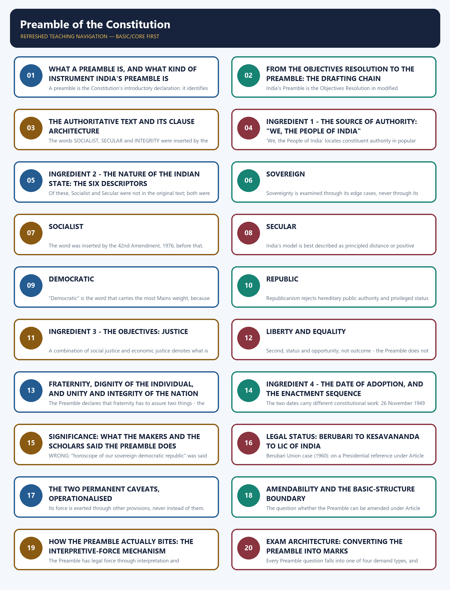

*Distinct embedded teaching-navigation image. The separate continuous Cārvāka-style flowchart package remains an independent at-a-glance artifact.*
### Source audit, syllabus boundary and package counts

- **Mandatory source order followed:** complete Topic 04 owner -> Basic owner -> Advanced owner -> Polity syllabus/README/PYQ routing ledgers -> constitutional text and local OCR-searchable Polity books -> local official UPSC papers -> live official Supreme Court material. Qdrant was not used.
- **Official syllabus ownership:** Prelims GS-I Indian Polity and Governance; Mains GS-II Constitution, comparison and institutional values. Preamble is the normative owner; specialist doctrine remains with Fundamental Rights, DPSP, Amendment/Basic Structure, Judiciary and Comparative Constitutional Schemes.
- **Local OCR verification:** the Preamble chapter and scholar descriptions were text-checked in both `books\Indian Polity by M Laxmikant.pdf` and `books\Courseware on Indian Polity by M Laxmikanth.pdf`. Quotations are retained only where the owner and OCR text directly support them.
- **Verified relevant PYQs retained:** 10 independently solved items. Direct owner: 2020 Prelims Q16. Shared Preamble applications: 2024 GS-II Q15 and 2025 GS-II Q11, whose primary routing owners are Comparative Constitutional Schemes and Supreme Court respectively. Adjacent verified questions are labelled exactly by source status rather than rebranded as exclusive owners.
- **Practice:** 40 core MCQs + 8 remedials in one continuous A -> B -> C -> D rotation; six original solved Mains models (2 x 10, 2 x 15, 2 x 20).
- **Preservation:** the legacy g1 PDFs, canonical Markdown and hashes remain untouched. An independent repository search found no dedicated `polity-04` flowchart, so this generation adds a separate unapproved companion.
### LIVE LEGAL-STATUS DECISION — CHECKED THROUGH 21 AUGUST 2026

- [FACT] The official Supreme Court judgment is *Dr Balram Singh and Others v. Union of India and Another*, 2024 INSC 893, W.P.(C) No. 645 of 2020 and connected matters, decided 25 November 2024: `https://api.sci.gov.in/supremecourt/2020/13773/13773_2020_1_39_57487_Judgement_25-Nov-2024.pdf`.
- [FACT] The Court held that Article 368 extends to the Preamble, dismissed the challenge to "socialist" and "secular", treated secularism as equality-linked, and held that socialism does not mandate one economic model.
- [LIMIT] Exact citation, case-number and official-domain searches through 21 August 2026 located no later Supreme Court judgment or order altering that holding. This is a bounded public-record search finding, not a claim about an unlocated filing.
#### Answer-line control register

The following controlled sentences appear unchanged in the relevant teaching stage, the learning PDF and the flowchart companion.

1. **DEFINITION:** A preamble is the Constitution's introductory declaration: it identifies the source of authority, the character of the polity, its governing objectives and the act of adoption.
2. **LINEAGE:** India's Preamble is the Objectives Resolution in modified constitutional form, linking Nehru's founding resolution to the text finally enacted by the Constituent Assembly.
3. **ARCHITECTURE:** The Preamble is one enacting sentence in which 'We, the People' resolve to constitute the State, secure justice, liberty and equality, promote fraternity, and adopt, enact and give the Constitution to ourselves.
4. **PEOPLE:** 'We, the People of India' locates constituent authority in popular sovereignty, while the Assembly's constrained origin is qualified by the universal franchise and democratic ratification created by the Constitution.
5. **DESCRIPTORS:** The sequence 'Sovereign Socialist Secular Democratic Republic' states India's constitutional identity, but each descriptor earns marks only when connected to its operative Articles, institutional mechanism and limit.
6. **SOVEREIGN:** Indian sovereignty means freedom from external subordination, not freedom from voluntarily assumed legal obligations; Commonwealth membership, UN membership and treaty commitments do not place a superior sovereign above India.
7. **SOCIALIST:** Indian socialism is democratic socialism: it constitutionalises a welfare and equality floor within a mixed economy, rather than prescribing State ownership or one immutable economic model.
8. **SECULAR:** Indian secularism secures equal citizenship and freedom of conscience through principled State engagement, not a theocracy, religious preference or an absolute wall of separation.
9. **DEMOCRATIC:** The Preamble's democracy is representative and parliamentary in form, popular in source, and incomplete unless political equality is joined by social and economic democracy.
10. **REPUBLIC:** Republicanism rejects hereditary public authority and privileged status by combining an elected head of State with the equal eligibility of citizens for public office.
11. **JUSTICE:** Preambular justice joins social, economic and political dimensions, using Fundamental Rights and Directive Principles to connect equal citizenship with distributive change.
12. **LIBERTY_EQUALITY:** Liberty and equality are mutually sustaining constitutional conditions: liberty is qualified freedom for personality, while equality removes privilege and enlarges status and opportunity rather than guaranteeing identical outcomes.
13. **FRATERNITY:** Fraternity is the Preamble's horizontal ethic: it must be promoted among citizens so that dignity is individual, unity is psychological and social, and integrity is territorial.
14. **ADOPTION:** The Preamble was enacted last so that it would conform to the Constitution already accepted, making 26 November 1949 the date of constitutional self-giving and 26 January 1950 the distinct date of commencement.
15. **SIGNIFICANCE:** The Preamble is an identity card, key-note and yardstick because it compresses the Constitution's purposes into an authoritative standard of interpretation and evaluation, not because scholar descriptions create legal force.
16. **LEGAL_STATUS:** The case-law movement is from Berubari's interpretive key but exclusion, to Kesavananda's membership, to LIC's integral-part reaffirmation; the interpretive role survived while the exclusion did not.
17. **CAVEATS:** Being part of the Constitution does not make the Preamble independently enforceable: it neither confers nor prohibits legislative power and remains non-justiciable.
18. **AMENDMENT:** Article 368 reaches the Preamble, but basic structure prevents amendment from destroying the constitutional identity its words declare; the text has been amended only once, in 1976.
19. **INTERPRETIVE:** The Preamble has legal force through interpretation and basic-structure review, always through operative provisions and never as a substitute for them.
20. **CURRENT:** Through 21 August 2026, the verified controlling position remains Dr Balram Singh (25 November 2024): 'socialist' and 'secular' stand, and no later official Supreme Court judgment or order altering that holding was located.
21. **SOCIALIST_ADVANCED:** After 1991, 'socialist' remains constitutionally relevant because it fixes welfare and equality ends while leaving economic instruments to democratic choice.
22. **SECULAR_ADVANCED:** India and the United States share religious liberty and non-establishment as a floor, but India uses principled distance and reform power where the American tradition emphasises institutional separation.
23. **MORALITY:** Constitutional morality is text-linked fidelity to constitutional values, procedures and institutional restraint; it is neither majoritarian social morality nor a judge's personal preference.
24. **CRITICISM:** The strongest criticism is not that the Preamble lacks value, but that its promises remain under-realised; the reply is that it supplies the constitutional standard by which that performance failure can be identified and corrected.
25. **FINAL:** The Preamble is the Constitution in miniature: a non-justiciable but authoritative charter that identifies the source, identity and ends of the Republic and guides interpretation without displacing operative text.
### SESSION 1 — WHAT A PREAMBLE IS, AND WHAT KIND OF INSTRUMENT INDIA'S PREAMBLE IS

#### DEFINITION / WHAT THIS IS CALLED

**Plain-language definition:** The Preamble is a declaratory and interpretive instrument, not an operative provision.

**Technical definition:** A preamble is the Constitution's introductory declaration: it identifies the source of authority, the character of the polity, its governing objectives and the act of adoption.

#### ANSWER-GRABBING OPENING — WRITE/ADAPT IN THE EXAM

> A preamble is the Constitution's introductory declaration: it identifies the source of authority, the character of the polity, its governing objectives and the act of adoption.

#### MUST-WRITE KEYWORDS

- **What A Preamble Is**
- **CONTENT CLASSIFICATION**
- **"identity card of the Constitution"**
- **US Declaration of Independence**
- **"the soul of our Constitution"**
- **declaratory and interpretive instrument**

**How to use them:** Use What A Preamble Is to define the issue, connect CONTENT CLASSIFICATION with "identity card of the Constitution" to explain it, and use US Declaration of Independence to distinguish or qualify the conclusion.

> **ANSWER-GRABBING LINE — WRITE/ADAPT IN THE EXAM (OPENING DEFINITION):** A preamble is the Constitution's introductory declaration: it identifies the source of authority, the character of the polity, its governing objectives and the act of adoption.

> **CONTENT CLASSIFICATION:** CORE PRELIMS + CORE MAINS

- [FACT] A preamble is an introductory statement that sets out the philosophy, purpose and guiding values of the document that follows.
- [FACT] The **American Constitution was the first to begin with a Preamble**, and many constitutions, including India's, followed that practice.
- [FACT] N. A. Palkhivala called the Preamble the **"identity card of the Constitution"**.
- [FACT] M. Hidayatullah observed that the Indian Preamble resembles the **US Declaration of Independence** but is more than a declaration - it is **"the soul of our Constitution"**, and "nothing but a revolution can alter" it.
- [ANALYSIS] The examinable point is category, not eloquence. The Preamble is a **declaratory and interpretive instrument**, not an operative provision. It states what the Constitution is for; it does not itself confer, restrict or create rights, powers or duties.

| Question the examiner is really asking | The precise answer |
|---|---|
| What is the Preamble? | The introductory declaration of the Constitution, stating the source of authority, the nature of the State, its objectives and the date of adoption. |
| Is it operative law? | No. It has no independent legal effect and cannot be sued upon on its own. |
| Is it a part of the Constitution? | Yes, since *Kesavananda Bharati* (1973); *Berubari* (1960) had held otherwise. |
| Can it be used in court at all? | Yes, as an aid to interpretation where a provision is ambiguous, and as a source of basic features. |
| Which constitution first used a preamble? | The United States. |

#### Teaching and analysis
Almost every mark lost on this topic comes from confusing three different propositions: *being a part of the Constitution*, *being enforceable*, and *being a source of power*. They are independent. The Preamble is a part; it is not enforceable standing alone; and it is neither a source of power nor a bar on power. Fix that triad first and the rest of the topic becomes mechanical.

#### UPSC traps
- WRONG: the Preamble is merely a decorative introduction with no constitutional value.
- CORRECT: it is a part of the Constitution and supplies interpretive direction and basic features, though it is not independently enforceable.
- WRONG: India was the first country to open its Constitution with a Preamble.
- CORRECT: the United States was.

**Cross-link:** Salient Features (Topic 03) for where the Preamble sits among the Constitution's structural features.

#### CLOSING RECALL FLOW — WHAT A PREAMBLE IS, AND WHAT KIND OF INSTRUMENT INDIA'S PREAMBLE IS

```text
START / CONCEPT: WHAT A PREAMBLE IS, AND WHAT KIND OF INSTRUMENT INDIA'S PREAMBLE IS
        |
        v
EXACT TERMS: What A Preamble Is · CONTENT CLASSIFICATION · "identity card of the Constitution" · US Declaration of Independence · "the soul of our Constitution" · declaratory and interpretive instrument
        |
        v
MECHANISM / ARGUMENT: The Preamble is a declaratory and interpretive instrument, not an operative provision.
        |
        v
CONSEQUENCE / CONTRAST: Hidayatullah observed that the Indian Preamble resembles the US Declaration of Independence but is more than a declaration - it is "the soul of our Constitution", and "nothing but a revolution can alter" it.
        |
        v
UPSC TRAP / ANSWER-USE: It states what the Constitution is for; it does not itself confer, restrict or create rights, powers or duties.
        |
        v
ANSWER-GRABBING FORMULATION: A preamble is the Constitution's introductory declaration: it identifies the source of authority, the character of the polity, its governing objectives and the act of adoption.
```
### SESSION 2 — FROM THE OBJECTIVES RESOLUTION TO THE PREAMBLE: THE DRAFTING CHAIN

#### DEFINITION / WHAT THIS IS CALLED

**Plain-language definition:** The Preamble is based on the Objectives Resolution, drafted and moved by Jawaharlal Nehru in the Constituent Assembly on 13 December 1946.

**Technical definition:** India's Preamble is the Objectives Resolution in modified constitutional form, linking Nehru's founding resolution to the text finally enacted by the Constituent Assembly.

#### ANSWER-GRABBING OPENING — WRITE/ADAPT IN THE EXAM

> India's Preamble is the Objectives Resolution in modified constitutional form, linking Nehru's founding resolution to the text finally enacted by the Constituent Assembly.

#### MUST-WRITE KEYWORDS

- **From The Objectives Resolution To The Preamble**
- **The Drafting Chain**
- **CONTENT CLASSIFICATION**
- **based on the Objectives Resolution**
- **Jawaharlal Nehru**
- **13 December 1946**

**How to use them:** Use From The Objectives Resolution To The Preamble to define the issue, connect The Drafting Chain with CONTENT CLASSIFICATION to explain it, and use based on the Objectives Resolution to distinguish or qualify the conclusion.

> **ANSWER-GRABBING LINE — WRITE/ADAPT IN THE EXAM (LINEAGE):** India's Preamble is the Objectives Resolution in modified constitutional form, linking Nehru's founding resolution to the text finally enacted by the Constituent Assembly.

> **CONTENT CLASSIFICATION:** CORE PRELIMS + CORE MAINS

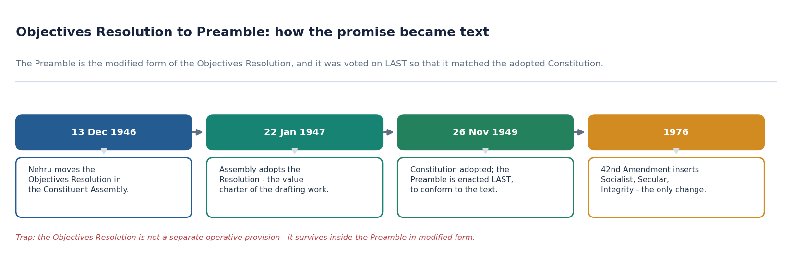
*The chain of enactment - the Preamble is the modified Objectives Resolution, and it was voted on last.*

- [FACT] The Preamble is **based on the Objectives Resolution**, drafted and moved by **Jawaharlal Nehru** in the Constituent Assembly on **13 December 1946**.
- [FACT] The Assembly **adopted the Objectives Resolution on 22 January 1947**, and it became the value charter that guided the entire drafting exercise.
- [FACT] The Preamble is the Objectives Resolution **in a modified form**; it was not an independent fresh draft.
- [FACT] The Preamble was **enacted after the rest of the Constitution had been enacted**. The Constituent Assembly took the deliberate view that the Preamble must **conform to the Constitution already accepted**, and the motion put was "The question is that Preamble stands part of the Constitution" (Constituent Assembly Debates, Vol. 10, pp. 450-456).
- [ANALYSIS] The sequencing fact is the single most under-used point in Mains answers. It shows the Preamble is not an aspirational preface bolted on at the start; it is a **retrospective summary of what the Assembly had actually enacted**. That is precisely why courts treat it as a reliable statement of the makers' intention.

| Stage | Date | What happened |
|---|---|---|
| Objectives Resolution moved | 13 December 1946 | Nehru places the founding values before the Assembly. |
| Objectives Resolution adopted | 22 January 1947 | The Assembly accepts it as the charter of the drafting work. |
| Constitution adopted; Preamble enacted last | 26 November 1949 | The Preamble is voted on after the rest, so that it conforms to the enacted text. |
| Preamble amended | 1976 | The 42nd Amendment inserts Socialist, Secular and Integrity - the only change ever made. |

#### Teaching and analysis
Two independent examinable claims live here. First, **authorship and lineage**: Nehru, Objectives Resolution, modified form. Second, **enactment sequence**: last, to conform. Students routinely give the first and never the second, and the second is what converts a descriptive answer into an analytical one, because it explains judicial reliance on the Preamble as evidence of intention.

#### UPSC traps
- WRONG: the Objectives Resolution survives as a separate operative provision of the Constitution.
- CORRECT: it survives inside the Preamble, in modified form; it is not a standalone article.
- WRONG: the Preamble was drafted and adopted first, as an opening statement of intent.
- CORRECT: it was enacted last, so that it would conform to the Constitution already adopted.

**Cross-link:** Making of the Constitution (Topic 02) for the Constituent Assembly's committee structure and timeline.

#### CLOSING RECALL FLOW — FROM THE OBJECTIVES RESOLUTION TO THE PREAMBLE: THE DRAFTING CHAIN

```text
START / CONCEPT: FROM THE OBJECTIVES RESOLUTION TO THE PREAMBLE: THE DRAFTING CHAIN
        |
        v
EXACT TERMS: From The Objectives Resolution To The Preamble · The Drafting Chain · CONTENT CLASSIFICATION · based on the Objectives Resolution · Jawaharlal Nehru · 13 December 1946
        |
        v
MECHANISM / ARGUMENT: The Preamble is based on the Objectives Resolution, drafted and moved by Jawaharlal Nehru in the Constituent Assembly on 13 December 1946.
        |
        v
CONSEQUENCE / CONTRAST: The Preamble is the Objectives Resolution in a modified form; it was not an independent fresh draft.
        |
        v
UPSC TRAP / ANSWER-USE: It shows the Preamble is not an aspirational preface bolted on at the start; it is a retrospective summary of what the Assembly had actually enacted.
        |
        v
ANSWER-GRABBING FORMULATION: India's Preamble is the Objectives Resolution in modified constitutional form, linking Nehru's founding resolution to the text finally enacted by the Constituent Assembly.
```
### SESSION 3 — THE AUTHORITATIVE TEXT AND ITS CLAUSE ARCHITECTURE

#### DEFINITION / WHAT THIS IS CALLED

**Plain-language definition:** The operative text runs: "WE, THE PEOPLE OF INDIA, having solemnly resolved to constitute India into a SOVEREIGN SOCIALIST SECULAR DEMOCRATIC REPUBLIC and to secure to all its citizens: JUSTICE, social, economic and political; LIBERTY of thought, expression, belief, faith and worship; EQUALITY of status and of opportunity; and to promote among them all FRATERNITY assuring the dignity of the individual and the unity and integrity of the Nation; IN OUR CONSTITUENT ASSEMBLY this twenty-sixth day of November, 1949, do HEREBY ADOPT, ENACT AND GIVE TO OURSELVES THIS CONSTITUTION." It is a single sentence, grammatically complete, whose subject is "WE, THE PEOPLE OF INDIA" and whose main verb phrase is "do HEREBY ADOPT, ENACT AND GIVE TO OURSELVES THIS CONSTITUTION".

**Technical definition:** The words SOCIALIST, SECULAR and INTEGRITY were inserted by the Constitution (Forty-second Amendment) Act, 1976.

#### ANSWER-GRABBING OPENING — WRITE/ADAPT IN THE EXAM

> The Preamble is one enacting sentence in which 'We, the People' resolve to constitute the State, secure justice, liberty and equality, promote fraternity, and adopt, enact and give the Constitution to ourselves.

#### MUST-WRITE KEYWORDS

- **The Authoritative Text**
- **Its Clause Architecture**
- **CONTENT CLASSIFICATION**
- **It is a**
- **SOCIALIST**
- **SECULAR**

**How to use them:** Use The Authoritative Text to define the issue, connect Its Clause Architecture with CONTENT CLASSIFICATION to explain it, and use It is a to distinguish or qualify the conclusion.

> **ANSWER-GRABBING LINE — WRITE/ADAPT IN THE EXAM (TEXT ARCHITECTURE):** The Preamble is one enacting sentence in which 'We, the People' resolve to constitute the State, secure justice, liberty and equality, promote fraternity, and adopt, enact and give the Constitution to ourselves.

> **CONTENT CLASSIFICATION:** CORE PRELIMS + CORE MAINS

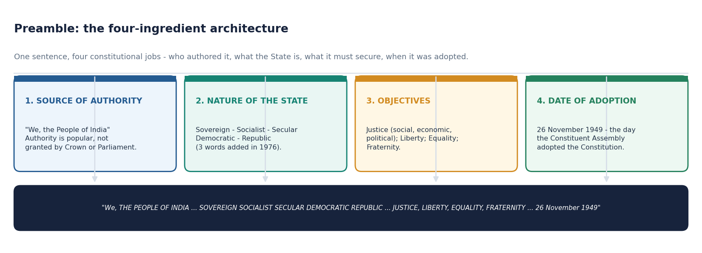
*One sentence doing four constitutional jobs - who authored it, what the State is, what it must secure, and when it was adopted.*

- [FACT] The operative text runs: **"WE, THE PEOPLE OF INDIA, having solemnly resolved to constitute India into a SOVEREIGN SOCIALIST SECULAR DEMOCRATIC REPUBLIC and to secure to all its citizens: JUSTICE, social, economic and political; LIBERTY of thought, expression, belief, faith and worship; EQUALITY of status and of opportunity; and to promote among them all FRATERNITY assuring the dignity of the individual and the unity and integrity of the Nation; IN OUR CONSTITUENT ASSEMBLY this twenty-sixth day of November, 1949, do HEREBY ADOPT, ENACT AND GIVE TO OURSELVES THIS CONSTITUTION."**
- [FACT] It is a **single sentence**, grammatically complete, whose subject is "WE, THE PEOPLE OF INDIA" and whose main verb phrase is "do HEREBY ADOPT, ENACT AND GIVE TO OURSELVES THIS CONSTITUTION".
- [FACT] The words **SOCIALIST**, **SECULAR** and **INTEGRITY** were inserted by the **Constitution (Forty-second Amendment) Act, 1976**.
- [ANALYSIS] Reading it as one sentence matters. The objectives clause ("to secure to all its citizens") is subordinate to the enacting clause; that is the grammatical basis for saying the Preamble declares purposes rather than creating enforceable entitlements.

| Clause | Text fragment | Constitutional job |
|---|---|---|
| Enacting subject | "WE, THE PEOPLE OF INDIA" | Locates the source of authority in the people. |
| Resolve clause | "having solemnly resolved to constitute India into a SOVEREIGN SOCIALIST SECULAR DEMOCRATIC REPUBLIC" | Declares the nature of the polity. |
| Securing clause | "to secure to all its citizens: JUSTICE ... LIBERTY ... EQUALITY" | States the objectives owed to citizens. |
| Promoting clause | "to promote among them all FRATERNITY assuring the dignity of the individual and the unity and integrity of the Nation" | States the social objective and its two assurances. |
| Enacting clause | "IN OUR CONSTITUENT ASSEMBLY this twenty-sixth day of November, 1949, do HEREBY ADOPT, ENACT AND GIVE TO OURSELVES THIS CONSTITUTION" | Fixes the forum, the date and the act of self-giving. |

#### Teaching and analysis
Note the asymmetry in the text that examiners exploit: Justice, Liberty and Equality are to be **secured to all its citizens**, whereas Fraternity is to be **promoted among them all**. Securing is an obligation of the State towards individuals; promoting is a social objective. That distinction is a ready-made analytical line in any Preamble essay.

#### UPSC traps
- WRONG: the Preamble grants liberty of "thought, expression, belief, faith, worship and association".
- CORRECT: the Preamble lists five - thought, expression, belief, faith and worship. Association is an Article 19(1)(c) freedom, not a Preamble word.
- WRONG: Equality in the Preamble is "of status, opportunity and outcome".
- CORRECT: **equality of status and of opportunity** only.

**Cross-link:** Fundamental Rights (Topic 07) for the operative freedoms that cash out the Preamble's liberty clause.

#### CLOSING RECALL FLOW — THE AUTHORITATIVE TEXT AND ITS CLAUSE ARCHITECTURE

```text
START / CONCEPT: THE AUTHORITATIVE TEXT AND ITS CLAUSE ARCHITECTURE
        |
        v
EXACT TERMS: The Authoritative Text · Its Clause Architecture · CONTENT CLASSIFICATION · It is a · SOCIALIST · SECULAR
        |
        v
MECHANISM / ARGUMENT: The words SOCIALIST, SECULAR and INTEGRITY were inserted by the Constitution (Forty-second Amendment) Act, 1976.
        |
        v
CONSEQUENCE / CONTRAST: Note the asymmetry in the text that examiners exploit: Justice, Liberty and Equality are to be secured to all its citizens, whereas Fraternity is to be promoted among them all.
        |
        v
UPSC TRAP / ANSWER-USE: Association is an Article 19(1)(c) freedom, not a Preamble word.
        |
        v
ANSWER-GRABBING FORMULATION: The Preamble is one enacting sentence in which 'We, the People' resolve to constitute the State, secure justice, liberty and equality, promote fraternity, and adopt, enact and give the Constitution to ourselves.
```
### SESSION 4 — INGREDIENT 1 - THE SOURCE OF AUTHORITY: "WE, THE PEOPLE OF INDIA"

#### DEFINITION / WHAT THIS IS CALLED

**Plain-language definition:** WRONG: "We, the People of India" is a rhetorical flourish with no constitutional consequence.

**Technical definition:** 'We, the People of India' locates constituent authority in popular sovereignty, while the Assembly's constrained origin is qualified by the universal franchise and democratic ratification created by the Constitution.

#### ANSWER-GRABBING OPENING — WRITE/ADAPT IN THE EXAM

> 'We, the People of India' locates constituent authority in popular sovereignty, while the Assembly's constrained origin is qualified by the universal franchise and democratic ratification created by the Constitution.

#### MUST-WRITE KEYWORDS

- **Ingredient 1 - The Source Of Authority**
- **"We**
- **The People Of India"**
- **CONTENT CLASSIFICATION**
- **from the people of India**
- **adopt, enact and give to ourselves**

**How to use them:** Use Ingredient 1 - The Source Of Authority to define the issue, connect "We with The People Of India" to explain it, and use CONTENT CLASSIFICATION to distinguish or qualify the conclusion.

> **ANSWER-GRABBING LINE — WRITE/ADAPT IN THE EXAM (POPULAR SOVEREIGNTY):** 'We, the People of India' locates constituent authority in popular sovereignty, while the Assembly's constrained origin is qualified by the universal franchise and democratic ratification created by the Constitution.

> **CONTENT CLASSIFICATION:** CORE MAINS

- [FACT] The Preamble states that the Constitution derives its authority **from the people of India**, not from a Crown, a conqueror or a grant.
- [FACT] The enacting clause is one of self-giving: the people "**adopt, enact and give to ourselves**" the Constitution.
- [ANALYSIS] This is the textual anchor of **popular sovereignty**. It is what distinguishes an autochthonous constitution from a granted one, and it is why the Indian Constitution is not treated as a continuation of the Government of India Act, 1935, in point of authority even though it borrowed heavily from it in point of structure.
- [LIMIT] The claim is about the **source of authority**, not about the mode of drafting. The Constituent Assembly was indirectly elected on a limited franchise; the answer should acknowledge that criticism rather than pretend it does not exist (see subtopic 24).

| Proposition | Status |
|---|---|
| Authority flows from the people | Declared by the Preamble. |
| The Constitution was granted by the British Crown | False; the enacting clause is self-giving. |
| The Constituent Assembly was directly elected by universal adult franchise | False; it was indirectly elected on a restricted franchise - the standard criticism. |
| Popular sovereignty is operationalised elsewhere | Yes - universal adult franchise (Art 326), periodic elections, and the republican head of State. |

#### Teaching and analysis
The examiner's favourite move is to pit the **normative claim** ("We, the People") against the **historical fact** (an indirectly elected Assembly). A high-scoring answer holds both: the Assembly's composition is a criticism of the *process*, while the Constitution's subsequent acceptance, its universal-franchise design and seven decades of electoral practice have supplied the *democratic ratification* that the drafting moment lacked.

#### UPSC traps
- WRONG: "We, the People of India" is a rhetorical flourish with no constitutional consequence.
- CORRECT: it is the textual basis of popular sovereignty and of the Constitution's autochthony.
- WRONG: the phrase means the Constitution was adopted by referendum.
- CORRECT: there was no referendum; India does not use referendum, initiative, recall or plebiscite as constitutional devices.

**Cross-link:** Making of the Constitution (Topic 02) for the composition and election of the Constituent Assembly.

#### CLOSING RECALL FLOW — INGREDIENT 1 - THE SOURCE OF AUTHORITY: "WE, THE PEOPLE OF INDIA"

```text
START / CONCEPT: INGREDIENT 1 - THE SOURCE OF AUTHORITY: "WE, THE PEOPLE OF INDIA"
        |
        v
EXACT TERMS: Ingredient 1 - The Source Of Authority · "We · The People Of India" · CONTENT CLASSIFICATION · from the people of India · adopt, enact and give to ourselves
        |
        v
MECHANISM / ARGUMENT: The examiner's favourite move is to pit the normative claim ("We, the People") against the historical fact (an indirectly elected Assembly).
        |
        v
CONSEQUENCE / CONTRAST: WRONG: "We, the People of India" is a rhetorical flourish with no constitutional consequence.
        |
        v
UPSC TRAP / ANSWER-USE: The claim is about the source of authority, not about the mode of drafting.
        |
        v
ANSWER-GRABBING FORMULATION: 'We, the People of India' locates constituent authority in popular sovereignty, while the Assembly's constrained origin is qualified by the universal franchise and democratic ratification created by the Constitution.
```
### SESSION 5 — INGREDIENT 2 - THE NATURE OF THE INDIAN STATE: THE SIX DESCRIPTORS

#### DEFINITION / WHAT THIS IS CALLED

**Plain-language definition:** The Preamble describes the Indian State as Sovereign, Socialist, Secular, Democratic and Republic, in that textual order.

**Technical definition:** Of these, Socialist and Secular were not in the original text; both were added by the 42nd Amendment, 1976.

#### ANSWER-GRABBING OPENING — WRITE/ADAPT IN THE EXAM

> The single most valuable habit on this topic is the keyword-to-anchor reflex: never state a Preamble word without immediately naming the provisions that make it operative.

#### MUST-WRITE KEYWORDS

- **Ingredient 2 - The Nature Of The Indian State**
- **The Six Descriptors**
- **CONTENT CLASSIFICATION**
- **Sovereign, Socialist, Secular, Democratic and Republic**
- **keyword-to-anchor reflex**
- **Cross-link**

**How to use them:** Use Ingredient 2 - The Nature Of The Indian State to define the issue, connect The Six Descriptors with CONTENT CLASSIFICATION to explain it, and use Sovereign, Socialist, Secular, Democratic and Republic to distinguish or qualify the conclusion.

> **ANSWER-GRABBING LINE — WRITE/ADAPT IN THE EXAM (DESCRIPTOR MAP):** The sequence 'Sovereign Socialist Secular Democratic Republic' states India's constitutional identity, but each descriptor earns marks only when connected to its operative Articles, institutional mechanism and limit.

> **CONTENT CLASSIFICATION:** CORE PRELIMS + CORE MAINS

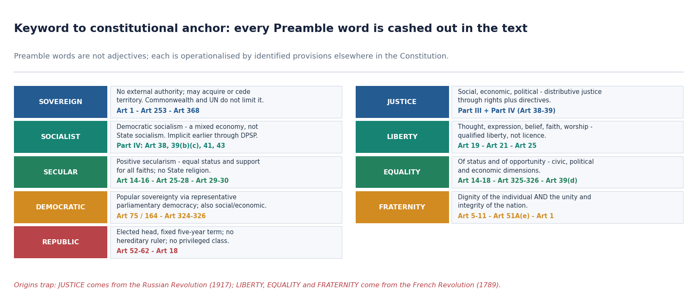
*Preamble words are not adjectives; each is operationalised by identified provisions elsewhere in the Constitution.*

- [FACT] The Preamble describes the Indian State as **Sovereign, Socialist, Secular, Democratic and Republic**, in that textual order.
- [FACT] Of these, **Socialist and Secular were not in the original text**; both were added by the 42nd Amendment, 1976.
- [ANALYSIS] The single most valuable habit on this topic is the **keyword-to-anchor reflex**: never state a Preamble word without immediately naming the provisions that make it operative. That converts description into constitutional argument.

| Preamble word | Operative anchors in the Constitution | One-line meaning |
|---|---|---|
| Sovereign | Art 1; Art 253 treaty power; Art 368 | No external authority above India; free internally and externally. |
| Socialist | Part IV, especially Arts 38, 39(b) and 39(c), 41, 43 | Democratic socialism - a mixed economy, not State socialism. |
| Secular | Arts 14-16; Arts 25-28; Arts 29-30; Art 44 | Positive secularism - equal status and support for all faiths, no State religion. |
| Democratic | Arts 75 and 164 responsibility; Arts 324-326 | Popular sovereignty exercised through representative parliamentary government. |
| Republic | Arts 52-62; Art 18 abolition of titles | Elected head of State for a fixed term; no privileged class. |
| Justice, Liberty, Equality, Fraternity | Part III read with Part IV; Arts 5-11; Art 51A(e) | The four objectives the State must secure and promote. |

#### Teaching and analysis
Order is examinable. "Sovereign Socialist Secular Democratic Republic" is the exact sequence, and a Prelims question can be built purely on whether a candidate can reproduce it. Equally, the *dates* attached to the words are examinable: three of the five descriptors existed in 1950; two arrived in 1976.

#### UPSC traps
- WRONG: all five descriptors were present when the Constitution commenced on 26 January 1950.
- CORRECT: only Sovereign, Democratic and Republic were; Socialist and Secular came in 1976.
- WRONG: the descriptors are merely aspirational and have no anchoring provisions.
- CORRECT: each has identified operative anchors, which is why courts can enforce their content through those provisions.

**Cross-link:** Directive Principles (Topic 09) for the socialist anchors; Fundamental Rights (Topic 07) for the secular and democratic anchors.

#### CLOSING RECALL FLOW — INGREDIENT 2 - THE NATURE OF THE INDIAN STATE: THE SIX DESCRIPTORS

```text
START / CONCEPT: INGREDIENT 2 - THE NATURE OF THE INDIAN STATE: THE SIX DESCRIPTORS
        |
        v
EXACT TERMS: Ingredient 2 - The Nature Of The Indian State · The Six Descriptors · CONTENT CLASSIFICATION · Sovereign, Socialist, Secular, Democratic and Republic · keyword-to-anchor reflex · Cross-link
        |
        v
MECHANISM / ARGUMENT: Of these, Socialist and Secular were not in the original text; both were added by the 42nd Amendment, 1976.
        |
        v
CONSEQUENCE / CONTRAST: The Preamble describes the Indian State as Sovereign, Socialist, Secular, Democratic and Republic, in that textual order.
        |
        v
UPSC TRAP / ANSWER-USE: Equally, the dates attached to the words are examinable: three of the five descriptors existed in 1950; two arrived in 1976.
        |
        v
ANSWER-GRABBING FORMULATION: The single most valuable habit on this topic is the keyword-to-anchor reflex: never state a Preamble word without immediately naming the provisions that make it operative.
```
### SESSION 6 — SOVEREIGN

#### DEFINITION / WHAT THIS IS CALLED

**Plain-language definition:** India's membership of the Commonwealth rests on the 1949 declaration, which is an extra-constitutional declaration and does not affect sovereignty; the King or Queen is accepted only as the symbolic head of the free association.

**Technical definition:** Sovereignty is examined through its edge cases, never through its definition.

#### ANSWER-GRABBING OPENING — WRITE/ADAPT IN THE EXAM

> Indian sovereignty means freedom from external subordination, not freedom from voluntarily assumed legal obligations; Commonwealth membership, UN membership and treaty commitments do not place a superior sovereign above India.

#### MUST-WRITE KEYWORDS

- **Sovereign**
- **CONTENT CLASSIFICATION**
- **Commonwealth**
- **extra-constitutional declaration**
- **symbolic head of the free association**
- **1949 declaration**

**How to use them:** Use Sovereign to define the issue, connect CONTENT CLASSIFICATION with Commonwealth to explain it, and use extra-constitutional declaration to distinguish or qualify the conclusion.

> **ANSWER-GRABBING LINE — WRITE/ADAPT IN THE EXAM (SOVEREIGN):** Indian sovereignty means freedom from external subordination, not freedom from voluntarily assumed legal obligations; Commonwealth membership, UN membership and treaty commitments do not place a superior sovereign above India.

> **CONTENT CLASSIFICATION:** CORE PRELIMS + CORE MAINS

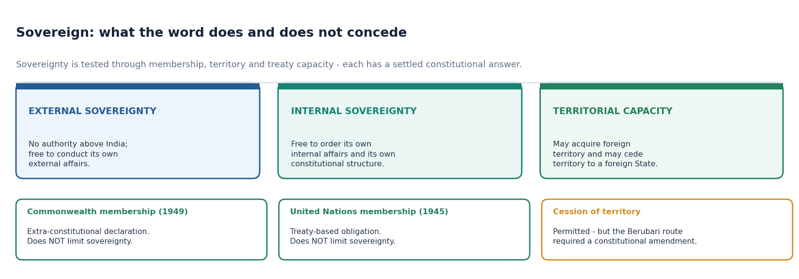
*Sovereignty is tested through membership, territory and treaty capacity - each has a settled constitutional answer.*

- [FACT] "Sovereign" means India is **neither a dependency nor a dominion of any other nation**, but an independent State with no authority above it.
- [FACT] India was a **dominion from 15 August 1947 until 26 January 1950**; it became a sovereign republic only on the latter date. Pakistan by contrast remained a dominion until 1956.
- [FACT] India's membership of the **Commonwealth** rests on the **1949 declaration**, which is an **extra-constitutional declaration** and does not affect sovereignty; the King or Queen is accepted only as the **symbolic head of the free association**.
- [FACT] India joined the **United Nations Organisation in 1945**; UNO membership imposes treaty obligations but **does not limit sovereignty**.
- [FACT] Being sovereign, India **may acquire foreign territory and may cede territory to a foreign State**.
- [ANALYSIS] Sovereignty is examined through its edge cases, never through its definition. The three edge cases are Commonwealth membership, UN membership, and cession of territory - and in each the answer is that sovereignty survives.

| Edge case | Effect on sovereignty | Constitutional route |
|---|---|---|
| Commonwealth membership (1949) | None - extra-constitutional declaration. | No amendment required. |
| United Nations membership (1945) | None - treaty obligations voluntarily assumed. | Treaty power under Art 253. |
| Acquiring foreign territory | Permitted. | Executive act; parliamentary law where needed. |
| Ceding Indian territory to a foreign State | Permitted, but not by ordinary executive act. | Constitutional amendment - the route actually used after *Berubari*, via the Constitution (Ninth Amendment) Act, 1960. |

#### Teaching and analysis
The cession point is the highest-value link in this subtopic because it ties the Preamble's "sovereign" back to the very case that first ruled on the Preamble's status. *Berubari* arose out of a proposed cession of the Berubari Union in West Bengal to Pakistan; the President made a reference under **Article 143**; and the eventual solution was a constitutional amendment. Sovereignty and legal status therefore share one factual spine.

#### UPSC traps
- WRONG: Commonwealth membership makes the British monarch the head of the Indian State.
- CORRECT: the monarch is only the symbolic head of the free association; India's head of State is the elected President.
- WRONG: because India is sovereign, it cannot cede territory at all.
- CORRECT: it can, but cession requires a constitutional amendment, as the Ninth Amendment, 1960 demonstrates.

**Cross-link:** Union and its Territory (Topic 05) for Articles 1-4 and the acquisition and cession of territory.

#### CLOSING RECALL FLOW — SOVEREIGN

```text
START / CONCEPT: SOVEREIGN
        |
        v
EXACT TERMS: Sovereign · CONTENT CLASSIFICATION · Commonwealth · extra-constitutional declaration · symbolic head of the free association · 1949 declaration
        |
        v
MECHANISM / ARGUMENT: Sovereignty is examined through its edge cases, never through its definition.
        |
        v
CONSEQUENCE / CONTRAST: India's membership of the Commonwealth rests on the 1949 declaration, which is an extra-constitutional declaration and does not affect sovereignty; the King or Queen is accepted only as the symbolic head of the free association.
        |
        v
UPSC TRAP / ANSWER-USE: "Sovereign" means India is neither a dependency nor a dominion of any other nation, but an independent State with no authority above it.
        |
        v
ANSWER-GRABBING FORMULATION: Indian sovereignty means freedom from external subordination, not freedom from voluntarily assumed legal obligations; Commonwealth membership, UN membership and treaty commitments do not place a superior sovereign above India.
```
### SESSION 7 — SOCIALIST

#### DEFINITION / WHAT THIS IS CALLED

**Plain-language definition:** The Congress party's Avadi session, 1955 resolved to establish a "socialistic pattern of society", which is the political antecedent of the constitutional word.

**Technical definition:** The word was inserted by the 42nd Amendment, 1976; before that, socialist content was implicit in the Directive Principles.

#### ANSWER-GRABBING OPENING — WRITE/ADAPT IN THE EXAM

> Indian socialism is democratic socialism: it constitutionalises a welfare and equality floor within a mixed economy, rather than prescribing State ownership or one immutable economic model.

#### MUST-WRITE KEYWORDS

- **Socialist**
- **CONTENT CLASSIFICATION**
- **implicit**
- **Congress party's Avadi session, 1955**
- **socialistic pattern of society**
- **42nd Amendment, 1976**

**How to use them:** Use Socialist to define the issue, connect CONTENT CLASSIFICATION with implicit to explain it, and use Congress party's Avadi session, 1955 to distinguish or qualify the conclusion.

> **ANSWER-GRABBING LINE — WRITE/ADAPT IN THE EXAM (SOCIALIST):** Indian socialism is democratic socialism: it constitutionalises a welfare and equality floor within a mixed economy, rather than prescribing State ownership or one immutable economic model.

> **CONTENT CLASSIFICATION:** CORE PRELIMS + CORE MAINS

- [FACT] The word was inserted by the **42nd Amendment, 1976**; before that, socialist content was **implicit** in the Directive Principles.
- [FACT] The **Congress party's Avadi session, 1955** resolved to establish a "**socialistic pattern of society**", which is the political antecedent of the constitutional word.
- [FACT] Indian socialism is **democratic socialism**, not communistic or State socialism. It rests on a **mixed economy** in which public and private sectors coexist.
- [FACT] In **G.B. Pant University of Agriculture and Technology v. State of U.P. (2000)** the Supreme Court said: "Democratic socialism aims to end poverty, ignorance, disease and inequality of opportunity."
- [FACT] In **D.S. Nakara v. Union of India (1983)** the Court described Indian socialism as a "blend of Marxism and Gandhism, leaning heavily towards Gandhian socialism".
- [FACT] The **New Economic Policy, 1991** - liberalisation, privatisation and globalisation - **diluted the socialist credentials** of the Indian State in practice.
- [ANALYSIS] The examinable structure is: implicit before 1976, explicit after 1976, redefined in practice after 1991, and judicially settled in 2024 as a commitment to a welfare State rather than to any fixed economic model.

| Variety of socialism | Core method | India's position |
|---|---|---|
| Communistic / State socialism | Nationalisation of all means of production; abolition of private ownership. | Rejected. |
| Democratic socialism | Mixed economy; State-led redistribution within a democratic and rights-respecting frame. | Adopted. |
| Gandhian socialism | Trusteeship, decentralisation, village economy, restraint on consumption. | Heavy influence, per *Nakara* (1983). |
| Market fundamentalism | Minimal State; withdrawal from redistribution. | Not mandated and not barred; the Constitution does not prescribe an economic model. |

#### Teaching and analysis
Two errors destroy answers here. The first is to treat "socialist" as requiring nationalisation - it never did, because democratic socialism always contemplated a mixed economy. The second is to say that 1991 rendered the word unconstitutional or dead - it did not, because the word commits the State to welfare and equality of opportunity, and those obligations survive any change in economic policy. The correct verdict is that the word constrains **ends**, not **instruments**.

#### UPSC traps
- WRONG: "Socialist" in the Preamble obliges India to nationalise industry.
- CORRECT: it commits India to democratic socialism and a welfare State; the Constitution mandates no particular economic model.
- WRONG: liberalisation after 1991 amounted to a constitutional breach of the Preamble.
- CORRECT: it was a policy shift within the constitutional space; the word was expressly held in 2024 not to fetter economic policy.

**Cross-link:** Directive Principles (Topic 09) for Articles 38, 39(b) and 39(c); Economy for the 1991 reforms.

#### CLOSING RECALL FLOW — SOCIALIST

```text
START / CONCEPT: SOCIALIST
        |
        v
EXACT TERMS: Socialist · CONTENT CLASSIFICATION · implicit · Congress party's Avadi session, 1955 · socialistic pattern of society · 42nd Amendment, 1976
        |
        v
MECHANISM / ARGUMENT: The word was inserted by the 42nd Amendment, 1976; before that, socialist content was implicit in the Directive Principles.
        |
        v
CONSEQUENCE / CONTRAST: Indian socialism is democratic socialism, not communistic or State socialism.
        |
        v
UPSC TRAP / ANSWER-USE: The second is to say that 1991 rendered the word unconstitutional or dead - it did not, because the word commits the State to welfare and equality of opportunity, and those obligations survive any change in economic policy.
        |
        v
ANSWER-GRABBING FORMULATION: Indian socialism is democratic socialism: it constitutionalises a welfare and equality floor within a mixed economy, rather than prescribing State ownership or one immutable economic model.
```
### SESSION 8 — SECULAR

#### DEFINITION / WHAT THIS IS CALLED

**Plain-language definition:** Indian secularism is anchored in Articles 14, 15 and 16 (equality and non-discrimination), Articles 25-28 (freedom of religion), Articles 29-30 (minority culture and educational rights), and Article 44 (uniform civil code as a directive).

**Technical definition:** India's model is best described as principled distance or positive secularism: the State keeps equal distance from all faiths but reserves the power to intervene in religion to secure equality and to reform practices that obstruct it.

#### ANSWER-GRABBING OPENING — WRITE/ADAPT IN THE EXAM

> Indian secularism is anchored in Articles 14, 15 and 16 (equality and non-discrimination), Articles 25-28 (freedom of religion), Articles 29-30 (minority culture and educational rights), and Article 44 (uniform civil code as a directive).

#### MUST-WRITE KEYWORDS

- **Secular**
- **CONTENT CLASSIFICATION**
- **positive concept of secularism**
- **no State religion**
- **42nd Amendment, 1976**
- **1974**

**How to use them:** Use Secular to define the issue, connect CONTENT CLASSIFICATION with positive concept of secularism to explain it, and use no State religion to distinguish or qualify the conclusion.

> **ANSWER-GRABBING LINE — WRITE/ADAPT IN THE EXAM (SECULAR):** Indian secularism secures equal citizenship and freedom of conscience through principled State engagement, not a theocracy, religious preference or an absolute wall of separation.

> **CONTENT CLASSIFICATION:** CORE PRELIMS + CORE MAINS

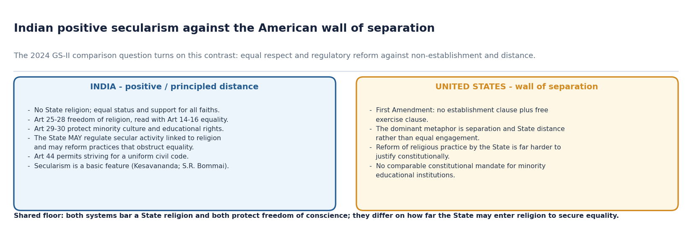
*The 2024 GS-II comparison question turns on this contrast: equal respect and regulatory reform against non-establishment and distance.*

- [FACT] "Secular" was inserted by the **42nd Amendment, 1976**.
- [FACT] Even before insertion, the Supreme Court held in **1974** that although the words "secular State" were not expressly mentioned, there could be no doubt that the Constitution-makers wanted to establish such a State, and accordingly Articles 25 to 28 were included.
- [FACT] The Indian Constitution embodies the **positive concept of secularism**: **all religions in the country have the same status and support from the State**. There is **no State religion**.
- [FACT] Indian secularism is anchored in **Articles 14, 15 and 16** (equality and non-discrimination), **Articles 25-28** (freedom of religion), **Articles 29-30** (minority culture and educational rights), and **Article 44** (uniform civil code as a directive).
- [FACT] In *Dr Balram Singh v. Union of India* (25 November 2024) the Court held that the State **neither supports any religion nor penalises the profession and practice of any faith**, and that **secularism is a facet of the right to equality**.
- [ANALYSIS] India's model is best described as **principled distance** or positive secularism: the State keeps equal distance from all faiths but reserves the power to intervene in religion to secure equality and to reform practices that obstruct it.

| Feature | India | United States |
|---|---|---|
| Textual basis | Preamble word "secular" plus Arts 14-16, 25-28, 29-30, 44. | First Amendment: no establishment clause plus free exercise clause. |
| Governing metaphor | Equal respect and principled distance. | Wall of separation. |
| State reform of religious practice | Permitted, and constitutionally contemplated (Art 25(2)(b) social welfare and reform). | Far harder to justify. |
| Support to religious institutions | Equal support permissible; minority educational institutions protected under Art 30. | Non-establishment presumption against support. |
| Status of secularism | A basic feature (*Kesavananda*, 1973; *S.R. Bommai*, 1994). | A constitutional guarantee, not a basic-structure doctrine. |

#### Teaching and analysis
The comparison is the examinable core, and it was asked directly in **GS-II 2024**. The disciplined framing is: both systems bar a State religion and both protect freedom of conscience - that is the shared floor. They diverge on **how far the State may enter religion in order to secure equality**. India permits entry, because equality is the master value; the American model presumes distance, because non-establishment is the master value. Say the shared floor first, then the divergence, then evaluate.

#### UPSC traps
- WRONG: Indian secularism means the State must stay out of religion entirely.
- CORRECT: it means equal status and support for all faiths, with a power to regulate secular activity associated with religion and to reform practices that obstruct equality.
- WRONG: secularism entered Indian constitutional law only in 1976.
- CORRECT: the word entered in 1976; the substance was already present, as the Court noted in 1974 and reaffirmed in 2024.

**Cross-link:** Fundamental Rights (Topic 07) for Articles 25-28 and 29-30; Indian Society for the sociology of religious pluralism.

#### CLOSING RECALL FLOW — SECULAR

```text
START / CONCEPT: SECULAR
        |
        v
EXACT TERMS: Secular · CONTENT CLASSIFICATION · positive concept of secularism · no State religion · 42nd Amendment, 1976 · 1974
        |
        v
MECHANISM / ARGUMENT: "Secular" was inserted by the 42nd Amendment, 1976.
        |
        v
CONSEQUENCE / CONTRAST: India's model is best described as principled distance or positive secularism: the State keeps equal distance from all faiths but reserves the power to intervene in religion to secure equality and to reform practices that obstruct it.
        |
        v
UPSC TRAP / ANSWER-USE: Even before insertion, the Supreme Court held in 1974 that although the words "secular State" were not expressly mentioned, there could be no doubt that the Constitution-makers wanted to establish such a State, and accordingly Articles 25 to 28 were included.
        |
        v
ANSWER-GRABBING FORMULATION: Indian secularism is anchored in Articles 14, 15 and 16 (equality and non-discrimination), Articles 25-28 (freedom of religion), Articles 29-30 (minority culture and educational rights), and Article 44 (uniform civil code as a directive).
```
### SESSION 9 — DEMOCRATIC

#### DEFINITION / WHAT THIS IS CALLED

**Plain-language definition:** The democratic character is manifested through universal adult franchise, periodic elections, rule of law, independence of the judiciary and absence of discrimination on grounds of religion, race, caste, sex or place of birth.

**Technical definition:** "Democratic" is the word that carries the most Mains weight, because it converts a definitional question into an evaluative one: India has achieved political democracy; the deficit lies in social and economic democracy.

#### ANSWER-GRABBING OPENING — WRITE/ADAPT IN THE EXAM

> The Preamble's democracy is representative and parliamentary in form, popular in source, and incomplete unless political equality is joined by social and economic democracy.

#### MUST-WRITE KEYWORDS

- **Democratic**
- **CONTENT CLASSIFICATION**
- **popular sovereignty**
- **direct**
- **indirect or representative**
- **Referendum, Initiative, Recall and Plebiscite**

**How to use them:** Use Democratic to define the issue, connect CONTENT CLASSIFICATION with popular sovereignty to explain it, and use direct to distinguish or qualify the conclusion.

> **ANSWER-GRABBING LINE — WRITE/ADAPT IN THE EXAM (DEMOCRATIC):** The Preamble's democracy is representative and parliamentary in form, popular in source, and incomplete unless political equality is joined by social and economic democracy.

> **CONTENT CLASSIFICATION:** CORE PRELIMS + CORE MAINS

- [FACT] "Democratic" rests on the doctrine of **popular sovereignty** - the possession of supreme power by the people.
- [FACT] Democracy is of two kinds: **direct**, where people exercise power directly, and **indirect or representative**, where elected representatives exercise it.
- [FACT] The four devices of direct democracy are **Referendum, Initiative, Recall and Plebiscite**. India has adopted **representative parliamentary democracy** and uses none of these four as constitutional devices.
- [FACT] The democratic character is manifested through **universal adult franchise, periodic elections, rule of law, independence of the judiciary and absence of discrimination on grounds of religion, race, caste, sex or place of birth**.
- [FACT] In the broader sense, "democratic" embraces not only **political democracy** but also **social and economic democracy**.
- [FACT] On **25 November 1949**, addressing the Constituent Assembly, **B. R. Ambedkar** warned that political democracy cannot last unless it is underpinned by social democracy, which he defined as a way of life recognising liberty, equality and fraternity as a **"union of trinity"**, adding that to divorce one from the other is to defeat the very purpose of democracy (B. Shiva Rao, *The Framing of India's Constitution: Select Documents*, Vol. IV, p. 944).
- [ANALYSIS] "Democratic" is the word that carries the most Mains weight, because it converts a definitional question into an evaluative one: India has achieved political democracy; the deficit lies in social and economic democracy.

| Layer of democracy | Constitutional expression | Honest assessment |
|---|---|---|
| Political democracy | Universal adult franchise (Art 326), periodic elections (Art 324), responsible government (Arts 75, 164). | Substantially achieved and institutionally durable. |
| Social democracy | Equality code (Arts 14-18), abolition of untouchability (Art 17), fraternity clause. | Partially achieved; caste, gender and communal hierarchies persist. |
| Economic democracy | DPSP Arts 38, 39, 41, 43. | Weakest layer; inequality of outcome remains high. |

#### Teaching and analysis
The Ambedkar "union of trinity" passage is the highest-yield quotation in the whole topic, because it can open or close answers on liberty, equality, fraternity, social justice, and constitutional morality. Deploy it as an *argument*, not as decoration: equality without liberty kills individual initiative; liberty without equality produces the supremacy of the few; and fraternity is what makes both natural rather than enforced.

#### UPSC traps
- WRONG: India provides for referendum and recall at the national level.
- CORRECT: India adopted representative parliamentary democracy; referendum, initiative, recall and plebiscite are devices of direct democracy that India did not adopt.
- WRONG: "Democratic" in the Preamble refers only to political democracy.
- CORRECT: in its broader sense it covers social and economic democracy as well.

**Cross-link:** Elections (Topic 41) for universal adult franchise; DPSP (Topic 09) for economic democracy.

#### CLOSING RECALL FLOW — DEMOCRATIC

```text
START / CONCEPT: DEMOCRATIC
        |
        v
EXACT TERMS: Democratic · CONTENT CLASSIFICATION · popular sovereignty · direct · indirect or representative · Referendum, Initiative, Recall and Plebiscite
        |
        v
MECHANISM / ARGUMENT: The democratic character is manifested through universal adult franchise, periodic elections, rule of law, independence of the judiciary and absence of discrimination on grounds of religion, race, caste, sex or place of birth.
        |
        v
CONSEQUENCE / CONTRAST: CORRECT: India adopted representative parliamentary democracy; referendum, initiative, recall and plebiscite are devices of direct democracy that India did not adopt.
        |
        v
UPSC TRAP / ANSWER-USE: Deploy it as an argument, not as decoration: equality without liberty kills individual initiative; liberty without equality produces the supremacy of the few; and fraternity is what makes both natural rather than enforced.
        |
        v
ANSWER-GRABBING FORMULATION: The Preamble's democracy is representative and parliamentary in form, popular in source, and incomplete unless political equality is joined by social and economic democracy.
```
### SESSION 10 — REPUBLIC

#### DEFINITION / WHAT THIS IS CALLED

**Plain-language definition:** "Republic" means the head of the State is elected, directly or indirectly, for a fixed term.

**Technical definition:** Republicanism rejects hereditary public authority and privileged status by combining an elected head of State with the equal eligibility of citizens for public office.

#### ANSWER-GRABBING OPENING — WRITE/ADAPT IN THE EXAM

> Republicanism rejects hereditary public authority and privileged status by combining an elected head of State with the equal eligibility of citizens for public office.

#### MUST-WRITE KEYWORDS

- **Republic**
- **CONTENT CLASSIFICATION**
- **monarchy**
- **fixed term**
- **indirectly elected for a term of five years**
- **absence of any privileged class**

**How to use them:** Use Republic to define the issue, connect CONTENT CLASSIFICATION with monarchy to explain it, and use fixed term to distinguish or qualify the conclusion.

> **ANSWER-GRABBING LINE — WRITE/ADAPT IN THE EXAM (REPUBLIC):** Republicanism rejects hereditary public authority and privileged status by combining an elected head of State with the equal eligibility of citizens for public office.

> **CONTENT CLASSIFICATION:** CORE PRELIMS + CORE MAINS

- [FACT] A democratic polity can be a **monarchy** (Britain) or a **republic** (USA). India is a **republic**.
- [FACT] "Republic" means the **head of the State is elected**, directly or indirectly, for a **fixed term**. In India the President is **indirectly elected for a term of five years**.
- [FACT] A republic further means (i) **vesting of political sovereignty in the people and not in a single individual like a king**, and (ii) the **absence of any privileged class**, so that **all public offices are open to every citizen without discrimination**.
- [ANALYSIS] "Republic" therefore does two distinct jobs: it fixes the *mode of headship* and it abolishes *hereditary privilege*. Answers that mention only the first lose the egalitarian half of the word, which is precisely the half that connects to Article 18 and to social justice.

| Element of "Republic" | Constitutional anchor |
|---|---|
| Elected head of State | Arts 52-62 - President elected by an electoral college for five years. |
| No hereditary ruler | The office is not transmissible; election is compulsory. |
| No privileged class | Art 18 abolishes titles other than military and academic distinctions. |
| Offices open to all citizens | Arts 14, 16(1) equality of opportunity in public employment. |

#### Teaching and analysis
A neat comparative sentence pays here: Britain is democratic but not a republic, because headship is hereditary; the United States is both; India chose to be both, and chose an **indirectly elected** head to keep the President a constitutional rather than a rival popular authority. That last clause converts a factual line into an analytical one.

#### UPSC traps
- WRONG: the Indian President is directly elected by the people.
- CORRECT: indirectly elected by an electoral college, for a fixed five-year term.
- WRONG: a democracy is by definition a republic.
- CORRECT: Britain is a democracy but a monarchy; republic refers specifically to elective, non-hereditary headship.

**Cross-link:** President (Topic 19) for the electoral college and the term of office.

#### CLOSING RECALL FLOW — REPUBLIC

```text
START / CONCEPT: REPUBLIC
        |
        v
EXACT TERMS: Republic · CONTENT CLASSIFICATION · monarchy · fixed term · indirectly elected for a term of five years · absence of any privileged class
        |
        v
MECHANISM / ARGUMENT: A neat comparative sentence pays here: Britain is democratic but not a republic, because headship is hereditary; the United States is both; India chose to be both, and chose an indirectly elected head to keep the President a constitutional rather than a rival popular authority.
        |
        v
CONSEQUENCE / CONTRAST: CORRECT: Britain is a democracy but a monarchy; republic refers specifically to elective, non-hereditary headship.
        |
        v
UPSC TRAP / ANSWER-USE: "Republic" therefore does two distinct jobs: it fixes the mode of headship and it abolishes hereditary privilege.
        |
        v
ANSWER-GRABBING FORMULATION: Republicanism rejects hereditary public authority and privileged status by combining an elected head of State with the equal eligibility of citizens for public office.
```
### SESSION 11 — INGREDIENT 3 - THE OBJECTIVES: JUSTICE

#### DEFINITION / WHAT THIS IS CALLED

**Plain-language definition:** The Preamble's justice clause is the constitutional bridge between Part III and Part IV: political justice is largely a Part III project, economic justice is largely a Part IV project, and social justice runs across both.

**Technical definition:** A combination of social justice and economic justice denotes what is known as distributive justice.

#### ANSWER-GRABBING OPENING — WRITE/ADAPT IN THE EXAM

> The Preamble's justice clause is the constitutional bridge between Part III and Part IV: political justice is largely a Part III project, economic justice is largely a Part IV project, and social justice runs across both.

#### MUST-WRITE KEYWORDS

- **Ingredient 3 - The Objectives**
- **Justice**
- **CONTENT CLASSIFICATION**
- **Social justice**
- **Economic justice**
- **Political justice**

**How to use them:** Use Ingredient 3 - The Objectives to define the issue, connect Justice with CONTENT CLASSIFICATION to explain it, and use Social justice to distinguish or qualify the conclusion.

> **ANSWER-GRABBING LINE — WRITE/ADAPT IN THE EXAM (JUSTICE):** Preambular justice joins social, economic and political dimensions, using Fundamental Rights and Directive Principles to connect equal citizenship with distributive change.

> **CONTENT CLASSIFICATION:** CORE PRELIMS + CORE MAINS

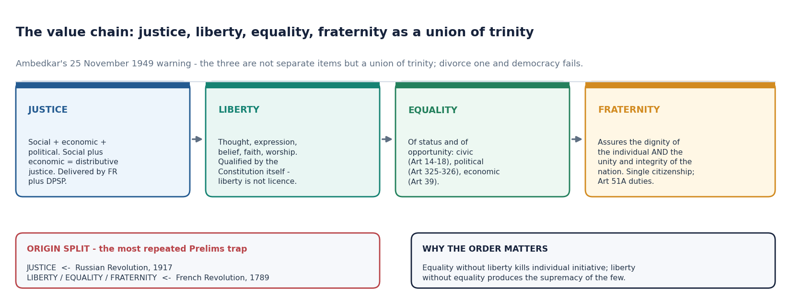
*Ambedkar's warning - the three are not separate items but a union of trinity; divorce one and democracy fails.*

- [FACT] The Preamble embraces **three distinct forms of justice - social, economic and political** - secured through various provisions of the Fundamental Rights and Directive Principles.
- [FACT] **Social justice** denotes equal treatment of all citizens without social distinctions based on caste, colour, race, religion, sex and so on; it means the absence of privileges being extended to any particular section, and the improvement in the conditions of backward classes and women.
- [FACT] **Economic justice** denotes non-discrimination between people on the basis of economic factors, and the elimination of glaring inequalities in wealth, income and property.
- [FACT] **Political justice** implies that all citizens should have equal political rights, equal access to all political offices and equal voice in the government.
- [FACT] A combination of social justice and economic justice denotes what is known as **distributive justice**.
- [FACT] The ideal of justice - social, economic and political - has been **taken from the Russian Revolution (1917)**.
- [ANALYSIS] The Preamble's justice clause is the constitutional bridge between Part III and Part IV: political justice is largely a Part III project, economic justice is largely a Part IV project, and social justice runs across both.

| Form of justice | Meaning | Principal anchors |
|---|---|---|
| Social | No social distinctions; uplift of backward classes and women. | Arts 15(3), 15(4), 16(4), 17, 46. |
| Economic | No discrimination on economic grounds; elimination of glaring inequalities of wealth, income and property. | Arts 39(b), 39(c), 38(2), 43. |
| Political | Equal political rights, equal access to office, equal voice. | Arts 325, 326, 16(1). |
| Distributive | Social plus economic justice combined. | Part III read with Part IV. |

#### Teaching and analysis
The origin fact is a pure Prelims discriminator and it is regularly mis-stated. **Justice comes from the Russian Revolution of 1917; Liberty, Equality and Fraternity come from the French Revolution of 1789.** Keep them in separate mental boxes, because a single question can be built on nothing more than that split.

#### UPSC traps
- WRONG: the ideal of justice was borrowed from the French Revolution.
- CORRECT: from the Russian Revolution, 1917.
- WRONG: distributive justice means political justice plus social justice.
- CORRECT: it is social justice plus economic justice.

**Cross-link:** DPSP (Topic 09) for economic justice; Fundamental Rights (Topic 07) for the equality code.

#### CLOSING RECALL FLOW — INGREDIENT 3 - THE OBJECTIVES: JUSTICE

```text
START / CONCEPT: INGREDIENT 3 - THE OBJECTIVES: JUSTICE
        |
        v
EXACT TERMS: Ingredient 3 - The Objectives · Justice · CONTENT CLASSIFICATION · Social justice · Economic justice · Political justice
        |
        v
MECHANISM / ARGUMENT: Keep them in separate mental boxes, because a single question can be built on nothing more than that split.
        |
        v
CONSEQUENCE / CONTRAST: A combination of social justice and economic justice denotes what is known as distributive justice.
        |
        v
UPSC TRAP / ANSWER-USE: Economic justice denotes non-discrimination between people on the basis of economic factors, and the elimination of glaring inequalities in wealth, income and property.
        |
        v
ANSWER-GRABBING FORMULATION: The Preamble's justice clause is the constitutional bridge between Part III and Part IV: political justice is largely a Part III project, economic justice is largely a Part IV project, and social justice runs across both.
```
### SESSION 12 — LIBERTY AND EQUALITY

#### DEFINITION / WHAT THIS IS CALLED

**Plain-language definition:** The examinable relationship is that liberty and equality are mutually conditioning, not competing.

**Technical definition:** Second, status and opportunity, not outcome - the Preamble does not promise equality of result, which is why affirmative-action jurisprudence is framed as securing opportunity, not guaranteeing outcomes.

#### ANSWER-GRABBING OPENING — WRITE/ADAPT IN THE EXAM

> Liberty and equality are mutually sustaining constitutional conditions: liberty is qualified freedom for personality, while equality removes privilege and enlarges status and opportunity rather than guaranteeing identical outcomes.

#### MUST-WRITE KEYWORDS

- **Liberty**
- **Equality**
- **CONTENT CLASSIFICATION**
- **thought, expression, belief, faith and worship**
- **not**
- **within the limitations mentioned in the Constitution itself**

**How to use them:** Use Liberty to define the issue, connect Equality with CONTENT CLASSIFICATION to explain it, and use thought, expression, belief, faith and worship to distinguish or qualify the conclusion.

> **ANSWER-GRABBING LINE — WRITE/ADAPT IN THE EXAM (LIBERTY AND EQUALITY):** Liberty and equality are mutually sustaining constitutional conditions: liberty is qualified freedom for personality, while equality removes privilege and enlarges status and opportunity rather than guaranteeing identical outcomes.

> **CONTENT CLASSIFICATION:** CORE PRELIMS + CORE MAINS

- [FACT] **Liberty** means the absence of restraints on individual activity **and** the provision of opportunities for the development of individual personality.
- [FACT] The Preamble secures liberty of **thought, expression, belief, faith and worship** through the Fundamental Rights.
- [FACT] Liberty does **not** mean licence to do anything one likes; the liberties in the Preamble are to be enjoyed **within the limitations mentioned in the Constitution itself**.
- [FACT] **Equality** means the absence of special privileges to any section of society, and the provision of adequate opportunities for all individuals without any discrimination.
- [FACT] The Preamble secures **equality of status and of opportunity**, covering **civic equality** (Arts 14, 15, 16, 17 and 18), **political equality** (Arts 325 and 326) and **economic equality** (the Directive Principle in Art 39).
- [FACT] Article 325 provides that no person is to be declared ineligible for inclusion in, or claim to be included in, a special electoral roll on grounds of religion, race, caste or sex. Article 326 provides for elections to the Lok Sabha and State Legislative Assemblies on the basis of **adult suffrage**.
- [FACT] The ideals of **Liberty, Equality and Fraternity** in the Preamble were taken from the **French Revolution (1789-1799)**.
- [ANALYSIS] The examinable relationship is that liberty and equality are **mutually conditioning, not competing**. That is exactly the point of Ambedkar's trinity: neither is safe alone.

| Dimension of equality | Provisions | What it secures |
|---|---|---|
| Civic equality | Arts 14, 15, 16, 17, 18 | Equality before law; no discrimination; equal opportunity in public employment; abolition of untouchability and titles. |
| Political equality | Arts 325, 326 | No exclusion from electoral rolls on listed grounds; universal adult suffrage. |
| Economic equality | Art 39 (DPSP) | Adequate means of livelihood; equal pay for equal work; no concentration of wealth. |

#### Teaching and analysis
Two precision points earn marks. First, **five liberties, not six** - thought, expression, belief, faith, worship. Second, **status and opportunity, not outcome** - the Preamble does not promise equality of result, which is why affirmative-action jurisprudence is framed as securing *opportunity*, not guaranteeing outcomes. Both are frequently mis-stated in mediocre answers.

#### UPSC traps
- WRONG: the Preamble guarantees absolute liberty.
- CORRECT: liberty is enjoyed within the limitations of the Constitution itself; liberty is not licence.
- WRONG: the Preamble secures equality of outcome.
- CORRECT: equality of status and of opportunity.

**Cross-link:** Fundamental Rights (Topic 07) for Articles 14-18 and 19-22.

#### CLOSING RECALL FLOW — LIBERTY AND EQUALITY

```text
START / CONCEPT: LIBERTY AND EQUALITY
        |
        v
EXACT TERMS: Liberty · Equality · CONTENT CLASSIFICATION · thought, expression, belief, faith and worship · not · within the limitations mentioned in the Constitution itself
        |
        v
MECHANISM / ARGUMENT: Second, status and opportunity, not outcome - the Preamble does not promise equality of result, which is why affirmative-action jurisprudence is framed as securing opportunity, not guaranteeing outcomes.
        |
        v
CONSEQUENCE / CONTRAST: The examinable relationship is that liberty and equality are mutually conditioning, not competing.
        |
        v
UPSC TRAP / ANSWER-USE: Liberty does not mean licence to do anything one likes; the liberties in the Preamble are to be enjoyed within the limitations mentioned in the Constitution itself.
        |
        v
ANSWER-GRABBING FORMULATION: Liberty and equality are mutually sustaining constitutional conditions: liberty is qualified freedom for personality, while equality removes privilege and enlarges status and opportunity rather than guaranteeing identical outcomes.
```
### SESSION 13 — FRATERNITY, DIGNITY OF THE INDIVIDUAL, AND UNITY AND INTEGRITY OF THE NATION

#### DEFINITION / WHAT THIS IS CALLED

**Plain-language definition:** Fraternity is the Preamble's horizontal ethic: it must be promoted among citizens so that dignity is individual, unity is psychological and social, and integrity is territorial.

**Technical definition:** The Preamble declares that fraternity has to assure two things - the dignity of the individual and the unity and integrity of the nation.

#### ANSWER-GRABBING OPENING — WRITE/ADAPT IN THE EXAM

> Fraternity is the Preamble's horizontal ethic: it must be promoted among citizens so that dignity is individual, unity is psychological and social, and integrity is territorial.

#### MUST-WRITE KEYWORDS

- **Fraternity**
- **Dignity Of The Individual**
- **Unity**
- **Integrity Of The Nation**
- **CONTENT CLASSIFICATION**
- **single citizenship**

**How to use them:** Use Fraternity to define the issue, connect Dignity Of The Individual with Unity to explain it, and use Integrity Of The Nation to distinguish or qualify the conclusion.

> **ANSWER-GRABBING LINE — WRITE/ADAPT IN THE EXAM (FRATERNITY):** Fraternity is the Preamble's horizontal ethic: it must be promoted among citizens so that dignity is individual, unity is psychological and social, and integrity is territorial.

> **CONTENT CLASSIFICATION:** CORE PRELIMS + CORE MAINS

- [FACT] **Fraternity** means a sense of brotherhood. The Constitution promotes this feeling of fraternity by the system of **single citizenship**.
- [FACT] The **Fundamental Duties** (Art 51A) say that it shall be the duty of every citizen of India to promote harmony and the spirit of common brotherhood amongst all the people of India transcending religious, linguistic, regional or sectional diversities.
- [FACT] The Preamble declares that fraternity has to assure **two things - the dignity of the individual and the unity and integrity of the nation**.
- [FACT] The word "**integrity**" was **added to the Preamble by the 42nd Amendment, 1976**.
- [FACT] **K. M. Munshi**, a member of the Drafting Committee, described the phrase "dignity of the individual" as signifying that **the Constitution not only ensures material betterment and maintains a democratic set-up, but that it also recognises that the personality of every individual is sacred**.
- [FACT] The phrase "unity and integrity of the nation" embraces both the **psychological and the territorial dimensions of national integration**. **Article 1** describes India as a "**Union of States**" to make it clear that the States have **no right to secede** from the Union.
- [ANALYSIS] Fraternity is the only Preamble objective the State must **promote among citizens** rather than **secure to citizens** - it is a horizontal, society-facing obligation, which is why it is discharged partly through Fundamental Duties rather than only through State action.

| Element | Constitutional expression |
|---|---|
| Fraternity | Single citizenship (Arts 5-11); Art 51A(e) duty of common brotherhood. |
| Dignity of the individual | Read into Art 21; underpins the personality-development conception of liberty. |
| Unity of the nation | Psychological dimension - integration across religion, language, region and section. |
| Integrity of the nation | Territorial dimension - Art 1 "Union of States", no right of secession; word added in 1976. |

#### Teaching and analysis
Distinguish **unity** from **integrity** cleanly, because the pair is a favourite two-statement Prelims construction. Unity is psychological and social - the felt sense of one people. Integrity is territorial and legal - the indissolubility of the Union. The 1976 amendment added only the second word, which is a dating fact worth remembering.

#### UPSC traps
- WRONG: "unity and integrity" were both in the original Preamble.
- CORRECT: "unity" was original; "integrity" was added in 1976.
- WRONG: single citizenship is a Preamble provision.
- CORRECT: single citizenship is provided under Arts 5-11; it is the *means* by which the Preamble's fraternity objective is promoted.

**Cross-link:** Citizenship (Topic 06) for single citizenship; Fundamental Duties (Topic 10) for Art 51A(e).

#### CLOSING RECALL FLOW — FRATERNITY, DIGNITY OF THE INDIVIDUAL, AND UNITY AND INTEGRITY OF THE NATION

```text
START / CONCEPT: FRATERNITY, DIGNITY OF THE INDIVIDUAL, AND UNITY AND INTEGRITY OF THE NATION
        |
        v
EXACT TERMS: Fraternity · Dignity Of The Individual · Unity · Integrity Of The Nation · CONTENT CLASSIFICATION · single citizenship
        |
        v
MECHANISM / ARGUMENT: The Preamble declares that fraternity has to assure two things - the dignity of the individual and the unity and integrity of the nation.
        |
        v
CONSEQUENCE / CONTRAST: Munshi, a member of the Drafting Committee, described the phrase "dignity of the individual" as signifying that the Constitution not only ensures material betterment and maintains a democratic set-up, but that it also recognises that the personality of every individual is sacred.
        |
        v
UPSC TRAP / ANSWER-USE: Distinguish unity from integrity cleanly, because the pair is a favourite two-statement Prelims construction.
        |
        v
ANSWER-GRABBING FORMULATION: Fraternity is the Preamble's horizontal ethic: it must be promoted among citizens so that dignity is individual, unity is psychological and social, and integrity is territorial.
```
### SESSION 14 — INGREDIENT 4 - THE DATE OF ADOPTION, AND THE ENACTMENT SEQUENCE

#### DEFINITION / WHAT THIS IS CALLED

**Plain-language definition:** The Constitution came into force on 26 January 1950, chosen to commemorate the Purna Swaraj declaration; the Preamble records the earlier date because that is the date of adoption and enactment by the Constituent Assembly.

**Technical definition:** The two dates carry different constitutional work: 26 November 1949 is the date of the people's act of self-giving recorded in the Preamble; 26 January 1950 is the date of commencement.

#### ANSWER-GRABBING OPENING — WRITE/ADAPT IN THE EXAM

> The Preamble was enacted last so that it would conform to the Constitution already accepted, making 26 November 1949 the date of constitutional self-giving and 26 January 1950 the distinct date of commencement.

#### MUST-WRITE KEYWORDS

- **Ingredient 4 - The Date Of Adoption**
- **The Enactment Sequence**
- **CONTENT CLASSIFICATION**
- **came into force on 26 January 1950**
- **enacted after the rest of the Constitution**
- **26 November 1949**

**How to use them:** Use Ingredient 4 - The Date Of Adoption to define the issue, connect The Enactment Sequence with CONTENT CLASSIFICATION to explain it, and use came into force on 26 January 1950 to distinguish or qualify the conclusion.

> **ANSWER-GRABBING LINE — WRITE/ADAPT IN THE EXAM (ADOPTION SEQUENCE):** The Preamble was enacted last so that it would conform to the Constitution already accepted, making 26 November 1949 the date of constitutional self-giving and 26 January 1950 the distinct date of commencement.

> **CONTENT CLASSIFICATION:** CORE PRELIMS + CORE MAINS

- [FACT] The Preamble states the **date of adoption of the Constitution as 26 November 1949**.
- [FACT] The Constitution **came into force on 26 January 1950**, chosen to commemorate the Purna Swaraj declaration; the Preamble records the earlier date because that is the date of adoption and enactment by the Constituent Assembly.
- [FACT] The Preamble was **enacted after the rest of the Constitution**, so that it would conform to the Constitution as adopted.
- [ANALYSIS] The two dates carry different constitutional work: **26 November 1949** is the date of the people's act of self-giving recorded in the Preamble; **26 January 1950** is the date of commencement. A question can be set on either, and mixing them is the most common Prelims casualty on this topic.

| Date | What it marks | Where it appears |
|---|---|---|
| 13 December 1946 | Objectives Resolution moved by Nehru. | Constituent Assembly proceedings. |
| 22 January 1947 | Objectives Resolution adopted. | Constituent Assembly proceedings. |
| 26 November 1949 | Constitution adopted, enacted and given by the people to themselves. | Recorded in the Preamble itself. |
| 26 January 1950 | Constitution comes into force; India becomes a sovereign democratic republic. | Art 394 commencement; not in the Preamble. |
| 1976 | Socialist, Secular and Integrity inserted. | 42nd Amendment. |

#### Teaching and analysis
Combine this with subtopic 5 and you get one of the sharpest Prelims answers available: on **26 January 1950**, India's exact constitutional status was a **Sovereign Democratic Republic** - not "Sovereign Socialist Secular Democratic Republic", because those two words did not exist until 1976. That single sentence has been directly examinable.

#### UPSC traps
- WRONG: the Preamble records 26 January 1950.
- CORRECT: it records 26 November 1949, the date of adoption.
- WRONG: the Constitution was adopted and commenced on the same day.
- CORRECT: adopted 26 November 1949, commenced 26 January 1950.

**Cross-link:** Making of the Constitution (Topic 02) for the adoption and commencement chronology.

#### CLOSING RECALL FLOW — INGREDIENT 4 - THE DATE OF ADOPTION, AND THE ENACTMENT SEQUENCE

```text
START / CONCEPT: INGREDIENT 4 - THE DATE OF ADOPTION, AND THE ENACTMENT SEQUENCE
        |
        v
EXACT TERMS: Ingredient 4 - The Date Of Adoption · The Enactment Sequence · CONTENT CLASSIFICATION · came into force on 26 January 1950 · enacted after the rest of the Constitution · 26 November 1949
        |
        v
MECHANISM / ARGUMENT: The Constitution came into force on 26 January 1950, chosen to commemorate the Purna Swaraj declaration; the Preamble records the earlier date because that is the date of adoption and enactment by the Constituent Assembly.
        |
        v
CONSEQUENCE / CONTRAST: Combine this with subtopic 5 and you get one of the sharpest Prelims answers available: on 26 January 1950, India's exact constitutional status was a Sovereign Democratic Republic - not "Sovereign Socialist Secular Democratic Republic", because those two words did not exist until 1976.
        |
        v
UPSC TRAP / ANSWER-USE: The two dates carry different constitutional work: 26 November 1949 is the date of the people's act of self-giving recorded in the Preamble; 26 January 1950 is the date of commencement.
        |
        v
ANSWER-GRABBING FORMULATION: The Preamble was enacted last so that it would conform to the Constitution already accepted, making 26 November 1949 the date of constitutional self-giving and 26 January 1950 the distinct date of commencement.
```
### SESSION 15 — SIGNIFICANCE: WHAT THE MAKERS AND THE SCHOLARS SAID THE PREAMBLE DOES

#### DEFINITION / WHAT THIS IS CALLED

**Plain-language definition:** The Preamble is an identity card, key-note and yardstick because it compresses the Constitution's purposes into an authoritative standard of interpretation and evaluation, not because scholar descriptions create legal force.

**Technical definition:** WRONG: "horoscope of our sovereign democratic republic" was said by Nehru.

#### ANSWER-GRABBING OPENING — WRITE/ADAPT IN THE EXAM

> The Preamble is an identity card, key-note and yardstick because it compresses the Constitution's purposes into an authoritative standard of interpretation and evaluation, not because scholar descriptions create legal force.

#### MUST-WRITE KEYWORDS

- **Significance**
- **What The Makers**
- **CONTENT CLASSIFICATION**
- **Sir Ernest Barker**
- **"key-note"**
- **K. M. Munshi**

**How to use them:** Use Significance to define the issue, connect What The Makers with CONTENT CLASSIFICATION to explain it, and use Sir Ernest Barker to distinguish or qualify the conclusion.

> **ANSWER-GRABBING LINE — WRITE/ADAPT IN THE EXAM (SIGNIFICANCE):** The Preamble is an identity card, key-note and yardstick because it compresses the Constitution's purposes into an authoritative standard of interpretation and evaluation, not because scholar descriptions create legal force.

> **CONTENT CLASSIFICATION:** SUPPORTING

- [FACT] **Sir Ernest Barker**, the English political scientist, called the Preamble the **"key-note"** to the Constitution and reproduced it at the beginning of his book *Principles of Social and Political Theory* (1951).
- [FACT] **K. M. Munshi** described the Preamble as the **"horoscope of our sovereign democratic republic"**.
- [FACT] **Sir Alladi Krishnaswami Iyer** observed that the Preamble to the Constitution "expresses what we had thought or dreamt so long".
- [FACT] **Pandit Thakur Das Bhargava** called the Preamble "the most precious part of the Constitution", the "soul of the Constitution", the "key to the Constitution", a "jewel set in the Constitution" and "a proper yardstick with which one can measure the worth of the Constitution".
- [FACT] **M. Hidayatullah**, a former Chief Justice of India, said the Preamble resembles the American Declaration of Independence but is more than a declaration; it is the soul of the Constitution, its signature tune, and "nothing but a revolution can alter" it.
- [FACT] **N. A. Palkhivala** called the Preamble the "identity card of the Constitution".
- [ANALYSIS] These are not ornamental quotations; each does a distinct analytical job, and answers should deploy them for that job rather than as filler.

| Authority | Formulation | Analytical use in an answer |
|---|---|---|
| Barker | "Key-note" | Justifies using the Preamble as an interpretive key. |
| Munshi | "Horoscope of our sovereign democratic republic" | Frames the Preamble as a statement of destiny and direction. |
| Alladi Krishnaswami Iyer | "Expresses what we had thought or dreamt so long" | Ties the Preamble to the freedom struggle's aspirations. |
| Thakur Das Bhargava | "Soul", "key", "jewel", "yardstick" | Supplies the evaluative standard against which laws and policies are measured. |
| Hidayatullah | "Nothing but a revolution can alter it" | Anticipates the basic-structure limit on amending the Preamble. |
| Palkhivala | "Identity card of the Constitution" | Best one-line opener for any Preamble answer. |

#### Teaching and analysis
Hidayatullah's line is the most useful because it is not merely rhetorical - it forecasts the constitutional position that *Kesavananda* would later reach, namely that the Preamble is amendable in form but its basic elements are not alterable in substance. Pair the quotation with the doctrine and the answer reads as argument rather than as recall.

#### UPSC traps
- WRONG: the "identity card" description belongs to Ambedkar.
- CORRECT: it is N. A. Palkhivala's.
- WRONG: "horoscope of our sovereign democratic republic" was said by Nehru.
- CORRECT: by K. M. Munshi.

**Cross-link:** Making of the Constitution (Topic 02) for the Drafting Committee membership.

#### CLOSING RECALL FLOW — SIGNIFICANCE: WHAT THE MAKERS AND THE SCHOLARS SAID THE PREAMBLE DOES

```text
START / CONCEPT: SIGNIFICANCE: WHAT THE MAKERS AND THE SCHOLARS SAID THE PREAMBLE DOES
        |
        v
EXACT TERMS: Significance · What The Makers · CONTENT CLASSIFICATION · Sir Ernest Barker · "key-note" · K. M. Munshi
        |
        v
MECHANISM / ARGUMENT: WRONG: "horoscope of our sovereign democratic republic" was said by Nehru.
        |
        v
CONSEQUENCE / CONTRAST: These are not ornamental quotations; each does a distinct analytical job, and answers should deploy them for that job rather than as filler.
        |
        v
UPSC TRAP / ANSWER-USE: Hidayatullah, a former Chief Justice of India, said the Preamble resembles the American Declaration of Independence but is more than a declaration; it is the soul of the Constitution, its signature tune, and "nothing but a revolution can alter" it.
        |
        v
ANSWER-GRABBING FORMULATION: The Preamble is an identity card, key-note and yardstick because it compresses the Constitution's purposes into an authoritative standard of interpretation and evaluation, not because scholar descriptions create legal force.
```
### SESSION 16 — LEGAL STATUS: BERUBARI TO KESAVANANDA TO LIC OF INDIA

#### DEFINITION / WHAT THIS IS CALLED

**Plain-language definition:** The case-law movement is from Berubari's interpretive key but exclusion, to Kesavananda's membership, to LIC's integral-part reaffirmation; the interpretive role survived while the exclusion did not.

**Technical definition:** Berubari Union case (1960): on a Presidential reference under Article 143 concerning the implementation of the Indo-Pakistan agreement on the Berubari Union in West Bengal, the Supreme Court said the Preamble shows the general purposes behind the several provisions in the Constitution, and is thus a key to open the minds of the makers; it may show the general purposes for which they made the several provisions.

#### ANSWER-GRABBING OPENING — WRITE/ADAPT IN THE EXAM

> The case-law movement is from Berubari's interpretive key but exclusion, to Kesavananda's membership, to LIC's integral-part reaffirmation; the interpretive role survived while the exclusion did not.

#### MUST-WRITE KEYWORDS

- **Legal Status**
- **Berubari To Kesavananda To Lic Of India**
- **CONTENT CLASSIFICATION**
- **Berubari Union case (1960)**
- **Presidential reference under Article 143**
- **Kesavananda Bharati case (1973)**

**How to use them:** Use Legal Status to define the issue, connect Berubari To Kesavananda To Lic Of India with CONTENT CLASSIFICATION to explain it, and use Berubari Union case (1960) to distinguish or qualify the conclusion.

> **ANSWER-GRABBING LINE — WRITE/ADAPT IN THE EXAM (LEGAL STATUS):** The case-law movement is from Berubari's interpretive key but exclusion, to Kesavananda's membership, to LIC's integral-part reaffirmation; the interpretive role survived while the exclusion did not.

> **CONTENT CLASSIFICATION:** CORE PRELIMS + CORE MAINS

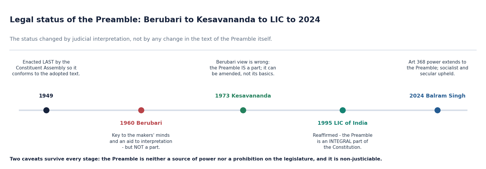
*The status changed by judicial interpretation, not by any change in the text of the Preamble itself.*

- [FACT] **Berubari Union case (1960)**: on a **Presidential reference under Article 143** concerning the implementation of the Indo-Pakistan agreement on the Berubari Union in West Bengal, the Supreme Court said the Preamble shows the **general purposes behind the several provisions in the Constitution**, and is thus **a key to open the minds of the makers**; it may show the general purposes for which they made the several provisions. Even so, the Court **specifically opined that the Preamble is NOT a part of the Constitution**.
- [FACT] **Kesavananda Bharati case (1973)**: the Supreme Court **rejected the earlier opinion** and held that the **Preamble IS a part of the Constitution**. It observed that the Preamble is of extreme importance and that the Constitution should be read and interpreted in the light of the grand and noble vision expressed in it.
- [FACT] **LIC of India case (1995)**: the Supreme Court again held that the **Preamble is an integral part of the Constitution**.
- [FACT] The Constituent Assembly enacted the Preamble **last**, precisely so that it would conform to the Constitution as adopted, and the motion adopted was "The question is that Preamble stands part of the Constitution".
- [ANALYSIS] The doctrinal movement is from **evidence of intention** (1960) to **part of the instrument** (1973) to **integral part** (1995). Nothing in the text changed; only the judicial characterisation did.

| Case | Year | Route | Holding on the Preamble |
|---|---|---|---|
| Berubari Union | 1960 | Presidential reference, Art 143 | Key to the makers' minds and an aid to interpretation, but NOT a part of the Constitution. |
| Kesavananda Bharati | 1973 | Writ; 13-judge bench | Preamble IS a part of the Constitution; the Constitution must be read in its light. |
| LIC of India | 1995 | Appeal | Preamble is an INTEGRAL part of the Constitution. |
| Dr Balram Singh | 2024 | Art 32 writ petitions | Art 368 extends to the Preamble; socialist and secular upheld. |

#### Teaching and analysis
The examinable subtlety is that *Berubari* was not "wrong" about the interpretive value of the Preamble; it was reversed only on the narrow question of membership. Even today the *Berubari* proposition that the Preamble is "a key to open the minds of the makers" is quoted with approval. So the correct sentence is: **the interpretive role survived; the exclusion from the Constitution did not.** That precision separates a top answer from a merely correct one.

#### UPSC traps
- WRONG: *Berubari* held that the Preamble has no value whatsoever.
- CORRECT: it held the Preamble is a key to the makers' minds and an aid to interpretation, but not a part of the Constitution.
- WRONG: *Kesavananda* held the Preamble is enforceable.
- CORRECT: it held the Preamble is a part of the Constitution; enforceability is a separate question, answered in the negative.

**Cross-link:** Amendment of the Constitution (Topic 10) for the *Kesavananda* basic-structure holding in full.

#### CLOSING RECALL FLOW — LEGAL STATUS: BERUBARI TO KESAVANANDA TO LIC OF INDIA

```text
START / CONCEPT: LEGAL STATUS: BERUBARI TO KESAVANANDA TO LIC OF INDIA
        |
        v
EXACT TERMS: Legal Status · Berubari To Kesavananda To Lic Of India · CONTENT CLASSIFICATION · Berubari Union case (1960) · Presidential reference under Article 143 · Kesavananda Bharati case (1973)
        |
        v
MECHANISM / ARGUMENT: Kesavananda Bharati case (1973): the Supreme Court rejected the earlier opinion and held that the Preamble IS a part of the Constitution.
        |
        v
CONSEQUENCE / CONTRAST: Berubari Union case (1960): on a Presidential reference under Article 143 concerning the implementation of the Indo-Pakistan agreement on the Berubari Union in West Bengal, the Supreme Court said the Preamble shows the general purposes behind the several provisions in the Constitution, and is thus a key to open the minds of the makers; it may show the general purposes for which they made the several provisions.
        |
        v
UPSC TRAP / ANSWER-USE: The examinable subtlety is that Berubari was not "wrong" about the interpretive value of the Preamble; it was reversed only on the narrow question of membership.
        |
        v
ANSWER-GRABBING FORMULATION: The case-law movement is from Berubari's interpretive key but exclusion, to Kesavananda's membership, to LIC's integral-part reaffirmation; the interpretive role survived while the exclusion did not.
```
### SESSION 17 — THE TWO PERMANENT CAVEATS, OPERATIONALISED

#### DEFINITION / WHAT THIS IS CALLED

**Plain-language definition:** In a 15- or 20-marker, the caveats must be followed by the positive account in subtopic 19 - otherwise the answer reads as if the Preamble does nothing, which is equally wrong.

**Technical definition:** Its force is exerted through other provisions, never instead of them.

#### ANSWER-GRABBING OPENING — WRITE/ADAPT IN THE EXAM

> Being part of the Constitution does not make the Preamble independently enforceable: it neither confers nor prohibits legislative power and remains non-justiciable.

#### MUST-WRITE KEYWORDS

- **The Two Permanent Caveats**
- **Operationalised**
- **CONTENT CLASSIFICATION**
- **its provisions are**
- **not**
- **membership**

**How to use them:** Use The Two Permanent Caveats to define the issue, connect Operationalised with CONTENT CLASSIFICATION to explain it, and use its provisions are to distinguish or qualify the conclusion.

> **ANSWER-GRABBING LINE — WRITE/ADAPT IN THE EXAM (LEGAL CAVEATS):** Being part of the Constitution does not make the Preamble independently enforceable: it neither confers nor prohibits legislative power and remains non-justiciable.

> **CONTENT CLASSIFICATION:** CORE PRELIMS + CORE MAINS

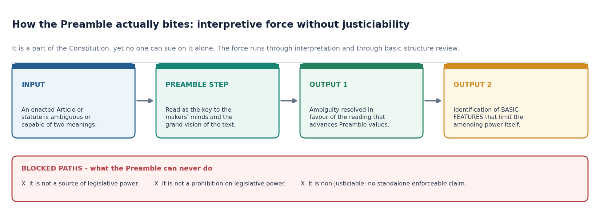
*It is a part of the Constitution, yet no one can sue on it alone - the force runs through interpretation and through basic-structure review.*

- [FACT] Caveat one: the Preamble is **neither a source of power to the legislature nor a prohibition upon the powers of the legislature**.
- [FACT] Caveat two: the Preamble is **non-justiciable** - its provisions are **not enforceable in courts of law**.
- [FACT] These two propositions survived *Kesavananda* and *LIC*. Being a part of the Constitution did **not** make the Preamble enforceable.
- [ANALYSIS] The apparent paradox - a part of the Constitution that cannot be enforced - resolves once you separate **membership** from **operativeness**. The Preamble belongs to the instrument; it does not operate as a rule of decision. Its force is exerted **through** other provisions, never **instead of** them.
- [LIMIT] Never write that a citizen can file a petition to enforce the Preamble. The correct formulation is that a citizen can invoke the Preamble to colour the construction of an operative provision.

| Proposition | True or false | Consequence in an answer |
|---|---|---|
| The Preamble is a part of the Constitution | True since 1973 | May be cited as constitutional text. |
| The Preamble confers legislative power | False | Never justify a statute solely by Preamble values. |
| The Preamble bars legislative power | False | Never invalidate a statute solely for offending Preamble values. |
| The Preamble is enforceable on its own | False | No standalone cause of action. |
| The Preamble governs the reading of ambiguous provisions | True | The principal legitimate use. |
| The Preamble supplies basic features | True since 1973 | The indirect route to invalidating an amendment. |

#### Teaching and analysis
This subtopic is where mark-scaled answers are won. In a 10-marker, one sentence carrying both caveats is enough. In a 15- or 20-marker, the caveats must be followed by the *positive* account in subtopic 19 - otherwise the answer reads as if the Preamble does nothing, which is equally wrong.

#### UPSC traps
- WRONG: because the Preamble is now a part of the Constitution, its clauses can be enforced like Fundamental Rights.
- CORRECT: it remains non-justiciable; membership and enforceability are different questions.
- WRONG: Parliament derives its legislative competence partly from the Preamble.
- CORRECT: competence comes from Arts 245-246 and the Seventh Schedule; the Preamble is not a source of power.

**Cross-link:** Fundamental Rights (Topic 07) for what justiciability actually means in Indian constitutional law.

#### CLOSING RECALL FLOW — THE TWO PERMANENT CAVEATS, OPERATIONALISED

```text
START / CONCEPT: THE TWO PERMANENT CAVEATS, OPERATIONALISED
        |
        v
EXACT TERMS: The Two Permanent Caveats · Operationalised · CONTENT CLASSIFICATION · its provisions are · not · membership
        |
        v
MECHANISM / ARGUMENT: In a 15- or 20-marker, the caveats must be followed by the positive account in subtopic 19 - otherwise the answer reads as if the Preamble does nothing, which is equally wrong.
        |
        v
CONSEQUENCE / CONTRAST: Caveat two: the Preamble is non-justiciable - its provisions are not enforceable in courts of law.
        |
        v
UPSC TRAP / ANSWER-USE: The Preamble belongs to the instrument; it does not operate as a rule of decision.
        |
        v
ANSWER-GRABBING FORMULATION: Being part of the Constitution does not make the Preamble independently enforceable: it neither confers nor prohibits legislative power and remains non-justiciable.
```
### SESSION 18 — AMENDABILITY AND THE BASIC-STRUCTURE BOUNDARY

#### DEFINITION / WHAT THIS IS CALLED

**Plain-language definition:** Here it is used only to fix the boundary around the Preamble.

**Technical definition:** The question whether the Preamble can be amended under Article 368 arose for the first time in the Kesavananda Bharati case (1973).

#### ANSWER-GRABBING OPENING — WRITE/ADAPT IN THE EXAM

> Article 368 reaches the Preamble, but basic structure prevents amendment from destroying the constitutional identity its words declare; the text has been amended only once, in 1976.

#### MUST-WRITE KEYWORDS

- **Amendability**
- **The Basic-Structure Boundary**
- **CONTENT CLASSIFICATION**
- **Article 368**
- **Kesavananda Bharati case (1973)**
- **held to be valid**

**How to use them:** Use Amendability to define the issue, connect The Basic-Structure Boundary with CONTENT CLASSIFICATION to explain it, and use Article 368 to distinguish or qualify the conclusion.

> **ANSWER-GRABBING LINE — WRITE/ADAPT IN THE EXAM (AMENDABILITY):** Article 368 reaches the Preamble, but basic structure prevents amendment from destroying the constitutional identity its words declare; the text has been amended only once, in 1976.

> **CONTENT CLASSIFICATION:** CORE PRELIMS + CORE MAINS

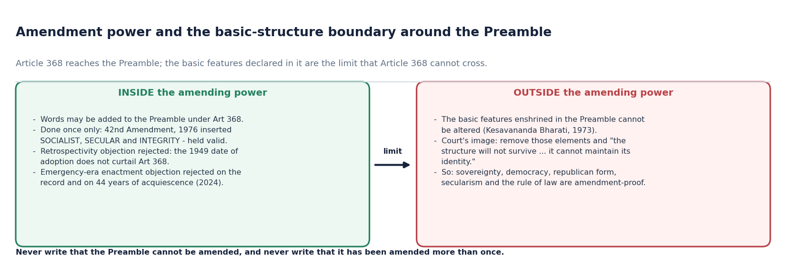
*Article 368 reaches the Preamble; the basic features declared in it are the limit that Article 368 cannot cross.*

- [FACT] The question whether the Preamble can be amended under **Article 368** arose for the first time in the **Kesavananda Bharati case (1973)**.
- [FACT] It was argued that the Preamble cannot be amended because it is not a part of the Constitution. The Court held that the **Preamble is a part of the Constitution** and therefore **can be amended, subject to the condition that no amendment is done to the "basic features"**.
- [FACT] The Court's reasoning, recorded in *Kesavananda*, is that the edifice of the Constitution is **based upon the basic elements mentioned in the Preamble**; if any of these elements are removed, the structure will not survive and it will not be the same Constitution, or it cannot maintain its identity.
- [FACT] The Preamble has been **amended only once so far, by the 42nd Amendment, 1976**, which added the three words Socialist, Secular and Integrity. This amendment was **held to be valid**.
- [ANALYSIS] The correct formulation is a two-part sentence: **Article 368 reaches the Preamble; the basic features declared in the Preamble do not yield to Article 368.** Anything shorter is inaccurate in one direction or the other.
- [LIMIT] The full content and evolution of the basic-structure doctrine belongs to the Amendment topic. Here it is used only to fix the boundary around the Preamble.

| Inside the amending power | Outside the amending power |
|---|---|
| Adding words to the Preamble under Art 368. | Removing or destroying the basic elements the Preamble declares. |
| The 1976 insertion of Socialist, Secular and Integrity, held valid. | Abolishing sovereignty, the democratic character, the republican form, secularism or the rule of law. |
| Rejecting the argument that the 1949 date of adoption freezes the text. | Any amendment that would leave the Constitution unable to "maintain its identity". |

#### Teaching and analysis
Two symmetrical errors must be avoided. Writing that the Preamble **cannot be amended** is wrong - it has been. Writing that it has been amended **more than once** is also wrong - the count is exactly one. And the identity metaphor - "it will not be the same Constitution, or it cannot maintain its identity" - is the phrase to quote when arguing why some Preamble elements are amendment-proof.

#### UPSC traps
- WRONG: the Preamble cannot be amended because it is not a part of the Constitution.
- CORRECT: it is a part and can be amended under Art 368, but not its basic features.
- WRONG: the Preamble has been amended twice - once in 1976 and once thereafter.
- CORRECT: amended once only, by the 42nd Amendment, 1976.

**Cross-link:** Amendment of the Constitution (Topic 10) for Article 368 procedure and the full basic-structure doctrine.

#### CLOSING RECALL FLOW — AMENDABILITY AND THE BASIC-STRUCTURE BOUNDARY

```text
START / CONCEPT: AMENDABILITY AND THE BASIC-STRUCTURE BOUNDARY
        |
        v
EXACT TERMS: Amendability · The Basic-Structure Boundary · CONTENT CLASSIFICATION · Article 368 · Kesavananda Bharati case (1973) · held to be valid
        |
        v
MECHANISM / ARGUMENT: It was argued that the Preamble cannot be amended because it is not a part of the Constitution.
        |
        v
CONSEQUENCE / CONTRAST: The correct formulation is a two-part sentence: Article 368 reaches the Preamble; the basic features declared in the Preamble do not yield to Article 368.
        |
        v
UPSC TRAP / ANSWER-USE: The Court held that the Preamble is a part of the Constitution and therefore can be amended, subject to the condition that no amendment is done to the "basic features".
        |
        v
ANSWER-GRABBING FORMULATION: Article 368 reaches the Preamble, but basic structure prevents amendment from destroying the constitutional identity its words declare; the text has been amended only once, in 1976.
```
### SESSION 19 — HOW THE PREAMBLE ACTUALLY BITES: THE INTERPRETIVE-FORCE MECHANISM

#### DEFINITION / WHAT THIS IS CALLED

**Plain-language definition:** The Preamble exerts constitutional force by two identified routes, and naming those routes is what separates an analytical answer from a descriptive one.

**Technical definition:** The Preamble has legal force through interpretation and basic-structure review, always through operative provisions and never as a substitute for them.

#### ANSWER-GRABBING OPENING — WRITE/ADAPT IN THE EXAM

> The Preamble has legal force through interpretation and basic-structure review, always through operative provisions and never as a substitute for them.

#### MUST-WRITE KEYWORDS

- **How The Preamble Actually Bites**
- **The Interpretive-Force Mechanism**
- **CONTENT CLASSIFICATION**
- **two identified routes**
- **through**
- **evaluative yardstick**

**How to use them:** Use How The Preamble Actually Bites to define the issue, connect The Interpretive-Force Mechanism with CONTENT CLASSIFICATION to explain it, and use two identified routes to distinguish or qualify the conclusion.

> **ANSWER-GRABBING LINE — WRITE/ADAPT IN THE EXAM (INTERPRETIVE FORCE):** The Preamble has legal force through interpretation and basic-structure review, always through operative provisions and never as a substitute for them.

> **CONTENT CLASSIFICATION:** CORE MAINS

- [ANALYSIS] The Preamble exerts constitutional force by **two identified routes**, and naming those routes is what separates an analytical answer from a descriptive one.
- [FACT] **Route one - construction of ambiguity.** *Berubari* (1960) established that the Preamble shows the general purposes behind the several provisions and is a key to open the minds of the makers. Where an enacted provision is capable of two meanings, the meaning that advances Preamble values prevails.
- [FACT] **Route two - identification of basic features.** *Kesavananda* (1973) held that the edifice of the Constitution is based upon the basic elements mentioned in the Preamble; those elements therefore limit the amending power itself.
- [FACT] Both routes operate **through** other provisions. Neither creates a standalone enforceable claim, because the Preamble remains non-justiciable.
- [ANALYSIS] A third, softer route exists in practice: the Preamble supplies the **evaluative yardstick** described by Thakur Das Bhargava, against which the worth of laws and policies is publicly measured. That is political and moral force rather than legal force, and an honest answer should label it as such.

| Route | Trigger | Legal effect | Limit |
|---|---|---|---|
| Construction of ambiguity | A provision bears two readings. | The Preamble-advancing reading is adopted. | Cannot override clear text. |
| Basic-feature review | A constitutional amendment is challenged. | The amendment may be struck down. | Belongs to Art 368 review, not to ordinary legislation. |
| Evaluative yardstick | Public and academic assessment of laws and policies. | Persuasive only. | Not a legal remedy; must be labelled as such. |

#### Teaching and analysis
This subtopic is the answer to the question every Preamble essay must confront: *if it is not enforceable, why does it matter?* The reply is not sentiment; it is mechanism. It matters because it decides how ambiguous provisions are read, and because it supplies the elements whose removal would destroy the Constitution's identity. State the mechanism, then the caveats, and the answer is complete.

#### UPSC traps
- WRONG: the Preamble can be used to override the clear language of an Article.
- CORRECT: it operates only where the provision is ambiguous, or through basic-structure review of amendments.
- WRONG: the Preamble's moral authority is the same as legal enforceability.
- CORRECT: moral and evaluative force is persuasive; legal force is exerted only through the two identified routes.

**Cross-link:** Judiciary (Topic 25) for the judicial-review architecture within which both routes operate.

#### CLOSING RECALL FLOW — HOW THE PREAMBLE ACTUALLY BITES: THE INTERPRETIVE-FORCE MECHANISM

```text
START / CONCEPT: HOW THE PREAMBLE ACTUALLY BITES: THE INTERPRETIVE-FORCE MECHANISM
        |
        v
EXACT TERMS: How The Preamble Actually Bites · The Interpretive-Force Mechanism · CONTENT CLASSIFICATION · two identified routes · through · evaluative yardstick
        |
        v
MECHANISM / ARGUMENT: The Preamble exerts constitutional force by two identified routes, and naming those routes is what separates an analytical answer from a descriptive one.
        |
        v
CONSEQUENCE / CONTRAST: Kesavananda (1973) held that the edifice of the Constitution is based upon the basic elements mentioned in the Preamble; those elements therefore limit the amending power itself.
        |
        v
UPSC TRAP / ANSWER-USE: This subtopic is the answer to the question every Preamble essay must confront: if it is not enforceable, why does it matter?
        |
        v
ANSWER-GRABBING FORMULATION: The Preamble has legal force through interpretation and basic-structure review, always through operative provisions and never as a substitute for them.
```
### CURRENT STATUS CONTROL: DR BALRAM SINGH V. UNION OF INDIA (25 NOVEMBER 2024)

> **ANSWER-GRABBING LINE — WRITE/ADAPT IN THE EXAM (CURRENT LEGAL STATUS):** Through 21 August 2026, the verified controlling position remains Dr Balram Singh (25 November 2024): 'socialist' and 'secular' stand, and no later official Supreme Court judgment or order altering that holding was located.

> **CONTENT CLASSIFICATION:** CORE PRELIMS + CORE MAINS

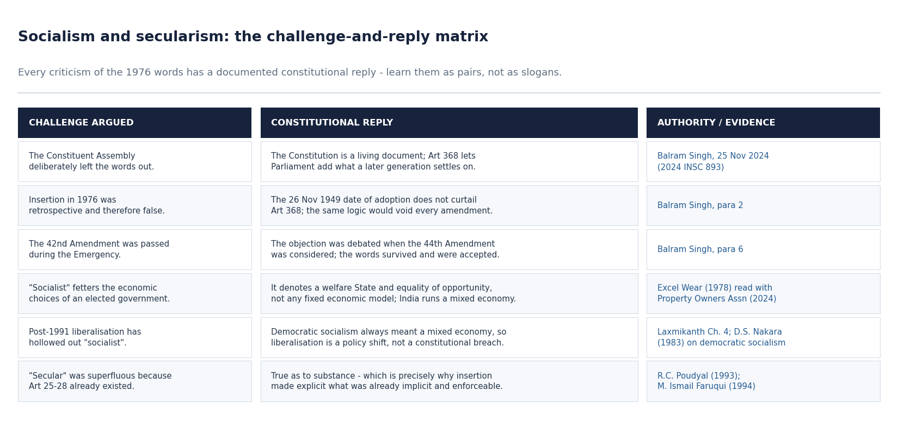
*Every criticism of the 1976 words has a documented constitutional reply - learn them as pairs, not as slogans.*

- [FACT] **Case:** *Dr Balram Singh and Others v. Union of India and Another*, Writ Petition (Civil) No. 645 of 2020 with Writ Petition (Civil) No. 1467 of 2020 and Miscellaneous Application No. 835 of 2024, decided **25 November 2024**. Neutral citation **2024 INSC 893**; reported as **[2024] 11 S.C.R. 947**.
- [FACT] **Bench:** Sanjiv Khanna, Chief Justice of India, and Sanjay Kumar, J. The petitions were filed under **Article 32**.
- [FACT] **Challenge:** the insertion of "socialist" and "secular" by the 42nd Amendment, 1976 was assailed on three grounds - that the amendment was **retrospective and therefore false** because the Preamble records adoption on 26 November 1949; that the Constituent Assembly had **deliberately eschewed** the word "secular"; that "socialist" **fetters the economic policy choices** of an elected government; and that the amendment was passed on **2 November 1976** during the Emergency, after the Lok Sabha's normal tenure had expired on 18 March 1976.
- [FACT] **Held on retrospectivity:** the power of amendment under **Article 368 extends to the Preamble**. The date of adoption in the Preamble does not curtail that power; if the argument were accepted, it would apply equally to every amendment ever made. The Constitution is a **living document**.
- [FACT] **Held on secularism:** in 1949 the word "secular" was considered imprecise, and India has developed its own interpretation - the **State neither supports any religion nor penalises the profession and practice of any faith**. This is enshrined in **Articles 14, 15 and 16**, with Articles 25, 26, 29 and 30 and the Article 44 directive read alongside. **Secularism is a basic feature** (*Kesavananda*, 1973; **S. R. Bommai**, 1994, nine judges), its scope elaborated in **R. C. Poudyal** (1993) and **M. Ismail Faruqui** (1994), and it is a **facet of the right to equality**.
- [FACT] **Held on socialism:** the word does **not restrict the economic policy of an elected government**. Neither the Constitution nor the Preamble mandates any particular economic model, left or right. "Socialist" denotes a commitment to be a **welfare State** and to **equality of opportunity**. India has consistently embraced a **mixed economy**, and the word does not restrict private entrepreneurship or the Article 19(1)(g) right. **Excel Wear v. Union of India** (1978) had observed that the word may make courts lean towards nationalisation while still recognising private ownership; the nine-judge decision in **Property Owners Association v. State of Maharashtra** (2024 INSC 835) clarified that the elected government may adopt its own structure for economic governance.
- [FACT] **Held on the Emergency ground:** the objection had already been deliberated in Parliament when the Constitution (Forty-fifth Amendment) Bill, 1978 - later enacted as the **Constitution (Forty-fourth Amendment) Act, 1978** - was considered; "secular" was explained there as equal respect for all religions and "socialist" as the elimination of all forms of exploitation, and the proposed amendment to Article 366 was **not accepted by the Council of States**.
- [FACT] **Outcome:** the petitions were filed in 2020, **44 years** after the insertion; the terms had achieved **widespread acceptance**; there was no legitimate cause to issue notice; the **writ petitions were dismissed** (MA 835/2024 was allowed, but the registered writ petition was treated as dismissed).
- [ANALYSIS] This is the current-status control for the entire topic. It converts the socialist and secular debate from an open political argument into a **settled constitutional position with a citable date**, and it supplies a ready reply to each of the four standard criticisms.

| Ground of challenge | Court's reply | Anchor |
|---|---|---|
| Retrospectivity - the 1949 date | Art 368 extends to the Preamble; the date does not curtail the power; the Constitution is a living document. | Paras 2-3. |
| Assembly deliberately excluded "secular" | The word was thought imprecise in 1949; India then developed its own secularism, now a basic feature. | *Kesavananda*; *S. R. Bommai* (1994). |
| "Socialist" fetters economic policy | It denotes a welfare State and equality of opportunity, not an economic model; India runs a mixed economy. | *Excel Wear* (1978); *Property Owners Association* (2024). |
| Passed during the Emergency | The objection was debated in 1978 and the words survived; the Art 366 proposal was not accepted by the Council of States. | Para 6. |
| Delay | 44 years of acquiescence and widespread acceptance; no legitimate cause. | Para 7-8. |

#### Teaching and analysis
Use this case as **evidence**, not as news. The examiner does not reward the mere fact that a 2024 judgment exists; the reward comes from using its four replies to defeat four named criticisms. Note also its most transferable line for other topics: **the Constitution is a living document**, and **secularism is a facet of the right to equality** - both are quotable in DPSP, Fundamental Rights and amendment questions.

#### UPSC traps
- WRONG: the Supreme Court in 2024 struck down the 1976 insertion of "socialist" and "secular".
- CORRECT: the challenge was dismissed and both words were upheld.
- WRONG: the 2024 judgment declared that India must follow a socialist economic model.
- CORRECT: it held the opposite - no economic model is mandated; "socialist" means welfare State and equality of opportunity.

**Cross-link:** Amendment of the Constitution (Topic 10) for Art 368; Fundamental Rights (Topic 07) for Arts 14-16 and 25-30.
### SESSION 20 — EXAM ARCHITECTURE: CONVERTING THE PREAMBLE INTO MARKS

#### DEFINITION / WHAT THIS IS CALLED

**Plain-language definition:** The Preamble is the Constitution in miniature: a non-justiciable but authoritative charter that identifies the source, identity and ends of the Republic and guides interpretation without displacing operative text.

**Technical definition:** Every Preamble question falls into one of four demand types, and each has a fixed spine.

#### ANSWER-GRABBING OPENING — WRITE/ADAPT IN THE EXAM

> The Preamble is the Constitution in miniature: a non-justiciable but authoritative charter that identifies the source, identity and ends of the Republic and guides interpretation without displacing operative text.

#### MUST-WRITE KEYWORDS

- **Exam Architecture**
- **Converting The Preamble Into Marks**
- **CONTENT CLASSIFICATION**
- **10-marker (150 words)**
- **15-marker (250 words)**
- **20-marker (250 words with higher expectation)**

**How to use them:** Use Exam Architecture to define the issue, connect Converting The Preamble Into Marks with CONTENT CLASSIFICATION to explain it, and use 10-marker (150 words) to distinguish or qualify the conclusion.

> **ANSWER-GRABBING LINE — WRITE/ADAPT IN THE EXAM (FINAL VERDICT):** The Preamble is the Constitution in miniature: a non-justiciable but authoritative charter that identifies the source, identity and ends of the Republic and guides interpretation without displacing operative text.

> **CONTENT CLASSIFICATION:** CORE MAINS

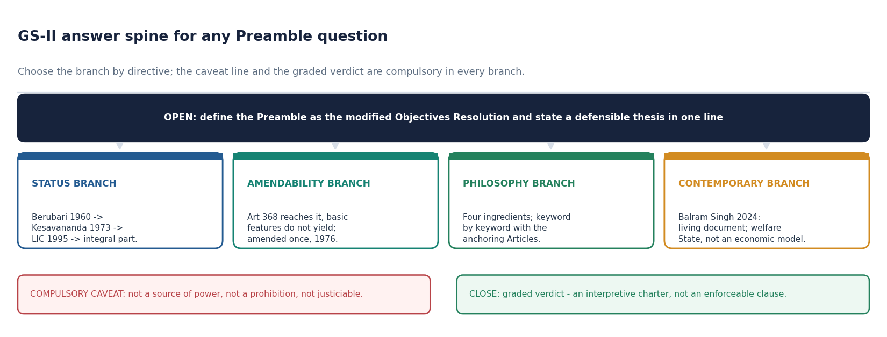
*Choose the branch by directive; the caveat line and the graded verdict are compulsory in every branch.*

- [ANALYSIS] Every Preamble question falls into one of four demand types, and each has a fixed spine.

| Demand type | Typical directive | Spine to use |
|---|---|---|
| Status | "Is the Preamble a part of the Constitution?" | *Berubari* to *Kesavananda* to *LIC*, then the two caveats, then the graded verdict. |
| Amendability | "Can the Preamble be amended?" | Art 368 reaches it; basic features do not yield; amended once in 1976; identity metaphor. |
| Philosophy | "Discuss the philosophy of the Preamble." | Four ingredients; keyword by keyword with anchoring Articles; the trinity argument. |
| Contemporary | "Are 'socialist' and 'secular' still appropriate?" | *Dr Balram Singh* (2024) replies to each criticism; welfare State, not economic model; secularism as a facet of equality. |

- [ANALYSIS] **Mark-scaled structures.** For a **10-marker (150 words)**: one-line definition; the four ingredients or the status chain, whichever the directive demands; the two caveats in a single sentence; a graded one-line verdict. For a **15-marker (250 words)**: add the keyword-to-anchor mapping and one named contemporary evidence. For a **20-marker (250 words with higher expectation)**: add the criticism-and-reply matrix and an explicit evaluative thesis stated in the introduction and returned to in the conclusion.
- [ANALYSIS] **The compulsory caveat line.** In every Mains answer on this topic, one sentence must record that the Preamble is neither a source of power nor a prohibition on the legislature, and that it is non-justiciable. Omitting it is the single most common reason otherwise good answers are capped.
- [ANALYSIS] **The graded verdict.** Never close with an absolute. Close with a calibrated formulation such as: *an interpretive charter with constitutional force but not an enforceable clause* - it is defensible against both the "merely decorative" and the "fully enforceable" objections.

#### Teaching and analysis
Time discipline matters as much as content. In a 150-word answer, the status chain consumes roughly 45 words, the caveats 20, and the verdict 15 - leaving about 70 words for the specific demand. Practise writing the chain and the caveats as fixed blocks so that the thinking time is spent on the part of the question that is actually variable.

#### UPSC traps
- WRONG: opening a Preamble answer with the full quoted text to fill space.
- CORRECT: open with the function - the Preamble is the modified Objectives Resolution declaring the source of authority, the nature of the State, its objectives and the date of adoption.
- WRONG: closing with "thus the Preamble is the soul of the Constitution".
- CORRECT: close with the graded verdict, and use the "soul" quotation only where it does argumentative work.

**Cross-link:** Salient Features (Topic 03) and Amendment (Topic 10) for the neighbouring answer spines.

#### CLOSING RECALL FLOW — EXAM ARCHITECTURE: CONVERTING THE PREAMBLE INTO MARKS

```text
START / CONCEPT: EXAM ARCHITECTURE: CONVERTING THE PREAMBLE INTO MARKS
        |
        v
EXACT TERMS: Exam Architecture · Converting The Preamble Into Marks · CONTENT CLASSIFICATION · 10-marker (150 words) · 15-marker (250 words) · 20-marker (250 words with higher expectation)
        |
        v
MECHANISM / ARGUMENT: Every Preamble question falls into one of four demand types, and each has a fixed spine.
        |
        v
CONSEQUENCE / CONTRAST: WRONG: closing with "thus the Preamble is the soul of the Constitution".
        |
        v
UPSC TRAP / ANSWER-USE: Close with a calibrated formulation such as: an interpretive charter with constitutional force but not an enforceable clause - it is defensible against both the "merely decorative" and the "fully enforceable" objections.
        |
        v
ANSWER-GRABBING FORMULATION: The Preamble is the Constitution in miniature: a non-justiciable but authoritative charter that identifies the source, identity and ends of the Republic and guides interpretation without displacing operative text.
```
## BASIC MCQS / REMEDIATION

### Practice rule and exact option rotation

The 48 questions form one continuous sequence. Correct answers rotate exactly A -> B -> C -> D twelve times, without repetition or reset.

### 40 core diagnostic MCQs

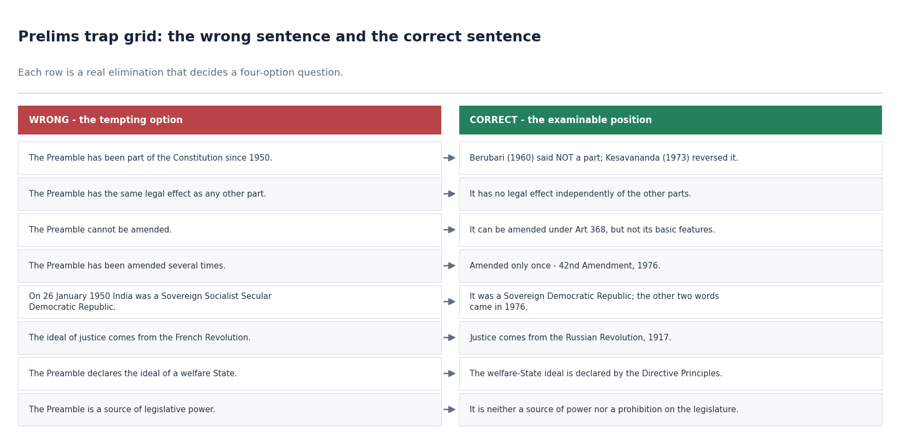
*Each row is a real elimination that decides a four-option question - read this before attempting the loops.*

Forty core questions cover every major subtopic in the Basic session. Attempt a full loop before checking any answer.

#### Core MCQ 1. Consider the following statements about the Objectives Resolution.
1. It was drafted and moved in the Constituent Assembly by Jawaharlal Nehru on 13 December 1946.
2. It was adopted by the Constituent Assembly on 22 January 1947.
3. The Preamble is the Objectives Resolution in a modified form.
Which of the statements given above are correct?
(a) 1, 2 and 3
(b) 1 and 2 only
(c) 2 and 3 only
(d) 1 and 3 only

**Answer: (a) 1, 2 and 3.**

All three are accurate. Nehru moved the Resolution on 13 December 1946; the Assembly adopted it on 22 January 1947; and the Preamble is that Resolution in modified form rather than a fresh independent draft. The commonest error is to attach the adoption date to 1946 or to treat the Resolution as a surviving standalone provision.

#### Core MCQ 2. The Preamble was voted upon and enacted after the rest of the Constitution had been enacted. The principal constitutional reason was that
(a) the Drafting Committee had not completed the text of the Preamble in time
(b) the Preamble had to conform to the Constitution as already adopted by the Assembly
(c) the Preamble required a separate and higher majority than the other provisions
(d) the Preamble had first to be approved by the provincial legislatures

**Answer: (b) the Preamble had to conform to the Constitution as already adopted.**

The Assembly deliberately reversed the natural order so that the Preamble would summarise what had actually been enacted, and the motion put was "The question is that Preamble stands part of the Constitution". Option (c) is wrong because no special majority applied. Option (d) is wrong because no provincial ratification was required. This fact is what makes the Preamble reliable evidence of the makers' intention.

#### Core MCQ 3. Which one of the following most accurately states the holding of the Berubari Union case (1960) on the Preamble?
(a) The Preamble is a key to open the minds of the makers, but is not a part of the Constitution
(b) The Preamble is an integral part of the Constitution and is enforceable
(c) The Preamble is a part of the Constitution but is not enforceable
(d) The Preamble is neither an aid to interpretation nor a part of the Constitution

**Answer: (a).**

*Berubari* accepted the Preamble as showing the general purposes behind the several provisions and as a key to open the minds of the makers, yet specifically opined that it is **not a part** of the Constitution. Option (d) overstates the case by denying the interpretive role, which *Berubari* itself affirmed. Options (b) and (c) describe later positions - *LIC* (1995) and *Kesavananda* (1973) respectively.

#### Core MCQ 4. The Preamble to the Constitution of India can most accurately be described as
(a) a part of the Constitution that has no legal effect independently of other parts
(b) an enforceable declaration of rights available against the State
(c) a source of legislative power that supplements the Seventh Schedule
(d) a prohibition on the exercise of legislative power inconsistent with its values

**Answer: (a).**

The settled triad is that the Preamble is a part of the Constitution, is neither a source of power nor a prohibition upon the legislature, and is non-justiciable. Options (c) and (d) are ruled out by the first caveat and option (b) by the second. Only (a) is consistent with all three.

#### Core MCQ 5. Which of the following were inserted into the Preamble by the Constitution (Forty-second Amendment) Act, 1976?
1. Socialist
2. Secular
3. Integrity
4. Fraternity
Select the correct answer using the code given below.
(a) 1, 2 and 3 only
(b) 1 and 2 only
(c) 2, 3 and 4 only
(d) 1, 2, 3 and 4

**Answer: (a) 1, 2 and 3 only.**

The 42nd Amendment inserted exactly three words - Socialist, Secular and Integrity. Fraternity was in the original text, taken with Liberty and Equality from the French Revolution. Candidates frequently forget "Integrity" and choose (b); the word "unity" was original while "integrity" was added.

#### Core MCQ 6. What was the exact constitutional description of India in the Preamble as it stood on 26 January 1950?
(a) Sovereign Secular Democratic Republic
(b) Democratic Republic
(c) Sovereign Socialist Secular Democratic Republic
(d) Sovereign Democratic Republic

**Answer: (d).**

On commencement the Preamble read "SOVEREIGN DEMOCRATIC REPUBLIC". Socialist and Secular arrived only in 1976, which eliminates (c) and (a). Option (b) is wrong because sovereignty is precisely what India acquired on that date, having been a dominion since 15 August 1947.

#### Core MCQ 7. Consider the following pairs of Preamble ideals and their acknowledged historical source.
1. Justice - Russian Revolution, 1917
2. Liberty - French Revolution, 1789
3. Equality - Russian Revolution, 1917
4. Fraternity - French Revolution, 1789
Which of the pairs given above are correctly matched?
(a) 1 and 3 only
(b) 2, 3 and 4 only
(c) 1, 2 and 4 only
(d) 1, 2, 3 and 4

**Answer: (c) 1, 2 and 4 only.**

Justice comes from the Russian Revolution of 1917; Liberty, Equality and Fraternity all come from the French Revolution. Pair 3 is therefore wrongly matched, which eliminates (a), (b) and (d). This split is one of the most reliably examinable facts in the topic.

#### Core MCQ 8. The Preamble secures to citizens liberty of which of the following?
1. Thought
2. Expression
3. Association
4. Belief, faith and worship
Select the correct answer using the code given below.
(a) 1, 2, 3 and 4
(b) 2, 3 and 4 only
(c) 1 and 3 only
(d) 1, 2 and 4 only

**Answer: (d) 1, 2 and 4 only.**

The Preamble lists five liberties - thought, expression, belief, faith and worship. **Association** is not among them; freedom of association is an Article 19(1)(c) right. Any code including 3 is therefore wrong, which removes (a), (b) and (c).

#### Core MCQ 9. Consider the following statements regarding India's sovereignty.
1. India's membership of the Commonwealth rests on a declaration that is extra-constitutional and does not limit its sovereignty.
2. India's membership of the United Nations Organisation imposes treaty obligations but does not limit its sovereignty.
Which of the statements given above is/are correct?
(a) Both 1 and 2
(b) 1 only
(c) 2 only
(d) Neither 1 nor 2

**Answer: (a) Both 1 and 2.**

The 1949 Commonwealth declaration is extra-constitutional and accepts the British monarch only as symbolic head of the free association. UN membership, from 1945, involves voluntarily assumed treaty obligations. Neither derogates from sovereignty, which is why both statements are correct.

#### Core MCQ 10. Cession of Indian territory to a foreign State, as the Berubari episode established, requires
(a) only an executive agreement ratified by the Council of Ministers
(b) an amendment of the Constitution
(c) a simple resolution of both Houses of Parliament
(d) the prior consent of the legislature of the State concerned alone

**Answer: (b) an amendment of the Constitution.**

Following the Supreme Court's opinion on the Presidential reference under Article 143, the cession of the Berubari Union was implemented through the Constitution (Ninth Amendment) Act, 1960. Sovereignty permits cession, but not by executive act or ordinary resolution, which disposes of (a) and (c). Option (d) is wrong because State consent alone is not the constitutional route.

#### Core MCQ 11. Which of the following are devices of direct democracy that India has NOT adopted?
1. Referendum
2. Initiative
3. Recall
4. Plebiscite
Select the correct answer using the code given below.
(a) 1 and 2 only
(b) 1, 2 and 3 only
(c) 1, 2, 3 and 4
(d) 3 and 4 only

**Answer: (c) 1, 2, 3 and 4.**

All four are devices of direct democracy, and India adopted representative parliamentary democracy instead of any of them. Every partial code is therefore incomplete.

#### Core MCQ 12. The term "Republic" in the Preamble implies which of the following?
1. The head of the State is elected and holds office for a fixed term.
2. Political sovereignty is vested in the people and not in a single individual such as a king.
3. There is no privileged class and all public offices are open to every citizen without discrimination.
Select the correct answer using the code given below.
(a) 1 only
(b) 1 and 2 only
(c) 2 and 3 only
(d) 1, 2 and 3

**Answer: (d) 1, 2 and 3.**

"Republic" carries all three implications. Answers that stop at the elective head miss the egalitarian half of the word, which connects to Article 18's abolition of titles and to Article 16(1) equality of opportunity in public employment.

#### Core MCQ 13. In the context of the Preamble, "distributive justice" refers to the combination of
(a) social justice and economic justice
(b) political justice and social justice
(c) economic justice and political justice
(d) social, economic and political justice taken together

**Answer: (a) social justice and economic justice.**

Distributive justice is the specific combination of the social and economic limbs. Option (d) describes the full triad of justice in the Preamble but is not what the term "distributive justice" denotes.

#### Core MCQ 14. Consider the following pairs of the equality dimension and its principal constitutional anchor.
1. Civic equality - Articles 14 to 18
2. Political equality - Articles 325 and 326
3. Economic equality - Article 39
Which of the pairs given above are correctly matched?
(a) 1 and 3 only
(b) 1, 2 and 3
(c) 2 and 3 only
(d) 1 and 2 only

**Answer: (b) 1, 2 and 3.**

All three are correctly matched. Article 325 bars exclusion from electoral rolls on grounds of religion, race, caste or sex; Article 326 provides adult suffrage; and Article 39, a Directive Principle, carries the economic-equality content. Note that the Preamble secures equality of **status and opportunity**, not of outcome.

#### Core MCQ 15. Consider the following statements about fraternity in the Preamble.
1. Fraternity is to assure the dignity of the individual and the unity and integrity of the nation.
2. The word "integrity" was part of the Preamble as originally enacted.
3. The system of single citizenship is a means of promoting fraternity.
Which of the statements given above are correct?
(a) 1 and 2 only
(b) 2 and 3 only
(c) 1 and 3 only
(d) 1, 2 and 3

**Answer: (c) 1 and 3 only.**

Statement 2 is false - "integrity" was added by the 42nd Amendment, 1976, whereas "unity" was original. Statements 1 and 3 are correct: fraternity assures two things, and single citizenship under Articles 5 to 11 is the constitutional means of promoting it.

#### Core MCQ 16. With reference to the amendability of the Preamble, which one of the following is correct?
(a) The Preamble cannot be amended because it is not a part of the Constitution
(b) The Preamble can be amended without any limitation, like any other provision
(c) The Preamble has been amended three times since 1950
(d) The Preamble can be amended under Article 368, but its basic features cannot be altered

**Answer: (d).**

The question first arose in *Kesavananda Bharati* (1973), which held the Preamble to be a part of the Constitution and therefore amendable, subject to the basic features remaining untouched. Option (a) reflects the discarded *Berubari* premise; option (b) ignores the basic-structure limit; option (c) is factually wrong - the Preamble has been amended exactly once, in 1976.

#### Core MCQ 17. Consider the following statements.
1. In *Kesavananda Bharati* (1973) the Supreme Court held that the Preamble is a part of the Constitution.
2. In the *LIC of India* case (1995) the Supreme Court held that the Preamble is an integral part of the Constitution.
Which of the statements given above is/are correct?
(a) Both 1 and 2
(b) 1 only
(c) 2 only
(d) Neither 1 nor 2

**Answer: (a) Both 1 and 2.**

*Kesavananda* reversed *Berubari* on the membership question and *LIC of India* reaffirmed and strengthened the position. Neither decision, however, made the Preamble justiciable - a distinction that a follow-up statement in an actual paper would exploit.

#### Core MCQ 18. In *Dr Balram Singh v. Union of India* (2024), the Supreme Court held with respect to the word "socialist" in the Preamble that it
(a) obliges the State to nationalise the principal means of production
(b) denotes a commitment to be a welfare State and to equality of opportunity, without mandating any economic model
(c) has become inoperative following the New Economic Policy of 1991
(d) prohibits private entrepreneurship in sectors of strategic importance

**Answer: (b).**

The Court held that neither the Constitution nor the Preamble mandates any economic model, that India has consistently embraced a mixed economy, and that the word does not restrict private entrepreneurship or the Article 19(1)(g) right. Options (a) and (d) invert the holding; option (c) is wrong because the challenge was dismissed and the word upheld.

#### Core MCQ 19. Which one of the following statements best reflects the Supreme Court's 2024 characterisation of Indian secularism?
(a) It permits the State to prefer the religion of the majority in matters of public policy
(b) It is a Directive Principle and therefore not enforceable
(c) It requires a strict wall of separation between the State and all religions
(d) The State neither supports any religion nor penalises the profession and practice of any faith, and secularism is a facet of the right to equality

**Answer: (d).**

This is the operative formulation in *Dr Balram Singh* (2024), located in Articles 14, 15 and 16. Option (c) describes the American metaphor, not the Indian model. Option (a) is the opposite of equal respect. Option (b) is wrong because secularism is a basic feature, established in *Kesavananda* (1973) and *S. R. Bommai* (1994), not a Directive Principle.

#### Core MCQ 20. Consider the following pairs of description and author.
1. "Identity card of the Constitution" - N. A. Palkhivala
2. "Horoscope of our sovereign democratic republic" - K. M. Munshi
3. "Key-note" to the Constitution - Sir Ernest Barker
4. "Soul of the Constitution", "jewel set in the Constitution" - Pandit Thakur Das Bhargava
Which of the pairs given above are correctly matched?
(a) 1 and 2 only
(b) 2, 3 and 4 only
(c) 1, 3 and 4 only
(d) 1, 2, 3 and 4

**Answer: (d) 1, 2, 3 and 4.**

All four attributions are accurate. Barker additionally reproduced the Preamble at the beginning of his *Principles of Social and Political Theory* (1951). Misattribution - usually to Nehru or Ambedkar - is the standard error here.

#### Core MCQ 21. Which of the following are features of Indian secularism that distinguish it from the American model?
1. The State may regulate secular activity associated with religion and legislate for social welfare and reform.
2. Minority educational institutions enjoy affirmative constitutional protection.
3. The Constitution contains a directive to strive for a uniform civil code.
Select the correct answer using the code given below.
(a) 1, 2 and 3
(b) 1 and 2 only
(c) 2 and 3 only
(d) 1 and 3 only

**Answer: (a) 1, 2 and 3.**

All three - Article 25(2), Article 30 and Article 44 respectively - are distinctively Indian and have no close American analogue. Together they show why the Indian model is described as positive secularism or principled distance rather than as separation.

#### Core MCQ 22. Consider the following statements about the socialist character of the Indian State.
1. The Congress party's Avadi session of 1955 resolved on a "socialistic pattern of society".
2. The Supreme Court in *D.S. Nakara* (1983) described Indian socialism as a blend of Marxism and Gandhism leaning heavily towards Gandhian socialism.
Which of the statements given above is/are correct?
(a) 1 only
(b) Both 1 and 2
(c) 2 only
(d) Neither 1 nor 2

**Answer: (b) Both 1 and 2.**

The Avadi resolution of 1955 is the political antecedent of the constitutional word inserted in 1976, and *Nakara* supplies the judicial characterisation. Read together they establish that Indian socialism was always democratic and mixed-economy in design.

#### Core MCQ 23. The Preamble exerts legal force principally through which of the following routes?
1. Resolving ambiguity in the construction of enacted provisions.
2. Supplying the basic features that limit the amending power under Article 368.
3. Creating a directly enforceable cause of action in the constitutional courts.
Select the correct answer using the code given below.
(a) 1 and 3 only
(b) 2 and 3 only
(c) 1 and 2 only
(d) 1, 2 and 3

**Answer: (c) 1 and 2 only.**

Route 3 is excluded because the Preamble remains non-justiciable and creates no standalone claim. Routes 1 and 2 correspond respectively to *Berubari* (1960) and *Kesavananda* (1973), and both operate through other provisions rather than instead of them.

#### Core MCQ 24. Consider the following pairs of date and event.
1. 13 December 1946 - Objectives Resolution moved in the Constituent Assembly
2. 22 January 1947 - Objectives Resolution adopted
3. 26 November 1949 - date of adoption recorded in the Preamble
4. 26 January 1950 - date on which the Constitution came into force
Which of the pairs given above are correctly matched?
(a) 1 and 2 only
(b) 2, 3 and 4 only
(c) 1, 3 and 4 only
(d) 1, 2, 3 and 4

**Answer: (d) 1, 2, 3 and 4.**

All four are correct. The examinable discrimination is between the third and fourth: the Preamble records **26 November 1949**, the date of adoption, while **26 January 1950** is the date of commencement and does not appear in the Preamble.

#### Core MCQ 25

**Question.** In constitutional theory, the Preamble's claim to autochthony is best conveyed by:

- A. "We, the People of India ... adopt, enact and give to ourselves this Constitution"
- B. The continuation of all colonial laws without adaptation
- C. The Governor-General's assent to the Constitution
- D. A referendum held in every province

**Answer: (a).** The self-giving clause locates authority in the people rather than in an external grant. The Assembly was not elected by universal franchise and no referendum was held, but the Constitution created universal political membership and acquired democratic ratification through sustained electoral practice.

#### Core MCQ 26

**Question.** Which textual distinction in the Preamble is correctly stated?

- A. Fraternity is secured to citizens, while liberty is promoted among them
- B. All four objectives are only promoted
- C. Justice, liberty and equality are to be secured, while fraternity is to be promoted
- D. All four objectives are only secured

**Answer: (c).** The securing clause covers justice, liberty and equality; the Preamble then changes verb and asks that fraternity be promoted among citizens. The distinction reflects fraternity's horizontal, society-facing character.

#### Core MCQ 27

**Question.** The constitutional route by which the Berubari issue reached the Supreme Court was:

- A. An election petition under Article 329
- B. An original inter-State suit under Article 131
- C. A curative petition under Article 142
- D. A Presidential reference under Article 143

**Answer: (d).** The President sought the Court's advisory opinion under Article 143 on implementing the Indo-Pakistan agreement involving Berubari Union.

#### Core MCQ 28

**Question.** Which statement about India's United Nations membership is most accurate?

- A. It made the UN Charter superior to the Constitution
- B. It converted India into a dependent State
- C. It involves voluntarily assumed international obligations without placing a superior sovereign above India
- D. It prevents Parliament from legislating on treaties

**Answer: (c).** Treaty obligations constrain conduct through law and consent, but do not extinguish sovereignty. Article 253 enables Parliament to implement treaties.

#### Core MCQ 29

**Question.** Which set consists entirely of direct-democracy devices not adopted as general constitutional mechanisms in India?

- A. Ordinance, delegated legislation, money bill and joint sitting
- B. Question Hour, zero hour, adjournment motion and privilege motion
- C. Referendum, initiative, recall and plebiscite
- D. Universal franchise, judicial review, federalism and bicameralism

**Answer: (c).** India's Preamble proclaims popular sovereignty, but the Constitution operationalises it primarily through representative institutions rather than these general direct-democracy devices.

#### Core MCQ 30

**Question.** The Preamble's democratic commitment is best understood as:

- A. Representative parliamentary government plus the wider aspiration of social and economic democracy
- B. Elections alone
- C. Direct election of every public office
- D. Government without constitutional limits

**Answer: (a).** Political democracy is operationalised through representation and responsibility, while Ambedkar's trinity links it to social and economic democracy.

#### Core MCQ 31

**Question.** Which proposition follows most directly from the word "Republic"?

- A. Every election must be conducted by proportional representation
- B. Parliament is legally sovereign
- C. The President must be directly elected
- D. Public authority is non-hereditary and public office is not reserved to a privileged class

**Answer: (d).** Republicanism combines elective, fixed-term headship with the rejection of hereditary privilege. India's President is indirectly elected.

#### Core MCQ 32

**Question.** Fraternity in the Preamble expressly assures:

- A. Liberty of association and movement
- B. Dignity of the individual and unity and integrity of the Nation
- C. Social and economic justice
- D. Equality of outcome and opportunity

**Answer: (b).** These are the two express assurances. "Integrity" was inserted in 1976; "unity" and dignity were original.

#### Core MCQ 33

**Question.** After *Dr Balram Singh* (2024), the best statement of Preambular socialism is:

- A. A word made legally inoperative by the 1991 reforms
- B. A welfare and equality commitment that does not mandate one economic model
- C. A constitutional command to nationalise all productive property
- D. A prohibition on private entrepreneurship

**Answer: (b).** The Court treated socialism as a welfare-State and equality-of-opportunity commitment compatible with a mixed economy and democratic policy choice.

#### Core MCQ 34

**Question.** Which pair most directly establishes secularism as part of the basic structure?

- A. *Berubari Union* and *LIC of India*
- B. *D.S. Nakara* and *Excel Wear*
- C. *Kesavananda Bharati* and *S. R. Bommai*
- D. *G.B. Pant University* and *Property Owners Association*

**Answer: (c).** *Kesavananda* supplies the basic-structure foundation and *S. R. Bommai* authoritatively applies secularism as a basic constitutional feature.

#### Core MCQ 35

**Question.** The exact equality formulation in the Preamble is equality:

- A. Of result and outcome
- B. Before law and equal protection of laws
- C. Of income, wealth and consumption
- D. Of status and of opportunity

**Answer: (d).** Articles 14 and other provisions operationalise equality, but the Preamble's exact words are "status" and "opportunity".

#### Core MCQ 36

**Question.** Which is the most balanced assessment of "We, the People"?

- A. It has no relation to constitutional authority
- B. It declares popular sovereignty despite a constrained founding process later qualified by universal franchise and democratic acceptance
- C. It proves that the Assembly was directly elected by universal franchise
- D. It is void because no referendum was held

**Answer: (b).** A sound answer concedes the Assembly's indirect, limited-franchise origin while distinguishing process criticism from the Constitution's source claim and later democratic ratification.

#### Core MCQ 37

**Question.** Which combination states the present law correctly?

- A. The Preamble is not part of the Constitution but is directly enforceable
- B. The Preamble is part and has the same enforceability as Fundamental Rights
- C. The Preamble is part of the Constitution, non-justiciable, and not independently a source or limitation of power
- D. The Preamble alone authorises Parliament to legislate

**Answer: (c).** Membership, enforceability and source-of-power status are separate questions. *Kesavananda* and *LIC* settle membership; the two caveats remain.

#### Core MCQ 38

**Question.** Which statement about the Forty-second Amendment is correct?

- A. It replaced "Republic" with "Federation"
- B. It inserted Socialist, Secular and Integrity and remains the only amendment of the Preamble
- C. It inserted Justice, Liberty and Equality
- D. Its Preamble changes were repealed by the Forty-fourth Amendment

**Answer: (b).** The three insertions survive; the Forty-fourth Amendment did not alter the Preamble.

#### Core MCQ 39

**Question.** Which is the most accurate current-status statement for 21 August 2026?

- A. A nine-judge review replaced *Dr Balram Singh*
- B. The 25 November 2024 judgment remains the verified controlling public decision; no later official Supreme Court judgment or order altering it was located
- C. The Court left the validity of both words undecided
- D. The words Socialist and Secular were struck down in 2025

**Answer: (b).** Exact citation- and case-number searches located no later official Supreme Court decision changing the 2024 holding. This is a bounded search finding, not a claim that no filing could exist outside the public material located.

#### Core MCQ 40

**Question.** A Preamble-based interpretation is constitutionally legitimate when it:

- A. resolves ambiguity consistently with constitutional purpose or informs basic-structure review through operative provisions
- B. Overrides clear Article text
- C. Creates a new legislative field
- D. Supplies a standalone cause of action

**Answer: (a).** The Preamble guides interpretation and constitutional identity; it never replaces operative text.

### 8 remedial MCQs 41-48

These eight questions target only the errors that recur most often. Attempt them after checking the loops above.

#### Remedial MCQ 41. A candidate writes that "the Preamble has been amended twice - in 1976 and again by the 44th Amendment, 1978". The correct position is that the Preamble has been amended
(a) only once, by the 42nd Amendment, 1976
(b) twice, by the 42nd and 44th Amendments
(c) three times, most recently in 1978
(d) never, because it is not a part of the Constitution

**Answer: (a) only once, by the 42nd Amendment, 1976.**

The 44th Amendment, 1978 undid several Emergency-era changes elsewhere in the Constitution but did not alter the Preamble; the words Socialist, Secular and Integrity survived, and the debate around them was recorded during the consideration of that Bill.

#### Remedial MCQ 42. A candidate writes that "the Preamble declares the ideal of a Welfare State". The correct position is that the welfare-State ideal is declared by
(a) the Preamble read with Article 19
(b) the Directive Principles of State Policy
(c) the Fundamental Duties
(d) the Seventh Schedule

**Answer: (b) the Directive Principles of State Policy.**

Article 38 directs the State to secure a social order for the promotion of the welfare of the people. The Preamble declares **objectives** - justice, liberty, equality and fraternity - not the welfare-State ideal as such. This exact discrimination was tested in Prelims 2020.

#### Remedial MCQ 43. A candidate writes that "because the Preamble is now a part of the Constitution, its clauses can be enforced in court like Fundamental Rights". The correct position is that
(a) the Preamble became enforceable after the LIC case, 1995
(b) the Preamble is enforceable only against the Union and not against the States
(c) the Preamble is enforceable only when read with a Directive Principle
(d) the Preamble remains non-justiciable; membership and enforceability are different questions

**Answer: (d).**

Being a part of the Constitution settled the membership question alone. The two caveats survived every decision: the Preamble is neither a source of power nor a prohibition upon the legislature, and it is not enforceable in courts of law.

#### Remedial MCQ 44. A candidate writes that "Indian secularism means the State must keep entirely out of religion". The correct position is that Indian secularism
(a) gives all religions the same status and support, while permitting regulation of secular activity associated with religion and reform of practices that obstruct equality
(b) prohibits any State funding of religious or minority institutions
(c) requires the removal of religious symbols from all public spaces
(d) forbids legislation touching religious practice in any circumstance

**Answer: (a).**

The Indian model is positive secularism. Article 25(2) preserves the power to regulate secular activity and to legislate for social welfare and reform, and Articles 29 and 30 affirmatively protect minority institutions - all of which contradict a strict withdrawal model.

#### Remedial MCQ 45. A candidate writes that "the Preamble guarantees liberty of thought, expression, belief, faith, worship and association". The error is that
(a) association is not one of the Preamble's liberties
(b) worship is not one of the Preamble's liberties
(c) belief is not one of the Preamble's liberties
(d) expression is not one of the Preamble's liberties

**Answer: (a) association is not one of the Preamble's liberties.**

The Preamble lists exactly five. Freedom of association is guaranteed by Article 19(1)(c), an operative provision, and importing it into the Preamble is a frequent and easily penalised slip.

#### Remedial MCQ 46. A candidate writes that "the Preamble was the first part of the Constitution to be adopted, as its opening statement of intent". The correct position is that the Preamble was
(a) enacted after the rest of the Constitution, so that it would conform to the text already adopted
(b) adopted along with Article 1 at the very start of the drafting process
(c) never formally voted upon by the Constituent Assembly
(d) adopted by the Drafting Committee rather than by the full Assembly

**Answer: (a).**

The Assembly enacted the Preamble last, and the motion put and carried was "The question is that Preamble stands part of the Constitution". Option (c) is contradicted by that very motion, and option (d) misdescribes the Drafting Committee's role.

#### Remedial MCQ 47. A candidate writes that "the 2024 Supreme Court decision struck down the insertion of 'socialist' and 'secular'". The correct position is that the Court
(a) referred the matter to a nine-judge bench for reconsideration
(b) dismissed the petitions and upheld both words, holding that Article 368 extends to the Preamble
(c) struck down "socialist" but upheld "secular"
(d) declined to decide the question on the ground of maintainability alone

**Answer: (b).**

In *Dr Balram Singh v. Union of India*, decided on 25 November 2024, the Court held that the amending power extends to the Preamble, upheld both words on the merits, noted 44 years of acquiescence and widespread acceptance, and dismissed the writ petitions without issuing notice.

#### Remedial MCQ 48. A candidate writes that "the Preamble's ideals of Justice, Liberty, Equality and Fraternity were all drawn from the French Revolution". The correct position is that
(a) all four were drawn from the American Declaration of Independence
(b) all four were drawn from the Russian Revolution of 1917
(c) Justice came from the Russian Revolution of 1917, while Liberty, Equality and Fraternity came from the French Revolution
(d) Justice came from the French Revolution and the other three from the Russian Revolution

**Answer: (c).**

The split is one-to-three, and it runs the opposite way to option (d). Keep the two sources in separate mental boxes, because a single Prelims question can be built on nothing more than this discrimination.

## PYQS AND ANSWER PRACTICE

### Verified PYQ provenance and count

| Corpus | Items retained | Provenance / ownership status |
| --- | ---: | --- |
| Prelims GS-I | 5 | 2020 Q16 is the direct Preamble owner; 2020 Q7/Q8/Q12 and 2021 Q93 are verified adjacent applications retained from the complete owner |
| Mains GS-II | 4 | 2024 Q15 and 2025 Q11 are locally official-paper verified shared applications; 2021 Q1 and 2019 Q5 are audited-routing sourced |
| Mains GS-IV | 1 | 2025 Q1(b), locally official-paper verified, retained as a bounded constitutional-morality application |
| **Total** | **10** | No PYQ is invented; objective keys are never described as official where the repository lacks an official key |

#### PYQ 1. Prelims 2020, GS Paper I, Question 16 - verbatim-verified
The Preamble to the Constitution of India is
(a) a part of the Constitution but has no legal effect
(b) not a part of the Constitution and has no legal effect either
(c) a part of the Constitution and has the same legal effect as any other part
(d) a part of the Constitution but has no legal effect independently of other parts

> ANALYSIS: INFERRED ANSWER - NOT OFFICIALLY VERIFIED. The official UPSC answer key for the 2020 Prelims is not held in this repository. The solution below is reasoned from the constitutional position and is offered with **high confidence**.

**Answer: (d) a part of the Constitution but has no legal effect independently of other parts.**

Elimination logic. Option (b) is eliminated first: *Kesavananda Bharati* (1973) settled that the Preamble **is** a part of the Constitution, and *LIC of India* (1995) called it an integral part, so any option denying membership is wrong. That leaves (a), (c) and (d), all of which concede membership. Option (c) is eliminated next: if the Preamble had the same legal effect as any other part it would be justiciable, but it is settled that the Preamble is non-justiciable and is neither a source of power nor a prohibition upon the legislature. The contest is therefore between (a) and (d), which differ by one crucial qualifier. Option (a) says the Preamble has **no legal effect at all**; that is too strong, because the Preamble does operate - it resolves ambiguity in other provisions and it supplies basic features. Option (d) captures exactly that position: the Preamble has legal effect, but **not independently of other parts**. Confidence: high, because (d) is the only option consistent with all three settled propositions simultaneously.

#### PYQ 2. Prelims 2021, GS Paper I, Question 93 - verbatim-verified
What was the exact constitutional status of India on 26th January, 1950?
(a) A Democratic Republic
(b) A Sovereign Democratic Republic
(c) A Sovereign Secular Democratic Republic
(d) Sovereign Socialist Secular Democratic Republic

> ANALYSIS: INFERRED ANSWER - NOT OFFICIALLY VERIFIED. No official key for the 2021 Prelims is held locally. Confidence: **high**.

**Answer: (b) A Sovereign Democratic Republic.**

Elimination logic. The word "exact" is the instruction: the question is asking what the Preamble actually said on that date, not what it says today. On 26 January 1950 the Preamble read "SOVEREIGN DEMOCRATIC REPUBLIC". The words **SOCIALIST** and **SECULAR** were inserted only by the **42nd Amendment, 1976**. Option (d) is therefore the present-day text, not the 1950 text, and is eliminated. Option (c) is eliminated because it imports "Secular", also a 1976 insertion. Option (a) is eliminated because it drops "Sovereign", which was in the original text and is in fact the very status India acquired on that date, having been a dominion from 15 August 1947. That leaves (b), which reproduces the 1950 wording exactly.

#### PYQ 3. Prelims 2020, GS Paper I, Question 8 - verbatim-verified stem; option labels reconstructed
Other than the Fundamental Rights, which of the following parts of the Constitution of India reflect / reflects the principles and provisions of the Universal Declaration of Human Rights (1948)?
1. Preamble
2. Directive Principles of State Policy
3. Fundamental Duties
Select the correct answer using the code given below:
(a) 1 and 2 only
(b) 2 only
(c) 1 and 3 only
(d) 1, 2 and 3

> ANALYSIS: INFERRED ANSWER - NOT OFFICIALLY VERIFIED. The local scan renders the option codes imperfectly; the numbered statements are verbatim and the codes follow the standard UPSC four-option format. Confidence: **high** on the answer, **medium** on the exact printed wording of the codes.

**Answer: (d) 1, 2 and 3.**

Elimination logic. Test each statement independently. The **Preamble** proclaims justice, liberty, equality and the dignity of the individual, which are the organising values of the UDHR - included. The **Directive Principles** carry the socio-economic rights of the UDHR (livelihood, work, education, living wage) in non-justiciable form - included. The **Fundamental Duties** correspond to the UDHR's proposition that everyone has duties to the community in which alone the free and full development of personality is possible - included. Since all three are correct, every "only" code fails, and the all-inclusive code is the answer. Note the stem's exclusion clause: it deliberately removes Fundamental Rights so that candidates cannot take the easy route.

#### PYQ 4. Prelims 2020, GS Paper I, Question 12 - verbatim-verified
Which part of the Constitution of India declares the ideal of Welfare State?
(a) Directive Principles of State Policy
(b) Fundamental Rights
(c) Preamble
(d) Seventh Schedule

> ANALYSIS: INFERRED ANSWER - NOT OFFICIALLY VERIFIED. Confidence: **high**.

**Answer: (a) Directive Principles of State Policy.**

Elimination logic. This is a Preamble-adjacent trap and the tempting wrong answer is (c). The Preamble declares **objectives** - justice, liberty, equality, fraternity - but it nowhere declares the ideal of a welfare State as such. It is **Part IV**, particularly Article 38 (State to secure a social order for the promotion of welfare of the people) read with Articles 39, 41, 42 and 43, that declares that ideal. Option (b) fails because Fundamental Rights are largely negative restraints on State power rather than a declaration of welfare obligations. Option (d) fails because the Seventh Schedule is a distribution of legislative competence and declares no ideal at all. Learn the pairing: **welfare State goes to the DPSP; objectives go to the Preamble.**

#### PYQ 5. Prelims 2020, GS Paper I, Question 7 - verbatim-verified
A constitutional government by definition is a
(a) government by legislature
(b) popular government
(c) multi-party government
(d) limited government

> ANALYSIS: INFERRED ANSWER - NOT OFFICIALLY VERIFIED. The local scan drops the labels on the last two options; the order printed is as reproduced. Confidence: **high** on the answer. The same proposition was tested again in **Prelims 2021, Question 94**, where the correct description was "a government limited by the terms of the Constitution".

**Answer: (d) limited government.**

Elimination logic. "By definition" signals that the question is asking for the defining feature, not a common accompaniment. Constitutionalism means **limited government** - power exercised within constitutional restraints. Option (a) is wrong because government by the legislature describes a parliamentary arrangement, not constitutionalism, and an unlimited legislature would be its antithesis. Option (b) is wrong because a popular government can still be unlimited; majoritarian authority without restraint is not constitutional government. Option (c) is wrong because the number of parties is a feature of the party system, and one-party or two-party systems can be perfectly constitutional. This question belongs to the Preamble file because the Preamble's declared objectives are precisely the limits that make Indian government constitutional.

#### PYQ 6. Mains 2024, GS Paper II, Question 15 (15 marks, 250 words) - verbatim-verified
"Discuss India as a secular state and compare with the secular principles of the US constituion." *(The spelling of "constituion" is as printed in the question paper.)*

**Model solution**

Secularism in India is not the absence of the State from religion but the **equal presence of the State towards all religions**. The Preamble's word "secular", inserted by the 42nd Amendment, 1976, made explicit what the Constitution already carried: as the Supreme Court noted as early as 1974, although the words "secular State" were not expressly mentioned, the makers plainly wanted such a State, and Articles 25 to 28 were included for that purpose. In *Dr Balram Singh v. Union of India* (25 November 2024) the Court restated the operative test - the State **neither supports any religion nor penalises the profession and practice of any faith** - and located it in Articles 14, 15 and 16, describing secularism as **a facet of the right to equality**.

Four structural features define the Indian model. First, there is **no State religion**, yet all religions enjoy the same status and support. Second, Articles 25 to 28 guarantee freedom of religion while Article 25(2) preserves the State's power to regulate **secular activity associated with religion** and to legislate for **social welfare and reform**. Third, Articles 29 and 30 affirmatively protect minority culture and minority educational institutions. Fourth, Article 44 permits the State to strive for a uniform civil code. Secularism is a **basic feature** - *Kesavananda Bharati* (1973), and *S. R. Bommai* (1994) by nine judges - with its scope elaborated in *R. C. Poudyal* (1993) and *M. Ismail Faruqui* (1994).

The American model rests on the First Amendment's **establishment and free exercise clauses**, and its governing metaphor is the **wall of separation**. Both systems share a floor: no State religion and protected freedom of conscience. They diverge on the State's competence to enter religion in order to secure equality. India permits and even contemplates such entry, because its founding anxiety was that religious practice itself entrenched social hierarchy. The American design presumes distance, because its founding anxiety was State capture of religion.

The Indian model is therefore better described as **principled distance** than as separation. Its strength is that equality can reach inside religious practice; its risk is that the same power requires State discretion and can be politically contested. Judged against its own purpose, however, Indian secularism is not a weaker version of the American principle but a different technique for reaching the same floor.

> Why this earns marks: the answer defines before it compares; it fixes the Indian model with dated textual and judicial evidence (1976 insertion, the 1974 observation, *Balram Singh* 2024, *Bommai* 1994) rather than with adjectives; it structures the comparison as shared floor, structural divergence and explanation of the divergence, which is the only comparison structure that avoids a two-column listing; and it closes with a graded verdict that names both the strength and the risk instead of declaring one system superior.

#### PYQ 7. Mains 2025, GS Paper II, Question 11 (250 words) - verbatim-verified
"Constitutional morality is the fulcrum which acts as an essential check upon the high functionaries and citizens alike...."
In view of the above observation of the Supreme Court, explain the concept of constitutional morality and its application to ensure balance between judicial independence and judicial accountability in India.

**Model solution**

Constitutional morality is the obligation to exercise public power in fidelity to the Constitution's **values and processes**, and not merely within the literal permission of its text. Its normative content is drawn from the Preamble - justice, liberty, equality and fraternity assuring **the dignity of the individual** - which K. M. Munshi glossed as the recognition that the personality of every individual is sacred. B. R. Ambedkar's address of **25 November 1949** supplies its operative logic: liberty, equality and fraternity must be treated as a **union of trinity**, and to divorce one from the others defeats the purpose of democracy. Constitutional morality is thus a **cultivated** disposition, not a natural sentiment.

It has four working facets: fidelity to constitutional processes and institutional roles; the primacy of constitutional values over majoritarian sentiment; **self-restraint** by holders of high office; and dignity and inclusion as the test of legitimate State action.

Applied to the judiciary, the two values in tension are independence and accountability. **Independence** protects the values limb - a judge who can be removed or pressured cannot enforce equality against the government of the day; this is why removal requires the exacting parliamentary process, why salaries are charged on the Consolidated Fund, and why the judiciary's power of review is treated as a basic feature. **Accountability** protects the process and self-restraint limbs - independence is a trust held for the Constitution, not a personal immunity, and it is discharged through reasoned judgments delivered in open court, through in-house standards of conduct, through timely disposal, and through transparency in the exercise of administrative functions such as appointments and case allocation.

Constitutional morality is the fulcrum because it refuses to let either value be asserted alone. An independence claim that resists all scrutiny converts a constitutional trust into a personal privilege; an accountability claim routed through the executive converts scrutiny into control. The reconciliation the doctrine requires is **internal and value-driven**: accountability mechanisms designed and owned by the judiciary itself, tested by whether they enlarge public confidence without exposing adjudication to political pressure.

The check therefore runs both ways, and on citizens too: obedience to judicial orders and restraint in public attacks on courts are themselves duties of constitutional morality. Its limitation must be conceded - the concept is judicially articulated rather than textually defined, and it can be invoked loosely. The safeguard is to derive it, as here, from identified Preamble values rather than from personal moral preference.

> Why this earns marks: it defines the concept by **derivation** (Preamble values plus Ambedkar's trinity) rather than by assertion, which immediately answers the "explain the concept" limb with authority; it then converts the abstract idea into **four named facets** and maps each side of the judicial tension onto specific facets, so the "application" limb is genuinely analytical; it uses concrete institutional evidence (removal process, charged salaries, open-court reasoning, case allocation) instead of generalities; it answers the quotation's own words by showing the check operating on citizens as well; and it closes with an honest qualification about the doctrine's indeterminacy plus the safeguard, which is exactly the calibrated ending examiners reward.

#### PYQ 8. Mains 2025, GS Paper IV, Question 1(b) (150 words) - verbatim-verified
"Constitutional morality is not a natural sentiment but a product of civil education and adherance of the rule of law." Examine the significance of constitutional morality for public servant highlighting the role in promoting good governance and ensuring accountability in public administration. *(Spellings as printed.)*

**Model solution**

The proposition is Ambedkar's: constitutional morality has to be **cultivated**, because a society's inherited social morality may be hierarchical while the Constitution's morality is egalitarian. For a public servant this has three consequences.

First, it fixes the **source of official values**. The servant's compass is the Preamble - justice, liberty, equality, fraternity and the dignity of the individual - not personal belief, community sentiment or the preference of the political executive of the day. This is what makes impartiality a constitutional duty rather than a personal virtue.

Second, it converts good governance from an efficiency goal into a **constitutional obligation**. Non-arbitrariness in decision-making, reasoned orders, equal access to services, and priority to the weakest claimant are all discharges of the Preamble's equality and justice objectives, and they are enforceable through Article 14 review.

Third, it grounds **accountability**. A servant who acts on record, gives reasons, and accepts audit, RTI scrutiny and grievance redressal is treating authority as a trust. Constitutional morality supplies the standard against which even lawful acts are judged: an act may be within power and still be an abuse of constitutional trust.

Because it is cultivated, it must be built - through training that teaches constitutional reasoning rather than only rules, through institutional practice that rewards restraint, and through leadership that models it. Its limit is honesty: constitutional morality does not licence a servant to substitute personal moral judgment for lawful policy; it requires fidelity to constitutional values **within** the rule of law.

> Why this earns marks: it engages the quotation's exact claim - "not natural but cultivated" - and explains **why** cultivation is necessary (the gap between social morality and constitutional morality), which most answers omit; it structures the significance into three distinct administrative consequences rather than listing virtues; it links each consequence to an operative anchor (Preamble values, Article 14 non-arbitrariness, record and reasons, RTI); it answers the "how" implicit in a cultivated disposition through training, institutional design and leadership; and it ends with a limitation that prevents the ethical concept from being read as a licence, which is the standard GS-IV discriminator.

#### PYQ 9. Mains 2021, GS Paper II, Question 1 (10 marks, 150 words) - routing-ledger sourced
Examine the doctrine of Constitutional Morality and its essential facets.

**Model solution**

Constitutional morality is fidelity to the **values and processes** of the Constitution in the exercise of public power. It is derived, not free-standing: its content comes from the Preamble's objectives - justice, liberty, equality and fraternity assuring the dignity of the individual - and its logic from Ambedkar's warning of **25 November 1949** that liberty, equality and fraternity form a **union of trinity** that cannot be divided.

Its essential facets are four. **Process fidelity** requires that power be exercised through the constitutionally assigned institution and procedure, not by convenient shortcut. **Value primacy** requires that constitutional guarantees prevail over majoritarian sentiment, which is why rights do not depend on popularity. **Self-restraint** requires holders of high office to observe limits that no court will enforce, because the Constitution assumes forbearance in the spaces it leaves open. **Dignity and inclusion** supply the test of outcomes: State action is measured by whether it enlarges the individual's dignity.

Its value is that it disciplines lawful power. Its limit is that, being judicially articulated rather than textually defined, it can be invoked expansively; the discipline is to anchor it, in every use, to identified constitutional text.

> Why this earns marks: a 10-marker rewards compression, and this answer spends its first block on derivation, its middle on **four named and defined facets** (the word "facets" in the question is a structural instruction), and its last on a two-sided evaluation. It cites Ambedkar with a date, keeps every facet tied to a constitutional function, and never drifts into generic ethics vocabulary.

#### PYQ 10. Mains 2019, GS Paper II, Question 5 (10 marks, 150 words) - routing-ledger sourced
What can India and its citizens learn from the French model of secularism, and what can France learn from India's approach? *(Sourced from the repository's audited PYQ routing files rather than from a locally held 2019 paper PDF; the Preamble content below is independently verified.)*

**Model solution**

The two models answer different founding anxieties. **French laicite** grew from a fear that religion would capture the State, and its technique is the removal of religion from the public sphere. **Indian secularism** grew from a fear that religious practice itself entrenched social hierarchy, and its technique is equal respect with a retained power of reform. India's Preamble word "secular", inserted in 1976, is anchored in Articles 14 to 16 equality, Articles 25 to 28 freedom of religion, Articles 29 and 30 minority protection, and the Article 44 directive; in *Dr Balram Singh* (2024) the Supreme Court described secularism as **a facet of the right to equality**, the State neither supporting nor penalising any faith.

India can learn from France the value of a **clear rule of institutional neutrality**, which reduces the discretion that equal-support arrangements inevitably create and insulates public institutions from competitive religious claims.

France can learn from India that **visibility is not establishment**. India's protection of minority educational institutions under Article 30 and its accommodation of religious identity in public life show that pluralism can be managed by recognition rather than by erasure, and that an assimilationist rule can itself become a source of exclusion.

The shared lesson is that secularism is a means to equal citizenship; each model should be judged by whether it delivers that end.

> Why this earns marks: it refuses the symmetrical listing trap by first explaining **why** the two models differ (different founding anxieties), which turns a comparison into an argument; it gives each side a single, concrete, defensible lesson rather than a vague exchange of virtues; it carries verified Indian constitutional anchors including a dated 2024 holding; and it closes by supplying a common evaluative standard, which is what a "what can each learn" directive is really asking for.

### Six original solved Mains models


*Use the spine to choose the branch, then write to the mark scale below.*

#### Original Mains Model 1. The Preamble is a part of the Constitution, yet it confers no power and bars none. Examine. (10 marks, 150 words)

**Model solution**

The apparent contradiction dissolves once **membership** is separated from **operativeness**. On membership the law is settled: *Berubari Union* (1960) treated the Preamble as a key to the makers' minds but not a part of the Constitution; *Kesavananda Bharati* (1973) reversed that and held it to be a part; *LIC of India* (1995) called it an integral part.

On operativeness the position never changed. The Preamble is **neither a source of power to the legislature nor a prohibition upon it**, and it is **non-justiciable**. Legislative competence continues to flow from Articles 245 and 246 with the Seventh Schedule, and no statute can be sustained or struck down on Preamble values alone.

What the Preamble does instead is exert force **through** other provisions: it resolves ambiguity in favour of the reading that advances its values, and it supplies the basic features that limit Article 368.

It is therefore best described as an interpretive charter with constitutional force, not an enforceable clause.

> Why this earns marks: the answer names the analytical distinction in its first line, which is what "examine" demands; it evidences the membership limb with three dated cases in sequence; it states the two caveats in the examiner's own vocabulary and immediately supplies the correct alternative source of legislative power, which shows the candidate knows where power actually comes from; it then answers the unasked but decisive question - if it confers nothing, what does it do - through the two named routes; and it closes with a graded verdict rather than a slogan.

#### Original Mains Model 2. "The Preamble was enacted last so that it might conform to the Constitution." Discuss the constitutional significance of this sequence. (10 marks, 150 words)

**Model solution**

The Constituent Assembly reversed the natural drafting order deliberately. Having adopted the Objectives Resolution moved by Nehru on **13 December 1946** and passed on **22 January 1947**, it postponed the Preamble to the end so that the Preamble would conform to the Constitution already accepted, and put the motion "The question is that Preamble stands part of the Constitution".

Three consequences follow. First, the Preamble is **not an aspirational preface** but a retrospective summary of what was actually enacted, which is precisely why courts treat it as reliable evidence of the makers' intention - the *Berubari* proposition that it opens the minds of the makers depends on this.

Second, it explains the **fit between Preamble words and operative provisions**: sovereignty in Article 1, democracy in Articles 324 to 326, republican form in Articles 52 to 62, justice across Parts III and IV.

Third, it strengthens the *Kesavananda* reasoning that the edifice of the Constitution rests on the basic elements mentioned in the Preamble.

The sequence, in short, is what converts a declaration into evidence.

> Why this earns marks: most candidates know the sequencing fact and stop there; this answer treats the fact as a premise and derives **three distinct constitutional consequences** from it, which is exactly what "discuss the significance" requires. Each consequence is tied to named authority - *Berubari*, the operative Articles, *Kesavananda* - so the answer argues rather than narrates, and the closing line compresses the whole argument into one memorable proposition.

#### Original Mains Model 3. "Article 368 reaches the Preamble, but the basic features declared in the Preamble do not yield to Article 368." Critically examine. (15 marks, 250 words)

**Model solution**

The statement compresses the entire law on amendability into two halves, and both halves must be defended.

**The first half.** The question whether the Preamble could be amended arose for the first time in *Kesavananda Bharati* (1973). It was argued that it could not be, because the Preamble was not a part of the Constitution. The Court rejected the premise, held the Preamble to be a part, and therefore held it amendable under Article 368. The proposition has since been applied: the **42nd Amendment, 1976** inserted Socialist, Secular and Integrity, and that amendment was held valid. In *Dr Balram Singh v. Union of India* (25 November 2024) the Supreme Court restated it directly - the power under Article 368 **extends to the Preamble**, the recorded date of adoption of 26 November 1949 does not curtail that power, and the Constitution is a **living document**. The Court added that the contrary argument, if accepted, would invalidate every amendment ever made.

**The second half.** The same decision that opened the Preamble to amendment closed it against destruction. *Kesavananda* reasoned that the edifice of the Constitution is **based upon the basic elements mentioned in the Preamble**; if any of those elements are removed, the structure will not survive, and it will not be the same Constitution, or it cannot maintain its identity. Sovereignty, the democratic character, the republican form, secularism and the rule of law are therefore beyond the amending power - secularism expressly so, per *S. R. Bommai* (1994).

**Critical assessment.** The formulation is coherent but not self-executing, because the boundary between adding to the Preamble and altering a basic element is drawn by the Court, not by the text. That is the standing objection to basic-structure review: it is counter-majoritarian and its content is judicially declared. The reply is that the alternative - an unlimited amending power - would make the Preamble's declared identity revocable by a transient two-thirds majority, which is precisely the outcome M. Hidayatullah anticipated when he said that nothing but a revolution can alter the Preamble.

The statement is therefore accurate, and the tension it contains is a designed feature rather than a defect.

> Why this earns marks: it treats the quotation as a **two-part proposition** and defends each part separately with dated authority, which is the correct response to "critically examine" of a compound statement; it supplies the *Kesavananda* identity reasoning in the Court's own terms rather than paraphrasing it away; the "critical" limb is genuinely critical, naming the counter-majoritarian objection instead of gesturing at it, and then answering it with a reasoned reply and an apt quotation; and the verdict resolves the tension rather than restating it.

#### Original Mains Model 4. The word "socialist" in the Preamble fixes ends, not means. Examine this proposition in the light of judicial pronouncements and India's economic experience. (15 marks, 250 words)

**Model solution**

The proposition is sound, and its soundness has now been judicially confirmed.

**The ends.** "Socialist" was inserted by the 42nd Amendment, 1976, though socialist content was already implicit in Part IV - Articles 38, 39(b) and 39(c), 41 and 43. The judicially declared aim, in *G.B. Pant University* (2000), is to **end poverty, ignorance, disease and inequality of opportunity**. In *Dr Balram Singh* (2024) the Supreme Court held that the word denotes a commitment to be a **welfare State** and to **equality of opportunity**. These are ends, and they are non-negotiable.

**The means.** The same decision held that neither the Constitution nor the Preamble mandates any economic model, left or right; that India has consistently embraced a **mixed economy**; and that the word does not restrict private entrepreneurship or the Article 19(1)(g) right. This confirms the character of Indian socialism as **democratic socialism** - described in *D.S. Nakara* (1983) as a blend of Marxism and Gandhism leaning heavily towards Gandhian socialism - as against communistic or State socialism, which the Constitution never adopted.

**The economic experience.** The trajectory bears this out. The Avadi resolution of 1955 committed the ruling party to a socialistic pattern of society; the **New Economic Policy of 1991** diluted the socialist credentials of the State in practice. Judicial emphasis moved with it: *Excel Wear* (1978) observed that the word might incline courts towards nationalisation while still recognising private ownership, whereas the nine-judge decision in *Property Owners Association* (2024) clarified that an elected government may adopt its own structure for economic governance.

**Qualification.** The proposition should not be pressed too far. Ends without means are not costless: if welfare and equality of opportunity are constitutional commitments, a policy that demonstrably abandons them is open to challenge through Articles 14 and 21, even though no particular model is prescribed. The word therefore constrains outcomes at the margin while leaving instruments to democratic choice - which is exactly what it should do in a constitutional democracy.

> Why this earns marks: it adopts the ends-means frame as the answer's own architecture, so the structure itself argues the proposition; each limb carries dated, named judicial evidence rather than assertion; the economic-experience section supplies chronology **and** the corresponding shift in judicial emphasis, which is the analytical value-add; and the qualification prevents the answer from over-claiming, showing the candidate understands that "no mandated model" is not the same as "no constitutional constraint".

#### Original Mains Model 5. "The Preamble is an interpretive charter rather than an enforceable clause; yet it remains the yardstick by which the worth of the Constitution is measured." Critically analyse. (20 marks, 250 words)

**Model solution**

The statement asserts two things - a **legal** claim about force and a **normative** claim about function - and both survive scrutiny, though for different reasons.

**The legal claim.** The Preamble is a part of the Constitution: *Kesavananda Bharati* (1973), reaffirmed in *LIC of India* (1995), reversing *Berubari Union* (1960). Membership, however, did not confer operativeness. The Preamble is **neither a source of power to the legislature nor a prohibition upon it**, and it is **non-justiciable**. Its force runs along two identified routes only. First, construction: *Berubari* held that it shows the general purposes behind the several provisions and is a key to open the minds of the makers, so an ambiguous provision is read in the sense that advances Preamble values. Second, basic-feature review: *Kesavananda* held that the edifice of the Constitution rests on the basic elements mentioned in the Preamble, and those elements limit Article 368 - secularism being one, per *S. R. Bommai* (1994). Both routes operate through other provisions. "Interpretive charter" is therefore exact.

**The normative claim.** Pandit Thakur Das Bhargava called the Preamble a "proper yardstick with which one can measure the worth of the Constitution"; K. M. Munshi called it the horoscope of the sovereign democratic republic; Sir Ernest Barker called it the key-note. The claim is not sentimental. Because the Preamble states the ends the Constitution exists to secure, every law, policy and institutional practice can be evaluated against a standard the Constitution itself supplies. *Dr Balram Singh* (2024) illustrates the point: the Court measured a challenge to the 1976 words against the Preamble's own logic and the Constitution's character as a **living document**.

**The critical edge.** Two objections deserve an answer. First, a yardstick that no one can enforce is a weak yardstick; India's continuing deficits in social and economic democracy - precisely what Ambedkar warned of on **25 November 1949** when he described liberty, equality and fraternity as a **union of trinity** - are evidence of the gap between declaration and delivery. Second, an unenforceable standard invites selective invocation, since any position can claim Preamble support. The reply to the first is that unfulfilment is a critique of performance, not of text, and the shortfall is visible only because the standard exists. The reply to the second is discipline: the Preamble is legitimately invoked only through the two routes, never as a free-standing argument.

The statement is therefore accurate on both limbs, and the tension between them is the source of the Preamble's authority rather than a weakness in it.

> Why this earns marks: it identifies that the quotation contains **two separable claims** and tests each on its own terms, which is the highest-value move available in a "critically analyse" question; the legal limb is fully evidenced and names the two routes precisely, avoiding the common error of implying enforceability; the normative limb uses the founders' and scholars' formulations as **argument** and supports it with a 2024 illustration; the critical section raises two genuine objections and answers both, rather than raising one and abandoning it; and the conclusion converts the tension into an explanation of authority instead of leaving it unresolved.

#### Original Mains Model 6. "Indian secularism is a facet of the right to equality rather than a wall of separation." Critically examine with reference to constitutional provisions and judicial doctrine. (20 marks, 250 words)

**Model solution**

The proposition states the Indian position accurately, and its accuracy is best shown by locating secularism in the equality code rather than in a doctrine of separation.

**Textual location.** "Secular" was inserted by the 42nd Amendment, 1976, but as the Supreme Court observed as early as 1974, the makers plainly intended a secular State, which is why Articles 25 to 28 were included. The operative anchors are **Articles 14, 15 and 16** (equality, non-discrimination, equal opportunity), **Articles 25 to 28** (freedom of religion), **Articles 29 and 30** (minority culture and educational institutions) and the **Article 44** directive. In *Dr Balram Singh v. Union of India* (25 November 2024) the Court stated the operative test - the State **neither supports any religion nor penalises the profession and practice of any faith** - and expressly described secularism as **a facet of the right to equality**.

**Doctrinal status.** Secularism is a **basic feature**: *Kesavananda Bharati* (1973) and *S. R. Bommai* (1994) by nine judges, with scope elaborated in *R. C. Poudyal* (1993) and *M. Ismail Faruqui* (1994), including the proposition that secularism does not prevent the elimination of practices that impede development and equality. That last proposition is decisive: a wall-of-separation model could not authorise the State to reform religious practice, yet Indian doctrine expressly does, and Article 25(2)(b) contemplates it.

**Contrast.** The American First Amendment combines non-establishment with free exercise, and its governing metaphor is separation. Both systems share a floor - no State religion, protected freedom of conscience - but they diverge on the State's competence to enter religion in order to secure equality. The divergence is explained by different founding anxieties: American constitutionalism feared State capture of religion; Indian constitutionalism feared that religious practice would entrench social hierarchy.

**Critical assessment.** The equality framing carries a real cost. It requires the State to make judgements about which practices obstruct equality, and that discretion can be exercised unevenly or for political advantage; the "positive support to all religions" formulation can also slide into competitive accommodation. The safeguards are internal to the framing itself: because secularism is a facet of equality, State action in religious matters is testable under Articles 14 and 15, and because it is a basic feature it cannot be amended away.

The proposition is therefore correct as description and defensible as design, provided the equality anchor is treated as a constraint on the State and not merely as a licence.

> Why this earns marks: it converts the quotation into a **locatable constitutional claim** and then proves the claim from text, from a dated 2024 holding and from basic-structure doctrine; the *Faruqui* proposition is deployed as the decisive discriminator against the separation model, which is a genuinely analytical use of case law; the contrast section explains **why** the models differ instead of listing differences; the critical assessment names the real cost of the Indian design and then identifies the internal safeguards, which is far stronger than a generic "challenges remain"; and the verdict qualifies the proposition without abandoning it.

## OPTIONAL ADVANCED DEPTH — NOT REQUIRED FOR A CORE ANSWER

### 21. Advanced - the socialism debate after 1991

> **ANSWER-GRABBING LINE — WRITE/ADAPT IN THE EXAM (POST-1991 SOCIALISM):** After 1991, 'socialist' remains constitutionally relevant because it fixes welfare and equality ends while leaving economic instruments to democratic choice.

> **CONTENT CLASSIFICATION:** OPTIONAL ADVANCED

- [FACT] Before 1976 the socialist content of the Constitution was carried **implicitly by the Directive Principles**; the 42nd Amendment made it explicit.
- [FACT] The political antecedent is the Congress **Avadi session, 1955**, which resolved on a "socialistic pattern of society".
- [FACT] The judicial characterisation is **democratic socialism** - *D.S. Nakara* (1983) called it a blend of Marxism and Gandhism leaning heavily towards Gandhian socialism; *G.B. Pant University* (2000) defined its aim as ending poverty, ignorance, disease and inequality of opportunity.
- [FACT] The **New Economic Policy, 1991** diluted the socialist credentials of the Indian State.
- [FACT] *Excel Wear* (1978) had observed that the presence of the word may make courts lean more in favour of nationalisation and State ownership, while still recognising private ownership as an accepted norm.
- [FACT] *Property Owners Association v. State of Maharashtra* (2024 INSC 835, nine judges) clarified that the elected government may adopt its own structure for economic governance.
- [FACT] *Dr Balram Singh* (2024) settled that "socialist" denotes a **welfare State and equality of opportunity**, does not mandate any economic model, and does not restrict private entrepreneurship or Article 19(1)(g).
- [ANALYSIS] The debate is therefore best framed as a movement in judicial emphasis: 1978 leaned towards State ownership; 2024 leans towards policy neutrality with a welfare floor. The word's normative content did not change; the constitutional space it leaves to elected governments was clarified.

| Period | Dominant constitutional emphasis | Anchor |
|---|---|---|
| 1950-1976 | Socialism implicit in Part IV; State-led planning. | Arts 38, 39(b), 39(c). |
| 1976-1991 | Socialism explicit in the Preamble; courts lean towards nationalisation. | 42nd Amendment; *Excel Wear* (1978); *Nakara* (1983). |
| 1991-2024 | Liberalisation dilutes socialist practice; the word's meaning is contested. | New Economic Policy, 1991. |
| 2024 onwards | Policy neutrality with a welfare floor; no mandated economic model. | *Property Owners Association*; *Dr Balram Singh*. |

#### Teaching and analysis
The strongest available thesis for a Mains answer is a **two-sided verdict**: the word "socialist" is not obsolete, because it fixes non-negotiable **ends** - a welfare State and equality of opportunity - and it is not restrictive, because it prescribes no **means**. That formulation is defensible against both the "remove the word" argument and the "the word forbids liberalisation" argument, and it can be evidenced from named judgments rather than from opinion.

#### UPSC traps
- WRONG: after 1991 the word "socialist" became a dead letter in the Preamble.
- CORRECT: it continues to bind the State to welfare and equality of opportunity, as confirmed in 2024.
- WRONG: *Excel Wear* held that the Constitution mandates nationalisation.
- CORRECT: it observed that the word may incline courts towards nationalisation, while recognising private ownership as an accepted norm.

**Cross-link:** DPSP (Topic 09) for Articles 38-39; Economy for the 1991 reforms and the mixed-economy model.

### 22. Advanced - the secularism debate and the comparative frame

> **ANSWER-GRABBING LINE — WRITE/ADAPT IN THE EXAM (COMPARATIVE SECULARISM):** India and the United States share religious liberty and non-establishment as a floor, but India uses principled distance and reform power where the American tradition emphasises institutional separation.

> **CONTENT CLASSIFICATION:** OPTIONAL ADVANCED

- [FACT] India's is a **positive** conception: all religions have the same status and support from the State, and there is no State religion.
- [FACT] Indian secularism permits the State to **regulate secular activity associated with religion** and to undertake **social welfare and reform** (Art 25(2)), and it protects **minority educational institutions** (Art 30) - features with no close American analogue.
- [FACT] Secularism is a **basic feature** - *Kesavananda* (1973) and *S. R. Bommai* (1994, nine judges) - and its scope was elaborated in *R. C. Poudyal* (1993) and *M. Ismail Faruqui* (1994), including the proposition that secularism does not prevent the elimination of practices that impede development and equality.
- [FACT] *Dr Balram Singh* (2024) recorded that in 1949 "secular" was considered imprecise, and located Indian secularism in Articles 14, 15 and 16, describing it as a **facet of the right to equality**.
- [ANALYSIS] The comparative question therefore has a clean architecture: **shared floor**, **structural divergence**, **explanation of the divergence**, **evaluation**.
- [ANALYSIS] The explanation of the divergence is historical and sociological rather than merely textual: American secularism grew out of a fear that the State would capture religion; Indian secularism grew out of a fear that religion would entrench social hierarchy. That is why the American answer is distance and the Indian answer is regulated equality.
- [LIMIT] The sociology of communalism, conversion and religious mobilisation belongs to Indian Society; keep the constitutional frame here.

| Axis of comparison | India | United States |
|---|---|---|
| Founding anxiety | Religion entrenching social hierarchy and inequality. | The State capturing or establishing religion. |
| Core technique | Equal respect with regulatory power. | Non-establishment with distance. |
| Reform of religious practice | Constitutionally contemplated - Art 25(2)(b). | Presumptively impermissible. |
| Minority institutions | Affirmatively protected - Arts 29-30. | No comparable mandate. |
| Uniform civil code | A directive to strive for - Art 44. | Not a constitutional objective. |
| Doctrinal status | A basic feature; unamendable in substance. | A guarantee enforced through the First Amendment. |

#### Teaching and analysis
Avoid the two lazy verdicts. The first is that India is "less secular" because the State intervenes; the second is that India is "more secular" because it treats all faiths equally. Both are evaluative shortcuts. The defensible verdict is that the two systems pursue the **same floor by different techniques**, and that India's technique is riskier - because it requires State discretion - but better suited to a society where religious practice itself has been a site of inequality.

#### UPSC traps
- WRONG: India follows the American wall-of-separation model.
- CORRECT: India follows positive secularism or principled distance, with a constitutionally contemplated power of reform.
- WRONG: Article 44 makes a uniform civil code enforceable.
- CORRECT: Article 44 is a Directive Principle - the State shall endeavour to secure it; it is not justiciable.

**Cross-link:** Fundamental Rights (Topic 07) for Arts 25-30; comparative polity for the US constitutional frame.

### 23. Advanced - constitutional morality as a Preamble-derived doctrine

> **ANSWER-GRABBING LINE — WRITE/ADAPT IN THE EXAM (CONSTITUTIONAL MORALITY):** Constitutional morality is text-linked fidelity to constitutional values, procedures and institutional restraint; it is neither majoritarian social morality nor a judge's personal preference.

> **CONTENT CLASSIFICATION:** OPTIONAL ADVANCED

- [ANALYSIS] Constitutional morality is the requirement that public power be exercised in fidelity to the Constitution's **values and processes**, not merely within the letter of its provisions. Its normative content is drawn largely from the Preamble's declared objectives - justice, liberty, equality and fraternity - read with the dignity clause.
- [FACT] The Preamble supplies the four values, the **dignity of the individual**, and the **unity and integrity of the nation**; Munshi's gloss that the personality of every individual is sacred is the dignity anchor.
- [FACT] Ambedkar's 25 November 1949 address defined social democracy as a way of life recognising liberty, equality and fraternity as a **union of trinity**, and warned that divorcing one from the others defeats the purpose of democracy.
- [FACT] The concept has been directly examined: **GS-II 2025 Q11** required an explanation of constitutional morality and its application to balance judicial independence with judicial accountability; **GS-IV 2025 Q1(b)** asked candidates to engage with the proposition that constitutional morality is not a natural sentiment but a product of civic education and adherence to the rule of law; and **GS-II 2021 Q1** asked for the doctrine and its essential facets.
- [ANALYSIS] For answer purposes, constitutional morality has four operational facets: **(i)** fidelity to constitutional processes and institutional roles; **(ii)** primacy of constitutional values over majoritarian sentiment; **(iii)** self-restraint by holders of high office; and **(iv)** dignity and inclusion as the test of legitimate State action. All four can be sourced to Preamble values without importing contested case law.
- [LIMIT] The doctrine's full judicial career belongs to the Judiciary and Fundamental Rights topics. Here it is treated only as a Preamble-derived value framework, so that a Preamble answer can supply the definitional and normative base.

| Facet | Preamble anchor | Illustrative application |
|---|---|---|
| Fidelity to process and role | The enacting clause and the republican form. | High functionaries must act within institutional roles rather than personal preference. |
| Values over majority sentiment | Justice, liberty, equality. | Popular sentiment cannot justify departing from constitutional guarantees. |
| Self-restraint in high office | Republic - no privileged class; dignity clause. | Judicial independence must be paired with self-imposed accountability standards. |
| Dignity and inclusion | Fraternity assuring the dignity of the individual. | State action is tested by whether it enlarges or diminishes individual dignity. |

#### Teaching and analysis
The examinable move is to show that constitutional morality is **not** a free-floating moral standard. It is derived, and the derivation runs through the Preamble. Open such an answer by naming the derivation, and the rest of the answer inherits authority. The 2025 GS-II framing then becomes tractable: judicial independence protects the *values* limb, judicial accountability protects the *process and self-restraint* limbs, and constitutional morality is the fulcrum precisely because it requires both simultaneously.

#### UPSC traps
- WRONG: constitutional morality means following the personal moral views of judges.
- CORRECT: it means fidelity to the Constitution's values and processes, whose normative content is drawn from the Preamble.
- WRONG: constitutional morality is a natural or spontaneous sentiment in a society.
- CORRECT: the 2025 GS-IV framing follows Ambedkar in treating it as cultivated - a product of civic education and adherence to the rule of law.

**Cross-link:** Judiciary (Topic 25) for judicial accountability mechanisms; Ethics GS-IV for the civic-education dimension.

### 24. Advanced - criticisms of the Preamble and the constitutional replies

> **ANSWER-GRABBING LINE — WRITE/ADAPT IN THE EXAM (CRITICISM AND REPLY):** The strongest criticism is not that the Preamble lacks value, but that its promises remain under-realised; the reply is that it supplies the constitutional standard by which that performance failure can be identified and corrected.

> **CONTENT CLASSIFICATION:** OPTIONAL ADVANCED

- [ANALYSIS] A high-scoring Preamble answer must be able to state the criticisms as strongly as their replies. Six criticisms recur, and each has a documented reply.

| Criticism | Reply | Evidence |
|---|---|---|
| The Preamble is unenforceable and therefore ornamental. | It is a part of the Constitution, it governs the reading of ambiguous provisions, and it supplies basic features that limit Art 368. | *Berubari* (1960); *Kesavananda* (1973); *LIC* (1995). |
| "We, the People" is a fiction, because the Constituent Assembly was indirectly elected on a restricted franchise. | The claim is about the source of authority, and it has been ratified in practice by universal adult franchise and seven decades of electoral acceptance. | Arts 325-326; sustained electoral practice. |
| "Socialist" is obsolete after 1991. | It fixes ends - welfare State and equality of opportunity - not means; no economic model is mandated. | *Dr Balram Singh* (2024); *Property Owners Association* (2024). |
| "Secular" was superfluous because Arts 25-28 already existed. | Correct as to substance, which is why the insertion made explicit what was already implicit and now anchors secularism as a basic feature. | 1974 observation; *S. R. Bommai* (1994); *Dr Balram Singh* (2024). |
| The 1976 insertions were illegitimate because they were made during the Emergency. | The objection was deliberated when the 44th Amendment was considered in 1978, the words survived, and the challenge was dismissed after 44 years of acquiescence. | *Dr Balram Singh* (2024), paras 6-8. |
| The Preamble promises justice, liberty and equality that Indian society has not delivered. | This is a critique of performance, not of the text; the Preamble's own function is to supply the yardstick by which that shortfall is measured. | Thakur Das Bhargava's "yardstick"; Ambedkar's social-democracy warning. |

#### Teaching and analysis
The last row is the most useful in essays, because it defuses the strongest rhetorical attack on the Preamble. The correct reply is not to deny the shortfall but to point out that the shortfall is **visible only because the Preamble exists**. A document that declares no objectives cannot be accused of failing to meet them.

#### UPSC traps
- WRONG: since the Preamble's promises remain unfulfilled, the Preamble has failed.
- CORRECT: unfulfilment is a performance critique; the Preamble's constitutional function is to supply the standard of evaluation and the interpretive direction.
- WRONG: the Emergency-era enactment invalidates the 42nd Amendment's Preamble changes.
- CORRECT: the challenge was considered and rejected; the insertion was upheld.

**Cross-link:** Amendment of the Constitution (Topic 10) for the 42nd and 44th Amendments.

## CONSOLIDATED REGISTER NOTES

### Controlled exam-line bank

Every sentence below is identical to the corresponding teaching and flowchart sentence.

1. A preamble is the Constitution's introductory declaration: it identifies the source of authority, the character of the polity, its governing objectives and the act of adoption.
2. India's Preamble is the Objectives Resolution in modified constitutional form, linking Nehru's founding resolution to the text finally enacted by the Constituent Assembly.
3. The Preamble is one enacting sentence in which 'We, the People' resolve to constitute the State, secure justice, liberty and equality, promote fraternity, and adopt, enact and give the Constitution to ourselves.
4. 'We, the People of India' locates constituent authority in popular sovereignty, while the Assembly's constrained origin is qualified by the universal franchise and democratic ratification created by the Constitution.
5. The sequence 'Sovereign Socialist Secular Democratic Republic' states India's constitutional identity, but each descriptor earns marks only when connected to its operative Articles, institutional mechanism and limit.
6. Indian sovereignty means freedom from external subordination, not freedom from voluntarily assumed legal obligations; Commonwealth membership, UN membership and treaty commitments do not place a superior sovereign above India.
7. Indian socialism is democratic socialism: it constitutionalises a welfare and equality floor within a mixed economy, rather than prescribing State ownership or one immutable economic model.
8. Indian secularism secures equal citizenship and freedom of conscience through principled State engagement, not a theocracy, religious preference or an absolute wall of separation.
9. The Preamble's democracy is representative and parliamentary in form, popular in source, and incomplete unless political equality is joined by social and economic democracy.
10. Republicanism rejects hereditary public authority and privileged status by combining an elected head of State with the equal eligibility of citizens for public office.
11. Preambular justice joins social, economic and political dimensions, using Fundamental Rights and Directive Principles to connect equal citizenship with distributive change.
12. Liberty and equality are mutually sustaining constitutional conditions: liberty is qualified freedom for personality, while equality removes privilege and enlarges status and opportunity rather than guaranteeing identical outcomes.
13. Fraternity is the Preamble's horizontal ethic: it must be promoted among citizens so that dignity is individual, unity is psychological and social, and integrity is territorial.
14. The Preamble was enacted last so that it would conform to the Constitution already accepted, making 26 November 1949 the date of constitutional self-giving and 26 January 1950 the distinct date of commencement.
15. The Preamble is an identity card, key-note and yardstick because it compresses the Constitution's purposes into an authoritative standard of interpretation and evaluation, not because scholar descriptions create legal force.
16. The case-law movement is from Berubari's interpretive key but exclusion, to Kesavananda's membership, to LIC's integral-part reaffirmation; the interpretive role survived while the exclusion did not.
17. Being part of the Constitution does not make the Preamble independently enforceable: it neither confers nor prohibits legislative power and remains non-justiciable.
18. Article 368 reaches the Preamble, but basic structure prevents amendment from destroying the constitutional identity its words declare; the text has been amended only once, in 1976.
19. The Preamble has legal force through interpretation and basic-structure review, always through operative provisions and never as a substitute for them.
20. Through 21 August 2026, the verified controlling position remains Dr Balram Singh (25 November 2024): 'socialist' and 'secular' stand, and no later official Supreme Court judgment or order altering that holding was located.
21. After 1991, 'socialist' remains constitutionally relevant because it fixes welfare and equality ends while leaving economic instruments to democratic choice.
22. India and the United States share religious liberty and non-establishment as a floor, but India uses principled distance and reform power where the American tradition emphasises institutional separation.
23. Constitutional morality is text-linked fidelity to constitutional values, procedures and institutional restraint; it is neither majoritarian social morality nor a judge's personal preference.
24. The strongest criticism is not that the Preamble lacks value, but that its promises remain under-realised; the reply is that it supplies the constitutional standard by which that performance failure can be identified and corrected.
25. The Preamble is the Constitution in miniature: a non-justiciable but authoritative charter that identifies the source, identity and ends of the Republic and guides interpretation without displacing operative text.

These are the complete revision notes for the topic. Everything taught above is compressed here; nothing new is introduced. Read this section alone in the last week before the examination.

### Text, ingredients and dates
- Text: "WE, THE PEOPLE OF INDIA ... SOVEREIGN SOCIALIST SECULAR DEMOCRATIC REPUBLIC ... JUSTICE, social, economic and political; LIBERTY of thought, expression, belief, faith and worship; EQUALITY of status and of opportunity ... FRATERNITY assuring the dignity of the individual and the unity and integrity of the Nation ... this twenty-sixth day of November, 1949 ..."
- Four ingredients: **source of authority** (the people); **nature of the State** (sovereign, socialist, secular, democratic, republic); **objectives** (justice, liberty, equality, fraternity); **date of adoption** (26 November 1949).
- Objectives Resolution: moved by **Nehru, 13 December 1946**; adopted **22 January 1947**; the Preamble is that Resolution **in modified form**.
- Preamble **enacted last**, to conform to the Constitution already adopted; motion carried: "The question is that Preamble stands part of the Constitution".
- **26 November 1949** = adoption, recorded in the Preamble. **26 January 1950** = commencement, not in the Preamble.
- Amended **once only**: 42nd Amendment, **1976** - Socialist, Secular, Integrity.
- First constitution to begin with a preamble: the **United States**.

### Keyword to anchor - the one-line map
- **Sovereign** - Art 1, Art 253, Art 368. No authority above India. Commonwealth (1949 declaration, extra-constitutional) and UN membership (1945) do not limit it. May acquire or cede territory; cession needs a constitutional amendment (Ninth Amendment, 1960). Dominion 15 Aug 1947 to 26 Jan 1950.
- **Socialist** - Part IV, Arts 38, 39(b), 39(c), 41, 43. **Democratic socialism**, mixed economy. Avadi session **1955**. *Nakara* (1983): Marxism plus Gandhism, leaning Gandhian. *G.B. Pant University* (2000): end poverty, ignorance, disease, inequality of opportunity. NEP **1991** diluted it in practice.
- **Secular** - Arts 14-16, 25-28, 29-30, 44. **Positive secularism**: no State religion, equal status and support for all faiths. 1974 observation that the makers wanted a secular State. Basic feature: *Kesavananda* (1973), *S. R. Bommai* (1994).
- **Democratic** - popular sovereignty; representative parliamentary form. Direct-democracy devices **not** adopted: referendum, initiative, recall, plebiscite. Manifested in universal adult franchise, periodic elections, rule of law, independent judiciary, non-discrimination. Broader sense includes social and economic democracy. Ambedkar, **25 November 1949**: liberty, equality, fraternity as a **union of trinity**.
- **Republic** - elected head for a fixed term (President, indirectly elected, five years); political sovereignty in the people; no privileged class; offices open to all. Arts 52-62, Art 18.
- **Justice** - social, economic, political. Social plus economic = **distributive justice**. From the **Russian Revolution, 1917**.
- **Liberty** - five only: thought, expression, belief, faith, worship. Not licence; enjoyed within constitutional limits. From the **French Revolution, 1789**.
- **Equality** - of **status and of opportunity**, not outcome. Civic (Arts 14-18), political (Arts 325, 326), economic (Art 39). From the French Revolution.
- **Fraternity** - promoted by **single citizenship** (Arts 5-11) and Art 51A(e). Assures **two** things: dignity of the individual and unity and integrity of the nation. "Integrity" added 1976. Art 1 "Union of States" - no right to secede.

### Legal status and force
- *Berubari Union* (1960), Art 143 reference: key to the makers' minds and an aid to interpretation, but **NOT a part**.
- *Kesavananda Bharati* (1973): the Preamble **IS a part**; the Constitution must be read in the light of its grand and noble vision.
- *LIC of India* (1995): **integral part**.
- Two caveats, unchanged throughout: **not a source of power, not a prohibition upon the legislature**; **non-justiciable**.
- Two routes of force: **construction of ambiguity** (from *Berubari*) and **identification of basic features** (from *Kesavananda*). A third, persuasive only: the **evaluative yardstick**.
- Amendability: first raised in *Kesavananda*; Art 368 **reaches** the Preamble; **basic features do not yield**. Identity reasoning: remove the basic elements and "it will not be the same Constitution, or it cannot maintain its identity".

### Current status control - Dr Balram Singh v. Union of India
- **2024 INSC 893**; **[2024] 11 S.C.R. 947**; WP(C) 645/2020 with WP(C) 1467/2020 and MA 835/2024; decided **25 November 2024**; **Sanjiv Khanna, CJI and Sanjay Kumar, J.**; Art 32.
- Art 368 **extends to the Preamble**; the 26 November 1949 date does not curtail it; the Constitution is a **living document**.
- **Secularism**: State neither supports any religion nor penalises any faith; anchored in Arts 14, 15, 16; a **facet of the right to equality**; a basic feature (*Kesavananda*; *Bommai*, nine judges), scope elaborated in *R. C. Poudyal* (1993) and *M. Ismail Faruqui* (1994).
- **Socialism**: no economic model mandated; denotes a **welfare State** and **equality of opportunity**; **mixed economy**; no restriction on private entrepreneurship or Art 19(1)(g). *Excel Wear* (1978) and *Property Owners Association* (2024 INSC 835, nine judges).
- **Emergency ground**: debated when the 44th Amendment (1978) was considered; the Art 366 proposal was not accepted by the Council of States.
- **Outcome**: filed 44 years late; widespread acceptance; **writ petitions dismissed**, no notice issued.

### Scholar and framer testimony - use for argument, not decoration
- **Palkhivala** - "identity card of the Constitution" (best opener).
- **Munshi** - "horoscope of our sovereign democratic republic"; and on "dignity of the individual", the personality of every individual is sacred.
- **Barker** - "key-note"; quoted the Preamble at the start of *Principles of Social and Political Theory* (1951).
- **Alladi Krishnaswami Iyer** - "expresses what we had thought or dreamt so long".
- **Thakur Das Bhargava** - "soul", "key", "jewel set in the Constitution", "proper yardstick".
- **Hidayatullah** - resembles the US Declaration of Independence but is more; "nothing but a revolution can alter" it.
- **Ambedkar** - union of trinity; political democracy needs social democracy.

### Criticisms and the reply in one line each
- Unenforceable, hence ornamental - it is a part, it governs ambiguity, and it supplies basic features.
- "We, the People" is a fiction - the claim is about source of authority, ratified since by universal adult franchise.
- "Socialist" obsolete after 1991 - it fixes ends, not means; upheld in 2024.
- "Secular" superfluous - correct as to substance, which is why insertion made the implicit explicit and now anchors a basic feature.
- Emergency-era insertion - objection deliberated in 1978; challenge dismissed in 2024 after 44 years.
- Promises unfulfilled - a performance critique; the Preamble supplies the yardstick that makes the shortfall visible.

### Prelims elimination sentences
- Not a part in 1960; a part from 1973; integral from 1995.
- Legal effect exists, but **not independently of other parts**.
- Amended **once**, not never and not more than once.
- On 26 January 1950 India was a **Sovereign Democratic Republic**.
- **Justice** from Russia 1917; **Liberty, Equality, Fraternity** from France 1789.
- The **welfare State** ideal is declared by the **DPSP**, not by the Preamble.
- **Association** is an Art 19(1)(c) freedom, not a Preamble liberty.
- Constitutional government by definition is **limited government**.
- Referendum, initiative, recall and plebiscite are **not** adopted in India.

### Question routing
- **Prelims verified:** 2020 GS-I Q16 (legal effect), 2020 GS-I Q8 (UDHR reflection), 2020 GS-I Q12 (welfare State), 2020 GS-I Q7 (constitutional government), 2021 GS-I Q93 (status on 26 January 1950), 2021 GS-I Q94 (constitutional government, restated).
- **Mains verified:** 2024 GS-II Q15 (India as a secular state, compared with US secular principles, 15 marks); 2025 GS-II Q11 (constitutional morality; judicial independence and accountability, 250 words); 2025 GS-IV Q1(b) (constitutional morality for public servants, 150 words).
- **Mains routed from the repository ledger:** 2021 GS-II Q1 (doctrine of constitutional morality and its facets, 10 marks); 2019 GS-II Q5 (India and France on secularism, 10 marks).
- No Preamble question appears in the locally held 2024, 2025 or 2026 Prelims papers.

### The four answer spines
- **Status** - *Berubari* to *Kesavananda* to *LIC*; two caveats; graded verdict.
- **Amendability** - Art 368 reaches it; basic features do not yield; amended once, 1976; identity metaphor.
- **Philosophy** - four ingredients; keyword by keyword with anchoring Articles; the trinity argument.
- **Contemporary** - *Dr Balram Singh* (2024) answering each criticism; welfare State not economic model; secularism as a facet of equality.
- Compulsory in every Mains answer: the **caveat line** (not a source of power, not a prohibition, non-justiciable) and the **graded verdict** (an interpretive charter with constitutional force, not an enforceable clause).

### COMPLETE TOPIC ASCII MASTER FLOW DIAGRAM

**High-yield use:** Follow the sessions consecutively as one continuous source-derived teaching and answer-writing route.

```ascii-master
Preamble of the Constitution — COMPLETE TOPIC ASCII MASTER FLOW DIAGRAM

START / CENTRAL QUESTION
  A preamble is the Constitution's introductory declaration: it identifies the source of authority, the character of the polity, its governing objectives and the act of adoption.
        |
        v
+-- SESSION 01: WHAT A PREAMBLE IS, AND WHAT KIND OF INSTRUMENT INDIA'S PREAMBLE IS
|   DEFINITION / TERMS : A preamble is the Constitution's introductory declaration: it identifies the source of authority, the character of the polity, its governing objectives and the act of adoption.
|   MECHANISM / ARGUMENT: The Preamble is a declaratory and interpretive instrument, not an operative provision.
|   CONSEQUENCE / CONTRAST: Hidayatullah observed that the Indian Preamble resembles the US Declaration of Independence but is more than a declaration - it is "the soul of our Constitution", and "nothing but a revolution can alter" it.
|   TRAP / ANSWER-USE: It states what the Constitution is for; it does not itself confer, restrict or create rights, powers or duties.
|   EXAM OPENING: A preamble is the Constitution's introductory declaration: it identifies the source of authority, the character of the polity, its governing objectives and the act of adoption.
+--
        |
        v
+-- SESSION 02: FROM THE OBJECTIVES RESOLUTION TO THE PREAMBLE: THE DRAFTING CHAIN
|   DEFINITION / TERMS : India's Preamble is the Objectives Resolution in modified constitutional form, linking Nehru's founding resolution to the text finally enacted by the Constituent Assembly.
|   MECHANISM / ARGUMENT: The Preamble is based on the Objectives Resolution, drafted and moved by Jawaharlal Nehru in the Constituent Assembly on 13 December 1946.
|   CONSEQUENCE / CONTRAST: The Preamble is the Objectives Resolution in a modified form; it was not an independent fresh draft.
|   TRAP / ANSWER-USE: It shows the Preamble is not an aspirational preface bolted on at the start; it is a retrospective summary of what the Assembly had actually enacted.
|   EXAM OPENING: India's Preamble is the Objectives Resolution in modified constitutional form, linking Nehru's founding resolution to the text finally enacted by the Constituent Assembly.
+--
        |
        v
+-- SESSION 03: THE AUTHORITATIVE TEXT AND ITS CLAUSE ARCHITECTURE
|   DEFINITION / TERMS : The words SOCIALIST, SECULAR and INTEGRITY were inserted by the Constitution (Forty-second Amendment) Act, 1976.
|   MECHANISM / ARGUMENT: The words SOCIALIST, SECULAR and INTEGRITY were inserted by the Constitution (Forty-second Amendment) Act, 1976.
|   CONSEQUENCE / CONTRAST: Note the asymmetry in the text that examiners exploit: Justice, Liberty and Equality are to be secured to all its citizens, whereas Fraternity is to be promoted among them all.
|   TRAP / ANSWER-USE: Association is an Article 19(1)(c) freedom, not a Preamble word.
|   EXAM OPENING: The Preamble is one enacting sentence in which 'We, the People' resolve to constitute the State, secure justice, liberty and equality, promote fraternity, and adopt, enact and give the Constitution to ourselves.
+--
        |
        v
+-- SESSION 04: INGREDIENT 1 - THE SOURCE OF AUTHORITY: "WE, THE PEOPLE OF INDIA"
|   DEFINITION / TERMS : 'We, the People of India' locates constituent authority in popular sovereignty, while the Assembly's constrained origin is qualified by the universal franchise and democratic ratification created by the Constitution.
|   MECHANISM / ARGUMENT: The examiner's favourite move is to pit the normative claim ("We, the People") against the historical fact (an indirectly elected Assembly).
|   CONSEQUENCE / CONTRAST: WRONG: "We, the People of India" is a rhetorical flourish with no constitutional consequence.
|   TRAP / ANSWER-USE: The claim is about the source of authority, not about the mode of drafting.
|   EXAM OPENING: 'We, the People of India' locates constituent authority in popular sovereignty, while the Assembly's constrained origin is qualified by the universal franchise and democratic ratification created by the Constitution.
+--
        |
        v
+-- SESSION 05: INGREDIENT 2 - THE NATURE OF THE INDIAN STATE: THE SIX DESCRIPTORS
|   DEFINITION / TERMS : Of these, Socialist and Secular were not in the original text; both were added by the 42nd Amendment, 1976.
|   MECHANISM / ARGUMENT: Of these, Socialist and Secular were not in the original text; both were added by the 42nd Amendment, 1976.
|   CONSEQUENCE / CONTRAST: The Preamble describes the Indian State as Sovereign, Socialist, Secular, Democratic and Republic, in that textual order.
|   TRAP / ANSWER-USE: Equally, the dates attached to the words are examinable: three of the five descriptors existed in 1950; two arrived in 1976.
|   EXAM OPENING: The single most valuable habit on this topic is the keyword-to-anchor reflex: never state a Preamble word without immediately naming the provisions that make it operative.
+--
        |
        v
+-- SESSION 06: SOVEREIGN
|   DEFINITION / TERMS : Sovereignty is examined through its edge cases, never through its definition.
|   MECHANISM / ARGUMENT: Sovereignty is examined through its edge cases, never through its definition.
|   CONSEQUENCE / CONTRAST: India's membership of the Commonwealth rests on the 1949 declaration, which is an extra-constitutional declaration and does not affect sovereignty; the King or Queen is accepted only as the symbolic head of the free association.
|   TRAP / ANSWER-USE: "Sovereign" means India is neither a dependency nor a dominion of any other nation, but an independent State with no authority above it.
|   EXAM OPENING: Indian sovereignty means freedom from external subordination, not freedom from voluntarily assumed legal obligations; Commonwealth membership, UN membership and treaty commitments do not place a superior sovereign above India.
+--
        |
        v
+-- SESSION 07: SOCIALIST
|   DEFINITION / TERMS : The word was inserted by the 42nd Amendment, 1976; before that, socialist content was implicit in the Directive Principles.
|   MECHANISM / ARGUMENT: The word was inserted by the 42nd Amendment, 1976; before that, socialist content was implicit in the Directive Principles.
|   CONSEQUENCE / CONTRAST: Indian socialism is democratic socialism, not communistic or State socialism.
|   TRAP / ANSWER-USE: The second is to say that 1991 rendered the word unconstitutional or dead - it did not, because the word commits the State to welfare and equality of opportunity, and those obligations survive any change in economic policy.
|   EXAM OPENING: Indian socialism is democratic socialism: it constitutionalises a welfare and equality floor within a mixed economy, rather than prescribing State ownership or one immutable economic model.
+--
        |
        v
+-- SESSION 08: SECULAR
|   DEFINITION / TERMS : India's model is best described as principled distance or positive secularism: the State keeps equal distance from all faiths but reserves the power to intervene in religion to secure equality and to reform practices that obstruct it.
|   MECHANISM / ARGUMENT: "Secular" was inserted by the 42nd Amendment, 1976.
|   CONSEQUENCE / CONTRAST: India's model is best described as principled distance or positive secularism: the State keeps equal distance from all faiths but reserves the power to intervene in religion to secure equality and to reform practices that obstruct it.
|   TRAP / ANSWER-USE: Even before insertion, the Supreme Court held in 1974 that although the words "secular State" were not expressly mentioned, there could be no doubt that the Constitution-makers wanted to establish such a State, and accordingly Articles 25 to 28 were included.
|   EXAM OPENING: Indian secularism is anchored in Articles 14, 15 and 16 (equality and non-discrimination), Articles 25-28 (freedom of religion), Articles 29-30 (minority culture and educational rights), and Article 44 (uniform civil code as a directive).
+--
        |
        v
+-- SESSION 09: DEMOCRATIC
|   DEFINITION / TERMS : "Democratic" is the word that carries the most Mains weight, because it converts a definitional question into an evaluative one: India has achieved political democracy; the deficit lies in social and economic democracy.
|   MECHANISM / ARGUMENT: The democratic character is manifested through universal adult franchise, periodic elections, rule of law, independence of the judiciary and absence of discrimination on grounds of religion, race, caste, sex or place of birth.
|   CONSEQUENCE / CONTRAST: CORRECT: India adopted representative parliamentary democracy; referendum, initiative, recall and plebiscite are devices of direct democracy that India did not adopt.
|   TRAP / ANSWER-USE: Deploy it as an argument, not as decoration: equality without liberty kills individual initiative; liberty without equality produces the supremacy of the few; and fraternity is what makes both natural rather than enforced.
|   EXAM OPENING: The Preamble's democracy is representative and parliamentary in form, popular in source, and incomplete unless political equality is joined by social and economic democracy.
+--
        |
        v
+-- SESSION 10: REPUBLIC
|   DEFINITION / TERMS : Republicanism rejects hereditary public authority and privileged status by combining an elected head of State with the equal eligibility of citizens for public office.
|   MECHANISM / ARGUMENT: A neat comparative sentence pays here: Britain is democratic but not a republic, because headship is hereditary; the United States is both; India chose to be both, and chose an indirectly elected head to keep the President a constitutional rather than a rival popular authority.
|   CONSEQUENCE / CONTRAST: CORRECT: Britain is a democracy but a monarchy; republic refers specifically to elective, non-hereditary headship.
|   TRAP / ANSWER-USE: "Republic" therefore does two distinct jobs: it fixes the mode of headship and it abolishes hereditary privilege.
|   EXAM OPENING: Republicanism rejects hereditary public authority and privileged status by combining an elected head of State with the equal eligibility of citizens for public office.
+--
        |
        v
+-- SESSION 11: INGREDIENT 3 - THE OBJECTIVES: JUSTICE
|   DEFINITION / TERMS : A combination of social justice and economic justice denotes what is known as distributive justice.
|   MECHANISM / ARGUMENT: Keep them in separate mental boxes, because a single question can be built on nothing more than that split.
|   CONSEQUENCE / CONTRAST: A combination of social justice and economic justice denotes what is known as distributive justice.
|   TRAP / ANSWER-USE: Economic justice denotes non-discrimination between people on the basis of economic factors, and the elimination of glaring inequalities in wealth, income and property.
|   EXAM OPENING: The Preamble's justice clause is the constitutional bridge between Part III and Part IV: political justice is largely a Part III project, economic justice is largely a Part IV project, and social justice runs across both.
+--
        |
        v
+-- SESSION 12: LIBERTY AND EQUALITY
|   DEFINITION / TERMS : Second, status and opportunity, not outcome - the Preamble does not promise equality of result, which is why affirmative-action jurisprudence is framed as securing opportunity, not guaranteeing outcomes.
|   MECHANISM / ARGUMENT: Second, status and opportunity, not outcome - the Preamble does not promise equality of result, which is why affirmative-action jurisprudence is framed as securing opportunity, not guaranteeing outcomes.
|   CONSEQUENCE / CONTRAST: The examinable relationship is that liberty and equality are mutually conditioning, not competing.
|   TRAP / ANSWER-USE: Liberty does not mean licence to do anything one likes; the liberties in the Preamble are to be enjoyed within the limitations mentioned in the Constitution itself.
|   EXAM OPENING: Liberty and equality are mutually sustaining constitutional conditions: liberty is qualified freedom for personality, while equality removes privilege and enlarges status and opportunity rather than guaranteeing identical outcomes.
+--
        |
        v
+-- SESSION 13: FRATERNITY, DIGNITY OF THE INDIVIDUAL, AND UNITY AND INTEGRITY OF THE NATION
|   DEFINITION / TERMS : The Preamble declares that fraternity has to assure two things - the dignity of the individual and the unity and integrity of the nation.
|   MECHANISM / ARGUMENT: The Preamble declares that fraternity has to assure two things - the dignity of the individual and the unity and integrity of the nation.
|   CONSEQUENCE / CONTRAST: Munshi, a member of the Drafting Committee, described the phrase "dignity of the individual" as signifying that the Constitution not only ensures material betterment and maintains a democratic set-up, but that it also recognises that the personality of every individual is sacred.
|   TRAP / ANSWER-USE: Distinguish unity from integrity cleanly, because the pair is a favourite two-statement Prelims construction.
|   EXAM OPENING: Fraternity is the Preamble's horizontal ethic: it must be promoted among citizens so that dignity is individual, unity is psychological and social, and integrity is territorial.
+--
        |
        v
+-- SESSION 14: INGREDIENT 4 - THE DATE OF ADOPTION, AND THE ENACTMENT SEQUENCE
|   DEFINITION / TERMS : The two dates carry different constitutional work: 26 November 1949 is the date of the people's act of self-giving recorded in the Preamble; 26 January 1950 is the date of commencement.
|   MECHANISM / ARGUMENT: The Constitution came into force on 26 January 1950, chosen to commemorate the Purna Swaraj declaration; the Preamble records the earlier date because that is the date of adoption and enactment by the Constituent Assembly.
|   CONSEQUENCE / CONTRAST: Combine this with subtopic 5 and you get one of the sharpest Prelims answers available: on 26 January 1950, India's exact constitutional status was a Sovereign Democratic Republic - not "Sovereign Socialist Secular Democratic Republic", because those two words did not exist until 1976.
|   TRAP / ANSWER-USE: The two dates carry different constitutional work: 26 November 1949 is the date of the people's act of self-giving recorded in the Preamble; 26 January 1950 is the date of commencement.
|   EXAM OPENING: The Preamble was enacted last so that it would conform to the Constitution already accepted, making 26 November 1949 the date of constitutional self-giving and 26 January 1950 the distinct date of commencement.
+--
        |
        v
+-- SESSION 15: SIGNIFICANCE: WHAT THE MAKERS AND THE SCHOLARS SAID THE PREAMBLE DOES
|   DEFINITION / TERMS : WRONG: "horoscope of our sovereign democratic republic" was said by Nehru.
|   MECHANISM / ARGUMENT: WRONG: "horoscope of our sovereign democratic republic" was said by Nehru.
|   CONSEQUENCE / CONTRAST: These are not ornamental quotations; each does a distinct analytical job, and answers should deploy them for that job rather than as filler.
|   TRAP / ANSWER-USE: Hidayatullah, a former Chief Justice of India, said the Preamble resembles the American Declaration of Independence but is more than a declaration; it is the soul of the Constitution, its signature tune, and "nothing but a revolution can alter" it.
|   EXAM OPENING: The Preamble is an identity card, key-note and yardstick because it compresses the Constitution's purposes into an authoritative standard of interpretation and evaluation, not because scholar descriptions create legal force.
+--
        |
        v
+-- SESSION 16: LEGAL STATUS: BERUBARI TO KESAVANANDA TO LIC OF INDIA
|   DEFINITION / TERMS : Berubari Union case (1960): on a Presidential reference under Article 143 concerning the implementation of the Indo-Pakistan agreement on the Berubari Union in West Bengal, the Supreme Court said the Preamble shows the general purposes behind the several provisions in the Constitution, and is thus a key to open the minds of the makers; it may show the general purposes for which they made the several provisions.
|   MECHANISM / ARGUMENT: Kesavananda Bharati case (1973): the Supreme Court rejected the earlier opinion and held that the Preamble IS a part of the Constitution.
|   CONSEQUENCE / CONTRAST: Berubari Union case (1960): on a Presidential reference under Article 143 concerning the implementation of the Indo-Pakistan agreement on the Berubari Union in West Bengal, the Supreme Court said the Preamble shows the general purposes behind the several provisions in the Constitution, and is thus a key to open the minds of the makers; it may show the general purposes for which they made the several provisions.
|   TRAP / ANSWER-USE: The examinable subtlety is that Berubari was not "wrong" about the interpretive value of the Preamble; it was reversed only on the narrow question of membership.
|   EXAM OPENING: The case-law movement is from Berubari's interpretive key but exclusion, to Kesavananda's membership, to LIC's integral-part reaffirmation; the interpretive role survived while the exclusion did not.
+--
        |
        v
+-- SESSION 17: THE TWO PERMANENT CAVEATS, OPERATIONALISED
|   DEFINITION / TERMS : Its force is exerted through other provisions, never instead of them.
|   MECHANISM / ARGUMENT: In a 15- or 20-marker, the caveats must be followed by the positive account in subtopic 19 - otherwise the answer reads as if the Preamble does nothing, which is equally wrong.
|   CONSEQUENCE / CONTRAST: Caveat two: the Preamble is non-justiciable - its provisions are not enforceable in courts of law.
|   TRAP / ANSWER-USE: The Preamble belongs to the instrument; it does not operate as a rule of decision.
|   EXAM OPENING: Being part of the Constitution does not make the Preamble independently enforceable: it neither confers nor prohibits legislative power and remains non-justiciable.
+--
        |
        v
+-- SESSION 18: AMENDABILITY AND THE BASIC-STRUCTURE BOUNDARY
|   DEFINITION / TERMS : The question whether the Preamble can be amended under Article 368 arose for the first time in the Kesavananda Bharati case (1973).
|   MECHANISM / ARGUMENT: It was argued that the Preamble cannot be amended because it is not a part of the Constitution.
|   CONSEQUENCE / CONTRAST: The correct formulation is a two-part sentence: Article 368 reaches the Preamble; the basic features declared in the Preamble do not yield to Article 368.
|   TRAP / ANSWER-USE: The Court held that the Preamble is a part of the Constitution and therefore can be amended, subject to the condition that no amendment is done to the "basic features".
|   EXAM OPENING: Article 368 reaches the Preamble, but basic structure prevents amendment from destroying the constitutional identity its words declare; the text has been amended only once, in 1976.
+--
        |
        v
+-- SESSION 19: HOW THE PREAMBLE ACTUALLY BITES: THE INTERPRETIVE-FORCE MECHANISM
|   DEFINITION / TERMS : The Preamble has legal force through interpretation and basic-structure review, always through operative provisions and never as a substitute for them.
|   MECHANISM / ARGUMENT: The Preamble exerts constitutional force by two identified routes, and naming those routes is what separates an analytical answer from a descriptive one.
|   CONSEQUENCE / CONTRAST: Kesavananda (1973) held that the edifice of the Constitution is based upon the basic elements mentioned in the Preamble; those elements therefore limit the amending power itself.
|   TRAP / ANSWER-USE: This subtopic is the answer to the question every Preamble essay must confront: if it is not enforceable, why does it matter?
|   EXAM OPENING: The Preamble has legal force through interpretation and basic-structure review, always through operative provisions and never as a substitute for them.
+--
        |
        v
+-- SESSION 20: EXAM ARCHITECTURE: CONVERTING THE PREAMBLE INTO MARKS
|   DEFINITION / TERMS : Every Preamble question falls into one of four demand types, and each has a fixed spine.
|   MECHANISM / ARGUMENT: Every Preamble question falls into one of four demand types, and each has a fixed spine.
|   CONSEQUENCE / CONTRAST: WRONG: closing with "thus the Preamble is the soul of the Constitution".
|   TRAP / ANSWER-USE: Close with a calibrated formulation such as: an interpretive charter with constitutional force but not an enforceable clause - it is defensible against both the "merely decorative" and the "fully enforceable" objections.
|   EXAM OPENING: The Preamble is the Constitution in miniature: a non-justiciable but authoritative charter that identifies the source, identity and ends of the Republic and guides interpretation without displacing operative text.
+--
        |
        v
ANSWER-WRITING SPINE
definition -> exact terms -> mechanism/evidence -> consequence/contrast
-> objection/trap -> qualified answer-use
```
