# Fundamental Duties — Complete Uncompressed Learning Session

#### SOURCE, PYQ AND CURRENT-AFFAIRS AUDIT — 24 AUGUST 2026

- Source order followed: certified answer-complete Core owner `Polity/basic/Fundamental-Duties.md` -> separately labelled optional deeper owner `Polity/advanced/09_Fundamental-Duties.md` -> local PYQ routing ledgers, local official 2025 Set-A answer key, official/local question papers and OCR-searchable *Indian Polity* chapter -> live Constitution, statutes, judgments and government material -> Qdrant not used.
- [LIMIT] The Foundation and Core session is independently paper-complete. The optional Advanced section supplies constitutional-patriotism, citizenship and institutional-design depth; skipping it does not remove any clause of Article 51A, amendment, case, statute, committee, criticism, PYQ or answer-writing framework.
- [FACT] The original Constitution contained Fundamental Rights and State duties in the Directive Principles, but no separate list of citizen duties.
- [FACT] The Constitution (Forty-second Amendment) Act, 1976 inserted **Part IVA**, consisting of the single **Article 51A**, with ten duties. The Constitution (Eighty-sixth Amendment) Act, 2002 inserted clause (k), bringing the count to eleven.
- [FACT] The immediate source conventionally identified in the local authoritative text is the Constitution of the erstwhile USSR. [LIMIT] India did not copy a Soviet enforceability model: Article 51A sits within a democratic Constitution, remains non-justiciable and is mediated by rights, legislation and judicial review.
- [FACT] The 1976 Swaran Singh Committee recommended eight duties. The 42nd Amendment enacted ten. Its rejected recommendations included a penalty power, attempted insulation of penalty laws from constitutional challenge, and a duty to pay taxes.
- [CURRENT] Legal status is controlled to **24 August 2026, Asia/Kolkata**.
- [CURRENT] **Six-month live audit, accessed 24 August 2026:** the official Ministry of Environment, Forest and Climate Change homepage carried current 2026 administrative notices. This is used only as a live Article 51A(g) governance anchor: ongoing environmental administration requires institutions and law, not a claim that the citizen duty is directly enforceable.
- [LIMIT] No later official merits decision in *Durga Dutt v. Union of India* was located in the 24 February-24 August 2026 audit window. The verified 11 September 2024 Supreme Court order therefore remains the bounded case-status control in this package; no pending matter is converted into a final holding.
- [CURRENT] The operative criminal-law references use the **Bharatiya Nyaya Sanhita, 2023**, in force from 1 July 2024, rather than presenting obsolete IPC provisions as current law. Sections **196** and **197** are used only for their verified harmony/national-integration fields.
- [CURRENT] The forest statute's present official short title is the **Van (Sanrakshan Evam Samvardhan) Adhiniyam, 1980**.
- [CURRENT] The official 11 September 2024 record in *Durga Dutt v. Union of India*, W.P.(C) 67/2022, did **not** finally decide that Fundamental Duties were enforceable or dispose of the petition. It requested the Attorney General to file a synopsis of Central and State enactments effectuating facets of Article 51A and relisted the matter.
- [LIMIT] At the 11 September 2024 hearing, the Bench's institutional concern that a court cannot command legislatures to enact a comprehensive enforcement code was reported as an oral observation. It is not converted here into a final ratio. The awareness proposition is anchored primarily in the J.S. Verma Committee's verified education-and-sensitisation programme and the Attorney General's submission that effectuation is a continuing task.

**Concise source/control note**

- Constitution of India, Part IVA and connected Articles 19, 21A, 45 and 48A; official Legislative Department edition and the 42nd/86th Amendment texts.
- OCR-searchable local *Indian Polity* by M. Laxmikanth, Fundamental Duties chapter, pages covering origin, Swaran Singh, text, features, criticism, significance and the Verma Committee's legal-provision list.
- J.S. Verma Committee, *Operationalization of the Suggestions to Teach Fundamental Duties to the Citizens of the Country*, Interim Report, 30 January 1999.
- Prevention of Insults to National Honour Act, 1971; Flag Code of India, 2002 as officially updated; Protection of Civil Rights Act, 1955; SC/ST (Prevention of Atrocities) Act, 1989; UAPA, 1967; Representation of the People Act, 1951; Environment (Protection) Act, 1986; Wild Life (Protection) Act, 1972; Van (Sanrakshan Evam Samvardhan) Adhiniyam, 1980; Prevention of Damage to Public Property Act, 1984; RTE Act, 2009.
- *Bijoe Emmanuel* (1986), *M.C. Mehta* (22 November 1991), *AIIMS Students' Union* (24 August 2001), *Naveen Jindal* (23 January 2004), *Animal Welfare Board v. A. Nagaraja* (7 May 2014), *Shyam Narayan Chouksey* (9 January 2018), the 18 May 2023 Jallikattu Constitution Bench judgment, and the official *Durga Dutt* record dated 11 September 2024.
- Local PYQ control: no objective block is routed directly to Topic 09. Two genuinely relevant questions are included only as **supporting cross-topic PYQs**, preserving their routing ownership in Polity 08: 2020 Prelims Q8 and 2025 Prelims Q55.
- The official 2020 key is not held locally; its solution is labelled **INFERRED ANSWER - NOT OFFICIALLY VERIFIED**. The local official 2025 Set-A key was directly raster-checked and records Q55 as **C**.
- No directly owned or verified direct Mains PYQ was located in the local routing ledgers. None is invented.
- Practice counts: 2 supporting PYQs; 24 original hard MCQs; 8 remedial MCQs; 7 original solved Mains questions across 10, 15 and 20 marks.
- Visual count: 12 original compact PNG assets under `notes/Polity/assets/09_Fundamental-Duties/`.

#### LEARNING ROADMAP

| Stage | Complete coverage | Paper outcome |
|---|---|---|
| Architecture | Original omission, Part IVA, Article 51A, USSR caveat, Emergency context | Fixes origin and location |
| Amendments | Swaran Singh 8 versus enacted 10; rejected recommendations; 42nd and 86th Amendments | Eliminates count and committee traps |
| Text | Exact constitutional language and exam-ready meaning of clauses (a) to (k) | Secures clause matching |
| Legal character | Citizens only, non-justiciable, non-self-executing, legislative operationalisation | Prevents false enforceability claims |
| Constitutional balance | Rights-Duties-DPSP relation; reasonable restrictions; rights firewall | Builds GS-II analysis |
| National symbols | 1971 Act, Flag Code, *Bijoe*, *Naveen Jindal*, *Shyam Chouksey* | Handles compelled-nationalism traps |
| Social duties | Harmony, dignity of women, composite culture, scientific temper, public property, excellence | Converts abstract clauses into institutions |
| Environment and education | Article 51A(g), statutes and cases; Article 21A/45/51A(k) triad | Supplies high-yield application evidence |
| Verma Committee | Existing laws, curriculum, media, teacher training, awareness | Answers operationalisation demands |
| Evaluation | Criticism, coercion risk, graded reforms and active citizenship | Produces qualified verdicts |
| Practice | 2 supporting PYQs, 32 original/remedial MCQs, 7 solved Mains questions | Converts knowledge into marks |
| Optional Advanced | Constitutional patriotism, pluralism and anti-majoritarian duty | Adds 15/20-mark depth without burdening Core |

## BASIC LEARNING SESSION

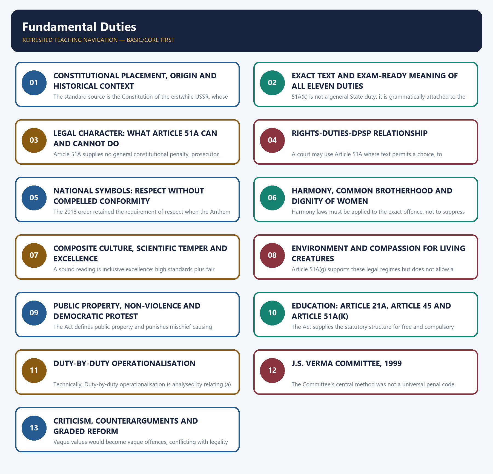

*Distinct embedded teaching-navigation image. The separate continuous Cārvāka-style flowchart package remains an independent at-a-glance artifact.*

### SESSION 1 — CONSTITUTIONAL PLACEMENT, ORIGIN AND HISTORICAL CONTEXT
#### DEFINITION / WHAT THIS IS CALLED

**Plain-language definition:** "Borrowed from the USSR" is an origin tag, not a conclusion that Indian duties are identical in wording, number or legal force.

**Technical definition:** The standard source is the Constitution of the erstwhile USSR, whose constitutional tradition placed explicit emphasis on citizen obligations.

#### ANSWER-GRABBING OPENING — WRITE/ADAPT IN THE EXAM

> The duty is framed as providing opportunities for education to a child or ward aged six to fourteen; the constitutional clause itself does not prescribe a criminal punishment.

#### MUST-WRITE KEYWORDS

- **Constitutional placement**
- **origin**
- **historical context**
- **ten**
- **opportunities for education**
- **Close-option trap**

**How to use them:** Frame the answer through Constitutional placement; define origin, connect historical context with ten to explain the mechanism, and use opportunities for education for the decisive comparison or qualification.

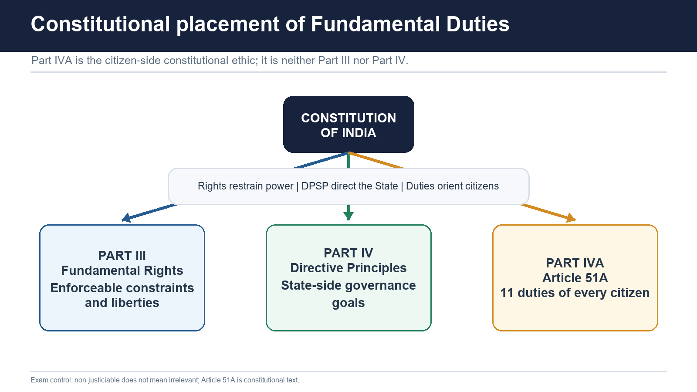

#### Original omission

- [FACT] The Constitution as commenced on 26 January 1950 contained no chapter titled Fundamental Duties.
- [FACT] It did contain enforceable Fundamental Rights in Part III and non-justiciable duties/goals of the State in Part IV.
- [ANALYSIS] The omission did not mean that citizenship was understood as duty-free. Ordinary law, civic morality and constitutional offices already carried obligations. The later amendment constitutionalised a selected citizen-side ethic in a single article.

#### Source and comparative caveat

- [FACT] The standard source is the Constitution of the erstwhile USSR, whose constitutional tradition placed explicit emphasis on citizen obligations.
- [LIMIT] "Borrowed from the USSR" is an origin tag, not a conclusion that Indian duties are identical in wording, number or legal force.
- [ANALYSIS] India's model filters the idea through constitutional democracy: duties cannot erase political opposition, religious conscience, expression, due process or judicial review.
- [FACT] The local source notes that major democracies such as the United States, Canada, France, Germany and Australia do not conventionally carry a comparable single list; Japan is often identified as a notable democratic constitution containing citizen duties.
- [LIMIT] Comparative constitutional texts distribute obligations in different forms. The safe Prelims statement is the source tag; the safe Mains statement is that express enumeration does not determine democratic quality or enforceability.

#### Emergency-era insertion

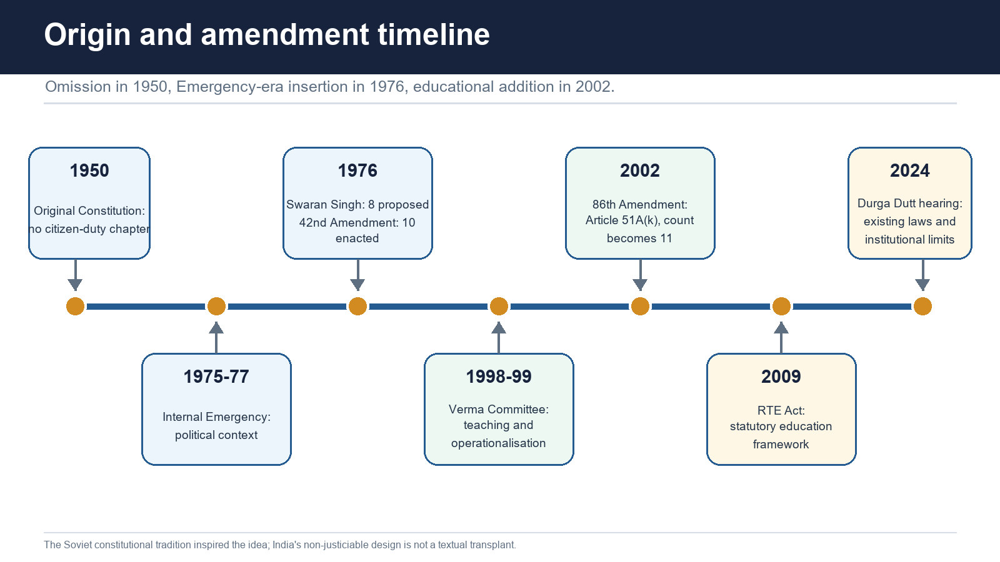

- [FACT] The need for a separate duty chapter was pressed during the Internal Emergency of 1975-77.
- [FACT] In 1976 the Congress Party constituted the Sardar Swaran Singh Committee.
- [FACT] The Committee recommended eight duties and a separate chapter.
- [FACT] The 42nd Amendment inserted Part IVA and Article 51A with **ten**, not eight, duties.
- [ANALYSIS] Emergency provenance creates a permanent legitimacy question: civic responsibility can support democracy, but a duty vocabulary may also be used to stigmatise dissent. This is why the rights firewall is essential.

#### Rejected Swaran Singh recommendations

The following Committee proposals were not enacted:

1. [FACT] Parliament may impose a penalty or punishment for non-compliance with a duty.
2. [FACT] A penalty law should not be questioned for violating a Fundamental Right or another constitutional provision.
3. [FACT] Paying taxes should be added as a Fundamental Duty.

[ANALYSIS] Rejection matters more than trivia. It preserved judicial review and declined to create a general punishment clause. Taxes remain mandatory under valid tax law, but paying tax is not an enumerated Article 51A duty.

#### The 86th Amendment

- [FACT] The Constitution (Eighty-sixth Amendment) Act, 2002 inserted Article 21A, substituted Article 45 and added Article 51A(k).
- [FACT] Article 51A(k) made the list eleven.
- [LIMIT] The duty is framed as providing **opportunities for education** to a child or ward aged six to fourteen; the constitutional clause itself does not prescribe a criminal punishment.

> **Close-option trap:** Swaran Singh recommended **8** -> 42nd Amendment enacted **10** -> 86th Amendment made the count **11**.

#### CLOSING RECALL FLOW — CONSTITUTIONAL PLACEMENT, ORIGIN AND HISTORICAL CONTEXT

```closure-flow
SUBTOPIC: Constitutional placement, origin and historical context
KEY TERMS / DEFINITIONS: Constitutional placement · origin · historical context · ten · opportunities for education · Close-option trap
MECHANISM / ARGUMENT: The duty is framed as providing opportunities for education to a child or ward aged six to fourteen; the constitutional clause itself does not prescribe a criminal punishment.
CONSEQUENCE / CONTRAST: A penalty law should not be questioned for violating a Fundamental Right or another constitutional provision.
UPSC TRAP / ANSWER-USE: The local source notes that major democracies such as the United States, Canada, France, Germany and Australia do not conventionally carry a comparable single list; Japan is often identified as a notable democratic constitution containing citizen duties.
ANSWER-GRABBING FORMULATION: The duty is framed as providing opportunities for education to a child or ward aged six to fourteen; the constitutional clause itself does not prescribe a criminal punishment.
```
### SESSION 2 — EXACT TEXT AND EXAM-READY MEANING OF ALL ELEVEN DUTIES
#### DEFINITION / WHAT THIS IS CALLED

**Plain-language definition:** 51A(k) is not a general State duty: it is grammatically attached to the citizen who is a parent or guardian.

**Technical definition:** 51A(k) is not a general State duty: it is grammatically attached to the citizen who is a parent or guardian.

#### ANSWER-GRABBING OPENING — WRITE/ADAPT IN THE EXAM

> Article 51A(k) places the educational duty on a citizen who is a parent or guardian, not on the State or every citizen indiscriminately.

#### MUST-WRITE KEYWORDS

- **Exact text**
- **exam-ready meaning of all eleven duties**
- **to safeguard public property and to abjure violence**
- **51A(a)**
- **51A(b)**
- **51A(c)**

**How to use them:** Frame the answer through Exact text; define exam-ready meaning of all eleven duties, connect to safeguard public property and to abjure violence with 51A(a) to explain the mechanism, and use 51A(b) for the decisive comparison or qualification.

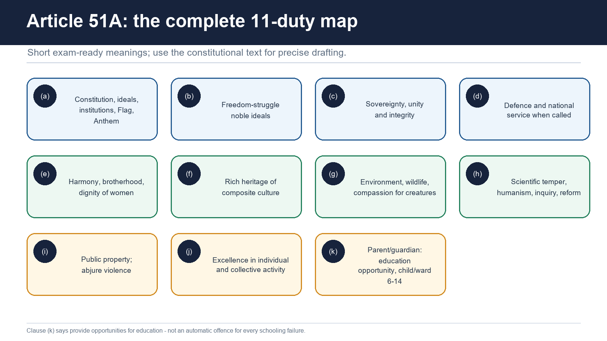

Article 51A begins: **"It shall be the duty of every citizen of India"**.

| Clause | Constitutional duty | Exam-ready meaning and limit |
|---|---|---|
| 51A(a) | **to abide by the Constitution and respect its ideals and institutions, the National Flag and the National Anthem** | Constitutional loyalty includes respect for democratic institutions and symbols. [LIMIT] Respect does not authorise every form of compelled expression; *Bijoe Emmanuel* protects respectful non-singing. |
| 51A(b) | **to cherish and follow the noble ideals which inspired our national struggle for freedom** | Recalls liberty, sacrifice, anti-colonialism and plural participation. [LIMIT] The Constitution does not supply one state-approved ideological list of all "noble ideals." |
| 51A(c) | **to uphold and protect the sovereignty, unity and integrity of India** | Supports national independence, territorial/constitutional unity and resistance to violent disintegration. [LIMIT] Criticism of government is not identical to an attack on India. |
| 51A(d) | **to defend the country and render national service when called upon to do so** | Creates a civic obligation if lawfully called. [LIMIT] It is not by itself a standing system of universal military conscription. |
| 51A(e) | **to promote harmony and the spirit of common brotherhood amongst all the people of India transcending religious, linguistic and regional or sectional diversities; to renounce practices derogatory to the dignity of women** | Two linked commands: social fraternity across difference and rejection of practices degrading women. [LIMIT] Liability depends on defined law, not the open-ended clause alone. |
| 51A(f) | **to value and preserve the rich heritage of our composite culture** | Protects India's layered, interactive and plural cultural inheritance. [LIMIT] "Composite" resists a single homogenised cultural test. |
| 51A(g) | **to protect and improve the natural environment including forests, lakes, rivers and wild life, and to have compassion for living creatures** | Combines ecological stewardship and animal compassion; works with Article 48A, statutes and Article 21 jurisprudence. |
| 51A(h) | **to develop the scientific temper, humanism and the spirit of inquiry and reform** | Requires evidence-minded inquiry, concern for human welfare and openness to reform. [LIMIT] It does not abolish freedom of conscience or permit punishment of belief without law. |
| 51A(i) | **to safeguard public property and to abjure violence** | Public assets belong to the community; political participation should reject violence. [LIMIT] Lawful protest and non-violent civil disagreement remain protected. |
| 51A(j) | **to strive towards excellence in all spheres of individual and collective activity so that the nation constantly rises to higher levels of endeavour and achievement** | Excellence is both personal and institutional, not merely elite examination rank. It supports quality, integrity and public capability. |
| 51A(k) | **who is a parent or guardian to provide opportunities for education to his child or, as the case may be, ward between the age of six and fourteen years** | Applies specifically to a parent or guardian and to the child/ward age band 6-14. Read with Articles 21A and 45 and the RTE Act. |

#### Clause-pair controls

- 51A(a) = Constitution, institutions and national symbols; 51A(c) = sovereignty, unity and integrity.
- 51A(e) = harmony/common brotherhood **and** dignity of women; 51A(f) = composite cultural heritage.
- 51A(g) = environment **and** compassion for living creatures; 51A(h) = scientific temper, humanism, inquiry and reform.
- 51A(i) = public property **and** non-violence; 51A(j) = excellence.
- 51A(k) is not a general State duty: it is grammatically attached to the citizen who is a parent or guardian.

#### CLOSING RECALL FLOW — EXACT TEXT AND EXAM-READY MEANING OF ALL ELEVEN DUTIES

```closure-flow
SUBTOPIC: Exact text and exam-ready meaning of all eleven duties
KEY TERMS / DEFINITIONS: Exact text · exam-ready meaning of all eleven duties · to safeguard public property and to abjure violence · 51A(a) · 51A(b) · 51A(c)
MECHANISM / ARGUMENT: The operative mechanism is that 51A(k) is not a general State duty.
CONSEQUENCE / CONTRAST: The resulting consequence is that 51A(k) is not a general State duty.
UPSC TRAP / ANSWER-USE: Do not miss this limiting distinction: 51A(k) is not a general State duty.
ANSWER-GRABBING FORMULATION: Article 51A(k) places the educational duty on a citizen who is a parent or guardian, not on the State or every citizen indiscriminately.
```
### SESSION 3 — LEGAL CHARACTER: WHAT ARTICLE 51A CAN AND CANNOT DO
#### DEFINITION / WHAT THIS IS CALLED

**Plain-language definition:** "Non-self-executing" means the clause usually needs law, policy or interpretation to produce concrete legal consequences.

**Technical definition:** Article 51A supplies no general constitutional penalty, prosecutor, procedure or remedy.

#### ANSWER-GRABBING OPENING — WRITE/ADAPT IN THE EXAM

> The Constitution does not label clauses as "moral" or "civic." The classification is analytical, clauses overlap, and no legal conclusion automatically follows from the label.

#### MUST-WRITE KEYWORDS

- **Legal character**
- **what Article 51A can**
- **cannot do**
- **citizens of India**
- **Safe formulation**
- **Article 51A**

**How to use them:** Frame the answer through Legal character; define what Article 51A can, connect cannot do with citizens of India to explain the mechanism, and use Safe formulation for the decisive comparison or qualification.

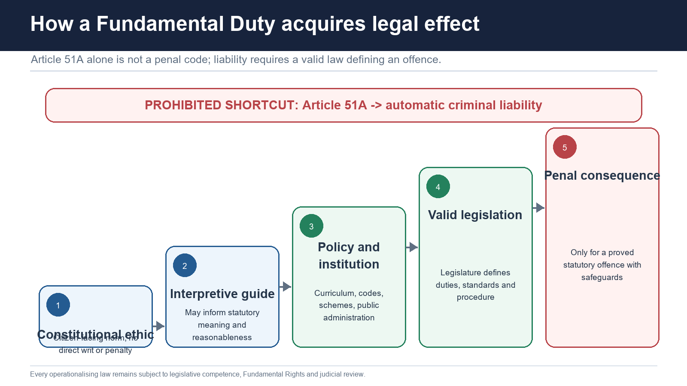

#### Citizens only

- [FACT] Fundamental Duties apply to **citizens of India**.
- [FACT] They do not extend to foreigners merely because they are present in India.
- [LIMIT] Foreigners remain bound by valid Indian law; the distinction concerns the constitutional addressee of Article 51A.

#### Non-justiciable and non-self-executing

- [FACT] A citizen cannot ordinarily be compelled by a writ simply because another person alleges breach of an Article 51A clause.
- [FACT] Article 51A supplies no general constitutional penalty, prosecutor, procedure or remedy.
- [ANALYSIS] "Non-self-executing" means the clause usually needs law, policy or interpretation to produce concrete legal consequences.

#### Moral and civic classification

- [FACT] The local source classifies some duties as moral and others as civic: freedom-struggle ideals are a moral example; respect for the Flag and Anthem is a civic example.
- [LIMIT] The Constitution does not label clauses as "moral" or "civic." The classification is analytical, clauses overlap, and no legal conclusion automatically follows from the label.

#### Legislative operationalisation

- [FACT] Parliament and State legislatures may enact valid laws that overlap with or give effect to duties, subject to legislative competence.
- [FACT] Such laws remain subject to Fundamental Rights, judicial review, due process and other constitutional limits.
- [ANALYSIS] The duty may help explain the law's constitutional purpose, but it does not cure a disproportionate, vague or incompetent enactment.

#### Criminal-liability firewall

- [FACT] Fundamental Duties cannot by themselves create criminal liability.
- A prosecutor must identify a valid offence, prove its statutory ingredients and follow the applicable criminal procedure.
- Article 51A cannot substitute for mens rea, actus reus, a prescribed punishment or fair trial.
- [ANALYSIS] This firewall prevents civic ideals from becoming unpredictable loyalty offences.

> **Safe formulation:** Fundamental Duties are constitutionally authoritative but directly non-enforceable; they acquire concrete effect through valid laws, institutions and interpretation.

#### CLOSING RECALL FLOW — LEGAL CHARACTER: WHAT ARTICLE 51A CAN AND CANNOT DO

```closure-flow
SUBTOPIC: Legal character: what Article 51A can and cannot do
KEY TERMS / DEFINITIONS: Legal character · what Article 51A can · cannot do · citizens of India · Safe formulation · Article 51A
MECHANISM / ARGUMENT: "Non-self-executing" means the clause usually needs law, policy or interpretation to produce concrete legal consequences.
CONSEQUENCE / CONTRAST: Safe formulation: Fundamental Duties are constitutionally authoritative but directly non-enforceable; they acquire concrete effect through valid laws, institutions and interpretation.
UPSC TRAP / ANSWER-USE: They do not extend to foreigners merely because they are present in India.
ANSWER-GRABBING FORMULATION: The Constitution does not label clauses as "moral" or "civic." The classification is analytical, clauses overlap, and no legal conclusion automatically follows from the label.
```
### SESSION 4 — RIGHTS-DUTIES-DPSP RELATIONSHIP
#### DEFINITION / WHAT THIS IS CALLED

**Plain-language definition:** Rights-Duties-DPSP relationship comprises Polity 07, Polity 08 and Social Justice as its core connected dimensions.

**Technical definition:** A court may use Article 51A where text permits a choice, to understand reasonableness, statutory purpose or relief.

#### ANSWER-GRABBING OPENING — WRITE/ADAPT IN THE EXAM

> Bijoe Emmanuel is the clearest control: respectful standing without singing the Anthem was protected by Articles 19(1)(a) and 25(1).

#### MUST-WRITE KEYWORDS

- **Rights-Duties-DPSP relationship**
- **Polity 07**
- **Polity 08**
- **Social Justice**
- **Polity 10/14**
- **Article 51A**

**How to use them:** Frame the answer through Rights-Duties-DPSP relationship; define Polity 07, connect Polity 08 with Social Justice to explain the mechanism, and use Polity 10/14 for the decisive comparison or qualification.

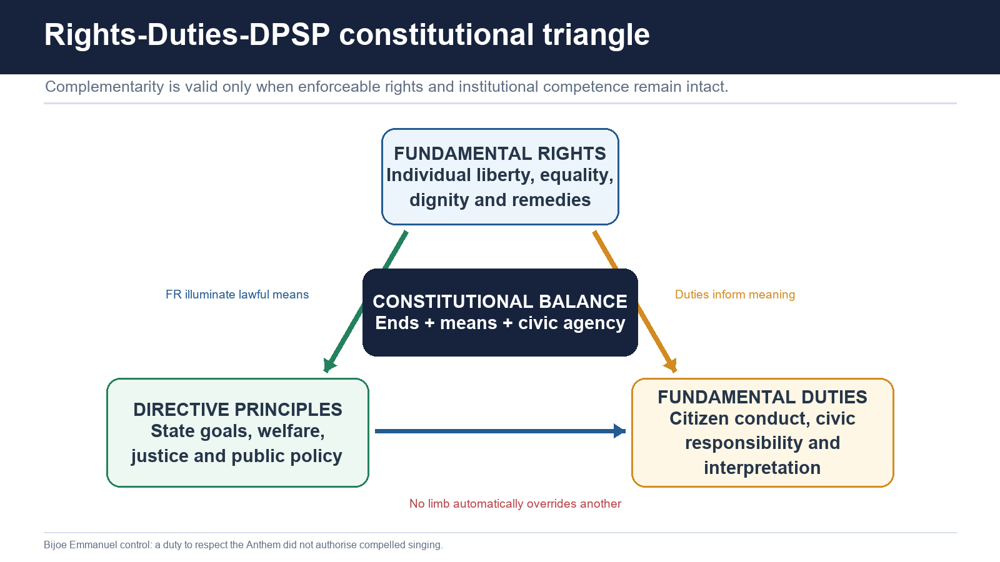

#### Complementarity

- [FACT] Fundamental Rights protect liberty, equality and remedies against public power.
- [FACT] Directive Principles direct State policy toward social and economic justice.
- [FACT] Fundamental Duties identify citizen-side responsibilities.
- [ANALYSIS] Rights create protected agency; duties orient its responsible exercise; DPSP direct institutions toward common welfare.

#### Interpretive use

- [FACT] In *AIIMS Students' Union v. AIIMS* (2001), the Supreme Court said duties, though not enforceable by writ, provide a valuable guide and aid to interpretation of constitutional and legal issues.
- [ANALYSIS] A court may use Article 51A where text permits a choice, to understand reasonableness, statutory purpose or relief.
- [LIMIT] Interpretive use cannot invent a new offence, delete an express right or replace a constitutional restriction ground.

#### Reasonable restrictions

- [FACT] A law genuinely advancing a duty may strengthen the State's claim that a restriction is reasonable.
- [LIMIT] Article 51A does not add new grounds to Article 19(2)-(6). The restriction must still fit the relevant constitutional clause, be imposed by law and satisfy proportionality/other applicable review.
- [ANALYSIS] Duties inform the justification; they do not end the inquiry.

#### Duties cannot override Fundamental Rights

- *Bijoe Emmanuel* is the clearest control: respectful standing without singing the Anthem was protected by Articles 19(1)(a) and 25(1).
- *Naveen Jindal* protected respectful Flag display as expression under Article 19(1)(a), while accepting lawful regulation and respect.
- [ANALYSIS] A democracy protects patriotism as expression and conscience; it does not equate every refusal to perform a preferred patriotic form with disrespect.

#### Cross-link discipline

- Detailed Fundamental Rights doctrine, grounds of restriction and proportionality -> **Polity 07**.
- Detailed DPSP text, Article 48A and welfare-state mechanism -> **Polity 08**.
- Education delivery, RTE implementation and vulnerable groups -> relevant **Social Justice** package.
- Amendment procedure and Emergency transformation -> **Polity 10/14** as mapped in the Polity sequence.
- This package retains the constitutional mechanism of duties and uses cross-links rather than duplicating full adjacent doctrines.

#### CLOSING RECALL FLOW — RIGHTS-DUTIES-DPSP RELATIONSHIP

```closure-flow
SUBTOPIC: Rights-Duties-DPSP relationship
KEY TERMS / DEFINITIONS: Rights-Duties-DPSP relationship · Polity 07 · Polity 08 · Social Justice · Polity 10/14 · Article 51A
MECHANISM / ARGUMENT: The restriction must still fit the relevant constitutional clause, be imposed by law and satisfy proportionality/other applicable review.
CONSEQUENCE / CONTRAST: Duties inform the justification; they do not end the inquiry.
UPSC TRAP / ANSWER-USE: A democracy protects patriotism as expression and conscience; it does not equate every refusal to perform a preferred patriotic form with disrespect.
ANSWER-GRABBING FORMULATION: Bijoe Emmanuel is the clearest control: respectful standing without singing the Anthem was protected by Articles 19(1)(a) and 25(1).
```
### SESSION 5 — NATIONAL SYMBOLS: RESPECT WITHOUT COMPELLED CONFORMITY
#### DEFINITION / WHAT THIS IS CALLED

**Plain-language definition:** The Court held that flying the National Flag freely with respect and dignity is expression protected by Article 19(1)(a).

**Technical definition:** The 2018 order retained the requirement of respect when the Anthem is played or sung on specified occasions under prevailing law/executive orders, with disability exemptions continuing pending competent-authority decisions.

#### ANSWER-GRABBING OPENING — WRITE/ADAPT IN THE EXAM

> Constitutional patriotism protects the symbols of the Republic while refusing to reduce civic loyalty to a single compelled performance.

#### MUST-WRITE KEYWORDS

- **National symbols**
- **respect without compelled conformity**
- **respect**
- **compelled vocal participation**
- **not mandatory, but optional or directory**
- **Qualified verdict**

**How to use them:** Frame the answer through National symbols; define respect without compelled conformity, connect respect with compelled vocal participation to explain the mechanism, and use not mandatory, but optional or directory for the decisive comparison or qualification.

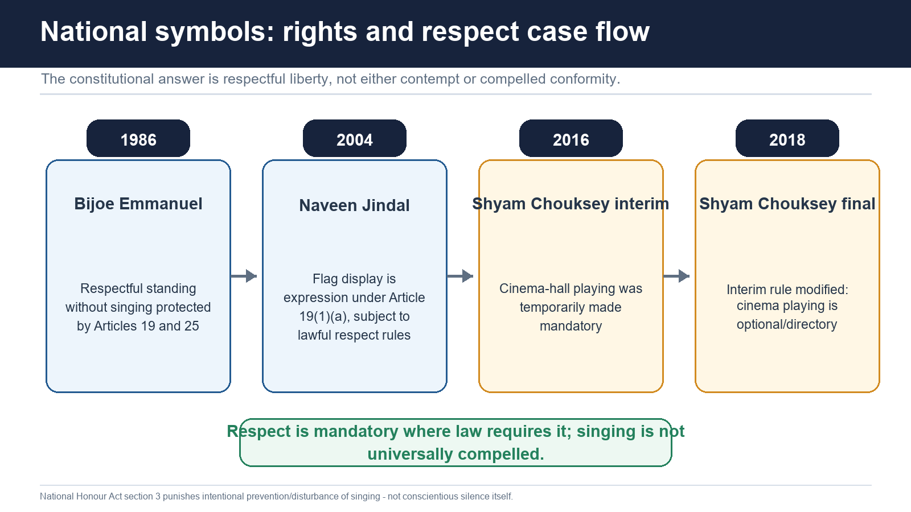

#### Statutory and executive framework

- [FACT] Section 2 of the Prevention of Insults to National Honour Act, 1971 punishes specified public disrespect to the Constitution and Indian National Flag.
- [FACT] Its explanation preserves criticism of the Constitution or Flag, or advocacy of lawful alteration, when it does not amount to the prohibited disrespect.
- [FACT] Section 3 punishes intentionally preventing the singing of the National Anthem or causing disturbance to an assembly engaged in such singing.
- [LIMIT] Section 3 does not make every failure to sing an offence.
- [FACT] The Flag Code of India, 2002 is the principal executive code governing respectful display. *Naveen Jindal* held that the Code is not "law" under Article 13 for restricting Article 19, though its respect-and-dignity norms deserve observance and statutory laws regulate misuse.

#### *Bijoe Emmanuel v. State of Kerala* (1986)

- [FACT] Jehovah's Witness schoolchildren stood respectfully but did not sing the Anthem because of honestly held religious belief.
- [FACT] Their expulsion violated Articles 19(1)(a) and 25(1).
- [FACT] The Court found no disrespect and no law compelling them to sing in the circumstances.
- [ANALYSIS] The case distinguishes **respect** from **compelled vocal participation**.
- [LIMIT] It does not protect disruption, insult or prevention of others' singing.

#### *Union of India v. Naveen Jindal* (2004)

- [FACT] The Court held that flying the National Flag freely with respect and dignity is expression protected by Article 19(1)(a).
- [FACT] The right is qualified, not absolute, and is regulated by the Emblems and Names (Prevention of Improper Use) Act, 1950 and the 1971 National Honour Act.
- [FACT] Parts IV and IVA may be considered in balancing rights and regulatory measures.
- [ANALYSIS] The Flag is both a protected medium of citizenship expression and an object of legally protected respect.

#### *Shyam Narayan Chouksey v. Union of India*

- [FACT] An interim order dated 30 November 2016 made playing the Anthem before feature films in cinema halls mandatory.
- [FACT] The final order dated 9 January 2018 modified that direction: cinema-hall playing became **not mandatory, but optional or directory**.
- [FACT] The 2018 order retained the requirement of respect when the Anthem is played or sung on specified occasions under prevailing law/executive orders, with disability exemptions continuing pending competent-authority decisions.
- [LIMIT] Do not reproduce the superseded 2016 interim command as the current rule.

> **Qualified verdict:** Constitutional patriotism protects the symbols of the Republic while refusing to reduce patriotism to one compulsory performance.

#### CLOSING RECALL FLOW — NATIONAL SYMBOLS: RESPECT WITHOUT COMPELLED CONFORMITY

```closure-flow
SUBTOPIC: National symbols: respect without compelled conformity
KEY TERMS / DEFINITIONS: National symbols · respect without compelled conformity · respect · compelled vocal participation · not mandatory, but optional or directory · Qualified verdict
MECHANISM / ARGUMENT: The right is qualified, not absolute, and is regulated by the Emblems and Names (Prevention of Improper Use) Act, 1950 and the 1971 National Honour Act.
CONSEQUENCE / CONTRAST: Its explanation preserves criticism of the Constitution or Flag, or advocacy of lawful alteration, when it does not amount to the prohibited disrespect.
UPSC TRAP / ANSWER-USE: Naveen Jindal held that the Code is not "law" under Article 13 for restricting Article 19, though its respect-and-dignity norms deserve observance and statutory laws regulate misuse.
ANSWER-GRABBING FORMULATION: Constitutional patriotism protects the symbols of the Republic while refusing to reduce civic loyalty to a single compelled performance.
```
### SESSION 6 — HARMONY, COMMON BROTHERHOOD AND DIGNITY OF WOMEN
#### DEFINITION / WHAT THIS IS CALLED

**Plain-language definition:** Harmony without women's dignity would preserve hierarchy, not constitutional brotherhood.

**Technical definition:** Harmony laws must be applied to the exact offence, not to suppress unpopular but lawful argument.

#### ANSWER-GRABBING OPENING — WRITE/ADAPT IN THE EXAM

> Harmony laws must be applied to the exact offence, not to suppress unpopular but lawful argument.

#### MUST-WRITE KEYWORDS

- **Harmony**
- **common brotherhood**
- **dignity of women**
- **Article 51A**
- **The clause**
- **The Scheduled Castes**

**How to use them:** Frame the answer through Harmony; define common brotherhood, connect dignity of women with Article 51A to explain the mechanism, and use The clause for the decisive comparison or qualification.

#### Constitutional meaning of 51A(e)

- The clause is anti-sectarian: fraternity must transcend religious, linguistic, regional and sectional differences.
- The second limb requires citizens to renounce practices derogatory to women's dignity.
- [ANALYSIS] The two limbs connect fraternity with equal civic status. Harmony without women's dignity would preserve hierarchy, not constitutional brotherhood.

#### Illustrative statutory overlap

- [FACT] The Protection of Civil Rights Act, 1955 punishes the preaching/practice of untouchability and enforcement of disabilities arising from it.
- [FACT] The Scheduled Castes and the Scheduled Tribes (Prevention of Atrocities) Act, 1989 defines atrocities, provides Special Courts and includes victim-relief and witness-protection architecture.
- [FACT] BNS section 196 addresses promoting enmity between groups and acts prejudicial to harmony; section 197 addresses imputations/assertions prejudicial to national integration.
- [FACT] Representation of the People Act, 1951 section 123(3) treats specified religious/racial/caste/community/language appeals for votes as corrupt practice; section 123(3A) covers promotion or attempted promotion of enmity/hatred on specified group grounds in the electoral context.
- Laws on domestic violence, workplace sexual harassment, dowry and defined sexual offences overlap with the dignity limb.
- [LIMIT] These enactments arise from their own constitutional fields and legislative purposes. It is inaccurate to say that every anti-discrimination or women's law was enacted "under Article 51A(e)."

#### Enforcement and speech caution

- Harmony laws must be applied to the exact offence, not to suppress unpopular but lawful argument.
- Political disagreement, satire or criticism does not become criminal merely because someone labels it "disharmonious."
- [ANALYSIS] The best constitutional test joins fraternity with equality, speech and due process.

#### CLOSING RECALL FLOW — HARMONY, COMMON BROTHERHOOD AND DIGNITY OF WOMEN

```closure-flow
SUBTOPIC: Harmony, common brotherhood and dignity of women
KEY TERMS / DEFINITIONS: Harmony · common brotherhood · dignity of women · Article 51A · The clause · The Scheduled Castes
MECHANISM / ARGUMENT: Political disagreement, satire or criticism does not become criminal merely because someone labels it "disharmonious." The best constitutional test joins fraternity with equality, speech and due process.
CONSEQUENCE / CONTRAST: Harmony laws must be applied to the exact offence, not to suppress unpopular but lawful argument.
UPSC TRAP / ANSWER-USE: Do not miss this limiting distinction: the second limb requires citizens to renounce practices derogatory to women's dignity.
ANSWER-GRABBING FORMULATION: Harmony laws must be applied to the exact offence, not to suppress unpopular but lawful argument.
```
### SESSION 7 — COMPOSITE CULTURE, SCIENTIFIC TEMPER AND EXCELLENCE
#### DEFINITION / WHAT THIS IS CALLED

**Plain-language definition:** Scientific temper is a method: ask, test, revise and distinguish evidence from assertion.

**Technical definition:** A sound reading is inclusive excellence: high standards plus fair opportunity and public purpose.

#### ANSWER-GRABBING OPENING — WRITE/ADAPT IN THE EXAM

> The clause does not create a judicially enforceable right to a particular rank, promotion or institutional outcome.

#### MUST-WRITE KEYWORDS

- **Composite culture**
- **scientific temper**
- **excellence**
- **our composite culture**
- **Article 49**
- **Article 51A**

**How to use them:** Frame the answer through Composite culture; define scientific temper, connect excellence with our composite culture to explain the mechanism, and use Article 49 for the decisive comparison or qualification.

#### Composite culture: 51A(f)

- [FACT] The clause uses **our composite culture**.
- [ANALYSIS] "Composite" points to interaction, borrowing, coexistence and layered belonging across regions, languages, faiths and communities.
- Heritage institutions, museums, archives, the Archaeological Survey of India, conservation laws and community custodians provide operational examples.
- The Ancient Monuments and Archaeological Sites and Remains Act, 1958 supplies one legal conservation route; Article 49 supplies the connected State directive.
- [LIMIT] Preservation cannot be reduced to freezing culture. Living traditions change, and heritage protection must respect community rights and constitutional equality.

#### Scientific temper, humanism, inquiry and reform: 51A(h)

- Scientific temper is a method: ask, test, revise and distinguish evidence from assertion.
- Humanism prevents scientific capacity from becoming ethically indifferent to human dignity.
- Inquiry and reform connect knowledge with correction of harmful practices.
- Institutional examples include research universities, CSIR laboratories, public-health evidence systems, science communication and classroom experimentation.
- [ANALYSIS] The current tension is misinformation: constitutional response should combine media literacy, transparent evidence, independent research and proportionate law.
- [LIMIT] Article 51A(h) is not a licence to criminalise faith, philosophy or cultural practice merely because the State calls it "unscientific."

#### Excellence: 51A(j)

- Excellence covers individual and collective activity, linking personal effort with institutional quality.
- [FACT] *AIIMS Students' Union* used Article 51A(j) while evaluating institutional preference and merit in a national institution, and described duties as interpretive guides.
- [ANALYSIS] A sound reading is inclusive excellence: high standards plus fair opportunity and public purpose.
- [LIMIT] The clause does not create a judicially enforceable right to a particular rank, promotion or institutional outcome.

#### CLOSING RECALL FLOW — COMPOSITE CULTURE, SCIENTIFIC TEMPER AND EXCELLENCE

```closure-flow
SUBTOPIC: Composite culture, scientific temper and excellence
KEY TERMS / DEFINITIONS: Composite culture · scientific temper · excellence · our composite culture · Article 49 · Article 51A
MECHANISM / ARGUMENT: Article 51A(h) is not a licence to criminalise faith, philosophy or cultural practice merely because the State calls it "unscientific.".
CONSEQUENCE / CONTRAST: The clause does not create a judicially enforceable right to a particular rank, promotion or institutional outcome.
UPSC TRAP / ANSWER-USE: Do not miss this limiting distinction: the clause uses our composite culture.
ANSWER-GRABBING FORMULATION: The clause does not create a judicially enforceable right to a particular rank, promotion or institutional outcome.
```
### SESSION 8 — ENVIRONMENT AND COMPASSION FOR LIVING CREATURES
#### DEFINITION / WHAT THIS IS CALLED

**Plain-language definition:** Environmental decisions have also been connected with Article 21's protection of life.

**Technical definition:** Article 51A(g) supports these legal regimes but does not allow a private citizen to impose an extra-statutory punishment on another.

#### ANSWER-GRABBING OPENING — WRITE/ADAPT IN THE EXAM

> Article 51A(g) supports these legal regimes but does not allow a private citizen to impose an extra-statutory punishment on another.

#### MUST-WRITE KEYWORDS

- **Environment**
- **compassion for living creatures**
- **Current-law trap**
- **Article 51A**
- **Article 48A**
- **Article 21**

**How to use them:** Frame the answer through Environment; define compassion for living creatures, connect Current-law trap with Article 51A to explain the mechanism, and use Article 48A for the decisive comparison or qualification.

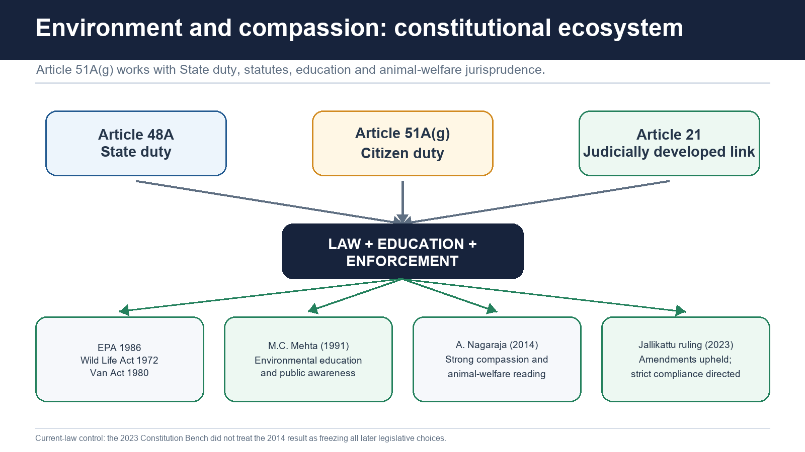

#### Constitutional ecosystem

- Article 48A directs the State to protect and improve the environment and safeguard forests and wildlife.
- Article 51A(g) addresses every citizen.
- Environmental decisions have also been connected with Article 21's protection of life.
- [ANALYSIS] The three provisions distribute responsibility: State policy, citizen conduct and rights-based judicial protection.

#### Statutory vehicles

- [FACT] Environment (Protection) Act, 1986: umbrella Central powers to protect/improve environmental quality and prevent/control/abate pollution.
- [FACT] Wild Life (Protection) Act, 1972: protection of wild animals, birds and plants, protected areas, regulation of hunting and trade, and ecological security.
- [FACT] Van (Sanrakshan Evam Samvardhan) Adhiniyam, 1980: current official title of the former Forest (Conservation) Act; regulates specified use/diversion of forest land through the statutory framework.
- [LIMIT] Article 51A(g) supports these legal regimes but does not allow a private citizen to impose an extra-statutory punishment on another.

#### *M.C. Mehta v. Union of India* (1991)

- [FACT] The Supreme Court connected environmental protection with public awareness and Article 51A(g).
- [FACT] It directed environmental messages in cinema exhibitions/broadcast media and accepted graded compulsory environmental education through schools, boards, universities and the UGC.
- [ANALYSIS] The case demonstrates operationalisation through education and administration rather than only punishment.

#### *Animal Welfare Board of India v. A. Nagaraja* (2014)

- [FACT] The Court read the Prevention of Cruelty to Animals Act with Articles 51A(g) and (h), emphasising compassion and animal welfare, and invalidated the then legal arrangement permitting Jallikattu/bullock-cart events.
- [ANALYSIS] The judgment gave Article 51A(g) unusually strong interpretive weight.

#### 2023 Jallikattu constitutional development

- [FACT] On 18 May 2023 a five-judge Bench upheld the Tamil Nadu, Maharashtra and Karnataka amendment regimes.
- [FACT] It held that the amended laws/rules substantially addressed the statutory defects identified earlier; the Tamil Nadu law did not violate Articles 51A(g) or (h), Article 14 or Article 21.
- [FACT] The Court directed strict enforcement by District Magistrates/competent authorities.
- [LIMIT] The 2023 decision did not deny the importance of compassion. It held that amended legislation and rules changed the legal setting and that cultural character was primarily for the legislature, while unlawful cruelty would still attract law.

> **Current-law trap:** Cite *A. Nagaraja* for the strong 2014 welfare reading, but add the 2023 Constitution Bench control before stating the present Jallikattu position.

#### CLOSING RECALL FLOW — ENVIRONMENT AND COMPASSION FOR LIVING CREATURES

```closure-flow
SUBTOPIC: Environment and compassion for living creatures
KEY TERMS / DEFINITIONS: Environment · compassion for living creatures · Current-law trap · Article 51A · Article 48A · Article 21
MECHANISM / ARGUMENT: Van (Sanrakshan Evam Samvardhan) Adhiniyam, 1980: current official title of the former Forest (Conservation) Act; regulates specified use/diversion of forest land through the statutory framework.
CONSEQUENCE / CONTRAST: It held that amended legislation and rules changed the legal setting and that cultural character was primarily for the legislature, while unlawful cruelty would still attract law.
UPSC TRAP / ANSWER-USE: Do not miss this limiting distinction: environmental decisions have also been connected with Article 21's protection of life.
ANSWER-GRABBING FORMULATION: Article 51A(g) supports these legal regimes but does not allow a private citizen to impose an extra-statutory punishment on another.
```
### SESSION 9 — PUBLIC PROPERTY, NON-VIOLENCE AND DEMOCRATIC PROTEST
#### DEFINITION / WHAT THIS IS CALLED

**Plain-language definition:** "Abjure violence" is broader than property damage, but it does not erase the right to assemble peacefully or protest.

**Technical definition:** The Act defines public property and punishes mischief causing damage; aggravated treatment applies where fire or explosive substance is used.

#### ANSWER-GRABBING OPENING — WRITE/ADAPT IN THE EXAM

> "Abjure violence" is broader than property damage, but it does not erase the right to assemble peacefully or protest.

#### MUST-WRITE KEYWORDS

- **Public property**
- **non-violence**
- **democratic protest**
- **Article 51A**
- **"Abjure violence"**
- **Abjure**

**How to use them:** Frame the answer through Public property; define non-violence, connect democratic protest with Article 51A to explain the mechanism, and use "Abjure violence" for the decisive comparison or qualification.

#### Article 51A(i)

- Public property includes assets held for public use or public purpose: transport, schools, hospitals, utilities, offices and infrastructure.
- "Abjure violence" is broader than property damage, but it does not erase the right to assemble peacefully or protest.

#### Prevention of Damage to Public Property Act, 1984

- [FACT] The Act defines public property and punishes mischief causing damage; aggravated treatment applies where fire or explosive substance is used.
- [FACT] Liability follows the statute and general criminal-law requirements.
- [LIMIT] Presence at a protest does not automatically prove individual guilt. Identification, causation, evidence, fair procedure and proportional recovery remain necessary.

#### Enforcement gap and democratic limit

- Damage during mass protest may be hard to attribute; prevention, video evidence, command responsibility under valid law, prompt prosecution and civil recovery mechanisms may be considered.
- [ANALYSIS] The State must distinguish violent destruction from lawful dissent. Criminalising the protest itself would invert Article 51A(i), which asks citizens to reject violence, not democracy.

#### CLOSING RECALL FLOW — PUBLIC PROPERTY, NON-VIOLENCE AND DEMOCRATIC PROTEST

```closure-flow
SUBTOPIC: Public property, non-violence and democratic protest
KEY TERMS / DEFINITIONS: Public property · non-violence · democratic protest · Article 51A · "Abjure violence" · Abjure
MECHANISM / ARGUMENT: Public property includes assets held for public use or public purpose: transport, schools, hospitals, utilities, offices and infrastructure.
CONSEQUENCE / CONTRAST: Criminalising the protest itself would invert Article 51A(i), which asks citizens to reject violence, not democracy.
UPSC TRAP / ANSWER-USE: Presence at a protest does not automatically prove individual guilt.
ANSWER-GRABBING FORMULATION: "Abjure violence" is broader than property damage, but it does not erase the right to assemble peacefully or protest.
```
### SESSION 10 — EDUCATION: ARTICLE 21A, ARTICLE 45 AND ARTICLE 51A(K)
#### DEFINITION / WHAT THIS IS CALLED

**Plain-language definition:** The constitutional wording is opportunity-centred and the RTE framework does not make Article 51A(k) a free-standing penal offence.

**Technical definition:** The Act supplies the statutory structure for free and compulsory elementary education.

#### ANSWER-GRABBING OPENING — WRITE/ADAPT IN THE EXAM

> The constitutional wording is opportunity-centred and the RTE framework does not make Article 51A(k) a free-standing penal offence.

#### MUST-WRITE KEYWORDS

- **Education**
- **Article 21A**
- **Article 45**
- **Article 51A(k)**
- **Fundamental Right**
- **Early childhood care and education until age 6**

**How to use them:** Frame the answer through Education; define Article 21A, connect Article 45 with Article 51A(k) to explain the mechanism, and use Fundamental Right for the decisive comparison or qualification.

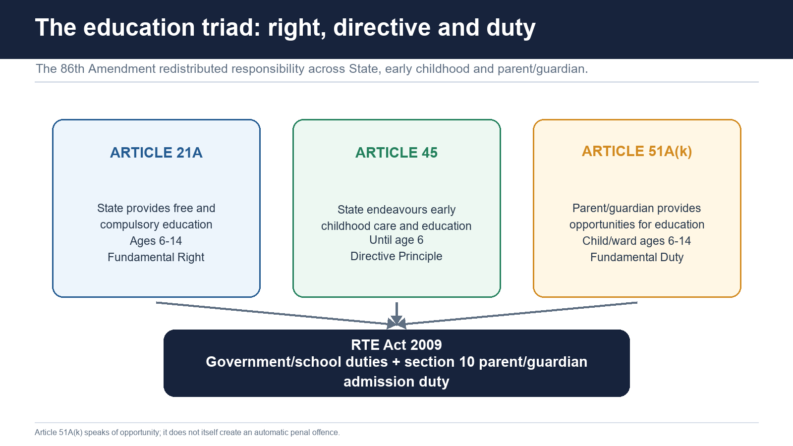

#### The three provisions

| Provision | Addressee | Age/field | Legal character |
|---|---|---|---|
| Article 21A | State | Free and compulsory education, ages 6-14, as law determines | Fundamental Right |
| Article 45 | State | Early childhood care and education until age 6 | Directive Principle |
| Article 51A(k) | Citizen who is parent/guardian | Opportunities for education to child/ward ages 6-14 | Fundamental Duty |

#### RTE Act, 2009

- [FACT] The Act supplies the statutory structure for free and compulsory elementary education.
- [FACT] Section 10 states that every parent or guardian has the duty to admit or cause the child/ward to be admitted to elementary education in the neighbourhood school.
- [LIMIT] Article 51A(k) and section 10 must be read with the State's much larger duties to provide access, schools, teachers, non-discrimination and a functioning system.
- [ANALYSIS] Poverty, disability, migration, school absence or administrative exclusion cannot be converted into automatic parental criminality. The constitutional wording is opportunity-centred and the RTE framework does not make Article 51A(k) a free-standing penal offence.

#### Accountability design

- State: supply, finance, standards and non-discriminatory access.
- School/local authority: admission, inclusion, teachers and neighbourhood delivery.
- Parent/guardian: enable admission and opportunity, subject to real capacity and State provision.
- [ANALYSIS] The triad prevents both extremes: treating education only as a family burden or only as a passive State promise.

#### CLOSING RECALL FLOW — EDUCATION: ARTICLE 21A, ARTICLE 45 AND ARTICLE 51A(K)

```closure-flow
SUBTOPIC: Education: Article 21A, Article 45 and Article 51A(k)
KEY TERMS / DEFINITIONS: Education · Article 21A · Article 45 · Article 51A(k) · Fundamental Right · Early childhood care and education until age 6
MECHANISM / ARGUMENT: Section 10 states that every parent or guardian has the duty to admit or cause the child/ward to be admitted to elementary education in the neighbourhood school.
CONSEQUENCE / CONTRAST: The Act supplies the statutory structure for free and compulsory elementary education.
UPSC TRAP / ANSWER-USE: Do not miss this limiting distinction: article 51A(k) and section 10 must be read with the State's much larger duties...
ANSWER-GRABBING FORMULATION: The constitutional wording is opportunity-centred and the RTE framework does not make Article 51A(k) a free-standing penal offence.
```
### SESSION 11 — DUTY-BY-DUTY OPERATIONALISATION
#### DEFINITION / WHAT THIS IS CALLED

**Plain-language definition:** The table maps overlap and operationalisation.

**Technical definition:** Technically, Duty-by-duty operationalisation is analysed by relating (a) Constitution/symbols to Statute, executive code, civic education, then testing the relationship through (b) Freedom ideals and Education, archives, commemorative institutions.

#### ANSWER-GRABBING OPENING — WRITE/ADAPT IN THE EXAM

> Laws may operationalise Fundamental Duties, but their validity and purpose cannot be attributed solely to Article 51A.

#### MUST-WRITE KEYWORDS

- **Duty-by-duty operationalisation**
- **(a) Constitution/symbols**
- **Statute, executive code, civic education**
- **(b) Freedom ideals**
- **Education, archives, commemorative institutions**
- **Curricula, museums, memorials, public history**

**How to use them:** Frame the answer through Duty-by-duty operationalisation; define (a) Constitution/symbols, connect Statute, executive code, civic education with (b) Freedom ideals to explain the mechanism, and use Education, archives, commemorative institutions for the decisive comparison or qualification.

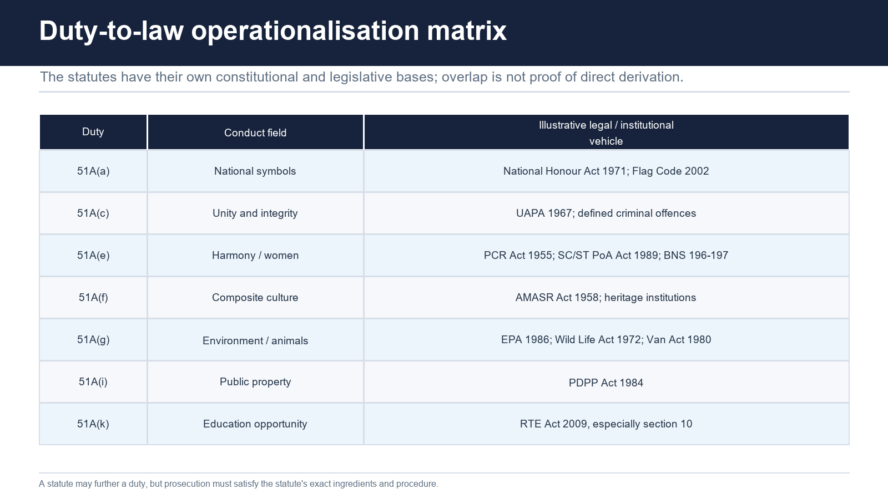

| Duty | Main operational route | Named examples | Essential caution |
|---|---|---|---|
| (a) Constitution/symbols | Statute, executive code, civic education | 1971 National Honour Act; Flag Code; *Bijoe*, *Naveen*, *Shyam* | Respect is not universal compelled singing |
| (b) Freedom ideals | Education, archives, commemorative institutions | Curricula, museums, memorials, public history | No single compulsory party narrative |
| (c) Sovereignty/unity/integrity | Security and criminal laws | UAPA; defined offences including verified BNS national-integration fields | Government criticism is not anti-India by definition |
| (d) Defence/national service | Lawful call and defence institutions | Armed forces/reserve/civil-defence frameworks as applicable | No self-executing general conscription |
| (e) Harmony/women's dignity | Civil-rights, atrocities, electoral, criminal and protective laws | PCR Act; SC/ST PoA Act; RPA 123(3)/(3A); BNS 196/197; women-protection laws | Each offence needs its own ingredients |
| (f) Composite culture | Conservation, archives, cultural bodies | AMASR Act; ASI; museums; community heritage | Plural preservation, not homogenisation |
| (g) Environment/compassion | Environmental and animal-welfare law; education | EPA; Wild Life Act; Van Act; PCA Act; *M.C. Mehta*; *A. Nagaraja* | Add the 2023 Jallikattu control |
| (h) Scientific temper | Education, research, public communication | Schools, universities, CSIR, public-health evidence | No state monopoly over thought |
| (i) Public property/non-violence | Penal law, prevention, recovery and evidence | PDPP Act 1984 | Lawful dissent remains protected |
| (j) Excellence | Standards, institutional governance, professional ethics | *AIIMS Students' Union*; accreditation and quality systems | Excellence must remain rights-compatible |
| (k) Education | Rights/statute/administration/family support | Articles 21A/45; RTE Act section 10 | Opportunity, not automatic penal guilt |

[LIMIT] The table maps overlap and operationalisation. It does not claim that each listed law's sole or direct constitutional source is Article 51A.

#### CLOSING RECALL FLOW — DUTY-BY-DUTY OPERATIONALISATION

```closure-flow
SUBTOPIC: Duty-by-duty operationalisation
KEY TERMS / DEFINITIONS: Duty-by-duty operationalisation · (a) Constitution/symbols · Statute, executive code, civic education · (b) Freedom ideals · Education, archives, commemorative institutions · Curricula, museums, memorials, public history
MECHANISM / ARGUMENT: It does not claim that each listed law's sole or direct constitutional source is Article 51A.
CONSEQUENCE / CONTRAST: The resulting consequence is that it does not claim that each listed law's sole or direct constitutional source is...
UPSC TRAP / ANSWER-USE: Do not miss this limiting distinction: it does not claim that each listed law's sole or direct constitutional source is...
ANSWER-GRABBING FORMULATION: Laws may operationalise Fundamental Duties, but their validity and purpose cannot be attributed solely to Article 51A.
```
### SESSION 12 — J.S. VERMA COMMITTEE, 1999
#### DEFINITION / WHAT THIS IS CALLED

**Plain-language definition:** transformation of school and teacher-education curricula so citizenship values are understood as a combination of rights and duties; strict compliance with existing environmental laws and judicial directions; strengthening, monitoring and evaluating NGO work on integration, harmony, culture, values and environment; advocacy and sensitisation, including display of the Preamble and Article 51A in government publications and public places in Indian languages; printing the Preamble and duties in school textbooks, supplementary material and NCERT/State publications; short presentations on the intent of each duty in school and teacher-education morning assemblies; regular seminars, debates and competitions in schools, colleges and universities; a Fundamental Duties sensitisation module in in-service teacher training and inclusion in the teacher-education foundation course; radio and video spots in regional languages through public broadcasters and innovative media professionals; and observing 3 January, when Article 51A came into force, as Fundamental Duties Day.

**Technical definition:** The Committee's central method was not a universal penal code.

#### ANSWER-GRABBING OPENING — WRITE/ADAPT IN THE EXAM

> Because clause (k) was added only in 2002, the report reproduced and discussed the then-existing ten duties.

#### MUST-WRITE KEYWORDS

- **J.S. Verma Committee**
- **ten**
- **not**
- **Article 51A**
- **Its**
- **Interim Report**

**How to use them:** Frame the answer through J.S. Verma Committee; define ten, connect not with Article 51A to explain the mechanism, and use Its for the decisive comparison or qualification.

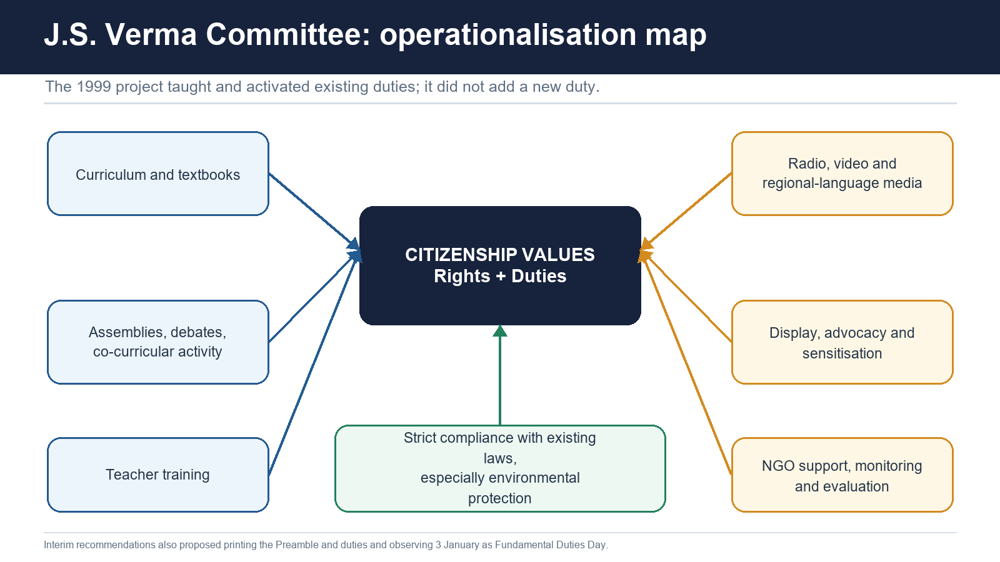

#### Mandate and historical control

- [FACT] The Government constituted the Committee in July 1998 under Justice J.S. Verma to operationalise suggestions for teaching Fundamental Duties to citizens.
- [FACT] Its 30 January 1999 Interim Report was titled *Operationalization of the Suggestions to Teach Fundamental Duties to the Citizens of the Country*.
- [FACT] Because clause (k) was added only in 2002, the report reproduced and discussed the then-existing **ten** duties.
- [LIMIT] The Committee did **not** add a Fundamental Duty. Only a constitutional amendment can alter Article 51A.

#### Exact defensible operationalisation programme

The Interim Report recommended:

1. transformation of school and teacher-education curricula so citizenship values are understood as a combination of rights and duties;
2. strict compliance with existing environmental laws and judicial directions;
3. strengthening, monitoring and evaluating NGO work on integration, harmony, culture, values and environment;
4. advocacy and sensitisation, including display of the Preamble and Article 51A in government publications and public places in Indian languages;
5. printing the Preamble and duties in school textbooks, supplementary material and NCERT/State publications;
6. short presentations on the intent of each duty in school and teacher-education morning assemblies;
7. regular seminars, debates and competitions in schools, colleges and universities;
8. a Fundamental Duties sensitisation module in in-service teacher training and inclusion in the teacher-education foundation course;
9. radio and video spots in regional languages through public broadcasters and innovative media professionals; and
10. observing 3 January, when Article 51A came into force, as Fundamental Duties Day.

#### Existing legal provisions identified

The standard source-backed list associated with the Committee included:

- Prevention of Insults to National Honour Act, 1971;
- criminal provisions against group enmity and assertions prejudicial to national integration;
- Protection of Civil Rights Act, 1955;
- UAPA, 1967;
- Representation of the People Act, 1951 provisions concerning religious appeals and promotion of enmity in elections;
- Wild Life (Protection) Act, 1972; and
- the forest-conservation statute now officially titled Van (Sanrakshan Evam Samvardhan) Adhiniyam, 1980.

#### Present-law update

- The committee-era IPC references must now be translated carefully into operative BNS provisions where applicable; sections 196 and 197 are the verified harmony/national-integration examples used here.
- Later laws such as the RTE Act, 2009 provide additional operational routes not available to the 1999 Committee.
- [ANALYSIS] The Committee's central method was not a universal penal code. It was citizenship education plus effective enforcement of already valid law.

#### CLOSING RECALL FLOW — J.S. VERMA COMMITTEE, 1999

```closure-flow
SUBTOPIC: J.S. Verma Committee, 1999
KEY TERMS / DEFINITIONS: J.S. Verma Committee · ten · not · Article 51A · Its · Interim Report
MECHANISM / ARGUMENT: Because clause (k) was added only in 2002, the report reproduced and discussed the then-existing ten duties.
CONSEQUENCE / CONTRAST: Its 30 January 1999 Interim Report was titled Operationalization of the Suggestions to Teach Fundamental Duties to the Citizens of the Country.
UPSC TRAP / ANSWER-USE: Do not miss this limiting distinction: transformation of school and teacher-education curricula so citizenship values are understood as a combination...
ANSWER-GRABBING FORMULATION: Because clause (k) was added only in 2002, the report reproduced and discussed the then-existing ten duties.
```
### SESSION 13 — CRITICISM, COUNTERARGUMENTS AND GRADED REFORM
#### DEFINITION / WHAT THIS IS CALLED

**Plain-language definition:** Cross-party retention does not immunise duties from criticism, but it weakens the claim that they are only a temporary partisan device.

**Technical definition:** Vague values would become vague offences, conflicting with legality and due process.

#### ANSWER-GRABBING OPENING — WRITE/ADAPT IN THE EXAM

> Cross-party retention does not immunise duties from criticism, but it weakens the claim that they are only a temporary partisan device.

#### MUST-WRITE KEYWORDS

- **Criticism**
- **counterarguments**
- **graded reform**
- **Non-exhaustive**
- **Vague**
- **Moral precepts**

**How to use them:** Frame the answer through Criticism; define counterarguments, connect graded reform with Non-exhaustive to explain the mechanism, and use Vague for the decisive comparison or qualification.

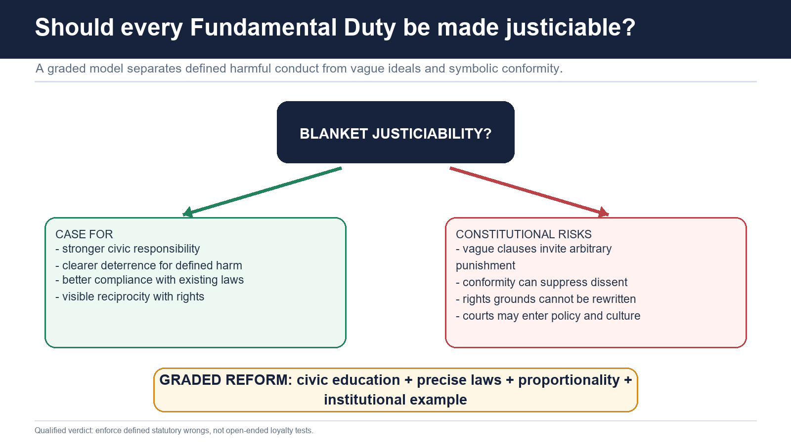

#### Main criticisms

1. **Non-exhaustive:** voting, paying taxes and other responsibilities are absent.
2. **Vague:** "noble ideals," "composite culture," "scientific temper" and "excellence" permit competing meanings.
3. **Moral precepts:** non-justiciability may make them appear symbolic.
4. **Superfluous:** law-abiding citizens may perform many duties without constitutional enumeration.
5. **Placement:** Part IVA after DPSP may visually subordinate duties to rights.
6. **Emergency provenance:** insertion during the Emergency raises concern about obedience-centred citizenship.
7. **Coercive misuse:** vague duty rhetoric may stigmatise dissent, minority identity or cultural difference.

#### Counterarguments

- Enumeration supplies a common civic vocabulary in a rights-conscious democracy.
- Duties guide interpretation and legislative purpose even without direct writ enforcement.
- Existing statutes already operationalise defined harms.
- The post-Emergency Janata Government reversed many 42nd-Amendment changes through the 43rd and 44th Amendments but retained Fundamental Duties.
- The 2002 education addition demonstrates later constitutional acceptance, not mere Emergency residue.
- [ANALYSIS] Cross-party retention does not immunise duties from criticism, but it weakens the claim that they are only a temporary partisan device.

#### Why blanket justiciability is constitutionally risky

- Vague values would become vague offences, conflicting with legality and due process.
- Courts would be asked to define contested culture, patriotism, scientific belief and excellence.
- A general duty clause could be used to bypass Article 19 restriction grounds.
- Penal enforcement could burden minorities and dissidents disproportionately.
- It could confuse citizen morality with State coercion and erase legislative choice.

#### Graded reform

1. **Civic education:** constitutional literacy, local-language materials, deliberative classroom practice and media literacy.
2. **Legislative clarity:** punish only defined harmful conduct through competent, precise law.
3. **Proportionality and due process:** protect speech, conscience, association and peaceful protest.
4. **Institutional example:** public authorities should model constitutional conduct, evidence, non-discrimination and protection of public property.
5. **Enforce existing laws:** better investigation, administration and access to justice rather than symbolic new offences.
6. **Periodic review:** update curricula and statutes for technology, misinformation, ecology and inclusion without altering constitutional text casually.

#### *Durga Dutt* institutional-control note

- [FACT] The official 11 September 2024 order asked the Attorney General for a synopsis of Central and State enactments that "effectuate and catalyse" different facets of Article 51A.
- [LIMIT] The written order did not hold that duties were enforceable, did not direct a comprehensive law and did not finally dispose of the litigation.
- [ANALYSIS] The hearing's reported separation-of-powers concern and the Verma Committee's verified awareness model support a graded route: citizen consciousness, education, existing laws and legislative judgment rather than a judicially drafted duty code.

#### CLOSING RECALL FLOW — CRITICISM, COUNTERARGUMENTS AND GRADED REFORM

```closure-flow
SUBTOPIC: Criticism, counterarguments and graded reform
KEY TERMS / DEFINITIONS: Criticism · counterarguments · graded reform · Non-exhaustive · Vague · Moral precepts
MECHANISM / ARGUMENT: The post-Emergency Janata Government reversed many 42nd-Amendment changes through the 43rd and 44th Amendments but retained Fundamental Duties.
CONSEQUENCE / CONTRAST: The 2002 education addition demonstrates later constitutional acceptance, not mere Emergency residue.
UPSC TRAP / ANSWER-USE: The written order did not hold that duties were enforceable, did not direct a comprehensive law and did not finally dispose of the litigation.
ANSWER-GRABBING FORMULATION: Cross-party retention does not immunise duties from criticism, but it weakens the claim that they are only a temporary partisan device.
```
### 14. GS-II answer architecture and source discipline

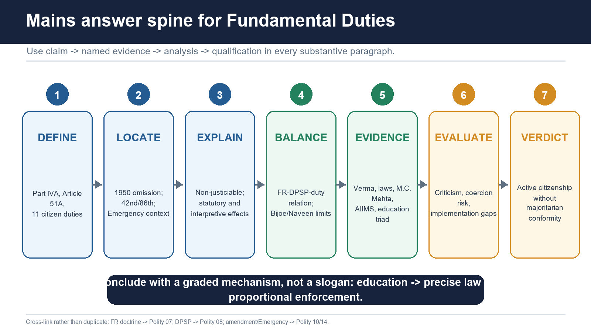

#### Universal answer spine

1. Define Part IVA/Article 51A and identify eleven citizen duties.
2. Locate the 1950 omission, 1976 insertion and 2002 addition.
3. Explain non-justiciability and the statute/interpretation mechanism.
4. Install the rights firewall with *Bijoe Emmanuel* and *Naveen Jindal*.
5. Add duty-specific law/case evidence.
6. Evaluate vagueness, Emergency provenance, civic utility and coercion risk.
7. Conclude with graded operationalisation, not blanket punishment.

#### Mark-scaled evidence

| Marks | Structure | Evidence expectation |
|---:|---|---|
| 10 | Definition -> status -> 2 applications -> limitation -> verdict | 2-3 named Articles/cases/laws |
| 15 | Origin -> exact mechanism -> rights balance -> implementation -> criticism/reform | 4-6 named evidence units |
| 20 | Full constitutional design -> duty clusters -> jurisprudence/statutes -> criticism/counter -> advanced citizenship verdict | 5-8 precise evidence units |

#### Qualified thesis bank

- Fundamental Duties are constitutionally weighted but directly non-justiciable; their legitimate force lies in civic education, rights-compatible interpretation and precise legislation.
- Rights and duties are complementary only when duties do not become an extra-constitutional ground for suppressing rights.
- Article 51A creates active citizenship, but constitutional patriotism requires fidelity to liberty, equality and fraternity rather than compelled ideological uniformity.
- Blanket justiciability would convert open-textured civic ideals into uncertain coercive commands; graded operationalisation is constitutionally safer.

#### PYQ ownership and non-fabrication control

- The local routing owner records no directly owned objective block for Topic 09.
- UPSC 2020 Prelims Q8 and 2025 Q55 are retained below only because they genuinely test Fundamental Duties within cross-Part constitutional matching.
- Their routing ownership remains **Polity 08 - Directive Principles**.
- No web claim of a direct 2018 or 2021 Fundamental Duties question is used because it was not verified in local official paper ledgers.
- No direct Mains PYQ was found in the local routed corpus; original Mains practice is clearly labelled original.

## BASIC MCQS / REMEDIATION

### Original hard MCQs

> Answer placement is balanced, deterministic and non-patterned using a stable topic seed., repeated six times.

#### Q1. With reference to the constitutional history of Fundamental Duties, which statement is correct?

- A. The 42nd Amendment enacted only the eight duties proposed by the Committee.
- B. The Swaran Singh Committee recommended eight duties, while the 42nd Amendment enacted ten.
- C. The original Constitution contained ten duties in Part IV.
- D. The 86th Amendment inserted Part IVA for the first time.

**Answer: B.**

**Explanation:** The original Constitution omitted a citizen-duty chapter. Part IVA and ten duties came through the 42nd Amendment; clause (k) came through the 86th Amendment.

#### Q2. Which one of the following is part of Article 51A(a)?

- A. To preserve the rich heritage of composite culture
- B. To protect sovereignty, unity and integrity
- C. To abjure violence and safeguard public property
- D. To respect the Constitution's ideals and institutions, the National Flag and National Anthem

**Answer: D.**

**Explanation:** Sovereignty is Article 51A(a), composite culture is Article 51A(f), and public property/non-violence is Article 51A(i).

#### Q3. Consider the following pairs:

1. Article 51A(e) - harmony, common brotherhood and dignity of women
2. Article 51A(g) - environment and compassion for living creatures
3. Article 51A(h) - scientific temper, humanism, inquiry and reform
4. Article 51A(b) - defence of the country and national service

Which pairs are correctly matched?

- A. 1 and 2 only
- B. 2, 3 and 4 only
- C. 1, 2, 3 and 4
- D. 1, 2 and 3 only

**Answer: D.**

**Explanation:** Defence and national service are Article 51A(c). Article 51A(b) concerns the noble ideals of the freedom struggle.

#### Q4. Which statement most accurately describes Article 51A(k)?

- A. It directs the State to provide early childhood care until age six.
- B. It places on a parent or guardian the duty to provide opportunities for education to a child or ward aged six to fourteen.
- C. It automatically criminalises every failure of school attendance.
- D. It grants every parent a judicially enforceable right to a neighbourhood private school.

**Answer: B.**

**Explanation:** Article 45 addresses early childhood; Article 21A is the State-side right; 51A(k) is the parent/guardian opportunity duty.

#### Q5. Which is the safest legal statement about Fundamental Duties?

- A. They are non-justiciable and non-self-executing, but valid laws may operationalise them.
- B. Every clause becomes an offence when a court declares it important.
- C. They override Fundamental Rights during public controversy.
- D. They bind citizens and foreigners identically.

**Answer: A.**

**Explanation:** Article 51A itself supplies no general offence or direct writ remedy. Operationalising laws remain rights-bound.

#### Q6. A statute restricts speech and claims to further harmony under Article 51A(e). What follows?

- A. The duty may inform purpose/reasonableness, but the restriction must still fit Article 19 and satisfy constitutional review.
- B. Judicial review is excluded because Swaran Singh recommended exclusion.
- C. Article 51A creates a new restriction ground beyond Article 19(2).
- D. The duty automatically validates the statute.

**Answer: A.**

**Explanation:** The rejected Committee recommendation cannot displace judicial review. Duties support but do not replace the rights inquiry.

#### Q7. What is the correct reading of *Bijoe Emmanuel*?

- A. Article 51A(a) was declared unconstitutional.
- B. Section 3 of the National Honour Act compels every person to sing.
- C. No person ever needs to show respect when the Anthem is played.
- D. Respectful standing without singing, based on sincere conscience, was protected under Articles 19 and 25.

**Answer: D.**

**Explanation:** The children stood respectfully and did not disrupt others. The Court protected conscience and expression.

#### Q8. *Naveen Jindal* held that:

- A. flying the Flag is outside Article 19(1)(a).
- B. the Flag Code alone can impose criminal punishment.
- C. respectful Flag display is protected expression, subject to lawful restrictions and respect requirements.
- D. Flag display is absolute and cannot be regulated.

**Answer: C.**

**Explanation:** The right is qualified. Statutes regulate misuse; the executive Flag Code cannot by itself create Article 19 restrictions as law.

#### Q9. What is the current control from the final *Shyam Narayan Chouksey* order of 9 January 2018?

- A. Every cinema must play it before every film without exception.
- B. Playing the Anthem before feature films in cinemas is optional/directory, not mandatory.
- C. The 2016 interim order remains the final rule.
- D. Respect is unnecessary if cinema operators choose to play it.

**Answer: B.**

**Explanation:** The 2018 final order expressly modified the 2016 interim mandate while retaining lawful respect obligations.

#### Q10. The importance of *AIIMS Students' Union* for Fundamental Duties is that it:

- A. made all duties directly enforceable.
- B. created a Fundamental Right to institutional preference.
- C. described duties as valuable guides and aids to constitutional/legal interpretation despite non-enforceability.
- D. held excellence superior to equality in every case.

**Answer: C.**

**Explanation:** The judgment used Article 51A(j) interpretively; it did not transform duties into writ-enforceable commands.

#### Q11. Which is accurate about the official 11 September 2024 *Durga Dutt* order?

- A. It enacted a comprehensive duty code.
- B. It requested a synopsis of Central and State enactments effectuating facets of Article 51A and relisted the matter.
- C. It held that citizen awareness is a substitute for all legislation.
- D. It finally dismissed the petition and declared duties irrelevant.

**Answer: B.**

**Explanation:** Claims about final enforceability or dismissal overstate the written record. The separation-of-powers concern arose at hearing.

#### Q12. Which chain correctly describes criminal liability connected with a Fundamental Duty?

- A. Moral classification -> judicially invented punishment
- B. Article 51A allegation -> immediate conviction
- C. Valid penal law -> proved statutory ingredients -> procedure and trial -> punishment
- D. Government circular -> offence without statutory authority

**Answer: C.**

**Explanation:** Duties do not replace legality, offence definition, evidence or procedure.

#### Q13. Which set contains verified present-law examples most directly connected with harmony/national integration?

- A. RTE section 10 and Article 50
- B. Flag Code and Article 45
- C. BNS sections 196 and 197; RPA sections 123(3) and 123(3A)
- D. BNS section 106(2) and Article 110

**Answer: C.**

**Explanation:** BNS 196/197 cover group enmity and prejudicial assertions; the RPA provisions govern specified electoral appeals/hostility.

#### Q14. What is the present official short title of the 1980 forest-conservation statute?

- A. Van (Sanrakshan Evam Samvardhan) Adhiniyam, 1980
- B. Forest Rights and Duties Code, 1980
- C. Indian Forest Harmony Act, 1980
- D. National Forest Duties Act, 1980

**Answer: A.**

**Explanation:** Use the renamed official title; "Forest (Conservation) Act" is the former title.

#### Q15. Which statement correctly integrates the 2014 and 2023 animal-welfare cases?

- A. The 2014 case gave strong compassion-based weight; the 2023 Bench upheld amended State regimes and required strict compliance.
- B. The 2023 Bench held cruelty lawful whenever culture is claimed.
- C. The 2023 Bench held Article 51A(g) unconstitutional.
- D. The 2014 judgment permanently barred legislative amendment.

**Answer: A.**

**Explanation:** Cultural claims do not excuse statutory cruelty; the 2023 decision rested on changed laws/rules and compliance.

#### Q16. With reference to Article 51A(i), which statement is best?

- A. Public property damage is punishable directly under Article 51A.
- B. Peaceful dissent is inconsistent with the duty to abjure violence.
- C. Defined damage may be prosecuted under the PDPP Act, while lawful non-violent dissent remains protected.
- D. Every protest affecting traffic is violence.

**Answer: C.**

**Explanation:** Individual liability requires proof under law. The duty is anti-violence, not anti-protest.

#### Q17. Which is the correct education triad?

- A. Article 21A: State/right ages 6-14; Article 45: State/early childhood under 6; Article 51A(k): parent/guardian opportunity ages 6-14.
- B. Article 21A: parent duty; Article 45: criminal offence; Article 51A(k): State right.
- C. Article 51A(k) applies only to schools.
- D. All three are directly enforceable Fundamental Rights.

**Answer: A.**

**Explanation:** The 86th Amendment distributed distinct roles; they must not be collapsed.

#### Q18. Which statement about the J.S. Verma Committee is correct?

- A. It recommended replacing all eleven duties with penal offences.
- B. It was the Swaran Singh Committee under a new name.
- C. It added clause (k) in 1999.
- D. It emphasised curriculum, teacher training, media, awareness and compliance with existing laws.

**Answer: D.**

**Explanation:** Clause (k) came through the 86th Amendment in 2002. The Verma Committee operationalised teaching.

#### Q19. Which is the most defensible reading of scientific temper under Article 51A(h)?

- A. The State may criminalise any faith claim without legislation.
- B. It promotes evidence, inquiry, humanism and reform while remaining bounded by rights and valid law.
- C. Courts must decide every scientific controversy.
- D. It is identical to professional scientific employment.

**Answer: B.**

**Explanation:** Scientific temper is a constitutional civic disposition, not a state monopoly over thought.

#### Q20. "Composite culture" in Article 51A(f) is best understood as:

- A. only monuments declared nationally important.
- B. a ban on cultural evolution.
- C. a plural, layered heritage shaped by interaction, requiring preservation without homogenisation.
- D. one official culture replacing regional traditions.

**Answer: C.**

**Explanation:** The word "composite" is central and supports plural constitutional citizenship.

#### Q21. Article 51A(j) is most accurately described as:

- A. a duty to strive toward excellence in individual and collective activity so the nation rises to higher endeavour and achievement.
- B. a command that merit always defeats equality.
- C. a penal rule against poor performance.
- D. a guarantee of admission to an institution of national importance.

**Answer: A.**

**Explanation:** *AIIMS Students' Union* used the clause interpretively; it creates no automatic entitlement or punishment.

#### Q22. Which comparative statement is correct?

- A. India copied a Soviet justiciable duty code verbatim.
- B. Every democracy contains an identical citizen-duty chapter.
- C. The duties were borrowed from the United States Bill of Rights.
- D. The USSR is the conventional source, but India's duties are adapted, non-justiciable and embedded in a rights-based democracy.

**Answer: D.**

**Explanation:** Source and legal design must be separated.

#### Q23. Which reform package best avoids the risks of blanket justiciability?

- A. Allow courts to create offences case by case.
- B. Civic education, precise legislation, proportionality, institutional example and enforcement of existing laws.
- C. Criminalise every vague duty immediately.
- D. Remove all Fundamental Rights when a duty is invoked.

**Answer: B.**

**Explanation:** Graded operationalisation preserves civic force without open-ended coercion.

#### Q24. Which statement is fully correct?

- A. The RTE Act makes Article 51A(k) an automatic parental offence.
- B. *Durga Dutt* finally made duties justiciable.
- C. The National Honour Act criminalises every refusal to sing.
- D. Duties may guide interpretation and support valid laws, but cannot by themselves override rights or create offences.

**Answer: D.**

**Explanation:** This is the package's enforceability firewall.

### Remedial MCQs for common errors

> Correct options rotate strictly C -> C -> A -> D, repeated twice.

#### R1. How many Fundamental Duties currently exist?

- A. Ten
- B. Eight
- C. Eleven
- D. Twelve

**Answer: C.**

**Explanation:** Ten were inserted in 1976; clause (k) made eleven in 2002.

#### R2. Which is **not** an enumerated Fundamental Duty?

- A. To develop scientific temper
- B. To preserve composite culture
- C. To safeguard public property
- D. To pay taxes

**Answer: D.**

**Explanation:** Tax payment was a rejected Swaran Singh recommendation, though valid tax law is binding.

#### R3. Fundamental Duties apply constitutionally to:

- A. only parents and guardians
- B. all persons everywhere
- C. only public servants
- D. citizens of India

**Answer: D.**

**Explanation:** Clause (k) has the narrower parent/guardian addressee, but Article 51A generally addresses citizens.

#### R4. Which clause protects environment and compassion for living creatures?

- A. 51A(f)
- B. 51A(g)
- C. 51A(h)
- D. 51A(e)

**Answer: B.**

**Explanation:** Clause (g) names forests, lakes, rivers, wild life and compassion.

#### R5. *Bijoe Emmanuel* protects:

- A. a right to prevent others singing.
- B. destruction of the Flag as expression.
- C. respectful non-singing based on conscience, not disruption or insult.
- D. compulsory singing in every institution.

**Answer: C.**

**Explanation:** The students stood respectfully and were protected under Articles 19 and 25.

#### R6. The final 2018 *Shyam Chouksey* rule made cinema-hall Anthem playing:

- A. criminally prohibited
- B. optional or directory
- C. compulsory
- D. a Fundamental Right

**Answer: B.**

**Explanation:** Do not use the superseded 2016 interim mandate as current law.

#### R7. The Verma Committee:

- A. operationalised teaching/awareness and identified existing legal routes; it did not add duties
- B. recommended exactly eight duties in 1976
- C. enacted the RTE Act
- D. inserted Part IVA

**Answer: A.**

**Explanation:** Swaran Singh belongs to 1976; Verma to the 1998-99 education project.

#### R8. Article 51A(k) is best read with:

- A. Articles 21A and 45 plus the RTE Act
- B. Articles 32 and 226 only
- C. Articles 50 and 51
- D. Article 368 only

**Answer: A.**

**Explanation:** These form the education right-directive-duty triad.

## PYQS AND ANSWER PRACTICE

### Verified supporting previous-year questions

#### Supporting Prelims PYQ 1. UPSC 2020 GS-I Q8 - UDHR principles across constitutional Parts

**Routing ownership:** Polity 08 - Directive Principles. Included here only as a cross-topic/supporting PYQ because statement 3 expressly tests Fundamental Duties.

Other than the Fundamental Rights, which of the following parts of the Constitution of India reflect/reflects the principles and provisions of the Universal Declaration of Human Rights (1948)?

1. Preamble
2. Directive Principles of State Policy
3. Fundamental Duties

- A. 1 and 2 only
- B. 2 only
- C. 1 and 3 only
- D. 1, 2 and 3

**INFERRED ANSWER - NOT OFFICIALLY VERIFIED: D (high confidence).**

**Explanation:** The Preamble's justice, liberty, equality and fraternity; Part IV's social-economic commitments; and Part IVA's dignity, tolerance, education and humanist duties all reflect UDHR values. "Reflect" does not mean verbatim incorporation. The local repository holds the official question paper but no readable official 2020 key.

#### Supporting Prelims PYQ 2. UPSC 2025 GS-I Q55 - Constitutional provision matched to Part

**Routing ownership:** Polity 08 - Directive Principles. Included here only as a cross-topic/supporting PYQ because pair II is Article 51A(f).

Consider the following:

| Provision in the Constitution of India | Stated under |
|---|---|
| I. Separation of Judiciary from the Executive in the public services of the State | The Directive Principles of State Policy |
| II. Valuing and preserving the rich heritage of our composite culture | The Fundamental Duties |
| III. Prohibition of employment of children below the age of 14 years in factories | The Fundamental Rights |

How many of the above pairs are correctly matched?

- A. Only one
- B. Only two
- C. All the three
- D. None

**OFFICIAL LOCAL UPSC KEY VERIFIED: C.**

**Explanation:** Pair I is Article 50 in Part IV; Pair II is Article 51A(f) in Part IVA; Pair III is Article 24 in Part III. The local official Set-A key was directly raster-checked and records Q55 as C.

### Original Mains practice with model solutions

#### M1. Fundamental Duties are non-justiciable, but not constitutionally inert. Explain. (10 marks, 150 words)

**Model solution.** **Thesis:** Article 51A creates eleven citizen duties without a direct writ remedy or general penalty, yet the duties operate through interpretation, legislation, institutions and civic education.

First, duties guide constitutional meaning. In *AIIMS Students' Union* (2001), the Supreme Court called them a valuable aid to interpretation; Article 51A(j) informed the evaluation of institutional excellence. This proves interpretive weight, but the case did not make duties directly enforceable.

Second, precise laws operationalise defined conduct. The National Honour Act, 1971 protects the Constitution, Flag and Anthem; the PDPP Act, 1984 addresses public-property damage; environmental statutes support Article 51A(g); and the RTE Act, 2009 gives a framework around clause (k).

Third, duties cannot override rights. *Bijoe Emmanuel* protected children who stood respectfully but did not sing the Anthem under Articles 19 and 25.

**Conclusion:** Fundamental Duties are constitutional norms with mediated legal effects. Their legitimate force comes from rights-compatible law and civic internalisation, not automatic punishment.

**Why this earns marks:** It resolves the apparent paradox, gives four named statutory/case examples, states the criminal-liability and rights limits, and reaches a precise verdict.

#### M2. What does the national-symbol jurisprudence reveal about the relationship between patriotism, expression and Fundamental Duties? (10 marks, 150 words)

**Model solution.** **Thesis:** Indian national-symbol jurisprudence protects respectful patriotism while rejecting the assumption that only one compelled performance proves loyalty.

In *Bijoe Emmanuel* (1986), Jehovah's Witness children stood respectfully but did not sing the Anthem. Their expulsion violated Articles 19(1)(a) and 25(1). Article 51A(a)'s duty of respect therefore did not mean compulsory singing, especially when there was no disruption.

In *Naveen Jindal* (2004), respectful display of the Flag was held to be expression under Article 19(1)(a), subject to lawful restrictions and the National Honour Act. The Flag Code's respect norms were relevant, but executive instructions could not independently supply Article 19 restrictions.

Finally, *Shyam Narayan Chouksey* (2018) modified the 2016 cinema mandate: playing the Anthem became optional/directory, while lawful respect obligations continued.

**Conclusion:** Constitutional patriotism joins freedom with respect; neither contempt nor compelled conformity defines citizenship.

**Why this earns marks:** It uses the full three-case chronology, identifies exact holdings, distinguishes statute from executive code and answers the conceptual relationship rather than listing cases.

#### M3. Analyse the constitutional design of education through Articles 21A, 45 and 51A(k). (15 marks, 250 words)

**Model solution.** **Thesis:** The 86th Amendment created a responsibility triad: an enforceable child right against the State, a directive for early childhood, and a citizen duty on parents/guardians.

**Right:** Article 21A requires the State to provide free and compulsory education to all children aged six to fourteen in the manner determined by law. The RTE Act, 2009 supplies schools, admission, standards and public-authority duties. This establishes education as a public obligation, not a private charity.

**Directive:** Substituted Article 45 directs the State to endeavour to provide early childhood care and education until age six. It fills the developmental stage outside Article 21A's age band but remains non-justiciable as a DPSP.

**Duty:** Article 51A(k) requires a parent or guardian to provide opportunities for education to a child/ward aged six to fourteen. RTE section 10 requires admission or causing admission to neighbourhood elementary education.

**Analysis:** The design is complementary: State supply makes parental opportunity meaningful; parental participation supports attendance; early-childhood policy prepares the child. It would be constitutionally distorted to punish poor parents while schools, transport or disability access are absent.

**Qualification:** Clause (k) is not an automatic penal offence and cannot shift the State's Article 21A burden onto families.

**Conclusion:** The triad constitutionalises shared responsibility, but State capacity and inclusion remain the foundation.

**Why this earns marks:** It separates addressee, age, legal character and statute; analyses interaction; adds a poverty/access qualification and gives a graded verdict.

#### M4. Article 51A(g) has converted environmental protection from a State programme into a shared constitutional ethic. Discuss with judicial and statutory evidence. (15 marks, 250 words)

**Model solution.** **Thesis:** Article 51A(g) makes ecology and compassion citizen duties, but effective protection emerges from its interaction with Article 48A, Article 21, statutes and administration.

**Shared design:** Article 48A directs the State; 51A(g) addresses citizens; environmental Article 21 jurisprudence supplies a rights dimension. This distributes prevention, participation and remedy.

**Statutory evidence:** The Environment (Protection) Act, 1986 gives umbrella Central powers; the Wild Life (Protection) Act, 1972 protects species and habitats; the Van (Sanrakshan Evam Samvardhan) Adhiniyam, 1980 regulates forest-land use. These laws define standards and liability that Article 51A alone lacks.

**Judicial evidence:** In *M.C. Mehta* (1991), the Supreme Court connected environmental duty with awareness, directing educational curricula and media messages. In *Animal Welfare Board v. A. Nagaraja* (2014), the Court gave compassion and animal welfare strong interpretive weight.

**Current qualification:** The 2023 Constitution Bench upheld amended Jallikattu regimes, holding that changed laws/rules addressed earlier defects and directing strict enforcement. Thus 2014 cannot be cited as an immutable ban on legislative redesign.

**Conclusion:** Article 51A(g) supplies constitutional motivation and interpretation; statutes, education and accountable enforcement produce actual environmental outcomes.

**Why this earns marks:** It gives the three-Article mechanism, three statutes, two case stages and the essential 2023 qualification rather than an outdated one-case answer.

#### M5. Should Fundamental Duties be made justiciable? Give a constitutionally graded answer. (15 marks, 250 words)

**Model solution.** **Thesis:** Defined harmful conduct should be enforceable through precise law, but blanket justiciability of all Article 51A clauses would be constitutionally unsafe.

**Case for enforcement:** Duties protect national symbols, harmony, ecology, public property and education. Existing statutes show that sanctions can improve deterrence: the National Honour Act, PDPP Act, environmental laws and the RTE framework.

**Risks:** Many clauses are open-textured - "noble ideals," "composite culture," "scientific temper" and "excellence." Turning them directly into offences would violate legality, invite selective enforcement and allow political majorities to label dissent disloyal. It could also add extra grounds to Article 19 and make courts define culture and patriotism.

**Rights evidence:** *Bijoe Emmanuel* proves that a duty to respect cannot override conscience and expression. *Naveen Jindal* shows that regulation must be lawful and rights-compatible.

**Institutional evidence:** The 1999 Verma Committee preferred curriculum, teacher training, media, awareness, NGO monitoring and existing-law compliance. The official *Durga Dutt* order of 11 September 2024 merely sought a synopsis of operationalising laws; it did not judicially create enforceability.

**Way forward:** civic education, precise statutes for concrete harm, proportionality, due process, institutional example and better enforcement.

**Conclusion:** Operationalise duties selectively; do not constitutionalise a general loyalty code.

**Why this earns marks:** It answers "should" with a graded verdict, balances deterrence and coercion, uses four named authorities and links each reform to a diagnosed risk.

#### M6. "Rights, Directive Principles and Fundamental Duties are distinct parts of one constitutional project." Critically examine. (20 marks, 300 words)

**Model solution.** **Thesis:** The three Parts distribute constitutional agency: Part III restrains public power and protects persons; Part IV directs the State toward justice; Part IVA asks citizens to sustain common constitutional goods. They are complementary, not interchangeable.

**Rights as means and limits:** Articles 14, 19, 21 and 25 protect equal citizenship, expression, life and conscience. *Bijoe Emmanuel* demonstrates the firewall: respectful non-singing could not be punished merely by invoking respect for the Anthem.

**DPSP as State purpose:** Part IV directs welfare, environment and education. Article 48A pairs with 51A(g); Article 45 pairs with 21A and 51A(k). These links show coordinated design rather than isolated chapters.

**Duties as citizen agency:** Harmony, composite culture, scientific temper, public-property care and excellence identify conduct needed for constitutional democracy. *AIIMS Students' Union* confirms interpretive value; *M.C. Mehta* shows education-based operationalisation.

**Legislative conversion:** The National Honour Act, environmental statutes, PDPP Act and RTE Act translate selected fields into standards. However, their validity derives from competent, rights-compliant law, not Article 51A alone.

**Critical limits:** Part IVA's Emergency origin, vagueness and citizens-only reach caution against coercion. Duties cannot add Article 19 restriction grounds or become a majoritarian cultural test. Conversely, treating them as decorative ignores statutory and interpretive effects.

**Verdict:** The project is balanced constitutionalism: rights protect agency, DPSP set collective ends and duties encourage responsible participation. Harmony exists only when rights discipline the means and duties remain plural, lawful and proportionate.

**Why this earns marks:** It builds a three-part constitutional mechanism, uses six named provisions/cases/statutes, includes criticism and prevents both duties-supremacy and duties-irrelevance errors.

#### M7. Do Fundamental Duties create active citizenship, or can they become instruments of majoritarian conformity? Evaluate. (20 marks, 300 words)

**Model solution.** **Thesis:** Fundamental Duties can deepen active citizenship when read through liberty, equality and fraternity; detached from those values, vague duty language can become a conformity test.

**Active-citizenship potential:** Article 51A moves citizens beyond spectatorship. Clause (e) asks for fraternity across religious, linguistic, regional and sectional differences; (g) creates ecological care; (h) promotes inquiry and reform; (i) protects shared property and non-violence; (k) makes education a shared responsibility. The Verma Committee's curriculum, teacher-training and media programme gives these values a participatory route.

**Constitutional patriotism:** Clause (a) attaches respect to the Constitution and its institutions, not to an incumbent government. *Naveen Jindal* protects positive patriotic expression. *Bijoe Emmanuel* protects respectful conscience. Together they locate loyalty in a free constitutional order.

**Majoritarian risk:** "Noble ideals," "composite culture" and "scientific temper" are open to capture. A dominant group may define its own ritual, history or belief as the only patriotic form. Emergency provenance intensifies the concern. Blanket penalties would burden minority conscience, dissent and cultural pluralism.

**Safeguards:** precise legislation, Article 19/25 review, proportionality, anti-discrimination, public-reasoned institutions and plural civic education. Composite culture should mean interaction, not assimilation; harmony should protect difference, not silence it.

**Conclusion:** Duties create democratic citizenship only when they discipline power as well as citizens. Their mature form is responsible freedom, not enforced sameness.

**Why this earns marks:** It directly evaluates both possibilities, covers six clauses, uses Verma plus two cases, develops the advanced patriotism argument and ends with a constitutional criterion rather than a generic way forward.

## OPTIONAL ADVANCED DEPTH — NOT REQUIRED FOR A CORE ANSWER

> **Optionality rule:** Core above is independently sufficient for Prelims and GS-II. This section adds reasoning depth, not missing facts.

### A. Constitutional patriotism versus compelled nationalism

- [ANALYSIS] Constitutional patriotism locates loyalty in the democratic constitutional order: liberty, equality, fraternity, institutions, plural citizenship and lawful change.
- Compelled nationalism reduces loyalty to prescribed gestures and may measure dissent as disloyalty.
- *Bijoe Emmanuel* proves that respectful conscience can coexist with national respect.
- *Naveen Jindal* proves that citizens may actively express national belonging through the Flag.
- [ANALYSIS] Together they reject a false binary between apathy and compulsion.

### B. Active citizenship without majoritarian conformity

- Duties shift citizenship from passive entitlement toward participation, care and responsibility.
- Yet "common brotherhood" and "composite culture" require space for linguistic, religious, regional and sectional diversity.
- [ANALYSIS] Majority practice cannot become the universal test of constitutional duty; otherwise 51A(e) would contradict its own anti-sectarian text.

### C. Duties as a public-reason discipline

- A citizen invokes rights; a government invokes welfare; a court invokes constitutional meaning.
- Article 51A can ask each actor for public reasons: Does conduct protect common institutions, evidence, ecology, non-violence and dignity?
- [LIMIT] Public reason guides justification; it does not authorise punishment without law.

### D. Horizontal ethics and vertical enforcement

- Most Fundamental Rights operate vertically against the State, though some have horizontal reach.
- Duties are textually addressed horizontally to citizens, but effective enforcement usually returns vertically through State law and institutions.
- [ANALYSIS] This circular structure explains why State example matters: government cannot demand scientific temper, non-violence or public-property care while acting arbitrarily or spreading misinformation.

### E. Culture, science and reform

- 51A(f) preserves composite culture; 51A(h) calls for inquiry and reform.
- [ANALYSIS] The clauses are not enemies. Culture is neither immune from equality review nor disposable before a narrow technocracy.
- A constitutional method distinguishes heritage worth conserving, practices requiring reform and plural choices protected by liberty.

### F. Institutional competence and enforcement design

- Legislatures are better placed than courts to define offences, exceptions, procedures and sanctions.
- Courts protect legality, rights, proportionality and statutory meaning.
- Schools, media, universities, museums, regulators and local bodies perform the slow work of civic formation.
- [ANALYSIS] A complete answer therefore separates **norm production**, **civic internalisation**, **law enforcement** and **constitutional review**.

### G. Qualified advanced verdict

[ANALYSIS] Fundamental Duties are best understood as a constitutional grammar of responsible freedom. They ask citizens to sustain the ecological, cultural, institutional and ethical conditions in which rights can be enjoyed. Their democratic legitimacy depends on an anti-coercion rule: duties may inspire, educate, interpret and support precise law, but cannot become a majoritarian licence to compel conformity.

## CONSOLIDATED REGISTER NOTES

#### Constitutional location and chronology

- Original Constitution: no separate citizen-duty chapter; Part III rights and Part IV State directives existed.
- Source tag: erstwhile USSR. Comparative caveat: Indian duties are adapted, non-justiciable and rights-bound, not a Soviet enforceability transplant.
- Internal Emergency 1975-77 formed the political setting.
- Swaran Singh Committee, 1976: eight recommended.
- 42nd Amendment, 1976: Part IVA + Article 51A + ten enacted.
- Rejected: penalty/punishment proposal; attempted non-reviewability of penalty laws; tax-payment duty.
- 86th Amendment, 2002: inserted 51A(k); count = eleven; also Article 21A and substituted Article 45.
- Janata Government retained duties while reversing several other 42nd-Amendment changes; 2002 addition shows later constitutional acceptance.

#### Eleven-clause rapid recall with full meaning

- **(a)** abide by Constitution; respect ideals, institutions, National Flag and National Anthem.
- **(b)** cherish/follow noble ideals inspiring the national freedom struggle.
- **(c)** uphold/protect sovereignty, unity and integrity.
- **(d)** defend country and render national service when called.
- **(e)** promote harmony/common brotherhood beyond religious, linguistic, regional or sectional diversity; renounce practices derogatory to women's dignity.
- **(f)** value/preserve rich heritage of our composite culture.
- **(g)** protect/improve natural environment - forests, lakes, rivers, wild life - and have compassion for living creatures.
- **(h)** develop scientific temper, humanism, inquiry and reform.
- **(i)** safeguard public property; abjure violence.
- **(j)** strive toward excellence in individual/collective activity so the nation rises to higher endeavour/achievement.
- **(k)** parent/guardian provides opportunities for education to child/ward aged 6-14.

#### Enforceability firewall

- Addressee: citizens only; foreigners remain bound by ordinary valid law.
- Non-justiciable: no direct writ to compel every duty.
- Non-self-executing: Article 51A supplies no general offence, punishment, prosecutor or procedure.
- Moral/civic classification is scholarly/analytical, not constitutional text.
- Legislatures may operationalise duties through competent law.
- Every law remains subject to FRs, judicial review, due process and proportionality.
- Duties alone cannot create criminal liability.
- Safe chain: constitutional norm -> interpretation/policy -> valid law -> proved statutory offence -> punishment.

#### Rights-DPSP-duty balance

- FR: enforceable liberty/equality/remedy.
- DPSP: State welfare and justice goals.
- FD: citizen responsibilities.
- Duties may inform interpretation and reasonableness.
- Duties cannot add Article 19 restriction grounds or override FRs.
- *AIIMS Students' Union* (2001): duties are valuable interpretive guides despite non-enforceability.
- Cross-links: FR doctrine -> Polity 07; DPSP/Article 48A -> Polity 08; education delivery -> Social Justice; amendment/Emergency -> Polity 10/14.

#### National-symbol case firewall

- National Honour Act 1971:
  - section 2: specified public disrespect to Constitution/Flag;
  - lawful criticism/advocacy of alteration is not automatically an offence;
  - section 3: intentional prevention of Anthem singing or disturbance of singing assembly.
- Flag Code 2002: executive respect/display framework; not by itself Article 13 law imposing speech restrictions.
- *Bijoe Emmanuel* (1986): respectful standing without singing protected by Arts 19/25; no licence to disrupt.
- *Naveen Jindal* (2004): respectful Flag display = Article 19(1)(a) expression; qualified by lawful regulation/respect.
- *Shyam Chouksey*: 2016 mandatory cinema interim -> 9 January 2018 optional/directory final modification.
- Verdict: respect yes; universal compelled vocal participation no.

#### Harmony, culture, inquiry and excellence

- 51A(e): fraternity across difference + women's dignity.
- Operational overlaps: PCR Act 1955; SC/ST PoA Act 1989; BNS 196/197; RPA 123(3)/(3A); women-protection laws.
- Do not claim every such law derives solely from 51A(e).
- 51A(f): composite culture = plural, layered, interactive heritage; not homogenisation.
- 51A(h): evidence, humanism, questioning and reform; not state power to criminalise belief without law.
- 51A(j): personal + institutional excellence; *AIIMS* interpretive use; no entitlement to rank/admission.

#### Environment and compassion current control

- Constitutional chain: Article 48A State duty + 51A(g) citizen duty + Article 21 jurisprudence.
- Statutes: EPA 1986; Wild Life (Protection) Act 1972; Van (Sanrakshan Evam Samvardhan) Adhiniyam 1980; PCA Act 1960.
- *M.C. Mehta* (1991): environmental messages and graded compulsory environmental education; awareness is an enforcement mechanism.
- *A. Nagaraja* (2014): strong compassion/animal-welfare reading.
- 18 May 2023 Jallikattu Bench: State amendment regimes valid; not contrary to 51A(g)/(h), 14 or 21; strict compliance ordered.
- Trap: never cite 2014 alone as the complete present position.

#### Public property and protest

- 51A(i): safeguard public property + abjure violence.
- PDPP Act 1984 punishes defined property damage.
- Article 51A itself is not the offence.
- Require identification, evidence, causation, procedure and proportionality.
- Peaceful protest/lawful dissent remain protected; violence is not equated with disagreement.

#### Education triad

- Article 21A: State; free/compulsory education; ages 6-14; FR.
- Article 45: State; early-childhood care/education; under 6; DPSP.
- Article 51A(k): parent/guardian; education opportunities; child/ward 6-14; FD.
- RTE Act 2009 operationalises; section 10 requires admission/causing admission to neighbourhood elementary education.
- Clause (k) = opportunity, not automatic penal offence.
- State capacity/access must precede blame of poor, migrant or excluded families.

#### J.S. Verma Committee operationalisation

- Government committee constituted July 1998; Interim Report 30 January 1999.
- Mandate: teach/operationalise Fundamental Duties; not amend Article 51A.
- Report had ten duties because clause (k) came in 2002.
- Core tools:
  - curriculum as rights + duties citizenship values;
  - textbooks and Preamble/duty display;
  - assemblies, seminars, debates and competitions;
  - pre-service/in-service teacher training;
  - radio/video and regional-language media;
  - advocacy/sensitisation;
  - NGO support, monitoring and evaluation;
  - strict compliance with existing environmental law;
  - proposed 3 January as Fundamental Duties Day.
- Existing-law list updated for current law: National Honour Act; PCR Act; UAPA; RPA; Wild Life Act; renamed Van Act; BNS 196/197 for current harmony/integration fields.

#### Criticism, defence and graded reform

- Criticism: non-exhaustive; vague; moral-precept appearance; superfluous; placement after Part IV; Emergency provenance; coercive misuse.
- Omitted duties: vote and tax are not Article 51A duties.
- Defence: common civic vocabulary; interpretive value; statutory operationalisation; cross-party retention; 2002 addition.
- Blanket justiciability risks legality, speech, conscience, plural culture, institutional competence and selective enforcement.
- Graded reform: constitutional literacy; precise law; proportionality/due process; institutional example; enforcement of existing laws; periodic review.

#### Citizenship and advanced verdict

- Active citizenship = participation, ecology, inquiry, public-property care, education and fraternity.
- Constitutional patriotism = loyalty to constitutional values/institutions, with room for conscience and lawful change.
- Compelled nationalism = prescribed performance treated as the only loyalty test; constitutionally dangerous.
- Composite culture and harmony prevent majoritarian conformity.
- Final verdict: duties are a grammar of responsible freedom, not a licence for ideological coercion.

#### Supporting PYQ and source discipline

- No directly owned Topic 09 objective block in local routing ledger.
- Supporting 2020 Prelims Q8: Preamble + DPSP + FD reflect UDHR -> **D**, **INFERRED ANSWER - NOT OFFICIALLY VERIFIED**.
- Supporting 2025 Prelims Q55: Article 50 + 51A(f) + Article 24 all matched -> **C**, **OFFICIAL LOCAL UPSC KEY VERIFIED**.
- Routing ownership for both remains Polity 08.
- No verified direct Mains PYQ found; do not invent 2018/2021 direct FD questions.

#### Prelims trap wall

- Part **IVA**, Article **51A**, one Article, eleven duties.
- Swaran Singh: **8 proposed**; 42nd: **10 enacted**; 86th: **11 total**.
- Source: erstwhile USSR, not USA.
- Citizens only.
- Non-justiciable and non-self-executing.
- Tax and vote not enumerated duties.
- 51A(e) has both harmony and women's dignity.
- 51A(g) includes compassion for living creatures.
- 51A(k) = parent/guardian + child/ward + ages 6-14 + opportunities.
- Cinema Anthem playing is not mandatory after the 2018 final modification.
- *Bijoe*: respect does not equal compelled singing.
- Forest law current title: Van (Sanrakshan Evam Samvardhan) Adhiniyam, 1980.
- BNS current from 1 July 2024; do not cite IPC alone as current criminal law.
- *Durga Dutt* 11 September 2024 order sought a legislative synopsis; it did not finally make duties enforceable.

#### Mains answer spine

1. Part IVA/51A definition and count.
2. 1950 omission -> Emergency/Swaran -> 42nd -> 86th.
3. Exact non-justiciable/statutory mechanism.
4. Rights firewall: *Bijoe*, *Naveen*, Article 19/25.
5. Duty-specific case/statute evidence.
6. Verma education/awareness model.
7. Criticism + counterargument + coercion risk.
8. Graded conclusion: civic education -> precise law -> proportional enforcement -> constitutional patriotism.

### COMPLETE TOPIC ASCII MASTER FLOW DIAGRAM


#### ASCII MASTER FLOW — PANEL 1/9: From absent list to Part IVA and eleven citizen duties

```ascii-master
ORIGINAL CONSTITUTION
  +-- enforceable rights in Part III
  +-- State duties in Part IV
  +-- no separate constitutional list of citizen duties
        |
1976 SWARAN SINGH COMMITTEE
  +-- recommended a separate chapter and eight duties
  +-- penalties and tax duty were among proposals not fully enacted
        |
42ND AMENDMENT, 1976
  +-- inserted PART IVA and ARTICLE 51A
  +-- enacted ten duties, clauses (a) to (j)
        |
86TH AMENDMENT, 2002
  +-- inserted clause (k): education opportunity for child / ward, age 6-14

USSR is the conventional source influence; Indian duties remain rights-bounded.
```

#### ASCII MASTER FLOW — PANEL 2/9: The eleven duties grouped for exact recall

```ascii-master
CONSTITUTIONAL LOYALTY AND NATION
  +-- (a) Constitution, ideals, institutions, Flag and Anthem
  +-- (b) freedom-struggle ideals
  +-- (c) sovereignty, unity and integrity
  +-- (d) defend country and render national service when called

SOCIAL AND CULTURAL CITIZENSHIP
  +-- (e) harmony and brotherhood; renounce practices derogatory to women
  +-- (f) value and preserve the rich heritage of composite culture

ECOLOGICAL AND RATIONAL CITIZENSHIP
  +-- (g) environment and compassion for living creatures
  +-- (h) scientific temper, humanism, inquiry and reform

PUBLIC ETHIC AND CAPABILITY
  +-- (i) safeguard public property; abjure violence
  +-- (j) strive for individual and collective excellence
  +-- (k) education opportunity for child / ward aged six to fourteen
```

#### ASCII MASTER FLOW — PANEL 3/9: Legal character: constitutional duty mediated by enforceable law

```ascii-master
ARTICLE 51A APPLIES TO EVERY CITIZEN
  +-- not directly to foreigners
  +-- several clauses need legislation or institutional support
  |
NON-JUSTICIABLE
  +-- no writ merely to compel abstract performance
  +-- no automatic penalty from Article 51A alone
  |
LEGAL MEDIATION
  +-- legislatures enact valid laws within competence
  +-- the executive implements law and civic education
  +-- courts use duty values in interpretation where relevant
  +-- implementing laws remain subject to rights and judicial review

moral and civic norm -> education + valid law + institutions -> enforceable obligation
TRAP: no separate statute exists for every duty.
```

#### ASCII MASTER FLOW — PANEL 4/9: Rights, duties and DPSP: three constitutional directions

```ascii-master
PART III: RIGHTS
  +-- protected claims, autonomy and enforceable remedies
        |
        +---- CONSTITUTIONAL BALANCE ----+
        |                                |
PART IVA: DUTIES                     PART IV: DIRECTIVES
  +-- citizen responsibility            +-- State welfare purpose
  +-- non-justiciable text               +-- non-justiciable programme
        |                                |
        +---------- DEMOCRATIC RECIPROCITY ----------+

rights protect responsible agency
  -> duties sustain civic conditions
  -> DPSP directs public power toward justice

LIMIT: duty cannot erase a right; right does not immunise violence or illegality.
```

#### ASCII MASTER FLOW — PANEL 5/9: Patriotism and symbols: respect without compelled conformity

```ascii-master
ARTICLE 51A(a): RESPECT CONSTITUTION, INSTITUTIONS, FLAG AND ANTHEM
  |
BIJOE EMMANUEL (1986)
  +-- respectful standing without singing was protected
  +-- genuine conscience defeated compelled conformity
  |
NAVEEN JINDAL (2004)
  +-- respectful Flag display falls within Article 19(1)(a)
  +-- use remains subject to valid statutory restrictions
  |
SHYAM NARAYAN CHOUKSEY (2018)
  +-- 2016 cinema direction was interim
  +-- 9 January 2018 final order: cinema playing optional / directory

VERDICT: protect republican symbols without reducing patriotism to one performance.
```

#### ASCII MASTER FLOW — PANEL 6/9: Citizenship domains and the education triad

```ascii-master
CLAUSE   DOMAIN                  OPERATIVE DISTINCTION
51A(e)   harmony + dignity       includes renouncing practices derogatory to women
51A(f)   composite culture      plural inheritance, not one frozen culture
51A(g)   environment + animals  works with Article 48A, Article 21 and statutes
51A(h)   reason and reform       inquiry, not State-defined orthodoxy
51A(i)   property + non-violence peaceful protest remains protected
51A(j)   excellence             aspiration, not automatic rank or admission right
51A(k)   child education        parent / guardian duty for ages six to fourteen

EDUCATION TRIAD
Article 21A -> State-guaranteed right, ages 6-14
Article 45  -> early-childhood care and education below six
51A(k)      -> parent / guardian duty, ages 6-14

2023 Jallikattu ruling qualifies the stronger 2014 animal-welfare reading.
```

#### ASCII MASTER FLOW — PANEL 7/9: Verma Committee and the existing-law implementation web

```ascii-master
J.S. VERMA COMMITTEE, 1999
  +-- preferred education, awareness and enforcement of existing laws
  +-- did not assume that every duty needs a separate penal statute
  +-- proposed sensitisation and Fundamental Duties Day, 3 January

EXISTING-LAW WEB: ILLUSTRATIVE, NOT ONE-TO-ONE
  +-- National Honour Act / Flag law -> clause (a)
  +-- UAPA, election and criminal-law fields -> sovereignty and harmony
  +-- civil-rights and atrocity laws -> dignity and fraternity
  +-- environment, wildlife and forest laws -> clause (g)
  +-- Public Property Act -> clause (i)
  +-- Right to Education Act -> clause (k)

CONTROL: valid statute defines offence and penalty; Article 51A supplies context.
```

#### ASCII MASTER FLOW — PANEL 8/9: Criticism, enforceability debate and proportionate reform

```ascii-master
CRITICISM                         RESPONSE / REFORM
vague terms                        teach meaning through civic education
non-justiciability                 enforce valid laws, not abstract commands
Emergency-era insertion            ground duties in democratic constitutionalism
citizens-only reach                use ordinary law for institutions and foreigners
selective moral policing           require legality, proportionality and equality
no duty to vote / pay tax          do not read rejected proposals into the text

REFORM LADDER
1 constitutional literacy and public education
2 map gaps in existing laws and implementation
3 prefer civil / administrative measures where adequate
4 legislate narrowly for demonstrable harm
5 preserve rights, federal competence and judicial review

VERDICT: strengthen civic capacity before creating an omnibus penal code.
```

#### ASCII MASTER FLOW — PANEL 9/9: Prelims traps, supporting PYQs and the Mains answer spine

```ascii-master
PRELIMS CONTROL
Part IVA -> Article 51A only          citizens only; text is non-justiciable
42nd -> ten duties                   86th -> eleventh duty, clause (k)
Swaran Singh -> eight recommended    tax duty and blanket penalties not enacted
51A(g) citizen environment duty      48A State environment directive
21A right / 45 below-six DPSP        51A(k) parent / guardian duty, age 6-14

VERIFIED PYQ STATUS
No directly owned routed PYQ was located.
2020 Q8 and 2025 Q55 are supporting questions; routing stays with Polity 08.
2025 Q55 official local Set-A key = C; 2020 answer remains explicitly inferred.

MAINS SPINE
1 define Part IVA, Article 51A and citizen-only non-justiciability
2 state 42nd / 86th history and group the eleven clauses
3 show law, education and interpretation as implementation routes
4 add rights limits, Verma Committee, criticism and proportionate reform
5 conclude: responsible citizenship within constitutional liberty.
```