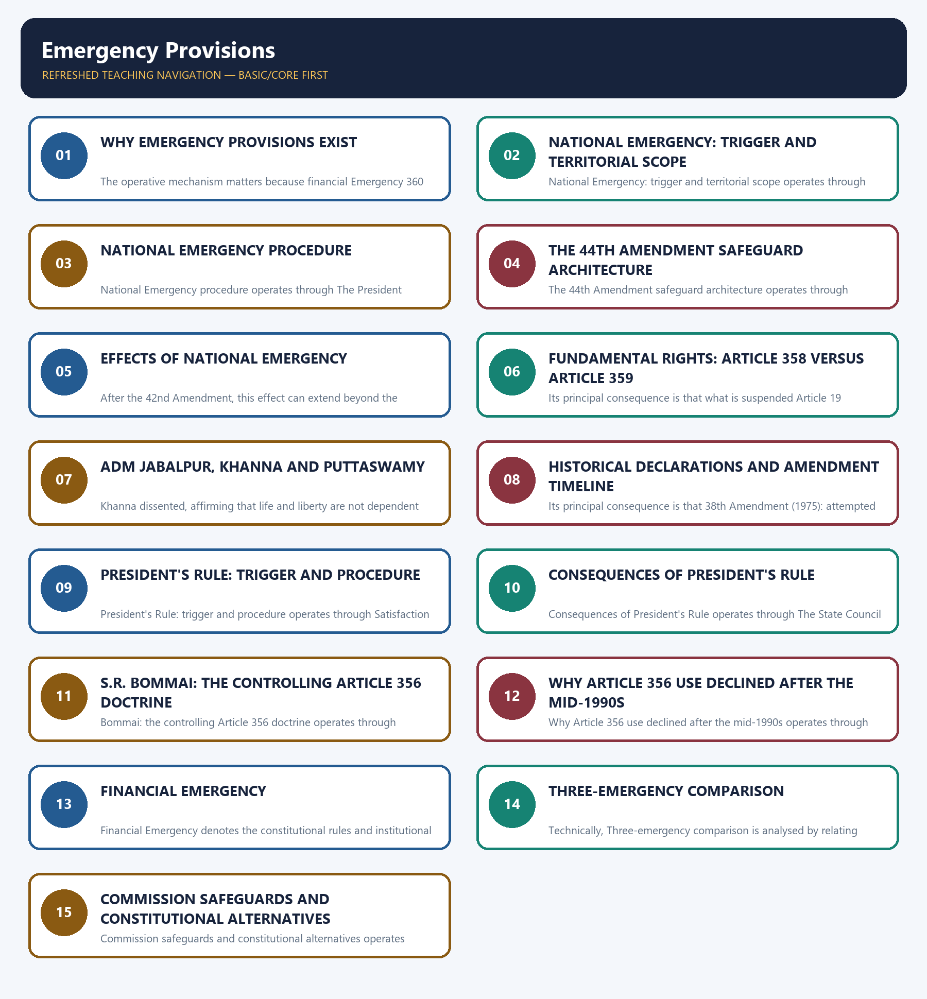
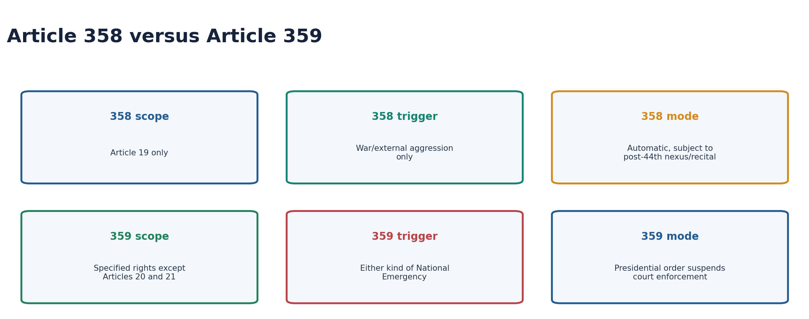
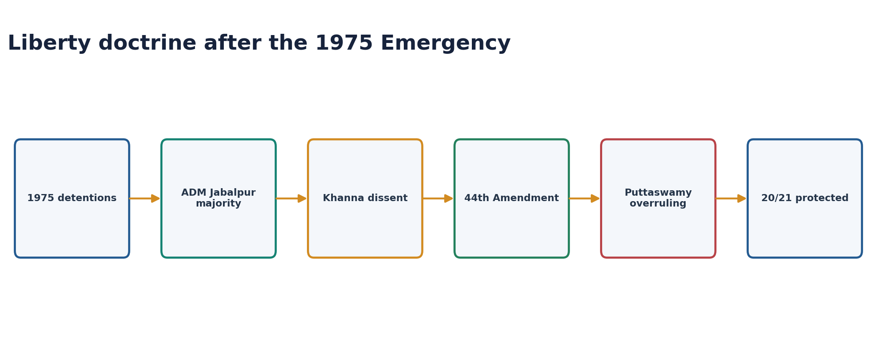
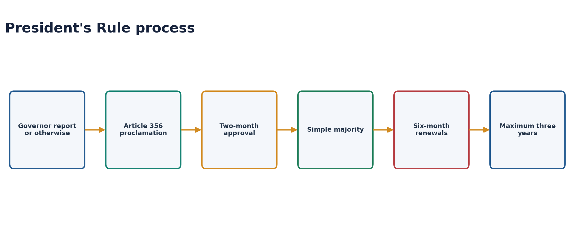
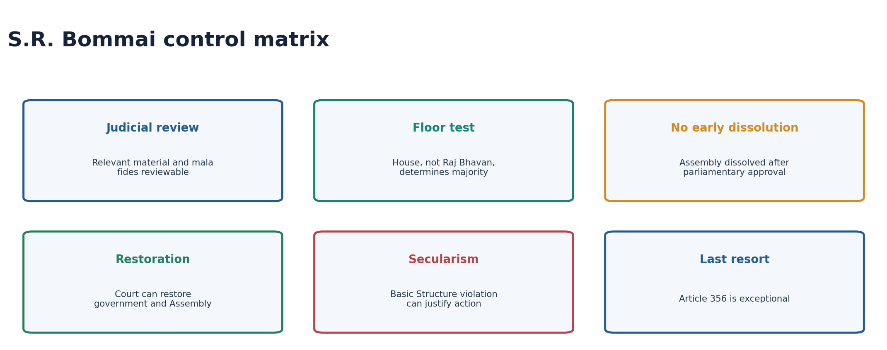
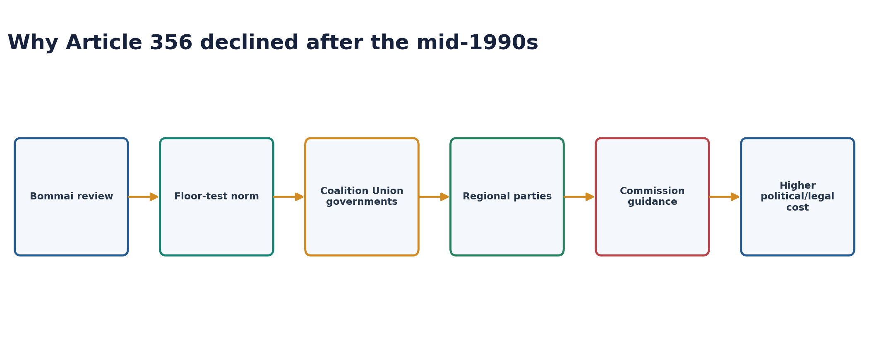
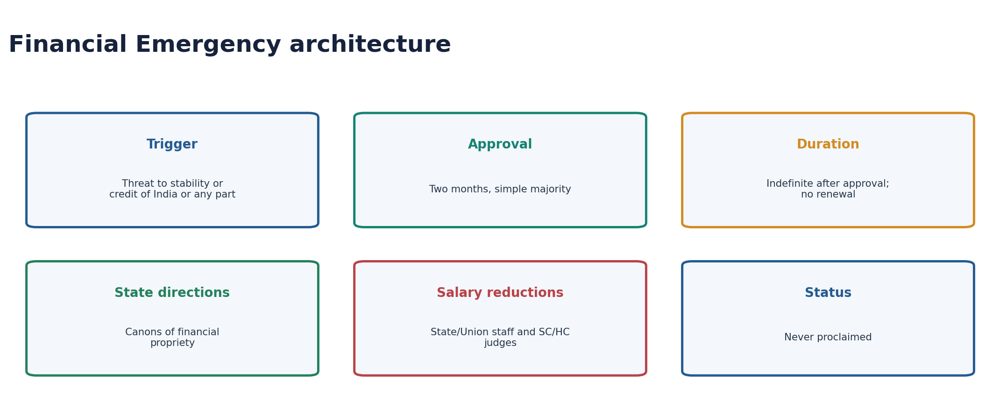
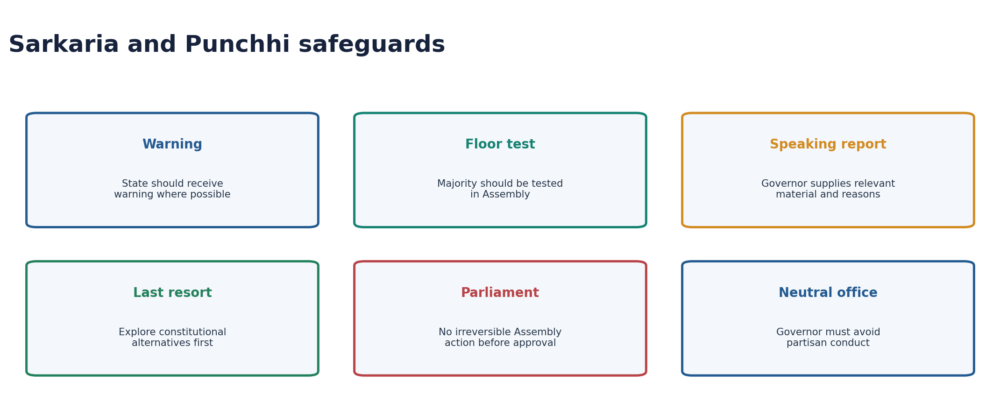
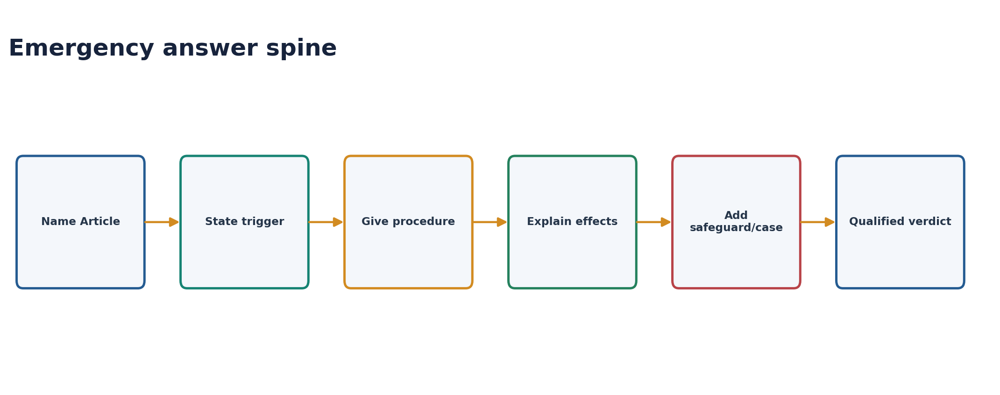

---
---

# Emergency Provisions — Complete Uncompressed Learning Session

> **Subject:** Indian Polity | **Topic:** 14 | **GS-II + Prelims** | **Export date:** 2026-08-16
>
> **Approval:** false - awaiting explicit user approval.
>
> **Evidence key:** [FACT] constitutional, judicial or source-verified proposition; [ANALYSIS] reasoned exam synthesis; [CURRENT] dated status; [LIMIT] qualification preventing overstatement.

#### Package method, scope boundary and current control

- Source order followed: certified Core owner `Polity/basic/Emergency-Provisions.md` -> optional Advanced owner `Polity/advanced/14_Emergency-Provisions.md` -> official/local PYQ routes and recent official key -> Constitution, judgments and current controls -> Qdrant not used.
- [LIMIT] Foundation and Core are independently answer-complete. Optional Advanced adds Constituent Assembly criticism and deeper theory only.
- [CURRENT] Status is controlled to **24 August 2026, Asia/Kolkata**.
- [CURRENT] **Live official refresh, 24 August 2026:** The official Constitution and Supreme Court portals were rechecked on 24 August 2026; the package retains the 44th Amendment, S.R. Bommai and Puttaswamy controls.
- [CURRENT] *S.R. Bommai*, the 44th Amendment safeguards and *K.S. Puttaswamy*'s rejection of *ADM Jabalpur* remain controlling.
- [CURRENT] India has never proclaimed a Financial Emergency under Article 360.
- [CURRENT] 25 June is officially observed as **Samvidhaan Hatya Diwas**, commemorating resistance to abuse during the 1975 Emergency; this is commemorative policy, not a constitutional amendment.
- [LIMIT] Centre-State relation mechanics are cross-linked to Polity 13; Governor office to Polity 19; Fundamental Rights doctrine to Polity 07. Every emergency-specific rule remains complete here.
- Package target: **6 routed PYQs**, **28 original MCQs**, **8 remedials**, **7 solved Mains questions** and **14 original visuals**.

#### Roadmap

| Stage | Coverage | Exam outcome |
|---|---|---|
| Overview | Three emergencies and constitutional purpose | Prevents category mixing |
| National trigger | War, external aggression, armed rebellion and imminent danger | Solves Article 352 stems |
| Procedure | Written Cabinet advice, approval, renewal and revocation | Masters numbers and majorities |
| Effects | Executive, legislative, financial, tenure and federal effects | Builds Mains analysis |
| Rights | Articles 358 and 359, 20/21 shield, ADM Jabalpur | Solves hardest traps |
| History | 1962, 1971, 1975 and 38th/42nd/44th Amendments | Explains safeguards |
| President's Rule | Trigger, approval, consequences and duration | Solves Article 356 |
| Bommai | Review, floor test, dissolution and restoration | Answers 2023 GS-II |
| Decline | Legal, political and commission factors | Completes causal analysis |
| Financial | Trigger, consequences and never-used status | Answers 2018 GS-II |
| Comparison | 352 versus 356 versus 360 | Rapid revision |
| Advanced | Criticism, constitutional dictatorship and safety-valve debate | Optional analytical lift |
| Practice | Six PYQs, 36 MCQs and seven Mains models | Converts knowledge into marks |

#### Scope ownership and cross-links

- **Polity 07:** general Fundamental Rights, preventive detention and writs.
- **Polity 12:** federalism and Basic Structure.
- **Polity 13:** Article 355, 365 and Union directions as Centre-State relations.
- **Polity 19:** Governor reports, government formation and floor-test procedure.
- [LIMIT] Cross-linking prevents repetition, not missing knowledge.

## BASIC LEARNING SESSION



*Distinct embedded teaching-navigation image. The separate continuous Cārvāka-style flowchart package remains an independent at-a-glance artifact.*

### SESSION 1 — WHY EMERGENCY PROVISIONS EXIST
#### DEFINITION / WHAT THIS IS CALLED

**Plain-language definition:** Why emergency provisions exist denotes the constitutional rules and institutional links organised around Type Article Trigger.

**Technical definition:** The operative mechanism matters because financial Emergency 360 Financial stability or credit of India or part is threatened.

#### ANSWER-GRABBING OPENING — WRITE/ADAPT IN THE EXAM

> Emergency provisions preserve the constitutional order by temporarily centralising authority; they do not create an extra-constitutional regime.

#### MUST-WRITE KEYWORDS

- **Why emergency provisions exist**
- **National Emergency**
- **President's Rule**
- **Financial Emergency**
- **Article 356**
- **352-360**

**How to use them:** Frame the answer through Why emergency provisions exist; define National Emergency, connect President's Rule with Financial Emergency to explain the mechanism, and use Article 356 for the decisive comparison or qualification.

Why emergency provisions exist denotes the constitutional rules and institutional links organised around Type Article Trigger.
Why emergency provisions exist operates through National Emergency 352 War, external aggression or armed rebellion threatens security of India or part, connected with President's Rule 356 State government cannot be carried on according to the Constitution.
The operative mechanism matters because financial Emergency 360 Financial stability or credit of India or part is threatened.
Its principal consequence is that [FACT] Part XVIII contains Articles 352-360.
The decisive contrast is between [ANALYSIS] Ambedkar described the Constitution as capable of being federal or unitary according to circumstances and [LIMIT] “State Emergency” and “Constitutional Emergency” are descriptive names for Article 356, not headings used in Article 356.
The exam-safe limitation is that type Article Trigger.


| Type | Article | Trigger |
|---|---|---|
| National Emergency | 352 | War, external aggression or armed rebellion threatens security of India or part |
| President's Rule | 356 | State government cannot be carried on according to the Constitution |
| Financial Emergency | 360 | Financial stability or credit of India or part is threatened |

- [FACT] Part XVIII contains Articles 352-360.
- [ANALYSIS] Emergency provisions preserve the constitutional order by temporarily centralising authority; they do not create an extra-constitutional regime.
- [ANALYSIS] Ambedkar described the Constitution as capable of being federal or unitary according to circumstances.
- [LIMIT] “State Emergency” and “Constitutional Emergency” are descriptive names for Article 356, not headings used in Article 356.

#### CLOSING RECALL FLOW — WHY EMERGENCY PROVISIONS EXIST

```closure-flow
SUBTOPIC: Why emergency provisions exist
KEY TERMS / DEFINITIONS: Why emergency provisions exist · National Emergency · President's Rule · Financial Emergency · Article 356 · 352-360
MECHANISM / ARGUMENT: Emergency provisions preserve the constitutional order by temporarily centralising authority; they do not create an extra-constitutional regime.
CONSEQUENCE / CONTRAST: The decisive contrast is between Ambedkar described the Constitution as capable of being federal or unitary according to circumstances and “State Emergency” and “Constitutional Emergency” are descriptive names for Article 356, not headings used in Article 356.
UPSC TRAP / ANSWER-USE: “State Emergency” and “Constitutional Emergency” are descriptive names for Article 356, not headings used in Article 356.
ANSWER-GRABBING FORMULATION: Emergency provisions preserve the constitutional order by temporarily centralising authority; they do not create an extra-constitutional regime.
```
### SESSION 2 — NATIONAL EMERGENCY: TRIGGER AND TERRITORIAL SCOPE
#### DEFINITION / WHAT THIS IS CALLED

**Plain-language definition:** National Emergency: trigger and territorial scope denotes the constitutional rules and institutional links organised around A proclamation may issue before the actual occurrence if imminent danger exists.

**Technical definition:** National Emergency: trigger and territorial scope operates through War/external aggression is commonly called external Emergency; armed rebellion is internal Emergency, connected with The 44th Amendment replaced vague “internal disturbance” with “armed rebellion.”.

#### ANSWER-GRABBING OPENING — WRITE/ADAPT IN THE EXAM

> “Internal disturbance” remains in Article 355 but is no longer a National Emergency ground.

#### MUST-WRITE KEYWORDS

- **National Emergency**
- **trigger**
- **territorial scope**
- **Article 355**
- **Article 352**
- **National Emergency: trigger and territorial scope**

**How to use them:** Frame the answer through National Emergency; define trigger, connect territorial scope with Article 355 to explain the mechanism, and use Article 352 for the decisive comparison or qualification.

National Emergency: trigger and territorial scope denotes the constitutional rules and institutional links organised around [FACT] A proclamation may issue before the actual occurrence if imminent danger exists.
National Emergency: trigger and territorial scope operates through [FACT] War/external aggression is commonly called external Emergency; armed rebellion is internal Emergency, connected with [FACT] The 44th Amendment replaced vague “internal disturbance” with “armed rebellion.”.
The operative mechanism matters because [FACT] The 42nd Amendment permits an Emergency to operate in the whole or a specified part of India.
Its principal consequence is that [LIMIT] “Internal disturbance” remains in Article 355 but is no longer a National Emergency ground.
The decisive contrast is between [FACT] A proclamation may issue before the actual occurrence if imminent danger exists and [FACT] A proclamation may issue before the actual occurrence if imminent danger exists.
The exam-safe limitation is that [FACT] A proclamation may issue before the actual occurrence if imminent danger exists.
- [FACT] Article 352 permits proclamation where security of India or any part is threatened by war, external aggression or armed rebellion.
- [FACT] A proclamation may issue before the actual occurrence if imminent danger exists.
- [FACT] War/external aggression is commonly called external Emergency; armed rebellion is internal Emergency.
- [FACT] The 44th Amendment replaced vague “internal disturbance” with “armed rebellion.”
- [FACT] The 42nd Amendment permits an Emergency to operate in the whole or a specified part of India.
- [LIMIT] “Internal disturbance” remains in Article 355 but is no longer a National Emergency ground.

#### CLOSING RECALL FLOW — NATIONAL EMERGENCY: TRIGGER AND TERRITORIAL SCOPE

```closure-flow
SUBTOPIC: National Emergency: trigger and territorial scope
KEY TERMS / DEFINITIONS: National Emergency · trigger · territorial scope · Article 355 · Article 352 · National Emergency: trigger and territorial scope
MECHANISM / ARGUMENT: National Emergency: trigger and territorial scope operates through War/external aggression is commonly called external Emergency; armed rebellion is internal Emergency, connected with The 44th Amendment replaced vague “internal disturbance” with “armed rebellion.”.
CONSEQUENCE / CONTRAST: Its principal consequence is that “Internal disturbance” remains in Article 355 but is no longer a National Emergency ground.
UPSC TRAP / ANSWER-USE: “Internal disturbance” remains in Article 355 but is no longer a National Emergency ground.
ANSWER-GRABBING FORMULATION: “Internal disturbance” remains in Article 355 but is no longer a National Emergency ground.
```
### SESSION 3 — NATIONAL EMERGENCY PROCEDURE
#### DEFINITION / WHAT THIS IS CALLED

**Plain-language definition:** National Emergency procedure denotes the constitutional rules and institutional links organised around Written Cabinet recommendation.

**Technical definition:** National Emergency procedure operates through The President cannot issue a proclamation unless the decision of the Union Cabinet to issue it has been communicated in writing, connected with Approval and renewal.

#### ANSWER-GRABBING OPENING — WRITE/ADAPT IN THE EXAM

> “Cabinet” here means the Council consisting of the Prime Minister and Cabinet-rank ministers; the Prime Minister alone cannot constitutionally trigger Article 352.

#### MUST-WRITE KEYWORDS

- **National Emergency procedure**
- **Article 352**
- **Article 356**
- **National Emergency**
- **Written Cabinet**
- **The President**

**How to use them:** Frame the answer through National Emergency procedure; define Article 352, connect Article 356 with National Emergency to explain the mechanism, and use Written Cabinet for the decisive comparison or qualification.

National Emergency procedure denotes the constitutional rules and institutional links organised around Written Cabinet recommendation.
National Emergency procedure operates through [FACT] The President cannot issue a proclamation unless the decision of the Union Cabinet to issue it has been communicated in writing, connected with Approval and renewal.
The operative mechanism matters because [FACT] Each House must approve within one month.
Its principal consequence is that [FACT] Once approved, it continues six months and can be renewed indefinitely in six-month blocks.
The decisive contrast is between Revocation and Lok Sabha disapproval and [FACT] The President may revoke by subsequent proclamation; revocation needs no parliamentary approval.
The exam-safe limitation is that [FACT] If Lok Sabha passes a disapproval resolution by simple majority, the President must revoke.


#### Written Cabinet recommendation

- [FACT] The President cannot issue a proclamation unless the decision of the Union Cabinet to issue it has been communicated in writing.
- [FACT] “Cabinet” here means the Council consisting of the Prime Minister and Cabinet-rank ministers; the Prime Minister alone cannot constitutionally trigger Article 352.

#### Approval and renewal

- [FACT] Each House must approve within one month.
- [FACT] Approval and every six-month continuation require a special majority: majority of total House membership plus at least two-thirds of members present and voting.
- [FACT] Once approved, it continues six months and can be renewed indefinitely in six-month blocks.
- [FACT] If Lok Sabha is dissolved during the approval window, Rajya Sabha approval preserves the proclamation until 30 days after the first sitting of the reconstituted Lok Sabha, which must approve it.

#### Revocation and Lok Sabha disapproval

- [FACT] The President may revoke by subsequent proclamation; revocation needs no parliamentary approval.
- [FACT] If Lok Sabha passes a disapproval resolution by simple majority, the President must revoke.
- [FACT] At least one-tenth of Lok Sabha members may give notice seeking a special sitting; the sitting must be held within 14 days.
- [LIMIT] This special disapproval mechanism belongs to National Emergency, not Article 356.

#### CLOSING RECALL FLOW — NATIONAL EMERGENCY PROCEDURE

```closure-flow
SUBTOPIC: National Emergency procedure
KEY TERMS / DEFINITIONS: National Emergency procedure · Article 352 · Article 356 · National Emergency · Written Cabinet · The President
MECHANISM / ARGUMENT: National Emergency procedure operates through The President cannot issue a proclamation unless the decision of the Union Cabinet to issue it has been communicated in writing, connected with Approval and renewal.
CONSEQUENCE / CONTRAST: The decisive contrast is between Revocation and Lok Sabha disapproval and The President may revoke by subsequent proclamation; revocation needs no parliamentary approval.
UPSC TRAP / ANSWER-USE: Do not miss this limiting distinction: its principal consequence is that Once approved, it continues six months and can be...
ANSWER-GRABBING FORMULATION: “Cabinet” here means the Council consisting of the Prime Minister and Cabinet-rank ministers; the Prime Minister alone cannot constitutionally trigger Article 352.
```
### SESSION 4 — THE 44TH AMENDMENT SAFEGUARD ARCHITECTURE
#### DEFINITION / WHAT THIS IS CALLED

**Plain-language definition:** The 44th Amendment safeguard architecture denotes the constitutional rules and institutional links organised around Pre-1978 vulnerability 44th Amendment response.

**Technical definition:** The 44th Amendment safeguard architecture operates through “Internal disturbance” was vague Replaced with armed rebellion, connected with Prime-ministerial advice could dominate Written Cabinet decision required.

#### ANSWER-GRABBING OPENING — WRITE/ADAPT IN THE EXAM

> The 44th Amendment retained emergency power but narrowed its grounds, required written Cabinet advice and strengthened parliamentary exit, making exceptional authority more reviewable.

#### MUST-WRITE KEYWORDS

- **The 44th Amendment safeguard architecture**
- **“Internal disturbance” was vague**
- **Replaced with armed rebellion**
- **Prime-ministerial advice could dominate**
- **Written Cabinet decision required**
- **Two-month/simple-majority approval**

**How to use them:** Frame the answer through The 44th Amendment safeguard architecture; define “Internal disturbance” was vague, connect Replaced with armed rebellion with Prime-ministerial advice could dominate to explain the mechanism, and use Written Cabinet decision required for the decisive comparison or qualification.

The 44th Amendment safeguard architecture denotes the constitutional rules and institutional links organised around Pre-1978 vulnerability 44th Amendment response.
The 44th Amendment safeguard architecture operates through “Internal disturbance” was vague Replaced with armed rebellion, connected with Prime-ministerial advice could dominate Written Cabinet decision required.
The operative mechanism matters because two-month/simple-majority approval One-month/special-majority approval.
Its principal consequence is that weak lower-House exit Lok Sabha disapproval forces revocation.
The decisive contrast is between Article 19 suspension too broad Article 358 confined to external Emergency and emergency-related laws and Court enforcement could be blocked for life/personal liberty Articles 20 and 21 excluded from Article 359.
The exam-safe limitation is that satisfaction immunity after 38th Amendment Immunity removed; judicial review restored.


| Pre-1978 vulnerability | 44th Amendment response |
|---|---|
| “Internal disturbance” was vague | Replaced with armed rebellion |
| Prime-ministerial advice could dominate | Written Cabinet decision required |
| Two-month/simple-majority approval | One-month/special-majority approval |
| Weak lower-House exit | Lok Sabha disapproval forces revocation |
| Article 19 suspension too broad | Article 358 confined to external Emergency and emergency-related laws |
| Court enforcement could be blocked for life/personal liberty | Articles 20 and 21 excluded from Article 359 |
| Satisfaction immunity after 38th Amendment | Immunity removed; judicial review restored |

- [ANALYSIS] The 44th Amendment did not abolish emergency government; it converted political discretion into a more rule-bound and reviewable power.

#### CLOSING RECALL FLOW — THE 44TH AMENDMENT SAFEGUARD ARCHITECTURE

```closure-flow
SUBTOPIC: The 44th Amendment safeguard architecture
KEY TERMS / DEFINITIONS: The 44th Amendment safeguard architecture · “Internal disturbance” was vague · Replaced with armed rebellion · Prime-ministerial advice could dominate · Written Cabinet decision required · Two-month/simple-majority approval
MECHANISM / ARGUMENT: The 44th Amendment safeguard architecture operates through “Internal disturbance” was vague Replaced with armed rebellion, connected with Prime-ministerial advice could dominate Written Cabinet decision required.
CONSEQUENCE / CONTRAST: Its principal consequence is that weak lower-House exit Lok Sabha disapproval forces revocation.
UPSC TRAP / ANSWER-USE: Do not miss this limiting distinction: the decisive contrast is between Article 19 suspension too broad Article 358 confined to...
ANSWER-GRABBING FORMULATION: The 44th Amendment retained emergency power but narrowed its grounds, required written Cabinet advice and strengthened parliamentary exit, making exceptional authority more reviewable.
```
### SESSION 5 — EFFECTS OF NATIONAL EMERGENCY
#### DEFINITION / WHAT THIS IS CALLED

**Plain-language definition:** Effects of National Emergency denotes the constitutional rules and institutional links organised around Union executive power extends to giving directions to any State on the manner in which State executive power is exercised.

**Technical definition:** After the 42nd Amendment, this effect can extend beyond the territory where the Emergency is operative where security is affected by activities connected to that territory.

#### ANSWER-GRABBING OPENING — WRITE/ADAPT IN THE EXAM

> An order cannot extend beyond the financial year in which the proclamation ceases and must be laid before Parliament.

#### MUST-WRITE KEYWORDS

- **Effects of National Emergency**
- **Article 250**
- **Article 354**
- **Effects**
- **National Emergency**
- **268-279**

**How to use them:** Frame the answer through Effects of National Emergency; define Article 250, connect Article 354 with Effects to explain the mechanism, and use National Emergency for the decisive comparison or qualification.

Effects of National Emergency denotes the constitutional rules and institutional links organised around [FACT] Union executive power extends to giving directions to any State on the manner in which State executive power is exercised.
Effects of National Emergency operates through [FACT] Parliament may legislate on State List matters under Article 250, connected with [FACT] State legislatures continue; parliamentary competence becomes concurrent for the period.
The operative mechanism matters because [FACT] Such parliamentary law ceases to have effect six months after the Emergency ends, except for completed acts.
Its principal consequence is that [FACT] The President may promulgate ordinances on State subjects when Parliament is not in session.
The decisive contrast is between [FACT] An order cannot extend beyond the financial year in which the proclamation ceases and must be laid before Parliament and [FACT] Parliament may extend Lok Sabha and State Assembly terms by one year at a time during National Emergency.
The exam-safe limitation is that [FACT] No such extension can continue beyond six months after the Emergency ceases.


#### Executive

- [FACT] Union executive power extends to giving directions to any State on the manner in which State executive power is exercised.
- [FACT] After the 42nd Amendment, this effect can extend beyond the territory where the Emergency is operative where security is affected by activities connected to that territory.

#### Legislative

- [FACT] Parliament may legislate on State List matters under Article 250.
- [FACT] State legislatures continue; parliamentary competence becomes concurrent for the period.
- [FACT] Such parliamentary law ceases to have effect six months after the Emergency ends, except for completed acts.
- [FACT] The President may promulgate ordinances on State subjects when Parliament is not in session.

#### Financial

- [FACT] Article 354 permits the President to modify application of Articles 268-279 revenue-distribution provisions during the Emergency.
- [FACT] An order cannot extend beyond the financial year in which the proclamation ceases and must be laid before Parliament.

#### Legislative terms

- [FACT] Parliament may extend Lok Sabha and State Assembly terms by one year at a time during National Emergency.
- [FACT] No such extension can continue beyond six months after the Emergency ceases.
- [LIMIT] Emergency does not automatically extend terms; Parliament must enact the extension.

#### CLOSING RECALL FLOW — EFFECTS OF NATIONAL EMERGENCY

```closure-flow
SUBTOPIC: Effects of National Emergency
KEY TERMS / DEFINITIONS: Effects of National Emergency · Article 250 · Article 354 · Effects · National Emergency · 268-279
MECHANISM / ARGUMENT: The operative mechanism matters because Such parliamentary law ceases to have effect six months after the Emergency ends, except for completed acts.
CONSEQUENCE / CONTRAST: After the 42nd Amendment, this effect can extend beyond the territory where the Emergency is operative where security is affected by activities connected to that territory.
UPSC TRAP / ANSWER-USE: Do not miss this limiting distinction: such parliamentary law ceases to have effect six months after the Emergency ends, except...
ANSWER-GRABBING FORMULATION: An order cannot extend beyond the financial year in which the proclamation ceases and must be laid before Parliament.
```
### SESSION 6 — FUNDAMENTAL RIGHTS: ARTICLE 358 VERSUS ARTICLE 359
#### DEFINITION / WHAT THIS IS CALLED

**Plain-language definition:** Fundamental Rights: Article 358 versus Article 359 denotes the constitutional rules and institutional links organised around Test Article 358 Article 359.

**Technical definition:** Its principal consequence is that what is suspended Article 19 restriction on emergency-related State action Right to move specified courts for enforcement.

#### ANSWER-GRABBING OPENING — WRITE/ADAPT IN THE EXAM

> Protection against retrospective penal law/double jeopardy/self-incrimination and life/personal liberty therefore remain judicially enforceable.

#### MUST-WRITE KEYWORDS

- **Fundamental Rights**
- **Article 358 versus Article 359**
- **Right affected**
- **Article 19 only**
- **Trigger**
- **War/external aggression Emergency only**

**How to use them:** Frame the answer through Fundamental Rights; define Article 358 versus Article 359, connect Right affected with Article 19 only to explain the mechanism, and use Trigger for the decisive comparison or qualification.

Fundamental Rights: Article 358 versus Article 359 denotes the constitutional rules and institutional links organised around Test Article 358 Article 359.
Fundamental Rights: Article 358 versus Article 359 operates through Right affected Article 19 only Rights named in presidential order except 20 and 21, connected with Trigger War/external aggression Emergency only Either external or armed-rebellion Emergency.
The operative mechanism matters because operation Automatic Requires presidential order.
Its principal consequence is that what is suspended Article 19 restriction on emergency-related State action Right to move specified courts for enforcement.
The decisive contrast is between Territorial/duration scope Emergency operation subject to constitutional text Whole/part and period stated in order and Post-44th nexus protection.
The exam-safe limitation is that [FACT] Similar recital-linked protection applies to emergency laws under Article 359(1A).


| Test | Article 358 | Article 359 |
|---|---|---|
| Right affected | Article 19 only | Rights named in presidential order except 20 and 21 |
| Trigger | War/external aggression Emergency only | Either external or armed-rebellion Emergency |
| Operation | Automatic | Requires presidential order |
| What is suspended | Article 19 restriction on emergency-related State action | Right to move specified courts for enforcement |
| Territorial/duration scope | Emergency operation subject to constitutional text | Whole/part and period stated in order |

#### Post-44th nexus protection

- [FACT] Article 358 protection applies only to laws containing the required recital that they relate to the proclamation and executive action under such law.
- [FACT] Similar recital-linked protection applies to emergency laws under Article 359(1A).
- [ANALYSIS] Ordinary unrelated illegality does not receive an Emergency shield.

#### Articles 20 and 21

- [FACT] Article 359 cannot suspend court enforcement of Articles 20 and 21.
- [FACT] Protection against retrospective penal law/double jeopardy/self-incrimination and life/personal liberty therefore remain judicially enforceable.
- [LIMIT] Article 358 never concerned Articles 20 or 21; it concerns Article 19.

#### CLOSING RECALL FLOW — FUNDAMENTAL RIGHTS: ARTICLE 358 VERSUS ARTICLE 359

```closure-flow
SUBTOPIC: Fundamental Rights: Article 358 versus Article 359
KEY TERMS / DEFINITIONS: Fundamental Rights · Article 358 versus Article 359 · Right affected · Article 19 only · Trigger · War/external aggression Emergency only
MECHANISM / ARGUMENT: Its principal consequence is that what is suspended Article 19 restriction on emergency-related State action Right to move specified courts for enforcement.
CONSEQUENCE / CONTRAST: The decisive contrast is between Territorial/duration scope Emergency operation subject to constitutional text Whole/part and period stated in order and Post-44th nexus protection.
UPSC TRAP / ANSWER-USE: Ordinary unrelated illegality does not receive an Emergency shield.
ANSWER-GRABBING FORMULATION: Protection against retrospective penal law/double jeopardy/self-incrimination and life/personal liberty therefore remain judicially enforceable.
```
### SESSION 7 — ADM JABALPUR, KHANNA AND PUTTASWAMY
#### DEFINITION / WHAT THIS IS CALLED

**Plain-language definition:** ADM Jabalpur, Khanna and Puttaswamy denotes the constitutional rules and institutional links organised around Justice H.R.

**Technical definition:** Khanna dissented, affirming that life and liberty are not dependent solely on executive grace.

#### ANSWER-GRABBING OPENING — WRITE/ADAPT IN THE EXAM

> During the 1975 Emergency, the ADM Jabalpur majority held that a detained person could not seek habeas corpus for enforcement of Article 21 while the relevant Article 359 order operated.

#### MUST-WRITE KEYWORDS

- **ADM Jabalpur**
- **Khanna**
- **Puttaswamy**
- **Article 359**
- **Article 21**
- **ADM Jabalpur, Khanna and Puttaswamy**

**How to use them:** Frame the answer through ADM Jabalpur; define Khanna, connect Puttaswamy with Article 359 to explain the mechanism, and use Article 21 for the decisive comparison or qualification.

ADM Jabalpur, Khanna and Puttaswamy denotes the constitutional rules and institutional links organised around [FACT] Justice H.R. Khanna dissented, affirming that life and liberty are not dependent solely on executive grace.
ADM Jabalpur, Khanna and Puttaswamy operates through [FACT] The 44th Amendment constitutionally protected Articles 20 and 21 from Article 359 suspension, connected with [FACT] K.S. Puttaswamy (2017) expressly held ADM Jabalpur wrongly decided and overruled it.
The operative mechanism matters because [FACT] Justice H.R. Khanna dissented, affirming that life and liberty are not dependent solely on executive grace.
Its principal consequence is that [FACT] Justice H.R. Khanna dissented, affirming that life and liberty are not dependent solely on executive grace.
The decisive contrast is between [FACT] Justice H.R. Khanna dissented, affirming that life and liberty are not dependent solely on executive grace and [FACT] Justice H.R. Khanna dissented, affirming that life and liberty are not dependent solely on executive grace.
The exam-safe limitation is that [FACT] Justice H.R. Khanna dissented, affirming that life and liberty are not dependent solely on executive grace.


- [FACT] During the 1975 Emergency, the *ADM Jabalpur* majority held that a detained person could not seek habeas corpus for enforcement of Article 21 while the relevant Article 359 order operated.
- [FACT] Justice H.R. Khanna dissented, affirming that life and liberty are not dependent solely on executive grace.
- [FACT] The 44th Amendment constitutionally protected Articles 20 and 21 from Article 359 suspension.
- [FACT] *K.S. Puttaswamy* (2017) expressly held *ADM Jabalpur* wrongly decided and overruled it.
- [ANALYSIS] The correction is both textual and jurisprudential: non-suspendability plus recognition that constitutional liberty survives executive emergency claims.

#### CLOSING RECALL FLOW — ADM JABALPUR, KHANNA AND PUTTASWAMY

```closure-flow
SUBTOPIC: ADM Jabalpur, Khanna and Puttaswamy
KEY TERMS / DEFINITIONS: ADM Jabalpur · Khanna · Puttaswamy · Article 359 · Article 21 · ADM Jabalpur, Khanna and Puttaswamy
MECHANISM / ARGUMENT: During the 1975 Emergency, the ADM Jabalpur majority held that a detained person could not seek habeas corpus for enforcement of Article 21 while the relevant Article 359 order operated.
CONSEQUENCE / CONTRAST: Khanna dissented, affirming that life and liberty are not dependent solely on executive grace.
UPSC TRAP / ANSWER-USE: Khanna dissented, affirming that life and liberty are not dependent solely on executive grace and Justice H.R.
ANSWER-GRABBING FORMULATION: During the 1975 Emergency, the ADM Jabalpur majority held that a detained person could not seek habeas corpus for enforcement of Article 21 while the relevant Article 359 order operated.
```
### SESSION 8 — HISTORICAL DECLARATIONS AND AMENDMENT TIMELINE
#### DEFINITION / WHAT THIS IS CALLED

**Plain-language definition:** Historical declarations and amendment timeline denotes the constitutional rules and institutional links organised around Declaration Ground/context Control point.

**Technical definition:** Its principal consequence is that 38th Amendment (1975): attempted to make presidential satisfaction final and non-justiciable.

#### ANSWER-GRABBING OPENING — WRITE/ADAPT IN THE EXAM

> Emergency history shows a movement from expansive executive satisfaction toward judicial and parliamentary control, although the 1975 experience demonstrates how formal legality can coexist with constitutional abuse.

#### MUST-WRITE KEYWORDS

- **Historical declarations**
- **amendment timeline**
- **External aggression during China conflict**
- **Continued until 1968**
- **External aggression during Pakistan conflict**
- **Continued alongside 1975 proclamation**

**How to use them:** Frame the answer through Historical declarations; define amendment timeline, connect External aggression during China conflict with Continued until 1968 to explain the mechanism, and use External aggression during Pakistan conflict for the decisive comparison or qualification.

Historical declarations and amendment timeline denotes the constitutional rules and institutional links organised around Declaration Ground/context Control point.
Historical declarations and amendment timeline operates through 1962 External aggression during China conflict Continued until 1968, connected with 1971 External aggression during Pakistan conflict Continued alongside 1975 proclamation.
The operative mechanism matters because 1975 Internal disturbance under pre-44th text Most controversial; ended in 1977.
Its principal consequence is that [FACT] 38th Amendment (1975): attempted to make presidential satisfaction final and non-justiciable.
The decisive contrast is between [FACT] 42nd Amendment (1976): permitted territorially limited proclamation and broadened effects and [FACT] 44th Amendment (1978): added the principal democratic safeguards.
The exam-safe limitation is that [FACT] Minerva Mills recognised review of emergency satisfaction for mala fides or wholly extraneous grounds.
| Declaration | Ground/context | Control point |
|---|---|---|
| 1962 | External aggression during China conflict | Continued until 1968 |
| 1971 | External aggression during Pakistan conflict | Continued alongside 1975 proclamation |
| 1975 | Internal disturbance under pre-44th text | Most controversial; ended in 1977 |


- [FACT] 38th Amendment (1975): attempted to make presidential satisfaction final and non-justiciable.
- [FACT] 42nd Amendment (1976): permitted territorially limited proclamation and broadened effects.
- [FACT] 44th Amendment (1978): added the principal democratic safeguards.
- [FACT] *Minerva Mills* recognised review of emergency satisfaction for mala fides or wholly extraneous grounds.
- [CURRENT] 25 June is officially observed as Samvidhaan Hatya Diwas to commemorate those who resisted abuse during the 1975 Emergency.
- [LIMIT] The official observance changes no Emergency Article.

#### CLOSING RECALL FLOW — HISTORICAL DECLARATIONS AND AMENDMENT TIMELINE

```closure-flow
SUBTOPIC: Historical declarations and amendment timeline
KEY TERMS / DEFINITIONS: Historical declarations · amendment timeline · External aggression during China conflict · Continued until 1968 · External aggression during Pakistan conflict · Continued alongside 1975 proclamation
MECHANISM / ARGUMENT: The operative mechanism matters because 1975 Internal disturbance under pre-44th text Most controversial; ended in 1977.
CONSEQUENCE / CONTRAST: Its principal consequence is that 38th Amendment (1975): attempted to make presidential satisfaction final and non-justiciable.
UPSC TRAP / ANSWER-USE: Do not miss this limiting distinction: the decisive contrast is between 42nd Amendment (1976).
ANSWER-GRABBING FORMULATION: Emergency history shows a movement from expansive executive satisfaction toward judicial and parliamentary control, although the 1975 experience demonstrates how formal legality can coexist with constitutional abuse.
```
### SESSION 9 — PRESIDENT'S RULE: TRIGGER AND PROCEDURE
#### DEFINITION / WHAT THIS IS CALLED

**Plain-language definition:** President's Rule: trigger and procedure denotes the constitutional rules and institutional links organised around The President must be satisfied that State government cannot be carried on according to the Constitution.

**Technical definition:** President's Rule: trigger and procedure operates through Satisfaction may arise on the Governor's report or otherwise, connected with Political disagreement or maladministration alone is not automatically constitutional breakdown.

#### ANSWER-GRABBING OPENING — WRITE/ADAPT IN THE EXAM

> Article 356 can continue beyond one year only during a National Emergency and with Election Commission certification, preventing routine extension of central rule.

#### MUST-WRITE KEYWORDS

- **President's Rule**
- **trigger**
- **procedure**
- **Article 356**
- **Article 355**
- **Article 365**

**How to use them:** Frame the answer through President's Rule; define trigger, connect procedure with Article 356 to explain the mechanism, and use Article 355 for the decisive comparison or qualification.

President's Rule: trigger and procedure denotes the constitutional rules and institutional links organised around [FACT] The President must be satisfied that State government cannot be carried on according to the Constitution.
President's Rule: trigger and procedure operates through [FACT] Satisfaction may arise on the Governor's report or otherwise, connected with [LIMIT] Political disagreement or maladministration alone is not automatically constitutional breakdown.
The operative mechanism matters because approval and duration.
Its principal consequence is that [FACT] Both Houses must approve within two months by simple majority.
The decisive contrast is between [FACT] Once approved, it continues six months at a time and [FACT] Maximum duration is three years.
The exam-safe limitation is that [FACT] The President may revoke at any time without parliamentary approval.


#### Trigger

- [FACT] The President must be satisfied that State government cannot be carried on according to the Constitution.
- [FACT] Satisfaction may arise on the Governor's report or otherwise.
- [FACT] Article 355 supplies the Union duty to protect States and ensure constitutional government; Article 365 concerns failure to comply with Union directions.
- [LIMIT] Political disagreement or maladministration alone is not automatically constitutional breakdown.

#### Approval and duration

- [FACT] Both Houses must approve within two months by simple majority.
- [FACT] If Lok Sabha is dissolved during the approval window, Rajya Sabha approval can preserve it until 30 days after the reconstituted Lok Sabha first sits.
- [FACT] Once approved, it continues six months at a time.
- [FACT] Maximum duration is three years.
- [FACT] Extension beyond one year requires both: a National Emergency operating in whole India or whole/part of the State, and Election Commission certification that Assembly elections cannot be held.
- [FACT] The President may revoke at any time without parliamentary approval.

#### CLOSING RECALL FLOW — PRESIDENT'S RULE: TRIGGER AND PROCEDURE

```closure-flow
SUBTOPIC: President's Rule: trigger and procedure
KEY TERMS / DEFINITIONS: President's Rule · trigger · procedure · Article 356 · Article 355 · Article 365
MECHANISM / ARGUMENT: President's Rule: trigger and procedure operates through Satisfaction may arise on the Governor's report or otherwise, connected with Political disagreement or maladministration alone is not automatically constitutional breakdown.
CONSEQUENCE / CONTRAST: Its principal consequence is that Both Houses must approve within two months by simple majority.
UPSC TRAP / ANSWER-USE: Do not miss this limiting distinction: the decisive contrast is between Once approved, it continues six months at a time...
ANSWER-GRABBING FORMULATION: Article 356 can continue beyond one year only during a National Emergency and with Election Commission certification, preventing routine extension of central rule.
```
### SESSION 10 — CONSEQUENCES OF PRESIDENT'S RULE
#### DEFINITION / WHAT THIS IS CALLED

**Plain-language definition:** Consequences of President's Rule denotes the constitutional rules and institutional links organised around The President may assume State executive functions and Governor powers, except High Court functions.

**Technical definition:** Consequences of President's Rule operates through The State Council of Ministers is dismissed, connected with The President may declare State legislative powers exercisable by or under Parliament's authority.

#### ANSWER-GRABBING OPENING — WRITE/ADAPT IN THE EXAM

> The Assembly may be suspended or dissolved, but Bommai bars irreversible dissolution before parliamentary approval.

#### MUST-WRITE KEYWORDS

- **Consequences of President's Rule**
- **Article 356**
- **Article 19**
- **Consequences**
- **President's Rule**
- **The President**

**How to use them:** Frame the answer through Consequences of President's Rule; define Article 356, connect Article 19 with Consequences to explain the mechanism, and use President's Rule for the decisive comparison or qualification.

Consequences of President's Rule denotes the constitutional rules and institutional links organised around [FACT] The President may assume State executive functions and Governor powers, except High Court functions.
Consequences of President's Rule operates through [FACT] The State Council of Ministers is dismissed, connected with [FACT] The President may declare State legislative powers exercisable by or under Parliament's authority.
The operative mechanism matters because [FACT] Parliament may confer legislative power on the President and authorise further delegation.
Its principal consequence is that [FACT] The Assembly may be suspended or dissolved, but Bommai bars irreversible dissolution before parliamentary approval.
The decisive contrast is between [FACT] State laws made during President's Rule continue after revocation until altered or repealed by competent authority and [FACT] President may authorise expenditure from the State Consolidated Fund pending parliamentary sanction where necessary.
The exam-safe limitation is that [LIMIT] Article 356 has no automatic Article 19 or other Fundamental Rights suspension.
- [FACT] The President may assume State executive functions and Governor powers, except High Court functions.
- [FACT] The State Council of Ministers is dismissed.
- [FACT] The President may declare State legislative powers exercisable by or under Parliament's authority.
- [FACT] Parliament may confer legislative power on the President and authorise further delegation.
- [FACT] The Assembly may be suspended or dissolved, but *Bommai* bars irreversible dissolution before parliamentary approval.
- [FACT] State laws made during President's Rule continue after revocation until altered or repealed by competent authority.
- [FACT] President may authorise expenditure from the State Consolidated Fund pending parliamentary sanction where necessary.
- [LIMIT] Article 356 has no automatic Article 19 or other Fundamental Rights suspension.

#### CLOSING RECALL FLOW — CONSEQUENCES OF PRESIDENT'S RULE

```closure-flow
SUBTOPIC: Consequences of President's Rule
KEY TERMS / DEFINITIONS: Consequences of President's Rule · Article 356 · Article 19 · Consequences · President's Rule · The President
MECHANISM / ARGUMENT: Consequences of President's Rule operates through The State Council of Ministers is dismissed, connected with The President may declare State legislative powers exercisable by or under Parliament's authority.
CONSEQUENCE / CONTRAST: The decisive contrast is between State laws made during President's Rule continue after revocation until altered or repealed by competent authority and President may authorise expenditure from the State Consolidated Fund pending parliamentary sanction where necessary.
UPSC TRAP / ANSWER-USE: Its principal consequence is that The Assembly may be suspended or dissolved, but Bommai bars irreversible dissolution before parliamentary approval.
ANSWER-GRABBING FORMULATION: The Assembly may be suspended or dissolved, but Bommai bars irreversible dissolution before parliamentary approval.
```
### SESSION 11 — S.R. BOMMAI: THE CONTROLLING ARTICLE 356 DOCTRINE
#### DEFINITION / WHAT THIS IS CALLED

**Plain-language definition:** Bommai: the controlling Article 356 doctrine denotes the constitutional rules and institutional links organised around Presidential proclamation is judicially reviewable.

**Technical definition:** Bommai: the controlling Article 356 doctrine operates through Satisfaction must rest on relevant material; the Union must produce material when challenged, connected with Mala fide or irrelevant-material action is invalid.

#### ANSWER-GRABBING OPENING — WRITE/ADAPT IN THE EXAM

> The Court did not restore the dissolved Assembly because elections had advanced; the case still demonstrates review of Governor-based material.

#### MUST-WRITE KEYWORDS

- **S.R. Bommai**
- **the controlling Article 356 doctrine**
- **Article 356**
- **Bommai: the controlling Article 356 doctrine**
- **Bommai**
- **Article**

**How to use them:** Frame the answer through S.R. Bommai; define the controlling Article 356 doctrine, connect Article 356 with Bommai: the controlling Article 356 doctrine to explain the mechanism, and use Bommai for the decisive comparison or qualification.

S.R. Bommai: the controlling Article 356 doctrine denotes the constitutional rules and institutional links organised around Presidential proclamation is judicially reviewable.
S.R. Bommai: the controlling Article 356 doctrine operates through Satisfaction must rest on relevant material; the Union must produce material when challenged, connected with Mala fide or irrelevant-material action is invalid.
The operative mechanism matters because legislative majority should ordinarily be tested on the Assembly floor.
Its principal consequence is that assembly should not be dissolved before Parliament approves the proclamation.
The decisive contrast is between Court can restore the government and Assembly after invalid proclamation and Article 356 is an exceptional, last-resort power.
The exam-safe limitation is that a new Union government cannot dismiss State governments merely for political difference.


1. Presidential proclamation is judicially reviewable.
2. Satisfaction must rest on relevant material; the Union must produce material when challenged.
3. Mala fide or irrelevant-material action is invalid.
4. Legislative majority should ordinarily be tested on the Assembly floor.
5. Assembly should not be dissolved before Parliament approves the proclamation.
6. Court can restore the government and Assembly after invalid proclamation.
7. Article 356 is an exceptional, last-resort power.
8. A new Union government cannot dismiss State governments merely for political difference.
9. Secularism is Basic Structure; anti-secular State action can have Article 356 relevance.
10. Parliamentary approval does not completely exclude judicial review.

#### Rameshwar Prasad (2006)

- [FACT] The Supreme Court held the 2005 Bihar Assembly dissolution unconstitutional based on an unreliable/mala fide preventive assessment of possible majority formation.
- [LIMIT] The Court did not restore the dissolved Assembly because elections had advanced; the case still demonstrates review of Governor-based material.

#### CLOSING RECALL FLOW — S.R. BOMMAI: THE CONTROLLING ARTICLE 356 DOCTRINE

```closure-flow
SUBTOPIC: S.R. Bommai: the controlling Article 356 doctrine
KEY TERMS / DEFINITIONS: S.R. Bommai · the controlling Article 356 doctrine · Article 356 · Bommai: the controlling Article 356 doctrine · Bommai · Article
MECHANISM / ARGUMENT: Bommai: the controlling Article 356 doctrine operates through Satisfaction must rest on relevant material; the Union must produce material when challenged, connected with Mala fide or irrelevant-material action is invalid.
CONSEQUENCE / CONTRAST: The decisive contrast is between Court can restore the government and Assembly after invalid proclamation and Article 356 is an exceptional, last-resort power.
UPSC TRAP / ANSWER-USE: Its principal consequence is that assembly should not be dissolved before Parliament approves the proclamation.
ANSWER-GRABBING FORMULATION: The Court did not restore the dissolved Assembly because elections had advanced; the case still demonstrates review of Governor-based material.
```
### SESSION 12 — WHY ARTICLE 356 USE DECLINED AFTER THE MID-1990S
#### DEFINITION / WHAT THIS IS CALLED

**Plain-language definition:** Why Article 356 use declined after the mid-1990s denotes the constitutional rules and institutional links organised around Bommai review Irrelevant or mala fide proclamations risk invalidation and restoration.

**Technical definition:** Why Article 356 use declined after the mid-1990s operates through Floor-test rule Governor's subjective majority assessment loses finality, connected with Coalition era Union governments depended on regional allies.

#### ANSWER-GRABBING OPENING — WRITE/ADAPT IN THE EXAM

> The decline was produced without removing Article 356: law changed incentives while political federalisation changed costs.

#### MUST-WRITE KEYWORDS

- **Bommai review**
- **Floor-test rule**
- **Governor's subjective majority assessment loses finality**
- **Coalition era**
- **Union governments depended on regional allies**
- **Regional-party strength**

**How to use them:** Frame the answer through Bommai review; define Floor-test rule, connect Governor's subjective majority assessment loses finality with Coalition era to explain the mechanism, and use Union governments depended on regional allies for the decisive comparison or qualification.

Why Article 356 use declined after the mid-1990s denotes the constitutional rules and institutional links organised around Bommai review Irrelevant or mala fide proclamations risk invalidation and restoration.
Why Article 356 use declined after the mid-1990s operates through Floor-test rule Governor's subjective majority assessment loses finality, connected with Coalition era Union governments depended on regional allies.
The operative mechanism matters because regional-party strength State dismissals carried national coalition costs.
Its principal consequence is that sarkaria/Punchhi norms Warning, floor test and last-resort standards gained legitimacy.
The decisive contrast is between Media/civil society Partisan use became more visible and politically costly and [ANALYSIS] The decline was produced without removing Article 356: law changed incentives while political federalisation changed costs.
The exam-safe limitation is that [LIMIT] Reduced frequency does not mean the controversy has disappeared; Governor/floor-test disputes remain litigated.


| Factor | Mechanism |
|---|---|
| *Bommai* review | Irrelevant or mala fide proclamations risk invalidation and restoration |
| Floor-test rule | Governor's subjective majority assessment loses finality |
| Coalition era | Union governments depended on regional allies |
| Regional-party strength | State dismissals carried national coalition costs |
| Sarkaria/Punchhi norms | Warning, floor test and last-resort standards gained legitimacy |
| Media/civil society | Partisan use became more visible and politically costly |

- [ANALYSIS] The decline was produced without removing Article 356: law changed incentives while political federalisation changed costs.
- [LIMIT] Reduced frequency does not mean the controversy has disappeared; Governor/floor-test disputes remain litigated.

#### CLOSING RECALL FLOW — WHY ARTICLE 356 USE DECLINED AFTER THE MID-1990S

```closure-flow
SUBTOPIC: Why Article 356 use declined after the mid-1990s
KEY TERMS / DEFINITIONS: Bommai review · Floor-test rule · Governor's subjective majority assessment loses finality · Coalition era · Union governments depended on regional allies · Regional-party strength
MECHANISM / ARGUMENT: Why Article 356 use declined after the mid-1990s operates through Floor-test rule Governor's subjective majority assessment loses finality, connected with Coalition era Union governments depended on regional allies.
CONSEQUENCE / CONTRAST: The decisive contrast is between Media/civil society Partisan use became more visible and politically costly and The decline was produced without removing Article 356: law changed incentives while political federalisation changed costs.
UPSC TRAP / ANSWER-USE: The decline was produced without removing Article 356: law changed incentives while political federalisation changed costs.
ANSWER-GRABBING FORMULATION: The decline was produced without removing Article 356: law changed incentives while political federalisation changed costs.
```
### SESSION 13 — FINANCIAL EMERGENCY
#### DEFINITION / WHAT THIS IS CALLED

**Plain-language definition:** Financial Emergency operates through The President may proclaim if financial stability or credit of India or any part is threatened, connected with Both Houses must approve within two months by simple majority.

**Technical definition:** Financial Emergency denotes the constitutional rules and institutional links organised around Trigger and procedure.

#### ANSWER-GRABBING OPENING — WRITE/ADAPT IN THE EXAM

> Presidential satisfaction is subject to constitutional judicial review after repeal of the 38th Amendment immunity.

#### MUST-WRITE KEYWORDS

- **Financial Emergency**
- **Article 360**
- **Trigger**
- **The President**
- **India**
- **Both Houses**

**How to use them:** Frame the answer through Financial Emergency; define Article 360, connect Trigger with The President to explain the mechanism, and use India for the decisive comparison or qualification.

Financial Emergency denotes the constitutional rules and institutional links organised around Trigger and procedure.
Financial Emergency operates through [FACT] The President may proclaim if financial stability or credit of India or any part is threatened, connected with [FACT] Both Houses must approve within two months by simple majority.
The operative mechanism matters because [FACT] Lok Sabha dissolution receives the same Rajya Sabha/30-day reconstituted-House continuity logic.
Its principal consequence is that [FACT] Once approved, it continues indefinitely without periodic renewal.
The decisive contrast is between [FACT] The President may revoke at any time; revocation needs no parliamentary approval and [FACT] Presidential satisfaction is subject to constitutional judicial review after repeal of the 38th Amendment immunity.
The exam-safe limitation is that [FACT] Directions may require reduction of salaries and allowances of all or any class serving a State.


#### Trigger and procedure

- [FACT] The President may proclaim if financial stability or credit of India or any part is threatened.
- [FACT] Both Houses must approve within two months by simple majority.
- [FACT] Lok Sabha dissolution receives the same Rajya Sabha/30-day reconstituted-House continuity logic.
- [FACT] Once approved, it continues indefinitely without periodic renewal.
- [FACT] The President may revoke at any time; revocation needs no parliamentary approval.
- [FACT] Presidential satisfaction is subject to constitutional judicial review after repeal of the 38th Amendment immunity.

#### Consequences

- [FACT] Union executive power extends to directions requiring States to observe canons of financial propriety and other necessary directions.
- [FACT] Directions may require reduction of salaries and allowances of all or any class serving a State.
- [FACT] Directions may require State Money Bills and other specified financial Bills to be reserved for presidential consideration.
- [FACT] President may direct reduction of salaries and allowances of all or any class serving Union affairs, including Supreme Court and High Court judges.
- [FACT] No Financial Emergency has ever been proclaimed.
- [LIMIT] The 1991 crisis is a comparison point, not an invocation.

#### CLOSING RECALL FLOW — FINANCIAL EMERGENCY

```closure-flow
SUBTOPIC: Financial Emergency
KEY TERMS / DEFINITIONS: Financial Emergency · Article 360 · Trigger · The President · India · Both Houses
MECHANISM / ARGUMENT: Financial Emergency denotes the constitutional rules and institutional links organised around Trigger and procedure.
CONSEQUENCE / CONTRAST: The decisive contrast is between The President may revoke at any time; revocation needs no parliamentary approval and Presidential satisfaction is subject to constitutional judicial review after repeal of the 38th Amendment immunity.
UPSC TRAP / ANSWER-USE: Do not miss this limiting distinction: its principal consequence is that Once approved, it continues indefinitely without periodic renewal.
ANSWER-GRABBING FORMULATION: Presidential satisfaction is subject to constitutional judicial review after repeal of the 38th Amendment immunity.
```
### SESSION 14 — THREE-EMERGENCY COMPARISON
#### DEFINITION / WHAT THIS IS CALLED

**Plain-language definition:** Three-emergency comparison denotes the constitutional rules and institutional links organised around Test National - 352 President's Rule - 356 Financial - 360.

**Technical definition:** Technically, Three-emergency comparison is analysed by relating Approval window to Majority, then testing the relationship through Special and 1 month.

#### ANSWER-GRABBING OPENING — WRITE/ADAPT IN THE EXAM

> Articles 352, 356 and 360 address different crises and produce different effects, so their grounds, approval rules and rights consequences cannot be treated interchangeably.

#### MUST-WRITE KEYWORDS

- **Three-emergency comparison**
- **Approval window**
- **Majority**
- **Special**
- **1 month**
- **2 months**

**How to use them:** Frame the answer through Three-emergency comparison; define Approval window, connect Majority with Special to explain the mechanism, and use 1 month for the decisive comparison or qualification.

Three-emergency comparison denotes the constitutional rules and institutional links organised around Test National - 352 President's Rule - 356 Financial - 360.
Three-emergency comparison operates through Approval window 1 month 2 months 2 months, connected with Majority Special Simple Simple.
The operative mechanism matters because renewal Every 6 months Every 6 months None.
Its principal consequence is that maximum Indefinite 3 years Indefinite.
The decisive contrast is between Main effect Union/federal/rights expansion State executive/legislature control Financial directions and Fundamental Rights Articles 358/359 may operate No direct effect No direct effect.
The exam-safe limitation is that high Court Continues Cannot be assumed Judges' salaries may be reduced.


| Test | National - 352 | President's Rule - 356 | Financial - 360 |
|---|---|---|---|
| Approval window | 1 month | 2 months | 2 months |
| Majority | Special | Simple | Simple |
| Renewal | Every 6 months | Every 6 months | None |
| Maximum | Indefinite | 3 years | Indefinite |
| Main effect | Union/federal/rights expansion | State executive/legislature control | Financial directions |
| Fundamental Rights | Articles 358/359 may operate | No direct effect | No direct effect |
| High Court | Continues | Cannot be assumed | Judges' salaries may be reduced |
| Forced lower-House revocation | Lok Sabha mechanism | No equivalent | No equivalent |

#### CLOSING RECALL FLOW — THREE-EMERGENCY COMPARISON

```closure-flow
SUBTOPIC: Three-emergency comparison
KEY TERMS / DEFINITIONS: Three-emergency comparison · Approval window · Majority · Special · 1 month · 2 months
MECHANISM / ARGUMENT: Its principal consequence is that maximum Indefinite 3 years Indefinite.
CONSEQUENCE / CONTRAST: The decisive contrast is between Main effect Union/federal/rights expansion State executive/legislature control Financial directions and Fundamental Rights Articles 358/359 may operate No direct effect No direct effect.
UPSC TRAP / ANSWER-USE: The exam-safe limitation is that high Court Continues Cannot be assumed Judges' salaries may be reduced.
ANSWER-GRABBING FORMULATION: Articles 352, 356 and 360 address different crises and produce different effects, so their grounds, approval rules and rights consequences cannot be treated interchangeably.
```
### SESSION 15 — COMMISSION SAFEGUARDS AND CONSTITUTIONAL ALTERNATIVES
#### DEFINITION / WHAT THIS IS CALLED

**Plain-language definition:** Commission safeguards and constitutional alternatives denotes the constitutional rules and institutional links organised around Issue a warning to the State where feasible.

**Technical definition:** Commission safeguards and constitutional alternatives operates through Use Article 356 only after less drastic constitutional alternatives fail, connected with Test majority on the Assembly floor.

#### ANSWER-GRABBING OPENING — WRITE/ADAPT IN THE EXAM

> Official commemoration of Emergency abuse may strengthen memory but is not a legal safeguard.

#### MUST-WRITE KEYWORDS

- **Commission safeguards**
- **constitutional alternatives**
- **Article 356**
- **Commission safeguards and constitutional alternatives**
- **Commission**
- **Issue**

**How to use them:** Frame the answer through Commission safeguards; define constitutional alternatives, connect Article 356 with Commission safeguards and constitutional alternatives to explain the mechanism, and use Commission for the decisive comparison or qualification.

Commission safeguards and constitutional alternatives denotes the constitutional rules and institutional links organised around Issue a warning to the State where feasible.
Commission safeguards and constitutional alternatives operates through Use Article 356 only after less drastic constitutional alternatives fail, connected with Test majority on the Assembly floor.
The operative mechanism matters because governor report should be reasoned and based on verifiable material.
Its principal consequence is that avoid dissolving Assembly before parliamentary approval.
The decisive contrast is between Distinguish political instability from constitutional impossibility and Maintain political neutrality in Governor appointment and conduct.
The exam-safe limitation is that pART II - Optional Advanced enrichment.


- Issue a warning to the State where feasible.
- Use Article 356 only after less drastic constitutional alternatives fail.
- Test majority on the Assembly floor.
- Governor report should be reasoned and based on verifiable material.
- Avoid dissolving Assembly before parliamentary approval.
- Distinguish political instability from constitutional impossibility.
- Maintain political neutrality in Governor appointment and conduct.

#### CLOSING RECALL FLOW — COMMISSION SAFEGUARDS AND CONSTITUTIONAL ALTERNATIVES

```closure-flow
SUBTOPIC: Commission safeguards and constitutional alternatives
KEY TERMS / DEFINITIONS: Commission safeguards · constitutional alternatives · Article 356 · Commission safeguards and constitutional alternatives · Commission · Issue
MECHANISM / ARGUMENT: Commission safeguards and constitutional alternatives operates through Use Article 356 only after less drastic constitutional alternatives fail, connected with Test majority on the Assembly floor.
CONSEQUENCE / CONTRAST: The decisive contrast is between Distinguish political instability from constitutional impossibility and Maintain political neutrality in Governor appointment and conduct.
UPSC TRAP / ANSWER-USE: Do not miss this limiting distinction: use Article 356 only after less drastic constitutional alternatives fail.
ANSWER-GRABBING FORMULATION: Official commemoration of Emergency abuse may strengthen memory but is not a legal safeguard.
```
## BASIC MCQS / REMEDIATION

### Original hard MCQ set - balanced deterministic non-patterned placement

#### OM1. Emergency grounds

Which is a current Article 352 ground?

A. Armed rebellion
B. Internal disturbance
C. Financial instability
D. Failure of State machinery

**Answer: A.**

The 44th Amendment replaced internal disturbance with armed rebellion.

#### OM2. Imminent danger

A National Emergency:

A. cannot apply to part of India
B. may be proclaimed before occurrence where imminent danger exists
C. requires completed invasion
D. needs Governor consent

**Answer: B.**

Article 352 expressly covers imminent danger.

#### OM3. Cabinet advice

The President may proclaim National Emergency only after:

A. Supreme Court approval
B. PM oral advice
C. written Union Cabinet decision communicated
D. Rajya Sabha request

**Answer: C.**

This is a post-1975 44th Amendment safeguard.

#### OM4. Approval majority

National Emergency approval requires:

A. State ratification
B. two-thirds total membership
C. simple majority
D. majority of total membership plus two-thirds present and voting

**Answer: D.**

The special majority applies to approval and six-month continuation.

#### OM5. Approval window

Both Houses must approve Article 352 within:

A. one month
B. 14 days
C. six months
D. two months

**Answer: A.**

Pre-44th it was two months; now one.

#### OM6. Renewal

Once approved, National Emergency continues:

A. one year maximum
B. six months per special-majority renewal
C. until Supreme Court review
D. indefinitely without vote

**Answer: B.**

There is no maximum if valid six-month renewals continue.

#### OM7. Disapproval notice

A special Lok Sabha sitting can be requisitioned by at least:

A. one-third members
B. one-half members
C. one-tenth members
D. 50 members regardless of strength

**Answer: C.**

It must be held within 14 days.

#### OM8. Ground distinction

Which statement is correct?

A. Armed rebellion triggers Article 356 only.
B. Financial Emergency affects Article 19.
C. Article 355 no longer uses internal disturbance.
D. Article 358 applies only to war/external aggression Emergency.

**Answer: D.**

Article 358 does not operate for armed rebellion.

#### OM9. Executive effect

During National Emergency, Union executive power may:

A. direct States on exercise of executive power
B. abolish State List
C. dismiss every State ministry automatically
D. take over High Courts

**Answer: A.**

States continue, but Union directions expand.

#### OM10. State-list law

Parliamentary State-list law under Emergency ordinarily ceases:

A. after one year
B. six months after Emergency ends
C. only if State repeals
D. immediately

**Answer: B.**

Completed acts remain protected.

#### OM11. Article 354

It permits:

A. dissolution of Rajya Sabha
B. suspension of Article 21
C. temporary modification of constitutional revenue distribution
D. creation of Financial Emergency

**Answer: C.**

The order is temporally bounded and laid before Parliament.

#### OM12. Term extension

Lok Sabha/Assembly term extension during Emergency:

A. can be five years at once
B. is automatic
C. continues forever
D. may be one year at a time and not beyond six months after cessation

**Answer: D.**

Parliament must legislate the extension.

#### OM13. Article 358

Which is correct?

A. It automatically concerns Article 19.
B. It needs a presidential order.
C. It suspends all Fundamental Rights.
D. It operates in Article 356.

**Answer: A.**

Post-44th it is external-Emergency and nexus-limited.

#### OM14. Article 359

It principally permits the President to:

A. abolish High Courts
B. suspend court enforcement of specified rights except 20/21
C. suspend the Constitution
D. suspend Article 19 automatically

**Answer: B.**

The rights are not textually erased; enforcement is suspended as ordered.

#### OM15. Non-suspendable rights

Which pair is protected from Article 359 suspension?

A. 14 and 19
B. 19 and 22
C. 20 and 21
D. 21 and 32

**Answer: C.**

This was added by the 44th Amendment.

#### OM16. ADM Jabalpur

Current law treats it as:

A. partly controlling
B. restored by 44th Amendment
C. binding for habeas corpus
D. wrongly decided and overruled by Puttaswamy

**Answer: D.**

Justice Khanna's dissent became constitutionally vindicated.

#### OM17. Historical declarations

National Emergency has been proclaimed:

A. three times
B. once
C. five times
D. never

**Answer: A.**

1962, 1971 and 1975.

#### OM18. Article 356 trigger

President's Rule may be based on:

A. only Supreme Court advice
B. Governor report or otherwise
C. only ECI certificate
D. Lok Sabha no-confidence

**Answer: B.**

The constitutional test is inability to carry on State government according to Constitution.

#### OM19. 356 approval

Both Houses approve within:

A. six months simple majority
B. one month special majority
C. two months simple majority
D. two months special majority

**Answer: C.**

Each continuation is six months.

#### OM20. 356 maximum

Ordinary constitutional maximum is:

A. five years
B. indefinite
C. one year
D. three years

**Answer: D.**

Beyond one year requires Emergency plus ECI certification.

#### OM21. Beyond one year

Extension requires:

A. National Emergency condition plus ECI certification
B. Supreme Court permission
C. State referendum
D. Governor request alone

**Answer: A.**

Both constitutional conditions must be met.

#### OM22. Bommai floor test

Disputed majority should ordinarily be tested:

A. by ECI
B. on Assembly floor
C. in Rajya Sabha
D. by Governor interview

**Answer: B.**

Raj Bhavan assessment is not a substitute.

#### OM23. Assembly dissolution

Bommai requires:

A. State consent
B. no suspension
C. no dissolution before parliamentary approval
D. immediate dissolution

**Answer: C.**

Courts can restore an improperly dismissed government/Assembly.

#### OM24. Article 356 and rights

Which is correct?

A. Article 21 is suspended.
B. Article 19 automatically suspends.
C. Article 359 always applies.
D. President's Rule has no direct Fundamental Rights suspension.

**Answer: D.**

Do not merge Articles 352 and 356.

#### OM25. Financial trigger

Article 360 concerns threat to:

A. financial stability or credit of India or part
B. municipal finances only
C. national security only
D. State majority

**Answer: A.**

The trigger is broad but financial.

#### OM26. Financial duration

Once approved, it:

A. ends in one year
B. continues indefinitely without renewal
C. needs six-month special-majority renewal
D. requires State ratification

**Answer: B.**

It may be revoked by the President.

#### OM27. Financial consequences

Which may be directed?

A. abolition of Finance Commission
B. Suspension of Article 19
C. salary reductions including SC/HC judges
D. Dissolution of High Courts

**Answer: C.**

State Money Bills can also be required to be reserved.

#### OM28. Financial status

As of the control date, Financial Emergency has:

A. been used during COVID-19
B. been proclaimed once
C. been used in 1991
D. never been proclaimed

**Answer: D.**

Economic crisis does not equal Article 360 proclamation.


### Remedial MCQ loop - strict C -> C -> A -> D rotation

#### RM1. Ground

The internal ground under Article 352 is:

A. armed rebellion
B. internal disturbance
C. public disorder
D. State failure

**Answer: A.**

Internal disturbance remains in Article 355, not Article 352.

#### RM2. Majority

Article 356 approval uses:

A. special majority
B. simple majority
C. joint sitting
D. State ratification

**Answer: B.**

Only National Emergency uses the special majority among the three.

#### RM3. Rights

Article 358 operates during:

A. Financial Emergency
B. armed rebellion only
C. war/external aggression Emergency
D. President's Rule

**Answer: C.**

It automatically affects Article 19 subject to post-44th limits.

#### RM4. Liberty

Which can never be suspended through Article 359?

A. 32/226
B. 14/15
C. 19/22
D. 20/21

**Answer: D.**

Life, liberty and penal protections remain enforceable.

#### RM5. Bommai

The correct majority forum is:

A. Assembly floor
B. Governor's office
C. Supreme Court facts hearing first
D. Rajya Sabha

**Answer: A.**

Floor test is the default democratic mechanism.

#### RM6. High Court

During President's Rule:

A. High Court is dissolved
B. High Court remains constitutionally untouched by assumption
C. Chief Justice reports to Parliament
D. President assumes High Court functions

**Answer: B.**

Article 356 expressly protects High Court functions.

#### RM7. Article 360

Its parliamentary approval window is:

A. six months
B. one month
C. two months
D. one year

**Answer: C.**

Simple majority in both Houses.

#### RM8. Article 360 use

India has:

A. used it in 1962
B. used it in 1991
C. used it in 1975
D. never proclaimed it

**Answer: D.**

The severity helps explain its non-use.

## PYQS AND ANSWER PRACTICE

### Routed PYQs with model solutions

#### PYQ 1 - UPSC GS-II 2018, Q3 - direct

**Question:** Under what circumstances can the Financial Emergency be proclaimed by the President of India? What consequences follow when such a declaration remains in force?  
**10 marks | 150 words**

**Model solution**

Article 360 permits the President to proclaim Financial Emergency when satisfied that the financial stability or credit of India or any part is threatened.

Both Houses must approve within two months by simple majority. Once approved, the proclamation continues indefinitely without six-month renewal and may be revoked by the President.

Its consequences are strongly centralising. Union executive power extends to directing States to observe canons of financial propriety and other necessary measures. Directions may require reduction of salaries and allowances of persons serving a State and reservation of State Money Bills or specified financial Bills for presidential consideration. The President may also direct salary reductions for persons serving Union affairs, including Supreme Court and High Court judges.

The provision makes the financial federation temporarily unitary without suspending Fundamental Rights or State institutions as such. It has never been invoked, including during the 1991 crisis, reflecting its severity.

Thus, Article 360 is a last-resort stabilisation power whose constitutional legitimacy depends on necessity, proportionality and review.

#### PYQ 2 - UPSC Prelims 2018, Q53 - direct

**Question:** If the President of India exercises power under Article 356 in respect of a particular State, then:

A. The State Assembly is automatically dissolved.  
B. The powers of the State Legislature shall be exercisable by or under the authority of Parliament.  
C. Article 19 is suspended in that State.  
D. The President can personally make every law relating to that State without parliamentary authority.

**Answer: B. INFERRED ANSWER - NOT OFFICIALLY VERIFIED.**

Article 356 permits declaration that State legislative powers are exercisable by or under Parliament's authority. The Assembly may be suspended rather than automatically dissolved, and Fundamental Rights are not automatically affected.

#### PYQ 3 - UPSC GS-II 2020, Q11 - supporting/cross-owned

**Question:** The Indian Constitution exhibits centralising tendencies to maintain unity and integrity of the nation. Elucidate in the perspective of the Epidemic Diseases Act, 1897, the Disaster Management Act, 2005 and the recently passed Farm Acts.  
**15 marks | 250 words**

**Model solution**

India's holding-together Constitution gives the Union crisis and common-market capacity beyond a classical federation.

During COVID-19, the Union used the Disaster Management Act, 2005 for national directions, while the Epidemic Diseases Act operated through State authorities. Central coordination enabled uniform movement, procurement and containment rules, but public health is substantially a State field and implementation burdens rested on States.

The 2020 Farm Acts relied on Concurrent Entry 33 concerning trade in foodstuffs but affected agriculture and markets under State Entries 14 and 28. Their enactment without adequate federal consultation became a competence and trust dispute. Repeal in 2021 demonstrated political federalism.

Emergency provisions strengthen this tendency: Article 352 permits Union directions and State-field legislation; Article 356 transfers State legislative authority; Article 360 centralises financial directions. Yet these were not the direct legal basis of the Farm Acts.

The counterbalance lies in *S.R. Bommai*, judicial competence doctrines, parliamentary accountability, GST/ISC consultation and State electoral power.

Thus, centralising authority may protect unity, but ordinary statutes should not borrow emergency logic. Necessity, correct List entry and structured State consultation distinguish coordination from coercion.

#### PYQ 4 - UPSC Prelims 2023, Q77 - direct

**Question:** Consider the following statements:

1. According to the Constitution, the Central Government has a duty to protect States from internal disturbances.
2. The Constitution exempts the States from providing legal counsel to a person being held for preventive detention.
3. According to the Prevention of Terrorism Act, 2002, confession of an accused before police cannot be used as evidence.

How many statements are correct?

A. Only one  
B. Only two  
C. All three  
D. None

**Answer: B. INFERRED ANSWER - NOT OFFICIALLY VERIFIED.**

Article 355 establishes the Union duty. Article 22(3) excludes preventive-detention cases from clauses (1) and (2), including counsel/arrest-production safeguards. POTA allowed specified police confessions as evidence; it was repealed in 2004.

#### PYQ 5 - UPSC GS-II 2023, Q13 - direct

**Question:** Account for the legal and political factors responsible for the reduced frequency of using Article 356 by the Union Governments since the mid-1990s.  
**15 marks | 250 words**

**Model solution**

Article 356 declined after the mid-1990s because judicial doctrine and political federalisation raised the cost of partisan dismissal.

**Legal watershed:** *S.R. Bommai* (1994) made proclamations judicially reviewable, required relevant material, placed majority testing on the Assembly floor, prevented dissolution before parliamentary approval and allowed restoration after invalid action. *Rameshwar Prasad* (2006) reinforced review by finding the Bihar dissolution unconstitutional.

**Political change:** Coalition Union governments after 1989 often depended on regional parties. Strong State-based parties increased parliamentary and electoral costs of dismissing opposition governments. Greater media and civil-society scrutiny also raised reputational cost.

**Institutional norms:** Sarkaria and Punchhi recommended warning, floor tests, speaking Governor reports and last-resort use. Although not binding, they shaped constitutional expectations.

The decline is not attributable to textual repeal: Article 356 retains broad “report or otherwise” language and Governor disputes continue. Rather, law altered litigation risk while political federalism altered survival incentives.

Thus, Article 356 moved from a routine partisan instrument toward an exceptional constitutional remedy through the combined discipline of courts, coalitions and conventions.

#### PYQ 6 - UPSC Prelims 2024, Q74 - supporting, official key

**Question:** Which of the following statements about the Constitution are correct?

1. Powers of Municipalities are given in Part IX-A.
2. Emergency provisions are given in Part XVIII.
3. Constitutional amendment provisions are given in Part XX.

Select the correct answer:

A. 1 and 2 only  
B. 2 and 3 only  
C. 1 only  
D. 1, 2 and 3

**Answer: D. OFFICIAL UPSC SET-A KEY.**

All three Part references are correct.

### Original Mains practice with examiner-grade models

#### M1. 10 marks | 150 words

**Question:** Explain the written-Cabinet, parliamentary and Lok Sabha safeguards governing a National Emergency.

**Model solution**

Article 352 now combines executive initiation with strong parliamentary checks.

First, the President cannot proclaim Emergency unless the Union Cabinet's decision is communicated in writing. This prevents prime-ministerial or informal advice from substituting for collective Cabinet responsibility.

Second, both Houses must approve within one month through a special majority: majority of total membership and at least two-thirds present and voting. Continuation requires the same majority every six months, preventing an open-ended executive proclamation.

Third, Lok Sabha possesses a special exit mechanism. The President must revoke if the House passes a simple-majority disapproval resolution. At least one-tenth of Lok Sabha members may requisition a special sitting within 14 days.

Finally, presidential satisfaction is judicially reviewable after removal of the 38th Amendment immunity.

These 44th Amendment safeguards respond directly to 1975. They preserve rapid crisis action but require written collective advice, recurring legislative legitimacy, lower-House control and constitutional review.

#### M2. 10 marks | 150 words

**Question:** Differentiate Articles 358 and 359 and explain the significance of the protection of Articles 20 and 21.

**Model solution**

Articles 358 and 359 affect Fundamental Rights differently during National Emergency.

Article 358 operates automatically and concerns only Article 19. After the 44th Amendment, it applies only to Emergency based on war or external aggression, not armed rebellion, and protects only emergency-related laws carrying the required recital and action under them.

Article 359 requires a presidential order. It suspends the right to move specified courts for enforcement of named Fundamental Rights for the stated period and territory; it does not automatically suspend every right.

Articles 20 and 21 are constitutionally excluded from Article 359. Protection against retrospective punishment, double jeopardy and compelled self-incrimination, along with life and personal liberty, remain enforceable.

This protection answers the constitutional failure exposed by *ADM Jabalpur*, whose majority denied habeas corpus during the 1975 Emergency. *Puttaswamy* later overruled that decision.

Thus, Article 358 creates a narrow automatic Article 19 rule; Article 359 creates a specified enforcement restriction, bounded by an inviolable liberty core.

#### M3. 15 marks | 250 words

**Question:** “Emergency provisions make the Indian federation unitary without formally abolishing States.” Examine.

**Model solution**

The statement captures the temporary centralisation enabled by Part XVIII, but each emergency changes federalism differently.

Under Article 352, Union executive directions extend broadly, Parliament legislates on the State List and Article 354 can modify revenue distribution. State legislatures and governments nevertheless continue; Union competence becomes temporarily dominant rather than States being abolished.

Under Article 356, centralisation is sharper within the affected State. The Council of Ministers is dismissed and State legislative power becomes exercisable by or under Parliament. Yet the High Court remains untouched, parliamentary approval is required and the State's legal identity continues.

Article 360 centralises financial direction: the Union may prescribe financial propriety, salary reductions and reservation of State financial Bills. It does not itself dismiss State institutions.

Post-1978 safeguards qualify the unitary transformation. National Emergency requires written Cabinet advice, special-majority renewal and Lok Sabha disapproval control. Articles 20 and 21 remain enforceable. *S.R. Bommai* makes Article 356 reviewable, prioritises floor tests and permits restoration.

Therefore, Emergency creates temporary functional unitarism within a continuing federal Constitution. The provisions are legitimate as a safety-valve only where necessity, parliamentary control, rights protection and judicial review prevent exceptional power from becoming ordinary governance.

#### M4. 15 marks | 250 words

**Question:** Assess the constitutional significance of S.R. Bommai beyond merely reducing misuse of Article 356.

**Model solution**

*S.R. Bommai* transformed Article 356 and clarified the nature of Indian constitutional democracy.

First, it subjected presidential satisfaction to judicial review. Relevant material, absence of mala fides and constitutional purpose became legal requirements, rejecting the view that Article 356 was purely political.

Second, it constitutionalised the floor test as the ordinary method for deciding legislative majority. This protects the Assembly's democratic authority from subjective Governor assessment.

Third, it limited irreversible action: the Assembly should not be dissolved before Parliament approves the proclamation, and courts may restore an unlawfully dismissed government and House.

Fourth, the Court identified federalism and secularism as Basic Structure features. Article 356 can therefore protect the constitutional order against genuinely anti-secular State action, but cannot become a partisan weapon against opposition governments.

Fifth, the burden placed on the Union to produce supporting material strengthened reason-giving and accountability.

The judgment's reach extends beyond frequency statistics. It links federalism, representative majority, judicial review, secularism and remedial restoration. Later cases such as *Rameshwar Prasad* demonstrate continued scrutiny of Governor-based material.

Thus, *Bommai* did not merely tame a provision; it converted emergency federalism into a justiciable branch of constitutional morality.

#### M5. 20 marks | 250-300 words

**Question:** Critically evaluate whether the 44th Amendment adequately prevents repetition of the constitutional abuses associated with the 1975 Emergency.

**Model solution**

The 44th Amendment directly repaired major vulnerabilities exposed in 1975.

It replaced “internal disturbance” with the narrower “armed rebellion,” required written Cabinet advice, reduced the approval period to one month and imposed a special majority. Six-month renewal prevents passive continuation. Lok Sabha disapproval forces revocation, while one-tenth of members can requisition a special sitting.

Rights protection was equally important. Article 358 was confined to external Emergency and emergency-related laws. Article 359 can never block enforcement of Articles 20 and 21. The amendment removed the 38th Amendment's satisfaction immunity, restoring judicial review. *Puttaswamy*'s overruling of *ADM Jabalpur* supplies jurisprudential reinforcement.

However, no text eliminates abuse. A disciplined parliamentary majority may approve executive action; threat information remains controlled by government; preventive detention and censorship can operate through ordinary statutes; institutions may defer during perceived crisis. National Emergency can still be renewed indefinitely.

Prevention therefore also depends on opposition capacity, free media, independent courts, reasoned Cabinet material and political memory. Official commemoration of Emergency abuse may strengthen memory but is not a legal safeguard.

The 44th Amendment substantially closes the exact 1975 pathways, especially vague grounds and denial of life/liberty remedies. It cannot guarantee democratic courage. Its adequacy is institutional rather than automatic: strong text must be activated by Parliament, courts and citizens.

#### M6. 20 marks | 250-300 words

**Question:** Why has Article 360 never been invoked despite serious economic crises? Does non-use indicate redundancy?

**Model solution**

Article 360 permits Financial Emergency when India's financial stability or credit, or that of any part, is threatened. Its non-use reflects severity and availability of alternatives, not necessarily redundancy.

Once approved by simple majority within two months, it continues indefinitely. Union directions may prescribe financial propriety, reduce salaries of State and Union personnel including constitutional-court judges, and require State Money Bills to be reserved. Such measures deeply centralise fiscal federalism and can undermine judicial and administrative independence perceptions.

India managed the 1991 balance-of-payments crisis through devaluation, external assistance, fiscal adjustment and economic reform; later shocks used monetary, fiscal, disaster and borrowing instruments. Article 293 conditions, Finance Commission transfers, RBI action and Union budgets provide less constitutionally dramatic tools.

Political economy also discourages invocation. The proclamation publicly signals exceptional loss of financial credibility and distributes austerity through direct central command. Judicial review and parliamentary debate add accountability.

Non-use therefore demonstrates a high activation threshold and preference for ordinary institutions. Yet the provision retains contingency value where systemic collapse prevents normal fiscal coordination.

Reform could require published reasons, periodic parliamentary renewal rather than indefinite continuation, an independent fiscal assessment and protection for judicial remuneration.

Article 360 is a constitutional fire alarm: rarely or never used because activation itself signals catastrophe. Its legitimacy lies in last-resort availability, but its indefinite duration deserves scrutiny.

#### M7. 20 marks | 250-300 words

**Question:** Emergency powers are necessary for constitutional survival but dangerous when crisis reasoning enters ordinary governance. Discuss.

**Model solution**

A Constitution must respond to war, rebellion, State breakdown and financial collapse. Ordinary allocation may be too slow or fragmented; Emergency provisions therefore concentrate authority to preserve sovereignty and constitutional government.

Necessity is evident in Article 352's defence coordination, Article 356's response to genuine constitutional impossibility and Article 360's potential stabilisation of systemic finance. Alladi Krishnaswami Ayyar's “life-breath” and Mahabir Tyagi's “safety-valve” capture this case.

The danger is normalisation. The 1975 Emergency showed how vague “internal disturbance,” executive dominance, detention and blocked judicial remedies could turn legal power into constitutional dictatorship. Similar reasoning can enter ordinary governance when disaster statutes, preventive detention or central directions bypass consultation.

India's safeguards now distinguish exception from normality: armed rebellion is narrow; Cabinet advice must be written; Article 352 needs special-majority renewal; Lok Sabha can force revocation; Articles 20 and 21 remain enforceable; *Bommai* and *Puttaswamy* reject executive finality.

Yet institutions must actively enforce these rules. Parliament requires information, courts must remain accessible, media must remain free and emergency-related laws must show genuine nexus and proportionality.

Emergency power is therefore legitimate only as temporary constitutional self-defence. The decisive test is whether exceptional authority restores ordinary democratic government or becomes a convenient model for governing without it.

## OPTIONAL ADVANCED DEPTH — NOT REQUIRED FOR A CORE ANSWER

### 16. Safety-valve versus constitutional dictatorship - optional

Safety-valve versus constitutional dictatorship - optional denotes the constitutional rules and institutional links organised around Critic/defender Argument use.
Safety-valve versus constitutional dictatorship - optional operates through H.V. Kamath Risk of totalitarian/police State, connected with K.T. Shah Reaction and retrogression.
The operative mechanism matters because t.T. Krishnamachari Constitutional dictatorship warning.
Its principal consequence is that h.N. Kunzru Financial Emergency threat to State autonomy.
The decisive contrast is between Alladi Krishnaswami Ayyar Emergency provisions as life-breath and Mahabir Tyagi Safety-valve necessary for constitutional survival.
The exam-safe limitation is that critic/defender Argument use.
| Critic/defender | Argument use |
|---|---|
| H.V. Kamath | Risk of totalitarian/police State |
| K.T. Shah | Reaction and retrogression |
| T.T. Krishnamachari | Constitutional dictatorship warning |
| H.N. Kunzru | Financial Emergency threat to State autonomy |
| Alladi Krishnaswami Ayyar | Emergency provisions as life-breath |
| Mahabir Tyagi | Safety-valve necessary for constitutional survival |

- [ANALYSIS] Both sides are partly correct: a Constitution needs crisis capacity, but unchecked crisis power can destroy the order it claims to preserve.
- [ANALYSIS] The modern answer should judge the provisions together with 44th Amendment safeguards, judicial review and political federalism.

### 17. Constitutional dictatorship as a design problem - optional

Constitutional dictatorship as a design problem - optional denotes the constitutional rules and institutional links organised around Emergency power concentrates authority temporarily under legal forms.
Constitutional dictatorship as a design problem - optional operates through The risk is normalisation: crisis standards may become ordinary governance, connected with Procedural safeguards, sunset/renewal, reasons, parliamentary opposition, judicial access and protected rights prevent normalisation.
The operative mechanism matters because india's strongest design choice is not merely special-majority approval but non-suspendable Articles 20 and 21.
Its principal consequence is that solved topic-specific MCQs.
The decisive contrast is between Routed PYQs with model solutions and PYQ 1 - UPSC GS-II 2018, Q3 - direct.
The exam-safe limitation is that 10 marks 150 words.
- Emergency power concentrates authority temporarily under legal forms.
- The risk is normalisation: crisis standards may become ordinary governance.
- Procedural safeguards, sunset/renewal, reasons, parliamentary opposition, judicial access and protected rights prevent normalisation.
- India's strongest design choice is not merely special-majority approval but non-suspendable Articles 20 and 21.
- The remaining weakness is information asymmetry: Parliament and courts depend on executive material concerning threat and State breakdown.



## CONSOLIDATED REGISTER NOTES

### Three emergencies

- Article 352: war, external aggression, armed rebellion.
- Article 356: State government cannot be carried on according to Constitution.
- Article 360: threat to financial stability or credit of India or part.
- Part XVIII = Articles 352-360.

### National Emergency procedure

- May cover whole or part; imminent danger sufficient.
- Written Union Cabinet decision mandatory.
- Approval within one month.
- Special majority in each House.
- Six-month blocks; no maximum.
- If Lok Sabha dissolved: Rajya Sabha approval + new Lok Sabha within 30 days of first sitting.
- President revokes anytime.
- Lok Sabha simple-majority disapproval forces revocation.
- One-tenth LS members can requisition special sitting within 14 days.

### 44th Amendment safeguards

- Internal disturbance -> armed rebellion.
- Cabinet advice in writing.
- One month + special majority.
- Lok Sabha disapproval route.
- Article 358 external-Emergency only.
- Articles 20 and 21 never suspended under 359.
- Judicial-review immunity removed.

### National Emergency effects

- Union directions to States on any matter.
- Parliament legislates State List; law has six-month tail.
- President may issue State-subject ordinances.
- Article 354 revenue-distribution modification.
- LS/Assembly term extension one year at a time; max six months after cessation.
- States continue: functional centralisation, not abolition.

### Articles 358 and 359

| Test | 358 | 359 |
|---|---|---|
| Scope | Article 19 | Specified rights except 20/21 |
| Trigger | War/external aggression | Either Article 352 type |
| Operation | Automatic | Presidential order |
| Effect | Emergency-related State action freed from Article 19 limits | Court enforcement suspended as specified |

- Required emergency-related recital/nexus matters post-44th.
- ADM Jabalpur majority denied habeas corpus; Khanna dissented.
- Puttaswamy overruled ADM Jabalpur.

### Historical control

- National Emergency: 1962, 1971, 1975.
- 38th Amendment: satisfaction immunity.
- 42nd: territorial/effect expansion.
- 44th: democratic safeguards.
- 25 June official observance is commemorative, not legal amendment.

### President's Rule

- Governor report or otherwise.
- Approval within two months, simple majority.
- Six-month renewals; maximum three years.
- Beyond one year: National Emergency condition + ECI certification.
- CM/Council dismissed.
- State legislative power by/under Parliament.
- Assembly suspended or dissolved.
- High Court functions cannot be assumed.
- No direct FR suspension.
- State laws continue until altered.

### Bommai propositions

- Judicial review.
- Relevant material; Union produces it.
- Floor test for majority.
- No dissolution before parliamentary approval.
- Court restoration possible.
- Federalism and secularism Basic Structure.
- Article 356 last resort.
- New Union majority cannot dismiss States merely for political difference.
- Rameshwar Prasad: Bihar dissolution unconstitutional.

### Decline after mid-1990s

- Bommai litigation risk.
- Floor-test norm.
- Coalition Union governments.
- Regional-party leverage.
- Sarkaria/Punchhi conventions.
- Media/civil society scrutiny.
- Text remained; incentives changed.

### Financial Emergency

- Trigger: financial stability/credit threatened.
- Approval two months, simple majority.
- Indefinite; no renewal.
- President revokes.
- Canons of financial propriety.
- State salary reductions.
- State Money/financial Bills reserved.
- Union salary reductions including SC/HC judges.
- Never proclaimed; 1991 was not Article 360.

### Rapid comparison

| Test | 352 | 356 | 360 |
|---|---|---|---|
| Majority | Special | Simple | Simple |
| Renewal | 6 monthly | 6 monthly | None |
| Maximum | Indefinite | 3 years | Indefinite |
| FR effect | 358/359 possible | None direct | None direct |
| Core effect | National/federal | State machinery | Financial directions |

### PYQ routes

- 2018 Mains: Article 360 trigger -> procedure -> consequences -> never-used verdict.
- 2018 Prelims: State legislative power exercisable by/under Parliament.
- 2020 Mains: distinguish emergency power from ordinary centralising statutes.
- 2023 Prelims: Article 355 true; Article 22 preventive-detention exception; POTA statement false.
- 2023 Mains: Bommai + coalitions + regional parties + commissions.
- 2024 Prelims: Emergency provisions in Part XVIII.

### Final trap checklist

- Internal disturbance is not Article 352 ground.
- Article 352 approval is one month and special majority.
- Article 356/360 approval is two months and simple majority.
- Article 352 can continue indefinitely by renewals.
- Article 356 maximum is three years.
- Article 360 is indefinite after approval, with no renewal.
- Article 358 = Article 19 + external Emergency only.
- Article 359 never covers Articles 20 and 21.
- ADM Jabalpur is overruled.
- Article 356 does not automatically dissolve Assembly.
- High Court cannot be assumed under Article 356.
- Article 365 is not automatic President's Rule.
- Financial Emergency has never been proclaimed.
- 1991 crisis was not Article 360.

### COMPLETE TOPIC ASCII MASTER FLOW DIAGRAM


#### ASCII MASTER FLOW — PANEL 1/9: Three emergencies, three constitutional failures

```ascii-master
PART XVIII: ARTICLES 352-360
  +-- Article 352 -> war, external aggression or armed rebellion
  +-- Article 356 -> State government cannot be carried on according to Constitution
  +-- Article 360 -> threat to financial stability or credit of India / any part

THE SAME WORD 'EMERGENCY' HIDES DIFFERENT RULES
trigger | advice | majority | duration | territorial effect | rights effect | revocation

CORE PURPOSE
preserve constitutional government in crisis, not replace limited government permanently.
```

#### ASCII MASTER FLOW — PANEL 2/9: Article 352 trigger, approval and revocation

```ascii-master
IMMINENT DANGER MAY JUSTIFY PROCLAMATION
Cabinet decision in writing -> President -> proclamation for whole or part
        |
        +-- approval within one month
        +-- special majority in each House
        +-- renewal every six months
        +-- Lok Sabha disapproval mechanism and presidential revocation

44TH AMENDMENT CONTROLS
internal disturbance -> armed rebellion
written Cabinet advice + special majority + stronger Lok Sabha trigger

TRAP
Article 352 is not approved by a simple majority and is not indefinite without renewal.
```

#### ASCII MASTER FLOW — PANEL 3/9: National Emergency effects and historical evolution

```ascii-master
EFFECTS
Union executive directions expand
Parliament gains State List competence while States continue
Article 354 may modify revenue-distribution operation
Lok Sabha and Assembly terms may be extended in one-year increments

HISTORY
1962 external aggression -> 1971 external aggression -> 1975 internal emergency

AMENDMENT ARC
38th immunity -> 42nd centralisation -> 44th review, liberty and procedure safeguards

VERDICT
emergency federalisation is temporary; constitutional identity and review survive.
```

#### ASCII MASTER FLOW — PANEL 4/9: Articles 358 and 359: rights firewall

```ascii-master
ARTICLE 358                              ARTICLE 359
automatic operation                         presidential order required
Article 19 only                             specified Part III enforcement
war / external aggression only              any Article 352 ground
emergency-related law nexus after 44th       order states scope and duration

PERMANENT LIBERTY CONTROL
Articles 20 and 21 cannot be suspended through Article 359.

CASE ARC
ADM Jabalpur (1976) majority denied habeas route -> Khanna dissent
-> K.S. Puttaswamy (2017) rejects the majority's constitutional approach.

TRAP: rights are not 'abolished'; enforcement and legal consequences must be stated precisely.
```

#### ASCII MASTER FLOW — PANEL 5/9: Article 356 mechanics and constitutional consequences

```ascii-master
GOVERNOR REPORT OR OTHERWISE
objective material -> President's proclamation -> parliamentary approval within two months
        |
        +-- six-month periods
        +-- maximum three years
        +-- beyond one year: Article 352 emergency condition + ECI certification condition

CONSEQUENCES
President assumes State executive functions
Parliament exercises State legislative power
High Court powers cannot be assumed

FLOOR PRINCIPLE
loss of majority is ordinarily tested in the House, not decided by private assessment.
```

#### ASCII MASTER FLOW — PANEL 6/9: S.R. Bommai (1994), judicial review and the misuse debate

```ascii-master
S.R. BOMMAI (1994) CONTROL BOARD
federalism is Basic Structure
Article 356 satisfaction is reviewable
Union must disclose relevant material
majority ordinarily tested on the floor
Assembly dissolution should await parliamentary approval
court may restore the dismissed government / Assembly
secularism is Basic Structure

RAMESHWAR PRASAD (2006)
pre-emptive dissolution based on speculative horse-trading material invalid.

WHY USE DECLINED
judicial review + coalition era + regional parties + political cost + commission norms.
```

#### ASCII MASTER FLOW — PANEL 7/9: Article 360: financial emergency without fabricated history

```ascii-master
TRIGGER
financial stability or credit of India or any part is threatened

PROCEDURE
President -> parliamentary approval within two months -> simple-majority control
once approved, no six-month renewal cycle is prescribed

POSSIBLE DIRECTIONS
financial propriety canons
salary / allowance reduction, including judges
State Money and financial Bills reserved for presidential consideration

STATUS CONTROL
India has never proclaimed a Financial Emergency.
Do not convert economic stress, Article 293 conditions or fiscal rules into Article 360.
```

#### ASCII MASTER FLOW — PANEL 8/9: Comparison matrix, alternatives and commission safeguards

```ascii-master
ARTICLE 352         ARTICLE 356             ARTICLE 360
national security     State constitutional failure financial stability / credit
special majority      simple majority             simple majority
six-month renewal     six-month renewal           no periodic renewal in text
rights consequences   State machinery effect      fiscal directions

LAST-RESORT LADDER
warning -> consultation -> floor test / judicial remedy -> targeted ordinary law
-> emergency only when constitutional preconditions are met

SARKARIA / PUNCHHI
speaking material, neutral Governor, floor test, restrained and localised response.
```

#### ASCII MASTER FLOW — PANEL 9/9: PYQ traps and the emergency answer spine

```ascii-master
PRELIMS CONTROLS
armed rebellion != internal disturbance
Article 358 != Article 359
Articles 20-21 remain protected
Article 356 extension conditions apply after one year
Article 360 has never been used

PYQ ROUTES
2018 financial emergency | 2018 Article 356 | 2023 security provisions
2023 decline of Article 356 use | supporting 2020 centralisation

MAINS SPINE
state trigger -> procedure -> effect -> 44th safeguard / S.R. Bommai (1994)
-> misuse risk -> alternative -> emergency power remains exceptional and reviewable.
```