# PM and Council of Ministers — Complete Uncompressed Learning Session

> **Subject:** Indian Polity | **Topic:** 16 | **GS-II + Prelims** | **Export date:** 2026-08-16
>
> **Approval:** false - awaiting explicit user approval.
>
> **Evidence key:** [FACT] constitutional, judicial or officially verified proposition; [ANALYSIS] reasoned exam synthesis; [CURRENT] dated live control; [LIMIT] qualification preventing overstatement.

#### Package method, source priority and current control

- Source order followed: `basic/PM-and-Council-of-Ministers.md` -> `advanced/16_PM-and-Council-of-Ministers.md` -> relevant cross-links in Polity 11, Polity 15, `basic/Ministries-and-Departments-of-Government.md` and `basic/Parliamentary-System.md` -> live official controls. Qdrant was not used.
- [LIMIT] Older source figures that fixed the Council at "60-70", the Cabinet at "15-20", or Cabinet Committees at a permanent count have been corrected. Their actual size, names and composition vary.
- [LIMIT] Older claims that every Cabinet Committee except Parliamentary Affairs is chaired by the Prime Minister have been removed. Committee composition and chairs vary by notification.
- [LIMIT] B. R. Ambedkar did not resign from the Union Cabinet in 1953. He tendered his resignation in **1951** over the Hindu Code Bill issue, and it was accepted.
- [CURRENT] Status is controlled to **24 August 2026, Asia/Kolkata**.
- [CURRENT] **Live official refresh, 24 August 2026:** PM India showed current Prime Minister Narendra Modi updates dated 24 August 2026. Cabinet Secretariat confirms its Rules of Business, Cabinet-support and inter-ministerial coordination functions.
- [CURRENT] **Narendra Modi** is the Prime Minister of India. The official PM India profile records that he began a third consecutive term on 9 June 2024.
- [CURRENT] The official Cabinet Secretariat functions page states that the Secretariat works directly under the Prime Minister; administers the Allocation of Business and Transaction of Business Rules, 1961 framed under Article 77(3); assists the Cabinet and Cabinet Committees; coordinates ministries, consensus and major crises; keeps Cabinet records; and monitors implementation.
- [CURRENT] The official Cabinet Committees page carries a document dated **27 July 2026**. This package deliberately does not freeze the number, membership or chairmanship of committees; the latest official notification must be checked before making a present-tense claim.
- Package target delivered: three routed PYQs, 28 original MCQs, eight remedial MCQs, seven original solved Mains questions and more than 12 text-native visuals/tables.

#### Roadmap

| Stage | Coverage | Exam outcome |
|---|---|---|
| Constitutional base | Articles 74, 75, 77, 78 and 88 | Builds the complete legal skeleton |
| Prime Minister | Appointment, hung House, qualifications, oath, term and powers | Solves office-specific traps |
| Responsibility | Collective, individual and legal responsibility | Answers the core GS-II doctrine |
| Executive bodies | Council, Cabinet, ranks and 91st Amendment | Distinguishes close options |
| Business system | AoB/ToB Rules, Cabinet Committees and Cabinet Secretariat | Explains how decisions actually move |
| Support structures | PMO, kitchen cabinet and Groups of Ministers | Separates formal and informal influence |
| Political situations | Coalition, caretaker, resignation, death and dissolution | Applies doctrine to unstable mandates |
| Accountability | Parliament, courts, audit, federalism and elections | Balances executive dominance |
| Debate and reform | Cabinet government versus prime-ministerial government | Produces qualified Mains verdicts |
| Practice | Routed PYQs, 36 MCQs and seven Mains models | Converts coverage into marks |

#### Scope ownership and cross-links

- **Polity 11 - Parliamentary System:** system architecture, fusion of powers, cabinet dominance and the 2024 GS-II parliamentary-supremacy route.
- **Polity 15 - President and Vice-President:** nominal head, binding advice, reconsideration and bounded discretion in a hung Lok Sabha.
- **Polity 17 - Parliament:** Question Hour, motions, committees, financial control, Money Bills and legislative procedure.
- **Polity 19 - Governor and State Council:** State parallels under Articles 163-167 and operational floor-test disputes.
- **Polity 42 - Anti-Defection:** Tenth Schedule adjudication, whip and reform.
- **Ministries and Departments of Government:** department design, secretariat procedure, business rules and implementation.
- [LIMIT] This package owns the **Union Prime Minister, Union Council of Ministers and central executive coordination bodies**. Cross-links add context but the Foundation/Core below is independently answer-complete.

## BASIC LEARNING SESSION

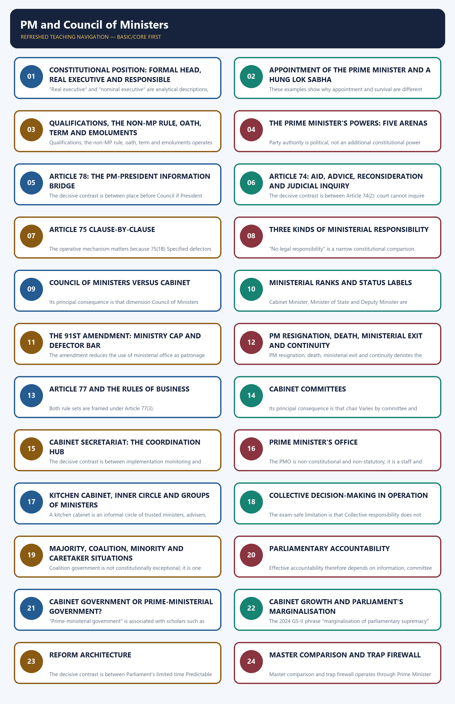

*Distinct embedded teaching-navigation image. The separate continuous Cārvāka-style flowchart package remains an independent at-a-glance artifact.*

### SESSION 1 — CONSTITUTIONAL POSITION: FORMAL HEAD, REAL EXECUTIVE AND RESPONSIBLE GOVERNMENT
#### DEFINITION / WHAT THIS IS CALLED

**Plain-language definition:** Constitutional position: formal head, real executive and responsible government denotes the constitutional rules and institutional links organised around People elect Lok Sabha.

**Technical definition:** "Real executive" and "nominal executive" are analytical descriptions, not phrases used by the constitutional text.

#### ANSWER-GRABBING OPENING — WRITE/ADAPT IN THE EXAM

> Articles 74 and 75 create a dual executive in which the President is formal head while the Prime Minister-led ministry exercises responsible political power.

#### MUST-WRITE KEYWORDS

- **Constitutional position**
- **formal head**
- **real executive**
- **responsible government**
- **Appointment, tenure, responsibility, oath, non-member rule, size cap**
- **Executive action, authentication and Rules of Business**

**How to use them:** Frame the answer through Constitutional position; define formal head, connect real executive with responsible government to explain the mechanism, and use Appointment, tenure, responsibility, oath, non-member rule, size cap for the decisive comparison or qualification.

Constitutional position: formal head, real executive and responsible government denotes the constitutional rules and institutional links organised around People elect Lok Sabha.
Constitutional position: formal head, real executive and responsible government operates through Majority / coalition support, connected with Prime Minister + Council of Ministers.
The operative mechanism matters because aid and advise: Article 74.
Its principal consequence is that president gives constitutional form.
The decisive contrast is between executive action in President's name: Article 77 and Ministries and departments implement.
The exam-safe limitation is that lok Sabha accountability: Article 75(3).
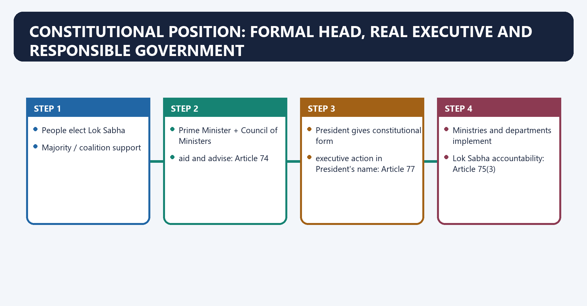
**Visual 1 - Constitutional chain**

```text
People elect Lok Sabha
          |
          v
Majority / coalition support
          |
          v
Prime Minister + Council of Ministers
          |
          | aid and advise: Article 74
          v
President gives constitutional form
          |
          | executive action in President's name: Article 77
          v
Ministries and departments implement
          |
          v
Lok Sabha accountability: Article 75(3)
```

Caption: Political choice comes from the confidence-holding ministry; constitutional form comes through the President.

- [FACT] Article 74 requires a Council of Ministers with the Prime Minister at its head to aid and advise the President.
- [FACT] Article 75(3) makes that Council collectively responsible to the Lok Sabha.
- [FACT] Article 77 expresses Union executive action in the President's name.
- [ANALYSIS] These provisions create a dual executive: the President is the formal constitutional head, while the PM-led ministry is the responsible political executive.
- [LIMIT] "Real executive" and "nominal executive" are analytical descriptions, not phrases used by the constitutional text.

**Visual 2 - Article control table**

| Article | Core rule | High-yield trap |
|---|---|---|
| 74 | PM-headed Council aids and advises President; advice inquiry barred | Advice is protected, not every resulting act |
| 75 | Appointment, tenure, responsibility, oath, non-member rule, size cap | Collective responsibility is to Lok Sabha |
| 77 | Executive action, authentication and Rules of Business | President's name does not mean personal decision |
| 78 | PM's duties toward President | Three specific duties, not a general ceremonial courtesy |
| 88 | Ministers and Attorney-General may participate across Houses | Participation does not create a vote in the other House |

#### CLOSING RECALL FLOW — CONSTITUTIONAL POSITION: FORMAL HEAD, REAL EXECUTIVE AND RESPONSIBLE GOVERNMENT

```closure-flow
SUBTOPIC: Constitutional position: formal head, real executive and responsible government
KEY TERMS / DEFINITIONS: Constitutional position · formal head · real executive · responsible government · Appointment, tenure, responsibility, oath, non-member rule, size cap · Executive action, authentication and Rules of Business
MECHANISM / ARGUMENT: "Real executive" and "nominal executive" are analytical descriptions, not phrases used by the constitutional text.
CONSEQUENCE / CONTRAST: These provisions create a dual executive: the President is the formal constitutional head, while the PM-led ministry is the responsible political executive.
UPSC TRAP / ANSWER-USE: Do not miss this limiting distinction: the decisive contrast is between executive action in President's name.
ANSWER-GRABBING FORMULATION: Articles 74 and 75 create a dual executive in which the President is formal head while the Prime Minister-led ministry exercises responsible political power.
```
### SESSION 2 — APPOINTMENT OF THE PRIME MINISTER AND A HUNG LOK SABHA
#### DEFINITION / WHAT THIS IS CALLED

**Plain-language definition:** Appointment of the Prime Minister and a hung Lok Sabha denotes the constitutional rules and institutional links organised around The decisive test of a disputed majority is the floor of the House, not private presidential satisfaction.

**Technical definition:** These examples show why appointment and survival are different questions: appointment begins the test; confidence completes it.

#### ANSWER-GRABBING OPENING — WRITE/ADAPT IN THE EXAM

> Charan Singh was appointed Prime Minister in 1979 in a fluid majority situation but resigned without facing the confidence vote after promised support was withdrawn.

#### MUST-WRITE KEYWORDS

- **Appointment of the Prime Minister**
- **a hung Lok Sabha**
- **Neutrality**
- **Objective material**
- **Floor test**
- **Alternative government**

**How to use them:** Frame the answer through Appointment of the Prime Minister; define a hung Lok Sabha, connect Neutrality with Objective material to explain the mechanism, and use Floor test for the decisive comparison or qualification.

Appointment of the Prime Minister and a hung Lok Sabha denotes the constitutional rules and institutional links organised around [FACT] The decisive test of a disputed majority is the floor of the House, not private presidential satisfaction.
Appointment of the Prime Minister and a hung Lok Sabha operates through Clear majority / stable pre-poll alliance, connected with Invite recognised leader.
The operative mechanism matters because assess objective support claims.
Its principal consequence is that appoint person most likely to command House.
The decisive contrast is between Require confidence test within a reasonable period and Governs Resigns / alternative tested /.
The exam-safe limitation is that constitutionally proper dissolution.
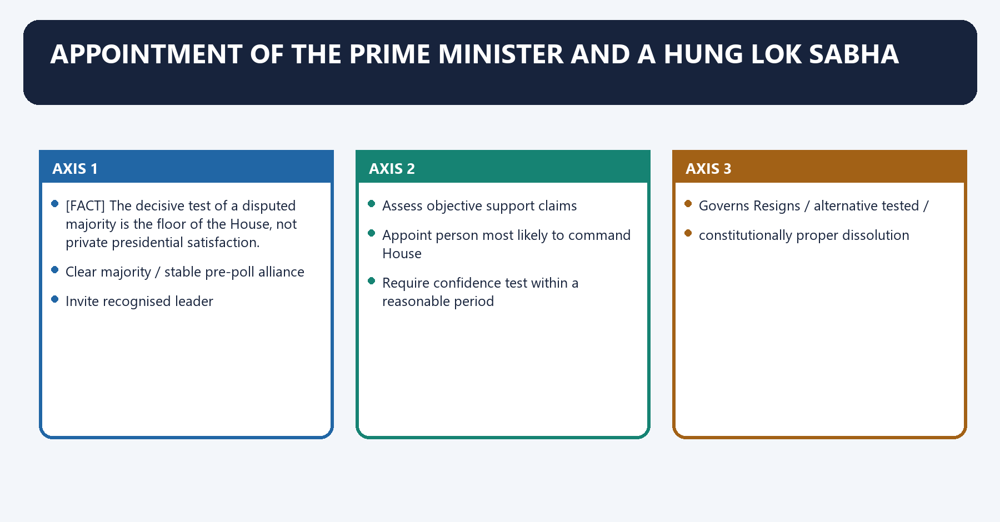
- [FACT] Article 75(1) states that the Prime Minister shall be appointed by the President. It does not prescribe a detailed selection procedure.
- [FACT] Under a clear Lok Sabha majority, constitutional convention requires appointment of the recognised leader capable of commanding that majority.
- [ANALYSIS] The President's choice becomes situationally important when no party or alliance has a clear majority, rival coalitions claim support, or an incumbent PM dies without an immediately settled successor.
- [FACT] The decisive test of a disputed majority is the floor of the House, not private presidential satisfaction.
- [LIMIT] *S. R. Bommai v. Union of India* (1994) arose in the State/Article 356 context. It supplies the broader floor-test principle but should not be cited as if it directly prescribed every Union appointment step.

**Visual 3 - Hung-House appointment flow**

```text
Election result
     |
     +-- Clear majority / stable pre-poll alliance
     |          |
     |          v
     |   Invite recognised leader
     |
     +-- Hung Lok Sabha
                |
                v
       Assess objective support claims
                |
                v
       Appoint person most likely to command House
                |
                v
       Require confidence test within a reasonable period
                |
          +-----+-----+
          |           |
        Wins        Loses
          |           |
       Governs     Resigns / alternative tested /
                   constitutionally proper dissolution
```

Caption: Presidential judgment is temporary and procedural; Lok Sabha supplies the democratic answer.

#### Appointment principles in a hung House

1. **Neutrality:** [ANALYSIS] the President should not convert discretion into partisan preference.
2. **Objective material:** letters of support, alliance decisions and public commitments may guide the invitation.
3. **Floor test:** support must be demonstrated in Lok Sabha.
4. **Alternative government:** [ANALYSIS] dissolution should not be automatic if another viable ministry can command confidence.
5. **Reasonable speed:** prolonged uncertainty can impair administration, but haste must not replace proof.

#### Illustrative history

- [FACT] Charan Singh was appointed Prime Minister in 1979 in a fluid majority situation but resigned without facing the confidence vote after promised support was withdrawn.
- [FACT] Atal Bihari Vajpayee's 1996 government resigned after it became clear that it could not secure the required Lok Sabha majority.
- [ANALYSIS] These examples show why appointment and survival are different questions: appointment begins the test; confidence completes it.

#### CLOSING RECALL FLOW — APPOINTMENT OF THE PRIME MINISTER AND A HUNG LOK SABHA

```closure-flow
SUBTOPIC: Appointment of the Prime Minister and a hung Lok Sabha
KEY TERMS / DEFINITIONS: Appointment of the Prime Minister · a hung Lok Sabha · Neutrality · Objective material · Floor test · Alternative government
MECHANISM / ARGUMENT: Neutrality: the President should not convert discretion into partisan preference.
CONSEQUENCE / CONTRAST: Charan Singh was appointed Prime Minister in 1979 in a fluid majority situation but resigned without facing the confidence vote after promised support was withdrawn.
UPSC TRAP / ANSWER-USE: It supplies the broader floor-test principle but should not be cited as if it directly prescribed every Union appointment step.
ANSWER-GRABBING FORMULATION: Charan Singh was appointed Prime Minister in 1979 in a fluid majority situation but resigned without facing the confidence vote after promised support was withdrawn.
```
### SESSION 3 — QUALIFICATIONS, THE NON-MP RULE, OATH, TERM AND EMOLUMENTS
#### DEFINITION / WHAT THIS IS CALLED

**Plain-language definition:** Qualifications, the non-MP rule, oath, term and emoluments denotes the constitutional rules and institutional links organised around Question Rule Qualification.

**Technical definition:** Qualifications, the non-MP rule, oath, term and emoluments operates through Must the PM already be an MP?

#### ANSWER-GRABBING OPENING — WRITE/ADAPT IN THE EXAM

> The temporary non-member rule gives a minister six months to enter Parliament, but cannot cure an underlying constitutional disqualification.

#### MUST-WRITE KEYWORDS

- **Qualifications**
- **the non-MP rule**
- **oath**
- **term**
- **emoluments**
- **Trap firewall**

**How to use them:** Frame the answer through Qualifications; define the non-MP rule, connect oath with term to explain the mechanism, and use emoluments for the decisive comparison or qualification.

Qualifications, the non-MP rule, oath, term and emoluments denotes the constitutional rules and institutional links organised around Question Rule Qualification.
Qualifications, the non-MP rule, oath, term and emoluments operates through Must the PM already be an MP? No Must become a member of either House within six consecutive months, connected with Must the PM be from Lok Sabha? No May be from Lok Sabha or Rajya Sabha.
The operative mechanism matters because is there a separate Article 75 qualification list? No detailed list Parliamentary eligibility and disqualification rules still matter.
Its principal consequence is that can a constitutionally disqualified person use the six-month window? No The window is not a licence to bypass disqualification.
The decisive contrast is between Who administers oath? President Oaths of office and secrecy under Article 75(4) and Third Schedule and Is the PM's term fixed? No Continues while commanding Lok Sabha confidence.
The exam-safe limitation is that [FACT] Article 75(4) requires the President to administer the oaths of office and secrecy in the Third Schedule.
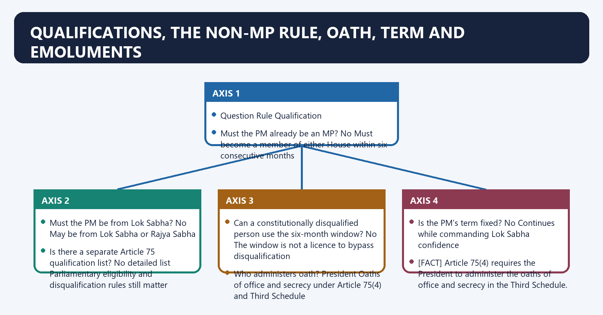
**Visual 4 - Eligibility and continuation matrix**

| Question | Rule | Qualification |
|---|---|---|
| Must the PM already be an MP? | No | Must become a member of either House within six consecutive months |
| Must the PM be from Lok Sabha? | No | May be from Lok Sabha or Rajya Sabha |
| Is there a separate Article 75 qualification list? | No detailed list | Parliamentary eligibility and disqualification rules still matter |
| Can a constitutionally disqualified person use the six-month window? | No | The window is not a licence to bypass disqualification |
| Who administers oath? | President | Oaths of office and secrecy under Article 75(4) and Third Schedule |
| Is the PM's term fixed? | No | Continues while commanding Lok Sabha confidence |

- [FACT] Article 75(5) allows a minister who is not a member of either House to hold office for only six consecutive months; thereafter the person ceases to be a minister unless membership has been obtained.
- [FACT] *S. P. Anand v. H. D. Deve Gowda* (1996) accepted that a non-member could be appointed Prime Minister subject to the six-month rule.
- [FACT] The PM may belong to either House. The Constitution does not reproduce the British convention that the PM must sit in the lower House.
- [FACT] Article 75(4) requires the President to administer the oaths of office and secrecy in the Third Schedule.
- [FACT] Article 75(2) says ministers hold office during the President's pleasure, but the PM cannot ordinarily be dismissed while retaining Lok Sabha confidence.
- [FACT] Article 75(6) leaves ministerial salaries and allowances to parliamentary law; no permanent amount should be memorised.
- [LIMIT] *B. R. Kapur v. State of Tamil Nadu* (2001) concerned appointment of a Chief Minister who was disqualified. Its wider lesson is that the temporary non-member rule does not cure an underlying constitutional disqualification.

> **Trap firewall:** Non-membership is temporarily curable; disqualification is not automatically curable by waiting six months.

#### CLOSING RECALL FLOW — QUALIFICATIONS, THE NON-MP RULE, OATH, TERM AND EMOLUMENTS

```closure-flow
SUBTOPIC: Qualifications, the non-MP rule, oath, term and emoluments
KEY TERMS / DEFINITIONS: Qualifications · the non-MP rule · oath · term · emoluments · Trap firewall
MECHANISM / ARGUMENT: Qualifications, the non-MP rule, oath, term and emoluments operates through Must the PM already be an MP?
CONSEQUENCE / CONTRAST: Its wider lesson is that the temporary non-member rule does not cure an underlying constitutional disqualification.
UPSC TRAP / ANSWER-USE: firewall: Non-membership is temporarily curable; disqualification is not automatically curable by waiting six months.
ANSWER-GRABBING FORMULATION: The temporary non-member rule gives a minister six months to enter Parliament, but cannot cure an underlying constitutional disqualification.
```
### SESSION 4 — THE PRIME MINISTER'S POWERS: FIVE ARENAS
#### DEFINITION / WHAT THIS IS CALLED

**Plain-language definition:** The Prime Minister's powers: five arenas denotes the constitutional rules and institutional links organised around +-----------------------+.

**Technical definition:** Party authority is political, not an additional constitutional power conferred by Article 75.

#### ANSWER-GRABBING OPENING — WRITE/ADAPT IN THE EXAM

> The PM leads the government in Parliament and must retain Lok Sabha confidence.

#### MUST-WRITE KEYWORDS

- **The Prime Minister's powers**
- **five arenas**
- **Article 78**
- **Article 75**
- **The Prime Minister's powers: five arenas**
- **The Prime Minister's**

**How to use them:** Frame the answer through The Prime Minister's powers; define five arenas, connect Article 78 with Article 75 to explain the mechanism, and use The Prime Minister's powers: five arenas for the decisive comparison or qualification.

The Prime Minister's powers: five arenas denotes the constitutional rules and institutional links organised around +-----------------------+.
The Prime Minister's powers: five arenas operates through Ministry President Parliament, connected with selects team - Article 78 channel - majority leader.
The operative mechanism matters because portfolios - advice link - government agenda.
Its principal consequence is that reshuffles - appointments input - dissolution advice.
The decisive contrast is between Party / coalition / nation and political leadership.
The exam-safe limitation is that inter-governmental coordination.
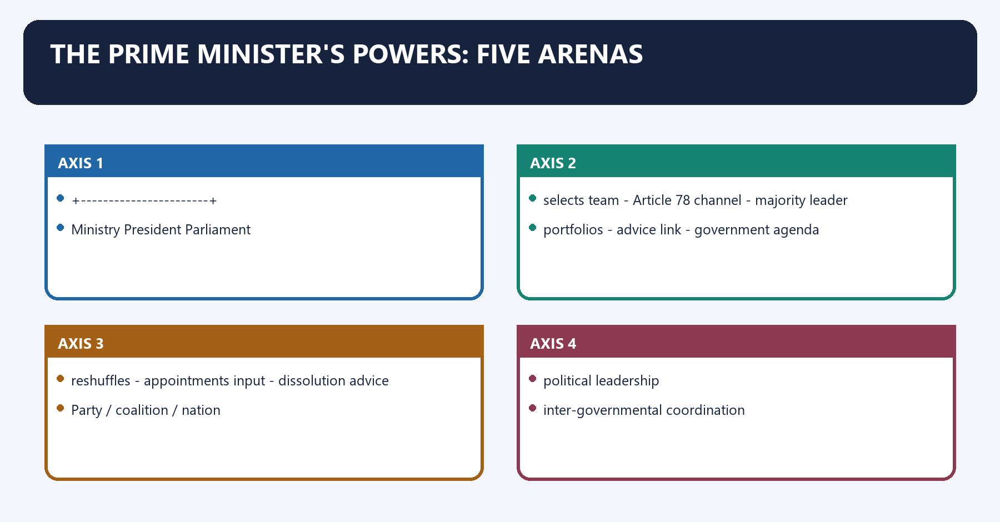
**Visual 5 - PM power map**

```text
                         PRIME MINISTER
                               |
       +-----------------------+-----------------------+
       |                       |                       |
   Ministry                President               Parliament
   - selects team          - Article 78 channel    - majority leader
   - portfolios            - advice link           - government agenda
   - reshuffles            - appointments input    - dissolution advice
       |                       |                       |
       +-----------------------+-----------------------+
                               |
                    Party / coalition / nation
                    - political leadership
                    - inter-governmental coordination
                    - crisis communication
                    - international representation
```

Caption: PM power combines constitutional functions, Cabinet leadership, party control and political authority.

#### A. In relation to the Council of Ministers

- [FACT] Other ministers are appointed by the President on the PM's advice under Article 75(1).
- [FACT] The PM allocates and reshuffles portfolios through the constitutional business-allocation process.
- [ANALYSIS] A minister who loses the PM's confidence is normally asked to resign; if the minister refuses, removal can be advised.
- [FACT] The PM chairs the Cabinet and coordinates the work of ministers.
- [ANALYSIS] Control of composition, portfolio and agenda makes the PM the structural centre of the ministry.

#### B. In relation to the President

- [FACT] The PM is the constitutionally specified communication channel under Article 78.
- [FACT] Major formal acts of the President normally rest on PM-led ministerial advice.
- [ANALYSIS] The President's rights to be informed, consulted and to warn operate through this relationship.
- [LIMIT] Lists of appointments "made on PM advice" must be institution-specific. Many constitutional and statutory appointments now use collegiums, committees or specially prescribed procedures.

#### C. In relation to Parliament

- [FACT] The PM leads the government in Parliament and must retain Lok Sabha confidence.
- [ANALYSIS] The PM coordinates the legislative programme and the government's political defence.
- [FACT] Summoning, prorogation and dissolution are formal presidential acts normally exercised on ministerial advice under the parliamentary system.
- [LIMIT] A PM cannot dissolve Rajya Sabha, a continuing chamber.

#### D. In relation to party and coalition

- [ANALYSIS] A PM who also dominates the governing party gains leverage over candidate selection, whip, policy and communication.
- [ANALYSIS] A coalition PM must bargain with allies over portfolios, common programmes and survival votes.
- [LIMIT] Party authority is political, not an additional constitutional power conferred by Article 75.

#### E. National and inter-governmental leadership

- [ANALYSIS] The PM often becomes the government's chief public spokesperson, crisis coordinator and international representative.
- [LIMIT] Membership or chairmanship of councils and bodies can change by law, resolution or notification. Do not treat a dated list as a permanent constitutional catalogue.

#### CLOSING RECALL FLOW — THE PRIME MINISTER'S POWERS: FIVE ARENAS

```closure-flow
SUBTOPIC: The Prime Minister's powers: five arenas
KEY TERMS / DEFINITIONS: The Prime Minister's powers · five arenas · Article 78 · Article 75 · The Prime Minister's powers: five arenas · The Prime Minister's
MECHANISM / ARGUMENT: Party authority is political, not an additional constitutional power conferred by Article 75.
CONSEQUENCE / CONTRAST: Its principal consequence is that reshuffles - appointments input - dissolution advice.
UPSC TRAP / ANSWER-USE: Do not miss this limiting distinction: the decisive contrast is between Party / coalition / nation and political leadership.
ANSWER-GRABBING FORMULATION: The PM leads the government in Parliament and must retain Lok Sabha confidence.
```
### SESSION 5 — ARTICLE 78: THE PM-PRESIDENT INFORMATION BRIDGE
#### DEFINITION / WHAT THIS IS CALLED

**Plain-language definition:** Article 78: the PM-President information bridge denotes the constitutional rules and institutional links organised around Council decisions on administration and legislative proposals.

**Technical definition:** The decisive contrast is between place before Council if President requires and Article 78 is a constitutional duty, not merely etiquette.

#### ANSWER-GRABBING OPENING — WRITE/ADAPT IN THE EXAM

> Article 78 preserves presidential access to information and collective ministerial consideration, but does not create a rival executive authority outside the Council of Ministers.

#### MUST-WRITE KEYWORDS

- **Article 78**
- **the PM-President information bridge**
- **Article 74**
- **Article 78: the PM-President information bridge**
- **Article**
- **PM-President**

**How to use them:** Frame the answer through Article 78; define the PM-President information bridge, connect Article 74 with Article 78: the PM-President information bridge to explain the mechanism, and use Article for the decisive comparison or qualification.

Article 78: the PM-President information bridge denotes the constitutional rules and institutional links organised around Council decisions on administration and legislative proposals.
Article 78: the PM-President information bridge operates through communicate to President, connected with Information on Union administration and legislative proposals.
The operative mechanism matters because furnish when President calls.
Its principal consequence is that decision taken by an individual minister but not considered by Council.
The decisive contrast is between place before Council if President requires and [FACT] Article 78 is a constitutional duty, not merely etiquette.
The exam-safe limitation is that [LIMIT] Article 78 does not authorise the President to replace the Council's final policy judgment.
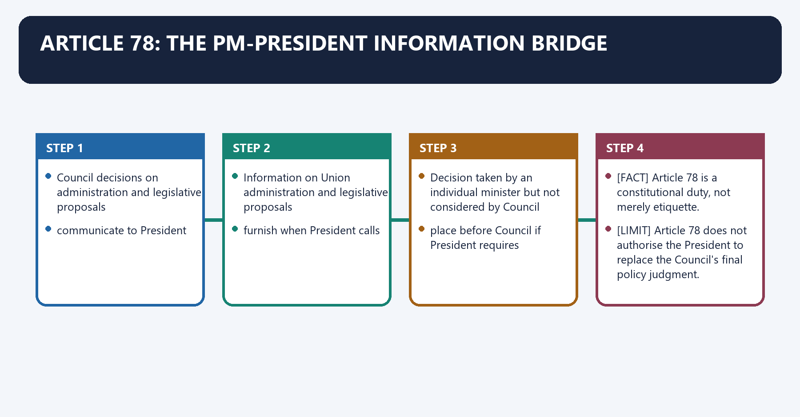
**Visual 6 - The three Article 78 duties**

```text
Duty (a)
Council decisions on administration and legislative proposals
                         -> communicate to President

Duty (b)
Information on Union administration and legislative proposals
                         -> furnish when President calls

Duty (c)
Decision taken by an individual minister but not considered by Council
                         -> place before Council if President requires
```

Caption: Article 78 preserves information, consultation and collective consideration without creating a rival executive.

- [FACT] Article 78 is a constitutional duty, not merely etiquette.
- [ANALYSIS] Clause (c) protects collective government by allowing the President to require Council-level consideration of a decision made by one minister.
- [LIMIT] Article 78 does not authorise the President to replace the Council's final policy judgment.
- [ANALYSIS] In a Mains answer, pair Article 78 with Article 74: information makes constitutional caution possible; binding advice preserves democratic responsibility.

#### CLOSING RECALL FLOW — ARTICLE 78: THE PM-PRESIDENT INFORMATION BRIDGE

```closure-flow
SUBTOPIC: Article 78: the PM-President information bridge
KEY TERMS / DEFINITIONS: Article 78 · the PM-President information bridge · Article 74 · Article 78: the PM-President information bridge · Article · PM-President
MECHANISM / ARGUMENT: Its principal consequence is that decision taken by an individual minister but not considered by Council.
CONSEQUENCE / CONTRAST: The decisive contrast is between place before Council if President requires and Article 78 is a constitutional duty, not merely etiquette.
UPSC TRAP / ANSWER-USE: The exam-safe limitation is that Article 78 does not authorise the President to replace the Council's final policy judgment.
ANSWER-GRABBING FORMULATION: Article 78 preserves presidential access to information and collective ministerial consideration, but does not create a rival executive authority outside the Council of Ministers.
```
### SESSION 6 — ARTICLE 74: AID, ADVICE, RECONSIDERATION AND JUDICIAL INQUIRY
#### DEFINITION / WHAT THIS IS CALLED

**Plain-language definition:** Article 74: aid, advice, reconsideration and judicial inquiry denotes the constitutional rules and institutional links organised around Council tenders advice.

**Technical definition:** The decisive contrast is between Article 74(2): court cannot inquire whether or what advice was tendered and But resulting action and underlying legality may still be reviewed.

#### ANSWER-GRABBING OPENING — WRITE/ADAPT IN THE EXAM

> State of Punjab (1974) affirmed the President and Governor as constitutional heads who ordinarily act on ministerial advice, subject to the Constitution.

#### MUST-WRITE KEYWORDS

- **Article 74**
- **aid**
- **advice**
- **reconsideration**
- **judicial inquiry**
- **Article 74: aid, advice, reconsideration and judicial inquiry**

**How to use them:** Frame the answer through Article 74; define aid, connect advice with reconsideration to explain the mechanism, and use judicial inquiry for the decisive comparison or qualification.

Article 74: aid, advice, reconsideration and judicial inquiry denotes the constitutional rules and institutional links organised around Council tenders advice.
Article 74: aid, advice, reconsideration and judicial inquiry operates through President may accept, connected with or return once for reconsideration.
The operative mechanism matters because council reconsiders.
Its principal consequence is that reiterated advice binds.
The decisive contrast is between Article 74(2): court cannot inquire whether or what advice was tendered and But resulting action and underlying legality may still be reviewed.
The exam-safe limitation is that [FACT] The 42nd Amendment made compliance with ministerial advice explicit.
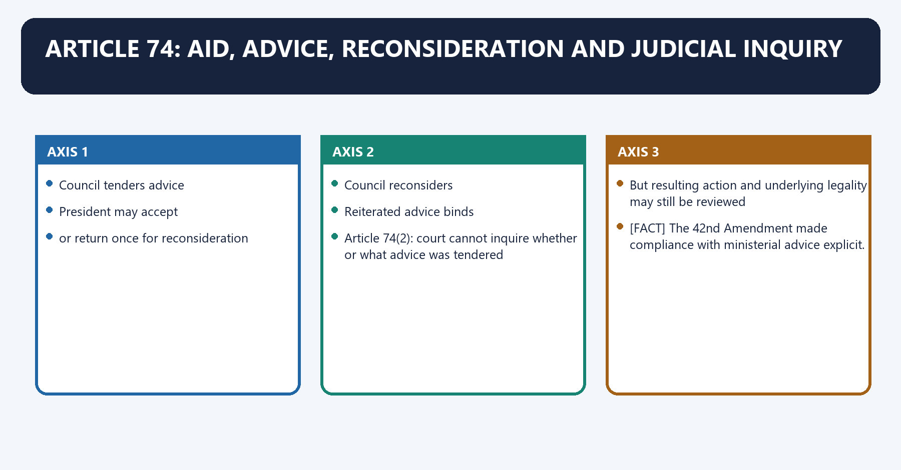
**Visual 7 - Advice cycle**

```text
Council tenders advice
          |
          v
President may accept
          |
          +-- or return once for reconsideration
                          |
                          v
                  Council reconsiders
                          |
                          v
                 Reiterated advice binds

Article 74(2): court cannot inquire whether or what advice was tendered
But resulting action and underlying legality may still be reviewed
```

- [FACT] The 42nd Amendment made compliance with ministerial advice explicit.
- [FACT] The 44th Amendment allows the President to require reconsideration once; after reconsideration the advice is binding.
- [FACT] Article 74(2) bars courts from inquiring into whether any, and if so what, advice was tendered.
- [LIMIT] The inquiry bar is not blanket immunity for executive action, jurisdictional error, mala fides or unconstitutional material.
- [FACT] *U. N. R. Rao v. Indira Gandhi* (1971) held that dissolution of Lok Sabha does not eliminate the need for a Council of Ministers under Article 74.
- [FACT] *Shamsher Singh v. State of Punjab* (1974) affirmed the President and Governor as constitutional heads who ordinarily act on ministerial advice, subject to the Constitution.

#### CLOSING RECALL FLOW — ARTICLE 74: AID, ADVICE, RECONSIDERATION AND JUDICIAL INQUIRY

```closure-flow
SUBTOPIC: Article 74: aid, advice, reconsideration and judicial inquiry
KEY TERMS / DEFINITIONS: Article 74 · aid · advice · reconsideration · judicial inquiry · Article 74: aid, advice, reconsideration and judicial inquiry
MECHANISM / ARGUMENT: The decisive contrast is between Article 74(2): court cannot inquire whether or what advice was tendered and But resulting action and underlying legality may still be reviewed.
CONSEQUENCE / CONTRAST: Indira Gandhi (1971) held that dissolution of Lok Sabha does not eliminate the need for a Council of Ministers under Article 74.
UPSC TRAP / ANSWER-USE: The inquiry bar is not blanket immunity for executive action, jurisdictional error, mala fides or unconstitutional material.
ANSWER-GRABBING FORMULATION: State of Punjab (1974) affirmed the President and Governor as constitutional heads who ordinarily act on ministerial advice, subject to the Constitution.
```
### SESSION 7 — ARTICLE 75 CLAUSE-BY-CLAUSE
#### DEFINITION / WHAT THIS IS CALLED

**Plain-language definition:** Article 75 clause-by-clause denotes the constitutional rules and institutional links organised around Clause Proposition Exam use.

**Technical definition:** The operative mechanism matters because 75(1B) Specified defectors are barred from ministership for the constitutional period Anti-office-shopping control.

#### ANSWER-GRABBING OPENING — WRITE/ADAPT IN THE EXAM

> Article 75 combines prime-ministerial formation, collective responsibility, individual tenure, ministry-size limits and a defector bar, linking executive authority to Lok Sabha confidence and constitutional restraint.

#### MUST-WRITE KEYWORDS

- **Article 75 clause-by-clause**
- **Formation and PM primacy**
- **Anti-office-shopping control**
- **75(1A)**
- **91st Amendment cap**
- **75(1B)**

**How to use them:** Frame the answer through Article 75 clause-by-clause; define Formation and PM primacy, connect Anti-office-shopping control with 75(1A) to explain the mechanism, and use 91st Amendment cap for the decisive comparison or qualification.

Article 75 clause-by-clause denotes the constitutional rules and institutional links organised around Clause Proposition Exam use.
Article 75 clause-by-clause operates through 75(1) PM appointed by President; other ministers on PM advice Formation and PM primacy, connected with 75(1A) Total ministers including PM cannot exceed 15% of Lok Sabha strength 91st Amendment cap.
The operative mechanism matters because 75(1B) Specified defectors are barred from ministership for the constitutional period Anti-office-shopping control.
Its principal consequence is that 75(2) Ministers hold office during President's pleasure Individual tenure.
The decisive contrast is between 75(3) Council collectively responsible to Lok Sabha Confidence and solidarity and 75(4) Oaths of office and secrecy Third Schedule.
The exam-safe limitation is that 75(5) Six consecutive months for a non-member Temporary exception.
**Visual 8 - Article 75 control card**

| Clause | Proposition | Exam use |
|---|---|---|
| 75(1) | PM appointed by President; other ministers on PM advice | Formation and PM primacy |
| 75(1A) | Total ministers including PM cannot exceed 15% of Lok Sabha strength | 91st Amendment cap |
| 75(1B) | Specified defectors are barred from ministership for the constitutional period | Anti-office-shopping control |
| 75(2) | Ministers hold office during President's pleasure | Individual tenure |
| 75(3) | Council collectively responsible to Lok Sabha | Confidence and solidarity |
| 75(4) | Oaths of office and secrecy | Third Schedule |
| 75(5) | Six consecutive months for a non-member | Temporary exception |
| 75(6) | Salaries and allowances determined by Parliament | No frozen amount |

#### CLOSING RECALL FLOW — ARTICLE 75 CLAUSE-BY-CLAUSE

```closure-flow
SUBTOPIC: Article 75 clause-by-clause
KEY TERMS / DEFINITIONS: Article 75 clause-by-clause · Formation and PM primacy · Anti-office-shopping control · 75(1A) · 91st Amendment cap · 75(1B)
MECHANISM / ARGUMENT: The operative mechanism matters because 75(1B) Specified defectors are barred from ministership for the constitutional period Anti-office-shopping control.
CONSEQUENCE / CONTRAST: Its principal consequence is that 75(2) Ministers hold office during President's pleasure Individual tenure.
UPSC TRAP / ANSWER-USE: Do not miss this limiting distinction: the decisive contrast is between 75(3) Council collectively responsible to Lok Sabha Confidence and...
ANSWER-GRABBING FORMULATION: Article 75 combines prime-ministerial formation, collective responsibility, individual tenure, ministry-size limits and a defector bar, linking executive authority to Lok Sabha confidence and constitutional restraint.
```
### SESSION 8 — THREE KINDS OF MINISTERIAL RESPONSIBILITY
#### DEFINITION / WHAT THIS IS CALLED

**Plain-language definition:** Three kinds of ministerial responsibility denotes the constitutional rules and institutional links organised around Article 75(3), Lok Sabha.

**Technical definition:** "No legal responsibility" is a narrow constitutional comparison.

#### ANSWER-GRABBING OPENING — WRITE/ADAPT IN THE EXAM

> India does not require a ministerial countersignature on every formal act of the President as a universal condition of validity.

#### MUST-WRITE KEYWORDS

- **Three kinds of ministerial responsibility**
- **Confidence**
- **Solidarity**
- **Unified accountability**
- **Article 75**
- **Article 77**

**How to use them:** Frame the answer through Three kinds of ministerial responsibility; define Confidence, connect Solidarity with Unified accountability to explain the mechanism, and use Article 75 for the decisive comparison or qualification.

Three kinds of ministerial responsibility denotes the constitutional rules and institutional links organised around Article 75(3), Lok Sabha.
Three kinds of ministerial responsibility operates through confidence + solidarity + unity, connected with INDIVIDUAL ----------- LEGAL.
The operative mechanism matters because article 75(2) no universal.
Its principal consequence is that pM-led discipline countersignature rule.
The decisive contrast is between A. Collective responsibility and [FACT] The entire Council stands or falls with Lok Sabha confidence, including ministers who sit in Rajya Sabha.
The exam-safe limitation is that [FACT] A passed no-confidence motion requires the ministry to resign or pursue a constitutionally available dissolution route.
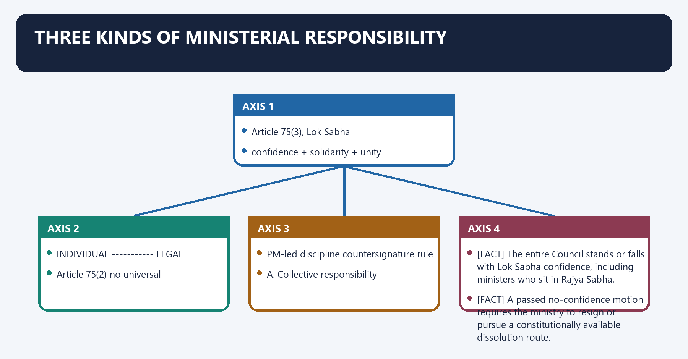
**Visual 9 - Responsibility triangle**

```text
                  COLLECTIVE
             Article 75(3), Lok Sabha
          confidence + solidarity + unity
                    /           \
                   /             \
          INDIVIDUAL ----------- LEGAL
          Article 75(2)          no universal
          PM-led discipline      countersignature rule
```

#### A. Collective responsibility

- [FACT] The entire Council stands or falls with Lok Sabha confidence, including ministers who sit in Rajya Sabha.
- [FACT] A passed no-confidence motion requires the ministry to resign or pursue a constitutionally available dissolution route.
- [ANALYSIS] Collective responsibility has three dimensions:
  1. **Confidence:** retain Lok Sabha support.
  2. **Solidarity:** publicly defend settled decisions or resign.
  3. **Unified accountability:** answer as one government even though departments are separately administered.
- [LIMIT] Defeat of every government bill does not mechanically equal loss of confidence. Express confidence questions, no-confidence, essential supply and political context matter.

#### B. Individual responsibility

- [FACT] Article 75(2) places each minister's tenure during the President's pleasure.
- [ANALYSIS] In parliamentary practice the PM is the effective political enforcer: one minister may be removed without the entire Council resigning.
- [ANALYSIS] Parliament can expose departmental failure through questions, censure and committees, but does not ordinarily dismiss one Union minister by a standalone no-confidence vote.
- [LIMIT] Individual political responsibility does not mean every administrative error must produce resignation; convention has been unevenly enforced.

#### C. No British-style universal legal responsibility

- [FACT] India does not require a ministerial countersignature on every formal act of the President as a universal condition of validity.
- [FACT] Article 77 instead provides expression in the President's name and authentication according to rules.
- [LIMIT] "No legal responsibility" is a narrow constitutional comparison. Ministers remain subject to criminal law, civil law, anti-corruption law, statutory duties and judicial review.

#### Cabinet solidarity example

- [FACT] B. R. Ambedkar tendered his resignation from the Union Cabinet in **1951** over the Hindu Code Bill issue, and it was accepted.
- [ANALYSIS] Use it as an illustration that fundamental disagreement may end in resignation rather than continuing public opposition from within the ministry.
- [LIMIT] Do not misdate the resignation to 1953, and do not reduce a complex political episode to a constitutional rule.

#### CLOSING RECALL FLOW — THREE KINDS OF MINISTERIAL RESPONSIBILITY

```closure-flow
SUBTOPIC: Three kinds of ministerial responsibility
KEY TERMS / DEFINITIONS: Three kinds of ministerial responsibility · Confidence · Solidarity · Unified accountability · Article 75 · Article 77
MECHANISM / ARGUMENT: Individual political responsibility does not mean every administrative error must produce resignation; convention has been unevenly enforced.
CONSEQUENCE / CONTRAST: India does not require a ministerial countersignature on every formal act of the President as a universal condition of validity.
UPSC TRAP / ANSWER-USE: Defeat of every government bill does not mechanically equal loss of confidence.
ANSWER-GRABBING FORMULATION: India does not require a ministerial countersignature on every formal act of the President as a universal condition of validity.
```
### SESSION 9 — COUNCIL OF MINISTERS VERSUS CABINET
#### DEFINITION / WHAT THIS IS CALLED

**Plain-language definition:** Council of Ministers versus Cabinet denotes the constitutional rules and institutional links organised around COUNCIL OF MINISTERS.

**Technical definition:** Its principal consequence is that dimension Council of Ministers Cabinet.

#### ANSWER-GRABBING OPENING — WRITE/ADAPT IN THE EXAM

> The Cabinet is constitutionally narrower than the Council of Ministers and now appears expressly in Article 352, although the original text did not name it.

#### MUST-WRITE KEYWORDS

- **Council of Ministers versus Cabinet**
- **COUNCIL OF MINISTERS**
- **All ministerial ranks; Article 74/75 institution**
- **CABINET**
- **Senior Cabinet-rank decision forum**
- **central collective policy body**

**How to use them:** Frame the answer through Council of Ministers versus Cabinet; define COUNCIL OF MINISTERS, connect All ministerial ranks; Article 74/75 institution with CABINET to explain the mechanism, and use Senior Cabinet-rank decision forum for the decisive comparison or qualification.

Council of Ministers versus Cabinet denotes the constitutional rules and institutional links organised around COUNCIL OF MINISTERS.
Council of Ministers versus Cabinet operates through All ministerial ranks; Article 74/75 institution, connected with Senior Cabinet-rank decision forum.
The operative mechanism matters because central collective policy body.
Its principal consequence is that dimension Council of Ministers Cabinet.
The decisive contrast is between Constitutional base Articles 74 and 75 Expressly referred to and defined for Article 352(3) purposes and Membership All Union ministers PM and ministers of Cabinet rank.
The exam-safe limitation is that function Constitutional ministry that bears collective responsibility Inner deliberative and decision-making core.
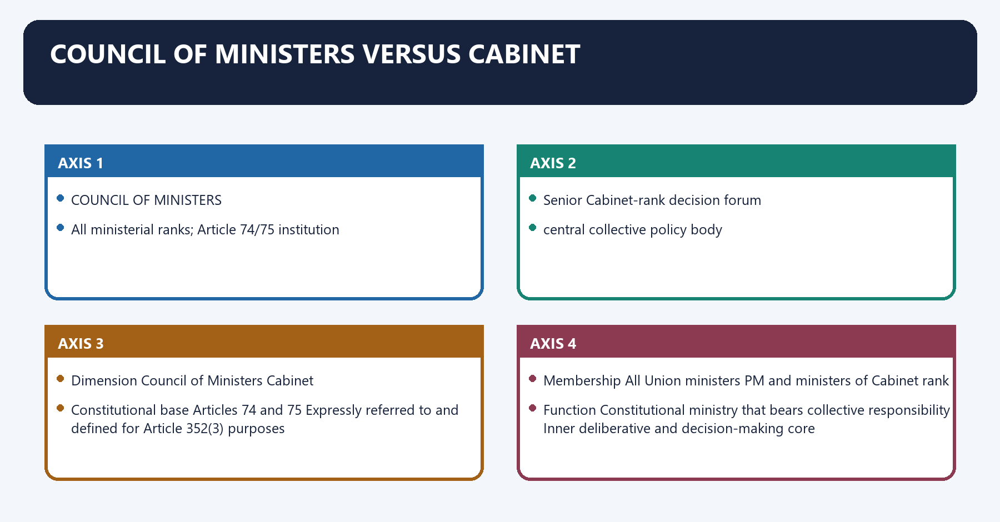
**Visual 10 - Nested executive**

```text
+------------------------------------------------------+
|              COUNCIL OF MINISTERS                    |
|  All ministerial ranks; Article 74/75 institution    |
|                                                      |
|       +--------------------------------------+       |
|       |               CABINET                |       |
|       | Senior Cabinet-rank decision forum   |       |
|       | central collective policy body       |       |
|       +--------------------------------------+       |
+------------------------------------------------------+
```

| Dimension | Council of Ministers | Cabinet |
|---|---|---|
| Constitutional base | Articles 74 and 75 | Expressly referred to and defined for Article 352(3) purposes |
| Membership | All Union ministers | PM and ministers of Cabinet rank |
| Function | Constitutional ministry that bears collective responsibility | Inner deliberative and decision-making core |
| Meeting pattern | Not ordinarily a single regular deliberative forum | Meets to decide major policy and coordination matters |
| Size | Variable, subject to Article 75(1A) maximum | Variable; no constitutional fixed number |
| Responsibility | Collectively responsible to Lok Sabha | Its decisions bind the wider ministry through collective responsibility |

- [FACT] The 44th Amendment inserted the Article 352(3) requirement of a written Cabinet decision for a national-emergency proclamation.
- [FACT] Article 352 explains "Cabinet" as the Council consisting of the PM and other ministers of Cabinet rank under Article 75.
- [LIMIT] It is inaccurate to say that the Cabinet is wholly absent from the Constitution today; it was absent from the original text but now appears in Article 352.

#### CLOSING RECALL FLOW — COUNCIL OF MINISTERS VERSUS CABINET

```closure-flow
SUBTOPIC: Council of Ministers versus Cabinet
KEY TERMS / DEFINITIONS: Council of Ministers versus Cabinet · COUNCIL OF MINISTERS · All ministerial ranks; Article 74/75 institution · CABINET · Senior Cabinet-rank decision forum · central collective policy body
MECHANISM / ARGUMENT: Its principal consequence is that dimension Council of Ministers Cabinet.
CONSEQUENCE / CONTRAST: The decisive contrast is between Constitutional base Articles 74 and 75 Expressly referred to and defined for Article 352(3) purposes and Membership All Union ministers PM and ministers of Cabinet rank.
UPSC TRAP / ANSWER-USE: It is inaccurate to say that the Cabinet is wholly absent from the Constitution today; it was absent from the original text but now appears in Article 352.
ANSWER-GRABBING FORMULATION: The Cabinet is constitutionally narrower than the Council of Ministers and now appears expressly in Article 352, although the original text did not name it.
```
### SESSION 10 — MINISTERIAL RANKS AND STATUS LABELS
#### DEFINITION / WHAT THIS IS CALLED

**Plain-language definition:** Ministerial ranks and status labels denotes the constitutional rules and institutional links organised around normally heads a major ministry; member of Cabinet.

**Technical definition:** Cabinet Minister, Minister of State and Deputy Minister are conventional political ranks used in standard constitutional practice.

#### ANSWER-GRABBING OPENING — WRITE/ADAPT IN THE EXAM

> The Constitution does not provide an exhaustive rank code or require every rank to exist at all times.

#### MUST-WRITE KEYWORDS

- **Ministerial ranks**
- **status labels**
- **Ministerial ranks and status labels**
- **Ministerial**
- **Cabinet**
- **Its principal consequence**

**How to use them:** Frame the answer through Ministerial ranks; define status labels, connect Ministerial ranks and status labels with Ministerial to explain the mechanism, and use Cabinet for the decisive comparison or qualification.

Ministerial ranks and status labels denotes the constitutional rules and institutional links organised around normally heads a major ministry; member of Cabinet.
Ministerial ranks and status labels operates through Minister of State (Independent Charge), connected with heads assigned ministry/department without a Cabinet Minister above.
The operative mechanism matters because minister of State (Attached).
Its principal consequence is that assists a Cabinet Minister in allocated work.
The decisive contrast is between conventional assisting rank; may not exist in every ministry or period and [LIMIT] The Constitution does not provide an exhaustive rank code or require every rank to exist at all times.
The exam-safe limitation is that normally heads a major ministry; member of Cabinet.
**Visual 11 - Rank ladder**

```text
Cabinet Minister
  -> normally heads a major ministry; member of Cabinet

Minister of State (Independent Charge)
  -> heads assigned ministry/department without a Cabinet Minister above

Minister of State (Attached)
  -> assists a Cabinet Minister in allocated work

Deputy Minister
  -> conventional assisting rank; may not exist in every ministry or period
```

- [FACT] Cabinet Minister, Minister of State and Deputy Minister are conventional political ranks used in standard constitutional practice.
- [LIMIT] The Constitution does not provide an exhaustive rank code or require every rank to exist at all times.
- [FACT] A Minister of State with independent charge is not thereby converted into a Cabinet Minister; attendance at Cabinet may be by invitation for relevant business.
- [ANALYSIS] Rank affects access and political weight, but legal responsibility still flows through the Council and the minister's allocated business.
- [FACT] "Deputy Prime Minister" is a descriptive political title, not a separate constitutional office with PM powers. The Supreme Court accepted Devi Lal's oath while treating the PM as constitutionally singular.

#### CLOSING RECALL FLOW — MINISTERIAL RANKS AND STATUS LABELS

```closure-flow
SUBTOPIC: Ministerial ranks and status labels
KEY TERMS / DEFINITIONS: Ministerial ranks · status labels · Ministerial ranks and status labels · Ministerial · Cabinet · Its principal consequence
MECHANISM / ARGUMENT: A Minister of State with independent charge is not thereby converted into a Cabinet Minister; attendance at Cabinet may be by invitation for relevant business.
CONSEQUENCE / CONTRAST: The decisive contrast is between conventional assisting rank; may not exist in every ministry or period and The Constitution does not provide an exhaustive rank code or require every rank to exist at all times.
UPSC TRAP / ANSWER-USE: The Constitution does not provide an exhaustive rank code or require every rank to exist at all times.
ANSWER-GRABBING FORMULATION: The Constitution does not provide an exhaustive rank code or require every rank to exist at all times.
```
### SESSION 11 — THE 91ST AMENDMENT: MINISTRY CAP AND DEFECTOR BAR
#### DEFINITION / WHAT THIS IS CALLED

**Plain-language definition:** The 91st Amendment: ministry cap and defector bar denotes the constitutional rules and institutional links organised around 91st Amendment, 2003.

**Technical definition:** The amendment reduces the use of ministerial office as patronage and deters reward after defection.

#### ANSWER-GRABBING OPENING — WRITE/ADAPT IN THE EXAM

> The 91st Amendment caps ministry size and bars specified defectors, but cannot eliminate bargaining through portfolios, party offices or coalition arrangements.

#### MUST-WRITE KEYWORDS

- **The 91st Amendment**
- **ministry cap**
- **defector bar**
- **Lok Sabha**
- **Article 75**
- **Article 164**

**How to use them:** Frame the answer through The 91st Amendment; define ministry cap, connect defector bar with Lok Sabha to explain the mechanism, and use Article 75 for the decisive comparison or qualification.

The 91st Amendment: ministry cap and defector bar denotes the constitutional rules and institutional links organised around 91st Amendment, 2003.
The 91st Amendment: ministry cap and defector bar operates through Total Union ministers including PM, connected with <= 15% of total Lok Sabha membership.
The operative mechanism matters because member disqualified under specified.
Its principal consequence is that tenth Schedule rule barred from ministership.
The decisive contrast is between for the constitutional period and [FACT] The cap is calculated with reference to the Lok Sabha , not both Houses combined.
The exam-safe limitation is that [FACT] The PM is included in the total.
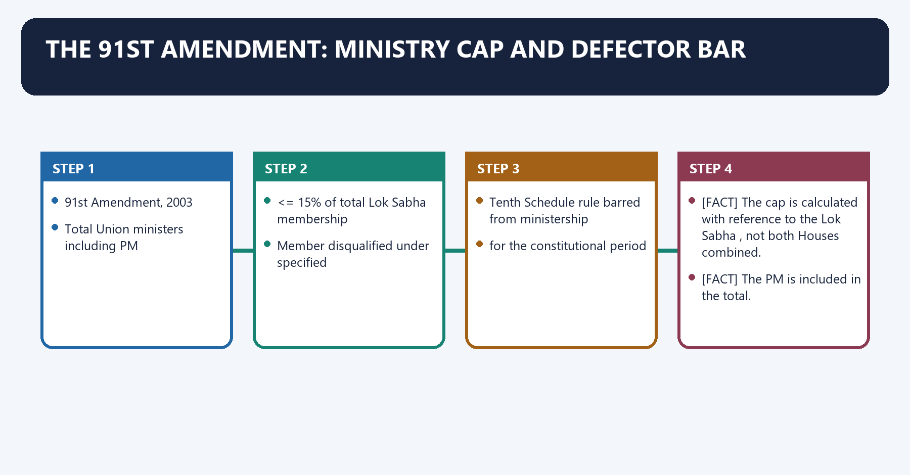
**Visual 12 - Two anti-patronage controls**

```text
91st Amendment, 2003
        |
        +-- Article 75(1A)
        |      Total Union ministers including PM
        |      <= 15% of total Lok Sabha membership
        |
        +-- Article 75(1B)
               Member disqualified under specified
               Tenth Schedule rule barred from ministership
               for the constitutional period
```

- [FACT] The cap is calculated with reference to the **Lok Sabha**, not both Houses combined.
- [FACT] The PM is included in the total.
- [LIMIT] There is no Union constitutional minimum equivalent to the State minimum of 12 under Article 164(1A).
- [FACT] Article 75(1B) bars a member disqualified under paragraph 2 of the Tenth Schedule from ministerial appointment from the date of disqualification until the term would expire, or until re-election before that date, whichever is earlier.
- [ANALYSIS] The amendment reduces the use of ministerial office as patronage and deters reward after defection.
- [LIMIT] It does not eliminate political bargaining, because portfolio quality, parliamentary offices and party positions remain outside a simple head-count cap.

#### CLOSING RECALL FLOW — THE 91ST AMENDMENT: MINISTRY CAP AND DEFECTOR BAR

```closure-flow
SUBTOPIC: The 91st Amendment: ministry cap and defector bar
KEY TERMS / DEFINITIONS: The 91st Amendment · ministry cap · defector bar · Lok Sabha · Article 75 · Article 164
MECHANISM / ARGUMENT: It does not eliminate political bargaining, because portfolio quality, parliamentary offices and party positions remain outside a simple head-count cap.
CONSEQUENCE / CONTRAST: The decisive contrast is between for the constitutional period and The cap is calculated with reference to the Lok Sabha , not both Houses combined.
UPSC TRAP / ANSWER-USE: The cap is calculated with reference to the Lok Sabha, not both Houses combined.
ANSWER-GRABBING FORMULATION: The 91st Amendment caps ministry size and bars specified defectors, but cannot eliminate bargaining through portfolios, party offices or coalition arrangements.
```
### SESSION 12 — PM RESIGNATION, DEATH, MINISTERIAL EXIT AND CONTINUITY
#### DEFINITION / WHAT THIS IS CALLED

**Plain-language definition:** PM resignation, death, ministerial exit and continuity operates through One minister resigns or is removed Council continues; portfolio is reallocated, connected with PM resigns Entire Council goes because its existence is PM-headed.

**Technical definition:** PM resignation, death, ministerial exit and continuity denotes the constitutional rules and institutional links organised around Event Constitutional-political consequence.

#### ANSWER-GRABBING OPENING — WRITE/ADAPT IN THE EXAM

> The PM is the head required by Article 74; therefore the PM's resignation or death ends the existing Council as a political ministry.

#### MUST-WRITE KEYWORDS

- **PM resignation**
- **death**
- **ministerial exit**
- **continuity**
- **Council continues; portfolio is reallocated**
- **PM resigns**

**How to use them:** Frame the answer through PM resignation; define death, connect ministerial exit with continuity to explain the mechanism, and use Council continues; portfolio is reallocated for the decisive comparison or qualification.

PM resignation, death, ministerial exit and continuity denotes the constitutional rules and institutional links organised around Event Constitutional-political consequence.
PM resignation, death, ministerial exit and continuity operates through One minister resigns or is removed Council continues; portfolio is reallocated, connected with PM resigns Entire Council goes because its existence is PM-headed.
The operative mechanism matters because pM dies Council cannot continue as the same PM-headed ministry; successor must be appointed.
Its principal consequence is that lok Sabha dissolved Council continues for governance until successor arrangements.
The decisive contrast is between No-confidence carried Ministry must resign or seek a constitutionally proper dissolution and Election underway Incumbent may continue in caretaker capacity by convention.
The exam-safe limitation is that [FACT] U. N. R. Rao confirms that dissolution does not remove the constitutional necessity for ministerial advice.
**Visual 13 - What collapses the ministry?**

| Event | Constitutional-political consequence |
|---|---|
| One minister resigns or is removed | Council continues; portfolio is reallocated |
| PM resigns | Entire Council goes because its existence is PM-headed |
| PM dies | Council cannot continue as the same PM-headed ministry; successor must be appointed |
| Lok Sabha dissolved | Council continues for governance until successor arrangements |
| No-confidence carried | Ministry must resign or seek a constitutionally proper dissolution |
| Election underway | Incumbent may continue in caretaker capacity by convention |

- [FACT] The PM is the head required by Article 74; therefore the PM's resignation or death ends the existing Council as a political ministry.
- [ANALYSIS] The President may ask the outgoing ministry to continue temporarily until a successor is appointed, preventing an executive vacuum.
- [FACT] *U. N. R. Rao* confirms that dissolution does not remove the constitutional necessity for ministerial advice.
- [LIMIT] "Dissolution of the Council of Ministers" is a convenient textbook expression. Unlike Lok Sabha, the Council is not a chamber formally dissolved; it resigns or is replaced.

#### CLOSING RECALL FLOW — PM RESIGNATION, DEATH, MINISTERIAL EXIT AND CONTINUITY

```closure-flow
SUBTOPIC: PM resignation, death, ministerial exit and continuity
KEY TERMS / DEFINITIONS: PM resignation · death · ministerial exit · continuity · Council continues; portfolio is reallocated · PM resigns
MECHANISM / ARGUMENT: PM resignation, death, ministerial exit and continuity denotes the constitutional rules and institutional links organised around Event Constitutional-political consequence.
CONSEQUENCE / CONTRAST: The PM is the head required by Article 74; therefore the PM's resignation or death ends the existing Council as a political ministry.
UPSC TRAP / ANSWER-USE: Rao confirms that dissolution does not remove the constitutional necessity for ministerial advice.
ANSWER-GRABBING FORMULATION: The PM is the head required by Article 74; therefore the PM's resignation or death ends the existing Council as a political ministry.
```
### SESSION 13 — ARTICLE 77 AND THE RULES OF BUSINESS
#### DEFINITION / WHAT THIS IS CALLED

**Plain-language definition:** Article 77 and the Rules of Business denotes the constitutional rules and institutional links organised around Article 77(1): Executive action expressed in President's name.

**Technical definition:** Both rule sets are framed under Article 77(3).

#### ANSWER-GRABBING OPENING — WRITE/ADAPT IN THE EXAM

> A substantial part of government business is decided at departmental level under the minister-in-charge, subject to required consultation.

#### MUST-WRITE KEYWORDS

- **Article 77**
- **the Rules of Business**
- **Core purpose**
- **Allocates subjects among ministries/departments**
- **Prescribes disposal, consultation and escalation**
- **Memory hook**

**How to use them:** Frame the answer through Article 77; define the Rules of Business, connect Core purpose with Allocates subjects among ministries/departments to explain the mechanism, and use Prescribes disposal, consultation and escalation for the decisive comparison or qualification.

Article 77 and the Rules of Business denotes the constitutional rules and institutional links organised around Article 77(1): Executive action expressed in President's name.
Article 77 and the Rules of Business operates through Article 77(2): Orders/instruments authenticated under rules, connected with Article 77(3): Rules for convenient transaction and allocation of business.
The operative mechanism matters because allocation of Business Transaction of Business.
Its principal consequence is that rules, 1961 Rules, 1961.
The decisive contrast is between "Who handles?" "How decided?" and Question Allocation of Business Rules, 1961 Transaction of Business Rules, 1961.
The exam-safe limitation is that core purpose Allocates subjects among ministries/departments Prescribes disposal, consultation and escalation.
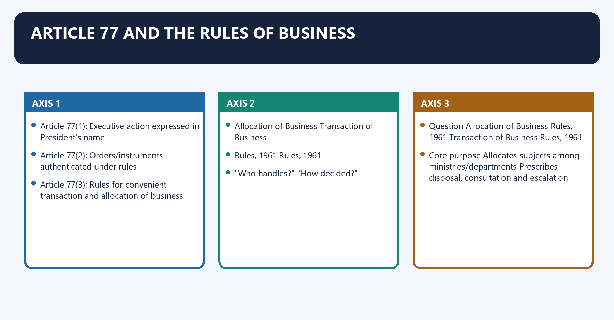
**Visual 14 - Article 77 structure**

```text
Article 77(1): Executive action expressed in President's name
Article 77(2): Orders/instruments authenticated under rules
Article 77(3): Rules for convenient transaction and allocation of business
                                  |
                    +-------------+-------------+
                    |                           |
          Allocation of Business        Transaction of Business
             Rules, 1961                    Rules, 1961
             "Who handles?"                  "How decided?"
```

| Question | Allocation of Business Rules, 1961 | Transaction of Business Rules, 1961 |
|---|---|---|
| Core purpose | Allocates subjects among ministries/departments | Prescribes disposal, consultation and escalation |
| Memory hook | Address of business | Travel of business |
| Key effect | Identifies subject ownership | Identifies decision route and required approval |
| PM connection | Business allocated among ministers on PM advice | Specifies cases for PM, Cabinet, committee or President |
| Caution | Schedules change | Procedures and reserved cases change |

- [FACT] Both rule sets are framed under Article 77(3).
- [FACT] A substantial part of government business is decided at departmental level under the minister-in-charge, subject to required consultation.
- [FACT] Nationally important or specially reserved classes of cases move to the PM, Cabinet, Cabinet Committee or President as prescribed.
- [ANALYSIS] The rules turn collective responsibility into an administratively workable system: not every minister decides every file, but the government remains collectively accountable.

**Visual 15 - Decision route**

```text
Policy problem / political commitment / field evidence
                        |
                        v
Sponsoring ministry examines law, finance and alternatives
                        |
                        v
Required inter-departmental consultation
                        |
             +----------+----------+
             |                     |
        Agreement             Unresolved difference
             |                     |
             |            Cabinet Secretariat /
             |            Committee of Secretaries
             |                     |
             +----------+----------+
                        |
        Department / Minister / PM / Cabinet Committee /
                 Cabinet / President, as rules require
                        |
                        v
            Authenticated decision or legislation
                        |
                        v
             Implementation, monitoring and scrutiny
```

#### CLOSING RECALL FLOW — ARTICLE 77 AND THE RULES OF BUSINESS

```closure-flow
SUBTOPIC: Article 77 and the Rules of Business
KEY TERMS / DEFINITIONS: Article 77 · the Rules of Business · Core purpose · Allocates subjects among ministries/departments · Prescribes disposal, consultation and escalation · Memory hook
MECHANISM / ARGUMENT: The decisive contrast is between "Who handles?" "How decided?" and Question Allocation of Business Rules, 1961 Transaction of Business Rules, 1961.
CONSEQUENCE / CONTRAST: The rules turn collective responsibility into an administratively workable system: not every minister decides every file, but the government remains collectively accountable.
UPSC TRAP / ANSWER-USE: Do not miss this limiting distinction: its principal consequence is that rules, 1961 Rules, 1961.
ANSWER-GRABBING FORMULATION: A substantial part of government business is decided at departmental level under the minister-in-charge, subject to required consultation.
```
### SESSION 14 — CABINET COMMITTEES
#### DEFINITION / WHAT THIS IS CALLED

**Plain-language definition:** Cabinet Committees denotes the constitutional rules and institutional links organised around Feature Correct position Caution.

**Technical definition:** Its principal consequence is that chair Varies by committee and notification PM does not necessarily chair every committee.

#### ANSWER-GRABBING OPENING — WRITE/ADAPT IN THE EXAM

> Cabinet Committees combine ministerial authority with specialised coordination, unlike Committees of Secretaries which remain administrative forums.

#### MUST-WRITE KEYWORDS

- **Cabinet Committees**
- **Legal nature**
- **Extra-constitutional executive bodies under business-rule practice**
- **Duration**
- **Standing or ad hoc**
- **Ad hoc bodies end after assigned work**

**How to use them:** Frame the answer through Cabinet Committees; define Legal nature, connect Extra-constitutional executive bodies under business-rule practice with Duration to explain the mechanism, and use Standing or ad hoc for the decisive comparison or qualification.

Cabinet Committees denotes the constitutional rules and institutional links organised around Feature Correct position Caution.
Cabinet Committees operates through Legal nature Extra-constitutional executive bodies under business-rule practice Not created by a constitutional Article, connected with Duration Standing or ad hoc Ad hoc bodies end after assigned work.
The operative mechanism matters because membership Selected ministers; may include different ranks as notified Not the whole Council.
Its principal consequence is that chair Varies by committee and notification PM does not necessarily chair every committee.
The decisive contrast is between Function Specialised consideration, coordination and faster decisions Cabinet remains the apex collective forum and Count/names Variable Never memorise an undated permanent list.
The exam-safe limitation is that [FACT] Cabinet Committees reduce the workload of the full Cabinet and allow specialised, coordinated examination.
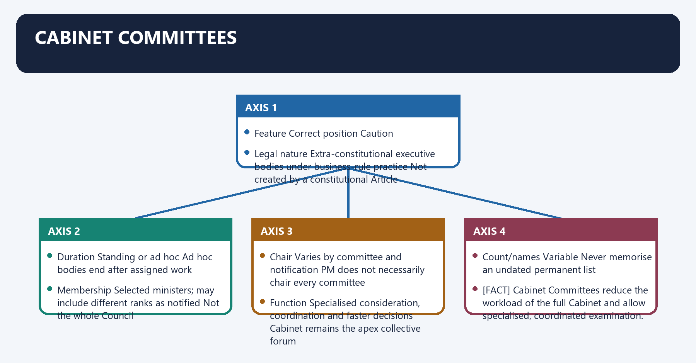
**Visual 16 - Committee design matrix**

| Feature | Correct position | Caution |
|---|---|---|
| Legal nature | Extra-constitutional executive bodies under business-rule practice | Not created by a constitutional Article |
| Duration | Standing or ad hoc | Ad hoc bodies end after assigned work |
| Membership | Selected ministers; may include different ranks as notified | Not the whole Council |
| Chair | Varies by committee and notification | PM does not necessarily chair every committee |
| Function | Specialised consideration, coordination and faster decisions | Cabinet remains the apex collective forum |
| Count/names | Variable | Never memorise an undated permanent list |

- [FACT] Cabinet Committees reduce the workload of the full Cabinet and allow specialised, coordinated examination.
- [ANALYSIS] They combine efficiency with political authority because their members are ministers, unlike Committees of Secretaries.
- [LIMIT] Descriptions such as "super-cabinet" are analytical labels, not law.
- [CURRENT] The official page has a Cabinet Committees document dated 27 July 2026. Use that notification for any present composition; this package does not reproduce a frozen count.

#### Cabinet Committee versus Committee of Secretaries

| Cabinet Committee | Committee of Secretaries |
|---|---|
| Ministers | Senior civil servants |
| Political decision/consideration | Administrative coordination/advice |
| Constituted under executive business practice | Convened for inter-departmental resolution |
| Supported by Cabinet Secretariat | Generally coordinated through Cabinet Secretary |

#### CLOSING RECALL FLOW — CABINET COMMITTEES

```closure-flow
SUBTOPIC: Cabinet Committees
KEY TERMS / DEFINITIONS: Cabinet Committees · Legal nature · Extra-constitutional executive bodies under business-rule practice · Duration · Standing or ad hoc · Ad hoc bodies end after assigned work
MECHANISM / ARGUMENT: Its principal consequence is that chair Varies by committee and notification PM does not necessarily chair every committee.
CONSEQUENCE / CONTRAST: Descriptions such as "super-cabinet" are analytical labels, not law. [CURRENT] The official page has a Cabinet Committees document dated 27 July 2026.
UPSC TRAP / ANSWER-USE: The decisive contrast is between Function Specialised consideration, coordination and faster decisions Cabinet remains the apex collective forum and Count/names Variable Never memorise an undated permanent list.
ANSWER-GRABBING FORMULATION: Cabinet Committees combine ministerial authority with specialised coordination, unlike Committees of Secretaries which remain administrative forums.
```
### SESSION 15 — CABINET SECRETARIAT: THE COORDINATION HUB
#### DEFINITION / WHAT THIS IS CALLED

**Plain-language definition:** Cabinet Secretariat: the coordination hub denotes the constitutional rules and institutional links organised around Cabinet Secretariat.

**Technical definition:** The decisive contrast is between implementation monitoring and [CURRENT] The Cabinet Secretariat functions directly under the PM.

#### ANSWER-GRABBING OPENING — WRITE/ADAPT IN THE EXAM

> The Cabinet Secretariat coordinates Cabinet business and implementation, but it neither replaces the Cabinet or PMO nor assumes the statutory powers of individual departments.

#### MUST-WRITE KEYWORDS

- **Cabinet Secretariat**
- **the coordination hub**
- **Cabinet Secretariat: the coordination hub**
- **Its principal consequence**
- **Its**
- **The decisive contrast**

**How to use them:** Frame the answer through Cabinet Secretariat; define the coordination hub, connect Cabinet Secretariat: the coordination hub with Its principal consequence to explain the mechanism, and use Its for the decisive comparison or qualification.

Cabinet Secretariat: the coordination hub denotes the constitutional rules and institutional links organised around Cabinet Secretariat.
Cabinet Secretariat: the coordination hub operates through +-----------------------+, connected with Cabinet support Inter-ministerial Crisis coordination.
The operative mechanism matters because agendas, papers, differences, CoS, whole-of-government.
Its principal consequence is that records, decisions consensus, delays response.
The decisive contrast is between implementation monitoring and [CURRENT] The Cabinet Secretariat functions directly under the PM.
The exam-safe limitation is that [FACT] The Cabinet Secretary is its administrative head and ex-officio Chairman of the Civil Services Board.
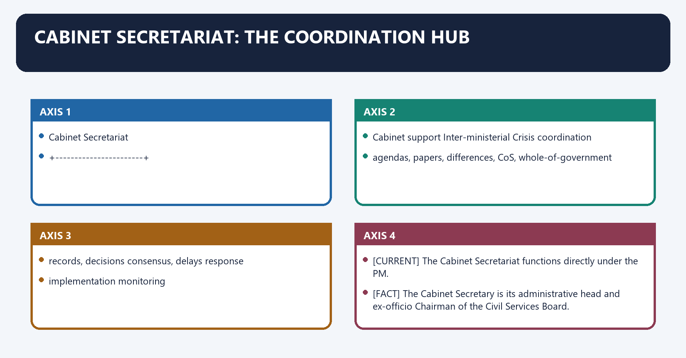
**Visual 17 - Cabinet Secretariat hub**

```text
                         Prime Minister
                               |
                     Cabinet Secretariat
                               |
       +-----------------------+-----------------------+
       |                       |                       |
 Cabinet support       Inter-ministerial       Crisis coordination
 agendas, papers,      differences, CoS,       whole-of-government
 records, decisions    consensus, delays       response
       |                       |                       |
       +-----------------------+-----------------------+
                               |
                  implementation monitoring
```

- [CURRENT] The Cabinet Secretariat functions directly under the PM.
- [FACT] The Cabinet Secretary is its administrative head and ex-officio Chairman of the Civil Services Board.
- [FACT] It administers the AoB and ToB Rules.
- [FACT] It provides secretarial assistance to Cabinet and Cabinet Committees: convening meetings on PM orders, preparing agendas, circulating papers, recording approved discussions and monitoring implementation.
- [FACT] It is custodian of Cabinet meeting papers and records.
- [FACT] It promotes inter-ministerial coordination, resolves differences and delays, supports consensus through standing/ad hoc Committees of Secretaries, and coordinates major crisis situations.
- [LIMIT] It is not the Cabinet, the PMO, a political ministry or a body authorised to take over every department's statutory powers.

#### CLOSING RECALL FLOW — CABINET SECRETARIAT: THE COORDINATION HUB

```closure-flow
SUBTOPIC: Cabinet Secretariat: the coordination hub
KEY TERMS / DEFINITIONS: Cabinet Secretariat · the coordination hub · Cabinet Secretariat: the coordination hub · Its principal consequence · Its · The decisive contrast
MECHANISM / ARGUMENT: The decisive contrast is between implementation monitoring and [CURRENT] The Cabinet Secretariat functions directly under the PM.
CONSEQUENCE / CONTRAST: It is not the Cabinet, the PMO, a political ministry or a body authorised to take over every department's statutory powers.
UPSC TRAP / ANSWER-USE: Do not miss this limiting distinction: its principal consequence is that records, decisions consensus, delays response.
ANSWER-GRABBING FORMULATION: The Cabinet Secretariat coordinates Cabinet business and implementation, but it neither replaces the Cabinet or PMO nor assumes the statutory powers of individual departments.
```
### SESSION 16 — PRIME MINISTER'S OFFICE
#### DEFINITION / WHAT THIS IS CALLED

**Plain-language definition:** Prime Minister's Office denotes the constitutional rules and institutional links organised around Cabinet Secretariat Prime Minister's Office.

**Technical definition:** The PMO is non-constitutional and non-statutory; it is a staff and support office, not a separate constitutional executive.

#### ANSWER-GRABBING OPENING — WRITE/ADAPT IN THE EXAM

> The PMO is non-constitutional and non-statutory; it is a staff and support office, not a separate constitutional executive.

#### MUST-WRITE KEYWORDS

- **Prime Minister's Office**
- **Supports Cabinet government and cross-ministry procedure**
- **Supports the PM in discharging official responsibilities**
- **Administers AoB/ToB Rules**
- **Processes matters requiring PM attention**
- **Led administratively by Cabinet Secretary**

**How to use them:** Frame the answer through Prime Minister's Office; define Supports Cabinet government and cross-ministry procedure, connect Supports the PM in discharging official responsibilities with Administers AoB/ToB Rules to explain the mechanism, and use Processes matters requiring PM attention for the decisive comparison or qualification.

Prime Minister's Office denotes the constitutional rules and institutional links organised around Cabinet Secretariat Prime Minister's Office.
Prime Minister's Office operates through Supports Cabinet government and cross-ministry procedure Supports the PM in discharging official responsibilities, connected with Administers AoB/ToB Rules Processes matters requiring PM attention.
The operative mechanism matters because led administratively by Cabinet Secretary Organised around Principal Secretary and other PMO officers.
Its principal consequence is that custodian of Cabinet papers and decisions Not automatically custodian of Cabinet records.
The decisive contrast is between Coordinates ministries through formal machinery Supplies policy, administrative, communication and monitoring support to PM and Institutional continuity across governments Influence and internal design vary with the PM and governing style.
The exam-safe limitation is that [FACT] The PMO is non-constitutional and non-statutory; it is a staff and support office, not a separate constitutional executive.
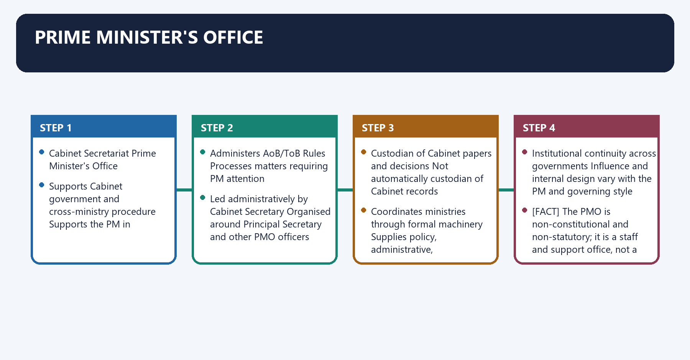
**Visual 18 - Cabinet Secretariat versus PMO**

| Cabinet Secretariat | Prime Minister's Office |
|---|---|
| Supports Cabinet government and cross-ministry procedure | Supports the PM in discharging official responsibilities |
| Administers AoB/ToB Rules | Processes matters requiring PM attention |
| Led administratively by Cabinet Secretary | Organised around Principal Secretary and other PMO officers |
| Custodian of Cabinet papers and decisions | Not automatically custodian of Cabinet records |
| Coordinates ministries through formal machinery | Supplies policy, administrative, communication and monitoring support to PM |
| Institutional continuity across governments | Influence and internal design vary with the PM and governing style |

- [FACT] The PMO is non-constitutional and non-statutory; it is a staff and support office, not a separate constitutional executive.
- [ANALYSIS] A strong PMO can improve coordination, monitoring and strategic focus.
- [ANALYSIS] Excessive centralisation can bypass ministers, weaken departmental ownership and make the Cabinet appear ratificatory.
- [LIMIT] "PMO decides" is often institutionally imprecise. Legally valid decisions must travel through the competent minister, Cabinet system, business rules or statutory authority.

#### CLOSING RECALL FLOW — PRIME MINISTER'S OFFICE

```closure-flow
SUBTOPIC: Prime Minister's Office
KEY TERMS / DEFINITIONS: Prime Minister's Office · Supports Cabinet government and cross-ministry procedure · Supports the PM in discharging official responsibilities · Administers AoB/ToB Rules · Processes matters requiring PM attention · Led administratively by Cabinet Secretary
MECHANISM / ARGUMENT: The decisive contrast is between Coordinates ministries through formal machinery Supplies policy, administrative, communication and monitoring support to PM and Institutional continuity across governments Influence and internal design vary with the PM and governing style.
CONSEQUENCE / CONTRAST: The exam-safe limitation is that The PMO is non-constitutional and non-statutory; it is a staff and support office, not a separate constitutional executive.
UPSC TRAP / ANSWER-USE: The PMO is non-constitutional and non-statutory; it is a staff and support office, not a separate constitutional executive.
ANSWER-GRABBING FORMULATION: The PMO is non-constitutional and non-statutory; it is a staff and support office, not a separate constitutional executive.
```
### SESSION 17 — KITCHEN CABINET, INNER CIRCLE AND GROUPS OF MINISTERS
#### DEFINITION / WHAT THIS IS CALLED

**Plain-language definition:** Kitchen cabinet, inner circle and Groups of Ministers denotes the constitutional rules and institutional links organised around FORMAL ------------------------------------------------ INFORMAL.

**Technical definition:** A kitchen cabinet is an informal circle of trusted ministers, advisers, officials or political associates consulted by the PM.

#### ANSWER-GRABBING OPENING — WRITE/ADAPT IN THE EXAM

> The Second Administrative Reforms Commission's logic supports selective, time-bound use so coordination does not become another layer of delay.

#### MUST-WRITE KEYWORDS

- **Kitchen cabinet**
- **inner circle**
- **Groups of Ministers**
- **Kitchen cabinet, inner circle and Groups of Ministers**
- **Kitchen**
- **Groups**

**How to use them:** Frame the answer through Kitchen cabinet; define inner circle, connect Groups of Ministers with Kitchen cabinet, inner circle and Groups of Ministers to explain the mechanism, and use Kitchen for the decisive comparison or qualification.

Kitchen cabinet, inner circle and Groups of Ministers denotes the constitutional rules and institutional links organised around FORMAL ------------------------------------------------ INFORMAL.
Kitchen cabinet, inner circle and Groups of Ministers operates through Cabinet - Cabinet Committee - Group of Ministers - Kitchen cabinet, connected with collective specialised ad hoc ministerial trusted circle,.
The operative mechanism matters because apex body notified body coordination no legal status.
Its principal consequence is that [ANALYSIS] It can provide speed, candour and political sensitivity.
The decisive contrast is between [LIMIT] It has no independent legal authority. A binding government decision must be regularised through competent formal channels and [LIMIT] The membership is not necessarily confined to Cabinet ministers and should not be presented as a fixed body.
The exam-safe limitation is that groups of Ministers.
**Visual 19 - Formality spectrum**

```text
FORMAL ------------------------------------------------ INFORMAL

Cabinet -> Cabinet Committee -> Group of Ministers -> Kitchen cabinet
  |              |                    |                    |
collective     specialised          ad hoc ministerial    trusted circle,
apex body      notified body        coordination          no legal status
```

#### Kitchen cabinet

- [ANALYSIS] A kitchen cabinet is an informal circle of trusted ministers, advisers, officials or political associates consulted by the PM.
- [ANALYSIS] It can provide speed, candour and political sensitivity.
- [LIMIT] It has no independent legal authority. A binding government decision must be regularised through competent formal channels.
- [LIMIT] The membership is not necessarily confined to Cabinet ministers and should not be presented as a fixed body.

#### Groups of Ministers

- [FACT] Groups of Ministers are ad hoc ministerial coordination devices created for specified cross-cutting questions.
- [ANALYSIS] They can reconcile portfolio conflicts and prepare options before Cabinet consideration.
- [LIMIT] Their use, title, powers and current existence vary. Do not assume that every historical GoM or Empowered Group of Ministers continues.
- [ANALYSIS] The Second Administrative Reforms Commission's logic supports selective, time-bound use so coordination does not become another layer of delay.

#### CLOSING RECALL FLOW — KITCHEN CABINET, INNER CIRCLE AND GROUPS OF MINISTERS

```closure-flow
SUBTOPIC: Kitchen cabinet, inner circle and Groups of Ministers
KEY TERMS / DEFINITIONS: Kitchen cabinet · inner circle · Groups of Ministers · Kitchen cabinet, inner circle and Groups of Ministers · Kitchen · Groups
MECHANISM / ARGUMENT: A kitchen cabinet is an informal circle of trusted ministers, advisers, officials or political associates consulted by the PM.
CONSEQUENCE / CONTRAST: A binding government decision must be regularised through competent formal channels and The membership is not necessarily confined to Cabinet ministers and should not be presented as a fixed body.
UPSC TRAP / ANSWER-USE: The membership is not necessarily confined to Cabinet ministers and should not be presented as a fixed body.
ANSWER-GRABBING FORMULATION: The Second Administrative Reforms Commission's logic supports selective, time-bound use so coordination does not become another layer of delay.
```
### SESSION 18 — COLLECTIVE DECISION-MAKING IN OPERATION
#### DEFINITION / WHAT THIS IS CALLED

**Plain-language definition:** Collective decision-making in operation denotes the constitutional rules and institutional links organised around Minister-in-charge decides routine allocated business.

**Technical definition:** The exam-safe limitation is that Collective responsibility does not require the full Council to deliberate on every file.

#### ANSWER-GRABBING OPENING — WRITE/ADAPT IN THE EXAM

> Collective responsibility does not require the full Council to deliberate on every file.

#### MUST-WRITE KEYWORDS

- **Collective decision-making in operation**
- **Collective**
- **Minister-in-charge**
- **Its principal consequence**
- **Its**
- **The decisive contrast**

**How to use them:** Frame the answer through Collective decision-making in operation; define Collective, connect Minister-in-charge with Its principal consequence to explain the mechanism, and use Its for the decisive comparison or qualification.

Collective decision-making in operation denotes the constitutional rules and institutional links organised around Minister-in-charge decides routine allocated business.
Collective decision-making in operation operates through cross-ministry / reserved / major issue?, connected with Departmental consultation and.
The operative mechanism matters because decision escalation under ToB.
Its principal consequence is that formal government decision.
The decisive contrast is between all ministers defend settled policy and Parliament holds government accountable.
The exam-safe limitation is that [ANALYSIS] Collective responsibility does not require the full Council to deliberate on every file.
**Visual 20 - From department to collective responsibility**

```text
Minister-in-charge decides routine allocated business
                    |
      cross-ministry / reserved / major issue?
             +------+------+
             |             |
            No            Yes
             |             |
      Departmental     consultation and
        decision       escalation under ToB
             |             |
             +------+------+
                    |
         formal government decision
                    |
                    v
      all ministers defend settled policy
                    |
                    v
       Parliament holds government accountable
```

- [ANALYSIS] Collective responsibility does not require the full Council to deliberate on every file.
- [FACT] Business rules permit delegated disposal while reserving defined matters for higher consideration.
- [ANALYSIS] The constitutional bargain is decentralised administration plus unified political accountability.
- [LIMIT] Cabinet secrecy protects candid discussion, not unlawful concealment from courts, audit or Parliament.

#### CLOSING RECALL FLOW — COLLECTIVE DECISION-MAKING IN OPERATION

```closure-flow
SUBTOPIC: Collective decision-making in operation
KEY TERMS / DEFINITIONS: Collective decision-making in operation · Collective · Minister-in-charge · Its principal consequence · Its · The decisive contrast
MECHANISM / ARGUMENT: The exam-safe limitation is that Collective responsibility does not require the full Council to deliberate on every file.
CONSEQUENCE / CONTRAST: Collective responsibility does not require the full Council to deliberate on every file.
UPSC TRAP / ANSWER-USE: Do not miss this limiting distinction: the decisive contrast is between all ministers defend settled policy and Parliament holds government...
ANSWER-GRABBING FORMULATION: Collective responsibility does not require the full Council to deliberate on every file.
```
### SESSION 19 — MAJORITY, COALITION, MINORITY AND CARETAKER SITUATIONS
#### DEFINITION / WHAT THIS IS CALLED

**Plain-language definition:** Majority, coalition, minority and caretaker situations denotes the constitutional rules and institutional links organised around Situation PM's political room Main constitutional control Main risk.

**Technical definition:** Coalition government is not constitutionally exceptional; it is one method of assembling majority support.

#### ANSWER-GRABBING OPENING — WRITE/ADAPT IN THE EXAM

> The Election Commission's Model Code of Conduct may constrain conduct during elections, but it is not a complete constitutional code for every caretaker situation.

#### MUST-WRITE KEYWORDS

- **Majority**
- **coalition**
- **minority**
- **caretaker situations**
- **Single-party majority**
- **High**

**How to use them:** Frame the answer through Majority; define coalition, connect minority with caretaker situations to explain the mechanism, and use Single-party majority for the decisive comparison or qualification.

Majority, coalition, minority and caretaker situations denotes the constitutional rules and institutional links organised around Situation PM's political room Main constitutional control Main risk.
Majority, coalition, minority and caretaker situations operates through Single-party majority High Lok Sabha confidence, courts, federalism, elections Centralisation and weak internal challenge, connected with Coalition majority Negotiated Common support and collective responsibility Public dissent and portfolio bargaining.
The operative mechanism matters because minority government Issue-based support Frequent floor arithmetic Instability or opaque external support.
Its principal consequence is that hung House formation Temporary presidential judgment Early floor test Partisan invitation or engineered delay.
The decisive contrast is between Coalition government and [FACT] Article 75(3) applies equally to coalition and single-party ministries.
The exam-safe limitation is that [ANALYSIS] Coalition agreements, coordination committees and ally vetoes can make the PM more of a broker than a commander.
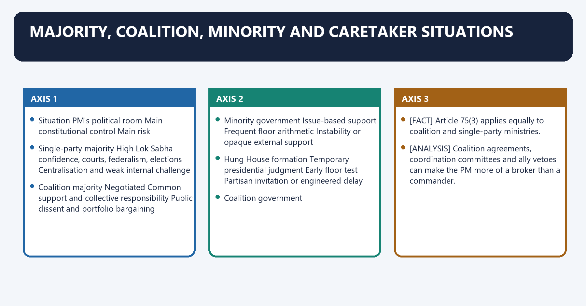
**Visual 21 - Government-situation matrix**

| Situation | PM's political room | Main constitutional control | Main risk |
|---|---|---|---|
| Single-party majority | High | Lok Sabha confidence, courts, federalism, elections | Centralisation and weak internal challenge |
| Coalition majority | Negotiated | Common support and collective responsibility | Public dissent and portfolio bargaining |
| Minority government | Issue-based support | Frequent floor arithmetic | Instability or opaque external support |
| Hung House formation | Temporary presidential judgment | Early floor test | Partisan invitation or engineered delay |
| Caretaker after resignation/election | Continuity, not fresh mandate | Convention and impending successor | Major irreversible decisions without mandate |

#### Coalition government

- [FACT] Article 75(3) applies equally to coalition and single-party ministries.
- [ANALYSIS] Coalition agreements, coordination committees and ally vetoes can make the PM more of a broker than a commander.
- [ANALYSIS] Public disagreement may weaken solidarity in practice, yet the coalition still falls as a unit if it loses Lok Sabha confidence.
- [LIMIT] Coalition government is not constitutionally exceptional; it is one method of assembling majority support.

#### Caretaker government

- [FACT] The Constitution does not create a separately titled "caretaker government" with a complete codified list of powers.
- [ANALYSIS] Convention allows the outgoing ministry to continue essential administration until a successor takes office.
- [ANALYSIS] Democratic restraint suggests avoiding major irreversible policy, appointments or commitments unless urgent, unavoidable or supported by broad consultation.
- [LIMIT] The Election Commission's Model Code of Conduct may constrain conduct during elections, but it is not a complete constitutional code for every caretaker situation.

#### CLOSING RECALL FLOW — MAJORITY, COALITION, MINORITY AND CARETAKER SITUATIONS

```closure-flow
SUBTOPIC: Majority, coalition, minority and caretaker situations
KEY TERMS / DEFINITIONS: Majority · coalition · minority · caretaker situations · Single-party majority · High
MECHANISM / ARGUMENT: Coalition government is not constitutionally exceptional; it is one method of assembling majority support.
CONSEQUENCE / CONTRAST: The Election Commission's Model Code of Conduct may constrain conduct during elections, but it is not a complete constitutional code for every caretaker situation.
UPSC TRAP / ANSWER-USE: Do not miss this limiting distinction: the decisive contrast is between Coalition government and Article 75(3) applies equally to coalition...
ANSWER-GRABBING FORMULATION: The Election Commission's Model Code of Conduct may constrain conduct during elections, but it is not a complete constitutional code for every caretaker situation.
```
### SESSION 20 — PARLIAMENTARY ACCOUNTABILITY
#### DEFINITION / WHAT THIS IS CALLED

**Plain-language definition:** Parliamentary accountability denotes the constitutional rules and institutional links organised around Daily information Question Hour, statements, debates.

**Technical definition:** Effective accountability therefore depends on information, committee time and political incentives, not merely formal powers.

#### ANSWER-GRABBING OPENING — WRITE/ADAPT IN THE EXAM

> Effective accountability therefore depends on information, committee time and political incentives, not merely formal powers.

#### MUST-WRITE KEYWORDS

- **Parliamentary accountability**
- **Question Hour**
- **Information and ministerial explanation**
- **Time, admissibility and quality of answer**
- **Debates and motions**
- **Political responsibility**

**How to use them:** Frame the answer through Parliamentary accountability; define Question Hour, connect Information and ministerial explanation with Time, admissibility and quality of answer to explain the mechanism, and use Debates and motions for the decisive comparison or qualification.

Parliamentary accountability denotes the constitutional rules and institutional links organised around Daily information Question Hour, statements, debates.
Parliamentary accountability operates through Policy criticism censure, adjournment and other motions, connected with Detailed scrutiny Department-related Standing Committees.
The operative mechanism matters because financial control demands for grants, appropriation, PAC-CAG.
Its principal consequence is that survival test confidence / no-confidence in Lok Sabha.
The decisive contrast is between Public sanction elections and political responsibility and Instrument What it tests Limitation.
The exam-safe limitation is that question Hour Information and ministerial explanation Time, admissibility and quality of answer.
**Visual 22 - Accountability ladder**

```text
Daily information       Question Hour, statements, debates
        |
Policy criticism        censure, adjournment and other motions
        |
Detailed scrutiny       Department-related Standing Committees
        |
Financial control       demands for grants, appropriation, PAC-CAG
        |
Survival test           confidence / no-confidence in Lok Sabha
        |
Public sanction         elections and political responsibility
```

| Instrument | What it tests | Limitation |
|---|---|---|
| Question Hour | Information and ministerial explanation | Time, admissibility and quality of answer |
| Debates and motions | Political responsibility | Majority may defeat opposition motion |
| DRSCs | Bills, demands and ministry performance | Referral and follow-up vary |
| PAC-CAG | Financial legality, regularity and accountability | Usually post-facto |
| No-confidence | Authority of whole ministry to govern | Tests numbers more than policy detail |
| Individual resignation | Departmental or ethical accountability | PM controls political enforcement |
| Judicial review | Constitutional and legal limits | Courts do not replace parliamentary politics |

- [FACT] Only Lok Sabha can remove the Union ministry through loss of confidence.
- [FACT] Rajya Sabha may question ministers, scrutinise policy and exercise its legislative powers, but does not hold the Article 75(3) confidence key.
- [ANALYSIS] Anti-defection discipline and a secure majority can weaken individual MP scrutiny even while stabilising the government.
- [ANALYSIS] Effective accountability therefore depends on information, committee time and political incentives, not merely formal powers.

#### CLOSING RECALL FLOW — PARLIAMENTARY ACCOUNTABILITY

```closure-flow
SUBTOPIC: Parliamentary accountability
KEY TERMS / DEFINITIONS: Parliamentary accountability · Question Hour · Information and ministerial explanation · Time, admissibility and quality of answer · Debates and motions · Political responsibility
MECHANISM / ARGUMENT: Effective accountability therefore depends on information, committee time and political incentives, not merely formal powers.
CONSEQUENCE / CONTRAST: The decisive contrast is between Public sanction elections and political responsibility and Instrument What it tests Limitation.
UPSC TRAP / ANSWER-USE: Do not miss this limiting distinction: its principal consequence is that survival test confidence / no-confidence in Lok Sabha.
ANSWER-GRABBING FORMULATION: Effective accountability therefore depends on information, committee time and political incentives, not merely formal powers.
```
### SESSION 21 — CABINET GOVERNMENT OR PRIME-MINISTERIAL GOVERNMENT?
#### DEFINITION / WHAT THIS IS CALLED

**Plain-language definition:** Cabinet government or prime-ministerial government? denotes the constitutional rules and institutional links organised around Claim: power has shifted toward the PM.

**Technical definition:** "Prime-ministerial government" is associated with scholars such as Crossman and Mackintosh; it describes a migration of practical power, not a constitutional amendment.

#### ANSWER-GRABBING OPENING — WRITE/ADAPT IN THE EXAM

> India retains cabinet government in constitutional form, but may operate as prime-ministerial government in political practice.

#### MUST-WRITE KEYWORDS

- **Article 78**
- **Article 75**
- **Cabinet**
- **Claim**
- **PM**
- **Its principal consequence**

**How to use them:** Frame the answer through Article 78; define Article 75, connect Cabinet with Claim to explain the mechanism, and use PM for the decisive comparison or qualification.

Cabinet government or prime-ministerial government? denotes the constitutional rules and institutional links organised around Claim: power has shifted toward the PM.
Cabinet government or prime-ministerial government? operates through Personnel control: appointment, portfolios, reshuffles, connected with Institutional control: Cabinet agenda, committees, Article 78.
The operative mechanism matters because political control: party leadership, election campaign, communication.
Its principal consequence is that administrative support: PMO, monitoring, strategic coordination.
The decisive contrast is between Dissolution leverage: advice regarding Lok Sabha and Article 75(3): collective responsibility and confidence.
The exam-safe limitation is that cabinet colleagues and coalition allies.
**Visual 23 - Argument tree**

```text
Claim: power has shifted toward the PM
|
+-- Personnel control: appointment, portfolios, reshuffles
+-- Institutional control: Cabinet agenda, committees, Article 78
+-- Political control: party leadership, election campaign, communication
+-- Administrative support: PMO, monitoring, strategic coordination
+-- Dissolution leverage: advice regarding Lok Sabha
|
Counter-branches
|
+-- Article 75(3): collective responsibility and confidence
+-- Cabinet colleagues and coalition allies
+-- Federal governments and Rajya Sabha
+-- courts, constitutional bodies and statutory limits
+-- elections, public opinion and policy complexity
```

- [ANALYSIS] "Prime-ministerial government" is associated with scholars such as Crossman and Mackintosh; it describes a migration of practical power, not a constitutional amendment.
- [ANALYSIS] "Primus inter pares" and "keystone of the Cabinet arch" are attributed analytical descriptions, not legal rules.
- [ANALYSIS] Prime-ministerial dominance tends to be strongest with a cohesive majority, party control and a centralised PMO; it is weaker under coalition dependence or strong ministerial autonomy.
- [LIMIT] Strong leadership is not automatically unconstitutional centralisation. The test is whether formal competence, Cabinet deliberation, ministerial responsibility and parliamentary scrutiny remain meaningful.

#### Qualified verdict

> [ANALYSIS] India retains cabinet government in constitutional form, but may operate as prime-ministerial government in political practice. The degree changes with parliamentary arithmetic, party organisation, coalition structure, institutional resistance and leadership style.

#### CLOSING RECALL FLOW — CABINET GOVERNMENT OR PRIME-MINISTERIAL GOVERNMENT?

```closure-flow
SUBTOPIC: Cabinet government or prime-ministerial government?
KEY TERMS / DEFINITIONS: Article 78 · Article 75 · Cabinet · Claim · PM · Its principal consequence
MECHANISM / ARGUMENT: "Prime-ministerial government" is associated with scholars such as Crossman and Mackintosh; it describes a migration of practical power, not a constitutional amendment.
CONSEQUENCE / CONTRAST: "Primus inter pares" and "keystone of the Cabinet arch" are attributed analytical descriptions, not legal rules.
UPSC TRAP / ANSWER-USE: Do not miss this limiting distinction: its principal consequence is that administrative support.
ANSWER-GRABBING FORMULATION: India retains cabinet government in constitutional form, but may operate as prime-ministerial government in political practice.
```
### SESSION 22 — CABINET GROWTH AND PARLIAMENT'S MARGINALISATION
#### DEFINITION / WHAT THIS IS CALLED

**Plain-language definition:** Cabinet growth and Parliament's marginalisation denotes the constitutional rules and institutional links organised around Fusion of executive and legislature.

**Technical definition:** The 2024 GS-II phrase "marginalisation of parliamentary supremacy" is best read as reduced effective control and deliberation, not legal transfer of sovereignty to the Cabinet.

#### ANSWER-GRABBING OPENING — WRITE/ADAPT IN THE EXAM

> The 2024 GS-II phrase "marginalisation of parliamentary supremacy" is best read as reduced effective control and deliberation, not legal transfer of sovereignty to the Cabinet.

#### MUST-WRITE KEYWORDS

- **Cabinet growth**
- **Parliament's marginalisation**
- **effective control and deliberation**
- **Cabinet growth and Parliament's marginalisation**
- **Cabinet**
- **Parliament's**

**How to use them:** Frame the answer through Cabinet growth; define Parliament's marginalisation, connect effective control and deliberation with Cabinet growth and Parliament's marginalisation to explain the mechanism, and use Cabinet for the decisive comparison or qualification.

Cabinet growth and Parliament's marginalisation denotes the constitutional rules and institutional links organised around Fusion of executive and legislature.
Cabinet growth and Parliament's marginalisation operates through Governing majority + whip + Tenth Schedule, connected with Cabinet control of agenda and House time.
The operative mechanism matters because guillotine / delegated legislation / ordinances /.
Its principal consequence is that contested Money Bill routing / compressed scrutiny.
The decisive contrast is between Parliament risks becoming ratifier rather than examiner and Correctives: no-confidence, questions, committees,.
The exam-safe limitation is that pAC-CAG, bicameralism, courts and elections.
**Visual 24 - Mechanism chain**

```text
Fusion of executive and legislature
            |
            v
Governing majority + whip + Tenth Schedule
            |
            v
Cabinet control of agenda and House time
            |
            v
Guillotine / delegated legislation / ordinances /
contested Money Bill routing / compressed scrutiny
            |
            v
Parliament risks becoming ratifier rather than examiner
            |
            v
Correctives: no-confidence, questions, committees,
PAC-CAG, bicameralism, courts and elections
```

- [FACT] India has constitutional supremacy, not British-style parliamentary sovereignty.
- [ANALYSIS] The 2024 GS-II phrase "marginalisation of parliamentary supremacy" is best read as reduced **effective control and deliberation**, not legal transfer of sovereignty to the Cabinet.
- [ANALYSIS] PMO-centred coordination may further shift authority from Cabinet to PM, creating two layers of concern: executive over legislature and PM over Cabinet.
- [LIMIT] Parliament remains constitutionally capable of removing the government and legally indispensable for ordinary legislation, supply and accountability.

#### CLOSING RECALL FLOW — CABINET GROWTH AND PARLIAMENT'S MARGINALISATION

```closure-flow
SUBTOPIC: Cabinet growth and Parliament's marginalisation
KEY TERMS / DEFINITIONS: Cabinet growth · Parliament's marginalisation · effective control and deliberation · Cabinet growth and Parliament's marginalisation · Cabinet · Parliament's
MECHANISM / ARGUMENT: The 2024 GS-II phrase "marginalisation of parliamentary supremacy" is best read as reduced effective control and deliberation, not legal transfer of sovereignty to the Cabinet.
CONSEQUENCE / CONTRAST: Its principal consequence is that contested Money Bill routing / compressed scrutiny.
UPSC TRAP / ANSWER-USE: The decisive contrast is between Parliament risks becoming ratifier rather than examiner and Correctives: no-confidence, questions, committees,.
ANSWER-GRABBING FORMULATION: The 2024 GS-II phrase "marginalisation of parliamentary supremacy" is best read as reduced effective control and deliberation, not legal transfer of sovereignty to the Cabinet.
```
### SESSION 23 — REFORM ARCHITECTURE
#### DEFINITION / WHAT THIS IS CALLED

**Plain-language definition:** Reform architecture denotes the constitutional rules and institutional links organised around Problem Reform direction Safeguard.

**Technical definition:** The decisive contrast is between Parliament's limited time Predictable sittings and protected scrutiny time Keep emergency flexibility and Overbroad whip Consider limiting compulsory whip to survival/core matters Reform must respect Tenth Schedule framework.

#### ANSWER-GRABBING OPENING — WRITE/ADAPT IN THE EXAM

> The guiding principle is coordination without erasing responsibility: PM leadership should connect institutions, not make ministers and Parliament redundant.

#### MUST-WRITE KEYWORDS

- **Reform architecture**
- **coordination without erasing responsibility**
- **Weak Cabinet deliberation**
- **Timely papers, recorded alternatives and genuine consultation**
- **Preserve necessary confidentiality**
- **PMO over-centralisation**

**How to use them:** Frame the answer through Reform architecture; define coordination without erasing responsibility, connect Weak Cabinet deliberation with Timely papers, recorded alternatives and genuine consultation to explain the mechanism, and use Preserve necessary confidentiality for the decisive comparison or qualification.

Reform architecture denotes the constitutional rules and institutional links organised around Problem Reform direction Safeguard.
Reform architecture operates through Weak Cabinet deliberation Timely papers, recorded alternatives and genuine consultation Preserve necessary confidentiality, connected with PMO over-centralisation Apply subsidiarity; return routine matters to ministries Retain strategic coordination.
The operative mechanism matters because committee overload Periodic review, clear terms and sunset for ad hoc bodies Preserve specialist speed.
Its principal consequence is that coalition opacity Public common programme and clearer coordination norms Do not constitutionalise every political bargain.
The decisive contrast is between Parliament's limited time Predictable sittings and protected scrutiny time Keep emergency flexibility and Overbroad whip Consider limiting compulsory whip to survival/core matters Reform must respect Tenth Schedule framework.
The exam-safe limitation is that weak bill scrutiny Routine committee referral with reasoned exceptions Preserve urgency route for genuine need.
**Visual 25 - Problem, reform and safeguard matrix**

| Problem | Reform direction | Safeguard |
|---|---|---|
| Weak Cabinet deliberation | Timely papers, recorded alternatives and genuine consultation | Preserve necessary confidentiality |
| PMO over-centralisation | Apply subsidiarity; return routine matters to ministries | Retain strategic coordination |
| Committee overload | Periodic review, clear terms and sunset for ad hoc bodies | Preserve specialist speed |
| Coalition opacity | Public common programme and clearer coordination norms | Do not constitutionalise every political bargain |
| Weak individual responsibility | Reasoned ministerial statements and stronger committee follow-up | Avoid automatic resignation for every error |
| Parliament's limited time | Predictable sittings and protected scrutiny time | Keep emergency flexibility |
| Overbroad whip | Consider limiting compulsory whip to survival/core matters | Reform must respect Tenth Schedule framework |
| Weak bill scrutiny | Routine committee referral with reasoned exceptions | Preserve urgency route for genuine need |
| Rule opacity | Publish updated business allocations and accessible changes | Protect legitimate Cabinet secrecy |
| Caretaker ambiguity | Develop publicly stated restraint conventions | Retain capacity for genuine emergencies |

- [ANALYSIS] Reform should improve responsible government rather than create competing executive centres.
- [ANALYSIS] The guiding principle is **coordination without erasing responsibility**: PM leadership should connect institutions, not make ministers and Parliament redundant.

#### CLOSING RECALL FLOW — REFORM ARCHITECTURE

```closure-flow
SUBTOPIC: Reform architecture
KEY TERMS / DEFINITIONS: Reform architecture · coordination without erasing responsibility · Weak Cabinet deliberation · Timely papers, recorded alternatives and genuine consultation · Preserve necessary confidentiality · PMO over-centralisation
MECHANISM / ARGUMENT: The decisive contrast is between Parliament's limited time Predictable sittings and protected scrutiny time Keep emergency flexibility and Overbroad whip Consider limiting compulsory whip to survival/core matters Reform must respect Tenth Schedule framework.
CONSEQUENCE / CONTRAST: The guiding principle is coordination without erasing responsibility: PM leadership should connect institutions, not make ministers and Parliament redundant.
UPSC TRAP / ANSWER-USE: Its principal consequence is that coalition opacity Public common programme and clearer coordination norms Do not constitutionalise every political bargain.
ANSWER-GRABBING FORMULATION: The guiding principle is coordination without erasing responsibility: PM leadership should connect institutions, not make ministers and Parliament redundant.
```
### SESSION 24 — MASTER COMPARISON AND TRAP FIREWALL
#### DEFINITION / WHAT THIS IS CALLED

**Plain-language definition:** Master comparison and trap firewall denotes the constitutional rules and institutional links organised around Body/office Nature Main function Accountable through Common trap.

**Technical definition:** Master comparison and trap firewall operates through Prime Minister Constitutional office Heads Council and government Lok Sabha confidence, party and elections Must be Lok Sabha member, connected with Council of Ministers Constitutional body Aid/advice and collective responsibility Article 75(3) Same as Cabinet.

#### ANSWER-GRABBING OPENING — WRITE/ADAPT IN THE EXAM

> Article 74(2) bars inquiry into whether any, and if so what, ministerial advice was tendered, but does not immunise every resulting executive act.

#### MUST-WRITE KEYWORDS

- **Master comparison**
- **trap firewall**
- **Prime Minister**
- **Constitutional office**
- **Heads Council and government**
- **Lok Sabha confidence, party and elections**

**How to use them:** Frame the answer through Master comparison; define trap firewall, connect Prime Minister with Constitutional office to explain the mechanism, and use Heads Council and government for the decisive comparison or qualification.

Master comparison and trap firewall denotes the constitutional rules and institutional links organised around Body/office Nature Main function Accountable through Common trap.
Master comparison and trap firewall operates through Prime Minister Constitutional office Heads Council and government Lok Sabha confidence, party and elections Must be Lok Sabha member, connected with Council of Ministers Constitutional body Aid/advice and collective responsibility Article 75(3) Same as Cabinet.
The operative mechanism matters because cabinet Inner constitutional/executive category Major collective decisions Wider Council responsibility Fixed 15-20 members.
Its principal consequence is that pMO Non-constitutional/non-statutory office Staff support to PM Competent formal decision channels Independent legal decision-maker.
The decisive contrast is between Kitchen cabinet Informal circle Political advice and candid consultation Political responsibility Formal Cabinet subset and Group of Ministers Ad hoc executive mechanism Cross-ministry coordination Cabinet system Permanent constitutional body.
The exam-safe limitation is that final Foundation/Core trap firewall.
**Visual 26 - Master comparison**

| Body/office | Nature | Main function | Accountable through | Common trap |
|---|---|---|---|---|
| Prime Minister | Constitutional office | Heads Council and government | Lok Sabha confidence, party and elections | Must be Lok Sabha member |
| Council of Ministers | Constitutional body | Aid/advice and collective responsibility | Article 75(3) | Same as Cabinet |
| Cabinet | Inner constitutional/executive category | Major collective decisions | Wider Council responsibility | Fixed 15-20 members |
| Cabinet Committee | Extra-constitutional business-rule body | Specialised ministerial decision | Cabinet system and Parliament | All are PM-chaired |
| Cabinet Secretariat | Executive coordinating institution | Rules, records, coordination, monitoring | PM/Cabinet and administrative law | Same as PMO |
| PMO | Non-constitutional/non-statutory office | Staff support to PM | Competent formal decision channels | Independent legal decision-maker |
| Kitchen cabinet | Informal circle | Political advice and candid consultation | Political responsibility | Formal Cabinet subset |
| Group of Ministers | Ad hoc executive mechanism | Cross-ministry coordination | Cabinet system | Permanent constitutional body |

#### Final Foundation/Core trap firewall

1. Article 74 advice is binding after one possible reconsideration; Article 74(2) protects advice, not every act.
2. PM appointment under Article 75(1) is completed politically by Lok Sabha confidence.
3. A PM may be from either House or temporarily from neither, subject to six months.
4. The ministry cap is 15% of total Lok Sabha membership, including the PM.
5. The Union has no constitutional minimum ministry size.
6. Collective responsibility is to Lok Sabha, not Parliament generally.
7. Article 88 permits participation in either House but voting only through House membership.
8. Council size, Cabinet size and Cabinet Committee count are variable.
9. Cabinet Committees do not have uniform chairs.
10. Cabinet Secretariat works directly under PM but is not PMO.
11. PMO influence does not itself create legal competence.
12. Caretaker restraint is mainly conventional, not a complete constitutional code.
13. Ambedkar's relevant resignation was tendered in 1951, not 1953.
14. Scholarly quotations are attributed analytical tags, not constitutional law.

#### CLOSING RECALL FLOW — MASTER COMPARISON AND TRAP FIREWALL

```closure-flow
SUBTOPIC: Master comparison and trap firewall
KEY TERMS / DEFINITIONS: Master comparison · trap firewall · Prime Minister · Constitutional office · Heads Council and government · Lok Sabha confidence, party and elections
MECHANISM / ARGUMENT: Master comparison and trap firewall operates through Prime Minister Constitutional office Heads Council and government Lok Sabha confidence, party and elections Must be Lok Sabha member, connected with Council of Ministers Constitutional body Aid/advice and collective responsibility Article 75(3) Same as Cabinet.
CONSEQUENCE / CONTRAST: Its principal consequence is that pMO Non-constitutional/non-statutory office Staff support to PM Competent formal decision channels Independent legal decision-maker.
UPSC TRAP / ANSWER-USE: Do not miss this limiting distinction: the decisive contrast is between Kitchen cabinet Informal circle Political advice and candid consultation...
ANSWER-GRABBING FORMULATION: Article 74(2) bars inquiry into whether any, and if so what, ministerial advice was tendered, but does not immunise every resulting executive act.
```
## BASIC MCQS / REMEDIATION

### Original MCQ loop - balanced deterministic non-patterned placement

#### OM1. Article 74 inquiry bar

Which statement is most accurate?

A. Article 74(2) bars inquiry into whether any, and if so what, ministerial advice was tendered, but does not immunise every resulting executive act.
B. Article 74(2) bars all judicial review of Union executive action.
C. Article 74 permits the President to reject reconsidered advice.
D. Article 74 creates a Council without requiring a Prime Minister.

**Answer: A.**

**Explanation:** [FACT] The advice itself is protected from judicial inquiry. [LIMIT] Courts may still examine the legality, jurisdiction, mala fides or constitutional validity of resulting action and relevant material.

#### OM2. Hung Lok Sabha

When rival groups claim a Lok Sabha majority, the most constitutionally defensible final test is:

A. certification by the Election Commission.
B. a floor test in Lok Sabha.
C. the President's personal estimate.
D. approval by Rajya Sabha.

**Answer: B.**

**Explanation:** [ANALYSIS] The President may make a provisional invitation, but legislative confidence must be demonstrated on the House floor. Rajya Sabha does not decide Union government survival.

#### OM3. Non-member Prime Minister

A person who is not a member of either House may remain Prime Minister without entering Parliament for:

A. one year.
B. three months.
C. six consecutive months.
D. the entire Lok Sabha term.

**Answer: C.**

**Explanation:** [FACT] Article 75(5) supplies the six-consecutive-month window. *S. P. Anand* confirms that it applies to the PM.

#### OM4. Oath

Which pairing is correct?

A. PM oath - Chief Justice of India - Article 76
B. PM oath - Lok Sabha Speaker - Article 88
C. PM oath - Vice-President - Article 74
D. PM oath - President - Article 75(4) and Third Schedule

**Answer: D.**

**Explanation:** [FACT] The President administers oaths of office and secrecy to Union ministers under Article 75(4).

#### OM5. Article 78

Which is an express Article 78 duty of the Prime Minister?

A. To place before the Council, if the President requires, a ministerial decision not previously considered by the Council.
B. To countersign every presidential order.
C. To seek Rajya Sabha approval before advising dissolution.
D. To submit every departmental file personally to the President.

**Answer: A.**

**Explanation:** [FACT] Article 78(c) protects collective consideration. The other choices invent duties not found in the Article.

#### OM6. Article 88

A Union minister who belongs to Rajya Sabha:

A. may vote only in joint sittings.
B. may speak and participate in Lok Sabha but cannot vote there merely as minister.
C. cannot speak in Lok Sabha.
D. may vote in both Houses.

**Answer: B.**

**Explanation:** [FACT] Article 88 permits participation in either House, joint sittings and relevant committees, but does not confer a vote in a House of which the person is not a member.

#### OM7. Ministry-size cap

The Union Council of Ministers, including the Prime Minister, may not exceed:

A. a number fixed by the President for each ministry.
B. 15% of the combined membership of both Houses.
C. 15% of total Lok Sabha membership.
D. 10% of Lok Sabha membership.

**Answer: C.**

**Explanation:** [FACT] Article 75(1A) uses total Lok Sabha membership as the base. The PM is included.

#### OM8. Defector bar

Article 75(1B) primarily prevents:

A. every defeated election candidate from becoming a minister.
B. a non-member from using Article 75(5).
C. every Rajya Sabha member from holding Cabinet rank.
D. a member disqualified under the specified Tenth Schedule rule from gaining ministerial office during the constitutional bar period.

**Answer: D.**

**Explanation:** [FACT] The 91st Amendment linked specified defection disqualification to a temporary ministerial bar. It did not abolish the non-member window.

#### OM9. Collective responsibility

Which consequence follows most directly from Article 75(3)?

A. A carried Lok Sabha no-confidence motion requires the whole ministry to go.
B. Every minister must personally vote on every Cabinet decision.
C. Rajya Sabha may remove the ministry by simple majority.
D. One minister's resignation automatically dissolves Lok Sabha.

**Answer: A.**

**Explanation:** [FACT] Collective responsibility is to Lok Sabha and binds the ministry as a unit, including Rajya Sabha ministers.

#### OM10. Individual responsibility

The most accurate description of individual ministerial responsibility is:

A. Every departmental mistake constitutionally requires resignation.
B. A minister holds office during presidential pleasure, operationally enforced through PM-led advice and discipline.
C. Parliament directly dismisses one minister through no-confidence.
D. It is identical to criminal liability.

**Answer: B.**

**Explanation:** [FACT] Article 75(2) provides pleasure tenure. [ANALYSIS] The PM is the practical political enforcer; resignation conventions are not automatic.

#### OM11. "No legal responsibility"

Which statement correctly explains India's absence of British-style universal legal responsibility?

A. Only civil servants can be prosecuted for government decisions.
B. Courts cannot review any ministerial action.
C. A universal ministerial countersignature is not required for every presidential act, but ministers remain subject to ordinary and public law.
D. Ministers enjoy complete immunity from law.

**Answer: C.**

**Explanation:** [LIMIT] "No legal responsibility" is a narrow comparative proposition. It does not displace criminal, civil, statutory or constitutional accountability.

#### OM12. Council and Cabinet

Which statement is correct?

A. The Council is a smaller part of the Cabinet.
B. Cabinet and Council are constitutionally identical in membership.
C. Their membership is fixed at 60-70 and 15-20 respectively.
D. The Cabinet is the inner Cabinet-rank decision forum within the wider Council, and both sizes are variable.

**Answer: D.**

**Explanation:** [FACT] The Council includes all ministers; the Cabinet contains the PM and Cabinet-rank ministers. [LIMIT] Actual numbers are not permanent.

#### OM13. Cabinet in the Constitution

The word "Cabinet" has an express constitutional role in:

A. Article 352(3), including the written-decision safeguard for national emergency.
B. Article 280, for Finance Commission.
C. Article 148, for CAG appointment.
D. Article 54, for presidential election.

**Answer: A.**

**Explanation:** [FACT] The 44th Amendment inserted the Cabinet-written-decision safeguard and an explanation identifying Cabinet for Article 352.

#### OM14. Ministerial rank

Which is correct?

A. A Minister of State with independent charge is automatically a Cabinet Minister.
B. Conventional ranks do not all have to exist at every time, and independent charge does not itself confer Cabinet rank.
C. Deputy Prime Minister is a separate constitutional executive.
D. Deputy Ministers are mandated by Article 75.

**Answer: B.**

**Explanation:** [LIMIT] The rank structure is conventional and variable. Cabinet attendance may occur by invitation without changing rank.

#### OM15. PM's exit

Which event ends the existing PM-headed ministry as a political Council?

A. Resignation of any Minister of State.
B. Referral of a bill to a standing committee.
C. Resignation or death of the Prime Minister.
D. Prorogation of Rajya Sabha.

**Answer: C.**

**Explanation:** [FACT] Article 74 requires a Council with the PM at its head. One minister's exit does not collapse it; the PM's exit does.

#### OM16. AoB and ToB Rules

Which pairing is correct?

A. AoB fixes Cabinet Committee count; ToB fixes Lok Sabha seats
B. AoB - how a case travels; ToB - which ministry owns it
C. Both are framed under Article 309
D. AoB allocates subjects; ToB prescribes disposal, consultation and approval procedure

**Answer: D.**

**Explanation:** [FACT] Both Rules are framed under Article 77(3). A useful memory line is AoB = address; ToB = travel.

#### OM17. Cabinet Committees

Cabinet Committees are best described as:

A. extra-constitutional ministerial bodies, standing or ad hoc, constituted under executive business practice.
B. parliamentary committees chaired by the Speaker.
C. civil-service committees without ministers.
D. permanent constitutional bodies with fixed membership.

**Answer: A.**

**Explanation:** [FACT] They are executive ministerial mechanisms supported by Cabinet Secretariat, not parliamentary or constitutional committees.

#### OM18. Current committee composition

For a present-tense question on Cabinet Committee chairmanship, the safest method is to:

A. infer the chair from the committee's subject.
B. verify the latest Cabinet Secretariat notification because chairs and composition vary.
C. assume every committee is PM-chaired.
D. rely on a 2019 textbook list.

**Answer: B.**

**Explanation:** [CURRENT] The official page has a document dated 27 July 2026. [LIMIT] A dated notification, not a generalisation, controls current composition.

#### OM19. Cabinet Secretariat

Which is an official Cabinet Secretariat function?

A. Replacing the minister-in-charge in every statutory function.
B. Exercising judicial review.
C. Supporting Cabinet/Cabinet Committees, administering business rules and coordinating ministries.
D. Electing the Prime Minister.

**Answer: C.**

**Explanation:** [FACT] The official functions page confirms secretarial support, records, coordination, crisis management and implementation monitoring.

#### OM20. PMO

Which distinction is correct?

A. PMO is created by Article 78.
B. PMO is custodian of Cabinet records by constitutional command.
C. PMO and Cabinet Secretariat are synonyms.
D. PMO supports the PM, while Cabinet Secretariat supports Cabinet procedure and cross-ministry coordination.

**Answer: D.**

**Explanation:** [FACT] PMO is non-constitutional/non-statutory. Formal legal competence remains with the authorities designated by Constitution, statute and business rules.

#### OM21. Kitchen cabinet

A kitchen cabinet is:

A. an informal trusted circle whose advice must be translated through formal decision channels.
B. a permanent Cabinet Committee.
C. the Cabinet defined by Article 352.
D. a Committee of Secretaries.

**Answer: A.**

**Explanation:** [ANALYSIS] It may improve candour and speed, but has no independent authority and may include non-ministers.

#### OM22. Group of Ministers

Which statement is most accurate?

A. Every GoM is constitutionally permanent.
B. A GoM is generally an ad hoc ministerial coordination mechanism whose mandate and existence vary.
C. A GoM can amend the Constitution by decision.
D. A GoM is composed only of civil servants.

**Answer: B.**

**Explanation:** [FACT] GoMs handle specified cross-ministry issues. [LIMIT] Historical GoMs or EGoMs should not be assumed current.

#### OM23. Caretaker ministry

Which is correct?

A. Dissolution removes the need for any Council of Ministers.
B. A caretaker ministry has no power to administer emergencies.
C. Caretaker continuity rests mainly on convention, with restraint on major irreversible action unless necessity requires it.
D. The Constitution contains a complete caretaker-government code.

**Answer: C.**

**Explanation:** [FACT] *U. N. R. Rao* preserves the need for ministerial advice after dissolution. [LIMIT] Caretaker restraint is primarily conventional.

#### OM24. Coalition responsibility

In a coalition Union government:

A. Article 75(3) is suspended.
B. Public disagreement automatically invalidates every Cabinet decision.
C. Each party is separately responsible only to Rajya Sabha.
D. The legal rule of collective responsibility remains, though policy and portfolio choices are negotiated.

**Answer: D.**

**Explanation:** [FACT] Coalition form changes political incentives, not the constitutional confidence rule.

#### OM25. Prime-ministerial government

Which evidence most strongly supports the prime-ministerial-government thesis?

A. PM control over ministerial composition, portfolios, Article 78 communication and central political leadership.
B. Rajya Sabha's power to remove the ministry.
C. A fixed constitutional Cabinet size.
D. Judicial appointment of ministers.

**Answer: A.**

**Explanation:** [ANALYSIS] These levers concentrate practical authority. [LIMIT] Cabinet, allies, Parliament, courts and federalism still constrain.

#### OM26. Parliamentary accountability

Which institution links independent audit evidence most directly to legislative financial scrutiny?

A. Kitchen cabinet.
B. Public Accounts Committee working with CAG reports.
C. PMO.
D. Cabinet Committee on Accommodation.

**Answer: B.**

**Explanation:** [FACT] PAC-CAG scrutiny is a named financial-accountability route, though generally post-facto.

#### OM27. Ambedkar resignation

Which statement is accurate?

A. Ambedkar was removed under Article 75(1B).
B. Ambedkar resigned in 1953 after a no-confidence vote.
C. Ambedkar tendered his resignation in 1951 over the Hindu Code Bill issue, and it was accepted.
D. Ambedkar remained in Cabinet until 1956.

**Answer: C.**

**Explanation:** [FACT] The correct year is 1951. [LIMIT] Use the episode as an illustration of ministerial disagreement, not as constitutional text.

#### OM28. Article 77

Which statement is correct?

A. Article 77 rules are framed by the Chief Justice.
B. Article 77 makes every executive act the President's personal decision.
C. Article 77 prevents delegation within ministries.
D. Executive action is expressed in the President's name, authenticated under rules, and organised through business rules.

**Answer: D.**

**Explanation:** [FACT] Article 77 supplies form, authentication and transaction/allocation structure without creating personal presidential government.

### Remedial MCQs - strict B -> B -> C -> D rotation

#### R1. Cap base

The 15% Union ministry cap uses:

A. total Lok Sabha membership.
B. combined parliamentary membership.
C. a number chosen by Cabinet.
D. elected Lok Sabha membership only, excluding vacancies.

**Answer: A.**

**Remedy:** Article 75(1A) says total Lok Sabha membership and includes the PM in the minister count.

#### R2. Information duty

The Article that specifically requires the PM to furnish information sought by the President is:

A. Article 88.
B. Article 78.
C. Article 75.
D. Article 352.

**Answer: B.**

**Remedy:** Remember 78 as the PM-President information bridge.

#### R3. Size trap

Which statement is accurate?

A. Cabinet Committees determine the constitutional cap.
B. Cabinet size is permanently 15-20.
C. Actual Council and Cabinet sizes vary; only the Article 75(1A) maximum controls the Council.
D. Council size is permanently 60-70.

**Answer: C.**

**Remedy:** Learn a maximum, not a dated head count.

#### R4. Legal-responsibility trap

"No legal responsibility" means:

A. civil servants alone bear legal liability.
B. ministers cannot be prosecuted.
C. courts cannot review government action.
D. India lacks a universal countersignature rule, not ordinary legal accountability.

**Answer: D.**

**Remedy:** Treat the phrase as a narrow India-UK comparison.

#### R5. Caretaker continuity

After Lok Sabha dissolution:

A. a Council remains necessary for continuity until successor arrangements.
B. the President governs personally.
C. Rajya Sabha elects a temporary PM.
D. all Union executive power stops.

**Answer: A.**

**Remedy:** *U. N. R. Rao* prevents an executive vacuum.

#### R6. Committee chair

Which statement should be used in a current answer?

A. All Cabinet Committees are chaired by PM.
B. Chairmanship varies and must be checked against the latest notification.
C. Only parliamentary committees have chairs.
D. Cabinet Secretary chairs every Cabinet Committee.

**Answer: B.**

**Remedy:** Ministers chair Cabinet Committees as notified; the Cabinet Secretary coordinates administrative committees.

#### R7. Solidarity example

The corrected Ambedkar reference is:

A. resignation in 1953 over Article 356.
B. resignation in 1961 over a Cabinet Committee.
C. resignation tendered in 1951 over the Hindu Code Bill issue.
D. removal in 1952 under the Tenth Schedule.

**Answer: C.**

**Remedy:** Fix the date as 1951 and keep the use illustrative.

#### R8. Other-House participation

A Rajya Sabha minister in Lok Sabha may:

A. neither speak nor participate.
B. vote on Money Bills only.
C. vote but not speak.
D. speak and participate, but not vote by virtue of ministerial office.

**Answer: D.**

**Remedy:** Article 88 expands voice, not House membership.

## PYQS AND ANSWER PRACTICE

### Verified routed PYQs

#### PYQ 1 - UPSC Prelims 2020, GS-I, Q19

**Verified neutral demand:** Appointment of a minister who is not a member of the legislature, read with disqualification from ministerial office.

**Provenance caution:** The official question paper is routed locally, but the exact option wording and official answer key are unavailable locally. No answer letter is invented here.

**Doctrinal model solution:**

- [FACT] Article 75(5) permits a person who is not a member of either House to be appointed a Union minister, but that person ceases after six consecutive months unless membership of either House is obtained.
- [FACT] Article 75(1B), inserted by the 91st Amendment, separately bars a member disqualified under the specified Tenth Schedule provision from appointment as minister for the constitutional period.
- [ANALYSIS] A correct solution must therefore distinguish **temporary non-membership**, which Article 75(5) permits, from **constitutional disqualification**, which cannot be bypassed by invoking the six-month window.
- [LIMIT] Without the verified options and key, this package does not assign an official answer position.

**Examiner note:** The trap is the word "non-member." Non-membership alone is not disqualification; the Constitution gives six months. A defection-based bar is a different rule.

**Why this earns marks:** It names both controlling clauses, separates two legal categories and avoids manufacturing an unverified key.

#### PYQ 2 - UPSC Prelims 2022, GS-I, Q14

**Verified neutral demand:** Categories of Union ministers and the constitutional size of the Council of Ministers.

**Provenance caution:** The official question paper is routed locally, but the exact option wording and official answer key are unavailable locally. No answer letter is invented here.

**Doctrinal model solution:**

- [FACT] Standard Union practice recognises Cabinet Ministers, Ministers of State and Deputy Ministers; Ministers of State may hold independent charge or be attached to Cabinet Ministers.
- [FACT] Article 75(1A), inserted by the 91st Amendment, limits the total number of ministers including the PM to **not more than 15% of the total membership of Lok Sabha**.
- [LIMIT] The Constitution does not prescribe a permanent actual Council size and does not require every conventional rank to be present.
- [ANALYSIS] Any option fixing the Council at a permanent number, calculating the cap on both Houses, excluding the PM, or treating the three ranks as an exhaustive constitutional code must be rejected.

**Examiner note:** Separate a **constitutional maximum** from a **variable political strength**, and a **conventional rank structure** from constitutional text.

**Why this earns marks:** It resolves both parts of the routed demand while preserving the official-key caveat.

#### PYQ 3 - UPSC GS-II 2024, Q3

**Question:** "The growth of cabinet system has practically resulted in the marginalisation of the parliamentary supremacy." Elucidate.  
**10 marks | 150 words**

**Demand decoding:**

- "Elucidate" requires the mechanism to be made clear, not a generic advantages-disadvantages list.
- "Parliamentary supremacy" in India means effective legislative control and deliberation, not British-style legal sovereignty.
- A high-scoring answer accepts the tendency, supplies named evidence and then qualifies it.

**Model answer:**

**Claim:** [ANALYSIS] India's Cabinet remains responsible to Lok Sabha under Article 75(3), yet the same executive-legislative fusion permits a disciplined government to dominate Parliament's daily work.

**Named evidence:** [FACT] The governing majority, party whip and Tenth Schedule reduce independent voting. Cabinet control over business and time, guillotining of demands for grants, delegated legislation, ordinances under Article 123 and contested use of the Article 110 Money Bill route can compress prior scrutiny. PMO-centred coordination may further shift Cabinet government toward prime-ministerial government.

**Analysis:** These mechanisms turn Parliament from agenda-setter into reactor and can make legislation or financial approval resemble ratification.

**Qualification and verdict:** [LIMIT] Parliament retains no-confidence, Question Hour, DRSCs, PAC-CAG scrutiny, bicameral review and judicially enforced constitutional limits. Cabinet growth has therefore marginalised Parliament's **deliberative and control functions**, not transferred legal sovereignty. More sittings, routine committee scrutiny and a narrower whip are the appropriate remedies.

**Examiner note:** Do not write that Parliament is legally sovereign in India or that every government-bill defeat removes the ministry.

**Why this earns marks:** It uses Article 75(3), Tenth Schedule, Articles 123/110 and named correctives in a direct 10-mark mechanism chain.

### Original solved Mains practice

#### M1. "The President's discretion in appointing a Prime Minister under a hung Lok Sabha is real but not arbitrary." Examine. (10 marks, 150 words)

**Directive fidelity:** "Examine" requires the constitutional source, the situations activating judgment, the controlling limits and a reasoned verdict.

**Model answer:**

**Claim:** [FACT] Article 75(1) says the President appoints the Prime Minister but gives no detailed procedure. Under a clear majority, convention removes meaningful choice; in a hung Lok Sabha, the President must identify who is most likely to command confidence.

**Named evidence:** [ANALYSIS] Objective support letters, alliance decisions and an early floor test discipline the invitation. The Charan Singh episode of 1979 and Vajpayee ministry of 1996 show that appointment does not itself establish durable majority. *S. R. Bommai* primarily concerns States, but its floor-test principle supports legislative rather than subjective proof.

**Analysis:** Presidential judgment is therefore procedural: it enables government formation while Parliament is unable to speak immediately. It cannot create an independent presidential government or permanently decide numbers outside the House.

**Qualification and verdict:** [LIMIT] Exact invitation order is not exhaustively codified and factual configurations differ. Yet neutrality, objective material, opportunity for an alternative and prompt Lok Sabha testing convert discretion into bounded constitutional trusteeship, not personal choice.

**Examiner comment:** A strong answer separates appointment from confidence and avoids treating *Bommai* as a direct Union appointment code.

**Why this earns marks:** It uses Article 75(1), two named episodes, the floor-test principle and a precise qualification within 10-mark scale.

#### M2. Distinguish collective, individual and legal responsibility of Union ministers. (10 marks, 150 words)

**Directive fidelity:** "Distinguish" requires separate legal bases, mechanisms and consequences, not a general essay on accountability.

**Model answer:**

**Claim:** Ministerial responsibility has three different meanings. [FACT] Collective responsibility under Article 75(3) makes the whole Council answerable to Lok Sabha: loss of confidence removes all ministers, while Cabinet solidarity requires public support for settled policy.

**Named evidence:** [FACT] Individual responsibility follows Article 75(2): each minister holds office during presidential pleasure, operationally enforced through the PM's advice. One minister may therefore leave without the ministry falling. Ambedkar's resignation tendered in 1951 over the Hindu Code Bill issue illustrates exit after fundamental disagreement.

**Analysis:** "Legal responsibility" is a narrower comparative concept. India has no universal British-style requirement that every presidential act carry a ministerial countersignature; Article 77 instead regulates expression and authentication.

**Qualification and verdict:** [LIMIT] Absence of universal countersignature does not immunise ministers from criminal, civil, statutory or constitutional law. Thus collective responsibility protects democratic confidence, individual responsibility enables internal discipline, and ordinary legal responsibility preserves rule of law.

**Examiner comment:** Keep Article 75(3), Article 75(2) and the countersignature distinction separate.

**Why this earns marks:** It directly compares the three concepts through provisions, consequence, example and legal caveat.

#### M3. The Council of Ministers and the Cabinet are related but not interchangeable. Discuss the distinction and the role of Cabinet Committees. (15 marks, 250 words)

**Directive fidelity:** "Discuss" requires definition, comparison, operational significance, committee linkage and limitations.

**Model answer:**

**Claim:** [FACT] Articles 74-75 create the Council of Ministers as the PM-headed constitutional ministry collectively responsible to Lok Sabha. The Cabinet is its smaller Cabinet-rank core that regularly deliberates and decides major policy.

**Named evidence:** Article 352(3), inserted by the 44th Amendment, requires a written Cabinet decision for national emergency and explains Cabinet as the PM plus ministers of Cabinet rank. This prevents the common error that Cabinet is wholly absent from today's Constitution. The Council includes Cabinet Ministers, Ministers of State and any other conventional ranks in use; its total strength, including PM, is capped by Article 75(1A), but its actual size is variable.

**Analysis:** The distinction makes responsible government workable. The whole Council bears parliamentary responsibility, while the Cabinet supplies focused collective judgment. Cabinet decisions bind non-Cabinet ministers through solidarity.

Cabinet Committees add a specialised layer. [FACT] They are extra-constitutional, standing or ad hoc ministerial bodies operating under business-rule practice. They screen complex issues, coordinate portfolios and accelerate decisions. Cabinet Secretariat supplies agendas, records and implementation monitoring.

**Qualification:** [CURRENT] Committee number, membership and chairs vary; the current official page has a document dated 27 July 2026. It is wrong to freeze a textbook count or claim that every committee except one is PM-chaired. Informal kitchen cabinets also cannot substitute for formal competence.

**Verdict:** The Council supplies constitutional legitimacy and accountability; Cabinet supplies the central decision forum; committees supply specialisation. Their value depends on preserving Cabinet review and parliamentary responsibility.

**Examiner comment:** The Article 352 reference and the variable-size caution distinguish an updated answer from legacy notes.

**Why this earns marks:** It combines Articles 74, 75, 352, ministerial ranks, committee mechanism and current-control caution.

#### M4. Explain how Article 77, the Rules of Business, the Cabinet Secretariat and the PMO together shape Union executive decision-making. (15 marks, 250 words)

**Directive fidelity:** "Explain" requires a connected operating chain and clear institutional distinctions.

**Model answer:**

**Claim:** [FACT] Article 77 converts PM-led political authority into orderly governmental action. Clause (1) expresses executive action in the President's name; clause (2) provides authentication; clause (3) authorises rules for allocation and convenient transaction of business.

**Named evidence:** The Allocation of Business Rules, 1961 answer "who handles what"; the Transaction of Business Rules, 1961 answer "how the case is decided." They permit routine disposal by ministries under ministers-in-charge while reserving defined cases for inter-departmental consultation, the PM, Cabinet Committees, Cabinet or President.

The official Cabinet Secretariat functions page states that the Secretariat works directly under the PM, administers both rule sets, supports Cabinet and Cabinet Committees, records decisions, monitors implementation, resolves inter-ministerial differences and coordinates major crises. The Cabinet Secretary also anchors Committees of Secretaries.

**Analysis:** This arrangement combines departmental expertise with whole-of-government consistency. Escalation prevents one ministry from deciding another's allocated business, while delegation prevents every file from choking the apex.

The PMO performs a different function: [FACT] it is a non-constitutional, non-statutory staff office supporting the PM through policy, administrative and monitoring assistance.

**Qualification and verdict:** [LIMIT] Neither PMO influence nor Cabinet Secretariat coordination creates independent legal competence. Excessive PMO escalation can weaken ministerial ownership; weak coordination can produce silos. The correct balance is subsidiarity below and collective resolution above.

**Examiner comment:** Do not merge Cabinet Secretariat with PMO or describe Article 77 action as the President's personal decision.

**Why this earns marks:** It provides a complete Article -> rule -> institution -> decision -> accountability chain with official functions and a balanced conclusion.

#### M5. Has coalition politics diluted collective responsibility of the Union Council of Ministers? Analyse. (15 marks, 250 words)

**Directive fidelity:** "Analyse" requires breaking collective responsibility into components, testing each under coalition conditions and giving a graded verdict.

**Model answer:**

**Claim:** [FACT] Article 75(3) remains unchanged by coalition politics: the Council is collectively responsible to Lok Sabha and falls as a unit on loss of confidence. Coalition government alters the political operation of the doctrine, not its legal existence.

**Named evidence:** Collective responsibility contains confidence, solidarity and unified accountability. Coalition partners may bargain over portfolios, maintain separate manifestos and publicly dissent. Common minimum programmes and coordination committees become political substitutes for single-party homogeneity. India's short-lived governments in 1979, 1989-91 and 1996-98 show the instability risk, while full-term coalitions after 1999 and 2004 show that negotiated ministries can endure.

**Analysis:** Coalition bargaining can dilute solidarity because a PM cannot easily dismiss an ally's minister without risking majority. Responsibility may become segmented in public discourse, with each party crediting or blaming another. Yet the confidence dimension remains decisive: outside support withdrawal or ally exit matters because it changes Lok Sabha numbers, and the entire ministry must face the result.

**Qualification:** [ANALYSIS] Coalitions can also strengthen cabinet government by forcing consultation, federal voice and restraint on PMO centralisation. Conversely, a cohesive single-party majority may formally display solidarity while weakening deliberation through command.

**Verdict:** Coalition politics dilutes the **homogeneity and day-to-day solidarity** of collective responsibility, but not its Article 75(3) confidence core. The remedy is clearer coalition agreements, transparent coordination and regular parliamentary explanation, not abandonment of the doctrine.

**Examiner comment:** A binary "diluted/not diluted" answer misses the distinction between legal confidence and political solidarity.

**Why this earns marks:** It uses Article 75(3), three dimensions, named historical phases, counter-evidence and a qualified verdict.

#### M6. "The Prime Minister is no longer merely first among equals; Indian government increasingly operates as prime-ministerial government." Critically examine. (20 marks, 250 words)

**Directive fidelity:** "Critically examine" requires evidence for concentration, counter-evidence, political variation and a graded conclusion.

**Model answer:**

**Claim:** [ANALYSIS] India's Constitution establishes a PM-headed Cabinet system, but several structural levers can make the PM more than *primus inter pares*. The phrase "prime-ministerial government," associated with Crossman and Mackintosh, is an analytical description, not constitutional law.

**Named evidence for concentration:** First, Article 75(1) gives the PM decisive influence over ministerial appointment; portfolio allocation, reshuffle and removal discipline colleagues. Second, Article 78 makes the PM the constitutional communication channel to the President. Third, the PM chairs Cabinet, influences committee architecture and coordinates the legislative programme. Fourth, party leadership, electoral personalisation and advice on Lok Sabha dissolution magnify authority. Fifth, a strong PMO can centralise information, monitoring and appointments.

**Analysis:** These levers interact. Personnel control weakens internal dissent; information control shapes agenda; party discipline and the Tenth Schedule reduce parliamentary rebellion. Cabinet may therefore ratify decisions framed elsewhere, while ministers become implementation agents.

**Counter-evidence:** [FACT] Article 75(3) still makes responsibility collective and Lok Sabha confidence indispensable. Cabinet colleagues possess expertise and political bases; coalition allies may veto policy or personnel. Federal governments, Rajya Sabha, courts, statutory bodies, audit, elections and policy complexity constrain unilateral control. Cabinet Secretariat and business rules also require institutional consultation.

**Qualification:** Prime-ministerial power is variable. It rises under cohesive majority, party dominance and centralised communication; it falls under coalition dependence, internal party contest and strong institutions. A powerful PM can improve coordination and crisis response without destroying Cabinet government.

**Verdict:** India has not legally replaced cabinet government. It displays a **prime-ministerial tendency within cabinet government**, constitutional when leadership works through competent institutions and problematic when it hollows out deliberation, ministerial ownership and parliamentary scrutiny.

**Examiner comment:** Attribute scholarly tags and judge variation; do not convert political science labels into Articles.

**Why this earns marks:** It supplies more than six named evidence units, a mechanism of concentration, institutional counterweights and a conditional verdict suited to 20 marks.

#### M7. Strong executive coordination and parliamentary accountability are both necessary for responsible government. Evaluate the balance in India's PM-Council system and suggest reforms. (20 marks, 250 words)

**Directive fidelity:** "Evaluate" requires criteria, gains, deficits, named accountability channels, reform and an overall judgment.

**Model answer:**

**Claim:** [FACT] Articles 74-75 make the PM-led Council capable of unified action and collectively responsible to Lok Sabha. Articles 77-78 then provide administrative order and presidential information. Responsible government fails if coordination is weak, but also if coordination eliminates scrutiny.

**Named evidence for coordination:** The AoB Rules allocate ownership; ToB Rules prescribe consultation and escalation. Cabinet and its committees resolve major political choices. The Cabinet Secretariat supports agendas, records, inter-ministerial consensus, crisis coordination and implementation monitoring. PMO support can add strategic direction and cross-government follow-up.

**Analysis of deficit:** A secure majority, whip and Tenth Schedule can make House outcomes predictable. Government control of time, guillotining, limited committee referral, delegated legislation and ordinances can reduce prior examination. PMO centralisation may weaken Cabinet and departmental initiative, while opaque coalition bargaining can blur who is responsible.

**Named accountability correctives:** Article 75(3) no-confidence, Article 88 participation, Question Hour, censure and debates, DRSCs, demands for grants, PAC-CAG scrutiny, bicameralism, judicial review, federal politics and elections collectively prevent unchecked executive power.

**Reform:** Increase predictable sitting and scrutiny time; make committee referral routine with reasoned exceptions; consider limiting whip compulsion to survival and core commitments; strengthen delegated-legislation review; publish updated business allocations; use time-bound Cabinet Committees/GoMs; preserve records and implementation audits; apply subsidiarity so PMO handles strategic rather than routine decisions; and articulate caretaker-restraint conventions.

**Qualification and verdict:** [LIMIT] More procedure is not automatically more accountability; emergencies need speed and Cabinet confidentiality remains legitimate. The proper balance is **delegated departmental action, coordinated collective decision and visible parliamentary answerability**. Strong government is constitutionally valuable only when strength remains traceable to responsibility.

**Examiner comment:** Reforms must follow from diagnosed mechanisms; a generic "transparency and good governance" list is insufficient.

**Why this earns marks:** It integrates Articles 74-78 and 88, business rules, Cabinet Secretariat, PMO, parliamentary instruments and targeted reforms into one evaluative chain.

## OPTIONAL ADVANCED DEPTH — NOT REQUIRED FOR A CORE ANSWER

### A1. Constitutional text versus political operating system

**Visual 27 - Two-layer model**

| Constitutional layer | Political-operational layer |
|---|---|
| Articles 74-75 create PM-headed responsible ministry | Party leadership decides practical authority |
| Article 77 structures formal business | PMO and Cabinet Secretariat shape information flow |
| Article 78 gives PM-President channel | Media and electoral leadership personalise government |
| Article 75(3) preserves collective responsibility | Coalition or majority arithmetic changes Cabinet autonomy |
| Article 88 links ministers to both Houses | Whip and anti-defection affect scrutiny quality |

- [ANALYSIS] The Constitution fixes responsibility but not a constant distribution of influence inside the executive.
- [ANALYSIS] A "core executive" approach maps PM, Cabinet, PMO, Cabinet Secretariat, finance, security and senior bureaucracy as a network rather than assuming one permanent centre.
- [LIMIT] Network analysis cannot displace the legal rule that competent authorities must act through Constitution, statute and business rules.

### A2. Case-law and institutional timeline

**Visual 28 - Timeline**

```text
1951  B. R. Ambedkar tenders resignation over Hindu Code Bill issue
1971  U. N. R. Rao: Council remains necessary after Lok Sabha dissolution
1974  Shamsher Singh: President/Governor ordinarily act on ministerial advice
1979  Charan Singh episode illustrates appointment without completed confidence
1994  S. R. Bommai strengthens floor-test principle in State context
1996  S. P. Anand: non-member may be PM within Article 75(5) window
2001  B. R. Kapur: non-member window cannot cure disqualification
2003  91st Amendment adds Union ministry cap and defector bar
2024  GS-II asks cabinet growth versus parliamentary supremacy
2026  Current committee composition controlled by latest official notification
```

### A3. Analytical labels with caution

| Label | Attributed use | Proper exam use | Limit |
|---|---|---|---|
| Primus inter pares | "First among equals" description of PM | Opens Cabinet-collegiality debate | Understates personnel and agenda power in strong governments |
| Keystone of Cabinet arch | Attributed cabinet-government tag | Shows PM as structural coordinator | Not constitutional text |
| Cabinet dictatorship | Laski/Muir-type criticism | Explains majority-whip-agenda dominance | Courts, elections, federalism and confidence remain |
| Prime-ministerial government | Crossman/Mackintosh | Explains power shift from Cabinet to PM | Degree varies across governments |
| Elective dictatorship | Majoritarian dominance critique | Highlights weak between-election scrutiny | Polemical, not a legal classification |
| Core executive | Network analysis | Maps variable centres of power | Must not obscure formal competence |

### A4. Coalition-era variation

```text
Cohesive majority
      -> PM controls party
      -> PM controls Cabinet entry/exit
      -> PMO coordination gains force
      -> prime-ministerial tendency rises

Coalition dependence
      -> allies control numbers
      -> portfolio and policy bargaining
      -> Cabinet committees/coordination gain importance
      -> PM becomes broker and consensus-builder
```

- [ANALYSIS] The office is constitutionally constant but politically elastic.
- [ANALYSIS] Coalition constraints may improve consultation and federal voice while also producing veto points and blurred accountability.
- [LIMIT] Neither majority nor coalition automatically predicts performance; leadership, institutions and policy complexity matter.

### A5. Answer architecture

#### Demand map

| Demand family | Directive | Answer spine |
|---|---|---|
| Appointment in hung House | Examine/Comment | Article 75 -> convention -> objective support -> floor test -> bounded discretion |
| Collective responsibility | Discuss/Analyse | Article 75(3) -> confidence, solidarity, unity -> coalition qualification -> verdict |
| PM dominance | Critically examine | concentrating tools -> Cabinet/coalition constraints -> institutions -> graded verdict |
| Council versus Cabinet | Distinguish | constitutional base -> membership -> function -> Article 352 -> variable size |
| Executive coordination | Explain/Evaluate | Article 77 -> AoB/ToB -> Cabinet Secretariat -> PMO distinction -> accountability |
| Parliamentary marginalisation | Elucidate | fusion -> majority/whip -> agenda/tools -> correctives -> scrutiny-not-sovereignty verdict |

#### Mark-scaled evidence load

| Marks | Structure | Evidence target |
|---:|---|---|
| 10 | Thesis -> 2-3 mechanisms -> one qualification -> verdict | 2-3 named Articles/cases/examples |
| 15 | Thesis -> constitutional base -> mechanisms -> counterevidence -> verdict | 4-6 named units |
| 20 | Thesis -> full architecture -> causes -> consequences -> variation -> reform -> graded verdict | 5-8 named units |

#### Universal answer spine

```text
CLAIM
  State a direct answer to the directive
       |
NAMED EVIDENCE
  Article / case / amendment / institution / historical example
       |
ANALYSIS
  Explain how and why the evidence proves the claim
       |
QUALIFICATION
  Bound the claim by text, variation or counter-evidence
       |
VERDICT
  Answer the directive at the required mark scale
```

### A6. Concise source and current-control note

- Basic owner: `Polity/basic/PM-and-Council-of-Ministers.md`.
- Advanced owner: `Polity/advanced/16_PM-and-Council-of-Ministers.md`.
- Cross-links read: `Polity/11_Parliamentary-System_Complete-Topic-Package.md`, `Polity/15_President-and-Vice-President_Complete-Topic-Package.md`, `Polity/basic/Ministries-and-Departments-of-Government.md` and `Polity/basic/Parliamentary-System.md`.
- Constitution control: Articles 74, 75, 77, 78, 88, 352 and Third Schedule.
- Judicial anchors: *U. N. R. Rao v. Indira Gandhi*; *Shamsher Singh v. State of Punjab*; *S. R. Bommai v. Union of India*; *S. P. Anand v. H. D. Deve Gowda*; *B. R. Kapur v. State of Tamil Nadu*.
- Official Cabinet Secretariat functions page: `https://cabsec.gov.in/about/functions/`.
- Official Cabinet Committees page: `https://cabsec.gov.in/councilofministers/cabinetcommittees/`; current listed document controlled to 27 July 2026.
- Official PM India site/profile: `https://www.pmindia.gov.in/en/` and `https://www.pmindia.gov.in/en/pms-profile/`.
- [LIMIT] Committee notifications, ministry allocations, office holders and institutional membership are current-sensitive and must be rechecked before later use.

## CONSOLIDATED REGISTER NOTES

### Constitutional operating chain

```text
Lok Sabha support
   -> President appoints PM: Article 75(1)
   -> PM forms Council
   -> Council advises President: Article 74
   -> action in President's name: Article 77
   -> PM informs President: Article 78
   -> ministers participate across Houses: Article 88
   -> Council remains responsible to Lok Sabha: Article 75(3)
```

- President = formal constitutional head; PM-Council = responsible political executive.
- Article 74(2) protects whether/what advice was tendered, not every executive act.
- 42nd Amendment: advice expressly binding; 44th: President may return once, then accept reconsidered advice.
- *Shamsher Singh* (1974): constitutional head ordinarily acts on advice.
- *U. N. R. Rao* (1971): Council remains necessary after Lok Sabha dissolution.

### PM appointment and confidence

- Article 75(1): PM appointed by President; detailed procedure left to convention.
- Clear majority: invite recognised leader capable of commanding Lok Sabha.
- Hung House: assess objective support -> appoint likely confidence-holder -> prompt floor test.
- Appointment is provisional political access; House confidence is survival authority.
- Charan Singh 1979 and Vajpayee 1996 illustrate the appointment-confidence distinction.
- *Bommai* supplies floor-test logic mainly from State/Article 356 context; cite with qualification.
- Alternative ministry should be considered before automatic dissolution where viable.

### Eligibility, oath and tenure

| Point | Recall |
|---|---|
| Existing MP required? | No |
| Entry deadline | Six consecutive months under Article 75(5) |
| House | Either Lok Sabha or Rajya Sabha |
| Case | *S. P. Anand v. H. D. Deve Gowda* |
| Disqualification | Six-month rule cannot cure it; *B. R. Kapur* principle |
| Oath | President; office and secrecy; Article 75(4), Third Schedule |
| Term | No fixed term; confidence-dependent |
| Emoluments | Parliamentary law under Article 75(6); do not freeze amount |

### Prime Minister power clusters

- **Ministry:** recommends ministers, allocates/reshuffles portfolios, chairs Cabinet, coordinates policy, can seek a minister's resignation.
- **President:** Article 78 communication, information and Council reconsideration channel.
- **Parliament:** leads government, majority and legislative programme; dissolution advice concerns Lok Sabha only.
- **Party/coalition:** authority varies with party control, allies and support arrangements.
- **Nation:** crisis, inter-governmental and international leadership are politically important but not a fixed Article 75 list.
- PM resignation/death ends existing ministry; one minister's exit does not.
- "Deputy PM" is descriptive, with no separate constitutional powers.

### Article 78 three-part recall

1. Communicate Council decisions on administration and legislative proposals.
2. Furnish information called for by President.
3. Place an individual minister's unconsidered decision before Council if President requires.

> Memory line: **Communicate - Furnish - Collectivise.**

### Responsibility doctrine

| Type | Base | Consequence | Caution |
|---|---|---|---|
| Collective | Article 75(3) | Whole ministry stands/falls with Lok Sabha | Not Rajya Sabha |
| Individual | Article 75(2) | One minister may be removed through PM-led pleasure practice | No automatic resignation for every error |
| Legal | India lacks universal countersignature requirement | Article 77 governs form/authentication | Ministers remain subject to law |

- Collective responsibility = confidence + solidarity + unified accountability.
- No-confidence removes all ministers, including Rajya Sabha members.
- Defeat of every government bill is not automatically confidence loss; essential supply and explicit confidence matter.
- Ambedkar tendered resignation in **1951** over Hindu Code Bill issue; do not write 1953.

### Council, Cabinet and ranks

```text
Council of Ministers
  contains all ranks
       |
       +-- Cabinet: PM + Cabinet-rank ministers
       +-- Ministers of State: independent charge / attached
       +-- Deputy Ministers: conventional and optional in practice
```

- Council: Articles 74-75; bears collective responsibility.
- Cabinet: inner decision forum; Article 352(3) written-emergency-decision safeguard.
- Actual Council/Cabinet sizes vary; never write permanent 60-70 or 15-20.
- Independent-charge MoS is not automatically Cabinet rank.
- Full Council need not meet on every decision; delegated business plus collective accountability.

### 91st Amendment card

- 91st Amendment, 2003.
- Article 75(1A): total Union ministers including PM <= 15% of total Lok Sabha membership.
- Base is Lok Sabha, not both Houses.
- No Union constitutional minimum; State Article 164(1A) has minimum 12.
- Article 75(1B): specified Tenth Schedule defector barred for constitutional period.
- Purpose: curb jumbo ministries, patronage and reward after defection.
- Limit: bargaining can shift to portfolio quality and non-ministerial positions.

### Article 77 and business rules

| Rule | Question answered |
|---|---|
| Article 77(1) | In whose name is action expressed? President |
| Article 77(2) | How are instruments authenticated? Under rules |
| Article 77(3) | How is business allocated and transacted? Rules |
| AoB Rules, 1961 | Who handles the subject? |
| ToB Rules, 1961 | How does the case travel and who approves? |

```text
Department -> consultation -> unresolved issue ->
Cabinet Secretariat / CoS -> Minister / PM /
Cabinet Committee / Cabinet / President as rules require
```

- Most routine business is disposed at ministry/department level.
- Reserved/national cases move upward under ToB.
- Formal action in President's name is not personal presidential government.

### Cabinet Committee control

- Extra-constitutional executive bodies under business-rule practice.
- Standing or ad hoc; selected ministers; specialised and faster consideration.
- Cabinet remains apex; committee decision operates within Cabinet system.
- Ministers, not civil servants, compose Cabinet Committees.
- Committee of Secretaries = senior civil-service coordination, generally through Cabinet Secretary.
- [CURRENT] Official Cabinet Committees page has document dated 27 July 2026.
- Never freeze number, names, membership or chair.
- Never say every committee except Parliamentary Affairs is PM-chaired.

### Cabinet Secretariat functions

- [CURRENT] Functions directly under PM.
- Administrative head: Cabinet Secretary; ex-officio Chairman, Civil Services Board.
- Administers AoB and ToB Rules.
- Cabinet/Cabinet Committee secretariat: meeting, agenda, papers, record, circulation.
- Custodian of Cabinet records.
- Monitors implementation.
- Resolves inter-ministerial differences, delays and coordination problems.
- Supports Committees of Secretaries and consensus.
- Coordinates major crises and cross-government initiatives.
- Not Cabinet, PMO, political ministry or super-ministry.

### PMO, kitchen cabinet and GoMs

| Mechanism | Nature | Use | Main caution |
|---|---|---|---|
| PMO | Non-constitutional/non-statutory staff office | PM-level policy, administration, monitoring | Influence is not independent legal competence |
| Kitchen cabinet | Informal trusted circle | Candour, speed, political advice | Must route decisions formally |
| GoM | Ad hoc ministerial coordination | Cross-portfolio resolution | Mandate and existence vary |

- Cabinet Secretariat supports Cabinet procedure; PMO supports PM.
- Strong PMO can coordinate; over-centralised PMO can weaken ministers and Cabinet.
- Time-bound, selective GoMs prevent extra layers of delay.

### Majority, coalition and caretaker variation

- **Majority PM:** maximum personnel/agenda leverage; risk of Cabinet and Parliament becoming ratificatory.
- **Coalition PM:** ally bargaining, common programme, portfolio constraints; may deepen consultation.
- **Minority PM:** issue-based support and fragile floor arithmetic.
- **Hung House:** bounded presidential judgment, completed by floor test.
- **Caretaker:** convention-based continuity; restraint on major irreversible decisions unless necessary.
- Constitution contains no complete caretaker code.
- Model Code of Conduct is relevant during elections but is not the entire constitutional doctrine.
- Coalition changes solidarity in practice, not Article 75(3) confidence law.

### Parliamentary accountability stack

```text
Question Hour / statements
        -> debates and motions
        -> DRSC scrutiny
        -> demands for grants
        -> PAC-CAG audit follow-up
        -> confidence / no-confidence
        -> elections
```

- Rajya Sabha scrutinises but cannot remove Union ministry under Article 75(3).
- Courts review legality, not political wisdom.
- Majority, whip, Tenth Schedule and agenda control can weaken individual scrutiny.
- Cabinet growth affects Parliament's deliberative/control capacity, not India's constitutional supremacy.
- India has parliamentary government under constitutional supremacy, not British parliamentary sovereignty.

### Prime-ministerial government debate

**Concentration evidence**

- Appointment, portfolio, reshuffle and exit control.
- Cabinet agenda and committee influence.
- Article 78 sole constitutional information channel.
- Party leadership and electoral personalisation.
- PMO coordination and monitoring.
- Dissolution recommendation and public communication.

**Counter-evidence**

- Article 75(3), Cabinet colleagues and allies.
- Federalism, Rajya Sabha and State governments.
- Courts, statutory bodies, audit and Election Commission.
- Elections, public opinion, expertise and implementation complexity.

**Verdict:** Prime-ministerial tendency within cabinet government; strongest under cohesive majority, weaker under coalition dependence. Analytical labels are not law.

### Reform recall

1. Predictable parliamentary sitting and scrutiny time.
2. Routine committee referral with reasoned exceptions.
3. Consider narrower whip for survival/core matters.
4. Strong delegated-legislation and ordinance scrutiny.
5. Updated, accessible business allocations.
6. Genuine Cabinet papers, alternatives and consultation.
7. Time-bound review of committees and GoMs.
8. PMO subsidiarity: strategy above, routine competence below.
9. Stronger follow-up to DRSC and PAC findings.
10. Public caretaker-restraint conventions with emergency flexibility.

### Routed PYQ map

| Year | Demand | Core route |
|---:|---|---|
| 2020 Prelims Q19 | Non-legislator minister and disqualification | Article 75(5) versus Article 75(1B); key unavailable locally |
| 2022 Prelims Q14 | Ministerial categories and Council size | ranks + variable size + Article 75(1A); key unavailable locally |
| 2024 GS-II Q3 | Cabinet growth marginalising parliamentary supremacy | fusion -> whip -> agenda/tools -> correctives -> qualified verdict |

### Mains answer spines

- **Hung House:** Article 75(1) -> convention -> objective support -> floor test -> bounded discretion.
- **Responsibility:** Article 75(3) collective -> Article 75(2) individual -> no universal countersignature -> ordinary law caveat.
- **Council versus Cabinet:** Articles 74-75 -> ranks -> Article 352 -> variable size -> committees.
- **Executive machinery:** Article 77 -> AoB/ToB -> Cabinet Secretariat -> PMO distinction -> accountability.
- **Coalition:** legal confidence intact -> solidarity negotiated -> historical variation -> graded verdict.
- **PM dominance:** personnel + agenda + Article 78 + party + PMO -> Cabinet/allies/institutions -> conditional verdict.
- **Parliament:** majority/whip/time/tools -> questions/committees/PAC/no-confidence -> scrutiny-not-sovereignty verdict.

### Final rapid-fire traps

1. PM need not initially be an MP; six months applies.
2. PM may be from either House.
3. Six-month non-membership does not cure disqualification.
4. President's appointment judgment ends at floor confidence.
5. Collective responsibility is to Lok Sabha only.
6. Rajya Sabha ministers also fall with the ministry.
7. Article 88 gives participation, not an other-House vote.
8. Council cap uses Lok Sabha and includes PM.
9. Union has no constitutional minimum Council size.
10. Council and Cabinet are not synonyms.
11. Cabinet exists in current constitutional text through Article 352.
12. Cabinet and Council sizes are variable.
13. Cabinet Committee count and chairs are variable.
14. Cabinet Secretariat is not PMO.
15. PMO cannot create legal competence by itself.
16. Kitchen cabinet has no formal authority.
17. GoMs are ad hoc and current-sensitive.
18. Caretaker doctrine is mainly conventional.
19. Article 74(2) protects advice, not all executive action.
20. Ambedkar resignation reference: 1951, not 1953.

### COMPLETE TOPIC ASCII MASTER FLOW DIAGRAM


#### ASCII MASTER FLOW — PANEL 1/9: Responsible executive: Articles 74, 75, 77 and 78

```ascii-master
FORMAL HEAD                     REAL EXECUTIVE
President                       Prime Minister + Council of Ministers
        \                         /
         +-- ARTICLE 74: aid and advice --+
                         |
ARTICLE 75 -> appointment, tenure, responsibility, six-month rule, ministry cap
ARTICLE 77 -> Union business in President's name + Rules of Business
ARTICLE 78 -> PM informs President and submits matters for reconsideration

CORE RESULT
executive power is politically answerable to Lok Sabha through responsible government.
```

#### ASCII MASTER FLOW — PANEL 2/9: Prime Minister appointment and government formation

```ascii-master
CLEAR MAJORITY
President appoints recognised majority leader -> ministers on PM advice

HUNG LOK SABHA
objective support evidence -> appoint person most likely to command confidence
-> prompt floor test -> ministry survives or resigns

ELIGIBILITY
minister may be non-member for six consecutive months
disqualified person cannot use six-month rule to evade the Constitution

TENURE
no fixed PM term; office depends on Lok Sabha confidence and constitutional continuity.
```

#### ASCII MASTER FLOW — PANEL 3/9: Council, Cabinet, ranks and the 91st Amendment

```ascii-master
COUNCIL OF MINISTERS                 CABINET
larger constitutional body              inner decision-making core
Cabinet + Ministers of State + deputies senior portfolios and collective direction
Article 74                              Article 352 expressly names Cabinet

RANKS
Cabinet Minister | Minister of State (independent charge / attached) | Deputy Minister
labels such as parliamentary secretary do not automatically create Cabinet rank

91ST AMENDMENT
Union ministry <= 15% of Lok Sabha strength
Tenth Schedule defector disqualified from ministerial appointment for the stated period.
```

#### ASCII MASTER FLOW — PANEL 4/9: Collective, individual and legal responsibility

```ascii-master
COLLECTIVE: ARTICLE 75(3)
one political unit -> Cabinet solidarity -> Lok Sabha confidence
loss of confidence -> whole ministry resigns

INDIVIDUAL: ARTICLE 75(2)
minister holds office during President's pleasure, exercised within PM-led government
PM may require resignation or advise dismissal

LEGAL RESPONSIBILITY
India lacks the British rule requiring a ministerial countersignature on every formal act
Article 77 authentication protects authorised orders from challenge on signature form alone

ACCOUNTABILITY CHAIN
decision -> shared defence -> questions/committee/audit -> confidence sanction.
```

#### ASCII MASTER FLOW — PANEL 5/9: Prime Minister's five relationship arenas

```ascii-master
COUNCIL / CABINET
selects team, allocates portfolios, sets agenda, coordinates and can seek resignation

PRESIDENT
principal adviser + Article 78 information bridge + reconsideration channel

PARLIAMENT
government leader, confidence manager, policy statement and legislative programme

PARTY / COALITION
leadership depends on majority, alliance agreements, internal bargaining and legitimacy

FEDERAL / NATIONAL
intergovernmental leadership, crisis coordination and national policy direction.
```

#### ASCII MASTER FLOW — PANEL 6/9: Cabinet ecosystem: committees, Secretariat and PMO

```ascii-master
ARTICLE 77(3) RULES
Allocation of Business -> who handles a subject
Transaction of Business -> how important business moves and is decided

CABINET COMMITTEES
standing / ad hoc; reduce workload and coordinate cross-ministry choices
current number, membership and chairs depend on dated notification

CABINET SECRETARIAT
Cabinet support + records + inter-ministerial coordination + crisis management

PMO
staff support, monitoring and policy coordination; not a constitutional substitute for ministries.
```

#### ASCII MASTER FLOW — PANEL 7/9: Parliamentary control, confidence and anti-defection

```ascii-master
INFORMATION
Question Hour -> Zero Hour -> discussions -> committee evidence
        |
FINANCIAL CONTROL
Budget -> grants -> appropriation -> CAG -> PAC / DRSC
        |
POLITICAL SANCTION
no-confidence motion in Lok Sabha -> collective resignation if carried

ANTI-DEFECTION INTERFACE
whip supports government stability but can compress independent legislative judgment

CONSTRUCTIVE NO-CONFIDENCE
reform proposal for stability; not current constitutional law in India.
```

#### ASCII MASTER FLOW — PANEL 8/9: Coalition, minority, caretaker and prime-ministerial government

```ascii-master
MAJORITY GOVERNMENT -> stronger agenda control, risk of executive dominance
COALITION -> bargaining and inclusion, risk of fragmented responsibility
MINORITY -> issue-based support and greater parliamentary negotiation
CARETAKER -> continuity with self-restraint; no separate constitutional article

CABINET GOVERNMENT                     PRIME-MINISTERIAL GOVERNMENT
collective deliberation                 central agenda and appointment influence
ministerial expertise                   PMO / communication / electoral leadership

QUALIFIED VERDICT
PM predominance varies with party control, coalition arithmetic, institutions and public legitimacy.
```

#### ASCII MASTER FLOW — PANEL 9/9: Cases, conventions, reforms and the answer spine

```ascii-master
CONSTITUTIONAL CONTROLS
Shamsher Singh (1974) -> responsible advice
S.R. Chaudhuri (2001) -> six-month rule cannot be serially abused
Tenth Schedule + 91st Amendment -> stability and anti-defection constraints

PRELIMS FIREWALL
Council != Cabinet | Article 88 gives participation, not a vote without membership
ministry cap uses Lok Sabha strength | Cabinet Committee composition is current-sensitive

REFORM
publish reasons and outcomes, strengthen committees, limit whip, protect Cabinet deliberation

MAINS SPINE
text -> formation -> responsibility -> coordination institutions -> accountability
-> political variation -> balanced strong-executive / responsible-government verdict.
```