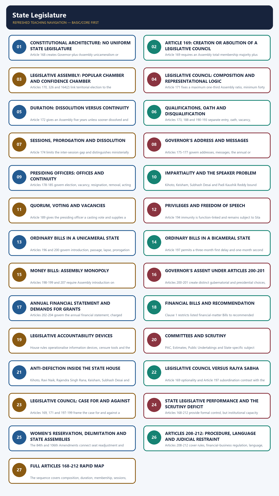

# Polity 20 - State Legislature - Complete Topic Package

> **Subject:** Indian Polity | **Topic:** 20 | **GS-II + Prelims** | **Export date:** 2026-08-28
>
> **Approval:** false - awaiting explicit user approval.
>
> **Evidence key:** [FACT] constitutional, judicial or officially verified proposition; [ANALYSIS] reasoned exam synthesis; [CURRENT] dated legal/current control; [LIMIT] qualification preventing overstatement.

### Package method, source priority and current control

- Source order followed: `basic/State-Legislature.md` -> `advanced/20_State-Legislature.md` -> `basic/Anti-Defection-Law.md` -> necessary cross-links in Polity 17 and 19 -> live PRS/current legal control. Qdrant was not used.
- [FACT] The Core owner supersedes any stale or less-qualified Advanced statement.
- [CURRENT] Legal and institutional status is controlled to **28 August 2026, Asia/Kolkata**.
- [CURRENT] Six States have Legislative Councils: Andhra Pradesh, Telangana, Uttar Pradesh, Bihar, Maharashtra and Karnataka.
- [CURRENT] The Constitution (106th Amendment) Act provides one-third reservation for women in the Lok Sabha and State Legislative Assemblies, but it is not yet operational because the constitutionally required census-linked delimitation has not been completed.
- [CURRENT] Three 2026 Bills sought to use the 2011 Census, enlarge the Lok Sabha and activate reservation. The constitutional amendment Bill failed to obtain the required special majority on 17 April 2026; the connected Bills were withdrawn. They are not law.
- [CURRENT] Census 2027 uses 1 March 2027 as the general reference date; Ladakh and specified snow-bound
  areas of Jammu and Kashmir, Himachal Pradesh and Uttarakhand use 1 October 2026. Publication, delimitation
  and operational reservation dates remain unknown.
- [LIMIT] The women-reservation amendment covers the Lok Sabha and State Legislative Assemblies, not Legislative Councils.
- [CURRENT] On gubernatorial assent, the five-judge Article 143 advisory opinion of 20 November 2025 rejects court-created rigid timelines and automatic deemed assent, while allowing limited review of prolonged, unexplained and indefinite inaction.
- [LIMIT] The November 2025 opinion is advisory and did not "overrule" the April 2025 Tamil Nadu judgment. Use it as the later controlling qualification on timelines, deemed assent and limited mandamus.
- [CURRENT] *Padi Kaushik Reddy v. State of Telangana* (31 July 2025) reaffirmed that Tenth Schedule
  adjudication cannot be indefinitely delayed and directed the Telangana Speaker to conclude the specified
  petitions within three months.
- Current delimitation source: PRS Legislative Research, `https://prsindia.org/billtrack/the-delimitation-bill-2026`.
- Package target: independently answer-complete Foundation/Core, Optional Advanced refinements, more than 30 text-native visuals, two direct solved Mains PYQs, routed Prelims demands, 36 original MCQs, 12 remedial MCQs and eight original solved Mains questions.

### Roadmap

| Stage | Coverage | Exam outcome |
|---|---|---|
| Constitutional skeleton | Articles 168-177 | Locates Houses, membership and sessions |
| Assembly | Composition, election, duration and representation | Solves direct factual questions |
| Council | Article 169, composition and duration | Answers the 2021 Mains PYQ |
| Officers and membership | Articles 178-193 | Handles Speaker, quorum and disqualification |
| Privileges | Articles 194-195 | Separates speech immunity from institutional privilege |
| Legislative procedure | Articles 196-201 | Compares ordinary, Money and reserved Bills |
| Financial procedure | Articles 202-207 | Tracks budget, grants and financial Bills |
| Procedure and courts | Articles 208-212 | Explains autonomy and judicial-review limits |
| Accountability | Questions, motions, committees and confidence | Links procedure to responsible government |
| Reform | sittings, scrutiny, Speaker neutrality and Councils | Produces balanced GS-II conclusions |
| Workbook | PYQs, MCQs, remedials and solved Mains | Converts coverage into marks |

### Scope ownership and cross-links

- **Polity 17 - Parliament:** Union comparison, parliamentary devices and committee logic.
- **Polity 19 - Governor, CM and State Council:** Governor's assent, ordinance power, confidence and State executive.
- **Polity 27 - Election Commission:** election disputes, RPA and electoral machinery.
- **Polity 42 - Anti-Defection Law:** full Tenth Schedule doctrine and reforms.
- [LIMIT] This package owns the institutions and procedures of State legislatures. It supplies enough cross-linked doctrine to remain independently answer-complete without duplicating every specialist topic.

## BASIC LEARNING SESSION



*Distinct embedded teaching-navigation image. The separate continuous Cārvāka-style flowchart package remains an independent at-a-glance artifact.*

### SESSION 1 — CONSTITUTIONAL ARCHITECTURE: NO UNIFORM STATE LEGISLATURE

#### DEFINITION / WHAT THIS IS CALLED

**Plain-language definition:** Every State has an Assembly, but only six have a Legislative Council.

**Technical definition:** Article 168 creates Governor-plus-Assembly unicameralism or Governor-plus-two-House bicameralism.

#### ANSWER-GRABBING OPENING — WRITE/ADAPT IN THE EXAM

> State legislature architecture is non-uniform because the Assembly is universal while the Council is optional.

#### MUST-WRITE KEYWORDS

- **Article 168**
- **Assembly**
- **Council**
- **unicameral**
- **bicameral**

**How to use them:** Frame the answer through Article 168; define Assembly, connect Council with unicameral to explain the mechanism, and use bicameral for the decisive comparison or qualification.

**Visual 1 - Article 168 structure**

```text
STATE LEGISLATURE
      |
      +-- Governor (constitutional component)
      |
      +-- Legislative Assembly in every State
      |
      +-- Legislative Council only in six States
```

Caption: A State legislature includes the Governor, but the Governor is not a member of either House.

- [FACT] Article 168 provides a legislature for every State consisting of the Governor and one or two Houses.
- [FACT] Every State has a Legislative Assembly. Only specified States have a Legislative Council.
- [FACT] A unicameral legislature is Governor plus Assembly; a bicameral legislature is Governor plus Assembly plus Council.
- [ANALYSIS] State bicameralism is optional and asymmetric. It is not a federal necessity comparable to the Rajya Sabha.
- [LIMIT] Inclusion of the Governor under Article 168 does not confer member privileges under Article 194.

**Visual 2 - Six bicameral States**

| Mnemonic | State |
|---|---|
| K | Karnataka |
| A | Andhra Pradesh |
| T | Telangana |
| B | Bihar |
| U | Uttar Pradesh |
| M | Maharashtra |

> **Mnemonic:** KATBUM - the six States with Legislative Councils.

- [FACT] Jammu and Kashmir's Legislative Council was abolished through the 2019 reorganisation framework.
- [FACT] Tamil Nadu's 2010 Council-creation legislation was not brought into force.
- [LIMIT] Proposals or Assembly resolutions for a Council do not themselves create one. Parliament must enact the Article 169 law.

#### CLOSING RECALL FLOW — CONSTITUTIONAL ARCHITECTURE: NO UNIFORM STATE LEGISLATURE

```text
START / CONCEPT: Constitutional architecture: no uniform State legislature
        |
        v
EXACT TERMS: Article 168 · Assembly · Council · unicameral · bicameral
        |
        v
MECHANISM / ARGUMENT: Direct election makes the Assembly mandatory; Article 169 permits a second chamber after State and parliamentary action.
        |
        v
CONSEQUENCE / CONTRAST: The design preserves democratic primacy while allowing State-specific institutional choice.
        |
        v
UPSC TRAP / ANSWER-USE: The Governor is a legislative component, not a House member.
        |
        v
ANSWER-GRABBING FORMULATION: State legislature architecture is non-uniform because the Assembly is universal while the Council is optional.
```
### SESSION 2 — ARTICLE 169: CREATION OR ABOLITION OF A LEGISLATIVE COUNCIL

#### DEFINITION / WHAT THIS IS CALLED

**Plain-language definition:** A State Assembly initiates Council creation or abolition, and Parliament decides by ordinary law.

**Technical definition:** Article 169 requires an Assembly total-membership majority plus two-thirds present and voting before Parliament may legislate.

#### ANSWER-GRABBING OPENING — WRITE/ADAPT IN THE EXAM

> Article 169 makes State bicameralism optional without using the Article 368 amendment procedure.

#### MUST-WRITE KEYWORDS

- **Article 169**
- **special majority**
- **Parliament**
- **creation**
- **abolition**

**How to use them:** Frame the answer through Article 169; define special majority, connect Parliament with creation to explain the mechanism, and use abolition for the decisive comparison or qualification.

**Visual 3 - Article 169 sequence**

```text
State Legislative Assembly
passes special-majority resolution
        |
        v
Parliament may enact a law
by ordinary/simple majority
        |
        v
Council created or abolished
        |
        v
Incidental constitutional-text changes allowed
without using Article 368
```

- [FACT] The Assembly resolution requires:
  - a majority of the total membership of the Assembly; and
  - a majority of not less than two-thirds of members present and voting.
- [FACT] Parliament may then provide by law for creation or abolition.
- [FACT] Parliament passes that law by ordinary legislative majority.
- [FACT] Article 169 expressly prevents the law from being treated as a constitutional amendment for Article 368.
- [LIMIT] Parliament is enabled, not mechanically compelled, by the Assembly resolution.
- [ANALYSIS] The design lets each State express institutional preference while preserving Parliament's final law-making control.

**Visual 4 - Majority trap**

| Stage | Required majority |
|---|---|
| Assembly resolution | Total-membership majority plus two-thirds present and voting |
| Parliamentary law | Simple/ordinary majority |
| State ratification under Article 368 | Not required |

> **UPSC trap:** The special majority belongs to the initiating Assembly resolution, not to Parliament's later Article 169 Act.

#### CLOSING RECALL FLOW — ARTICLE 169: CREATION OR ABOLITION OF A LEGISLATIVE COUNCIL

```text
START / CONCEPT: Article 169: creation or abolition of a Legislative Council
        |
        v
EXACT TERMS: Article 169 · special majority · Parliament · creation · abolition
        |
        v
MECHANISM / ARGUMENT: The Assembly passes the enabling resolution, then Parliament may enact incidental constitutional changes by ordinary law.
        |
        v
CONSEQUENCE / CONTRAST: Council existence reflects State preference but remains dependent on parliamentary enactment.
        |
        v
UPSC TRAP / ANSWER-USE: Do not miss this limiting distinction: the Assembly resolution binds neither Parliament nor other States.
        |
        v
ANSWER-GRABBING FORMULATION: Article 169 makes State bicameralism optional without using the Article 368 amendment procedure.
```
### SESSION 3 — LEGISLATIVE ASSEMBLY: POPULAR CHAMBER AND CONFIDENCE CHAMBER

#### DEFINITION / WHAT THIS IS CALLED

**Plain-language definition:** The directly elected Assembly controls representation, finance and government survival.

**Technical definition:** Articles 170, 326 and 164(2) link territorial election to the confidence-holding chamber.

#### ANSWER-GRABBING OPENING — WRITE/ADAPT IN THE EXAM

> The Legislative Assembly is both the popular House and the chamber that sustains the State ministry.

#### MUST-WRITE KEYWORDS

- **Article 170**
- **direct election**
- **Assembly**
- **confidence**
- **Article 164**

**How to use them:** Frame the answer through Article 170; define direct election, connect Assembly with confidence to explain the mechanism, and use Article 164 for the decisive comparison or qualification.

**Visual 5 - Democratic chain**

```text
Adult citizens
   |
direct territorial election
   |
Legislative Assembly
   |
confidence / no-confidence
   |
Chief Minister and Council of Ministers
```

- [FACT] Article 170 ordinarily provides 60 to 500 directly elected members from territorial constituencies.
- [FACT] Special constitutional or statutory arrangements permit smaller Assemblies, including Sikkim 32, Goa 40 and Mizoram 40.
- [FACT] Universal adult suffrage under Article 326 governs direct election.
- [FACT] The Council of Ministers is collectively responsible only to the Legislative Assembly under Article 164(2).
- [ANALYSIS] Direct election plus confidence control makes the Assembly the democratic and political centre of State government.

**Visual 6 - Representation controls**

| Control | Position |
|---|---|
| Territorial constituencies | Direct election |
| Population-seat readjustment | Frozen until relevant figures of first census after 2026 are published |
| SC/ST reservation | Constitutionally protected and population-linked |
| Anglo-Indian nomination | Lapsed under the 104th Amendment |
| Women's reservation | Constitutionally provided, not yet operational |

- [FACT] The 84th Amendment continued the freeze on total seat readjustment until publication of the first census taken after 2026.
- [LIMIT] The year 2026 did not itself trigger delimitation.
- [CURRENT] The 2026 legislative package that sought an earlier route using the 2011 Census failed; the existing constitutional sequence remains controlling.

#### CLOSING RECALL FLOW — LEGISLATIVE ASSEMBLY: POPULAR CHAMBER AND CONFIDENCE CHAMBER

```text
START / CONCEPT: Legislative Assembly: popular chamber and confidence chamber
        |
        v
EXACT TERMS: Article 170 · direct election · Assembly · confidence · Article 164
        |
        v
MECHANISM / ARGUMENT: Citizens elect territorial representatives whose majority authorises and scrutinises the Council of Ministers.
        |
        v
CONSEQUENCE / CONTRAST: Direct mandate explains Assembly dominance over money, confidence and Council disagreement.
        |
        v
UPSC TRAP / ANSWER-USE: Do not miss this limiting distinction: the ordinary 60-500 range has constitutional and statutory exceptions.
        |
        v
ANSWER-GRABBING FORMULATION: The Legislative Assembly is both the popular House and the chamber that sustains the State ministry.
```
### SESSION 4 — LEGISLATIVE COUNCIL: COMPOSITION AND REPRESENTATIONAL LOGIC

#### DEFINITION / WHAT THIS IS CALLED

**Plain-language definition:** The Council mixes local, graduate, teacher, MLA-elected and nominated representation.

**Technical definition:** Article 171 fixes a maximum one-third Assembly ratio, minimum forty and five electoral or nomination streams.

#### ANSWER-GRABBING OPENING — WRITE/ADAPT IN THE EXAM

> Legislative Council composition combines indirect STV election with gubernatorial nomination.

#### MUST-WRITE KEYWORDS

- **Article 171**
- **local authorities**
- **graduates**
- **teachers**
- **STV**

**How to use them:** Frame the answer through Article 171; define local authorities, connect graduates with teachers to explain the mechanism, and use STV for the decisive comparison or qualification.

**Visual 7 - Article 171 composition wheel**

```text
1/3  local authorities
1/12 graduates
1/12 teachers
1/3  elected by MLAs from non-MLAs
1/6  nominated by Governor
```

- [FACT] Council strength cannot exceed one-third of the Assembly strength and cannot ordinarily be below 40.
- [FACT] Five-sixths are indirectly elected and one-sixth are nominated.
- [FACT] Elected categories use proportional representation by means of the single transferable vote.
- [FACT] Governor-nominated members possess special knowledge or practical experience in literature, science, art, the cooperative movement or social service.
- [LIMIT] "Education" is not the exact constitutional category; "literature" and "science" are.

**Visual 8 - Electoral colleges**

| Share | Electoral source | Core logic |
|---:|---|---|
| 1/3 | Municipalities, district boards and other specified local authorities | Local-government voice |
| 1/12 | Graduates of prescribed standing | Functional constituency |
| 1/12 | Teachers of prescribed standing in qualifying institutions | Functional constituency |
| 1/3 | MLAs elect non-MLAs | Assembly-linked membership |
| 1/6 | Governor nominates | Expertise and public service |

- [ANALYSIS] The Council mixes territorial-local, occupational, Assembly-mediated and expert representation.
- [ANALYSIS] This diversity can improve scrutiny, but old graduate/teacher franchise categories invite reform questions about contemporary representativeness.

#### CLOSING RECALL FLOW — LEGISLATIVE COUNCIL: COMPOSITION AND REPRESENTATIONAL LOGIC

```text
START / CONCEPT: Legislative Council: composition and representational logic
        |
        v
EXACT TERMS: Article 171 · local authorities · graduates · teachers · STV
        |
        v
MECHANISM / ARGUMENT: Distinct electoral colleges choose five-sixths, while the Governor nominates one-sixth from listed fields.
        |
        v
CONSEQUENCE / CONTRAST: The mix can diversify scrutiny but raises equality and patronage questions.
        |
        v
UPSC TRAP / ANSWER-USE: Education is not the exact nomination category; literature and science are.
        |
        v
ANSWER-GRABBING FORMULATION: Legislative Council composition combines indirect STV election with gubernatorial nomination.
```
### SESSION 5 — DURATION: DISSOLUTION VERSUS CONTINUITY

#### DEFINITION / WHAT THIS IS CALLED

**Plain-language definition:** Assemblies may dissolve, while Councils continue through staggered retirement.

**Technical definition:** Article 172 gives an Assembly five years unless sooner dissolved and makes the Council permanent with one-third retiring biennially.

#### ANSWER-GRABBING OPENING — WRITE/ADAPT IN THE EXAM

> House duration balances electoral renewal with optional institutional continuity.

#### MUST-WRITE KEYWORDS

- **Article 172**
- **five years**
- **dissolution**
- **permanent Council**
- **retirement**

**How to use them:** Frame the answer through Article 172; define five years, connect dissolution with permanent Council to explain the mechanism, and use retirement for the decisive comparison or qualification.

**Visual 9 - House life cycle**

```text
ASSEMBLY                         COUNCIL
5-year normal term              permanent chamber
may be dissolved                cannot be dissolved
entire House renewed            1/3 retires every 2 years
                                member term: 6 years
```

- [FACT] Article 172 gives an Assembly a normal five-year term from its first meeting unless sooner dissolved.
- [FACT] During a National Emergency, Parliament may extend an Assembly term one year at a time, but not beyond six months after the emergency ends.
- [FACT] The Council is permanent; one-third retire every second year.
- [ANALYSIS] Council continuity can preserve institutional memory when the Assembly changes abruptly.

#### CLOSING RECALL FLOW — DURATION: DISSOLUTION VERSUS CONTINUITY

```text
START / CONCEPT: Duration: dissolution versus continuity
        |
        v
EXACT TERMS: Article 172 · five years · dissolution · permanent Council · retirement
        |
        v
MECHANISM / ARGUMENT: Assembly membership renews together; Council membership renews in staggered six-year terms.
        |
        v
CONSEQUENCE / CONTRAST: The contrast supports democratic change alongside legislative memory.
        |
        v
UPSC TRAP / ANSWER-USE: A National Emergency extension is annual and cannot exceed six months after its end.
        |
        v
ANSWER-GRABBING FORMULATION: House duration balances electoral renewal with optional institutional continuity.
```
### SESSION 6 — QUALIFICATIONS, OATH AND DISQUALIFICATION

#### DEFINITION / WHAT THIS IS CALLED

**Plain-language definition:** Membership requires constitutional eligibility, oath and freedom from listed disqualifications.

**Technical definition:** Articles 173, 188 and 190-193 separate entry, oath, vacancy, disqualification decision and unauthorised sitting penalties.

#### ANSWER-GRABBING OPENING — WRITE/ADAPT IN THE EXAM

> State legislative membership depends on eligibility at entry and continuing qualification afterward.

#### MUST-WRITE KEYWORDS

- **Article 173**
- **Article 188**
- **Article 190**
- **Article 191**
- **Article 192**

**How to use them:** Frame the answer through Article 173; define Article 188, connect Article 190 with Article 191 to explain the mechanism, and use Article 192 for the decisive comparison or qualification.

**Visual 10 - Entry requirements**

| Requirement | Assembly | Council |
|---|---:|---:|
| Citizenship | Indian | Indian |
| Minimum age | 25 | 30 |
| Oath/affirmation | Required before sitting | Required before sitting |
| Other qualifications | Parliamentary law | Parliamentary law |

- [FACT] Article 173 contains citizenship, oath and age requirements.
- [FACT] Article 188 requires oath or affirmation before the Governor or a person appointed by the Governor.
- [FACT] Sitting or voting without qualification/oath may attract the Article 193 penalty.

**Visual 11 - Article 191 disqualifications**

```text
Office of profit under Union/State
Unsound mind declared by competent court
Undischarged insolvent
Not citizen / foreign allegiance
Disqualified by parliamentary law
Tenth Schedule defection
```

- [FACT] Article 191 supplies constitutional grounds; the Representation of the People Act adds statutory grounds.
- [FACT] Under Article 192, a non-defection question of member disqualification is decided by the Governor after obtaining and acting according to the Election Commission's opinion.
- [FACT] Tenth Schedule disputes are decided by the Speaker or Chairman, subject to judicial review.
- [LIMIT] Do not send a Tenth Schedule question to the Governor under Article 192.
- [FACT] Article 190 governs vacation of seats, including double membership, resignation and absence for
  sixty days without House permission, subject to the exclusions stated in the provision.
- [FACT] A resignation does not create a vacancy until the Speaker or Chairman accepts it after being
  satisfied that it is voluntary and genuine.

#### CLOSING RECALL FLOW — QUALIFICATIONS, OATH AND DISQUALIFICATION

```text
START / CONCEPT: Qualifications, oath and disqualification
        |
        v
EXACT TERMS: Article 173 · Article 188 · Article 190 · Article 191 · Article 192
        |
        v
MECHANISM / ARGUMENT: Qualification permits election, oath permits participation, and later vacancy or disqualification follows the correct constitutional decision route.
        |
        v
CONSEQUENCE / CONTRAST: The framework protects House legitimacy and electoral integrity.
        |
        v
UPSC TRAP / ANSWER-USE: Do not miss this limiting distinction: article 192 excludes Tenth Schedule disputes.
        |
        v
ANSWER-GRABBING FORMULATION: State legislative membership depends on eligibility at entry and continuing qualification afterward.
```
### SESSION 7 — SESSIONS, PROROGATION AND DISSOLUTION

#### DEFINITION / WHAT THIS IS CALLED

**Plain-language definition:** Summoning starts a session, prorogation ends it and dissolution ends only the Assembly.

**Technical definition:** Article 174 limits the inter-session gap and distinguishes ministerially advised gubernatorial acts from House adjournment.

#### ANSWER-GRABBING OPENING — WRITE/ADAPT IN THE EXAM

> Sessions, prorogation and dissolution determine whether a sitting, session or the entire Assembly ends.

#### MUST-WRITE KEYWORDS

- **Article 174**
- **summoning**
- **prorogation**
- **adjournment**
- **dissolution**

**How to use them:** Frame the answer through Article 174; define summoning, connect prorogation with adjournment to explain the mechanism, and use dissolution for the decisive comparison or qualification.

**Visual 12 - Article 174 controls**

```text
Governor summons House(s)
       |
       +-- not more than 6 months between sessions
       |
       +-- may prorogue House(s)
       |
       +-- may dissolve Assembly
```

- [FACT] The Governor summons each House from time to time.
- [FACT] Six months cannot intervene between the last sitting in one session and the first sitting in the next.
- [FACT] Prorogation ends a session; adjournment suspends a sitting; dissolution ends the Assembly's life.
- [FACT] A Legislative Council is never dissolved.
- [LIMIT] The Governor ordinarily acts on ministerial advice; Article 174 is not a general personal discretion.

**Visual 13 - Terminology**

| Device | Authority | Effect |
|---|---|---|
| Adjournment | Presiding officer/House | Suspends sitting |
| Adjournment sine die | Presiding officer | Ends sittings without next date |
| Prorogation | Governor | Ends session |
| Dissolution | Governor constitutionally | Ends Assembly |

#### CLOSING RECALL FLOW — SESSIONS, PROROGATION AND DISSOLUTION

```text
START / CONCEPT: Sessions, prorogation and dissolution
        |
        v
EXACT TERMS: Article 174 · summoning · prorogation · adjournment · dissolution
        |
        v
MECHANISM / ARGUMENT: The Governor summons and prorogues on advice; the presiding officer adjourns; dissolution triggers Assembly renewal.
        |
        v
CONSEQUENCE / CONTRAST: Correct sequencing supports accountability and prevents unconstitutional session gaps.
        |
        v
UPSC TRAP / ANSWER-USE: A Council is never dissolved, and Article 174 is not general Governor discretion.
        |
        v
ANSWER-GRABBING FORMULATION: Sessions, prorogation and dissolution determine whether a sitting, session or the entire Assembly ends.
```
### SESSION 8 — GOVERNOR'S ADDRESS AND MESSAGES

#### DEFINITION / WHAT THIS IS CALLED

**Plain-language definition:** The Governor may address or message Houses and must deliver the special address on specified occasions.

**Technical definition:** Articles 175-177 govern addresses, messages, the annual or post-election special address and participation rights of ministers and the Advocate General.

#### ANSWER-GRABBING OPENING — WRITE/ADAPT IN THE EXAM

> The Governor’s address and messages connect the elected government’s programme with legislative debate.

#### MUST-WRITE KEYWORDS

- **Article 175**
- **Article 176**
- **special address**
- **Motion of Thanks**
- **Article 177**

**How to use them:** Frame the answer through Article 175; define Article 176, connect special address with Motion of Thanks to explain the mechanism, and use Article 177 for the decisive comparison or qualification.

**Visual 14 - Articles 175-176**

```text
Article 175
  - address either House or both
  - send messages on pending or other matters

Article 176 special address
  - first session after each general election
  - first session of each year
  - followed by Motion of Thanks
```

- [FACT] The special address states the causes of summoning and outlines the government's programme.
- [ANALYSIS] Debate on the Motion of Thanks is a broad accountability occasion, not merely ceremonial response.
- [LIMIT] Defeat on an amendment or Motion of Thanks may be politically serious, but confidence consequences depend on context and House practice.

#### CLOSING RECALL FLOW — GOVERNOR'S ADDRESS AND MESSAGES

```text
START / CONCEPT: Governor's address and messages
        |
        v
EXACT TERMS: Article 175 · Article 176 · special address · Motion of Thanks · Article 177
        |
        v
MECHANISM / ARGUMENT: The government frames the programme, the Governor formally addresses, and members debate through the Motion of Thanks.
        |
        v
CONSEQUENCE / CONTRAST: The process creates a broad accountability occasion.
        |
        v
UPSC TRAP / ANSWER-USE: Article 177 participants may speak but vote only if they are House members.
        |
        v
ANSWER-GRABBING FORMULATION: The Governor’s address and messages connect the elected government’s programme with legislative debate.
```
### SESSION 9 — PRESIDING OFFICERS: OFFICES AND CONTINUITY

#### DEFINITION / WHAT THIS IS CALLED

**Plain-language definition:** Each House elects presiding and deputy presiding officers with constitutional removal safeguards.

**Technical definition:** Articles 178-185 govern election, vacancy, resignation, removal, acting arrangements and participation during removal motions.

#### ANSWER-GRABBING OPENING — WRITE/ADAPT IN THE EXAM

> Presiding officer continuity protects House functioning across vacancies and Assembly dissolution.

#### MUST-WRITE KEYWORDS

- **Speaker**
- **Deputy Speaker**
- **Chairman**
- **Article 179**
- **continuity**

**How to use them:** Frame the answer through Speaker; define Deputy Speaker, connect Chairman with Article 179 to explain the mechanism, and use continuity for the decisive comparison or qualification.

**Visual 15 - Constitutional offices**

| House | Presiding officer | Deputy |
|---|---|---|
| Assembly | Speaker | Deputy Speaker |
| Council | Chairman | Deputy Chairman |

- [FACT] Articles 178-181 govern Assembly officers; Articles 182-185 govern Council officers.
- [FACT] Each House chooses its presiding and deputy presiding officer from among its members.
- [FACT] An Assembly Speaker resigns to the Deputy Speaker; the Deputy Speaker resigns to the Speaker.
- [FACT] Removal requires a resolution passed by a majority of all then members after at least 14 days' notice.
- [FACT] The Speaker continues after dissolution until immediately before the first meeting of the next Assembly.
- [FACT] A presiding officer does not preside over a motion for their own removal but may participate and vote in the first instance.

**Visual 16 - Speaker's core functions**

```text
ORDER AND PROCEDURE
  +-- interprets rules
  +-- recognises speakers
  +-- maintains discipline
  +-- decides admissibility

CONSTITUTIONAL FUNCTIONS
  +-- Money Bill certification
  +-- Tenth Schedule adjudication
  +-- casting vote when tied
```

#### CLOSING RECALL FLOW — PRESIDING OFFICERS: OFFICES AND CONTINUITY

```text
START / CONCEPT: Presiding officers: offices and continuity
        |
        v
EXACT TERMS: Speaker · Deputy Speaker · Chairman · Article 179 · continuity
        |
        v
MECHANISM / ARGUMENT: The House elects its chair, substitutes act during vacancy, and removal requires notice plus a majority of all then members.
        |
        v
CONSEQUENCE / CONTRAST: Stable offices support orderly and independent procedure.
        |
        v
UPSC TRAP / ANSWER-USE: Do not miss this limiting distinction: the Assembly Speaker continues only until immediately before the next Assembly’s first meeting.
        |
        v
ANSWER-GRABBING FORMULATION: Presiding officer continuity protects House functioning across vacancies and Assembly dissolution.
```
### SESSION 10 — IMPARTIALITY AND THE SPEAKER PROBLEM

#### DEFINITION / WHAT THIS IS CALLED

**Plain-language definition:** Speaker powers over procedure, Money Bills and defection create a recurring neutrality conflict.

**Technical definition:** Kihoto, Keisham, Subhash Desai and Padi Kaushik Reddy bound tribunal-like defection authority through review and timely decision duties.

#### ANSWER-GRABBING OPENING — WRITE/ADAPT IN THE EXAM

> Speaker impartiality is strained when a party member controls proceedings that can determine government survival.

#### MUST-WRITE KEYWORDS

- **Speaker**
- **impartiality**
- **Tenth Schedule**
- **Keisham**
- **Padi Kaushik Reddy**

**How to use them:** Frame the answer through Speaker; define impartiality, connect Tenth Schedule with Keisham to explain the mechanism, and use Padi Kaushik Reddy for the decisive comparison or qualification.

**Visual 17 - Institutional tension**

```text
Speaker remains party member
          +
controls House agenda and recognition
          +
decides defection petitions
          =
risk of partisan delay or selective urgency
```

- [FACT] The Tenth Schedule assigns defection decisions to the Speaker/Chairman.
- [FACT] *Kihoto Hollohan (1992)* treats the presiding officer as a tribunal subject to judicial review.
- [FACT] *Keisham Meghachandra Singh* (2020) stated that petitions should ordinarily be decided within a reasonable period of about three months and urged Parliament to consider an independent tribunal.
- [CURRENT] *Padi Kaushik Reddy v. State of Telangana* (2025) treated timely Speaker adjudication as
  judicially enforceable and directed completion of the specified Telangana petitions within three months.
- [FACT] *Subhash Desai* (2023) holds that the whip and leader recognised for Tenth Schedule purposes must be appointed by the political party, not merely a legislature-party faction.
- [LIMIT] The independent tribunal and statutory deadline are proposals, not enacted law.
- [ANALYSIS] Neutrality cannot rest only on personal virtue where office incentives are partisan.

#### CLOSING RECALL FLOW — IMPARTIALITY AND THE SPEAKER PROBLEM

```text
START / CONCEPT: Impartiality and the Speaker problem
        |
        v
EXACT TERMS: Speaker · impartiality · Tenth Schedule · Keisham · Padi Kaushik Reddy
        |
        v
MECHANISM / ARGUMENT: Agenda and defection powers affect confidence arithmetic; reasoned decisions and judicial directions check strategic delay.
        |
        v
CONSEQUENCE / CONTRAST: Neutral procedure improves legitimacy, while delay can reward unconstitutional defection.
        |
        v
UPSC TRAP / ANSWER-USE: The independent tribunal remains a proposal, but timely adjudication is judicially enforceable.
        |
        v
ANSWER-GRABBING FORMULATION: Speaker impartiality is strained when a party member controls proceedings that can determine government survival.
```
### SESSION 11 — QUORUM, VOTING AND VACANCIES

#### DEFINITION / WHAT THIS IS CALLED

**Plain-language definition:** State Houses decide by present-and-voting majority and may act despite vacancies, subject to quorum.

**Technical definition:** Article 189 gives the presiding officer a casting vote and supplies a default quorum alterable by State law.

#### ANSWER-GRABBING OPENING — WRITE/ADAPT IN THE EXAM

> Voting rules distinguish ordinary majority, tie-breaking authority and the minimum attendance needed for business.

#### MUST-WRITE KEYWORDS

- **Article 189**
- **quorum**
- **casting vote**
- **vacancies**
- **present and voting**

**How to use them:** Frame the answer through Article 189; define quorum, connect casting vote with vacancies to explain the mechanism, and use present and voting for the decisive comparison or qualification.

**Visual 18 - Article 189**

| Rule | State House position |
|---|---|
| Ordinary decision | Majority of members present and voting |
| Presiding officer | No first vote; casting vote on equality |
| Quorum | Until the State Legislature otherwise provides by law: 10 members or one-tenth, whichever is greater |
| Vacancy | House may act despite vacancies, subject to constitutional limits |

> **UPSC trap:** Article 189 supplies **10 or one-tenth, whichever is greater** as the default **until the
> State Legislature otherwise provides by law**.

- [FACT] If quorum is absent, the presiding officer must adjourn or suspend the meeting until quorum exists.
- [ANALYSIS] Vacancies do not automatically paralyse a House, but disputed majorities must be tested against the effective constitutional membership and valid votes.

#### CLOSING RECALL FLOW — QUORUM, VOTING AND VACANCIES

```text
START / CONCEPT: Quorum, voting and vacancies
        |
        v
EXACT TERMS: Article 189 · quorum · casting vote · vacancies · present and voting
        |
        v
MECHANISM / ARGUMENT: Valid members vote; equality activates the casting vote; absent quorum requires adjournment or suspension.
        |
        v
CONSEQUENCE / CONTRAST: The rules let Houses function despite vacancies without permitting business below quorum.
        |
        v
UPSC TRAP / ANSWER-USE: Do not miss this limiting distinction: ten or one-tenth is the constitutional default until State law provides otherwise.
        |
        v
ANSWER-GRABBING FORMULATION: Voting rules distinguish ordinary majority, tie-breaking authority and the minimum attendance needed for business.
```
### SESSION 12 — PRIVILEGES AND FREEDOM OF SPEECH

#### DEFINITION / WHAT THIS IS CALLED

**Plain-language definition:** Legislative privilege protects deliberation, not bribery or unrelated misconduct.

**Technical definition:** Article 194 immunity is function-linked and remains subject to Sita Soren, Amarinder Singh and Raja Ram Pal constitutional review controls.

#### ANSWER-GRABBING OPENING — WRITE/ADAPT IN THE EXAM

> Privileges secure independent speech and voting while remaining bounded by constitutional purpose.

#### MUST-WRITE KEYWORDS

- **Article 194**
- **privilege**
- **Sita Soren**
- **Amarinder Singh**
- **Raja Ram Pal**

**How to use them:** Frame the answer through Article 194; define privilege, connect Sita Soren with Amarinder Singh to explain the mechanism, and use Raja Ram Pal for the decisive comparison or qualification.

**Visual 19 - Article 194 shield**

```text
Freedom of speech in legislature
       |
       +-- subject to Constitution and House rules
       |
       +-- immunity for vote or speech in House/committee
       |
       +-- authorised publication immunity
```

- [FACT] Article 194 protects members from court proceedings for speech or vote in the House or committee.
- [FACT] Privilege belongs to members and the House; it is not a general immunity for conduct outside legislative functions.
- [FACT] *Sita Soren (2024) v. Union of India* (2024) holds that bribery is not protected merely because it relates
  to a legislative vote or speech; the seven-judge Bench overruled the contrary majority rule in
  *P.V. Narasimha Rao*.
- [FACT] *Amarinder Singh v. Special Committee, Punjab Vidhan Sabha* (2010) rejects use of privilege as a
  general punitive jurisdiction over past executive conduct lacking a nexus with House functions.
- [FACT] *Raja Ram Pal (2007)* (2007) confirms that privilege and expulsion remain reviewable for substantive
  illegality, unconstitutionality, mala fides and jurisdictional error.
- [LIMIT] Many privileges remain uncodified; Article 194 does not freeze an unlimited historical catalogue
  or place House action above the Constitution.
- [FACT] Article 211 bars discussion of the conduct of Supreme Court or High Court judges in discharge of duties.
- [LIMIT] The Governor is a component of the legislature but not a House member and does not acquire Article 194 member privilege.
- [ANALYSIS] Privilege protects deliberative independence, not corruption or substantive constitutional illegality.

#### CLOSING RECALL FLOW — PRIVILEGES AND FREEDOM OF SPEECH

```text
START / CONCEPT: Privileges and freedom of speech
        |
        v
EXACT TERMS: Article 194 · privilege · Sita Soren · Amarinder Singh · Raja Ram Pal
        |
        v
MECHANISM / ARGUMENT: Speech, vote and authorised publication receive protection; corruption or unrelated punitive action falls outside functional necessity.
        |
        v
CONSEQUENCE / CONTRAST: The balance preserves legislative independence without creating criminal impunity.
        |
        v
UPSC TRAP / ANSWER-USE: The Governor is not a member, and uncodified privilege is not unlimited power.
        |
        v
ANSWER-GRABBING FORMULATION: Privileges secure independent speech and voting while remaining bounded by constitutional purpose.
```
### SESSION 13 — ORDINARY BILLS IN A UNICAMERAL STATE

#### DEFINITION / WHAT THIS IS CALLED

**Plain-language definition:** A unicameral ordinary Bill moves through the Assembly before the Article 200 assent gateway.

**Technical definition:** Articles 196 and 200 govern introduction, passage, lapse, prorogation and gubernatorial options.

#### ANSWER-GRABBING OPENING — WRITE/ADAPT IN THE EXAM

> Unicameral procedure concentrates deliberation in one elected House but still requires constitutional assent action.

#### MUST-WRITE KEYWORDS

- **Article 196**
- **ordinary Bill**
- **unicameral**
- **Assembly**
- **Article 200**

**How to use them:** Frame the answer through Article 196; define ordinary Bill, connect unicameral with Assembly to explain the mechanism, and use Article 200 for the decisive comparison or qualification.

**Visual 20 - Unicameral route**

```text
Introduction in Assembly
       |
readings / debate / committee / vote
       |
passed by Assembly
       |
presented to Governor under Article 200
       |
assent / return / withhold / reserve
```

- [FACT] Subject to special rules, an ordinary Bill may be introduced by a minister or private member.
- [FACT] A Bill pending in the Assembly lapses on dissolution unless constitutional doctrine provides otherwise.
- [FACT] A Bill passed by the Assembly but pending with the Council ordinarily lapses on Assembly dissolution.
- [FACT] Prorogation does not lapse a Bill.
- [FACT] A Bill originating in and still pending before the Council does not lapse merely because the
  Assembly is dissolved.
- [LIMIT] Bill-lapse questions are status-sensitive; always identify the House and stage.

#### CLOSING RECALL FLOW — ORDINARY BILLS IN A UNICAMERAL STATE

```text
START / CONCEPT: Ordinary Bills in a unicameral State
        |
        v
EXACT TERMS: Article 196 · ordinary Bill · unicameral · Assembly · Article 200
        |
        v
MECHANISM / ARGUMENT: Introduction leads through readings, committee scrutiny and voting before presentation to the Governor.
        |
        v
CONSEQUENCE / CONTRAST: The route is faster but places greater weight on committees and opposition scrutiny.
        |
        v
UPSC TRAP / ANSWER-USE: Prorogation does not lapse Bills; Assembly dissolution can.
        |
        v
ANSWER-GRABBING FORMULATION: Unicameral procedure concentrates deliberation in one elected House but still requires constitutional assent action.
```
### SESSION 14 — ORDINARY BILLS IN A BICAMERAL STATE

#### DEFINITION / WHAT THIS IS CALLED

**Plain-language definition:** A Council may delay an Assembly Bill but cannot defeat the Assembly’s final preference.

**Technical definition:** Article 197 permits a three-month first delay and one-month second delay without any State joint sitting.

#### ANSWER-GRABBING OPENING — WRITE/ADAPT IN THE EXAM

> Bicameral ordinary legislation provides reconsideration without a co-equal Council veto.

#### MUST-WRITE KEYWORDS

- **Article 197**
- **ordinary Bill**
- **three months**
- **one month**
- **no joint sitting**

**How to use them:** Frame the answer through Article 197; define ordinary Bill, connect three months with one month to explain the mechanism, and use no joint sitting for the decisive comparison or qualification.

**Visual 21 - Article 197: maximum Council delay**

```text
Assembly passes Bill
       |
Council rejects / delays / amends
       |
up to 3 months
       |
Assembly passes again
       |
Council rejects / delays / amends
       |
up to 1 month
       |
Bill deemed passed in Assembly form
```

- [FACT] The Council cannot permanently veto an ordinary Bill.
- [FACT] Total potential delay is approximately four months: three months plus one month.
- [FACT] There is no joint sitting of State Houses.
- [ANALYSIS] The Council is a suspensive or dilatory chamber, not a co-equal revising chamber.
- [LIMIT] Four months is the maximum constitutional delay across the two-stage route, not a single fixed holding period.
- [LIMIT] Article 197's Assembly-override route applies to an Assembly-passed Bill. If a Council-originated
  Bill is rejected by the Assembly, it ends; the Council has no reciprocal override.

**Visual 22 - Assembly versus Council on ordinary Bills**

| Feature | Assembly | Council |
|---|---|---|
| Initiation | Yes | Yes, except Money/financial restrictions |
| Final control | Yes | No |
| First-stage delay | Repasses | Up to 3 months |
| Second-stage delay | Prevails | Up to 1 month |
| Joint sitting | Not applicable | No joint sitting exists |

#### CLOSING RECALL FLOW — ORDINARY BILLS IN A BICAMERAL STATE

```text
START / CONCEPT: Ordinary Bills in a bicameral State
        |
        v
EXACT TERMS: Article 197 · ordinary Bill · three months · one month · no joint sitting
        |
        v
MECHANISM / ARGUMENT: The Assembly passes, the Council responds, the Assembly repasses, and the Council’s second delay expires.
        |
        v
CONSEQUENCE / CONTRAST: Delay can expose flaws while preserving direct democratic primacy.
        |
        v
UPSC TRAP / ANSWER-USE: Do not miss this limiting distinction: a Council-originated Bill rejected by the Assembly ends.
        |
        v
ANSWER-GRABBING FORMULATION: Bicameral ordinary legislation provides reconsideration without a co-equal Council veto.
```
### SESSION 15 — MONEY BILLS: ASSEMBLY MONOPOLY

#### DEFINITION / WHAT THIS IS CALLED

**Plain-language definition:** Money Bills originate and are finally controlled by the Assembly.

**Technical definition:** Articles 198-199 and 207 require Assembly introduction on recommendation, Speaker certification and only fourteen-day Council recommendations.

#### ANSWER-GRABBING OPENING — WRITE/ADAPT IN THE EXAM

> State Money Bill procedure assigns the power of the purse to the confidence chamber.

#### MUST-WRITE KEYWORDS

- **Article 198**
- **Article 199**
- **Money Bill**
- **fourteen days**
- **Speaker certificate**

**How to use them:** Frame the answer through Article 198; define Article 199, connect Money Bill with fourteen days to explain the mechanism, and use Speaker certificate for the decisive comparison or qualification.

**Visual 23 - Money Bill route**

```text
Governor's recommendation
       |
introduction only in Assembly
       |
Speaker certifies Money Bill
       |
Council may recommend within 14 days
       |
Assembly accepts or rejects recommendations
       |
Governor
```

- [FACT] Article 199 defines a State Money Bill and makes the Speaker's certificate central.
- [FACT] A Money Bill cannot be introduced in the Council.
- [FACT] The Council must return it within 14 days with recommendations, which the Assembly may accept or reject.
- [FACT] If not returned within 14 days, it is deemed passed in the Assembly form.
- [FACT] A Money Bill cannot be returned by the Governor for reconsideration under Article 200.
- [ANALYSIS] The confidence chamber controls taxation, borrowing and the Consolidated Fund.

**Visual 24 - Money Bill close options**

| Claim | Correct position |
|---|---|
| Council may reject | No |
| Council may amend | Only recommend |
| Council has 14 days | Yes |
| Speaker certifies | Yes |
| Joint sitting resolves dispute | No |

#### CLOSING RECALL FLOW — MONEY BILLS: ASSEMBLY MONOPOLY

```text
START / CONCEPT: Money Bills: Assembly monopoly
        |
        v
EXACT TERMS: Article 198 · Article 199 · Money Bill · fourteen days · Speaker certificate
        |
        v
MECHANISM / ARGUMENT: The Assembly introduces and passes; the Council recommends; the Assembly accepts or rejects before assent.
        |
        v
CONSEQUENCE / CONTRAST: Financial primacy aligns taxation and expenditure with the directly accountable House.
        |
        v
UPSC TRAP / ANSWER-USE: The Governor cannot return a Money Bill and no joint sitting exists.
        |
        v
ANSWER-GRABBING FORMULATION: State Money Bill procedure assigns the power of the purse to the confidence chamber.
```
### SESSION 16 — GOVERNOR'S ASSENT UNDER ARTICLES 200-201

#### DEFINITION / WHAT THIS IS CALLED

**Plain-language definition:** State Bills face assent, return, withholding or reservation routes after legislative passage.

**Technical definition:** Articles 200-201 create distinct gubernatorial and presidential choices, mandatory High Court-protection reservation and a current reviewable-delay doctrine.

#### ANSWER-GRABBING OPENING — WRITE/ADAPT IN THE EXAM

> Assent is a constitutional checkpoint, not an indefinite pocket veto.

#### MUST-WRITE KEYWORDS

- **Article 200**
- **Article 201**
- **assent**
- **reservation**
- **deemed assent**

**How to use them:** Frame the answer through Article 200; define Article 201, connect assent with reservation to explain the mechanism, and use deemed assent for the decisive comparison or qualification.

**Visual 25 - Four Article 200 routes**

```text
Bill presented to Governor
   |
   +-- assent
   +-- withhold assent
   +-- return non-Money Bill for reconsideration
   +-- reserve for President
```

- [FACT] A returned non-Money Bill, if repassed, is presented again and the constitutional text states that the Governor shall not withhold assent.
- [FACT] Reservation is mandatory where the Bill would so derogate from High Court powers as to endanger its constitutional position.
- [FACT] Under Article 201, the President may assent, withhold, or direct return of a non-Money Bill.
- [FACT] Repassage after presidentially directed return does not compel presidential assent.
- [CURRENT] The November 2025 Article 143 opinion rejects rigid court-written timelines and deemed assent, but prolonged unexplained inaction remains amenable to limited judicial review and a direction to decide.
- [LIMIT] A court may require constitutional action; it does not choose the substantive option for the Governor or President.

#### CLOSING RECALL FLOW — GOVERNOR'S ASSENT UNDER ARTICLES 200-201

```text
START / CONCEPT: Governor's assent under Articles 200-201
        |
        v
EXACT TERMS: Article 200 · Article 201 · assent · reservation · deemed assent
        |
        v
MECHANISM / ARGUMENT: Bill type and constitutional concern determine the route; reserved Bills move to the President under different repassage rules.
        |
        v
CONSEQUENCE / CONTRAST: The mechanism balances State lawmaking, constitutional scrutiny and Union oversight.
        |
        v
UPSC TRAP / ANSWER-USE: The advisory opinion rejected rigid timelines but did not technically overrule the earlier judgment.
        |
        v
ANSWER-GRABBING FORMULATION: Assent is a constitutional checkpoint, not an indefinite pocket veto.
```
### SESSION 17 — ANNUAL FINANCIAL STATEMENT AND DEMANDS FOR GRANTS

#### DEFINITION / WHAT THIS IS CALLED

**Plain-language definition:** The State budget separates charged expenditure from Assembly-voted demands and legal appropriation.

**Technical definition:** Articles 202-204 govern the annual financial statement, charged items, demands for grants and withdrawal authority.

#### ANSWER-GRABBING OPENING — WRITE/ADAPT IN THE EXAM

> The annual financial statement and demands for grants convert executive proposals into Assembly-controlled spending authority.

#### MUST-WRITE KEYWORDS

- **Article 202**
- **Article 203**
- **Article 204**
- **demands for grants**
- **appropriation**

**How to use them:** Frame the answer through Article 202; define Article 203, connect Article 204 with demands for grants to explain the mechanism, and use appropriation for the decisive comparison or qualification.

**Visual 26 - State budget chain**

```text
Annual Financial Statement: Article 202
       |
charged expenditure identified
       |
demands for grants voted by Assembly: Article 203
       |
Appropriation Bill: Article 204
       |
Finance/financial legislation: Article 207
```

- [FACT] The Governor causes the annual financial statement to be laid before the House or Houses.
- [FACT] Charged expenditure is discussed but not voted.
- [FACT] Demands for grants are submitted only to the Assembly and require the Governor's recommendation.
- [FACT] No money may be withdrawn from the Consolidated Fund of the State except under appropriation made by law.
- [FACT] The Council cannot vote demands for grants.

**Visual 27 - Grants toolkit**

| Device | Purpose |
|---|---|
| Supplementary grant | Original amount insufficient |
| Additional grant | New service not contemplated |
| Excess grant | Expenditure exceeded authorised amount |
| Vote on account | Short-term expenditure pending full budget |
| Vote of credit | Unexpected demand of indefinite character |
| Exceptional grant | Special purpose outside current service |

#### CLOSING RECALL FLOW — ANNUAL FINANCIAL STATEMENT AND DEMANDS FOR GRANTS

```text
START / CONCEPT: Annual financial statement and demands for grants
        |
        v
EXACT TERMS: Article 202 · Article 203 · Article 204 · demands for grants · appropriation
        |
        v
MECHANISM / ARGUMENT: The Governor causes laying, the Assembly votes grants, and appropriation authorises Consolidated Fund withdrawal.
        |
        v
CONSEQUENCE / CONTRAST: Financial scrutiny links taxation and spending to representative accountability.
        |
        v
UPSC TRAP / ANSWER-USE: Charged expenditure is discussed but not voted, and the Council does not vote grants.
        |
        v
ANSWER-GRABBING FORMULATION: The annual financial statement and demands for grants convert executive proposals into Assembly-controlled spending authority.
```
### SESSION 18 — FINANCIAL BILLS AND RECOMMENDATION

#### DEFINITION / WHAT THIS IS CALLED

**Plain-language definition:** Article 207 distinguishes Bills containing Money Bill matters from other expenditure-involving Bills.

**Technical definition:** Clause 1 restricts listed financial-matter Bills to recommended Assembly introduction; clause 3 requires recommendation before either House passes expenditure Bills.

#### ANSWER-GRABBING OPENING — WRITE/ADAPT IN THE EXAM

> Financial Bill classification decides origin, recommendation stage and Council power.

#### MUST-WRITE KEYWORDS

- **Article 207**
- **financial Bill**
- **Governor recommendation**
- **Consolidated Fund**
- **Assembly**

**How to use them:** Frame the answer through Article 207; define financial Bill, connect Governor recommendation with Consolidated Fund to explain the mechanism, and use Assembly for the decisive comparison or qualification.

**Visual 28 - Money Bill and the two Article 207 controls**

| Question | Money Bill / Article 207(1) Bill | Article 207(3) expenditure Bill |
|---|---|---|
| Content | Money Bill contains only Article 199 matters; a wider 207(1) Bill may add other matters | Any Bill that would involve expenditure from the Consolidated Fund |
| Introduction | Assembly only | Either House |
| Governor recommendation | Before introduction/moving amendment | Before either House passes it; recommendation for consideration |
| Council power | Money Bill: recommendations only in 14 days; wider 207(1) Bill: ordinary-Bill route | Ordinary-Bill route |
| Speaker certificate | Only if the Article 199 Money Bill test is met | No automatic Money Bill certificate |

- [LIMIT] Do not label every Bill involving expenditure a Money Bill.
- [ANALYSIS] Classification matters because it determines the Council's power and the available legislative route.

#### CLOSING RECALL FLOW — FINANCIAL BILLS AND RECOMMENDATION

```text
START / CONCEPT: Financial Bills and recommendation
        |
        v
EXACT TERMS: Article 207 · financial Bill · Governor recommendation · Consolidated Fund · Assembly
        |
        v
MECHANISM / ARGUMENT: Classify content first, then apply the correct introduction or consideration recommendation and ordinary or Money Bill route.
        |
        v
CONSEQUENCE / CONTRAST: Accurate classification protects both executive financial initiative and bicameral scrutiny.
        |
        v
UPSC TRAP / ANSWER-USE: A Bill involving expenditure is not automatically a Money Bill.
        |
        v
ANSWER-GRABBING FORMULATION: Financial Bill classification decides origin, recommendation stage and Council power.
```
### SESSION 19 — LEGISLATIVE ACCOUNTABILITY DEVICES

#### DEFINITION / WHAT THIS IS CALLED

**Plain-language definition:** Questions, discussions, motions and confidence procedures make ministers explain and defend policy.

**Technical definition:** House rules operationalise information devices, censure tools and the Assembly’s Article 164 confidence control.

#### ANSWER-GRABBING OPENING — WRITE/ADAPT IN THE EXAM

> Legislative accountability ranges from daily information to government survival.

#### MUST-WRITE KEYWORDS

- **Question Hour**
- **no-confidence**
- **censure**
- **cut motion**
- **accountability**

**How to use them:** Frame the answer through Question Hour; define no-confidence, connect censure with cut motion to explain the mechanism, and use accountability for the decisive comparison or qualification.

**Visual 29 - Accountability ladder**

```text
Question Hour
   -> information
Zero Hour / special mention
   -> urgency
Calling attention / discussion
   -> ministerial explanation
Adjournment-type devices
   -> censure and disruption of normal business
No-confidence motion
   -> government survival
Committees
   -> detailed scrutiny
```

- [FACT] Collective responsibility makes Assembly confidence decisive.
- [FACT] A Legislative Council may question and debate ministers but cannot remove the ministry through no-confidence.
- [ANALYSIS] Daily accountability is broader than government survival: questions, discussions, budget control and committees expose policy to reasons.
- [LIMIT] Exact device names and admissibility conditions vary under State House rules.

#### CLOSING RECALL FLOW — LEGISLATIVE ACCOUNTABILITY DEVICES

```text
START / CONCEPT: Legislative accountability devices
        |
        v
EXACT TERMS: Question Hour · no-confidence · censure · cut motion · accountability
        |
        v
MECHANISM / ARGUMENT: Members seek information, force debate, test expenditure and, in the Assembly, withdraw confidence.
        |
        v
CONSEQUENCE / CONTRAST: Repeated scrutiny can correct policy before elections.
        |
        v
UPSC TRAP / ANSWER-USE: Device names vary by State rules, and the Council cannot remove the ministry.
        |
        v
ANSWER-GRABBING FORMULATION: Legislative accountability ranges from daily information to government survival.
```
### SESSION 20 — COMMITTEES AND SCRUTINY

#### DEFINITION / WHAT THIS IS CALLED

**Plain-language definition:** Committees examine finance, departments and Bills beyond the time limits of the full House.

**Technical definition:** PAC, Estimates, Public Undertakings and State-specific subject committees provide evidence-based detailed scrutiny.

#### ANSWER-GRABBING OPENING — WRITE/ADAPT IN THE EXAM

> Committee work turns broad plenary accountability into clause-level and expenditure review.

#### MUST-WRITE KEYWORDS

- **Public Accounts Committee**
- **Estimates Committee**
- **Public Undertakings Committee**
- **scrutiny**

**How to use them:** Frame the answer through Public Accounts Committee; define Estimates Committee, connect Public Undertakings Committee with scrutiny to explain the mechanism, and close with the decisive comparison or qualification.

**Visual 30 - Why committees matter**

```text
Full House constraints
  - limited time
  - political speeches
  - complex Bills
        |
        v
Committee advantage
  - smaller forum
  - evidence and departments
  - clause-level scrutiny
  - cross-party work
```

- [FACT] Financial committees include the Public Accounts Committee, Estimates Committee and Committee on Public Undertakings.
- [ANALYSIS] Strong subject committees can compensate for short sessions and rushed plenary passage.
- [LIMIT] Committee systems differ across States; do not assume every State mirrors Parliament's department-related standing committee structure.

#### CLOSING RECALL FLOW — COMMITTEES AND SCRUTINY

```text
START / CONCEPT: Committees and scrutiny
        |
        v
EXACT TERMS: Public Accounts Committee · Estimates Committee · Public Undertakings Committee · scrutiny
        |
        v
MECHANISM / ARGUMENT: Small cross-party forums examine records, hear departments and track implementation or audit findings.
        |
        v
CONSEQUENCE / CONTRAST: Effective committees improve legislative quality and executive compliance.
        |
        v
UPSC TRAP / ANSWER-USE: Do not assume every State copies Parliament’s department-related committee system.
        |
        v
ANSWER-GRABBING FORMULATION: Committee work turns broad plenary accountability into clause-level and expenditure review.
```
### SESSION 21 — ANTI-DEFECTION INSIDE THE STATE HOUSE

#### DEFINITION / WHAT THIS IS CALLED

**Plain-language definition:** The Tenth Schedule disqualifies specified party switching and whip violations through a reviewable presiding-officer process.

**Technical definition:** Kihoto, Ravi Naik, Rajendra Singh Rana, Keisham, Subhash Desai and Padi Kaushik Reddy define grounds, inference, review and delay control.

#### ANSWER-GRABBING OPENING — WRITE/ADAPT IN THE EXAM

> Anti-defection law protects party mandates but concentrates survival-sensitive adjudication in the Speaker.

#### MUST-WRITE KEYWORDS

- **Tenth Schedule**
- **Kihoto Hollohan**
- **Ravi Naik**
- **Keisham**
- **Subhash Desai**

**How to use them:** Frame the answer through Tenth Schedule; define Kihoto Hollohan, connect Ravi Naik with Keisham to explain the mechanism, and use Subhash Desai for the decisive comparison or qualification.

**Visual 31 - Tenth Schedule basics**

```text
Party member
  - voluntarily gives up membership
  - defies whip without permission/condonation

Independent member
  - joins any party

Nominated member
  - joins party after six months

Exception
  - merger supported by at least 2/3
```

- [FACT] The 52nd Amendment inserted the Tenth Schedule; the 91st Amendment removed the split exception.
- [FACT] Only the two-thirds merger defence survives.
- [FACT] Speaker/Chairman decides, subject to judicial review under *Kihoto Hollohan (1992)*.
- [FACT] "Voluntarily giving up" may be inferred from conduct under *Ravi S. Naik*.
- [FACT] *Rajendra Singh Rana* confirms that Speaker inaction can be reviewed.
- [LIMIT] The approximately three-month norm from *Keisham* is not a statutory deadline.

#### CLOSING RECALL FLOW — ANTI-DEFECTION INSIDE THE STATE HOUSE

```text
START / CONCEPT: Anti-defection inside the State House
        |
        v
EXACT TERMS: Tenth Schedule · Kihoto Hollohan · Ravi Naik · Keisham · Subhash Desai
        |
        v
MECHANISM / ARGUMENT: A petition alleges a ground, the Speaker conducts tribunal-like adjudication, and constitutional courts review recognised defects or compel timely action.
        |
        v
CONSEQUENCE / CONTRAST: The law checks opportunistic switching but can strengthen party control and Speaker incentives.
        |
        v
UPSC TRAP / ANSWER-USE: Do not miss this limiting distinction: only the two-thirds merger defence survives.
        |
        v
ANSWER-GRABBING FORMULATION: Anti-defection law protects party mandates but concentrates survival-sensitive adjudication in the Speaker.
```
### SESSION 22 — LEGISLATIVE COUNCIL VERSUS RAJYA SABHA

#### DEFINITION / WHAT THIS IS CALLED

**Plain-language definition:** Both upper Houses are permanent, but the Council is optional and far weaker than Rajya Sabha.

**Technical definition:** Article 169 optionality and Article 197 subordination contrast with the Rajya Sabha’s federal role and Articles 249 and 312 powers.

#### ANSWER-GRABBING OPENING — WRITE/ADAPT IN THE EXAM

> A Legislative Council and the Rajya Sabha share continuity and Money-Bill limits but serve different constitutional purposes.

#### MUST-WRITE KEYWORDS

- **Legislative Council**
- **Rajya Sabha**
- **Article 249**
- **Article 312**
- **federal role**

**How to use them:** Frame the answer through Legislative Council; define Rajya Sabha, connect Article 249 with Article 312 to explain the mechanism, and use federal role for the decisive comparison or qualification.

**Visual 32 - Side-by-side comparison**

| Dimension | Legislative Council | Rajya Sabha |
|---|---|---|
| Constitutional status | Optional | Mandatory Union House |
| Represents | Mixed local/functional/expert interests | States in Union federation |
| Creation/abolition | Article 169 route | Cannot be abolished by ordinary law |
| Ordinary Bills | Only delays up to about 4 months | Co-equal except joint-sitting route |
| Money Bills | Recommends for 14 days | Recommends for 14 days |
| Executive confidence | No | Union Council responsible only to Lok Sabha |
| Special powers | No Article 249/312 equivalent | Articles 249 and 312 |

- [ANALYSIS] Similar permanence and Money Bill weakness should not hide the Council's deeper inferiority on ordinary legislation and federal purpose.

#### CLOSING RECALL FLOW — LEGISLATIVE COUNCIL VERSUS RAJYA SABHA

```text
START / CONCEPT: Legislative Council versus Rajya Sabha
        |
        v
EXACT TERMS: Legislative Council · Rajya Sabha · Article 249 · Article 312 · federal role
        |
        v
MECHANISM / ARGUMENT: Compare creation, representation, ordinary legislation, finance, confidence and special powers on matching axes.
        |
        v
CONSEQUENCE / CONTRAST: The contrast explains why Council legitimacy rests on scrutiny rather than federal bargaining.
        |
        v
UPSC TRAP / ANSWER-USE: A Council is not a State-level Rajya Sabha and has no equivalent special powers.
        |
        v
ANSWER-GRABBING FORMULATION: A Legislative Council and the Rajya Sabha share continuity and Money-Bill limits but serve different constitutional purposes.
```
### SESSION 23 — LEGISLATIVE COUNCIL: CASE FOR AND AGAINST

#### DEFINITION / WHAT THIS IS CALLED

**Plain-language definition:** Council value depends on whether delay and mixed representation produce real scrutiny.

**Technical definition:** Articles 169, 171 and 197-199 frame the case for and against a Legislative Council around optionality, composition and weak power.

#### ANSWER-GRABBING OPENING — WRITE/ADAPT IN THE EXAM

> The Council is defensible as a scrutiny forum, not as a co-equal democratic mandate.

#### MUST-WRITE KEYWORDS

- **Legislative Council**
- **scrutiny**
- **representation**
- **patronage**
- **reform**

**How to use them:** Frame the answer through Legislative Council; define scrutiny, connect representation with patronage to explain the mechanism, and use reform for the decisive comparison or qualification.

**Visual 33 - Retain, reform or abolish**

| Case for Council | Case against Council |
|---|---|
| second look at legislation | can only delay |
| institutional continuity | recurring expenditure |
| local-body and expert voices | indirect/patronage concerns |
| forum for experienced public figures | graduate/teacher categories may be dated |
| checks Assembly haste | may duplicate partisan balance |

- [ANALYSIS] A Council's value is empirical and State-specific. A different majority and strong committees may create scrutiny; a mirror-image chamber may add little.
- [ANALYSIS] The best reform position is conditional: retain where it demonstrably improves scrutiny, reform composition and working, and abolish where it functions only as patronage.
- [LIMIT] "White elephant" is a critique, not a constitutional conclusion.

#### CLOSING RECALL FLOW — LEGISLATIVE COUNCIL: CASE FOR AND AGAINST

```text
START / CONCEPT: Legislative Council: case for and against
        |
        v
EXACT TERMS: Legislative Council · scrutiny · representation · patronage · reform
        |
        v
MECHANISM / ARGUMENT: A second chamber adds time and voices, but party duplication and weak committees can turn cost into ornament.
        |
        v
CONSEQUENCE / CONTRAST: State-specific performance should determine retention and reform choices.
        |
        v
UPSC TRAP / ANSWER-USE: White elephant is a criticism, not a constitutional classification.
        |
        v
ANSWER-GRABBING FORMULATION: The Council is defensible as a scrutiny forum, not as a co-equal democratic mandate.
```
### SESSION 24 — STATE LEGISLATIVE PERFORMANCE AND THE SCRUTINY DEFICIT

#### DEFINITION / WHAT THIS IS CALLED

**Plain-language definition:** Short sessions, rushed Bills and weak research can shift policy power from Houses to executives.

**Technical definition:** Articles 168-212 provide formal control, but institutional capacity determines whether questions, budgets and committees bite.

#### ANSWER-GRABBING OPENING — WRITE/ADAPT IN THE EXAM

> State legislative decline weakens representative federalism even when State executive power remains strong.

#### MUST-WRITE KEYWORDS

- **sitting days**
- **Bill scrutiny**
- **committees**
- **research support**
- **executive dominance**

**How to use them:** Frame the answer through sitting days; define Bill scrutiny, connect committees with research support to explain the mechanism, and use executive dominance for the decisive comparison or qualification.

**Visual 34 - Causal chain**

```text
Few sitting days
   + disruptions
   + weak committee referral
   + late Bill circulation
        |
        v
compressed debate
        |
        v
executive dominance
        |
        v
lower legislative legitimacy
```

- [ANALYSIS] State legislatures often face short sessions, weak research support, rushed Bills and uneven committee systems.
- [ANALYSIS] The result is not merely fewer speeches; it is less evidence, less opposition input and weaker anticipation of implementation problems.
- [LIMIT] Sitting-day and referral rates change by State and year. Use verified figures only when a current source is available.

**Visual 35 - Reform map**

| Problem | Targeted reform |
|---|---|
| Short sessions | minimum annual sitting calendar through rules/convention |
| Rushed Bills | mandatory prior publication except certified urgency |
| Weak committees | subject committees with evidence powers and tracked replies |
| Speaker partisanship | office convention or independent defection tribunal |
| Assent delay | public Bill tracker and reasoned constitutional action |
| Council legitimacy | modernise electorate categories and nomination transparency |
| Poor research | non-partisan legislative research service |

#### CLOSING RECALL FLOW — STATE LEGISLATIVE PERFORMANCE AND THE SCRUTINY DEFICIT

```text
START / CONCEPT: State legislative performance and the scrutiny deficit
        |
        v
EXACT TERMS: sitting days · Bill scrutiny · committees · research support · executive dominance
        |
        v
MECHANISM / ARGUMENT: Limited time and evidence compress debate, reduce amendments and weaken follow-up on spending and implementation.
        |
        v
CONSEQUENCE / CONTRAST: The result is lower accountability and greater cabinet or bureaucratic dominance.
        |
        v
UPSC TRAP / ANSWER-USE: Do not miss this limiting distinction: use sitting-day or referral numbers only when State- and year-specific sources are verified.
        |
        v
ANSWER-GRABBING FORMULATION: State legislative decline weakens representative federalism even when State executive power remains strong.
```
### SESSION 25 — WOMEN'S RESERVATION, DELIMITATION AND STATE ASSEMBLIES

#### DEFINITION / WHAT THIS IS CALLED

**Plain-language definition:** Women’s reservation awaits the constitutionally linked post-census delimitation sequence.

**Technical definition:** The 84th and 106th Amendments connect seat readjustment and Assembly reservation to publication of census figures and delimitation.

#### ANSWER-GRABBING OPENING — WRITE/ADAPT IN THE EXAM

> Representation reform is enacted constitutionally but not yet operational in current Assembly seats.

#### MUST-WRITE KEYWORDS

- **106th Amendment**
- **delimitation**
- **Census 2027**
- **women reservation**

**How to use them:** Frame the answer through 106th Amendment; define delimitation, connect Census 2027 with women reservation to explain the mechanism, and close with the decisive comparison or qualification.

**Visual 36 - Current constitutional sequence**

```text
106th Amendment
   |
first census after commencement
   |
publication of census figures
   |
delimitation exercise
   |
reservation activated in Assembly constituencies
```

- [FACT] The amendment provides one-third reservation in the Lok Sabha and State Legislative Assemblies, including within SC/ST-reserved seats.
- [FACT] Reservation is linked to post-census delimitation and is not self-executing merely because the amendment exists.
- [CURRENT] The 2026 attempt to alter this sequence and use the 2011 Census did not become law.
- [CURRENT] Census 2027 publication and later delimitation dates are not yet fixed.
- [LIMIT] Do not state that one-third of current Assembly seats are already reserved for women.
- [LIMIT] The provision does not extend to Legislative Councils.

#### CLOSING RECALL FLOW — WOMEN'S RESERVATION, DELIMITATION AND STATE ASSEMBLIES

```text
START / CONCEPT: Women's reservation, delimitation and State Assemblies
        |
        v
EXACT TERMS: 106th Amendment · delimitation · Census 2027 · women reservation
        |
        v
MECHANISM / ARGUMENT: Census reference and publication precede delimitation, which activates reservation and later rotation under the constitutional scheme.
        |
        v
CONSEQUENCE / CONTRAST: The change can reshape candidacy, boundaries and federal distribution.
        |
        v
UPSC TRAP / ANSWER-USE: Failed Bills did not alter Council exclusion or create a lawful seat projection.
        |
        v
ANSWER-GRABBING FORMULATION: Representation reform is enacted constitutionally but not yet operational in current Assembly seats.
```
### SESSION 26 — ARTICLES 208-212: PROCEDURE, LANGUAGE AND JUDICIAL RESTRAINT

#### DEFINITION / WHAT THIS IS CALLED

**Plain-language definition:** House procedure is autonomous against mere irregularity but remains subject to constitutional review.

**Technical definition:** Articles 208-212 cover rules, financial-business regulation, language, judicial-conduct discussion and the limited procedural-irregularity shield.

#### ANSWER-GRABBING OPENING — WRITE/ADAPT IN THE EXAM

> Legislative autonomy and judicial review coexist through the irregularity-versus-illegality distinction.

#### MUST-WRITE KEYWORDS

- **Article 208**
- **Article 209**
- **Article 210**
- **Article 211**
- **Article 212**

**How to use them:** Frame the answer through Article 208; define Article 209, connect Article 210 with Article 211 to explain the mechanism, and use Article 212 for the decisive comparison or qualification.

**Visual 37 - Closing constitutional map**

| Article | Subject |
|---:|---|
| 208 | Rules of procedure |
| 209 | Law regulating financial-business procedure |
| 210 | Language in legislature |
| 211 | Bar on discussion of judges' conduct |
| 212 | Courts not to question procedural irregularity |

- [FACT] Article 212 protects proceedings from judicial inquiry merely on an alleged procedural irregularity.
- [LIMIT] It does not immunise substantive illegality, mala fides or constitutional violations.
- [ANALYSIS] Legislative autonomy and judicial review coexist: courts avoid managing internal procedure but remain guardians of constitutional boundaries.

#### CLOSING RECALL FLOW — ARTICLES 208-212: PROCEDURE, LANGUAGE AND JUDICIAL RESTRAINT

```text
START / CONCEPT: Articles 208-212: procedure, language and judicial restraint
        |
        v
EXACT TERMS: Article 208 · Article 209 · Article 210 · Article 211 · Article 212
        |
        v
MECHANISM / ARGUMENT: Houses manage internal procedure, while courts intervene for substantive illegality, mala fides or jurisdictional error.
        |
        v
CONSEQUENCE / CONTRAST: The boundary protects deliberative independence without placing legislatures above the Constitution.
        |
        v
UPSC TRAP / ANSWER-USE: Article 212 does not immunise defection adjudication, bribery or substantive unconstitutionality.
        |
        v
ANSWER-GRABBING FORMULATION: Legislative autonomy and judicial review coexist through the irregularity-versus-illegality distinction.
```
### SESSION 27 — FULL ARTICLES 168-212 RAPID MAP

#### DEFINITION / WHAT THIS IS CALLED

**Plain-language definition:** Articles 168-212 form one continuous map from House design to judicial restraint.

**Technical definition:** The sequence covers composition, duration, membership, sessions, officers, privilege, Bills, finance and procedure.

#### ANSWER-GRABBING OPENING — WRITE/ADAPT IN THE EXAM

> A rapid Article map helps route factual questions to the correct institution and legal consequence.

#### MUST-WRITE KEYWORDS

- **Articles 168-212**
- **composition**
- **officers**
- **Bills**
- **financial procedure**

**How to use them:** Frame the answer through Articles 168-212; define composition, connect officers with Bills to explain the mechanism, and use financial procedure for the decisive comparison or qualification.

| Article | Recall |
|---:|---|
| 168 | Constitution of State legislatures |
| 169 | Creation/abolition of Councils |
| 170 | Assembly composition |
| 171 | Council composition |
| 172 | Duration |
| 173 | Qualifications |
| 174 | Sessions, prorogation, dissolution |
| 175 | Governor's address/messages |
| 176 | Special address |
| 177 | Rights of ministers and Advocate General |
| 178-181 | Assembly presiding officers |
| 182-185 | Council presiding officers |
| 186-187 | Salaries and secretariat |
| 188 | Oath |
| 189 | Voting, vacancies and quorum |
| 190 | Vacation of seats |
| 191 | Disqualification |
| 192 | Decision on disqualification |
| 193 | Penalty for unauthorised sitting/voting |
| 194-195 | Privileges and salaries |
| 196-197 | Ordinary Bills and Council limitation |
| 198-199 | Money Bills |
| 200-201 | Assent and reserved Bills |
| 202-207 | Financial procedure |
| 208-212 | Rules, language, judges and courts |

#### CLOSING RECALL FLOW — FULL ARTICLES 168-212 RAPID MAP

```text
START / CONCEPT: Full Articles 168-212 rapid map
        |
        v
EXACT TERMS: Articles 168-212 · composition · officers · Bills · financial procedure
        |
        v
MECHANISM / ARGUMENT: Move in constitutional order from institutional design through membership and procedure to finance and review limits.
        |
        v
CONSEQUENCE / CONTRAST: Structured recall prevents mixing Assembly, Council, Governor and presiding-officer powers.
        |
        v
UPSC TRAP / ANSWER-USE: The map is a retrieval tool, not a substitute for mechanisms and case-law qualifications.
        |
        v
ANSWER-GRABBING FORMULATION: A rapid Article map helps route factual questions to the correct institution and legal consequence.
```
## BASIC MCQS / REMEDIATION

### Original MCQ loop - strict A → B → C → D rotation

#### OM1. State bicameralism

Which statement is correct?

A. Every State has an Assembly, while only specified States have a Council.
B. Parliament alone may initiate a Council without State action.
C. The Governor is outside the State legislature.
D. Every State must have two Houses.

**Answer: A.**

**Explanation:** [FACT] Article 168 requires an Assembly in every State; Councils are optional.

#### OM2. Article 169

Parliament may create a Council after:

A. a simple-majority Council resolution.
B. an Assembly special-majority resolution.
C. presidential reference to the Supreme Court.
D. ratification by half the States.

**Answer: B.**

**Explanation:** [FACT] The Assembly initiates through the prescribed special majority.

#### OM3. Parliamentary majority

The Article 169 law is passed by Parliament:

A. by two-thirds of total membership.
B. only in a joint sitting.
C. as an ordinary law by simple majority.
D. only after State ratification.

**Answer: C.**

**Explanation:** [FACT] It is not treated as an Article 368 amendment.

#### OM4. Council strength

The Council's strength is ordinarily:

A. at least 60.
B. fixed by the Governor.
C. exactly half the Assembly.
D. not more than one-third of Assembly strength and not below 40.

**Answer: D.**

**Explanation:** [FACT] Article 171 supplies both limits.

#### OM5. Local bodies

Approximately what share of a Council is elected by local authorities?

A. One-third.
B. One-sixth.
C. One-twelfth.
D. Two-thirds.

**Answer: A.**

**Explanation:** [FACT] Local authorities elect one-third.

#### OM6. Graduates

Graduates elect:

A. one-third.
B. one-twelfth.
C. half.
D. one-sixth.

**Answer: B.**

**Explanation:** [FACT] The graduate and teacher categories each elect one-twelfth.

#### OM7. Governor nominations

The Governor nominates:

A. all teacher members.
B. one-third of the Assembly.
C. one-sixth of the Council.
D. one-twelfth of the Council.

**Answer: C.**

**Explanation:** [FACT] One-sixth is nominated for specified knowledge or experience.

#### OM8. Council duration

Which is correct?

A. Half retires every three years.
B. Council dissolves with the Assembly.
C. Council has a five-year collective term.
D. Council is permanent and one-third retires every two years.

**Answer: D.**

**Explanation:** [FACT] Individual members ordinarily serve six years.

#### OM9. Minimum age

Minimum age for Assembly membership is:

A. 25.
B. 30.
C. 35.
D. 21.

**Answer: A.**

**Explanation:** [FACT] Assembly 25; Council 30.

#### OM10. Assembly term

The normal Assembly term is:

A. permanent.
B. five years unless sooner dissolved.
C. six years.
D. four years.

**Answer: B.**

**Explanation:** [FACT] Article 172 sets five years.

#### OM11. Quorum

State House quorum is:

A. one-fifth.
B. one-tenth, with no minimum.
C. until the State Legislature otherwise provides by law, ten members or one-tenth, whichever is greater.
D. exactly ten in every House.

**Answer: C.**

**Explanation:** [FACT] Article 189 supplies this default while permitting the State Legislature to provide
otherwise by law.

#### OM12. Casting vote

The presiding officer:

A. cannot vote in a tie.
B. has two ordinary votes.
C. always votes first.
D. ordinarily has no first vote but has a casting vote on equality.

**Answer: D.**

**Explanation:** [FACT] Article 189 provides the casting vote.

#### OM13. Speaker after dissolution

On Assembly dissolution, the Speaker:

A. continues until immediately before the first meeting of the new Assembly.
B. becomes Governor.
C. vacates immediately.
D. continues for six months regardless of the new House.

**Answer: A.**

**Explanation:** [FACT] Article 179 preserves continuity.

#### OM14. Speaker removal

Removal requires:

A. Governor's order.
B. majority of all then members after 14 days' notice.
C. simple majority of those present without notice.
D. two-thirds of total membership.

**Answer: B.**

**Explanation:** [FACT] The effective-majority rule and notice apply.

#### OM15. Defection adjudicator

Tenth Schedule State-member disqualification is initially decided by:

A. High Court.
B. Governor on ECI advice.
C. Speaker or Chairman.
D. Chief Minister.

**Answer: C.**

**Explanation:** [FACT] The presiding officer decides, subject to judicial review.

#### OM16. Article 192

For a non-defection Article 191 disqualification question, the Governor:

A. acts personally without advice from any institution.
B. sends it to Parliament.
C. refers it to the Speaker.
D. obtains and acts according to the Election Commission's opinion.

**Answer: D.**

**Explanation:** [FACT] Article 192 provides this route.

#### OM17. Ordinary Bill delay

Maximum Council delay across Article 197 stages is approximately:

A. four months.
B. six months.
C. one year.
D. fourteen days.

**Answer: A.**

**Explanation:** [FACT] Three months plus one month.

#### OM18. Joint sitting

For disagreement between State Houses:

A. President chairs a joint sitting.
B. no constitutional joint sitting exists.
C. Governor always calls a joint sitting.
D. Supreme Court resolves amendments.

**Answer: B.**

**Explanation:** [FACT] Assembly preference prevails through Article 197.

#### OM19. Money Bill introduction

A State Money Bill may be introduced:

A. only in the Council.
B. in either House.
C. only in the Assembly.
D. only in Parliament.

**Answer: C.**

**Explanation:** [FACT] The Assembly has initiation monopoly.

#### OM20. Council on Money Bill

The Council:

A. can amend conclusively.
B. can reject permanently.
C. has three months.
D. may recommend within 14 days.

**Answer: D.**

**Explanation:** [FACT] Assembly may accept or reject recommendations.

#### OM21. Money Bill certificate

Who certifies a State Money Bill?

A. Assembly Speaker.
B. Advocate General.
C. Governor.
D. Council Chairman.

**Answer: A.**

**Explanation:** [FACT] Article 199 assigns the Speaker.

#### OM22. Confidence

The State Council of Ministers is collectively responsible to:

A. the Governor personally.
B. the Legislative Assembly.
C. the Legislative Council.
D. both Houses equally.

**Answer: B.**

**Explanation:** [FACT] Article 164(2) establishes Assembly responsibility.

#### OM23. Demands for grants

Demands for grants are voted by:

A. the Council alone.
B. the Governor.
C. the Assembly alone.
D. both Houses.

**Answer: C.**

**Explanation:** [FACT] The power of the purse follows the confidence chamber.

#### OM24. Charged expenditure

Charged expenditure:

A. requires a joint sitting.
B. is neither discussed nor voted.
C. is voted only by Council.
D. may be discussed but is not voted.

**Answer: D.**

**Explanation:** [FACT] Article 203 preserves discussion but excludes voting.

#### OM25. Article 200 return

The Governor may return for reconsideration:

A. a non-Money Bill.
B. a demand for grant.
C. a constitutional amendment Bill.
D. a Money Bill only.

**Answer: A.**

**Explanation:** [FACT] A Money Bill cannot be returned under Article 200.

#### OM26. Mandatory reservation

Reservation for the President is mandatory where a Bill:

A. changes House rules.
B. endangers the constitutional position of the High Court by derogating from its powers.
C. alters a municipal boundary.
D. creates a Council.

**Answer: B.**

**Explanation:** [FACT] The second proviso to Article 200 controls.

#### OM27. Article 201

After a reserved non-Money Bill is returned and repassed:

A. Governor must enact it without presentation.
B. President must assent.
C. presidential assent is not constitutionally compelled.
D. it becomes law automatically.

**Answer: C.**

**Explanation:** [FACT] Article 201 differs from the direct Article 200 return loop.

#### OM28. Assent status

The November 2025 advisory opinion supports:

A. rigid judicial timelines in every case.
B. absolute non-justiciability of inaction.
C. automatic deemed assent after one month.
D. limited review of prolonged unexplained inaction without deemed assent.

**Answer: D.**

**Explanation:** [CURRENT] Courts may direct action but cannot invent assent.

#### OM29. Privilege

Article 194 primarily protects:

A. member speech and votes in the House/committees.
B. every private act of a legislator.
C. the Governor as a House member.
D. all party communications.

**Answer: A.**

**Explanation:** [FACT] Privilege is function-linked.

#### OM30. Article 212

Article 212 bars courts from questioning proceedings merely for:

A. lack of legislative competence.
B. procedural irregularity.
C. mala fides.
D. violation of Fundamental Rights.

**Answer: B.**

**Explanation:** [FACT] Substantive constitutional review remains possible.

#### OM31. Women's reservation

The 106th Amendment reservation applies to:

A. Rajya Sabha and Councils.
B. every nominated seat.
C. Lok Sabha and State Legislative Assemblies, subject to activation conditions.
D. Legislative Councils only.

**Answer: C.**

**Explanation:** [FACT/CURRENT] It does not cover Councils and is not operational yet.

#### OM32. Delimitation trigger

Which is accurate as of 28 August 2026?

A. The failed 2026 Bills are law.
B. Delimitation automatically occurred on 1 January 2026.
C. Women's reservation already applies to all Assembly elections.
D. Publication of the relevant post-2026 census figures and delimitation remain pending.

**Answer: D.**

**Explanation:** [CURRENT] Census and delimitation dates remain unresolved.

#### OM33. Rajya Sabha comparison

Unlike a Council, Rajya Sabha:

A. has federal representation and special Articles 249/312 powers.
B. is optional.
C. is directly elected by citizens.
D. may be abolished by Article 169 law.

**Answer: A.**

**Explanation:** [FACT] The Council has no equivalent federal power.

#### OM34. Governor's special address

Article 176 requires it:

A. only during emergency.
B. after each general election and at the first session of each year.
C. only in bicameral States.
D. before every sitting.

**Answer: B.**

**Explanation:** [FACT] These are the two constitutional occasions.

#### OM35. Assembly dissolution and Bills

Which statement is generally correct?

A. Council Bills always become law.
B. Money Bills transfer to Parliament.
C. Bills pending in or passed by the Assembly at relevant stages may lapse on dissolution.
D. Every Bill survives dissolution.

**Answer: C.**

**Explanation:** [FACT] Lapse analysis depends on House and stage.

#### OM36. Council verdict

The most accurate constitutional description is:

A. permanent veto chamber.
B. co-equal federal chamber.
C. confidence chamber.
D. optional, permanent and mainly suspensive/advisory chamber.

**Answer: D.**

**Explanation:** [ANALYSIS] This captures Article 169 status and Articles 197-199 weakness.

### Remedial MCQs - strict A -> C -> A -> D rotation

#### R1. Bicameral-State trap

Which is currently bicameral?

A. Karnataka.
B. Tamil Nadu.
C. Odisha.
D. Rajasthan.

**Answer: A.**

**Remedy:** Use KATBUM.

#### R2. Article 169 trap

The Assembly resolution uses:

A. unanimous vote.
B. total-membership majority plus two-thirds present and voting.
C. simple majority only.
D. half-State ratification.

**Answer: B.**

**Remedy:** Special Assembly resolution, ordinary parliamentary law.

#### R3. Composition trap

Teachers elect:

A. one-third.
B. half.
C. one-twelfth.
D. one-sixth.

**Answer: C.**

**Remedy:** 1/3 - 1/12 - 1/12 - 1/3 - 1/6.

#### R4. Council power trap

On an ordinary Bill, Council ultimately:

A. sends it to Supreme Court.
B. has absolute veto.
C. forces a joint sitting.
D. can delay but not defeat Assembly preference.

**Answer: D.**

**Remedy:** Three months plus one month; no State joint sitting.

#### R5. Speaker trap

The Assembly Speaker after dissolution:

A. continues until immediately before the new Assembly's first meeting.
B. vacates instantly.
C. becomes caretaker Chief Minister.
D. continues for a fixed six years.

**Answer: A.**

**Remedy:** Continuity is an explicit Article 179 exception.

#### R6. Quorum trap

Correct quorum:

A. ten or one-tenth, whichever is smaller.
B. until altered by State law, ten or one-tenth, whichever is greater.
C. one-tenth only.
D. twenty in every House.

**Answer: B.**

**Remedy:** Remember both the default ten-member floor and the opening legislative-variation clause.

#### R7. Disqualification trap

Non-defection Article 191 disputes go to:

A. President.
B. Speaker without review.
C. Governor acting according to ECI opinion.
D. Chief Minister.

**Answer: C.**

**Remedy:** Article 192 differs from the Tenth Schedule.

#### R8. Privilege trap

Article 194:

A. bars all judicial review.
B. protects every criminal act.
C. makes Governor a House member.
D. protects member speech/votes in legislative functions.

**Answer: D.**

**Remedy:** Privilege is member- and function-specific.

#### R9. Money Bill trap

Council may:

A. recommend within 14 days.
B. veto permanently.
C. certify it.
D. amend conclusively.

**Answer: A.**

**Remedy:** Speaker certifies; Assembly decides recommendations.

#### R10. Confidence trap

No-confidence is effective in:

A. Governor's office.
B. Assembly only.
C. either House.
D. Council only.

**Answer: B.**

**Remedy:** Collective responsibility is to the Assembly.

#### R11. Reservation trap

Women's reservation presently covers constitutionally:

A. Councils only.
B. every House immediately.
C. Lok Sabha and Assemblies, but activation remains pending.
D. Rajya Sabha only.

**Answer: C.**

**Remedy:** Separate constitutional provision from operational implementation.

#### R12. Article 212 trap

Courts remain able to review:

A. no legislative matter.
B. every minor procedural error.
C. only Council composition.
D. substantive constitutional illegality despite Article 212.

**Answer: D.**

**Remedy:** Procedural irregularity is not substantive illegality.

## PYQS AND ANSWER PRACTICE

### Verified routed Mains PYQs

#### PYQ 1 - UPSC GS-II 2021, Q14 - direct owner

**Verified neutral demand:** Explain the constitutional provisions for Legislative Councils and review their working.  
**15 marks | 250 words**

**Demand decoding**

- "Explain" requires Articles 169 and 171 plus legislative powers.
- "Review" requires a judgement on actual utility and weakness.
- A complete answer must compare the Council with the Assembly and Rajya Sabha.

**Model answer**

**Claim:** [FACT] A Legislative Council is an optional, permanent and structurally subordinate second chamber. Its constitutional purpose is reconsideration and wider representation, not equality with the Assembly.

**Named evidence:** Under Article 169, an Assembly initiates creation or abolition through a total-membership majority plus two-thirds present and voting; Parliament then enacts an ordinary law, which is not an Article 368 amendment. Article 171 limits strength to one-third of the Assembly with a minimum of 40 and distributes membership among local authorities, graduates, teachers, MLAs and Governor-nominated experts. Five-sixths are indirectly elected through STV and one-sixth nominated. Councillors serve six years, with one-third retiring every two years.

**Working and analysis:** Articles 197-199 make the Council weak. It may delay an ordinary Bill for about four months but cannot veto it; on a Money Bill it can only recommend within 14 days. It neither votes grants nor removes the ministry, which is responsible only to the Assembly. Unlike the Rajya Sabha, it has no federal or Article 249/312-type special power.

**Review:** It can check haste, preserve continuity and include local/expert voices. Yet dated occupational constituencies, indirect election, cost and patronage create the "ornamental chamber" criticism.

**Qualification and verdict:** [LIMIT] Utility varies by State and political composition. Councils should be retained where they produce independent scrutiny, but their electorates, nominations and committee work need reform; where they merely duplicate the Assembly, Article 169 abolition remains constitutionally legitimate.

**Examiner comment:** Do not stop after composition. "Working" demands Articles 197-199, confidence/finance weakness and a reviewed conclusion.

**Evidence chain:** Article 169 -> Article 171 -> permanence -> Articles 197-199 -> Assembly confidence -> Rajya Sabha comparison -> reform.

**Why this earns marks:** It answers provision and performance, uses precise fractions and timelines, supplies counter-arguments and ends with a conditional verdict.

**How to improve this answer:** Compress the Article 171 fractions into one line, devote a separate paragraph to Articles 197-199, and end with a State-specific retain-reform-abolish test rather than a generic defence of bicameralism.

#### PYQ 2 - UPSC GS-II 2023, Q5 - direct owner

**Verified neutral demand:** Discuss the role of Presiding Officers of State legislatures in maintaining order and impartial conduct of business.  
**10 marks | 150 words**

**Model answer**

**Claim:** [FACT] The Speaker/Chairman is the procedural guardian of the State House, but the constitutional design gives the office powers whose legitimacy depends on visible impartiality.

**Named evidence:** Articles 178-185 establish the offices and removal safeguards. The presiding officer interprets rules, maintains order, recognises members, decides admissibility, uses a casting vote under Article 189 and, in the Assembly, certifies Money Bills under Article 199. Under the Tenth Schedule the Speaker/Chairman adjudicates defection.

**Analysis:** These powers determine who speaks, which motion proceeds, whether a government survives and whether bicameral scrutiny applies. Continued party membership creates a conflict, especially when defection petitions are delayed.

**Judicial control:** *Kihoto Hollohan (1992)* subjects tribunal-like defection decisions to review. *Keisham Meghachandra* urged decisions ordinarily within three months and proposed an independent tribunal.

**Qualification and verdict:** [LIMIT] The tribunal and deadline are not enacted law. Impartiality therefore needs reasoned rulings, equal rules, stronger conventions and transfer of defection adjudication to a neutral body. The chair is indispensable, but neutrality must be institutional rather than merely personal.

**Examiner comment:** Link each power to impartial business; avoid a generic list of Speaker functions.

**Evidence chain:** Articles 178-185 -> Articles 189/199 -> Tenth Schedule -> *Kihoto* -> *Keisham* -> reform.

**Why this earns marks:** It fits 150 words conceptually, combines functions with the neutrality problem and gives targeted reform.

**How to improve this answer:** For 150 words retain only office, three decisive functions, the partisan-delay mechanism, Kihoto plus the 2025 Padi Kaushik Reddy control, and one institutional reform.

### Routed Prelims demands - provenance without invented answer letters

#### Prelims route 1 - 2018 GS-I Q39

**Verified neutral demand:** Vacation and continuation of the Legislative Assembly Speaker's office.

**Doctrinal solution**

- [FACT] The Speaker vacates on ceasing to be a member, resignation to the Deputy Speaker, or removal by a majority of all then Assembly members after 14 days' notice.
- [FACT] Dissolution does not immediately vacate the Speaker's office; the Speaker continues until immediately before the first meeting of the new Assembly.

**Elimination rule:** Reject any statement that dissolution instantly ends the Speaker's tenure.

#### Prelims route 2 - 2019 GS-I Q53

**Verified neutral demand:** Governor's address/messages and State legislative procedure.

**Doctrinal solution**

- [FACT] Article 175 permits address and messages.
- [FACT] Article 176 requires the special address after a general election and at the first session of each year.
- [FACT] Article 208 concerns House rules; Article 212 protects against review of procedural irregularity.

**Elimination rule:** Distinguish the discretionary Article 175 power from the constitutionally required Article 176 occasions.

#### Prelims route 3 - 2025 GS-I Q59 - cross-owned

**Verified neutral demand:** Governor's immunity and immunity for words spoken in a State legislature.

**Doctrinal solution**

- [FACT] Article 361 protects the Governor in specified ways.
- [FACT] Article 194 speech/vote immunity applies to House members.
- [FACT] The Governor is a legislative component under Article 168 but not a House member.

**Elimination rule:** Do not transfer member privilege to the Governor.

### Original solved Mains practice

#### M1. "The Legislative Council is a revising convenience, not a revising power." Examine. (10 marks, 150 words)

**Model answer**

**Claim:** [FACT] A Council offers a second deliberative stage but lacks the authority to defeat the elected Assembly.

**Named evidence:** Article 197 permits only about four months' delay on ordinary Bills. Articles 198-199 limit it to 14-day recommendations on Money Bills. It cannot vote grants or remove the ministry, which is responsible only to the Assembly.

**Analysis:** These limits preserve democratic primacy while allowing reconsideration, expert participation and institutional continuity. Different party control may expose drafting flaws or compel public justification.

**Qualification:** [LIMIT] Delay without committee capacity can become mere duplication, and graduate/teacher constituencies may no longer represent scarce expertise.

**Verdict:** The Council is valuable when delay produces evidence-based scrutiny; it is ornamental when it only reproduces party patronage. Retention should therefore be linked to composition reform and measurable legislative work.

**Evidence chain:** Articles 197-199 -> finance/confidence weakness -> scrutiny value -> reform.


**Why this earns marks:** It identifies the Council’s exact delay, finance and confidence limits while preserving the counter-case that delay can improve scrutiny.

**How to improve this answer:** In a 150-word answer use one sentence each for Article 197, Articles 198-199, confidence weakness, scrutiny value and conditional verdict; omit the full composition formula.

#### M2. Should Legislative Councils be abolished? Discuss with constitutional and democratic arguments. (15 marks, 250 words)

**Model answer**

**Claim:** [ANALYSIS] Uniform abolition is as crude as automatic retention because Article 169 deliberately makes State bicameralism optional.

**For abolition:** Councils impose cost, cannot block ordinary or Money Bills, may provide patronage posts and rest partly on dated occupational electorates. Their existence depends on Assembly initiative and ordinary parliamentary law, confirming that they are not federal essentials.

**For retention:** Permanence preserves memory; local-body, teacher, graduate and expert categories diversify representation; a second chamber can slow hasty majoritarian legislation and strengthen committees. Where the Council has a different majority, it may force reasons and negotiation.

**Named evidence:** Articles 169 and 171 establish optionality and composition; Articles 197-199 establish subordination. Rajya Sabha comparison shows that weakness is real but does not prove zero deliberative value.

**Reform:** Modernise electorates, publish nomination criteria, strengthen committee referral, assess legislative outputs and prevent use as rehabilitation for defeated politicians.

**Verdict:** Use a State-specific retain-reform-abolish test. Councils that add independent scrutiny deserve reform; those that merely delay and reward patronage may legitimately be abolished through Article 169.


**Why this earns marks:** It tests abolition against constitutional optionality, democratic cost, representational benefit and practicable reform instead of choosing an absolute position.

**How to improve this answer:** Group the body under abolition, retention and reform; cite Articles 169, 171 and 197-199 once each and finish with measurable State-specific criteria.

#### M3. Analyse the constitutional position and impartiality challenge of State Speakers. (15 marks, 250 words)

**Model answer**

**Claim:** [FACT] The Speaker is simultaneously procedural judge, constitutional certifier and politically elected member, creating an unavoidable neutrality challenge.

**Named evidence:** Articles 178-181 establish election, continuity and removal. Article 189 provides the casting vote; Article 199 assigns Money Bill certification; the Tenth Schedule assigns defection adjudication. *Kihoto Hollohan (1992)* subjects this tribunal role to review. *Keisham Meghachandra* urged decisions ordinarily within three months and an independent tribunal. *Subhash Desai* requires recognition of the political party's authorised whip.

**Analysis:** Agenda control, recognition and delayed disqualification can alter confidence arithmetic. Party membership means the adjudicator may have an institutional stake in the outcome.

**Counterpoint:** The office needs decisional authority to preserve order, and excessive external intervention may weaken House autonomy.

**Reform:** Require reasoned orders, equal scheduling rules, transparent recognition decisions, strong removal safeguards and transfer defection disputes to a neutral tribunal.

**Verdict:** The Speaker should remain master of procedure, but not final partisan judge of government survival. Institutional separation is stronger than appeals to personal restraint.


**Why this earns marks:** It links the Speaker’s procedural, certification and defection powers to the concrete incentive for partisan delay and supplies current judicial control.

**How to improve this answer:** Add Padi Kaushik Reddy (2025), distinguish House-procedure autonomy from tribunal-like defection adjudication, and rank reforms rather than listing them.

#### M4. Compare the legislative powers of a State Assembly and Legislative Council. (15 marks, 250 words)

**Model answer**

**Claim:** [FACT] State bicameralism is formally dual but functionally Assembly-dominant.

**Ordinary legislation:** Either House may ordinarily initiate, but Article 197 allows the Council only three months plus one month of delay; there is no joint sitting.

**Finance:** Money Bills originate only in the Assembly on recommendation; the Council has 14 days to recommend. Demands for grants are voted only by the Assembly.

**Executive accountability:** Ministers may participate in either House, but collective responsibility and no-confidence belong only to the Assembly.

**Constitutional status:** The Assembly can initiate Council creation or abolition under Article 169. Council members neither elect the President nor possess a Rajya Sabha-like federal role.

**Counterpoint:** The Council is permanent and can debate, question ministers, initiate non-Money Bills and add expert/local representation.

**Verdict:** The Assembly decides; the Council advises and delays. This asymmetry protects direct democratic control but makes Council legitimacy depend on the quality of scrutiny rather than formal power.


**Why this earns marks:** It compares both Houses on ordinary law, finance, confidence, elections and continuity using the same parameters.

**How to improve this answer:** State that a Council-originated Bill rejected by the Assembly ends, distinguish a 207(1) Bill from 207(3) expenditure legislation, and use a compact comparison table in the exam.

#### M5. "State legislative decline strengthens executive federalism at the cost of representative federalism." Analyse. (15 marks, 250 words)

**Model answer**

**Claim:** [ANALYSIS] When State Houses sit briefly, scrutinise few Bills and rely on weak committees, policy shifts from elected deliberation toward cabinets, bureaucracy and Union-State executive bargaining.

**Mechanism:** Rushed Bills reduce opposition and stakeholder input. Weak financial scrutiny lowers departmental accountability. Ordinances and delegated legislation enlarge executive law-making. Limited research support makes members dependent on departments. Intergovernmental decisions then occur through councils, ministries and party leadership rather than State legislatures.

**Constitutional evidence:** Articles 168-212 create a complete legislative and financial-control structure; Article 164(2) makes the executive responsible to the Assembly. A weak Assembly therefore hollows the responsible-government link even if formal confidence survives.

**Qualification:** [LIMIT] Executive coordination is necessary in a complex federation, and sitting-day performance varies widely across States.

**Reform:** Adopt predictable calendars, pre-legislative publication, subject committees, non-partisan research, post-legislative review and tracked government responses.

**Verdict:** Strong State autonomy requires not only powerful State executives but capable State legislatures. Representative federalism begins inside each State House.


**Why this earns marks:** It explains a causal shift from weak legislative scrutiny to cabinet and intergovernmental executive dominance, then reconnects reform to responsible government.

**How to improve this answer:** Use only verified State-specific performance data if available; otherwise retain qualitative mechanisms and compress reforms to calendar, committee, research and follow-up.

#### M6. Explain how Articles 200-201 balance State democracy, constitutional scrutiny and Union oversight. (15 marks, 250 words)

**Model answer**

**Claim:** [FACT] Articles 200-201 make assent a constitutional checkpoint rather than a second political mandate.

**Mechanism:** The Governor may assent, withhold, return a non-Money Bill or reserve it. Repassage after direct return normally closes withholding. Reservation is mandatory where High Court powers are endangered. For a reserved Bill, the President may assent, withhold or direct return; repassage does not compel assent.

**Analysis:** Return enables State reconsideration, mandatory reservation protects judicial structure and presidential consideration provides Union oversight where the Constitution contemplates it. Yet unexplained delay suspends an elected legislature without taking an accountable decision.

**Current control:** [CURRENT] The November 2025 Article 143 opinion rejects rigid judicial deadlines and automatic deemed assent while permitting limited review of prolonged unexplained inaction.

**Qualification:** [LIMIT] It is advisory and did not overrule the April judgment. Courts may direct decision, not dictate the option.

**Verdict:** Federal balance requires prompt, reasoned constitutional choice: scrutiny without pocket veto and review without judicial substitution.


**Why this earns marks:** It tracks every Article 200-201 option, explains the federal purpose and accurately reconciles the two 2025 decisions.

**How to improve this answer:** Use a four-branch decision tree, separate mandatory High Court-protection reservation, and say the November opinion qualified timelines/deemed assent without technically overruling April.

#### M7. Evaluate the case for reforming Legislative Council composition. (20 marks, 250 words)

**Model answer**

**Claim:** [ANALYSIS] Article 171's mixed design sought expertise and local representation, but its legitimacy depends on whether twentieth-century categories still serve democratic scrutiny.

**Strengths:** Local-authority members connect decentralisation to State law-making. Graduate and teacher constituencies may add policy knowledge. MLA-elected and nominated members bring experience and permit representation outside mass elections. STV supports proportionality.

**Weaknesses:** Graduate status is no longer a narrow expertise proxy; teacher constituencies exclude other public-service professions; electoral rolls and turnout may be weak; nominations may become partisan patronage; MLA-elected seats can rehabilitate defeated politicians.

**Institutional context:** Because Articles 197-199 make the Council weak, it cannot justify itself through decisional power. It must justify itself through better debate, committees and representation.

**Reforms:** Update occupational categories after evidence review, strengthen local-body voice, publish objective nomination criteria, require conflict disclosure, invest in research and measure committee/Bill contributions.

**Qualification:** [LIMIT] Article 171 redesign needs national constitutional/parliamentary action; State-specific experimentation is constrained.

**Verdict:** Reform should preserve plural representation while replacing inherited status categories with transparent, contemporary expertise and democratic linkage.


**Why this earns marks:** It evaluates each Article 171 constituency against current representation and scrutiny rather than assuming that expertise automatically justifies indirect franchise.

**How to improve this answer:** Distinguish reforms possible through parliamentary law from those needing constitutional change, and connect nomination transparency to actual committee outputs.

#### M8. Assess how delimitation and women's reservation will reshape State Assemblies. (20 marks, 250 words)

**Model answer**

**Claim:** [CURRENT] Delimitation and one-third women's reservation could transform Assembly size, constituency boundaries, party recruitment and federal representation, but neither transformation is operational yet.

**Constitutional sequence:** The 84th Amendment freeze lasts until publication of the first census after 2026. The 106th Amendment links women's reservation in the Lok Sabha and Assemblies to the first census after commencement and subsequent delimitation. Reservation includes SC/ST sub-reservation and seat rotation.

**Potential effects:** Fresh boundaries may correct population disparities but create North-South and population-control concerns. Larger or redrawn Assemblies may alter ministry caps, constituency workload and regional balance. Women's reservation can broaden descriptive representation and party pipelines but rotation may weaken constituency continuity.

**Current evidence:** [CURRENT] The 2026 Bills proposed using the 2011 Census and changing the sequence but failed to become law. Census 2027 publication and delimitation dates remain unknown.

**Qualification:** [LIMIT] No current seat projection is legally operative, and Councils are outside the reservation.

**Verdict:** Legitimacy needs transparent criteria, federal consultation, timely census publication and safeguards against penalising successful population stabilisation. Representation reform must expand inclusion without converting demographic change into federal distrust.


**Why this earns marks:** It gives the constitutional sequence, institutional effects and federal risks while refusing unsupported seat projections.

**How to improve this answer:** Mention the separate 1 October 2026 census reference date only if space permits; focus the answer on publication, delimitation, activation, rotation and federal consultation.

## OPTIONAL ADVANCED DEPTH — NOT REQUIRED FOR A CORE ANSWER

### 28. Why optional bicameralism differs from federal bicameralism

- [ANALYSIS] Rajya Sabha is built into the Union's federal architecture; a Council is created only when a State and Parliament choose it.
- [ANALYSIS] Council electorates are functionally heterogeneous rather than State-representative.
- [ANALYSIS] Its weakness on ordinary Bills means bicameralism supplies delay without final bargaining equality.
- [LIMIT] Weakness does not equal uselessness. Even delay may expose drafting flaws, enable public debate or force compromise.

### 29. The democratic case against occupational constituencies

- [ANALYSIS] Graduate and teacher constituencies were designed to draw specialised voices into legislation.
- [ANALYSIS] Expansion of higher education weakens the historical claim that graduates form a small expert class.
- [ANALYSIS] Unequal functional franchise can appear inconsistent with universal political equality even while constitutionally valid.
- [ANALYSIS] Reform options include updating eligibility, widening professional representation, strengthening local-body representation or redesigning nomination.
- [LIMIT] Reform requires constitutional/parliamentary action; a State House cannot unilaterally rewrite Article 171.

### 30. Presiding officer reform options

| Option | Strength | Limitation |
|---|---|---|
| Resign party membership | symbolic and behavioural neutrality | difficult without legal/conventional support |
| Independent tribunal for defection | removes direct partisan conflict | requires constitutional or legislative redesign |
| Fixed statutory timeline | reduces strategic delay | complex cases may need flexibility |
| Reasoned published orders | improves review and legitimacy | does not remove partisan incentive |
| Stable tenure and removal safeguards | protects chair from executive pressure | may also insulate misconduct |

### 31. Model answer-writing method

**Visual 38 - Evidence discipline**

```text
CLAIM
  -> NAMED ARTICLE / CASE / CURRENT SOURCE
  -> MECHANISM: how it works
  -> ANALYSIS: why it matters
  -> QUALIFICATION: what it does not prove
  -> VERDICT: answer the directive
```

**Example**

- Claim: The Council is structurally weak.
- Named evidence: Articles 197-199.
- Mechanism: four-month ordinary-Bill delay and 14-day Money Bill recommendation.
- Analysis: Assembly preference ultimately prevails.
- Qualification: delay may still improve scrutiny.
- Verdict: advisory second chamber, not co-equal legislature.

## CONSOLIDATED REGISTER NOTES

#### Constitutional skeleton

```text
Article 168: Governor + Assembly + optional Council
Article 169: Council creation/abolition
Articles 170-171: composition
Articles 172-177: duration, qualification, sessions, address
Articles 178-195: officers, members, voting, privilege
Articles 196-201: Bills and assent
Articles 202-207: finance
Articles 208-212: procedure and judicial restraint
```

#### Assembly essentials

- Directly elected popular chamber.
- Normally 60-500, subject to special small-State arrangements.
- Minimum age 25.
- Normal term five years unless sooner dissolved.
- Confidence and no-confidence chamber.
- Votes demands for grants and controls Money Bills.
- Speaker continues after dissolution until immediately before the new Assembly's first meeting.

#### Council essentials

- Exists in six States: Karnataka, Andhra Pradesh, Telangana, Bihar, Uttar Pradesh and Maharashtra.
- Article 169: Assembly special majority, then ordinary parliamentary law.
- Not an Article 368 amendment.
- Strength: maximum one-third of Assembly, minimum 40.
- Composition: 1/3 local bodies, 1/12 graduates, 1/12 teachers, 1/3 MLAs, 1/6 Governor-nominated.
- Five-sixths indirectly elected by STV; one-sixth nominated.
- Permanent; one-third retire every two years; six-year member term.
- Minimum age 30.

#### Assembly-Council power comparison

| Area | Assembly | Council |
|---|---|---|
| Ordinary Bill | Final control | Delay up to about four months |
| Money Bill | Originates and decides | Recommends within 14 days |
| Grants | Votes | Does not vote |
| Confidence | Removes ministry | Cannot remove |
| Dissolution | Dissolvable | Permanent |
| Council existence | Initiates Article 169 resolution | Cannot secure its own survival |

#### Presiding officers

- Articles 178-181: Speaker and Deputy Speaker.
- Articles 182-185: Chairman and Deputy Chairman.
- Removal: majority of all then members plus 14 days' notice.
- Article 189: ordinary majority; casting vote; quorum ten or one-tenth, whichever is greater.
- Article 199: Speaker certifies State Money Bill.
- Tenth Schedule: Speaker/Chairman decides defection, subject to review.
- *Kihoto*: reviewable tribunal.
- *Keisham*: ordinarily about three months; independent tribunal suggested.
- *Subhash Desai*: political party, not factional legislature party, appoints authorised whip/leader.

#### Bills and assent

```text
Ordinary bicameral Bill:
Assembly -> Council 3 months -> Assembly repasses -> Council 1 month -> Assembly prevails

Money Bill:
Assembly only -> Council recommendations in 14 days -> Assembly decides

Article 200:
assent / withhold / return non-Money Bill / reserve

Article 201:
President assent / withhold / return non-Money Bill
```

- No State joint sitting.
- Mandatory reservation where High Court constitutional position is endangered.
- November 2025 opinion: no rigid timelines, no deemed assent, limited review of prolonged unexplained inaction.

#### Finance

- Article 202: annual financial statement.
- Charged expenditure discussed, not voted.
- Article 203: demands for grants voted only by Assembly.
- Article 204: Appropriation Bill.
- Articles 205-206: supplementary/additional/excess and vote-on-account/credit/exceptional grants.
- Article 207: financial-Bill restrictions and recommendation.

#### Privilege and courts

- Article 194 protects member speech/votes in legislative functions.
- Governor is not a member and does not receive Article 194 member privilege.
- Article 211 bars discussion of judges' conduct in discharge of duties.
- Article 212 protects against review for procedural irregularity, not substantive unconstitutionality.

#### Current controls

- Women's reservation covers Lok Sabha and Assemblies, not Councils.
- It is constitutionally provided but not operational as of 28 August 2026.
- 2026 delimitation/women-reservation Bills did not become law.
- Census 2027 publication and delimitation dates remain unknown.
- Never write that delimitation automatically began in 2026.

#### Answer-writing evidence bank

| Claim | Named evidence | Qualification |
|---|---|---|
| Council optional | Articles 168-169 | Parliament still enacts law |
| Council heterogeneous | Article 171 fractions | not direct popular mandate |
| Council weak | Articles 197-199 | delay may still improve scrutiny |
| Assembly dominant | Article 164(2), grants and Money Bills | Council retains debate/question role |
| Speaker neutrality strained | Tenth Schedule, *Kihoto*, *Keisham* | tribunal reform not enacted |
| Assent is no pocket veto | Articles 200-201, 2025 opinion | no deemed assent or fixed court timeline |
| Procedure autonomous | Articles 208-212 | substantive illegality review survives |
| Reservation pending | 106th Amendment and census-delimitation sequence | Councils excluded |

#### Final verdicts

- **Council:** optional advisory chamber whose legitimacy comes from scrutiny, not veto.
- **Assembly:** elected confidence and finance chamber; centre of responsible State government.
- **Speaker:** indispensable procedural guardian requiring institutional neutrality.
- **State legislative reform:** more sittings, prior publication, committees, research and tracked assent.
- **Representation:** delimitation and women's reservation must combine inclusion with federal fairness.

#### Last-minute traps

1. Six bicameral States, not seven.
2. Assembly special majority; Parliament simple majority under Article 169.
3. Council minimum 40, not 60.
4. Council formula: 1/3, 1/12, 1/12, 1/3, 1/6.
5. Assembly age 25; Council age 30.
6. Council permanent; Assembly dissolvable.
7. Ordinary-Bill delay about four months; Money Bill 14 days.
8. No joint sitting at State level.
9. Article 189 default quorum is ten or one-tenth, whichever is greater, until State law provides otherwise.
10. Speaker continues after dissolution until immediately before the new Assembly's first meeting.
11. Article 192 route does not govern Tenth Schedule disputes.
12. Governor is part of legislature but not a House member.
13. Article 212 bars procedural-irregularity review, not substantive review.
14. Women's reservation is not operational and does not cover Councils.

### COMPLETE TOPIC ASCII MASTER FLOW DIAGRAM

**High-yield use:** Follow the panels as one topic-specific conceptual atlas: root question, classifications, processes or arguments, comparisons, objections and a final answer-writing spine. This text-native master is separate from both graphical flowchart artifacts.

#### ASCII MASTER FLOW — PANEL 1/12: Articles 168-212: one mandatory House, one optional House

```ascii-master
STATE LEGISLATURE UNDER ARTICLE 168
Governor + Assembly in every State
Governor + Assembly + Council in six bicameral States.

SIX COUNCIL STATES
Andhra Pradesh | Telangana | Uttar Pradesh | Bihar | Maharashtra | Karnataka

CONSTITUTIONAL RAIL
168-177 design/membership/sessions -> 178-195 officers/privilege
-> 196-207 Bills/finance -> 208-212 procedure and judicial restraint.

CORE: Assembly has direct mandate and confidence; Council offers optional delay and continuity.
```

#### ASCII MASTER FLOW — PANEL 2/12: Article 169 creation or abolition route

```ascii-master
STATE ASSEMBLY RESOLUTION
majority of total membership + at least two-thirds present and voting
                         |
                         v
PARLIAMENT MAY ENACT ORDINARY LAW
simple majority | incidental constitutional text changes | not Article 368 amendment
                         |
                         v
COUNCIL CREATED OR ABOLISHED

LIMITS
Resolution does not itself create a Council and does not compel Parliament to legislate.
```

#### ASCII MASTER FLOW — PANEL 3/12: Assembly and Council composition, duration and membership

```ascii-master
ASSEMBLY
Article 170 | direct territorial election | normal 60-500 with exceptions
age 25 | five years unless sooner dissolved | confidence chamber.

COUNCIL
Article 171 | <= one-third Assembly; ordinarily >=40 | permanent | age 30
1/3 local bodies | 1/12 graduates | 1/12 teachers | 1/3 MLAs | 1/6 nominated
STV for elected streams | one-third retire every two years | six-year member term.

ARTICLE 190
resignation needs voluntary/genuine acceptance; unauthorised sixty-day absence may vacate seat.
```

#### ASCII MASTER FLOW — PANEL 4/12: Sessions, officers, quorum and participation

```ascii-master
ARTICLE 174
Governor summons on advice -> sitting -> adjournment -> prorogation -> Assembly dissolution
no more than six months between last sitting and next session's first sitting.

OFFICERS
Assembly Speaker/Deputy Speaker | Council Chairman/Deputy Chairman
removal: majority of all then members + fourteen days notice.
Speaker survives dissolution until immediately before new Assembly's first meeting.

ARTICLE 189 DEFAULT
until State law provides otherwise: ten or one-tenth, whichever greater.
Ordinary vote: present and voting; chair has casting vote on equality.
```

#### ASCII MASTER FLOW — PANEL 5/12: Presiding officer neutrality and anti-defection control

```ascii-master
TENTH SCHEDULE
party exit/whip breach | independent joins | nominated joins after six months
only two-thirds merger defence survives.

Kihoto Hollohan (1992) -> Speaker is tribunal; judicial review survives.
Keisham Meghachandra (2020) -> ordinarily three-month outer limit absent exception.
Padi Kaushik Reddy (2025) -> Telangana petitions ordered concluded within three months.
Subhash Desai (2023) -> political party, not faction, appoints authorised whip/leader.
Nabam Rebia (2016) referred Speaker-removal issue remains unresolved.

REFORM: reasoned orders, equal procedure and independent adjudication proposal.
```

#### ASCII MASTER FLOW — PANEL 6/12: Privileges, accountability devices and review

```ascii-master
ARTICLE 194
speech/vote immunity + authorised publication protection -> functional legislative shield.
Sita Soren (2024) -> bribery is not protected by speech/vote privilege.
Amarinder Singh (2010) -> privilege is no general punishment for unrelated past executive acts.
Raja Ram Pal (2007) -> substantive illegality, mala fides and jurisdiction remain reviewable.

ACCOUNTABILITY
questions -> discussions -> motions -> budget scrutiny -> committees -> no-confidence.
Only Assembly confidence can make or unmake the ministry.
TRAP: Governor is a legislative component, not an Article 194-protected member.
```

#### ASCII MASTER FLOW — PANEL 7/12: Ordinary Bills, lapse and unequal bicameralism

```ascii-master
UNICAMERAL
Assembly readings/committee/vote -> Article 200 assent gateway.

BICAMERAL ASSEMBLY BILL
Assembly passes -> Council delay up to 3 months -> Assembly repasses
-> Council delay up to 1 month -> Assembly form prevails; no State joint sitting.

COUNCIL-ORIGINATED BILL
Council passes -> Assembly rejects -> Bill ends; no reciprocal Council override.

ARTICLE 196 LAPSE
prorogation: no lapse | pending only in Council: no lapse on Assembly dissolution
pending in Assembly or passed Assembly/pending Council: lapses on dissolution.
```

#### ASCII MASTER FLOW — PANEL 8/12: Money Bills and Article 207 financial categories

```ascii-master
MONEY BILL: ARTICLES 198-199
Governor recommendation -> Assembly introduction -> Speaker certificate
-> Council recommendations within 14 days -> Assembly decides -> Article 200.
Council cannot reject, amend, vote grants or force joint sitting.

ARTICLE 207(1) WIDER FINANCIAL BILL
contains Article 199(1)(a)-(f) matter plus others -> recommendation + Assembly origin
-> ordinary-Bill route after introduction.

ARTICLE 207(3) EXPENDITURE BILL
may originate in either House -> cannot be passed without Governor recommendation
for consideration -> not automatically a Money Bill.
```

#### ASCII MASTER FLOW — PANEL 9/12: Budget, funds, committees and executive scrutiny

```ascii-master
ARTICLES 202-207
Annual Financial Statement -> charged items discussed, not voted
-> demands for grants voted only by Assembly -> appropriation authorises withdrawal
-> Finance/financial legislation completes revenue authority.

COMMITTEE RAIL
Public Accounts -> audit and appropriation
Estimates -> economy and administrative improvement
Public Undertakings -> State enterprise scrutiny
State-specific subject/Bill committees -> evidence and clause-level examination.

EFFECTIVE CONTROL = time + data + research + tracked government response.
```

#### ASCII MASTER FLOW — PANEL 10/12: Articles 200-201 assent and current legal control

```ascii-master
ARTICLE 200
assent | withhold | return non-Money Bill once | reserve for President
mandatory reservation where High Court constitutional powers are endangered.
ARTICLE 201
President may assent, withhold or direct return of non-Money Bill;
repassage does not compel presidential assent.

State of Tamil Nadu v. Governor of Tamil Nadu (2025)
-> timelines and deemed assent used on the facts.
In re Assent, Withholding or Reservation of Bills (2025)
-> advisory; no rigid timelines or automatic deemed assent;
prolonged unexplained inaction remains reviewable. No technical overruling claim.
```

#### ASCII MASTER FLOW — PANEL 11/12: Council versus Assembly and Rajya Sabha

```ascii-master
ASSEMBLY                         COUNCIL
mandatory, direct                  optional, indirect/nominated
may dissolve                       permanent
confidence + grants                questions/debate, no confidence control
final ordinary-Bill will           maximum 3+1 month delay
Money Bill control                 14-day recommendations
Article 169 initiation             existence depends on Assembly route.

RAJYA SABHA CONTRAST
mandatory federal House | broadly co-equal ordinary law | Articles 249 and 312 powers.
Council legitimacy rests on scrutiny, not federal representation or final veto.
```

#### ASCII MASTER FLOW — PANEL 12/12: Current representation controls and exam synthesis

```ascii-master
CURRENT AT 28 AUGUST 2026
six Council States | 106th Amendment reservation not operational
Census reference: 1 Mar 2027 generally; 1 Oct 2026 in specified snow-bound areas
2026 delimitation-linked Bills failed/withdrawn and are not law.

REFORM ROUTE
predictable sittings | prior Bill publication | stronger committees
non-partisan research | timely Speaker decisions | transparent nominations
public assent tracker | modernised Council representation.

MAINS SPINE
Article/design -> mechanism -> Assembly-Council comparison -> case/current evidence
-> democratic or scrutiny consequence -> targeted reform -> representative-federal verdict.
```
