# High Court and Subordinate Courts — Complete Uncompressed Learning Session

> **Subject:** Indian Polity | **Topic:** 21 | **GS-II + Prelims** | **Export date:** 2026-08-24
>
> **Approval:** false - awaiting explicit user approval.
>
> **Evidence key:** [FACT] constitutional, judicial or officially verified proposition; [ANALYSIS] reasoned exam synthesis; [CURRENT] dated legal/current control; [LIMIT] qualification preventing overstatement.

#### Package method, source priority and current control

- Source order followed: `basic/High-Court.md` -> `advanced/21_High-Court-and-Subordinate-Courts.md` -> `basic/Lok-Adalats-and-Other-Courts.md` -> Polity 18 Supreme Court cross-link -> official Department of Justice/eCourts material and current appointment control. Qdrant was not used.
- [FACT] The Core owner supersedes stale or less-qualified Advanced statements.
- [CURRENT] Status is controlled to **24 August 2026, Asia/Kolkata**.
- [CURRENT] **Live official refresh, 24 August 2026:** Department of Justice, eCourts and Supreme Court appointment portals were rechecked on 24 August 2026. Dynamic vacancy and pendency figures remain dated; no All India Judicial Service has been created.
- [CURRENT] India has **25 High Courts**; some exercise jurisdiction over more than one State or Union Territory.
- [CURRENT] High Court and subordinate-court vacancy and pendency figures are dynamic. This package does not freeze them as durable facts; use the dated Department of Justice dashboard before quoting numbers.
- [CURRENT] The collegium system remains operative. The NJAC is not in force after the Supreme Court's 2015 decision.
- [CURRENT] An All India Judicial Service has **not** been created. Article 312 permits one only after the prescribed Rajya Sabha resolution and parliamentary law, and Article 312(3) excludes posts below district judge.
- [CURRENT] eCourts Phase III, approved for 2023-2027 with an official outlay of Rs 7,210 crore, is under implementation for digitisation, e-filing, e-payments, paperless courts, data-based case management and e-Sewa Kendras.
- [LIMIT] Technology improves access and administration but cannot substitute for judges, court staff, legal aid, reasoned adjudication or procedural fairness.
- Official current sources: Department of Justice eCourts division and vacancy dashboard; Supreme Court collegium resolutions; eCourts portal.
- Package target: independently answer-complete Foundation/Core, Optional Advanced refinements, more than 35 text-native visuals, two solved cross-owned Mains PYQ routes, two routed Prelims demands, 36 original MCQs, 12 remedial MCQs and eight original solved Mains questions.

#### Roadmap

| Stage | Coverage | Exam outcome |
|---|---|---|
| Integrated judiciary | Articles 214-237 | Locates High Courts and district judiciary |
| High Court organisation | composition, common HCs, seats and benches | Solves institutional traps |
| Judges | appointment, qualification, tenure, transfer and removal | Handles independence questions |
| Jurisdiction | original, appellate, writ, review and contempt | Builds complete answers |
| Writs | Articles 32 and 226 comparison | Solves high-frequency Prelims/Mains |
| Superintendence | Articles 227-228 | Distinguishes appeal from supervision |
| Subordinate courts | Articles 233-237 and hierarchy | Explains district judicial independence |
| Access to justice | Article 39A, legal aid, Lok Adalats and Gram Nyayalayas | Connects institutions to citizens |
| Reform | vacancies, pendency, AIJS, eCourts and case management | Adds current analytical depth |
| Workbook | PYQs, MCQs, remedials and Mains models | Converts coverage into marks |

#### Scope ownership and cross-links

- **Polity 18 - Supreme Court:** full collegium evolution, NJAC, Article 32, SLP, judicial accountability and constitutional review.
- **Polity 34 - Attorney General and Advocate General:** State law officer under Article 165.
- **Polity 46 - Administrative Tribunals:** tribunal design and *L. Chandra Kumar* review.
- **Lok Adalats and Other Courts:** detailed statutory comparison of Lok Adalats, Permanent Lok Adalats, Family Courts and Gram Nyayalayas.
- [LIMIT] This package owns State-level constitutional courts and the district judiciary. Cross-links prevent duplication while the Foundation/Core remains independently answer-complete.

## BASIC LEARNING SESSION

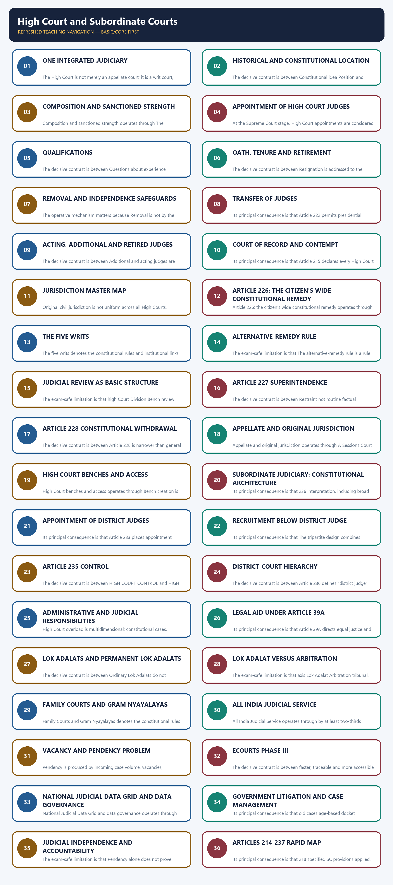

*Distinct embedded teaching-navigation image. The separate continuous Cārvāka-style flowchart package remains an independent at-a-glance artifact.*

### SESSION 1 — ONE INTEGRATED JUDICIARY
#### DEFINITION / WHAT THIS IS CALLED

**Plain-language definition:** One integrated judiciary denotes the constitutional rules and institutional links organised around Supreme Court of India.

**Technical definition:** The High Court is not merely an appellate court; it is a writ court, court of record, supervisory authority and administrative controller of the subordinate judiciary.

#### ANSWER-GRABBING OPENING — WRITE/ADAPT IN THE EXAM

> India's integrated judicial hierarchy connects subordinate courts, High Courts and the Supreme Court, unlike systems with separate federal and State court structures.

#### MUST-WRITE KEYWORDS

- **One integrated judiciary**
- **One**
- **Supreme Court**
- **India**
- **214-231**
- **233-237**

**How to use them:** Frame the answer through One integrated judiciary; define One, connect Supreme Court with India to explain the mechanism, and use 214-231 for the decisive comparison or qualification.

One integrated judiciary denotes the constitutional rules and institutional links organised around Supreme Court of India.
One integrated judiciary operates through District and Sessions Courts, connected with Civil Judges / Judicial Magistrates.
The operative mechanism matters because [FACT] Articles 214-231 govern High Courts; Articles 233-237 govern subordinate courts.
Its principal consequence is that [ANALYSIS] Integration promotes legal unity while decentralising everyday constitutional remedies.
The decisive contrast is between ordinary trial / statutory forum and appeal or revision.
The exam-safe limitation is that district-judiciary control.
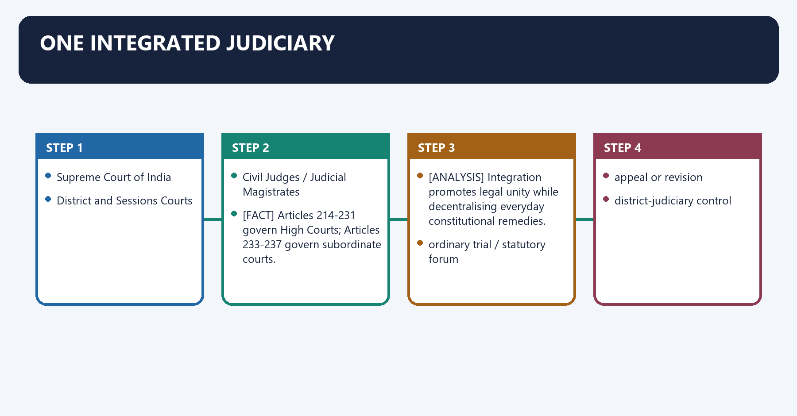
**Visual 1 - Judicial hierarchy**

```text
Supreme Court of India
          |
          v
High Court(s)
          |
          v
District and Sessions Courts
          |
          v
Civil Judges / Judicial Magistrates
```

Caption: India has an integrated hierarchy rather than separate federal and State court systems.

- [FACT] Articles 214-231 govern High Courts; Articles 233-237 govern subordinate courts.
- [FACT] A High Court is the highest constitutional court within its territorial jurisdiction, subject to Supreme Court appellate and constitutional authority.
- [FACT] The High Court is not merely an appellate court; it is a writ court, court of record, supervisory authority and administrative controller of the subordinate judiciary.
- [ANALYSIS] Integration promotes legal unity while decentralising everyday constitutional remedies.

**Visual 2 - Functional chain**

```text
Citizen grievance
   |
ordinary trial / statutory forum
   |
appeal or revision
   |
High Court
   +-- rights protection
   +-- legality review
   +-- supervision
   +-- district-judiciary control
   |
Supreme Court where constitutionally available
```

#### CLOSING RECALL FLOW — ONE INTEGRATED JUDICIARY

```closure-flow
SUBTOPIC: One integrated judiciary
KEY TERMS / DEFINITIONS: One integrated judiciary · One · Supreme Court · India · 214-231 · 233-237
MECHANISM / ARGUMENT: The High Court is not merely an appellate court; it is a writ court, court of record, supervisory authority and administrative controller of the subordinate judiciary.
CONSEQUENCE / CONTRAST: Its principal consequence is that Integration promotes legal unity while decentralising everyday constitutional remedies.
UPSC TRAP / ANSWER-USE: Do not miss this limiting distinction: the decisive contrast is between ordinary trial / statutory forum and appeal or revision.
ANSWER-GRABBING FORMULATION: India's integrated judicial hierarchy connects subordinate courts, High Courts and the Supreme Court, unlike systems with separate federal and State court structures.
```
### SESSION 2 — HISTORICAL AND CONSTITUTIONAL LOCATION
#### DEFINITION / WHAT THIS IS CALLED

**Plain-language definition:** Historical and constitutional location denotes the constitutional rules and institutional links organised around The first chartered High Courts were established at Calcutta, Bombay and Madras in 1862; Allahabad followed in 1866.

**Technical definition:** The decisive contrast is between Constitutional idea Position and Default High Court for each State.

#### ANSWER-GRABBING OPENING — WRITE/ADAPT IN THE EXAM

> Articles 214 and 231 make a High Court for each State the default while permitting common High Courts, reconciling judicial access with territorial reorganisation.

#### MUST-WRITE KEYWORDS

- **Historical**
- **constitutional location**
- **Default**
- **High Court for each State**
- **Permitted arrangement**
- **Common High Court for multiple States/UTs**

**How to use them:** Frame the answer through Historical; define constitutional location, connect Default with High Court for each State to explain the mechanism, and use Permitted arrangement for the decisive comparison or qualification.

Historical and constitutional location denotes the constitutional rules and institutional links organised around [FACT] The first chartered High Courts were established at Calcutta, Bombay and Madras in 1862; Allahabad followed in 1866.
Historical and constitutional location operates through [FACT] Article 214 states that there shall be a High Court for each State, connected with [FACT] Article 231 permits a common High Court for two or more States or for States and Union Territories.
The operative mechanism matters because [FACT] The common-High-Court provision reflects the Seventh Amendment reorganisation framework.
Its principal consequence is that [CURRENT] There are 25 High Courts, not one for every State.
The decisive contrast is between Constitutional idea Position and Default High Court for each State.
The exam-safe limitation is that permitted arrangement Common High Court for multiple States/UTs.
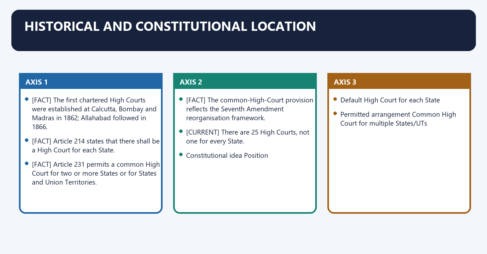
- [FACT] The first chartered High Courts were established at Calcutta, Bombay and Madras in 1862; Allahabad followed in 1866.
- [FACT] Article 214 states that there shall be a High Court for each State.
- [FACT] Article 231 permits a common High Court for two or more States or for States and Union Territories.
- [FACT] The common-High-Court provision reflects the Seventh Amendment reorganisation framework.
- [CURRENT] There are 25 High Courts, not one for every State.

**Visual 3 - One-per-State rule and common-HC exception**

| Constitutional idea | Position |
|---|---|
| Default | High Court for each State |
| Permitted arrangement | Common High Court for multiple States/UTs |
| Total current High Courts | 25 |
| Consequence | Court count is lower than State/UT count |

> **UPSC trap:** Article 214's language must be read with Article 231.

#### CLOSING RECALL FLOW — HISTORICAL AND CONSTITUTIONAL LOCATION

```closure-flow
SUBTOPIC: Historical and constitutional location
KEY TERMS / DEFINITIONS: Historical · constitutional location · Default · High Court for each State · Permitted arrangement · Common High Court for multiple States/UTs
MECHANISM / ARGUMENT: The operative mechanism matters because The common-High-Court provision reflects the Seventh Amendment reorganisation framework.
CONSEQUENCE / CONTRAST: The decisive contrast is between Constitutional idea Position and Default High Court for each State.
UPSC TRAP / ANSWER-USE: Do not miss this limiting distinction: article 214's language must be read with Article 231.
ANSWER-GRABBING FORMULATION: Articles 214 and 231 make a High Court for each State the default while permitting common High Courts, reconciling judicial access with territorial reorganisation.
```
### SESSION 3 — COMPOSITION AND SANCTIONED STRENGTH
#### DEFINITION / WHAT THIS IS CALLED

**Plain-language definition:** Composition and sanctioned strength denotes the constitutional rules and institutional links organised around other judges as President considers necessary.

**Technical definition:** Composition and sanctioned strength operates through The Constitution does not fix a uniform number of judges for each High Court, connected with Sanctioned strength varies according to institutional decisions and workload assessment.

#### ANSWER-GRABBING OPENING — WRITE/ADAPT IN THE EXAM

> The Constitution does not fix a uniform number of judges for each High Court.

#### MUST-WRITE KEYWORDS

- **Composition**
- **sanctioned strength**
- **Article 216**
- **Composition and sanctioned strength**
- **President**
- **The Constitution**

**How to use them:** Frame the answer through Composition; define sanctioned strength, connect Article 216 with Composition and sanctioned strength to explain the mechanism, and use President for the decisive comparison or qualification.

Composition and sanctioned strength denotes the constitutional rules and institutional links organised around other judges as President considers necessary.
Composition and sanctioned strength operates through [FACT] The Constitution does not fix a uniform number of judges for each High Court, connected with [FACT] Sanctioned strength varies according to institutional decisions and workload assessment.
The operative mechanism matters because [CURRENT] Working strength and vacancy figures change frequently; quote only a dated official source.
Its principal consequence is that other judges as President considers necessary.
The decisive contrast is between other judges as President considers necessary and other judges as President considers necessary.
The exam-safe limitation is that other judges as President considers necessary.
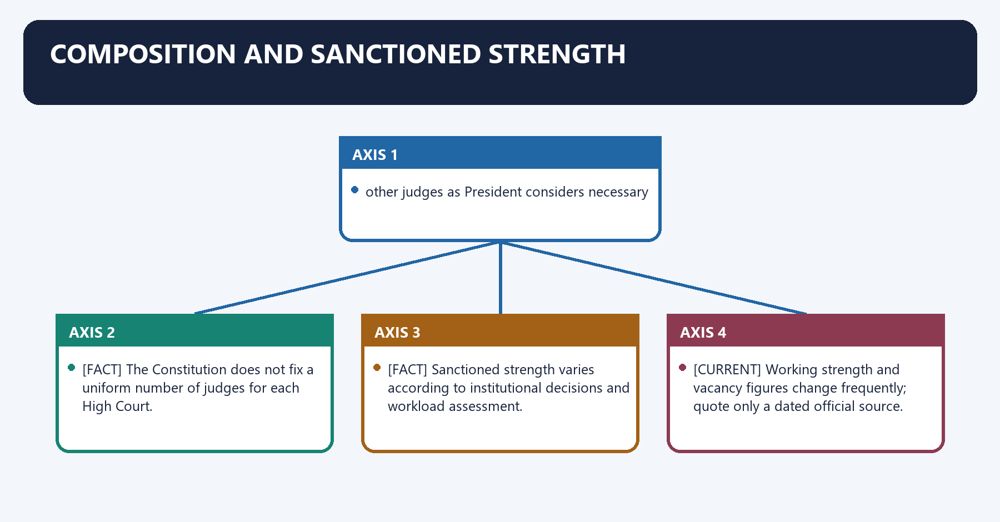
**Visual 4 - Article 216**

```text
High Court
  +-- Chief Justice
  +-- other judges as President considers necessary
```

- [FACT] The Constitution does not fix a uniform number of judges for each High Court.
- [FACT] Sanctioned strength varies according to institutional decisions and workload assessment.
- [CURRENT] Working strength and vacancy figures change frequently; quote only a dated official source.
- [ANALYSIS] A constitutionally broad jurisdiction can be weakened in practice when sanctioned posts are vacant or infrastructure is inadequate.

#### CLOSING RECALL FLOW — COMPOSITION AND SANCTIONED STRENGTH

```closure-flow
SUBTOPIC: Composition and sanctioned strength
KEY TERMS / DEFINITIONS: Composition · sanctioned strength · Article 216 · Composition and sanctioned strength · President · The Constitution
MECHANISM / ARGUMENT: Composition and sanctioned strength operates through The Constitution does not fix a uniform number of judges for each High Court, connected with Sanctioned strength varies according to institutional decisions and workload assessment.
CONSEQUENCE / CONTRAST: Its principal consequence is that other judges as President considers necessary.
UPSC TRAP / ANSWER-USE: Do not miss this limiting distinction: the decisive contrast is between other judges as President considers necessary and other judges...
ANSWER-GRABBING FORMULATION: The Constitution does not fix a uniform number of judges for each High Court.
```
### SESSION 4 — APPOINTMENT OF HIGH COURT JUDGES
#### DEFINITION / WHAT THIS IS CALLED

**Plain-language definition:** Appointment of High Court judges denotes the constitutional rules and institutional links organised around Originating High Court process.

**Technical definition:** At the Supreme Court stage, High Court appointments are considered by the CJI and two senior-most Supreme Court judges.

#### ANSWER-GRABBING OPENING — WRITE/ADAPT IN THE EXAM

> Executive inputs and processing remain part of the appointment pipeline; "judicial primacy" does not mean the executive has no role.

#### MUST-WRITE KEYWORDS

- **Appointment of High Court judges**
- **Constitutional text**
- **Article 217**
- **President and specified consultations**
- **Judicial doctrine**
- **Judges Cases**

**How to use them:** Frame the answer through Appointment of High Court judges; define Constitutional text, connect Article 217 with President and specified consultations to explain the mechanism, and use Judicial doctrine for the decisive comparison or qualification.

Appointment of High Court judges denotes the constitutional rules and institutional links organised around Originating High Court process.
Appointment of High Court judges operates through HC Chief Justice + consultation with two senior colleagues, connected with State inputs / Governor channel.
The operative mechanism matters because supreme Court collegium.
Its principal consequence is that cJI + two senior-most SC judges for HC appointments.
The decisive contrast is between President appoints under Article 217 and [FACT] Current collegium practice is judicially developed rather than written in Article 217.
The exam-safe limitation is that [FACT] The initiating High Court Chief Justice consults the two senior-most colleagues.
**Visual 5 - Constitutional text and collegium practice**

```text
Originating High Court process
HC Chief Justice + consultation with two senior colleagues
                 |
State inputs / Governor channel
                 |
Supreme Court collegium
CJI + two senior-most SC judges for HC appointments
                 |
Union processing
                 |
President appoints under Article 217
```

- [FACT] Article 217 provides appointment by the President after consultation with the Chief Justice of India, the Governor and, for a puisne judge, the Chief Justice of the High Court.
- [FACT] Current collegium practice is judicially developed rather than written in Article 217.
- [FACT] The initiating High Court Chief Justice consults the two senior-most colleagues.
- [FACT] At the Supreme Court stage, High Court appointments are considered by the CJI and two senior-most Supreme Court judges.
- [LIMIT] Executive inputs and processing remain part of the appointment pipeline; "judicial primacy" does not mean the executive has no role.

**Visual 6 - Text versus doctrine**

| Layer | Source | Content |
|---|---|---|
| Constitutional text | Article 217 | President and specified consultations |
| Judicial doctrine | Judges Cases | collegium and judicial primacy |
| Administrative practice | Memorandum of Procedure | processing, intelligence and timelines |
| Current status | 2026 | collegium operative; NJAC not in force |

#### CLOSING RECALL FLOW — APPOINTMENT OF HIGH COURT JUDGES

```closure-flow
SUBTOPIC: Appointment of High Court judges
KEY TERMS / DEFINITIONS: Appointment of High Court judges · Constitutional text · Article 217 · President and specified consultations · Judicial doctrine · Judges Cases
MECHANISM / ARGUMENT: Article 217 provides appointment by the President after consultation with the Chief Justice of India, the Governor and, for a puisne judge, the Chief Justice of the High Court.
CONSEQUENCE / CONTRAST: Its principal consequence is that cJI + two senior-most SC judges for HC appointments.
UPSC TRAP / ANSWER-USE: Do not miss this limiting distinction: at the Supreme Court stage, High Court appointments are considered by the CJI and...
ANSWER-GRABBING FORMULATION: Executive inputs and processing remain part of the appointment pipeline; "judicial primacy" does not mean the executive has no role.
```
### SESSION 5 — QUALIFICATIONS
#### DEFINITION / WHAT THIS IS CALLED

**Plain-language definition:** Qualifications denotes the constitutional rules and institutional links organised around Requirement Route 1 Route 2.

**Technical definition:** The decisive contrast is between Questions about experience computation are governed by constitutional and statutory detail and Mnemonic: High Court = citizen + 10 judicial years OR 10 advocacy years; no jurist route.

#### ANSWER-GRABBING OPENING — WRITE/ADAPT IN THE EXAM

> High Court eligibility requires Indian citizenship plus ten years in judicial office or advocacy, excluding the Supreme Court's distinguished-jurist route.

#### MUST-WRITE KEYWORDS

- **Qualifications**
- **Mnemonic**
- **Citizenship**
- **Indian citizen**
- **Experience**
- **at least 10 years in judicial office**

**How to use them:** Frame the answer through Qualifications; define Mnemonic, connect Citizenship with Indian citizen to explain the mechanism, and use Experience for the decisive comparison or qualification.

Qualifications denotes the constitutional rules and institutional links organised around Requirement Route 1 Route 2.
Qualifications operates through Citizenship Indian citizen Indian citizen, connected with Experience at least 10 years in judicial office at least 10 years as advocate of one or more High Courts.
The operative mechanism matters because [FACT] No minimum age is specified.
Its principal consequence is that [FACT] "Distinguished jurist" is not a High Court eligibility route.
The decisive contrast is between [FACT] Questions about experience computation are governed by constitutional and statutory detail and Mnemonic: High Court = citizen + 10 judicial years OR 10 advocacy years; no jurist route.
The exam-safe limitation is that requirement Route 1 Route 2.
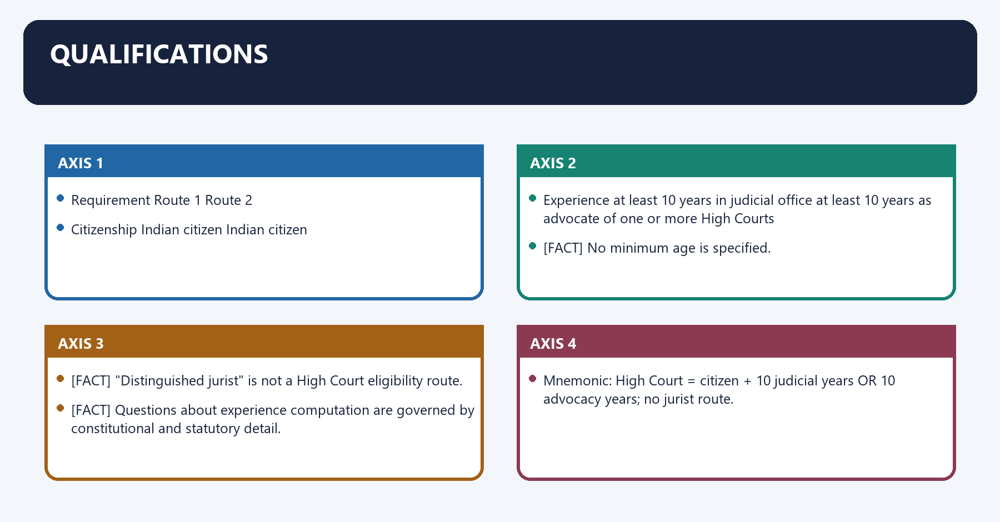
**Visual 7 - Article 217 eligibility**

| Requirement | Route 1 | Route 2 |
|---|---|---|
| Citizenship | Indian citizen | Indian citizen |
| Experience | at least 10 years in judicial office | at least 10 years as advocate of one or more High Courts |

- [FACT] No minimum age is specified.
- [FACT] "Distinguished jurist" is not a High Court eligibility route.
- [FACT] Questions about experience computation are governed by constitutional and statutory detail.

> **Mnemonic:** High Court = citizen + 10 judicial years OR 10 advocacy years; no jurist route.

#### CLOSING RECALL FLOW — QUALIFICATIONS

```closure-flow
SUBTOPIC: Qualifications
KEY TERMS / DEFINITIONS: Qualifications · Mnemonic · Citizenship · Indian citizen · Experience · at least 10 years in judicial office
MECHANISM / ARGUMENT: The decisive contrast is between Questions about experience computation are governed by constitutional and statutory detail and Mnemonic: High Court = citizen + 10 judicial years OR 10 advocacy years; no jurist route.
CONSEQUENCE / CONTRAST: Its principal consequence is that "Distinguished jurist" is not a High Court eligibility route.
UPSC TRAP / ANSWER-USE: "Distinguished jurist" is not a High Court eligibility route.
ANSWER-GRABBING FORMULATION: High Court eligibility requires Indian citizenship plus ten years in judicial office or advocacy, excluding the Supreme Court's distinguished-jurist route.
```
### SESSION 6 — OATH, TENURE AND RETIREMENT
#### DEFINITION / WHAT THIS IS CALLED

**Plain-language definition:** Oath, tenure and retirement denotes the constitutional rules and institutional links organised around President appoints.

**Technical definition:** The decisive contrast is between Resignation is addressed to the President and Oath is made before the Governor or a person appointed by the Governor.

#### ANSWER-GRABBING OPENING — WRITE/ADAPT IN THE EXAM

> High Court judges take oath before the Governor and retire at sixty-two, whereas Supreme Court judges retire at sixty-five, a difference that can intensify elevation pressures.

#### MUST-WRITE KEYWORDS

- **Oath**
- **tenure**
- **retirement**
- **Article 219**
- **Article 217**
- **Oath, tenure and retirement**

**How to use them:** Frame the answer through Oath; define tenure, connect retirement with Article 219 to explain the mechanism, and use Article 217 for the decisive comparison or qualification.

Oath, tenure and retirement denotes the constitutional rules and institutional links organised around President appoints.
Oath, tenure and retirement operates through Governor (or authorised person) administers oath: Article 219, connected with holds office until age 62.
The operative mechanism matters because resignation / removal / SC elevation / transfer.
Its principal consequence is that [FACT] A High Court judge retires at 62; a Supreme Court judge retires at 65.
The decisive contrast is between [FACT] Resignation is addressed to the President and [FACT] Oath is made before the Governor or a person appointed by the Governor.
The exam-safe limitation is that [FACT] Age disputes are determined through the constitutional mechanism under Article 217.
**Visual 8 - Office cycle**

```text
President appoints
      |
Governor (or authorised person) administers oath: Article 219
      |
holds office until age 62
      |
resignation / removal / SC elevation / transfer
```

- [FACT] A High Court judge retires at 62; a Supreme Court judge retires at 65.
- [FACT] Resignation is addressed to the President.
- [FACT] Oath is made before the Governor or a person appointed by the Governor.
- [FACT] Age disputes are determined through the constitutional mechanism under Article 217.
- [ANALYSIS] Retirement-age difference can encourage post-High-Court elevation competition and recurrent reform proposals.

#### CLOSING RECALL FLOW — OATH, TENURE AND RETIREMENT

```closure-flow
SUBTOPIC: Oath, tenure and retirement
KEY TERMS / DEFINITIONS: Oath · tenure · retirement · Article 219 · Article 217 · Oath, tenure and retirement
MECHANISM / ARGUMENT: Oath, tenure and retirement operates through Governor (or authorised person) administers oath: Article 219, connected with holds office until age 62.
CONSEQUENCE / CONTRAST: The decisive contrast is between Resignation is addressed to the President and Oath is made before the Governor or a person appointed by the Governor.
UPSC TRAP / ANSWER-USE: Do not miss this limiting distinction: its principal consequence is that A High Court judge retires at 62.
ANSWER-GRABBING FORMULATION: High Court judges take oath before the Governor and retire at sixty-two, whereas Supreme Court judges retire at sixty-five, a difference that can intensify elevation pressures.
```
### SESSION 7 — REMOVAL AND INDEPENDENCE SAFEGUARDS
#### DEFINITION / WHAT THIS IS CALLED

**Plain-language definition:** Removal and independence safeguards denotes the constitutional rules and institutional links organised around proved misbehaviour or incapacity.

**Technical definition:** The operative mechanism matters because Removal is not by the Governor, Chief Minister or High Court Chief Justice.

#### ANSWER-GRABBING OPENING — WRITE/ADAPT IN THE EXAM

> Security of tenure protects decisional independence; accountability remains possible through removal and judicial ethics mechanisms.

#### MUST-WRITE KEYWORDS

- **Removal**
- **independence safeguards**
- **Difficult removal**
- **protects against political retaliation**
- **Protected service conditions**
- **reduces financial pressure**

**How to use them:** Frame the answer through Removal; define independence safeguards, connect Difficult removal with protects against political retaliation to explain the mechanism, and use Protected service conditions for the decisive comparison or qualification.

Removal and independence safeguards denotes the constitutional rules and institutional links organised around proved misbehaviour or incapacity.
Removal and independence safeguards operates through Parliamentary investigation/process, connected with special-majority address by each House.
The operative mechanism matters because [FACT] Removal is not by the Governor, Chief Minister or High Court Chief Justice.
Its principal consequence is that [FACT] Salaries and service conditions are constitutionally protected, subject to constitutionally permitted changes.
The decisive contrast is between [FACT] Administrative expenses of a High Court are charged on the Consolidated Fund of the State and Difficult removal protects against political retaliation.
The exam-safe limitation is that protected service conditions reduces financial pressure.
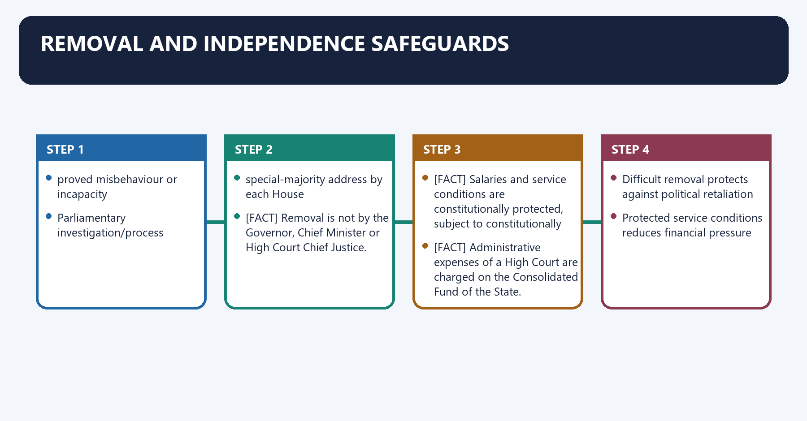
**Visual 9 - Removal route**

```text
proved misbehaviour or incapacity
        |
Parliamentary investigation/process
        |
special-majority address by each House
        |
President removes
```

- [FACT] High Court judges use the same stringent constitutional removal standard applicable to Supreme Court judges through Article 217 read with Article 124(4).
- [FACT] Removal is not by the Governor, Chief Minister or High Court Chief Justice.
- [FACT] Salaries and service conditions are constitutionally protected, subject to constitutionally permitted changes.
- [FACT] Administrative expenses of a High Court are charged on the Consolidated Fund of the State.
- [ANALYSIS] Security of tenure protects decisional independence; accountability remains possible through removal and judicial ethics mechanisms.

**Visual 10 - Independence safeguards**

| Safeguard | Purpose |
|---|---|
| Difficult removal | protects against political retaliation |
| Protected service conditions | reduces financial pressure |
| Judicial primacy in appointments | limits executive domination |
| Article 222 consultation | controls transfer power |
| Article 235 control | shields district judges from State executive |
| Article 226/227 basic-structure review | preserves constitutional function |

#### CLOSING RECALL FLOW — REMOVAL AND INDEPENDENCE SAFEGUARDS

```closure-flow
SUBTOPIC: Removal and independence safeguards
KEY TERMS / DEFINITIONS: Removal · independence safeguards · Difficult removal · protects against political retaliation · Protected service conditions · reduces financial pressure
MECHANISM / ARGUMENT: Security of tenure protects decisional independence; accountability remains possible through removal and judicial ethics mechanisms.
CONSEQUENCE / CONTRAST: The decisive contrast is between Administrative expenses of a High Court are charged on the Consolidated Fund of the State and Difficult removal protects against political retaliation.
UPSC TRAP / ANSWER-USE: The operative mechanism matters because Removal is not by the Governor, Chief Minister or High Court Chief Justice.
ANSWER-GRABBING FORMULATION: Security of tenure protects decisional independence; accountability remains possible through removal and judicial ethics mechanisms.
```
### SESSION 8 — TRANSFER OF JUDGES
#### DEFINITION / WHAT THIS IS CALLED

**Plain-language definition:** Transfer of judges denotes the constitutional rules and institutional links organised around Need/public-interest consideration.

**Technical definition:** Its principal consequence is that Article 222 permits presidential transfer after consultation with the CJI.

#### ANSWER-GRABBING OPENING — WRITE/ADAPT IN THE EXAM

> Transfer can address administration and local entrenchment but can also be perceived as punitive.

#### MUST-WRITE KEYWORDS

- **Transfer of judges**
- **Article 222**
- **Transfer**
- **Need**
- **Its principal consequence**
- **Its**

**How to use them:** Frame the answer through Transfer of judges; define Article 222, connect Transfer with Need to explain the mechanism, and use Its principal consequence for the decisive comparison or qualification.

Transfer of judges denotes the constitutional rules and institutional links organised around Need/public-interest consideration.
Transfer of judges operates through CJI-led collegium consultation, connected with President transfers judge.
The operative mechanism matters because compensatory allowance as provided.
Its principal consequence is that [FACT] Article 222 permits presidential transfer after consultation with the CJI.
The decisive contrast is between [FACT] A judge's consent is not a constitutional prerequisite and [ANALYSIS] Transfer can address administration and local entrenchment but can also be perceived as punitive.
The exam-safe limitation is that [LIMIT] The legitimate standard is public interest through institutional consultation, not executive punishment.
**Visual 11 - Article 222**

```text
Need/public-interest consideration
        |
CJI-led collegium consultation
        |
President transfers judge
        |
compensatory allowance as provided
```

- [FACT] Article 222 permits presidential transfer after consultation with the CJI.
- [FACT] A judge's consent is not a constitutional prerequisite.
- [ANALYSIS] Transfer can address administration and local entrenchment but can also be perceived as punitive.
- [LIMIT] The legitimate standard is public interest through institutional consultation, not executive punishment.
- [FACT] *Sankalchand Sheth* and the Judges Cases form part of the transfer-and-consultation doctrinal history.

#### CLOSING RECALL FLOW — TRANSFER OF JUDGES

```closure-flow
SUBTOPIC: Transfer of judges
KEY TERMS / DEFINITIONS: Transfer of judges · Article 222 · Transfer · Need · Its principal consequence · Its
MECHANISM / ARGUMENT: Its principal consequence is that Article 222 permits presidential transfer after consultation with the CJI.
CONSEQUENCE / CONTRAST: The decisive contrast is between A judge's consent is not a constitutional prerequisite and Transfer can address administration and local entrenchment but can also be perceived as punitive.
UPSC TRAP / ANSWER-USE: Transfer can address administration and local entrenchment but can also be perceived as punitive.
ANSWER-GRABBING FORMULATION: Transfer can address administration and local entrenchment but can also be perceived as punitive.
```
### SESSION 9 — ACTING, ADDITIONAL AND RETIRED JUDGES
#### DEFINITION / WHAT THIS IS CALLED

**Plain-language definition:** Acting, additional and retired judges denotes the constitutional rules and institutional links organised around Article Mechanism Trigger.

**Technical definition:** The decisive contrast is between Additional and acting judges are constitutional capacity devices, not substitutes for regular appointments and A retired judge under Article 224A is not thereby treated as a permanent serving judge for all purposes.

#### ANSWER-GRABBING OPENING — WRITE/ADAPT IN THE EXAM

> A retired judge under Article 224A is not thereby treated as a permanent serving judge for all purposes.

#### MUST-WRITE KEYWORDS

- **Acting**
- **additional**
- **retired judges**
- **Acting Chief Justice**
- **vacancy or absence/inability**
- **Additional judge**

**How to use them:** Frame the answer through Acting; define additional, connect retired judges with Acting Chief Justice to explain the mechanism, and use vacancy or absence/inability for the decisive comparison or qualification.

Acting, additional and retired judges denotes the constitutional rules and institutional links organised around Article Mechanism Trigger.
Acting, additional and retired judges operates through 223 Acting Chief Justice vacancy or absence/inability, connected with 224 Additional judge temporary increase in business or arrears.
The operative mechanism matters because 224 Acting judge permanent judge absent/unable.
Its principal consequence is that 224A Retired judge sits and acts request by CJ with President's prior consent.
The decisive contrast is between [FACT] Additional and acting judges are constitutional capacity devices, not substitutes for regular appointments and [FACT] A retired judge under Article 224A is not thereby treated as a permanent serving judge for all purposes.
The exam-safe limitation is that [ANALYSIS] Stop-gap appointments can reduce immediate pressure but do not cure systemic vacancy pipelines.
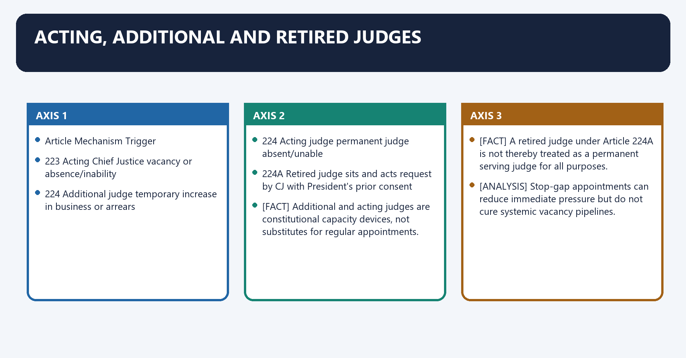
**Visual 12 - Temporary capacity tools**

| Article | Mechanism | Trigger |
|---:|---|---|
| 223 | Acting Chief Justice | vacancy or absence/inability |
| 224 | Additional judge | temporary increase in business or arrears |
| 224 | Acting judge | permanent judge absent/unable |
| 224A | Retired judge sits and acts | request by CJ with President's prior consent |

- [FACT] Additional and acting judges are constitutional capacity devices, not substitutes for regular appointments.
- [FACT] A retired judge under Article 224A is not thereby treated as a permanent serving judge for all purposes.
- [ANALYSIS] Stop-gap appointments can reduce immediate pressure but do not cure systemic vacancy pipelines.

#### CLOSING RECALL FLOW — ACTING, ADDITIONAL AND RETIRED JUDGES

```closure-flow
SUBTOPIC: Acting, additional and retired judges
KEY TERMS / DEFINITIONS: Acting · additional · retired judges · Acting Chief Justice · vacancy or absence/inability · Additional judge
MECHANISM / ARGUMENT: Acting, additional and retired judges operates through 223 Acting Chief Justice vacancy or absence/inability, connected with 224 Additional judge temporary increase in business or arrears.
CONSEQUENCE / CONTRAST: The decisive contrast is between Additional and acting judges are constitutional capacity devices, not substitutes for regular appointments and A retired judge under Article 224A is not thereby treated as a permanent serving judge for all purposes.
UPSC TRAP / ANSWER-USE: Additional and acting judges are constitutional capacity devices, not substitutes for regular appointments.
ANSWER-GRABBING FORMULATION: A retired judge under Article 224A is not thereby treated as a permanent serving judge for all purposes.
```
### SESSION 10 — COURT OF RECORD AND CONTEMPT
#### DEFINITION / WHAT THIS IS CALLED

**Plain-language definition:** Court of record and contempt denotes the constitutional rules and institutional links organised around HIGH COURT AS COURT OF RECORD.

**Technical definition:** Its principal consequence is that Article 215 declares every High Court a court of record and gives contempt power.

#### ANSWER-GRABBING OPENING — WRITE/ADAPT IN THE EXAM

> Article 215 protects the authority and records of High Courts through contempt power, but does not insulate judges from fair criticism.

#### MUST-WRITE KEYWORDS

- **Court of record**
- **contempt**
- **Article 215**
- **Court of record and contempt**
- **Court**
- **HIGH COURT AS COURT OF**

**How to use them:** Frame the answer through Court of record; define contempt, connect Article 215 with Court of record and contempt to explain the mechanism, and use Court for the decisive comparison or qualification.

Court of record and contempt denotes the constitutional rules and institutional links organised around HIGH COURT AS COURT OF RECORD.
Court of record and contempt operates through records have evidentiary authority, connected with decisions form binding precedent within hierarchy.
The operative mechanism matters because power to punish for contempt of itself.
Its principal consequence is that [FACT] Article 215 declares every High Court a court of record and gives contempt power.
The decisive contrast is between [ANALYSIS] Contempt protects administration of justice, not judicial immunity from fair criticism and [LIMIT] Contempt power is governed by constitutional principles and statute; it is not unlimited personal protection for judges.
The exam-safe limitation is that hIGH COURT AS COURT OF RECORD.
**Visual 13 - Article 215**

```text
HIGH COURT AS COURT OF RECORD
  +-- records have evidentiary authority
  +-- decisions form binding precedent within hierarchy
  +-- power to punish for contempt of itself
```

- [FACT] Article 215 declares every High Court a court of record and gives contempt power.
- [ANALYSIS] Contempt protects administration of justice, not judicial immunity from fair criticism.
- [LIMIT] Contempt power is governed by constitutional principles and statute; it is not unlimited personal protection for judges.

#### CLOSING RECALL FLOW — COURT OF RECORD AND CONTEMPT

```closure-flow
SUBTOPIC: Court of record and contempt
KEY TERMS / DEFINITIONS: Court of record · contempt · Article 215 · Court of record and contempt · Court · HIGH COURT AS COURT OF
MECHANISM / ARGUMENT: Court of record and contempt operates through records have evidentiary authority, connected with decisions form binding precedent within hierarchy.
CONSEQUENCE / CONTRAST: Its principal consequence is that Article 215 declares every High Court a court of record and gives contempt power.
UPSC TRAP / ANSWER-USE: The decisive contrast is between Contempt protects administration of justice, not judicial immunity from fair criticism and Contempt power is governed by constitutional principles and statute; it is not unlimited personal protection for judges.
ANSWER-GRABBING FORMULATION: Article 215 protects the authority and records of High Courts through contempt power, but does not insulate judges from fair criticism.
```
### SESSION 11 — JURISDICTION MASTER MAP
#### DEFINITION / WHAT THIS IS CALLED

**Plain-language definition:** Jurisdiction master map denotes the constitutional rules and institutional links organised around Jurisdiction Core content.

**Technical definition:** Original civil jurisdiction is not uniform across all High Courts.

#### ANSWER-GRABBING OPENING — WRITE/ADAPT IN THE EXAM

> High Court jurisdiction combines writ, appellate, supervisory and specified original powers, but original civil jurisdiction is not uniform across all High Courts.

#### MUST-WRITE KEYWORDS

- **Jurisdiction master map**
- **Original**
- **writs, contempt, election matters and specified civil/admiralty fields**
- **Writ**
- **Article 226 rights and other legal purposes**
- **Appellate**

**How to use them:** Frame the answer through Jurisdiction master map; define Original, connect writs, contempt, election matters and specified civil/admiralty fields with Writ to explain the mechanism, and use Article 226 rights and other legal purposes for the decisive comparison or qualification.

Jurisdiction master map denotes the constitutional rules and institutional links organised around Jurisdiction Core content.
Jurisdiction master map operates through Original writs, contempt, election matters and specified civil/admiralty fields, connected with Writ Article 226 rights and other legal purposes.
The operative mechanism matters because appellate civil and criminal appeals.
Its principal consequence is that supervisory Article 227 over courts and tribunals.
The decisive contrast is between Constitutional withdrawal Article 228 and Judicial review invalidates unconstitutional law/action.
The exam-safe limitation is that administrative control Article 235 over subordinate judiciary.
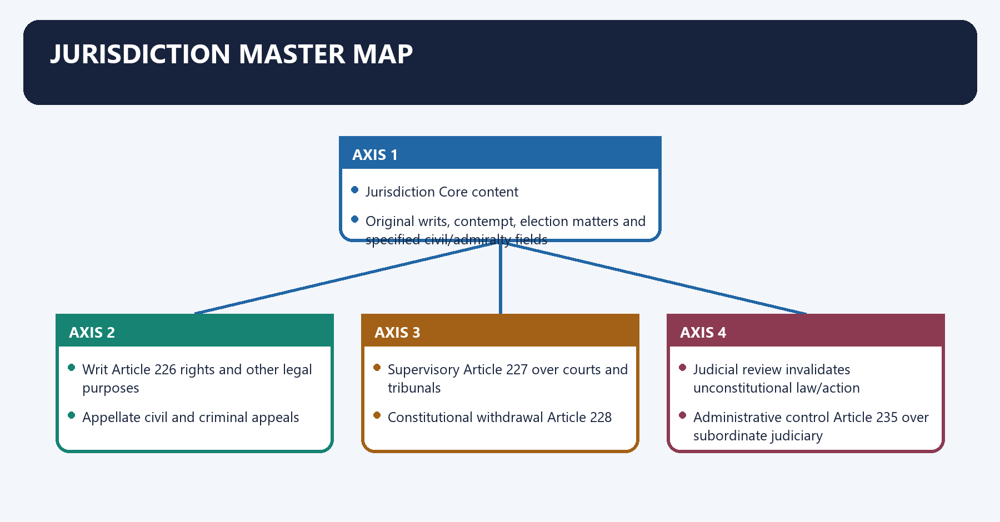
**Visual 14 - High Court jurisdiction**

| Jurisdiction | Core content |
|---|---|
| Original | writs, contempt, election matters and specified civil/admiralty fields |
| Writ | Article 226 rights and other legal purposes |
| Appellate | civil and criminal appeals |
| Supervisory | Article 227 over courts and tribunals |
| Constitutional withdrawal | Article 228 |
| Judicial review | invalidates unconstitutional law/action |
| Administrative control | Article 235 over subordinate judiciary |

- [LIMIT] Original civil jurisdiction is not uniform across all High Courts.
- [FACT] The older chartered High Courts and Delhi possess specified original civil jurisdiction under applicable law.

#### CLOSING RECALL FLOW — JURISDICTION MASTER MAP

```closure-flow
SUBTOPIC: Jurisdiction master map
KEY TERMS / DEFINITIONS: Jurisdiction master map · Original · writs, contempt, election matters and specified civil/admiralty fields · Writ · Article 226 rights and other legal purposes · Appellate
MECHANISM / ARGUMENT: Original civil jurisdiction is not uniform across all High Courts.
CONSEQUENCE / CONTRAST: Its principal consequence is that supervisory Article 227 over courts and tribunals.
UPSC TRAP / ANSWER-USE: Do not miss this limiting distinction: the decisive contrast is between Constitutional withdrawal Article 228 and Judicial review invalidates unconstitutional...
ANSWER-GRABBING FORMULATION: High Court jurisdiction combines writ, appellate, supervisory and specified original powers, but original civil jurisdiction is not uniform across all High Courts.
```
### SESSION 12 — ARTICLE 226: THE CITIZEN'S WIDE CONSTITUTIONAL REMEDY
#### DEFINITION / WHAT THIS IS CALLED

**Plain-language definition:** Article 226: the citizen's wide constitutional remedy denotes the constitutional rules and institutional links organised around Fundamental Rights only.

**Technical definition:** Article 226: the citizen's wide constitutional remedy operates through remedy itself is a Fundamental Right, connected with Supreme Court / all-India reach.

#### ANSWER-GRABBING OPENING — WRITE/ADAPT IN THE EXAM

> Article 226 reaches Fundamental Rights and other legal rights, but its wider purpose remains bounded by territorial and cause-of-action requirements.

#### MUST-WRITE KEYWORDS

- **Article 226**
- **the citizen's wide constitutional remedy**
- **purpose**
- **Article 32**
- **Article 226: the citizen's wide constitutional remedy**
- **Article**

**How to use them:** Frame the answer through Article 226; define the citizen's wide constitutional remedy, connect purpose with Article 32 to explain the mechanism, and use Article 226: the citizen's wide constitutional remedy for the decisive comparison or qualification.

Article 226: the citizen's wide constitutional remedy denotes the constitutional rules and institutional links organised around Fundamental Rights only.
Article 226: the citizen's wide constitutional remedy operates through remedy itself is a Fundamental Right, connected with Supreme Court / all-India reach.
The operative mechanism matters because fundamental Rights + any other legal purpose.
Its principal consequence is that constitutional power, not itself a FR.
The decisive contrast is between territorial/cause-of-action limits and [FACT] Article 226 is wider than Article 32 in purpose.
The exam-safe limitation is that [FACT] Article 32 has wider national territorial reach and is itself a Fundamental Right.
**Visual 15 - Scope comparison**

```text
Article 32
  Fundamental Rights only
  remedy itself is a Fundamental Right
  Supreme Court / all-India reach

Article 226
  Fundamental Rights + any other legal purpose
  constitutional power, not itself a FR
  territorial/cause-of-action limits
```

- [FACT] Article 226 is wider than Article 32 in **purpose**.
- [FACT] Article 32 has wider national territorial reach and is itself a Fundamental Right.
- [FACT] Article 226(2) permits action where the cause of action arises wholly or partly within the High Court's territory even if the authority is located elsewhere.
- [FACT] The cause-of-action extension came through the Fifteenth Amendment.
- [LIMIT] "Article 226 is wider" does not mean unlimited territorial jurisdiction.

#### CLOSING RECALL FLOW — ARTICLE 226: THE CITIZEN'S WIDE CONSTITUTIONAL REMEDY

```closure-flow
SUBTOPIC: Article 226: the citizen's wide constitutional remedy
KEY TERMS / DEFINITIONS: Article 226 · the citizen's wide constitutional remedy · purpose · Article 32 · Article 226: the citizen's wide constitutional remedy · Article
MECHANISM / ARGUMENT: Article 226: the citizen's wide constitutional remedy operates through remedy itself is a Fundamental Right, connected with Supreme Court / all-India reach.
CONSEQUENCE / CONTRAST: The decisive contrast is between territorial/cause-of-action limits and Article 226 is wider than Article 32 in purpose.
UPSC TRAP / ANSWER-USE: "Article 226 is wider" does not mean unlimited territorial jurisdiction.
ANSWER-GRABBING FORMULATION: Article 226 reaches Fundamental Rights and other legal rights, but its wider purpose remains bounded by territorial and cause-of-action requirements.
```
### SESSION 13 — THE FIVE WRITS
#### DEFINITION / WHAT THIS IS CALLED

**Plain-language definition:** The five writs operates through Habeas corpus Is detention lawful? public or private detainer, connected with Mandamus Is a public/legal duty being refused? public authority.

**Technical definition:** The five writs denotes the constitutional rules and institutional links organised around Writ Question answered Typical target.

#### ANSWER-GRABBING OPENING — WRITE/ADAPT IN THE EXAM

> Mandamus ordinarily does not compel a purely private person or discretionary act without legal duty.

#### MUST-WRITE KEYWORDS

- **The five writs**
- **Habeas corpus**
- **public or private detainer**
- **Mandamus**
- **public authority**
- **Prohibition**

**How to use them:** Frame the answer through The five writs; define Habeas corpus, connect public or private detainer with Mandamus to explain the mechanism, and use public authority for the decisive comparison or qualification.

The five writs denotes the constitutional rules and institutional links organised around Writ Question answered Typical target.
The five writs operates through Habeas corpus Is detention lawful? public or private detainer, connected with Mandamus Is a public/legal duty being refused? public authority.
The operative mechanism matters because prohibition Is a lower forum exceeding jurisdiction before completion? court/tribunal.
Its principal consequence is that certiorari Has a jurisdictionally defective order been made? court/tribunal/authority.
The decisive contrast is between Quo warranto By what authority is public office held? public office-holder and [FACT] Article 226 authorises writs as well as directions and orders.
The exam-safe limitation is that [LIMIT] Mandamus ordinarily does not compel a purely private person or discretionary act without legal duty.
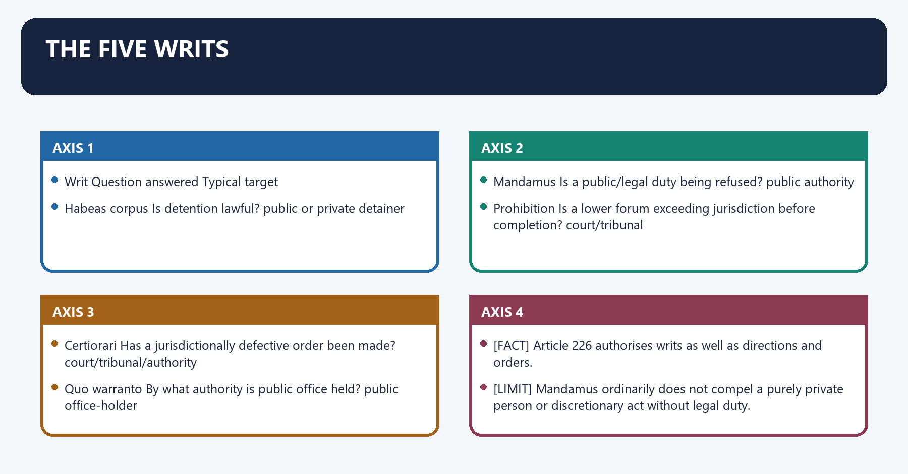
**Visual 16 - Writ decision table**

| Writ | Question answered | Typical target |
|---|---|---|
| Habeas corpus | Is detention lawful? | public or private detainer |
| Mandamus | Is a public/legal duty being refused? | public authority |
| Prohibition | Is a lower forum exceeding jurisdiction before completion? | court/tribunal |
| Certiorari | Has a jurisdictionally defective order been made? | court/tribunal/authority |
| Quo warranto | By what authority is public office held? | public office-holder |

- [FACT] Article 226 authorises writs as well as directions and orders.
- [LIMIT] Mandamus ordinarily does not compel a purely private person or discretionary act without legal duty.
- [FACT] Habeas corpus may operate against private detention.
- [FACT] Prohibition prevents; certiorari quashes.
- [FACT] Quo warranto focuses on lawful title to public office and can relax ordinary standing rules.

**Visual 17 - Memory line**

```text
BODY detained?        HABEAS CORPUS
DUTY refused?         MANDAMUS
PROCEEDING ongoing?   PROHIBITION
ORDER completed?      CERTIORARI
OFFICE usurped?       QUO WARRANTO
```

#### CLOSING RECALL FLOW — THE FIVE WRITS

```closure-flow
SUBTOPIC: The five writs
KEY TERMS / DEFINITIONS: The five writs · Habeas corpus · public or private detainer · Mandamus · public authority · Prohibition
MECHANISM / ARGUMENT: The decisive contrast is between Quo warranto By what authority is public office held? public office-holder and Article 226 authorises writs as well as directions and orders.
CONSEQUENCE / CONTRAST: The exam-safe limitation is that Mandamus ordinarily does not compel a purely private person or discretionary act without legal duty.
UPSC TRAP / ANSWER-USE: Mandamus ordinarily does not compel a purely private person or discretionary act without legal duty.
ANSWER-GRABBING FORMULATION: Mandamus ordinarily does not compel a purely private person or discretionary act without legal duty.
```
### SESSION 14 — ALTERNATIVE-REMEDY RULE
#### DEFINITION / WHAT THIS IS CALLED

**Plain-language definition:** Alternative-remedy rule denotes the constitutional rules and institutional links organised around Statutory remedy exists?.

**Technical definition:** The exam-safe limitation is that The alternative-remedy rule is a rule of judicial discretion and self-restraint, not an absolute jurisdictional bar.

#### ANSWER-GRABBING OPENING — WRITE/ADAPT IN THE EXAM

> The alternative-remedy rule is a rule of judicial discretion and self-restraint, not an absolute jurisdictional bar.

#### MUST-WRITE KEYWORDS

- **Alternative-remedy rule**
- **Article 226**
- **Alternative-remedy**
- **Statutory**
- **HC**
- **Its principal consequence**

**How to use them:** Frame the answer through Alternative-remedy rule; define Article 226, connect Alternative-remedy with Statutory to explain the mechanism, and use HC for the decisive comparison or qualification.

Alternative-remedy rule denotes the constitutional rules and institutional links organised around Statutory remedy exists?.
Alternative-remedy rule operates through ordinarily use appeal/revision first, connected with but HC may intervene for.
The operative mechanism matters because fundamental Rights.
Its principal consequence is that natural-justice failure.
The decisive contrast is between lack of jurisdiction and constitutional challenge.
The exam-safe limitation is that [FACT] The alternative-remedy rule is a rule of judicial discretion and self-restraint, not an absolute jurisdictional bar.
**Visual 18 - Writ discretion**

```text
Statutory remedy exists?
       |
       +-- ordinarily use appeal/revision first
       |
       +-- but HC may intervene for:
             Fundamental Rights
             natural-justice failure
             lack of jurisdiction
             constitutional challenge
```

- [FACT] The alternative-remedy rule is a rule of judicial discretion and self-restraint, not an absolute jurisdictional bar.
- [ANALYSIS] It protects statutory forums while preserving rapid constitutional relief for serious illegality.
- [LIMIT] Article 226 should not become a routine substitute for every trial or appeal.

#### CLOSING RECALL FLOW — ALTERNATIVE-REMEDY RULE

```closure-flow
SUBTOPIC: Alternative-remedy rule
KEY TERMS / DEFINITIONS: Alternative-remedy rule · Article 226 · Alternative-remedy · Statutory · HC · Its principal consequence
MECHANISM / ARGUMENT: Alternative-remedy rule operates through ordinarily use appeal/revision first, connected with but HC may intervene for.
CONSEQUENCE / CONTRAST: The exam-safe limitation is that The alternative-remedy rule is a rule of judicial discretion and self-restraint, not an absolute jurisdictional bar.
UPSC TRAP / ANSWER-USE: The alternative-remedy rule is a rule of judicial discretion and self-restraint, not an absolute jurisdictional bar.
ANSWER-GRABBING FORMULATION: The alternative-remedy rule is a rule of judicial discretion and self-restraint, not an absolute jurisdictional bar.
```
### SESSION 15 — JUDICIAL REVIEW AS BASIC STRUCTURE
#### DEFINITION / WHAT THIS IS CALLED

**Plain-language definition:** Judicial review as Basic Structure denotes the constitutional rules and institutional links organised around High Court Division Bench review under Articles 226/227.

**Technical definition:** The exam-safe limitation is that high Court Division Bench review under Articles 226/227.

#### ANSWER-GRABBING OPENING — WRITE/ADAPT IN THE EXAM

> L. Chandra Kumar preserved tribunals while making review under Articles 226, 227 and 32 part of the basic structure, preventing complete substitution of constitutional courts.

#### MUST-WRITE KEYWORDS

- **Judicial review as Basic Structure**
- **Judicial**
- **Basic Structure**
- **High Court Division Bench**
- **Articles**
- **Its principal consequence**

**How to use them:** Frame the answer through Judicial review as Basic Structure; define Judicial, connect Basic Structure with High Court Division Bench to explain the mechanism, and use Articles for the decisive comparison or qualification.

Judicial review as Basic Structure denotes the constitutional rules and institutional links organised around High Court Division Bench review under Articles 226/227.
Judicial review as Basic Structure operates through Supreme Court where available, connected with [FACT] L. Chandra Kumar v. Union of India (1997) held judicial review under Articles 226/227 and 32 to be part of the Basic Structure.
The operative mechanism matters because [FACT] Tribunal decisions remain subject to High Court scrutiny.
Its principal consequence is that [LIMIT] The judgment did not abolish tribunals; it denied them complete substitution for constitutional courts.
The decisive contrast is between [ANALYSIS] The High Court is the constitutional quality-control layer for decentralised adjudication and High Court Division Bench review under Articles 226/227.
The exam-safe limitation is that high Court Division Bench review under Articles 226/227.
**Visual 19 - *L. Chandra Kumar* control**

```text
Tribunal decides
      |
High Court Division Bench review under Articles 226/227
      |
Supreme Court where available
```

- [FACT] *L. Chandra Kumar v. Union of India* (1997) held judicial review under Articles 226/227 and 32 to be part of the Basic Structure.
- [FACT] Tribunal decisions remain subject to High Court scrutiny.
- [LIMIT] The judgment did not abolish tribunals; it denied them complete substitution for constitutional courts.
- [ANALYSIS] The High Court is the constitutional quality-control layer for decentralised adjudication.

#### CLOSING RECALL FLOW — JUDICIAL REVIEW AS BASIC STRUCTURE

```closure-flow
SUBTOPIC: Judicial review as Basic Structure
KEY TERMS / DEFINITIONS: Judicial review as Basic Structure · Judicial · Basic Structure · High Court Division Bench · Articles · Its principal consequence
MECHANISM / ARGUMENT: The decisive contrast is between The High Court is the constitutional quality-control layer for decentralised adjudication and High Court Division Bench review under Articles 226/227.
CONSEQUENCE / CONTRAST: Its principal consequence is that The judgment did not abolish tribunals; it denied them complete substitution for constitutional courts.
UPSC TRAP / ANSWER-USE: Do not miss this limiting distinction: the exam-safe limitation is that high Court Division Bench review under Articles 226/227.
ANSWER-GRABBING FORMULATION: L. Chandra Kumar preserved tribunals while making review under Articles 226, 227 and 32 part of the basic structure, preventing complete substitution of constitutional courts.
```
### SESSION 16 — ARTICLE 227 SUPERINTENDENCE
#### DEFINITION / WHAT THIS IS CALLED

**Plain-language definition:** Article 227 superintendence denotes the constitutional rules and institutional links organised around Feature Article 227.

**Technical definition:** The decisive contrast is between Restraint not routine factual reappraisal and Article 227 keeps subordinate forums within jurisdiction and ensures regular administration.

#### ANSWER-GRABBING OPENING — WRITE/ADAPT IN THE EXAM

> Article 227 enables judicial and administrative superintendence over subordinate forums, but its corrective role cannot be converted into routine factual reappraisal.

#### MUST-WRITE KEYWORDS

- **Article 227 superintendence**
- **Reach**
- **courts and tribunals within territory**
- **Exclusion**
- **Armed-Forces-law forums**
- **Initiation**

**How to use them:** Frame the answer through Article 227 superintendence; define Reach, connect courts and tribunals within territory with Exclusion to explain the mechanism, and use Armed-Forces-law forums for the decisive comparison or qualification.

Article 227 superintendence denotes the constitutional rules and institutional links organised around Feature Article 227.
Article 227 superintendence operates through Reach courts and tribunals within territory, connected with Exclusion Armed-Forces-law forums.
The operative mechanism matters because initiation petition or suo motu.
Its principal consequence is that nature judicial and administrative superintendence.
The decisive contrast is between Restraint not routine factual reappraisal and [FACT] Article 227 keeps subordinate forums within jurisdiction and ensures regular administration.
The exam-safe limitation is that [ANALYSIS] If used as a second appeal, superintendence would collapse the statutory hierarchy.
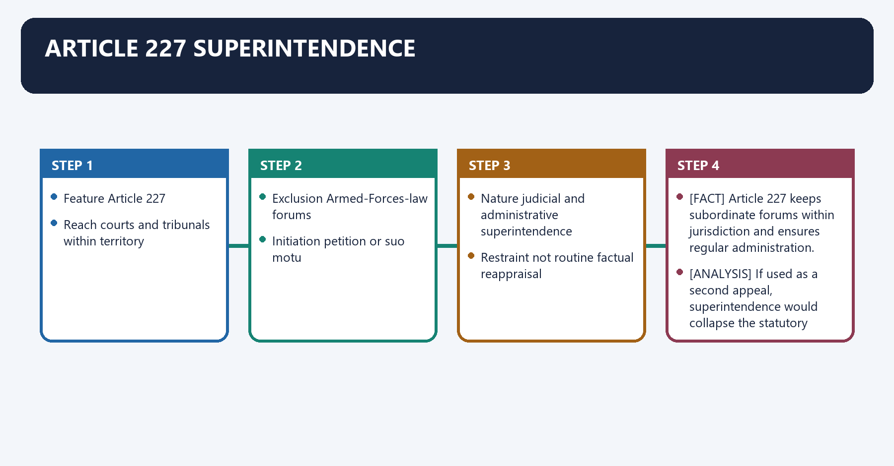
**Visual 20 - Supervision, not appeal**

| Feature | Article 227 |
|---|---|
| Reach | courts and tribunals within territory |
| Exclusion | Armed-Forces-law forums |
| Initiation | petition or suo motu |
| Nature | judicial and administrative superintendence |
| Restraint | not routine factual reappraisal |

- [FACT] Article 227 keeps subordinate forums within jurisdiction and ensures regular administration.
- [ANALYSIS] If used as a second appeal, superintendence would collapse the statutory hierarchy.
- [LIMIT] Corrective intensity depends on jurisdictional error, grave injustice and procedural failure, not simple disagreement.

#### CLOSING RECALL FLOW — ARTICLE 227 SUPERINTENDENCE

```closure-flow
SUBTOPIC: Article 227 superintendence
KEY TERMS / DEFINITIONS: Article 227 superintendence · Reach · courts and tribunals within territory · Exclusion · Armed-Forces-law forums · Initiation
MECHANISM / ARGUMENT: Corrective intensity depends on jurisdictional error, grave injustice and procedural failure, not simple disagreement.
CONSEQUENCE / CONTRAST: Its principal consequence is that nature judicial and administrative superintendence.
UPSC TRAP / ANSWER-USE: The decisive contrast is between Restraint not routine factual reappraisal and Article 227 keeps subordinate forums within jurisdiction and ensures regular administration.
ANSWER-GRABBING FORMULATION: Article 227 enables judicial and administrative superintendence over subordinate forums, but its corrective role cannot be converted into routine factual reappraisal.
```
### SESSION 17 — ARTICLE 228 CONSTITUTIONAL WITHDRAWAL
#### DEFINITION / WHAT THIS IS CALLED

**Plain-language definition:** Article 228 constitutional withdrawal denotes the constitutional rules and institutional links organised around Subordinate-court case.

**Technical definition:** The decisive contrast is between Article 228 is narrower than general appellate jurisdiction and Subordinate-court case.

#### ANSWER-GRABBING OPENING — WRITE/ADAPT IN THE EXAM

> Article 228 centralises authoritative resolution of substantial constitutional questions in the High Court while allowing ordinary adjudication to return to the subordinate court.

#### MUST-WRITE KEYWORDS

- **Article 228 constitutional withdrawal**
- **Article 228**
- **Article**
- **Subordinate-court**
- **Its principal consequence**
- **Its**

**How to use them:** Frame the answer through Article 228 constitutional withdrawal; define Article 228, connect Article with Subordinate-court to explain the mechanism, and use Its principal consequence for the decisive comparison or qualification.

Article 228 constitutional withdrawal denotes the constitutional rules and institutional links organised around Subordinate-court case.
Article 228 constitutional withdrawal operates through substantial constitutional-interpretation question, connected with High Court withdraws.
The operative mechanism matters because decides question or whole case.
Its principal consequence is that may return case with binding answer.
The decisive contrast is between [FACT] Article 228 is narrower than general appellate jurisdiction and Subordinate-court case.
The exam-safe limitation is that subordinate-court case.
**Visual 21 - Withdrawal route**

```text
Subordinate-court case
     |
substantial constitutional-interpretation question
     |
High Court withdraws
     |
decides question or whole case
     |
may return case with binding answer
```

- [FACT] Article 228 is narrower than general appellate jurisdiction.
- [ANALYSIS] It centralises authoritative constitutional interpretation in the High Court while allowing ordinary factual adjudication to return below.

#### CLOSING RECALL FLOW — ARTICLE 228 CONSTITUTIONAL WITHDRAWAL

```closure-flow
SUBTOPIC: Article 228 constitutional withdrawal
KEY TERMS / DEFINITIONS: Article 228 constitutional withdrawal · Article 228 · Article · Subordinate-court · Its principal consequence · Its
MECHANISM / ARGUMENT: The decisive contrast is between Article 228 is narrower than general appellate jurisdiction and Subordinate-court case.
CONSEQUENCE / CONTRAST: Its principal consequence is that may return case with binding answer.
UPSC TRAP / ANSWER-USE: Do not miss this limiting distinction: article 228 is narrower than general appellate jurisdiction.
ANSWER-GRABBING FORMULATION: Article 228 centralises authoritative resolution of substantial constitutional questions in the High Court while allowing ordinary adjudication to return to the subordinate court.
```
### SESSION 18 — APPELLATE AND ORIGINAL JURISDICTION
#### DEFINITION / WHAT THIS IS CALLED

**Plain-language definition:** Appellate and original jurisdiction denotes the constitutional rules and institutional links organised around High Courts hear civil and criminal appeals under constitutional, procedural and special statutory frameworks.

**Technical definition:** Appellate and original jurisdiction operates through A Sessions Court death sentence requires High Court confirmation before execution, connected with High Courts hear election petitions concerning Parliament and State legislatures under the Representation of the People Act.

#### ANSWER-GRABBING OPENING — WRITE/ADAPT IN THE EXAM

> High Courts exercise varied statutory appellate and original powers, while mandatory confirmation of death sentences illustrates their supervisory protection against irreversible trial error.

#### MUST-WRITE KEYWORDS

- **Appellate**
- **original jurisdiction**
- **Appellate and original jurisdiction**
- **High Courts**
- **Sessions Court**
- **High Court**

**How to use them:** Frame the answer through Appellate; define original jurisdiction, connect Appellate and original jurisdiction with High Courts to explain the mechanism, and use Sessions Court for the decisive comparison or qualification.

Appellate and original jurisdiction denotes the constitutional rules and institutional links organised around [FACT] High Courts hear civil and criminal appeals under constitutional, procedural and special statutory frameworks.
Appellate and original jurisdiction operates through [FACT] A Sessions Court death sentence requires High Court confirmation before execution, connected with [FACT] High Courts hear election petitions concerning Parliament and State legislatures under the Representation of the People Act.
The operative mechanism matters because [FACT] Specified High Courts possess original civil, admiralty or testamentary jurisdiction under applicable law.
Its principal consequence is that trial court conviction/sentence.
The decisive contrast is between statutory appeal/revision and death sentence requires confirmation.
The exam-safe limitation is that [FACT] High Courts hear civil and criminal appeals under constitutional, procedural and special statutory frameworks.
- [FACT] High Courts hear civil and criminal appeals under constitutional, procedural and special statutory frameworks.
- [FACT] A Sessions Court death sentence requires High Court confirmation before execution.
- [FACT] High Courts hear election petitions concerning Parliament and State legislatures under the Representation of the People Act.
- [FACT] Specified High Courts possess original civil, admiralty or testamentary jurisdiction under applicable law.
- [LIMIT] Jurisdiction varies by statute, pecuniary threshold and local arrangement; avoid claiming identical original jurisdiction for every High Court.

**Visual 22 - Criminal control**

```text
Trial court conviction/sentence
       |
statutory appeal/revision
       |
High Court
       |
death sentence requires confirmation
```

#### CLOSING RECALL FLOW — APPELLATE AND ORIGINAL JURISDICTION

```closure-flow
SUBTOPIC: Appellate and original jurisdiction
KEY TERMS / DEFINITIONS: Appellate · original jurisdiction · Appellate and original jurisdiction · High Courts · Sessions Court · High Court
MECHANISM / ARGUMENT: Appellate and original jurisdiction operates through A Sessions Court death sentence requires High Court confirmation before execution, connected with High Courts hear election petitions concerning Parliament and State legislatures under the Representation of the People Act.
CONSEQUENCE / CONTRAST: The decisive contrast is between statutory appeal/revision and death sentence requires confirmation.
UPSC TRAP / ANSWER-USE: Do not miss this limiting distinction: its principal consequence is that trial court conviction/sentence.
ANSWER-GRABBING FORMULATION: High Courts exercise varied statutory appellate and original powers, while mandatory confirmation of death sentences illustrates their supervisory protection against irreversible trial error.
```
### SESSION 19 — HIGH COURT BENCHES AND ACCESS
#### DEFINITION / WHAT THIS IS CALLED

**Plain-language definition:** High Court benches and access denotes the constitutional rules and institutional links organised around Benches can reduce travel and regional exclusion but may fragment administration and generate seat-location politics.

**Technical definition:** High Court benches and access operates through Bench creation is not a unilateral power of the High Court alone; constitutional, executive and statutory processes apply, connected with Benches can reduce travel and regional exclusion but may fragment administration and generate seat-location politics.

#### ANSWER-GRABBING OPENING — WRITE/ADAPT IN THE EXAM

> Benches can reduce travel and regional exclusion but may fragment administration and generate seat-location politics.

#### MUST-WRITE KEYWORDS

- **High Court benches**
- **access**
- **High Court benches and access**
- **High Court**
- **Benches**
- **Bench**

**How to use them:** Frame the answer through High Court benches; define access, connect High Court benches and access with High Court to explain the mechanism, and use Benches for the decisive comparison or qualification.

High Court benches and access denotes the constitutional rules and institutional links organised around [ANALYSIS] Benches can reduce travel and regional exclusion but may fragment administration and generate seat-location politics.
High Court benches and access operates through [LIMIT] Bench creation is not a unilateral power of the High Court alone; constitutional, executive and statutory processes apply, connected with [ANALYSIS] Benches can reduce travel and regional exclusion but may fragment administration and generate seat-location politics.
The operative mechanism matters because [ANALYSIS] Benches can reduce travel and regional exclusion but may fragment administration and generate seat-location politics.
Its principal consequence is that [ANALYSIS] Benches can reduce travel and regional exclusion but may fragment administration and generate seat-location politics.
The decisive contrast is between [ANALYSIS] Benches can reduce travel and regional exclusion but may fragment administration and generate seat-location politics and [ANALYSIS] Benches can reduce travel and regional exclusion but may fragment administration and generate seat-location politics.
The exam-safe limitation is that [ANALYSIS] Benches can reduce travel and regional exclusion but may fragment administration and generate seat-location politics.
- [FACT] A High Court may have its principal seat and permanent or circuit benches under applicable reorganisation/statutory arrangements.
- [ANALYSIS] Benches can reduce travel and regional exclusion but may fragment administration and generate seat-location politics.
- [LIMIT] Bench creation is not a unilateral power of the High Court alone; constitutional, executive and statutory processes apply.

#### CLOSING RECALL FLOW — HIGH COURT BENCHES AND ACCESS

```closure-flow
SUBTOPIC: High Court benches and access
KEY TERMS / DEFINITIONS: High Court benches · access · High Court benches and access · High Court · Benches · Bench
MECHANISM / ARGUMENT: High Court benches and access operates through Bench creation is not a unilateral power of the High Court alone; constitutional, executive and statutory processes apply, connected with Benches can reduce travel and regional exclusion but may fragment administration and generate seat-location politics.
CONSEQUENCE / CONTRAST: Bench creation is not a unilateral power of the High Court alone; constitutional, executive and statutory processes apply.
UPSC TRAP / ANSWER-USE: The operative mechanism matters because Benches can reduce travel and regional exclusion but may fragment administration and generate seat-location politics.
ANSWER-GRABBING FORMULATION: Benches can reduce travel and regional exclusion but may fragment administration and generate seat-location politics.
```
### SESSION 20 — SUBORDINATE JUDICIARY: CONSTITUTIONAL ARCHITECTURE
#### DEFINITION / WHAT THIS IS CALLED

**Plain-language definition:** Subordinate judiciary: constitutional architecture denotes the constitutional rules and institutional links organised around 233 appointment, posting and promotion of district judges.

**Technical definition:** Its principal consequence is that 236 interpretation, including broad "district judge" definition.

#### ANSWER-GRABBING OPENING — WRITE/ADAPT IN THE EXAM

> Articles 233 to 237 divide subordinate-judiciary appointments and control between the Governor and High Court, protecting judicial administration from unilateral executive command.

#### MUST-WRITE KEYWORDS

- **Subordinate judiciary**
- **constitutional architecture**
- **appointment, posting and promotion of district judges**
- **validation of specified past appointments/judgments**
- **recruitment below district judge**
- **233A**

**How to use them:** Frame the answer through Subordinate judiciary; define constitutional architecture, connect appointment, posting and promotion of district judges with validation of specified past appointments/judgments to explain the mechanism, and use recruitment below district judge for the decisive comparison or qualification.

Subordinate judiciary: constitutional architecture denotes the constitutional rules and institutional links organised around 233 appointment, posting and promotion of district judges.
Subordinate judiciary: constitutional architecture operates through 233A validation of specified past appointments/judgments, connected with 234 recruitment below district judge.
The operative mechanism matters because 235 High Court control.
Its principal consequence is that 236 interpretation, including broad "district judge" definition.
The decisive contrast is between 237 application to certain magistrates and Governor appoints district judges.
The exam-safe limitation is that mandatory High Court consultation.
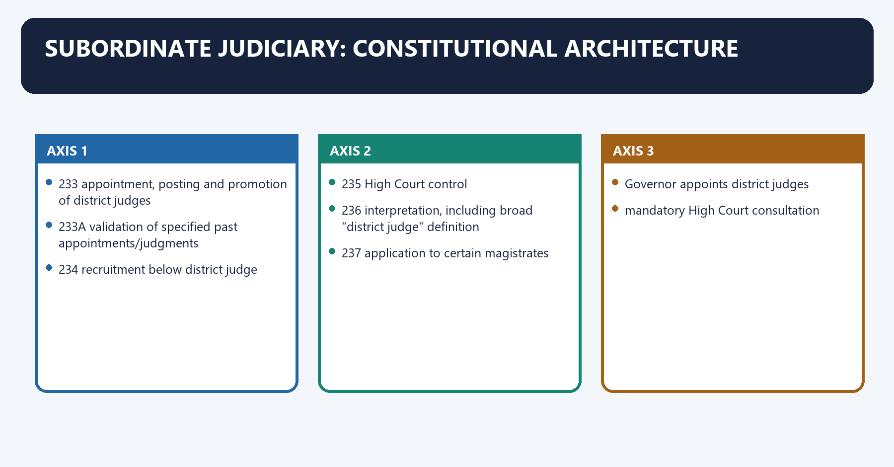
**Visual 23 - Articles 233-237**

| Article | Subject |
|---:|---|
| 233 | appointment, posting and promotion of district judges |
| 233A | validation of specified past appointments/judgments |
| 234 | recruitment below district judge |
| 235 | High Court control |
| 236 | interpretation, including broad "district judge" definition |
| 237 | application to certain magistrates |

**Visual 24 - Independence chain**

```text
Governor appoints district judges
       +
mandatory High Court consultation
       |
High Court controls posting, promotion and leave
       |
district judiciary insulated from ordinary executive command
```

#### CLOSING RECALL FLOW — SUBORDINATE JUDICIARY: CONSTITUTIONAL ARCHITECTURE

```closure-flow
SUBTOPIC: Subordinate judiciary: constitutional architecture
KEY TERMS / DEFINITIONS: Subordinate judiciary · constitutional architecture · appointment, posting and promotion of district judges · validation of specified past appointments/judgments · recruitment below district judge · 233A
MECHANISM / ARGUMENT: Its principal consequence is that 236 interpretation, including broad "district judge" definition.
CONSEQUENCE / CONTRAST: The decisive contrast is between 237 application to certain magistrates and Governor appoints district judges.
UPSC TRAP / ANSWER-USE: Do not miss this limiting distinction: the exam-safe limitation is that mandatory High Court consultation.
ANSWER-GRABBING FORMULATION: Articles 233 to 237 divide subordinate-judiciary appointments and control between the Governor and High Court, protecting judicial administration from unilateral executive command.
```
### SESSION 21 — APPOINTMENT OF DISTRICT JUDGES
#### DEFINITION / WHAT THIS IS CALLED

**Plain-language definition:** Appointment of district judges denotes the constitutional rules and institutional links organised around Article 233 places appointment, posting and promotion of district judges with the Governor in consultation with the High Court.

**Technical definition:** Its principal consequence is that Article 233 places appointment, posting and promotion of district judges with the Governor in consultation with the High Court.

#### ANSWER-GRABBING OPENING — WRITE/ADAPT IN THE EXAM

> The Governor does not appoint unilaterally, and the High Court does not formally appoint alone.

#### MUST-WRITE KEYWORDS

- **Appointment of district judges**
- **Article 233**
- **Appointment**
- **Article**
- **Governor**
- **High Court**

**How to use them:** Frame the answer through Appointment of district judges; define Article 233, connect Appointment with Article to explain the mechanism, and use Governor for the decisive comparison or qualification.

Appointment of district judges denotes the constitutional rules and institutional links organised around [FACT] Article 233 places appointment, posting and promotion of district judges with the Governor in consultation with the High Court.
Appointment of district judges operates through [LIMIT] The Governor does not appoint unilaterally, and the High Court does not formally appoint alone, connected with [ANALYSIS] Consultation protects judicial independence while retaining constitutional State appointment form.
The operative mechanism matters because [FACT] Article 233 places appointment, posting and promotion of district judges with the Governor in consultation with the High Court.
Its principal consequence is that [FACT] Article 233 places appointment, posting and promotion of district judges with the Governor in consultation with the High Court.
The decisive contrast is between [FACT] Article 233 places appointment, posting and promotion of district judges with the Governor in consultation with the High Court and [FACT] Article 233 places appointment, posting and promotion of district judges with the Governor in consultation with the High Court.
The exam-safe limitation is that [FACT] Article 233 places appointment, posting and promotion of district judges with the Governor in consultation with the High Court.
- [FACT] Article 233 places appointment, posting and promotion of district judges with the Governor in consultation with the High Court.
- [FACT] A person not already in Union/State service requires at least seven years as advocate or pleader and High Court recommendation for district-judge appointment.
- [LIMIT] The Governor does not appoint unilaterally, and the High Court does not formally appoint alone.
- [ANALYSIS] Consultation protects judicial independence while retaining constitutional State appointment form.

#### CLOSING RECALL FLOW — APPOINTMENT OF DISTRICT JUDGES

```closure-flow
SUBTOPIC: Appointment of district judges
KEY TERMS / DEFINITIONS: Appointment of district judges · Article 233 · Appointment · Article · Governor · High Court
MECHANISM / ARGUMENT: Appointment of district judges operates through The Governor does not appoint unilaterally, and the High Court does not formally appoint alone, connected with Consultation protects judicial independence while retaining constitutional State appointment form.
CONSEQUENCE / CONTRAST: Its principal consequence is that Article 233 places appointment, posting and promotion of district judges with the Governor in consultation with the High Court.
UPSC TRAP / ANSWER-USE: Do not miss this limiting distinction: the decisive contrast is between Article 233 places appointment, posting and promotion of district...
ANSWER-GRABBING FORMULATION: The Governor does not appoint unilaterally, and the High Court does not formally appoint alone.
```
### SESSION 22 — RECRUITMENT BELOW DISTRICT JUDGE
#### DEFINITION / WHAT THIS IS CALLED

**Plain-language definition:** Recruitment below district judge denotes the constitutional rules and institutional links organised around Governor makes appointment.

**Technical definition:** Its principal consequence is that The tripartite design combines recruitment machinery, constitutional appointment and judicial quality control.

#### ANSWER-GRABBING OPENING — WRITE/ADAPT IN THE EXAM

> Article 234 combines Public Service Commission consultation, High Court consultation and gubernatorial appointment, linking recruitment capacity with judicial quality control.

#### MUST-WRITE KEYWORDS

- **Recruitment below district judge**
- **Article 234**
- **Recruitment**
- **Governor**
- **Its principal consequence**
- **Its**

**How to use them:** Frame the answer through Recruitment below district judge; define Article 234, connect Recruitment with Governor to explain the mechanism, and use Its principal consequence for the decisive comparison or qualification.

Recruitment below district judge denotes the constitutional rules and institutional links organised around Governor makes appointment.
Recruitment below district judge operates through rules framed after consultation with, connected with State Public Service Commission.
The operative mechanism matters because [FACT] Article 234 governs persons other than district judges entering the State judicial service.
Its principal consequence is that [ANALYSIS] The tripartite design combines recruitment machinery, constitutional appointment and judicial quality control.
The decisive contrast is between [LIMIT] Exact examinations, cadres and service rules vary by State and Governor makes appointment.
The exam-safe limitation is that governor makes appointment.
**Visual 25 - Article 234**

```text
Governor makes appointment
       |
rules framed after consultation with:
       +-- State Public Service Commission
       +-- High Court
```

- [FACT] Article 234 governs persons other than district judges entering the State judicial service.
- [ANALYSIS] The tripartite design combines recruitment machinery, constitutional appointment and judicial quality control.
- [LIMIT] Exact examinations, cadres and service rules vary by State.

#### CLOSING RECALL FLOW — RECRUITMENT BELOW DISTRICT JUDGE

```closure-flow
SUBTOPIC: Recruitment below district judge
KEY TERMS / DEFINITIONS: Recruitment below district judge · Article 234 · Recruitment · Governor · Its principal consequence · Its
MECHANISM / ARGUMENT: The decisive contrast is between Exact examinations, cadres and service rules vary by State and Governor makes appointment.
CONSEQUENCE / CONTRAST: Its principal consequence is that The tripartite design combines recruitment machinery, constitutional appointment and judicial quality control.
UPSC TRAP / ANSWER-USE: Do not miss this limiting distinction: the exam-safe limitation is that governor makes appointment.
ANSWER-GRABBING FORMULATION: Article 234 combines Public Service Commission consultation, High Court consultation and gubernatorial appointment, linking recruitment capacity with judicial quality control.
```
### SESSION 23 — ARTICLE 235 CONTROL
#### DEFINITION / WHAT THIS IS CALLED

**Plain-language definition:** Article 235 control denotes the constitutional rules and institutional links organised around HIGH COURT CONTROL.

**Technical definition:** The decisive contrast is between HIGH COURT CONTROL and HIGH COURT CONTROL.

#### ANSWER-GRABBING OPENING — WRITE/ADAPT IN THE EXAM

> Service conditions and appeal rights remain subject to law; High Court control is constitutional administration, not arbitrary power.

#### MUST-WRITE KEYWORDS

- **Article 235 control**
- **Article 235**
- **Article**
- **HIGH COURT CONTROL**
- **Its principal consequence**
- **Its**

**How to use them:** Frame the answer through Article 235 control; define Article 235, connect Article with HIGH COURT CONTROL to explain the mechanism, and use Its principal consequence for the decisive comparison or qualification.

Article 235 control denotes the constitutional rules and institutional links organised around HIGH COURT CONTROL.
Article 235 control operates through disciplinary supervision within law, connected with lower-court decisional independence.
The operative mechanism matters because [FACT] Article 235 vests control over district courts and subordinate courts in the High Court.
Its principal consequence is that [ANALYSIS] Independence would be hollow if the executive could transfer or discipline trial judges whose decisions affect the State.
The decisive contrast is between HIGH COURT CONTROL and HIGH COURT CONTROL.
The exam-safe limitation is that hIGH COURT CONTROL.
**Visual 26 - What "control" protects**

```text
HIGH COURT CONTROL
  +-- posting
  +-- promotion
  +-- leave
  +-- disciplinary supervision within law
        |
        v
lower-court decisional independence
```

- [FACT] Article 235 vests control over district courts and subordinate courts in the High Court.
- [ANALYSIS] Independence would be hollow if the executive could transfer or discipline trial judges whose decisions affect the State.
- [LIMIT] Service conditions and appeal rights remain subject to law; High Court control is constitutional administration, not arbitrary power.

#### CLOSING RECALL FLOW — ARTICLE 235 CONTROL

```closure-flow
SUBTOPIC: Article 235 control
KEY TERMS / DEFINITIONS: Article 235 control · Article 235 · Article · HIGH COURT CONTROL · Its principal consequence · Its
MECHANISM / ARGUMENT: The decisive contrast is between HIGH COURT CONTROL and HIGH COURT CONTROL.
CONSEQUENCE / CONTRAST: Service conditions and appeal rights remain subject to law; High Court control is constitutional administration, not arbitrary power.
UPSC TRAP / ANSWER-USE: Do not miss this limiting distinction: its principal consequence is that Independence would be hollow if the executive could transfer...
ANSWER-GRABBING FORMULATION: Service conditions and appeal rights remain subject to law; High Court control is constitutional administration, not arbitrary power.
```
### SESSION 24 — DISTRICT-COURT HIERARCHY
#### DEFINITION / WHAT THIS IS CALLED

**Plain-language definition:** District-court hierarchy denotes the constitutional rules and institutional links organised around Level Civil side Criminal side.

**Technical definition:** The decisive contrast is between Article 236 defines "district judge" broadly to include multiple equivalent designations and Court names and exact pecuniary/criminal jurisdiction vary under State law and current procedural statutes.

#### ANSWER-GRABBING OPENING — WRITE/ADAPT IN THE EXAM

> District and Sessions Judge describe one officer's civil and criminal capacities, while lower-court names and jurisdiction continue to vary under State law.

#### MUST-WRITE KEYWORDS

- **District-court hierarchy**
- **District apex**
- **District Judge**
- **Sessions Judge**
- **Middle**
- **Civil Judge, Senior Division**

**How to use them:** Frame the answer through District-court hierarchy; define District apex, connect District Judge with Sessions Judge to explain the mechanism, and use Middle for the decisive comparison or qualification.

District-court hierarchy denotes the constitutional rules and institutional links organised around Level Civil side Criminal side.
District-court hierarchy operates through District apex District Judge Sessions Judge, connected with Middle Civil Judge, Senior Division Chief Judicial Magistrate.
The operative mechanism matters because entry/lower Civil Judge, Junior Division / Munsiff Judicial Magistrate.
Its principal consequence is that [FACT] District Judge and Sessions Judge describe the same judicial officer acting on civil and criminal sides.
The decisive contrast is between [FACT] Article 236 defines "district judge" broadly to include multiple equivalent designations and [LIMIT] Court names and exact pecuniary/criminal jurisdiction vary under State law and current procedural statutes.
The exam-safe limitation is that level Civil side Criminal side.
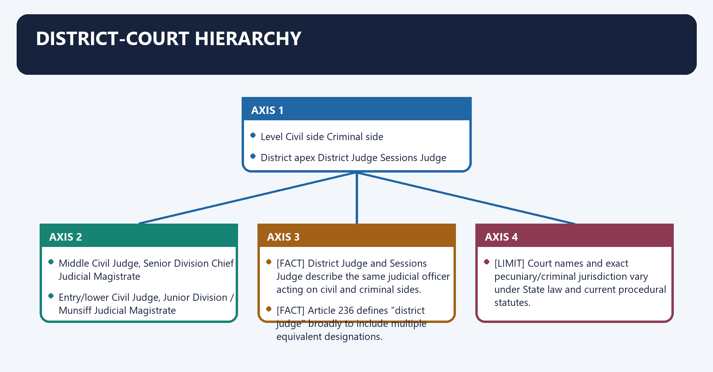
**Visual 27 - Civil and criminal sides**

| Level | Civil side | Criminal side |
|---|---|---|
| District apex | District Judge | Sessions Judge |
| Middle | Civil Judge, Senior Division | Chief Judicial Magistrate |
| Entry/lower | Civil Judge, Junior Division / Munsiff | Judicial Magistrate |

- [FACT] District Judge and Sessions Judge describe the same judicial officer acting on civil and criminal sides.
- [FACT] Article 236 defines "district judge" broadly to include multiple equivalent designations.
- [LIMIT] Court names and exact pecuniary/criminal jurisdiction vary under State law and current procedural statutes.

#### CLOSING RECALL FLOW — DISTRICT-COURT HIERARCHY

```closure-flow
SUBTOPIC: District-court hierarchy
KEY TERMS / DEFINITIONS: District-court hierarchy · District apex · District Judge · Sessions Judge · Middle · Civil Judge, Senior Division
MECHANISM / ARGUMENT: Its principal consequence is that District Judge and Sessions Judge describe the same judicial officer acting on civil and criminal sides.
CONSEQUENCE / CONTRAST: The decisive contrast is between Article 236 defines "district judge" broadly to include multiple equivalent designations and Court names and exact pecuniary/criminal jurisdiction vary under State law and current procedural statutes.
UPSC TRAP / ANSWER-USE: Do not miss this limiting distinction: article 236 defines "district judge" broadly to include multiple equivalent designations.
ANSWER-GRABBING FORMULATION: District and Sessions Judge describe one officer's civil and criminal capacities, while lower-court names and jurisdiction continue to vary under State law.
```
### SESSION 25 — ADMINISTRATIVE AND JUDICIAL RESPONSIBILITIES
#### DEFINITION / WHAT THIS IS CALLED

**Plain-language definition:** Administrative and judicial responsibilities denotes the constitutional rules and institutional links organised around Constitutional adjudication.

**Technical definition:** High Court overload is multidimensional: constitutional cases, ordinary appeals and administrative control compete for judicial time.

#### ANSWER-GRABBING OPENING — WRITE/ADAPT IN THE EXAM

> Reform must therefore combine judge strength, registry modernisation, lower-court capacity and case-flow management.

#### MUST-WRITE KEYWORDS

- **Administrative**
- **judicial responsibilities**
- **Article 227**
- **Article 235**
- **Administrative and judicial responsibilities**
- **Constitutional**

**How to use them:** Frame the answer through Administrative; define judicial responsibilities, connect Article 227 with Article 235 to explain the mechanism, and use Administrative and judicial responsibilities for the decisive comparison or qualification.

Administrative and judicial responsibilities denotes the constitutional rules and institutional links organised around Constitutional adjudication.
Administrative and judicial responsibilities operates through appeals and revisions, connected with Article 227 supervision.
The operative mechanism matters because article 235 administration.
Its principal consequence is that rights court + system manager.
The decisive contrast is between [ANALYSIS] Reform must therefore combine judge strength, registry modernisation, lower-court capacity and case-flow management and Constitutional adjudication.
The exam-safe limitation is that constitutional adjudication.
**Visual 28 - High Court as head of State judiciary**

```text
Constitutional adjudication
          +
appeals and revisions
          +
Article 227 supervision
          +
Article 235 administration
          =
rights court + system manager
```

- [ANALYSIS] High Court overload is multidimensional: constitutional cases, ordinary appeals and administrative control compete for judicial time.
- [ANALYSIS] Reform must therefore combine judge strength, registry modernisation, lower-court capacity and case-flow management.

#### CLOSING RECALL FLOW — ADMINISTRATIVE AND JUDICIAL RESPONSIBILITIES

```closure-flow
SUBTOPIC: Administrative and judicial responsibilities
KEY TERMS / DEFINITIONS: Administrative · judicial responsibilities · Article 227 · Article 235 · Administrative and judicial responsibilities · Constitutional
MECHANISM / ARGUMENT: High Court overload is multidimensional: constitutional cases, ordinary appeals and administrative control compete for judicial time.
CONSEQUENCE / CONTRAST: The decisive contrast is between Reform must therefore combine judge strength, registry modernisation, lower-court capacity and case-flow management and Constitutional adjudication.
UPSC TRAP / ANSWER-USE: Do not miss this limiting distinction: its principal consequence is that rights court + system manager.
ANSWER-GRABBING FORMULATION: Reform must therefore combine judge strength, registry modernisation, lower-court capacity and case-flow management.
```
### SESSION 26 — LEGAL AID UNDER ARTICLE 39A
#### DEFINITION / WHAT THIS IS CALLED

**Plain-language definition:** Legal aid under Article 39A denotes the constitutional rules and institutional links organised around State Legal Services Authorities.

**Technical definition:** Its principal consequence is that Article 39A directs equal justice and free legal aid.

#### ANSWER-GRABBING OPENING — WRITE/ADAPT IN THE EXAM

> Formal judicial independence does not equal access if cost, distance, language and legal representation exclude citizens.

#### MUST-WRITE KEYWORDS

- **Legal aid under Article 39A**
- **Article 39A**
- **Legal**
- **Article**
- **Its principal consequence**
- **Its**

**How to use them:** Frame the answer through Legal aid under Article 39A; define Article 39A, connect Legal with Article to explain the mechanism, and use Its principal consequence for the decisive comparison or qualification.

Legal aid under Article 39A denotes the constitutional rules and institutional links organised around State Legal Services Authorities.
Legal aid under Article 39A operates through District Legal Services Authorities, connected with Taluk Legal Services Committees.
The operative mechanism matters because legal aid / Lok Adalats / awareness.
Its principal consequence is that [FACT] Article 39A directs equal justice and free legal aid.
The decisive contrast is between [FACT] The Legal Services Authorities Act, 1987 creates the institutional framework and [FACT] NALSA, SLSAs, DLSAs and Taluk committees support eligible persons and organise Lok Adalats.
The exam-safe limitation is that [ANALYSIS] Formal judicial independence does not equal access if cost, distance, language and legal representation exclude citizens.
**Visual 29 - Access ladder**

```text
NALSA
  |
State Legal Services Authorities
  |
District Legal Services Authorities
  |
Taluk Legal Services Committees
  |
legal aid / Lok Adalats / awareness
```

- [FACT] Article 39A directs equal justice and free legal aid.
- [FACT] The Legal Services Authorities Act, 1987 creates the institutional framework.
- [FACT] NALSA, SLSAs, DLSAs and Taluk committees support eligible persons and organise Lok Adalats.
- [ANALYSIS] Formal judicial independence does not equal access if cost, distance, language and legal representation exclude citizens.

#### CLOSING RECALL FLOW — LEGAL AID UNDER ARTICLE 39A

```closure-flow
SUBTOPIC: Legal aid under Article 39A
KEY TERMS / DEFINITIONS: Legal aid under Article 39A · Article 39A · Legal · Article · Its principal consequence · Its
MECHANISM / ARGUMENT: Its principal consequence is that Article 39A directs equal justice and free legal aid.
CONSEQUENCE / CONTRAST: The decisive contrast is between The Legal Services Authorities Act, 1987 creates the institutional framework and NALSA, SLSAs, DLSAs and Taluk committees support eligible persons and organise Lok Adalats.
UPSC TRAP / ANSWER-USE: The exam-safe limitation is that Formal judicial independence does not equal access if cost, distance, language and legal representation exclude citizens.
ANSWER-GRABBING FORMULATION: Formal judicial independence does not equal access if cost, distance, language and legal representation exclude citizens.
```
### SESSION 27 — LOK ADALATS AND PERMANENT LOK ADALATS
#### DEFINITION / WHAT THIS IS CALLED

**Plain-language definition:** Lok Adalats and Permanent Lok Adalats denotes the constitutional rules and institutional links organised around Feature Lok Adalat Permanent Lok Adalat.

**Technical definition:** The decisive contrast is between Ordinary Lok Adalats do not adjudicate a contested dispute on merits when settlement fails and Non-compoundable criminal offences cannot be settled through Lok Adalat.

#### ANSWER-GRABBING OPENING — WRITE/ADAPT IN THE EXAM

> Lok Adalats expand consensual and accessible settlement, but ordinary Lok Adalats cannot adjudicate merits after failed compromise or settle non-compoundable offences.

#### MUST-WRITE KEYWORDS

- **Lok Adalats**
- **Permanent Lok Adalats**
- **Main model**
- **compromise/settlement**
- **pre-litigation public-utility dispute mechanism**
- **Consent**

**How to use them:** Frame the answer through Lok Adalats; define Permanent Lok Adalats, connect Main model with compromise/settlement to explain the mechanism, and use pre-litigation public-utility dispute mechanism for the decisive comparison or qualification.

Lok Adalats and Permanent Lok Adalats denotes the constitutional rules and institutional links organised around Feature Lok Adalat Permanent Lok Adalat.
Lok Adalats and Permanent Lok Adalats operates through Main model compromise/settlement pre-litigation public-utility dispute mechanism, connected with Consent settlement ordinarily rests on compromise may decide merits after conciliation fails within statutory field.
The operative mechanism matters because criminal scope compoundable offences only statutory public-utility scope; not general criminal trial.
Its principal consequence is that award final and binding; decree-like final and binding within statute.
The decisive contrast is between [FACT] Ordinary Lok Adalats do not adjudicate a contested dispute on merits when settlement fails and [FACT] Non-compoundable criminal offences cannot be settled through Lok Adalat.
The exam-safe limitation is that [LIMIT] Lok Adalats reduce suitable disputes; they are not substitutes for constitutional courts or ordinary criminal justice.
**Visual 30 - Core distinction**

| Feature | Lok Adalat | Permanent Lok Adalat |
|---|---|---|
| Main model | compromise/settlement | pre-litigation public-utility dispute mechanism |
| Consent | settlement ordinarily rests on compromise | may decide merits after conciliation fails within statutory field |
| Criminal scope | compoundable offences only | statutory public-utility scope; not general criminal trial |
| Award | final and binding; decree-like | final and binding within statute |

- [FACT] Ordinary Lok Adalats do not adjudicate a contested dispute on merits when settlement fails.
- [FACT] Non-compoundable criminal offences cannot be settled through Lok Adalat.
- [LIMIT] Lok Adalats reduce suitable disputes; they are not substitutes for constitutional courts or ordinary criminal justice.

#### CLOSING RECALL FLOW — LOK ADALATS AND PERMANENT LOK ADALATS

```closure-flow
SUBTOPIC: Lok Adalats and Permanent Lok Adalats
KEY TERMS / DEFINITIONS: Lok Adalats · Permanent Lok Adalats · Main model · compromise/settlement · pre-litigation public-utility dispute mechanism · Consent
MECHANISM / ARGUMENT: The decisive contrast is between Ordinary Lok Adalats do not adjudicate a contested dispute on merits when settlement fails and Non-compoundable criminal offences cannot be settled through Lok Adalat.
CONSEQUENCE / CONTRAST: The exam-safe limitation is that Lok Adalats reduce suitable disputes; they are not substitutes for constitutional courts or ordinary criminal justice.
UPSC TRAP / ANSWER-USE: Ordinary Lok Adalats do not adjudicate a contested dispute on merits when settlement fails.
ANSWER-GRABBING FORMULATION: Lok Adalats expand consensual and accessible settlement, but ordinary Lok Adalats cannot adjudicate merits after failed compromise or settle non-compoundable offences.
```
### SESSION 28 — LOK ADALAT VERSUS ARBITRATION
#### DEFINITION / WHAT THIS IS CALLED

**Plain-language definition:** Lok Adalat versus arbitration denotes the constitutional rules and institutional links organised around Axis Lok Adalat Arbitration tribunal.

**Technical definition:** The exam-safe limitation is that axis Lok Adalat Arbitration tribunal.

#### ANSWER-GRABBING OPENING — WRITE/ADAPT IN THE EXAM

> Lok Adalat awards rest on settlement, whereas arbitration produces private adjudication; Permanent Lok Adalats possess a distinct statutory merits power in specified public-utility disputes.

#### MUST-WRITE KEYWORDS

- **Lok Adalat versus arbitration**
- **Legal Services Authorities Act**
- **Arbitration agreement and Arbitration Act**
- **Nature**
- **conciliation/settlement forum**
- **private adjudication**

**How to use them:** Frame the answer through Lok Adalat versus arbitration; define Legal Services Authorities Act, connect Arbitration agreement and Arbitration Act with Nature to explain the mechanism, and use conciliation/settlement forum for the decisive comparison or qualification.

Lok Adalat versus arbitration denotes the constitutional rules and institutional links organised around Axis Lok Adalat Arbitration tribunal.
Lok Adalat versus arbitration operates through Source Legal Services Authorities Act Arbitration agreement and Arbitration Act, connected with Nature conciliation/settlement forum private adjudication.
The operative mechanism matters because basis statutory legal-aid/access mechanism party consent to arbitrate.
Its principal consequence is that criminal matters compoundable criminal settlement possible criminal prosecution not arbitrable.
The decisive contrast is between Result settlement award, decree-like arbitral award, challenge under statute and [LIMIT] A Permanent Lok Adalat's statutory merits power must not be confused with an ordinary Lok Adalat.
The exam-safe limitation is that axis Lok Adalat Arbitration tribunal.
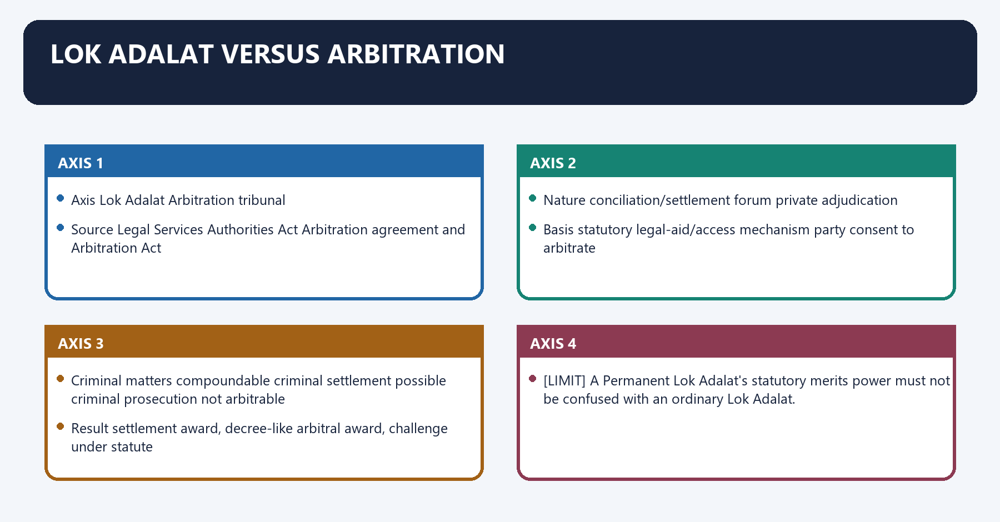
**Visual 31 - 2024 PYQ matrix**

| Axis | Lok Adalat | Arbitration tribunal |
|---|---|---|
| Source | Legal Services Authorities Act | Arbitration agreement and Arbitration Act |
| Nature | conciliation/settlement forum | private adjudication |
| Basis | statutory legal-aid/access mechanism | party consent to arbitrate |
| Criminal matters | compoundable criminal settlement possible | criminal prosecution not arbitrable |
| Result | settlement award, decree-like | arbitral award, challenge under statute |

- [LIMIT] A Permanent Lok Adalat's statutory merits power must not be confused with an ordinary Lok Adalat.

#### CLOSING RECALL FLOW — LOK ADALAT VERSUS ARBITRATION

```closure-flow
SUBTOPIC: Lok Adalat versus arbitration
KEY TERMS / DEFINITIONS: Lok Adalat versus arbitration · Legal Services Authorities Act · Arbitration agreement and Arbitration Act · Nature · conciliation/settlement forum · private adjudication
MECHANISM / ARGUMENT: The decisive contrast is between Result settlement award, decree-like arbitral award, challenge under statute and A Permanent Lok Adalat's statutory merits power must not be confused with an ordinary Lok Adalat.
CONSEQUENCE / CONTRAST: A Permanent Lok Adalat's statutory merits power must not be confused with an ordinary Lok Adalat.
UPSC TRAP / ANSWER-USE: Its principal consequence is that criminal matters compoundable criminal settlement possible criminal prosecution not arbitrable.
ANSWER-GRABBING FORMULATION: Lok Adalat awards rest on settlement, whereas arbitration produces private adjudication; Permanent Lok Adalats possess a distinct statutory merits power in specified public-utility disputes.
```
### SESSION 29 — FAMILY COURTS AND GRAM NYAYALAYAS
#### DEFINITION / WHAT THIS IS CALLED

**Plain-language definition:** Family Courts and Gram Nyayalayas operates through Family Court conciliation-focused family disputes not a general village criminal court, connected with Gram Nyayalaya mobile/local access for specified civil and criminal matters implementation is uneven.

**Technical definition:** Family Courts and Gram Nyayalayas denotes the constitutional rules and institutional links organised around Institution Core purpose Key caution.

#### ANSWER-GRABBING OPENING — WRITE/ADAPT IN THE EXAM

> Decentralised forums address distance and procedure, but underfunding and weak notification can limit actual reach.

#### MUST-WRITE KEYWORDS

- **Family Courts**
- **Gram Nyayalayas**
- **Family Court**
- **conciliation-focused family disputes**
- **not a general village criminal court**
- **Gram Nyayalaya**

**How to use them:** Frame the answer through Family Courts; define Gram Nyayalayas, connect Family Court with conciliation-focused family disputes to explain the mechanism, and use not a general village criminal court for the decisive comparison or qualification.

Family Courts and Gram Nyayalayas denotes the constitutional rules and institutional links organised around Institution Core purpose Key caution.
Family Courts and Gram Nyayalayas operates through Family Court conciliation-focused family disputes not a general village criminal court, connected with Gram Nyayalaya mobile/local access for specified civil and criminal matters implementation is uneven.
The operative mechanism matters because lok Adalat consensual settlement no non-compoundable offences.
Its principal consequence is that [ANALYSIS] Decentralised forums address distance and procedure, but underfunding and weak notification can limit actual reach.
The decisive contrast is between Institution Core purpose Key caution and Institution Core purpose Key caution.
The exam-safe limitation is that institution Core purpose Key caution.
**Visual 32 - Special access forums**

| Institution | Core purpose | Key caution |
|---|---|---|
| Family Court | conciliation-focused family disputes | not a general village criminal court |
| Gram Nyayalaya | mobile/local access for specified civil and criminal matters | implementation is uneven |
| Lok Adalat | consensual settlement | no non-compoundable offences |

- [ANALYSIS] Decentralised forums address distance and procedure, but underfunding and weak notification can limit actual reach.

#### CLOSING RECALL FLOW — FAMILY COURTS AND GRAM NYAYALAYAS

```closure-flow
SUBTOPIC: Family Courts and Gram Nyayalayas
KEY TERMS / DEFINITIONS: Family Courts · Gram Nyayalayas · Family Court · conciliation-focused family disputes · not a general village criminal court · Gram Nyayalaya
MECHANISM / ARGUMENT: Family Courts and Gram Nyayalayas denotes the constitutional rules and institutional links organised around Institution Core purpose Key caution.
CONSEQUENCE / CONTRAST: Its principal consequence is that Decentralised forums address distance and procedure, but underfunding and weak notification can limit actual reach.
UPSC TRAP / ANSWER-USE: Do not miss this limiting distinction: the decisive contrast is between Institution Core purpose Key caution and Institution Core purpose...
ANSWER-GRABBING FORMULATION: Decentralised forums address distance and procedure, but underfunding and weak notification can limit actual reach.
```
### SESSION 30 — ALL INDIA JUDICIAL SERVICE
#### DEFINITION / WHAT THIS IS CALLED

**Plain-language definition:** All India Judicial Service denotes the constitutional rules and institutional links organised around Rajya Sabha resolution under Article 312.

**Technical definition:** All India Judicial Service operates through by at least two-thirds present and voting, connected with Parliament creates service by law.

#### ANSWER-GRABBING OPENING — WRITE/ADAPT IN THE EXAM

> A workable model must preserve Article 235 control, State language competence, reservations, local law training and High Court participation.

#### MUST-WRITE KEYWORDS

- **All India Judicial Service**
- **common merit standards**
- **coordinated recruitment calendar**
- **federal recruitment autonomy**
- **wider talent pool and diversity**
- **possible weakening of Articles 233-235**

**How to use them:** Frame the answer through All India Judicial Service; define common merit standards, connect coordinated recruitment calendar with federal recruitment autonomy to explain the mechanism, and use wider talent pool and diversity for the decisive comparison or qualification.

All India Judicial Service denotes the constitutional rules and institutional links organised around Rajya Sabha resolution under Article 312.
All India Judicial Service operates through by at least two-thirds present and voting, connected with Parliament creates service by law.
The operative mechanism matters because aIJS may include district-judge level.
Its principal consequence is that cannot include posts below district judge: Article 312(3).
The decisive contrast is between Case for Case against and common merit standards State language and local-law needs.
The exam-safe limitation is that coordinated recruitment calendar federal recruitment autonomy.
**Visual 33 - Constitutional route**

```text
Rajya Sabha resolution under Article 312
by at least two-thirds present and voting
        |
Parliament creates service by law
        |
AIJS may include district-judge level
        |
cannot include posts below district judge: Article 312(3)
```

**Visual 34 - AIJS debate**

| Case for | Case against |
|---|---|
| common merit standards | State language and local-law needs |
| coordinated recruitment calendar | federal recruitment autonomy |
| wider talent pool and diversity | possible weakening of Articles 233-235 |
| vacancy reduction | central exam alone cannot fix retention/infrastructure |
| national training standards | High Court control must remain meaningful |

- [CURRENT] No AIJS is operational as of 18 August 2026.
- [LIMIT] AIJS cannot constitutionally recruit posts below district judge.
- [ANALYSIS] A workable model must preserve Article 235 control, State language competence, reservations, local law training and High Court participation.

#### CLOSING RECALL FLOW — ALL INDIA JUDICIAL SERVICE

```closure-flow
SUBTOPIC: All India Judicial Service
KEY TERMS / DEFINITIONS: All India Judicial Service · common merit standards · coordinated recruitment calendar · federal recruitment autonomy · wider talent pool and diversity · possible weakening of Articles 233-235
MECHANISM / ARGUMENT: All India Judicial Service operates through by at least two-thirds present and voting, connected with Parliament creates service by law.
CONSEQUENCE / CONTRAST: The decisive contrast is between Case for Case against and common merit standards State language and local-law needs.
UPSC TRAP / ANSWER-USE: Its principal consequence is that cannot include posts below district judge: Article 312(3).
ANSWER-GRABBING FORMULATION: A workable model must preserve Article 235 control, State language competence, reservations, local law training and High Court participation.
```
### SESSION 31 — VACANCY AND PENDENCY PROBLEM
#### DEFINITION / WHAT THIS IS CALLED

**Plain-language definition:** Vacancy and pendency problem denotes the constitutional rules and institutional links organised around vacancies + weak staff/infrastructure.

**Technical definition:** Pendency is produced by incoming case volume, vacancies, procedural complexity, government litigation, adjournments, weak service of process and uneven technology.

#### ANSWER-GRABBING OPENING — WRITE/ADAPT IN THE EXAM

> Judicial pendency arises from interacting demand, vacancy, procedure, infrastructure and government-litigation failures, so no single institutional reform can eliminate the backlog.

#### MUST-WRITE KEYWORDS

- **Vacancy**
- **pendency problem**
- **Vacancy and pendency problem**
- **Its principal consequence**
- **Its**
- **The decisive contrast**

**How to use them:** Frame the answer through Vacancy; define pendency problem, connect Vacancy and pendency problem with Its principal consequence to explain the mechanism, and use Its for the decisive comparison or qualification.

Vacancy and pendency problem denotes the constitutional rules and institutional links organised around vacancies + weak staff/infrastructure.
Vacancy and pendency problem operates through adjournment and backlog, connected with slower enforcement and appeals.
The operative mechanism matters because lower trust / higher litigation cost.
Its principal consequence is that more pressure for exceptional forums.
The decisive contrast is between [CURRENT] Official vacancy and pendency dashboards show persistent capacity gaps, but counts change continuously and [LIMIT] No single reform - AIJS, more judges, tribunals or mediation - can solve all components.
The exam-safe limitation is that vacancies + weak staff/infrastructure.
**Visual 35 - Capacity spiral**

```text
vacancies + weak staff/infrastructure
          |
          v
adjournment and backlog
          |
          v
slower enforcement and appeals
          |
          v
lower trust / higher litigation cost
          |
          v
more pressure for exceptional forums
```

- [CURRENT] Official vacancy and pendency dashboards show persistent capacity gaps, but counts change continuously.
- [ANALYSIS] Pendency is produced by incoming case volume, vacancies, procedural complexity, government litigation, adjournments, weak service of process and uneven technology.
- [LIMIT] No single reform - AIJS, more judges, tribunals or mediation - can solve all components.

#### CLOSING RECALL FLOW — VACANCY AND PENDENCY PROBLEM

```closure-flow
SUBTOPIC: Vacancy and pendency problem
KEY TERMS / DEFINITIONS: Vacancy · pendency problem · Vacancy and pendency problem · Its principal consequence · Its · The decisive contrast
MECHANISM / ARGUMENT: Pendency is produced by incoming case volume, vacancies, procedural complexity, government litigation, adjournments, weak service of process and uneven technology.
CONSEQUENCE / CONTRAST: The decisive contrast is between [CURRENT] Official vacancy and pendency dashboards show persistent capacity gaps, but counts change continuously and No single reform - AIJS, more judges, tribunals or mediation - can solve all components.
UPSC TRAP / ANSWER-USE: [CURRENT] Official vacancy and pendency dashboards show persistent capacity gaps, but counts change continuously.
ANSWER-GRABBING FORMULATION: Judicial pendency arises from interacting demand, vacancy, procedure, infrastructure and government-litigation failures, so no single institutional reform can eliminate the backlog.
```
### SESSION 32 — ECOURTS PHASE III
#### DEFINITION / WHAT THIS IS CALLED

**Plain-language definition:** eCourts Phase III denotes the constitutional rules and institutional links organised around record digitisation. eCourts Phase III operates through e-filing and e-payment, connected with virtual / hybrid access.

**Technical definition:** The decisive contrast is between faster, traceable and more accessible process and [CURRENT] Phase III covers 2023-2027 with an official outlay of Rs 7,210 crore.

#### ANSWER-GRABBING OPENING — WRITE/ADAPT IN THE EXAM

> The eCourts Phase III programme can reduce filing friction and improve case management, but digital exclusion, privacy, cybersecurity and algorithmic opacity require continuing safeguards.

#### MUST-WRITE KEYWORDS

- **eCourts Phase III**
- **Phase III**
- **Its principal consequence**
- **Its**
- **The decisive contrast**
- **2023-2027**

**How to use them:** Frame the answer through eCourts Phase III; define Phase III, connect Its principal consequence with Its to explain the mechanism, and use The decisive contrast for the decisive comparison or qualification.

eCourts Phase III denotes the constitutional rules and institutional links organised around record digitisation.
eCourts Phase III operates through e-filing and e-payment, connected with virtual / hybrid access.
The operative mechanism matters because interoperable data.
Its principal consequence is that intelligent case management.
The decisive contrast is between faster, traceable and more accessible process and [CURRENT] Phase III covers 2023-2027 with an official outlay of Rs 7,210 crore.
The exam-safe limitation is that [ANALYSIS] Technology can reduce filing friction, missing records and travel costs.
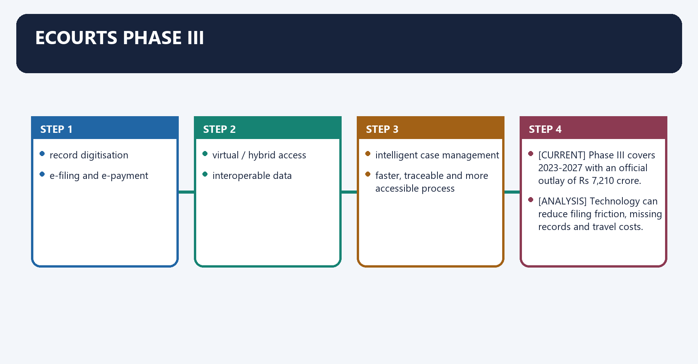
**Visual 36 - Digital justice stack**

```text
record digitisation
   + e-filing and e-payment
   + virtual / hybrid access
   + e-Sewa Kendras
   + interoperable data
   + intelligent case management
        |
        v
faster, traceable and more accessible process
```

- [CURRENT] Phase III covers 2023-2027 with an official outlay of Rs 7,210 crore.
- [CURRENT] Its objectives include digitised records, paperless courts, universal digital filing/payment capacity and data-enabled management.
- [ANALYSIS] Technology can reduce filing friction, missing records and travel costs.
- [LIMIT] Digital exclusion, cyber security, privacy, poor connectivity, language barriers and algorithmic opacity require safeguards.

#### CLOSING RECALL FLOW — ECOURTS PHASE III

```closure-flow
SUBTOPIC: eCourts Phase III
KEY TERMS / DEFINITIONS: eCourts Phase III · Phase III · Its principal consequence · Its · The decisive contrast · 2023-2027
MECHANISM / ARGUMENT: The decisive contrast is between faster, traceable and more accessible process and [CURRENT] Phase III covers 2023-2027 with an official outlay of Rs 7,210 crore.
CONSEQUENCE / CONTRAST: Its principal consequence is that intelligent case management.
UPSC TRAP / ANSWER-USE: Do not miss this limiting distinction: [CURRENT] Phase III covers 2023-2027 with an official outlay of Rs 7,210 crore. [CURRENT]...
ANSWER-GRABBING FORMULATION: The eCourts Phase III programme can reduce filing friction and improve case management, but digital exclusion, privacy, cybersecurity and algorithmic opacity require continuing safeguards.
```
### SESSION 33 — NATIONAL JUDICIAL DATA GRID AND DATA GOVERNANCE
#### DEFINITION / WHAT THIS IS CALLED

**Plain-language definition:** National Judicial Data Grid and data governance denotes the constitutional rules and institutional links organised around Digital court systems aggregate case-status and pendency information for administration and public access.

**Technical definition:** National Judicial Data Grid and data governance operates through Better data can identify age-wise backlog, bottlenecks and judge-court workload, connected with Digital court systems aggregate case-status and pendency information for administration and public access.

#### ANSWER-GRABBING OPENING — WRITE/ADAPT IN THE EXAM

> The National Judicial Data Grid can expose backlog and workload patterns, but administrative metrics must not become disposal quotas that compromise adjudicative independence.

#### MUST-WRITE KEYWORDS

- **National Judicial Data Grid**
- **data governance**
- **National Judicial Data Grid and data governance**
- **Digital**
- **Better**
- **Its principal consequence**

**How to use them:** Frame the answer through National Judicial Data Grid; define data governance, connect National Judicial Data Grid and data governance with Digital to explain the mechanism, and use Better for the decisive comparison or qualification.

National Judicial Data Grid and data governance denotes the constitutional rules and institutional links organised around [FACT] Digital court systems aggregate case-status and pendency information for administration and public access.
National Judicial Data Grid and data governance operates through [ANALYSIS] Better data can identify age-wise backlog, bottlenecks and judge-court workload, connected with [FACT] Digital court systems aggregate case-status and pendency information for administration and public access.
The operative mechanism matters because [FACT] Digital court systems aggregate case-status and pendency information for administration and public access.
Its principal consequence is that [FACT] Digital court systems aggregate case-status and pendency information for administration and public access.
The decisive contrast is between [FACT] Digital court systems aggregate case-status and pendency information for administration and public access and [FACT] Digital court systems aggregate case-status and pendency information for administration and public access.
The exam-safe limitation is that [FACT] Digital court systems aggregate case-status and pendency information for administration and public access.
- [FACT] Digital court systems aggregate case-status and pendency information for administration and public access.
- [ANALYSIS] Better data can identify age-wise backlog, bottlenecks and judge-court workload.
- [LIMIT] Administrative indicators must not become crude performance quotas that pressure adjudicative independence or reward hurried disposal.

#### CLOSING RECALL FLOW — NATIONAL JUDICIAL DATA GRID AND DATA GOVERNANCE

```closure-flow
SUBTOPIC: National Judicial Data Grid and data governance
KEY TERMS / DEFINITIONS: National Judicial Data Grid · data governance · National Judicial Data Grid and data governance · Digital · Better · Its principal consequence
MECHANISM / ARGUMENT: National Judicial Data Grid and data governance operates through Better data can identify age-wise backlog, bottlenecks and judge-court workload, connected with Digital court systems aggregate case-status and pendency information for administration and public access.
CONSEQUENCE / CONTRAST: Its principal consequence is that Digital court systems aggregate case-status and pendency information for administration and public access.
UPSC TRAP / ANSWER-USE: Do not miss this limiting distinction: the decisive contrast is between Digital court systems aggregate case-status and pendency information for...
ANSWER-GRABBING FORMULATION: The National Judicial Data Grid can expose backlog and workload patterns, but administrative metrics must not become disposal quotas that compromise adjudicative independence.
```
### SESSION 34 — GOVERNMENT LITIGATION AND CASE MANAGEMENT
#### DEFINITION / WHAT THIS IS CALLED

**Plain-language definition:** Government litigation and case management denotes the constitutional rules and institutional links organised around Problem Targeted response.

**Technical definition:** Its principal consequence is that old cases age-based docket management.

#### ANSWER-GRABBING OPENING — WRITE/ADAPT IN THE EXAM

> Reducing government litigation requires accountable appeal policy, reliable service, staffed registries and age-based case management rather than indiscriminate pressure for faster disposal.

#### MUST-WRITE KEYWORDS

- **Government litigation**
- **case management**
- **repetitive government appeals**
- **accountable litigation policy**
- **summons/service delay**
- **reliable digital and physical service**

**How to use them:** Frame the answer through Government litigation; define case management, connect repetitive government appeals with accountable litigation policy to explain the mechanism, and use summons/service delay for the decisive comparison or qualification.

Government litigation and case management denotes the constitutional rules and institutional links organised around Problem Targeted response.
Government litigation and case management operates through repetitive government appeals accountable litigation policy, connected with summons/service delay reliable digital and physical service.
The operative mechanism matters because adjournment culture reasoned limits and realistic calendars.
Its principal consequence is that old cases age-based docket management.
The decisive contrast is between vacancies predictable recommendation/recruitment pipeline and weak staff registry and process-server capacity.
The exam-safe limitation is that access barriers legal aid, e-Sewa Kendras and local language.
**Visual 37 - Reform sequence**

| Problem | Targeted response |
|---|---|
| repetitive government appeals | accountable litigation policy |
| summons/service delay | reliable digital and physical service |
| adjournment culture | reasoned limits and realistic calendars |
| old cases | age-based docket management |
| vacancies | predictable recommendation/recruitment pipeline |
| weak staff | registry and process-server capacity |
| access barriers | legal aid, e-Sewa Kendras and local language |

#### CLOSING RECALL FLOW — GOVERNMENT LITIGATION AND CASE MANAGEMENT

```closure-flow
SUBTOPIC: Government litigation and case management
KEY TERMS / DEFINITIONS: Government litigation · case management · repetitive government appeals · accountable litigation policy · summons/service delay · reliable digital and physical service
MECHANISM / ARGUMENT: Its principal consequence is that old cases age-based docket management.
CONSEQUENCE / CONTRAST: The decisive contrast is between vacancies predictable recommendation/recruitment pipeline and weak staff registry and process-server capacity.
UPSC TRAP / ANSWER-USE: Do not miss this limiting distinction: the exam-safe limitation is that access barriers legal aid, e-Sewa Kendras and local language.
ANSWER-GRABBING FORMULATION: Reducing government litigation requires accountable appeal policy, reliable service, staffed registries and age-based case management rather than indiscriminate pressure for faster disposal.
```
### SESSION 35 — JUDICIAL INDEPENDENCE AND ACCOUNTABILITY
#### DEFINITION / WHAT THIS IS CALLED

**Plain-language definition:** Judicial independence and accountability denotes the constitutional rules and institutional links organised around tenure, appointments, transfer safeguards,.

**Technical definition:** The exam-safe limitation is that Pendency alone does not prove judicial misconduct, and speed alone is not justice.

#### ANSWER-GRABBING OPENING — WRITE/ADAPT IN THE EXAM

> Independence without accountability risks opacity; accountability without independence risks political control; both without capacity produce delayed justice.

#### MUST-WRITE KEYWORDS

- **Judicial independence**
- **accountability**
- **Article 235**
- **Judicial independence and accountability**
- **Judicial**
- **Its principal consequence**

**How to use them:** Frame the answer through Judicial independence; define accountability, connect Article 235 with Judicial independence and accountability to explain the mechanism, and use Judicial for the decisive comparison or qualification.

Judicial independence and accountability denotes the constitutional rules and institutional links organised around tenure, appointments, transfer safeguards,.
Judicial independence and accountability operates through Article 235 control, review power, connected with reasoned judgments, appeal/review,.
The operative mechanism matters because ethics, transparent administration,.
Its principal consequence is that removal for proved misconduct.
The decisive contrast is between judges, staff, buildings, technology, and legal aid and case management.
The exam-safe limitation is that [LIMIT] Pendency alone does not prove judicial misconduct, and speed alone is not justice.
**Visual 38 - Balance**

```text
INDEPENDENCE
  tenure, appointments, transfer safeguards,
  Article 235 control, review power

ACCOUNTABILITY
  reasoned judgments, appeal/review,
  ethics, transparent administration,
  removal for proved misconduct

CAPACITY
  judges, staff, buildings, technology,
  legal aid and case management
```

- [ANALYSIS] Independence without accountability risks opacity; accountability without independence risks political control; both without capacity produce delayed justice.
- [LIMIT] Pendency alone does not prove judicial misconduct, and speed alone is not justice.

#### CLOSING RECALL FLOW — JUDICIAL INDEPENDENCE AND ACCOUNTABILITY

```closure-flow
SUBTOPIC: Judicial independence and accountability
KEY TERMS / DEFINITIONS: Judicial independence · accountability · Article 235 · Judicial independence and accountability · Judicial · Its principal consequence
MECHANISM / ARGUMENT: The exam-safe limitation is that Pendency alone does not prove judicial misconduct, and speed alone is not justice.
CONSEQUENCE / CONTRAST: Pendency alone does not prove judicial misconduct, and speed alone is not justice.
UPSC TRAP / ANSWER-USE: Do not miss this limiting distinction: the decisive contrast is between judges, staff, buildings, technology.
ANSWER-GRABBING FORMULATION: Independence without accountability risks opacity; accountability without independence risks political control; both without capacity produce delayed justice.
```
### SESSION 36 — ARTICLES 214-237 RAPID MAP
#### DEFINITION / WHAT THIS IS CALLED

**Plain-language definition:** Articles 214-237 rapid map denotes the constitutional rules and institutional links organised around 214 High Court for each State.

**Technical definition:** Its principal consequence is that 218 specified SC provisions applied.

#### ANSWER-GRABBING OPENING — WRITE/ADAPT IN THE EXAM

> Constitutional frame: Articles 226/227 and 235 give High Courts rights and system-management roles, but States fund infrastructure and participate in recruitment under Articles 233-234.

#### MUST-WRITE KEYWORDS

- **Articles 214-237 rapid map**
- **High Court for each State**
- **court of record and contempt**
- **constitution of High Court**
- **appointment and conditions**
- **specified SC provisions applied**

**How to use them:** Frame the answer through Articles 214-237 rapid map; define High Court for each State, connect court of record and contempt with constitution of High Court to explain the mechanism, and use appointment and conditions for the decisive comparison or qualification.

Articles 214-237 rapid map denotes the constitutional rules and institutional links organised around 214 High Court for each State.
Articles 214-237 rapid map operates through 215 court of record and contempt, connected with 216 constitution of High Court.
The operative mechanism matters because 217 appointment and conditions.
Its principal consequence is that 218 specified SC provisions applied.
The decisive contrast is between 220 post-retirement practice restriction and 223 acting Chief Justice.
The exam-safe limitation is that 224 additional and acting judges.
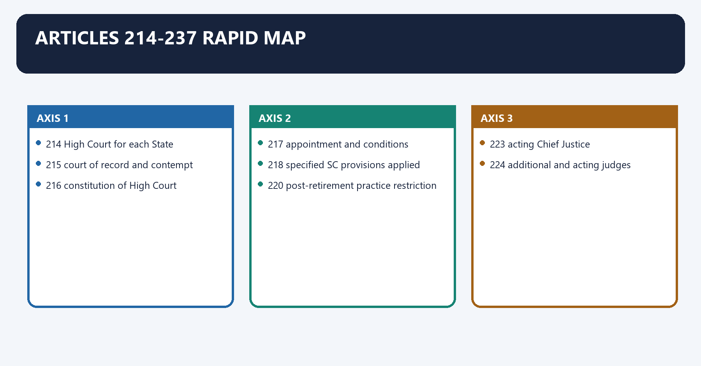
| Article | Recall |
|---:|---|
| 214 | High Court for each State |
| 215 | court of record and contempt |
| 216 | constitution of High Court |
| 217 | appointment and conditions |
| 218 | specified SC provisions applied |
| 219 | oath |
| 220 | post-retirement practice restriction |
| 221 | salaries |
| 222 | transfer |
| 223 | acting Chief Justice |
| 224 | additional and acting judges |
| 224A | retired judges sitting |
| 225 | existing jurisdiction |
| 226 | writ jurisdiction |
| 227 | superintendence |
| 228 | constitutional case withdrawal |
| 229 | officers, servants and expenses |
| 230 | extension/exclusion of jurisdiction over UTs |
| 231 | common High Court |
| 233 | district judges |
| 233A | validation provision |
| 234 | recruitment below district judge |
| 235 | High Court control |
| 236 | interpretation |
| 237 | application to magistrates |

#### CLOSING RECALL FLOW — ARTICLES 214-237 RAPID MAP

```closure-flow
SUBTOPIC: Articles 214-237 rapid map
KEY TERMS / DEFINITIONS: Articles 214-237 rapid map · High Court for each State · court of record and contempt · constitution of High Court · appointment and conditions · specified SC provisions applied
MECHANISM / ARGUMENT: Its principal consequence is that 218 specified SC provisions applied.
CONSEQUENCE / CONTRAST: The decisive contrast is between 220 post-retirement practice restriction and 223 acting Chief Justice.
UPSC TRAP / ANSWER-USE: Do not miss this limiting distinction: the exam-safe limitation is that 224 additional and acting judges.
ANSWER-GRABBING FORMULATION: Constitutional frame: Articles 226/227 and 235 give High Courts rights and system-management roles, but States fund infrastructure and participate in recruitment under Articles 233-234.
```
## BASIC MCQS / REMEDIATION

### Original MCQ loop - balanced deterministic non-patterned placement

#### OM1. Number of High Courts

India currently has:

A. 25 High Courts, some common to multiple States/UTs.
B. 28 High Courts.
C. one High Court for every State and UT.
D. one High Court for each judicial district.

**Answer: A.**

**Explanation:** [CURRENT] Article 231 permits common High Courts.

#### OM2. Court of record

Which Article makes every High Court a court of record?

A. 226.
B. 216.
C. 215.
D. 214.

**Answer: C.**

**Explanation:** [FACT] Article 215 includes contempt power.

#### OM3. Appointment

High Court judges are formally appointed by:

A. Governor.
B. CJI.
C. President.
D. Chief Minister.

**Answer: C.**

**Explanation:** [FACT] Article 217 provides presidential appointment.

#### OM4. Qualification

Which is not a High Court qualification route?

A. Distinguished jurist.
B. Ten years as High Court advocate.
C. Indian citizenship.
D. Ten years in judicial office.

**Answer: A.**

**Explanation:** [FACT] The distinguished-jurist route belongs to Supreme Court eligibility.

#### OM5. Retirement

A High Court judge ordinarily retires at:

A. 60.
B. 62.
C. 65.
D. 68.

**Answer: B.**

**Explanation:** [FACT] Supreme Court retirement is 65.

#### OM6. Oath

High Court judge oath is before:

A. President only.
B. Governor or authorised person.
C. State Speaker.
D. CJI.

**Answer: B.**

**Explanation:** [FACT] Article 219 controls.

#### OM7. Transfer

Article 222 transfer is made by:

A. Parliament.
B. Supreme Court registry.
C. Governor without consultation.
D. President after consultation with CJI.

**Answer: D.**

**Explanation:** [FACT] Collegium doctrine structures the consultation.

#### OM8. Acting Chief Justice

The relevant provision is:

A. Article 225.
B. Article 224A.
C. Article 231.
D. Article 223.

**Answer: D.**

**Explanation:** [FACT] Article 223 covers Acting Chief Justice.

#### OM9. Writ scope

Article 226 permits writs for:

A. Fundamental Rights and other legal purposes.
B. criminal appeals only.
C. Union disputes only.
D. Fundamental Rights only.

**Answer: A.**

**Explanation:** [FACT] This makes Article 226 wider in purpose than Article 32.

#### OM10. Territorial cause of action

Article 226 jurisdiction may arise where:

A. respondent is anywhere regardless of dispute.
B. cause of action arises wholly or partly within territory.
C. Supreme Court grants permission.
D. petitioner is an Indian citizen only.

**Answer: B.**

**Explanation:** [FACT] Article 226(2) controls.

#### OM11. Detention

The writ testing unlawful detention is:

A. certiorari.
B. habeas corpus.
C. quo warranto.
D. mandamus.

**Answer: B.**

**Explanation:** [FACT] It may run against public or private detention.

#### OM12. Public office

The writ challenging unlawful occupation of public office is:

A. habeas corpus.
B. prohibition.
C. quo warranto.
D. mandamus.

**Answer: C.**

**Explanation:** [FACT] It tests authority to hold public office.

#### OM13. Mandamus

Mandamus ordinarily:

A. commands performance of a public/legal duty.
B. quashes a completed order.
C. stops illegal detention.
D. transfers a judge.

**Answer: A.**

**Explanation:** [FACT] A legal duty must exist.

#### OM14. Prohibition

Prohibition generally:

A. awards compensation.
B. removes a public officer.
C. stops a lower forum before completion for jurisdictional error.
D. reviews a completed conviction on merits.

**Answer: C.**

**Explanation:** [FACT] Certiorari ordinarily quashes after the order.

#### OM15. Certiorari

Certiorari commonly:

A. commands legislation.
B. appoints a tribunal.
C. releases every prisoner.
D. quashes a jurisdictionally defective completed order.

**Answer: D.**

**Explanation:** [FACT] It is corrective rather than preventive.

#### OM16. Alternative remedy

The alternative-remedy rule is:

A. a discretionary rule with recognised exceptions.
B. applicable even to every jurisdictional nullity.
C. an absolute constitutional bar.
D. a repeal of Article 226.

**Answer: A.**

**Explanation:** [FACT] Rights, natural justice and jurisdictional failures may justify direct writ relief.

#### OM17. Basic Structure

Which case protects High Court review of tribunals?

A. *Kesavananda* alone.
B. *Kihoto Hollohan*.
C. *S.R. Bommai*.
D. *L. Chandra Kumar*.

**Answer: D.**

**Explanation:** [FACT] Articles 226/227 review cannot be excluded.

#### OM18. Superintendence

Article 227 concerns:

A. presidential election.
B. State finance.
C. judicial appointments only.
D. High Court superintendence over territorial courts and tribunals.

**Answer: D.**

**Explanation:** [FACT] Armed-Forces-law forums are excluded.

#### OM19. Constitutional withdrawal

Article 228 permits withdrawal where a case involves:

A. any factual dispute.
B. a substantial constitutional-interpretation question.
C. a minor procedural error.
D. a political disagreement.

**Answer: B.**

**Explanation:** [FACT] High Court may decide the question or whole case.

#### OM20. Common High Court

Common High Courts are authorised by:

A. Article 235.
B. Article 226.
C. Article 214 alone.
D. Article 231.

**Answer: D.**

**Explanation:** [FACT] Article 231 accommodates multi-jurisdiction courts.

#### OM21. District judge appointment

District judges are appointed by:

A. President.
B. Governor in consultation with High Court.
C. High Court alone.
D. State PSC alone.

**Answer: B.**

**Explanation:** [FACT] Article 233.

#### OM22. Lower judicial service

Article 234 requires consultation with:

A. Election Commission and CJI.
B. State PSC and High Court.
C. Finance Commission and Governor.
D. UPSC and Parliament.

**Answer: B.**

**Explanation:** [FACT] Governor appoints under the consultation-based rules.

#### OM23. Control

Control over district and subordinate courts is vested in:

A. Supreme Court registry.
B. State Cabinet.
C. High Court.
D. Governor personally.

**Answer: C.**

**Explanation:** [FACT] Article 235 protects independence.

#### OM24. District and Sessions Judge

Which is accurate?

A. The same officer is District Judge on civil side and Sessions Judge on criminal side.
B. District Judge handles only constitutional writs.
C. Sessions Judge is below Magistrate.
D. They are always different offices.

**Answer: A.**

**Explanation:** [FACT] Functional designation changes with jurisdiction.

#### OM25. Death sentence

A Sessions Court death sentence:

A. requires High Court confirmation.
B. is confirmed by Governor alone.
C. becomes final immediately.
D. requires Assembly approval.

**Answer: A.**

**Explanation:** [FACT] High Court confirmation is mandatory.

#### OM26. Legal aid

Article 39A concerns:

A. contempt.
B. judicial transfer.
C. equal justice and free legal aid.
D. High Court retirement.

**Answer: C.**

**Explanation:** [FACT] The Legal Services Authorities Act implements the framework.

#### OM27. Ordinary Lok Adalat

If settlement fails, an ordinary Lok Adalat:

A. does not adjudicate the contested merits.
B. convicts the accused.
C. transfers the judge.
D. imposes arbitration.

**Answer: A.**

**Explanation:** [FACT] Its core mode is consensual settlement.

#### OM28. Criminal scope

Lok Adalat may settle:

A. no civil dispute.
B. every criminal offence.
C. compoundable criminal matters.
D. non-compoundable offences.

**Answer: C.**

**Explanation:** [FACT] Non-compoundable offences are excluded.

#### OM29. AIJS route

AIJS creation requires first:

A. State PSC resolution.
B. Supreme Court ordinance.
C. Rajya Sabha resolution under Article 312.
D. Governor conference only.

**Answer: C.**

**Explanation:** [FACT] The resolution needs at least two-thirds present and voting.

#### OM30. AIJS floor

Article 312(3) means AIJS cannot include:

A. reserved categories.
B. district judges.
C. judicial training.
D. posts below district judge.

**Answer: D.**

**Explanation:** [FACT] This is an express constitutional limit.

#### OM31. AIJS status

As of 18 August 2026:

A. AIJS has replaced State services.
B. no AIJS is operational.
C. Article 235 is repealed.
D. UPSC recruits every civil judge.

**Answer: B.**

**Explanation:** [CURRENT] Recruitment remains under State constitutional structures.

#### OM32. eCourts Phase III

Its period and approved outlay are:

A. 2023-2027, Rs 7,210 crore.
B. 2026-2030, Rs 50,000 crore.
C. permanent, no approved scheme.
D. 2020-2025, Rs 1,000 crore.

**Answer: A.**

**Explanation:** [CURRENT] Phase III focuses on digitised and paperless justice systems.

#### OM33. Digital justice

Which is a sound qualification?

A. case data should determine merits.
B. e-filing cannot replace judges, staff and procedural fairness.
C. virtual hearings remove digital exclusion.
D. technology automatically eliminates pendency.

**Answer: B.**

**Explanation:** [ANALYSIS] Technology is an enabler, not adjudication itself.

#### OM34. Vacancy data

High Court vacancy numbers should be:

A. inferred from case count.
B. memorised permanently.
C. treated as constitutional text.
D. cited from a dated official source.

**Answer: D.**

**Explanation:** [CURRENT/LIMIT] Working and sanctioned strength change.

#### OM35. NJAC

As of August 2026:

A. judges are elected.
B. NJAC appoints High Court judges.
C. collegium remains operative; NJAC is not in force.
D. Governors appoint through State commissions.

**Answer: C.**

**Explanation:** [CURRENT] The 2015 decision invalidated the NJAC framework.

#### OM36. High Court role

The best description is:

A. only State executive adviser.
B. only an appellate criminal court.
C. tribunal without constitutional status.
D. constitutional rights court, appellate court, supervisor and district-judiciary controller.

**Answer: D.**

**Explanation:** [ANALYSIS] Articles 215, 226-228 and 235 create the combined role.

### Remedial MCQs - strict B -> B -> C -> D rotation

#### R1. Age trap

High Court retirement age:

A. 62.
B. 60.
C. no retirement.
D. 65.

**Answer: A.**

**Remedy:** HC 62; SC 65.

#### R2. Oath trap

Oath is before:

A. Lok Sabha Speaker.
B. Chief Minister.
C. President only.
D. Governor or authorised person.

**Answer: D.**

**Remedy:** Appointment by President, oath before Governor.

#### R3. Writ trap

Wider in purpose:

A. Article 136.
B. Article 226.
C. Article 227.
D. Article 32.

**Answer: B.**

**Remedy:** Article 226 covers FRs plus other legal purposes.

#### R4. Prohibition-certiorari trap

The completed order is ordinarily quashed by:

A. habeas corpus.
B. prohibition.
C. certiorari.
D. mandamus.

**Answer: C.**

**Remedy:** Prohibition prevents; certiorari corrects after order.

#### R5. Common-HC trap

The Constitution permits:

A. one High Court for multiple States/UTs.
B. no UT jurisdiction.
C. one High Court per district only.
D. only 28 High Courts.

**Answer: A.**

**Remedy:** Article 231.

#### R6. District appointment trap

District judges:

A. are elected.
B. are appointed by High Court alone.
C. are appointed by SPSC alone.
D. are appointed by Governor in consultation with High Court.

**Answer: D.**

**Remedy:** Article 233.

#### R7. Control trap

Posting and promotion control belongs to:

A. Governor personally.
B. High Court.
C. Parliament.
D. State Cabinet.

**Answer: B.**

**Remedy:** Article 235.

#### R8. AIJS trap

AIJS:

A. already recruits all judges.
B. includes every magistrate automatically.
C. is not operational and cannot include posts below district judge.
D. needs only an executive order.

**Answer: C.**

**Remedy:** Articles 312 and 312(3).

#### R9. Court-of-record trap

Article 215 includes:

A. AIJS.
B. writ territorial extension.
C. contempt power.
D. district appointment.

**Answer: C.**

**Remedy:** Court of record and contempt.

#### R10. Article 227 trap

Article 227 is:

A. superintendence over courts/tribunals except Armed-Forces-law forums.
B. judicial removal.
C. only an appeal.
D. a Fundamental Right.

**Answer: A.**

**Remedy:** Supervision is not routine factual reappraisal.

#### R11. Lok Adalat trap

Ordinary Lok Adalat may settle:

A. every criminal prosecution.
B. constitutional removal proceedings.
C. non-compoundable offences.
D. compoundable criminal and civil disputes by settlement.

**Answer: D.**

**Remedy:** Consent and compoundability control.

#### R12. Technology trap

eCourts Phase III:

A. abolishes physical courts.
B. digitises and improves process but does not replace adjudication.
C. decides cases algorithmically.
D. replaces Article 226.

**Answer: B.**

**Remedy:** Treat technology as capacity infrastructure.

## PYQS AND ANSWER PRACTICE

### Verified/cross-owned Mains PYQs

#### PYQ 1 - UPSC GS-II 2024, Q2 - access-to-justice application

**Verified neutral demand:** Explain and distinguish Lok Adalats and Arbitration Tribunals, including whether they entertain civil and criminal matters.  
**10 marks | 150 words | Primary detailed owner: Lok Adalats/Administrative Tribunals; application here: subordinate justice**

**Model answer**

**Claim:** [FACT] Lok Adalat is a statutory settlement institution serving access to justice; arbitration is consensual private adjudication of arbitrable civil disputes.

**Named evidence:** The Legal Services Authorities Act, 1987 authorises Lok Adalats. They facilitate compromise, and an agreed award is final, binding and decree-like. Ordinary Lok Adalats cannot decide a contested case on merits if settlement fails. They may settle civil disputes and compoundable criminal offences, never non-compoundable offences.

Arbitration arises from an arbitration agreement under the Arbitration and Conciliation Act. The tribunal hears evidence and renders an arbitral award subject to limited statutory challenge. It handles arbitrable civil/commercial disputes, not criminal prosecution.

**Qualification:** Permanent Lok Adalats for public-utility services have a distinct statutory conciliation-cum-adjudication role after failed settlement; they should not be equated with ordinary Lok Adalats.

**Verdict:** Both reduce ordinary-court burden, but Lok Adalat is access-oriented consensual justice, while arbitration is party-chosen adjudication.

**Evidence chain:** Article 39A -> Legal Services Authorities Act -> compromise/compoundable limit -> arbitration agreement -> civil-commercial field.

#### PYQ 2 - UPSC GS-II 2025, Q13 - appointments application

**Verified neutral demand:** Critically examine the collegium system of judicial appointments in India with comparison to the United States.  
**15 marks | 250 words | Primary owner: Polity 18; application here: High Court appointments**

**Model answer**

**Claim:** [FACT] India's collegium prioritises judicial independence through judicial primacy, while the United States uses presidential nomination and Senate confirmation, making political accountability more explicit.

**Indian mechanism:** Article 217 text provides presidential appointment after consultation with the CJI, Governor and High Court Chief Justice. The Judges Cases transformed consultation into collegium primacy. For High Court appointments, the originating Chief Justice consults two senior colleagues and the Supreme Court collegium of the CJI plus two senior-most judges considers the proposal. The NJAC was struck down in 2015.

**Strengths:** insulation from direct executive control, professional evaluation and protection of Basic Structure independence.

**Weaknesses:** opacity, limited published criteria, delays, uneven diversity and diffused responsibility.

**US comparison:** open nomination/confirmation increases public scrutiny but also permits ideological polarisation and partisan delay.

**Reform:** publish objective criteria and timelines, create a appointments secretariat, disclose reasoned outcomes consistent with privacy, broaden the candidate pool and make executive objections timely.

**Verdict:** India should reform, not politically capture, the collegium. Independence requires judicial primacy; legitimacy requires transparent, timely and diverse selection.

**Evidence chain:** Article 217 -> Judges Cases -> HC and SC collegium stages -> NJAC case -> US nomination-confirmation -> targeted reform.

### Routed Prelims demands - provenance without invented answer letters

#### Prelims route 1 - 2019 GS-I Q81 - cross-owned

**Verified neutral demand:** High Court jurisdiction and Supreme Court review powers.

**Doctrinal solution**

- [FACT] Article 226 covers Fundamental Rights and other legal purposes.
- [FACT] Article 32 directly enforces Fundamental Rights.
- [FACT] Supreme Court appellate/review authority does not erase High Court constitutional jurisdiction.
- [FACT] *L. Chandra Kumar* protects Articles 226/227 review as Basic Structure.

**Elimination rule:** Reject any proposition that tribunalisation or Supreme Court appellate authority wholly excludes High Court review.

#### Prelims route 2 - 2021 GS-I Q88 - cross-owned

**Verified neutral demand:** Retired Supreme Court judges and High Court powers.

**Doctrinal solution**

- [FACT] Article 224A concerns retired High Court judges requested to sit in a High Court.
- [FACT] Article 128 separately concerns retired Supreme Court judges sitting in the Supreme Court.
- [FACT] A High Court's Article 226/227 powers remain institutionally distinct.

**Elimination rule:** Do not transfer Article 128 arrangements to Article 224A or treat a recalled retiree as a permanent judge.

### Original solved Mains practice

#### M1. "Article 226 makes the High Court the everyday constitutional court." Analyse. (10 marks, 150 words)

**Model answer**

**Claim:** [FACT] Article 226 makes the High Court the locally accessible guardian of both Fundamental Rights and ordinary legal rights.

**Named evidence:** Unlike Article 32, it authorises writs for Fundamental Rights "and any other purpose." Article 226(2) connects jurisdiction to cause of action. *L. Chandra Kumar* protects Articles 226/227 review as Basic Structure and keeps tribunal decisions under High Court scrutiny.

**Analysis:** Citizens can challenge detention, jurisdictional error, public-duty failure and unlawful office without first converting every grievance into a Supreme Court case. Local access and broad purpose make the High Court the working constitutional court.

**Qualification:** [LIMIT] Relief is discretionary; adequate alternative remedies ordinarily matter, and territorial limits remain.

**Verdict:** Article 32 is the guaranteed national remedy for Fundamental Rights; Article 226 is the broader everyday rule-of-law jurisdiction.

#### M2. Compare Articles 32 and 226. (10 marks, 150 words)

**Model answer**

**Claim:** [FACT] Both enforce constitutional legality through writs, but they differ in nature, purpose, discretion and territorial reach.

**Comparison:** Article 32 is itself a Fundamental Right, lies in the Supreme Court and primarily enforces Fundamental Rights across India. Article 226 is a High Court power covering Fundamental Rights and other legal purposes, making it wider substantively. A High Court may apply the alternative-remedy rule, while Article 32 carries stronger remedial entitlement. Article 226 remains territorially linked, including cause-of-action jurisdiction.

**Common control:** *L. Chandra Kumar* places review under Articles 32 and 226/227 within Basic Structure.

**Verdict:** Article 32 guarantees the constitutional door; Article 226 places a wider door near the citizen. They are complementary, not hierarchical substitutes.

#### M3. Examine how Articles 227 and 235 secure the independence of the subordinate judiciary. (15 marks, 250 words)

**Model answer**

**Claim:** [FACT] Article 227 protects adjudicative legality through supervision, while Article 235 protects institutional independence through administrative control.

**Mechanism:** Article 227 gives High Courts judicial and administrative superintendence over territorial courts and tribunals, excluding Armed-Forces-law forums. It corrects grave jurisdictional and procedural failure without becoming a routine appeal. Article 235 vests posting, promotion, leave and disciplinary control over district and subordinate courts in the High Court.

**Supporting design:** Article 233 requires Governor-High Court consultation for district judges; Article 234 adds State PSC consultation for lower recruitment. Article 228 lets the High Court withdraw substantial constitutional-interpretation questions.

**Analysis:** Trial judges frequently decide cases involving State authorities. Executive control over their careers would threaten impartiality; High Court control separates administration from litigant government.

**Qualification:** Recruitment, finance and infrastructure remain shared with the State, while High Court control itself must follow law and natural justice.

**Verdict:** Articles 227 and 235 make the High Court the head, not merely the appellate apex, of an independent State judiciary.

#### M4. Critically examine the constitutional safeguards for High Court independence. (15 marks, 250 words)

**Model answer**

**Claim:** [FACT] High Court independence is secured through tenure, appointments, protected conditions, difficult removal, transfer consultation and un-excludable review.

**Evidence:** Article 217 provides presidential appointment with constitutional consultation and retirement at 62. Removal requires the Article 124(4)-type special-majority process. Article 221 protects conditions; Article 222 requires CJI consultation for transfer. Article 215 supplies court-of-record authority, while Articles 226/227 review is Basic Structure under *L. Chandra Kumar*. Article 235 protects control over lower courts.

**Weaknesses:** Collegium opacity, appointment delay, perceived punitive transfers, post-retirement incentives, vacancies and infrastructure gaps may weaken practical independence and public confidence.

**Counterpoint:** Full public disclosure may harm candidate privacy, and executive participation is legitimate in a constitutional appointment.

**Reform:** transparent criteria, appointment calendars, reasoned institutional dialogue, diversity, permanent secretariat and predictable infrastructure funding.

**Verdict:** The constitutional design is strong against direct control; delivery now depends on making appointments and administration timely, transparent and capacity-rich.

#### M5. Should India establish an All India Judicial Service? Discuss. (15 marks, 250 words)

**Model answer**

**Claim:** [ANALYSIS] AIJS can improve recruitment coordination and diversity, but only if it preserves the federal and High Court controls embedded in Articles 233-235.

**Constitutional route:** Article 312 requires a Rajya Sabha resolution supported by two-thirds present and voting, followed by parliamentary law. Article 312(3) excludes posts below district judge.

**Case for:** national talent pool, uniform standards, predictable recruitment, professional training, diversity and faster district-judge vacancies.

**Case against:** local language and State law are essential; centralisation may weaken High Court control and State reservation/service structures; a national examination cannot fix infrastructure, staff or retention.

**Design safeguards:** district-judge entry only, strong High Court role in selection/probation/control, State language testing, local-law training, federal consultation, reservation and transparent cadre allocation.

**Current status:** [CURRENT] No AIJS is operational as of 18 August 2026.

**Verdict:** AIJS is desirable as a cooperative recruitment framework, not a central takeover. Uniform entry must coexist with local competence and Article 235 control.

#### M6. Judicial pendency is a governance problem, not merely a judicial problem. Analyse. (15 marks, 250 words)

**Model answer**

**Claim:** [ANALYSIS] Pendency emerges from the entire justice chain: legislation, policing, prosecution, government litigation, judicial vacancies, procedure, infrastructure and citizen access.

**Causes:** delayed appointments, weak registries, repeated adjournments, service failures, frequent State appeals, complex statutes, forensic/prosecution gaps and uneven lower-court capacity.

**Consequences:** undertrial hardship, commercial uncertainty, weak rights enforcement, higher legal cost and pressure for tribunals or executive settlement.

**Constitutional frame:** Articles 226/227 and 235 give High Courts rights and system-management roles, but States fund infrastructure and participate in recruitment under Articles 233-234. Article 39A makes access a public obligation.

**Reforms:** fill posts through calendars, strengthen staff and service, use age-based docket management, responsible government litigation, mediation/legal aid, eCourts safeguards and process simplification.

**Qualification:** [LIMIT] Disposal targets must not reward hurried justice or compromise independence.

**Verdict:** Courts must manage cases, but governments must stop creating avoidable litigation and fund the institutions that constitutional remedies require.

#### M7. Evaluate eCourts Phase III as an access-to-justice reform. (20 marks, 250 words)

**Model answer**

**Claim:** [CURRENT] eCourts Phase III is a major justice-infrastructure programme, not a replacement for judges or adjudication.

**Design:** Approved for 2023-2027 with Rs 7,210 crore, it seeks record digitisation, e-filing, e-payment, paperless workflows, e-Sewa Kendras, interoperable data and intelligent case management.

**Benefits:** reduces travel and filing cost, improves record retrieval, supports hybrid hearings, tracks case age, enables transparent listing and aids administrators in finding bottlenecks. District litigants and lawyers may gain most where physical distance is large.

**Risks:** digital divide, inaccessible interfaces, language exclusion, cyberattacks, privacy leakage, poor scanning quality, unreliable connectivity and algorithmic scheduling without reasons.

**Safeguards:** assisted access through e-Sewa Kendras, open standards, local languages, cyber audits, data minimisation, human control over listing/merits, physical alternatives and user training.

**Qualification:** [LIMIT] Faster digital movement cannot cure vacancies, weak legal aid or poor investigation.

**Verdict:** Phase III can convert courts from paper-bound institutions into accessible public infrastructure only if digital-by-default never becomes digital-only.

#### M8. "High Courts combine constitutional adjudication with judicial administration." Evaluate the strengths and strains of this dual role. (20 marks, 250 words)

**Model answer**

**Claim:** [FACT] High Courts protect rights under Article 226 while supervising and administering the lower judiciary through Articles 227 and 235.

**Strengths:** The same constitutional court can identify systemic illegality, correct subordinate forums, ensure uniform precedent, control judicial careers and withdraw constitutional questions under Article 228. Integration protects district judges from the executive and connects administration to adjudicative standards.

**Strains:** Writ caseload, civil/criminal appeals, vacancies, registry management and disciplinary administration compete for time. Excessive Article 227 intervention may become a second appeal; weak administration can delay rights cases. Centralised High Court control may also overlook district-level management needs.

**Reform:** professional court administration, delegated registry authority with judicial oversight, data-based case flow without disposal quotas, regular inspections, district leadership training, timely appointments and separate administrative time.

**Qualification:** [LIMIT] Administrative professionalisation must not transfer decisional control to the executive or opaque technology vendors.

**Verdict:** The dual role is constitutionally valuable because it unifies rights and independence; it needs specialised management capacity so administration supports rather than consumes adjudication.

## OPTIONAL ADVANCED DEPTH — NOT REQUIRED FOR A CORE ANSWER

### 37. Article 226 versus Article 227 in answer writing

Article 226 versus Article 227 in answer writing denotes the constitutional rules and institutional links organised around Question Article 226 Article 227.
Article 226 versus Article 227 in answer writing operates through Primary function public-law remedy systemic supervision, connected with Typical trigger petition alleging legal/right violation jurisdictional or grave supervisory defect.
The operative mechanism matters because writ language expressly named writs/orders/directions superintendence.
Its principal consequence is that suo motu ordinarily petition-based can be suo motu.
The decisive contrast is between Remedy style direct constitutional relief correction/control of subordinate forum and Question Article 226 Article 227.
The exam-safe limitation is that question Article 226 Article 227.
| Question | Article 226 | Article 227 |
|---|---|---|
| Primary function | public-law remedy | systemic supervision |
| Typical trigger | petition alleging legal/right violation | jurisdictional or grave supervisory defect |
| Writ language | expressly named writs/orders/directions | superintendence |
| Suo motu | ordinarily petition-based | can be suo motu |
| Remedy style | direct constitutional relief | correction/control of subordinate forum |

### 38. High Court versus Supreme Court

High Court versus Supreme Court denotes the constitutional rules and institutional links organised around Dimension High Court Supreme Court.
High Court versus Supreme Court operates through Constitutional remedy Article 226 Article 32, connected with Purpose FRs and other legal rights FRs under Article 32.
The operative mechanism matters because original civil work selected HCs federal/original constitutional fields.
Its principal consequence is that supervision of district courts Articles 227/235 no equivalent daily State administration.
The decisive contrast is between Court count 25 institutions one Supreme Court and Dimension High Court Supreme Court.
The exam-safe limitation is that dimension High Court Supreme Court.
| Dimension | High Court | Supreme Court |
|---|---|---|
| Constitutional remedy | Article 226 | Article 32 |
| Purpose | FRs and other legal rights | FRs under Article 32 |
| Retirement | 62 | 65 |
| Original civil work | selected HCs | federal/original constitutional fields |
| Supervision of district courts | Articles 227/235 | no equivalent daily State administration |
| Court count | 25 institutions | one Supreme Court |

### 39. Appointment reform matrix

Appointment reform matrix denotes the constitutional rules and institutional links organised around Reform Benefit Risk/qualification.
Appointment reform matrix operates through published selection criteria transparency privacy and reputational fairness, connected with appointment calendar vacancy reduction cannot override constitutional consultation.
The operative mechanism matters because diverse candidate pool representation and legitimacy merit must be substantively defined.
Its principal consequence is that reasoned reconsideration accountable executive-collegium dialogue sensitive material may require confidentiality.
The decisive contrast is between permanent secretariat institutional memory design must preserve judicial independence and Reform Benefit Risk/qualification.
The exam-safe limitation is that reform Benefit Risk/qualification.
| Reform | Benefit | Risk/qualification |
|---|---|---|
| published selection criteria | transparency | privacy and reputational fairness |
| appointment calendar | vacancy reduction | cannot override constitutional consultation |
| diverse candidate pool | representation and legitimacy | merit must be substantively defined |
| reasoned reconsideration | accountable executive-collegium dialogue | sensitive material may require confidentiality |
| permanent secretariat | institutional memory | design must preserve judicial independence |

### 40. Answer-writing evidence discipline

Answer-writing evidence discipline denotes the constitutional rules and institutional links organised around ARTICLE / CASE / OFFICIAL PROGRAMME.
Answer-writing evidence discipline operates through DIRECTIVE-SPECIFIC VERDICT, connected with Claim: High Court control protects district judicial independence.
The operative mechanism matters because named evidence: Articles 233-235.
Its principal consequence is that mechanism: consultation for appointments and High Court control over posting/promotion/leave.
The decisive contrast is between Analysis: removes direct State-executive leverage and Qualification: recruitment and infrastructure remain shared responsibilities.
The exam-safe limitation is that verdict: independence requires High Court control plus coordinated capacity.
**Visual 39 - Evidence chain**

```text
CLAIM
 -> ARTICLE / CASE / OFFICIAL PROGRAMME
 -> MECHANISM
 -> ANALYSIS
 -> QUALIFICATION
 -> DIRECTIVE-SPECIFIC VERDICT
```

**Example**

- Claim: High Court control protects district judicial independence.
- Named evidence: Articles 233-235.
- Mechanism: consultation for appointments and High Court control over posting/promotion/leave.
- Analysis: removes direct State-executive leverage.
- Qualification: recruitment and infrastructure remain shared responsibilities.
- Verdict: independence requires High Court control plus coordinated capacity.

## CONSOLIDATED REGISTER NOTES

### Integrated judicial chain

```text
Supreme Court
   |
High Courts: Articles 214-231
   |
District and subordinate judiciary: Articles 233-237
```

- High Court = constitutional rights court + appellate court + supervisor + administrative controller.
- India has 25 High Courts; Article 231 permits common HCs.
- Articles 226/227 review is part of Basic Structure.

### High Court judge quick facts

| Item | Rule |
|---|---|
| Appointment | President under Article 217 |
| Constitutional consultation | CJI, Governor, and HC CJ for puisne judge |
| Collegium stage | CJI + two senior-most SC judges |
| Qualification | citizen + 10 judicial years or 10 advocacy years |
| Distinguished jurist | not an HC route |
| Oath | Governor/authorised person, Article 219 |
| Retirement | 62 |
| Transfer | President after CJI consultation, Article 222 |
| Removal | same stringent standard as SC judge |

### Temporary judges

- Article 223: Acting Chief Justice.
- Article 224: additional and acting judges.
- Article 224A: retired High Court judge requested to sit, with President's prior consent.

### Jurisdiction

| Power | Anchor |
|---|---|
| Court of record/contempt | Article 215 |
| Writs | Article 226 |
| Superintendence | Article 227 |
| Constitutional withdrawal | Article 228 |
| District control | Article 235 |
| Judicial review | Basic Structure; *L. Chandra Kumar* |

### Five writs

- Habeas corpus: test detention.
- Mandamus: command legal/public duty.
- Prohibition: stop jurisdictional excess before completion.
- Certiorari: quash completed jurisdictional error.
- Quo warranto: test title to public office.

### Article 32 versus 226

| Article 32 | Article 226 |
|---|---|
| Fundamental Right | constitutional power |
| FR enforcement | FRs plus other legal purposes |
| Supreme Court | High Court |
| all-India reach | territorial/cause-of-action reach |
| stronger remedial entitlement | discretionary, alternative-remedy discipline |

### Subordinate judiciary

- Article 233: district judges appointed by Governor in consultation with HC.
- Outside-service district-judge candidate: seven years as advocate/pleader plus HC recommendation.
- Article 234: lower judicial service through Governor's rules with SPSC and HC consultation.
- Article 235: HC control over posting, promotion, leave and discipline.
- District Judge = Sessions Judge on criminal side.
- Death sentence requires HC confirmation.

### Access institutions

- Article 39A: equal justice and free legal aid.
- Legal Services Authorities Act, 1987: NALSA-SLSA-DLSA-Taluk framework.
- Ordinary Lok Adalat: consensual settlement; compoundable criminal matters only.
- Permanent Lok Adalat: distinct pre-litigation public-utility model with statutory merits power after conciliation failure.
- Arbitration: private consensual adjudication of arbitrable civil/commercial disputes.

### Current reforms

- Collegium remains operative; NJAC not in force.
- AIJS is not operational.
- AIJS route: Article 312 Rajya Sabha resolution plus parliamentary law.
- Article 312(3): no posts below district judge.
- eCourts Phase III: 2023-2027, Rs 7,210 crore.
- Vacancy and pendency numbers must be cited from a dated official dashboard.

### Answer-writing evidence bank

| Claim | Named evidence | Qualification |
|---|---|---|
| HC is widest local rights court | Article 226 | territorial and discretionary limits |
| review cannot be excluded | *L. Chandra Kumar* | tribunals still operate |
| lower judiciary independent | Articles 233-235 | capacity is shared responsibility |
| transfer needs safeguards | Article 222 and collegium | consent not constitutionally required |
| AIJS may improve recruitment | Article 312 | posts below district judge excluded |
| digital courts improve access | eCourts Phase III | digital cannot become digital-only |
| legal aid widens justice | Article 39A and 1987 Act | settlement forums cannot replace courts |

### Final verdicts

- **High Court:** the everyday constitutional court and head of the State judicial system.
- **Article 226:** wider in purpose than Article 32, but territorially and discretionarily disciplined.
- **Subordinate independence:** built through High Court consultation and Article 235 control.
- **AIJS:** possible only as cooperative reform preserving local language and High Court authority.
- **Digital justice:** public infrastructure that must remain assisted, secure and human-controlled.

### Last-minute traps

1. 25 High Courts, not one per State/UT.
2. HC retirement 62; SC retirement 65.
3. President appoints; Governor administers oath.
4. No distinguished-jurist route for HC.
5. Article 226 wider in purpose; Article 32 wider nationally and itself a FR.
6. Prohibition prevents; certiorari quashes.
7. Article 227 supervision is not a routine appeal.
8. Article 228 requires a substantial constitutional-interpretation question.
9. District judge: Governor + HC consultation.
10. Article 234: SPSC + HC consultation.
11. Article 235 control belongs to HC.
12. AIJS is not operational and cannot include posts below district judge.
13. Ordinary Lok Adalat cannot decide contested merits after settlement fails.
14. eCourts does not replace judges, staff or due process.

### COMPLETE TOPIC ASCII MASTER FLOW DIAGRAM


#### ASCII MASTER FLOW — PANEL 1/9: One hierarchy, constitutionally significant High Courts

```ascii-master
SUPREME COURT
     |
HIGH COURT: constitutional court + appellate court + judicial administrator
     |
DISTRICT AND SUBORDINATE COURTS: ordinary civil/criminal justice.

ARTICLES 214-231 -> High Courts | ARTICLES 233-237 -> subordinate courts.

CURRENT STRUCTURE
25 High Courts; Parliament may establish a common High Court for two or more States/UTs.

INTEGRATED DOES NOT ERASE DECENTRALISED CONTROL
High Court Article 226 access + Article 227 superintendence + Article 235 control
make it the everyday constitutional and administrative court within its territory.
```

#### ASCII MASTER FLOW — PANEL 2/9: High Court appointments, qualification and independence

```ascii-master
ARTICLE 217 APPOINTMENT
President appoints after the constitutionally required consultation architecture
operating through the higher-judiciary collegium system.

QUALIFICATION
Indian citizen + ten years in judicial office OR ten years as High Court advocate.

SERVICE
oath before Governor or appointee | retirement 62 | removal through Article 124(4)-type route
| protected salary and conditions | charged expenditure | post-retirement practice limits.

APPOINTMENT CASE ARC
First Judges Case (1981) -> executive primacy
Second Judges Case (1993) -> judicial primacy
Third Judges Case (1998) -> plural collegium
Fourth Judges Case (2015) -> NJAC invalid; collegium remains operative.
```

#### ASCII MASTER FLOW — PANEL 3/9: Transfer, acting/additional judges and common High Courts

```ascii-master
ARTICLE 222 TRANSFER
President transfers after CJI consultation; public interest and judicial independence govern.
Sankalchand Himmatlal Sheth (1977) -> transfer power exists;
consultation must be full and effective.

TEMPORARY CAPACITY
Article 223 acting Chief Justice
Article 224 additional and acting judges for arrears or temporary need
Article 224A retired-judge sitting with consent
Article 231 common High Court by parliamentary law.

TRAPS
additional judge is not a lower rank | common High Court does not merge States
| transfer is not ordinary executive service management | vacancy data are dynamic.
```

#### ASCII MASTER FLOW — PANEL 4/9: Original, appellate, writ and territorial jurisdiction

```ascii-master
ORIGINAL
constitutional/statutory matters and specified civil jurisdictions depend on law and court history.

APPELLATE
civil + criminal appeals from subordinate hierarchy;
death sentence requires High Court confirmation.

ARTICLE 226 WRIT
Fundamental Rights + any other legal right; habeas corpus may reach private detention;
public-duty mandamus may reach a non-State body.

TERRITORIAL RULE
seat/respondent connection plus Article 226(2) cause of action wholly or partly within territory.

FIVE WRITS
habeas corpus | mandamus | prohibition | certiorari | quo warranto:
choose by wrong, target, timing and remedy, not by memorised definition alone.
```

#### ASCII MASTER FLOW — PANEL 5/9: Article 226 versus 32, superintendence and control

```ascii-master
ARTICLE 32                         ARTICLE 226
Supreme Court                       High Court
itself a Fundamental Right          constitutional power, not a Part III right
Fundamental Rights                  Fundamental Rights + other legal rights
national apex route                 territorial cause-of-action route

ARTICLE 227
superintendence over courts and tribunals within territory, subject to constitutional exclusions.

ARTICLE 228
withdraw case involving a substantial constitutional question and decide or return it.

ARTICLE 235
High Court control over district and subordinate judiciary protects decisional independence.

L. Chandra Kumar (1997) -> Articles 226/227 and 32 review are Basic Structure;
tribunals supplement but cannot wholly replace constitutional courts.
```

#### ASCII MASTER FLOW — PANEL 6/9: District judges and subordinate judicial independence

```ascii-master
ARTICLE 233 DISTRICT JUDGES
Governor appoints in consultation with High Court;
direct Bar recruit requires at least seven years as advocate/pleader and High Court recommendation.

ARTICLE 234 OTHER JUDICIAL SERVICE
Governor makes appointments under rules after consultation with State PSC and High Court.

ARTICLE 235 CONTROL
posting, promotion, leave and discipline under High Court control, subject to legal safeguards.

ARTICLE 50
State shall separate judiciary from executive in public services.

Chandra Mohan (1966) -> executive dominance over district-judge selection violates
the constitutional scheme of an independent judicial service.
```

#### ASCII MASTER FLOW — PANEL 7/9: Gram Nyayalayas, tribunals and the AIJS debate

```ascii-master
GRAM NYAYALAYAS ACT, 2008
bounded statutory local-court model for notified areas; establishment and functioning are uneven.

TRIBUNALS
specialisation + speed potential
VERSUS appointments, tenure, executive control and fragmented appeals.
L. Chandra Kumar (1997) keeps High Court judicial review as the constitutional floor.

ALL INDIA JUDICIAL SERVICE
Article 312 route -> Rajya Sabha two-thirds of members present and voting
-> parliamentary law; Article 312(3) excludes posts below district judge.

DEBATE
national standards and vacancies versus language, local law, federal control and career integration.
CURRENT STATUS: no AIJS has been created.
```

#### ASCII MASTER FLOW — PANEL 8/9: Vacancies, pendency, legal aid and eCourts

```ascii-master
DELIVERY BOTTLENECK
vacancies + infrastructure + process delay + adjournments + government litigation
-> pendency -> cost -> unequal bargaining -> reduced trust.

ACCESS LAYER
Article 39A legal aid | NALSA/SLSA/DLSA | Lok Adalats | e-Sewa Kendras.
Speedy-trial access principles belong to the wider rights chain;
do not equate disposal with justice.

eCOURTS PHASE III, 2023-2027
digitisation + e-filing + e-payments + paperless courts + data-based management.

LIMIT
technology can reduce transaction costs but cannot replace judges, translators, connectivity,
accessible design, reasoned hearings or enforcement capacity.
Quote dynamic numbers only with a date.
```

#### ASCII MASTER FLOW — PANEL 9/9: SC-HC-subordinate comparison, traps and answer spine

```ascii-master
SUPREME COURT             HIGH COURT                  SUBORDINATE COURTS
national apex              territorial constitutional court ordinary trial hierarchy
Article 32                 Article 226 wider in cause        statutory jurisdiction
Article 141 precedent      Article 227 superintendence       bound by higher courts
final appeals/SLP          appeals + administration          facts, trial and first appeal

PRELIMS FIREWALL
HC retirement 62, SC 65 | Article 226 wider than 32 | common HC by Parliament
| district judges: Governor + HC consultation | Article 235 control with HC | AIJS absent.

MAINS SPINE
locate Article -> state institutional function -> appointment/control safeguard
-> access or capacity problem -> case with year -> cooperative reform
-> independent, decentralised and digitally inclusive justice conclusion.
```