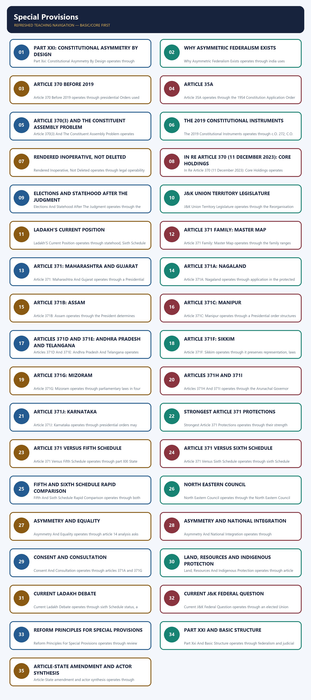

# Polity 22 - Special Provisions - Complete Topic Package

> **Subject:** Indian Polity | **Topic:** 22 | **GS-II + Prelims** | **Export date:** 2026-08-28
>
> **Approval:** false - awaiting explicit user approval.
>
> **Evidence key:** [FACT] constitutional, judicial or officially verified proposition; [ANALYSIS] reasoned exam synthesis; [CURRENT] dated legal/current control; [LIMIT] qualification preventing overstatement.

### Package method, source priority and current control

- Source order followed: `basic/Special-Provisions.md` -> `advanced/22_Special-Provisions.md` -> `basic/Scheduled-and-Tribal-Areas.md` -> `basic/Union-Territories.md` and necessary federalism/citizenship cross-links -> official Constitution text and the 11 December 2023 Supreme Court judgment. Qdrant was not used.
- [FACT] The Core owner supersedes stale or less-qualified Advanced statements.
- [CURRENT] Legal and institutional status is controlled to **5 September 2026, Asia/Kolkata**.
- [CURRENT] Article 370 remains printed in Part XXI but was rendered inoperative through the 2019 constitutional orders and declaration; the Supreme Court upheld the abrogation in *In re Article 370* on 11 December 2023.
- [CURRENT] Jammu and Kashmir remains a Union Territory with a legislature. Assembly elections were held in September-October 2024; Statehood has not been restored.
- [LIMIT] The 2023 Court recorded the Union's assurance that Statehood would be restored at the earliest. It did not impose a judicial deadline and did not decide the constitutional validity of converting the former State into Union Territories because the Union conceded restoration of J&K Statehood.
- [CURRENT] Ladakh remains a Union Territory without a legislature. Demands for Statehood, Sixth Schedule protection and Article 371-type safeguards have not produced an enacted constitutional change.
- [CURRENT] Articles 371 to 371J continue to operate for 12 States. They were not affected by Article 370's inoperability.
- [LIMIT] Article 371 protections, Fifth Schedule protection and Sixth Schedule autonomy are distinct constitutional techniques; they must not be merged.
- Official Article 370 judgment: `https://api.sci.gov.in/supremecourt/2019/29796/29796_2019_1_1501_49019_Judgement_11-Dec-2023.pdf`.
- Package target: independently answer-complete Foundation/Core, Optional Advanced refinements, more than 35 text-native visuals, one solved direct/cross-owned Mains PYQ, four routed Prelims demands, 36 original MCQs, 12 remedial MCQs and eight original solved Mains questions.

### Roadmap

| Stage | Coverage | Exam outcome |
|---|---|---|
| Constitutional idea | Part XXI and asymmetry | Explains why equal States may have unequal arrangements |
| Article 370 | pre-2019 operation and Article 35A | Solves history and mechanism traps |
| 2019 changes | C.O. 272/273 and Reorganisation Act | Separates order, resolution and statute |
| 2023 judgment | exact holdings and open questions | Prevents overstatement |
| Current J&K | UT Assembly and Statehood status | Adds dated GS-II control |
| Article 371 family | all 12 States | Handles high-frequency matching questions |
| Tribal safeguards | Fifth/Sixth Schedule comparison | Prevents mechanism confusion |
| Asymmetric federalism | unity, identity and differentiated rights | Builds analytical answers |
| Current debates | Ladakh and implementation | Adds qualified current linkage |
| Workbook | PYQs, MCQs, remedials and solved Mains | Converts coverage into marks |

### Scope ownership and cross-links

- **Polity 12 - Federal System:** holding-together federation, asymmetry and strong-Union design.
- **Polity 22 - this package:** Article 370 and Articles 371-371J.
- **Polity 25 - Union Territories:** full J&K and Ladakh UT administration.
- **Polity 26 - Scheduled and Tribal Areas:** full Fifth/Sixth Schedule, PESA and FRA architecture.
- **Polity 06 - Citizenship:** single citizenship and differentiated-rights debate.
- [LIMIT] Fifth/Sixth Schedule material appears here only to distinguish special-provision mechanisms and answer current Ladakh linkages; the specialist owner retains full doctrine.

### DEEP-REVIEW LEARNING CONTRACT

| Control | Binding rule for this package |
|---|---|
| Syllabus boundary | Complete Polity Basic/Core is answer-complete before optional Advanced depth. |
| Text hierarchy | Constitution/Act/rule/notification → binding judgment → authoritative institution → Constituent Assembly material → standard textbook. |
| Legal precision | State exact Article, Part, Schedule, amendment, case, date, institution, procedure, exception and current operative status. |
| Doctrine method | Text → institutional mechanism → controlling case → exception/limit → present legal status. |
| Chronology | Enactment, commencement, amendment, judgment and implementation dates remain separate. |
| Boundary method | Topic ownership and cross-owner bridges are explicit; adjacent PYQs never become fabricated direct routes. |
| Practice contract | Every solved item has demand decoding, examiner-grade model, timed compression plan, marks rationale and answer-specific improvement. |
| Approval | This immutable successor remains `approved: false` pending explicit approval. |

**Canonical Basic/Core owner:** `upsc-ai-kit\knowledge\Polity\basic\Special-Provisions.md`  
**Canonical topic owner:** `upsc-ai-kit\knowledge\Polity\22_Special-Provisions_Complete-Topic-Package.md`  
**Optional Advanced owner:** `upsc-ai-kit\knowledge\Polity\advanced\22_Special-Provisions.md`  
**Official syllabus mapping:** `upsc-ai-kit\knowledge\Polity\OFFICIAL-UPSC-SYLLABUS-MAPPING.md`

### EVIDENCE, PYQ AND CURRENT-STATUS CONTROL

- **Four independent ledgers:** literal syllabus/index, indispensable
  prerequisites, standard textbook taxonomy and complete routed 2018-2026 PYQ
  demands were built before repair.
- **Hostile search:** missing Articles, Parts, Schedules, amendments, cases,
  institutional mechanisms, exceptions, chronology, source status and
  cross-owner boundaries are hard failures.
- **Answer rule:** claim → exact constitutional/statutory/case evidence →
  institutional analysis → exception or qualification.
- **Current-status note, rechecked 2026-09-05:** Rechecked 2026-09-05: Articles 371-371J remain operative for their specified States. Article 370 remains printed but inoperative. J&K remains a UT with an elected legislature and Ladakh a UT without one; no Statehood, Sixth Schedule or Article 371-type change has been enacted.

**Authoritative live sources:**

- `https://legislative.gov.in/document/constitution-of-india-in-english`
- `https://api.sci.gov.in/supremecourt/2019/29796/29796_2019_1_1501_49019_Judgement_11-Dec-2023.pdf`
- `https://www.jk.gov.in/`
- `https://ladakh.gov.in/`
- `https://www.mha.gov.in/en/divisionofmha/jammu-kashmir-and-ladakh-affairs`

## BASIC LEARNING SESSION



*Distinct embedded teaching-navigation image. The separate continuous Cārvāka-style flowchart package remains an independent at-a-glance artifact.*

### SESSION 1 — PART XXI: CONSTITUTIONAL ASYMMETRY BY DESIGN

#### DEFINITION / WHAT THIS IS CALLED

**Plain-language definition:** Part Xxi: Constitutional Asymmetry By Design means part XXI houses temporary, transitional and State-specific special arrangements within one Constitution.

**Technical definition:** Part Xxi: Constitutional Asymmetry By Design operates through constitutional asymmetry permits differentiated institutions without creating separate sovereignty.

#### ANSWER-GRABBING OPENING — WRITE/ADAPT IN THE EXAM

> Part Xxi: Constitutional Asymmetry By Design shows that tailored safeguards can support integration while remaining reviewable constitutional law.

#### MUST-WRITE KEYWORDS

- **PART**
- **XXI**
- **CONSTITUTIONAL**
- **ASYMMETRY**
- **DESIGN**

**How to use them:** Frame the answer through PART; define XXI, connect CONSTITUTIONAL with ASYMMETRY to explain the mechanism, and use DESIGN for the decisive comparison or qualification.

**Visual 1 - Part XXI concept**

```text
ONE UNION
   |
   +-- ordinary State framework
   |
   +-- temporary/transitional provisions
   |
   +-- State-specific special provisions
           |
           +-- identity and custom
           +-- regional development
           +-- local employment/education
           +-- law-and-order transition
```

Caption: Constitutional equality does not require identical institutional arrangements in every region.

- [FACT] Part XXI is titled "Temporary, Transitional and Special Provisions."
- [FACT] Article 370 concerned Jammu and Kashmir; Articles 371-371J create tailored arrangements for 12 States.
- [ANALYSIS] India uses asymmetry to integrate regions with distinct histories, communities, institutions or development needs.
- [LIMIT] "Special" does not mean sovereign, secessionist or outside the Constitution.

**Visual 2 - Three different mechanisms**

| Mechanism | Constitutional location | Core technique |
|---|---|---|
| Article 370 | Part XXI | former consent-based application of Constitution to J&K |
| Articles 371-371J | Part XXI | State-specific safeguards/responsibilities |
| Fifth/Sixth Schedules | Article 244, Part X | Scheduled-Area protection / autonomous tribal councils |

> **UPSC trap:** Similar protective purposes do not make these legally interchangeable.

#### CLOSING RECALL FLOW — PART XXI: CONSTITUTIONAL ASYMMETRY BY DESIGN

```text
START / CONCEPT: Part XXI: constitutional asymmetry by design
        |
        v
EXACT TERMS: PART · XXI · CONSTITUTIONAL · ASYMMETRY · DESIGN
        |
        v
MECHANISM / ARGUMENT: Classify the clause by constitutional location, State, purpose and decision-maker.
        |
        v
CONSEQUENCE / CONTRAST: Tailored safeguards can support integration while remaining reviewable constitutional law.
        |
        v
UPSC TRAP / ANSWER-USE: Special treatment does not place a State outside the Union.
        |
        v
ANSWER-GRABBING FORMULATION: Part Xxi: Constitutional Asymmetry By Design shows that tailored safeguards can support integration while remaining reviewable constitutional law.
```
### SESSION 2 — WHY ASYMMETRIC FEDERALISM EXISTS

#### DEFINITION / WHAT THIS IS CALLED

**Plain-language definition:** Why Asymmetric Federalism Exists means asymmetric federalism adjusts institutional design to distinct histories, identities and regional disadvantages.

**Technical definition:** Why Asymmetric Federalism Exists operates through india uses holding-together asymmetry to combine national unity with context-specific protection.

#### ANSWER-GRABBING OPENING — WRITE/ADAPT IN THE EXAM

> Why Asymmetric Federalism Exists shows that negotiated protection can lower conflict and deepen legitimate integration.

#### MUST-WRITE KEYWORDS

- **WHY**
- **ASYMMETRIC**
- **FEDERALISM**
- **EXISTS**

**How to use them:** Frame the answer through WHY; define ASYMMETRIC, connect FEDERALISM with EXISTS to explain the mechanism, and close with the decisive comparison or qualification.

**Visual 3 - Holding-together logic**

```text
historical difference
   + cultural identity
   + tribal land/custom
   + regional imbalance
        |
        v
tailored constitutional guarantee
        |
        v
integration with negotiated protection
```

- [ANALYSIS] In a "holding-together" federation, calibrated difference can reduce conflict by making Union membership compatible with local identity.
- [ANALYSIS] Asymmetry may be temporary, permanent, protective, developmental or administrative.
- [LIMIT] Its legitimacy depends on constitutional purpose and proportionality; asymmetry can also create insider-outsider and accountability concerns.

#### CLOSING RECALL FLOW — WHY ASYMMETRIC FEDERALISM EXISTS

```text
START / CONCEPT: Why asymmetric federalism exists
        |
        v
EXACT TERMS: WHY · ASYMMETRIC · FEDERALISM · EXISTS
        |
        v
MECHANISM / ARGUMENT: Match each vulnerability to a narrowly designed constitutional safeguard.
        |
        v
CONSEQUENCE / CONTRAST: Negotiated protection can lower conflict and deepen legitimate integration.
        |
        v
UPSC TRAP / ANSWER-USE: Difference is justified by purpose, not by a general claim to privilege.
        |
        v
ANSWER-GRABBING FORMULATION: Why Asymmetric Federalism Exists shows that negotiated protection can lower conflict and deepen legitimate integration.
```
### SESSION 3 — ARTICLE 370 BEFORE 2019

#### DEFINITION / WHAT THIS IS CALLED

**Plain-language definition:** Article 370 Before 2019 means before 2019, Article 370 mediated how the Constitution and Union laws applied to Jammu and Kashmir.

**Technical definition:** Article 370 Before 2019 operates through presidential Orders used consultation or concurrence under Article 370(1) to extend constitutional provisions.

#### ANSWER-GRABBING OPENING — WRITE/ADAPT IN THE EXAM

> Article 370 Before 2019 shows that the arrangement expanded constitutional integration while retaining a special application mechanism.

#### MUST-WRITE KEYWORDS

- **Article 370**
- **Presidential Orders**
- **consultation**
- **concurrence**
- **Jammu Kashmir**

**How to use them:** Frame the answer through Article 370; define Presidential Orders, connect consultation with concurrence to explain the mechanism, and use Jammu Kashmir for the decisive comparison or qualification.

**Visual 4 - Pre-2019 operating model**

```text
Instrument of Accession fields
        |
Parliamentary power in specified matters
        |
other constitutional provisions / Union laws
        |
Presidential Orders under Article 370(1)
        |
consultation or concurrence of J&K government
```

- [FACT] Article 370 was located in Part XXI and described as temporary.
- [FACT] It mediated the application of the Indian Constitution to Jammu and Kashmir.
- [FACT] Defence, external affairs and communications followed the accession framework; wider application developed through Presidential Orders.
- [FACT] Jammu and Kashmir had its own Constitution and distinctive constitutional arrangements before 2019.
- [LIMIT] Special autonomy did not mean independent sovereignty outside India.

#### CLOSING RECALL FLOW — ARTICLE 370 BEFORE 2019

```text
START / CONCEPT: Article 370 before 2019
        |
        v
EXACT TERMS: Article 370 · Presidential Orders · consultation · concurrence · Jammu Kashmir
        |
        v
MECHANISM / ARGUMENT: Trace accession fields, Article 370 consultation, concurrence and successive application orders.
        |
        v
CONSEQUENCE / CONTRAST: The arrangement expanded constitutional integration while retaining a special application mechanism.
        |
        v
UPSC TRAP / ANSWER-USE: Pre-2019 autonomy did not amount to external or residual sovereignty.
        |
        v
ANSWER-GRABBING FORMULATION: Article 370 Before 2019 shows that the arrangement expanded constitutional integration while retaining a special application mechanism.
```
### SESSION 4 — ARTICLE 35A

#### DEFINITION / WHAT THIS IS CALLED

**Plain-language definition:** Article 35A protected specified permanent-resident laws of Jammu and Kashmir before the 2019 reconfiguration.

**Technical definition:** Article 35A operates through the 1954 Constitution Application Order inserted Article 35A without an Article 368 amendment.

#### ANSWER-GRABBING OPENING — WRITE/ADAPT IN THE EXAM

> Article 35A shows that it created differentiated entitlements within single Indian citizenship.

#### MUST-WRITE KEYWORDS

- **Article 35A**
- **1954 Presidential Order**
- **permanent residents**
- **land rights**
- **public employment**

**How to use them:** Frame the answer through Article 35A; define 1954 Presidential Order, connect permanent residents with land rights to explain the mechanism, and use public employment for the decisive comparison or qualification.

**Visual 5 - Source and function**

```text
1954 Constitution Application Order
        |
inserted Article 35A
        |
J&K legislature could define permanent residents
        |
special rights in land, employment and related benefits
```

- [FACT] Article 35A entered through a Presidential Order, not a Parliament-passed constitutional amendment.
- [FACT] It protected J&K laws defining permanent residents and conferring specified special rights.
- [ANALYSIS] It illustrates differentiated citizenship inside a system of single Indian citizenship.
- [LIMIT] It ceased to operate with the 2019 constitutional reconfiguration; do not treat it as a current live guarantee.

#### CLOSING RECALL FLOW — ARTICLE 35A

```text
START / CONCEPT: Article 35A
        |
        v
EXACT TERMS: Article 35A · 1954 Presidential Order · permanent residents · land rights · public employment
        |
        v
MECHANISM / ARGUMENT: Separate its Presidential-Order source from the J&K legislature’s protected policy fields.
        |
        v
CONSEQUENCE / CONTRAST: It created differentiated entitlements within single Indian citizenship.
        |
        v
UPSC TRAP / ANSWER-USE: Article 35A is not a current operative constitutional guarantee.
        |
        v
ANSWER-GRABBING FORMULATION: Article 35A shows that it created differentiated entitlements within single Indian citizenship.
```
### SESSION 5 — ARTICLE 370(3) AND THE CONSTITUENT ASSEMBLY PROBLEM

#### DEFINITION / WHAT THIS IS CALLED

**Plain-language definition:** Article 370(3) And The Constituent Assembly Problem means article 370(3) raised whether presidential power survived dissolution of the Jammu and Kashmir Constituent Assembly.

**Technical definition:** Article 370(3) And The Constituent Assembly Problem operates through the 2023 Constitution Bench held that the recommendation proviso was not a continuing veto after 1957.

#### ANSWER-GRABBING OPENING — WRITE/ADAPT IN THE EXAM

> Article 370(3) And The Constituent Assembly Problem shows that the holding removed the claimed permanence created by Constituent Assembly dissolution.

#### MUST-WRITE KEYWORDS

- **Article 370(3)**
- **Constituent Assembly**
- **1957 dissolution**
- **presidential power**
- **recommendation proviso**

**How to use them:** Frame the answer through Article 370(3); define Constituent Assembly, connect 1957 dissolution with presidential power to explain the mechanism, and use recommendation proviso for the decisive comparison or qualification.

**Visual 6 - Interpretive question**

```text
Article 370(3)
President may declare Article inoperative
        |
proviso referred to J&K Constituent Assembly recommendation
        |
Constituent Assembly dissolved in 1957
        |
Question:
Was Article now permanent, or did presidential power survive?
```

- [ANALYSIS] The dispute centred on whether dissolution of the J&K Constituent Assembly froze Article 370 permanently.
- [FACT] The 2023 Constitution Bench held that presidential power under Article 370(3) survived and that Constituent Assembly recommendation was not a continuing precondition.

#### CLOSING RECALL FLOW — ARTICLE 370(3) AND THE CONSTITUENT ASSEMBLY PROBLEM

```text
START / CONCEPT: Article 370(3) and the Constituent Assembly problem
        |
        v
EXACT TERMS: Article 370(3) · Constituent Assembly · 1957 dissolution · presidential power · recommendation proviso
        |
        v
MECHANISM / ARGUMENT: State the proviso, dissolution and the Court’s surviving-power conclusion in sequence.
        |
        v
CONSEQUENCE / CONTRAST: The holding removed the claimed permanence created by Constituent Assembly dissolution.
        |
        v
UPSC TRAP / ANSWER-USE: Do not treat the dissolved body as an eternally necessary decision-maker.
        |
        v
ANSWER-GRABBING FORMULATION: Article 370(3) And The Constituent Assembly Problem shows that the holding removed the claimed permanence created by Constituent Assembly dissolution.
```
### SESSION 6 — THE 2019 CONSTITUTIONAL INSTRUMENTS

#### DEFINITION / WHAT THIS IS CALLED

**Plain-language definition:** The 2019 Constitutional Instruments means the 2019 change used Presidential Orders, parliamentary action and a separate reorganisation statute.

**Technical definition:** The 2019 Constitutional Instruments operates through c.O. 272, C.O. 273 and the Jammu and Kashmir Reorganisation Act performed distinct legal functions.

#### ANSWER-GRABBING OPENING — WRITE/ADAPT IN THE EXAM

> The 2019 Constitutional Instruments shows that the sequence changed constitutional application and territorial status through different legal acts.

#### MUST-WRITE KEYWORDS

- **C.O. 272**
- **C.O. 273**
- **parliamentary resolution**
- **Reorganisation Act**
- **President’s Rule**

**How to use them:** Frame the answer through C.O. 272; define C.O. 273, connect parliamentary resolution with Reorganisation Act to explain the mechanism, and use President’s Rule for the decisive comparison or qualification.

**Visual 7 - Four-part legal sequence**

```text
President's Rule in J&K
      |
C.O. 272: Constitution Application Order
      |
Parliamentary resolutions / recommendation framework
      |
C.O. 273: Article 370 declared inoperative
      |
J&K Reorganisation Act, 2019
```

- [FACT] On 5 August 2019, C.O. 272 applied the Constitution of India comprehensively to J&K and altered the operative interpretive framework.
- [FACT] Parliamentary resolutions supported the Article 370(3) declaration while the State was under President's Rule.
- [FACT] C.O. 273 declared Article 370 inoperative except for the modified operative statement.
- [FACT] The Jammu and Kashmir Reorganisation Act, 2019 divided the former State into:
  - Union Territory of Jammu and Kashmir with a legislature; and
  - Union Territory of Ladakh without a legislature.
- [FACT] Reorganisation took effect on 31 October 2019.

**Visual 8 - Instrument discipline**

| Instrument | Legal type | What it did |
|---|---|---|
| C.O. 272 | Presidential Order | applied Constitution and changed interpretive route |
| Parliamentary action | resolutions/recommendation during President's Rule | supported Article 370(3) process |
| C.O. 273 | presidential declaration | rendered Article 370 inoperative |
| Reorganisation Act | parliamentary statute | created two Union Territories |

> **UPSC trap:** Do not describe all four steps as a single constitutional amendment.

#### CLOSING RECALL FLOW — THE 2019 CONSTITUTIONAL INSTRUMENTS

```text
START / CONCEPT: The 2019 constitutional instruments
        |
        v
EXACT TERMS: C.O. 272 · C.O. 273 · parliamentary resolution · Reorganisation Act · President’s Rule
        |
        v
MECHANISM / ARGUMENT: Identify each instrument, legal source, date and consequence separately.
        |
        v
CONSEQUENCE / CONTRAST: The sequence changed constitutional application and territorial status through different legal acts.
        |
        v
UPSC TRAP / ANSWER-USE: Do not call the entire sequence one constitutional amendment.
        |
        v
ANSWER-GRABBING FORMULATION: The 2019 Constitutional Instruments shows that the sequence changed constitutional application and territorial status through different legal acts.
```
### SESSION 7 — RENDERED INOPERATIVE, NOT DELETED

#### DEFINITION / WHAT THIS IS CALLED

**Plain-language definition:** Rendered Inoperative, Not Deleted means article 370 remains printed in the Constitution but its former provisions were rendered inoperative.

**Technical definition:** Rendered Inoperative, Not Deleted operates through legal operability differs from textual presence, repeal and formal deletion.

#### ANSWER-GRABBING OPENING — WRITE/ADAPT IN THE EXAM

> Rendered Inoperative, Not Deleted shows that precise language prevents a basic constitutional-status error.

#### MUST-WRITE KEYWORDS

- **RENDERED**
- **INOPERATIVE**
- **NOT**
- **DELETED**

**How to use them:** Frame the answer through RENDERED; define INOPERATIVE, connect NOT with DELETED to explain the mechanism, and close with the decisive comparison or qualification.

**Visual 9 - Status language**

```text
INCORRECT: Article 370 was deleted from Constitution

CORRECT:
Article remains in constitutional text
but was rendered inoperative through the 2019 process
and the process was upheld in 2023
```

- [FACT] The Article's printed presence and legal operability are different questions.
- [ANALYSIS] Precision matters because "repeal," "deletion," "amendment" and "inoperability" describe different legal events.

#### CLOSING RECALL FLOW — RENDERED INOPERATIVE, NOT DELETED

```text
START / CONCEPT: Rendered inoperative, not deleted
        |
        v
EXACT TERMS: RENDERED · INOPERATIVE · NOT · DELETED
        |
        v
MECHANISM / ARGUMENT: Use the exact status phrase and connect it to the 2019 declaration.
        |
        v
CONSEQUENCE / CONTRAST: Precise language prevents a basic constitutional-status error.
        |
        v
UPSC TRAP / ANSWER-USE: Never write that Article 370 was simply deleted from the Constitution.
        |
        v
ANSWER-GRABBING FORMULATION: Rendered Inoperative, Not Deleted shows that precise language prevents a basic constitutional-status error.
```
### SESSION 8 — IN RE ARTICLE 370 (11 DECEMBER 2023): CORE HOLDINGS

#### DEFINITION / WHAT THIS IS CALLED

**Plain-language definition:** In Re Article 370 (11 December 2023): Core Holdings means the 2023 Constitution Bench upheld Article 370’s inoperability and characterised the provision as temporary.

**Technical definition:** In Re Article 370 (11 December 2023): Core Holdings operates through the Court rejected separate internal sovereignty and preserved direct presidential power under Article 370(3).

#### ANSWER-GRABBING OPENING — WRITE/ADAPT IN THE EXAM

> In Re Article 370 (11 December 2023): Core Holdings shows that the judgment settles operability while leaving the federal-status issue qualified.

#### MUST-WRITE KEYWORDS

- **Article 370 judgment**
- **temporary status**
- **internal sovereignty**
- **presidential power**
- **Statehood question**

**How to use them:** Frame the answer through Article 370 judgment; define temporary status, connect internal sovereignty with presidential power to explain the mechanism, and use Statehood question for the decisive comparison or qualification.

**Visual 10 - Holding map**

| Question | Court's position |
|---|---|
| Nature of Article 370 | temporary provision |
| J&K sovereignty | no internal sovereignty distinct from other States after accession |
| President's Article 370(3) power | survived Constituent Assembly dissolution |
| 2019 abrogation | upheld |
| C.O. 272 Article 367 route | unnecessary to validate because direct Article 370(3) route sufficient |
| Assembly elections | directed by 30 September 2024 |
| J&K Statehood | Union assurance recorded; restoration at earliest |
| validity of conversion into UT | not adjudicated conclusively |

- [FACT] The Court unanimously upheld the constitutional result of making Article 370 inoperative.
- [FACT] It held that Article 370 embodied a temporary arrangement associated with transition and integration.
- [FACT] It rejected a claim to continuing internal sovereignty.
- [LIMIT] Do not claim the Court conclusively upheld every step of the C.O. 272 Article 367 route; the Court found that route unnecessary for the valid result.
- [LIMIT] Do not claim the Court finally decided that Parliament may permanently convert any State into a Union Territory.

#### CLOSING RECALL FLOW — IN RE ARTICLE 370 (11 DECEMBER 2023): CORE HOLDINGS

```text
START / CONCEPT: In re Article 370 (11 December 2023): core holdings
        |
        v
EXACT TERMS: Article 370 judgment · temporary status · internal sovereignty · presidential power · Statehood question
        |
        v
MECHANISM / ARGUMENT: Separate decided holdings from the unadjudicated State-to-Union-Territory question.
        |
        v
CONSEQUENCE / CONTRAST: The judgment settles operability while leaving the federal-status issue qualified.
        |
        v
UPSC TRAP / ANSWER-USE: Do not claim every contested step of the Article 367 route was validated.
        |
        v
ANSWER-GRABBING FORMULATION: In Re Article 370 (11 December 2023): Core Holdings shows that the judgment settles operability while leaving the federal-status issue qualified.
```
### SESSION 9 — ELECTIONS AND STATEHOOD AFTER THE JUDGMENT

#### DEFINITION / WHAT THIS IS CALLED

**Plain-language definition:** Elections And Statehood After The Judgment means jammu and Kashmir Assembly elections occurred in 2024, while restoration of Statehood remains pending.

**Technical definition:** Elections And Statehood After The Judgment operates through the Court imposed an election deadline but recorded, rather than judicially timed, the Statehood assurance.

#### ANSWER-GRABBING OPENING — WRITE/ADAPT IN THE EXAM

> Elections And Statehood After The Judgment shows that representative government returned without restoring full State status.

#### MUST-WRITE KEYWORDS

- **2024 Assembly elections**
- **Statehood assurance**
- **election deadline**
- **Union Territory**
- **no judicial deadline**

**How to use them:** Frame the answer through 2024 Assembly elections; define Statehood assurance, connect election deadline with Union Territory to explain the mechanism, and use no judicial deadline for the decisive comparison or qualification.

**Visual 11 - Judgment-to-current timeline**

```text
11 Dec 2023 judgment
      |
election deadline: 30 Sep 2024
      |
Assembly elections: Sep-Oct 2024
      |
elected J&K government / UT legislature
      |
18 Aug 2026: Statehood still pending
```

- [CURRENT] The election direction was substantially implemented through the 2024 Assembly election.
- [CURRENT] The restoration of Statehood remains pending.
- [LIMIT] "At the earliest" was tied to the Union's assurance; it was not converted into a fixed judicial date.

#### CLOSING RECALL FLOW — ELECTIONS AND STATEHOOD AFTER THE JUDGMENT

```text
START / CONCEPT: Elections and Statehood after the judgment
        |
        v
EXACT TERMS: 2024 Assembly elections · Statehood assurance · election deadline · Union Territory · no judicial deadline
        |
        v
MECHANISM / ARGUMENT: Distinguish the implemented election direction from the unresolved political commitment.
        |
        v
CONSEQUENCE / CONTRAST: Representative government returned without restoring full State status.
        |
        v
UPSC TRAP / ANSWER-USE: Do not miss this limiting distinction: there is no judicially fixed deadline for Statehood restoration.
        |
        v
ANSWER-GRABBING FORMULATION: Elections And Statehood After The Judgment shows that representative government returned without restoring full State status.
```
### SESSION 10 — J&K UNION TERRITORY LEGISLATURE

#### DEFINITION / WHAT THIS IS CALLED

**Plain-language definition:** J&K Union Territory Legislature means jammu and Kashmir has an elected Union Territory legislature rather than a full State legislature.

**Technical definition:** J&K Union Territory Legislature operates through the Reorganisation Act defines its fields, exclusions and stronger Parliament–Lieutenant Governor controls.

#### ANSWER-GRABBING OPENING — WRITE/ADAPT IN THE EXAM

> J&K Union Territory Legislature shows that electoral representation exists within a Union Territory’s narrower federal position.

#### MUST-WRITE KEYWORDS

- **J&K**
- **UNION**
- **TERRITORY**
- **LEGISLATURE**

**How to use them:** Frame the answer through J&K; define UNION, connect TERRITORY with LEGISLATURE to explain the mechanism, and close with the decisive comparison or qualification.

**Visual 12 - Institutional position**

```text
Parliament
   |
J&K Reorganisation Act, 2019
   |
Lieutenant Governor + Legislative Assembly
   |
Council of Ministers headed by Chief Minister
   |
UT law-making and accountability within statutory limits
```

- [FACT] Jammu and Kashmir is a Union Territory with a Legislative Assembly.
- [FACT] The Assembly legislates within the fields and limits provided by the Constitution and the Reorganisation Act.
- [FACT] Public order and police remain outside the Assembly's ordinary State-List competence.
- [FACT] The Assembly performs budgetary, deliberative and executive-accountability functions.
- [ANALYSIS] It resembles a State legislature in electoral form but remains a statutory Union Territory legislature with stronger Union/Lieutenant Governor controls.
- [LIMIT] Do not describe present J&K as a State or as constitutionally identical to Delhi.

#### CLOSING RECALL FLOW — J&K UNION TERRITORY LEGISLATURE

```text
START / CONCEPT: J&K Union Territory Legislature
        |
        v
EXACT TERMS: J&K · UNION · TERRITORY · LEGISLATURE
        |
        v
MECHANISM / ARGUMENT: Explain law-making, budget and accountability functions alongside police and public-order exclusions.
        |
        v
CONSEQUENCE / CONTRAST: Electoral representation exists within a Union Territory’s narrower federal position.
        |
        v
UPSC TRAP / ANSWER-USE: Do not equate the J&K Assembly with an ordinary State Assembly.
        |
        v
ANSWER-GRABBING FORMULATION: J&K Union Territory Legislature shows that electoral representation exists within a Union Territory’s narrower federal position.
```
### SESSION 11 — LADAKH'S CURRENT POSITION

#### DEFINITION / WHAT THIS IS CALLED

**Plain-language definition:** Ladakh'S Current Position means ladakh remains a Union Territory without a legislature as of 5 September 2026.

**Technical definition:** Ladakh'S Current Position operates through statehood, Sixth Schedule and Article 371-type safeguards remain distinct unenacted proposals.

#### ANSWER-GRABBING OPENING — WRITE/ADAPT IN THE EXAM

> Ladakh'S Current Position shows that the debate links representation, tribal protection, ecology and strategic administration.

#### MUST-WRITE KEYWORDS

- **Ladakh Union Territory**
- **no legislature**
- **Sixth Schedule demand**
- **Statehood demand**
- **unenacted proposal**

**How to use them:** Frame the answer through Ladakh Union Territory; define no legislature, connect Sixth Schedule demand with Statehood demand to explain the mechanism, and use unenacted proposal for the decisive comparison or qualification.

**Visual 13 - Ladakh status**

```text
Union Territory without legislature
        |
Hill Councils and Union administration
        |
demands:
  Statehood
  Sixth Schedule
  land/job protection
  Public Service Commission
        |
No enacted constitutional change by 18 Aug 2026
```

- [CURRENT] Ladakh has no legislature.
- [CURRENT] Sixth Schedule and Statehood demands remain political/negotiation demands.
- [LIMIT] A proposal, protest, committee discussion or reported offer is not a constitutional amendment.

#### CLOSING RECALL FLOW — LADAKH'S CURRENT POSITION

```text
START / CONCEPT: Ladakh's current position
        |
        v
EXACT TERMS: Ladakh Union Territory · no legislature · Sixth Schedule demand · Statehood demand · unenacted proposal
        |
        v
MECHANISM / ARGUMENT: Classify each demand by the constitutional change it would require.
        |
        v
CONSEQUENCE / CONTRAST: The debate links representation, tribal protection, ecology and strategic administration.
        |
        v
UPSC TRAP / ANSWER-USE: Political negotiation and protest do not themselves change constitutional status.
        |
        v
ANSWER-GRABBING FORMULATION: Ladakh'S Current Position shows that the debate links representation, tribal protection, ecology and strategic administration.
```
### SESSION 12 — ARTICLE 371 FAMILY: MASTER MAP

#### DEFINITION / WHAT THIS IS CALLED

**Plain-language definition:** Article 371 Family: Master Map means articles 371 to 371J create different safeguards for twelve States.

**Technical definition:** Article 371 Family: Master Map operates through the family ranges across development, consent, committees, representation, law and order, and local opportunity.

#### ANSWER-GRABBING OPENING — WRITE/ADAPT IN THE EXAM

> Article 371 Family: Master Map shows that a spectrum model explains why no single definition captures every special provision.

#### MUST-WRITE KEYWORDS

- **ARTICLE**
- **FAMILY**
- **MASTER**
- **MAP**

**How to use them:** Frame the answer through ARTICLE; define FAMILY, connect MASTER with MAP to explain the mechanism, and close with the decisive comparison or qualification.

**Visual 14 - Twelve-State spectrum**

| Article | State(s) | Core protection |
|---|---|---|
| 371 | Maharashtra, Gujarat | regional development boards and equitable allocation |
| 371A | Nagaland | custom, land, justice and special law/order arrangements |
| 371B | Assam | Assembly committee for tribal areas |
| 371C | Manipur | Hill Areas Committee and Governor responsibility |
| 371D/E | Andhra Pradesh, Telangana | equitable local opportunity; Central University provision |
| 371F | Sikkim | integration and representation safeguards |
| 371G | Mizoram | custom, land and justice protections |
| 371H | Arunachal Pradesh | Governor's law/order responsibility |
| 371I | Goa | minimum Assembly size |
| 371J | Karnataka | Kalyana Karnataka regional development and local opportunity |

> **Mnemonic groups:** Development - 371 and 371J; Custom/land - 371A and 371G; Committees - 371B and 371C.

**Amendment-origin and actor control**

| Provision | Origin | Decision-maker students must name |
|---|---|---|
| 371 | Seventh-Amendment/reorganisation-era current form | President may assign the Governor special responsibility |
| 371A | 13th Amendment, 1962 | Nagaland Assembly resolution; Governor's bounded transitional responsibility |
| 371B | 22nd Amendment, 1969 | President may constitute/structure the Assembly committee |
| 371C | 27th Amendment, 1971 | President's order; Governor report/responsibility; Union directions |
| 371D/E | 32nd Amendment, 1973; 371D adapted in 2014 | Presidential orders under 371D; Parliament under 371E |
| 371F | 36th Amendment, 1975 | clause-specific Parliament/President/Governor roles |
| 371G | 53rd Amendment, 1986 | Mizoram Assembly resolution |
| 371H | 55th Amendment, 1986 | Governor's individual judgment after consultation; President may end responsibility |
| 371I | 56th Amendment, 1987 | minimum Assembly size fixed constitutionally |
| 371J | 98th Amendment, 2012; effective 2013 | Presidential order assigning Governor responsibility/reservation design |

#### CLOSING RECALL FLOW — ARTICLE 371 FAMILY: MASTER MAP

```text
START / CONCEPT: Article 371 family: master map
        |
        v
EXACT TERMS: ARTICLE · FAMILY · MASTER · MAP
        |
        v
MECHANISM / ARGUMENT: Memorise State, Article, amendment, constitutional actor and protected interest together.
        |
        v
CONSEQUENCE / CONTRAST: A spectrum model explains why no single definition captures every special provision.
        |
        v
UPSC TRAP / ANSWER-USE: Do not treat every Article 371 clause as a customary-law veto.
        |
        v
ANSWER-GRABBING FORMULATION: Article 371 Family: Master Map shows that a spectrum model explains why no single definition captures every special provision.
```
### SESSION 13 — ARTICLE 371: MAHARASHTRA AND GUJARAT

#### DEFINITION / WHAT THIS IS CALLED

**Plain-language definition:** Article 371: Maharashtra And Gujarat means article 371 addresses regional imbalance within Maharashtra and Gujarat through development arrangements.

**Technical definition:** Article 371: Maharashtra And Gujarat operates through a Presidential order may assign the Governor responsibility for boards, reports, funds and opportunity.

#### ANSWER-GRABBING OPENING — WRITE/ADAPT IN THE EXAM

> Article 371: Maharashtra And Gujarat shows that the mechanism constitutionalises intra-State regional equity rather than cultural autonomy.

#### MUST-WRITE KEYWORDS

- **Article 371**
- **development boards**
- **equitable funds**
- **technical education**

**How to use them:** Frame the answer through Article 371; define development boards, connect equitable funds with technical education to explain the mechanism, and close with the decisive comparison or qualification.

**Visual 15 - Regional balance mechanism**

```text
Governor's special responsibility
   |
separate development boards
   |
annual reporting
   |
equitable allocation of development expenditure
   |
opportunity in technical education and State services
```

- [FACT] Maharashtra provisions concern Vidarbha, Marathwada and the rest of Maharashtra.
- [FACT] Gujarat provisions concern Saurashtra, Kutch and the rest of Gujarat.
- [FACT] The President may by order assign the Governor this special responsibility; the Governor does not acquire it automatically from political convention.
- [ANALYSIS] The Article constitutionalises intra-State regional equity rather than cultural autonomy.

#### CLOSING RECALL FLOW — ARTICLE 371: MAHARASHTRA AND GUJARAT

```text
START / CONCEPT: Article 371: Maharashtra and Gujarat
        |
        v
EXACT TERMS: Article 371 · development boards · equitable funds · technical education
        |
        v
MECHANISM / ARGUMENT: Trace President, Governor, development board, annual report and equitable allocation.
        |
        v
CONSEQUENCE / CONTRAST: The mechanism constitutionalises intra-State regional equity rather than cultural autonomy.
        |
        v
UPSC TRAP / ANSWER-USE: Do not miss this limiting distinction: the Governor’s responsibility depends on Presidential assignment.
        |
        v
ANSWER-GRABBING FORMULATION: Article 371: Maharashtra And Gujarat shows that the mechanism constitutionalises intra-State regional equity rather than cultural autonomy.
```
### SESSION 14 — ARTICLE 371A: NAGALAND

#### DEFINITION / WHAT THIS IS CALLED

**Plain-language definition:** Article 371A: Nagaland means article 371A protects specified Naga practices, customary justice and land or resources from automatic parliamentary law.

**Technical definition:** Article 371A: Nagaland operates through application in the protected fields requires a Nagaland Assembly resolution.

#### ANSWER-GRABBING OPENING — WRITE/ADAPT IN THE EXAM

> Article 371A: Nagaland shows that assembly consent turns cultural and resource protection into enforceable constitutional asymmetry.

#### MUST-WRITE KEYWORDS

- **Article 371A**
- **Assembly resolution**
- **Naga customary law**
- **land resources**
- **Governor law-order**

**How to use them:** Frame the answer through Article 371A; define Assembly resolution, connect Naga customary law with land resources to explain the mechanism, and use Governor law-order for the decisive comparison or qualification.

**Visual 16 - Assembly-consent shield**

```text
Act of Parliament concerns:
  Naga religious/social practices
  customary law and procedure
  customary civil/criminal justice
  ownership/transfer of land and resources
        |
does not apply to Nagaland
unless State Assembly resolves otherwise
```

- [FACT] Article 371A protects four specified fields from automatic parliamentary-law application.
- [FACT] It includes special transitional arrangements for Tuensang and a Governor law-and-order responsibility while the specified internal disturbance continues. After consulting the Council of Ministers, the Governor uses individual judgment; the President may end that responsibility by order.
- [ANALYSIS] This is one of the strongest consent-based protections in the Article 371 family.
- [LIMIT] It does not create a general Nagaland veto over every Act of Parliament.

#### CLOSING RECALL FLOW — ARTICLE 371A: NAGALAND

```text
START / CONCEPT: Article 371A: Nagaland
        |
        v
EXACT TERMS: Article 371A · Assembly resolution · Naga customary law · land resources · Governor law-order
        |
        v
MECHANISM / ARGUMENT: Separate the four-field consent shield from Tuensang and transitional law-order arrangements.
        |
        v
CONSEQUENCE / CONTRAST: Assembly consent turns cultural and resource protection into enforceable constitutional asymmetry.
        |
        v
UPSC TRAP / ANSWER-USE: Do not miss this limiting distinction: nagaland has no general veto over every Act of Parliament.
        |
        v
ANSWER-GRABBING FORMULATION: Article 371A: Nagaland shows that assembly consent turns cultural and resource protection into enforceable constitutional asymmetry.
```
### SESSION 15 — ARTICLE 371B: ASSAM

#### DEFINITION / WHAT THIS IS CALLED

**Plain-language definition:** Article 371B: Assam means article 371B enables a special Assam Assembly committee for specified tribal areas.

**Technical definition:** Article 371B: Assam operates through the President determines committee composition through an order under the Article.

#### ANSWER-GRABBING OPENING — WRITE/ADAPT IN THE EXAM

> Article 371B: Assam shows that the mechanism embeds tribal-area voice within the State legislature.

#### MUST-WRITE KEYWORDS

- **Article 371B**
- **Assam Assembly committee**
- **tribal areas**
- **Presidential order**
- **legislative representation**

**How to use them:** Frame the answer through Article 371B; define Assam Assembly committee, connect tribal areas with Presidential order to explain the mechanism, and use legislative representation for the decisive comparison or qualification.

**Visual 17 - Tribal Areas Committee**

```text
President's order
      |
Assam Legislative Assembly committee
      |
members elected from Sixth Schedule tribal areas
      |
specified additional members if provided
```

- [FACT] Article 371B enables the President to create an Assam Assembly committee comprising members elected from the specified Sixth Schedule tribal areas and such other Assembly members as the order provides.
- [ANALYSIS] It embeds tribal-area voice inside the State legislature rather than transferring all power to a separate State institution.

#### CLOSING RECALL FLOW — ARTICLE 371B: ASSAM

```text
START / CONCEPT: Article 371B: Assam
        |
        v
EXACT TERMS: Article 371B · Assam Assembly committee · tribal areas · Presidential order · legislative representation
        |
        v
MECHANISM / ARGUMENT: Identify tribal-area members and any additional Assembly members specified by the order.
        |
        v
CONSEQUENCE / CONTRAST: The mechanism embeds tribal-area voice within the State legislature.
        |
        v
UPSC TRAP / ANSWER-USE: Article 371B is not itself a Sixth Schedule autonomous council.
        |
        v
ANSWER-GRABBING FORMULATION: Article 371B: Assam shows that the mechanism embeds tribal-area voice within the State legislature.
```
### SESSION 16 — ARTICLE 371C: MANIPUR

#### DEFINITION / WHAT THIS IS CALLED

**Plain-language definition:** Article 371C: Manipur means article 371C protects Manipur’s Hill Areas through an Assembly committee and reporting architecture.

**Technical definition:** Article 371C: Manipur operates through a Presidential order structures the committee; the Governor reports annually and bears special responsibility.

#### ANSWER-GRABBING OPENING — WRITE/ADAPT IN THE EXAM

> Article 371C: Manipur shows that the design inserts hill representation and Union-supervised accountability into State government.

#### MUST-WRITE KEYWORDS

- **Article 371C**
- **Hill Areas Committee**
- **Governor report**
- **President**
- **Union directions**

**How to use them:** Frame the answer through Article 371C; define Hill Areas Committee, connect Governor report with President to explain the mechanism, and use Union directions for the decisive comparison or qualification.

**Visual 18 - Hill Areas safeguard**

```text
Hill Areas Committee in Assembly
          +
Governor's special responsibility
          +
Governor's report to President
          =
institutional protection for hill interests
```

- [FACT] Article 371C concerns a committee of members elected from Hill Areas.
- [FACT] Presidential orders structure committee functioning and State business; the Governor reports annually to the President, and Union executive power extends to directions to the State on administration of the Hill Areas.
- [ANALYSIS] The provision responds to valley-hill asymmetry through legislative representation and Union-supervised reporting.

#### CLOSING RECALL FLOW — ARTICLE 371C: MANIPUR

```text
START / CONCEPT: Article 371C: Manipur
        |
        v
EXACT TERMS: Article 371C · Hill Areas Committee · Governor report · President · Union directions
        |
        v
MECHANISM / ARGUMENT: Connect Hill Areas members, Governor report, President and possible Union directions.
        |
        v
CONSEQUENCE / CONTRAST: The design inserts hill representation and Union-supervised accountability into State government.
        |
        v
UPSC TRAP / ANSWER-USE: The committee does not convert Hill Areas into a separate State.
        |
        v
ANSWER-GRABBING FORMULATION: Article 371C: Manipur shows that the design inserts hill representation and Union-supervised accountability into State government.
```
### SESSION 17 — ARTICLES 371D AND 371E: ANDHRA PRADESH AND TELANGANA

#### DEFINITION / WHAT THIS IS CALLED

**Plain-language definition:** Articles 371D And 371E: Andhra Pradesh And Telangana means article 371D enables equitable employment and educational opportunity in Andhra Pradesh and Telangana.

**Technical definition:** Articles 371D And 371E: Andhra Pradesh And Telangana operates through presidential orders may organise local areas and cadres; Article 371E separately enables a Central University in Andhra Pradesh.

#### ANSWER-GRABBING OPENING — WRITE/ADAPT IN THE EXAM

> Articles 371D And 371E: Andhra Pradesh And Telangana shows that the clauses address regional access without creating a general domicile power.

#### MUST-WRITE KEYWORDS

- **Article 371D**
- **Article 371E**
- **local cadres**
- **public employment**
- **education opportunity**
- **Presidential orders**

**How to use them:** Frame the answer through Article 371D; define Article 371E, connect local cadres with public employment to explain the mechanism, and use education opportunity for the decisive comparison or qualification.

**Visual 19 - Equitable opportunity model**

```text
regional imbalance
      |
Presidential Orders
      |
local cadres / local areas
      |
equitable public employment and education opportunity
```

- [FACT] Article 371D authorises special arrangements for equitable opportunities and facilities in public employment and education.
- [FACT] It permits organisation of local cadres and residence/local-area preferences through Presidential orders.
- [CURRENT] The former Andhra Pradesh Administrative Tribunal was abolished by G.S.R. 30(E) dated 14 January 2020; Article 371D remains operative, but do not present that tribunal as a current institution.
- [FACT] Its framework extends to Andhra Pradesh and Telangana after bifurcation.
- [FACT] Article 371E empowers Parliament to establish a Central University in Andhra Pradesh.
- [LIMIT] Article 371E is an enabling university provision, not a general local-reservation clause.

#### CLOSING RECALL FLOW — ARTICLES 371D AND 371E: ANDHRA PRADESH AND TELANGANA

```text
START / CONCEPT: Articles 371D and 371E: Andhra Pradesh and Telangana
        |
        v
EXACT TERMS: Article 371D · Article 371E · local cadres · public employment · education opportunity · Presidential orders
        |
        v
MECHANISM / ARGUMENT: Distinguish continuing local-opportunity power from the abolished Andhra Pradesh Administrative Tribunal.
        |
        v
CONSEQUENCE / CONTRAST: The clauses address regional access without creating a general domicile power.
        |
        v
UPSC TRAP / ANSWER-USE: Do not present the former tribunal as operating after January 2020.
        |
        v
ANSWER-GRABBING FORMULATION: Articles 371D And 371E: Andhra Pradesh And Telangana shows that the clauses address regional access without creating a general domicile power.
```
### SESSION 18 — ARTICLE 371F: SIKKIM

#### DEFINITION / WHAT THIS IS CALLED

**Plain-language definition:** Article 371F: Sikkim means article 371F is a detailed constitutional settlement for Sikkim’s integration into India.

**Technical definition:** Article 371F: Sikkim operates through it preserves representation, laws and courts while assigning the Governor peace and equitable-advancement responsibility.

#### ANSWER-GRABBING OPENING — WRITE/ADAPT IN THE EXAM

> Article 371F: Sikkim shows that transitional continuity allowed integration without an abrupt legal vacuum.

#### MUST-WRITE KEYWORDS

- **Article 371F**
- **Thirty-sixth Amendment**
- **law continuity**
- **population representation**
- **Governor discretion**

**How to use them:** Frame the answer through Article 371F; define Thirty-sixth Amendment, connect law continuity with population representation to explain the mechanism, and use Governor discretion for the decisive comparison or qualification.

**Visual 20 - Integration safeguards**

| Feature | Constitutional purpose |
|---|---|
| Assembly not below 30 | representative stability |
| one Lok Sabha seat | Union representation |
| protection of different population sections | transition and social balance |
| continuity of laws/courts | orderly integration |
| Governor responsibility for peace and equitable arrangement | transitional safeguard |

- [FACT] Article 371F accompanied Sikkim's admission as a State through the Thirty-sixth Amendment, 1975.
- [FACT] Existing laws and courts continued subject to adaptation; the Governor acts in discretion, subject to Presidential directions, for peace and equitable social-economic advancement of Sikkim's population sections.
- [ANALYSIS] It is a constitutional bridge from a distinct monarchical history into Indian Statehood.

#### CLOSING RECALL FLOW — ARTICLE 371F: SIKKIM

```text
START / CONCEPT: Article 371F: Sikkim
        |
        v
EXACT TERMS: Article 371F · Thirty-sixth Amendment · law continuity · population representation · Governor discretion
        |
        v
MECHANISM / ARGUMENT: Connect the Thirty-sixth Amendment to continuity, representation and clause-specific institutional roles.
        |
        v
CONSEQUENCE / CONTRAST: Transitional continuity allowed integration without an abrupt legal vacuum.
        |
        v
UPSC TRAP / ANSWER-USE: Do not miss this limiting distinction: article 371F is much broader than a minimum Assembly-size rule.
        |
        v
ANSWER-GRABBING FORMULATION: Article 371F: Sikkim shows that transitional continuity allowed integration without an abrupt legal vacuum.
```
### SESSION 19 — ARTICLE 371G: MIZORAM

#### DEFINITION / WHAT THIS IS CALLED

**Plain-language definition:** Article 371G: Mizoram means article 371G protects specified Mizo practices, customary justice and land through Assembly consent.

**Technical definition:** Article 371G: Mizoram operates through parliamentary laws in four protected fields require a Mizoram Assembly resolution for application.

#### ANSWER-GRABBING OPENING — WRITE/ADAPT IN THE EXAM

> Article 371G: Mizoram shows that the Assembly becomes the constitutional gateway for protected cultural and land laws.

#### MUST-WRITE KEYWORDS

- **Article 371G**
- **Mizoram Assembly**
- **customary justice**
- **land transfer**
- **minimum forty**

**How to use them:** Frame the answer through Article 371G; define Mizoram Assembly, connect customary justice with land transfer to explain the mechanism, and use minimum forty for the decisive comparison or qualification.

**Visual 21 - Mizo consent shield**

```text
Parliamentary law on:
  Mizo religious/social practices
  customary law and procedure
  customary justice
  land ownership/transfer
        |
requires Assembly decision for application
```

- [FACT] Article 371G resembles Article 371A in its strongest protection fields.
- [FACT] It also fixes a minimum Assembly strength of 40.
- [LIMIT] Nagaland and Mizoram provisions are similar but not textually identical in every institutional detail.

#### CLOSING RECALL FLOW — ARTICLE 371G: MIZORAM

```text
START / CONCEPT: Article 371G: Mizoram
        |
        v
EXACT TERMS: Article 371G · Mizoram Assembly · customary justice · land transfer · minimum forty
        |
        v
MECHANISM / ARGUMENT: Compare the consent shield with Article 371A while retaining textual differences.
        |
        v
CONSEQUENCE / CONTRAST: The Assembly becomes the constitutional gateway for protected cultural and land laws.
        |
        v
UPSC TRAP / ANSWER-USE: Similarity with Nagaland does not make every institutional clause identical.
        |
        v
ANSWER-GRABBING FORMULATION: Article 371G: Mizoram shows that the Assembly becomes the constitutional gateway for protected cultural and land laws.
```
### SESSION 20 — ARTICLES 371H AND 371I

#### DEFINITION / WHAT THIS IS CALLED

**Plain-language definition:** Articles 371H And 371I means article 371H gives Arunachal Pradesh a bounded law-order arrangement; Article 371I fixes Goa’s minimum Assembly size.

**Technical definition:** Articles 371H And 371I operates through the Arunachal Governor consults ministers but uses individual judgment until the President ends the responsibility.

#### ANSWER-GRABBING OPENING — WRITE/ADAPT IN THE EXAM

> Articles 371H And 371I shows that adjacent lettered Articles can serve completely different constitutional purposes.

#### MUST-WRITE KEYWORDS

- **Article 371H**
- **Arunachal law-order**
- **individual judgment**
- **Article 371I**
- **Goa Assembly**

**How to use them:** Frame the answer through Article 371H; define Arunachal law-order, connect individual judgment with Article 371I to explain the mechanism, and use Goa Assembly for the decisive comparison or qualification.

**Visual 22 - Arunachal and Goa**

| Article | State | Core rule |
|---|---|---|
| 371H | Arunachal Pradesh | Governor has special law/order responsibility; Assembly minimum 30 |
| 371I | Goa | Assembly minimum 30 |

- [FACT] The Arunachal Governor acts after consulting the Council of Ministers but exercises individual judgment in the constitutionally specified law-and-order field.
- [LIMIT] This special responsibility is not a licence for personal control over all State policy.

#### CLOSING RECALL FLOW — ARTICLES 371H AND 371I

```text
START / CONCEPT: Articles 371H and 371I
        |
        v
EXACT TERMS: Article 371H · Arunachal law-order · individual judgment · Article 371I · Goa Assembly
        |
        v
MECHANISM / ARGUMENT: Contrast substantive executive responsibility under 371H with the structural minimum under 371I.
        |
        v
CONSEQUENCE / CONTRAST: Adjacent lettered Articles can serve completely different constitutional purposes.
        |
        v
UPSC TRAP / ANSWER-USE: Article 371I does not grant Goa a customary-law or land shield.
        |
        v
ANSWER-GRABBING FORMULATION: Articles 371H And 371I shows that adjacent lettered Articles can serve completely different constitutional purposes.
```
### SESSION 21 — ARTICLE 371J: KARNATAKA

#### DEFINITION / WHAT THIS IS CALLED

**Plain-language definition:** Article 371J: Karnataka means article 371J targets backwardness in the constitutionally named Hyderabad-Karnataka region, now Kalyana Karnataka.

**Technical definition:** Article 371J: Karnataka operates through presidential orders may assign Governor responsibility and provide proportionate local seats and identified posts.

#### ANSWER-GRABBING OPENING — WRITE/ADAPT IN THE EXAM

> Article 371J: Karnataka shows that the clause combines development spending with enforceable local-access measures.

#### MUST-WRITE KEYWORDS

- **Article 371J**
- **Kalyana Karnataka**
- **development board**
- **local reservation**
- **birth domicile**

**How to use them:** Frame the answer through Article 371J; define Kalyana Karnataka, connect development board with local reservation to explain the mechanism, and use birth domicile for the decisive comparison or qualification.

**Visual 23 - Kalyana Karnataka model**

```text
separate development board
      +
equitable development funding
      +
local reservation in education
      +
local reservation in specified State posts
```

- [FACT] Article 371J was inserted by the Ninety-eighth Amendment, 2012.
- [FACT] The constitutional text names the Hyderabad-Karnataka region; Karnataka officially uses Kalyana Karnataka.
- [FACT] A Presidential order may assign the Governor responsibility for an annually reported development board, equitable funds and opportunity, and proportionate reservation of local seats and identified posts for persons belonging by birth or domicile.
- [ANALYSIS] Like Article 371, it targets intra-State backwardness, but it adds explicit local education and employment measures.

#### CLOSING RECALL FLOW — ARTICLE 371J: KARNATAKA

```text
START / CONCEPT: Article 371J: Karnataka
        |
        v
EXACT TERMS: Article 371J · Kalyana Karnataka · development board · local reservation · birth domicile
        |
        v
MECHANISM / ARGUMENT: Link development board, annual report, funds, opportunity, birth or domicile and reservation.
        |
        v
CONSEQUENCE / CONTRAST: The clause combines development spending with enforceable local-access measures.
        |
        v
UPSC TRAP / ANSWER-USE: Do not invent a fixed constitutional reservation percentage.
        |
        v
ANSWER-GRABBING FORMULATION: Article 371J: Karnataka shows that the clause combines development spending with enforceable local-access measures.
```
### SESSION 22 — STRONGEST ARTICLE 371 PROTECTIONS

#### DEFINITION / WHAT THIS IS CALLED

**Plain-language definition:** Strongest Article 371 Protections means articles 371A and 371G provide the strongest subject-specific Assembly-consent shields.

**Technical definition:** Strongest Article 371 Protections operates through their strength comes from conditioning application of parliamentary law in protected fields.

#### ANSWER-GRABBING OPENING — WRITE/ADAPT IN THE EXAM

> Strongest Article 371 Protections shows that consent shields offer deeper identity protection than advisory committees or development boards.

#### MUST-WRITE KEYWORDS

- **Articles 371A and 371G**
- **Assembly consent**
- **customary law**
- **land protection**
- **subject-specific shield**

**How to use them:** Frame the answer through Articles 371A and 371G; define Assembly consent, connect customary law with land protection to explain the mechanism, and use subject-specific shield for the decisive comparison or qualification.

**Visual 24 - Strength spectrum**

```text
DEVELOPMENTAL
371 / 371J
      |
REPRESENTATIONAL
371B / 371C / 371F
      |
ADMINISTRATIVE / LAW-ORDER
371H
      |
CONSENT OVER CUSTOM-LAND LAWS
371A / 371G
```

- [ANALYSIS] Strength depends on the legal subject protected, not merely the Article number.
- [FACT] Articles 371A and 371G prevent automatic application of specified parliamentary laws unless the State Assembly decides otherwise.

#### CLOSING RECALL FLOW — STRONGEST ARTICLE 371 PROTECTIONS

```text
START / CONCEPT: Strongest Article 371 protections
        |
        v
EXACT TERMS: Articles 371A and 371G · Assembly consent · customary law · land protection · subject-specific shield
        |
        v
MECHANISM / ARGUMENT: Compare protected subjects, State Assembly role and each Article’s additional clauses.
        |
        v
CONSEQUENCE / CONTRAST: Consent shields offer deeper identity protection than advisory committees or development boards.
        |
        v
UPSC TRAP / ANSWER-USE: Strongest does not mean unlimited State sovereignty.
        |
        v
ANSWER-GRABBING FORMULATION: Strongest Article 371 Protections shows that consent shields offer deeper identity protection than advisory committees or development boards.
```
### SESSION 23 — ARTICLE 371 VERSUS FIFTH SCHEDULE

#### DEFINITION / WHAT THIS IS CALLED

**Plain-language definition:** Article 371 Versus Fifth Schedule means article 371 clauses and the Fifth Schedule protect vulnerable regions through different constitutional machinery.

**Technical definition:** Article 371 Versus Fifth Schedule operates through part XXI State clauses differ from Article 244 Scheduled-Area declaration, Governor regulations and Tribes Advisory Councils.

#### ANSWER-GRABBING OPENING — WRITE/ADAPT IN THE EXAM

> Article 371 Versus Fifth Schedule shows that the Fifth Schedule uses supervised protection rather than a uniform Article 371 model.

#### MUST-WRITE KEYWORDS

- **ARTICLE**
- **VERSUS**
- **FIFTH**
- **SCHEDULE**

**How to use them:** Frame the answer through ARTICLE; define VERSUS, connect FIFTH with SCHEDULE to explain the mechanism, and close with the decisive comparison or qualification.

**Visual 25 - Different constitutional tools**

| Axis | Article 371 family | Fifth Schedule |
|---|---|---|
| Location | Part XXI | Article 244 + Fifth Schedule |
| Unit | named State/region | Scheduled Areas |
| Core actor | Governor/Assembly/President varies | President, Governor, TAC |
| Main logic | tailored State-specific arrangement | protection and supervised administration |
| Land/custom | only specified provisions, especially 371A/G | Governor regulation powers for tribal land/money-lending |

- [FACT] Fifth Schedule Scheduled Areas currently exist in ten States.
- [FACT] The President declares Scheduled Areas; the Governor reports and may make protective regulations subject to presidential assent.
- [LIMIT] A State covered by Article 371 may also interact with other tribal protections, but one mechanism does not legally replace the other.

#### CLOSING RECALL FLOW — ARTICLE 371 VERSUS FIFTH SCHEDULE

```text
START / CONCEPT: Article 371 versus Fifth Schedule
        |
        v
EXACT TERMS: ARTICLE · VERSUS · FIFTH · SCHEDULE
        |
        v
MECHANISM / ARGUMENT: Compare location, territorial unit, institutions, powers and consent.
        |
        v
CONSEQUENCE / CONTRAST: The Fifth Schedule uses supervised protection rather than a uniform Article 371 model.
        |
        v
UPSC TRAP / ANSWER-USE: A Tribes Advisory Council is not an Article 371 Assembly committee.
        |
        v
ANSWER-GRABBING FORMULATION: Article 371 Versus Fifth Schedule shows that the Fifth Schedule uses supervised protection rather than a uniform Article 371 model.
```
### SESSION 24 — ARTICLE 371 VERSUS SIXTH SCHEDULE

#### DEFINITION / WHAT THIS IS CALLED

**Plain-language definition:** Article 371 Versus Sixth Schedule means article 371 protections differ from Sixth Schedule autonomous district and regional councils.

**Technical definition:** Article 371 Versus Sixth Schedule operates through sixth Schedule councils possess specified legislative, judicial and fiscal powers under Article 244(2).

#### ANSWER-GRABBING OPENING — WRITE/ADAPT IN THE EXAM

> Article 371 Versus Sixth Schedule shows that the Sixth Schedule decentralises self-government more deeply than many Article 371 clauses.

#### MUST-WRITE KEYWORDS

- **ARTICLE**
- **VERSUS**
- **SIXTH**
- **SCHEDULE**

**How to use them:** Frame the answer through ARTICLE; define VERSUS, connect SIXTH with SCHEDULE to explain the mechanism, and close with the decisive comparison or qualification.

**Visual 26 - State protection versus autonomous councils**

| Axis | Articles 371A/G etc. | Sixth Schedule |
|---|---|---|
| Protection holder | State/Assembly arrangements | autonomous district/regional councils |
| Geographic coverage | named States | tribal areas in Assam, Meghalaya, Tripura, Mizoram |
| Law-making | State consent in specified fields | council laws on listed local subjects |
| Fiscal/judicial powers | article-specific | specified taxation and village-court powers |
| Current Ladakh demand | Article 371-type option discussed | Sixth Schedule extension demanded |

- [FACT] Sixth Schedule ordinary district councils combine limited legislative, judicial and fiscal powers.
- [LIMIT] Ladakh is not currently a Sixth Schedule area.

#### CLOSING RECALL FLOW — ARTICLE 371 VERSUS SIXTH SCHEDULE

```text
START / CONCEPT: Article 371 versus Sixth Schedule
        |
        v
EXACT TERMS: ARTICLE · VERSUS · SIXTH · SCHEDULE
        |
        v
MECHANISM / ARGUMENT: Compare State-wide special clauses with territorial autonomous institutions in four States.
        |
        v
CONSEQUENCE / CONTRAST: The Sixth Schedule decentralises self-government more deeply than many Article 371 clauses.
        |
        v
UPSC TRAP / ANSWER-USE: Article 371A or 371G consent is not a Sixth Schedule council power.
        |
        v
ANSWER-GRABBING FORMULATION: Article 371 Versus Sixth Schedule shows that the Sixth Schedule decentralises self-government more deeply than many Article 371 clauses.
```
### SESSION 25 — FIFTH AND SIXTH SCHEDULE RAPID COMPARISON

#### DEFINITION / WHAT THIS IS CALLED

**Plain-language definition:** Fifth And Sixth Schedule Rapid Comparison means the Fifth Schedule uses guardianship, while the Sixth Schedule creates autonomous tribal councils.

**Technical definition:** Fifth And Sixth Schedule Rapid Comparison operates through both arise under Article 244 but differ in geography, institutions and legislative or fiscal authority.

#### ANSWER-GRABBING OPENING — WRITE/ADAPT IN THE EXAM

> Fifth And Sixth Schedule Rapid Comparison shows that correct classification prevents transferring powers between unlike tribal regimes.

#### MUST-WRITE KEYWORDS

- **FIFTH**
- **SIXTH**
- **SCHEDULE**
- **RAPID**

**How to use them:** Frame the answer through FIFTH; define SIXTH, connect SCHEDULE with RAPID to explain the mechanism, and close with the decisive comparison or qualification.

**Visual 27 - Protection versus self-government**

| Fifth Schedule | Sixth Schedule |
|---|---|
| Scheduled Areas in ten States | tribal areas in AMTM |
| Tribes Advisory Council | Autonomous District/Regional Councils |
| Governor protective regulations | council law-making in specified fields |
| President declares areas | Governor organises autonomous districts/regions |
| Union directions and annual report | devolved legislative, judicial and fiscal functions |

> **Mnemonic:** Sixth Schedule = Assam, Meghalaya, Tripura, Mizoram.

#### CLOSING RECALL FLOW — FIFTH AND SIXTH SCHEDULE RAPID COMPARISON

```text
START / CONCEPT: Fifth and Sixth Schedule rapid comparison
        |
        v
EXACT TERMS: FIFTH · SIXTH · SCHEDULE · RAPID
        |
        v
MECHANISM / ARGUMENT: Use a side-by-side President, Governor, council, territory and power comparison.
        |
        v
CONSEQUENCE / CONTRAST: Correct classification prevents transferring powers between unlike tribal regimes.
        |
        v
UPSC TRAP / ANSWER-USE: The Fifth Schedule Tribes Advisory Council does not exercise Sixth Schedule taxation.
        |
        v
ANSWER-GRABBING FORMULATION: Fifth And Sixth Schedule Rapid Comparison shows that correct classification prevents transferring powers between unlike tribal regimes.
```
### SESSION 26 — NORTH EASTERN COUNCIL

#### DEFINITION / WHAT THIS IS CALLED

**Plain-language definition:** North Eastern Council means the North Eastern Council is a statutory regional body, not an Article 371 institution.

**Technical definition:** North Eastern Council operates through the North Eastern Council Act includes regional Governors, Chief Ministers and presidential nominees with amended Union leadership.

#### ANSWER-GRABBING OPENING — WRITE/ADAPT IN THE EXAM

> North Eastern Council shows that regional coordination complements but does not replace constitutional State safeguards.

#### MUST-WRITE KEYWORDS

- **North Eastern Council Act**
- **Governors**
- **Chief Ministers**
- **presidential nominees**
- **Home Minister**

**How to use them:** Frame the answer through North Eastern Council Act; define Governors, connect Chief Ministers with presidential nominees to explain the mechanism, and use Home Minister for the decisive comparison or qualification.

**Visual 28 - NEC is statutory, not Article 371**

```text
North Eastern Council Act, 1971
       |
regional planning and coordination body
       |
Governors + Chief Ministers of NE States
       |
three presidential nominees
       |
Union Home Minister: ex-officio Chairman
DoNER Minister: ex-officio Vice-Chairman
```

- [FACT] The NEC is a statutory regional body, not a constitutional Article 371 institution.
- [FACT] Sikkim was included through the 2002 amendment framework.
- [LIMIT] Always recheck current ex-officio administrative arrangements before a date-specific answer.

#### CLOSING RECALL FLOW — NORTH EASTERN COUNCIL

```text
START / CONCEPT: North Eastern Council
        |
        v
EXACT TERMS: North Eastern Council Act · Governors · Chief Ministers · presidential nominees · Home Minister
        |
        v
MECHANISM / ARGUMENT: Identify statutory source, composition and the current ex-officio chair and vice-chair roles.
        |
        v
CONSEQUENCE / CONTRAST: Regional coordination complements but does not replace constitutional State safeguards.
        |
        v
UPSC TRAP / ANSWER-USE: Do not confuse NEC with a Sixth Schedule autonomous council.
        |
        v
ANSWER-GRABBING FORMULATION: North Eastern Council shows that regional coordination complements but does not replace constitutional State safeguards.
```
### SESSION 27 — ASYMMETRY AND EQUALITY

#### DEFINITION / WHAT THIS IS CALLED

**Plain-language definition:** Asymmetry And Equality means constitutional asymmetry creates differentiated entitlements while retaining one Indian citizenship.

**Technical definition:** Asymmetry And Equality operates through article 14 analysis asks whether classification serves a legitimate protective or developmental purpose.

#### ANSWER-GRABBING OPENING — WRITE/ADAPT IN THE EXAM

> Asymmetry And Equality shows that purpose-bound differentiation can advance equality rather than violate it.

#### MUST-WRITE KEYWORDS

- **asymmetric federalism**
- **Article 14**
- **substantive equality**
- **reasonable classification**
- **proportionality**

**How to use them:** Frame the answer through asymmetric federalism; define Article 14, connect substantive equality with reasonable classification to explain the mechanism, and use proportionality for the decisive comparison or qualification.

**Visual 29 - Equality test**

```text
formal equality
same rule for every region

versus

substantive equality
different protection for different vulnerability/history
```

- [ANALYSIS] Special provisions can be defended as substantive equality: unequal conditions may need differentiated treatment.
- [ANALYSIS] Critics see barriers to mobility, land ownership and uniform citizenship.
- [LIMIT] Constitutional differentiation is not automatically discriminatory; purpose, history and proportionality matter.

#### CLOSING RECALL FLOW — ASYMMETRY AND EQUALITY

```text
START / CONCEPT: Asymmetry and equality
        |
        v
EXACT TERMS: asymmetric federalism · Article 14 · substantive equality · reasonable classification · proportionality
        |
        v
MECHANISM / ARGUMENT: Balance insider-outsider burdens against vulnerability, substantive equality and proportionality.
        |
        v
CONSEQUENCE / CONTRAST: Purpose-bound differentiation can advance equality rather than violate it.
        |
        v
UPSC TRAP / ANSWER-USE: Constitutional authorisation does not immunise arbitrary implementation.
        |
        v
ANSWER-GRABBING FORMULATION: Asymmetry And Equality shows that purpose-bound differentiation can advance equality rather than violate it.
```
### SESSION 28 — ASYMMETRY AND NATIONAL INTEGRATION

#### DEFINITION / WHAT THIS IS CALLED

**Plain-language definition:** Asymmetry And National Integration means asymmetry can strengthen national integration by making Union membership compatible with local identity.

**Technical definition:** Asymmetry And National Integration operates through holding-together federalism uses calibrated difference to manage historical compacts and regional disadvantage.

#### ANSWER-GRABBING OPENING — WRITE/ADAPT IN THE EXAM

> Asymmetry And National Integration shows that legitimate accommodation may integrate more effectively than imposed uniformity.

#### MUST-WRITE KEYWORDS

- **holding-together federation**
- **national integration**
- **local identity**
- **negotiated protection**
- **constitutional difference**

**How to use them:** Frame the answer through holding-together federation; define national integration, connect local identity with negotiated protection to explain the mechanism, and use constitutional difference for the decisive comparison or qualification.

**Visual 30 - Two competing readings**

| Integration reading | Erosion reading |
|---|---|
| recognises identity and reduces alienation | entrenches exceptionalism |
| protects land/custom from majoritarian law | creates insider-outsider barriers |
| enables negotiated accession/peace | may weaken common-market mobility |
| accommodates regional backwardness | can be politically manipulated |

- [ANALYSIS] The better verdict is conditional: asymmetry strengthens integration when it protects genuine vulnerability through accountable institutions; it weakens trust when changed without meaningful consultation or implemented as patronage.

#### CLOSING RECALL FLOW — ASYMMETRY AND NATIONAL INTEGRATION

```text
START / CONCEPT: Asymmetry and national integration
        |
        v
EXACT TERMS: holding-together federation · national integration · local identity · negotiated protection · constitutional difference
        |
        v
MECHANISM / ARGUMENT: Link protection, participation, trust and reduced conflict through a causal chain.
        |
        v
CONSEQUENCE / CONTRAST: Legitimate accommodation may integrate more effectively than imposed uniformity.
        |
        v
UPSC TRAP / ANSWER-USE: Do not miss this limiting distinction: asymmetry becomes harmful when opaque, unaccountable or permanently exclusionary.
        |
        v
ANSWER-GRABBING FORMULATION: Asymmetry And National Integration shows that legitimate accommodation may integrate more effectively than imposed uniformity.
```
### SESSION 29 — CONSENT AND CONSULTATION

#### DEFINITION / WHAT THIS IS CALLED

**Plain-language definition:** Consent And Consultation means consent, consultation and reporting describe different degrees of State influence under special provisions.

**Technical definition:** Consent And Consultation operates through articles 371A and 371G require Assembly resolution, while other clauses rely on Presidential orders or Governor roles.

#### ANSWER-GRABBING OPENING — WRITE/ADAPT IN THE EXAM

> Consent And Consultation shows that actor precision reveals the actual depth of regional autonomy.

#### MUST-WRITE KEYWORDS

- **Assembly consent**
- **ministerial consultation**
- **Presidential order**
- **Governor report**
- **constitutional actor**

**How to use them:** Frame the answer through Assembly consent; define ministerial consultation, connect Presidential order with Governor report to explain the mechanism, and use constitutional actor for the decisive comparison or qualification.

**Visual 31 - Graduated participation**

```text
ordinary consultation
       |
Governor special responsibility
       |
Assembly committee
       |
Assembly resolution needed for specified Union laws
```

- [ANALYSIS] The Article 371 family contains different intensities of local voice.
- [FACT] Article 371A/G's Assembly-decision requirement is stronger than mere gubernatorial consultation.
- [LIMIT] Consent in specified fields cannot be expanded into a general sovereignty claim.

#### CLOSING RECALL FLOW — CONSENT AND CONSULTATION

```text
START / CONCEPT: Consent and consultation
        |
        v
EXACT TERMS: Assembly consent · ministerial consultation · Presidential order · Governor report · constitutional actor
        |
        v
MECHANISM / ARGUMENT: Name the precise constitutional verb and actor for each State.
        |
        v
CONSEQUENCE / CONTRAST: Actor precision reveals the actual depth of regional autonomy.
        |
        v
UPSC TRAP / ANSWER-USE: Never substitute consultation where the text requires Assembly resolution.
        |
        v
ANSWER-GRABBING FORMULATION: Consent And Consultation shows that actor precision reveals the actual depth of regional autonomy.
```
### SESSION 30 — LAND, RESOURCES AND INDIGENOUS PROTECTION

#### DEFINITION / WHAT THIS IS CALLED

**Plain-language definition:** Land, Resources And Indigenous Protection means land and resource safeguards protect indigenous continuity against rapid external displacement.

**Technical definition:** Land, Resources And Indigenous Protection operates through article 371A expressly covers ownership and transfer of land and its resources; Article 371G protects land ownership and transfer.

#### ANSWER-GRABBING OPENING — WRITE/ADAPT IN THE EXAM

> Land, Resources And Indigenous Protection shows that protected land regimes can sustain identity and bargaining power.

#### MUST-WRITE KEYWORDS

- **LAND**
- **RESOURCES**
- **INDIGENOUS**
- **PROTECTION**

**How to use them:** Frame the answer through LAND; define RESOURCES, connect INDIGENOUS with PROTECTION to explain the mechanism, and close with the decisive comparison or qualification.

- [FACT] Article 371A expressly protects ownership and transfer of land and its resources in Nagaland from automatic parliamentary-law application.
- [FACT] Article 371G protects land ownership/transfer in Mizoram's specified consent fields.
- [ANALYSIS] Land protection links culture, livelihood, ecology and political identity.
- [LIMIT] Resource governance remains subject to the exact constitutional text, State law, judicial interpretation and other Union competences.

#### CLOSING RECALL FLOW — LAND, RESOURCES AND INDIGENOUS PROTECTION

```text
START / CONCEPT: Land, resources and indigenous protection
        |
        v
EXACT TERMS: LAND · RESOURCES · INDIGENOUS · PROTECTION
        |
        v
MECHANISM / ARGUMENT: Tie the textual field to customary institutions, livelihoods and ecological stewardship.
        |
        v
CONSEQUENCE / CONTRAST: Protected land regimes can sustain identity and bargaining power.
        |
        v
UPSC TRAP / ANSWER-USE: Do not assume both Articles use identical resource wording.
        |
        v
ANSWER-GRABBING FORMULATION: Land, Resources And Indigenous Protection shows that protected land regimes can sustain identity and bargaining power.
```
### SESSION 31 — CURRENT LADAKH DEBATE

#### DEFINITION / WHAT THIS IS CALLED

**Plain-language definition:** Current Ladakh Debate means ladakh’s demands concern Statehood, representation, land, jobs, ecology and tribal autonomy.

**Technical definition:** Current Ladakh Debate operates through sixth Schedule status, a legislature, Statehood and Article 371 protection require different legal designs.

#### ANSWER-GRABBING OPENING — WRITE/ADAPT IN THE EXAM

> Current Ladakh Debate shows that a negotiated design must reconcile local autonomy with ecology and border security.

#### MUST-WRITE KEYWORDS

- **Ladakh safeguards**
- **tribal autonomy**
- **land jobs**
- **ecological protection**
- **border security**

**How to use them:** Frame the answer through Ladakh safeguards; define tribal autonomy, connect land jobs with ecological protection to explain the mechanism, and use border security for the decisive comparison or qualification.

**Visual 32 - Constitutional options debated**

| Demand | What it would require | Status 18 Aug 2026 |
|---|---|---|
| Statehood | parliamentary reorganisation law | not enacted |
| Legislature without Statehood | parliamentary statutory change | not enacted |
| Sixth Schedule | constitutional amendment/schedule extension | not granted |
| Article 371-type protection | constitutional amendment | not granted |
| stronger Hill Councils | statutory/executive reform | subject to continuing debate |

- [ANALYSIS] The demand combines identity, ecology, land, employment and democratic representation.
- [LIMIT] Strategic-border concerns are policy considerations, not constitutional proof against autonomy.

#### CLOSING RECALL FLOW — CURRENT LADAKH DEBATE

```text
START / CONCEPT: Current Ladakh debate
        |
        v
EXACT TERMS: Ladakh safeguards · tribal autonomy · land jobs · ecological protection · border security
        |
        v
MECHANISM / ARGUMENT: Map each grievance to the institution capable of addressing it.
        |
        v
CONSEQUENCE / CONTRAST: A negotiated design must reconcile local autonomy with ecology and border security.
        |
        v
UPSC TRAP / ANSWER-USE: Do not miss this limiting distinction: no reported proposal is enacted constitutional law as of 5 September 2026.
        |
        v
ANSWER-GRABBING FORMULATION: Current Ladakh Debate shows that a negotiated design must reconcile local autonomy with ecology and border security.
```
### SESSION 32 — CURRENT J&K FEDERAL QUESTION

#### DEFINITION / WHAT THIS IS CALLED

**Plain-language definition:** Current J&K Federal Question means the present Jammu and Kashmir question concerns Statehood and federal status more than Article 370 operability.

**Technical definition:** Current J&K Federal Question operates through an elected Union Territory Assembly restores representation but not full State legislative and executive authority.

#### ANSWER-GRABBING OPENING — WRITE/ADAPT IN THE EXAM

> Current J&K Federal Question shows that federal normalisation requires clarity beyond merely holding elections.

#### MUST-WRITE KEYWORDS

- **Jammu Kashmir Statehood**
- **Union Territory Assembly**
- **federal status**
- **Article 370 judgment**
- **restoration assurance**

**How to use them:** Frame the answer through Jammu Kashmir Statehood; define Union Territory Assembly, connect federal status with Article 370 judgment to explain the mechanism, and use restoration assurance for the decisive comparison or qualification.

**Visual 33 - Unfinished constitutional issue**

```text
Article 370 result settled by 2023 judgment
               |
Assembly election completed
               |
Statehood restoration pending
               |
scope of permanent State-to-UT downgrade
not finally adjudicated
```

- [ANALYSIS] The legal settlement of Article 370 does not eliminate the political and constitutional importance of restoring representative State institutions.
- [LIMIT] Separate the upheld abrogation from the open/avoided State-to-UT question.

#### CLOSING RECALL FLOW — CURRENT J&K FEDERAL QUESTION

```text
START / CONCEPT: Current J&K federal question
        |
        v
EXACT TERMS: Jammu Kashmir Statehood · Union Territory Assembly · federal status · Article 370 judgment · restoration assurance
        |
        v
MECHANISM / ARGUMENT: Separate settled judgment, current UT status and pending Statehood assurance.
        |
        v
CONSEQUENCE / CONTRAST: Federal normalisation requires clarity beyond merely holding elections.
        |
        v
UPSC TRAP / ANSWER-USE: Pending Statehood does not revive Article 370 or Article 35A.
        |
        v
ANSWER-GRABBING FORMULATION: Current J&K Federal Question shows that federal normalisation requires clarity beyond merely holding elections.
```
### SESSION 33 — REFORM PRINCIPLES FOR SPECIAL PROVISIONS

#### DEFINITION / WHAT THIS IS CALLED

**Plain-language definition:** Reform Principles For Special Provisions means special provisions need transparent implementation, measurable outcomes and local participation.

**Technical definition:** Reform Principles For Special Provisions operates through review should test protective purpose, proportionality, accountability and institutional performance.

#### ANSWER-GRABBING OPENING — WRITE/ADAPT IN THE EXAM

> Reform Principles For Special Provisions shows that effective implementation converts constitutional symbolism into substantive protection.

#### MUST-WRITE KEYWORDS

- **REFORM**
- **PRINCIPLES**
- **FOR**
- **SPECIAL**
- **PROVISIONS**

**How to use them:** Frame the answer through REFORM; define PRINCIPLES, connect FOR with SPECIAL to explain the mechanism, and use PROVISIONS for the decisive comparison or qualification.

**Visual 34 - Good asymmetry test**

| Principle | Operational question |
|---|---|
| clear purpose | What identity/development problem is protected? |
| local participation | Does the affected legislature/community have a voice? |
| accountability | Are special powers reasoned and reviewable? |
| periodic evaluation | Is development protection delivering outcomes? |
| rights compatibility | Are outsiders/minorities treated proportionately? |
| federal trust | Is change made through consultation and constitutional form? |

#### CLOSING RECALL FLOW — REFORM PRINCIPLES FOR SPECIAL PROVISIONS

```text
START / CONCEPT: Reform principles for special provisions
        |
        v
EXACT TERMS: REFORM · PRINCIPLES · FOR · SPECIAL · PROVISIONS
        |
        v
MECHANISM / ARGUMENT: Match each mechanism to data, reporting, grievance and audit safeguards.
        |
        v
CONSEQUENCE / CONTRAST: Effective implementation converts constitutional symbolism into substantive protection.
        |
        v
UPSC TRAP / ANSWER-USE: Reform cannot erase an Assembly-consent requirement through ordinary administration.
        |
        v
ANSWER-GRABBING FORMULATION: Reform Principles For Special Provisions shows that effective implementation converts constitutional symbolism into substantive protection.
```
### SESSION 34 — PART XXI AND BASIC STRUCTURE

#### DEFINITION / WHAT THIS IS CALLED

**Plain-language definition:** Part Xxi And Basic Structure means part XXI remains subject to constitutional supremacy, judicial review and Basic Structure limits.

**Technical definition:** Part Xxi And Basic Structure operates through federalism and judicial review constrain implementation even when the Constitution authorises differentiated arrangements.

#### ANSWER-GRABBING OPENING — WRITE/ADAPT IN THE EXAM

> Part Xxi And Basic Structure shows that reviewable asymmetry reconciles flexibility with constitutional discipline.

#### MUST-WRITE KEYWORDS

- **PART**
- **XXI**
- **BASIC**
- **STRUCTURE**

**How to use them:** Frame the answer through PART; define XXI, connect BASIC with STRUCTURE to explain the mechanism, and close with the decisive comparison or qualification.

- [FACT] Federalism is part of the Basic Structure.
- [ANALYSIS] No specific Article 371 provision is automatically unamendable merely because federalism is Basic Structure.
- [ANALYSIS] A constitutional amendment dismantling the federal principle could still attract Basic Structure review.
- [LIMIT] Ordinary political disagreement over a special provision does not itself prove Basic Structure violation.

#### CLOSING RECALL FLOW — PART XXI AND BASIC STRUCTURE

```text
START / CONCEPT: Part XXI and Basic Structure
        |
        v
EXACT TERMS: PART · XXI · BASIC · STRUCTURE
        |
        v
MECHANISM / ARGUMENT: Distinguish textual special power from immunity against constitutional review.
        |
        v
CONSEQUENCE / CONTRAST: Reviewable asymmetry reconciles flexibility with constitutional discipline.
        |
        v
UPSC TRAP / ANSWER-USE: Special-provision status is not a zone beyond courts or equality review.
        |
        v
ANSWER-GRABBING FORMULATION: Part Xxi And Basic Structure shows that reviewable asymmetry reconciles flexibility with constitutional discipline.
```
### SESSION 35 — ARTICLE-STATE AMENDMENT AND ACTOR SYNTHESIS

#### DEFINITION / WHAT THIS IS CALLED

**Plain-language definition:** Article-State amendment and actor synthesis means the topic is recalled through Article, State, amendment, actor, mechanism and limitation.

**Technical definition:** Article-State amendment and actor synthesis operates through functional groups covering development, consent, committees, integration and law-order models.

#### ANSWER-GRABBING OPENING — WRITE/ADAPT IN THE EXAM

> Article-State amendment and actor synthesis turns a long clause list into a functional constitutional map.

#### MUST-WRITE KEYWORDS

- **Article-State matrix**
- **amendment chronology**
- **constitutional actor**
- **protected interest**
- **exam synthesis**

**How to use them:** Frame the answer through Article-State matrix; define amendment chronology, connect constitutional actor with protected interest to explain the mechanism, and use exam synthesis for the decisive comparison or qualification.

**Visual 35 - Article sequence**

```text
370   J&K former special operation
371   Maharashtra + Gujarat development
371A  Nagaland custom/land consent
371B  Assam tribal committee
371C  Manipur hill committee
371D  AP + Telangana local opportunity
371E  Central University in AP
371F  Sikkim integration
371G  Mizoram custom/land consent
371H  Arunachal law and order
371I  Goa Assembly minimum
371J  Karnataka regional development/reservation
```

#### CLOSING RECALL FLOW — ARTICLE-STATE AMENDMENT AND ACTOR SYNTHESIS

```text
START / CONCEPT: Article-State amendment and actor synthesis
        |
        v
EXACT TERMS: Article-State matrix · amendment chronology · constitutional actor · protected interest · exam synthesis
        |
        v
MECHANISM / ARGUMENT: Reconstruct the family from functional groups before recalling lettered Articles.
        |
        v
CONSEQUENCE / CONTRAST: Structured recall improves both matching MCQs and comparative Mains answers.
        |
        v
UPSC TRAP / ANSWER-USE: Do not memorise State names without the controlling actor and protected field.
        |
        v
ANSWER-GRABBING FORMULATION: Article-State amendment and actor synthesis turns a long clause list into a functional constitutional map.
```
### POLITY HOSTILE SEMANTIC-REVIEW CORE CONTROL

- **Must remember:** Own Articles 371-371J and only the minimum Article 370/35A status needed to explain present asymmetric federalism. State, Article, amendment, protected interest and constitutionally responsible actor must match exactly.
- **Close distinction:** Do not merge Part XXI State-specific clauses with Article 244 and the Fifth/Sixth Schedules, PESA, Union-Territory administration, or special provisions for certain classes. Those are Topics 26, 23, 25 and 53.
- **Legal/source limit:** Article 370 remains printed but inoperative. In re Article 370 upheld the 2019 constitutional result, did not finally adjudicate J&K's conversion to a Union Territory after the Union assurance, and left Ladakh's UT formation undisturbed. J&K statehood remains unrestored.

### Semantic-completeness ownership and PYQ control

- **Exact ownership:** this topic owns the State-specific asymmetry of Articles
  371-371J and the minimum Article 370/35A history required to state current law.
  Article 369 and Articles 372-392 are classified as other temporary/transitional
  Part XXI provisions, not silently absorbed into the Article 371 catalogue.
- **Boundary firewall:** Article 244 and the Fifth/Sixth Schedules belong to Topic
  26; PESA's Panchayat extension belongs to Topic 23; Articles 239-241 and the
  J&K/Ladakh UT machinery belong to Topic 25; Articles 330 onward concerning
  certain classes belong to Topic 53.
- **Article 371:** the current Maharashtra-Gujarat clause permits a Presidential
  order assigning the Governor special responsibility for separate development
  boards, annual Assembly reporting, equitable development expenditure and
  opportunity in technical education, vocational training and State services.
- **Consent shields:** Article 371A, inserted by the Thirteenth Amendment, 1962,
  protects specified Naga practices, customary law/justice and land/resources
  unless the Nagaland Assembly resolves otherwise. Article 371G, inserted by the
  Fifty-third Amendment, 1986, supplies the parallel but textually distinct
  Mizoram shield and a forty-member Assembly minimum.
- **Committee models:** Article 371B, Twenty-second Amendment, 1969, authorises a
  Presidential order for an Assam Assembly committee. Article 371C, Twenty-seventh
  Amendment, 1971, adds Manipur's Hill Areas Committee, Governor report/special
  responsibility and possible Union directions. Neither is a Sixth Schedule council.
- **Opportunity and integration:** Articles 371D/E came through the Thirty-second
  Amendment, 1973; Section 97 of the Andhra Pradesh Reorganisation Act, 2014
  adapted Article 371D for Telangana. Article 371F is the Thirty-sixth Amendment,
  1975 Sikkim settlement; Article 371I, Fifty-sixth Amendment, 1987, only fixes
  Goa's Assembly minimum.
- **Law-and-order and development:** Article 371H, Fifty-fifth Amendment, 1986,
  gives Arunachal Pradesh's Governor bounded law-and-order responsibility after
  ministerial consultation and subject to Presidential termination. Article 371J,
  Ninety-eighth Amendment, 2012, effective 2013, concerns the constitutionally
  named Hyderabad-Karnataka region, now officially Kalyana Karnataka.
- **Article 370 current rule:** C.O. 272 of 5 August 2019 and C.O. 273 of 6 August
  2019 produced the present inoperative position; Article 35A ceased with the
  1954 Order's supersession. In re Article 370, 2023 INSC 1058, upheld the
  constitutional result while treating the Article 367 substitution as invalid
  to the stated extent and unnecessary to the outcome.
- **Reorganisation limit:** the Court did not finally adjudicate J&K's conversion
  from State to Union Territory after recording the Union's restoration assurance;
  it upheld Ladakh's creation as a Union Territory. J&K remains a UT with an
  elected legislature and Ladakh a UT without one on 5 September 2026.
- **Four-ledger/PYQ control:** Article 371 actor/state/amendment traps and routed
  Article 370/asymmetric-federalism demands were retained. Full Scheduled/Tribal
  Areas doctrine is deliberately deferred to Topic 26 rather than duplicated.

## BASIC MCQS / REMEDIATION

### Original MCQ loop - strict A → B → C → D rotation

### OM1. Part location

Articles 370 and 371 provisions are located in:

A. Part XXI.
B. Ninth Schedule.
C. Part X only.
D. Part III.

**Answer: A.**

**Explanation:** [FACT] Part XXI contains temporary, transitional and special provisions.

### OM2. Article 370 status

The most accurate description is:

A. deleted entirely from the printed Constitution.
B. rendered inoperative through the 2019 process.
C. converted into Article 371.
D. fully operational after 2023.

**Answer: B.**

**Explanation:** [FACT] Inoperability is not textual deletion.

### OM3. Article 35A source

Article 35A entered through:

A. an ordinary J&K statute.
B. the First Amendment.
C. the 1954 Presidential Order.
D. a Supreme Court judgment.

**Answer: C.**

**Explanation:** [FACT] It was not a Parliament-passed constitutional amendment.

### OM4. Reorganisation

The 2019 Act created:

A. two full States.
B. one UT without legislature.
C. J&K State and Ladakh State.
D. J&K UT with legislature and Ladakh UT without legislature.

**Answer: D.**

**Explanation:** [FACT] Effective from 31 October 2019.

### OM5. 2023 judgment

The Court held Article 370 was:

A. temporary.
B. a treaty.
C. outside judicial review.
D. a permanent Basic Structure provision.

**Answer: A.**

**Explanation:** [FACT] The Court upheld the abrogation.

### OM6. Internal sovereignty

The Court held J&K:

A. retained treaty sovereignty.
B. retained no internal sovereignty distinct from other States.
C. remained a dominion.
D. could veto every Union law.

**Answer: B.**

**Explanation:** [FACT] Accession and constitutional integration were controlling.

### OM7. Constituent Assembly

The Court held presidential Article 370(3) power:

A. required a referendum.
B. expired in 1957.
C. survived dissolution of the J&K Constituent Assembly.
D. belonged to the Governor.

**Answer: C.**

**Explanation:** [FACT] Recommendation was not a continuing precondition.

### OM8. Statehood question

Which is accurate?

A. Court finally upheld every State-to-UT conversion.
B. Statehood was restored in 2024.
C. Court set 2025 as deadline.
D. Statehood remains pending and no fixed judicial deadline was imposed.

**Answer: D.**

**Explanation:** [CURRENT/LIMIT] The Union assurance was recorded.

### OM9. J&K Assembly

The present J&K Assembly belongs to:

A. a Union Territory with legislature.
B. a full State.
C. an autonomous district.
D. a Sixth Schedule region.

**Answer: A.**

**Explanation:** [FACT] Statehood is pending.

### OM10. Ladakh

Ladakh currently is:

A. a State.
B. a Union Territory without legislature.
C. a Sixth Schedule autonomous State.
D. governed under Article 371A.

**Answer: B.**

**Explanation:** [CURRENT] Demands have not changed constitutional status.

### OM11. Article 371 States

The Article 371 family covers special provisions for:

A. all States.
B. every Union Territory.
C. 12 States.
D. only North-Eastern States.

**Answer: C.**

**Explanation:** [FACT] The family extends from Maharashtra/Gujarat to Karnataka and multiple NE States.

### OM12. Article 371

Development boards for Vidarbha/Marathwada and Saurashtra/Kutch arise under:

A. 371J only.
B. 371A.
C. 371D.
D. Article 371.

**Answer: D.**

**Explanation:** [FACT] It concerns Maharashtra and Gujarat.

### OM13. Nagaland

Article 371A applies to:

A. Nagaland.
B. Mizoram.
C. Manipur.
D. Assam.

**Answer: A.**

**Explanation:** [FACT] It protects Naga custom, land and specified justice fields.

### OM14. Assam committee

The Tribal Areas committee provision is:

A. 371H.
B. 371B.
C. 371I.
D. 371C.

**Answer: B.**

**Explanation:** [FACT] Article 371B concerns Assam.

### OM15. Manipur

Hill Areas Committee is associated with:

A. 371J.
B. 371G.
C. 371C.
D. 371F.

**Answer: C.**

**Explanation:** [FACT] It includes Governor special responsibility/reporting.

### OM16. AP and Telangana

Equitable local opportunity in public employment and education is primarily:

A. 371A.
B. 371I.
C. 371F.
D. 371D.

**Answer: D.**

**Explanation:** [FACT] The framework applies to Andhra Pradesh and Telangana.

### OM17. Sikkim

Article 371F concerns:

A. Sikkim.
B. Karnataka.
C. Goa.
D. Arunachal Pradesh.

**Answer: A.**

**Explanation:** [FACT] It accompanied Sikkim's integration.

### OM18. Mizoram

Customary-law and land consent protection is found in:

A. 371B.
B. 371G.
C. 371I.
D. 371H.

**Answer: B.**

**Explanation:** [FACT] Article 371G resembles 371A in protected subjects.

### OM19. Arunachal Pradesh

Governor law-and-order responsibility is under:

A. 371J.
B. 371F.
C. 371H.
D. 371D.

**Answer: C.**

**Explanation:** [FACT] The Assembly minimum is also 30.

### OM20. Goa

Article 371I provides principally:

A. a Hill Areas Committee.
B. land-law consent.
C. local cadres.
D. minimum Assembly strength of 30.

**Answer: D.**

**Explanation:** [FACT] It is a narrow institutional provision.

### OM21. Karnataka

Article 371J concerns:

A. Kalyana Karnataka regional development and local opportunity.
B. Naga customary law.
C. Saurashtra only.
D. Goa's Assembly.

**Answer: A.**

**Explanation:** [FACT] Inserted by the 98th Amendment.

### OM22. Strongest consent shields

Which pair requires Assembly decision for specified custom/land parliamentary laws?

A. 371B and 371C.
B. 371A and 371G.
C. 371 and 371J.
D. 371H and 371I.

**Answer: B.**

**Explanation:** [FACT] Nagaland and Mizoram.

### OM23. Fifth Schedule

Scheduled Areas are declared by:

A. State Assembly.
B. Governor.
C. President.
D. Tribes Advisory Council.

**Answer: C.**

**Explanation:** [FACT] Consultation with Governor occurs where relevant.

### OM24. Sixth Schedule States

The correct group is:

A. Nagaland, Manipur, Arunachal, Sikkim.
B. all NE States.
C. Assam, Nagaland, Mizoram, Manipur.
D. Assam, Meghalaya, Tripura, Mizoram.

**Answer: D.**

**Explanation:** [FACT] Use AMTM.

### OM25. Fifth Schedule institution

The advisory institution is:

A. Tribes Advisory Council.
B. Inter-State Council.
C. Autonomous District Council.
D. North Eastern Council.

**Answer: A.**

**Explanation:** [FACT] TAC does not legislate.

### OM26. Sixth Schedule

Autonomous District Councils may exercise:

A. only advisory functions.
B. specified legislative, judicial and fiscal powers.
C. no taxing power.
D. presidential election powers.

**Answer: B.**

**Explanation:** [FACT] Powers are limited to Schedule subjects.

### OM27. Article 371 versus Sixth Schedule

Which is correct?

A. They are the same mechanism.
B. Article 371 applies only to autonomous councils.
C. They are distinct constitutional mechanisms.
D. Sixth Schedule is part of Article 371A.

**Answer: C.**

**Explanation:** [FACT] Part XXI differs from Article 244 schedules.

### OM28. Ladakh demand

As of 5 September 2026:

A. Ladakh is a State.
B. Sixth Schedule automatically applies.
C. Article 371K protects it.
D. Statehood/Sixth Schedule demands remain unenacted.

**Answer: D.**

**Explanation:** [CURRENT] No constitutional change has been enacted.

### OM29. NEC

The North Eastern Council is:

A. a statutory body.
B. an Article 371 body.
C. a constitutional court.
D. a Sixth Schedule district council.

**Answer: A.**

**Explanation:** [FACT] It arises under the NEC Act, 1971.

### OM30. NEC membership

The NEC framework includes:

A. only Governors.
B. Governors, Chief Ministers and presidential nominees.
C. Autonomous Council chiefs only.
D. only MPs.

**Answer: B.**

**Explanation:** [FACT] Ex-officio Union leadership was added under the amended framework.

### OM31. Differentiated rights

The strongest constitutional defence is:

A. every difference is permanent.
B. special provisions create separate sovereignty.
C. tailored protection can advance substantive equality and integration.
D. uniformity is unconstitutional.

**Answer: C.**

**Explanation:** [ANALYSIS] Purpose and proportionality justify differentiation.

### OM32. Basic Structure

Which is accurate?

A. Part XXI is outside review.
B. Federalism is not Basic Structure.
C. Every Article 371 clause is unamendable.
D. Federalism is Basic Structure, but individual special provisions are not automatically unamendable.

**Answer: D.**

**Explanation:** [FACT/ANALYSIS] Review concerns the federal principle and amendment effect.

### OM33. Article 371A scope

Its Assembly shield applies:

A. only to four specified subject groups.
B. only during emergency.
C. only to taxation.
D. to every Union law.

**Answer: A.**

**Explanation:** [FACT] It is strong but subject-specific.

### OM34. Article 371E

It empowers Parliament concerning:

A. Goa Assembly strength.
B. a Central University in Andhra Pradesh.
C. J&K Statehood.
D. district councils.

**Answer: B.**

**Explanation:** [FACT] Do not confuse with 371D local-opportunity rules.

### OM35. Article 370 judgment caution

Which statement is most accurate?

A. Court deleted Article 370 text.
B. Court fixed a Statehood date.
C. Court upheld abrogation but did not finally adjudicate the UT-conversion validity.
D. Court restored Article 35A.

**Answer: C.**

**Explanation:** [FACT/LIMIT] The Union assurance made a final ruling on J&K conversion unnecessary.

### OM36. Asymmetric federalism

The best description is:

A. temporary emergency alone.
B. multiple sovereignties outside India.
C. identical rules for all regions.
D. constitutionally tailored autonomy/protection within one Union.

**Answer: D.**

**Explanation:** [ANALYSIS] Difference operates inside constitutional unity.

### Remedial MCQs - strict A -> C -> A -> D rotation

### R1. Status trap

Article 370 was:

A. rendered inoperative, not textually deleted.
B. restored in 2024.
C. moved to Part III.
D. replaced by Sixth Schedule.

**Answer: A.**

**Remedy:** Separate printed text from legal operability.

### R2. Judgment trap

The 2023 Court described Article 370 as:

A. treaty immune from change.
B. temporary.
C. ordinary statute.
D. permanent sovereignty guarantee.

**Answer: B.**

**Remedy:** Use the exact holding.

### R3. Statehood trap

J&K Statehood:

A. was restored with elections.
B. has a judicial deadline.
C. remains pending.
D. is barred forever.

**Answer: C.**

**Remedy:** Elections and Statehood are separate.

### R4. Ladakh trap

Ladakh:

A. has an Assembly.
B. is already Sixth Schedule.
C. is under Article 371A.
D. remains a UT without legislature.

**Answer: D.**

**Remedy:** Demands are not enacted status.

### R5. Nagaland trap

The land/custom shield belongs to:

A. Article 371A.
B. 371B.
C. 371I.
D. 371C.

**Answer: A.**

**Remedy:** A = Nagaland; G = Mizoram.

### R6. Committee trap

Assam's Tribal Areas Committee is:

A. 371H.
B. 371B.
C. 371C.
D. Fifth Schedule TAC.

**Answer: B.**

**Remedy:** Article 371B is an Assembly committee, not the Fifth Schedule TAC.

### R7. Local-opportunity trap

AP/Telangana provision:

A. 371F.
B. 371I.
C. 371D.
D. 371J.

**Answer: C.**

**Remedy:** D = local cadres/opportunity.

### R8. Schedule trap

Sixth Schedule applies in:

A. Ladakh automatically.
B. all tribal States.
C. ten Fifth Schedule States.
D. Assam, Meghalaya, Tripura and Mizoram.

**Answer: D.**

**Remedy:** AMTM.

### R9. Fifth Schedule declaration

Scheduled Areas are declared by:

A. President.
B. TAC.
C. Parliament alone.
D. Governor.

**Answer: A.**

**Remedy:** Governor has reporting/regulation roles, not declaration.

### R10. NEC trap

NEC is:

A. constitutional.
B. statutory.
C. a State legislature.
D. judicial.

**Answer: B.**

**Remedy:** NEC Act, 1971.

### R11. Equality trap

Special provisions may be defended because:

A. federalism requires secession.
B. every resident has separate citizenship.
C. tailored safeguards can serve substantive equality.
D. Article 14 never applies.

**Answer: C.**

**Remedy:** Different treatment needs a legitimate protective/developmental purpose.

### R12. Source trap

Article 35A came from:

A. Reorganisation Act.
B. 36th Amendment.
C. Article 371J.
D. 1954 Presidential Order.

**Answer: D.**

**Remedy:** It was not enacted through Article 368.


## PYQS AND ANSWER PRACTICE

### PYQ, practice and solved workbook

### Verified/cross-owned Mains PYQ

### PYQ 1 - UPSC GS-II 2025, Q4 - direct application

**Verified neutral demand:** Discuss the nature of the Jammu and Kashmir Legislative Assembly after the Jammu and Kashmir Reorganisation Act, 2019, and briefly describe its powers and functions.  
**10 marks | 150 words | Primary owner: Union Territories; direct application here**

**Model answer**

**Claim:** [FACT] The post-2019 Jammu and Kashmir Assembly is an elected legislature of a Union Territory, not the legislature of a full State.

**Named evidence:** The Jammu and Kashmir Reorganisation Act, 2019 created J&K as a UT with a legislature and Ladakh as a UT without one. The J&K Assembly makes laws within the Act's permitted State-List and Concurrent-List fields, while public order and police remain outside its ordinary competence. It votes the budget, authorises expenditure, debates public policy and holds the Chief Minister-led Council of Ministers politically accountable.

**Analysis:** The Assembly restores representative government and regional voice after the 2019 reorganisation, but Parliament's overriding competence and the Lieutenant Governor/Union architecture make it weaker than a State legislature.

**Current qualification:** [CURRENT] Elections were held in 2024, but Statehood remains pending. [LIMIT] The 2023 Article 370 judgment recorded restoration at the earliest without fixing a deadline.

**Verdict:** J&K now has democratic self-government within a Union Territory framework; full federal parity awaits Statehood restoration.

**Evidence chain:** Reorganisation Act -> UT with legislature -> fields/exclusions -> financial/accountability functions -> 2024 election -> pending Statehood.


**Why this earns marks:** It identifies the Assembly’s legal nature, fields, exclusions, financial/control functions and current qualification within 150 words.

**How to improve this answer:** Compress the institutional comparison into a two-column State-versus-UT contrast and retain one sentence on Parliament/LG override.

### Routed Prelims demands - provenance without invented answer letters

### Prelims route 1 - 2024 GS-I Q70

**Verified neutral demand:** Composition of the North Eastern Council.

**Doctrinal solution**

- [FACT] NEC is statutory under the North Eastern Council Act, 1971.
- [FACT] It includes Governors and Chief Ministers of the region's States and three presidential nominees.
- [FACT] The Union Home Minister and DoNER Minister hold the current ex-officio leadership roles under the amended framework.
- [LIMIT] NEC is not an Article 371 constitutional body.

**Elimination rule:** Reject options treating NEC as a Sixth Schedule council or Article 371 committee.

### Prelims route 2 - 2022 GS-I Q73 - cross-owned

**Verified neutral demand:** Consequences of Fifth Schedule status for tribal areas.

**Doctrinal solution**

- [FACT] President declares Scheduled Areas.
- [FACT] Governor reports annually and may make land/money-lending protective regulations subject to presidential assent.
- [FACT] Union may issue directions to the State.
- [FACT] Tribes Advisory Council is advisory.

**Elimination rule:** Do not confuse Fifth Schedule supervised protection with Sixth Schedule autonomous councils.

### Prelims route 3 - 2025 GS-I Q56 - cross-owned

**Verified neutral demand:** Executive power and Union role in a Fifth Schedule Scheduled Area.

**Doctrinal solution**

- [FACT] State executive power continues in Scheduled Areas.
- [FACT] Union executive power extends to giving directions concerning administration.
- [LIMIT] This is not automatic Union takeover or direct day-to-day administration.

**Elimination rule:** Reject both "no Union role" and "automatic Union administration."

### Prelims route 4 - 2026 GS-I Q57 - provisional cross-owner

**Verified neutral demand:** Constitutional safeguards, schedules, taxation and local representation for SCs/STs.

**Doctrinal solution**

- [FACT] Fifth/Sixth Schedules operate under Article 244; Sixth Schedule councils possess specified taxation powers.
- [FACT] Legislative and local-body reservations arise from separate constitutional provisions.
- [LIMIT] The local 2026 key is provisional; no official answer letter is inferred.

**Elimination rule:** Do not attribute Sixth Schedule fiscal powers to a Fifth Schedule Tribes Advisory Council.

### Original solved Mains practice

**Demand decoding:** The directive **answer** requires a direct position on “PYQ 1 - UPSC GS-II 2025, Q4 - direct application”, all clauses, a sociological mechanism, historical trajectory, intersectional and regional variation, named Indian evidence, constitutional/institutional boundaries and a qualified conclusion.

**Detailed examiner-grade model answer:**

**Introduction and thesis:** The answer must resolve the sociological demand in “PYQ 1 - UPSC GS-II 2025, Q4 - direct application”.

**Analytical body:**

1. **Claim and named evidence:** PYQ 1 - UPSC GS-II 2025, Q4 - direct application **Analysis:** Connect structure or institution → norm/incentive/power/agency mechanism → differentiated social outcome → feedback or policy implication. **Qualification:** State internal group variation, regional/historical scope, correlation-versus-causation or legal-norm-versus-lived-outcome boundary.
2. **Claim and named evidence:** Verified neutral demand: Discuss the nature of the Jammu and Kashmir Legislative Assembly after the Jammu and Kashmir Reorganisation Act, 2019, and briefly describe its powers and functions. **Analysis:** Connect structure or institution → norm/incentive/power/agency mechanism → differentiated social outcome → feedback or policy implication. **Qualification:** State internal group variation, regional/historical scope, correlation-versus-causation or legal-norm-versus-lived-outcome boundary.
3. **Claim and named evidence:** marks 150 words Primary owner: Union Territories; direct application here **Analysis:** Connect structure or institution → norm/incentive/power/agency mechanism → differentiated social outcome → feedback or policy implication. **Qualification:** State internal group variation, regional/historical scope, correlation-versus-causation or legal-norm-versus-lived-outcome boundary.
4. **Claim and named evidence:** Claim: [FACT] The post-2019 Jammu and Kashmir Assembly is an elected legislature of a Union Territory, not the legislature of a full State. **Analysis:** Connect structure or institution → norm/incentive/power/agency mechanism → differentiated social outcome → feedback or policy implication. **Qualification:** State internal group variation, regional/historical scope, correlation-versus-causation or legal-norm-versus-lived-outcome boundary.
5. **Claim and named evidence:** Current qualification: [CURRENT] Elections were held in 2024, but Statehood remains pending. [LIMIT] The 2023 Article 370 judgment recorded restoration at the earliest without fixing a deadline. **Analysis:** Connect structure or institution → norm/incentive/power/agency mechanism → differentiated social outcome → feedback or policy implication. **Qualification:** State internal group variation, regional/historical scope, correlation-versus-causation or legal-norm-versus-lived-outcome boundary.

**Counter-position / limit:** Neither a constitutional provision, one scheme, aggregate correlation nor a single community example establishes uniform implementation, causation or national experience; test institutions, power, agency, intersectionality, region, period and evidence status.

**Qualified conclusion:** The answer must resolve the sociological demand in “PYQ 1 - UPSC GS-II 2025, Q4 - direct application”.

**Executable exam-length answer / compression plan:** For a 15-mark answer, spend about one-sixth of the time decoding the directive and drawing the mechanism; define and state a thesis; organise five points as claim → named evidence → analysis → qualification; compress examples before mechanisms and reserve the final minute for causation, group variation and legal-outcome limits.

### M1. "Asymmetric federalism strengthens Indian unity through constitutional difference." Discuss. (10 marks, 150 words)

**Model answer**

**Claim:** [ANALYSIS] Indian unity is not based on institutional uniformity; Part XXI uses tailored guarantees to integrate historically and culturally distinct regions.

**Named evidence:** Articles 371A and 371G protect customary law and land through Assembly consent. Articles 371 and 371J address regional imbalance. Articles 371B and 371C create tribal/hill representation, while Article 371F managed Sikkim's integration.

**Analysis:** These provisions reduce fears of cultural absorption, protect vulnerable resources and make Union membership compatible with local autonomy.

**Qualification:** [LIMIT] Asymmetry may create insider-outsider barriers or patronage if safeguards lack accountability.

**Verdict:** It strengthens unity when protection is purposeful, locally participatory and reviewable. Constitutional difference is then an instrument of integration, not separate sovereignty.


**Why this earns marks:** It defines asymmetry, classifies distinct Article 371 mechanisms and balances integration benefits against exclusion risks.

**How to improve this answer:** Use one example each for consent, committee and development models; remove generic praise of diversity.

**Demand decoding:** The directive **discuss** requires a direct position on “M1. "Asymmetric federalism strengthens Indian unity through constitutional difference."…”, all clauses, a sociological mechanism, historical trajectory, intersectional and regional variation, named Indian evidence, constitutional/institutional boundaries and a qualified conclusion.

**Detailed examiner-grade model answer:**

**Introduction and thesis:** The answer must resolve the sociological demand in “M1. "Asymmetric federalism strengthens Indian unity through constitutional difference." Discuss. (10 marks, 150 words)”.

**Analytical body:**

1. **Claim and named evidence:** M1. "Asymmetric federalism strengthens Indian unity through constitutional difference." Discuss. (10 marks, 150 words) **Analysis:** Connect structure or institution → norm/incentive/power/agency mechanism → differentiated social outcome → feedback or policy implication. **Qualification:** State internal group variation, regional/historical scope, correlation-versus-causation or legal-norm-versus-lived-outcome boundary.
2. **Claim and named evidence:** Claim: [ANALYSIS] Indian unity is not based on institutional uniformity; Part XXI uses tailored guarantees to integrate historically and culturally distinct regions. **Analysis:** Connect structure or institution → norm/incentive/power/agency mechanism → differentiated social outcome → feedback or policy implication. **Qualification:** State internal group variation, regional/historical scope, correlation-versus-causation or legal-norm-versus-lived-outcome boundary.
3. **Claim and named evidence:** Analysis: These provisions reduce fears of cultural absorption, protect vulnerable resources and make Union membership compatible with local autonomy. **Analysis:** Connect structure or institution → norm/incentive/power/agency mechanism → differentiated social outcome → feedback or policy implication. **Qualification:** State internal group variation, regional/historical scope, correlation-versus-causation or legal-norm-versus-lived-outcome boundary.
4. **Claim and named evidence:** Qualification: [LIMIT] Asymmetry may create insider-outsider barriers or patronage if safeguards lack accountability. **Analysis:** Connect structure or institution → norm/incentive/power/agency mechanism → differentiated social outcome → feedback or policy implication. **Qualification:** State internal group variation, regional/historical scope, correlation-versus-causation or legal-norm-versus-lived-outcome boundary.
5. **Claim and named evidence:** Verdict: It strengthens unity when protection is purposeful, locally participatory and reviewable. Constitutional difference is then an instrument of integration, not separate sovereignty. **Analysis:** Connect structure or institution → norm/incentive/power/agency mechanism → differentiated social outcome → feedback or policy implication. **Qualification:** State internal group variation, regional/historical scope, correlation-versus-causation or legal-norm-versus-lived-outcome boundary.

**Counter-position / limit:** Neither a constitutional provision, one scheme, aggregate correlation nor a single community example establishes uniform implementation, causation or national experience; test institutions, power, agency, intersectionality, region, period and evidence status.

**Qualified conclusion:** The answer must resolve the sociological demand in “M1. "Asymmetric federalism strengthens Indian unity through constitutional difference." Discuss. (10 marks, 150 words)”.

**Executable exam-length answer / compression plan:** For a 10-mark answer, spend about one-sixth of the time decoding the directive and drawing the mechanism; define and state a thesis; organise three points as claim → named evidence → analysis → qualification; compress examples before mechanisms and reserve the final minute for causation, group variation and legal-outcome limits.

### M2. Critically examine the 2019 changes to Article 370 in light of the 2023 Supreme Court judgment. (15 marks, 250 words)

**Model answer**

**Claim:** [FACT] The 2019 process ended Article 370's operative autonomy; the 2023 Constitution Bench upheld the result by treating the Article as temporary and presidential power as continuing.

**Mechanism:** C.O. 272 applied the Constitution and altered the interpretive route; parliamentary action during President's Rule supported C.O. 273's Article 370(3) declaration. The Reorganisation Act created J&K and Ladakh Union Territories.

**Judgment:** *In re Article 370* held that J&K retained no separate internal sovereignty, Article 370 was temporary and the President's power survived dissolution of the Constituent Assembly. It found it unnecessary to make the contested Article 367 route essential to validity.

**Critique:** Integration and uniform rights are advanced; however, using President's Rule when the affected State had no elected voice raises federal-consent concerns.

**Qualification:** [LIMIT] The Court did not finally decide the validity of converting J&K into a UT; Statehood remains pending.

**Verdict:** Abrogation is judicially settled, but federal legitimacy requires timely Statehood restoration and representative consultation.


**Why this earns marks:** It separates the 2019 instruments, states the controlling 2023 holdings and preserves the unresolved reorganisation question.

**How to improve this answer:** For 250 words, use four labelled paragraphs—mechanism, holding, federal critique, qualified verdict—and avoid saying Article 370 was deleted.

**Demand decoding:** The directive **critically examine** requires a direct position on “M2. Critically examine the 2019 changes to Article 370 in light of the 2023 Supreme Court…”, all clauses, a sociological mechanism, historical trajectory, intersectional and regional variation, named Indian evidence, constitutional/institutional boundaries and a qualified conclusion.

**Detailed examiner-grade model answer:**

**Introduction and thesis:** The answer must resolve the sociological demand in “M2. Critically examine the 2019 changes to Article 370 in light of the 2023 Supreme Court judgment. (15 marks, 250 words)”.

**Analytical body:**

1. **Claim and named evidence:** M2. Critically examine the 2019 changes to Article 370 in light of the 2023 Supreme Court judgment. (15 marks, 250 words) **Analysis:** Connect structure or institution → norm/incentive/power/agency mechanism → differentiated social outcome → feedback or policy implication. **Qualification:** State internal group variation, regional/historical scope, correlation-versus-causation or legal-norm-versus-lived-outcome boundary.
2. **Claim and named evidence:** Claim: [FACT] The 2019 process ended Article 370's operative autonomy; the 2023 Constitution Bench upheld the result by treating the Article as temporary and presidential power as continuing. **Analysis:** Connect structure or institution → norm/incentive/power/agency mechanism → differentiated social outcome → feedback or policy implication. **Qualification:** State internal group variation, regional/historical scope, correlation-versus-causation or legal-norm-versus-lived-outcome boundary.
3. **Claim and named evidence:** Critique: Integration and uniform rights are advanced; however, using President's Rule when the affected State had no elected voice raises federal-consent concerns. **Analysis:** Connect structure or institution → norm/incentive/power/agency mechanism → differentiated social outcome → feedback or policy implication. **Qualification:** State internal group variation, regional/historical scope, correlation-versus-causation or legal-norm-versus-lived-outcome boundary.
4. **Claim and named evidence:** Qualification: [LIMIT] The Court did not finally decide the validity of converting J&K into a UT; Statehood remains pending. **Analysis:** Connect structure or institution → norm/incentive/power/agency mechanism → differentiated social outcome → feedback or policy implication. **Qualification:** State internal group variation, regional/historical scope, correlation-versus-causation or legal-norm-versus-lived-outcome boundary.
5. **Claim and named evidence:** Verdict: Abrogation is judicially settled, but federal legitimacy requires timely Statehood restoration and representative consultation. **Analysis:** Connect structure or institution → norm/incentive/power/agency mechanism → differentiated social outcome → feedback or policy implication. **Qualification:** State internal group variation, regional/historical scope, correlation-versus-causation or legal-norm-versus-lived-outcome boundary.

**Counter-position / limit:** Neither a constitutional provision, one scheme, aggregate correlation nor a single community example establishes uniform implementation, causation or national experience; test institutions, power, agency, intersectionality, region, period and evidence status.

**Qualified conclusion:** The answer must resolve the sociological demand in “M2. Critically examine the 2019 changes to Article 370 in light of the 2023 Supreme Court judgment. (15 marks, 250 words)”.

**Executable exam-length answer / compression plan:** For a 15-mark answer, spend about one-sixth of the time decoding the directive and drawing the mechanism; define and state a thesis; organise five points as claim → named evidence → analysis → qualification; compress examples before mechanisms and reserve the final minute for causation, group variation and legal-outcome limits.

### M3. Compare Articles 371A and 371G. (10 marks, 150 words)

**Model answer**

**Claim:** [FACT] Articles 371A and 371G are the strongest Part XXI identity safeguards because specified parliamentary laws do not automatically apply without State Assembly decision.

**Common fields:** religious/social practices, customary law and procedure, customary administration of civil/criminal justice, and land ownership/transfer are protected in Nagaland and Mizoram respectively.

**Differences:** Article 371A contains Nagaland-specific Tuensang and law-and-order arrangements; Article 371G is tied to Mizoram's settlement framework and fixes a minimum Assembly strength of 40.

**Analysis:** Both convert cultural protection into a legal consent mechanism rather than a merely advisory promise.

**Qualification:** [LIMIT] The shield is subject-specific, not a general veto over Parliament.

**Verdict:** They demonstrate integration through protected custom and land, with State legislatures acting as constitutional consent institutions.


**Why this earns marks:** It compares protected subjects and isolates Nagaland-specific law-order/Tuensang features from Mizoram’s minimum Assembly rule.

**How to improve this answer:** Present similarities and differences in a compact matrix, then add the subject-specific-veto limitation.

**Demand decoding:** The directive **compare** requires a direct position on “M3. Compare Articles 371A and 371G. (10 marks, 150 words)”, all clauses, a sociological mechanism, historical trajectory, intersectional and regional variation, named Indian evidence, constitutional/institutional boundaries and a qualified conclusion.

**Detailed examiner-grade model answer:**

**Introduction and thesis:** The answer must resolve the sociological demand in “M3. Compare Articles 371A and 371G. (10 marks, 150 words)”.

**Analytical body:**

1. **Claim and named evidence:** M3. Compare Articles 371A and 371G. (10 marks, 150 words) **Analysis:** Connect structure or institution → norm/incentive/power/agency mechanism → differentiated social outcome → feedback or policy implication. **Qualification:** State internal group variation, regional/historical scope, correlation-versus-causation or legal-norm-versus-lived-outcome boundary.
2. **Claim and named evidence:** Claim: [FACT] Articles 371A and 371G are the strongest Part XXI identity safeguards because specified parliamentary laws do not automatically apply without State Assembly decision. **Analysis:** Connect structure or institution → norm/incentive/power/agency mechanism → differentiated social outcome → feedback or policy implication. **Qualification:** State internal group variation, regional/historical scope, correlation-versus-causation or legal-norm-versus-lived-outcome boundary.
3. **Claim and named evidence:** Common fields: religious/social practices, customary law and procedure, customary administration of civil/criminal justice, and land ownership/transfer are protected in Nagaland and Mizoram respectively. **Analysis:** Connect structure or institution → norm/incentive/power/agency mechanism → differentiated social outcome → feedback or policy implication. **Qualification:** State internal group variation, regional/historical scope, correlation-versus-causation or legal-norm-versus-lived-outcome boundary.
4. **Claim and named evidence:** Differences: Article 371A contains Nagaland-specific Tuensang and law-and-order arrangements; Article 371G is tied to Mizoram's settlement framework and fixes a minimum Assembly strength of 40. **Analysis:** Connect structure or institution → norm/incentive/power/agency mechanism → differentiated social outcome → feedback or policy implication. **Qualification:** State internal group variation, regional/historical scope, correlation-versus-causation or legal-norm-versus-lived-outcome boundary.
5. **Claim and named evidence:** Analysis: Both convert cultural protection into a legal consent mechanism rather than a merely advisory promise. **Analysis:** Connect structure or institution → norm/incentive/power/agency mechanism → differentiated social outcome → feedback or policy implication. **Qualification:** State internal group variation, regional/historical scope, correlation-versus-causation or legal-norm-versus-lived-outcome boundary.

**Counter-position / limit:** Neither a constitutional provision, one scheme, aggregate correlation nor a single community example establishes uniform implementation, causation or national experience; test institutions, power, agency, intersectionality, region, period and evidence status.

**Qualified conclusion:** The answer must resolve the sociological demand in “M3. Compare Articles 371A and 371G. (10 marks, 150 words)”.

**Executable exam-length answer / compression plan:** For a 10-mark answer, spend about one-sixth of the time decoding the directive and drawing the mechanism; define and state a thesis; organise three points as claim → named evidence → analysis → qualification; compress examples before mechanisms and reserve the final minute for causation, group variation and legal-outcome limits.

### M4. Does differentiated regional protection conflict with single citizenship and equality? Examine. (15 marks, 250 words)

**Model answer**

**Claim:** [ANALYSIS] Special regional rights create differentiated entitlements but do not create separate Indian citizenships.

**Conflict:** Land, employment and customary-law protections may restrict equal mobility and produce insider-outsider distinctions. Historical Article 35A and current Articles 371A/G are prominent examples.

**Justification:** Formal sameness can expose small indigenous communities and backward regions to dispossession or permanent disadvantage. Articles 371, 371J and tribal schedules pursue substantive equality, identity and balanced development.

**Constitutional balance:** Article 14 permits reasonable classification, federalism permits tailored design and judicial review controls arbitrariness. Local minorities and accountability must also be protected.

**Qualification:** [LIMIT] A protective purpose does not justify every restriction indefinitely.

**Verdict:** Differentiation is compatible with single citizenship where it is constitutionally authorised, proportionate and connected to vulnerability; it becomes problematic when it hardens into unreviewable exclusion.


**Why this earns marks:** It frames the equality tension through substantive equality, constitutional authorisation and proportionality rather than treating every preference as valid.

**How to improve this answer:** Add a local-minority safeguard and distinguish separate citizenship from differentiated entitlements.

**Demand decoding:** The directive **examine** requires a direct position on “M4. Does differentiated regional protection conflict with single citizenship and equality?…”, all clauses, a sociological mechanism, historical trajectory, intersectional and regional variation, named Indian evidence, constitutional/institutional boundaries and a qualified conclusion.

**Detailed examiner-grade model answer:**

**Introduction and thesis:** The answer must resolve the sociological demand in “M4. Does differentiated regional protection conflict with single citizenship and equality? Examine. (15 marks, 250 words)”.

**Analytical body:**

1. **Claim and named evidence:** M4. Does differentiated regional protection conflict with single citizenship and equality? Examine. (15 marks, 250 words) **Analysis:** Connect structure or institution → norm/incentive/power/agency mechanism → differentiated social outcome → feedback or policy implication. **Qualification:** State internal group variation, regional/historical scope, correlation-versus-causation or legal-norm-versus-lived-outcome boundary.
2. **Claim and named evidence:** Claim: [ANALYSIS] Special regional rights create differentiated entitlements but do not create separate Indian citizenships. **Analysis:** Connect structure or institution → norm/incentive/power/agency mechanism → differentiated social outcome → feedback or policy implication. **Qualification:** State internal group variation, regional/historical scope, correlation-versus-causation or legal-norm-versus-lived-outcome boundary.
3. **Claim and named evidence:** Conflict: Land, employment and customary-law protections may restrict equal mobility and produce insider-outsider distinctions. Historical Article 35A and current Articles 371A/G are prominent examples. **Analysis:** Connect structure or institution → norm/incentive/power/agency mechanism → differentiated social outcome → feedback or policy implication. **Qualification:** State internal group variation, regional/historical scope, correlation-versus-causation or legal-norm-versus-lived-outcome boundary.
4. **Claim and named evidence:** Constitutional balance: Article 14 permits reasonable classification, federalism permits tailored design and judicial review controls arbitrariness. Local minorities and accountability must also be protected. **Analysis:** Connect structure or institution → norm/incentive/power/agency mechanism → differentiated social outcome → feedback or policy implication. **Qualification:** State internal group variation, regional/historical scope, correlation-versus-causation or legal-norm-versus-lived-outcome boundary.
5. **Claim and named evidence:** Qualification: [LIMIT] A protective purpose does not justify every restriction indefinitely. **Analysis:** Connect structure or institution → norm/incentive/power/agency mechanism → differentiated social outcome → feedback or policy implication. **Qualification:** State internal group variation, regional/historical scope, correlation-versus-causation or legal-norm-versus-lived-outcome boundary.

**Counter-position / limit:** Neither a constitutional provision, one scheme, aggregate correlation nor a single community example establishes uniform implementation, causation or national experience; test institutions, power, agency, intersectionality, region, period and evidence status.

**Qualified conclusion:** The answer must resolve the sociological demand in “M4. Does differentiated regional protection conflict with single citizenship and equality? Examine. (15 marks, 250 words)”.

**Executable exam-length answer / compression plan:** For a 15-mark answer, spend about one-sixth of the time decoding the directive and drawing the mechanism; define and state a thesis; organise five points as claim → named evidence → analysis → qualification; compress examples before mechanisms and reserve the final minute for causation, group variation and legal-outcome limits.

### M5. Compare Article 371 protections with the Fifth and Sixth Schedules. (15 marks, 250 words)

**Model answer**

**Claim:** [FACT] All three protect diversity, but they operate through different units and institutions.

**Article 371 family:** State-specific arrangements in Part XXI. They range from development boards and local reservations to Assembly consent over custom and land.

**Fifth Schedule:** Article 244 creates supervised protection in Scheduled Areas. The President declares areas; the Governor reports, modifies laws and makes land/money-lending regulations subject to presidential assent; the TAC advises.

**Sixth Schedule:** Autonomous district/regional councils in Assam, Meghalaya, Tripura and Mizoram exercise specified legislative, judicial and fiscal powers.

**Analysis:** Article 371 protects through the State Constitution relationship; the Fifth protects through guardianship; the Sixth decentralises self-government.

**Qualification:** [LIMIT] Overlap of geography or purpose does not merge legal powers.

**Verdict:** The choice between the mechanisms reflects the depth of autonomy sought: tailored State protection, supervised Scheduled-Area administration or autonomous tribal government.


**Why this earns marks:** It compares constitutional location, territorial unit, institutions and depth of autonomy, preventing a common Schedule/Article confusion.

**How to improve this answer:** Draw a three-column mechanism table and reserve the final two lines for why the Constitution chooses different depths of autonomy.

**Demand decoding:** The directive **compare** requires a direct position on “M5. Compare Article 371 protections with the Fifth and Sixth Schedules. (15 marks, 250 words)”, all clauses, a sociological mechanism, historical trajectory, intersectional and regional variation, named Indian evidence, constitutional/institutional boundaries and a qualified conclusion.

**Detailed examiner-grade model answer:**

**Introduction and thesis:** The answer must resolve the sociological demand in “M5. Compare Article 371 protections with the Fifth and Sixth Schedules. (15 marks, 250 words)”.

**Analytical body:**

1. **Claim and named evidence:** M5. Compare Article 371 protections with the Fifth and Sixth Schedules. (15 marks, 250 words) **Analysis:** Connect structure or institution → norm/incentive/power/agency mechanism → differentiated social outcome → feedback or policy implication. **Qualification:** State internal group variation, regional/historical scope, correlation-versus-causation or legal-norm-versus-lived-outcome boundary.
2. **Claim and named evidence:** Claim: [FACT] All three protect diversity, but they operate through different units and institutions. **Analysis:** Connect structure or institution → norm/incentive/power/agency mechanism → differentiated social outcome → feedback or policy implication. **Qualification:** State internal group variation, regional/historical scope, correlation-versus-causation or legal-norm-versus-lived-outcome boundary.
3. **Claim and named evidence:** Article 371 family: State-specific arrangements in Part XXI. They range from development boards and local reservations to Assembly consent over custom and land. **Analysis:** Connect structure or institution → norm/incentive/power/agency mechanism → differentiated social outcome → feedback or policy implication. **Qualification:** State internal group variation, regional/historical scope, correlation-versus-causation or legal-norm-versus-lived-outcome boundary.
4. **Claim and named evidence:** Sixth Schedule: Autonomous district/regional councils in Assam, Meghalaya, Tripura and Mizoram exercise specified legislative, judicial and fiscal powers. **Analysis:** Connect structure or institution → norm/incentive/power/agency mechanism → differentiated social outcome → feedback or policy implication. **Qualification:** State internal group variation, regional/historical scope, correlation-versus-causation or legal-norm-versus-lived-outcome boundary.
5. **Claim and named evidence:** Analysis: Article 371 protects through the State Constitution relationship; the Fifth protects through guardianship; the Sixth decentralises self-government. **Analysis:** Connect structure or institution → norm/incentive/power/agency mechanism → differentiated social outcome → feedback or policy implication. **Qualification:** State internal group variation, regional/historical scope, correlation-versus-causation or legal-norm-versus-lived-outcome boundary.

**Counter-position / limit:** Neither a constitutional provision, one scheme, aggregate correlation nor a single community example establishes uniform implementation, causation or national experience; test institutions, power, agency, intersectionality, region, period and evidence status.

**Qualified conclusion:** The answer must resolve the sociological demand in “M5. Compare Article 371 protections with the Fifth and Sixth Schedules. (15 marks, 250 words)”.

**Executable exam-length answer / compression plan:** For a 15-mark answer, spend about one-sixth of the time decoding the directive and drawing the mechanism; define and state a thesis; organise five points as claim → named evidence → analysis → qualification; compress examples before mechanisms and reserve the final minute for causation, group variation and legal-outcome limits.

### M6. Assess the constitutional and political case for Sixth Schedule protection in Ladakh. (15 marks, 250 words)

**Model answer**

**Claim:** [CURRENT] Ladakh's Sixth Schedule demand seeks enforceable protection for tribal identity, land, jobs, ecology and local decision-making after its conversion into a UT without legislature.

**Case for:** A predominantly tribal and ecologically fragile region faces rapid development and limited representative law-making. Autonomous councils with specified legislative and fiscal powers could deepen local consent and protect resources.

**Concerns:** Ladakh's strategic border location, existing Hill Councils, inter-regional Leh-Kargil differences and the Sixth Schedule's original north-eastern design require careful institutional adaptation.

**Alternatives:** Statehood, a UT legislature, stronger Hill Councils or Article 371-type safeguards may address some demands, but differ in legal strength and scope.

**Current status:** [CURRENT] No Sixth Schedule or Statehood change has been enacted by 5 September 2026.

**Verdict:** The demand deserves negotiated constitutional protection, but the model should preserve national security while granting real land, employment and democratic safeguards rather than symbolic consultation.


**Why this earns marks:** It treats Ladakh as a live but unenacted demand, compares institutional alternatives and balances ecology, representation and security.

**How to improve this answer:** Avoid predicting settlement; state the exact current status and specify which Sixth Schedule powers would answer which grievance.

**Demand decoding:** The directive **assess** requires a direct position on “M6. Assess the constitutional and political case for Sixth Schedule protection in Ladakh. (15…”, all clauses, a sociological mechanism, historical trajectory, intersectional and regional variation, named Indian evidence, constitutional/institutional boundaries and a qualified conclusion.

**Detailed examiner-grade model answer:**

**Introduction and thesis:** The answer must resolve the sociological demand in “M6. Assess the constitutional and political case for Sixth Schedule protection in Ladakh. (15 marks, 250 words)”.

**Analytical body:**

1. **Claim and named evidence:** M6. Assess the constitutional and political case for Sixth Schedule protection in Ladakh. (15 marks, 250 words) **Analysis:** Connect structure or institution → norm/incentive/power/agency mechanism → differentiated social outcome → feedback or policy implication. **Qualification:** State internal group variation, regional/historical scope, correlation-versus-causation or legal-norm-versus-lived-outcome boundary.
2. **Claim and named evidence:** Claim: [CURRENT] Ladakh's Sixth Schedule demand seeks enforceable protection for tribal identity, land, jobs, ecology and local decision-making after its conversion into a UT without legislature. **Analysis:** Connect structure or institution → norm/incentive/power/agency mechanism → differentiated social outcome → feedback or policy implication. **Qualification:** State internal group variation, regional/historical scope, correlation-versus-causation or legal-norm-versus-lived-outcome boundary.
3. **Claim and named evidence:** Concerns: Ladakh's strategic border location, existing Hill Councils, inter-regional Leh-Kargil differences and the Sixth Schedule's original north-eastern design require careful institutional adaptation. **Analysis:** Connect structure or institution → norm/incentive/power/agency mechanism → differentiated social outcome → feedback or policy implication. **Qualification:** State internal group variation, regional/historical scope, correlation-versus-causation or legal-norm-versus-lived-outcome boundary.
4. **Claim and named evidence:** Alternatives: Statehood, a UT legislature, stronger Hill Councils or Article 371-type safeguards may address some demands, but differ in legal strength and scope. **Analysis:** Connect structure or institution → norm/incentive/power/agency mechanism → differentiated social outcome → feedback or policy implication. **Qualification:** State internal group variation, regional/historical scope, correlation-versus-causation or legal-norm-versus-lived-outcome boundary.
5. **Claim and named evidence:** Current status: [CURRENT] No Sixth Schedule or Statehood change has been enacted by 5 September 2026. **Analysis:** Connect structure or institution → norm/incentive/power/agency mechanism → differentiated social outcome → feedback or policy implication. **Qualification:** State internal group variation, regional/historical scope, correlation-versus-causation or legal-norm-versus-lived-outcome boundary.

**Counter-position / limit:** Neither a constitutional provision, one scheme, aggregate correlation nor a single community example establishes uniform implementation, causation or national experience; test institutions, power, agency, intersectionality, region, period and evidence status.

**Qualified conclusion:** The answer must resolve the sociological demand in “M6. Assess the constitutional and political case for Sixth Schedule protection in Ladakh. (15 marks, 250 words)”.

**Executable exam-length answer / compression plan:** For a 15-mark answer, spend about one-sixth of the time decoding the directive and drawing the mechanism; define and state a thesis; organise five points as claim → named evidence → analysis → qualification; compress examples before mechanisms and reserve the final minute for causation, group variation and legal-outcome limits.

### M7. "The unresolved Statehood question is now more important than the settled Article 370 question." Comment. (20 marks, 250 words)

**Model answer**

**Claim:** [ANALYSIS] The legality of Article 370's inoperability is settled by the 2023 judgment, while J&K's federal status remains institutionally unfinished.

**Settled dimension:** The Court held Article 370 temporary, rejected separate internal sovereignty and upheld the presidential declaration. Elections were directed and held in 2024.

**Unresolved dimension:** J&K remains a UT. The Court recorded the Union's assurance of Statehood at the earliest but fixed no deadline and avoided deciding the validity of the State-to-UT conversion.

**Why it matters:** Statehood affects federal representation, legislative competence, executive authority, policing and the symbolic equality of J&K with other States. An elected UT Assembly restores democracy but not full federal autonomy.

**Counterpoint:** Security, administrative transition and parliamentary control may justify sequencing.

**Qualification:** [LIMIT] Pending restoration does not reopen Article 370 automatically.

**Verdict:** The constitutional task has shifted from adjudicating special status to completing representative federal normalisation through a clear, credible Statehood process.


**Why this earns marks:** It distinguishes a judicially settled operability question from an unresolved federal-status question and explains the consequences of Statehood.

**How to improve this answer:** Use the phrase “no judicial statehood deadline,” then compress security counterarguments into one qualified paragraph.

**Demand decoding:** The directive **comment** requires a direct position on “M7. "The unresolved Statehood question is now more important than the settled Article 370…”, all clauses, a sociological mechanism, historical trajectory, intersectional and regional variation, named Indian evidence, constitutional/institutional boundaries and a qualified conclusion.

**Detailed examiner-grade model answer:**

**Introduction and thesis:** The answer must resolve the sociological demand in “M7. "The unresolved Statehood question is now more important than the settled Article 370 question." Comment. (20 marks, 250 words)”.

**Analytical body:**

1. **Claim and named evidence:** M7. "The unresolved Statehood question is now more important than the settled Article 370 question." Comment. (20 marks, 250 words) **Analysis:** Connect structure or institution → norm/incentive/power/agency mechanism → differentiated social outcome → feedback or policy implication. **Qualification:** State internal group variation, regional/historical scope, correlation-versus-causation or legal-norm-versus-lived-outcome boundary.
2. **Claim and named evidence:** Claim: [ANALYSIS] The legality of Article 370's inoperability is settled by the 2023 judgment, while J&K's federal status remains institutionally unfinished. **Analysis:** Connect structure or institution → norm/incentive/power/agency mechanism → differentiated social outcome → feedback or policy implication. **Qualification:** State internal group variation, regional/historical scope, correlation-versus-causation or legal-norm-versus-lived-outcome boundary.
3. **Claim and named evidence:** Settled dimension: The Court held Article 370 temporary, rejected separate internal sovereignty and upheld the presidential declaration. Elections were directed and held in 2024. **Analysis:** Connect structure or institution → norm/incentive/power/agency mechanism → differentiated social outcome → feedback or policy implication. **Qualification:** State internal group variation, regional/historical scope, correlation-versus-causation or legal-norm-versus-lived-outcome boundary.
4. **Claim and named evidence:** Unresolved dimension: J&K remains a UT. The Court recorded the Union's assurance of Statehood at the earliest but fixed no deadline and avoided deciding the validity of the State-to-UT conversion. **Analysis:** Connect structure or institution → norm/incentive/power/agency mechanism → differentiated social outcome → feedback or policy implication. **Qualification:** State internal group variation, regional/historical scope, correlation-versus-causation or legal-norm-versus-lived-outcome boundary.
5. **Claim and named evidence:** Counterpoint: Security, administrative transition and parliamentary control may justify sequencing. **Analysis:** Connect structure or institution → norm/incentive/power/agency mechanism → differentiated social outcome → feedback or policy implication. **Qualification:** State internal group variation, regional/historical scope, correlation-versus-causation or legal-norm-versus-lived-outcome boundary.

**Counter-position / limit:** Neither a constitutional provision, one scheme, aggregate correlation nor a single community example establishes uniform implementation, causation or national experience; test institutions, power, agency, intersectionality, region, period and evidence status.

**Qualified conclusion:** The answer must resolve the sociological demand in “M7. "The unresolved Statehood question is now more important than the settled Article 370 question." Comment. (20 marks, 250 words)”.

**Executable exam-length answer / compression plan:** For a 20-mark answer, spend about one-sixth of the time decoding the directive and drawing the mechanism; define and state a thesis; organise six to eight points as claim → named evidence → analysis → qualification; compress examples before mechanisms and reserve the final minute for causation, group variation and legal-outcome limits.

### M8. Evaluate whether regional-development clauses under Articles 371 and 371J deliver substantive federal equality. (20 marks, 250 words)

**Model answer**

**Claim:** [FACT] Articles 371 and 371J address inequality within States rather than autonomy between Union and State.

**Design:** Article 371 supports development boards, reporting, equitable development expenditure and opportunity for identified regions of Maharashtra and Gujarat. Article 371J creates a development board and local education/employment measures for Kalyana Karnataka.

**Strength:** Constitutional recognition prevents backward regions from disappearing inside State-wide averages and can direct funds, seats and posts toward persistent disadvantage.

**Weakness:** Boards may become advisory, data may be opaque, local reservation can face implementation disputes and constitutional labels cannot substitute for budgets or administrative capacity.

**Reform:** publish region-wise outcome indicators, link allocations to deprivation, conduct independent audits, preserve merit through capacity-building and involve local elected bodies.

**Qualification:** [LIMIT] Region-based preference must remain proportionate and periodically evaluated.

**Verdict:** These clauses can realise substantive federal equality only when constitutional recognition is converted into measurable development rather than permanent political symbolism.


**Why this earns marks:** It links constitutional design to measurable regional outcomes and supplies implementation reforms instead of assuming a board guarantees development.

**How to improve this answer:** Name the Presidential/Governor mechanism and evaluate allocations, vacancies and educational outcomes with dated State data if available.

**Demand decoding:** The directive **evaluate** requires a direct position on “M8. Evaluate whether regional-development clauses under Articles 371 and 371J deliver…”, all clauses, a sociological mechanism, historical trajectory, intersectional and regional variation, named Indian evidence, constitutional/institutional boundaries and a qualified conclusion.

**Detailed examiner-grade model answer:**

**Introduction and thesis:** The answer must resolve the sociological demand in “M8. Evaluate whether regional-development clauses under Articles 371 and 371J deliver substantive federal equality. (20 marks, 250 words)”.

**Analytical body:**

1. **Claim and named evidence:** M8. Evaluate whether regional-development clauses under Articles 371 and 371J deliver substantive federal equality. (20 marks, 250 words) **Analysis:** Connect structure or institution → norm/incentive/power/agency mechanism → differentiated social outcome → feedback or policy implication. **Qualification:** State internal group variation, regional/historical scope, correlation-versus-causation or legal-norm-versus-lived-outcome boundary.
2. **Claim and named evidence:** Claim: [FACT] Articles 371 and 371J address inequality within States rather than autonomy between Union and State. **Analysis:** Connect structure or institution → norm/incentive/power/agency mechanism → differentiated social outcome → feedback or policy implication. **Qualification:** State internal group variation, regional/historical scope, correlation-versus-causation or legal-norm-versus-lived-outcome boundary.
3. **Claim and named evidence:** Strength: Constitutional recognition prevents backward regions from disappearing inside State-wide averages and can direct funds, seats and posts toward persistent disadvantage. **Analysis:** Connect structure or institution → norm/incentive/power/agency mechanism → differentiated social outcome → feedback or policy implication. **Qualification:** State internal group variation, regional/historical scope, correlation-versus-causation or legal-norm-versus-lived-outcome boundary.
4. **Claim and named evidence:** Weakness: Boards may become advisory, data may be opaque, local reservation can face implementation disputes and constitutional labels cannot substitute for budgets or administrative capacity. **Analysis:** Connect structure or institution → norm/incentive/power/agency mechanism → differentiated social outcome → feedback or policy implication. **Qualification:** State internal group variation, regional/historical scope, correlation-versus-causation or legal-norm-versus-lived-outcome boundary.
5. **Claim and named evidence:** Reform: publish region-wise outcome indicators, link allocations to deprivation, conduct independent audits, preserve merit through capacity-building and involve local elected bodies. **Analysis:** Connect structure or institution → norm/incentive/power/agency mechanism → differentiated social outcome → feedback or policy implication. **Qualification:** State internal group variation, regional/historical scope, correlation-versus-causation or legal-norm-versus-lived-outcome boundary.

**Counter-position / limit:** Neither a constitutional provision, one scheme, aggregate correlation nor a single community example establishes uniform implementation, causation or national experience; test institutions, power, agency, intersectionality, region, period and evidence status.

**Qualified conclusion:** The answer must resolve the sociological demand in “M8. Evaluate whether regional-development clauses under Articles 371 and 371J deliver substantive federal equality. (20 marks, 250 words)”.

**Executable exam-length answer / compression plan:** For a 20-mark answer, spend about one-sixth of the time decoding the directive and drawing the mechanism; define and state a thesis; organise six to eight points as claim → named evidence → analysis → qualification; compress examples before mechanisms and reserve the final minute for causation, group variation and legal-outcome limits.

### M9. Explain how amendment origins and constitutional actors shape the Article 371 family. (10 marks, 150 words)

**Model answer**

**Claim:** [FACT] Articles 371A–371J were added through different Statehood and reorganisation settlements, so their constitutional actors and mechanisms vary.

**Evidence:** The 13th Amendment created Nagaland’s Assembly-consent shield; the 22nd and 27th created Assam and Manipur committee/reporting models; the 32nd authorised Presidential orders for Andhra Pradesh and later Telangana; the 36th integrated Sikkim; the 53rd–56th addressed Mizoram, Arunachal Pradesh and Goa; the 98th created Karnataka’s regional-equity model.

**Analysis:** Assembly resolution protects custom in 371A/G; Presidential orders structure committees, local opportunity or Governor responsibility elsewhere. The actor therefore reveals the depth and purpose of asymmetry.

**Qualification:** [LIMIT] These are subject-specific arrangements, not separate sovereignty.

**Verdict:** The family is a spectrum of negotiated constitutional techniques, not one uniform “special status.”

**Why this earns marks:** It converts amendment chronology into a functional comparison of Assembly consent, Presidential order and Governor responsibility.

**How to improve this answer:** Memorise the amendment ladder and write State → Article → amendment → actor → protected interest as a five-column mini-table.

**Demand decoding:** The directive **explain** requires a direct position on “M9. Explain how amendment origins and constitutional actors shape the Article 371 family. (10…”, all clauses, a sociological mechanism, historical trajectory, intersectional and regional variation, named Indian evidence, constitutional/institutional boundaries and a qualified conclusion.

**Detailed examiner-grade model answer:**

**Introduction and thesis:** The answer must resolve the sociological demand in “M9. Explain how amendment origins and constitutional actors shape the Article 371 family. (10 marks, 150 words)”.

**Analytical body:**

1. **Claim and named evidence:** M9. Explain how amendment origins and constitutional actors shape the Article 371 family. (10 marks, 150 words) **Analysis:** Connect structure or institution → norm/incentive/power/agency mechanism → differentiated social outcome → feedback or policy implication. **Qualification:** State internal group variation, regional/historical scope, correlation-versus-causation or legal-norm-versus-lived-outcome boundary.
2. **Claim and named evidence:** Claim: [FACT] Articles 371A–371J were added through different Statehood and reorganisation settlements, so their constitutional actors and mechanisms vary. **Analysis:** Connect structure or institution → norm/incentive/power/agency mechanism → differentiated social outcome → feedback or policy implication. **Qualification:** State internal group variation, regional/historical scope, correlation-versus-causation or legal-norm-versus-lived-outcome boundary.
3. **Claim and named evidence:** Analysis: Assembly resolution protects custom in 371A/G; Presidential orders structure committees, local opportunity or Governor responsibility elsewhere. The actor therefore reveals the depth and purpose of asymmetry. **Analysis:** Connect structure or institution → norm/incentive/power/agency mechanism → differentiated social outcome → feedback or policy implication. **Qualification:** State internal group variation, regional/historical scope, correlation-versus-causation or legal-norm-versus-lived-outcome boundary.
4. **Claim and named evidence:** Qualification: [LIMIT] These are subject-specific arrangements, not separate sovereignty. **Analysis:** Connect structure or institution → norm/incentive/power/agency mechanism → differentiated social outcome → feedback or policy implication. **Qualification:** State internal group variation, regional/historical scope, correlation-versus-causation or legal-norm-versus-lived-outcome boundary.
5. **Claim and named evidence:** Verdict: The family is a spectrum of negotiated constitutional techniques, not one uniform “special status.” **Analysis:** Connect structure or institution → norm/incentive/power/agency mechanism → differentiated social outcome → feedback or policy implication. **Qualification:** State internal group variation, regional/historical scope, correlation-versus-causation or legal-norm-versus-lived-outcome boundary.

**Counter-position / limit:** Neither a constitutional provision, one scheme, aggregate correlation nor a single community example establishes uniform implementation, causation or national experience; test institutions, power, agency, intersectionality, region, period and evidence status.

**Qualified conclusion:** The answer must resolve the sociological demand in “M9. Explain how amendment origins and constitutional actors shape the Article 371 family. (10 marks, 150 words)”.

**Executable exam-length answer / compression plan:** For a 10-mark answer, spend about one-sixth of the time decoding the directive and drawing the mechanism; define and state a thesis; organise three points as claim → named evidence → analysis → qualification; compress examples before mechanisms and reserve the final minute for causation, group variation and legal-outcome limits.

## OPTIONAL ADVANCED DEPTH — NOT REQUIRED FOR A CORE ANSWER


### 36. The Article 370 judgment and constitutional method

- [ANALYSIS] The judgment distinguished the political wisdom of abrogation from constitutional authority.
- [ANALYSIS] By using Article 370's temporary character and continuing presidential power, the Court avoided making the disputed Article 367 modification indispensable.
- [LIMIT] An answer should not compress multiple opinions into a slogan; use only common controlling propositions unless a separate opinion is relevant.

### 37. President's Rule and federal consent

**Visual 36 - Constitutional tension**

```text
State institutions suspended under President's Rule
        |
Parliament exercises State legislative powers
        |
far-reaching change to State's constitutional position
        |
question of temporary substitution versus permanent alteration
```

- [ANALYSIS] Critics argue that using President's Rule for permanent constitutional restructuring weakens federal consent.
- [ANALYSIS] The integration response relies on constitutional text, temporary Article 370 and Parliament's substitute authority during President's Rule.
- [LIMIT] Statehood conversion remains the strongest unresolved dimension; do not pretend the 2023 judgment supplied a universal rule.

### 38. Differentiated citizenship

- [ANALYSIS] Special land, employment and representation rules differentiate entitlements by residence, community or region.
- [ANALYSIS] Their justification is protective: preventing dispossession and preserving political voice.
- [ANALYSIS] Their risk is exclusion: rigid insider rules may burden national mobility or internal minorities.
- [LIMIT] Use "differentiated citizenship" analytically, not as a claim that India has multiple legal citizenships.

### 39. Answer-writing evidence discipline

**Visual 37 - Legal-source ladder**

```text
CONSTITUTION TEXT
  -> PRESIDENTIAL ORDER / STATUTE
  -> JUDICIAL HOLDING
  -> DATED CURRENT STATUS
  -> ANALYSIS
  -> QUALIFICATION
```

**Example**

- Claim: Article 370 was lawfully made inoperative.
- Constitutional anchor: Article 370(3).
- Instrument: C.O. 272/273 and parliamentary action.
- Judicial holding: *In re Article 370* (2023).
- Current status: J&K UT with elected Assembly; Statehood pending.
- Qualification: UT conversion validity was not finally decided.


## CONSOLIDATED REGISTER NOTES


### Part XXI master idea

```text
Part XXI
  Article 370: former J&K special operation, inoperative since 2019
  Articles 371-371J: tailored provisions for 12 States
```

- Asymmetric federalism = different constitutional arrangements within one sovereign Union.
- It protects identity, land, custom, representation or backward regions.
- It does not create separate sovereignty or citizenship.

### Article 370 timeline

| Date | Event |
|---|---|
| 1954 | Presidential Order inserted Article 35A |
| 5 Aug 2019 | C.O. 272 and parliamentary process |
| Aug 2019 | C.O. 273 rendered Article 370 inoperative |
| 31 Oct 2019 | Reorganisation into J&K UT and Ladakh UT effective |
| 11 Dec 2023 | Supreme Court upheld abrogation |
| Sep-Oct 2024 | J&K Assembly elections |
| 18 Aug 2026 | Statehood still pending |

### 2023 judgment controls

- Article 370 was temporary.
- J&K retained no separate internal sovereignty.
- President's Article 370(3) power survived Constituent Assembly dissolution.
- Court found C.O. 272 Article 367-route validation unnecessary.
- Elections directed by 30 September 2024.
- Statehood assurance recorded; no fixed deadline.
- UT-conversion validity not finally decided.

### Article 371 family

| Article | State(s) | Recall |
|---|---|---|
| 371 | Maharashtra/Gujarat | development boards |
| 371A | Nagaland | custom, justice, land consent |
| 371B | Assam | Tribal Areas Committee |
| 371C | Manipur | Hill Areas Committee |
| 371D | AP/Telangana | local opportunity/cadres |
| 371E | Andhra Pradesh | Central University |
| 371F | Sikkim | integration safeguards |
| 371G | Mizoram | custom, justice, land consent |
| 371H | Arunachal | Governor law/order role |
| 371I | Goa | Assembly minimum 30 |
| 371J | Karnataka | Kalyana Karnataka development/reservation |

### Strongest protections

- Articles 371A and 371G: specified parliamentary laws require State Assembly decision.
- The shield covers custom, specified justice, and land fields.
- It is not a general veto over Parliament.

### Fifth/Sixth Schedule distinction

| Fifth | Sixth |
|---|---|
| ten States | Assam, Meghalaya, Tripura, Mizoram |
| President declares Scheduled Areas | Governor organises autonomous districts/regions |
| Governor + TAC + Union directions | elected autonomous councils |
| protective regulations | legislative, judicial and fiscal powers |
| guardianship model | self-government model |

### Current controls

- J&K = UT with legislature; Statehood pending.
- Ladakh = UT without legislature.
- Ladakh Sixth Schedule/Statehood demand is not enacted.
- Article 370 is inoperative, not deleted.
- Article 371 provisions remain fully distinct and operative.
- NEC is statutory, not an Article 371 body.

### Answer-writing evidence bank

| Claim | Named evidence | Qualification |
|---|---|---|
| Article 370 result is settled | C.O. 272/273 + *In re Article 370* | UT conversion left open |
| asymmetry integrates diversity | Articles 371A/G/F | may create exclusion risks |
| regional equality needs differentiation | Articles 371/371J | implementation must be measured |
| tribal mechanisms differ | Article 244 + Schedules | do not merge with Part XXI |
| J&K democracy restored partly | 2024 Assembly election | Statehood still pending |
| Ladakh demand is live | current negotiations/protests | no enacted change |

### Final verdicts

- **Article 370:** inoperative and judicially upheld; precision requires acknowledging the open Statehood dimension.
- **Article 371:** calibrated autonomy and development inside one Union.
- **Asymmetry:** defensible when protective, participatory and accountable.
- **J&K:** elected UT government is democratic restoration, not full federal restoration.
- **Ladakh:** constitutional safeguards remain a negotiated demand, not current law.

### Last-minute traps

1. Part XXI, not Part III.
2. Article 370 inoperative, not deleted.
3. Article 35A came through the 1954 Presidential Order.
4. J&K is a UT with legislature; Ladakh is a UT without legislature.
5. Elections were held in 2024; Statehood remains pending.
6. Court set no Statehood deadline.
7. Court did not finally decide the UT-conversion validity.
8. Article 371 family covers 12 States.
9. 371A = Nagaland; 371G = Mizoram.
10. 371B = Assam Tribal Areas Committee; 371C = Manipur Hill Areas Committee.
11. 371D applies to Andhra Pradesh and Telangana.
12. 371J = Kalyana Karnataka.
13. Article 371 and Sixth Schedule are distinct.
14. NEC is statutory.

### COMPLETE TOPIC ASCII MASTER FLOW DIAGRAM

#### ASCII MASTER FLOW — PANEL 1/12: Part XXI scope and asymmetry architecture

```ascii-master
PART XXI: TEMPORARY, TRANSITIONAL AND SPECIAL PROVISIONS
ONE UNION -> ordinary State framework + purpose-specific constitutional difference.

THIS TOPIC OWNS
Articles 371-371J; minimum Article 370/35A status needed for legal distinction.

CROSS-OWNED
Fifth/Sixth Schedules -> Polity 26 | J&K/Ladakh UT machinery -> Polity 25.

ANSWER LINE
Equality permits calibrated difference; special treatment remains inside one Constitution.
MUST REMEMBER: Own Articles 371-371J and only the minimum Article 370/35A status needed to
  explain present asymmetric federalism. State, Article, amendment, protected interest and
  constitutionally responsible actor must match exactly.
```

#### ASCII MASTER FLOW — PANEL 2/12: Article 370 and Article 35A legal timeline

```ascii-master
1947 accession -> Article 370 temporary application mechanism -> 1954 Order inserts Article 35A
-> J&K Constituent Assembly dissolves in 1957.
Sampat Prakash (1968) confirms continued Presidential-Order practice.

5 AUGUST 2019: C.O. 272 applies Constitution comprehensively.
6 AUGUST 2019: C.O. 273 renders former Article 370 provisions inoperative.
31 OCTOBER 2019: Reorganisation creates J&K UT with legislature + Ladakh UT without.

TRAP: printed in text does not mean operative; Article 35A is not a current guarantee.
```

#### ASCII MASTER FLOW — PANEL 3/12: In re Article 370 and current federal status

```ascii-master
IN RE ARTICLE 370 (2023)
Temporary provision | no separate internal sovereignty | Article 370(3) power survived 1957
| constitutional result upheld | Article 367 route unnecessary/invalid to the stated extent.

NOT FINALLY DECIDED
Permanent validity of converting J&K State into Union Territories.

CURRENT 28 AUGUST 2026
J&K: UT with elected legislature; Statehood pending, no judicial deadline.
Ladakh: UT without legislature; Statehood/Sixth Schedule demands remain unenacted.
```

#### ASCII MASTER FLOW — PANEL 4/12: Article 371 amendment and actor ladder

```ascii-master
371: Maharashtra/Gujarat -> President may assign Governor regional-development responsibility.
371A 13th (1962) | 371B 22nd (1969) | 371C 27th (1971).
371D/E 32nd (1973), 371D adapted to Telangana by 2014 reorganisation law.
371F 36th (1975) | 371G 53rd (1986) | 371H 55th (1986).
371I 56th (1987) | 371J 98th (2012; effective 2013).

MEMORY FORMULA: STATE -> ARTICLE -> AMENDMENT -> ACTOR -> PROTECTED INTEREST.
```

#### ASCII MASTER FLOW — PANEL 5/12: Development models: Articles 371 and 371J

```ascii-master
ARTICLE 371 — MAHARASHTRA/GUJARAT
President order -> Governor special responsibility -> separate boards + annual Assembly reports
-> equitable development funds + technical/vocational and State-service opportunity.

ARTICLE 371J — KARNATAKA
Constitution says Hyderabad-Karnataka; current official name: Kalyana Karnataka.
President order may provide board, equitable funds/opportunity and proportionate local seats/posts
for persons belonging by birth or domicile. No fixed percentage appears in Article 371J itself.
```

#### ASCII MASTER FLOW — PANEL 6/12: Consent shields: Nagaland and Mizoram

```ascii-master
ARTICLE 371A — NAGALAND
Assembly resolution required for Parliamentary law on Naga religious/social practices,
customary law/procedure, customary civil-criminal justice, and land/resources.
Also contains Tuensang and bounded transitional Governor law-order arrangements.

ARTICLE 371G — MIZORAM
Parallel shield for Mizo practices, customary law/procedure, customary justice and land;
Assembly minimum 40.

TRAP: subject-specific consent is not a general parliamentary veto.
CLOSE DISTINCTION: Do not merge Part XXI State-specific clauses with Article 244 and the
  Fifth/Sixth Schedules, PESA, Union-Territory administration, or special provisions for
  certain classes. Those are Topics 26, 23, 25 and 53.
```

#### ASCII MASTER FLOW — PANEL 7/12: Committee models: Assam and Manipur

```ascii-master
ARTICLE 371B — ASSAM
President may constitute an Assembly committee of members from specified tribal areas
plus such other Assembly members as the order provides.

ARTICLE 371C — MANIPUR
President structures Hill Areas Committee and State-business rules.
Governor has special responsibility, reports annually to President; Union may direct State.

TRAP: neither committee is itself a Sixth Schedule autonomous district council.
```

#### ASCII MASTER FLOW — PANEL 8/12: Local opportunity: Articles 371D and 371E

```ascii-master
ARTICLE 371D — ANDHRA PRADESH AND TELANGANA
President may order equitable public-employment and educational opportunity, local areas/cadres,
and related allocation rules. Section 97 of the 2014 Reorganisation Act adapted the text.
Former Andhra Pradesh Administrative Tribunal abolished by G.S.R. 30(E), 14 January 2020.

ARTICLE 371E — ANDHRA PRADESH ONLY
Parliament may establish a Central University. It is not a reservation clause.
```

#### ASCII MASTER FLOW — PANEL 9/12: Integration and law-order models: 371F, 371H, 371I

```ascii-master
ARTICLE 371F — SIKKIM
36th Amendment integration settlement: representation, law/court continuity, one Lok Sabha seat,
Assembly at least 30; Governor discretion for peace/equitable advancement subject to President.

ARTICLE 371H — ARUNACHAL PRADESH
Governor consults ministers but uses individual judgment in bounded law-order responsibility;
President may terminate it. Assembly at least 30.

ARTICLE 371I — GOA: Assembly at least 30; no customary-law shield.
```

#### ASCII MASTER FLOW — PANEL 10/12: Article 371 versus Fifth and Sixth Schedules

```ascii-master
ARTICLE 371 FAMILY — Part XXI, State-specific constitutional clauses.
FIFTH SCHEDULE — Article 244(1): Scheduled Areas, President, Governor regulations/reports, TAC.
SIXTH SCHEDULE — Article 244(2): autonomous district/regional councils in Assam, Meghalaya,
Tripura and Mizoram with specified legislative, judicial and fiscal powers.

DO NOT MERGE
371A/G Assembly consent != Sixth Schedule council autonomy != Fifth Schedule guardianship.
```

#### ASCII MASTER FLOW — PANEL 11/12: PYQ and current-institution traps

```ascii-master
NORTH EASTERN COUNCIL
Statutory under NEC Act, 1971; regional Governors + Chief Ministers + three President nominees.
Union Home Minister chairs; DoNER Minister is Vice-Chair under amended framework.
Not an Article 371 body and not a Sixth Schedule council.

CURRENT TRAPS
J&K Statehood pending | Ladakh demands unenacted | AP tribunal abolished
| Kalyana Karnataka is current name, but Article 371J retains Hyderabad-Karnataka wording.
```

#### ASCII MASTER FLOW — PANEL 12/12: Mains synthesis and qualified conclusion

```ascii-master
MAINS SPINE
Define asymmetry -> classify development/consent/committee/integration models
-> name State, Article, amendment and actor -> show protective benefit
-> test equality, local minorities, accountability and implementation
-> compare Fifth/Sixth Schedules only where relevant -> qualified verdict.

REFORM
Annual reports + outcome data + transparent reservation rules + local participation + review.

CONCLUSION
Indian unity is strengthened by bounded, reviewable difference—not mechanical uniformity.
LEGAL/SOURCE LIMIT: Article 370 remains printed but inoperative. In re Article 370 upheld the
  2019 constitutional result, did not finally adjudicate J&K's conversion to a Union Territory
  after the Union assurance, and left Ladakh's UT formation undisturbed. J&K statehood remains
  unrestored.
```
