# Special Provisions — Complete Uncompressed Learning Session

> **Subject:** Indian Polity | **Topic:** 22 | **GS-II + Prelims** | **Export date:** 2026-08-24
>
> **Approval:** false - awaiting explicit user approval.
>
> **Evidence key:** [FACT] constitutional, judicial or officially verified proposition; [ANALYSIS] reasoned exam synthesis; [CURRENT] dated legal/current control; [LIMIT] qualification preventing overstatement.

#### Package method, source priority and current control

- Source order followed: `basic/Special-Provisions.md` -> `advanced/22_Special-Provisions.md` -> `basic/Scheduled-and-Tribal-Areas.md` -> `basic/Union-Territories.md` and necessary federalism/citizenship cross-links -> official Constitution text and the 11 December 2023 Supreme Court judgment. Qdrant was not used.
- [FACT] The Core owner supersedes stale or less-qualified Advanced statements.
- [CURRENT] Status is controlled to **24 August 2026, Asia/Kolkata**.
- [CURRENT] **Live official refresh, 24 August 2026:** The official Article 370 judgment and current Jammu and Kashmir and Ladakh government portals were rechecked on 24 August 2026. Articles 371-371J remain distinct operative State-specific safeguards.
- [CURRENT] Article 370 remains printed in Part XXI but was rendered inoperative through the 2019 constitutional orders and declaration; the Supreme Court upheld the abrogation in *In re Article 370* on 11 December 2023.
- [CURRENT] Jammu and Kashmir remains a Union Territory with a legislature. Assembly elections were held in September-October 2024; Statehood has not been restored.
- [LIMIT] The 2023 Court recorded the Union's assurance that Statehood would be restored at the earliest. It did not impose a judicial deadline and did not decide the constitutional validity of converting the former State into Union Territories because the Union conceded restoration of J&K Statehood.
- [CURRENT] Ladakh remains a Union Territory without a legislature. Demands for Statehood, Sixth Schedule protection and Article 371-type safeguards have not produced an enacted constitutional change.
- [CURRENT] Articles 371 to 371J continue to operate for 12 States. They were not affected by Article 370's inoperability.
- [LIMIT] Article 371 protections, Fifth Schedule protection and Sixth Schedule autonomy are distinct constitutional techniques; they must not be merged.
- Official Article 370 judgment: `https://api.sci.gov.in/supremecourt/2019/29796/29796_2019_1_1501_49019_Judgement_11-Dec-2023.pdf`.
- Package target: independently answer-complete Foundation/Core, Optional Advanced refinements, more than 35 text-native visuals, one solved direct/cross-owned Mains PYQ, four routed Prelims demands, 36 original MCQs, 12 remedial MCQs and eight original solved Mains questions.

#### Roadmap

| Stage | Coverage | Exam outcome |
|---|---|---|
| Constitutional idea | Part XXI and asymmetry | Explains why equal States may have unequal arrangements |
| Article 370 | pre-2019 operation and Article 35A | Solves history and mechanism traps |
| 2019 changes | C.O. 272/273 and Reorganisation Act | Separates order, resolution and statute |
| 2023 judgment | exact holdings and open questions | Prevents overstatement |
| Current J&K | UT Assembly and Statehood status | Adds dated GS-II control |
| Article 371 family | all 12 States | Handles high-frequency matching questions |
| Tribal safeguards | Fifth/Sixth Schedule comparison | Prevents mechanism confusion |
| Asymmetric federalism | unity, identity and differentiated rights | Builds analytical answers |
| Current debates | Ladakh and implementation | Adds qualified current linkage |
| Workbook | PYQs, MCQs, remedials and solved Mains | Converts coverage into marks |

#### Scope ownership and cross-links

- **Polity 12 - Federal System:** holding-together federation, asymmetry and strong-Union design.
- **Polity 22 - this package:** Article 370 and Articles 371-371J.
- **Polity 25 - Union Territories:** full J&K and Ladakh UT administration.
- **Polity 26 - Scheduled and Tribal Areas:** full Fifth/Sixth Schedule, PESA and FRA architecture.
- **Polity 06 - Citizenship:** single citizenship and differentiated-rights debate.
- [LIMIT] Fifth/Sixth Schedule material appears here only to distinguish special-provision mechanisms and answer current Ladakh linkages; the specialist owner retains full doctrine.

## BASIC LEARNING SESSION

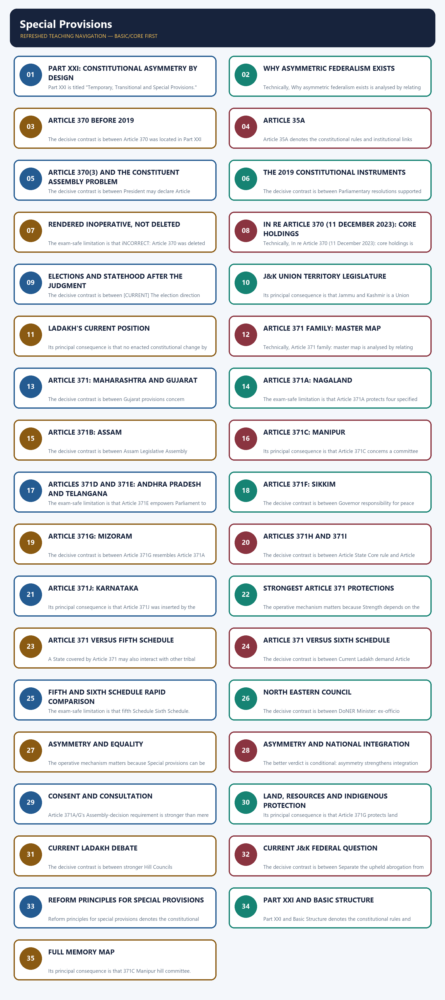

*Distinct embedded teaching-navigation image. The separate continuous Cārvāka-style flowchart package remains an independent at-a-glance artifact.*

### SESSION 1 — PART XXI: CONSTITUTIONAL ASYMMETRY BY DESIGN
#### DEFINITION / WHAT THIS IS CALLED

**Plain-language definition:** Part XXI: constitutional asymmetry by design denotes the constitutional rules and institutional links organised around ordinary State framework.

**Technical definition:** Part XXI is titled "Temporary, Transitional and Special Provisions." Article 370 concerned Jammu and Kashmir; Articles 371-371J create tailored arrangements for 12 States.

#### ANSWER-GRABBING OPENING — WRITE/ADAPT IN THE EXAM

> Part XXI uses differentiated arrangements to accommodate regional histories and vulnerabilities within the Constitution, showing that equality need not require identical institutions.

#### MUST-WRITE KEYWORDS

- **Part XXI**
- **constitutional asymmetry by design**
- **Article 370**
- **former consent-based application of Constitution to J&K**
- **Articles 371-371J**
- **Fifth/Sixth Schedules**

**How to use them:** Frame the answer through Part XXI; define constitutional asymmetry by design, connect Article 370 with former consent-based application of Constitution to J&K to explain the mechanism, and use Articles 371-371J for the decisive comparison or qualification.

Part XXI: constitutional asymmetry by design denotes the constitutional rules and institutional links organised around ordinary State framework.
Part XXI: constitutional asymmetry by design operates through temporary/transitional provisions, connected with State-specific special provisions.
The operative mechanism matters because identity and custom.
Its principal consequence is that regional development.
The decisive contrast is between local employment/education and law-and-order transition.
The exam-safe limitation is that [FACT] Part XXI is titled "Temporary, Transitional and Special Provisions.".
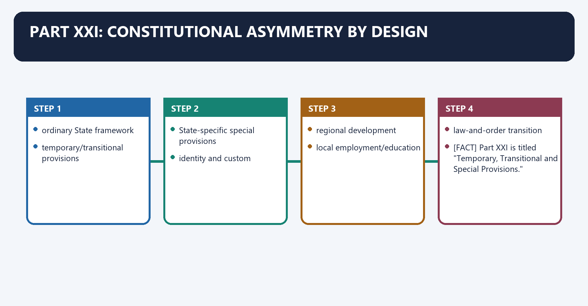
**Visual 1 - Part XXI concept**

```text
ONE UNION
   |
   +-- ordinary State framework
   |
   +-- temporary/transitional provisions
   |
   +-- State-specific special provisions
           |
           +-- identity and custom
           +-- regional development
           +-- local employment/education
           +-- law-and-order transition
```

Caption: Constitutional equality does not require identical institutional arrangements in every region.

- [FACT] Part XXI is titled "Temporary, Transitional and Special Provisions."
- [FACT] Article 370 concerned Jammu and Kashmir; Articles 371-371J create tailored arrangements for 12 States.
- [ANALYSIS] India uses asymmetry to integrate regions with distinct histories, communities, institutions or development needs.
- [LIMIT] "Special" does not mean sovereign, secessionist or outside the Constitution.

**Visual 2 - Three different mechanisms**

| Mechanism | Constitutional location | Core technique |
|---|---|---|
| Article 370 | Part XXI | former consent-based application of Constitution to J&K |
| Articles 371-371J | Part XXI | State-specific safeguards/responsibilities |
| Fifth/Sixth Schedules | Article 244, Part X | Scheduled-Area protection / autonomous tribal councils |

> **UPSC trap:** Similar protective purposes do not make these legally interchangeable.

#### CLOSING RECALL FLOW — PART XXI: CONSTITUTIONAL ASYMMETRY BY DESIGN

```closure-flow
SUBTOPIC: Part XXI: constitutional asymmetry by design
KEY TERMS / DEFINITIONS: Part XXI · constitutional asymmetry by design · Article 370 · former consent-based application of Constitution to J&K · Articles 371-371J · Fifth/Sixth Schedules
MECHANISM / ARGUMENT: Part XXI is titled "Temporary, Transitional and Special Provisions." Article 370 concerned Jammu and Kashmir; Articles 371-371J create tailored arrangements for 12 States.
CONSEQUENCE / CONTRAST: The decisive contrast is between local employment/education and law-and-order transition.
UPSC TRAP / ANSWER-USE: Similar protective purposes do not make these legally interchangeable.
ANSWER-GRABBING FORMULATION: Part XXI uses differentiated arrangements to accommodate regional histories and vulnerabilities within the Constitution, showing that equality need not require identical institutions.
```
### SESSION 2 — WHY ASYMMETRIC FEDERALISM EXISTS
#### DEFINITION / WHAT THIS IS CALLED

**Plain-language definition:** Why asymmetric federalism exists denotes the constitutional rules and institutional links organised around historical difference.

**Technical definition:** Technically, Why asymmetric federalism exists is analysed by relating Why to Its principal consequence, then testing the relationship through Its and The decisive contrast.

#### ANSWER-GRABBING OPENING — WRITE/ADAPT IN THE EXAM

> Asymmetric federalism is legitimate only when differentiated treatment serves a constitutional purpose and remains proportionate and accountable.

#### MUST-WRITE KEYWORDS

- **Why asymmetric federalism exists**
- **Why**
- **Its principal consequence**
- **Its**
- **The decisive contrast**
- **Asymmetry**

**How to use them:** Frame the answer through Why asymmetric federalism exists; define Why, connect Its principal consequence with Its to explain the mechanism, and use The decisive contrast for the decisive comparison or qualification.

Why asymmetric federalism exists denotes the constitutional rules and institutional links organised around historical difference.
Why asymmetric federalism exists operates through tribal land/custom, connected with regional imbalance.
The operative mechanism matters because tailored constitutional guarantee.
Its principal consequence is that integration with negotiated protection.
The decisive contrast is between [ANALYSIS] Asymmetry may be temporary, permanent, protective, developmental or administrative and historical difference.
The exam-safe limitation is that historical difference.
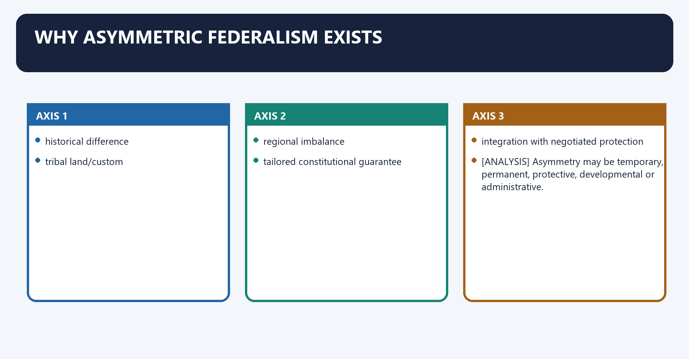
**Visual 3 - Holding-together logic**

```text
historical difference
   + cultural identity
   + tribal land/custom
   + regional imbalance
        |
        v
tailored constitutional guarantee
        |
        v
integration with negotiated protection
```

- [ANALYSIS] In a "holding-together" federation, calibrated difference can reduce conflict by making Union membership compatible with local identity.
- [ANALYSIS] Asymmetry may be temporary, permanent, protective, developmental or administrative.
- [LIMIT] Its legitimacy depends on constitutional purpose and proportionality; asymmetry can also create insider-outsider and accountability concerns.

#### CLOSING RECALL FLOW — WHY ASYMMETRIC FEDERALISM EXISTS

```closure-flow
SUBTOPIC: Why asymmetric federalism exists
KEY TERMS / DEFINITIONS: Why asymmetric federalism exists · Why · Its principal consequence · Its · The decisive contrast · Asymmetry
MECHANISM / ARGUMENT: Its legitimacy depends on constitutional purpose and proportionality; asymmetry can also create insider-outsider and accountability concerns.
CONSEQUENCE / CONTRAST: The decisive contrast is between Asymmetry may be temporary, permanent, protective, developmental or administrative and historical difference.
UPSC TRAP / ANSWER-USE: Do not miss this limiting distinction: its principal consequence is that integration with negotiated protection.
ANSWER-GRABBING FORMULATION: Asymmetric federalism is legitimate only when differentiated treatment serves a constitutional purpose and remains proportionate and accountable.
```
### SESSION 3 — ARTICLE 370 BEFORE 2019
#### DEFINITION / WHAT THIS IS CALLED

**Plain-language definition:** Article 370 before 2019 denotes the constitutional rules and institutional links organised around Instrument of Accession fields.

**Technical definition:** The decisive contrast is between Article 370 was located in Part XXI and described as temporary and It mediated the application of the Indian Constitution to Jammu and Kashmir.

#### ANSWER-GRABBING OPENING — WRITE/ADAPT IN THE EXAM

> Before 2019, Article 370 mediated the Constitution's application to Jammu and Kashmir through consultation and concurrence, but did not create sovereignty outside India.

#### MUST-WRITE KEYWORDS

- **Article 370 before 2019**
- **Article 370**
- **Article**
- **Instrument**
- **Accession**
- **Its principal consequence**

**How to use them:** Frame the answer through Article 370 before 2019; define Article 370, connect Article with Instrument to explain the mechanism, and use Accession for the decisive comparison or qualification.

Article 370 before 2019 denotes the constitutional rules and institutional links organised around Instrument of Accession fields.
Article 370 before 2019 operates through Parliamentary power in specified matters, connected with other constitutional provisions / Union laws.
The operative mechanism matters because presidential Orders under Article 370(1).
Its principal consequence is that consultation or concurrence of J&K government.
The decisive contrast is between [FACT] Article 370 was located in Part XXI and described as temporary and [FACT] It mediated the application of the Indian Constitution to Jammu and Kashmir.
The exam-safe limitation is that [FACT] Jammu and Kashmir had its own Constitution and distinctive constitutional arrangements before 2019.
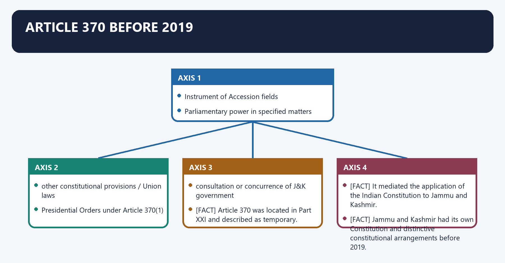
**Visual 4 - Pre-2019 operating model**

```text
Instrument of Accession fields
        |
Parliamentary power in specified matters
        |
other constitutional provisions / Union laws
        |
Presidential Orders under Article 370(1)
        |
consultation or concurrence of J&K government
```

- [FACT] Article 370 was located in Part XXI and described as temporary.
- [FACT] It mediated the application of the Indian Constitution to Jammu and Kashmir.
- [FACT] Defence, external affairs and communications followed the accession framework; wider application developed through Presidential Orders.
- [FACT] Jammu and Kashmir had its own Constitution and distinctive constitutional arrangements before 2019.
- [LIMIT] Special autonomy did not mean independent sovereignty outside India.

#### CLOSING RECALL FLOW — ARTICLE 370 BEFORE 2019

```closure-flow
SUBTOPIC: Article 370 before 2019
KEY TERMS / DEFINITIONS: Article 370 before 2019 · Article 370 · Article · Instrument · Accession · Its principal consequence
MECHANISM / ARGUMENT: Defence, external affairs and communications followed the accession framework; wider application developed through Presidential Orders.
CONSEQUENCE / CONTRAST: The decisive contrast is between Article 370 was located in Part XXI and described as temporary and It mediated the application of the Indian Constitution to Jammu and Kashmir.
UPSC TRAP / ANSWER-USE: Do not miss this limiting distinction: its principal consequence is that consultation or concurrence of J&K government.
ANSWER-GRABBING FORMULATION: Before 2019, Article 370 mediated the Constitution's application to Jammu and Kashmir through consultation and concurrence, but did not create sovereignty outside India.
```
### SESSION 4 — ARTICLE 35A
#### DEFINITION / WHAT THIS IS CALLED

**Plain-language definition:** Its principal consequence is that Article 35A entered through a Presidential Order, not a Parliament-passed constitutional amendment.

**Technical definition:** Article 35A denotes the constitutional rules and institutional links organised around 1954 Constitution Application Order.

#### ANSWER-GRABBING OPENING — WRITE/ADAPT IN THE EXAM

> Article 35A used a Presidential Order to protect permanent-resident rules within single Indian citizenship, but ceased to operate after the 2019 reconfiguration.

#### MUST-WRITE KEYWORDS

- **Article 35A**
- **Article**
- **Constitution Application Order**
- **Its principal consequence**
- **Its**
- **Presidential Order**

**How to use them:** Frame the answer through Article 35A; define Article, connect Constitution Application Order with Its principal consequence to explain the mechanism, and use Its for the decisive comparison or qualification.

Article 35A denotes the constitutional rules and institutional links organised around 1954 Constitution Application Order.
Article 35A operates through inserted Article 35A, connected with J&K legislature could define permanent residents.
The operative mechanism matters because special rights in land, employment and related benefits.
Its principal consequence is that [FACT] Article 35A entered through a Presidential Order, not a Parliament-passed constitutional amendment.
The decisive contrast is between [FACT] It protected J&K laws defining permanent residents and conferring specified special rights and [ANALYSIS] It illustrates differentiated citizenship inside a system of single Indian citizenship.
The exam-safe limitation is that [LIMIT] It ceased to operate with the 2019 constitutional reconfiguration; do not treat it as a current live guarantee.
**Visual 5 - Source and function**

```text
1954 Constitution Application Order
        |
inserted Article 35A
        |
J&K legislature could define permanent residents
        |
special rights in land, employment and related benefits
```

- [FACT] Article 35A entered through a Presidential Order, not a Parliament-passed constitutional amendment.
- [FACT] It protected J&K laws defining permanent residents and conferring specified special rights.
- [ANALYSIS] It illustrates differentiated citizenship inside a system of single Indian citizenship.
- [LIMIT] It ceased to operate with the 2019 constitutional reconfiguration; do not treat it as a current live guarantee.

#### CLOSING RECALL FLOW — ARTICLE 35A

```closure-flow
SUBTOPIC: Article 35A
KEY TERMS / DEFINITIONS: Article 35A · Article · Constitution Application Order · Its principal consequence · Its · Presidential Order
MECHANISM / ARGUMENT: Article 35A operates through inserted Article 35A, connected with J&K legislature could define permanent residents.
CONSEQUENCE / CONTRAST: The decisive contrast is between It protected J&K laws defining permanent residents and conferring specified special rights and It illustrates differentiated citizenship inside a system of single Indian citizenship.
UPSC TRAP / ANSWER-USE: The exam-safe limitation is that It ceased to operate with the 2019 constitutional reconfiguration; do not treat it as a current live guarantee.
ANSWER-GRABBING FORMULATION: Article 35A used a Presidential Order to protect permanent-resident rules within single Indian citizenship, but ceased to operate after the 2019 reconfiguration.
```
### SESSION 5 — ARTICLE 370(3) AND THE CONSTITUENT ASSEMBLY PROBLEM
#### DEFINITION / WHAT THIS IS CALLED

**Plain-language definition:** Article 370(3) and the Constituent Assembly problem denotes the constitutional rules and institutional links organised around President may declare Article inoperative.

**Technical definition:** The decisive contrast is between President may declare Article inoperative and President may declare Article inoperative.

#### ANSWER-GRABBING OPENING — WRITE/ADAPT IN THE EXAM

> The 2023 Constitution Bench held that Article 370(3) power survived the J&K Constituent Assembly's dissolution, rejecting the claim that its recommendation remained permanently indispensable.

#### MUST-WRITE KEYWORDS

- **Article 370(3)**
- **the Constituent Assembly problem**
- **Article 370**
- **Article 370(3) and the Constituent Assembly problem**
- **Article**
- **Constituent Assembly**

**How to use them:** Frame the answer through Article 370(3); define the Constituent Assembly problem, connect Article 370 with Article 370(3) and the Constituent Assembly problem to explain the mechanism, and use Article for the decisive comparison or qualification.

Article 370(3) and the Constituent Assembly problem denotes the constitutional rules and institutional links organised around President may declare Article inoperative.
Article 370(3) and the Constituent Assembly problem operates through proviso referred to J&K Constituent Assembly recommendation, connected with Constituent Assembly dissolved in 1957.
The operative mechanism matters because was Article now permanent, or did presidential power survive?.
Its principal consequence is that [ANALYSIS] The dispute centred on whether dissolution of the J&K Constituent Assembly froze Article 370 permanently.
The decisive contrast is between President may declare Article inoperative and President may declare Article inoperative.
The exam-safe limitation is that president may declare Article inoperative.
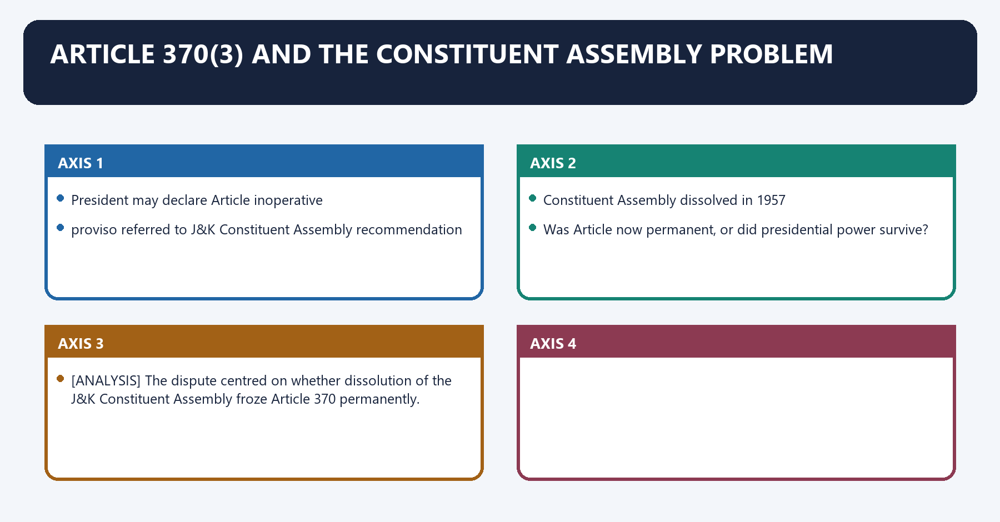
**Visual 6 - Interpretive question**

```text
Article 370(3)
President may declare Article inoperative
        |
proviso referred to J&K Constituent Assembly recommendation
        |
Constituent Assembly dissolved in 1957
        |
Question:
Was Article now permanent, or did presidential power survive?
```

- [ANALYSIS] The dispute centred on whether dissolution of the J&K Constituent Assembly froze Article 370 permanently.
- [FACT] The 2023 Constitution Bench held that presidential power under Article 370(3) survived and that Constituent Assembly recommendation was not a continuing precondition.

#### CLOSING RECALL FLOW — ARTICLE 370(3) AND THE CONSTITUENT ASSEMBLY PROBLEM

```closure-flow
SUBTOPIC: Article 370(3) and the Constituent Assembly problem
KEY TERMS / DEFINITIONS: Article 370(3) · the Constituent Assembly problem · Article 370 · Article 370(3) and the Constituent Assembly problem · Article · Constituent Assembly
MECHANISM / ARGUMENT: The 2023 Constitution Bench held that presidential power under Article 370(3) survived and that Constituent Assembly recommendation was not a continuing precondition.
CONSEQUENCE / CONTRAST: Its principal consequence is that The dispute centred on whether dissolution of the J&K Constituent Assembly froze Article 370 permanently.
UPSC TRAP / ANSWER-USE: Do not miss this limiting distinction: the decisive contrast is between President may declare Article inoperative and President may declare...
ANSWER-GRABBING FORMULATION: The 2023 Constitution Bench held that Article 370(3) power survived the J&K Constituent Assembly's dissolution, rejecting the claim that its recommendation remained permanently indispensable.
```
### SESSION 6 — THE 2019 CONSTITUTIONAL INSTRUMENTS
#### DEFINITION / WHAT THIS IS CALLED

**Plain-language definition:** The 2019 constitutional instruments denotes the constitutional rules and institutional links organised around President's Rule in J&K.

**Technical definition:** The decisive contrast is between Parliamentary resolutions supported the Article 370(3) declaration while the State was under President's Rule and C.O.

#### ANSWER-GRABBING OPENING — WRITE/ADAPT IN THE EXAM

> Parliamentary resolutions supported the Article 370(3) declaration while the State was under President's Rule.

#### MUST-WRITE KEYWORDS

- **The 2019 constitutional instruments**
- **C.O. 272**
- **Presidential Order**
- **applied Constitution and changed interpretive route**
- **Parliamentary action**
- **resolutions/recommendation during President's Rule**

**How to use them:** Frame the answer through The 2019 constitutional instruments; define C.O. 272, connect Presidential Order with applied Constitution and changed interpretive route to explain the mechanism, and use Parliamentary action for the decisive comparison or qualification.

The 2019 constitutional instruments denotes the constitutional rules and institutional links organised around President's Rule in J&K.
The 2019 constitutional instruments operates through C.O. 272: Constitution Application Order, connected with Parliamentary resolutions / recommendation framework.
The operative mechanism matters because c.O. 273: Article 370 declared inoperative.
Its principal consequence is that j&K Reorganisation Act, 2019.
The decisive contrast is between [FACT] Parliamentary resolutions supported the Article 370(3) declaration while the State was under President's Rule and [FACT] C.O. 273 declared Article 370 inoperative except for the modified operative statement.
The exam-safe limitation is that [FACT] The Jammu and Kashmir Reorganisation Act, 2019 divided the former State into.
**Visual 7 - Four-part legal sequence**

```text
President's Rule in J&K
      |
C.O. 272: Constitution Application Order
      |
Parliamentary resolutions / recommendation framework
      |
C.O. 273: Article 370 declared inoperative
      |
J&K Reorganisation Act, 2019
```

- [FACT] On 5 August 2019, C.O. 272 applied the Constitution of India comprehensively to J&K and altered the operative interpretive framework.
- [FACT] Parliamentary resolutions supported the Article 370(3) declaration while the State was under President's Rule.
- [FACT] C.O. 273 declared Article 370 inoperative except for the modified operative statement.
- [FACT] The Jammu and Kashmir Reorganisation Act, 2019 divided the former State into:
  - Union Territory of Jammu and Kashmir with a legislature; and
  - Union Territory of Ladakh without a legislature.
- [FACT] Reorganisation took effect on 31 October 2019.

**Visual 8 - Instrument discipline**

| Instrument | Legal type | What it did |
|---|---|---|
| C.O. 272 | Presidential Order | applied Constitution and changed interpretive route |
| Parliamentary action | resolutions/recommendation during President's Rule | supported Article 370(3) process |
| C.O. 273 | presidential declaration | rendered Article 370 inoperative |
| Reorganisation Act | parliamentary statute | created two Union Territories |

> **UPSC trap:** Do not describe all four steps as a single constitutional amendment.

#### CLOSING RECALL FLOW — THE 2019 CONSTITUTIONAL INSTRUMENTS

```closure-flow
SUBTOPIC: The 2019 constitutional instruments
KEY TERMS / DEFINITIONS: The 2019 constitutional instruments · C.O. 272 · Presidential Order · applied Constitution and changed interpretive route · Parliamentary action · resolutions/recommendation during President's Rule
MECHANISM / ARGUMENT: Do not describe all four steps as a single constitutional amendment.
CONSEQUENCE / CONTRAST: The decisive contrast is between Parliamentary resolutions supported the Article 370(3) declaration while the State was under President's Rule and C.O.
UPSC TRAP / ANSWER-USE: Do not miss this limiting distinction: do not describe all four steps as a single constitutional amendment.
ANSWER-GRABBING FORMULATION: Parliamentary resolutions supported the Article 370(3) declaration while the State was under President's Rule.
```
### SESSION 7 — RENDERED INOPERATIVE, NOT DELETED
#### DEFINITION / WHAT THIS IS CALLED

**Plain-language definition:** Rendered inoperative, not deleted denotes the constitutional rules and institutional links organised around INCORRECT: Article 370 was deleted from Constitution.

**Technical definition:** The exam-safe limitation is that iNCORRECT: Article 370 was deleted from Constitution.

#### ANSWER-GRABBING OPENING — WRITE/ADAPT IN THE EXAM

> Article 370 remains printed in the constitutional text but was rendered inoperative, a distinction that prevents repeal, deletion and loss of operability from being conflated.

#### MUST-WRITE KEYWORDS

- **Rendered inoperative**
- **not deleted**
- **Article 370**
- **Rendered inoperative, not deleted**
- **Rendered**
- **INCORRECT**

**How to use them:** Frame the answer through Rendered inoperative; define not deleted, connect Article 370 with Rendered inoperative, not deleted to explain the mechanism, and use Rendered for the decisive comparison or qualification.

Rendered inoperative, not deleted denotes the constitutional rules and institutional links organised around INCORRECT: Article 370 was deleted from Constitution.
Rendered inoperative, not deleted operates through Article remains in constitutional text, connected with but was rendered inoperative through the 2019 process.
The operative mechanism matters because and the process was upheld in 2023.
Its principal consequence is that [FACT] The Article's printed presence and legal operability are different questions.
The decisive contrast is between [ANALYSIS] Precision matters because "repeal," "deletion," "amendment" and "inoperability" describe different legal events and INCORRECT: Article 370 was deleted from Constitution.
The exam-safe limitation is that iNCORRECT: Article 370 was deleted from Constitution.
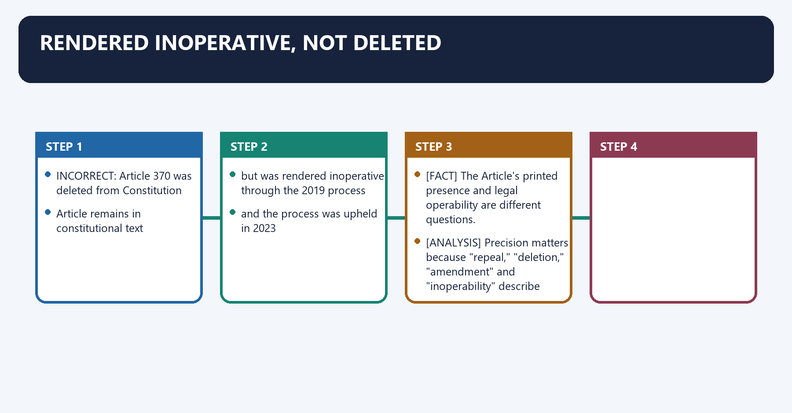
**Visual 9 - Status language**

```text
INCORRECT: Article 370 was deleted from Constitution

CORRECT:
Article remains in constitutional text
but was rendered inoperative through the 2019 process
and the process was upheld in 2023
```

- [FACT] The Article's printed presence and legal operability are different questions.
- [ANALYSIS] Precision matters because "repeal," "deletion," "amendment" and "inoperability" describe different legal events.

#### CLOSING RECALL FLOW — RENDERED INOPERATIVE, NOT DELETED

```closure-flow
SUBTOPIC: Rendered inoperative, not deleted
KEY TERMS / DEFINITIONS: Rendered inoperative · not deleted · Article 370 · Rendered inoperative, not deleted · Rendered · INCORRECT
MECHANISM / ARGUMENT: Rendered inoperative, not deleted operates through Article remains in constitutional text, connected with but was rendered inoperative through the 2019 process.
CONSEQUENCE / CONTRAST: The decisive contrast is between Precision matters because "repeal," "deletion," "amendment" and "inoperability" describe different legal events and INCORRECT: Article 370 was deleted from Constitution.
UPSC TRAP / ANSWER-USE: Do not miss this limiting distinction: its principal consequence is that The Article's printed presence and legal operability are different...
ANSWER-GRABBING FORMULATION: Article 370 remains printed in the constitutional text but was rendered inoperative, a distinction that prevents repeal, deletion and loss of operability from being conflated.
```
### SESSION 8 — IN RE ARTICLE 370 (11 DECEMBER 2023): CORE HOLDINGS
#### DEFINITION / WHAT THIS IS CALLED

**Plain-language definition:** In re Article 370 (11 December 2023): core holdings denotes the constitutional rules and institutional links organised around Question Court's position.

**Technical definition:** Technically, In re Article 370 (11 December 2023): core holdings is analysed by relating In re Article 370 (11 December 2023) to core holdings, then testing the relationship through Nature of Article 370 and temporary provision.

#### ANSWER-GRABBING OPENING — WRITE/ADAPT IN THE EXAM

> In re Article 370 upheld the 2019 constitutional result and rejected continuing internal sovereignty, but did not finally validate every conceivable conversion of a State into Union Territories.

#### MUST-WRITE KEYWORDS

- **In re Article 370 (11 December 2023)**
- **core holdings**
- **Nature of Article 370**
- **temporary provision**
- **J&K sovereignty**
- **President's Article 370(3) power**

**How to use them:** Frame the answer through In re Article 370 (11 December 2023); define core holdings, connect Nature of Article 370 with temporary provision to explain the mechanism, and use J&K sovereignty for the decisive comparison or qualification.

*In re Article 370* (11 December 2023): core holdings denotes the constitutional rules and institutional links organised around Question Court's position.
*In re Article 370* (11 December 2023): core holdings operates through Nature of Article 370 temporary provision, connected with J&K sovereignty no internal sovereignty distinct from other States after accession.
The operative mechanism matters because president's Article 370(3) power survived Constituent Assembly dissolution.
Its principal consequence is that 2019 abrogation upheld.
The decisive contrast is between C.O. 272 Article 367 route unnecessary to validate because direct Article 370(3) route sufficient and Assembly elections directed by 30 September 2024.
The exam-safe limitation is that j&K Statehood Union assurance recorded; restoration at earliest.
**Visual 10 - Holding map**

| Question | Court's position |
|---|---|
| Nature of Article 370 | temporary provision |
| J&K sovereignty | no internal sovereignty distinct from other States after accession |
| President's Article 370(3) power | survived Constituent Assembly dissolution |
| 2019 abrogation | upheld |
| C.O. 272 Article 367 route | unnecessary to validate because direct Article 370(3) route sufficient |
| Assembly elections | directed by 30 September 2024 |
| J&K Statehood | Union assurance recorded; restoration at earliest |
| validity of conversion into UT | not adjudicated conclusively |

- [FACT] The Court unanimously upheld the constitutional result of making Article 370 inoperative.
- [FACT] It held that Article 370 embodied a temporary arrangement associated with transition and integration.
- [FACT] It rejected a claim to continuing internal sovereignty.
- [LIMIT] Do not claim the Court conclusively upheld every step of the C.O. 272 Article 367 route; the Court found that route unnecessary for the valid result.
- [LIMIT] Do not claim the Court finally decided that Parliament may permanently convert any State into a Union Territory.

#### CLOSING RECALL FLOW — IN RE ARTICLE 370 (11 DECEMBER 2023): CORE HOLDINGS

```closure-flow
SUBTOPIC: In re Article 370 (11 December 2023): core holdings
KEY TERMS / DEFINITIONS: In re Article 370 (11 December 2023) · core holdings · Nature of Article 370 · temporary provision · J&K sovereignty · President's Article 370(3) power
MECHANISM / ARGUMENT: Do not claim the Court finally decided that Parliament may permanently convert any State into a Union Territory.
CONSEQUENCE / CONTRAST: Do not claim the Court conclusively upheld every step of the C.O.
UPSC TRAP / ANSWER-USE: Do not miss this limiting distinction: its principal consequence is that 2019 abrogation upheld.
ANSWER-GRABBING FORMULATION: In re Article 370 upheld the 2019 constitutional result and rejected continuing internal sovereignty, but did not finally validate every conceivable conversion of a State into Union Territories.
```
### SESSION 9 — ELECTIONS AND STATEHOOD AFTER THE JUDGMENT
#### DEFINITION / WHAT THIS IS CALLED

**Plain-language definition:** Elections and Statehood after the judgment denotes the constitutional rules and institutional links organised around 11 Dec 2023 judgment.

**Technical definition:** The decisive contrast is between [CURRENT] The election direction was substantially implemented through the 2024 Assembly election and [CURRENT] The restoration of Statehood remains pending.

#### ANSWER-GRABBING OPENING — WRITE/ADAPT IN THE EXAM

> The 2024 Assembly election substantially implemented the Court's electoral direction, while restoration of Jammu and Kashmir's Statehood remains pending without a judicially fixed deadline.

#### MUST-WRITE KEYWORDS

- **Elections**
- **Statehood after the judgment**
- **Elections and Statehood after the judgment**
- **Statehood**
- **Dec**
- **Its principal consequence**

**How to use them:** Frame the answer through Elections; define Statehood after the judgment, connect Elections and Statehood after the judgment with Statehood to explain the mechanism, and use Dec for the decisive comparison or qualification.

Elections and Statehood after the judgment denotes the constitutional rules and institutional links organised around 11 Dec 2023 judgment.
Elections and Statehood after the judgment operates through election deadline: 30 Sep 2024, connected with Assembly elections: Sep-Oct 2024.
The operative mechanism matters because elected J&K government / UT legislature.
Its principal consequence is that 18 Aug 2026: Statehood still pending.
The decisive contrast is between [CURRENT] The election direction was substantially implemented through the 2024 Assembly election and [CURRENT] The restoration of Statehood remains pending.
The exam-safe limitation is that [LIMIT] "At the earliest" was tied to the Union's assurance; it was not converted into a fixed judicial date.
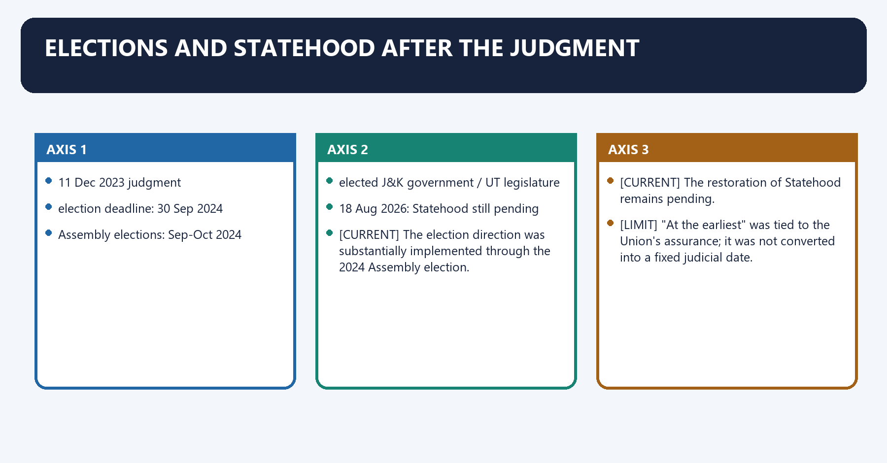
**Visual 11 - Judgment-to-current timeline**

```text
11 Dec 2023 judgment
      |
election deadline: 30 Sep 2024
      |
Assembly elections: Sep-Oct 2024
      |
elected J&K government / UT legislature
      |
18 Aug 2026: Statehood still pending
```

- [CURRENT] The election direction was substantially implemented through the 2024 Assembly election.
- [CURRENT] The restoration of Statehood remains pending.
- [LIMIT] "At the earliest" was tied to the Union's assurance; it was not converted into a fixed judicial date.

#### CLOSING RECALL FLOW — ELECTIONS AND STATEHOOD AFTER THE JUDGMENT

```closure-flow
SUBTOPIC: Elections and Statehood after the judgment
KEY TERMS / DEFINITIONS: Elections · Statehood after the judgment · Elections and Statehood after the judgment · Statehood · Dec · Its principal consequence
MECHANISM / ARGUMENT: The decisive contrast is between [CURRENT] The election direction was substantially implemented through the 2024 Assembly election and [CURRENT] The restoration of Statehood remains pending.
CONSEQUENCE / CONTRAST: Its principal consequence is that 18 Aug 2026: Statehood still pending.
UPSC TRAP / ANSWER-USE: The exam-safe limitation is that "At the earliest" was tied to the Union's assurance; it was not converted into a fixed judicial date.
ANSWER-GRABBING FORMULATION: The 2024 Assembly election substantially implemented the Court's electoral direction, while restoration of Jammu and Kashmir's Statehood remains pending without a judicially fixed deadline.
```
### SESSION 10 — J&K UNION TERRITORY LEGISLATURE
#### DEFINITION / WHAT THIS IS CALLED

**Plain-language definition:** J&K Union Territory Legislature denotes the constitutional rules and institutional links organised around J&K Reorganisation Act, 2019.

**Technical definition:** Its principal consequence is that Jammu and Kashmir is a Union Territory with a Legislative Assembly.

#### ANSWER-GRABBING OPENING — WRITE/ADAPT IN THE EXAM

> Jammu and Kashmir's legislature resembles a State Assembly electorally, but its statutory Union Territory basis gives the Union and Lieutenant Governor stronger controls.

#### MUST-WRITE KEYWORDS

- **J&K Union Territory Legislature**
- **Union Territory Legislature**
- **Reorganisation Act**
- **Its principal consequence**
- **Its**
- **Jammu**

**How to use them:** Frame the answer through J&K Union Territory Legislature; define Union Territory Legislature, connect Reorganisation Act with Its principal consequence to explain the mechanism, and use Its for the decisive comparison or qualification.

J&K Union Territory Legislature denotes the constitutional rules and institutional links organised around J&K Reorganisation Act, 2019.
J&K Union Territory Legislature operates through Lieutenant Governor + Legislative Assembly, connected with Council of Ministers headed by Chief Minister.
The operative mechanism matters because uT law-making and accountability within statutory limits.
Its principal consequence is that [FACT] Jammu and Kashmir is a Union Territory with a Legislative Assembly.
The decisive contrast is between [FACT] The Assembly legislates within the fields and limits provided by the Constitution and the Reorganisation Act and [FACT] Public order and police remain outside the Assembly's ordinary State-List competence.
The exam-safe limitation is that [FACT] The Assembly performs budgetary, deliberative and executive-accountability functions.
**Visual 12 - Institutional position**

```text
Parliament
   |
J&K Reorganisation Act, 2019
   |
Lieutenant Governor + Legislative Assembly
   |
Council of Ministers headed by Chief Minister
   |
UT law-making and accountability within statutory limits
```

- [FACT] Jammu and Kashmir is a Union Territory with a Legislative Assembly.
- [FACT] The Assembly legislates within the fields and limits provided by the Constitution and the Reorganisation Act.
- [FACT] Public order and police remain outside the Assembly's ordinary State-List competence.
- [FACT] The Assembly performs budgetary, deliberative and executive-accountability functions.
- [ANALYSIS] It resembles a State legislature in electoral form but remains a statutory Union Territory legislature with stronger Union/Lieutenant Governor controls.
- [LIMIT] Do not describe present J&K as a State or as constitutionally identical to Delhi.

#### CLOSING RECALL FLOW — J&K UNION TERRITORY LEGISLATURE

```closure-flow
SUBTOPIC: J&K Union Territory Legislature
KEY TERMS / DEFINITIONS: J&K Union Territory Legislature · Union Territory Legislature · Reorganisation Act · Its principal consequence · Its · Jammu
MECHANISM / ARGUMENT: It resembles a State legislature in electoral form but remains a statutory Union Territory legislature with stronger Union/Lieutenant Governor controls.
CONSEQUENCE / CONTRAST: Its principal consequence is that Jammu and Kashmir is a Union Territory with a Legislative Assembly.
UPSC TRAP / ANSWER-USE: Do not miss this limiting distinction: the decisive contrast is between The Assembly legislates within the fields and limits provided...
ANSWER-GRABBING FORMULATION: Jammu and Kashmir's legislature resembles a State Assembly electorally, but its statutory Union Territory basis gives the Union and Lieutenant Governor stronger controls.
```
### SESSION 11 — LADAKH'S CURRENT POSITION
#### DEFINITION / WHAT THIS IS CALLED

**Plain-language definition:** Ladakh's current position denotes the constitutional rules and institutional links organised around Union Territory without legislature.

**Technical definition:** Its principal consequence is that no enacted constitutional change by 18 Aug 2026.

#### ANSWER-GRABBING OPENING — WRITE/ADAPT IN THE EXAM

> Ladakh remains a Union Territory without a legislature, while Statehood and Sixth Schedule demands remain political proposals rather than enacted constitutional status.

#### MUST-WRITE KEYWORDS

- **Ladakh's current position**
- **Ladakh's**
- **Union Territory**
- **Its principal consequence**
- **Its**
- **Aug**

**How to use them:** Frame the answer through Ladakh's current position; define Ladakh's, connect Union Territory with Its principal consequence to explain the mechanism, and use Its for the decisive comparison or qualification.

Ladakh's current position denotes the constitutional rules and institutional links organised around Union Territory without legislature.
Ladakh's current position operates through Hill Councils and Union administration, connected with land/job protection.
The operative mechanism matters because public Service Commission.
Its principal consequence is that no enacted constitutional change by 18 Aug 2026.
The decisive contrast is between [CURRENT] Ladakh has no legislature and [CURRENT] Sixth Schedule and Statehood demands remain political/negotiation demands.
The exam-safe limitation is that [LIMIT] A proposal, protest, committee discussion or reported offer is not a constitutional amendment.
**Visual 13 - Ladakh status**

```text
Union Territory without legislature
        |
Hill Councils and Union administration
        |
demands:
  Statehood
  Sixth Schedule
  land/job protection
  Public Service Commission
        |
No enacted constitutional change by 18 Aug 2026
```

- [CURRENT] Ladakh has no legislature.
- [CURRENT] Sixth Schedule and Statehood demands remain political/negotiation demands.
- [LIMIT] A proposal, protest, committee discussion or reported offer is not a constitutional amendment.

#### CLOSING RECALL FLOW — LADAKH'S CURRENT POSITION

```closure-flow
SUBTOPIC: Ladakh's current position
KEY TERMS / DEFINITIONS: Ladakh's current position · Ladakh's · Union Territory · Its principal consequence · Its · Aug
MECHANISM / ARGUMENT: Its principal consequence is that no enacted constitutional change by 18 Aug 2026.
CONSEQUENCE / CONTRAST: The decisive contrast is between [CURRENT] Ladakh has no legislature and [CURRENT] Sixth Schedule and Statehood demands remain political/negotiation demands.
UPSC TRAP / ANSWER-USE: The exam-safe limitation is that A proposal, protest, committee discussion or reported offer is not a constitutional amendment.
ANSWER-GRABBING FORMULATION: Ladakh remains a Union Territory without a legislature, while Statehood and Sixth Schedule demands remain political proposals rather than enacted constitutional status.
```
### SESSION 12 — ARTICLE 371 FAMILY: MASTER MAP
#### DEFINITION / WHAT THIS IS CALLED

**Plain-language definition:** Article 371 family: master map denotes the constitutional rules and institutional links organised around Article State(s) Core protection.

**Technical definition:** Technically, Article 371 family: master map is analysed by relating Article 371 family to master map, then testing the relationship through Mnemonic groups and Maharashtra, Gujarat.

#### ANSWER-GRABBING OPENING — WRITE/ADAPT IN THE EXAM

> Articles 371 to 371J create distinct development, customary-law, representation and administrative safeguards, so the family cannot be treated as a single uniform autonomy model.

#### MUST-WRITE KEYWORDS

- **Article 371 family**
- **master map**
- **Mnemonic groups**
- **Maharashtra, Gujarat**
- **regional development boards and equitable allocation**
- **371A**

**How to use them:** Frame the answer through Article 371 family; define master map, connect Mnemonic groups with Maharashtra, Gujarat to explain the mechanism, and use regional development boards and equitable allocation for the decisive comparison or qualification.

Article 371 family: master map denotes the constitutional rules and institutional links organised around Article State(s) Core protection.
Article 371 family: master map operates through 371 Maharashtra, Gujarat regional development boards and equitable allocation, connected with 371A Nagaland custom, land, justice and special law/order arrangements.
The operative mechanism matters because 371B Assam Assembly committee for tribal areas.
Its principal consequence is that 371C Manipur Hill Areas Committee and Governor responsibility.
The decisive contrast is between 371D/E Andhra Pradesh, Telangana equitable local opportunity; Central University provision and 371F Sikkim integration and representation safeguards.
The exam-safe limitation is that 371G Mizoram custom, land and justice protections.
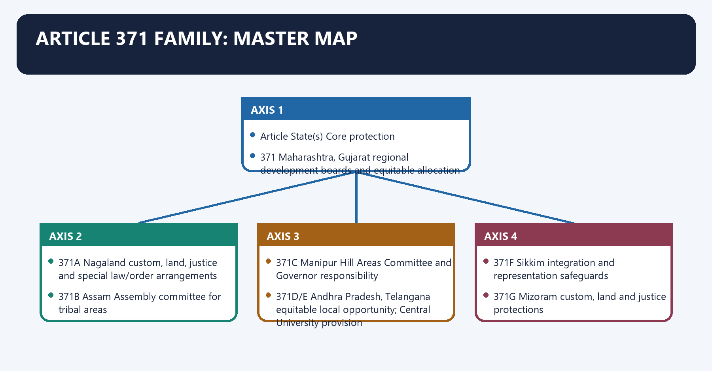
**Visual 14 - Twelve-State spectrum**

| Article | State(s) | Core protection |
|---|---|---|
| 371 | Maharashtra, Gujarat | regional development boards and equitable allocation |
| 371A | Nagaland | custom, land, justice and special law/order arrangements |
| 371B | Assam | Assembly committee for tribal areas |
| 371C | Manipur | Hill Areas Committee and Governor responsibility |
| 371D/E | Andhra Pradesh, Telangana | equitable local opportunity; Central University provision |
| 371F | Sikkim | integration and representation safeguards |
| 371G | Mizoram | custom, land and justice protections |
| 371H | Arunachal Pradesh | Governor's law/order responsibility |
| 371I | Goa | minimum Assembly size |
| 371J | Karnataka | Kalyana Karnataka regional development and local opportunity |

> **Mnemonic groups:** Development - 371 and 371J; Custom/land - 371A and 371G; Committees - 371B and 371C.

#### CLOSING RECALL FLOW — ARTICLE 371 FAMILY: MASTER MAP

```closure-flow
SUBTOPIC: Article 371 family: master map
KEY TERMS / DEFINITIONS: Article 371 family · master map · Mnemonic groups · Maharashtra, Gujarat · regional development boards and equitable allocation · 371A
MECHANISM / ARGUMENT: Its principal consequence is that 371C Manipur Hill Areas Committee and Governor responsibility.
CONSEQUENCE / CONTRAST: The decisive contrast is between 371D/E Andhra Pradesh, Telangana equitable local opportunity; Central University provision and 371F Sikkim integration and representation safeguards.
UPSC TRAP / ANSWER-USE: Do not miss this limiting distinction: the exam-safe limitation is that 371G Mizoram custom, land and justice protections.
ANSWER-GRABBING FORMULATION: Articles 371 to 371J create distinct development, customary-law, representation and administrative safeguards, so the family cannot be treated as a single uniform autonomy model.
```
### SESSION 13 — ARTICLE 371: MAHARASHTRA AND GUJARAT
#### DEFINITION / WHAT THIS IS CALLED

**Plain-language definition:** Article 371: Maharashtra and Gujarat denotes the constitutional rules and institutional links organised around Governor's special responsibility.

**Technical definition:** The decisive contrast is between Gujarat provisions concern Saurashtra, Kutch and the rest of Gujarat and The Article constitutionalises intra-State regional equity rather than cultural autonomy.

#### ANSWER-GRABBING OPENING — WRITE/ADAPT IN THE EXAM

> Article 371 addresses intra-State regional imbalance in Maharashtra and Gujarat through development boards and equitable allocation, rather than granting cultural autonomy.

#### MUST-WRITE KEYWORDS

- **Article 371**
- **Maharashtra**
- **Gujarat**
- **Article 371: Maharashtra and Gujarat**
- **Article**
- **Governor's**

**How to use them:** Frame the answer through Article 371; define Maharashtra, connect Gujarat with Article 371: Maharashtra and Gujarat to explain the mechanism, and use Article for the decisive comparison or qualification.

Article 371: Maharashtra and Gujarat denotes the constitutional rules and institutional links organised around Governor's special responsibility.
Article 371: Maharashtra and Gujarat operates through separate development boards, connected with equitable allocation of development expenditure.
The operative mechanism matters because opportunity in technical education and State services.
Its principal consequence is that [FACT] Maharashtra provisions concern Vidarbha, Marathwada and the rest of Maharashtra.
The decisive contrast is between [FACT] Gujarat provisions concern Saurashtra, Kutch and the rest of Gujarat and [ANALYSIS] The Article constitutionalises intra-State regional equity rather than cultural autonomy.
The exam-safe limitation is that governor's special responsibility.
**Visual 15 - Regional balance mechanism**

```text
Governor's special responsibility
   |
separate development boards
   |
annual reporting
   |
equitable allocation of development expenditure
   |
opportunity in technical education and State services
```

- [FACT] Maharashtra provisions concern Vidarbha, Marathwada and the rest of Maharashtra.
- [FACT] Gujarat provisions concern Saurashtra, Kutch and the rest of Gujarat.
- [ANALYSIS] The Article constitutionalises intra-State regional equity rather than cultural autonomy.

#### CLOSING RECALL FLOW — ARTICLE 371: MAHARASHTRA AND GUJARAT

```closure-flow
SUBTOPIC: Article 371: Maharashtra and Gujarat
KEY TERMS / DEFINITIONS: Article 371 · Maharashtra · Gujarat · Article 371: Maharashtra and Gujarat · Article · Governor's
MECHANISM / ARGUMENT: The decisive contrast is between Gujarat provisions concern Saurashtra, Kutch and the rest of Gujarat and The Article constitutionalises intra-State regional equity rather than cultural autonomy.
CONSEQUENCE / CONTRAST: Its principal consequence is that Maharashtra provisions concern Vidarbha, Marathwada and the rest of Maharashtra.
UPSC TRAP / ANSWER-USE: Do not miss this limiting distinction: the exam-safe limitation is that governor's special responsibility.
ANSWER-GRABBING FORMULATION: Article 371 addresses intra-State regional imbalance in Maharashtra and Gujarat through development boards and equitable allocation, rather than granting cultural autonomy.
```
### SESSION 14 — ARTICLE 371A: NAGALAND
#### DEFINITION / WHAT THIS IS CALLED

**Plain-language definition:** Article 371A: Nagaland denotes the constitutional rules and institutional links organised around Act of Parliament concerns.

**Technical definition:** The exam-safe limitation is that Article 371A protects four specified fields from automatic parliamentary-law application.

#### ANSWER-GRABBING OPENING — WRITE/ADAPT IN THE EXAM

> Article 371A protects specified Naga customary, justice and land matters through Assembly acceptance, but does not create a general veto over parliamentary law.

#### MUST-WRITE KEYWORDS

- **Article 371A**
- **Nagaland**
- **Article 371**
- **Article 371A: Nagaland**
- **Article**
- **Act**

**How to use them:** Frame the answer through Article 371A; define Nagaland, connect Article 371 with Article 371A: Nagaland to explain the mechanism, and use Article for the decisive comparison or qualification.

Article 371A: Nagaland denotes the constitutional rules and institutional links organised around Act of Parliament concerns.
Article 371A: Nagaland operates through Naga religious/social practices, connected with customary law and procedure.
The operative mechanism matters because customary civil/criminal justice.
Its principal consequence is that ownership/transfer of land and resources.
The decisive contrast is between does not apply to Nagaland and unless State Assembly resolves otherwise.
The exam-safe limitation is that [FACT] Article 371A protects four specified fields from automatic parliamentary-law application.
**Visual 16 - Assembly-consent shield**

```text
Act of Parliament concerns:
  Naga religious/social practices
  customary law and procedure
  customary civil/criminal justice
  ownership/transfer of land and resources
        |
does not apply to Nagaland
unless State Assembly resolves otherwise
```

- [FACT] Article 371A protects four specified fields from automatic parliamentary-law application.
- [FACT] It includes special transitional arrangements for Tuensang and a Governor law-and-order responsibility in the constitutionally specified context.
- [ANALYSIS] This is one of the strongest consent-based protections in the Article 371 family.
- [LIMIT] It does not create a general Nagaland veto over every Act of Parliament.

#### CLOSING RECALL FLOW — ARTICLE 371A: NAGALAND

```closure-flow
SUBTOPIC: Article 371A: Nagaland
KEY TERMS / DEFINITIONS: Article 371A · Nagaland · Article 371 · Article 371A: Nagaland · Article · Act
MECHANISM / ARGUMENT: The exam-safe limitation is that Article 371A protects four specified fields from automatic parliamentary-law application.
CONSEQUENCE / CONTRAST: It does not create a general Nagaland veto over every Act of Parliament.
UPSC TRAP / ANSWER-USE: The decisive contrast is between does not apply to Nagaland and unless State Assembly resolves otherwise.
ANSWER-GRABBING FORMULATION: Article 371A protects specified Naga customary, justice and land matters through Assembly acceptance, but does not create a general veto over parliamentary law.
```
### SESSION 15 — ARTICLE 371B: ASSAM
#### DEFINITION / WHAT THIS IS CALLED

**Plain-language definition:** Article 371B: Assam denotes the constitutional rules and institutional links organised around Assam Legislative Assembly committee.

**Technical definition:** The decisive contrast is between Assam Legislative Assembly committee and Assam Legislative Assembly committee.

#### ANSWER-GRABBING OPENING — WRITE/ADAPT IN THE EXAM

> Article 371B embeds Assam tribal-area representation inside the State Assembly rather than transferring general State power to a separate institution.

#### MUST-WRITE KEYWORDS

- **Article 371B**
- **Assam**
- **Article 371B: Assam**
- **Article**
- **Assam Legislative Assembly**
- **Its principal consequence**

**How to use them:** Frame the answer through Article 371B; define Assam, connect Article 371B: Assam with Article to explain the mechanism, and use Assam Legislative Assembly for the decisive comparison or qualification.

Article 371B: Assam denotes the constitutional rules and institutional links organised around Assam Legislative Assembly committee.
Article 371B: Assam operates through members elected from Sixth Schedule tribal areas, connected with specified additional members if provided.
The operative mechanism matters because [FACT] Article 371B enables a special Assembly committee for Assam's tribal areas.
Its principal consequence is that [ANALYSIS] It embeds tribal-area voice inside the State legislature rather than transferring all power to a separate State institution.
The decisive contrast is between Assam Legislative Assembly committee and Assam Legislative Assembly committee.
The exam-safe limitation is that assam Legislative Assembly committee.
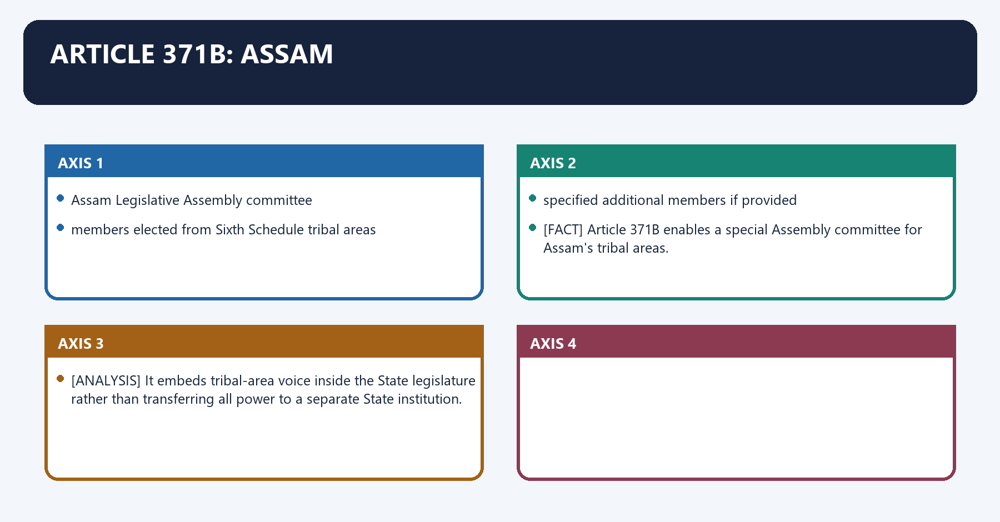
**Visual 17 - Tribal Areas Committee**

```text
President's order
      |
Assam Legislative Assembly committee
      |
members elected from Sixth Schedule tribal areas
      |
specified additional members if provided
```

- [FACT] Article 371B enables a special Assembly committee for Assam's tribal areas.
- [ANALYSIS] It embeds tribal-area voice inside the State legislature rather than transferring all power to a separate State institution.

#### CLOSING RECALL FLOW — ARTICLE 371B: ASSAM

```closure-flow
SUBTOPIC: Article 371B: Assam
KEY TERMS / DEFINITIONS: Article 371B · Assam · Article 371B: Assam · Article · Assam Legislative Assembly · Its principal consequence
MECHANISM / ARGUMENT: The decisive contrast is between Assam Legislative Assembly committee and Assam Legislative Assembly committee.
CONSEQUENCE / CONTRAST: Its principal consequence is that It embeds tribal-area voice inside the State legislature rather than transferring all power to a separate State institution.
UPSC TRAP / ANSWER-USE: Do not miss this limiting distinction: the exam-safe limitation is that assam Legislative Assembly committee.
ANSWER-GRABBING FORMULATION: Article 371B embeds Assam tribal-area representation inside the State Assembly rather than transferring general State power to a separate institution.
```
### SESSION 16 — ARTICLE 371C: MANIPUR
#### DEFINITION / WHAT THIS IS CALLED

**Plain-language definition:** Article 371C: Manipur denotes the constitutional rules and institutional links organised around Hill Areas Committee in Assembly.

**Technical definition:** Its principal consequence is that Article 371C concerns a committee of members elected from Hill Areas.

#### ANSWER-GRABBING OPENING — WRITE/ADAPT IN THE EXAM

> Article 371C addresses Manipur's valley-hill asymmetry through a Hill Areas Committee and Union-supervised reporting, linking representation with targeted administrative oversight.

#### MUST-WRITE KEYWORDS

- **Article 371C**
- **Manipur**
- **Article 371C: Manipur**
- **Article**
- **Hill Areas Committee**
- **Assembly**

**How to use them:** Frame the answer through Article 371C; define Manipur, connect Article 371C: Manipur with Article to explain the mechanism, and use Hill Areas Committee for the decisive comparison or qualification.

Article 371C: Manipur denotes the constitutional rules and institutional links organised around Hill Areas Committee in Assembly.
Article 371C: Manipur operates through Governor's special responsibility, connected with Governor's report to President.
The operative mechanism matters because institutional protection for hill interests.
Its principal consequence is that [FACT] Article 371C concerns a committee of members elected from Hill Areas.
The decisive contrast is between [FACT] Presidential orders structure committee functioning and State business and [ANALYSIS] The provision responds to valley-hill asymmetry through legislative representation and Union-supervised reporting.
The exam-safe limitation is that hill Areas Committee in Assembly.
**Visual 18 - Hill Areas safeguard**

```text
Hill Areas Committee in Assembly
          +
Governor's special responsibility
          +
Governor's report to President
          =
institutional protection for hill interests
```

- [FACT] Article 371C concerns a committee of members elected from Hill Areas.
- [FACT] Presidential orders structure committee functioning and State business.
- [ANALYSIS] The provision responds to valley-hill asymmetry through legislative representation and Union-supervised reporting.

#### CLOSING RECALL FLOW — ARTICLE 371C: MANIPUR

```closure-flow
SUBTOPIC: Article 371C: Manipur
KEY TERMS / DEFINITIONS: Article 371C · Manipur · Article 371C: Manipur · Article · Hill Areas Committee · Assembly
MECHANISM / ARGUMENT: The decisive contrast is between Presidential orders structure committee functioning and State business and The provision responds to valley-hill asymmetry through legislative representation and Union-supervised reporting.
CONSEQUENCE / CONTRAST: Its principal consequence is that Article 371C concerns a committee of members elected from Hill Areas.
UPSC TRAP / ANSWER-USE: Do not miss this limiting distinction: the exam-safe limitation is that hill Areas Committee in Assembly.
ANSWER-GRABBING FORMULATION: Article 371C addresses Manipur's valley-hill asymmetry through a Hill Areas Committee and Union-supervised reporting, linking representation with targeted administrative oversight.
```
### SESSION 17 — ARTICLES 371D AND 371E: ANDHRA PRADESH AND TELANGANA
#### DEFINITION / WHAT THIS IS CALLED

**Plain-language definition:** Articles 371D and 371E: Andhra Pradesh and Telangana denotes the constitutional rules and institutional links organised around regional imbalance.

**Technical definition:** The exam-safe limitation is that Article 371E empowers Parliament to establish a Central University in Andhra Pradesh.

#### ANSWER-GRABBING OPENING — WRITE/ADAPT IN THE EXAM

> Article 371D authorises regional arrangements for equitable public employment and education, using constitutional asymmetry to address intra-State imbalance.

#### MUST-WRITE KEYWORDS

- **Articles 371D**
- **Andhra Pradesh**
- **Telangana**
- **Article 371D**
- **Article 371E**
- **371E**

**How to use them:** Frame the answer through Articles 371D; define Andhra Pradesh, connect Telangana with Article 371D to explain the mechanism, and use Article 371E for the decisive comparison or qualification.

Articles 371D and 371E: Andhra Pradesh and Telangana denotes the constitutional rules and institutional links organised around regional imbalance.
Articles 371D and 371E: Andhra Pradesh and Telangana operates through Presidential Orders, connected with local cadres / local areas.
The operative mechanism matters because equitable public employment and education opportunity.
Its principal consequence is that [FACT] Article 371D authorises special arrangements for equitable opportunities and facilities in public employment and education.
The decisive contrast is between [FACT] It permits organisation of local cadres and residence/local-area preferences through constitutional orders and [FACT] Its framework extends to Andhra Pradesh and Telangana after bifurcation.
The exam-safe limitation is that [FACT] Article 371E empowers Parliament to establish a Central University in Andhra Pradesh.
**Visual 19 - Equitable opportunity model**

```text
regional imbalance
      |
Presidential Orders
      |
local cadres / local areas
      |
equitable public employment and education opportunity
```

- [FACT] Article 371D authorises special arrangements for equitable opportunities and facilities in public employment and education.
- [FACT] It permits organisation of local cadres and residence/local-area preferences through constitutional orders.
- [FACT] Its framework extends to Andhra Pradesh and Telangana after bifurcation.
- [FACT] Article 371E empowers Parliament to establish a Central University in Andhra Pradesh.
- [LIMIT] Article 371E is an enabling university provision, not a general local-reservation clause.

#### CLOSING RECALL FLOW — ARTICLES 371D AND 371E: ANDHRA PRADESH AND TELANGANA

```closure-flow
SUBTOPIC: Articles 371D and 371E: Andhra Pradesh and Telangana
KEY TERMS / DEFINITIONS: Articles 371D · Andhra Pradesh · Telangana · Article 371D · Article 371E · 371E
MECHANISM / ARGUMENT: The decisive contrast is between It permits organisation of local cadres and residence/local-area preferences through constitutional orders and Its framework extends to Andhra Pradesh and Telangana after bifurcation.
CONSEQUENCE / CONTRAST: The exam-safe limitation is that Article 371E empowers Parliament to establish a Central University in Andhra Pradesh.
UPSC TRAP / ANSWER-USE: Article 371E is an enabling university provision, not a general local-reservation clause.
ANSWER-GRABBING FORMULATION: Article 371D authorises regional arrangements for equitable public employment and education, using constitutional asymmetry to address intra-State imbalance.
```
### SESSION 18 — ARTICLE 371F: SIKKIM
#### DEFINITION / WHAT THIS IS CALLED

**Plain-language definition:** Article 371F: Sikkim denotes the constitutional rules and institutional links organised around Feature Constitutional purpose.

**Technical definition:** The decisive contrast is between Governor responsibility for peace and equitable arrangement transitional safeguard and Article 371F accompanied Sikkim's admission as a State through the Thirty-sixth Amendment, 1975.

#### ANSWER-GRABBING OPENING — WRITE/ADAPT IN THE EXAM

> Article 371F integrated Sikkim through representation, continuity and peace safeguards, using constitutional asymmetry as a bridge from monarchy to democratic Statehood.

#### MUST-WRITE KEYWORDS

- **Article 371F**
- **Sikkim**
- **Assembly not below 30**
- **representative stability**
- **one Lok Sabha seat**
- **Union representation**

**How to use them:** Frame the answer through Article 371F; define Sikkim, connect Assembly not below 30 with representative stability to explain the mechanism, and use one Lok Sabha seat for the decisive comparison or qualification.

Article 371F: Sikkim denotes the constitutional rules and institutional links organised around Feature Constitutional purpose.
Article 371F: Sikkim operates through Assembly not below 30 representative stability, connected with one Lok Sabha seat Union representation.
The operative mechanism matters because protection of different population sections transition and social balance.
Its principal consequence is that continuity of laws/courts orderly integration.
The decisive contrast is between Governor responsibility for peace and equitable arrangement transitional safeguard and [FACT] Article 371F accompanied Sikkim's admission as a State through the Thirty-sixth Amendment, 1975.
The exam-safe limitation is that [ANALYSIS] It is a constitutional bridge from a distinct monarchical history into Indian Statehood.
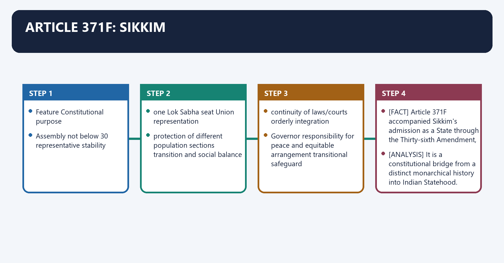
**Visual 20 - Integration safeguards**

| Feature | Constitutional purpose |
|---|---|
| Assembly not below 30 | representative stability |
| one Lok Sabha seat | Union representation |
| protection of different population sections | transition and social balance |
| continuity of laws/courts | orderly integration |
| Governor responsibility for peace and equitable arrangement | transitional safeguard |

- [FACT] Article 371F accompanied Sikkim's admission as a State through the Thirty-sixth Amendment, 1975.
- [ANALYSIS] It is a constitutional bridge from a distinct monarchical history into Indian Statehood.

#### CLOSING RECALL FLOW — ARTICLE 371F: SIKKIM

```closure-flow
SUBTOPIC: Article 371F: Sikkim
KEY TERMS / DEFINITIONS: Article 371F · Sikkim · Assembly not below 30 · representative stability · one Lok Sabha seat · Union representation
MECHANISM / ARGUMENT: The decisive contrast is between Governor responsibility for peace and equitable arrangement transitional safeguard and Article 371F accompanied Sikkim's admission as a State through the Thirty-sixth Amendment, 1975.
CONSEQUENCE / CONTRAST: Its principal consequence is that continuity of laws/courts orderly integration.
UPSC TRAP / ANSWER-USE: Do not miss this limiting distinction: the exam-safe limitation is that It is a constitutional bridge from a distinct monarchical...
ANSWER-GRABBING FORMULATION: Article 371F integrated Sikkim through representation, continuity and peace safeguards, using constitutional asymmetry as a bridge from monarchy to democratic Statehood.
```
### SESSION 19 — ARTICLE 371G: MIZORAM
#### DEFINITION / WHAT THIS IS CALLED

**Plain-language definition:** Article 371G: Mizoram denotes the constitutional rules and institutional links organised around Parliamentary law on.

**Technical definition:** The decisive contrast is between Article 371G resembles Article 371A in its strongest protection fields and It also fixes a minimum Assembly strength of 40.

#### ANSWER-GRABBING OPENING — WRITE/ADAPT IN THE EXAM

> Nagaland and Mizoram provisions are similar but not textually identical in every institutional detail.

#### MUST-WRITE KEYWORDS

- **Article 371G**
- **Mizoram**
- **Article 371A**
- **Article 371G: Mizoram**
- **Article**
- **Parliamentary**

**How to use them:** Frame the answer through Article 371G; define Mizoram, connect Article 371A with Article 371G: Mizoram to explain the mechanism, and use Article for the decisive comparison or qualification.

Article 371G: Mizoram denotes the constitutional rules and institutional links organised around Parliamentary law on.
Article 371G: Mizoram operates through Mizo religious/social practices, connected with customary law and procedure.
The operative mechanism matters because land ownership/transfer.
Its principal consequence is that requires Assembly decision for application.
The decisive contrast is between [FACT] Article 371G resembles Article 371A in its strongest protection fields and [FACT] It also fixes a minimum Assembly strength of 40.
The exam-safe limitation is that [LIMIT] Nagaland and Mizoram provisions are similar but not textually identical in every institutional detail.
**Visual 21 - Mizo consent shield**

```text
Parliamentary law on:
  Mizo religious/social practices
  customary law and procedure
  customary justice
  land ownership/transfer
        |
requires Assembly decision for application
```

- [FACT] Article 371G resembles Article 371A in its strongest protection fields.
- [FACT] It also fixes a minimum Assembly strength of 40.
- [LIMIT] Nagaland and Mizoram provisions are similar but not textually identical in every institutional detail.

#### CLOSING RECALL FLOW — ARTICLE 371G: MIZORAM

```closure-flow
SUBTOPIC: Article 371G: Mizoram
KEY TERMS / DEFINITIONS: Article 371G · Mizoram · Article 371A · Article 371G: Mizoram · Article · Parliamentary
MECHANISM / ARGUMENT: The decisive contrast is between Article 371G resembles Article 371A in its strongest protection fields and It also fixes a minimum Assembly strength of 40.
CONSEQUENCE / CONTRAST: The exam-safe limitation is that Nagaland and Mizoram provisions are similar but not textually identical in every institutional detail.
UPSC TRAP / ANSWER-USE: Nagaland and Mizoram provisions are similar but not textually identical in every institutional detail.
ANSWER-GRABBING FORMULATION: Nagaland and Mizoram provisions are similar but not textually identical in every institutional detail.
```
### SESSION 20 — ARTICLES 371H AND 371I
#### DEFINITION / WHAT THIS IS CALLED

**Plain-language definition:** Articles 371H and 371I denotes the constitutional rules and institutional links organised around Article State Core rule.

**Technical definition:** The decisive contrast is between Article State Core rule and Article State Core rule.

#### ANSWER-GRABBING OPENING — WRITE/ADAPT IN THE EXAM

> Article 371H gives Arunachal Pradesh's Governor limited individual judgment over law and order, but not personal control over the State's entire policy domain.

#### MUST-WRITE KEYWORDS

- **Articles 371H**
- **Arunachal Pradesh**
- **Goa**
- **Assembly minimum 30**
- **371I**
- **371H**

**How to use them:** Frame the answer through Articles 371H; define Arunachal Pradesh, connect Goa with Assembly minimum 30 to explain the mechanism, and use 371I for the decisive comparison or qualification.

Articles 371H and 371I denotes the constitutional rules and institutional links organised around Article State Core rule.
Articles 371H and 371I operates through 371H Arunachal Pradesh Governor has special law/order responsibility; Assembly minimum 30, connected with 371I Goa Assembly minimum 30.
The operative mechanism matters because [LIMIT] This special responsibility is not a licence for personal control over all State policy.
Its principal consequence is that article State Core rule.
The decisive contrast is between Article State Core rule and Article State Core rule.
The exam-safe limitation is that article State Core rule.
**Visual 22 - Arunachal and Goa**

| Article | State | Core rule |
|---|---|---|
| 371H | Arunachal Pradesh | Governor has special law/order responsibility; Assembly minimum 30 |
| 371I | Goa | Assembly minimum 30 |

- [FACT] The Arunachal Governor acts after consulting the Council of Ministers but exercises individual judgment in the constitutionally specified law-and-order field.
- [LIMIT] This special responsibility is not a licence for personal control over all State policy.

#### CLOSING RECALL FLOW — ARTICLES 371H AND 371I

```closure-flow
SUBTOPIC: Articles 371H and 371I
KEY TERMS / DEFINITIONS: Articles 371H · Arunachal Pradesh · Goa · Assembly minimum 30 · 371I · 371H
MECHANISM / ARGUMENT: Articles 371H and 371I operates through 371H Arunachal Pradesh Governor has special law/order responsibility; Assembly minimum 30, connected with 371I Goa Assembly minimum 30.
CONSEQUENCE / CONTRAST: The decisive contrast is between Article State Core rule and Article State Core rule.
UPSC TRAP / ANSWER-USE: Do not miss this limiting distinction: its principal consequence is that article State Core rule.
ANSWER-GRABBING FORMULATION: Article 371H gives Arunachal Pradesh's Governor limited individual judgment over law and order, but not personal control over the State's entire policy domain.
```
### SESSION 21 — ARTICLE 371J: KARNATAKA
#### DEFINITION / WHAT THIS IS CALLED

**Plain-language definition:** Article 371J: Karnataka denotes the constitutional rules and institutional links organised around separate development board.

**Technical definition:** Its principal consequence is that Article 371J was inserted by the Ninety-eighth Amendment, 2012.

#### ANSWER-GRABBING OPENING — WRITE/ADAPT IN THE EXAM

> Article 371J addresses Kalyana Karnataka's regional backwardness through development, education and employment measures, extending asymmetry beyond symbolic recognition.

#### MUST-WRITE KEYWORDS

- **Article 371J**
- **Karnataka**
- **Article 371**
- **Article 371J: Karnataka**
- **Article**
- **Its principal consequence**

**How to use them:** Frame the answer through Article 371J; define Karnataka, connect Article 371 with Article 371J: Karnataka to explain the mechanism, and use Article for the decisive comparison or qualification.

Article 371J: Karnataka denotes the constitutional rules and institutional links organised around separate development board.
Article 371J: Karnataka operates through equitable development funding, connected with local reservation in education.
The operative mechanism matters because local reservation in specified State posts.
Its principal consequence is that [FACT] Article 371J was inserted by the Ninety-eighth Amendment, 2012.
The decisive contrast is between [FACT] It concerns the historically named Hyderabad-Karnataka region, now commonly called Kalyana Karnataka and [ANALYSIS] Like Article 371, it targets intra-State backwardness, but it adds explicit local education and employment measures.
The exam-safe limitation is that separate development board.
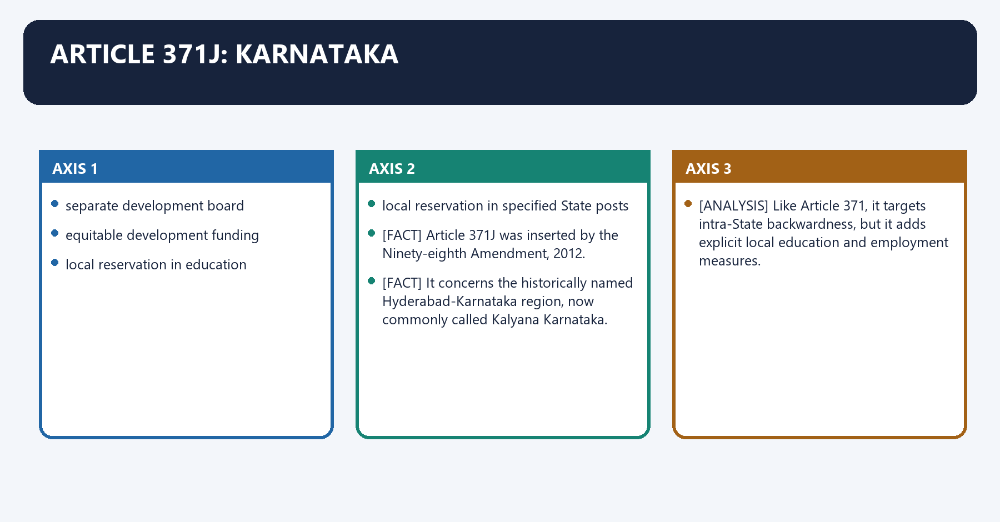
**Visual 23 - Kalyana Karnataka model**

```text
separate development board
      +
equitable development funding
      +
local reservation in education
      +
local reservation in specified State posts
```

- [FACT] Article 371J was inserted by the Ninety-eighth Amendment, 2012.
- [FACT] It concerns the historically named Hyderabad-Karnataka region, now commonly called Kalyana Karnataka.
- [ANALYSIS] Like Article 371, it targets intra-State backwardness, but it adds explicit local education and employment measures.

#### CLOSING RECALL FLOW — ARTICLE 371J: KARNATAKA

```closure-flow
SUBTOPIC: Article 371J: Karnataka
KEY TERMS / DEFINITIONS: Article 371J · Karnataka · Article 371 · Article 371J: Karnataka · Article · Its principal consequence
MECHANISM / ARGUMENT: Its principal consequence is that Article 371J was inserted by the Ninety-eighth Amendment, 2012.
CONSEQUENCE / CONTRAST: The decisive contrast is between It concerns the historically named Hyderabad-Karnataka region, now commonly called Kalyana Karnataka and Like Article 371, it targets intra-State backwardness, but it adds explicit local education and employment measures.
UPSC TRAP / ANSWER-USE: Like Article 371, it targets intra-State backwardness, but it adds explicit local education and employment measures.
ANSWER-GRABBING FORMULATION: Article 371J addresses Kalyana Karnataka's regional backwardness through development, education and employment measures, extending asymmetry beyond symbolic recognition.
```
### SESSION 22 — STRONGEST ARTICLE 371 PROTECTIONS
#### DEFINITION / WHAT THIS IS CALLED

**Plain-language definition:** Strongest Article 371 protections denotes the constitutional rules and institutional links organised around 371B / 371C / 371F.

**Technical definition:** The operative mechanism matters because Strength depends on the legal subject protected, not merely the Article number.

#### ANSWER-GRABBING OPENING — WRITE/ADAPT IN THE EXAM

> Articles 371A and 371G prevent automatic application of specified parliamentary laws unless the State Assembly decides otherwise.

#### MUST-WRITE KEYWORDS

- **Strongest Article 371 protections**
- **Article 371**
- **Strongest Article**
- **Strength**
- **Article**
- **Its principal consequence**

**How to use them:** Frame the answer through Strongest Article 371 protections; define Article 371, connect Strongest Article with Strength to explain the mechanism, and use Article for the decisive comparison or qualification.

Strongest Article 371 protections denotes the constitutional rules and institutional links organised around 371B / 371C / 371F.
Strongest Article 371 protections operates through ADMINISTRATIVE / LAW-ORDER, connected with CONSENT OVER CUSTOM-LAND LAWS.
The operative mechanism matters because [ANALYSIS] Strength depends on the legal subject protected, not merely the Article number.
Its principal consequence is that 371B / 371C / 371F.
The decisive contrast is between 371B / 371C / 371F and 371B / 371C / 371F.
The exam-safe limitation is that 371B / 371C / 371F.
**Visual 24 - Strength spectrum**

```text
DEVELOPMENTAL
371 / 371J
      |
REPRESENTATIONAL
371B / 371C / 371F
      |
ADMINISTRATIVE / LAW-ORDER
371H
      |
CONSENT OVER CUSTOM-LAND LAWS
371A / 371G
```

- [ANALYSIS] Strength depends on the legal subject protected, not merely the Article number.
- [FACT] Articles 371A and 371G prevent automatic application of specified parliamentary laws unless the State Assembly decides otherwise.

#### CLOSING RECALL FLOW — STRONGEST ARTICLE 371 PROTECTIONS

```closure-flow
SUBTOPIC: Strongest Article 371 protections
KEY TERMS / DEFINITIONS: Strongest Article 371 protections · Article 371 · Strongest Article · Strength · Article · Its principal consequence
MECHANISM / ARGUMENT: The operative mechanism matters because Strength depends on the legal subject protected, not merely the Article number.
CONSEQUENCE / CONTRAST: Strength depends on the legal subject protected, not merely the Article number.
UPSC TRAP / ANSWER-USE: Do not miss this limiting distinction: its principal consequence is that 371B / 371C / 371F.
ANSWER-GRABBING FORMULATION: Articles 371A and 371G prevent automatic application of specified parliamentary laws unless the State Assembly decides otherwise.
```
### SESSION 23 — ARTICLE 371 VERSUS FIFTH SCHEDULE
#### DEFINITION / WHAT THIS IS CALLED

**Plain-language definition:** Article 371 versus Fifth Schedule denotes the constitutional rules and institutional links organised around Axis Article 371 family Fifth Schedule.

**Technical definition:** A State covered by Article 371 may also interact with other tribal protections, but one mechanism does not legally replace the other.

#### ANSWER-GRABBING OPENING — WRITE/ADAPT IN THE EXAM

> A State covered by Article 371 may also interact with other tribal protections, but one mechanism does not legally replace the other.

#### MUST-WRITE KEYWORDS

- **Article 371 versus Fifth Schedule**
- **Location**
- **Part XXI**
- **Article 244 + Fifth Schedule**
- **Unit**
- **named State/region**

**How to use them:** Frame the answer through Article 371 versus Fifth Schedule; define Location, connect Part XXI with Article 244 + Fifth Schedule to explain the mechanism, and use Unit for the decisive comparison or qualification.

Article 371 versus Fifth Schedule denotes the constitutional rules and institutional links organised around Axis Article 371 family Fifth Schedule.
Article 371 versus Fifth Schedule operates through Location Part XXI Article 244 + Fifth Schedule, connected with Unit named State/region Scheduled Areas.
The operative mechanism matters because core actor Governor/Assembly/President varies President, Governor, TAC.
Its principal consequence is that main logic tailored State-specific arrangement protection and supervised administration.
The decisive contrast is between Land/custom only specified provisions, especially 371A/G Governor regulation powers for tribal land/money-lending and [FACT] Fifth Schedule Scheduled Areas currently exist in ten States.
The exam-safe limitation is that [FACT] The President declares Scheduled Areas; the Governor reports and may make protective regulations subject to presidential assent.
**Visual 25 - Different constitutional tools**

| Axis | Article 371 family | Fifth Schedule |
|---|---|---|
| Location | Part XXI | Article 244 + Fifth Schedule |
| Unit | named State/region | Scheduled Areas |
| Core actor | Governor/Assembly/President varies | President, Governor, TAC |
| Main logic | tailored State-specific arrangement | protection and supervised administration |
| Land/custom | only specified provisions, especially 371A/G | Governor regulation powers for tribal land/money-lending |

- [FACT] Fifth Schedule Scheduled Areas currently exist in ten States.
- [FACT] The President declares Scheduled Areas; the Governor reports and may make protective regulations subject to presidential assent.
- [LIMIT] A State covered by Article 371 may also interact with other tribal protections, but one mechanism does not legally replace the other.

#### CLOSING RECALL FLOW — ARTICLE 371 VERSUS FIFTH SCHEDULE

```closure-flow
SUBTOPIC: Article 371 versus Fifth Schedule
KEY TERMS / DEFINITIONS: Article 371 versus Fifth Schedule · Location · Part XXI · Article 244 + Fifth Schedule · Unit · named State/region
MECHANISM / ARGUMENT: A State covered by Article 371 may also interact with other tribal protections, but one mechanism does not legally replace the other.
CONSEQUENCE / CONTRAST: The decisive contrast is between Land/custom only specified provisions, especially 371A/G Governor regulation powers for tribal land/money-lending and Fifth Schedule Scheduled Areas currently exist in ten States.
UPSC TRAP / ANSWER-USE: Do not miss this limiting distinction: its principal consequence is that main logic tailored State-specific arrangement protection and supervised administration.
ANSWER-GRABBING FORMULATION: A State covered by Article 371 may also interact with other tribal protections, but one mechanism does not legally replace the other.
```
### SESSION 24 — ARTICLE 371 VERSUS SIXTH SCHEDULE
#### DEFINITION / WHAT THIS IS CALLED

**Plain-language definition:** Article 371 versus Sixth Schedule denotes the constitutional rules and institutional links organised around Axis Articles 371A/G etc.

**Technical definition:** The decisive contrast is between Current Ladakh demand Article 371-type option discussed Sixth Schedule extension demanded and Sixth Schedule ordinary district councils combine limited legislative, judicial and fiscal powers.

#### ANSWER-GRABBING OPENING — WRITE/ADAPT IN THE EXAM

> Article 371 safeguards operate through State-specific constitutional rules, whereas the Sixth Schedule creates autonomous councils with limited legislative, judicial and fiscal powers.

#### MUST-WRITE KEYWORDS

- **Article 371 versus Sixth Schedule**
- **Protection holder**
- **autonomous district/regional councils**
- **Geographic coverage**
- **named States**
- **tribal areas in Assam, Meghalaya, Tripura, Mizoram**

**How to use them:** Frame the answer through Article 371 versus Sixth Schedule; define Protection holder, connect autonomous district/regional councils with Geographic coverage to explain the mechanism, and use named States for the decisive comparison or qualification.

Article 371 versus Sixth Schedule denotes the constitutional rules and institutional links organised around Axis Articles 371A/G etc. Sixth Schedule.
Article 371 versus Sixth Schedule operates through Protection holder State/Assembly arrangements autonomous district/regional councils, connected with Geographic coverage named States tribal areas in Assam, Meghalaya, Tripura, Mizoram.
The operative mechanism matters because law-making State consent in specified fields council laws on listed local subjects.
Its principal consequence is that fiscal/judicial powers article-specific specified taxation and village-court powers.
The decisive contrast is between Current Ladakh demand Article 371-type option discussed Sixth Schedule extension demanded and [FACT] Sixth Schedule ordinary district councils combine limited legislative, judicial and fiscal powers.
The exam-safe limitation is that [LIMIT] Ladakh is not currently a Sixth Schedule area.
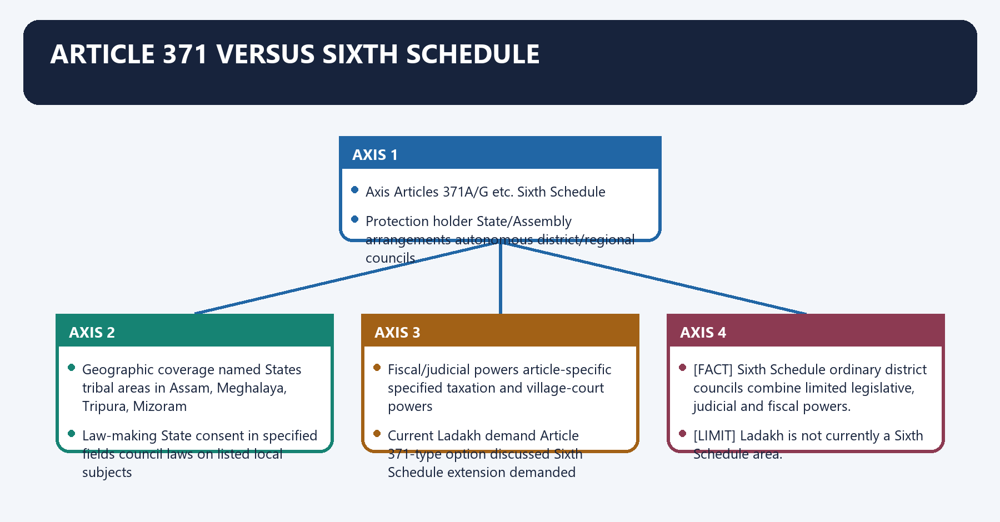
**Visual 26 - State protection versus autonomous councils**

| Axis | Articles 371A/G etc. | Sixth Schedule |
|---|---|---|
| Protection holder | State/Assembly arrangements | autonomous district/regional councils |
| Geographic coverage | named States | tribal areas in Assam, Meghalaya, Tripura, Mizoram |
| Law-making | State consent in specified fields | council laws on listed local subjects |
| Fiscal/judicial powers | article-specific | specified taxation and village-court powers |
| Current Ladakh demand | Article 371-type option discussed | Sixth Schedule extension demanded |

- [FACT] Sixth Schedule ordinary district councils combine limited legislative, judicial and fiscal powers.
- [LIMIT] Ladakh is not currently a Sixth Schedule area.

#### CLOSING RECALL FLOW — ARTICLE 371 VERSUS SIXTH SCHEDULE

```closure-flow
SUBTOPIC: Article 371 versus Sixth Schedule
KEY TERMS / DEFINITIONS: Article 371 versus Sixth Schedule · Protection holder · autonomous district/regional councils · Geographic coverage · named States · tribal areas in Assam, Meghalaya, Tripura, Mizoram
MECHANISM / ARGUMENT: The decisive contrast is between Current Ladakh demand Article 371-type option discussed Sixth Schedule extension demanded and Sixth Schedule ordinary district councils combine limited legislative, judicial and fiscal powers.
CONSEQUENCE / CONTRAST: The exam-safe limitation is that Ladakh is not currently a Sixth Schedule area.
UPSC TRAP / ANSWER-USE: Ladakh is not currently a Sixth Schedule area.
ANSWER-GRABBING FORMULATION: Article 371 safeguards operate through State-specific constitutional rules, whereas the Sixth Schedule creates autonomous councils with limited legislative, judicial and fiscal powers.
```
### SESSION 25 — FIFTH AND SIXTH SCHEDULE RAPID COMPARISON
#### DEFINITION / WHAT THIS IS CALLED

**Plain-language definition:** Fifth and Sixth Schedule rapid comparison denotes the constitutional rules and institutional links organised around Fifth Schedule Sixth Schedule.

**Technical definition:** The exam-safe limitation is that fifth Schedule Sixth Schedule.

#### ANSWER-GRABBING OPENING — WRITE/ADAPT IN THE EXAM

> The Fifth Schedule emphasises protected administration and advisory mechanisms, while the Sixth Schedule gives specified north-eastern tribal areas a stronger self-government framework.

#### MUST-WRITE KEYWORDS

- **Fifth**
- **Sixth Schedule rapid comparison**
- **Mnemonic**
- **Scheduled Areas in ten States**
- **tribal areas in AMTM**
- **Tribes Advisory Council**

**How to use them:** Frame the answer through Fifth; define Sixth Schedule rapid comparison, connect Mnemonic with Scheduled Areas in ten States to explain the mechanism, and use tribal areas in AMTM for the decisive comparison or qualification.

Fifth and Sixth Schedule rapid comparison denotes the constitutional rules and institutional links organised around Fifth Schedule Sixth Schedule.
Fifth and Sixth Schedule rapid comparison operates through Scheduled Areas in ten States tribal areas in AMTM, connected with Tribes Advisory Council Autonomous District/Regional Councils.
The operative mechanism matters because governor protective regulations council law-making in specified fields.
Its principal consequence is that president declares areas Governor organises autonomous districts/regions.
The decisive contrast is between Union directions and annual report devolved legislative, judicial and fiscal functions and Mnemonic: Sixth Schedule = Assam, Meghalaya, Tripura, Mizoram.
The exam-safe limitation is that fifth Schedule Sixth Schedule.
**Visual 27 - Protection versus self-government**

| Fifth Schedule | Sixth Schedule |
|---|---|
| Scheduled Areas in ten States | tribal areas in AMTM |
| Tribes Advisory Council | Autonomous District/Regional Councils |
| Governor protective regulations | council law-making in specified fields |
| President declares areas | Governor organises autonomous districts/regions |
| Union directions and annual report | devolved legislative, judicial and fiscal functions |

> **Mnemonic:** Sixth Schedule = Assam, Meghalaya, Tripura, Mizoram.

#### CLOSING RECALL FLOW — FIFTH AND SIXTH SCHEDULE RAPID COMPARISON

```closure-flow
SUBTOPIC: Fifth and Sixth Schedule rapid comparison
KEY TERMS / DEFINITIONS: Fifth · Sixth Schedule rapid comparison · Mnemonic · Scheduled Areas in ten States · tribal areas in AMTM · Tribes Advisory Council
MECHANISM / ARGUMENT: The exam-safe limitation is that fifth Schedule Sixth Schedule.
CONSEQUENCE / CONTRAST: The decisive contrast is between Union directions and annual report devolved legislative, judicial and fiscal functions and Mnemonic: Sixth Schedule = Assam, Meghalaya, Tripura, Mizoram.
UPSC TRAP / ANSWER-USE: Do not miss this limiting distinction: its principal consequence is that president declares areas Governor organises autonomous districts/regions.
ANSWER-GRABBING FORMULATION: The Fifth Schedule emphasises protected administration and advisory mechanisms, while the Sixth Schedule gives specified north-eastern tribal areas a stronger self-government framework.
```
### SESSION 26 — NORTH EASTERN COUNCIL
#### DEFINITION / WHAT THIS IS CALLED

**Plain-language definition:** North Eastern Council denotes the constitutional rules and institutional links organised around North Eastern Council Act, 1971.

**Technical definition:** The decisive contrast is between DoNER Minister: ex-officio Vice-Chairman and The NEC is a statutory regional body, not a constitutional Article 371 institution.

#### ANSWER-GRABBING OPENING — WRITE/ADAPT IN THE EXAM

> The North Eastern Council coordinates regional development under statute, but it is neither an Article 371 institution nor a substitute for State-specific constitutional safeguards.

#### MUST-WRITE KEYWORDS

- **North Eastern Council**
- **Article 371**
- **North Eastern Council Act**
- **Its principal consequence**
- **Its**
- **Home Minister**

**How to use them:** Frame the answer through North Eastern Council; define Article 371, connect North Eastern Council Act with Its principal consequence to explain the mechanism, and use Its for the decisive comparison or qualification.

North Eastern Council denotes the constitutional rules and institutional links organised around North Eastern Council Act, 1971.
North Eastern Council operates through regional planning and coordination body, connected with Governors + Chief Ministers of NE States.
The operative mechanism matters because three presidential nominees.
Its principal consequence is that union Home Minister: ex-officio Chairman.
The decisive contrast is between DoNER Minister: ex-officio Vice-Chairman and [FACT] The NEC is a statutory regional body, not a constitutional Article 371 institution.
The exam-safe limitation is that [FACT] Sikkim was included through the 2002 amendment framework.
**Visual 28 - NEC is statutory, not Article 371**

```text
North Eastern Council Act, 1971
       |
regional planning and coordination body
       |
Governors + Chief Ministers of NE States
       |
three presidential nominees
       |
Union Home Minister: ex-officio Chairman
DoNER Minister: ex-officio Vice-Chairman
```

- [FACT] The NEC is a statutory regional body, not a constitutional Article 371 institution.
- [FACT] Sikkim was included through the 2002 amendment framework.
- [LIMIT] Always recheck current ex-officio administrative arrangements before a date-specific answer.

#### CLOSING RECALL FLOW — NORTH EASTERN COUNCIL

```closure-flow
SUBTOPIC: North Eastern Council
KEY TERMS / DEFINITIONS: North Eastern Council · Article 371 · North Eastern Council Act · Its principal consequence · Its · Home Minister
MECHANISM / ARGUMENT: The exam-safe limitation is that Sikkim was included through the 2002 amendment framework.
CONSEQUENCE / CONTRAST: Its principal consequence is that union Home Minister: ex-officio Chairman.
UPSC TRAP / ANSWER-USE: The decisive contrast is between DoNER Minister: ex-officio Vice-Chairman and The NEC is a statutory regional body, not a constitutional Article 371 institution.
ANSWER-GRABBING FORMULATION: The North Eastern Council coordinates regional development under statute, but it is neither an Article 371 institution nor a substitute for State-specific constitutional safeguards.
```
### SESSION 27 — ASYMMETRY AND EQUALITY
#### DEFINITION / WHAT THIS IS CALLED

**Plain-language definition:** Asymmetry and equality denotes the constitutional rules and institutional links organised around same rule for every region.

**Technical definition:** The operative mechanism matters because Special provisions can be defended as substantive equality: unequal conditions may need differentiated treatment.

#### ANSWER-GRABBING OPENING — WRITE/ADAPT IN THE EXAM

> Special provisions can be defended as substantive equality: unequal conditions may need differentiated treatment.

#### MUST-WRITE KEYWORDS

- **Asymmetry**
- **equality**
- **Asymmetry and equality**
- **Special**
- **Its principal consequence**
- **Its**

**How to use them:** Frame the answer through Asymmetry; define equality, connect Asymmetry and equality with Special to explain the mechanism, and use Its principal consequence for the decisive comparison or qualification.

Asymmetry and equality denotes the constitutional rules and institutional links organised around same rule for every region.
Asymmetry and equality operates through substantive equality, connected with different protection for different vulnerability/history.
The operative mechanism matters because [ANALYSIS] Special provisions can be defended as substantive equality: unequal conditions may need differentiated treatment.
Its principal consequence is that [ANALYSIS] Critics see barriers to mobility, land ownership and uniform citizenship.
The decisive contrast is between [LIMIT] Constitutional differentiation is not automatically discriminatory; purpose, history and proportionality matter and same rule for every region.
The exam-safe limitation is that same rule for every region.
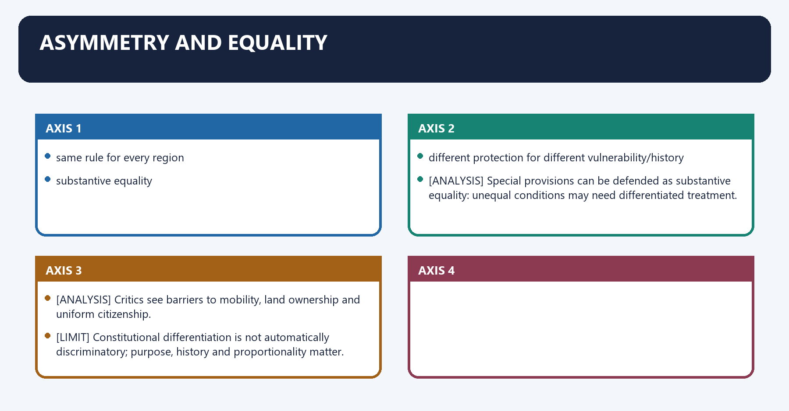
**Visual 29 - Equality test**

```text
formal equality
same rule for every region

versus

substantive equality
different protection for different vulnerability/history
```

- [ANALYSIS] Special provisions can be defended as substantive equality: unequal conditions may need differentiated treatment.
- [ANALYSIS] Critics see barriers to mobility, land ownership and uniform citizenship.
- [LIMIT] Constitutional differentiation is not automatically discriminatory; purpose, history and proportionality matter.

#### CLOSING RECALL FLOW — ASYMMETRY AND EQUALITY

```closure-flow
SUBTOPIC: Asymmetry and equality
KEY TERMS / DEFINITIONS: Asymmetry · equality · Asymmetry and equality · Special · Its principal consequence · Its
MECHANISM / ARGUMENT: The operative mechanism matters because Special provisions can be defended as substantive equality: unequal conditions may need differentiated treatment.
CONSEQUENCE / CONTRAST: Its principal consequence is that Critics see barriers to mobility, land ownership and uniform citizenship.
UPSC TRAP / ANSWER-USE: The decisive contrast is between Constitutional differentiation is not automatically discriminatory; purpose, history and proportionality matter and same rule for every region.
ANSWER-GRABBING FORMULATION: Special provisions can be defended as substantive equality: unequal conditions may need differentiated treatment.
```
### SESSION 28 — ASYMMETRY AND NATIONAL INTEGRATION
#### DEFINITION / WHAT THIS IS CALLED

**Plain-language definition:** Asymmetry and national integration denotes the constitutional rules and institutional links organised around Integration reading Erosion reading.

**Technical definition:** The better verdict is conditional: asymmetry strengthens integration when it protects genuine vulnerability through accountable institutions; it weakens trust when changed without meaningful consultation or implemented as patronage.

#### ANSWER-GRABBING OPENING — WRITE/ADAPT IN THE EXAM

> The better verdict is conditional: asymmetry strengthens integration when it protects genuine vulnerability through accountable institutions; it weakens trust when changed without meaningful consultation or implemented as patronage.

#### MUST-WRITE KEYWORDS

- **Asymmetry**
- **national integration**
- **recognises identity and reduces alienation**
- **entrenches exceptionalism**
- **protects land/custom from majoritarian law**
- **creates insider-outsider barriers**

**How to use them:** Frame the answer through Asymmetry; define national integration, connect recognises identity and reduces alienation with entrenches exceptionalism to explain the mechanism, and use protects land/custom from majoritarian law for the decisive comparison or qualification.

Asymmetry and national integration denotes the constitutional rules and institutional links organised around Integration reading Erosion reading.
Asymmetry and national integration operates through recognises identity and reduces alienation entrenches exceptionalism, connected with protects land/custom from majoritarian law creates insider-outsider barriers.
The operative mechanism matters because enables negotiated accession/peace may weaken common-market mobility.
Its principal consequence is that accommodates regional backwardness can be politically manipulated.
The decisive contrast is between Integration reading Erosion reading and Integration reading Erosion reading.
The exam-safe limitation is that integration reading Erosion reading.
**Visual 30 - Two competing readings**

| Integration reading | Erosion reading |
|---|---|
| recognises identity and reduces alienation | entrenches exceptionalism |
| protects land/custom from majoritarian law | creates insider-outsider barriers |
| enables negotiated accession/peace | may weaken common-market mobility |
| accommodates regional backwardness | can be politically manipulated |

- [ANALYSIS] The better verdict is conditional: asymmetry strengthens integration when it protects genuine vulnerability through accountable institutions; it weakens trust when changed without meaningful consultation or implemented as patronage.

#### CLOSING RECALL FLOW — ASYMMETRY AND NATIONAL INTEGRATION

```closure-flow
SUBTOPIC: Asymmetry and national integration
KEY TERMS / DEFINITIONS: Asymmetry · national integration · recognises identity and reduces alienation · entrenches exceptionalism · protects land/custom from majoritarian law · creates insider-outsider barriers
MECHANISM / ARGUMENT: Asymmetry and national integration operates through recognises identity and reduces alienation entrenches exceptionalism, connected with protects land/custom from majoritarian law creates insider-outsider barriers.
CONSEQUENCE / CONTRAST: The decisive contrast is between Integration reading Erosion reading and Integration reading Erosion reading.
UPSC TRAP / ANSWER-USE: Do not miss this limiting distinction: its principal consequence is that accommodates regional backwardness can be politically manipulated.
ANSWER-GRABBING FORMULATION: The better verdict is conditional: asymmetry strengthens integration when it protects genuine vulnerability through accountable institutions; it weakens trust when changed without meaningful consultation or implemented as patronage.
```
### SESSION 29 — CONSENT AND CONSULTATION
#### DEFINITION / WHAT THIS IS CALLED

**Plain-language definition:** Consent and consultation denotes the constitutional rules and institutional links organised around ordinary consultation.

**Technical definition:** Article 371A/G's Assembly-decision requirement is stronger than mere gubernatorial consultation.

#### ANSWER-GRABBING OPENING — WRITE/ADAPT IN THE EXAM

> Articles 371A and 371G require legislative acceptance in specified fields, but that consent cannot be expanded into a general claim of sovereign veto.

#### MUST-WRITE KEYWORDS

- **Consent**
- **consultation**
- **Article 371**
- **Article 371A**
- **Consent and consultation**
- **Its principal consequence**

**How to use them:** Frame the answer through Consent; define consultation, connect Article 371 with Article 371A to explain the mechanism, and use Consent and consultation for the decisive comparison or qualification.

Consent and consultation denotes the constitutional rules and institutional links organised around ordinary consultation.
Consent and consultation operates through Governor special responsibility, connected with Assembly committee.
The operative mechanism matters because assembly resolution needed for specified Union laws.
Its principal consequence is that [ANALYSIS] The Article 371 family contains different intensities of local voice.
The decisive contrast is between [FACT] Article 371A/G's Assembly-decision requirement is stronger than mere gubernatorial consultation and [LIMIT] Consent in specified fields cannot be expanded into a general sovereignty claim.
The exam-safe limitation is that ordinary consultation.
**Visual 31 - Graduated participation**

```text
ordinary consultation
       |
Governor special responsibility
       |
Assembly committee
       |
Assembly resolution needed for specified Union laws
```

- [ANALYSIS] The Article 371 family contains different intensities of local voice.
- [FACT] Article 371A/G's Assembly-decision requirement is stronger than mere gubernatorial consultation.
- [LIMIT] Consent in specified fields cannot be expanded into a general sovereignty claim.

#### CLOSING RECALL FLOW — CONSENT AND CONSULTATION

```closure-flow
SUBTOPIC: Consent and consultation
KEY TERMS / DEFINITIONS: Consent · consultation · Article 371 · Article 371A · Consent and consultation · Its principal consequence
MECHANISM / ARGUMENT: Consent and consultation denotes the constitutional rules and institutional links organised around ordinary consultation.
CONSEQUENCE / CONTRAST: Its principal consequence is that The Article 371 family contains different intensities of local voice.
UPSC TRAP / ANSWER-USE: Do not miss this limiting distinction: article 371A/G's Assembly-decision requirement is stronger than mere gubernatorial consultation.
ANSWER-GRABBING FORMULATION: Articles 371A and 371G require legislative acceptance in specified fields, but that consent cannot be expanded into a general claim of sovereign veto.
```
### SESSION 30 — LAND, RESOURCES AND INDIGENOUS PROTECTION
#### DEFINITION / WHAT THIS IS CALLED

**Plain-language definition:** Land, resources and indigenous protection denotes the constitutional rules and institutional links organised around Article 371G protects land ownership/transfer in Mizoram's specified consent fields.

**Technical definition:** Its principal consequence is that Article 371G protects land ownership/transfer in Mizoram's specified consent fields.

#### ANSWER-GRABBING OPENING — WRITE/ADAPT IN THE EXAM

> Resource governance remains subject to the exact constitutional text, State law, judicial interpretation and other Union competences.

#### MUST-WRITE KEYWORDS

- **Land**
- **resources**
- **indigenous protection**
- **Article 371G**
- **Article 371A**
- **Land, resources and indigenous protection**

**How to use them:** Frame the answer through Land; define resources, connect indigenous protection with Article 371G to explain the mechanism, and use Article 371A for the decisive comparison or qualification.

Land, resources and indigenous protection denotes the constitutional rules and institutional links organised around [FACT] Article 371G protects land ownership/transfer in Mizoram's specified consent fields.
Land, resources and indigenous protection operates through [ANALYSIS] Land protection links culture, livelihood, ecology and political identity, connected with [FACT] Article 371G protects land ownership/transfer in Mizoram's specified consent fields.
The operative mechanism matters because [FACT] Article 371G protects land ownership/transfer in Mizoram's specified consent fields.
Its principal consequence is that [FACT] Article 371G protects land ownership/transfer in Mizoram's specified consent fields.
The decisive contrast is between [FACT] Article 371G protects land ownership/transfer in Mizoram's specified consent fields and [FACT] Article 371G protects land ownership/transfer in Mizoram's specified consent fields.
The exam-safe limitation is that [FACT] Article 371G protects land ownership/transfer in Mizoram's specified consent fields.
- [FACT] Article 371A expressly protects ownership and transfer of land and its resources in Nagaland from automatic parliamentary-law application.
- [FACT] Article 371G protects land ownership/transfer in Mizoram's specified consent fields.
- [ANALYSIS] Land protection links culture, livelihood, ecology and political identity.
- [LIMIT] Resource governance remains subject to the exact constitutional text, State law, judicial interpretation and other Union competences.

#### CLOSING RECALL FLOW — LAND, RESOURCES AND INDIGENOUS PROTECTION

```closure-flow
SUBTOPIC: Land, resources and indigenous protection
KEY TERMS / DEFINITIONS: Land · resources · indigenous protection · Article 371G · Article 371A · Land, resources and indigenous protection
MECHANISM / ARGUMENT: Land, resources and indigenous protection operates through Land protection links culture, livelihood, ecology and political identity, connected with Article 371G protects land ownership/transfer in Mizoram's specified consent fields.
CONSEQUENCE / CONTRAST: Its principal consequence is that Article 371G protects land ownership/transfer in Mizoram's specified consent fields.
UPSC TRAP / ANSWER-USE: Do not miss this limiting distinction: the decisive contrast is between Article 371G protects land ownership/transfer in Mizoram's specified consent...
ANSWER-GRABBING FORMULATION: Resource governance remains subject to the exact constitutional text, State law, judicial interpretation and other Union competences.
```
### SESSION 31 — CURRENT LADAKH DEBATE
#### DEFINITION / WHAT THIS IS CALLED

**Plain-language definition:** Current Ladakh debate denotes the constitutional rules and institutional links organised around Demand What it would require Status 18 Aug 2026.

**Technical definition:** The decisive contrast is between stronger Hill Councils statutory/executive reform subject to continuing debate and The demand combines identity, ecology, land, employment and democratic representation.

#### ANSWER-GRABBING OPENING — WRITE/ADAPT IN THE EXAM

> Ladakh's autonomy debate combines identity, ecology, land, employment and representation concerns, but proposals for Statehood or special safeguards require formal legal change.

#### MUST-WRITE KEYWORDS

- **Current Ladakh debate**
- **Statehood**
- **parliamentary reorganisation law**
- **not enacted**
- **Legislature without Statehood**
- **parliamentary statutory change**

**How to use them:** Frame the answer through Current Ladakh debate; define Statehood, connect parliamentary reorganisation law with not enacted to explain the mechanism, and use Legislature without Statehood for the decisive comparison or qualification.

Current Ladakh debate denotes the constitutional rules and institutional links organised around Demand What it would require Status 18 Aug 2026.
Current Ladakh debate operates through Statehood parliamentary reorganisation law not enacted, connected with Legislature without Statehood parliamentary statutory change not enacted.
The operative mechanism matters because sixth Schedule constitutional amendment/schedule extension not granted.
Its principal consequence is that article 371-type protection constitutional amendment not granted.
The decisive contrast is between stronger Hill Councils statutory/executive reform subject to continuing debate and [ANALYSIS] The demand combines identity, ecology, land, employment and democratic representation.
The exam-safe limitation is that [LIMIT] Strategic-border concerns are policy considerations, not constitutional proof against autonomy.
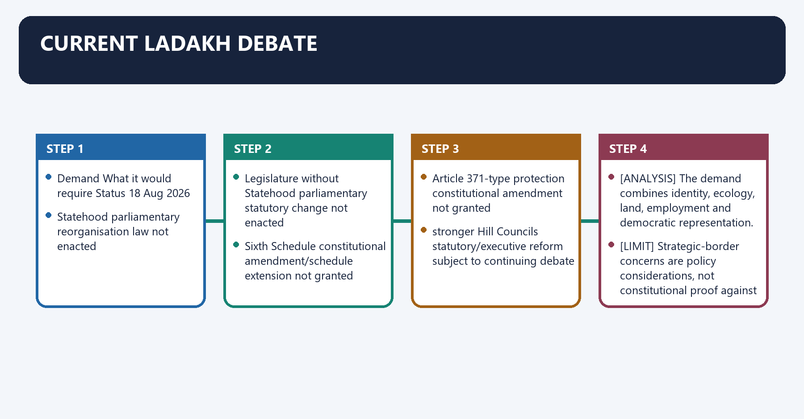
**Visual 32 - Constitutional options debated**

| Demand | What it would require | Status 18 Aug 2026 |
|---|---|---|
| Statehood | parliamentary reorganisation law | not enacted |
| Legislature without Statehood | parliamentary statutory change | not enacted |
| Sixth Schedule | constitutional amendment/schedule extension | not granted |
| Article 371-type protection | constitutional amendment | not granted |
| stronger Hill Councils | statutory/executive reform | subject to continuing debate |

- [ANALYSIS] The demand combines identity, ecology, land, employment and democratic representation.
- [LIMIT] Strategic-border concerns are policy considerations, not constitutional proof against autonomy.

#### CLOSING RECALL FLOW — CURRENT LADAKH DEBATE

```closure-flow
SUBTOPIC: Current Ladakh debate
KEY TERMS / DEFINITIONS: Current Ladakh debate · Statehood · parliamentary reorganisation law · not enacted · Legislature without Statehood · parliamentary statutory change
MECHANISM / ARGUMENT: The decisive contrast is between stronger Hill Councils statutory/executive reform subject to continuing debate and The demand combines identity, ecology, land, employment and democratic representation.
CONSEQUENCE / CONTRAST: Its principal consequence is that article 371-type protection constitutional amendment not granted.
UPSC TRAP / ANSWER-USE: The exam-safe limitation is that Strategic-border concerns are policy considerations, not constitutional proof against autonomy.
ANSWER-GRABBING FORMULATION: Ladakh's autonomy debate combines identity, ecology, land, employment and representation concerns, but proposals for Statehood or special safeguards require formal legal change.
```
### SESSION 32 — CURRENT J&K FEDERAL QUESTION
#### DEFINITION / WHAT THIS IS CALLED

**Plain-language definition:** Current J&K federal question denotes the constitutional rules and institutional links organised around Article 370 result settled by 2023 judgment.

**Technical definition:** The decisive contrast is between Separate the upheld abrogation from the open/avoided State-to-UT question and Article 370 result settled by 2023 judgment.

#### ANSWER-GRABBING OPENING — WRITE/ADAPT IN THE EXAM

> The legal settlement of Article 370 does not eliminate the political and constitutional importance of restoring representative State institutions.

#### MUST-WRITE KEYWORDS

- **Current J&K federal question**
- **Article 370**
- **Article**
- **Its principal consequence**
- **Its**
- **The decisive contrast**

**How to use them:** Frame the answer through Current J&K federal question; define Article 370, connect Article with Its principal consequence to explain the mechanism, and use Its for the decisive comparison or qualification.

Current J&K federal question denotes the constitutional rules and institutional links organised around Article 370 result settled by 2023 judgment.
Current J&K federal question operates through Assembly election completed, connected with Statehood restoration pending.
The operative mechanism matters because scope of permanent State-to-UT downgrade.
Its principal consequence is that not finally adjudicated.
The decisive contrast is between [LIMIT] Separate the upheld abrogation from the open/avoided State-to-UT question and Article 370 result settled by 2023 judgment.
The exam-safe limitation is that article 370 result settled by 2023 judgment.
**Visual 33 - Unfinished constitutional issue**

```text
Article 370 result settled by 2023 judgment
               |
Assembly election completed
               |
Statehood restoration pending
               |
scope of permanent State-to-UT downgrade
not finally adjudicated
```

- [ANALYSIS] The legal settlement of Article 370 does not eliminate the political and constitutional importance of restoring representative State institutions.
- [LIMIT] Separate the upheld abrogation from the open/avoided State-to-UT question.

#### CLOSING RECALL FLOW — CURRENT J&K FEDERAL QUESTION

```closure-flow
SUBTOPIC: Current J&K federal question
KEY TERMS / DEFINITIONS: Current J&K federal question · Article 370 · Article · Its principal consequence · Its · The decisive contrast
MECHANISM / ARGUMENT: The decisive contrast is between Separate the upheld abrogation from the open/avoided State-to-UT question and Article 370 result settled by 2023 judgment.
CONSEQUENCE / CONTRAST: The legal settlement of Article 370 does not eliminate the political and constitutional importance of restoring representative State institutions.
UPSC TRAP / ANSWER-USE: Its principal consequence is that not finally adjudicated.
ANSWER-GRABBING FORMULATION: The legal settlement of Article 370 does not eliminate the political and constitutional importance of restoring representative State institutions.
```
### SESSION 33 — REFORM PRINCIPLES FOR SPECIAL PROVISIONS
#### DEFINITION / WHAT THIS IS CALLED

**Plain-language definition:** Reform principles for special provisions operates through clear purpose What identity/development problem is protected?, connected with local participation Does the affected legislature/community have a voice?.

**Technical definition:** Reform principles for special provisions denotes the constitutional rules and institutional links organised around Principle Operational question.

#### ANSWER-GRABBING OPENING — WRITE/ADAPT IN THE EXAM

> Durable special provisions require a clear protective purpose, affected-community participation, reviewable accountability and compatibility with rights rather than permanent immunity from evaluation.

#### MUST-WRITE KEYWORDS

- **Reform principles for special provisions**
- **clear purpose**
- **local participation**
- **accountability**
- **periodic evaluation**
- **rights compatibility**

**How to use them:** Frame the answer through Reform principles for special provisions; define clear purpose, connect local participation with accountability to explain the mechanism, and use periodic evaluation for the decisive comparison or qualification.

Reform principles for special provisions denotes the constitutional rules and institutional links organised around Principle Operational question.
Reform principles for special provisions operates through clear purpose What identity/development problem is protected?, connected with local participation Does the affected legislature/community have a voice?.
The operative mechanism matters because accountability Are special powers reasoned and reviewable?.
Its principal consequence is that periodic evaluation Is development protection delivering outcomes?.
The decisive contrast is between rights compatibility Are outsiders/minorities treated proportionately? and federal trust Is change made through consultation and constitutional form?.
The exam-safe limitation is that principle Operational question.
**Visual 34 - Good asymmetry test**

| Principle | Operational question |
|---|---|
| clear purpose | What identity/development problem is protected? |
| local participation | Does the affected legislature/community have a voice? |
| accountability | Are special powers reasoned and reviewable? |
| periodic evaluation | Is development protection delivering outcomes? |
| rights compatibility | Are outsiders/minorities treated proportionately? |
| federal trust | Is change made through consultation and constitutional form? |

#### CLOSING RECALL FLOW — REFORM PRINCIPLES FOR SPECIAL PROVISIONS

```closure-flow
SUBTOPIC: Reform principles for special provisions
KEY TERMS / DEFINITIONS: Reform principles for special provisions · clear purpose · local participation · accountability · periodic evaluation · rights compatibility
MECHANISM / ARGUMENT: Reform principles for special provisions denotes the constitutional rules and institutional links organised around Principle Operational question.
CONSEQUENCE / CONTRAST: Its principal consequence is that periodic evaluation Is development protection delivering outcomes?.
UPSC TRAP / ANSWER-USE: Do not miss this limiting distinction: the decisive contrast is between rights compatibility Are outsiders/minorities treated proportionately? and federal trust...
ANSWER-GRABBING FORMULATION: Durable special provisions require a clear protective purpose, affected-community participation, reviewable accountability and compatibility with rights rather than permanent immunity from evaluation.
```
### SESSION 34 — PART XXI AND BASIC STRUCTURE
#### DEFINITION / WHAT THIS IS CALLED

**Plain-language definition:** Part XXI and Basic Structure operates through No specific Article 371 provision is automatically unamendable merely because federalism is Basic Structure, connected with A constitutional amendment dismantling the federal principle could still attract Basic Structure review.

**Technical definition:** Part XXI and Basic Structure denotes the constitutional rules and institutional links organised around Federalism is part of the Basic Structure.

#### ANSWER-GRABBING OPENING — WRITE/ADAPT IN THE EXAM

> Ordinary political disagreement over a special provision does not itself prove Basic Structure violation.

#### MUST-WRITE KEYWORDS

- **Part XXI**
- **Basic Structure**
- **Article 371**
- **Part XXI and Basic Structure**
- **Federalism**
- **No**

**How to use them:** Frame the answer through Part XXI; define Basic Structure, connect Article 371 with Part XXI and Basic Structure to explain the mechanism, and use Federalism for the decisive comparison or qualification.

Part XXI and Basic Structure denotes the constitutional rules and institutional links organised around [FACT] Federalism is part of the Basic Structure.
Part XXI and Basic Structure operates through [ANALYSIS] No specific Article 371 provision is automatically unamendable merely because federalism is Basic Structure, connected with [ANALYSIS] A constitutional amendment dismantling the federal principle could still attract Basic Structure review.
The operative mechanism matters because [LIMIT] Ordinary political disagreement over a special provision does not itself prove Basic Structure violation.
Its principal consequence is that [FACT] Federalism is part of the Basic Structure.
The decisive contrast is between [FACT] Federalism is part of the Basic Structure and [FACT] Federalism is part of the Basic Structure.
The exam-safe limitation is that [FACT] Federalism is part of the Basic Structure.
- [FACT] Federalism is part of the Basic Structure.
- [ANALYSIS] No specific Article 371 provision is automatically unamendable merely because federalism is Basic Structure.
- [ANALYSIS] A constitutional amendment dismantling the federal principle could still attract Basic Structure review.
- [LIMIT] Ordinary political disagreement over a special provision does not itself prove Basic Structure violation.

#### CLOSING RECALL FLOW — PART XXI AND BASIC STRUCTURE

```closure-flow
SUBTOPIC: Part XXI and Basic Structure
KEY TERMS / DEFINITIONS: Part XXI · Basic Structure · Article 371 · Part XXI and Basic Structure · Federalism · No
MECHANISM / ARGUMENT: No specific Article 371 provision is automatically unamendable merely because federalism is Basic Structure.
CONSEQUENCE / CONTRAST: Its principal consequence is that Federalism is part of the Basic Structure.
UPSC TRAP / ANSWER-USE: Do not miss this limiting distinction: the decisive contrast is between Federalism is part of the Basic Structure and Federalism...
ANSWER-GRABBING FORMULATION: Ordinary political disagreement over a special provision does not itself prove Basic Structure violation.
```
### SESSION 35 — FULL MEMORY MAP
#### DEFINITION / WHAT THIS IS CALLED

**Plain-language definition:** Full memory map denotes the constitutional rules and institutional links organised around 370 J&K former special operation.

**Technical definition:** Its principal consequence is that 371C Manipur hill committee.

#### ANSWER-GRABBING OPENING — WRITE/ADAPT IN THE EXAM

> Ladakh's demand warrants negotiated constitutional protection, but any model must reconcile national security with real land, employment and democratic safeguards.

#### MUST-WRITE KEYWORDS

- **Full memory map**
- **Full**
- **Its principal consequence**
- **Its**
- **Manipur**
- **The decisive contrast**

**How to use them:** Frame the answer through Full memory map; define Full, connect Its principal consequence with Its to explain the mechanism, and use Manipur for the decisive comparison or qualification.

Full memory map denotes the constitutional rules and institutional links organised around 370 J&K former special operation.
Full memory map operates through 371 Maharashtra + Gujarat development, connected with 371A Nagaland custom/land consent.
The operative mechanism matters because 371B Assam tribal committee.
Its principal consequence is that 371C Manipur hill committee.
The decisive contrast is between 371D AP + Telangana local opportunity and 371E Central University in AP.
The exam-safe limitation is that 371F Sikkim integration.
**Visual 35 - Article sequence**

```text
370   J&K former special operation
371   Maharashtra + Gujarat development
371A  Nagaland custom/land consent
371B  Assam tribal committee
371C  Manipur hill committee
371D  AP + Telangana local opportunity
371E  Central University in AP
371F  Sikkim integration
371G  Mizoram custom/land consent
371H  Arunachal law and order
371I  Goa Assembly minimum
371J  Karnataka regional development/reservation
```

#### CLOSING RECALL FLOW — FULL MEMORY MAP

```closure-flow
SUBTOPIC: Full memory map
KEY TERMS / DEFINITIONS: Full memory map · Full · Its principal consequence · Its · Manipur · The decisive contrast
MECHANISM / ARGUMENT: Its principal consequence is that 371C Manipur hill committee.
CONSEQUENCE / CONTRAST: The decisive contrast is between 371D AP + Telangana local opportunity and 371E Central University in AP.
UPSC TRAP / ANSWER-USE: Do not miss this limiting distinction: the exam-safe limitation is that 371F Sikkim integration.
ANSWER-GRABBING FORMULATION: Ladakh's demand warrants negotiated constitutional protection, but any model must reconcile national security with real land, employment and democratic safeguards.
```
## BASIC MCQS / REMEDIATION

### Original MCQ loop - balanced deterministic non-patterned placement

#### OM1. Part location

Articles 370 and 371 provisions are located in:

A. Part XXI.
B. Ninth Schedule.
C. Part X only.
D. Part III.

**Answer: A.**

**Explanation:** [FACT] Part XXI contains temporary, transitional and special provisions.

#### OM2. Article 370 status

The most accurate description is:

A. deleted entirely from the printed Constitution.
B. converted into Article 371.
C. fully operational after 2023.
D. rendered inoperative through the 2019 process.

**Answer: D.**

**Explanation:** [FACT] Inoperability is not textual deletion.

#### OM3. Article 35A source

Article 35A entered through:

A. an ordinary J&K statute.
B. the First Amendment.
C. the 1954 Presidential Order.
D. a Supreme Court judgment.

**Answer: C.**

**Explanation:** [FACT] It was not a Parliament-passed constitutional amendment.

#### OM4. Reorganisation

The 2019 Act created:

A. two full States.
B. one UT without legislature.
C. J&K UT with legislature and Ladakh UT without legislature.
D. J&K State and Ladakh State.

**Answer: C.**

**Explanation:** [FACT] Effective from 31 October 2019.

#### OM5. 2023 judgment

The Court held Article 370 was:

A. temporary.
B. a treaty.
C. outside judicial review.
D. a permanent Basic Structure provision.

**Answer: A.**

**Explanation:** [FACT] The Court upheld the abrogation.

#### OM6. Internal sovereignty

The Court held J&K:

A. retained treaty sovereignty.
B. retained no internal sovereignty distinct from other States.
C. remained a dominion.
D. could veto every Union law.

**Answer: B.**

**Explanation:** [FACT] Accession and constitutional integration were controlling.

#### OM7. Constituent Assembly

The Court held presidential Article 370(3) power:

A. required a referendum.
B. expired in 1957.
C. survived dissolution of the J&K Constituent Assembly.
D. belonged to the Governor.

**Answer: C.**

**Explanation:** [FACT] Recommendation was not a continuing precondition.

#### OM8. Statehood question

Which is accurate?

A. Court finally upheld every State-to-UT conversion.
B. Statehood remains pending and no fixed judicial deadline was imposed.
C. Statehood was restored in 2024.
D. Court set 2025 as deadline.

**Answer: B.**

**Explanation:** [CURRENT/LIMIT] The Union assurance was recorded.

#### OM9. J&K Assembly

The present J&K Assembly belongs to:

A. a full State.
B. an autonomous district.
C. a Sixth Schedule region.
D. a Union Territory with legislature.

**Answer: D.**

**Explanation:** [FACT] Statehood is pending.

#### OM10. Ladakh

Ladakh currently is:

A. a Union Territory without legislature.
B. a State.
C. a Sixth Schedule autonomous State.
D. governed under Article 371A.

**Answer: A.**

**Explanation:** [CURRENT] Demands have not changed constitutional status.

#### OM11. Article 371 States

The Article 371 family covers special provisions for:

A. all States.
B. every Union Territory.
C. only North-Eastern States.
D. 12 States.

**Answer: D.**

**Explanation:** [FACT] The family extends from Maharashtra/Gujarat to Karnataka and multiple NE States.

#### OM12. Article 371

Development boards for Vidarbha/Marathwada and Saurashtra/Kutch arise under:

A. Article 371.
B. 371J only.
C. 371A.
D. 371D.

**Answer: A.**

**Explanation:** [FACT] It concerns Maharashtra and Gujarat.

#### OM13. Nagaland

Article 371A applies to:

A. Nagaland.
B. Mizoram.
C. Manipur.
D. Assam.

**Answer: A.**

**Explanation:** [FACT] It protects Naga custom, land and specified justice fields.

#### OM14. Assam committee

The Tribal Areas committee provision is:

A. 371H.
B. 371I.
C. 371C.
D. 371B.

**Answer: D.**

**Explanation:** [FACT] Article 371B concerns Assam.

#### OM15. Manipur

Hill Areas Committee is associated with:

A. 371J.
B. 371C.
C. 371G.
D. 371F.

**Answer: B.**

**Explanation:** [FACT] It includes Governor special responsibility/reporting.

#### OM16. AP and Telangana

Equitable local opportunity in public employment and education is primarily:

A. 371A.
B. 371I.
C. 371F.
D. 371D.

**Answer: D.**

**Explanation:** [FACT] The framework applies to Andhra Pradesh and Telangana.

#### OM17. Sikkim

Article 371F concerns:

A. Sikkim.
B. Karnataka.
C. Goa.
D. Arunachal Pradesh.

**Answer: A.**

**Explanation:** [FACT] It accompanied Sikkim's integration.

#### OM18. Mizoram

Customary-law and land consent protection is found in:

A. 371B.
B. 371I.
C. 371H.
D. 371G.

**Answer: D.**

**Explanation:** [FACT] Article 371G resembles 371A in protected subjects.

#### OM19. Arunachal Pradesh

Governor law-and-order responsibility is under:

A. 371J.
B. 371F.
C. 371H.
D. 371D.

**Answer: C.**

**Explanation:** [FACT] The Assembly minimum is also 30.

#### OM20. Goa

Article 371I provides principally:

A. a Hill Areas Committee.
B. minimum Assembly strength of 30.
C. land-law consent.
D. local cadres.

**Answer: B.**

**Explanation:** [FACT] It is a narrow institutional provision.

#### OM21. Karnataka

Article 371J concerns:

A. Naga customary law.
B. Saurashtra only.
C. Kalyana Karnataka regional development and local opportunity.
D. Goa's Assembly.

**Answer: C.**

**Explanation:** [FACT] Inserted by the 98th Amendment.

#### OM22. Strongest consent shields

Which pair requires Assembly decision for specified custom/land parliamentary laws?

A. 371A and 371G.
B. 371B and 371C.
C. 371 and 371J.
D. 371H and 371I.

**Answer: A.**

**Explanation:** [FACT] Nagaland and Mizoram.

#### OM23. Fifth Schedule

Scheduled Areas are declared by:

A. State Assembly.
B. Governor.
C. President.
D. Tribes Advisory Council.

**Answer: C.**

**Explanation:** [FACT] Consultation with Governor occurs where relevant.

#### OM24. Sixth Schedule States

The correct group is:

A. Assam, Meghalaya, Tripura, Mizoram.
B. Nagaland, Manipur, Arunachal, Sikkim.
C. all NE States.
D. Assam, Nagaland, Mizoram, Manipur.

**Answer: A.**

**Explanation:** [FACT] Use AMTM.

#### OM25. Fifth Schedule institution

The advisory institution is:

A. Inter-State Council.
B. Tribes Advisory Council.
C. Autonomous District Council.
D. North Eastern Council.

**Answer: B.**

**Explanation:** [FACT] TAC does not legislate.

#### OM26. Sixth Schedule

Autonomous District Councils may exercise:

A. only advisory functions.
B. no taxing power.
C. specified legislative, judicial and fiscal powers.
D. presidential election powers.

**Answer: C.**

**Explanation:** [FACT] Powers are limited to Schedule subjects.

#### OM27. Article 371 versus Sixth Schedule

Which is correct?

A. They are the same mechanism.
B. Article 371 applies only to autonomous councils.
C. Sixth Schedule is part of Article 371A.
D. They are distinct constitutional mechanisms.

**Answer: D.**

**Explanation:** [FACT] Part XXI differs from Article 244 schedules.

#### OM28. Ladakh demand

As of 18 August 2026:

A. Statehood/Sixth Schedule demands remain unenacted.
B. Ladakh is a State.
C. Sixth Schedule automatically applies.
D. Article 371K protects it.

**Answer: A.**

**Explanation:** [CURRENT] No constitutional change has been enacted.

#### OM29. NEC

The North Eastern Council is:

A. an Article 371 body.
B. a constitutional court.
C. a statutory body.
D. a Sixth Schedule district council.

**Answer: C.**

**Explanation:** [FACT] It arises under the NEC Act, 1971.

#### OM30. NEC membership

The NEC framework includes:

A. Governors, Chief Ministers and presidential nominees.
B. only Governors.
C. Autonomous Council chiefs only.
D. only MPs.

**Answer: A.**

**Explanation:** [FACT] Ex-officio Union leadership was added under the amended framework.

#### OM31. Differentiated rights

The strongest constitutional defence is:

A. every difference is permanent.
B. special provisions create separate sovereignty.
C. tailored protection can advance substantive equality and integration.
D. uniformity is unconstitutional.

**Answer: C.**

**Explanation:** [ANALYSIS] Purpose and proportionality justify differentiation.

#### OM32. Basic Structure

Which is accurate?

A. Part XXI is outside review.
B. Federalism is Basic Structure, but individual special provisions are not automatically unamendable.
C. Federalism is not Basic Structure.
D. Every Article 371 clause is unamendable.

**Answer: B.**

**Explanation:** [FACT/ANALYSIS] Review concerns the federal principle and amendment effect.

#### OM33. Article 371A scope

Its Assembly shield applies:

A. only during emergency.
B. only to taxation.
C. to every Union law.
D. only to four specified subject groups.

**Answer: D.**

**Explanation:** [FACT] It is strong but subject-specific.

#### OM34. Article 371E

It empowers Parliament concerning:

A. Goa Assembly strength.
B. a Central University in Andhra Pradesh.
C. J&K Statehood.
D. district councils.

**Answer: B.**

**Explanation:** [FACT] Do not confuse with 371D local-opportunity rules.

#### OM35. Article 370 judgment caution

Which statement is most accurate?

A. Court deleted Article 370 text.
B. Court upheld abrogation but did not finally adjudicate the UT-conversion validity.
C. Court fixed a Statehood date.
D. Court restored Article 35A.

**Answer: B.**

**Explanation:** [FACT/LIMIT] The Union assurance made a final ruling on J&K conversion unnecessary.

#### OM36. Asymmetric federalism

The best description is:

A. temporary emergency alone.
B. multiple sovereignties outside India.
C. identical rules for all regions.
D. constitutionally tailored autonomy/protection within one Union.

**Answer: D.**

**Explanation:** [ANALYSIS] Difference operates inside constitutional unity.

### Remedial MCQs - strict B -> A -> B -> D rotation

#### R1. Status trap

Article 370 was:

A. restored in 2024.
B. rendered inoperative, not textually deleted.
C. moved to Part III.
D. replaced by Sixth Schedule.

**Answer: B.**

**Remedy:** Separate printed text from legal operability.

#### R2. Judgment trap

The 2023 Court described Article 370 as:

A. treaty immune from change.
B. ordinary statute.
C. temporary.
D. permanent sovereignty guarantee.

**Answer: C.**

**Remedy:** Use the exact holding.

#### R3. Statehood trap

J&K Statehood:

A. remains pending.
B. was restored with elections.
C. has a judicial deadline.
D. is barred forever.

**Answer: A.**

**Remedy:** Elections and Statehood are separate.

#### R4. Ladakh trap

Ladakh:

A. has an Assembly.
B. remains a UT without legislature.
C. is already Sixth Schedule.
D. is under Article 371A.

**Answer: B.**

**Remedy:** Demands are not enacted status.

#### R5. Nagaland trap

The land/custom shield belongs to:

A. 371B.
B. Article 371A.
C. 371I.
D. 371C.

**Answer: B.**

**Remedy:** A = Nagaland; G = Mizoram.

#### R6. Committee trap

Assam's Tribal Areas Committee is:

A. 371H.
B. 371C.
C. Fifth Schedule TAC.
D. 371B.

**Answer: D.**

**Remedy:** Article 371B is an Assembly committee, not the Fifth Schedule TAC.

#### R7. Local-opportunity trap

AP/Telangana provision:

A. 371F.
B. 371I.
C. 371J.
D. 371D.

**Answer: D.**

**Remedy:** D = local cadres/opportunity.

#### R8. Schedule trap

Sixth Schedule applies in:

A. Assam, Meghalaya, Tripura and Mizoram.
B. Ladakh automatically.
C. all tribal States.
D. ten Fifth Schedule States.

**Answer: A.**

**Remedy:** AMTM.

#### R9. Fifth Schedule declaration

Scheduled Areas are declared by:

A. TAC.
B. Parliament alone.
C. Governor.
D. President.

**Answer: D.**

**Remedy:** Governor has reporting/regulation roles, not declaration.

#### R10. NEC trap

NEC is:

A. constitutional.
B. a State legislature.
C. statutory.
D. judicial.

**Answer: C.**

**Remedy:** NEC Act, 1971.

#### R11. Equality trap

Special provisions may be defended because:

A. federalism requires secession.
B. tailored safeguards can serve substantive equality.
C. every resident has separate citizenship.
D. Article 14 never applies.

**Answer: B.**

**Remedy:** Different treatment needs a legitimate protective/developmental purpose.

#### R12. Source trap

Article 35A came from:

A. Reorganisation Act.
B. 36th Amendment.
C. 1954 Presidential Order.
D. Article 371J.

**Answer: C.**

**Remedy:** It was not enacted through Article 368.

## PYQS AND ANSWER PRACTICE

### Verified/cross-owned Mains PYQ

#### PYQ 1 - UPSC GS-II 2025, Q4 - direct application

**Verified neutral demand:** Discuss the nature of the Jammu and Kashmir Legislative Assembly after the Jammu and Kashmir Reorganisation Act, 2019, and briefly describe its powers and functions.  
**10 marks | 150 words | Primary owner: Union Territories; direct application here**

**Model answer**

**Claim:** [FACT] The post-2019 Jammu and Kashmir Assembly is an elected legislature of a Union Territory, not the legislature of a full State.

**Named evidence:** The Jammu and Kashmir Reorganisation Act, 2019 created J&K as a UT with a legislature and Ladakh as a UT without one. The J&K Assembly makes laws within the Act's permitted State-List and Concurrent-List fields, while public order and police remain outside its ordinary competence. It votes the budget, authorises expenditure, debates public policy and holds the Chief Minister-led Council of Ministers politically accountable.

**Analysis:** The Assembly restores representative government and regional voice after the 2019 reorganisation, but Parliament's overriding competence and the Lieutenant Governor/Union architecture make it weaker than a State legislature.

**Current qualification:** [CURRENT] Elections were held in 2024, but Statehood remains pending. [LIMIT] The 2023 Article 370 judgment recorded restoration at the earliest without fixing a deadline.

**Verdict:** J&K now has democratic self-government within a Union Territory framework; full federal parity awaits Statehood restoration.

**Evidence chain:** Reorganisation Act -> UT with legislature -> fields/exclusions -> financial/accountability functions -> 2024 election -> pending Statehood.

### Routed Prelims demands - provenance without invented answer letters

#### Prelims route 1 - 2024 GS-I Q70

**Verified neutral demand:** Composition of the North Eastern Council.

**Doctrinal solution**

- [FACT] NEC is statutory under the North Eastern Council Act, 1971.
- [FACT] It includes Governors and Chief Ministers of the region's States and three presidential nominees.
- [FACT] The Union Home Minister and DoNER Minister hold the current ex-officio leadership roles under the amended framework.
- [LIMIT] NEC is not an Article 371 constitutional body.

**Elimination rule:** Reject options treating NEC as a Sixth Schedule council or Article 371 committee.

#### Prelims route 2 - 2022 GS-I Q73 - cross-owned

**Verified neutral demand:** Consequences of Fifth Schedule status for tribal areas.

**Doctrinal solution**

- [FACT] President declares Scheduled Areas.
- [FACT] Governor reports annually and may make land/money-lending protective regulations subject to presidential assent.
- [FACT] Union may issue directions to the State.
- [FACT] Tribes Advisory Council is advisory.

**Elimination rule:** Do not confuse Fifth Schedule supervised protection with Sixth Schedule autonomous councils.

#### Prelims route 3 - 2025 GS-I Q56 - cross-owned

**Verified neutral demand:** Executive power and Union role in a Fifth Schedule Scheduled Area.

**Doctrinal solution**

- [FACT] State executive power continues in Scheduled Areas.
- [FACT] Union executive power extends to giving directions concerning administration.
- [LIMIT] This is not automatic Union takeover or direct day-to-day administration.

**Elimination rule:** Reject both "no Union role" and "automatic Union administration."

#### Prelims route 4 - 2026 GS-I Q57 - provisional cross-owner

**Verified neutral demand:** Constitutional safeguards, schedules, taxation and local representation for SCs/STs.

**Doctrinal solution**

- [FACT] Fifth/Sixth Schedules operate under Article 244; Sixth Schedule councils possess specified taxation powers.
- [FACT] Legislative and local-body reservations arise from separate constitutional provisions.
- [LIMIT] The local 2026 key is provisional; no official answer letter is inferred.

**Elimination rule:** Do not attribute Sixth Schedule fiscal powers to a Fifth Schedule Tribes Advisory Council.

### Original solved Mains practice

#### M1. "Asymmetric federalism strengthens Indian unity through constitutional difference." Discuss. (10 marks, 150 words)

**Model answer**

**Claim:** [ANALYSIS] Indian unity is not based on institutional uniformity; Part XXI uses tailored guarantees to integrate historically and culturally distinct regions.

**Named evidence:** Articles 371A and 371G protect customary law and land through Assembly consent. Articles 371 and 371J address regional imbalance. Articles 371B and 371C create tribal/hill representation, while Article 371F managed Sikkim's integration.

**Analysis:** These provisions reduce fears of cultural absorption, protect vulnerable resources and make Union membership compatible with local autonomy.

**Qualification:** [LIMIT] Asymmetry may create insider-outsider barriers or patronage if safeguards lack accountability.

**Verdict:** It strengthens unity when protection is purposeful, locally participatory and reviewable. Constitutional difference is then an instrument of integration, not separate sovereignty.

#### M2. Critically examine the 2019 changes to Article 370 in light of the 2023 Supreme Court judgment. (15 marks, 250 words)

**Model answer**

**Claim:** [FACT] The 2019 process ended Article 370's operative autonomy; the 2023 Constitution Bench upheld the result by treating the Article as temporary and presidential power as continuing.

**Mechanism:** C.O. 272 applied the Constitution and altered the interpretive route; parliamentary action during President's Rule supported C.O. 273's Article 370(3) declaration. The Reorganisation Act created J&K and Ladakh Union Territories.

**Judgment:** *In re Article 370* held that J&K retained no separate internal sovereignty, Article 370 was temporary and the President's power survived dissolution of the Constituent Assembly. It found it unnecessary to make the contested Article 367 route essential to validity.

**Critique:** Integration and uniform rights are advanced; however, using President's Rule when the affected State had no elected voice raises federal-consent concerns.

**Qualification:** [LIMIT] The Court did not finally decide the validity of converting J&K into a UT; Statehood remains pending.

**Verdict:** Abrogation is judicially settled, but federal legitimacy requires timely Statehood restoration and representative consultation.

#### M3. Compare Articles 371A and 371G. (10 marks, 150 words)

**Model answer**

**Claim:** [FACT] Articles 371A and 371G are the strongest Part XXI identity safeguards because specified parliamentary laws do not automatically apply without State Assembly decision.

**Common fields:** religious/social practices, customary law and procedure, customary administration of civil/criminal justice, and land ownership/transfer are protected in Nagaland and Mizoram respectively.

**Differences:** Article 371A contains Nagaland-specific Tuensang and law-and-order arrangements; Article 371G is tied to Mizoram's settlement framework and fixes a minimum Assembly strength of 40.

**Analysis:** Both convert cultural protection into a legal consent mechanism rather than a merely advisory promise.

**Qualification:** [LIMIT] The shield is subject-specific, not a general veto over Parliament.

**Verdict:** They demonstrate integration through protected custom and land, with State legislatures acting as constitutional consent institutions.

#### M4. Does differentiated regional protection conflict with single citizenship and equality? Examine. (15 marks, 250 words)

**Model answer**

**Claim:** [ANALYSIS] Special regional rights create differentiated entitlements but do not create separate Indian citizenships.

**Conflict:** Land, employment and customary-law protections may restrict equal mobility and produce insider-outsider distinctions. Historical Article 35A and current Articles 371A/G are prominent examples.

**Justification:** Formal sameness can expose small indigenous communities and backward regions to dispossession or permanent disadvantage. Articles 371, 371J and tribal schedules pursue substantive equality, identity and balanced development.

**Constitutional balance:** Article 14 permits reasonable classification, federalism permits tailored design and judicial review controls arbitrariness. Local minorities and accountability must also be protected.

**Qualification:** [LIMIT] A protective purpose does not justify every restriction indefinitely.

**Verdict:** Differentiation is compatible with single citizenship where it is constitutionally authorised, proportionate and connected to vulnerability; it becomes problematic when it hardens into unreviewable exclusion.

#### M5. Compare Article 371 protections with the Fifth and Sixth Schedules. (15 marks, 250 words)

**Model answer**

**Claim:** [FACT] All three protect diversity, but they operate through different units and institutions.

**Article 371 family:** State-specific arrangements in Part XXI. They range from development boards and local reservations to Assembly consent over custom and land.

**Fifth Schedule:** Article 244 creates supervised protection in Scheduled Areas. The President declares areas; the Governor reports, modifies laws and makes land/money-lending regulations subject to presidential assent; the TAC advises.

**Sixth Schedule:** Autonomous district/regional councils in Assam, Meghalaya, Tripura and Mizoram exercise specified legislative, judicial and fiscal powers.

**Analysis:** Article 371 protects through the State Constitution relationship; the Fifth protects through guardianship; the Sixth decentralises self-government.

**Qualification:** [LIMIT] Overlap of geography or purpose does not merge legal powers.

**Verdict:** The choice between the mechanisms reflects the depth of autonomy sought: tailored State protection, supervised Scheduled-Area administration or autonomous tribal government.

#### M6. Assess the constitutional and political case for Sixth Schedule protection in Ladakh. (15 marks, 250 words)

**Model answer**

**Claim:** [CURRENT] Ladakh's Sixth Schedule demand seeks enforceable protection for tribal identity, land, jobs, ecology and local decision-making after its conversion into a UT without legislature.

**Case for:** A predominantly tribal and ecologically fragile region faces rapid development and limited representative law-making. Autonomous councils with specified legislative and fiscal powers could deepen local consent and protect resources.

**Concerns:** Ladakh's strategic border location, existing Hill Councils, inter-regional Leh-Kargil differences and the Sixth Schedule's original north-eastern design require careful institutional adaptation.

**Alternatives:** Statehood, a UT legislature, stronger Hill Councils or Article 371-type safeguards may address some demands, but differ in legal strength and scope.

**Current status:** [CURRENT] No Sixth Schedule or Statehood change has been enacted by 18 August 2026.

**Verdict:** The demand deserves negotiated constitutional protection, but the model should preserve national security while granting real land, employment and democratic safeguards rather than symbolic consultation.

#### M7. "The unresolved Statehood question is now more important than the settled Article 370 question." Comment. (20 marks, 250 words)

**Model answer**

**Claim:** [ANALYSIS] The legality of Article 370's inoperability is settled by the 2023 judgment, while J&K's federal status remains institutionally unfinished.

**Settled dimension:** The Court held Article 370 temporary, rejected separate internal sovereignty and upheld the presidential declaration. Elections were directed and held in 2024.

**Unresolved dimension:** J&K remains a UT. The Court recorded the Union's assurance of Statehood at the earliest but fixed no deadline and avoided deciding the validity of the State-to-UT conversion.

**Why it matters:** Statehood affects federal representation, legislative competence, executive authority, policing and the symbolic equality of J&K with other States. An elected UT Assembly restores democracy but not full federal autonomy.

**Counterpoint:** Security, administrative transition and parliamentary control may justify sequencing.

**Qualification:** [LIMIT] Pending restoration does not reopen Article 370 automatically.

**Verdict:** The constitutional task has shifted from adjudicating special status to completing representative federal normalisation through a clear, credible Statehood process.

#### M8. Evaluate whether regional-development clauses under Articles 371 and 371J deliver substantive federal equality. (20 marks, 250 words)

**Model answer**

**Claim:** [FACT] Articles 371 and 371J address inequality within States rather than autonomy between Union and State.

**Design:** Article 371 supports development boards, reporting, equitable development expenditure and opportunity for identified regions of Maharashtra and Gujarat. Article 371J creates a development board and local education/employment measures for Kalyana Karnataka.

**Strength:** Constitutional recognition prevents backward regions from disappearing inside State-wide averages and can direct funds, seats and posts toward persistent disadvantage.

**Weakness:** Boards may become advisory, data may be opaque, local reservation can face implementation disputes and constitutional labels cannot substitute for budgets or administrative capacity.

**Reform:** publish region-wise outcome indicators, link allocations to deprivation, conduct independent audits, preserve merit through capacity-building and involve local elected bodies.

**Qualification:** [LIMIT] Region-based preference must remain proportionate and periodically evaluated.

**Verdict:** These clauses can realise substantive federal equality only when constitutional recognition is converted into measurable development rather than permanent political symbolism.

## OPTIONAL ADVANCED DEPTH — NOT REQUIRED FOR A CORE ANSWER

### 36. The Article 370 judgment and constitutional method

The Article 370 judgment and constitutional method denotes the constitutional rules and institutional links organised around [ANALYSIS] The judgment distinguished the political wisdom of abrogation from constitutional authority.
The Article 370 judgment and constitutional method operates through [ANALYSIS] The judgment distinguished the political wisdom of abrogation from constitutional authority, connected with [ANALYSIS] The judgment distinguished the political wisdom of abrogation from constitutional authority.
The operative mechanism matters because [ANALYSIS] The judgment distinguished the political wisdom of abrogation from constitutional authority.
Its principal consequence is that [ANALYSIS] The judgment distinguished the political wisdom of abrogation from constitutional authority.
The decisive contrast is between [ANALYSIS] The judgment distinguished the political wisdom of abrogation from constitutional authority and [ANALYSIS] The judgment distinguished the political wisdom of abrogation from constitutional authority.
The exam-safe limitation is that [ANALYSIS] The judgment distinguished the political wisdom of abrogation from constitutional authority.
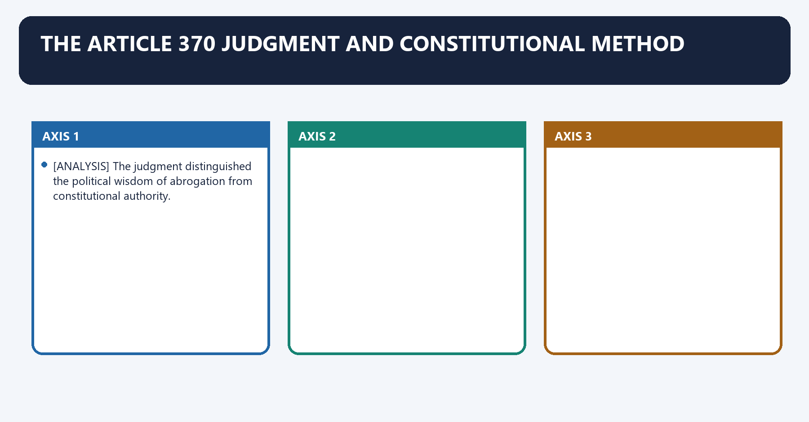
- [ANALYSIS] The judgment distinguished the political wisdom of abrogation from constitutional authority.
- [ANALYSIS] By using Article 370's temporary character and continuing presidential power, the Court avoided making the disputed Article 367 modification indispensable.
- [LIMIT] An answer should not compress multiple opinions into a slogan; use only common controlling propositions unless a separate opinion is relevant.

### 37. President's Rule and federal consent

President's Rule and federal consent denotes the constitutional rules and institutional links organised around State institutions suspended under President's Rule.
President's Rule and federal consent operates through Parliament exercises State legislative powers, connected with far-reaching change to State's constitutional position.
The operative mechanism matters because question of temporary substitution versus permanent alteration.
Its principal consequence is that [ANALYSIS] Critics argue that using President's Rule for permanent constitutional restructuring weakens federal consent.
The decisive contrast is between [LIMIT] Statehood conversion remains the strongest unresolved dimension; do not pretend the 2023 judgment supplied a universal rule and State institutions suspended under President's Rule.
The exam-safe limitation is that state institutions suspended under President's Rule.
**Visual 36 - Constitutional tension**

```text
State institutions suspended under President's Rule
        |
Parliament exercises State legislative powers
        |
far-reaching change to State's constitutional position
        |
question of temporary substitution versus permanent alteration
```

- [ANALYSIS] Critics argue that using President's Rule for permanent constitutional restructuring weakens federal consent.
- [ANALYSIS] The integration response relies on constitutional text, temporary Article 370 and Parliament's substitute authority during President's Rule.
- [LIMIT] Statehood conversion remains the strongest unresolved dimension; do not pretend the 2023 judgment supplied a universal rule.

### 38. Differentiated citizenship

Differentiated citizenship denotes the constitutional rules and institutional links organised around [ANALYSIS] Special land, employment and representation rules differentiate entitlements by residence, community or region.
Differentiated citizenship operates through [ANALYSIS] Their justification is protective: preventing dispossession and preserving political voice, connected with [ANALYSIS] Their risk is exclusion: rigid insider rules may burden national mobility or internal minorities.
The operative mechanism matters because [LIMIT] Use "differentiated citizenship" analytically, not as a claim that India has multiple legal citizenships.
Its principal consequence is that [ANALYSIS] Special land, employment and representation rules differentiate entitlements by residence, community or region.
The decisive contrast is between [ANALYSIS] Special land, employment and representation rules differentiate entitlements by residence, community or region and [ANALYSIS] Special land, employment and representation rules differentiate entitlements by residence, community or region.
The exam-safe limitation is that [ANALYSIS] Special land, employment and representation rules differentiate entitlements by residence, community or region.
- [ANALYSIS] Special land, employment and representation rules differentiate entitlements by residence, community or region.
- [ANALYSIS] Their justification is protective: preventing dispossession and preserving political voice.
- [ANALYSIS] Their risk is exclusion: rigid insider rules may burden national mobility or internal minorities.
- [LIMIT] Use "differentiated citizenship" analytically, not as a claim that India has multiple legal citizenships.

### 39. Answer-writing evidence discipline

Answer-writing evidence discipline denotes the constitutional rules and institutional links organised around PRESIDENTIAL ORDER / STATUTE.
Answer-writing evidence discipline operates through DATED CURRENT STATUS, connected with Claim: Article 370 was lawfully made inoperative.
The operative mechanism matters because constitutional anchor: Article 370(3).
Its principal consequence is that instrument: C.O. 272/273 and parliamentary action.
The decisive contrast is between Judicial holding: In re Article 370 (2023) and Current status: J&K UT with elected Assembly; Statehood pending.
The exam-safe limitation is that qualification: UT conversion validity was not finally decided.
**Visual 37 - Legal-source ladder**

```text
CONSTITUTION TEXT
  -> PRESIDENTIAL ORDER / STATUTE
  -> JUDICIAL HOLDING
  -> DATED CURRENT STATUS
  -> ANALYSIS
  -> QUALIFICATION
```

**Example**

- Claim: Article 370 was lawfully made inoperative.
- Constitutional anchor: Article 370(3).
- Instrument: C.O. 272/273 and parliamentary action.
- Judicial holding: *In re Article 370* (2023).
- Current status: J&K UT with elected Assembly; Statehood pending.
- Qualification: UT conversion validity was not finally decided.

## CONSOLIDATED REGISTER NOTES

### Part XXI master idea

```text
Part XXI
  Article 370: former J&K special operation, inoperative since 2019
  Articles 371-371J: tailored provisions for 12 States
```

- Asymmetric federalism = different constitutional arrangements within one sovereign Union.
- It protects identity, land, custom, representation or backward regions.
- It does not create separate sovereignty or citizenship.

### Article 370 timeline

| Date | Event |
|---|---|
| 1954 | Presidential Order inserted Article 35A |
| 5 Aug 2019 | C.O. 272 and parliamentary process |
| Aug 2019 | C.O. 273 rendered Article 370 inoperative |
| 31 Oct 2019 | Reorganisation into J&K UT and Ladakh UT effective |
| 11 Dec 2023 | Supreme Court upheld abrogation |
| Sep-Oct 2024 | J&K Assembly elections |
| 18 Aug 2026 | Statehood still pending |

### 2023 judgment controls

- Article 370 was temporary.
- J&K retained no separate internal sovereignty.
- President's Article 370(3) power survived Constituent Assembly dissolution.
- Court found C.O. 272 Article 367-route validation unnecessary.
- Elections directed by 30 September 2024.
- Statehood assurance recorded; no fixed deadline.
- UT-conversion validity not finally decided.

### Article 371 family

| Article | State(s) | Recall |
|---|---|---|
| 371 | Maharashtra/Gujarat | development boards |
| 371A | Nagaland | custom, justice, land consent |
| 371B | Assam | Tribal Areas Committee |
| 371C | Manipur | Hill Areas Committee |
| 371D | AP/Telangana | local opportunity/cadres |
| 371E | Andhra Pradesh | Central University |
| 371F | Sikkim | integration safeguards |
| 371G | Mizoram | custom, justice, land consent |
| 371H | Arunachal | Governor law/order role |
| 371I | Goa | Assembly minimum 30 |
| 371J | Karnataka | Kalyana Karnataka development/reservation |

### Strongest protections

- Articles 371A and 371G: specified parliamentary laws require State Assembly decision.
- The shield covers custom, specified justice, and land fields.
- It is not a general veto over Parliament.

### Fifth/Sixth Schedule distinction

| Fifth | Sixth |
|---|---|
| ten States | Assam, Meghalaya, Tripura, Mizoram |
| President declares Scheduled Areas | Governor organises autonomous districts/regions |
| Governor + TAC + Union directions | elected autonomous councils |
| protective regulations | legislative, judicial and fiscal powers |
| guardianship model | self-government model |

### Current controls

- J&K = UT with legislature; Statehood pending.
- Ladakh = UT without legislature.
- Ladakh Sixth Schedule/Statehood demand is not enacted.
- Article 370 is inoperative, not deleted.
- Article 371 provisions remain fully distinct and operative.
- NEC is statutory, not an Article 371 body.

### Answer-writing evidence bank

| Claim | Named evidence | Qualification |
|---|---|---|
| Article 370 result is settled | C.O. 272/273 + *In re Article 370* | UT conversion left open |
| asymmetry integrates diversity | Articles 371A/G/F | may create exclusion risks |
| regional equality needs differentiation | Articles 371/371J | implementation must be measured |
| tribal mechanisms differ | Article 244 + Schedules | do not merge with Part XXI |
| J&K democracy restored partly | 2024 Assembly election | Statehood still pending |
| Ladakh demand is live | current negotiations/protests | no enacted change |

### Final verdicts

- **Article 370:** inoperative and judicially upheld; precision requires acknowledging the open Statehood dimension.
- **Article 371:** calibrated autonomy and development inside one Union.
- **Asymmetry:** defensible when protective, participatory and accountable.
- **J&K:** elected UT government is democratic restoration, not full federal restoration.
- **Ladakh:** constitutional safeguards remain a negotiated demand, not current law.

### Last-minute traps

1. Part XXI, not Part III.
2. Article 370 inoperative, not deleted.
3. Article 35A came through the 1954 Presidential Order.
4. J&K is a UT with legislature; Ladakh is a UT without legislature.
5. Elections were held in 2024; Statehood remains pending.
6. Court set no Statehood deadline.
7. Court did not finally decide the UT-conversion validity.
8. Article 371 family covers 12 States.
9. 371A = Nagaland; 371G = Mizoram.
10. 371B = Assam Tribal Areas Committee; 371C = Manipur Hill Areas Committee.
11. 371D applies to Andhra Pradesh and Telangana.
12. 371J = Kalyana Karnataka.
13. Article 371 and Sixth Schedule are distinct.
14. NEC is statutory.

### COMPLETE TOPIC ASCII MASTER FLOW DIAGRAM


#### ASCII MASTER FLOW — PANEL 1/9: Canonical Part XXI scope and the boundary with other topics

```ascii-master
PART XXI: TEMPORARY, TRANSITIONAL AND SPECIAL PROVISIONS
Articles 369-392 include time-bound transitional rules, continuance/adaptation devices
and State-specific constitutional asymmetry.

THIS TOPIC OWNS
Article 370 evolution/current status + Articles 371-371J + asymmetry mechanisms.

DISTINCT OWNERS
Part XVIII emergencies | reservation/class provisions | Part X and Fifth/Sixth Schedules
| ordinary Union-State flexibility | Union Territory administration.

CORE IDEA
constitutional equality permits reasoned differentiation; special treatment remains
inside one Constitution and does not create separate sovereignty.
```

#### ASCII MASTER FLOW — PANEL 2/9: Article 370 before 2019: accession, Orders and constitutional application

```ascii-master
PRE-2019 OPERATING CHAIN
Instrument of Accession fields -> Article 370(1) consultation/concurrence
-> Presidential Orders -> wider Constitution and Union-law application to J&K.

ARTICLE 35A
1954 Constitution Application Order -> permanent-resident definition and specified protections.

CONSTITUENT ASSEMBLY ISSUE
Article 370(3) proviso referred to J&K Constituent Assembly; it dissolved in 1957.

Sampat Prakash (1968) -> Article 370 and Presidential-Order practice continued after 1957.

LIMIT
autonomy was constitutionally mediated; it did not amount to external sovereignty.
```

#### ASCII MASTER FLOW — PANEL 3/9: The 2019 constitutional-order and reorganisation sequence

```ascii-master
5 AUGUST 2019
C.O. 272 under Article 370(1) -> Constitution applied comprehensively
-> interpretive change used the State-legislature route while President's Rule operated.

PARLIAMENTARY RESOLUTION
recommended Article 370(3) declaration.

6 AUGUST 2019
C.O. 273 -> Article 370 provisions ceased to operate except the modified declaration.

J&K REORGANISATION ACT, 2019
former State -> UT of Jammu and Kashmir with legislature
+ UT of Ladakh without legislature, effective 31 October 2019.

TRAP
Presidential Orders, parliamentary resolution and reorganisation statute are distinct legal acts.
```

#### ASCII MASTER FLOW — PANEL 4/9: In Re Article 370 (2023): holdings and issues left open

```ascii-master
In Re: Article 370 of the Constitution (2023)
  +-- Article 370 was temporary; J&K had no internal sovereignty after accession
  +-- Article 370(3) power survived dissolution of the J&K Constituent Assembly
  +-- C.O. 273 declaration was upheld
  +-- C.O. 272's Article 367 route was invalid, but the final outcome survived independently
  +-- J&K Constitution became inoperative after full application of India's Constitution.

OPEN / QUALIFIED
Court recorded restoration-of-Statehood assurance and set no judicial deadline.
It did not finally decide the State-to-UT conversion issue after the Union concession.

VERDICT
the Article 370 abrogation question is judicially settled; Statehood timing remains political/legal.
```

#### ASCII MASTER FLOW — PANEL 5/9: Current Jammu and Kashmir and Ladakh position

```ascii-master
JAMMU AND KASHMIR
Union Territory with legislature | Assembly elections held Sep-Oct 2024
| Statehood not restored as of 24 August 2026.

LADAKH
Union Territory without legislature.
Demands include Statehood, Sixth Schedule protection and Article 371-type safeguards.

LEGAL STATUS CONTROL
demands, committee talks and political assurances are not enacted constitutional change.

DISTINCTION
J&K Statehood restoration -> reorganisation/federal-status question
Ladakh Sixth Schedule -> Article 244 + Sixth Schedule autonomy question
Article 371-type protection -> Part XXI amendment question.
```

#### ASCII MASTER FLOW — PANEL 6/9: Articles 371 to 371D: development and regional-equity mechanisms

```ascii-master
ARTICLE 371
Maharashtra/Gujarat -> Governor's special responsibility for regional development boards,
equitable funds and opportunities.

ARTICLE 371A: NAGALAND
specified religious/social practices, customary law, customary justice and land/resources
shielded from parliamentary law unless State Assembly resolves otherwise.

ARTICLE 371B: ASSAM
Assembly committee for tribal areas.

ARTICLE 371C: MANIPUR
Hill Areas Committee + Governor reporting/special responsibility framework.

ARTICLE 371D: ANDHRA PRADESH/TELANGANA
equitable local opportunities in public employment/education; presidential-order mechanism.
ARTICLE 371E merely enables a Central University in Andhra Pradesh.
```

#### ASCII MASTER FLOW — PANEL 7/9: Articles 371F to 371J: identity, law-and-order and local opportunity

```ascii-master
ARTICLE 371F: SIKKIM
integration-specific Assembly, representation and continuity protections.

ARTICLE 371G: MIZORAM
specified religious/social practices, customary law/justice and land protection
unless State Assembly resolves otherwise; distinct from Nagaland's resource wording.

ARTICLE 371H: ARUNACHAL PRADESH
Governor's special responsibility for law and order, exercised after ministerial consultation.

ARTICLE 371I: GOA
minimum Assembly size safeguard.

ARTICLE 371J: KALYANA KARNATAKA
development board, equitable funds and local reservation/opportunity mechanisms.

EXAM RULE
match State -> Article -> protected subject -> decision-maker -> consent/resolution requirement.
```

#### ASCII MASTER FLOW — PANEL 8/9: Mechanism comparison: Orders, amendments and tribal Schedules

```ascii-master
ARTICLE 370 HISTORIC ROUTE
Presidential Orders under its own text -> now inoperative after 2019/2023 control.

ARTICLES 371-371J
constitutional text created or changed through constitutional-amendment history;
some clauses authorise Presidential Orders or Governor responsibilities for implementation.

FIFTH SCHEDULE
Scheduled Areas + Governor/Tribes Advisory Council + presidential declaration architecture.

SIXTH SCHEDULE
autonomous district/regional councils in Assam, Meghalaya, Tripura and Mizoram.

DO NOT MERGE
Article 371A/371G consent shields != Sixth Schedule councils
!= Fifth Schedule administration != Article 370's former application mechanism.
```

#### ASCII MASTER FLOW — PANEL 9/9: Federalism, equality, current traps and qualified synthesis

```ascii-master
WHY ASYMMETRY
historical compact + cultural identity + tribal land/custom + regional imbalance
-> tailored guarantee -> integration with protection.

RISKS
insider-outsider exclusion | weak implementation | Governor controversy
| unequal opportunity | permanent grievance politics.

PRELIMS FIREWALL
Article 370 printed but inoperative | Articles 371-371J still operative
| 371E enables a university | 371I concerns Goa | 371H law and order
| Fifth/Sixth Schedules are not Part XXI | Ladakh demands are not law.

MAINS SPINE
define asymmetric federalism -> classify mechanism -> exact Article/State
-> benefit -> equality/federal counterpoint -> implementation reform
-> unity through constitutionally bounded and reviewable difference.
```