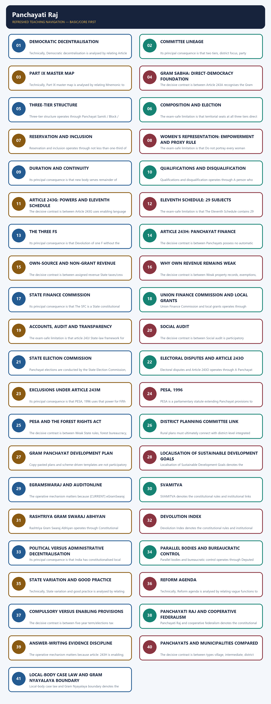
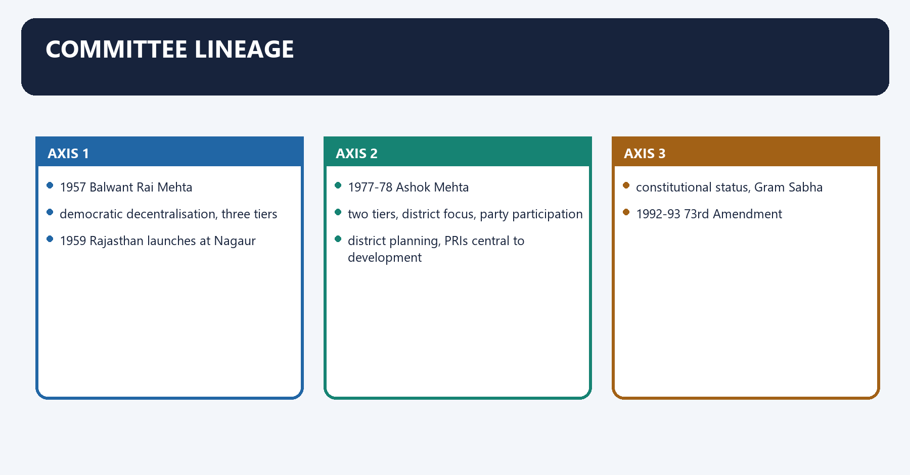
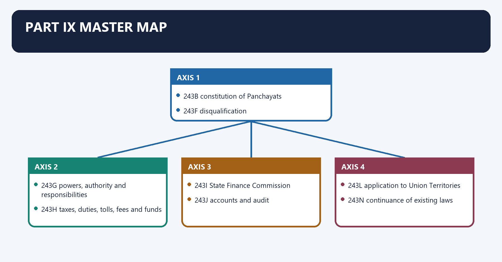
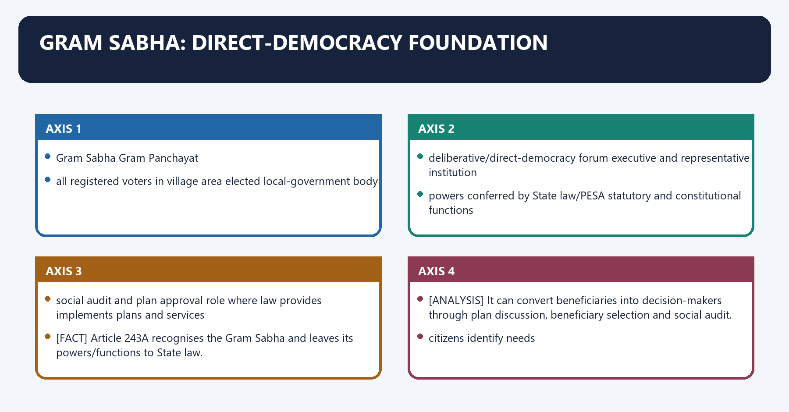
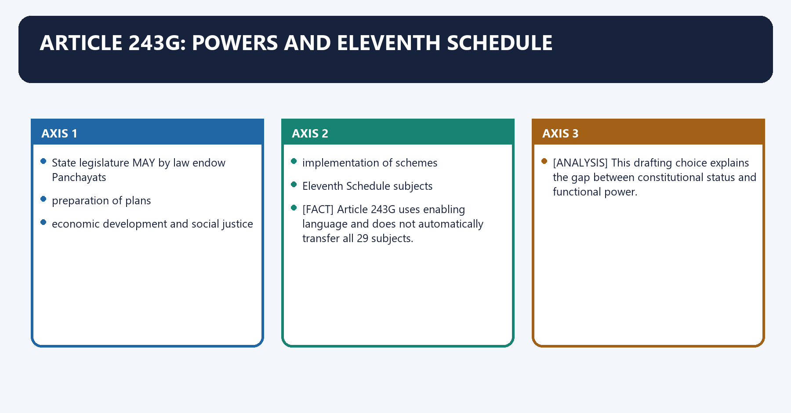
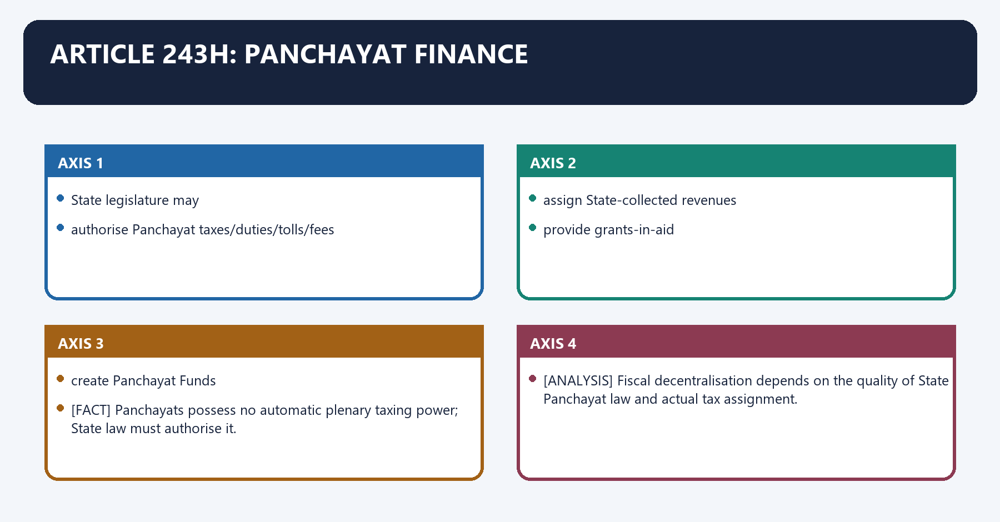
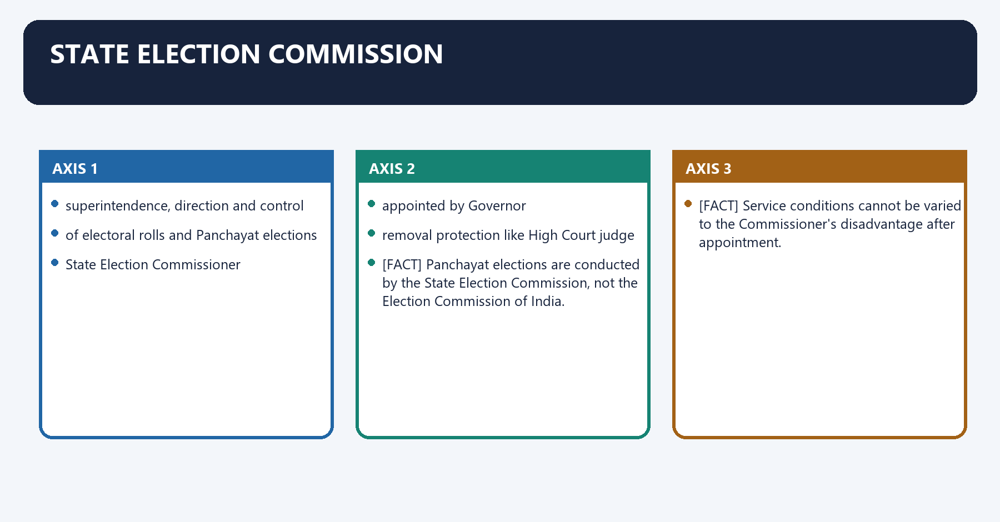
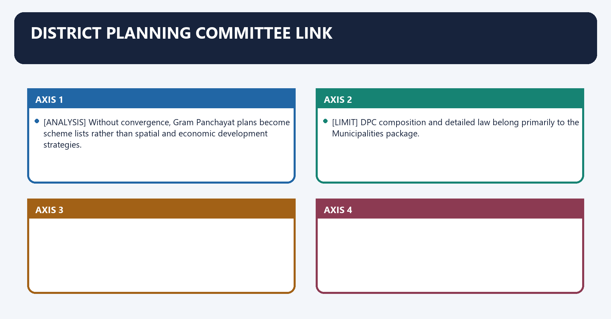
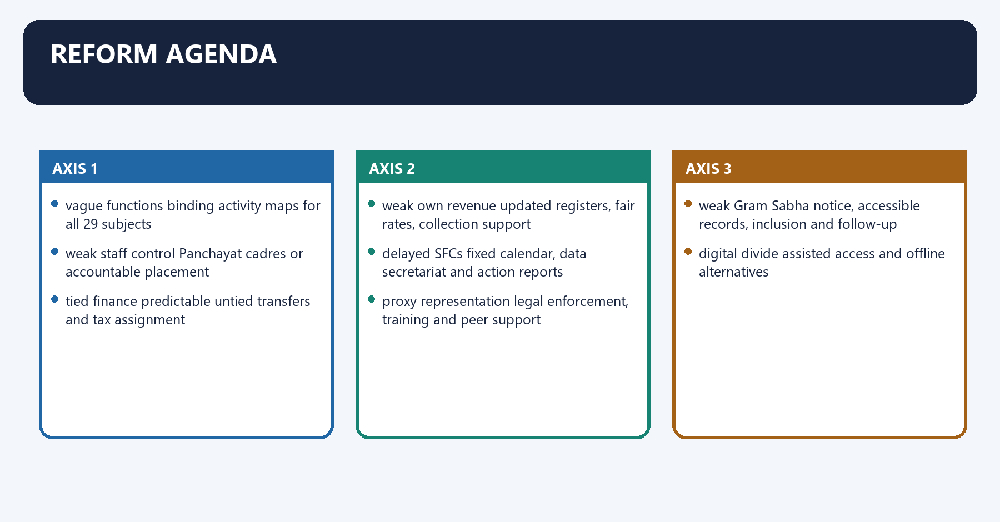
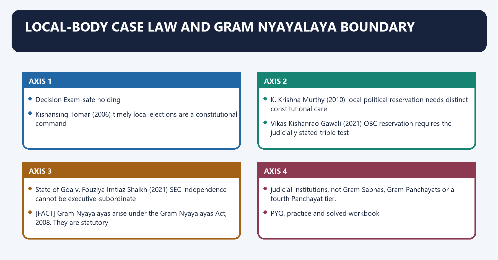

# Panchayati Raj — Complete Uncompressed Learning Session

> **Subject:** Indian Polity | **Topic:** 23 | **GS-II + Prelims** | **Export date:** 2026-08-24
>
> **Approval:** false - awaiting explicit user approval.
>
> **Evidence key:** [FACT] constitutional, judicial or officially verified proposition; [ANALYSIS] reasoned exam synthesis; [CURRENT] dated legal/current control; [LIMIT] qualification preventing overstatement.

#### Package method, source priority and current control

- Source order followed: `basic/Panchayati-Raj.md` -> `advanced/23_Panchayati-Raj.md` -> `basic/Scheduled-and-Tribal-Areas.md` -> official Ministry of Panchayati Raj material on devolution, XVI Finance Commission rural-local-body guidelines, eGramSwaraj, PESA and SVAMITVA. Qdrant was not used.
- [FACT] The Core owner supersedes stale or less-qualified Advanced statements.
- [CURRENT] Status is controlled to **24 August 2026, Asia/Kolkata**.
- [CURRENT] **Live official refresh, 24 August 2026:** The Ministry of Panchayati Raj, eGramSwaraj, AuditOnline, SVAMITVA and Finance Commission portals were rechecked on 24 August 2026. The Devolution Index 2024 and 2026-31 local-body grant period are dated anchors; no changing dashboard total is frozen.
- [CURRENT] Part IX, Articles 243-243O, the Eleventh Schedule and the PESA Act, 1996 remain the controlling constitutional/statutory framework.
- [CURRENT] The Ministry of Panchayati Raj hosts the Panchayat Devolution Index 2024, which evaluates devolution across functions, finances, functionaries and enabling/accountability conditions.
- [CURRENT] Operational guidelines for rural local bodies under the Sixteenth Finance Commission award period **2026-27 to 2030-31** are officially published.
- [LIMIT] Grant totals, release amounts, Panchayat counts, property-card counts and portal-usage numbers change. This package uses named programmes and dated frameworks but does not freeze dashboard totals as permanent facts.
- [CURRENT] eGramSwaraj supports planning, accounting and monitoring; AuditOnline supports audit workflows; SVAMITVA uses drone-based survey and property cards for rural inhabited areas.
- [CURRENT] PESA-specific planning has been integrated into digital Gram Panchayat Development Plan workflows, but legal implementation and connectivity/capacity remain uneven.
- [LIMIT] A portal upload is not proof of substantive devolution, Gram Sabha consent or service-delivery quality.
- Official current sources: Ministry of Panchayati Raj homepage, Devolution Index 2024, XVI Finance Commission rural-local-body guidelines/report, eGramSwaraj, AuditOnline and SVAMITVA dashboards.
- Package target: independently answer-complete Foundation/Core, Optional Advanced refinements, more than 35 text-native visuals, three direct solved Mains PYQs, one routed Prelims demand, 36 original MCQs, 12 remedial MCQs and eight original solved Mains questions.

#### Roadmap

| Stage | Coverage | Exam outcome |
|---|---|---|
| Evolution | committees and pre-constitutional history | Handles chronology and recommendations |
| Constitutional structure | Part IX, tiers and Gram Sabha | Solves direct provision questions |
| Representation | elections, reservations and tenure | Builds women/social-justice answers |
| Powers | Article 243G and Eleventh Schedule | Explains enabling devolution |
| Finance | Article 243H, SFC and Central grants | Answers own-source revenue PYQ |
| Accountability | SEC, audit, social audit and planning | Links democracy to delivery |
| PESA | Scheduled-Area self-government | Handles tribal-governance application |
| Functionality | three Fs and State variation | Answers devolution criticism |
| Digital reform | eGramSwaraj, AuditOnline, SVAMITVA | Adds current evidence safely |
| Workbook | PYQs, MCQs, remedials and solved Mains | Converts coverage into marks |

#### Scope ownership and cross-links

- **Polity 24 - Municipalities:** urban local government and Twelfth Schedule.
- **Polity 26 - Scheduled and Tribal Areas:** full Fifth/Sixth Schedule, PESA and FRA doctrine.
- **Polity 29 - Finance Commission:** full Union Finance Commission design and grants.
- **Governance - Local Service Delivery:** implementation, social accountability and district administration.
- [LIMIT] This package owns rural local self-government. It uses PESA and Finance Commission controls only to make Panchayati Raj independently answer-complete.

## BASIC LEARNING SESSION



*Distinct embedded teaching-navigation image. The separate continuous Cārvāka-style flowchart package remains an independent at-a-glance artifact.*

### SESSION 1 — DEMOCRATIC DECENTRALISATION
#### DEFINITION / WHAT THIS IS CALLED

**Plain-language definition:** Democratic decentralisation denotes the constitutional rules and institutional links organised around LOCAL SELF-GOVERNMENT.

**Technical definition:** Technically, Democratic decentralisation is analysed by relating Article 40 to Democratic, then testing the relationship through LOCAL SELF-GOVERNMENT and Its principal consequence.

#### ANSWER-GRABBING OPENING — WRITE/ADAPT IN THE EXAM

> Constitutional status guarantees institutional existence, elections and inclusion; it does not by itself guarantee administrative or fiscal power.

#### MUST-WRITE KEYWORDS

- **Democratic decentralisation**
- **Article 40**
- **Democratic**
- **LOCAL SELF-GOVERNMENT**
- **Its principal consequence**
- **24 April 1993**

**How to use them:** Frame the answer through Democratic decentralisation; define Article 40, connect Democratic with LOCAL SELF-GOVERNMENT to explain the mechanism, and use Its principal consequence for the decisive comparison or qualification.

Democratic decentralisation denotes the constitutional rules and institutional links organised around LOCAL SELF-GOVERNMENT.
Democratic decentralisation operates through Panchayats in rural areas, connected with [FACT] Article 40 directs the State to organise village panchayats and endow them with powers necessary for self-government.
The operative mechanism matters because [FACT] The 73rd Amendment Act, 1992 inserted Part IX and the Eleventh Schedule.
Its principal consequence is that [FACT] It came into force on 24 April 1993.
The decisive contrast is between LOCAL SELF-GOVERNMENT and LOCAL SELF-GOVERNMENT.
The exam-safe limitation is that lOCAL SELF-GOVERNMENT.

**Visual 1 - Three levels of Indian government**

```text
UNION
   |
STATES
   |
LOCAL SELF-GOVERNMENT
   |
Panchayats in rural areas
```

Caption: The 73rd Amendment constitutionalised rural local institutions as the third governmental tier.

- [FACT] Article 40 directs the State to organise village panchayats and endow them with powers necessary for self-government.
- [FACT] The 73rd Amendment Act, 1992 inserted Part IX and the Eleventh Schedule.
- [FACT] It came into force on **24 April 1993**.
- [ANALYSIS] Constitutional status guarantees institutional existence, elections and inclusion; it does not by itself guarantee administrative or fiscal power.

#### CLOSING RECALL FLOW — DEMOCRATIC DECENTRALISATION

```closure-flow
SUBTOPIC: Democratic decentralisation
KEY TERMS / DEFINITIONS: Democratic decentralisation · Article 40 · Democratic · LOCAL SELF-GOVERNMENT · Its principal consequence · 24 April 1993
MECHANISM / ARGUMENT: Constitutional status guarantees institutional existence, elections and inclusion; it does not by itself guarantee administrative or fiscal power.
CONSEQUENCE / CONTRAST: Its principal consequence is that It came into force on 24 April 1993.
UPSC TRAP / ANSWER-USE: Do not miss this limiting distinction: the decisive contrast is between LOCAL SELF-GOVERNMENT and LOCAL SELF-GOVERNMENT.
ANSWER-GRABBING FORMULATION: Constitutional status guarantees institutional existence, elections and inclusion; it does not by itself guarantee administrative or fiscal power.
```
### SESSION 2 — COMMITTEE LINEAGE
#### DEFINITION / WHAT THIS IS CALLED

**Plain-language definition:** Committee lineage denotes the constitutional rules and institutional links organised around 1957 Balwant Rai Mehta.

**Technical definition:** Its principal consequence is that two tiers, district focus, party participation.

#### ANSWER-GRABBING OPENING — WRITE/ADAPT IN THE EXAM

> Successive committees moved Panchayati Raj from development administration toward democratic decentralisation, culminating in constitutional status when non-binding recommendations proved insufficient.

#### MUST-WRITE KEYWORDS

- **Committee lineage**
- **Balwant Rai Mehta**
- **three-tier democratic decentralisation**
- **Ashok Mehta**
- **two-tier model and political-party participation**
- **G.V.K. Rao**

**How to use them:** Frame the answer through Committee lineage; define Balwant Rai Mehta, connect three-tier democratic decentralisation with Ashok Mehta to explain the mechanism, and use two-tier model and political-party participation for the decisive comparison or qualification.

Committee lineage denotes the constitutional rules and institutional links organised around 1957 Balwant Rai Mehta.
Committee lineage operates through democratic decentralisation, three tiers, connected with 1959 Rajasthan launches at Nagaur.
The operative mechanism matters because 1977-78 Ashok Mehta.
Its principal consequence is that two tiers, district focus, party participation.
The decisive contrast is between district planning, PRIs central to development and constitutional status, Gram Sabha.
The exam-safe limitation is that 1992-93 73rd Amendment.

**Visual 2 - Evolution timeline**

```text
1957 Balwant Rai Mehta
   -> democratic decentralisation, three tiers
1959 Rajasthan launches at Nagaur
1977-78 Ashok Mehta
   -> two tiers, district focus, party participation
1985 G.V.K. Rao
   -> district planning, PRIs central to development
1986 L.M. Singhvi
   -> constitutional status, Gram Sabha
1992-93 73rd Amendment
```

- [FACT] Balwant Rai Mehta recommended Gram Panchayat-Panchayat Samiti-Zila Parishad.
- [FACT] Rajasthan launched the system at Nagaur on 2 October 1959.
- [FACT] Ashok Mehta preferred a two-tier model centred on district and mandal panchayat.
- [FACT] G.V.K. Rao emphasised the district as the basic planning/development unit.
- [FACT] L.M. Singhvi recommended constitutional recognition and stressed the Gram Sabha.

**Visual 3 - Committee trap table**

| Committee | Recall |
|---|---|
| Balwant Rai Mehta | three-tier democratic decentralisation |
| Ashok Mehta | two-tier model and political-party participation |
| G.V.K. Rao | district development administration |
| L.M. Singhvi | constitutional status and Gram Sabha |

#### CLOSING RECALL FLOW — COMMITTEE LINEAGE

```closure-flow
SUBTOPIC: Committee lineage
KEY TERMS / DEFINITIONS: Committee lineage · Balwant Rai Mehta · three-tier democratic decentralisation · Ashok Mehta · two-tier model and political-party participation · G.V.K. Rao
MECHANISM / ARGUMENT: Its principal consequence is that two tiers, district focus, party participation.
CONSEQUENCE / CONTRAST: The decisive contrast is between district planning, PRIs central to development and constitutional status, Gram Sabha.
UPSC TRAP / ANSWER-USE: Do not miss this limiting distinction: the exam-safe limitation is that 1992-93 73rd Amendment.
ANSWER-GRABBING FORMULATION: Successive committees moved Panchayati Raj from development administration toward democratic decentralisation, culminating in constitutional status when non-binding recommendations proved insufficient.
```
### SESSION 3 — PART IX MASTER MAP
#### DEFINITION / WHAT THIS IS CALLED

**Plain-language definition:** Part IX master map denotes the constitutional rules and institutional links organised around 243B constitution of Panchayats.

**Technical definition:** Technically, Part IX master map is analysed by relating Mnemonic to definitions, then testing the relationship through Gram Sabha and 243A.

#### ANSWER-GRABBING OPENING — WRITE/ADAPT IN THE EXAM

> Part IX constitutionalises rural local democracy through elections, reservation, finance and oversight, but leaves substantial functional devolution to State legislation.

#### MUST-WRITE KEYWORDS

- **Part IX master map**
- **Mnemonic**
- **definitions**
- **Gram Sabha**
- **243A**
- **243B**

**How to use them:** Frame the answer through Part IX master map; define Mnemonic, connect definitions with Gram Sabha to explain the mechanism, and use 243A for the decisive comparison or qualification.

Part IX master map denotes the constitutional rules and institutional links organised around 243B constitution of Panchayats.
Part IX master map operates through 243F disqualification, connected with 243G powers, authority and responsibilities.
The operative mechanism matters because 243H taxes, duties, tolls, fees and funds.
Its principal consequence is that 243I State Finance Commission.
The decisive contrast is between 243J accounts and audit and 243L application to Union Territories.
The exam-safe limitation is that 243N continuance of existing laws.

**Visual 4 - Articles 243-243O**

| Article | Subject |
|---:|---|
| 243 | definitions |
| 243A | Gram Sabha |
| 243B | constitution of Panchayats |
| 243C | composition |
| 243D | reservation |
| 243E | duration |
| 243F | disqualification |
| 243G | powers, authority and responsibilities |
| 243H | taxes, duties, tolls, fees and funds |
| 243I | State Finance Commission |
| 243J | accounts and audit |
| 243K | elections |
| 243L | application to Union Territories |
| 243M | exclusions |
| 243N | continuance of existing laws |
| 243O | bar to court interference in electoral matters |

> **Mnemonic:** A Sabha, B tiers, C composition, D reservation, E duration, G functions, H finance, I SFC, K SEC.

#### CLOSING RECALL FLOW — PART IX MASTER MAP

```closure-flow
SUBTOPIC: Part IX master map
KEY TERMS / DEFINITIONS: Part IX master map · Mnemonic · definitions · Gram Sabha · 243A · 243B
MECHANISM / ARGUMENT: The decisive contrast is between 243J accounts and audit and 243L application to Union Territories.
CONSEQUENCE / CONTRAST: Its principal consequence is that 243I State Finance Commission.
UPSC TRAP / ANSWER-USE: Do not miss this limiting distinction: the exam-safe limitation is that 243N continuance of existing laws.
ANSWER-GRABBING FORMULATION: Part IX constitutionalises rural local democracy through elections, reservation, finance and oversight, but leaves substantial functional devolution to State legislation.
```
### SESSION 4 — GRAM SABHA: DIRECT-DEMOCRACY FOUNDATION
#### DEFINITION / WHAT THIS IS CALLED

**Plain-language definition:** Gram Sabha: direct-democracy foundation denotes the constitutional rules and institutional links organised around Gram Sabha Gram Panchayat.

**Technical definition:** The decisive contrast is between Article 243A recognises the Gram Sabha and leaves its powers/functions to State law and It can convert beneficiaries into decision-makers through plan discussion, beneficiary selection and social audit.

#### ANSWER-GRABBING OPENING — WRITE/ADAPT IN THE EXAM

> Constitutional recognition does not automatically make every Gram Sabha powerful; quorum, information, inclusion and follow-up matter.

#### MUST-WRITE KEYWORDS

- **Gram Sabha**
- **direct-democracy foundation**
- **all registered voters in village area**
- **elected local-government body**
- **deliberative/direct-democracy forum**
- **executive and representative institution**

**How to use them:** Frame the answer through Gram Sabha; define direct-democracy foundation, connect all registered voters in village area with elected local-government body to explain the mechanism, and use deliberative/direct-democracy forum for the decisive comparison or qualification.

Gram Sabha: direct-democracy foundation denotes the constitutional rules and institutional links organised around Gram Sabha Gram Panchayat.
Gram Sabha: direct-democracy foundation operates through all registered voters in village area elected local-government body, connected with deliberative/direct-democracy forum executive and representative institution.
The operative mechanism matters because powers conferred by State law/PESA statutory and constitutional functions.
Its principal consequence is that social audit and plan approval role where law provides implements plans and services.
The decisive contrast is between [FACT] Article 243A recognises the Gram Sabha and leaves its powers/functions to State law and [ANALYSIS] It can convert beneficiaries into decision-makers through plan discussion, beneficiary selection and social audit.
The exam-safe limitation is that citizens identify needs.

**Visual 5 - Gram Sabha and Gram Panchayat**

| Gram Sabha | Gram Panchayat |
|---|---|
| all registered voters in village area | elected local-government body |
| deliberative/direct-democracy forum | executive and representative institution |
| powers conferred by State law/PESA | statutory and constitutional functions |
| social audit and plan approval role where law provides | implements plans and services |

- [FACT] Article 243A recognises the Gram Sabha and leaves its powers/functions to State law.
- [ANALYSIS] It can convert beneficiaries into decision-makers through plan discussion, beneficiary selection and social audit.
- [LIMIT] Constitutional recognition does not automatically make every Gram Sabha powerful; quorum, information, inclusion and follow-up matter.

**Visual 6 - Participation chain**

```text
citizens identify needs
      |
Gram Sabha deliberates
      |
Gram Panchayat prepares GPDP
      |
budget and scheme convergence
      |
implementation
      |
social audit and feedback
```

#### CLOSING RECALL FLOW — GRAM SABHA: DIRECT-DEMOCRACY FOUNDATION

```closure-flow
SUBTOPIC: Gram Sabha: direct-democracy foundation
KEY TERMS / DEFINITIONS: Gram Sabha · direct-democracy foundation · all registered voters in village area · elected local-government body · deliberative/direct-democracy forum · executive and representative institution
MECHANISM / ARGUMENT: The decisive contrast is between Article 243A recognises the Gram Sabha and leaves its powers/functions to State law and It can convert beneficiaries into decision-makers through plan discussion, beneficiary selection and social audit.
CONSEQUENCE / CONTRAST: Constitutional recognition does not automatically make every Gram Sabha powerful; quorum, information, inclusion and follow-up matter.
UPSC TRAP / ANSWER-USE: Do not miss this limiting distinction: its principal consequence is that social audit and plan approval role where law provides...
ANSWER-GRABBING FORMULATION: Constitutional recognition does not automatically make every Gram Sabha powerful; quorum, information, inclusion and follow-up matter.
```
### SESSION 5 — THREE-TIER STRUCTURE
#### DEFINITION / WHAT THIS IS CALLED

**Plain-language definition:** Three-tier structure denotes the constitutional rules and institutional links organised around INTERMEDIATE LEVEL.

**Technical definition:** Three-tier structure operates through Panchayat Samiti / Block / Taluka, connected with Article 243B provides village, intermediate and district Panchayats.

#### ANSWER-GRABBING OPENING — WRITE/ADAPT IN THE EXAM

> Article 243B establishes village, intermediate and district Panchayats, allowing only States with populations not exceeding twenty lakh to omit the intermediate tier.

#### MUST-WRITE KEYWORDS

- **Three-tier structure**
- **not exceeding 20 lakh**
- **Article 243B**
- **Three-tier**
- **INTERMEDIATE LEVEL**
- **Panchayat Samiti**

**How to use them:** Frame the answer through Three-tier structure; define not exceeding 20 lakh, connect Article 243B with Three-tier to explain the mechanism, and use INTERMEDIATE LEVEL for the decisive comparison or qualification.

Three-tier structure denotes the constitutional rules and institutional links organised around INTERMEDIATE LEVEL.
Three-tier structure operates through Panchayat Samiti / Block / Taluka, connected with [FACT] Article 243B provides village, intermediate and district Panchayats.
The operative mechanism matters because [FACT] A State with population not exceeding 20 lakh may omit the intermediate tier.
Its principal consequence is that [LIMIT] The exemption does not permit omission of village or district Panchayats.
The decisive contrast is between INTERMEDIATE LEVEL and INTERMEDIATE LEVEL.
The exam-safe limitation is that iNTERMEDIATE LEVEL.
**Visual 7 - Rural tiers**

```text
DISTRICT LEVEL
Zila Parishad
      |
INTERMEDIATE LEVEL
Panchayat Samiti / Block / Taluka
      |
VILLAGE LEVEL
Gram Panchayat
```

- [FACT] Article 243B provides village, intermediate and district Panchayats.
- [FACT] A State with population **not exceeding 20 lakh** may omit the intermediate tier.
- [LIMIT] The exemption does not permit omission of village or district Panchayats.

#### CLOSING RECALL FLOW — THREE-TIER STRUCTURE

```closure-flow
SUBTOPIC: Three-tier structure
KEY TERMS / DEFINITIONS: Three-tier structure · not exceeding 20 lakh · Article 243B · Three-tier · INTERMEDIATE LEVEL · Panchayat Samiti
MECHANISM / ARGUMENT: Three-tier structure operates through Panchayat Samiti / Block / Taluka, connected with Article 243B provides village, intermediate and district Panchayats.
CONSEQUENCE / CONTRAST: The decisive contrast is between INTERMEDIATE LEVEL and INTERMEDIATE LEVEL.
UPSC TRAP / ANSWER-USE: Its principal consequence is that The exemption does not permit omission of village or district Panchayats.
ANSWER-GRABBING FORMULATION: Article 243B establishes village, intermediate and district Panchayats, allowing only States with populations not exceeding twenty lakh to omit the intermediate tier.
```
### SESSION 6 — COMPOSITION AND ELECTION
#### DEFINITION / WHAT THIS IS CALLED

**Plain-language definition:** Composition and election denotes the constitutional rules and institutional links organised around territorial seats at all three tiers direct election.

**Technical definition:** The exam-safe limitation is that territorial seats at all three tiers direct election.

#### ANSWER-GRABBING OPENING — WRITE/ADAPT IN THE EXAM

> Direct territorial representation creates legitimacy, while indirect chair selection promotes collegial leadership at upper tiers.

#### MUST-WRITE KEYWORDS

- **Composition**
- **election**
- **territorial seats at all three tiers**
- **direct election**
- **intermediate chairperson**
- **elected by and from elected members**

**How to use them:** Frame the answer through Composition; define election, connect territorial seats at all three tiers with direct election to explain the mechanism, and use intermediate chairperson for the decisive comparison or qualification.

Composition and election denotes the constitutional rules and institutional links organised around territorial seats at all three tiers direct election.
Composition and election operates through intermediate chairperson elected by and from elected members, connected with district chairperson elected by and from elected members.
The operative mechanism matters because village chairperson State law determines method.
Its principal consequence is that mPs/MLAs and lower-tier chairs representation may be provided by State law.
The decisive contrast is between [FACT] "All territorial seats directly elected" does not mean every chairperson is directly elected and [FACT] Constituency-population ratio should, as far as practicable, be uniform within the Panchayat area.
The exam-safe limitation is that territorial seats at all three tiers direct election.
**Visual 8 - Article 243C election rules**

| Position | Method |
|---|---|
| territorial seats at all three tiers | direct election |
| intermediate chairperson | elected by and from elected members |
| district chairperson | elected by and from elected members |
| village chairperson | State law determines method |
| MPs/MLAs and lower-tier chairs | representation may be provided by State law |

- [FACT] "All territorial seats directly elected" does not mean every chairperson is directly elected.
- [FACT] Constituency-population ratio should, as far as practicable, be uniform within the Panchayat area.
- [ANALYSIS] Direct territorial representation creates legitimacy, while indirect chair selection promotes collegial leadership at upper tiers.

#### CLOSING RECALL FLOW — COMPOSITION AND ELECTION

```closure-flow
SUBTOPIC: Composition and election
KEY TERMS / DEFINITIONS: Composition · election · territorial seats at all three tiers · direct election · intermediate chairperson · elected by and from elected members
MECHANISM / ARGUMENT: The operative mechanism matters because village chairperson State law determines method.
CONSEQUENCE / CONTRAST: Direct territorial representation creates legitimacy, while indirect chair selection promotes collegial leadership at upper tiers.
UPSC TRAP / ANSWER-USE: Do not miss this limiting distinction: its principal consequence is that mPs/MLAs and lower-tier chairs representation may be provided by...
ANSWER-GRABBING FORMULATION: Direct territorial representation creates legitimacy, while indirect chair selection promotes collegial leadership at upper tiers.
```
### SESSION 7 — RESERVATION AND INCLUSION
#### DEFINITION / WHAT THIS IS CALLED

**Plain-language definition:** Reservation and inclusion denotes the constitutional rules and institutional links organised around proportional to population.

**Technical definition:** Reservation and inclusion operates through not less than one-third of total seats, connected with includes SC/ST women.

#### ANSWER-GRABBING OPENING — WRITE/ADAPT IN THE EXAM

> Article 243D broadened political entry for women and marginalised groups, but substantive representation still depends on autonomy, capacity and resistance to proxy control.

#### MUST-WRITE KEYWORDS

- **Reservation**
- **inclusion**
- **Article 243D**
- **Reservation and inclusion**
- **SC**
- **ST**

**How to use them:** Frame the answer through Reservation; define inclusion, connect Article 243D with Reservation and inclusion to explain the mechanism, and use SC for the decisive comparison or qualification.

Reservation and inclusion denotes the constitutional rules and institutional links organised around proportional to population.
Reservation and inclusion operates through not less than one-third of total seats, connected with includes SC/ST women.
The operative mechanism matters because not less than one-third chairperson offices.
Its principal consequence is that state legislature may provide reservation.
The decisive contrast is between [FACT] One-third is a constitutional floor, not a ceiling and [CURRENT] Many States provide 50% reservation for women under State law.
The exam-safe limitation is that [ANALYSIS] Local reservation created a mass leadership pipeline for women and marginalised communities.

**Visual 9 - Article 243D**

```text
SC/ST seats
  -> proportional to population

Women
  -> not less than one-third of total seats
  -> includes SC/ST women
  -> not less than one-third chairperson offices

Backward classes
  -> State legislature may provide reservation
```

- [FACT] One-third is a constitutional floor, not a ceiling.
- [CURRENT] Many States provide 50% reservation for women under State law.
- [ANALYSIS] Local reservation created a mass leadership pipeline for women and marginalised communities.
- [LIMIT] Presence is not identical to substantive control; proxy rule, social hierarchy and capacity constraints can persist.

#### CLOSING RECALL FLOW — RESERVATION AND INCLUSION

```closure-flow
SUBTOPIC: Reservation and inclusion
KEY TERMS / DEFINITIONS: Reservation · inclusion · Article 243D · Reservation and inclusion · SC · ST
MECHANISM / ARGUMENT: Reservation and inclusion denotes the constitutional rules and institutional links organised around proportional to population.
CONSEQUENCE / CONTRAST: Its principal consequence is that state legislature may provide reservation.
UPSC TRAP / ANSWER-USE: The decisive contrast is between One-third is a constitutional floor, not a ceiling and [CURRENT] Many States provide 50% reservation for women under State law.
ANSWER-GRABBING FORMULATION: Article 243D broadened political entry for women and marginalised groups, but substantive representation still depends on autonomy, capacity and resistance to proxy control.
```
### SESSION 8 — WOMEN'S REPRESENTATION: EMPOWERMENT AND PROXY RULE
#### DEFINITION / WHAT THIS IS CALLED

**Plain-language definition:** Women's representation: empowerment and proxy rule denotes the constitutional rules and institutional links organised around Empowerment gains Patriarchal constraints.

**Technical definition:** The exam-safe limitation is that Do not portray every woman representative as a proxy or every reservation outcome as empowerment.

#### ANSWER-GRABBING OPENING — WRITE/ADAPT IN THE EXAM

> Capacity training, peer networks, SHG links, independent bank/signature authority and action against proxy governance convert descriptive into substantive representation.

#### MUST-WRITE KEYWORDS

- **Women's representation**
- **empowerment**
- **proxy rule**
- **entry into electoral politics**
- **sarpanch-pati/pradhan-pati proxy**
- **agenda attention to everyday services**

**How to use them:** Frame the answer through Women's representation; define empowerment, connect proxy rule with entry into electoral politics to explain the mechanism, and use sarpanch-pati/pradhan-pati proxy for the decisive comparison or qualification.

Women's representation: empowerment and proxy rule denotes the constitutional rules and institutional links organised around Empowerment gains Patriarchal constraints.
Women's representation: empowerment and proxy rule operates through entry into electoral politics sarpanch-pati/pradhan-pati proxy, connected with agenda attention to everyday services restricted mobility and speech.
The operative mechanism matters because role-model effects literacy/digital barriers.
Its principal consequence is that leadership experience caste and household control.
The decisive contrast is between pathway to higher politics rotational discontinuity and [ANALYSIS] Reservation is a structural intervention that changes who can occupy office.
The exam-safe limitation is that [LIMIT] Do not portray every woman representative as a proxy or every reservation outcome as empowerment.
**Visual 10 - Two-sided outcome**

| Empowerment gains | Patriarchal constraints |
|---|---|
| entry into electoral politics | sarpanch-pati/pradhan-pati proxy |
| agenda attention to everyday services | restricted mobility and speech |
| role-model effects | literacy/digital barriers |
| leadership experience | caste and household control |
| pathway to higher politics | rotational discontinuity |

- [ANALYSIS] Reservation is a structural intervention that changes who can occupy office.
- [ANALYSIS] Capacity training, peer networks, SHG links, independent bank/signature authority and action against proxy governance convert descriptive into substantive representation.
- [LIMIT] Do not portray every woman representative as a proxy or every reservation outcome as empowerment.

#### CLOSING RECALL FLOW — WOMEN'S REPRESENTATION: EMPOWERMENT AND PROXY RULE

```closure-flow
SUBTOPIC: Women's representation: empowerment and proxy rule
KEY TERMS / DEFINITIONS: Women's representation · empowerment · proxy rule · entry into electoral politics · sarpanch-pati/pradhan-pati proxy · agenda attention to everyday services
MECHANISM / ARGUMENT: Capacity training, peer networks, SHG links, independent bank/signature authority and action against proxy governance convert descriptive into substantive representation.
CONSEQUENCE / CONTRAST: The exam-safe limitation is that Do not portray every woman representative as a proxy or every reservation outcome as empowerment.
UPSC TRAP / ANSWER-USE: Do not portray every woman representative as a proxy or every reservation outcome as empowerment.
ANSWER-GRABBING FORMULATION: Capacity training, peer networks, SHG links, independent bank/signature authority and action against proxy governance convert descriptive into substantive representation.
```
### SESSION 9 — DURATION AND CONTINUITY
#### DEFINITION / WHAT THIS IS CALLED

**Plain-language definition:** Duration and continuity denotes the constitutional rules and institutional links organised around normal term: 5 years.

**Technical definition:** Its principal consequence is that new body serves remainder of original term.

#### ANSWER-GRABBING OPENING — WRITE/ADAPT IN THE EXAM

> A reconstituted body after premature dissolution does not automatically receive a fresh five-year term.

#### MUST-WRITE KEYWORDS

- **Duration**
- **continuity**
- **Article 243E**
- **Duration and continuity**
- **Its principal consequence**
- **Its**

**How to use them:** Frame the answer through Duration; define continuity, connect Article 243E with Duration and continuity to explain the mechanism, and use Its principal consequence for the decisive comparison or qualification.

Duration and continuity denotes the constitutional rules and institutional links organised around normal term: 5 years.
Duration and continuity operates through election completed before expiry, connected with if dissolved early.
The operative mechanism matters because election within 6 months.
Its principal consequence is that new body serves remainder of original term.
The decisive contrast is between unless remainder is below 6 months and [FACT] The Amendment ended indefinite supersession as ordinary practice.
The exam-safe limitation is that [FACT] A dissolved Panchayat must ordinarily be reconstituted within six months.
**Visual 11 - Article 243E**

```text
normal term: 5 years
      |
election completed before expiry
      |
if dissolved early:
election within 6 months
      |
new body serves remainder of original term
unless remainder is below 6 months
```

- [FACT] The Amendment ended indefinite supersession as ordinary practice.
- [FACT] A dissolved Panchayat must ordinarily be reconstituted within six months.
- [LIMIT] A reconstituted body after premature dissolution does not automatically receive a fresh five-year term.

#### CLOSING RECALL FLOW — DURATION AND CONTINUITY

```closure-flow
SUBTOPIC: Duration and continuity
KEY TERMS / DEFINITIONS: Duration · continuity · Article 243E · Duration and continuity · Its principal consequence · Its
MECHANISM / ARGUMENT: Its principal consequence is that new body serves remainder of original term.
CONSEQUENCE / CONTRAST: The decisive contrast is between unless remainder is below 6 months and The Amendment ended indefinite supersession as ordinary practice.
UPSC TRAP / ANSWER-USE: A reconstituted body after premature dissolution does not automatically receive a fresh five-year term.
ANSWER-GRABBING FORMULATION: A reconstituted body after premature dissolution does not automatically receive a fresh five-year term.
```
### SESSION 10 — QUALIFICATIONS AND DISQUALIFICATION
#### DEFINITION / WHAT THIS IS CALLED

**Plain-language definition:** Qualifications and disqualification denotes the constitutional rules and institutional links organised around Article 243F connects disqualification to State legislative law and equivalent Assembly-member grounds.

**Technical definition:** Qualifications and disqualification operates through A person who has attained 21 years cannot be disqualified merely for being below 25, connected with Disqualification questions are decided by the authority and manner prescribed by State law.

#### ANSWER-GRABBING OPENING — WRITE/ADAPT IN THE EXAM

> A person who has attained 21 years cannot be disqualified merely for being below 25.

#### MUST-WRITE KEYWORDS

- **Qualifications**
- **disqualification**
- **Article 243F**
- **Qualifications and disqualification**
- **Article**
- **21 years**

**How to use them:** Frame the answer through Qualifications; define disqualification, connect Article 243F with Qualifications and disqualification to explain the mechanism, and use Article for the decisive comparison or qualification.

Qualifications and disqualification denotes the constitutional rules and institutional links organised around [FACT] Article 243F connects disqualification to State legislative law and equivalent Assembly-member grounds.
Qualifications and disqualification operates through [FACT] A person who has attained 21 years cannot be disqualified merely for being below 25, connected with [FACT] Disqualification questions are decided by the authority and manner prescribed by State law.
The operative mechanism matters because uPSC trap: Panchayat candidate minimum age is 21, not 25.
Its principal consequence is that [FACT] Article 243F connects disqualification to State legislative law and equivalent Assembly-member grounds.
The decisive contrast is between [FACT] Article 243F connects disqualification to State legislative law and equivalent Assembly-member grounds and [FACT] Article 243F connects disqualification to State legislative law and equivalent Assembly-member grounds.
The exam-safe limitation is that [FACT] Article 243F connects disqualification to State legislative law and equivalent Assembly-member grounds.
- [FACT] Article 243F connects disqualification to State legislative law and equivalent Assembly-member grounds.
- [FACT] A person who has attained **21 years** cannot be disqualified merely for being below 25.
- [FACT] Disqualification questions are decided by the authority and manner prescribed by State law.

> **UPSC trap:** Panchayat candidate minimum age is 21, not 25.

#### CLOSING RECALL FLOW — QUALIFICATIONS AND DISQUALIFICATION

```closure-flow
SUBTOPIC: Qualifications and disqualification
KEY TERMS / DEFINITIONS: Qualifications · disqualification · Article 243F · Qualifications and disqualification · Article · 21 years
MECHANISM / ARGUMENT: Qualifications and disqualification operates through A person who has attained 21 years cannot be disqualified merely for being below 25, connected with Disqualification questions are decided by the authority and manner prescribed by State law.
CONSEQUENCE / CONTRAST: Its principal consequence is that Article 243F connects disqualification to State legislative law and equivalent Assembly-member grounds.
UPSC TRAP / ANSWER-USE: Panchayat candidate minimum age is 21, not 25.
ANSWER-GRABBING FORMULATION: A person who has attained 21 years cannot be disqualified merely for being below 25.
```
### SESSION 11 — ARTICLE 243G: POWERS AND ELEVENTH SCHEDULE
#### DEFINITION / WHAT THIS IS CALLED

**Plain-language definition:** Article 243G: powers and Eleventh Schedule denotes the constitutional rules and institutional links organised around State legislature MAY by law endow Panchayats.

**Technical definition:** The decisive contrast is between Article 243G uses enabling language and does not automatically transfer all 29 subjects and This drafting choice explains the gap between constitutional status and functional power.

#### ANSWER-GRABBING OPENING — WRITE/ADAPT IN THE EXAM

> Article 243G uses enabling language and does not automatically transfer all 29 subjects.

#### MUST-WRITE KEYWORDS

- **Article 243G**
- **powers**
- **Eleventh Schedule**
- **Article 243G: powers and Eleventh Schedule**
- **Article**
- **Panchayats**

**How to use them:** Frame the answer through Article 243G; define powers, connect Eleventh Schedule with Article 243G: powers and Eleventh Schedule to explain the mechanism, and use Article for the decisive comparison or qualification.

Article 243G: powers and Eleventh Schedule denotes the constitutional rules and institutional links organised around State legislature MAY by law endow Panchayats.
Article 243G: powers and Eleventh Schedule operates through preparation of plans, connected with economic development and social justice.
The operative mechanism matters because implementation of schemes.
Its principal consequence is that eleventh Schedule subjects.
The decisive contrast is between [FACT] Article 243G uses enabling language and does not automatically transfer all 29 subjects and [ANALYSIS] This drafting choice explains the gap between constitutional status and functional power.
The exam-safe limitation is that state legislature MAY by law endow Panchayats.

**Visual 12 - Enabling language**

```text
State legislature MAY by law endow Panchayats
      |
preparation of plans
      |
economic development and social justice
      |
implementation of schemes
      |
Eleventh Schedule subjects
```

- [FACT] Article 243G uses enabling language and does not automatically transfer all 29 subjects.
- [ANALYSIS] This drafting choice explains the gap between constitutional status and functional power.

#### CLOSING RECALL FLOW — ARTICLE 243G: POWERS AND ELEVENTH SCHEDULE

```closure-flow
SUBTOPIC: Article 243G: powers and Eleventh Schedule
KEY TERMS / DEFINITIONS: Article 243G · powers · Eleventh Schedule · Article 243G: powers and Eleventh Schedule · Article · Panchayats
MECHANISM / ARGUMENT: The decisive contrast is between Article 243G uses enabling language and does not automatically transfer all 29 subjects and This drafting choice explains the gap between constitutional status and functional power.
CONSEQUENCE / CONTRAST: Article 243G uses enabling language and does not automatically transfer all 29 subjects.
UPSC TRAP / ANSWER-USE: Do not miss this limiting distinction: its principal consequence is that eleventh Schedule subjects.
ANSWER-GRABBING FORMULATION: Article 243G uses enabling language and does not automatically transfer all 29 subjects.
```
### SESSION 12 — ELEVENTH SCHEDULE: 29 SUBJECTS
#### DEFINITION / WHAT THIS IS CALLED

**Plain-language definition:** Eleventh Schedule: 29 subjects denotes the constitutional rules and institutional links organised around Cluster Illustrative Eleventh Schedule subjects.

**Technical definition:** The exam-safe limitation is that The Eleventh Schedule contains 29 matters.

#### ANSWER-GRABBING OPENING — WRITE/ADAPT IN THE EXAM

> Listing a matter does not prove that a particular State has devolved law-making, staff and budget for it.

#### MUST-WRITE KEYWORDS

- **Eleventh Schedule**
- **natural resources**
- **rural economy**
- **small-scale industry, khadi/village industries, markets and fairs**
- **infrastructure**
- **29 subjects**

**How to use them:** Frame the answer through Eleventh Schedule; define natural resources, connect rural economy with small-scale industry, khadi/village industries, markets and fairs to explain the mechanism, and use infrastructure for the decisive comparison or qualification.

Eleventh Schedule: 29 subjects denotes the constitutional rules and institutional links organised around Cluster Illustrative Eleventh Schedule subjects.
Eleventh Schedule: 29 subjects operates through natural resources agriculture, land improvement, minor irrigation, animal husbandry, fisheries, social forestry, minor forest produce, connected with rural economy small-scale industry, khadi/village industries, markets and fairs.
The operative mechanism matters because infrastructure rural housing, drinking water, roads, bridges, rural electrification, non-conventional energy.
Its principal consequence is that human development education, technical training, adult education, libraries, cultural activities, health, sanitation, family welfare.
The decisive contrast is between social justice women/child development, weaker-section welfare, public distribution system and community assets maintenance of community assets.
The exam-safe limitation is that [FACT] The Eleventh Schedule contains 29 matters.
**Visual 13 - Subject clusters**

| Cluster | Illustrative Eleventh Schedule subjects |
|---|---|
| natural resources | agriculture, land improvement, minor irrigation, animal husbandry, fisheries, social forestry, minor forest produce |
| rural economy | small-scale industry, khadi/village industries, markets and fairs |
| infrastructure | rural housing, drinking water, roads, bridges, rural electrification, non-conventional energy |
| human development | education, technical training, adult education, libraries, cultural activities, health, sanitation, family welfare |
| social justice | women/child development, weaker-section welfare, public distribution system |
| community assets | maintenance of community assets |

- [FACT] The Eleventh Schedule contains **29** matters.
- [LIMIT] Listing a matter does not prove that a particular State has devolved law-making, staff and budget for it.

**Visual 14 - Devolution test for each subject**

```text
ACTIVITY MAPPING
Who does what?
      +
FUNCTIONARIES
Who reports to Panchayat?
      +
FUNDS
Which untied/own revenue supports it?
      =
FUNCTIONAL DEVOLUTION
```

#### CLOSING RECALL FLOW — ELEVENTH SCHEDULE: 29 SUBJECTS

```closure-flow
SUBTOPIC: Eleventh Schedule: 29 subjects
KEY TERMS / DEFINITIONS: Eleventh Schedule · natural resources · rural economy · small-scale industry, khadi/village industries, markets and fairs · infrastructure · 29 subjects
MECHANISM / ARGUMENT: The exam-safe limitation is that The Eleventh Schedule contains 29 matters.
CONSEQUENCE / CONTRAST: Its principal consequence is that human development education, technical training, adult education, libraries, cultural activities, health, sanitation, family welfare.
UPSC TRAP / ANSWER-USE: Do not miss this limiting distinction: the decisive contrast is between social justice women/child development, weaker-section welfare, public distribution system...
ANSWER-GRABBING FORMULATION: Listing a matter does not prove that a particular State has devolved law-making, staff and budget for it.
```
### SESSION 13 — THE THREE FS
#### DEFINITION / WHAT THIS IS CALLED

**Plain-language definition:** The three Fs denotes the constitutional rules and institutional links organised around F Meaning Typical gap.

**Technical definition:** Its principal consequence is that Devolution of one F without the others creates responsibility without capacity.

#### ANSWER-GRABBING OPENING — WRITE/ADAPT IN THE EXAM

> Functions, functionaries and funds must move together because assigning responsibilities without staff or finance creates local accountability without governing capacity.

#### MUST-WRITE KEYWORDS

- **The three Fs**
- **Functions**
- **assigned service/planning responsibilities**
- **vague activity mapping and parallel agencies**
- **Functionaries**
- **staff under local control**

**How to use them:** Frame the answer through The three Fs; define Functions, connect assigned service/planning responsibilities with vague activity mapping and parallel agencies to explain the mechanism, and use Functionaries for the decisive comparison or qualification.

The three Fs denotes the constitutional rules and institutional links organised around F Meaning Typical gap.
The three Fs operates through Functions assigned service/planning responsibilities vague activity mapping and parallel agencies, connected with Functionaries staff under local control deputed line-department staff answer upward.
The operative mechanism matters because funds predictable untied and own revenue tied grants and weak taxation.
Its principal consequence is that [ANALYSIS] Devolution of one F without the others creates responsibility without capacity.
The decisive contrast is between [ANALYSIS] Functionality means visible services, accountable planning and citizen-responsive outcomes, not merely transfer orders and F Meaning Typical gap.
The exam-safe limitation is that f Meaning Typical gap.

**Visual 15 - From status to functionality**

| F | Meaning | Typical gap |
|---|---|---|
| Functions | assigned service/planning responsibilities | vague activity mapping and parallel agencies |
| Functionaries | staff under local control | deputed line-department staff answer upward |
| Funds | predictable untied and own revenue | tied grants and weak taxation |

- [ANALYSIS] Devolution of one F without the others creates responsibility without capacity.
- [ANALYSIS] Functionality means visible services, accountable planning and citizen-responsive outcomes, not merely transfer orders.

#### CLOSING RECALL FLOW — THE THREE FS

```closure-flow
SUBTOPIC: The three Fs
KEY TERMS / DEFINITIONS: The three Fs · Functions · assigned service/planning responsibilities · vague activity mapping and parallel agencies · Functionaries · staff under local control
MECHANISM / ARGUMENT: Its principal consequence is that Devolution of one F without the others creates responsibility without capacity.
CONSEQUENCE / CONTRAST: The decisive contrast is between Functionality means visible services, accountable planning and citizen-responsive outcomes, not merely transfer orders and F Meaning Typical gap.
UPSC TRAP / ANSWER-USE: Functionality means visible services, accountable planning and citizen-responsive outcomes, not merely transfer orders.
ANSWER-GRABBING FORMULATION: Functions, functionaries and funds must move together because assigning responsibilities without staff or finance creates local accountability without governing capacity.
```
### SESSION 14 — ARTICLE 243H: PANCHAYAT FINANCE
#### DEFINITION / WHAT THIS IS CALLED

**Plain-language definition:** Article 243H: Panchayat finance denotes the constitutional rules and institutional links organised around State legislature may.

**Technical definition:** The decisive contrast is between Panchayats possess no automatic plenary taxing power; State law must authorise it and Fiscal decentralisation depends on the quality of State Panchayat law and actual tax assignment.

#### ANSWER-GRABBING OPENING — WRITE/ADAPT IN THE EXAM

> Fiscal decentralisation depends on the quality of State Panchayat law and actual tax assignment.

#### MUST-WRITE KEYWORDS

- **Article 243H**
- **Panchayat finance**
- **Article 243H: Panchayat finance**
- **Article**
- **Panchayat**
- **Its principal consequence**

**How to use them:** Frame the answer through Article 243H; define Panchayat finance, connect Article 243H: Panchayat finance with Article to explain the mechanism, and use Panchayat for the decisive comparison or qualification.

Article 243H: Panchayat finance denotes the constitutional rules and institutional links organised around State legislature may.
Article 243H: Panchayat finance operates through authorise Panchayat taxes/duties/tolls/fees, connected with assign State-collected revenues.
The operative mechanism matters because provide grants-in-aid.
Its principal consequence is that create Panchayat Funds.
The decisive contrast is between [FACT] Panchayats possess no automatic plenary taxing power; State law must authorise it and [ANALYSIS] Fiscal decentralisation depends on the quality of State Panchayat law and actual tax assignment.
The exam-safe limitation is that state legislature may.

**Visual 16 - Four fiscal channels**

```text
State legislature may:
  1. authorise Panchayat taxes/duties/tolls/fees
  2. assign State-collected revenues
  3. provide grants-in-aid
  4. create Panchayat Funds
```

- [FACT] Panchayats possess no automatic plenary taxing power; State law must authorise it.
- [ANALYSIS] Fiscal decentralisation depends on the quality of State Panchayat law and actual tax assignment.

#### CLOSING RECALL FLOW — ARTICLE 243H: PANCHAYAT FINANCE

```closure-flow
SUBTOPIC: Article 243H: Panchayat finance
KEY TERMS / DEFINITIONS: Article 243H · Panchayat finance · Article 243H: Panchayat finance · Article · Panchayat · Its principal consequence
MECHANISM / ARGUMENT: The decisive contrast is between Panchayats possess no automatic plenary taxing power; State law must authorise it and Fiscal decentralisation depends on the quality of State Panchayat law and actual tax assignment.
CONSEQUENCE / CONTRAST: Its principal consequence is that create Panchayat Funds.
UPSC TRAP / ANSWER-USE: Do not miss this limiting distinction: panchayats possess no automatic plenary taxing power.
ANSWER-GRABBING FORMULATION: Fiscal decentralisation depends on the quality of State Panchayat law and actual tax assignment.
```
### SESSION 15 — OWN-SOURCE AND NON-GRANT REVENUE
#### DEFINITION / WHAT THIS IS CALLED

**Plain-language definition:** Own-source and non-grant revenue denotes the constitutional rules and institutional links organised around own taxes house/property, markets/fairs and authorised local taxes.

**Technical definition:** The decisive contrast is between assigned revenue State taxes/cess shares assigned by law and borrowing limited and State-law controlled.

#### ANSWER-GRABBING OPENING — WRITE/ADAPT IN THE EXAM

> Own-source revenue can strengthen downward accountability between local taxpayers and Panchayats, but user charges must remain compatible with affordability and equity.

#### MUST-WRITE KEYWORDS

- **Own-source**
- **non-grant revenue**
- **own taxes**
- **house/property, markets/fairs and authorised local taxes**
- **fees**
- **licences, certificates, sanitation and service fees**

**How to use them:** Frame the answer through Own-source; define non-grant revenue, connect own taxes with house/property, markets/fairs and authorised local taxes to explain the mechanism, and use fees for the decisive comparison or qualification.

Own-source and non-grant revenue denotes the constitutional rules and institutional links organised around own taxes house/property, markets/fairs and authorised local taxes.
Own-source and non-grant revenue operates through fees licences, certificates, sanitation and service fees, connected with user charges water, solid waste and local facilities.
The operative mechanism matters because tolls ferries, roads or facilities where authorised.
Its principal consequence is that property income shops, markets, buildings, ponds, fisheries, community assets.
The decisive contrast is between assigned revenue State taxes/cess shares assigned by law and borrowing limited and State-law controlled.
The exam-safe limitation is that [FACT] Finance Commission transfers and State grants are not own-source revenue.
**Visual 17 - Non-grant basket**

| Source | Examples |
|---|---|
| own taxes | house/property, markets/fairs and authorised local taxes |
| fees | licences, certificates, sanitation and service fees |
| user charges | water, solid waste and local facilities |
| tolls | ferries, roads or facilities where authorised |
| property income | shops, markets, buildings, ponds, fisheries, community assets |
| assigned revenue | State taxes/cess shares assigned by law |
| borrowing | limited and State-law controlled |

- [FACT] Finance Commission transfers and State grants are not own-source revenue.
- [ANALYSIS] Own revenue creates a downward accountability loop: local taxpayers demand local performance.
- [LIMIT] User charges must protect affordability and equity; not every service should be fully cost-recovered.

#### CLOSING RECALL FLOW — OWN-SOURCE AND NON-GRANT REVENUE

```closure-flow
SUBTOPIC: Own-source and non-grant revenue
KEY TERMS / DEFINITIONS: Own-source · non-grant revenue · own taxes · house/property, markets/fairs and authorised local taxes · fees · licences, certificates, sanitation and service fees
MECHANISM / ARGUMENT: The decisive contrast is between assigned revenue State taxes/cess shares assigned by law and borrowing limited and State-law controlled.
CONSEQUENCE / CONTRAST: The exam-safe limitation is that Finance Commission transfers and State grants are not own-source revenue.
UPSC TRAP / ANSWER-USE: Finance Commission transfers and State grants are not own-source revenue.
ANSWER-GRABBING FORMULATION: Own-source revenue can strengthen downward accountability between local taxpayers and Panchayats, but user charges must remain compatible with affordability and equity.
```
### SESSION 16 — WHY OWN REVENUE REMAINS WEAK
#### DEFINITION / WHAT THIS IS CALLED

**Plain-language definition:** Why own revenue remains weak denotes the constitutional rules and institutional links organised around weak tax base/assessment.

**Technical definition:** The decisive contrast is between Weak property records, exemptions, poor billing, collection capacity and electoral resistance depress local revenue and Grants remain necessary for horizontal equity, but excessive tied funding narrows local choice.

#### ANSWER-GRABBING OPENING — WRITE/ADAPT IN THE EXAM

> Grants remain necessary for horizontal equity, but excessive tied funding narrows local choice.

#### MUST-WRITE KEYWORDS

- **Why own revenue remains weak**
- **Why**
- **Its principal consequence**
- **Its**
- **The decisive contrast**
- **Weak**

**How to use them:** Frame the answer through Why own revenue remains weak; define Why, connect Its principal consequence with Its to explain the mechanism, and use The decisive contrast for the decisive comparison or qualification.

Why own revenue remains weak denotes the constitutional rules and institutional links organised around weak tax base/assessment.
Why own revenue remains weak operates through political reluctance to tax, connected with State retains buoyant sources.
The operative mechanism matters because upward accountability to grantor.
Its principal consequence is that low local fiscal legitimacy.
The decisive contrast is between [ANALYSIS] Weak property records, exemptions, poor billing, collection capacity and electoral resistance depress local revenue and [ANALYSIS] Grants remain necessary for horizontal equity, but excessive tied funding narrows local choice.
The exam-safe limitation is that [LIMIT] Panchayat fiscal capacity varies sharply by State and settlement type.
**Visual 18 - Fiscal-dependence spiral**

```text
weak tax base/assessment
      +
political reluctance to tax
      +
State retains buoyant sources
      +
grant dependence
      |
upward accountability to grantor
      |
low local fiscal legitimacy
```

- [ANALYSIS] Weak property records, exemptions, poor billing, collection capacity and electoral resistance depress local revenue.
- [ANALYSIS] Grants remain necessary for horizontal equity, but excessive tied funding narrows local choice.
- [LIMIT] Panchayat fiscal capacity varies sharply by State and settlement type.

#### CLOSING RECALL FLOW — WHY OWN REVENUE REMAINS WEAK

```closure-flow
SUBTOPIC: Why own revenue remains weak
KEY TERMS / DEFINITIONS: Why own revenue remains weak · Why · Its principal consequence · Its · The decisive contrast · Weak
MECHANISM / ARGUMENT: Why own revenue remains weak operates through political reluctance to tax, connected with State retains buoyant sources.
CONSEQUENCE / CONTRAST: The decisive contrast is between Weak property records, exemptions, poor billing, collection capacity and electoral resistance depress local revenue and Grants remain necessary for horizontal equity, but excessive tied funding narrows local choice.
UPSC TRAP / ANSWER-USE: Do not miss this limiting distinction: its principal consequence is that low local fiscal legitimacy.
ANSWER-GRABBING FORMULATION: Grants remain necessary for horizontal equity, but excessive tied funding narrows local choice.
```
### SESSION 17 — STATE FINANCE COMMISSION
#### DEFINITION / WHAT THIS IS CALLED

**Plain-language definition:** State Finance Commission denotes the constitutional rules and institutional links organised around Governor constitutes SFC every 5 years.

**Technical definition:** Its principal consequence is that The SFC is a State constitutional body, distinct from the Union Finance Commission.

#### ANSWER-GRABBING OPENING — WRITE/ADAPT IN THE EXAM

> The State Finance Commission links rural and urban fiscal devolution, but delayed constitution, weak data and ignored recommendations undermine predictable local finance.

#### MUST-WRITE KEYWORDS

- **Article 243I**
- **Governor**
- **SFC**
- **Panchayat**
- **Municipal**
- **Its principal consequence**

**How to use them:** Frame the answer through Article 243I; define Governor, connect SFC with Panchayat to explain the mechanism, and use Municipal for the decisive comparison or qualification.

State Finance Commission denotes the constitutional rules and institutional links organised around Governor constitutes SFC every 5 years.
State Finance Commission operates through reviews Panchayat/Municipal finances, connected with recommends tax sharing, assignments, grants and measures.
The operative mechanism matters because governor lays report + action memorandum before legislature.
Its principal consequence is that [FACT] The SFC is a State constitutional body, distinct from the Union Finance Commission.
The decisive contrast is between [FACT] It reviews both rural and urban local-body finances and [ANALYSIS] Delayed constitution, weak data and ignored recommendations disrupt predictable fiscal federalism.
The exam-safe limitation is that governor constitutes SFC every 5 years.

**Visual 19 - Article 243I cycle**

```text
Governor constitutes SFC every 5 years
      |
reviews Panchayat/Municipal finances
      |
recommends tax sharing, assignments, grants and measures
      |
Governor lays report + action memorandum before legislature
```

- [FACT] The SFC is a State constitutional body, distinct from the Union Finance Commission.
- [FACT] It reviews both rural and urban local-body finances.
- [ANALYSIS] Delayed constitution, weak data and ignored recommendations disrupt predictable fiscal federalism.

#### CLOSING RECALL FLOW — STATE FINANCE COMMISSION

```closure-flow
SUBTOPIC: State Finance Commission
KEY TERMS / DEFINITIONS: Article 243I · Governor · SFC · Panchayat · Municipal · Its principal consequence
MECHANISM / ARGUMENT: State Finance Commission operates through reviews Panchayat/Municipal finances, connected with recommends tax sharing, assignments, grants and measures.
CONSEQUENCE / CONTRAST: Its principal consequence is that The SFC is a State constitutional body, distinct from the Union Finance Commission.
UPSC TRAP / ANSWER-USE: Do not miss this limiting distinction: the decisive contrast is between It reviews both rural and urban local-body finances and...
ANSWER-GRABBING FORMULATION: The State Finance Commission links rural and urban fiscal devolution, but delayed constitution, weak data and ignored recommendations undermine predictable local finance.
```
### SESSION 18 — UNION FINANCE COMMISSION AND LOCAL GRANTS
#### DEFINITION / WHAT THIS IS CALLED

**Plain-language definition:** Union Finance Commission and local grants denotes the constitutional rules and institutional links organised around Union Finance Commission.

**Technical definition:** Union Finance Commission and local grants operates through measures to augment State Consolidated Fund, connected with supplement Panchayat resources.

#### ANSWER-GRABBING OPENING — WRITE/ADAPT IN THE EXAM

> Article 280 links Union Finance Commission grants to augmentation of State funds for Panchayats, but central transfers supplement rather than replace State devolution and local revenue.

#### MUST-WRITE KEYWORDS

- **Union Finance Commission**
- **local grants**
- **Article 280**
- **Union Finance Commission and local grants**
- **2026-27**
- **2030-31**

**How to use them:** Frame the answer through Union Finance Commission; define local grants, connect Article 280 with Union Finance Commission and local grants to explain the mechanism, and use 2026-27 for the decisive comparison or qualification.

Union Finance Commission and local grants denotes the constitutional rules and institutional links organised around Union Finance Commission.
Union Finance Commission and local grants operates through measures to augment State Consolidated Fund, connected with supplement Panchayat resources.
The operative mechanism matters because based on State Finance Commission recommendations.
Its principal consequence is that [FACT] Article 280 requires recommendations on augmenting State funds for Panchayat resources on the basis of SFC recommendations.
The decisive contrast is between [CURRENT] XVI Finance Commission rural-local-body guidelines cover 2026-27 to 2030-31 and [LIMIT] Central grants supplement rather than replace State devolution and own-source effort.
The exam-safe limitation is that [LIMIT] Do not quote total allocations or release amounts without the dated official report/order.
**Visual 20 - Article 280 link**

```text
Union Finance Commission
      |
measures to augment State Consolidated Fund
      |
supplement Panchayat resources
      |
based on State Finance Commission recommendations
```

- [FACT] Article 280 requires recommendations on augmenting State funds for Panchayat resources on the basis of SFC recommendations.
- [CURRENT] XVI Finance Commission rural-local-body guidelines cover 2026-27 to 2030-31.
- [LIMIT] Central grants supplement rather than replace State devolution and own-source effort.
- [LIMIT] Do not quote total allocations or release amounts without the dated official report/order.

#### CLOSING RECALL FLOW — UNION FINANCE COMMISSION AND LOCAL GRANTS

```closure-flow
SUBTOPIC: Union Finance Commission and local grants
KEY TERMS / DEFINITIONS: Union Finance Commission · local grants · Article 280 · Union Finance Commission and local grants · 2026-27 · 2030-31
MECHANISM / ARGUMENT: Union Finance Commission and local grants operates through measures to augment State Consolidated Fund, connected with supplement Panchayat resources.
CONSEQUENCE / CONTRAST: The decisive contrast is between [CURRENT] XVI Finance Commission rural-local-body guidelines cover 2026-27 to 2030-31 and Central grants supplement rather than replace State devolution and own-source effort.
UPSC TRAP / ANSWER-USE: Do not miss this limiting distinction: article 280 requires recommendations on augmenting State funds for Panchayat resources on the basis...
ANSWER-GRABBING FORMULATION: Article 280 links Union Finance Commission grants to augmentation of State funds for Panchayats, but central transfers supplement rather than replace State devolution and local revenue.
```
### SESSION 19 — ACCOUNTS, AUDIT AND TRANSPARENCY
#### DEFINITION / WHAT THIS IS CALLED

**Plain-language definition:** Accounts, audit and transparency denotes the constitutional rules and institutional links organised around Article 243J State-law framework for accounts and audit.

**Technical definition:** The exam-safe limitation is that article 243J State-law framework for accounts and audit.

#### ANSWER-GRABBING OPENING — WRITE/ADAPT IN THE EXAM

> Article 243J financial compliance and social accountability answer different questions, so digital accounting cannot replace public verification of whether expenditure produced local benefit.

#### MUST-WRITE KEYWORDS

- **Accounts**
- **audit**
- **transparency**
- **Article 243J**
- **eGramSwaraj**
- **planning, accounting and progress**

**How to use them:** Frame the answer through Accounts; define audit, connect transparency with Article 243J to explain the mechanism, and use eGramSwaraj for the decisive comparison or qualification.

Accounts, audit and transparency denotes the constitutional rules and institutional links organised around Article 243J State-law framework for accounts and audit.
Accounts, audit and transparency operates through eGramSwaraj planning, accounting and progress, connected with AuditOnline digital audit workflow.
The operative mechanism matters because gram Sabha public deliberation and local verification.
Its principal consequence is that social audit community examination of records and outcomes.
The decisive contrast is between [LIMIT] Digital entries may still be late, inaccurate or formalistic; public verification remains essential and Article 243J State-law framework for accounts and audit.
The exam-safe limitation is that article 243J State-law framework for accounts and audit.
**Visual 21 - Accountability stack**

| Tool | Purpose |
|---|---|
| Article 243J | State-law framework for accounts and audit |
| eGramSwaraj | planning, accounting and progress |
| AuditOnline | digital audit workflow |
| Gram Sabha | public deliberation and local verification |
| social audit | community examination of records and outcomes |

- [ANALYSIS] Financial compliance and social accountability answer different questions: whether money followed rules and whether work actually benefited citizens.
- [LIMIT] Digital entries may still be late, inaccurate or formalistic; public verification remains essential.

#### CLOSING RECALL FLOW — ACCOUNTS, AUDIT AND TRANSPARENCY

```closure-flow
SUBTOPIC: Accounts, audit and transparency
KEY TERMS / DEFINITIONS: Accounts · audit · transparency · Article 243J · eGramSwaraj · planning, accounting and progress
MECHANISM / ARGUMENT: The decisive contrast is between Digital entries may still be late, inaccurate or formalistic; public verification remains essential and Article 243J State-law framework for accounts and audit.
CONSEQUENCE / CONTRAST: Its principal consequence is that social audit community examination of records and outcomes.
UPSC TRAP / ANSWER-USE: Do not miss this limiting distinction: the exam-safe limitation is that article 243J State-law framework for accounts and audit.
ANSWER-GRABBING FORMULATION: Article 243J financial compliance and social accountability answer different questions, so digital accounting cannot replace public verification of whether expenditure produced local benefit.
```
### SESSION 20 — SOCIAL AUDIT
#### DEFINITION / WHAT THIS IS CALLED

**Plain-language definition:** Social audit denotes the constitutional rules and institutional links organised around muster rolls, bills, vouchers, beneficiaries.

**Technical definition:** The decisive contrast is between Social audit is participatory accountability, not departmental inspection or CAG audit and It requires independent facilitation, timely records and protection for participants.

#### ANSWER-GRABBING OPENING — WRITE/ADAPT IN THE EXAM

> Social audit enables communities to test records against outcomes, but it differs from departmental inspection and requires independent facilitation, timely disclosure and participant protection.

#### MUST-WRITE KEYWORDS

- **Social audit**
- **Social**
- **Its principal consequence**
- **Its**
- **MGNREGA**
- **Gram Sabha**

**How to use them:** Frame the answer through Social audit; define Social, connect Its principal consequence with Its to explain the mechanism, and use MGNREGA for the decisive comparison or qualification.

Social audit denotes the constitutional rules and institutional links organised around muster rolls, bills, vouchers, beneficiaries.
Social audit operates through community verification, connected with public hearing / Gram Sabha.
The operative mechanism matters because findings, recovery, correction and responsibility.
Its principal consequence is that [FACT] MGNREGA provides a statutory social-audit role for the Gram Sabha and local community.
The decisive contrast is between [ANALYSIS] Social audit is participatory accountability, not departmental inspection or CAG audit and [LIMIT] It requires independent facilitation, timely records and protection for participants.
The exam-safe limitation is that muster rolls, bills, vouchers, beneficiaries.
**Visual 22 - Social-audit process**

```text
records disclosed
  muster rolls, bills, vouchers, beneficiaries
        |
community verification
        |
public hearing / Gram Sabha
        |
findings, recovery, correction and responsibility
```

- [FACT] MGNREGA provides a statutory social-audit role for the Gram Sabha and local community.
- [ANALYSIS] Social audit is participatory accountability, not departmental inspection or CAG audit.
- [LIMIT] It requires independent facilitation, timely records and protection for participants.

#### CLOSING RECALL FLOW — SOCIAL AUDIT

```closure-flow
SUBTOPIC: Social audit
KEY TERMS / DEFINITIONS: Social audit · Social · Its principal consequence · Its · MGNREGA · Gram Sabha
MECHANISM / ARGUMENT: The decisive contrast is between Social audit is participatory accountability, not departmental inspection or CAG audit and It requires independent facilitation, timely records and protection for participants.
CONSEQUENCE / CONTRAST: Social audit is participatory accountability, not departmental inspection or CAG audit.
UPSC TRAP / ANSWER-USE: Do not miss this limiting distinction: its principal consequence is that MGNREGA provides a statutory social-audit role for the Gram...
ANSWER-GRABBING FORMULATION: Social audit enables communities to test records against outcomes, but it differs from departmental inspection and requires independent facilitation, timely disclosure and participant protection.
```
### SESSION 21 — STATE ELECTION COMMISSION
#### DEFINITION / WHAT THIS IS CALLED

**Plain-language definition:** The decisive contrast is between Panchayat elections are conducted by the State Election Commission, not the Election Commission of India and Service conditions cannot be varied to the Commissioner's disadvantage after appointment.

**Technical definition:** Panchayat elections are conducted by the State Election Commission, not the Election Commission of India.

#### ANSWER-GRABBING OPENING — WRITE/ADAPT IN THE EXAM

> Article 243K protects State Election Commission independence, but electoral autonomy weakens when schedules, staff or delimitation support remain politically controlled.

#### MUST-WRITE KEYWORDS

- **Article 243K**
- **Its principal consequence**
- **Its**
- **High Court**
- **The decisive contrast**
- **Panchayat**

**How to use them:** Frame the answer through Article 243K; define Its principal consequence, connect Its with High Court to explain the mechanism, and use The decisive contrast for the decisive comparison or qualification.

State Election Commission denotes the constitutional rules and institutional links organised around superintendence, direction and control.
State Election Commission operates through of electoral rolls and Panchayat elections, connected with State Election Commissioner.
The operative mechanism matters because appointed by Governor.
Its principal consequence is that removal protection like High Court judge.
The decisive contrast is between [FACT] Panchayat elections are conducted by the State Election Commission, not the Election Commission of India and [FACT] Service conditions cannot be varied to the Commissioner's disadvantage after appointment.
The exam-safe limitation is that superintendence, direction and control.

**Visual 23 - Article 243K**

```text
superintendence, direction and control
of electoral rolls and Panchayat elections
          |
State Election Commissioner
appointed by Governor
          |
removal protection like High Court judge
```

- [FACT] Panchayat elections are conducted by the State Election Commission, not the Election Commission of India.
- [FACT] Service conditions cannot be varied to the Commissioner's disadvantage after appointment.
- [ANALYSIS] Institutional independence is undermined if election schedules, staff or delimitation support remain under political control.

#### CLOSING RECALL FLOW — STATE ELECTION COMMISSION

```closure-flow
SUBTOPIC: State Election Commission
KEY TERMS / DEFINITIONS: Article 243K · Its principal consequence · Its · High Court · The decisive contrast · Panchayat
MECHANISM / ARGUMENT: Panchayat elections are conducted by the State Election Commission, not the Election Commission of India.
CONSEQUENCE / CONTRAST: Its principal consequence is that removal protection like High Court judge.
UPSC TRAP / ANSWER-USE: Do not miss this limiting distinction: state Election Commission denotes the constitutional rules and institutional links organised around superintendence, direction...
ANSWER-GRABBING FORMULATION: Article 243K protects State Election Commission independence, but electoral autonomy weakens when schedules, staff or delimitation support remain politically controlled.
```
### SESSION 22 — ELECTORAL DISPUTES AND ARTICLE 243O
#### DEFINITION / WHAT THIS IS CALLED

**Plain-language definition:** Electoral disputes and Article 243O denotes the constitutional rules and institutional links organised around Courts cannot question laws concerning delimitation or seat allotment in the prohibited manner.

**Technical definition:** Electoral disputes and Article 243O operates through A Panchayat election is challenged only through an election petition under State law, connected with The provision protects timely elections while preserving post-election legal remedies.

#### ANSWER-GRABBING OPENING — WRITE/ADAPT IN THE EXAM

> Article 243O channels local-election disputes into election petitions, but does not immunise every pre-election constitutional illegality regardless of timing and remedy.

#### MUST-WRITE KEYWORDS

- **Electoral disputes**
- **Article 243O**
- **Electoral disputes and Article 243O**
- **Electoral**
- **Article**
- **Courts**

**How to use them:** Frame the answer through Electoral disputes; define Article 243O, connect Electoral disputes and Article 243O with Electoral to explain the mechanism, and use Article for the decisive comparison or qualification.

Electoral disputes and Article 243O denotes the constitutional rules and institutional links organised around [FACT] Courts cannot question laws concerning delimitation or seat allotment in the prohibited manner.
Electoral disputes and Article 243O operates through [FACT] A Panchayat election is challenged only through an election petition under State law, connected with [ANALYSIS] The provision protects timely elections while preserving post-election legal remedies.
The operative mechanism matters because [FACT] Courts cannot question laws concerning delimitation or seat allotment in the prohibited manner.
Its principal consequence is that [FACT] Courts cannot question laws concerning delimitation or seat allotment in the prohibited manner.
The decisive contrast is between [FACT] Courts cannot question laws concerning delimitation or seat allotment in the prohibited manner and [FACT] Courts cannot question laws concerning delimitation or seat allotment in the prohibited manner.
The exam-safe limitation is that [FACT] Courts cannot question laws concerning delimitation or seat allotment in the prohibited manner.
- [FACT] Courts cannot question laws concerning delimitation or seat allotment in the prohibited manner.
- [FACT] A Panchayat election is challenged only through an election petition under State law.
- [ANALYSIS] The provision protects timely elections while preserving post-election legal remedies.
- [LIMIT] It does not immunise every unconstitutional pre-election action from all judicial scrutiny; exact doctrine depends on timing and remedy.

#### CLOSING RECALL FLOW — ELECTORAL DISPUTES AND ARTICLE 243O

```closure-flow
SUBTOPIC: Electoral disputes and Article 243O
KEY TERMS / DEFINITIONS: Electoral disputes · Article 243O · Electoral disputes and Article 243O · Electoral · Article · Courts
MECHANISM / ARGUMENT: Electoral disputes and Article 243O operates through A Panchayat election is challenged only through an election petition under State law, connected with The provision protects timely elections while preserving post-election legal remedies.
CONSEQUENCE / CONTRAST: Its principal consequence is that Courts cannot question laws concerning delimitation or seat allotment in the prohibited manner.
UPSC TRAP / ANSWER-USE: The decisive contrast is between Courts cannot question laws concerning delimitation or seat allotment in the prohibited manner and Courts cannot question laws concerning delimitation or seat allotment in the prohibited manner.
ANSWER-GRABBING FORMULATION: Article 243O channels local-election disputes into election petitions, but does not immunise every pre-election constitutional illegality regardless of timing and remedy.
```
### SESSION 23 — EXCLUSIONS UNDER ARTICLE 243M
#### DEFINITION / WHAT THIS IS CALLED

**Plain-language definition:** Exclusions under Article 243M denotes the constitutional rules and institutional links organised around Scheduled Areas and tribal areas.

**Technical definition:** Its principal consequence is that PESA, 1996 uses that power for Fifth Schedule areas.

#### ANSWER-GRABBING OPENING — WRITE/ADAPT IN THE EXAM

> Article 243M excludes specified Scheduled and tribal areas from ordinary Part IX, while PESA extends modified Panchayat principles only to Fifth Schedule areas.

#### MUST-WRITE KEYWORDS

- **Exclusions under Article 243M**
- **Article 243M**
- **Exclusions**
- **Article**
- **Scheduled Areas**
- **Its principal consequence**

**How to use them:** Frame the answer through Exclusions under Article 243M; define Article 243M, connect Exclusions with Article to explain the mechanism, and use Scheduled Areas for the decisive comparison or qualification.

Exclusions under Article 243M denotes the constitutional rules and institutional links organised around Scheduled Areas and tribal areas.
Exclusions under Article 243M operates through specified Manipur hill areas, connected with Darjeeling hill arrangements.
The operative mechanism matters because [FACT] Parliament may extend Part IX to Scheduled Areas with exceptions and modifications.
Its principal consequence is that [FACT] PESA, 1996 uses that power for Fifth Schedule areas.
The decisive contrast is between [LIMIT] PESA does not extend ordinary Part IX to Sixth Schedule areas and Scheduled Areas and tribal areas.
The exam-safe limitation is that scheduled Areas and tribal areas.
**Visual 24 - Where ordinary Part IX does not directly apply**

```text
Nagaland
Meghalaya
Mizoram
Scheduled Areas and tribal areas
specified Manipur hill areas
Darjeeling hill arrangements
```

- [FACT] Parliament may extend Part IX to Scheduled Areas with exceptions and modifications.
- [FACT] PESA, 1996 uses that power for Fifth Schedule areas.
- [LIMIT] PESA does not extend ordinary Part IX to Sixth Schedule areas.

#### CLOSING RECALL FLOW — EXCLUSIONS UNDER ARTICLE 243M

```closure-flow
SUBTOPIC: Exclusions under Article 243M
KEY TERMS / DEFINITIONS: Exclusions under Article 243M · Article 243M · Exclusions · Article · Scheduled Areas · Its principal consequence
MECHANISM / ARGUMENT: Its principal consequence is that PESA, 1996 uses that power for Fifth Schedule areas.
CONSEQUENCE / CONTRAST: The decisive contrast is between PESA does not extend ordinary Part IX to Sixth Schedule areas and Scheduled Areas and tribal areas.
UPSC TRAP / ANSWER-USE: PESA does not extend ordinary Part IX to Sixth Schedule areas.
ANSWER-GRABBING FORMULATION: Article 243M excludes specified Scheduled and tribal areas from ordinary Part IX, while PESA extends modified Panchayat principles only to Fifth Schedule areas.
```
### SESSION 24 — PESA, 1996
#### DEFINITION / WHAT THIS IS CALLED

**Plain-language definition:** PESA, 1996 denotes the constitutional rules and institutional links organised around Part IX principles.

**Technical definition:** PESA is a parliamentary statute extending Panchayat provisions to Fifth Schedule Scheduled Areas with modifications.

#### ANSWER-GRABBING OPENING — WRITE/ADAPT IN THE EXAM

> PESA strengthens Gram Sabha authority in Fifth Schedule areas, but its distinct verbs of approval, consultation and recommendation do not create a universal veto.

#### MUST-WRITE KEYWORDS

- **Pesa**
- **PESA, 1996**
- **Part IX**
- **Its principal consequence**
- **Its**
- **The decisive contrast**

**How to use them:** Frame the answer through Pesa; define PESA, 1996, connect Part IX with Its principal consequence to explain the mechanism, and use Its for the decisive comparison or qualification.

PESA, 1996 denotes the constitutional rules and institutional links organised around Part IX principles.
PESA, 1996 operates through adapted to Fifth Schedule areas, connected with Gram Sabha safeguards.
The operative mechanism matters because custom and community resources.
Its principal consequence is that plans and beneficiaries.
The decisive contrast is between minor forest produce and markets and money-lending.
The exam-safe limitation is that consultation/recommendation in resource decisions.

**Visual 25 - Tribal self-government**

```text
Part IX principles
      |
adapted to Fifth Schedule areas
      |
Gram Sabha safeguards:
  custom and community resources
  plans and beneficiaries
  land alienation
  minor forest produce
  markets and money-lending
  consultation/recommendation in resource decisions
```

- [FACT] PESA is a parliamentary statute extending Panchayat provisions to Fifth Schedule Scheduled Areas with modifications.
- [FACT] State laws must be consistent with customary law, social/religious practices and traditional management of community resources.
- [FACT] Gram Sabhas approve plans/programmes/projects and identify beneficiaries under the statutory scheme.
- [FACT] PESA assigns significant roles concerning minor forest produce, land alienation, village markets, money-lending and minor minerals.
- [LIMIT] Exact legal verbs differ: approval, consultation and recommendation must not all be described as an absolute veto.

#### CLOSING RECALL FLOW — PESA, 1996

```closure-flow
SUBTOPIC: PESA, 1996
KEY TERMS / DEFINITIONS: Pesa · PESA, 1996 · Part IX · Its principal consequence · Its · The decisive contrast
MECHANISM / ARGUMENT: The decisive contrast is between minor forest produce and markets and money-lending.
CONSEQUENCE / CONTRAST: Its principal consequence is that plans and beneficiaries.
UPSC TRAP / ANSWER-USE: Exact legal verbs differ: approval, consultation and recommendation must not all be described as an absolute veto.
ANSWER-GRABBING FORMULATION: PESA strengthens Gram Sabha authority in Fifth Schedule areas, but its distinct verbs of approval, consultation and recommendation do not create a universal veto.
```
### SESSION 25 — PESA AND THE FOREST RIGHTS ACT
#### DEFINITION / WHAT THIS IS CALLED

**Plain-language definition:** PESA and the Forest Rights Act denotes the constitutional rules and institutional links organised around PESA Forest Rights Act.

**Technical definition:** The decisive contrast is between Weak State rules, forest bureaucracy, disputed records and extractive pressures often obstruct implementation and PESA Forest Rights Act.

#### ANSWER-GRABBING OPENING — WRITE/ADAPT IN THE EXAM

> PESA and the Forest Rights Act can shift tribal administration toward community self-government, but bureaucratic control and weak records often obstruct that convergence.

#### MUST-WRITE KEYWORDS

- **PESA**
- **the Forest Rights Act**
- **local self-government in Fifth Schedule areas**
- **recognition of individual/community forest rights**
- **Gram Sabha planning and resource role**
- **Gram Sabha initiates/verifies claims**

**How to use them:** Frame the answer through PESA; define the Forest Rights Act, connect local self-government in Fifth Schedule areas with recognition of individual/community forest rights to explain the mechanism, and use Gram Sabha planning and resource role for the decisive comparison or qualification.

PESA and the Forest Rights Act denotes the constitutional rules and institutional links organised around PESA Forest Rights Act.
PESA and the Forest Rights Act operates through local self-government in Fifth Schedule areas recognition of individual/community forest rights, connected with Gram Sabha planning and resource role Gram Sabha initiates/verifies claims.
The operative mechanism matters because customary/community-resource protection community forest-resource governance.
Its principal consequence is that [ANALYSIS] Together they can shift tribal governance from administrative protection to community rights.
The decisive contrast is between [LIMIT] Weak State rules, forest bureaucracy, disputed records and extractive pressures often obstruct implementation and PESA Forest Rights Act.
The exam-safe limitation is that pESA Forest Rights Act.
**Visual 26 - Rights convergence**

| PESA | Forest Rights Act |
|---|---|
| local self-government in Fifth Schedule areas | recognition of individual/community forest rights |
| Gram Sabha planning and resource role | Gram Sabha initiates/verifies claims |
| customary/community-resource protection | community forest-resource governance |

- [ANALYSIS] Together they can shift tribal governance from administrative protection to community rights.
- [LIMIT] Weak State rules, forest bureaucracy, disputed records and extractive pressures often obstruct implementation.

#### CLOSING RECALL FLOW — PESA AND THE FOREST RIGHTS ACT

```closure-flow
SUBTOPIC: PESA and the Forest Rights Act
KEY TERMS / DEFINITIONS: PESA · the Forest Rights Act · local self-government in Fifth Schedule areas · recognition of individual/community forest rights · Gram Sabha planning and resource role · Gram Sabha initiates/verifies claims
MECHANISM / ARGUMENT: The decisive contrast is between Weak State rules, forest bureaucracy, disputed records and extractive pressures often obstruct implementation and PESA Forest Rights Act.
CONSEQUENCE / CONTRAST: Its principal consequence is that Together they can shift tribal governance from administrative protection to community rights.
UPSC TRAP / ANSWER-USE: Do not miss this limiting distinction: the exam-safe limitation is that pESA Forest Rights Act.
ANSWER-GRABBING FORMULATION: PESA and the Forest Rights Act can shift tribal administration toward community self-government, but bureaucratic control and weak records often obstruct that convergence.
```
### SESSION 26 — DISTRICT PLANNING COMMITTEE LINK
#### DEFINITION / WHAT THIS IS CALLED

**Plain-language definition:** District Planning Committee link denotes the constitutional rules and institutional links organised around Without convergence, Gram Panchayat plans become scheme lists rather than spatial and economic development strategies.

**Technical definition:** Rural plans must ultimately connect with district-level integrated planning, including the constitutional District Planning Committee framework under Part IXA.

#### ANSWER-GRABBING OPENING — WRITE/ADAPT IN THE EXAM

> District Planning Committees connect Panchayat plans with urban and district priorities, preventing local plans from becoming isolated lists of schemes.

#### MUST-WRITE KEYWORDS

- **District Planning Committee link**
- **District Planning Committee**
- **Without**
- **Gram Panchayat**
- **Its principal consequence**
- **Its**

**How to use them:** Frame the answer through District Planning Committee link; define District Planning Committee, connect Without with Gram Panchayat to explain the mechanism, and use Its principal consequence for the decisive comparison or qualification.

District Planning Committee link denotes the constitutional rules and institutional links organised around [ANALYSIS] Without convergence, Gram Panchayat plans become scheme lists rather than spatial and economic development strategies.
District Planning Committee link operates through [LIMIT] DPC composition and detailed law belong primarily to the Municipalities package, connected with [ANALYSIS] Without convergence, Gram Panchayat plans become scheme lists rather than spatial and economic development strategies.
The operative mechanism matters because [ANALYSIS] Without convergence, Gram Panchayat plans become scheme lists rather than spatial and economic development strategies.
Its principal consequence is that [ANALYSIS] Without convergence, Gram Panchayat plans become scheme lists rather than spatial and economic development strategies.
The decisive contrast is between [ANALYSIS] Without convergence, Gram Panchayat plans become scheme lists rather than spatial and economic development strategies and [ANALYSIS] Without convergence, Gram Panchayat plans become scheme lists rather than spatial and economic development strategies.
The exam-safe limitation is that [ANALYSIS] Without convergence, Gram Panchayat plans become scheme lists rather than spatial and economic development strategies.

- [FACT] Rural plans must ultimately connect with district-level integrated planning, including the constitutional District Planning Committee framework under Part IXA.
- [ANALYSIS] Without convergence, Gram Panchayat plans become scheme lists rather than spatial and economic development strategies.
- [LIMIT] DPC composition and detailed law belong primarily to the Municipalities package.

#### CLOSING RECALL FLOW — DISTRICT PLANNING COMMITTEE LINK

```closure-flow
SUBTOPIC: District Planning Committee link
KEY TERMS / DEFINITIONS: District Planning Committee link · District Planning Committee · Without · Gram Panchayat · Its principal consequence · Its
MECHANISM / ARGUMENT: Rural plans must ultimately connect with district-level integrated planning, including the constitutional District Planning Committee framework under Part IXA.
CONSEQUENCE / CONTRAST: Its principal consequence is that Without convergence, Gram Panchayat plans become scheme lists rather than spatial and economic development strategies.
UPSC TRAP / ANSWER-USE: The decisive contrast is between Without convergence, Gram Panchayat plans become scheme lists rather than spatial and economic development strategies and Without convergence, Gram Panchayat plans become scheme lists rather than spatial and economic development strategies.
ANSWER-GRABBING FORMULATION: District Planning Committees connect Panchayat plans with urban and district priorities, preventing local plans from becoming isolated lists of schemes.
```
### SESSION 27 — GRAM PANCHAYAT DEVELOPMENT PLAN
#### DEFINITION / WHAT THIS IS CALLED

**Plain-language definition:** Gram Panchayat Development Plan denotes the constitutional rules and institutional links organised around situation analysis.

**Technical definition:** Copy-pasted plans and scheme-driven templates are not participatory planning.

#### ANSWER-GRABBING OPENING — WRITE/ADAPT IN THE EXAM

> A credible Gram Panchayat Development Plan links local needs to functions, funds, measurable outputs and responsible officials rather than reproducing scheme templates.

#### MUST-WRITE KEYWORDS

- **Gram Panchayat Development Plan**
- **Its principal consequence**
- **Its**
- **The decisive contrast**
- **GPDP**
- **Copy-pasted**

**How to use them:** Frame the answer through Gram Panchayat Development Plan; define Its principal consequence, connect Its with The decisive contrast to explain the mechanism, and use GPDP for the decisive comparison or qualification.

Gram Panchayat Development Plan denotes the constitutional rules and institutional links organised around situation analysis.
Gram Panchayat Development Plan operates through Gram Sabha priorities, connected with convergence of schemes and own funds.
The operative mechanism matters because implementation and monitoring.
Its principal consequence is that [CURRENT] eGramSwaraj supports digital preparation and tracking of local plans.
The decisive contrast is between [ANALYSIS] A good GPDP links needs, functions, funds, measurable outputs and responsible functionaries and [LIMIT] Copy-pasted plans and scheme-driven templates are not participatory planning.
The exam-safe limitation is that situation analysis.
**Visual 27 - GPDP cycle**

```text
situation analysis
      |
Gram Sabha priorities
      |
resource envelope
      |
convergence of schemes and own funds
      |
approved plan
      |
implementation and monitoring
```

- [CURRENT] eGramSwaraj supports digital preparation and tracking of local plans.
- [ANALYSIS] A good GPDP links needs, functions, funds, measurable outputs and responsible functionaries.
- [LIMIT] Copy-pasted plans and scheme-driven templates are not participatory planning.

#### CLOSING RECALL FLOW — GRAM PANCHAYAT DEVELOPMENT PLAN

```closure-flow
SUBTOPIC: Gram Panchayat Development Plan
KEY TERMS / DEFINITIONS: Gram Panchayat Development Plan · Its principal consequence · Its · The decisive contrast · GPDP · Copy-pasted
MECHANISM / ARGUMENT: The decisive contrast is between A good GPDP links needs, functions, funds, measurable outputs and responsible functionaries and Copy-pasted plans and scheme-driven templates are not participatory planning.
CONSEQUENCE / CONTRAST: Its principal consequence is that [CURRENT] eGramSwaraj supports digital preparation and tracking of local plans.
UPSC TRAP / ANSWER-USE: Copy-pasted plans and scheme-driven templates are not participatory planning.
ANSWER-GRABBING FORMULATION: A credible Gram Panchayat Development Plan links local needs to functions, funds, measurable outputs and responsible officials rather than reproducing scheme templates.
```
### SESSION 28 — LOCALISATION OF SUSTAINABLE DEVELOPMENT GOALS
#### DEFINITION / WHAT THIS IS CALLED

**Plain-language definition:** Localisation of Sustainable Development Goals operates through Gram Sabha priorities, connected with Panchayats are delivery institutions for water, sanitation, health, livelihoods and inclusion.

**Technical definition:** Localisation of Sustainable Development Goals denotes the constitutional rules and institutional links organised around local themes and indicators.

#### ANSWER-GRABBING OPENING — WRITE/ADAPT IN THE EXAM

> Panchayats can localise sustainable-development goals through water, health, sanitation, livelihoods and inclusion, but branding cannot compensate for absent staff, functions or untied funds.

#### MUST-WRITE KEYWORDS

- **Localisation of Sustainable Development Goals**
- **Localisation**
- **Sustainable Development Goals**
- **Gram Sabha**
- **Panchayats**
- **Its principal consequence**

**How to use them:** Frame the answer through Localisation of Sustainable Development Goals; define Localisation, connect Sustainable Development Goals with Gram Sabha to explain the mechanism, and use Panchayats for the decisive comparison or qualification.

Localisation of Sustainable Development Goals denotes the constitutional rules and institutional links organised around local themes and indicators.
Localisation of Sustainable Development Goals operates through Gram Sabha priorities, connected with [ANALYSIS] Panchayats are delivery institutions for water, sanitation, health, livelihoods and inclusion.
The operative mechanism matters because [LIMIT] SDG branding cannot compensate for missing functions, staff or untied finance.
Its principal consequence is that local themes and indicators.
The decisive contrast is between local themes and indicators and local themes and indicators.
The exam-safe limitation is that local themes and indicators.
**Visual 28 - Global-to-local chain**

```text
SDG goals
   |
local themes and indicators
   |
Gram Sabha priorities
   |
GPDP activities
   |
service outcomes
```

- [ANALYSIS] Panchayats are delivery institutions for water, sanitation, health, livelihoods and inclusion.
- [LIMIT] SDG branding cannot compensate for missing functions, staff or untied finance.

#### CLOSING RECALL FLOW — LOCALISATION OF SUSTAINABLE DEVELOPMENT GOALS

```closure-flow
SUBTOPIC: Localisation of Sustainable Development Goals
KEY TERMS / DEFINITIONS: Localisation of Sustainable Development Goals · Localisation · Sustainable Development Goals · Gram Sabha · Panchayats · Its principal consequence
MECHANISM / ARGUMENT: Localisation of Sustainable Development Goals denotes the constitutional rules and institutional links organised around local themes and indicators.
CONSEQUENCE / CONTRAST: The decisive contrast is between local themes and indicators and local themes and indicators.
UPSC TRAP / ANSWER-USE: Do not miss this limiting distinction: its principal consequence is that local themes and indicators.
ANSWER-GRABBING FORMULATION: Panchayats can localise sustainable-development goals through water, health, sanitation, livelihoods and inclusion, but branding cannot compensate for absent staff, functions or untied funds.
```
### SESSION 29 — EGRAMSWARAJ AND AUDITONLINE
#### DEFINITION / WHAT THIS IS CALLED

**Plain-language definition:** eGramSwaraj and AuditOnline denotes the constitutional rules and institutional links organised around activity and budget entry. eGramSwaraj and AuditOnline operates through progress reporting, connected with public information.

**Technical definition:** The operative mechanism matters because [CURRENT] eGramSwaraj is the national digital platform supporting Panchayat planning and financial workflows.

#### ANSWER-GRABBING OPENING — WRITE/ADAPT IN THE EXAM

> The eGramSwaraj and AuditOnline platforms can integrate planning, accounts and audit trails, but digital entries improve accountability only when records are accurate and publicly verifiable.

#### MUST-WRITE KEYWORDS

- **eGramSwaraj**
- **AuditOnline**
- **eGramSwaraj and AuditOnline**
- **The operative mechanism matters because [CURRENT] eGramSwaraj**
- **Panchayat**
- **Its principal consequence**

**How to use them:** Frame the answer through eGramSwaraj; define AuditOnline, connect eGramSwaraj and AuditOnline with The operative mechanism matters because [CURRENT] eGramSwaraj to explain the mechanism, and use Panchayat for the decisive comparison or qualification.

eGramSwaraj and AuditOnline denotes the constitutional rules and institutional links organised around activity and budget entry.
eGramSwaraj and AuditOnline operates through progress reporting, connected with public information.
The operative mechanism matters because [CURRENT] eGramSwaraj is the national digital platform supporting Panchayat planning and financial workflows.
Its principal consequence is that [CURRENT] AuditOnline supports audit management of local-government accounts.
The decisive contrast is between [ANALYSIS] Integrated data can reduce fragmented registers and improve fund traceability and [LIMIT] Digital capacity, connectivity, authentication quality and local-language usability shape actual access.
The exam-safe limitation is that activity and budget entry.

**Visual 29 - Digital governance flow**

```text
planning
  -> activity and budget entry
  -> accounting
  -> progress reporting
  -> audit workflow
  -> public information
```

- [CURRENT] eGramSwaraj is the national digital platform supporting Panchayat planning and financial workflows.
- [CURRENT] AuditOnline supports audit management of local-government accounts.
- [ANALYSIS] Integrated data can reduce fragmented registers and improve fund traceability.
- [LIMIT] Digital capacity, connectivity, authentication quality and local-language usability shape actual access.

#### CLOSING RECALL FLOW — EGRAMSWARAJ AND AUDITONLINE

```closure-flow
SUBTOPIC: eGramSwaraj and AuditOnline
KEY TERMS / DEFINITIONS: eGramSwaraj · AuditOnline · eGramSwaraj and AuditOnline · The operative mechanism matters because [CURRENT] eGramSwaraj · Panchayat · Its principal consequence
MECHANISM / ARGUMENT: The operative mechanism matters because [CURRENT] eGramSwaraj is the national digital platform supporting Panchayat planning and financial workflows.
CONSEQUENCE / CONTRAST: Its principal consequence is that [CURRENT] AuditOnline supports audit management of local-government accounts.
UPSC TRAP / ANSWER-USE: Do not miss this limiting distinction: [CURRENT] eGramSwaraj is the national digital platform supporting Panchayat planning and financial workflows. [CURRENT]...
ANSWER-GRABBING FORMULATION: The eGramSwaraj and AuditOnline platforms can integrate planning, accounts and audit trails, but digital entries improve accountability only when records are accurate and publicly verifiable.
```
### SESSION 30 — SVAMITVA
#### DEFINITION / WHAT THIS IS CALLED

**Plain-language definition:** The decisive contrast is between SVAMITVA expands survey and property-card systems in inhabited rural areas and Better records can support household security, planning and property-tax administration.

**Technical definition:** SVAMITVA denotes the constitutional rules and institutional links organised around drone survey of abadi area.

#### ANSWER-GRABBING OPENING — WRITE/ADAPT IN THE EXAM

> A property card's legal effect depends on State revenue/property law; mapping does not automatically settle every title dispute.

#### MUST-WRITE KEYWORDS

- **Svamitva**
- **Its principal consequence**
- **Its**
- **Panchayat**
- **The decisive contrast**
- **Better**

**How to use them:** Frame the answer through Svamitva; define Its principal consequence, connect Its with Panchayat to explain the mechanism, and use The decisive contrast for the decisive comparison or qualification.

SVAMITVA denotes the constitutional rules and institutional links organised around drone survey of abadi area.
SVAMITVA operates through parcel mapping and verification, connected with property card / record.
The operative mechanism matters because reduced disputes and clearer ownership.
Its principal consequence is that potential credit and Panchayat tax-base gains.
The decisive contrast is between [FACT] SVAMITVA expands survey and property-card systems in inhabited rural areas and [ANALYSIS] Better records can support household security, planning and property-tax administration.
The exam-safe limitation is that [LIMIT] Current village/property-card totals must be taken from the live official dashboard.
**Visual 30 - Rural property-record chain**

```text
drone survey of abadi area
      |
parcel mapping and verification
      |
property card / record
      |
reduced disputes and clearer ownership
      |
potential credit and Panchayat tax-base gains
```

- [FACT] SVAMITVA expands survey and property-card systems in inhabited rural areas.
- [ANALYSIS] Better records can support household security, planning and property-tax administration.
- [LIMIT] A property card's legal effect depends on State revenue/property law; mapping does not automatically settle every title dispute.
- [LIMIT] Current village/property-card totals must be taken from the live official dashboard.

#### CLOSING RECALL FLOW — SVAMITVA

```closure-flow
SUBTOPIC: SVAMITVA
KEY TERMS / DEFINITIONS: Svamitva · Its principal consequence · Its · Panchayat · The decisive contrast · Better
MECHANISM / ARGUMENT: A property card's legal effect depends on State revenue/property law; mapping does not automatically settle every title dispute.
CONSEQUENCE / CONTRAST: Its principal consequence is that potential credit and Panchayat tax-base gains.
UPSC TRAP / ANSWER-USE: Do not miss this limiting distinction: sVAMITVA denotes the constitutional rules and institutional links organised around drone survey of abadi...
ANSWER-GRABBING FORMULATION: A property card's legal effect depends on State revenue/property law; mapping does not automatically settle every title dispute.
```
### SESSION 31 — RASHTRIYA GRAM SWARAJ ABHIYAN
#### DEFINITION / WHAT THIS IS CALLED

**Plain-language definition:** Rashtriya Gram Swaraj Abhiyan denotes the constitutional rules and institutional links organised around [CURRENT] RGSA supports capacity building, training and institutional strengthening for elected representatives and functionaries.

**Technical definition:** Rashtriya Gram Swaraj Abhiyan operates through Constitutional powers require skills in budgeting, procurement, data, inclusion, meetings and service management, connected with Training counts do not prove behavioural or institutional change; mentoring and authority matter.

#### ANSWER-GRABBING OPENING — WRITE/ADAPT IN THE EXAM

> Rashtriya Gram Swaraj Abhiyan builds local capacity, but training numbers do not prove institutional change without authority, mentoring and practical control over resources.

#### MUST-WRITE KEYWORDS

- **Rashtriya Gram Swaraj Abhiyan**
- **RGSA**
- **Constitutional**
- **Training**
- **Its principal consequence**
- **Its**

**How to use them:** Frame the answer through Rashtriya Gram Swaraj Abhiyan; define RGSA, connect Constitutional with Training to explain the mechanism, and use Its principal consequence for the decisive comparison or qualification.

Rashtriya Gram Swaraj Abhiyan denotes the constitutional rules and institutional links organised around [CURRENT] RGSA supports capacity building, training and institutional strengthening for elected representatives and functionaries.
Rashtriya Gram Swaraj Abhiyan operates through [ANALYSIS] Constitutional powers require skills in budgeting, procurement, data, inclusion, meetings and service management, connected with [LIMIT] Training counts do not prove behavioural or institutional change; mentoring and authority matter.
The operative mechanism matters because [CURRENT] RGSA supports capacity building, training and institutional strengthening for elected representatives and functionaries.
Its principal consequence is that [CURRENT] RGSA supports capacity building, training and institutional strengthening for elected representatives and functionaries.
The decisive contrast is between [CURRENT] RGSA supports capacity building, training and institutional strengthening for elected representatives and functionaries and [CURRENT] RGSA supports capacity building, training and institutional strengthening for elected representatives and functionaries.
The exam-safe limitation is that [CURRENT] RGSA supports capacity building, training and institutional strengthening for elected representatives and functionaries.
- [CURRENT] RGSA supports capacity building, training and institutional strengthening for elected representatives and functionaries.
- [ANALYSIS] Constitutional powers require skills in budgeting, procurement, data, inclusion, meetings and service management.
- [LIMIT] Training counts do not prove behavioural or institutional change; mentoring and authority matter.

#### CLOSING RECALL FLOW — RASHTRIYA GRAM SWARAJ ABHIYAN

```closure-flow
SUBTOPIC: Rashtriya Gram Swaraj Abhiyan
KEY TERMS / DEFINITIONS: Rashtriya Gram Swaraj Abhiyan · RGSA · Constitutional · Training · Its principal consequence · Its
MECHANISM / ARGUMENT: Rashtriya Gram Swaraj Abhiyan operates through Constitutional powers require skills in budgeting, procurement, data, inclusion, meetings and service management, connected with Training counts do not prove behavioural or institutional change; mentoring and authority matter.
CONSEQUENCE / CONTRAST: Its principal consequence is that [CURRENT] RGSA supports capacity building, training and institutional strengthening for elected representatives and functionaries.
UPSC TRAP / ANSWER-USE: Do not miss this limiting distinction: the decisive contrast is between [CURRENT] RGSA supports capacity building, training and institutional strengthening...
ANSWER-GRABBING FORMULATION: Rashtriya Gram Swaraj Abhiyan builds local capacity, but training numbers do not prove institutional change without authority, mentoring and practical control over resources.
```
### SESSION 32 — DEVOLUTION INDEX
#### DEFINITION / WHAT THIS IS CALLED

**Plain-language definition:** Devolution Index operates through framework Is State law aligned with Part IX?, connected with functions Are subjects/activity responsibilities transferred?.

**Technical definition:** Devolution Index denotes the constitutional rules and institutional links organised around Dimension Core question.

#### ANSWER-GRABBING OPENING — WRITE/ADAPT IN THE EXAM

> Devolution rankings are time-specific and methodology-dependent, making unchecked rank citation analytically unreliable.

#### MUST-WRITE KEYWORDS

- **Devolution Index**
- **functions**
- **finances**
- **functionaries**
- **capacity**
- **accountability**

**How to use them:** Frame the answer through Devolution Index; define functions, connect finances with functionaries to explain the mechanism, and use capacity for the decisive comparison or qualification.

Devolution Index denotes the constitutional rules and institutional links organised around Dimension Core question.
Devolution Index operates through framework Is State law aligned with Part IX?, connected with functions Are subjects/activity responsibilities transferred?.
The operative mechanism matters because finances Are revenues and untied funds adequate?.
Its principal consequence is that functionaries Does Panchayat control relevant staff?.
The decisive contrast is between capacity Can institutions exercise powers? and accountability Are elections, audit and transparency effective?.
The exam-safe limitation is that [CURRENT] The Ministry's Devolution Index 2024 provides a named official comparative framework.
**Visual 31 - What devolution measurement asks**

| Dimension | Core question |
|---|---|
| framework | Is State law aligned with Part IX? |
| functions | Are subjects/activity responsibilities transferred? |
| finances | Are revenues and untied funds adequate? |
| functionaries | Does Panchayat control relevant staff? |
| capacity | Can institutions exercise powers? |
| accountability | Are elections, audit and transparency effective? |

- [CURRENT] The Ministry's Devolution Index 2024 provides a named official comparative framework.
- [LIMIT] Rankings are time-specific and methodology-dependent; do not memorise or reproduce a rank without checking the report.

#### CLOSING RECALL FLOW — DEVOLUTION INDEX

```closure-flow
SUBTOPIC: Devolution Index
KEY TERMS / DEFINITIONS: Devolution Index · functions · finances · functionaries · capacity · accountability
MECHANISM / ARGUMENT: The operative mechanism matters because finances Are revenues and untied funds adequate?.
CONSEQUENCE / CONTRAST: The decisive contrast is between capacity Can institutions exercise powers? and accountability Are elections, audit and transparency effective?.
UPSC TRAP / ANSWER-USE: Do not miss this limiting distinction: its principal consequence is that functionaries Does Panchayat control relevant staff?.
ANSWER-GRABBING FORMULATION: Devolution rankings are time-specific and methodology-dependent, making unchecked rank citation analytically unreliable.
```
### SESSION 33 — POLITICAL VERSUS ADMINISTRATIVE DECENTRALISATION
#### DEFINITION / WHAT THIS IS CALLED

**Plain-language definition:** Political versus administrative decentralisation denotes the constitutional rules and institutional links organised around regular elections + reservations.

**Technical definition:** Its principal consequence is that India has constitutionalised local democracy more deeply than local administrative sovereignty.

#### ANSWER-GRABBING OPENING — WRITE/ADAPT IN THE EXAM

> Part IX constitutionalised local electoral democracy more deeply than local administrative autonomy, leaving actual self-government dependent on State choices over the three Fs.

#### MUST-WRITE KEYWORDS

- **Political versus administrative decentralisation**
- **Political**
- **Its principal consequence**
- **Its**
- **India**
- **The decisive contrast**

**How to use them:** Frame the answer through Political versus administrative decentralisation; define Political, connect Its principal consequence with Its to explain the mechanism, and use India for the decisive comparison or qualification.

Political versus administrative decentralisation denotes the constitutional rules and institutional links organised around regular elections + reservations.
Political versus administrative decentralisation operates through stronger achievement, connected with staff and activity control.
The operative mechanism matters because own revenue + untied funds.
Its principal consequence is that [ANALYSIS] India has constitutionalised local democracy more deeply than local administrative sovereignty.
The decisive contrast is between [ANALYSIS] State variation proves Part IX is a platform whose outcomes depend on State devolution choices and regular elections + reservations.
The exam-safe limitation is that regular elections + reservations.
**Visual 32 - Uneven achievement**

```text
POLITICAL
regular elections + reservations
        |
stronger achievement

ADMINISTRATIVE
staff and activity control
        |
uneven

FISCAL
own revenue + untied funds
        |
often weakest
```

- [ANALYSIS] India has constitutionalised local democracy more deeply than local administrative sovereignty.
- [ANALYSIS] State variation proves Part IX is a platform whose outcomes depend on State devolution choices.

#### CLOSING RECALL FLOW — POLITICAL VERSUS ADMINISTRATIVE DECENTRALISATION

```closure-flow
SUBTOPIC: Political versus administrative decentralisation
KEY TERMS / DEFINITIONS: Political versus administrative decentralisation · Political · Its principal consequence · Its · India · The decisive contrast
MECHANISM / ARGUMENT: The decisive contrast is between State variation proves Part IX is a platform whose outcomes depend on State devolution choices and regular elections + reservations.
CONSEQUENCE / CONTRAST: Its principal consequence is that India has constitutionalised local democracy more deeply than local administrative sovereignty.
UPSC TRAP / ANSWER-USE: Do not miss this limiting distinction: india has constitutionalised local democracy more deeply than local administrative sovereignty.
ANSWER-GRABBING FORMULATION: Part IX constitutionalised local electoral democracy more deeply than local administrative autonomy, leaving actual self-government dependent on State choices over the three Fs.
```
### SESSION 34 — PARALLEL BODIES AND BUREAUCRATIC CONTROL
#### DEFINITION / WHAT THIS IS CALLED

**Plain-language definition:** Parallel bodies and bureaucratic control denotes the constitutional rules and institutional links organised around Line departments, special-purpose agencies and scheme societies may retain functions nominally assigned to Panchayats.

**Technical definition:** Parallel bodies and bureaucratic control operates through Deputed staff often answer to departmental superiors rather than elected local bodies, connected with Parallel institutions can provide technical expertise; the problem is unclear accountability and bypass, not mere existence.

#### ANSWER-GRABBING OPENING — WRITE/ADAPT IN THE EXAM

> Line departments, special-purpose agencies and scheme societies may retain functions nominally assigned to Panchayats.

#### MUST-WRITE KEYWORDS

- **Parallel bodies**
- **bureaucratic control**
- **Parallel bodies and bureaucratic control**
- **Parallel**
- **Line**
- **Panchayats**

**How to use them:** Frame the answer through Parallel bodies; define bureaucratic control, connect Parallel bodies and bureaucratic control with Parallel to explain the mechanism, and use Line for the decisive comparison or qualification.

Parallel bodies and bureaucratic control denotes the constitutional rules and institutional links organised around [ANALYSIS] Line departments, special-purpose agencies and scheme societies may retain functions nominally assigned to Panchayats.
Parallel bodies and bureaucratic control operates through [ANALYSIS] Deputed staff often answer to departmental superiors rather than elected local bodies, connected with [LIMIT] Parallel institutions can provide technical expertise; the problem is unclear accountability and bypass, not mere existence.
The operative mechanism matters because [ANALYSIS] Line departments, special-purpose agencies and scheme societies may retain functions nominally assigned to Panchayats.
Its principal consequence is that [ANALYSIS] Line departments, special-purpose agencies and scheme societies may retain functions nominally assigned to Panchayats.
The decisive contrast is between [ANALYSIS] Line departments, special-purpose agencies and scheme societies may retain functions nominally assigned to Panchayats and [ANALYSIS] Line departments, special-purpose agencies and scheme societies may retain functions nominally assigned to Panchayats.
The exam-safe limitation is that [ANALYSIS] Line departments, special-purpose agencies and scheme societies may retain functions nominally assigned to Panchayats.
- [ANALYSIS] Line departments, special-purpose agencies and scheme societies may retain functions nominally assigned to Panchayats.
- [ANALYSIS] Deputed staff often answer to departmental superiors rather than elected local bodies.
- [LIMIT] Parallel institutions can provide technical expertise; the problem is unclear accountability and bypass, not mere existence.

#### CLOSING RECALL FLOW — PARALLEL BODIES AND BUREAUCRATIC CONTROL

```closure-flow
SUBTOPIC: Parallel bodies and bureaucratic control
KEY TERMS / DEFINITIONS: Parallel bodies · bureaucratic control · Parallel bodies and bureaucratic control · Parallel · Line · Panchayats
MECHANISM / ARGUMENT: Parallel bodies and bureaucratic control operates through Deputed staff often answer to departmental superiors rather than elected local bodies, connected with Parallel institutions can provide technical expertise; the problem is unclear accountability and bypass, not mere existence.
CONSEQUENCE / CONTRAST: Parallel institutions can provide technical expertise; the problem is unclear accountability and bypass, not mere existence.
UPSC TRAP / ANSWER-USE: Do not miss this limiting distinction: its principal consequence is that Line departments, special-purpose agencies and scheme societies may retain...
ANSWER-GRABBING FORMULATION: Line departments, special-purpose agencies and scheme societies may retain functions nominally assigned to Panchayats.
```
### SESSION 35 — STATE VARIATION AND GOOD PRACTICE
#### DEFINITION / WHAT THIS IS CALLED

**Plain-language definition:** State variation and good practice denotes the constitutional rules and institutional links organised around Enabling factor Effect.

**Technical definition:** Technically, State variation and good practice is analysed by relating good practice to political commitment, then testing the relationship through deeper subject and fund transfer and clear activity mapping.

#### ANSWER-GRABBING OPENING — WRITE/ADAPT IN THE EXAM

> State variation shows that constitutional form produces stronger Panchayats only when political commitment, clear activity mapping, local cadres, fiscal reform and participation reinforce one another.

#### MUST-WRITE KEYWORDS

- **good practice**
- **political commitment**
- **deeper subject and fund transfer**
- **clear activity mapping**
- **less duplication**
- **local cadre/control**

**How to use them:** Frame the answer through good practice; define political commitment, connect deeper subject and fund transfer with clear activity mapping to explain the mechanism, and use less duplication for the decisive comparison or qualification.

State variation and good practice denotes the constitutional rules and institutional links organised around Enabling factor Effect.
State variation and good practice operates through political commitment deeper subject and fund transfer, connected with clear activity mapping less duplication.
The operative mechanism matters because local cadre/control accountable staff.
Its principal consequence is that strong SFC predictable fiscal system.
The decisive contrast is between participatory planning citizen-linked priorities and own-revenue reform greater local discretion.
The exam-safe limitation is that [ANALYSIS] Kerala's participatory planning and Karnataka's early devolution are standard qualitative illustrations.
**Visual 33 - Why States differ**

| Enabling factor | Effect |
|---|---|
| political commitment | deeper subject and fund transfer |
| clear activity mapping | less duplication |
| local cadre/control | accountable staff |
| strong SFC | predictable fiscal system |
| participatory planning | citizen-linked priorities |
| own-revenue reform | greater local discretion |

- [ANALYSIS] Kerala's participatory planning and Karnataka's early devolution are standard qualitative illustrations.
- [LIMIT] Avoid unverified percentages, current ranks or claims of uniform success.

#### CLOSING RECALL FLOW — STATE VARIATION AND GOOD PRACTICE

```closure-flow
SUBTOPIC: State variation and good practice
KEY TERMS / DEFINITIONS: good practice · political commitment · deeper subject and fund transfer · clear activity mapping · less duplication · local cadre/control
MECHANISM / ARGUMENT: Its principal consequence is that strong SFC predictable fiscal system.
CONSEQUENCE / CONTRAST: The decisive contrast is between participatory planning citizen-linked priorities and own-revenue reform greater local discretion.
UPSC TRAP / ANSWER-USE: Do not miss this limiting distinction: the exam-safe limitation is that Kerala's participatory planning and Karnataka's early devolution are standard...
ANSWER-GRABBING FORMULATION: State variation shows that constitutional form produces stronger Panchayats only when political commitment, clear activity mapping, local cadres, fiscal reform and participation reinforce one another.
```
### SESSION 36 — REFORM AGENDA
#### DEFINITION / WHAT THIS IS CALLED

**Plain-language definition:** Reform agenda denotes the constitutional rules and institutional links organised around vague functions binding activity maps for all 29 subjects.

**Technical definition:** Technically, Reform agenda is analysed by relating vague functions to binding activity maps for all 29 subjects, then testing the relationship through weak staff control and Panchayat cadres or accountable placement.

#### ANSWER-GRABBING OPENING — WRITE/ADAPT IN THE EXAM

> Panchayat reform must convert vague functions into enforceable activity maps, staff control, predictable finance and inclusive Gram Sabhas so constitutional status produces functional self-government.

#### MUST-WRITE KEYWORDS

- **Reform agenda**
- **vague functions**
- **binding activity maps for all 29 subjects**
- **weak staff control**
- **Panchayat cadres or accountable placement**
- **tied finance**

**How to use them:** Frame the answer through Reform agenda; define vague functions, connect binding activity maps for all 29 subjects with weak staff control to explain the mechanism, and use Panchayat cadres or accountable placement for the decisive comparison or qualification.

Reform agenda denotes the constitutional rules and institutional links organised around vague functions binding activity maps for all 29 subjects.
Reform agenda operates through weak staff control Panchayat cadres or accountable placement, connected with tied finance predictable untied transfers and tax assignment.
The operative mechanism matters because weak own revenue updated registers, fair rates, collection support.
Its principal consequence is that delayed SFCs fixed calendar, data secretariat and action reports.
The decisive contrast is between proxy representation legal enforcement, training and peer support and weak Gram Sabha notice, accessible records, inclusion and follow-up.
The exam-safe limitation is that digital divide assisted access and offline alternatives.

**Visual 34 - From three Fs to functionality**

| Problem | Reform |
|---|---|
| vague functions | binding activity maps for all 29 subjects |
| weak staff control | Panchayat cadres or accountable placement |
| tied finance | predictable untied transfers and tax assignment |
| weak own revenue | updated registers, fair rates, collection support |
| delayed SFCs | fixed calendar, data secretariat and action reports |
| proxy representation | legal enforcement, training and peer support |
| weak Gram Sabha | notice, accessible records, inclusion and follow-up |
| digital divide | assisted access and offline alternatives |

#### CLOSING RECALL FLOW — REFORM AGENDA

```closure-flow
SUBTOPIC: Reform agenda
KEY TERMS / DEFINITIONS: Reform agenda · vague functions · binding activity maps for all 29 subjects · weak staff control · Panchayat cadres or accountable placement · tied finance
MECHANISM / ARGUMENT: Its principal consequence is that delayed SFCs fixed calendar, data secretariat and action reports.
CONSEQUENCE / CONTRAST: The decisive contrast is between proxy representation legal enforcement, training and peer support and weak Gram Sabha notice, accessible records, inclusion and follow-up.
UPSC TRAP / ANSWER-USE: Do not miss this limiting distinction: the exam-safe limitation is that digital divide assisted access and offline alternatives.
ANSWER-GRABBING FORMULATION: Panchayat reform must convert vague functions into enforceable activity maps, staff control, predictable finance and inclusive Gram Sabhas so constitutional status produces functional self-government.
```
### SESSION 37 — COMPULSORY VERSUS ENABLING PROVISIONS
#### DEFINITION / WHAT THIS IS CALLED

**Plain-language definition:** Compulsory versus enabling provisions denotes the constitutional rules and institutional links organised around Relatively mandatory State-discretion/enabling.

**Technical definition:** The decisive contrast is between five-year term/elections tax authorisation and assignments and SEC and SFC composition details within constitutional bounds.

#### ANSWER-GRABBING OPENING — WRITE/ADAPT IN THE EXAM

> The 73rd Amendment entrenches democratic form more firmly than governing substance, because elections and reservation are mandatory while detailed powers and finances remain State-mediated.

#### MUST-WRITE KEYWORDS

- **Compulsory versus enabling provisions**
- **Gram Sabha recognition**
- **exact Gram Sabha powers**
- **tiers subject to population exception**
- **detailed Panchayat powers**
- **direct territorial elections**

**How to use them:** Frame the answer through Compulsory versus enabling provisions; define Gram Sabha recognition, connect exact Gram Sabha powers with tiers subject to population exception to explain the mechanism, and use detailed Panchayat powers for the decisive comparison or qualification.

Compulsory versus enabling provisions denotes the constitutional rules and institutional links organised around Relatively mandatory State-discretion/enabling.
Compulsory versus enabling provisions operates through Gram Sabha recognition exact Gram Sabha powers, connected with tiers subject to population exception detailed Panchayat powers.
The operative mechanism matters because direct territorial elections devolution of 29 subjects.
Its principal consequence is that reservation floor backward-class reservation.
The decisive contrast is between five-year term/elections tax authorisation and assignments and SEC and SFC composition details within constitutional bounds.
The exam-safe limitation is that [ANALYSIS] The Amendment guarantees democratic form more strongly than self-government substance.
**Visual 35 - Constitutional design**

| Relatively mandatory | State-discretion/enabling |
|---|---|
| Gram Sabha recognition | exact Gram Sabha powers |
| tiers subject to population exception | detailed Panchayat powers |
| direct territorial elections | devolution of 29 subjects |
| reservation floor | backward-class reservation |
| five-year term/elections | tax authorisation and assignments |
| SEC and SFC | composition details within constitutional bounds |

- [ANALYSIS] The Amendment guarantees democratic form more strongly than self-government substance.

#### CLOSING RECALL FLOW — COMPULSORY VERSUS ENABLING PROVISIONS

```closure-flow
SUBTOPIC: Compulsory versus enabling provisions
KEY TERMS / DEFINITIONS: Compulsory versus enabling provisions · Gram Sabha recognition · exact Gram Sabha powers · tiers subject to population exception · detailed Panchayat powers · direct territorial elections
MECHANISM / ARGUMENT: The decisive contrast is between five-year term/elections tax authorisation and assignments and SEC and SFC composition details within constitutional bounds.
CONSEQUENCE / CONTRAST: Its principal consequence is that reservation floor backward-class reservation.
UPSC TRAP / ANSWER-USE: Do not miss this limiting distinction: the exam-safe limitation is that The Amendment guarantees democratic form more strongly than self-government...
ANSWER-GRABBING FORMULATION: The 73rd Amendment entrenches democratic form more firmly than governing substance, because elections and reservation are mandatory while detailed powers and finances remain State-mediated.
```
### SESSION 38 — PANCHAYATI RAJ AND COOPERATIVE FEDERALISM
#### DEFINITION / WHAT THIS IS CALLED

**Plain-language definition:** Panchayati Raj and cooperative federalism operates through Union schemes and Finance Commission grants can strengthen capacity yet also increase upward conditionality, connected with Local bodies are constitutionally recognised but remain primarily within State legislative and administrative control.

**Technical definition:** Panchayati Raj and cooperative federalism denotes the constitutional rules and institutional links organised around Local bodies are constitutionally recognised but remain primarily within State legislative and administrative control.

#### ANSWER-GRABBING OPENING — WRITE/ADAPT IN THE EXAM

> Union schemes and Finance Commission grants can strengthen capacity yet also increase upward conditionality.

#### MUST-WRITE KEYWORDS

- **Panchayati Raj**
- **cooperative federalism**
- **Panchayati Raj and cooperative federalism**
- **Local**
- **Union**
- **Finance Commission**

**How to use them:** Frame the answer through Panchayati Raj; define cooperative federalism, connect Panchayati Raj and cooperative federalism with Local to explain the mechanism, and use Union for the decisive comparison or qualification.

Panchayati Raj and cooperative federalism denotes the constitutional rules and institutional links organised around [ANALYSIS] Local bodies are constitutionally recognised but remain primarily within State legislative and administrative control.
Panchayati Raj and cooperative federalism operates through [ANALYSIS] Union schemes and Finance Commission grants can strengthen capacity yet also increase upward conditionality, connected with [ANALYSIS] Local bodies are constitutionally recognised but remain primarily within State legislative and administrative control.
The operative mechanism matters because [ANALYSIS] Local bodies are constitutionally recognised but remain primarily within State legislative and administrative control.
Its principal consequence is that [ANALYSIS] Local bodies are constitutionally recognised but remain primarily within State legislative and administrative control.
The decisive contrast is between [ANALYSIS] Local bodies are constitutionally recognised but remain primarily within State legislative and administrative control and [ANALYSIS] Local bodies are constitutionally recognised but remain primarily within State legislative and administrative control.
The exam-safe limitation is that [ANALYSIS] Local bodies are constitutionally recognised but remain primarily within State legislative and administrative control.
- [ANALYSIS] Local bodies are constitutionally recognised but remain primarily within State legislative and administrative control.
- [ANALYSIS] Union schemes and Finance Commission grants can strengthen capacity yet also increase upward conditionality.
- [LIMIT] Panchayats are not constitutionally co-equal sovereign units with Union and States; "third tier" describes governance structure, not identical federal status.

#### CLOSING RECALL FLOW — PANCHAYATI RAJ AND COOPERATIVE FEDERALISM

```closure-flow
SUBTOPIC: Panchayati Raj and cooperative federalism
KEY TERMS / DEFINITIONS: Panchayati Raj · cooperative federalism · Panchayati Raj and cooperative federalism · Local · Union · Finance Commission
MECHANISM / ARGUMENT: Panchayati Raj and cooperative federalism denotes the constitutional rules and institutional links organised around Local bodies are constitutionally recognised but remain primarily within State legislative and administrative control.
CONSEQUENCE / CONTRAST: The operative mechanism matters because Local bodies are constitutionally recognised but remain primarily within State legislative and administrative control.
UPSC TRAP / ANSWER-USE: Its principal consequence is that Local bodies are constitutionally recognised but remain primarily within State legislative and administrative control.
ANSWER-GRABBING FORMULATION: Union schemes and Finance Commission grants can strengthen capacity yet also increase upward conditionality.
```
### SESSION 39 — ANSWER-WRITING EVIDENCE DISCIPLINE
#### DEFINITION / WHAT THIS IS CALLED

**Plain-language definition:** Answer-writing evidence discipline denotes the constitutional rules and institutional links organised around EXACT ARTICLE / STATUTE.

**Technical definition:** The operative mechanism matters because article: 243H is enabling; 243I requires SFC.

#### ANSWER-GRABBING OPENING — WRITE/ADAPT IN THE EXAM

> Sixteenth Finance Commission rural-local-body grants support equity, but cannot replace Panchayat own revenue or State devolution.

#### MUST-WRITE KEYWORDS

- **writing evidence discipline**
- **Example**
- **writing**
- **EXACT ARTICLE**
- **STATUTE**
- **The operative mechanism matters because article: 243H**

**How to use them:** Frame the answer through writing evidence discipline; define Example, connect writing with EXACT ARTICLE to explain the mechanism, and use STATUTE for the decisive comparison or qualification.

Answer-writing evidence discipline denotes the constitutional rules and institutional links organised around EXACT ARTICLE / STATUTE.
Answer-writing evidence discipline operates through NAMED PROGRAMME OR STATE EXAMPLE, connected with Claim: Panchayats remain fiscally dependent.
The operative mechanism matters because article: 243H is enabling; 243I requires SFC.
Its principal consequence is that mechanism: States choose tax authority/assignments; SFC delays weaken sharing.
The decisive contrast is between Current evidence: XVI FC rural-local-body guidelines supplement resources and Qualification: grants are necessary for equity but cannot replace own revenue.
The exam-safe limitation is that verdict: fiscal autonomy requires State tax devolution plus capacity.
**Visual 36 - Evidence chain**

```text
CLAIM
 -> EXACT ARTICLE / STATUTE
 -> MECHANISM
 -> NAMED PROGRAMME OR STATE EXAMPLE
 -> ANALYSIS
 -> QUALIFICATION
 -> VERDICT
```

**Example**

- Claim: Panchayats remain fiscally dependent.
- Article: 243H is enabling; 243I requires SFC.
- Mechanism: States choose tax authority/assignments; SFC delays weaken sharing.
- Current evidence: XVI FC rural-local-body guidelines supplement resources.
- Qualification: grants are necessary for equity but cannot replace own revenue.
- Verdict: fiscal autonomy requires State tax devolution plus capacity.

#### CLOSING RECALL FLOW — ANSWER-WRITING EVIDENCE DISCIPLINE

```closure-flow
SUBTOPIC: Answer-writing evidence discipline
KEY TERMS / DEFINITIONS: writing evidence discipline · Example · writing · EXACT ARTICLE · STATUTE · The operative mechanism matters because article: 243H
MECHANISM / ARGUMENT: The operative mechanism matters because article: 243H is enabling; 243I requires SFC.
CONSEQUENCE / CONTRAST: Its principal consequence is that mechanism: States choose tax authority/assignments; SFC delays weaken sharing.
UPSC TRAP / ANSWER-USE: The decisive contrast is between Current evidence: XVI FC rural-local-body guidelines supplement resources and Qualification: grants are necessary for equity but cannot replace own revenue.
ANSWER-GRABBING FORMULATION: Sixteenth Finance Commission rural-local-body grants support equity, but cannot replace Panchayat own revenue or State devolution.
```
### SESSION 40 — PANCHAYATS AND MUNICIPALITIES COMPARED
#### DEFINITION / WHAT THIS IS CALLED

**Plain-language definition:** Panchayats and Municipalities compared denotes the constitutional rules and institutional links organised around Dimension Panchayats Municipalities.

**Technical definition:** The decisive contrast is between types village, intermediate, district Nagar Panchayat, Council, Corporation and planning bridge District Planning Committee DPC plus Metropolitan Planning Committee.

#### ANSWER-GRABBING OPENING — WRITE/ADAPT IN THE EXAM

> Panchayats and municipalities share constitutional election and finance machinery, but neither Schedule transfers functions automatically without State law and operational activity mapping.

#### MUST-WRITE KEYWORDS

- **Panchayats**
- **Municipalities compared**
- **constitutional home**
- **Part IX**
- **Part IXA**
- **amendment**

**How to use them:** Frame the answer through Panchayats; define Municipalities compared, connect constitutional home with Part IX to explain the mechanism, and use Part IXA for the decisive comparison or qualification.

Panchayats and Municipalities compared denotes the constitutional rules and institutional links organised around Dimension Panchayats Municipalities.
Panchayats and Municipalities compared operates through constitutional home Part IX Part IXA, connected with amendment 73rd 74th.
The operative mechanism matters because schedule Eleventh: 29 matters Twelfth: 18 matters.
Its principal consequence is that participatory base Gram Sabha Ward Committee where Article 243S applies.
The decisive contrast is between types village, intermediate, district Nagar Panchayat, Council, Corporation and planning bridge District Planning Committee DPC plus Metropolitan Planning Committee.
The exam-safe limitation is that elections State Election Commission State Election Commission.

| Dimension | Panchayats | Municipalities |
|---|---|---|
| constitutional home | Part IX | Part IXA |
| amendment | 73rd | 74th |
| schedule | Eleventh: 29 matters | Twelfth: 18 matters |
| participatory base | Gram Sabha | Ward Committee where Article 243S applies |
| types | village, intermediate, district | Nagar Panchayat, Council, Corporation |
| planning bridge | District Planning Committee | DPC plus Metropolitan Planning Committee |
| elections | State Election Commission | State Election Commission |
| fiscal review | State Finance Commission | same State Finance Commission |

[LIMIT] Neither Schedule transfers functions automatically; State legislation and activity
mapping determine operational control.

#### CLOSING RECALL FLOW — PANCHAYATS AND MUNICIPALITIES COMPARED

```closure-flow
SUBTOPIC: Panchayats and Municipalities compared
KEY TERMS / DEFINITIONS: Panchayats · Municipalities compared · constitutional home · Part IX · Part IXA · amendment
MECHANISM / ARGUMENT: The decisive contrast is between types village, intermediate, district Nagar Panchayat, Council, Corporation and planning bridge District Planning Committee DPC plus Metropolitan Planning Committee.
CONSEQUENCE / CONTRAST: Its principal consequence is that participatory base Gram Sabha Ward Committee where Article 243S applies.
UPSC TRAP / ANSWER-USE: Do not miss this limiting distinction: the exam-safe limitation is that elections State Election Commission State Election Commission.
ANSWER-GRABBING FORMULATION: Panchayats and municipalities share constitutional election and finance machinery, but neither Schedule transfers functions automatically without State law and operational activity mapping.
```
### SESSION 41 — LOCAL-BODY CASE LAW AND GRAM NYAYALAYA BOUNDARY
#### DEFINITION / WHAT THIS IS CALLED

**Plain-language definition:** Local-body case law and Gram Nyayalaya boundary operates through Kishansing Tomar (2006) timely local elections are a constitutional command, connected with K.

**Technical definition:** Local-body case law and Gram Nyayalaya boundary denotes the constitutional rules and institutional links organised around Decision Exam-safe holding.

#### ANSWER-GRABBING OPENING — WRITE/ADAPT IN THE EXAM

> Article 243A makes the Gram Sabha the direct-democracy foundation of rural local government, while State law and PESA determine its operative power.

#### MUST-WRITE KEYWORDS

- **Local-body case law**
- **Gram Nyayalaya boundary**
- **Kishansing Tomar (2006)**
- **K. Krishna Murthy (2010)**
- **local political reservation needs distinct constitutional care**
- **Vikas Kishanrao Gawali (2021)**

**How to use them:** Frame the answer through Local-body case law; define Gram Nyayalaya boundary, connect Kishansing Tomar (2006) with K. Krishna Murthy (2010) to explain the mechanism, and use local political reservation needs distinct constitutional care for the decisive comparison or qualification.

Local-body case law and Gram Nyayalaya boundary denotes the constitutional rules and institutional links organised around Decision Exam-safe holding.
Local-body case law and Gram Nyayalaya boundary operates through Kishansing Tomar (2006) timely local elections are a constitutional command, connected with K. Krishna Murthy (2010) local political reservation needs distinct constitutional care.
The operative mechanism matters because vikas Kishanrao Gawali (2021) OBC reservation requires the judicially stated triple test.
Its principal consequence is that state of Goa v. Fouziya Imtiaz Shaikh (2021) SEC independence cannot be executive-subordinate.
The decisive contrast is between [FACT] Gram Nyayalayas arise under the Gram Nyayalayas Act, 2008. They are statutory and judicial institutions, not Gram Sabhas, Gram Panchayats or a fourth Panchayat tier.
The exam-safe limitation is that pYQ, practice and solved workbook.

| Decision | Exam-safe holding |
|---|---|
| Kishansing Tomar (2006) | timely local elections are a constitutional command |
| K. Krishna Murthy (2010) | local political reservation needs distinct constitutional care |
| Vikas Kishanrao Gawali (2021) | OBC reservation requires the judicially stated triple test |
| State of Goa v. Fouziya Imtiaz Shaikh (2021) | SEC independence cannot be executive-subordinate |

[FACT] Gram Nyayalayas arise under the Gram Nyayalayas Act, 2008. They are statutory
judicial institutions, not Gram Sabhas, Gram Panchayats or a fourth Panchayat tier.

#### CLOSING RECALL FLOW — LOCAL-BODY CASE LAW AND GRAM NYAYALAYA BOUNDARY

```closure-flow
SUBTOPIC: Local-body case law and Gram Nyayalaya boundary
KEY TERMS / DEFINITIONS: Local-body case law · Gram Nyayalaya boundary · Kishansing Tomar (2006) · K. Krishna Murthy (2010) · local political reservation needs distinct constitutional care · Vikas Kishanrao Gawali (2021)
MECHANISM / ARGUMENT: Local-body case law and Gram Nyayalaya boundary denotes the constitutional rules and institutional links organised around Decision Exam-safe holding.
CONSEQUENCE / CONTRAST: The decisive contrast is between Gram Nyayalayas arise under the Gram Nyayalayas Act, 2008.
UPSC TRAP / ANSWER-USE: They are statutory and judicial institutions, not Gram Sabhas, Gram Panchayats or a fourth Panchayat tier.
ANSWER-GRABBING FORMULATION: Article 243A makes the Gram Sabha the direct-democracy foundation of rural local government, while State law and PESA determine its operative power.
```
## BASIC MCQS / REMEDIATION

### Original MCQ loop - balanced deterministic non-patterned placement

#### OM1. Constitutional amendment

Panchayati Raj received constitutional status through:

A. 74th Amendment.
B. 44th Amendment.
C. 73rd Amendment.
D. 42nd Amendment.

**Answer: C.**

**Explanation:** [FACT] Passed in 1992 and effective 24 April 1993.

#### OM2. Part

The Panchayat provisions are in:

A. Part XXI.
B. Part IXA.
C. Part X.
D. Part IX.

**Answer: D.**

**Explanation:** [FACT] Articles 243-243O.

#### OM3. Schedule

The Eleventh Schedule contains:

A. 18 subjects.
B. 30 subjects.
C. 12 subjects.
D. 29 subjects.

**Answer: D.**

**Explanation:** [FACT] Twelfth Schedule has 18 municipal matters.

#### OM4. DPSP root

Village Panchayats are directed by:

A. Article 40.
B. Article 39A.
C. Article 48A.
D. Article 50.

**Answer: A.**

**Explanation:** [FACT] It is a Directive Principle.

#### OM5. Gram Sabha

Gram Sabha consists of:

A. village officials only.
B. elected Panchayat members only.
C. registered voters in the village area.
D. all residents regardless of electoral registration.

**Answer: C.**

**Explanation:** [FACT] Article 243A.

#### OM6. Intermediate exemption

A State may omit the intermediate tier if population is:

A. below 10 lakh.
B. determined by Parliament each year.
C. not exceeding 20 lakh.
D. below 50 lakh.

**Answer: C.**

**Explanation:** [FACT] Article 243B.

#### OM7. Territorial seats

Territorial seats at the three tiers are:

A. directly elected.
B. nominated.
C. indirectly elected.
D. appointed by Governor.

**Answer: A.**

**Explanation:** [FACT] Chairperson rules differ.

#### OM8. District chairperson

The district Panchayat chairperson is generally:

A. selected by MPs.
B. elected by and from elected members.
C. appointed by Governor.
D. directly elected by all district voters.

**Answer: B.**

**Explanation:** [FACT] Article 243C.

#### OM9. Women's seats

The constitutional floor is:

A. two-thirds.
B. one-fourth.
C. exactly one-half.
D. not less than one-third.

**Answer: D.**

**Explanation:** [FACT] States may raise it.

#### OM10. Backward classes

Reservation for backward classes in Panchayats:

A. is decided by SFC.
B. is prohibited.
C. may be provided by State legislature.
D. must be fixed by Parliament at 27%.

**Answer: C.**

**Explanation:** [FACT] Article 243D permits State provision.

#### OM11. Normal term

A Panchayat's normal duration is:

A. permanent.
B. six years.
C. five years.
D. four years.

**Answer: C.**

**Explanation:** [FACT] Article 243E.

#### OM12. Dissolution election

Fresh election is ordinarily required within:

A. two years.
B. six months.
C. one year.
D. three months.

**Answer: B.**

**Explanation:** [FACT] Subject to the short-remainder qualification.

#### OM13. Candidate age

Minimum age is:

A. 21.
B. 25.
C. 30.
D. 18.

**Answer: A.**

**Explanation:** [FACT] Article 243F prevents disqualification merely for being below 25 after age 21.

#### OM14. Article 243G

This Article concerns:

A. audit only.
B. elections.
C. exclusions.
D. powers, authority and responsibilities.

**Answer: D.**

**Explanation:** [FACT] It links to Eleventh Schedule plans and schemes.

#### OM15. Devolution language

Article 243G means:

A. Gram Sabha controls every department.
B. Union transfers subjects directly.
C. State legislature may endow Panchayats by law.
D. all 29 subjects automatically transfer.

**Answer: C.**

**Explanation:** [FACT] It is enabling.

#### OM16. Finance

Article 243H:

A. creates RBI grants.
B. establishes SEC.
C. enables State-authorised local taxes, assignments, grants and funds.
D. gives automatic GST share.

**Answer: C.**

**Explanation:** [FACT] State law controls the fiscal authority.

#### OM17. Own-source revenue

Which is own/non-grant revenue?

A. authorised property tax.
B. Union Finance Commission grant.
C. State grant-in-aid.
D. centrally sponsored scheme transfer.

**Answer: A.**

**Explanation:** [FACT] Own taxes/fees differ from transfers.

#### OM18. SFC

The State Finance Commission is constituted:

A. every five years.
B. annually.
C. every ten years.
D. only on Assembly request.

**Answer: A.**

**Explanation:** [FACT] Article 243I.

#### OM19. Elections

Panchayat elections are conducted by:

A. District Collector alone.
B. State Election Commission.
C. SFC.
D. ECI.

**Answer: B.**

**Explanation:** [FACT] Article 243K.

#### OM20. Audit

Accounts and audit are addressed by:

A. 243I.
B. 243J.
C. 243H.
D. 243G.

**Answer: B.**

**Explanation:** [FACT] State law provides the framework.

#### OM21. Election challenge

A Panchayat election is ordinarily challenged by:

A. election petition under State law.
B. SFC review.
C. presidential reference.
D. pre-election civil suit in every case.

**Answer: A.**

**Explanation:** [FACT] Article 243O.

#### OM22. PESA

PESA extends Panchayat principles to:

A. every urban ward.
B. Fifth Schedule areas.
C. cantonments.
D. Sixth Schedule areas.

**Answer: B.**

**Explanation:** [FACT] Enacted in 1996.

#### OM23. PESA institution

The central participatory body is:

A. NEC.
B. Rajya Sabha.
C. District Collector.
D. Gram Sabha.

**Answer: D.**

**Explanation:** [FACT] PESA recognises customary/community governance.

#### OM24. Social audit

Social audit is best described as:

A. court trial.
B. departmental inspection.
C. community verification of records and outcomes.
D. CAG certification only.

**Answer: C.**

**Explanation:** [ANALYSIS] It requires disclosure and public hearing.

#### OM25. Three Fs

They are:

A. food, fuel and fertiliser.
B. functions, functionaries and funds.
C. files, forms and fees.
D. federalism, finance and fairness.

**Answer: B.**

**Explanation:** [ANALYSIS] Together they create functionality.

#### OM26. Functionaries gap

A common problem is:

A. staff remain accountable to State line departments.
B. Gram Sabha appoints all officers.
C. no State role exists.
D. every Panchayat has independent cadre.

**Answer: A.**

**Explanation:** [ANALYSIS] Authority and accountability become misaligned.

#### OM27. Devolution Index

The official index evaluates:

A. Lok Sabha seats.
B. village population only.
C. election turnout only.
D. multiple dimensions including functions, finances and functionaries.

**Answer: D.**

**Explanation:** [CURRENT] Rankings are report- and year-specific.

#### OM28. Central grants

XVI Finance Commission rural-local-body guidelines cover:

A. 2025-26 only.
B. 2026-27 to 2030-31.
C. 2031-36.
D. 2020-25.

**Answer: B.**

**Explanation:** [CURRENT] Official operational guidelines are published.

#### OM29. eGramSwaraj

It primarily supports:

A. Panchayat planning and financial/progress workflows.
B. military command.
C. Supreme Court appointments.
D. parliamentary voting.

**Answer: A.**

**Explanation:** [CURRENT] It is a digital local-governance platform.

#### OM30. AuditOnline

It supports:

A. criminal trials.
B. election delimitation.
C. property title adjudication.
D. digital audit workflows.

**Answer: D.**

**Explanation:** [CURRENT] Audit complements accounting and public scrutiny.

#### OM31. SVAMITVA

The scheme uses:

A. drone-based rural inhabited-area mapping and property cards.
B. satellite voting.
C. forest-right cancellation.
D. judicial surveys.

**Answer: A.**

**Explanation:** [FACT] Legal effect still depends on State property law.

#### OM32. GPDP

A strong GPDP:

A. links local needs, resources, activities and outcomes.
B. excludes Gram Sabha.
C. is only a portal form.
D. lists Union schemes only.

**Answer: A.**

**Explanation:** [ANALYSIS] Participatory planning requires a resource envelope.

#### OM33. SFC versus UFC

Which is correct?

A. UFC conducts Panchayat elections.
B. SFC is constituted by President.
C. SFC reviews local finances within the State.
D. Both are identical.

**Answer: C.**

**Explanation:** [FACT] Governor constitutes SFC.

#### OM34. Part IX exclusion

Ordinary Part IX does not directly apply to:

A. every State.
B. all plains.
C. all Union Territories.
D. Nagaland, Meghalaya and Mizoram among specified exclusions.

**Answer: D.**

**Explanation:** [FACT] Article 243M contains exclusions.

#### OM35. Third tier

Panchayats are:

A. sovereign units equal to States.
B. courts.
C. Union departments.
D. constitutionally recognised local governments whose substantive powers depend heavily on State law.

**Answer: D.**

**Explanation:** [FACT/ANALYSIS] Constitutional status is not co-equal sovereignty.

#### OM36. Functionality

The strongest test is:

A. number of committees alone.
B. election frequency only.
C. citizen-visible services backed by functions, staff and funds.
D. number of portal entries.

**Answer: C.**

**Explanation:** [ANALYSIS] Outputs and accountability complete devolution.

### Remedial MCQs - strict D -> D -> A -> B rotation

#### R1. Commencement trap

The 73rd Amendment came into force:

A. 1 June 1996.
B. 24 April 1993.
C. 26 January 1992.
D. 2 October 1959.

**Answer: B.**

**Remedy:** Passed 1992, operational 1993.

#### R2. Schedule trap

Panchayat subjects:

A. Fifth Schedule, 29.
B. Twelfth Schedule, 18.
C. Seventh Schedule, 30.
D. Eleventh Schedule, 29.

**Answer: D.**

**Remedy:** Eleventh rural; Twelfth urban.

#### R3. Tier trap

The skippable tier is:

A. village.
B. intermediate, for States not exceeding 20 lakh population.
C. all tiers.
D. district.

**Answer: B.**

**Remedy:** Village and district remain.

#### R4. Chairperson trap

Intermediate/district chairpersons are:

A. appointed by SEC.
B. indirectly elected by and from elected members.
C. always nominated.
D. directly elected by all voters.

**Answer: B.**

**Remedy:** Territorial seats are directly elected.

#### R5. Reservation trap

Women's constitutional reservation is:

A. not less than one-third.
B. exactly one-third ceiling.
C. one-fourth.
D. only at village level.

**Answer: A.**

**Remedy:** States may provide 50%.

#### R6. Tax trap

Panchayat taxation depends on:

A. automatic constitutional tax list.
B. State-law authorisation under Article 243H.
C. SFC collection.
D. ECI approval.

**Answer: B.**

**Remedy:** Article 243H is enabling.

#### R7. Election-body trap

Panchayat elections:

A. SEC.
B. ECI.
C. CAG.
D. UFC.

**Answer: A.**

**Remedy:** Article 243K.

#### R8. PESA trap

PESA covers:

A. municipalities.
B. Sixth Schedule.
C. cantonments.
D. Fifth Schedule areas.

**Answer: D.**

**Remedy:** PESA is tribal rural self-government in Scheduled Areas.

#### R9. Own-revenue trap

Which is non-grant?

A. Central Finance Commission grant.
B. user charge authorised by State law.
C. State grant.
D. scheme transfer.

**Answer: B.**

**Remedy:** Separate own income from transfers.

#### R10. SFC trap

SFC:

A. appoints Panchayat staff.
B. audits Parliament.
C. conducts elections.
D. reviews local-body finances every five years.

**Answer: D.**

**Remedy:** Article 243I.

#### R11. Digital trap

SVAMITVA:

A. is an election platform.
B. automatically grants conclusive title everywhere.
C. supports mapping/property records subject to State legal processes.
D. replaces State property law.

**Answer: C.**

**Remedy:** Survey technology is not universal title adjudication.

#### R12. Functionality trap

Portal compliance:

A. proves all 29 subjects devolved.
B. eliminates staff shortages.
C. is useful evidence but not proof of substantive self-government.
D. proves Gram Sabha consent.

**Answer: C.**

**Remedy:** Verify powers, staff, funds and outcomes.

## PYQS AND ANSWER PRACTICE

### Verified routed Mains PYQs

#### PYQ 1 - UPSC GS-II 2018, Q15

**Verified neutral demand:** Assess the Panchayat system and explain the possible financing sources for Panchayat projects other than government grants.  
**15 marks | 250 words**

**Model answer**

**Claim:** [FACT] The 73rd Amendment secured Panchayat existence, elections and inclusion, but fiscal self-government remains dependent on State action under Article 243H.

**Assessment:** Part IX provides three tiers, Gram Sabha, five-year terms, reservations, SEC and SFC. Yet Article 243G/H are enabling; incomplete activity mapping, staff dependence and tied transfers produce political decentralisation without full functionality.

**Non-grant sources:** State-authorised house/property and market taxes; licence and service fees; water/sanitation user charges; tolls; rent from shops, markets and Panchayat buildings; income from ponds, fisheries, community property and haats; assigned State taxes/cesses; and limited borrowing under State law.

**Why important:** Own revenue strengthens discretion, creditworthiness and downward taxpayer accountability.

**Constraints and reform:** Update property/asset registers through lawful survey systems, set fair rates, digitise billing, protect poor users, assign buoyant revenues and professionalise collection. SFC recommendations should guide sharing.

**Qualification:** [LIMIT] Grants remain essential for poor Panchayats and equalisation.

**Verdict:** The constitutional tools exist; fiscal autonomy requires States to authorise viable taxes and Panchayats to collect them credibly.

#### PYQ 2 - UPSC GS-II 2019, Q13 - cross-cutting

**Verified neutral demand:** Comment on whether reservation of seats for women in local bodies has effectively weakened patriarchy.  
**15 marks | 250 words**

**Model answer**

**Claim:** [ANALYSIS] Article 243D has weakened the monopoly of men over local office, but numerical representation has only partially transformed patriarchal power.

**Constitutional shock:** Not less than one-third of seats and chairperson offices are reserved for women, including SC/ST women; many States provide 50%. This created a large leadership pipeline and normalised women as public decision-makers.

**Substantive gains:** Women representatives often foreground water, sanitation, health and welfare; experience builds confidence, networks and future candidacy.

**Persistent barriers:** Sarpanch-pati proxy rule, household control, caste violence, low literacy/digital access, bureaucratic gatekeeping, no-confidence politics and rotation can weaken independent authority.

**Reform:** punish proxy exercise of office, ensure direct financial/signature control, provide continuous training and legal support, link elected women with SHGs and reserve leadership offices with adequate tenure.

**Qualification:** [LIMIT] Outcomes vary; neither universal empowerment nor universal proxy is accurate.

**Verdict:** Reservation is a necessary structural intervention that has begun to erode patriarchy; support institutions determine whether a reserved seat becomes real power.

#### PYQ 3 - UPSC GS-II 2020, Q13 - cross-cutting

**Verified neutral demand:** Highlight the challenges in moving local institutions from functions, functionaries and funds to actual functionality.  
**15 marks | 250 words**

**Model answer**

**Claim:** [FACT] The 73rd Amendment constitutionalised Panchayats but left substantive devolution largely to States, creating formally recognised yet unevenly functional institutions.

**Functions:** Article 243G and the Eleventh Schedule are enabling; incomplete activity mapping and parallel agencies blur responsibility.

**Functionaries:** teachers, engineers, health and agriculture staff often remain under line departments, so elected bodies cannot direct delivery or enforce accountability.

**Funds:** Article 243H taxation is under-used, SFCs are delayed or weak, own revenue is low and grants are frequently tied.

**Cross-cutting constraints:** weak Gram Sabhas, capacity gaps, proxy leadership, irregular data, poor district-plan convergence and digital exclusion.

**Path to functionality:** binding activity maps, staff placement/control, predictable untied finance, SFC calendars, own-revenue reform, professional support, social audit and outcome-based GPDPs.

**Qualification:** [LIMIT] State variation is large; strong examples show the design can work.

**Verdict:** The three Fs must be devolved together and tested by citizen-visible services, not by transfer notifications.

### Routed Prelims demand - provenance without invented answer letter

#### Prelims route 1 - 2025 GS-I Q91

**Verified neutral demand:** Constitutional position of Panchayats at the intermediate level.

**Doctrinal solution**

- [FACT] The intermediate tier is the Panchayat Samiti/block/taluka level.
- [FACT] A State with population not exceeding 20 lakh may omit it.
- [FACT] Territorial seats are directly elected, while the chairperson is indirectly elected.
- [FACT] State law may provide representation for MPs/MLAs and village chairpersons.

**Elimination rule:** Reject statements making the intermediate tier compulsory in every State or making every chairperson directly elected.

### Original solved Mains practice

#### M1. "The 73rd Amendment constitutionalised Panchayats but did not constitutionalise devolution." Examine. (10 marks, 150 words)

**Model answer**

**Claim:** [FACT] Part IX guarantees institutional form more strongly than substantive power.

**Named evidence:** Articles 243B-243F mandate tiers, elections, reservations and tenure; Articles 243I and 243K require SFC and SEC. But Article 243G says States may endow powers over the 29 subjects, while Article 243H makes local taxation depend on State law.

**Analysis:** States can comply through elections while retaining line departments, staff and buoyant revenues. Panchayats then have responsibility without authority.

**Qualification:** [LIMIT] Strong State examples show the framework permits deep devolution.

**Verdict:** The Amendment settled political decentralisation; binding activity mapping, staff control and predictable finance are needed to constitutionalise its self-government promise in practice.

#### M2. Evaluate Gram Sabha as an institution of participatory democracy. (15 marks, 250 words)

**Model answer**

**Claim:** [FACT] Article 243A makes the Gram Sabha the direct-democracy foundation of rural local government, while State law and PESA determine its operative power.

**Potential:** It identifies needs, approves plans/beneficiaries where law provides, monitors works, conducts social audits and gives marginal groups a public forum. Under PESA it protects custom and community resources.

**Constraints:** poor notice, elite capture, gender/caste exclusion, unreadable records, low quorum, bureaucratic agenda control and weak follow-up convert meetings into ritual.

**Reform:** scheduled calendars, advance public records, facilitated inclusion, ward-level preparation, social-audit units, speaking orders on resolutions and digital-plus-physical access.

**Qualification:** [LIMIT] Direct participation cannot replace the elected Panchayat or professional administration.

**Verdict:** Gram Sabha is transformative when information, voice and consequence meet; without enforceable follow-up it remains consultation without power.

#### M3. Analyse the fiscal architecture of Panchayati Raj. (15 marks, 250 words)

**Model answer**

**Claim:** [FACT] Panchayat finance combines own revenue, assigned State revenue, State grants, SFC sharing and Union Finance Commission supplementation.

**Constitutional design:** Article 243H enables taxes, duties, tolls, fees, assignments, grants and Panchayat Funds. Article 243I requires SFC review every five years. Article 280 links Union Finance Commission measures to augment State funds for Panchayats.

**Weakness:** State authorisation is narrow, registers and collection weak, SFCs delayed, grants tied and richer/poorer Panchayat tax bases unequal.

**Reform:** predictable tax assignment, modern asset/property registers, fair user charges, professional billing, untied equalisation grants, SFC secretariats and public fiscal dashboards.

**Current control:** [CURRENT] XVI FC rural-local-body operational guidelines cover 2026-31.

**Verdict:** Grants secure equity; own revenue secures discretion and accountability. A healthy system needs both.

#### M4. Discuss PESA as a model of tribal self-government. (15 marks, 250 words)

**Model answer**

**Claim:** [FACT] PESA, 1996 adapts Part IX to Fifth Schedule areas by placing custom, community resources and the Gram Sabha at the centre.

**Design:** State laws must respect customary practices. Gram Sabhas approve plans and beneficiaries and hold roles concerning minor forest produce, land alienation, village markets, money-lending, land acquisition and minor minerals.

**Significance:** It shifts tribal administration from guardianship toward self-rule and complements Forest Rights Act community rights.

**Gaps:** delayed/inadequate State rules, bureaucratic control, mining/land pressures, weak record access, confusion over consultation versus recommendation and digital exclusion.

**Reform:** harmonise State laws, map Gram Sabha powers, require documented prior processes, strengthen community-resource records and create independent grievance review.

**Qualification:** [LIMIT] PESA applies to Fifth, not Sixth, Schedule areas.

**Verdict:** PESA is constitutionally inspired democratic autonomy whose failure lies mainly in under-implementation, not lack of legal ambition.

#### M5. Can digital platforms solve the accountability deficit in Panchayats? Critically examine. (15 marks, 250 words)

**Model answer**

**Claim:** [CURRENT] eGramSwaraj, AuditOnline and SVAMITVA can improve records, traceability and planning, but cannot substitute for devolution or citizen power.

**Benefits:** integrated plans/accounts, public progress, audit trails, better property mapping, reduced record fragmentation and data for case-specific intervention.

**Limits:** poor connectivity, shared credentials, low digital literacy, inaccurate data, portal-driven planning, privacy/cyber risks and exclusion of citizens without assisted access.

**Institutional point:** A perfectly entered plan is ineffective if staff answer to line departments, funds are tied and Gram Sabha resolutions lack consequence.

**Safeguards:** local-language design, e-Sewa assistance, offline options, independent audit, data-quality checks, public hearings and human decision control.

**Verdict:** Digital systems are accountability infrastructure; democracy still requires powers, transparent records and organised citizen scrutiny.

#### M6. "Own-source revenue is both a fiscal and democratic reform." Comment. (15 marks, 250 words)

**Model answer**

**Claim:** [ANALYSIS] Local taxation finances discretion and creates a direct accountability relationship between payer and elected Panchayat.

**Fiscal value:** taxes, fees, user charges, tolls and property income diversify resources and reduce dependence on delayed/tied grants. Better records under lawful survey systems can expand the base.

**Democratic value:** Citizens paying visible local levies demand service standards, budget transparency and justification of rates. Panchayats gain bargaining capacity and planning flexibility.

**Risks:** regressive fees, political reluctance, weak assessment, coercive collection and unequal local bases.

**Design:** progressive exemptions, affordable lifeline services, transparent rate-setting, grievance mechanisms, State equalisation grants and professional collection.

**Qualification:** [LIMIT] Own revenue cannot finance equal services in every poor rural jurisdiction.

**Verdict:** Own-source reform strengthens self-government when paired with equity transfers and accountable service delivery.

#### M7. Assess Panchayati Raj as a vehicle of social transformation. (20 marks, 250 words)

**Model answer**

**Claim:** [FACT] Panchayati Raj transforms democracy by relocating representation, planning and accountability to everyday rural life.

**Inclusion:** Article 243D reserves SC/ST and women's seats; many States use a 50% women's quota. New leadership can alter agendas and aspirations.

**Participation:** Gram Sabhas, social audits and GPDPs let citizens shape plans and inspect expenditure. PESA adds tribal custom/resource rights.

**Delivery:** the Eleventh Schedule connects local institutions with livelihoods, water, sanitation, health, education and welfare.

**Limits:** elite capture, proxy women leaders, caste exclusion, weak three-F devolution, parallel agencies, delayed SFCs and digital barriers.

**Reform:** protected participation, leadership support, own revenue, staff control, transparent activity maps, social audit and enforceable Gram Sabha follow-up.

**Verdict:** Panchayats have democratised access to office more than control over the State. Their transformative promise depends on converting representation into authority and services.

#### M8. Design a reform programme to move Panchayats from the three Fs to functionality. (20 marks, 250 words)

**Model answer**

**Claim:** [ANALYSIS] Functionality requires a sequenced institutional compact, not isolated grants or training.

**Functions:** enact binding activity maps for all devolved Eleventh Schedule matters, eliminate duplicate mandates and integrate GPDP with district planning.

**Functionaries:** create local cadres or place sector staff under Panchayat performance/attendance control, supported by technical pools.

**Funds:** authorise viable taxes, assign predictable State revenues, implement SFC recommendations, increase untied equalisation and publish fund-flow calendars.

**Democracy/accountability:** strengthen Gram Sabha notice and records, independent social audits, anti-proxy enforcement, SEC autonomy and public outcome dashboards.

**Capacity/technology:** continuous role-based training, local-language eGramSwaraj assistance, data-quality audits and privacy safeguards.

**Measurement:** use the Devolution Index dimensions and citizen service outcomes rather than subject-transfer claims alone.

**Verdict:** Functionality begins when the elected Panchayat can decide, direct staff, spend predictable money and answer publicly for outcomes.

## OPTIONAL ADVANCED DEPTH — NOT REQUIRED FOR A CORE ANSWER

> **Subject:** Polity · **Tier:** Advanced (exam depth) · **GS Paper:** GS-II
> **Grounded in:** Indian Polity by M. Laxmikant, Ch. 38 (direct check of the local Sixth Revised Edition PDF).
> ✅ = from source book · ⚠️ = inference / case law · 📰 = current affairs.
> *Companion: `basic/Panchayati-Raj.md`.*

---

### PART A — EVOLUTION ⭐
✅ **Balwant Rai Mehta Committee (1957):** recommended **"democratic decentralisation"** → the **3-tier
Panchayati Raj** (Gram Panchayat–Panchayat Samiti–Zila Parishad). **Rajasthan** first to launch PR (**2 Oct 1959,
Nagaur**), followed by Andhra Pradesh. ⚠️ Later committees: **Ashok Mehta (1977)** — 2-tier + political parties;
**G.V.K. Rao (1985)**; **L.M. Singhvi (1986)** — **constitutional status** for PRIs (the key idea behind the 73rd
Amendment).

---

### PART B — 73rd AMENDMENT ACT, 1992 ⭐
✅ Added **Part IX ("The Panchayats", Art 243–243-O)** + the **Eleventh Schedule (29 functional items,
Art 243-G)**. Gave **constitutional status** to PRIs, giving practical shape to **Art 40 (DPSP)**. Came into
force **24 April 1993**. Provisions are **compulsory (mandatory)** or **voluntary (optional for states)**.

#### Salient features (compulsory)
| Feature | Detail |
|---|---|
| ✅ **Gram Sabha** | Village assembly of all registered voters — foundation of PR |
| ✅ **3-tier system** | Village, intermediate, district — but a state **< 20 lakh** population may skip the **intermediate** tier |
| ✅ **Election** | All **territorial seats** at all 3 levels directly elected; chairpersons of intermediate & district levels **indirectly**; village chairperson as state law decides; Art 243-C permits specified representation |
| ✅ **Reservation** | SC/ST in proportion to population; **≥ 1/3 seats for women** (incl. SC/ST women) at all levels + chairperson offices |
| ✅ **Duration** | **5-year term**; elections before expiry OR within **6 months** of dissolution; a reconstituted panchayat serves only the **remainder** |
| ✅ **Disqualification** | Age **21** allowed (not the 25 of state legislature) |
| ✅ **State Election Commission** | Governor-appointed **SEC** conducts panchayat elections; removed only like an HC judge |
| ✅ **State Finance Commission** | Governor constitutes an **SFC every 5 years** to review PRI finances |

#### Voluntary provisions ⚠️
✅ Endowing panchayats to function as institutions of **self-government**; devolving the **29 Eleventh-Schedule
subjects**; giving reservation to **backward classes**; giving financial powers, etc.

#### Exemptions ⭐
✅ Part IX does **NOT** apply to **Nagaland, Meghalaya, Mizoram**, the **Fifth/Sixth Schedule areas**, the hill
areas of Manipur (district councils), and Darjeeling (Gorkha Hill Council).

---

### PART C — PESA ACT, 1996 ⭐
✅ **Provisions of the Panchayats (Extension to the Scheduled Areas) Act, 1996** — extends Part IX to the
**Fifth Schedule areas**. Empowers the **Gram Sabha** with control over local resources, minor forest produce,
land alienation, and consultation before land acquisition/mining — the cornerstone of **tribal self-governance**.

---


#### ➕ Social Audit (high-yield gap)

> ✅ Grounded in M. Laxmikant *Indian Polity* + ⚠️ standard + 📰 verified. Added to close a UPSC gap.

- ✅ Laxmikant frames Gram Sabha as the participatory-democracy core of Panchayati Raj.
- 📰 Sec 17 of MGNREGA mandates Gram Sabha monitoring and regular social audits of works within the Gram Panchayat.
- ⚠️ Social audit means community verification of records, expenditure and outcomes — not merely departmental inspection.
- 📰 Meghalaya enacted the Meghalaya Community Participation and Public Services Social Audit Act, 2017, widely cited as the first state social-audit law.

| Feature | Social audit significance |
|---|---|
| Forum | Gram Sabha / community platform |
| Evidence | Muster rolls, bills, vouchers, measurement books, beneficiary records |
| Outcome | Transparency, recovery/correction, accountability of implementing agencies |

> 🔑 Trap: Social audit is participatory accountability by beneficiaries/citizens; it is not the CAG audit of accounts.

#### UPSC Traps
- ❌ 73rd Amendment came into force in 1992 → **passed 1992, in force 24 April 1993**.
- ❌ Eleventh Schedule has 29 items for municipalities → **29 for panchayats** (Twelfth Schedule = 18 for
  municipalities).
- ❌ All 3 tiers are compulsory for every state → a state **< 20 lakh** may skip the **intermediate** tier.
- ❌ Only village-level territorial seats are directly elected → territorial seats at **all
  three levels** are directly elected, but this does not make every chairperson/represented
  member directly elected.
- ❌ Minimum candidate age is 25 → **21** for panchayats.
- ❌ Women's reservation is 1/3 and fixed → **"not less than 1/3"**; many states have raised it to **50%**.
- ❌ PESA extends Part IX to Sixth Schedule areas → **Fifth Schedule** areas.
- ❌ The Election Commission of India conducts panchayat polls → the **State Election Commission**.

#### 📰 CA hooks
- 📰 ⚠️ **50% women's reservation** in PRIs adopted by ~21 states — grassroots women's empowerment (links to the
  Nari Shakti Vandan Adhiniyam debate).
- 📰 ⚠️ **15th/16th Finance Commission grants** to local bodies (tied/untied) & the demand for greater fiscal
  devolution ("3 Fs — funds, functions, functionaries").
- 📰 ⚠️ **PESA implementation gaps** & tribal Gram Sabha rights (land acquisition, mining, FRA linkage).

#### Mains angles
- "Panchayati Raj has achieved political decentralisation but not administrative & fiscal decentralisation."
  Examine (the 3 Fs).
- Women's reservation in PRIs — has it led to genuine empowerment or "sarpanch-pati" proxy rule?
- PESA & tribal self-governance: promise vs ground reality.

<!-- BEGIN GENERATED PYQ INTEGRATION: 2018-2023 -->
#### Historical PYQ Integration (2018-2023)

> **Status:** Question-level PYQ demand is integrated into this owner.
> **Provenance:** Audited local official-paper routing ledgers: `_PYQ-ROUTING-MAINS-GS1-GS2-ESSAY-2018-2023.md`.

- **Years represented:** 2018, 2019, 2020
- **Paper(s):** GS-II
- **Routed question demands:** 3

| Year | Paper | Q | PYQ demand (neutral rendering) | Directive / format | Source status | Owner requirement |
|---:|---|---:|---|---|---|---|
| 2018 | GS-II | 15 | Panchayat system and non-grant sources for financing projects | Assess · 15 marks · 250 words | Routed to owning topic | Prepare context, core dimensions, evidence/examples, counterpoint and a concise conclusion. |
| 2019 | GS-II | 13 | Reservation of seats for women in local self-government and patriarchy | Comment · 15 marks · 250 words | Social Justice Core route; cross-cutting local-government link retained | Prepare context, core dimensions, evidence/examples, counterpoint and a concise conclusion. |
| 2020 | GS-II | 13 | Local institutions from functions functionaries and funds to functionality | Highlight the challenges · 15 marks · 250 words | Cross-cutting; service delivery and the constitutional tier both linked | Prepare context, core dimensions, evidence/examples, counterpoint and a concise conclusion. |

##### What this owner must now support

- Panchayat system and non-grant sources for financing projects
- Reservation of seats for women in local self-government and patriarchy
- Local institutions from functions functionaries and funds to functionality

> The table integrates the examinable demand and paper metadata. It does not turn an unkeyed objective question into a solved answer, and it does not claim that lexical presence alone proves full conceptual sufficiency.
<!-- END GENERATED PYQ INTEGRATION: 2018-2023 -->

## CONSOLIDATED REGISTER NOTES

### Constitutional skeleton

```text
Article 40 -> village Panchayat DPSP
73rd Amendment 1992 -> effective 24 April 1993
Part IX -> Articles 243-243O
Eleventh Schedule -> 29 subjects
PESA 1996 -> Fifth Schedule extension
```

### Core article map

| Article | Recall |
|---:|---|
| 243A | Gram Sabha |
| 243B | three tiers; intermediate exemption |
| 243C | composition and elections |
| 243D | reservations |
| 243E | five-year term |
| 243F | disqualification; age 21 |
| 243G | powers/functions/plans |
| 243H | taxes, assignments, grants and funds |
| 243I | State Finance Commission |
| 243J | accounts/audit |
| 243K | State Election Commission |
| 243M | exclusions |
| 243O | election-litigation bar |

### Three tiers

- Village: Gram Panchayat.
- Intermediate: Panchayat Samiti/block/taluka.
- District: Zila Parishad.
- State population not exceeding 20 lakh may omit intermediate tier.
- Territorial seats at all tiers directly elected.
- Intermediate/district chairpersons indirectly elected.

### Inclusion

- SC/ST seats proportional to population.
- Women: not less than one-third seats and chair offices.
- One-third is floor; many States provide 50%.
- State may reserve for backward classes.
- Representation requires anti-proxy, training and independent authority.

### Three Fs

| Function | Functionary | Fund |
|---|---|---|
| Article 243G and activity map | accountable staff/cadre | Article 243H, SFC and transfers |

- All three must converge for functionality.
- Eleventh Schedule listing does not automatically transfer power.

### Finance

- Own taxes, fees, charges, tolls and property income.
- Assigned State revenues.
- State grants.
- SFC every five years.
- Union Finance Commission augments State resources for Panchayats.
- XVI FC rural-local-body guidelines: 2026-27 to 2030-31.
- Own revenue supports accountability; grants support equalisation.

### PESA

- Applies to Fifth Schedule areas, not Sixth Schedule.
- Gram Sabha-centred custom and community-resource protection.
- Plans/beneficiaries and specified resource-governance roles.
- Companion rights link: Forest Rights Act, 2006.
- Legal verbs differ; do not turn every consultation into veto.

### Accountability and digital tools

- SEC conducts elections.
- Article 243J accounts/audit.
- Social audit = community verification, not CAG audit.
- eGramSwaraj = planning/accounting/progress.
- AuditOnline = audit workflow.
- SVAMITVA = drone survey/property cards subject to State law.
- Portal compliance is not proof of devolution.

### Answer-writing evidence bank

| Claim | Named evidence | Qualification |
|---|---|---|
| political decentralisation secured | Articles 243B-E, K | administrative/fiscal power uneven |
| devolution remains optional | Articles 243G-H | State variation proves possibility |
| women transformed representation | Article 243D | proxy and capacity constraints |
| own revenue is available | Article 243H | requires State authority and equity |
| fiscal review constitutional | Article 243I | SFC delays weaken it |
| tribal self-rule extended | PESA 1996 | only Fifth Schedule |
| technology improves traceability | eGramSwaraj/SVAMITVA | digital is not substantive power |

### Final verdicts

- **73rd Amendment:** constitution-strong on democracy, State-dependent on devolution.
- **Gram Sabha:** direct-democracy forum whose strength depends on information and consequence.
- **Finance:** grants plus own revenue, not either alone.
- **Women's reservation:** necessary and partly transformative, requiring anti-proxy support.
- **PESA:** ambitious self-government statute weakened by implementation.
- **Functionality:** citizen-visible outcomes backed by all three Fs.

### Last-minute traps

1. Passed 1992; effective 24 April 1993.
2. Part IX, not Part IXA.
3. Eleventh Schedule has 29 subjects.
4. Only intermediate tier may be omitted, at population not exceeding 20 lakh.
5. Territorial seats directly elected; upper chairpersons indirectly elected.
6. Women: not less than one-third, not fixed ceiling.
7. Candidate age 21.
8. Article 243G/H are enabling.
9. SEC, not ECI, conducts polls.
10. SFC every five years.
11. PESA applies to Fifth Schedule areas.
12. Own revenue excludes grants.
13. Social audit differs from financial audit.
14. Digital entry does not prove self-government.

### COMPLETE TOPIC ASCII MASTER FLOW DIAGRAM


#### ASCII MASTER FLOW — PANEL 1/9: From democratic decentralisation to constitutional local government

```ascii-master
ROOT QUESTION
How did village administration become constitutionally protected self-government?

ARTICLE 40 -> organise village Panchayats and endow self-government powers.
1957 Balwant Rai Mehta -> three tiers and democratic decentralisation.
1977-78 Ashok Mehta -> district-centred two-tier alternative.
1985 G.V.K. Rao -> district development administration.
1986 L.M. Singhvi -> constitutional status + Gram Sabha.

73RD AMENDMENT ACT, 1992
Part IX + Eleventh Schedule -> effective 24 April 1993.

CORE LIMIT
constitutional status guarantees democratic form; State law controls devolution substance.
```

#### ASCII MASTER FLOW — PANEL 2/9: Part IX architecture: Gram Sabha, tiers and constitutional exceptions

```ascii-master
PART IX: ARTICLES 243-243O
243A Gram Sabha | 243B tiers | 243C composition | 243D reservation
243E duration | 243F disqualification | 243G powers | 243H finance
243I SFC | 243J audit | 243K SEC | 243O election bar.

THREE-TIER DEFAULT
district -> intermediate -> village.
State population <= 20 lakh may omit only the intermediate tier.

GRAM SABHA
all registered voters in a village area; exact powers come from State law.

ARTICLE 243M
specified Scheduled/tribal and other excluded areas require distinct legal routes.
PESA, 1996 extends Part IX principles to Fifth Schedule areas with modifications.
```

#### ASCII MASTER FLOW — PANEL 3/9: Representation, election, continuity and reservation controls

```ascii-master
DEMOCRATIC CYCLE
direct election to territorial seats -> chairperson route under State law
-> five-year term -> election before expiry or within six months of dissolution.

ARTICLE 243D
SC/ST reservation linked to population; not less than one-third seats for women.
Chairperson reservations include women and SC/ST; many States exceed the floor.

ARTICLE 243K
State Election Commission controls Panchayat rolls and elections.

ARTICLE 243O
delimitation/allotment barred from ordinary challenge; election petition is the route.

TRAPS
candidate age floor is 21 | ECI does not conduct Panchayat elections
| reservation creates access but proxy control can block substantive authority.
```

#### ASCII MASTER FLOW — PANEL 4/9: Article 243G, Eleventh Schedule and the three-F functionality test

```ascii-master
ARTICLE 243G IS ENABLING
State legislature may endow Panchayats with self-government powers.

ELEVENTH SCHEDULE: 29 MATTERS
agriculture/land/water -> rural infrastructure -> health/education
-> poverty alleviation -> welfare -> community assets.

FUNCTIONS
clear activity map and tier responsibility.
FUNCTIONARIES
staff placement, direction and accountability to the elected body.
FINANCES
own revenue + assigned revenue + predictable grants + spending discretion.

FUNCTIONALITY TEST
Can the Panchayat decide, direct staff, spend and answer publicly for outcomes?
```

#### ASCII MASTER FLOW — PANEL 5/9: Fiscal constitution: own revenue, SFC, Union grants and audit

```ascii-master
ARTICLE 243H
State law may authorise taxes/duties/tolls/fees, assignments, grants and Panchayat Funds.

OWN-SOURCE BASKET
property/market levies | licence/service fees | user charges | rents
| ponds/fisheries/community assets | State-law borrowing.

ARTICLE 243I
Governor constitutes SFC every five years -> tax sharing, assignments, grants and measures.

ARTICLE 280
Union Finance Commission recommends augmentation of State funds for Panchayats
on the basis of SFC recommendations.

ACCOUNTABILITY
Article 243J accounts/audit -> public records -> social audit -> corrective action.
LIMIT grants equalise capacity but cannot substitute for State tax devolution.
```

#### ASCII MASTER FLOW — PANEL 6/9: PESA, Scheduled Areas and community-centred decision verbs

```ascii-master
FIFTH SCHEDULE AREA
ordinary Part IX exclusion under Article 243M -> PESA, 1996 extension with modifications.

PESA GRAM SABHA
community resources + customs + cultural identity + customary dispute practices.

DECISION VERBS MUST STAY DISTINCT
consultation != recommendation != prior recommendation != approval.

LAND AND RESOURCES
prevent alienation + restore unlawfully alienated land
| minor minerals and markets within the exact statutory allocation.

FRA LINK
forest-right recognition and community forest-resource powers overlap but do not merge.

LIMIT PESA is not an unlimited veto over every project or every Scheduled Tribe area.
```

#### ASCII MASTER FLOW — PANEL 7/9: Planning, accountability, digital tools and judicial boundary

```ascii-master
PLANNING CHAIN
Gram Sabha priorities -> GPDP -> intermediate/district convergence
-> DPC consolidates Panchayat and municipal plans under Article 243ZD.

ACCOUNTABILITY CHAIN
notice + records + quorum/inclusion -> social audit -> audit trail -> follow-up.

DIGITAL TOOLS
eGramSwaraj planning/accounts | AuditOnline audit workflow
| SVAMITVA survey/property cards | RGSA capacity building.

CAUTION
portal entry != lawful devolution, informed consent or service quality.

JUDICIAL BOUNDARY
Gram Nyayalayas Act, 2008 courts != Gram Sabha or Panchayat institutions.
```

#### ASCII MASTER FLOW — PANEL 8/9: Panchayat-municipality comparison and controlling local-body cases

```ascii-master
PANCHAYATS                           MUNICIPALITIES
Part IX | 73rd | Eleventh 29        Part IXA | 74th | Twelfth 18
Gram Sabha                            Ward Committee where Article 243S applies
village/intermediate/district         Nagar Panchayat/Council/Corporation

COMMON CONTROLS
SEC elections | SFC fiscal review | DPC planning bridge | State-law devolution.

CASE CODE
Kishansing Tomar (2006) -> timely local elections.
K. Krishna Murthy (2010) -> reservation requires local-body constitutional analysis.
Vikas Kishanrao Gawali (2021) -> OBC-reservation triple test.
State of Goa v. Fouziya Imtiaz Shaikh (2021) -> independent SEC.

LIMIT cases regulate constitutional boundaries; they do not create one national local law.
```

#### ASCII MASTER FLOW — PANEL 9/9: Implementation gaps, reform sequence, PYQ routes and final synthesis

```ascii-master
DIAGNOSIS
regular elections + representation gains
but vague activity maps + departmental staff + weak own revenue + delayed SFCs.

REFORM SEQUENCE
binding activity map -> accountable local cadre -> predictable untied finance
-> fair own-revenue reform -> strong Gram Sabha -> audit/social audit
-> assisted digital access -> outcome-based GPDP.

PYQ ROUTES
finance beyond grants | women and patriarchy | three Fs to functionality
| intermediate-tier exception | PESA limits.

MAINS SPINE
define decentralisation -> cite Part IX -> explain mechanism -> show gap
-> named case/current anchor -> State-variation qualification -> functionality verdict.

SYNTHESIS
representation becomes self-government only when authority, staff and money converge.
```