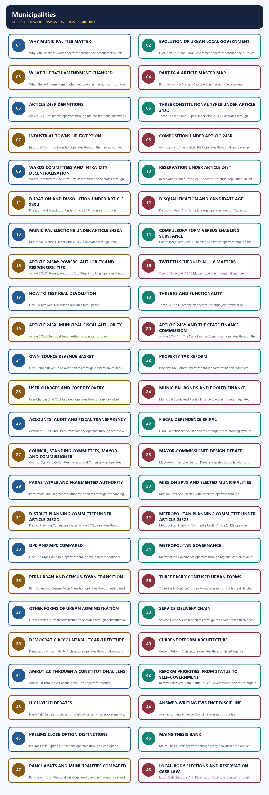
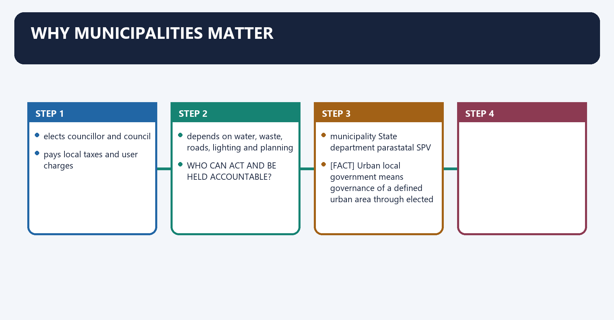
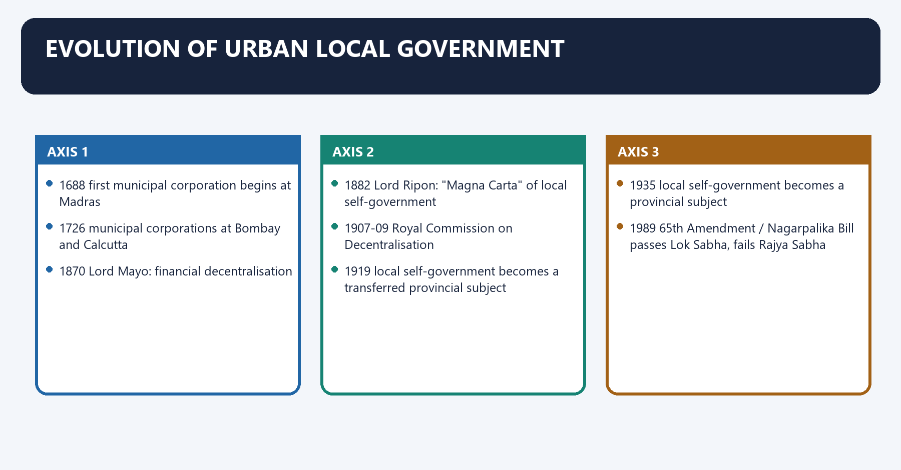
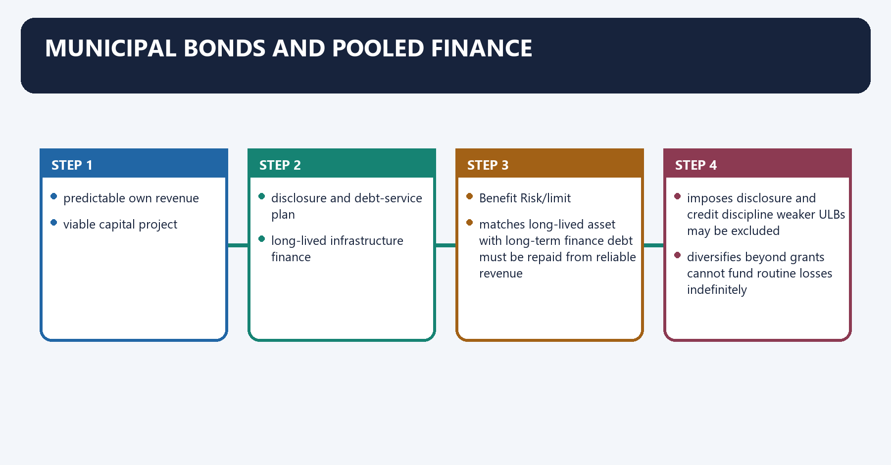
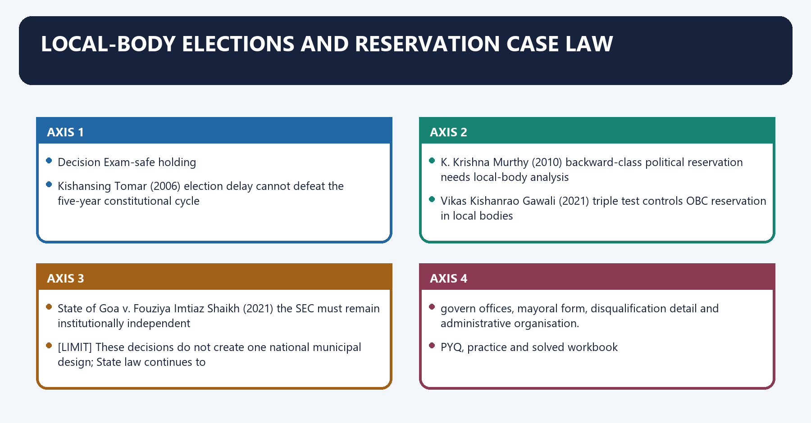

# Municipalities — Complete Uncompressed Learning Session

> **Subject:** Indian Polity | **Topic:** 24 | **GS-II + Prelims** | **Export date:** 2026-08-24
>
> **Approval:** false - awaiting explicit user approval.
>
> **Evidence key:** [FACT] verified constitutional, official or source-book proposition; [ANALYSIS] reasoned exam synthesis; [CURRENT] dated official control; [LIMIT] qualification preventing overstatement.

#### Package method, source priority and current control

- [CURRENT] Status is controlled to **28 August 2026, Asia/Kolkata**.

- [CURRENT] **Live official refresh, 28 August 2026:** Official MoHUA, AMRUT, Finance Commission, SEBI and India Code portals were rechecked on 28 August 2026. Property tax, user charges, municipal bonds and grants remain financing tools; programme and city totals are treated only as dated evidence.
- [FACT] Source order followed: `basic/Municipalities.md` -> `advanced/24_Municipalities.md` -> the locally held M. Laxmikanth municipality chapter -> routed PYQ ledgers and official local question papers/keys -> `Governance/basic/12_Local-Governance-and-Service-Delivery.md` -> official Sixteenth Finance Commission and MoHUA AMRUT 2.0 documents. Qdrant was not used.
- [CURRENT] Legal and programme control date is **28 August 2026, Asia/Kolkata**.
- [FACT] The controlling constitutional framework is Part IX-A, Articles **243P-243ZG**, inserted by the **74th Constitutional Amendment Act, 1992**, with the **Twelfth Schedule of 18 matters**.
- [CURRENT] The official Sixteenth Finance Commission report covers **2026-27 to 2030-31**. It treats Union local-body grants as supplements to, not substitutes for, State devolution and State Finance Commission action.
- [CURRENT] The Sixteenth Finance Commission recommends an **80:20 basic-performance split** within rural and urban grant components. For ULBs, the performance component begins from the second award year and includes an own-source-revenue condition; entry conditions include a duly constituted body, online provisional/audited accounts and timely State Finance Commission action.
- [CURRENT] The same report recommends GIS-based property-tax systems, strengthened accounts/audit, a rural-to-urban transition policy and support for peri-urban merger into qualifying ULBs.
- [CURRENT] MoHUA's official AMRUT 2.0 framework links water security with property-tax and user-charge reform, GIS-based planning, online services, double-entry accounting, creditworthiness and municipal bonds.
- [CURRENT] RBI’s 2022 *Report on Municipal Finances* identifies property tax as the principal municipal tax while documenting incomplete registers, undervaluation and uneven collection.
- [CURRENT] SEBI’s municipal-debt framework and statistics page remain the authoritative controls for bond regulation and dated issuances; a bond is borrowing, not own-tax revenue or devolution.
- [LIMIT] Mission outlays, city counts, project completions, bond issuance totals and dashboard values change. This package uses dated official institutional design and avoids treating dashboard counts as permanent facts.
- [LIMIT] State municipal laws differ on mayoral election, tenure, commissioner powers, committee design, taxation and staffing. No single State model is presented as a national rule.
- [LIMIT] A scheme, SPV, portal, credit rating or Finance Commission grant does not by itself amount to constitutional devolution of functions, functionaries and funds.
- Official current sources used: Sixteenth Finance Commission, *Report, Volume I*, Chapter 10; MoHUA, *AMRUT 2.0 Guidelines* and *AMRUT 2.0 Reforms Toolkit*.

#### Roadmap

| Stage | Coverage | Exam outcome |
|---|---|---|
| Evolution | colonial municipal history to the 74th Amendment | handles chronology and amendment background |
| Constitutional map | Articles 243P-243ZG | solves direct provision questions |
| Democratic design | types, wards, representation, tenure and elections | handles composition and inclusion |
| Functional domain | Article 243W and Twelfth Schedule | explains the may-devolve problem |
| Finance | Articles 243X/Y, own revenue, grants and bonds | answers functional-financial empowerment |
| Accountability | accounts, audit, council, committees and citizens | connects autonomy with responsibility |
| Planning | DPC, MPC and city-region governance | solves metropolitan fragmentation |
| Executive design | mayor, council and commissioner | analyses responsibility-authority mismatch |
| Delivery | three Fs, parastatals, SPVs and service chains | moves from status to functionality |
| Reform | XVI Finance Commission, AMRUT 2.0 and peri-urban transition | adds dated official evidence safely |
| Workbook | verified PYQs, 48 MCQs and eight solved Mains | converts coverage into marks |

#### Scope ownership and cross-links

- **Polity 23 - Panchayati Raj:** Part IX, Gram Sabha and Eleventh Schedule.
- **Polity 26 - Scheduled and Tribal Areas:** full Fifth/Sixth Schedule and autonomous-area design.
- **Polity 29 - Finance Commission:** full Union Finance Commission architecture; this package uses Article 280(3)(c) only for municipal resources.
- **Governance 12 - Local Governance and Service Delivery:** implementation, three-F functionality, rural-urban merger and last-mile delivery.
- **Governance 14 - Participatory Governance:** consultation and participation quality beyond constitutional composition.
- **Geography 28 - Human Settlements and Urbanisation:** census town, statutory town and settlement transition.
- [LIMIT] This package owns the constitutional and institutional design of municipalities. It cross-links governance and urbanisation only to remain independently answer-complete.

## BASIC LEARNING SESSION



*Distinct embedded teaching-navigation image. The separate continuous Cārvāka-style flowchart package remains an independent at-a-glance artifact.*

### SESSION 1 — WHY MUNICIPALITIES MATTER

#### DEFINITION / WHAT THIS IS CALLED

**Plain-language definition:** Why Municipalities Matter explains the accountability link between elected councils, local revenue and visible urban services.

**Technical definition:** Why Municipalities Matter operates through the accountability link between elected councils, local revenue and visible urban services, subject to constitutional text and State-law implementation.

#### ANSWER-GRABBING OPENING — WRITE/ADAPT IN THE EXAM

> Why Municipalities Matter is best understood as the accountability link between elected councils, local revenue and visible urban services.

#### MUST-WRITE KEYWORDS

- **urban self-government**
- **elected council**
- **local services**
- **accountability**
- **municipality**

**How to use them:** Frame the answer through urban self-government; define elected council, connect local services with accountability to explain the mechanism, and use municipality for the decisive comparison or qualification.


**Visual 1 - The urban self-government test**

```text
CITY RESIDENT
    |
    +--> elects councillor and council
    |
    +--> pays local taxes and user charges
    |
    +--> depends on water, waste, roads, lighting and planning
                         |
                         v
             WHO CAN ACT AND BE HELD ACCOUNTABLE?
             municipality | State department | parastatal | SPV
```

Caption: Urban democracy is meaningful only when the elected institution controls the function, staff and money attached to citizen-visible services.

- [FACT] Urban local government means governance of a defined urban area through elected representatives under State law and Part IX-A.
- [ANALYSIS] Municipalities sit where constitutional democracy meets everyday infrastructure: weak authority appears immediately as uncollected waste, unreliable water, unsafe land use and fragmented planning.
- [LIMIT] Calling municipalities the "third tier" does not make them sovereign units equal to the Union and States; their substantive authority remains substantially State-mediated.

#### CLOSING RECALL FLOW — WHY MUNICIPALITIES MATTER

```text
START / CONCEPT: WHY MUNICIPALITIES MATTER
        |
        v
EXACT TERMS: urban self-government · elected council · local services · accountability · municipality
        |
        v
MECHANISM / ARGUMENT: Connect the accountability link between elected councils, local revenue and visible urban services to its governing actor, procedure and implementation limit.
        |
        v
CONSEQUENCE / CONTRAST: This determines the practical effect of the accountability link between elected councils, local revenue and visible urban services.
        |
        v
UPSC TRAP / ANSWER-USE: Do not overstate the accountability link between elected councils, local revenue and visible urban services beyond the constitutional text or dated evidence.
        |
        v
ANSWER-GRABBING FORMULATION: Why Municipalities Matter is best understood as the accountability link between elected councils, local revenue and visible urban services.
```
### SESSION 2 — EVOLUTION OF URBAN LOCAL GOVERNMENT

#### DEFINITION / WHAT THIS IS CALLED

**Plain-language definition:** Evolution Of Urban Local Government explains the historical path from colonial corporations to constitutional urban democracy.

**Technical definition:** Evolution Of Urban Local Government operates through the historical path from colonial corporations to constitutional urban democracy, subject to constitutional text and State-law implementation.

#### ANSWER-GRABBING OPENING — WRITE/ADAPT IN THE EXAM

> Evolution Of Urban Local Government is best understood as the historical path from colonial corporations to constitutional urban democracy.

#### MUST-WRITE KEYWORDS

- **Madras corporation**
- **Lord Ripon**
- **Nagarpalika Bill**
- **74th Amendment**
- **urban history**

**How to use them:** Frame the answer through Madras corporation; define Lord Ripon, connect Nagarpalika Bill with 74th Amendment to explain the mechanism, and use urban history for the decisive comparison or qualification.


**Visual 2 - Constitutionalisation timeline**

```text
1688  first municipal corporation begins at Madras
1726  municipal corporations at Bombay and Calcutta
1870  Lord Mayo: financial decentralisation
1882  Lord Ripon: "Magna Carta" of local self-government
1907-09 Royal Commission on Decentralisation
1919  local self-government becomes a transferred provincial subject
1935  local self-government becomes a provincial subject
1989  65th Amendment / Nagarpalika Bill passes Lok Sabha, fails Rajya Sabha
1990  revised bill lapses with Lok Sabha dissolution
1991  modified Municipalities Bill introduced
1992  74th Constitutional Amendment enacted
1993  comes into force on 1 June
```

- [FACT] The Madras corporation's charter was issued in 1687 and the corporation came into existence in 1688.
- [FACT] Lord Ripon's 1882 Resolution is conventionally treated as the foundational resolution for representative local self-government.
- [FACT] The failed 1989 and 1990 efforts show that constitutional status was a political project before it became the 74th Amendment.
- [ANALYSIS] The amendment changed municipal continuity and democratic form; it did not erase the older tradition of State control over urban administration.

#### CLOSING RECALL FLOW — EVOLUTION OF URBAN LOCAL GOVERNMENT

```text
START / CONCEPT: EVOLUTION OF URBAN LOCAL GOVERNMENT
        |
        v
EXACT TERMS: Madras corporation · Lord Ripon · Nagarpalika Bill · 74th Amendment · urban history
        |
        v
MECHANISM / ARGUMENT: Connect the historical path from colonial corporations to constitutional urban democracy to its governing actor, procedure and implementation limit.
        |
        v
CONSEQUENCE / CONTRAST: This determines the practical effect of the historical path from colonial corporations to constitutional urban democracy.
        |
        v
UPSC TRAP / ANSWER-USE: Do not overstate the historical path from colonial corporations to constitutional urban democracy beyond the constitutional text or dated evidence.
        |
        v
ANSWER-GRABBING FORMULATION: Evolution Of Urban Local Government is best understood as the historical path from colonial corporations to constitutional urban democracy.
```
### SESSION 3 — WHAT THE 74TH AMENDMENT CHANGED

#### DEFINITION / WHAT THIS IS CALLED

**Plain-language definition:** What The 74Th Amendment Changed explains constitutional permanence without automatic transfer of every urban power.

**Technical definition:** What The 74Th Amendment Changed operates through constitutional permanence without automatic transfer of every urban power, subject to constitutional text and State-law implementation.

#### ANSWER-GRABBING OPENING — WRITE/ADAPT IN THE EXAM

> What The 74Th Amendment Changed is best understood as constitutional permanence without automatic transfer of every urban power.

#### MUST-WRITE KEYWORDS

- **74th Amendment**
- **Part IXA**
- **institutional permanence**
- **urban devolution**

**How to use them:** Frame the answer through 74th Amendment; define Part IXA, connect institutional permanence with urban devolution to explain the mechanism, and close with the decisive comparison or qualification.


**Visual 3 - Constitutional package**

| Component | Constitutional effect | What it did not guarantee |
|---|---|---|
| Part IX-A | entrenched municipal institutions and procedures | automatic control of every urban service |
| Articles 243P-243ZG | definitions, bodies, elections, finance and planning | a uniform municipal law for all States |
| Twelfth Schedule | listed 18 municipal functional matters | automatic activity-level transfer |
| SEC/SFC | regular electoral and fiscal-review machinery | perfect independence or timely implementation |
| DPC/MPC | integrated district/metropolitan planning | operational supremacy over parastatals |

- [FACT] The 74th Amendment gave constitutional status to municipalities and placed them in a justiciable constitutional framework.
- [ANALYSIS] Its strongest achievement is **institutional permanence**; its central weakness is that core devolution provisions use enabling language and operate through State legislation.

#### CLOSING RECALL FLOW — WHAT THE 74TH AMENDMENT CHANGED

```text
START / CONCEPT: WHAT THE 74TH AMENDMENT CHANGED
        |
        v
EXACT TERMS: 74th Amendment · Part IXA · institutional permanence · urban devolution
        |
        v
MECHANISM / ARGUMENT: Connect constitutional permanence without automatic transfer of every urban power to its governing actor, procedure and implementation limit.
        |
        v
CONSEQUENCE / CONTRAST: This determines the practical effect of constitutional permanence without automatic transfer of every urban power.
        |
        v
UPSC TRAP / ANSWER-USE: Do not overstate constitutional permanence without automatic transfer of every urban power beyond the constitutional text or dated evidence.
        |
        v
ANSWER-GRABBING FORMULATION: What The 74Th Amendment Changed is best understood as constitutional permanence without automatic transfer of every urban power.
```
### SESSION 4 — PART IX-A ARTICLE MASTER MAP

#### DEFINITION / WHAT THIS IS CALLED

**Plain-language definition:** Part Ix-A Article Master Map explains the complete constitutional sequence from Article 243P through Article 243ZG.

**Technical definition:** Part Ix-A Article Master Map operates through the complete constitutional sequence from Article 243P through Article 243ZG, subject to constitutional text and State-law implementation.

#### ANSWER-GRABBING OPENING — WRITE/ADAPT IN THE EXAM

> Part Ix-A Article Master Map is best understood as the complete constitutional sequence from Article 243P through Article 243ZG.

#### MUST-WRITE KEYWORDS

- **Part IXA**
- **Article 243P**
- **Article 243ZG**
- **municipal map**
- **constitutional sequence**

**How to use them:** Frame the answer through Part IXA; define Article 243P, connect Article 243ZG with municipal map to explain the mechanism, and use constitutional sequence for the decisive comparison or qualification.

**Visual 4 - Articles 243P to 243ZG**

| Article | Subject |
|---:|---|
| 243P | definitions |
| 243Q | constitution of municipalities |
| 243R | composition |
| 243S | Wards Committees and other committees |
| 243T | reservation of seats |
| 243U | duration |
| 243V | disqualifications |
| 243W | powers, authority and responsibilities |
| 243X | municipal taxes, assignments, grants and funds |
| 243Y | State Finance Commission review |
| 243Z | accounts and audit |
| 243ZA | municipal elections |
| 243ZB | application to Union Territories |
| 243ZC | excluded areas |
| 243ZD | District Planning Committee |
| 243ZE | Metropolitan Planning Committee |
| 243ZF | continuance of existing laws and municipalities |
| 243ZG | bar to court interference in electoral matters |

> **Memory chain:** P definitions; Q bodies; R composition; S wards; T reservation; U term; V disqualification; W work; X tax; Y finance review; Z audit; ZA elections; ZD district plan; ZE metro plan; ZG election bar.

- [FACT] Under Article 243ZB, the President may apply Part IXA to a Union Territory with exceptions and modifications.
- [FACT] Article 243ZC excludes Fifth Schedule Scheduled Areas and Sixth Schedule tribal areas; Parliament may extend Part IXA to Scheduled Areas by law with exceptions and modifications.
- [FACT] Article 243ZF allowed inconsistent pre-existing municipal laws to continue for at most one year and protected existing municipalities until term unless lawfully dissolved.

#### CLOSING RECALL FLOW — PART IX-A ARTICLE MASTER MAP

```text
START / CONCEPT: PART IX-A ARTICLE MASTER MAP
        |
        v
EXACT TERMS: Part IXA · Article 243P · Article 243ZG · municipal map · constitutional sequence
        |
        v
MECHANISM / ARGUMENT: Connect the complete constitutional sequence from Article 243P through Article 243ZG to its governing actor, procedure and implementation limit.
        |
        v
CONSEQUENCE / CONTRAST: This determines the practical effect of the complete constitutional sequence from Article 243P through Article 243ZG.
        |
        v
UPSC TRAP / ANSWER-USE: Do not overstate the complete constitutional sequence from Article 243P through Article 243ZG beyond the constitutional text or dated evidence.
        |
        v
ANSWER-GRABBING FORMULATION: Part Ix-A Article Master Map is best understood as the complete constitutional sequence from Article 243P through Article 243ZG.
```
### SESSION 5 — ARTICLE 243P DEFINITIONS

#### DEFINITION / WHAT THIS IS CALLED

**Plain-language definition:** Article 243P Definitions explains the constitutional meanings of municipality, municipal area and metropolitan area.

**Technical definition:** Article 243P Definitions operates through the constitutional meanings of municipality, municipal area and metropolitan area, subject to constitutional text and State-law implementation.

#### ANSWER-GRABBING OPENING — WRITE/ADAPT IN THE EXAM

> Article 243P Definitions is best understood as the constitutional meanings of municipality, municipal area and metropolitan area.

#### MUST-WRITE KEYWORDS

- **Article 243P**
- **municipality**
- **municipal area**
- **metropolitan area**
- **ten lakh**

**How to use them:** Frame the answer through Article 243P; define municipality, connect municipal area with metropolitan area to explain the mechanism, and use ten lakh for the decisive comparison or qualification.

**Visual 5 - Definition box**

| Term | Constitutional recall |
|---|---|
| Committee | a committee constituted under Article 243S |
| District | a district in a State |
| Metropolitan area | population of **10 lakh or more**, comprising one or more districts and two or more municipalities/panchayats/contiguous areas, specified by the Governor |
| Municipal area | territorial area of a municipality, notified by the Governor |
| Municipality | institution of self-government constituted under Article 243Q |
| Population | population ascertained at the last preceding census whose relevant figures have been published |

- [FACT] "Metropolitan area" is a constitutional definition, not merely a colloquial synonym for a large city.
- [ANALYSIS] Its multi-jurisdiction form explains why an MPC is needed: commuter flows, water systems, waste chains and land markets cross municipal borders.

#### CLOSING RECALL FLOW — ARTICLE 243P DEFINITIONS

```text
START / CONCEPT: ARTICLE 243P DEFINITIONS
        |
        v
EXACT TERMS: Article 243P · municipality · municipal area · metropolitan area · ten lakh
        |
        v
MECHANISM / ARGUMENT: Connect the constitutional meanings of municipality, municipal area and metropolitan area to its governing actor, procedure and implementation limit.
        |
        v
CONSEQUENCE / CONTRAST: This determines the practical effect of the constitutional meanings of municipality, municipal area and metropolitan area.
        |
        v
UPSC TRAP / ANSWER-USE: Do not overstate the constitutional meanings of municipality, municipal area and metropolitan area beyond the constitutional text or dated evidence.
        |
        v
ANSWER-GRABBING FORMULATION: Article 243P Definitions is best understood as the constitutional meanings of municipality, municipal area and metropolitan area.
```
### SESSION 6 — THREE CONSTITUTIONAL TYPES UNDER ARTICLE 243Q

#### DEFINITION / WHAT THIS IS CALLED

**Plain-language definition:** Three Constitutional Types Under Article 243Q explains Nagar Panchayat, Municipal Council and Municipal Corporation classifications.

**Technical definition:** Three Constitutional Types Under Article 243Q operates through Nagar Panchayat, Municipal Council and Municipal Corporation classifications, subject to constitutional text and State-law implementation.

#### ANSWER-GRABBING OPENING — WRITE/ADAPT IN THE EXAM

> Three Constitutional Types Under Article 243Q is best understood as Nagar Panchayat, Municipal Council and Municipal Corporation classifications.

#### MUST-WRITE KEYWORDS

- **Article 243Q**
- **Nagar Panchayat**
- **Municipal Council**
- **Municipal Corporation**
- **urban classification**

**How to use them:** Frame the answer through Article 243Q; define Nagar Panchayat, connect Municipal Council with Municipal Corporation to explain the mechanism, and use urban classification for the decisive comparison or qualification.


**Visual 6 - Urbanisation ladder**

```text
TRANSITIONAL AREA       SMALLER URBAN AREA        LARGER URBAN AREA
Nagar Panchayat   -->   Municipal Council   -->   Municipal Corporation
```

| Classification factor available to Governor | Why it matters |
|---|---|
| population | scale of representation and services |
| population density | urban intensity |
| revenue generated for local administration | fiscal viability |
| percentage in non-agricultural employment | economic transition |
| economic importance | regional role |
| other notified factors | State-specific context |

- [FACT] Article 243Q requires these three types in accordance with the character of the area.
- [LIMIT] The Constitution does not prescribe one national population cut-off for each type; classification is State-specific within constitutional criteria.

#### CLOSING RECALL FLOW — THREE CONSTITUTIONAL TYPES UNDER ARTICLE 243Q

```text
START / CONCEPT: THREE CONSTITUTIONAL TYPES UNDER ARTICLE 243Q
        |
        v
EXACT TERMS: Article 243Q · Nagar Panchayat · Municipal Council · Municipal Corporation · urban classification
        |
        v
MECHANISM / ARGUMENT: Connect Nagar Panchayat, Municipal Council and Municipal Corporation classifications to its governing actor, procedure and implementation limit.
        |
        v
CONSEQUENCE / CONTRAST: This determines the practical effect of Nagar Panchayat, Municipal Council and Municipal Corporation classifications.
        |
        v
UPSC TRAP / ANSWER-USE: Do not overstate Nagar Panchayat, Municipal Council and Municipal Corporation classifications beyond the constitutional text or dated evidence.
        |
        v
ANSWER-GRABBING FORMULATION: Three Constitutional Types Under Article 243Q is best understood as Nagar Panchayat, Municipal Council and Municipal Corporation classifications.
```
### SESSION 7 — INDUSTRIAL TOWNSHIP EXCEPTION

#### DEFINITION / WHAT THIS IS CALLED

**Plain-language definition:** Industrial Township Exception explains the narrow notified exception where an industrial establishment supplies municipal services.

**Technical definition:** Industrial Township Exception operates through the narrow notified exception where an industrial establishment supplies municipal services, subject to constitutional text and State-law implementation.

#### ANSWER-GRABBING OPENING — WRITE/ADAPT IN THE EXAM

> Industrial Township Exception is best understood as the narrow notified exception where an industrial establishment supplies municipal services.

#### MUST-WRITE KEYWORDS

- **industrial township**
- **Article 243Q proviso**
- **Governor notification**
- **municipal services**
- **democratic exception**

**How to use them:** Frame the answer through industrial township; define Article 243Q proviso, connect Governor notification with municipal services to explain the mechanism, and use democratic exception for the decisive comparison or qualification.

**Visual 7 - Article 243Q proviso decision flow**

```text
Is the area urban?
      |
      v
Are municipal services being provided, or proposed to be provided,
by an industrial establishment?
      |
   yes + Governor considers size/services/other factors
      |
      v
Governor may specify an INDUSTRIAL TOWNSHIP
      |
      v
No municipality need be constituted for that area
```

- [FACT] The proviso is an exception to municipal constitution, not a fourth ordinary type of municipality.
- [ANALYSIS] It recognises service provision by an industrial establishment.
- [LIMIT] Service provision does not automatically supply electoral accountability; an answer should distinguish functional delivery from representative self-government.

#### CLOSING RECALL FLOW — INDUSTRIAL TOWNSHIP EXCEPTION

```text
START / CONCEPT: INDUSTRIAL TOWNSHIP EXCEPTION
        |
        v
EXACT TERMS: industrial township · Article 243Q proviso · Governor notification · municipal services · democratic exception
        |
        v
MECHANISM / ARGUMENT: Connect the narrow notified exception where an industrial establishment supplies municipal services to its governing actor, procedure and implementation limit.
        |
        v
CONSEQUENCE / CONTRAST: This determines the practical effect of the narrow notified exception where an industrial establishment supplies municipal services.
        |
        v
UPSC TRAP / ANSWER-USE: Do not overstate the narrow notified exception where an industrial establishment supplies municipal services beyond the constitutional text or dated evidence.
        |
        v
ANSWER-GRABBING FORMULATION: Industrial Township Exception is best understood as the narrow notified exception where an industrial establishment supplies municipal services.
```
### SESSION 8 — COMPOSITION UNDER ARTICLE 243R

#### DEFINITION / WHAT THIS IS CALLED

**Plain-language definition:** Composition Under Article 243R explains directly elected wards and permitted non-territorial representation.

**Technical definition:** Composition Under Article 243R operates through directly elected wards and permitted non-territorial representation, subject to constitutional text and State-law implementation.

#### ANSWER-GRABBING OPENING — WRITE/ADAPT IN THE EXAM

> Composition Under Article 243R is best understood as directly elected wards and permitted non-territorial representation.

#### MUST-WRITE KEYWORDS

- **Article 243R**
- **territorial wards**
- **direct election**
- **expert member**
- **chairperson**

**How to use them:** Frame the answer through Article 243R; define territorial wards, connect direct election with expert member to explain the mechanism, and use chairperson for the decisive comparison or qualification.

**Visual 8 - Who enters a municipality**

| Route | Position | Voting position |
|---|---|---|
| direct election from wards | territorial councillors | voting members |
| State-law representation | persons with special municipal knowledge/experience | **no right to vote in municipal meetings** |
| State-law representation | relevant MPs/MLAs | as State law provides within Article 243R |
| State-law representation | relevant RS/MLC members registered in the area | as State law provides |
| State-law representation | chairpersons of committees other than Wards Committees | as State law provides |

- [FACT] All territorial seats are filled by direct election from wards.
- [FACT] State law determines the manner of electing the chairperson.
- [FACT] Persons with special knowledge or experience may be represented but have **no voting right in municipal meetings**; Article 243R also permits specified legislative and committee representation through State law.
- [LIMIT] Direct election of councillors does not imply that every mayor is directly elected by all city voters.

#### CLOSING RECALL FLOW — COMPOSITION UNDER ARTICLE 243R

```text
START / CONCEPT: COMPOSITION UNDER ARTICLE 243R
        |
        v
EXACT TERMS: Article 243R · territorial wards · direct election · expert member · chairperson
        |
        v
MECHANISM / ARGUMENT: Connect directly elected wards and permitted non-territorial representation to its governing actor, procedure and implementation limit.
        |
        v
CONSEQUENCE / CONTRAST: This determines the practical effect of directly elected wards and permitted non-territorial representation.
        |
        v
UPSC TRAP / ANSWER-USE: Do not overstate directly elected wards and permitted non-territorial representation beyond the constitutional text or dated evidence.
        |
        v
ANSWER-GRABBING FORMULATION: Composition Under Article 243R is best understood as directly elected wards and permitted non-territorial representation.
```
### SESSION 9 — WARDS COMMITTEES AND INTRA-CITY DECENTRALISATION

#### DEFINITION / WHAT THIS IS CALLED

**Plain-language definition:** Wards Committees And Intra-City Decentralisation explains mandatory neighbourhood committees in municipalities of three lakh or more.

**Technical definition:** Wards Committees And Intra-City Decentralisation operates through mandatory neighbourhood committees in municipalities of three lakh or more, subject to constitutional text and State-law implementation.

#### ANSWER-GRABBING OPENING — WRITE/ADAPT IN THE EXAM

> Wards Committees And Intra-City Decentralisation is best understood as mandatory neighbourhood committees in municipalities of three lakh or more.

#### MUST-WRITE KEYWORDS

- **Article 243S**
- **Wards Committee**
- **three lakh**
- **intra-city democracy**
- **neighbourhood**

**How to use them:** Frame the answer through Article 243S; define Wards Committee, connect three lakh with intra-city democracy to explain the mechanism, and use neighbourhood for the decisive comparison or qualification.


**Visual 9 - From city scale to neighbourhood scale**

```text
MUNICIPAL COUNCIL / CORPORATION
              |
       WARDS COMMITTEE
   (one ward or a group of wards)
              |
 councillors + State-law participation design
              |
 local priorities, monitoring and feedback
```

- [FACT] Article 243S requires Wards Committees in municipalities with population of **three lakh or more**.
- [FACT] State law determines composition, territorial area and seat-filling arrangements.
- [ANALYSIS] Wards Committees can correct the scale problem of large cities by locating participation near services.
- [LIMIT] A constitutional requirement for a committee does not prove regular meetings, citizen voice, budgets or decision power.

**Visual 10 - City council versus Wards Committee**

| City council | Wards Committee |
|---|---|
| city-wide policy and budget | sub-city priorities and oversight |
| collective elected mandate | neighbourhood-scale interface |
| resolves city-wide trade-offs | surfaces local service failures |
| may be remote in a large corporation | may improve proximity but depends on State law |

#### CLOSING RECALL FLOW — WARDS COMMITTEES AND INTRA-CITY DECENTRALISATION

```text
START / CONCEPT: WARDS COMMITTEES AND INTRA-CITY DECENTRALISATION
        |
        v
EXACT TERMS: Article 243S · Wards Committee · three lakh · intra-city democracy · neighbourhood
        |
        v
MECHANISM / ARGUMENT: Connect mandatory neighbourhood committees in municipalities of three lakh or more to its governing actor, procedure and implementation limit.
        |
        v
CONSEQUENCE / CONTRAST: This determines the practical effect of mandatory neighbourhood committees in municipalities of three lakh or more.
        |
        v
UPSC TRAP / ANSWER-USE: Do not overstate mandatory neighbourhood committees in municipalities of three lakh or more beyond the constitutional text or dated evidence.
        |
        v
ANSWER-GRABBING FORMULATION: Wards Committees And Intra-City Decentralisation is best understood as mandatory neighbourhood committees in municipalities of three lakh or more.
```
### SESSION 10 — RESERVATION UNDER ARTICLE 243T

#### DEFINITION / WHAT THIS IS CALLED

**Plain-language definition:** Reservation Under Article 243T explains population-linked SC/ST reservation and the constitutional women’s floor.

**Technical definition:** Reservation Under Article 243T operates through population-linked SC/ST reservation and the constitutional women’s floor, subject to constitutional text and State-law implementation.

#### ANSWER-GRABBING OPENING — WRITE/ADAPT IN THE EXAM

> Reservation Under Article 243T is best understood as population-linked SC/ST reservation and the constitutional women’s floor.

#### MUST-WRITE KEYWORDS

- **Article 243T**
- **women reservation**
- **SC ST seats**
- **chairperson offices**
- **backward classes**

**How to use them:** Frame the answer through Article 243T; define women reservation, connect SC ST seats with chairperson offices to explain the mechanism, and use backward classes for the decisive comparison or qualification.

**Visual 11 - Inclusion architecture**

| Category | Constitutional rule |
|---|---|
| SC/ST seats | reserved in proportion to population in the municipal area |
| women in seats | not less than one-third of total seats, including SC/ST women |
| chairperson offices for women | not less than one-third of total chairperson offices |
| SC/ST chairperson offices | State law prescribes manner |
| backward classes | State legislature may provide reservation |

- [FACT] One-third is a constitutional floor, not a ceiling.
- [FACT] Article 243T separately requires State-law reservation of chairperson offices for SCs, STs and women; backward-class reservation remains enabling.
- [ANALYSIS] Reservation alters access to office; substantive authority additionally requires stable tenure, information, staff support and freedom from proxy control.
- [LIMIT] Reservation percentages above the constitutional floor and rotation rules vary by State.

#### CLOSING RECALL FLOW — RESERVATION UNDER ARTICLE 243T

```text
START / CONCEPT: RESERVATION UNDER ARTICLE 243T
        |
        v
EXACT TERMS: Article 243T · women reservation · SC ST seats · chairperson offices · backward classes
        |
        v
MECHANISM / ARGUMENT: Connect population-linked SC/ST reservation and the constitutional women’s floor to its governing actor, procedure and implementation limit.
        |
        v
CONSEQUENCE / CONTRAST: This determines the practical effect of population-linked SC/ST reservation and the constitutional women’s floor.
        |
        v
UPSC TRAP / ANSWER-USE: Do not overstate population-linked SC/ST reservation and the constitutional women’s floor beyond the constitutional text or dated evidence.
        |
        v
ANSWER-GRABBING FORMULATION: Reservation Under Article 243T is best understood as population-linked SC/ST reservation and the constitutional women’s floor.
```
### SESSION 11 — DURATION AND DISSOLUTION UNDER ARTICLE 243U

#### DEFINITION / WHAT THIS IS CALLED

**Plain-language definition:** Duration And Dissolution Under Article 243U explains five-year municipal continuity, hearing and exact re-election provisos.

**Technical definition:** Duration And Dissolution Under Article 243U operates through five-year municipal continuity, hearing and exact re-election provisos, subject to constitutional text and State-law implementation.

#### ANSWER-GRABBING OPENING — WRITE/ADAPT IN THE EXAM

> Duration And Dissolution Under Article 243U is best understood as five-year municipal continuity, hearing and exact re-election provisos.

#### MUST-WRITE KEYWORDS

- **Article 243U**
- **five-year term**
- **dissolution hearing**
- **six months**
- **unexpired term**

**How to use them:** Frame the answer through Article 243U; define five-year term, connect dissolution hearing with six months to explain the mechanism, and use unexpired term for the decisive comparison or qualification.

**Visual 12 - Municipal tenure clock**

```text
FIRST MEETING
     |
     +------ normal five-year term ------+
     |                                    |
before expiry: election completed         |
                                          |
premature dissolution                     |
     |                                    |
reasonable opportunity of hearing         |
     |                                    |
election within six months                 |
     |
new body serves only the unexpired remainder
```

- [FACT] If the remaining period is less than six months, an election need not be held merely for that short remainder.
- [FACT] Elections must be completed before ordinary expiry or within six months after dissolution, and a prematurely reconstituted municipality serves only the unexpired balance.
- [FACT] A legal amendment cannot dissolve an existing municipality before the end of its five-year duration.
- [ANALYSIS] The remainder rule prevents a government from manufacturing a fresh five-year mandate through premature dissolution.

#### CLOSING RECALL FLOW — DURATION AND DISSOLUTION UNDER ARTICLE 243U

```text
START / CONCEPT: DURATION AND DISSOLUTION UNDER ARTICLE 243U
        |
        v
EXACT TERMS: Article 243U · five-year term · dissolution hearing · six months · unexpired term
        |
        v
MECHANISM / ARGUMENT: Connect five-year municipal continuity, hearing and exact re-election provisos to its governing actor, procedure and implementation limit.
        |
        v
CONSEQUENCE / CONTRAST: This determines the practical effect of five-year municipal continuity, hearing and exact re-election provisos.
        |
        v
UPSC TRAP / ANSWER-USE: Do not overstate five-year municipal continuity, hearing and exact re-election provisos beyond the constitutional text or dated evidence.
        |
        v
ANSWER-GRABBING FORMULATION: Duration And Dissolution Under Article 243U is best understood as five-year municipal continuity, hearing and exact re-election provisos.
```
### SESSION 12 — DISQUALIFICATION AND CANDIDATE AGE

#### DEFINITION / WHAT THIS IS CALLED

**Plain-language definition:** Disqualification And Candidate Age explains State-law disqualification with the protected candidate age of twenty-one.

**Technical definition:** Disqualification And Candidate Age operates through State-law disqualification with the protected candidate age of twenty-one, subject to constitutional text and State-law implementation.

#### ANSWER-GRABBING OPENING — WRITE/ADAPT IN THE EXAM

> Disqualification And Candidate Age is best understood as State-law disqualification with the protected candidate age of twenty-one.

#### MUST-WRITE KEYWORDS

- **Article 243V**
- **disqualification**
- **candidate age**
- **twenty-one**

**How to use them:** Frame the answer through Article 243V; define disqualification, connect candidate age with twenty-one to explain the mechanism, and close with the decisive comparison or qualification.

- [FACT] Article 243V connects disqualification to State-legislature election law and additional State law.
- [FACT] A person cannot be disqualified merely for being below 25 if that person has attained **21 years**.
- [FACT] State law determines the authority deciding disqualification questions.
- [LIMIT] Detailed grounds and adjudicatory procedures are State-specific.

#### CLOSING RECALL FLOW — DISQUALIFICATION AND CANDIDATE AGE

```text
START / CONCEPT: DISQUALIFICATION AND CANDIDATE AGE
        |
        v
EXACT TERMS: Article 243V · disqualification · candidate age · twenty-one
        |
        v
MECHANISM / ARGUMENT: Connect State-law disqualification with the protected candidate age of twenty-one to its governing actor, procedure and implementation limit.
        |
        v
CONSEQUENCE / CONTRAST: This determines the practical effect of State-law disqualification with the protected candidate age of twenty-one.
        |
        v
UPSC TRAP / ANSWER-USE: Do not overstate State-law disqualification with the protected candidate age of twenty-one beyond the constitutional text or dated evidence.
        |
        v
ANSWER-GRABBING FORMULATION: Disqualification And Candidate Age is best understood as State-law disqualification with the protected candidate age of twenty-one.
```
### SESSION 13 — MUNICIPAL ELECTIONS UNDER ARTICLE 243ZA

#### DEFINITION / WHAT THIS IS CALLED

**Plain-language definition:** Municipal Elections Under Article 243Za explains State Election Commission control of municipal rolls and elections.

**Technical definition:** Municipal Elections Under Article 243Za operates through State Election Commission control of municipal rolls and elections, subject to constitutional text and State-law implementation.

#### ANSWER-GRABBING OPENING — WRITE/ADAPT IN THE EXAM

> Municipal Elections Under Article 243Za is best understood as State Election Commission control of municipal rolls and elections.

#### MUST-WRITE KEYWORDS

- **Article 243ZA**
- **electoral rolls**
- **municipal elections**
- **independence**

**How to use them:** Frame the answer through Article 243ZA; define electoral rolls, connect municipal elections with independence to explain the mechanism, and close with the decisive comparison or qualification.

**Visual 13 - Electoral responsibility**

```text
STATE ELECTION COMMISSION
        |
        +--> electoral rolls for municipalities
        +--> superintendence
        +--> direction
        +--> control of municipal elections

Election Commission of India != municipal election authority
```

- [FACT] Article 243ZA vests municipal election control in the State Election Commission.
- [FACT] Article 243ZG protects the electoral process from ordinary midstream court interference: delimitation/allotment laws cannot be challenged in court, and an election is questioned through the State-law election-petition route.
- [LIMIT] The bar is not a licence for illegality; it channels challenges into the constitutionally prescribed post-election mechanism.

#### CLOSING RECALL FLOW — MUNICIPAL ELECTIONS UNDER ARTICLE 243ZA

```text
START / CONCEPT: MUNICIPAL ELECTIONS UNDER ARTICLE 243ZA
        |
        v
EXACT TERMS: Article 243ZA · electoral rolls · municipal elections · independence
        |
        v
MECHANISM / ARGUMENT: Connect State Election Commission control of municipal rolls and elections to its governing actor, procedure and implementation limit.
        |
        v
CONSEQUENCE / CONTRAST: This determines the practical effect of State Election Commission control of municipal rolls and elections.
        |
        v
UPSC TRAP / ANSWER-USE: Do not overstate State Election Commission control of municipal rolls and elections beyond the constitutional text or dated evidence.
        |
        v
ANSWER-GRABBING FORMULATION: Municipal Elections Under Article 243Za is best understood as State Election Commission control of municipal rolls and elections.
```
### SESSION 14 — COMPULSORY FORM VERSUS ENABLING SUBSTANCE

#### DEFINITION / WHAT THIS IS CALLED

**Plain-language definition:** Compulsory Form Versus Enabling Substance explains the distinction between entrenched democratic form and State-mediated authority.

**Technical definition:** Compulsory Form Versus Enabling Substance operates through the distinction between entrenched democratic form and State-mediated authority, subject to constitutional text and State-law implementation.

#### ANSWER-GRABBING OPENING — WRITE/ADAPT IN THE EXAM

> Compulsory Form Versus Enabling Substance is best understood as the distinction between entrenched democratic form and State-mediated authority.

#### MUST-WRITE KEYWORDS

- **mandatory form**
- **enabling substance**
- **Part IXA**
- **self-government**

**How to use them:** Frame the answer through mandatory form; define enabling substance, connect Part IXA with self-government to explain the mechanism, and close with the decisive comparison or qualification.

**Visual 14 - The amendment's central asymmetry**

| Relatively entrenched constitutional form | State-mediated/enabling substance |
|---|---|
| municipal types | detailed powers over functions |
| direct territorial elections | activity mapping within 18 matters |
| reservation floor | backward-class reservation design |
| five-year duration and election rules | chairperson election and executive authority |
| SEC and SFC framework | tax powers and assignments |
| DPC/MPC constitutional existence | effective control over planning agencies |

- [ANALYSIS] The Constitution is stronger at guaranteeing **who must exist and be elected** than at guaranteeing **what the elected body can command**.
- [FACT] Articles 243W and 243X use State-legislative enabling routes; the Twelfth Schedule is not self-executing.

#### CLOSING RECALL FLOW — COMPULSORY FORM VERSUS ENABLING SUBSTANCE

```text
START / CONCEPT: COMPULSORY FORM VERSUS ENABLING SUBSTANCE
        |
        v
EXACT TERMS: mandatory form · enabling substance · Part IXA · self-government
        |
        v
MECHANISM / ARGUMENT: Connect the distinction between entrenched democratic form and State-mediated authority to its governing actor, procedure and implementation limit.
        |
        v
CONSEQUENCE / CONTRAST: This determines the practical effect of the distinction between entrenched democratic form and State-mediated authority.
        |
        v
UPSC TRAP / ANSWER-USE: Do not overstate the distinction between entrenched democratic form and State-mediated authority beyond the constitutional text or dated evidence.
        |
        v
ANSWER-GRABBING FORMULATION: Compulsory Form Versus Enabling Substance is best understood as the distinction between entrenched democratic form and State-mediated authority.
```
### SESSION 15 — ARTICLE 243W: POWERS, AUTHORITY AND RESPONSIBILITIES

#### DEFINITION / WHAT THIS IS CALLED

**Plain-language definition:** Article 243W: Powers, Authority And Responsibilities explains State-law endowment of planning and scheme powers for self-government.

**Technical definition:** Article 243W: Powers, Authority And Responsibilities operates through State-law endowment of planning and scheme powers for self-government, subject to constitutional text and State-law implementation.

#### ANSWER-GRABBING OPENING — WRITE/ADAPT IN THE EXAM

> Article 243W: Powers, Authority And Responsibilities is best understood as State-law endowment of planning and scheme powers for self-government.

#### MUST-WRITE KEYWORDS

- **Article 243W**
- **economic development**
- **social justice**
- **urban functions**

**How to use them:** Frame the answer through Article 243W; define economic development, connect social justice with urban functions to explain the mechanism, and close with the decisive comparison or qualification.


**Visual 15 - The functional-devolution chain**

```text
TWELFTH SCHEDULE MATTER
        |
STATE LAW / ACTIVITY MAPPING
        |
specific activity assigned to a municipal tier
        |
budget line + staff + rules + assets
        |
municipality plans and implements
        |
citizen can identify responsibility
```

- [FACT] Article 243W permits State legislatures to endow municipalities with powers necessary to function as institutions of self-government.
- [FACT] It covers preparation of plans for economic development and social justice and implementation of schemes, including matters in the Twelfth Schedule.
- [ANALYSIS] A subject transfer without activity mapping leaves ambiguity: "water supply" can contain source creation, bulk supply, distribution, metering, billing and quality monitoring controlled by different bodies.

#### CLOSING RECALL FLOW — ARTICLE 243W: POWERS, AUTHORITY AND RESPONSIBILITIES

```text
START / CONCEPT: ARTICLE 243W: POWERS, AUTHORITY AND RESPONSIBILITIES
        |
        v
EXACT TERMS: Article 243W · economic development · social justice · urban functions
        |
        v
MECHANISM / ARGUMENT: Connect State-law endowment of planning and scheme powers for self-government to its governing actor, procedure and implementation limit.
        |
        v
CONSEQUENCE / CONTRAST: This determines the practical effect of State-law endowment of planning and scheme powers for self-government.
        |
        v
UPSC TRAP / ANSWER-USE: Do not overstate State-law endowment of planning and scheme powers for self-government beyond the constitutional text or dated evidence.
        |
        v
ANSWER-GRABBING FORMULATION: Article 243W: Powers, Authority And Responsibilities is best understood as State-law endowment of planning and scheme powers for self-government.
```
### SESSION 16 — TWELFTH SCHEDULE: ALL 18 MATTERS

#### DEFINITION / WHAT THIS IS CALLED

**Plain-language definition:** Twelfth Schedule: All 18 Matters explains all eighteen municipal matters and their non-automatic activity transfer.

**Technical definition:** Twelfth Schedule: All 18 Matters operates through all eighteen municipal matters and their non-automatic activity transfer, subject to constitutional text and State-law implementation.

#### ANSWER-GRABBING OPENING — WRITE/ADAPT IN THE EXAM

> Twelfth Schedule: All 18 Matters is best understood as all eighteen municipal matters and their non-automatic activity transfer.

#### MUST-WRITE KEYWORDS

- **Twelfth Schedule**
- **eighteen matters**
- **urban planning**
- **public health**
- **activity mapping**

**How to use them:** Frame the answer through Twelfth Schedule; define eighteen matters, connect urban planning with public health to explain the mechanism, and use activity mapping for the decisive comparison or qualification.

**Visual 16 - Complete functional schedule**

| No. | Matter | Functional cluster |
|---:|---|---|
| 1 | urban planning including town planning | planning |
| 2 | regulation of land use and construction of buildings | planning/regulation |
| 3 | planning for economic and social development | development |
| 4 | roads and bridges | infrastructure |
| 5 | water supply for domestic, industrial and commercial purposes | basic service |
| 6 | public health, sanitation, conservancy and solid waste management | health/service |
| 7 | fire services | safety |
| 8 | urban forestry, environmental protection and ecological promotion | environment |
| 9 | safeguarding weaker sections, including persons with disabilities and persons with mental disabilities | social justice |
| 10 | slum improvement and upgradation | inclusion/housing |
| 11 | urban poverty alleviation | livelihoods/inclusion |
| 12 | parks, gardens, playgrounds and other urban amenities | public space |
| 13 | cultural, educational and aesthetic aspects | culture |
| 14 | burials, burial grounds, cremations, cremation grounds and electric crematoria | civic service |
| 15 | cattle ponds and prevention of cruelty to animals | regulation/welfare |
| 16 | vital statistics, including registration of births and deaths | civil registration |
| 17 | street lighting, parking lots, bus stops, public conveniences and other public amenities | civic infrastructure |
| 18 | regulation of slaughterhouses and tanneries | public health/regulation |

> **Memory clusters:** Plan-land-development; roads-water-health-fire; environment-weaker sections-slums-poverty; parks-culture-burials-cattle; vital statistics-public amenities-slaughterhouses.

#### CLOSING RECALL FLOW — TWELFTH SCHEDULE: ALL 18 MATTERS

```text
START / CONCEPT: TWELFTH SCHEDULE: ALL 18 MATTERS
        |
        v
EXACT TERMS: Twelfth Schedule · eighteen matters · urban planning · public health · activity mapping
        |
        v
MECHANISM / ARGUMENT: Connect all eighteen municipal matters and their non-automatic activity transfer to its governing actor, procedure and implementation limit.
        |
        v
CONSEQUENCE / CONTRAST: This determines the practical effect of all eighteen municipal matters and their non-automatic activity transfer.
        |
        v
UPSC TRAP / ANSWER-USE: Do not overstate all eighteen municipal matters and their non-automatic activity transfer beyond the constitutional text or dated evidence.
        |
        v
ANSWER-GRABBING FORMULATION: Twelfth Schedule: All 18 Matters is best understood as all eighteen municipal matters and their non-automatic activity transfer.
```
### SESSION 17 — HOW TO TEST REAL DEVOLUTION

#### DEFINITION / WHAT THIS IS CALLED

**Plain-language definition:** How To Test Real Devolution explains the authority-staff-budget-assets test for genuine functional transfer.

**Technical definition:** How To Test Real Devolution operates through the authority-staff-budget-assets test for genuine functional transfer, subject to constitutional text and State-law implementation.

#### ANSWER-GRABBING OPENING — WRITE/ADAPT IN THE EXAM

> How To Test Real Devolution is best understood as the authority-staff-budget-assets test for genuine functional transfer.

#### MUST-WRITE KEYWORDS

- **devolution test**
- **activity mapping**
- **staff control**
- **budget**
- **municipal assets**

**How to use them:** Frame the answer through devolution test; define activity mapping, connect staff control with budget to explain the mechanism, and use municipal assets for the decisive comparison or qualification.

**Visual 17 - The control test**

| Question | If answer is "State agency" | If answer is "municipality" |
|---|---|---|
| Who sets policy/service standard? | constrained discretion | local policy space |
| Who owns the budget line? | financial dependence | allocative authority |
| Who appoints/directs staff? | functionary gap | executive control |
| Who owns assets and data? | fragmented delivery | integrated management |
| Who signs contracts/work orders? | formal responsibility only | operational responsibility |
| Who faces citizens in elections? | accountability mismatch | answerability aligned |

- [ANALYSIS] Devolution is not proved by counting listed subjects; it is proved by tracing authority over each activity.
- [LIMIT] Some services need regional scale or technical regulation. The objective is clear allocation and accountable coordination, not mechanically municipalising every function.

#### CLOSING RECALL FLOW — HOW TO TEST REAL DEVOLUTION

```text
START / CONCEPT: HOW TO TEST REAL DEVOLUTION
        |
        v
EXACT TERMS: devolution test · activity mapping · staff control · budget · municipal assets
        |
        v
MECHANISM / ARGUMENT: Connect the authority-staff-budget-assets test for genuine functional transfer to its governing actor, procedure and implementation limit.
        |
        v
CONSEQUENCE / CONTRAST: This determines the practical effect of the authority-staff-budget-assets test for genuine functional transfer.
        |
        v
UPSC TRAP / ANSWER-USE: Do not overstate the authority-staff-budget-assets test for genuine functional transfer beyond the constitutional text or dated evidence.
        |
        v
ANSWER-GRABBING FORMULATION: How To Test Real Devolution is best understood as the authority-staff-budget-assets test for genuine functional transfer.
```
### SESSION 18 — THREE FS AND FUNCTIONALITY

#### DEFINITION / WHAT THIS IS CALLED

**Plain-language definition:** Three Fs And Functionality explains joint transfer of functions, functionaries and funds into service capability.

**Technical definition:** Three Fs And Functionality operates through joint transfer of functions, functionaries and funds into service capability, subject to constitutional text and State-law implementation.

#### ANSWER-GRABBING OPENING — WRITE/ADAPT IN THE EXAM

> Three Fs And Functionality is best understood as joint transfer of functions, functionaries and funds into service capability.

#### MUST-WRITE KEYWORDS

- **three Fs**
- **functions**
- **functionaries**
- **funds**
- **functionality**

**How to use them:** Frame the answer through three Fs; define functions, connect functionaries with funds to explain the mechanism, and use functionality for the decisive comparison or qualification.


**Visual 18 - From inputs to outcomes**

```text
FUNCTIONS     +     FUNCTIONARIES     +     FUNDS
what to do          who can be directed      predictable money
        \                  |                  /
         \                 |                 /
          +---------- FUNCTIONALITY --------+
                  citizen-visible service
```

- [FACT] The three-F framework is Funds, Functions and Functionaries.
- [ANALYSIS] A municipality is functional when it can decide, direct staff, finance action and answer publicly for outcomes.
- [LIMIT] The three Fs are necessary inputs, not sufficient outcomes; capacity, procurement, data, participation and audit also matter.

#### CLOSING RECALL FLOW — THREE FS AND FUNCTIONALITY

```text
START / CONCEPT: THREE FS AND FUNCTIONALITY
        |
        v
EXACT TERMS: three Fs · functions · functionaries · funds · functionality
        |
        v
MECHANISM / ARGUMENT: Connect joint transfer of functions, functionaries and funds into service capability to its governing actor, procedure and implementation limit.
        |
        v
CONSEQUENCE / CONTRAST: This determines the practical effect of joint transfer of functions, functionaries and funds into service capability.
        |
        v
UPSC TRAP / ANSWER-USE: Do not overstate joint transfer of functions, functionaries and funds into service capability beyond the constitutional text or dated evidence.
        |
        v
ANSWER-GRABBING FORMULATION: Three Fs And Functionality is best understood as joint transfer of functions, functionaries and funds into service capability.
```
### SESSION 19 — ARTICLE 243X: MUNICIPAL FISCAL AUTHORITY

#### DEFINITION / WHAT THIS IS CALLED

**Plain-language definition:** Article 243X: Municipal Fiscal Authority explains State-authorised taxes, assignments, grants and municipal funds.

**Technical definition:** Article 243X: Municipal Fiscal Authority operates through State-authorised taxes, assignments, grants and municipal funds, subject to constitutional text and State-law implementation.

#### ANSWER-GRABBING OPENING — WRITE/ADAPT IN THE EXAM

> Article 243X: Municipal Fiscal Authority is best understood as State-authorised taxes, assignments, grants and municipal funds.

#### MUST-WRITE KEYWORDS

- **Article 243X**
- **municipal taxes**
- **assigned revenue**
- **grants**
- **municipal fund**

**How to use them:** Frame the answer through Article 243X; define municipal taxes, connect assigned revenue with grants to explain the mechanism, and use municipal fund for the decisive comparison or qualification.

**Visual 19 - Constitutional revenue channels**

| Channel enabled by State law | Illustration | Fiscal meaning |
|---|---|---|
| local levy, collection and appropriation | property tax, fees, tolls | own-source authority |
| assignment of State levies | assigned tax/cess share | predictable devolution |
| grants-in-aid from State Consolidated Fund | formula or scheme transfer | supplementation/equalisation |
| municipal funds | credited municipal receipts | budgetary integrity |

- [FACT] Article 243X does not itself impose a municipal tax; it enables State law to authorise the municipality.
- [ANALYSIS] Fiscal autonomy combines a usable tax base, fair rate design, administrative capacity, predictable transfers and spending discretion.

#### CLOSING RECALL FLOW — ARTICLE 243X: MUNICIPAL FISCAL AUTHORITY

```text
START / CONCEPT: ARTICLE 243X: MUNICIPAL FISCAL AUTHORITY
        |
        v
EXACT TERMS: Article 243X · municipal taxes · assigned revenue · grants · municipal fund
        |
        v
MECHANISM / ARGUMENT: Connect State-authorised taxes, assignments, grants and municipal funds to its governing actor, procedure and implementation limit.
        |
        v
CONSEQUENCE / CONTRAST: This determines the practical effect of State-authorised taxes, assignments, grants and municipal funds.
        |
        v
UPSC TRAP / ANSWER-USE: Do not overstate State-authorised taxes, assignments, grants and municipal funds beyond the constitutional text or dated evidence.
        |
        v
ANSWER-GRABBING FORMULATION: Article 243X: Municipal Fiscal Authority is best understood as State-authorised taxes, assignments, grants and municipal funds.
```
### SESSION 20 — ARTICLE 243Y AND THE STATE FINANCE COMMISSION

#### DEFINITION / WHAT THIS IS CALLED

**Plain-language definition:** Article 243Y And The State Finance Commission explains the same State Finance Commission reviewing rural and urban local finances.

**Technical definition:** Article 243Y And The State Finance Commission operates through the same State Finance Commission reviewing rural and urban local finances, subject to constitutional text and State-law implementation.

#### ANSWER-GRABBING OPENING — WRITE/ADAPT IN THE EXAM

> Article 243Y And The State Finance Commission is best understood as the same State Finance Commission reviewing rural and urban local finances.

#### MUST-WRITE KEYWORDS

- **Article 243Y**
- **tax sharing**
- **grants-in-aid**
- **action memorandum**

**How to use them:** Frame the answer through Article 243Y; define tax sharing, connect grants-in-aid with action memorandum to explain the mechanism, and close with the decisive comparison or qualification.

**Visual 20 - Municipal fiscal-review cycle**

```text
SFC constituted under Article 243-I
          |
reviews Panchayat + Municipality finances
          |
recommends tax sharing, assignments, grants and improvements
          |
Governor places report + action taken memorandum before legislature
          |
State budget and devolution should respond
```

- [FACT] Article 243Y applies the same SFC framework to municipalities every five years.
- [FACT] Article 280(3)(c) directs the Union Finance Commission to recommend measures to augment State Consolidated Funds to supplement municipal resources on the basis of SFC recommendations.
- [ANALYSIS] Delay or weak follow-through breaks the constitutional bridge between local need, State devolution and Union supplementation.
- [LIMIT] Union Finance Commission grants cannot substitute for State tax assignment, SFC action or municipal effort.

#### CLOSING RECALL FLOW — ARTICLE 243Y AND THE STATE FINANCE COMMISSION

```text
START / CONCEPT: ARTICLE 243Y AND THE STATE FINANCE COMMISSION
        |
        v
EXACT TERMS: Article 243Y · tax sharing · grants-in-aid · action memorandum
        |
        v
MECHANISM / ARGUMENT: Connect the same State Finance Commission reviewing rural and urban local finances to its governing actor, procedure and implementation limit.
        |
        v
CONSEQUENCE / CONTRAST: This determines the practical effect of the same State Finance Commission reviewing rural and urban local finances.
        |
        v
UPSC TRAP / ANSWER-USE: Do not overstate the same State Finance Commission reviewing rural and urban local finances beyond the constitutional text or dated evidence.
        |
        v
ANSWER-GRABBING FORMULATION: Article 243Y And The State Finance Commission is best understood as the same State Finance Commission reviewing rural and urban local finances.
```
### SESSION 21 — OWN-SOURCE REVENUE BASKET

#### DEFINITION / WHAT THIS IS CALLED

**Plain-language definition:** Own-Source Revenue Basket explains property taxes, fees, charges, assets and assigned revenues raised locally.

**Technical definition:** Own-Source Revenue Basket operates through property taxes, fees, charges, assets and assigned revenues raised locally, subject to constitutional text and State-law implementation.

#### ANSWER-GRABBING OPENING — WRITE/ADAPT IN THE EXAM

> Own-Source Revenue Basket is best understood as property taxes, fees, charges, assets and assigned revenues raised locally.

#### MUST-WRITE KEYWORDS

- **own-source revenue**
- **property tax**
- **user charges**
- **licence fees**
- **asset income**

**How to use them:** Frame the answer through own-source revenue; define property tax, connect user charges with licence fees to explain the mechanism, and use asset income for the decisive comparison or qualification.


**Visual 21 - Municipal own revenue**

| Revenue family | Typical examples | Core caution |
|---|---|---|
| property-related | property/house tax, development-related fees where authorised | valuation, coverage and collection matter |
| service-related | water, sewerage, waste and parking charges | affordability and service quality matter |
| regulatory fees | licences, building permissions, markets | must follow State law |
| asset income | rents, leases, municipal properties | needs asset inventory and transparent contracts |
| fines/other receipts | legally authorised penalties and charges | not a stable substitute for tax capacity |

- [ANALYSIS] Own revenue creates downward accountability because residents can connect payment, service and elected responsibility.
- [LIMIT] Poorer municipalities have unequal tax bases; equalising transfers remain necessary.

#### CLOSING RECALL FLOW — OWN-SOURCE REVENUE BASKET

```text
START / CONCEPT: OWN-SOURCE REVENUE BASKET
        |
        v
EXACT TERMS: own-source revenue · property tax · user charges · licence fees · asset income
        |
        v
MECHANISM / ARGUMENT: Connect property taxes, fees, charges, assets and assigned revenues raised locally to its governing actor, procedure and implementation limit.
        |
        v
CONSEQUENCE / CONTRAST: This determines the practical effect of property taxes, fees, charges, assets and assigned revenues raised locally.
        |
        v
UPSC TRAP / ANSWER-USE: Do not overstate property taxes, fees, charges, assets and assigned revenues raised locally beyond the constitutional text or dated evidence.
        |
        v
ANSWER-GRABBING FORMULATION: Own-Source Revenue Basket is best understood as property taxes, fees, charges, assets and assigned revenues raised locally.
```
### SESSION 22 — PROPERTY TAX REFORM

#### DEFINITION / WHAT THIS IS CALLED

**Plain-language definition:** Property Tax Reform explains fairer valuation, complete registers and credible property-tax administration.

**Technical definition:** Property Tax Reform operates through fairer valuation, complete registers and credible property-tax administration, subject to constitutional text and State-law implementation.

#### ANSWER-GRABBING OPENING — WRITE/ADAPT IN THE EXAM

> Property Tax Reform is best understood as fairer valuation, complete registers and credible property-tax administration.

#### MUST-WRITE KEYWORDS

- **property tax reform**
- **GIS mapping**
- **valuation**
- **billing**
- **collection**

**How to use them:** Frame the answer through property tax reform; define GIS mapping, connect valuation with billing to explain the mechanism, and use collection for the decisive comparison or qualification.

**Visual 22 - Property-tax value chain**

```text
COMPLETE PROPERTY MAP
        |
unique property ID + legal classification
        |
transparent valuation / rate
        |
correct demand raised
        |
digital bill + payment + grievance
        |
collection and enforcement
        |
service and budget disclosure
```

- [FACT] Property tax is a major potential municipal own-revenue source, subject to State law.
- [CURRENT] The Sixteenth Finance Commission recommends citizen-friendly GIS-based property-tax IT systems, updated registers, periodic enumeration, self-assessment with scrutiny, unique IDs and database linkage.
- [CURRENT] AMRUT 2.0 treated property-tax reform and user-charge reform as mandatory mission reforms and separately incentivised GIS-based property mapping.
- [ANALYSIS] GIS can improve coverage and record quality; the fiscal gain still depends on lawful valuation, billing, grievance resolution and collection.
- [LIMIT] GIS is an administrative tool, not a legal title adjudication mechanism and not proof of fair taxation.

#### CLOSING RECALL FLOW — PROPERTY TAX REFORM

```text
START / CONCEPT: PROPERTY TAX REFORM
        |
        v
EXACT TERMS: property tax reform · GIS mapping · valuation · billing · collection
        |
        v
MECHANISM / ARGUMENT: Connect fairer valuation, complete registers and credible property-tax administration to its governing actor, procedure and implementation limit.
        |
        v
CONSEQUENCE / CONTRAST: This determines the practical effect of fairer valuation, complete registers and credible property-tax administration.
        |
        v
UPSC TRAP / ANSWER-USE: Do not overstate fairer valuation, complete registers and credible property-tax administration beyond the constitutional text or dated evidence.
        |
        v
ANSWER-GRABBING FORMULATION: Property Tax Reform is best understood as fairer valuation, complete registers and credible property-tax administration.
```
### SESSION 23 — USER CHARGES AND COST RECOVERY

#### DEFINITION / WHAT THIS IS CALLED

**Plain-language definition:** User Charges And Cost Recovery explains service-linked charges balanced against affordability and universal access.

**Technical definition:** User Charges And Cost Recovery operates through service-linked charges balanced against affordability and universal access, subject to constitutional text and State-law implementation.

#### ANSWER-GRABBING OPENING — WRITE/ADAPT IN THE EXAM

> User Charges And Cost Recovery is best understood as service-linked charges balanced against affordability and universal access.

#### MUST-WRITE KEYWORDS

- **user charges**
- **cost recovery**
- **lifeline tariff**
- **affordability**
- **operations maintenance**

**How to use them:** Frame the answer through user charges; define cost recovery, connect lifeline tariff with affordability to explain the mechanism, and use operations maintenance for the decisive comparison or qualification.

**Visual 23 - Equity-aware charge design**

```text
service cost and O&M need
          |
metering / measurable service where feasible
          |
lifeline protection for basic needs
          |
transparent tariff and periodic review
          |
bill, grievance and collection
          |
revenue recycled into reliable service
```

- [ANALYSIS] User charges can finance operation and maintenance and reveal the cost of service.
- [LIMIT] Full cost recovery is not automatically equitable or feasible. Lifeline supply, targeted subsidy, cross-subsidy and service-quality guarantees may be necessary.
- [CURRENT] The AMRUT 2.0 framework links water/sewerage user-charge notifications and collection roadmaps with financial sustainability.

#### CLOSING RECALL FLOW — USER CHARGES AND COST RECOVERY

```text
START / CONCEPT: USER CHARGES AND COST RECOVERY
        |
        v
EXACT TERMS: user charges · cost recovery · lifeline tariff · affordability · operations maintenance
        |
        v
MECHANISM / ARGUMENT: Connect service-linked charges balanced against affordability and universal access to its governing actor, procedure and implementation limit.
        |
        v
CONSEQUENCE / CONTRAST: This determines the practical effect of service-linked charges balanced against affordability and universal access.
        |
        v
UPSC TRAP / ANSWER-USE: Do not overstate service-linked charges balanced against affordability and universal access beyond the constitutional text or dated evidence.
        |
        v
ANSWER-GRABBING FORMULATION: User Charges And Cost Recovery is best understood as service-linked charges balanced against affordability and universal access.
```
### SESSION 24 — MUNICIPAL BONDS AND POOLED FINANCE

#### DEFINITION / WHAT THIS IS CALLED

**Plain-language definition:** Municipal Bonds And Pooled Finance explains regulated debt finance for viable capital assets and pooled access.

**Technical definition:** Municipal Bonds And Pooled Finance operates through regulated debt finance for viable capital assets and pooled access, subject to constitutional text and State-law implementation.

#### ANSWER-GRABBING OPENING — WRITE/ADAPT IN THE EXAM

> Municipal Bonds And Pooled Finance is best understood as regulated debt finance for viable capital assets and pooled access.

#### MUST-WRITE KEYWORDS

- **municipal bonds**
- **pooled finance**
- **SEBI ILMDS**
- **creditworthiness**
- **capital projects**

**How to use them:** Frame the answer through municipal bonds; define pooled finance, connect SEBI ILMDS with creditworthiness to explain the mechanism, and use capital projects for the decisive comparison or qualification.


**Visual 24 - Bond logic**

```text
creditworthy ULB
   + audited accounts
   + predictable own revenue
   + viable capital project
   + disclosure and debt-service plan
                 |
                 v
          MUNICIPAL BOND
                 |
      long-lived infrastructure finance
```

| Benefit | Risk/limit |
|---|---|
| matches long-lived asset with long-term finance | debt must be repaid from reliable revenue |
| imposes disclosure and credit discipline | weaker ULBs may be excluded |
| diversifies beyond grants | cannot fund routine losses indefinitely |
| can attract institutional capital | project, interest-rate and governance risks remain |

- [FACT] AMRUT 2.0 officially supports creditworthiness and incentivises municipal-bond issuance.
- [ANALYSIS] Pooled finance can aggregate smaller ULB projects and diversify risk, but it still requires State support, project quality and a repayment mechanism.
- [LIMIT] A bond is borrowing, not free revenue and not evidence that all municipalities are market-ready.

#### CLOSING RECALL FLOW — MUNICIPAL BONDS AND POOLED FINANCE

```text
START / CONCEPT: MUNICIPAL BONDS AND POOLED FINANCE
        |
        v
EXACT TERMS: municipal bonds · pooled finance · SEBI ILMDS · creditworthiness · capital projects
        |
        v
MECHANISM / ARGUMENT: Connect regulated debt finance for viable capital assets and pooled access to its governing actor, procedure and implementation limit.
        |
        v
CONSEQUENCE / CONTRAST: This determines the practical effect of regulated debt finance for viable capital assets and pooled access.
        |
        v
UPSC TRAP / ANSWER-USE: Do not overstate regulated debt finance for viable capital assets and pooled access beyond the constitutional text or dated evidence.
        |
        v
ANSWER-GRABBING FORMULATION: Municipal Bonds And Pooled Finance is best understood as regulated debt finance for viable capital assets and pooled access.
```
### SESSION 25 — ACCOUNTS, AUDIT AND FISCAL TRANSPARENCY

#### DEFINITION / WHAT THIS IS CALLED

**Plain-language definition:** Accounts, Audit And Fiscal Transparency explains State-law accounting and audit joined with public fiscal disclosure.

**Technical definition:** Accounts, Audit And Fiscal Transparency operates through State-law accounting and audit joined with public fiscal disclosure, subject to constitutional text and State-law implementation.

#### ANSWER-GRABBING OPENING — WRITE/ADAPT IN THE EXAM

> Accounts, Audit And Fiscal Transparency is best understood as State-law accounting and audit joined with public fiscal disclosure.

#### MUST-WRITE KEYWORDS

- **Article 243Z**
- **municipal accounts**
- **audit**
- **double-entry accounting**
- **transparency**

**How to use them:** Frame the answer through Article 243Z; define municipal accounts, connect audit with double-entry accounting to explain the mechanism, and use transparency for the decisive comparison or qualification.

**Visual 25 - Accountability stack**

```text
budget classification
      |
double-entry / accrual-compatible accounts
      |
asset and liability record
      |
internal control
      |
independent/local-fund audit with CAG guidance where applicable
      |
public disclosure + council scrutiny
      |
corrective action
```

- [FACT] Article 243Z permits State law to provide for municipal accounts and audit.
- [CURRENT] The Sixteenth Finance Commission's grant-entry conditions require online provisional accounts for T-1 and audited accounts for T-2; ULB audited accounts should include core financial statements.
- [CURRENT] The Commission recommends strengthened CAG technical guidance/supervision and more reliable, comparable municipal financial data.
- [CURRENT] AMRUT 2.0 includes migration to double-entry accounting and audit certification within its reform agenda.
- [ANALYSIS] Accounts create transparency only when they are timely, comparable, reliable and acted upon.

#### CLOSING RECALL FLOW — ACCOUNTS, AUDIT AND FISCAL TRANSPARENCY

```text
START / CONCEPT: ACCOUNTS, AUDIT AND FISCAL TRANSPARENCY
        |
        v
EXACT TERMS: Article 243Z · municipal accounts · audit · double-entry accounting · transparency
        |
        v
MECHANISM / ARGUMENT: Connect State-law accounting and audit joined with public fiscal disclosure to its governing actor, procedure and implementation limit.
        |
        v
CONSEQUENCE / CONTRAST: This determines the practical effect of State-law accounting and audit joined with public fiscal disclosure.
        |
        v
UPSC TRAP / ANSWER-USE: Do not overstate State-law accounting and audit joined with public fiscal disclosure beyond the constitutional text or dated evidence.
        |
        v
ANSWER-GRABBING FORMULATION: Accounts, Audit And Fiscal Transparency is best understood as State-law accounting and audit joined with public fiscal disclosure.
```
### SESSION 26 — FISCAL-DEPENDENCE SPIRAL

#### DEFINITION / WHAT THIS IS CALLED

**Plain-language definition:** Fiscal-Dependence Spiral explains the reinforcing cycle of weak services, low collections and grant dependence.

**Technical definition:** Fiscal-Dependence Spiral operates through the reinforcing cycle of weak services, low collections and grant dependence, subject to constitutional text and State-law implementation.

#### ANSWER-GRABBING OPENING — WRITE/ADAPT IN THE EXAM

> Fiscal-Dependence Spiral is best understood as the reinforcing cycle of weak services, low collections and grant dependence.

#### MUST-WRITE KEYWORDS

- **fiscal dependence**
- **weak services**
- **low collection**
- **tied grants**
- **municipal capacity**

**How to use them:** Frame the answer through fiscal dependence; define weak services, connect low collection with tied grants to explain the mechanism, and use municipal capacity for the decisive comparison or qualification.

**Visual 26 - Why weak revenue persists**

```text
weak property records and collection
             |
             v
low own revenue -> poor services -> taxpayer resistance
      ^                              |
      |                              v
grant dependence <- weak creditworthiness and maintenance
```

- [ANALYSIS] Breaking the spiral requires simultaneous record reform, fair taxation, visible service improvement, predictable State transfers and public disclosure.
- [LIMIT] Raising rates without fixing assessment, service quality and grievance systems can deepen non-compliance.

#### CLOSING RECALL FLOW — FISCAL-DEPENDENCE SPIRAL

```text
START / CONCEPT: FISCAL-DEPENDENCE SPIRAL
        |
        v
EXACT TERMS: fiscal dependence · weak services · low collection · tied grants · municipal capacity
        |
        v
MECHANISM / ARGUMENT: Connect the reinforcing cycle of weak services, low collections and grant dependence to its governing actor, procedure and implementation limit.
        |
        v
CONSEQUENCE / CONTRAST: This determines the practical effect of the reinforcing cycle of weak services, low collections and grant dependence.
        |
        v
UPSC TRAP / ANSWER-USE: Do not overstate the reinforcing cycle of weak services, low collections and grant dependence beyond the constitutional text or dated evidence.
        |
        v
ANSWER-GRABBING FORMULATION: Fiscal-Dependence Spiral is best understood as the reinforcing cycle of weak services, low collections and grant dependence.
```
### SESSION 27 — COUNCIL, STANDING COMMITTEES, MAYOR AND COMMISSIONER

#### DEFINITION / WHAT THIS IS CALLED

**Plain-language definition:** Council, Standing Committees, Mayor And Commissioner explains the allocation of deliberative, committee, political and executive roles.

**Technical definition:** Council, Standing Committees, Mayor And Commissioner operates through the allocation of deliberative, committee, political and executive roles, subject to constitutional text and State-law implementation.

#### ANSWER-GRABBING OPENING — WRITE/ADAPT IN THE EXAM

> Council, Standing Committees, Mayor And Commissioner is best understood as the allocation of deliberative, committee, political and executive roles.

#### MUST-WRITE KEYWORDS

- **municipal council**
- **standing committees**
- **mayor**
- **commissioner**
- **executive authority**

**How to use them:** Frame the answer through municipal council; define standing committees, connect mayor with commissioner to explain the mechanism, and use executive authority for the decisive comparison or qualification.


**Visual 27 - Institutional anatomy**

| Institution | Typical role | Democratic/federal issue |
|---|---|---|
| council | deliberation, by-laws, budget and oversight under State law | directly elected collective mandate |
| standing committees | specialised scrutiny of finance, works, health and other sectors | can deepen council control |
| mayor/chairperson | political and ceremonial/deliberative leadership, State-specific executive role | visible electoral accountability |
| municipal commissioner/chief officer | administration, implementation, staff and executive functions under State law | commonly State-appointed |

- [FACT] The Constitution leaves chairperson election and much executive design to State law.
- [ANALYSIS] Where the mayor is visible but lacks control over staff and implementation, citizens face a responsibility-authority mismatch.
- [LIMIT] "Weak mayor-strong commissioner" is a widespread structural tendency, not a uniform national legal rule.

#### CLOSING RECALL FLOW — COUNCIL, STANDING COMMITTEES, MAYOR AND COMMISSIONER

```text
START / CONCEPT: COUNCIL, STANDING COMMITTEES, MAYOR AND COMMISSIONER
        |
        v
EXACT TERMS: municipal council · standing committees · mayor · commissioner · executive authority
        |
        v
MECHANISM / ARGUMENT: Connect the allocation of deliberative, committee, political and executive roles to its governing actor, procedure and implementation limit.
        |
        v
CONSEQUENCE / CONTRAST: This determines the practical effect of the allocation of deliberative, committee, political and executive roles.
        |
        v
UPSC TRAP / ANSWER-USE: Do not overstate the allocation of deliberative, committee, political and executive roles beyond the constitutional text or dated evidence.
        |
        v
ANSWER-GRABBING FORMULATION: Council, Standing Committees, Mayor And Commissioner is best understood as the allocation of deliberative, committee, political and executive roles.
```
### SESSION 28 — MAYOR-COMMISSIONER DESIGN DEBATE

#### DEFINITION / WHAT THIS IS CALLED

**Plain-language definition:** Mayor-Commissioner Design Debate explains balancing elected mandate with professional continuity under State law.

**Technical definition:** Mayor-Commissioner Design Debate operates through balancing elected mandate with professional continuity under State law, subject to constitutional text and State-law implementation.

#### ANSWER-GRABBING OPENING — WRITE/ADAPT IN THE EXAM

> Mayor-Commissioner Design Debate is best understood as balancing elected mandate with professional continuity under State law.

#### MUST-WRITE KEYWORDS

- **mayor commissioner**
- **democratic mandate**
- **professional administration**
- **tenure**
- **accountability**

**How to use them:** Frame the answer through mayor commissioner; define democratic mandate, connect professional administration with tenure to explain the mechanism, and use accountability for the decisive comparison or qualification.

**Visual 28 - Four design choices**

| Design question | Democratic value | Administrative value | Risk |
|---|---|---|---|
| direct or indirect mayor | mandate clarity | coalition compatibility | personalisation or instability |
| short or co-terminous tenure | rotation/inclusion | continuity | weak long-term planning |
| control over commissioner/staff | accountability alignment | professional autonomy | politicisation or bureaucratic dominance |
| council committee strength | collective scrutiny | sector expertise | diffusion of responsibility |

- [ANALYSIS] The correct reform question is not simply "directly elected mayor: yes or no?" It is whether mandate, tenure, budget, staff control, council oversight and removal rules form a coherent executive design.
- [LIMIT] A strong mayor without transparent council checks can centralise power; a professional commissioner without electoral control can weaken self-government.

#### CLOSING RECALL FLOW — MAYOR-COMMISSIONER DESIGN DEBATE

```text
START / CONCEPT: MAYOR-COMMISSIONER DESIGN DEBATE
        |
        v
EXACT TERMS: mayor commissioner · democratic mandate · professional administration · tenure · accountability
        |
        v
MECHANISM / ARGUMENT: Connect balancing elected mandate with professional continuity under State law to its governing actor, procedure and implementation limit.
        |
        v
CONSEQUENCE / CONTRAST: This determines the practical effect of balancing elected mandate with professional continuity under State law.
        |
        v
UPSC TRAP / ANSWER-USE: Do not overstate balancing elected mandate with professional continuity under State law beyond the constitutional text or dated evidence.
        |
        v
ANSWER-GRABBING FORMULATION: Mayor-Commissioner Design Debate is best understood as balancing elected mandate with professional continuity under State law.
```
### SESSION 29 — PARASTATALS AND FRAGMENTED AUTHORITY

#### DEFINITION / WHAT THIS IS CALLED

**Plain-language definition:** Parastatals And Fragmented Authority explains overlapping development authorities and boards that fragment answerability.

**Technical definition:** Parastatals And Fragmented Authority operates through overlapping development authorities and boards that fragment answerability, subject to constitutional text and State-law implementation.

#### ANSWER-GRABBING OPENING — WRITE/ADAPT IN THE EXAM

> Parastatals And Fragmented Authority is best understood as overlapping development authorities and boards that fragment answerability.

#### MUST-WRITE KEYWORDS

- **parastatals**
- **development authority**
- **water board**
- **fragmented authority**
- **activity mapping**

**How to use them:** Frame the answer through parastatals; define development authority, connect water board with fragmented authority to explain the mechanism, and use activity mapping for the decisive comparison or qualification.

**Visual 29 - The fragmented city**

```text
Municipality ---- waste, local roads, lighting
Water board ----- bulk water / sewerage
Development authority ----- land use and major layouts
Transport agency ----- metropolitan mobility
Housing/slum agency ----- housing programmes
State department ----- policy, staff, approvals

Citizen sees ONE city; government operates MANY vertical silos.
```

- [ANALYSIS] Parastatals may provide scale, specialised engineering and regional coordination.
- [ANALYSIS] Their cost is fragmented budgets, overlapping mandates and upward rather than electoral accountability.
- [LIMIT] The answer is not automatic abolition. Use clear activity mapping, service agreements, shared data, elected-plan alignment and measurable accountability.

#### CLOSING RECALL FLOW — PARASTATALS AND FRAGMENTED AUTHORITY

```text
START / CONCEPT: PARASTATALS AND FRAGMENTED AUTHORITY
        |
        v
EXACT TERMS: parastatals · development authority · water board · fragmented authority · activity mapping
        |
        v
MECHANISM / ARGUMENT: Connect overlapping development authorities and boards that fragment answerability to its governing actor, procedure and implementation limit.
        |
        v
CONSEQUENCE / CONTRAST: This determines the practical effect of overlapping development authorities and boards that fragment answerability.
        |
        v
UPSC TRAP / ANSWER-USE: Do not overstate overlapping development authorities and boards that fragment answerability beyond the constitutional text or dated evidence.
        |
        v
ANSWER-GRABBING FORMULATION: Parastatals And Fragmented Authority is best understood as overlapping development authorities and boards that fragment answerability.
```
### SESSION 30 — MISSION SPVS AND ELECTED MUNICIPALITIES

#### DEFINITION / WHAT THIS IS CALLED

**Plain-language definition:** Mission Spvs And Elected Municipalities explains mission-specific companies that may accelerate projects or bypass councils.

**Technical definition:** Mission Spvs And Elected Municipalities operates through mission-specific companies that may accelerate projects or bypass councils, subject to constitutional text and State-law implementation.

#### ANSWER-GRABBING OPENING — WRITE/ADAPT IN THE EXAM

> Mission Spvs And Elected Municipalities is best understood as mission-specific companies that may accelerate projects or bypass councils.

#### MUST-WRITE KEYWORDS

- **mission SPV**
- **Smart Cities**
- **municipal council**
- **project delivery**
- **democratic scrutiny**

**How to use them:** Frame the answer through mission SPV; define Smart Cities, connect municipal council with project delivery to explain the mechanism, and use democratic scrutiny for the decisive comparison or qualification.

**Visual 30 - SPV trade-off**

| Mission-mode SPV advantage | Constitutional-governance risk | Reconciliation |
|---|---|---|
| focused project management | council bypass | council-approved plan and reporting |
| professional procurement | parallel staff/data | integrate municipal systems |
| ring-fenced finance | enclave development | city-wide equity criteria |
| faster implementation | weak long-term ownership | transfer assets/O&M capacity clearly |

- [FACT] Smart Cities Mission used city-level Special Purpose Vehicles as implementation vehicles.
- [ANALYSIS] An SPV can build infrastructure without transferring constitutional authority to the municipality.
- [LIMIT] SPVs differ from statutory parastatals; both may fragment answerability, but their legal forms and mandates are not identical.

#### CLOSING RECALL FLOW — MISSION SPVS AND ELECTED MUNICIPALITIES

```text
START / CONCEPT: MISSION SPVS AND ELECTED MUNICIPALITIES
        |
        v
EXACT TERMS: mission SPV · Smart Cities · municipal council · project delivery · democratic scrutiny
        |
        v
MECHANISM / ARGUMENT: Connect mission-specific companies that may accelerate projects or bypass councils to its governing actor, procedure and implementation limit.
        |
        v
CONSEQUENCE / CONTRAST: This determines the practical effect of mission-specific companies that may accelerate projects or bypass councils.
        |
        v
UPSC TRAP / ANSWER-USE: Do not overstate mission-specific companies that may accelerate projects or bypass councils beyond the constitutional text or dated evidence.
        |
        v
ANSWER-GRABBING FORMULATION: Mission Spvs And Elected Municipalities is best understood as mission-specific companies that may accelerate projects or bypass councils.
```
### SESSION 31 — DISTRICT PLANNING COMMITTEE UNDER ARTICLE 243ZD

#### DEFINITION / WHAT THIS IS CALLED

**Plain-language definition:** District Planning Committee Under Article 243Zd explains district integration of Panchayat and municipal plans under Article 243ZD.

**Technical definition:** District Planning Committee Under Article 243Zd operates through district integration of Panchayat and municipal plans under Article 243ZD, subject to constitutional text and State-law implementation.

#### ANSWER-GRABBING OPENING — WRITE/ADAPT IN THE EXAM

> District Planning Committee Under Article 243Zd is best understood as district integration of Panchayat and municipal plans under Article 243ZD.

#### MUST-WRITE KEYWORDS

- **District Planning Committee**
- **Article 243ZD**
- **four-fifths**
- **district plan**
- **rural urban**

**How to use them:** Frame the answer through District Planning Committee; define Article 243ZD, connect four-fifths with district plan to explain the mechanism, and use rural urban for the decisive comparison or qualification.


**Visual 31 - DPC planning flow**

```text
Panchayat plans ----\
                     +--> DPC consolidates --> draft district development plan
Municipal plans ----/          |
                                +--> common spatial interests
                                +--> shared water/resources
                                +--> integrated infrastructure
                                +--> environmental conservation
                                +--> available resources
                                            |
                                            v
                                  forwarded to State Government
```

- [FACT] Every State must constitute a DPC at district level.
- [FACT] At least **four-fifths** of members are elected by and from elected district-Panchayat and municipal members, proportional to rural and urban populations.
- [FACT] State law determines composition details, election, functions and chairperson selection within constitutional requirements.
- [FACT] The DPC chairperson forwards the recommended district development plan to the State Government.
- [ANALYSIS] The DPC is the constitutional bridge between rural and urban planning in one district.

#### CLOSING RECALL FLOW — DISTRICT PLANNING COMMITTEE UNDER ARTICLE 243ZD

```text
START / CONCEPT: DISTRICT PLANNING COMMITTEE UNDER ARTICLE 243ZD
        |
        v
EXACT TERMS: District Planning Committee · Article 243ZD · four-fifths · district plan · rural urban
        |
        v
MECHANISM / ARGUMENT: Connect district integration of Panchayat and municipal plans under Article 243ZD to its governing actor, procedure and implementation limit.
        |
        v
CONSEQUENCE / CONTRAST: This determines the practical effect of district integration of Panchayat and municipal plans under Article 243ZD.
        |
        v
UPSC TRAP / ANSWER-USE: Do not overstate district integration of Panchayat and municipal plans under Article 243ZD beyond the constitutional text or dated evidence.
        |
        v
ANSWER-GRABBING FORMULATION: District Planning Committee Under Article 243Zd is best understood as district integration of Panchayat and municipal plans under Article 243ZD.
```
### SESSION 32 — METROPOLITAN PLANNING COMMITTEE UNDER ARTICLE 243ZE

#### DEFINITION / WHAT THIS IS CALLED

**Plain-language definition:** Metropolitan Planning Committee Under Article 243Ze explains metropolitan integration across municipal and Panchayat borders under Article 243ZE.

**Technical definition:** Metropolitan Planning Committee Under Article 243Ze operates through metropolitan integration across municipal and Panchayat borders under Article 243ZE, subject to constitutional text and State-law implementation.

#### ANSWER-GRABBING OPENING — WRITE/ADAPT IN THE EXAM

> Metropolitan Planning Committee Under Article 243Ze is best understood as metropolitan integration across municipal and Panchayat borders under Article 243ZE.

#### MUST-WRITE KEYWORDS

- **Metropolitan Planning Committee**
- **Article 243ZE**
- **two-thirds**
- **metropolitan plan**
- **city region**

**How to use them:** Frame the answer through Metropolitan Planning Committee; define Article 243ZE, connect two-thirds with metropolitan plan to explain the mechanism, and use city region for the decisive comparison or qualification.


**Visual 32 - MPC city-region flow**

```text
municipal plans + panchayat plans
              |
              v
METROPOLITAN PLANNING COMMITTEE
              |
              +--> coordinated spatial planning
              +--> shared water and natural resources
              +--> integrated infrastructure
              +--> environmental conservation
              +--> Union/State objectives and priorities
              +--> investments by public agencies
              |
              v
draft metropolitan development plan -> State Government
```

- [FACT] Every metropolitan area must have an MPC.
- [FACT] At least **two-thirds** of members are elected by and from elected municipal members and Panchayat chairpersons, proportional to their populations in the metropolitan area.
- [FACT] The MPC chairperson forwards the recommended metropolitan development plan to the State Government.
- [ANALYSIS] The MPC is designed for the functional city region, not merely the core municipal corporation.
- [LIMIT] Constitutional creation does not ensure primacy over development authorities, transport bodies or State investment decisions.

#### CLOSING RECALL FLOW — METROPOLITAN PLANNING COMMITTEE UNDER ARTICLE 243ZE

```text
START / CONCEPT: METROPOLITAN PLANNING COMMITTEE UNDER ARTICLE 243ZE
        |
        v
EXACT TERMS: Metropolitan Planning Committee · Article 243ZE · two-thirds · metropolitan plan · city region
        |
        v
MECHANISM / ARGUMENT: Connect metropolitan integration across municipal and Panchayat borders under Article 243ZE to its governing actor, procedure and implementation limit.
        |
        v
CONSEQUENCE / CONTRAST: This determines the practical effect of metropolitan integration across municipal and Panchayat borders under Article 243ZE.
        |
        v
UPSC TRAP / ANSWER-USE: Do not overstate metropolitan integration across municipal and Panchayat borders under Article 243ZE beyond the constitutional text or dated evidence.
        |
        v
ANSWER-GRABBING FORMULATION: Metropolitan Planning Committee Under Article 243Ze is best understood as metropolitan integration across municipal and Panchayat borders under Article 243ZE.
```
### SESSION 33 — DPC AND MPC COMPARED

#### DEFINITION / WHAT THIS IS CALLED

**Plain-language definition:** Dpc And Mpc Compared explains the different territories, elected fractions and planning inputs of DPC and MPC.

**Technical definition:** Dpc And Mpc Compared operates through the different territories, elected fractions and planning inputs of DPC and MPC, subject to constitutional text and State-law implementation.

#### ANSWER-GRABBING OPENING — WRITE/ADAPT IN THE EXAM

> Dpc And Mpc Compared is best understood as the different territories, elected fractions and planning inputs of DPC and MPC.

#### MUST-WRITE KEYWORDS

- **DPC**
- **MPC**
- **four-fifths**
- **two-thirds**
- **planning comparison**

**How to use them:** Frame the answer through DPC; define MPC, connect four-fifths with two-thirds to explain the mechanism, and use planning comparison for the decisive comparison or qualification.

**Visual 33 - Do not swap the fractions**

| Feature | DPC - Article 243ZD | MPC - Article 243ZE |
|---|---|---|
| territorial unit | district | metropolitan area |
| elected floor | **4/5** | **2/3** |
| elected by/from | district Panchayat + municipal elected members | municipal elected members + Panchayat chairpersons |
| representation ratio | rural:urban population | municipality:Panchayat population |
| plan | draft district development plan | draft metropolitan development plan |
| distinctive inputs | common district interests/resources | Union/State priorities and agency investments |

> **Mnemonic:** District gets the larger elected fraction: DPC 4/5; Metropolitan MPC 2/3.

#### CLOSING RECALL FLOW — DPC AND MPC COMPARED

```text
START / CONCEPT: DPC AND MPC COMPARED
        |
        v
EXACT TERMS: DPC · MPC · four-fifths · two-thirds · planning comparison
        |
        v
MECHANISM / ARGUMENT: Connect the different territories, elected fractions and planning inputs of DPC and MPC to its governing actor, procedure and implementation limit.
        |
        v
CONSEQUENCE / CONTRAST: This determines the practical effect of the different territories, elected fractions and planning inputs of DPC and MPC.
        |
        v
UPSC TRAP / ANSWER-USE: Do not overstate the different territories, elected fractions and planning inputs of DPC and MPC beyond the constitutional text or dated evidence.
        |
        v
ANSWER-GRABBING FORMULATION: Dpc And Mpc Compared is best understood as the different territories, elected fractions and planning inputs of DPC and MPC.
```
### SESSION 34 — METROPOLITAN GOVERNANCE

#### DEFINITION / WHAT THIS IS CALLED

**Plain-language definition:** Metropolitan Governance explains regional coordination of transport, water, land, environment and infrastructure.

**Technical definition:** Metropolitan Governance operates through regional coordination of transport, water, land, environment and infrastructure, subject to constitutional text and State-law implementation.

#### ANSWER-GRABBING OPENING — WRITE/ADAPT IN THE EXAM

> Metropolitan Governance is best understood as regional coordination of transport, water, land, environment and infrastructure.

#### MUST-WRITE KEYWORDS

- **metropolitan governance**
- **regional coordination**
- **subsidiarity**
- **infrastructure**
- **city region**

**How to use them:** Frame the answer through metropolitan governance; define regional coordination, connect subsidiarity with infrastructure to explain the mechanism, and use city region for the decisive comparison or qualification.


**Visual 34 - City-region mismatch**

```text
administrative boundary:  [Municipality A] [Municipality B] [Panchayat fringe]
functional urban region:  [------ housing-jobs-transport-water-air shed ------]

Boundary-limited government + region-wide problems = coordination deficit
```

- [ANALYSIS] Metropolitan governance requires both subsidiarity and scale: neighbourhood services should stay close to residents, while transport, watersheds, air quality, drainage and regional land use require area-wide coordination.
- [ANALYSIS] The MPC should provide democratic coordination; a purely bureaucratic regional authority may coordinate technically without supplying representative planning.

#### CLOSING RECALL FLOW — METROPOLITAN GOVERNANCE

```text
START / CONCEPT: METROPOLITAN GOVERNANCE
        |
        v
EXACT TERMS: metropolitan governance · regional coordination · subsidiarity · infrastructure · city region
        |
        v
MECHANISM / ARGUMENT: Connect regional coordination of transport, water, land, environment and infrastructure to its governing actor, procedure and implementation limit.
        |
        v
CONSEQUENCE / CONTRAST: This determines the practical effect of regional coordination of transport, water, land, environment and infrastructure.
        |
        v
UPSC TRAP / ANSWER-USE: Do not overstate regional coordination of transport, water, land, environment and infrastructure beyond the constitutional text or dated evidence.
        |
        v
ANSWER-GRABBING FORMULATION: Metropolitan Governance is best understood as regional coordination of transport, water, land, environment and infrastructure.
```
### SESSION 35 — PERI-URBAN AND CENSUS-TOWN TRANSITION

#### DEFINITION / WHAT THIS IS CALLED

**Plain-language definition:** Peri-Urban And Census-Town Transition explains rule-based conversion of functionally urban fringes into suitable institutions.

**Technical definition:** Peri-Urban And Census-Town Transition operates through rule-based conversion of functionally urban fringes into suitable institutions, subject to constitutional text and State-law implementation.

#### ANSWER-GRABBING OPENING — WRITE/ADAPT IN THE EXAM

> Peri-Urban And Census-Town Transition is best understood as rule-based conversion of functionally urban fringes into suitable institutions.

#### MUST-WRITE KEYWORDS

- **peri-urban transition**
- **census town**
- **Nagar Panchayat**
- **merger**
- **urban classification**

**How to use them:** Frame the answer through peri-urban transition; define census town, connect Nagar Panchayat with merger to explain the mechanism, and use urban classification for the decisive comparison or qualification.

**Visual 35 - Settlement transition**

```text
rural administration
      |
density + non-farm work + contiguity + infrastructure demand rise
      |
census-town / peri-urban mismatch may emerge
      |
transparent State transition policy
      |
Nagar Panchayat, merger or other lawful urban classification
      |
urban staff + taxes + services + representation + planning
```

- [FACT] A census town is statistically urban under census criteria but may lack a statutory urban local body.
- [CURRENT] The Sixteenth Finance Commission calls for timely, rule-based urban identification, a phased rural-to-urban transition framework, capacity building and record transfer.
- [CURRENT] It recommends an urbanisation-premium route for qualifying peri-urban merger into an adjoining ULB, subject to a State transition policy.
- [ANALYSIS] Delayed reclassification creates urban-scale demand under rural-scale finance and planning.
- [LIMIT] Merger can dilute rural voice, alter taxes and remove the Gram Sabha forum; transition needs consultation, fiscal protection and service continuity.

#### CLOSING RECALL FLOW — PERI-URBAN AND CENSUS-TOWN TRANSITION

```text
START / CONCEPT: PERI-URBAN AND CENSUS-TOWN TRANSITION
        |
        v
EXACT TERMS: peri-urban transition · census town · Nagar Panchayat · merger · urban classification
        |
        v
MECHANISM / ARGUMENT: Connect rule-based conversion of functionally urban fringes into suitable institutions to its governing actor, procedure and implementation limit.
        |
        v
CONSEQUENCE / CONTRAST: This determines the practical effect of rule-based conversion of functionally urban fringes into suitable institutions.
        |
        v
UPSC TRAP / ANSWER-USE: Do not overstate rule-based conversion of functionally urban fringes into suitable institutions beyond the constitutional text or dated evidence.
        |
        v
ANSWER-GRABBING FORMULATION: Peri-Urban And Census-Town Transition is best understood as rule-based conversion of functionally urban fringes into suitable institutions.
```
### SESSION 36 — THREE EASILY CONFUSED URBAN FORMS

#### DEFINITION / WHAT THIS IS CALLED

**Plain-language definition:** Three Easily Confused Urban Forms explains the distinction among Nagar Panchayat, census town and industrial township.

**Technical definition:** Three Easily Confused Urban Forms operates through the distinction among Nagar Panchayat, census town and industrial township, subject to constitutional text and State-law implementation.

#### ANSWER-GRABBING OPENING — WRITE/ADAPT IN THE EXAM

> Three Easily Confused Urban Forms is best understood as the distinction among Nagar Panchayat, census town and industrial township.

#### MUST-WRITE KEYWORDS

- **Nagar Panchayat**
- **census town**
- **industrial township**
- **statutory status**

**How to use them:** Frame the answer through Nagar Panchayat; define census town, connect industrial township with statutory status to explain the mechanism, and close with the decisive comparison or qualification.

**Visual 36 - Classification trap table**

| Form | What defines it | Democratic status |
|---|---|---|
| Nagar Panchayat | constitutional municipality for a transitional area | elected ULB |
| census town | statistical urban classification | may remain under rural administration |
| industrial township | Governor-specified Article 243Q exception where industrial establishment provides/proposes services | municipality need not be constituted |

- [FACT] These categories answer different questions: constitutional body, census classification and municipal exception.
- [LIMIT] Do not infer that every industrial area is an industrial township or every census town is a Nagar Panchayat.

#### CLOSING RECALL FLOW — THREE EASILY CONFUSED URBAN FORMS

```text
START / CONCEPT: THREE EASILY CONFUSED URBAN FORMS
        |
        v
EXACT TERMS: Nagar Panchayat · census town · industrial township · statutory status
        |
        v
MECHANISM / ARGUMENT: Connect the distinction among Nagar Panchayat, census town and industrial township to its governing actor, procedure and implementation limit.
        |
        v
CONSEQUENCE / CONTRAST: This determines the practical effect of the distinction among Nagar Panchayat, census town and industrial township.
        |
        v
UPSC TRAP / ANSWER-USE: Do not overstate the distinction among Nagar Panchayat, census town and industrial township beyond the constitutional text or dated evidence.
        |
        v
ANSWER-GRABBING FORMULATION: Three Easily Confused Urban Forms is best understood as the distinction among Nagar Panchayat, census town and industrial township.
```
### SESSION 37 — OTHER FORMS OF URBAN ADMINISTRATION

#### DEFINITION / WHAT THIS IS CALLED

**Plain-language definition:** Other Forms Of Urban Administration explains constitutional municipalities, Union cantonments and specialist urban agencies.

**Technical definition:** Other Forms Of Urban Administration operates through constitutional municipalities, Union cantonments and specialist urban agencies, subject to constitutional text and State-law implementation.

#### ANSWER-GRABBING OPENING — WRITE/ADAPT IN THE EXAM

> Other Forms Of Urban Administration is best understood as constitutional municipalities, Union cantonments and specialist urban agencies.

#### MUST-WRITE KEYWORDS

- **Cantonment Board**
- **notified area**
- **port authority**
- **special purpose agency**
- **urban forms**

**How to use them:** Frame the answer through Cantonment Board; define notified area, connect port authority with special purpose agency to explain the mechanism, and use urban forms for the decisive comparison or qualification.

**Visual 37 - Eight conventional urban bodies**

| Form | Broad character |
|---|---|
| Municipal Corporation | large-city municipal body |
| Municipality/Municipal Council | town/smaller-city body |
| Notified Area Committee | State-created administration for developing/other notified area; conventionally nominated |
| Town Area Committee | limited civic administration under State law |
| Cantonment Board | central law/Defence administration |
| Township | service administration by an enterprise/establishment |
| Port Trust/port authority | port-area specialist administration |
| Special Purpose Agency | function-specific body |

- [LIMIT] Only the three Article 243Q categories form the core constitutional typology. The broader eight-form classification mixes municipal, central and specialist arrangements.
- [FACT] Cantonment administration is a Union/Defence domain, not an ordinary State municipality.

#### CLOSING RECALL FLOW — OTHER FORMS OF URBAN ADMINISTRATION

```text
START / CONCEPT: OTHER FORMS OF URBAN ADMINISTRATION
        |
        v
EXACT TERMS: Cantonment Board · notified area · port authority · special purpose agency · urban forms
        |
        v
MECHANISM / ARGUMENT: Connect constitutional municipalities, Union cantonments and specialist urban agencies to its governing actor, procedure and implementation limit.
        |
        v
CONSEQUENCE / CONTRAST: This determines the practical effect of constitutional municipalities, Union cantonments and specialist urban agencies.
        |
        v
UPSC TRAP / ANSWER-USE: Do not overstate constitutional municipalities, Union cantonments and specialist urban agencies beyond the constitutional text or dated evidence.
        |
        v
ANSWER-GRABBING FORMULATION: Other Forms Of Urban Administration is best understood as constitutional municipalities, Union cantonments and specialist urban agencies.
```
### SESSION 38 — SERVICE-DELIVERY CHAIN

#### DEFINITION / WHAT THIS IS CALLED

**Plain-language definition:** Service-Delivery Chain explains the chain from citizen need through plan, budget, execution and remedy.

**Technical definition:** Service-Delivery Chain operates through the chain from citizen need through plan, budget, execution and remedy, subject to constitutional text and State-law implementation.

#### ANSWER-GRABBING OPENING — WRITE/ADAPT IN THE EXAM

> Service-Delivery Chain is best understood as the chain from citizen need through plan, budget, execution and remedy.

#### MUST-WRITE KEYWORDS

- **service delivery**
- **ward evidence**
- **municipal budget**
- **procurement**
- **grievance**

**How to use them:** Frame the answer through service delivery; define ward evidence, connect municipal budget with procurement to explain the mechanism, and use grievance for the decisive comparison or qualification.

**Visual 38 - From plan to service**

```text
citizen need
   -> ward evidence
   -> municipal plan
   -> council budget
   -> finance and procurement
   -> staff/contractor execution
   -> service-level monitoring
   -> audit and grievance
   -> council/citizen correction
```

- [ANALYSIS] Failure at any link can make a constitutionally elected municipality look ineffective.
- [ANALYSIS] Service delivery improves when the citizen knows which body owns the standard, budget and remedy.

#### CLOSING RECALL FLOW — SERVICE-DELIVERY CHAIN

```text
START / CONCEPT: SERVICE-DELIVERY CHAIN
        |
        v
EXACT TERMS: service delivery · ward evidence · municipal budget · procurement · grievance
        |
        v
MECHANISM / ARGUMENT: Connect the chain from citizen need through plan, budget, execution and remedy to its governing actor, procedure and implementation limit.
        |
        v
CONSEQUENCE / CONTRAST: This determines the practical effect of the chain from citizen need through plan, budget, execution and remedy.
        |
        v
UPSC TRAP / ANSWER-USE: Do not overstate the chain from citizen need through plan, budget, execution and remedy beyond the constitutional text or dated evidence.
        |
        v
ANSWER-GRABBING FORMULATION: Service-Delivery Chain is best understood as the chain from citizen need through plan, budget, execution and remedy.
```
### SESSION 39 — DEMOCRATIC ACCOUNTABILITY ARCHITECTURE

#### DEFINITION / WHAT THIS IS CALLED

**Plain-language definition:** Democratic Accountability Architecture explains downward, internal and intergovernmental checks on municipal power.

**Technical definition:** Democratic Accountability Architecture operates through downward, internal and intergovernmental checks on municipal power, subject to constitutional text and State-law implementation.

#### ANSWER-GRABBING OPENING — WRITE/ADAPT IN THE EXAM

> Democratic Accountability Architecture is best understood as downward, internal and intergovernmental checks on municipal power.

#### MUST-WRITE KEYWORDS

- **urban accountability**
- **ward participation**
- **council audit**
- **citizen grievance**

**How to use them:** Frame the answer through urban accountability; define ward participation, connect council audit with citizen grievance to explain the mechanism, and close with the decisive comparison or qualification.


**Visual 39 - Upward and downward accountability**

| Downward to citizens | Horizontal/internal | Upward/intergovernmental |
|---|---|---|
| elections, wards, disclosure, grievance | council committees, audit, opposition scrutiny | State law, grants, standards, regulator |
| strengthens self-government | restrains misuse | protects equity and coordination |
| risk: elite capture | risk: weak records | risk: bureaucratic domination |

- [ANALYSIS] Municipal autonomy without audit can produce capture; control without autonomy produces administration without self-government.
- [LIMIT] Participation is not equivalent to decision authority. Ward consultation should have a clear route into plans, budgets and follow-up.

#### CLOSING RECALL FLOW — DEMOCRATIC ACCOUNTABILITY ARCHITECTURE

```text
START / CONCEPT: DEMOCRATIC ACCOUNTABILITY ARCHITECTURE
        |
        v
EXACT TERMS: urban accountability · ward participation · council audit · citizen grievance
        |
        v
MECHANISM / ARGUMENT: Connect downward, internal and intergovernmental checks on municipal power to its governing actor, procedure and implementation limit.
        |
        v
CONSEQUENCE / CONTRAST: This determines the practical effect of downward, internal and intergovernmental checks on municipal power.
        |
        v
UPSC TRAP / ANSWER-USE: Do not overstate downward, internal and intergovernmental checks on municipal power beyond the constitutional text or dated evidence.
        |
        v
ANSWER-GRABBING FORMULATION: Democratic Accountability Architecture is best understood as downward, internal and intergovernmental checks on municipal power.
```
### SESSION 40 — CURRENT REFORM ARCHITECTURE

#### DEFINITION / WHAT THIS IS CALLED

**Plain-language definition:** Current Reform Architecture explains dated Finance Commission, RBI, MoHUA and SEBI reform instruments.

**Technical definition:** Current Reform Architecture operates through dated Finance Commission, RBI, MoHUA and SEBI reform instruments, subject to constitutional text and State-law implementation.

#### ANSWER-GRABBING OPENING — WRITE/ADAPT IN THE EXAM

> Current Reform Architecture is best understood as dated Finance Commission, RBI, MoHUA and SEBI reform instruments.

#### MUST-WRITE KEYWORDS

- **Sixteenth Finance Commission**
- **RBI 2022**
- **AMRUT 2.0**
- **SEBI**
- **municipal reform**

**How to use them:** Frame the answer through Sixteenth Finance Commission; define RBI 2022, connect AMRUT 2.0 with SEBI to explain the mechanism, and use municipal reform for the decisive comparison or qualification.

**Visual 40 - XVI Finance Commission local-body grant design**

```text
ENTRY CONDITIONS
  duly constituted body
  + online provisional T-1 accounts
  + online audited T-2 accounts
  + timely SFC / ATR discipline
            |
            v
      BASIC COMPONENT (80%)
            +
      PERFORMANCE COMPONENT (20%)
       /                         \
ULB performance              State performance
OSR growth condition         State matching transfer condition
```

- [CURRENT] The official Sixteenth Finance Commission report recommends a 60:40 rural-urban division of aggregate local-body grants, reflecting projected urbanisation and higher urban service costs.
- [CURRENT] ULB inter-State allocation of basic plus performance components uses projected urban population with an own-source-revenue incentive component.
- [CURRENT] A ULB qualifies for its performance component in year T through the report's specified OSR-growth test based on T-1, T-2 and the 2025-26 base.
- [CURRENT] The State performance component is linked to State transfers from its own resources relative to the basic Finance Commission grant.
- [CURRENT] Half of the basic component is tied to sanitation/solid-waste and/or water management; the other half of basic and the performance component are untied subject to conditions.
- [LIMIT] These are dated recommendations for the 2026-31 award period. Operational implementation should be checked against current Ministry of Finance guidelines before quoting release status.

#### CLOSING RECALL FLOW — CURRENT REFORM ARCHITECTURE

```text
START / CONCEPT: CURRENT REFORM ARCHITECTURE
        |
        v
EXACT TERMS: Sixteenth Finance Commission · RBI 2022 · AMRUT 2.0 · SEBI · municipal reform
        |
        v
MECHANISM / ARGUMENT: Connect dated Finance Commission, RBI, MoHUA and SEBI reform instruments to its governing actor, procedure and implementation limit.
        |
        v
CONSEQUENCE / CONTRAST: This determines the practical effect of dated Finance Commission, RBI, MoHUA and SEBI reform instruments.
        |
        v
UPSC TRAP / ANSWER-USE: Do not overstate dated Finance Commission, RBI, MoHUA and SEBI reform instruments beyond the constitutional text or dated evidence.
        |
        v
ANSWER-GRABBING FORMULATION: Current Reform Architecture is best understood as dated Finance Commission, RBI, MoHUA and SEBI reform instruments.
```
### SESSION 41 — AMRUT 2.0 THROUGH A CONSTITUTIONAL LENS

#### DEFINITION / WHAT THIS IS CALLED

**Plain-language definition:** Amrut 2.0 Through A Constitutional Lens explains water-security investment linked with finance, planning and capacity reforms.

**Technical definition:** Amrut 2.0 Through A Constitutional Lens operates through water-security investment linked with finance, planning and capacity reforms, subject to constitutional text and State-law implementation.

#### ANSWER-GRABBING OPENING — WRITE/ADAPT IN THE EXAM

> Amrut 2.0 Through A Constitutional Lens is best understood as water-security investment linked with finance, planning and capacity reforms.

#### MUST-WRITE KEYWORDS

- **AMRUT 2.0**
- **water security**
- **property tax**
- **user charges**
- **municipal capacity**

**How to use them:** Frame the answer through AMRUT 2.0; define water security, connect property tax with user charges to explain the mechanism, and use municipal capacity for the decisive comparison or qualification.

**Visual 41 - Mission reform versus devolution**

| AMRUT 2.0 reform | Municipal capability strengthened | Constitutional caution |
|---|---|---|
| property-tax reform | own revenue | State notification and local administration still matter |
| user charges | O&M sustainability | affordability and service standards matter |
| GIS mapping/master plans | records and planning | elected-plan control is not automatic |
| online municipal services | citizen interface | digital access and grievance quality matter |
| double-entry accounting | transparency/creditworthiness | entries must be reliable and audited |
| credit rating/bonds | capital finance | market access is selective and debt-bearing |
| water-security projects | service infrastructure | scheme assets need municipal O&M authority |

- [CURRENT] AMRUT 2.0 was launched on 1 October 2021 and its official guidelines use outcome-linked funding and a reform agenda for ULB financial sustainability and water security.
- [ANALYSIS] Mission conditionalities can build municipal capacity, but scheme compliance should reinforce rather than replace elected municipal planning.

#### CLOSING RECALL FLOW — AMRUT 2.0 THROUGH A CONSTITUTIONAL LENS

```text
START / CONCEPT: AMRUT 2.0 THROUGH A CONSTITUTIONAL LENS
        |
        v
EXACT TERMS: AMRUT 2.0 · water security · property tax · user charges · municipal capacity
        |
        v
MECHANISM / ARGUMENT: Connect water-security investment linked with finance, planning and capacity reforms to its governing actor, procedure and implementation limit.
        |
        v
CONSEQUENCE / CONTRAST: This determines the practical effect of water-security investment linked with finance, planning and capacity reforms.
        |
        v
UPSC TRAP / ANSWER-USE: Do not overstate water-security investment linked with finance, planning and capacity reforms beyond the constitutional text or dated evidence.
        |
        v
ANSWER-GRABBING FORMULATION: Amrut 2.0 Through A Constitutional Lens is best understood as water-security investment linked with finance, planning and capacity reforms.
```
### SESSION 42 — REFORM PRIORITIES: FROM STATUS TO SELF-GOVERNMENT

#### DEFINITION / WHAT THIS IS CALLED

**Plain-language definition:** Reform Priorities: From Status To Self-Government explains a sequenced route from constitutional status to measurable urban functionality.

**Technical definition:** Reform Priorities: From Status To Self-Government operates through a sequenced route from constitutional status to measurable urban functionality, subject to constitutional text and State-law implementation.

#### ANSWER-GRABBING OPENING — WRITE/ADAPT IN THE EXAM

> Reform Priorities: From Status To Self-Government is best understood as a sequenced route from constitutional status to measurable urban functionality.

#### MUST-WRITE KEYWORDS

- **reform priorities**
- **activity mapping**
- **municipal cadre**
- **fiscal autonomy**
- **service outcomes**

**How to use them:** Frame the answer through reform priorities; define activity mapping, connect municipal cadre with fiscal autonomy to explain the mechanism, and use service outcomes for the decisive comparison or qualification.

**Visual 42 - Sequenced reform ladder**

```text
1. map every Twelfth Schedule activity
2. assign budgets, staff, assets and data
3. empower ward and council scrutiny
4. operationalise DPC/MPC planning
5. modernise property tax and fair user charges
6. implement SFC and predictable State transfers
7. integrate parastatals/SPVs through accountable agreements
8. professionalise cadres, accounts, audit and procurement
9. measure services and citizen outcomes
```

- [ANALYSIS] The sequence aligns authority, capacity and accountability rather than treating a single reform - mayoral election, bond issuance or digitisation - as a cure-all.
- [LIMIT] Reform must preserve State-wide standards, redistribution and metropolitan coordination while increasing local decision space.

#### CLOSING RECALL FLOW — REFORM PRIORITIES: FROM STATUS TO SELF-GOVERNMENT

```text
START / CONCEPT: REFORM PRIORITIES: FROM STATUS TO SELF-GOVERNMENT
        |
        v
EXACT TERMS: reform priorities · activity mapping · municipal cadre · fiscal autonomy · service outcomes
        |
        v
MECHANISM / ARGUMENT: Connect a sequenced route from constitutional status to measurable urban functionality to its governing actor, procedure and implementation limit.
        |
        v
CONSEQUENCE / CONTRAST: This determines the practical effect of a sequenced route from constitutional status to measurable urban functionality.
        |
        v
UPSC TRAP / ANSWER-USE: Do not overstate a sequenced route from constitutional status to measurable urban functionality beyond the constitutional text or dated evidence.
        |
        v
ANSWER-GRABBING FORMULATION: Reform Priorities: From Status To Self-Government is best understood as a sequenced route from constitutional status to measurable urban functionality.
```
### SESSION 43 — HIGH-YIELD DEBATES

#### DEFINITION / WHAT THIS IS CALLED

**Plain-language definition:** High-Yield Debates explains contested choices over mayors, autonomy, parastatals, bonds and mergers.

**Technical definition:** High-Yield Debates operates through contested choices over mayors, autonomy, parastatals, bonds and mergers, subject to constitutional text and State-law implementation.

#### ANSWER-GRABBING OPENING — WRITE/ADAPT IN THE EXAM

> High-Yield Debates is best understood as contested choices over mayors, autonomy, parastatals, bonds and mergers.

#### MUST-WRITE KEYWORDS

- **direct mayor**
- **municipal autonomy**
- **parastatals**
- **municipal bonds**
- **urban merger**

**How to use them:** Frame the answer through direct mayor; define municipal autonomy, connect parastatals with municipal bonds to explain the mechanism, and use urban merger for the decisive comparison or qualification.

**Visual 43 - Debate matrix**

| Debate | Strong case | Counter-case | Balanced verdict |
|---|---|---|---|
| direct mayor | clear mandate and accountability | personalisation, council conflict | pair mandate with checks, tenure and staff clarity |
| municipal autonomy | local knowledge and responsiveness | unequal capacity and tax bases | autonomy plus equalisation and standards |
| parastatal integration | unified accountability | loss of specialist scale | service compacts and elected-plan alignment |
| municipal bonds | capital and disclosure discipline | selective, debt-bearing route | one instrument within a wider fiscal system |
| rural-urban merger | coherent peri-urban planning | voice, tax and entitlement disruption | criteria-based phased transition |
| mission SPVs | implementation focus | council bypass and enclave development | time-bound, transparent municipal integration |

#### CLOSING RECALL FLOW — HIGH-YIELD DEBATES

```text
START / CONCEPT: HIGH-YIELD DEBATES
        |
        v
EXACT TERMS: direct mayor · municipal autonomy · parastatals · municipal bonds · urban merger
        |
        v
MECHANISM / ARGUMENT: Connect contested choices over mayors, autonomy, parastatals, bonds and mergers to its governing actor, procedure and implementation limit.
        |
        v
CONSEQUENCE / CONTRAST: This determines the practical effect of contested choices over mayors, autonomy, parastatals, bonds and mergers.
        |
        v
UPSC TRAP / ANSWER-USE: Do not overstate contested choices over mayors, autonomy, parastatals, bonds and mergers beyond the constitutional text or dated evidence.
        |
        v
ANSWER-GRABBING FORMULATION: High-Yield Debates is best understood as contested choices over mayors, autonomy, parastatals, bonds and mergers.
```
### SESSION 44 — ANSWER-WRITING EVIDENCE DISCIPLINE

#### DEFINITION / WHAT THIS IS CALLED

**Plain-language definition:** Answer-Writing Evidence Discipline explains a claim-article-mechanism-evidence-qualification method for urban answers.

**Technical definition:** Answer-Writing Evidence Discipline operates through a claim-article-mechanism-evidence-qualification method for urban answers, subject to constitutional text and State-law implementation.

#### ANSWER-GRABBING OPENING — WRITE/ADAPT IN THE EXAM

> Answer-Writing Evidence Discipline is best understood as a claim-article-mechanism-evidence-qualification method for urban answers.

#### MUST-WRITE KEYWORDS

- **writing**
- **article anchor**
- **institutional mechanism**
- **dated evidence**
- **qualified verdict**

**How to use them:** Frame the answer through writing; define article anchor, connect institutional mechanism with dated evidence to explain the mechanism, and use qualified verdict for the decisive comparison or qualification.

**Visual 44 - Examiner-grade evidence chain**

```text
CLAIM
 -> NAMED ARTICLE / OFFICIAL INSTITUTION
 -> MECHANISM
 -> NAMED EXAMPLE OR DATED REFORM
 -> ANALYSIS: what it proves
 -> QUALIFICATION
 -> DIRECT VERDICT
```

**Worked example**

- **Claim:** [ANALYSIS] Municipal fiscal weakness reflects incomplete empowerment.
- **Named evidence:** [FACT] Article 243X is enabling; Article 243Y requires SFC review; Article 280(3)(c) supplements State resources.
- **Mechanism:** State authorisation, SFC follow-through and local collection determine actual revenue.
- **Current evidence:** [CURRENT] XVI Finance Commission links ULB performance grants to OSR and conditions accounts/SFC compliance.
- **Qualification:** [LIMIT] Grants and conditions cannot replace unequal-base equalisation or democratic control.
- **Verdict:** Fiscal autonomy requires State devolution plus credible municipal revenue administration.

#### CLOSING RECALL FLOW — ANSWER-WRITING EVIDENCE DISCIPLINE

```text
START / CONCEPT: ANSWER-WRITING EVIDENCE DISCIPLINE
        |
        v
EXACT TERMS: writing · article anchor · institutional mechanism · dated evidence · qualified verdict
        |
        v
MECHANISM / ARGUMENT: Connect a claim-article-mechanism-evidence-qualification method for urban answers to its governing actor, procedure and implementation limit.
        |
        v
CONSEQUENCE / CONTRAST: This determines the practical effect of a claim-article-mechanism-evidence-qualification method for urban answers.
        |
        v
UPSC TRAP / ANSWER-USE: Do not overstate a claim-article-mechanism-evidence-qualification method for urban answers beyond the constitutional text or dated evidence.
        |
        v
ANSWER-GRABBING FORMULATION: Answer-Writing Evidence Discipline is best understood as a claim-article-mechanism-evidence-qualification method for urban answers.
```
### SESSION 45 — PRELIMS CLOSE-OPTION DISTINCTIONS

#### DEFINITION / WHAT THIS IS CALLED

**Plain-language definition:** Prelims Close-Option Distinctions explains close-option distinctions across Parts, Schedules, bodies and planning fractions.

**Technical definition:** Prelims Close-Option Distinctions operates through close-option distinctions across Parts, Schedules, bodies and planning fractions, subject to constitutional text and State-law implementation.

#### ANSWER-GRABBING OPENING — WRITE/ADAPT IN THE EXAM

> Prelims Close-Option Distinctions is best understood as close-option distinctions across Parts, Schedules, bodies and planning fractions.

#### MUST-WRITE KEYWORDS

- **Prelims traps**
- **Part IXA**
- **Twelfth Schedule**
- **DPC MPC**
- **industrial township**

**How to use them:** Frame the answer through Prelims traps; define Part IXA, connect Twelfth Schedule with DPC MPC to explain the mechanism, and use industrial township for the decisive comparison or qualification.

**Visual 45 - Rapid discrimination table**

| Confusion | Correct distinction |
|---|---|
| Part IX / IX-A | Panchayats / Municipalities |
| Eleventh / Twelfth Schedule | 29 rural matters / 18 municipal matters |
| 73rd / 74th commencement | 24 April 1993 / 1 June 1993 |
| Nagar Panchayat | constitutional ULB for transitional area |
| industrial township | Article 243Q exception; municipality need not be formed |
| Wards Committee | mandatory at population three lakh or more |
| DPC / MPC elected fraction | 4/5 / 2/3 |
| metropolitan threshold | 10 lakh or more under Article 243P |
| municipal elections | SEC, not ECI |
| expert member | may be represented but cannot vote in meetings |
| Article 243W/X | enabling devolution / enabling fiscal authority |
| bond | borrowing for capital, not own tax revenue |

#### CLOSING RECALL FLOW — PRELIMS CLOSE-OPTION DISTINCTIONS

```text
START / CONCEPT: PRELIMS CLOSE-OPTION DISTINCTIONS
        |
        v
EXACT TERMS: Prelims traps · Part IXA · Twelfth Schedule · DPC MPC · industrial township
        |
        v
MECHANISM / ARGUMENT: Connect close-option distinctions across Parts, Schedules, bodies and planning fractions to its governing actor, procedure and implementation limit.
        |
        v
CONSEQUENCE / CONTRAST: This determines the practical effect of close-option distinctions across Parts, Schedules, bodies and planning fractions.
        |
        v
UPSC TRAP / ANSWER-USE: Do not overstate close-option distinctions across Parts, Schedules, bodies and planning fractions beyond the constitutional text or dated evidence.
        |
        v
ANSWER-GRABBING FORMULATION: Prelims Close-Option Distinctions is best understood as close-option distinctions across Parts, Schedules, bodies and planning fractions.
```
### SESSION 46 — MAINS THESIS BANK

#### DEFINITION / WHAT THIS IS CALLED

**Plain-language definition:** Mains Thesis Bank explains ready analytical positions on empowerment, planning, finance and leadership.

**Technical definition:** Mains Thesis Bank operates through ready analytical positions on empowerment, planning, finance and leadership, subject to constitutional text and State-law implementation.

#### ANSWER-GRABBING OPENING — WRITE/ADAPT IN THE EXAM

> Mains Thesis Bank is best understood as ready analytical positions on empowerment, planning, finance and leadership.

#### MUST-WRITE KEYWORDS

- **Mains thesis**
- **urban empowerment**
- **metropolitan planning**
- **municipal finance**
- **leadership**

**How to use them:** Frame the answer through Mains thesis; define urban empowerment, connect metropolitan planning with municipal finance to explain the mechanism, and use leadership for the decisive comparison or qualification.

- [ANALYSIS] **Empowerment thesis:** The 74th Amendment constitutionalised municipal democracy but left functional and fiscal self-government substantially dependent on State law.
- [ANALYSIS] **Planning thesis:** Indian metropolitan areas are functionally integrated but institutionally fragmented; an empowered MPC is the missing democratic city-region layer.
- [ANALYSIS] **Finance thesis:** The municipal finance problem combines a weak own-revenue chain, irregular State devolution and limited administrative capacity, not merely a shortage of grants.
- [ANALYSIS] **Leadership thesis:** The mayor-commissioner problem is an accountability mismatch where the visible elected leader may not control the staff and budget that determine outcomes.
- [ANALYSIS] **Parastatal thesis:** Specialist agencies may supply scale and expertise, but without elected-plan alignment they turn city government into a field of fragmented answerability.
- [ANALYSIS] **Reform thesis:** Property-tax GIS, accounts, bonds and mission incentives become constitutional reforms only when they strengthen elected municipal capacity and public accountability.

#### CLOSING RECALL FLOW — MAINS THESIS BANK

```text
START / CONCEPT: MAINS THESIS BANK
        |
        v
EXACT TERMS: Mains thesis · urban empowerment · metropolitan planning · municipal finance · leadership
        |
        v
MECHANISM / ARGUMENT: Connect ready analytical positions on empowerment, planning, finance and leadership to its governing actor, procedure and implementation limit.
        |
        v
CONSEQUENCE / CONTRAST: This determines the practical effect of ready analytical positions on empowerment, planning, finance and leadership.
        |
        v
UPSC TRAP / ANSWER-USE: Do not overstate ready analytical positions on empowerment, planning, finance and leadership beyond the constitutional text or dated evidence.
        |
        v
ANSWER-GRABBING FORMULATION: Mains Thesis Bank is best understood as ready analytical positions on empowerment, planning, finance and leadership.
```
### SESSION 47 — PANCHAYATS AND MUNICIPALITIES COMPARED

#### DEFINITION / WHAT THIS IS CALLED

**Plain-language definition:** Panchayats And Municipalities Compared explains rural and urban local-government similarities and constitutional differences.

**Technical definition:** Panchayats And Municipalities Compared operates through rural and urban local-government similarities and constitutional differences, subject to constitutional text and State-law implementation.

#### ANSWER-GRABBING OPENING — WRITE/ADAPT IN THE EXAM

> Panchayats And Municipalities Compared is best understood as rural and urban local-government similarities and constitutional differences.

#### MUST-WRITE KEYWORDS

- **Panchayats**
- **Municipalities**
- **Part IX**
- **Part IXA**
- **local government**

**How to use them:** Frame the answer through Panchayats; define Municipalities, connect Part IX with Part IXA to explain the mechanism, and use local government for the decisive comparison or qualification.


| Dimension | Rural local government | Urban local government |
|---|---|---|
| constitutional home | Part IX | Part IXA |
| amendment | 73rd | 74th |
| schedule | Eleventh: 29 | Twelfth: 18 |
| direct forum | Gram Sabha | ward-level institutions under State law |
| forms | village, intermediate, district | Nagar Panchayat, Council, Corporation |
| integrated planning | DPC | DPC and MPC |
| election manager | State Election Commission | State Election Commission |
| fiscal review | State Finance Commission | State Finance Commission |

[LIMIT] A census town is not automatically a municipality, and an industrial area is not
automatically an industrial township under the Article 243Q proviso.

#### CLOSING RECALL FLOW — PANCHAYATS AND MUNICIPALITIES COMPARED

```text
START / CONCEPT: PANCHAYATS AND MUNICIPALITIES COMPARED
        |
        v
EXACT TERMS: Panchayats · Municipalities · Part IX · Part IXA · local government
        |
        v
MECHANISM / ARGUMENT: Connect rural and urban local-government similarities and constitutional differences to its governing actor, procedure and implementation limit.
        |
        v
CONSEQUENCE / CONTRAST: This determines the practical effect of rural and urban local-government similarities and constitutional differences.
        |
        v
UPSC TRAP / ANSWER-USE: Do not overstate rural and urban local-government similarities and constitutional differences beyond the constitutional text or dated evidence.
        |
        v
ANSWER-GRABBING FORMULATION: Panchayats And Municipalities Compared is best understood as rural and urban local-government similarities and constitutional differences.
```
### SESSION 48 — LOCAL-BODY ELECTIONS AND RESERVATION CASE LAW

#### DEFINITION / WHAT THIS IS CALLED

**Plain-language definition:** Local-Body Elections And Reservation Case Law explains Supreme Court controls on election timing, reservation and SEC independence.

**Technical definition:** Local-Body Elections And Reservation Case Law operates through Supreme Court controls on election timing, reservation and SEC independence, subject to constitutional text and State-law implementation.

#### ANSWER-GRABBING OPENING — WRITE/ADAPT IN THE EXAM

> Local-Body Elections And Reservation Case Law is best understood as Supreme Court controls on election timing, reservation and SEC independence.

#### MUST-WRITE KEYWORDS

- **Kishansing Tomar**
- **Krishna Murthy**
- **Vikas Gawali**
- **Fouziya Imtiaz**
- **local elections**

**How to use them:** Frame the answer through Kishansing Tomar; define Krishna Murthy, connect Vikas Gawali with Fouziya Imtiaz to explain the mechanism, and use local elections for the decisive comparison or qualification.


| Decision | Exam-safe holding |
|---|---|
| Kishansing Tomar (2006) | election delay cannot defeat the five-year constitutional cycle |
| K. Krishna Murthy (2010) | backward-class political reservation needs local-body analysis |
| Vikas Kishanrao Gawali (2021) | triple test controls OBC reservation in local bodies |
| State of Goa v. Fouziya Imtiaz Shaikh (2021) | the SEC must remain institutionally independent |

[LIMIT] These decisions do not create one national municipal design; State law continues to
govern offices, mayoral form, disqualification detail and administrative organisation.

#### CLOSING RECALL FLOW — LOCAL-BODY ELECTIONS AND RESERVATION CASE LAW

```text
START / CONCEPT: LOCAL-BODY ELECTIONS AND RESERVATION CASE LAW
        |
        v
EXACT TERMS: Kishansing Tomar · Krishna Murthy · Vikas Gawali · Fouziya Imtiaz · local elections
        |
        v
MECHANISM / ARGUMENT: Connect Supreme Court controls on election timing, reservation and SEC independence to its governing actor, procedure and implementation limit.
        |
        v
CONSEQUENCE / CONTRAST: This determines the practical effect of Supreme Court controls on election timing, reservation and SEC independence.
        |
        v
UPSC TRAP / ANSWER-USE: Do not overstate Supreme Court controls on election timing, reservation and SEC independence beyond the constitutional text or dated evidence.
        |
        v
ANSWER-GRABBING FORMULATION: Local-Body Elections And Reservation Case Law is best understood as Supreme Court controls on election timing, reservation and SEC independence.
```
## BASIC MCQS / REMEDIATION

### Original MCQ loop - strict A → B → C → D rotation

#### OM1. Constitutional status

Municipalities received constitutional status through the:

A. 74th Constitutional Amendment.
B. 73rd Constitutional Amendment.
C. 86th Constitutional Amendment.
D. 69th Constitutional Amendment.

**Answer: A.**

**Explanation:** [FACT] The 74th Amendment inserted Part IX-A and the Twelfth Schedule.

#### OM2. Constitutional Part

The provisions on Municipalities are located in:

A. Part IX.
B. Part IX-A.
C. Part XVIII.
D. Part X.

**Answer: B.**

**Explanation:** [FACT] Part IX is for Panchayats; Part IX-A is for Municipalities.

#### OM3. Functional schedule

The Twelfth Schedule contains:

A. 20 matters.
B. 12 matters.
C. 18 matters.
D. 29 matters.

**Answer: C.**

**Explanation:** [FACT] The Eleventh Schedule has 29 Panchayat matters; the Twelfth has 18 municipal matters.

#### OM4. Commencement

The 74th Amendment came into force on:

A. 24 April 1993.
B. 26 January 1993.
C. 15 August 1992.
D. 1 June 1993.

**Answer: D.**

**Explanation:** [FACT] 24 April 1993 is associated with the 73rd Amendment.

#### OM5. Definitions

Which Article defines "metropolitan area" and "municipality" for Part IX-A?

A. Article 243P.
B. Article 243S.
C. Article 243Q.
D. Article 243R.

**Answer: A.**

**Explanation:** [FACT] Article 243P is the definitions provision.

#### OM6. Transitional area

A transitional area is ordinarily administered through a:

A. District Panchayat.
B. Nagar Panchayat.
C. Municipal Corporation.
D. Cantonment Board.

**Answer: B.**

**Explanation:** [FACT] Article 243Q maps Nagar Panchayat to a rural-to-urban transitional area.

#### OM7. Industrial township

Which statement is correct?

A. Every industrial area must have a Municipal Corporation.
B. Parliament alone declares an industrial township.
C. The Governor may specify an industrial township where an industrial establishment provides or proposes municipal services.
D. An industrial township is the same as a census town.

**Answer: C.**

**Explanation:** [FACT] It is the Article 243Q proviso; a municipality need not be constituted there.

#### OM8. Metropolitan threshold

For Article 243P, a metropolitan area has a population of:

A. twenty lakh or more.
B. three lakh or more.
C. five lakh or more.
D. ten lakh or more.

**Answer: D.**

**Explanation:** [FACT] The constitutional threshold is ten lakh or more, plus the notified multi-area character.

#### OM9. Territorial seats

Territorial seats in a municipality are:

A. directly elected from wards.
B. filled by State civil servants.
C. indirectly elected by an electoral college.
D. nominated by the Governor.

**Answer: A.**

**Explanation:** [FACT] Article 243R requires direct election for territorial seats.

#### OM10. Wards Committees

Article 243S makes Wards Committees mandatory in a municipality with population:

A. ten lakh or more.
B. three lakh or more.
C. above one lakh only.
D. as fixed annually by Parliament.

**Answer: B.**

**Explanation:** [FACT] The threshold is three lakh or more.

#### OM11. Women's seat reservation

The constitutional minimum reservation of total municipal seats for women is:

A. one-fourth.
B. two-thirds.
C. not less than one-third.
D. one-half.

**Answer: C.**

**Explanation:** [FACT] It includes seats reserved for SC/ST women; States may provide a higher share.

#### OM12. Backward-class reservation

Reservation in municipalities for backward classes:

A. is fixed by the Union Finance Commission.
B. is prohibited.
C. is constitutionally fixed at 27 per cent.
D. may be provided by the State legislature.

**Answer: D.**

**Explanation:** [FACT] Article 243T permits State-law provision.

#### OM13. Normal duration

The normal duration of a municipality is:

A. five years from its first meeting.
B. five years from notification of election.
C. four years from first budget.
D. six years from constitution.

**Answer: A.**

**Explanation:** [FACT] Article 243U uses the date appointed for the first meeting.

#### OM14. Short remainder

If a dissolved municipality had less than six months of its term remaining:

A. Parliament appoints an administrator.
B. an election need not be held merely for that remaining period.
C. the previous council automatically revives.
D. a full five-year replacement must be elected.

**Answer: B.**

**Explanation:** [FACT] This is the express short-remainder qualification in Article 243U.

#### OM15. Minimum age

A person who has attained which age cannot be disqualified merely for being below 25?

A. 23.
B. 18.
C. 21.
D. 20.

**Answer: C.**

**Explanation:** [FACT] Article 243V sets the relevant age at 21.

#### OM16. Election authority

Municipal elections are constitutionally supervised by the:

A. Election Commission of India under Article 324.
B. Governor under Article 243R.
C. State Finance Commission under Article 243Y.
D. State Election Commission under Article 243ZA.

**Answer: D.**

**Explanation:** [FACT] The SEC controls municipal electoral rolls and elections.

#### OM17. Article 243W

Which proposition best describes Article 243W?

A. State legislatures may endow municipalities with self-government powers and Twelfth Schedule responsibilities.
B. Parliament directly assigns municipal staff.
C. The MPC levies all municipal taxes.
D. All 18 matters automatically transfer on commencement.

**Answer: A.**

**Explanation:** [FACT] The provision is enabling and works through State law.

#### OM18. Twelfth Schedule matter

Which is expressly in the Twelfth Schedule?

A. Inter-State trade.
B. Urban planning including town planning.
C. Currency.
D. Police.

**Answer: B.**

**Explanation:** [FACT] Urban and town planning is the first listed matter.

#### OM19. Article 243X

Article 243X concerns:

A. electoral disputes.
B. reservation of chairperson offices.
C. municipal taxes, assignments, grants and funds.
D. metropolitan-area definition.

**Answer: C.**

**Explanation:** [FACT] It is the core municipal-finance enabling provision.

#### OM20. State Finance Commission

Municipal finance review by the SFC is addressed in:

A. Article 243ZA.
B. Article 243ZD.
C. Article 243Z.
D. Article 243Y.

**Answer: D.**

**Explanation:** [FACT] Article 243Y applies the Article 243-I SFC to municipalities.

#### OM21. Accounts and audit

State-law provision for municipal accounts and audit is enabled by:

A. Article 243Z.
B. Article 243T.
C. Article 243W.
D. Article 243P.

**Answer: A.**

**Explanation:** [FACT] Article 243Z is the accounts-and-audit provision.

#### OM22. Union Territories

Application of Part IX-A to Union Territories is addressed by:

A. Article 243ZF.
B. Article 243ZB.
C. Article 243ZC.
D. Article 243ZA.

**Answer: B.**

**Explanation:** [FACT] The President may specify exceptions and modifications.

#### OM23. Excluded areas

Which Article concerns non-application to specified Scheduled/tribal areas?

A. Article 243ZB.
B. Article 243ZG.
C. Article 243ZC.
D. Article 243ZD.

**Answer: C.**

**Explanation:** [FACT] Parliament may extend Part IX-A to such areas with exceptions/modifications.

#### OM24. Electoral litigation bar

The bar on ordinary court interference in municipal electoral matters is in:

A. Article 243ZE.
B. Article 243ZF.
C. Article 243ZA.
D. Article 243ZG.

**Answer: D.**

**Explanation:** [FACT] An election is challenged through the election-petition route prescribed by State law.

#### OM25. DPC fraction

The elected-member floor in a District Planning Committee is:

A. four-fifths.
B. one-half.
C. two-thirds.
D. three-fourths.

**Answer: A.**

**Explanation:** [FACT] DPC 4/5 and MPC 2/3 is a standard close-option trap.

#### OM26. MPC fraction

The elected-member floor in a Metropolitan Planning Committee is:

A. four-fifths.
B. two-thirds.
C. one-third.
D. three-fourths.

**Answer: B.**

**Explanation:** [FACT] Members come from elected municipal members and Panchayat chairpersons.

#### OM27. DPC function

The DPC primarily:

A. audits State departments.
B. appoints municipal commissioners.
C. consolidates Panchayat and municipal plans into a draft district plan.
D. conducts municipal elections.

**Answer: C.**

**Explanation:** [FACT] Article 243ZD integrates rural and urban planning at district level.

#### OM28. MPC planning input

Which is a distinctive constitutional consideration for an MPC?

A. Inter-State river adjudication.
B. Delimitation of parliamentary constituencies.
C. Appointment of High Court judges.
D. Likely investments by Union and State agencies in the metropolitan area.

**Answer: D.**

**Explanation:** [FACT] Article 243ZE explicitly requires regard to such investments and available resources.

#### OM29. Property-tax reform

Which step most directly expands a lawful property-tax base?

A. Complete, updated property mapping linked to transparent assessment.
B. Replacing all taxes with grants.
C. Borrowing for routine salary expenditure.
D. Dissolving Ward Committees.

**Answer: A.**

**Explanation:** [ANALYSIS] Coverage, valuation, billing and collection form the revenue chain.

#### OM30. User charges

The most defensible design for basic-service user charges is:

A. no billing or measurement under any circumstances.
B. transparent charges with service standards and lifeline protection.
C. automatic privatisation.
D. identical flat charges regardless of service or poverty.

**Answer: B.**

**Explanation:** [ANALYSIS] O&M finance must be balanced with affordability and accountability.

#### OM31. Municipal bonds

Which statement is correct?

A. A municipal bond is a constitutional grant.
B. Every ULB can issue one without State-law or market conditions.
C. It is debt finance requiring a credible repayment stream.
D. It eliminates the need for audited accounts.

**Answer: C.**

**Explanation:** [FACT] Bonds finance capital but create debt-service obligations.

#### OM32. Mayor-commissioner split

The phrase "responsibility-authority mismatch" most directly describes:

A. the ECI conducting municipal elections.
B. Parliament fixing every property-tax rate.
C. an MPC replacing the State legislature.
D. an elected mayor blamed for services controlled by a State-appointed executive or parastatal.

**Answer: D.**

**Explanation:** [ANALYSIS] Visible political responsibility may not match control over staff and budgets.

#### OM33. Three Fs

The three Fs of genuine devolution are:

A. Functions, Functionaries and Funds.
B. Functions, Federalism and Franchise.
C. Fees, Fines and Funds.
D. Federalism, Fraternity and Finance.

**Answer: A.**

**Explanation:** [FACT] They are inputs that must converge into functionality.

#### OM34. Parastatal problem

The strongest criticism of fragmented parastatal governance is that it:

A. makes metropolitan coordination impossible in every case.
B. separates service authority from elected municipal answerability.
C. always lacks technical expertise.
D. is prohibited by Part IX-A.

**Answer: B.**

**Explanation:** [ANALYSIS] The issue is accountability fragmentation, not the necessary absence of expertise.

#### OM35. XVI Finance Commission ULB performance

Under the official 2026-31 recommendation, the ULB performance component is principally linked to:

A. creation of a cantonment board.
B. mayoral direct election.
C. the specified ULB own-source-revenue growth condition.
D. abolition of property tax.

**Answer: C.**

**Explanation:** [CURRENT] Entry conditions separately cover constitution, accounts and SFC discipline.

#### OM36. AMRUT 2.0 reform

Which is part of the official AMRUT 2.0 municipal-reform framework?

A. Elimination of all user charges.
B. Suspension of double-entry accounting.
C. Replacement of municipalities by district administration.
D. Property-tax/user-charge reform, GIS planning and stronger creditworthiness.

**Answer: D.**

**Explanation:** [CURRENT] These reforms connect water security with municipal financial and governance capacity.

### Remedial MCQs - strict continuation A -> A -> B -> D rotation

#### RM1. Constitution Parts

Which set is correctly matched?

A. Municipalities-Part IX-A; Emergencies-Part XVIII; Amendment-Part XX.
B. Municipalities-Part IX; Emergencies-Part XVII; Amendment-Part XXI.
C. Municipalities-Part VIII; Emergencies-Part XX; Amendment-Part IX-A.
D. Municipalities-Part X; Emergencies-Part XIX; Amendment-Part XVIII.

**Answer: A.**

**Explanation:** [FACT] This is the exact doctrinal core of UPSC Prelims 2024 Q74.

#### RM2. Ward threshold

A city with a population of exactly three lakh:

A. must become an industrial township.
B. falls within the Wards Committee requirement.
C. automatically becomes a metropolitan area.
D. is outside Article 243S.

**Answer: B.**

**Explanation:** [FACT] Article 243S says three lakh or more.

#### RM3. Schedules

Which statement is correct?

A. The Twelfth Schedule governs Panchayats.
B. Neither Schedule relates to local government.
C. The Eleventh Schedule has 29 matters and the Twelfth has 18.
D. Both Eleventh and Twelfth Schedules contain 29 matters.

**Answer: C.**

**Explanation:** [FACT] This is a recurring close-option distinction.

#### RM4. Planning fractions

Choose the correctly matched pair:

A. DPC-one-half; MPC-two-thirds.
B. DPC-four-fifths; MPC-three-fourths.
C. DPC-two-thirds; MPC-four-fifths.
D. DPC-four-fifths; MPC-two-thirds.

**Answer: D.**

**Explanation:** [FACT] Do not swap the constitutional elected floors.

#### RM5. Reconstituted municipality

After premature dissolution, a newly constituted municipality ordinarily serves:

A. only the remainder of the previous body's term.
B. at the Governor's pleasure.
C. a fresh five-year term in every case.
D. until the next Lok Sabha election.

**Answer: A.**

**Explanation:** [FACT] Article 243U preserves the original tenure clock.

#### RM6. Expert representation

A person represented for special knowledge of municipal administration:

A. conducts the municipal election.
B. has no right to vote in municipal meetings under Article 243R.
C. is directly elected from a ward.
D. must be the mayor.

**Answer: B.**

**Explanation:** [FACT] Expert input is permitted without voting power.

#### RM7. GIS caution

Which statement is most accurate?

A. GIS eliminates the need for valuation rules.
B. GIS automatically creates legal title.
C. GIS improves records, but lawful assessment, grievance and collection remain necessary.
D. GIS is unrelated to property-tax administration.

**Answer: C.**

**Explanation:** [ANALYSIS] Technology improves the chain but cannot replace law and administration.

#### RM8. Bond suitability

Municipal bonds are least suitable for:

A. long-lived water infrastructure with a repayment plan.
B. pooled infrastructure with structured State support.
C. a creditworthy ULB with audited disclosure.
D. permanently financing routine deficits without a repayment stream.

**Answer: D.**

**Explanation:** [ANALYSIS] Borrowing cannot sustainably replace recurrent fiscal capacity.

#### RM9. Census and statutory status

Which statement is correct?

A. A census town may be statistically urban without a statutory ULB.
B. Census classification is made by the State Election Commission.
C. Every census town is a Municipal Corporation.
D. Every Nagar Panchayat is an industrial township.

**Answer: A.**

**Explanation:** [FACT] Statistical urban status and municipal legal status are distinct.

#### RM10. Industrial township

The industrial-township proviso:

A. applies automatically to every factory.
B. allows the Governor to specify an exception where industrial services justify it.
C. creates an MPC.
D. abolishes State municipal law.

**Answer: B.**

**Explanation:** [FACT] Specification and service conditions matter.

#### RM11. SPV accountability

Which reform best reconciles a mission SPV with municipal democracy?

A. permanent secrecy of contracts.
B. treating the SPV as a constitutional municipality.
C. council-approved plans, public reporting and clear transfer of assets/O&M.
D. removal of council budget scrutiny.

**Answer: C.**

**Explanation:** [ANALYSIS] Project focus should be integrated with elected accountability and long-term ownership.

#### RM12. Evidence discipline

For a Mains claim that municipalities remain fiscally weak, the strongest structure is:

A. only a generic conclusion.
B. assertion plus an undated percentage.
C. a list of schemes without mechanism.
D. Article 243X/243Y -> revenue/SFC mechanism -> official XVI FC evidence -> State-variation qualification.

**Answer: D.**

**Explanation:** [ANALYSIS] Named evidence must prove the claim and be qualified.

## PYQS AND ANSWER PRACTICE

### Verified routed PYQs

#### PYQ 1 - UPSC GS-II 2023, Q3 - direct owner

**Verified neutral demand:** Comment on the extent to which States have empowered urban local bodies functionally and financially.  
**10 marks | 150 words | Directive: Comment**

**Demand decoding**

- "Comment" requires a clear extent-based judgement, not a feature list.
- "Functionally and financially" requires two explicit dimensions.
- "States" requires Article 243W/243X discretion and State variation.

**Model solution**

**Thesis:** [FACT] The 74th Amendment secured elected municipalities, but functional and financial empowerment remains incomplete because Articles 243W and 243X operate through State law.

**Functional extent:** [FACT] Article 243W and the Twelfth Schedule list 18 matters, yet activity mapping, staff and assets often remain split among development authorities, water boards and State departments. [ANALYSIS] Thus, a municipality may be responsible to voters without controlling the implementing agency. DPCs and MPCs under Articles 243ZD/ZE provide integrated planning, but their operational authority varies.

**Financial extent:** [FACT] Article 243X enables taxes, assigned revenues, grants and funds; Article 243Y requires SFC review. [ANALYSIS] Under-used property tax, weak user-charge systems, irregular SFC follow-through and tied grants constrain discretion. [CURRENT] The XVI Finance Commission's OSR, accounts and SFC-linked grant design recognises these gaps.

**Qualification:** [LIMIT] Regular elections, reservation and stronger State examples show genuine progress, so failure is uneven rather than absolute.

**Verdict:** States have devolved municipal form more consistently than municipal power; complete empowerment requires functions, staff and predictable finance to move together.

**Why this earns marks:** It answers both mandated dimensions, uses exact Articles, explains mechanisms, adds dated official evidence and gives a graded rather than absolute judgement.

**How to improve:** In 150 words, use two labelled dimensions—functions and finance—then one State-variation qualification and a one-line verdict.

#### PYQ 2 - UPSC GS-II 2024, Q5 - supporting Governance cross-owner

**Verified question:** Analyse the role of local bodies in providing good governance at the local level and bring out the pros and cons of merging rural local bodies with urban local bodies.  
**10 marks | 150 words**

**Model solution**

**Thesis:** [ANALYSIS] Local bodies improve good governance when the three Fs convert proximity into responsive services; merger is useful only where a functionally urban settlement has outgrown rural administration.

**Good-governance role:** [FACT] Panchayats and municipalities institutionalise elected representation, reservation, local planning, service delivery and fiscal review. Ward-level evidence can improve targeting; local taxation can strengthen taxpayer accountability. [LIMIT] Parastatals, weak staff control and tied finance may leave responsibility without capacity.

**Merger advantages:** unified land-use and infrastructure planning; economies of scale in water, waste and transport; removal of boundary conflicts; access to urban finance and technical systems.

**Merger costs:** diluted rural representation; loss of Gram Sabha proximity; higher or altered taxes/user charges; disruption of records, assets and rural entitlements; greater administrative distance.

**Named evidence:** [FACT] Article 243Q recognises transitional areas through Nagar Panchayats; Article 243ZD integrates rural and urban district plans. [CURRENT] XVI Finance Commission recommends a phased rural-to-urban transition policy.

**Verdict:** Use transparent density, employment, contiguity, finance and service criteria, with consultation and transition protection, rather than automatic merger.

**Why this earns marks:** It separates role, pros and cons, uses constitutional mechanisms and ends with criteria-based balance.

**How to improve:** Compress the role of local bodies to two mechanisms; spend the balance on merger benefits, costs and a criteria-based alternative.

#### PYQ 3 - UPSC GS-II 2020, Q13 - supporting three-F cross-owner

**Verified neutral demand:** Highlight the challenges in moving local institutions from functions, functionaries and funds to actual functionality.  
**15 marks | 250 words**

**Model solution**

**Thesis:** [ANALYSIS] Functions, functionaries and funds are institutional inputs; functionality exists only when a local body can turn them into timely, equitable and accountable services.

**Functions:** [FACT] Article 243W is enabling. A State may list a Twelfth Schedule subject while retaining individual activities in a parastatal. [ANALYSIS] Ambiguous activity mapping produces duplication and blame shifting.

**Functionaries:** Municipal engineers, health staff and planners may remain controlled by State cadres or agencies. [ANALYSIS] The elected council can request but cannot direct, breaking answerability.

**Funds:** [FACT] Article 243X depends on State authorisation and Article 243Y on SFC follow-through. Weak property records, low collection, tied transfers and delayed releases prevent multi-year planning.

**Cross-cutting barriers:** fragmented data and assets; weak accounting/audit; short political tenure; procurement capacity; inactive Ward Committees; DPC/MPC weakness; unequal fiscal bases; parallel SPVs and boards.

**Reform:** binding activity maps, staff-control protocols, predictable SFC transfers, GIS-backed fair taxation, double-entry audited accounts, professional municipal cadres, ward participation and service-level disclosure. [CURRENT] XVI Finance Commission conditions and AMRUT 2.0 reforms can support this transition.

**Qualification:** [LIMIT] regional utilities remain necessary where economies of scale are real; functionality requires accountable coordination, not indiscriminate transfer.

**Verdict:** A local body is functional when authority, capacity and public responsibility converge around measurable services.

**Why this earns marks:** It follows the stem's three-F structure, then adds the missing outcome and accountability layer with named constitutional and current evidence.

**How to improve:** Use a Functions–Functionaries–Funds table and reserve the final quarter for measurable functionality and accountable coordination.

#### PYQ 4 - UPSC Prelims 2024, Q74 - official local paper and key verified

**Question:** Which of the following statements about the Constitution of India are correct?

1. Powers of the Municipalities are given in Part IX-A.
2. Emergency provisions are given in Part XVIII.
3. Provisions related to amendment of the Constitution are given in Part XX.

A. 1 and 2 only  
B. 2 and 3 only  
C. 1 only  
D. 1, 2 and 3

**Verified solution:** All three statements are correct. The locally held official UPSC Set-A answer key records **option D**.

- [FACT] Part IX-A concerns Municipalities.
- [FACT] Part XVIII contains Emergency Provisions.
- [FACT] Part XX contains Article 368 on constitutional amendment.
- [LIMIT] The routed ledger itself intentionally does not store answer letters; the key was checked directly against the locally held official Set-A answer-key PDF.

### Original solved Mains practice

#### M1. "The 74th Amendment constitutionalised municipalities, but not municipal devolution." Examine. (10 marks, 150 words)

**Model solution**

**Thesis:** [FACT] The 74th Amendment entrenched municipal existence, elections and inclusion, but Articles 243W and 243X leave substantial functional and fiscal power to State legislation.

**Constitutionalisation:** Part IX-A creates three municipal types, directly elected wards, reservation, five-year tenure, SEC elections, SFC review and DPC/MPC planning. [ANALYSIS] These prevent municipalities from remaining merely optional administrative creations.

**Devolution gap:** The Twelfth Schedule lists 18 matters, yet State activity maps may leave land use, water or transport with parastatals. Municipal staff often remain State-controlled. Article 243X authorises only State-permitted taxes; weak property-tax administration and irregular SFC follow-through constrain discretion.

**Named current evidence:** [CURRENT] XVI Finance Commission links grants to accounts, SFC discipline and OSR, confirming that core fiscal institutions remain incomplete.

**Qualification:** [LIMIT] State variation and regular elections show that the framework can support genuine empowerment.

**Verdict:** The amendment constitutionalised democratic form more completely than operational self-government; devolution requires the three Fs to accompany the constitutional shell.

**Why this earns marks:** It distinguishes constitutional status from power, uses exact Articles and supports the extent judgement with current evidence and qualification.

**How to improve:** For 150 words, contrast mandatory democratic form with enabling Articles 243W/X and give one parastatal and one fiscal consequence.

#### M2. Assess the constitutional logic and democratic cost of the industrial-township exception. (10 marks, 150 words)

**Model solution**

**Thesis:** [FACT] Article 243Q permits the Governor to specify an industrial township where an industrial establishment provides or proposes municipal services; the exception recognises functional service capacity but can reduce representative accountability.

**Logic:** A large integrated industrial estate may already operate water, roads, sanitation, lighting and maintenance. Avoiding duplicate administration can improve technical coordination and cost recovery.

**Democratic cost:** [ANALYSIS] Company-provided services do not equal elected self-government. Residents may lack a municipal council, ward representation, public budget debate and ordinary electoral sanctions over land use or service priorities.

**Safeguards:** transparent specification criteria; periodic review; resident grievance and participation mechanisms; public disclosure; State regulatory oversight; clear environmental and labour-settlement responsibilities; transition to an elected municipality when conditions change.

**Qualification:** [LIMIT] The proviso is discretionary, not automatic for every industrial area.

**Verdict:** The exception is defensible as a narrow service-delivery arrangement only when democratic and regulatory safeguards prevent a private administrative enclave.

**Why this earns marks:** It explains the constitutional mechanism, analyses both efficiency and democratic legitimacy, and gives proportionate safeguards.

**How to improve:** State the exact Article 243Q test first, then balance service efficiency against representation and propose periodic review.

#### M3. Analyse the causes of municipal fiscal weakness and propose an equitable reform strategy. (15 marks, 250 words)

**Model solution**

**Thesis:** [ANALYSIS] Municipal fiscal weakness is a chain failure involving State authorisation, local revenue administration, intergovernmental transfers and service credibility, not simply low grant volume.

**Constitutional structure:** [FACT] Article 243X enables local taxes, assigned revenues, grants and funds; Article 243Y requires SFC review; Article 280(3)(c) permits Union supplementation through State Consolidated Funds.

**Causes:** incomplete property registers, undervaluation, exemptions, weak billing and collection; politically difficult user charges; small and unequal tax bases; irregular SFC cycles and State transfers; tied grants; weak accounts, asset records and procurement; lack of control over revenue staff; poor services that reduce taxpayer willingness.

**Reform strategy:** GIS-linked unique property IDs, transparent valuation and appeal; wider base before indiscriminate rate increases; digital billing plus field enforcement; lifeline water/sanitation protection with fair user charges; asset inventories and lease reform; double-entry accounts, timely audit and council disclosure; implementation of SFC recommendations and predictable equalisation; bonds/pooled finance only for viable capital projects.

**Named evidence:** [CURRENT] XVI Finance Commission recommends GIS property-tax systems, online accounts, SFC discipline and OSR-linked ULB performance grants. AMRUT 2.0 links property tax, user charges, accounting and creditworthiness.

**Qualification:** [LIMIT] Own revenue cannot equalise structurally different cities; State and Union transfers remain essential.

**Verdict:** Equitable fiscal autonomy means stronger local effort plus transparent equalisation, not replacing grants with regressive charges.

**Why this earns marks:** It links constitutional channels to administrative mechanisms, gives a sequenced and equity-aware solution, and uses two dated official anchors.

**How to improve:** Classify reforms under tax base, collection, transfers and equity; retain one RBI and one Finance Commission anchor.

#### M4. "The Metropolitan Planning Committee is the constitutional answer to a city-region problem, but not yet necessarily the operational answer." Discuss. (15 marks, 250 words)

**Model solution**

**Thesis:** [FACT] Article 243ZE designs the MPC to prepare a metropolitan development plan across municipal and Panchayat boundaries; [ANALYSIS] its relevance is high because functional cities exceed administrative borders, but its practical authority depends on State law and agency alignment.

**Constitutional design:** A metropolitan area has ten lakh or more population under Article 243P. At least two-thirds of MPC members are elected by and from municipal members and Panchayat chairpersons. The plan must consider local plans, coordinated spatial planning, shared resources, infrastructure, environment, Union/State priorities and public-agency investments.

**Why needed:** commuting, housing, transport, drainage, air sheds, solid-waste chains and water sources operate regionally. Independent municipal plans create spillovers and contradictory land use.

**Operational deficit:** development authorities and transport/water agencies may retain budgets, data and statutory planning powers; MPCs may lack professional staff, fiscal authority or control over agency investment. A plan forwarded to the State can remain advisory.

**Reform:** statutory primacy or mandatory conformity for major agency plans; permanent metropolitan planning secretariat; open spatial data; municipal/Panchayat participation; ward-to-region consultation; investment and climate-risk integration; public monitoring.

**Qualification:** [LIMIT] Technical regional agencies remain useful; the goal is democratically accountable coordination, not their mechanical abolition.

**Verdict:** The MPC becomes operational when elected regional planning shapes budgets and agency action, not merely when a committee exists.

**Why this earns marks:** It explains the Article in detail, proves the functional need, identifies the mechanism of weakness and proposes institution-specific reform.

**How to improve:** Draw the municipal/Panchayat plans → MPC → regional plan chain, then identify why agency budgets may still bypass it.

#### M5. Evaluate the mayor-commissioner model from the perspective of democratic accountability and administrative professionalism. (15 marks, 250 words)

**Model solution**

**Thesis:** [ANALYSIS] The mayor-commissioner model can combine political representation with professional administration, but incoherent allocation of tenure, staff and executive authority often produces accountability without control.

**Democratic case:** The mayor and council carry the electoral mandate, aggregate ward priorities, approve budgets and face voters. A stable mayor can coordinate city-wide choices and publicly own outcomes.

**Professional case:** A trained commissioner provides continuity, legal compliance, engineering/procurement capacity and coordination with State departments.

**Structural problem:** [FACT] Part IX-A leaves chairperson and executive design to State law. In many systems, the mayor is short-tenured or primarily deliberative while the State-appointed commissioner controls staff and implementation. Citizens blame the visible elected head, while the executive remains upwardly accountable.

**Reform options:** co-terminous or adequate political tenure; statutory division of policy and administration; council confirmation/oversight safeguards; performance contract for commissioner; transparent transfer/removal; strong standing committees; professional municipal cadre; public service dashboards and audit.

**Counter-risk:** [LIMIT] A directly elected or powerful mayor may clash with the council, centralise contracts or politicise administration.

**Verdict:** Neither elected leadership nor bureaucratic professionalism should dominate absolutely; authority, tenure, scrutiny and removal must be designed as one accountable system.

**Why this earns marks:** It avoids a simplistic pro-mayor answer, identifies the legal source of variation and balances mandate, expertise and safeguards.

**How to improve:** Separate elected mandate, professional execution and safeguards; avoid assuming one national mayoral model.

#### M6. Do parastatals and mission SPVs strengthen or weaken urban local self-government? Critically examine. (15 marks, 250 words)

**Model solution**

**Thesis:** [ANALYSIS] Parastatals and SPVs can add scale, finance and expertise, but they weaken self-government when they separate control of core services from elected municipal plans and scrutiny.

**Strengthening role:** water boards, transport bodies and development authorities can manage networks beyond one municipal boundary; SPVs can ring-fence finance, recruit specialists and execute complex projects quickly.

**Weakening mechanism:** Twelfth Schedule matters such as planning, water and sanitation may remain outside municipal budget and staff control. Multiple bodies create overlapping mandates, data silos and blame shifting. Smart Cities SPVs may prioritise project areas and upward mission reporting rather than city-wide council choices.

**Named constitutional evidence:** [FACT] Article 243W envisages municipalities as institutions of self-government; Articles 243ZD/ZE seek integrated elected planning. Parallel agencies become problematic when they bypass these routes.

**Reconciliation:** clear activity maps; council-approved service and capital plans; metropolitan coordination through MPC; service-level agreements; shared accounts/data; mandatory public reporting; elected representation with conflict safeguards; time-bound SPVs; clear asset and O&M transfer.

**Qualification:** [LIMIT] Municipal control without technical capacity can also fail; specialist regulation and regional infrastructure may remain external.

**Verdict:** These bodies strengthen cities only when expertise is nested within elected planning and answerability; otherwise they build projects while hollowing out municipal government.

**Why this earns marks:** It distinguishes parastatals from SPVs, supplies benefits and costs, anchors criticism in Articles and proposes integration rather than abolition.

**How to improve:** Distinguish permanent parastatals from mission SPVs, then propose service agreements and elected-plan conformity instead of abolition.

#### M7. Design a governance framework for India's metropolitan and peri-urban regions. (20 marks, 250 words)

**Model solution**

**Thesis:** [ANALYSIS] Metropolitan and peri-urban governance needs a nested model: neighbourhood democracy for proximity, empowered municipalities for local services and an elected regional layer for cross-boundary systems.

**Classification and transition:** apply transparent Article 243Q criteria - density, non-farm work, revenue, contiguity and economic importance. Use a time-bound State rural-to-urban transition policy, impact assessment, record/asset transfer and citizen consultation. [CURRENT] XVI Finance Commission explicitly supports this direction.

**Local layer:** activate Wards Committees, publish neighbourhood service data, protect representation of newly merged areas and phase property tax/user charges with lifeline safeguards.

**Municipal layer:** binding activity maps for Twelfth Schedule services; control over staff and O&M; predictable SFC transfers; GIS-based property administration; audited double-entry accounts.

**Regional layer:** operationalise MPC under Article 243ZE with a permanent secretariat, open regional data and authority to align transport, housing, drainage, water, environment and major public investment. Require parastatal and SPV plans to conform or explain divergence.

**Coordination and equity:** metropolitan equalisation for poorer jurisdictions; shared-service contracts; climate and disaster-risk planning; grievance routing; outcome audit.

**Qualification:** [LIMIT] merger is not always necessary; joint service authorities or phased Nagar Panchayat status may preserve voice while gaining scale.

**Verdict:** The objective is not a larger bureaucracy but congruence between the lived city-region and democratically accountable planning, finance and services.

**Why this earns marks:** It covers classification, institutions, finance, democracy, regional systems, equity and alternatives, with constitutional and current evidence.

**How to improve:** Organise the 20-marker at neighbourhood, municipality and metropolitan-region levels, with a transition safeguard for peri-urban residents.

#### M8. Prepare a reform roadmap to move municipalities from constitutional status to measurable functionality. (20 marks, 250 words)

**Model solution**

**Thesis:** [ANALYSIS] Municipal functionality requires a sequenced State-local compact aligning the three Fs with capacity, planning and public accountability.

**1. Functions:** enact activity-level maps for all Twelfth Schedule matters; identify the policy setter, budget holder, asset owner and service operator; remove duplication.

**2. Functionaries:** create professional municipal cadres and technical pools; place operational staff under defined council/commissioner accountability; publish vacancies and service responsibilities.

**3. Funds:** implement SFC calendars and accepted recommendations; modernise GIS property tax with fair appeals; adopt equity-aware user charges; publish transfer calendars; use bonds only for viable capital assets. [CURRENT] Use XVI Finance Commission entry/performance conditions as reform leverage.

**4. Democratic executive:** give the mayor/council adequate tenure and clear policy powers; preserve commissioner professionalism through transparent performance and removal rules; strengthen standing and Wards Committees.

**5. Planning:** make DPC/MPC plans meaningful for agency investment; integrate land use, mobility, water, housing and climate risk.

**6. Accountability/capacity:** double-entry accounts, timely independent audit, procurement systems, citizen charters, grievance redress and service-level verification. AMRUT 2.0 tools can support this layer.

**7. Parallel agencies:** bind parastatals and SPVs to council-approved outcomes, shared data and asset/O&M arrangements.

**Qualification:** [LIMIT] autonomy must coexist with State standards and equalisation.

**Verdict:** Functionality exists when an elected municipality can decide, direct, finance and publicly explain measurable service outcomes.

**Why this earns marks:** It provides a complete implementation sequence, named evidence, institutional safeguards and an outcome-based test rather than a generic wish list.

**How to improve:** Sequence activity mapping, staff control, finance, planning, accountability and outcome measurement; name the responsible actor for each.

## OPTIONAL ADVANCED DEPTH — NOT REQUIRED FOR A CORE ANSWER

> **Subject:** Polity · **Tier:** Advanced (exam depth) · **GS Paper:** GS-II
> **Grounded in:** Indian Polity by M. Laxmikant, Ch. 39 (direct check of the local Sixth Revised Edition PDF).
> ✅ = from source book · ⚠️ = inference / case law · 📰 = current affairs.
> *Companion: `basic/Municipalities.md`.*

---

### PART A — 74th AMENDMENT ACT, 1992 ⭐
✅ Added **Part IX-A ("The Municipalities", Art 243-P to 243-ZG)** + the **Twelfth Schedule (18 functional
items, Art 243-W)**. Gave **constitutional status** to urban local bodies (ULBs); came into force **1 June 1993**.
State governments are under **constitutional obligation** to adopt the new system.

#### Three types of municipalities ⭐
| Body | For |
|---|---|
| ✅ **Nagar Panchayat** | A **transitional area** (rural → urban) |
| ✅ **Municipal Council** | A **smaller urban area** |
| ✅ **Municipal Corporation** | A **larger urban area** |

✅ **Exception — Industrial Township:** where an industrial establishment provides municipal services, the
Governor may specify it and **no municipality need be constituted**. Governor classifies areas on **population,
density, revenue, % non-agricultural employment, economic importance**.

#### Salient features
| Feature | Detail |
|---|---|
| ✅ **Composition** | All **territorial seats** directly elected from wards; Art 243-R permits specified additional representation |
| ✅ **Wards Committees** | Mandatory in municipalities with population **≥ 3 lakh** |
| ✅ **Reservation** | SC/ST by population + **≥ 1/3 seats for women**; BC reservation optional |
| ✅ **Duration** | **5-year term**; election within **6 months** of dissolution; reasonable opportunity of hearing before dissolution |
| ✅ **Disqualification** | Age **21** allowed (vs 25 for state legislature) |
| ✅ **State Election Commission** | Conducts municipal polls |
| ✅ **Finances** | Same **State Finance Commission** (as for panchayats) reviews ULB finances every 5 years |

#### Exempted areas ⚠️
✅ Does **NOT** apply to Fifth/Sixth Schedule (scheduled & tribal) areas, and does not affect the **Darjeeling
Gorkha Hill Council**.

---

### PART B — PLANNING COMMITTEES ⭐
| Committee | Level | Membership rule |
|---|---|---|
| ✅ **District Planning Committee (DPC)** | Every **district** — consolidates panchayat + municipality plans | **4/5 elected** by elected members of district panchayat + municipalities (in rural:urban ratio) |
| ✅ **Metropolitan Planning Committee (MPC)** | Every **metropolitan area** | **2/3 elected** by elected members of municipalities + panchayat chairpersons (in population ratio) |

---

### PART C — EIGHT TYPES OF URBAN LOCAL BODIES ⭐
✅ Beyond the constitutional three, India has **8 types** of urban administration:
**Municipal Corporation · Municipality · Notified Area Committee · Town Area Committee · Cantonment Board ·
Township · Port Trust · Special Purpose Agency.**
- ⚠️ **Cantonment Board** — set up by the **central government** (Cantonments Act) under the **Defence Ministry**.
- ⚠️ **Notified Area Committee** — for a fast-developing town / one not yet a municipality; **fully nominated**
  (hence not a democratic body).

---

#### UPSC Traps
- ❌ Twelfth Schedule has 29 items → **18 items** (Eleventh Schedule = 29 for panchayats).
- ❌ 74th Amendment in force 1992 → **passed 1992, in force 1 June 1993**.
- ❌ Wards Committees mandatory in every municipality → only where population **≥ 3 lakh**.
- ❌ Nagar Panchayat = a village panchayat → it is an **urban** body for a **transitional area**.
- ❌ Cantonment Board is a state ULB → set up by the **Centre** (Defence Ministry).
- ❌ Municipal Corporation is the smallest ULB → it is for the **largest** urban areas.
- ❌ DPC has 2/3 elected members → **4/5** (DPC 4/5, MPC 2/3 — don't swap).

#### 📰 CA hooks
- 📰 ⚠️ **Municipal finances crisis** — ULBs' own revenue is a tiny share of GDP; property-tax reform & the
  **16th Finance Commission** grants to urban bodies.
- 📰 ⚠️ **Empowerment of Mayors / directly-elected mayor debate** and weak devolution of the 18 subjects
  (planning still with parastatals — the "3 Fs" gap in cities).
- 📰 ⚠️ **AMRUT 2.0, Smart Cities Mission** vs the constitutional role of elected ULBs.

#### Mains angles
- "Indian cities are governed but not self-governed." Examine in light of the 74th Amendment's unfulfilled promise.
- Parastatals (development authorities, water boards) vs elected municipalities — the crisis of urban governance.
- Strengthening municipal finances: property tax, municipal bonds, and Finance Commission devolution.

<!-- BEGIN GENERATED PYQ INTEGRATION: 2018-2023 -->
#### Historical PYQ Integration (2018-2023)

> **Status:** Question-level PYQ demand is integrated into this owner.
> **Provenance:** Audited local official-paper routing ledgers: `_PYQ-ROUTING-MAINS-GS1-GS2-ESSAY-2018-2023.md`.

- **Years represented:** 2023
- **Paper(s):** GS-II
- **Routed question demands:** 1

| Year | Paper | Q | PYQ demand (neutral rendering) | Directive / format | Source status | Owner requirement |
|---:|---|---:|---|---|---|---|
| 2023 | GS-II | 3 | States empowering urban local bodies functionally and financially | Comment · 10 marks · 150 words | Routed to owning topic; word limit taken from the instruction block | Prepare context, core dimensions, evidence/examples, counterpoint and a concise conclusion. |

##### What this owner must now support

- States empowering urban local bodies functionally and financially

> The table integrates the examinable demand and paper metadata. It does not turn an unkeyed objective question into a solved answer, and it does not claim that lexical presence alone proves full conceptual sufficiency.
<!-- END GENERATED PYQ INTEGRATION: 2018-2023 -->

## CONSOLIDATED REGISTER NOTES

### Constitutional spine

```text
74th Amendment Act, 1992
        |
effective 1 June 1993
        |
Part IX-A: Articles 243P-243ZG
        |
Twelfth Schedule: 18 matters
        |
municipal democracy + finance + district/metropolitan planning
```

### Evolution recall

- 1688: first corporation at Madras; 1726: Bombay and Calcutta.
- 1870: Lord Mayo and financial decentralisation.
- 1882: Lord Ripon's local self-government resolution.
- 1919: transferred provincial subject.
- 1935: provincial subject.
- 1989: 65th Amendment/Nagarpalika Bill failed in Rajya Sabha.
- 1990: revised bill lapsed.
- 1991-92: modified bill became the 74th Amendment.
- 1 June 1993: commencement.

### Article map

| Article | Recall |
|---:|---|
| 243P | definitions; metro area 10 lakh or more |
| 243Q | Nagar Panchayat, Council, Corporation; industrial-township proviso |
| 243R | direct ward seats; additional representation |
| 243S | Wards Committees at three lakh or more |
| 243T | reservation |
| 243U | five-year duration and dissolution rules |
| 243V | disqualification; age 21 |
| 243W | powers/functions; enabling |
| 243X | taxes, assignments, grants and funds; enabling |
| 243Y | SFC review |
| 243Z | accounts/audit |
| 243ZA | SEC elections |
| 243ZB/C | UT application / excluded areas |
| 243ZD | DPC, 4/5 elected |
| 243ZE | MPC, 2/3 elected |
| 243ZF/G | existing laws / election-litigation bar |

### Municipal types and classification

- Nagar Panchayat: transitional area.
- Municipal Council: smaller urban area.
- Municipal Corporation: larger urban area.
- Governor considers population, density, local revenue, non-agricultural employment, economic importance and other factors.
- Industrial township: specified exception where an industrial establishment provides/proposes municipal services; municipality need not be formed.
- Census town is a statistical category and may lack a statutory ULB.

### Democratic design

- Territorial councillors: directly elected from wards.
- Experts may be represented but cannot vote in municipal meetings.
- Chairperson election and executive design: State law.
- Wards Committees: mandatory at population three lakh or more.
- SC/ST seats: population proportion.
- Women: not less than one-third of seats and chairperson offices.
- Backward-class reservation: State may provide.
- Five-year term from first meeting.
- Election before expiry or within six months of dissolution.
- Short remainder below six months: election not necessary for that period.
- Reconstituted body serves only unexpired remainder.
- SEC, not ECI, conducts municipal polls.

### Twelfth Schedule clusters

| Cluster | Matters |
|---|---|
| planning | urban/town planning; land use/buildings; economic/social development |
| infrastructure | roads/bridges; water; fire services |
| health/environment | public health, sanitation, waste; urban forestry/environment |
| inclusion | weaker sections; slum improvement; poverty alleviation |
| public realm | parks/playgrounds; culture/education/aesthetics |
| civic regulation | burials/crematoria; cattle ponds; vital statistics; lighting/parking/bus stops/conveniences; slaughterhouses/tanneries |

- Listing does not equal transfer.
- Test each activity by budget, staff, assets, data and work-order control.

### Three Fs to functionality

| Functions | Functionaries | Funds |
|---|---|---|
| activity-mapped Twelfth Schedule work | staff accountable to municipal authority | own revenue + State devolution + grants |

- Functionality adds capacity, planning, procurement, audit, participation and measurable service outcomes.
- Responsibility without authority is the core municipal-governance deficit.

### Municipal finance

- Article 243X: State-authorised taxes, duties, tolls, fees; assigned revenues; State grants; municipal funds.
- Article 243Y: SFC reviews municipal finances every five years.
- Article 280(3)(c): Union FC supplementation through State Consolidated Funds.
- Property-tax chain: mapping -> valuation -> demand -> billing -> grievance -> collection -> disclosure.
- User charges: O&M support with service standards and lifeline protection.
- Bonds: debt for viable long-lived assets; need audited accounts and repayment.
- Pooled finance: possible route for smaller ULBs, still requiring structured support.
- Accounts: double-entry/accrual-compatible records, assets/liabilities, audit and public scrutiny.

### XVI Finance Commission 2026-31 control

- Dated official award period: 2026-27 to 2030-31.
- Basic-performance split: 80:20.
- Entry conditions: duly constituted body; online provisional T-1 and audited T-2 accounts; SFC/ATR discipline.
- ULB performance: specified OSR-growth condition.
- State performance: linked to State transfers from own resources.
- Half of basic component tied to water and/or sanitation-solid waste; remainder structure provides greater untied space subject to conditions.
- Recommends GIS property-tax systems, stronger accounts/audit and phased rural-to-urban transition.
- Grants supplement, not replace, State devolution and municipal own revenue.

### DPC and MPC

| DPC | MPC |
|---|---|
| Article 243ZD | Article 243ZE |
| district | metropolitan area |
| 4/5 elected | 2/3 elected |
| rural:urban population ratio | municipality:Panchayat population ratio |
| consolidates district local plans | integrates metropolitan local plans and public investment |

- DPC common interests: spatial planning, shared resources, infrastructure, environment.
- MPC additionally considers Union/State priorities and likely agency investments.
- Both forward draft plans to State Government.
- Operational weakness arises when agencies keep budgets, staff and statutory planning power.

### Mayor, commissioner, parastatals and SPVs

- Council: elected deliberation, budget and oversight under State law.
- Mayor/chairperson: political leadership; election, tenure and powers vary.
- Commissioner: commonly State-appointed professional executive under State law.
- Core risk: elected visibility without executive control.
- Parastatals: scale/expertise but fragmented answerability.
- SPVs: focused implementation but risk council bypass, data silos and unclear O&M.
- Reform: clear roles, council-approved plans, shared data, service contracts, public reporting and asset-transfer rules.

### Metropolitan and peri-urban governance

- Metropolitan area: 10 lakh or more plus notified multi-jurisdiction character.
- Region-wide functions: transport, land use, drainage, water, air quality, waste and housing.
- Peri-urban mismatch: urban demand under rural institutions.
- Options: Nagar Panchayat, phased merger, joint service authority or other lawful transition.
- Safeguards: consultation, representation, tax phasing, record/asset transfer, entitlement continuity and grievance route.

### AMRUT 2.0 answer use

- Official mission launch: 1 October 2021.
- Water-security and ULB financial-sustainability frame.
- Property-tax and user-charge reform.
- GIS planning/property mapping.
- Online services and grievance systems.
- Double-entry accounting.
- Creditworthiness and municipal bonds.
- Use as capacity evidence, not as proof of constitutional devolution.

### PYQ answer routes

- **2023 GS-II Q3:** Article 243W functional gap + parastatals/functionaries; Article 243X/Y financial gap; XVI FC evidence; State-variation qualification.
- **2024 GS-II Q5:** three Fs and good governance; explicit merger pros/cons; Article 243Q/243ZD; criteria-based transition.
- **2020 GS-II Q13:** three Fs are inputs; add capacity, accountability and service outcome.
- **2024 Prelims Q74:** Part IX-A, Part XVIII and Part XX are all correctly matched.

### Last-minute traps

1. 74th Amendment enacted 1992; effective 1 June 1993.
2. Municipalities: Part IX-A, not Part IX.
3. Twelfth Schedule: 18, not 29.
4. Nagar Panchayat is an urban transitional body.
5. Industrial township is an exception, not an ordinary fourth type.
6. Metropolitan threshold: ten lakh or more.
7. Wards Committee threshold: three lakh or more.
8. Experts have no voting right in municipal meetings.
9. Women: not less than one-third.
10. Candidate age: 21.
11. Article 243W/X are enabling.
12. SEC conducts elections.
13. DPC 4/5; MPC 2/3.
14. Property tax is not automatically levied by the Constitution.
15. Bond is debt, not grant.
16. GIS does not itself create title or collection.
17. Parastatal expertise does not cure accountability fragmentation.
18. Mission/SPV delivery is not constitutional devolution.
19. Census town may lack a statutory ULB.
20. Grants supplement, not substitute for, State devolution and own revenue.

### Final verdicts

- **74th Amendment:** constitutionally strong on democratic form, State-dependent on substantive power.
- **Finance:** own revenue, SFC devolution and equalising grants must work together.
- **Planning:** DPC/MPC are the constitutional integration layer but need authority over real investment choices.
- **Leadership:** coherent mayor-council-commissioner design matters more than one isolated election reform.
- **Delivery:** the test is who controls the function, staff, budget and remedy.
- **Reform:** technology and conditional grants are valuable when they deepen elected capacity, transparency and citizen-visible outcomes.

### COMPLETE TOPIC ASCII MASTER FLOW DIAGRAM

**High-yield use:** Follow the panels as one topic-specific conceptual atlas: root question, classifications, processes or arguments, comparisons, objections and a final answer-writing spine. This text-native master is separate from both graphical flowchart artifacts.

#### ASCII MASTER FLOW — PANEL 1/12: Urban constitutionalisation and the Article 243Q institutional map

```ascii-master
URBAN GOVERNANCE PROBLEM
growth across wards and agencies -> services, planning, finance and democratic voice.

74TH AMENDMENT ACT, 1992
Part IXA + Twelfth Schedule -> constitutional municipal framework from 1 June 1993.

ARTICLE 243P DEFINITIONS
municipality | municipal area | ward | metropolitan area | population.

ARTICLE 243Q TYPES
transitional area -> Nagar Panchayat
smaller urban area -> Municipal Council
larger urban area -> Municipal Corporation.

INDUSTRIAL-TOWNSHIP PROVISO
Governor may specify after considering municipal services supplied/proposed;
it is an exception, not the status of every industrial or census town.
```

#### ASCII MASTER FLOW — PANEL 2/12: Council, wards, reservation, tenure and State Election Commission

```ascii-master
ARTICLE 243R
directly elected ward representatives; State law may add specified representation.

ARTICLE 243S
Ward Committees mandatory in municipalities with population >= three lakh.
State law fixes composition, area and additional committees.

ARTICLE 243T
SC/ST population-linked reservation + not less than one-third seats for women.

ARTICLE 243U
five-year duration; hearing before dissolution; timely re-election.

ARTICLE 243ZA
State Election Commission controls municipal rolls and elections.

LIMIT compulsory democratic form does not itself transfer functions, staff or finance.
```

#### ASCII MASTER FLOW — PANEL 3/12: Article 243W, Twelfth Schedule and measurable service devolution

```ascii-master
ARTICLE 243W IS ENABLING
State law may endow municipalities with self-government and scheme functions.

TWELFTH SCHEDULE: 18 MATTERS
urban planning + land use + roads + water + public health/sanitation
-> fire services + urban forestry/environment
-> weaker sections/slums/poverty
-> amenities/culture + burials + cattle pounds
-> vital statistics + street lighting/parking/bus stops/public conveniences.

THREE-F TEST
function assigned? | staff controlled? | money predictable and discretionary?

SERVICE TEST
clear responsibility -> standard -> budget -> delivery -> grievance -> public audit.
```

#### ASCII MASTER FLOW — PANEL 4/12: Municipal finance: property tax, user charges, bonds and grants

```ascii-master
ARTICLE 243X
State law may authorise taxes, duties, tolls, fees, assignments, grants and funds.

ARTICLE 243Y
the State Finance Commission reviews municipal and Panchayat finances.

OWN REVENUE
property tax -> complete register + fair valuation + billing + collection + appeal.
user charge -> service cost + affordability protection + transparent subsidy.

CAPITAL FINANCE
municipal bond -> accounts + revenue stream + disclosure + credit discipline.
pooled finance -> smaller bodies aggregate borrowing capacity.

GRANTS
equalisation and national priorities; tied money cannot replace local fiscal authority.
```

#### ASCII MASTER FLOW — PANEL 5/12: Mayor-commissioner relations, parastatals and mission SPVs

```ascii-master
ELECTED COUNCIL / MAYOR
mandate -> priorities -> budget -> public answerability.

MUNICIPAL COMMISSIONER
State-law executive authority -> administration -> engineering/procurement continuity.

MODEL CAVEAT
mayor selection, tenure, executive power and commissioner control vary by State law.

PARASTATALS
water/transport/development authorities may add expertise and regional scale
but can fragment money, staff and accountability.

MISSION SPVs
project focus + professional delivery
must remain aligned with elected plans, transparent accounts and municipal ownership.

ANSWER TEST
who decides? who spends? who employs? who answers to voters?
```

#### ASCII MASTER FLOW — PANEL 6/12: DPC, MPC and government at the scale of the city-region

```ascii-master
ARTICLE 243ZD: DISTRICT PLANNING COMMITTEE
Panchayat plans + municipal plans -> draft district development plan.
At least four-fifths elected by/from district Panchayat and municipal elected members.

ARTICLE 243ZE: METROPOLITAN PLANNING COMMITTEE
municipal + Panchayat plans -> metropolitan development plan.
At least two-thirds elected by/from municipal members and Panchayat chairpersons.

METROPOLITAN AREA
population ten lakh or more across one or more districts and local bodies.

PERI-URBAN CHOICE
Nagar Panchayat | merger | joint authority | phased transition.

LIMIT constitutional plan preparation needs alignment with agencies, budgets and land powers.
```

#### ASCII MASTER FLOW — PANEL 7/12: Citizen participation, accountability and bounded digital reform

```ascii-master
DOWNWARD ACCOUNTABILITY
ward voice -> open budget -> service standard -> grievance redress
-> audit/report -> council correction -> electoral sanction.

FISCAL ACCOUNTABILITY
asset register + double-entry accounts + audit + public disclosure + procurement control.

DIGITAL / SMART TOOLS
GIS property base | online permissions/payments | dashboards | sensor data.

CAUTION
technology can expose performance and expand access
but cannot cure missing staff, fragmented authority or digital exclusion by itself.

REFORM
activity mapping + stronger wards + professional cadre + accountable executive
-> integrated planning + viable revenue + transparent service contracts.
```

#### ASCII MASTER FLOW — PANEL 8/12: Rural-urban comparison and local-government case-law controls

```ascii-master
PANCHAYAT                             MUNICIPALITY
Part IX / Eleventh 29                Part IXA / Twelfth 18
Gram Sabha                            Ward Committee where Article 243S applies
rural three-tier map                  transitional/smaller/larger urban forms.

COMMON
State-law devolution | SEC elections | SFC review | DPC linkage.

CASE CODE
Kishansing Tomar (2006) -> constitutional election timetable.
K. Krishna Murthy (2010) -> local reservation analysis.
Vikas Kishanrao Gawali (2021) -> OBC triple test.
State of Goa v. Fouziya Imtiaz Shaikh (2021) -> SEC independence.

TRAP census town != municipality | every industrial area != industrial township.
```

#### ASCII MASTER FLOW — PANEL 9/12: Part IXA transition, exclusions and election bar

```ascii-master
ARTICLE 243U
five-year term -> election before expiry or within six months after dissolution.
Short remainder below six months needs no election; new body serves the balance.
Reasonable hearing precedes dissolution.

243ZB -> President may adapt Part IXA for Union Territories.
243ZC -> Scheduled/tribal-area exclusion; Parliament may extend to Scheduled Areas.
243ZF -> inconsistent old laws at most one year; existing bodies protected to term.
243ZG -> delimitation/allotment bar; election petition is the prescribed route.
```

#### ASCII MASTER FLOW — PANEL 10/12: Planning composition, inputs and State forwarding

```ascii-master
DISTRICT PLANNING COMMITTEE — ARTICLE 243ZD
at least four-fifths elected by/from district-Panchayat and municipal elected members
-> ratio follows rural and urban population -> consolidates local plans.

METROPOLITAN PLANNING COMMITTEE — ARTICLE 243ZE
at least two-thirds elected by/from municipal members and Panchayat chairpersons
-> ratio follows municipal and Panchayat population -> prepares metropolitan plan.

COMMON INPUTS
spatial planning | shared water/resources | infrastructure | environment | likely resources.
Chairperson forwards the recommended draft development plan to State Government.
```

#### ASCII MASTER FLOW — PANEL 11/12: Dated finance evidence and exam compression

```ascii-master
DATED OFFICIAL CONTROLS — CHECKED 28 AUGUST 2026
RBI Municipal Finances 2022 -> property-tax potential and administration gaps.
FC-XVI 2026-31 -> RLB:ULB 60:40 after special components; basic:performance 80:20.
AMRUT 2.0 -> water security + property tax + user charges + accounts/capacity.
SEBI municipal-debt framework -> bonds are regulated borrowing, not tax revenue.

ANSWER COMPRESSION
10 marks -> Article pair + functional gap + fiscal gap + verdict.
15 marks -> design + three Fs + planning + current evidence + qualification.
20 marks -> evolution + city-region institutions + finance + executive design + reforms.

LIMIT report ratios are dated recommendations; release status needs current verification.
```

#### ASCII MASTER FLOW — PANEL 12/12: Urban reform, Prelims traps, PYQ spine and qualified synthesis

```ascii-master
CORE DIAGNOSIS
constitutional existence and elections
without assured functions, metropolitan coordination, staff control or buoyant revenue.

REFORM LADDER
State activity map -> empowered wards -> stable elected leadership
-> professional administration -> property/user-charge reform
-> accountable bonds/grants -> agency-plan convergence -> public audit.

PRELIMS FIREWALL
243Q types | 243S three-lakh Ward Committee threshold
| DPC four-fifths | MPC two-thirds | metropolitan population ten lakh
| SEC, not ECI | Twelfth Schedule does not transfer automatically.

MAINS SPINE
constitutional design -> operational gap -> finance/governance mechanism
-> city-region evidence -> State-law caveat -> democratic functionality verdict.
```
