# Municipalities — Complete Uncompressed Learning Session

> **Subject:** Indian Polity | **Topic:** 24 | **GS-II + Prelims** | **Export date:** 2026-08-24
>
> **Approval:** false - awaiting explicit user approval.
>
> **Evidence key:** [FACT] verified constitutional, official or source-book proposition; [ANALYSIS] reasoned exam synthesis; [CURRENT] dated official control; [LIMIT] qualification preventing overstatement.

#### Package method, source priority and current control

- [CURRENT] Status is controlled to **24 August 2026, Asia/Kolkata**.

- [CURRENT] **Live official refresh, 24 August 2026:** Official MoHUA, AMRUT, Finance Commission, SEBI and India Code portals were rechecked on 24 August 2026. Property tax, user charges, municipal bonds and grants remain financing tools; programme and city totals are treated only as dated evidence.
- [FACT] Source order followed: `basic/Municipalities.md` -> `advanced/24_Municipalities.md` -> the locally held M. Laxmikanth municipality chapter -> routed PYQ ledgers and official local question papers/keys -> `Governance/basic/12_Local-Governance-and-Service-Delivery.md` -> official Sixteenth Finance Commission and MoHUA AMRUT 2.0 documents. Qdrant was not used.
- [CURRENT] Legal and programme control date is **18 August 2026, Asia/Kolkata**.
- [FACT] The controlling constitutional framework is Part IX-A, Articles **243P-243ZG**, inserted by the **74th Constitutional Amendment Act, 1992**, with the **Twelfth Schedule of 18 matters**.
- [CURRENT] The official Sixteenth Finance Commission report covers **2026-27 to 2030-31**. It treats Union local-body grants as supplements to, not substitutes for, State devolution and State Finance Commission action.
- [CURRENT] The Sixteenth Finance Commission recommends an **80:20 basic-performance split** within rural and urban grant components. For ULBs, the performance component begins from the second award year and includes an own-source-revenue condition; entry conditions include a duly constituted body, online provisional/audited accounts and timely State Finance Commission action.
- [CURRENT] The same report recommends GIS-based property-tax systems, strengthened accounts/audit, a rural-to-urban transition policy and support for peri-urban merger into qualifying ULBs.
- [CURRENT] MoHUA's official AMRUT 2.0 framework links water security with property-tax and user-charge reform, GIS-based planning, online services, double-entry accounting, creditworthiness and municipal bonds.
- [LIMIT] Mission outlays, city counts, project completions, bond issuance totals and dashboard values change. This package uses dated official institutional design and avoids treating dashboard counts as permanent facts.
- [LIMIT] State municipal laws differ on mayoral election, tenure, commissioner powers, committee design, taxation and staffing. No single State model is presented as a national rule.
- [LIMIT] A scheme, SPV, portal, credit rating or Finance Commission grant does not by itself amount to constitutional devolution of functions, functionaries and funds.
- Official current sources used: Sixteenth Finance Commission, *Report, Volume I*, Chapter 10; MoHUA, *AMRUT 2.0 Guidelines* and *AMRUT 2.0 Reforms Toolkit*.

#### Roadmap

| Stage | Coverage | Exam outcome |
|---|---|---|
| Evolution | colonial municipal history to the 74th Amendment | handles chronology and amendment background |
| Constitutional map | Articles 243P-243ZG | solves direct provision questions |
| Democratic design | types, wards, representation, tenure and elections | handles composition and inclusion |
| Functional domain | Article 243W and Twelfth Schedule | explains the may-devolve problem |
| Finance | Articles 243X/Y, own revenue, grants and bonds | answers functional-financial empowerment |
| Accountability | accounts, audit, council, committees and citizens | connects autonomy with responsibility |
| Planning | DPC, MPC and city-region governance | solves metropolitan fragmentation |
| Executive design | mayor, council and commissioner | analyses responsibility-authority mismatch |
| Delivery | three Fs, parastatals, SPVs and service chains | moves from status to functionality |
| Reform | XVI Finance Commission, AMRUT 2.0 and peri-urban transition | adds dated official evidence safely |
| Workbook | verified PYQs, 48 MCQs and eight solved Mains | converts coverage into marks |

#### Scope ownership and cross-links

- **Polity 23 - Panchayati Raj:** Part IX, Gram Sabha and Eleventh Schedule.
- **Polity 26 - Scheduled and Tribal Areas:** full Fifth/Sixth Schedule and autonomous-area design.
- **Polity 29 - Finance Commission:** full Union Finance Commission architecture; this package uses Article 280(3)(c) only for municipal resources.
- **Governance 12 - Local Governance and Service Delivery:** implementation, three-F functionality, rural-urban merger and last-mile delivery.
- **Governance 14 - Participatory Governance:** consultation and participation quality beyond constitutional composition.
- **Geography 28 - Human Settlements and Urbanisation:** census town, statutory town and settlement transition.
- [LIMIT] This package owns the constitutional and institutional design of municipalities. It cross-links governance and urbanisation only to remain independently answer-complete.

## BASIC LEARNING SESSION

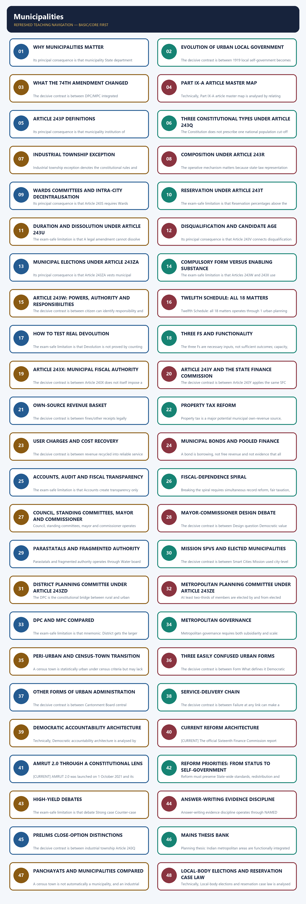

*Distinct embedded teaching-navigation image. The separate continuous Cārvāka-style flowchart package remains an independent at-a-glance artifact.*

### SESSION 1 — WHY MUNICIPALITIES MATTER
#### DEFINITION / WHAT THIS IS CALLED

**Plain-language definition:** Why municipalities matter denotes the constitutional rules and institutional links organised around elects councillor and council.

**Technical definition:** Its principal consequence is that municipality State department parastatal SPV.

#### ANSWER-GRABBING OPENING — WRITE/ADAPT IN THE EXAM

> Calling municipalities the "third tier" does not make them sovereign units equal to the Union and States; their substantive authority remains substantially State-mediated.

#### MUST-WRITE KEYWORDS

- **Why municipalities matter**
- **Why**
- **CAN ACT AND BE HELD**
- **ACCOUNTABLE**
- **Its principal consequence**
- **Its**

**How to use them:** Frame the answer through Why municipalities matter; define Why, connect CAN ACT AND BE HELD with ACCOUNTABLE to explain the mechanism, and use Its principal consequence for the decisive comparison or qualification.

Why municipalities matter denotes the constitutional rules and institutional links organised around elects councillor and council.
Why municipalities matter operates through pays local taxes and user charges, connected with depends on water, waste, roads, lighting and planning.
The operative mechanism matters because wHO CAN ACT AND BE HELD ACCOUNTABLE?.
Its principal consequence is that municipality State department parastatal SPV.
The decisive contrast is between [FACT] Urban local government means governance of a defined urban area through elected representatives under State law and Part IX-A and elects councillor and council.
The exam-safe limitation is that elects councillor and council.

**Visual 1 - The urban self-government test**

```text
CITY RESIDENT
    |
    +--> elects councillor and council
    |
    +--> pays local taxes and user charges
    |
    +--> depends on water, waste, roads, lighting and planning
                         |
                         v
             WHO CAN ACT AND BE HELD ACCOUNTABLE?
             municipality | State department | parastatal | SPV
```

Caption: Urban democracy is meaningful only when the elected institution controls the function, staff and money attached to citizen-visible services.

- [FACT] Urban local government means governance of a defined urban area through elected representatives under State law and Part IX-A.
- [ANALYSIS] Municipalities sit where constitutional democracy meets everyday infrastructure: weak authority appears immediately as uncollected waste, unreliable water, unsafe land use and fragmented planning.
- [LIMIT] Calling municipalities the "third tier" does not make them sovereign units equal to the Union and States; their substantive authority remains substantially State-mediated.

#### CLOSING RECALL FLOW — WHY MUNICIPALITIES MATTER

```closure-flow
SUBTOPIC: Why municipalities matter
KEY TERMS / DEFINITIONS: Why municipalities matter · Why · CAN ACT AND BE HELD · ACCOUNTABLE · Its principal consequence · Its
MECHANISM / ARGUMENT: Why municipalities matter operates through pays local taxes and user charges, connected with depends on water, waste, roads, lighting and planning.
CONSEQUENCE / CONTRAST: Its principal consequence is that municipality State department parastatal SPV.
UPSC TRAP / ANSWER-USE: Calling municipalities the "third tier" does not make them sovereign units equal to the Union and States; their substantive authority remains substantially State-mediated.
ANSWER-GRABBING FORMULATION: Calling municipalities the "third tier" does not make them sovereign units equal to the Union and States; their substantive authority remains substantially State-mediated.
```
### SESSION 2 — EVOLUTION OF URBAN LOCAL GOVERNMENT
#### DEFINITION / WHAT THIS IS CALLED

**Plain-language definition:** Evolution of urban local government denotes the constitutional rules and institutional links organised around 1688 first municipal corporation begins at Madras.

**Technical definition:** The decisive contrast is between 1919 local self-government becomes a transferred provincial subject and 1935 local self-government becomes a provincial subject.

#### ANSWER-GRABBING OPENING — WRITE/ADAPT IN THE EXAM

> The failed 1989 and 1990 efforts show that constitutional status was a political project before it became the 74th Amendment.

#### MUST-WRITE KEYWORDS

- **Evolution of urban local government**
- **Evolution**
- **Madras**
- **Its principal consequence**
- **Its**
- **1907-09**

**How to use them:** Frame the answer through Evolution of urban local government; define Evolution, connect Madras with Its principal consequence to explain the mechanism, and use Its for the decisive comparison or qualification.

Evolution of urban local government denotes the constitutional rules and institutional links organised around 1688 first municipal corporation begins at Madras.
Evolution of urban local government operates through 1726 municipal corporations at Bombay and Calcutta, connected with 1870 Lord Mayo: financial decentralisation.
The operative mechanism matters because 1882 Lord Ripon: "Magna Carta" of local self-government.
Its principal consequence is that 1907-09 Royal Commission on Decentralisation.
The decisive contrast is between 1919 local self-government becomes a transferred provincial subject and 1935 local self-government becomes a provincial subject.
The exam-safe limitation is that 1989 65th Amendment / Nagarpalika Bill passes Lok Sabha, fails Rajya Sabha.

**Visual 2 - Constitutionalisation timeline**

```text
1688  first municipal corporation begins at Madras
1726  municipal corporations at Bombay and Calcutta
1870  Lord Mayo: financial decentralisation
1882  Lord Ripon: "Magna Carta" of local self-government
1907-09 Royal Commission on Decentralisation
1919  local self-government becomes a transferred provincial subject
1935  local self-government becomes a provincial subject
1989  65th Amendment / Nagarpalika Bill passes Lok Sabha, fails Rajya Sabha
1990  revised bill lapses with Lok Sabha dissolution
1991  modified Municipalities Bill introduced
1992  74th Constitutional Amendment enacted
1993  comes into force on 1 June
```

- [FACT] The Madras corporation's charter was issued in 1687 and the corporation came into existence in 1688.
- [FACT] Lord Ripon's 1882 Resolution is conventionally treated as the foundational resolution for representative local self-government.
- [FACT] The failed 1989 and 1990 efforts show that constitutional status was a political project before it became the 74th Amendment.
- [ANALYSIS] The amendment changed municipal continuity and democratic form; it did not erase the older tradition of State control over urban administration.

#### CLOSING RECALL FLOW — EVOLUTION OF URBAN LOCAL GOVERNMENT

```closure-flow
SUBTOPIC: Evolution of urban local government
KEY TERMS / DEFINITIONS: Evolution of urban local government · Evolution · Madras · Its principal consequence · Its · 1907-09
MECHANISM / ARGUMENT: Its principal consequence is that 1907-09 Royal Commission on Decentralisation.
CONSEQUENCE / CONTRAST: The decisive contrast is between 1919 local self-government becomes a transferred provincial subject and 1935 local self-government becomes a provincial subject.
UPSC TRAP / ANSWER-USE: Do not miss this limiting distinction: lord Ripon's 1882 Resolution is conventionally treated as the foundational resolution for representative local...
ANSWER-GRABBING FORMULATION: The failed 1989 and 1990 efforts show that constitutional status was a political project before it became the 74th Amendment.
```
### SESSION 3 — WHAT THE 74TH AMENDMENT CHANGED
#### DEFINITION / WHAT THIS IS CALLED

**Plain-language definition:** What the 74th Amendment changed denotes the constitutional rules and institutional links organised around Component Constitutional effect What it did not guarantee.

**Technical definition:** The decisive contrast is between DPC/MPC integrated district/metropolitan planning operational supremacy over parastatals and The 74th Amendment gave constitutional status to municipalities and placed them in a justiciable constitutional framework.

#### ANSWER-GRABBING OPENING — WRITE/ADAPT IN THE EXAM

> The 74th Amendment entrenched municipal institutions and elections, but its enabling devolution clauses did not guarantee control over every urban service.

#### MUST-WRITE KEYWORDS

- **What the 74th Amendment changed**
- **institutional permanence**
- **Part IX-A**
- **entrenched municipal institutions and procedures**
- **automatic control of every urban service**
- **Articles 243P-243ZG**

**How to use them:** Frame the answer through What the 74th Amendment changed; define institutional permanence, connect Part IX-A with entrenched municipal institutions and procedures to explain the mechanism, and use automatic control of every urban service for the decisive comparison or qualification.

What the 74th Amendment changed denotes the constitutional rules and institutional links organised around Component Constitutional effect What it did not guarantee.
What the 74th Amendment changed operates through Part IX-A entrenched municipal institutions and procedures automatic control of every urban service, connected with Articles 243P-243ZG definitions, bodies, elections, finance and planning a uniform municipal law for all States.
The operative mechanism matters because twelfth Schedule listed 18 municipal functional matters automatic activity-level transfer.
Its principal consequence is that sEC/SFC regular electoral and fiscal-review machinery perfect independence or timely implementation.
The decisive contrast is between DPC/MPC integrated district/metropolitan planning operational supremacy over parastatals and [FACT] The 74th Amendment gave constitutional status to municipalities and placed them in a justiciable constitutional framework.
The exam-safe limitation is that component Constitutional effect What it did not guarantee.
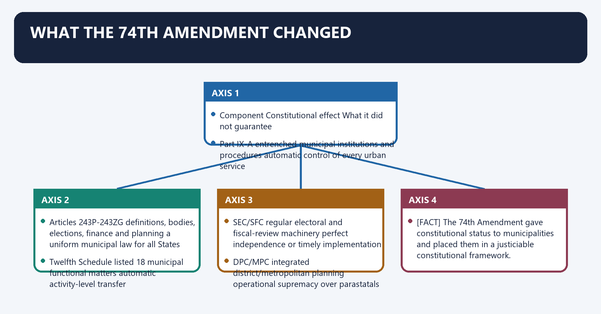
**Visual 3 - Constitutional package**

| Component | Constitutional effect | What it did not guarantee |
|---|---|---|
| Part IX-A | entrenched municipal institutions and procedures | automatic control of every urban service |
| Articles 243P-243ZG | definitions, bodies, elections, finance and planning | a uniform municipal law for all States |
| Twelfth Schedule | listed 18 municipal functional matters | automatic activity-level transfer |
| SEC/SFC | regular electoral and fiscal-review machinery | perfect independence or timely implementation |
| DPC/MPC | integrated district/metropolitan planning | operational supremacy over parastatals |

- [FACT] The 74th Amendment gave constitutional status to municipalities and placed them in a justiciable constitutional framework.
- [ANALYSIS] Its strongest achievement is **institutional permanence**; its central weakness is that core devolution provisions use enabling language and operate through State legislation.

#### CLOSING RECALL FLOW — WHAT THE 74TH AMENDMENT CHANGED

```closure-flow
SUBTOPIC: What the 74th Amendment changed
KEY TERMS / DEFINITIONS: What the 74th Amendment changed · institutional permanence · Part IX-A · entrenched municipal institutions and procedures · automatic control of every urban service · Articles 243P-243ZG
MECHANISM / ARGUMENT: Its strongest achievement is institutional permanence; its central weakness is that core devolution provisions use enabling language and operate through State legislation.
CONSEQUENCE / CONTRAST: The decisive contrast is between DPC/MPC integrated district/metropolitan planning operational supremacy over parastatals and The 74th Amendment gave constitutional status to municipalities and placed them in a justiciable constitutional framework.
UPSC TRAP / ANSWER-USE: Do not miss this limiting distinction: its principal consequence is that sEC/SFC regular electoral and fiscal-review machinery perfect independence or...
ANSWER-GRABBING FORMULATION: The 74th Amendment entrenched municipal institutions and elections, but its enabling devolution clauses did not guarantee control over every urban service.
```
### SESSION 4 — PART IX-A ARTICLE MASTER MAP
#### DEFINITION / WHAT THIS IS CALLED

**Plain-language definition:** Part IX-A article master map denotes the constitutional rules and institutional links organised around 243Q constitution of municipalities.

**Technical definition:** Technically, Part IX-A article master map is analysed by relating Memory chain to definitions, then testing the relationship through constitution of municipalities and 243P.

#### ANSWER-GRABBING OPENING — WRITE/ADAPT IN THE EXAM

> Part IX-A creates the constitutional framework for municipal composition, elections, finance and planning, while State law determines much of its operating substance.

#### MUST-WRITE KEYWORDS

- **Part IX-A article master map**
- **Memory chain**
- **definitions**
- **constitution of municipalities**
- **243P**
- **243Q**

**How to use them:** Frame the answer through Part IX-A article master map; define Memory chain, connect definitions with constitution of municipalities to explain the mechanism, and use 243P for the decisive comparison or qualification.

Part IX-A article master map denotes the constitutional rules and institutional links organised around 243Q constitution of municipalities.
Part IX-A article master map operates through 243S Wards Committees and other committees, connected with 243T reservation of seats.
The operative mechanism matters because 243V disqualifications.
Its principal consequence is that 243W powers, authority and responsibilities.
The decisive contrast is between 243X municipal taxes, assignments, grants and funds and 243Y State Finance Commission review.
The exam-safe limitation is that 243Z accounts and audit.
**Visual 4 - Articles 243P to 243ZG**

| Article | Subject |
|---:|---|
| 243P | definitions |
| 243Q | constitution of municipalities |
| 243R | composition |
| 243S | Wards Committees and other committees |
| 243T | reservation of seats |
| 243U | duration |
| 243V | disqualifications |
| 243W | powers, authority and responsibilities |
| 243X | municipal taxes, assignments, grants and funds |
| 243Y | State Finance Commission review |
| 243Z | accounts and audit |
| 243ZA | municipal elections |
| 243ZB | application to Union Territories |
| 243ZC | excluded areas |
| 243ZD | District Planning Committee |
| 243ZE | Metropolitan Planning Committee |
| 243ZF | continuance of existing laws and municipalities |
| 243ZG | bar to court interference in electoral matters |

> **Memory chain:** P definitions; Q bodies; R composition; S wards; T reservation; U term; V disqualification; W work; X tax; Y finance review; Z audit; ZA elections; ZD district plan; ZE metro plan; ZG election bar.

#### CLOSING RECALL FLOW — PART IX-A ARTICLE MASTER MAP

```closure-flow
SUBTOPIC: Part IX-A article master map
KEY TERMS / DEFINITIONS: Part IX-A article master map · Memory chain · definitions · constitution of municipalities · 243P · 243Q
MECHANISM / ARGUMENT: Its principal consequence is that 243W powers, authority and responsibilities.
CONSEQUENCE / CONTRAST: The decisive contrast is between 243X municipal taxes, assignments, grants and funds and 243Y State Finance Commission review.
UPSC TRAP / ANSWER-USE: Do not miss this limiting distinction: the exam-safe limitation is that 243Z accounts and audit.
ANSWER-GRABBING FORMULATION: Part IX-A creates the constitutional framework for municipal composition, elections, finance and planning, while State law determines much of its operating substance.
```
### SESSION 5 — ARTICLE 243P DEFINITIONS
#### DEFINITION / WHAT THIS IS CALLED

**Plain-language definition:** Article 243P definitions denotes the constitutional rules and institutional links organised around Term Constitutional recall.

**Technical definition:** Its principal consequence is that municipality institution of self-government constituted under Article 243Q.

#### ANSWER-GRABBING OPENING — WRITE/ADAPT IN THE EXAM

> Article 243P defines a metropolitan area constitutionally by population and notified territorial integration, explaining why cross-boundary planning requires a Metropolitan Planning Committee.

#### MUST-WRITE KEYWORDS

- **Article 243P definitions**
- **Committee**
- **a committee constituted under Article 243S**
- **District**
- **a district in a State**
- **10 lakh or more**

**How to use them:** Frame the answer through Article 243P definitions; define Committee, connect a committee constituted under Article 243S with District to explain the mechanism, and use a district in a State for the decisive comparison or qualification.

Article 243P definitions denotes the constitutional rules and institutional links organised around Term Constitutional recall.
Article 243P definitions operates through Committee a committee constituted under Article 243S, connected with District a district in a State.
The operative mechanism matters because municipal area territorial area of a municipality, notified by the Governor.
Its principal consequence is that municipality institution of self-government constituted under Article 243Q.
The decisive contrast is between Population population ascertained at the last preceding census whose relevant figures have been published and [FACT] "Metropolitan area" is a constitutional definition, not merely a colloquial synonym for a large city.
The exam-safe limitation is that term Constitutional recall.
**Visual 5 - Definition box**

| Term | Constitutional recall |
|---|---|
| Committee | a committee constituted under Article 243S |
| District | a district in a State |
| Metropolitan area | population of **10 lakh or more**, comprising one or more districts and two or more municipalities/panchayats/contiguous areas, specified by the Governor |
| Municipal area | territorial area of a municipality, notified by the Governor |
| Municipality | institution of self-government constituted under Article 243Q |
| Population | population ascertained at the last preceding census whose relevant figures have been published |

- [FACT] "Metropolitan area" is a constitutional definition, not merely a colloquial synonym for a large city.
- [ANALYSIS] Its multi-jurisdiction form explains why an MPC is needed: commuter flows, water systems, waste chains and land markets cross municipal borders.

#### CLOSING RECALL FLOW — ARTICLE 243P DEFINITIONS

```closure-flow
SUBTOPIC: Article 243P definitions
KEY TERMS / DEFINITIONS: Article 243P definitions · Committee · a committee constituted under Article 243S · District · a district in a State · 10 lakh or more
MECHANISM / ARGUMENT: Its principal consequence is that municipality institution of self-government constituted under Article 243Q.
CONSEQUENCE / CONTRAST: The decisive contrast is between Population population ascertained at the last preceding census whose relevant figures have been published and "Metropolitan area" is a constitutional definition, not merely a colloquial synonym for a large city.
UPSC TRAP / ANSWER-USE: "Metropolitan area" is a constitutional definition, not merely a colloquial synonym for a large city.
ANSWER-GRABBING FORMULATION: Article 243P defines a metropolitan area constitutionally by population and notified territorial integration, explaining why cross-boundary planning requires a Metropolitan Planning Committee.
```
### SESSION 6 — THREE CONSTITUTIONAL TYPES UNDER ARTICLE 243Q
#### DEFINITION / WHAT THIS IS CALLED

**Plain-language definition:** Three constitutional types under Article 243Q denotes the constitutional rules and institutional links organised around TRANSITIONAL AREA SMALLER URBAN AREA LARGER URBAN AREA.

**Technical definition:** The Constitution does not prescribe one national population cut-off for each type; classification is State-specific within constitutional criteria.

#### ANSWER-GRABBING OPENING — WRITE/ADAPT IN THE EXAM

> The Constitution does not prescribe one national population cut-off for each type; classification is State-specific within constitutional criteria.

#### MUST-WRITE KEYWORDS

- **Three constitutional types under Article 243Q**
- **population**
- **scale of representation and services**
- **population density**
- **urban intensity**
- **revenue generated for local administration**

**How to use them:** Frame the answer through Three constitutional types under Article 243Q; define population, connect scale of representation and services with population density to explain the mechanism, and use urban intensity for the decisive comparison or qualification.

Three constitutional types under Article 243Q denotes the constitutional rules and institutional links organised around TRANSITIONAL AREA SMALLER URBAN AREA LARGER URBAN AREA.
Three constitutional types under Article 243Q operates through Nagar Panchayat -- Municipal Council -- Municipal Corporation, connected with Classification factor available to Governor Why it matters.
The operative mechanism matters because population scale of representation and services.
Its principal consequence is that population density urban intensity.
The decisive contrast is between revenue generated for local administration fiscal viability and percentage in non-agricultural employment economic transition.
The exam-safe limitation is that economic importance regional role.
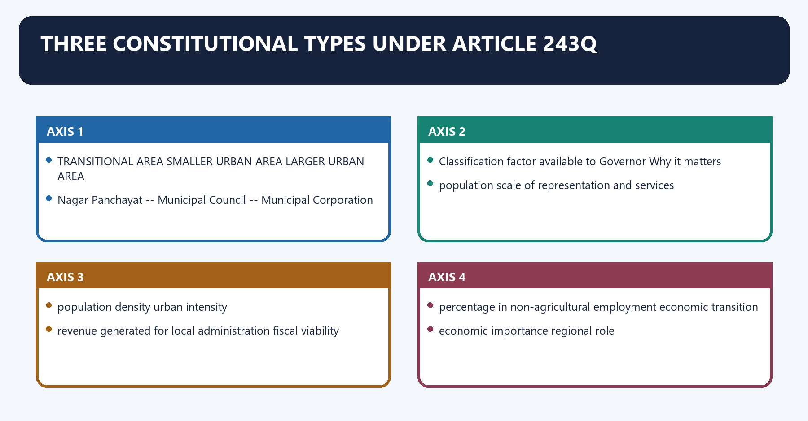
**Visual 6 - Urbanisation ladder**

```text
TRANSITIONAL AREA       SMALLER URBAN AREA        LARGER URBAN AREA
Nagar Panchayat   -->   Municipal Council   -->   Municipal Corporation
```

| Classification factor available to Governor | Why it matters |
|---|---|
| population | scale of representation and services |
| population density | urban intensity |
| revenue generated for local administration | fiscal viability |
| percentage in non-agricultural employment | economic transition |
| economic importance | regional role |
| other notified factors | State-specific context |

- [FACT] Article 243Q requires these three types in accordance with the character of the area.
- [LIMIT] The Constitution does not prescribe one national population cut-off for each type; classification is State-specific within constitutional criteria.

#### CLOSING RECALL FLOW — THREE CONSTITUTIONAL TYPES UNDER ARTICLE 243Q

```closure-flow
SUBTOPIC: Three constitutional types under Article 243Q
KEY TERMS / DEFINITIONS: Three constitutional types under Article 243Q · population · scale of representation and services · population density · urban intensity · revenue generated for local administration
MECHANISM / ARGUMENT: Article 243Q requires these three types in accordance with the character of the area.
CONSEQUENCE / CONTRAST: The Constitution does not prescribe one national population cut-off for each type; classification is State-specific within constitutional criteria.
UPSC TRAP / ANSWER-USE: Do not miss this limiting distinction: its principal consequence is that population density urban intensity.
ANSWER-GRABBING FORMULATION: The Constitution does not prescribe one national population cut-off for each type; classification is State-specific within constitutional criteria.
```
### SESSION 7 — INDUSTRIAL TOWNSHIP EXCEPTION
#### DEFINITION / WHAT THIS IS CALLED

**Plain-language definition:** Industrial township exception operates through Are municipal services being provided, or proposed to be provided,, connected with by an industrial establishment?.

**Technical definition:** Industrial township exception denotes the constitutional rules and institutional links organised around Is the area urban?.

#### ANSWER-GRABBING OPENING — WRITE/ADAPT IN THE EXAM

> The industrial-township exception recognises specialised service provision, but efficient delivery alone does not supply representative municipal accountability.

#### MUST-WRITE KEYWORDS

- **Industrial township exception**
- **Article 243Q**
- **Industrial**
- **Industrial township exception operates through**
- **Are**
- **Its principal consequence**

**How to use them:** Frame the answer through Industrial township exception; define Article 243Q, connect Industrial with Industrial township exception operates through to explain the mechanism, and use Are for the decisive comparison or qualification.

Industrial township exception denotes the constitutional rules and institutional links organised around Is the area urban?.
Industrial township exception operates through Are municipal services being provided, or proposed to be provided,, connected with by an industrial establishment?.
The operative mechanism matters because yes + Governor considers size/services/other factors.
Its principal consequence is that governor may specify an INDUSTRIAL TOWNSHIP.
The decisive contrast is between No municipality need be constituted for that area and [FACT] The proviso is an exception to municipal constitution, not a fourth ordinary type of municipality.
The exam-safe limitation is that [ANALYSIS] It recognises service provision by an industrial establishment.
**Visual 7 - Article 243Q proviso decision flow**

```text
Is the area urban?
      |
      v
Are municipal services being provided, or proposed to be provided,
by an industrial establishment?
      |
   yes + Governor considers size/services/other factors
      |
      v
Governor may specify an INDUSTRIAL TOWNSHIP
      |
      v
No municipality need be constituted for that area
```

- [FACT] The proviso is an exception to municipal constitution, not a fourth ordinary type of municipality.
- [ANALYSIS] It recognises service provision by an industrial establishment.
- [LIMIT] Service provision does not automatically supply electoral accountability; an answer should distinguish functional delivery from representative self-government.

#### CLOSING RECALL FLOW — INDUSTRIAL TOWNSHIP EXCEPTION

```closure-flow
SUBTOPIC: Industrial township exception
KEY TERMS / DEFINITIONS: Industrial township exception · Article 243Q · Industrial · Industrial township exception operates through · Are · Its principal consequence
MECHANISM / ARGUMENT: Industrial township exception denotes the constitutional rules and institutional links organised around Is the area urban?.
CONSEQUENCE / CONTRAST: Its principal consequence is that governor may specify an INDUSTRIAL TOWNSHIP.
UPSC TRAP / ANSWER-USE: The decisive contrast is between No municipality need be constituted for that area and The proviso is an exception to municipal constitution, not a fourth ordinary type of municipality.
ANSWER-GRABBING FORMULATION: The industrial-township exception recognises specialised service provision, but efficient delivery alone does not supply representative municipal accountability.
```
### SESSION 8 — COMPOSITION UNDER ARTICLE 243R
#### DEFINITION / WHAT THIS IS CALLED

**Plain-language definition:** Composition under Article 243R denotes the constitutional rules and institutional links organised around Route Position Voting position.

**Technical definition:** The operative mechanism matters because state-law representation relevant MPs/MLAs as State law provides within Article 243R.

#### ANSWER-GRABBING OPENING — WRITE/ADAPT IN THE EXAM

> Direct election of councillors does not imply that every mayor is directly elected by all city voters.

#### MUST-WRITE KEYWORDS

- **Composition under Article 243R**
- **no right to vote in municipal meetings**
- **direct election from wards**
- **territorial councillors**
- **voting members**
- **persons with special municipal knowledge/experience**

**How to use them:** Frame the answer through Composition under Article 243R; define no right to vote in municipal meetings, connect direct election from wards with territorial councillors to explain the mechanism, and use voting members for the decisive comparison or qualification.

Composition under Article 243R denotes the constitutional rules and institutional links organised around Route Position Voting position.
Composition under Article 243R operates through direct election from wards territorial councillors voting members, connected with State-law representation persons with special municipal knowledge/experience no right to vote in municipal meetings.
The operative mechanism matters because state-law representation relevant MPs/MLAs as State law provides within Article 243R.
Its principal consequence is that state-law representation relevant RS/MLC members registered in the area as State law provides.
The decisive contrast is between State-law representation chairpersons of committees other than Wards Committees as State law provides and [FACT] All territorial seats are filled by direct election from wards.
The exam-safe limitation is that [FACT] State law determines the manner of electing the chairperson.
**Visual 8 - Who enters a municipality**

| Route | Position | Voting position |
|---|---|---|
| direct election from wards | territorial councillors | voting members |
| State-law representation | persons with special municipal knowledge/experience | **no right to vote in municipal meetings** |
| State-law representation | relevant MPs/MLAs | as State law provides within Article 243R |
| State-law representation | relevant RS/MLC members registered in the area | as State law provides |
| State-law representation | chairpersons of committees other than Wards Committees | as State law provides |

- [FACT] All territorial seats are filled by direct election from wards.
- [FACT] State law determines the manner of electing the chairperson.
- [LIMIT] Direct election of councillors does not imply that every mayor is directly elected by all city voters.

#### CLOSING RECALL FLOW — COMPOSITION UNDER ARTICLE 243R

```closure-flow
SUBTOPIC: Composition under Article 243R
KEY TERMS / DEFINITIONS: Composition under Article 243R · no right to vote in municipal meetings · direct election from wards · territorial councillors · voting members · persons with special municipal knowledge/experience
MECHANISM / ARGUMENT: The operative mechanism matters because state-law representation relevant MPs/MLAs as State law provides within Article 243R.
CONSEQUENCE / CONTRAST: The decisive contrast is between State-law representation chairpersons of committees other than Wards Committees as State law provides and All territorial seats are filled by direct election from wards.
UPSC TRAP / ANSWER-USE: Do not miss this limiting distinction: its principal consequence is that state-law representation relevant RS/MLC members registered in the area...
ANSWER-GRABBING FORMULATION: Direct election of councillors does not imply that every mayor is directly elected by all city voters.
```
### SESSION 9 — WARDS COMMITTEES AND INTRA-CITY DECENTRALISATION
#### DEFINITION / WHAT THIS IS CALLED

**Plain-language definition:** Wards Committees and intra-city decentralisation denotes the constitutional rules and institutional links organised around MUNICIPAL COUNCIL / CORPORATION.

**Technical definition:** Its principal consequence is that Article 243S requires Wards Committees in municipalities with population of three lakh or more.

#### ANSWER-GRABBING OPENING — WRITE/ADAPT IN THE EXAM

> A constitutional requirement for a committee does not prove regular meetings, citizen voice, budgets or decision power.

#### MUST-WRITE KEYWORDS

- **Wards Committees**
- **intra-city decentralisation**
- **three lakh or more**
- **city-wide policy and budget**
- **sub-city priorities and oversight**
- **collective elected mandate**

**How to use them:** Frame the answer through Wards Committees; define intra-city decentralisation, connect three lakh or more with city-wide policy and budget to explain the mechanism, and use sub-city priorities and oversight for the decisive comparison or qualification.

Wards Committees and intra-city decentralisation denotes the constitutional rules and institutional links organised around MUNICIPAL COUNCIL / CORPORATION.
Wards Committees and intra-city decentralisation operates through (one ward or a group of wards), connected with councillors + State-law participation design.
The operative mechanism matters because local priorities, monitoring and feedback.
Its principal consequence is that [FACT] Article 243S requires Wards Committees in municipalities with population of three lakh or more.
The decisive contrast is between [FACT] State law determines composition, territorial area and seat-filling arrangements and [ANALYSIS] Wards Committees can correct the scale problem of large cities by locating participation near services.
The exam-safe limitation is that [LIMIT] A constitutional requirement for a committee does not prove regular meetings, citizen voice, budgets or decision power.
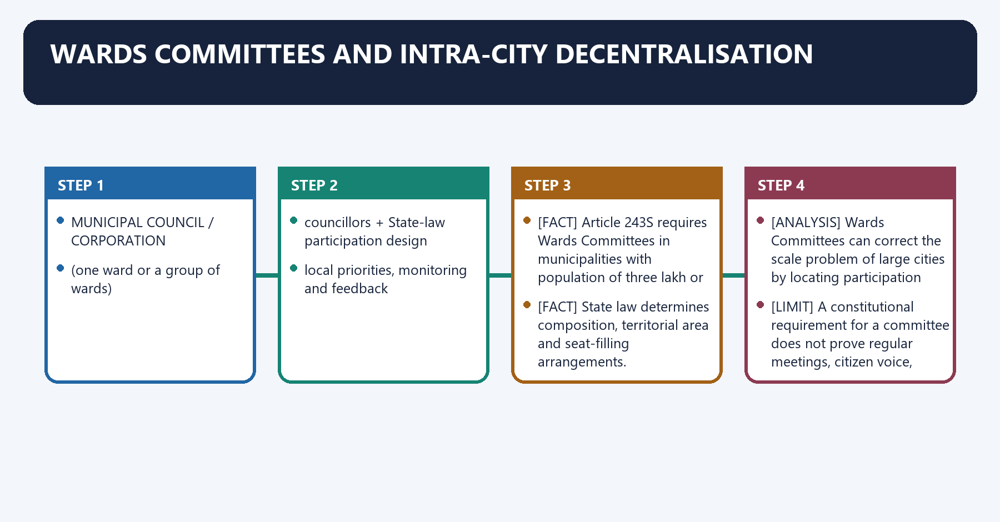
**Visual 9 - From city scale to neighbourhood scale**

```text
MUNICIPAL COUNCIL / CORPORATION
              |
       WARDS COMMITTEE
   (one ward or a group of wards)
              |
 councillors + State-law participation design
              |
 local priorities, monitoring and feedback
```

- [FACT] Article 243S requires Wards Committees in municipalities with population of **three lakh or more**.
- [FACT] State law determines composition, territorial area and seat-filling arrangements.
- [ANALYSIS] Wards Committees can correct the scale problem of large cities by locating participation near services.
- [LIMIT] A constitutional requirement for a committee does not prove regular meetings, citizen voice, budgets or decision power.

**Visual 10 - City council versus Wards Committee**

| City council | Wards Committee |
|---|---|
| city-wide policy and budget | sub-city priorities and oversight |
| collective elected mandate | neighbourhood-scale interface |
| resolves city-wide trade-offs | surfaces local service failures |
| may be remote in a large corporation | may improve proximity but depends on State law |

#### CLOSING RECALL FLOW — WARDS COMMITTEES AND INTRA-CITY DECENTRALISATION

```closure-flow
SUBTOPIC: Wards Committees and intra-city decentralisation
KEY TERMS / DEFINITIONS: Wards Committees · intra-city decentralisation · three lakh or more · city-wide policy and budget · sub-city priorities and oversight · collective elected mandate
MECHANISM / ARGUMENT: The decisive contrast is between State law determines composition, territorial area and seat-filling arrangements and Wards Committees can correct the scale problem of large cities by locating participation near services.
CONSEQUENCE / CONTRAST: Its principal consequence is that Article 243S requires Wards Committees in municipalities with population of three lakh or more.
UPSC TRAP / ANSWER-USE: The exam-safe limitation is that A constitutional requirement for a committee does not prove regular meetings, citizen voice, budgets or decision power.
ANSWER-GRABBING FORMULATION: A constitutional requirement for a committee does not prove regular meetings, citizen voice, budgets or decision power.
```
### SESSION 10 — RESERVATION UNDER ARTICLE 243T
#### DEFINITION / WHAT THIS IS CALLED

**Plain-language definition:** Reservation under Article 243T denotes the constitutional rules and institutional links organised around Category Constitutional rule.

**Technical definition:** The exam-safe limitation is that Reservation percentages above the constitutional floor and rotation rules vary by State.

#### ANSWER-GRABBING OPENING — WRITE/ADAPT IN THE EXAM

> Article 243T widens access to municipal office through reservation, but substantive authority also requires tenure, information, staff support and freedom from proxy control.

#### MUST-WRITE KEYWORDS

- **Reservation under Article 243T**
- **SC/ST seats**
- **women in seats**
- **chairperson offices for women**
- **not less than one-third of total chairperson offices**
- **SC/ST chairperson offices**

**How to use them:** Frame the answer through Reservation under Article 243T; define SC/ST seats, connect women in seats with chairperson offices for women to explain the mechanism, and use not less than one-third of total chairperson offices for the decisive comparison or qualification.

Reservation under Article 243T denotes the constitutional rules and institutional links organised around Category Constitutional rule.
Reservation under Article 243T operates through SC/ST seats reserved in proportion to population in the municipal area, connected with women in seats not less than one-third of total seats, including SC/ST women.
The operative mechanism matters because chairperson offices for women not less than one-third of total chairperson offices.
Its principal consequence is that sC/ST chairperson offices State law prescribes manner.
The decisive contrast is between backward classes State legislature may provide reservation and [FACT] One-third is a constitutional floor, not a ceiling.
The exam-safe limitation is that [LIMIT] Reservation percentages above the constitutional floor and rotation rules vary by State.
**Visual 11 - Inclusion architecture**

| Category | Constitutional rule |
|---|---|
| SC/ST seats | reserved in proportion to population in the municipal area |
| women in seats | not less than one-third of total seats, including SC/ST women |
| chairperson offices for women | not less than one-third of total chairperson offices |
| SC/ST chairperson offices | State law prescribes manner |
| backward classes | State legislature may provide reservation |

- [FACT] One-third is a constitutional floor, not a ceiling.
- [ANALYSIS] Reservation alters access to office; substantive authority additionally requires stable tenure, information, staff support and freedom from proxy control.
- [LIMIT] Reservation percentages above the constitutional floor and rotation rules vary by State.

#### CLOSING RECALL FLOW — RESERVATION UNDER ARTICLE 243T

```closure-flow
SUBTOPIC: Reservation under Article 243T
KEY TERMS / DEFINITIONS: Reservation under Article 243T · SC/ST seats · women in seats · chairperson offices for women · not less than one-third of total chairperson offices · SC/ST chairperson offices
MECHANISM / ARGUMENT: The exam-safe limitation is that Reservation percentages above the constitutional floor and rotation rules vary by State.
CONSEQUENCE / CONTRAST: The decisive contrast is between backward classes State legislature may provide reservation and One-third is a constitutional floor, not a ceiling.
UPSC TRAP / ANSWER-USE: Do not miss this limiting distinction: its principal consequence is that sC/ST chairperson offices State law prescribes manner.
ANSWER-GRABBING FORMULATION: Article 243T widens access to municipal office through reservation, but substantive authority also requires tenure, information, staff support and freedom from proxy control.
```
### SESSION 11 — DURATION AND DISSOLUTION UNDER ARTICLE 243U
#### DEFINITION / WHAT THIS IS CALLED

**Plain-language definition:** Duration and dissolution under Article 243U denotes the constitutional rules and institutional links organised around normal five-year term ------+.

**Technical definition:** The exam-safe limitation is that A legal amendment cannot dissolve an existing municipality before the end of its five-year duration.

#### ANSWER-GRABBING OPENING — WRITE/ADAPT IN THE EXAM

> A legal amendment cannot dissolve an existing municipality before the end of its five-year duration.

#### MUST-WRITE KEYWORDS

- **Duration**
- **dissolution under Article 243U**
- **Article 243U**
- **Duration and dissolution under Article 243U**
- **Article**
- **Its principal consequence**

**How to use them:** Frame the answer through Duration; define dissolution under Article 243U, connect Article 243U with Duration and dissolution under Article 243U to explain the mechanism, and use Article for the decisive comparison or qualification.

Duration and dissolution under Article 243U denotes the constitutional rules and institutional links organised around normal five-year term ------+.
Duration and dissolution under Article 243U operates through before expiry: election completed, connected with premature dissolution.
The operative mechanism matters because reasonable opportunity of hearing.
Its principal consequence is that election within six months.
The decisive contrast is between new body serves only the unexpired remainder and [FACT] If the remaining period is less than six months, an election need not be held merely for that short remainder.
The exam-safe limitation is that [FACT] A legal amendment cannot dissolve an existing municipality before the end of its five-year duration.
**Visual 12 - Municipal tenure clock**

```text
FIRST MEETING
     |
     +------ normal five-year term ------+
     |                                    |
before expiry: election completed         |
                                          |
premature dissolution                     |
     |                                    |
reasonable opportunity of hearing         |
     |                                    |
election within six months                 |
     |
new body serves only the unexpired remainder
```

- [FACT] If the remaining period is less than six months, an election need not be held merely for that short remainder.
- [FACT] A legal amendment cannot dissolve an existing municipality before the end of its five-year duration.
- [ANALYSIS] The remainder rule prevents a government from manufacturing a fresh five-year mandate through premature dissolution.

#### CLOSING RECALL FLOW — DURATION AND DISSOLUTION UNDER ARTICLE 243U

```closure-flow
SUBTOPIC: Duration and dissolution under Article 243U
KEY TERMS / DEFINITIONS: Duration · dissolution under Article 243U · Article 243U · Duration and dissolution under Article 243U · Article · Its principal consequence
MECHANISM / ARGUMENT: The exam-safe limitation is that A legal amendment cannot dissolve an existing municipality before the end of its five-year duration.
CONSEQUENCE / CONTRAST: The decisive contrast is between new body serves only the unexpired remainder and If the remaining period is less than six months, an election need not be held merely for that short remainder.
UPSC TRAP / ANSWER-USE: If the remaining period is less than six months, an election need not be held merely for that short remainder.
ANSWER-GRABBING FORMULATION: A legal amendment cannot dissolve an existing municipality before the end of its five-year duration.
```
### SESSION 12 — DISQUALIFICATION AND CANDIDATE AGE
#### DEFINITION / WHAT THIS IS CALLED

**Plain-language definition:** Disqualification and candidate age denotes the constitutional rules and institutional links organised around Article 243V connects disqualification to State-legislature election law and additional State law.

**Technical definition:** Its principal consequence is that Article 243V connects disqualification to State-legislature election law and additional State law.

#### ANSWER-GRABBING OPENING — WRITE/ADAPT IN THE EXAM

> A person cannot be disqualified merely for being below 25 if that person has attained 21 years.

#### MUST-WRITE KEYWORDS

- **Disqualification**
- **candidate age**
- **Article 243V**
- **Disqualification and candidate age**
- **Article**
- **21 years**

**How to use them:** Frame the answer through Disqualification; define candidate age, connect Article 243V with Disqualification and candidate age to explain the mechanism, and use Article for the decisive comparison or qualification.

Disqualification and candidate age denotes the constitutional rules and institutional links organised around [FACT] Article 243V connects disqualification to State-legislature election law and additional State law.
Disqualification and candidate age operates through [FACT] A person cannot be disqualified merely for being below 25 if that person has attained 21 years, connected with [FACT] State law determines the authority deciding disqualification questions.
The operative mechanism matters because [LIMIT] Detailed grounds and adjudicatory procedures are State-specific.
Its principal consequence is that [FACT] Article 243V connects disqualification to State-legislature election law and additional State law.
The decisive contrast is between [FACT] Article 243V connects disqualification to State-legislature election law and additional State law and [FACT] Article 243V connects disqualification to State-legislature election law and additional State law.
The exam-safe limitation is that [FACT] Article 243V connects disqualification to State-legislature election law and additional State law.
- [FACT] Article 243V connects disqualification to State-legislature election law and additional State law.
- [FACT] A person cannot be disqualified merely for being below 25 if that person has attained **21 years**.
- [FACT] State law determines the authority deciding disqualification questions.
- [LIMIT] Detailed grounds and adjudicatory procedures are State-specific.

#### CLOSING RECALL FLOW — DISQUALIFICATION AND CANDIDATE AGE

```closure-flow
SUBTOPIC: Disqualification and candidate age
KEY TERMS / DEFINITIONS: Disqualification · candidate age · Article 243V · Disqualification and candidate age · Article · 21 years
MECHANISM / ARGUMENT: Disqualification and candidate age operates through A person cannot be disqualified merely for being below 25 if that person has attained 21 years, connected with State law determines the authority deciding disqualification questions.
CONSEQUENCE / CONTRAST: Its principal consequence is that Article 243V connects disqualification to State-legislature election law and additional State law.
UPSC TRAP / ANSWER-USE: Do not miss this limiting distinction: the decisive contrast is between Article 243V connects disqualification to State-legislature election law and...
ANSWER-GRABBING FORMULATION: A person cannot be disqualified merely for being below 25 if that person has attained 21 years.
```
### SESSION 13 — MUNICIPAL ELECTIONS UNDER ARTICLE 243ZA
#### DEFINITION / WHAT THIS IS CALLED

**Plain-language definition:** Municipal elections under Article 243ZA denotes the constitutional rules and institutional links organised around STATE ELECTION COMMISSION.

**Technical definition:** Its principal consequence is that Article 243ZA vests municipal election control in the State Election Commission.

#### ANSWER-GRABBING OPENING — WRITE/ADAPT IN THE EXAM

> Article 243ZG protects the electoral process from ordinary midstream court interference: delimitation/allotment laws cannot be challenged in court, and an election is questioned through the State-law election-petition route.

#### MUST-WRITE KEYWORDS

- **Municipal elections under Article 243ZA**
- **Municipal**
- **Article**
- **Its principal consequence**
- **Its**
- **The decisive contrast**

**How to use them:** Frame the answer through Municipal elections under Article 243ZA; define Municipal, connect Article with Its principal consequence to explain the mechanism, and use Its for the decisive comparison or qualification.

Municipal elections under Article 243ZA denotes the constitutional rules and institutional links organised around STATE ELECTION COMMISSION.
Municipal elections under Article 243ZA operates through electoral rolls for municipalities, connected with control of municipal elections.
The operative mechanism matters because election Commission of India != municipal election authority.
Its principal consequence is that [FACT] Article 243ZA vests municipal election control in the State Election Commission.
The decisive contrast is between [LIMIT] The bar is not a licence for illegality; it channels challenges into the constitutionally prescribed post-election mechanism and STATE ELECTION COMMISSION.
The exam-safe limitation is that sTATE ELECTION COMMISSION.
**Visual 13 - Electoral responsibility**

```text
STATE ELECTION COMMISSION
        |
        +--> electoral rolls for municipalities
        +--> superintendence
        +--> direction
        +--> control of municipal elections

Election Commission of India != municipal election authority
```

- [FACT] Article 243ZA vests municipal election control in the State Election Commission.
- [FACT] Article 243ZG protects the electoral process from ordinary midstream court interference: delimitation/allotment laws cannot be challenged in court, and an election is questioned through the State-law election-petition route.
- [LIMIT] The bar is not a licence for illegality; it channels challenges into the constitutionally prescribed post-election mechanism.

#### CLOSING RECALL FLOW — MUNICIPAL ELECTIONS UNDER ARTICLE 243ZA

```closure-flow
SUBTOPIC: Municipal elections under Article 243ZA
KEY TERMS / DEFINITIONS: Municipal elections under Article 243ZA · Municipal · Article · Its principal consequence · Its · The decisive contrast
MECHANISM / ARGUMENT: Article 243ZG protects the electoral process from ordinary midstream court interference: delimitation/allotment laws cannot be challenged in court, and an election is questioned through the State-law election-petition route.
CONSEQUENCE / CONTRAST: Its principal consequence is that Article 243ZA vests municipal election control in the State Election Commission.
UPSC TRAP / ANSWER-USE: The decisive contrast is between The bar is not a licence for illegality; it channels challenges into the constitutionally prescribed post-election mechanism and STATE ELECTION COMMISSION.
ANSWER-GRABBING FORMULATION: Article 243ZG protects the electoral process from ordinary midstream court interference: delimitation/allotment laws cannot be challenged in court, and an election is questioned through the State-law election-petition route.
```
### SESSION 14 — COMPULSORY FORM VERSUS ENABLING SUBSTANCE
#### DEFINITION / WHAT THIS IS CALLED

**Plain-language definition:** Compulsory form versus enabling substance denotes the constitutional rules and institutional links organised around Relatively entrenched constitutional form State-mediated/enabling substance.

**Technical definition:** The exam-safe limitation is that Articles 243W and 243X use State-legislative enabling routes; the Twelfth Schedule is not self-executing.

#### ANSWER-GRABBING OPENING — WRITE/ADAPT IN THE EXAM

> The Constitution guarantees municipal existence and electoral form more strongly than functional command because Articles 243W and 243X depend on enabling State legislation.

#### MUST-WRITE KEYWORDS

- **Compulsory form versus enabling substance**
- **municipal types**
- **detailed powers over functions**
- **direct territorial elections**
- **activity mapping within 18 matters**
- **reservation floor**

**How to use them:** Frame the answer through Compulsory form versus enabling substance; define municipal types, connect detailed powers over functions with direct territorial elections to explain the mechanism, and use activity mapping within 18 matters for the decisive comparison or qualification.

Compulsory form versus enabling substance denotes the constitutional rules and institutional links organised around Relatively entrenched constitutional form State-mediated/enabling substance.
Compulsory form versus enabling substance operates through municipal types detailed powers over functions, connected with direct territorial elections activity mapping within 18 matters.
The operative mechanism matters because reservation floor backward-class reservation design.
Its principal consequence is that five-year duration and election rules chairperson election and executive authority.
The decisive contrast is between SEC and SFC framework tax powers and assignments and DPC/MPC constitutional existence effective control over planning agencies.
The exam-safe limitation is that [FACT] Articles 243W and 243X use State-legislative enabling routes; the Twelfth Schedule is not self-executing.
**Visual 14 - The amendment's central asymmetry**

| Relatively entrenched constitutional form | State-mediated/enabling substance |
|---|---|
| municipal types | detailed powers over functions |
| direct territorial elections | activity mapping within 18 matters |
| reservation floor | backward-class reservation design |
| five-year duration and election rules | chairperson election and executive authority |
| SEC and SFC framework | tax powers and assignments |
| DPC/MPC constitutional existence | effective control over planning agencies |

- [ANALYSIS] The Constitution is stronger at guaranteeing **who must exist and be elected** than at guaranteeing **what the elected body can command**.
- [FACT] Articles 243W and 243X use State-legislative enabling routes; the Twelfth Schedule is not self-executing.

#### CLOSING RECALL FLOW — COMPULSORY FORM VERSUS ENABLING SUBSTANCE

```closure-flow
SUBTOPIC: Compulsory form versus enabling substance
KEY TERMS / DEFINITIONS: Compulsory form versus enabling substance · municipal types · detailed powers over functions · direct territorial elections · activity mapping within 18 matters · reservation floor
MECHANISM / ARGUMENT: The exam-safe limitation is that Articles 243W and 243X use State-legislative enabling routes; the Twelfth Schedule is not self-executing.
CONSEQUENCE / CONTRAST: Articles 243W and 243X use State-legislative enabling routes; the Twelfth Schedule is not self-executing.
UPSC TRAP / ANSWER-USE: Do not miss this limiting distinction: its principal consequence is that five-year duration and election rules chairperson election and executive...
ANSWER-GRABBING FORMULATION: The Constitution guarantees municipal existence and electoral form more strongly than functional command because Articles 243W and 243X depend on enabling State legislation.
```
### SESSION 15 — ARTICLE 243W: POWERS, AUTHORITY AND RESPONSIBILITIES
#### DEFINITION / WHAT THIS IS CALLED

**Plain-language definition:** Article 243W: powers, authority and responsibilities denotes the constitutional rules and institutional links organised around TWELFTH SCHEDULE MATTER.

**Technical definition:** The decisive contrast is between citizen can identify responsibility and TWELFTH SCHEDULE MATTER.

#### ANSWER-GRABBING OPENING — WRITE/ADAPT IN THE EXAM

> A subject transfer without activity mapping leaves ambiguity: "water supply" can contain source creation, bulk supply, distribution, metering, billing and quality monitoring controlled by different bodies.

#### MUST-WRITE KEYWORDS

- **Article 243W**
- **powers**
- **authority**
- **responsibilities**
- **Article 243W: powers, authority and responsibilities**
- **Article**

**How to use them:** Frame the answer through Article 243W; define powers, connect authority with responsibilities to explain the mechanism, and use Article 243W: powers, authority and responsibilities for the decisive comparison or qualification.

Article 243W: powers, authority and responsibilities denotes the constitutional rules and institutional links organised around TWELFTH SCHEDULE MATTER.
Article 243W: powers, authority and responsibilities operates through STATE LAW / ACTIVITY MAPPING, connected with specific activity assigned to a municipal tier.
The operative mechanism matters because budget line + staff + rules + assets.
Its principal consequence is that municipality plans and implements.
The decisive contrast is between citizen can identify responsibility and TWELFTH SCHEDULE MATTER.
The exam-safe limitation is that tWELFTH SCHEDULE MATTER.
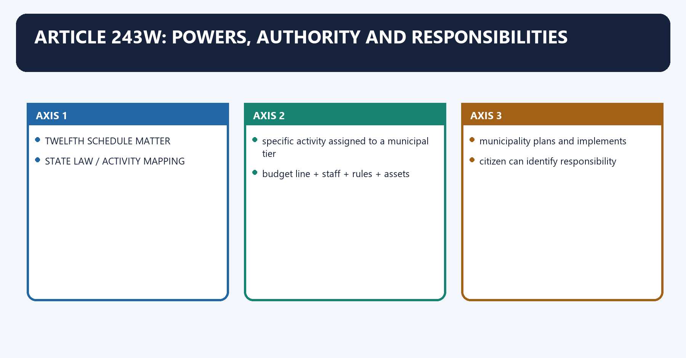
**Visual 15 - The functional-devolution chain**

```text
TWELFTH SCHEDULE MATTER
        |
STATE LAW / ACTIVITY MAPPING
        |
specific activity assigned to a municipal tier
        |
budget line + staff + rules + assets
        |
municipality plans and implements
        |
citizen can identify responsibility
```

- [FACT] Article 243W permits State legislatures to endow municipalities with powers necessary to function as institutions of self-government.
- [FACT] It covers preparation of plans for economic development and social justice and implementation of schemes, including matters in the Twelfth Schedule.
- [ANALYSIS] A subject transfer without activity mapping leaves ambiguity: "water supply" can contain source creation, bulk supply, distribution, metering, billing and quality monitoring controlled by different bodies.

#### CLOSING RECALL FLOW — ARTICLE 243W: POWERS, AUTHORITY AND RESPONSIBILITIES

```closure-flow
SUBTOPIC: Article 243W: powers, authority and responsibilities
KEY TERMS / DEFINITIONS: Article 243W · powers · authority · responsibilities · Article 243W: powers, authority and responsibilities · Article
MECHANISM / ARGUMENT: A subject transfer without activity mapping leaves ambiguity: "water supply" can contain source creation, bulk supply, distribution, metering, billing and quality monitoring controlled by different bodies.
CONSEQUENCE / CONTRAST: The decisive contrast is between citizen can identify responsibility and TWELFTH SCHEDULE MATTER.
UPSC TRAP / ANSWER-USE: Do not miss this limiting distinction: its principal consequence is that municipality plans and implements.
ANSWER-GRABBING FORMULATION: A subject transfer without activity mapping leaves ambiguity: "water supply" can contain source creation, bulk supply, distribution, metering, billing and quality monitoring controlled by different bodies.
```
### SESSION 16 — TWELFTH SCHEDULE: ALL 18 MATTERS
#### DEFINITION / WHAT THIS IS CALLED

**Plain-language definition:** Twelfth Schedule: all 18 matters denotes the constitutional rules and institutional links organised around No.

**Technical definition:** Twelfth Schedule: all 18 matters operates through 1 urban planning including town planning planning, connected with 2 regulation of land use and construction of buildings planning/regulation.

#### ANSWER-GRABBING OPENING — WRITE/ADAPT IN THE EXAM

> The Twelfth Schedule identifies eighteen municipal fields, but the list remains a devolution menu whose operational control depends on State law and activity mapping.

#### MUST-WRITE KEYWORDS

- **Twelfth Schedule**
- **all 18 matters**
- **Memory clusters**
- **urban planning including town planning**
- **planning**
- **planning/regulation**

**How to use them:** Frame the answer through Twelfth Schedule; define all 18 matters, connect Memory clusters with urban planning including town planning to explain the mechanism, and use planning for the decisive comparison or qualification.

Twelfth Schedule: all 18 matters denotes the constitutional rules and institutional links organised around No. Matter Functional cluster.
Twelfth Schedule: all 18 matters operates through 1 urban planning including town planning planning, connected with 2 regulation of land use and construction of buildings planning/regulation.
The operative mechanism matters because 3 planning for economic and social development development.
Its principal consequence is that 4 roads and bridges infrastructure.
The decisive contrast is between 5 water supply for domestic, industrial and commercial purposes basic service and 6 public health, sanitation, conservancy and solid waste management health/service.
The exam-safe limitation is that 7 fire services safety.
**Visual 16 - Complete functional schedule**

| No. | Matter | Functional cluster |
|---:|---|---|
| 1 | urban planning including town planning | planning |
| 2 | regulation of land use and construction of buildings | planning/regulation |
| 3 | planning for economic and social development | development |
| 4 | roads and bridges | infrastructure |
| 5 | water supply for domestic, industrial and commercial purposes | basic service |
| 6 | public health, sanitation, conservancy and solid waste management | health/service |
| 7 | fire services | safety |
| 8 | urban forestry, environmental protection and ecological promotion | environment |
| 9 | safeguarding weaker sections, including persons with disabilities and persons with mental disabilities | social justice |
| 10 | slum improvement and upgradation | inclusion/housing |
| 11 | urban poverty alleviation | livelihoods/inclusion |
| 12 | parks, gardens, playgrounds and other urban amenities | public space |
| 13 | cultural, educational and aesthetic aspects | culture |
| 14 | burials, burial grounds, cremations, cremation grounds and electric crematoria | civic service |
| 15 | cattle ponds and prevention of cruelty to animals | regulation/welfare |
| 16 | vital statistics, including registration of births and deaths | civil registration |
| 17 | street lighting, parking lots, bus stops, public conveniences and other public amenities | civic infrastructure |
| 18 | regulation of slaughterhouses and tanneries | public health/regulation |

> **Memory clusters:** Plan-land-development; roads-water-health-fire; environment-weaker sections-slums-poverty; parks-culture-burials-cattle; vital statistics-public amenities-slaughterhouses.

#### CLOSING RECALL FLOW — TWELFTH SCHEDULE: ALL 18 MATTERS

```closure-flow
SUBTOPIC: Twelfth Schedule: all 18 matters
KEY TERMS / DEFINITIONS: Twelfth Schedule · all 18 matters · Memory clusters · urban planning including town planning · planning · planning/regulation
MECHANISM / ARGUMENT: Twelfth Schedule: all 18 matters operates through 1 urban planning including town planning planning, connected with 2 regulation of land use and construction of buildings planning/regulation.
CONSEQUENCE / CONTRAST: Its principal consequence is that 4 roads and bridges infrastructure.
UPSC TRAP / ANSWER-USE: Do not miss this limiting distinction: the decisive contrast is between 5 water supply for domestic, industrial and commercial purposes...
ANSWER-GRABBING FORMULATION: The Twelfth Schedule identifies eighteen municipal fields, but the list remains a devolution menu whose operational control depends on State law and activity mapping.
```
### SESSION 17 — HOW TO TEST REAL DEVOLUTION
#### DEFINITION / WHAT THIS IS CALLED

**Plain-language definition:** How to test real devolution denotes the constitutional rules and institutional links organised around Question If answer is "State agency" If answer is "municipality".

**Technical definition:** The exam-safe limitation is that Devolution is not proved by counting listed subjects; it is proved by tracing authority over each activity.

#### ANSWER-GRABBING OPENING — WRITE/ADAPT IN THE EXAM

> Devolution is not proved by counting listed subjects; it is proved by tracing authority over each activity.

#### MUST-WRITE KEYWORDS

- **How to test real devolution**
- **constrained discretion**
- **local policy space**
- **financial dependence**
- **allocative authority**
- **functionary gap**

**How to use them:** Frame the answer through How to test real devolution; define constrained discretion, connect local policy space with financial dependence to explain the mechanism, and use allocative authority for the decisive comparison or qualification.

How to test real devolution denotes the constitutional rules and institutional links organised around Question If answer is "State agency" If answer is "municipality".
How to test real devolution operates through Who sets policy/service standard? constrained discretion local policy space, connected with Who owns the budget line? financial dependence allocative authority.
The operative mechanism matters because who appoints/directs staff? functionary gap executive control.
Its principal consequence is that who owns assets and data? fragmented delivery integrated management.
The decisive contrast is between Who signs contracts/work orders? formal responsibility only operational responsibility and Who faces citizens in elections? accountability mismatch answerability aligned.
The exam-safe limitation is that [ANALYSIS] Devolution is not proved by counting listed subjects; it is proved by tracing authority over each activity.
**Visual 17 - The control test**

| Question | If answer is "State agency" | If answer is "municipality" |
|---|---|---|
| Who sets policy/service standard? | constrained discretion | local policy space |
| Who owns the budget line? | financial dependence | allocative authority |
| Who appoints/directs staff? | functionary gap | executive control |
| Who owns assets and data? | fragmented delivery | integrated management |
| Who signs contracts/work orders? | formal responsibility only | operational responsibility |
| Who faces citizens in elections? | accountability mismatch | answerability aligned |

- [ANALYSIS] Devolution is not proved by counting listed subjects; it is proved by tracing authority over each activity.
- [LIMIT] Some services need regional scale or technical regulation. The objective is clear allocation and accountable coordination, not mechanically municipalising every function.

#### CLOSING RECALL FLOW — HOW TO TEST REAL DEVOLUTION

```closure-flow
SUBTOPIC: How to test real devolution
KEY TERMS / DEFINITIONS: How to test real devolution · constrained discretion · local policy space · financial dependence · allocative authority · functionary gap
MECHANISM / ARGUMENT: The exam-safe limitation is that Devolution is not proved by counting listed subjects; it is proved by tracing authority over each activity.
CONSEQUENCE / CONTRAST: Devolution is not proved by counting listed subjects; it is proved by tracing authority over each activity.
UPSC TRAP / ANSWER-USE: Do not miss this limiting distinction: its principal consequence is that who owns assets and data? fragmented delivery integrated management.
ANSWER-GRABBING FORMULATION: Devolution is not proved by counting listed subjects; it is proved by tracing authority over each activity.
```
### SESSION 18 — THREE FS AND FUNCTIONALITY
#### DEFINITION / WHAT THIS IS CALLED

**Plain-language definition:** Three Fs and functionality denotes the constitutional rules and institutional links organised around FUNCTIONS + FUNCTIONARIES + FUNDS.

**Technical definition:** The three Fs are necessary inputs, not sufficient outcomes; capacity, procurement, data, participation and audit also matter.

#### ANSWER-GRABBING OPENING — WRITE/ADAPT IN THE EXAM

> Functions, functionaries and funds are necessary for municipal capacity, but service outcomes also depend on procurement, data, participation, professional skills and audit.

#### MUST-WRITE KEYWORDS

- **Three Fs**
- **functionality**
- **Three Fs and functionality**
- **FUNCTIONS**
- **FUNCTIONARIES**
- **FUNDS**

**How to use them:** Frame the answer through Three Fs; define functionality, connect Three Fs and functionality with FUNCTIONS to explain the mechanism, and use FUNCTIONARIES for the decisive comparison or qualification.

Three Fs and functionality denotes the constitutional rules and institutional links organised around FUNCTIONS + FUNCTIONARIES + FUNDS.
Three Fs and functionality operates through what to do who can be directed predictable money, connected with FUNCTIONALITY --------+.
The operative mechanism matters because citizen-visible service.
Its principal consequence is that [FACT] The three-F framework is Funds, Functions and Functionaries.
The decisive contrast is between [ANALYSIS] A municipality is functional when it can decide, direct staff, finance action and answer publicly for outcomes and [LIMIT] The three Fs are necessary inputs, not sufficient outcomes; capacity, procurement, data, participation and audit also matter.
The exam-safe limitation is that fUNCTIONS + FUNCTIONARIES + FUNDS.
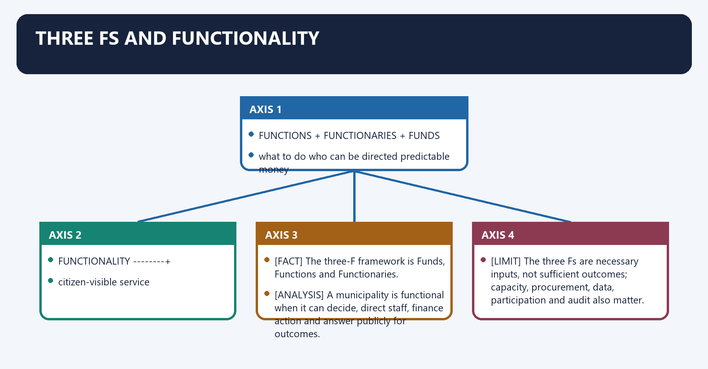
**Visual 18 - From inputs to outcomes**

```text
FUNCTIONS     +     FUNCTIONARIES     +     FUNDS
what to do          who can be directed      predictable money
        \                  |                  /
         \                 |                 /
          +---------- FUNCTIONALITY --------+
                  citizen-visible service
```

- [FACT] The three-F framework is Funds, Functions and Functionaries.
- [ANALYSIS] A municipality is functional when it can decide, direct staff, finance action and answer publicly for outcomes.
- [LIMIT] The three Fs are necessary inputs, not sufficient outcomes; capacity, procurement, data, participation and audit also matter.

#### CLOSING RECALL FLOW — THREE FS AND FUNCTIONALITY

```closure-flow
SUBTOPIC: Three Fs and functionality
KEY TERMS / DEFINITIONS: Three Fs · functionality · Three Fs and functionality · FUNCTIONS · FUNCTIONARIES · FUNDS
MECHANISM / ARGUMENT: Three Fs and functionality operates through what to do who can be directed predictable money, connected with FUNCTIONALITY --------+.
CONSEQUENCE / CONTRAST: The three Fs are necessary inputs, not sufficient outcomes; capacity, procurement, data, participation and audit also matter.
UPSC TRAP / ANSWER-USE: Do not miss this limiting distinction: its principal consequence is that The three-F framework is Funds, Functions and Functionaries.
ANSWER-GRABBING FORMULATION: Functions, functionaries and funds are necessary for municipal capacity, but service outcomes also depend on procurement, data, participation, professional skills and audit.
```
### SESSION 19 — ARTICLE 243X: MUNICIPAL FISCAL AUTHORITY
#### DEFINITION / WHAT THIS IS CALLED

**Plain-language definition:** Article 243X: municipal fiscal authority denotes the constitutional rules and institutional links organised around Channel enabled by State law Illustration Fiscal meaning.

**Technical definition:** The decisive contrast is between Article 243X does not itself impose a municipal tax; it enables State law to authorise the municipality and Channel enabled by State law Illustration Fiscal meaning.

#### ANSWER-GRABBING OPENING — WRITE/ADAPT IN THE EXAM

> Article 243X does not itself impose a municipal tax; it enables State law to authorise the municipality.

#### MUST-WRITE KEYWORDS

- **Article 243X**
- **municipal fiscal authority**
- **local levy, collection and appropriation**
- **property tax, fees, tolls**
- **own-source authority**
- **assignment of State levies**

**How to use them:** Frame the answer through Article 243X; define municipal fiscal authority, connect local levy, collection and appropriation with property tax, fees, tolls to explain the mechanism, and use own-source authority for the decisive comparison or qualification.

Article 243X: municipal fiscal authority denotes the constitutional rules and institutional links organised around Channel enabled by State law Illustration Fiscal meaning.
Article 243X: municipal fiscal authority operates through local levy, collection and appropriation property tax, fees, tolls own-source authority, connected with assignment of State levies assigned tax/cess share predictable devolution.
The operative mechanism matters because grants-in-aid from State Consolidated Fund formula or scheme transfer supplementation/equalisation.
Its principal consequence is that municipal funds credited municipal receipts budgetary integrity.
The decisive contrast is between [FACT] Article 243X does not itself impose a municipal tax; it enables State law to authorise the municipality and Channel enabled by State law Illustration Fiscal meaning.
The exam-safe limitation is that channel enabled by State law Illustration Fiscal meaning.
**Visual 19 - Constitutional revenue channels**

| Channel enabled by State law | Illustration | Fiscal meaning |
|---|---|---|
| local levy, collection and appropriation | property tax, fees, tolls | own-source authority |
| assignment of State levies | assigned tax/cess share | predictable devolution |
| grants-in-aid from State Consolidated Fund | formula or scheme transfer | supplementation/equalisation |
| municipal funds | credited municipal receipts | budgetary integrity |

- [FACT] Article 243X does not itself impose a municipal tax; it enables State law to authorise the municipality.
- [ANALYSIS] Fiscal autonomy combines a usable tax base, fair rate design, administrative capacity, predictable transfers and spending discretion.

#### CLOSING RECALL FLOW — ARTICLE 243X: MUNICIPAL FISCAL AUTHORITY

```closure-flow
SUBTOPIC: Article 243X: municipal fiscal authority
KEY TERMS / DEFINITIONS: Article 243X · municipal fiscal authority · local levy, collection and appropriation · property tax, fees, tolls · own-source authority · assignment of State levies
MECHANISM / ARGUMENT: The decisive contrast is between Article 243X does not itself impose a municipal tax; it enables State law to authorise the municipality and Channel enabled by State law Illustration Fiscal meaning.
CONSEQUENCE / CONTRAST: Article 243X does not itself impose a municipal tax; it enables State law to authorise the municipality.
UPSC TRAP / ANSWER-USE: Do not miss this limiting distinction: its principal consequence is that municipal funds credited municipal receipts budgetary integrity.
ANSWER-GRABBING FORMULATION: Article 243X does not itself impose a municipal tax; it enables State law to authorise the municipality.
```
### SESSION 20 — ARTICLE 243Y AND THE STATE FINANCE COMMISSION
#### DEFINITION / WHAT THIS IS CALLED

**Plain-language definition:** Article 243Y and the State Finance Commission denotes the constitutional rules and institutional links organised around SFC constituted under Article 243-I.

**Technical definition:** The decisive contrast is between Article 243Y applies the same SFC framework to municipalities every five years and Union Finance Commission grants cannot substitute for State tax assignment, SFC action or municipal effort.

#### ANSWER-GRABBING OPENING — WRITE/ADAPT IN THE EXAM

> Union Finance Commission grants cannot substitute for State tax assignment, SFC action or municipal effort.

#### MUST-WRITE KEYWORDS

- **Article 243Y**
- **the State Finance Commission**
- **Article 243**
- **Article 280**
- **Article 243Y and the State Finance Commission**
- **Article**

**How to use them:** Frame the answer through Article 243Y; define the State Finance Commission, connect Article 243 with Article 280 to explain the mechanism, and use Article 243Y and the State Finance Commission for the decisive comparison or qualification.

Article 243Y and the State Finance Commission denotes the constitutional rules and institutional links organised around SFC constituted under Article 243-I.
Article 243Y and the State Finance Commission operates through reviews Panchayat + Municipality finances, connected with recommends tax sharing, assignments, grants and improvements.
The operative mechanism matters because governor places report + action taken memorandum before legislature.
Its principal consequence is that state budget and devolution should respond.
The decisive contrast is between [FACT] Article 243Y applies the same SFC framework to municipalities every five years and [LIMIT] Union Finance Commission grants cannot substitute for State tax assignment, SFC action or municipal effort.
The exam-safe limitation is that sFC constituted under Article 243-I.
**Visual 20 - Municipal fiscal-review cycle**

```text
SFC constituted under Article 243-I
          |
reviews Panchayat + Municipality finances
          |
recommends tax sharing, assignments, grants and improvements
          |
Governor places report + action taken memorandum before legislature
          |
State budget and devolution should respond
```

- [FACT] Article 243Y applies the same SFC framework to municipalities every five years.
- [FACT] Article 280(3)(c) directs the Union Finance Commission to recommend measures to augment State Consolidated Funds to supplement municipal resources on the basis of SFC recommendations.
- [ANALYSIS] Delay or weak follow-through breaks the constitutional bridge between local need, State devolution and Union supplementation.
- [LIMIT] Union Finance Commission grants cannot substitute for State tax assignment, SFC action or municipal effort.

#### CLOSING RECALL FLOW — ARTICLE 243Y AND THE STATE FINANCE COMMISSION

```closure-flow
SUBTOPIC: Article 243Y and the State Finance Commission
KEY TERMS / DEFINITIONS: Article 243Y · the State Finance Commission · Article 243 · Article 280 · Article 243Y and the State Finance Commission · Article
MECHANISM / ARGUMENT: The decisive contrast is between Article 243Y applies the same SFC framework to municipalities every five years and Union Finance Commission grants cannot substitute for State tax assignment, SFC action or municipal effort.
CONSEQUENCE / CONTRAST: Article 280(3)(c) directs the Union Finance Commission to recommend measures to augment State Consolidated Funds to supplement municipal resources on the basis of SFC recommendations.
UPSC TRAP / ANSWER-USE: Do not miss this limiting distinction: its principal consequence is that state budget and devolution should respond.
ANSWER-GRABBING FORMULATION: Union Finance Commission grants cannot substitute for State tax assignment, SFC action or municipal effort.
```
### SESSION 21 — OWN-SOURCE REVENUE BASKET
#### DEFINITION / WHAT THIS IS CALLED

**Plain-language definition:** Own-source revenue basket denotes the constitutional rules and institutional links organised around Revenue family Typical examples Core caution.

**Technical definition:** The decisive contrast is between fines/other receipts legally authorised penalties and charges not a stable substitute for tax capacity and Own revenue creates downward accountability because residents can connect payment, service and elected responsibility.

#### ANSWER-GRABBING OPENING — WRITE/ADAPT IN THE EXAM

> Own revenue creates downward accountability because residents can connect payment, service and elected responsibility.

#### MUST-WRITE KEYWORDS

- **Own-source revenue basket**
- **property-related**
- **property/house tax, development-related fees where authorised**
- **valuation, coverage and collection matter**
- **service-related**
- **water, sewerage, waste and parking charges**

**How to use them:** Frame the answer through Own-source revenue basket; define property-related, connect property/house tax, development-related fees where authorised with valuation, coverage and collection matter to explain the mechanism, and use service-related for the decisive comparison or qualification.

Own-source revenue basket denotes the constitutional rules and institutional links organised around Revenue family Typical examples Core caution.
Own-source revenue basket operates through property-related property/house tax, development-related fees where authorised valuation, coverage and collection matter, connected with service-related water, sewerage, waste and parking charges affordability and service quality matter.
The operative mechanism matters because regulatory fees licences, building permissions, markets must follow State law.
Its principal consequence is that asset income rents, leases, municipal properties needs asset inventory and transparent contracts.
The decisive contrast is between fines/other receipts legally authorised penalties and charges not a stable substitute for tax capacity and [ANALYSIS] Own revenue creates downward accountability because residents can connect payment, service and elected responsibility.
The exam-safe limitation is that [LIMIT] Poorer municipalities have unequal tax bases; equalising transfers remain necessary.
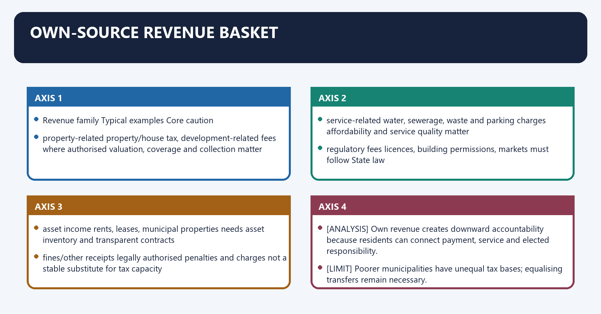
**Visual 21 - Municipal own revenue**

| Revenue family | Typical examples | Core caution |
|---|---|---|
| property-related | property/house tax, development-related fees where authorised | valuation, coverage and collection matter |
| service-related | water, sewerage, waste and parking charges | affordability and service quality matter |
| regulatory fees | licences, building permissions, markets | must follow State law |
| asset income | rents, leases, municipal properties | needs asset inventory and transparent contracts |
| fines/other receipts | legally authorised penalties and charges | not a stable substitute for tax capacity |

- [ANALYSIS] Own revenue creates downward accountability because residents can connect payment, service and elected responsibility.
- [LIMIT] Poorer municipalities have unequal tax bases; equalising transfers remain necessary.

#### CLOSING RECALL FLOW — OWN-SOURCE REVENUE BASKET

```closure-flow
SUBTOPIC: Own-source revenue basket
KEY TERMS / DEFINITIONS: Own-source revenue basket · property-related · property/house tax, development-related fees where authorised · valuation, coverage and collection matter · service-related · water, sewerage, waste and parking charges
MECHANISM / ARGUMENT: The decisive contrast is between fines/other receipts legally authorised penalties and charges not a stable substitute for tax capacity and Own revenue creates downward accountability because residents can connect payment, service and elected responsibility.
CONSEQUENCE / CONTRAST: Its principal consequence is that asset income rents, leases, municipal properties needs asset inventory and transparent contracts.
UPSC TRAP / ANSWER-USE: Do not miss this limiting distinction: own revenue creates downward accountability because residents can connect payment, service and elected responsibility.
ANSWER-GRABBING FORMULATION: Own revenue creates downward accountability because residents can connect payment, service and elected responsibility.
```
### SESSION 22 — PROPERTY TAX REFORM
#### DEFINITION / WHAT THIS IS CALLED

**Plain-language definition:** Property tax reform denotes the constitutional rules and institutional links organised around COMPLETE PROPERTY MAP.

**Technical definition:** Property tax is a major potential municipal own-revenue source, subject to State law. [CURRENT] The Sixteenth Finance Commission recommends citizen-friendly GIS-based property-tax IT systems, updated registers, periodic enumeration, self-assessment with scrutiny, unique IDs and database linkage. [CURRENT] AMRUT 2.0 treated property-tax reform and user-charge reform as mandatory mission reforms and separately incentivised GIS-based property mapping.

#### ANSWER-GRABBING OPENING — WRITE/ADAPT IN THE EXAM

> Property tax is a major potential municipal own-revenue source, subject to State law.

#### MUST-WRITE KEYWORDS

- **Property tax reform**
- **Property**
- **COMPLETE PROPERTY MAP**
- **Its principal consequence**
- **Its**
- **The decisive contrast**

**How to use them:** Frame the answer through Property tax reform; define Property, connect COMPLETE PROPERTY MAP with Its principal consequence to explain the mechanism, and use Its for the decisive comparison or qualification.

Property tax reform denotes the constitutional rules and institutional links organised around COMPLETE PROPERTY MAP.
Property tax reform operates through unique property ID + legal classification, connected with transparent valuation / rate.
The operative mechanism matters because correct demand raised.
Its principal consequence is that digital bill + payment + grievance.
The decisive contrast is between collection and enforcement and service and budget disclosure.
The exam-safe limitation is that [FACT] Property tax is a major potential municipal own-revenue source, subject to State law.
**Visual 22 - Property-tax value chain**

```text
COMPLETE PROPERTY MAP
        |
unique property ID + legal classification
        |
transparent valuation / rate
        |
correct demand raised
        |
digital bill + payment + grievance
        |
collection and enforcement
        |
service and budget disclosure
```

- [FACT] Property tax is a major potential municipal own-revenue source, subject to State law.
- [CURRENT] The Sixteenth Finance Commission recommends citizen-friendly GIS-based property-tax IT systems, updated registers, periodic enumeration, self-assessment with scrutiny, unique IDs and database linkage.
- [CURRENT] AMRUT 2.0 treated property-tax reform and user-charge reform as mandatory mission reforms and separately incentivised GIS-based property mapping.
- [ANALYSIS] GIS can improve coverage and record quality; the fiscal gain still depends on lawful valuation, billing, grievance resolution and collection.
- [LIMIT] GIS is an administrative tool, not a legal title adjudication mechanism and not proof of fair taxation.

#### CLOSING RECALL FLOW — PROPERTY TAX REFORM

```closure-flow
SUBTOPIC: Property tax reform
KEY TERMS / DEFINITIONS: Property tax reform · Property · COMPLETE PROPERTY MAP · Its principal consequence · Its · The decisive contrast
MECHANISM / ARGUMENT: GIS can improve coverage and record quality; the fiscal gain still depends on lawful valuation, billing, grievance resolution and collection.
CONSEQUENCE / CONTRAST: Its principal consequence is that digital bill + payment + grievance.
UPSC TRAP / ANSWER-USE: Do not miss this limiting distinction: the decisive contrast is between collection and enforcement and service and budget disclosure.
ANSWER-GRABBING FORMULATION: Property tax is a major potential municipal own-revenue source, subject to State law.
```
### SESSION 23 — USER CHARGES AND COST RECOVERY
#### DEFINITION / WHAT THIS IS CALLED

**Plain-language definition:** User charges and cost recovery denotes the constitutional rules and institutional links organised around service cost and O&M need.

**Technical definition:** The decisive contrast is between revenue recycled into reliable service and User charges can finance operation and maintenance and reveal the cost of service.

#### ANSWER-GRABBING OPENING — WRITE/ADAPT IN THE EXAM

> The AMRUT 2.0 framework links water/sewerage user-charge notifications and collection roadmaps with financial sustainability.

#### MUST-WRITE KEYWORDS

- **User charges**
- **cost recovery**
- **User charges and cost recovery**
- **User**
- **Its principal consequence**
- **Its**

**How to use them:** Frame the answer through User charges; define cost recovery, connect User charges and cost recovery with User to explain the mechanism, and use Its principal consequence for the decisive comparison or qualification.

User charges and cost recovery denotes the constitutional rules and institutional links organised around service cost and O&M need.
User charges and cost recovery operates through metering / measurable service where feasible, connected with lifeline protection for basic needs.
The operative mechanism matters because transparent tariff and periodic review.
Its principal consequence is that bill, grievance and collection.
The decisive contrast is between revenue recycled into reliable service and [ANALYSIS] User charges can finance operation and maintenance and reveal the cost of service.
The exam-safe limitation is that [CURRENT] The AMRUT 2.0 framework links water/sewerage user-charge notifications and collection roadmaps with financial sustainability.
**Visual 23 - Equity-aware charge design**

```text
service cost and O&M need
          |
metering / measurable service where feasible
          |
lifeline protection for basic needs
          |
transparent tariff and periodic review
          |
bill, grievance and collection
          |
revenue recycled into reliable service
```

- [ANALYSIS] User charges can finance operation and maintenance and reveal the cost of service.
- [LIMIT] Full cost recovery is not automatically equitable or feasible. Lifeline supply, targeted subsidy, cross-subsidy and service-quality guarantees may be necessary.
- [CURRENT] The AMRUT 2.0 framework links water/sewerage user-charge notifications and collection roadmaps with financial sustainability.

#### CLOSING RECALL FLOW — USER CHARGES AND COST RECOVERY

```closure-flow
SUBTOPIC: User charges and cost recovery
KEY TERMS / DEFINITIONS: User charges · cost recovery · User charges and cost recovery · User · Its principal consequence · Its
MECHANISM / ARGUMENT: The decisive contrast is between revenue recycled into reliable service and User charges can finance operation and maintenance and reveal the cost of service.
CONSEQUENCE / CONTRAST: Full cost recovery is not automatically equitable or feasible.
UPSC TRAP / ANSWER-USE: Do not miss this limiting distinction: user charges can finance operation and maintenance and reveal the cost of service.
ANSWER-GRABBING FORMULATION: The AMRUT 2.0 framework links water/sewerage user-charge notifications and collection roadmaps with financial sustainability.
```
### SESSION 24 — MUNICIPAL BONDS AND POOLED FINANCE
#### DEFINITION / WHAT THIS IS CALLED

**Plain-language definition:** Municipal bonds and pooled finance denotes the constitutional rules and institutional links organised around predictable own revenue.

**Technical definition:** A bond is borrowing, not free revenue and not evidence that all municipalities are market-ready.

#### ANSWER-GRABBING OPENING — WRITE/ADAPT IN THE EXAM

> Pooled finance can aggregate smaller ULB projects and diversify risk, but it still requires State support, project quality and a repayment mechanism.

#### MUST-WRITE KEYWORDS

- **Municipal bonds**
- **pooled finance**
- **matches long-lived asset with long-term finance**
- **imposes disclosure and credit discipline**
- **weaker ULBs may be excluded**
- **diversifies beyond grants**

**How to use them:** Frame the answer through Municipal bonds; define pooled finance, connect matches long-lived asset with long-term finance with imposes disclosure and credit discipline to explain the mechanism, and use weaker ULBs may be excluded for the decisive comparison or qualification.

Municipal bonds and pooled finance denotes the constitutional rules and institutional links organised around predictable own revenue.
Municipal bonds and pooled finance operates through viable capital project, connected with disclosure and debt-service plan.
The operative mechanism matters because long-lived infrastructure finance.
Its principal consequence is that benefit Risk/limit.
The decisive contrast is between matches long-lived asset with long-term finance debt must be repaid from reliable revenue and imposes disclosure and credit discipline weaker ULBs may be excluded.
The exam-safe limitation is that diversifies beyond grants cannot fund routine losses indefinitely.

**Visual 24 - Bond logic**

```text
creditworthy ULB
   + audited accounts
   + predictable own revenue
   + viable capital project
   + disclosure and debt-service plan
                 |
                 v
          MUNICIPAL BOND
                 |
      long-lived infrastructure finance
```

| Benefit | Risk/limit |
|---|---|
| matches long-lived asset with long-term finance | debt must be repaid from reliable revenue |
| imposes disclosure and credit discipline | weaker ULBs may be excluded |
| diversifies beyond grants | cannot fund routine losses indefinitely |
| can attract institutional capital | project, interest-rate and governance risks remain |

- [FACT] AMRUT 2.0 officially supports creditworthiness and incentivises municipal-bond issuance.
- [ANALYSIS] Pooled finance can aggregate smaller ULB projects and diversify risk, but it still requires State support, project quality and a repayment mechanism.
- [LIMIT] A bond is borrowing, not free revenue and not evidence that all municipalities are market-ready.

#### CLOSING RECALL FLOW — MUNICIPAL BONDS AND POOLED FINANCE

```closure-flow
SUBTOPIC: Municipal bonds and pooled finance
KEY TERMS / DEFINITIONS: Municipal bonds · pooled finance · matches long-lived asset with long-term finance · imposes disclosure and credit discipline · weaker ULBs may be excluded · diversifies beyond grants
MECHANISM / ARGUMENT: Pooled finance can aggregate smaller ULB projects and diversify risk, but it still requires State support, project quality and a repayment mechanism.
CONSEQUENCE / CONTRAST: The decisive contrast is between matches long-lived asset with long-term finance debt must be repaid from reliable revenue and imposes disclosure and credit discipline weaker ULBs may be excluded.
UPSC TRAP / ANSWER-USE: A bond is borrowing, not free revenue and not evidence that all municipalities are market-ready.
ANSWER-GRABBING FORMULATION: Pooled finance can aggregate smaller ULB projects and diversify risk, but it still requires State support, project quality and a repayment mechanism.
```
### SESSION 25 — ACCOUNTS, AUDIT AND FISCAL TRANSPARENCY
#### DEFINITION / WHAT THIS IS CALLED

**Plain-language definition:** Accounts, audit and fiscal transparency denotes the constitutional rules and institutional links organised around budget classification.

**Technical definition:** The exam-safe limitation is that Accounts create transparency only when they are timely, comparable, reliable and acted upon.

#### ANSWER-GRABBING OPENING — WRITE/ADAPT IN THE EXAM

> Accounts create transparency only when they are timely, comparable, reliable and acted upon.

#### MUST-WRITE KEYWORDS

- **Accounts**
- **audit**
- **fiscal transparency**
- **Article 243Z**
- **Accounts, audit and fiscal transparency**
- **Its principal consequence**

**How to use them:** Frame the answer through Accounts; define audit, connect fiscal transparency with Article 243Z to explain the mechanism, and use Accounts, audit and fiscal transparency for the decisive comparison or qualification.

Accounts, audit and fiscal transparency denotes the constitutional rules and institutional links organised around budget classification.
Accounts, audit and fiscal transparency operates through double-entry / accrual-compatible accounts, connected with asset and liability record.
The operative mechanism matters because independent/local-fund audit with CAG guidance where applicable.
Its principal consequence is that public disclosure + council scrutiny.
The decisive contrast is between [FACT] Article 243Z permits State law to provide for municipal accounts and audit and [CURRENT] AMRUT 2.0 includes migration to double-entry accounting and audit certification within its reform agenda.
The exam-safe limitation is that [ANALYSIS] Accounts create transparency only when they are timely, comparable, reliable and acted upon.
**Visual 25 - Accountability stack**

```text
budget classification
      |
double-entry / accrual-compatible accounts
      |
asset and liability record
      |
internal control
      |
independent/local-fund audit with CAG guidance where applicable
      |
public disclosure + council scrutiny
      |
corrective action
```

- [FACT] Article 243Z permits State law to provide for municipal accounts and audit.
- [CURRENT] The Sixteenth Finance Commission's grant-entry conditions require online provisional accounts for T-1 and audited accounts for T-2; ULB audited accounts should include core financial statements.
- [CURRENT] The Commission recommends strengthened CAG technical guidance/supervision and more reliable, comparable municipal financial data.
- [CURRENT] AMRUT 2.0 includes migration to double-entry accounting and audit certification within its reform agenda.
- [ANALYSIS] Accounts create transparency only when they are timely, comparable, reliable and acted upon.

#### CLOSING RECALL FLOW — ACCOUNTS, AUDIT AND FISCAL TRANSPARENCY

```closure-flow
SUBTOPIC: Accounts, audit and fiscal transparency
KEY TERMS / DEFINITIONS: Accounts · audit · fiscal transparency · Article 243Z · Accounts, audit and fiscal transparency · Its principal consequence
MECHANISM / ARGUMENT: The decisive contrast is between Article 243Z permits State law to provide for municipal accounts and audit and [CURRENT] AMRUT 2.0 includes migration to double-entry accounting and audit certification within its reform agenda.
CONSEQUENCE / CONTRAST: Its principal consequence is that public disclosure + council scrutiny.
UPSC TRAP / ANSWER-USE: Do not miss this limiting distinction: the exam-safe limitation is that Accounts create transparency only when they are timely, comparable...
ANSWER-GRABBING FORMULATION: Accounts create transparency only when they are timely, comparable, reliable and acted upon.
```
### SESSION 26 — FISCAL-DEPENDENCE SPIRAL
#### DEFINITION / WHAT THIS IS CALLED

**Plain-language definition:** Fiscal-dependence spiral denotes the constitutional rules and institutional links organised around weak property records and collection.

**Technical definition:** Breaking the spiral requires simultaneous record reform, fair taxation, visible service improvement, predictable State transfers and public disclosure.

#### ANSWER-GRABBING OPENING — WRITE/ADAPT IN THE EXAM

> Breaking the spiral requires simultaneous record reform, fair taxation, visible service improvement, predictable State transfers and public disclosure.

#### MUST-WRITE KEYWORDS

- **Fiscal-dependence spiral**
- **Fiscal-dependence**
- **Raising**
- **Its principal consequence**
- **Its**
- **The decisive contrast**

**How to use them:** Frame the answer through Fiscal-dependence spiral; define Fiscal-dependence, connect Raising with Its principal consequence to explain the mechanism, and use Its for the decisive comparison or qualification.

Fiscal-dependence spiral denotes the constitutional rules and institutional links organised around weak property records and collection.
Fiscal-dependence spiral operates through low own revenue - poor services - taxpayer resistance, connected with grant dependence <- weak creditworthiness and maintenance.
The operative mechanism matters because [LIMIT] Raising rates without fixing assessment, service quality and grievance systems can deepen non-compliance.
Its principal consequence is that weak property records and collection.
The decisive contrast is between weak property records and collection and weak property records and collection.
The exam-safe limitation is that weak property records and collection.
**Visual 26 - Why weak revenue persists**

```text
weak property records and collection
             |
             v
low own revenue -> poor services -> taxpayer resistance
      ^                              |
      |                              v
grant dependence <- weak creditworthiness and maintenance
```

- [ANALYSIS] Breaking the spiral requires simultaneous record reform, fair taxation, visible service improvement, predictable State transfers and public disclosure.
- [LIMIT] Raising rates without fixing assessment, service quality and grievance systems can deepen non-compliance.

#### CLOSING RECALL FLOW — FISCAL-DEPENDENCE SPIRAL

```closure-flow
SUBTOPIC: Fiscal-dependence spiral
KEY TERMS / DEFINITIONS: Fiscal-dependence spiral · Fiscal-dependence · Raising · Its principal consequence · Its · The decisive contrast
MECHANISM / ARGUMENT: The operative mechanism matters because Raising rates without fixing assessment, service quality and grievance systems can deepen non-compliance.
CONSEQUENCE / CONTRAST: Its principal consequence is that weak property records and collection.
UPSC TRAP / ANSWER-USE: Do not miss this limiting distinction: the decisive contrast is between weak property records and collection and weak property records...
ANSWER-GRABBING FORMULATION: Breaking the spiral requires simultaneous record reform, fair taxation, visible service improvement, predictable State transfers and public disclosure.
```
### SESSION 27 — COUNCIL, STANDING COMMITTEES, MAYOR AND COMMISSIONER
#### DEFINITION / WHAT THIS IS CALLED

**Plain-language definition:** Council, standing committees, mayor and commissioner denotes the constitutional rules and institutional links organised around Institution Typical role Democratic/federal issue.

**Technical definition:** Council, standing committees, mayor and commissioner operates through council deliberation, by-laws, budget and oversight under State law directly elected collective mandate, connected with standing committees specialised scrutiny of finance, works, health and other sectors can deepen council control.

#### ANSWER-GRABBING OPENING — WRITE/ADAPT IN THE EXAM

> Where the mayor is visible but lacks control over staff and implementation, citizens face a responsibility-authority mismatch.

#### MUST-WRITE KEYWORDS

- **Council**
- **standing committees**
- **mayor**
- **commissioner**
- **deliberation, by-laws, budget and oversight under State law**
- **directly elected collective mandate**

**How to use them:** Frame the answer through Council; define standing committees, connect mayor with commissioner to explain the mechanism, and use deliberation, by-laws, budget and oversight under State law for the decisive comparison or qualification.

Council, standing committees, mayor and commissioner denotes the constitutional rules and institutional links organised around Institution Typical role Democratic/federal issue.
Council, standing committees, mayor and commissioner operates through council deliberation, by-laws, budget and oversight under State law directly elected collective mandate, connected with standing committees specialised scrutiny of finance, works, health and other sectors can deepen council control.
The operative mechanism matters because mayor/chairperson political and ceremonial/deliberative leadership, State-specific executive role visible electoral accountability.
Its principal consequence is that [FACT] The Constitution leaves chairperson election and much executive design to State law.
The decisive contrast is between [LIMIT] "Weak mayor-strong commissioner" is a widespread structural tendency, not a uniform national legal rule and Institution Typical role Democratic/federal issue.
The exam-safe limitation is that institution Typical role Democratic/federal issue.
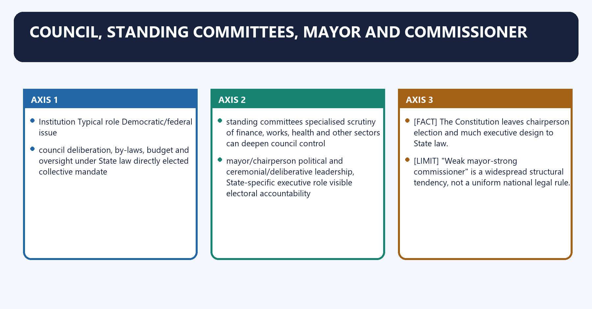
**Visual 27 - Institutional anatomy**

| Institution | Typical role | Democratic/federal issue |
|---|---|---|
| council | deliberation, by-laws, budget and oversight under State law | directly elected collective mandate |
| standing committees | specialised scrutiny of finance, works, health and other sectors | can deepen council control |
| mayor/chairperson | political and ceremonial/deliberative leadership, State-specific executive role | visible electoral accountability |
| municipal commissioner/chief officer | administration, implementation, staff and executive functions under State law | commonly State-appointed |

- [FACT] The Constitution leaves chairperson election and much executive design to State law.
- [ANALYSIS] Where the mayor is visible but lacks control over staff and implementation, citizens face a responsibility-authority mismatch.
- [LIMIT] "Weak mayor-strong commissioner" is a widespread structural tendency, not a uniform national legal rule.

#### CLOSING RECALL FLOW — COUNCIL, STANDING COMMITTEES, MAYOR AND COMMISSIONER

```closure-flow
SUBTOPIC: Council, standing committees, mayor and commissioner
KEY TERMS / DEFINITIONS: Council · standing committees · mayor · commissioner · deliberation, by-laws, budget and oversight under State law · directly elected collective mandate
MECHANISM / ARGUMENT: Council, standing committees, mayor and commissioner operates through council deliberation, by-laws, budget and oversight under State law directly elected collective mandate, connected with standing committees specialised scrutiny of finance, works, health and other sectors can deepen council control.
CONSEQUENCE / CONTRAST: The decisive contrast is between "Weak mayor-strong commissioner" is a widespread structural tendency, not a uniform national legal rule and Institution Typical role Democratic/federal issue.
UPSC TRAP / ANSWER-USE: "Weak mayor-strong commissioner" is a widespread structural tendency, not a uniform national legal rule.
ANSWER-GRABBING FORMULATION: Where the mayor is visible but lacks control over staff and implementation, citizens face a responsibility-authority mismatch.
```
### SESSION 28 — MAYOR-COMMISSIONER DESIGN DEBATE
#### DEFINITION / WHAT THIS IS CALLED

**Plain-language definition:** Mayor-commissioner design debate denotes the constitutional rules and institutional links organised around Design question Democratic value Administrative value Risk.

**Technical definition:** The decisive contrast is between Design question Democratic value Administrative value Risk and Design question Democratic value Administrative value Risk.

#### ANSWER-GRABBING OPENING — WRITE/ADAPT IN THE EXAM

> The correct reform question is not simply "directly elected mayor: yes or no?" It is whether mandate, tenure, budget, staff control, council oversight and removal rules form a coherent executive design.

#### MUST-WRITE KEYWORDS

- **Mayor-commissioner design debate**
- **direct or indirect mayor**
- **mandate clarity**
- **coalition compatibility**
- **personalisation or instability**
- **short or co-terminous tenure**

**How to use them:** Frame the answer through Mayor-commissioner design debate; define direct or indirect mayor, connect mandate clarity with coalition compatibility to explain the mechanism, and use personalisation or instability for the decisive comparison or qualification.

Mayor-commissioner design debate denotes the constitutional rules and institutional links organised around Design question Democratic value Administrative value Risk.
Mayor-commissioner design debate operates through direct or indirect mayor mandate clarity coalition compatibility personalisation or instability, connected with short or co-terminous tenure rotation/inclusion continuity weak long-term planning.
The operative mechanism matters because control over commissioner/staff accountability alignment professional autonomy politicisation or bureaucratic dominance.
Its principal consequence is that council committee strength collective scrutiny sector expertise diffusion of responsibility.
The decisive contrast is between Design question Democratic value Administrative value Risk and Design question Democratic value Administrative value Risk.
The exam-safe limitation is that design question Democratic value Administrative value Risk.
**Visual 28 - Four design choices**

| Design question | Democratic value | Administrative value | Risk |
|---|---|---|---|
| direct or indirect mayor | mandate clarity | coalition compatibility | personalisation or instability |
| short or co-terminous tenure | rotation/inclusion | continuity | weak long-term planning |
| control over commissioner/staff | accountability alignment | professional autonomy | politicisation or bureaucratic dominance |
| council committee strength | collective scrutiny | sector expertise | diffusion of responsibility |

- [ANALYSIS] The correct reform question is not simply "directly elected mayor: yes or no?" It is whether mandate, tenure, budget, staff control, council oversight and removal rules form a coherent executive design.
- [LIMIT] A strong mayor without transparent council checks can centralise power; a professional commissioner without electoral control can weaken self-government.

#### CLOSING RECALL FLOW — MAYOR-COMMISSIONER DESIGN DEBATE

```closure-flow
SUBTOPIC: Mayor-commissioner design debate
KEY TERMS / DEFINITIONS: Mayor-commissioner design debate · direct or indirect mayor · mandate clarity · coalition compatibility · personalisation or instability · short or co-terminous tenure
MECHANISM / ARGUMENT: The decisive contrast is between Design question Democratic value Administrative value Risk and Design question Democratic value Administrative value Risk.
CONSEQUENCE / CONTRAST: The correct reform question is not simply "directly elected mayor: yes or no?" It is whether mandate, tenure, budget, staff control, council oversight and removal rules form a coherent executive design.
UPSC TRAP / ANSWER-USE: Do not miss this limiting distinction: its principal consequence is that council committee strength collective scrutiny sector expertise diffusion of...
ANSWER-GRABBING FORMULATION: The correct reform question is not simply "directly elected mayor: yes or no?" It is whether mandate, tenure, budget, staff control, council oversight and removal rules form a coherent executive design.
```
### SESSION 29 — PARASTATALS AND FRAGMENTED AUTHORITY
#### DEFINITION / WHAT THIS IS CALLED

**Plain-language definition:** Parastatals and fragmented authority denotes the constitutional rules and institutional links organised around Municipality ---- waste, local roads, lighting.

**Technical definition:** Parastatals and fragmented authority operates through Water board ----- bulk water / sewerage, connected with Development authority ----- land use and major layouts.

#### ANSWER-GRABBING OPENING — WRITE/ADAPT IN THE EXAM

> Their cost is fragmented budgets, overlapping mandates and upward rather than electoral accountability.

#### MUST-WRITE KEYWORDS

- **Parastatals**
- **fragmented authority**
- **Parastatals and fragmented authority**
- **Municipality**
- **Water**
- **Development**

**How to use them:** Frame the answer through Parastatals; define fragmented authority, connect Parastatals and fragmented authority with Municipality to explain the mechanism, and use Water for the decisive comparison or qualification.

Parastatals and fragmented authority denotes the constitutional rules and institutional links organised around Municipality ---- waste, local roads, lighting.
Parastatals and fragmented authority operates through Water board ----- bulk water / sewerage, connected with Development authority ----- land use and major layouts.
The operative mechanism matters because transport agency ----- metropolitan mobility.
Its principal consequence is that housing/slum agency ----- housing programmes.
The decisive contrast is between State department ----- policy, staff, approvals and Citizen sees ONE city; government operates MANY vertical silos.
The exam-safe limitation is that [ANALYSIS] Parastatals may provide scale, specialised engineering and regional coordination.
**Visual 29 - The fragmented city**

```text
Municipality ---- waste, local roads, lighting
Water board ----- bulk water / sewerage
Development authority ----- land use and major layouts
Transport agency ----- metropolitan mobility
Housing/slum agency ----- housing programmes
State department ----- policy, staff, approvals

Citizen sees ONE city; government operates MANY vertical silos.
```

- [ANALYSIS] Parastatals may provide scale, specialised engineering and regional coordination.
- [ANALYSIS] Their cost is fragmented budgets, overlapping mandates and upward rather than electoral accountability.
- [LIMIT] The answer is not automatic abolition. Use clear activity mapping, service agreements, shared data, elected-plan alignment and measurable accountability.

#### CLOSING RECALL FLOW — PARASTATALS AND FRAGMENTED AUTHORITY

```closure-flow
SUBTOPIC: Parastatals and fragmented authority
KEY TERMS / DEFINITIONS: Parastatals · fragmented authority · Parastatals and fragmented authority · Municipality · Water · Development
MECHANISM / ARGUMENT: Parastatals and fragmented authority operates through Water board ----- bulk water / sewerage, connected with Development authority ----- land use and major layouts.
CONSEQUENCE / CONTRAST: Its principal consequence is that housing/slum agency ----- housing programmes.
UPSC TRAP / ANSWER-USE: Do not miss this limiting distinction: the decisive contrast is between State department ----- policy, staff, approvals and Citizen sees...
ANSWER-GRABBING FORMULATION: Their cost is fragmented budgets, overlapping mandates and upward rather than electoral accountability.
```
### SESSION 30 — MISSION SPVS AND ELECTED MUNICIPALITIES
#### DEFINITION / WHAT THIS IS CALLED

**Plain-language definition:** Mission SPVs and elected municipalities denotes the constitutional rules and institutional links organised around Mission-mode SPV advantage Constitutional-governance risk Reconciliation.

**Technical definition:** The decisive contrast is between Smart Cities Mission used city-level Special Purpose Vehicles as implementation vehicles and An SPV can build infrastructure without transferring constitutional authority to the municipality.

#### ANSWER-GRABBING OPENING — WRITE/ADAPT IN THE EXAM

> SPVs differ from statutory parastatals; both may fragment answerability, but their legal forms and mandates are not identical.

#### MUST-WRITE KEYWORDS

- **Mission SPVs**
- **elected municipalities**
- **focused project management**
- **council bypass**
- **council-approved plan and reporting**
- **professional procurement**

**How to use them:** Frame the answer through Mission SPVs; define elected municipalities, connect focused project management with council bypass to explain the mechanism, and use council-approved plan and reporting for the decisive comparison or qualification.

Mission SPVs and elected municipalities denotes the constitutional rules and institutional links organised around Mission-mode SPV advantage Constitutional-governance risk Reconciliation.
Mission SPVs and elected municipalities operates through focused project management council bypass council-approved plan and reporting, connected with professional procurement parallel staff/data integrate municipal systems.
The operative mechanism matters because ring-fenced finance enclave development city-wide equity criteria.
Its principal consequence is that faster implementation weak long-term ownership transfer assets/O&M capacity clearly.
The decisive contrast is between [FACT] Smart Cities Mission used city-level Special Purpose Vehicles as implementation vehicles and [ANALYSIS] An SPV can build infrastructure without transferring constitutional authority to the municipality.
The exam-safe limitation is that [LIMIT] SPVs differ from statutory parastatals; both may fragment answerability, but their legal forms and mandates are not identical.
**Visual 30 - SPV trade-off**

| Mission-mode SPV advantage | Constitutional-governance risk | Reconciliation |
|---|---|---|
| focused project management | council bypass | council-approved plan and reporting |
| professional procurement | parallel staff/data | integrate municipal systems |
| ring-fenced finance | enclave development | city-wide equity criteria |
| faster implementation | weak long-term ownership | transfer assets/O&M capacity clearly |

- [FACT] Smart Cities Mission used city-level Special Purpose Vehicles as implementation vehicles.
- [ANALYSIS] An SPV can build infrastructure without transferring constitutional authority to the municipality.
- [LIMIT] SPVs differ from statutory parastatals; both may fragment answerability, but their legal forms and mandates are not identical.

#### CLOSING RECALL FLOW — MISSION SPVS AND ELECTED MUNICIPALITIES

```closure-flow
SUBTOPIC: Mission SPVs and elected municipalities
KEY TERMS / DEFINITIONS: Mission SPVs · elected municipalities · focused project management · council bypass · council-approved plan and reporting · professional procurement
MECHANISM / ARGUMENT: The decisive contrast is between Smart Cities Mission used city-level Special Purpose Vehicles as implementation vehicles and An SPV can build infrastructure without transferring constitutional authority to the municipality.
CONSEQUENCE / CONTRAST: The exam-safe limitation is that SPVs differ from statutory parastatals; both may fragment answerability, but their legal forms and mandates are not identical.
UPSC TRAP / ANSWER-USE: SPVs differ from statutory parastatals; both may fragment answerability, but their legal forms and mandates are not identical.
ANSWER-GRABBING FORMULATION: SPVs differ from statutory parastatals; both may fragment answerability, but their legal forms and mandates are not identical.
```
### SESSION 31 — DISTRICT PLANNING COMMITTEE UNDER ARTICLE 243ZD
#### DEFINITION / WHAT THIS IS CALLED

**Plain-language definition:** District Planning Committee under Article 243ZD denotes the constitutional rules and institutional links organised around Panchayat plans ----\.

**Technical definition:** The DPC is the constitutional bridge between rural and urban planning in one district.

#### ANSWER-GRABBING OPENING — WRITE/ADAPT IN THE EXAM

> Article 243ZD makes the District Planning Committee a rural-urban planning bridge, but effective integration depends on reconciling local plans, resources and infrastructure priorities.

#### MUST-WRITE KEYWORDS

- **District Planning Committee under Article 243ZD**
- **four-fifths**
- **District Planning Committee**
- **Article**
- **Panchayat**
- **Its principal consequence**

**How to use them:** Frame the answer through District Planning Committee under Article 243ZD; define four-fifths, connect District Planning Committee with Article to explain the mechanism, and use Panchayat for the decisive comparison or qualification.

District Planning Committee under Article 243ZD denotes the constitutional rules and institutional links organised around Panchayat plans ----\.
District Planning Committee under Article 243ZD operates through DPC consolidates -- draft district development plan, connected with Municipal plans ----/.
The operative mechanism matters because common spatial interests.
Its principal consequence is that shared water/resources.
The decisive contrast is between integrated infrastructure and environmental conservation.
The exam-safe limitation is that available resources.
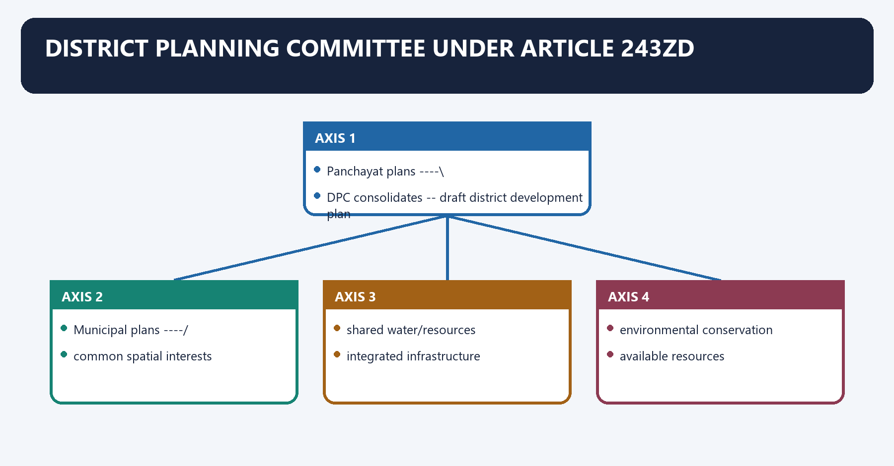
**Visual 31 - DPC planning flow**

```text
Panchayat plans ----\
                     +--> DPC consolidates --> draft district development plan
Municipal plans ----/          |
                                +--> common spatial interests
                                +--> shared water/resources
                                +--> integrated infrastructure
                                +--> environmental conservation
                                +--> available resources
                                            |
                                            v
                                  forwarded to State Government
```

- [FACT] Every State must constitute a DPC at district level.
- [FACT] At least **four-fifths** of members are elected by and from elected district-Panchayat and municipal members, proportional to rural and urban populations.
- [FACT] State law determines composition details, election, functions and chairperson selection within constitutional requirements.
- [ANALYSIS] The DPC is the constitutional bridge between rural and urban planning in one district.

#### CLOSING RECALL FLOW — DISTRICT PLANNING COMMITTEE UNDER ARTICLE 243ZD

```closure-flow
SUBTOPIC: District Planning Committee under Article 243ZD
KEY TERMS / DEFINITIONS: District Planning Committee under Article 243ZD · four-fifths · District Planning Committee · Article · Panchayat · Its principal consequence
MECHANISM / ARGUMENT: At least four-fifths of members are elected by and from elected district-Panchayat and municipal members, proportional to rural and urban populations.
CONSEQUENCE / CONTRAST: The decisive contrast is between integrated infrastructure and environmental conservation.
UPSC TRAP / ANSWER-USE: Do not miss this limiting distinction: its principal consequence is that shared water/resources.
ANSWER-GRABBING FORMULATION: Article 243ZD makes the District Planning Committee a rural-urban planning bridge, but effective integration depends on reconciling local plans, resources and infrastructure priorities.
```
### SESSION 32 — METROPOLITAN PLANNING COMMITTEE UNDER ARTICLE 243ZE
#### DEFINITION / WHAT THIS IS CALLED

**Plain-language definition:** Metropolitan Planning Committee under Article 243ZE denotes the constitutional rules and institutional links organised around municipal plans + panchayat plans.

**Technical definition:** At least two-thirds of members are elected by and from elected municipal members and Panchayat chairpersons, proportional to their populations in the metropolitan area.

#### ANSWER-GRABBING OPENING — WRITE/ADAPT IN THE EXAM

> Constitutional creation does not ensure primacy over development authorities, transport bodies or State investment decisions.

#### MUST-WRITE KEYWORDS

- **Metropolitan Planning Committee under Article 243ZE**
- **two-thirds**
- **Metropolitan Planning Committee**
- **Article**
- **Its principal consequence**
- **Its**

**How to use them:** Frame the answer through Metropolitan Planning Committee under Article 243ZE; define two-thirds, connect Metropolitan Planning Committee with Article to explain the mechanism, and use Its principal consequence for the decisive comparison or qualification.

Metropolitan Planning Committee under Article 243ZE denotes the constitutional rules and institutional links organised around municipal plans + panchayat plans.
Metropolitan Planning Committee under Article 243ZE operates through METROPOLITAN PLANNING COMMITTEE, connected with coordinated spatial planning.
The operative mechanism matters because shared water and natural resources.
Its principal consequence is that integrated infrastructure.
The decisive contrast is between environmental conservation and Union/State objectives and priorities.
The exam-safe limitation is that investments by public agencies.
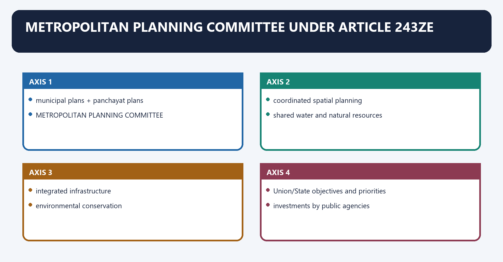
**Visual 32 - MPC city-region flow**

```text
municipal plans + panchayat plans
              |
              v
METROPOLITAN PLANNING COMMITTEE
              |
              +--> coordinated spatial planning
              +--> shared water and natural resources
              +--> integrated infrastructure
              +--> environmental conservation
              +--> Union/State objectives and priorities
              +--> investments by public agencies
              |
              v
draft metropolitan development plan -> State Government
```

- [FACT] Every metropolitan area must have an MPC.
- [FACT] At least **two-thirds** of members are elected by and from elected municipal members and Panchayat chairpersons, proportional to their populations in the metropolitan area.
- [ANALYSIS] The MPC is designed for the functional city region, not merely the core municipal corporation.
- [LIMIT] Constitutional creation does not ensure primacy over development authorities, transport bodies or State investment decisions.

#### CLOSING RECALL FLOW — METROPOLITAN PLANNING COMMITTEE UNDER ARTICLE 243ZE

```closure-flow
SUBTOPIC: Metropolitan Planning Committee under Article 243ZE
KEY TERMS / DEFINITIONS: Metropolitan Planning Committee under Article 243ZE · two-thirds · Metropolitan Planning Committee · Article · Its principal consequence · Its
MECHANISM / ARGUMENT: At least two-thirds of members are elected by and from elected municipal members and Panchayat chairpersons, proportional to their populations in the metropolitan area.
CONSEQUENCE / CONTRAST: Its principal consequence is that integrated infrastructure.
UPSC TRAP / ANSWER-USE: Do not miss this limiting distinction: the decisive contrast is between environmental conservation and Union/State objectives and priorities.
ANSWER-GRABBING FORMULATION: Constitutional creation does not ensure primacy over development authorities, transport bodies or State investment decisions.
```
### SESSION 33 — DPC AND MPC COMPARED
#### DEFINITION / WHAT THIS IS CALLED

**Plain-language definition:** DPC and MPC compared denotes the constitutional rules and institutional links organised around Feature DPC - Article 243ZD MPC - Article 243ZE.

**Technical definition:** The exam-safe limitation is that mnemonic: District gets the larger elected fraction: DPC 4/5; Metropolitan MPC 2/3.

#### ANSWER-GRABBING OPENING — WRITE/ADAPT IN THE EXAM

> DPCs and MPCs both integrate territorial planning, but their elected fractions differ: four-fifths for DPCs and two-thirds for MPCs.

#### MUST-WRITE KEYWORDS

- **DPC**
- **MPC compared**
- **Mnemonic**
- **territorial unit**
- **4/5**
- **2/3**

**How to use them:** Frame the answer through DPC; define MPC compared, connect Mnemonic with territorial unit to explain the mechanism, and use 4/5 for the decisive comparison or qualification.

DPC and MPC compared denotes the constitutional rules and institutional links organised around Feature DPC - Article 243ZD MPC - Article 243ZE.
DPC and MPC compared operates through territorial unit district metropolitan area, connected with elected floor 4/5 2/3.
The operative mechanism matters because elected by/from district Panchayat + municipal elected members municipal elected members + Panchayat chairpersons.
Its principal consequence is that representation ratio rural:urban population municipality:Panchayat population.
The decisive contrast is between plan draft district development plan draft metropolitan development plan and distinctive inputs common district interests/resources Union/State priorities and agency investments.
The exam-safe limitation is that mnemonic: District gets the larger elected fraction: DPC 4/5; Metropolitan MPC 2/3.
**Visual 33 - Do not swap the fractions**

| Feature | DPC - Article 243ZD | MPC - Article 243ZE |
|---|---|---|
| territorial unit | district | metropolitan area |
| elected floor | **4/5** | **2/3** |
| elected by/from | district Panchayat + municipal elected members | municipal elected members + Panchayat chairpersons |
| representation ratio | rural:urban population | municipality:Panchayat population |
| plan | draft district development plan | draft metropolitan development plan |
| distinctive inputs | common district interests/resources | Union/State priorities and agency investments |

> **Mnemonic:** District gets the larger elected fraction: DPC 4/5; Metropolitan MPC 2/3.

#### CLOSING RECALL FLOW — DPC AND MPC COMPARED

```closure-flow
SUBTOPIC: DPC and MPC compared
KEY TERMS / DEFINITIONS: DPC · MPC compared · Mnemonic · territorial unit · 4/5 · 2/3
MECHANISM / ARGUMENT: The exam-safe limitation is that mnemonic: District gets the larger elected fraction: DPC 4/5; Metropolitan MPC 2/3.
CONSEQUENCE / CONTRAST: Its principal consequence is that representation ratio rural:urban population municipality:Panchayat population.
UPSC TRAP / ANSWER-USE: Do not miss this limiting distinction: the decisive contrast is between plan draft district development plan draft metropolitan development plan...
ANSWER-GRABBING FORMULATION: DPCs and MPCs both integrate territorial planning, but their elected fractions differ: four-fifths for DPCs and two-thirds for MPCs.
```
### SESSION 34 — METROPOLITAN GOVERNANCE
#### DEFINITION / WHAT THIS IS CALLED

**Plain-language definition:** Metropolitan governance denotes the constitutional rules and institutional links organised around administrative boundary: [Municipality A] [Municipality B] [Panchayat fringe].

**Technical definition:** Metropolitan governance requires both subsidiarity and scale: neighbourhood services should stay close to residents, while transport, watersheds, air quality, drainage and regional land use require area-wide coordination.

#### ANSWER-GRABBING OPENING — WRITE/ADAPT IN THE EXAM

> Metropolitan governance requires both subsidiarity and scale: neighbourhood services should stay close to residents, while transport, watersheds, air quality, drainage and regional land use require area-wide coordination.

#### MUST-WRITE KEYWORDS

- **Metropolitan governance**
- **Metropolitan**
- **Municipality**
- **Panchayat**
- **Its principal consequence**
- **Its**

**How to use them:** Frame the answer through Metropolitan governance; define Metropolitan, connect Municipality with Panchayat to explain the mechanism, and use Its principal consequence for the decisive comparison or qualification.

Metropolitan governance denotes the constitutional rules and institutional links organised around administrative boundary: [Municipality A] [Municipality B] [Panchayat fringe].
Metropolitan governance operates through functional urban region: [------ housing-jobs-transport-water-air shed ------], connected with Boundary-limited government + region-wide problems = coordination deficit.
The operative mechanism matters because administrative boundary: [Municipality A] [Municipality B] [Panchayat fringe].
Its principal consequence is that administrative boundary: [Municipality A] [Municipality B] [Panchayat fringe].
The decisive contrast is between administrative boundary: [Municipality A] [Municipality B] [Panchayat fringe] and administrative boundary: [Municipality A] [Municipality B] [Panchayat fringe].
The exam-safe limitation is that administrative boundary: [Municipality A] [Municipality B] [Panchayat fringe].
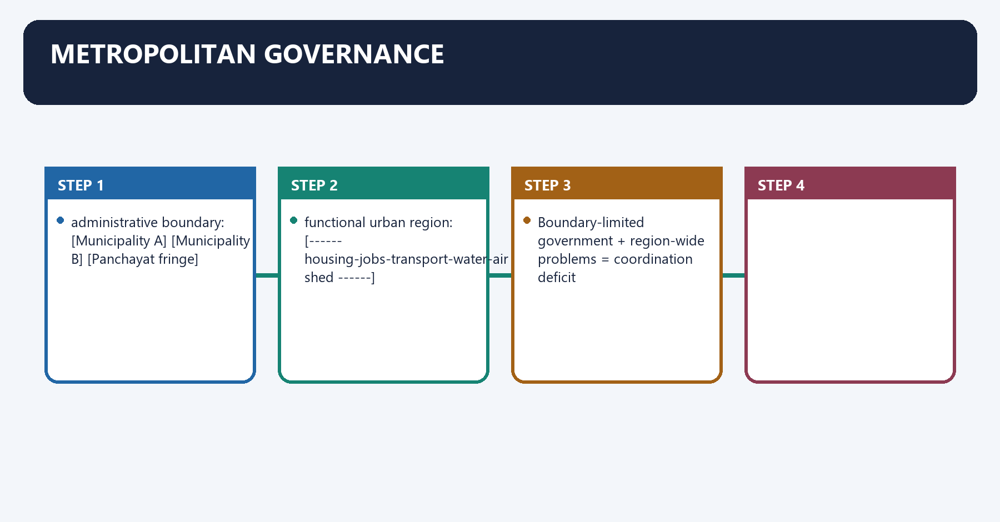
**Visual 34 - City-region mismatch**

```text
administrative boundary:  [Municipality A] [Municipality B] [Panchayat fringe]
functional urban region:  [------ housing-jobs-transport-water-air shed ------]

Boundary-limited government + region-wide problems = coordination deficit
```

- [ANALYSIS] Metropolitan governance requires both subsidiarity and scale: neighbourhood services should stay close to residents, while transport, watersheds, air quality, drainage and regional land use require area-wide coordination.
- [ANALYSIS] The MPC should provide democratic coordination; a purely bureaucratic regional authority may coordinate technically without supplying representative planning.

#### CLOSING RECALL FLOW — METROPOLITAN GOVERNANCE

```closure-flow
SUBTOPIC: Metropolitan governance
KEY TERMS / DEFINITIONS: Metropolitan governance · Metropolitan · Municipality · Panchayat · Its principal consequence · Its
MECHANISM / ARGUMENT: Metropolitan governance requires both subsidiarity and scale: neighbourhood services should stay close to residents, while transport, watersheds, air quality, drainage and regional land use require area-wide coordination.
CONSEQUENCE / CONTRAST: Its principal consequence is that administrative boundary: [Municipality A] [Municipality B] [Panchayat fringe].
UPSC TRAP / ANSWER-USE: Do not miss this limiting distinction: the decisive contrast is between administrative boundary.
ANSWER-GRABBING FORMULATION: Metropolitan governance requires both subsidiarity and scale: neighbourhood services should stay close to residents, while transport, watersheds, air quality, drainage and regional land use require area-wide coordination.
```
### SESSION 35 — PERI-URBAN AND CENSUS-TOWN TRANSITION
#### DEFINITION / WHAT THIS IS CALLED

**Plain-language definition:** Peri-urban and census-town transition denotes the constitutional rules and institutional links organised around rural administration.

**Technical definition:** A census town is statistically urban under census criteria but may lack a statutory urban local body. [CURRENT] The Sixteenth Finance Commission calls for timely, rule-based urban identification, a phased rural-to-urban transition framework, capacity building and record transfer. [CURRENT] It recommends an urbanisation-premium route for qualifying peri-urban merger into an adjoining ULB, subject to a State transition policy.

#### ANSWER-GRABBING OPENING — WRITE/ADAPT IN THE EXAM

> Peri-urban transition requires deliberate incorporation or merger policy because census classification alone does not create municipal self-government.

#### MUST-WRITE KEYWORDS

- **Peri-urban**
- **census-town transition**
- **Peri-urban and census-town transition**
- **Its principal consequence**
- **Its**
- **Panchayat**

**How to use them:** Frame the answer through Peri-urban; define census-town transition, connect Peri-urban and census-town transition with Its principal consequence to explain the mechanism, and use Its for the decisive comparison or qualification.

Peri-urban and census-town transition denotes the constitutional rules and institutional links organised around rural administration.
Peri-urban and census-town transition operates through density + non-farm work + contiguity + infrastructure demand rise, connected with census-town / peri-urban mismatch may emerge.
The operative mechanism matters because transparent State transition policy.
Its principal consequence is that nagar Panchayat, merger or other lawful urban classification.
The decisive contrast is between urban staff + taxes + services + representation + planning and [FACT] A census town is statistically urban under census criteria but may lack a statutory urban local body.
The exam-safe limitation is that [ANALYSIS] Delayed reclassification creates urban-scale demand under rural-scale finance and planning.
**Visual 35 - Settlement transition**

```text
rural administration
      |
density + non-farm work + contiguity + infrastructure demand rise
      |
census-town / peri-urban mismatch may emerge
      |
transparent State transition policy
      |
Nagar Panchayat, merger or other lawful urban classification
      |
urban staff + taxes + services + representation + planning
```

- [FACT] A census town is statistically urban under census criteria but may lack a statutory urban local body.
- [CURRENT] The Sixteenth Finance Commission calls for timely, rule-based urban identification, a phased rural-to-urban transition framework, capacity building and record transfer.
- [CURRENT] It recommends an urbanisation-premium route for qualifying peri-urban merger into an adjoining ULB, subject to a State transition policy.
- [ANALYSIS] Delayed reclassification creates urban-scale demand under rural-scale finance and planning.
- [LIMIT] Merger can dilute rural voice, alter taxes and remove the Gram Sabha forum; transition needs consultation, fiscal protection and service continuity.

#### CLOSING RECALL FLOW — PERI-URBAN AND CENSUS-TOWN TRANSITION

```closure-flow
SUBTOPIC: Peri-urban and census-town transition
KEY TERMS / DEFINITIONS: Peri-urban · census-town transition · Peri-urban and census-town transition · Its principal consequence · Its · Panchayat
MECHANISM / ARGUMENT: A census town is statistically urban under census criteria but may lack a statutory urban local body. [CURRENT] The Sixteenth Finance Commission calls for timely, rule-based urban identification, a phased rural-to-urban transition framework, capacity building and record transfer. [CURRENT] It recommends an urbanisation-premium route for qualifying peri-urban merger into an adjoining ULB, subject to a State transition policy.
CONSEQUENCE / CONTRAST: Its principal consequence is that nagar Panchayat, merger or other lawful urban classification.
UPSC TRAP / ANSWER-USE: The decisive contrast is between urban staff + taxes + services + representation + planning and A census town is statistically urban under census criteria but may lack a statutory urban local body.
ANSWER-GRABBING FORMULATION: Peri-urban transition requires deliberate incorporation or merger policy because census classification alone does not create municipal self-government.
```
### SESSION 36 — THREE EASILY CONFUSED URBAN FORMS
#### DEFINITION / WHAT THIS IS CALLED

**Plain-language definition:** Three easily confused urban forms denotes the constitutional rules and institutional links organised around Form What defines it Democratic status.

**Technical definition:** The decisive contrast is between Form What defines it Democratic status and Form What defines it Democratic status.

#### ANSWER-GRABBING OPENING — WRITE/ADAPT IN THE EXAM

> Nagar Panchayats, census towns and industrial townships answer different legal and statistical questions, so one classification cannot be inferred automatically from another.

#### MUST-WRITE KEYWORDS

- **Three easily confused urban forms**
- **Nagar Panchayat**
- **constitutional municipality for a transitional area**
- **elected ULB**
- **census town**
- **statistical urban classification**

**How to use them:** Frame the answer through Three easily confused urban forms; define Nagar Panchayat, connect constitutional municipality for a transitional area with elected ULB to explain the mechanism, and use census town for the decisive comparison or qualification.

Three easily confused urban forms denotes the constitutional rules and institutional links organised around Form What defines it Democratic status.
Three easily confused urban forms operates through Nagar Panchayat constitutional municipality for a transitional area elected ULB, connected with census town statistical urban classification may remain under rural administration.
The operative mechanism matters because [FACT] These categories answer different questions: constitutional body, census classification and municipal exception.
Its principal consequence is that [LIMIT] Do not infer that every industrial area is an industrial township or every census town is a Nagar Panchayat.
The decisive contrast is between Form What defines it Democratic status and Form What defines it Democratic status.
The exam-safe limitation is that form What defines it Democratic status.
**Visual 36 - Classification trap table**

| Form | What defines it | Democratic status |
|---|---|---|
| Nagar Panchayat | constitutional municipality for a transitional area | elected ULB |
| census town | statistical urban classification | may remain under rural administration |
| industrial township | Governor-specified Article 243Q exception where industrial establishment provides/proposes services | municipality need not be constituted |

- [FACT] These categories answer different questions: constitutional body, census classification and municipal exception.
- [LIMIT] Do not infer that every industrial area is an industrial township or every census town is a Nagar Panchayat.

#### CLOSING RECALL FLOW — THREE EASILY CONFUSED URBAN FORMS

```closure-flow
SUBTOPIC: Three easily confused urban forms
KEY TERMS / DEFINITIONS: Three easily confused urban forms · Nagar Panchayat · constitutional municipality for a transitional area · elected ULB · census town · statistical urban classification
MECHANISM / ARGUMENT: The decisive contrast is between Form What defines it Democratic status and Form What defines it Democratic status.
CONSEQUENCE / CONTRAST: Its principal consequence is that Do not infer that every industrial area is an industrial township or every census town is a Nagar Panchayat.
UPSC TRAP / ANSWER-USE: Do not infer that every industrial area is an industrial township or every census town is a Nagar Panchayat.
ANSWER-GRABBING FORMULATION: Nagar Panchayats, census towns and industrial townships answer different legal and statistical questions, so one classification cannot be inferred automatically from another.
```
### SESSION 37 — OTHER FORMS OF URBAN ADMINISTRATION
#### DEFINITION / WHAT THIS IS CALLED

**Plain-language definition:** Other forms of urban administration denotes the constitutional rules and institutional links organised around Form Broad character.

**Technical definition:** The decisive contrast is between Cantonment Board central law/Defence administration and Township service administration by an enterprise/establishment.

#### ANSWER-GRABBING OPENING — WRITE/ADAPT IN THE EXAM

> Urban administration mixes constitutional municipalities with central, specialist and State-created bodies, making functional identity more important than the generic label of urban local government.

#### MUST-WRITE KEYWORDS

- **Other forms of urban administration**
- **Municipal Corporation**
- **large-city municipal body**
- **Municipality/Municipal Council**
- **town/smaller-city body**
- **Notified Area Committee**

**How to use them:** Frame the answer through Other forms of urban administration; define Municipal Corporation, connect large-city municipal body with Municipality/Municipal Council to explain the mechanism, and use town/smaller-city body for the decisive comparison or qualification.

Other forms of urban administration denotes the constitutional rules and institutional links organised around Form Broad character.
Other forms of urban administration operates through Municipal Corporation large-city municipal body, connected with Municipality/Municipal Council town/smaller-city body.
The operative mechanism matters because notified Area Committee State-created administration for developing/other notified area; conventionally nominated.
Its principal consequence is that town Area Committee limited civic administration under State law.
The decisive contrast is between Cantonment Board central law/Defence administration and Township service administration by an enterprise/establishment.
The exam-safe limitation is that port Trust/port authority port-area specialist administration.
**Visual 37 - Eight conventional urban bodies**

| Form | Broad character |
|---|---|
| Municipal Corporation | large-city municipal body |
| Municipality/Municipal Council | town/smaller-city body |
| Notified Area Committee | State-created administration for developing/other notified area; conventionally nominated |
| Town Area Committee | limited civic administration under State law |
| Cantonment Board | central law/Defence administration |
| Township | service administration by an enterprise/establishment |
| Port Trust/port authority | port-area specialist administration |
| Special Purpose Agency | function-specific body |

- [LIMIT] Only the three Article 243Q categories form the core constitutional typology. The broader eight-form classification mixes municipal, central and specialist arrangements.
- [FACT] Cantonment administration is a Union/Defence domain, not an ordinary State municipality.

#### CLOSING RECALL FLOW — OTHER FORMS OF URBAN ADMINISTRATION

```closure-flow
SUBTOPIC: Other forms of urban administration
KEY TERMS / DEFINITIONS: Other forms of urban administration · Municipal Corporation · large-city municipal body · Municipality/Municipal Council · town/smaller-city body · Notified Area Committee
MECHANISM / ARGUMENT: The operative mechanism matters because notified Area Committee State-created administration for developing/other notified area; conventionally nominated.
CONSEQUENCE / CONTRAST: Its principal consequence is that town Area Committee limited civic administration under State law.
UPSC TRAP / ANSWER-USE: Do not miss this limiting distinction: the decisive contrast is between Cantonment Board central law/Defence administration and Township service administration...
ANSWER-GRABBING FORMULATION: Urban administration mixes constitutional municipalities with central, specialist and State-created bodies, making functional identity more important than the generic label of urban local government.
```
### SESSION 38 — SERVICE-DELIVERY CHAIN
#### DEFINITION / WHAT THIS IS CALLED

**Plain-language definition:** Service-delivery chain denotes the constitutional rules and institutional links organised around finance and procurement.

**Technical definition:** The decisive contrast is between Failure at any link can make a constitutionally elected municipality look ineffective and Service delivery improves when the citizen knows which body owns the standard, budget and remedy.

#### ANSWER-GRABBING OPENING — WRITE/ADAPT IN THE EXAM

> Municipal service delivery depends on an unbroken chain from mandate and finance to staff, execution and remedy, so failure at one link can defeat electoral accountability.

#### MUST-WRITE KEYWORDS

- **Service-delivery chain**
- **Service-delivery**
- **Its principal consequence**
- **Its**
- **The decisive contrast**
- **Failure**

**How to use them:** Frame the answer through Service-delivery chain; define Service-delivery, connect Its principal consequence with Its to explain the mechanism, and use The decisive contrast for the decisive comparison or qualification.

Service-delivery chain denotes the constitutional rules and institutional links organised around finance and procurement.
Service-delivery chain operates through staff/contractor execution, connected with service-level monitoring.
The operative mechanism matters because audit and grievance.
Its principal consequence is that council/citizen correction.
The decisive contrast is between [ANALYSIS] Failure at any link can make a constitutionally elected municipality look ineffective and [ANALYSIS] Service delivery improves when the citizen knows which body owns the standard, budget and remedy.
The exam-safe limitation is that finance and procurement.
**Visual 38 - From plan to service**

```text
citizen need
   -> ward evidence
   -> municipal plan
   -> council budget
   -> finance and procurement
   -> staff/contractor execution
   -> service-level monitoring
   -> audit and grievance
   -> council/citizen correction
```

- [ANALYSIS] Failure at any link can make a constitutionally elected municipality look ineffective.
- [ANALYSIS] Service delivery improves when the citizen knows which body owns the standard, budget and remedy.

#### CLOSING RECALL FLOW — SERVICE-DELIVERY CHAIN

```closure-flow
SUBTOPIC: Service-delivery chain
KEY TERMS / DEFINITIONS: Service-delivery chain · Service-delivery · Its principal consequence · Its · The decisive contrast · Failure
MECHANISM / ARGUMENT: The decisive contrast is between Failure at any link can make a constitutionally elected municipality look ineffective and Service delivery improves when the citizen knows which body owns the standard, budget and remedy.
CONSEQUENCE / CONTRAST: Its principal consequence is that council/citizen correction.
UPSC TRAP / ANSWER-USE: Do not miss this limiting distinction: failure at any link can make a constitutionally elected municipality look ineffective.
ANSWER-GRABBING FORMULATION: Municipal service delivery depends on an unbroken chain from mandate and finance to staff, execution and remedy, so failure at one link can defeat electoral accountability.
```
### SESSION 39 — DEMOCRATIC ACCOUNTABILITY ARCHITECTURE
#### DEFINITION / WHAT THIS IS CALLED

**Plain-language definition:** Democratic accountability architecture denotes the constitutional rules and institutional links organised around Downward to citizens Horizontal/internal Upward/intergovernmental.

**Technical definition:** Technically, Democratic accountability architecture is analysed by relating elections, wards, disclosure, grievance to council committees, audit, opposition scrutiny, then testing the relationship through strengthens self-government and restrains misuse.

#### ANSWER-GRABBING OPENING — WRITE/ADAPT IN THE EXAM

> Municipal autonomy without audit can produce capture; control without autonomy produces administration without self-government.

#### MUST-WRITE KEYWORDS

- **Democratic accountability architecture**
- **elections, wards, disclosure, grievance**
- **council committees, audit, opposition scrutiny**
- **strengthens self-government**
- **restrains misuse**
- **protects equity and coordination**

**How to use them:** Frame the answer through Democratic accountability architecture; define elections, wards, disclosure, grievance, connect council committees, audit, opposition scrutiny with strengthens self-government to explain the mechanism, and use restrains misuse for the decisive comparison or qualification.

Democratic accountability architecture denotes the constitutional rules and institutional links organised around Downward to citizens Horizontal/internal Upward/intergovernmental.
Democratic accountability architecture operates through elections, wards, disclosure, grievance council committees, audit, opposition scrutiny State law, grants, standards, regulator, connected with strengthens self-government restrains misuse protects equity and coordination.
The operative mechanism matters because risk: elite capture risk: weak records risk: bureaucratic domination.
Its principal consequence is that downward to citizens Horizontal/internal Upward/intergovernmental.
The decisive contrast is between Downward to citizens Horizontal/internal Upward/intergovernmental and Downward to citizens Horizontal/internal Upward/intergovernmental.
The exam-safe limitation is that downward to citizens Horizontal/internal Upward/intergovernmental.
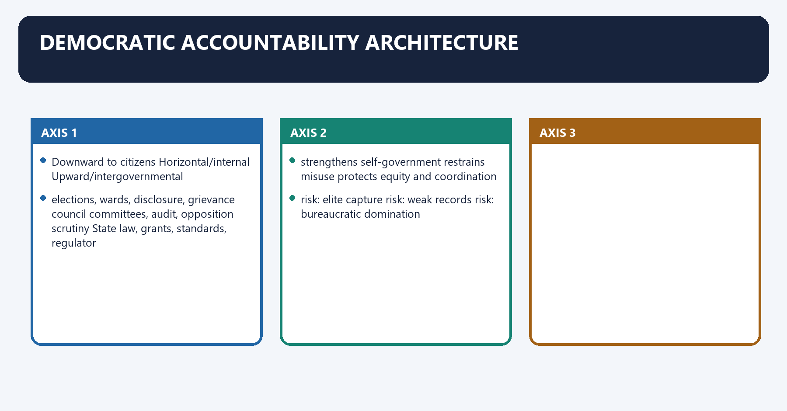
**Visual 39 - Upward and downward accountability**

| Downward to citizens | Horizontal/internal | Upward/intergovernmental |
|---|---|---|
| elections, wards, disclosure, grievance | council committees, audit, opposition scrutiny | State law, grants, standards, regulator |
| strengthens self-government | restrains misuse | protects equity and coordination |
| risk: elite capture | risk: weak records | risk: bureaucratic domination |

- [ANALYSIS] Municipal autonomy without audit can produce capture; control without autonomy produces administration without self-government.
- [LIMIT] Participation is not equivalent to decision authority. Ward consultation should have a clear route into plans, budgets and follow-up.

#### CLOSING RECALL FLOW — DEMOCRATIC ACCOUNTABILITY ARCHITECTURE

```closure-flow
SUBTOPIC: Democratic accountability architecture
KEY TERMS / DEFINITIONS: Democratic accountability architecture · elections, wards, disclosure, grievance · council committees, audit, opposition scrutiny · strengthens self-government · restrains misuse · protects equity and coordination
MECHANISM / ARGUMENT: The operative mechanism matters because risk: elite capture risk: weak records risk: bureaucratic domination.
CONSEQUENCE / CONTRAST: Its principal consequence is that downward to citizens Horizontal/internal Upward/intergovernmental.
UPSC TRAP / ANSWER-USE: Do not miss this limiting distinction: the decisive contrast is between Downward to citizens Horizontal/internal Upward/intergovernmental and Downward to citizens...
ANSWER-GRABBING FORMULATION: Municipal autonomy without audit can produce capture; control without autonomy produces administration without self-government.
```
### SESSION 40 — CURRENT REFORM ARCHITECTURE
#### DEFINITION / WHAT THIS IS CALLED

**Plain-language definition:** Current reform architecture denotes the constitutional rules and institutional links organised around duly constituted body.

**Technical definition:** [CURRENT] The official Sixteenth Finance Commission report recommends a 60:40 rural-urban division of aggregate local-body grants, reflecting projected urbanisation and higher urban service costs. [CURRENT] ULB inter-State allocation of basic plus performance components uses projected urban population with an own-source-revenue incentive component. [CURRENT] A ULB qualifies for its performance component in year T through the report's specified OSR-growth test based on T-1, T-2 and the 2025-26 base. [CURRENT] The State performance component is linked to State transfers from its own resources relative to the basic Finance Commission grant. [CURRENT] Half of the basic component is tied to sanitation/solid-waste and/or water management; the other half of basic and the performance component are untied subject to conditions.

#### ANSWER-GRABBING OPENING — WRITE/ADAPT IN THE EXAM

> Half of the basic component is tied to sanitation/solid-waste and/or water management; the other half of basic and the performance component are untied subject to conditions.

#### MUST-WRITE KEYWORDS

- **Current reform architecture**
- **Its principal consequence**
- **Its**
- **COMPONENT**
- **2025-26**
- **2026-31**

**How to use them:** Frame the answer through Current reform architecture; define Its principal consequence, connect Its with COMPONENT to explain the mechanism, and use 2025-26 for the decisive comparison or qualification.

Current reform architecture denotes the constitutional rules and institutional links organised around duly constituted body.
Current reform architecture operates through online provisional T-1 accounts, connected with online audited T-2 accounts.
The operative mechanism matters because timely SFC / ATR discipline.
Its principal consequence is that bASIC COMPONENT (80%).
The decisive contrast is between PERFORMANCE COMPONENT (20%) and ULB performance State performance.
The exam-safe limitation is that oSR growth condition State matching transfer condition.
**Visual 40 - XVI Finance Commission local-body grant design**

```text
ENTRY CONDITIONS
  duly constituted body
  + online provisional T-1 accounts
  + online audited T-2 accounts
  + timely SFC / ATR discipline
            |
            v
      BASIC COMPONENT (80%)
            +
      PERFORMANCE COMPONENT (20%)
       /                         \
ULB performance              State performance
OSR growth condition         State matching transfer condition
```

- [CURRENT] The official Sixteenth Finance Commission report recommends a 60:40 rural-urban division of aggregate local-body grants, reflecting projected urbanisation and higher urban service costs.
- [CURRENT] ULB inter-State allocation of basic plus performance components uses projected urban population with an own-source-revenue incentive component.
- [CURRENT] A ULB qualifies for its performance component in year T through the report's specified OSR-growth test based on T-1, T-2 and the 2025-26 base.
- [CURRENT] The State performance component is linked to State transfers from its own resources relative to the basic Finance Commission grant.
- [CURRENT] Half of the basic component is tied to sanitation/solid-waste and/or water management; the other half of basic and the performance component are untied subject to conditions.
- [LIMIT] These are dated recommendations for the 2026-31 award period. Operational implementation should be checked against current Ministry of Finance guidelines before quoting release status.

#### CLOSING RECALL FLOW — CURRENT REFORM ARCHITECTURE

```closure-flow
SUBTOPIC: Current reform architecture
KEY TERMS / DEFINITIONS: Current reform architecture · Its principal consequence · Its · COMPONENT · 2025-26 · 2026-31
MECHANISM / ARGUMENT: [CURRENT] The official Sixteenth Finance Commission report recommends a 60:40 rural-urban division of aggregate local-body grants, reflecting projected urbanisation and higher urban service costs. [CURRENT] ULB inter-State allocation of basic plus performance components uses projected urban population with an own-source-revenue incentive component. [CURRENT] A ULB qualifies for its performance component in year T through the report's specified OSR-growth test based on T-1, T-2 and the 2025-26 base. [CURRENT] The State performance component is linked to State transfers from its own resources relative to the basic Finance Commission grant. [CURRENT] Half of the basic component is tied to sanitation/solid-waste and/or water management; the other half of basic and the performance component are untied subject to conditions.
CONSEQUENCE / CONTRAST: Its principal consequence is that bASIC COMPONENT (80%).
UPSC TRAP / ANSWER-USE: Do not miss this limiting distinction: the decisive contrast is between PERFORMANCE COMPONENT (20%) and ULB performance State performance.
ANSWER-GRABBING FORMULATION: Half of the basic component is tied to sanitation/solid-waste and/or water management; the other half of basic and the performance component are untied subject to conditions.
```
### SESSION 41 — AMRUT 2.0 THROUGH A CONSTITUTIONAL LENS
#### DEFINITION / WHAT THIS IS CALLED

**Plain-language definition:** AMRUT 2.0 through a constitutional lens denotes the constitutional rules and institutional links organised around AMRUT 2.0 reform Municipal capability strengthened Constitutional caution.

**Technical definition:** [CURRENT] AMRUT 2.0 was launched on 1 October 2021 and its official guidelines use outcome-linked funding and a reform agenda for ULB financial sustainability and water security.

#### ANSWER-GRABBING OPENING — WRITE/ADAPT IN THE EXAM

> Mission conditionalities can build municipal capacity, but scheme compliance should reinforce rather than replace elected municipal planning.

#### MUST-WRITE KEYWORDS

- **AMRUT 2.0 through a constitutional lens**
- **property-tax reform**
- **own revenue**
- **user charges**
- **O&M sustainability**
- **affordability and service standards matter**

**How to use them:** Frame the answer through AMRUT 2.0 through a constitutional lens; define property-tax reform, connect own revenue with user charges to explain the mechanism, and use O&M sustainability for the decisive comparison or qualification.

AMRUT 2.0 through a constitutional lens denotes the constitutional rules and institutional links organised around AMRUT 2.0 reform Municipal capability strengthened Constitutional caution.
AMRUT 2.0 through a constitutional lens operates through property-tax reform own revenue State notification and local administration still matter, connected with user charges O&M sustainability affordability and service standards matter.
The operative mechanism matters because gIS mapping/master plans records and planning elected-plan control is not automatic.
Its principal consequence is that online municipal services citizen interface digital access and grievance quality matter.
The decisive contrast is between double-entry accounting transparency/creditworthiness entries must be reliable and audited and credit rating/bonds capital finance market access is selective and debt-bearing.
The exam-safe limitation is that water-security projects service infrastructure scheme assets need municipal O&M authority.
**Visual 41 - Mission reform versus devolution**

| AMRUT 2.0 reform | Municipal capability strengthened | Constitutional caution |
|---|---|---|
| property-tax reform | own revenue | State notification and local administration still matter |
| user charges | O&M sustainability | affordability and service standards matter |
| GIS mapping/master plans | records and planning | elected-plan control is not automatic |
| online municipal services | citizen interface | digital access and grievance quality matter |
| double-entry accounting | transparency/creditworthiness | entries must be reliable and audited |
| credit rating/bonds | capital finance | market access is selective and debt-bearing |
| water-security projects | service infrastructure | scheme assets need municipal O&M authority |

- [CURRENT] AMRUT 2.0 was launched on 1 October 2021 and its official guidelines use outcome-linked funding and a reform agenda for ULB financial sustainability and water security.
- [ANALYSIS] Mission conditionalities can build municipal capacity, but scheme compliance should reinforce rather than replace elected municipal planning.

#### CLOSING RECALL FLOW — AMRUT 2.0 THROUGH A CONSTITUTIONAL LENS

```closure-flow
SUBTOPIC: AMRUT 2.0 through a constitutional lens
KEY TERMS / DEFINITIONS: AMRUT 2.0 through a constitutional lens · property-tax reform · own revenue · user charges · O&M sustainability · affordability and service standards matter
MECHANISM / ARGUMENT: The operative mechanism matters because gIS mapping/master plans records and planning elected-plan control is not automatic.
CONSEQUENCE / CONTRAST: Its principal consequence is that online municipal services citizen interface digital access and grievance quality matter.
UPSC TRAP / ANSWER-USE: Do not miss this limiting distinction: the decisive contrast is between double-entry accounting transparency/creditworthiness entries must be reliable and audited...
ANSWER-GRABBING FORMULATION: Mission conditionalities can build municipal capacity, but scheme compliance should reinforce rather than replace elected municipal planning.
```
### SESSION 42 — REFORM PRIORITIES: FROM STATUS TO SELF-GOVERNMENT
#### DEFINITION / WHAT THIS IS CALLED

**Plain-language definition:** Reform priorities: from status to self-government denotes the constitutional rules and institutional links organised around map every Twelfth Schedule activity.

**Technical definition:** Reform must preserve State-wide standards, redistribution and metropolitan coordination while increasing local decision space.

#### ANSWER-GRABBING OPENING — WRITE/ADAPT IN THE EXAM

> Reform must preserve State-wide standards, redistribution and metropolitan coordination while increasing local decision space.

#### MUST-WRITE KEYWORDS

- **Reform priorities**
- **from status to self-government**
- **Reform priorities: from status to self-government**
- **Reform**
- **Twelfth Schedule**
- **Its principal consequence**

**How to use them:** Frame the answer through Reform priorities; define from status to self-government, connect Reform priorities: from status to self-government with Reform to explain the mechanism, and use Twelfth Schedule for the decisive comparison or qualification.

Reform priorities: from status to self-government denotes the constitutional rules and institutional links organised around map every Twelfth Schedule activity.
Reform priorities: from status to self-government operates through assign budgets, staff, assets and data, connected with empower ward and council scrutiny.
The operative mechanism matters because operationalise DPC/MPC planning.
Its principal consequence is that modernise property tax and fair user charges.
The decisive contrast is between implement SFC and predictable State transfers and integrate parastatals/SPVs through accountable agreements.
The exam-safe limitation is that professionalise cadres, accounts, audit and procurement.
**Visual 42 - Sequenced reform ladder**

```text
1. map every Twelfth Schedule activity
2. assign budgets, staff, assets and data
3. empower ward and council scrutiny
4. operationalise DPC/MPC planning
5. modernise property tax and fair user charges
6. implement SFC and predictable State transfers
7. integrate parastatals/SPVs through accountable agreements
8. professionalise cadres, accounts, audit and procurement
9. measure services and citizen outcomes
```

- [ANALYSIS] The sequence aligns authority, capacity and accountability rather than treating a single reform - mayoral election, bond issuance or digitisation - as a cure-all.
- [LIMIT] Reform must preserve State-wide standards, redistribution and metropolitan coordination while increasing local decision space.

#### CLOSING RECALL FLOW — REFORM PRIORITIES: FROM STATUS TO SELF-GOVERNMENT

```closure-flow
SUBTOPIC: Reform priorities: from status to self-government
KEY TERMS / DEFINITIONS: Reform priorities · from status to self-government · Reform priorities: from status to self-government · Reform · Twelfth Schedule · Its principal consequence
MECHANISM / ARGUMENT: The decisive contrast is between implement SFC and predictable State transfers and integrate parastatals/SPVs through accountable agreements.
CONSEQUENCE / CONTRAST: Reform must preserve State-wide standards, redistribution and metropolitan coordination while increasing local decision space.
UPSC TRAP / ANSWER-USE: Do not miss this limiting distinction: its principal consequence is that modernise property tax and fair user charges.
ANSWER-GRABBING FORMULATION: Reform must preserve State-wide standards, redistribution and metropolitan coordination while increasing local decision space.
```
### SESSION 43 — HIGH-YIELD DEBATES
#### DEFINITION / WHAT THIS IS CALLED

**Plain-language definition:** High-yield debates denotes the constitutional rules and institutional links organised around Debate Strong case Counter-case Balanced verdict.

**Technical definition:** The exam-safe limitation is that debate Strong case Counter-case Balanced verdict.

#### ANSWER-GRABBING OPENING — WRITE/ADAPT IN THE EXAM

> Urban reform choices such as direct mayors, municipal bonds and rural-urban mergers can improve accountability or coordination, but each requires safeguards tailored to its institutional risks.

#### MUST-WRITE KEYWORDS

- **High-yield debates**
- **direct mayor**
- **clear mandate and accountability**
- **personalisation, council conflict**
- **pair mandate with checks, tenure and staff clarity**
- **municipal autonomy**

**How to use them:** Frame the answer through High-yield debates; define direct mayor, connect clear mandate and accountability with personalisation, council conflict to explain the mechanism, and use pair mandate with checks, tenure and staff clarity for the decisive comparison or qualification.

High-yield debates denotes the constitutional rules and institutional links organised around Debate Strong case Counter-case Balanced verdict.
High-yield debates operates through direct mayor clear mandate and accountability personalisation, council conflict pair mandate with checks, tenure and staff clarity, connected with municipal autonomy local knowledge and responsiveness unequal capacity and tax bases autonomy plus equalisation and standards.
The operative mechanism matters because parastatal integration unified accountability loss of specialist scale service compacts and elected-plan alignment.
Its principal consequence is that municipal bonds capital and disclosure discipline selective, debt-bearing route one instrument within a wider fiscal system.
The decisive contrast is between rural-urban merger coherent peri-urban planning voice, tax and entitlement disruption criteria-based phased transition and mission SPVs implementation focus council bypass and enclave development time-bound, transparent municipal integration.
The exam-safe limitation is that debate Strong case Counter-case Balanced verdict.
**Visual 43 - Debate matrix**

| Debate | Strong case | Counter-case | Balanced verdict |
|---|---|---|---|
| direct mayor | clear mandate and accountability | personalisation, council conflict | pair mandate with checks, tenure and staff clarity |
| municipal autonomy | local knowledge and responsiveness | unequal capacity and tax bases | autonomy plus equalisation and standards |
| parastatal integration | unified accountability | loss of specialist scale | service compacts and elected-plan alignment |
| municipal bonds | capital and disclosure discipline | selective, debt-bearing route | one instrument within a wider fiscal system |
| rural-urban merger | coherent peri-urban planning | voice, tax and entitlement disruption | criteria-based phased transition |
| mission SPVs | implementation focus | council bypass and enclave development | time-bound, transparent municipal integration |

#### CLOSING RECALL FLOW — HIGH-YIELD DEBATES

```closure-flow
SUBTOPIC: High-yield debates
KEY TERMS / DEFINITIONS: High-yield debates · direct mayor · clear mandate and accountability · personalisation, council conflict · pair mandate with checks, tenure and staff clarity · municipal autonomy
MECHANISM / ARGUMENT: The exam-safe limitation is that debate Strong case Counter-case Balanced verdict.
CONSEQUENCE / CONTRAST: Its principal consequence is that municipal bonds capital and disclosure discipline selective, debt-bearing route one instrument within a wider fiscal system.
UPSC TRAP / ANSWER-USE: Do not miss this limiting distinction: the decisive contrast is between rural-urban merger coherent peri-urban planning voice, tax and entitlement...
ANSWER-GRABBING FORMULATION: Urban reform choices such as direct mayors, municipal bonds and rural-urban mergers can improve accountability or coordination, but each requires safeguards tailored to its institutional risks.
```
### SESSION 44 — ANSWER-WRITING EVIDENCE DISCIPLINE
#### DEFINITION / WHAT THIS IS CALLED

**Plain-language definition:** Answer-writing evidence discipline denotes the constitutional rules and institutional links organised around NAMED ARTICLE / OFFICIAL INSTITUTION.

**Technical definition:** Answer-writing evidence discipline operates through NAMED EXAMPLE OR DATED REFORM, connected with ANALYSIS: what it proves.

#### ANSWER-GRABBING OPENING — WRITE/ADAPT IN THE EXAM

> The Sixteenth Finance Commission links urban performance grants to own-source revenue and conditions basic transfers on accounts and State Finance Commission compliance.

#### MUST-WRITE KEYWORDS

- **writing evidence discipline**
- **Worked example**
- **Claim**
- **Named evidence**
- **Qualification**
- **Verdict**

**How to use them:** Frame the answer through writing evidence discipline; define Worked example, connect Claim with Named evidence to explain the mechanism, and use Qualification for the decisive comparison or qualification.

Answer-writing evidence discipline denotes the constitutional rules and institutional links organised around NAMED ARTICLE / OFFICIAL INSTITUTION.
Answer-writing evidence discipline operates through NAMED EXAMPLE OR DATED REFORM, connected with ANALYSIS: what it proves.
The operative mechanism matters because claim: [ANALYSIS] Municipal fiscal weakness reflects incomplete empowerment.
Its principal consequence is that named evidence: [FACT] Article 243X is enabling; Article 243Y requires SFC review; Article 280(3)(c) supplements State resources.
The decisive contrast is between Mechanism: State authorisation, SFC follow-through and local collection determine actual revenue and Current evidence: [CURRENT] XVI Finance Commission links ULB performance grants to OSR and conditions accounts/SFC compliance.
The exam-safe limitation is that qualification: [LIMIT] Grants and conditions cannot replace unequal-base equalisation or democratic control.
**Visual 44 - Examiner-grade evidence chain**

```text
CLAIM
 -> NAMED ARTICLE / OFFICIAL INSTITUTION
 -> MECHANISM
 -> NAMED EXAMPLE OR DATED REFORM
 -> ANALYSIS: what it proves
 -> QUALIFICATION
 -> DIRECT VERDICT
```

**Worked example**

- **Claim:** [ANALYSIS] Municipal fiscal weakness reflects incomplete empowerment.
- **Named evidence:** [FACT] Article 243X is enabling; Article 243Y requires SFC review; Article 280(3)(c) supplements State resources.
- **Mechanism:** State authorisation, SFC follow-through and local collection determine actual revenue.
- **Current evidence:** [CURRENT] XVI Finance Commission links ULB performance grants to OSR and conditions accounts/SFC compliance.
- **Qualification:** [LIMIT] Grants and conditions cannot replace unequal-base equalisation or democratic control.
- **Verdict:** Fiscal autonomy requires State devolution plus credible municipal revenue administration.

#### CLOSING RECALL FLOW — ANSWER-WRITING EVIDENCE DISCIPLINE

```closure-flow
SUBTOPIC: Answer-writing evidence discipline
KEY TERMS / DEFINITIONS: writing evidence discipline · Worked example · Claim · Named evidence · Qualification · Verdict
MECHANISM / ARGUMENT: Answer-writing evidence discipline operates through NAMED EXAMPLE OR DATED REFORM, connected with ANALYSIS: what it proves.
CONSEQUENCE / CONTRAST: Its principal consequence is that named evidence: Article 243X is enabling; Article 243Y requires SFC review; Article 280(3)(c) supplements State resources.
UPSC TRAP / ANSWER-USE: Do not miss this limiting distinction: the decisive contrast is between Mechanism.
ANSWER-GRABBING FORMULATION: The Sixteenth Finance Commission links urban performance grants to own-source revenue and conditions basic transfers on accounts and State Finance Commission compliance.
```
### SESSION 45 — PRELIMS CLOSE-OPTION DISTINCTIONS
#### DEFINITION / WHAT THIS IS CALLED

**Plain-language definition:** Prelims close-option distinctions denotes the constitutional rules and institutional links organised around Confusion Correct distinction.

**Technical definition:** The decisive contrast is between industrial township Article 243Q exception; municipality need not be formed and Wards Committee mandatory at population three lakh or more.

#### ANSWER-GRABBING OPENING — WRITE/ADAPT IN THE EXAM

> Parts IX and IX-A, their Schedules, urban forms and planning bodies use distinct legal categories whose numerical and institutional differences alter the constitutional result.

#### MUST-WRITE KEYWORDS

- **Prelims close-option distinctions**
- **Part IX / IX-A**
- **Panchayats / Municipalities**
- **Eleventh / Twelfth Schedule**
- **29 rural matters / 18 municipal matters**
- **73rd / 74th commencement**

**How to use them:** Frame the answer through Prelims close-option distinctions; define Part IX / IX-A, connect Panchayats / Municipalities with Eleventh / Twelfth Schedule to explain the mechanism, and use 29 rural matters / 18 municipal matters for the decisive comparison or qualification.

Prelims close-option distinctions denotes the constitutional rules and institutional links organised around Confusion Correct distinction.
Prelims close-option distinctions operates through Part IX / IX-A Panchayats / Municipalities, connected with Eleventh / Twelfth Schedule 29 rural matters / 18 municipal matters.
The operative mechanism matters because 73rd / 74th commencement 24 April 1993 / 1 June 1993.
Its principal consequence is that nagar Panchayat constitutional ULB for transitional area.
The decisive contrast is between industrial township Article 243Q exception; municipality need not be formed and Wards Committee mandatory at population three lakh or more.
The exam-safe limitation is that dPC / MPC elected fraction 4/5 / 2/3.
**Visual 45 - Rapid discrimination table**

| Confusion | Correct distinction |
|---|---|
| Part IX / IX-A | Panchayats / Municipalities |
| Eleventh / Twelfth Schedule | 29 rural matters / 18 municipal matters |
| 73rd / 74th commencement | 24 April 1993 / 1 June 1993 |
| Nagar Panchayat | constitutional ULB for transitional area |
| industrial township | Article 243Q exception; municipality need not be formed |
| Wards Committee | mandatory at population three lakh or more |
| DPC / MPC elected fraction | 4/5 / 2/3 |
| metropolitan threshold | 10 lakh or more under Article 243P |
| municipal elections | SEC, not ECI |
| expert member | may be represented but cannot vote in meetings |
| Article 243W/X | enabling devolution / enabling fiscal authority |
| bond | borrowing for capital, not own tax revenue |

#### CLOSING RECALL FLOW — PRELIMS CLOSE-OPTION DISTINCTIONS

```closure-flow
SUBTOPIC: Prelims close-option distinctions
KEY TERMS / DEFINITIONS: Prelims close-option distinctions · Part IX / IX-A · Panchayats / Municipalities · Eleventh / Twelfth Schedule · 29 rural matters / 18 municipal matters · 73rd / 74th commencement
MECHANISM / ARGUMENT: Its principal consequence is that nagar Panchayat constitutional ULB for transitional area.
CONSEQUENCE / CONTRAST: The decisive contrast is between industrial township Article 243Q exception; municipality need not be formed and Wards Committee mandatory at population three lakh or more.
UPSC TRAP / ANSWER-USE: Do not miss this limiting distinction: the exam-safe limitation is that dPC / MPC elected fraction 4/5 / 2/3.
ANSWER-GRABBING FORMULATION: Parts IX and IX-A, their Schedules, urban forms and planning bodies use distinct legal categories whose numerical and institutional differences alter the constitutional result.
```
### SESSION 46 — MAINS THESIS BANK
#### DEFINITION / WHAT THIS IS CALLED

**Plain-language definition:** Mains thesis bank denotes the constitutional rules and institutional links organised around Constitutional rule.

**Technical definition:** Planning thesis: Indian metropolitan areas are functionally integrated but institutionally fragmented; an empowered MPC is the missing democratic city-region layer.

#### ANSWER-GRABBING OPENING — WRITE/ADAPT IN THE EXAM

> Reform thesis: Property-tax GIS, accounts, bonds and mission incentives become constitutional reforms only when they strengthen elected municipal capacity and public accountability.

#### MUST-WRITE KEYWORDS

- **Mains thesis bank**
- **Empowerment thesis**
- **Planning thesis**
- **Finance thesis**
- **Leadership thesis**
- **Parastatal thesis**

**How to use them:** Frame the answer through Mains thesis bank; define Empowerment thesis, connect Planning thesis with Finance thesis to explain the mechanism, and use Leadership thesis for the decisive comparison or qualification.

Mains thesis bank denotes the constitutional rules and institutional links organised around Constitutional rule.
Mains thesis bank operates through Operating mechanism, connected with Exam distinction.
The operative mechanism matters because constitutional rule.
Its principal consequence is that constitutional rule.
The decisive contrast is between Constitutional rule and Constitutional rule.
The exam-safe limitation is that constitutional rule.
- [ANALYSIS] **Empowerment thesis:** The 74th Amendment constitutionalised municipal democracy but left functional and fiscal self-government substantially dependent on State law.
- [ANALYSIS] **Planning thesis:** Indian metropolitan areas are functionally integrated but institutionally fragmented; an empowered MPC is the missing democratic city-region layer.
- [ANALYSIS] **Finance thesis:** The municipal finance problem combines a weak own-revenue chain, irregular State devolution and limited administrative capacity, not merely a shortage of grants.
- [ANALYSIS] **Leadership thesis:** The mayor-commissioner problem is an accountability mismatch where the visible elected leader may not control the staff and budget that determine outcomes.
- [ANALYSIS] **Parastatal thesis:** Specialist agencies may supply scale and expertise, but without elected-plan alignment they turn city government into a field of fragmented answerability.
- [ANALYSIS] **Reform thesis:** Property-tax GIS, accounts, bonds and mission incentives become constitutional reforms only when they strengthen elected municipal capacity and public accountability.

#### CLOSING RECALL FLOW — MAINS THESIS BANK

```closure-flow
SUBTOPIC: Mains thesis bank
KEY TERMS / DEFINITIONS: Mains thesis bank · Empowerment thesis · Planning thesis · Finance thesis · Leadership thesis · Parastatal thesis
MECHANISM / ARGUMENT: Planning thesis: Indian metropolitan areas are functionally integrated but institutionally fragmented; an empowered MPC is the missing democratic city-region layer.
CONSEQUENCE / CONTRAST: Leadership thesis: The mayor-commissioner problem is an accountability mismatch where the visible elected leader may not control the staff and budget that determine outcomes.
UPSC TRAP / ANSWER-USE: Do not miss this limiting distinction: the decisive contrast is between Constitutional rule and Constitutional rule.
ANSWER-GRABBING FORMULATION: Reform thesis: Property-tax GIS, accounts, bonds and mission incentives become constitutional reforms only when they strengthen elected municipal capacity and public accountability.
```
### SESSION 47 — PANCHAYATS AND MUNICIPALITIES COMPARED
#### DEFINITION / WHAT THIS IS CALLED

**Plain-language definition:** Panchayats and Municipalities compared denotes the constitutional rules and institutional links organised around Dimension Rural local government Urban local government.

**Technical definition:** A census town is not automatically a municipality, and an industrial area is not automatically an industrial township under the Article 243Q proviso.

#### ANSWER-GRABBING OPENING — WRITE/ADAPT IN THE EXAM

> Panchayats and municipalities share constitutional democratic safeguards, but urban classification, planning and service structures create distinct devolution problems under Part IX-A.

#### MUST-WRITE KEYWORDS

- **Panchayats**
- **Municipalities compared**
- **constitutional home**
- **Part IX**
- **Part IXA**
- **amendment**

**How to use them:** Frame the answer through Panchayats; define Municipalities compared, connect constitutional home with Part IX to explain the mechanism, and use Part IXA for the decisive comparison or qualification.

Panchayats and Municipalities compared denotes the constitutional rules and institutional links organised around Dimension Rural local government Urban local government.
Panchayats and Municipalities compared operates through constitutional home Part IX Part IXA, connected with amendment 73rd 74th.
The operative mechanism matters because schedule Eleventh: 29 Twelfth: 18.
Its principal consequence is that direct forum Gram Sabha ward-level institutions under State law.
The decisive contrast is between forms village, intermediate, district Nagar Panchayat, Council, Corporation and integrated planning DPC DPC and MPC.
The exam-safe limitation is that election manager State Election Commission State Election Commission.
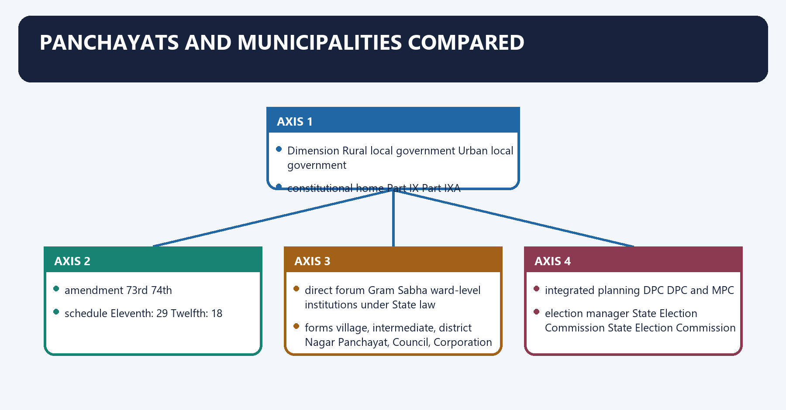
| Dimension | Rural local government | Urban local government |
|---|---|---|
| constitutional home | Part IX | Part IXA |
| amendment | 73rd | 74th |
| schedule | Eleventh: 29 | Twelfth: 18 |
| direct forum | Gram Sabha | ward-level institutions under State law |
| forms | village, intermediate, district | Nagar Panchayat, Council, Corporation |
| integrated planning | DPC | DPC and MPC |
| election manager | State Election Commission | State Election Commission |
| fiscal review | State Finance Commission | State Finance Commission |

[LIMIT] A census town is not automatically a municipality, and an industrial area is not
automatically an industrial township under the Article 243Q proviso.

#### CLOSING RECALL FLOW — PANCHAYATS AND MUNICIPALITIES COMPARED

```closure-flow
SUBTOPIC: Panchayats and Municipalities compared
KEY TERMS / DEFINITIONS: Panchayats · Municipalities compared · constitutional home · Part IX · Part IXA · amendment
MECHANISM / ARGUMENT: The decisive contrast is between forms village, intermediate, district Nagar Panchayat, Council, Corporation and integrated planning DPC DPC and MPC.
CONSEQUENCE / CONTRAST: A census town is not automatically a municipality, and an industrial area is not automatically an industrial township under the Article 243Q proviso.
UPSC TRAP / ANSWER-USE: Do not miss this limiting distinction: its principal consequence is that direct forum Gram Sabha ward-level institutions under State law.
ANSWER-GRABBING FORMULATION: Panchayats and municipalities share constitutional democratic safeguards, but urban classification, planning and service structures create distinct devolution problems under Part IX-A.
```
### SESSION 48 — LOCAL-BODY ELECTIONS AND RESERVATION CASE LAW
#### DEFINITION / WHAT THIS IS CALLED

**Plain-language definition:** Local-body elections and reservation case law denotes the constitutional rules and institutional links organised around Decision Exam-safe holding.

**Technical definition:** Technically, Local-body elections and reservation case law is analysed by relating Local-body elections to reservation case law, then testing the relationship through Kishansing Tomar (2006) and election delay cannot defeat the five-year constitutional cycle.

#### ANSWER-GRABBING OPENING — WRITE/ADAPT IN THE EXAM

> Regular elections, reservation and stronger State examples show genuine progress, so failure is uneven rather than absolute.

#### MUST-WRITE KEYWORDS

- **Local-body elections**
- **reservation case law**
- **Kishansing Tomar (2006)**
- **election delay cannot defeat the five-year constitutional cycle**
- **K. Krishna Murthy (2010)**
- **backward-class political reservation needs local-body analysis**

**How to use them:** Frame the answer through Local-body elections; define reservation case law, connect Kishansing Tomar (2006) with election delay cannot defeat the five-year constitutional cycle to explain the mechanism, and use K. Krishna Murthy (2010) for the decisive comparison or qualification.

Local-body elections and reservation case law denotes the constitutional rules and institutional links organised around Decision Exam-safe holding.
Local-body elections and reservation case law operates through Kishansing Tomar (2006) election delay cannot defeat the five-year constitutional cycle, connected with K. Krishna Murthy (2010) backward-class political reservation needs local-body analysis.
The operative mechanism matters because vikas Kishanrao Gawali (2021) triple test controls OBC reservation in local bodies.
Its principal consequence is that state of Goa v. Fouziya Imtiaz Shaikh (2021) the SEC must remain institutionally independent.
The decisive contrast is between [LIMIT] These decisions do not create one national municipal design; State law continues to and govern offices, mayoral form, disqualification detail and administrative organisation.
The exam-safe limitation is that pYQ, practice and solved workbook.

| Decision | Exam-safe holding |
|---|---|
| Kishansing Tomar (2006) | election delay cannot defeat the five-year constitutional cycle |
| K. Krishna Murthy (2010) | backward-class political reservation needs local-body analysis |
| Vikas Kishanrao Gawali (2021) | triple test controls OBC reservation in local bodies |
| State of Goa v. Fouziya Imtiaz Shaikh (2021) | the SEC must remain institutionally independent |

[LIMIT] These decisions do not create one national municipal design; State law continues to
govern offices, mayoral form, disqualification detail and administrative organisation.

#### CLOSING RECALL FLOW — LOCAL-BODY ELECTIONS AND RESERVATION CASE LAW

```closure-flow
SUBTOPIC: Local-body elections and reservation case law
KEY TERMS / DEFINITIONS: Local-body elections · reservation case law · Kishansing Tomar (2006) · election delay cannot defeat the five-year constitutional cycle · K. Krishna Murthy (2010) · backward-class political reservation needs local-body analysis
MECHANISM / ARGUMENT: Fouziya Imtiaz Shaikh (2021) the SEC must remain institutionally independent.
CONSEQUENCE / CONTRAST: The decisive contrast is between These decisions do not create one national municipal design; State law continues to and govern offices, mayoral form, disqualification detail and administrative organisation.
UPSC TRAP / ANSWER-USE: These decisions do not create one national municipal design; State law continues to govern offices, mayoral form, disqualification detail and administrative organisation.
ANSWER-GRABBING FORMULATION: Regular elections, reservation and stronger State examples show genuine progress, so failure is uneven rather than absolute.
```
## BASIC MCQS / REMEDIATION

### Original MCQ loop - balanced deterministic non-patterned placement

#### OM1. Constitutional status

Municipalities received constitutional status through the:

A. 74th Constitutional Amendment.
B. 73rd Constitutional Amendment.
C. 86th Constitutional Amendment.
D. 69th Constitutional Amendment.

**Answer: A.**

**Explanation:** [FACT] The 74th Amendment inserted Part IX-A and the Twelfth Schedule.

#### OM2. Constitutional Part

The provisions on Municipalities are located in:

A. Part IX.
B. Part XVIII.
C. Part X.
D. Part IX-A.

**Answer: D.**

**Explanation:** [FACT] Part IX is for Panchayats; Part IX-A is for Municipalities.

#### OM3. Functional schedule

The Twelfth Schedule contains:

A. 20 matters.
B. 12 matters.
C. 29 matters.
D. 18 matters.

**Answer: D.**

**Explanation:** [FACT] The Eleventh Schedule has 29 Panchayat matters; the Twelfth has 18 municipal matters.

#### OM4. Commencement

The 74th Amendment came into force on:

A. 1 June 1993.
B. 24 April 1993.
C. 26 January 1993.
D. 15 August 1992.

**Answer: A.**

**Explanation:** [FACT] 24 April 1993 is associated with the 73rd Amendment.

#### OM5. Definitions

Which Article defines "metropolitan area" and "municipality" for Part IX-A?

A. Article 243S.
B. Article 243Q.
C. Article 243R.
D. Article 243P.

**Answer: D.**

**Explanation:** [FACT] Article 243P is the definitions provision.

#### OM6. Transitional area

A transitional area is ordinarily administered through a:

A. District Panchayat.
B. Municipal Corporation.
C. Nagar Panchayat.
D. Cantonment Board.

**Answer: C.**

**Explanation:** [FACT] Article 243Q maps Nagar Panchayat to a rural-to-urban transitional area.

#### OM7. Industrial township

Which statement is correct?

A. Every industrial area must have a Municipal Corporation.
B. Parliament alone declares an industrial township.
C. The Governor may specify an industrial township where an industrial establishment provides or proposes municipal services.
D. An industrial township is the same as a census town.

**Answer: C.**

**Explanation:** [FACT] It is the Article 243Q proviso; a municipality need not be constituted there.

#### OM8. Metropolitan threshold

For Article 243P, a metropolitan area has a population of:

A. twenty lakh or more.
B. three lakh or more.
C. five lakh or more.
D. ten lakh or more.

**Answer: D.**

**Explanation:** [FACT] The constitutional threshold is ten lakh or more, plus the notified multi-area character.

#### OM9. Territorial seats

Territorial seats in a municipality are:

A. filled by State civil servants.
B. indirectly elected by an electoral college.
C. directly elected from wards.
D. nominated by the Governor.

**Answer: C.**

**Explanation:** [FACT] Article 243R requires direct election for territorial seats.

#### OM10. Wards Committees

Article 243S makes Wards Committees mandatory in a municipality with population:

A. three lakh or more.
B. ten lakh or more.
C. above one lakh only.
D. as fixed annually by Parliament.

**Answer: A.**

**Explanation:** [FACT] The threshold is three lakh or more.

#### OM11. Women's seat reservation

The constitutional minimum reservation of total municipal seats for women is:

A. one-fourth.
B. two-thirds.
C. not less than one-third.
D. one-half.

**Answer: C.**

**Explanation:** [FACT] It includes seats reserved for SC/ST women; States may provide a higher share.

#### OM12. Backward-class reservation

Reservation in municipalities for backward classes:

A. is fixed by the Union Finance Commission.
B. may be provided by the State legislature.
C. is prohibited.
D. is constitutionally fixed at 27 per cent.

**Answer: B.**

**Explanation:** [FACT] Article 243T permits State-law provision.

#### OM13. Normal duration

The normal duration of a municipality is:

A. five years from its first meeting.
B. five years from notification of election.
C. four years from first budget.
D. six years from constitution.

**Answer: A.**

**Explanation:** [FACT] Article 243U uses the date appointed for the first meeting.

#### OM14. Short remainder

If a dissolved municipality had less than six months of its term remaining:

A. Parliament appoints an administrator.
B. the previous council automatically revives.
C. a full five-year replacement must be elected.
D. an election need not be held merely for that remaining period.

**Answer: D.**

**Explanation:** [FACT] This is the express short-remainder qualification in Article 243U.

#### OM15. Minimum age

A person who has attained which age cannot be disqualified merely for being below 25?

A. 23.
B. 21.
C. 18.
D. 20.

**Answer: B.**

**Explanation:** [FACT] Article 243V sets the relevant age at 21.

#### OM16. Election authority

Municipal elections are constitutionally supervised by the:

A. Election Commission of India under Article 324.
B. Governor under Article 243R.
C. State Election Commission under Article 243ZA.
D. State Finance Commission under Article 243Y.

**Answer: C.**

**Explanation:** [FACT] The SEC controls municipal electoral rolls and elections.

#### OM17. Article 243W

Which proposition best describes Article 243W?

A. Parliament directly assigns municipal staff.
B. State legislatures may endow municipalities with self-government powers and Twelfth Schedule responsibilities.
C. The MPC levies all municipal taxes.
D. All 18 matters automatically transfer on commencement.

**Answer: B.**

**Explanation:** [FACT] The provision is enabling and works through State law.

#### OM18. Twelfth Schedule matter

Which is expressly in the Twelfth Schedule?

A. Urban planning including town planning.
B. Inter-State trade.
C. Currency.
D. Police.

**Answer: A.**

**Explanation:** [FACT] Urban and town planning is the first listed matter.

#### OM19. Article 243X

Article 243X concerns:

A. municipal taxes, assignments, grants and funds.
B. electoral disputes.
C. reservation of chairperson offices.
D. metropolitan-area definition.

**Answer: A.**

**Explanation:** [FACT] It is the core municipal-finance enabling provision.

#### OM20. State Finance Commission

Municipal finance review by the SFC is addressed in:

A. Article 243ZA.
B. Article 243ZD.
C. Article 243Y.
D. Article 243Z.

**Answer: C.**

**Explanation:** [FACT] Article 243Y applies the Article 243-I SFC to municipalities.

#### OM21. Accounts and audit

State-law provision for municipal accounts and audit is enabled by:

A. Article 243T.
B. Article 243W.
C. Article 243Z.
D. Article 243P.

**Answer: C.**

**Explanation:** [FACT] Article 243Z is the accounts-and-audit provision.

#### OM22. Union Territories

Application of Part IX-A to Union Territories is addressed by:

A. Article 243ZB.
B. Article 243ZF.
C. Article 243ZC.
D. Article 243ZA.

**Answer: A.**

**Explanation:** [FACT] The President may specify exceptions and modifications.

#### OM23. Excluded areas

Which Article concerns non-application to specified Scheduled/tribal areas?

A. Article 243ZB.
B. Article 243ZC.
C. Article 243ZG.
D. Article 243ZD.

**Answer: B.**

**Explanation:** [FACT] Parliament may extend Part IX-A to such areas with exceptions/modifications.

#### OM24. Electoral litigation bar

The bar on ordinary court interference in municipal electoral matters is in:

A. Article 243ZE.
B. Article 243ZF.
C. Article 243ZG.
D. Article 243ZA.

**Answer: C.**

**Explanation:** [FACT] An election is challenged through the election-petition route prescribed by State law.

#### OM25. DPC fraction

The elected-member floor in a District Planning Committee is:

A. one-half.
B. four-fifths.
C. two-thirds.
D. three-fourths.

**Answer: B.**

**Explanation:** [FACT] DPC 4/5 and MPC 2/3 is a standard close-option trap.

#### OM26. MPC fraction

The elected-member floor in a Metropolitan Planning Committee is:

A. four-fifths.
B. one-third.
C. three-fourths.
D. two-thirds.

**Answer: D.**

**Explanation:** [FACT] Members come from elected municipal members and Panchayat chairpersons.

#### OM27. DPC function

The DPC primarily:

A. audits State departments.
B. appoints municipal commissioners.
C. consolidates Panchayat and municipal plans into a draft district plan.
D. conducts municipal elections.

**Answer: C.**

**Explanation:** [FACT] Article 243ZD integrates rural and urban planning at district level.

#### OM28. MPC planning input

Which is a distinctive constitutional consideration for an MPC?

A. Inter-State river adjudication.
B. Likely investments by Union and State agencies in the metropolitan area.
C. Delimitation of parliamentary constituencies.
D. Appointment of High Court judges.

**Answer: B.**

**Explanation:** [FACT] Article 243ZE explicitly requires regard to such investments and available resources.

#### OM29. Property-tax reform

Which step most directly expands a lawful property-tax base?

A. Complete, updated property mapping linked to transparent assessment.
B. Replacing all taxes with grants.
C. Borrowing for routine salary expenditure.
D. Dissolving Ward Committees.

**Answer: A.**

**Explanation:** [ANALYSIS] Coverage, valuation, billing and collection form the revenue chain.

#### OM30. User charges

The most defensible design for basic-service user charges is:

A. no billing or measurement under any circumstances.
B. transparent charges with service standards and lifeline protection.
C. automatic privatisation.
D. identical flat charges regardless of service or poverty.

**Answer: B.**

**Explanation:** [ANALYSIS] O&M finance must be balanced with affordability and accountability.

#### OM31. Municipal bonds

Which statement is correct?

A. A municipal bond is a constitutional grant.
B. Every ULB can issue one without State-law or market conditions.
C. It is debt finance requiring a credible repayment stream.
D. It eliminates the need for audited accounts.

**Answer: C.**

**Explanation:** [FACT] Bonds finance capital but create debt-service obligations.

#### OM32. Mayor-commissioner split

The phrase "responsibility-authority mismatch" most directly describes:

A. the ECI conducting municipal elections.
B. an elected mayor blamed for services controlled by a State-appointed executive or parastatal.
C. Parliament fixing every property-tax rate.
D. an MPC replacing the State legislature.

**Answer: B.**

**Explanation:** [ANALYSIS] Visible political responsibility may not match control over staff and budgets.

#### OM33. Three Fs

The three Fs of genuine devolution are:

A. Functions, Functionaries and Funds.
B. Functions, Federalism and Franchise.
C. Fees, Fines and Funds.
D. Federalism, Fraternity and Finance.

**Answer: A.**

**Explanation:** [FACT] They are inputs that must converge into functionality.

#### OM34. Parastatal problem

The strongest criticism of fragmented parastatal governance is that it:

A. makes metropolitan coordination impossible in every case.
B. separates service authority from elected municipal answerability.
C. always lacks technical expertise.
D. is prohibited by Part IX-A.

**Answer: B.**

**Explanation:** [ANALYSIS] The issue is accountability fragmentation, not the necessary absence of expertise.

#### OM35. XVI Finance Commission ULB performance

Under the official 2026-31 recommendation, the ULB performance component is principally linked to:

A. creation of a cantonment board.
B. the specified ULB own-source-revenue growth condition.
C. mayoral direct election.
D. abolition of property tax.

**Answer: B.**

**Explanation:** [CURRENT] Entry conditions separately cover constitution, accounts and SFC discipline.

#### OM36. AMRUT 2.0 reform

Which is part of the official AMRUT 2.0 municipal-reform framework?

A. Elimination of all user charges.
B. Suspension of double-entry accounting.
C. Replacement of municipalities by district administration.
D. Property-tax/user-charge reform, GIS planning and stronger creditworthiness.

**Answer: D.**

**Explanation:** [CURRENT] These reforms connect water security with municipal financial and governance capacity.

### Remedial MCQs - strict continuation C -> C -> A -> D rotation

#### RM1. Constitution Parts

Which set is correctly matched?

A. Municipalities-Part IX-A; Emergencies-Part XVIII; Amendment-Part XX.
B. Municipalities-Part IX; Emergencies-Part XVII; Amendment-Part XXI.
C. Municipalities-Part VIII; Emergencies-Part XX; Amendment-Part IX-A.
D. Municipalities-Part X; Emergencies-Part XIX; Amendment-Part XVIII.

**Answer: A.**

**Explanation:** [FACT] This is the exact doctrinal core of UPSC Prelims 2024 Q74.

#### RM2. Ward threshold

A city with a population of exactly three lakh:

A. must become an industrial township.
B. automatically becomes a metropolitan area.
C. is outside Article 243S.
D. falls within the Wards Committee requirement.

**Answer: D.**

**Explanation:** [FACT] Article 243S says three lakh or more.

#### RM3. Schedules

Which statement is correct?

A. The Eleventh Schedule has 29 matters and the Twelfth has 18.
B. The Twelfth Schedule governs Panchayats.
C. Neither Schedule relates to local government.
D. Both Eleventh and Twelfth Schedules contain 29 matters.

**Answer: A.**

**Explanation:** [FACT] This is a recurring close-option distinction.

#### RM4. Planning fractions

Choose the correctly matched pair:

A. DPC-four-fifths; MPC-two-thirds.
B. DPC-one-half; MPC-two-thirds.
C. DPC-four-fifths; MPC-three-fourths.
D. DPC-two-thirds; MPC-four-fifths.

**Answer: A.**

**Explanation:** [FACT] Do not swap the constitutional elected floors.

#### RM5. Reconstituted municipality

After premature dissolution, a newly constituted municipality ordinarily serves:

A. at the Governor's pleasure.
B. only the remainder of the previous body's term.
C. a fresh five-year term in every case.
D. until the next Lok Sabha election.

**Answer: B.**

**Explanation:** [FACT] Article 243U preserves the original tenure clock.

#### RM6. Expert representation

A person represented for special knowledge of municipal administration:

A. conducts the municipal election.
B. is directly elected from a ward.
C. must be the mayor.
D. has no right to vote in municipal meetings under Article 243R.

**Answer: D.**

**Explanation:** [FACT] Expert input is permitted without voting power.

#### RM7. GIS caution

Which statement is most accurate?

A. GIS eliminates the need for valuation rules.
B. GIS automatically creates legal title.
C. GIS improves records, but lawful assessment, grievance and collection remain necessary.
D. GIS is unrelated to property-tax administration.

**Answer: C.**

**Explanation:** [ANALYSIS] Technology improves the chain but cannot replace law and administration.

#### RM8. Bond suitability

Municipal bonds are least suitable for:

A. long-lived water infrastructure with a repayment plan.
B. pooled infrastructure with structured State support.
C. a creditworthy ULB with audited disclosure.
D. permanently financing routine deficits without a repayment stream.

**Answer: D.**

**Explanation:** [ANALYSIS] Borrowing cannot sustainably replace recurrent fiscal capacity.

#### RM9. Census and statutory status

Which statement is correct?

A. Census classification is made by the State Election Commission.
B. Every census town is a Municipal Corporation.
C. A census town may be statistically urban without a statutory ULB.
D. Every Nagar Panchayat is an industrial township.

**Answer: C.**

**Explanation:** [FACT] Statistical urban status and municipal legal status are distinct.

#### RM10. Industrial township

The industrial-township proviso:

A. applies automatically to every factory.
B. creates an MPC.
C. abolishes State municipal law.
D. allows the Governor to specify an exception where industrial services justify it.

**Answer: D.**

**Explanation:** [FACT] Specification and service conditions matter.

#### RM11. SPV accountability

Which reform best reconciles a mission SPV with municipal democracy?

A. permanent secrecy of contracts.
B. treating the SPV as a constitutional municipality.
C. removal of council budget scrutiny.
D. council-approved plans, public reporting and clear transfer of assets/O&M.

**Answer: D.**

**Explanation:** [ANALYSIS] Project focus should be integrated with elected accountability and long-term ownership.

#### RM12. Evidence discipline

For a Mains claim that municipalities remain fiscally weak, the strongest structure is:

A. only a generic conclusion.
B. Article 243X/243Y -> revenue/SFC mechanism -> official XVI FC evidence -> State-variation qualification.
C. assertion plus an undated percentage.
D. a list of schemes without mechanism.

**Answer: B.**

**Explanation:** [ANALYSIS] Named evidence must prove the claim and be qualified.

## PYQS AND ANSWER PRACTICE

### Verified routed PYQs

#### PYQ 1 - UPSC GS-II 2023, Q3 - direct owner

**Verified neutral demand:** Comment on the extent to which States have empowered urban local bodies functionally and financially.  
**10 marks | 150 words | Directive: Comment**

**Demand decoding**

- "Comment" requires a clear extent-based judgement, not a feature list.
- "Functionally and financially" requires two explicit dimensions.
- "States" requires Article 243W/243X discretion and State variation.

**Model solution**

**Thesis:** [FACT] The 74th Amendment secured elected municipalities, but functional and financial empowerment remains incomplete because Articles 243W and 243X operate through State law.

**Functional extent:** [FACT] Article 243W and the Twelfth Schedule list 18 matters, yet activity mapping, staff and assets often remain split among development authorities, water boards and State departments. [ANALYSIS] Thus, a municipality may be responsible to voters without controlling the implementing agency. DPCs and MPCs under Articles 243ZD/ZE provide integrated planning, but their operational authority varies.

**Financial extent:** [FACT] Article 243X enables taxes, assigned revenues, grants and funds; Article 243Y requires SFC review. [ANALYSIS] Under-used property tax, weak user-charge systems, irregular SFC follow-through and tied grants constrain discretion. [CURRENT] The XVI Finance Commission's OSR, accounts and SFC-linked grant design recognises these gaps.

**Qualification:** [LIMIT] Regular elections, reservation and stronger State examples show genuine progress, so failure is uneven rather than absolute.

**Verdict:** States have devolved municipal form more consistently than municipal power; complete empowerment requires functions, staff and predictable finance to move together.

**Why this earns marks:** It answers both mandated dimensions, uses exact Articles, explains mechanisms, adds dated official evidence and gives a graded rather than absolute judgement.

#### PYQ 2 - UPSC GS-II 2024, Q5 - supporting Governance cross-owner

**Verified question:** Analyse the role of local bodies in providing good governance at the local level and bring out the pros and cons of merging rural local bodies with urban local bodies.  
**10 marks | 150 words**

**Model solution**

**Thesis:** [ANALYSIS] Local bodies improve good governance when the three Fs convert proximity into responsive services; merger is useful only where a functionally urban settlement has outgrown rural administration.

**Good-governance role:** [FACT] Panchayats and municipalities institutionalise elected representation, reservation, local planning, service delivery and fiscal review. Ward-level evidence can improve targeting; local taxation can strengthen taxpayer accountability. [LIMIT] Parastatals, weak staff control and tied finance may leave responsibility without capacity.

**Merger advantages:** unified land-use and infrastructure planning; economies of scale in water, waste and transport; removal of boundary conflicts; access to urban finance and technical systems.

**Merger costs:** diluted rural representation; loss of Gram Sabha proximity; higher or altered taxes/user charges; disruption of records, assets and rural entitlements; greater administrative distance.

**Named evidence:** [FACT] Article 243Q recognises transitional areas through Nagar Panchayats; Article 243ZD integrates rural and urban district plans. [CURRENT] XVI Finance Commission recommends a phased rural-to-urban transition policy.

**Verdict:** Use transparent density, employment, contiguity, finance and service criteria, with consultation and transition protection, rather than automatic merger.

**Why this earns marks:** It separates role, pros and cons, uses constitutional mechanisms and ends with criteria-based balance.

#### PYQ 3 - UPSC GS-II 2020, Q13 - supporting three-F cross-owner

**Verified neutral demand:** Highlight the challenges in moving local institutions from functions, functionaries and funds to actual functionality.  
**15 marks | 250 words**

**Model solution**

**Thesis:** [ANALYSIS] Functions, functionaries and funds are institutional inputs; functionality exists only when a local body can turn them into timely, equitable and accountable services.

**Functions:** [FACT] Article 243W is enabling. A State may list a Twelfth Schedule subject while retaining individual activities in a parastatal. [ANALYSIS] Ambiguous activity mapping produces duplication and blame shifting.

**Functionaries:** Municipal engineers, health staff and planners may remain controlled by State cadres or agencies. [ANALYSIS] The elected council can request but cannot direct, breaking answerability.

**Funds:** [FACT] Article 243X depends on State authorisation and Article 243Y on SFC follow-through. Weak property records, low collection, tied transfers and delayed releases prevent multi-year planning.

**Cross-cutting barriers:** fragmented data and assets; weak accounting/audit; short political tenure; procurement capacity; inactive Ward Committees; DPC/MPC weakness; unequal fiscal bases; parallel SPVs and boards.

**Reform:** binding activity maps, staff-control protocols, predictable SFC transfers, GIS-backed fair taxation, double-entry audited accounts, professional municipal cadres, ward participation and service-level disclosure. [CURRENT] XVI Finance Commission conditions and AMRUT 2.0 reforms can support this transition.

**Qualification:** [LIMIT] regional utilities remain necessary where economies of scale are real; functionality requires accountable coordination, not indiscriminate transfer.

**Verdict:** A local body is functional when authority, capacity and public responsibility converge around measurable services.

**Why this earns marks:** It follows the stem's three-F structure, then adds the missing outcome and accountability layer with named constitutional and current evidence.

#### PYQ 4 - UPSC Prelims 2024, Q74 - official local paper and key verified

**Question:** Which of the following statements about the Constitution of India are correct?

1. Powers of the Municipalities are given in Part IX-A.
2. Emergency provisions are given in Part XVIII.
3. Provisions related to amendment of the Constitution are given in Part XX.

A. 1 and 2 only  
B. 2 and 3 only  
C. 1 only  
D. 1, 2 and 3

**Verified solution:** All three statements are correct. The locally held official UPSC Set-A answer key records **option D**.

- [FACT] Part IX-A concerns Municipalities.
- [FACT] Part XVIII contains Emergency Provisions.
- [FACT] Part XX contains Article 368 on constitutional amendment.
- [LIMIT] The routed ledger itself intentionally does not store answer letters; the key was checked directly against the locally held official Set-A answer-key PDF.

### Original solved Mains practice

#### M1. "The 74th Amendment constitutionalised municipalities, but not municipal devolution." Examine. (10 marks, 150 words)

**Model solution**

**Thesis:** [FACT] The 74th Amendment entrenched municipal existence, elections and inclusion, but Articles 243W and 243X leave substantial functional and fiscal power to State legislation.

**Constitutionalisation:** Part IX-A creates three municipal types, directly elected wards, reservation, five-year tenure, SEC elections, SFC review and DPC/MPC planning. [ANALYSIS] These prevent municipalities from remaining merely optional administrative creations.

**Devolution gap:** The Twelfth Schedule lists 18 matters, yet State activity maps may leave land use, water or transport with parastatals. Municipal staff often remain State-controlled. Article 243X authorises only State-permitted taxes; weak property-tax administration and irregular SFC follow-through constrain discretion.

**Named current evidence:** [CURRENT] XVI Finance Commission links grants to accounts, SFC discipline and OSR, confirming that core fiscal institutions remain incomplete.

**Qualification:** [LIMIT] State variation and regular elections show that the framework can support genuine empowerment.

**Verdict:** The amendment constitutionalised democratic form more completely than operational self-government; devolution requires the three Fs to accompany the constitutional shell.

**Why this earns marks:** It distinguishes constitutional status from power, uses exact Articles and supports the extent judgement with current evidence and qualification.

#### M2. Assess the constitutional logic and democratic cost of the industrial-township exception. (10 marks, 150 words)

**Model solution**

**Thesis:** [FACT] Article 243Q permits the Governor to specify an industrial township where an industrial establishment provides or proposes municipal services; the exception recognises functional service capacity but can reduce representative accountability.

**Logic:** A large integrated industrial estate may already operate water, roads, sanitation, lighting and maintenance. Avoiding duplicate administration can improve technical coordination and cost recovery.

**Democratic cost:** [ANALYSIS] Company-provided services do not equal elected self-government. Residents may lack a municipal council, ward representation, public budget debate and ordinary electoral sanctions over land use or service priorities.

**Safeguards:** transparent specification criteria; periodic review; resident grievance and participation mechanisms; public disclosure; State regulatory oversight; clear environmental and labour-settlement responsibilities; transition to an elected municipality when conditions change.

**Qualification:** [LIMIT] The proviso is discretionary, not automatic for every industrial area.

**Verdict:** The exception is defensible as a narrow service-delivery arrangement only when democratic and regulatory safeguards prevent a private administrative enclave.

**Why this earns marks:** It explains the constitutional mechanism, analyses both efficiency and democratic legitimacy, and gives proportionate safeguards.

#### M3. Analyse the causes of municipal fiscal weakness and propose an equitable reform strategy. (15 marks, 250 words)

**Model solution**

**Thesis:** [ANALYSIS] Municipal fiscal weakness is a chain failure involving State authorisation, local revenue administration, intergovernmental transfers and service credibility, not simply low grant volume.

**Constitutional structure:** [FACT] Article 243X enables local taxes, assigned revenues, grants and funds; Article 243Y requires SFC review; Article 280(3)(c) permits Union supplementation through State Consolidated Funds.

**Causes:** incomplete property registers, undervaluation, exemptions, weak billing and collection; politically difficult user charges; small and unequal tax bases; irregular SFC cycles and State transfers; tied grants; weak accounts, asset records and procurement; lack of control over revenue staff; poor services that reduce taxpayer willingness.

**Reform strategy:** GIS-linked unique property IDs, transparent valuation and appeal; wider base before indiscriminate rate increases; digital billing plus field enforcement; lifeline water/sanitation protection with fair user charges; asset inventories and lease reform; double-entry accounts, timely audit and council disclosure; implementation of SFC recommendations and predictable equalisation; bonds/pooled finance only for viable capital projects.

**Named evidence:** [CURRENT] XVI Finance Commission recommends GIS property-tax systems, online accounts, SFC discipline and OSR-linked ULB performance grants. AMRUT 2.0 links property tax, user charges, accounting and creditworthiness.

**Qualification:** [LIMIT] Own revenue cannot equalise structurally different cities; State and Union transfers remain essential.

**Verdict:** Equitable fiscal autonomy means stronger local effort plus transparent equalisation, not replacing grants with regressive charges.

**Why this earns marks:** It links constitutional channels to administrative mechanisms, gives a sequenced and equity-aware solution, and uses two dated official anchors.

#### M4. "The Metropolitan Planning Committee is the constitutional answer to a city-region problem, but not yet necessarily the operational answer." Discuss. (15 marks, 250 words)

**Model solution**

**Thesis:** [FACT] Article 243ZE designs the MPC to prepare a metropolitan development plan across municipal and Panchayat boundaries; [ANALYSIS] its relevance is high because functional cities exceed administrative borders, but its practical authority depends on State law and agency alignment.

**Constitutional design:** A metropolitan area has ten lakh or more population under Article 243P. At least two-thirds of MPC members are elected by and from municipal members and Panchayat chairpersons. The plan must consider local plans, coordinated spatial planning, shared resources, infrastructure, environment, Union/State priorities and public-agency investments.

**Why needed:** commuting, housing, transport, drainage, air sheds, solid-waste chains and water sources operate regionally. Independent municipal plans create spillovers and contradictory land use.

**Operational deficit:** development authorities and transport/water agencies may retain budgets, data and statutory planning powers; MPCs may lack professional staff, fiscal authority or control over agency investment. A plan forwarded to the State can remain advisory.

**Reform:** statutory primacy or mandatory conformity for major agency plans; permanent metropolitan planning secretariat; open spatial data; municipal/Panchayat participation; ward-to-region consultation; investment and climate-risk integration; public monitoring.

**Qualification:** [LIMIT] Technical regional agencies remain useful; the goal is democratically accountable coordination, not their mechanical abolition.

**Verdict:** The MPC becomes operational when elected regional planning shapes budgets and agency action, not merely when a committee exists.

**Why this earns marks:** It explains the Article in detail, proves the functional need, identifies the mechanism of weakness and proposes institution-specific reform.

#### M5. Evaluate the mayor-commissioner model from the perspective of democratic accountability and administrative professionalism. (15 marks, 250 words)

**Model solution**

**Thesis:** [ANALYSIS] The mayor-commissioner model can combine political representation with professional administration, but incoherent allocation of tenure, staff and executive authority often produces accountability without control.

**Democratic case:** The mayor and council carry the electoral mandate, aggregate ward priorities, approve budgets and face voters. A stable mayor can coordinate city-wide choices and publicly own outcomes.

**Professional case:** A trained commissioner provides continuity, legal compliance, engineering/procurement capacity and coordination with State departments.

**Structural problem:** [FACT] Part IX-A leaves chairperson and executive design to State law. In many systems, the mayor is short-tenured or primarily deliberative while the State-appointed commissioner controls staff and implementation. Citizens blame the visible elected head, while the executive remains upwardly accountable.

**Reform options:** co-terminous or adequate political tenure; statutory division of policy and administration; council confirmation/oversight safeguards; performance contract for commissioner; transparent transfer/removal; strong standing committees; professional municipal cadre; public service dashboards and audit.

**Counter-risk:** [LIMIT] A directly elected or powerful mayor may clash with the council, centralise contracts or politicise administration.

**Verdict:** Neither elected leadership nor bureaucratic professionalism should dominate absolutely; authority, tenure, scrutiny and removal must be designed as one accountable system.

**Why this earns marks:** It avoids a simplistic pro-mayor answer, identifies the legal source of variation and balances mandate, expertise and safeguards.

#### M6. Do parastatals and mission SPVs strengthen or weaken urban local self-government? Critically examine. (15 marks, 250 words)

**Model solution**

**Thesis:** [ANALYSIS] Parastatals and SPVs can add scale, finance and expertise, but they weaken self-government when they separate control of core services from elected municipal plans and scrutiny.

**Strengthening role:** water boards, transport bodies and development authorities can manage networks beyond one municipal boundary; SPVs can ring-fence finance, recruit specialists and execute complex projects quickly.

**Weakening mechanism:** Twelfth Schedule matters such as planning, water and sanitation may remain outside municipal budget and staff control. Multiple bodies create overlapping mandates, data silos and blame shifting. Smart Cities SPVs may prioritise project areas and upward mission reporting rather than city-wide council choices.

**Named constitutional evidence:** [FACT] Article 243W envisages municipalities as institutions of self-government; Articles 243ZD/ZE seek integrated elected planning. Parallel agencies become problematic when they bypass these routes.

**Reconciliation:** clear activity maps; council-approved service and capital plans; metropolitan coordination through MPC; service-level agreements; shared accounts/data; mandatory public reporting; elected representation with conflict safeguards; time-bound SPVs; clear asset and O&M transfer.

**Qualification:** [LIMIT] Municipal control without technical capacity can also fail; specialist regulation and regional infrastructure may remain external.

**Verdict:** These bodies strengthen cities only when expertise is nested within elected planning and answerability; otherwise they build projects while hollowing out municipal government.

**Why this earns marks:** It distinguishes parastatals from SPVs, supplies benefits and costs, anchors criticism in Articles and proposes integration rather than abolition.

#### M7. Design a governance framework for India's metropolitan and peri-urban regions. (20 marks, 250 words)

**Model solution**

**Thesis:** [ANALYSIS] Metropolitan and peri-urban governance needs a nested model: neighbourhood democracy for proximity, empowered municipalities for local services and an elected regional layer for cross-boundary systems.

**Classification and transition:** apply transparent Article 243Q criteria - density, non-farm work, revenue, contiguity and economic importance. Use a time-bound State rural-to-urban transition policy, impact assessment, record/asset transfer and citizen consultation. [CURRENT] XVI Finance Commission explicitly supports this direction.

**Local layer:** activate Wards Committees, publish neighbourhood service data, protect representation of newly merged areas and phase property tax/user charges with lifeline safeguards.

**Municipal layer:** binding activity maps for Twelfth Schedule services; control over staff and O&M; predictable SFC transfers; GIS-based property administration; audited double-entry accounts.

**Regional layer:** operationalise MPC under Article 243ZE with a permanent secretariat, open regional data and authority to align transport, housing, drainage, water, environment and major public investment. Require parastatal and SPV plans to conform or explain divergence.

**Coordination and equity:** metropolitan equalisation for poorer jurisdictions; shared-service contracts; climate and disaster-risk planning; grievance routing; outcome audit.

**Qualification:** [LIMIT] merger is not always necessary; joint service authorities or phased Nagar Panchayat status may preserve voice while gaining scale.

**Verdict:** The objective is not a larger bureaucracy but congruence between the lived city-region and democratically accountable planning, finance and services.

**Why this earns marks:** It covers classification, institutions, finance, democracy, regional systems, equity and alternatives, with constitutional and current evidence.

#### M8. Prepare a reform roadmap to move municipalities from constitutional status to measurable functionality. (20 marks, 250 words)

**Model solution**

**Thesis:** [ANALYSIS] Municipal functionality requires a sequenced State-local compact aligning the three Fs with capacity, planning and public accountability.

**1. Functions:** enact activity-level maps for all Twelfth Schedule matters; identify the policy setter, budget holder, asset owner and service operator; remove duplication.

**2. Functionaries:** create professional municipal cadres and technical pools; place operational staff under defined council/commissioner accountability; publish vacancies and service responsibilities.

**3. Funds:** implement SFC calendars and accepted recommendations; modernise GIS property tax with fair appeals; adopt equity-aware user charges; publish transfer calendars; use bonds only for viable capital assets. [CURRENT] Use XVI Finance Commission entry/performance conditions as reform leverage.

**4. Democratic executive:** give the mayor/council adequate tenure and clear policy powers; preserve commissioner professionalism through transparent performance and removal rules; strengthen standing and Wards Committees.

**5. Planning:** make DPC/MPC plans meaningful for agency investment; integrate land use, mobility, water, housing and climate risk.

**6. Accountability/capacity:** double-entry accounts, timely independent audit, procurement systems, citizen charters, grievance redress and service-level verification. AMRUT 2.0 tools can support this layer.

**7. Parallel agencies:** bind parastatals and SPVs to council-approved outcomes, shared data and asset/O&M arrangements.

**Qualification:** [LIMIT] autonomy must coexist with State standards and equalisation.

**Verdict:** Functionality exists when an elected municipality can decide, direct, finance and publicly explain measurable service outcomes.

**Why this earns marks:** It provides a complete implementation sequence, named evidence, institutional safeguards and an outcome-based test rather than a generic wish list.

## OPTIONAL ADVANCED DEPTH — NOT REQUIRED FOR A CORE ANSWER

> **Subject:** Polity · **Tier:** Advanced (exam depth) · **GS Paper:** GS-II
> **Grounded in:** Indian Polity by M. Laxmikant, Ch. 39 (direct check of the local Sixth Revised Edition PDF).
> ✅ = from source book · ⚠️ = inference / case law · 📰 = current affairs.
> *Companion: `basic/Municipalities.md`.*

---

### PART A — 74th AMENDMENT ACT, 1992 ⭐
✅ Added **Part IX-A ("The Municipalities", Art 243-P to 243-ZG)** + the **Twelfth Schedule (18 functional
items, Art 243-W)**. Gave **constitutional status** to urban local bodies (ULBs); came into force **1 June 1993**.
State governments are under **constitutional obligation** to adopt the new system.

#### Three types of municipalities ⭐
| Body | For |
|---|---|
| ✅ **Nagar Panchayat** | A **transitional area** (rural → urban) |
| ✅ **Municipal Council** | A **smaller urban area** |
| ✅ **Municipal Corporation** | A **larger urban area** |

✅ **Exception — Industrial Township:** where an industrial establishment provides municipal services, the
Governor may specify it and **no municipality need be constituted**. Governor classifies areas on **population,
density, revenue, % non-agricultural employment, economic importance**.

#### Salient features
| Feature | Detail |
|---|---|
| ✅ **Composition** | All **territorial seats** directly elected from wards; Art 243-R permits specified additional representation |
| ✅ **Wards Committees** | Mandatory in municipalities with population **≥ 3 lakh** |
| ✅ **Reservation** | SC/ST by population + **≥ 1/3 seats for women**; BC reservation optional |
| ✅ **Duration** | **5-year term**; election within **6 months** of dissolution; reasonable opportunity of hearing before dissolution |
| ✅ **Disqualification** | Age **21** allowed (vs 25 for state legislature) |
| ✅ **State Election Commission** | Conducts municipal polls |
| ✅ **Finances** | Same **State Finance Commission** (as for panchayats) reviews ULB finances every 5 years |

#### Exempted areas ⚠️
✅ Does **NOT** apply to Fifth/Sixth Schedule (scheduled & tribal) areas, and does not affect the **Darjeeling
Gorkha Hill Council**.

---

### PART B — PLANNING COMMITTEES ⭐
| Committee | Level | Membership rule |
|---|---|---|
| ✅ **District Planning Committee (DPC)** | Every **district** — consolidates panchayat + municipality plans | **4/5 elected** by elected members of district panchayat + municipalities (in rural:urban ratio) |
| ✅ **Metropolitan Planning Committee (MPC)** | Every **metropolitan area** | **2/3 elected** by elected members of municipalities + panchayat chairpersons (in population ratio) |

---

### PART C — EIGHT TYPES OF URBAN LOCAL BODIES ⭐
✅ Beyond the constitutional three, India has **8 types** of urban administration:
**Municipal Corporation · Municipality · Notified Area Committee · Town Area Committee · Cantonment Board ·
Township · Port Trust · Special Purpose Agency.**
- ⚠️ **Cantonment Board** — set up by the **central government** (Cantonments Act) under the **Defence Ministry**.
- ⚠️ **Notified Area Committee** — for a fast-developing town / one not yet a municipality; **fully nominated**
  (hence not a democratic body).

---

#### UPSC Traps
- ❌ Twelfth Schedule has 29 items → **18 items** (Eleventh Schedule = 29 for panchayats).
- ❌ 74th Amendment in force 1992 → **passed 1992, in force 1 June 1993**.
- ❌ Wards Committees mandatory in every municipality → only where population **≥ 3 lakh**.
- ❌ Nagar Panchayat = a village panchayat → it is an **urban** body for a **transitional area**.
- ❌ Cantonment Board is a state ULB → set up by the **Centre** (Defence Ministry).
- ❌ Municipal Corporation is the smallest ULB → it is for the **largest** urban areas.
- ❌ DPC has 2/3 elected members → **4/5** (DPC 4/5, MPC 2/3 — don't swap).

#### 📰 CA hooks
- 📰 ⚠️ **Municipal finances crisis** — ULBs' own revenue is a tiny share of GDP; property-tax reform & the
  **16th Finance Commission** grants to urban bodies.
- 📰 ⚠️ **Empowerment of Mayors / directly-elected mayor debate** and weak devolution of the 18 subjects
  (planning still with parastatals — the "3 Fs" gap in cities).
- 📰 ⚠️ **AMRUT 2.0, Smart Cities Mission** vs the constitutional role of elected ULBs.

#### Mains angles
- "Indian cities are governed but not self-governed." Examine in light of the 74th Amendment's unfulfilled promise.
- Parastatals (development authorities, water boards) vs elected municipalities — the crisis of urban governance.
- Strengthening municipal finances: property tax, municipal bonds, and Finance Commission devolution.

<!-- BEGIN GENERATED PYQ INTEGRATION: 2018-2023 -->
#### Historical PYQ Integration (2018-2023)

> **Status:** Question-level PYQ demand is integrated into this owner.
> **Provenance:** Audited local official-paper routing ledgers: `_PYQ-ROUTING-MAINS-GS1-GS2-ESSAY-2018-2023.md`.

- **Years represented:** 2023
- **Paper(s):** GS-II
- **Routed question demands:** 1

| Year | Paper | Q | PYQ demand (neutral rendering) | Directive / format | Source status | Owner requirement |
|---:|---|---:|---|---|---|---|
| 2023 | GS-II | 3 | States empowering urban local bodies functionally and financially | Comment · 10 marks · 150 words | Routed to owning topic; word limit taken from the instruction block | Prepare context, core dimensions, evidence/examples, counterpoint and a concise conclusion. |

##### What this owner must now support

- States empowering urban local bodies functionally and financially

> The table integrates the examinable demand and paper metadata. It does not turn an unkeyed objective question into a solved answer, and it does not claim that lexical presence alone proves full conceptual sufficiency.
<!-- END GENERATED PYQ INTEGRATION: 2018-2023 -->

## CONSOLIDATED REGISTER NOTES

### Constitutional spine

```text
74th Amendment Act, 1992
        |
effective 1 June 1993
        |
Part IX-A: Articles 243P-243ZG
        |
Twelfth Schedule: 18 matters
        |
municipal democracy + finance + district/metropolitan planning
```

### Evolution recall

- 1688: first corporation at Madras; 1726: Bombay and Calcutta.
- 1870: Lord Mayo and financial decentralisation.
- 1882: Lord Ripon's local self-government resolution.
- 1919: transferred provincial subject.
- 1935: provincial subject.
- 1989: 65th Amendment/Nagarpalika Bill failed in Rajya Sabha.
- 1990: revised bill lapsed.
- 1991-92: modified bill became the 74th Amendment.
- 1 June 1993: commencement.

### Article map

| Article | Recall |
|---:|---|
| 243P | definitions; metro area 10 lakh or more |
| 243Q | Nagar Panchayat, Council, Corporation; industrial-township proviso |
| 243R | direct ward seats; additional representation |
| 243S | Wards Committees at three lakh or more |
| 243T | reservation |
| 243U | five-year duration and dissolution rules |
| 243V | disqualification; age 21 |
| 243W | powers/functions; enabling |
| 243X | taxes, assignments, grants and funds; enabling |
| 243Y | SFC review |
| 243Z | accounts/audit |
| 243ZA | SEC elections |
| 243ZB/C | UT application / excluded areas |
| 243ZD | DPC, 4/5 elected |
| 243ZE | MPC, 2/3 elected |
| 243ZF/G | existing laws / election-litigation bar |

### Municipal types and classification

- Nagar Panchayat: transitional area.
- Municipal Council: smaller urban area.
- Municipal Corporation: larger urban area.
- Governor considers population, density, local revenue, non-agricultural employment, economic importance and other factors.
- Industrial township: specified exception where an industrial establishment provides/proposes municipal services; municipality need not be formed.
- Census town is a statistical category and may lack a statutory ULB.

### Democratic design

- Territorial councillors: directly elected from wards.
- Experts may be represented but cannot vote in municipal meetings.
- Chairperson election and executive design: State law.
- Wards Committees: mandatory at population three lakh or more.
- SC/ST seats: population proportion.
- Women: not less than one-third of seats and chairperson offices.
- Backward-class reservation: State may provide.
- Five-year term from first meeting.
- Election before expiry or within six months of dissolution.
- Short remainder below six months: election not necessary for that period.
- Reconstituted body serves only unexpired remainder.
- SEC, not ECI, conducts municipal polls.

### Twelfth Schedule clusters

| Cluster | Matters |
|---|---|
| planning | urban/town planning; land use/buildings; economic/social development |
| infrastructure | roads/bridges; water; fire services |
| health/environment | public health, sanitation, waste; urban forestry/environment |
| inclusion | weaker sections; slum improvement; poverty alleviation |
| public realm | parks/playgrounds; culture/education/aesthetics |
| civic regulation | burials/crematoria; cattle ponds; vital statistics; lighting/parking/bus stops/conveniences; slaughterhouses/tanneries |

- Listing does not equal transfer.
- Test each activity by budget, staff, assets, data and work-order control.

### Three Fs to functionality

| Functions | Functionaries | Funds |
|---|---|---|
| activity-mapped Twelfth Schedule work | staff accountable to municipal authority | own revenue + State devolution + grants |

- Functionality adds capacity, planning, procurement, audit, participation and measurable service outcomes.
- Responsibility without authority is the core municipal-governance deficit.

### Municipal finance

- Article 243X: State-authorised taxes, duties, tolls, fees; assigned revenues; State grants; municipal funds.
- Article 243Y: SFC reviews municipal finances every five years.
- Article 280(3)(c): Union FC supplementation through State Consolidated Funds.
- Property-tax chain: mapping -> valuation -> demand -> billing -> grievance -> collection -> disclosure.
- User charges: O&M support with service standards and lifeline protection.
- Bonds: debt for viable long-lived assets; need audited accounts and repayment.
- Pooled finance: possible route for smaller ULBs, still requiring structured support.
- Accounts: double-entry/accrual-compatible records, assets/liabilities, audit and public scrutiny.

### XVI Finance Commission 2026-31 control

- Dated official award period: 2026-27 to 2030-31.
- Basic-performance split: 80:20.
- Entry conditions: duly constituted body; online provisional T-1 and audited T-2 accounts; SFC/ATR discipline.
- ULB performance: specified OSR-growth condition.
- State performance: linked to State transfers from own resources.
- Half of basic component tied to water and/or sanitation-solid waste; remainder structure provides greater untied space subject to conditions.
- Recommends GIS property-tax systems, stronger accounts/audit and phased rural-to-urban transition.
- Grants supplement, not replace, State devolution and municipal own revenue.

### DPC and MPC

| DPC | MPC |
|---|---|
| Article 243ZD | Article 243ZE |
| district | metropolitan area |
| 4/5 elected | 2/3 elected |
| rural:urban population ratio | municipality:Panchayat population ratio |
| consolidates district local plans | integrates metropolitan local plans and public investment |

- DPC common interests: spatial planning, shared resources, infrastructure, environment.
- MPC additionally considers Union/State priorities and likely agency investments.
- Both forward draft plans to State Government.
- Operational weakness arises when agencies keep budgets, staff and statutory planning power.

### Mayor, commissioner, parastatals and SPVs

- Council: elected deliberation, budget and oversight under State law.
- Mayor/chairperson: political leadership; election, tenure and powers vary.
- Commissioner: commonly State-appointed professional executive under State law.
- Core risk: elected visibility without executive control.
- Parastatals: scale/expertise but fragmented answerability.
- SPVs: focused implementation but risk council bypass, data silos and unclear O&M.
- Reform: clear roles, council-approved plans, shared data, service contracts, public reporting and asset-transfer rules.

### Metropolitan and peri-urban governance

- Metropolitan area: 10 lakh or more plus notified multi-jurisdiction character.
- Region-wide functions: transport, land use, drainage, water, air quality, waste and housing.
- Peri-urban mismatch: urban demand under rural institutions.
- Options: Nagar Panchayat, phased merger, joint service authority or other lawful transition.
- Safeguards: consultation, representation, tax phasing, record/asset transfer, entitlement continuity and grievance route.

### AMRUT 2.0 answer use

- Official mission launch: 1 October 2021.
- Water-security and ULB financial-sustainability frame.
- Property-tax and user-charge reform.
- GIS planning/property mapping.
- Online services and grievance systems.
- Double-entry accounting.
- Creditworthiness and municipal bonds.
- Use as capacity evidence, not as proof of constitutional devolution.

### PYQ answer routes

- **2023 GS-II Q3:** Article 243W functional gap + parastatals/functionaries; Article 243X/Y financial gap; XVI FC evidence; State-variation qualification.
- **2024 GS-II Q5:** three Fs and good governance; explicit merger pros/cons; Article 243Q/243ZD; criteria-based transition.
- **2020 GS-II Q13:** three Fs are inputs; add capacity, accountability and service outcome.
- **2024 Prelims Q74:** Part IX-A, Part XVIII and Part XX are all correctly matched.

### Last-minute traps

1. 74th Amendment enacted 1992; effective 1 June 1993.
2. Municipalities: Part IX-A, not Part IX.
3. Twelfth Schedule: 18, not 29.
4. Nagar Panchayat is an urban transitional body.
5. Industrial township is an exception, not an ordinary fourth type.
6. Metropolitan threshold: ten lakh or more.
7. Wards Committee threshold: three lakh or more.
8. Experts have no voting right in municipal meetings.
9. Women: not less than one-third.
10. Candidate age: 21.
11. Article 243W/X are enabling.
12. SEC conducts elections.
13. DPC 4/5; MPC 2/3.
14. Property tax is not automatically levied by the Constitution.
15. Bond is debt, not grant.
16. GIS does not itself create title or collection.
17. Parastatal expertise does not cure accountability fragmentation.
18. Mission/SPV delivery is not constitutional devolution.
19. Census town may lack a statutory ULB.
20. Grants supplement, not substitute for, State devolution and own revenue.

### Final verdicts

- **74th Amendment:** constitutionally strong on democratic form, State-dependent on substantive power.
- **Finance:** own revenue, SFC devolution and equalising grants must work together.
- **Planning:** DPC/MPC are the constitutional integration layer but need authority over real investment choices.
- **Leadership:** coherent mayor-council-commissioner design matters more than one isolated election reform.
- **Delivery:** the test is who controls the function, staff, budget and remedy.
- **Reform:** technology and conditional grants are valuable when they deepen elected capacity, transparency and citizen-visible outcomes.

### COMPLETE TOPIC ASCII MASTER FLOW DIAGRAM


#### ASCII MASTER FLOW — PANEL 1/9: Urban constitutionalisation and the Article 243Q institutional map

```ascii-master
URBAN GOVERNANCE PROBLEM
growth across wards and agencies -> services, planning, finance and democratic voice.

74TH AMENDMENT ACT, 1992
Part IXA + Twelfth Schedule -> constitutional municipal framework from 1 June 1993.

ARTICLE 243P DEFINITIONS
municipality | municipal area | ward | metropolitan area | population.

ARTICLE 243Q TYPES
transitional area -> Nagar Panchayat
smaller urban area -> Municipal Council
larger urban area -> Municipal Corporation.

INDUSTRIAL-TOWNSHIP PROVISO
Governor may specify after considering municipal services supplied/proposed;
it is an exception, not the status of every industrial or census town.
```

#### ASCII MASTER FLOW — PANEL 2/9: Council, wards, reservation, tenure and State Election Commission

```ascii-master
ARTICLE 243R
directly elected ward representatives; State law may add specified representation.

ARTICLE 243S
Ward Committees mandatory in municipalities with population >= three lakh.
State law fixes composition, area and additional committees.

ARTICLE 243T
SC/ST population-linked reservation + not less than one-third seats for women.

ARTICLE 243U
five-year duration; hearing before dissolution; timely re-election.

ARTICLE 243ZA
State Election Commission controls municipal rolls and elections.

LIMIT compulsory democratic form does not itself transfer functions, staff or finance.
```

#### ASCII MASTER FLOW — PANEL 3/9: Article 243W, Twelfth Schedule and measurable service devolution

```ascii-master
ARTICLE 243W IS ENABLING
State law may endow municipalities with self-government and scheme functions.

TWELFTH SCHEDULE: 18 MATTERS
urban planning + land use + roads + water + public health/sanitation
-> fire services + urban forestry/environment
-> weaker sections/slums/poverty
-> amenities/culture + burials + cattle pounds
-> vital statistics + street lighting/parking/bus stops/public conveniences.

THREE-F TEST
function assigned? | staff controlled? | money predictable and discretionary?

SERVICE TEST
clear responsibility -> standard -> budget -> delivery -> grievance -> public audit.
```

#### ASCII MASTER FLOW — PANEL 4/9: Municipal finance: property tax, user charges, bonds and grants

```ascii-master
ARTICLE 243X
State law may authorise taxes, duties, tolls, fees, assignments, grants and funds.

ARTICLE 243Y
the State Finance Commission reviews municipal and Panchayat finances.

OWN REVENUE
property tax -> complete register + fair valuation + billing + collection + appeal.
user charge -> service cost + affordability protection + transparent subsidy.

CAPITAL FINANCE
municipal bond -> accounts + revenue stream + disclosure + credit discipline.
pooled finance -> smaller bodies aggregate borrowing capacity.

GRANTS
equalisation and national priorities; tied money cannot replace local fiscal authority.
```

#### ASCII MASTER FLOW — PANEL 5/9: Mayor-commissioner relations, parastatals and mission SPVs

```ascii-master
ELECTED COUNCIL / MAYOR
mandate -> priorities -> budget -> public answerability.

MUNICIPAL COMMISSIONER
State-law executive authority -> administration -> engineering/procurement continuity.

MODEL CAVEAT
mayor selection, tenure, executive power and commissioner control vary by State law.

PARASTATALS
water/transport/development authorities may add expertise and regional scale
but can fragment money, staff and accountability.

MISSION SPVs
project focus + professional delivery
must remain aligned with elected plans, transparent accounts and municipal ownership.

ANSWER TEST
who decides? who spends? who employs? who answers to voters?
```

#### ASCII MASTER FLOW — PANEL 6/9: DPC, MPC and government at the scale of the city-region

```ascii-master
ARTICLE 243ZD: DISTRICT PLANNING COMMITTEE
Panchayat plans + municipal plans -> draft district development plan.
At least four-fifths elected by/from district Panchayat and municipal elected members.

ARTICLE 243ZE: METROPOLITAN PLANNING COMMITTEE
municipal + Panchayat plans -> metropolitan development plan.
At least two-thirds elected by/from municipal members and Panchayat chairpersons.

METROPOLITAN AREA
population ten lakh or more across one or more districts and local bodies.

PERI-URBAN CHOICE
Nagar Panchayat | merger | joint authority | phased transition.

LIMIT constitutional plan preparation needs alignment with agencies, budgets and land powers.
```

#### ASCII MASTER FLOW — PANEL 7/9: Citizen participation, accountability and bounded digital reform

```ascii-master
DOWNWARD ACCOUNTABILITY
ward voice -> open budget -> service standard -> grievance redress
-> audit/report -> council correction -> electoral sanction.

FISCAL ACCOUNTABILITY
asset register + double-entry accounts + audit + public disclosure + procurement control.

DIGITAL / SMART TOOLS
GIS property base | online permissions/payments | dashboards | sensor data.

CAUTION
technology can expose performance and expand access
but cannot cure missing staff, fragmented authority or digital exclusion by itself.

REFORM
activity mapping + stronger wards + professional cadre + accountable executive
-> integrated planning + viable revenue + transparent service contracts.
```

#### ASCII MASTER FLOW — PANEL 8/9: Rural-urban comparison and local-government case-law controls

```ascii-master
PANCHAYAT                             MUNICIPALITY
Part IX / Eleventh 29                Part IXA / Twelfth 18
Gram Sabha                            Ward Committee where Article 243S applies
rural three-tier map                  transitional/smaller/larger urban forms.

COMMON
State-law devolution | SEC elections | SFC review | DPC linkage.

CASE CODE
Kishansing Tomar (2006) -> constitutional election timetable.
K. Krishna Murthy (2010) -> local reservation analysis.
Vikas Kishanrao Gawali (2021) -> OBC triple test.
State of Goa v. Fouziya Imtiaz Shaikh (2021) -> SEC independence.

TRAP census town != municipality | every industrial area != industrial township.
```

#### ASCII MASTER FLOW — PANEL 9/9: Urban reform, Prelims traps, PYQ spine and qualified synthesis

```ascii-master
CORE DIAGNOSIS
constitutional existence and elections
without assured functions, metropolitan coordination, staff control or buoyant revenue.

REFORM LADDER
State activity map -> empowered wards -> stable elected leadership
-> professional administration -> property/user-charge reform
-> accountable bonds/grants -> agency-plan convergence -> public audit.

PRELIMS FIREWALL
243Q types | 243S three-lakh Ward Committee threshold
| DPC four-fifths | MPC two-thirds | metropolitan population ten lakh
| SEC, not ECI | Twelfth Schedule does not transfer automatically.

MAINS SPINE
constitutional design -> operational gap -> finance/governance mechanism
-> city-region evidence -> State-law caveat -> democratic functionality verdict.
```