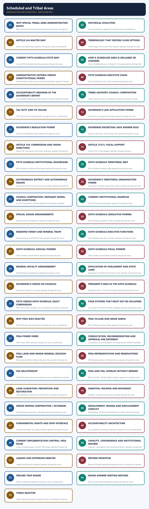

# Polity 26 - Scheduled and Tribal Areas - Complete Topic Package

> **Subject:** Indian Polity | **Topic:** 26 | **GS-II + Prelims** | **Export date:** 2026-08-28
>
> **Approval:** false - awaiting explicit user approval.
>
> **Evidence key:** [FACT] verified constitutional, statutory, judicial or official proposition; [ANALYSIS] reasoned exam synthesis; [CURRENT] dated legal or institutional control; [LIMIT] qualification preventing overstatement.

#### Package method, source priority and current legal control

- [FACT] Source order followed: `basic/Scheduled-and-Tribal-Areas.md` -> `advanced/26_Scheduled-and-Tribal-Areas.md` -> Polity 23 Panchayati Raj, Polity 22 Special Provisions, Fundamental Rights, Supreme Court, Environment/FRA and EIA owners only for cross-links -> audited PYQ routing ledgers and locally held official Prelims papers/keys -> authoritative Constitution, India Code, Ministry of Tribal Affairs, Ministry of Panchayati Raj, Supreme Court and official State/ADC sources. Qdrant was not used.
- [CURRENT] Legal and institutional control date is **28 August 2026, Asia/Kolkata**.
- [CURRENT] **Live official refresh, 28 August 2026:** Ministry of Tribal Affairs Fifth-Schedule material, Ministry of Panchayati Raj PESA-rules listings, MHA Ladakh committee material and the official Supreme Court judgment source were rechecked. Jharkhand PESA Rules, 2025 remain listed; no Sixth-Schedule grant to Ladakh was located.
- [FACT] Article **244(1)** applies the Fifth Schedule to Scheduled Areas and Scheduled Tribes in States other than Assam, Meghalaya, Tripura and Mizoram. Article **244(2)** applies the Sixth Schedule to tribal areas in those four States.
- [CURRENT] The official Ministry of Panchayati Raj state-wise document identifies notified Fifth Schedule areas in **10 States**: Andhra Pradesh, Telangana, Chhattisgarh, Gujarat, Himachal Pradesh, Jharkhand, Madhya Pradesh, Maharashtra, Odisha and Rajasthan.
- [LIMIT] A State's inclusion in that list does not make the whole State a Scheduled Area. Only territory covered by the operative Presidential Orders has that status. Presence of a Scheduled Tribe population also does not by itself notify a Scheduled Area.
- [CURRENT] The Ministry of Panchayati Raj's official PESA-rules listing contains rules for nine of the ten PESA States, including **Jharkhand Rules, 2025**; it does not list a separate notified Odisha PESA Rules instrument. This is a dated implementation control, not a claim that statutory compliance is complete in the nine.
- [CURRENT] Ladakh remains a Union Territory outside the Sixth Schedule. Official MHA material records continuing consultation through the High-Powered Committee process; no official notification granting Sixth Schedule status was located by the control date.
- [LIMIT] The Fifth Schedule assigns important functions to the Governor but does not textually convert every such function into unreviewable personal discretion. Do not state that the Governor may always disregard ministerial advice.
- [LIMIT] A Tribal Advisory Council is advisory. A Sixth Schedule council is autonomous but not sovereign, not a State legislature and not outside the State's executive authority.
- [LIMIT] PESA uses different legal verbs - **approve, identify, certify, consult, recommend, own, regulate, control and restore**. It does not create one undifferentiated Gram Sabha veto over every project.
- [LIMIT] Current dashboards, claim counts, title acreage, council officeholders and programme totals change. This package uses durable legal design and dated official controls rather than freezing unstable totals.

**Authoritative control set**

1. Constitution of India, Legislative Department, Articles 244, 244A, 275(1), 339 and the Fifth and Sixth Schedules.
2. Ministry of Tribal Affairs, official *Scheduled Areas* note and Presidential-Order inventory.
3. Ministry of Panchayati Raj, official state-wise notified Fifth Schedule areas, PESA Act and State PESA rules listings.
4. Provisions of the Panchayats (Extension to the Scheduled Areas) Act, 1996, section 4, India Code.
5. Scheduled Tribes and Other Traditional Forest Dwellers (Recognition of Forest Rights) Act, 2006, especially sections 2, 3, 4, 5 and 6, India Code.
6. *Samatha v. State of Andhra Pradesh*, (1997) 8 SCC 191, read with the Andhra Pradesh Scheduled Areas Land Transfer Regulation and later scope qualification.
7. *Orissa Mining Corporation Ltd. v. Ministry of Environment and Forest*, Supreme Court, 18 April 2013.
8. Official Assam, Meghalaya, Tripura and Mizoram government/ADC material for current institutional examples.
9. Official UPSC papers locally held for 2019, 2023, 2024, 2025 and 2026 and official Set-A keys locally held for 2024-2025.

#### Roadmap

| Stage | Coverage | Exam outcome |
|---|---|---|
| Rationale and history | exclusion, protection and self-government | explains why two Schedules exist |
| Article 244 map | Fifth, Sixth, 244A, 275 and 339 | solves provision traps |
| Fifth Schedule | declaration, executive chain, TAC and Governor powers | handles protective administration |
| Sixth Schedule | districts, regions, councils and powers | handles autonomous government |
| Exact comparison | Fifth, Sixth, Article 371 and ordinary Panchayats | prevents false equivalence |
| PESA | section 4 power verbs and limits | answers Gram Sabha questions precisely |
| FRA | claims, CFR and conservation duties | connects tenure with self-governance |
| Land and mining | PESA, FRA, State land law and cases | builds rights-development analysis |
| Accountability | Governor, State, Union, councils and Gram Sabha | identifies institutional gaps |
| Current reform | rules, capacity, convergence and review | adds dated evidence safely |
| Workbook | six routed Prelims demands, 48 rotated MCQs and eight solved Mains | converts doctrine into marks |

#### Scope ownership and cross-links

- **Polity 22 - Special Provisions:** owns Article 371 family, Article 370 and the larger asymmetric-federalism framework. This package distinguishes those provisions from Fifth/Sixth Schedule protection.
- **Polity 23 - Panchayati Raj:** owns Part IX, ordinary Gram Sabha and PRI architecture. This package owns Article 243M exclusion and PESA's Scheduled-Area modifications.
- **Polity 07 - Fundamental Rights / DPSP:** owns Articles 14, 19, 21, 25-26, 29, 38, 39(b), 46 and Article 300A doctrine. This package applies them to tribal land, culture, religion and dignified participation.
- **Polity 18/21 - Judiciary:** owns judicial review and court structure. This package owns the tribal-governance holdings and limits of *Samatha* and *Orissa Mining Corporation*.
- **Environment 11 - Forest Rights Act:** owns full forest-law doctrine, eligibility and claims detail. This package owns the governance interface between FRA, PESA and the Schedules.
- **Environment 16 / Economy land-mineral owners:** own EIA, forest clearance, mineral law and land acquisition in depth. This package owns the constitutional/community decision chain.
- **Governance:** owns participatory governance, social audit and delivery systems. This package uses them only to design accountability in Scheduled Areas.
- [LIMIT] Cross-links prevent duplicate ownership but do not make this package dependent on another file for answering a Fifth/Sixth Schedule, PESA or tribal-autonomy question.


## BASIC LEARNING SESSION



*Distinct embedded teaching-navigation image. The separate continuous Cārvāka-style flowchart package remains an independent at-a-glance artifact.*


### SESSION 1 — WHY SPECIAL TRIBAL-AREA ADMINISTRATION EXISTS

#### DEFINITION / WHAT THIS IS CALLED

**Plain-language definition:** Why Special Tribal-Area Administration Exists explains the exact constitutional, statutory and institutional rules governing why special tribal-area administration exists.

**Technical definition:** Why Special Tribal-Area Administration Exists operates through the exact constitutional, statutory and institutional rules governing why special tribal-area administration exists, with authority, procedure, limits and dated status kept distinct.

#### ANSWER-GRABBING OPENING — WRITE/ADAPT IN THE EXAM

> Why Special Tribal-Area Administration Exists is best understood through the exact constitutional, statutory and institutional rules governing why special tribal-area administration exists.

#### MUST-WRITE KEYWORDS

- **Article 244**
- **Scheduled Areas**
- **tribal governance**
- **special**
- **tribal**
- **area**
- **administration**
- **exists**

**How to use them:** Frame the answer through Article 244; define Scheduled Areas, connect tribal governance with special to explain the mechanism, and use tribal for the decisive comparison or qualification.

**Visual 1 - The constitutional problem**

```text
FORMAL EQUALITY OF ONE ADMINISTRATIVE MODEL
                   |
                   v
remote terrain + customary institutions + land dependence
                   +
historical alienation + extractive pressure + weak voice
                   |
                   v
SUBSTANTIVE EQUALITY REQUIRES DIFFERENTIATED GOVERNANCE
                   |
         +---------+---------+
         |                   |
         v                   v
FIFTH SCHEDULE          SIXTH SCHEDULE
protective supervision  elected territorial autonomy
```

Caption: The Schedules are devices of substantive equality: they differentiate administration to protect land, culture, voice and self-government.

- [FACT] Part X recognises that ordinary State administration may require constitutional modification in specified tribal regions.
- [ANALYSIS] The central design question is not "special privilege versus equality" but whether identical rules would reproduce unequal bargaining power and historical dispossession.
- [LIMIT] Protection can become paternalism if communities remain subjects of administration rather than participants in decisions.

#### CLOSING RECALL FLOW — WHY SPECIAL TRIBAL-AREA ADMINISTRATION EXISTS

```text
START / CONCEPT: WHY SPECIAL TRIBAL-AREA ADMINISTRATION EXISTS
        |
        v
EXACT TERMS: Article 244 · Scheduled Areas · tribal governance · special · tribal · area · administration · exists
        |
        v
MECHANISM / ARGUMENT: Trace the governing provision, empowered institution, procedure and legal check for why special tribal-area administration exists.
        |
        v
CONSEQUENCE / CONTRAST: This determines the rights, autonomy, accountability and exam consequence of why special tribal-area administration exists.
        |
        v
UPSC TRAP / ANSWER-USE: Do not generalise why special tribal-area administration exists beyond its exact territorial field, legal verb, assent rule or dated status.
        |
        v
ANSWER-GRABBING FORMULATION: Why Special Tribal-Area Administration Exists is best understood through the exact constitutional, statutory and institutional rules governing why special tribal-area administration exists.
```
### SESSION 2 — HISTORICAL EVOLUTION

#### DEFINITION / WHAT THIS IS CALLED

**Plain-language definition:** Historical Evolution explains the exact constitutional, statutory and institutional rules governing historical evolution.

**Technical definition:** Historical Evolution operates through the exact constitutional, statutory and institutional rules governing historical evolution, with authority, procedure, limits and dated status kept distinct.

#### ANSWER-GRABBING OPENING — WRITE/ADAPT IN THE EXAM

> Historical Evolution is best understood through the exact constitutional, statutory and institutional rules governing historical evolution.

#### MUST-WRITE KEYWORDS

- **Article 244**
- **Scheduled Areas**
- **tribal governance**
- **historical**
- **evolution**

**How to use them:** Frame the answer through Article 244; define Scheduled Areas, connect tribal governance with historical to explain the mechanism, and use evolution for the decisive comparison or qualification.

**Visual 2 - From exclusion to negotiated constitutionalism**

```text
1874 Scheduled Districts Act
        |
colonial excluded / partially excluded areas
        |
Government of India Act, 1935
        |
Constituent Assembly tribal-area subcommittees
  - A.V. Thakkar: areas outside Assam
  - Gopinath Bordoloi: Assam tribal/excluded areas
        |
1950 Constitution
  Fifth Schedule: protective administration
  Sixth Schedule: autonomous district/regional councils
        |
1996 PESA: self-government layer in Fifth Schedule areas
        |
2006 FRA: tenure and community forest-resource rights
```

- [FACT] Colonial "excluded" arrangements largely insulated administration from representative provincial institutions while concentrating power in executive authorities.
- [FACT] The Constitution retained differentiation but added representative, welfare and rights-oriented purposes.
- [ANALYSIS] The Fifth Schedule partially transforms the colonial guardian model; the Sixth Schedule moves further toward territorial self-government.
- [LIMIT] Constitutional continuity in special administration does not mean identical purposes: democratic accountability and tribal agency are now controlling values.

#### CLOSING RECALL FLOW — HISTORICAL EVOLUTION

```text
START / CONCEPT: HISTORICAL EVOLUTION
        |
        v
EXACT TERMS: Article 244 · Scheduled Areas · tribal governance · historical · evolution
        |
        v
MECHANISM / ARGUMENT: Trace the governing provision, empowered institution, procedure and legal check for historical evolution.
        |
        v
CONSEQUENCE / CONTRAST: This determines the rights, autonomy, accountability and exam consequence of historical evolution.
        |
        v
UPSC TRAP / ANSWER-USE: Do not generalise historical evolution beyond its exact territorial field, legal verb, assent rule or dated status.
        |
        v
ANSWER-GRABBING FORMULATION: Historical Evolution is best understood through the exact constitutional, statutory and institutional rules governing historical evolution.
```
### SESSION 3 — ARTICLE 244 MASTER MAP

#### DEFINITION / WHAT THIS IS CALLED

**Plain-language definition:** Article 244 Master Map explains the exact constitutional, statutory and institutional rules governing article 244 master map.

**Technical definition:** Article 244 Master Map operates through the exact constitutional, statutory and institutional rules governing article 244 master map, with authority, procedure, limits and dated status kept distinct.

#### ANSWER-GRABBING OPENING — WRITE/ADAPT IN THE EXAM

> Article 244 Master Map is best understood through the exact constitutional, statutory and institutional rules governing article 244 master map.

#### MUST-WRITE KEYWORDS

- **Article 244**
- **Scheduled Areas**
- **tribal governance**
- **article**
- **master**
- **map**

**How to use them:** Frame the answer through Article 244; define Scheduled Areas, connect tribal governance with article to explain the mechanism, and use master for the decisive comparison or qualification.

**Visual 3 - The constitutional spine**

| Provision | Territorial reach | Core function |
|---|---|---|
| Article 244(1) | Scheduled Areas and ST administration outside the four Sixth Schedule States | applies Fifth Schedule |
| Article 244(2) | tribal areas in Assam, Meghalaya, Tripura and Mizoram | applies Sixth Schedule |
| Article 244A | Assam only | permits Parliament to create an autonomous State with legislature/CoM |
| Article 275(1) | States requiring specified tribal-welfare/Scheduled-Area support | grants-in-aid |
| Article 339(1) | Scheduled Areas and ST welfare | presidential commission |
| Article 339(2) | States | Union directions on essential ST-welfare schemes |

- [FACT] Article 244 is the gateway; the detailed institutions are in the Schedules.
- [ANALYSIS] Articles 275 and 339 add fiscal and supervisory support to the territorial design.
- [LIMIT] Article 244A is an enabling power for an autonomous State within Assam, not an automatic consequence of a Sixth Schedule council.

#### CLOSING RECALL FLOW — ARTICLE 244 MASTER MAP

```text
START / CONCEPT: ARTICLE 244 MASTER MAP
        |
        v
EXACT TERMS: Article 244 · Scheduled Areas · tribal governance · article · master · map
        |
        v
MECHANISM / ARGUMENT: Trace the governing provision, empowered institution, procedure and legal check for article 244 master map.
        |
        v
CONSEQUENCE / CONTRAST: This determines the rights, autonomy, accountability and exam consequence of article 244 master map.
        |
        v
UPSC TRAP / ANSWER-USE: Do not generalise article 244 master map beyond its exact territorial field, legal verb, assent rule or dated status.
        |
        v
ANSWER-GRABBING FORMULATION: Article 244 Master Map is best understood through the exact constitutional, statutory and institutional rules governing article 244 master map.
```
### SESSION 4 — TERMINOLOGY THAT DECIDES CLOSE OPTIONS

#### DEFINITION / WHAT THIS IS CALLED

**Plain-language definition:** Terminology That Decides Close Options explains the exact constitutional, statutory and institutional rules governing terminology that decides close options.

**Technical definition:** Terminology That Decides Close Options operates through the exact constitutional, statutory and institutional rules governing terminology that decides close options, with authority, procedure, limits and dated status kept distinct.

#### ANSWER-GRABBING OPENING — WRITE/ADAPT IN THE EXAM

> Terminology That Decides Close Options is best understood through the exact constitutional, statutory and institutional rules governing terminology that decides close options.

#### MUST-WRITE KEYWORDS

- **Article 244**
- **Scheduled Areas**
- **tribal governance**
- **terminology**
- **decides**
- **close**
- **options**

**How to use them:** Frame the answer through Article 244; define Scheduled Areas, connect tribal governance with terminology to explain the mechanism, and use decides for the decisive comparison or qualification.

**Visual 4 - Scheduled Area, tribal area and Scheduled Tribe**

| Term | Legal source | Who specifies/organises? | Exam trap |
|---|---|---|---|
| Scheduled Area | Fifth Schedule, paragraph 6 | President by order; specified alterations involve Governor consultation | not the same as any area with ST population |
| tribal area | Sixth Schedule Parts I-IV | constitutional list, with gubernatorial organisation/reorganisation powers | not a Fifth Schedule label |
| Scheduled Tribe | Article 342 | President specifies for a State/UT; Parliament alters by law | Governor does not declare the ST list |
| PESA village | PESA section 4(b) | habitation/hamlet-based statutory conception | need not mirror an ordinary revenue village |

> **Memory rule:** **President schedules the area and tribe list through different constitutional routes; Governor organises Sixth Schedule districts/regions; PESA recognises habitation-based village life.**

#### CLOSING RECALL FLOW — TERMINOLOGY THAT DECIDES CLOSE OPTIONS

```text
START / CONCEPT: TERMINOLOGY THAT DECIDES CLOSE OPTIONS
        |
        v
EXACT TERMS: Article 244 · Scheduled Areas · tribal governance · terminology · decides · close · options
        |
        v
MECHANISM / ARGUMENT: Trace the governing provision, empowered institution, procedure and legal check for terminology that decides close options.
        |
        v
CONSEQUENCE / CONTRAST: This determines the rights, autonomy, accountability and exam consequence of terminology that decides close options.
        |
        v
UPSC TRAP / ANSWER-USE: Do not generalise terminology that decides close options beyond its exact territorial field, legal verb, assent rule or dated status.
        |
        v
ANSWER-GRABBING FORMULATION: Terminology That Decides Close Options is best understood through the exact constitutional, statutory and institutional rules governing terminology that decides close options.
```
### SESSION 5 — CURRENT FIFTH SCHEDULE STATE MAP

#### DEFINITION / WHAT THIS IS CALLED

**Plain-language definition:** Current Fifth Schedule State Map explains the exact constitutional, statutory and institutional rules governing current fifth schedule state map.

**Technical definition:** Current Fifth Schedule State Map operates through the exact constitutional, statutory and institutional rules governing current fifth schedule state map, with authority, procedure, limits and dated status kept distinct.

#### ANSWER-GRABBING OPENING — WRITE/ADAPT IN THE EXAM

> Current Fifth Schedule State Map is best understood through the exact constitutional, statutory and institutional rules governing current fifth schedule state map.

#### MUST-WRITE KEYWORDS

- **Fifth Schedule**
- **Governor**
- **Tribes Advisory Council**
- **fifth**
- **schedule**
- **map**

**How to use them:** Frame the answer through Fifth Schedule; define Governor, connect Tribes Advisory Council with fifth to explain the mechanism, and use schedule for the decisive comparison or qualification.

**Visual 5 - Officially supported 10-State inventory**

```text
WEST / CENTRAL BELT
Gujarat - Rajasthan - Maharashtra - Madhya Pradesh - Chhattisgarh

EASTERN BELT
Jharkhand - Odisha

SOUTH / DECCAN
Andhra Pradesh - Telangana

HIMALAYAN
Himachal Pradesh
```

- [CURRENT] The official Ministry of Panchayati Raj state-wise document lists these 10 States.
- [FACT] Their legal coverage comes from operative Presidential Orders, including post-State-reorganisation application.
- [LIMIT] District names and boundaries can change. Memorise the State inventory and declaration mechanism; verify granular district lists from current orders before quoting them.

#### CLOSING RECALL FLOW — CURRENT FIFTH SCHEDULE STATE MAP

```text
START / CONCEPT: CURRENT FIFTH SCHEDULE STATE MAP
        |
        v
EXACT TERMS: Fifth Schedule · Governor · Tribes Advisory Council · fifth · schedule · map
        |
        v
MECHANISM / ARGUMENT: Trace the governing provision, empowered institution, procedure and legal check for current fifth schedule state map.
        |
        v
CONSEQUENCE / CONTRAST: This determines the rights, autonomy, accountability and exam consequence of current fifth schedule state map.
        |
        v
UPSC TRAP / ANSWER-USE: Do not generalise current fifth schedule state map beyond its exact territorial field, legal verb, assent rule or dated status.
        |
        v
ANSWER-GRABBING FORMULATION: Current Fifth Schedule State Map is best understood through the exact constitutional, statutory and institutional rules governing current fifth schedule state map.
```
### SESSION 6 — HOW A SCHEDULED AREA IS DECLARED OR CHANGED

#### DEFINITION / WHAT THIS IS CALLED

**Plain-language definition:** How A Scheduled Area Is Declared Or Changed explains the exact constitutional, statutory and institutional rules governing how a scheduled area is declared or changed.

**Technical definition:** How A Scheduled Area Is Declared Or Changed operates through the exact constitutional, statutory and institutional rules governing how a scheduled area is declared or changed, with authority, procedure, limits and dated status kept distinct.

#### ANSWER-GRABBING OPENING — WRITE/ADAPT IN THE EXAM

> How A Scheduled Area Is Declared Or Changed is best understood through the exact constitutional, statutory and institutional rules governing how a scheduled area is declared or changed.

#### MUST-WRITE KEYWORDS

- **Article 244**
- **Scheduled Areas**
- **tribal governance**
- **scheduled**
- **area**
- **declared**
- **changed**

**How to use them:** Frame the answer through Article 244; define Scheduled Areas, connect tribal governance with scheduled to explain the mechanism, and use area for the decisive comparison or qualification.

**Visual 6 - Fifth Schedule paragraph 6 process**

```text
territorial facts / State reorganisation / review need
                    |
                    v
Governor consultation where the Schedule requires it
                    |
                    v
PRESIDENTIAL ORDER
  declare | increase | alter boundary | redefine | rescind
                    |
                    v
only the notified territory receives Scheduled Area status
```

- [FACT] The President may declare an area a Scheduled Area.
- [FACT] The Schedule permits increase, alteration, redefinition and rescission through specified presidential orders; consultation with the Governor is required in the cases stated in paragraph 6.
- [LIMIT] Consultation is not the same as gubernatorial consent.

#### CLOSING RECALL FLOW — HOW A SCHEDULED AREA IS DECLARED OR CHANGED

```text
START / CONCEPT: HOW A SCHEDULED AREA IS DECLARED OR CHANGED
        |
        v
EXACT TERMS: Article 244 · Scheduled Areas · tribal governance · scheduled · area · declared · changed
        |
        v
MECHANISM / ARGUMENT: Trace the governing provision, empowered institution, procedure and legal check for how a scheduled area is declared or changed.
        |
        v
CONSEQUENCE / CONTRAST: This determines the rights, autonomy, accountability and exam consequence of how a scheduled area is declared or changed.
        |
        v
UPSC TRAP / ANSWER-USE: Do not generalise how a scheduled area is declared or changed beyond its exact territorial field, legal verb, assent rule or dated status.
        |
        v
ANSWER-GRABBING FORMULATION: How A Scheduled Area Is Declared Or Changed is best understood through the exact constitutional, statutory and institutional rules governing how a scheduled area is declared or changed.
```
### SESSION 7 — ADMINISTRATIVE CRITERIA VERSUS CONSTITUTIONAL POWER

#### DEFINITION / WHAT THIS IS CALLED

**Plain-language definition:** Administrative Criteria Versus Constitutional Power explains the exact constitutional, statutory and institutional rules governing administrative criteria versus constitutional power.

**Technical definition:** Administrative Criteria Versus Constitutional Power operates through the exact constitutional, statutory and institutional rules governing administrative criteria versus constitutional power, with authority, procedure, limits and dated status kept distinct.

#### ANSWER-GRABBING OPENING — WRITE/ADAPT IN THE EXAM

> Administrative Criteria Versus Constitutional Power is best understood through the exact constitutional, statutory and institutional rules governing administrative criteria versus constitutional power.

#### MUST-WRITE KEYWORDS

- **Article 244**
- **Scheduled Areas**
- **tribal governance**
- **administrative**
- **criteria**
- **constitutional**
- **power**

**How to use them:** Frame the answer through Article 244; define Scheduled Areas, connect tribal governance with administrative to explain the mechanism, and use criteria for the decisive comparison or qualification.

**Visual 7 - Two-layer declaration test**

| Layer | Content | Legal weight |
|---|---|---|
| constitutional authority | President's order under Fifth Schedule paragraph 6 | creates/changes legal status |
| official administrative criteria | tribal preponderance; compactness/reasonable size; viable unit; comparative economic backwardness | guides identification but does not replace notification |

- [FACT] The Ministry of Tribal Affairs identifies those four administrative criteria.
- [ANALYSIS] Criteria discipline the area approach by linking protection to demographic, territorial and developmental realities.
- [LIMIT] Satisfying a criterion does not itself make an area Scheduled; notification remains indispensable.

#### CLOSING RECALL FLOW — ADMINISTRATIVE CRITERIA VERSUS CONSTITUTIONAL POWER

```text
START / CONCEPT: ADMINISTRATIVE CRITERIA VERSUS CONSTITUTIONAL POWER
        |
        v
EXACT TERMS: Article 244 · Scheduled Areas · tribal governance · administrative · criteria · constitutional · power
        |
        v
MECHANISM / ARGUMENT: Trace the governing provision, empowered institution, procedure and legal check for administrative criteria versus constitutional power.
        |
        v
CONSEQUENCE / CONTRAST: This determines the rights, autonomy, accountability and exam consequence of administrative criteria versus constitutional power.
        |
        v
UPSC TRAP / ANSWER-USE: Do not generalise administrative criteria versus constitutional power beyond its exact territorial field, legal verb, assent rule or dated status.
        |
        v
ANSWER-GRABBING FORMULATION: Administrative Criteria Versus Constitutional Power is best understood through the exact constitutional, statutory and institutional rules governing administrative criteria versus constitutional power.
```
### SESSION 8 — FIFTH SCHEDULE EXECUTIVE CHAIN

#### DEFINITION / WHAT THIS IS CALLED

**Plain-language definition:** Fifth Schedule Executive Chain explains the exact constitutional, statutory and institutional rules governing fifth schedule executive chain.

**Technical definition:** Fifth Schedule Executive Chain operates through the exact constitutional, statutory and institutional rules governing fifth schedule executive chain, with authority, procedure, limits and dated status kept distinct.

#### ANSWER-GRABBING OPENING — WRITE/ADAPT IN THE EXAM

> Fifth Schedule Executive Chain is best understood through the exact constitutional, statutory and institutional rules governing fifth schedule executive chain.

#### MUST-WRITE KEYWORDS

- **Fifth Schedule**
- **Governor**
- **Tribes Advisory Council**
- **fifth**
- **schedule**
- **executive**
- **chain**

**How to use them:** Frame the answer through Fifth Schedule; define Governor, connect Tribes Advisory Council with fifth to explain the mechanism, and use schedule for the decisive comparison or qualification.

**Visual 8 - State administration under Union supervision**

```text
STATE EXECUTIVE POWER CONTINUES
             |
             v
administration of Scheduled Area
             |
     Governor's report
 annual or when President requires
             |
             v
          PRESIDENT
             |
             v
Union executive directions to the State
on Scheduled-Area administration
```

- [FACT] The State does not lose executive power merely because an area is scheduled.
- [FACT] The Governor reports annually, or whenever required by the President, on administration of Scheduled Areas.
- [FACT] Union executive power extends to giving directions to the State regarding such administration.
- [LIMIT] The Schedule creates supervision by report and direction, not an automatic Union takeover of total administration.

#### CLOSING RECALL FLOW — FIFTH SCHEDULE EXECUTIVE CHAIN

```text
START / CONCEPT: FIFTH SCHEDULE EXECUTIVE CHAIN
        |
        v
EXACT TERMS: Fifth Schedule · Governor · Tribes Advisory Council · fifth · schedule · executive · chain
        |
        v
MECHANISM / ARGUMENT: Trace the governing provision, empowered institution, procedure and legal check for fifth schedule executive chain.
        |
        v
CONSEQUENCE / CONTRAST: This determines the rights, autonomy, accountability and exam consequence of fifth schedule executive chain.
        |
        v
UPSC TRAP / ANSWER-USE: Do not generalise fifth schedule executive chain beyond its exact territorial field, legal verb, assent rule or dated status.
        |
        v
ANSWER-GRABBING FORMULATION: Fifth Schedule Executive Chain is best understood through the exact constitutional, statutory and institutional rules governing fifth schedule executive chain.
```
### SESSION 9 — ACCOUNTABILITY MEANING OF THE GOVERNOR'S REPORT

#### DEFINITION / WHAT THIS IS CALLED

**Plain-language definition:** Accountability Meaning Of The Governor'S Report explains the exact constitutional, statutory and institutional rules governing accountability meaning of the governor's report.

**Technical definition:** Accountability Meaning Of The Governor'S Report operates through the exact constitutional, statutory and institutional rules governing accountability meaning of the governor's report, with authority, procedure, limits and dated status kept distinct.

#### ANSWER-GRABBING OPENING — WRITE/ADAPT IN THE EXAM

> Accountability Meaning Of The Governor'S Report is best understood through the exact constitutional, statutory and institutional rules governing accountability meaning of the governor's report.

#### MUST-WRITE KEYWORDS

- **Fifth Schedule**
- **Governor**
- **Tribes Advisory Council**
- **accountability**
- **meaning**
- **report**

**How to use them:** Frame the answer through Fifth Schedule; define Governor, connect Tribes Advisory Council with accountability to explain the mechanism, and use meaning for the decisive comparison or qualification.

**Visual 9 - Report-to-remedy loop**

```text
local evidence
land transfer | credit | services | PESA | FRA
        |
        v
Governor's Scheduled-Area report
        |
        v
Presidential / Union scrutiny
        |
        v
direction, scheme correction, legislative or administrative response
        |
        v
public and legislative follow-up
```

- [ANALYSIS] The report can convert local constitutional failures into an intergovernmental accountability record.
- [LIMIT] The text does not itself prescribe a public template, tabling deadline or consequence for a weak report; institutional design must supply those controls.

#### CLOSING RECALL FLOW — ACCOUNTABILITY MEANING OF THE GOVERNOR'S REPORT

```text
START / CONCEPT: ACCOUNTABILITY MEANING OF THE GOVERNOR'S REPORT
        |
        v
EXACT TERMS: Fifth Schedule · Governor · Tribes Advisory Council · accountability · meaning · report
        |
        v
MECHANISM / ARGUMENT: Trace the governing provision, empowered institution, procedure and legal check for accountability meaning of the governor's report.
        |
        v
CONSEQUENCE / CONTRAST: This determines the rights, autonomy, accountability and exam consequence of accountability meaning of the governor's report.
        |
        v
UPSC TRAP / ANSWER-USE: Do not generalise accountability meaning of the governor's report beyond its exact territorial field, legal verb, assent rule or dated status.
        |
        v
ANSWER-GRABBING FORMULATION: Accountability Meaning Of The Governor'S Report is best understood through the exact constitutional, statutory and institutional rules governing accountability meaning of the governor's report.
```
### SESSION 10 — TRIBES ADVISORY COUNCIL: COMPOSITION

#### DEFINITION / WHAT THIS IS CALLED

**Plain-language definition:** Tribes Advisory Council: Composition explains the exact constitutional, statutory and institutional rules governing tribes advisory council: composition.

**Technical definition:** Tribes Advisory Council: Composition operates through the exact constitutional, statutory and institutional rules governing tribes advisory council: composition, with authority, procedure, limits and dated status kept distinct.

#### ANSWER-GRABBING OPENING — WRITE/ADAPT IN THE EXAM

> Tribes Advisory Council: Composition is best understood through the exact constitutional, statutory and institutional rules governing tribes advisory council: composition.

#### MUST-WRITE KEYWORDS

- **Sixth Schedule**
- **Autonomous District Council**
- **Governor**
- **tribes**
- **advisory**
- **council**
- **composition**

**How to use them:** Frame the answer through Sixth Schedule; define Autonomous District Council, connect Governor with tribes to explain the mechanism, and use advisory for the decisive comparison or qualification.

**Visual 10 - TAC design**

| Feature | Fifth Schedule rule |
|---|---|
| where mandatory | each State having Scheduled Areas |
| possible extension | President may direct a TAC in a State having STs but no Scheduled Areas |
| maximum size | 20 members |
| representation | as nearly as may be, three-fourths representatives of STs in State Legislative Assembly |
| shortfall | remaining seats filled by other members of those tribes |

- [FACT] TAC composition seeks a legislative-representative connection rather than a purely bureaucratic advisory body.
- [LIMIT] "Three-fourths ST MLAs" is shorthand. The Schedule says representatives of STs in the Assembly and supplies a shortfall rule.

#### CLOSING RECALL FLOW — TRIBES ADVISORY COUNCIL: COMPOSITION

```text
START / CONCEPT: TRIBES ADVISORY COUNCIL: COMPOSITION
        |
        v
EXACT TERMS: Sixth Schedule · Autonomous District Council · Governor · tribes · advisory · council · composition
        |
        v
MECHANISM / ARGUMENT: Trace the governing provision, empowered institution, procedure and legal check for tribes advisory council: composition.
        |
        v
CONSEQUENCE / CONTRAST: This determines the rights, autonomy, accountability and exam consequence of tribes advisory council: composition.
        |
        v
UPSC TRAP / ANSWER-USE: Do not generalise tribes advisory council: composition beyond its exact territorial field, legal verb, assent rule or dated status.
        |
        v
ANSWER-GRABBING FORMULATION: Tribes Advisory Council: Composition is best understood through the exact constitutional, statutory and institutional rules governing tribes advisory council: composition.
```
### SESSION 11 — TAC DUTY AND ITS CEILING

#### DEFINITION / WHAT THIS IS CALLED

**Plain-language definition:** TAC Duty And Its Ceiling explains the exact constitutional, statutory and institutional rules governing tac duty and its ceiling.

**Technical definition:** TAC Duty And Its Ceiling operates through the exact constitutional, statutory and institutional rules governing tac duty and its ceiling, with authority, procedure, limits and dated status kept distinct.

#### ANSWER-GRABBING OPENING — WRITE/ADAPT IN THE EXAM

> TAC Duty And Its Ceiling is best understood through the exact constitutional, statutory and institutional rules governing tac duty and its ceiling.

#### MUST-WRITE KEYWORDS

- **Fifth Schedule**
- **Governor**
- **Tribes Advisory Council**
- **tac**
- **duty**
- **its**
- **ceiling**

**How to use them:** Frame the answer through Fifth Schedule; define Governor, connect Tribes Advisory Council with tac to explain the mechanism, and use duty for the decisive comparison or qualification.

**Visual 11 - Advisory, not legislative**

```text
Governor refers matter
   welfare and advancement of Scheduled Tribes
              |
              v
       TRIBES ADVISORY COUNCIL
              |
              v
            advice

NOT: statute | binding veto | executive order | court judgment
```

- [FACT] The TAC advises on matters concerning welfare and advancement of STs that the Governor refers to it.
- [ANALYSIS] Agenda control matters: an advisory body cannot scrutinise what is never referred.
- [LIMIT] Do not describe TAC advice as legally binding or TAC as the Fifth Schedule equivalent of an Autonomous District Council.

#### CLOSING RECALL FLOW — TAC DUTY AND ITS CEILING

```text
START / CONCEPT: TAC DUTY AND ITS CEILING
        |
        v
EXACT TERMS: Fifth Schedule · Governor · Tribes Advisory Council · tac · duty · its · ceiling
        |
        v
MECHANISM / ARGUMENT: Trace the governing provision, empowered institution, procedure and legal check for tac duty and its ceiling.
        |
        v
CONSEQUENCE / CONTRAST: This determines the rights, autonomy, accountability and exam consequence of tac duty and its ceiling.
        |
        v
UPSC TRAP / ANSWER-USE: Do not generalise tac duty and its ceiling beyond its exact territorial field, legal verb, assent rule or dated status.
        |
        v
ANSWER-GRABBING FORMULATION: TAC Duty And Its Ceiling is best understood through the exact constitutional, statutory and institutional rules governing tac duty and its ceiling.
```
### SESSION 12 — GOVERNOR'S LAW-APPLICATION POWER

#### DEFINITION / WHAT THIS IS CALLED

**Plain-language definition:** Governor'S Law-Application Power explains the exact constitutional, statutory and institutional rules governing governor's law-application power.

**Technical definition:** Governor'S Law-Application Power operates through the exact constitutional, statutory and institutional rules governing governor's law-application power, with authority, procedure, limits and dated status kept distinct.

#### ANSWER-GRABBING OPENING — WRITE/ADAPT IN THE EXAM

> Governor'S Law-Application Power is best understood through the exact constitutional, statutory and institutional rules governing governor's law-application power.

#### MUST-WRITE KEYWORDS

- **Fifth Schedule**
- **Governor**
- **Tribes Advisory Council**
- **law**
- **application**
- **power**

**How to use them:** Frame the answer through Fifth Schedule; define Governor, connect Tribes Advisory Council with law to explain the mechanism, and use application for the decisive comparison or qualification.

**Visual 12 - Paragraph 5(1) shield**

```text
Act of Parliament or State Legislature
                |
                v
Governor's public notification for Scheduled Area
   +-------------------+-------------------+
   |                   |                   |
not apply          apply with          retrospective
                   exceptions /        effect possible
                   modifications
```

- [FACT] The Governor may direct that a parliamentary or State Act shall not apply to a Scheduled Area or shall apply subject to exceptions and modifications.
- [FACT] The direction may have retrospective effect.
- [ANALYSIS] This is a constitutional adaptation power: general law can be filtered through local land, custom and institutional realities.
- [LIMIT] It is not a general power to suspend the Constitution or Fundamental Rights.

#### CLOSING RECALL FLOW — GOVERNOR'S LAW-APPLICATION POWER

```text
START / CONCEPT: GOVERNOR'S LAW-APPLICATION POWER
        |
        v
EXACT TERMS: Fifth Schedule · Governor · Tribes Advisory Council · law · application · power
        |
        v
MECHANISM / ARGUMENT: Trace the governing provision, empowered institution, procedure and legal check for governor's law-application power.
        |
        v
CONSEQUENCE / CONTRAST: This determines the rights, autonomy, accountability and exam consequence of governor's law-application power.
        |
        v
UPSC TRAP / ANSWER-USE: Do not generalise governor's law-application power beyond its exact territorial field, legal verb, assent rule or dated status.
        |
        v
ANSWER-GRABBING FORMULATION: Governor'S Law-Application Power is best understood through the exact constitutional, statutory and institutional rules governing governor's law-application power.
```
### SESSION 13 — GOVERNOR'S REGULATION POWER

#### DEFINITION / WHAT THIS IS CALLED

**Plain-language definition:** Governor'S Regulation Power explains the exact constitutional, statutory and institutional rules governing governor's regulation power.

**Technical definition:** Governor'S Regulation Power operates through the exact constitutional, statutory and institutional rules governing governor's regulation power, with authority, procedure, limits and dated status kept distinct.

#### ANSWER-GRABBING OPENING — WRITE/ADAPT IN THE EXAM

> Governor'S Regulation Power is best understood through the exact constitutional, statutory and institutional rules governing governor's regulation power.

#### MUST-WRITE KEYWORDS

- **Fifth Schedule**
- **Governor**
- **Tribes Advisory Council**
- **regulation**
- **power**

**How to use them:** Frame the answer through Fifth Schedule; define Governor, connect Tribes Advisory Council with regulation to explain the mechanism, and use power for the decisive comparison or qualification.

**Visual 13 - Paragraph 5(2) protective subjects**

| Regulation field | Protective purpose |
|---|---|
| peace and good government of a Scheduled Area | tailored administration |
| prohibit/restrict transfer of land by or among ST members | prevent alienation |
| regulate allotment of land to ST members | secure access |
| regulate money-lending to ST members | reduce exploitative credit |

**Visual 14 - Regulation validity chain**

```text
draft regulation
      |
consult TAC where one exists
      |
Governor makes regulation
      |
may amend/repeal applicable parliamentary or State law
      |
submitted to President
      |
NO EFFECT UNTIL PRESIDENTIAL ASSENT
```

- [FACT] Presidential assent is a condition of effect.
- [FACT] Consultation with the TAC is required before making such regulations where a TAC exists.
- [LIMIT] PESA later adds broader statutory self-government functions; it does not erase the constitutional regulation route.

#### CLOSING RECALL FLOW — GOVERNOR'S REGULATION POWER

```text
START / CONCEPT: GOVERNOR'S REGULATION POWER
        |
        v
EXACT TERMS: Fifth Schedule · Governor · Tribes Advisory Council · regulation · power
        |
        v
MECHANISM / ARGUMENT: Trace the governing provision, empowered institution, procedure and legal check for governor's regulation power.
        |
        v
CONSEQUENCE / CONTRAST: This determines the rights, autonomy, accountability and exam consequence of governor's regulation power.
        |
        v
UPSC TRAP / ANSWER-USE: Do not generalise governor's regulation power beyond its exact territorial field, legal verb, assent rule or dated status.
        |
        v
ANSWER-GRABBING FORMULATION: Governor'S Regulation Power is best understood through the exact constitutional, statutory and institutional rules governing governor's regulation power.
```
### SESSION 14 — GOVERNOR DISCRETION: SAFE ANSWER RULE

#### DEFINITION / WHAT THIS IS CALLED

**Plain-language definition:** Governor Discretion: Safe Answer Rule explains the exact constitutional, statutory and institutional rules governing governor discretion: safe answer rule.

**Technical definition:** Governor Discretion: Safe Answer Rule operates through the exact constitutional, statutory and institutional rules governing governor discretion: safe answer rule, with authority, procedure, limits and dated status kept distinct.

#### ANSWER-GRABBING OPENING — WRITE/ADAPT IN THE EXAM

> Governor Discretion: Safe Answer Rule is best understood through the exact constitutional, statutory and institutional rules governing governor discretion: safe answer rule.

#### MUST-WRITE KEYWORDS

- **Fifth Schedule**
- **Governor**
- **Tribes Advisory Council**
- **discretion**
- **rule**

**How to use them:** Frame the answer through Fifth Schedule; define Governor, connect Tribes Advisory Council with discretion to explain the mechanism, and use rule for the decisive comparison or qualification.

**Visual 15 - Text, convention and review**

| Proposition | Safe treatment |
|---|---|
| Schedule says "Governor may" | [FACT] identifies the constitutional office holding the power |
| Governor acts personally in every case | [LIMIT] do not assert without a specific constitutional/judicial basis |
| advice can never matter | [LIMIT] overstatement |
| action/inaction is beyond review | [LIMIT] constitutional power remains bounded by purpose, law and judicial review |

- [ANALYSIS] The exam-worthy criticism is not that the Governor owns sovereign tribal policy; it is that a protective constitutional power may remain under-used within an executive system dominated by ordinary State priorities.

#### CLOSING RECALL FLOW — GOVERNOR DISCRETION: SAFE ANSWER RULE

```text
START / CONCEPT: GOVERNOR DISCRETION: SAFE ANSWER RULE
        |
        v
EXACT TERMS: Fifth Schedule · Governor · Tribes Advisory Council · discretion · rule
        |
        v
MECHANISM / ARGUMENT: Trace the governing provision, empowered institution, procedure and legal check for governor discretion: safe answer rule.
        |
        v
CONSEQUENCE / CONTRAST: This determines the rights, autonomy, accountability and exam consequence of governor discretion: safe answer rule.
        |
        v
UPSC TRAP / ANSWER-USE: Do not generalise governor discretion: safe answer rule beyond its exact territorial field, legal verb, assent rule or dated status.
        |
        v
ANSWER-GRABBING FORMULATION: Governor Discretion: Safe Answer Rule is best understood through the exact constitutional, statutory and institutional rules governing governor discretion: safe answer rule.
```
### SESSION 15 — ARTICLE 339: COMMISSION AND UNION DIRECTIONS

#### DEFINITION / WHAT THIS IS CALLED

**Plain-language definition:** Article 339: Commission And Union Directions explains the exact constitutional, statutory and institutional rules governing article 339: commission and union directions.

**Technical definition:** Article 339: Commission And Union Directions operates through the exact constitutional, statutory and institutional rules governing article 339: commission and union directions, with authority, procedure, limits and dated status kept distinct.

#### ANSWER-GRABBING OPENING — WRITE/ADAPT IN THE EXAM

> Article 339: Commission And Union Directions is best understood through the exact constitutional, statutory and institutional rules governing article 339: commission and union directions.

#### MUST-WRITE KEYWORDS

- **Article 339**
- **presidential commission**
- **Union directions**
- **article**
- **commission**
- **union**
- **directions**

**How to use them:** Frame the answer through Article 339; define presidential commission, connect Union directions with article to explain the mechanism, and use commission for the decisive comparison or qualification.

**Visual 16 - Article 339's two clauses**

| Clause | Power | Precision |
|---|---|---|
| 339(1) | President may appoint a commission at any time and was required to do so after ten years from commencement | examine Scheduled-Area administration and ST welfare |
| 339(2) | Union may direct a State on drawing up/executing schemes specified as essential for ST welfare | scheme-specific welfare direction |

- [FACT] The first Scheduled Areas and Scheduled Tribes Commission was chaired by U.N. Dhebar; a later commission was chaired by Dilip Singh Bhuria.
- [LIMIT] Article 339(2) welfare-scheme directions and Fifth Schedule paragraph 3 directions on Scheduled-Area administration are related but textually distinct.

#### CLOSING RECALL FLOW — ARTICLE 339: COMMISSION AND UNION DIRECTIONS

```text
START / CONCEPT: ARTICLE 339: COMMISSION AND UNION DIRECTIONS
        |
        v
EXACT TERMS: Article 339 · presidential commission · Union directions · article · commission · union · directions
        |
        v
MECHANISM / ARGUMENT: Trace the governing provision, empowered institution, procedure and legal check for article 339: commission and union directions.
        |
        v
CONSEQUENCE / CONTRAST: This determines the rights, autonomy, accountability and exam consequence of article 339: commission and union directions.
        |
        v
UPSC TRAP / ANSWER-USE: Do not generalise article 339: commission and union directions beyond its exact territorial field, legal verb, assent rule or dated status.
        |
        v
ANSWER-GRABBING FORMULATION: Article 339: Commission And Union Directions is best understood through the exact constitutional, statutory and institutional rules governing article 339: commission and union directions.
```
### SESSION 16 — ARTICLE 275(1): FISCAL SUPPORT

#### DEFINITION / WHAT THIS IS CALLED

**Plain-language definition:** Article 275(1): Fiscal Support explains the exact constitutional, statutory and institutional rules governing article 275(1): fiscal support.

**Technical definition:** Article 275(1): Fiscal Support operates through the exact constitutional, statutory and institutional rules governing article 275(1): fiscal support, with authority, procedure, limits and dated status kept distinct.

#### ANSWER-GRABBING OPENING — WRITE/ADAPT IN THE EXAM

> Article 275(1): Fiscal Support is best understood through the exact constitutional, statutory and institutional rules governing article 275(1): fiscal support.

#### MUST-WRITE KEYWORDS

- **Article 275**
- **grants-in-aid**
- **tribal welfare**
- **article**
- **fiscal**
- **support**

**How to use them:** Frame the answer through Article 275; define grants-in-aid, connect tribal welfare with article to explain the mechanism, and use fiscal for the decisive comparison or qualification.

**Visual 17 - Constitutional finance chain**

```text
Parliament provides grants-in-aid
              |
              +--> ST welfare schemes approved by Government of India
              |
              +--> raising Scheduled-Area administration
                   to the level of the rest of the State
              |
              v
State implementation + constitutional accountability
```

- [FACT] Article 275(1) creates a dedicated constitutional grant route for specified tribal-welfare and Scheduled-Area administration needs.
- [ANALYSIS] Fiscal equalisation is essential because formal autonomy without administrative capacity can reproduce dependence.
- [LIMIT] A grant is not proof of devolution, rights recognition or outcomes.

#### CLOSING RECALL FLOW — ARTICLE 275(1): FISCAL SUPPORT

```text
START / CONCEPT: ARTICLE 275(1): FISCAL SUPPORT
        |
        v
EXACT TERMS: Article 275 · grants-in-aid · tribal welfare · article · fiscal · support
        |
        v
MECHANISM / ARGUMENT: Trace the governing provision, empowered institution, procedure and legal check for article 275(1): fiscal support.
        |
        v
CONSEQUENCE / CONTRAST: This determines the rights, autonomy, accountability and exam consequence of article 275(1): fiscal support.
        |
        v
UPSC TRAP / ANSWER-USE: Do not generalise article 275(1): fiscal support beyond its exact territorial field, legal verb, assent rule or dated status.
        |
        v
ANSWER-GRABBING FORMULATION: Article 275(1): Fiscal Support is best understood through the exact constitutional, statutory and institutional rules governing article 275(1): fiscal support.
```
### SESSION 17 — FIFTH SCHEDULE INSTITUTIONAL DASHBOARD

#### DEFINITION / WHAT THIS IS CALLED

**Plain-language definition:** Fifth Schedule Institutional Dashboard explains the exact constitutional, statutory and institutional rules governing fifth schedule institutional dashboard.

**Technical definition:** Fifth Schedule Institutional Dashboard operates through the exact constitutional, statutory and institutional rules governing fifth schedule institutional dashboard, with authority, procedure, limits and dated status kept distinct.

#### ANSWER-GRABBING OPENING — WRITE/ADAPT IN THE EXAM

> Fifth Schedule Institutional Dashboard is best understood through the exact constitutional, statutory and institutional rules governing fifth schedule institutional dashboard.

#### MUST-WRITE KEYWORDS

- **Fifth Schedule**
- **Governor**
- **Tribes Advisory Council**
- **fifth**
- **schedule**
- **institutional**
- **dashboard**

**How to use them:** Frame the answer through Fifth Schedule; define Governor, connect Tribes Advisory Council with fifth to explain the mechanism, and use schedule for the decisive comparison or qualification.

**Visual 18 - Who does what?**

| Actor | Core role | Accountability risk |
|---|---|---|
| President/Union | declare areas; assent regulations; receive reports; give directions | distant supervision |
| Governor | report; refer to TAC; adapt laws; make regulations | opacity or dormancy |
| State government | day-to-day administration and implementation | conflict with extraction/revenue priorities |
| TAC | advice on referred welfare/advancement matters | weak agenda and non-binding advice |
| Gram Sabha under PESA/FRA | specified participatory, resource and rights functions | capacity, record and enforcement gaps |

**Visual 19 - Fifth Schedule performance equation**

```text
constitutional power
     x timely use
     x community participation
     x enforceable records
     x fiscal/administrative capacity
     = effective protection
```

- [ANALYSIS] A strong text can deliver weak protection if any multiplier approaches zero.

#### CLOSING RECALL FLOW — FIFTH SCHEDULE INSTITUTIONAL DASHBOARD

```text
START / CONCEPT: FIFTH SCHEDULE INSTITUTIONAL DASHBOARD
        |
        v
EXACT TERMS: Fifth Schedule · Governor · Tribes Advisory Council · fifth · schedule · institutional · dashboard
        |
        v
MECHANISM / ARGUMENT: Trace the governing provision, empowered institution, procedure and legal check for fifth schedule institutional dashboard.
        |
        v
CONSEQUENCE / CONTRAST: This determines the rights, autonomy, accountability and exam consequence of fifth schedule institutional dashboard.
        |
        v
UPSC TRAP / ANSWER-USE: Do not generalise fifth schedule institutional dashboard beyond its exact territorial field, legal verb, assent rule or dated status.
        |
        v
ANSWER-GRABBING FORMULATION: Fifth Schedule Institutional Dashboard is best understood through the exact constitutional, statutory and institutional rules governing fifth schedule institutional dashboard.
```
### SESSION 18 — SIXTH SCHEDULE TERRITORIAL MAP

#### DEFINITION / WHAT THIS IS CALLED

**Plain-language definition:** Sixth Schedule Territorial Map explains the exact constitutional, statutory and institutional rules governing sixth schedule territorial map.

**Technical definition:** Sixth Schedule Territorial Map operates through the exact constitutional, statutory and institutional rules governing sixth schedule territorial map, with authority, procedure, limits and dated status kept distinct.

#### ANSWER-GRABBING OPENING — WRITE/ADAPT IN THE EXAM

> Sixth Schedule Territorial Map is best understood through the exact constitutional, statutory and institutional rules governing sixth schedule territorial map.

#### MUST-WRITE KEYWORDS

- **Sixth Schedule**
- **Autonomous District Council**
- **Governor**
- **sixth**
- **schedule**
- **territorial**
- **map**

**How to use them:** Frame the answer through Sixth Schedule; define Autonomous District Council, connect Governor with sixth to explain the mechanism, and use schedule for the decisive comparison or qualification.

**Visual 20 - Four-State constitutional field**

```text
ASSAM        MEGHALAYA       TRIPURA        MIZORAM
  |              |              |              |
autonomous districts and, where applicable, autonomous regions
  |              |              |              |
District / Regional Councils under the Sixth Schedule
```

- [FACT] The Sixth Schedule operates only in Assam, Meghalaya, Tripura and Mizoram.
- [LIMIT] Nagaland, Manipur and Arunachal Pradesh have other constitutional/statutory arrangements; do not add them to the Sixth Schedule list.

#### CLOSING RECALL FLOW — SIXTH SCHEDULE TERRITORIAL MAP

```text
START / CONCEPT: SIXTH SCHEDULE TERRITORIAL MAP
        |
        v
EXACT TERMS: Sixth Schedule · Autonomous District Council · Governor · sixth · schedule · territorial · map
        |
        v
MECHANISM / ARGUMENT: Trace the governing provision, empowered institution, procedure and legal check for sixth schedule territorial map.
        |
        v
CONSEQUENCE / CONTRAST: This determines the rights, autonomy, accountability and exam consequence of sixth schedule territorial map.
        |
        v
UPSC TRAP / ANSWER-USE: Do not generalise sixth schedule territorial map beyond its exact territorial field, legal verb, assent rule or dated status.
        |
        v
ANSWER-GRABBING FORMULATION: Sixth Schedule Territorial Map is best understood through the exact constitutional, statutory and institutional rules governing sixth schedule territorial map.
```
### SESSION 19 — AUTONOMOUS DISTRICT AND AUTONOMOUS REGION

#### DEFINITION / WHAT THIS IS CALLED

**Plain-language definition:** Autonomous District And Autonomous Region explains the exact constitutional, statutory and institutional rules governing autonomous district and autonomous region.

**Technical definition:** Autonomous District And Autonomous Region operates through the exact constitutional, statutory and institutional rules governing autonomous district and autonomous region, with authority, procedure, limits and dated status kept distinct.

#### ANSWER-GRABBING OPENING — WRITE/ADAPT IN THE EXAM

> Autonomous District And Autonomous Region is best understood through the exact constitutional, statutory and institutional rules governing autonomous district and autonomous region.

#### MUST-WRITE KEYWORDS

- **Sixth Schedule**
- **Autonomous District Council**
- **Governor**
- **autonomous**
- **district**
- **region**

**How to use them:** Frame the answer through Sixth Schedule; define Autonomous District Council, connect Governor with autonomous to explain the mechanism, and use district for the decisive comparison or qualification.

**Visual 21 - Territorial nesting**

```text
STATE
  |
  +--> AUTONOMOUS DISTRICT
          |
          +--> one principal tribal community: District Council
          |
          +--> different Scheduled Tribes in parts of district
                  |
                  v
             AUTONOMOUS REGIONS
                  |
                  v
             Regional Councils
```

- [FACT] Tribal areas in each Schedule part are administered as autonomous districts.
- [FACT] Where different STs inhabit an autonomous district, the Governor may divide it into autonomous regions.
- [LIMIT] An autonomous district remains within the State and subject to the Constitution; it is not a sovereign enclave.

#### CLOSING RECALL FLOW — AUTONOMOUS DISTRICT AND AUTONOMOUS REGION

```text
START / CONCEPT: AUTONOMOUS DISTRICT AND AUTONOMOUS REGION
        |
        v
EXACT TERMS: Sixth Schedule · Autonomous District Council · Governor · autonomous · district · region
        |
        v
MECHANISM / ARGUMENT: Trace the governing provision, empowered institution, procedure and legal check for autonomous district and autonomous region.
        |
        v
CONSEQUENCE / CONTRAST: This determines the rights, autonomy, accountability and exam consequence of autonomous district and autonomous region.
        |
        v
UPSC TRAP / ANSWER-USE: Do not generalise autonomous district and autonomous region beyond its exact territorial field, legal verb, assent rule or dated status.
        |
        v
ANSWER-GRABBING FORMULATION: Autonomous District And Autonomous Region is best understood through the exact constitutional, statutory and institutional rules governing autonomous district and autonomous region.
```
### SESSION 20 — GOVERNOR'S TERRITORIAL ORGANISATION POWER

#### DEFINITION / WHAT THIS IS CALLED

**Plain-language definition:** Governor'S Territorial Organisation Power explains the exact constitutional, statutory and institutional rules governing governor's territorial organisation power.

**Technical definition:** Governor'S Territorial Organisation Power operates through the exact constitutional, statutory and institutional rules governing governor's territorial organisation power, with authority, procedure, limits and dated status kept distinct.

#### ANSWER-GRABBING OPENING — WRITE/ADAPT IN THE EXAM

> Governor'S Territorial Organisation Power is best understood through the exact constitutional, statutory and institutional rules governing governor's territorial organisation power.

#### MUST-WRITE KEYWORDS

- **Fifth Schedule**
- **Governor**
- **Tribes Advisory Council**
- **territorial**
- **organisation**
- **power**

**How to use them:** Frame the answer through Fifth Schedule; define Governor, connect Tribes Advisory Council with territorial to explain the mechanism, and use organisation for the decisive comparison or qualification.

**Visual 22 - Reorganisation tools**

| Governor may by public notification | Constitutional effect |
|---|---|
| include/exclude an area | changes territorial reach |
| create a new autonomous district | adds a district unit |
| increase/decrease area | changes boundary |
| unite parts | consolidates units |
| define boundaries | settles territorial line |
| alter name | changes designation |

- [FACT] The Schedule gives the Governor substantial territorial-organisation power, subject to its procedures.
- [LIMIT] Reorganisation is not equivalent to State creation under Articles 2-3.

#### CLOSING RECALL FLOW — GOVERNOR'S TERRITORIAL ORGANISATION POWER

```text
START / CONCEPT: GOVERNOR'S TERRITORIAL ORGANISATION POWER
        |
        v
EXACT TERMS: Fifth Schedule · Governor · Tribes Advisory Council · territorial · organisation · power
        |
        v
MECHANISM / ARGUMENT: Trace the governing provision, empowered institution, procedure and legal check for governor's territorial organisation power.
        |
        v
CONSEQUENCE / CONTRAST: This determines the rights, autonomy, accountability and exam consequence of governor's territorial organisation power.
        |
        v
UPSC TRAP / ANSWER-USE: Do not generalise governor's territorial organisation power beyond its exact territorial field, legal verb, assent rule or dated status.
        |
        v
ANSWER-GRABBING FORMULATION: Governor'S Territorial Organisation Power is best understood through the exact constitutional, statutory and institutional rules governing governor's territorial organisation power.
```
### SESSION 21 — COUNCIL COMPOSITION: ORDINARY MODEL AND EXCEPTIONS

#### DEFINITION / WHAT THIS IS CALLED

**Plain-language definition:** Council Composition: Ordinary Model And Exceptions explains the exact constitutional, statutory and institutional rules governing council composition: ordinary model and exceptions.

**Technical definition:** Council Composition: Ordinary Model And Exceptions operates through the exact constitutional, statutory and institutional rules governing council composition: ordinary model and exceptions, with authority, procedure, limits and dated status kept distinct.

#### ANSWER-GRABBING OPENING — WRITE/ADAPT IN THE EXAM

> Council Composition: Ordinary Model And Exceptions is best understood through the exact constitutional, statutory and institutional rules governing council composition: ordinary model and exceptions.

#### MUST-WRITE KEYWORDS

- **Sixth Schedule**
- **Autonomous District Council**
- **Governor**
- **council**
- **composition**
- **ordinary**
- **model**
- **exceptions**

**How to use them:** Frame the answer through Sixth Schedule; define Autonomous District Council, connect Governor with council to explain the mechanism, and use composition for the decisive comparison or qualification.

**Visual 23 - Ordinary paragraph 2 model**

```text
DISTRICT COUNCIL: not more than 30 members
   |
   +--> not more than 4 nominated by Governor
   |
   +--> remainder elected on adult suffrage

elected term: ordinarily 5 years
nominated tenure: pleasure of Governor
```

- [FACT] The ordinary model is "up to 30", not an invariable 30.
- [FACT] Special constitutional amendments create exceptions.

**Visual 24 - Bodoland exception**

| Ordinary council | Bodoland Territorial Council special design |
|---|---|
| up to 30 | 46 members |
| up to 4 nominated | 40 elected + 6 Governor-nominated |
| general paragraph 2 model | special Assam amendment architecture |

- [CURRENT] Assam's official portal identifies BTC, Karbi Anglong and Dima Hasao/North Cachar Hills councils as its Sixth Schedule autonomous-council institutions.
- [LIMIT] Do not generalise BTC's composition or subject list to all councils.

#### CLOSING RECALL FLOW — COUNCIL COMPOSITION: ORDINARY MODEL AND EXCEPTIONS

```text
START / CONCEPT: COUNCIL COMPOSITION: ORDINARY MODEL AND EXCEPTIONS
        |
        v
EXACT TERMS: Sixth Schedule · Autonomous District Council · Governor · council · composition · ordinary · model · exceptions
        |
        v
MECHANISM / ARGUMENT: Trace the governing provision, empowered institution, procedure and legal check for council composition: ordinary model and exceptions.
        |
        v
CONSEQUENCE / CONTRAST: This determines the rights, autonomy, accountability and exam consequence of council composition: ordinary model and exceptions.
        |
        v
UPSC TRAP / ANSWER-USE: Do not generalise council composition: ordinary model and exceptions beyond its exact territorial field, legal verb, assent rule or dated status.
        |
        v
ANSWER-GRABBING FORMULATION: Council Composition: Ordinary Model And Exceptions is best understood through the exact constitutional, statutory and institutional rules governing council composition: ordinary model and exceptions.
```
### SESSION 22 — CURRENT INSTITUTIONAL EXAMPLES

#### DEFINITION / WHAT THIS IS CALLED

**Plain-language definition:** Current Institutional Examples explains the exact constitutional, statutory and institutional rules governing current institutional examples.

**Technical definition:** Current Institutional Examples operates through the exact constitutional, statutory and institutional rules governing current institutional examples, with authority, procedure, limits and dated status kept distinct.

#### ANSWER-GRABBING OPENING — WRITE/ADAPT IN THE EXAM

> Current Institutional Examples is best understood through the exact constitutional, statutory and institutional rules governing current institutional examples.

#### MUST-WRITE KEYWORDS

- **Article 244**
- **Scheduled Areas**
- **tribal governance**
- **institutional**
- **examples**

**How to use them:** Frame the answer through Article 244; define Scheduled Areas, connect tribal governance with institutional to explain the mechanism, and use examples for the decisive comparison or qualification.

**Visual 25 - State-wise council examples**

| State | Officially supported examples | Safe recall |
|---|---|---|
| Assam | Bodoland Territorial Council; Karbi Anglong Autonomous Council; Dima Hasao/North Cachar Hills Autonomous Council | special Assam amendments matter |
| Meghalaya | Khasi Hills, Jaintia Hills and Garo Hills ADCs | State department scrutinises council instruments before Governor route |
| Tripura | Tripura Tribal Areas Autonomous District Council | brought under Sixth Schedule from 1985 |
| Mizoram | Chakma, Lai and Mara ADCs | distinct councils plus Article 371G State-level protection |

- [LIMIT] Council names, rules and officeholders are institution-specific. The constitutional power map is common only to the extent the Schedule says so.

#### CLOSING RECALL FLOW — CURRENT INSTITUTIONAL EXAMPLES

```text
START / CONCEPT: CURRENT INSTITUTIONAL EXAMPLES
        |
        v
EXACT TERMS: Article 244 · Scheduled Areas · tribal governance · institutional · examples
        |
        v
MECHANISM / ARGUMENT: Trace the governing provision, empowered institution, procedure and legal check for current institutional examples.
        |
        v
CONSEQUENCE / CONTRAST: This determines the rights, autonomy, accountability and exam consequence of current institutional examples.
        |
        v
UPSC TRAP / ANSWER-USE: Do not generalise current institutional examples beyond its exact territorial field, legal verb, assent rule or dated status.
        |
        v
ANSWER-GRABBING FORMULATION: Current Institutional Examples is best understood through the exact constitutional, statutory and institutional rules governing current institutional examples.
```
### SESSION 23 — SPECIAL ASSAM ARRANGEMENTS

#### DEFINITION / WHAT THIS IS CALLED

**Plain-language definition:** Special Assam Arrangements explains the exact constitutional, statutory and institutional rules governing special assam arrangements.

**Technical definition:** Special Assam Arrangements operates through the exact constitutional, statutory and institutional rules governing special assam arrangements, with authority, procedure, limits and dated status kept distinct.

#### ANSWER-GRABBING OPENING — WRITE/ADAPT IN THE EXAM

> Special Assam Arrangements is best understood through the exact constitutional, statutory and institutional rules governing special assam arrangements.

#### MUST-WRITE KEYWORDS

- **Article 244**
- **Scheduled Areas**
- **tribal governance**
- **special**
- **assam**
- **arrangements**

**How to use them:** Frame the answer through Article 244; define Scheduled Areas, connect tribal governance with special to explain the mechanism, and use assam for the decisive comparison or qualification.

**Visual 26 - Assam's layered autonomy**

```text
SIXTH SCHEDULE ORDINARY POWERS
             |
             +--> paragraph 3A: additional subjects for
             |    North Cachar Hills and Karbi Anglong councils
             |
             +--> paragraph 3B: enlarged subject allocation
             |    for Bodoland Territorial Council
             |
             +--> Article 244A: Parliament may create
                  an autonomous State within Assam
                  with legislature and Council of Ministers
```

- [FACT] Paragraphs 3A and 3B are constitutionally embedded Assam-specific enlargements.
- [ANALYSIS] The Sixth Schedule is therefore asymmetric even within the four-State field.
- [LIMIT] Article 244A's autonomous-State possibility is distinct from the current legal status of an ADC and does not convert BTC, KAAC or the Dima Hasao council into a State.

#### CLOSING RECALL FLOW — SPECIAL ASSAM ARRANGEMENTS

```text
START / CONCEPT: SPECIAL ASSAM ARRANGEMENTS
        |
        v
EXACT TERMS: Article 244 · Scheduled Areas · tribal governance · special · assam · arrangements
        |
        v
MECHANISM / ARGUMENT: Trace the governing provision, empowered institution, procedure and legal check for special assam arrangements.
        |
        v
CONSEQUENCE / CONTRAST: This determines the rights, autonomy, accountability and exam consequence of special assam arrangements.
        |
        v
UPSC TRAP / ANSWER-USE: Do not generalise special assam arrangements beyond its exact territorial field, legal verb, assent rule or dated status.
        |
        v
ANSWER-GRABBING FORMULATION: Special Assam Arrangements is best understood through the exact constitutional, statutory and institutional rules governing special assam arrangements.
```
### SESSION 24 — SIXTH SCHEDULE LEGISLATIVE POWERS

#### DEFINITION / WHAT THIS IS CALLED

**Plain-language definition:** Sixth Schedule Legislative Powers explains the exact constitutional, statutory and institutional rules governing sixth schedule legislative powers.

**Technical definition:** Sixth Schedule Legislative Powers operates through the exact constitutional, statutory and institutional rules governing sixth schedule legislative powers, with authority, procedure, limits and dated status kept distinct.

#### ANSWER-GRABBING OPENING — WRITE/ADAPT IN THE EXAM

> Sixth Schedule Legislative Powers is best understood through the exact constitutional, statutory and institutional rules governing sixth schedule legislative powers.

#### MUST-WRITE KEYWORDS

- **Sixth Schedule**
- **Autonomous District Council**
- **Governor**
- **sixth**
- **schedule**
- **legislative**
- **powers**

**How to use them:** Frame the answer through Sixth Schedule; define Autonomous District Council, connect Governor with sixth to explain the mechanism, and use schedule for the decisive comparison or qualification.

**Visual 27 - Paragraph 3 subject map**

| Council law field | Core scope |
|---|---|
| land | allotment, occupation or use, other than reserved forest |
| forests | management of forests other than reserved forests |
| water | canals/watercourses for agriculture |
| cultivation | regulation of shifting cultivation |
| local institutions | village/town committees and administration |
| leadership | appointment/succession of chiefs or headmen |
| family/property custom | inheritance |
| personal/customary law | marriage, divorce and social customs |

**Visual 28 - Council-law validity chain**

```text
District / Regional Council passes law
                 |
                 v
submitted to Governor
                 |
                 v
NO EFFECT UNTIL GOVERNOR'S ASSENT
```

- [FACT] These powers are legislative in character and materially stronger than TAC advice.
- [LIMIT] The subject list is specified and bounded; a council does not possess the plenary competence of a State legislature.

#### CLOSING RECALL FLOW — SIXTH SCHEDULE LEGISLATIVE POWERS

```text
START / CONCEPT: SIXTH SCHEDULE LEGISLATIVE POWERS
        |
        v
EXACT TERMS: Sixth Schedule · Autonomous District Council · Governor · sixth · schedule · legislative · powers
        |
        v
MECHANISM / ARGUMENT: Trace the governing provision, empowered institution, procedure and legal check for sixth schedule legislative powers.
        |
        v
CONSEQUENCE / CONTRAST: This determines the rights, autonomy, accountability and exam consequence of sixth schedule legislative powers.
        |
        v
UPSC TRAP / ANSWER-USE: Do not generalise sixth schedule legislative powers beyond its exact territorial field, legal verb, assent rule or dated status.
        |
        v
ANSWER-GRABBING FORMULATION: Sixth Schedule Legislative Powers is best understood through the exact constitutional, statutory and institutional rules governing sixth schedule legislative powers.
```
### SESSION 25 — RESERVED FOREST AND MINERAL TRAPS

#### DEFINITION / WHAT THIS IS CALLED

**Plain-language definition:** Reserved Forest And Mineral Traps explains the exact constitutional, statutory and institutional rules governing reserved forest and mineral traps.

**Technical definition:** Reserved Forest And Mineral Traps operates through the exact constitutional, statutory and institutional rules governing reserved forest and mineral traps, with authority, procedure, limits and dated status kept distinct.

#### ANSWER-GRABBING OPENING — WRITE/ADAPT IN THE EXAM

> Reserved Forest And Mineral Traps is best understood through the exact constitutional, statutory and institutional rules governing reserved forest and mineral traps.

#### MUST-WRITE KEYWORDS

- **Article 244**
- **Scheduled Areas**
- **tribal governance**
- **reserved**
- **forest**
- **mineral**
- **traps**

**How to use them:** Frame the answer through Article 244; define Scheduled Areas, connect tribal governance with reserved to explain the mechanism, and use forest for the decisive comparison or qualification.

**Visual 29 - What paragraph 3 does not give**

| Tempting claim | Correct position |
|---|---|
| council controls every forest | paragraph 3 excludes reserved forests |
| council owns all minerals | Schedule provides specified regulation/revenue arrangements, not blanket subsoil ownership |
| council may legislate on any State List subject | competence is schedule- and amendment-specific |
| Governor assent equals President assent | ordinary council laws use Governor assent; Fifth Schedule regulations use President assent |

- [ANALYSIS] UPSC often converts one omitted adjective - "reserved" or "specified" - into the decisive close-option trap.

#### CLOSING RECALL FLOW — RESERVED FOREST AND MINERAL TRAPS

```text
START / CONCEPT: RESERVED FOREST AND MINERAL TRAPS
        |
        v
EXACT TERMS: Article 244 · Scheduled Areas · tribal governance · reserved · forest · mineral · traps
        |
        v
MECHANISM / ARGUMENT: Trace the governing provision, empowered institution, procedure and legal check for reserved forest and mineral traps.
        |
        v
CONSEQUENCE / CONTRAST: This determines the rights, autonomy, accountability and exam consequence of reserved forest and mineral traps.
        |
        v
UPSC TRAP / ANSWER-USE: Do not generalise reserved forest and mineral traps beyond its exact territorial field, legal verb, assent rule or dated status.
        |
        v
ANSWER-GRABBING FORMULATION: Reserved Forest And Mineral Traps is best understood through the exact constitutional, statutory and institutional rules governing reserved forest and mineral traps.
```
### SESSION 26 — SIXTH SCHEDULE EXECUTIVE FUNCTIONS

#### DEFINITION / WHAT THIS IS CALLED

**Plain-language definition:** Sixth Schedule Executive Functions explains the exact constitutional, statutory and institutional rules governing sixth schedule executive functions.

**Technical definition:** Sixth Schedule Executive Functions operates through the exact constitutional, statutory and institutional rules governing sixth schedule executive functions, with authority, procedure, limits and dated status kept distinct.

#### ANSWER-GRABBING OPENING — WRITE/ADAPT IN THE EXAM

> Sixth Schedule Executive Functions is best understood through the exact constitutional, statutory and institutional rules governing sixth schedule executive functions.

#### MUST-WRITE KEYWORDS

- **Sixth Schedule**
- **Autonomous District Council**
- **Governor**
- **sixth**
- **schedule**
- **executive**
- **functions**

**How to use them:** Frame the answer through Sixth Schedule; define Autonomous District Council, connect Governor with sixth to explain the mechanism, and use schedule for the decisive comparison or qualification.

**Visual 30 - Local administration basket**

```text
District Council
   |
   +--> primary schools
   +--> dispensaries
   +--> markets and cattle pounds
   +--> ferries and fisheries
   +--> roads and specified transport/waterways
   +--> other entrusted State functions
```

- [FACT] Paragraph 6 authorises councils to establish, construct or manage specified local institutions and services.
- [FACT] The Governor may entrust additional functions relating to subjects such as agriculture, animal husbandry, community projects, cooperatives, social welfare and village planning.
- [LIMIT] Actual functional transfer depends on the applicable constitutional amendment, State-council arrangements, rules, staff and finance.

#### CLOSING RECALL FLOW — SIXTH SCHEDULE EXECUTIVE FUNCTIONS

```text
START / CONCEPT: SIXTH SCHEDULE EXECUTIVE FUNCTIONS
        |
        v
EXACT TERMS: Sixth Schedule · Autonomous District Council · Governor · sixth · schedule · executive · functions
        |
        v
MECHANISM / ARGUMENT: Trace the governing provision, empowered institution, procedure and legal check for sixth schedule executive functions.
        |
        v
CONSEQUENCE / CONTRAST: This determines the rights, autonomy, accountability and exam consequence of sixth schedule executive functions.
        |
        v
UPSC TRAP / ANSWER-USE: Do not generalise sixth schedule executive functions beyond its exact territorial field, legal verb, assent rule or dated status.
        |
        v
ANSWER-GRABBING FORMULATION: Sixth Schedule Executive Functions is best understood through the exact constitutional, statutory and institutional rules governing sixth schedule executive functions.
```
### SESSION 27 — SIXTH SCHEDULE JUDICIAL POWERS

#### DEFINITION / WHAT THIS IS CALLED

**Plain-language definition:** Sixth Schedule Judicial Powers explains the exact constitutional, statutory and institutional rules governing sixth schedule judicial powers.

**Technical definition:** Sixth Schedule Judicial Powers operates through the exact constitutional, statutory and institutional rules governing sixth schedule judicial powers, with authority, procedure, limits and dated status kept distinct.

#### ANSWER-GRABBING OPENING — WRITE/ADAPT IN THE EXAM

> Sixth Schedule Judicial Powers is best understood through the exact constitutional, statutory and institutional rules governing sixth schedule judicial powers.

#### MUST-WRITE KEYWORDS

- **Sixth Schedule**
- **Autonomous District Council**
- **Governor**
- **sixth**
- **schedule**
- **judicial**
- **powers**

**How to use them:** Frame the answer through Sixth Schedule; define Autonomous District Council, connect Governor with sixth to explain the mechanism, and use schedule for the decisive comparison or qualification.

**Visual 31 - Customary justice boundary**

```text
dispute / offence arises in autonomous area
              |
are all parties Scheduled Tribes within the relevant area?
              |
        +-----+-----+
       yes          no
        |            |
village council /    ordinary judicial system,
District Council      subject to applicable law
court may have
specified jurisdiction
```

- [FACT] Paragraph 4 enables village councils or courts and appellate arrangements for specified cases within the tribal-party boundary.
- [FACT] The Governor frames/approves important jurisdictional and procedural rules under the Schedule.
- [LIMIT] These bodies are not unrestricted substitutes for constitutional High Courts or the entire criminal-justice system.

#### CLOSING RECALL FLOW — SIXTH SCHEDULE JUDICIAL POWERS

```text
START / CONCEPT: SIXTH SCHEDULE JUDICIAL POWERS
        |
        v
EXACT TERMS: Sixth Schedule · Autonomous District Council · Governor · sixth · schedule · judicial · powers
        |
        v
MECHANISM / ARGUMENT: Trace the governing provision, empowered institution, procedure and legal check for sixth schedule judicial powers.
        |
        v
CONSEQUENCE / CONTRAST: This determines the rights, autonomy, accountability and exam consequence of sixth schedule judicial powers.
        |
        v
UPSC TRAP / ANSWER-USE: Do not generalise sixth schedule judicial powers beyond its exact territorial field, legal verb, assent rule or dated status.
        |
        v
ANSWER-GRABBING FORMULATION: Sixth Schedule Judicial Powers is best understood through the exact constitutional, statutory and institutional rules governing sixth schedule judicial powers.
```
### SESSION 28 — SIXTH SCHEDULE FISCAL POWERS

#### DEFINITION / WHAT THIS IS CALLED

**Plain-language definition:** Sixth Schedule Fiscal Powers explains the exact constitutional, statutory and institutional rules governing sixth schedule fiscal powers.

**Technical definition:** Sixth Schedule Fiscal Powers operates through the exact constitutional, statutory and institutional rules governing sixth schedule fiscal powers, with authority, procedure, limits and dated status kept distinct.

#### ANSWER-GRABBING OPENING — WRITE/ADAPT IN THE EXAM

> Sixth Schedule Fiscal Powers is best understood through the exact constitutional, statutory and institutional rules governing sixth schedule fiscal powers.

#### MUST-WRITE KEYWORDS

- **Sixth Schedule**
- **Autonomous District Council**
- **Governor**
- **sixth**
- **schedule**
- **fiscal**
- **powers**

**How to use them:** Frame the answer through Sixth Schedule; define Autonomous District Council, connect Governor with sixth to explain the mechanism, and use schedule for the decisive comparison or qualification.

**Visual 32 - Revenue basket**

| Power | Examples under the Schedule |
|---|---|
| land revenue | assessment and collection |
| taxes | lands/buildings; professions/trades/callings/employment; animals, vehicles and boats |
| local levies | entry of goods into markets; tolls; taxes for maintenance of schools, dispensaries or roads |
| markets and services | fees and local-service revenue under valid law |
| funds | District and Regional Funds with prescribed accounting/audit |

- [FACT] Councils have constitutionally recognised revenue powers that a Fifth Schedule TAC does not possess.
- [LIMIT] The exact levy must fit the Schedule and valid council law; "fiscal autonomy" does not mean immunity from audit, State law or constitutional limits.

#### CLOSING RECALL FLOW — SIXTH SCHEDULE FISCAL POWERS

```text
START / CONCEPT: SIXTH SCHEDULE FISCAL POWERS
        |
        v
EXACT TERMS: Sixth Schedule · Autonomous District Council · Governor · sixth · schedule · fiscal · powers
        |
        v
MECHANISM / ARGUMENT: Trace the governing provision, empowered institution, procedure and legal check for sixth schedule fiscal powers.
        |
        v
CONSEQUENCE / CONTRAST: This determines the rights, autonomy, accountability and exam consequence of sixth schedule fiscal powers.
        |
        v
UPSC TRAP / ANSWER-USE: Do not generalise sixth schedule fiscal powers beyond its exact territorial field, legal verb, assent rule or dated status.
        |
        v
ANSWER-GRABBING FORMULATION: Sixth Schedule Fiscal Powers is best understood through the exact constitutional, statutory and institutional rules governing sixth schedule fiscal powers.
```
### SESSION 29 — MINERAL ROYALTY ARRANGEMENT

#### DEFINITION / WHAT THIS IS CALLED

**Plain-language definition:** Mineral Royalty Arrangement explains the exact constitutional, statutory and institutional rules governing mineral royalty arrangement.

**Technical definition:** Mineral Royalty Arrangement operates through the exact constitutional, statutory and institutional rules governing mineral royalty arrangement, with authority, procedure, limits and dated status kept distinct.

#### ANSWER-GRABBING OPENING — WRITE/ADAPT IN THE EXAM

> Mineral Royalty Arrangement is best understood through the exact constitutional, statutory and institutional rules governing mineral royalty arrangement.

#### MUST-WRITE KEYWORDS

- **Article 244**
- **Scheduled Areas**
- **tribal governance**
- **mineral**
- **royalty**
- **arrangement**

**How to use them:** Frame the answer through Article 244; define Scheduled Areas, connect tribal governance with mineral to explain the mechanism, and use royalty for the decisive comparison or qualification.

**Visual 33 - Paragraph 9 flow**

```text
State grants mineral licence / lease
             |
             v
royalty accrues
             |
             v
agreed share paid to District Council
             |
dispute on share
             |
             v
Governor determines under Schedule mechanism
```

- [FACT] The Schedule contemplates a share of mineral royalties for the District Council.
- [ANALYSIS] Revenue sharing can internalise some local costs but cannot substitute for rights compliance, environmental appraisal or rehabilitation.
- [LIMIT] A royalty share is not ownership of all minerals and is not community consent.

#### CLOSING RECALL FLOW — MINERAL ROYALTY ARRANGEMENT

```text
START / CONCEPT: MINERAL ROYALTY ARRANGEMENT
        |
        v
EXACT TERMS: Article 244 · Scheduled Areas · tribal governance · mineral · royalty · arrangement
        |
        v
MECHANISM / ARGUMENT: Trace the governing provision, empowered institution, procedure and legal check for mineral royalty arrangement.
        |
        v
CONSEQUENCE / CONTRAST: This determines the rights, autonomy, accountability and exam consequence of mineral royalty arrangement.
        |
        v
UPSC TRAP / ANSWER-USE: Do not generalise mineral royalty arrangement beyond its exact territorial field, legal verb, assent rule or dated status.
        |
        v
ANSWER-GRABBING FORMULATION: Mineral Royalty Arrangement is best understood through the exact constitutional, statutory and institutional rules governing mineral royalty arrangement.
```
### SESSION 30 — APPLICATION OF PARLIAMENT AND STATE LAWS

#### DEFINITION / WHAT THIS IS CALLED

**Plain-language definition:** Application Of Parliament And State Laws explains the exact constitutional, statutory and institutional rules governing application of parliament and state laws.

**Technical definition:** Application Of Parliament And State Laws operates through the exact constitutional, statutory and institutional rules governing application of parliament and state laws, with authority, procedure, limits and dated status kept distinct.

#### ANSWER-GRABBING OPENING — WRITE/ADAPT IN THE EXAM

> Application Of Parliament And State Laws is best understood through the exact constitutional, statutory and institutional rules governing application of parliament and state laws.

#### MUST-WRITE KEYWORDS

- **Article 244**
- **Scheduled Areas**
- **tribal governance**
- **application**
- **parliament**
- **laws**

**How to use them:** Frame the answer through Article 244; define Scheduled Areas, connect tribal governance with application to explain the mechanism, and use parliament for the decisive comparison or qualification.

**Visual 34 - State-specific legal filters**

| State field | Schedule technique |
|---|---|
| Assam | special rules on application of State/parliamentary laws to autonomous districts and regions |
| Meghalaya | distinct paragraph 12A route |
| Tripura | distinct paragraph 12AA route |
| Mizoram | distinct paragraph 12B route |

- [FACT] The Sixth Schedule contains separate State-specific provisions on whether and how laws apply.
- [LIMIT] Avoid the oversimplified sentence "Central and State laws do not apply unless the council agrees." The correct answer must identify that applicability, modification and notification rules vary by State and subject.

#### CLOSING RECALL FLOW — APPLICATION OF PARLIAMENT AND STATE LAWS

```text
START / CONCEPT: APPLICATION OF PARLIAMENT AND STATE LAWS
        |
        v
EXACT TERMS: Article 244 · Scheduled Areas · tribal governance · application · parliament · laws
        |
        v
MECHANISM / ARGUMENT: Trace the governing provision, empowered institution, procedure and legal check for application of parliament and state laws.
        |
        v
CONSEQUENCE / CONTRAST: This determines the rights, autonomy, accountability and exam consequence of application of parliament and state laws.
        |
        v
UPSC TRAP / ANSWER-USE: Do not generalise application of parliament and state laws beyond its exact territorial field, legal verb, assent rule or dated status.
        |
        v
ANSWER-GRABBING FORMULATION: Application Of Parliament And State Laws is best understood through the exact constitutional, statutory and institutional rules governing application of parliament and state laws.
```
### SESSION 31 — GOVERNOR'S CHECKS ON COUNCILS

#### DEFINITION / WHAT THIS IS CALLED

**Plain-language definition:** Governor'S Checks On Councils explains the exact constitutional, statutory and institutional rules governing governor's checks on councils.

**Technical definition:** Governor'S Checks On Councils operates through the exact constitutional, statutory and institutional rules governing governor's checks on councils, with authority, procedure, limits and dated status kept distinct.

#### ANSWER-GRABBING OPENING — WRITE/ADAPT IN THE EXAM

> Governor'S Checks On Councils is best understood through the exact constitutional, statutory and institutional rules governing governor's checks on councils.

#### MUST-WRITE KEYWORDS

- **Sixth Schedule**
- **Autonomous District Council**
- **Governor**
- **checks**
- **councils**

**How to use them:** Frame the answer through Sixth Schedule; define Autonomous District Council, connect Governor with checks to explain the mechanism, and use councils for the decisive comparison or qualification.

**Visual 35 - Autonomy with constitutional brakes**

```text
COUNCIL AUTONOMY
 laws | administration | courts | finance
            |
            v
GOVERNOR'S CONSTITUTIONAL CHECKS
 assent / approval
 commission and inquiry routes
 suspension of prejudicial acts or resolutions
 dissolution / supersession under specified conditions
 territorial reorganisation
            |
            v
State-legislative and judicial accountability
```

- [FACT] The Schedule authorises gubernatorial intervention through specified procedures when council action threatens safety/public order or when administration requires inquiry and reconstitution.
- [LIMIT] These are conditioned constitutional controls, not a free-standing power to erase autonomy for political convenience.

#### CLOSING RECALL FLOW — GOVERNOR'S CHECKS ON COUNCILS

```text
START / CONCEPT: GOVERNOR'S CHECKS ON COUNCILS
        |
        v
EXACT TERMS: Sixth Schedule · Autonomous District Council · Governor · checks · councils
        |
        v
MECHANISM / ARGUMENT: Trace the governing provision, empowered institution, procedure and legal check for governor's checks on councils.
        |
        v
CONSEQUENCE / CONTRAST: This determines the rights, autonomy, accountability and exam consequence of governor's checks on councils.
        |
        v
UPSC TRAP / ANSWER-USE: Do not generalise governor's checks on councils beyond its exact territorial field, legal verb, assent rule or dated status.
        |
        v
ANSWER-GRABBING FORMULATION: Governor'S Checks On Councils is best understood through the exact constitutional, statutory and institutional rules governing governor's checks on councils.
```
### SESSION 32 — PRESIDENT'S ROLE IN THE SIXTH SCHEDULE

#### DEFINITION / WHAT THIS IS CALLED

**Plain-language definition:** President'S Role In The Sixth Schedule explains the exact constitutional, statutory and institutional rules governing president's role in the sixth schedule.

**Technical definition:** President'S Role In The Sixth Schedule operates through the exact constitutional, statutory and institutional rules governing president's role in the sixth schedule, with authority, procedure, limits and dated status kept distinct.

#### ANSWER-GRABBING OPENING — WRITE/ADAPT IN THE EXAM

> President'S Role In The Sixth Schedule is best understood through the exact constitutional, statutory and institutional rules governing president's role in the sixth schedule.

#### MUST-WRITE KEYWORDS

- **Sixth Schedule**
- **Autonomous District Council**
- **Governor**
- **president**
- **role**
- **sixth**
- **schedule**

**How to use them:** Frame the answer through Sixth Schedule; define Autonomous District Council, connect Governor with president to explain the mechanism, and use role for the decisive comparison or qualification.

**Visual 36 - Do not import the Fifth Schedule assent rule**

| Function | Primary constitutional actor |
|---|---|
| ordinary council law assent | Governor |
| council rules/regulations where Schedule requires | Governor approval/assent |
| Article 275(1) grants | Union/Parliamentary constitutional finance |
| amendment of Sixth Schedule | Parliament under paragraph 21, treated as not an Article 368 amendment for that purpose |
| routine approval of every ADC decision | **not the President** |

- [FACT] The President is not the routine assent authority for Sixth Schedule council laws.
- [LIMIT] Union legislation, constitutional finance and parliamentary amendment remain important; autonomy is nested within the Union-State Constitution.

#### CLOSING RECALL FLOW — PRESIDENT'S ROLE IN THE SIXTH SCHEDULE

```text
START / CONCEPT: PRESIDENT'S ROLE IN THE SIXTH SCHEDULE
        |
        v
EXACT TERMS: Sixth Schedule · Autonomous District Council · Governor · president · role · sixth · schedule
        |
        v
MECHANISM / ARGUMENT: Trace the governing provision, empowered institution, procedure and legal check for president's role in the sixth schedule.
        |
        v
CONSEQUENCE / CONTRAST: This determines the rights, autonomy, accountability and exam consequence of president's role in the sixth schedule.
        |
        v
UPSC TRAP / ANSWER-USE: Do not generalise president's role in the sixth schedule beyond its exact territorial field, legal verb, assent rule or dated status.
        |
        v
ANSWER-GRABBING FORMULATION: President'S Role In The Sixth Schedule is best understood through the exact constitutional, statutory and institutional rules governing president's role in the sixth schedule.
```
### SESSION 33 — FIFTH VERSUS SIXTH SCHEDULE: EXACT COMPARISON

#### DEFINITION / WHAT THIS IS CALLED

**Plain-language definition:** Fifth Versus Sixth Schedule: Exact Comparison explains the exact constitutional, statutory and institutional rules governing fifth versus sixth schedule: exact comparison.

**Technical definition:** Fifth Versus Sixth Schedule: Exact Comparison operates through the exact constitutional, statutory and institutional rules governing fifth versus sixth schedule: exact comparison, with authority, procedure, limits and dated status kept distinct.

#### ANSWER-GRABBING OPENING — WRITE/ADAPT IN THE EXAM

> Fifth Versus Sixth Schedule: Exact Comparison is best understood through the exact constitutional, statutory and institutional rules governing fifth versus sixth schedule: exact comparison.

#### MUST-WRITE KEYWORDS

- **Sixth Schedule**
- **Autonomous District Council**
- **Governor**
- **fifth**
- **sixth**
- **schedule**
- **comparison**

**How to use them:** Frame the answer through Sixth Schedule; define Autonomous District Council, connect Governor with fifth to explain the mechanism, and use sixth for the decisive comparison or qualification.

**Visual 37 - Master comparison matrix**

| Dimension | Fifth Schedule | Sixth Schedule |
|---|---|---|
| Article | 244(1) | 244(2) |
| territory | notified Scheduled Areas in 10 States | tribal areas in Assam, Meghalaya, Tripura, Mizoram |
| territorial status-maker | President declares Scheduled Area | Constitution lists areas; Governor organises/reorganises districts/regions |
| core theory | protective supervision | territorial self-government |
| main representative body | TAC, advisory | elected District/Regional Council |
| law-making | Governor adapts laws/makes regulations | councils legislate on specified subjects |
| assent | President for Governor's regulations | Governor for council laws |
| executive power | State continues; Union directions | State authority continues; councils manage specified functions |
| courts | ordinary system; special laws may operate | village/council courts for specified tribal-party cases |
| taxation | no TAC taxation power | councils assess land revenue and specified taxes |
| local-government statute | PESA applies | PESA does not apply |
| autonomy ceiling | no elected territorial legislature in Schedule itself | substantial but subject-specific and supervised |

**Visual 38 - One-line memory contrast**

```text
FIFTH = AREA + GOVERNOR/PRESIDENT + TAC + PESA
SIXTH = DISTRICT/REGION + ELECTED COUNCIL + LAWS/COURTS/TAXES
```

#### CLOSING RECALL FLOW — FIFTH VERSUS SIXTH SCHEDULE: EXACT COMPARISON

```text
START / CONCEPT: FIFTH VERSUS SIXTH SCHEDULE: EXACT COMPARISON
        |
        v
EXACT TERMS: Sixth Schedule · Autonomous District Council · Governor · fifth · sixth · schedule · comparison
        |
        v
MECHANISM / ARGUMENT: Trace the governing provision, empowered institution, procedure and legal check for fifth versus sixth schedule: exact comparison.
        |
        v
CONSEQUENCE / CONTRAST: This determines the rights, autonomy, accountability and exam consequence of fifth versus sixth schedule: exact comparison.
        |
        v
UPSC TRAP / ANSWER-USE: Do not generalise fifth versus sixth schedule: exact comparison beyond its exact territorial field, legal verb, assent rule or dated status.
        |
        v
ANSWER-GRABBING FORMULATION: Fifth Versus Sixth Schedule: Exact Comparison is best understood through the exact constitutional, statutory and institutional rules governing fifth versus sixth schedule: exact comparison.
```
### SESSION 34 — FOUR SYSTEMS THAT MUST NOT BE COLLAPSED

#### DEFINITION / WHAT THIS IS CALLED

**Plain-language definition:** Four Systems That Must Not Be Collapsed explains the exact constitutional, statutory and institutional rules governing four systems that must not be collapsed.

**Technical definition:** Four Systems That Must Not Be Collapsed operates through the exact constitutional, statutory and institutional rules governing four systems that must not be collapsed, with authority, procedure, limits and dated status kept distinct.

#### ANSWER-GRABBING OPENING — WRITE/ADAPT IN THE EXAM

> Four Systems That Must Not Be Collapsed is best understood through the exact constitutional, statutory and institutional rules governing four systems that must not be collapsed.

#### MUST-WRITE KEYWORDS

- **Article 244**
- **Scheduled Areas**
- **tribal governance**
- **four**
- **systems**
- **collapsed**

**How to use them:** Frame the answer through Article 244; define Scheduled Areas, connect tribal governance with four to explain the mechanism, and use systems for the decisive comparison or qualification.

**Visual 39 - Constitutional differentiation grid**

| System | Source | Territorial unit | Core institution |
|---|---|---|---|
| ordinary Panchayats | Part IX | rural local area | Gram Sabha + three-tier PRIs |
| PESA | 1996 Act applying modified Part IX | Fifth Schedule Scheduled Areas | habitation-based Gram Sabha + PRIs |
| Sixth Schedule | Constitution | autonomous district/region in four States | District/Regional Council |
| Article 371 family | Part XXI State-specific provisions | named State | Governor responsibility, committees, customary/resource protections or regional boards depending Article |

- [FACT] Article 243M excludes Scheduled Areas and tribal areas from automatic Part IX application.
- [FACT] PESA extends Part IX only to Fifth Schedule areas, with exceptions and modifications.
- [LIMIT] Article 371A/371G customary-law and land/resource protections do not make Nagaland or all Mizoram a Sixth Schedule council system.

#### CLOSING RECALL FLOW — FOUR SYSTEMS THAT MUST NOT BE COLLAPSED

```text
START / CONCEPT: FOUR SYSTEMS THAT MUST NOT BE COLLAPSED
        |
        v
EXACT TERMS: Article 244 · Scheduled Areas · tribal governance · four · systems · collapsed
        |
        v
MECHANISM / ARGUMENT: Trace the governing provision, empowered institution, procedure and legal check for four systems that must not be collapsed.
        |
        v
CONSEQUENCE / CONTRAST: This determines the rights, autonomy, accountability and exam consequence of four systems that must not be collapsed.
        |
        v
UPSC TRAP / ANSWER-USE: Do not generalise four systems that must not be collapsed beyond its exact territorial field, legal verb, assent rule or dated status.
        |
        v
ANSWER-GRABBING FORMULATION: Four Systems That Must Not Be Collapsed is best understood through the exact constitutional, statutory and institutional rules governing four systems that must not be collapsed.
```
### SESSION 35 — WHY PESA WAS ENACTED

#### DEFINITION / WHAT THIS IS CALLED

**Plain-language definition:** Why PESA Was Enacted explains the exact constitutional, statutory and institutional rules governing why pesa was enacted.

**Technical definition:** Why PESA Was Enacted operates through the exact constitutional, statutory and institutional rules governing why pesa was enacted, with authority, procedure, limits and dated status kept distinct.

#### ANSWER-GRABBING OPENING — WRITE/ADAPT IN THE EXAM

> Why PESA Was Enacted is best understood through the exact constitutional, statutory and institutional rules governing why pesa was enacted.

#### MUST-WRITE KEYWORDS

- **PESA**
- **Gram Sabha**
- **Scheduled Areas**
- **was**
- **enacted**

**How to use them:** Frame the answer through PESA; define Gram Sabha, connect Scheduled Areas with was to explain the mechanism, and use enacted for the decisive comparison or qualification.

**Visual 40 - From protected subject to self-governing participant**

```text
FIFTH SCHEDULE
protective administration
        |
Part IX initially excluded by Article 243M
        |
Bhuria Committee approach
        |
PESA, 1996
        |
custom + habitation village + Gram Sabha powers
        |
development decisions become participatory and locally accountable
```

- [FACT] PESA requires State Panchayat law in Scheduled Areas to conform to customary law, social and religious practices and traditional management of community resources.
- [ANALYSIS] It adds a self-rule logic to a Schedule otherwise centred on the Governor, State and Union.
- [LIMIT] PESA operates through State legislation and implementation; central enactment alone does not create identical institutional practice everywhere.

#### CLOSING RECALL FLOW — WHY PESA WAS ENACTED

```text
START / CONCEPT: WHY PESA WAS ENACTED
        |
        v
EXACT TERMS: PESA · Gram Sabha · Scheduled Areas · was · enacted
        |
        v
MECHANISM / ARGUMENT: Trace the governing provision, empowered institution, procedure and legal check for why pesa was enacted.
        |
        v
CONSEQUENCE / CONTRAST: This determines the rights, autonomy, accountability and exam consequence of why pesa was enacted.
        |
        v
UPSC TRAP / ANSWER-USE: Do not generalise why pesa was enacted beyond its exact territorial field, legal verb, assent rule or dated status.
        |
        v
ANSWER-GRABBING FORMULATION: Why PESA Was Enacted is best understood through the exact constitutional, statutory and institutional rules governing why pesa was enacted.
```
### SESSION 36 — PESA VILLAGE AND GRAM SABHA

#### DEFINITION / WHAT THIS IS CALLED

**Plain-language definition:** PESA Village And Gram Sabha explains the exact constitutional, statutory and institutional rules governing pesa village and gram sabha.

**Technical definition:** PESA Village And Gram Sabha operates through the exact constitutional, statutory and institutional rules governing pesa village and gram sabha, with authority, procedure, limits and dated status kept distinct.

#### ANSWER-GRABBING OPENING — WRITE/ADAPT IN THE EXAM

> PESA Village And Gram Sabha is best understood through the exact constitutional, statutory and institutional rules governing pesa village and gram sabha.

#### MUST-WRITE KEYWORDS

- **PESA**
- **Gram Sabha**
- **Scheduled Areas**
- **village**
- **gram**
- **sabha**

**How to use them:** Frame the answer through PESA; define Gram Sabha, connect Scheduled Areas with village to explain the mechanism, and use gram for the decisive comparison or qualification.

**Visual 41 - Habitation-based democratic unit**

```text
hamlet / habitation / group of habitations
              |
community managing affairs by traditions and customs
              |
              v
PESA VILLAGE
              |
all persons on village-level electoral rolls
              |
              v
GRAM SABHA
```

- [FACT] PESA's village conception is deliberately closer to lived community than a large administrative Gram Panchayat boundary.
- [FACT] Every Gram Sabha is competent to safeguard traditions, customs, cultural identity, community resources and customary dispute resolution.
- [LIMIT] Custom is constitutionally relevant but cannot be treated as immune from Fundamental Rights, statute or judicial review.

#### CLOSING RECALL FLOW — PESA VILLAGE AND GRAM SABHA

```text
START / CONCEPT: PESA VILLAGE AND GRAM SABHA
        |
        v
EXACT TERMS: PESA · Gram Sabha · Scheduled Areas · village · gram · sabha
        |
        v
MECHANISM / ARGUMENT: Trace the governing provision, empowered institution, procedure and legal check for pesa village and gram sabha.
        |
        v
CONSEQUENCE / CONTRAST: This determines the rights, autonomy, accountability and exam consequence of pesa village and gram sabha.
        |
        v
UPSC TRAP / ANSWER-USE: Do not generalise pesa village and gram sabha beyond its exact territorial field, legal verb, assent rule or dated status.
        |
        v
ANSWER-GRABBING FORMULATION: PESA Village And Gram Sabha is best understood through the exact constitutional, statutory and institutional rules governing pesa village and gram sabha.
```
### SESSION 37 — PESA POWER VERBS

#### DEFINITION / WHAT THIS IS CALLED

**Plain-language definition:** PESA Power Verbs explains the exact constitutional, statutory and institutional rules governing pesa power verbs.

**Technical definition:** PESA Power Verbs operates through the exact constitutional, statutory and institutional rules governing pesa power verbs, with authority, procedure, limits and dated status kept distinct.

#### ANSWER-GRABBING OPENING — WRITE/ADAPT IN THE EXAM

> PESA Power Verbs is best understood through the exact constitutional, statutory and institutional rules governing pesa power verbs.

#### MUST-WRITE KEYWORDS

- **PESA**
- **Gram Sabha**
- **Scheduled Areas**
- **power**
- **verbs**

**How to use them:** Frame the answer through PESA; define Gram Sabha, connect Scheduled Areas with power to explain the mechanism, and use verbs for the decisive comparison or qualification.

**Visual 42 - Exact statutory verb matrix**

| Verb | Object | Holder/level under section 4 |
|---|---|---|
| approve | social/economic development plans, programmes and projects before village-Panchayat implementation | Gram Sabha |
| identify/select | beneficiaries under poverty alleviation and other programmes | Gram Sabha |
| certify | utilisation of funds for relevant plans/programmes/projects | Gram Sabha certification obtained by village Panchayat |
| consult | land acquisition and resettlement/rehabilitation in Scheduled Areas | Gram Sabha or Panchayat at appropriate level |
| manage | planning and management of minor water bodies | Panchayat at appropriate level |
| recommend mandatorily | prospecting licence/mining lease for minor minerals | Gram Sabha or Panchayat at appropriate level |
| recommend mandatorily | concession for minor-mineral exploitation by auction | Panchayat at appropriate level |
| own / regulate / control / restore | specified resources and institutions | State law must endow Gram Sabha and Panchayats at appropriate level as section 4(m) states |

**Visual 43 - Section 4(m) substantive basket**

```text
ownership of minor forest produce
control of village markets
regulate money-lending to STs
regulate/restrict intoxicants
prevent land alienation + restore unlawfully alienated land
control social-sector institutions and functionaries
control local plans and resources, including tribal sub-plans
```

- [LIMIT] Attribute each power to the statutory formulation - "Gram Sabha or Panchayats at the appropriate level" where relevant - rather than assigning everything exclusively to one Gram Sabha.

#### CLOSING RECALL FLOW — PESA POWER VERBS

```text
START / CONCEPT: PESA POWER VERBS
        |
        v
EXACT TERMS: PESA · Gram Sabha · Scheduled Areas · power · verbs
        |
        v
MECHANISM / ARGUMENT: Trace the governing provision, empowered institution, procedure and legal check for pesa power verbs.
        |
        v
CONSEQUENCE / CONTRAST: This determines the rights, autonomy, accountability and exam consequence of pesa power verbs.
        |
        v
UPSC TRAP / ANSWER-USE: Do not generalise pesa power verbs beyond its exact territorial field, legal verb, assent rule or dated status.
        |
        v
ANSWER-GRABBING FORMULATION: PESA Power Verbs is best understood through the exact constitutional, statutory and institutional rules governing pesa power verbs.
```
### SESSION 38 — CONSULTATION, RECOMMENDATION AND APPROVAL ARE DIFFERENT

#### DEFINITION / WHAT THIS IS CALLED

**Plain-language definition:** Consultation, Recommendation And Approval Are Different explains the exact constitutional, statutory and institutional rules governing consultation, recommendation and approval are different.

**Technical definition:** Consultation, Recommendation And Approval Are Different operates through the exact constitutional, statutory and institutional rules governing consultation, recommendation and approval are different, with authority, procedure, limits and dated status kept distinct.

#### ANSWER-GRABBING OPENING — WRITE/ADAPT IN THE EXAM

> Consultation, Recommendation And Approval Are Different is best understood through the exact constitutional, statutory and institutional rules governing consultation, recommendation and approval are different.

#### MUST-WRITE KEYWORDS

- **Article 244**
- **Scheduled Areas**
- **tribal governance**
- **consultation**
- **recommendation**
- **approval**
- **different**

**How to use them:** Frame the answer through Article 244; define Scheduled Areas, connect tribal governance with consultation to explain the mechanism, and use recommendation for the decisive comparison or qualification.

**Visual 44 - Legal intensity ladder**

```text
INFORMATION
    <
CONSULTATION
views must be sought and considered
    <
PRIOR / MANDATORY RECOMMENDATION
specified recommendation is a precondition
    <
APPROVAL
plan/programme/project needs Gram Sabha approval before local implementation
```

- [FACT] PESA uses consultation before land acquisition and resettlement/rehabilitation.
- [FACT] It makes recommendations mandatory before specified minor-mineral licences/leases and concessions.
- [FACT] It requires Gram Sabha approval of local development plans, programmes and projects before village-Panchayat implementation.
- [FACT] The central Act keeps actual planning and implementation of acquisition-linked development projects coordinated at the State level.
- [LIMIT] These provisions do not amount to a universal consent/veto rule for every acquisition, major mineral, forest clearance or infrastructure project.

#### CLOSING RECALL FLOW — CONSULTATION, RECOMMENDATION AND APPROVAL ARE DIFFERENT

```text
START / CONCEPT: CONSULTATION, RECOMMENDATION AND APPROVAL ARE DIFFERENT
        |
        v
EXACT TERMS: Article 244 · Scheduled Areas · tribal governance · consultation · recommendation · approval · different
        |
        v
MECHANISM / ARGUMENT: Trace the governing provision, empowered institution, procedure and legal check for consultation, recommendation and approval are different.
        |
        v
CONSEQUENCE / CONTRAST: This determines the rights, autonomy, accountability and exam consequence of consultation, recommendation and approval are different.
        |
        v
UPSC TRAP / ANSWER-USE: Do not generalise consultation, recommendation and approval are different beyond its exact territorial field, legal verb, assent rule or dated status.
        |
        v
ANSWER-GRABBING FORMULATION: Consultation, Recommendation And Approval Are Different is best understood through the exact constitutional, statutory and institutional rules governing consultation, recommendation and approval are different.
```
### SESSION 39 — PESA LAND AND MINOR-MINERAL DECISION FLOW

#### DEFINITION / WHAT THIS IS CALLED

**Plain-language definition:** PESA Land And Minor-Mineral Decision Flow explains the exact constitutional, statutory and institutional rules governing pesa land and minor-mineral decision flow.

**Technical definition:** PESA Land And Minor-Mineral Decision Flow operates through the exact constitutional, statutory and institutional rules governing pesa land and minor-mineral decision flow, with authority, procedure, limits and dated status kept distinct.

#### ANSWER-GRABBING OPENING — WRITE/ADAPT IN THE EXAM

> PESA Land And Minor-Mineral Decision Flow is best understood through the exact constitutional, statutory and institutional rules governing pesa land and minor-mineral decision flow.

#### MUST-WRITE KEYWORDS

- **PESA**
- **Gram Sabha**
- **Scheduled Areas**
- **land**
- **minor**
- **mineral**
- **decision**
- **flow**

**How to use them:** Frame the answer through PESA; define Gram Sabha, connect Scheduled Areas with land to explain the mechanism, and use minor for the decisive comparison or qualification.

**Visual 45 - Project-stage precision**

```text
PROPOSED ACTIVITY IN FIFTH SCHEDULE AREA
             |
             +--> land acquisition / R&R
             |       -> consult GS or appropriate Panchayat
             |
             +--> minor-mineral prospecting licence / mining lease
             |       -> mandatory prior recommendation
             |
             +--> minor-mineral concession by auction
             |       -> prior recommendation of appropriate Panchayat
             |
             +--> forest land / recognised forest rights
                     -> FRA process + forest/environment law
```

- [ANALYSIS] Correct sequencing prevents a common answer error: using one PESA verb to describe a legally different stage.

#### CLOSING RECALL FLOW — PESA LAND AND MINOR-MINERAL DECISION FLOW

```text
START / CONCEPT: PESA LAND AND MINOR-MINERAL DECISION FLOW
        |
        v
EXACT TERMS: PESA · Gram Sabha · Scheduled Areas · land · minor · mineral · decision · flow
        |
        v
MECHANISM / ARGUMENT: Trace the governing provision, empowered institution, procedure and legal check for pesa land and minor-mineral decision flow.
        |
        v
CONSEQUENCE / CONTRAST: This determines the rights, autonomy, accountability and exam consequence of pesa land and minor-mineral decision flow.
        |
        v
UPSC TRAP / ANSWER-USE: Do not generalise pesa land and minor-mineral decision flow beyond its exact territorial field, legal verb, assent rule or dated status.
        |
        v
ANSWER-GRABBING FORMULATION: PESA Land And Minor-Mineral Decision Flow is best understood through the exact constitutional, statutory and institutional rules governing pesa land and minor-mineral decision flow.
```
### SESSION 40 — PESA REPRESENTATION AND RESERVATIONS

#### DEFINITION / WHAT THIS IS CALLED

**Plain-language definition:** PESA Representation And Reservations explains the exact constitutional, statutory and institutional rules governing pesa representation and reservations.

**Technical definition:** PESA Representation And Reservations operates through the exact constitutional, statutory and institutional rules governing pesa representation and reservations, with authority, procedure, limits and dated status kept distinct.

#### ANSWER-GRABBING OPENING — WRITE/ADAPT IN THE EXAM

> PESA Representation And Reservations is best understood through the exact constitutional, statutory and institutional rules governing pesa representation and reservations.

#### MUST-WRITE KEYWORDS

- **PESA**
- **Gram Sabha**
- **Scheduled Areas**
- **representation**
- **reservations**

**How to use them:** Frame the answer through PESA; define Gram Sabha, connect Scheduled Areas with representation to explain the mechanism, and use reservations for the decisive comparison or qualification.

**Visual 46 - Scheduled-Area representation safeguards**

| Feature | PESA rule |
|---|---|
| ST seat reservation | not less than one-half of total seats at every Panchayat level in Scheduled Areas |
| chairpersons | all chairperson seats at all levels reserved for STs |
| unrepresented STs | State may nominate at intermediate/district level, within statutory ceiling |
| higher-level design | State law must not let higher Panchayat assume powers of lower Panchayat or Gram Sabha |

- [ANALYSIS] PESA combines territorial self-government, substantive representation and subsidiarity.
- [FACT] PESA also asks State legislation to endeavour to follow the Sixth Schedule pattern while designing district-level administrative arrangements in Scheduled Areas.
- [LIMIT] Reservation supplies presence; actual influence still depends on meeting design, records, information and control over staff/resources.

#### CLOSING RECALL FLOW — PESA REPRESENTATION AND RESERVATIONS

```text
START / CONCEPT: PESA REPRESENTATION AND RESERVATIONS
        |
        v
EXACT TERMS: PESA · Gram Sabha · Scheduled Areas · representation · reservations
        |
        v
MECHANISM / ARGUMENT: Trace the governing provision, empowered institution, procedure and legal check for pesa representation and reservations.
        |
        v
CONSEQUENCE / CONTRAST: This determines the rights, autonomy, accountability and exam consequence of pesa representation and reservations.
        |
        v
UPSC TRAP / ANSWER-USE: Do not generalise pesa representation and reservations beyond its exact territorial field, legal verb, assent rule or dated status.
        |
        v
ANSWER-GRABBING FORMULATION: PESA Representation And Reservations is best understood through the exact constitutional, statutory and institutional rules governing pesa representation and reservations.
```
### SESSION 41 — FRA RELATIONSHIP

#### DEFINITION / WHAT THIS IS CALLED

**Plain-language definition:** FRA Relationship explains the exact constitutional, statutory and institutional rules governing fra relationship.

**Technical definition:** FRA Relationship operates through the exact constitutional, statutory and institutional rules governing fra relationship, with authority, procedure, limits and dated status kept distinct.

#### ANSWER-GRABBING OPENING — WRITE/ADAPT IN THE EXAM

> FRA Relationship is best understood through the exact constitutional, statutory and institutional rules governing fra relationship.

#### MUST-WRITE KEYWORDS

- **FRA**
- **forest rights**
- **Gram Sabha**
- **relationship**

**How to use them:** Frame the answer through FRA; define forest rights, connect Gram Sabha with relationship to explain the mechanism, and close with the decisive comparison or qualification.

**Visual 47 - Rights-recognition ladder**

```text
GRAM SABHA
initiates claims + verifies evidence + maps rights
        |
        v
Sub-Divisional Level Committee
        |
        v
District Level Committee
final administrative decision under statutory process
        |
        v
individual / community / community forest resource rights
```

- [FACT] FRA section 6 makes the Gram Sabha the authority that initiates determination of individual and community forest rights.
- [FACT] Community Forest Resource rights include the right to protect, regenerate, conserve or manage a traditionally protected community forest resource.
- [FACT] Section 5 assigns holders/Gram Sabha duties to protect wildlife, forests and biodiversity, preserve catchments and ensure decisions on access are taken through regulated community processes.
- [LIMIT] FRA recognition does not transfer all forest administration or mineral ownership to the Gram Sabha.

#### CLOSING RECALL FLOW — FRA RELATIONSHIP

```text
START / CONCEPT: FRA RELATIONSHIP
        |
        v
EXACT TERMS: FRA · forest rights · Gram Sabha · relationship
        |
        v
MECHANISM / ARGUMENT: Trace the governing provision, empowered institution, procedure and legal check for fra relationship.
        |
        v
CONSEQUENCE / CONTRAST: This determines the rights, autonomy, accountability and exam consequence of fra relationship.
        |
        v
UPSC TRAP / ANSWER-USE: Do not generalise fra relationship beyond its exact territorial field, legal verb, assent rule or dated status.
        |
        v
ANSWER-GRABBING FORMULATION: FRA Relationship is best understood through the exact constitutional, statutory and institutional rules governing fra relationship.
```
### SESSION 42 — PESA AND FRA: OVERLAP WITHOUT MERGER

#### DEFINITION / WHAT THIS IS CALLED

**Plain-language definition:** PESA And FRA: Overlap Without Merger explains the exact constitutional, statutory and institutional rules governing pesa and fra: overlap without merger.

**Technical definition:** PESA And FRA: Overlap Without Merger operates through the exact constitutional, statutory and institutional rules governing pesa and fra: overlap without merger, with authority, procedure, limits and dated status kept distinct.

#### ANSWER-GRABBING OPENING — WRITE/ADAPT IN THE EXAM

> PESA And FRA: Overlap Without Merger is best understood through the exact constitutional, statutory and institutional rules governing pesa and fra: overlap without merger.

#### MUST-WRITE KEYWORDS

- **PESA**
- **Gram Sabha**
- **Scheduled Areas**
- **fra**
- **overlap**
- **without**
- **merger**

**How to use them:** Frame the answer through PESA; define Gram Sabha, connect Scheduled Areas with fra to explain the mechanism, and use overlap for the decisive comparison or qualification.

**Visual 48 - Two statutes, two primary functions**

| PESA | FRA |
|---|---|
| local self-government in Fifth Schedule areas | recognition and vesting of forest rights |
| customary institutions and community resources | individual, community and CFR rights |
| specified approval/consultation/recommendation powers | claims, title and conservation responsibilities |
| minor forest produce ownership route in State law | ownership/access/use/disposal rights over MFP under statutory rights framework |

**Visual 49 - Combined governance chain**

```text
PESA: WHO PARTICIPATES AND WITH WHAT LOCAL POWER?
                         +
FRA: WHO HOLDS WHICH FOREST RIGHT?
                         +
forest / environment / mining / land law
                         |
                         v
lawful project or conservation decision
```

- [ANALYSIS] PESA and FRA are complementary but not interchangeable. A project may satisfy one and still fail another legal requirement.

#### CLOSING RECALL FLOW — PESA AND FRA: OVERLAP WITHOUT MERGER

```text
START / CONCEPT: PESA AND FRA: OVERLAP WITHOUT MERGER
        |
        v
EXACT TERMS: PESA · Gram Sabha · Scheduled Areas · fra · overlap · without · merger
        |
        v
MECHANISM / ARGUMENT: Trace the governing provision, empowered institution, procedure and legal check for pesa and fra: overlap without merger.
        |
        v
CONSEQUENCE / CONTRAST: This determines the rights, autonomy, accountability and exam consequence of pesa and fra: overlap without merger.
        |
        v
UPSC TRAP / ANSWER-USE: Do not generalise pesa and fra: overlap without merger beyond its exact territorial field, legal verb, assent rule or dated status.
        |
        v
ANSWER-GRABBING FORMULATION: PESA And FRA: Overlap Without Merger is best understood through the exact constitutional, statutory and institutional rules governing pesa and fra: overlap without merger.
```
### SESSION 43 — LAND ALIENATION: PREVENTION AND RESTORATION

#### DEFINITION / WHAT THIS IS CALLED

**Plain-language definition:** Land Alienation: Prevention And Restoration explains the exact constitutional, statutory and institutional rules governing land alienation: prevention and restoration.

**Technical definition:** Land Alienation: Prevention And Restoration operates through the exact constitutional, statutory and institutional rules governing land alienation: prevention and restoration, with authority, procedure, limits and dated status kept distinct.

#### ANSWER-GRABBING OPENING — WRITE/ADAPT IN THE EXAM

> Land Alienation: Prevention And Restoration is best understood through the exact constitutional, statutory and institutional rules governing land alienation: prevention and restoration.

#### MUST-WRITE KEYWORDS

- **Article 244**
- **Scheduled Areas**
- **tribal governance**
- **land**
- **alienation**
- **prevention**
- **restoration**

**How to use them:** Frame the answer through Article 244; define Scheduled Areas, connect tribal governance with land to explain the mechanism, and use alienation for the decisive comparison or qualification.

**Visual 50 - Alienation control cycle**

```text
weak title / debt / fraud / coercion / administrative transfer
                         |
                         v
loss of tribal land and livelihood
                         |
        +----------------+----------------+
        |                                 |
Fifth Schedule regulation          PESA State-law powers
transfer/allotment/money-lending    prevent + restore alienated land
        |                                 |
        +----------------+----------------+
                         |
records + accessible forum + enforcement
                         |
                         v
restoration rather than paper prohibition
```

- [ANALYSIS] A prohibition without updated records, legal aid and restitution machinery can freeze illegality rather than reverse it.
- [LIMIT] The applicable land-transfer regulation is State-specific; never assume identical wording or remedies across all 10 States.

#### CLOSING RECALL FLOW — LAND ALIENATION: PREVENTION AND RESTORATION

```text
START / CONCEPT: LAND ALIENATION: PREVENTION AND RESTORATION
        |
        v
EXACT TERMS: Article 244 · Scheduled Areas · tribal governance · land · alienation · prevention · restoration
        |
        v
MECHANISM / ARGUMENT: Trace the governing provision, empowered institution, procedure and legal check for land alienation: prevention and restoration.
        |
        v
CONSEQUENCE / CONTRAST: This determines the rights, autonomy, accountability and exam consequence of land alienation: prevention and restoration.
        |
        v
UPSC TRAP / ANSWER-USE: Do not generalise land alienation: prevention and restoration beyond its exact territorial field, legal verb, assent rule or dated status.
        |
        v
ANSWER-GRABBING FORMULATION: Land Alienation: Prevention And Restoration is best understood through the exact constitutional, statutory and institutional rules governing land alienation: prevention and restoration.
```
### SESSION 44 — SAMATHA: HOLDING AND BOUNDARY

#### DEFINITION / WHAT THIS IS CALLED

**Plain-language definition:** Samatha: Holding And Boundary explains the exact constitutional, statutory and institutional rules governing samatha: holding and boundary.

**Technical definition:** Samatha: Holding And Boundary operates through the exact constitutional, statutory and institutional rules governing samatha: holding and boundary, with authority, procedure, limits and dated status kept distinct.

#### ANSWER-GRABBING OPENING — WRITE/ADAPT IN THE EXAM

> Samatha: Holding And Boundary is best understood through the exact constitutional, statutory and institutional rules governing samatha: holding and boundary.

#### MUST-WRITE KEYWORDS

- **Samatha**
- **land transfer**
- **mining leases**
- **holding**
- **boundary**

**How to use them:** Frame the answer through Samatha; define land transfer, connect mining leases with holding to explain the mechanism, and use boundary for the decisive comparison or qualification.

**Visual 51 - Case-use discipline**

| Element | Safe proposition |
|---|---|
| case | *Samatha v. State of Andhra Pradesh* (1997) |
| legal setting | Andhra Pradesh Scheduled Areas Land Transfer Regulation read with Fifth Schedule |
| majority holding | State grants/leases of land in Scheduled Areas to non-tribal private mining companies were invalid under that regulatory setting |
| constitutional significance | State acts as trustee; anti-alienation purpose receives a protective reading |
| qualification | later treatment, including the BALCO context, prevents presenting the Andhra Pradesh regulation-based holding as an automatic nationwide rule for every State |

- [LIMIT] Do not convert *Samatha* into the sentence "all mining by every private company in every Scheduled Area is constitutionally prohibited." Identify the State regulation, land status, lessee and later legal context.

#### CLOSING RECALL FLOW — SAMATHA: HOLDING AND BOUNDARY

```text
START / CONCEPT: SAMATHA: HOLDING AND BOUNDARY
        |
        v
EXACT TERMS: Samatha · land transfer · mining leases · holding · boundary
        |
        v
MECHANISM / ARGUMENT: Trace the governing provision, empowered institution, procedure and legal check for samatha: holding and boundary.
        |
        v
CONSEQUENCE / CONTRAST: This determines the rights, autonomy, accountability and exam consequence of samatha: holding and boundary.
        |
        v
UPSC TRAP / ANSWER-USE: Do not generalise samatha: holding and boundary beyond its exact territorial field, legal verb, assent rule or dated status.
        |
        v
ANSWER-GRABBING FORMULATION: Samatha: Holding And Boundary is best understood through the exact constitutional, statutory and institutional rules governing samatha: holding and boundary.
```
### SESSION 45 — ORISSA MINING CORPORATION / NIYAMGIRI

#### DEFINITION / WHAT THIS IS CALLED

**Plain-language definition:** Orissa Mining Corporation / Niyamgiri explains the exact constitutional, statutory and institutional rules governing orissa mining corporation / niyamgiri.

**Technical definition:** Orissa Mining Corporation / Niyamgiri operates through the exact constitutional, statutory and institutional rules governing orissa mining corporation / niyamgiri, with authority, procedure, limits and dated status kept distinct.

#### ANSWER-GRABBING OPENING — WRITE/ADAPT IN THE EXAM

> Orissa Mining Corporation / Niyamgiri is best understood through the exact constitutional, statutory and institutional rules governing orissa mining corporation / niyamgiri.

#### MUST-WRITE KEYWORDS

- **Niyamgiri**
- **Gram Sabha**
- **forest rights**
- **orissa**
- **mining**
- **corporation**

**How to use them:** Frame the answer through Niyamgiri; define Gram Sabha, connect forest rights with orissa to explain the mechanism, and use mining for the decisive comparison or qualification.

**Visual 52 - Supreme Court's actual process**

```text
FRA individual/community/cultural/religious claims
                         |
                         v
Gram Sabhas consider and decide those claims
with State/MoTA assistance and judicial observer
                         |
                         v
decisions communicated through State to MoEF
                         |
                         v
MoEF takes final Stage-II forest-clearance decision
in light of Gram Sabha decisions
```

- [FACT] The Court held that Gram Sabhas had a role in safeguarding customary and religious rights under FRA read with PESA.
- [FACT] It directed consideration of whether mining would affect worship of Niyam Raja and other community, individual, cultural and religious claims.
- [FACT] The final Stage-II clearance decision remained with MoEF, to be taken in light of Gram Sabha decisions.
- [LIMIT] The judgment is not authority for an unqualified Gram Sabha veto over every mine or ordinary EIA hearing.

#### CLOSING RECALL FLOW — ORISSA MINING CORPORATION / NIYAMGIRI

```text
START / CONCEPT: ORISSA MINING CORPORATION / NIYAMGIRI
        |
        v
EXACT TERMS: Niyamgiri · Gram Sabha · forest rights · orissa · mining · corporation
        |
        v
MECHANISM / ARGUMENT: Trace the governing provision, empowered institution, procedure and legal check for orissa mining corporation / niyamgiri.
        |
        v
CONSEQUENCE / CONTRAST: This determines the rights, autonomy, accountability and exam consequence of orissa mining corporation / niyamgiri.
        |
        v
UPSC TRAP / ANSWER-USE: Do not generalise orissa mining corporation / niyamgiri beyond its exact territorial field, legal verb, assent rule or dated status.
        |
        v
ANSWER-GRABBING FORMULATION: Orissa Mining Corporation / Niyamgiri is best understood through the exact constitutional, statutory and institutional rules governing orissa mining corporation / niyamgiri.
```
### SESSION 46 — DEVELOPMENT, MINING AND DISPLACEMENT CONFLICT

#### DEFINITION / WHAT THIS IS CALLED

**Plain-language definition:** Development, Mining And Displacement Conflict explains the exact constitutional, statutory and institutional rules governing development, mining and displacement conflict.

**Technical definition:** Development, Mining And Displacement Conflict operates through the exact constitutional, statutory and institutional rules governing development, mining and displacement conflict, with authority, procedure, limits and dated status kept distinct.

#### ANSWER-GRABBING OPENING — WRITE/ADAPT IN THE EXAM

> Development, Mining And Displacement Conflict is best understood through the exact constitutional, statutory and institutional rules governing development, mining and displacement conflict.

#### MUST-WRITE KEYWORDS

- **Article 244**
- **Scheduled Areas**
- **tribal governance**
- **development**
- **mining**
- **displacement**
- **conflict**

**How to use them:** Frame the answer through Article 244; define Scheduled Areas, connect tribal governance with development to explain the mechanism, and use mining for the decisive comparison or qualification.

**Visual 53 - Rights-impact chain**

```text
mineral / infrastructure proposal
          |
land take + forest diversion + ecological change
          |
livelihood + culture + sacred landscape + settlement impact
          |
PESA + FRA + land-transfer law + acquisition/R&R + environment law
          |
participatory evidence and reasoned decision
          |
avoid | redesign | condition | compensate/rehabilitate | reject
```

**Visual 54 - Claim-evidence-analysis-qualification example**

| Step | Answer-writing content |
|---|---|
| claim | participation changes what counts as project impact |
| named evidence | *Orissa Mining Corporation* required Gram Sabha determination of FRA-linked cultural/religious claims |
| analysis | sacred and community relationships cannot be reduced to market compensation |
| qualification | MoEF retained the final clearance function; other statutory routes still applied |

#### CLOSING RECALL FLOW — DEVELOPMENT, MINING AND DISPLACEMENT CONFLICT

```text
START / CONCEPT: DEVELOPMENT, MINING AND DISPLACEMENT CONFLICT
        |
        v
EXACT TERMS: Article 244 · Scheduled Areas · tribal governance · development · mining · displacement · conflict
        |
        v
MECHANISM / ARGUMENT: Trace the governing provision, empowered institution, procedure and legal check for development, mining and displacement conflict.
        |
        v
CONSEQUENCE / CONTRAST: This determines the rights, autonomy, accountability and exam consequence of development, mining and displacement conflict.
        |
        v
UPSC TRAP / ANSWER-USE: Do not generalise development, mining and displacement conflict beyond its exact territorial field, legal verb, assent rule or dated status.
        |
        v
ANSWER-GRABBING FORMULATION: Development, Mining And Displacement Conflict is best understood through the exact constitutional, statutory and institutional rules governing development, mining and displacement conflict.
```
### SESSION 47 — FUNDAMENTAL RIGHTS AND DPSP INTERFACE

#### DEFINITION / WHAT THIS IS CALLED

**Plain-language definition:** Fundamental Rights And Dpsp Interface explains the exact constitutional, statutory and institutional rules governing fundamental rights and dpsp interface.

**Technical definition:** Fundamental Rights And Dpsp Interface operates through the exact constitutional, statutory and institutional rules governing fundamental rights and dpsp interface, with authority, procedure, limits and dated status kept distinct.

#### ANSWER-GRABBING OPENING — WRITE/ADAPT IN THE EXAM

> Fundamental Rights And Dpsp Interface is best understood through the exact constitutional, statutory and institutional rules governing fundamental rights and dpsp interface.

#### MUST-WRITE KEYWORDS

- **Article 244**
- **Scheduled Areas**
- **tribal governance**
- **fundamental**
- **rights**
- **dpsp**
- **interface**

**How to use them:** Frame the answer through Article 244; define Scheduled Areas, connect tribal governance with fundamental to explain the mechanism, and use rights for the decisive comparison or qualification.

**Visual 55 - Constitutional rights web**

| Provision | Scheduled/tribal-area application |
|---|---|
| Article 14 | non-arbitrary classification and administration |
| Article 19 | movement, residence, occupation subject to valid protections/restrictions |
| Article 21 | dignity, livelihood, fair procedure and cultural conditions of life |
| Articles 25-26 | religious practice and sacred-landscape claims, as applied in Niyamgiri |
| Article 29(1) | conserve distinct language, script or culture |
| Article 46 | promote educational/economic interests of STs and protect from social injustice/exploitation |
| Article 300A | deprivation of property only by authority of law |

- [ANALYSIS] The Schedules operationalise substantive equality but do not displace Part III.
- [LIMIT] No single Article automatically decides a project; the correct answer integrates rights, enabling statutes, public purpose and proportionality.

#### CLOSING RECALL FLOW — FUNDAMENTAL RIGHTS AND DPSP INTERFACE

```text
START / CONCEPT: FUNDAMENTAL RIGHTS AND DPSP INTERFACE
        |
        v
EXACT TERMS: Article 244 · Scheduled Areas · tribal governance · fundamental · rights · dpsp · interface
        |
        v
MECHANISM / ARGUMENT: Trace the governing provision, empowered institution, procedure and legal check for fundamental rights and dpsp interface.
        |
        v
CONSEQUENCE / CONTRAST: This determines the rights, autonomy, accountability and exam consequence of fundamental rights and dpsp interface.
        |
        v
UPSC TRAP / ANSWER-USE: Do not generalise fundamental rights and dpsp interface beyond its exact territorial field, legal verb, assent rule or dated status.
        |
        v
ANSWER-GRABBING FORMULATION: Fundamental Rights And Dpsp Interface is best understood through the exact constitutional, statutory and institutional rules governing fundamental rights and dpsp interface.
```
### SESSION 48 — ACCOUNTABILITY ARCHITECTURE

#### DEFINITION / WHAT THIS IS CALLED

**Plain-language definition:** Accountability Architecture explains the exact constitutional, statutory and institutional rules governing accountability architecture.

**Technical definition:** Accountability Architecture operates through the exact constitutional, statutory and institutional rules governing accountability architecture, with authority, procedure, limits and dated status kept distinct.

#### ANSWER-GRABBING OPENING — WRITE/ADAPT IN THE EXAM

> Accountability Architecture is best understood through the exact constitutional, statutory and institutional rules governing accountability architecture.

#### MUST-WRITE KEYWORDS

- **Article 244**
- **Scheduled Areas**
- **tribal governance**
- **accountability**
- **architecture**

**How to use them:** Frame the answer through Article 244; define Scheduled Areas, connect tribal governance with accountability to explain the mechanism, and use architecture for the decisive comparison or qualification.

**Visual 56 - Five-accountability model**

```text
ELECTORAL     council / Panchayat representatives
LEGAL        Constitution, PESA, FRA, land and environment law
FISCAL       grants, council funds, audit and utilisation records
ADMINISTRATIVE Governor/State/Union reporting and directions
SOCIAL       Gram Sabha, public records, grievance and community monitoring
```

**Visual 57 - Common accountability failures**

| Failure | Institutional effect |
|---|---|
| TAC agenda controlled from above | advice becomes ceremonial |
| Governor reports not transparent | Union supervision lacks public evidence |
| council law awaits assent without timelines | autonomy becomes administrative delay |
| parallel departments retain staff/funds | responsibility without control |
| Gram Sabha record is poor or manipulated | participation becomes formal compliance |
| land/FRA records are incomplete | rights cannot survive project appraisal |

#### CLOSING RECALL FLOW — ACCOUNTABILITY ARCHITECTURE

```text
START / CONCEPT: ACCOUNTABILITY ARCHITECTURE
        |
        v
EXACT TERMS: Article 244 · Scheduled Areas · tribal governance · accountability · architecture
        |
        v
MECHANISM / ARGUMENT: Trace the governing provision, empowered institution, procedure and legal check for accountability architecture.
        |
        v
CONSEQUENCE / CONTRAST: This determines the rights, autonomy, accountability and exam consequence of accountability architecture.
        |
        v
UPSC TRAP / ANSWER-USE: Do not generalise accountability architecture beyond its exact territorial field, legal verb, assent rule or dated status.
        |
        v
ANSWER-GRABBING FORMULATION: Accountability Architecture is best understood through the exact constitutional, statutory and institutional rules governing accountability architecture.
```
### SESSION 49 — CURRENT IMPLEMENTATION CONTROL: PESA RULES

#### DEFINITION / WHAT THIS IS CALLED

**Plain-language definition:** Current Implementation Control: PESA Rules explains the exact constitutional, statutory and institutional rules governing current implementation control: pesa rules.

**Technical definition:** Current Implementation Control: PESA Rules operates through the exact constitutional, statutory and institutional rules governing current implementation control: pesa rules, with authority, procedure, limits and dated status kept distinct.

#### ANSWER-GRABBING OPENING — WRITE/ADAPT IN THE EXAM

> Current Implementation Control: PESA Rules is best understood through the exact constitutional, statutory and institutional rules governing current implementation control: pesa rules.

#### MUST-WRITE KEYWORDS

- **PESA**
- **Gram Sabha**
- **Scheduled Areas**
- **implementation**
- **control**
- **rules**

**How to use them:** Frame the answer through PESA; define Gram Sabha, connect Scheduled Areas with implementation to explain the mechanism, and use control for the decisive comparison or qualification.

**Visual 58 - Official rule-status snapshot, 19 Aug 2026**

| Official MoPR listing includes | Current qualification |
|---|---|
| Andhra Pradesh 2011 | implementation quality must be separately assessed |
| Telangana adoption in 2014 | State adaptation and practice matter |
| Himachal Pradesh 2011 | rules do not prove devolution |
| Rajasthan Act 1999 / Rules 2011 | verify current amendments for granular claims |
| Maharashtra 2014 | sectoral-law conformity remains relevant |
| Gujarat 2017 and amendment | compliance is multi-law |
| Chhattisgarh 2022 | recent rule does not erase capacity gaps |
| Madhya Pradesh 2022 | same qualification |
| Jharkhand Rules 2025 | official listing uploaded/updated in 2026 |
| Odisha | no separate notified Rules instrument appears in the official central listing |

- [CURRENT] The safe summary is **nine listed rule regimes for ten PESA States**, with Odisha the listed gap.
- [LIMIT] Do not equate "rules notified" with "PESA fully implemented"; conformity of excise, markets, money-lending, land, minor minerals, forest produce and Panchayat laws must also be tested.

#### CLOSING RECALL FLOW — CURRENT IMPLEMENTATION CONTROL: PESA RULES

```text
START / CONCEPT: CURRENT IMPLEMENTATION CONTROL: PESA RULES
        |
        v
EXACT TERMS: PESA · Gram Sabha · Scheduled Areas · implementation · control · rules
        |
        v
MECHANISM / ARGUMENT: Trace the governing provision, empowered institution, procedure and legal check for current implementation control: pesa rules.
        |
        v
CONSEQUENCE / CONTRAST: This determines the rights, autonomy, accountability and exam consequence of current implementation control: pesa rules.
        |
        v
UPSC TRAP / ANSWER-USE: Do not generalise current implementation control: pesa rules beyond its exact territorial field, legal verb, assent rule or dated status.
        |
        v
ANSWER-GRABBING FORMULATION: Current Implementation Control: PESA Rules is best understood through the exact constitutional, statutory and institutional rules governing current implementation control: pesa rules.
```
### SESSION 50 — CAPACITY, CONVERGENCE AND INSTITUTIONAL REFORM

#### DEFINITION / WHAT THIS IS CALLED

**Plain-language definition:** Capacity, Convergence And Institutional Reform explains the exact constitutional, statutory and institutional rules governing capacity, convergence and institutional reform.

**Technical definition:** Capacity, Convergence And Institutional Reform operates through the exact constitutional, statutory and institutional rules governing capacity, convergence and institutional reform, with authority, procedure, limits and dated status kept distinct.

#### ANSWER-GRABBING OPENING — WRITE/ADAPT IN THE EXAM

> Capacity, Convergence And Institutional Reform is best understood through the exact constitutional, statutory and institutional rules governing capacity, convergence and institutional reform.

#### MUST-WRITE KEYWORDS

- **Article 244**
- **Scheduled Areas**
- **tribal governance**
- **capacity**
- **convergence**
- **institutional**
- **reform**

**How to use them:** Frame the answer through Article 244; define Scheduled Areas, connect tribal governance with capacity to explain the mechanism, and use convergence for the decisive comparison or qualification.

**Visual 59 - From legal power to usable power**

| Gap | Reform design | Evidence discipline |
|---|---|---|
| inaccessible law | local-language power cards and habitation maps | name PESA sections |
| weak meetings | notice, quorum, women/PVTG access and independent facilitation | do not count attendance as voice |
| poor records | geo-referenced land/CFR maps and public minutes | protect privacy and customary knowledge |
| fragmented departments | convergence protocol across Tribal, Panchayat, Forest, Revenue and Mining departments | convergence cannot override rights |
| TAC dormancy | mandatory calendar, public agenda and reasoned response | preserve advisory status |
| council assent delay | transparent timelines and reasons | retain constitutional checks |
| displaced responsibility | activity/staff/fund mapping | autonomy requires implementable functions |
| weak remedy | accessible appeal, legal aid and restoration tracking | remedy must follow violation |

**Visual 60 - ITDA / programme control**

```text
constitutional institution?  NO
administrative implementation vehicle?  OFTEN, STATE-SPECIFIC
can it replace TAC / Gram Sabha / ADC?  NO
can convergence programme waive PESA/FRA?  NO
```

- [ANALYSIS] Integrated Tribal Development Agencies/Projects and current convergence programmes may coordinate delivery, but their mandate and territorial form are administrative and State-specific.
- [LIMIT] Do not quote an ITDA count, dashboard total or programme reach without a dated official source.

#### CLOSING RECALL FLOW — CAPACITY, CONVERGENCE AND INSTITUTIONAL REFORM

```text
START / CONCEPT: CAPACITY, CONVERGENCE AND INSTITUTIONAL REFORM
        |
        v
EXACT TERMS: Article 244 · Scheduled Areas · tribal governance · capacity · convergence · institutional · reform
        |
        v
MECHANISM / ARGUMENT: Trace the governing provision, empowered institution, procedure and legal check for capacity, convergence and institutional reform.
        |
        v
CONSEQUENCE / CONTRAST: This determines the rights, autonomy, accountability and exam consequence of capacity, convergence and institutional reform.
        |
        v
UPSC TRAP / ANSWER-USE: Do not generalise capacity, convergence and institutional reform beyond its exact territorial field, legal verb, assent rule or dated status.
        |
        v
ANSWER-GRABBING FORMULATION: Capacity, Convergence And Institutional Reform is best understood through the exact constitutional, statutory and institutional rules governing capacity, convergence and institutional reform.
```
### SESSION 51 — LADAKH AND EXTENSION DEBATES

#### DEFINITION / WHAT THIS IS CALLED

**Plain-language definition:** Ladakh And Extension Debates explains the exact constitutional, statutory and institutional rules governing ladakh and extension debates.

**Technical definition:** Ladakh And Extension Debates operates through the exact constitutional, statutory and institutional rules governing ladakh and extension debates, with authority, procedure, limits and dated status kept distinct.

#### ANSWER-GRABBING OPENING — WRITE/ADAPT IN THE EXAM

> Ladakh And Extension Debates is best understood through the exact constitutional, statutory and institutional rules governing ladakh and extension debates.

#### MUST-WRITE KEYWORDS

- **Ladakh**
- **Sixth Schedule**
- **autonomy**
- **extension**
- **debates**

**How to use them:** Frame the answer through Ladakh; define Sixth Schedule, connect autonomy with extension to explain the mechanism, and use debates for the decisive comparison or qualification.

**Visual 61 - Extension test**

| Question | Analytical test |
|---|---|
| Is tribal population high? | relevant but not sufficient |
| Are land, culture and employment safeguards needed? | identify concrete risk |
| Which model fits? | Sixth Schedule, Article 371-type protection, stronger hill councils or legislation may differ |
| What democratic unit? | village, hill council, ADC or legislature |
| What State/UT relation? | Sixth Schedule text currently names four States |
| What legal change? | requires enacted constitutional/legal action, not demand alone |

- [CURRENT] Ladakh's constitutional-safeguard demand remains under official dialogue; Sixth Schedule status has not been granted.
- [ANALYSIS] The strongest answer compares institutional fit rather than assuming that the Sixth Schedule is the only possible safeguard.

#### CLOSING RECALL FLOW — LADAKH AND EXTENSION DEBATES

```text
START / CONCEPT: LADAKH AND EXTENSION DEBATES
        |
        v
EXACT TERMS: Ladakh · Sixth Schedule · autonomy · extension · debates
        |
        v
MECHANISM / ARGUMENT: Trace the governing provision, empowered institution, procedure and legal check for ladakh and extension debates.
        |
        v
CONSEQUENCE / CONTRAST: This determines the rights, autonomy, accountability and exam consequence of ladakh and extension debates.
        |
        v
UPSC TRAP / ANSWER-USE: Do not generalise ladakh and extension debates beyond its exact territorial field, legal verb, assent rule or dated status.
        |
        v
ANSWER-GRABBING FORMULATION: Ladakh And Extension Debates is best understood through the exact constitutional, statutory and institutional rules governing ladakh and extension debates.
```
### SESSION 52 — REFORM PRINCIPLES

#### DEFINITION / WHAT THIS IS CALLED

**Plain-language definition:** Reform Principles explains the exact constitutional, statutory and institutional rules governing reform principles.

**Technical definition:** Reform Principles operates through the exact constitutional, statutory and institutional rules governing reform principles, with authority, procedure, limits and dated status kept distinct.

#### ANSWER-GRABBING OPENING — WRITE/ADAPT IN THE EXAM

> Reform Principles is best understood through the exact constitutional, statutory and institutional rules governing reform principles.

#### MUST-WRITE KEYWORDS

- **Article 244**
- **Scheduled Areas**
- **tribal governance**
- **reform**
- **principles**

**How to use them:** Frame the answer through Article 244; define Scheduled Areas, connect tribal governance with reform to explain the mechanism, and use principles for the decisive comparison or qualification.

**Visual 62 - Eight-point reform compass**

```text
1 territorial accuracy
2 subsidiarity
3 legally precise participation
4 secure land and forest records
5 accountable Governor/State/Union action
6 council fiscal and staff capacity
7 rights-respecting development sequencing
8 transparent review with remedies
```

- [ANALYSIS] Reform should convert protection into agency without romanticising custom or weakening constitutional rights.

#### CLOSING RECALL FLOW — REFORM PRINCIPLES

```text
START / CONCEPT: REFORM PRINCIPLES
        |
        v
EXACT TERMS: Article 244 · Scheduled Areas · tribal governance · reform · principles
        |
        v
MECHANISM / ARGUMENT: Trace the governing provision, empowered institution, procedure and legal check for reform principles.
        |
        v
CONSEQUENCE / CONTRAST: This determines the rights, autonomy, accountability and exam consequence of reform principles.
        |
        v
UPSC TRAP / ANSWER-USE: Do not generalise reform principles beyond its exact territorial field, legal verb, assent rule or dated status.
        |
        v
ANSWER-GRABBING FORMULATION: Reform Principles is best understood through the exact constitutional, statutory and institutional rules governing reform principles.
```
### SESSION 53 — PRELIMS TRAP BOARD

#### DEFINITION / WHAT THIS IS CALLED

**Plain-language definition:** Prelims Trap Board explains the exact constitutional, statutory and institutional rules governing prelims trap board.

**Technical definition:** Prelims Trap Board operates through the exact constitutional, statutory and institutional rules governing prelims trap board, with authority, procedure, limits and dated status kept distinct.

#### ANSWER-GRABBING OPENING — WRITE/ADAPT IN THE EXAM

> Prelims Trap Board is best understood through the exact constitutional, statutory and institutional rules governing prelims trap board.

#### MUST-WRITE KEYWORDS

- **Article 244**
- **Scheduled Areas**
- **tribal governance**
- **board**

**How to use them:** Frame the answer through Article 244; define Scheduled Areas, connect tribal governance with board to explain the mechanism, and close with the decisive comparison or qualification.

**Visual 63 - High-frequency reversals**

| Wrong | Correct |
|---|---|
| Fifth Schedule applies to Assam, Meghalaya, Tripura, Mizoram | Sixth Schedule applies there |
| Governor declares Scheduled Areas | President declares by order |
| Governor declares Scheduled Tribes | President specifies under Article 342; Parliament alters |
| TAC legislates | TAC advises |
| State loses executive power in Scheduled Area | State power continues under report/direction supervision |
| Governor's regulation needs Governor assent | it needs President's assent |
| ADC has 30 elected members everywhere | ordinary maximum 30 with nominations; special exceptions exist |
| ADC controls reserved forests | paragraph 3 excludes reserved forests |
| PESA applies to Sixth Schedule areas | PESA applies to Fifth Schedule Scheduled Areas |
| PESA means consent for every project | verbs vary by subject and stage |
| Niyamgiri made Gram Sabha final clearance authority | MoEF retained final Stage-II decision in light of Gram Sabha decisions |
| Article 371 equals Sixth Schedule | separate constitutional techniques |

#### CLOSING RECALL FLOW — PRELIMS TRAP BOARD

```text
START / CONCEPT: PRELIMS TRAP BOARD
        |
        v
EXACT TERMS: Article 244 · Scheduled Areas · tribal governance · board
        |
        v
MECHANISM / ARGUMENT: Trace the governing provision, empowered institution, procedure and legal check for prelims trap board.
        |
        v
CONSEQUENCE / CONTRAST: This determines the rights, autonomy, accountability and exam consequence of prelims trap board.
        |
        v
UPSC TRAP / ANSWER-USE: Do not generalise prelims trap board beyond its exact territorial field, legal verb, assent rule or dated status.
        |
        v
ANSWER-GRABBING FORMULATION: Prelims Trap Board is best understood through the exact constitutional, statutory and institutional rules governing prelims trap board.
```
### SESSION 54 — MAINS ANSWER-WRITING METHOD

#### DEFINITION / WHAT THIS IS CALLED

**Plain-language definition:** Mains Answer-Writing Method explains the exact constitutional, statutory and institutional rules governing mains answer-writing method.

**Technical definition:** Mains Answer-Writing Method operates through the exact constitutional, statutory and institutional rules governing mains answer-writing method, with authority, procedure, limits and dated status kept distinct.

#### ANSWER-GRABBING OPENING — WRITE/ADAPT IN THE EXAM

> Mains Answer-Writing Method is best understood through the exact constitutional, statutory and institutional rules governing mains answer-writing method.

#### MUST-WRITE KEYWORDS

- **Article 244**
- **Scheduled Areas**
- **tribal governance**
- **writing**
- **method**

**How to use them:** Frame the answer through Article 244; define Scheduled Areas, connect tribal governance with writing to explain the mechanism, and use method for the decisive comparison or qualification.

**Visual 64 - Evidence-led paragraph**

```text
CLAIM
  -> NAMED CONSTITUTIONAL / STATUTORY / JUDICIAL EVIDENCE
  -> WHAT THE MECHANISM DOES
  -> WHY IT MATTERS
  -> IMPLEMENTATION OR DOCTRINAL QUALIFICATION
  -> MINI-VERDICT
```

**Example**

- **Claim:** PESA is stronger than generic consultation.
- **Evidence:** section 4(e) requires Gram Sabha approval of local plans; section 4(i) uses consultation for acquisition/R&R; sections 4(k)-(l) make recommendations mandatory for specified minor-mineral decisions.
- **Analysis:** Parliament calibrated community power to the decision type.
- **Qualification:** it did not enact one universal veto.
- **Mini-verdict:** legal precision strengthens, rather than weakens, the case for meaningful participation.

#### CLOSING RECALL FLOW — MAINS ANSWER-WRITING METHOD

```text
START / CONCEPT: MAINS ANSWER-WRITING METHOD
        |
        v
EXACT TERMS: Article 244 · Scheduled Areas · tribal governance · writing · method
        |
        v
MECHANISM / ARGUMENT: Trace the governing provision, empowered institution, procedure and legal check for mains answer-writing method.
        |
        v
CONSEQUENCE / CONTRAST: This determines the rights, autonomy, accountability and exam consequence of mains answer-writing method.
        |
        v
UPSC TRAP / ANSWER-USE: Do not generalise mains answer-writing method beyond its exact territorial field, legal verb, assent rule or dated status.
        |
        v
ANSWER-GRABBING FORMULATION: Mains Answer-Writing Method is best understood through the exact constitutional, statutory and institutional rules governing mains answer-writing method.
```
### SESSION 55 — THESIS SELECTOR

#### DEFINITION / WHAT THIS IS CALLED

**Plain-language definition:** Thesis Selector explains the exact constitutional, statutory and institutional rules governing thesis selector.

**Technical definition:** Thesis Selector operates through the exact constitutional, statutory and institutional rules governing thesis selector, with authority, procedure, limits and dated status kept distinct.

#### ANSWER-GRABBING OPENING — WRITE/ADAPT IN THE EXAM

> Thesis Selector is best understood through the exact constitutional, statutory and institutional rules governing thesis selector.

#### MUST-WRITE KEYWORDS

- **Article 244**
- **Scheduled Areas**
- **tribal governance**
- **thesis**
- **selector**

**How to use them:** Frame the answer through Article 244; define Scheduled Areas, connect tribal governance with thesis to explain the mechanism, and use selector for the decisive comparison or qualification.

**Visual 65 - Demand-to-thesis matrix**

| Demand | Defensible thesis |
|---|---|
| rationale | differentiated administration is justified by substantive equality, but must convert protection into agency |
| Fifth Schedule | strong supervisory powers are weakened by opaque reporting, TAC agenda control and implementation dormancy |
| Sixth Schedule | councils create real legislative-executive-fiscal autonomy, yet remain subject-specific and State-supervised |
| comparison | Fifth is guardian-centred protection; Sixth is council-centred self-government |
| PESA | section 4 is a calibrated power code, not a universal veto |
| FRA link | tenure recognition and community forest governance make participation materially meaningful |
| mining conflict | lawful development requires cumulative compliance, not substitution of one clearance for another |
| reform | transparency, records, capacity and remedy must connect constitutional text to community power |

#### CLOSING RECALL FLOW — THESIS SELECTOR

```text
START / CONCEPT: THESIS SELECTOR
        |
        v
EXACT TERMS: Article 244 · Scheduled Areas · tribal governance · thesis · selector
        |
        v
MECHANISM / ARGUMENT: Trace the governing provision, empowered institution, procedure and legal check for thesis selector.
        |
        v
CONSEQUENCE / CONTRAST: This determines the rights, autonomy, accountability and exam consequence of thesis selector.
        |
        v
UPSC TRAP / ANSWER-USE: Do not generalise thesis selector beyond its exact territorial field, legal verb, assent rule or dated status.
        |
        v
ANSWER-GRABBING FORMULATION: Thesis Selector is best understood through the exact constitutional, statutory and institutional rules governing thesis selector.
```
## BASIC MCQS / REMEDIATION

### Original MCQ loop - strict continuous A -> B -> C -> D rotation

### OM1. Article 244 mapping

Which pairing is correct?

A. Article 244(1)-Fifth Schedule; Article 244(2)-Sixth Schedule.
B. Article 339-Sixth Schedule council composition.
C. Article 244(1)-Sixth Schedule; Article 244(2)-Fifth Schedule.
D. Article 244A-Fifth Schedule declaration by President.

**Answer: A.**

**Explanation:** [FACT] Article 244 is the gateway that applies the two Schedules to their different territorial fields.

### OM2. Fifth Schedule States

Which statement is correct as on 28 August 2026?

A. Assam is one of the 10 Fifth Schedule States.
B. Official Central material identifies notified Fifth Schedule areas in 10 States.
C. Every State with an ST population has a notified Scheduled Area.
D. All territory in those 10 States is scheduled.

**Answer: B.**

**Explanation:** [CURRENT] Ten States have notified areas; notification is territorial, not State-wide.

### OM3. Declaration authority

A legally effective Scheduled Area status is created by:

A. a Gram Sabha resolution under PESA.
B. a State Cabinet decision.
C. a Presidential Order under the Fifth Schedule.
D. a TAC resolution.

**Answer: C.**

**Explanation:** [FACT] Administrative criteria guide identification, but the Presidential Order creates status.

### OM4. Executive power

Which is the most accurate consequence of Fifth Schedule notification?

A. The State loses all executive power.
B. The area becomes a Union Territory.
C. An ADC assumes total administration.
D. State executive power continues, subject to Governor reporting and Union directions.

**Answer: D.**

**Explanation:** [FACT] Paragraph 3 creates supervision, not automatic substitution of government.

### OM5. TAC composition

Which statement reflects the Fifth Schedule?

A. TAC has not more than 20 members, with the specified ST-legislator representation rule.
B. TAC is chaired constitutionally by the President.
C. TAC exists only in Sixth Schedule States.
D. TAC has 30 elected members and four nominees.

**Answer: A.**

**Explanation:** [FACT] The 30-member pattern belongs to the ordinary Sixth Schedule council ceiling.

### OM6. TAC function

The primary constitutional duty of the TAC is to:

A. decide forest-right claims.
B. advise on ST welfare and advancement matters referred by the Governor.
C. assent to State legislation.
D. levy land revenue.

**Answer: B.**

**Explanation:** [FACT] TAC advice is not legislation, adjudication or executive approval.

### OM7. Fifth Schedule regulations

A Governor-made regulation under paragraph 5 takes effect after:

A. State Assembly ratification.
B. Supreme Court certification.
C. presidential assent.
D. TAC approval alone.

**Answer: C.**

**Explanation:** [FACT] TAC consultation where it exists precedes the regulation; presidential assent gives effect.

### OM8. Law-application direction

Which power can expressly operate retrospectively?

A. Article 342 ST notification only.
B. TAC advice.
C. Gram Sabha beneficiary selection.
D. Governor's direction adapting/non-applying a law in a Scheduled Area.

**Answer: D.**

**Explanation:** [FACT] Fifth Schedule paragraph 5(1) permits retrospective effect.

### OM9. Article 339

Article 339(2) principally concerns:

A. Union directions on State schemes essential for ST welfare.
B. recognition of ST communities.
C. Governor assent to ADC laws.
D. creation of an autonomous State within Assam.

**Answer: A.**

**Explanation:** [FACT] It is a welfare-scheme direction power, distinct from Article 244A.

### OM10. Article 275(1)

Which provision supports grants for ST welfare and raising Scheduled-Area administration?

A. Article 243D.
B. Article 275(1).
C. Article 300A.
D. Article 371A.

**Answer: B.**

**Explanation:** [FACT] Article 275(1) is the constitutional fiscal route.

### OM11. Fifth Schedule evaluation

Which conclusion is best?

A. Union directions remove the need for State administration.
B. Constitutional powers guarantee outcomes without institutions.
C. effectiveness depends on timely power use, participation, records and capacity.
D. TAC is stronger than a legislature.

**Answer: C.**

**Explanation:** [ANALYSIS] The framework's performance is multiplicative, not self-executing.

### OM12. Territorial trap

Which statement is false?

A. Some districts may be only partly covered.
B. Presidential Orders define Scheduled Area coverage.
C. ST population alone does not create status.
D. Once a State is listed, its entire territory is a Scheduled Area.

**Answer: D.**

**Explanation:** [FACT] Legal status attaches only to notified territory.

### OM13. Sixth Schedule States

Which is the complete Sixth Schedule set?

A. Assam, Meghalaya, Tripura and Mizoram.
B. Assam, Nagaland, Manipur and Mizoram.
C. Meghalaya, Tripura, Mizoram and Arunachal Pradesh.
D. All eight North-Eastern States.

**Answer: A.**

**Explanation:** [FACT] "A-M-T-M" is the exact constitutional set.

### OM14. Autonomous regions

An autonomous region may be created where:

A. Parliament declares a new State.
B. different Scheduled Tribes inhabit parts of an autonomous district.
C. a TAC demands taxation power.
D. a Scheduled Area becomes a UT.

**Answer: B.**

**Explanation:** [FACT] The Governor may divide such areas into autonomous regions.

### OM15. Ordinary council composition

Which statement is correct?

A. Every District Council has exactly 30 elected members.
B. Elected members have no fixed term.
C. The ordinary ceiling is 30, with not more than four Governor-nominated members.
D. All members are nominated by the Governor.

**Answer: C.**

**Explanation:** [FACT] Special amendments, including BTC's design, create exceptions.

### OM16. Council law

A District/Regional Council law under paragraph 3 ordinarily takes effect after:

A. President's assent.
B. TAC consultation.
C. State Cabinet approval alone.
D. Governor's assent.

**Answer: D.**

**Explanation:** [FACT] This is the crucial Fifth-versus-Sixth assent reversal.

### OM17. Council legislative field

Which is a paragraph 3 subject?

A. regulation of shifting cultivation.
B. citizenship.
C. defence.
D. currency.

**Answer: A.**

**Explanation:** [FACT] Land, non-reserved forests, local institutions and customary matters are core fields.

### OM18. Forest competence

Which forest category is excluded from the ordinary paragraph 3 forest field?

A. community forest resource.
B. reserved forest.
C. protected forest.
D. village forest.

**Answer: B.**

**Explanation:** [FACT] The omission of "reserved" is a standard close-option discriminator.

### OM19. Council courts

The safest description of Sixth Schedule judicial power is:

A. judicial power exists only under PESA.
B. ADCs try every criminal offence.
C. village/council courts handle specified matters within the tribal-party jurisdictional boundary.
D. ADCs replace all High Courts.

**Answer: C.**

**Explanation:** [FACT] Jurisdiction is bounded by parties, territory, subject and rules.

### OM20. Fiscal autonomy

Which is within the Sixth Schedule revenue basket?

A. corporation tax.
B. customs duty.
C. GST on inter-State supply.
D. specified taxes on professions, animals/vehicles, markets and local services.

**Answer: D.**

**Explanation:** [FACT] Council fiscal power is constitutionally specified, not plenary.

### OM21. Mineral royalties

Paragraph 9 contemplates:

A. an agreed share of mineral royalties for the District Council.
B. automatic cancellation of every State lease.
C. exclusive council ownership of all minerals.
D. no State role in minerals.

**Answer: A.**

**Explanation:** [FACT] Revenue sharing is not mineral sovereignty.

### OM22. Bodoland exception

Which statement is accurate?

A. BTC follows an invariable 26 elected plus four nominated design.
B. BTC has a special 46-member design: 40 elected and six nominated.
C. BTC is a Fifth Schedule TAC.
D. BTC is an autonomous State under Article 244A.

**Answer: B.**

**Explanation:** [FACT] The exception warns against universalising the ordinary paragraph 2 model.

### OM23. Assam asymmetry

Paragraphs 3A and 3B illustrate:

A. abolition of Governor assent.
B. extension of PESA to BTC.
C. additional subject allocations for specified Assam councils.
D. automatic Statehood.

**Answer: C.**

**Explanation:** [FACT] Sixth Schedule autonomy is internally asymmetric.

### OM24. Article 244A

Article 244A enables Parliament to:

A. notify an ST list.
B. create a PESA State.
C. declare all Assam a Scheduled Area.
D. create an autonomous State within Assam with a legislature/CoM.

**Answer: D.**

**Explanation:** [FACT] It is deeper than an ADC but remains an enabling constitutional route.

### OM25. PESA reach

PESA applies to:

A. Fifth Schedule Scheduled Areas.
B. all Sixth Schedule tribal areas.
C. every rural area in India.
D. only forest land.

**Answer: A.**

**Explanation:** [FACT] Article 243M exclusion is modified by PESA for Fifth Schedule areas.

### OM26. Acquisition and R&R

PESA section 4 requires, before land acquisition and resettlement/rehabilitation:

A. universal Gram Sabha consent.
B. consultation with the Gram Sabha or Panchayat at the appropriate level.
C. President's assent.
D. TAC legislation.

**Answer: B.**

**Explanation:** [FACT] Consultation must not be inflated into the different verb "consent".

### OM27. Minor minerals

Which PESA formulation is correct?

A. every major-mineral project needs TAC approval.
B. every mine needs President's assent.
C. specified minor-mineral licences/leases require mandatory prior recommendation.
D. Gram Sabha owns all subsoil minerals.

**Answer: C.**

**Explanation:** [FACT] Section 4(k)-(l) uses recommendation for specified minor-mineral decisions.

### OM28. Section 4(m)

Which basket best reflects PESA?

A. High Court appointments and police command.
B. defence, foreign affairs and currency.
C. Statehood, citizenship and emergency.
D. minor forest produce, markets, money-lending, intoxicants and land-restoration powers.

**Answer: D.**

**Explanation:** [FACT] State law must specifically endow the Gram Sabha/Panchayats at the appropriate level.

### OM29. FRA claims

The statutory claims process begins with:

A. the Gram Sabha.
B. the District Council.
C. the Governor.
D. the President.

**Answer: A.**

**Explanation:** [FACT] FRA section 6 makes the Gram Sabha the initiating authority.

### OM30. CFR right

Community Forest Resource rights include the right to:

A. abolish reserved forests.
B. protect, regenerate, conserve or manage the community forest resource.
C. bypass the FRA committee process.
D. own every mineral.

**Answer: B.**

**Explanation:** [FACT] CFR is a management/conservation right distinct from an individual cultivation right.

### OM31. Niyamgiri holding

Which statement is most accurate?

A. The Court granted every Gram Sabha a nationwide mining veto.
B. The Court transferred mineral ownership to the Dongria Kondh.
C. Gram Sabhas determined FRA-linked claims; MoEF retained final Stage-II decision in light of them.
D. The case concerned only ordinary EIA public hearings.

**Answer: C.**

**Explanation:** [FACT] This preserves both community-right determination and statutory clearance authority.

### OM32. *Samatha* limit

The safest use of *Samatha* is:

A. all private mining in India is void.
B. Fifth Schedule itself nationalised minerals.
C. the ruling has no tribal-land relevance.
D. cite its Andhra Pradesh regulation-based holding and expressly qualify nationwide extension.

**Answer: D.**

**Explanation:** [LIMIT] Legal setting and later scope treatment are indispensable.

### OM33. Article 371 distinction

Which statement is correct?

A. Article 371 provisions are distinct State-specific arrangements, not synonyms for the Sixth Schedule.
B. Article 371 automatically creates ADCs.
C. Article 371 eliminates Part III.
D. Article 371 applies PESA to Mizoram.

**Answer: A.**

**Explanation:** [FACT] Examples include Article 371A and 371G, each with its own text.

### OM34. Ordinary Panchayats

Article 243M means that:

A. ADCs are ordinary Zila Parishads.
B. Scheduled Areas and tribal areas are excluded from automatic Part IX application, with PESA extending it to Fifth Schedule areas.
C. Part IX automatically applies unchanged to every Scheduled/tribal area.
D. Panchayats can never exist in the North-East.

**Answer: B.**

**Explanation:** [FACT] PESA is the Fifth Schedule modification route.

### OM35. Current PESA rule status

Which dated statement is supported by the official MoPR listing on 28 August 2026?

A. Odisha is the only State with rules.
B. All ten States have identical rules.
C. Nine State rule regimes are listed, including Jharkhand 2025; Odisha is not separately listed.
D. PESA has been repealed.

**Answer: C.**

**Explanation:** [CURRENT] Notification status is not implementation completeness.

### OM36. Reform principle

Which reform best respects the constitutional design?

A. let convergence programmes waive PESA/FRA.
B. replace Gram Sabhas with dashboards.
C. treat TAC advice as a statute.
D. combine transparent reporting, land/CFR records, council capacity, precise participation and accessible remedies.

**Answer: D.**

**Explanation:** [ANALYSIS] Reform must connect legal authority to usable, reviewable community power.

### Remedial MCQs - strict continuation A -> C -> A -> D rotation

### RM1. President-Governor reversal

Which matching is correct?

A. President-declares Scheduled Area; Governor-organises Sixth Schedule districts/regions.
B. Governor-declares Scheduled Area; President-organises ADCs.
C. Gram Sabha-declares tribal area; Governor-declares ST list.
D. TAC-declares ST list; Parliament-declares Scheduled Area.

**Answer: A.**

**Explanation:** [FACT] Keep area declaration, ST specification and Sixth Schedule organisation on separate tracks.

### RM2. Assent reversal

Which pairing is accurate?

A. both-President assent.
B. Fifth Schedule regulation-President assent; Sixth Schedule council law-Governor assent.
C. neither requires assent.
D. Fifth Schedule regulation-Governor assent; Sixth Schedule law-President assent.

**Answer: B.**

**Explanation:** [FACT] This reversal frequently decides a statement question.

### RM3. TAC versus ADC

Which institutional comparison is correct?

A. TAC is more autonomous than an ADC.
B. Both levy taxes.
C. TAC advises; ADC can legislate, administer, adjudicate specified disputes and levy specified taxes.
D. Both are advisory.

**Answer: C.**

**Explanation:** [FACT] Fifth and Sixth Schedule bodies are not interchangeable.

### RM4. State executive power

Scheduling an area under the Fifth Schedule:

A. creates a local sovereign government.
B. ends the State's executive power.
C. triggers President's Rule.
D. retains State administration within the Schedule's reporting and direction structure.

**Answer: D.**

**Explanation:** [FACT] This directly remedies the 2025 PYQ trap.

### RM5. PESA scope

Which statement is correct?

A. PESA modifies Part IX for Fifth Schedule Scheduled Areas.
B. PESA replaces FRA.
C. PESA creates Sixth Schedule councils.
D. PESA applies only to one State.

**Answer: A.**

**Explanation:** [FACT] The statutes complement each other but have different objects.

### RM6. PESA verb

Before acquisition and R&R in a Scheduled Area, the central PESA text uses:

A. ownership.
B. consultation.
C. adjudication.
D. approval.

**Answer: B.**

**Explanation:** [FACT] Minor-mineral decisions use a different "recommendation" rule.

### RM7. Forest rights

Which institution initiates FRA claims?

A. ADC in every State.
B. MoEFCC.
C. Gram Sabha.
D. TAC.

**Answer: C.**

**Explanation:** [FACT] The process then moves through Sub-Divisional and District Level Committees.

### RM8. Niyamgiri limit

Which statement must be rejected?

A. FRA-linked religious claims were considered.
B. MoEF retained the final Stage-II decision.
C. Gram Sabha decisions informed the clearance process.
D. The judgment created an unlimited Gram Sabha veto over every Indian project.

**Answer: D.**

**Explanation:** [LIMIT] The holding was project-, statute- and claim-specific.

### RM9. Council forest power

Which is correct?

A. Paragraph 3 includes management of forests other than reserved forests.
B. FRA is inapplicable in the North-East.
C. Council law requires President's assent.
D. ADCs control every national park automatically.

**Answer: A.**

**Explanation:** [FACT] Reserved-forest exclusion and Governor assent are the key qualifiers.

### RM10. Article 244A

Article 244A is specifically associated with:

A. declaration of Scheduled Tribes.
B. an autonomous-State route within Assam.
C. PESA rules in Odisha.
D. Fifth Schedule regulations nationwide.

**Answer: B.**

**Explanation:** [FACT] It should not be confused with an existing ADC.

### RM11. Current law control

Which is the safest dated statement?

A. Every PESA State has fully implemented every section.
B. Odisha has a separately listed official rule instrument.
C. The MoPR listing shows nine rule regimes and the implementation gap remains a separate question.
D. Jharkhand has no PESA rules.

**Answer: C.**

**Explanation:** [CURRENT] Jharkhand Rules 2025 appear in the official list; Odisha does not.

### RM12. Answer-writing sequence

The strongest mining-rights paragraph is:

A. slogan -> unsourced statistic -> conclusion.
B. case name -> universal claim.
C. Article list without facts.
D. claim -> Fifth/PESA/FRA/State-law evidence -> project mechanism -> analysis -> case-specific qualification.

**Answer: D.**

**Explanation:** [ANALYSIS] This sequence preserves legal accuracy and examiner-visible reasoning.


## PYQS AND ANSWER PRACTICE

### Verified routed Prelims PYQs

### PYQ 1 - UPSC Prelims 2019, Q50

**Verified from the locally held official paper:**

> Under which Schedule of the Constitution of India can the transfer of tribal land to private parties for mining be declared null and void?
>
> A. Third Schedule  
> B. Fifth Schedule  
> C. Ninth Schedule  
> D. Twelfth Schedule

**Key status:** The audited local ledger records that an official key is unavailable locally. No answer letter is presented as official.

**Tested concept:** [FACT] Fifth Schedule paragraph 5 permits gubernatorial regulations restricting tribal land transfers in Scheduled Areas, subject to TAC consultation where one exists and presidential assent. [FACT] *Samatha* applied the Andhra Pradesh Scheduled Areas Land Transfer Regulation to invalidate the impugned mining leases in its specific legal setting.

**Qualification:** [LIMIT] The legal result depends on the applicable Fifth Schedule regulation/State law and facts; the case is not a free-standing nationwide ban detached from those instruments.

### PYQ 2 - UPSC Prelims 2022, Q73

**Verified routed demand:** consequences of bringing an area under the Fifth Schedule.

**Wording control:** The routing ledger preserves the neutral demand but the exact official-paper wording and official key are not available in the verified local corpus used for this export. They are not reconstructed.

**Concept model**

| Consequence | Governing rule |
|---|---|
| legal status | President declares a Scheduled Area |
| ordinary administration | State executive power continues |
| supervision | Governor reports; Union may give directions |
| advisory institution | TAC in the State |
| protective adaptation | Governor may adapt laws and make land/money-lending regulations |
| self-government layer | PESA applies through State law |

**Key status:** No option is inferred. The concept lesson is that scheduling produces protective administration; it does not create a UT, a Sixth Schedule ADC or automatic Union administration.

### PYQ 3 - UPSC Prelims 2023, Q39

**Verified from the locally held official paper:**

> With reference to "Scheduled Areas" in India, consider the following statements:
>
> 1. Within a State, the notification of an area as Scheduled Area takes place through an Order of the President.  
> 2. The largest administrative unit forming the Scheduled Area is the District and the lowest is the cluster of villages in the Block.  
> 3. The Chief Ministers of the concerned States are required to submit annual reports to the Union Home Ministry on the administration of Scheduled Areas in the States.
>
> How many of the above statements are correct?
>
> A. Only one  
> B. Only two  
> C. All three  
> D. None

**Key status:** The official key is unavailable in the audited local corpus; no option is inferred.

**Statement audit without key inference**

- [FACT] Statement 1 tracks Fifth Schedule paragraph 6: Scheduled Area status is created through a Presidential Order.
- [FACT] The Ministry's official administrative criteria speak of a viable unit such as a district, block or taluk and compact territory. [LIMIT] Because the official key is unavailable, this package does not convert that guidance into a declared answer on statement 2.
- [FACT] Paragraph 3 assigns the annual/required report to the **Governor** and the recipient is the **President**, not the Chief Minister and Union Home Ministry as stated.

### PYQ 4 - UPSC Prelims 2024, Q84

**Verified from the locally held official paper:**

> Consider the following statements:
>
> 1. It is the Governor of the State who recognizes and declares any community of that State as a Scheduled Tribe.  
> 2. A community declared as a Scheduled Tribe in a State need not be so in another State.
>
> Which of the statements given above is/are correct?
>
> A. 1 only  
> B. 2 only  
> C. Both 1 and 2  
> D. Neither 1 nor 2

**Official Set-A key: B.**

**Explanation:** [FACT] Article 342 authorises the President to specify STs for a State/UT by public notification, after the constitutionally required consultation, and Parliament may later include/exclude by law. [FACT] ST status is State/UT-specific, so the same community need not have the same status everywhere.

### PYQ 5 - UPSC Prelims 2025, Q56

**Verified from the locally held official paper:**

> With reference to the Constitution of India, if an area in a State is declared as Scheduled Area under the Fifth Schedule:
>
> I. the State Government loses its executive power in such areas and a local body assumes total administration;  
> II. the Union Government can take over the total administration of such areas under certain circumstances on the recommendations of the Governor.
>
> Which of the statements given above is/are correct?
>
> A. I only  
> B. II only  
> C. Both I and II  
> D. Neither I nor II

**Official Set-A key: D.**

**Explanation:** [FACT] State executive power continues. [FACT] The Governor reports to the President and Union executive power extends to directions on administration. [LIMIT] Neither proposition in the stem accurately describes a local-body or Union "total administration" takeover.

### PYQ 6 - UPSC Prelims 2026, Q57

**Verified from the locally held official paper:**

> Consider the following statements about the provisions pertaining to the Scheduled Castes and the Scheduled Tribes in India:
>
> 1. Provisions regarding the administration of the Tribal Areas in Assam, Meghalaya, Tripura and Mizoram are given in the Fifth Schedule.  
> 2. Some tribes of India are entitled to exemption from paying Income Tax on certain incomes.  
> 3. The Constitution provides for reservation of seats in Panchayats for women belonging to the Scheduled Castes and Scheduled Tribes.
>
> Which conclusion based on the statements is correct?
>
> A. There are two correct statements, including statement 2.  
> B. There are two correct statements, statements 1 and 3.  
> C. There is only one correct statement.  
> D. All three statements are correct.

**Key status:** A provisional Set-A key is held locally, but the routing ledger deliberately records no answer letter and no answer is inferred here.

**Concept audit**

- [FACT] Statement 1 reverses the Schedules: the four named States are the Sixth Schedule field.
- [FACT] Income-tax Act section 10(26) contains a conditional statutory exemption for specified income of eligible ST members residing in specified areas; it is not a blanket tribal exemption.
- [FACT] Article 243D includes SC/ST reservation in Panchayats and requires not less than one-third of reserved SC/ST seats to be reserved for women belonging to those categories.
- [LIMIT] Because the locally held key is provisional and no letter is recorded in the ledger, this package does not declare an answer option.

### PYQ coverage control

- [FACT] The audited 2018-2026 routing ledgers identify six direct objective demands for this owner.
- [LIMIT] Exact wording is reproduced only where verified against a locally held official paper. Official answer letters are stated only for the locally held final 2024 and 2025 Set-A keys.


### Original solved Mains practice

### M1. Explain the constitutional rationale for separate administration of Scheduled and tribal areas. (10 marks, 150 words)

**Model solution**

**Thesis:** [ANALYSIS] The Fifth and Sixth Schedules use differentiated governance to achieve substantive equality where historical alienation, customary institutions, geographic isolation and land-resource dependence make ordinary administration inadequate.

**Historical basis:** [FACT] Colonial excluded-area administration concentrated executive control. Constituent Assembly subcommittees led by A.V. Thakkar and Gopinath Bordoloi redesigned differentiation around protection and self-government. [ANALYSIS] The Constitution therefore retained special territory while changing its democratic purpose.

**Two models:** [FACT] Article 244(1) applies the Fifth Schedule: Presidential declaration, Governor reporting/regulations, Union directions and TAC advice. Article 244(2) applies the Sixth: elected councils with specified legislative, executive, judicial and fiscal powers. [ANALYSIS] The first is guardian-centred protection; the second is territorial autonomy.

**Rights layer:** [FACT] PESA 1996 and FRA 2006 add Gram Sabha participation and forest-right recognition. [ANALYSIS] They convert communities from administrative objects into rights-bearing participants.

**Qualification:** [LIMIT] Special administration can become paternalistic or opaque; custom also remains subject to Fundamental Rights.

**Verdict:** Differentiation is legitimate when it secures land, culture, voice and accountable self-rule, not when it creates permanent executive tutelage.

**Why this earns marks:** It answers "why", names the constitutional models, supplies history and statutes, and ends with a qualified normative test.

**How to improve / compress:** Compress the historical opening to two lines, then organise the body as Fifth Schedule protection versus Sixth Schedule self-government; reserve PESA/FRA for the final analytical paragraph.

### M2. "The Fifth Schedule is constitutionally powerful but institutionally under-activated." Examine. (10 marks, 150 words)

**Model solution**

**Thesis:** [FACT] The Fifth Schedule supplies strong supervisory and protective tools; [ANALYSIS] their impact depends on transparent use by the Governor, State and Union and meaningful community participation.

**Power:** The President declares/changes Scheduled Areas. The Governor reports annually, may adapt parliamentary/State laws and make peace-and-good-government regulations on land transfer, allotment and money-lending, subject to TAC consultation and presidential assent. Union directions and Articles 275(1)/339 add fiscal and welfare supervision.

**Under-activation:** [ANALYSIS] TAC agenda depends on gubernatorial reference; reports lack a constitutionally mandated public template; protective regulations and PESA conformity may lag; State revenue/mining priorities can conflict with anti-alienation goals.

**Named evidence:** [FACT] PESA section 4 creates precise Gram Sabha/Panchayat powers, while the official 2026 rule listing still shows Odisha without a separately listed rules instrument. [ANALYSIS] Enactment has not ensured uniform implementation.

**Qualification:** [LIMIT] The Governor's powers should not be misstated as unreviewable personal discretion.

**Verdict:** Activation requires public reporting, reasoned TAC follow-up, cross-law conformity, records and enforceable remedies.

**Why this earns marks:** It balances text and performance, uses exact institutions and a dated official implementation control.

**How to improve / compress:** Add one paragraph separating constitutional design from implementation: Governor report/TAC/paragraph 5 powers on one side and dated PESA-rule compliance on the other.

### M3. Discuss the legislative, executive, judicial and fiscal powers of Sixth Schedule councils and their constitutional limits. (15 marks, 250 words)

**Model solution**

**Thesis:** [FACT] Sixth Schedule councils are constitutionally protected territorial governments with multi-functional autonomy; [ANALYSIS] they remain subject-specific bodies within State and Union constitutional authority, not sovereign legislatures.

**Legislative:** Paragraph 3 covers land use, non-reserved forests, agricultural water, shifting cultivation, village administration, chiefs/headmen, inheritance, marriage/divorce and social customs. Laws require Governor assent. Assam paragraphs 3A/3B enlarge powers for specified councils.

**Executive:** Paragraph 6 permits management of primary schools, dispensaries, markets, ferries, fisheries, roads and entrusted welfare/planning functions. [ANALYSIS] Functional autonomy is strongest where staff and funds follow the subject.

**Judicial:** Paragraph 4 allows village/council courts and appeals for specified disputes involving tribal parties. [LIMIT] High Courts and the ordinary justice system retain their constitutional place.

**Fiscal:** Councils assess land revenue, levy specified taxes and maintain District/Regional Funds; paragraph 9 provides a mineral-royalty share. Article 275(1) supports capacity. [LIMIT] Revenue sharing is neither mineral ownership nor fiscal sovereignty.

**Checks:** Governor assent/approval, inquiry, suspension and specified dissolution/supersession powers; State-specific paragraphs govern application of laws; Parliament may amend the Schedule.

**Named examples:** [CURRENT] Assam's BTC has a special 46-member design; Meghalaya's three ADCs route instruments through State scrutiny to the Governor.

**Verdict:** The Schedule creates meaningful autonomy when constitutional powers, administrative transfer and democratic accountability operate together.

**Why this earns marks:** It organises the answer by four power types, names paragraphs/examples and repeatedly identifies the limits.

**How to improve / compress:** Use four labelled heads—legislative, executive, judicial and fiscal—and attach one textual limit to each; omit minor examples if writing a 10-marker.

### M4. Compare the Fifth and Sixth Schedules as competing models of tribal governance. (15 marks, 250 words)

**Model solution**

**Thesis:** [ANALYSIS] The Schedules answer the same problem through different institutional theories: the Fifth relies on protective supervision; the Sixth constitutionalises elected territorial self-government.

| Dimension | Fifth | Sixth |
|---|---|---|
| territory | Presidential Scheduled Area Orders in 10 States | tribal areas in four North-Eastern States |
| institution | advisory TAC | elected District/Regional Councils |
| law | Governor adapts laws/makes regulations; President assents | council laws on specified subjects; Governor assents |
| administration | State continues under reporting/Union directions | councils manage specified services within State authority |
| justice/finance | no Schedule-created TAC courts/taxes | specified courts, land revenue and taxes |
| local participation | PESA extends modified Part IX | PESA does not apply |

**Analysis:** [FACT] The Fifth's land-transfer and money-lending regulation powers can be strong, and PESA/FRA deepen community agency. Yet TAC advice and gubernatorial initiative may remain dormant. The Sixth's elected councils provide continuous local law-making and finance, but assent delays, limited subjects, State control and intra-area representation disputes constrain autonomy.

**Named evidence:** *Samatha* illustrates protective land law in the Fifth context; BTC's special design shows adaptable Sixth Schedule autonomy.

**Qualification:** [LIMIT] "Sixth is always better" ignores context, council accountability and non-Sixth alternatives such as Article 371 or strengthened hill councils.

**Verdict:** The best reform imports the Sixth's agency into Fifth Schedule practice without treating either model as institutionally complete.

**Why this earns marks:** It compares on identical axes, uses evidence and avoids a simplistic hierarchy.

**How to improve / compress:** Build the comparison on identical axes (territory, body, powers, assent, finance and accountability), then give a qualified verdict rather than calling one model universally superior.

### M5. PESA is a calibrated code of community power, not a universal Gram Sabha veto. Discuss. (15 marks, 250 words)

**Model solution**

**Thesis:** [FACT] PESA section 4 assigns different powers to the Gram Sabha and Panchayats according to the decision; [ANALYSIS] its strength lies in legal precision, not a single maximalist verb.

**Approval:** Gram Sabha approves village-level social/economic plans, programmes and projects before implementation and identifies beneficiaries.

**Certification:** Village Panchayat obtains Gram Sabha certification of fund utilisation.

**Consultation:** Gram Sabha or appropriate Panchayat is consulted before land acquisition and R&R in Scheduled Areas. [LIMIT] Consultation is not statutory universal consent.

**Mandatory recommendation:** Prior recommendation is required for specified prospecting licences/mining leases for minor minerals and for auction concessions, with the statutory holder varying by clause.

**Substantive endowment:** State law must endow ownership of minor forest produce, village-market control, regulation of money-lending/intoxicants, land-alienation prevention/restoration, local-plan/resource control and social-sector oversight.

**Named evidence:** [FACT] PESA's habitation-based village and cultural-resource safeguard recognise living customary institutions. [CURRENT] Official MoPR material lists nine State rule regimes; notification does not prove cross-sector compliance.

**Critical gap:** large Gram Panchayat boundaries, weak records, sectoral-law inconsistency and formal meetings can dilute powers.

**Verdict:** Courts and administrators should enforce the exact statutory verb at each project stage while States strengthen Gram Sabha information, inclusion and remedy.

**Why this earns marks:** It directly proves the proposition with section-specific verbs, then adds implementation and qualification.

**How to improve / compress:** Quote the exact PESA verb for each proposition; in a 150-word answer retain approve, consult, recommend and restore, and delete general participation rhetoric.

### M6. Analyse how the Fifth Schedule, PESA, FRA and judicial decisions regulate land and mining conflicts in tribal areas. (15 marks, 250 words)

**Model solution**

**Thesis:** [ANALYSIS] Tribal land/mining governance is cumulative: no one clearance or consultation substitutes for constitutional regulation, community power, forest-right recognition and sectoral law.

**Fifth Schedule:** Paragraph 5 permits regulations restricting tribal land transfer, allotment and money-lending. [ANALYSIS] It supplies the anti-alienation constitutional base, but the operative State regulation matters.

**PESA:** section 4 requires consultation for acquisition/R&R, mandatory prior recommendation for specified minor-mineral decisions and powers to prevent/restore alienated land. [LIMIT] Major minerals and all projects cannot be swept into one veto claim.

**FRA:** Gram Sabha initiates individual/community/CFR claims; section 5 adds conservation duties. [ANALYSIS] A project must first know whose rights and cultural relationships are affected.

**Cases:** [FACT] *Samatha* invalidated the impugned Andhra Pradesh Scheduled-Area mining leases under the State land-transfer regulation; its nationwide reach must be qualified. [FACT] *Orissa Mining Corporation* required Gram Sabha determination of FRA-linked cultural/religious claims, while MoEF retained the final Stage-II clearance decision.

**Conflict mechanism:** insecure records, debt, acquisition and forest diversion can combine to dispossess communities even where one procedure is formally completed.

**Verdict:** lawful development requires sequenced rights recognition, exact PESA compliance, environmental appraisal, reasoned alternatives and enforceable restoration/R&R.

**Why this earns marks:** It integrates four legal layers, uses two accurately bounded cases and explains the causal mechanism of dispossession.

**How to improve / compress:** Present the conflict as a sequence—territorial status, land-transfer law, PESA process, FRA recognition, environmental decision—and state the precise limit of each judgment.

### M7. Design an accountability reform for Fifth and Sixth Schedule institutions. (20 marks, 250 words)

**Model solution**

**Thesis:** [ANALYSIS] Reform should preserve constitutional asymmetry while making every exercise or non-exercise of power visible, reasoned, participatory and remediable.

**1. Territorial accuracy:** publish current Presidential Orders, habitation maps and council boundaries in accessible local formats; distinguish whole districts from partial coverage.

**2. Governor accountability:** standardise annual Fifth Schedule reports around land alienation, PESA, FRA, services and outcomes; publish them with justified confidentiality exceptions. Require reasoned disposal of TAC advice.

**3. TAC renewal:** fixed meeting calendar, community/expert evidence, public agendas and action-taken statements. [LIMIT] retain its advisory constitutional character.

**4. PESA implementation:** harmonise Panchayat, excise, market, money-lending, land and minor-mineral laws; notify the remaining rules gap; support habitation-level Gram Sabhas and inclusive meetings.

**5. Sixth Schedule capacity:** activity, staff and fund maps; assent timelines and reasons; independent audit; transparent council law databases; strengthen village/council-court training and appeal records.

**6. Land/FRA infrastructure:** geo-referenced but privacy-sensitive land/CFR records, legal aid and restoration tracking.

**7. Project sequencing:** rights determination -> statutory consultation/recommendation -> environmental/social appraisal -> reasoned decision -> monitored R&R/restoration.

**8. Intergovernmental review:** use Articles 275/339 and State departments for capacity and convergence, not command substitution.

**Qualification:** digitisation can exclude remote communities; custom cannot override equality and dignity.

**Verdict:** accountability should align who decides, who implements, who records reasons and who can obtain a remedy.

**Why this earns marks:** It offers a sequenced institution-specific design, protects autonomy and attaches qualifications to each reform logic.

**How to improve / compress:** Prioritise six executable reforms with actor, action and accountability indicator; compress the diagnosis to one opening paragraph in a 250-word response.

### M8. Should Sixth Schedule-style autonomy be extended to Ladakh or other tribal regions? Critically examine. (20 marks, 250 words)

**Model solution**

**Thesis:** [ANALYSIS] Extension should follow institutional fit, not population alone: the issue is which legal form best protects land, culture, representation and accountable development within the relevant State/UT structure.

**Case for extension:** elected territorial councils can legislate on land/custom, manage services, raise specified revenue and provide continuous local voice. [CURRENT] Ladakh's official dialogue concerns land, culture, employment and empowerment of hill councils; no Sixth Schedule status has been enacted.

**Why the model attracts demands:** [FACT] Sixth Schedule councils are stronger than a Fifth Schedule TAC and ordinary administrative councils because they combine legislative, executive, judicial and fiscal powers.

**Limits:** the Schedule presently operates in four named States; council boundaries can create minority-insider disputes; gubernatorial assent, weak staff/funds and State overlap can reduce promised autonomy. Ladakh is a UT with existing hill councils and strategic/ecological constraints, so transplantation requires careful legal design.

**Alternatives/complements:** an Article 371-type provision, strengthened elected hill councils, land/employment legislation, cultural-language guarantees, legislative representation or a tailored parliamentary framework may better match some regions.

**Decision test:** territorial compactness; customary institutions; consent of affected groups; minority safeguards; fiscal viability; relation with State/UT legislature; judicial and audit accountability.

**Qualification:** [LIMIT] high ST population is evidence of need, not a self-executing constitutional entitlement to one model.

**Verdict:** consider Sixth Schedule extension where territorial self-government is the proportional solution, but choose through transparent consultation and enacted constitutional design rather than slogan or analogy.

**Why this earns marks:** It uses current Ladakh control, compares institutional benefits and costs, offers alternatives and answers "should" with a conditional test.

**How to improve / compress:** Keep the Ladakh status sentence dated and conditional; compare Sixth Schedule benefits with institutional fit, then mention two tailored alternatives before the verdict.


## OPTIONAL ADVANCED DEPTH — NOT REQUIRED FOR A CORE ANSWER

### Scheduled & Tribal Areas (Article 244, Fifth & Sixth Schedules, Part X) — ADVANCED / COMPLETE

> **Subject:** Polity · **Tier:** Advanced (exam depth) · **GS Paper:** GS-II
> **Grounded in:** Indian Polity by M. Laxmikant, Ch. 41 (direct check of the local Sixth Revised Edition PDF).
> ✅ = from source book · ⚠️ = inference / case law · 📰 = current affairs.
> *Companion: `basic/Scheduled-and-Tribal-Areas.md`.*

---

### THE BIG PICTURE ⭐
✅ **Art 244 (Part X)** envisages a special administrative system for **"scheduled areas"** and **"tribal areas"**:
| Schedule | Covers | Applies to |
|---|---|---|
| ✅ **Fifth Schedule** | Administration & control of **scheduled areas & STs** | **Any state EXCEPT** Assam, Meghalaya, Tripura, Mizoram |
| ✅ **Sixth Schedule** | Administration of **tribal areas** | The **4 NE states**: Assam, Meghalaya, Tripura, Mizoram |

✅ **10 states have Fifth Schedule Areas** (2019): AP, Telangana, Chhattisgarh, Gujarat, HP, Jharkhand, MP,
Maharashtra, Odisha, Rajasthan.

---

### PART A — FIFTH SCHEDULE (Administration of Scheduled Areas) ⭐
✅ Rationale: inhabited by **aboriginals**, socially/economically backward → the normal state machinery is not
fully extended and the **Centre has greater responsibility**.
1. ✅ **Declaration:** the **President** declares/alters/rescinds a scheduled area (in consultation with the
   Governor).
2. ✅ **Executive power:** state's executive power extends there, **but the Governor has a special
   responsibility** — must send an **annual report** to the President; the **Centre can give directions** on
   administration.
3. ✅ **Tribes Advisory Council (TAC):** every Fifth-Schedule state must set one up — **20 members, 3/4 being ST
   MLAs** of the state assembly.
4. ✅ **Governor's powers:** may direct that an Act of Parliament/state legislature does **not apply** (or applies
   with modifications) to a scheduled area; may make **regulations** (prohibit/restrict land transfer among
   tribals, regulate money-lending) — all such regulations need the **President's assent**.
- ✅ **Article 339(1) commissions:** the President was required to appoint one after ten years from commencement and may appoint further commissions; **Dhebar (1960)** and **Bhuria (2002)** are the standard examples.

---

### PART B — SIXTH SCHEDULE (Administration of Tribal Areas) ⭐
✅ For the **4 NE states** (Assam, Meghalaya, Tripura, Mizoram) whose tribes retain their own culture → given
**autonomy** for self-government.
| Feature | Detail |
|---|---|
| ✅ **Autonomous Districts** | Tribal areas constituted as **autonomous districts** (still within state executive authority); Governor organises/reorganises them |
| ✅ **Autonomous Regions** | Where different tribes exist within a district |
| ✅ **District Council** | Ordinary model: up to **30 members** — 4 Governor-nominated + 26 elected, 5-year elected term; **Bodoland Territorial Council is a special 46-member exception** |
| ✅ **Law-making** | Councils legislate on **land, forests, canal water, shifting cultivation, inheritance, marriage/divorce, social customs** — need Governor's assent |
| ✅ **Judicial** | Councils can constitute **village councils/courts** for tribal disputes |
| ✅ **Finance** | Assess & collect **land revenue** + specified taxes; manage schools, markets, ferries, roads |
| ✅ **Application of Acts varies** | State-specific Sixth-Schedule paragraphs govern non-application or application with exceptions/modifications; do not use one blanket rule |

✅ **Special Article 244A:** allows formation of an **autonomous state** within Assam (with its own legislature/CoM).

---

### PART C — FIFTH vs SIXTH SCHEDULE (compare) ⭐⭐
| Point | Fifth Schedule | Sixth Schedule |
|---|---|---|
| ✅ Applies to | Scheduled areas in **10 states** (except the 4 NE) | Tribal areas in **4 NE states** |
| ✅ Key body | **Tribes Advisory Council** (advisory) | **Autonomous District/Regional Councils** (law-making + executive) |
| ✅ Degree of autonomy | Lower (protective; Governor/Centre-driven) | **Higher** (genuine self-government with elected councils) |
| ✅ Declares/controls | President declares; Governor reports | Governor organises districts; councils legislate |

---

#### UPSC Traps
- ❌ Sixth Schedule applies to all NE states → only **Assam, Meghalaya, Tripura, Mizoram** (not Nagaland/Manipur/
  Arunachal).
- ❌ Fifth Schedule covers the whole country → **excludes the 4 Sixth-Schedule states**.
- ❌ Tribes Advisory Council makes laws → it is **advisory** only; the **District Councils** (Sixth Schedule) legislate.
- ❌ District Council has 30 all-elected members → **26 elected + 4 nominated** by the Governor.
- ❌ President declares tribal areas under the Sixth Schedule → the **Governor** organises autonomous districts;
  the **President** declares **scheduled areas** (Fifth Schedule).
- ❌ Fifth-Schedule regulations need the Governor's assent → they need the **President's** assent.

#### 📰 CA hooks
- 📰 ⚠️ **Ladakh's demand for Sixth Schedule status** (tribal-majority UT) — a major live agitation (links to Ch 22
  & Ch 25).
- 📰 ⚠️ **PESA (1996)** extends Panchayat provisions to **Fifth Schedule** areas — Gram Sabha empowerment (links to
  Ch 23).
- 📰 ⚠️ **Forest Rights Act 2006** & tribal land alienation, mining consent, Governor's under-used special powers.
- 📰 ⚠️ Demands for **new autonomous councils** (e.g., in Assam) & Bodoland accord implementation.

#### Mains angles
- Compare the Fifth and Sixth Schedules as models of tribal self-governance — which better protects tribal identity?
- "The Governor's special responsibility under the Fifth Schedule remains largely dormant." Examine.
- Should the Sixth Schedule be extended to Ladakh and other tribal regions? Discuss.

## CONSOLIDATED REGISTER NOTES

### Article 244 and territorial vocabulary

| Rapid recall | Rule |
|---|---|
| Article 244(1) | Fifth Schedule: Scheduled Areas/ST administration outside the four Sixth Schedule States |
| Article 244(2) | Sixth Schedule: tribal areas in Assam, Meghalaya, Tripura, Mizoram |
| Scheduled Area | President declares/changes through the Fifth Schedule order route |
| tribal area | Sixth Schedule constitutional territorial category |
| Scheduled Tribe | Article 342 President notification; Parliament changes by law |
| Article 244A | Parliament may create an autonomous State within Assam |

```text
AREA STATUS != TRIBE STATUS != COUNCIL ORGANISATION
President        President/Parliament     Governor
Fifth Schedule   Article 342              Sixth Schedule
```

### Constitutional rationale and history

- Colonial excluded/partially excluded administration concentrated executive control.
- A.V. Thakkar and Gopinath Bordoloi subcommittees informed the two-model constitutional settlement.
- Fifth Schedule = protective supervision.
- Sixth Schedule = territorial self-government.
- PESA = Fifth Schedule self-government layer.
- FRA = forest-right recognition and community-resource governance.
- Best thesis: differentiated administration is legitimate as substantive equality only when it produces agency and accountability.

### Fifth Schedule State and declaration control

```text
10 STATES
AP | Telangana | Chhattisgarh | Gujarat | Himachal Pradesh
Jharkhand | Madhya Pradesh | Maharashtra | Odisha | Rajasthan
```

- Only notified territory is scheduled; not the whole State.
- Official criteria: tribal preponderance; compactness/reasonable size; viable unit; comparative economic backwardness.
- Criteria guide; Presidential Order creates status.
- Consultation with Governor is not consent.

### Fifth Schedule institutional chain

```text
State administration continues
   -> Governor report annually / when required
   -> President
   -> Union directions on administration
```

- No automatic local-body or Union takeover.
- TAC: maximum 20; ST Assembly-representation rule; advice on matters referred by Governor.
- TAC is advisory, not legislative.
- Governor may non-apply/adapt parliamentary or State laws, including retrospectively.
- Governor regulations: peace/good government; land transfer; land allotment; money-lending.
- Consult TAC where it exists.
- Regulation has no effect until President assents.
- Do not claim unqualified personal gubernatorial discretion.

### Article 275 and Article 339

| Provision | Recall |
|---|---|
| 275(1) | grants for ST welfare schemes and raising Scheduled-Area administration |
| 339(1) | presidential commission on Scheduled Areas/ST welfare |
| 339(2) | Union directions on essential State ST-welfare schemes |

- Dhebar and Bhuria are the two standard commission names.
- A grant supports capacity; it does not prove outcomes or devolution.

### Sixth Schedule architecture

```text
STATE
  -> autonomous district
       -> different ST areas may become autonomous regions
       -> District Council / Regional Council
```

- Four States only: Assam, Meghalaya, Tripura, Mizoram.
- Autonomous district remains inside State executive authority.
- Ordinary council: up to 30; up to four nominated; rest elected; elected term ordinarily five years.
- BTC special design: 46 = 40 elected + 6 nominated.
- Assam examples: BTC, Karbi Anglong, Dima Hasao/North Cachar Hills.
- Meghalaya: Khasi, Jaintia, Garo.
- Tripura: TTAADC.
- Mizoram: Chakma, Lai, Mara.

### Sixth Schedule powers and limits

| Power | Core | Limit |
|---|---|---|
| legislative | land, non-reserved forest, water, shifting cultivation, village administration, chiefs, inheritance, marriage/divorce, social customs | specified subjects; Governor assent |
| executive | schools, dispensaries, markets, ferries, fisheries, roads and entrusted functions | transfer/staff/funds vary |
| judicial | village/council courts for specified tribal-party matters | not complete replacement of ordinary courts |
| fiscal | land revenue and specified local taxes; funds | audit and legal limits |
| minerals | royalty share mechanism | not mineral ownership |

- Paragraphs 3A/3B = special Assam additional subjects.
- Article 244A = autonomous-State enabling route, not current ADC status.
- State-specific paragraphs govern application of laws; never use one universal formula.
- Governor has specified assent, inquiry, suspension and dissolution/supersession controls.
- President is not routine assent authority for council laws.

### Fifth-Sixth exact comparison

| Fifth | Sixth |
|---|---|
| Scheduled Areas in 10 States | tribal areas in four States |
| President declares territory | Governor organises districts/regions within constitutional list |
| TAC advice | elected council government |
| Governor law adaptation/regulations | council legislation |
| President assents regulations | Governor assents council laws |
| State administration + Union directions | council functions within State authority |
| no TAC courts/taxes | specified courts/taxes |
| PESA applies | PESA does not apply |

> **Memory:** Fifth gives a constitutional guardian plus PESA; Sixth gives a bounded territorial government.

### PESA power code

```text
APPROVE   local plans/programmes/projects
IDENTIFY  beneficiaries
CERTIFY   fund utilisation
CONSULT   acquisition and R&R
RECOMMEND minor-mineral licences/leases/concessions
MANAGE    minor water bodies at appropriate Panchayat level
OWN       minor forest produce through State-law endowment
PREVENT + RESTORE land alienation
REGULATE  money-lending, markets, intoxicants
CONTROL   social-sector institutions, local plans/resources
```

- PESA applies to Fifth Schedule areas only.
- Village can be habitation/hamlet based.
- State law must respect custom and community-resource management.
- Acquisition-linked project planning/implementation remains coordinated at State level.
- State law should endeavour to follow the Sixth Schedule pattern in district-level administrative arrangements.
- ST seats at least half; all chairperson posts reserved for STs.
- Consultation != recommendation != approval != universal veto.
- Official control on 19 Aug 2026: nine State rule regimes listed; Odisha not separately listed; Jharkhand Rules 2025 listed.

### FRA linkage

- Gram Sabha initiates and verifies claims; SDLC and DLC complete the statutory chain.
- IFR != community rights != Community Forest Resource rights.
- CFR: protect, regenerate, conserve or manage customary community forest resource.
- Section 5 links rights with conservation duties.
- FRA does not transfer all forest or mineral ownership.
- PESA asks who participates with what local power; FRA asks who holds which forest right.

### Land, mining and case law

```text
Fifth Schedule regulation
 + PESA decision-stage power
 + FRA rights determination
 + State land/mineral law
 + acquisition/R&R
 + forest/environment clearance
 = lawful cumulative decision
```

- *Samatha* (1997): Andhra Pradesh Scheduled-Area land-transfer regulation invalidated impugned private mining leases; always state the State-law boundary and later scope qualification.
- *Orissa Mining Corporation* (2013): Gram Sabha decided FRA-linked community/cultural/religious claims; MoEF made final Stage-II decision in light of those decisions.
- Never write "Niyamgiri = universal Gram Sabha veto".
- Royalty sharing != consent; compensation != recognition of sacred/community rights.

### Article 371 and ordinary Panchayat distinction

| Model | Do not confuse with |
|---|---|
| Article 371A/371G and other 371 provisions | automatic Sixth Schedule council |
| ordinary Part IX Panchayat | PESA habitation Gram Sabha or ADC |
| PESA | Sixth Schedule |
| hill council created by statute | constitutional ADC unless Sixth Schedule applies |

- Article 243M excludes Scheduled/tribal areas from automatic Part IX application.
- PESA extends modified Part IX to Fifth Schedule areas.
- Custom remains subject to constitutional rights and valid law.

### Accountability and reform recall

1. Publish current area/council boundaries.
2. Standardise and publish Governor reports.
3. Give TAC fixed calendars, evidence and action-taken responses.
4. Harmonise PESA with sectoral land, market, excise, money-lending and mineral laws.
5. Map council functions, staff and funds.
6. Set transparent assent timelines and reasons.
7. Build accessible land/CFR records and restoration remedies.
8. Sequence rights, participation, appraisal, decision and R&R.
9. Use ITDAs/convergence as administrative support, never substitutes for constitutional bodies.
10. Protect women, PVTGs and internal minorities within local autonomy.

### Last-minute PYQ routes and traps

| Year/Q | Demand | Control |
|---|---|---|
| 2019 Q50 | schedule protecting tribal land from mining transfer | exact paper verified; local key unavailable |
| 2022 Q73 | Fifth Schedule consequences | neutral demand only; no reconstructed wording/key |
| 2023 Q39 | notification and administrative hierarchy | exact paper verified; key unavailable |
| 2024 Q84 | who declares ST and State-specific status | official key B |
| 2025 Q56 | State executive power/Union takeover trap | official key D |
| 2026 Q57 | schedules, tax exemption and Panchayat reservation | exact paper; provisional key not recorded/inferred |

1. Fifth = 244(1); Sixth = 244(2).
2. President declares Scheduled Area.
3. Governor does not declare ST list.
4. State executive power continues.
5. TAC advises.
6. Fifth regulation -> President assent.
7. Sixth council law -> Governor assent.
8. ADC ordinary ceiling is not universal composition.
9. Reserved forests excluded from ordinary paragraph 3 forest field.
10. PESA applies to Fifth, not Sixth.
11. Consultation is not universal consent.
12. Niyamgiri kept final Stage-II decision with MoEF.

### Rapid Mains spines

**Fifth Schedule**

> Article 244(1) -> Presidential territory -> State power + Governor report + Union directions -> TAC -> law adaptation/regulations -> PESA/FRA -> dormancy/accountability -> qualified protective-governance verdict.

**Sixth Schedule**

> Article 244(2) -> district/region -> composition and Assam exceptions -> legislative/executive/judicial/fiscal powers -> Governor/State/Parliament limits -> capacity and internal representation -> bounded-self-government verdict.

**PESA**

> Article 243M exclusion -> habitation village -> exact verbs -> sectoral-law implementation -> FRA linkage -> records/capacity/remedy -> calibrated-community-power verdict.

**Land/mining**

> land status and State regulation -> PESA stage -> FRA rights -> environment/mineral/acquisition law -> *Samatha*/*OMC* with limits -> cumulative-compliance verdict.

### Final twenty-second recall

```text
FIFTH:
President area | Governor report/regulate | TAC advise | President assent | PESA

SIXTH:
AMTM | district/region | council laws/services/courts/taxes | Governor assent

RIGHTS:
PESA verbs + FRA claims/CFR + State land law + bounded cases

VERDICT:
protection must become accountable community agency
```

### COMPLETE TOPIC ASCII MASTER FLOW DIAGRAM

**High-yield use:** Follow the panels as one topic-specific conceptual atlas: root question, classifications, processes or arguments, comparisons, objections and a final answer-writing spine. This text-native master is separate from both graphical flowchart artifacts.

#### ASCII MASTER FLOW — PANEL 1/12: Article 244 starting point and the autonomy-development rationale

```ascii-master
ROOT PROBLEM
ordinary territorial administration may reproduce dispossession and weak bargaining
power.

ARTICLE 244(1)
Fifth Schedule -> Scheduled Areas and Scheduled Tribes outside the Sixth Schedule map.

ARTICLE 244(2)
Sixth Schedule -> tribal areas in Assam, Meghalaya, Tripura and Mizoram.

ARTICLE 244A
Parliament may create an autonomous State within Assam with legislature/CoM.

TERMS
Scheduled Tribe = Article 342 community status
| Scheduled Area = presidential territorial declaration
| tribal area = Sixth Schedule territorial unit.

CORE IDEA differentiated institutions pursue substantive equality within one
Constitution.
```

#### ASCII MASTER FLOW — PANEL 2/12: Fifth Schedule: declaration, Governor, TAC and regulation chain

```ascii-master
SCHEDULED AREA
President declares, enlarges, diminishes or alters after the constitutional consultation
route.

EXECUTIVE CHAIN
State executive applies -> Governor reports annually/when required to President
-> Union may issue directions on administration.

TRIBES ADVISORY COUNCIL
up to 20 members; as nearly as may be three-fourths ST legislators in the State.
advises on ST welfare/advancement matters referred by Governor.

GOVERNOR'S REGULATION
peace and good government -> restrict/prohibit tribal land transfer
-> regulate allotment -> regulate money-lending
-> may amend State/Parliament law for the area.

CHECK
regulation requires Presidential assent; personal-discretion claims need exact
authority.
```

#### ASCII MASTER FLOW — PANEL 3/12: Sixth Schedule territory, council composition and four-State scope

```ascii-master
SCOPE
Assam | Meghalaya | Tripura | Mizoram only.

AUTONOMOUS DISTRICT
Governor organises territory; multiple tribes may form autonomous regions.

ORDINARY DISTRICT COUNCIL MODEL
not more than 30 members -> up to four nominated by Governor
-> remainder elected by adult suffrage -> normally five-year elected term.

REGIONAL COUNCIL
created for an autonomous region; powers follow the Schedule and applicable rules.

ASSAM VARIATION
special paragraphs/statutes/accord implementation may modify composition and powers.

LIMIT ADC != State, municipality, ordinary Panchayat or Article 244A autonomous State.
```

#### ASCII MASTER FLOW — PANEL 4/12: Sixth Schedule legislative, executive, judicial and fiscal powers

```ascii-master
LEGISLATIVE
land other than reserved forest | non-reserved forest | shifting cultivation
| village administration | inheritance | marriage/divorce | social customs.
Governor assent is required for council laws.

EXECUTIVE
primary schools, dispensaries, markets, roads and specified local services.

JUDICIAL
village courts/council courts for specified tribal-party disputes
subject to constitutional/statutory supervision and jurisdiction rules.

FISCAL
District/Regional Funds | land revenue | listed taxes/fees | mineral-royalty share.

CHECKS
Governor territorial and suspension/dissolution powers
| Parliament/State-law application controls | audit and judicial review.

LIMIT autonomy is substantial but enumerated and supervised, not sovereignty.
```

#### ASCII MASTER FLOW — PANEL 5/12: Fifth and Sixth Schedules: complete close-option comparison

```ascii-master
DIMENSION          FIFTH SCHEDULE             SIXTH SCHEDULE
States             multiple notified States      Assam/Meghalaya/Tripura/Mizoram
territory          Scheduled Area                 autonomous district/region
core body          Governor + TAC                 elected District/Regional Council
law mechanism      Governor regulation            council law + Governor assent
judicial power     no Schedule-created ADC courts council/village courts in listed field
finance            State/Union channels           own funds + listed taxes/royalty share
local democracy    PESA in covered areas           council system; Part IX ordinarily
excluded

COMMON PURPOSE
land/custom protection + self-government + development administration.

TRAP
TAC is advisory, not an ADC | Sixth Schedule does not cover every North-Eastern State.
```

#### ASCII MASTER FLOW — PANEL 6/12: PESA, FRA, land and resource rights with judicial boundaries

```ascii-master
PESA, 1996
Part IX extension to Fifth Schedule areas -> customary village/Gram Sabha
-> plans/resources/markets/land safeguards through exact statutory verbs.

FRA, 2006
individual/community forest rights + community forest-resource governance
through its own claim and recognition procedure.

LAND / MINING CHAIN
territorial law -> land-transfer rule -> PESA role -> FRA rights
-> forest/environment clearance -> rehabilitation -> judicial review.

Samatha (1997)
protected Scheduled-Area land under the applicable Andhra Pradesh regime;
not a detached nationwide mining ban.

Orissa Mining Corporation (2013)
Gram Sabhas determined specified FRA religious/community-right claims at Niyamgiri;
not an unlimited veto over every project.
```

#### ASCII MASTER FLOW — PANEL 7/12: Scheduled Tribe safeguards beyond territorial autonomy

```ascii-master
RIGHTS AND REPRESENTATION
Article 46 -> education/economic interests and protection from exploitation.
Articles 330/332 -> ST political reservation in Lok Sabha/State Assemblies.
Article 335 -> service claims consistent with administrative efficiency.

FINANCE AND OVERSIGHT
Article 275(1) -> specified grants
| Article 338A -> National Commission for Scheduled Tribes
| Article 339 -> commission and Union welfare-scheme directions.

NCST ROLE
monitor safeguards -> inquire into complaints -> advise planning
-> report to President -> recommendations and follow-up.

BOUNDARY
NCST does not replace Governor/TAC, Gram Sabha, ADC, courts or elected governments.
```

#### ASCII MASTER FLOW — PANEL 8/12: Article 371, Panchayats and autonomous-council boundaries

```ascii-master
DO NOT COLLAPSE FOUR SYSTEMS
Article 371A/371G -> State-specific Part XXI consent shields.
Fifth Schedule -> Governor/TAC administration for Scheduled Areas.
Sixth Schedule -> autonomous district/regional councils in four States.
ordinary Part IX -> Panchayats outside exclusions; PESA modifies Fifth Schedule route.

ACCOUNTABILITY TENSIONS
autonomy vs elite capture | custom vs individual rights
| development vs land/resource security | Governor oversight vs elected legitimacy.

CURRENT CONTROL
Ladakh or other demands for Sixth Schedule/Statehood/Article 371 safeguards
remain proposals until the Constitution or law is validly changed.

REFORM
clear jurisdiction + audited funds + accessible laws + women/community voice
-> transparent Governor action + timely rights recognition.
```

#### ASCII MASTER FLOW — PANEL 9/12: Prelims firewalls and Mains synthesis

```ascii-master
PRELIMS FIREWALL
President declares Scheduled Areas | Governor makes Fifth Schedule regulations
| President assents | TAC advisory | ADC laws need Governor assent
| reserved forest excluded from listed ADC forest power
| Article 244A applies only within Assam.

PYQ ROUTES
Fifth/Sixth identification | council composition/powers
| PESA verbs | FRA relationship | Article 275/339 | land/mining case limits.

MAINS SPINE
define differentiated autonomy -> identify territory -> map institution/power
-> rights/development purpose -> accountability risk -> named case with limit
-> reform through voice, legality, capacity and audit.

SYNTHESIS
autonomy earns legitimacy when it protects land and custom while remaining inclusive,
reviewable, fiscally accountable and capable of delivering development.
```

#### ASCII MASTER FLOW — PANEL 10/12: Article 275(1), Article 339 and the Union accountability chain

```ascii-master
ARTICLE 275(1)
grants-in-aid support Scheduled-Area administration and ST welfare schemes.

ARTICLE 339(1)
President appoints a commission on Scheduled Areas and ST welfare.

ARTICLE 339(2)
Union may direct States on schemes essential to ST welfare.

ACCOUNTABILITY ROUTE
local evidence -> Governor report -> Union scrutiny -> funded corrective action.
```

#### ASCII MASTER FLOW — PANEL 11/12: PESA exact-verb decision ladder and FRA interface

```ascii-master
PESA SECTION 4
Gram Sabha approves plans; identifies beneficiaries; certifies fund use; is consulted
before land acquisition; gives mandatory recommendation for specified minor-mineral
decisions; owns minor forest produce; controls markets and money-lending; prevents and
restores alienated land.

FRA, 2006
Gram Sabha initiates rights claims and protects community forest resources.

LIMIT
consultation, recommendation and approval are not interchangeable and do not create one
universal veto.
```

#### ASCII MASTER FLOW — PANEL 12/12: Current controls, reform route and extension test

```ascii-master
DATED CONTROL — 28 AUGUST 2026
Fifth Schedule areas remain notified in 10 States. Jharkhand PESA Rules, 2025 are listed
by MoPR; no separate Odisha rules instrument is listed. Ladakh remains outside the Sixth
Schedule.

REFORM ROUTE
publish outcome-based Governor reports -> reasoned TAC disposal -> align State laws with
PESA -> strengthen ADC audit and own-source revenue -> converge FRA records and legal
aid.

EXTENSION TEST
tribal geography + customary institutions + democratic demand + viable powers + federal
fit; never treat Sixth Schedule as an automatic template.
```
