# Scheduled and Tribal Areas — Complete Uncompressed Learning Session

> **Subject:** Indian Polity | **Topic:** 26 | **GS-II + Prelims** | **Export date:** 2026-08-24
>
> **Approval:** false - awaiting explicit user approval.
>
> **Evidence key:** [FACT] verified constitutional, statutory, judicial or official proposition; [ANALYSIS] reasoned exam synthesis; [CURRENT] dated legal or institutional control; [LIMIT] qualification preventing overstatement.

#### Package method, source priority and current legal control

- [CURRENT] Status is controlled to **24 August 2026, Asia/Kolkata**.

- [CURRENT] **Live official refresh, 24 August 2026:** Ministry of Tribal Affairs, Panchayati Raj, India Code, MHA and Supreme Court portals were rechecked on 24 August 2026. The Fifth and Sixth Schedules, PESA and FRA remain distinct operative layers.
- [FACT] Source order followed: `basic/Scheduled-and-Tribal-Areas.md` -> `advanced/26_Scheduled-and-Tribal-Areas.md` -> Polity 23 Panchayati Raj, Polity 22 Special Provisions, Fundamental Rights, Supreme Court, Environment/FRA and EIA owners only for cross-links -> audited PYQ routing ledgers and locally held official Prelims papers/keys -> authoritative Constitution, India Code, Ministry of Tribal Affairs, Ministry of Panchayati Raj, Supreme Court and official State/ADC sources. Qdrant was not used.
- [CURRENT] Legal and institutional control date is **19 August 2026, Asia/Kolkata**.
- [FACT] Article **244(1)** applies the Fifth Schedule to Scheduled Areas and Scheduled Tribes in States other than Assam, Meghalaya, Tripura and Mizoram. Article **244(2)** applies the Sixth Schedule to tribal areas in those four States.
- [CURRENT] The official Ministry of Panchayati Raj state-wise document identifies notified Fifth Schedule areas in **10 States**: Andhra Pradesh, Telangana, Chhattisgarh, Gujarat, Himachal Pradesh, Jharkhand, Madhya Pradesh, Maharashtra, Odisha and Rajasthan.
- [LIMIT] A State's inclusion in that list does not make the whole State a Scheduled Area. Only territory covered by the operative Presidential Orders has that status. Presence of a Scheduled Tribe population also does not by itself notify a Scheduled Area.
- [CURRENT] The Ministry of Panchayati Raj's official PESA-rules listing contains rules for nine of the ten PESA States, including **Jharkhand Rules, 2025**; it does not list a separate notified Odisha PESA Rules instrument. This is a dated implementation control, not a claim that statutory compliance is complete in the nine.
- [CURRENT] Ladakh remains a Union Territory outside the Sixth Schedule. Official MHA material records continuing consultation through the High-Powered Committee process; no official notification granting Sixth Schedule status was located by the control date.
- [LIMIT] The Fifth Schedule assigns important functions to the Governor but does not textually convert every such function into unreviewable personal discretion. Do not state that the Governor may always disregard ministerial advice.
- [LIMIT] A Tribal Advisory Council is advisory. A Sixth Schedule council is autonomous but not sovereign, not a State legislature and not outside the State's executive authority.
- [LIMIT] PESA uses different legal verbs - **approve, identify, certify, consult, recommend, own, regulate, control and restore**. It does not create one undifferentiated Gram Sabha veto over every project.
- [LIMIT] Current dashboards, claim counts, title acreage, council officeholders and programme totals change. This package uses durable legal design and dated official controls rather than freezing unstable totals.

**Authoritative control set**

1. Constitution of India, Legislative Department, Articles 244, 244A, 275(1), 339 and the Fifth and Sixth Schedules.
2. Ministry of Tribal Affairs, official *Scheduled Areas* note and Presidential-Order inventory.
3. Ministry of Panchayati Raj, official state-wise notified Fifth Schedule areas, PESA Act and State PESA rules listings.
4. Provisions of the Panchayats (Extension to the Scheduled Areas) Act, 1996, section 4, India Code.
5. Scheduled Tribes and Other Traditional Forest Dwellers (Recognition of Forest Rights) Act, 2006, especially sections 2, 3, 4, 5 and 6, India Code.
6. *Samatha v. State of Andhra Pradesh*, (1997) 8 SCC 191, read with the Andhra Pradesh Scheduled Areas Land Transfer Regulation and later scope qualification.
7. *Orissa Mining Corporation Ltd. v. Ministry of Environment and Forest*, Supreme Court, 18 April 2013.
8. Official Assam, Meghalaya, Tripura and Mizoram government/ADC material for current institutional examples.
9. Official UPSC papers locally held for 2019, 2023, 2024, 2025 and 2026 and official Set-A keys locally held for 2024-2025.

#### Roadmap

| Stage | Coverage | Exam outcome |
|---|---|---|
| Rationale and history | exclusion, protection and self-government | explains why two Schedules exist |
| Article 244 map | Fifth, Sixth, 244A, 275 and 339 | solves provision traps |
| Fifth Schedule | declaration, executive chain, TAC and Governor powers | handles protective administration |
| Sixth Schedule | districts, regions, councils and powers | handles autonomous government |
| Exact comparison | Fifth, Sixth, Article 371 and ordinary Panchayats | prevents false equivalence |
| PESA | section 4 power verbs and limits | answers Gram Sabha questions precisely |
| FRA | claims, CFR and conservation duties | connects tenure with self-governance |
| Land and mining | PESA, FRA, State land law and cases | builds rights-development analysis |
| Accountability | Governor, State, Union, councils and Gram Sabha | identifies institutional gaps |
| Current reform | rules, capacity, convergence and review | adds dated evidence safely |
| Workbook | six routed Prelims demands, 48 rotated MCQs and eight solved Mains | converts doctrine into marks |

#### Scope ownership and cross-links

- **Polity 22 - Special Provisions:** owns Article 371 family, Article 370 and the larger asymmetric-federalism framework. This package distinguishes those provisions from Fifth/Sixth Schedule protection.
- **Polity 23 - Panchayati Raj:** owns Part IX, ordinary Gram Sabha and PRI architecture. This package owns Article 243M exclusion and PESA's Scheduled-Area modifications.
- **Polity 07 - Fundamental Rights / DPSP:** owns Articles 14, 19, 21, 25-26, 29, 38, 39(b), 46 and Article 300A doctrine. This package applies them to tribal land, culture, religion and dignified participation.
- **Polity 18/21 - Judiciary:** owns judicial review and court structure. This package owns the tribal-governance holdings and limits of *Samatha* and *Orissa Mining Corporation*.
- **Environment 11 - Forest Rights Act:** owns full forest-law doctrine, eligibility and claims detail. This package owns the governance interface between FRA, PESA and the Schedules.
- **Environment 16 / Economy land-mineral owners:** own EIA, forest clearance, mineral law and land acquisition in depth. This package owns the constitutional/community decision chain.
- **Governance:** owns participatory governance, social audit and delivery systems. This package uses them only to design accountability in Scheduled Areas.
- [LIMIT] Cross-links prevent duplicate ownership but do not make this package dependent on another file for answering a Fifth/Sixth Schedule, PESA or tribal-autonomy question.

## BASIC LEARNING SESSION

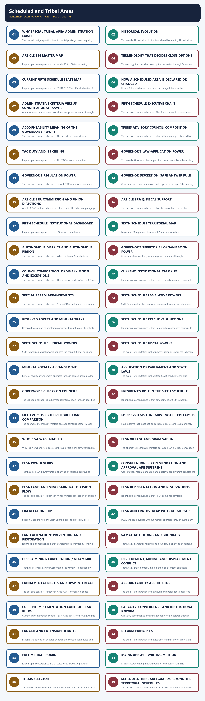

*Distinct embedded teaching-navigation image. The separate continuous Cārvāka-style flowchart package remains an independent at-a-glance artifact.*

### SESSION 1 — WHY SPECIAL TRIBAL-AREA ADMINISTRATION EXISTS
#### DEFINITION / WHAT THIS IS CALLED

**Plain-language definition:** Why special tribal-area administration exists denotes the constitutional rules and institutional links organised around FORMAL EQUALITY OF ONE ADMINISTRATIVE MODEL.

**Technical definition:** The central design question is not "special privilege versus equality" but whether identical rules would reproduce unequal bargaining power and historical dispossession.

#### ANSWER-GRABBING OPENING — WRITE/ADAPT IN THE EXAM

> The central design question is not "special privilege versus equality" but whether identical rules would reproduce unequal bargaining power and historical dispossession.

#### MUST-WRITE KEYWORDS

- **Why special tribal-area administration exists**
- **Why**
- **FORMAL EQUALITY OF ONE ADMINISTRATIVE**
- **MODEL**
- **EQUALITY REQUIRES DIFFERENTIATED GOVERNANCE**
- **Its principal consequence**

**How to use them:** Frame the answer through Why special tribal-area administration exists; define Why, connect FORMAL EQUALITY OF ONE ADMINISTRATIVE with MODEL to explain the mechanism, and use EQUALITY REQUIRES DIFFERENTIATED GOVERNANCE for the decisive comparison or qualification.

Why special tribal-area administration exists denotes the constitutional rules and institutional links organised around FORMAL EQUALITY OF ONE ADMINISTRATIVE MODEL.
Why special tribal-area administration exists operates through remote terrain + customary institutions + land dependence, connected with historical alienation + extractive pressure + weak voice.
The operative mechanism matters because sUBSTANTIVE EQUALITY REQUIRES DIFFERENTIATED GOVERNANCE.
Its principal consequence is that fIFTH SCHEDULE SIXTH SCHEDULE.
The decisive contrast is between protective supervision elected territorial autonomy and [FACT] Part X recognises that ordinary State administration may require constitutional modification in specified tribal regions.
The exam-safe limitation is that [LIMIT] Protection can become paternalism if communities remain subjects of administration rather than participants in decisions.
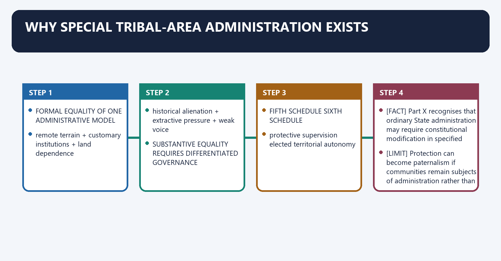
**Visual 1 - The constitutional problem**

```text
FORMAL EQUALITY OF ONE ADMINISTRATIVE MODEL
                   |
                   v
remote terrain + customary institutions + land dependence
                   +
historical alienation + extractive pressure + weak voice
                   |
                   v
SUBSTANTIVE EQUALITY REQUIRES DIFFERENTIATED GOVERNANCE
                   |
         +---------+---------+
         |                   |
         v                   v
FIFTH SCHEDULE          SIXTH SCHEDULE
protective supervision  elected territorial autonomy
```

Caption: The Schedules are devices of substantive equality: they differentiate administration to protect land, culture, voice and self-government.

- [FACT] Part X recognises that ordinary State administration may require constitutional modification in specified tribal regions.
- [ANALYSIS] The central design question is not "special privilege versus equality" but whether identical rules would reproduce unequal bargaining power and historical dispossession.
- [LIMIT] Protection can become paternalism if communities remain subjects of administration rather than participants in decisions.

#### CLOSING RECALL FLOW — WHY SPECIAL TRIBAL-AREA ADMINISTRATION EXISTS

```closure-flow
SUBTOPIC: Why special tribal-area administration exists
KEY TERMS / DEFINITIONS: Why special tribal-area administration exists · Why · FORMAL EQUALITY OF ONE ADMINISTRATIVE · MODEL · EQUALITY REQUIRES DIFFERENTIATED GOVERNANCE · Its principal consequence
MECHANISM / ARGUMENT: The operative mechanism matters because sUBSTANTIVE EQUALITY REQUIRES DIFFERENTIATED GOVERNANCE.
CONSEQUENCE / CONTRAST: The decisive contrast is between protective supervision elected territorial autonomy and Part X recognises that ordinary State administration may require constitutional modification in specified tribal regions.
UPSC TRAP / ANSWER-USE: The central design question is not "special privilege versus equality" but whether identical rules would reproduce unequal bargaining power and historical dispossession.
ANSWER-GRABBING FORMULATION: The central design question is not "special privilege versus equality" but whether identical rules would reproduce unequal bargaining power and historical dispossession.
```
### SESSION 2 — HISTORICAL EVOLUTION
#### DEFINITION / WHAT THIS IS CALLED

**Plain-language definition:** Historical evolution denotes the constitutional rules and institutional links organised around 1874 Scheduled Districts Act.

**Technical definition:** Technically, Historical evolution is analysed by relating Historical to Scheduled Districts Act, then testing the relationship through Its principal consequence and Its.

#### ANSWER-GRABBING OPENING — WRITE/ADAPT IN THE EXAM

> Constitutional continuity in special administration does not mean identical purposes: democratic accountability and tribal agency are now controlling values.

#### MUST-WRITE KEYWORDS

- **Historical evolution**
- **Historical**
- **Scheduled Districts Act**
- **Its principal consequence**
- **Its**
- **The decisive contrast**

**How to use them:** Frame the answer through Historical evolution; define Historical, connect Scheduled Districts Act with Its principal consequence to explain the mechanism, and use Its for the decisive comparison or qualification.

Historical evolution denotes the constitutional rules and institutional links organised around 1874 Scheduled Districts Act.
Historical evolution operates through colonial excluded / partially excluded areas, connected with Government of India Act, 1935.
The operative mechanism matters because constituent Assembly tribal-area subcommittees.
Its principal consequence is that a.V. Thakkar: areas outside Assam.
The decisive contrast is between Gopinath Bordoloi: Assam tribal/excluded areas and Fifth Schedule: protective administration.
The exam-safe limitation is that sixth Schedule: autonomous district/regional councils.
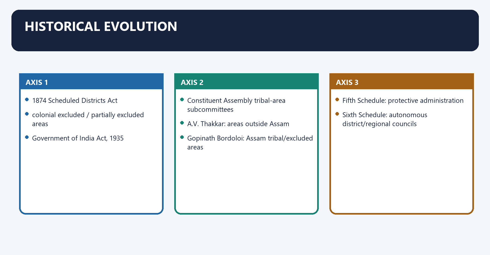
**Visual 2 - From exclusion to negotiated constitutionalism**

```text
1874 Scheduled Districts Act
        |
colonial excluded / partially excluded areas
        |
Government of India Act, 1935
        |
Constituent Assembly tribal-area subcommittees
  - A.V. Thakkar: areas outside Assam
  - Gopinath Bordoloi: Assam tribal/excluded areas
        |
1950 Constitution
  Fifth Schedule: protective administration
  Sixth Schedule: autonomous district/regional councils
        |
1996 PESA: self-government layer in Fifth Schedule areas
        |
2006 FRA: tenure and community forest-resource rights
```

- [FACT] Colonial "excluded" arrangements largely insulated administration from representative provincial institutions while concentrating power in executive authorities.
- [FACT] The Constitution retained differentiation but added representative, welfare and rights-oriented purposes.
- [ANALYSIS] The Fifth Schedule partially transforms the colonial guardian model; the Sixth Schedule moves further toward territorial self-government.
- [LIMIT] Constitutional continuity in special administration does not mean identical purposes: democratic accountability and tribal agency are now controlling values.

#### CLOSING RECALL FLOW — HISTORICAL EVOLUTION

```closure-flow
SUBTOPIC: Historical evolution
KEY TERMS / DEFINITIONS: Historical evolution · Historical · Scheduled Districts Act · Its principal consequence · Its · The decisive contrast
MECHANISM / ARGUMENT: The Fifth Schedule partially transforms the colonial guardian model; the Sixth Schedule moves further toward territorial self-government.
CONSEQUENCE / CONTRAST: The decisive contrast is between Gopinath Bordoloi: Assam tribal/excluded areas and Fifth Schedule: protective administration.
UPSC TRAP / ANSWER-USE: Do not miss this limiting distinction: its principal consequence is that a.V.
ANSWER-GRABBING FORMULATION: Constitutional continuity in special administration does not mean identical purposes: democratic accountability and tribal agency are now controlling values.
```
### SESSION 3 — ARTICLE 244 MASTER MAP
#### DEFINITION / WHAT THIS IS CALLED

**Plain-language definition:** Article 244 master map denotes the constitutional rules and institutional links organised around Provision Territorial reach Core function.

**Technical definition:** Its principal consequence is that article 275(1) States requiring specified tribal-welfare/Scheduled-Area support grants-in-aid.

#### ANSWER-GRABBING OPENING — WRITE/ADAPT IN THE EXAM

> Article 244 activates the Fifth and Sixth Schedules, while Articles 244A, 275 and 339 add distinct autonomy, fiscal and supervisory mechanisms.

#### MUST-WRITE KEYWORDS

- **Article 244 master map**
- **Article 244(1)**
- **applies Fifth Schedule**
- **Article 244(2)**
- **tribal areas in Assam, Meghalaya, Tripura and Mizoram**
- **applies Sixth Schedule**

**How to use them:** Frame the answer through Article 244 master map; define Article 244(1), connect applies Fifth Schedule with Article 244(2) to explain the mechanism, and use tribal areas in Assam, Meghalaya, Tripura and Mizoram for the decisive comparison or qualification.

Article 244 master map denotes the constitutional rules and institutional links organised around Provision Territorial reach Core function.
Article 244 master map operates through Article 244(1) Scheduled Areas and ST administration outside the four Sixth Schedule States applies Fifth Schedule, connected with Article 244(2) tribal areas in Assam, Meghalaya, Tripura and Mizoram applies Sixth Schedule.
The operative mechanism matters because article 244A Assam only permits Parliament to create an autonomous State with legislature/CoM.
Its principal consequence is that article 275(1) States requiring specified tribal-welfare/Scheduled-Area support grants-in-aid.
The decisive contrast is between Article 339(1) Scheduled Areas and ST welfare presidential commission and Article 339(2) States Union directions on essential ST-welfare schemes.
The exam-safe limitation is that [FACT] Article 244 is the gateway; the detailed institutions are in the Schedules.
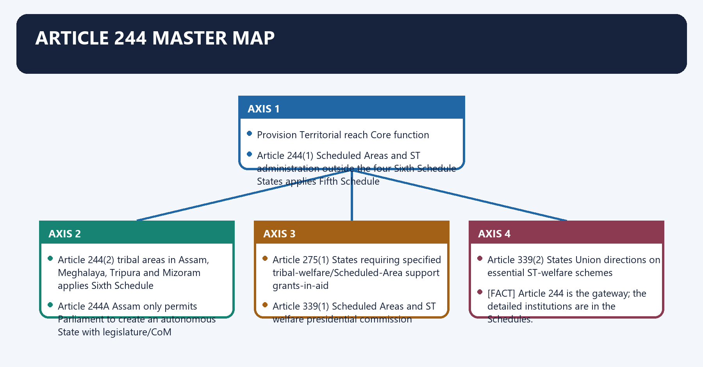
**Visual 3 - The constitutional spine**

| Provision | Territorial reach | Core function |
|---|---|---|
| Article 244(1) | Scheduled Areas and ST administration outside the four Sixth Schedule States | applies Fifth Schedule |
| Article 244(2) | tribal areas in Assam, Meghalaya, Tripura and Mizoram | applies Sixth Schedule |
| Article 244A | Assam only | permits Parliament to create an autonomous State with legislature/CoM |
| Article 275(1) | States requiring specified tribal-welfare/Scheduled-Area support | grants-in-aid |
| Article 339(1) | Scheduled Areas and ST welfare | presidential commission |
| Article 339(2) | States | Union directions on essential ST-welfare schemes |

- [FACT] Article 244 is the gateway; the detailed institutions are in the Schedules.
- [ANALYSIS] Articles 275 and 339 add fiscal and supervisory support to the territorial design.
- [LIMIT] Article 244A is an enabling power for an autonomous State within Assam, not an automatic consequence of a Sixth Schedule council.

#### CLOSING RECALL FLOW — ARTICLE 244 MASTER MAP

```closure-flow
SUBTOPIC: Article 244 master map
KEY TERMS / DEFINITIONS: Article 244 master map · Article 244(1) · applies Fifth Schedule · Article 244(2) · tribal areas in Assam, Meghalaya, Tripura and Mizoram · applies Sixth Schedule
MECHANISM / ARGUMENT: The operative mechanism matters because article 244A Assam only permits Parliament to create an autonomous State with legislature/CoM.
CONSEQUENCE / CONTRAST: Its principal consequence is that article 275(1) States requiring specified tribal-welfare/Scheduled-Area support grants-in-aid.
UPSC TRAP / ANSWER-USE: Do not miss this limiting distinction: the decisive contrast is between Article 339(1) Scheduled Areas and ST welfare presidential commission...
ANSWER-GRABBING FORMULATION: Article 244 activates the Fifth and Sixth Schedules, while Articles 244A, 275 and 339 add distinct autonomy, fiscal and supervisory mechanisms.
```
### SESSION 4 — TERMINOLOGY THAT DECIDES CLOSE OPTIONS
#### DEFINITION / WHAT THIS IS CALLED

**Plain-language definition:** Terminology that decides close options denotes the constitutional rules and institutional links organised around Term Legal source Who specifies/organises?

**Technical definition:** Terminology that decides close options operates through Scheduled Tribe Article 342 President specifies for a State/UT; Parliament alters by law Governor does not declare the ST list, connected with PESA village PESA section 4(b) habitation/hamlet-based statutory conception need not mirror an ordinary revenue village.

#### ANSWER-GRABBING OPENING — WRITE/ADAPT IN THE EXAM

> Scheduled Areas, tribal areas, Scheduled Tribes and PESA villages arise through different legal routes, so their declaring authorities and territorial effects cannot be interchanged.

#### MUST-WRITE KEYWORDS

- **Terminology that decides close options**
- **Memory rule**
- **Scheduled Area**
- **Fifth Schedule, paragraph 6**
- **President by order; specified alterations involve Governor consultation**
- **tribal area**

**How to use them:** Frame the answer through Terminology that decides close options; define Memory rule, connect Scheduled Area with Fifth Schedule, paragraph 6 to explain the mechanism, and use President by order; specified alterations involve Governor consultation for the decisive comparison or qualification.

Terminology that decides close options denotes the constitutional rules and institutional links organised around Term Legal source Who specifies/organises? Exam trap.
Terminology that decides close options operates through Scheduled Tribe Article 342 President specifies for a State/UT; Parliament alters by law Governor does not declare the ST list, connected with PESA village PESA section 4(b) habitation/hamlet-based statutory conception need not mirror an ordinary revenue village.
The operative mechanism matters because term Legal source Who specifies/organises? Exam trap.
Its principal consequence is that term Legal source Who specifies/organises? Exam trap.
The decisive contrast is between Term Legal source Who specifies/organises? Exam trap and Term Legal source Who specifies/organises? Exam trap.
The exam-safe limitation is that term Legal source Who specifies/organises? Exam trap.
**Visual 4 - Scheduled Area, tribal area and Scheduled Tribe**

| Term | Legal source | Who specifies/organises? | Exam trap |
|---|---|---|---|
| Scheduled Area | Fifth Schedule, paragraph 6 | President by order; specified alterations involve Governor consultation | not the same as any area with ST population |
| tribal area | Sixth Schedule Parts I-IV | constitutional list, with gubernatorial organisation/reorganisation powers | not a Fifth Schedule label |
| Scheduled Tribe | Article 342 | President specifies for a State/UT; Parliament alters by law | Governor does not declare the ST list |
| PESA village | PESA section 4(b) | habitation/hamlet-based statutory conception | need not mirror an ordinary revenue village |

> **Memory rule:** **President schedules the area and tribe list through different constitutional routes; Governor organises Sixth Schedule districts/regions; PESA recognises habitation-based village life.**

#### CLOSING RECALL FLOW — TERMINOLOGY THAT DECIDES CLOSE OPTIONS

```closure-flow
SUBTOPIC: Terminology that decides close options
KEY TERMS / DEFINITIONS: Terminology that decides close options · Memory rule · Scheduled Area · Fifth Schedule, paragraph 6 · President by order; specified alterations involve Governor consultation · tribal area
MECHANISM / ARGUMENT: Terminology that decides close options operates through Scheduled Tribe Article 342 President specifies for a State/UT; Parliament alters by law Governor does not declare the ST list, connected with PESA village PESA section 4(b) habitation/hamlet-based statutory conception need not mirror an ordinary revenue village.
CONSEQUENCE / CONTRAST: Its principal consequence is that term Legal source Who specifies/organises?
UPSC TRAP / ANSWER-USE: Do not miss this limiting distinction: the decisive contrast is between Term Legal source Who specifies/organises?
ANSWER-GRABBING FORMULATION: Scheduled Areas, tribal areas, Scheduled Tribes and PESA villages arise through different legal routes, so their declaring authorities and territorial effects cannot be interchanged.
```
### SESSION 5 — CURRENT FIFTH SCHEDULE STATE MAP
#### DEFINITION / WHAT THIS IS CALLED

**Plain-language definition:** Current Fifth Schedule State map denotes the constitutional rules and institutional links organised around WEST / CENTRAL BELT.

**Technical definition:** Its principal consequence is that [CURRENT] The official Ministry of Panchayati Raj state-wise document lists these 10 States.

#### ANSWER-GRABBING OPENING — WRITE/ADAPT IN THE EXAM

> Fifth Schedule coverage rests on operative Presidential Orders across ten States, making current territorial notifications more authoritative than static district lists.

#### MUST-WRITE KEYWORDS

- **Current Fifth Schedule State map**
- **Current Fifth Schedule State**
- **WEST**
- **CENTRAL BELT**
- **Its principal consequence**
- **Its**

**How to use them:** Frame the answer through Current Fifth Schedule State map; define Current Fifth Schedule State, connect WEST with CENTRAL BELT to explain the mechanism, and use Its principal consequence for the decisive comparison or qualification.

Current Fifth Schedule State map denotes the constitutional rules and institutional links organised around WEST / CENTRAL BELT.
Current Fifth Schedule State map operates through Gujarat - Rajasthan - Maharashtra - Madhya Pradesh - Chhattisgarh, connected with Jharkhand - Odisha.
The operative mechanism matters because andhra Pradesh - Telangana.
Its principal consequence is that [CURRENT] The official Ministry of Panchayati Raj state-wise document lists these 10 States.
The decisive contrast is between [FACT] Their legal coverage comes from operative Presidential Orders, including post-State-reorganisation application and WEST / CENTRAL BELT.
The exam-safe limitation is that wEST / CENTRAL BELT.
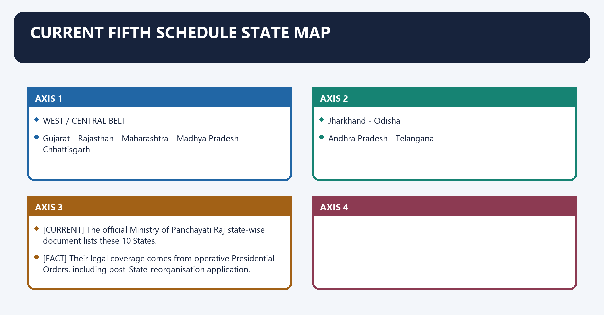
**Visual 5 - Officially supported 10-State inventory**

```text
WEST / CENTRAL BELT
Gujarat - Rajasthan - Maharashtra - Madhya Pradesh - Chhattisgarh

EASTERN BELT
Jharkhand - Odisha

SOUTH / DECCAN
Andhra Pradesh - Telangana

HIMALAYAN
Himachal Pradesh
```

- [CURRENT] The official Ministry of Panchayati Raj state-wise document lists these 10 States.
- [FACT] Their legal coverage comes from operative Presidential Orders, including post-State-reorganisation application.
- [LIMIT] District names and boundaries can change. Memorise the State inventory and declaration mechanism; verify granular district lists from current orders before quoting them.

#### CLOSING RECALL FLOW — CURRENT FIFTH SCHEDULE STATE MAP

```closure-flow
SUBTOPIC: Current Fifth Schedule State map
KEY TERMS / DEFINITIONS: Current Fifth Schedule State map · Current Fifth Schedule State · WEST · CENTRAL BELT · Its principal consequence · Its
MECHANISM / ARGUMENT: Its principal consequence is that [CURRENT] The official Ministry of Panchayati Raj state-wise document lists these 10 States.
CONSEQUENCE / CONTRAST: The decisive contrast is between Their legal coverage comes from operative Presidential Orders, including post-State-reorganisation application and WEST / CENTRAL BELT.
UPSC TRAP / ANSWER-USE: Do not miss this limiting distinction: the exam-safe limitation is that wEST / CENTRAL BELT.
ANSWER-GRABBING FORMULATION: Fifth Schedule coverage rests on operative Presidential Orders across ten States, making current territorial notifications more authoritative than static district lists.
```
### SESSION 6 — HOW A SCHEDULED AREA IS DECLARED OR CHANGED
#### DEFINITION / WHAT THIS IS CALLED

**Plain-language definition:** How a Scheduled Area is declared or changed operates through Governor consultation where the Schedule requires it, connected with PRESIDENTIAL ORDER.

**Technical definition:** How a Scheduled Area is declared or changed denotes the constitutional rules and institutional links organised around territorial facts / State reorganisation / review need.

#### ANSWER-GRABBING OPENING — WRITE/ADAPT IN THE EXAM

> The President declares or alters Scheduled Areas through specified orders, consulting the Governor where required without converting consultation into gubernatorial consent.

#### MUST-WRITE KEYWORDS

- **How a Scheduled Area**
- **Scheduled Area**
- **Governor**
- **Schedule**
- **PRESIDENTIAL ORDER**
- **Its principal consequence**

**How to use them:** Frame the answer through How a Scheduled Area; define Scheduled Area, connect Governor with Schedule to explain the mechanism, and use PRESIDENTIAL ORDER for the decisive comparison or qualification.

How a Scheduled Area is declared or changed denotes the constitutional rules and institutional links organised around territorial facts / State reorganisation / review need.
How a Scheduled Area is declared or changed operates through Governor consultation where the Schedule requires it, connected with PRESIDENTIAL ORDER.
The operative mechanism matters because declare increase alter boundary redefine rescind.
Its principal consequence is that only the notified territory receives Scheduled Area status.
The decisive contrast is between [FACT] The President may declare an area a Scheduled Area and [LIMIT] Consultation is not the same as gubernatorial consent.
The exam-safe limitation is that territorial facts / State reorganisation / review need.
**Visual 6 - Fifth Schedule paragraph 6 process**

```text
territorial facts / State reorganisation / review need
                    |
                    v
Governor consultation where the Schedule requires it
                    |
                    v
PRESIDENTIAL ORDER
  declare | increase | alter boundary | redefine | rescind
                    |
                    v
only the notified territory receives Scheduled Area status
```

- [FACT] The President may declare an area a Scheduled Area.
- [FACT] The Schedule permits increase, alteration, redefinition and rescission through specified presidential orders; consultation with the Governor is required in the cases stated in paragraph 6.
- [LIMIT] Consultation is not the same as gubernatorial consent.

#### CLOSING RECALL FLOW — HOW A SCHEDULED AREA IS DECLARED OR CHANGED

```closure-flow
SUBTOPIC: How a Scheduled Area is declared or changed
KEY TERMS / DEFINITIONS: How a Scheduled Area · Scheduled Area · Governor · Schedule · PRESIDENTIAL ORDER · Its principal consequence
MECHANISM / ARGUMENT: How a Scheduled Area is declared or changed denotes the constitutional rules and institutional links organised around territorial facts / State reorganisation / review need.
CONSEQUENCE / CONTRAST: Its principal consequence is that only the notified territory receives Scheduled Area status.
UPSC TRAP / ANSWER-USE: The decisive contrast is between The President may declare an area a Scheduled Area and Consultation is not the same as gubernatorial consent.
ANSWER-GRABBING FORMULATION: The President declares or alters Scheduled Areas through specified orders, consulting the Governor where required without converting consultation into gubernatorial consent.
```
### SESSION 7 — ADMINISTRATIVE CRITERIA VERSUS CONSTITUTIONAL POWER
#### DEFINITION / WHAT THIS IS CALLED

**Plain-language definition:** Administrative criteria versus constitutional power denotes the constitutional rules and institutional links organised around Layer Content Legal weight.

**Technical definition:** Administrative criteria versus constitutional power operates through constitutional authority President's order under Fifth Schedule paragraph 6 creates/changes legal status, connected with The Ministry of Tribal Affairs identifies those four administrative criteria.

#### ANSWER-GRABBING OPENING — WRITE/ADAPT IN THE EXAM

> Satisfying a criterion does not itself make an area Scheduled; notification remains indispensable.

#### MUST-WRITE KEYWORDS

- **Administrative criteria versus constitutional power**
- **constitutional authority**
- **President's order under Fifth Schedule paragraph 6**
- **creates/changes legal status**
- **official administrative criteria**
- **Administrative**

**How to use them:** Frame the answer through Administrative criteria versus constitutional power; define constitutional authority, connect President's order under Fifth Schedule paragraph 6 with creates/changes legal status to explain the mechanism, and use official administrative criteria for the decisive comparison or qualification.

Administrative criteria versus constitutional power denotes the constitutional rules and institutional links organised around Layer Content Legal weight.
Administrative criteria versus constitutional power operates through constitutional authority President's order under Fifth Schedule paragraph 6 creates/changes legal status, connected with [FACT] The Ministry of Tribal Affairs identifies those four administrative criteria.
The operative mechanism matters because [ANALYSIS] Criteria discipline the area approach by linking protection to demographic, territorial and developmental realities.
Its principal consequence is that [LIMIT] Satisfying a criterion does not itself make an area Scheduled; notification remains indispensable.
The decisive contrast is between Layer Content Legal weight and Layer Content Legal weight.
The exam-safe limitation is that layer Content Legal weight.
**Visual 7 - Two-layer declaration test**

| Layer | Content | Legal weight |
|---|---|---|
| constitutional authority | President's order under Fifth Schedule paragraph 6 | creates/changes legal status |
| official administrative criteria | tribal preponderance; compactness/reasonable size; viable unit; comparative economic backwardness | guides identification but does not replace notification |

- [FACT] The Ministry of Tribal Affairs identifies those four administrative criteria.
- [ANALYSIS] Criteria discipline the area approach by linking protection to demographic, territorial and developmental realities.
- [LIMIT] Satisfying a criterion does not itself make an area Scheduled; notification remains indispensable.

#### CLOSING RECALL FLOW — ADMINISTRATIVE CRITERIA VERSUS CONSTITUTIONAL POWER

```closure-flow
SUBTOPIC: Administrative criteria versus constitutional power
KEY TERMS / DEFINITIONS: Administrative criteria versus constitutional power · constitutional authority · President's order under Fifth Schedule paragraph 6 · creates/changes legal status · official administrative criteria · Administrative
MECHANISM / ARGUMENT: Administrative criteria versus constitutional power operates through constitutional authority President's order under Fifth Schedule paragraph 6 creates/changes legal status, connected with The Ministry of Tribal Affairs identifies those four administrative criteria.
CONSEQUENCE / CONTRAST: Its principal consequence is that Satisfying a criterion does not itself make an area Scheduled; notification remains indispensable.
UPSC TRAP / ANSWER-USE: Do not miss this limiting distinction: the decisive contrast is between Layer Content Legal weight and Layer Content Legal weight.
ANSWER-GRABBING FORMULATION: Satisfying a criterion does not itself make an area Scheduled; notification remains indispensable.
```
### SESSION 8 — FIFTH SCHEDULE EXECUTIVE CHAIN
#### DEFINITION / WHAT THIS IS CALLED

**Plain-language definition:** Fifth Schedule executive chain denotes the constitutional rules and institutional links organised around STATE EXECUTIVE POWER CONTINUES.

**Technical definition:** The decisive contrast is between The State does not lose executive power merely because an area is scheduled and The Governor reports annually, or whenever required by the President, on administration of Scheduled Areas.

#### ANSWER-GRABBING OPENING — WRITE/ADAPT IN THE EXAM

> The State does not lose executive power merely because an area is scheduled.

#### MUST-WRITE KEYWORDS

- **Fifth Schedule executive chain**
- **Fifth Schedule**
- **Scheduled Area**
- **President**
- **Its principal consequence**
- **Its**

**How to use them:** Frame the answer through Fifth Schedule executive chain; define Fifth Schedule, connect Scheduled Area with President to explain the mechanism, and use Its principal consequence for the decisive comparison or qualification.

Fifth Schedule executive chain denotes the constitutional rules and institutional links organised around STATE EXECUTIVE POWER CONTINUES.
Fifth Schedule executive chain operates through administration of Scheduled Area, connected with annual or when President requires.
The operative mechanism matters because union executive directions to the State.
Its principal consequence is that on Scheduled-Area administration.
The decisive contrast is between [FACT] The State does not lose executive power merely because an area is scheduled and [FACT] The Governor reports annually, or whenever required by the President, on administration of Scheduled Areas.
The exam-safe limitation is that [FACT] Union executive power extends to giving directions to the State regarding such administration.
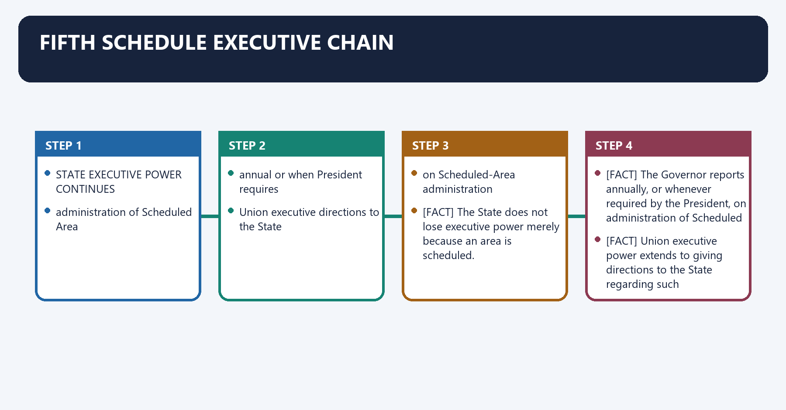
**Visual 8 - State administration under Union supervision**

```text
STATE EXECUTIVE POWER CONTINUES
             |
             v
administration of Scheduled Area
             |
     Governor's report
 annual or when President requires
             |
             v
          PRESIDENT
             |
             v
Union executive directions to the State
on Scheduled-Area administration
```

- [FACT] The State does not lose executive power merely because an area is scheduled.
- [FACT] The Governor reports annually, or whenever required by the President, on administration of Scheduled Areas.
- [FACT] Union executive power extends to giving directions to the State regarding such administration.
- [LIMIT] The Schedule creates supervision by report and direction, not an automatic Union takeover of total administration.

#### CLOSING RECALL FLOW — FIFTH SCHEDULE EXECUTIVE CHAIN

```closure-flow
SUBTOPIC: Fifth Schedule executive chain
KEY TERMS / DEFINITIONS: Fifth Schedule executive chain · Fifth Schedule · Scheduled Area · President · Its principal consequence · Its
MECHANISM / ARGUMENT: Fifth Schedule executive chain operates through administration of Scheduled Area, connected with annual or when President requires.
CONSEQUENCE / CONTRAST: The decisive contrast is between The State does not lose executive power merely because an area is scheduled and The Governor reports annually, or whenever required by the President, on administration of Scheduled Areas.
UPSC TRAP / ANSWER-USE: The State does not lose executive power merely because an area is scheduled.
ANSWER-GRABBING FORMULATION: The State does not lose executive power merely because an area is scheduled.
```
### SESSION 9 — ACCOUNTABILITY MEANING OF THE GOVERNOR'S REPORT
#### DEFINITION / WHAT THIS IS CALLED

**Plain-language definition:** Accountability meaning of the Governor's report denotes the constitutional rules and institutional links organised around land transfer credit services PESA FRA.

**Technical definition:** The decisive contrast is between The report can convert local constitutional failures into an intergovernmental accountability record and land transfer credit services PESA FRA.

#### ANSWER-GRABBING OPENING — WRITE/ADAPT IN THE EXAM

> The text does not itself prescribe a public template, tabling deadline or consequence for a weak report; institutional design must supply those controls.

#### MUST-WRITE KEYWORDS

- **Accountability meaning of the Governor's report**
- **Accountability**
- **Governor's**
- **PESA FRA**
- **Its principal consequence**
- **Its**

**How to use them:** Frame the answer through Accountability meaning of the Governor's report; define Accountability, connect Governor's with PESA FRA to explain the mechanism, and use Its principal consequence for the decisive comparison or qualification.

Accountability meaning of the Governor's report denotes the constitutional rules and institutional links organised around land transfer credit services PESA FRA.
Accountability meaning of the Governor's report operates through Governor's Scheduled-Area report, connected with Presidential / Union scrutiny.
The operative mechanism matters because direction, scheme correction, legislative or administrative response.
Its principal consequence is that public and legislative follow-up.
The decisive contrast is between [ANALYSIS] The report can convert local constitutional failures into an intergovernmental accountability record and land transfer credit services PESA FRA.
The exam-safe limitation is that land transfer credit services PESA FRA.
**Visual 9 - Report-to-remedy loop**

```text
local evidence
land transfer | credit | services | PESA | FRA
        |
        v
Governor's Scheduled-Area report
        |
        v
Presidential / Union scrutiny
        |
        v
direction, scheme correction, legislative or administrative response
        |
        v
public and legislative follow-up
```

- [ANALYSIS] The report can convert local constitutional failures into an intergovernmental accountability record.
- [LIMIT] The text does not itself prescribe a public template, tabling deadline or consequence for a weak report; institutional design must supply those controls.

#### CLOSING RECALL FLOW — ACCOUNTABILITY MEANING OF THE GOVERNOR'S REPORT

```closure-flow
SUBTOPIC: Accountability meaning of the Governor's report
KEY TERMS / DEFINITIONS: Accountability meaning of the Governor's report · Accountability · Governor's · PESA FRA · Its principal consequence · Its
MECHANISM / ARGUMENT: The decisive contrast is between The report can convert local constitutional failures into an intergovernmental accountability record and land transfer credit services PESA FRA.
CONSEQUENCE / CONTRAST: The text does not itself prescribe a public template, tabling deadline or consequence for a weak report; institutional design must supply those controls.
UPSC TRAP / ANSWER-USE: Do not miss this limiting distinction: its principal consequence is that public and legislative follow-up.
ANSWER-GRABBING FORMULATION: The text does not itself prescribe a public template, tabling deadline or consequence for a weak report; institutional design must supply those controls.
```
### SESSION 10 — TRIBES ADVISORY COUNCIL: COMPOSITION
#### DEFINITION / WHAT THIS IS CALLED

**Plain-language definition:** Tribes Advisory Council: composition denotes the constitutional rules and institutional links organised around Feature Fifth Schedule rule.

**Technical definition:** The decisive contrast is between shortfall remaining seats filled by other members of those tribes and TAC composition seeks a legislative-representative connection rather than a purely bureaucratic advisory body.

#### ANSWER-GRABBING OPENING — WRITE/ADAPT IN THE EXAM

> The Tribes Advisory Council gives Scheduled Tribe representatives a formal advisory voice, but its composition does not confer legislative or executive authority.

#### MUST-WRITE KEYWORDS

- **Tribes Advisory Council**
- **composition**
- **where mandatory**
- **each State having Scheduled Areas**
- **possible extension**
- **maximum size**

**How to use them:** Frame the answer through Tribes Advisory Council; define composition, connect where mandatory with each State having Scheduled Areas to explain the mechanism, and use possible extension for the decisive comparison or qualification.

Tribes Advisory Council: composition denotes the constitutional rules and institutional links organised around Feature Fifth Schedule rule.
Tribes Advisory Council: composition operates through where mandatory each State having Scheduled Areas, connected with possible extension President may direct a TAC in a State having STs but no Scheduled Areas.
The operative mechanism matters because maximum size 20 members.
Its principal consequence is that representation as nearly as may be, three-fourths representatives of STs in State Legislative Assembly.
The decisive contrast is between shortfall remaining seats filled by other members of those tribes and [FACT] TAC composition seeks a legislative-representative connection rather than a purely bureaucratic advisory body.
The exam-safe limitation is that [LIMIT] "Three-fourths ST MLAs" is shorthand. The Schedule says representatives of STs in the Assembly and supplies a shortfall rule.
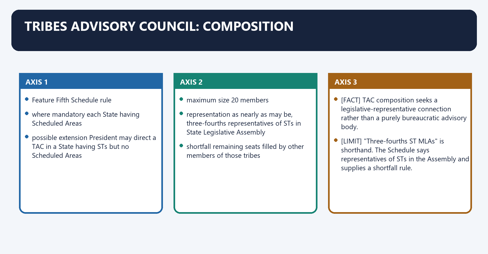
**Visual 10 - TAC design**

| Feature | Fifth Schedule rule |
|---|---|
| where mandatory | each State having Scheduled Areas |
| possible extension | President may direct a TAC in a State having STs but no Scheduled Areas |
| maximum size | 20 members |
| representation | as nearly as may be, three-fourths representatives of STs in State Legislative Assembly |
| shortfall | remaining seats filled by other members of those tribes |

- [FACT] TAC composition seeks a legislative-representative connection rather than a purely bureaucratic advisory body.
- [LIMIT] "Three-fourths ST MLAs" is shorthand. The Schedule says representatives of STs in the Assembly and supplies a shortfall rule.

#### CLOSING RECALL FLOW — TRIBES ADVISORY COUNCIL: COMPOSITION

```closure-flow
SUBTOPIC: Tribes Advisory Council: composition
KEY TERMS / DEFINITIONS: Tribes Advisory Council · composition · where mandatory · each State having Scheduled Areas · possible extension · maximum size
MECHANISM / ARGUMENT: The decisive contrast is between shortfall remaining seats filled by other members of those tribes and TAC composition seeks a legislative-representative connection rather than a purely bureaucratic advisory body.
CONSEQUENCE / CONTRAST: Its principal consequence is that representation as nearly as may be, three-fourths representatives of STs in State Legislative Assembly.
UPSC TRAP / ANSWER-USE: Do not miss this limiting distinction: the exam-safe limitation is that "Three-fourths ST MLAs" is shorthand.
ANSWER-GRABBING FORMULATION: The Tribes Advisory Council gives Scheduled Tribe representatives a formal advisory voice, but its composition does not confer legislative or executive authority.
```
### SESSION 11 — TAC DUTY AND ITS CEILING
#### DEFINITION / WHAT THIS IS CALLED

**Plain-language definition:** TAC duty and its ceiling denotes the constitutional rules and institutional links organised around Governor refers matter.

**Technical definition:** Its principal consequence is that The TAC advises on matters concerning welfare and advancement of STs that the Governor refers to it.

#### ANSWER-GRABBING OPENING — WRITE/ADAPT IN THE EXAM

> A Tribes Advisory Council advises only on welfare and advancement matters referred by the Governor, making agenda control a significant limit on oversight.

#### MUST-WRITE KEYWORDS

- **TAC duty**
- **its ceiling**
- **TAC duty and its ceiling**
- **TAC**
- **Governor**
- **Its principal consequence**

**How to use them:** Frame the answer through TAC duty; define its ceiling, connect TAC duty and its ceiling with TAC to explain the mechanism, and use Governor for the decisive comparison or qualification.

TAC duty and its ceiling denotes the constitutional rules and institutional links organised around Governor refers matter.
TAC duty and its ceiling operates through welfare and advancement of Scheduled Tribes, connected with TRIBES ADVISORY COUNCIL.
The operative mechanism matters because nOT: statute binding veto executive order court judgment.
Its principal consequence is that [FACT] The TAC advises on matters concerning welfare and advancement of STs that the Governor refers to it.
The decisive contrast is between [ANALYSIS] Agenda control matters: an advisory body cannot scrutinise what is never referred and [LIMIT] Do not describe TAC advice as legally binding or TAC as the Fifth Schedule equivalent of an Autonomous District Council.
The exam-safe limitation is that governor refers matter.
**Visual 11 - Advisory, not legislative**

```text
Governor refers matter
   welfare and advancement of Scheduled Tribes
              |
              v
       TRIBES ADVISORY COUNCIL
              |
              v
            advice

NOT: statute | binding veto | executive order | court judgment
```

- [FACT] The TAC advises on matters concerning welfare and advancement of STs that the Governor refers to it.
- [ANALYSIS] Agenda control matters: an advisory body cannot scrutinise what is never referred.
- [LIMIT] Do not describe TAC advice as legally binding or TAC as the Fifth Schedule equivalent of an Autonomous District Council.

#### CLOSING RECALL FLOW — TAC DUTY AND ITS CEILING

```closure-flow
SUBTOPIC: TAC duty and its ceiling
KEY TERMS / DEFINITIONS: TAC duty · its ceiling · TAC duty and its ceiling · TAC · Governor · Its principal consequence
MECHANISM / ARGUMENT: Its principal consequence is that The TAC advises on matters concerning welfare and advancement of STs that the Governor refers to it.
CONSEQUENCE / CONTRAST: The decisive contrast is between Agenda control matters: an advisory body cannot scrutinise what is never referred and Do not describe TAC advice as legally binding or TAC as the Fifth Schedule equivalent of an Autonomous District Council.
UPSC TRAP / ANSWER-USE: Do not describe TAC advice as legally binding or TAC as the Fifth Schedule equivalent of an Autonomous District Council.
ANSWER-GRABBING FORMULATION: A Tribes Advisory Council advises only on welfare and advancement matters referred by the Governor, making agenda control a significant limit on oversight.
```
### SESSION 12 — GOVERNOR'S LAW-APPLICATION POWER
#### DEFINITION / WHAT THIS IS CALLED

**Plain-language definition:** Governor's law-application power denotes the constitutional rules and institutional links organised around Act of Parliament or State Legislature.

**Technical definition:** Technically, Governor's law-application power is analysed by relating Governor's to Act, then testing the relationship through Parliament and Its principal consequence.

#### ANSWER-GRABBING OPENING — WRITE/ADAPT IN THE EXAM

> The Governor may direct that a parliamentary or State Act shall not apply to a Scheduled Area or shall apply subject to exceptions and modifications.

#### MUST-WRITE KEYWORDS

- **Governor's law-application power**
- **Governor's**
- **Act**
- **Parliament**
- **Its principal consequence**
- **Its**

**How to use them:** Frame the answer through Governor's law-application power; define Governor's, connect Act with Parliament to explain the mechanism, and use Its principal consequence for the decisive comparison or qualification.

Governor's law-application power denotes the constitutional rules and institutional links organised around Act of Parliament or State Legislature.
Governor's law-application power operates through Governor's public notification for Scheduled Area, connected with +-------------------+.
The operative mechanism matters because not apply apply with retrospective.
Its principal consequence is that exceptions / effect possible.
The decisive contrast is between [FACT] The direction may have retrospective effect and [LIMIT] It is not a general power to suspend the Constitution or Fundamental Rights.
The exam-safe limitation is that act of Parliament or State Legislature.
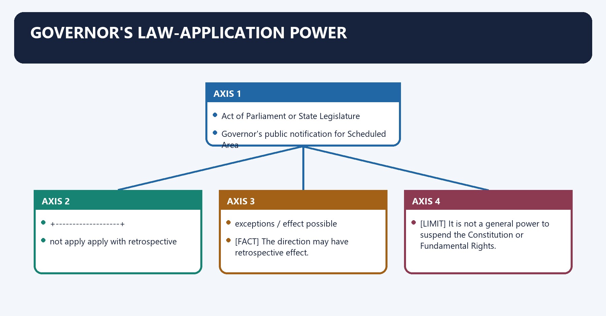
**Visual 12 - Paragraph 5(1) shield**

```text
Act of Parliament or State Legislature
                |
                v
Governor's public notification for Scheduled Area
   +-------------------+-------------------+
   |                   |                   |
not apply          apply with          retrospective
                   exceptions /        effect possible
                   modifications
```

- [FACT] The Governor may direct that a parliamentary or State Act shall not apply to a Scheduled Area or shall apply subject to exceptions and modifications.
- [FACT] The direction may have retrospective effect.
- [ANALYSIS] This is a constitutional adaptation power: general law can be filtered through local land, custom and institutional realities.
- [LIMIT] It is not a general power to suspend the Constitution or Fundamental Rights.

#### CLOSING RECALL FLOW — GOVERNOR'S LAW-APPLICATION POWER

```closure-flow
SUBTOPIC: Governor's law-application power
KEY TERMS / DEFINITIONS: Governor's law-application power · Governor's · Act · Parliament · Its principal consequence · Its
MECHANISM / ARGUMENT: This is a constitutional adaptation power: general law can be filtered through local land, custom and institutional realities.
CONSEQUENCE / CONTRAST: The decisive contrast is between The direction may have retrospective effect and It is not a general power to suspend the Constitution or Fundamental Rights.
UPSC TRAP / ANSWER-USE: It is not a general power to suspend the Constitution or Fundamental Rights.
ANSWER-GRABBING FORMULATION: The Governor may direct that a parliamentary or State Act shall not apply to a Scheduled Area or shall apply subject to exceptions and modifications.
```
### SESSION 13 — GOVERNOR'S REGULATION POWER
#### DEFINITION / WHAT THIS IS CALLED

**Plain-language definition:** Governor's regulation power denotes the constitutional rules and institutional links organised around Regulation field Protective purpose.

**Technical definition:** The decisive contrast is between consult TAC where one exists and Governor makes regulation.

#### ANSWER-GRABBING OPENING — WRITE/ADAPT IN THE EXAM

> PESA later adds broader statutory self-government functions; it does not erase the constitutional regulation route.

#### MUST-WRITE KEYWORDS

- **Governor's regulation power**
- **peace and good government of a Scheduled Area**
- **tailored administration**
- **prevent alienation**
- **regulate allotment of land to ST members**
- **secure access**

**How to use them:** Frame the answer through Governor's regulation power; define peace and good government of a Scheduled Area, connect tailored administration with prevent alienation to explain the mechanism, and use regulate allotment of land to ST members for the decisive comparison or qualification.

Governor's regulation power denotes the constitutional rules and institutional links organised around Regulation field Protective purpose.
Governor's regulation power operates through peace and good government of a Scheduled Area tailored administration, connected with prohibit/restrict transfer of land by or among ST members prevent alienation.
The operative mechanism matters because regulate allotment of land to ST members secure access.
Its principal consequence is that regulate money-lending to ST members reduce exploitative credit.
The decisive contrast is between consult TAC where one exists and Governor makes regulation.
The exam-safe limitation is that may amend/repeal applicable parliamentary or State law.
**Visual 13 - Paragraph 5(2) protective subjects**

| Regulation field | Protective purpose |
|---|---|
| peace and good government of a Scheduled Area | tailored administration |
| prohibit/restrict transfer of land by or among ST members | prevent alienation |
| regulate allotment of land to ST members | secure access |
| regulate money-lending to ST members | reduce exploitative credit |

**Visual 14 - Regulation validity chain**

```text
draft regulation
      |
consult TAC where one exists
      |
Governor makes regulation
      |
may amend/repeal applicable parliamentary or State law
      |
submitted to President
      |
NO EFFECT UNTIL PRESIDENTIAL ASSENT
```

- [FACT] Presidential assent is a condition of effect.
- [FACT] Consultation with the TAC is required before making such regulations where a TAC exists.
- [LIMIT] PESA later adds broader statutory self-government functions; it does not erase the constitutional regulation route.

#### CLOSING RECALL FLOW — GOVERNOR'S REGULATION POWER

```closure-flow
SUBTOPIC: Governor's regulation power
KEY TERMS / DEFINITIONS: Governor's regulation power · peace and good government of a Scheduled Area · tailored administration · prevent alienation · regulate allotment of land to ST members · secure access
MECHANISM / ARGUMENT: The decisive contrast is between consult TAC where one exists and Governor makes regulation.
CONSEQUENCE / CONTRAST: PESA later adds broader statutory self-government functions; it does not erase the constitutional regulation route.
UPSC TRAP / ANSWER-USE: Do not miss this limiting distinction: its principal consequence is that regulate money-lending to ST members reduce exploitative credit.
ANSWER-GRABBING FORMULATION: PESA later adds broader statutory self-government functions; it does not erase the constitutional regulation route.
```
### SESSION 14 — GOVERNOR DISCRETION: SAFE ANSWER RULE
#### DEFINITION / WHAT THIS IS CALLED

**Plain-language definition:** Governor discretion: safe answer rule denotes the constitutional rules and institutional links organised around Proposition Safe treatment.

**Technical definition:** Governor discretion: safe answer rule operates through Schedule says "Governor may" identifies the constitutional office holding the power, connected with Governor acts personally in every case do not assert without a specific constitutional/judicial basis.

#### ANSWER-GRABBING OPENING — WRITE/ADAPT IN THE EXAM

> Fifth Schedule powers assigned to the Governor should not be presumed personal in every case; the stronger critique is their possible under-use within ordinary executive priorities.

#### MUST-WRITE KEYWORDS

- **Governor discretion**
- **safe answer rule**
- **Schedule says "Governor may"**
- **identifies the constitutional office holding the power**
- **Governor acts personally in every case**
- **advice can never matter**

**How to use them:** Frame the answer through Governor discretion; define safe answer rule, connect Schedule says "Governor may" with identifies the constitutional office holding the power to explain the mechanism, and use Governor acts personally in every case for the decisive comparison or qualification.

Governor discretion: safe answer rule denotes the constitutional rules and institutional links organised around Proposition Safe treatment.
Governor discretion: safe answer rule operates through Schedule says "Governor may" [FACT] identifies the constitutional office holding the power, connected with Governor acts personally in every case [LIMIT] do not assert without a specific constitutional/judicial basis.
The operative mechanism matters because advice can never matter [LIMIT] overstatement.
Its principal consequence is that action/inaction is beyond review [LIMIT] constitutional power remains bounded by purpose, law and judicial review.
The decisive contrast is between Proposition Safe treatment and Proposition Safe treatment.
The exam-safe limitation is that proposition Safe treatment.
**Visual 15 - Text, convention and review**

| Proposition | Safe treatment |
|---|---|
| Schedule says "Governor may" | [FACT] identifies the constitutional office holding the power |
| Governor acts personally in every case | [LIMIT] do not assert without a specific constitutional/judicial basis |
| advice can never matter | [LIMIT] overstatement |
| action/inaction is beyond review | [LIMIT] constitutional power remains bounded by purpose, law and judicial review |

- [ANALYSIS] The exam-worthy criticism is not that the Governor owns sovereign tribal policy; it is that a protective constitutional power may remain under-used within an executive system dominated by ordinary State priorities.

#### CLOSING RECALL FLOW — GOVERNOR DISCRETION: SAFE ANSWER RULE

```closure-flow
SUBTOPIC: Governor discretion: safe answer rule
KEY TERMS / DEFINITIONS: Governor discretion · safe answer rule · Schedule says "Governor may" · identifies the constitutional office holding the power · Governor acts personally in every case · advice can never matter
MECHANISM / ARGUMENT: Governor discretion: safe answer rule denotes the constitutional rules and institutional links organised around Proposition Safe treatment.
CONSEQUENCE / CONTRAST: The decisive contrast is between Proposition Safe treatment and Proposition Safe treatment.
UPSC TRAP / ANSWER-USE: The exam-worthy criticism is not that the Governor owns sovereign tribal policy; it is that a protective constitutional power may remain under-used within an executive system dominated by ordinary State priorities.
ANSWER-GRABBING FORMULATION: Fifth Schedule powers assigned to the Governor should not be presumed personal in every case; the stronger critique is their possible under-use within ordinary executive priorities.
```
### SESSION 15 — ARTICLE 339: COMMISSION AND UNION DIRECTIONS
#### DEFINITION / WHAT THIS IS CALLED

**Plain-language definition:** Article 339: commission and Union directions denotes the constitutional rules and institutional links organised around Clause Power Precision.

**Technical definition:** Article 339(2) welfare-scheme directions and Fifth Schedule paragraph 3 directions on Scheduled-Area administration are related but textually distinct.

#### ANSWER-GRABBING OPENING — WRITE/ADAPT IN THE EXAM

> Article 339(2) welfare-scheme directions and Fifth Schedule paragraph 3 directions on Scheduled-Area administration are related but textually distinct.

#### MUST-WRITE KEYWORDS

- **Article 339**
- **commission**
- **Union directions**
- **examine Scheduled-Area administration and ST welfare**
- **scheme-specific welfare direction**
- **Article 339: commission and Union directions**

**How to use them:** Frame the answer through Article 339; define commission, connect Union directions with examine Scheduled-Area administration and ST welfare to explain the mechanism, and use scheme-specific welfare direction for the decisive comparison or qualification.

Article 339: commission and Union directions denotes the constitutional rules and institutional links organised around Clause Power Precision.
Article 339: commission and Union directions operates through 339(2) Union may direct a State on drawing up/executing schemes specified as essential for ST welfare scheme-specific welfare direction, connected with Clause Power Precision.
The operative mechanism matters because clause Power Precision.
Its principal consequence is that clause Power Precision.
The decisive contrast is between Clause Power Precision and Clause Power Precision.
The exam-safe limitation is that clause Power Precision.
**Visual 16 - Article 339's two clauses**

| Clause | Power | Precision |
|---|---|---|
| 339(1) | President may appoint a commission at any time and was required to do so after ten years from commencement | examine Scheduled-Area administration and ST welfare |
| 339(2) | Union may direct a State on drawing up/executing schemes specified as essential for ST welfare | scheme-specific welfare direction |

- [FACT] The first Scheduled Areas and Scheduled Tribes Commission was chaired by U.N. Dhebar; a later commission was chaired by Dilip Singh Bhuria.
- [LIMIT] Article 339(2) welfare-scheme directions and Fifth Schedule paragraph 3 directions on Scheduled-Area administration are related but textually distinct.

#### CLOSING RECALL FLOW — ARTICLE 339: COMMISSION AND UNION DIRECTIONS

```closure-flow
SUBTOPIC: Article 339: commission and Union directions
KEY TERMS / DEFINITIONS: Article 339 · commission · Union directions · examine Scheduled-Area administration and ST welfare · scheme-specific welfare direction · Article 339: commission and Union directions
MECHANISM / ARGUMENT: The first Scheduled Areas and Scheduled Tribes Commission was chaired by U.N.
CONSEQUENCE / CONTRAST: Article 339(2) welfare-scheme directions and Fifth Schedule paragraph 3 directions on Scheduled-Area administration are related but textually distinct.
UPSC TRAP / ANSWER-USE: Do not miss this limiting distinction: the decisive contrast is between Clause Power Precision and Clause Power Precision.
ANSWER-GRABBING FORMULATION: Article 339(2) welfare-scheme directions and Fifth Schedule paragraph 3 directions on Scheduled-Area administration are related but textually distinct.
```
### SESSION 16 — ARTICLE 275(1): FISCAL SUPPORT
#### DEFINITION / WHAT THIS IS CALLED

**Plain-language definition:** Article 275(1): fiscal support denotes the constitutional rules and institutional links organised around Parliament provides grants-in-aid.

**Technical definition:** The decisive contrast is between Fiscal equalisation is essential because formal autonomy without administrative capacity can reproduce dependence and A grant is not proof of devolution, rights recognition or outcomes.

#### ANSWER-GRABBING OPENING — WRITE/ADAPT IN THE EXAM

> Fiscal equalisation is essential because formal autonomy without administrative capacity can reproduce dependence.

#### MUST-WRITE KEYWORDS

- **Article 275(1)**
- **fiscal support**
- **Article 275**
- **Article 275(1): fiscal support**
- **Article**
- **Parliament**

**How to use them:** Frame the answer through Article 275(1); define fiscal support, connect Article 275 with Article 275(1): fiscal support to explain the mechanism, and use Article for the decisive comparison or qualification.

Article 275(1): fiscal support denotes the constitutional rules and institutional links organised around Parliament provides grants-in-aid.
Article 275(1): fiscal support operates through ST welfare schemes approved by Government of India, connected with raising Scheduled-Area administration.
The operative mechanism matters because to the level of the rest of the State.
Its principal consequence is that state implementation + constitutional accountability.
The decisive contrast is between [ANALYSIS] Fiscal equalisation is essential because formal autonomy without administrative capacity can reproduce dependence and [LIMIT] A grant is not proof of devolution, rights recognition or outcomes.
The exam-safe limitation is that parliament provides grants-in-aid.
**Visual 17 - Constitutional finance chain**

```text
Parliament provides grants-in-aid
              |
              +--> ST welfare schemes approved by Government of India
              |
              +--> raising Scheduled-Area administration
                   to the level of the rest of the State
              |
              v
State implementation + constitutional accountability
```

- [FACT] Article 275(1) creates a dedicated constitutional grant route for specified tribal-welfare and Scheduled-Area administration needs.
- [ANALYSIS] Fiscal equalisation is essential because formal autonomy without administrative capacity can reproduce dependence.
- [LIMIT] A grant is not proof of devolution, rights recognition or outcomes.

#### CLOSING RECALL FLOW — ARTICLE 275(1): FISCAL SUPPORT

```closure-flow
SUBTOPIC: Article 275(1): fiscal support
KEY TERMS / DEFINITIONS: Article 275(1) · fiscal support · Article 275 · Article 275(1): fiscal support · Article · Parliament
MECHANISM / ARGUMENT: The decisive contrast is between Fiscal equalisation is essential because formal autonomy without administrative capacity can reproduce dependence and A grant is not proof of devolution, rights recognition or outcomes.
CONSEQUENCE / CONTRAST: Its principal consequence is that state implementation + constitutional accountability.
UPSC TRAP / ANSWER-USE: A grant is not proof of devolution, rights recognition or outcomes.
ANSWER-GRABBING FORMULATION: Fiscal equalisation is essential because formal autonomy without administrative capacity can reproduce dependence.
```
### SESSION 17 — FIFTH SCHEDULE INSTITUTIONAL DASHBOARD
#### DEFINITION / WHAT THIS IS CALLED

**Plain-language definition:** Fifth Schedule institutional dashboard denotes the constitutional rules and institutional links organised around Actor Core role Accountability risk.

**Technical definition:** Its principal consequence is that tAC advice on referred welfare/advancement matters weak agenda and non-binding advice.

#### ANSWER-GRABBING OPENING — WRITE/ADAPT IN THE EXAM

> Fifth Schedule protection depends on interaction among presidential supervision, gubernatorial powers, TAC advice and community participation, so strong text can still yield weak implementation.

#### MUST-WRITE KEYWORDS

- **Fifth Schedule institutional dashboard**
- **President/Union**
- **declare areas; assent regulations; receive reports; give directions**
- **distant supervision**
- **Governor**
- **report; refer to TAC; adapt laws; make regulations**

**How to use them:** Frame the answer through Fifth Schedule institutional dashboard; define President/Union, connect declare areas; assent regulations; receive reports; give directions with distant supervision to explain the mechanism, and use Governor for the decisive comparison or qualification.

Fifth Schedule institutional dashboard denotes the constitutional rules and institutional links organised around Actor Core role Accountability risk.
Fifth Schedule institutional dashboard operates through President/Union declare areas; assent regulations; receive reports; give directions distant supervision, connected with Governor report; refer to TAC; adapt laws; make regulations opacity or dormancy.
The operative mechanism matters because state government day-to-day administration and implementation conflict with extraction/revenue priorities.
Its principal consequence is that tAC advice on referred welfare/advancement matters weak agenda and non-binding advice.
The decisive contrast is between Gram Sabha under PESA/FRA specified participatory, resource and rights functions capacity, record and enforcement gaps and constitutional power.
The exam-safe limitation is that x community participation.
**Visual 18 - Who does what?**

| Actor | Core role | Accountability risk |
|---|---|---|
| President/Union | declare areas; assent regulations; receive reports; give directions | distant supervision |
| Governor | report; refer to TAC; adapt laws; make regulations | opacity or dormancy |
| State government | day-to-day administration and implementation | conflict with extraction/revenue priorities |
| TAC | advice on referred welfare/advancement matters | weak agenda and non-binding advice |
| Gram Sabha under PESA/FRA | specified participatory, resource and rights functions | capacity, record and enforcement gaps |

**Visual 19 - Fifth Schedule performance equation**

```text
constitutional power
     x timely use
     x community participation
     x enforceable records
     x fiscal/administrative capacity
     = effective protection
```

- [ANALYSIS] A strong text can deliver weak protection if any multiplier approaches zero.

#### CLOSING RECALL FLOW — FIFTH SCHEDULE INSTITUTIONAL DASHBOARD

```closure-flow
SUBTOPIC: Fifth Schedule institutional dashboard
KEY TERMS / DEFINITIONS: Fifth Schedule institutional dashboard · President/Union · declare areas; assent regulations; receive reports; give directions · distant supervision · Governor · report; refer to TAC; adapt laws; make regulations
MECHANISM / ARGUMENT: Its principal consequence is that tAC advice on referred welfare/advancement matters weak agenda and non-binding advice.
CONSEQUENCE / CONTRAST: The decisive contrast is between Gram Sabha under PESA/FRA specified participatory, resource and rights functions capacity, record and enforcement gaps and constitutional power.
UPSC TRAP / ANSWER-USE: Do not miss this limiting distinction: a strong text can deliver weak protection if any multiplier approaches zero.
ANSWER-GRABBING FORMULATION: Fifth Schedule protection depends on interaction among presidential supervision, gubernatorial powers, TAC advice and community participation, so strong text can still yield weak implementation.
```
### SESSION 18 — SIXTH SCHEDULE TERRITORIAL MAP
#### DEFINITION / WHAT THIS IS CALLED

**Plain-language definition:** Sixth Schedule territorial map denotes the constitutional rules and institutional links organised around ASSAM MEGHALAYA TRIPURA MIZORAM.

**Technical definition:** Nagaland, Manipur and Arunachal Pradesh have other constitutional/statutory arrangements; do not add them to the Sixth Schedule list.

#### ANSWER-GRABBING OPENING — WRITE/ADAPT IN THE EXAM

> The Sixth Schedule applies only to tribal areas in Assam, Meghalaya, Tripura and Mizoram, while neighbouring States rely on different constitutional or statutory arrangements.

#### MUST-WRITE KEYWORDS

- **Sixth Schedule territorial map**
- **Sixth Schedule**
- **ASSAM MEGHALAYA TRIPURA MIZORAM**
- **Its principal consequence**
- **Its**
- **MEGHALAYA TRIPURA MIZORAM**

**How to use them:** Frame the answer through Sixth Schedule territorial map; define Sixth Schedule, connect ASSAM MEGHALAYA TRIPURA MIZORAM with Its principal consequence to explain the mechanism, and use Its for the decisive comparison or qualification.

Sixth Schedule territorial map denotes the constitutional rules and institutional links organised around ASSAM MEGHALAYA TRIPURA MIZORAM.
Sixth Schedule territorial map operates through autonomous districts and, where applicable, autonomous regions, connected with District / Regional Councils under the Sixth Schedule.
The operative mechanism matters because [FACT] The Sixth Schedule operates only in Assam, Meghalaya, Tripura and Mizoram.
Its principal consequence is that aSSAM MEGHALAYA TRIPURA MIZORAM.
The decisive contrast is between ASSAM MEGHALAYA TRIPURA MIZORAM and ASSAM MEGHALAYA TRIPURA MIZORAM.
The exam-safe limitation is that aSSAM MEGHALAYA TRIPURA MIZORAM.
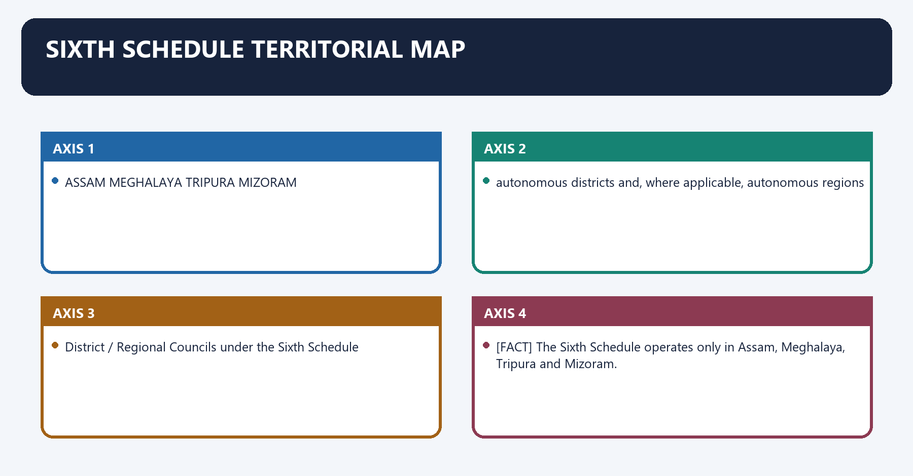
**Visual 20 - Four-State constitutional field**

```text
ASSAM        MEGHALAYA       TRIPURA        MIZORAM
  |              |              |              |
autonomous districts and, where applicable, autonomous regions
  |              |              |              |
District / Regional Councils under the Sixth Schedule
```

- [FACT] The Sixth Schedule operates only in Assam, Meghalaya, Tripura and Mizoram.
- [LIMIT] Nagaland, Manipur and Arunachal Pradesh have other constitutional/statutory arrangements; do not add them to the Sixth Schedule list.

#### CLOSING RECALL FLOW — SIXTH SCHEDULE TERRITORIAL MAP

```closure-flow
SUBTOPIC: Sixth Schedule territorial map
KEY TERMS / DEFINITIONS: Sixth Schedule territorial map · Sixth Schedule · ASSAM MEGHALAYA TRIPURA MIZORAM · Its principal consequence · Its · MEGHALAYA TRIPURA MIZORAM
MECHANISM / ARGUMENT: Nagaland, Manipur and Arunachal Pradesh have other constitutional/statutory arrangements; do not add them to the Sixth Schedule list.
CONSEQUENCE / CONTRAST: Its principal consequence is that aSSAM MEGHALAYA TRIPURA MIZORAM.
UPSC TRAP / ANSWER-USE: Do not miss this limiting distinction: the decisive contrast is between ASSAM MEGHALAYA TRIPURA MIZORAM and ASSAM MEGHALAYA TRIPURA MIZORAM.
ANSWER-GRABBING FORMULATION: The Sixth Schedule applies only to tribal areas in Assam, Meghalaya, Tripura and Mizoram, while neighbouring States rely on different constitutional or statutory arrangements.
```
### SESSION 19 — AUTONOMOUS DISTRICT AND AUTONOMOUS REGION
#### DEFINITION / WHAT THIS IS CALLED

**Plain-language definition:** Autonomous district and autonomous region denotes the constitutional rules and institutional links organised around AUTONOMOUS DISTRICT.

**Technical definition:** The decisive contrast is between Where different STs inhabit an autonomous district, the Governor may divide it into autonomous regions and An autonomous district remains within the State and subject to the Constitution; it is not a sovereign enclave.

#### ANSWER-GRABBING OPENING — WRITE/ADAPT IN THE EXAM

> An autonomous district remains within the State and subject to the Constitution; it is not a sovereign enclave.

#### MUST-WRITE KEYWORDS

- **Autonomous district**
- **autonomous region**
- **Autonomous district and autonomous region**
- **Autonomous**
- **Its principal consequence**
- **Its**

**How to use them:** Frame the answer through Autonomous district; define autonomous region, connect Autonomous district and autonomous region with Autonomous to explain the mechanism, and use Its principal consequence for the decisive comparison or qualification.

Autonomous district and autonomous region denotes the constitutional rules and institutional links organised around AUTONOMOUS DISTRICT.
Autonomous district and autonomous region operates through one principal tribal community: District Council, connected with different Scheduled Tribes in parts of district.
The operative mechanism matters because aUTONOMOUS REGIONS.
Its principal consequence is that [FACT] Tribal areas in each Schedule part are administered as autonomous districts.
The decisive contrast is between [FACT] Where different STs inhabit an autonomous district, the Governor may divide it into autonomous regions and [LIMIT] An autonomous district remains within the State and subject to the Constitution; it is not a sovereign enclave.
The exam-safe limitation is that aUTONOMOUS DISTRICT.
**Visual 21 - Territorial nesting**

```text
STATE
  |
  +--> AUTONOMOUS DISTRICT
          |
          +--> one principal tribal community: District Council
          |
          +--> different Scheduled Tribes in parts of district
                  |
                  v
             AUTONOMOUS REGIONS
                  |
                  v
             Regional Councils
```

- [FACT] Tribal areas in each Schedule part are administered as autonomous districts.
- [FACT] Where different STs inhabit an autonomous district, the Governor may divide it into autonomous regions.
- [LIMIT] An autonomous district remains within the State and subject to the Constitution; it is not a sovereign enclave.

#### CLOSING RECALL FLOW — AUTONOMOUS DISTRICT AND AUTONOMOUS REGION

```closure-flow
SUBTOPIC: Autonomous district and autonomous region
KEY TERMS / DEFINITIONS: Autonomous district · autonomous region · Autonomous district and autonomous region · Autonomous · Its principal consequence · Its
MECHANISM / ARGUMENT: Its principal consequence is that Tribal areas in each Schedule part are administered as autonomous districts.
CONSEQUENCE / CONTRAST: The decisive contrast is between Where different STs inhabit an autonomous district, the Governor may divide it into autonomous regions and An autonomous district remains within the State and subject to the Constitution; it is not a sovereign enclave.
UPSC TRAP / ANSWER-USE: An autonomous district remains within the State and subject to the Constitution; it is not a sovereign enclave.
ANSWER-GRABBING FORMULATION: An autonomous district remains within the State and subject to the Constitution; it is not a sovereign enclave.
```
### SESSION 20 — GOVERNOR'S TERRITORIAL ORGANISATION POWER
#### DEFINITION / WHAT THIS IS CALLED

**Plain-language definition:** Governor's territorial organisation power denotes the constitutional rules and institutional links organised around Governor may by public notification Constitutional effect.

**Technical definition:** Governor's territorial organisation power operates through include/exclude an area changes territorial reach, connected with create a new autonomous district adds a district unit.

#### ANSWER-GRABBING OPENING — WRITE/ADAPT IN THE EXAM

> The Governor may organise and alter Sixth Schedule autonomous districts and regions, but this territorial power does not create or reorganise States under Articles 2 and 3.

#### MUST-WRITE KEYWORDS

- **Governor's territorial organisation power**
- **include/exclude an area**
- **changes territorial reach**
- **create a new autonomous district**
- **adds a district unit**
- **increase/decrease area**

**How to use them:** Frame the answer through Governor's territorial organisation power; define include/exclude an area, connect changes territorial reach with create a new autonomous district to explain the mechanism, and use adds a district unit for the decisive comparison or qualification.

Governor's territorial organisation power denotes the constitutional rules and institutional links organised around Governor may by public notification Constitutional effect.
Governor's territorial organisation power operates through include/exclude an area changes territorial reach, connected with create a new autonomous district adds a district unit.
The operative mechanism matters because increase/decrease area changes boundary.
Its principal consequence is that unite parts consolidates units.
The decisive contrast is between define boundaries settles territorial line and alter name changes designation.
The exam-safe limitation is that [FACT] The Schedule gives the Governor substantial territorial-organisation power, subject to its procedures.
**Visual 22 - Reorganisation tools**

| Governor may by public notification | Constitutional effect |
|---|---|
| include/exclude an area | changes territorial reach |
| create a new autonomous district | adds a district unit |
| increase/decrease area | changes boundary |
| unite parts | consolidates units |
| define boundaries | settles territorial line |
| alter name | changes designation |

- [FACT] The Schedule gives the Governor substantial territorial-organisation power, subject to its procedures.
- [LIMIT] Reorganisation is not equivalent to State creation under Articles 2-3.

#### CLOSING RECALL FLOW — GOVERNOR'S TERRITORIAL ORGANISATION POWER

```closure-flow
SUBTOPIC: Governor's territorial organisation power
KEY TERMS / DEFINITIONS: Governor's territorial organisation power · include/exclude an area · changes territorial reach · create a new autonomous district · adds a district unit · increase/decrease area
MECHANISM / ARGUMENT: Governor's territorial organisation power operates through include/exclude an area changes territorial reach, connected with create a new autonomous district adds a district unit.
CONSEQUENCE / CONTRAST: The decisive contrast is between define boundaries settles territorial line and alter name changes designation.
UPSC TRAP / ANSWER-USE: Reorganisation is not equivalent to State creation under Articles 2-3.
ANSWER-GRABBING FORMULATION: The Governor may organise and alter Sixth Schedule autonomous districts and regions, but this territorial power does not create or reorganise States under Articles 2 and 3.
```
### SESSION 21 — COUNCIL COMPOSITION: ORDINARY MODEL AND EXCEPTIONS
#### DEFINITION / WHAT THIS IS CALLED

**Plain-language definition:** Council composition: ordinary model and exceptions denotes the constitutional rules and institutional links organised around DISTRICT COUNCIL: not more than 30 members.

**Technical definition:** The decisive contrast is between The ordinary model is "up to 30", not an invariable 30 and Special constitutional amendments create exceptions.

#### ANSWER-GRABBING OPENING — WRITE/ADAPT IN THE EXAM

> The ordinary Sixth Schedule council has up to thirty members with limited nomination, but constitutional amendments create institution-specific exceptions that cannot be generalised.

#### MUST-WRITE KEYWORDS

- **Council composition**
- **ordinary model**
- **exceptions**
- **up to 30**
- **up to 4 nominated**
- **46 members**

**How to use them:** Frame the answer through Council composition; define ordinary model, connect exceptions with up to 30 to explain the mechanism, and use up to 4 nominated for the decisive comparison or qualification.

Council composition: ordinary model and exceptions denotes the constitutional rules and institutional links organised around DISTRICT COUNCIL: not more than 30 members.
Council composition: ordinary model and exceptions operates through not more than 4 nominated by Governor, connected with remainder elected on adult suffrage.
The operative mechanism matters because elected term: ordinarily 5 years.
Its principal consequence is that nominated tenure: pleasure of Governor.
The decisive contrast is between [FACT] The ordinary model is "up to 30", not an invariable 30 and [FACT] Special constitutional amendments create exceptions.
The exam-safe limitation is that ordinary council Bodoland Territorial Council special design.
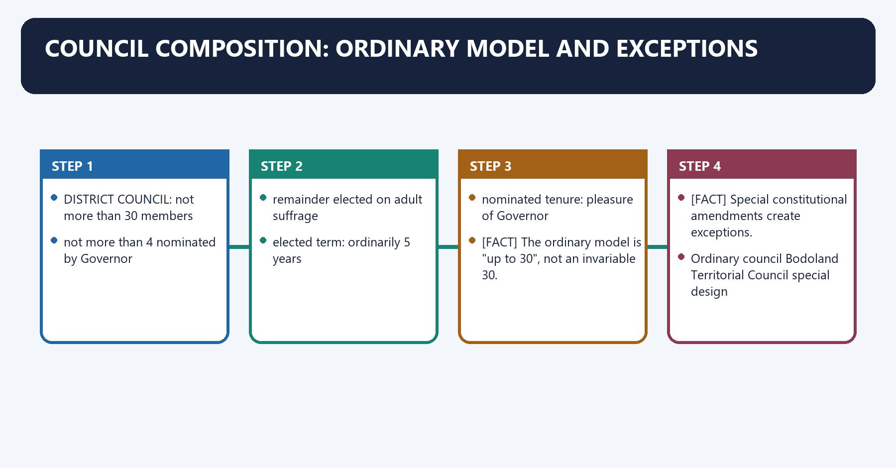
**Visual 23 - Ordinary paragraph 2 model**

```text
DISTRICT COUNCIL: not more than 30 members
   |
   +--> not more than 4 nominated by Governor
   |
   +--> remainder elected on adult suffrage

elected term: ordinarily 5 years
nominated tenure: pleasure of Governor
```

- [FACT] The ordinary model is "up to 30", not an invariable 30.
- [FACT] Special constitutional amendments create exceptions.

**Visual 24 - Bodoland exception**

| Ordinary council | Bodoland Territorial Council special design |
|---|---|
| up to 30 | 46 members |
| up to 4 nominated | 40 elected + 6 Governor-nominated |
| general paragraph 2 model | special Assam amendment architecture |

- [CURRENT] Assam's official portal identifies BTC, Karbi Anglong and Dima Hasao/North Cachar Hills councils as its Sixth Schedule autonomous-council institutions.
- [LIMIT] Do not generalise BTC's composition or subject list to all councils.

#### CLOSING RECALL FLOW — COUNCIL COMPOSITION: ORDINARY MODEL AND EXCEPTIONS

```closure-flow
SUBTOPIC: Council composition: ordinary model and exceptions
KEY TERMS / DEFINITIONS: Council composition · ordinary model · exceptions · up to 30 · up to 4 nominated · 46 members
MECHANISM / ARGUMENT: The decisive contrast is between The ordinary model is "up to 30", not an invariable 30 and Special constitutional amendments create exceptions.
CONSEQUENCE / CONTRAST: The ordinary model is "up to 30", not an invariable 30.
UPSC TRAP / ANSWER-USE: Do not generalise BTC's composition or subject list to all councils.
ANSWER-GRABBING FORMULATION: The ordinary Sixth Schedule council has up to thirty members with limited nomination, but constitutional amendments create institution-specific exceptions that cannot be generalised.
```
### SESSION 22 — CURRENT INSTITUTIONAL EXAMPLES
#### DEFINITION / WHAT THIS IS CALLED

**Plain-language definition:** Current institutional examples denotes the constitutional rules and institutional links organised around State Officially supported examples Safe recall.

**Technical definition:** Its principal consequence is that state Officially supported examples Safe recall.

#### ANSWER-GRABBING OPENING — WRITE/ADAPT IN THE EXAM

> Sixth Schedule councils share only the powers the Constitution gives them, while their names, detailed rules and institutional arrangements remain State- and council-specific.

#### MUST-WRITE KEYWORDS

- **Current institutional examples**
- **Assam**
- **special Assam amendments matter**
- **Meghalaya**
- **Khasi Hills, Jaintia Hills and Garo Hills ADCs**
- **Tripura**

**How to use them:** Frame the answer through Current institutional examples; define Assam, connect special Assam amendments matter with Meghalaya to explain the mechanism, and use Khasi Hills, Jaintia Hills and Garo Hills ADCs for the decisive comparison or qualification.

Current institutional examples denotes the constitutional rules and institutional links organised around State Officially supported examples Safe recall.
Current institutional examples operates through Meghalaya Khasi Hills, Jaintia Hills and Garo Hills ADCs State department scrutinises council instruments before Governor route, connected with Tripura Tripura Tribal Areas Autonomous District Council brought under Sixth Schedule from 1985.
The operative mechanism matters because mizoram Chakma, Lai and Mara ADCs distinct councils plus Article 371G State-level protection.
Its principal consequence is that state Officially supported examples Safe recall.
The decisive contrast is between State Officially supported examples Safe recall and State Officially supported examples Safe recall.
The exam-safe limitation is that state Officially supported examples Safe recall.
**Visual 25 - State-wise council examples**

| State | Officially supported examples | Safe recall |
|---|---|---|
| Assam | Bodoland Territorial Council; Karbi Anglong Autonomous Council; Dima Hasao/North Cachar Hills Autonomous Council | special Assam amendments matter |
| Meghalaya | Khasi Hills, Jaintia Hills and Garo Hills ADCs | State department scrutinises council instruments before Governor route |
| Tripura | Tripura Tribal Areas Autonomous District Council | brought under Sixth Schedule from 1985 |
| Mizoram | Chakma, Lai and Mara ADCs | distinct councils plus Article 371G State-level protection |

- [LIMIT] Council names, rules and officeholders are institution-specific. The constitutional power map is common only to the extent the Schedule says so.

#### CLOSING RECALL FLOW — CURRENT INSTITUTIONAL EXAMPLES

```closure-flow
SUBTOPIC: Current institutional examples
KEY TERMS / DEFINITIONS: Current institutional examples · Assam · special Assam amendments matter · Meghalaya · Khasi Hills, Jaintia Hills and Garo Hills ADCs · Tripura
MECHANISM / ARGUMENT: Its principal consequence is that state Officially supported examples Safe recall.
CONSEQUENCE / CONTRAST: The decisive contrast is between State Officially supported examples Safe recall and State Officially supported examples Safe recall.
UPSC TRAP / ANSWER-USE: Do not miss this limiting distinction: the exam-safe limitation is that state Officially supported examples Safe recall.
ANSWER-GRABBING FORMULATION: Sixth Schedule councils share only the powers the Constitution gives them, while their names, detailed rules and institutional arrangements remain State- and council-specific.
```
### SESSION 23 — SPECIAL ASSAM ARRANGEMENTS
#### DEFINITION / WHAT THIS IS CALLED

**Plain-language definition:** Special Assam arrangements denotes the constitutional rules and institutional links organised around SIXTH SCHEDULE ORDINARY POWERS.

**Technical definition:** The decisive contrast is between Article 244A: Parliament may create and an autonomous State within Assam.

#### ANSWER-GRABBING OPENING — WRITE/ADAPT IN THE EXAM

> Article 244A's autonomous-State possibility is distinct from the current legal status of an ADC and does not convert BTC, KAAC or the Dima Hasao council into a State.

#### MUST-WRITE KEYWORDS

- **Special Assam arrangements**
- **Article 244A**
- **Special Assam**
- **SIXTH SCHEDULE ORDINARY POWERS**
- **Its principal consequence**
- **Its**

**How to use them:** Frame the answer through Special Assam arrangements; define Article 244A, connect Special Assam with SIXTH SCHEDULE ORDINARY POWERS to explain the mechanism, and use Its principal consequence for the decisive comparison or qualification.

Special Assam arrangements denotes the constitutional rules and institutional links organised around SIXTH SCHEDULE ORDINARY POWERS.
Special Assam arrangements operates through paragraph 3A: additional subjects for, connected with North Cachar Hills and Karbi Anglong councils.
The operative mechanism matters because paragraph 3B: enlarged subject allocation.
Its principal consequence is that for Bodoland Territorial Council.
The decisive contrast is between Article 244A: Parliament may create and an autonomous State within Assam.
The exam-safe limitation is that with legislature and Council of Ministers.
**Visual 26 - Assam's layered autonomy**

```text
SIXTH SCHEDULE ORDINARY POWERS
             |
             +--> paragraph 3A: additional subjects for
             |    North Cachar Hills and Karbi Anglong councils
             |
             +--> paragraph 3B: enlarged subject allocation
             |    for Bodoland Territorial Council
             |
             +--> Article 244A: Parliament may create
                  an autonomous State within Assam
                  with legislature and Council of Ministers
```

- [FACT] Paragraphs 3A and 3B are constitutionally embedded Assam-specific enlargements.
- [ANALYSIS] The Sixth Schedule is therefore asymmetric even within the four-State field.
- [LIMIT] Article 244A's autonomous-State possibility is distinct from the current legal status of an ADC and does not convert BTC, KAAC or the Dima Hasao council into a State.

#### CLOSING RECALL FLOW — SPECIAL ASSAM ARRANGEMENTS

```closure-flow
SUBTOPIC: Special Assam arrangements
KEY TERMS / DEFINITIONS: Special Assam arrangements · Article 244A · Special Assam · SIXTH SCHEDULE ORDINARY POWERS · Its principal consequence · Its
MECHANISM / ARGUMENT: Article 244A's autonomous-State possibility is distinct from the current legal status of an ADC and does not convert BTC, KAAC or the Dima Hasao council into a State.
CONSEQUENCE / CONTRAST: The decisive contrast is between Article 244A: Parliament may create and an autonomous State within Assam.
UPSC TRAP / ANSWER-USE: Do not miss this limiting distinction: its principal consequence is that for Bodoland Territorial Council.
ANSWER-GRABBING FORMULATION: Article 244A's autonomous-State possibility is distinct from the current legal status of an ADC and does not convert BTC, KAAC or the Dima Hasao council into a State.
```
### SESSION 24 — SIXTH SCHEDULE LEGISLATIVE POWERS
#### DEFINITION / WHAT THIS IS CALLED

**Plain-language definition:** Sixth Schedule legislative powers denotes the constitutional rules and institutional links organised around Council law field Core scope.

**Technical definition:** Sixth Schedule legislative powers operates through land allotment, occupation or use, other than reserved forest, connected with forests management of forests other than reserved forests.

#### ANSWER-GRABBING OPENING — WRITE/ADAPT IN THE EXAM

> The subject list is specified and bounded; a council does not possess the plenary competence of a State legislature.

#### MUST-WRITE KEYWORDS

- **Sixth Schedule legislative powers**
- **land**
- **forests**
- **management of forests other than reserved forests**
- **water**
- **canals/watercourses for agriculture**

**How to use them:** Frame the answer through Sixth Schedule legislative powers; define land, connect forests with management of forests other than reserved forests to explain the mechanism, and use water for the decisive comparison or qualification.

Sixth Schedule legislative powers denotes the constitutional rules and institutional links organised around Council law field Core scope.
Sixth Schedule legislative powers operates through land allotment, occupation or use, other than reserved forest, connected with forests management of forests other than reserved forests.
The operative mechanism matters because water canals/watercourses for agriculture.
Its principal consequence is that cultivation regulation of shifting cultivation.
The decisive contrast is between local institutions village/town committees and administration and leadership appointment/succession of chiefs or headmen.
The exam-safe limitation is that family/property custom inheritance.
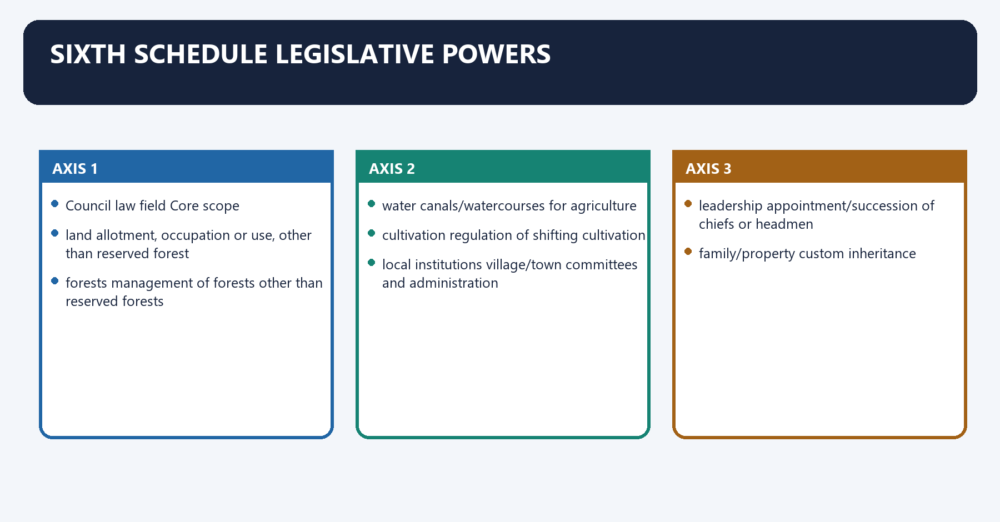
**Visual 27 - Paragraph 3 subject map**

| Council law field | Core scope |
|---|---|
| land | allotment, occupation or use, other than reserved forest |
| forests | management of forests other than reserved forests |
| water | canals/watercourses for agriculture |
| cultivation | regulation of shifting cultivation |
| local institutions | village/town committees and administration |
| leadership | appointment/succession of chiefs or headmen |
| family/property custom | inheritance |
| personal/customary law | marriage, divorce and social customs |

**Visual 28 - Council-law validity chain**

```text
District / Regional Council passes law
                 |
                 v
submitted to Governor
                 |
                 v
NO EFFECT UNTIL GOVERNOR'S ASSENT
```

- [FACT] These powers are legislative in character and materially stronger than TAC advice.
- [LIMIT] The subject list is specified and bounded; a council does not possess the plenary competence of a State legislature.

#### CLOSING RECALL FLOW — SIXTH SCHEDULE LEGISLATIVE POWERS

```closure-flow
SUBTOPIC: Sixth Schedule legislative powers
KEY TERMS / DEFINITIONS: Sixth Schedule legislative powers · land · forests · management of forests other than reserved forests · water · canals/watercourses for agriculture
MECHANISM / ARGUMENT: Sixth Schedule legislative powers operates through land allotment, occupation or use, other than reserved forest, connected with forests management of forests other than reserved forests.
CONSEQUENCE / CONTRAST: Its principal consequence is that cultivation regulation of shifting cultivation.
UPSC TRAP / ANSWER-USE: Do not miss this limiting distinction: the decisive contrast is between local institutions village/town committees and administration and leadership appointment/succession...
ANSWER-GRABBING FORMULATION: The subject list is specified and bounded; a council does not possess the plenary competence of a State legislature.
```
### SESSION 25 — RESERVED FOREST AND MINERAL TRAPS
#### DEFINITION / WHAT THIS IS CALLED

**Plain-language definition:** Reserved forest and mineral traps denotes the constitutional rules and institutional links organised around Tempting claim Correct position.

**Technical definition:** Reserved forest and mineral traps operates through council controls every forest paragraph 3 excludes reserved forests, connected with council owns all minerals Schedule provides specified regulation/revenue arrangements, not blanket subsoil ownership.

#### ANSWER-GRABBING OPENING — WRITE/ADAPT IN THE EXAM

> The Sixth Schedule excludes reserved forests from the ordinary council-law field and distinguishes specified mineral procedures, making omitted qualifiers legally decisive.

#### MUST-WRITE KEYWORDS

- **Reserved forest**
- **mineral traps**
- **council controls every forest**
- **paragraph 3 excludes reserved forests**
- **council owns all minerals**
- **council may legislate on any State List subject**

**How to use them:** Frame the answer through Reserved forest; define mineral traps, connect council controls every forest with paragraph 3 excludes reserved forests to explain the mechanism, and use council owns all minerals for the decisive comparison or qualification.

Reserved forest and mineral traps denotes the constitutional rules and institutional links organised around Tempting claim Correct position.
Reserved forest and mineral traps operates through council controls every forest paragraph 3 excludes reserved forests, connected with council owns all minerals Schedule provides specified regulation/revenue arrangements, not blanket subsoil ownership.
The operative mechanism matters because council may legislate on any State List subject competence is schedule- and amendment-specific.
Its principal consequence is that governor assent equals President assent ordinary council laws use Governor assent; Fifth Schedule regulations use President assent.
The decisive contrast is between [ANALYSIS] UPSC often converts one omitted adjective - "reserved" or "specified" - into the decisive close-option trap and Tempting claim Correct position.
The exam-safe limitation is that tempting claim Correct position.
**Visual 29 - What paragraph 3 does not give**

| Tempting claim | Correct position |
|---|---|
| council controls every forest | paragraph 3 excludes reserved forests |
| council owns all minerals | Schedule provides specified regulation/revenue arrangements, not blanket subsoil ownership |
| council may legislate on any State List subject | competence is schedule- and amendment-specific |
| Governor assent equals President assent | ordinary council laws use Governor assent; Fifth Schedule regulations use President assent |

- [ANALYSIS] UPSC often converts one omitted adjective - "reserved" or "specified" - into the decisive close-option trap.

#### CLOSING RECALL FLOW — RESERVED FOREST AND MINERAL TRAPS

```closure-flow
SUBTOPIC: Reserved forest and mineral traps
KEY TERMS / DEFINITIONS: Reserved forest · mineral traps · council controls every forest · paragraph 3 excludes reserved forests · council owns all minerals · council may legislate on any State List subject
MECHANISM / ARGUMENT: Reserved forest and mineral traps denotes the constitutional rules and institutional links organised around Tempting claim Correct position.
CONSEQUENCE / CONTRAST: The decisive contrast is between UPSC often converts one omitted adjective - "reserved" or "specified" - into the decisive close-option trap and Tempting claim Correct position.
UPSC TRAP / ANSWER-USE: Do not miss this limiting distinction: its principal consequence is that governor assent equals President assent ordinary council laws use...
ANSWER-GRABBING FORMULATION: The Sixth Schedule excludes reserved forests from the ordinary council-law field and distinguishes specified mineral procedures, making omitted qualifiers legally decisive.
```
### SESSION 26 — SIXTH SCHEDULE EXECUTIVE FUNCTIONS
#### DEFINITION / WHAT THIS IS CALLED

**Plain-language definition:** Sixth Schedule executive functions denotes the constitutional rules and institutional links organised around markets and cattle pounds.

**Technical definition:** Its principal consequence is that Paragraph 6 authorises councils to establish, construct or manage specified local institutions and services.

#### ANSWER-GRABBING OPENING — WRITE/ADAPT IN THE EXAM

> Sixth Schedule councils gain additional executive capacity through gubernatorial delegation, making functional autonomy partly dependent on the subjects actually entrusted.

#### MUST-WRITE KEYWORDS

- **Sixth Schedule executive functions**
- **Sixth Schedule**
- **Its principal consequence**
- **Its**
- **Paragraph**
- **The decisive contrast**

**How to use them:** Frame the answer through Sixth Schedule executive functions; define Sixth Schedule, connect Its principal consequence with Its to explain the mechanism, and use Paragraph for the decisive comparison or qualification.

Sixth Schedule executive functions denotes the constitutional rules and institutional links organised around markets and cattle pounds.
Sixth Schedule executive functions operates through ferries and fisheries, connected with roads and specified transport/waterways.
The operative mechanism matters because other entrusted State functions.
Its principal consequence is that [FACT] Paragraph 6 authorises councils to establish, construct or manage specified local institutions and services.
The decisive contrast is between markets and cattle pounds and markets and cattle pounds.
The exam-safe limitation is that markets and cattle pounds.
**Visual 30 - Local administration basket**

```text
District Council
   |
   +--> primary schools
   +--> dispensaries
   +--> markets and cattle pounds
   +--> ferries and fisheries
   +--> roads and specified transport/waterways
   +--> other entrusted State functions
```

- [FACT] Paragraph 6 authorises councils to establish, construct or manage specified local institutions and services.
- [FACT] The Governor may entrust additional functions relating to subjects such as agriculture, animal husbandry, community projects, cooperatives, social welfare and village planning.
- [LIMIT] Actual functional transfer depends on the applicable constitutional amendment, State-council arrangements, rules, staff and finance.

#### CLOSING RECALL FLOW — SIXTH SCHEDULE EXECUTIVE FUNCTIONS

```closure-flow
SUBTOPIC: Sixth Schedule executive functions
KEY TERMS / DEFINITIONS: Sixth Schedule executive functions · Sixth Schedule · Its principal consequence · Its · Paragraph · The decisive contrast
MECHANISM / ARGUMENT: Actual functional transfer depends on the applicable constitutional amendment, State-council arrangements, rules, staff and finance.
CONSEQUENCE / CONTRAST: Its principal consequence is that Paragraph 6 authorises councils to establish, construct or manage specified local institutions and services.
UPSC TRAP / ANSWER-USE: Do not miss this limiting distinction: the decisive contrast is between markets and cattle pounds and markets and cattle pounds.
ANSWER-GRABBING FORMULATION: Sixth Schedule councils gain additional executive capacity through gubernatorial delegation, making functional autonomy partly dependent on the subjects actually entrusted.
```
### SESSION 27 — SIXTH SCHEDULE JUDICIAL POWERS
#### DEFINITION / WHAT THIS IS CALLED

**Plain-language definition:** Sixth Schedule judicial powers operates through are all parties Scheduled Tribes within the relevant area?, connected with village council / ordinary judicial system,.

**Technical definition:** Sixth Schedule judicial powers denotes the constitutional rules and institutional links organised around dispute / offence arises in autonomous area.

#### ANSWER-GRABBING OPENING — WRITE/ADAPT IN THE EXAM

> Paragraph 4 enables village councils or courts and appellate arrangements for specified cases within the tribal-party boundary.

#### MUST-WRITE KEYWORDS

- **Sixth Schedule judicial powers**
- **Sixth Schedule**
- **Sixth Schedule judicial powers operates through**
- **Scheduled Tribes**
- **Its principal consequence**
- **Its**

**How to use them:** Frame the answer through Sixth Schedule judicial powers; define Sixth Schedule, connect Sixth Schedule judicial powers operates through with Scheduled Tribes to explain the mechanism, and use Its principal consequence for the decisive comparison or qualification.

Sixth Schedule judicial powers denotes the constitutional rules and institutional links organised around dispute / offence arises in autonomous area.
Sixth Schedule judicial powers operates through are all parties Scheduled Tribes within the relevant area?, connected with village council / ordinary judicial system,.
The operative mechanism matters because district Council subject to applicable law.
Its principal consequence is that specified jurisdiction.
The decisive contrast is between [FACT] Paragraph 4 enables village councils or courts and appellate arrangements for specified cases within the tribal-party boundary and [FACT] The Governor frames/approves important jurisdictional and procedural rules under the Schedule.
The exam-safe limitation is that [LIMIT] These bodies are not unrestricted substitutes for constitutional High Courts or the entire criminal-justice system.
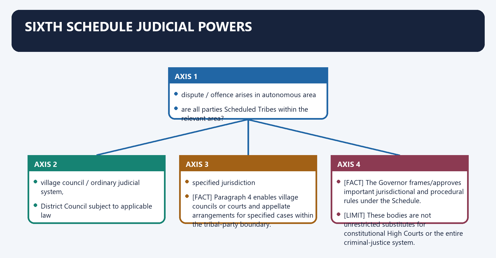
**Visual 31 - Customary justice boundary**

```text
dispute / offence arises in autonomous area
              |
are all parties Scheduled Tribes within the relevant area?
              |
        +-----+-----+
       yes          no
        |            |
village council /    ordinary judicial system,
District Council      subject to applicable law
court may have
specified jurisdiction
```

- [FACT] Paragraph 4 enables village councils or courts and appellate arrangements for specified cases within the tribal-party boundary.
- [FACT] The Governor frames/approves important jurisdictional and procedural rules under the Schedule.
- [LIMIT] These bodies are not unrestricted substitutes for constitutional High Courts or the entire criminal-justice system.

#### CLOSING RECALL FLOW — SIXTH SCHEDULE JUDICIAL POWERS

```closure-flow
SUBTOPIC: Sixth Schedule judicial powers
KEY TERMS / DEFINITIONS: Sixth Schedule judicial powers · Sixth Schedule · Sixth Schedule judicial powers operates through · Scheduled Tribes · Its principal consequence · Its
MECHANISM / ARGUMENT: Sixth Schedule judicial powers denotes the constitutional rules and institutional links organised around dispute / offence arises in autonomous area.
CONSEQUENCE / CONTRAST: The decisive contrast is between Paragraph 4 enables village councils or courts and appellate arrangements for specified cases within the tribal-party boundary and The Governor frames/approves important jurisdictional and procedural rules under the Schedule.
UPSC TRAP / ANSWER-USE: Do not miss this limiting distinction: its principal consequence is that specified jurisdiction.
ANSWER-GRABBING FORMULATION: Paragraph 4 enables village councils or courts and appellate arrangements for specified cases within the tribal-party boundary.
```
### SESSION 28 — SIXTH SCHEDULE FISCAL POWERS
#### DEFINITION / WHAT THIS IS CALLED

**Plain-language definition:** Sixth Schedule fiscal powers denotes the constitutional rules and institutional links organised around Power Examples under the Schedule.

**Technical definition:** The exam-safe limitation is that power Examples under the Schedule.

#### ANSWER-GRABBING OPENING — WRITE/ADAPT IN THE EXAM

> The exact levy must fit the Schedule and valid council law; "fiscal autonomy" does not mean immunity from audit, State law or constitutional limits.

#### MUST-WRITE KEYWORDS

- **Sixth Schedule fiscal powers**
- **land revenue**
- **assessment and collection**
- **taxes**
- **local levies**
- **markets and services**

**How to use them:** Frame the answer through Sixth Schedule fiscal powers; define land revenue, connect assessment and collection with taxes to explain the mechanism, and use local levies for the decisive comparison or qualification.

Sixth Schedule fiscal powers denotes the constitutional rules and institutional links organised around Power Examples under the Schedule.
Sixth Schedule fiscal powers operates through land revenue assessment and collection, connected with taxes lands/buildings; professions/trades/callings/employment; animals, vehicles and boats.
The operative mechanism matters because local levies entry of goods into markets; tolls; taxes for maintenance of schools, dispensaries or roads.
Its principal consequence is that markets and services fees and local-service revenue under valid law.
The decisive contrast is between funds District and Regional Funds with prescribed accounting/audit and [FACT] Councils have constitutionally recognised revenue powers that a Fifth Schedule TAC does not possess.
The exam-safe limitation is that power Examples under the Schedule.
**Visual 32 - Revenue basket**

| Power | Examples under the Schedule |
|---|---|
| land revenue | assessment and collection |
| taxes | lands/buildings; professions/trades/callings/employment; animals, vehicles and boats |
| local levies | entry of goods into markets; tolls; taxes for maintenance of schools, dispensaries or roads |
| markets and services | fees and local-service revenue under valid law |
| funds | District and Regional Funds with prescribed accounting/audit |

- [FACT] Councils have constitutionally recognised revenue powers that a Fifth Schedule TAC does not possess.
- [LIMIT] The exact levy must fit the Schedule and valid council law; "fiscal autonomy" does not mean immunity from audit, State law or constitutional limits.

#### CLOSING RECALL FLOW — SIXTH SCHEDULE FISCAL POWERS

```closure-flow
SUBTOPIC: Sixth Schedule fiscal powers
KEY TERMS / DEFINITIONS: Sixth Schedule fiscal powers · land revenue · assessment and collection · taxes · local levies · markets and services
MECHANISM / ARGUMENT: The decisive contrast is between funds District and Regional Funds with prescribed accounting/audit and Councils have constitutionally recognised revenue powers that a Fifth Schedule TAC does not possess.
CONSEQUENCE / CONTRAST: Councils have constitutionally recognised revenue powers that a Fifth Schedule TAC does not possess.
UPSC TRAP / ANSWER-USE: The exact levy must fit the Schedule and valid council law; "fiscal autonomy" does not mean immunity from audit, State law or constitutional limits.
ANSWER-GRABBING FORMULATION: The exact levy must fit the Schedule and valid council law; "fiscal autonomy" does not mean immunity from audit, State law or constitutional limits.
```
### SESSION 29 — MINERAL ROYALTY ARRANGEMENT
#### DEFINITION / WHAT THIS IS CALLED

**Plain-language definition:** Mineral royalty arrangement denotes the constitutional rules and institutional links organised around State grants mineral licence / lease.

**Technical definition:** Mineral royalty arrangement operates through agreed share paid to District Council, connected with Governor determines under Schedule mechanism.

#### ANSWER-GRABBING OPENING — WRITE/ADAPT IN THE EXAM

> Revenue sharing can internalise some local costs but cannot substitute for rights compliance, environmental appraisal or rehabilitation.

#### MUST-WRITE KEYWORDS

- **Mineral royalty arrangement**
- **Mineral**
- **District Council**
- **Governor**
- **Schedule**
- **Its principal consequence**

**How to use them:** Frame the answer through Mineral royalty arrangement; define Mineral, connect District Council with Governor to explain the mechanism, and use Schedule for the decisive comparison or qualification.

Mineral royalty arrangement denotes the constitutional rules and institutional links organised around State grants mineral licence / lease.
Mineral royalty arrangement operates through agreed share paid to District Council, connected with Governor determines under Schedule mechanism.
The operative mechanism matters because [FACT] The Schedule contemplates a share of mineral royalties for the District Council.
Its principal consequence is that [LIMIT] A royalty share is not ownership of all minerals and is not community consent.
The decisive contrast is between State grants mineral licence / lease and State grants mineral licence / lease.
The exam-safe limitation is that state grants mineral licence / lease.
**Visual 33 - Paragraph 9 flow**

```text
State grants mineral licence / lease
             |
             v
royalty accrues
             |
             v
agreed share paid to District Council
             |
dispute on share
             |
             v
Governor determines under Schedule mechanism
```

- [FACT] The Schedule contemplates a share of mineral royalties for the District Council.
- [ANALYSIS] Revenue sharing can internalise some local costs but cannot substitute for rights compliance, environmental appraisal or rehabilitation.
- [LIMIT] A royalty share is not ownership of all minerals and is not community consent.

#### CLOSING RECALL FLOW — MINERAL ROYALTY ARRANGEMENT

```closure-flow
SUBTOPIC: Mineral royalty arrangement
KEY TERMS / DEFINITIONS: Mineral royalty arrangement · Mineral · District Council · Governor · Schedule · Its principal consequence
MECHANISM / ARGUMENT: Mineral royalty arrangement operates through agreed share paid to District Council, connected with Governor determines under Schedule mechanism.
CONSEQUENCE / CONTRAST: Its principal consequence is that A royalty share is not ownership of all minerals and is not community consent.
UPSC TRAP / ANSWER-USE: A royalty share is not ownership of all minerals and is not community consent.
ANSWER-GRABBING FORMULATION: Revenue sharing can internalise some local costs but cannot substitute for rights compliance, environmental appraisal or rehabilitation.
```
### SESSION 30 — APPLICATION OF PARLIAMENT AND STATE LAWS
#### DEFINITION / WHAT THIS IS CALLED

**Plain-language definition:** Application of Parliament and State laws denotes the constitutional rules and institutional links organised around State field Schedule technique.

**Technical definition:** The exam-safe limitation is that state field Schedule technique.

#### ANSWER-GRABBING OPENING — WRITE/ADAPT IN THE EXAM

> State-specific Sixth Schedule rules determine how parliamentary and State laws apply, preventing one council's legal position from being generalised to all.

#### MUST-WRITE KEYWORDS

- **Application of Parliament**
- **Assam**
- **Meghalaya**
- **distinct paragraph 12A route**
- **Tripura**
- **distinct paragraph 12AA route**

**How to use them:** Frame the answer through Application of Parliament; define Assam, connect Meghalaya with distinct paragraph 12A route to explain the mechanism, and use Tripura for the decisive comparison or qualification.

Application of Parliament and State laws denotes the constitutional rules and institutional links organised around State field Schedule technique.
Application of Parliament and State laws operates through Assam special rules on application of State/parliamentary laws to autonomous districts and regions, connected with Meghalaya distinct paragraph 12A route.
The operative mechanism matters because tripura distinct paragraph 12AA route.
Its principal consequence is that mizoram distinct paragraph 12B route.
The decisive contrast is between [FACT] The Sixth Schedule contains separate State-specific provisions on whether and how laws apply and State field Schedule technique.
The exam-safe limitation is that state field Schedule technique.
**Visual 34 - State-specific legal filters**

| State field | Schedule technique |
|---|---|
| Assam | special rules on application of State/parliamentary laws to autonomous districts and regions |
| Meghalaya | distinct paragraph 12A route |
| Tripura | distinct paragraph 12AA route |
| Mizoram | distinct paragraph 12B route |

- [FACT] The Sixth Schedule contains separate State-specific provisions on whether and how laws apply.
- [LIMIT] Avoid the oversimplified sentence "Central and State laws do not apply unless the council agrees." The correct answer must identify that applicability, modification and notification rules vary by State and subject.

#### CLOSING RECALL FLOW — APPLICATION OF PARLIAMENT AND STATE LAWS

```closure-flow
SUBTOPIC: Application of Parliament and State laws
KEY TERMS / DEFINITIONS: Application of Parliament · Assam · Meghalaya · distinct paragraph 12A route · Tripura · distinct paragraph 12AA route
MECHANISM / ARGUMENT: Avoid the oversimplified sentence "Central and State laws do not apply unless the council agrees." The correct answer must identify that applicability, modification and notification rules vary by State and subject.
CONSEQUENCE / CONTRAST: The decisive contrast is between The Sixth Schedule contains separate State-specific provisions on whether and how laws apply and State field Schedule technique.
UPSC TRAP / ANSWER-USE: Do not miss this limiting distinction: its principal consequence is that mizoram distinct paragraph 12B route.
ANSWER-GRABBING FORMULATION: State-specific Sixth Schedule rules determine how parliamentary and State laws apply, preventing one council's legal position from being generalised to all.
```
### SESSION 31 — GOVERNOR'S CHECKS ON COUNCILS
#### DEFINITION / WHAT THIS IS CALLED

**Plain-language definition:** Governor's checks on councils denotes the constitutional rules and institutional links organised around laws administration courts finance.

**Technical definition:** The Schedule authorises gubernatorial intervention through specified procedures when council action threatens safety/public order or when administration requires inquiry and reconstitution.

#### ANSWER-GRABBING OPENING — WRITE/ADAPT IN THE EXAM

> The Schedule authorises gubernatorial intervention through specified procedures when council action threatens safety/public order or when administration requires inquiry and reconstitution.

#### MUST-WRITE KEYWORDS

- **Governor's checks on councils**
- **Governor's**
- **Its principal consequence**
- **Its**
- **The decisive contrast**
- **The exam-safe limitation**

**How to use them:** Frame the answer through Governor's checks on councils; define Governor's, connect Its principal consequence with Its to explain the mechanism, and use The decisive contrast for the decisive comparison or qualification.

Governor's checks on councils denotes the constitutional rules and institutional links organised around laws administration courts finance.
Governor's checks on councils operates through GOVERNOR'S CONSTITUTIONAL CHECKS, connected with commission and inquiry routes.
The operative mechanism matters because suspension of prejudicial acts or resolutions.
Its principal consequence is that dissolution / supersession under specified conditions.
The decisive contrast is between territorial reorganisation and State-legislative and judicial accountability.
The exam-safe limitation is that [LIMIT] These are conditioned constitutional controls, not a free-standing power to erase autonomy for political convenience.
**Visual 35 - Autonomy with constitutional brakes**

```text
COUNCIL AUTONOMY
 laws | administration | courts | finance
            |
            v
GOVERNOR'S CONSTITUTIONAL CHECKS
 assent / approval
 commission and inquiry routes
 suspension of prejudicial acts or resolutions
 dissolution / supersession under specified conditions
 territorial reorganisation
            |
            v
State-legislative and judicial accountability
```

- [FACT] The Schedule authorises gubernatorial intervention through specified procedures when council action threatens safety/public order or when administration requires inquiry and reconstitution.
- [LIMIT] These are conditioned constitutional controls, not a free-standing power to erase autonomy for political convenience.

#### CLOSING RECALL FLOW — GOVERNOR'S CHECKS ON COUNCILS

```closure-flow
SUBTOPIC: Governor's checks on councils
KEY TERMS / DEFINITIONS: Governor's checks on councils · Governor's · Its principal consequence · Its · The decisive contrast · The exam-safe limitation
MECHANISM / ARGUMENT: The Schedule authorises gubernatorial intervention through specified procedures when council action threatens safety/public order or when administration requires inquiry and reconstitution.
CONSEQUENCE / CONTRAST: Its principal consequence is that dissolution / supersession under specified conditions.
UPSC TRAP / ANSWER-USE: Do not miss this limiting distinction: the decisive contrast is between territorial reorganisation and State-legislative and judicial accountability.
ANSWER-GRABBING FORMULATION: The Schedule authorises gubernatorial intervention through specified procedures when council action threatens safety/public order or when administration requires inquiry and reconstitution.
```
### SESSION 32 — PRESIDENT'S ROLE IN THE SIXTH SCHEDULE
#### DEFINITION / WHAT THIS IS CALLED

**Plain-language definition:** President's role in the Sixth Schedule denotes the constitutional rules and institutional links organised around Function Primary constitutional actor.

**Technical definition:** Its principal consequence is that amendment of Sixth Schedule Parliament under paragraph 21, treated as not an Article 368 amendment for that purpose.

#### ANSWER-GRABBING OPENING — WRITE/ADAPT IN THE EXAM

> The Governor ordinarily assents to Sixth Schedule council laws, while presidential and parliamentary roles remain important without making the President the routine assent authority.

#### MUST-WRITE KEYWORDS

- **President's role in the Sixth Schedule**
- **not the President**
- **ordinary council law assent**
- **Governor**
- **council rules/regulations where Schedule requires**
- **Governor approval/assent**

**How to use them:** Frame the answer through President's role in the Sixth Schedule; define not the President, connect ordinary council law assent with Governor to explain the mechanism, and use council rules/regulations where Schedule requires for the decisive comparison or qualification.

President's role in the Sixth Schedule denotes the constitutional rules and institutional links organised around Function Primary constitutional actor.
President's role in the Sixth Schedule operates through ordinary council law assent Governor, connected with council rules/regulations where Schedule requires Governor approval/assent.
The operative mechanism matters because article 275(1) grants Union/Parliamentary constitutional finance.
Its principal consequence is that amendment of Sixth Schedule Parliament under paragraph 21, treated as not an Article 368 amendment for that purpose.
The decisive contrast is between routine approval of every ADC decision not the President and [FACT] The President is not the routine assent authority for Sixth Schedule council laws.
The exam-safe limitation is that function Primary constitutional actor.
**Visual 36 - Do not import the Fifth Schedule assent rule**

| Function | Primary constitutional actor |
|---|---|
| ordinary council law assent | Governor |
| council rules/regulations where Schedule requires | Governor approval/assent |
| Article 275(1) grants | Union/Parliamentary constitutional finance |
| amendment of Sixth Schedule | Parliament under paragraph 21, treated as not an Article 368 amendment for that purpose |
| routine approval of every ADC decision | **not the President** |

- [FACT] The President is not the routine assent authority for Sixth Schedule council laws.
- [LIMIT] Union legislation, constitutional finance and parliamentary amendment remain important; autonomy is nested within the Union-State Constitution.

#### CLOSING RECALL FLOW — PRESIDENT'S ROLE IN THE SIXTH SCHEDULE

```closure-flow
SUBTOPIC: President's role in the Sixth Schedule
KEY TERMS / DEFINITIONS: President's role in the Sixth Schedule · not the President · ordinary council law assent · Governor · council rules/regulations where Schedule requires · Governor approval/assent
MECHANISM / ARGUMENT: President's role in the Sixth Schedule operates through ordinary council law assent Governor, connected with council rules/regulations where Schedule requires Governor approval/assent.
CONSEQUENCE / CONTRAST: The decisive contrast is between routine approval of every ADC decision not the President and The President is not the routine assent authority for Sixth Schedule council laws.
UPSC TRAP / ANSWER-USE: Its principal consequence is that amendment of Sixth Schedule Parliament under paragraph 21, treated as not an Article 368 amendment for that purpose.
ANSWER-GRABBING FORMULATION: The Governor ordinarily assents to Sixth Schedule council laws, while presidential and parliamentary roles remain important without making the President the routine assent authority.
```
### SESSION 33 — FIFTH VERSUS SIXTH SCHEDULE: EXACT COMPARISON
#### DEFINITION / WHAT THIS IS CALLED

**Plain-language definition:** Fifth versus Sixth Schedule: exact comparison denotes the constitutional rules and institutional links organised around Dimension Fifth Schedule Sixth Schedule.

**Technical definition:** The operative mechanism matters because territorial status-maker President declares Scheduled Area Constitution lists areas; Governor organises/reorganises districts/regions.

#### ANSWER-GRABBING OPENING — WRITE/ADAPT IN THE EXAM

> The Fifth Schedule centres protective supervision through the Governor and TAC, whereas the Sixth Schedule creates elected territorial councils with limited self-government powers.

#### MUST-WRITE KEYWORDS

- **Fifth versus Sixth Schedule**
- **exact comparison**
- **Article**
- **territory**
- **notified Scheduled Areas in 10 States**
- **tribal areas in Assam, Meghalaya, Tripura, Mizoram**

**How to use them:** Frame the answer through Fifth versus Sixth Schedule; define exact comparison, connect Article with territory to explain the mechanism, and use notified Scheduled Areas in 10 States for the decisive comparison or qualification.

Fifth versus Sixth Schedule: exact comparison denotes the constitutional rules and institutional links organised around Dimension Fifth Schedule Sixth Schedule.
Fifth versus Sixth Schedule: exact comparison operates through Article 244(1) 244(2), connected with territory notified Scheduled Areas in 10 States tribal areas in Assam, Meghalaya, Tripura, Mizoram.
The operative mechanism matters because territorial status-maker President declares Scheduled Area Constitution lists areas; Governor organises/reorganises districts/regions.
Its principal consequence is that core theory protective supervision territorial self-government.
The decisive contrast is between main representative body TAC, advisory elected District/Regional Council and law-making Governor adapts laws/makes regulations councils legislate on specified subjects.
The exam-safe limitation is that assent President for Governor's regulations Governor for council laws.
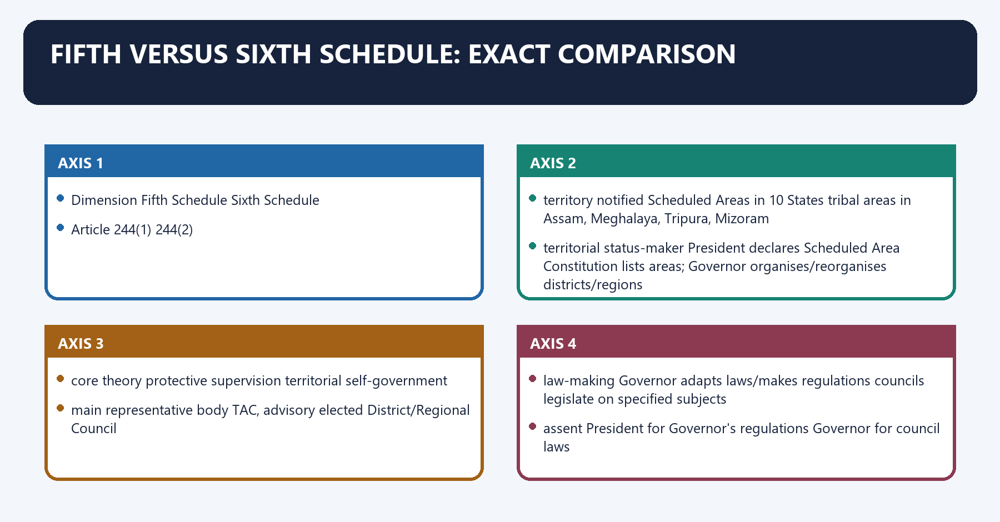
**Visual 37 - Master comparison matrix**

| Dimension | Fifth Schedule | Sixth Schedule |
|---|---|---|
| Article | 244(1) | 244(2) |
| territory | notified Scheduled Areas in 10 States | tribal areas in Assam, Meghalaya, Tripura, Mizoram |
| territorial status-maker | President declares Scheduled Area | Constitution lists areas; Governor organises/reorganises districts/regions |
| core theory | protective supervision | territorial self-government |
| main representative body | TAC, advisory | elected District/Regional Council |
| law-making | Governor adapts laws/makes regulations | councils legislate on specified subjects |
| assent | President for Governor's regulations | Governor for council laws |
| executive power | State continues; Union directions | State authority continues; councils manage specified functions |
| courts | ordinary system; special laws may operate | village/council courts for specified tribal-party cases |
| taxation | no TAC taxation power | councils assess land revenue and specified taxes |
| local-government statute | PESA applies | PESA does not apply |
| autonomy ceiling | no elected territorial legislature in Schedule itself | substantial but subject-specific and supervised |

**Visual 38 - One-line memory contrast**

```text
FIFTH = AREA + GOVERNOR/PRESIDENT + TAC + PESA
SIXTH = DISTRICT/REGION + ELECTED COUNCIL + LAWS/COURTS/TAXES
```

#### CLOSING RECALL FLOW — FIFTH VERSUS SIXTH SCHEDULE: EXACT COMPARISON

```closure-flow
SUBTOPIC: Fifth versus Sixth Schedule: exact comparison
KEY TERMS / DEFINITIONS: Fifth versus Sixth Schedule · exact comparison · Article · territory · notified Scheduled Areas in 10 States · tribal areas in Assam, Meghalaya, Tripura, Mizoram
MECHANISM / ARGUMENT: The operative mechanism matters because territorial status-maker President declares Scheduled Area Constitution lists areas; Governor organises/reorganises districts/regions.
CONSEQUENCE / CONTRAST: Its principal consequence is that core theory protective supervision territorial self-government.
UPSC TRAP / ANSWER-USE: Do not miss this limiting distinction: the decisive contrast is between main representative body TAC, advisory elected District/Regional Council and...
ANSWER-GRABBING FORMULATION: The Fifth Schedule centres protective supervision through the Governor and TAC, whereas the Sixth Schedule creates elected territorial councils with limited self-government powers.
```
### SESSION 34 — FOUR SYSTEMS THAT MUST NOT BE COLLAPSED
#### DEFINITION / WHAT THIS IS CALLED

**Plain-language definition:** Four systems that must not be collapsed denotes the constitutional rules and institutional links organised around System Source Territorial unit Core institution.

**Technical definition:** Four systems that must not be collapsed operates through ordinary Panchayats Part IX rural local area Gram Sabha + three-tier PRIs, connected with PESA 1996 Act applying modified Part IX Fifth Schedule Scheduled Areas habitation-based Gram Sabha + PRIs.

#### ANSWER-GRABBING OPENING — WRITE/ADAPT IN THE EXAM

> Article 371A/371G customary-law and land/resource protections do not make Nagaland or all Mizoram a Sixth Schedule council system.

#### MUST-WRITE KEYWORDS

- **ordinary Panchayats**
- **Part IX**
- **rural local area**
- **Gram Sabha + three-tier PRIs**
- **PESA**
- **1996 Act applying modified Part IX**

**How to use them:** Frame the answer through ordinary Panchayats; define Part IX, connect rural local area with Gram Sabha + three-tier PRIs to explain the mechanism, and use PESA for the decisive comparison or qualification.

Four systems that must not be collapsed denotes the constitutional rules and institutional links organised around System Source Territorial unit Core institution.
Four systems that must not be collapsed operates through ordinary Panchayats Part IX rural local area Gram Sabha + three-tier PRIs, connected with PESA 1996 Act applying modified Part IX Fifth Schedule Scheduled Areas habitation-based Gram Sabha + PRIs.
The operative mechanism matters because sixth Schedule Constitution autonomous district/region in four States District/Regional Council.
Its principal consequence is that [FACT] Article 243M excludes Scheduled Areas and tribal areas from automatic Part IX application.
The decisive contrast is between [FACT] PESA extends Part IX only to Fifth Schedule areas, with exceptions and modifications and System Source Territorial unit Core institution.
The exam-safe limitation is that system Source Territorial unit Core institution.
**Visual 39 - Constitutional differentiation grid**

| System | Source | Territorial unit | Core institution |
|---|---|---|---|
| ordinary Panchayats | Part IX | rural local area | Gram Sabha + three-tier PRIs |
| PESA | 1996 Act applying modified Part IX | Fifth Schedule Scheduled Areas | habitation-based Gram Sabha + PRIs |
| Sixth Schedule | Constitution | autonomous district/region in four States | District/Regional Council |
| Article 371 family | Part XXI State-specific provisions | named State | Governor responsibility, committees, customary/resource protections or regional boards depending Article |

- [FACT] Article 243M excludes Scheduled Areas and tribal areas from automatic Part IX application.
- [FACT] PESA extends Part IX only to Fifth Schedule areas, with exceptions and modifications.
- [LIMIT] Article 371A/371G customary-law and land/resource protections do not make Nagaland or all Mizoram a Sixth Schedule council system.

#### CLOSING RECALL FLOW — FOUR SYSTEMS THAT MUST NOT BE COLLAPSED

```closure-flow
SUBTOPIC: Four systems that must not be collapsed
KEY TERMS / DEFINITIONS: ordinary Panchayats · Part IX · rural local area · Gram Sabha + three-tier PRIs · PESA · 1996 Act applying modified Part IX
MECHANISM / ARGUMENT: Four systems that must not be collapsed denotes the constitutional rules and institutional links organised around System Source Territorial unit Core institution.
CONSEQUENCE / CONTRAST: The decisive contrast is between PESA extends Part IX only to Fifth Schedule areas, with exceptions and modifications and System Source Territorial unit Core institution.
UPSC TRAP / ANSWER-USE: Do not miss this limiting distinction: its principal consequence is that Article 243M excludes Scheduled Areas and tribal areas from...
ANSWER-GRABBING FORMULATION: Article 371A/371G customary-law and land/resource protections do not make Nagaland or all Mizoram a Sixth Schedule council system.
```
### SESSION 35 — WHY PESA WAS ENACTED
#### DEFINITION / WHAT THIS IS CALLED

**Plain-language definition:** Why PESA was enacted denotes the constitutional rules and institutional links organised around protective administration.

**Technical definition:** Why PESA was enacted operates through Part IX initially excluded by Article 243M, connected with Bhuria Committee approach.

#### ANSWER-GRABBING OPENING — WRITE/ADAPT IN THE EXAM

> PESA added participatory self-rule to Fifth Schedule administration, but its promise depends on conforming State laws and implementation rather than the central enactment alone.

#### MUST-WRITE KEYWORDS

- **Why PESA was enacted**
- **Article 243M**
- **Why PESA**
- **Part IX**
- **Article**
- **Bhuria Committee**

**How to use them:** Frame the answer through Why PESA was enacted; define Article 243M, connect Why PESA with Part IX to explain the mechanism, and use Article for the decisive comparison or qualification.

Why PESA was enacted denotes the constitutional rules and institutional links organised around protective administration.
Why PESA was enacted operates through Part IX initially excluded by Article 243M, connected with Bhuria Committee approach.
The operative mechanism matters because custom + habitation village + Gram Sabha powers.
Its principal consequence is that development decisions become participatory and locally accountable.
The decisive contrast is between [ANALYSIS] It adds a self-rule logic to a Schedule otherwise centred on the Governor, State and Union and protective administration.
The exam-safe limitation is that protective administration.
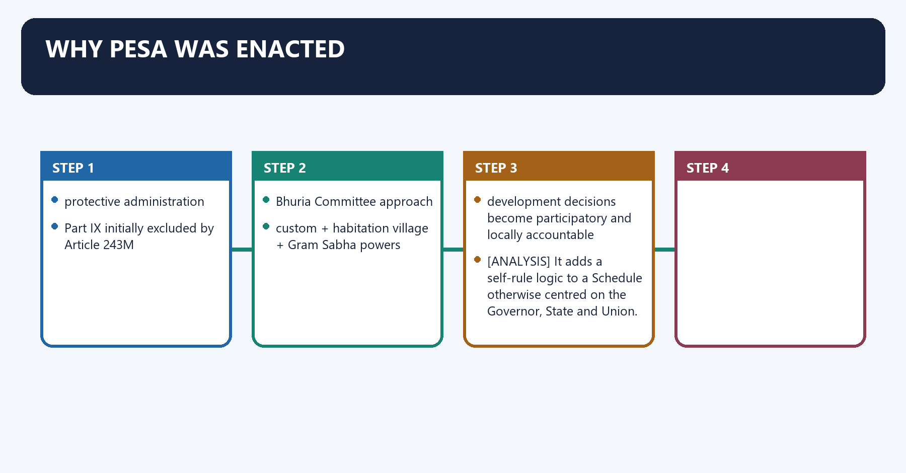
**Visual 40 - From protected subject to self-governing participant**

```text
FIFTH SCHEDULE
protective administration
        |
Part IX initially excluded by Article 243M
        |
Bhuria Committee approach
        |
PESA, 1996
        |
custom + habitation village + Gram Sabha powers
        |
development decisions become participatory and locally accountable
```

- [FACT] PESA requires State Panchayat law in Scheduled Areas to conform to customary law, social and religious practices and traditional management of community resources.
- [ANALYSIS] It adds a self-rule logic to a Schedule otherwise centred on the Governor, State and Union.
- [LIMIT] PESA operates through State legislation and implementation; central enactment alone does not create identical institutional practice everywhere.

#### CLOSING RECALL FLOW — WHY PESA WAS ENACTED

```closure-flow
SUBTOPIC: Why PESA was enacted
KEY TERMS / DEFINITIONS: Why PESA was enacted · Article 243M · Why PESA · Part IX · Article · Bhuria Committee
MECHANISM / ARGUMENT: Why PESA was enacted operates through Part IX initially excluded by Article 243M, connected with Bhuria Committee approach.
CONSEQUENCE / CONTRAST: PESA operates through State legislation and implementation; central enactment alone does not create identical institutional practice everywhere.
UPSC TRAP / ANSWER-USE: Do not miss this limiting distinction: its principal consequence is that development decisions become participatory and locally accountable.
ANSWER-GRABBING FORMULATION: PESA added participatory self-rule to Fifth Schedule administration, but its promise depends on conforming State laws and implementation rather than the central enactment alone.
```
### SESSION 36 — PESA VILLAGE AND GRAM SABHA
#### DEFINITION / WHAT THIS IS CALLED

**Plain-language definition:** PESA village and Gram Sabha denotes the constitutional rules and institutional links organised around hamlet / habitation / group of habitations.

**Technical definition:** The operative mechanism matters because PESA's village conception is deliberately closer to lived community than a large administrative Gram Panchayat boundary.

#### ANSWER-GRABBING OPENING — WRITE/ADAPT IN THE EXAM

> Custom is constitutionally relevant but cannot be treated as immune from Fundamental Rights, statute or judicial review.

#### MUST-WRITE KEYWORDS

- **PESA village**
- **Gram Sabha**
- **PESA village and Gram Sabha**
- **PESA**
- **The operative mechanism matters because PESA's village conception**
- **PESA's**

**How to use them:** Frame the answer through PESA village; define Gram Sabha, connect PESA village and Gram Sabha with PESA to explain the mechanism, and use The operative mechanism matters because PESA's village conception for the decisive comparison or qualification.

PESA village and Gram Sabha denotes the constitutional rules and institutional links organised around hamlet / habitation / group of habitations.
PESA village and Gram Sabha operates through community managing affairs by traditions and customs, connected with all persons on village-level electoral rolls.
The operative mechanism matters because [FACT] PESA's village conception is deliberately closer to lived community than a large administrative Gram Panchayat boundary.
Its principal consequence is that [LIMIT] Custom is constitutionally relevant but cannot be treated as immune from Fundamental Rights, statute or judicial review.
The decisive contrast is between hamlet / habitation / group of habitations and hamlet / habitation / group of habitations.
The exam-safe limitation is that hamlet / habitation / group of habitations.
**Visual 41 - Habitation-based democratic unit**

```text
hamlet / habitation / group of habitations
              |
community managing affairs by traditions and customs
              |
              v
PESA VILLAGE
              |
all persons on village-level electoral rolls
              |
              v
GRAM SABHA
```

- [FACT] PESA's village conception is deliberately closer to lived community than a large administrative Gram Panchayat boundary.
- [FACT] Every Gram Sabha is competent to safeguard traditions, customs, cultural identity, community resources and customary dispute resolution.
- [LIMIT] Custom is constitutionally relevant but cannot be treated as immune from Fundamental Rights, statute or judicial review.

#### CLOSING RECALL FLOW — PESA VILLAGE AND GRAM SABHA

```closure-flow
SUBTOPIC: PESA village and Gram Sabha
KEY TERMS / DEFINITIONS: PESA village · Gram Sabha · PESA village and Gram Sabha · PESA · The operative mechanism matters because PESA's village conception · PESA's
MECHANISM / ARGUMENT: The operative mechanism matters because PESA's village conception is deliberately closer to lived community than a large administrative Gram Panchayat boundary.
CONSEQUENCE / CONTRAST: PESA's village conception is deliberately closer to lived community than a large administrative Gram Panchayat boundary.
UPSC TRAP / ANSWER-USE: Its principal consequence is that Custom is constitutionally relevant but cannot be treated as immune from Fundamental Rights, statute or judicial review.
ANSWER-GRABBING FORMULATION: Custom is constitutionally relevant but cannot be treated as immune from Fundamental Rights, statute or judicial review.
```
### SESSION 37 — PESA POWER VERBS
#### DEFINITION / WHAT THIS IS CALLED

**Plain-language definition:** PESA power verbs denotes the constitutional rules and institutional links organised around Verb Object Holder/level under section 4.

**Technical definition:** Technically, PESA power verbs is analysed by relating approve to Gram Sabha, then testing the relationship through identify/select and beneficiaries under poverty alleviation and other programmes.

#### ANSWER-GRABBING OPENING — WRITE/ADAPT IN THE EXAM

> PESA distributes approval, consultation, recommendation and management powers among Gram Sabhas and appropriate Panchayat levels, requiring exact attribution of each statutory verb.

#### MUST-WRITE KEYWORDS

- **PESA power verbs**
- **approve**
- **Gram Sabha**
- **identify/select**
- **beneficiaries under poverty alleviation and other programmes**
- **certify**

**How to use them:** Frame the answer through PESA power verbs; define approve, connect Gram Sabha with identify/select to explain the mechanism, and use beneficiaries under poverty alleviation and other programmes for the decisive comparison or qualification.

PESA power verbs denotes the constitutional rules and institutional links organised around Verb Object Holder/level under section 4.
PESA power verbs operates through approve social/economic development plans, programmes and projects before village-Panchayat implementation Gram Sabha, connected with identify/select beneficiaries under poverty alleviation and other programmes Gram Sabha.
The operative mechanism matters because certify utilisation of funds for relevant plans/programmes/projects Gram Sabha certification obtained by village Panchayat.
Its principal consequence is that consult land acquisition and resettlement/rehabilitation in Scheduled Areas Gram Sabha or Panchayat at appropriate level.
The decisive contrast is between manage planning and management of minor water bodies Panchayat at appropriate level and recommend mandatorily prospecting licence/mining lease for minor minerals Gram Sabha or Panchayat at appropriate level.
The exam-safe limitation is that recommend mandatorily concession for minor-mineral exploitation by auction Panchayat at appropriate level.
**Visual 42 - Exact statutory verb matrix**

| Verb | Object | Holder/level under section 4 |
|---|---|---|
| approve | social/economic development plans, programmes and projects before village-Panchayat implementation | Gram Sabha |
| identify/select | beneficiaries under poverty alleviation and other programmes | Gram Sabha |
| certify | utilisation of funds for relevant plans/programmes/projects | Gram Sabha certification obtained by village Panchayat |
| consult | land acquisition and resettlement/rehabilitation in Scheduled Areas | Gram Sabha or Panchayat at appropriate level |
| manage | planning and management of minor water bodies | Panchayat at appropriate level |
| recommend mandatorily | prospecting licence/mining lease for minor minerals | Gram Sabha or Panchayat at appropriate level |
| recommend mandatorily | concession for minor-mineral exploitation by auction | Panchayat at appropriate level |
| own / regulate / control / restore | specified resources and institutions | State law must endow Gram Sabha and Panchayats at appropriate level as section 4(m) states |

**Visual 43 - Section 4(m) substantive basket**

```text
ownership of minor forest produce
control of village markets
regulate money-lending to STs
regulate/restrict intoxicants
prevent land alienation + restore unlawfully alienated land
control social-sector institutions and functionaries
control local plans and resources, including tribal sub-plans
```

- [LIMIT] Attribute each power to the statutory formulation - "Gram Sabha or Panchayats at the appropriate level" where relevant - rather than assigning everything exclusively to one Gram Sabha.

#### CLOSING RECALL FLOW — PESA POWER VERBS

```closure-flow
SUBTOPIC: PESA power verbs
KEY TERMS / DEFINITIONS: PESA power verbs · approve · Gram Sabha · identify/select · beneficiaries under poverty alleviation and other programmes · certify
MECHANISM / ARGUMENT: The exam-safe limitation is that recommend mandatorily concession for minor-mineral exploitation by auction Panchayat at appropriate level.
CONSEQUENCE / CONTRAST: Its principal consequence is that consult land acquisition and resettlement/rehabilitation in Scheduled Areas Gram Sabha or Panchayat at appropriate level.
UPSC TRAP / ANSWER-USE: Do not miss this limiting distinction: the decisive contrast is between manage planning and management of minor water bodies Panchayat...
ANSWER-GRABBING FORMULATION: PESA distributes approval, consultation, recommendation and management powers among Gram Sabhas and appropriate Panchayat levels, requiring exact attribution of each statutory verb.
```
### SESSION 38 — CONSULTATION, RECOMMENDATION AND APPROVAL ARE DIFFERENT
#### DEFINITION / WHAT THIS IS CALLED

**Plain-language definition:** Consultation, recommendation and approval are different operates through PRIOR / MANDATORY RECOMMENDATION, connected with specified recommendation is a precondition.

**Technical definition:** Consultation, recommendation and approval are different denotes the constitutional rules and institutional links organised around views must be sought and considered.

#### ANSWER-GRABBING OPENING — WRITE/ADAPT IN THE EXAM

> PESA's approval, consultation and prior-recommendation requirements carry different legal force, so none should be converted into a universal consent or veto rule.

#### MUST-WRITE KEYWORDS

- **Consultation**
- **recommendation**
- **approval are different**
- **Consultation, recommendation and approval**
- **PRIOR**
- **MANDATORY RECOMMENDATION**

**How to use them:** Frame the answer through Consultation; define recommendation, connect approval are different with Consultation, recommendation and approval to explain the mechanism, and use PRIOR for the decisive comparison or qualification.

Consultation, recommendation and approval are different denotes the constitutional rules and institutional links organised around views must be sought and considered.
Consultation, recommendation and approval are different operates through PRIOR / MANDATORY RECOMMENDATION, connected with specified recommendation is a precondition.
The operative mechanism matters because plan/programme/project needs Gram Sabha approval before local implementation.
Its principal consequence is that [FACT] PESA uses consultation before land acquisition and resettlement/rehabilitation.
The decisive contrast is between [FACT] It makes recommendations mandatory before specified minor-mineral licences/leases and concessions and [FACT] It requires Gram Sabha approval of local development plans, programmes and projects before village-Panchayat implementation.
The exam-safe limitation is that views must be sought and considered.
**Visual 44 - Legal intensity ladder**

```text
INFORMATION
    <
CONSULTATION
views must be sought and considered
    <
PRIOR / MANDATORY RECOMMENDATION
specified recommendation is a precondition
    <
APPROVAL
plan/programme/project needs Gram Sabha approval before local implementation
```

- [FACT] PESA uses consultation before land acquisition and resettlement/rehabilitation.
- [FACT] It makes recommendations mandatory before specified minor-mineral licences/leases and concessions.
- [FACT] It requires Gram Sabha approval of local development plans, programmes and projects before village-Panchayat implementation.
- [FACT] The central Act keeps actual planning and implementation of acquisition-linked development projects coordinated at the State level.
- [LIMIT] These provisions do not amount to a universal consent/veto rule for every acquisition, major mineral, forest clearance or infrastructure project.

#### CLOSING RECALL FLOW — CONSULTATION, RECOMMENDATION AND APPROVAL ARE DIFFERENT

```closure-flow
SUBTOPIC: Consultation, recommendation and approval are different
KEY TERMS / DEFINITIONS: Consultation · recommendation · approval are different · Consultation, recommendation and approval · PRIOR · MANDATORY RECOMMENDATION
MECHANISM / ARGUMENT: Consultation, recommendation and approval are different denotes the constitutional rules and institutional links organised around views must be sought and considered.
CONSEQUENCE / CONTRAST: The decisive contrast is between It makes recommendations mandatory before specified minor-mineral licences/leases and concessions and It requires Gram Sabha approval of local development plans, programmes and projects before village-Panchayat implementation.
UPSC TRAP / ANSWER-USE: Do not miss this limiting distinction: its principal consequence is that PESA uses consultation before land acquisition and resettlement/rehabilitation.
ANSWER-GRABBING FORMULATION: PESA's approval, consultation and prior-recommendation requirements carry different legal force, so none should be converted into a universal consent or veto rule.
```
### SESSION 39 — PESA LAND AND MINOR-MINERAL DECISION FLOW
#### DEFINITION / WHAT THIS IS CALLED

**Plain-language definition:** PESA land and minor-mineral decision flow denotes the constitutional rules and institutional links organised around PROPOSED ACTIVITY IN FIFTH SCHEDULE AREA.

**Technical definition:** The decisive contrast is between minor-mineral concession by auction and prior recommendation of appropriate Panchayat.

#### ANSWER-GRABBING OPENING — WRITE/ADAPT IN THE EXAM

> PESA applies different participatory requirements at planning, acquisition and minor-mineral stages, making correct sequencing essential to legally accurate project analysis.

#### MUST-WRITE KEYWORDS

- **PESA land**
- **minor-mineral decision flow**
- **PESA land and minor-mineral decision flow**
- **PESA**
- **PROPOSED ACTIVITY IN FIFTH SCHEDULE**
- **AREA**

**How to use them:** Frame the answer through PESA land; define minor-mineral decision flow, connect PESA land and minor-mineral decision flow with PESA to explain the mechanism, and use PROPOSED ACTIVITY IN FIFTH SCHEDULE for the decisive comparison or qualification.

PESA land and minor-mineral decision flow denotes the constitutional rules and institutional links organised around PROPOSED ACTIVITY IN FIFTH SCHEDULE AREA.
PESA land and minor-mineral decision flow operates through land acquisition / R&R, connected with consult GS or appropriate Panchayat.
The operative mechanism matters because minor-mineral prospecting licence / mining lease.
Its principal consequence is that mandatory prior recommendation.
The decisive contrast is between minor-mineral concession by auction and prior recommendation of appropriate Panchayat.
The exam-safe limitation is that forest land / recognised forest rights.
**Visual 45 - Project-stage precision**

```text
PROPOSED ACTIVITY IN FIFTH SCHEDULE AREA
             |
             +--> land acquisition / R&R
             |       -> consult GS or appropriate Panchayat
             |
             +--> minor-mineral prospecting licence / mining lease
             |       -> mandatory prior recommendation
             |
             +--> minor-mineral concession by auction
             |       -> prior recommendation of appropriate Panchayat
             |
             +--> forest land / recognised forest rights
                     -> FRA process + forest/environment law
```

- [ANALYSIS] Correct sequencing prevents a common answer error: using one PESA verb to describe a legally different stage.

#### CLOSING RECALL FLOW — PESA LAND AND MINOR-MINERAL DECISION FLOW

```closure-flow
SUBTOPIC: PESA land and minor-mineral decision flow
KEY TERMS / DEFINITIONS: PESA land · minor-mineral decision flow · PESA land and minor-mineral decision flow · PESA · PROPOSED ACTIVITY IN FIFTH SCHEDULE · AREA
MECHANISM / ARGUMENT: The decisive contrast is between minor-mineral concession by auction and prior recommendation of appropriate Panchayat.
CONSEQUENCE / CONTRAST: Its principal consequence is that mandatory prior recommendation.
UPSC TRAP / ANSWER-USE: Do not miss this limiting distinction: the exam-safe limitation is that forest land / recognised forest rights.
ANSWER-GRABBING FORMULATION: PESA applies different participatory requirements at planning, acquisition and minor-mineral stages, making correct sequencing essential to legally accurate project analysis.
```
### SESSION 40 — PESA REPRESENTATION AND RESERVATIONS
#### DEFINITION / WHAT THIS IS CALLED

**Plain-language definition:** PESA representation and reservations denotes the constitutional rules and institutional links organised around ST seat reservation not less than one-half of total seats at every Panchayat level in Scheduled Areas.

**Technical definition:** Its principal consequence is that PESA combines territorial self-government, substantive representation and subsidiarity.

#### ANSWER-GRABBING OPENING — WRITE/ADAPT IN THE EXAM

> Reservation supplies presence; actual influence still depends on meeting design, records, information and control over staff/resources.

#### MUST-WRITE KEYWORDS

- **PESA representation**
- **reservations**
- **ST seat reservation**
- **chairpersons**
- **unrepresented STs**
- **higher-level design**

**How to use them:** Frame the answer through PESA representation; define reservations, connect ST seat reservation with chairpersons to explain the mechanism, and use unrepresented STs for the decisive comparison or qualification.

PESA representation and reservations denotes the constitutional rules and institutional links organised around ST seat reservation not less than one-half of total seats at every Panchayat level in Scheduled Areas.
PESA representation and reservations operates through chairpersons all chairperson seats at all levels reserved for STs, connected with unrepresented STs State may nominate at intermediate/district level, within statutory ceiling.
The operative mechanism matters because higher-level design State law must not let higher Panchayat assume powers of lower Panchayat or Gram Sabha.
Its principal consequence is that [ANALYSIS] PESA combines territorial self-government, substantive representation and subsidiarity.
The decisive contrast is between ST seat reservation not less than one-half of total seats at every Panchayat level in Scheduled Areas and ST seat reservation not less than one-half of total seats at every Panchayat level in Scheduled Areas.
The exam-safe limitation is that sT seat reservation not less than one-half of total seats at every Panchayat level in Scheduled Areas.
**Visual 46 - Scheduled-Area representation safeguards**

| Feature | PESA rule |
|---|---|
| ST seat reservation | not less than one-half of total seats at every Panchayat level in Scheduled Areas |
| chairpersons | all chairperson seats at all levels reserved for STs |
| unrepresented STs | State may nominate at intermediate/district level, within statutory ceiling |
| higher-level design | State law must not let higher Panchayat assume powers of lower Panchayat or Gram Sabha |

- [ANALYSIS] PESA combines territorial self-government, substantive representation and subsidiarity.
- [FACT] PESA also asks State legislation to endeavour to follow the Sixth Schedule pattern while designing district-level administrative arrangements in Scheduled Areas.
- [LIMIT] Reservation supplies presence; actual influence still depends on meeting design, records, information and control over staff/resources.

#### CLOSING RECALL FLOW — PESA REPRESENTATION AND RESERVATIONS

```closure-flow
SUBTOPIC: PESA representation and reservations
KEY TERMS / DEFINITIONS: PESA representation · reservations · ST seat reservation · chairpersons · unrepresented STs · higher-level design
MECHANISM / ARGUMENT: Reservation supplies presence; actual influence still depends on meeting design, records, information and control over staff/resources.
CONSEQUENCE / CONTRAST: Its principal consequence is that PESA combines territorial self-government, substantive representation and subsidiarity.
UPSC TRAP / ANSWER-USE: The exam-safe limitation is that sT seat reservation not less than one-half of total seats at every Panchayat level in Scheduled Areas.
ANSWER-GRABBING FORMULATION: Reservation supplies presence; actual influence still depends on meeting design, records, information and control over staff/resources.
```
### SESSION 41 — FRA RELATIONSHIP
#### DEFINITION / WHAT THIS IS CALLED

**Plain-language definition:** FRA relationship denotes the constitutional rules and institutional links organised around initiates claims + verifies evidence + maps rights.

**Technical definition:** Section 5 assigns holders/Gram Sabha duties to protect wildlife, forests and biodiversity, preserve catchments and ensure decisions on access are taken through regulated community processes.

#### ANSWER-GRABBING OPENING — WRITE/ADAPT IN THE EXAM

> Section 5 assigns holders/Gram Sabha duties to protect wildlife, forests and biodiversity, preserve catchments and ensure decisions on access are taken through regulated community processes.

#### MUST-WRITE KEYWORDS

- **FRA relationship**
- **FRA**
- **Its principal consequence**
- **Its**
- **The decisive contrast**
- **Gram Sabha**

**How to use them:** Frame the answer through FRA relationship; define FRA, connect Its principal consequence with Its to explain the mechanism, and use The decisive contrast for the decisive comparison or qualification.

FRA relationship denotes the constitutional rules and institutional links organised around initiates claims + verifies evidence + maps rights.
FRA relationship operates through Sub-Divisional Level Committee, connected with District Level Committee.
The operative mechanism matters because final administrative decision under statutory process.
Its principal consequence is that individual / community / community forest resource rights.
The decisive contrast is between [FACT] FRA section 6 makes the Gram Sabha the authority that initiates determination of individual and community forest rights and [LIMIT] FRA recognition does not transfer all forest administration or mineral ownership to the Gram Sabha.
The exam-safe limitation is that initiates claims + verifies evidence + maps rights.
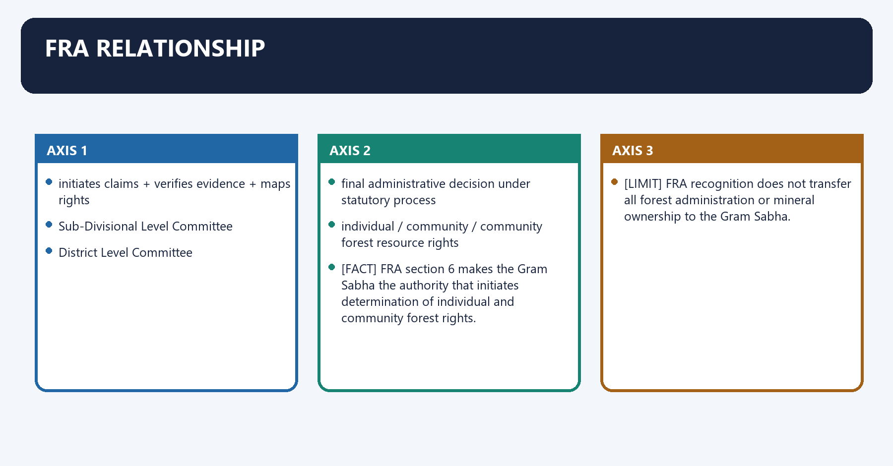
**Visual 47 - Rights-recognition ladder**

```text
GRAM SABHA
initiates claims + verifies evidence + maps rights
        |
        v
Sub-Divisional Level Committee
        |
        v
District Level Committee
final administrative decision under statutory process
        |
        v
individual / community / community forest resource rights
```

- [FACT] FRA section 6 makes the Gram Sabha the authority that initiates determination of individual and community forest rights.
- [FACT] Community Forest Resource rights include the right to protect, regenerate, conserve or manage a traditionally protected community forest resource.
- [FACT] Section 5 assigns holders/Gram Sabha duties to protect wildlife, forests and biodiversity, preserve catchments and ensure decisions on access are taken through regulated community processes.
- [LIMIT] FRA recognition does not transfer all forest administration or mineral ownership to the Gram Sabha.

#### CLOSING RECALL FLOW — FRA RELATIONSHIP

```closure-flow
SUBTOPIC: FRA relationship
KEY TERMS / DEFINITIONS: FRA relationship · FRA · Its principal consequence · Its · The decisive contrast · Gram Sabha
MECHANISM / ARGUMENT: Section 5 assigns holders/Gram Sabha duties to protect wildlife, forests and biodiversity, preserve catchments and ensure decisions on access are taken through regulated community processes.
CONSEQUENCE / CONTRAST: Its principal consequence is that individual / community / community forest resource rights.
UPSC TRAP / ANSWER-USE: FRA recognition does not transfer all forest administration or mineral ownership to the Gram Sabha.
ANSWER-GRABBING FORMULATION: Section 5 assigns holders/Gram Sabha duties to protect wildlife, forests and biodiversity, preserve catchments and ensure decisions on access are taken through regulated community processes.
```
### SESSION 42 — PESA AND FRA: OVERLAP WITHOUT MERGER
#### DEFINITION / WHAT THIS IS CALLED

**Plain-language definition:** PESA and FRA: overlap without merger denotes the constitutional rules and institutional links organised around local self-government in Fifth Schedule areas recognition and vesting of forest rights.

**Technical definition:** PESA and FRA: overlap without merger operates through customary institutions and community resources individual, community and CFR rights, connected with specified approval/consultation/recommendation powers claims, title and conservation responsibilities.

#### ANSWER-GRABBING OPENING — WRITE/ADAPT IN THE EXAM

> PESA structures local self-government while the Forest Rights Act recognises forest rights, making the statutes complementary but neither interchangeable nor mutually substitutive.

#### MUST-WRITE KEYWORDS

- **PESA**
- **FRA**
- **overlap without merger**
- **local self-government in Fifth Schedule areas**
- **recognition and vesting of forest rights**
- **customary institutions and community resources**

**How to use them:** Frame the answer through PESA; define FRA, connect overlap without merger with local self-government in Fifth Schedule areas to explain the mechanism, and use recognition and vesting of forest rights for the decisive comparison or qualification.

PESA and FRA: overlap without merger denotes the constitutional rules and institutional links organised around local self-government in Fifth Schedule areas recognition and vesting of forest rights.
PESA and FRA: overlap without merger operates through customary institutions and community resources individual, community and CFR rights, connected with specified approval/consultation/recommendation powers claims, title and conservation responsibilities.
The operative mechanism matters because minor forest produce ownership route in State law ownership/access/use/disposal rights over MFP under statutory rights framework.
Its principal consequence is that pESA: WHO PARTICIPATES AND WITH WHAT LOCAL POWER?.
The decisive contrast is between FRA: WHO HOLDS WHICH FOREST RIGHT? and forest / environment / mining / land law.
The exam-safe limitation is that lawful project or conservation decision.
**Visual 48 - Two statutes, two primary functions**

| PESA | FRA |
|---|---|
| local self-government in Fifth Schedule areas | recognition and vesting of forest rights |
| customary institutions and community resources | individual, community and CFR rights |
| specified approval/consultation/recommendation powers | claims, title and conservation responsibilities |
| minor forest produce ownership route in State law | ownership/access/use/disposal rights over MFP under statutory rights framework |

**Visual 49 - Combined governance chain**

```text
PESA: WHO PARTICIPATES AND WITH WHAT LOCAL POWER?
                         +
FRA: WHO HOLDS WHICH FOREST RIGHT?
                         +
forest / environment / mining / land law
                         |
                         v
lawful project or conservation decision
```

- [ANALYSIS] PESA and FRA are complementary but not interchangeable. A project may satisfy one and still fail another legal requirement.

#### CLOSING RECALL FLOW — PESA AND FRA: OVERLAP WITHOUT MERGER

```closure-flow
SUBTOPIC: PESA and FRA: overlap without merger
KEY TERMS / DEFINITIONS: PESA · FRA · overlap without merger · local self-government in Fifth Schedule areas · recognition and vesting of forest rights · customary institutions and community resources
MECHANISM / ARGUMENT: PESA and FRA: overlap without merger operates through customary institutions and community resources individual, community and CFR rights, connected with specified approval/consultation/recommendation powers claims, title and conservation responsibilities.
CONSEQUENCE / CONTRAST: Its principal consequence is that pESA: WHO PARTICIPATES AND WITH WHAT LOCAL POWER?.
UPSC TRAP / ANSWER-USE: PESA and FRA are complementary but not interchangeable.
ANSWER-GRABBING FORMULATION: PESA structures local self-government while the Forest Rights Act recognises forest rights, making the statutes complementary but neither interchangeable nor mutually substitutive.
```
### SESSION 43 — LAND ALIENATION: PREVENTION AND RESTORATION
#### DEFINITION / WHAT THIS IS CALLED

**Plain-language definition:** Land alienation: prevention and restoration denotes the constitutional rules and institutional links organised around weak title / debt / fraud / coercion / administrative transfer.

**Technical definition:** Its principal consequence is that transfer/allotment/money-lending prevent + restore alienated land.

#### ANSWER-GRABBING OPENING — WRITE/ADAPT IN THE EXAM

> A prohibition without updated records, legal aid and restitution machinery can freeze illegality rather than reverse it.

#### MUST-WRITE KEYWORDS

- **Land alienation**
- **prevention**
- **restoration**
- **Land alienation: prevention and restoration**
- **Land**
- **Its principal consequence**

**How to use them:** Frame the answer through Land alienation; define prevention, connect restoration with Land alienation: prevention and restoration to explain the mechanism, and use Land for the decisive comparison or qualification.

Land alienation: prevention and restoration denotes the constitutional rules and institutional links organised around weak title / debt / fraud / coercion / administrative transfer.
Land alienation: prevention and restoration operates through loss of tribal land and livelihood, connected with +----------------+.
The operative mechanism matters because fifth Schedule regulation PESA State-law powers.
Its principal consequence is that transfer/allotment/money-lending prevent + restore alienated land.
The decisive contrast is between records + accessible forum + enforcement and restoration rather than paper prohibition.
The exam-safe limitation is that [ANALYSIS] A prohibition without updated records, legal aid and restitution machinery can freeze illegality rather than reverse it.
**Visual 50 - Alienation control cycle**

```text
weak title / debt / fraud / coercion / administrative transfer
                         |
                         v
loss of tribal land and livelihood
                         |
        +----------------+----------------+
        |                                 |
Fifth Schedule regulation          PESA State-law powers
transfer/allotment/money-lending    prevent + restore alienated land
        |                                 |
        +----------------+----------------+
                         |
records + accessible forum + enforcement
                         |
                         v
restoration rather than paper prohibition
```

- [ANALYSIS] A prohibition without updated records, legal aid and restitution machinery can freeze illegality rather than reverse it.
- [LIMIT] The applicable land-transfer regulation is State-specific; never assume identical wording or remedies across all 10 States.

#### CLOSING RECALL FLOW — LAND ALIENATION: PREVENTION AND RESTORATION

```closure-flow
SUBTOPIC: Land alienation: prevention and restoration
KEY TERMS / DEFINITIONS: Land alienation · prevention · restoration · Land alienation: prevention and restoration · Land · Its principal consequence
MECHANISM / ARGUMENT: Its principal consequence is that transfer/allotment/money-lending prevent + restore alienated land.
CONSEQUENCE / CONTRAST: The decisive contrast is between records + accessible forum + enforcement and restoration rather than paper prohibition.
UPSC TRAP / ANSWER-USE: The applicable land-transfer regulation is State-specific; never assume identical wording or remedies across all 10 States.
ANSWER-GRABBING FORMULATION: A prohibition without updated records, legal aid and restitution machinery can freeze illegality rather than reverse it.
```
### SESSION 44 — SAMATHA: HOLDING AND BOUNDARY
#### DEFINITION / WHAT THIS IS CALLED

**Plain-language definition:** Samatha: holding and boundary denotes the constitutional rules and institutional links organised around Element Safe proposition.

**Technical definition:** Technically, Samatha: holding and boundary is analysed by relating Samatha to holding, then testing the relationship through boundary and case.

#### ANSWER-GRABBING OPENING — WRITE/ADAPT IN THE EXAM

> Samatha constrains mining transfers within its specific Andhra Pradesh legal setting, but does not establish a universal constitutional ban on every private mine in every Scheduled Area.

#### MUST-WRITE KEYWORDS

- **Samatha**
- **holding**
- **boundary**
- **case**
- **Samatha v. State of Andhra Pradesh (1997)**
- **legal setting**

**How to use them:** Frame the answer through Samatha; define holding, connect boundary with case to explain the mechanism, and use Samatha v. State of Andhra Pradesh (1997) for the decisive comparison or qualification.

*Samatha*: holding and boundary denotes the constitutional rules and institutional links organised around Element Safe proposition.
*Samatha*: holding and boundary operates through case Samatha v. State of Andhra Pradesh (1997), connected with legal setting Andhra Pradesh Scheduled Areas Land Transfer Regulation read with Fifth Schedule.
The operative mechanism matters because constitutional significance State acts as trustee; anti-alienation purpose receives a protective reading.
Its principal consequence is that element Safe proposition.
The decisive contrast is between Element Safe proposition and Element Safe proposition.
The exam-safe limitation is that element Safe proposition.
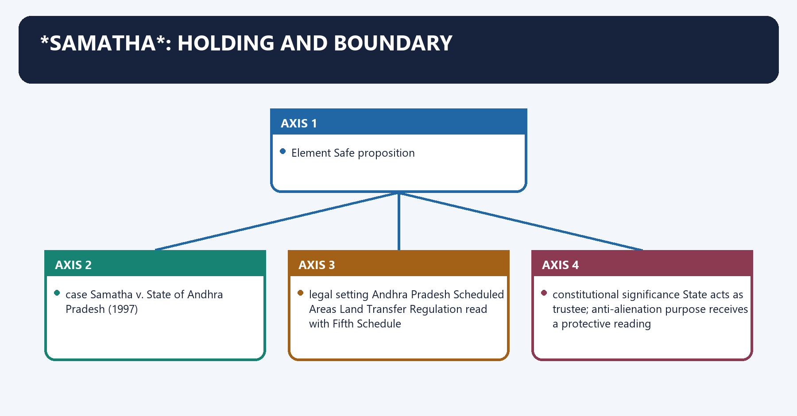
**Visual 51 - Case-use discipline**

| Element | Safe proposition |
|---|---|
| case | *Samatha v. State of Andhra Pradesh* (1997) |
| legal setting | Andhra Pradesh Scheduled Areas Land Transfer Regulation read with Fifth Schedule |
| majority holding | State grants/leases of land in Scheduled Areas to non-tribal private mining companies were invalid under that regulatory setting |
| constitutional significance | State acts as trustee; anti-alienation purpose receives a protective reading |
| qualification | later treatment, including the BALCO context, prevents presenting the Andhra Pradesh regulation-based holding as an automatic nationwide rule for every State |

- [LIMIT] Do not convert *Samatha* into the sentence "all mining by every private company in every Scheduled Area is constitutionally prohibited." Identify the State regulation, land status, lessee and later legal context.

#### CLOSING RECALL FLOW — SAMATHA: HOLDING AND BOUNDARY

```closure-flow
SUBTOPIC: Samatha: holding and boundary
KEY TERMS / DEFINITIONS: Samatha · holding · boundary · case · Samatha v. State of Andhra Pradesh (1997) · legal setting
MECHANISM / ARGUMENT: Do not convert Samatha into the sentence "all mining by every private company in every Scheduled Area is constitutionally prohibited." Identify the State regulation, land status, lessee and later legal context.
CONSEQUENCE / CONTRAST: The decisive contrast is between Element Safe proposition and Element Safe proposition.
UPSC TRAP / ANSWER-USE: Do not miss this limiting distinction: its principal consequence is that element Safe proposition.
ANSWER-GRABBING FORMULATION: Samatha constrains mining transfers within its specific Andhra Pradesh legal setting, but does not establish a universal constitutional ban on every private mine in every Scheduled Area.
```
### SESSION 45 — ORISSA MINING CORPORATION / NIYAMGIRI
#### DEFINITION / WHAT THIS IS CALLED

**Plain-language definition:** Orissa Mining Corporation / Niyamgiri denotes the constitutional rules and institutional links organised around FRA individual/community/cultural/religious claims.

**Technical definition:** Technically, Orissa Mining Corporation / Niyamgiri is analysed by relating Orissa Mining Corporation to Niyamgiri, then testing the relationship through FRA and Its principal consequence.

#### ANSWER-GRABBING OPENING — WRITE/ADAPT IN THE EXAM

> Niyamgiri required Gram Sabha consideration of customary and religious forest rights, while the final forest-clearance decision remained with the competent Union authority.

#### MUST-WRITE KEYWORDS

- **Orissa Mining Corporation / Niyamgiri**
- **Orissa Mining Corporation**
- **Niyamgiri**
- **FRA**
- **Its principal consequence**
- **Its**

**How to use them:** Frame the answer through Orissa Mining Corporation / Niyamgiri; define Orissa Mining Corporation, connect Niyamgiri with FRA to explain the mechanism, and use Its principal consequence for the decisive comparison or qualification.

*Orissa Mining Corporation* / Niyamgiri denotes the constitutional rules and institutional links organised around FRA individual/community/cultural/religious claims.
*Orissa Mining Corporation* / Niyamgiri operates through Gram Sabhas consider and decide those claims, connected with with State/MoTA assistance and judicial observer.
The operative mechanism matters because decisions communicated through State to MoEF.
Its principal consequence is that moEF takes final Stage-II forest-clearance decision.
The decisive contrast is between in light of Gram Sabha decisions and [FACT] The Court held that Gram Sabhas had a role in safeguarding customary and religious rights under FRA read with PESA.
The exam-safe limitation is that [FACT] The final Stage-II clearance decision remained with MoEF, to be taken in light of Gram Sabha decisions.
**Visual 52 - Supreme Court's actual process**

```text
FRA individual/community/cultural/religious claims
                         |
                         v
Gram Sabhas consider and decide those claims
with State/MoTA assistance and judicial observer
                         |
                         v
decisions communicated through State to MoEF
                         |
                         v
MoEF takes final Stage-II forest-clearance decision
in light of Gram Sabha decisions
```

- [FACT] The Court held that Gram Sabhas had a role in safeguarding customary and religious rights under FRA read with PESA.
- [FACT] It directed consideration of whether mining would affect worship of Niyam Raja and other community, individual, cultural and religious claims.
- [FACT] The final Stage-II clearance decision remained with MoEF, to be taken in light of Gram Sabha decisions.
- [LIMIT] The judgment is not authority for an unqualified Gram Sabha veto over every mine or ordinary EIA hearing.

#### CLOSING RECALL FLOW — ORISSA MINING CORPORATION / NIYAMGIRI

```closure-flow
SUBTOPIC: Orissa Mining Corporation / Niyamgiri
KEY TERMS / DEFINITIONS: Orissa Mining Corporation / Niyamgiri · Orissa Mining Corporation · Niyamgiri · FRA · Its principal consequence · Its
MECHANISM / ARGUMENT: It directed consideration of whether mining would affect worship of Niyam Raja and other community, individual, cultural and religious claims.
CONSEQUENCE / CONTRAST: Its principal consequence is that moEF takes final Stage-II forest-clearance decision.
UPSC TRAP / ANSWER-USE: Do not miss this limiting distinction: the decisive contrast is between in light of Gram Sabha decisions and The Court...
ANSWER-GRABBING FORMULATION: Niyamgiri required Gram Sabha consideration of customary and religious forest rights, while the final forest-clearance decision remained with the competent Union authority.
```
### SESSION 46 — DEVELOPMENT, MINING AND DISPLACEMENT CONFLICT
#### DEFINITION / WHAT THIS IS CALLED

**Plain-language definition:** Development, mining and displacement conflict denotes the constitutional rules and institutional links organised around mineral / infrastructure proposal.

**Technical definition:** Technically, Development, mining and displacement conflict is analysed by relating Development to mining, then testing the relationship through displacement conflict and claim.

#### ANSWER-GRABBING OPENING — WRITE/ADAPT IN THE EXAM

> Mining and infrastructure decisions in tribal areas must integrate participation, rights impacts, alternatives and rehabilitation, rather than treating displacement as a purely compensatory question.

#### MUST-WRITE KEYWORDS

- **Development**
- **mining**
- **displacement conflict**
- **claim**
- **participation changes what counts as project impact**
- **named evidence**

**How to use them:** Frame the answer through Development; define mining, connect displacement conflict with claim to explain the mechanism, and use participation changes what counts as project impact for the decisive comparison or qualification.

Development, mining and displacement conflict denotes the constitutional rules and institutional links organised around mineral / infrastructure proposal.
Development, mining and displacement conflict operates through land take + forest diversion + ecological change, connected with livelihood + culture + sacred landscape + settlement impact.
The operative mechanism matters because pESA + FRA + land-transfer law + acquisition/R&R + environment law.
Its principal consequence is that participatory evidence and reasoned decision.
The decisive contrast is between avoid redesign condition compensate/rehabilitate reject and Step Answer-writing content.
The exam-safe limitation is that claim participation changes what counts as project impact.
**Visual 53 - Rights-impact chain**

```text
mineral / infrastructure proposal
          |
land take + forest diversion + ecological change
          |
livelihood + culture + sacred landscape + settlement impact
          |
PESA + FRA + land-transfer law + acquisition/R&R + environment law
          |
participatory evidence and reasoned decision
          |
avoid | redesign | condition | compensate/rehabilitate | reject
```

**Visual 54 - Claim-evidence-analysis-qualification example**

| Step | Answer-writing content |
|---|---|
| claim | participation changes what counts as project impact |
| named evidence | *Orissa Mining Corporation* required Gram Sabha determination of FRA-linked cultural/religious claims |
| analysis | sacred and community relationships cannot be reduced to market compensation |
| qualification | MoEF retained the final clearance function; other statutory routes still applied |

#### CLOSING RECALL FLOW — DEVELOPMENT, MINING AND DISPLACEMENT CONFLICT

```closure-flow
SUBTOPIC: Development, mining and displacement conflict
KEY TERMS / DEFINITIONS: Development · mining · displacement conflict · claim · participation changes what counts as project impact · named evidence
MECHANISM / ARGUMENT: The exam-safe limitation is that claim participation changes what counts as project impact.
CONSEQUENCE / CONTRAST: Its principal consequence is that participatory evidence and reasoned decision.
UPSC TRAP / ANSWER-USE: The decisive contrast is between avoid redesign condition compensate/rehabilitate reject and Step Answer-writing content.
ANSWER-GRABBING FORMULATION: Mining and infrastructure decisions in tribal areas must integrate participation, rights impacts, alternatives and rehabilitation, rather than treating displacement as a purely compensatory question.
```
### SESSION 47 — FUNDAMENTAL RIGHTS AND DPSP INTERFACE
#### DEFINITION / WHAT THIS IS CALLED

**Plain-language definition:** Fundamental Rights and DPSP interface denotes the constitutional rules and institutional links organised around Provision Scheduled/tribal-area application.

**Technical definition:** The decisive contrast is between Article 29(1) conserve distinct language, script or culture and Article 46 promote educational/economic interests of STs and protect from social injustice/exploitation.

#### ANSWER-GRABBING OPENING — WRITE/ADAPT IN THE EXAM

> The Fifth and Sixth Schedules pursue substantive equality, but remain subject to Fundamental Rights, enabling statutes, public purpose and proportionality.

#### MUST-WRITE KEYWORDS

- **Fundamental Rights**
- **DPSP interface**
- **Article 14**
- **non-arbitrary classification and administration**
- **Article 19**
- **movement, residence, occupation subject to valid protections/restrictions**

**How to use them:** Frame the answer through Fundamental Rights; define DPSP interface, connect Article 14 with non-arbitrary classification and administration to explain the mechanism, and use Article 19 for the decisive comparison or qualification.

Fundamental Rights and DPSP interface denotes the constitutional rules and institutional links organised around Provision Scheduled/tribal-area application.
Fundamental Rights and DPSP interface operates through Article 14 non-arbitrary classification and administration, connected with Article 19 movement, residence, occupation subject to valid protections/restrictions.
The operative mechanism matters because article 21 dignity, livelihood, fair procedure and cultural conditions of life.
Its principal consequence is that articles 25-26 religious practice and sacred-landscape claims, as applied in Niyamgiri.
The decisive contrast is between Article 29(1) conserve distinct language, script or culture and Article 46 promote educational/economic interests of STs and protect from social injustice/exploitation.
The exam-safe limitation is that article 300A deprivation of property only by authority of law.
**Visual 55 - Constitutional rights web**

| Provision | Scheduled/tribal-area application |
|---|---|
| Article 14 | non-arbitrary classification and administration |
| Article 19 | movement, residence, occupation subject to valid protections/restrictions |
| Article 21 | dignity, livelihood, fair procedure and cultural conditions of life |
| Articles 25-26 | religious practice and sacred-landscape claims, as applied in Niyamgiri |
| Article 29(1) | conserve distinct language, script or culture |
| Article 46 | promote educational/economic interests of STs and protect from social injustice/exploitation |
| Article 300A | deprivation of property only by authority of law |

- [ANALYSIS] The Schedules operationalise substantive equality but do not displace Part III.
- [LIMIT] No single Article automatically decides a project; the correct answer integrates rights, enabling statutes, public purpose and proportionality.

#### CLOSING RECALL FLOW — FUNDAMENTAL RIGHTS AND DPSP INTERFACE

```closure-flow
SUBTOPIC: Fundamental Rights and DPSP interface
KEY TERMS / DEFINITIONS: Fundamental Rights · DPSP interface · Article 14 · non-arbitrary classification and administration · Article 19 · movement, residence, occupation subject to valid protections/restrictions
MECHANISM / ARGUMENT: The exam-safe limitation is that article 300A deprivation of property only by authority of law.
CONSEQUENCE / CONTRAST: Its principal consequence is that articles 25-26 religious practice and sacred-landscape claims, as applied in Niyamgiri.
UPSC TRAP / ANSWER-USE: Do not miss this limiting distinction: the decisive contrast is between Article 29(1) conserve distinct language, script or culture and...
ANSWER-GRABBING FORMULATION: The Fifth and Sixth Schedules pursue substantive equality, but remain subject to Fundamental Rights, enabling statutes, public purpose and proportionality.
```
### SESSION 48 — ACCOUNTABILITY ARCHITECTURE
#### DEFINITION / WHAT THIS IS CALLED

**Plain-language definition:** Accountability architecture denotes the constitutional rules and institutional links organised around ELECTORAL council / Panchayat representatives.

**Technical definition:** The exam-safe limitation is that governor reports not transparent Union supervision lacks public evidence.

#### ANSWER-GRABBING OPENING — WRITE/ADAPT IN THE EXAM

> Tribal-area accountability requires electoral, executive, legislative, judicial and social checks because advisory councils or formal reports alone cannot secure community agency.

#### MUST-WRITE KEYWORDS

- **Accountability architecture**
- **TAC agenda controlled from above**
- **advice becomes ceremonial**
- **Governor reports not transparent**
- **Union supervision lacks public evidence**
- **council law awaits assent without timelines**

**How to use them:** Frame the answer through Accountability architecture; define TAC agenda controlled from above, connect advice becomes ceremonial with Governor reports not transparent to explain the mechanism, and use Union supervision lacks public evidence for the decisive comparison or qualification.

Accountability architecture denotes the constitutional rules and institutional links organised around ELECTORAL council / Panchayat representatives.
Accountability architecture operates through LEGAL Constitution, PESA, FRA, land and environment law, connected with FISCAL grants, council funds, audit and utilisation records.
The operative mechanism matters because aDMINISTRATIVE Governor/State/Union reporting and directions.
Its principal consequence is that sOCIAL Gram Sabha, public records, grievance and community monitoring.
The decisive contrast is between Failure Institutional effect and TAC agenda controlled from above advice becomes ceremonial.
The exam-safe limitation is that governor reports not transparent Union supervision lacks public evidence.
**Visual 56 - Five-accountability model**

```text
ELECTORAL     council / Panchayat representatives
LEGAL        Constitution, PESA, FRA, land and environment law
FISCAL       grants, council funds, audit and utilisation records
ADMINISTRATIVE Governor/State/Union reporting and directions
SOCIAL       Gram Sabha, public records, grievance and community monitoring
```

**Visual 57 - Common accountability failures**

| Failure | Institutional effect |
|---|---|
| TAC agenda controlled from above | advice becomes ceremonial |
| Governor reports not transparent | Union supervision lacks public evidence |
| council law awaits assent without timelines | autonomy becomes administrative delay |
| parallel departments retain staff/funds | responsibility without control |
| Gram Sabha record is poor or manipulated | participation becomes formal compliance |
| land/FRA records are incomplete | rights cannot survive project appraisal |

#### CLOSING RECALL FLOW — ACCOUNTABILITY ARCHITECTURE

```closure-flow
SUBTOPIC: Accountability architecture
KEY TERMS / DEFINITIONS: Accountability architecture · TAC agenda controlled from above · advice becomes ceremonial · Governor reports not transparent · Union supervision lacks public evidence · council law awaits assent without timelines
MECHANISM / ARGUMENT: The decisive contrast is between Failure Institutional effect and TAC agenda controlled from above advice becomes ceremonial.
CONSEQUENCE / CONTRAST: The exam-safe limitation is that governor reports not transparent Union supervision lacks public evidence.
UPSC TRAP / ANSWER-USE: Do not miss this limiting distinction: its principal consequence is that sOCIAL Gram Sabha, public records, grievance and community monitoring.
ANSWER-GRABBING FORMULATION: Tribal-area accountability requires electoral, executive, legislative, judicial and social checks because advisory councils or formal reports alone cannot secure community agency.
```
### SESSION 49 — CURRENT IMPLEMENTATION CONTROL: PESA RULES
#### DEFINITION / WHAT THIS IS CALLED

**Plain-language definition:** Current implementation control: PESA rules denotes the constitutional rules and institutional links organised around Official MoPR listing includes Current qualification.

**Technical definition:** Current implementation control: PESA rules operates through Andhra Pradesh 2011 implementation quality must be separately assessed, connected with Telangana adoption in 2014 State adaptation and practice matter.

#### ANSWER-GRABBING OPENING — WRITE/ADAPT IN THE EXAM

> Notification of PESA rules is a necessary legal step, but implementation also depends on conformity across land, forest, market, excise and Panchayat laws.

#### MUST-WRITE KEYWORDS

- **Current implementation control**
- **PESA rules**
- **nine listed rule regimes for ten PESA States**
- **Andhra Pradesh 2011**
- **Telangana adoption in 2014**
- **Himachal Pradesh 2011**

**How to use them:** Frame the answer through Current implementation control; define PESA rules, connect nine listed rule regimes for ten PESA States with Andhra Pradesh 2011 to explain the mechanism, and use Telangana adoption in 2014 for the decisive comparison or qualification.

Current implementation control: PESA rules denotes the constitutional rules and institutional links organised around Official MoPR listing includes Current qualification.
Current implementation control: PESA rules operates through Andhra Pradesh 2011 implementation quality must be separately assessed, connected with Telangana adoption in 2014 State adaptation and practice matter.
The operative mechanism matters because himachal Pradesh 2011 rules do not prove devolution.
Its principal consequence is that rajasthan Act 1999 / Rules 2011 verify current amendments for granular claims.
The decisive contrast is between Maharashtra 2014 sectoral-law conformity remains relevant and Gujarat 2017 and amendment compliance is multi-law.
The exam-safe limitation is that chhattisgarh 2022 recent rule does not erase capacity gaps.
**Visual 58 - Official rule-status snapshot, 19 Aug 2026**

| Official MoPR listing includes | Current qualification |
|---|---|
| Andhra Pradesh 2011 | implementation quality must be separately assessed |
| Telangana adoption in 2014 | State adaptation and practice matter |
| Himachal Pradesh 2011 | rules do not prove devolution |
| Rajasthan Act 1999 / Rules 2011 | verify current amendments for granular claims |
| Maharashtra 2014 | sectoral-law conformity remains relevant |
| Gujarat 2017 and amendment | compliance is multi-law |
| Chhattisgarh 2022 | recent rule does not erase capacity gaps |
| Madhya Pradesh 2022 | same qualification |
| Jharkhand Rules 2025 | official listing uploaded/updated in 2026 |
| Odisha | no separate notified Rules instrument appears in the official central listing |

- [CURRENT] The safe summary is **nine listed rule regimes for ten PESA States**, with Odisha the listed gap.
- [LIMIT] Do not equate "rules notified" with "PESA fully implemented"; conformity of excise, markets, money-lending, land, minor minerals, forest produce and Panchayat laws must also be tested.

#### CLOSING RECALL FLOW — CURRENT IMPLEMENTATION CONTROL: PESA RULES

```closure-flow
SUBTOPIC: Current implementation control: PESA rules
KEY TERMS / DEFINITIONS: Current implementation control · PESA rules · nine listed rule regimes for ten PESA States · Andhra Pradesh 2011 · Telangana adoption in 2014 · Himachal Pradesh 2011
MECHANISM / ARGUMENT: Current implementation control: PESA rules operates through Andhra Pradesh 2011 implementation quality must be separately assessed, connected with Telangana adoption in 2014 State adaptation and practice matter.
CONSEQUENCE / CONTRAST: Do not equate "rules notified" with "PESA fully implemented"; conformity of excise, markets, money-lending, land, minor minerals, forest produce and Panchayat laws must also be tested.
UPSC TRAP / ANSWER-USE: The operative mechanism matters because himachal Pradesh 2011 rules do not prove devolution.
ANSWER-GRABBING FORMULATION: Notification of PESA rules is a necessary legal step, but implementation also depends on conformity across land, forest, market, excise and Panchayat laws.
```
### SESSION 50 — CAPACITY, CONVERGENCE AND INSTITUTIONAL REFORM
#### DEFINITION / WHAT THIS IS CALLED

**Plain-language definition:** Capacity, convergence and institutional reform denotes the constitutional rules and institutional links organised around Gap Reform design Evidence discipline.

**Technical definition:** Capacity, convergence and institutional reform operates through inaccessible law local-language power cards and habitation maps name PESA sections, connected with weak meetings notice, quorum, women/PVTG access and independent facilitation do not count attendance as voice.

#### ANSWER-GRABBING OPENING — WRITE/ADAPT IN THE EXAM

> Integrated Tribal Development Agencies/Projects and current convergence programmes may coordinate delivery, but their mandate and territorial form are administrative and State-specific.

#### MUST-WRITE KEYWORDS

- **Capacity**
- **convergence**
- **institutional reform**
- **inaccessible law**
- **local-language power cards and habitation maps**
- **name PESA sections**

**How to use them:** Frame the answer through Capacity; define convergence, connect institutional reform with inaccessible law to explain the mechanism, and use local-language power cards and habitation maps for the decisive comparison or qualification.

Capacity, convergence and institutional reform denotes the constitutional rules and institutional links organised around Gap Reform design Evidence discipline.
Capacity, convergence and institutional reform operates through inaccessible law local-language power cards and habitation maps name PESA sections, connected with weak meetings notice, quorum, women/PVTG access and independent facilitation do not count attendance as voice.
The operative mechanism matters because poor records geo-referenced land/CFR maps and public minutes protect privacy and customary knowledge.
Its principal consequence is that tAC dormancy mandatory calendar, public agenda and reasoned response preserve advisory status.
The decisive contrast is between council assent delay transparent timelines and reasons retain constitutional checks and displaced responsibility activity/staff/fund mapping autonomy requires implementable functions.
The exam-safe limitation is that weak remedy accessible appeal, legal aid and restoration tracking remedy must follow violation.
**Visual 59 - From legal power to usable power**

| Gap | Reform design | Evidence discipline |
|---|---|---|
| inaccessible law | local-language power cards and habitation maps | name PESA sections |
| weak meetings | notice, quorum, women/PVTG access and independent facilitation | do not count attendance as voice |
| poor records | geo-referenced land/CFR maps and public minutes | protect privacy and customary knowledge |
| fragmented departments | convergence protocol across Tribal, Panchayat, Forest, Revenue and Mining departments | convergence cannot override rights |
| TAC dormancy | mandatory calendar, public agenda and reasoned response | preserve advisory status |
| council assent delay | transparent timelines and reasons | retain constitutional checks |
| displaced responsibility | activity/staff/fund mapping | autonomy requires implementable functions |
| weak remedy | accessible appeal, legal aid and restoration tracking | remedy must follow violation |

**Visual 60 - ITDA / programme control**

```text
constitutional institution?  NO
administrative implementation vehicle?  OFTEN, STATE-SPECIFIC
can it replace TAC / Gram Sabha / ADC?  NO
can convergence programme waive PESA/FRA?  NO
```

- [ANALYSIS] Integrated Tribal Development Agencies/Projects and current convergence programmes may coordinate delivery, but their mandate and territorial form are administrative and State-specific.
- [LIMIT] Do not quote an ITDA count, dashboard total or programme reach without a dated official source.

#### CLOSING RECALL FLOW — CAPACITY, CONVERGENCE AND INSTITUTIONAL REFORM

```closure-flow
SUBTOPIC: Capacity, convergence and institutional reform
KEY TERMS / DEFINITIONS: Capacity · convergence · institutional reform · inaccessible law · local-language power cards and habitation maps · name PESA sections
MECHANISM / ARGUMENT: Capacity, convergence and institutional reform denotes the constitutional rules and institutional links organised around Gap Reform design Evidence discipline.
CONSEQUENCE / CONTRAST: Integrated Tribal Development Agencies/Projects and current convergence programmes may coordinate delivery, but their mandate and territorial form are administrative and State-specific.
UPSC TRAP / ANSWER-USE: Do not miss this limiting distinction: its principal consequence is that tAC dormancy mandatory calendar, public agenda and reasoned response...
ANSWER-GRABBING FORMULATION: Integrated Tribal Development Agencies/Projects and current convergence programmes may coordinate delivery, but their mandate and territorial form are administrative and State-specific.
```
### SESSION 51 — LADAKH AND EXTENSION DEBATES
#### DEFINITION / WHAT THIS IS CALLED

**Plain-language definition:** Ladakh and extension debates operates through Is tribal population high? relevant but not sufficient, connected with Are land, culture and employment safeguards needed? identify concrete risk.

**Technical definition:** Ladakh and extension debates denotes the constitutional rules and institutional links organised around Question Analytical test.

#### ANSWER-GRABBING OPENING — WRITE/ADAPT IN THE EXAM

> Ladakh's safeguard debate requires comparison among Statehood, Sixth Schedule and other options, because institutional fit matters more than assuming one model is uniquely available.

#### MUST-WRITE KEYWORDS

- **Ladakh**
- **extension debates**
- **relevant but not sufficient**
- **identify concrete risk**
- **village, hill council, ADC or legislature**
- **Sixth Schedule text currently names four States**

**How to use them:** Frame the answer through Ladakh; define extension debates, connect relevant but not sufficient with identify concrete risk to explain the mechanism, and use village, hill council, ADC or legislature for the decisive comparison or qualification.

Ladakh and extension debates denotes the constitutional rules and institutional links organised around Question Analytical test.
Ladakh and extension debates operates through Is tribal population high? relevant but not sufficient, connected with Are land, culture and employment safeguards needed? identify concrete risk.
The operative mechanism matters because which model fits? Sixth Schedule, Article 371-type protection, stronger hill councils or legislation may differ.
Its principal consequence is that what democratic unit? village, hill council, ADC or legislature.
The decisive contrast is between What State/UT relation? Sixth Schedule text currently names four States and What legal change? requires enacted constitutional/legal action, not demand alone.
The exam-safe limitation is that [CURRENT] Ladakh's constitutional-safeguard demand remains under official dialogue; Sixth Schedule status has not been granted.
**Visual 61 - Extension test**

| Question | Analytical test |
|---|---|
| Is tribal population high? | relevant but not sufficient |
| Are land, culture and employment safeguards needed? | identify concrete risk |
| Which model fits? | Sixth Schedule, Article 371-type protection, stronger hill councils or legislation may differ |
| What democratic unit? | village, hill council, ADC or legislature |
| What State/UT relation? | Sixth Schedule text currently names four States |
| What legal change? | requires enacted constitutional/legal action, not demand alone |

- [CURRENT] Ladakh's constitutional-safeguard demand remains under official dialogue; Sixth Schedule status has not been granted.
- [ANALYSIS] The strongest answer compares institutional fit rather than assuming that the Sixth Schedule is the only possible safeguard.

#### CLOSING RECALL FLOW — LADAKH AND EXTENSION DEBATES

```closure-flow
SUBTOPIC: Ladakh and extension debates
KEY TERMS / DEFINITIONS: Ladakh · extension debates · relevant but not sufficient · identify concrete risk · village, hill council, ADC or legislature · Sixth Schedule text currently names four States
MECHANISM / ARGUMENT: Ladakh and extension debates denotes the constitutional rules and institutional links organised around Question Analytical test.
CONSEQUENCE / CONTRAST: Its principal consequence is that what democratic unit? village, hill council, ADC or legislature.
UPSC TRAP / ANSWER-USE: Sixth Schedule text currently names four States and What legal change? requires enacted constitutional/legal action, not demand alone.
ANSWER-GRABBING FORMULATION: Ladakh's safeguard debate requires comparison among Statehood, Sixth Schedule and other options, because institutional fit matters more than assuming one model is uniquely available.
```
### SESSION 52 — REFORM PRINCIPLES
#### DEFINITION / WHAT THIS IS CALLED

**Plain-language definition:** Reform principles denotes the constitutional rules and institutional links organised around 1 territorial accuracy.

**Technical definition:** The exam-safe limitation is that Reform should convert protection into agency without romanticising custom or weakening constitutional rights.

#### ANSWER-GRABBING OPENING — WRITE/ADAPT IN THE EXAM

> Reform should convert protection into agency without romanticising custom or weakening constitutional rights.

#### MUST-WRITE KEYWORDS

- **Reform principles**
- **Reform**
- **Its principal consequence**
- **Its**
- **The decisive contrast**
- **The exam-safe limitation**

**How to use them:** Frame the answer through Reform principles; define Reform, connect Its principal consequence with Its to explain the mechanism, and use The decisive contrast for the decisive comparison or qualification.

Reform principles denotes the constitutional rules and institutional links organised around 1 territorial accuracy.
Reform principles operates through 3 legally precise participation, connected with 4 secure land and forest records.
The operative mechanism matters because 5 accountable Governor/State/Union action.
Its principal consequence is that 6 council fiscal and staff capacity.
The decisive contrast is between 7 rights-respecting development sequencing and 8 transparent review with remedies.
The exam-safe limitation is that [ANALYSIS] Reform should convert protection into agency without romanticising custom or weakening constitutional rights.
**Visual 62 - Eight-point reform compass**

```text
1 territorial accuracy
2 subsidiarity
3 legally precise participation
4 secure land and forest records
5 accountable Governor/State/Union action
6 council fiscal and staff capacity
7 rights-respecting development sequencing
8 transparent review with remedies
```

- [ANALYSIS] Reform should convert protection into agency without romanticising custom or weakening constitutional rights.

#### CLOSING RECALL FLOW — REFORM PRINCIPLES

```closure-flow
SUBTOPIC: Reform principles
KEY TERMS / DEFINITIONS: Reform principles · Reform · Its principal consequence · Its · The decisive contrast · The exam-safe limitation
MECHANISM / ARGUMENT: The exam-safe limitation is that Reform should convert protection into agency without romanticising custom or weakening constitutional rights.
CONSEQUENCE / CONTRAST: Its principal consequence is that 6 council fiscal and staff capacity.
UPSC TRAP / ANSWER-USE: Do not miss this limiting distinction: the decisive contrast is between 7 rights-respecting development sequencing and 8 transparent review with...
ANSWER-GRABBING FORMULATION: Reform should convert protection into agency without romanticising custom or weakening constitutional rights.
```
### SESSION 53 — PRELIMS TRAP BOARD
#### DEFINITION / WHAT THIS IS CALLED

**Plain-language definition:** Prelims trap board denotes the constitutional rules and institutional links organised around Fifth Schedule applies to Assam, Meghalaya, Tripura, Mizoram Sixth Schedule applies there.

**Technical definition:** Its principal consequence is that state loses executive power in Scheduled Area State power continues under report/direction supervision.

#### ANSWER-GRABBING OPENING — WRITE/ADAPT IN THE EXAM

> The President declares Scheduled Areas and specifies Scheduled Tribes through separate routes, while Governors organise Sixth Schedule districts and handle specified council laws.

#### MUST-WRITE KEYWORDS

- **Prelims trap board**
- **Fifth Schedule applies to Assam, Meghalaya, Tripura, Mizoram**
- **Sixth Schedule applies there**
- **Governor declares Scheduled Areas**
- **President declares by order**
- **Governor declares Scheduled Tribes**

**How to use them:** Frame the answer through Prelims trap board; define Fifth Schedule applies to Assam, Meghalaya, Tripura, Mizoram, connect Sixth Schedule applies there with Governor declares Scheduled Areas to explain the mechanism, and use President declares by order for the decisive comparison or qualification.

Prelims trap board denotes the constitutional rules and institutional links organised around Fifth Schedule applies to Assam, Meghalaya, Tripura, Mizoram Sixth Schedule applies there.
Prelims trap board operates through Governor declares Scheduled Areas President declares by order, connected with Governor declares Scheduled Tribes President specifies under Article 342; Parliament alters.
The operative mechanism matters because tAC legislates TAC advises.
Its principal consequence is that state loses executive power in Scheduled Area State power continues under report/direction supervision.
The decisive contrast is between Governor's regulation needs Governor assent it needs President's assent and ADC has 30 elected members everywhere ordinary maximum 30 with nominations; special exceptions exist.
The exam-safe limitation is that aDC controls reserved forests paragraph 3 excludes reserved forests.
**Visual 63 - High-frequency reversals**

| Wrong | Correct |
|---|---|
| Fifth Schedule applies to Assam, Meghalaya, Tripura, Mizoram | Sixth Schedule applies there |
| Governor declares Scheduled Areas | President declares by order |
| Governor declares Scheduled Tribes | President specifies under Article 342; Parliament alters |
| TAC legislates | TAC advises |
| State loses executive power in Scheduled Area | State power continues under report/direction supervision |
| Governor's regulation needs Governor assent | it needs President's assent |
| ADC has 30 elected members everywhere | ordinary maximum 30 with nominations; special exceptions exist |
| ADC controls reserved forests | paragraph 3 excludes reserved forests |
| PESA applies to Sixth Schedule areas | PESA applies to Fifth Schedule Scheduled Areas |
| PESA means consent for every project | verbs vary by subject and stage |
| Niyamgiri made Gram Sabha final clearance authority | MoEF retained final Stage-II decision in light of Gram Sabha decisions |
| Article 371 equals Sixth Schedule | separate constitutional techniques |

#### CLOSING RECALL FLOW — PRELIMS TRAP BOARD

```closure-flow
SUBTOPIC: Prelims trap board
KEY TERMS / DEFINITIONS: Prelims trap board · Fifth Schedule applies to Assam, Meghalaya, Tripura, Mizoram · Sixth Schedule applies there · Governor declares Scheduled Areas · President declares by order · Governor declares Scheduled Tribes
MECHANISM / ARGUMENT: Its principal consequence is that state loses executive power in Scheduled Area State power continues under report/direction supervision.
CONSEQUENCE / CONTRAST: The decisive contrast is between Governor's regulation needs Governor assent it needs President's assent and ADC has 30 elected members everywhere ordinary maximum 30 with nominations; special exceptions exist.
UPSC TRAP / ANSWER-USE: Do not miss this limiting distinction: the exam-safe limitation is that aDC controls reserved forests paragraph 3 excludes reserved forests.
ANSWER-GRABBING FORMULATION: The President declares Scheduled Areas and specifies Scheduled Tribes through separate routes, while Governors organise Sixth Schedule districts and handle specified council laws.
```
### SESSION 54 — MAINS ANSWER-WRITING METHOD
#### DEFINITION / WHAT THIS IS CALLED

**Plain-language definition:** Mains answer-writing method denotes the constitutional rules and institutional links organised around NAMED CONSTITUTIONAL / STATUTORY / JUDICIAL EVIDENCE.

**Technical definition:** Mains answer-writing method operates through WHAT THE MECHANISM DOES, connected with IMPLEMENTATION OR DOCTRINAL QUALIFICATION.

#### ANSWER-GRABBING OPENING — WRITE/ADAPT IN THE EXAM

> PESA uses approval for village plans, consultation for acquisition and rehabilitation, and mandatory recommendation for specified minor-mineral decisions, making its participation code legally graduated.

#### MUST-WRITE KEYWORDS

- **Mains answer-writing method**
- **Example**
- **Claim**
- **Qualification**
- **Mini-verdict**
- **NAMED CONSTITUTIONAL**

**How to use them:** Frame the answer through Mains answer-writing method; define Example, connect Claim with Qualification to explain the mechanism, and use Mini-verdict for the decisive comparison or qualification.

Mains answer-writing method denotes the constitutional rules and institutional links organised around NAMED CONSTITUTIONAL / STATUTORY / JUDICIAL EVIDENCE.
Mains answer-writing method operates through WHAT THE MECHANISM DOES, connected with IMPLEMENTATION OR DOCTRINAL QUALIFICATION.
The operative mechanism matters because claim: PESA is stronger than generic consultation.
Its principal consequence is that analysis: Parliament calibrated community power to the decision type.
The decisive contrast is between Qualification: it did not enact one universal veto and Mini-verdict: legal precision strengthens, rather than weakens, the case for meaningful participation.
The exam-safe limitation is that nAMED CONSTITUTIONAL / STATUTORY / JUDICIAL EVIDENCE.
**Visual 64 - Evidence-led paragraph**

```text
CLAIM
  -> NAMED CONSTITUTIONAL / STATUTORY / JUDICIAL EVIDENCE
  -> WHAT THE MECHANISM DOES
  -> WHY IT MATTERS
  -> IMPLEMENTATION OR DOCTRINAL QUALIFICATION
  -> MINI-VERDICT
```

**Example**

- **Claim:** PESA is stronger than generic consultation.
- **Evidence:** section 4(e) requires Gram Sabha approval of local plans; section 4(i) uses consultation for acquisition/R&R; sections 4(k)-(l) make recommendations mandatory for specified minor-mineral decisions.
- **Analysis:** Parliament calibrated community power to the decision type.
- **Qualification:** it did not enact one universal veto.
- **Mini-verdict:** legal precision strengthens, rather than weakens, the case for meaningful participation.

#### CLOSING RECALL FLOW — MAINS ANSWER-WRITING METHOD

```closure-flow
SUBTOPIC: Mains answer-writing method
KEY TERMS / DEFINITIONS: Mains answer-writing method · Example · Claim · Qualification · Mini-verdict · NAMED CONSTITUTIONAL
MECHANISM / ARGUMENT: Mains answer-writing method operates through WHAT THE MECHANISM DOES, connected with IMPLEMENTATION OR DOCTRINAL QUALIFICATION.
CONSEQUENCE / CONTRAST: The decisive contrast is between Qualification: it did not enact one universal veto and Mini-verdict: legal precision strengthens, rather than weakens, the case for meaningful participation.
UPSC TRAP / ANSWER-USE: Do not miss this limiting distinction: its principal consequence is that analysis.
ANSWER-GRABBING FORMULATION: PESA uses approval for village plans, consultation for acquisition and rehabilitation, and mandatory recommendation for specified minor-mineral decisions, making its participation code legally graduated.
```
### SESSION 55 — THESIS SELECTOR
#### DEFINITION / WHAT THIS IS CALLED

**Plain-language definition:** Thesis selector operates through rationale differentiated administration is justified by substantive equality, but must convert protection into agency, connected with Fifth Schedule strong supervisory powers are weakened by opaque reporting, TAC agenda control and implementation dormancy.

**Technical definition:** Thesis selector denotes the constitutional rules and institutional links organised around Demand Defensible thesis.

#### ANSWER-GRABBING OPENING — WRITE/ADAPT IN THE EXAM

> Differentiated tribal administration is justified by substantive equality only when protective supervision develops into accountable community agency rather than bureaucratic guardianship.

#### MUST-WRITE KEYWORDS

- **Thesis selector**
- **rationale**
- **Fifth Schedule**
- **Sixth Schedule**
- **comparison**
- **PESA**

**How to use them:** Frame the answer through Thesis selector; define rationale, connect Fifth Schedule with Sixth Schedule to explain the mechanism, and use comparison for the decisive comparison or qualification.

Thesis selector denotes the constitutional rules and institutional links organised around Demand Defensible thesis.
Thesis selector operates through rationale differentiated administration is justified by substantive equality, but must convert protection into agency, connected with Fifth Schedule strong supervisory powers are weakened by opaque reporting, TAC agenda control and implementation dormancy.
The operative mechanism matters because sixth Schedule councils create real legislative-executive-fiscal autonomy, yet remain subject-specific and State-supervised.
Its principal consequence is that comparison Fifth is guardian-centred protection; Sixth is council-centred self-government.
The decisive contrast is between PESA section 4 is a calibrated power code, not a universal veto and FRA link tenure recognition and community forest governance make participation materially meaningful.
The exam-safe limitation is that mining conflict lawful development requires cumulative compliance, not substitution of one clearance for another.
**Visual 65 - Demand-to-thesis matrix**

| Demand | Defensible thesis |
|---|---|
| rationale | differentiated administration is justified by substantive equality, but must convert protection into agency |
| Fifth Schedule | strong supervisory powers are weakened by opaque reporting, TAC agenda control and implementation dormancy |
| Sixth Schedule | councils create real legislative-executive-fiscal autonomy, yet remain subject-specific and State-supervised |
| comparison | Fifth is guardian-centred protection; Sixth is council-centred self-government |
| PESA | section 4 is a calibrated power code, not a universal veto |
| FRA link | tenure recognition and community forest governance make participation materially meaningful |
| mining conflict | lawful development requires cumulative compliance, not substitution of one clearance for another |
| reform | transparency, records, capacity and remedy must connect constitutional text to community power |

#### CLOSING RECALL FLOW — THESIS SELECTOR

```closure-flow
SUBTOPIC: Thesis selector
KEY TERMS / DEFINITIONS: Thesis selector · rationale · Fifth Schedule · Sixth Schedule · comparison · PESA
MECHANISM / ARGUMENT: The operative mechanism matters because sixth Schedule councils create real legislative-executive-fiscal autonomy, yet remain subject-specific and State-supervised.
CONSEQUENCE / CONTRAST: Its principal consequence is that comparison Fifth is guardian-centred protection; Sixth is council-centred self-government.
UPSC TRAP / ANSWER-USE: The decisive contrast is between PESA section 4 is a calibrated power code, not a universal veto and FRA link tenure recognition and community forest governance make participation materially meaningful.
ANSWER-GRABBING FORMULATION: Differentiated tribal administration is justified by substantive equality only when protective supervision develops into accountable community agency rather than bureaucratic guardianship.
```
### SESSION 56 — SCHEDULED TRIBE SAFEGUARDS BEYOND THE TERRITORIAL SCHEDULES
#### DEFINITION / WHAT THIS IS CALLED

**Plain-language definition:** Scheduled Tribe safeguards beyond the territorial Schedules denotes the constitutional rules and institutional links organised around Provision Function.

**Technical definition:** The decisive contrast is between Article 338A National Commission for Scheduled Tribes and Article 339 presidential commission and Union welfare-scheme directions.

#### ANSWER-GRABBING OPENING — WRITE/ADAPT IN THE EXAM

> Fifth Schedule paragraph 5 permits gubernatorial restrictions on tribal land transfers in Scheduled Areas, subject to required TAC consultation and presidential assent.

#### MUST-WRITE KEYWORDS

- **Scheduled Tribe safeguards beyond the territorial Schedules**
- **Article 46**
- **DPSP for educational/economic interests and protection from exploitation**
- **Articles 330 and 332**
- **political reservation in Lok Sabha and State Assemblies**
- **Article 335**

**How to use them:** Frame the answer through Scheduled Tribe safeguards beyond the territorial Schedules; define Article 46, connect DPSP for educational/economic interests and protection from exploitation with Articles 330 and 332 to explain the mechanism, and use political reservation in Lok Sabha and State Assemblies for the decisive comparison or qualification.

Scheduled Tribe safeguards beyond the territorial Schedules denotes the constitutional rules and institutional links organised around Provision Function.
Scheduled Tribe safeguards beyond the territorial Schedules operates through Article 46 DPSP for educational/economic interests and protection from exploitation, connected with Articles 330 and 332 political reservation in Lok Sabha and State Assemblies.
The operative mechanism matters because article 335 ST claims in services, consistently with administrative efficiency.
Its principal consequence is that article 275(1) constitutional grants for specified welfare and administration needs.
The decisive contrast is between Article 338A National Commission for Scheduled Tribes and Article 339 presidential commission and Union welfare-scheme directions.
The exam-safe limitation is that [FACT] The NCST investigates and monitors safeguards, inquires into complaints, advises on.
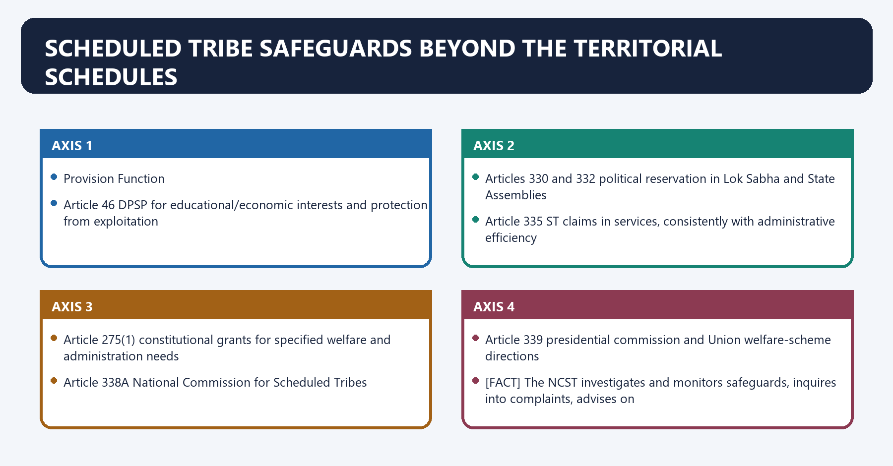
| Provision | Function |
|---|---|
| Article 46 | DPSP for educational/economic interests and protection from exploitation |
| Articles 330 and 332 | political reservation in Lok Sabha and State Assemblies |
| Article 335 | ST claims in services, consistently with administrative efficiency |
| Article 275(1) | constitutional grants for specified welfare and administration needs |
| Article 338A | National Commission for Scheduled Tribes |
| Article 339 | presidential commission and Union welfare-scheme directions |

[FACT] The NCST investigates and monitors safeguards, inquires into complaints, advises on
planning and reports to the President. It does not replace the Governor, TAC, Gram Sabha or ADC.

#### CLOSING RECALL FLOW — SCHEDULED TRIBE SAFEGUARDS BEYOND THE TERRITORIAL SCHEDULES

```closure-flow
SUBTOPIC: Scheduled Tribe safeguards beyond the territorial Schedules
KEY TERMS / DEFINITIONS: Scheduled Tribe safeguards beyond the territorial Schedules · Article 46 · DPSP for educational/economic interests and protection from exploitation · Articles 330 and 332 · political reservation in Lok Sabha and State Assemblies · Article 335
MECHANISM / ARGUMENT: The decisive contrast is between Article 338A National Commission for Scheduled Tribes and Article 339 presidential commission and Union welfare-scheme directions.
CONSEQUENCE / CONTRAST: Its principal consequence is that article 275(1) constitutional grants for specified welfare and administration needs.
UPSC TRAP / ANSWER-USE: It does not replace the Governor, TAC, Gram Sabha or ADC.
ANSWER-GRABBING FORMULATION: Fifth Schedule paragraph 5 permits gubernatorial restrictions on tribal land transfers in Scheduled Areas, subject to required TAC consultation and presidential assent.
```
## BASIC MCQS / REMEDIATION

### Original MCQ loop - strict continuous A -> B -> C -> D rotation

#### OM1. Article 244 mapping

Which pairing is correct?

A. Article 339-Sixth Schedule council composition.
B. Article 244(1)-Fifth Schedule; Article 244(2)-Sixth Schedule.
C. Article 244(1)-Sixth Schedule; Article 244(2)-Fifth Schedule.
D. Article 244A-Fifth Schedule declaration by President.

**Answer: B.**

**Explanation:** [FACT] Article 244 is the gateway that applies the two Schedules to their different territorial fields.

#### OM2. Fifth Schedule States

Which statement is correct as on 19 August 2026?

A. Assam is one of the 10 Fifth Schedule States.
B. Every State with an ST population has a notified Scheduled Area.
C. Official Central material identifies notified Fifth Schedule areas in 10 States.
D. All territory in those 10 States is scheduled.

**Answer: C.**

**Explanation:** [CURRENT] Ten States have notified areas; notification is territorial, not State-wide.

#### OM3. Declaration authority

A legally effective Scheduled Area status is created by:

A. a Presidential Order under the Fifth Schedule.
B. a Gram Sabha resolution under PESA.
C. a State Cabinet decision.
D. a TAC resolution.

**Answer: A.**

**Explanation:** [FACT] Administrative criteria guide identification, but the Presidential Order creates status.

#### OM4. Executive power

Which is the most accurate consequence of Fifth Schedule notification?

A. The State loses all executive power.
B. The area becomes a Union Territory.
C. State executive power continues, subject to Governor reporting and Union directions.
D. An ADC assumes total administration.

**Answer: C.**

**Explanation:** [FACT] Paragraph 3 creates supervision, not automatic substitution of government.

#### OM5. TAC composition

Which statement reflects the Fifth Schedule?

A. TAC has not more than 20 members, with the specified ST-legislator representation rule.
B. TAC is chaired constitutionally by the President.
C. TAC exists only in Sixth Schedule States.
D. TAC has 30 elected members and four nominees.

**Answer: A.**

**Explanation:** [FACT] The 30-member pattern belongs to the ordinary Sixth Schedule council ceiling.

#### OM6. TAC function

The primary constitutional duty of the TAC is to:

A. decide forest-right claims.
B. advise on ST welfare and advancement matters referred by the Governor.
C. assent to State legislation.
D. levy land revenue.

**Answer: B.**

**Explanation:** [FACT] TAC advice is not legislation, adjudication or executive approval.

#### OM7. Fifth Schedule regulations

A Governor-made regulation under paragraph 5 takes effect after:

A. State Assembly ratification.
B. Supreme Court certification.
C. TAC approval alone.
D. presidential assent.

**Answer: D.**

**Explanation:** [FACT] TAC consultation where it exists precedes the regulation; presidential assent gives effect.

#### OM8. Law-application direction

Which power can expressly operate retrospectively?

A. Article 342 ST notification only.
B. Governor's direction adapting/non-applying a law in a Scheduled Area.
C. TAC advice.
D. Gram Sabha beneficiary selection.

**Answer: B.**

**Explanation:** [FACT] Fifth Schedule paragraph 5(1) permits retrospective effect.

#### OM9. Article 339

Article 339(2) principally concerns:

A. recognition of ST communities.
B. Governor assent to ADC laws.
C. creation of an autonomous State within Assam.
D. Union directions on State schemes essential for ST welfare.

**Answer: D.**

**Explanation:** [FACT] It is a welfare-scheme direction power, distinct from Article 244A.

#### OM10. Article 275(1)

Which provision supports grants for ST welfare and raising Scheduled-Area administration?

A. Article 243D.
B. Article 300A.
C. Article 371A.
D. Article 275(1).

**Answer: D.**

**Explanation:** [FACT] Article 275(1) is the constitutional fiscal route.

#### OM11. Fifth Schedule evaluation

Which conclusion is best?

A. effectiveness depends on timely power use, participation, records and capacity.
B. Union directions remove the need for State administration.
C. Constitutional powers guarantee outcomes without institutions.
D. TAC is stronger than a legislature.

**Answer: A.**

**Explanation:** [ANALYSIS] The framework's performance is multiplicative, not self-executing.

#### OM12. Territorial trap

Which statement is false?

A. Some districts may be only partly covered.
B. Once a State is listed, its entire territory is a Scheduled Area.
C. Presidential Orders define Scheduled Area coverage.
D. ST population alone does not create status.

**Answer: B.**

**Explanation:** [FACT] Legal status attaches only to notified territory.

#### OM13. Sixth Schedule States

Which is the complete Sixth Schedule set?

A. Assam, Nagaland, Manipur and Mizoram.
B. Meghalaya, Tripura, Mizoram and Arunachal Pradesh.
C. Assam, Meghalaya, Tripura and Mizoram.
D. All eight North-Eastern States.

**Answer: C.**

**Explanation:** [FACT] "A-M-T-M" is the exact constitutional set.

#### OM14. Autonomous regions

An autonomous region may be created where:

A. Parliament declares a new State.
B. a TAC demands taxation power.
C. a Scheduled Area becomes a UT.
D. different Scheduled Tribes inhabit parts of an autonomous district.

**Answer: D.**

**Explanation:** [FACT] The Governor may divide such areas into autonomous regions.

#### OM15. Ordinary council composition

Which statement is correct?

A. Every District Council has exactly 30 elected members.
B. The ordinary ceiling is 30, with not more than four Governor-nominated members.
C. Elected members have no fixed term.
D. All members are nominated by the Governor.

**Answer: B.**

**Explanation:** [FACT] Special amendments, including BTC's design, create exceptions.

#### OM16. Council law

A District/Regional Council law under paragraph 3 ordinarily takes effect after:

A. President's assent.
B. TAC consultation.
C. Governor's assent.
D. State Cabinet approval alone.

**Answer: C.**

**Explanation:** [FACT] This is the crucial Fifth-versus-Sixth assent reversal.

#### OM17. Council legislative field

Which is a paragraph 3 subject?

A. citizenship.
B. regulation of shifting cultivation.
C. defence.
D. currency.

**Answer: B.**

**Explanation:** [FACT] Land, non-reserved forests, local institutions and customary matters are core fields.

#### OM18. Forest competence

Which forest category is excluded from the ordinary paragraph 3 forest field?

A. community forest resource.
B. protected forest.
C. reserved forest.
D. village forest.

**Answer: C.**

**Explanation:** [FACT] The omission of "reserved" is a standard close-option discriminator.

#### OM19. Council courts

The safest description of Sixth Schedule judicial power is:

A. judicial power exists only under PESA.
B. ADCs try every criminal offence.
C. village/council courts handle specified matters within the tribal-party jurisdictional boundary.
D. ADCs replace all High Courts.

**Answer: C.**

**Explanation:** [FACT] Jurisdiction is bounded by parties, territory, subject and rules.

#### OM20. Fiscal autonomy

Which is within the Sixth Schedule revenue basket?

A. corporation tax.
B. specified taxes on professions, animals/vehicles, markets and local services.
C. customs duty.
D. GST on inter-State supply.

**Answer: B.**

**Explanation:** [FACT] Council fiscal power is constitutionally specified, not plenary.

#### OM21. Mineral royalties

Paragraph 9 contemplates:

A. an agreed share of mineral royalties for the District Council.
B. automatic cancellation of every State lease.
C. exclusive council ownership of all minerals.
D. no State role in minerals.

**Answer: A.**

**Explanation:** [FACT] Revenue sharing is not mineral sovereignty.

#### OM22. Bodoland exception

Which statement is accurate?

A. BTC follows an invariable 26 elected plus four nominated design.
B. BTC has a special 46-member design: 40 elected and six nominated.
C. BTC is a Fifth Schedule TAC.
D. BTC is an autonomous State under Article 244A.

**Answer: B.**

**Explanation:** [FACT] The exception warns against universalising the ordinary paragraph 2 model.

#### OM23. Assam asymmetry

Paragraphs 3A and 3B illustrate:

A. abolition of Governor assent.
B. extension of PESA to BTC.
C. additional subject allocations for specified Assam councils.
D. automatic Statehood.

**Answer: C.**

**Explanation:** [FACT] Sixth Schedule autonomy is internally asymmetric.

#### OM24. Article 244A

Article 244A enables Parliament to:

A. notify an ST list.
B. create a PESA State.
C. declare all Assam a Scheduled Area.
D. create an autonomous State within Assam with a legislature/CoM.

**Answer: D.**

**Explanation:** [FACT] It is deeper than an ADC but remains an enabling constitutional route.

#### OM25. PESA reach

PESA applies to:

A. Fifth Schedule Scheduled Areas.
B. all Sixth Schedule tribal areas.
C. every rural area in India.
D. only forest land.

**Answer: A.**

**Explanation:** [FACT] Article 243M exclusion is modified by PESA for Fifth Schedule areas.

#### OM26. Acquisition and R&R

PESA section 4 requires, before land acquisition and resettlement/rehabilitation:

A. universal Gram Sabha consent.
B. President's assent.
C. TAC legislation.
D. consultation with the Gram Sabha or Panchayat at the appropriate level.

**Answer: D.**

**Explanation:** [FACT] Consultation must not be inflated into the different verb "consent".

#### OM27. Minor minerals

Which PESA formulation is correct?

A. every major-mineral project needs TAC approval.
B. specified minor-mineral licences/leases require mandatory prior recommendation.
C. every mine needs President's assent.
D. Gram Sabha owns all subsoil minerals.

**Answer: B.**

**Explanation:** [FACT] Section 4(k)-(l) uses recommendation for specified minor-mineral decisions.

#### OM28. Section 4(m)

Which basket best reflects PESA?

A. High Court appointments and police command.
B. defence, foreign affairs and currency.
C. Statehood, citizenship and emergency.
D. minor forest produce, markets, money-lending, intoxicants and land-restoration powers.

**Answer: D.**

**Explanation:** [FACT] State law must specifically endow the Gram Sabha/Panchayats at the appropriate level.

#### OM29. FRA claims

The statutory claims process begins with:

A. the District Council.
B. the Governor.
C. the Gram Sabha.
D. the President.

**Answer: C.**

**Explanation:** [FACT] FRA section 6 makes the Gram Sabha the initiating authority.

#### OM30. CFR right

Community Forest Resource rights include the right to:

A. abolish reserved forests.
B. protect, regenerate, conserve or manage the community forest resource.
C. bypass the FRA committee process.
D. own every mineral.

**Answer: B.**

**Explanation:** [FACT] CFR is a management/conservation right distinct from an individual cultivation right.

#### OM31. Niyamgiri holding

Which statement is most accurate?

A. Gram Sabhas determined FRA-linked claims; MoEF retained final Stage-II decision in light of them.
B. The Court granted every Gram Sabha a nationwide mining veto.
C. The Court transferred mineral ownership to the Dongria Kondh.
D. The case concerned only ordinary EIA public hearings.

**Answer: A.**

**Explanation:** [FACT] This preserves both community-right determination and statutory clearance authority.

#### OM32. *Samatha* limit

The safest use of *Samatha* is:

A. cite its Andhra Pradesh regulation-based holding and expressly qualify nationwide extension.
B. all private mining in India is void.
C. Fifth Schedule itself nationalised minerals.
D. the ruling has no tribal-land relevance.

**Answer: A.**

**Explanation:** [LIMIT] Legal setting and later scope treatment are indispensable.

#### OM33. Article 371 distinction

Which statement is correct?

A. Article 371 automatically creates ADCs.
B. Article 371 eliminates Part III.
C. Article 371 provisions are distinct State-specific arrangements, not synonyms for the Sixth Schedule.
D. Article 371 applies PESA to Mizoram.

**Answer: C.**

**Explanation:** [FACT] Examples include Article 371A and 371G, each with its own text.

#### OM34. Ordinary Panchayats

Article 243M means that:

A. ADCs are ordinary Zila Parishads.
B. Part IX automatically applies unchanged to every Scheduled/tribal area.
C. Panchayats can never exist in the North-East.
D. Scheduled Areas and tribal areas are excluded from automatic Part IX application, with PESA extending it to Fifth Schedule areas.

**Answer: D.**

**Explanation:** [FACT] PESA is the Fifth Schedule modification route.

#### OM35. Current PESA rule status

Which dated statement is supported by the official MoPR listing on 19 August 2026?

A. Nine State rule regimes are listed, including Jharkhand 2025; Odisha is not separately listed.
B. Odisha is the only State with rules.
C. All ten States have identical rules.
D. PESA has been repealed.

**Answer: A.**

**Explanation:** [CURRENT] Notification status is not implementation completeness.

#### OM36. Reform principle

Which reform best respects the constitutional design?

A. combine transparent reporting, land/CFR records, council capacity, precise participation and accessible remedies.
B. let convergence programmes waive PESA/FRA.
C. replace Gram Sabhas with dashboards.
D. treat TAC advice as a statute.

**Answer: A.**

**Explanation:** [ANALYSIS] Reform must connect legal authority to usable, reviewable community power.

### Remedial MCQs - strict continuation C -> A -> D -> C rotation

#### RM1. President-Governor reversal

Which matching is correct?

A. Governor-declares Scheduled Area; President-organises ADCs.
B. Gram Sabha-declares tribal area; Governor-declares ST list.
C. President-declares Scheduled Area; Governor-organises Sixth Schedule districts/regions.
D. TAC-declares ST list; Parliament-declares Scheduled Area.

**Answer: C.**

**Explanation:** [FACT] Keep area declaration, ST specification and Sixth Schedule organisation on separate tracks.

#### RM2. Assent reversal

Which pairing is accurate?

A. both-President assent.
B. neither requires assent.
C. Fifth Schedule regulation-President assent; Sixth Schedule council law-Governor assent.
D. Fifth Schedule regulation-Governor assent; Sixth Schedule law-President assent.

**Answer: C.**

**Explanation:** [FACT] This reversal frequently decides a statement question.

#### RM3. TAC versus ADC

Which institutional comparison is correct?

A. TAC is more autonomous than an ADC.
B. Both levy taxes.
C. Both are advisory.
D. TAC advises; ADC can legislate, administer, adjudicate specified disputes and levy specified taxes.

**Answer: D.**

**Explanation:** [FACT] Fifth and Sixth Schedule bodies are not interchangeable.

#### RM4. State executive power

Scheduling an area under the Fifth Schedule:

A. creates a local sovereign government.
B. retains State administration within the Schedule's reporting and direction structure.
C. ends the State's executive power.
D. triggers President's Rule.

**Answer: B.**

**Explanation:** [FACT] This directly remedies the 2025 PYQ trap.

#### RM5. PESA scope

Which statement is correct?

A. PESA replaces FRA.
B. PESA creates Sixth Schedule councils.
C. PESA applies only to one State.
D. PESA modifies Part IX for Fifth Schedule Scheduled Areas.

**Answer: D.**

**Explanation:** [FACT] The statutes complement each other but have different objects.

#### RM6. PESA verb

Before acquisition and R&R in a Scheduled Area, the central PESA text uses:

A. ownership.
B. adjudication.
C. approval.
D. consultation.

**Answer: D.**

**Explanation:** [FACT] Minor-mineral decisions use a different "recommendation" rule.

#### RM7. Forest rights

Which institution initiates FRA claims?

A. Gram Sabha.
B. ADC in every State.
C. MoEFCC.
D. TAC.

**Answer: A.**

**Explanation:** [FACT] The process then moves through Sub-Divisional and District Level Committees.

#### RM8. Niyamgiri limit

Which statement must be rejected?

A. FRA-linked religious claims were considered.
B. The judgment created an unlimited Gram Sabha veto over every Indian project.
C. MoEF retained the final Stage-II decision.
D. Gram Sabha decisions informed the clearance process.

**Answer: B.**

**Explanation:** [LIMIT] The holding was project-, statute- and claim-specific.

#### RM9. Council forest power

Which is correct?

A. Paragraph 3 includes management of forests other than reserved forests.
B. FRA is inapplicable in the North-East.
C. Council law requires President's assent.
D. ADCs control every national park automatically.

**Answer: A.**

**Explanation:** [FACT] Reserved-forest exclusion and Governor assent are the key qualifiers.

#### RM10. Article 244A

Article 244A is specifically associated with:

A. declaration of Scheduled Tribes.
B. PESA rules in Odisha.
C. an autonomous-State route within Assam.
D. Fifth Schedule regulations nationwide.

**Answer: C.**

**Explanation:** [FACT] It should not be confused with an existing ADC.

#### RM11. Current law control

Which is the safest dated statement?

A. Every PESA State has fully implemented every section.
B. Odisha has a separately listed official rule instrument.
C. Jharkhand has no PESA rules.
D. The MoPR listing shows nine rule regimes and the implementation gap remains a separate question.

**Answer: D.**

**Explanation:** [CURRENT] Jharkhand Rules 2025 appear in the official list; Odisha does not.

#### RM12. Answer-writing sequence

The strongest mining-rights paragraph is:

A. claim -> Fifth/PESA/FRA/State-law evidence -> project mechanism -> analysis -> case-specific qualification.
B. slogan -> unsourced statistic -> conclusion.
C. case name -> universal claim.
D. Article list without facts.

**Answer: A.**

**Explanation:** [ANALYSIS] This sequence preserves legal accuracy and examiner-visible reasoning.

## PYQS AND ANSWER PRACTICE

### Verified routed Prelims PYQs

#### PYQ 1 - UPSC Prelims 2019, Q50

**Verified from the locally held official paper:**

> Under which Schedule of the Constitution of India can the transfer of tribal land to private parties for mining be declared null and void?
>
> A. Third Schedule  
> B. Fifth Schedule  
> C. Ninth Schedule  
> D. Twelfth Schedule

**Key status:** The audited local ledger records that an official key is unavailable locally. No answer letter is presented as official.

**Tested concept:** [FACT] Fifth Schedule paragraph 5 permits gubernatorial regulations restricting tribal land transfers in Scheduled Areas, subject to TAC consultation where one exists and presidential assent. [FACT] *Samatha* applied the Andhra Pradesh Scheduled Areas Land Transfer Regulation to invalidate the impugned mining leases in its specific legal setting.

**Qualification:** [LIMIT] The legal result depends on the applicable Fifth Schedule regulation/State law and facts; the case is not a free-standing nationwide ban detached from those instruments.

#### PYQ 2 - UPSC Prelims 2022, Q73

**Verified routed demand:** consequences of bringing an area under the Fifth Schedule.

**Wording control:** The routing ledger preserves the neutral demand but the exact official-paper wording and official key are not available in the verified local corpus used for this export. They are not reconstructed.

**Concept model**

| Consequence | Governing rule |
|---|---|
| legal status | President declares a Scheduled Area |
| ordinary administration | State executive power continues |
| supervision | Governor reports; Union may give directions |
| advisory institution | TAC in the State |
| protective adaptation | Governor may adapt laws and make land/money-lending regulations |
| self-government layer | PESA applies through State law |

**Key status:** No option is inferred. The concept lesson is that scheduling produces protective administration; it does not create a UT, a Sixth Schedule ADC or automatic Union administration.

#### PYQ 3 - UPSC Prelims 2023, Q39

**Verified from the locally held official paper:**

> With reference to "Scheduled Areas" in India, consider the following statements:
>
> 1. Within a State, the notification of an area as Scheduled Area takes place through an Order of the President.  
> 2. The largest administrative unit forming the Scheduled Area is the District and the lowest is the cluster of villages in the Block.  
> 3. The Chief Ministers of the concerned States are required to submit annual reports to the Union Home Ministry on the administration of Scheduled Areas in the States.
>
> How many of the above statements are correct?
>
> A. Only one  
> B. Only two  
> C. All three  
> D. None

**Key status:** The official key is unavailable in the audited local corpus; no option is inferred.

**Statement audit without key inference**

- [FACT] Statement 1 tracks Fifth Schedule paragraph 6: Scheduled Area status is created through a Presidential Order.
- [FACT] The Ministry's official administrative criteria speak of a viable unit such as a district, block or taluk and compact territory. [LIMIT] Because the official key is unavailable, this package does not convert that guidance into a declared answer on statement 2.
- [FACT] Paragraph 3 assigns the annual/required report to the **Governor** and the recipient is the **President**, not the Chief Minister and Union Home Ministry as stated.

#### PYQ 4 - UPSC Prelims 2024, Q84

**Verified from the locally held official paper:**

> Consider the following statements:
>
> 1. It is the Governor of the State who recognizes and declares any community of that State as a Scheduled Tribe.  
> 2. A community declared as a Scheduled Tribe in a State need not be so in another State.
>
> Which of the statements given above is/are correct?
>
> A. 1 only  
> B. 2 only  
> C. Both 1 and 2  
> D. Neither 1 nor 2

**Official Set-A key: B.**

**Explanation:** [FACT] Article 342 authorises the President to specify STs for a State/UT by public notification, after the constitutionally required consultation, and Parliament may later include/exclude by law. [FACT] ST status is State/UT-specific, so the same community need not have the same status everywhere.

#### PYQ 5 - UPSC Prelims 2025, Q56

**Verified from the locally held official paper:**

> With reference to the Constitution of India, if an area in a State is declared as Scheduled Area under the Fifth Schedule:
>
> I. the State Government loses its executive power in such areas and a local body assumes total administration;  
> II. the Union Government can take over the total administration of such areas under certain circumstances on the recommendations of the Governor.
>
> Which of the statements given above is/are correct?
>
> A. I only  
> B. II only  
> C. Both I and II  
> D. Neither I nor II

**Official Set-A key: D.**

**Explanation:** [FACT] State executive power continues. [FACT] The Governor reports to the President and Union executive power extends to directions on administration. [LIMIT] Neither proposition in the stem accurately describes a local-body or Union "total administration" takeover.

#### PYQ 6 - UPSC Prelims 2026, Q57

**Verified from the locally held official paper:**

> Consider the following statements about the provisions pertaining to the Scheduled Castes and the Scheduled Tribes in India:
>
> 1. Provisions regarding the administration of the Tribal Areas in Assam, Meghalaya, Tripura and Mizoram are given in the Fifth Schedule.  
> 2. Some tribes of India are entitled to exemption from paying Income Tax on certain incomes.  
> 3. The Constitution provides for reservation of seats in Panchayats for women belonging to the Scheduled Castes and Scheduled Tribes.
>
> Which conclusion based on the statements is correct?
>
> A. There are two correct statements, including statement 2.  
> B. There are two correct statements, statements 1 and 3.  
> C. There is only one correct statement.  
> D. All three statements are correct.

**Key status:** A provisional Set-A key is held locally, but the routing ledger deliberately records no answer letter and no answer is inferred here.

**Concept audit**

- [FACT] Statement 1 reverses the Schedules: the four named States are the Sixth Schedule field.
- [FACT] Income-tax Act section 10(26) contains a conditional statutory exemption for specified income of eligible ST members residing in specified areas; it is not a blanket tribal exemption.
- [FACT] Article 243D includes SC/ST reservation in Panchayats and requires not less than one-third of reserved SC/ST seats to be reserved for women belonging to those categories.
- [LIMIT] Because the locally held key is provisional and no letter is recorded in the ledger, this package does not declare an answer option.

#### PYQ coverage control

- [FACT] The audited 2018-2026 routing ledgers identify six direct objective demands for this owner.
- [LIMIT] Exact wording is reproduced only where verified against a locally held official paper. Official answer letters are stated only for the locally held final 2024 and 2025 Set-A keys.

### Original solved Mains practice

#### M1. Explain the constitutional rationale for separate administration of Scheduled and tribal areas. (10 marks, 150 words)

**Model solution**

**Thesis:** [ANALYSIS] The Fifth and Sixth Schedules use differentiated governance to achieve substantive equality where historical alienation, customary institutions, geographic isolation and land-resource dependence make ordinary administration inadequate.

**Historical basis:** [FACT] Colonial excluded-area administration concentrated executive control. Constituent Assembly subcommittees led by A.V. Thakkar and Gopinath Bordoloi redesigned differentiation around protection and self-government. [ANALYSIS] The Constitution therefore retained special territory while changing its democratic purpose.

**Two models:** [FACT] Article 244(1) applies the Fifth Schedule: Presidential declaration, Governor reporting/regulations, Union directions and TAC advice. Article 244(2) applies the Sixth: elected councils with specified legislative, executive, judicial and fiscal powers. [ANALYSIS] The first is guardian-centred protection; the second is territorial autonomy.

**Rights layer:** [FACT] PESA 1996 and FRA 2006 add Gram Sabha participation and forest-right recognition. [ANALYSIS] They convert communities from administrative objects into rights-bearing participants.

**Qualification:** [LIMIT] Special administration can become paternalistic or opaque; custom also remains subject to Fundamental Rights.

**Verdict:** Differentiation is legitimate when it secures land, culture, voice and accountable self-rule, not when it creates permanent executive tutelage.

**Why this earns marks:** It answers "why", names the constitutional models, supplies history and statutes, and ends with a qualified normative test.

#### M2. "The Fifth Schedule is constitutionally powerful but institutionally under-activated." Examine. (10 marks, 150 words)

**Model solution**

**Thesis:** [FACT] The Fifth Schedule supplies strong supervisory and protective tools; [ANALYSIS] their impact depends on transparent use by the Governor, State and Union and meaningful community participation.

**Power:** The President declares/changes Scheduled Areas. The Governor reports annually, may adapt parliamentary/State laws and make peace-and-good-government regulations on land transfer, allotment and money-lending, subject to TAC consultation and presidential assent. Union directions and Articles 275(1)/339 add fiscal and welfare supervision.

**Under-activation:** [ANALYSIS] TAC agenda depends on gubernatorial reference; reports lack a constitutionally mandated public template; protective regulations and PESA conformity may lag; State revenue/mining priorities can conflict with anti-alienation goals.

**Named evidence:** [FACT] PESA section 4 creates precise Gram Sabha/Panchayat powers, while the official 2026 rule listing still shows Odisha without a separately listed rules instrument. [ANALYSIS] Enactment has not ensured uniform implementation.

**Qualification:** [LIMIT] The Governor's powers should not be misstated as unreviewable personal discretion.

**Verdict:** Activation requires public reporting, reasoned TAC follow-up, cross-law conformity, records and enforceable remedies.

**Why this earns marks:** It balances text and performance, uses exact institutions and a dated official implementation control.

#### M3. Discuss the legislative, executive, judicial and fiscal powers of Sixth Schedule councils and their constitutional limits. (15 marks, 250 words)

**Model solution**

**Thesis:** [FACT] Sixth Schedule councils are constitutionally protected territorial governments with multi-functional autonomy; [ANALYSIS] they remain subject-specific bodies within State and Union constitutional authority, not sovereign legislatures.

**Legislative:** Paragraph 3 covers land use, non-reserved forests, agricultural water, shifting cultivation, village administration, chiefs/headmen, inheritance, marriage/divorce and social customs. Laws require Governor assent. Assam paragraphs 3A/3B enlarge powers for specified councils.

**Executive:** Paragraph 6 permits management of primary schools, dispensaries, markets, ferries, fisheries, roads and entrusted welfare/planning functions. [ANALYSIS] Functional autonomy is strongest where staff and funds follow the subject.

**Judicial:** Paragraph 4 allows village/council courts and appeals for specified disputes involving tribal parties. [LIMIT] High Courts and the ordinary justice system retain their constitutional place.

**Fiscal:** Councils assess land revenue, levy specified taxes and maintain District/Regional Funds; paragraph 9 provides a mineral-royalty share. Article 275(1) supports capacity. [LIMIT] Revenue sharing is neither mineral ownership nor fiscal sovereignty.

**Checks:** Governor assent/approval, inquiry, suspension and specified dissolution/supersession powers; State-specific paragraphs govern application of laws; Parliament may amend the Schedule.

**Named examples:** [CURRENT] Assam's BTC has a special 46-member design; Meghalaya's three ADCs route instruments through State scrutiny to the Governor.

**Verdict:** The Schedule creates meaningful autonomy when constitutional powers, administrative transfer and democratic accountability operate together.

**Why this earns marks:** It organises the answer by four power types, names paragraphs/examples and repeatedly identifies the limits.

#### M4. Compare the Fifth and Sixth Schedules as competing models of tribal governance. (15 marks, 250 words)

**Model solution**

**Thesis:** [ANALYSIS] The Schedules answer the same problem through different institutional theories: the Fifth relies on protective supervision; the Sixth constitutionalises elected territorial self-government.

| Dimension | Fifth | Sixth |
|---|---|---|
| territory | Presidential Scheduled Area Orders in 10 States | tribal areas in four North-Eastern States |
| institution | advisory TAC | elected District/Regional Councils |
| law | Governor adapts laws/makes regulations; President assents | council laws on specified subjects; Governor assents |
| administration | State continues under reporting/Union directions | councils manage specified services within State authority |
| justice/finance | no Schedule-created TAC courts/taxes | specified courts, land revenue and taxes |
| local participation | PESA extends modified Part IX | PESA does not apply |

**Analysis:** [FACT] The Fifth's land-transfer and money-lending regulation powers can be strong, and PESA/FRA deepen community agency. Yet TAC advice and gubernatorial initiative may remain dormant. The Sixth's elected councils provide continuous local law-making and finance, but assent delays, limited subjects, State control and intra-area representation disputes constrain autonomy.

**Named evidence:** *Samatha* illustrates protective land law in the Fifth context; BTC's special design shows adaptable Sixth Schedule autonomy.

**Qualification:** [LIMIT] "Sixth is always better" ignores context, council accountability and non-Sixth alternatives such as Article 371 or strengthened hill councils.

**Verdict:** The best reform imports the Sixth's agency into Fifth Schedule practice without treating either model as institutionally complete.

**Why this earns marks:** It compares on identical axes, uses evidence and avoids a simplistic hierarchy.

#### M5. PESA is a calibrated code of community power, not a universal Gram Sabha veto. Discuss. (15 marks, 250 words)

**Model solution**

**Thesis:** [FACT] PESA section 4 assigns different powers to the Gram Sabha and Panchayats according to the decision; [ANALYSIS] its strength lies in legal precision, not a single maximalist verb.

**Approval:** Gram Sabha approves village-level social/economic plans, programmes and projects before implementation and identifies beneficiaries.

**Certification:** Village Panchayat obtains Gram Sabha certification of fund utilisation.

**Consultation:** Gram Sabha or appropriate Panchayat is consulted before land acquisition and R&R in Scheduled Areas. [LIMIT] Consultation is not statutory universal consent.

**Mandatory recommendation:** Prior recommendation is required for specified prospecting licences/mining leases for minor minerals and for auction concessions, with the statutory holder varying by clause.

**Substantive endowment:** State law must endow ownership of minor forest produce, village-market control, regulation of money-lending/intoxicants, land-alienation prevention/restoration, local-plan/resource control and social-sector oversight.

**Named evidence:** [FACT] PESA's habitation-based village and cultural-resource safeguard recognise living customary institutions. [CURRENT] Official MoPR material lists nine State rule regimes; notification does not prove cross-sector compliance.

**Critical gap:** large Gram Panchayat boundaries, weak records, sectoral-law inconsistency and formal meetings can dilute powers.

**Verdict:** Courts and administrators should enforce the exact statutory verb at each project stage while States strengthen Gram Sabha information, inclusion and remedy.

**Why this earns marks:** It directly proves the proposition with section-specific verbs, then adds implementation and qualification.

#### M6. Analyse how the Fifth Schedule, PESA, FRA and judicial decisions regulate land and mining conflicts in tribal areas. (15 marks, 250 words)

**Model solution**

**Thesis:** [ANALYSIS] Tribal land/mining governance is cumulative: no one clearance or consultation substitutes for constitutional regulation, community power, forest-right recognition and sectoral law.

**Fifth Schedule:** Paragraph 5 permits regulations restricting tribal land transfer, allotment and money-lending. [ANALYSIS] It supplies the anti-alienation constitutional base, but the operative State regulation matters.

**PESA:** section 4 requires consultation for acquisition/R&R, mandatory prior recommendation for specified minor-mineral decisions and powers to prevent/restore alienated land. [LIMIT] Major minerals and all projects cannot be swept into one veto claim.

**FRA:** Gram Sabha initiates individual/community/CFR claims; section 5 adds conservation duties. [ANALYSIS] A project must first know whose rights and cultural relationships are affected.

**Cases:** [FACT] *Samatha* invalidated the impugned Andhra Pradesh Scheduled-Area mining leases under the State land-transfer regulation; its nationwide reach must be qualified. [FACT] *Orissa Mining Corporation* required Gram Sabha determination of FRA-linked cultural/religious claims, while MoEF retained the final Stage-II clearance decision.

**Conflict mechanism:** insecure records, debt, acquisition and forest diversion can combine to dispossess communities even where one procedure is formally completed.

**Verdict:** lawful development requires sequenced rights recognition, exact PESA compliance, environmental appraisal, reasoned alternatives and enforceable restoration/R&R.

**Why this earns marks:** It integrates four legal layers, uses two accurately bounded cases and explains the causal mechanism of dispossession.

#### M7. Design an accountability reform for Fifth and Sixth Schedule institutions. (20 marks, 250 words)

**Model solution**

**Thesis:** [ANALYSIS] Reform should preserve constitutional asymmetry while making every exercise or non-exercise of power visible, reasoned, participatory and remediable.

**1. Territorial accuracy:** publish current Presidential Orders, habitation maps and council boundaries in accessible local formats; distinguish whole districts from partial coverage.

**2. Governor accountability:** standardise annual Fifth Schedule reports around land alienation, PESA, FRA, services and outcomes; publish them with justified confidentiality exceptions. Require reasoned disposal of TAC advice.

**3. TAC renewal:** fixed meeting calendar, community/expert evidence, public agendas and action-taken statements. [LIMIT] retain its advisory constitutional character.

**4. PESA implementation:** harmonise Panchayat, excise, market, money-lending, land and minor-mineral laws; notify the remaining rules gap; support habitation-level Gram Sabhas and inclusive meetings.

**5. Sixth Schedule capacity:** activity, staff and fund maps; assent timelines and reasons; independent audit; transparent council law databases; strengthen village/council-court training and appeal records.

**6. Land/FRA infrastructure:** geo-referenced but privacy-sensitive land/CFR records, legal aid and restoration tracking.

**7. Project sequencing:** rights determination -> statutory consultation/recommendation -> environmental/social appraisal -> reasoned decision -> monitored R&R/restoration.

**8. Intergovernmental review:** use Articles 275/339 and State departments for capacity and convergence, not command substitution.

**Qualification:** digitisation can exclude remote communities; custom cannot override equality and dignity.

**Verdict:** accountability should align who decides, who implements, who records reasons and who can obtain a remedy.

**Why this earns marks:** It offers a sequenced institution-specific design, protects autonomy and attaches qualifications to each reform logic.

#### M8. Should Sixth Schedule-style autonomy be extended to Ladakh or other tribal regions? Critically examine. (20 marks, 250 words)

**Model solution**

**Thesis:** [ANALYSIS] Extension should follow institutional fit, not population alone: the issue is which legal form best protects land, culture, representation and accountable development within the relevant State/UT structure.

**Case for extension:** elected territorial councils can legislate on land/custom, manage services, raise specified revenue and provide continuous local voice. [CURRENT] Ladakh's official dialogue concerns land, culture, employment and empowerment of hill councils; no Sixth Schedule status has been enacted.

**Why the model attracts demands:** [FACT] Sixth Schedule councils are stronger than a Fifth Schedule TAC and ordinary administrative councils because they combine legislative, executive, judicial and fiscal powers.

**Limits:** the Schedule presently operates in four named States; council boundaries can create minority-insider disputes; gubernatorial assent, weak staff/funds and State overlap can reduce promised autonomy. Ladakh is a UT with existing hill councils and strategic/ecological constraints, so transplantation requires careful legal design.

**Alternatives/complements:** an Article 371-type provision, strengthened elected hill councils, land/employment legislation, cultural-language guarantees, legislative representation or a tailored parliamentary framework may better match some regions.

**Decision test:** territorial compactness; customary institutions; consent of affected groups; minority safeguards; fiscal viability; relation with State/UT legislature; judicial and audit accountability.

**Qualification:** [LIMIT] high ST population is evidence of need, not a self-executing constitutional entitlement to one model.

**Verdict:** consider Sixth Schedule extension where territorial self-government is the proportional solution, but choose through transparent consultation and enacted constitutional design rather than slogan or analogy.

**Why this earns marks:** It uses current Ladakh control, compares institutional benefits and costs, offers alternatives and answers "should" with a conditional test.

## OPTIONAL ADVANCED DEPTH — NOT REQUIRED FOR A CORE ANSWER

> **Subject:** Polity · **Tier:** Advanced (exam depth) · **GS Paper:** GS-II
> **Grounded in:** Indian Polity by M. Laxmikant, Ch. 41 (direct check of the local Sixth Revised Edition PDF).
> ✅ = from source book · ⚠️ = inference / case law · 📰 = current affairs.
> *Companion: `basic/Scheduled-and-Tribal-Areas.md`.*

---

### THE BIG PICTURE ⭐
✅ **Art 244 (Part X)** envisages a special administrative system for **"scheduled areas"** and **"tribal areas"**:
| Schedule | Covers | Applies to |
|---|---|---|
| ✅ **Fifth Schedule** | Administration & control of **scheduled areas & STs** | **Any state EXCEPT** Assam, Meghalaya, Tripura, Mizoram |
| ✅ **Sixth Schedule** | Administration of **tribal areas** | The **4 NE states**: Assam, Meghalaya, Tripura, Mizoram |

✅ **10 states have Fifth Schedule Areas** (2019): AP, Telangana, Chhattisgarh, Gujarat, HP, Jharkhand, MP,
Maharashtra, Odisha, Rajasthan.

---

### PART A — FIFTH SCHEDULE (Administration of Scheduled Areas) ⭐
✅ Rationale: inhabited by **aboriginals**, socially/economically backward → the normal state machinery is not
fully extended and the **Centre has greater responsibility**.
1. ✅ **Declaration:** the **President** declares/alters/rescinds a scheduled area (in consultation with the
   Governor).
2. ✅ **Executive power:** state's executive power extends there, **but the Governor has a special
   responsibility** — must send an **annual report** to the President; the **Centre can give directions** on
   administration.
3. ✅ **Tribes Advisory Council (TAC):** every Fifth-Schedule state must set one up — **20 members, 3/4 being ST
   MLAs** of the state assembly.
4. ✅ **Governor's powers:** may direct that an Act of Parliament/state legislature does **not apply** (or applies
   with modifications) to a scheduled area; may make **regulations** (prohibit/restrict land transfer among
   tribals, regulate money-lending) — all such regulations need the **President's assent**.
- ✅ **Commissions:** President appoints a commission on scheduled-area administration — compulsorily after **10
  years** (1st = **U.N. Dhebar, 1960**; 2nd = **Dilip Singh Bhuria, 2002**).

---

### PART B — SIXTH SCHEDULE (Administration of Tribal Areas) ⭐
✅ For the **4 NE states** (Assam, Meghalaya, Tripura, Mizoram) whose tribes retain their own culture → given
**autonomy** for self-government.
| Feature | Detail |
|---|---|
| ✅ **Autonomous Districts** | Tribal areas constituted as **autonomous districts** (still within state executive authority); Governor organises/reorganises them |
| ✅ **Autonomous Regions** | Where different tribes exist within a district |
| ✅ **District Council** | Ordinary model: up to **30 members** — 4 Governor-nominated + 26 elected, 5-year elected term; **Bodoland Territorial Council is a special 46-member exception** |
| ✅ **Law-making** | Councils legislate on **land, forests, canal water, shifting cultivation, inheritance, marriage/divorce, social customs** — need Governor's assent |
| ✅ **Judicial** | Councils can constitute **village councils/courts** for tribal disputes |
| ✅ **Finance** | Assess & collect **land revenue** + specified taxes; manage schools, markets, ferries, roads |
| ✅ **Acts don't auto-apply** | Parliament/state Acts apply to autonomous districts only with modifications |

✅ **Special Article 244A:** allows formation of an **autonomous state** within Assam (with its own legislature/CoM).

---

### PART C — FIFTH vs SIXTH SCHEDULE (compare) ⭐⭐
| Point | Fifth Schedule | Sixth Schedule |
|---|---|---|
| ✅ Applies to | Scheduled areas in **10 states** (except the 4 NE) | Tribal areas in **4 NE states** |
| ✅ Key body | **Tribes Advisory Council** (advisory) | **Autonomous District/Regional Councils** (law-making + executive) |
| ✅ Degree of autonomy | Lower (protective; Governor/Centre-driven) | **Higher** (genuine self-government with elected councils) |
| ✅ Declares/controls | President declares; Governor reports | Governor organises districts; councils legislate |

---

#### UPSC Traps
- ❌ Sixth Schedule applies to all NE states → only **Assam, Meghalaya, Tripura, Mizoram** (not Nagaland/Manipur/
  Arunachal).
- ❌ Fifth Schedule covers the whole country → **excludes the 4 Sixth-Schedule states**.
- ❌ Tribes Advisory Council makes laws → it is **advisory** only; the **District Councils** (Sixth Schedule) legislate.
- ❌ District Council has 30 all-elected members → **26 elected + 4 nominated** by the Governor.
- ❌ President declares tribal areas under the Sixth Schedule → the **Governor** organises autonomous districts;
  the **President** declares **scheduled areas** (Fifth Schedule).
- ❌ Fifth-Schedule regulations need the Governor's assent → they need the **President's** assent.

#### 📰 CA hooks
- 📰 ⚠️ **Ladakh's demand for Sixth Schedule status** (tribal-majority UT) — a major live agitation (links to Ch 22
  & Ch 25).
- 📰 ⚠️ **PESA (1996)** extends Panchayat provisions to **Fifth Schedule** areas — Gram Sabha empowerment (links to
  Ch 23).
- 📰 ⚠️ **Forest Rights Act 2006** & tribal land alienation, mining consent, Governor's under-used special powers.
- 📰 ⚠️ Demands for **new autonomous councils** (e.g., in Assam) & Bodoland accord implementation.

#### Mains angles
- Compare the Fifth and Sixth Schedules as models of tribal self-governance — which better protects tribal identity?
- "The Governor's special responsibility under the Fifth Schedule remains largely dormant." Examine.
- Should the Sixth Schedule be extended to Ladakh and other tribal regions? Discuss.

## CONSOLIDATED REGISTER NOTES

### Article 244 and territorial vocabulary

| Rapid recall | Rule |
|---|---|
| Article 244(1) | Fifth Schedule: Scheduled Areas/ST administration outside the four Sixth Schedule States |
| Article 244(2) | Sixth Schedule: tribal areas in Assam, Meghalaya, Tripura, Mizoram |
| Scheduled Area | President declares/changes through the Fifth Schedule order route |
| tribal area | Sixth Schedule constitutional territorial category |
| Scheduled Tribe | Article 342 President notification; Parliament changes by law |
| Article 244A | Parliament may create an autonomous State within Assam |

```text
AREA STATUS != TRIBE STATUS != COUNCIL ORGANISATION
President        President/Parliament     Governor
Fifth Schedule   Article 342              Sixth Schedule
```

### Constitutional rationale and history

- Colonial excluded/partially excluded administration concentrated executive control.
- A.V. Thakkar and Gopinath Bordoloi subcommittees informed the two-model constitutional settlement.
- Fifth Schedule = protective supervision.
- Sixth Schedule = territorial self-government.
- PESA = Fifth Schedule self-government layer.
- FRA = forest-right recognition and community-resource governance.
- Best thesis: differentiated administration is legitimate as substantive equality only when it produces agency and accountability.

### Fifth Schedule State and declaration control

```text
10 STATES
AP | Telangana | Chhattisgarh | Gujarat | Himachal Pradesh
Jharkhand | Madhya Pradesh | Maharashtra | Odisha | Rajasthan
```

- Only notified territory is scheduled; not the whole State.
- Official criteria: tribal preponderance; compactness/reasonable size; viable unit; comparative economic backwardness.
- Criteria guide; Presidential Order creates status.
- Consultation with Governor is not consent.

### Fifth Schedule institutional chain

```text
State administration continues
   -> Governor report annually / when required
   -> President
   -> Union directions on administration
```

- No automatic local-body or Union takeover.
- TAC: maximum 20; ST Assembly-representation rule; advice on matters referred by Governor.
- TAC is advisory, not legislative.
- Governor may non-apply/adapt parliamentary or State laws, including retrospectively.
- Governor regulations: peace/good government; land transfer; land allotment; money-lending.
- Consult TAC where it exists.
- Regulation has no effect until President assents.
- Do not claim unqualified personal gubernatorial discretion.

### Article 275 and Article 339

| Provision | Recall |
|---|---|
| 275(1) | grants for ST welfare schemes and raising Scheduled-Area administration |
| 339(1) | presidential commission on Scheduled Areas/ST welfare |
| 339(2) | Union directions on essential State ST-welfare schemes |

- Dhebar and Bhuria are the two standard commission names.
- A grant supports capacity; it does not prove outcomes or devolution.

### Sixth Schedule architecture

```text
STATE
  -> autonomous district
       -> different ST areas may become autonomous regions
       -> District Council / Regional Council
```

- Four States only: Assam, Meghalaya, Tripura, Mizoram.
- Autonomous district remains inside State executive authority.
- Ordinary council: up to 30; up to four nominated; rest elected; elected term ordinarily five years.
- BTC special design: 46 = 40 elected + 6 nominated.
- Assam examples: BTC, Karbi Anglong, Dima Hasao/North Cachar Hills.
- Meghalaya: Khasi, Jaintia, Garo.
- Tripura: TTAADC.
- Mizoram: Chakma, Lai, Mara.

### Sixth Schedule powers and limits

| Power | Core | Limit |
|---|---|---|
| legislative | land, non-reserved forest, water, shifting cultivation, village administration, chiefs, inheritance, marriage/divorce, social customs | specified subjects; Governor assent |
| executive | schools, dispensaries, markets, ferries, fisheries, roads and entrusted functions | transfer/staff/funds vary |
| judicial | village/council courts for specified tribal-party matters | not complete replacement of ordinary courts |
| fiscal | land revenue and specified local taxes; funds | audit and legal limits |
| minerals | royalty share mechanism | not mineral ownership |

- Paragraphs 3A/3B = special Assam additional subjects.
- Article 244A = autonomous-State enabling route, not current ADC status.
- State-specific paragraphs govern application of laws; never use one universal formula.
- Governor has specified assent, inquiry, suspension and dissolution/supersession controls.
- President is not routine assent authority for council laws.

### Fifth-Sixth exact comparison

| Fifth | Sixth |
|---|---|
| Scheduled Areas in 10 States | tribal areas in four States |
| President declares territory | Governor organises districts/regions within constitutional list |
| TAC advice | elected council government |
| Governor law adaptation/regulations | council legislation |
| President assents regulations | Governor assents council laws |
| State administration + Union directions | council functions within State authority |
| no TAC courts/taxes | specified courts/taxes |
| PESA applies | PESA does not apply |

> **Memory:** Fifth gives a constitutional guardian plus PESA; Sixth gives a bounded territorial government.

### PESA power code

```text
APPROVE   local plans/programmes/projects
IDENTIFY  beneficiaries
CERTIFY   fund utilisation
CONSULT   acquisition and R&R
RECOMMEND minor-mineral licences/leases/concessions
MANAGE    minor water bodies at appropriate Panchayat level
OWN       minor forest produce through State-law endowment
PREVENT + RESTORE land alienation
REGULATE  money-lending, markets, intoxicants
CONTROL   social-sector institutions, local plans/resources
```

- PESA applies to Fifth Schedule areas only.
- Village can be habitation/hamlet based.
- State law must respect custom and community-resource management.
- Acquisition-linked project planning/implementation remains coordinated at State level.
- State law should endeavour to follow the Sixth Schedule pattern in district-level administrative arrangements.
- ST seats at least half; all chairperson posts reserved for STs.
- Consultation != recommendation != approval != universal veto.
- Official control on 19 Aug 2026: nine State rule regimes listed; Odisha not separately listed; Jharkhand Rules 2025 listed.

### FRA linkage

- Gram Sabha initiates and verifies claims; SDLC and DLC complete the statutory chain.
- IFR != community rights != Community Forest Resource rights.
- CFR: protect, regenerate, conserve or manage customary community forest resource.
- Section 5 links rights with conservation duties.
- FRA does not transfer all forest or mineral ownership.
- PESA asks who participates with what local power; FRA asks who holds which forest right.

### Land, mining and case law

```text
Fifth Schedule regulation
 + PESA decision-stage power
 + FRA rights determination
 + State land/mineral law
 + acquisition/R&R
 + forest/environment clearance
 = lawful cumulative decision
```

- *Samatha* (1997): Andhra Pradesh Scheduled-Area land-transfer regulation invalidated impugned private mining leases; always state the State-law boundary and later scope qualification.
- *Orissa Mining Corporation* (2013): Gram Sabha decided FRA-linked community/cultural/religious claims; MoEF made final Stage-II decision in light of those decisions.
- Never write "Niyamgiri = universal Gram Sabha veto".
- Royalty sharing != consent; compensation != recognition of sacred/community rights.

### Article 371 and ordinary Panchayat distinction

| Model | Do not confuse with |
|---|---|
| Article 371A/371G and other 371 provisions | automatic Sixth Schedule council |
| ordinary Part IX Panchayat | PESA habitation Gram Sabha or ADC |
| PESA | Sixth Schedule |
| hill council created by statute | constitutional ADC unless Sixth Schedule applies |

- Article 243M excludes Scheduled/tribal areas from automatic Part IX application.
- PESA extends modified Part IX to Fifth Schedule areas.
- Custom remains subject to constitutional rights and valid law.

### Accountability and reform recall

1. Publish current area/council boundaries.
2. Standardise and publish Governor reports.
3. Give TAC fixed calendars, evidence and action-taken responses.
4. Harmonise PESA with sectoral land, market, excise, money-lending and mineral laws.
5. Map council functions, staff and funds.
6. Set transparent assent timelines and reasons.
7. Build accessible land/CFR records and restoration remedies.
8. Sequence rights, participation, appraisal, decision and R&R.
9. Use ITDAs/convergence as administrative support, never substitutes for constitutional bodies.
10. Protect women, PVTGs and internal minorities within local autonomy.

### Last-minute PYQ routes and traps

| Year/Q | Demand | Control |
|---|---|---|
| 2019 Q50 | schedule protecting tribal land from mining transfer | exact paper verified; local key unavailable |
| 2022 Q73 | Fifth Schedule consequences | neutral demand only; no reconstructed wording/key |
| 2023 Q39 | notification and administrative hierarchy | exact paper verified; key unavailable |
| 2024 Q84 | who declares ST and State-specific status | official key B |
| 2025 Q56 | State executive power/Union takeover trap | official key D |
| 2026 Q57 | schedules, tax exemption and Panchayat reservation | exact paper; provisional key not recorded/inferred |

1. Fifth = 244(1); Sixth = 244(2).
2. President declares Scheduled Area.
3. Governor does not declare ST list.
4. State executive power continues.
5. TAC advises.
6. Fifth regulation -> President assent.
7. Sixth council law -> Governor assent.
8. ADC ordinary ceiling is not universal composition.
9. Reserved forests excluded from ordinary paragraph 3 forest field.
10. PESA applies to Fifth, not Sixth.
11. Consultation is not universal consent.
12. Niyamgiri kept final Stage-II decision with MoEF.

### Rapid Mains spines

**Fifth Schedule**

> Article 244(1) -> Presidential territory -> State power + Governor report + Union directions -> TAC -> law adaptation/regulations -> PESA/FRA -> dormancy/accountability -> qualified protective-governance verdict.

**Sixth Schedule**

> Article 244(2) -> district/region -> composition and Assam exceptions -> legislative/executive/judicial/fiscal powers -> Governor/State/Parliament limits -> capacity and internal representation -> bounded-self-government verdict.

**PESA**

> Article 243M exclusion -> habitation village -> exact verbs -> sectoral-law implementation -> FRA linkage -> records/capacity/remedy -> calibrated-community-power verdict.

**Land/mining**

> land status and State regulation -> PESA stage -> FRA rights -> environment/mineral/acquisition law -> *Samatha*/*OMC* with limits -> cumulative-compliance verdict.

### Final twenty-second recall

```text
FIFTH:
President area | Governor report/regulate | TAC advise | President assent | PESA

SIXTH:
AMTM | district/region | council laws/services/courts/taxes | Governor assent

RIGHTS:
PESA verbs + FRA claims/CFR + State land law + bounded cases

VERDICT:
protection must become accountable community agency
```

### COMPLETE TOPIC ASCII MASTER FLOW DIAGRAM


#### ASCII MASTER FLOW — PANEL 1/9: Article 244 starting point and the autonomy-development rationale

```ascii-master
ROOT PROBLEM
ordinary territorial administration may reproduce dispossession and weak bargaining power.

ARTICLE 244(1)
Fifth Schedule -> Scheduled Areas and Scheduled Tribes outside the Sixth Schedule map.

ARTICLE 244(2)
Sixth Schedule -> tribal areas in Assam, Meghalaya, Tripura and Mizoram.

ARTICLE 244A
Parliament may create an autonomous State within Assam with legislature/CoM.

TERMS
Scheduled Tribe = Article 342 community status
| Scheduled Area = presidential territorial declaration
| tribal area = Sixth Schedule territorial unit.

CORE IDEA differentiated institutions pursue substantive equality within one Constitution.
```

#### ASCII MASTER FLOW — PANEL 2/9: Fifth Schedule: declaration, Governor, TAC and regulation chain

```ascii-master
SCHEDULED AREA
President declares, enlarges, diminishes or alters after the constitutional consultation route.

EXECUTIVE CHAIN
State executive applies -> Governor reports annually/when required to President
-> Union may issue directions on administration.

TRIBES ADVISORY COUNCIL
up to 20 members; as nearly as may be three-fourths ST legislators in the State.
advises on ST welfare/advancement matters referred by Governor.

GOVERNOR'S REGULATION
peace and good government -> restrict/prohibit tribal land transfer
-> regulate allotment -> regulate money-lending
-> may amend State/Parliament law for the area.

CHECK
regulation requires Presidential assent; personal-discretion claims need exact authority.
```

#### ASCII MASTER FLOW — PANEL 3/9: Sixth Schedule territory, council composition and four-State scope

```ascii-master
SCOPE
Assam | Meghalaya | Tripura | Mizoram only.

AUTONOMOUS DISTRICT
Governor organises territory; multiple tribes may form autonomous regions.

ORDINARY DISTRICT COUNCIL MODEL
not more than 30 members -> up to four nominated by Governor
-> remainder elected by adult suffrage -> normally five-year elected term.

REGIONAL COUNCIL
created for an autonomous region; powers follow the Schedule and applicable rules.

ASSAM VARIATION
special paragraphs/statutes/accord implementation may modify composition and powers.

LIMIT ADC != State, municipality, ordinary Panchayat or Article 244A autonomous State.
```

#### ASCII MASTER FLOW — PANEL 4/9: Sixth Schedule legislative, executive, judicial and fiscal powers

```ascii-master
LEGISLATIVE
land other than reserved forest | non-reserved forest | shifting cultivation
| village administration | inheritance | marriage/divorce | social customs.
Governor assent is required for council laws.

EXECUTIVE
primary schools, dispensaries, markets, roads and specified local services.

JUDICIAL
village courts/council courts for specified tribal-party disputes
subject to constitutional/statutory supervision and jurisdiction rules.

FISCAL
District/Regional Funds | land revenue | listed taxes/fees | mineral-royalty share.

CHECKS
Governor territorial and suspension/dissolution powers
| Parliament/State-law application controls | audit and judicial review.

LIMIT autonomy is substantial but enumerated and supervised, not sovereignty.
```

#### ASCII MASTER FLOW — PANEL 5/9: Fifth and Sixth Schedules: complete close-option comparison

```ascii-master
DIMENSION          FIFTH SCHEDULE             SIXTH SCHEDULE
States             multiple notified States      Assam/Meghalaya/Tripura/Mizoram
territory          Scheduled Area                 autonomous district/region
core body          Governor + TAC                 elected District/Regional Council
law mechanism      Governor regulation            council law + Governor assent
judicial power     no Schedule-created ADC courts council/village courts in listed field
finance            State/Union channels           own funds + listed taxes/royalty share
local democracy    PESA in covered areas           council system; Part IX ordinarily excluded

COMMON PURPOSE
land/custom protection + self-government + development administration.

TRAP
TAC is advisory, not an ADC | Sixth Schedule does not cover every North-Eastern State.
```

#### ASCII MASTER FLOW — PANEL 6/9: PESA, FRA, land and resource rights with judicial boundaries

```ascii-master
PESA, 1996
Part IX extension to Fifth Schedule areas -> customary village/Gram Sabha
-> plans/resources/markets/land safeguards through exact statutory verbs.

FRA, 2006
individual/community forest rights + community forest-resource governance
through its own claim and recognition procedure.

LAND / MINING CHAIN
territorial law -> land-transfer rule -> PESA role -> FRA rights
-> forest/environment clearance -> rehabilitation -> judicial review.

Samatha (1997)
protected Scheduled-Area land under the applicable Andhra Pradesh regime;
not a detached nationwide mining ban.

Orissa Mining Corporation (2013)
Gram Sabhas determined specified FRA religious/community-right claims at Niyamgiri;
not an unlimited veto over every project.
```

#### ASCII MASTER FLOW — PANEL 7/9: Scheduled Tribe safeguards beyond territorial autonomy

```ascii-master
RIGHTS AND REPRESENTATION
Article 46 -> education/economic interests and protection from exploitation.
Articles 330/332 -> ST political reservation in Lok Sabha/State Assemblies.
Article 335 -> service claims consistent with administrative efficiency.

FINANCE AND OVERSIGHT
Article 275(1) -> specified grants
| Article 338A -> National Commission for Scheduled Tribes
| Article 339 -> commission and Union welfare-scheme directions.

NCST ROLE
monitor safeguards -> inquire into complaints -> advise planning
-> report to President -> recommendations and follow-up.

BOUNDARY
NCST does not replace Governor/TAC, Gram Sabha, ADC, courts or elected governments.
```

#### ASCII MASTER FLOW — PANEL 8/9: Article 371, ordinary Panchayats, autonomous councils and proposal control

```ascii-master
DO NOT COLLAPSE FOUR SYSTEMS
Article 371A/371G -> State-specific Part XXI consent shields.
Fifth Schedule -> Governor/TAC administration for Scheduled Areas.
Sixth Schedule -> autonomous district/regional councils in four States.
ordinary Part IX -> Panchayats outside exclusions; PESA modifies Fifth Schedule route.

ACCOUNTABILITY TENSIONS
autonomy vs elite capture | custom vs individual rights
| development vs land/resource security | Governor oversight vs elected legitimacy.

CURRENT CONTROL
Ladakh or other demands for Sixth Schedule/Statehood/Article 371 safeguards
remain proposals until the Constitution or law is validly changed.

REFORM
clear jurisdiction + audited funds + accessible laws + women/community voice
-> transparent Governor action + timely rights recognition.
```

#### ASCII MASTER FLOW — PANEL 9/9: Prelims firewalls, Mains architecture and qualified tribal-governance synthesis

```ascii-master
PRELIMS FIREWALL
President declares Scheduled Areas | Governor makes Fifth Schedule regulations
| President assents | TAC advisory | ADC laws need Governor assent
| reserved forest excluded from listed ADC forest power
| Article 244A applies only within Assam.

PYQ ROUTES
Fifth/Sixth identification | council composition/powers
| PESA verbs | FRA relationship | Article 275/339 | land/mining case limits.

MAINS SPINE
define differentiated autonomy -> identify territory -> map institution/power
-> rights/development purpose -> accountability risk -> named case with limit
-> reform through voice, legality, capacity and audit.

SYNTHESIS
autonomy earns legitimacy when it protects land and custom while remaining inclusive,
reviewable, fiscally accountable and capable of delivering development.
```